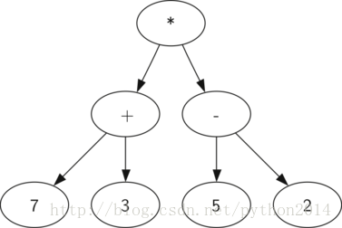
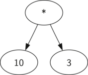
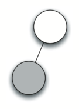
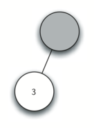
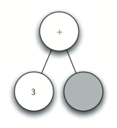
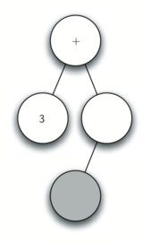
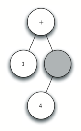
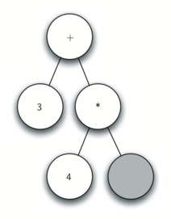
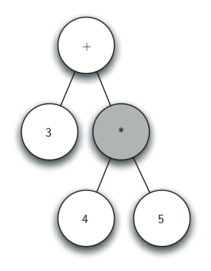

# python 数据结构与算法 38 分析树

## 分析树

树的结构完成以后，该是时候看看它能做点什么实事儿了。这一节里，我们研究一下分析树。分析树能够用于真实世界的结构表示，象语法或数学表达式一类的。


图 1 一个简单语句的分析树

图 1 所示是一个简单语句的层级结构，把语句表示为树结构可以让我们用子树来分析句子的组成部分。



图 2 ((7+3)∗(5−2))的分析树

我们也可以把数学表达式如((7+3)∗(5−2))表示为分析树，如图 2.此前我们研究过完全括号表达式，这个表达式表达了什么呢？我们知道乘法的优先级比加减要高，但因为括号的关系，在做乘法之前，要先完成加减法的计算。树的层级结构能帮助我们理解整个表达式的计算顺序。左子树是加法，求值得 10，减法是右子树，求值得 3.因为树的层级结构，可以用求得的值代替左右子树，这样就可以直接计算乘法了。



图 3 ((7+3)∗(5−2))的简化分析树

本章其余部分我们研究分析树的更多细节，特别是要研究：

*   对完全括号表达式怎样构建分析树。
*   怎样对分析树的表达式求值
*   怎样从分析树还原数学表达式。

构建分析树，第一步是把表达式分解成符号保存在列表里。这里面有 4 种符号：左括号，右括号，操作符，操作数。我们知道每当读到一个左括号，就是新开一个表达式，这时就要新建一个子树来对应括号内的表达式。相反地，每读到一个右括号，这个子表达式就结束了。另外我们也要知道，操作数总是操作符的叶子。最后我们要知道，每个操作符都有左右两个孩子。

知道了以上信息，我们可以给出以下规则：

1.   如果当前符号是’(‘，新增一个节点作为当前节点的左孩子，并下沉到这个左孩子。

2.   如果当前符号在  ['+','-','/','*'],把当前节点的值赋为当前符号，并且为当前节点增加一个右孩子，并下沉到这个右孩子。

3.   如果当前符号是一个数字，把当前节点值设为这个数，返回到父母节点。

4.   如果当前符号是‘）’,返回到父母节点。

开始写代码之前，我们先看一看上面的规则是怎样运作的。以表达式 (3+(4∗5))为例，我们把它分析成字符列表['(', '3', '+', '(', '4', '*', '5',')',')'].，我们从一个只含有空根节点的分析树开始，如图 4 所示为结构，和每一次操作后的内容。


新建空节点



读到左括号，规则 1



读到 3，规则 3



读到+，规则 2



读到左括号，规则 1



读到数字 4，规则 3



读到*，规则 2



读到数字 5，规则 3

图 4 跟踪分析树构建

按图 4，步骤是这样的的：

1.  建一个空树
2.  读入第一个符号（，按规则 1，新建一个节点作为根的左孩子。把左孩子作为当前节点。
3.  读入第二个符号 3，按规则 3，将节点值设为 3，并返回到它的父母。
4.  读入第三个符号+，按规则 2，将节点值设为+并增加右孩子，并作为当前节点
5.  读入第四个符号（，按规则 1，新建一个节点，作为当前节点的左孩子，并设为当前节点
6.  读入第五个符号 4，按规则 3，节点值设为 4，将它的父母作为当前节点。
7.  读入下一个符号*，按规则 2，当前节点值设为*并新建一个右节点。新节点设为当前节点。
8.  读入下一个符号 5，按规则 3，当前节点值设为 5，它的父母作为当前节点。
9.  读入下一个符号），按规则 4，*的父母成为当前节点
10.  读入下一个符号），按规则 4，+的父母作为当前节点。+没有父母，操作结束。

从上面的例子很清楚地看到，我们必须保持对“当前节点”和它的“父母节点”的跟踪。树的接口已经提供了获得孩子节点的方法，getLeftChild 和 getRightChild  但是怎样跟踪父母呢？一个简单方法就是使用栈，每当下沉到当前节点的孩子时，先把当前节点压栈，当要返回到当前节点的父母时，从栈中弹出。

使用以上规则，加上 Stack 和 BinaryTree 的操作，现在我们可以写分析树的代码了。如下：

```py
from pythonds.basic.stack import Stack
from pythonds.trees.binaryTree import BinaryTree

def buildParseTree(fpexp):
    fplist = fpexp.split()
    pStack = Stack()
    eTree = BinaryTree('')
    pStack.push(eTree)
    currentTree = eTree
    for i in fplist:
        if i == '(':
            currentTree.insertLeft('')
            pStack.push(currentTree)
            currentTree = currentTree.getLeftChild()
        elif i not in ['+', '-', '*', '/', ')']:
            currentTree.setRootVal(int(i))
            parent = pStack.pop()
            currentTree = parent
        elif i in ['+', '-', '*', '/']:
            currentTree.setRootVal(i)
            currentTree.insertRight('')
            pStack.push(currentTree)
            currentTree = currentTree.getRightChild()
        elif i == ')':
            currentTree = pStack.pop()
        else:
            raise ValueError
    return eTree

pt = buildParseTree("( ( 10 + 5 ) * 3 )")
pt.postorder()  #下节讲到

```

上面代码中，我们讲过的四规则，分别体现在 if 语句的四个分枝中，即 11，15，19 和 24 行。在每种情况下，都可以看到规则的实现，包括几次对 BinaryTree 或 Stack 的调用。唯一的错误检查在 else 子句中，升起一个 ValueError 异常，应对从列表中得到一个不能识别的字符的情况。

现在分析树已经建起来了，怎样用呢？作为第一个例子，我们写一个函数来求分析树的值，返回计算结果。写这个函数要用到树的层级结构，回头看看图 2 记得我们用图 3 中的简化树代替了原来的树，这提示我们写一个递归算法对子树求值。

以前我们做过递归算法了，这次我们从设计递归的基点开始。树的自然基点是叶子。在分析树中，叶子节点总是操作数，象整数或浮点数之类的数字对象不需要更多操作，所以 evaluate 函数可以直接返回它的值。递归走向基点的的方法是对左右孩子使用 evaluate 函数。

要把两个递归调用的结果合在一起，只需要简单地对这两个结果应用存在父母节点的操作符，在图 3 的例子中，我们可以看到两个孩子自己求值，各得 10 和 3，对他们应用乘法，得到最终结果 30

递归函数 evaluate 见 linsting 1。首先，要得到左右孩子的引用，如果左右孩子都是 None，那么当前节点是叶子。这个检查过程在第 7 行。如果不是叶子，查找当前节点的操作符，并用到它左右孩子的返回值上。

在算法中，使用了字典数据类型，其中键值是 '+', '-', '*'和 '/'。数值部分是 python 中 operator 模块的函数。Operator 模块提供了常用操作符的函数版，这样当我们查找操作符的时候，返回相应的函数。既然是函数，我们可以用函数方式来计算算式。比如我们查找 opers'+' ，等价于 operator.add(2,2).

**Listing 1**

```py
def evaluate(parseTree):
    opers = {'+':operator.add, '-':operator.sub, '*':operator.mul, '/':operator.truediv}

    leftC = parseTree.getLeftChild()
    rightC = parseTree.getRightChild()

    if leftC and rightC:
        fn = opers[parseTree.getRootVal()]
        return fn(evaluate(leftC),evaluate(rightC))
    else:
        return parseTree.getRootVal()

```

最后，我们用图 4 中的例子来跟踪求值函数 evaluate  。当调用 evaluate,，我们把一整个子树作为参数传递过去。然后我们得到左右子树的引用以确认他们是存在的。递归调用发生在第 9 行，开始查找根节点的操作符，这里是 '+'，它对应的函数是 operator.add ，需要两个参数。象一般的 python 函数一样，它要做的第一件事情就是计算两个参数的函数值。在本例中，两个参数都是对 evaluate 的递归调用。从左到右求值，第一个递归函数得到了左子树，发现这个节点没有孩子，所以是叶子。在叶子节点上，仅仅返回它的数值就可以，这里返回了整数 3。

此时我们的顶级调用 operator.add 的一个参数已经算出来了，但还没完。继续从左到右的求值，现在求右子树的值，发现它有左右孩子，根值是*，再对它的两个孩子调用函数，这时发现它的左右孩子是叶子，分别返回两个整数 4 和 5，用这两个参数计算 operator.mul(4,5)。这时，顶级调用+的左右子树已经计算出来，这时要计算 operator.add(3,20)。最终的结果是 23.