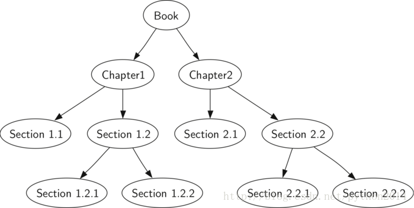

# python 数据结构与算法 39 树的遍历

## 树的遍历

在学习完成树的基本结构以后，我们开始研究一些树的应用模式。访问树的全部节点，一般有三种模式，这些模式的不同之处，仅在于访问节点的顺序不同。我们把这种对节点的访问称为“遍历”，这三种遍历模式叫做前序、中序和后序。下面我们对遍历模式作更仔细的定义，同时研究使用这延续模式的例子。

## **前序遍历**

在前序遍历中，先访问根节点，然后用递归方式前序遍历它的左子树，最后递归方式前序遍历右子树。

## **中序遍历**

在中序遍历中，先递归中序遍历左子树，然后访问根节点，最后递归中序遍历右子树。

## **后序遍历**

在后序遍历中，先递归后序遍历左子树，然后是右子树，最后是根节点。

我们来看几种遍历的实例。第一个是前序遍历，象读一本书一样。书本是根节点，每一章是一个孩子，每一节又是本章的孩子，等等。图 5 所示是一本书局部章节结构，只有 2 章。注意遍历算法结构可用于任意多个孩子，这里只谈二叉树。



图 5 一本书的树形结构

我们要从头到尾读书的时候，正好就是一个前序遍历。从整本书开始，然后递归阅读左孩子即第一章标题，然后是读第一章第一节标题，即 1.1。1.1 没有孩子，不再递归，可以读本节的内容，读完 1.1，再读 1.2，1.2 有孩子，我们要先读 1.2.1，再读 1.2.2 。1.2 完成后，回到第一章，这时再读第二章。

树的遍历代码简洁得令人惊讶，这很大程度上是因为用了递归的技术。Listing2 是二叉树的前序遍历代码。

你也许在想，怎样写遍历算法好呢？是写一个以树作为参数的外部函数呢，还是在树的类里加个方法呢？[*Listing 2*](http://interactivepython.org/courselib/static/pythonds/Trees/bintreeapps.html#lst-preorder1) 显示的方法是外部函数，使用二叉树作为参数。外部函数比较简洁，因为只需要检查一下树的存在。如果不存在，函数直接返回，不作任何计算。

**Listing 2**

```py
def preorder(tree):
    if tree:
        print(tree.getRootVal())
        preorder(tree.getLeftChild())
        preorder(tree.getRightChild())

```

也可以在 BinaryTree 类里写一个方法，实现代码见 [*Listing 3*](http://interactivepython.org/courselib/static/pythonds/Trees/bintreeapps.html#lst-preorder2)。注意从外部称到类的内部时，有什么变化。一般情况下，只需要用 self 取代 tree，但是还要修改基点。内部方法必须检查左右孩子是否存在。

**Listing 3**

```py
def preorder(self):
    print(self.key)
    if self.leftChild:
        self.left.preorder()
    if self.rightChild:
        self.right.preorder()

```

上面两种方法哪种比较好？在这里， preorder 作为一个外部函数比较好，原因是，我们很少是为了遍历而遍历，这个过程中总是要做点事情的，事实上后面我们在后序遍历中举例使用的方法就很象此前我们用过的计算分析树的的代码，所以其余的代码我们都用了外部函数的方法。

Listing4 中使用的 postorder 即后序遍历，与前序遍历很相近，区别只是把打印方法移到了函数的后面。

回看 listing1 一遍，我们会看到后序遍历的一个普通用法，即分析树求值。我们的做法是，计算左右子树的值，然后用操作函数结合在一起。假设二叉树只保存表达式，我们来重写求值函数，但是模型更为接近 listing 4 的 postorder 代码。

**Listing 5**

```py
def postordereval(tree):
    opers = {'+':operator.add, '-':operator.sub, '*':operator.mul, '/':operator.truediv}
    res1 = None
    res2 = None
    if tree:
        res1 = postordereval(tree.getLeftChild())
        res2 = postordereval(tree.getRightChild())
        if res1 and res2:
            return operstree.getRootVal()
        else:
            return tree.getRootVal()

```

注意 listing 4 和 listing 5 的结构相近，只是后者没有打印键值，而是作了返回动作。这样我们可以让第 6 和 7 行那样，保存递归调用中返回的数值，以便在第 9 行使用这些值。

我们要研究的最后个遍历是中序。中序过程是这样的，先造访左孩子，然后是根，最后到右孩子。Listing 6 是中序的代码。现在可以注意到，所有的遍历中，只是 print 语句的位置不同而已。

**Listing 6**

**def**inorder(tree):

  **if** tree !=None:

     inorder(tree.getLeftChild())

     **print**(tree.getRootVal())

     inorder(tree.getRightChild())

当我们对一个分析树作中序遍历时，得到表达式的原来形式，没有任何括号。我们来修改算法以得到表达式的完全括号式。对基础模板做的唯一变更是：在调用左子树之前，先输出一个左括号，然后在调用右子之树之后，输出一个右括号。修改后的代码如 Listing7:

**Listing 7**

```py
def printexp(tree):
  sVal = ""
  if tree:
      sVal = '(' + printexp(tree.getLeftChild())
      sVal = sVal + str(tree.getRootVal())
      sVal = sVal + printexp(tree.getRightChild())+')'
  return sVal

```

不过上面的实现中，在每个数字上都加上了括号，这肯定是多余的。这个完善工作留作练习。