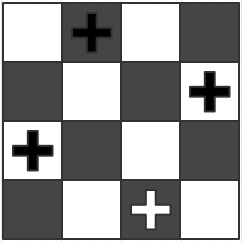

# 第九章 魔法方法、属性和迭代器

> 来源：[`www.cnblogs.com/Marlowes/p/5437223.html`](http://www.cnblogs.com/Marlowes/p/5437223.html)
> 
> 作者：Marlowes

在 Python 中，有的名称会在前面和后面都加上两个下划线，这种写法很特别。前面几章中已经出现过一些这样的名称(如`__future__`)，这种拼写表示名字有特殊含义，所以绝不要在自己的程序中使用这样的名字。在 Python 中，由这些名字组成的集合所包含的方法称为魔法(或特殊)方法。如果对象实现了这些方法中的某一个，那么这个方法会在特殊的情况下(确切地说是根据名字)被 Python 调用。而几乎没有直接调用它们的必要。

本章会详细讨论一些重要的魔法方法(最重要的是`__init__`方法和一些处理对象访问的方法，这些方法允许你创建自己的序列或者映射)。本章还会讲两个相关的主题：属性(在以前版本的 Python 中通过魔法方法来处理，现在通过`property`函数)和迭代器(使用魔法方法`__iter__`来允许迭代器在`for`循环中使用)，本章最后还有一个相关的示例，其中有些知识点已经介绍过，可以用于处理一些相对复杂的问题。

## 9.1 准备工作

很久以前(Python2.2 中)，对象的工作方式就有了很大的改变。这种改变产生了一些影响，对于刚开始使用 Python 的人来说，大多数改变都不是很重要(在 Alex Martelli 所著的《Python 技术手册》(*Python in a Nutshell*)的第八章有关与旧式和新式类之间区别的深入讨论)。值得注意的是，尽管可能使用的是新版的 Python，但一些特性(比如属性和`super`函数)不会在旧式的类上起作用。为了确保类是新式的，应该把赋值语句`__metaclass__ = type`放在你的模块的最开始(第七章提到过)，或者(直接或者间接)子类化内建类(实际上是类型)`object`(或其他一些新式类)。考虑下面的两个类。

```py
class NewStyle(object):
    more_code_here
class OldStyle:
    more_code_here 
```

在这两个类中，`NewStyle`是新式的类，`OldStyle`是旧式的类。如果文件以`__metaclass__ = type`开始，那么两个类都是新式类。

*注：除此之外，还可以在自己的类的作用域中对`__metaclass__`变量赋值。这样只会为这个类设定元类。元类就是其他类(或类型)的类——这是个更高及的主题。要了解关于元类的更多信息，请参见 Guido van Rossum 的技术性文章[Unifying types and classes in Python 2.2](http://python.org/2.2/descrintro.html)。或者在互联网上搜索术语 python metaclasses。*

在本书所有示例代码中都没有显式地设定元类(或者子类化`object`)。如果要没有兼容之前旧版本 Python 的需要，建议你将所有类写为新式的类，并使用`super`函数(稍后会在 9.2.3 节讨论)这样的特性。

*注：在 Python3.0 中没有“旧式”的类，也不需要显式地子类化`object`或者将元类设为`type`。所有的类都会隐式地成为`object`的子类——如果没有明确超类的话，就会直接子类化；否则会间接子类化。*

## 9.2 构造方法

首先要讨论的第一个魔法方法是构造方法。如果读者以前没有听过*构造方法*这个词，那么说明一下：构造方法是一个很奇特的名字，它代表着类似于以前例子中使用过的那种名为`init`的初始化方法。但构造方法和其他普通方法不同的地方在于，当一个对象被创建后，会立即调用构造方法。因此，刚才我做的那些工作现在就不用做了：

```py
>>> f = FooBar()
>>> f.init()
# 构造方法能让它简化成如下形式:
>>> f = FooBar() 
```

在 Python 中创建一个构造方法很容易。只要把`init`方法的名字从简单的`init`修改为魔法版本`__init__`即可：

```py
>>> class FooBar:
... def __init__(self):
...         self.somevar = 19
...
>>> f = FooBar()
>>> f.somevar
19 
```

现在一切都很好。但如果给构造方法传几个参数的话，会有什么情况发生呢？看看下面的代码：

```py
class FooBar:
    def __init__(self, value=19):
        self.somevar = value 
```

你认为可以怎样使用它呢？因为参数是可选的，所以你可以继续，，当什么事也没发生。但如果要使用参数(或者不让参数是可选的)的时候会发生什么？我相信你已经猜到了，一起来看看结果吧：

```py
>>> f = FooBar("This is a constructor argument")
>>> f.somevar 'This is a constructor argument' 
```

在 Python 所有的魔法方法中，`__init__`是使用最多的一个。

*注：Python 中有一个魔法方法叫做`__del__`，也就是析构方法。它在对象就要被垃圾回收之前调用。但发生调用的具体时间是不可知的。所以建议读者尽力避免使用`__del__`函数。*

### 9.2.1 重写一般方法和特殊的构造方法

第七章中介绍了继承的知识。每个类都可能拥有一个或多个超类，它们从超类那里继承行为方式。如果一个方法在 B 类的一个实例中被调用(或一个属性被访问)，但在 B 类中没有找到该方法，那么就会去它的超类 A 里面找。考虑下面的两个类：

```py
class A:
    def Hello(self):
        print "Hello, I'm A."

class B(A):
    pass 
```

A 类定义了一个叫做`Hello`的方法，被 B 类继承。下面是一个说明类是如何工作的例子：

```py
>>> a = A()
>>> b = B()
>>> a.hello()
Hello, I'm A.
>>> b.hello()
Hello, I'm A. 
```

因为 B 类没有定义自己的`Hello`方法，所以当`hello`被调用时，原始的信息就被打印出来。

在子类中增加功能的最基本的方法就是增加方法。但是也可以重写一些超类的方法来自定义继承的行为。B 类也能重写这个方法。比如下面的例子中 B 类的定义就被修改了。

```py
class B(A):
    def hello(self):
        print "Hello, I'm B." 
```

使用这个定义，`b.hello()`能产生一个不同的结果。

```py
>>> b = B()
>>> b.hello()
Hello, I'm B. 
```

重写是继承机制中的一个重要内容，对于构造方法尤其重要。构造方法用来初始化新创建对象的状态，大多数子类不仅要拥有自己的初始化代码，还要拥有超类的初始化代码。虽然重写的机制对于所有方法来说都是一样的，但是当处理构造方法比重写方法时，更可能遇到特别的问题：如果一个类的构造方法被重写，那么就需要调用超类(你所继承的类)的构造方法，否则对象可能不会被正确地初始化。

考虑下面的`Bird`类：

```py
class Bird:
    def __init__(self):
        self.hungry = True
    def eat(self):
        if self.hungry:
            print "Aaaah..."
            self.hungry = False
        else:
            print "No, thanks!" 
```

这个类定义所有的鸟都具有的一些最基本的能力：吃。下面就是这个类的用法示例：

```py
>>> b = Bird()
>>> b.eat()
Aaaah...
>>> b.eat()
No, thanks! 
```

就像能在这个例子中看到的，鸟吃过了以后，它就不再饥饿。现在考虑子类`SongBird`，它添加了唱歌的行为：

```py
class SongBird(Bird):
    def __init__(self):
        self.sound = "Squawk!"

    def sing(self):
        print self.sound 
```

`SongBird`类和`Bird`类一样容易使用：

```py
>>> sb = SongBird()
>>> sb.sing()
Squawk! 
```

因为`SongBird`和`Bird`的一个子类，它继承了`eat`方法，但如果调用`eat`方法，就会产生一个问题：

```py
>>> sb.eat()
Traceback (most recent call last):
  File "<stdin>", line 1, in ?
  File "Magic_Methods.py", line 27, in eat if self.hungry:
AttributeError: SongBird instance has no attribute 'hungry' 
```

异常很清楚地说明了错误：`SongBIrd`没有`hungry`特性。原因是这样的：在`SongBird`中，构造方法被重写，但新的构造方法没有任何关于初始化`hungry`特性的代码。为了达到预期的效果，`SongBird`的构造方法必须调用其超类`Bird`的构造方法来确保进行基本的初始化。有两种方法能达到这个目的：调用超类构造方法的未绑定版本，或者使用 super 函数。后面两节会介绍这两种技术。

### 9.2.2 调用未绑定的超类构造方法

本节所介绍的内容只要是历史遗留问题。在目前版本的 Python 中，使用`super`函数(下一节会介绍)会更为简单明了(在 Python3.0 中更是如此)。但是很多遗留的代码还会使用本节介绍的方法，所以读者还是要了解一些。而且它很有用，这是一个了解绑定和未绑定方法之间区别的好例子。

那么下面进入实际内容。不要被本节的标题吓到，放松。其实调用超类的构造方法很容易(也很有用)。下面我先给出在上一节末尾提出的问题的解决方法。

```py
class SongBird(Bird):
    def __init__(self):
        Bird.__init__(self)
        self.sound = "Squawk!"

    def sing(self):
        print self.sound 
```

`SongBird`类中至添加了一行代码——`Bird.__init__(self)`。在解释这句话真正的含义之前，首先来演示一下执行效果：

```py
>>> sb = SongBird()
>>> sb.sing()
Squawk!
>>> sb.eat()
Aaaah...
>>> sb.eat()
No, thanks! 
```

为什么会有这样的结果？在调用一个实例的方法时，该方法的`self`参数会被自动绑定到实例上(这称为绑定方法)。前面已经给出几个类似的例子了。但是如果直接调用类的方法(比如`Bird.__init__`)，那么就没有实例会被绑定。这样就可以自由地提供需要的`self`参数。这样的方法称为未绑定(unbound)方法，也就是这节标题中所提到的。

通过将当前的实例作为`self`参数提供给未绑定方法，`SongBird`就能够使用其超类构造方法的所有实现，也就是说属性`hungry`能被设置。

9.2.3 使用`super`函数

如果读者不想坚守旧版本的 Python 阵营，那么就应该使用`super`函数。它只能在新式类中使用，不管怎么样，你都应该尽量使用新式类。当前的类和对象可以作为`super`函数的参数使用，调用函数返回的对象的任何方法都是调用超类的方法，而不是当前类的方法。那么就可以不用在 SongBird 构造方法中使用`Bird`，而直接调用`super(SongBird, self`)。除此之外，`__init__`方法能以一个普通的(绑定)方式被调用。

*注：在 Python3.0 中，`super`函数可以不带任何参数进行调用，功能依然具有“魔力”。*

下面的例子是对`Bird`(注意`Bird`是`object`的子类，这样它就成为了一个新式类)例子的更新：

```py
# super 函数只在新式类中起作用
__metaclass__ = type  

class Bird:
    def __init__(self):
        self.hungry = True
    def eat(self):
        if self.hungry:
            print "Aaaah..."
            self.hungry = False
        else:
            print "No, thanks!"

class SongBird(Bird):
    def __init__(self):
        super(SongBird, self).__init__()
        self.sound = "Squawk!"

    def sing(self):
        print self.sound 
```

这个新式的版本的运行结果和旧式版本的一样：

```py
>>> sb = SongBird()
>>> sb.sing()
Squawk!
>>> sb.eat()
Aaaah...
>>> sb.eat()
No, thanks! 
```

**为什么`super`函数这么超级**

在我看来，`super`函数比在超类中直接调用未绑定方法更直观。但这并不是它的唯一优点。`super`函数实际上是很智能的，因此即使类已经继承多个超类，它也只需要使用一次`super`函数(但要确保所有的超类的构造方法都使用了`super`函数)。在一些含糊的情况下使用旧式类会很别扭(比如两个超类共同继承一个超类)，但能被新式类和`super`函数自动处理。内部的具体工作原理不用理解，但必须清楚地知道：在大多数情况下，使用新式类和 super 函数是比调用超类的未绑定的构造方法(或者其他的方法)更好的选择。

那么，`super`函数到底返回什么？一般来说读者不用担心这个问题，就假装它返回的所需的超类好了。实际上它返回了一个`super`对象，这个对象负责进行方法解析。当对其特性进行访问时，它会查找所有的超类(以及超类的超类)，直到找到所需的特性为止(或者引发一个`AttributeError`异常)。

## 9.3 成员访问

尽管`__init__`是目前为止提到的最重要的特殊方法，但还有一些其他的方法提供的作用也很重要。本节会讨论常见的魔法方法的集合，它可以创建行为类似于序列或映射的对象。

基本的序列和映射的规则很简单，但如果要实现它们全部功能就需要实现很多魔法函数。幸好，还是有一些捷径的，下面马上会说到。

*注：规则(protocol)这个词在 Python 中会经常使用，用来描述管理某种形式的行为的规则。这与第七章中提到的接口的概念有点类似。规则说明了应该实现何种方法和这些方法应该做什么。因为 Python 中的多态性是基于对象的行为的(而不是基于祖先，例如它所属的类或超类，等等)。这是一个重要的概念：在其他的语言中对象可能被要求属于某一个类，或者被要求实现某个接口，但 Python 中只是简单地要求它遵循几个给定的规则。因此成为了一个序列，你所需要做的只是遵循序列的规则。*

### 9.3.1 基本的序列和映射规则

序列和映射是对象的集合。为了实现它们基本的行为(规则)，如果对象是不可变的，那么就需要使用两个魔法方法，如果是可变的则需要四个。

☑ `__len__(self)`：这个方法应该返回级和中所含项目的数量。对于序列来说，这就是元素的个数；对于映射来说，则是键-值对的数量。如果`__len__`返回 0(并且没有实现重写该行为的`__nozero__`)，对象会被当作一个布尔变量中的假值(空的列表、元组、字符串和字典也一样)进行处理。

☑ `__getitem__(self, key)`：这个方法返回与所给的键对应的值。对于一个序列，键应该是一个 0～n-1 的整数(或者像后面所说的负数)，n 是序列的长度；对于映射来说，可以使用任何种类的键。

☑ `__setitem__(self, key, value)`：这个方法应该按一定的方式存储和 key 相关的 value，该值随后可使用`__getitem__`来获取。当然，只能为可以修改的对象定义这个方法。

☑ `__delitem__(self, key)`：这个方法在对一部分对象使用 del 语句时被调用，同时必须删除和键相关的键。这个方法也是为可修改的对象定义的(并不是删除全部的对象，而只删除一些需要移除的元素)。

对于这些方法的附加要求如下。

☑ 对于一个序列来说，如果键是负整数，那么要从末尾开始计数。换句话说就是`x[-n]`和`x[len(x)-n]`是一样的。

☑ 如果键是不合适的类型(例如，对序列使用字符串作为键)，会引发一个`TypeError`异常。

☑ 如果序列的索引是正确的类型，但超出了范围，应该引发一个`IndexError`异常。

让我们实践一下，看看如果创建一个无穷序列，会发生什么：

```py
__metaclass__ = type
def checkindex(key):
    """ 所给的键是能接受的索引吗？
        为了能被接受，键应该是一个非负的整数。如果它不是一个整数，会引发 TypeError；
        如果它是负数，则会引发 IndexError(因为序列是无限长的)。 """

    if not isinstance(key, (int, long)):
        raise TypeError
    if key < 0:
        raise IndexError
class ArithmeticSequence:
    def __init__(self, start=0, step=1):
        """ 初始化算术序列
        起始值——序列中的第一个值
        步长——两个相邻值之间的差别
        改变——用户修改的值的字典 """
        self.start = start  # 保存开始值
        self.step = step  # 保存步长值
        self.changed = {}  # 没有项被修改

    def __getitem__(self, key):
        """ Get an item from the arithmetic sequence. """
        checkindex(key)
        try:
            # 修改了吗？
            return self.changed[key]  
        except KeyError:  
            # 否则······
            # ······计算值
            return self.start + key * self.step  

    def __setitem__(self, key, value):
        """ 修改算术序列中的一个项 """
        checkindex(key)
        # 保存更改后的值
        self.changed[key] = value 
```

这里实现的是一个*算术序列*，该序列中的每个元素都比它前面的元素大一个常数。第一个值是由构造方法参数`start`(默认为 0)给出的，而值与值之间的步长是由`step`设定的(默认为 1).用户能将特例规则保存在名为`changed`的字典中，从而修改一些元素的值，如果元素没有被修改，那就计算`self.start + key * self.steo`的值。

下面是如何使用这个类的例子：

```py
>>> s = ArithmeticSequence(1, 2)
>>> s[4] 9
>>> s[4] = 2
>>> s[4] 2
>>> s[5] 11 
```

注意，没有实现`__del__`方法的原因是我希望删除元素是非法的：

```py
>>> del s[4]
Traceback (most recent call last):
  File "ArithmeticSequence.py", line 66, in <module>
    del s[4]
AttributeError: __delitem__ 
```

这个类没有`__len__`方法，因为它是无限长的。

如果使用了一个非法类型的索引，就会引发`TypeError`异常，如果索引的类型是正确的但超出了范围(在本例中为负数)，则会引发`IndexError`异常：

```py
>>> s["four"]
Traceback (most recent call last):
  File "/home/marlowes/Program/Py_Project/ArithmeticSequence.py", line 66, in <module> s["four"]
  File "/home/marlowes/Program/Py_Project/ArithmeticSequence.py", line 44, in __getitem__ checkindex(key)
  File "/home/marlowes/Program/Py_Project/ArithmeticSequence.py", line 18, in checkindex raise TypeError
TypeError
>>> s[-42]
Traceback (most recent call last):
  File "/home/marlowes/Program/Py_Project/ArithmeticSequence.py", line 66, in <module> s[-42]
  File "/home/marlowes/Program/Py_Project/ArithmeticSequence.py", line 44, in __getitem__ checkindex(key)
  File "/home/marlowes/Program/Py_Project/ArithmeticSequence.py", line 21, in checkindex raise IndexError
IndexError 
```

索引检查是通过用户自定义的`checkindex`函数实现的。

有一件关于`checkindex`函数的事情可能会让人吃惊，即`isinstance`函数的使用(这个函数应尽量避免使用，因为类或类型检查和 Python 中多态的目标背道而驰)。因为 Python 的语言规范上明确指出索引必须是整数(包括长整数)，所以上面的代码才会如此使用。遵守标准是使用类型检查的(很少的)正当理由之一。

注：分片操作也是可以模拟的。当对支持`__getitem__`方法的实例进行分片操作时，分片对象作为键提供。分片对象在[Python 库参考](http://python.org/doc/lib)的 2.1 节中 slice 函数部分有介绍。Python2.5 有一个更加专门的方法叫做`__index__`，它允许你在分片中使用非整形限制。只要你想处理基本序列规则之外的事情，那么这个方法尤其有用。

### 9.3.2 子类化列表，字典和字符串

到目前为止本书已经介绍了基本的序列/映射规则的 4 个方法，官方语言规范也推荐实现其他的特殊方法和普通方法(参见[Python 参考手册的 3.4.5 节] [`www.python.org/doc/ref/sequence-types.html)，包括 9.6 节描述的`__iter\__`方法在内。实现所有的这些方法(为了让自己的对象和列表或者字典一样具有多态性)是一项繁重的工作，并且很难做好。如果只想在一个操作中自定义行为，那么其他的方法就不用实现。这就是程序员的懒惰(也是常识)。`](http://www.python.org/doc/ref/sequence-types.html)，包括 9.6 节描述的`__iter\__`方法在内。实现所有的这些方法(为了让自己的对象和列表或者字典一样具有多态性)是一项繁重的工作，并且很难做好。如果只想在一个操作中自定义行为，那么其他的方法就不用实现。这就是程序员的懒惰(也是常识)。)

那么应该怎么做呢？关键词是*继承*。能继承的时候为什么还要全部实现呢？标准库有 3 个关于序列和映射规则(`UserList`、`UserString`和`UserDict`)可以立即使用的实现，在较新版本的 Python 中，可以子类化内建类型(注意，如果类的行为和默认的行为很接近这就很有用，如果需要重新实现大部分方法，那么还不如重新写一个类)。

因此，如果希望实现一个和内建列表行为相似的序列，可以子类化`list`来实现。

*注：当子类化一个内建类型——比如`list`的时候，也就间接地将`object`子类化了。因此该类就自动成为新式类，这就意味着可以使用像`super`函数这样的特性了。*

下面看看例子，带有访问计数的列表。

```py
__metaclass__ = type
class CounterList(list):
    def __init__(self, *args):
        super(CounterList, self).__init__(*args)
        self.counter = 0
    def __getitem__(self, index):
        self.counter += 1
        return super(CounterList, self).__getitem__(index) 
```

`CounterList`类严重依赖于它的超类(`list`)的行为。`CounterList`类没有重写的任何方法(和`append`、`extend`、`index`一样)都能被直接使用。在两个被重写的方法中，`super`方法被用来调用相应的超类的方法，只在`__init__`中添加了所需的初始化`counter`特性的行为，并在`__getitem__`中更新了`counter`特性。

*注：重写`__getitem__`并非获取用户访问的万全之策，因为还有其他访问列表内容的途径，比如通过`pop`方法。*

这里是`CounterList`如何使用的例子：

```py
>>> cl = CounterList(range(10))
>>> cl
[0, 1, 2, 3, 4, 5, 6, 7, 8, 9]
>>> cl.reverse()
>>> cl
[9, 8, 7, 6, 5, 4, 3, 2, 1, 0]
>>> del cl[3:6]
>>> cl
[9, 8, 7, 3, 2, 1, 0]
>>> cl.counter
0
>>> cl[4] + cl[2]
9
>>> cl.counter
2 
```

正如看到的，`CounterList`在很多方面和列表的作用一样，但它有一个`counter`特性(被初始化为 0)，每次列表元素被访问时，它都会自增，所以在执行加法`cl[4] + cl[2]`后，这个值自增两次，变为 2。

## 9.4 更多魔力

魔法名称的用途有很多，我目前所演示的只是所有用途中的一小部分。大部分的特殊方法都是为高级的用法准备的，所有我不会在这里详细讨论。单是如果感兴趣，可以模拟数字，让对象像函数那样被调用，影响对象的比较，等等。关于特殊函数的更多内容请参考[《Python 参考手册》中的 3.4 节](http://www.python.org/doc/ref/specialnames.html)。

## 9.5 属性

第七章曾经提到过访问器方法。访问器是一个简单的方法，它能够使用`getHeight`、`setHeight`这样的名字来得到或者重绑定一些特性(可能是类的私有属性——具体内容请参见第七章的“再论私有化”的部分)。如果在访问给定的特性时必须要采取一些行动，那么像这样的封装状态变量(特性)就很重要。比如下面例子中的`Rectangle`类：

```py
__metaclass__ = type
class Rectangle:
    def __init__(self):
        self.width = 0
        self.height = 0
    def setSize(self, size):
        self.width, self.height = size
    def getSize(self):
        return self.width, self.height 
```

下面的例子演示如何使用这个类：

```py
>>> r = Rectangle()
>>> r.width = 10
>>> r.height = 5
>>> r.getSize()
(10, 5)
>>> r.setSize((150, 100))
>>> r.width 150 
```

在上面的例子中，`getSize`和`setSize`方法是一个名为`size`的假想特性的访问器方法，`size`是由`width`和`height`构成的元组。读者可以随意使用一些更有趣的方法替换这里的函数，例如计算面积或者对角线的长度。这些代码没错，但却有缺陷。当程序员使用这个类时不应该还要考虑它是怎么实现的(封装)。如果有一天要改变类的实现，将`size`变成一个真正的特性，这样`width`和`height`就可以动态算出，那么就要把它们放到一个访问器方法中去，并且任何使用这个类的程序都必须重写。客户代码(使用代码的代码)应该能够用同样的方式对待所有特性。

那么怎么解决呢？把所有的属性都放到访问器方法中？这当然没问题。但如果有很多简单的特性，那么就很不现实了(有点笨)。如果那样做就得写很多访问器方法，它们除了返回或者设置特性就不做任何事了。*复制加粘贴式*或*切割代码式*的编程方式显然是很糟糕的(尽管是在一些语言中针对这样的特殊问题很普遍)。幸好，Python 能隐藏访问器方法，让所有特性看起来一样。这些通过访问器定义的特性被称为*属性*。

实际上在 Python 中有两种创建属性的机制。我主要讨论新的机制——只在新式类中使用的 property 函数，然后我会简单地说明一下如何使用特殊方法实现属性。

### 9.5.1 `property`函数

property 函数的使用很简单。如果已经编写了一个像上节的`Rectangle`那样的类，那么只要增加一行代码(除了要子类化`object`，或者使用`__metaclass__ = type`语句以外)：

```py
__metaclass__ = type
class Rectangle:
    def __init__(self):
        self.width = 0
        self.height = 0
    def setSize(self, size):
        self.width, self.height = size
    def getSize(self):
        return self.width, self.height

    size = property(getSize, setSize) 
```

在这个新版的`Rectangle`中，`property`函数创建了一个属性，其中访问器函数被用作参数(先是取值，然后是赋值)，这个属性命名为`size`。这样一来就不再需要担心是怎么实现的了，可以用同样的方式处理`width`、`height`和`size`。

```py
>>> r = Rectangle()
>>> r.width = 10
>>> r.height = 5
>>> r.size
(10, 5)
>>> r.size = 150, 100
>>> r.width
150 
```

很明显，`size`特性仍然取决于`getSize`和`setSize`中的计算。但它们看起来就像普通的属性一样。

*注：如果属性的行为很奇怪，那么要确保你所使用的类为新式类(通过直接或间接子类化`object`，或直接设置元类)；如果不是的话，虽然属性的取值部分还是可以工作，但赋值部分就不一定了(取决于 Python 的版本)，这很让人困惑。*

实际上，`property`函数可以用 0、1、3 或者 4 个参数来调用。如果没有参数，产生的属性既不可读，也不可写。如果只使用一个参数调用(一个取值方法)，产生的属性是只读的。第 3 个参数(可选)是一个用于*删除*特性的方法(它不要参数)。第 4 个参数(可选)是一个文档字符串。`property`的四个参数分别被叫做`fget`、`fset`、`fdel`和`doc`，如果想要第一个属性是只写的，并且有一个文档字符串，可以使用关键字参数的方式来实现。

尽管这一节很短(只是对`property`函数的简单说明)，但它却十分的重要。理论上说，在新式类中应该使用`property`函数而不是访问器方法。

**它是如何工作的**

有的读者很想知道`property`函数是如何实现它的功能的，那么在这里解释一下，不感兴趣的读者可以跳过。实际上，`property`函数不是一个真正的函数，它是其实例拥有很多特殊方法的类，也正是那些方法完成了所有的工作。涉及的方法是`__get__`、`__set__`和`__delete__`。这 3 个方法和在一起，就定义了描述符规则。实现了其中任何一个方法的对象就叫描述符(descriptor)。描述符的特殊之处在于它们使如何被访问的。比如，程序读取一个特性时(尤其是在实例中访问该特性，但该特性在类中定义时)，如果该特性被绑定到了实现了`__get__`方法的对象上，那么就会调用`__get__`方法(结果值也会被返回)，而不只是简单地返回对象。实际上这就是属性的机制，即绑定方法，静态方法和类成员方法(下一节会介绍更多的信息)还有`super`函数。[《Python 参考手册》](http://python.org/doc/ref/descriptors.html)包括有关描述符规则的简单说明。一个更全面的信息源是[Raymond Hettinger 的 How To Guide for Descriptors](http://users.rcn.com/python/download/Descriptor.html)

### 9.5.2 静态方法和类成员方法

在讨论实现属性的旧方法前，先让我们绕道而行，看看另一对实现方法和新式属性的实现方法类似的特征。静态方法和类成员方法分别在创建时分别被装入`staticmethod`类型和`classmethod`类型对象中。静态方法的定义没有`self`参数，且能够被类本身直接调用。类方法在定义时需要名为`cls`的类似于`self`的参数，类成员方法可以直接用类的具体对象调用。但`cls`参数是自动被绑定到类的，请看下面的例子：

```py
__metaclass__ = type
class MyClass:
    def smeth():
        print "This is a static method"
    smeth = staticmethod(smeth)
    def cmeth(cls):
        print "This is a class method of", cls
    cmeth = classmethod(cmeth) 
```

手动包装和替换方法的技术看起来有些单调，在 Python2.4 中，为这样的包装方法引入了一个叫做*装饰器*(decorator)的新语法(它能对任何可调用的对象进行包装，既能够用于方法也能用于函数)。使用`@`操作符，在方法(或函数)的上方将装饰器列出，从而指定一个或者更多的装饰器(多个装饰器在应用时的顺序与指定顺序相反)。

```py
__metaclass__ = type class MyClass:

    @staticmethod
    def smeth():
        print "This is a static method"
    @classmethod
    def cmeth(cls):
        print "This is a class method of", cls 
```

定义了这些方法以后，就可以想下面的例子那样使用(例子中没有实例化类)：

```py
>>> MyClass.smeth()
This is a static method
>>> MyClass.cmeth()
This is a class method of <class '__main__.MyClass'> 
```

静态方法和类成员方法在 Python 中向来都不是很重要，主要原因是大部分情况下可以使用函数或者绑定方法代替。在早期的版本中没有得到支持也是一个原因。但即使看不到两者在当前代码中的大量应用，也不要忽视静态方法和类成员方法的应用(比如工厂函数)，可以好好地考虑一下使用新技术。

### 9.5.3 `__getattr__`、`__setattr__`和它的朋友们

拦截(intercept)对象的所有特性访问是可能的，这样可以用旧式类实现属性(因为`property`方法不能使用)。为了在访问特性的时候可以执行代码。必须使用一些魔法方法。下面的 4 种方法提供了需要的功能(在旧式类中只需要后 3 个)。

☑ `__getattribute__(self, name)`：当特性`name`被访问时自动被调用(只能在新式类中使用)。

☑ `__getattr__(self, name)`：当特性`name`被访问且对象没有相应的特性时被自动调用。

☑ `__setattr__(self, name, value)`：当试图给特性`name`赋值时会被自动调用。

☑ `__delatr__(self, name)`：当试图删除特性`name`时被自动调用。

尽管和使用`property`函数相比有点复杂(而且在某些方面效率更高)，单这些特殊方法是很强大的，因为可以对处理很多属性的方法进行再编码。

下面还是`Rectangle`的例子，但这次使用的是特殊方法：

```py
__metaclass__ = type
class Rectangle:
    def __init__(self):
        self.width = 0
        self.height = 0
    def __setattr__(self, name, value):
        if name == "size":
            self.width, self.height = value
        else:
            self.__dict__[name] = value
    def __getattr__(self, name):
        if name == "size":
            return self.width, self.height
        else:
            raise AttritubeError 
```

这个版本的类需要注意增加的管理细节。当思考这个例子时，下面的两点应该引起读者的重视。

☑ `__setattr__`方法在所涉及的特性不是`size`时也会被调用。因此，这个方法必须把两方面都考虑进去：如果属性是`size`，那么就像前面那样执行操作，否则就要使用特殊方法`__dict__`，该特殊方法包含一个字典，字典里面是所有实例的属性。为了避免`__setattr__`方法被再次调用(这样会使程序陷入死循环)，`__dict__`方法被用来代替普通的特性赋值操作。

☑ `__getattr__`方法只在普通的特性没有被找到的时候调用，这就是说如果给定的名字不是 size，这个特性不存在，这个方法会引起一个`AttritubeError`异常。如果希望类和`hasattr`或者是`getattr`这样的内建函数一起正确地工作，`__getattr__`方法就很重要。如果使用的是`size`属性，那么就会使用在前面的实现中找到的表达式，

*注：就像死循环陷阱和`__setattr__`有关系一样，还有一个陷阱和`__getattribute__`有关系。因为`__getattribute__`拦截所有特性的访问(在新式类中)，也拦截对`__dict__`的访问！访问`__getattribute__`中与`self`相关的特性时，使用超类的`__getattribute__`方法(使用`super`函数)是唯一安全的途径。*

## 9.6 迭代器

在前面的章节中，我提到过迭代器(和可迭代)，本节将对此进行深入讨论。只讨论一个特殊方法——`__iter__`，这个方法是迭代器规则(iterator protocol)的基础。

### 9.6.1 迭代器规则

*迭代*的意思是重复做一些事情很多次，就像在循环中做的那样。到现在为止只在 for 循环中对序列和字典进行过迭代，但实际上也能对其他对象进行迭代：只要该对象实现了`__iter__`方法。

`__iter__`方法会返回一个迭代器(iterator)，所谓的迭代器就是具有`next`方法(这个方法在调用时不需要任何参数)的对象。在调用`next`方法时，迭代器会返回它的下一个值。如果`next`方法被调用，但迭代器没有值可以返回，就会引发一个`StopIteration`异常。

*注：迭代器规则在 Python3.0 中有一些变化。在新的规则中，迭代器对象应该实现`__next__`方法，而不是`next`。而新的内建函数`next`可以用于访问这个方法。换句话说，`next(it)`等同于 3.0 之前版本中的`it.next()`。*

迭代规则的关键是什么？为什么不使用列表？因为列表的杀伤力太大。如果有一个函数，可以一个接一个地计算值，那么在使用时可能是计算一个值时获取一个值——而不是通过列表一次性获取所有值。如果有很多值，列表就会占用太多的内存。但还有其他的理由：使用迭代器更通用、更简单、更优雅。让我们看看一个不使用列表的例子，因为要用的话，列表的长度必须无限。

这里的“列表”是一个斐波那契数列。使用的迭代器如下：

```py
__metaclass__ = type
class Fibs:
    def __init__(self):
        self.a = 0
        self.b = 1

    def next(self):
        self.a, self.b = self.b, self.a + self.b
        return self.a
    def __iter__(self):
        return self 
```

注意，迭代器实现了`__iter__`方法，这个方法实际上返回迭代器本身。在很多情况下，`__iter__`会放到其他的会在`for`循环中使用的对象中。这样一来，程序就能返回所需的迭代器。此外，推荐使迭代器实现它自己的`__iter__`方法，然后就能直接在`for`循环中使用迭代器本身了。

*注：正式的说法是，一个实现了`__iter__`方法的对象是可迭代的，一个实现了`__next__`方法的对象则是迭代器。*

首先，产生一个`Fibs`对象：

```py
>>> fibs = Fibs() 
```

可在`for`循环中使用该对象——比如去查找在斐波那契数列中比 1000 大的数中的最小的数：

```py
for f in fibs:
    if f > 1000:
        print f break ··· 1597 
```

因为设置了`break`，所以循环在这里停止了，否则循环会一直继续下去。

*注：内建函数`list`可以从可迭代的对象中获得迭代器。*

```py
>>> it = iter([1, 2, 3])
>>> it.next()
1
>>> it.next()
2 
```

*除此之外，它也可以从函数或者其他可调用对象中获取可迭代对象(请参见[Python 库参考](http://docs.python.org/lib/)获取更多信息)。*

### 9.6.2 从迭代器得到序列

除了在迭代器和可迭代对象上进行*迭代*(这是经常做的)外，还能把它们转换为序列。在大部分能使用序列的情况下(除了在索引或者分片等操作中)，都能使用迭代器(或者可迭代对象)替换。关于这个的一个很有用的例子是使用`list`构造方法显式地将迭代器转化为列表。

```py
__metaclass__ = type
class TestIterator:
    value = 0
    def next(self):
        self.value += 1
        if self.value > 10:
            raise StopIteration
        return self.value
    def __iter__(self):
        return self

···
>>> ti = TestIterator()
>>> list(ti)
[1, 2, 3, 4, 5, 6, 7, 8, 9, 10] 
```

## 9.7 生成器

生成器是 Python 新引入的概念，由于历史原因，它也叫*简单生成器*。它和迭代器可能是近几年来引入的最强大的两个特性。但是，生成器的概念则要更高级一些，需要花些功夫才能理解它使如何工作的以及它有什么用处。生成器可以帮助读者写出非常优雅的代码，当然，编写任何程序时不使用生成器也是可以的。

生成器是一种用普通的函数语法定义的迭代器。它的工作方式可以用例子来很好地展现。让我们先看看怎么创建和使用生成器，然后再了解一下它的内部机制。

### 9.7.1 创建生成器

创建一个生成器就像创建函数一样简单。相信你已经厌倦了斐波那契数列的例子，所以下面会换一个例子来说明生成器的知识。首先创建一个展开嵌套列表的函数。参数是一个列表，和下面这个很像：

```py
nested = [[1, 2], [3, 4], [5]] 
```

换句话说就是一个列表的列表。函数应该按顺序打印出列表中的数字。解决的办法如下：

```py
def flatten(nested):
    for sublist in nested:
        for element in sublist:
            yield element 
```

这个函数的大部分是简单的。首先迭代提供的嵌套列表中的所有子列表，然后按顺序迭代子列表中的元素。如果最后一行是`print element`的话，那么就容易理解了，不是吗？

这里的`yield`语句是新知识。任何包含`yield`语句的函数成为*生成器*。除了名字不同以外，它的行为和普通的函数也有很大的差别。这就在于它不是像`return`那样返回值，而是每次产生多个值。每次产生一个值(使用`yield`语句)，函数就会被*冻结*：即函数停在那点等待被重新唤醒。函数被重新唤醒后就从停止的那点开始执行。

接下来可以通过在生成器上迭代来使用所有的值。

```py
>>> nested = [[1, 2], [3, 4], [5]]
>>> for num in flatten(nested):
···     print num
1
2
3
4
5

or

>>> list(flatten(nested))
[1, 2, 3, 4, 5] 
```

**循环生成器**

Python2.4 引入了列表推导式的概念(请参见第五章)，生成器推导式(或称生成器表达式)和列表推导式的工作方式类似，只不过返回的不是列表而是生成器(并且不会立刻进行循环)。所返回的生成器允许你像下面这样一步一步地进行计算：

```py
>>> g = ((i + 2) ** 2 for i in range(2, 27))
>>> g.next() 16 
```

和列表推导式不同的就是普通圆括号的使用方式，在这样简单的例子中，还是推荐大家使用列表推导式。但如果读者希望将可迭代对象(例如生成大量的值)“打包”，那么最好不要使用列表推导式，因为它会立即实例化一个列表，从而丧失迭代的优势。

更妙的地方在于生成器推导式可以在当前的圆括号内直接使用，例如在函数调用中，不用增加另一对圆括号，换句话说，可以像下面这样编写代码：

```py
sum(i ** 2 for i in range(10)) 
```

### 9.7.2 递归生成器

上节创建的生成器只能处理两层嵌套，为了处理嵌套使用了两个`for`循环。如果要处理任意层的嵌套该怎么办？例如，可能要使用来表示树形结构(也可用于特定的树类，但原理是一样的)。每层嵌套需要增加一个`for`循环，但因为不知道有几层嵌套，所以必须把解决方案变得更灵活。现在是求助于递归(recursion)的时候了。

```py
def flatten(nested):
    try:
        for sublist in nested:
            for element in flatten(sublist):
                yield element
    except TypeError:
        yield nested 
```

当`flatten`被调用时，有两种可能性(处理递归时大部分都是有两种情况)：*基本*情况和*需要递归*的情况。在基本情况中，函数被告知展开一个元素(比如一个数字)，这种情况下，`for`循环会引发一个`TypeError`异常(因为试图对一个数字进行迭代)，生成器会产生一个元素。

如果展开的是一个列表(或者其他可迭代对象)，那么就要进行特殊处理。程序必须遍历所有的子列表(一些可能不是列表)，并对它们调用`flatten`。然后使用另一个`for`循环来产生被展开的子列表中的所有元素。这可能看起来有点不可思议，但却能工作。

```py
list(flatten([[[1], 2], 3, 4, [5, [6, 7]], 8]))
[1, 2, 3, 4, 5, 6, 7, 8] 
```

这么做只有一个问题：如果`nested`是一个类似于字符串的对象(字符串、`Unicode`、`UserString`，等等)，那么它就是一个序列，不会引发`TypeError`，但是你不想对这样的对象进行迭代。

*注：不应该在`flatten`函数中对类似于字符串的对象进行迭代，出于两个主要的原因。首先，需要实现的是将类似于字符串的对象当成原子值，而不是当成应被展开的序列。其次，对它们进行迭代实际上会导致无穷递归，因为一个字符串的第一个元素是另一个长度为 1 的字符串，而长度为 1 的字符串的第一个元素就是字符串本身。*

为了处理这种情况，则必须在生成器的开始处添加一个检查语句。试着将传入的对象和一个字符串拼接，看看会不会出现`TypeError`，这是检查一个对象是不是类似于字符串的最简单、最快速的方法(感谢 Alex Martelli 指出了这个习惯用法和在这里使用的重要性)。下面是加入了检查语句的生成器：

```py
def flatten(nested):
    try:
        # 不要迭代类似字符串的对象:
        try:
            nested + ""
        except TypeError:
            pass
        else:
            raise TypeError
                for sublist in nested:
                    for element in flatten(sublist):
                        yield element
    except TypeError:
        yield nested 
```

如果表达式`nested + ""`引发了一个`TypeError`，它就会被忽略。然而如果没有引发`TypeError`，那么内层`try`语句中的`else`子句就会引发一个它自己的`TypeError`异常。这就会按照原来的样子生成类似于字符串的对象(在`except`子句的外面)，了解了吗？

这里有一个例子展示了这个版本的类应用于字符串的情况：

```py
>>> list(flatten(["foo", ["bar", ["baz"]]]))
['foo', 'bar', 'baz'] 
```

上面的代码没有执行类型检查。这里没有测试`nested`是否是一个字符串(可以使用`isinstance`函数完成检查)，而只是检查`nested`的行为是不是像一个字符串(通过和字符串拼接来检查)。

### 9.7.3 通用生成器

如果到目前的所有例子你都看懂了，那应该或多或少地知道如何使用生成器了。生成器是一个包含`yield`关键字的函数。当它被调用时，在函数体中的代码不会被执行，而会返回一个迭代器。每次请求一个值，就会执行生成器中的代码，直到遇到一个`yield`或者`return`语句。`yield`语句意味着应该生成一个值。`return`语句意味着生成器要停止执行(不再生成任何东西，`return`语句只有在一个生成器中使用时才能进行无参数调用)。

换句话说，生成器是由两部分组成：*生成器的函数*和*生成器的迭代器*。生成器的函数是用`def`语句定义的，包含`yield`部分，生成器的迭代器是这个函数返回的部分。按一种不是很准确的说法，两个实体经常被当做一个，合起来叫做*生成器*。

```py
>>> def simple_generator():
...     yield 1
...
>>> simple_generator
<function simple_generator at 0x7fc241cad578>
>>> simple_generator()
<generator object simple_generator at 0x7fc241cf1cd0> 
```

生成器的函数返回的迭代器可以像其他的迭代器那样使用。

### 9.7.4 生成器方法

生成器的新特征(在 Python2.5 中引入)是在开始运行后为生成器提供值的能力。表现为生成器和“外部世界”进行交流的渠道，要注意下面两点。

☑ 外部作用域访问生成器的`send`方法，就像访问`next`方法一样，只不过前者使用一个参数(要发送的“消息”——任意对象)。

☑ 在内部则挂起生成器，`yield`现在作为表达式而不是语句使用，换句话说，当生成器重新运行的时候，`yield`方法返回一个值，也就是外部通过`send`方法发送的值。如果`next`方法被使用，那么`yield`方法返回`None`。

注意，使用`send`方法(而不是`next`方法)只有在生成器挂起之后才有意义(也就是说在`yield`函数第一次被执行后)。如果在此之前需要给生成器提供更多信息，那么只需使用生成器函数的参数。

*注：如果真想对刚刚启动的生成器使用`send`方法，那么可以将`None`作为其参数进行调用。*

下面是一个非常简单的例子，可以说明这种机制：

```py
def repeater(value):
    while True:
        new = (yield value)
        if new is not None:
            value = new 
```

使用方法如下：

```py
>>> r = repeater(42)
>>> r.next()
42
>>> r.send("Hello, world!")
"Hello, world!" 
```

注意看`yield`表达式周围的圆括号的使用。虽然并未严格要求，但在使用返回值的时候，安全起见还是要闭合`yield`表达式。

生成器还有其他两个方法(在 Python2.5 及以后的版本中)。

☑ `throw`方法(使用异常类型调用，还有可选的值以及回溯对象)用于在生成器内引发一个异常(在`yield`表达式中)。

☑ `close`方法(调用时不用参数)用于停止生成器。

`close`方法(在需要的时候也会由 Python 垃圾收集器调用)也是建立在异常的基础上的。它在`yield`运行处引发一个`GeneratorExit`异常，所以如果需要在生成器内进行代码清理的话，则可以将`yield`语句放在`try/finally`语句中。如果需要的话，还可以捕捉`GeneratorExit`异常，但随后必须将其重新引发(可能在清理之后)，引发另外一个异常或者直接返回。试着在生成器的`close`方法被调用后再通过生成器生成一个值则会导致`RuntimeError`异常。

注：有关更多生成器方法的信息，以及如何将生成器转换为简单的协同程序(coroutine)的方法，请参见[PEP 342](http://www.python.org/dev/peps/pep-0342/)。

### 9.7.5 模拟生成器

生成器在旧版本的 Python 中是不可用的。下面介绍的就是如何使用普通的函数模拟生成器。

先从生成器的代码开始。首先将下面语句放在函数体的开始处：

```py
result = [] 
```

如果代码已经使用了`result`这个名字，那么应该用其他的名字代替(使用一个更具有描述性的名字是一个好主意)，然后将下面这种形式的代码：

```py
yield some_expression 
```

用下面的语句替换：

```py
result.append(some_expression) 
```

最后，在函数的末尾，添加下面这条语句：

```py
return result 
```

尽管这个版本可能不适用于所有生成器，但对大多数生成器来说是可行的(比如，它不能用于一个无限的生成器，当然不能把它的值放入列表中)。

下面是`flatten`生成器用普通的函数重写的版本：

```py
def flatten(nested):
    result = []
    try:
        # 不要迭代类似字符串的对象:
        try:
            nested + ""
        except TypeError:
            pass
        else:
            raise TypeError
            for sublist in nested:
                for element in flatten(sublist):
                    result.append(element)
    except TypeError:
        result.append(nested)
    return result 
```

## 9.8 八皇后的问题

现在已经学习了所有的魔法方法，是把它们用于实践的时候了。本节会介绍如何使用生成器解决经典的变成问题。

### 9.8.1 生成器和回溯

生成器是逐渐产生结果的复杂递归算法的理想实现工具。没有生成器的话，算法就需要一个作为额外参数传递的半成品方案，这样递归调用就可以在这个方案上建立起来。如果使用生成器，那么所有的递归调用只要创建自己的`yield`部分。前一个递归版本的`flatten`程序中使用的就是后一种做法，相同的策略也可以用在遍历(Traverse)图和树形结构中。

在一些应用程序中，答案必须做很多次选择才能得出。并且程序不只是在一个层面上而必须在递归的每个层面上做出选择。拿生活中的例子打个比方好了，首先想象一下你要出席一个很重要的会议。但你不知道在哪开会，在你的面前有两扇门，开会的地点就在其中一扇门后面，于是有人挑了左边的进入，然后又发现两扇们。后来再选了左边的门，结果却错了，于是*回溯*到刚才的两扇门那里，并且选择右边的们，结果还是错的，于是再次回溯，直到回到了开始点，再在那里选择右边的门。

**图和树**

如果读者没有听过图和树，那么应该尽快学习。它们是程序设计和计算机科学中的重要概念。如果想了解更多，应该找一本与计算机科学、离散数学、数据结构或算法相关的书籍来学习。你可以从下面链接的网页中得到数和图的简单定义：

[`mathworld.wolfram.com/Graph.html`](http://mathworld.wolfram.com/Graph.html)

[`mathworld.wolfram.com/Tree.html`](http://mathworld.wolfram.com/Tree.html)

[`www.nist.gov/dads/HTML/tree.html`](http://www.nist.gov/dads/HTML/tree.html)

[`www.nist.gov/dads/HTML/graph.html`](http://www.nist.gov/dads/HTML/graph.html)

在互联网上搜索以及访问[维基百科全书](http://wikipedia.org)会获得更多信息。

这样的回溯策略在解决需要尝试每种组合，直到找到一种解决方案的问题时很有用。这类问题能按照下面伪代码的方式解决：

```py
# 伪代码
第 1 层所有的可能性:
    第 2 层所有的可能性:
        ···
            第 n 层所有的可能性：
                可行吗? 
```

为了直接使用`for`循环来实现，就必须知道会遇到的具体判断层数，如果无法得知层数信息，那么可以使用递归。

### 9.8.2 问题

这是一个深受喜爱的计算机科学谜题：有一个棋盘和 8 个要放到上面的皇后。唯一的要求是皇后之间不能形成威胁。也就是说，必须把它们放置成每个皇后都不能吃掉其他皇后的状态。怎么样才能做到呢？皇后要如何放置呢？

这是一个典型的回溯问题：首先尝试放置第 1 个皇后(在第 1 行)，然后放置第 2 个，依次类推。如果发现不能放置下一个皇后，就回溯到上一步，试着将皇后放到其他的位置。最后，或者尝试完所有的可能或者找到解决方案。

问题会告知，棋盘上只有八个皇后，但我们假设有任意数目的皇后(这样就更合实际生活中的回溯问题)，怎么解决？如果你要自己解决，那么就不要继续了，因为解决方案马上要给出。

*注：实际上对于这个问题有更高效的解决方案，如果想了解更多的细节，那么可以在网上搜索，以得到很多有价值的信息。访问 [`www.cit.gu.edu.au/~sosic/nqueens.html`](http://www.cit.gu.edu.au/~sosic/nqueens.html) 可以找到关于各种解决方案的简单介绍。*

### 9.8.3 状态表示

为了表示一个可能的解决方案(或者方案的一部分)，可以使用元组(或者列表)。每个元组中元素都指示相应行的皇后的位置(也就是列)。如果`state[0]==3`，那么就表示在第 1 行的皇后是在第 4 列(记得么，我们是从 0 开始计数的)。当在某一个递归的层面(一个具体的行)时，只能知道上一行皇后的位置，因此需要一个长度小于 8 的状态元组(或者小于皇后的数目)。

*注：使用列表来代替元组表示状态也是可行的。具体使用哪个只是一个习惯的问题。一般来说，如果序列很小而且是静态的，元组是一个好的选择。*

### 9.8.4 寻找冲突

首先从一些简单的抽象开始。为了找到一种没有冲突的设置(没有皇后会被其他的皇后吃掉)，首先必须定义冲突是什么。为什么不在定义的时候把它定义成一个函数？

已知的皇后的位置被传递给`conflict`函数(以状态元组的形式)，然后由函数判断下一个的皇后的位置会不会有新的冲突。

```py
def conflict(state, nextX):
    nextY = len(state)
    for i in range(nextY):
        if abs(state[i] - nextX) in (0, nextY - i):
            return True
    return False 
```

参数`nextX`代表下一个皇后的水平位置(`x`坐标或列)，`nextY`代表垂直位置(`y`坐标或行)。这个函数对前面的每个皇后的位置做一个简单的检查，如果下一个皇后和前面的皇后有同样的水平位置，或者是在一条对角线上，就会发生冲突，接着返回`True`。如果没有这样的冲突发生，那么返回`False`，不太容易理解的是下面的表达式：

```py
abs(state[i] - nextX) in (0, nextY - i) 
```

如果下一个皇后和正在考虑的前一个皇后的水平距离为 0(列相同)或者等于垂直距离(在一条对角线上)就返回`True`，否则就返回`False`。

### 9.8.5 基本情况

八皇后问题的实现虽然有点不太好实现，但如果使用生成器就没什么难的了。如果不习惯于使用递归，那么你最好不要自己动手解决这个问题。需要注意的是这个解决方案的效率不是很高，因此如果皇后的数目很多的话，运行起来就会有点慢。

从基本的情况开始：最后一个皇后。你想让它做什么？假设你想找出所有可能的解决方案；这样一来，它能根据其他皇后的为止生成它自己能占据的所有位置(可能没有)。能把这样的情况直接描绘出。

```py
def queens(sum, state):
    if len(state) == num - 1:
        for pos in range(num):
            if not conflict(state, pos):
                yield pos 
```

用人类的语言来描述，它的意思是：如果只剩一个皇后没有位置，那么遍历它的所有可能的位置，并且返回没有冲突发生的位置。`num`参数是皇后的总数。`state`参数是存放前面皇后的位置信息的元组。假设有 4 个皇后，前 3 个分别被放置在 1、3、0 号位置上，如图 9-1 所示(不要在意第 4 行的白色皇后)。

正如在图中看到的，每个皇后占据了一行，并且位置的标号已经到了最大(Python 中都是从 0 开始的)：

```py
>>> list(queens(4, (1, 3, 0)))
[2] 
```

代码看起来就像一个魔咒。使用`list`来让生成器生成列表中的所有值。在这种情况下，只有一个位置是可行的。白色皇后被放置在了如图 9-1 所示的位置(注意颜色没有特殊含义，不是程序的一部分)。

图 9-1 在一个 4 x 4 的棋盘上放 4 个皇后



### 9.8.6 需要递归的情况

现在，让我们看看解决方案中的递归部分。完成基本情况后，递归函数会假定(通过归纳)所有的来自低层(有更高编号的皇后)的结果都是正确的。因此需要做的就是为前面的`queen`函数的实现中的`if`语句增加`else`子句。

那么递归调用会得到什么结果呢？你想得到所有低层皇后的位置，对吗？假设将位置信息作为一个元组返回。在这种情况下，需要修改基本情况也返回一个元组(长度为 1)，稍后就会那么做。

这样一来，程序从前面的皇后得到了包含位置信息的元组，并且要为后面的皇后提供当前皇后的每种合法的位置信息。为了让程序继续运行下去，接下来需要做的就是把当前的位置信息添加到元组中并传给后面的皇后。

```py
... else:
        for pos in range(num):
            if not conflict(state, pos):
                for result in queens(num, state + (pos, )):
                    yield (pos, ) + result 
```

`for pos`和`if not conflict`部分和前面的代码相同，因此可以稍微简化一下代码。添加一些默认的参数：

```py
def queens(num=8, state=()):
    for pos in range(num):
        if not conflict(state, pos):
            if len(state) == num - 1:
                yield (pos, )
        else:
            for result in queens(num, state + (pos, )):
                yield (pos, ) + result 
```

如果觉得代码很难理解，那么就把代码做的事用自己的语言来叙述，这样能有所帮助。(还记得在`(pos,)`中的逗号使其必须被设置为元组而不是简单地加上括号吗？)

生成器`queens`能给出所有的解决方案(那就是放置皇后的所有的合法方法)：

```py
>>> list(queens(3))
[]
>>> list(queens(4))
[(1, 3, 0, 2), (2, 0, 3, 1)]
>>> for solution in queens(8):
...     print solution
...
(0, 4, 7, 5, 2, 6, 1, 3)
(0, 5, 7, 2, 6, 3, 1, 4)
...
(7, 2, 0, 5, 1, 4, 6, 3)
(7, 3, 0, 2, 5, 1, 6, 4) 
```

如果用 8 个皇后做参数来运行`queens`，会看到很多解决方案闪过，来看看有多少种方案：

```py
>>> len(list(queens(8)))
92 
```

### 9.8.7 打包

在结束八皇后问题之前，试着将输出处理得更容易理解一点。清理输出总是一个好的习惯，因为这样很容易发现错误。

```py
def prettyprint(solution):
    def line(pos, length=len(solution)):
        return ". " * (pos) + "X" + ". " * (length - pos - 1)
        for pos in solution:
            print line(pos) 
```

注意`prettyprint`中创建了一个小的助手函数。之所以将其放在`prettyprint`内，是因为我们假设在外面的任何地方都不会用到它。下面打印出一个令我满意的随机解决方案。可以看到该方案是正确的。

```py
>>> import random
>>> prettyprint(random.choice(list(queens(8))))
. . X. . . . .
. . . . . X. .
. . . . . . . X
. X. . . . . .
. . . X. . . .
X. . . . . . .
. . . . . . X.
. . . . X. . . 
```

## 9.9 小结

本章介绍了很多魔法方法，下面来总结一下。

☑ 旧式类和新式类：Python 中类的工作方式正在发生变化。目前(3.0 版本以前)的 Python 内有两种类，旧式类已经过时，新式类在 2.2 版本中被引入，它提供了一些新的特性(比如使用`super`函数和`property`函数，而旧式类就不能)。为了创建新式类，必须直接或间接子类化`object`，或者设置`__metaclass__`属性也可以。

☑ 魔法方法：在 Python 中有一些特殊的方法(名字是以双下划线开始和结束的)。这些方法和函数只有很小的不同，但其中的大部分方法在某些情况下被 Python 自动调用(比如`__init__`在对象被创建后调用)。

☑ 构造方法：这是面向对象的语言共有的，可能要为自己写的每个类实现构造方法。构造方法被命名为`__init__`并且在对象被创建后立即自动调用。

☑ 重写：一个类能通过实现方法来重写它的超类中定义的这些方法和属性。如果新方法要调用重写版本的方法，可以从超类(旧式类)直接调用未绑定的版本或使用`super`函数(新式类)。

☑ 序列和映射：创建自己的序列或者映射需要实现所有的序列或是映射规则的方法，包括`__getitem__`和`__setitem__`这样的特殊方法。通过子类化`list`(或者`UserList`)和`dict`(或者`UserDict`)能节省很多工作。

☑ 迭代器：*迭代器*是带有`next`方法的简单对象。迭代器能在一系列的值上进行迭代。当没有值可供迭代时，`next`方法就会引发`StopIteration`异常。*可迭代对象*有一个返回迭代器的`__iter__`方法，它能像序列那样在`for`循环中使用。一般来说，迭代器本身也是可迭代的，即迭代器有返回它自己的`next`方法。

☑ 生成器：*生成器函数*(或者方法)是包含了关键字`yield`的函数(或方法)。当被调用时，生成器函数返回一个*生成器*(一种特殊的迭代器)。可以使用`send`、`throw`和`close`方法让活动生成器和外界交互。

☑ 八皇后的问题：八皇后问题在计算机科学领域内无人不知，使用生成器可以很轻松地解决这个问题。问题描述的是如何在棋盘上放置 8 个皇后，使其不会互相攻击。

### 9.9.1 本章的新函数

本章涉及的新函数如表 9-1 所示。

**表 9-1 本章的新函数**

```py
iter(obj)                                从一个可迭代对象得到迭代器
property(fget, fset, fdel, doc)          返回一个属性，所有的参数都是可选的
super(class, obj)                        返回一个类的超类的绑定实例 
```

注意，`iter`和`super`可能会使用一些其他(未在这里介绍的)参数进行调用。要了解更多的信息，请参见[“Standard Python Documentation”(标准 Python 文档)](http://python.org/doc)。

### 9.9.2 接下来学什么

到目前为止，Python 语言的大部分知识都介绍了。那么剩下的那么多章是讲什么的呢？还有很多内容要学，后面的内容很多是关于 Python 怎么通过各种方法和外部世界联系的。接下来我们还会讨论测试、扩展、打包和一些项目的具体实现，所以请继续努力吧。