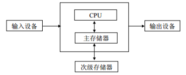
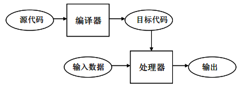
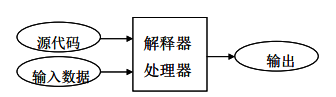

# 第一章 计算与计算思维

计算是利用计算机解决问题的过程，计算机科学是关于计算的学问。计算机科学家在用 计算机解决问题时形成了特有的思维方式和解决方法，即计算思维。本章介绍计算的基本概 念和计算思维的基本内容，而本书的其余章节将围绕计算与计算思维这个中心展开详细讨论。

# 1.1 什么是计算？

## 1.1 什么是计算？

# 1.1.1 计算机与计算

### 1.1.1 计算机与计算

计算机是当代最伟大的发明之一。自从人类制造出第一台电子数字计算机，迄今已近 70 年。经过这么多年的发展，现在计算机已经应用到社会、生活的几乎每一个方面。人们用计 算机上网冲浪、写文章、打游戏或听歌看电影，机构用计算机管理企业、设计制造产品或从 事电子商务，大量机器被计算机控制，手机与电脑之间的差别越来越分不清，……总之计算 机似乎无处不在、无所不能。那么，计算机究竟是如何做到这一切的呢？为了回答这个问题， 需要了解计算机的工作原理。

提到计算机，人们头脑中会首先浮现出显示器、键盘、主机箱等一堆设备——计算机硬 件。了解一点硬件设备的基本知识自然是需要的，不过从学习用计算机解决问题这个层次看， 并不需要掌握多少底层硬件知识。在此我们仅介绍现代计算机的主要功能部件，目的是要了 解用计算机解决问题的计算机制。现代计算机的主要功能部件如图 1.1 所示。



CPU、指令与程序 中央处理单元（CPU）是计算机的计算部件，能够执行机器指令，或简称指令（instruction）。

每条指令表达的是对特定数据执行特定操作。某种 CPU 能执行的全体指令是由该 CPU 的制 造商设计并保持固定不变的，称为该 CPU 的指令集。例如，Intel 公司为它的 80x86 系列处 理器设计了上百条的指令。

外行人也许会以为，计算机功能如此强大，必定是因为它能执行功能强大的指令。然而 事实并非如此。即使是当今技术最先进、计算能力最强大的计算机，它的 CPU 也只会执行一 些非常简单的指令，例如将两个数相加、测试两个数是否相等、把数据放入指定的存储单元 等等。

由于每条机器指令都只能完成很简单的操作，因此仅靠少数几条指令是做不了什么复杂 的事情的。但是，如果将成千上万条简单指令组合起来，却能解决非常复杂的问题！亦即， 复杂操作可以通过执行按特定次序排列的许多简单操作而实现。这种由许多指令按次序排列 而成并交给计算机逐条执行的指令序列称为程序（program）。为了用计算机解决问题，把问 题的解法表达成一个指令序列（即程序）的过程，称为程序设计或编程（programming）。可 见，计算机所做的所有神奇的事情，都是靠一步一步执行的、平凡而乏味的简单指令序列做 到的。计算机一点也不神奇，它唯一会做的事情就是机械地执行预定的指令序列。

存储器

存储器是计算机的记忆部件，用于存储数据和程序。 存储器分为主存储器和次级存储器，它们是用不同的物理材料制造的。CPU 只能直接访

问主存储器，也只有主存储器才能提供与 CPU 相匹配的存取速度。但主存储器需要靠持续供 电来维持存储，一旦断电，存储的数据或程序就会消失。为了持久存储信息，可以使用即使 断电也能维持存储的次级存储器，如当前普遍使用的磁盘。CPU 不能直接访问次级存储器， 次级存储器上的数据或程序必须先送到主存储器中，才能被 CPU 存取或执行。次级存储器的 读写速度远远低于主存储器，这个差别极大地影响了用计算机解决问题时所使用的方法。

现代计算机在体系结构上的特点是：数据和程序都存储在主存储器中，CPU 通过访问主 存储器来取得待执行的指令和待处理的数据。这称为冯·诺伊曼（von Neumann）体系结构。

输入/输出设备

输入和输出设备提供了人与计算机进行交互的手段。我们通过输入设备向计算机输入信 息，计算机则通过输出设备将计算结果告诉我们。传统的输入设备有键盘和鼠标等，输出设 备有显示器和打印机等。现代的触摸屏则兼具输入和输出的功能。

计算

了解了计算机的组成，就能理解计算机解决问题的过程是怎样的。我们来看一个常见任 务——用计算机写文章——是如何解决的。为了解决这个问题，首先需要编写具有输入、编 辑、保存文章等功能的程序，例如微软公司的程序员们所写的 Word 程序。如果这个程序已 经存入我们计算机的次级存储器（磁盘），通过双击 Word 程序图标等方式可以启动这个程序， 导致该程序从磁盘被加载到主存储器中。然后 CPU 逐条取出该程序的指令并执行，直至最后 一条指令执行完毕，程序即告结束。在执行过程中，有些指令会导致与用户的交互，例如用 户利用键盘输入或删除文字，利用鼠标点击菜单进行存盘或打印等等。就这样，通过执行成 千上万条简单的指令，最终解决了用计算机写文章的问题。

针对一个问题，设计出解决问题的程序（指令序列），并由计算机来执行这个程序，这 就是计算（computation）。

通过计算，使得只会执行简单操作的计算机能够完成神奇的复杂任务，所以计算机的神 奇表现其实都是计算的威力。如果读者对计算的能力还有疑问，下面这个例子或许能打消这 个疑问。Lucy 是一个只学过加法的一年级小学生，她能完成一个乘法运算任务吗？答案是肯 定的！解决问题的关键在于编写出合适的指令序列让 Lucy 机械地执行。例如下列“程序” 就能使 Lucy 算出 m×n：

```py
在纸上写下 0，记住结果； 
给所记结果加上第 1 个 n，记住结果； 
给所记结果加上第 2 个 n，记住结果；
……
给所记结果加上第 m 个 n，记住结果。至此就得到了 m×n。 
```

不难看出，这个指令序列的每一步都是 Lucy 能够做到的，因此最后确实能完成乘法运 算。这就是“计算”所带来的成果①。

计算机就是通过这样的“计算”来解决所有复杂问题的。执行大量简单指令组成的程序 虽然枯燥繁琐，但计算机作为一种机器，其特长正在于机械地、忠实地、不厌其烦地执行大 量简单指令！

> ① 当然，这种计算看上去就很繁琐，原因在于用到的基本指令（加法）太简单。如果 Lucy 学习了更“高级” 的指令（如乘法口诀等），就可以更快捷地完成乘法运算。

计算机的通用性

通过前面的介绍，可知计算机就是进行“计算”的机器。显然，这里的“计算”并不是日常说的数学计算。事实上，计算机在屏幕上显示信息，在 Word 文档中查找并替换文本， 播放 mp3 音乐，这些都是计算。

理解了计算机是如何计算的，也就能理解为什么计算机具有通用性，能解决各种不同类 型的问题。其中的奥秘就在于程序。如果想用计算机写文章，就将 Word 之类的程序加载到 主存中让 CPU 去执行，这时计算机就成了一台电子打字机；如果想用计算机听音乐，就将 Media Player 之类的程序加载到主存中让 CPU 去执行，这时计算机就成了一台音频播放机； 如果将 IE 之类的程序加载到主存中让 CPU 去执行，计算机就可以在互联网上浏览信息。总 之，一台计算机的硬件虽然固定不变，但通过加载执行不同的程序，就能实现不同的功能， 解决不同的问题。

我们平时说的计算机都是指通用计算机，能够安装执行各种不同的程序。其实在工业控 制和嵌入式设备等领域，也存在专用计算机，它们只执行预定的程序，从而实现固定的功能。 例如号称电脑控制的洗衣机，其实就是能执行预定程序的计算机。

计算机科学

为了更好地利用计算机解决问题，人们深入研究了关于计算的理论、方法和技术，形成 了专门研究计算的学问——计算机科学（computer science）①。

计算机科学包含很多内容，本书的主题是计算机科学家在用计算机解决问题时建立的一 些思想和方法，这些思想和方法普遍存在于计算机科学的各个分支之中。作为例子，我们来 看计算机科学家思考的一个根本问题：到底什么问题是计算机可计算的？一般人会以为，一 个问题能不能用计算机计算，取决于该计算机的计算能力；而计算机的计算能力又取决于 CPU 的运算速度、指令集、主存储器容量等硬件指标。真如此的话，显然巨型计算机应该具 有比微型计算机更强大的计算能力。然而，作为计算机科学理论基础的可计算性理论却揭示 了一个出人意料的结论：所有计算机的计算能力都是一样的！尽管不同计算机有不同的指令 集和不同性能的硬件，但一台计算机能解决的问题，另一台计算机肯定也能解决。

# 1.1.2 计算机语言

### 1.1.2 计算机语言

如前所述，计算机解决问题的过程实质上是机械地执行人们为它编制的指令序列的过程。为了告诉计算机应当执行什么指令，需要使用某种计算机语言。这种计算机语言能够精 确地描述计算过程，称为程序设计语言或编程语言（programming language）。

与计算机打交道的理想语言当然是像科幻电影所展示的那样，人类用自然语言与计算机（电影中更多的是机器人）进行对话。遗憾的是，由于自然语言的词语和句子往往有歧义， 既不精确也不简练，至少目前的计算机还不能很好地理解自然语言。所以计算机科学家设计 了人造语言来与计算机进行交流。编程语言是人工设计的形式语言，具有严格的语法和语义， 因此没有歧义的问题。

机器语言

CPU 制造商在设计某种 CPU 硬件结构的同时，也为其设计了一种“母语”——指令集， 这种语言称为机器语言（machine language）。机器语言在形式上是二进制的，即所有指令都 是由 0 和 1 组成的二进制序列。利用机器语言写的程序自然就是二进制指令的序列。我们来

> ① 不能望文生义地以为计算机科学是关于计算机的学问。著名计算机科学家 Dijkstra 有一句名言：计算机之 于计算机科学，正如望远镜之于天文学。

看一条 Intel 8086 处理器的机器指令：

```py
0000010000000001 
```

只要你将这一串 0/1 序列交给 CPU，CPU 就会按指令要求执行特定操作——将 1 存储 到计算机的某个寄存器①当中。计算机只懂得这种非常低级的机器语言。显然，用机器语言 编程序与计算机打交道，实在是太麻烦了，毕竟机器语言指令既难理解又难记忆。

汇编语言

为了使编程更容易，人们发明了汇编语言（assembly language）。汇编语言本质上是将机 器指令用更加容易为人们所理解和记忆的“助忆符”形式表现出来。例如前面那条将 1 存入 寄存器的机器指令在汇编语言中可以写成：

```py
MOV AL, 1 
```

可见在汇编语言中，指令的操作符是用 MOV（即 move）之类的助忆符表示的，操作数 据也用易理解的数字或符号来表示，因此指令的含义变得非常容易理解，例如上面这条指令 可以读成“将 1 送入寄存器 AL”。虽然编写汇编语言程序对程序员来说难度降低了很多，但 是很遗憾，计算机并不懂汇编语言。为了使计算机理解汇编语言程序，需要用一种称为汇编 器（assembler）的程序把汇编语言程序翻译成机器语言程序。有了汇编器这个“翻译”，程 序员“说”的汇编语言就能被计算机“听”懂并执行了。

即使到了今天，汇编语言在某些场合（如嵌入式系统）仍然非常有用，因为用汇编语言 能够写出执行效率很高的程序。但是，汇编语言和机器语言并没有本质上的差别，同样属于 非常低级的语言。而低级语言具有无法克服的缺点：第一，低级语言与机器硬件结构紧密关 联，因此为掌握低级语言必须了解很多底层硬件知识，导致低级语言的学习和使用都很困难， 开发效率低而且容易出错；第二，由于不同硬件的计算机具有不同的机器语言和汇编语言， 一类计算机上的低级语言程序不能拿到另一类计算机上执行，我们说低级语言程序不具有可 移植性。

高级编程语言

为了克服低级语言的缺点，计算机科学家设计出了更加易用的高级编程语言（high-level programming language）。高级语言相对于机器语言和汇编语言具有很多优点：第一，高级语 言吸收了人们熟悉的自然语言（英语）和数学语言的某些成分，因此非常易学、易用、易读； 第二，高级语言在构造形式和意义方面具有严格定义，从而避免了语言的歧义性；第三，高 级语言与计算机硬件没有关系，用高级语言写的程序可以移植到各种计算机上执行。

如果用高级语言来表达将 1 存入某处的指令，可以写成这样：

```py
x = 1 
```

显然这更加类似于我们从小就熟悉的数学语言，很容易理解和学会使用。

编译和解释

用高级语言所写的程序是不能直接交给计算机执行的，因为计算机完全不懂 x = 1 之 类的语句。为了让计算机理解并执行，必须先将高级语言程序翻译成机器语言程序。

高级语言的翻译有两种方式：编译和解释。

编译器（compiler）将高级语言程序（称为源代码）完整地翻译成等价的机器语言程序（称为目标代码），如图 1.2 所示。编译的特点是“一劳永逸”，整个源代码一旦翻译完毕， 今后就可以在任何时候多次执行目标代码，再也不需要编译器的参与了。就像翻译家将一本 英文小说笔译成中文，这是一次性的工作，作为翻译结果的中译本可以多次阅读。以编译方

> ① 寄存器是 CPU 里面的高速存储部件。

式处理源代码，对目标代码可以进行很多细致的优化，从而程序的执行速度一般会更快。就 像翻译家对中译本可以精雕细琢，从而达到信达雅的境界。



图 1.2 高级语言的编译

解释器（interpreter）直接分析并执行高级语言程序，如图 1.3 所示。解释的特点是“见 招拆招”，对源代码总是临机进行解释和执行。就像外交部的口译人员所做的工作，国家主席 说一句中文，口译者立即将它翻译成英文；即使主席后来说了同样的话，口译者还是要重新 翻译，无法重复利用以前的翻译结果。解释执行的处理方式无法进行上下文信息来进行优化， 导致程序执行速度较慢，正如口译者无法琢磨最佳译文一样。但解释性语言具有更灵活的编 程环境，可以交互式地输入程序语句并立即执行，程序员面对的仿佛是一台能听懂高级语言 的计算机。



图 1.3 高级语言的解释

高级语言之所以具有前面提到的可移植性，正是因为高级语言的这种先翻译后执行的特 点。只要一台计算机上有合适的编译器或解释器，用某种高级语言编写的程序可以在该计算 机上执行。就像国家主席的讲话可以被中译英口译人员翻译给英语国家的人听，也可以被中 译法口译人员翻译给法语国家的人听一样。

还要说明的是，编译器和解释器本身也是程序，这种程序所执行的计算就是将别的程序 翻译成机器能够理解的指令。为了让一台计算机能够执行某种高级语言程序，必须先在该计 算机上安装特定高级语言的编译器或解释器程序！

迄今为止，计算机科学家们发明了数百种高级编程语言。不同语言的细节不尽相同，但 一些基本语言构造在绝大多数语言中都是存在的，例如输入输出、基本的数学运算、有条件 地执行和重复地执行等等。一般只要掌握一种编程语言，就足以利用计算机去解决实际问题。 而且一旦掌握了一种编程语言，再去学习其他语言也会变得非常容易。

本书要讨论的是用计算机解决问题时的思想和方法，这些内容原则上与使用哪种编程语 言没有关系。但是，为了更好地掌握本书的内容，需要进行编程实践，这就要求我们必须学 会某种编程语言。选择什么编程语言呢？高级编程语言虽多，但流行的并没有多少。2012 年 4 月公布的 TIOBE 编程语言排行榜①上，位列前 10 名的语言分别是 C、Java、C++、Objective-C、 C#、PHP、（Visual）Basic、Python、JavaScript 和 Perl。本书将采用位列其中的 Python 语言， 选择这个语言的理由是该语言非常易学易用，而且特别适合教学。

> ① [`www.tiobe.com/index.php/content/paperinfo/tpci/index.html`](http://www.tiobe.com/index.php/content/paperinfo/tpci/index.html)

# 1.1.3 算法

### 1.1.3 算法

如前所述，程序是解决某个问题的指令序列。编程解决一个问题时，首先要找出解决问 题的方法，该解决方法一般先以非形式化的方式表述为由一系列可行的步骤组成的过程，然 后才用形式化的编程语言去实现该过程。这种解决特定问题的、由一系列明确而可行的步骤 组成的过程，称为算法（algorithm①）。算法表达了解决问题的核心步骤，反映的是程序的解 题逻辑。

算法其实并不是随着计算机的发明才出现的东西。例如，早在两千多年前，古希腊数学 家欧几里德就发明了一种求两个自然数的最大公约数的过程，这个过程被认为是史上第一个 算法②：

【欧几里德算法】

```py
输入：自然数 a、b 
输出：a、b 的最大公约数 
步骤：
    第 1 步：令 r 为 a / b 所得余数
    第 2 步：若 r = 0，则算法结束，b 即为答案；否则置 a←b，b←r，转到第 1 步。 
```

又如，我们在小学学习的竖式乘法、长除法等等其实也都是算法的例子，都是通过明确 定义的一步一步的过程来解决问题。

利用计算机解决问题的关键就在于设计出合适的算法，当今计算机在各行各业中的成功 应用从根本上说都取决于高效算法的发现。例如，数学家发明了“充电放电”算法，从而利 用计算机证明了著名的四色定理。又如，谷歌公司的创建者发明了更合理的网页相关性排名 算法，从而使 Google 成为最成功的搜索引擎。其他如 MP3 播放器等便携式电子产品依靠聪 明的音频视频压缩算法来节省存储空间，GPS 导航仪利用高效的最短路径算法来规划最短路 线等等，不一而足。

算法是由一系列步骤构成的计算过程，但并不是随便用一些步骤都能构成合格的算法 的。我们对算法有两个要求：第一，每个步骤必须具备明确的可操作性；第二，构成算法的 所有步骤必须能在有限时间内完成。

先看算法步骤的可操作性。从最底层来看，计算机指令集中的基本指令显然具有可操作 性，因为 CPU 确定无疑地能够执行这些指令。然而，由于用简单的机器指令来表达算法步骤 会使得算法琐碎冗长，不能凸显算法表达的解题逻辑，所以实际上我们会用更高级别的操作 来表达算法步骤。打个比方，如果在菜谱中使用非常细节化的指令，那么在很多菜的菜谱中 都会看到这样的步骤：

```py
…… 
冷水入锅
点火将水烧开 
某蔬菜入锅 
等水再次烧开 
捞出蔬菜备用
…… 
```

这种步骤虽然详细，但太琐碎了。几乎没有菜谱会在这样的细节级别上表达操作步骤，一般 都会将这个过程写做：

```py
…… 
将某蔬菜绰水
…… 
```

> ① 这个词源自 9 世纪波斯数学家 Muhammad ibn Musa al-Khwarizmi 的姓（拉丁语写法 Algorismus）。
> 
> ② 中国称为辗转相除法。

其中“绰水”是一个较高级别的指令，它本身又由若干更细节化的步骤组成，但它显然是一 个明确定义的步骤，按照这样的菜谱去做菜，完全是可操作的。

再以数学为例，“计算 b2 - 4ac”作为算法中的一个步骤显然是可操作的，没有必要细化 为“先计算 b2，再计算 4ac，再两者相减”的步骤；而“作一条平行于直线 AB 的直线”就 不是一个明确的步骤。至于“用尺规作图来三等分角ÐAOB”，则根本就是一个不可能做到的 操作，尽管其意义是明确的。

总之，在设计算法时，要选择合适的细节级别的步骤，不但要确保所有步骤处于计算机 能力范围之内，还应该使算法的读者容易理解算法的逻辑。

再看算法的有限性。只满足算法步骤的可操作性是不够的，一个合格的算法还必须能在 有限时间内执行完毕。例如，具备一点数论知识的人都知道“检查自然数 n 是不是质数”是 可行的步骤，例如可以逐个检查从 2 到 n/2 的自然数是不是 n 的因子。那我们能不能设计如 下“算法”来生成所有质数呢？

```py
第 1 步：令 n = 2
第 2 步：检查 n 是不是质数
第 3 步：如果是就输出 n
第 4 步：n = n + 1，转到第 2 步 
```

很遗憾，这不是一个合格的算法，因为自然数有无穷多个，导致“算法”的第 4 步是可

以无限进行下去的。 那么对一个给定的问题，能不能找到符合上述要求的算法呢？这其实正是计算机科学要

回答的一个基本问题：什么是可计算的？如果能够为某个问题找到算法，该问题就称为可计 算的。当然，如果没能找到算法，并不意味着该问题不可计算，那也许只是因为我们不够聪 明而已。事实上，计算机科学还从理论上对可计算性和计算复杂性进行分析。本书第 x 章会 告诉大家，有一些看似简单的问题实际上不存在算法，而另一些问题虽然有算法但需要天文 数字的时间和空间来完成计算，从而毫无实际价值。

# 1.1.4 实现

### 1.1.4 实现

给定一个问题，当我们找到解决问题的算法后，接着就需要用某种计算机语言将这个算 法 表 达 出来， 最终 得到一 个能 被计算 机执 行的程 序（或代 码 ），这 个 过程称 为 实现（implementation），或者俗称为写代码（coding）。 严格地说，算法与程序是不同的：算法是用非形式化方式表述的解决问题的过程，程序

则是用形式化编程语言表述的精确代码。这样，算法设计和算法实现就分别指计算机解决问 题时的两个不同阶段。但我们经常在宽泛的意义上使用“程序”和“程序设计”这两个术语， 前者泛指算法和代码，后者泛指从问题分析直到编码实现的全过程。

设计算法是创造性的活动，要求设计者具备问题求解能力和想像力，能从宏观视野把握 问题的求解逻辑；而编码实现算法则是相对机械的活动，要求程序员具有严谨细致的作风， 能在微观层次关注细枝末节。

可见，程序设计这项活动具有一定的挑战性，但这并不意味着只有非常聪明的人才能学 习掌握程序设计。事实上，通过理论学习和动手实践，从小学生到大学生都能学会程序设计。

学习程序设计有很多好处。第一，计算机已经成为我们生活、学习和工作中普遍使用的 工具，学会编程能使我们成为计算机的主人，使计算机按我们的意志做事。第二，程序设计 能够培养我们抽象、分析和问题求解的能力，这种能力对日常生活和工作也是很重要的。第 三，编程也是一种充满乐趣的智力活动，许多人将编程当作一种爱好，发现巧妙的算法和程 序运行成功后的那种成就感令人乐此不疲。

# 1.2 什么是计算思维？

## 1.2 什么是计算思维？

如前所述，计算是利用计算机一步一步地执行指令来解决问题的过程，计算机科学是关于计算的科学。正如数学家在证明数学定理时有独特的数学思维、工程师在设计制造产品时 有独特的工程思维、艺术家在创作诗歌音乐绘画时有独特的艺术思维一样，计算机科学家在 用计算机解决问题时也有自己独特的思维方式和解决方法，我们统称之为 计算思维（computational thinking）。从问题的计算机表示、算法设计直到编程实现，计算思维贯穿于 计算的全过程。学习计算思维，就是学会像计算机科学家一样思考和解决问题。

# 1.2.1 计算思维的基本原则

### 1.2.1 计算思维的基本原则

计算思维建立在计算机的能力和限制之上，这是计算思维区别于其他思维方式的一个重

要特征。用计算机解决问题时必须遵循的基本思考原则是：既要充分利用计算机的计算和存 储能力，又不能超出计算机的能力范围。

例如，能够高速执行大量指令是计算机的能力，但每条指令只能进行有限的一些简单操 作则是计算机的限制，因此我们不能要求计算机去执行无法化归为简单操作的复杂任务。又 如，计算机只能表示固定范围的有限整数，任何算法如果涉及超出范围的整数，都必须想办 法绕开这个限制。再如，计算机的主存速度快、容量小、靠电力维持存储，而磁盘容量大、 不需要电力维持存储但存取速度慢，因此涉及磁盘数据的应用程序必须寻求高效的索引和缓 冲方法来处理数据，以避免频繁读写磁盘。

虽然计算思维有自己的独特性，但它同时也吸收了其他领域的一些思维方式。例如，计 算机科学家像数学家一样建立现实世界的抽象模型，使用形式语言表达思想；像工程师一样 设计、制造、组装与现实世界打交道的产品，寻求更好的工艺流程来提高产品质量；像自然 科学家一样观察系统行为，形成理论，并通过预测系统行为来检验理论；像经济学家一样评 估代价与收益，权衡多种选择的利弊；像手工艺人一样追求作品的简洁、精致、美观，并在 作品中打上体现本人风格的烙印。

计算思维是人的思想和方法，旨在利用计算机解决问题，而不是使人类像计算机一样做 事。作为“思想和方法”，计算思维是一种解题能力，一般不是可以机械地套用的，只能通过 学习和实践来培养。计算机虽然机械而笨拙，但人类的思想赋予计算机以活力，装备了计算 机的人类利用自己的计算思维能够解决过去无法解决的问题、建造过去无法建造的系统。

# 1.2.2 计算思维的具体例子

### 1.2.2 计算思维的具体例子

基于计算机的能力和局限，计算机科学家提出了很多关于计算的思想和方法，从而建立

了利用计算机解决问题的一整套思维工具。下面我们简要介绍计算机科学家在计算的不同阶 段所采用的常见思想和方法。

问题表示

用计算机解决问题，首先要建立问题的计算机表示。问题表示与问题求解是紧密相关的， 如果问题的表示合适，那么问题的解法就可能如水到渠成一般容易得到，否则可能如逆水行 舟一般难以得到解法。

抽象（abstraction）是用于问题表示的重要思维工具。例如，小学生经过学习都知道将 应用题“原来有五个苹果，吃掉两个后还剩几个”抽象表示成“5 - 2”，这里显然只抽取了 问题中的数量特性，完全忽略了苹果的颜色或吃法等不相关特性。一般意义上的抽象，就是 指这种忽略研究对象的具体的或无关的特性，而抽取其一般的或相关的特性。计算机科学中 的抽象包括数据抽象和控制抽象，简言之就是将现实世界中的各种数量关系、空间关系、逻

辑关系和处理过程等表示成计算机世界中的数据结构（数值、字符串、列表、堆栈、树等） 和控制结构（基本指令、顺序执行、分支、循环、模块等），或者说建立实际问题的计算模型。 另外，抽象还用于在不改变意义的前提下隐去或减少过多的具体细节，以便每次只关注少数 几个特性，从而有利于理解和处理复杂系统。显然，通过抽象还能发现一些看似不同的问题 的共性，从而建立相同的计算模型。总之，抽象是计算机科学中广泛使用的思维方式，只要 有可能并且合适，程序员就应当使用抽象。

可以在不同层次上对数据和控制进行抽象，不同抽象级对问题进行不同颗粒度或详细程 度的描述。我们经常在较低抽象级之上再建立一个较高的抽象级，以便隐藏低抽象级的复杂 细节，提供更简单的求解方法。例如，对计算本身的理解就可以形成“电子电路®门逻辑® 二进制®机器语言指令®高级语言程序”这样一个由低到高的抽象层次，我们之所以在高级 语言程序这个层次上学习计算，当然是为了隐藏那些低抽象级的繁琐细节。又如，在互联网 上发送一封电子邮件实际上要经过不同抽象级的多层网络协议才得以实现，写邮件的人肯定 不希望先掌握网络低层知识才能发送邮件。再如，我们经常在现有软件系统之上搭建新的软 件层，目的是隐藏低层系统的观点或功能，提供更便于理解或使用的新观点或新功能。

算法设计

问题得到表示之后，接下来的关键是找到问题的解法——算法。算法设计是计算思维大 显身手的领域，计算机科学家采用多种思维方式和方法来发现有效的算法。例如，利用分治 法的思想找到了高效的排序算法，利用递归思想轻松地解决了 Hanoi 塔问题，利用贪心法寻 求复杂路网中的最短路径，利用动态规划方法构造决策树，等等。前面说过，计算机在各个 领域中的成功应用，都有赖于高效算法的发现。而为了找到高效算法，又依赖于各种算法设 计方法的巧妙运用。

对于大型问题和复杂系统，很难得到直接的解法，这时计算机科学家会设法将原问题重 新表述，降低问题难度，常用的方法包括分解、化简、转换、嵌入、模拟等。如果一个问题 过于复杂难以得到精确解法，或者根本就不存在精确解法，计算机科学家不介意退而求其次， 寻求能得到近似解的解法，通过牺牲精确性来换取有效性和可行性，尽管这样做的结果可能 导致问题解是不完全的，或者结果中混有错误。例如搜索引擎，它们一方面不可能搜出与用 户搜索关键词相关的所有网页，另一方面还可能搜出与用户搜索关键词不相关的网页。作为 对比，很难想象数学家在解决数学问题时会寻求什么近似证明或对错参杂的解。

编程技术

找到了解决问题的算法，接下来就要用编程语言来实现算法，这个领域同样是各种思想 和方法的宝库。例如类型化与类型检查方法将待处理的数据划分为不同的数据类型，编译器 或解释器借此可以发现很多编程错误，这和自然科学中的量纲分析的思想是一致的。又如结 构化编程方法使用规范的控制流程来组织程序的处理步骤，形成层次清晰、边界分明的结构 化构造，每个构造具有单一的入口和出口，从而使程序易于理解、排错、维护和验证正确性。 又如模块化编程方法采取从全局到局部的自顶向下设计方法，将复杂程序分解成许多较小的 模块，解决了所有底层模块后，将模块组装起来即构成最终程序。又如面向对象编程方法以 数据和操作融为一体的对象为基本单位来描述复杂系统，通过对象之间的相互协作和交互实 现系统的功能。还有，程序设计不能只关注程序的正确性和执行效率，还要考虑良好的编码 风格（包括变量命名、注释、代码缩进等提高程序易读性的要素）和程序美学问题。

编程范型（programming paradigm）是指计算机编程的总体风格，不同范型对编程要素（如数据、语句、函数等）有不同的概念，计算的流程控制也是不同的。早期的命令式（或 称过程式）语言催生了过程式（procedural）范型，即一步一步地描述解决问题的过程。后来

发明了面向对象语言，数据和操作数据的方法融为一体（对象），对象间进行交互而实现系统 功能，这就形成了面向对象（object-oriented）范型。逻辑式语言、函数式语言的发明催生了 声明式（declarative）范型——只告诉计算机“做什么”，而不告诉计算机“怎么做”。有的语 言只支持一种特定范型，有的语言则支持多种范型。本书采用的 Python 就是支持多种编程范 型的语言，Python 程序可以是纯过程式的，也可以是面向对象的，甚至可以是函数式的。

可计算性与算法复杂性

在用计算机解决问题时，不仅要找出正确的解法，还要考虑解法的复杂度。这和数学思维不同，因为数学家可以满足于找到正确的解法，决不会因为该解法过于复杂而抛弃不用。 但对计算机来说，如果一个解法太复杂，导致计算机要耗费几年几十年乃至更久才能算出结 果，那么这种“解法”只能抛弃，问题等于没有解决。有时即使一个问题已经有了可行的算 法，计算机科学家仍然会去寻求更有效的算法。

有些问题是可解的但算法复杂度太高，而另一些问题则根本不可解，不存在任何算法过 程。计算机科学的根本任务可以说是从本质上研究问题的可计算性。例如，科幻电影里的计 算机似乎都像人类一样拥有智能，从计算的本质来说，这意味着人类智能能够用算法过程描 述出来。虽然现代计算机已经能够从事定理证明、自主学习、自动推理等“智能”活动，但 是人类做这些事情并非采用一步一步的算法过程，像阿基米德大叫“尤里卡”那样的智能活 动至少目前的计算机是没有可能做到的。

虽然很多问题对于计算机来说难度太高甚至是不可能的任务，但计算思维具有灵活、变 通、实用的特点，对这样的问题可以去寻求不那么严格但现实可行的实用解法。例如，计算 机所做的一切都是由确定性的程序决定的，以同样的输入执行程序必然得到同样的结果，因 此不可能实现真正的“随机性”。但这并不妨碍我们利用确定性的“伪随机数”生成函数来模 拟现实世界的不确定性、随机性。

又如，当计算机有限的内存无法容纳复杂问题中的海量数据时，这个问题是否就不可解 了呢？当然不是，计算机科学家设计出了缓冲方法来分批处理数据。当许多用户共享并竞争 某些系统资源时，计算机科学家又利用同步、并发控制等技术来避免竞态和僵局。

# 1.2.3 日常生活中的计算思维

### 1.2.3 日常生活中的计算思维

人们在日常生活中的很多做法其实都和计算思维不谋而合，也可以说计算思维从生活中吸收了很多有用的思想和方法。我们来看一些例子。 算法过程：菜谱可以说是算法（或程序）的典型代表，它将一道菜的烹饪方法一步一步地罗列出来，即使不是专业厨师，照着菜谱的步骤也能做出可口的菜肴。这里，菜谱的每一 步骤必须足够简单、可行。例如：“将土豆切成块状”、“将 1 两油入锅加热”等都是可行的步 骤，而“使菜肴具有神秘香味”则不是可行的。

模块化：很多菜谱都有“勾芡”这个步骤，与其说这是一个基本步骤，不如说是一个模 块，因为勾芡本身代表着一个操作序列——取一些淀粉，加点水，搅拌均匀，在适当时候倒 入菜中。由于这个操作序列经常使用，为了避免重复，也为了使菜谱结构清晰、易读，所以 用“勾芡”这个术语简明地表示。这个例子同时也反映了在不同层次上进行抽象的思想。

查找：如果要在英汉词典中查一个英文单词，相信读者不会从第一页开始一页页地翻看， 而是会根据字典是有序排列的事实，快速地定位单词词条。又如，如果现在老师说请将本书 翻到第八章，读者会怎么做呢？是的，书前的目录可以帮助我们直接找到第八章所在的页码。 这正是计算机中广泛使用的索引技术。

回溯：人们在路上遗失了东西之后，会沿原路边往回走边寻找。或者在一个岔路口，人 们会选择一条路走下去，如果最后发现此路不通就会原路返回，到岔路口选择另一条路。这种回溯法对于系统地搜索问题空间是非常重要的。 缓冲：假如将学生用的教科书视为数据，上课视为对数据的处理，那么学生的书包就可以视为缓冲存储。学生随身携带所有的教科书是不可能的，因此每天只能把当天要用的教科 书放入书包，第二天再换入新的教科书。

并发。厨师在烧菜时，如果一个菜需要在锅中煮一段时间，厨师一定会利用这段时间去 做点别的事情（比如将另一个菜洗净切好），而绝不会无所事事。在此期间如果锅里的菜需要 加盐加佐料，厨师可以放下手头的活儿去处理锅里的菜。就这样，虽然只有一个厨师，但他 可以同时做几个菜。

类似的例子还有很多，在此就不一一列举了。要强调的一点是，读者在学习用计算机解 决问题的时候，如果经常想想生活中遇到类似问题时的做法，一定会对找出问题解法有所帮 助。

# 1.2.4 计算思维对其他学科的影响

### 1.2.4 计算思维对其他学科的影响

随着计算机在各行各业中得到广泛应用，计算思维对许多学科都产生了重要影响。下面以数学、生物学和化学为例进行简单的介绍。 数学：计算机对数学来说过去只是一个数值计算工具，用于快速、大规模的数值计算，

对数值计算方法的研究导致了计算数学的形成。后来数学家利用计算机进行代数演算，形成 了计算机代数；利用计算机研究几何问题，形成了计算几何学。数学家还利用计算机去验证 数学猜想，虽然不能证明猜想，但是一旦发现反例就可以推翻猜想，以免数学家毕生投入到 一个不成立的猜想之中。在定理证明方面，美国数学家通过设计算法过程来验证构型，最终 证明了著名的四色定理；我国的吴文俊院士更是建立了初等几何和微分几何定理的机械化证 明方法，为数学机械化开辟了方向。总之，现在计算机已经成为数学的研究手段，大大扩展 了数学家的能力。

生物学：计算机和万维网迅速而显著地改变了生物学研究的面貌，过去生物学家在实验 室进行的研究现在可以在计算机上进行，因此出现了生物信息学（较老的叫法是计算生物学） 这一学科。生物信息学的内容包括基因组测序、建立基因数据库、发现和查找基因序列模式 等等，这一切都有赖于计算技术的应用。生物信息学的发展正在改变着生物学家的思维方式， 他们除了研究生物学，还研究高效的算法。对生物信息学家来说，对生物学的理解和对计算 的理解同等重要。

化学：计算技术对公认的纯实验科学——化学也产生了巨大影响，化学的研究内容、研 究方法甚至学科的结构和性质都发生了深刻变化，从而形成了计算化学这一交叉学科。计算 化学的主要研究内容包括分子结构建模与图像显示、计算机分子模拟、计算量子化学、分子 CAD、化学数据库等，能够帮助化学家在原子分子水平上阐明化学问题的本质，在创造特殊 性能的新材料、新物质方面发挥重大的作用。

此外，计算物理学、计算博弈论、计算材料学、计算广告学、电子商务等等新学科也都 在蓬勃发展。可以预见，“计算+X”将成为很多学科的发展方向之一。

# 1.3 初识 Python

## 1.3 初识 Python

# 1.3.1 Python 简介

### 1.3.1 Python 简介

Python 是一种通用的高级编程语言，由荷兰人 Guido van Rossum 于 1980 年代发明①。

前面说过，高级编程语言有数百种，而 Python 跻身流行语言的前 10 名之中。与其他语言相比，Python 的主要特点包括：

> ① Python 这个名字源自发明者喜欢的电视喜剧节目 Monty Python's Flying Circus，而不是什么爬行动物。

*   Python 语言最重要的设计理念是追求高度的可读性。与大多数语言不同，Python 语言的语法要求程序代码具有整齐而有条理的形式，代码的外在形式与内在意义紧密 相关。这样做的好处是：外观不整齐的代码属于编程错误，从而提醒编程人员避免 很多错误。

*   Python 语言的另一个设计理念是尽量避免“这件事可以有多种做法”，因此语言中 冗余的成分很少，程序员经常只有唯一的也是最好的语言构造可用。

*   Python 语言同时支持过程式、面向对象式和函数式等多种编程范型，拥有丰富的标 准库来支持应用开发所需的各种功能。

这些设计理念导致 Python 语法简明易学，代码清晰美观、易读易理解。Python 语言的众 多优点使得它在编程者中越来越流行，并使它在 2007 年和 2010 年两次获得 TIOBE 年度编程 语言奖。

Python 是解释型语言，Python 语句或程序（.py 文件）首先被解释器翻译成字节码（byte code），然后再由 Python 虚拟机来直接执行。

Python 的主要版本可分为 2.x 和 3.x 两类。Python 3.x 是最新的版本，代表 Python 的发 展方向，但问题是不兼容 2.x 版本。由于 2.7 版本包含了 3.x 版本的主要特征，所以本书选择 Windows 平台下的 Python 2.7 作为编程环境，本书所有例子都在此版本下测试通过，建议读 者也下载安装这个版本①，以便在学习时能得到和本书中一样的结果。

读者花 1 分钟时间安装了 Python 2.7 之后，从“开始/所有程序/Python 2.7”中可以看到 有两种界面的解释器环境：命令行界面和图形用户界面（IDLE）。启动这两种界面之后所看 到的屏幕分别如图 1.4 和图 1.5 所示：


图 1.4 Python 命令行解释器环境


图 1.5 Python GUI 解释器环境

界面中的>>>是 Python 解释器的提示符，表示现在解释器已准备好执行程序。如果在提 示符后面输入 Python 语句，解释器将直接解释执行该语句。接下来我们就要开始学习 Python 语言的各种语句和各种编程方法，终极目标是让计算机按我们的指令做事。

> ① Python 官方网站：[`www.python.org/download/`](http://www.python.org/download/)

# 1.3.2 第一个程序

### 1.3.2 第一个程序

学习一门编程语言时，传统上所写的第一个程序是 HelloWorld 程序，其功能是让计算机显示一句问候语"Hello, World!"。用 Python 来实现这个任务是非常简单的：首先启动 Python 解释器（命令行或 IDLE 均可，本书主要以 IDLE 界面为例），然后在提示符下输入下 面的内容

```py
>>> print "Hello, World!"
Hello, World! 
```

提示符>>>后面的黑体字部分是我们输入的 Python 语句，该语句的功能是在屏幕上显示信息， 在下一行我们看到了期望的输出。

曾有人根据 HelloWorld 程序的简单程度来判断一个编程语言的易学易用程度，按这个标 准，Python 可以说已经简单到了极致。

# 1.3.3 程序的执行方式

### 1.3.3 程序的执行方式

像上面 HelloWorld 程序所演示的那样，在 Python 解释器提示符>>>下输入语句并执行的 方式称为交互执行方式。

交互执行方式对执行单条语句来说是合适的，但是如果一个程序只有一条语句，那这个 程序肯定做不了什么大事。有用的程序都是由很多条语句组成的，而由很多条语句组成的程 序是不适合以交互方式执行的。例如，如果我们想让计算机在屏幕上连续显示三句问候语， 在交互方式下必然是这样的：

```py
>>> print "Hello, Lucy."
Hello, Lucy.
>>> print "How are you?"
How are you?
>>> print "Goodbye, Lucy."
Goodbye, Lucy. 
```

以上交互执行的结果明显不能令人满意，因为语句是每输入一条就执行一条，导致我们 希望连续显示的三句问候语被输入的程序语句分隔开了。

交互执行方式还有一个更严重的不足之处是：程序没有保存，语句一旦执行完就丢弃了， 因此无法多次执行一个程序。还是拿上面的例子来说，当用户想再次显示那三句问候语，他 就不得不重新输入所有语句。

为了解决上述问题，我们可以先将程序语句输入并保存在一个文件中，然后再“成批” 地执行程序文件中的所有语句。稍后的程序 1.2 给出了连续显示三句问候语的程序文件，执 行该程序文件即能看到连续显示的三句问候语，更重要的是该程序文件是“一次编写、永久 保存、多次执行”的。

Python 程序文件及其执行方式

将程序语句保存在一个扩展名为.py 的文本文件中，这种程序文件称为模块（module）。 还是以我们的第一个程序 HelloWorld 为例，先运行任何一种文本编辑器（如 Windows

的记事本①）新建一个文件，在文件中输入语句 print "Hello, World!" ，然后将文件 保存为 hello.py，这样就创建了一个 Python 程序文件（即模块）：

【程序 1.1】hello.py

```py
print "Hello, World!" 
```

接下来的问题是：如何执行模块文件 hello.py？在 Windows + Python 的平台上，我们有 多种可选择的方式。第一种方式是在 Windows 的命令提示符②下直接用 Python 解释器（即 python.exe 文件）执行该程序： C:\Python27> python hello.py Hello, World!

> ① 用 Word 之类的编辑器也可以，但要注意保存时必须选择纯文本格式。
> 
> ② 俗称 DOS 界面。

效果如图 1.6（a）所示。

第二种方式是在 Python 解释器（命令行或 GUI）环境的提示符下执行 import 语句来“导 入”程序文件，该语句的作用是将 Python 模块从磁盘加载到内存中，在加载的同时执行模块 的每一条语句，就如在解释器环境下手工输入语句一样。具体语句形式如下：

```py
>>> import hello
Hello, World! 
```

效果如图 1.6（b）所示。注意，与第一种方式不同的是，模块文件名中不带扩展名“.py”， 因为 Python 自动假设模块具有“.py”扩展名。


（a）


（b）

图 1.6 Python 程序文件的执行方式

顺便说一下，第一次导入模块文件时，Python 会创建一个文件名相同但扩展名为.pyc 的 文件（本例中就是 hello.pyc），这是被 Python 解释器使用的一个中间文件——字节码文件。 Python 语言的翻译采用的是编译、解释混合方式：模块文件中的 Python 源程序首先被编译成 较低级的字节码指令，然后再解释执行这些字节码指令。如果已经生成了.pyc 文件，以后再 导入相应的模块时速度就会更快，因为无需再次编译。反之，如果为了节省存储空间而删 去.pyc 文件，下次导入模块时就需要重新编译。

第三种执行方式是直接在 Windows 文件夹中找到程序文件 hello.py，然后双击文件图标。 在时，Windows 系统首先打开一个 Python 解释器的命令行窗口（类似图 1.6（b）），然后执行 该程序，执行结束后 Windows 自动关闭命令行窗口。这种方式最简单直接，但它有一个让新 手困惑的小问题：由于程序执行的非常快，用户可能还没看清发生了什么，窗口就关闭了。 这个问题用一个小技巧就可以解决：在程序的最后放一条输入语句，该输入语句能让程序执 行完前面的语句后停顿下来等待用户输入，用户便有时间看清程序此前的运行结果。输入语 句的具体用法见第二章。

第四种方式是先在 IDLE 中打开（或者新建）程序文件 hello.py，具体打开方法可以利用 IDLE 菜单栏上的 File/Open...菜单项，也可以通过右键点击 hello.py 文件图标并选择“Edit with IDLE”菜单项。打开文件后进入 IDLE 自带的程序开发环境①窗口，在此窗口中选择 Run 菜 单中的 Run Module 命令（或直接按 F5 键）即可执行程序。注意程序的执行结果是显示在 Python 解释器提示符窗口中的。

> ① 程序开发环境是专为程序员使用某种语言编程而设计的系统，在其中可以方便地编辑、存储、执行、调试 程序。很多语言都有流行的集成开发环境（IDE）可用。IDLE 是标准的 Python 开发环境。

下面我们将前面提到的连续显示三条问候信息的程序保存到文件中：

【程序 1.2】eg1_2.py

```py
print "Hello, Lucy." 
print "How are you?" 
print "Goodbye, Lucy." 
```

如果以上述第四种方式来执行 eg1_2.py，会得到如图 1.7 所示的结果。从图中可见，显示的信息如我们所愿是连续的三句话。


图 1.7 在 IDLE 中执行程序 1.2

在本书中，我们主要用两种方式来执行语句或程序。

当介绍 Python 语言的有关语句时，我们经常在 Python 解释器环境的提示符下以交互方 式逐条执行语句，因为这对特定内容的讲解和演示非常方便。作为标志，凡是用交互方式执 行的程序语句，我们都在语句前附上提示符“>>>”（注意：提示符不是程序的一部分！）。

当我们编写较大的完整程序时，一般都将程序保存为文件，然后再以前述任何方式来执 行该程序文件。为便于交叉引用，对于完整的程序文件，本书都会像程序 1.1 和程序 1.2 那样 专门编号，并给出程序文件名。

不管用交互方式还是批方式，强烈建议读者在阅读本书时亲自输入并执行这些语句或程 序。另外，建议读者使用 IDLE 的程序开发环境，因为 IDLE 是图形界面的环境，提供自动 缩进、用颜色区分语言成分等特性，能方便而高效地编辑、执行和调试程序。

Python 搜索路径 还有个问题是关于程序文件保存位置的。在前面提到的程序文件的第一、第二种执行方式下，我们实际上假设了

```py
C:\Python27> python hello.py 
```

和

```py
>>> import hello 
```

这两条命令都能找到要执行的程序文件 hello.py。事实上，如果我们将 hello.py 保存在 Python 的安装目录 C:\Python27 之下，那这两条命令都能成功执行程序 hello.py。 但作为一种好的习惯，不应该将用户文件和系统文件混放在一起，因此我们通常都将自己的程序文件如 hello.py 保存在自己的目录中。这时如果还像上面两条命令这样通过文件名 来找程序文件，则要么 Windows 会报错说找不到指定文件，要么 Python 解释器会报错说找 不到指定模块。对此，一种解决方法是在文件名前面加上绝对路径，以告知系统该文件保存 在哪里，例如假设 D:\myPython 是我们保存程序文件的目录，则可以像下面这样执行程序：

```py
C:\Python27> python D:\myPython\hello.py 
```

或者

```py
>>> import D:\myPython\hello 
```

另一种更方便的做法是预先将 D:\myPython 添加到 Python 的搜索路径中，使系统仅根据 文件名就能找到程序文件。具体做法是，先用任何文本编辑器建立一个文本文件，其内容是 要添加的目录路径，例如：

```py
D:\myPython 
```

然后保存为扩展名为.pth 的文件，如“mypath.pth”，最后将这个文件复制到安装目录下的指 定子目录 C:\Python27\Lib\site-packages 中。

如果是以第三、第四种方式来执行程序文件，系统总是在当前工作目录中找文件，一般 不会出现找不到文件的问题。

# 1.3.4 Python 语言的基本成分

### 1.3.4 Python 语言的基本成分

在自然语言中，我们用字词、句子、段落来写文章表达思想。类似地，编程语言也提供

各种语言成分用于构造程序表达计算。例如 HelloWorld 程序中的 print 是 Python 语言中用 于显示输出的一个保留词，而"Hello, World!"则是被显示的数据，这两个成分组合在一 起，就构成了一条完整的语句。本节简单介绍 Python 语言的基本成分，使读者对 Python 编 程有个概括的了解，更多细节将在本书后面的章节中介绍。

数据和表达式

程序是处理数据的，编程语言首先要有表达数据的语言成分，例如"Hello, World!" 就是被处理的数据。数据分为不同的类型，"Hello, World!"是字符串类型的数据。除了 字符串，Python 语言还能表达和处理数值型的数据，例如：

```py
>>> print 3.14
3.14 
```

Python 不但能表达"Hello,World!"和 3.14 这样的基本数据，还能表达数据运算。将 运算符施加到数据上所得到的语言构造称为表达式。例如下面的 print 语句显示一个表达 式的计算结果，该表达式中使用了加法（+）和乘法（*）运算符：

```py
>>> print 2 + 3 * 4
14 
```

变量与标识符

像"Hello, World!"和 3.14 这样的数据称为常量，其数据值由字面决定，并且不可 改变。Python 语言中还可以定义变量，用于表示可变的数据。变量具有名字，不同变量是通 过名字相互区分的，因此变量名具有标识作用，故称为标识符①。

Python 语言中，标识符的构成必须符合规则：以字母或下划线开头，后面跟随 0 个或多 个字母、数字、下划线。例如：

```py
x xYz x1y2 xy_123 _ （连续两个下划线） _123 
```

等都是合法的标识符，而

```py
3q x-123 first name（中间用了空格） 
```

等则是非法的。

> ① Python 程序中还有函数、类、模块等需要命名的构件，这些名字同样都属于标识符。

作为良好的编程风格，标识符的命名是有讲究的。首先，要尽量使用有意义的名字，例 如如果要用一个变量来表示工资，可以命名为 salary、gongzi 之类，而 s 或 gz 就不是好的名字。其次，如果用两个以上单词组成一个名字，最好能让人看出单词之间的分界，具 体做法有后续单词首字母大写①或者用下划线分隔等形式，例如表示出生年份的变量可以命 名为 birthYear 或 birth_year，而 birthyear 就不算是好的风格。第三，每个人应当 前后一致地使用某种命名风格，例如总是用后续单词首字母大写或总是用下划线分隔单词。 本书的示例程序中，一般以小写字母开头的一个或多个英文单词作为变量名，其中后续 单词的首字母都大写，例如 firstName、dateOfBirth。这也是很多人惯用的命名风格。 当然，在很多简单的示例程序中，我们也会使用很多无意义的单字母的变量名，毕竟这些程序不是正式的应用程序。

语句

语句是编程语言提供的基本命令，是程序的基本组成单元和执行单元。Python 语言提供

了多种语句，分别完成不同的功能，例如我们多次见到的 print 语句。每条语句都有规定 的语法形式和精确的语义，本书将采用“模板”的方式来介绍 Python 语句的语法。例如 print 语句的用法“模板”包括：

```py
print <表达式>
print <表达式 1>, <表达式 2>, ..., <表达式 n> 
```

在语句模板中我们用“<表达式>”之类的符号表示相应位置上所期待的合法语言成分。

第一个模板表示可以在 print 后面出现一个表达式，其含义是计算表达式的值并在屏幕上 显示计算结果。第二个模板表示 print 后面可以出现用逗号分隔的多个表达式，其含义是 计算每个表达式的值，并在屏幕的同一行上显示用空格分隔的各表达式的计算结果。例如：

```py
>>> print "2 + 3 =", 2 + 3
2 + 3 = 5 
```

最常用的一种语句是赋值语句，用于为变量赋值。最简单的赋值语句的形式是：

```py
<变量> = <表达式> 
```

其语义是先计算<表达式>的值，再将该值存储到<变量>中。例如：

```py
>>> x = 2 + 3 
```

执行结果是将 5 存储于变量 x 中，此后在表达式中使用 x 就相当于使用 5。例如：

```py
>>> print x
5
>>> print x + 1
6 
```

顾名思义，变量的值随时可以改变，例如下面的赋值语句将 x 的值从 5 改成了"Hello"：

```py
>>> x = "Hello"
>>> print x
Hello 
```

用 Python 语言编程时，通常是使每一条语句独占一行，而不将两条以上的语句写在同一 行上。如果一条语句很长，写在一行上读起来不方便，Python 也提供了“续行符”用于换行 继续输入：只要在一行的末尾输入字符“\”再按回车键，就表示本行语句未完，换到下一 行继续。例如：

```py
>>> print "This is a very very looooooooooooooooooooooooooong \ 
sentence."

This is a very very looooooooooooooooooooooooooong sentence. 
```

① 顺便提一下，首单词的首字母也大写习惯用于“类名”，而所有字母都大写习惯用于“常量名”。

函数

我们经常将一个语句序列定义成一个“函数”，从而将这个语句序列视为一个整体并命名。 今后在程序的任何地方，只要写下“函数名”，就相当于写下了构成该函数的语句序列，这称 为“调用”该函数。例如，我们将程序 1.2 中的三条语句定义成一个函数：

```py
>>> def greet():
        print "Hello, Lucy." 
        print "How are you?" 
        print "Goodbye, Lucy."
>>> 
```

第一行的 def 告诉 Python 我们要定义一个函数，其后的 greet 是新定义的函数的名字， greet 后面的一对括号用于表示函数的参数。虽然本例中 greet 函数没有参数，但括号仍 然不可缺少。接下来三行是构成函数的语句序列，称为函数体。Python 语言要求：函数体中 的语句与 def 行相比，左边必须留一点空白（称为“缩进”），表示它们是函数的一部分。具 体缩进多少不重要，重要的是函数体的各语句左边要对齐。最后，交互方式下需要用一个空 行（在一行的开始处按回车键）来结束函数定义，使解释器回到提示符状态。

在此我们说明一下 Python 语言的缩进问题。一般来说，Python 程序中所有语句应该左对 齐。但在某些情况下，下一行语句要比上一行语句左边多缩进一些空白，这是为了表达一种 隶属关系：左缩进的语句是上面未缩进语句的下属部分。同层次的语句总是左对齐的，因此 当下属部分结束后，后面的语句又要恢复到未缩进的状态。对于接触过其他编程语言的人来 说，一开始也许会不习惯 Python 的代码缩进，但是以后会发现强制缩进的好处，例如程序在 形式上更整齐、更容易排错等。

上面的函数定义只是告诉 Python 将来看到 greet 时应该做什么，现在并不执行函数体 中的语句序列。将来任何时候如果想执行函数的语句，只需输入函数名来“调用”函数，例 如：

```py
>>> greet() 
Hello, Lucy. 
How are you? 
Goodbye, Lucy. 
```

注意函数名 greet 后面的一对括号，这是必须有的，表明这是一个函数调用。

作为惯例，一个 Python 程序中通常会定义一个名叫 main 的函数。对于简单程序，可以

将程序的所有语句放在 main 函数中；对于由很多函数组成的复杂程序，可以让 main 作为程 序的执行入口。拿程序 1.2 来说，更常见的是以如下代码来编写：

```py
def main():
    print "Hello, Lucy." 
    print "How are you?" 
    print "Goodbye, Lucy."
main() 
```

注意最后一行的 main()，它的作用就是调用执行函数 main。没有这一行，该程序仅仅定义了 函数 main，并没有要求执行 main 函数。

虽然像程序 1.2 那样不将所有语句定义放在函数中也是可以的，但习惯上常定义成 main。 这样做至少有一个好处，那就是一旦导入了模块文件，就可以通过键入 main()来多次执行程 序。没有函数的话，就只能通过多次导入模块来执行程序了。

注释

程序中可以使用注释，用于解释变量的含义、函数的功能、模块文件的创建者、程序版 本等等。注释不仅可以帮助他人理解程序，甚至对自己也有帮助理解的作用（试想一下当你 重新拿起几年前写的程序想扩展程序功能时，注释对你的帮助）。

Python 中的注释是以“#”开始的一行，解释器遇见“#”时会自动忽略其后直到行末的 内容。例如我们将上面的 greet()函数存入文件，并加上合适的注释，得到以下程序：

【程序 1.3】eg1_3.py

```py
# Author: Lu Chaojun
# eg1_3.py (version 1.0)
def greet():
    print "Hello, Lucy." 
    print "How are you?" 
    print "Goodbye, Lucy."
greet() # call the function 
```

# 1.4 程序排错

## 1.4 程序排错

先说一个坏消息：一旦开始写程序，就免不了要出错。程序设计虽然并不难，但无论是 初学编程者还是经验丰富的专业程序员，程序中出现各种错误都是很常见的。

再说一个好消息：计算机（严格说是编译器或解释器）能够帮助我们发现程序中的很多 错误。

在计算机行话中，程序中的错误被称为“臭虫”（bug），而发现并改正错误的过程称为排 错（debug，或称调试）。

程序中的错误大体可分为三种类型：语法错误、运行错误和语义错误。 编程语言和自然语言一样规定了一套语法规则，这些规则定义如何用符号组成形式上正

确的程序。只有符合语法规则的程序才能被计算机执行，语法不正确的程序根本就无法通过 编译器或解释器的检查，更谈不上正确执行了。自然语言中的语法比较宽松，犯点语法错误 一般不会影响交流，就像有人说的：研表究明，汉顺字序并不定一影阅响读。与自然语言不 同，编程语言的语法是非常严格的，任何一点语法错误（例如少了个逗号）都会导致程序无 法执行。初学一门编程语言的时候，肯定会出现很多语法错误，但随着对语言的熟悉和经验 的增加，语法错误会越来越少。例如：

```py
>>> 3 + 4 *
SyntaxError: invalid syntax 
```

显然，乘法运算符需要两个运算数，而上面的表达式中未提供足够的数据，因此导致了语法 错误。Python 解释器很容易发现语法错误，并将错误信息打印出来供程序员参考。

当程序通过了编译器或解释器的语法检查，就可以运行了。遗憾的是，程序语法正确并 不能保证程序执行成功，因为有很多仅在程序执行时才会出现的错误，这种运行错误也称为 异常（exception）。例如，如果程序中有一条执行除法运算的语句，那么在运行时就有可能发 生除数为 0 的错误，这种错误在编译阶段无法发现，因为除法算式是符合语法的。例如：

```py
>>> def f():
    x = 2
    print 10 / x
    x = x – 2 
    print 10 / x
>>> f()
5
Traceback (most recent call last):
File "<pyshell#4>", line 1, in <module> f()
File "<pyshell#3>", line 5, in f print 10 / x
ZeroDivisionError: integer division or modulo by zero 
```

上面这个函数显然没有任何语法错误，因此能够被 Python 执行，我们也看到了部分执行 结果：10 / 2 = 5 被正确地计算并显示出来。但是当 x 变为 0，再次计算 10 / x 时发生了运行 错误 ZeroDivisionError。

语义错误也称逻辑错误，是指程序在程序逻辑上出错，根本不是预定的功能。语法错误 和运行错误都可以被计算机检查出来，程序员根据计算机的报错信息可以比较容易地找出源 程序中的错误并纠正之。而语义错误可能很难发现。因此，有语义错误的程序往往能够“成 功”执行，不产生任何错误消息，但是程序的结果并不是我们想要的，或者说程序的意义（语 义）错了。例如，下面这个程序试图计算半径为 5 的圆的面积：

```py
>>> pi = 3.1416
>>> r = 5
>>> print pi * r
15.708 
```

程序的执行没有产生任何错误，但结果根本不是圆的面积。

由于得不到 Python 解释器的帮助，查找语义错误往往是非常恼人的。一般来说我们需要 从头到尾仔细审查程序算法，找出可能的错误步骤。一种有用的排错方法是在程序中插入大 量的 print 语句，用来显示计算的中间结果。通过检查中间结果，可以将错误进行精确定位。 这些 print 语句的目的是帮助排错，一旦程序完全正确，再将它们从程序中删除。

排错是程序设计的最重要技能之一。找出程序中的错误一方面很令人头痛，另一方面也 很有乐趣，因为排错过程有点像侦探破案的过程——寻找线索、推断原因、最终定位错误。 如果情况很复杂，对某处代码是否错误不是很肯定，则可以利用试错法来排错：先试着修改 该处代码，然后运行程序看看结果如何。这个过程可以重复进行，直至确定错误为止。

# 1.5 练习

## 1.5 练习

1\. 计算机的主要部件有哪些？工作机制是怎样的？

2\. 什么是机器语言、汇编语言和高级编程语言？

3\. 高级语言的编译和解释分别是怎样的过程？

4\. 什么是计算？

5\. 为什么计算机是通用的（即可以应用于各行各业）？

6\. 算法和程序有何异同？

7\. 计算思维建立在什么原则之上？

8\. 请回顾你在玩扑克牌时，抓牌过程中是如何整理顺序的。

9\. 假如我们玩猜数游戏：我心中想好一个 1～100 的自然数让你来猜，猜错的话我会告诉你太大或太小，直至你猜中。为了尽快猜中，你有什么好方法？

10\. 你会下棋（围棋、象棋、五子棋均可）吗？下棋时你是如何一次计算多步的？

11\. 程序错误有哪几类？

12\. 设计你的第一个程序：让计算机跟你打招呼（假设你叫 John）

```py
Hello John!
Have fun with Python! 
```

分别以交互方式和程序文件方式来执行你的程序。