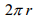
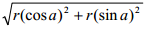
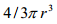
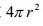
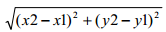

# 第二章 用数据表示现实世界

第一章说过，计算是利用计算机解决问题的过程。待解决的问题可能来自不同领域，因 而具有不同的形式和内容，但从计算的角度看，解决任何问题的过程都是对特定信息进行特 定处理的过程。可见，计算涉及到两样东西：信息和对信息的处理过程。因此实现计算的程 序相应地也要做两件事情：第一，用特定数据类型和数据结构将信息表示出来；第二，用控 制结构将信息处理过程表示出来。

本章是关于信息表示的，主要介绍一些简单数据类型以及如何处理这些简单数据。复杂 数据的表示将在第 5、6、7 章介绍。至于信息处理过程的表示，则是第 3、4 章的内容。

# 2.1 数据和数据类型

## 2.1 数据和数据类型

# 2.1.1 数据是对现实的抽象

### 2.1.1 数据是对现实的抽象

利用计算机解决现实问题时，首先需要将问题所涉及的信息和处理过程表示成计算机能

够接受的形式。如何建立现实问题的计算机表示呢？显然不能像照相机那样，追求将现实景 物事无巨细地复制到胶卷或 CCD 上，因为一个复杂问题所涉及的信息非常多，完全表示它 们几乎是不可能的。就拿照相来说，胶卷上的图像能表示事物的重量和人物间的亲属关系 吗？一方面无法表示问题的所有信息，另一方面也没有必要建立问题的完美表示。问题所涉 信息中一般只有部分信息与问题的解决有关，因此只需对现实问题进行抽象，抽取一部分与 问题求解有关的信息进行表示，而忽略那些与问题求解不相干的信息。可见，抽象是对问题 进行简化的重要手段。

读者对“数据”这个术语肯定不陌生，但若要问究竟什么是数据，恐怕多数人都很难准 确回答。在现实生活中，数据大体上是指各种事实或数值，当今使用更多也更时髦的术语是 “信息”。而在计算领域，我们将现实世界中的事实或信息用编程语言提供的符号化手段进 行表示，这种符号化表示称为数据（data）。

假设我们测得当前气温是摄氏 35 度，显然这是现实世界的信息。为了用计算机解决某 个涉及温度的问题，就需要将温度信息用计算机能接受的方式表示出来。例如可以用整数 “35”表示，也可以用整数“95”表示（假如采取华氏温标的话），还可以用文本“摄氏 35 度”表示。这几种表示都是编程语言支持、计算机能理解的形式，具体采用哪种形式来表示 温度取决于程序打算对温度数据进行什么处理，通常都会以数值数据来表示温度信息，以便 对温度进行数学计算。

又如，假设我们要用计算机解决学生信息管理的问题，就需要在计算机中用数据来表示 现实世界中的学生。这个数据是对学生的抽象，例如可能包括学生的学号、姓名、年龄等信 息，而不大可能包括学生的发型、是否追星族等与问题求解无关的信息。因此，现实中的学 生张三可能最终被抽象表示成计算机中的数据(2013001,张三,18)，参见图 2.1。


图 2.1 数据是对现实的抽象

总之，为了用计算机解决一个问题，必须先对该问题进行抽象，定义问题在计算机中的

数据表示。数据表示的选择，必须依据将对数据施加的操作来考虑，以便将来能够方便、高 效地处理数据。

# 2.1.1 常量与变量

### 2.1.1 常量与变量

在程序中如何指明要处理的数据？所有编程语言都提供两种指明数据的方式：第一，直接用字面值（literal）表示数据，即从文本字面上即可看出是什么数据，这种数据是不会改 变的常量；第二，将数据存储在一个变量中，以后用该变量来指代数据。

回顾第一章中我们所写的第一个程序：

```py
>>> print "Hello World!" 
```

其中"Hello World!"就是以字面值的形式指明 print 命令要操作的数据。我们也可以这 样做：

```py
>>> s = "Hello World!"
>>> print s
Hello World! 
```

这里先将数据"Hello World!"存储在变量 s 当中，然后通过引用 s 来指明 print 要操 作的数据。

又如，3.1416 也是字面值，看到这串文本就知道它表示一个数值。我们可以直接处理 这个字面值，也可以将它存储在变量中并通过引用变量来指代此数值。

```py
>>> print 3.1416
3.1416
>>> p = 3.1416
>>> print p
3.1416 
```

字面值的意义是不可改变的，而变量的意义（即变量存储的值）是可以改变的。例如， 我们接着上面的语句继续操作数据 p：

```py
>>> p = 2.71828
>>> print p
2.71828 
```

这里我们将变量 p 的值改成了 2.71828，因此 p 所表示的数据被改变了。 在程序中直接使用字面值通常不是好的做法，因为这会导致程序缺乏一般性，即只适用

于特定计算。如果要将程序应用于其他数据的计算，则必须修改程序中的字面值，这是很不 方便的。显然，使用变量可以使程序具有一般性，因为只要为变量赋予不同的值，程序就可 以对不同数据进行处理。

变量只是一个“占位符”，必须用具体数据赋值后才有意义。正如我们已经多次见到的， 赋值语句的语法形式是：

```py
<变量> = <表达式> 
```

其中等号表示赋值，等号左边是一个变量，右边是一个表达式（由常量、变量和运算符构成）。 Python 首先对表达式进行求值，然后将结果存储到变量中。如果表达式无法求值，则赋值 语句出错。一个变量如果未赋值，则称该变量是“未定义的”。在程序中使用未定义的变量 会导致错误。例如：

```py
>>> print q
Traceback (most recent call last):
File "<pyshell#21>", line 1, in <module>
print q
NameError: name 'q' is not defined 
```

并行赋值

与许多编程语言不同，Python 语言允许同时对多个变量赋值，例如：

```py
>>> x,y = 1,2
>>> x
1
>>> y
2 
```

这种形式的赋值语句使得交换两个变量的值的任务变得轻而易举：

```py
>>> x,y = y,x
>>> x
2
>>> y
1 
```

而在其他编程语言中为了交换两个变量 x 和 y 的值，必须借助于一个临时变量，执行三 条赋值语句：

```py
temp = x x = y
y = temp 
```

# 2.1.2 数据类型

### 2.1.2 数据类型

在前面的例子中出现了两种不同形式的数据值，即"Hello World!"和 3.1416，这 告诉我们计算机所处理的数据是多种多样的，或说具有不同的数据类型。注意，在计算机硬 件层次上并没有什么数据类型的概念，因为所有数据在计算机底层都是二进制序列。只是到 了高级编程语言层次，才提供了数据类型概念。

为了更精细、更准确地表示现实世界的信息，编程语言提供了多种数据类型（data type） 来区分不同种类的数据。早期的数据类型概念相当于定义一个合法值的集合，如果一个数据（变量）是 T 类型的，就意味着该数据（变量）只能取 T 的值集合中的值。后来，数据类 型概念不仅要考虑合法值是什么，而且还要考虑对这些合法值的合法操作是什么。因此，每 一种数据类型由两部分构成：全体合法的值（value）以及对这种值能执行的各种操作（operation，或称运算）。 例如，从小学数学开始，我们逐步认识了自然数、整数、实数、复数等数值集合，并且学会了各数集上的加减乘除等运算方法。除了数值，我们还学习了向量，并且知道向量的运 算方式和数值是不一样的。

为什么要将数据划分为各种数据类型？数据类型决定了合法的数据操作，不合法的操作 将导致程序错误。因此，数据类型的重要作用是通过类型检查来发现程序中的错误，例如企 图将一个人的姓名乘以他的年龄显然是没有意义的。如果不将现实世界的信息在计算机中分 门别类地表示，计算机就无法帮助我们发现像姓名乘以年龄这样的无意义操作。这些错误将 在程序运行的时候暴露出来，导致程序崩溃。有了数据类型的概念，编译器或解释器就能早 早发现程序中的这种错误，使程序在运行之前就有机会修改错误。在这个意义上，数据类型 起到了“量纲分析”①的作用。

> ① 物理量的量纲可用来分析、检验几个物理量之间的关系，这种方法称为量纲分析（dimensional analysis）。

学习利用计算机解决实际问题，一般都是从学习各种数据类型入手。学习每一种类型时， 应该考虑两个问题：该类型的值可以用来表示现实世界的什么信息？现实世界的信息处理任 务可以用该类型的什么操作实现？

编程语言中一般都预定义了一些基本数据类型，或称内建（built-in）类型，如 Python 语言中的数值（int、long 和 float）、字符串（str）、布尔值（bool）、列表（list）、元组（tuple）、 字典（dict）等。此外，编程语言还允许在基本数据类型的基础上构造更复杂的数据类型。

# 2.1.3 Python 的动态类型*

### 2.1.3 Python 的动态类型*

如果将计算机内存单元比喻成宾馆的房间，那么编程语言中的变量可以理解成这些房间的“门牌标识”。将一个数据存入变量，实际上是存入该变量所标识的内存单元；而访问一 个变量，当然就是访问该变量所标识的内存单元中的数据。

绝大多数编程语言中对变量的使用有严格的类型限制，一个变量固定作为某内存单元的 标识，并且该单元只能存储特定类型的数据。这就好比宾馆的房间分为客房、员工房和工作 间等，客房又分单人间、双人间和套房等，每个房间有固定的门牌号，不同人员只能进入规 定的房间。如果一个变量预先声明为只能存入数值数据，那就不能将字符串存进该变量；一 旦发生存入的数据与预先声明的类型不一致的情况，程序即出错。我们称这种编程语言是静 态类型化的。

然而，Python 语言采用的是另一种技术——动态类型化。在 Python 中，变量并不是某 个固定内存单元的标识，也就不需要预先定义变量的类型。事实上，Python 变量是对内存 中存储的某个数据的引用（reference），这个引用是可以动态改变的。变量的类型就是它所 引用的数据的类型，对变量的每一次赋值，都可能改变变量的类型。还是用宾馆的比喻，这 就好比宾馆房间没有固定的门牌号码，某个门牌号 N 今天可以挂在单人间门上，明天又可 以换到总统套房的门上。于是 N 今天是单人间类型，明天又是套房类型，总之类型是动态 确定的。

例如，执行下面的赋值后，Python 在内存中创建数据 123，并使变量 x 指向这个数据， 因此可以说 x 的类型现在是整数类型。

```py
>>> x = 123
>>> print x
123 
```

如果进而执行下面的赋值语句，则 Python 又在内存中创建数据"Hello"，并使 x 改为指向 这个字符串数据，因此 x 的类型现在变成了字符串类型。参见图 2.2。

```py
>>> x = "Hello"
>>> print x
Hello 
```


图 2.2 变量的动态类型化

顺便说一下，当 x 从 123 转而指向"Hello"后，数据 123 就变成了无人使用的“垃圾 数据”（除非还有别的变量引用它），Python 会回收垃圾数据的存储单元，以便提供给别的 数据使用，这称为垃圾回收（garbage collection）。读者可以思考一下，如果没有垃圾回收，会造成什么后果？

# 2.2 数值类型

## 2.2 数值类型

自然界的事物都具有数量属性，由此抽象出了数的概念，所以数值几乎无处不在。计算 机曾被认为是数值计算的机器，并且至今数值计算仍然是计算机的重要应用领域。事实上， 从最底层来看，计算机也只会对二进制数值进行操作。高级编程语言中的种种数据类型及其 操作，最终都要转化成底层的二进制数值计算。

最常用的数值类型包括整数和浮点数类型。

# 2.2.1 整数类型 int

### 2.2.1 整数类型 int

整数就是没有小数部分的数值，分为正整数、0 和负整数。Python 语言提供了类型 int 用于表示现实世界中的整数信息，如班级里的人数、人的年龄、乒乓球比赛每方的得分等等。

基本数据类型的值都可通过字面值（literal）的形式表示出来，即以字面形式表现值。 整数类型的字面值表示形式和我们在现实世界中的写法一样，例如下列都是合法的整数：

```py
123 -456 0 
```

注意，整数字面值是不能包含小数点的，即使小数点后面什么都没有！读者也许会觉得 这句话很奇怪，因为在数学中从没见过一个数包含小数点但小数点后面啥也没有的情形。然 而，在 Python 中确实允许以下形式的字面值：

```py
123\. -456\. 0. 
```

但它们都不是整数！事实上，以上三个数分别等于 123.0、-456.0 和 0.0，它们属于后 文即将介绍的浮点数类型。

Python 语言为整数类型提供了通常的数学运算，运算符及其含义如表 2.1 所示：

| 运算符 | 含义 |
| --- | --- |
| + | 加 |
| - | 减 |
| * | 乘 |
| / | 除 |
| ** | 乘方 |
| % | 取余数 |
| abs() | 取绝对值 |

例如：

```py
>>> 23 + 45
68
>>> 56 – 12
44
>>> 8 * 2
16
>>> 11 / 3
3
>>> 8 ** 2
64
>>> 18 % 5
3 
```

表 2.1 整数运算符

```py
>>> abs(-8)
8 
```

可见，计算机实现的整数运算基本上和我们在数学课上所学的一样，除了一个例外—— 除法。由于例中的 11/3 是整数类型上的除法，运算结果仍然在整数类型当中，所以 Python 将商的小数部分直接舍弃了（未作四舍五入！），从而结果为 3。在程序中，本来希望得到精 确的除法结果，但因被除数和除数都是整数，导致结果误差过大甚至出错，这是初学 Python 编程的人很容易防错误的地方。要说明一下，表 2.1 中的 abs()并不是运算符，而是 Python 的内建函数，这里只是为了方便而将它列在了表中。

除了上面这些运算符，Python 还提供了一些运算符与变量赋值结合起来的表示法。例 如，在程序设计中经常用到一个变量递增的操作：x = x + 1。注意，这个式子在数学中 是不成立的，因为一个数不可能“等于”该数加 1。但在编程语言中这是一个完全合法的赋 值语句，它的含义是：将变量 x 所指向的值加 1，并将计算结果重新赋值给 x。鉴于这个操 作频繁使用，Python 和某些其他语言提供了一种简写形式：x += 1。请看例子：

```py
>>> x = 123
>>> x += 1
>>> print x
124 
```

还有其他一些类似的简写形式，参见表 2.2。

| 普通形式 | 简写形式 |
| --- | --- |
| x = x + y | x += y |
| x = x - y | x -= y |
| x = x * y | x *= y |
| x = x / y | x /= y |
| x = x % y | x %= y |

表 2.2 赋值与运算结合

int 类型的局限性

在第一章中我们说过，计算思维是建立在计算机的能力和限制之上的。现在我们来讨论 整数类型的一个限制。

int 类型只是数学中的整数集合 I 在计算机中的表示，而一个事物和该事物的一种表示 之间未必可以划等号。事实上，类型 int 只表示了 I 的一个子集，I 是无穷集合，而 int 是有穷的。这是为什么呢？

在计算机底层，整数一般都是用特定长度的二进制数表示的。至于具体长度是多少，取 决于 CPU 的设计。目前个人计算机上多采用 32 个二进制位（bit，比特）的长度来表示整数， 故 Python 语言中的 int 类型就是 32 比特长度的整数值。利用一点排列组合知识，容易推 知：一个比特有两种可能的状态（0、1），两个比特有四种可能的状态（00、01、10、11）， 三个比特有八种状态（000、001、010、011、100、101、110、111），…，32 个比特有 232

种可能的状态。用这 232 种状态显然只能表示 232 个整数，考虑到整数有正负，计算机底层 将这 232 个状态的一半用于表示非负整数，另一半用于表示负整数，从而类型 int 实际上是 由-231～231-1 之间的所有整数构成的集合①。

我们已经了解，数据是现实世界信息在计算机中的抽象，根据数据值的种类和操作的不 同而划分成不同数据类型。一般来说在逻辑层次上理解和使用数据类型就够了，不需要进一 步了解这些抽象在计算机底层的物理表示。然而，如果能对数据类型的底层表示方法有所了解，可以使数据和程序设计更好地建立在机器的能力和限制之上。

> ① 有的语言还支持用 32 比特表示 0～232-1 的无符号整数。

# 2.2.2 长整数类型 long

### 2.2.2 长整数类型 long

如果在计算过程中出现超出 int 范围的整数怎么办？我们来看一个例子：

```py
>>> 123456789 * 10
1234567890
>>> 123456789 * 18
2222222202L 
```

注意观察第二个表达式的结果——2222222202 的后面有个“L”。我们对此解释如下：第 一个表达式的计算没有问题，因为 1234567890 处于 int 类型范围之内；而第二个表达式 的计算结果 2222222202 已经超出了 int 的范围，Python 对此问题的处理办法是将该结果 转化成另一种整数类型，即长整数①。

长整数类型 long 的值在计算机内的表示不是固定长度的，只要内存许可，长整数可以 扩展到任意长度。因此，使用长整数类型几乎能表示无限的整数。长整数类型的字面值必须 加后缀“L”或“l”，这是 long 类型的标志，Python 看到这个标志就会按长整数的存储方 式来存储。因此，5 和 5L 虽然都表示整数 5，但它们在计算机内部具有完全不同的表示， 分属于不同的类型。为了证实这一点，我们用 Python 中检查表达式类型的函数 type()来 检查 5 和 5L 的类型，结果如下：

```py
>>> type(5)
<type 'int'>
>>> type(5L)
<type 'long'> 
```

long 类型和 int 类型除了内部表示不同，运算规律是一样的。例如 long 类型同样支 持表 2.1 中的所有运算。下面是两个例子：

```py
>>> 2L + 3L
5L
>>> 1234567890987654321L % 123456789L
9L 
```

要注意的是，与 int 类型相比，long 类型的运算效率较差。这是因为 int 类型的运 算是 CPU 硬件直接支持的，而 long 类型的运算是用程序实现的。所以，除非有必要，程 序中应当尽量使用 int 类型表示整数信息。

顺便说一下，如果用 print 语句来显示表达式的计算结果，print 会对计算结果进行 一些修饰处理，以使输出更好看。对于长整数，print 会去掉后缀 L，例如：

```py
>>> print 2L + 3L
5 
```

最后给读者出一道“娱乐题”，将紧绷的“计算思维”放松一下。请思考下面这条语句 的结果是怎么回事？

```py
>>> print 2l + 3
5 
```

自动类型转换：int 与 long

一般说来，只有同类型的数据才能相互运算。例如，int 数据和 int 数据相互运算， 结果还是 int 类型的数据；long 数据和 long 数据相互运算，结果还是 long 类型的数据。

① 较老版本的 Python 遇到这种情况会报错。

然而，由于 int 和 long 都是整数（只是内部表示不同），所以这两个类型的数据之间相互 运算完全是合理的。问题是，int 数据与 long 数据相互运算的结果是什么类型呢？

为了执行混合类型的两个数据的运算，Python 需要先将它们转换成同一类型。那么是 将 int 转换成 long，还是将 long 转换成 int？一般而言，数据类型转换应当确保不丢失 信息。将 long 数据转化成 int 数据是不安全的，因为 int 的可表示整数范围较小，大整 数无法转换成 int；相反，任何 int 都可以转换成 long。因此，对 int 和 long 混合的 表达式，Python 自动将 int 数据转换成 long 数据之后再运算，运算结果当然就是 long 类型的。例如：

```py
>>> 5 * 6L
30L 
```

Python 在计算 5*6L 时，先将 5 转化成 5L，再执行长整数的乘法运算，从而得到 30L。 另外，当两个 int 类型的数据进行运算，导致结果超出 int 范围时，较后版本的 Python

也会自动将结果转换成 long 类型的数据。前面我们已经看过这样的例子。

计算是次序的艺术

最后来看一个有趣的例子。如前所述，int 类型所能表示的最大整数是 231 - 1，我们来 计算这个表达式的值：

```py
>>> 2 ** 31 - 1
2147483647L 
```

奇怪的是，2147483647 明明是在 int 范围之内的整数，怎么会加上了长整数类型的 后缀 L 呢？对此问题，看看 231 – 1 的计算过程就明白了：Python 在计算这个表达式的时候 是先计算 231，然后再减去 1。而在得出中间结果 231 = 2147483648 时已经超出 int 范围了， 计算机只能将此中间结果用 long 类型的整数来表示，接下来的减 1 也就变成了 long 类型 的减法。

那么，有没有办法计算 231 – 1 但是计算结果不带后缀 L 呢？有一个巧妙的迂回策略可 以达到目的，计算过程如下：

```py
>>> 2 ** 30 – 1 + 2 ** 30
2147483647 
```

看明白了吧，这里用到了简单事实 231 = 230 + 230，从而 231 – 1 = 230 – 1 + 230。在从左向右 计算这个表达式的过程中，所有中间结果都是 int 范围内的值。

这个小例子虽然很简单，但它说明了计算不同于数学的一个特点：计算是紧密依赖于操 作步骤、操作次序的艺术。当一条计算途径行不通，也许改变一下次序就可以解决。而在数 学中，谁也不会认为 231 - 1 和 230 – 1 + 230 之间有什么不同。这验证了我们在第一章说过的 计算思维的根本原则：计算必须充分利用计算机的能力，避开计算机的限制。建议读者好好 体会这种思想。

# 2.2.3 浮点数类型 float

### 2.2.3 浮点数类型 float

浮点数就是包含小数点的数，大体对应于数学中的实数集合。现实世界中的职工工资（以 元为单位）、房屋面积（以平方米为单位）、人的身高（以米为单位）、圆周率等在程序中都 适合用浮点数表示。

Python 语言提供了类型 float 用于表示浮点数。float 类型的字面值形式与数学中的 写法基本一致，但是允许小数点后面没有任何数字（表示小数部分为 0），例如下列字面值 都是浮点数：

```py
3.1415 -6.78 123.0 0\. -6. 
```

Python 为浮点数类型提供了通常的加减乘除等运算，运算符与整数类型是一样的（见 表 2.1）。但是，与整数类型不同的是，运算符“/”用于浮点数时，是要保留小数部分的， 例如：

```py
>>> 11.0 / 3.0
3.6666666666666665 
```

没错，最后一位小数是 5 而不是 6！原因见下面关于浮点数内部表示的内容。 将一个浮点数赋值给变量，则该变量就是 float 类型（实际上是指向一个 float 类型的数据）。例如：

```py
>>> f = 3.14
>>> type(f)
<type 'float'> 
```

浮点数运算同样可以和变量赋值结合起来，形成如表 2.2 所示的简写形式。

浮点数的能力与限制 浮点数类型能够表示巨大的数值，能够进行高精度的计算。但是，由于浮点数在计算机

内是用固定长度的二进制表示的，有些数可能无法精确地表示，只能存储带有微小误差的近 似值。例如，

```py
>>> 1.2 – 1.0
0.19999999999999996 
```

结果比 0.2 略小。又如：

```py
>>> 2.2 – 1.2
1.0000000000000002 
```

结果比 1.0 略大。然而，下面这个表达式却计算出了精确结果：

```py
>>> 2.0 – 1.0
1.0 
```

尽管浮点表示带来的这种微小误差不至于影响数值计算实际应用，但在程序设计中仍然 可能导致错误。例如，万一某个程序中需要比较 2.2 ? 1 是否等于 1.2，那我们就得不到 预期的肯定回答，因为 Python 的计算结果是不相等！请看下面两个比较式：

```py
>>> (1.2 – 1.0) == 0.2
False
>>> (2.0 – 1.0) == 1.0
True 
```

先解释一下，上例中用到了比较两个表达式是否相等的运算符“==”，另外显示结果出 现了表示真假的布尔值 True 和 False，这些内容在后面布尔类型一节中有详细介绍。从 这个例子我们得到一条重要的经验：不要对浮点数使用==来判断是否相等。正确的做法是 检查两个浮点数的差是否足够小，是则认为相等。例如：

```py
>>> epsilon = 0.0000000000001
>>> abs((1.2 – 1.0) - 0.2) &lt; epsilon
True 
```

另外从运算效率考虑，与整数类型 int 相比，浮点数类型 float 的运算效率较低，由 此我们得出另一条经验：如果不是必须用到小数，那就应当使用整数类型。

科学记数法

对于很大或很小的浮点数，Python 会自动以科学记数法来表示。所谓科学记数法就是

以“a×10 的整数次幂”的形式来表示数值，其中 1 <= abs(a) < 10。例如，12345 可 以表示成 1.2345e+4，0.00123 可以表示为 1.2345e-3。下面是 Python 的计算例子：

```py
>>> 1234.5678 ** 9
6.662458388479362e+27
>>> 1234.5678 ** -9
1.5009474606688535e-28 
```

正如 int 不同于整数集 I 一样，Python 的 float 也不同于实数集 R，因为 float 仍 然只能表示有限的浮点数。当一个表达式的结果超出了浮点数表示范围的时候，Python 会 显示结果为 inf（无穷大）或-inf（负无穷）。读者可以做一个有趣但略显麻烦的实验，试 一试 Python 最大能表示多大的浮点数。下面是本书著者所做的实验结果，可以看到，最大 浮点数的数量级是 10308，有效数字部分已经精确到小数点后面第 53 位（Python 在显示结果 时只保留小数点后 16 位），当该位为 6 时是合法的浮点数，当该位为 7 时则超出范围。

```py
>>> 1.79769313486231580793728971405303415079934132710037826e+308
1.7976931348623157e+308
>>> 1.79769313486231580793728971405303415079934132710037827e+308
inf 
```

顺便说一下，如果读者做这个实验，相信你一定会采用一种快速有效的策略来确定每一 位有效数字，而不会对每一位都从 0 试到 9。例如，当发现 1.7…1e+308 是合法的浮点数， 而 1.7…9e+308 超出了范围，接下去应当检查 1.7…5e+308 的合法性。这种方法就是本 书后面算法设计一章中介绍的二分查找策略。我们在第一章说过，计算思维人人皆有、处处 可见，不是吗？

自动类型转换

float 类型与 float 类型的数据相互运算，结果当然是 float 类型。问题是 float 类型能与 int 或 long 类型进行运算吗？

由于整数、长整数和浮点数都是数值（在数学上都属于实数集合 R），因此 Python 允许

它们混合运算，就像 int 可以与 long 混合运算一样。Python 在对混合类型的表达式进行 求值时，首先将 int 或 long 类型转换成 float，然后再执行 float 运算，结果为 float 类型。例如：

```py
>>> type(2 + 3.0)
<type 'float'>
>>> type(2 + 3L * 4.5)
<type 'float'> 
```

手动类型转换

除了在计算混合类型的表达式时 Python 自动进行类型转换之外，有时我们还需要自己 手动转换类型。这是通过几个类型函数 int()、long()和 float()实现的。例如，当我 们要计算一批整型数据的平均值，程序中一般会先求出这批数据的总和 sum，然后再除以数 据的个数 n，即：

```py
average = sum / n 
```

但这个结果未必如我们所愿，因为 sum 和 n 都是整数，Python 执行的是整数除法，小数部 分被舍弃了，导致结果误差太大。为解决此问题，我们需要手动转换数据类型：

```py
average = float(sum) / n 
```

其中 float()函数将 int 类型的 sum 转换成了 float 类型，而 n 无需转换，因为 Python 在计算 float 与 int 混合的表达式时，会自动将 n 转换成 float 类型。

要注意的是，下面这种转换方式是错误的：

```py
average = float(sum/n) 
```

因为括号里的算式先计算，得到的就是整除结果，然后再试图转换成 float 类型时，已经 为时已晚，小数部分已经丢失了。

其实，调用类型函数来手动转换类型并不是好方法，我们有更简单、更高效的做法。如 果已知的数据都是整数类型的，而我们又希望得到浮点类型的结果，那么我们可以将表达式 涉及的某个整数或某一些整数加上小数点，小数点后面再加个 0，这样整数运算就会变成浮 点运算。例如求两个整数的平均值：

```py
>>> x = 3
>>> y = 4
>>> z = (x + y) / 2.0
>>> z
3.5 
```

例中我们人为地将数据个数 2 写成了 2.0，这样就使计算结果变成了 float 类型。 当然，在将浮点数转换成整数类型时，就没有这种简便方法了，只能通过类型函数来转换。例如：

```py
>>> int(3.8)
3
>>> long(3.8)
3L 
```

可见，float 类型转换成 int 或 long 时，只是简单地舍去小数部分，并没有做四舍五入。 如果希望得到四舍五入的结果，一个小技巧是先为该值（正数）加上 0.5 再转换。更一般 的方法是调用内建函数 round()，它专门用于将浮点数转换成最接近的整数部分。不过舍 入后的结果仍然是 float，为了得到 int 类型的数据还需要再用 int()转换。例如：

```py
>>> round(3.14)
3.0
>>> round(-3.14)
-3.0
>>> round(3.5)
4.0
>>> round(-3.5)
-4.0
>>> int(round(-3.14))
-3 
```

# 2.2.4 数学库模块 math

### 2.2.4 数学库模块 math

对于数值类型，除了加减乘除等基本运算之外，Python 还以“数学库”的形式提供了 很多数学函数，以丰富编程所需的数学计算手段。所谓“库”其实是专业程序员编写的 Python 模块，其中定义了很多有用的函数，应用程序可以使用库中的函数，就好像是应用程序自己 定义的函数一样。

为了使用数学库 math 中的函数，在程序中首先要用 import 语句导入 math 模块：

```py
import math 
```

导入一个模块的效果相当于将该模块中定义的函数代码拷贝到我们自己的程序中，从而当调 用库函数的时候，Python 知道这些函数是在哪里定义的。

例如，math 库中定义了一个函数 sqrt()，其功能是计算一个数的平方根。导入了 math

之后，可以通过下面的方式来使用这个函数：

```py
>>> import math
>>> math.sqrt(16)
4.0 
```

其中 math.sqrt()这种表示法就相当于说“调用模块 math 中的 sqrt 函数”，导致 Python 去 math 库（已导入）中查找 sqrt 函数并调用之。顺便说一下，即使没有 math 库，Python 也能计算平方根——不要忘了乘方运算符**，平方根其实就是 0.5 次方。

其实还有另一种导入模块中函数定义的方式，形如：

```py
from math import sqrt 
```

这条语句的含义是：从 math 模块导入 sqrt 函数的定义。这种导入方式的好处是，将来调 用 sqrt 的时候不必使用模块名作为前缀，而可以直接调用 sqrt。例如：

```py
>>> from math import sqrt
>>> sqrt(16)
4.0 
```

如果希望导入 math 模块中的所有定义，而非仅仅导入 sqrt 函数，则可使用如下形式：

```py
from math import * 
```

此处的星号表示“所有定义”的意思。

表 2.3 给出了 math 库中定义的一些数学函数和常数。

| Python | 含义 |
| --- | --- |
| pi | 常数 pi（近似值） |
| e | 常数 e（近似值） |
| sin(x) | 正弦函数 |
| cos(x) | 余弦函数 |
| tan(x) | 正切函数 |
| asin(x) | 反正弦函数 |
| acos(x) | 反余弦函数 |
| atan(x) | 反正切函数 |
| log(x) | 自然对数（以 e 为底） |
| log10(x) | 常用对数（以 10 为底） |
| exp(x) | 指数函数 e^x |
| ceil(x) | 大于等于 x 的最小整数 |
| floor(x) | 小于等于 x 的最大整数 |

表 2.3 math 库中的常用函数

# 2.2.5 复数类型 complex*

### 2.2.5 复数类型 complex*

Python 语言还有内建的 complex 类型用于表示复数。在数学中，任一复数可表示为 a + bi，a 称为实部，b 称为虚部。而在 Python 中，complex 类型的字面值形式是(a+bj)，在 不会产生误解的情况下括号也可以省略。注意虚数符号是 j 或 J，而不是数学中用的 i。

对复数类型同样可以执行表 2.1 中的所有运算。有一点不同的地方是，abs()对复数来 说是计算复数的模数。例如：

```py
>>> c1 = 2 + 4j
>>> c2 = 7 + 6j
>>> print c1 + c2
(9+10j)
>>> print c1 – c2
(-5-2j)
>>> print c1 * c2
(-10+40j)
>>> print abs(c1)
4.472135955 
```

另外可以通过 x.real 和 x.imag 来分别获得复数 x 的实部和虚部，结果都是 float

类型。例如接着上面的例子继续执行：

```py
>>> c1.real
2.0
>>> c2.imag
6.0 
```

# 2.3 字符串类型 str

## 2.3 字符串类型 str

计算机的早期应用主要是科学计算，处理的都是数值。如今，计算机已经大量地应用于 各种文本数据的处理，例如企业信息管理、文本编辑器、搜索引擎等等。文本数据在程序中 是用字符串类型表示的。

字符是计算机中表示信息的最小符号，常见的大小写字母、阿拉伯数字、标点符号等都 是字符。除了这些看得见的“可打印字符”，还有一些看不见的“控制字符”，例如回车、换 行、退格等等。

字符串是由字符组成的序列，在程序中作为被处理的数据。字符串数据在现实世界中是 非常普遍的，例如人的姓名、家庭地址、身份证号码等等都是字符串数据。

# 2.3.1 字符串类型的字面值形式

### 2.3.1 字符串类型的字面值形式

由于计算机程序本身要用字符序列来表示，因此程序中的命令、变量名、字面值、标点

符号等等都是字符组成的序列，但它们是程序构件而不是数据。这就带来一个问题：如何区 分程序中的某一个字符序列到底是字符串数据还是程序构件？几乎所有编程语言都采用了 加引号的方法来解决这个问题：字符串数据必须用一对引号括起来。

Python 语言提供了字符串数据类型 str，并且在表示字符串数据方面比其他语言更灵 活。在 Python 中，字符串的字面值有四种形式：

（1）用单引号括起来的字符串，例如

```py
>>> 'a string enclosed in single quotes'
'a string enclosed in single quotes' 
```

（2）用双引号括起来的字符串，例如

```py
>>> "a string enclosed in double quotes"
'a string enclosed in single quotes' 
```

（3）用三个单引号括起来的字符串，例如

```py
>>> '''a multiple-line string enclosed in
triple quotes'''
'a multiple-line string\nenclosed in\ntriple quotes' 
```

（4）用三个双引号括起来的字符串，例如

```py
>>> """a multiple-line string enclosed in
triple double-quotes"""
'a multiple-line string\nenclosed in\ntriple double-quotes' 
```

用单引号或双引号括起来的字符串必须在一行内表示，是程序设计中最常用的形式。而 用三个单引号或三个双引号括起来的字符串可以是多行的，主要用于一个特殊用法——文档 字符串（docstring），具体用法在略过。

字符串可以存储在变量中，从而得到字符串类型的变量。例如：

```py
>>> s = "Hello"
>>> type(s)
<type 'str'> 
```

用单引号还是双引号来界定字符串并没有差别，Python 之所以提供这两种表示法，是 为了能更方便地表示某些字符串。例如，如果使用双引号作为界定符，而我们的文本数据是

```py
He said, "OK". 
```

即字符串数据本身使用了双引号这个字符，那么如下形式的字符串数据

```py
"He said, "OK"." 
```

显然要出问题，因为 Python 在从左向右读这个字符序列的时候，会将"He said, "解释成 一个字符串数据，然后又因为无法解释后面的字符序列 OK"."而导致出错。为了避免出现 这样的问题，我们可以使用单引号来界定字符串，从而得到

```py
'He said, "OK".' 
```

Python 对这个字符串完全可以给出正确解释：看到第一个单引号，就知道开始了一个字符 串，接下去的字符（包括双引号）都是字符串的组成部分，直至遇见第二个单引号为止。

类似地，如果文本数据中出现了单引号字符，那么我们可以使用双引号作为字符串界定 符，如"Tom's World"之类。较真的读者马上会联想到：那万一文本数据中既有单引号又 有双引号怎么办？例如：

```py
He said, "I'll do it". 
```

这种情况下用单引号或双引号都会出错。Python 的解决方法是使用转义字符“\”，例如上 面这个文本数据在程序中可以用如下字符串表示：

```py
"He said, \"I'll do it\"." 
```

其中\"使得双引号不再按界定符的意义解释，而是转变为普通的双引号意义。举一反三， 显然下面这种形式的字符串也是正确的：

```py
'He said, "I\'ll do it".' 
```

因为用单引号作为字符串界定符，所以字符串内部的单引号要用转义字符“\”来转变意义。

# 2.3.2 字符串类型的操作

### 2.3.2 字符串类型的操作

在实际应用中，对字符串最常用的操作是访问字符串中的个别字符。Python 语言为字

符串类型提供了索引操作，可以用来访问字符串内部的任意组成字符。 字符串是字符序列，每个字符在序列中的位置都由一个从 0 开始的整数编号指定，这个

编号称为位置索引。因此，第一个位置的索引是 0，第二个位置的索引是 1，依此类推。通 过索引我们可以指定字符串中的任意位置，从而可以访问该位置上的字符。下面是通过索引 操作访问字符串内容的一般形式：

```py
<字符串>[<数值表达式>] 
```

数值表达式的值就是位置索引，整个索引操作的返回结果就是索引位置上的字符。例如：

```py
>>> s = "Good morning!"
>>> s[0]
'G'
>>> s[12]
'!'
>>> i = 8
>>> s[i+4]
'!' 
```

注意，在长度为 n 的字符串中，最后一个字符的索引位置是 n-1。初学者很容易犯的一 个错误是：因为字符串 s 的长度为 12，所以通过 s[12]来访问其最后一个字符。务必记住， 计算机科学和程序设计中，习惯是从 0 开始计数。

Python 还支持从后往前的索引方式：索引-1 代表倒数第一个位置，索引-2 代表倒数第 二个位置，依此类推。利用这个表示法，无需知道字符串长度即可访问最后一个字符：

```py
>>> s[-1]
'!' 
```

以上是通过索引操作访问字符串中的单个字符，Python 也支持通过索引操作来访问字 符串的子串，方法是指定字符串的一个索引区间。这种操作也称为切分。切分操作的一般形 式是：

```py
<字符串>[开始位置:结束位置] 
```

其中开始位置和结束位置都是 int 类型的表达式，含义是返回字符串中从开始位置到结束位置（不含结束位置！）的一个子串。开始位置和结束位置是可选的，在没有指定的情况下 Python

默认开始位置为 0，结束位置为 n。承接上面的例子继续进行如下切分操作：

```py
>>> s[0:3]
'Goo'
>>> s[5:13]
'morning!'
>>> s[:10]
'Good morni'
>>> s[5:]
'morning!'
>>> s[:]
'Good morning!'
>>> s[2:-2]
'od mornin' 
```

除了索引操作，字符串类型还支持字符串的合并（+）、复制（*）、子串测试（in）操作， 并提供一个求字符串长度的内建函数 len()。其中子串测试返回一个布尔值（True 或 False）， 关于布尔类型参见 2.4 节。例如：

```py
>>> "Good" + "Bye"
'GoodBye'
>>> 2 * "Bye" 'ByeBye'
>>> "ok" in "cook"
True
>>> len("Good"*3 + 2*"Bye")
18 
```

在应用程序中有时也许会希望修改一个字符串，正如现实世界中有人去派出所修改自己 的名字一样。利用索引机制似乎很容易实现修改字符串的功能，例如下面的语句试图将 "Tom"改成"Tim"：

```py
>>> name = "Tom"
>>> name[1] = "i" 
```

但很遗憾，Python 中的字符串类型的值是不能修改的！上述操作将导致如下结果：

```py
Traceback (most recent call last):
File "<pyshell#25>", line 1, in &lt;module&gt; name[1] = "i"
TypeError: 'str' object does not support item assignment 
```

其中最后一行的意思是：str 类型的数据不支持对其成员的赋值。name[1]是字符串"Tom" 的第 2 个成员，因此不能对其进行赋值！

最后，我们将以上介绍的各种基本字符串操作整理成表 2.4，以方便查阅。

| 字符串操作 | 含义 |
| --- | --- |
| [] | 索引操作 |
| [:] | 切分操作 |
| + | 合并字符串 |
| * | 复制字符串 |
| len(<字符串>) | 字符串长度 |
| <字符串 1> in <字符串 2> | 子串测试 |

表 2.4 字符串操作

# 2.3.3 字符的机内表示

### 2.3.3 字符的机内表示

和数值一样，字符在计算机内部也是用二进制数表示的，这个二进制数称为该字符的编码。于是，字符串在计算机内自然就用二进制数的序列表示。可以推知，对字符和字符串的 所有操作，实质上都是对二进制数的运算。我们在屏幕上看到各个字符有各自的形状，这只 是计算机的显示系统将字符的编码映射到特定屏幕像素组合的结果。

表示每个字符的二进制编码具体等于几并不重要，我们可以用(1111)2 表示字符 A，也可 以用(0000)2 表示字符 A，这不会带来什么本质的不同，事实上只要确保不同字符有不同的 编码即可。但是，为了在不同计算机之间能够交换信息，避免发生一台计算机上的字符 A（假设编码是(0000)2）传给另一台计算机后被解释成字符 B（假设(0000)2 在这台机器上恰 好是 B 的编码），我们需要统一字符编码。基于这个思想，人们制定了字符集编码标准—— 定义所支持的字符集以及每个字符的二进制编码。

由于计算机是美国人发明的，所以较早出现的一个编码标准是根据美国的使用情况制定 的标准，称为 ASCII①。这个标准也是最重要的，几乎所有计算机都支持 ASCII 的字符编码。 ASCII 使用一个字节的 7 位二进制位来表示字符（最高位恒为 0），这样就只能支持 27 = 128 个字符，各字符的编码如果用十进制表示就是 0～127。ASCII 所定义的字符包括大小写英 文字母、阿拉伯数字、标点符号、空格、回车、换行等，它们分为可打印字符和控制字符两 类。

> ① American Standard Code for Information Interchange 的首字母缩写。

Python 中提供了两个与字符编码有关的函数：ord()函数用于从字符得到其编码，chr() 函数用于从编码得出对应的字符。例如：

```py
>>> ord('A')
65
>>> ord('a')
97
>>> ord('8')
56
>>> ord(' ')
32
>>> chr(64)
'@'
>>> chr(10) '\n'
>>> chr(13)
'\r' 
```

对此例有几点说明：第四个例子是求空格字符的编码（32）；第六个例子说明编码 10 对应的 字符可以用转义字符\n 表示，它其实就是换行字符；第七个例子说明编码 13 对应的字符可 以用转义字符\r 表示，它其实就是回车字符。换行和回车都是控制字符的例子，控制字符 不像字母数字那样有可打印、显示的形状，但在程序中可以用转义字符来表示某些控制字符。

ASCII 编码的一个问题是支持的字符太少，对美国人来说够用，但对其他国家来说远远 不够。因此产生了各种对 ASCII 的扩充标准。例如针对欧洲语言的 Latin-1 标准将一个字节 的最高位也用上，从而在 ASCII 的基础上增加了 128 个字符。

中国的汉字也是字符，并且数量很大，用一个字节编码是远远不够的。较早的国家标准 GB2312 采用两个字节来对汉字编码，共定义了 6763 个汉字。后来产生了 GBK 规范，仍然 用两个字节编码，但支持 2 万多个汉字。最新的国家标准是 GB18030，它最多可用四个字 节编码，支持 7 万多个汉字。

为了将全世界的字符编码统一起来，国际标准化组织 ISO 制定了一个庞大的字符编码 标准 Unicode。Unicode 最多用四个字节的编码，因此可以囊括地球上所有语言所用到的所 有字符，目前已经得到广泛支持。较新版本的 Python 语言（包括 2.7 版）都支持 Unicode。 下面我们举例说明 Python 对非 ASCII 字符的处理方法。最简单的方法是使用 Unicode 字符串。Python 语言中，在字符串前面加个前缀 u 就表示 Unicode 字符串，其中可以使用

任意 Unicode 字符。例如：

```py
>>> print u'A\xc4B'
AÄB 
```

在这个例子中，字符串由三个字符构成：头尾两个字符分别是 A、B，可以从键盘直接 输入；中间的字符是 Latin-1 字符集中的字符 ?，无法从键盘直接输入，但可以通过输入十 六进制编码（即 c4，另外\x 是十六进制数的标志）的方式来输入。

再看汉字的例子：

```py
>>> '汉'
\xba\xba
>>> print '汉'
汉
>>> print '\xba\xba'
汉 
```

从第一条语句可以看出，我们输入的“汉”字在机器内部被表示成了两个字节的编码，该编码按十六进制表示等于 baba，亦即 GBK 规范中“汉”的编码①。接下来两条 print 语句 表明，字符“汉”和编码“\xba\xba”作用是一样的。

如果需要将汉字和 ASCII 字符、Latin-1 字符等混合在一起构成字符串，那就只能用 Unicode 字符串。例如，“汉”在 Unicode 中的编码是 6c49，在 Unicode 字符串中可以用\u6c49 代表“汉”。结合前面的例子，读者应能理解下面这条语句的结果：

```py
>>> print u'A\u6c49\xc4B'
A 汉 腂 
```

如果希望 Python 程序能够处理包含汉字的字符串，用 Unicode 字符串是最可靠的做法。

具体细节在此从略。

# 2.3.4 字符串类型与其他类型的转换

### 2.3.4 字符串类型与其他类型的转换

应用程序中有时需要将字符串类型的数据转换成其他数据类型，或者相反。下面介绍 Python 中如何实现这些功能。

首先看函数 eval()。eval 函数接收一个字符串，并将该字符串解释成 Python 表达式 进行求值，最终得到特定类型的结果值；如果字符串无法解释成合法的 Python 表达式则报 错（如语法错误、未定义变量错误等）。例如：

```py
>>> eval("3.14")
3.14
>>> eval("1+2*3/4%5")
2
>>> eval("a+1")
Traceback (most recent call last):
File "<pyshell#34>", line 1, in <;module> eval("a+1")
File "<stringv", line 1, in <module> NameError: name 'a' is not defined
>>> a = 10
>>> eval("a+1")
11
>>> eval("a &gt; 8 and True")
True
>>> s = "Hello"
>>> eval("s + 'World'")
'HelloWorld' 
```

最后一个例子表明 eval 也可以对字符串类型的表达式求值，当然这没什么意义，eval 的主要用途是对字符串形式的数值表达式求值。例如从键盘输入一个表达式或者从一个文本 文件中读取一个表达式的场合，都需要用 eval 来求值。

如果字符串的形状符合某种类型的字面值的形式，则可以直接用 int()、long()、 float()、bool()等来转换类型。这里 bool 是布尔类型，详见 2.4 节。如：

```py
>>> int("123")
123
>>> long("123") 
```

> ① 这是 Windows XP 平台（默认用 GBK）下的结果。不同平台会有不同编码。

```py
123L
>>> float("123")
123.0
>>> bool("True")
True 
```

如果希望将其他类型的值转换成字符串类型，可以使用 str()函数。例如：

```py
>>> str(123)
'123'
>>> a = 123.4
>>> print str(a) + "567"
123.4567 
```

注意最后这个例子用到了字符串的合并运算。如果不转换变量 a 的类型，Python 就会 将“+”解释成数值加法，但后一个操作数是字符串而非数值，结果即导致错误。

# 2.3.5 字符串库 string

### 2.3.5 字符串库 string

和数学库 math 一样，Python 还提供了字符串库 string，以支持更复杂的字符串操作。 为了使用 string 中的函数，必须先导入该模块。回忆一下，模块有两种导入方式：

```py
import string
from string import * 
```

它们的区别在于调用函数时是否需要加上模块名作为前缀。 模块 string 中的一些常用函数如下表所示：

| 函数 | 含义 |
| --- | --- |
| capitalize(s) | 将 s 的首字母改成大写 |
| capwords(s) | 将 s 中的每个单词的首字母改成大写 |
| center(s,width) | 将 s 扩展到给定宽度，且 s 居中 |
| count(s,sub) | 子串 sub 在 s 中出现的次数 |
| find(s,sub) | 求子串 sub 在 s 中首次出现的位置 |
| join(list) | 将列表 list 中的所有字符串合并成一个字符串 |
| ljust(s,width) | 将 s 扩展到给定宽度，且 s 居左（左对齐） |
| lower(s) | 将 s 的所有字母改成小写 |
| lstrip(s) | 将 s 的所有前导空格删去 |
| replace(s,sub,newsub) | 将 s 中所有子串 sub 替换成 newsub |
| rfind(s,sub) | 求子串 sub 在 s 中最后一次出现的位置 |
| rjust(s,width) | 将 s 扩展到给定宽度，且 s 居右（右对齐） |
| rstrip(s) | 将 s 的所有尾部空格删去 |
| split(s) | 将 s 拆分成子串的列表 |
| upper(s) | 将 s 的所有字母改成大写 |

表 2.5 string 库中的一些函数

下面是几个简单的例子：

```py
>>> from string import *
>>> capwords("hello world!")
'Hello World!'
>>> count("知之为知之不知为不知","不知")
2
>>> find("知之为知之不知为不知","不知")
10
>>> rfind("知之为知之不知为不知","不知")
16
>>> print replace("知之为知之不知为不知","知","zhi")
zhi 之为 zhi 之不 zhi 为不 zhi 
```

# 2.4 布尔类型 bool

## 2.4 布尔类型 bool

布尔是 19 世纪英国数学家，他建立了命题代数，简单说就是将逻辑推理变成了代数计 算。所谓命题就是可以判断真假的语句，因此在编程语言中，将真、假两个值构成了一个类 型，即布尔类型，真和假也称为布尔值。以真或假为值的表达式称为布尔表达式，它在程序 设计中的作用是描述某种条件，以支持“如果某条件满足，则执行某语句”之类的处理过程。 第三章将学习的条件和循环语句中都会用到布尔表达式。

Python 语言自从 2.3 版之后定义了布尔类型 bool，bool 类型的两个值为 True 和 False。在那之前，Python 分别用 1 和 0 来表示真、假。当然，这个用法一直延续到现在， 详见后文。

# 2.4.1 关系运算

### 2.4.1 关系运算

最简单的布尔表达式是判断两个表达式的值的大小关系的，一般形式是：

```py
<表达式> <关系运算符> <表达式> 
```

其中两个表达式可以是数值类型或字符串类型的表达式，而关系运算符包括<、<=、>、>=、==、!=（或<>）六种，分别表示小于、小于等于、大于、大于等于、等于和不等于。这些运算符中尤其要注意“等于”运算符，初学者常犯的一个错误是用“=”来表达相等关系，

事实上在 Python 中，“=”是赋值符号，两个等号连写才是“相等”的意思。

数值的大小比较是众所周知的，而字符串的大小比较则不是那么显然。Python 中，字符串是按所谓字典序进行比较的，即基于字母顺序的比较，而字母顺序又是根据 ASCII 编 码顺序确定的。这样，所有大写字母都排在任何小写字母之前，而同为大写字母或同为小写 字母的两个字母之间按字母表顺序排列。至于标点符号、阿拉伯数字等各种字符的顺序也必 须按 ASCII 编码确定大小。例如：

```py
>>> 3 &gt; 2
True
>>> 4 + 5 == 5 + 4
True
>>> a = -8
>>> a * 2 &gt; a
False
>>> "like" &lt; "lake"
False
>>> "B-2" &lt; "f-16"
True
>>> 2 = 2
SyntaxError: can't assign to literal 
```

# 2.4.2 逻辑运算

### 2.4.2 逻辑运算

仅用简单布尔表达式是不够的，复杂条件需要用复杂布尔表达式来描述。将多个简单布 尔表达式用逻辑运算符联结起来，即可构成复杂布尔表达式。Python 语言支持的逻辑运算 符有三个：and、or 和 not。

逻辑运算符 and

逻辑运算符 and 联结两个布尔表达式，并得到一个新的布尔表达式。形如：

```py
<布尔表达式 1> and <布尔表达式 2> 
```

新表达式的值依赖于参加 and 运算的两个布尔表达式的值。具体的依赖关系可以用一个真值表来定义（表 2.6）：


表 2.6 逻辑运算符 and 的真值表

在表 2.4 中，P 和 Q 表示参加运算的布尔表达式，P and Q 是新的布尔表达式。由于 P 和 Q 各有两种可能的值，所以 P、Q 组合共有四种可能的值组合，每种组合在表中用一行表示。 最后一列就是对应于每种组合的 P and Q 的值。从表中可知，P and Q 为真当且仅当 P 为真并且 Q 为真，这也正是 and（并且）的含义。例如：

```py
>>> (3 > 2) and (2 > 1)
True
>>> (3 > 2) and (2 > 3)
False 
```

顺便说一下，Python 语言允许一种独特的比较表达式形式，该形式在其他编程语言中 是不允许的。请看下例：

```py
>>> 3 > 2 > 1
True
>>> 3 >; 2 > 4
False 
```

由于这种连续比较的形式在数学中常用，所以初学者很容易接受。但我们不建议读者使 用这种比较形式，因为这种形式毕竟不为绝大多数编程语言所接受。对于复合条件，还是使 用逻辑运算符 and 来表达为好。

逻辑运算符 or

逻辑运算符 or 联结两个布尔表达式，并得到一个新的布尔表达式。形如：

```py
<布尔表达式 1> or <布尔表达式 2> 
```

新表达式的值依赖于参加 or 运算的两个布尔表达式的值。具体的依赖关系可以用真值表来定义（表 2.7）：


表 2.7 逻辑运算符 or 的真值表

从表 2.5 可知，P or Q 为假当且仅当 P 为假并且 Q 为假。也就是说，P 和 Q 只要有一个为真，P or Q 就为真，这大体上就是 or（或者）的含义。例如：

```py
>>> (3 > 2) or (3 <= 2)
True
>>> (2 > 3) or (2 > 4)
False 
```

要注意的是，虽然 or 大体上相当于自然语言中的“或者”，但还是有细微差别的。从 表 2.5 可见，当 P 和 Q 都为真时，P or Q 也为真。而在日常生活中如果说“P 或者 Q”，一 般意味着 P 和 Q 只有一个为真，即有互斥的意义。鱼或熊掌，不可兼得。

逻辑运算符 not

与 and、or 不同，逻辑运算符 not 是对单一布尔表达式进行否定操作，也称为单目运 算符。用法如下：

```py
not <布尔表达式> 
```


新表达式的值仍可用真值表定义，见表 2.8：

表 2.8 逻辑运算符 not 的真值表 逻辑运算符 not 比较简单，用例如下：

```py
>>> not 3 > 2
False
>>> not not 3 > 2
True 
```

后面一个语句相当于我们生活中说的双重否定变肯定。 利用三个逻辑运算符可以构造任意复杂的布尔表达式。当复杂布尔表达式中存在多个逻辑运算符的时候，哪个先计算、哪个后计算就成了问题。同算术运算符一样，逻辑运算符也 定义了优先级，复杂表达式的求值依赖于运算符的优先级规则。例如，考虑下列表达式该如 何计算：

```py
a or not b and c 
```

在 Python 语言中，为逻辑运算符定义的优先级次序是：not > and > or。因此上面的 表达式等价于下面这个加括号的形式：

```py
(a or ((not b) and c)) 
```

其实，与其背诵优先级规则，不如多用括号来明显地指定计算次序。这对程序员来说不但可以减轻记忆负担，更重要的是增强了代码的可读性。 下面看一个例子。设两个乒乓球运动员 A 和 B 打比赛，a 和 b 分别表示两人的得分。

根据规则，一局比赛结束的条件是：A 得到 11 分或者 B 得到 11 分。这个条件可以表示为下列布尔表达式：

```py
a == 11 or b == 11 
```

当任一运动员得到 11 分，就导致表达式中的一个简单条件为真，根据 or 的定义，整个表 达式也就为真。或者反过来表达，如果还没有满足上述条件，就继续比赛。因此继续比赛的 条件就是：

```py
not (a == 11 or b == 11) 
```

实际上，乒乓球比赛规则还要复杂一点。当 A 和 B 打到 10 平，规则规定先多得两分者 获胜。将这一特殊情形考虑进去，并结合上面的普通情形，可将结束条件表达为：

```py
(a >= 11 and a - b >= 2) or (b >= 11 and b - a >= 2) 
```

其含义是：任一方得分达到 11 分以上，并且领先另一人 2 分以上，则一局比赛结束。 这个条件可以稍加简化，即如

```py
(a &gt;= 11 or b &gt;= 11) and abs(a - b) &gt;= 2 
```

其含义是：当任一方得分达到 11 分以上，并且两人分差超过 2，则一局比赛结束。

# 2.4.3 布尔代数运算定律*

### 2.4.3 布尔代数运算定律*

将实际问题所涉及的条件表达成布尔表达式，并且能对布尔表达式进行演算，这是程序员必须具备的重要能力。前面介绍的逻辑运算符用于表达各种复杂条件，下面介绍用于布尔 表达式演算、推导的一些运算定律。

我们不加证明地罗列一些布尔代数中常用的定律如下，其中 a、b、c 代表任意布尔表 达式。为了不与赋值符号=和比较运算符==混淆，我们用<=>来表示左右相等。

（1）a and False <=> False

（2）a and True <=> a

（3）a or False <=> a

（4）a or True <=> True

从以上四条定律可见，and 类似于二进制算术中的乘法运算，or 类似于加法运算，True 类似于 1，False 类似 0。这不是巧合，事实上，布尔代数和二进制代数本质上是一样的。

下面两条定律称为分配律：

（5）a or (b and c) <=> (a or b) and (a or c)

（6）a and (b or c) <=> (a and b) or (a and c)

对否定的否定当然就是肯定，这就是双重否定律：

（7）not(not a) <=> a

下面两条定律称为 De Morgan 定律，用于将 not 深入到被否定表达式的内部。

（8）not(a or b) <=> (not a) and (not b)

（9）not(a and b) <=> (not a) or (not b)

程序设计中布尔代数运算定律可以用来化简复杂的布尔表达式，以便代码更容易理解。

以上面的继续进行一局比赛的条件为例，

not (a == 11 or b == 11)

<=> (not (a == 11) and not (b == 11))

<=> a != 11 and b != 11

原来的继续比赛条件 not (a == 11 or b == 11)可以直接解读为：当“（a 得到 11 分或者 b 得到 11 分）不是事实”。这似乎不太合乎我们的日常表达方式。通过应用 De Morgan 定律，最后化简为等价的 a != 11 and b != 11，这个表达式可解读为“当 a 不是 11 分并且 b 也不是 11 分”，也许更容易理解一些。

上例为我们展示了一条编程经验：将实际应用中涉及的条件翻译成布尔表达式时，如果 很容易表达某种事件的终止条件，却较难表达该事件的继续条件，那么可以先将终止条件写 下来，然后对它用 not 加以否定，就得到了继续条件，最后再利用 De Morgan 定律简化这 个继续条件。

# 2.4.4 Python 中真假的表示与计算*

### 2.4.4 Python 中真假的表示与计算*

如前所述，较新版本的 Python 引入了内建类型 bool，并且定义了布尔值 True 和 False。而在此之前，Python 曾经利用 1 和 0 来作为布尔值。

事实上，如今的 Python 在表达真假方面更加灵活——任何内建类型的值都可以解释成布尔值。例如，数值（int、long、float）可以解释成布尔值：0 为 False，非 0 值为 True。又如，字符串也可以解释成布尔值：空串为 False，非空字符串为 True。以后介 绍的列表、元组等数据类型的值也都可以解释为布尔值。

Python 对布尔值的灵活处理方式也影响了逻辑运算符的含义。在 Python 中，布尔表达 式的结果不仅可以是“正宗的”布尔值 True 和 False，还可以是如上所述的各种“非正 宗”布尔值。下面介绍 Python 在实现逻辑运算符采取的策略，我们用 a、b 表示任何表达式（不一定是布尔表达式！）。

（1）a and b：如果 a 的值可解释为 False，则返回 a 的值；否则返回 b 的值。

（2）a or b：如果 a 的值可解释为 False，则返回 b 的值；否则返回 a 的值。

（3）not a：如果 a 的值可解释为 False，则返回 True；否则返回 False。

这些规则看上去有点怪，但仔细思考之后就能理解，它们并没有违反基本的逻辑运算的定义。

以 a and b 为例分析如下：当 a 的值不能解释为 True，我们就不必计算 b 的值，而是直 接返回 a 的值（可解释为 False）作为整个表达式的值；当 a 的值可解释为 True，那么 整个表达式的真假就取决于 b 的值，b 真则表达式真，b 假则表达式假，因此我们可以返回 b 的值作为表达式的值。总之，当且仅当 a 和 b 都可解释为 True 时，表达式 a and b 的 值才可解释为 True。这是完全符合逻辑运算定义的。

对于 or 和 not 也是一样。 下面看几个例子：

```py
>>> 2 and "hello"
'hello' 
```

说明：Python 先计算 2，发现它是非 0 值，可解释为 True，于是按上述规则（1），返回"hello"的值作为结果。

```py
>>> (4 &gt; 5) or 3
3 
```

说明：Python 先计算(4 > 5)，发现结果为 False，根据上述规则（2），返回 3 的值作为 表达式的值。

```py
>>> s = "hello"
>>> not s[3:3]
True 
```

说明：Python 先计算 s[3:3]的值，即字符串 s 的切分操作，但这个索引区间是不成立的： 不可能从索引 3 开始，又以 3 作为结束的上限（因为索引区间的上限是不包含在内的）。因 此切分结果是空串。空串被解释为 False，根据上述规则（3），返回 True。

综上所述，Python 对布尔值和布尔运算的处理很灵活，有时能够便利程序设计。但代价是布尔表达式变得难以理解，很容易导致微妙的错误，所以建议读者慎用。

# 2.5 列表和元组类型

## 2.5 列表和元组类型

整数类型、浮点数类型和布尔类型都是最简单的“原子”数据类型，因为这些类型的值

是不可分割的基本数据项。而字符串类型稍微有点复杂，因为字符串可以看成是由许多单字 符组成的有序的集合体，我们可以通过索引操作来深入到字符串内部访问其成员。不过，通 常我们仍然将字符串类型归为简单的基本类型，毕竟构成字符串的成员是非常简单的单字 符。

对于单个数据，我们可以用一个变量来存储。假如程序需要处理 10 个数据，那么我们可以在程序中定义 10 个变量来存储。但是，如果程序中需要处理成千上万个数据，怎么办？ 如果定义成千上万个变量来分别存储数据，显然是很不方便的，而且非常容易出错。这时， 我们就希望能用一个变量来存储大量数据的集合体。事实上，Python 语言提供了多种集合 体类型，包括列表、元组、字典和文件。这些类型的值都不是原子值，而是由很多值聚在一 起构成的复合值。

本节先简要介绍列表和元组类型，关于集合体类型更多更详细的内容将在第六章介绍。

# 2.5.1 列表类型 list

### 2.5.1 列表类型 list

列表（list）是由若干数据组成的序列（sequence）①。构成列表的数据既能作为一个整 体去参加运算，也可以作为个体去参加运算。现实世界中列表是很常见的数据，如名单、待 办事项清单、数学中的数列等都可表示为列表。Python 提供了内建类型 list 以支持列表数 据的表示和操作。

列表的表示

Python 列表类型的字面值采用如下形式：

```py
[<表达式 1>, <表达式 2>, ..., <表达式 n>] 
```

即用一对方括号将以逗号分隔的若干数据（表达式的值）括起来。

列表中成员的个数称为列表的长度，可以用 len()函数求得。 就像数学里有空集一样，不含任何成员的列表也是有意义的，称为空列表，用一对方括号[]表示。空列表的长度当然为 0。 可以将列表字面值赋给变量，以便将来通过变量引用该列表。 下面的语句演示了列表的类型、字面值、长度等基本概念：

```py
>>> type([1,3,5,7,9])
&lt;type 'list'&gt;
>>> len([1,3,5,7,9])
5
>>> ["list","sequence"]
['list', 'sequence']
>>> print [],len([])
[] 0
>>> x = ['apple','banana','orange']
>>> type(x)
<type 'list'> 
```

① 列表和序列几乎是同义词，但本书对两个术语的用法做了区分。序列用作更一般的术语，列表只是序列 的特例。例如，和列表一样，字符串、元组也可视为序列的特例。

```py
>>> print x
['apple', 'banana', 'orange'] 
```

很多编程语言都提供一种称为数组（array）的数据类型，数组可以说是列表的特例。 数组的特殊之处有两点：一是固定长度，即成员个数是固定的；二是各成员是同类型的。因 此我们常说程序中定义了一个“长度为 10 的整数数组”或者“长度为 5 的字符串数组”等 等。而 Python 的列表类型没有这两条限制，不但列表长度可以动态改变，而且列表的成员 可以是不同类型的数据。例如，下面这个列表由整数、浮点数、字符串和布尔值四种类型的 数据构成：

```py
>>> y = [123,"apple",3.14,True]
>>> y
[123, 'apple', 3.14, True] 
```

列表的成员本身也可以是列表，如：

```py
>>> z = ["my favorite",["apple","pear"],3.14,[True,False]]
>>> print z
['my favorite', ['apple', 'pear'], 3.14, [True, False]] 
```

计算机应用于数学计算时，经常需要表示数学中的矩阵，显然矩阵可以用以列表为成员 的列表很轻松地表示出来。例如下面的列表 m 就表示了一个 2×3 阶的矩阵：

```py
>>> m = [[11,12,13],[21,22,23]]
>>> print m
[[11, 12, 13], [21, 22, 23]] 
```

列表的操作

为了对列表进行操作，Python 提供了列表成员的索引机制，即通过位置编号来引用列 表成员。列表中第一个成员的索引为 0，第二个成员的索引为 1，其余依此类推。也可以从 后往前编号：最后一个成员的索引是-1，倒数第二个成员的索引是-2，其余依此类推。通 过索引操作访问列表成员的一般形式如下：

<列表>[<数值表达式>] 其中数值表达式的值就是位置索引，整个索引操作的返回结果就是索引位置上的成员。如果 索引超出了范围，则导致出错。

接着前面的例子，我们来通过索引访问列表成员：

```py
>>> x[0]
'apple'
>>> x[-1]
'orange'
>>> i = 0
>>> x[i+1]
'banana'
>>> x[3]
Traceback (most recent call last):
File "<pyshell#8>", line 1, in <module> x[3]
IndexError: list index out of range
>>> print y[3],y[1]
True apple
>>> m[0]
[11, 12, 13]
>>> m[0][1]
12 
```

其中最后两个例子显示，我们可以用 m[0]来访问矩阵 m 的第一行，用 m[0][1]来访问矩 阵 m 的第一行、第二列的元素。

Python 也支持通过指定列表的一个索引区间来访问列表的“子列表”，一般形式是：

```py
<列表>[开始位置:结束位置] 
```

其中开始位置和结束位置都是 int 类型的表达式，整个操作的含义是返回从开始位置到结束位置（不含）的子列表。开始位置和结束位置是可选的，在未指定的情况下，Python 默认开始位置为 0，结束位置为 n（列表长度）。仍然延续上面的例子：

```py
>>> x[0:2]
['apple', 'banana']
>>> x[1:]
['banana', 'pear']
>>> x[:-1]
['apple', 'banana'] 
```

我们看到，列表的索引机制和前面学过的字符串类型很像。这一点都不奇怪，因为字符 串可以看作是列表的特例——由字符组成的列表。对字符串能执行的操作，对列表也是可以 的。因此，前面学过的字符串运算+和*，也适用于列表，可以实现列表的合并、复制操作。 例如：

```py
>>> [1,3,5] + [2,4]
[1, 3, 5, 2, 4]
>>> 10 * [0]
[0, 0, 0, 0, 0, 0, 0, 0, 0, 0] 
```

然而，列表和字符串有一个重大不同：字符串是不可更改的，而列表是可以更改的。我 们可以为列表增加成员、删除成员、改变某个成员的值等等。延续前面的例子演示如下：

```py
>>> x[2] = "pear"
>>> x
['apple', 'banana', 'pear']
>>> x = x + ["peach"]
>>> x
['apple', 'banana', 'pear', 'peach']
>>> del x[1]
>>> x
['apple', 'pear', 'peach'] 
```

以上语句首先将列表 x 的第 3 个成员从'orange'改成了'pear'，然后为 x 增加了第 4 个 成员'peach'，最后将 x 的第 2 个成员'banana'删除。这里 del()是 Python 的内建函数， 用于删除数据。

注意，增加、修改、删除操作除了可以像以上例子一样针对单个列表成员进行，也可以针对列表的一个片段进行。

Python 还支持对列表的许多其他操作，包括搜索列表以查找特定数据、在列表中间插 入数据、给列表排序等等，将在第六章中介绍。

range()函数

Python 语言提供了一个内建函数 range()，用于产生整数列表。我们在第一章中已经 见到它的用法，这里给出其完整的用法介绍。

range()的一般形式是： range(<起点>, <终点>, <步长>)

返回结果是从起点到终点的有序整数列表，各整数之间以步长为差。要特别注意一点，终点 的含义是说列表中的整数不得超过终点，但它本身是不包含在列表当中的，对此初学者很容 易犯错。另外，起点或步长是可以省略的，它们的缺省值分别是 0 和 1。因此，range 函数 的使用方式有以下三种：

```py
range(n)：产生整数列表[0,1,2,...,n-1]
range(i,j)：产生整数列表[i,i+1,i+2, ..., j-1]
range(i,j,s)：产生整数列表[i,i+s,i+2s,...] 
```

其中第三种形式的返回结果取决于步长 s，不一定以 j-1 作为最后一个成员。

下面看几个例子：

```py
>>> range(10)
[0, 1, 2, 3, 4, 5, 6, 7, 8, 9]
>>> range(5,10)
[5, 6, 7, 8, 9]
>>> range(1,10,2)
[1, 3, 5, 7, 9]
>>> range(10,0,-3)
[10, 7, 4, 1]
>>> range(1,1)
[] 
```

从例中可见，当步长为正数时产生递增的列表，当步长为负数时产生递减的列表。最后一个 例子表明，如果没有满足条件的整数（从 1 开始并且小于 1 的整数是不存在的），则产生空 列表。

range()函数常和 for 循环语句连用，详见第三章。

# 2.5.2 元组类型 tuple

### 2.5.2 元组类型 tuple

和列表类似，元组也是数据集合体的一种。尽管很多编程语言都没有提供内建的元组数 据类型，但实际上元组类型是非常有用的。在数学中，表示平面或空间中的点需要用到元组 (x,y)或(x,y,z)，一般的向量也是元组 v = (v1, ..., vn)。现实中很多信息都可以表示为元组，例 如一对夫妻可以表示为形如(husband,wife)的二元组，超市购物打印出来的单据是形如(商品 名称,单价,数量,总价)的元组的列表，通讯录中记录了大量形如(姓名,电话,地址)的元组，等 等。

Python 提供了元组类型 tuple，该类型的字面值形式是用一对圆括号括起来并以逗号 分隔的多个成员。例如：

```py
>>> t = (1,2,3)
>>> t
(1, 2, 3)
>>> type(t)
<type 'tuple'> 
```

和空列表一样，没有成员的元组是空元组，用()表示。比较特殊的是，如果元组只有 一个成员，仍然需要在该成员后面加上逗号，例如：

```py
>>> (8,)
(8,)
>>> (8)
8 
```

可见 Python 将(8)解释为单个数值 8，而不是元组。 和列表一样，可以通过索引来访问元组的成员。例如：

```py
>>> t[0] 1
>>> t[0:2]
(1, 2) 
```

注意，元组值用圆括号，通过索引访问元组的成员则用方括号。 同样地，列表运算基本上都适用于元组。例如：

```py
>>> t + (4,5) (1, 2, 3, 4, 5)
>>> 3 * t
(1, 2, 3, 1, 2, 3, 1, 2, 3)
>>> len(t) 3 
```

但是，元组和列表之间有个重要的不同：元组是不可更改的。一旦创建了元组，该元组就不能修改、添加、删除成员。在这一点上元组和字符串是相似的。例如如果要将元组 t 的 第 3 个分量改为 8，下面的做法是不行的：

```py
>>> t[2] = 8
Traceback (most recent call last):
File "<pyshell#43>", line 1, in <module> t[2] = 8
TypeError: 'tuple' object does not support item assignment 
```

实在想修改元组的话，只能通过创建新的元组来迂回达到目的。例如：

```py
>>> t = t[0:2] + (8,)
>>> t (1, 2, 8) 
```

例中将 t 的前两个成员和单元素元组(8,)合并，创建了一个新元组，然后将此元组赋值给 t。

更多关于元组的知识将在第六章介绍。

# 2.6 数据的输入和输出

## 2.6 数据的输入和输出

任何程序都需要与用户进行沟通，这就要求程序具有输入输出的功能。输入是指程序从

用户那儿获取数据，输出是指程序向用户显示或打印数据。 程序中负责与用户沟通的部分称为用户界面，它是程序设计的一个重要组成部分。设计

用户界面时要遵循的一个主要原则是所谓“用户友好性”，即要让用户在与计算机程序交互 时感到非常简单、方便和不易犯错。本章只讨论简单的数据输入输出，本书后文将专门讨论 复杂的图形用户界面的程序设计问题。

# 2.6.1 数据的输入

### 2.6.1 数据的输入

有的程序处理的是静态数据，即在程序运行之前数据已准备好。这时我们可以预先将数据存储在变量之中，并且能够针对数据的特性来选用合适的处理命令。例如，已知 Lucy 在 2012 年是 7 岁，则可编写下面的程序来显示 Lucy 的出生年份信息：

【程序 2.1】eg2_1.py

```py
name = "Lucy" 
age = 7
birthYear = 2012 - age 
```

print name,"was born in",str(birthYear)+"." 程序中，预定的数据分别存储在变量 name 和 age 中，利用算术表达式 2012-age 求得出 生年份，利用 str 函数将年份转换成字符串类型，利用字符串合并运算+为输出信息添上句 点。运行此程序，无需用户参与即可直接得到下面的结果：

```py
Lucy was born in 2005. 
```

而另一些程序要处理的数据则是在执行程序时由用户提供的。用户提供数据的方式有多 种，其中最简单的方式是在程序中使用输入语句，其他方式包括在启动程序时以命令行参数 的方式传递数据或在图形用户界面中利用输入构件来提供数据。在此我们讨论最简单的输入 语句方式。

Python 中提供了 input()函数用于输入数据，该函数通常的使用方式如下：

```py
<变量名> = input(<提示字符串>) 
```

执行时首先在屏幕上显示提示字符串，然后等待用户输入（以回车键表示输入完毕），并将 用户输 入作为一个表达式进行解释、求值，最后将求值结果赋予变量。例如：

```py
>>> x = input("请输入: ")
请输入: 123
>>> x
123
>>> x = input("请输入: ")
请输入: 1+2
>>> x
3 
```

可见，当用户连续按下数字键 1、2、3、回车键之后，input 函数将 123 视为表达式进行求 值，结果即数值 123。而当用户按下数字键 1、加号键+、数字键 2、回车键之后，input 将 1+2 视为表达式进行求值，结果为数值 3。

当然，作为一个函数，input 也可以直接用在表达式中，其作用相当于一个值。例如：

```py
>>> 3 + input("请输入：")
请输入：4
7 
```

input 不仅能接收数值类型的表达式，也能接收其他类型的表达式。例如：

```py
>>> x = input("请输入: ")
请输入: "123"
>>> x
'123'
>>> x = input("请输入: ")
请输入: "1"+"2"
>>> x
'12'
>>> x = input("请输入: ")
请输入: True and False
>>> x
False 
```

可见，当用户连续按下引号键"、数字键 1、2、3、引号键"、回车键之后，input 将"123" 视为表达式进行求值，得到的结果即为字符串"123"。而当用户连续按下引号键"、数字键 1、引号键"、加号键+、引号键"、数字键 2、引号键"、回车键之后，input 将"1"+"2" 视为字符串运算表达式进行求值，得到结果"12"。第三个输入例子是布尔表达式，结果是 显然的。

下面我们将程序 2.1 改写成另一版本：由用户输入姓名和年龄，然后计算出生年份。

【程序 2.】eg2_2.py

```py
name = input("Name: ") 
age = input("Age: ") 
birthYear = 2012 - age
print name,"was born in",str(birthYear)+"." 
```

以下是程序 2.2 的一次执行示例：

```py
>>> import eg2_2 
Name: "Lucy" Age: 7
Lucy was born in 2005. 
```

从上面的例子可以看到，input 函数在输入数值型数据时很方便，但在接收字符串类 型的数据时有点麻烦，因为要为字符串数据加上引号。如果不加引号，input 会将输入的 字符串解释为变量名，以便构成合法的表达式。除非程序中定义过该变量，否则会导致“变 量未定义”的错误。例如：

```py
>>> x = input("请输入：")
请输入：Lucy
Traceback (most recent call last):
File "<pyshell#18>", line 1, in <module> x=input("请输入：")
File "<string>", line 1, in <module> NameError: name 'Lucy' is not defined
>>> Lucy = 7
>>> x = input("请输入：")
请输入：Lucy
>>> x
7 
```

其实，Python 还提供了另一个输入函数 raw_input()，它用于字符串数据输入时更方 便。raw_input 函数通常的使用方式如下：

<变量名> = raw_input(<提示字符串>) 执行时首先在屏幕上显示提示字符串，然后等待用户输入（以回车键表示输入完毕），用户 键入的所有内容视为一个普通的字符串而不是表达式，该字符串就是 raw_input 的返回 值，可以赋值给其他变量。例如：

```py
>>> x = raw_input("请输入：")
请输入：hello world
>>> x
'hello world' 
```

可见，raw_input 将用户键入的所有字符构成一个字符串并作为函数的返回值。因此，用 raw_input 输入字符串时不需要加引号，比 input 略为方便些。

同样可以将 raw_input 函数直接用在某个表达式中，其作用相当于一个字符串。例如：

```py
>>> 2 * raw_input("请输入：")
请输入：Hello
'HelloHello' 
```

input 与 raw_input 的比较 根据上面的介绍可知，如果需要输入数值或数值表达式，最好用 input；如果需要输入字符串，最好使用 raw_input。但这不是绝对的，实际应用中经常也用 raw_input 输入数值数据，具体做法是：先作为字符串输入，然后通过类型转换函数（int、long、float）或 eval 函数来将字符串转换成数值。例如：

```py
>>> x = int(raw_input("Please enter a number: "))
Please enter a number: 123
>>> x + 456
579 
```

例中 raw_input 所接收的输入字符串被 int 函数转换成整数类型。这看起来比直接使用 input 来输入数值麻烦，但 raw_input 有个好处是能处理空输入的情况（即用户直接按 回车键），而使用 input 时空输入会导致错误。试比较：

```py
>>> x = input("Press Enter: ")
Press Enter:
Traceback (most recent call last):
File "&lt;pyshell#15&gt;", line 1, in &lt;module&gt; x = input("Press Enter: ")
File "&lt;string&gt;", line 0
^
SyntaxError: unexpected EOF while parsing
>>> x = raw_input("Press Enter: ")
Press Enter:
>>> x
'' 
```

# 2.6.2 数据的输出

### 2.6.2 数据的输出

Python 中最简单的输出方式是使用我们早已见过的 print 语句。print 语句用于在屏

幕上显示信息，其用法可以概括为以下几种模板①：

```py
print
print <表达式>
print <表达式 1>, <表达式 2>, ... , <表达式 n>
print <表达式 1>, <表达式 2>, ... , <表达式 n>, 
```

print 语句的语法可简述为：print 后面可以出现零个、一个乃至 n 个表达式，各表达式之间用逗号分隔。print 语句的语义是：从左到右计算每一个表达式，将各表达式的值以文本形式从左到右显示在屏幕的同一行上，值与值之间插入一个空格作为间隔。没有表达式的 print 语句（见第一个模板）用于输出一个空白行。通常情况下，连续两条 print 语句 将在屏幕的两个不同行上显示信息，但如果前一条 print 语句以逗号结尾（见第四个模板）， 则下一条 print 语句将不会换行，而是接在前一行的后面继续显示。例如：

【程序 2.3】eg2_3.py

```py
x = 1+2*3/4
print "1+2*3/4 =", x print
print "蜀道难",
print "难于上青天"
print "蜀道难" + "难于上青天" 
```

下面是程序 2.3 的一个执行示例：

```py
>>> import eg2_3
1+2*3/4 = 2
蜀道难 难于上青天 蜀道难难于上青天 
```

注意上面输出中最后两行的细微区别：将两个数据在同一行上输出，不同的做法会导致两个 数据之间是否有空格的差别。

# 2.6.3 格式化输出

### 2.6.3 格式化输出

很多应用都要求将数据按整齐的格式输出，用 print 语句能够安排简单的格式。例如， 下面的程序画出一棵简单的圣诞树：

【程序 2.4】eg2_4.py

```py
print "    *    " 
print "   **@   " 
print "  *@***  " 
print " *****@* " 
print "*********" 
print "    *    "
print "    *    " 
```

可见，数据的输出位置、间隔空白等都是用最直接的手动方式安排的。执行结果如图 2.3 所 示。

> ① Python 3.x 与 Python 2.x 的一个重要区别是将 print 实现为一个函数，即 print(<表达式>)。


图 2.3 程序 2.4 的执行结果

如果需要设计复杂的输出格式，仅靠 print 就无能为力了，事实上 Python 提供了更好 的做法——字符串格式化运算。先看个简单例子：在财会、银行应用中，输出金额数据时有 习惯的固定格式，如一元伍角不应显示成 1.5，而应显示成￥1.50。而用普通的 print 语 句无法保留末尾的 0：

```py
>>> print 1.50
1.5 
```

为了解决这个问题，我们可以采用 Python 的格式化输出的功能：

```py
>>> x = 1.5
>>> print "The amount is ￥%0.2f" % (x)
The amount is ￥1.50 
```

这里用到了 Python 的字符串格式化运算符%。

字符串格式化运算%的一般用法如下：

```py
<模板字符串> % (<数据 1>, ..., <数据 n>) 
```

这个运算的结果是一个字符串，该字符串是按照模板字符串的样子构造的。模板字符串中一 般会留有一些“空位”，需要用实际数据填入这些空位。显然，空位的个数和实际数据的个 数必须对应一致。总之，向模板字符串的空位中填入了实际数据后，所得字符串就是格式化 运算的结果。

每个“空位”实际上是一个格式定义符，用于描述对填入数据的格式化处理。如上面的 例子中，模板字符串"The amount is ￥%0.2f"包含一个空位，即格式定义符%0.2f。 数据 x 的值将按照所定义的格式填充到这个空位中。具体是怎样的格式呢？

格式定义符的一般形式是：

```py
%<宽度>.<精度><类型字符> 
```

模板字符串中出现的格式定义符以%开头，表示一个空位，注意不要与模板字符串后面的格式化运算符%混淆。格式定义符以类型字符结尾，表示向该空位填入的数据将格式化为特定数据类型，常用的类型字符有十进制整数 d、浮点数 f、字符串 s 等。

格式定义符的中间部分包括宽度、小数点和精度，其中宽度表示“空位”的预留空间宽度（以字符计），精度用于浮点数格式，表示小数点后保留几位数字。如果实际数据的宽度 超出空位的预留宽度，则空位自动扩张至所需宽度；如果实际数据的宽度小于预留宽度，则 按预留宽度输出（这时会多出一些空白）。若省略宽度或指定宽度为 0，则表示根据实际数 据的宽度分配空间。

汇总以上说明，即可明白格式定义符%0.2f 的意思是：数据按浮点数类型格式化，根 据数据的实际宽度分配空间，保留两位小数。

另外补充两点：第一，当预留宽度大于数据的实际宽度时，该数据在预留空间内默认是 右对齐的，但可以通过在宽度前加上负号改成左对齐，如%-8.2f。第二，浮点数输出时默 认的精度是保留 6 位小数，实际数据的小数部分不足 6 位时自动补 0，超出 6 位时自动进行 舍入；如果指定过高的精度，可能导致无法精确表示。

建议读者试用各种格式定义符，以便熟练掌握格式化输出的功能。下面是一些例子：

```py
>>> "Formatted as an int: %d" % (3.14159265)
'Formatted as an int: 3'
>>> "Formatted as a float: %f" % (3.14159265)
'Formatted as a float: 3.141593'
>>> "Formatted as a float: %.4f" % (3.14159265)
'Formatted as a float: 3.1416'
>>> "Formatted as a float %.20f" % (3.14159265)
'Formatted as a float 3.14159265000000020862'
>>> "Formatted as a string: %s" % (3.14159265)
'Formatted as a string: 3.14159265'
>>> "Formatted as a string: %20s" % (3.14159265)
'Formatted as a string: 3.14159265'
>>> "Formatted as a string: %-20s" % (3.14159265)
'Formatted as a string: 3.14159265 '
>>> "%s has won $%d!" % ("Mr. Smith",10000)
'Mr. Smith has won $10000!'
>>> "%s gives %s $%d." % ("Tom","Tim",100)
'Tom gives Tim $100.' 
```

# 2.7 编程案例：查找问题

## 2.7 编程案例：查找问题

下面我们通过一个简单程序来综合应用本章所介绍的知识。

实际应用中经常遇到“查找”问题：即从一个数据集中查找我们需要的数据。查找技术 是程序设计的一个重要技术，存在着许多高效的查找算法。在此，我们考虑一种很简单的查 找问题。场景：下面我们编一个小程序。基本的 IPO 模式。

假如我们要编一个程序，它接收用户输入的月份数值（1～12），并输出对应月份的英文 缩写。例如，当用户输入 3，则程序输出 Mar。虽然我们还没有学习 Python 的控制流语句（见 下一章），但我们可以利用字符串操作来完成程序功能。

我们首先将所有月份的英文缩写保存在一个字符串之中：

```py
months = "JanFebMarAprMayJunJulAugSepOctNovDec" 
```

此处的 months 相当于数据集，接着我们需要根据用户输入的月份数值从这个数据集中查 找相应的缩写（子串）。如何根据用户输入的 m 找到相应子串呢？

程序设计往往需要为应用问题建立数学模型。本查找问题的模型是很简单的，由于数据 集中每个月份名称缩写长度都是 3，因此只要找到相应月份的开始位置 pos，再截取长度为 3 的子串即可：

```py
monthAbbr = months[pos:pos+3] 
```

于是问题演变成了如何根据用户输入的月份值 m 找到开始位置 pos。试着确定几个月 份的索引开始位置：

```py
m = 1 pos = 0
m = 2 pos = 3
m = 3 pos = 6 
```

由此不难推知 m 月的索引开始位置是(m-1)*3。 通过以上分析，我们设计出程序的算法：

```py
输入月份值 m；
计算在数据集中的索引开始位置(m-1)*3 并取子串；
输出月份名称缩写。 
```

这是最简单的 IPO 算法模式，即“输入－处理－输出”的模式。下面我们来实现这个 算法。

【程序 2.5】eg2_5.py

```py
months = "JanFebMarAprMayJunJulAugSepOctNovDec" m = input("Enter a month number (1-12): ")
pos = (m-1) * 3
monthAbbr = months[pos:pos+3]
print "The month abbreviation is", monthAbbr + "." 
```

下面是程序 2.5 的运行实例：

```py
>>> import eg2_5
Enter a month number (1-12): 3
The month abbreviation is Mar. 
```

# 2.8 练习

## 2.8 练习

1\. 什么是数据？什么是数据类型？

2\. Python 中的数值类型有哪些？对数值类型能执行什么运算？

3\. Python 中的字符串有哪些表示方式？对字符串类型能执行什么运算？

4\. Python 中的布尔类型提供了哪两个值？对布尔类型数据能执行什么运算？

5\. Python 中的列表类型和其他编程语言中常见的数组类型有何异同？

6\. Python 中的字符串类型和列表类型有何异同？

7\. Python 中的元组类型与列表类型有何异同？

8\. 说 Python 中的变量是动态类型的，这是什么意思？

9\. 哪些运算符针对不同类型的数据有不同意义？

10\. 利用 Python 计算以下表达式。如果出错，找出原因。

（1）`4.0 / 10.0 + 3.5 * 2`

（2）`10 % 4 + 6 /2`

（3）`abs(4 ? 20 / 3) ** 3`

（4）`sqrt(4.5 ? 5.0) + 7 * 3`

（5）`3 * 10 / 3 + 10 % 3`

（6）`3L ** 3`

11\. 将下列数学式用 Python 表达式表示出来。假设已通过 import math 导入了数学库。

（1）`(a + b) ´ c`

（2）`n(n - 1) / 2`

（3）

（4）

（5）`(y2 - y1)/(x2 - x1)`

12\. 设计程序：输入球体半径 r，计算球体的体积（）和表面积（）。

13\. 设计程序：输入平面上两个点的坐标(x1,y1)和(x2,y2)，计算两点间距离。距离公式为 d = 。

14\. 设计程序：输入以英尺英寸为单位的身高数据，转换成以米为单位的数据。（1 英尺＝12 英寸＝0.305 米）

15\. 设计程序：输入 5 个考试分数，计算平均分。

16\. 假设已经执行了如下语句：

```py
>>> import string
>>> s1 = "programming"
>>> s2 = "language" 
```

（1）求下列各表达式的值。

a）`s1[1]`

b）`s1[:4]`

c）`s1[0] + s2[:3]`

d）`s2[5:len(s2)]`

e）`"Python " + s2`

f）`2 * (s1[:2] + s2[-1])`

g）`string.count(s1,'r') + string.find(s1,'r')`

h）`string.ljust(string.upper(s2),10)`

（2）利用 s1、s2 和字符串操作，写出能产生下列结果的表达式。

a）`'gram'`

b）`'ProgLang'`

c）`'la la la'`

d）`' language '`

e）`'progrAmming lAnguAge'`

17\. 求下列字符串格式化操作的结果。如果出错，解释原因。

（1）`"%s has won %d gold medals." % ("China",38)`

（2）`"Hello %s." % ("Tom","Tim")`

（3）`"%0.2f %0.2f" % (3.1416,2.718)`

（4）`"Time left %02d:%05.2f" % (1,5.432)`

（5）`"%3d" % ("14")`

18\. 将下列条件用布尔表达式表示出来：

（1）a 大于 b，或者 a 小于等于 b 且 c 不等于 0。

（2）a 和 b 的差不超过 0.005。

（3）字符串 s 以“水”开头，并且包含子串“酒旗”。

（4）字符串 s1 的长度为 10，或者 s1 在字符串 s2 中出现 2 次。

19\. 若 P 表示“x 小于等于 y 并且 x 大于 0”，那么 not P 表示什么？

20\. 假设已经执行了如下语句：

```py
>>> s1 = [1,2,3,4]
>>> s2 = ['a','b','c'] 
```

求下列各表达式的值。

（1）`s1 + s2`

（2）`2 * s1 + 3 * s2`

（3）`s1[:3]`

（4）`s2[0:len(s2)]`

21\. 将第 20 题中的 s1 和 s2 改为元组，重做（1）～（4）。

22\. 设计程序：输入五分制的分数（0～5），输出相应的等级制分数：5＝A，4＝B，3＝C，2＝D，1＝F，0＝F。（提示：仿照程序 2.5 的查找方法）

23\. 设计程序：输入百分制的分数（0～100），输出相应的等级制分数：90～100＝A，80～89＝B，70～79＝C，60～69＝D，0～59＝F。