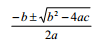

# 第三章 数据处理的流程控制

计算机程序是对特定数据进行特定操作的一系列编排好的处理步骤。第二章介绍了各种 类型的数据的表示和操作，本章介绍如何“编排”处理步骤的问题，即程序的流程控制。编 程语言①提供了控制流语句，用于控制程序从多条执行路径中选择一条路径执行下去。不同 语言支持的控制流语句在形式上可能各不相同，但其作用是相同的，大致可分为顺序、无条 件跳转、条件分支、循环、子程序等几类控制结构。

结构化程序设计方法的基本思想是只用顺序、条件分支和循环三种控制结构来编制程序， 并使整个程序由具有唯一入口和唯一出口的语句块相互串联、嵌套而成。这样的程序具有结 构清晰、易理解、易验证和易维护等优点。

# 3.1 顺序控制结构

## 3.1 顺序控制结构

程序是一个语句序列，执行程序就是按特定的次序执行程序中的语句。程序中执行点的

变迁称为控制流程，当执行到程序中的某一条语句时，也说控制转到了该语句。由于复杂问 题的解法可能涉及复杂的执行次序，因此编程语言必须提供表达复杂控制流程的手段，称为 编程语言的控制结构。

程序的控制流程可以用流程图（flowchart）来形象地表示。流程图采用标准化的图形符 号来描述程序的执行步骤，是一种常用的程序设计工具。在较低的抽象级上，流程图中的每 一个步骤可能都是单条语句，而在较高的抽象级上，每个步骤都可以是由多条语句构成的语 句块。本书中不另辟章节来系统地介绍各种标准的流程控制符号，而是通过例子演示常用流 程控制图形符号及其用法，因为这些内容是非常直观易懂的。

最简单的控制结构是顺序控制结构。编程语言并不提供专门的控制流语句来表达顺序控 制结构，而是用程序语句的自然排列顺序来表达。计算机按此顺序逐条执行语句，当一条语 句执行完毕，控制自动转到下一条语句。

现实世界中这种顺序处理的情况是非常普遍的，例如我们接受学校教育一般都是先上小 学，再上中学，再上大学；又如我们烧菜一般都是先热油锅，再将蔬菜入锅翻炒，再加盐加 佐料，最后装盘。如果一个处理过程由顺序执行的步骤 S1、S2、…、Sn 组成，用流程图表示 的话即如图 3.1 所示：


图 3.1 顺序控制结构

> ① 指命令式（或过程式）编程语言。函数式和逻辑式编程语言中没有这里所说的控制流语句。

作为例子，我们来写一个顺序控制结构的简单程序——温度转换程序。当中国人去美国旅游，听到导游说当地气温是 80 度，一定会感到困惑。其实美国人用的是华氏温标，与中国人用的摄氏温标不同。如果能写一个程序将华氏温度转换成摄氏温度，就可以帮助中国游客 知冷知热。实现温度转换的算法非常简单，只需顺序执行三个步骤：输入华氏温度值；转换 成摄氏温度值；输出摄氏温度值。下面是这个算法的流程图（图 3.2）及 Python 实现：


图 3.2 温度转换算法

【程序 3.1】eg3_1.py

```py
f = input("Temperature in degrees Farenheit: ") 
c = (f – 32) * 5.0 / 9
print "Temperature in degrees Celsius:", c 
```

执行这个程序，并输入 80，将看到屏幕显示转换结果是摄氏 26.6666666667 度，是一个 适合旅游的舒适温度。

图 3.2 中的三个步骤（除了开始、结束）恰好可以用程序 3.1 中的三条语句实现，但如前 所述，我们可以在比语句更高的级别上来考虑顺序执行的步骤。图 3.1 中的诸 Si 不一定对应 着单条语句，完全可以是一个语句块，并且这个语句块本身可由各种控制结构组成。例如程 序 3.1 的三个步骤就可以构成别的程序的一个步骤，如图 3.3 所示：


图 3.3 低级别步骤抽象成高级别步骤

这种将若干低级别步骤看成整体并构成一个高级别步骤的做法也是抽象的一种形式，是程序设计中广泛使用的思维方式，对此在 3.5.2 中有更一般的阐述。 顺序控制结构是最简单、最普遍的控制结构，计算机执行程序时的缺省控制流就是语句的自然排列顺序。但是，仅靠顺序执行的步骤是不足以解决复杂问题的，复杂问题一般需要 根据情况来改变执行顺序。

# 3.2 分支控制结构

## 3.2 分支控制结构

我们都有这样的生活经验：“道路”——不管它指的是具体道路，还是指“人生道路”这样的抽象道路——一般都不是能够笔直一条路走到底的，我们会时不时遇到岔路口，需要根 据一些条件来决定选择哪一条路继续前行。程序的控制流程也是一样，一般都不是从第一条 语句一直顺序执行到最后一条语句，而是在执行过程中需要根据不同情况来选择执行不同的 语句序列。编程语言中提供了根据条件来选择执行路径的控制结构，称为分支控制结构，也 称为条件或判断结构。

# 3.2.1 单分支结构

### 3.2.1 单分支结构

下面我们来改进程序 3.1，使得程序能向游客提供一些温馨提示，例如当温度达到摄氏 35 度就发出高温警告信息。显然这里需要判断温度是否高于 35 度，并根据是或否来执行不 同的动作。

所有编程语言都提供了条件语句（if 语句），用来实现有条件地执行语句的功能。Python 语言的 if 语句有多种形式，最简单的形式是：

```py
if <条件表达式>:
    <条件语句体> 
```

其中<条件表达式>是布尔表达式，<条件语句体>是由一条或多条语句组成的语句序列。<条件语句体>的左端与 if 部分相比必须向右缩进，表明它是 if 部分（不妨理解为条件语句的头 部）的下属，就像躯体是头部的下属一样。

if 语句的语义很容易理解：首先计算 if 后面的条件表达式，如果结果为 True，则控制转 到条件语句体的第一条语句，一旦条件语句体执行完毕，控制即转到 if 语句的下一条语句； 如果结果为 False，则跳过条件语句体，控制直接转到 if 语句的下一条语句。图 3.4 中的流程 图形象地解释了 if 语句的语义，其中菱形框表示条件测试。虽然 if 语句根据条件表达式计算 结果的不同而有两个分支，但我们习惯说这种形式的 if 语句实现的是单分支控制结构，因为 有一个分支什么也不做。注意，无论条件是真是假，最后控制都转到 if 语句的下一条语句， 也就是说这条 if 语句内部虽有两个分支，但总体只有一个出口①。


图 3.4 单分支控制结构

利用单分支形式的 if 语句，可以很容易地改进程序 3.1，使之具有高温告警功能。

> ① 在标准流程图符号中有一种连接符号，用于将两个进入的流程线合并成一个出去的流程线，这里的 if 语句 就可以用连接符号来合并两个分支的末端，形成唯一出口。但为了流程图的简明，我们没有用连接符号，而 是直接将两个流程线合并，相信这并不会影响对流程的理解。

【程序 3.2】eg3_2.py

```py
f = input("Temperature in degrees Farenheit: ") 
c = (f – 32) * 5.0 / 9
print "Temperature in degrees Celsius:", c if c > 35:
print "Warning: Heat Wave!" 
```

这个新版本在原来版本的最后增加了一条 if 语句，该语句的语句体是有条件地执行的。就是 说，程序的执行结果取决于变量 c 的值。

我们还可以进一步改进程序 3.2，使之针对极端寒冷的情况也发出寒潮告警信息。具体改 法和上面是类似的，只需再增加一条 if 语句来检查温度是否足够低。

【程序 3.3】eg3_3.py

```py
f = input("Temperature in degrees Farenheit: ") 
c = (f – 32) * 5.0 / 9
print "Temperature in degrees Celsius:", c if c &gt;= 35:
print "Warning: Heat Wave!" if c &lt;= -6:
print "Warning: Cold Wave!" 
```

# 3.2.2 两路分支结构

### 3.2.2 两路分支结构

有时我们希望根据条件表达式的不同计算结果（True 或 False），分别执行两个不同的语 句序列，这时可以使用具有两个分支的条件语句形式，即 if-else 语句：

```py
if <条件表达式>:
    <if-语句体> 
else:
    <else-语句体> 
```

if-else 语句的语义是：首先计算条件表达式的值，如果结果为 True，则执行 if-语句体；

如果结果为 False，则执行 else-语句体。无论哪种情况，语句体执行完毕之后，控制都转到 if-else 语句的下一条语句。参见图 3.5 所示的流程图。


图 3.5 两路分支控制结构

在使用两路分支的 if 语句时要注意：if 部分和 else 部分必须与一对非此即彼的条件相对 应，一个条件为真则另一个条件必为假，反之亦然。例如在程序 3.3 中，c>=35 和 c<=-6 就不是非此即彼的条件，因为还有既非酷热又非酷寒的第三种情形：-6 < c < 35。因此 在程序 3.3 中不能按如下方式使用 if 语句：

```py
if c >= 35:
print "Warning: Heat Wave!" else:
print "Warning: Cold Wave!" 
```

# 3.2.3 多路分支结构

### 3.2.3 多路分支结构

如果我们还想进一步改进程序 3.3，使之在-6 < c < 35 的情况下也显示一些信息，这 就需要一个三路的分支结构。三路分支可以利用两个嵌套的 if-else 语句来实现：

```py
if c &gt;= 35:
    print "Warning: Heat Wave!" 
else:
    if c &lt;= -6:
        print "Warning: Cold Wave!" 
    else:
        print "Have fun!" 
```

由于 if-else 语句中的<if-语句体>或<else-语句体>可以由任何 Python 语句组成，因此我们 可以再使用一条 if-else 语句，这称为语句的嵌套。分析上面这段代码可知，两条嵌套的 if-else 语句确实实现了三个分支，分别处理 c>=35、c<=-6 和-6<c<35 等三种情形。参见图 3.6， 其中顶层控制结构是一条 if-else 语句，虚线框整体视为它的一个分支；虚线框内是另一条 if-else 语句，它嵌套在顶层条件语句的 else 部分中。


图 3.6 用嵌套 if-else 实现三路分支

用嵌套 if-else 语句虽然能实现三路分支，但并非最好的方法。首先，这种用两个二路分 支来间接实现一个三路分支的做法使得三个分支不在一个层次上，不太符合原问题中的三个 并列分支的题意。其次，这种做法不适合需要更多分支的问题，例如实现五路分支时就必须 采用四层嵌套的 if-else 结构，这会使程序看上去非常难读，尤其是 Python 所要求的下层结构向右缩进的特点会使这条嵌套语句在水平方向占据过宽的空间，导致代码更加难读。

Python 中有一个更好的做法来写多路分支的条件判断，即 if-elif-else 语句。这条语句在 形式上其实是将嵌套 if-else 语句中的 else 与后续的 if 合并成了一个 elif 子句，形如：

```py
if <条件 1>:
    <情形 1 语句体>
elif <条件 2>:
    <情形 2 语句体>
    ...
elif <条件 n>:
    <情形 n 语句体> 
else:
    <其他情形语句体> 
```

if-elif-else 语句的语义是：顺序计算每一个条件表达式，找到第一个为 True 的条件，然后执行其下方缩进的语句体，执行完毕再将控制转到整个 if-elif-else 语句的下一条语句；如 果所有条件表达式的计算结果都是 False，则执行在 else 下方缩进的语句体。可见，这种形式 的条件语句实现了 n+1 个分支。另外，else 子句是可选的，但要注意的是，如果省略 else 子 句，则整个语句就可能没有符合条件的分支，从而不执行任何语句体。

不难看出，if-elif-else 语句既能像嵌套 if-else 结构一样实现多路分支，又具有各分支并列 的整齐划一的代码形式，这就解决了嵌套 if-else 语句的两个不足之处。下面我们利用 if-elif-else 结构来进一步改进温度转换程序：

【程序 3.4】eg3_4.py

```py
f = input("Temperature in degrees Farenheit: ") 
c = (f - 32) * 5.0 / 9
print "Temperature in degrees Celsius:", c 
if c >= 35:
    print "Warning: Heat Wave!" 
elif c <= -6:
    print "Warning: Cold Wave!" 
else:
    print "Have fun!" 
```

# 3.3 异常处理

## 3.3 异常处理

一个程序即使没有任何语法错误，即使解题的逻辑也正确，在执行的时候仍然可能出现 各种“运行时错误”，导致程序无法按照预定的步骤顺利执行、正常结束。其后果是要么由系 统强行中止程序的运行，要么程序带着错误继续运行而得出错误的结果。这类运行时错误称 为异常或例外（exception）。产生异常的原因是复杂而多样的，既有程序设计的问题，也有运 行环境的问题，如除数为零、用户输入数据的类型或个数不对、列表索引越界等等。

如果一个程序很容易受到异常的影响而崩溃（即中止执行），那就不是好的程序，因为程 序崩溃意味着无法完成预定的计算，不能满足用户的需求。另外，程序崩溃时系统一般会输 出一堆错误消息，这些消息对程序员来说没啥大不了，但对普通用户来说则是难以理解的一 堆技术术语。用户不知道发生了什么，也不知道该如何处理。

因此，程序员必须在程序中加入处理错误的代码，以便在发生错误的情况下能自己处理 错误，使程序错误对用户是不可见的。这样的程序在发生错误的情况下也能正常结束而非崩 溃，并且显示给用户的也是可理解的友好的信息。我们称这样的程序是健壮的（robust）。

本节介绍在程序中处理错误的两种方法：一种是传统的错误检测，一种是更现代的异常 处理（exception handling）机制。

# 3.3.1 传统的错误检测方法

### 3.3.1 传统的错误检测方法

如何提高程序的健壮性？关键显然在于如何发现运行时错误并加以处理。顾名思义，运行时错误是在程序运行时才暴露的，很难在静态的编译阶段检查出来。传统编程方法中常利 用 if 语句来检测可能导致异常发生的条件，以期发现并处理错误。具体的检测方式有两种， 一种是在执行任务之前检测条件，另一种是执行任务之后检测返回状态码或错误码。

作为例子，我们来编写一个求解一元二次方程的程序。利用初等代数知识，我们知道一 元二次方程 ax2+bx+c=0 的两个根是：



据此很容易写出下面这个程序：

【程序 3.5】eg3_5.py

```py
import math
a, b, c = input("Enter the coefficients (a, b, c): ") 
discRoot = math.sqrt(b * b - 4 * a * c)
root1 = (-b + discRoot) / (2 * a) 
root2 = (-b - discRoot) / (2 * a)
print "The solutions are:", root1, root2 
```

本程序先由用户输入一元二次方程的三个系数，然后利用公式算出两个根，并显示结果。 这个版本看上去很直接了当，似乎符合预期的功能，但实际上这个版本很有问题。下面我们 来运行这个程序：

```py
>>> import eg3_5
Enter the coefficients (a, b, c): 1,2,3
Traceback (most recent call last):
File "<pyshell#0>", line 1, in <module> import eg3_x
File "eg3_x.py", line 3, in <module> discRoot = math.sqrt(b * b - 4 * a * c)
ValueError: math domain error 
```

由于用户输入的系数 1、2、3 使得一元二次方程的判别式 b2 - 4ac 小于零，因此当程序 运行到调用 math.sqrt 函数时导致错误，程序崩溃并输出上面这一堆错误信息。作为专业的程 序员，对这里发生的一切自然能理解，但作为普通的用户，看到这些天书般的的错误信息时 除了抱怨程序不好用，还能怎么办呢？

为了增强程序 3.5 的健壮性，可以用 if 语句来检查判别式的值，以便区别处理方程有实 数根和无实数根的两种情形，避免在无实数根的情况下崩溃。改进版本如下：

【程序 3.6】eg3_6.py

```py
import math
a, b, c = input("Enter the coefficients (a, b, c): ") 
discrim = b * b - 4 * a * c
if discrim &gt;= 0:
    discRoot = math.sqrt(discrim)
    root1 = (-b + discRoot) / (2 * a) 
    root2 = (-b - discRoot) / (2 * a)
    print "The solutions are:", root1, root2 
else:
    print "The equation has no real roots!" 
```

从程序中可见，仅当判别式 discrim 大于等于 0 时，才去调用 math.sqrt 函数求其平方根， 这样 sqrt 不会出错，从而避免了程序崩溃；当 discrim 为负数时，并不调用 sqrt，而是向用户 显示一些信息，告诉用户发生了什么，程序同样能正常结束。

下面分别测试程序 3.6 对两种情形的判别式的执行效果：

```py
>>> import eg3_6
Enter the coefficients (a, b, c): 1,2,3
The equation has no real roots!
>>> reload(eg3_6)①
Enter the coefficients (a, b, c): 1,3,2
The solutions are: -1.0 -2.0 
```

从结果可见程序 3.6 确实达到了预期的目的，健壮性得到了增强。

像程序 3.6 这样利用 if 语句来检测可能的出错条件，以阻止可能导致错误的语句的执行， 这是一种常用的错误检测方式。下面介绍另一种错误检测方式。

很多时候要执行的语句实际上是函数调用②，被调用的函数可能是我们自己写的，也可 能是标准函数库里定义的。函数作为一个具有相对独立性的程序块，一般都有自己的错误检 测代码，并根据执行是否正常而返回不同的“错误码”给调用者。这样，函数的调用者可以 无条件地调用函数，然后根据函数返回的错误码来了解函数的执行情况，并基于此来决定下 一步行动。例如，假设有一个求平方根的函数 robustSqrt 在参数为负数时返回错误码-1（由 于实数的平方根总是正数，返回-1 就表明发生了异常）：

```py
def robustSqrt(x): 
    if x < 0:
        return -1 
    else:
        return math.sqrt(x) 
```

那我们就可以不必先检测判别式的正负，而是直接调用 robustSqrt，并通过它的返回值来检测 是否发生了异常。示例代码片段如下：

```py
discRoot = robustSqrt(b * b – 4 * a * c) 
if discRoot < 0:
    print "The equation has no real roots!" 
else:
    root1 = (-b + discRoot) / (2 * a) 
    root2 = (-b – discRoot) / (2 * a)
    print "The solutions are:", root1, root2 
```

与程序 3.6 中的错误检测代码相比，上面这种错误检测代码更可取。理由是：函数就像 一个提供特定功能的“黑盒”，我们只需调用其功能，不需了解其内部细节，因此让函数自己 在内部进行错误检测更符合“黑盒”原则。程序 3.6 中的错误检测建立在对函数 math.sqrt 内 部执行细节（即负数导致崩溃）的了解之上，因而不符合“黑盒”原则。

> ① reload 函数用于重新运行一个已成功导入的模块。
> 
> ② 关于函数，详见第四章。

# 3.3.2 传统错误检测方法的缺点

### 3.3.2 传统错误检测方法的缺点

传统的错误检测方法是过去广泛使用的，这种做法有一个缺点：由于需要检测错误的地方非常多，最终导致程序中充斥着大量的错误检测代码，这些“喧宾夺主”的代码使得程序 控制结构复杂，程序逻辑难以理解，代码也难维护。例如，如果每次调用函数都要检测其返 回的错误码，会导致程序中存在大量如下形式的代码片段：

```py
x = doOneThing() 
if x == ERROR:
    异常处理代码
    ...... 
```

或者更简练（但更难读）地写成：

```py
if doOneThing() == ERROR:
    异常处理代码
    ...... 
```

假如我们解决某个问题的算法是顺序执行三个步骤，用三个函数调用表示如下：

```py
doStep1() 
doStep2() 
doStep3() 
```

这段代码清晰地表明了要做的事情是什么，逻辑非常容易理解。但是当我们加入大量的

错误检测代码之后，可能写出如下代码：

```py
if doStep1() == ERROR： 
    错误处理代码 1
elif doStep2() == ERROR:
    错误处理代码 2
elif doStep3() == ERROR:
    错误处理代码 3 
```

从这段代码可见，原先很清晰的连续的三个步骤与错误检测代码纠缠在一起，导致解决 问题的关键算法变得非常隐晦。当需要检测的异常情形（对应着函数返回的错误码）很多的 时候，程序逻辑会深深地掩埋在这些错误检测代码之中。

# 3.3.3 异常处理机制

### 3.3.3 异常处理机制

那么，有没有办法使我们既能增强程序的健壮性，又不影响程序逻辑的清晰和完整呢？

现代编程语言提供了异常处理机制来解决这个问题。异常处理机制的基本思想是：程序运行 时如果发生错误，就“抛出”一个异常，而系统能够“捕获”这个异常并执行特定的异常处 理代码。图 3.7 中给出了异常抛出和捕获的示意图，从图中可见，异常实际上是一种可能改 变程序控制流的事件，使我们能跳出某个正常执行的程序块。


图 3.7 异常的抛出、捕获和处理

打个比方，当厨师在按照预定的菜谱做菜时，如果执行到某个步骤发现酱油没了或炉具 坏了，就只能跳出正常步骤，转到能处理这种意外的程序：酱油没了可以去买酱油，买回来 后可以继续做菜；炉子坏了一般只好中止做菜。

Python 语言也提供了这样的异常处理机制。在 Python 中，异常处理是通过一种特殊的控 制结构来实现的，即 try-except 结构。try 语句的最简单形式如下：

```py
try:
    <语句块> 
except:
    <异常处理语句块> 
```

其语义是：执行<语句块>，如果一切正常，执行结束后控制转向 try-except 的下一条语句；如果执行过程中发生了异常，则控制转向异常处理语句块，执行结束后控制转向 try-except 的下一条语句。

缺省异常处理

我们前面所写的程序都没有使用异常处理，这时如果程序出现运行时错误，实际上会由 Python 进行缺省的异常处理。Python 所做的事情只是简单地中止程序运行，并显示一些错误 信息。例如：

```py
>>> a = "Hello"
>>> print a[5]
Traceback (most recent call last): File "<stdin>", line 1, in <module>
IndexError: string index out of range 
```

上面第二条语句导致索引越界错误，这个异常被 Python 捕获并显示标准错误信息。从例 中可见，错误信息包括两个部分：错误类型（如 IndexError）和错误描述（如 string index out of range），两者用冒号分隔。另外，Python 还追溯错误发生的地方，并显示有关信息。

程序自己处理异常

Python 的缺省异常处理使应用程序中止，控制转给 Python 解释器。如果应用程序需要在 发生异常的情况下仍能正常结束，就需要使用 try-except 语句来自己捕获并处理异常。例如：

```py
>>> a = "Hello"
>>> try:
        print a[5] 
    except IndexError:
        print "Index wrong!"
Index wrong! 
```

索引越界错误发生之后，控制自动转到 except 子句下面的处理代码，处理完毕还可以继 续执行程序的其他语句。如果没有错误，则忽略 except 部分。

异常处理机制的优点

相对于错误检测代码，使用异常处理机制可以使程序的核心算法代码与错误处理代码相互分离，从而保持程序结构的清晰。如果要了解程序的主要算法，只需读 try 下面的语句块， 完全不会被繁杂的错误检测打扰。例如，如果用 try-except 语句来实现上一小节中的“三步 走”例子，只需用一个 except 子句来捕获 doStep1、doStep2 和 doStep3 等步骤可能抛出的各 种异常，代码形如：

```py
try:
    doStep1() 
    doStep2() 
    doStep3()
except:
    doErrorProcessing() 
```

显然，这种形式的代码既能保持算法逻辑的清晰完整，又能实现错误检测，圆满解决了 上一小节中提到的错误检测的弊端。

如果要做的事情步骤很多、流程很复杂，将所有代码堆积在 try 之下又会使程序结构不 清晰。这时可以利用模块化设计将程序逻辑表达为许多函数①，然后在 try 部分调用各函数， 形如：

```py
def doMyJob(): 
    doStep1() 
    doStep2()
    ...
    doStep100()
    try:
        doMyJob() 
    except:
        doErrorProcessing() 
```

也可以让程序的每个模块各自具有自己的异常处理，而不是将异常抛出给其他模块处理。

分类处理异常

以上用到的简单形式的 try 语句不加区分地对所有错误进行相同的处理，如果需要对不同错误类型进行不同的处理，则可使用更精细的控制：

> ① 见第四章。

```py
try:
    <语句块>
except <错误类型 1>:
    <异常处理语句块 1>
    ...
except <错误类型 n>:
    <异常处理语句块 n> 
except:
    <缺省异常处理语句块> 
```

其语义是：执行<语句块>，如果一切正常，执行结束后控制转向 try-except 的下一条语句； 如果执行过程中发生了异常，则系统依次检查各个 except 子句试图找到与所发生的异常相匹 配的错误类型。如果找到，就执行相应的异常处理语句块，如果找不到则执行最后一个 except 子句下的缺省异常处理语句块。异常处理结束后控制转到 try-except 的下一条语句。注意， 最后一个不含错误类型的 except 子句是可选的，用于捕获所有未预料到的错误类型。如果未 使用最后这个 except 子句，那么当异常与所有错误类型都不匹配时，则由 Python 解释器捕获 异常并处理之①。如前所述，Python 的缺省异常处理是中止程序并显示错误信息。

理解了异常处理的基本知识后，下面我们利用 try-except 语句来改写一元二次方程求解 程序，代码如下：

【程序 3.7】eg3_7.py

```py
import math 
try:
    a, b, c = input("Enter the coefficients (a, b, c): ") 
    discRoot = math.sqrt( b * b - 4 * a * c)
    root1 = (-b + discRoot) / (2 * a) 
    root2 = (-b - discRoot) / (2 * a)
    print "The solutions are:", root1, root2 
except ValueError:
    print "The equation has no real roots!" 
```

程序 3.7 这个版本和程序 3.5 中的版本非常相似，只是在程序 3.5 所示的核心算法之外增 加了一个 try-except 结构。从而做到了既保持清晰的核心算法逻辑，又避免因判别式为负数 而导致程序崩溃。让我们再次以系数 1、2、3 来执行这个程序：

```py
>>> import eg3_7
Enter the coefficients (a, b, c): 1,2,3
The equation has no real roots! 
```

可见不适当的系数并没有使程序崩溃，异常处理代码捕获了 math.sqrt 引起的异常，使程 序得以正常结束。

除了判别式为负导致 math.sqrt 出错之外，还有多种可能导致程序出错的情形。例如：用 户输入系数的个数不足或者输入的是字符串而非数值均可导致 TypeError，输入未定义的变量 而非字面值可导致 NameError，为系数 a 输入 0 可导致 ZeroDivisionError，等等。使用 try...except 语句可以捕获任何预先想到的异常类型，使用缺省 except 还可以捕获所有未预料到的异常， 从而使程序在任何运行时错误发生的情况下都不会崩溃。下面是更完善的解方程程序版本：

> ① 对于多层的程序结构（外层调用内层，内层又调用更内层），当发生异常时，如果本层没有匹配的异常处 理代码，则该异常被交给上一层处理。上一层没有匹配的异常处理代码就继续往上传，直至要么找到匹配， 要么到达顶层（即 Python 解释器）进行缺省异常处理。

【程序 3.8】eg3_8.py

```py
import math 
try:
    a, b, c = input("Enter the coefficients (a, b, c): ") 
    discRoot = math.sqrt( b * b - 4 * a * c)
    root1 = (-b + discRoot) / (2 * a) 
    root2 = (-b - discRoot) / (2 * a)
    print "The solutions are:", root1, root2 
except ValueError:
    print "The equation has no real roots!" 
except TypeError:
    print "Wrong coefficients!" 
except NameError:
    print "Undefined variable!" 
except:
    print "Something wrong!" 
```

总之，使用了 try 语句后，不管发生什么错误（除了 Python 系统之外的问题，如操作系 统错误、硬件故障等）程序都可以避免崩溃。

使用 try-except 语句尽管看上去有点繁琐，但它确实是编写健壮程序所必需的。在实际 应用开发中，要想写出职业水准的程序，就应该考虑各种可能的异常情形，以防止用户得到 难以理解的结果。当然，初学编程时，经常不去考虑错误输入等程序健壮性问题，而是把注 意力放在算法和数据结构等方面。

# 3.4 循环控制结构

## 3.4 循环控制结构

计算机是以一步一步执行指令的方式来解决问题的，程序员要做的事情就是将问题的解决方案表达成一步一步执行的指令序列。在解决问题的指令序列中，经常会遇到需要重复执 行的一组操作。例如，假设程序要求用户输入 5 个数据，怎么表达这个要求呢？一种方式是 将所有步骤罗列出来：

```py
Step1：输入 1 个数据存入变量 a 
Step2：输入 1 个数据存入变量 b 
Step3：输入 1 个数据存入变量 c 
Step4：输入 1 个数据存入变量 d 
Step5：输入 1 个数据存入变量 e 
```

这种表达方式既直接又简单，但是明显有局限性——若要求输入 100 个数据怎么办？难道直

接用 100 行几乎相同的指令，并且命名 100 个变量来存储输入数据？这显然是非常笨拙的编 程方式。我们来看另一种表达方式：

```py
Step1：输入 1 个数据存入集合 a
Step2：如果已经输入了 5 个数据，就结束；否则转到 Step1。 
```

这种表达方 式一方面使 用了集合来 存储大量数 据，另一方 面采用了“ 循环”结 构（Step1®Step2®Step1）来控制流程。其功能与罗列所有步骤的方式是一样的，但形式上更 简洁，并且可以轻松地推广到 100 个输入的情形而不增加代码量（只需将 Step2 中的 5 改成 100 即可）。鉴于编程语言的任务之一就是提供合适的语言构造使程序员能够方便地表达程序 逻辑，这第二种表达方式应该被编程语言所支持，事实上也正是如此。例如对于大量数据的 存储，Python 提供了列表等类型，只要一个变量就能存储 100 个数据。而为了表达重复执行的指令，Python 提供了循环语句，这正是本节要介绍的主要内容。 循环是程序中的一组语句，只写一次但可以连续执行多次。在编程语言中，构成循环的

这组语句的连续执行的次数一般有三种方式指定：第一，直接指定循环次数；第二，遍历一 个数据集合，从而间接指定循环次数（集合有多少成员就循环多少次）；第三，指定一个条件， 当条件满足时循环或者循环执行到条件满足为止。

下面介绍 Python 语言中的循环结构。

# 3.4.1 for 循环

### 3.4.1 for 循环

最简单的循环是已知重复执行次数的循环。小学生经常有这样的“痛苦”时刻：因为一 个字（比如“烦”）写错了，被老师要求订正 10 遍。这时小学生没有捷径可走，只能在本子 上一遍一遍地写上 10 次。如果是命令计算机在屏幕上写 10 遍“烦”，是不是也只能用下面的 10 行指令来实现呢？

```py
print "烦" 
print "烦"
......
print "烦" 
```

显然，这种做法非常烦琐，需要在键盘上敲很多键，而且不具有扩展性（抄写 1 万遍怎么办？）。本节介绍 Python 语言中的 for 语句，可以很好地解决上面这个问题。

for 语句的常用语法形式如下：

```py
for <循环控制变量> in <序列>:
    <循环体> 
```

其语义是：用序列中的成员逐个赋值给循环控制变量，对每一次赋值都执行一遍循环体。当序列被遍历，即每一个值都用过了，则循环结束，控制转到下一条语句。注意，循环体部分 相对于 for 部分要左缩进。for 语句的执行流程如图 3.8（a）所示，或更常见地画成图 3.8（b） 的样子。


（a） （b）

图 3.8 for 循环的流程图

for 循环的循环次数显然是由序列中有多少成员（即序列长度）决定的，而循环控制变量 的作用是存储每一次循环所涉及的序列成员的信息。不难理解，循环控制变量的作用一般仅 仅限于这个循环语句，出了这个循环语句循环控制变量就失去了它的作用。因此，编程序时 最好用一个新变量来做循环控制变量，而不是用前面已经使用过的变量名，以便突显循环控 制变量专用于循环控制的角色，不引起理解上的混乱。

下面介绍利用 for 语句建立的几种常见循环模式。

计数器循环

我们可以用下面的 for 语句来解决将“烦”字显示 10 遍的问题：

```py
>>> for i in range(10):
print "烦",
烦 烦 烦 烦 烦 烦 烦 烦 烦 烦 
```

这条 for 语句的执行流程是这样的：计算 range(10)得到列表[0,1,2,3,4,5,6,7,8,9]，然后令 变量 i 从左往右取遍列表[0, 1, ... , 9]中的每一个值，并对所取的每个值都执行一次 print 语句。 由于列表有 10 个成员，故 print 就被执行了 10 次。注意 print 语句相对上面一行要缩进，表 示它是 for 循环要重复执行的语句。

在上面这个例子中，循环体与循环控制变量的值没有关系，即不管循环控制变量从序列 中取的值是什么，循环体总是固定地执行 print "烦"。从效果上看，循环控制变量和序列仅仅 起着计数器的作用，用于控制循环次数，这种循环模式称为计数器循环。

当然，循环体引用循环控制变量的值也是很常见的。这种情况下，循环控制变量不仅控 制循环次数，而且直接影响循环体的行为。例如，下面这个程序可以计算 1 到 n 的平方和：

【程序 3.9】eg3_9.py

```py
n = input("Input a number: ") 
sum = 0
for i in range(1,n+1): 
    sum = sum + i*i
print "The result is:",sum 
```

执行此程序，将得到如下输出：

```py
>>> import eg3_9 
Input a number: 100 
The result is: 338350 
```

遍历数据项列表

for 语句是针对任意序列进行遍历来建立循环的，并非只能与 range(10)之类的数字序列 搭配构成计数器循环。例如，下面的代码针对一个杂乱数据项构成的列表进行遍历：

```py
>>> data = ['Born on:','July',2,2005]
>>> for d in data:
...     print d,
...
Born on: July 2 2005 
```

这里，数据列表的作用显然不是循环计数。当然，这种对数据列表的数据项进行遍历的 循环也可以转化成对数据列表的索引进行循环，代码如下：

```py
>>> data = ['Born on:','July',2,2005]
>>> for i in range(len(data)): 
        print data[i],
Born on: July 2 2005
``` 显然这是不必要的。一般来说，直接对数据列表进行循环不但代码简单，执行效率也比针对 列表索引建立的循环要高。所以，如果没有必要，尽量不要使用 for 与 range 函数的搭配。

下面我们看一个最好用列表索引来建立循环的例子：假如我们希望对 data 列表间隔着访 问其成员（比如每次跳过两个成员），而不是顺序遍历列表，这时就可以用 range 函数来建立 索引。代码如下： 
```py

> > > data = ['Born on:','July',2,2005] for i in range(0,len(data),3): print data[i], Born on: 2005 ```

遍历列表的同时修改列表

另一个常见的需要用序列索引来建立循环的情形是在遍历一个列表的同时要修改它，例

如：将列表中的每一个值都加 1。下面这个做法是错误的：

```py
>>> data = [1,2,3,4,5]
>>> for x in data:
        x = x + 1
>>> data
[1, 2, 3, 4, 5]
>>> x 
6 
```

原因是循环体中修改的是循环控制变量 x 而非列表 data。尽管 x 的值来自列表，但修改 x 的

值并不会导致该值的来源处发生改变。为了修改遍历的列表，可以使用列表索引来对列表的 相应位置赋值。代码如下：

```py
>>> data = [1,2,3,4,5]
>>> for i in range(len(data)): 
        data[i] = data[i] + 1
>>> data
[2, 3, 4, 5, 6]
>>> i 
6 
```

遍历其他序列类型

回顾第二章的内容，序列是由若干数据项组成的一个有序的集合体，列表、字符串和元 组都是序列。前面的例子中所用的序列都是列表，下面通过例子演示利用字符串或元组建立 循环。先看针对字符串的 for 循环，其作用是将一个字符串的每个字符分拆显示：

```py
>>> for c in "Hello World!": 
        print c,
H e l l o W o r l d ! 
```

可见，字符串其实就是一个字符序列，for 语句通过取遍字符串中的每一个字符来建立循环。 注意，如果 for 的循环体只有一行语句，那么可以直接跟在 for 那一行的冒号后面。还要注意 print 语句末尾的逗号，它使 print 不换行，从而让各字符显示在同一行上。

再看一个针对元组的 for 循环例子：

```py
>>> for i in (1,2,3): 
        print i
1
2
3 
```

可见，用于 for 循环时，元组和列表具有完全一样的作用。 我们还可以构造更复杂的嵌套结构的序列用于 for 循环，如元组的元组、元组的列表、

字符串的列表等等。以“元组的列表”为例，即列表中每个成员是元组。由于控制循环的循 环控制变量每次取序列中的一个成员作为值，所以这种情况下循环控制变量所取的值是元组。 例如：

```py
>>> for t in [(1,2),(3,4),(5,6)]:
        print t,t[0],t[1] 
```

也可以用多个循环控制变量构成元组来建立 for 循环：

```py
>>> for (x,y) in [(1,2),(3,4),(5,6)]:
        print x,y
1 2
3 4
5 6 
```

此例中，第一次循环时执行的赋值是(x,y) = (1,2)，亦即 x 和 y 分别赋值 1 和 2。 最后看一个更复杂的序列：

```py
>>> for ((a,b),c) in [([1,2],3),['XY',6]]:
        print a,b,c
1 2 3
X Y 6 
```

这个 for 语句的第一次循环相当于先执行了赋值：

```py
((a,b),c) = ([1,2],3) 
```

第二次循环相当于执行了赋值：

```py
((a,b),c) = ['XY',6] 
```

从此例可见，元组、列表、字符串三种序列类型是非常相似的，可以相互赋值。

# 3.4.2 while 循环

### 3.4.2 while 循环

for 循环要求预先确定循环的次数，但有很多问题难以预先确定循环次数，只知道在什么 条件下需要循环，这时可以使用 while 语句。Python 语言中 while 语句的常用格式是：

```py
while <布尔表达式>:
    <循环体> 
```

其语义是：当布尔表达式计算为 True 时，执行一遍循环体，执行完毕控制转回 while 语句的开始处重新测试布尔表达式；当布尔表达式计算为 False 时，控制转向下一条语句。注意， 循环体部分相对于 while 部分要左缩进。while 语句的流程图如图 3.9 所示。


图 3.9 while 循环的流程图

显然，while 语句的循环次数取决于布尔表达式何时变成 False，而不是预先确定循环次 数。稍微深入思考一下就会发现一个问题：万一布尔表达式永远不会变成 False 怎么办？如 果进入循环语句时布尔表达式计算为 True，而循环体又不会影响布尔表达式的值，那么执行 完循环体后控制回到循环入口处时，布尔表达式仍然为 True。这种情况下 while 循环永远不 会停下来，称为无穷循环。程序中如果有一个无穷循环就意味着程序无法终止，我们常说程 序进入了“死循环”，这是程序设计中经常出现的错误。要想避免无穷循环，必须使循环体对 布尔表达式的值产生影响，例如改变布尔表达式中所用到的变量的值。

在实际编程中，while 循环有一些常用的套路或称模式，值得读者熟记于心。下面通过“对 一批数据求和”的例子来介绍这些循环模式。

交互式循环

考虑这样的应用：用户不断输入数据，程序得到数据后不断累加，最后算出输入数据的 总和。显然，这是一个“输入——累加”的反复循环的过程。由于用户输入数据的个数不是 预先给定的，故无法用 for 循环来实现，而 while 语句则能轻松解决这个问题。为了对循环进 行控制，我们每次循环前都询问用户是否还有新数据。这种通过与用户进行交互来决定是否 需要循环的模式称为交互式循环，可以用伪代码表达如下：

```py
将循环控制变量 moredata 初始化为"yes"
while moredata 值为"yes":
    获得用户输入的下一个数据
    处理该数据
    询问用户是否还有输入数据，为变量 moredata 赋值 
```

下面是利用交互式循环实现的完整程序。

【程序 3.10】eg3_10.py

```py
sum = 0 moredata = "yes"
while moredata[0] == "y":
    x = input("Input a number: ") 
    sum = sum + x
    moredata = raw_input("More numbers? (yes/no) ") 
print "The sum is", sum 
```

下面是这个程序的执行情况：

```py
Input a number: 2
More numbers? (yes/no) yes
Input a number: 5
More numbers? (yes/no) yeah
Input a number: 8
More numbers? (yes/no) no
The sum is 15 
```

要说明的是，这个程序通过检查 moredata[0]来控制是否循环，因此只要用户输入的首字 母是"y"就能进入循环体执行，而任何非 y 开头的输入都导致停止循环。

此版本有个不好的地方：用户需要不停地先回答是否还有数据，有的话再输入数据。这 对用户来说有点烦琐。也就是说，交互式循环其实并不适合“输入 n 个数据求和”的问题。

哨兵循环

解决“输入数据求和”问题的更好方法是使用哨兵循环，即不断执行“输入——累加” 这个循环体，直至遇到一个称为“哨兵”的特殊数据值。任何值都可以当作哨兵，关键是它 必须与正常数据值相互区别。哨兵循环的一般模式如下：

```py
前导输入
while 不是哨兵： 
    处理数据 
    循环尾输入 
```

首先，在循环开始之前需要利用“前导输入”获取第一个数据。如果该数据是哨兵，则 不会进入循环，控制转向 while 的下一条语句；如果是正常数据，则进入循环处理之。在循 环体的末尾读取下一个数据，并转到循环开始处的哨兵测试。如此周而复始，直至遇见哨兵 循环才终止。

注意，哨兵循环用到了两条一模一样的输入语句：一条是位于循环体之前的“前导输入”， 另一条是位于循环体末尾的“循环尾输入”。这两条输入语句缺一不可：少了前导输入则无法 进入循环；少了循环尾输入则无法读取下一数据，从而循环一直在对第一个数据进行处理， 导致无穷循环。

使用哨兵循环，需要选择一个特殊数据作为哨兵。这个特殊数据一般和正常数据属于同 样的类型，以便能被 while 语句统一检测。如果哨兵数据和正常数据属于不同类型，那么 while 语句的条件表达式就会变复杂，因为需要处理两种类型的数据。具体选择什么数据作为哨兵，要看具体的应用场景。例如，假设我们输入的数据是考试成绩（非负数），那么可以选－1 作 为哨兵，因为负数是不可能成为合法考试成绩的。又假如我们输入的数据是人名（字符串）， 那么可以选空串作为哨兵。一个很常用的场景是文件处理，即输入的数据来自一个文件，这 时可以很自然地在文件末尾存放一个特殊数据作为哨兵，很多语言甚至提供专门的测试文件 尾的手段（如常量 EOF①或函数 eof()之类）。关于文件处理详见第六章。

下面我们用哨兵循环来实现求和程序。

【程序 3.11】eg3_11.py

```py
sum = 0
x = input("Input a number (-1 to quit): ") 
while x &gt;= 0:
    sum = sum + x
    x = input("Input a number (-1 to quit): ") 
print "The sum is", sum 
```

可见哨兵循环与交互式循环不同，不需要用户不停地回答 yes 来处理数据。下面是此程序的执行情况：

```py
Input a number (-1 to quit): 2 
Input a number (-1 to quit): 5 
Input a number (-1 to quit): 8 
Input a number (-1 to quit): -1 
The sum is 15 
```

如果程序 3.11 中待求和的数据是任意实数的话，那么－1 可能是正常数据，不能作为哨

兵。事实上，所有实数都不能作为哨兵。这时可以采用字符串类型来解决问题，因为正常的 输入数据（正数、负数和 0）都可以表示为由阿拉伯数字组成的非空字符串，从而包含非数 字字符的字符串都可以用作哨兵。最简单最常用的特殊字符串是空字符串""（注意两个引号 之间没有东西），当用户在输入时直接键入回车，Python 即返回空串。当然，这种做法中对 数据的处理要麻烦一点，需要将字符串转换为数值类型以便进行求和计算。下面是以字符串 方式输入数值数据的求和程序版本：

【程序 3.12】eg3_12.py

```py
sum = 0
x = raw_input("Input a number (&lt;Enter&gt; to quit): ") 
while x != "":
    sum = sum + eval(x)
    x = raw_input("Input a number (&lt;Enter&gt; to quit): ") 
print "The sum is", sum 
```

执行示例如下：

```py
Input a number (<Enter> to quit): 2 
Input a number (<Enter> to quit): 5 
Input a number (<Enter> to quit): -8 
Input a number (<Enter> to quit):
The sum is -1 
```

此运行示例的第四行中，输入时直接按回车键，导致 Python 将空串赋值给了 x，从而使循环 终止。

> ① 意为 End-Of-File

在哨兵循环模式中有一个容易犯错误的地方：当用户的前导输入本身就是哨兵，从而导致循环一次也不执行时，while 后面的语句可能没有预料这种情况，导致无法正确执行。例如， 我们将程序 3.11 改成计算平均值，算法基本不变：反复输入数据，在循环中累加数据总和 sum 及数据计数 count，当用户输入哨兵－1 时退出循环并计算平均值。代码如下：

```py
sum = 0
count = 0
x = input("Input a number (-1 to quit): ") 
while x &gt;= 0:
    sum = sum + x count = count + 1
    x = input("Input a number (-1 to quit): ") 
print "The average is", sum / count 
```

运行此程序，并且首先输入－1，看看会发生什么？是的，由于未进入循环，sum 和 count 都保持为初始值 0，while 的下一条语句在计算平均值的时候发生了除数为 0 的错误！

后测试循环

前面介绍的 while 循环例子都是“前测试”循环，即先检测循环条件，再进入循环。显 然，如果首次测试条件得到 False，则循环体就会一次也不执行。有些实际应用问题要求循环 体必须至少执行一次，例如“输入合法性检查”问题。用户输入数据，程序检查用户的输入 是否合法：如果合法则程序继续向后执行，否则就回到前面要求用户重新输入，直至输入合 法为止。这种输入合法性检查在程序设计中是非常普遍的，好的程序员应该尽量对用户的输 入进行合法性检查。为了实现输入合法性检查，显然需要先获得用户的输入，然后进入循环 语句，即循环至少会执行一次，最后再测试条件决定是否继续循环。因此，我们需要一种“后 测试”循环结构。

有一些语言提供了 repeat-until 或者 do-while 循环结构来实现后测试循环，其语义分别是 “重复做某事，直至满足某条件”和“做某事，当满足条件时重复”。这种循环结构的流程图 如图 3.10 所示①。


图 3.10 后测试循环控制结构

从图中可见循环体至少执行一次，而循环条件检测位于循环体的最后，这正是“后测试”名称的由来。

> ① 细微差别：这个流程图其实是 repeat-until 结构。将 True 和 False 互换位置，才是 do-while 结构。

Python 语言没有提供类似 repeat-until 结构的语句，但我们不难用 while 来实现后测试循环：只要保证循环条件初始为 True，自然就会执行一次循环体，而后续循环由条件测试决定。 例如，假设程序要求用户输入一个正数，则可用下面的代码片段来检查输入合法性：

```py
x = -1
while x < 0:
x = input("Please input a positive number: ") 
```

其中第一行的作用是使首次条件检测为真，因此循环体至少执行一次；接下去的条件检测就 相当于位于循环体最后，整个语句也就等价于后测试循环。

不难看出，程序 3.10 中的交互式循环将 moredata 初始化为 True，因此实际上是后测试 循环的一种，效果是使用户至少输入一个数据。

while 计数器循环

虽然一般来说 for 语句用于固定次数的循环，while 语句用于不定次数的循环，但两者之 间并无本质不同，完全可以用 while 来实现固定次数的循环。为了循环 n 次，用 while 实现的 计数器循环模式如下：

```py
计数器 count 置为 0 
while count < n:
    处理代码
    count ＝ count + 1 
```

可见，用 while 语句实现计数器循环时需要手动控制循环控制变量 count 的变化，而 for 语句是自动处理的。使用时具体要注意两点：第一，必须为 count 赋初值，否则 while 后的布 尔表达式无法计算；第二，必须在循环体中改变 count 的值，否则会导致无穷循环。

例如，前面罚写 10 遍“烦”字的计数器循环，可以用 while 语句实现如下：

```py
>>> i = 0
>>> while i < 10:
        print "烦", 
        i = i + 1
烦 烦 烦 烦 烦 烦 烦 烦 烦 烦 
```

在此例中，i 初值为 0，以后每次循环都加 1，由于从 0 到 9 都是满足循环条件的，所以 总共执行 10 次循环。第 10 次循环后，i 值为 10，不满足循环条件，故退出循环，控制转到 下一条语句。

上面的 while 计数器循环模式是让计数器从小到大变化，同样常用的还有让计数器从大 到小变化的模式：

```py
计数器 count 置为 n 
while count > 0
    处理代码
    count ＝ count - 1 
```

使用这种模式实现上面的例子，代码如下：

```py
>>> i = 10
>>> while i > 0:
        print "烦", i = i - 1
烦 烦 烦 烦 烦 烦 烦 烦 烦 烦 
```

值得一提的是，计算机编程中我们经常是从 0 开始计数的，而不是日常生活中的从 1 开始。上例中的 while 语句都是对从 0 到 9 的 10 个值进行循环。如果读者更习惯从 1 开始计数， 也可以先为 count 赋予初值 1，然后在循环体中不断加 1，从而实现对从 1 到 10 的 10 个值进 行循环，这样能与日常说的第 1 次、第 2 次、…、第 10 次在序数上对应起来。但是要注意的 是，这时需要将循环条件改成 count<=10 或 count<11。循环控制变量的边界值是初学者容易 犯错的地方，经常导致循环次数多 1 次或少 1 次。

# 3.4.3 循环的非正常中断

### 3.4.3 循环的非正常中断

正常的循环总是按“从头到尾再回到头”的方式进行的，但是很多编程语言都提供了在特定条件下打破正常循环方式的语句，目的是在某些情况下可以编写更简单的代码。Python 语言中也提供了这样的语句：break 和 continue。

break 语句

for 或 while 语句的循环体中可以使用 break 语句，其效果是终止本次循环，并将控制跳 出循环语句，转到循环语句的下一条语句。

break 语句经常与一个无穷循环搭配使用，因为按正常途径是跳不出无穷循环的，而用 break 则能以非正常方式跳出循环。例如，我们换一种方法来实现“输入合法性检查”，代码 如下：

```py
>>> while True:
        x = input("Please input a positive number: ") 
        if x > 0: 
            break
Please input a positive number: -2 
Please input a positive number: 0 
Please input a positive number: 2
>>> 
```

这里循环条件是常量 True，它的值是不可能被循环体改变的，即永远为真，所以这是一个无 穷循环①。与前面用后测试循环实现的输入合法性检查代码相比较，可以看到这段代码不需 要人为设置循环的初始条件为 True，因为循环体总是要执行的。这样的代码更加简单直观， 但问题是如何退出无穷循环呢？从上面的代码可见，当用户输入数据不正确，就会不断循环， 要求用户重新输入；当用户确实输入了正数 x，就会执行 break 语句，其作用是跳出循环，控 制转到下一条语句（通常是接着对合法的输入数据 x 进行处理的代码）。

再看一个用 break 跳出 for 循环的例子：

```py
>>> for i in range(10):
        print "烦"
        if i > 4: 
            break
烦 烦 烦 烦 烦 烦 
```

从代码可见，虽然 for 语句本身说的是要罚写 10 遍“烦”字，但循环体中却另有安排：如果 已经抄写了 6 遍（思考：为什么是 6 遍？颠倒循环体中两条语句的顺序又会如何？）“烦”字 后，就不耐烦地跳出了循环。

> ① 由于 1 在很多语言中都解释为 True，所以有很多人喜欢用 while 1 来表示无穷循环。

利用无穷循环和 break 搭配的结构同样可以实现前面介绍的哨兵循环，一般模式如下：

```py
while True:
    输入下一个数据 x
    if x 是哨兵: 
        break
    处理 x 
```

与哨兵循环模式相比较，就能看出这种模式不需要循环之前的前导输入，但在循环体中必须 用 break 才能退出循环。

continue 语句

for 或 while 语句的循环体中还可以使用 continue 语句，其作用是终止本次循环，并将控 制转到循环语句的开始处，“继续”执行下一次循环。

对 break 与 continue 语句进行比较，可知两者都终止执行当前循环，但接着 break 会跳出 循环语句，而 continue 则继续下一次循环。

看一个简单例子：对数据列表中的奇数求和。算法很简单，只需逐个检查列表中的数据， 如果是奇数就加到总和上，如果是偶数就忽略之，直接去检查下一个数据。代码如下：

```py
>>> a = [23,28,39,44,50,67,99]
>>> sum = 0
>>> for i in a:
        if a % 2 == 0: 
            continue 
        sum = sum + i
>>> print sum
228 
```

要说明的是，break 和 continue 语句导致循环结构有多个出口，这不符合结构化编程的基 本思想。虽然使用它们没什么大问题，但仍然建议读者尽量避免使用，尤其是不宜在一个循 环体中使用多个 break 或 continue 语句。关于结构化编程，详见 3.5 节。

# 3.4.4 嵌套循环

### 3.4.4 嵌套循环

为了实现复杂的算法，控制结构可以相互嵌套，即一个控制结构处于另一个控制结构的 内部。前面我们见过 if 结构的嵌套，现在我们讨论循环的嵌套。

先考虑“一维”数据结构——由简单数据值构成的列表，为了遍历列表以处理其中数据， 我们需要一个循环。例如用一个循环来计算列表中所有数据之和：

```py
>>> a = [1,2,3,4,5]
>>> sum = 0
>>> for i in a:
        sum = sum + i
>>> print sum
15 
```

但是一个循环不足以解决“二维”数据结构——如矩阵。第二章中介绍过，编程语言中 用“列表的列表”来表示矩阵。用一个循环可以每次取列表中的一个值来处理，但这个值本 身又是一个列表，因此又需要一个循环来遍历之。这样我们就得到一个嵌套的循环结构来处 理二维数据结构，如下面的代码所演示的那样：

```py
>>> a = [[11,12,13,14],[21,22,23,24],[31,32,33,34]]
>>> sum = 0
>>> for i in a:
        for j in i:
            sum = sum + j
>>> print sum
270 
```

可见，为了遍历矩阵，需要由外循环和内循环嵌套来完成：外循环负责对所有的行进行 遍历，而内循环负责对当前行的每一列进行遍历。首先由外循环取一行，再由内循环处理这 一行；当内循环处理完一行，控制又转到外循环去取下一行。例如，外循环控制变量 i 取第 一行[11,12,13,14]时，内循环控制变量 j 取遍 i 中的 11、12、13 和 14 进行处理，处理完毕后 i 再取第二行进行处理，依次类推。

当然，二维数据结构不一定都像矩阵这么整齐，每一行数据可能有长有短，因此在用嵌 套循环来遍历所有数据时，内循环的循环次数常常要根据外循环的循环控制变量值做相应调 整。作为例子，请看下面这个打印乘法口诀表的嵌套循环：

```py
>>> for i in range(1,10):
        for j in range(1,i+1):
            print "%dx%d=%-2d" % (j,i,j*i), 
        print
1x1=1
1x2=2 2x2=4
1x3=3 2x3=6 3x3=9
1x4=4 2x4=8 3x4=12 4x4=16
1x5=5 2x5=10 3x5=15 4x5=20 5x5=25
1x6=6 2x6=12 3x6=18 4x6=24 5x6=30 6x6=36
1x7=7 2x7=14 3x7=21 4x7=28 5x7=35 6x7=42 7x7=49
1x8=8 2x8=16 3x8=24 4x8=32 5x8=40 6x8=48 7x8=56 8x8=64
1x9=9 2x9=18 3x9=27 4x9=36 5x9=45 6x9=54 7x9=63 8x9=72 9x9=81 
```

这段代码虽然很简单，却展示了嵌套循环编程中常用的两个技巧。首先，内循环的循环 次数（由 range(1,i+1)决定）依赖于外循环的循环控制变量 i，因为对 i=1 只有一个乘式，对 i=2 有两个乘式，…，对 i=9 有九个乘式。其次，为了将每个 i 值所产生的乘式放在同一行上， 且不同 i 值的乘式放在不同行上，我们在外循环的循环体中与内循环 for 语句并列写了一条 print 语句，以便每当内循环结束就换一次行；而在内循环的循环体中，print 语句的最后是用 逗号结尾的，表示每次循环期间不换行。

设计嵌套循环时，一般先设计外循环，这时并不考虑内循环要做的事。当把外循环的结 构搭建好之后，再去设计内循环的任务，这时又不需要考虑外循环。最后将内外两个循环的 代码融合在一起，就得到了完整的嵌套循环代码。

和两重嵌套循环类似，嵌套循环还可以由三重循环构成，用于处理三维数据结构。依此 类推，n 重嵌套循环可用于处理 n 维的数据结构。

3.4.3 节中介绍的 break 语句只能跳出包围它的那一层循环。在嵌套循环结构的情况下， 一条 break 语句虽然跳出了本层循环，但跳不出外层循环，因此控制仍然可能处于某个循环 体中。例如，我们改写打印乘法口诀表的程序，使得一部分乘式不显示。代码如下：

```py
>>> for i in range(1,10):
        for j in range(1,i+1): 
            if j &gt; 4: break
            print "%dx%d=%-2d" % (j,i,j*i), 
        print
1x1=1
1x2=2 2x2=4
1x3=3 2x3=6 3x3=9
1x4=4 2x4=8 3x4=12 4x4=16
1x5=5 2x5=10 3x5=15 4x5=20
1x6=6 2x6=12 3x6=18 4x6=24
1x7=7 2x7=14 3x7=21 4x7=28
1x8=8 2x8=16 3x8=24 4x8=32
1x9=9 2x9=18 3x9=27 4x9=36 
```

从上面的代码和结果可以看出，对于内循环所处理的每一行，j>4 的乘式都被 break 跳过了， 但是外循环仍能继续执行。

# 3.5 结构化程序设计

## 3.5 结构化程序设计

早期的计算机运算速度慢、存储空间小，主要应用于科学计算。因此那时的程序在结构

方面很简单，程序员主要追求的是精细的编程技巧，以期在有限的存储空间内尽快地计算出 结果。例如，在用汇编语言编程序时，如果要计算某个数 A 乘以 2，聪明的程序员不会用乘 法指令来做这件事，而是会采用左移指令：将 A 的二进制表示左移 1 位（右边补 0）①。这是 因为执行一条乘法指令所需的时间通常是执行一条左移指令所需时间的若干倍。可见，这个 时期的程序设计类似于手工作坊，全凭程序员个人的聪明才智写出高质量的程序。

随着计算机硬件技术的发展，计算机的应用领域越来越广，待解决的问题越来越复杂， 导致计算机软件越来越大型化、复杂化。这时，程序的运行时间和占用的存储空间不再是程 序设计的关注焦点，而软件的开发效率和可靠性取而代之成为程序设计的巨大挑战。高级编 程语言的发明大大提高了编程效率，改善了程序质量，但仍没有解决大型软件开发周期长和 可靠性差的问题，这导致了上世纪 60 年代的所谓“软件危机”。

为了应对危机，计算机科学家对程序设计方法和工具、软件开发全过程的管理和控制等 等课题进行了研究。在程序设计方法方面的研究导致了结构化、模块化、面向对象等方法的 产生，在软件开发过程管理和控制方面的研究则导致一个新学科——软件工程的创立。

在介绍结构化编程思想之前，我们先简单介绍一下按照软件工程的思想该如何开发一个 程序。

# 3.5.1 程序开发过程

### 3.5.1 程序开发过程

软件工程将软件系统的开发过程划分为前后相继的若干个阶段，称为系统开发生命周期（SDLC），开发人员必须严格遵循 SDLC 来开发软件系统。SDLC 包括分析当前系统、定义 新系统的需求、设计新系统、开发新系统、实现新系统和评估新系统等阶段。本书主要关注 程序设计，所以下面我们只讨论“开发新系统”这个阶段。

开发新系统阶段的任务大体上就是程序设计，它本身又可划分为几个步骤，构成程序开 发周期（PDC）。PDC 的各个步骤如下：

> ① 如果不理解，可以用四位十进制数 0123 乘以 10 做类比：将 0123 左移一位，右边补零，即得 1230。

*   明确需求：明确问题是什么，理解用户在功能方面的要求。

*   制定程序规格：描述程序要“做什么”。

*   设计程序逻辑：设计程序的解题过程，即描述“怎么做”。

*   实现：使用一种编程语言来实现设计，即编写程序代码。

*   测试与排错：用样本数据执行程序，测试结果是否与预期吻合。如果发现有错误（行 话称为 bug）则排除错误（debug）。

*   维护程序：根据用户需求持续开发、改进程序。 程序规格描述程序的要做什么事情，对于简单程序通常只需要描述程序的输入和输出分别是什么。

设计程序逻辑是核心步骤，其主要任务是设计出满足程序规格的算法，这也是本书自始 至终讨论的重点。在设计阶段，我们经常要使用两种设计工具：程序流程图和伪代码。我们 在前面介绍控制结构时已经通过例子展示了这两种工具的用法。

对于复杂程序，还需要使用其他的工具，如层次图或结构图（参见第四章）。 程序逻辑设计好之后，即可用一种编程语言来实现，如本书采用的 Python 语言。常用的

编程语言都是命令式语言，它们用一条一条的命令（语句）组成序列来表达程序逻辑。如何 将语句编排在一起，形成结构良好的程序，这正是结构化程序设计要解决的问题。

程序编好之后需要进行测试，以便发现错误并修改程序。测试的方法是，用样本数据去 执行程序，并检查计算结果是否符合预期。对于复杂结构的程序，应当先进行单元测试，最 后进行联合调试。

程序即使已经交付用户投入运行，仍然还有维护问题，以便排除测试调试阶段未发现的 错误，或者根据用户需要升级改进程序。

本书讨论的重点是设计程序逻辑，这个任务完成的好坏，不但直接影响下一阶段的编码 实现，还会影响以后的测试、调试和维护。例如，如果程序结构设计的很乱，程序就难以理 解，将来不管是自己还是换人来对程序进行升级改进，都会非常困难。

另外软件开发中还有一件重要的事情，那就是文档化。文档化工作不仅指 PDC 各个阶段 的成果要体现在各种文档中（如设计文档、用户手册、联机帮助等），还包括程序代码中的各 种文档化手段（如程序注释）。

# 3.5.2 结构化程序设计的基本内容

### 3.5.2 结构化程序设计的基本内容

简单问题的求解过程通常是直接了当的，可选择的执行路径不多；但对于复杂问题，一般能设计出多种求解过程。在各种求解过程中，有些过程会比其他过程“好”，当然这个“好” 的意义是依赖于具体问题的。打个比方，为了烧一壶开水，恐怕所有人都会按照“向壶中加 入冷水；壶放到炉子上；点火烧至沸腾”这样的过程来解决。但如果是烧冬瓜排骨汤，则外 行会将冬瓜和排骨一起入锅加水煮；有点经验的人则知道先煮排骨，排骨快熟了才加冬瓜一 起煮；而老练的厨师则会先将排骨焯水，然后再加水煮，排骨熟了才加冬瓜。如果再考虑各 种佐料的使用，显然冬瓜排骨汤的制作过程是多种多样的。哪种制作过程好呢？美食家会告 诉我们厨师的做法是好的，因为按他们的做法能保证排骨熟透而冬瓜不烂，而且焯过水的排 骨更干净并可减少油腻。

至此，一个问题摆在了我们面前：如何设计出能解决特定问题的“好”的程序？为了回 答这个问题，需要先定义什么是“好”程序。一般来说，好的程序不但要能正确地解决问题， 而且还应该是执行效率高、易理解、易维护、可扩展的。

程序设计过去曾被看作是个人技艺，程序的好坏完全依赖于程序员的个人才能。但后来 计算机科学家们认识到，程序设计是一门可以给予科学解释的学问，可以建立良好的设计方 法来指导程序员进行程序设计。普通程序员只要遵循这些设计方法，都能编写出良好的程序。

计算机科学家提出了许多程序设计方法，最早提出也是最基本的一种方法就是这里要介 绍的是结构化程序设计（structured programming，简称 SP）。SP 是以 Dijkstra 为代表的计算 机科学家于上世纪 60 年代后期建立起来的，是从程序文本结构的角度来阐述怎样的程序是良 好的。SP 的基本思想是要确保程序具有良好的结构，使程序易理解、易验证和易维护。当然， SP 并没有一个严格的、公认的定义，其具体内容大致包括以下几个原则。

只用三种基本控制结构 解决复杂问题时，程序可能需要建立复杂的控制流程，这是不是意味着编程语言应该提供更多的复杂控制结构呢？答案是否定的。计算机科学家证明了所谓“结构化定理”：任何程 序逻辑都可以只用顺序、条件分支、循环这三种基本控制结构来实现。因此，我们在开发程 序时，应该只使用这些基本控制结构，并将它们串联、嵌套在一起，从而搭建出整个程序。 本章前面介绍了条件分支和循环控制结构的多种常见使用模式，读者应当熟练地掌握这些模 式。当遇到复杂问题时，可以利用流程图工具，将复杂的控制流程转化成这些基本控制结构 的串联和嵌套。

goto 语句是有害的

较老的编程语言（如 BASIC、Pascal 和 C 等）中提供了 goto 语句，这条语句的作用是将 控制直接转到程序中的指定位置。使用 goto 可能写出这样的代码：

```py
……
ENTRY: count := 0; while count &lt; n do
begin
……
if sthWrong then goto EXIT else goto ENTRY;
end;
EXIT: writeln("End");
…… 
```

goto 语句看上去用起来很直接、很方便，很多人在设计程序流程遇到麻烦时第一感就会 想用 goto 语句。但是可以想象，如果程序中大量使用 goto 来控制程序的流程，这样的程序 就像一团乱麻，程序的静态结构与动态执行不一致，是非常难理解、难维护的。Dijkstra 首先 提出 goto 语句是有害的，并提出应当编写结构清晰的程序，以使程序易写、易读、易验证和 易维护。

事实上，goto 语句并非必须的语言构造。计算机科学家证明了，使用 goto 的程序一定可 以转化为只包含顺序、条件分支和循环结构的程序，也就是说编程语言中完全可以将 goto 语 句去除。

与 goto 类似的语句还有循环中使用的 break 和 continue 语句，它们都是以跳转的方式将 控制转移到程序其他位置，导致循环有多个出口。按照 SP 的思想，这些语句都应慎用。

单入口单出口的程序块

编程语言的单条语句可以看成是只有一个入口和一个出口，因此前后相继的语句序列构成了单入口单出口的顺序控制结构。而条件控制结构（if 语句）和循环控制结构（for 和 while 语句）的内部虽然可以出现由多条语句构成的语句块，但从外部看同样是只有一个入口和一 个出口（参见图 3.1、图 3.4 等流程图）。总之，基本控制结构（顺序、条件、循环）都是单入口单出口的结构，这种结构具有“可组合”的特性。 如果将两个基本控制结构串联在一起，前一个结构的出口连接后一个结构的入口，那么

所得到的语句序列仍然只有一个入口和一个出口，在效果上完全可以视之为单条语句（见图 3.11）。这就像电子电路中将两个电阻串联后可以视为一个更大的电阻一样。不断重复这个串 联过程，将得到由多个控制结构串联而成的结构，它仍然只有一个入口和一个出口，我们称 之为程序块。由于程序块只有一个入口和一个出口，在不考虑其内部控制结构的情况下，完 全可以将整个程序块视为单条语句，从而可以在不改变其内部控制流的情况下用于程序中任 何可以出现语句的地方。


图 3.11 控制结构的串联

除了串联，嵌套也是一种将多个语句组合成一个更大的程序块的形式。例如条件语句的

分支语句体和循环语句的循环体本身都是程序块。 结构化程序设计的原则就是利用“单入口单出口”的程序块进行串联、嵌套，最终搭建出复杂程序，这使得程序的结构清晰、层次分明、易理解、易维护。

除了上述几条设计原则，其他如模块化设计、自顶向下逐步求精设计也都是结构化程序 设计的基本内容，下一章对此有详细介绍。

# 3.6 编程案例：如何求 n 个数据的最大值？

## 3.6 编程案例：如何求 n 个数据的最大值？

面对复杂问题时，我们需要合理利用基本控制结构，设计出好的算法。对此，并不存在什么机械的套路可循，只能通过大量实践来提供我们的程序设计水平。本节通过一个案例问 题的解决，来展示程序设计过程的挑战性以及“好”程序的特征。

我们要解决的问题是：从 n 个数值中求出最大值。这个问题在实际中很常见——也许不 是作为独立的问题，而是作为其他复杂问题的子问题，因此解决它是很有意义的。我们先来 考虑此问题的一个特例：找出三个数据 x1、x2 和 x3 中的最大值，并把该最大值赋予 max。

# 3.6.1 几种解题策略

### 3.6.1 几种解题策略

如前所述，对于复杂问题，能够设计出多种多样的算法，并且这些算法各有好坏的不同。

下面我们将对上述最大值问题给出四种解决方法，并讨论每一种策略的好坏。

策略 1：将每个数值与其他两个数值进行比较 由于最大值比其他所有数值都大，所以求最大值的最直接的思路就逐一检查 x1、x2 和 x3，看看哪个数值比另外两个数值大。又由于 x1、x2 和 x3 都有可能是最大值，我们可以用 一个三路分支的 if-elif 语句来求解：

```py
if x1 >= x2 and x1 >= x3: 
    max = x1
elif x2 >= x1 and x2 >= x3: 
    max = x2
else:
    max = x3 
```

分析一下这条 if 语句，可以看出它用到了两个布尔表达式，而每个布尔表达式又是用 and 联结起来的两个比较运算式，因此可能要经过四次比较运算才能得出最大值。看上去没什么 复杂，但这个算法其实是很不好的。考虑从 4 个数值中求最大值的问题，用这个算法就会需

要 3 个布尔表达式，每个表达式都包含用 and 联结的 3 个比较运算式，可能要经过 9 次比较 运算才能得出最大值。对于 n 很大的情形，这个算法最坏需要(n-1)2 次比较才能得到结果， 效率很差，另外在代码形式上也会很难看（用 and 联结起来的 n-1 个比较运算式的长度远远 超出了屏幕上一行的宽度）。

上述算法的问题在于：对每个数据的检测是独立设计的，一个数据的测试信息不会被后 面的测试利用。例如，假设第一个分支发现 x1 大于 x2 但小于 x3，这时我们能够推知 x3 是 最大值。但是上述代码却完全忽略这个信息，只是进入第二个分支继续检测，直至到第三个 分支才得出 x3 是最大值。

策略 2：判定树

执行比较运算 a>b 后，也许不能得出最大值是哪个数据，但肯定可以推知某个数据不是 最大值。因为若 a 大于 b，则 b 不可能是最大值；否则 a 不可能是最大值。后续的比较测试 可以充分利用这个信息，以避免冗余测试。根据这个思路，我们可以将所有测试安排一个合 理的顺序，以便排在后面的测试能够利用前面测试的信息。判定树方法就是这么一种安排测 试顺序的常用方法。假设我们从测试 x1>=x2 开始，如果这个比较运算结果为真，那么接下 去只需要测试 x1 与 x3 的大小，否则只需要比较 x2 和 x3 的大小。可见，每一次测试都产生 两个分支，每个分支又是一次测试，又产生两个分支。如此继续下去，最终形成一个层次结 构，称为判定树（见图 3.12）。


图 3.12 判定树

我们很容易根据判定树作出程序的流程图，并进而转化成 if-else 语句：

```py
if x1 &gt;= x2:
    if x1 &gt;= x3: 
        max = x1
    else:
        max = x3
else:
    if x2 &gt;= x3: 
        max = x2
    else:
        max = x3 
```

分析一下图 3.12 中的判定树（或者分析上面的 if 语句也一样）即可发现，为了求得最大 值，只需沿着自顶向下的某一条测试路径走到底即可，而任一路径上的比较运算次数都是两 次。所以，不管三个数值的大小次序是什么，上述算法都只进行两次比较运算，就能得出最 大值。效率与第一种策略要高。但是，这个方法导致的代码结构更加复杂，仍然不适合处理 较大的 n。例如，如果是求 4 个数据中的最大值，就会导致 3 重嵌套的 if-else 语句。

策略 3：顺序处理

前面两种策略都不适合对很多数据求最大值。还有更好的方法吗？

在为一个问题设计算法时，建议读者可以先问问自己：如果是你，你会如何解决该问题。 就此例而言，对于找三个数的最大值问题，你可能不会费脑筋多想，因为只需看看三个数值 就知道最大值了。但是如果交给你一本数据记录，其中有成千上万的数据，而且没有特定顺 序，你又会怎么找出其中的最大值呢？

相信你一定会想出这个简单的策略：从头到尾逐一检查每个数值，心中记住当前见过的 最大值；每当遇到更大的数值，就用它替换心中所记的数值。这样，等到所有数据都检查过 了，最后记在心里的就是最大值。

将这个策略写成计算机算法，只需用一个变量（用 max 就好）来记录当前见过的最大值。 当处理完所有数据，max 中存放的就是全体数据中的最大值。下面的代码是三个数据的版本：

```py
max = x1
if x2 > max: 
    max = x2
if x3 > max: 
    max = x3 
```

分析一下这个顺序处理策略可知，它只需要进行两次比较运算就能得到最大值，这一点和第二种策略一样。但是顺序处理策略的代码比第二种策略简单得多，不需要嵌套的 if 语句。 更重要的是，这个策略是可扩展的，能够推广到任意 n 个数据的情形而不降低效率。例如， 如果有 4 个数据，我们只需增加一行语句：

```py
max = x1
if x2 > max:
    max = x2 
if x3 > max:
    max = x3 
if x4 > max:
    max = x4 
```

或者更简洁地用一个循环来表示，那样连数据变量也可以公用，无需使用 4 个独立变量。 将上述算法推广到对任意 n 个数据求最大值的情形，即可得到一般的求最大值的程序。

代码如下：

【程序 3.12】maxn.py

```py
n = input("How many numbers? ") 
max = input("Input a number: ")
for i in range(n-1):
    x = input("Input a number: ") 
    if x &gt; max:
        max = x 
print "max =", max 
```

不难看出，为了从 n 个数据中求得最大值，这个程序只需要执行 n-1 次比较运算。

策略 4：利用现成代码

最后值得一提的是，Python 其实有一个内建函数 max，其功能就是返回若干个数据中的 最大值。如果使用这个函数，代码就简单到了极致，在交互环境下就能方便地解决问题：

```py
>>> x1,x2,x3 = input("Input three numbers: ")
>>> print "max =", max(x1,x2,x3) 
```

当然，这简直已称不上是一个算法，对我们学习程序设计没什么帮助。

# 3.6.2 经验总结

### 3.6.2 经验总结

求最大值问题并非很难的问题，但解决该问题的过程反映了一些有关算法和程序设计的 重要的思想。

对于一个比较复杂的计算问题，往往有多种解决方法。作为算法设计者，通常不要凭着 第一感去编写代码，而是应当三思而后行。即使已经设计出了一个算法，也应当多问自己是 否还有更好的解法。

程序设计的首要任务是找到正确的算法，然后就应当去追求清晰的程序结构、代码的执 行效率、功能的可扩展性、良好的风格等目标。好的算法和程序就像逻辑的诗歌。读和维护 都很愉快，

虽然我们编写的程序是让计算机执行的，但在设计解决问题的算法时，常常可以站在人 类的立场考虑，问问自己假如是人类去解决这个问题，会有什么好方法？人类在生活实践中 积累了大量的行之有效的思考方式和解决办法，它们往往可以应用到计算机程序设计当中。 案例中虽然我们考虑的是三个数据求最大值的问题，但在设计过程中我们的思路并不局 限于这个特例问题。事实上，我们时时会考虑某个解决方法是否适用于更一般的 n 个数据的 情形。计算机程序设计中常有这种情形，通过考虑一般问题得到的算法，往往比只考虑特例 问题得到的算法还要好。因此，在设计程序时应该多考虑如何使程序更一般化，毕竟一般化的程序有可能应用到更多的问题当中。

上一节的第四个策略利用了现成的 max 函数，不能认为这是程序设计中的“投机取巧”。 相反，这个例子反映了一条重要经验：很多聪明的程序员已经设计出了无数好的算法和程序。 当你所要解决的问题看起来很普通，可能有很多人已经遇到过这个问题，那么你就可以试着 寻找该问题的现成解法。初学编程时可以尽量自己从头开始设计一个算法，但职业程序员都 懂得借鉴、重用代码。

# 3.7 Python 布尔表达式用作控制结构*

## 3.7 Python 布尔表达式用作控制结构*

有了顺序、分支和循环控制结构，原则上已足以表达所有算法。然而，为了在解决某些问题时编程更加方便，各种语言还提供了若干其他控制结构。本节介绍 Python 的一个特色， 即布尔表达式可当作控制结构来用。

编程语言中的表达式本来只是用来产生值的，布尔表达式也不例外。布尔表达式的常规 用法是计算产生 True 或 False，并用在分支和循环控制结构当中。但 Python 中的布尔表达式 还可以用作控制结构，这是由 Python 在底层计算布尔表达式时所采用的计算策略决定的。为了理解布尔表达式如何用作控制结构，需要了解 Python 是如何实现布尔运算的，详情见第二章。

考虑用一个交互式循环来实现“yes or no”功能：程序询问用户一个问题，用户输入回 答。只要用户输入的字符串以“y”或者"Y"开头，就算该用户回答是 yes，程序再进行合适的 处理；否则就跳过处理过程。这个功能很容易用 while 循环语句实现：

```py
answer = raw_input("Want to play?(yes or no) ") 
while answer[0] == "y" or answer[0] == "Y":
    play()
    answer = raw_input("Want to play?(yes or no) ") 
```

显然这里 while 语句中的条件表达式等同于自然语言中的“用户输入以 y 打头或者用户 输入以 Y 打头”。然而，自然语言一般不会这么罗嗦，更简洁的表达是“用户输入以 y 或 Y 打头”。可惜这种简明的表达在编程语言中常常是错误的，初学编程者受自然语言的影响，很 容易写出下面这样的布尔表达式：

```py
while answer[0] == "y" or "Y": 
```

上面这个布尔表达式的写法在大多数语言中都导致语法错误，因此能够被编译器或解释器发 现，不会造成严重后果。但是在 Python 中，这个表达式的语法却完全没有问题。然而，它的 语义却很有问题，事实上，这个布尔表达式会导致一个无穷循环！原因就在于 Python 在底层 实现布尔运算时所采取的“捷径”策略。

我们来看表达式 answer[0] == "y" or "Y"的计算。布尔运算符 or 所连接的两个表达式分别 是 answer[0] == "y"和"Y"，左边的表达式是真正的布尔表达式，计算结果为 True 或 False；而 右边的表达式是一个字符串，它的值就是固定的非空串"Y"。根据第二章中介绍的 Python 对 运算符 or 的计算规则：若 answer[0] == "y"计算到 True，则整个布尔表达式的值就是 True， 不去考虑右边的表达式；若 answer[0] == "y"计算到 False，则整个布尔表达式返回值"Y"，这 个非空串被 Python 视为 True。总之，不管用户输入的是什么，表达式 answer[0] == "y" or "Y" 永远为真，亦即 while 循环是无穷循环。

Python 的这个特性对初学者来说是个潜在的陷阱，很容易犯错误。当然，Python 之所以 如此设计，也有它的理由，那就是布尔表达式可以用作控制结构，在某些情况下可以写出更 简明的代码。例如考虑这种需求：程序要求用户输入一个字符串，如果用户没有输入数据就 直接按了回车键，则程序采用缺省值"Python"。实现这种需求的代码如下：

```py
ans = raw_input("What's your favorite? [Python] ") 
if s != "":
    favorite = ans 
else:
    favorite = "Python" 
```

利用字符串可被 Python 解释为布尔值的特性，上面代码中 if 语句的条件可以简化成：

```py
ans = raw_input("What's your favorite? [Python] ") 
if ans:
    favorite = ans 
else:
    favorite = "Python" 
```

当用户直接按回车，则 ans 为空串，并被 Python 解释为 False，从而 favorite 被赋值为缺省值"Python"。再利用布尔运算 or 的计算捷径规则，代码可以进一步简化为：

```py
ans = raw_input("What's your favorite? [Python] ") 
favorite = ans or "Python" 
```

根据 or 的计算规则，此处第二行语句中的 ans or "Python"等同于一个 if-else 结构，即：若 ans 非空，就直接返回它的值；若 ans 为空串，则返回"Python"。这就是我们所说的“布尔表达式 用作流程控制结构”。

顺便说一下，如果考虑到 ans 其实就是函数 raw_input 的返回值，这个例子最终可以精简 成一行代码：

```py
favorite = raw_input("What's your favorite? [Python] ") or "Python" 
```

与上面第一个版本（5 行代码）相比，显然代码量大大减少了。看上去似乎不错，但其实程 序的可读性也大大降低了，因为最后这个一行语句的版本对初学者来说是很难理解的。从良 好编程风格的角度说，宁可多写几条语句，也要保证程序的可读性和以理解性。

# 3.8 练习

## 3.8 练习

1\. 程序流程的基本控制结构有哪几种？

2\. 单分支、两路分支和多路分支的 if 结构分别是怎样的？

3\. 传统的错误检测代码是怎样的？

4\. 现代编程语言为什么引入异常处理机制？Python 的 try-except 语句的用法是怎样的？

5\. for 循环结构有哪几种用法？

5\. while 循环结构有哪几种用法？

6\. 如何将 for 循环结构转化为 while 循环结构？

7\. 结构化程序设计的基本内容有哪些？

8\. try-except 语句、break 语句、continue 语句是否合乎结构化程序设计的原则？

9\. 好的程序具有哪些特征？

10\. 设计程序：输入一个数值，输出该数值是正数、负数还是 0 的信息。

11\. 设计程序：输入体重（公斤）、身高（米），计算身体质量指数 BMI，并输出健康信息。 提示：BMI＝体重／身高的平方。BMI 在 19 以下为轻体重，[19,25)之间为健康体重，[25,28) 为超重，28 以上为肥胖。

12\. 设计程序：输入百分制的考试分数，输出相应的等级制名称。设 A：90－100，B：80－89，C：70－79，D：60－69，F：59 以下。

13\. 设计程序：输入年份，输出该年是否闰年。提示：如果年份能被 4 整除，并且当它能被 100 整除的时候也能被 400 整除，则该年是闰年。

14\. 设计程序：输入三个数据，分别代表操作码（'A'、'S'、'M'、'D'，分别表示加、减、乘、 除）和两个操作数，输出操作数按操作码进行计算后的结果。

15\. 设计程序：计算 Fibonacci 数列的第一个大于 100 的数。

16\. 设计程序：输入 n，输出 11 + 22 + 33 + ... + nn 。

17\. 设计程序：用 1 元钱买价格小于 1 元的物品，用 1 分、2 分、5 分、1 角、2 角和 5 角的 硬币找零，要求找回的硬币数量最少。

18\. 设计程序：输入考试分数求和。要求第一个输入是数据个数，其他输入是分数；只有超

过 60 的分数才求和；累计及格分数的个数；最后输出总分和及格分数的个数。

19\. 设计程序：计算从 1 到 1000 的能被 3 整除且不能被 5 整除的所有整数之和。

20\. 设计程序：输入自然数 m 和 n，输出 m 和 n 之间所有奇数的和。要求能多次输入并计算。

21\. 设计程序：利用 p/4 = 1 – 1/3 + 1/5 – 1/7 + ... 求 p 的近似值。要求一直计算到所用的最后两 项的差小于 0.00001。提示：通项公式为(–1)n / (2n–1)。