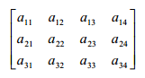
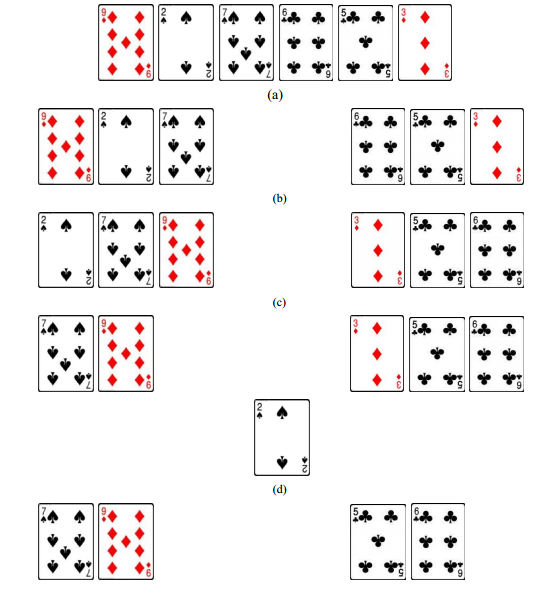
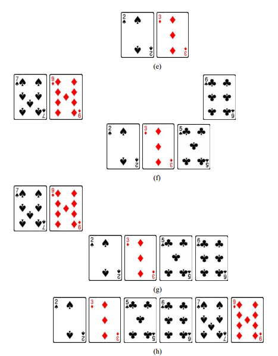
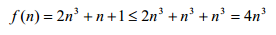
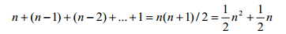
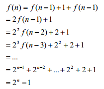

# 第十章 算法设计和分析

利用计算机解决问题的关键是设计出合适的算法。对特定问题设计出求解算法，体现了 程序设计这种智力活动的创造性的一面。从事创造性活动需要创造性思维，而不能仅仅依靠 机械的模仿。虽然算法设计并没有一定之规，但计算机科学家总结出了一些行之有效的设计 方法，掌握这些方法对于利用计算机解决问题具有重要意义。利用计算机解决问题，并非只 要设计出正确的算法就行了，还需要分析算法的复杂度。本章主要介绍一些常用的算法设计 方法，以及对算法时间复杂度的分析。

# 10.1 枚举法

## 10.1 枚举法

问题求解中常用的一种算法设计方法是枚举策略。给定问题 P，如果知道 P 的可能解构 成一个有限集合 S = {s1, s2, ..., sn}，则可以逐一列举每个 si，检验它是否确实是 P 的解，这 就是枚举法。枚举法简单而直接，算法容易设计实现，但当可能解集合 S 很大时，枚举策 略的效率很差。实际使用枚举法时，经常利用各种已知条件来从 S 中排除掉一部分不可能 情形，从而优化枚举过程。下面通过几个例子来说明枚举策略在设计算法中的应用。

线性搜索

首先看一个程序设计中常见的问题——搜索（或称查找）问题：给定数据集合 D，在 D 中查找指定数据 x。

搜索问题看上去很容易解决，一个显而易见的做法是：反复从 D 中读取下一个数据， 看看它是否 x，搜索结果是要么找到 x，要么发现 D 中没有 x。然而，这个“算法”是有问 题的，因为它需要一个关键操作——“读取取下一个数据”，而“下一个”未必是良定义的。 打个比方，如果一群人站成一排，当我们要从中找出张三时，可以采取按排队次序逐个询问 的策略。但如果这群人散乱无规则地站在一起，我们该如何循着一个有条理的过程找出张三 来呢？如何决定“下一个”要询问的人？

可见，要想在一个数据集合中找到指定数据，就必须能够按某种系统化的方式逐个列举 集合元素，并与指定数据进行比较。这就是枚举策略在搜索问题中的应用。

如果将大量数据存储在一个列表中，则使用枚举策略很合适，因为列表是通过位置索引 来访问其中数据成员的，“读取下一个数据”是良定义的操作，只要将当前位置索引加 1 即 可得下一个数据的索引。下面定义的函数 find()实现了这种搜索策略：给定数据列表 list 和 需要查找的数据 x，逐个取出 list 的成员并与 x 进行比较。如果某个成员就是 x，则返回该 成员在列表中的位置索引；如果 list 中没有 x 则返回-1。

```py
>>> def find(list,x):
for i in range(len(list)): if list[i] == x:
return i return -1
>>> find([2,4,6,8],6) 2
>>> find([2,4,6,8],7)
-1 
```

find()函数对列表 list 从头到尾进行扫描，扫描过程中检验每一个成员是否 x，这个算法 称为线性搜索（linear search）算法。线性搜索算法很容易设计实现，而且当数据量不太大时，算法的性能也还可以。更重要的是，由于线性搜索是枚举每一个数据成员，因此适用于 无序数据集合，即数据没有按特定的大小次序排列。

然而，当数据量很大时，逐个枚举集合中的数据就变得非常低效。这时只能通过更好地 组织数据，利用额外信息来提高搜索效率，尽量避免逐个检查所有数据。例如，假设列表数 据从小到大有序排列，那么在枚举过程中一旦发现当前取出的数据大于 x，就不必再继续搜 索了，可以直接下结论说找不到 x。这种改进可以提高线性搜索算法的性能，但改善得很有 限。事实上，在数据有序的情况下，存在比线性搜索算法好得多的算法（见 10.2）。

线性搜索算法只适用于“一维”搜索空间，即所有数据排列成一排的情形。考虑在如下 矩阵中查找某个数据的问题：



这时显然无法直接采用线性搜索算法。在类似矩阵这样的“二维”搜索空间中，如何枚举每 一个数据呢？这个问题其实在第三章中介绍循环语句时就讨论过，为了遍历（即枚举）这样 的二维空间，可以采用嵌套的循环语句。例如下面这个 find2D()函数实现了在 row 行、col 列的矩阵 matrix 中查找数据 x 的枚举算法：

```py
>>> def find2D(matrix,row,col,x): 
    for i in range(row):
        for j in range(col):
            if matrix[i][j] == x: 
                return (i+1,j+1)
        return -1
>>> find2D([[1,2,3],[4,5,6]],2,3,6) (2, 3)
>>> find2D([[1,2,3],[4,5,6]],2,3,7)
-1 
```

显然，这个做法可以扩展到更多维的搜索空间，利用 n 层嵌套循环即可枚举 n 维搜索空 间中的数据。

求解不定方程

有时问题的所有可能解并没有像上例那样明确地存储在某个具体集合（如列表）中，而 是构成一个无形的搜索空间，那该如何枚举可能解呢？这需要具体问题具体分析，根据问题 的特点设计枚举方式。下面是一个典型的例子。

中国古代数学著作中有一道“百钱买百鸡”问题：假设公鸡每只 5 元钱，母鸡每只 3

元钱，鸡雏每三只 1 元钱，用一百元钱买了一百只鸡，问公鸡、母鸡和鸡雏各买了几只？具 备初等代数知识的人都不难列出如下方程组来求解这个问题：

```py
x + y + z = 100
5x + 3y + z/3 = 100 
```

其中 x、y、z 分别表示公鸡、母鸡和鸡雏的个数。 此方程组有三个未知数却只有两个方程式，属于数学中所称的不定方程。人工求解不定

方程通常会利用方程变形、未知数代换以及分析各种约束条件等技巧，而绝不会采用枚举所 有可能解进行检验的方法，因为可能解构成的空间通常非常庞大。然而，计算机的优点恰恰 在于能够高速地、机械地执行大量的检验任务，因此采用枚举策略来解不定方程是简单而直 接的做法。问题是如何枚举各种可能解呢？对于百钱买百鸡问题，显然只需为三个未知数做 各种可能的赋值，然后检查是否满足上述两个方程式即可。各未知数的可能值都在 100 之内（因为只买了 100 只鸡），所以利用枚举法很容易得到下列程序：

```py
>>> for x in range(100): 
        for y in range(100):
            for z in range(100): 
                t = x + y + z
        m = 5*x + 3*y + z/3
        if t == 100 and m == 100:
            print "x=",x,",y=",y,",z=",z
x=  0  ,y=  25  ,z=  75 
x=  3  ,y=  20  ,z=  77 
x=  4  ,y=  18  ,z=  78 
x=  7  ,y=  13  ,z=  80 
x=  8  ,y=  11  ,z=  81 
x=  11  ,y=  6  ,z=  83
x=  12  ,y=  4  ,z=  84 
```

采用枚举策略时应当尽量减小可能解集合，以便提高枚举效率。上面这个程序的效率显 然太差，因为三重嵌套循环实际上要枚举 100×100×100 种 x、y、z 组合。其实稍加思考就 能找到减小需要检验的可能解的数目的方法。首先，不需要三层嵌套循环，因为当 x 和 y 的值给定，z 的值就确定了（即 100–x–y），没有必要再去枚举 z；其次，x 的可能值不超 过 20（否则钱不够），同理 y 的可能值不超过 33；最后，依题意每种鸡应当都至少买 1 只， 没有必要考虑等于 0 的情形。将这些分析落实到编程中，即可得效率更高的代码：

```py
>>> for x in range(1,20): 
        for y in range(1,33):
            z = 100 - x - y
            m = 5*x + 3*y + z/3 
            if m == 100:
                print "x=",x,",y=",y,",z=",z
x=  3  ,y=  20  ,z=  77 
x=  4  ,y=  18  ,z=  78 
x=  7  ,y=  13  ,z=  80 
x=  8  ,y=  11  ,z=  81 
x=  11 ,y=  6   ,z=  83
x=  12 ,y=  4   ,z=  84 
```

利用问题中的各种约束条件往往可以减少搜索空间或者优化枚举过程。例如，假设为 “百钱买百鸡”问题附加一个条件“尽量多买公鸡”，那么可以这样优化算法：最外层对 x 的循环中改用 range(20,0,-1)，以便尽快找到满足条件的值，得到第一个解之后就可以 终止程序，不必再找其他解了。

通过以上例子，我们看到枚举算法的核心思想是对问题的每一个可能解进行检验，看看 是否满足特定条件，这个枚举过程在编程时是通过循环语句和条件语句实现的。对于一些复 杂问题，如果嵌套循环的层数不确定或者层数太多，直接使用循环语句和条件语句实现枚举 检验是不合适甚至不可能的，这时可以考虑采用递归技术（见 10.2）。

当问题规模较大时，可能解的空间也很大，采用枚举策略会导致效率很差。但是，鉴于 枚举算法设计简单，调试也容易，对于规模较小的问题是很好的策略。即使对于大规模的复 杂问题，枚举策略也可以作为整体求解算法的子算法出现。

最后总结一下采用枚举策略设计算法的一般步骤：

(1) 确定枚举对象、枚举范围和判定条件；

(2) 枚举各可能解，逐一验证是否所需的问题解。

(3) 尽量减小枚举范围，提高算法效率。

# 10.2 递归

## 10.2 递归

我们已经知道，循环是必不可少的基本流程控制结构之一，在编程中时时会用到循环语 句。但出乎意外的是，一个编程语言实际上可以不提供循环语句①！因为有另一种语言构造 可以替代循环，这就是递归。

读者也许听说过“循环定义”，即在定义概念 A 的时候直接或间接地用到了 A 自身。例 如将“逻辑学”定义成“研究逻辑的科学”，这实际上是同语反复，并未揭示任何新的内涵； 又如将“美丽”定义成“漂亮”，再将“漂亮”定义成“美丽”，这种循环定义实际上也是同 语反复。循环定义是一种常见的逻辑错误，应尽量避免使用，但在数学和程序设计中，我们 经常在一个函数的定义中直接或间接地用到该函数自身，这种函数称为递归（recursive②） 函数。通过下面的讨论我们会看到，这种递归定义不同于循环定义，它能够明确地定义出函 数的意义。

递归是一种强大的算法设计思想和方法，利用递归可以轻松解决很多难题。下面我们通 过例子来介绍这种方法。

阶乘

数学中的阶乘运算通常用下式定义：

```py
n! = n x (n - 1) x (n - 2) x ... x 2 x 1 
```

注意，当 n 为 0 时，其阶乘被定义为 1。

如果要编程计算 n 的阶乘，可以采用以前介绍过的累积算法模式来实现，累积算法的关 键部分是一个循环语句。下面是此方法的实现代码及执行实例：

> > > def fac(n): if n == 0: return 1 else: f = 1 for i in range(1,n+1): f = i * f return f ```py
> 
> ① 有一类函数式编程语言（如 Scheme）就不提供循环语句构造。
> 
> ② 英文 recur 的原意为再次发生、重新出现等。被定义的术语又出现在定义之中，就是递归。

```
>>> fac(4) 
24
>>> fac(40) 
815915283247897734345611269596115894272000000000L 
```py

下面我们用另一种方式来观察阶乘的定义。在阶乘定义式中，等号右边的第一个 n 之后 的部分是什么？稍加思考即可看出就是(n-1)的阶乘，即阶乘定义式可写成：

```
n! = n x (n - 1)! 
```py

这个式子的含义是：n 的阶乘定义为 n 乘(n-1)的阶乘。我们看到，“阶乘”的定义中用到了 “阶乘”本身，这就是递归定义。

现代编程语言都支持递归函数，Python 也不例外。读者也许会将上面的递归定义式直 接翻译成如下 Python 函数：

```
def fac(n):
    return n * fac(n-1) 
```py

但这个定义是错误的。如果执行这个函数，将会形成如下调用链条：

```
fac(n) => fac(n-1) => ... => fac(1) => fac(0) => fac(-1) => fac(-2) => ... 
```py

显然，递归将无穷无尽地延续下去①。

有效递归定义的关键是具有终止条件，使得到达某一点后不再递归，否则会导致像无穷循环一样的后果。对阶乘来说，当 n=0 时，n!的值定义为 1，此时无需递归。在上面的 fac 函数中添加这个终止条件，即可得正确的递归版阶乘函数：

```
>>> def fac(n):
        if n == 0:
            return 1 
        else:
            return n * fac(n-1)
>>> fac(4) 
24
>>> fac(40) 
815915283247897734345611269596115894272000000000L 
```py

为了理解递归函数的执行过程，需要回顾第四章中介绍的函数调用与返回的知识。图 10.1 展示了 fac(2)的计算过程。


图 10.1 fac(2)的计算过程

> ① 事实上编程语言中的递归层数是有限制的，当突破限制时递归过程会终止。

计算 fac(n)时，由于每次递归都导致计算更小的数的阶乘，因此这个递归过程迟早会到 达计算 fac(0)的情形。而根据 fac()的定义，fac(0)直接返回 1，无需递归计算。我们称这种情 形为递归定义的奠基情形。对于奠基情形，递归函数能够直接计算结果。

要说明的是，上面的阶乘函数定义其实仍然有 bug：当 n 的初始值小于 1 时，调用 fac(n) 会导致无穷递归！解决这个问题很容易，只需在程序开始处检查 n 是否为负数即可，并且仅 当 n 为非负自然数时才能计算阶乘。编写递归程序时很容易在终止条件上面犯错误，作为好 的编程习惯，我们应当围绕递归奠基情形测试各种情形。

还要说明一点，每次递归调用 fac()都相当于调用一个新的函数，系统将为该函数的局 部变量和参数分配新的空间，与其他 fac()调用的局部变量和参数完全没有关系。初学者在 这一点上也会经常犯错误，以为各递归调用中使用的变量是全局共享的。在图 10.1 中有三 次对 fac(n)的调用，这三次调用应当视为独立的三个函数，其中用到的参数 n 应当视为三个 相互独立的局部变量。

列表处理

递归对于处理列表是非常有用的，因为列表本身就是“递归结构”——任一列表都可看 作是由第一个数据成员与剩余数据列表组成的，即：[a1,a2,...,an]可视为由 a1 和[a2,...,an]组成。 编程处理这个列表时，只需要单独考虑如何处理 a1，而对[a2,...,an]的处理可以通过递 归调用来解决。显然，每次递归都导致处理一个更短的列表，如此递归下去终将到达空列表 情形，这正可作为奠基情形。在 Python 中通过索引很容易取得列表 list 的第一个数据和剩 余数据列表，它们分别是 list[0]和 list[1:]。

作为例子，下面我们写一个递归函数来逆向显示列表的数据，即将[a1,a2,...,an]显 示为

```
an,...,a2,a1 
```py

根据列表的“递归结构”性质，不难形成这样的递归思考：为了逆向显示 list，只需先 逆向显示 list[1:]，然后显示 list[0]；当剩余数据列表为空时停止递归。这个递归思考可以直 接翻译成如下 Python 代码：

```
>>> def revList(list):
        if list != []: 
            revList(list[1:]) 
            print list[0],
    else:
        return
>>> revList([1,2,3,4,5]) 
5 4 3 2 1 
```py

对于简单列表的处理任务，用 for 循环语句也很容易实现；但当列表很复杂（例如列表 中的元素本身可能是列表），用循环语句就很难编程，而用递归则可以很容易地解决问题。 作为练习，读者不妨思考一下如何逆向显示如下形状的列表：

```
[1,[2,3],4,[5,6,[7,8],9]] 
```py

二分搜索

10.1 节中介绍了线性搜索算法，读者已经知道线性搜索的优点是适合无序的数据列表，缺点是不适合大量数据。当列表中的数据有序时，存在更好的搜索策略，这个策略的基本思 想可以通过一个猜数游戏展现出来。

假设某甲心中想好了一个 100 以内的自然数，让某乙来猜这个数。某乙每猜一次，某甲 都会告诉他猜对了、猜大了或猜小了三种情形之一。某乙该采用什么策略来玩这个游戏呢？ 某乙可以每次都随机猜一个数，也可以系统化地按 1、2、3、……的顺序猜（此即线性搜索）， 但这两种策略平均需要猜很多次才能猜中。最好的策略是先猜 1～100 的中间数 50，如果猜 中自不必说，如果猜大了则接下去猜 1～49 的中间数 25，如果猜小了则接下去猜 51～100 的中间数 75。依此类推，每次都猜可能值范围的中间值，直至猜中。这个策略就是我们要 介绍的二分搜索（binary search）算法。

下面我们利用二分搜索来解决在一个有序数据列表 list 中查找指定数据 x 的问题。先看 如何利用循环来实现二分搜索。算法的核心是一个循环，每一次循环都检查当前搜索范围的 中间数据是否等于 x；不等的话，根据大小信息重新设定搜索范围；如果找到了 x，或者没 有剩余数据了，则循环终止。为了便于设定搜索范围，可以用两个变量 low 和 high 分别记 录搜索范围的两端，每次循环后根据比较结果调整这两个变量即可重新设定搜索范围。代码 如下：

```
def binary(list,x): low = 0
    high = len(list) - 1 
    while low <= high:
        mid = (low + high) / 2 
        if list[mid] == x:
            return mid
        elif list[mid] > x: 
            high = mid - 1
        else:
            low = mid + 1 
    return -1 
```py

再看二分搜索的递归实现。二分搜索算法可以这样表达：检查当前搜索范围的中间数据， 如果该数据就是目标数据，则算法结束；如果不是，则选择某一半范围重新进行二分搜索。 这段话可以翻译成如下伪代码：

```
二分搜索算法：在范围 list[low]到 list[high]之间查找 x 
    取当前范围的中间数据 m；
    如果 m 等于 x 或者 m 不存在则算法结束；
    如果 x &lt; m 则在范围 list[low]到 list[mid-1]之间查找 x，
    否则在范围 list[mid+1]到 list[high]之间查找 x。 
```py

这个算法中有三处（见划线部分）涉及几乎相同的操作，这正是二分搜索的递归性质的 体现。奠基情形是找到了目标值或者检查完所有数据都未找到目标值，这时将不再递归。由 于每次递归调用都将搜索空间减小了一半，因此迟早会到达奠基情形。下面给出递归版本二 分搜索的 Python 代码实现。注意与循环版本不同的是，每次递归都需要指明搜索范围，因 此我们将搜索范围的两个端点 low 和 high 也作为函数参数。

```
>>> def recBinSearch(list,x,low,high): 
    if low > high:
        return -1
    mid = (low + high) / 2 
    m = list[mid]
    if m == x:
        return mid 
    elif x < m:
        return recBinSearch(list,x,low,mid-1) 
    else:
        return recBinSearch(list,x,mid+1,high)
>>> recBinSearch([1,3,5,7,9],5,0,4) 2
>>> recBinSearch([1,3,5,7,9],6,0,4)
-1 
```py

阶乘和二分搜索这两个例子说明，许多问题既可用循环（或称迭代）来实现，也可用递 归来实现。很多情况下，两种方法在设计上都很容易；但对有些问题，迭代算法很难设计， 而递归算法则非常容易得到，例如下面的 Hanoi 塔问题。

Hanoi 塔问题

Hanoi 塔问题是体现递归方法强大能力的经典例子，该问题涉及如下故事：在某个寺庙 里有三根柱子（不妨称为 A、B、C 柱），A 柱上有 n 个同心圆盘，圆盘尺寸各不相同，并且 小盘叠在大盘之上，B 柱和 C 柱为空（参见图 10.2）。寺庙的僧侣们有一项任务：将 n 个圆 盘从 A 柱移到 C 柱，移动过程中可以利用 B 柱作为临时存放柱。具体的移动圆盘的规则是：

*   圆盘只能放在柱子上；

*   每次只能移动位于任一柱子顶部的圆盘；

*   大圆盘永远不能置于小圆盘之上。


图 10.2 Hanoi 塔问题

下面我们来设计解决此问题的算法，该算法能够给出搬运步骤。例如对于 n = 3 的情形，算法将显示如下移动过程（其中 A -> C 表示将 A 柱顶部圆盘移至 C 柱顶部，余类推）：

```
A -> C 
A -> B 
C -> B 
A -> C 
B -> A 
B -> C
A -> C 
```py

Hanoi 塔问题看上去有点难度，但如果采用递归方法，算法是非常简单的。稍加思考即 可明白，为了将 A 柱上的所有圆盘移到 C 柱，必然需要有一步将底部的最大圆盘从 A 柱移 到 C 柱，而为此又必须先将最大圆盘上面的 n - 1 个圆盘从 A 柱移到 B 柱，从而形成最大 圆盘之上没有其他圆盘、同时 C 柱上也没有圆盘的局面（参见图 10.3）。


图 10.3 为移动最大圆盘必须形成的格局

至此，可以将最大圆盘从 A 柱移到 C 柱，显然接下去再也不需要移动这个圆盘了，因此可视为不存在。这时形成的局面（图 10.4）与初始局面非常相似，即：B 柱上有 n - 1 个 圆盘，A 柱和 C 柱为空（无视最大圆盘）。于是任务变成了：将 n - 1 个圆盘从 B 柱移动到 C 柱，移动过程中可以利用 A 柱作为临时存放柱。将这里的黑体部分文字与前面的初始问 题文字相比较，即可看出 Hanoi 塔问题的递归性质：一旦最大圆盘到达目的地，剩下来的问 题恰好又是初始 Hanoi 塔问题，只不过问题规模变成了 n - 1，并且 A 柱和 B 柱的角色相互 交换。


图 10.4 最大圆盘就位之后的格局

根据以上分析，容易得到解决 Hanoi 塔问题的算法。下面是算法的伪代码：

```
算法：将 n 个圆盘从 A 柱移到 C 柱，以 B 柱作为临时存放柱。 
    将 n - 1 个圆盘从 A 柱移到 B 柱，以 C 柱作为临时存放柱； 
    将最大圆盘从 A 柱移到 C 柱；
    将 n - 1 个圆盘从 B 柱移到 C 柱，以 A 柱作为临时存放柱。 
```py

从算法中可见，通过递归，我们将规模为 n 的问题转化成了两个规模为 n – 1 的问题。 如此递归下去，最终将转化成规模为 1 的问题。而 n = 1 的 Hanoi 塔问题是平凡的，直接移 动一步即可，不再需要递归，这就是奠基情形。有了奠基情形，每次递归又导致问题规模变 小，可见上述递归算法能正确终止。下面我们给出对上述算法的 Python 实现，并对 n = 3 的 情形进行验证。代码中 hanoi 函数的参数分别表示圆盘个数和三根柱子（源、目的地、临时 存放）。

```
>>> def hanoi(n,source,dest,temp): 
    if n == 1:
        print source,"->",dest 
    else:
        hanoi(n-1,source,temp,dest) 
        hanoi(1,source,dest,temp) 
        hanoi(n-1,temp,dest,source)
>>> hanoi(3,"A","C","B") 
A -> C
A -> B 
C -> B 
A -> C 
B -> A 
B -> C 
A -> C 
```py

至此，一个看上去挺难的问题通过递归就轻松地解决了。读者有兴趣的话不妨试试如何 利用循环（迭代）来解决 Hanoi 塔问题。

最后对递归方法做个小结。

递归是非常重要的算法设计方法，在解决很多具有递归性质的问题、结构的时候，设计

递归算法往往是直接而简单的。递归定义必须满足以下条件才是良定义的：

*   有一个或多个无需递归的奠基情形；

*   递归总是针对规模更小的问题。

有了这两个条件，递归链最终将到达奠基情形，从而使递归过程终止。

虽然递归算法容易设计、实现，也容易理解，但递归是有代价的。由于递归涉及大量的 函数调用，因此需要耗费较多的内存和较长的执行时间，即递归算法的效率较差。而迭代算 法不涉及函数调用，故速度更快，更节省内存。

# 10.3 分治法

## 10.3 分治法

分治法（divide-and-conquer）是解决问题的一种常用策略，其思想是将难以处理的较大 问题分解为若干个较小的子问题，然后分别解决这些子问题，并从子问题的解构造出原问题 的解。“分”是指将原问题分解，“治”是指解决问题。

“分治”仅提及了分而治之的过程，而未提及此方法的另一个特点——递归。当我们将 大问题分解成子问题后，经常会发现子问题与大问题本质上是相同的问题，因此可以利用递 归方法来设计算法。所以，分治法常常与递归法结合起来使用。

下面我们通过排序问题来介绍分治法的应用。排序问题是指将一个数据集合中的所有数 据按从小到大的顺序（严格递增或非递减）重新排列①。计算机科学家发明了很多排序算法， 本节主要介绍利用分而治之思想设计的归并排序算法，但为了进行比较，我们先介绍没有什 么“技术含量”的选择排序算法。

选择排序

选择排序是一种朴素的排序方法，普通人都很容易想到。其思想是：先从全体 n 个数据 中找出最小值，并将该最小值排在第一个位置；然后从剩下的 n-1 个数据中再次找出最小值，这个最小值实际上是全体数据的次小值，我们将它排在第二个位置；依此类推，直至从剩下 的 2 个数据中找出最小值，排在第 n-1 个位置，而剩下的最后一个数据（全体数据中的最大 值）可以直接排在第 n 个位置。

> ① 当然也可以按从大到小的顺序（严格递减或非递增）排列，这在解决方法上并没有什么本质差别。

选择排序方法的关键步骤是找出当前剩余数据中的最小值。我们在 3.6 节中讨论过这个 问题①，并且设计了一个很好的算法：逐个检查每一个数据，并记录当前见到的最小值；当 数据检查完毕，所记录的数据就是全体数据中的最小值。下面我们利用这个求最小值的方法 来实现选择排序算法。

算法的核心部分是一个循环，每一轮循环找出剩余数据中的最小值，并将该值放到合适 位置。假设数据在列表 list 中，则第一次循环找出 list[0:n-1]中的最小值，并将该值存入 list[0] 处（原来的 list[0]数据需要挪地方，见下面介绍的实现技巧）。第二次循环从 list[1:n-1]中找 出最小值，并存入 list[1]处；依此类推，第 n-1 次循环将 list[n-2:n-1]中的最小值存入 list[n-2]， 而剩下的最后一个数据自然只能存入 list[n-1]。至此，list 中存储的数据即为从小到大有序 排列的。

实现此算法时，如果没有额外的存储空间，只使用 list 本身的空间来排序，则在第一次 循环中将最小值放入 list[0]时，原先存储在其中的数据就会被覆盖。为了保留这个数据，一 个简单的技巧是将 list[0]与找到的最小值交换。即，假如最小值是 list[k]，则执行

```
list[0],list[k] = list[k],list[0] 
```py

其他轮次的处理也是一样。为此，在循环中需要用一个变量记录最小值的位置索引。 下面的 Python 代码实现了以上设计思想，其中每轮循环找出 list[i:n-1]中的最小值（用变量 min 记录其索引位置），并放入 list[i]中。

```
>>> def selSort(list):
        n = len(list)
        for i in range(n-1): 
            min = i
            for j in range(i+1,n):
                if list[j] < list[min]: 
                    min = j
            list[i],list[min] = list[min],list[i]
>>> datalist = [5,2,8,3,4]
>>> selSort(datalist)
>>> print datalist 
[2, 3, 4, 5, 8] 
```py

注意，与 3.6 中最小值算法不同的是，这里找最小值时并非记录最小值本身，而是记录最小 值的索引位置 min，即 list[min]才是当前最小值，这是为了使列表数据交换位置更方便。另 外，循环变量 i 只需从 0 取到 n-2，因为当前 n-1 个数据就位后，最后一个位置自然就是最 大值。

选择排序算法很容易设计实现，并且当数据量不大时效率也还可以，但当数据量很大时 性能很差。采用分治法可以设计一种更好的排序算法，即归并排序。

> ① 3.6 中讨论的是求最大值，但算法稍加改变即可用于求最小值。

归并排序

人们在玩扑克牌的时候，经常将手上的牌排成特定的顺序，比如按花色或按大小排序。

如果分到的牌不多，玩家一般用一只手将牌呈扇形握持，另一只手去整理排序。然而，如果 玩的是用到两三副牌的游戏，每个玩家分到的牌很多，那么玩家就会有手太小难以排序的烦 恼。这时，如果旁边坐着个观战者，玩家可以请这个观战者帮着拿一些牌，两人分别将手中 不多的牌进行排序，然后再合并两手牌以完成全部牌的排序。这就是归并排序的基本思想， 它将大任务分解成较小任务，解决了较小任务后再合并结果。下面我们详细介绍这种利用分 治法进行排序的方法。

给定一个较大的数据集合 S，先将数据平分为两部分 S1 和 S2，然后分别对 S1 和 S2 进行 排序，从而得到两个“局部有序”的序列。接下去将这两个局部有序序列合并成为“全局有 序”序列，这个过程称为归并（merge）。假设用序列 S3 存储归并结果，则具体归并方法是： 第一轮，两个局部有序的序列 S1 和 S2 分别拿出自己的局部最小值进行比较，其中更小者显 然是全局最小值，因此应放入 S3 的第一个位置。如果全局最小值来自 S1，则 S1 中原来排在 该最小值后面的数据成为新的局部最小值。第二轮，再次比较 S1 和 S2 的局部最小值，其中 更小者实际上是全局第二小的数据，因此应放入 S3 的第二个位置。第三轮以下依此类推， 不断比较 S1 和 S2 的局部最小值，并将更小者放入 S3，直至 S1（或 S2）的所有数据都已放入 S3。最后，只需将 S2（或 S1）的剩余数据按序放入 S3 的尾部，即可得到全局有序序列。图 10.5 用整理扑克牌的例子展示了这个归并排序过程。





图 10.5 归并排序

下面是对图 10.5 所示过程的简要解释：

(a) 无序的初始扑克牌集合，牌太多导致难以一手进行排序；

(b) 一分为二，玩家和帮忙者两人各持一半牌；

(c) 两人分别对手中牌进行排序，从而得到两手局部有序的扑克牌序列；

(d) 两人比较各自手中的局部最小牌（黑桃 2 和方块 3），其中更小的黑桃 2 是全局最小 牌，将它放到存放归并结果的某个地方（比如桌子上）；

(e)(f)(g) 重复(d)的做法，相继将方块 3、梅花 5 和梅花 6 放到归并结果序列中；

(h) 由于第二个序列已经没有牌了，故将第一个序列剩余的牌接在归并结果序列之后。 至此形成了全局有序序列。

通过图 10.5 的形象化演示，相信读者已经理解归并过程。现在还有一个问题：图 10.5(c) 是对图 10.5(b)的两手牌分别进行“排序”后得到的，问题是怎么排序？显然，我们又回到 了初始的“排序”问题，只不过这次的排序问题具有较小的规模：初始问题是对 6 张牌排序，

现在只需两人分别对自己的 3 张牌排序。这让我们想起了“递归”这个设计利器。是的，如果觉得 3 张牌还是太多，那么可以重复上述一分为二、局部排序、全局归并的过程。这个过程可以一直进行到只有 1 张牌的情形，这时根本无需排序，因为 1 张牌自然是局部有序的。 这样就得到了递归的奠基情形，此时无需递归，只需归并。由于满足了每次递归数据规模减 小和有奠基情形这两个条件，上述递归过程是正确的。归并排序算法的伪代码如下，其中划 线部分表现了该算法的递归结构。

算法：对 datalist 执行归并排序 输入：无序的列表 datalist 输出：有序的列表 datalist 将 datalist 一分为二：list1 和 list2 对 list1 执行归并排序 对 list2 执行归并排序 归并 list1 和 list2，结果放入 datalist

下面我们用 Python 编制一个完整的程序来实现并排序算法。程序 10.1 主要由两个函数 构成：函数 merge 用于归并两个局部有序的列表 list1 和 list2，结果放在 mergelist 中；函数 mergeSort 则利用分治法和递归实现对列表 datalist 的排序。

【程序 10.1】mergesort.py

```
def merge(list1,list2,mergelist): 
    i,j,k = 0,0,0
    n1,n2 = len(list1),len(list2) 
    while i < n1 and j < n2:
        if list1[i]&lt;list2[j]: 
            mergelist[k] = list1[i] 
            i = i + 1
        else:
            mergelist[k] = list2[j] 
            j = j + 1
        k = k + 1 
    while i < n1:
        mergelist[k] = list1[i] 
        i = i + 1
        k = k + 1 
    while j < n2:
        mergelist[k] = list2[j] 
        j = j + 1
        k = k + 1
def mergeSort(datalist): 
    n = len(datalist)
    if n > 1:
        m = n / 2
        list1,list2 = datalist[:m],datalist[m:] 
        mergeSort(list1)
        mergeSort(list2) 
        merge(list1,list2,datalist)
    data = [9,2,7,6,5,3]
    mergeSort(data) 
    print data 
```py

执行程序 10.1，将在屏幕上看到输出：

```
[2, 3, 5, 6, 7, 9] 
```py

顺便提醒读者注意：程序 10.1 中，函数 mergeSort 的形参 datalist 是列表类型，调用时 我们传递列表 data 作为实参。由于函数对列表类型的实参的修改后果是可以带出函数的①， 所以当我们将无序的 data 传给 mergeSort，等 mergeSort 执行完毕，data 就变成有序的了。

前面介绍的二分搜索算法其实也是分治法的应用，只不过将数据平分为两部分之后，只 需“治”其中一部分，另一部分可以忽略。后面的 Hanoi 塔问题也是分治法的应用。

最后小结一下分治法。解决一个问题时，经常将问题分解为较小的问题，小问题和大问 题是同类问题。解决了小问题之后，将部分解合并，形成初始问题的最终解。如果小问题完 全类似于初始问题，只是规模较小，显然可以用递归法设计算法。

# 10.4 贪心法

## 10.4 贪心法

考虑一个应用问题：假设需要在油库 A 和加油站 B、C、D、E、F、G、H 之间修建输 油管道，油库和各加油站的位置如图 10.6 所示，图中的虚线表示可能的管道铺设路线，虚 线旁标注的数值表示所需铺设的管道的长度（千米）②。例如油库 A 与加油站 B 之间需要铺 设 35 千米的管道。


图 10.6 油库及加油站位置示意图

显然没有必要在所有可能路线上铺设管道，而只需要各加油站直接或间接与油库连通即可。假设人手和资金比较紧张，工程只能分批分期进行，每期建设一条管道。我们该如何规 划整个工程呢？

> ① 术语称为引用传递，以区别于普通的值传递。参见第六章。
> 
> ② 此处的长度数据不一定是两点之间的直线距离，所以不要根据三角不等式（三角形中两边之和大于第三 边）得出数据不合理的结论。

指导思想当然是又快又省钱。一种想法是尽可能快地使加油站投入使用，每一期工程都 使一个加油站能够供油。那么，第一期必须在油库 A 与某个加油站之间铺设管道，问题是 选哪个加油站呢？显然应该选择 B，因为在从 A 可直接到达的 B、C、D、E 中，AB 是最短 的管道，可以在最短时间内建成，当然花费也是最少的。接下来考虑第二期工程时，可以选择一个从 A 或者 B 可到达的加油站，注意此时所选加油站不必与油库 A 直接相通，间接连 通也能保证供油。C、D、E、G 都是从 A 或 B 可通达的加油站，其中 C 是最近的，因此我 们选择 C，并铺设 B 和 C 之间的 15 千米管道。在工程的第三期，需要选择一个能与 A、B 或 C 可到达的加油站，这次最短的是 C 和 D 之间的 5 千米管道，因此选择 D 并铺设 CD 管 道。到目前为止，工程进展如图 10.7 所示，图中实线段表示已经铺设的管道，B、C、D 都 能供油了。


图 10.7 第三期工程后的状况 依此类推，在接下去的第四期到第七期工程中，可以分别铺设 CG、GH、FH 和 FE 之间的管道。至此，所有加油站都通过输油管道与油库 A 连通了，如图 10.8 所示。工程规划 者一定很满意，因为他们觉得自己在每一期建设中都选择了当时情况下最短的线路，从而能 以最快时间完成那一期工程，使一个新加油站投入运营。当工程完工时，铺设管道的总长度 是 150 千米。


图 10.8 完工后的状况

下面考虑另一种工程建设方案。工程规划者并不追求各加油站尽快投入使用，而一心只想以最小的投资完成工程。这时的指导思想是，每一期工程都尽可能选择当前所有线路中最 短的线路来铺设管道，并确保最终能将油库和所有加油站连通起来。

按照这个思路，首先应该选择铺设 CD 管道，因为这条管道的长度是 5 千米，是所有管 道线路中最短的。完成 CD 管道之后，剩余线路中最短的管道是 10 千米的 FH，因此选择它 作为第二条铺设的管道。依此类推，接下去应该分别铺设 BC（15 千米）、GH（20 千米）和 CG（25 千米）等管道，至此工程现状如图 10.9 所示。


图 10.9 铺设五条最短管道之后的状况

按照上述思路接下来应该铺设当前最短的 CF 管道（30 千米），但由于 C 和 F 已经连入 了输油管道系统，再铺设 CF 管道属于重复建设，因此我们放弃 CF 而选择铺设 AB 管道（35 千米）。最后一步铺设 EF 管道（40 千米），至此油库和所有加油站都连通了，如图 10.10 所 示。


图 10.10 完工后的状况 读者一定已经发现，第二种以省钱为指导思想的建设方案与第一种以尽快投入运营为指

导思想的建设方案所导致的输油管道系统是一样的，两者都铺设了总长度为 150 千米的管 道。问题是这两种建设方案到底是不是最优的呢？会不会有一种管道总长度更小的方案呢？ 读者不妨试试其他选择，最终会发现任何其他将油库和加油站连接在一起的方案都导致总长 度超过 150 千米的管道系统。所以，我们讨论的两种方案都导致了最优的（即总长度最小） 输油管道系统。

不难看出，实际中的许多问题都可以利用上述方案来解决，如下水道系统、芯片设计、 交通网、通信网等等。这些问题可以抽象成图论中的“最小支撑树”问题，上面两种解决方 案其实是解决最小支撑树问题的两个著名算法的应用。

第一种方案称为 Prim 算法，其思想是从一个地点（如油库）出发，一个接一个地将其 他地点（如加油站）连入系统，其中每一步都尽可能选择最短连接路线。Prim 算法的伪代 码如下：

```
Prim 算法
1\. 初始时所有地点标记为不可通达。
2\. 选择一个特定地点，标记为可通达。
3\. 重复下列步骤，直至所有地点都被标记为可通达：
    选择距离最近的两个地点，其中一个地点的标记是可通达，另一个地点的标记是不可通 达。然后将这两个地点连接起来，并将原先不可通达的地点改标为可通达。 
```py

第二种策略称为 Kruskal 算法，其思想是每一步将当前距离最近且尚未连通的两个地点 连接起来。如果某一步的当前最小长度线路所涉及的两个地点已经连通了，则放弃这个路线， 接着考虑其后线路。算法伪代码如下：

```
Kruskal 算法 
重复以下步骤，直至所有地点都直接或间接地连通：
    将当前距离最近并且尚未连通的两个地点连接起来。 
```py

Prim 算法和 Kruskal 算法虽然是不同的解决方法，但他们都能产生最小支撑树。这两个 算法其实反映了一个共同的算法设计方法——贪心法。贪心法指的是这样一种问题求解策 略：在求解过程的每一步都尽量作出在当前情况下局部最优的选择，以期最终能得到全局最 优解。例如 Prim 算法在每一步都选择当前与已连通部分最近的地点，Kruskal 算法在每一步 都尽可能选择当前最短的线路，两者的最终目标都是构造最小支撑树。

贪心算法的一般模式是通过迭代（循环）来一步一步地进行贪心选择，从而产生一个局 部最优解，并将问题简化为更小的问题，最终的全局解由所有局部解组成。即：

```
贪心算法模式
算法： 
输入：一个候选对象集合
输出：由某些候选对象组成的全局解 
重复以下步骤，直至得到全局解：
    从候选对象中选择当前最优者，并加入到局部解中 
```py

在迭代的每一步，贪心选择可以依赖于此前的迭代步骤中已经作出的选择，但不能依赖 于未来的选择。打个比方，贪心选择就像一个每次只计算一步棋的棋手，他总是选择当前能 获得最大利益的一步棋，而不考虑这步棋会不会在以后造成损失。显然，一步棋的好坏不能 只取决于当前利益，而是要着眼全局。在贪心策略下，以后即使认识到前面某一步棋不佳， 也是不允许悔棋的。可见，贪心算法具有“只看眼前利益”和“落子无悔”的两大特点。

当然，好的棋手是不会采用贪心策略来下棋的，他们会计算未来的很多步棋，然后选择 全局最优的着法。这说明贪心策略只能对某些问题（如上述最小支撑树问题）能产生全局最 优解，对另一些问题则不然。不过，贪心算法的优点是能够较快地找出解法，产生的结果经 常也是接近全局最优解的；而一心追求全局最优解则有可能导致无法在合理的时间内达到目 标，就像棋手如果指望算无遗策，那就要花费大量时间来计算着法，这几乎是不可能的。

最后顺便提一下，在前面的输油管道问题中，为了从油库 A 向加油站 E 供油，采用贪 心算法设计出的方案是将 A 经 B、C、G、H、F 来与 E 连通，这条管线的总长度为 145 千 米。而假如直接在 A 和 E 之间修一条管道的话只需要 80 千米！可见，如果待解决的问题是 修建从油库到每一个加油站的最短管道，前述两个算法是不合适的。事实上，存在另一个采 用贪心法设计的著名算法——Dijkstra 最短路径算法，可以很好地解决这个问题。

# 10.5 算法分析

## 10.5 算法分析

通过前面各小节的介绍，我们看到可以设计出多种不同的算法来解决同一个问题，如搜 索问题中的线性搜索和二分搜索，排序问题中的选择排序和归并排序，最小生成树的 Prim 算法和 Kruskal 算法，等等。本节要讨论的是：解决同一问题的不同算法有好坏之分吗？

# 10.5.1 算法复杂度

### 10.5.1 算法复杂度

为了回答上述问题，首先要明确如何衡量算法的好坏。以搜索问题为例，线性搜索算法

直接了当，易设计易实现，这算不算“好”？而二分搜索算法虽然设计实现稍难一些，但因 无需检查每一个数据而大大提高了搜索效率，这又算不算“好”？

在解决数学问题时，不论是证明定理还是计算表达式，只要证明过程正确、计算结果精 确，问题就可以认为成功地解决了，即正确性、精确性是评价数学解法好坏的标准。而在用 计算机解决问题时，仅仅要求算法能正确、精确地解决问题，是不够的。试想，假如一个算 法虽然能够正确地解决问题，但需要在计算机上运行 100 年或者需要占用 100TB 的内存， 这样的算法有实际意义吗？不要以为 100 年或 100TB 是危言耸听，很多简单算法都可能轻 易地达到或突破这样的需求（参见稍后对 Hanoi 塔算法的分析）。可见，利用计算机解决问 题必须考虑算法的经济性，即算法所耗费的资源问题。计算机用户当然都希望能多快好省地 解决问题，因此好的算法应当尽量少地耗费资源。

通常只考虑算法所占用的 CPU 时间和存储器空间这两种资源①。所谓算法分析，就是分 析特定算法在运行时所耗费的时间和存储空间的数量，分别称为算法的时间复杂度和空间复 杂度。本节只讨论算法的时间复杂度，毕竟存储空间的大小在现代计算机中已经越来越不再 是一个问题。

虽然讨论的是算法耗费的“时间”，但我们并不是真的去测量程序在计算机中的实际运 行时间，因为实际运行时间依赖于特定机器平台（CPU、内存、操作系统、编程语言等）， 同一算法在不同平台上执行可能得到不同的分析结果，故很难据此对算法进行分析和比较。 例如，在最先进的计算机上执行线性搜索也许比在老式计算机上执行二分搜索要快，据此得 出线性搜索优于二分搜索显然不合理。

实际上，算法分析指的是分析算法的代码，估计出为解决问题需要执行的操作（或语句、 指令等类似概念）的数目，或称算法的“步数”。之所以分析算法步数，是因为：第一，步 数确实能反映执行时间——步数越多执行时间就越长；第二，算法的步数不依赖于平台，更 容易分析和比较。

例如，下面的函数 f1()需要执行 11 次赋值操作，其中包含 10 次加法运算②：

```
def f1():
    x = 0
    for i in range(10): 
        x = x + 1 
```py

而下面的函数 f2()需要 21 次赋值操作（20 次加法）：

```
def f2():
    x = 0
    for i in range(20): 
        x = x + 1 
```py

比较一下 f1 和 f2，显然 f1 运行时间更短，但这并不意味着 f1 比 f2 采用的算法“好”， 因为它们的“算法”显然是一样的，只不过 f1 要处理的数据更少：f1 将 10 个 1 相加，而 f2 将 20 个 1 相加。可见，算法复杂度是跟算法处理的数据量有关的。

算法通常都设计成能处理任意大小的输入数据，这就导致算法的步数并不是固定的，而 是随着问题规模的变化而变化，因此算法的步数可表示为问题规模的函数。假设用 n 表示问题规模，算法分析不仅要考虑算法步数与 n 的关系，更重要的是还要考虑“当 n 逐渐增大时” 算法复杂度会如何变化。例如，将上述 f1 和 f2 改写成更一般的形式：

> ① 不考虑开发算法的人力物力等代价。
> 
> ② 注意我们分析的层次是源代码级别，而不是机器指令级别。

```
def f(n):
    x = 0
    for i in range(n): 
        x = x + 1 
```py

不难得出此函数需要执行的步数为 n+1。当 n 增大时，算法执行时间也会增加，而且是线性地增加，即：当 n 增加 1 倍变成 2n，执行时间变成 2n+1，大约比 n+1 增加 1 倍。

说 A 算法比 B 算法好，并不是指对于特定的 n，A 比 B 节省 50%的时间，而是指随着 n 的不断增大，A 对 B 的优势会越来越大。

算法复杂度的大 O 表示法

再次观察上面例子中函数 f()的步数表达式“n+1”，不难看出其中对执行时间起决定作 用的是 n，而 n 后面的+1 是可以忽略不计的。按照“当 n 逐渐增大时”进行分析的思想， 即便是 n+100、n+1000000 中，n 后面的常数也是可以忽略不计的，因为与逐渐增大趋于∞ 的 n 相比，任何常数都是浮云。事实上，分析算法复杂度时，我们只分析其增长的数量级， 而不是分析其精确的步数公式。

数学中的“大 O 表示法”根据函数的增长率特性来刻画函数，可以用来描述算法的复 杂度。令 f(n)和 g(n)是两个函数，如果存在正常数 c，使得只要 n 足够大（例如超过某个 n0）， 函数 f(n)的值都不会超过 c×g(n)，即当 n > n0 时，

```
f(n) <= c x g(n) 
```py

则可记为

```
f (n) = O(g(n)) 
```py

在描述算法复杂度时，n 对应于问题规模，f(n)是算法需执行的步数，g(n)是表示增长数 量级的某个函数。说算法的复杂度为 O(g(n))，意思就是当 n 足够大时，该算法的执行步数（时间）永远不会超过 c×g(n)。

例如，假设一个算法当输入规模为 n 时需要执行 n+100 条指令，则当 n 足够大时（只 要大于 100），

```
n + 100 <= n + n = 2n 
```py

套用大 O 表示法的定义，取 g(n)=n，则可将此算法的复杂度表示为 O(n)。同理，如果一个 算法的步数为 n+1000000，它的复杂度仍然可表示为 O(n)。由此可见，两个不同的算法虽然 具有不同的代码和执行步数，但完全可能具有相同的复杂度，即当问题规模足够大时，它们 的执行时间按相同数量级的增长率增长，利用大 O 表示法即可描述这一点。

实际分析算法时，为了使 O(g(n))中的 g(n)函数尽量简单，在得到算法的步数表达式 f(n) 之后，可以利用两条规则来简化推导，直接得出 f(n)的大 O 表示。规则如下：

（1）如果 f(n)是若干项之和，则只需保留最高次项，省略所有低次项；

（2）如果 f(n)是若干项之积，则可省略任何常数因子（即与 n 无关的因子）。 例如，分析下列代码：

```
def f(n):
    x = 0
    for i in range(n): 
        for j in range(n):
            for k in range(n): 
                x = x + 1
    for i in range(n): 
        for j in range(n):
            for k in range(n): 
                x = x + 1
    for i in range(n): 
        x = x + 1 
```py

易知此算法的步数为 2n³+n+1。根据第一条规则，可只保留 2n3；再根据第二条规则，可只保留 n³。所以，此算法的复杂度为 O(n³)。当然我们也可以直接从 f(n)开始推导，利用大 O 表示法的定义来验证这个结果是正确的：对于 n > 1，



取 g(n)为 n3，c 为 4，即得 f(n) = O(n3)。 总之，以上两条规则告诉我们，在分析算法代码时可以忽略许多代码，而只关注那些嵌套层数最多、并且每一层循环的循环次数都与问题规模 n 有关的循环。

# 10.5.2 算法分析实例

### 10.5.2 算法分析实例

本节以本章介绍的若干算法为例来讨论对算法复杂性的分析。

搜索问题的两个算法 对于搜索问题，本章介绍了线性搜索和二分搜索两个算法。

线性搜索算法的思想是逐个检查列表成员，编码时可以用一个循环语句来实现。循环体 的执行次数取决于列表长度：如果列表长度为 n，则循环体最多执行 n 次。因此，如果列表 长度增大一倍，则循环次数最多增加一倍，算法执行的步数或实际运行时间最多增加一倍。 可见，线性搜索算法在最坏情形下的运行时间与输入列表的大小 n 呈线性关系，即复杂度为 O(n)，称为线性时间算法。

二分搜索算法的主体也是一个循环，但该循环不是逐个检查列表数据，而是每次检查位 于列表中点的数据，并根据该中点数据与要查找的数据的大小比较情况来排除掉左半列表或 右半列表。接着对保留下来的一半列表重复进行这个“折半”过程。显然，循环的次数取决 于输入列表能“折半”多少次。如果初始输入列表有 16 个数据，则第一轮循环后剩下 8 个数据，第二轮循环后剩下 4 个数据，第三轮后剩下 2 个，第四轮后只剩下 1 个数据。因此， 最多四轮循环后就能得出搜索结论：要么找到，要么不存在。一般地，如果输入规模为 n， 则二分搜索算法最多循环 log2n 次，即复杂度为 O(log2n)，称为对数时间算法。要说明的是， O(log2n)表示复杂度与问题规模 n 的对数成正比，至于这个对数是以 2 为底还是以 10 为底并 不重要，因此我们经常省略对数的底，写成 O(log n)。

O(n)与 O(log n)到底有多大差别？回到 10.2 中提到的猜数游戏，假如某甲心中想好一个 1 百万以内的数让某乙来猜。某乙从小到大逐个试猜（即线性搜索）的话，运气好猜 1 次就能命中，运气不好最多要猜 1 百万次。平均来说需要猜 50 万次才能猜中。而如果某乙每次 猜中间数（即二分搜索）的话，则最少猜 1 次，最多也不过猜 log21000000≈20 次就能猜中。 可见，随着 n 的增大，O(log n)远远优于 O(n)。

排序问题的两个算法

对于排序问题，本章介绍了选择排序和归并排序两个算法。

首先推导选择排序算法的步数与问题规模（即数据列表的长度）的关系。选择排序算法 首先找出全体数据中的最小值，并将该值作为结果列表的第一个成员。其次，算法从剩余数 据中找出最小值，并将该值作为结果列表的第二个成员。依此类推，直至产生有序列表。假 设列表初始大小为 n，为找出最小值，算法需检查每一个数据。接下来算法从剩余 n-1 个数 据中找出最小值，这需要检查 n-1 个数据；第三次循环从 n-2 个剩余数据中找出最小值。这 个过程一直继续到只剩 1 个数据为止。因此，选择排序需要执行的步数为



按照前述规则，可以看出选择排序算法所需的步数与数据列表大小的平方成正比，即算法复杂度为 O(n²)，称为二次方时间算法。 其次，我们来推导归并排序算法的步数与列表大小的关系。归并排序算法的基本思想是将列表一分为二，然后对两半数据各自排序，最后再合并成一个列表。其中对两个子列表的 排序又是通过递归调用归并排序来实现的，最终将分解到长度为 1 的列表，这时可直接进行 归并。由此可见真正的排序工作是在归并过程中完成的，该过程所做的只是将来自子列表的 数据按从小到大的顺序逐个复制到初始列表的合适位置。图 10.11 展示了对列表[0,5,7,2]进 行归并排序的过程。图中用虚线表示初始列表的递归分解过程，逐步分解后最终得到长度为 1 的列表。这些长度为 1 的列表再进行归并，逐步形成长度为 2、4 的有序的列表，图中用实线箭头表示归并时各数据的逐步到位过程。从图 10.11 容易分析出归并排序算法的步数。 从左向右，分解过程并不比较数据大小来排序，这部分工作可以忽略。接下来的归并过程包 含大量比较、复制操作，是整个算法的工作量的体现。归并过程分为 log2n 层，以逐步形成 长度为 2、22、23、…、n 的有序子列表①。又因为每一层归并都需要对全部 n 个数据进行处 理，所以归并排序算法的步数是“n×层数”，即具有复杂度 O(nlog n)，可称为 nlog n 时间 算法。


图 10.11 归并排序过程示意图

n² 与 nlog n 有多大差别呢？当 n 较小时，两者差距不大，选择排序算法甚至有可能还快 一些，因为它的代码更简单。但是，随着 n 的增大，log n 只是缓慢地增大，因此 n×log n 的增长速度远远低于 n×n。这就是说，对于大量数据，归并排序算法的性能远远好于选择 排序算法。

> ① 如果 n 不是 2 的幂，子列表的长度当然也不会都是 2 的幂。

Hanoi 塔算法

下面推导 Hanoi 塔问题的递归算法的步数与圆盘个数 n 的关系。与基于循环（迭代）的算法不同，递归算法不容易直接从代码形式上看出具体的操作步数。对于 Hanoi 塔递归算法， 我们可以直接考虑将 n 个圆盘从 A 柱移到 C 柱所需的移动次数。

根据算法的结构，为了移动 n 个圆盘，需要先将 n-1 个圆盘从最大圆盘上移开，然后移 动最大圆盘，最后再将 n-1 个圆盘移到最大圆盘上。假设 f(n)是移动 n 个圆盘所需的步数， 则应用一点中学数学知识很容易推导出



可见，Hanoi 塔算法的复杂度为 O(2n)，称为指数时间算法，这是因为问题规模的度量 n 出 现在步数公式的指数部分。

指数时间算法到底有多复杂呢？读者也许听说过“指数爆炸”这个名词，它表明指数时 间算法所需要的执行时间会随着问题规模的增长而迅速增长。在 Hanoi 塔故事中，即使僧侣 们 1 秒钟就能移动一步圆盘，并且每天都不休息，为了移动 64 个圆盘，也需要花费 264－1 秒，即 5850 亿年！可见，指数时间算法只适用于解决小规模的问题。

总之，利用计算机解决问题时，需要考虑算法的时间复杂性，这是衡量问题难度和算法 优劣的一个重要指标。有些应用对于运行时间有较高要求，运行时间过长的话可能导致计算 结果过时、失效。图 10.12 给出了本章见过的各种算法复杂度的大致比较，图中横坐标表示 问题规模 n，纵坐标是算法执行时间（或步数）。虽然图中曲线不是很精确，但足以说明指 数时间和二次方时间算法是多么不适合大量数据，而其他几种复杂度的曲线则相当平缓。


图 10.12 各种算法复杂度比较

# 10.6 不可计算的问题

## 10.6 不可计算的问题

到目前为止，我们讨论的所有问题都是可解的。有些问题的解法非常有效，有些问题的

解法则比较复杂。Hanoi 塔之类的问题称为难解问题，因为当问题规模较大时，相应算法需 要太多太多的时间（或空间）来完成计算，事实上是无效、不可行的解法。

现实中还存在比难解问题更麻烦的问题，那就是不可解问题。考虑这个场景：计算机正在执行一个程序，我们坐在边上等待程序结束。当过了很久程序还没结束时，我们该怎么办 呢？我们可能推测程序中出现了无穷循环，永远不会结束，这样我们就必须强行中断程序运 行甚至重启计算机。然而，我们并不能绝对肯定是出现了无穷循环，也许是因为计算太复杂 导致时间过长呢？这样的话，我们就该继续等待。显然，这是一个两难困境。我们设想，要 是有这么一个程序 P 就好了：P 的功能是以另一个程序 Q 的代码作为输入，并分析 Q 中是 否包含无穷循环。然而很遗憾，这样的程序 P 是不存在的！这个问题其实对应于图灵机的 停机问题，下面对此进行简要介绍。

图灵机

英国数学家 Alan Turing 于 1936 年发明了一种抽象机器用于研究计算的本质，人们称这 种机器为图灵机（Turing machine）。图灵机能够模拟算法式计算，即按预定的规则一步一步 执行基本指令的过程。现代计算机就是这样按照预定的程序一步一步执行指令的，因此可以 视为图灵机的具体实现。

人们为了进行计算，需要用到纸和笔。类似地，图灵机在“硬件”上由一条纸带和一个 读写头组成：纸带用于记录信息，读写头用于读写信息。纸带在读写头下移动，读写头即可 在纸带上写下符号（如 0 和 1）或读出符号。这有点类似磁带录音机中磁带与磁头的关系， 但与录音机的顺序录音或回放不同的是，图灵机的读写头和纸带受预定的规则（相当于我们 熟悉的程序）的控制。参见图 10.13。


图 10.13 图灵机的纸带和读写头

下面对图灵机进行更详细的描述。一个图灵机涉及以下一些要素：

*   纸带：纸带被划分成一个个格子单元，单元中可以写入符号。纸带在向左、向右两 个方向上都是无限延伸的，即图灵机的存储能力不受限制。

*   读写头：用于读写纸带单元中的符号。纸带在读写头下可以向左或向右移动，每次 移动一个单元。当然也可以理解成纸带不动而读写头左右移动。

*   符号表：能够写入纸带的合法符号。具体用什么符号系统并不重要，正如现代计算 机基于二进制一样，只要提供 0 和 1 两个符号就足够从事任何计算。

*   状态：图灵机在任一时刻都处于某种状态，例如当前读写头下方是 0 或 1 即对应不 同状态。不同状态的数目是有限的。两个特殊状态分别是开始状态和停止状态。

*   指令：指令描述的是如何根据图灵机的当前状态以及当前读写头所读到的符号来控 制图灵机执行特定动作并转换为新的状态。形如：

当前状态，输入符号 ® 新状态，输出符号，移动读写头 预定的多条指令构成一个指令表（程序），它完全决定了图灵机的行为。图灵机的 运行就是按照指令表所确定的状态转换规则一步一步进行状态转换的过程。

下面我们设计一个对给定正整数 n 加 1 的图灵机。

【图灵机 T+1】T+1 的符号表仅由 0（表示空白）和 1 组成。正整数 n 在纸带上用 n 个连续单 元的 1 表示，例如 1、2、3 在纸带上分别表示为 1、11、111。读写头初始位置是在输入数 据 n 的左方，停止位置是在输出数据 n+1 的最后一位 1 之上。初始状态为 s1，停止状态为 s3。指令表如下：

```
s1, 0 => s1, 0, R
s1, 1 => s2, 1, R
s2, 0 => s3, 1, Stop
s2, 1 => s2, 1, R 
```py

假设输入数据是 3，则图 10.14 展示了 3+1 的计算过程。读写头里记录的是图灵机当前 状态。


图 10.14 计算 n+1 的图灵机 T+1（输入 n=3）

第 1 条指令的意义是：当图灵机 T+1 处于 s1 状态，并且读写头所读单元的内容是 0，那 么就保持 s1 状态，也不改动该单元的内容，然后读写头右移。第 3 条指令的意义是：当 T+1 处于 s2 状态，并且读写头所读单元里的内容是 0，那么就进入 s3 状态，将该单元内容改为 1， 然后停止。其他两条指令的意义请读者自行解读。从初始状态开始执行这些指令，经过 6 步状态转换，T+1 将终止，并且终止时纸带上的计算结果是 4 个连续的 1，表示正整数 4。

尽管图灵机是如此简单，但它的计算能力却非常强大。从上例可知，存在计算 n+1 的图灵机，由此不难想象可以设计出计算 n+m 的图灵机，进而可以设计出计算 n×m 的图灵 机，等等。注意，这里我们谈论图灵机的计算能力，并非针对它的计算速度或存储空间，因 为图灵机毕竟不是现实的计算机。研究图灵机是为了在理论上探索计算的能力和局限，例如 回答计算机科学的一个根本问题：究竟什么是可计算的？对此，Turing 和 Church 分别通过 研究图灵机和λ演算，得出了一个重要假设——Turing-Church 论题，其大致意思是：一个 问题是能行可计算的（即算法可计算），当且仅当该问题能用图灵机来计算。因此，图灵机 事实上给出了“算法计算”或“机械计算”的精确意义。

图灵机的强大计算能力有一个重要表现，那就是一个图灵机可以模拟另一个图灵机的工 作。如果将图灵机 T 1 的功能进行编码，然后输入给另一图灵机 T 2，那么 T 2 就能表现得像 T 1 一样。打个比方，这就像一个人可以模拟另一个人的行为一样。假设张三既懂加法又懂 乘法，并且他知道不懂乘法的李四总是错误地将 n×m 算成 n+m，那么当我们将 n 和 m 输 入给张三要他计算 n×m 时，他完全可以故意输出 n+m 来冒充李四。

既然一个图灵机可以模拟另一个图灵机的行为，那我们就可以设计一个通用图灵机，它 可以模拟任何图灵机的行为。对此读者应不陌生，因为我们在第一章就说过，现代计算机是通用计算机，给它安装不同的程序，就能完成不同的功能。图 10.15 展示了如何用通用图灵 机 UT 来模拟某个特定图灵机 T：将 T 的行为（指令表）用 0/1 序列进行编码得到 Tcode， 连同 T 的输入数据 data 一同输入给 UT，然后 UT 即可对 Tcode 进行解码，并针对 data 来模 拟 T 的行为。


图 10.15 通用图灵机 UT 模拟特定图灵机 T

如果用函数来表示图灵机，则 UT 模拟 T 的行为可表示为

```
UT(Tcode,data) = T(data) 
```py

停机问题

对任何给定的图灵机 T，以及输入数据 data，T 可能停机，也可能不停机。上面计算 n+1 的图灵机 T+1 显然总是能停下来的，因为正整数 n 在纸带上表示为 n 个连续的 1，T+1 的第二 条指令要求读写头只要读到 1 就不断向右移，因此最终会读完这有限个数的 1，并读到连续 1 右方的第一个 0，第三条指令会将这个 0 改写为 1，并停机。

一个图灵机也很容易不停机。例如这样一条指令就有可能令图灵机无法终止：

```
s1, 0 => s1, 0, NoMove 
```py

即，在 s1 状态读到 0 时，保持 s1 状态和单元内容 0 不变，并且读写头也不移动。如果一个 图灵机进入到 s1 状态并且恰好读到 0，那么这个图灵机就将永远处于这个状态而不停机。不难看出，这条指令的行为与 Python 中的无穷循环语句

```
while True: 
    pass 
```py

是一样的。顺便说明一下，pass 是 Python 语言的一条语句，功能是什么都不做。

我们当然希望设计的图灵机能正确地完成计算并停机，可现实经常不能如我们所愿，就 像我们编写的程序经常陷入无穷循环而不能终止一样。更让人烦恼的是，当图灵机（或程序） 一直在执行而不终止时，我们并不知道它是否陷入无穷循环了！现实中，我们只能通过运行 时间长短的经验来判断到底是什么情况，但这毕竟是不可靠的。有没有办法来检验图灵机是 否停机呢？也就是说，能不能设计这样的通用图灵机 HT，它的输入是另一个图灵机 T（的 编码）和 T 的输入 data，它的功能是判断 T 在 data 上执行后是否停机：如果是，则 HT 输出 1 并停机；如果不是，则 HT 输出 0 并停机。亦即，HT 是判断其他任意图灵机是否终止的 图灵机。

上述 HT 是否存在？这就是所谓停机问题（Halting problem）。Turing 的一个重要成果就 是证明了 HT 不存在！下面我们用程序设计的术语来非形式地描述这个证明。

从程序设计角度看，停机问题就是要编一个程序 halt，它读入另一个程序 prog 的源代 码，并判断 prog 是否导致无穷循环。由于 prog 的行为不仅依赖于它的源代码，还依赖于它 的输入数据，因此为了分析 prog 的终止性，还要将 prog 的输入数据 data 交给 halt。由此可 得 halt 的规格说明：

```
程序：停机分析程序 halt；
输入：程序 prog 的源代码，以及 prog 的输入数据 data；
输出：如果 prog 在 data 上的执行能终止，则输出 True，否则输出 False。 
```py

读者也许会觉得向程序 halt 输入另一个程序 prog 作为处理对象有点不可思议，但其实 这是非常普通的事情。例如，编译器（或解释器）就是这样的程序：将一个程序 P 的源代 码输入给编译器程序 C，C 可以分析 P 中是否有语法错误，有则报错，没有则输出 P 的目标 代码。

在停机问题中，正常情况下是想运行 prog(data)，但又不知道这个执行过程能不能终止， 于是希望将 prog 的代码和 data 交给停机分析程序 halt，由 halt 来判断 prog(data)的终止性。 由 halt 的程序规格可见，halt 总是能得出结论并终止的，从而避免了直接执行 prog(data)时 无法确切知道它是否能终止的困扰。

设计 halt 程序的初衷可以理解，可惜这个程序是编不出来的。我们用反证法来证明这个 结论，即先假设存在程序 halt，然后推导出矛盾来。

假如我们已经设计出了停机分析程序 halt，其参数是两个字符串：prog 是被分析的程序 的源代码，data 是 prog 的输入数据。

```
def halt(prog,data):
    …… # 分析 prog 代码，如果对 prog 输入 data 时运行能终止
    return True
    …… # 如果 prog 运行在 data 上不能终止
    return False 
```py

利用 halt 的功能，我们可以编出如下这个奇妙的程序：

```
def strange(p): result = halt(p,p)
    if result == True: # 即 p(p)终止
        while True: 
            pass
    else: # 即 p(p)不终止
        return 
```

运行 strange(strange),结果如何?

函数 strange()有一个字符串类型的形参 p，调用时需传递一个程序给它，不妨假设所传 递的程序也是以一个字符串数据作为输入。strange 首先调用 halt(p,p)，这里的关键技巧是， 传递给函数 halt 的形参 prog 和 data 的实参都是 p，亦即我们要分析程序 p 以它自己为输入 数据时——即 p(p)——运行是否终止。strange 根据 halt(p,p)的分析结果来决定自己接下去怎 么做：如果结果为 True，即 p(p)能终止，则 strange 进入一个无穷循环；如果结果为 False， 即 p(p)不终止，则 strange 就结束。

strange 程序看上去有点费解，但只要 halt 存在，strange 在编程方面显然没有任何问题。 接下来是证明过程的最美妙的部分：假如将 strange 自身的源代码输入给 strange 时会发生什 么？更确切地，strange(strange)能否终止？

我们参照上面的 strange 代码来分析。假如调用 strange(strange)不终止，那必然是因为 执行到了代码中条件语句的 if result == True 部分，即 halt(strange,strange)返回了 True，这又 意味着 strange 以 strange 为输入时运行能终止！另一方面，假如调用 strange(strange)能终止， 那必然是因为执行到了条件语句的 else 部分，即 halt(strange,strange)返回了 False，这又意味 着 strange 以 strange 为输入时运行不能终止！总之，我们得到了如下结论：

若 strange(strange)不终止，则 strange(strange)终止； 若 strange(strange)终止，则 strange(strange)不终止。

这样的结论在逻辑上显然是荒谬的。导致这个矛盾的原因在于我们假设了 halt 的存在，并利 用了 halt 的功能。至此，我们证明了编写 halt 程序是不可能完成的任务，即停机问题是一个 不可解问题。

停机问题不可解的证明过程具有非常深刻的意义，它告诉我们算法式计算具有本质上的 局限性。计算机虽然在各行各业解决了很多问题，但是确实存在计算机不能解决的问题。

# 10.7 练习

## 10.7 练习

1\. 程序设计：找出最小自然数 n，n 满足条件“用 3 除余 2，用 5 除余 3，用 7 除余 4”。

2\. 设计递归算法来解决问题：求无序数值列表 L 的最大值和最小值。

3\. 改进线性搜索算法：在开始查找 x 之前，先在列表尾添加 x。这样查找 x 总能成功，但若 返回的索引是列表尾，则意味着原列表中没有 x。分析、比较这个改进版本与原版本的性能。 4\. 假如将“为问题 P 设计算法”本身作为问题，这个问题有没有算法？