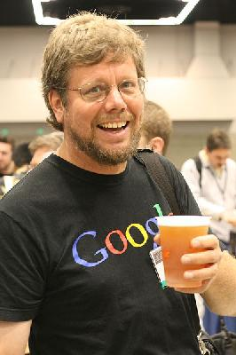
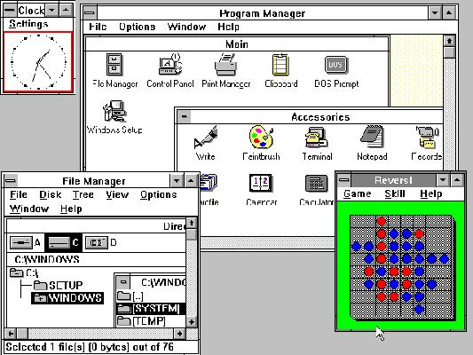

## Python 简史

[`www.cnblogs.com/vamei/archive/2013/02/06/2892628.html`](http://www.cnblogs.com/vamei/archive/2013/02/06/2892628.html)

作者：Vamei 出处：http://www.cnblogs.com/vamei 欢迎转载，也请保留这段声明。谢谢！

Python 是我喜欢的语言，简洁，优美，容易使用。前两天，我很激昂的向朋友宣传 Python 的好处。

听过之后，朋友问我：好吧，我承认 Python 不错，但它为什么叫 Python 呢？

我不是很确定：呃，似乎是一个电视剧的名字。

朋友又问：那你说的 Guido 是美国人么？ (Guido von Rossum，Python 的作者)

我再次不是很确定：他从 google 换到 Dropbox 工作，但他的名字像是荷兰人的 (有一个 von 在中间)。

所以，后面我花了些时间调查 Python 的历史。这是很好的学习。我看到了 Python 中许多功能的来源和 Python 的设计理念，比如哪些功能是历史遗留，哪些功能是重复，如何增加功能…… 而且，Python 也是开源(open source)运动的一个成功案例。从 Python 的历史中，我们可以一窥开源开发的理念和成就。

这也可以作为我写的[Python 快速教程](http://www.cnblogs.com/vamei/archive/2012/09/13/2682778.html)的序篇。

### Python 的起源

Python 的作者，Guido von Rossum，确实是荷兰人。1982 年，Guido 从阿姆斯特丹大学(University of Amsterdam)获得了数学和计算机硕士学位。然而，尽管他算得上是一位数学家，但他更加享受计算机带来的乐趣。用他的话说，尽管拥有数学和计算机双料资质，他总趋向于做计算机相关的工作，并热衷于做任何和编程相关的活儿。



Guido von Rossum

在那个时候，他接触并使用过诸如 Pascal、C、 Fortran 等语言。这些语言的基本设计原则是让机器能更快运行。在 80 年代，虽然 IBM 和苹果已经掀起了个人电脑浪潮，但这些个人电脑的配置很低 (在今天看来)。比如早期的 Macintosh，只有 8MHz 的 CPU 主频和 128KB 的 RAM，一个大的数组就能占满内存。所有的编译器的核心是做优化，以便让程序能够运行。为了增进效率，语言也迫使程序员像计算机一样思考，以便能写出更符合机器口味的程序。在那个时代，程序员恨不得用手榨取计算机每一寸的能力。有人甚至认为 C 语言的指针是在浪费内存。至于动态类型，内存自动管理，面向对象…… 别想了，那会让你的电脑陷入瘫痪。

然而，这种思考方式让 Guido 感到苦恼。Guido 知道如何用 C 语言写出一个功能，但整个编写过程需要耗费大量的时间 (即使他已经准确的知道了如何实现)。他的另一个选择是 shell。Bourne Shell 作为 UNIX 系统的解释器(interpreter)已经长期存在。UNIX 的管理员们常常用 shell 去写一些简单的脚本，以进行一些系统维护的工作，比如定期备份、文件系统管理等等。shell 可以像胶水一样，将 UNIX 下的许多功能连接在一起。许多 C 语言下上百行的程序，在 shell 下只用几行就可以完成。然而，shell 的本质是调用命令。它并不是一个真正的语言。比如说，shell 没有数值型的数据类型，加法运算都很复杂。总之，shell 不能全面的调动计算机的功能。

(关于 shell，你可以参考[Linux 架构](http://www.cnblogs.com/vamei/archive/2012/09/19/2692452.html)和[Linux 命令行与命令](http://www.cnblogs.com/vamei/archive/2012/09/10/2676740.html))

Guido 希望有一种语言，这种语言能够像 C 语言那样，能够全面调用计算机的功能接口，又可以像 shell 那样，可以轻松的编程。ABC 语言让 Guido 看到希望。ABC 是由荷兰的 CWI (Centrum Wiskunde & Informatica, 数学和计算机研究所)开发的。Guido 在 CWI 工作，并参与到 ABC 语言的开发。ABC 语言以教学为目的。与当时的大部分语言不同，ABC 语言的目标是“让用户感觉更好”。ABC 语言希望让语言变得容易阅读，容易使用，容易记忆，容易学习，并以此来激发人们学习编程的兴趣。比如下面是一段来自 Wikipedia 的 ABC 程序，这个程序用于统计文本中出现的词(word)的总数：

```py
HOW TO RETURN words document:
   PUT {} IN collection
   FOR line IN document:
      FOR word IN split line:
         IF word not.in collection:
            INSERT word IN collection
   RETURN collection

```

HOW TO 用于定义一个函数。一个 Python 程序员应该很容易理解这段程序。ABC 语言使用冒号(:)和缩进来表示程序块(C 语言使用{}来表示程序块)。行尾没有分号。for 和 if 结构中也没有括号()。如果将 HOW TO 改为 def，将 PUT 行改为 collection = []，将 INSERT 行改为 collection.append(word)，这就几乎是一个标准的 Python 函数。上面的函数读起来就像一段自然的文字。

尽管已经具备了良好的可读性和易用性，ABC 语言最终没有流行起来。在当时，ABC 语言编译器需要比较高配置的电脑才能运行。而这些电脑的使用者通常精通计算机，他们更多考虑程序的效率，而非它的学习难度。除了硬件上的困难外，ABC 语言的设计也存在一些致命的问题：

*   **可拓展性差**。ABC 语言不是模块化语言。如果想在 ABC 语言中增加功能，比如对图形化的支持，就必须改动很多地方。
*   **不能直接进行 IO**。ABC 语言不能直接操作文件系统。尽管你可以通过诸如文本流的方式导入数据，但 ABC 无法直接读写文件。输入输出的困难对于计算机语言来说是致命的。你能想像一个打不开车门的跑车么？
*   **过度革新**。ABC 用自然语言的方式来表达程序的意义，比如上面程序中的 HOW TO (如何)。然而对于程序员来说，他们更习惯用 function 或者 define 来定义一个函数。同样，程序员也习惯了用等号(=)来分配变量。这尽管让 ABC 语言显得特别，但实际上增加了程序员的学习难度 (程序员大都掌握不止一种语言)。
*   **传播困难**。ABC 编译器很大，必须被保存在磁带(tape)上。当时 Guido 在访问的时候，就必须有一个大磁带来给别人安装 ABC 编译器。 这样，ABC 语言就很难快速传播。

IBM tape drive：读写磁带

1989 年，为了打发圣诞节假期，Guido 开始写 Python 语言的编译/解释器。Python 来自 Guido 所挚爱的电视剧 Monty Python's Flying Circus (BBC1960-1970 年代播放的室内情景幽默剧，以当时的英国生活为素材)。他希望这个新的叫做 Python 的语言，能实现他的理念(一种 C 和 shell 之间，功能全面，易学易用，可拓展的语言)。Guido 作为一个语言设计爱好者，已经有过设计语言的(不很成功)的尝试。这一次，也不过是一次纯粹的 hacking 行为。

### Python 的诞生

1991 年，第一个 Python 编译器(同时也是解释器)诞生。它是用 C 语言实现的，并能够调用 C 库(.so 文件)。从一出生，Python 已经具有了：类(class)，函数(function)，异常处理(exception)，包括表(list)和词典(dictionary)在内的核心数据类型，以及模块(module)为基础的拓展系统。


最初的 Python logo: 由 Guido 的兄弟 Just von Rossum 设计

Python 语法很多来自 C，但又受到 ABC 语言的强烈影响。来自 ABC 语言的一些规定直到今天还富有争议，比如强制缩进。但这些语法规定让 Python 容易读。另一方面，Python 聪明的选择服从一些惯例(特别是 C 语言的惯例)。比如使用等号赋值，使用 def 来定义函数。Guido 认为，如果“常识”上确立的东西，没有必要过度纠结。

Python 从一开始就特别在意可拓展性(extensibility)。Python 可以在多个层次上拓展。从高层上，你可以引入.py 文件。在底层，你可以引用 C 语言的库。Python 程序员可以快速的使用 Python 写.py 文件作为拓展模块。但当性能是考虑的重要因素时，Python 程序员可以深入底层，写 C 程序，编译为.so 文件引入到 Python 中使用。Python 就好像是使用钢构建房一样，先规定好大的框架。而程序员可以在此框架下相当自由的拓展或更改。

最初的 Python 完全由 Guido 本人开发。Python 得到 Guido 同事的欢迎。他们迅速的反馈使用意见，并参与到 Python 的改进。Guido 和一些同事构成 Python 的核心团队。他们将自己大部分的业余时间用于 hack Python (也包括工作时间，因为他们将 Python 用于工作)。随后，Python 拓展到 CWI 之外。Python 将许多机器层面上的细节隐藏，交给编译器处理，并凸显出逻辑层面的编程思考。Python 程序员可以花更多的时间用于思考程序的逻辑，而不是具体的实现细节 (Guido 有一件 T 恤，写着：人生苦短，我用 Python)。这一特征吸引了广大的程序员。Python 开始流行。

我们不得不暂停我们的 Python 时间，转而看一看这时的计算机概况。1990 年代初，个人计算机开始进入普通家庭。Intel 发布了 486 处理器，windows 发布 window 3.0 开始的一系列视窗系统。计算机的性能大大提高。程序员开始关注计算机的易用性  (比如图形化界面)。 

Windows 3.0

由于计算机性能的提高，软件的世界也开始随之改变。硬件足以满足许多个人电脑的需要。硬件厂商甚至渴望高需求软件的出现，以带动硬件的更新换代。C++和 Java 相继流行。C++和 Java 提供了面向对象的编程范式，以及丰富的对象库。在牺牲了一定的性能的代价下，C++和 Java 大大提高了程序的产量。语言的易用性被提到一个新的高度。我们还记得，ABC 失败的一个重要原因是硬件的性能限制。从这方面说，Python 要比 ABC 幸运许多。

另一个悄然发生的改变是 Internet。1990 年代还是个人电脑的时代，windows 和 Intel 挟 PC 以令天下，盛极一时。尽管 Internet 为主体的信息革命尚未到来，但许多程序员以及资深计算机用户已经在频繁使用 Internet 进行交流 (包括 email 和 newsgroup)。Internet 让信息交流成本大大下降。一种新的软件开发模式开始流行：开源 (open source)。程序员利用业余时间进行软件开发，并开放源代码。1991 年，Linus 在 comp.os.minix 新闻组上发布了 Linux 内核源代码，吸引大批 hacker 的加入。Linux 和 GNU 相互合作，最终构成了一个充满活力的开源平台。

硬件性能不是瓶颈，Python 又容易使用，所以许多人开始转向 Python。Guido 维护了一个 maillist，Python 用户就通过邮件进行交流。Python 用户来自许多领域，有不同的背景，对 Python 也有不同的需求。Python 相当的开放，又容易拓展，所以当用户不满足于现有功能，很容易对 Python 进行拓展或改造。随后，这些用户将改动发给 Guido，并由 Guido 决定是否将新的特征加入到 Python 或者标准库中。如果代码能被纳入 Python 自身或者标准库，这将极大的荣誉。Python 自身也因此变得更好。

(Guido 不得不作出许多决定，这也是他被称为[Benevolent Dictator For Life](http://en.wikipedia.org/wiki/Benevolent_Dictator_For_Life "Benevolent Dictator For Life")的原因)

Python 被称为“Battery Included”，是说它以及其标准库的功能强大。这些是整个社区的贡献。Python 的开发者来自不同领域，他们将不同领域的优点带给 Python。比如 Python 标准库中的正则表达(regular expression)是参考 Perl，而 lambda, map, filter, reduce 函数参考 Lisp。Python 本身的一些功能以及大部分的标准库来自于社区。Python 的社区不断扩大，进而拥有了自己的 newsgroup，网站(python.org)，以及基金 (Python Software Foundation)。从 Python 2.0 开始，Python 也从 maillist 的开发方式，转为完全开源的开发方式。社区气氛已经形成，工作被整个社区分担，Python 也获得了更加高速的发展。

(由于 Guido 享有绝对的仲裁权，所以在 Python 早期 maillist 的开发时代，不少爱好者相当担心 Guido 的生命。他们甚至作出假设：如果 Guido 挂了的话，Python 会怎样。见[If Guido was hit by a bus](http://www.python.org/search/hypermail/python-1994q2/1040.html))

到今天，Python 的框架已经确立。Python 语言以对象为核心组织代码(Everything is object)，支持多种编程范式(multi-paradigm)，采用动态类型(dynamic typing)，自动进行内存回收(garbage collection)。Python 支持解释运行(interpret)，并能调用 C 库进行拓展。Python 有强大的标准库 (battery included)。由于标准库的体系已经稳定，所以 Python 的生态系统开始拓展到第三方包。这些包，如 Django, web.py, wxpython, numpy, matplotlib,PIL，将 Python 升级成了物种丰富的热带雨林。

今天 Python 已经进入到 3.0 的时代。由于 Python 3.0 向后不兼容，所以从 2.0 到 3.0 的过渡并不容易。另一方面，Python 的性能依然值得改进，Python 的运算性能低于 C++和 Java(见[Google 的讨论](https://groups.google.com/forum/?fromgroups#!topic/unladen-swallow/TtvEBvVEZD4))。Python 依然是一个在发展中的语言。我期待看到 Python 的未来。

### Python 启示录

Python 崇尚优美、清晰、简单，是一个优秀并广泛使用的语言 (TIOBE 语言排行第八，Google 的第三大开发语言，Dropbox 的基础语言，豆瓣的服务器语言)。这个世界并不缺乏优秀的语言，但 Python 的发展史作为一个代表，带给我许多启示。

在 Python 的开发过程中，社区起到了重要的作用。Guido 自认为自己不是全能型的程序员，所以他只负责制订框架。如果问题太复杂，他会选择绕过去，也就是 cut the corner。这些问题最终由社区中的其他人解决。社区中的人才是异常丰富的，就连创建网站，筹集基金这样与开发稍远的事情，也有人乐意于处理。如今的项目开发越来越复杂，越来越庞大，合作以及开放的心态成为项目最终成功的关键。

Python 从其他语言中学到了很多，无论是已经进入历史的 ABC，还是依然在使用的 C 和 Perl，以及许多没有列出的其他语言。可以说，Python 的成功代表了它所有借鉴的语言的成功。同样，Ruby 借鉴了 Python，它的成功也代表了 Python 某些方面的成功。每个语言都是混合体，都有它优秀的地方，但也有各种各样的缺陷。同时，一个语言“好与不好”的评判，往往受制于平台、硬件、时代等等外部原因。程序员经历过许多语言之争。我想，为什么不以开放的心态和客观的分析，去区分一下每个语言的具体优点缺点，去区分内部和外部的因素。说不定哪一天发现，我不喜欢的某个语言中，正包含了我所需要的东西。

无论 Python 未来的命运如何，Python 的历史已经是本很有趣的小说。

如果你因为本文对 Python 产生了兴趣，欢迎阅读我的[Python 快速教程](http://www.cnblogs.com/vamei/archive/2012/09/13/2682778.html)。

本文主要参考：

Guido 在 Dropbox 所做演讲 

[`v.youku.com/v_show/id_XNTExOTc1NTU2.html`](http://v.youku.com/v_show/id_XNTExOTc1NTU2.html)

python.org 的文档

Wikipedia