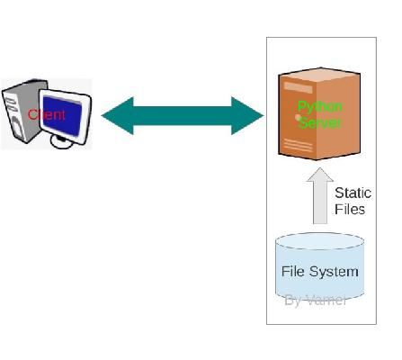
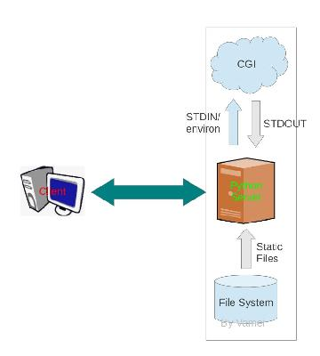

## Python 网络 02 Python 服务器进化

[`www.cnblogs.com/vamei/archive/2012/10/31/2747885.html`](http://www.cnblogs.com/vamei/archive/2012/10/31/2747885.html)

作者：Vamei 出处：http://www.cnblogs.com/vamei 欢迎转载，也请保留这段声明。谢谢！

**注意，在 Python 3.x 中，BaseHTTPServer, SimpleHTTPServer, CGIHTTPServer 整合到 http.server 包，SocketServer 改名为 socketserver，请注意查阅官方文档。

在上一篇文章中([用 socket 写一个 Python 服务器](http://www.cnblogs.com/vamei/archive/2012/10/30/2744955.html))，我们在不依赖框架和 CGI 的情况下，仅使用 socket 接口，完成了一个可以处理 HTTP 请求的 Python 服务器。基于此，任何一台装有操作系统(推荐 Linux)和 Python 的计算机都可以作为 HTTP 服务器使用，来架设你的网站。我们将在这里不断改写上一篇文章中的程序，并引入更高级的 Python 包，以写出更成熟的 Python 服务器。

1\. 支持 POST 的 socket 服务器 

我们首先改写原文中的 HTTP 服务器，从而让该服务器支持更加丰富的 HTTP 请求。相对于原程序，这里增添了表格以及对应"POST"方法的操作。如果你已经读过[用 socket 写一个 Python 服务器](http://www.cnblogs.com/vamei/archive/2012/10/30/2744955.html)，会发现这里只是增加很少的一点内容。

原始程序:


```py
# Written by Vamei # A messy HTTP server based on TCP socket 

import socket
 # Address
HOST = '' PORT = 8000 text_content = ''' HTTP/1.x 200 OK  
Content-Type: text/html

<head>
<title>WOW</title>
</head>
<html>
<p>Wow, Python Server</p>

<form name="input" action="/" method="post">
First name:<input type="text" name="firstname"><br>
<input type="submit" value="Submit">
</form> 
</html>
''' f = open('test.jpg','rb')
pic_content = ''' HTTP/1.x 200 OK  
Content-Type: image/jpg

''' pic_content = pic_content + f.read()

# Configure socket
s    = socket.socket(socket.AF_INET, socket.SOCK_STREAM)
s.bind((HOST, PORT))

# Serve forever
while True:
    s.listen(3)
    conn, addr = s.accept()                    
    request    = conn.recv(1024)         # 1024 is the receiving buffer size
    method     = request.split(' ')[0]
    src        = request.split(' ')[1]

    print 'Connected by', addr
    print 'Request is:', request

    # if GET method request
    if method == 'GET':
        # if ULR is /test.jpg
        if src == '/test.jpg':
            content = pic_content
        else: content = text_content
        # send message
        conn.sendall(content)
    # if POST method request
    if method == 'POST':
        form = request.split('\r\n')
        idx = form.index('')             # Find the empty line
        entry = form[idx:]               # Main content of the request
 value = entry[-1].split('=')[-1]
        conn.sendall(text_content + '\n <p>' + value + '</p>')
        ######
        # More operations, such as put the form into database
        # ...
        ######
    # close connection
    conn.close()

```


运行上面 Python 服务器，向上一篇文章那样，使用一个浏览器作为客户端。


我们看到了新增的表格以及提交(submit)按钮。在表格中输入 aa 并提交表格，我们的 Python 服务器给出上面的结果。

2\. 使用 SocketServer 架设服务器

我们首先使用 SocketServer 包来简化我们架设服务器的过程。在上面使用 socket 的过程中，我们先设置了 socket 的类型，然后依次调用 bind(),listen(),accept()，并使用 while 循环来让服务器不断的接受请求。上面的这些步骤可以通过 SocketServer 包来简化。

SocketServer:


```py
# Written by Vamei # use TCPServer

import SocketServer

HOST = '' PORT = 8000 text_content = ''' HTTP/1.x 200 OK  
Content-Type: text/html

<head>
<title>WOW</title>
</head>
<html>
<p>Wow, Python Server</p>

<form name="input" action="/" method="post">
First name:<input type="text" name="firstname"><br>
<input type="submit" value="Submit">
</form> 
</html>
''' f = open('test.jpg','rb')
pic_content = ''' HTTP/1.x 200 OK  
Content-Type: image/jpg

''' pic_content = pic_content + f.read()

# This class defines response to each request
class MyTCPHandler(SocketServer.BaseRequestHandler):
    def handle(self):
        # self.request is the TCP socket connected to the client
        request = self.request.recv(1024)

        print 'Connected by',self.client_address[0]
        print 'Request is', request

        method     = request.split(' ')[0]
        src        = request.split(' ')[1]

        if method == 'GET':
            if src == '/test.jpg':
                content = pic_content
            else: content = text_content
            self.request.sendall(content)

        if method == 'POST':
            form = request.split('\r\n')
            idx = form.index('')             # Find the empty line
            entry = form[idx:]               # Main content of the request
 value = entry[-1].split('=')[-1]
            self.request.sendall(text_content + '\n <p>' + value + '</p>')
            ######
            # More operations, such as put the form into database
            # ...
            ######

# Create the server
server = SocketServer.TCPServer((HOST, PORT), MyTCPHandler)
# Start the server, and work forever
server.serve_forever()

```


我们建立了一个 TCPServer 对象来创建一个 TCP socket 服务器，并同时设置 IP 地址和端口。然后使用 server_forever()方法来让服务器不断工作(就像原始程序中的 while 循环一样)。我们传递给 TCPServer 一个 MyTCPHandler 类，用对 socket 作出操作。注意，MyTCPHandler 继承自 BaseRequestHandler，我们通过改写 handler()方法来个性化我们的操作。在 handler()中，可以通过 self.request 来引用 socket (正如我们在 handler()中对 socket 进行 recv()和 sendall()操作)，还可以使用 self.address 来引用 socket 的客户端地址。

3\. SimpleHTTPServer: 使用静态文件来回应请求

在经过了 SocketServer 的改造之后，我们的 handler()，也就是对请求进行处理的部分，依然是乱糟糟的一团。这对于大型服务器来说可能是个问题。

为什么呢？ 对于一个 HTTP 请求(request)来说，它的起始行包含两个重要信息：请求方法和 URL。之前，我们都用 if 结构来区分不同的请求方法和 URL，并针对不同的情况来进行不同的操作:

请求方法(request method)       URL                操作

GET                           /                  发送 text_content

GET                           /text.jpg          发送 pic_content

POST                          /                  分析 request 主体中包含的 value(实际上是我们填入表格的内容); 发送 text_content 和 value

根据请求方法和 URL 的不同，一个大型的 HTTP 服务器可能需要应付成千上万种不同的请求。如果针对每个请求都在程序中写出不同的操作的话，需要大量的时间和精力，同时为运营和维护带来很大的困难。我们需要有更标准化，也更简便的方式来处理这些请求。在 Python 中，我们可以使用 SimpleHTTPServer 包和 CGIHTTPServer 包来减小以上的负担。其中，SimpleHTTPServer 可以用于处理 GET 方法和 HEAD 方法的请求。它读取 request 中的 URL 地址，并在当前目录中找到对应的静态文件，并将文件的内容发送给客户端。



SimpleHTTPServer

对应于我们的情况，就是将 text_content 放置在 index.html 中，而不用读取 text.jpg 文件。当一个 HTTP 请求到来时，其 URL 指向某个文件，SimpleHTTPServer 会读取这个文件，并分析文件类型，自动生成 response，回复客户端。如果 URL 指向某个文件夹，SimpleHTTPServer 会读取该文件夹下的 index.html 或者 index.hml 文件。

首先，我们在当前目录下生成如下 index.html 文件:


```py
<head>
<title>WOW</title>
</head>
<html>
<p>Wow, Python Server</p>

<form name="input" action="/" method="post"> First name:<input type="text" name="firstname"><br>
<input type="submit" value="Submit">
</form>
</html>

```


然后，改写我们的 Python 服务器程序。实际上，我们只是更换了 TCPServer 的 Handler：使用 SimpleHTTPServer 包中唯一的类 SimpleHTTPRequestHandler，而不是我们之前自己定义的 MyTCPHandler

SimpleHTTPServer:


```py
# Written by Vamei # Simple HTTPsERVER

import SocketServer
import SimpleHTTPServer

HOST = '' PORT = 8000

# Create the server, SimpleHTTPRequestHander is pre-defined handler in SimpleHTTPServer package
server = SocketServer.TCPServer((HOST, PORT), SimpleHTTPServer.SimpleHTTPRequestHandler)
# Start the server server.serve_forever()

```


注意，我们这里的程序还不能等效于之前的程序，因为不能处理 POST 请求。我们会在后面使用 CGI 来弥补这个缺陷。但要点是，我们的 Python 服务器程序已经变得非常简单。我们将内容存放于静态文件，并根据 URL 指向的静态文件为客户端提供内容，从而让内容和 Python 服务器相分离。这样的话，我们每次更新内容的时候就可以只修改静态文件，而不用停止整个 Python 服务器。

我们也应该注意到使用这些改进付出的代价。比如说，对于原始程序来说，request 中的 URL 只具有指导意义，我们可以任意规定相应的操作。而在 SimpleHTTPServer 的改进中，response 固化成为：读取 URL 对应文件并将其内容呈现给客户。这大大限制了我们的自由 度。即使在后面我们使用 CGI 增大了自由度，但相对于原始程序，我们依然是增加了自己的限制。有时候，程序的便捷与程序的自由度相抵触，程序员需要在两者之间取舍。对于一个小的项目来说，我们可以跟随已经 制定的标准(比如这里的 SimpleHTTPServer，或者使用一个框架)，使用这些新的标准可以让开发变得很便捷。然而对于一个大型的项目来说，我们往往需要争取回自己的自由度，修订成为项目需要的标准。 

4\. CGIHTTPServer：使用静态文件或者 CGI 来回应请求

CGIHTTPServer 包中的 CGIHTTPRequestHandler 类继承自 SimpleHTTPRequestHandler 类，所以可以用来代替上面的例子，来提供静态文件的服务。此外，CGIHTTPRequestHandler 类还可以用来运行 CGI 脚本。



CGIHTTPServer

首先，我们先看看什么是 CGI (Common Gateway Interface)。CGI 是服务器和应用脚本之间的一套接口标准，目的是让服务器程序运行脚本程序，将程序的输出作为 response 发送给客户。通常来说，支持 CGI 的服务器程在接收到客户的 request 之后，根据 request 中的 URL，运行对应的脚本文件。服务器会将 HTTP request 信息以及 socket 信息输入给脚本文件，也负责收集脚本的输出，并组装成为合法的 HTTP response。利用 CGI，我们可以充分发挥服务器的可编程性，动态的生成 response，而不必局限于静态文件。

服务器和 CGI 脚本之间通过 CGI 标准作为接口。这样就可以让服务器与不同语言写的 CGI 脚本相配合，比如说使用 Apache 服务器与 Perl 写的 CGI 脚本，或者 Python 服务器与 shell 写的 CGI 脚本。

到这里为止，我们都在使用 TCPServer 来构建服务器。为了使用 CGI，我们需要使用 BaseHTTPServer 包中的 HTTPServer 类来构建服务器。其实 HTTPServer 是 TCPServer 的子类，其使用方法也与 TCPServer 相同。它只是增加了 server_name 和 server_port 两个属性。但不凑巧的是，我们的 CGIHTTPRequestHandler 需要调用这两个属性...

Python 服务器的改动很简单。

CGIHTTPServer:


```py
# Written by Vamei # A messy HTTP server based on TCP socket 

import BaseHTTPServer
import CGIHTTPServer

HOST = '' PORT = 8000

# Create the server, CGIHTTPRequestHandler is pre-defined handler
server = BaseHTTPServer.HTTPServer((HOST, PORT), CGIHTTPServer.CGIHTTPRequestHandler)
# Start the server
server.serve_forever()

```


CGIHTTPRequestHandler 默认当前目录下的 cgi-bin 和 ht-bin 文件夹中的文件为 CGI 脚本，而存放于其他地方的文件被认为是静态文件。因此，我们需要修改一下 index.html，将其中 form 元素指向的 action 改为 cgi-bin/post.py。


```py
<head>
<title>WOW</title>
</head>
<html>
<p>Wow, Python Server</p>

<form name="input" action="cgi-bin/post.py" method="post"> First name:<input type="text" name="firstname"><br>
<input type="submit" value="Submit">
</form>
</html>

```


我们创建一个 cgi-bin 的文件夹，并在 cgi-bin 中放入如下 post.py 文件，也就是我们的 CGI 脚本：


```py
#!/usr/bin/env python 

```

```py
# Written by Vamei

```

```py
import cgi
form = cgi.FieldStorage()

# Output to stdout, CGIHttpServer will take this as response to the client
print "Content-Type: text/html"     # HTML is following
print                               # blank line, end of headers
print "<p>Hello world!</p>"         # Start of content
print "<p>" +  repr(form['firstname']) + "</p>"

```


(post.py 需要有执行权限，见评论区)

第一行必须要有，以便告诉 Python 服务器，脚本所使用的语言 (我们这里的 CGI 是 Python，当然也可以是别的语言，比如 bash)。 cgi 包用于提取 request 中提交的表格信息(我们暂时不深入 cgi 包)。脚本只负责将所有的结果输出到标准输出(使用 print)。而 CGIHTTPRequestHandler 会收集这些输出，并组装成为 response 传送给客户端。

如果一个请求是 POST 方法，那么它的 URL 必须指向一个 CGI 脚本(也就是在 cgi-bin 或者 ht-bin 中的文件)。CGIHTTPRequestHandler 继承自 SimpleHTTPRequestHandler，所以也可以处理 GET 方法和 HEAD 方法的请求。此时，如果 URL 指向 CGI 脚本时，服务器将脚本的运行结果传送到客户端；当此时 URL 指向静态文件时，服务器将文件的内容传送到客户端。

我们可以让 CGI 脚本执行数据库操作，比如将接收到的数据放入到数据库中，以及更丰富的程序操作。CGI 脚本提供了 LAMP 架构中 PHP 的作用 (我们的 Python 服务器相当于 LAMP 中的 Apache)。 

5\. 总结

我们使用了 Python 标准库中的一些高级包简化了 Python 服务器，并将静态内容、CGI 应用和服务器分割，降低三者之间的耦合，从而可以更加便捷的构建和维护 Python 服务器。但是，我们并没有通过这些高级包得到额外的功能。所有这些高级包可以做到的，也完全可以利用低级的 socket 和 Python 编程实现，而 socket 许多可以实现的，则不能在这些高级包中实现。高级包带来的是便捷和规范，代价是一定的自由度。

到现在为止，我们已经粗略的介绍了 Python 中构建 HTTP 服务器的常用工具。希望你享受在自己的电脑上架设服务器的过程。