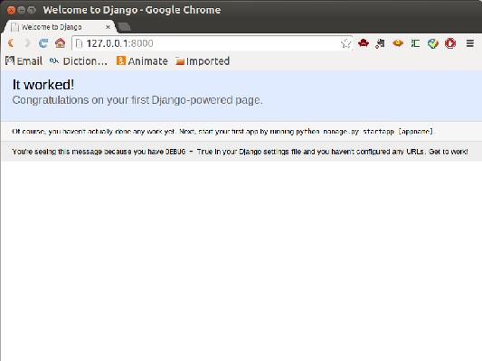
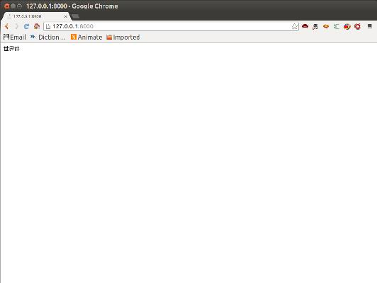

## 被解放的姜戈 01 初试天涯

[`www.cnblogs.com/vamei/p/3528878.html`](http://www.cnblogs.com/vamei/p/3528878.html)

 作者：Vamei 出处：http://www.cnblogs.com/vamei 欢迎转载，也请保留这段声明。谢谢！

Django 是 Python 下的一款网络服务器框架。Python 下有许多款不同的框架。Django 是重量级选手中最有代表性的一位。许多成功的网站和 APP 都基于 Django。虽然 Django 之于 Python，达不到 Rail 之于 Ruby 的一统江湖的地位，但 Django 无疑也是 Python 在网络应用方面的一位主将。


向昆汀的致敬，“被解放的姜戈”

Django 意外的和昆汀的电影重名。这大大提高了 Django 的知名度。另外利用电影，宣传了这个奇怪的词的发音。

**下面是姜戈的初体验。 **

### 安装 Django

启动计算机中的 Python，尝试载入 Django 模块。如果可以成功载入，那么说明 Django 已经安装好：

```py
import django print(django.VERSION)

```

如果 Django 还没有安装，可以在命令行，尝试使用 pip 安装:

或者使用 easy_install:

**黑夜中，姜戈和镣铐说再见。**

### 启动

使用下面的命令创建项目：

```py
django-admin.py startproject mysite

```

在当前目录下，将生成 mysite 文件夹。其文件树结构如下:

```py
mysite
├── manage.py
└── mysite
    ├── __init__.py
    ├── settings.py
    ├── urls.py
    └── wsgi.py

1 directory, 5 files

```

进入 mysite，启动服务器：

```py
python manage.py runserver 8000

```

上面的 8000 为端口号。如果不说明，那么端口号默认为 8000。

打开浏览器，访问 http://127.0.0.1:8000，可以看到服务器已经在运行：



虽然有一个能跑的服务器，但什么内容都没有。

**“赏金？猎人？” 姜戈满脸困惑。**

### 第一个网页

在 http 协议中可以看到，网络服务器是“请求-回应”的工作模式。客户向 URL 发送请求，服务器根据请求，开动后厨，并最终为客人上菜。Django 采用的 MVC 结构，即点单、厨房、储藏室分离。

我们需要一个指挥员，将 URL 对应分配给某个对象处理，这需要在 mysite/mysite 下的 urls.py 设定。Python 会根据该程序，将 URL 请求分给某个厨师。

```py
mysite
├── manage.py
└── mysite
    ├── __init__.py
    ├── settings.py
    ├── urls.py
    └── wsgi.py

1 directory, 5 files

```

将 urls.py 修改为:

```py
from django.conf.urls import patterns, include, url

from django.contrib import admin
admin.autodiscover()

urlpatterns = patterns('',
    # Examples:
    # url(r'^$', 'mysite.views.home', name='home'),
    # url(r'^blog/', include('blog.urls')),

    url(r'^admin/', include(admin.site.urls)),
    url(r'^$', 'mysite.views.first_page'),
)

```

我们添加了最后一行。它将根目录的 URL 分配给一个对象进行处理，这个对象是 mysite.views.first_page。

用以处理 HTTP 请求的这一对象还不存在，我们在 mysite/mysite 下创建 views.py，并在其中定义 first_page 函数:

```py
# -*- coding: utf-8 -*-

from django.http import HttpResponse def first_page(request): return HttpResponse("<p>世界好</p>")

```

第一行说明字符编码为 utf-8，为下面使用中文做准备。first_page 函数的功能，是返回 http 回复，即这里的<p>世界好</p>。first_page 有一个参数 request，该参数包含有请求的具体信息，比如请求的类型等，这里并没有用到。

页面效果如下：



**姜戈接过枪，一枪射出去。“天哪！” 德国人惊呆了。** 

### 增加 app

一个网站可能有多个功能。我们可以在 Django 下，以 app 为单位，模块化的管理，而不是将所有的东西都丢到一个文件夹中。在 mysite 下，运行 manange.py，创建新的 app：

```py
$python manage.py startapp west

```

这个新的 app 叫做 west，用来处理西餐。

我们的根目录下，出现了一个新的叫做 west 的文件夹。

```py
mysite/
├── manage.py
├── mysite
│   ├── __init__.py
│   ├── __init__.pyc
│   ├── settings.py
│   ├── settings.pyc
│   ├── urls.py
│   ├── views.py
│   └── wsgi.py
└── west
    ├── admin.py
    ├── __init__.py
    ├── models.py
    ├── tests.py
    └── views.py

```

我们还需要修改项目设置，说明我们要使用 west。在 mysite/setting.py 中，在 INSTALLED_APPS 中，增加"west"：

```py
INSTALLED_APPS = ( 'django.contrib.admin', 'django.contrib.auth', 'django.contrib.contenttypes', 'django.contrib.sessions', 'django.contrib.messages', 'django.contrib.staticfiles', 'west',
)

```

**姜戈看到曾经的工头们，眼中充满怒火。**

### 增加 APP 页面

我们下面为 APP 增加首页。我们之前是在 mysite/urls.py 中设置的 URL 访问对象。依然采用类似的方式设置。

另一方面，为了去耦合，实现模块化，我们应该在 west/urls.py 中设置 URL 访问对象。具体如下：

首先，修改 mysite/urls.py：

```py
from django.conf.urls import patterns, include, url from django.contrib import admin
admin.autodiscover()

urlpatterns = patterns('', # Examples:
    # url(r'^$', 'mysite.views.home', name='home'),
    # url(r'^blog/', include('blog.urls')),
 url(r'^admin/', include(admin.site.urls)),
    url(r'^$', 'mysite.views.first_page'),
    url(r'^west/', include('west.urls')),
)

```

注意新增加的最后一行。这里，我们提醒指挥员，对于 west/的访问，要参考 west/urls.py。

随后，我们创建 west/urls.py，添加内容：

```py
from django.conf.urls import patterns, include, url

urlpatterns = patterns('',
    url(r'^$', 'west.views.first_page'),
)

```

将 URL 对应 west 下，views.py 中的 first_page 函数。

最后，在 west 下，修改 views.py 为:

```py
# -*- coding: utf-8 -*-

from django.http import HttpResponse def first_page(request): return HttpResponse("<p>西餐</p>")

```

访问 http://127.0.0.1:8000/west，查看效果。

**“你们这些混蛋，我一个都不会放过！” 姜戈大吼。**

### 总结

可以看到，Django 的创建过程非常简单。但这只是初次尝试 Django。为了创建一个完整功能的网站，还需要调用 Django 许多其它的功能。

**姜戈的解放，才刚刚开始。**