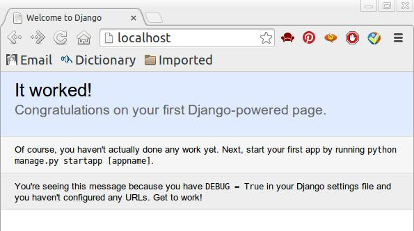

## 被解放的姜戈 07 马不停蹄

[`www.cnblogs.com/vamei/p/3578718.html`](http://www.cnblogs.com/vamei/p/3578718.html)

作者：Vamei 出处：http://www.cnblogs.com/vamei 欢迎转载，也请保留这段声明。谢谢！ 

前面的文章研究了 Django 最主要的几个方面：数据库，模板，动态生成页面等。但都是使用 python manage.py runserver 来运行服务器。这是一个实验性的 web 服务器，不适用于正常的站点运行。我们需要一个可以稳定而持续的服务器。这个服务器负责监听 http 端口，将收到的请求交给 Django 处理，将 Django 的回复发还给客户端。

这样的持续性服务器可以有很多选择，比如 apache, Nginx, lighttpd 等。这里将使用最常见的 apache 服务器。服务器和 Django 之间通过 Python 的 web 服务接口 WSGI 连接，因此我们同样需要 apache 下的 mod_wsgi 模块。

下面的配置和说明，是在 Ubuntu 13.10 下进行的。在其它系统下将有所差别。


**姜戈大喝一声，掉转马头狂奔。 **

### 安装

首先需要安装 apache2 和 mod_wsgi。在 ubuntu 下，我们可以使用 apt-get 安装：

```py
sudo apt-get install apache2 sudo apt-get install libapache2-mod-wsgi

```

 mod_wsgi 也可以在[google code 下载](https://code.google.com/p/modwsgi/wiki/DownloadTheSoftware?tm=2)，自行编译安装。

在 apache 的配置文件/etc/apache2/apache2.conf 中增加下面的配置： 

```py
# Django
WSGIScriptAlias / /home/vamei/mysite/mysite/wsgi.py
WSGIPythonPath /home/vamei/mysite <Directory /home/vamei/mysite/mysite>
<Files wsgi.py> Order deny,allow
  Require all granted </Files>
</Directory>

```

上面的配置中/home/ubuntu/mysite 是 Django 项目所在的位置。而/home/ubuntu/mysite/mysite/wsgi.py 是 Django 项目中 z 自动创建的文件。

可以看到，利用 WSGIScriptAlias，我们实际上将 URL /对应了 wsgi 接口程序。这样，当我们访问根 URL 时，访问请求会经由 WSGI 接口，传递给 Django 项目 mysite。

配置好后，重启 apache2

```py
sudo /etc/init.d/apache2 restart

```

使用浏览器，可以检查效果：



**想起逝去的德国人，姜戈心中一痛。**

### 静态文件

Django 的主要功能是动态的生成 HTTP 回复。很多媒体文件是静态存储的，如.js 文件，.css 文件和图片文件。这些文件变动的频率较小。我们希望静态的提供这些文件，而不是动态的生成。这样既可以减小服务器的负担，也便于在浏览器缓存，提高用户体验。

我们可以在 apache2.conf 中添加如下配置：

```py
Alias /media/ /home/vamei/media/
Alias /static/ /home/vamei/static/ <Directory /home/vamei/static/> Order deny,allow
Require all granted </Directory>

<Directory /home/vamei/media/> Order deny,allow
Require all granted </Directory> # Django
WSGIScriptAlias / /home/vamei/mysite/mysite/wsgi.py
WSGIPythonPath /home/vamei/mysite <Directory /home/vamei/mysite/mysite/ >
<Files wsgi.py> Order deny,allow
    Require all granted </Files>
</Directory>

```

这样，/static/和/media/这两个 URL 的访问将引导向存有静态文件的/home/vamei/static/和/home/vamei/media/，apache 将直接向客户提供这两个文件夹中的静态文件。而剩下的 URL 访问，将导向 WSGI 接口，由 Django 动态处理。

在/home/vamei/static/中放入文件 revenge.jpg，访问 http://localhost/static/revenge：


**姜戈想到爱人身陷囹圄，忧伤顿时化为愤怒。 **

### 其它

云平台或者服务器的部署是一个大的课题，这里无法深入到所有的细节。幸运的是，在网上有丰富的资料。你可以根据自己的平台和问题，搜索相应的资料。

在 Django 的 debug 模式下，我们可以在 app 文件夹中建立 static 目录，放入静态文件。Django 将自动搜索到其中的静态文件。但这一方法有很大的安全隐患，只适用于开发。

**马蹄声疾，电光火石之间，姜戈已经把护园家丁撂倒在地。**

### 总结

apache + mod_wsgi

静态文件

**“你在外面等我，我要跟他们算总帐”，姜戈对爱人说。**