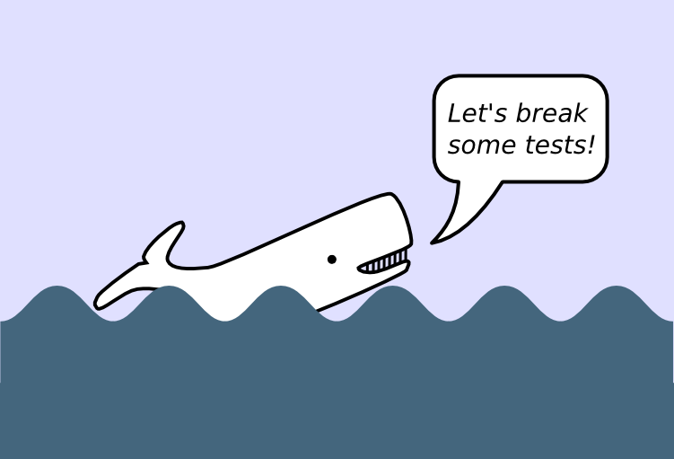

# Python 测试教程

# Python 测试教程

## 概述

本教程帮助您学习如何使用`py.test`框架进行 Python 3 的自动化测试。

## 本书的最新版本

+   本教程的来源：[github.com/krother/python_testing_tutorial](https://github.com/krother/python_testing_tutorial)。

+   PDF 和 EPUB 版本：[www.gitbook.io/book/krother/python-testing-tutorial](http://www.gitbook.io/book/krother/python-testing-tutorial)

## 版权

欢迎提供反馈和评论至：krother@academis.eu

© 2018 Magdalena & Kristian Rother

以知识共享署名 4.0 许可发布。

## 贡献者

Kristian Rother, Magdalena Rother, Daniel Szoska
