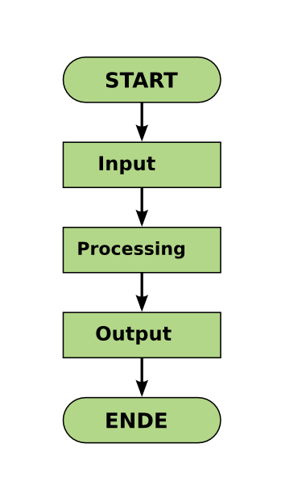
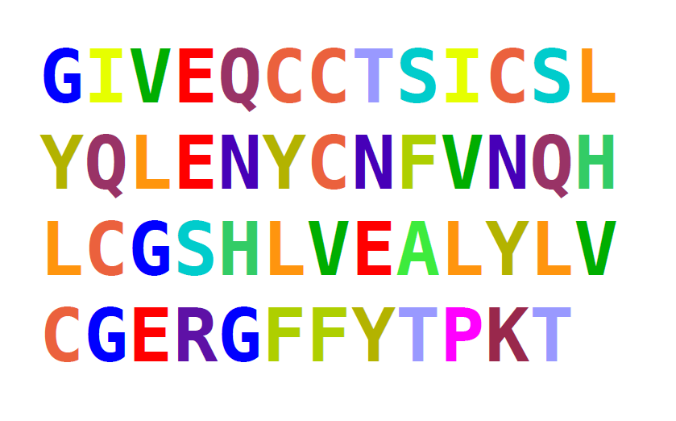

# 编写 Python 程序

# 编写 Python 程序

程序由多行组成，一次执行所有行。

通常，程序包含以下几部分：



当然，程序可能变得更加复杂。

在本章中，我们将学习使用 `print()` 函数生成输出、循环和分支语句。

## 图灵完备性

在教程的第二部分，您将学习一组基本的 Python 命令。从理论上讲，它们足以在地球上编写任何程序（这称为*图灵完备性*）。

实际上，您将需要一些能够使程序更美观、更快速且更不痛苦地编写的快捷方式。我们将在后面的部分保存这些快捷方式。

# 我的第一个程序

# 我的第一个程序

仅使用交互式 IPython shell 一段时间后会变得令人兴奋。要编写更复杂的程序，您需要将指令存储在*程序*中，以便以后*执行*它们。

在本节中，我们将编写我们的第一个 Python 程序。它将简单地将几个婴儿的名字写到屏幕上。

### 练习 1

打开文本编辑器（例如 Spyder）并创建一个新文件。写入其中：

```
print("Hannah")
print(23073) 
```

用名称 `output.py` 保存文件。

### 练习 2

现在让我们执行我们的程序。

+   在 **Anaconda Spyder** 中，您可以使用 *"Play"* 按钮或按 `F5` 键。

+   在 **Unix** 中打开终端，切换到包含 Python 文件的目录，并键入：

    python3 output.py

### 练习 3

解释以下程序：

```
name = "Emily"
jahr = 2000
print(name, jahr) 
```

### 练习 4

编写以下程序：

```
name = "Emily"
name 
```

当您执行代码时会发生什么？

# 重复指令

# 重复指令

在我们的早期程序中，每个 Python 指令只执行一次。这使得编程有点没有意义，因为我们的程序受到我们的打字速度的限制。

在本节中，我们将更仔细地查看重复执行一条或多条指令的 `for` 语句。

## 练习 1

以下程序做什么？

```
for number in range(1, 43):
    print(number) 
```

### 练习 2

`for` 循环相比以下内容有什么优势？

```
print(0)
print(1)
print(2)
print(3)
print(4)
.. 
```

### 练习 3

编写一个 `for` 循环，创建以下输出

```
1
4
9
16
25
36
49 
```

### 练习 4

解释以下两个程序之间的区别：

```
total = 0
for number in range(10):
    total = total + number
    print(total) 
```

和

```
total = 0
for number in range(10):
    total = total + number
print(total) 
```

### 练习 5

以下程序做什么？

```
text = ""
characters = "Hannah"
for char in characters:
    text = char + text
print(text) 
```

## 练习 6

编写一个计算 `Stefani Joanne Angelina Germanotta` 中字符数的程序。**空格也要计数！**

# 做决定

# 做决定

在程序中做出决定的最后一块缺失的部分是具有分支语句的能力。在 Python 中，使用 `if` 命令来实现。



### 练习 1

执行以下程序并解释其输出。

```
number = 123

if number > 1000:
    print("The number is larger than 1000.")
elif number == 1000:
    print("The numer is exactly 1000.")
else:
    print("The number is smaller than 1000.") 
```

### 练习 2

将 `name` 设置为一个值，使得一个、两个或全部三个条件都适用。

```
name = ____

if "m" in name:
    print("There is a 'm' in the name.")
    if name != "Mimi":
        print("The name is not Mimi.")
        if name[0] == "M" and name[-1] == "m":
            print("The name starts and ends with m.") 
```

### 练习 3

以下程序将名称中所有字母“n”的位置写入屏幕。不幸的是，它包含**三个错误**。使程序能够正确执行：

```
name = "Anna"
position = 1

for char in name
    if char = "n":
        print(position)
position = position + 1 
```

### 练习 4

哪些 `if` 语句在语法上是正确的？

+   `if a and b:`

+   `if len(s) == 23:`

+   `if a but not b < 3:`

+   `if a ** 2 >= 49:`

+   `if a != 3`

+   `if (a and b) or (c and d):`
