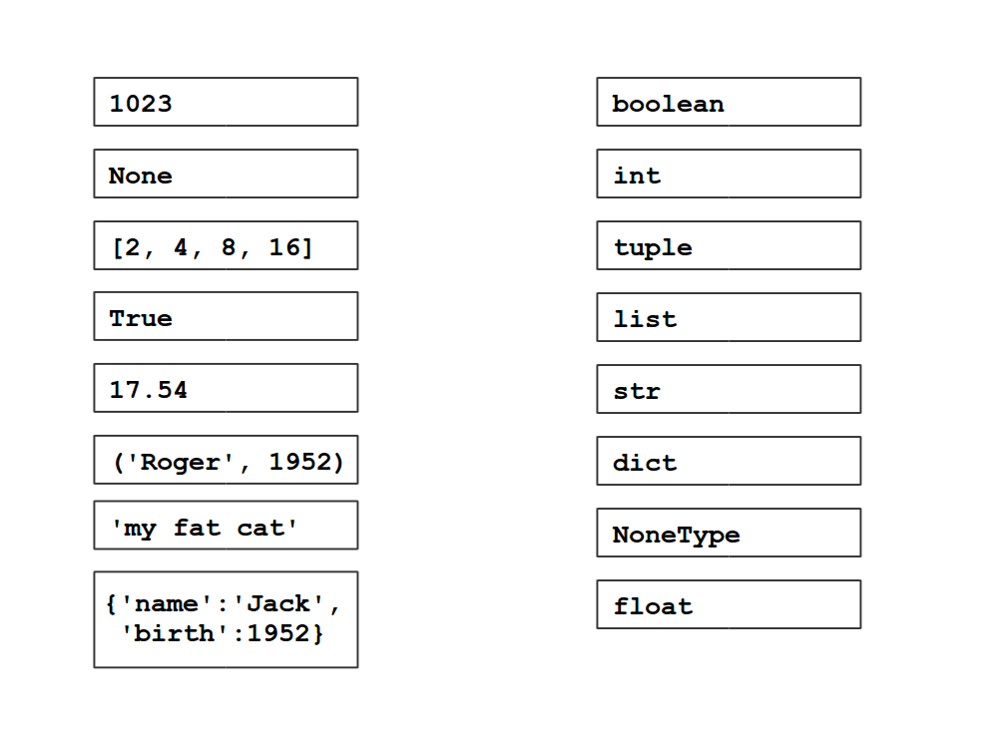

# Python 中的数据类型概述

# Python 中的数据类型概述

## 数据类型

将数据样本与其类型匹配。



# 定义

## 不可变和可变的数据类型

在 Python 中有基本和复合数据类型。基本数据类型的值不能改变，它们是**不可变的**。大多数复合数据类型是**可变的**。

Python 中的不可变数据类型有：

+   布尔值（`True` / `False`）

+   整数（`0`，`1`，`-3`）

+   浮点数（`1.0`，`-0.3`，`1.2345`）

+   字符串（`'apple'`，`"banana"`）- 单引号和双引号都是有效的。

+   None（也称为空变量）

+   元组（括号中的多个值，例如 `('Jack', 'Smith', 1990)`）

可变的数据类型有

+   列表 `[1, 2, 2, 3]`

+   字典 `{'name': 'John Smith', 'year': 1990}`

+   集合（）

## 类型转换

值可以使用*转换函数*相互转换。试试以下操作：

```
int('5.5')
float(5)
str(5.5)
list("ABC")
tuple([1,2,3])
dict([('A',1),('B',2)])
set([1,2,2,3]) 
```
