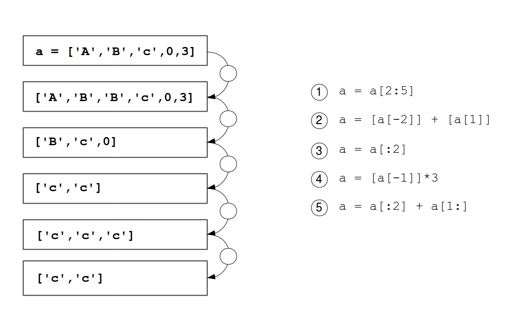
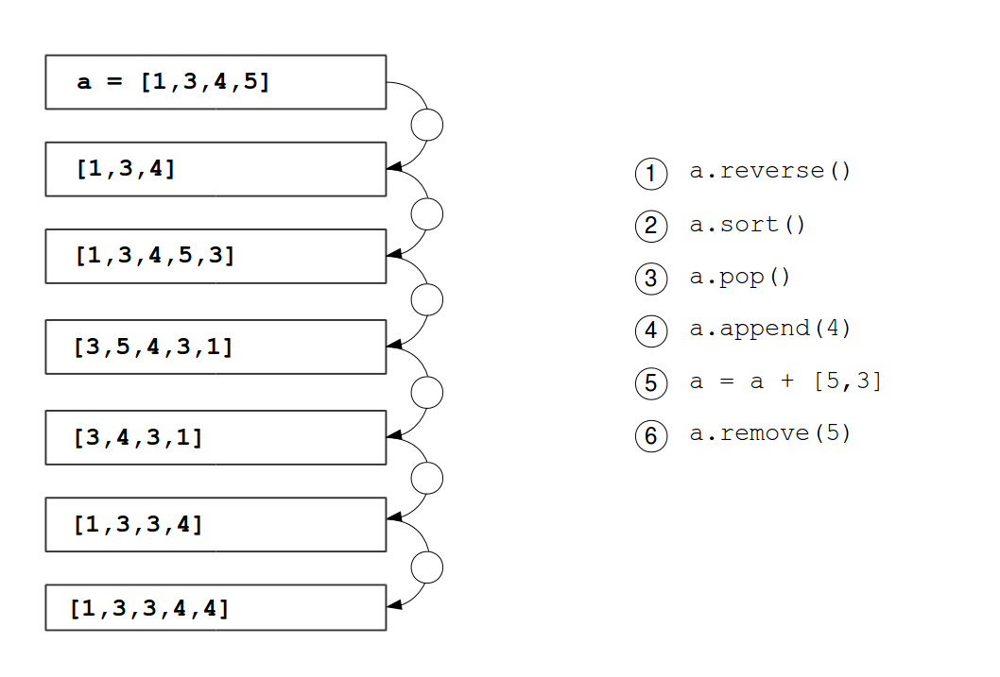

# 列表

# 列表

要处理更大量的数据，我们不能为每个新数据项发明一个新变量。我们需要以某种方式将更多数据存储在一个变量中。这就是 Python **列表** 的用武之地。

然而，Python 计数方式与人类有些不同：


# 创建列表

# 创建列表

### 练习 1

找出每个表达式对中间列表的影响。


### 练习 2

以下程序做什么？

```
top8 = [34465, 32025, 28569, 27531, \
        24928, 23632, 22818, 22307]

for value in top8:
    print(value) 
```

### 练习 3

总共有多少个婴儿？编写一个计算该数字的程序。

### 练习 4

你有一个列表，其中包含了 2000 年最受欢迎的 20 个女孩名字：

```
['Emily', 'Hannah', 'Madison', 'Ashley', 'Sarah', 
'Alexis', 'Samantha', 'Jessica', 'Elizabeth', 'Taylor', 
'Lauren', 'Alyssa', 'Kayla', 'Abigail', 'Brianna', 
'Olivia', 'Emma', 'Megan', 'Grace', 'Victoria'] 
```

编写一个程序，打印所有以`'A'`或`'M'`开头的名称。

### 练习 5

使用表达式按要求修改列表。每个表达式只使用一次。



### 练习 6

创建一个新列表，其中包含每个名称的*加利福尼亚*和*纽约*的总和。

```
names = ["Emily", "Amy", "Penny", "Bernadette"]
california = [2269, 542, 54, 21]
new_york = [881, 179, 12, 11] 
```

### 练习 7

使用表达式按要求修改列表。每个表达式只使用一次。



# 快捷键

# 快捷键

### 练习 1

使用函数`sum()`简化以下代码：

```
counts = [356, 412, 127, 8, 32]

total = 0
for number in data:
    total = total + number
print(total) 
```

### 练习 2

使用函数`range()`简化以下代码：

```
i = 0
while i < 10:
    print(i * '*')
    i += 1 
```

### 练习 3

使用函数`zip()`简化以下代码：

```
names = ['Lilly', 'Lily', 'Leila', 'Lilja', 'Lillie']
counts = [356, 412, 127, 8, 32]

table = []
i = 0
while i < len(names):
    row = (names[i], counts[i])
    table.append(row)
    i += 1
print(table) 
```

### 练习 4

使用函数`enumerate()`简化以下代码：

```
names = ['Lilly', 'Lily', 'Leila', 'Lilja', 'Lillie']

i = 0
for name in names:
    print(i, name)
    i += 1 
```

### 练习 5

使用`list(range())`创建以下列表：

+   `[4, 7, 9, 12]`

+   `[10, 20, 30, 40, 50]`

+   `[33, 32, 31, 30]`

### 练习 6

`len()`函数适用于哪些数据类型？

+   列表

+   字典

+   字符串

+   浮点数

+   集合

# 处理表格

# 表格

数据经常以表格形式出现。要在 Python 中处理表格，了解我们可以将列表放入其他列表中会很有帮助。这些也被称为**嵌套列表**。

Python 中一个简单的表格如下所示：

```
# columns: Name, #California, #New York
[
  ["Emily", 2269, 881],
  ["Amy", 542, 179],
  ["Penny", 54, 12],
  ["Bernadette", 21, 11]
] 
```

在本章中，我们将处理创建和处理嵌套列表。

### 练习 1

使用`for`循环将上述表的所有行打印到屏幕上。

### 练习 2

使用双重`for`循环将表格的所有*单元格*打印到屏幕上。

### 练习 3

创建一个 10 x 10 单元格的空表，并用从 1 到 100 的数字填充它们。

### 练习 4

按照第二列对上述表进行排序。使用以下代码片段：

```
from operator import itemgetter
tabelle.sort(key=itemgetter(col_index)) 
```
