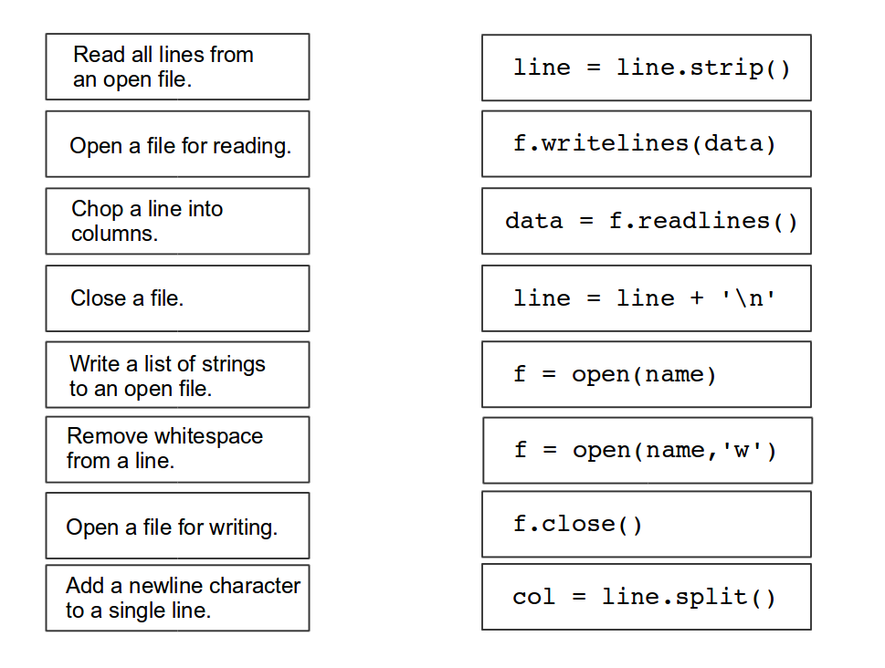
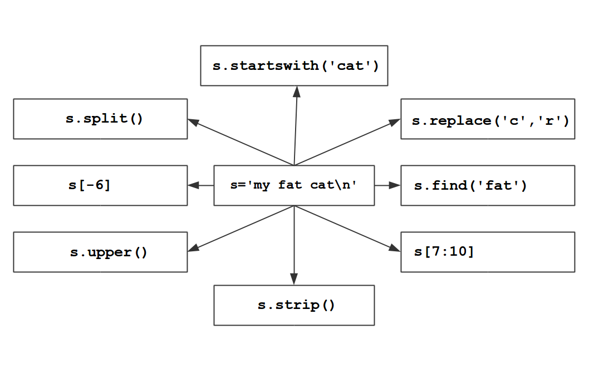
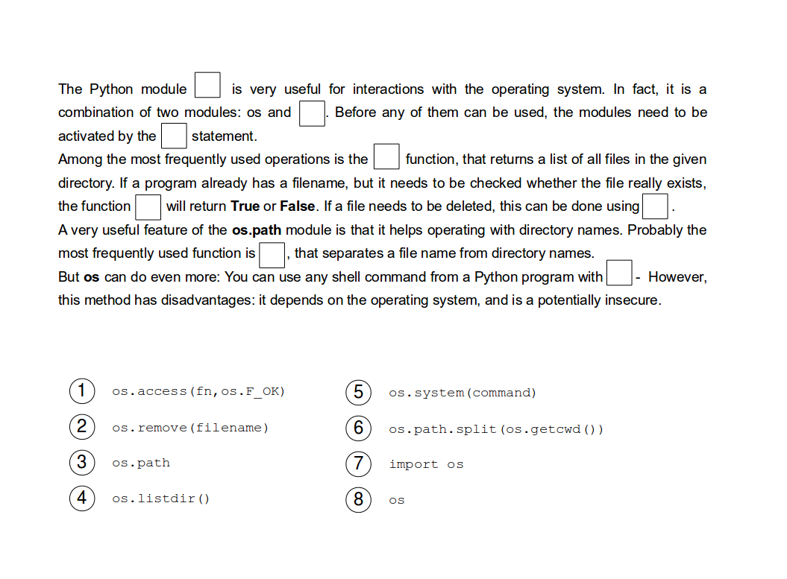

# 从文件中读取数据

# 从文件中读取数据

在本节中，您将学习从简单文本文件中提取信息。

对于接下来的练习，您将需要完整的婴儿名字档案（未按州分组的较短档案）。您可以从[`www.ssa.gov/oact/babynames/limits.html`](http://www.ssa.gov/oact/babynames/limits.html)下载文件。

# 读取一个简单的文本文件

# 读取简单文本文件

### 练习 1

在文本编辑器中创建一个名为`bigbang.txt`的文本文件，其中包含以下数据：

```
Emily,F,12562
Amy,F,2178
Penny,F,342
Bernadette,F,129
Leonard,M,384
Howard,M,208
Sheldon,M,164
Stuart,M,82
Raj,M,41 
```

## 练习 1：

通过在空格中插入`close`，`line`，`bigbang.txt`，`print`，使程序正常运行。

```
f = open(___)
for ____ in f:
    ____(line)
f.____() 
```

#### 提示：

根据您的编辑器，您可能需要插入文件的完整路径。如果程序无法运行，则错误的文件名或位置是最有可能的原因。

### 练习 3

2015 年有多少不同的*女孩名字*？

**对**以下代码行进行**排序**并**正确缩进**：

```
girls = 0

if "B" in line:

print(girls)

if ",F," in line:

for line in open('names/yob2015.txt'):

girls += 1 
```

### 练习 4

扩展上一个练习的程序，使男孩和女孩的名字分别计数。

### 练习 5

以下哪些命令是正确的？

+   `for char in "ABCD":`

+   `for i in range(10):`

+   `for number in [4, 6, 8]:`

+   `for k in 3+7:`

+   `for (i=0; i<10; i++):`

+   `for var in open('bigbang.txt'):`

### 练习 6

编写一个程序，从文件`yob2015.txt`中读��行。识别所有包含您姓名的行并将其打印到屏幕上。

# 从文本中提取数据

# 从文本中解析数据

大多数文本文件包含文本和数字。从文件中提取这些数据字段并将它们存储在合理*结构化*的变量中称为**解析**。要解析文件，我们需要字符串、列表和**类型转换**的方法。

### 练习 1

将以下片段插入代码中，以便所有命令都能正确执行：`age`，`int(age)`，`name`，`str(born)`，`2000`

```
name = 'Emily Smith'
born = _____
____ = '15'

text = ____ + ' was born in the year ' + _____ + '.'
year = born + _____
text
year 
```

### 练习 2

以下程序在列表中收集至少出现 10000 次的名字。不幸的是，程序包含**四个错误**。找出并修复这些错误。

```
frequent = []

for line in open('names/yob2015.txt'):
    columns = line.strip().split(',')
    name = colums[1]
    anzahl = int(columns[3])
    if anzahl >= 10000
        frequent.append(name)

print(frequent) 
```

### 练习 3

编写一个程序，计算 2015 年的婴儿总数并将其写入屏幕。将该数字与 1915 年进行比较。

### 练习 4

编写一个程序，找到给定年份男孩和女孩的*三个最常见*名字，并将它们写入屏幕。

**提示：**前三个最常见的名字在列表的顶部。

### 练习 5

编写一个程序，计算 2015 年前 10 个最常见名字的百分比，并将其写入屏幕。

# 写入文件

# 写入文件

### 练习 1

形成 Python 命令及其含义的配对。



### 练习 2

执行以下程序。解释发生了什么。

```
names = ['Adam', 'Bob', 'Charlie']

f = open('boys.txt', 'w')
for name in names:
    f.write(name + '\n')
f.close() 
```

### 练习 3

从程序中删除`+ '\n'`并再次执行。会发生什么？

### 练习 4

通过`int()`或`str()`完成以下语句，以使它们全部正常工作。

```
 In [1]: 9 + 9

 In [2]: 9 + '9'

 In [3]: '9' + '9'

 In [4]: 9 * '9' 
```

### 练习 5

编写一个程序，将以下数据写入一个两列文本文件。

```
names = ["Emma", "Olivia", "Sophia", "Isabella", 
         "Ava", "Mia", "Emily"]
values = [20799, 19674, 18490, 16950, 
           15586, 13442, 12562] 
```

# 处理多个文件

# 处理多个文件

### 练习 1

以下程序计算过去 130 年的出生总数。

该代码包含一个*微妙的语义错误*。执行程序。检查输出。找到并修复错误。

```
births = []
result = 0

print("\nyear    births per year")
print("-" * 25)
for year in range(1890, 2015, 1):
    filename = 'names/yob{}.txt'.format(year)
    for line in open(filename):
        spalten = line.strip().split(',')
        births.append(int(spalten[2]))
    print(year, sum(births))
    result += sum(births)
print("\nResult: {} births total".format(result)) 
```

### 练习 2

编写一个程序，在 1880 年至 2014 年之间找到包含您姓名的行。

### 练习 3

扩展程序，以便检查性别。只打印具有匹配的`'M'`或`'F'`的行。

### 练习 4

将所有匹配项收集到一个列表中。

### 练习 5

如果在给定年份中没有找到匹配项，则将`0`添加到结果。

# 屏幕输出

# 屏幕输出

在本章中，我们将探索`print()`函数以将文本写入屏幕。

### 练习 1

哪些`print`语句是正确的？

+   `print("9" + "9")`

+   `print "nine"`

+   `print(str(9) + "nine")`

+   `print(9 + 9)`

+   `print(nine)`

### 练习 2

解释以下语句：

```
print("Emily\tSmith\n2000") 
```

### 练习 3

有些宝宝的名字与名人相似。编写一个程序产生以下输出：

```
Harry      Hermione      Severus
Tyrion     Daenerys      Frodo
Luke       Leia          Darth 
```

### 练习 4

扩展上一个练习，使：

+   仅使用单个`print`语句。

+   名字在构建字符串之前存储在一个变量中。

# 字符串方法

# 字符串方法

### 练习 1

确定中间字符串的表达式的作用是什么。



### 练习 2

以下程序识别同时用于女孩和男孩的名字，并将它们写入文件。

完成代码，将行解剖为列，以便定义变量`name`和`gender`。

```
girls = []
duplicates = []

for line in open('names/yob2015.txt'):

    # insert your code here

    if gender == 'F':
       girls.append(name)
    elif gender == 'M':
       if name in girls:
           duplicates.append(name)

output = open('duplicate_names.txt', 'w')
for name in duplicates:
    text = "{:>15s}\n".format(name)
    output.write(text)
output.close() 
```

# 格式化字符串

# 格式化字符串

### 练习 1

在 Python shell 中尝试以下表达式：

```
"{}".format("Hello")
"{:10}".format("Hello")
"{:>10}".format("Hello")
"{1} {0}".format("first", "second")
"{:5d}".format(42)
"{:4.1f}".format(3.14159)
"{:6.3f}".format(3.14159) 
```

### 练习 2

编写一个`for`循环产生以下字符串：

```
000111222333444555666777888999 
```

### 练习 3

你有以下两个列表：

```
top_ten_names = ['Jacob', 'Michael', 'Matthew', 'Joshua', \
    'Christopher', 'Nicholas', 'Andrew', 'Joseph', \
    'Daniel', 'Tyler']

top_ten_numbers = [34465, 32025, 28569, 27531, \
    24928, 23632, 22818, 22307, 21500] 
```

编写一个创建具有两个垂直对齐列的表的程序。

# 字典

# 字典

## 练习 1

找出中间字典中每个表达式的作用。


## 练习 2

以下命令会产生什么？

```
d = {1:'A', 'B':1, 'A':True}
print(d['A']) 
```

+   `False`

+   `"B"`

+   `True`

+   `1`

## 练习 3

这些命令会产生什么？

```
d = {1:'A', 'B':1, 'A':True}
print(d.has_key('B')) 
```

+   `1`

+   `True`

+   `"B"`

+   `False`

## 练习 4

这些命令会产生什么？

```
d = {1:'A', 'B':1, 'A':True}
print(d.values()) 
```

+   `True`

+   `['A', 1, True]`

+   `3`

+   `[1, 'B', 'A']`

## 练习 5

这些命令会产生什么？

```
d = {1:'A', 'B':1, 'A':True}
print(d.keys()) 
```

+   `[1, 'B', 'A']`

+   `['A', 'B', 1]`

+   `[1, 'A', 'B']`

+   `顺序可能会变`

## 练习 6

这些命令会产生什么？

```
d = {1:'A', 'B':1, 'A':True}
print(d['C']) 
```

+   `None`

+   `'C'`

+   `一个错误`

+   `False`

## 练习 7

这些命令会产生什么？

```
d = {1:'A', 'B':1, 'A':True}
d.setdefault('C', 3)
print(d['C']) 
```

+   `3`

+   `'C'`

+   `None`

+   `一个错误`

# 元组

# 元组

元组是一个不能被修改的元素序列。它们对于将不同类型的元素分组很有用。

```
t = ('bananas','200g',0.55) 
```

与列表不同，元组也可以用作字典中的键。

# 练习

## 练习 1

哪些是正确的元组？

+   [ ] `(1, 2, 3)`

+   [ ] `("Jack", "Knife")`

+   [ ] `('blue', [0, 0, 255])`

+   [ ] `[1, "word"]`

## 练习 2

你可以用元组做什么？

+   [ ] `将不同种类的数据分组`

+   [ ] `更改其中的值`

+   [ ] `对它们运行 for 循环`

+   [ ] `对它们进行排序`

# 从键盘读取

# 从键盘读取

接下来，我们将键盘连接到我们的程序。

## 热身

当你在 IPython shell 中写下以下行时会发生什么：

```
In  [1]: a = input()
In  [2]: a 
```

## 练习 1

哪些`input`语句是正确的？

+   [ ] `a = input()`

+   [ ] `a = input("输入一个数字")`

+   [ ] `a = input(输入你的名字)`

+   [ ] `a = input(3)`

## 挑战：输入一个婴儿名字

编写一个程序，询问*姓名*和*年龄*，然后用输入的数据写一个句子：

```
Bobby is 3 years old. 
```

### 额外挑战：

+   将输入的年龄加 1。

# 将数字转换为文本和反向转换

# 将数字转换为文本和反向转换

现在你知道如何存储数字和文本了。能够将两者相互转换将会很有用。为此，我们将使用*类型转换*。

## 热身

现在我们将把字符串与整数数字结合起来。

```
name = 'Emily Smith'
born = _____
____ = '15'

text = ____ + ' was born in the year ' + _____
year = born + _____
text
year 
```

将以下项目插入代码中，以使所有语句都能正常工作：`age`、`int(age)`、name、`str(born)`、`2000`

### 问题

+   是否可以不使用`str(born)`和`int(age)`？

+   `str()`和`int()`分别是什么？

## 练习

### 练习 1：

以下语句的结果是什么？

```
 9 + 9

 9 + '9'

 '9' + '9' 
```

### 练习 2：

通过向每个语句添加 int()或 str()，使结果分别为 18 或'99'。

### 练习 3：

解释以下操作的结果？

```
 9 * 9
 9 * '9'
 '9' * 9 
```

### 练习 4：

编写 Python 语句创建以下字符串：

```
12345678901234567890123456789012345678901234567890 
```

## 挑战：带有类型的数据记录

| 字段 | 值 | 类型 |
| --- | --- | --- |
| 名字 | Andrew | 字符串 |
| 姓 | O'Malley | 字符串 |
| 性别 | M | 字符串 |
| 出生年份 | 2000 | 整数 |
| 年龄 | 15 | 整数 |

将表格每行的值写入字符串或整数变量中，然后将它们组合成一行字符串。

# 程序结构

# 程序结构

在 Python 中，你可以通过函数、类、模块和包四个不同的层次来组织程序。其中，类是最复杂的使用方式。因此，在本教程中将跳过它们。

## 目标

+   学会编写函数

+   学会编写模块

+   学会编写包

+   了解一些标准库模块

+   了解一些可安装的模块

# 编写自己的函数

# 函数

Python 3.5 有 72 个内置函数。要开始编写有用的程序，了解其中大约 25 个就足够了。其中许多函数是有用的快捷方式，可以使你的程序更简洁。

# 模块

# 模块

## 什么是模块？

将另一个 Python 脚本中的任何 Python 文件（以.py 结尾）导入。一个单独的 Python 文件也被称为一个模块。

## 导入模块

要从一个模块中导入，需要在导入语句中给出其名称（不带 .py）。导入语句可以如下所示：

```
import fruit
import fruit as f
from fruit import fruit_prices
from my_package.fruit import fruit_prices 
```

强烈建议明确列出导入的变量和函数，而不是使用*import **语法。这样可以大大简化调试过程。

在导入时，Python 会生成中间代码文件（在***pycache***目录中），以帮助更快地执行程序。它们会被自动管理，不需要更新。

# 内省

# 内省

## 热身

在交互式 shell 上尝试以下操作：

```
import random
dir(random)
help(random.choice)
name = random.choice(['Hannah', 'Emily', 'Sarah'])
type(name) 
```

以下代码做了什么？

## 挑战：婴儿姓名生成器

编写一个程序，从可能的姓名列表中随机生成一个婴儿姓名。

使用 Python 模块`random`

## 额外挑战：

+   让用户选择婴儿的性别。

+   让用户输入他们想要拥有多少个婴儿。

+   从文件中加载婴儿姓名。

# 处理目录

# 处理目录

要处理更多数据，你需要处理多个文件。有时你事先不知道所有的文件。

## 热身

填补空白



## 练习 1

解释以下代码：

```
import os
for dirname in os.listdir('.'):
    print(dirname) 
```

## 练习 1

编写一个程序，计算解压缩的婴儿姓名集中的文件数量。让程序打印出该数字。

验证数字是否正确。

## 练习 2

整个姓名数据集有多少条目（行）？

**提示**：生成一条消息，告诉你程序正在读取哪个文件。

## 练习 3

编写一个程序，找到每年出现最频繁的姓名并打印出来。

## 挑战

查找并打印你的姓名及其在每个文件中对应的数字，这样你就可以看到数字随时间的变化。
