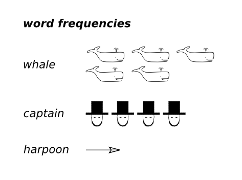

# 编程挑战：统计《白鲸》中的单词

# 编程挑战：统计《白鲸》中的单词

### 挑战

赫尔曼·梅尔维尔（Herman Melville）的书籍《白鲸》描述了一个阴郁船长与他的个人宿敌白鲸之间的史诗般的战斗。在书中，谁被提及得更频繁？

### 你的任务

编写一个程序，统计书中每个单词出现的次数。确定单词`captain`和`whale`出现的次数。你将需要不同的数据结构来统计单词和对它们进行排序。

当你知道`whale`或`captain`哪个更频繁出现时，你已经掌握了这个挑战。

**根据需要使用 8 张提示卡。**

### 背景

你可以在文本文件`mobydick.txt`和[www.gutenberg.org](http://www.gutenberg.org)上找到赫尔曼·梅尔维尔的《白鲸》的全文。
