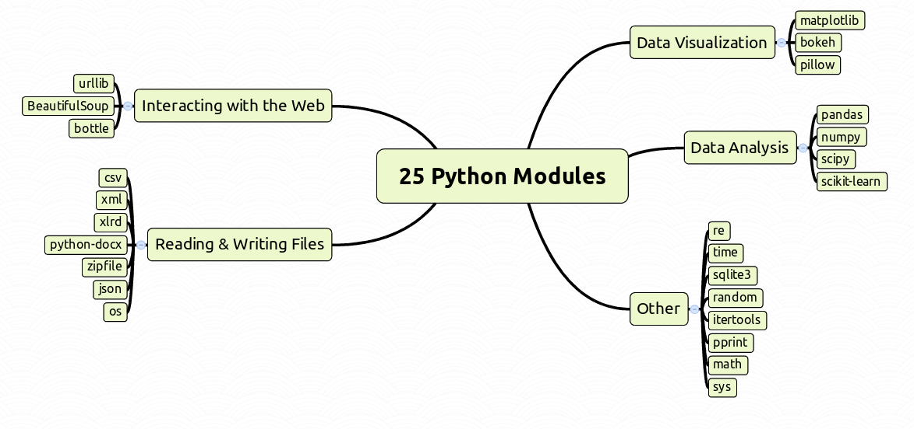

# Python 3 模块示例

(c) 2016 Dr. Kristian Rother (krother@academis.eu)

根据知识共享署名-相同方式共享 4.0 许可条件分发

本文档的来源可以在[`github.com/krother/Python3_Module_Examples`](https://github.com/krother/Python3_Module_Examples)找到

## 本电子书的目的

本电子书包含了我最喜欢的 Python 模块。每个模块都附有*简要描述*和*代码示例*。

如果您符合以下情况，本文档适合您：

+   你已经了解一点 Python 了

+   您想了解有哪些 Python 模块

+   你觉得 Python 模块的数量令人难以应对

+   你觉得完整的文档对你来说太重了

+   您想尝试一些简单的示例

**玩得开心，更好地了解 Python！**

## 概述



# csv - 读取和写入 CSV 文件

# csv

### 它适用于什么？

读取和写入*逗号分隔值（CSV）*文件。

`csv`模块从/向 CSV 文件读取和写入嵌套列表。您可以设置*字段分隔符*、*引号字符*和*行终止符*字符。请注意，读取一行时，所有列都以字符串格式呈现。

### 默认与 Python 一起安装

是

### 示例

将两行写入 CSV 文件的表格：

```
import csv

data = [["first", 1, 234],
        ["second", 5, 678]]

outfile = open('example.csv', 'w')
writer = csv.writer(outfile, delimiter=';', quotechar='"')
writer.writerows(data)
outfile.close() 
```

再次读取文件：

```
for row in csv.reader(open('example.csv'), delimiter=';'):
   print(row)

['first', '1', '234']
['second', '5', '678'] 
```

### 如何学习更多？

[`docs.python.org/3/library/csv.html`](https://docs.python.org/3/library/csv.html)

# json - 处理 JSON 文件

# json

### 它适用于什么？

将 Python 字典转换为 JSON 格式，然后再转回。

*JavaScript 对象表示法（JSON）*经常用于在网络上发送结构化数据或轻松存储在文件中。`json`模块利用了 JSON 格式与 Python 字典的相似性。

### 默认安装的 Python

是

### 示例

将字典转换为 JSON 格式的字符串：

```
import json

data = {'first': 1, 'second': 'two', 'third': [3,4,5]}
jj = json.dumps(data)
print(jj)
'{"second": "two", "first": 1, "third": [3, 4, 5]}' 
```

将 JSON 字符串转换回 Python 字典：

```
d = json.loads(jj)
print(d)

{'second': 'two', 'first': 1, 'third': [3, 4, 5]} 
```

### 如何学习更多？

[`docs.python.org/3/library/json.html`](https://docs.python.org/3/library/json.html)

# xml - 解析 XML 文件

# xml

### 它适用于什么？

解析 XML 文件。

`xml`模块包含多个 XML 解析器。它们为每个标签生成 DOM 对象树，可以搜索并允许访问属性。

### 默认与 Python 一起安装

是

### 示例

示例 XML 数据：

```
<?xml version="1.0" encoding="UTF-8" ?>
<actor_list>
<actor name="Hamlet">the Prince of Denmark</actor>
<actor name="Polonius">Ophelias father</actor>
</actor_list> 
```

读取 XML 文件并从标签中提取内容：

```
from xml.dom.minidom import parse

document = parse('hamlet.xml')

actors = document.getElementsByTagName("actor")
for act in actors:
    name = act.getAttribute('name')
    for node in act.childNodes:
        if node.nodeType == node.TEXT_NODE:
            print("{} - {}".format(name, node.data))

Hamlet - the Prince of Denmark
Polonius - Ophelias father 
```

### 如何学习更多？

[`docs.python.org/3/library/xml.html`](https://docs.python.org/3/library/xml.html)

# zipfile - 读取和写入.zip 文件

# zipfile

### 它适用于什么？

读取和写入`.zip`文件。

您可以向 zip 文件添加现有文件和字符串。如果添加字符串，您需要指定写入的文件名。当您将文件提取到文件夹时，输出文件夹会自动创建。

### 默认与 Python 一起安装

是

### 示例

创建新的 zip 存档并向其中添加文件：

```
import zipfile
z = zipfile.ZipFile('archive.zip', 'w')
z.write('myfile.txt')                   # has to exist
z.writestr('test.txt', 'Hello World')   # new
z.close() 
```

列出新创建的 zip 文件的内容：

```
z = zipfile.ZipFile('archive.zip')
print(z.namelist()) 
```

将文件提取到新文件夹：

```
print(z.extract('test.txt', 'myfolder'))
z.close() 
```

### 如何学习更多？

[docs.python.org/3/library/zipfile.html](https://docs.python.org/3/library/zipfile.html)

# numpy - 快速矩阵计算

# numpy

### 适用于什么？

numpy 使得在 Python 中处理矩阵变得容易。

因为它是用 C 实现的，`numpy`加速了许多计算。它也是类型安全的 - 矩阵的所有元素具有相同的类型。许多最强大的 Python 库，如`pandas`、`scikit-learn`和`PILLOW`都是基于 numpy 构建的。

### 在 Anaconda 上预装了吗？

是的

### 如何安装它？

```
pip install numpy 
```

### 示例

创建一个 4 x 2 矩阵并对每个元素加 10

```
import numpy as np

vector = np.array([[0, 1, 2, 3], [4, 5, 6, 7]])
print(vector + 10)

[[10 11 12 13]
 [14 15 16 17]]

print(vector.shape)

(2, 4) 
```

### 如何获取更多信息？

[`www.numpy.org/`](http://www.numpy.org/)

# pandas - 舒适处理表格

# pandas

### 适用于什么？

分析表格数据。

`pandas`是一个非常强大的库，可以以许多可想象（以及一些不可想象）的方式分析、组合和操作数据。名为*DataFrame*的表格与 R 有许多相似之处。DataFrame 具有索引列，并且默认包含用于绘图和从 CSV 或 Excel 文件中读取的函数。Pandas 在内部使用`numpy`。

### 默认与 Python 一起安装

否

### 与 Anaconda 一起安装

是的

### 如何安装它？

```
pip install pandas 
```

### 示例

创建一个包含字符和数字的表格：

```
import pandas as pd

hamlet = [['Hamlet', 1.76], ['Polonius', 1.52], ['Ophelia', 1.83], ['Claudius', 1.95]]
df = pd.DataFrame(data = hamlet, columns = ['name', 'size'])
print(df)

       name  size
0    Hamlet  1.76
1  Polonius  1.52
2   Ophelia  1.83
3  Claudius  1.95 
```

按名称排序行，按最小大小过滤，打印前两个值并写入 CSV 文件：

```
sorted = df.sort_values(by='name', ascending=False)
tall = sorted[sorted['size'] > 1.70]
print(tall.head(2))

       name  size
3  Claudius  1.95
2   Ophelia  1.83

df.to_csv('hamlet.csv', index=False, header=True) 
```

### 如何获取更多信息？

[`pandas.pydata.org/`](http://pandas.pydata.org/)

# scipy - 科学计算

# scipy

### 适用于什么？

科学计算。

scipy 是用于拟合函数和其他类型数值分析的 Python 库。您会发现用于信号处理、傅立叶变换、生成随机数据集等功能。Scipy��用`numpy`和`matplotlib`。

### 默认与 Python 一起安装

否

### 与 Anaconda 一起安装

是的

### 如何安装它？

```
pip install scipy 
```

### 示例

定义一个平方函数；使用`numpy`创建嘈杂的 X/Y 数据：

```
def func(x, a, b):
    return a * x**2 + b

import numpy as np 
x = np.linspace(-10, 10, 100)
y = func(x, 1, 5)
ynoise = y + 20 * np.random.laplace(size=len(x)) 
```

用嘈杂数据拟合函数的参数：

```
from scipy.optimize import curve_fit
params, pcov = curve_fit(func, x , ynoise)
yfit = func(x, params[0], params[1]) 
```

绘制结果：

```
import matplotlib.pyplot as plt
fig = plt.figure
plt.plot(x, yfit, "k-")
plt.plot(x, ynoise, "bx")
plt.savefig('fit.png') 
```

### 如何获取更多信息？

[`scipy.org/`](http://scipy.org/)

# scikit-learn - 机器学习

# scikit-learn

### 适用于什么？

机器学习。

`scikit-learn`库包含从简单线性回归到逻辑回归、支持向量机和多种聚类方法以及像随机森林这样复杂的方法的回归和分类方法。此外，存在用于验证预测的丰富函数。

### 默认与 Python 一起安装

否

### 与 Anaconda 一起安装

是的

### 如何安装它？

```
pip install scikit-learn 
```

### 示例

加载一个示例数据集并将其分为训练集和测试集：

```
from sklearn import svm, datasets, cross_validation

iris = datasets.load_iris()
X_train, X_test, Y_train, Y_test = \
    cross_validation.train_test_split(iris.data, iris.target, \
    test_size=0.4, random_state=True) 
```

拟合支持向量机模型并进行测试：

```
svc = svm.SVC(kernel='linear', C=1.0, probability=True).fit(X_train, Y_train)
print(svc.score(X_test, Y_test))

0.983333333333 
```

进行五折交叉验证：

```
print(accuracy = cross_validation.cross_val_score(svc, X, Y, cv=5, scoring='accuracy'))

[ 0.96666667  1\.          0.96666667  0.96666667  1\.        ] 
```

### 如何获取更多信息？

[`scipy.org/`](http://scipy.org/)

# matplotlib - 绘制图表

# matplotlib

### 适用于什么？

绘制图表。

`matplotlib`能够生成所有常见类型的图表的静态图像，质量适合打印：线图、散点图、条形图、饼图、直方图、热图等。

### 与 Anaconda 一起安装

是的

### 如何安装它：

```
pip install matplotlib 
```

### 示例

绘制一个平方函数：

```
from pylab import *

x = list(range(-10, 10))
y = [xval**2 for xval in x]
figure()
plot(x, y, 'bo') # blue circles
title('square function')
xlabel('x')
ylabel('$x²$')
savefig('plot.png') 
```


### 如何获取更多信息？

[`matplotlib.org/`](http://matplotlib.org/)

# pillow - 图像处理

# PILLOW

### 适用于什么？

图像处理。

`PILLOW` 是 **Python Imaging Library (`PIL`)** 的非官方继承者。它方便地创建、裁剪和应用各种滤镜到基于像素的图像。

### 默认与 Python 安装

否

### 默认与 Anaconda 安装

是

### 如何安装？

```
pip install pillow 
```

### 示例

将目录中所有`.png`图像缩小一半。

```
from PIL import Image
import os

for filename in os.listdir('.'):
    if filename.endswith('.png'):
        im = Image.open(filename)
        x = im.size[0] // 2
        y = im.size[1] // 2
        small = im.resize((x, y))
        small.save('sm_' + filename) 
```

### 如何学习更多？

[`pillow.readthedocs.org`](https://pillow.readthedocs.org)

# requests - 改进的网页检索

# requests

### 适用于什么？

检索网页。

`requests` 发送 HTTP 请求到网页并允许您读取其内容。与标准模块`urllib`相比，大多数标准任务要容易得多。`requests`可以通过 HTTP GET 和 POST 向网页表单提交数据，提交文件并管理 cookies。

### 默认与 Python 安装

否

### 默认与 Anaconda 安装

是

### 示例

阅读作者的主页。

```
import requests

r = requests.get('http://www.academis.eu')
print(r.text) 
```

在 PubMed 上搜索科学文章：

```
url = "http://eutils.ncbi.nlm.nih.gov/entrez/eutils/esearch.fcgi"
param_dict = {'db':'pubmed', 'term':'escherichia', 'rettype':'uilist'}

r = requests.get(url, params=param_dict)
print(r.text) 
```

### 如何学习更多？

[`docs.python-requests.org/en/latest/index.html`](http://docs.python-requests.org/en/latest/index.html)

# bs4 - 解析 HTML 页面

# BeautifulSoup

### 适用���什么？

解析 HTML 页面。

Beautiful Soup 比默认安装在 Python 中的 HTML 解析器更容易使用。

### 默认与 Python 安装

否

### 默认与 Anaconda 安装

否

### 如何安装？

```
pip install bs4 
```

### 示例

从 HTML 文档中解析列表项：

```
from bs4 import BeautifulSoup

html = """<html><head></head><body>
<h1>Hamlet</h1>
<ul class="cast"> 
  <li>Hamlet</li>
  <li>Polonius</li>
  <li>Ophelia</li>
  <li>Claudius</li>
</ul>
</body></html"""

soup = BeautifulSoup(html, "lxml")

for ul in soup.find_all('ul'):
    if "cast" in ul.get('class', []):
        for item in ul.find_all('li'):
            print(item.get_text(), end=", ") 
```

### 如何学习更多？

[`www.crummy.com/software/BeautifulSoup/bs4/doc/`](http://www.crummy.com/software/BeautifulSoup/bs4/doc/)

# paramiko - 通过 SSH 执行命令

# paramiko

### 适用于什么？

通过 SSH 执行命令。

`paramiko` 允许您通过 SSH 登录到另一台机器上执行 Unix 命令。`fabric` 模块在`paramiko`的基础上提供了一个舒适的接口。

### 默认与 Python 安装

否

### 默认与 Anaconda 安装

是

### 示例

列出远程机器上的目录。

```
from paramiko import SSHClient
client = SSHClient()
client.load_system_host_keys()
client.connect('ssh.example.com', username="username", password="password")
stdin, stdout, stderr = client.exec_command('ls -l') 
```

#### 警告

**不要在 Python 文件中硬编码密码。最好从配置文件或环境变量中读取。这样可以减少密码意外泄露的可能性**

### 如何学习更多？

[www.paramiko.org/](http://www.paramiko.org/)

# math - 数学函数

# math

### 适用于什么？

math 包含类似科学计算器的数学函数。

在该模块中，您会找到各种三角函数和指数函数。此外，还包括两个常数`pi`和`e`。

### 默认与 Python 安装

是

### 示例

计算**平方根**、**正弦**、**指数函数**和**对数**。

```
import math

print(math.sqrt(49))

print(math.sin(math.pi / 2))

print(math.exp(1.0) == math.e)

print(math.log(256,2)) 
```

### 如何学习更多？

[`docs.python.org/3/library/math.html`](https://docs.python.org/3/library/math.html)

# os - 处理文件和目录

# os

### 适用于什么？

处理文件和目录。

`os`模块提供了一种与文件、目录和操作系统其他部分交互的简单方式。它包含许多函数来列出、更改、复制、删除和检查文件和目录。

### 默认安装在 Python 中

是的

### 示例

更改目录并列出其内容：

```
import os

os.chdir('/home/krother/python_modules/')
os.listdir('.')

['sys.md', 'os.md', 'csv.md', 're.md', 'random.md', 
'pprint.md', 'numpy.md', 'time.md', 'itertools.md', 
'json.md', 'template.md', 'math.md', 'urllib.md'] 
```

检查文件是否存在：

```
os.path.exists('os.md') 
```

复制文件并随后删除：

```
os.system('cp os.md copy.md')
os.remove('copy.md') 
```

### 如何学习更多？

[`docs.python.org/3/library/os.html`](https://docs.python.org/3/library/os.html)

# 随机 - 生成随机数

# 随机

### 它适用于什么？

生成随机数。

`random`包含最常见分布的生成器。

### 默认安装在 Python 中

是的

## 示例

### 创建随机整数

最常用的函数之一是在给定范围内创建随机整数：

```
dice = random.randint(1,6) 
```

### 创建随机浮点数

`random()`函数生成 0 到 1 之间的浮点数：

```
import random
print random.random() 
```

### 从几种分布中生成随机数。

```
import random

random.randint(1,6)

random.random()

random.gauss(0.0, 1.0) 
```

### 对列表进行洗牌

```
data = [1, 2, 3, 4]
random.shuffle(data) 
```

### 创建随机列表

元素的随机组合带有重复：

```
from random import choice

bases = ['A','C','G','T']
dna = [choice(bases) for i in range(20)]
print ''.join(dna) 
```

当需要无重复地选择元素时，你会使用`sample`函数：

```
from random import sample

flavors = ['vanilla','banana','mint']
icecream = sample(flavors, 2) 
```

### 如何学习更多？

[`docs.python.org/3/library/random.html`](https://docs.python.org/3/library/random.html)

# re - 文本中的模式匹配

# re

### 它适用于什么？

文本中的模式匹配。

`re`模块实现了**正则表达式**，这是一种在文本中搜索模式的强大语法。正则表达式在大多数编程语言中都可用。您需要学习一些特殊字符来构建自己的模式。

### 默认安装在 Python 中

是的

### 示例

```
import re

text = "the quick brown fox jumps over the lazy dog" 
```

搜索`o`并显示相邻字符：

```
re.findall(".o.", text)
print(re.findall(".o.", text))

['row', 'fox', ' ov', 'dog'] 
```

搜索由空格包围的三个字母单词：

```
print(re.findall("\s(\wo\w)\s*", text))

['fox', 'dog'] 
```

用`w`替换`dflj`中的任何一个：

```
print(re.sub("[dflj]", "w", text))

'the quick brown wox wumps over the wazy wog' 
```

检查`jumps`或`swims`是否出现并返回详细信息：

```
print(re.search('jumps|swims', text))

<_sre.SRE_Match object; span=(20, 25), match='jumps'> 
```

### 如何学习更多？

#### 在线游戏

+   [regexone.com/](http://regexone.com/) - 通过简单的交互式示例学习正则表达式。是一个很好的起点。

+   [正则表达式填字游戏](http://regexcrossword.com/) - 训练正确使用单个字符、通配符和方括号。简单易懂。

+   [正则表达式练习测验 1](http://www.tekdefense.com/news/2013/2/10/regex-practice-quiz-1-understanding-patterns.html) - 离线尝试的练习。

+   [正则表达式高尔夫](http://regex.alf.nu) - 高级练习。尽可能用最少的按键匹配尽可能多的短语。

#### 参考

+   [Python 正则表达式 HOWTO](https://docs.python.org/3.6/howto/regex.html)

+   [docs.python.org/3/library/re.html](https://docs.python.org/3/library/re.html)

+   [快速参考](http://www.night-ray.com/regex.pdf) - 用于查找元字符的参考表。使用**Python 语法**。

## 在线正则表达式测试工具

+   [正则表达式 101](http://regex101.com/) - 显示匹配文本并解释。

+   [Pythex](https://pythex.org/) - 使用 Python `re` 模块的正则表达式测试工具。

+   [regexpal](http://regexpal.com/) - 使用 JavaScript 来突出显示匹配项。

# 时间 - 处理日期和时间

# 时间

### 它适用于什么？

简单处理时间和日期。

`time` 中的函数以结构化格式返回时间和日期，可以格式化为自定义字符串。

### 默认安装的 Python

是的

### 示例

`time` 模块提供了获取当前时间和日期的函数。

```
import time

print(time.asctime())

print(time.strftime('%a %d.%m.', time.localtime())) 
```

等待两秒：

```
time.sleep(2) 
```

`datetime` 模块还可以帮助格式化日期：

```
date = datetime.date(2015, 12, 24)
date.strftime("%d.%m.%Y") 
```

日期可以转换为整数数字：

```
date = datetime.date(2015, 12, 24)
number = date.toordinal() 
```

以及返回

```
datetime.date.fromordinal(7) 
```

### 如何学习更多？

+   [`docs.python.org/3/library/time.html`](https://docs.python.org/3/library/time.html)

+   [`docs.python.org/3/library/time.html`](https://docs.python.org/3/library/datetime.html)

# sqlite3 - 一个简单的 SQL 数据库

# sqlite3

### 它有什么好处？

创建并使用一个*SQLite*数据库。

SQLite 数据库存储在文件中。使用 `sqlite3` 模块时，无需安装或设置任何内容。SQLite 仅适用于小型 SQL 数据库，但用于更大数据库的 Python 模块看起来非常相似。

### 默认安装的 Python？

是的

### 示例

创建一个新数据库：

```
import sqlite3

DB_SETUP = '''
  CREATE TABLE IF NOT EXISTS person (
    id INTEGER,
    name VARCHAR(32),
    description TEXT
  );'''
db = sqlite3.connect('hamlet.db')
db.executescript(DB_SETUP) 
```

插入数据：

```
query = 'INSERT INTO person VALUES (?,?,?)'
db.execute(query, (1, "Hamlet", "the prince of Denkmark"))
db.execute(query, (2, "Polonius", "Ophelias father"))
db.commit() 
```

提交查询：

```
query = '''SELECT name, description FROM person'''
result = db.execute(query)
print(list(result))

db.close() 
```

### 如何学习更多？

[docs.python.org/3.5/library/sqlite3.html](https://docs.python.org/3.5/library/sqlite3.html)

# sys - Python 解释器的设置

# sys

### 它有什么好处？

Python 解释器本身的设置。

`sys` 模块提供了访问 Python 环境的入口点。您可以在那里找到命令行参数、导入路径设置、标准输入、输出和错误流等。

### 默认安装的 Python

是的

### 示例

调用 Python 时使用的命令行参数：

```
import sys
print(sys.argv) 
```

Python 解释器的版本：

```
print(sys.version) 
```

Python 寻找模块的目录：

```
print(sys.path) 
```

完全退出 Python：

```
sys.exit() 
```

### 如何学习更多？

[`docs.python.org/3/library/sys.html`](https://docs.python.org/3/library/sys.html)

# itertools - 处理列表和生成器

# itertools

### 它有什么好处？

用于处理列表和迭代器的函数。

该模块中的大多数函数返回*迭代器*，因此您可以使用它们的结果一次或将其转换为列表。

### 默认安装的 Python

是的

### 示例

连接一个列表：

```
import itertools
ch = itertools.chain([1,2],[3,4])
print(list(ch))

[1, 2, 3, 4]

print(list(itertools.repeat([1,2], 3)))

[[1, 2], [1, 2], [1, 2]] 
```

列元素的排列和组合：

```
p = itertools.permutations([1,2,3])
print(list(p))

[(1, 2, 3), (1, 3, 2), (2, 1, 3), (2, 3, 1), (3, 1, 2), (3, 2, 1)]

c = itertools.combinations([1,2,3], 2)
print(list(c))

[(1, 2), (1, 3), (2, 3)] 
```

### 如何学习更多？

[`docs.python.org/3/library/itertools.html`](https://docs.python.org/3/library/itertools.html)
