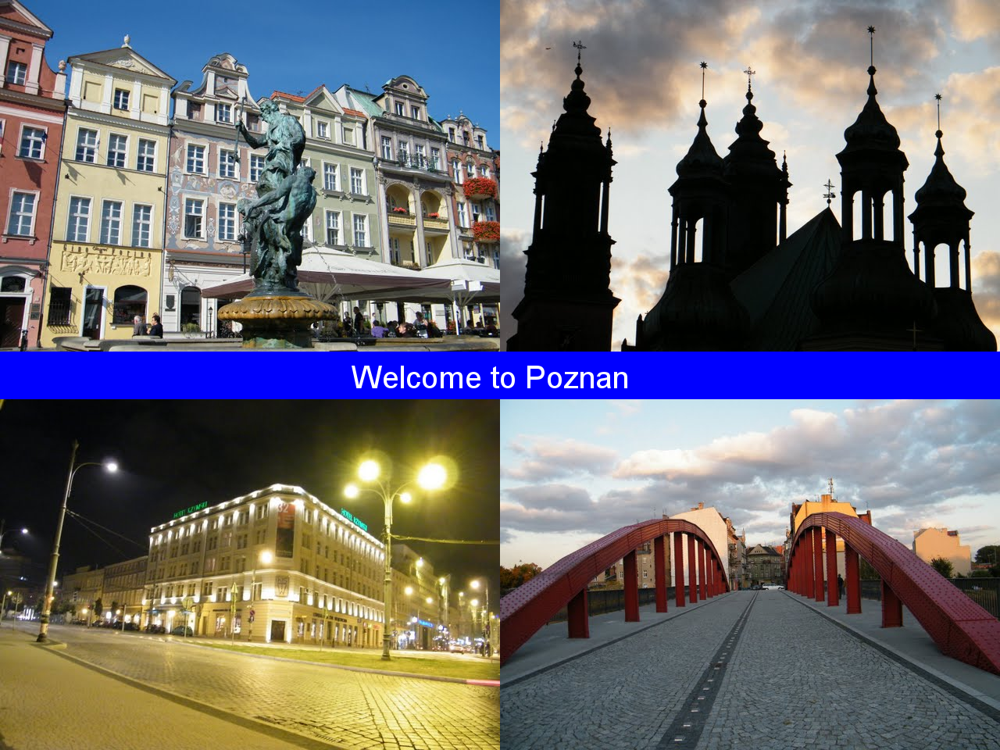
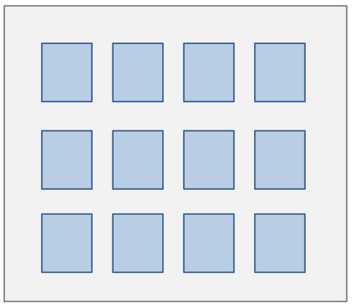

# 挑战

# 挑战

## 图形

| 挑战 | 简短描述 | 评级 |
| --- | --- | --- |
| 螺旋线 | 绘制一条螺旋线 | 非常简单 |
| 明信片 | 绘制一张明信片 | 简单 |
| 缩略图 | 生成图像缩略图 | 中等 |
| 递归图形 | 绘制递归图像 | 中等 |
| 电影 | 拍摄一个短片 | 困难 |

## 数据

| 挑战 | 简短描述 | 评级 |
| --- | --- | --- |
| 宝宝姓名生成器 | 生成随机宝宝姓名 | 简单 |
| 正则表达式 | 在文本中查找模式 | 中等 |
| 谷歌 | 进行谷歌搜索 | 中等 |
| 网络研究 | 下载网页 | 中等 |

## 网页开发

| 挑战 | 简短描述 | 评级 |
| --- | --- | --- |
| 显示数据 | 创建一个简单的 Bottle Web 服务器 | 中等 |
| 博客 | 使用 Django 创建博客网站 | 困难 |

# 螺旋线

# 编程挑战：螺旋线

### 挑战

编写一个绘制螺旋线的程序：


当你的程序绘制了至少 3 个循环的螺旋线时，你已经掌握了这个挑战。

### 在这个编程挑战中你可以练习什么

+   循环

+   Python 中的 **Pillow** 库

+   Python 中的 **turtle** 模块

### 提示

+   只需将螺旋线绘制为一系列短线即可

+   从哪里开始更容易（内部还是外部）？

+   Python 模块 `Pillow` 和 `turtle` 都能胜任

### 入门

如果你不知道从哪里开始，尝试以下 Python 脚本：

```
from turtle import forward, left
forward(50)
left(90)
forward(50) 
```

### 可选目标

+   线宽从内部到外部变粗

+   螺旋线上有一个颜色渐变


# 明信片

# 创建一张明信片

编写一个为你选择的城市创建明信片的程序。



## 1\. 安装 Pillow

```
`pip install pillow` 
```

（它已经与 Anaconda 一起安装）

## 2\. 了解 PIL

### 练习 2.1

运行程序 `example01.py`。它做了什么？

### 练习 2.2

更改程序中的数字，使之创建一个正方形形状的图像。

## 3\. 绘制形状

### 练习 3.1

运行程序 `example02.py`。它做了什么？

### 练习 3.2

在你最喜欢的城市图像上添加一条宽水平条。

### 练习 3.3

**适用于快速学习的学生**

在你最喜欢的城市图像上绘制一个 8 角星。

**提示：** 你可以用正方形、三角形或多边形组成这样的星星。

## 4\. 绘制文本

### 练习 4.1

运行程序 `example03.py`。它做了什么？

### 练习 4.2

将文本 *"欢迎来到（你的城市）"* 写到练习 3.2 的形状上。

## 5\. 组合图像

### 练习 5.1

运行程序 `example04.py`。它做了什么？

### 练习 5.2

创建一个由四幅小图片、水平条和一些文本组成的明信片。

## 6\. 应用滤镜

### 练习 6.1

运行程序 `example05.py`。它做了什么？

### 练习 6.2

发挥创造力！

## 许可证

(c) 2015 Dr. Kristian Rother 和 Magdalena Rother

在 Creative Commons Attribution Share-alike License 4.0 的条件下分发

# 缩略图

# 缩略图生成器

## 问题描述

*“我有一大堆照片，想要对它们进行搜索。我已经在文本文件中为每张照片写了关键字，例如* '花朵'*,* '海滩'*,* '山脉'* 等等。现在我需要一个能够根据给定关键字找到所有照片的程序。

该程序应该创建一个大图片，显示宽度为 100 像素的缩略图，就像下面的图片一样。”*

Rick Closeview，业余摄影师



## 指示

根据问题描述实现一个程序。以下步骤可能有所帮助：

### 1\. 规划

将问题分解成至少三个独立的子问题。将它们写在纸上（卡片或一张纸上）。尽量准确地回答问题。

### 2\. 将程序分解成函数

确定程序需要具有的关键功能。决定每个功能的输入和输出应该是什么。也写下它们。

### 3\. 获取图形

文件 `sample_photos.zip` 包含一些示例照片。每个子文件夹中还包含一个名为 `pics.txt` 的文件。这是程序的输入信息。

### 4\. 探索 Python 库

你可能想要仔细观察一下：

+   使用 `os` 进行文件处理

+   `Pillow` 用于图像处理

### 5\. 编写程序

完成这些步骤后，开始实现。

# 递归图形*

# 编码挑战：递归雪花

### 挑战

编写一个程序，对于参数 `n=1`，创建一个由四条直线组成的基本形状：


当你增加 `n` 时，每条线都会被基本形状的较小版本所替换。例如，当 `n=2` 时，你会得到：


而当 `n=5` 时：


当你的程序能够为 `0 < n < 6` 生成图片时，你已经掌握了这个挑战。

### 在这个编码挑战中，你可以练习以下内容：

+   递归算法

+   **Python** 中的 **Pillow** 库

+   Python 中的 **turtle** 模块

# 电影

# 创建电影

## 材料：

+   你最喜欢的图像

+   Python + Pillow

+   使用 `MEncoder` 或另一个程序从一组图像创建电影。

+   参见 [花朵装配电影](https://youtu.be/FE6_nx-MKc8)，了解结果可能会是什么样子。

## 任务

使用 PIL 库编写一个程序，创建一组 `.png` 图像。使用非 Python 工具（例如 MEncoder）生成图像并从中生成电影。请记住，电影通常每秒有 25 帧。

## 提示

+   从一个非常简单的电影开始，以确保装配工作正常

+   [花朵装配电影](https://youtu.be/FE6_nx-MKc8) 是通过慢慢拆卸图片并倒放帧来创建的

## 在 Windows 上从帧创建电影

MEncoder 要求帧文件的命名格式为 frame_000123.png，以便它们在最终电影中按正确顺序播放。

1.  将所有帧图像收集到一个目录中

1.  将 Mencoder 复制到该目录中。

1.  open a console (`Start -> Execute -> cmd`)

1.  switch with `cd <directory_name>` to that directory

1.  type

    mencoder "mf://*.png" -mf fps=25 -o output.avi -ovc lavc -lavcopts vcodec=mpeg4

# Babynamengenerator

# Babynamengenerator

Programmiere einen Babynamengenerator für unentschlossene Eltern.

### Optionale Ziele:

+   Das Programm gibt zufällig einen Namen aus einer vorgegebenen Liste aus

+   Das Programm gibt zufällig einen Namen aus dem US-Melderegister aus

+   Der Benutzer kann wahlweise Jungen- oder Mädchennamen auswählen

+   Das Programm macht 10 Vorschläge

+   Verwende als Liste möglicher Vornamen eine Datei aus dem US-Datensatz

# Reguläre Ausdrücke

# Reguläre Ausdrücke

### Aufgabe 1

Finde Wörter mit `F` im Text. Führe dazu folgendes Beispiel aus:

```
import re

text = "Es war einmal ein Ferkel, das hatte eine Flöte"
found = re.findall('(F\w+)[^\w]', text, re.IGNORECASE)
print(found) 
```

### Aufgabe 2

Was haben diese vier Bilder gemeinsam?


Bildquellen (links oben nach rechts unten):

+   *[By Source (WP:NFCC#4), Fair use](https://en.wikipedia.org/w/index.php?curid=48711736)*

+   *[Die Autorenschaft wurde nicht in einer maschinell lesbaren Form angegeben. Es wird Swarve~commonswiki als Autor angenommen, CC BY-SA 3.0](https://commons.wikimedia.org/w/index.php?curid=336076)*

+   *[Gaël Marziou from Grenoble, France - IMG_6266_DXO, CC BY 2.0](https://commons.wikimedia.org/w/index.php?curid=47416377)*

+   *Derfu, CC BY-SA 3.0*

Führe folgendes Codebeispiel aus:

```
import re
text = input("Was ist auf einem der Bilder zu sehen? ")
if re.search(r"^(\w+)i(\w+)[- ]\1o\2", text):
    print("stimmt!") 
```

### Aufgabe 3

Besuche die Seite [www.regexone.com](http://www.regexone.com) und führe einige der Übungen aus.

### Aufgabe 4

Schreibe ein Programm, das E-Mail-Adressen in Text erkennt.

Verwende die Funktion `re.findall` und erstelle ein entsprechendes Suchmuster.

Auf [Regex101](https://regex101.com/) kannst Du den regulären Ausdruck testen.

# Google

# Google

Überprüfe mit einem Python-Programm, ob die Suchmaschine Google funktioniert.

### Aufgabe 1

Lade die Webseite `www.google.de` mit Python herunter.

### Aufgabe 2

Extrahiere den Titel der Seite aus dem HTML-Dokument und gib ihn auf dem Bildschirm aus.

### Aufgabe 3

Führe eine Google-Suche aus Python durch. Recherchiere in der Dokumentation zum Modul `requests` danach, wie Du ein Formular über ein POST-request ausfüllen kannst.

Gib die Suchergebnisse auf dem Bildschirm aus.

## Hinweise:

+   Das Modul `requests` hilft beim Vorbereiten der Suchanfrage.

+   Das Formular verwendet HTTP POST.

+   Es gibt im Formular mindestens ein *'hidden'*-Feld, das Du angeben mußt.

# Webrecherche

# Herunterladen von HTML-Seiten

In den folgenden Aufgaben laden wir Daten von einer statischen Webseite oder einem RSS-Feed herunter.

### Aufgabe 1

Suche Dir eine der folgenden Seiten aus:

#### RSS-Feeds des Parlaments

+   `https://www.parlament-berlin.de/de/Service/RSS-Feeds`

#### Biologische Datenbanken

+   `http://ncbi.nlm.nih.gov`

#### Presse

+   `http://www.reuters.com/tools/rss`

#### Demographie

+   `http://www.gapminder.org`

#### Bücher

+   `http://www.gutenberg.org`

### Aufgabe 2

Zeige den Quelltext der Seite/des Feeds an. Versuche, markante Elemente zu finden, anhand derer Du den Titel, Links oder Inhalte erkennst.

### Aufgabe 3

从 HTML 文档/Feed 中提取页面标题，并在屏幕上显示。使用常规的字符串函数来实现。

### 任务 4

从页面中提取链接或其他数据。为此，开发一种策略，可以使用字符串方法、正则表达式或现成的解析器。

### 任务 5

下载并保存前 10 个链接的页面。

## 有用的模块

+   使用 `requests` 下载网页

+   使用 `BeautifulSoup` 解析 HTML 页面

+   `scrapy` 可用于两者

# 具有街道名称的网页

# 使用 Flask 构建 Web 服务器

在本教程中，您将学习如何创建自己的动态 HTML 页面并在 Web 服务器上运行它。我们将使用 Python 模块 `flask`。

[`flask`](http://flask.pocoo.org/) 主要适用于较小的网站。另一个选择是 `Django`，有出色的 [DjangoGirls 教程](https://tutorial.djangogirls.org/)。

## 1\. 安装 Flask

使用 `pip` 安装 Python 模块 `flask`：

```
pip install flask 
```

## 2\. 启动一个最小的网站

创建一个名为 `server.py` 的 Python 程序，并根据 [Flask 文档](http://flask.pocoo.org/docs/) 中的 Hello-World 示例进行构建。

将以下行添加到程序中（与文档中提供的方法相比，使用 Anaconda 更有效）：

```
app.run() 
```

启动程序。找出服务器运行的 HTTP 地址。在浏览器中输入此地址并检查您的服务器是否可访问。

#### 提示：

在教程的进程中，我们将经常需要启动服务器。确保你可以轻松地从编辑器或命令行中停止和重新启动程序。

## 3\. 包含 HTML 代码

Flask 函数可以返回 HTML 代码。可以使用三引号的字符串。以下 HTML 代码创建一个标题：

```
<h1>Unser Strassenverzeichnis</h1> 
```

了解有关 HTML 元素的更多信息，可访问 [Selfhtml.org](https://selfhtml.org/)。

将标题嵌入到 Python 函数的返回值中。重新启动服务器。在浏览器中重新加载网页。检查你的标题是否出现在页面上。

## 4\. 添加一个子页面

编写第二个 Python 函数，用于输出你的街道名称。使用装饰器 `@app.route` 将页面定位到 URL `/zuhause`。

重新启动服务器并在浏览器中调用两个子页面（`/` 和 `/zuhause`）。

#### 帮助：

在 [**Routing**](http://flask.pocoo.org/docs/quickstart/#routing) 部分的文档中

## 5\. 超链接

在首页创建一个指向子页面的超链接。

`hello()` 函数需要返回以下 HTML 代码：

```
<a href="/zuhause">Meine Strasse anzeigen</a> 
```

重新启动服务器并检查链接是否正常工作。

## 6\. 添加一个模板

将整个 HTML 页面粘贴到我们的 Python 脚本中变得很麻烦。更好的方法是将 HTML 代码存储在**模板**中并进行引用。

创建一个名为 `templates/hello.html` 的文件，并将以下 HTML 代码插入其中：

```
<html>
  <head><title>Unser Strassenverzeichnis</title></head>
  <body>
    <h1>Unser Strassenverzeichnis</h1>
    <a href="/zuhause">Meine Strasse anzeigen</a>
  </body>
</html> 
```

根据 Flask 文档中的 [渲染模板](http://flask.pocoo.org/docs/quickstart/#rendering-templates) 部分添加模板。

然后重新启动服务器，确保模板内容被显示出来（**注意浏览器窗口的标题栏！**）。

## 7\. 将变量插入模板

我们可以通过 Python 函数将数据发送到模板，方法是返回一个字典：

```
return {'text': "Hallo" } 
```

在 HTML 模板中，你可以这样引用这些变量：

```
{{ !text }} 
```

## 8\. 动态 URL

你可以在 URL 中使用占位符，其内容作为变量可用。编写一个函数，该函数在 URL 中接收一个街道名称：

```
@app.route('/strasse/<strassenname>')
def strasse_anzeigen(strassenname):
    ... 
```

完成这个函数并尝试使用不同的街道名称查看完成的页面。

#### 注意：

使用占位符时很容易出现两个函数访问相同 URL 的情况。这可能会导致有趣的错误，因为不清楚 Flask 调用哪个函数。

## 9\. 提供地理数据

我们使用 [时代街道名称目录](http://www.zeit.de/interactive/strassennamen/) 作为数据集。数据最初以 **GeoJSON** 格式存在。我们使用一个转换为 `.csv` 格式的文件，以便你可以方便地使用 `pandas`。

从文件中选择一些街道，并将它们显示在网页上的表格中。查看如何在模板中使用 `for` 循环。

## 10\. 创建一个表单

调查一下如何使用 Flask 创建一个表单。在表单中加入一个输入框，输入一个街道名称，然后通过一个按钮提交表单。

## 11\. 头部和底部

你可以将模板拆分为多个文件，以避免冗余。创建一个用于头部和底部的文件。

在 Flask 中如何实现请查看 [模板继承](http://flask.pocoo.org/docs/patterns/templateinheritance/#template-inheritance)。

## 12\. 引入 CSS 样式表

在这里，你可以设置排版和颜色。

+   在 [Selfhtml.org](https://selfhtml.org/) 上查看 CSS 命令的样式。

+   在模板中加入一个 CSS 命令，用来给标题上色。

+   创建一个 `static/style.css` 文件，写入另一个 CSS 指令。

+   将 CSS 文件包含在你的模板中（请联系讲师）。

+   告诉 Flask CSS 文件的位置。参见 [静态文件](http://flask.pocoo.org/docs/quickstart/#static-files)

## 13\. 使用 Folium 绘制地图

将找到的街道显示为交互式地图。首先尝试使用带有 `folium` 模块的 Python 脚本。参见 [`github.com/krother/python_showcase/tree/master/map_markers`](https://github.com/krother/python_showcase/tree/master/map_markers).

## 14\. Bootstrap

*"一半的互联网是建立在 Bootstrap 上的"*

**Bootstrap** 是一个有用的 CSS 和 JavaScript 元素集合，可以快速创建一个在移动设备上看起来很好的排版。

需要一系列步骤：

+   将 Bootstrap 文件包含在你的模板中（参见[教程](http://getbootstrap.com/docs/4.0/getting-started/introduction/)）

+   从文档中尝试一个模板

+   尝试单个元素（在*"Components"*下可以找到一些元素，你可以轻松看到它们是否有效）

#### 注：

经常不希望从第三方加载文件。更可持续的做法是将它们作为*静态文件*存放在你自己的服务器上。

## 15\. 使用 SQL 数据库

每次服务器重新启动时加载 900 MB 数据到内存中显然不是很有效率。更好的选择是使用**数据库**。使用 Python 模块 `sqlite3` 创建数据库，并从表中查询所需的数据。

## 16\. 在公共服务器上部署

在 [Djangogirls 教程](https://tutorial.djangogirls.org/en/deploy/) 中了解如何在 [pythonanywhere](https://www.pythonanywhere.com/) 上设置服务器。试一试！它是免费的。

#### 提示：

强烈建议在处理公共服务器之前使用 `git` 公开代码。这样许多细节会变得更简单。

# 博客

# 博客

该项目涉及开发自己的网站并在网络上发布。[Django Girls 教程](https://djangogirls.org/resources/) 提供了出色的指导。

### 目标：

通过浏览器可以访问网站。

### 主题：

服务器编程，HTML，部署

### Python 库：

Django 或 Bottle
