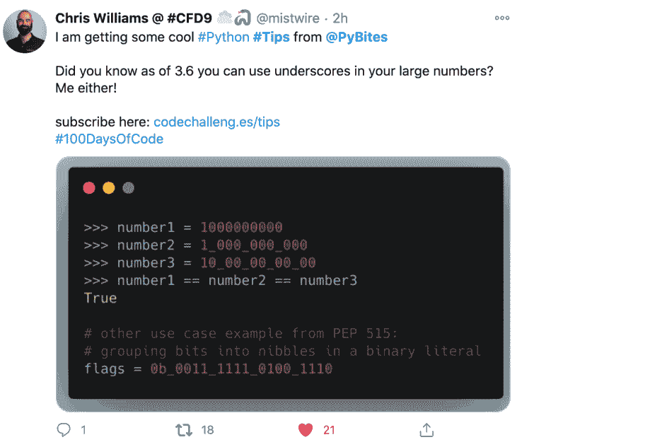
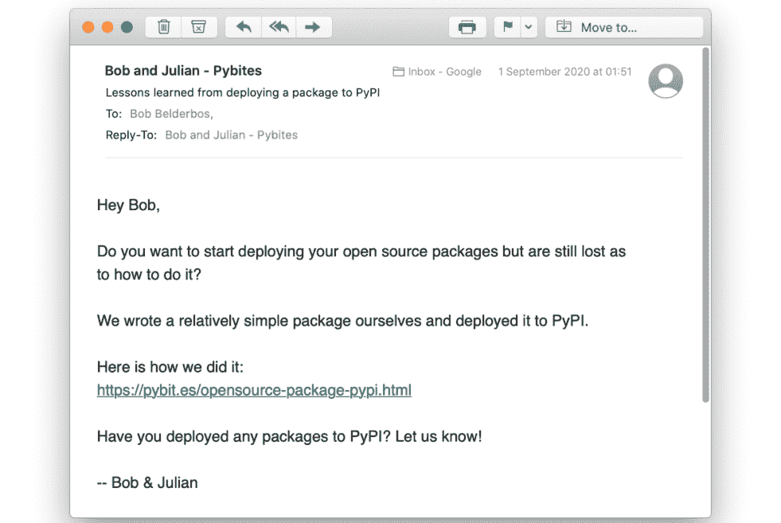
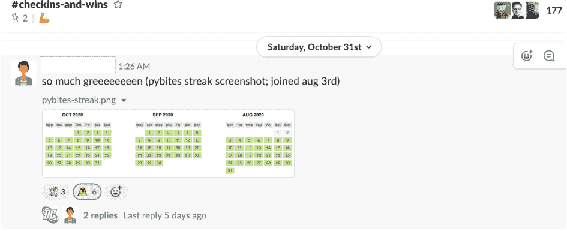
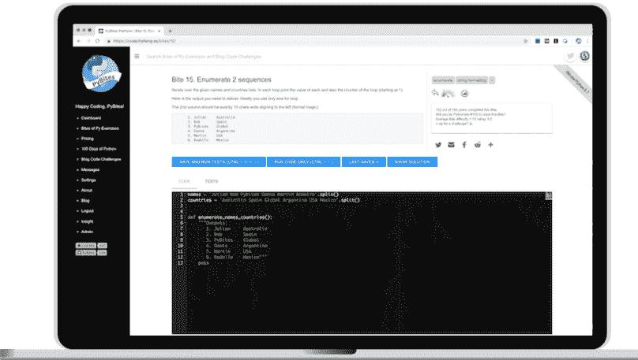
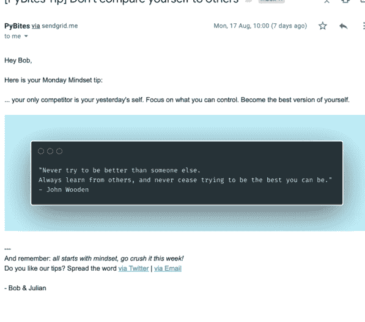

## PyBites Python 技巧
**面向全面发展的开发者的实用 Python 技巧**
作者：Bob Belderbos 与 Julian Sequeira

版本 1.0.0
版权所有 © PyBites ([pybit.es](https://pybit.es))，2020年至今

感谢您购买本书。本电子书仅供您个人使用。不得转售或赠予他人。如果您希望与他人分享，最好的方式是在此购买额外副本：[https://pybit.es/tips](https://pybit.es/tips)。

我们感谢您尊重本书背后艰辛而持续的付出。

如有任何问题或咨询，请发送邮件至：[support@pybit.es](mailto:support@pybit.es)

特别感谢我们的技术审阅者：Chris May、Andrew Jarcho 和 Robin Beer。感谢你们宝贵的反馈。

封面设计：@ryanurz

## 目录

- 1. 目录 ........................................................................................................ 3
- 2. 引言 ........................................................................................................ 7
- 3. 如何阅读本书 ........................................................................................ 8
- 4. 社区对我们 Python 技巧的反响 ........................................................... 9
- 5. 致谢 ...................................................................................................... 10
- 6. 下载代码 ................................................................................................ 11
- 7. 1. 交换两个变量 ................................................................................... 12
- 8. 2. 将字符串分割成列表 .......................................................................... 13
- 9. 3. 使用 zip 创建字典 ............................................................................ 14
- 10. 4. Range ................................................................................................ 15
- 11. 5. 字符串连接 / 多行字符串 ............................................................... 16
- 12. 6. 元组解包 .......................................................................................... 17
- 13. 7. Enumerate ......................................................................................... 18
- 14. 8. Sorted / min / max 的 key 参数 ...................................................... 19
- 15. 9. 链式比较运算符 ................................................................................ 20
- 16. 10. Is 与 == (对象相等性) .................................................................... 21
- 17. 11. F-字符串 .......................................................................................... 22
- 18. 12. 扁平化嵌套列表 ................................................................................ 23
- 19. 13. 获取随机样本 .................................................................................... 24
- 20. 14. Collections.Counter ......................................................................... 25
- 21. 15. TextBlob .......................................................................................... 26
- 22. 16. 旋转字符串中的字符 .......................................................................... 27
- 23. 17. 使用集合去重值 ................................................................................ 28
- 24. 18. 使用列表推导式过滤值 ...................................................................... 29
- 25. 19. Any / all 内置函数 .......................................................................... 30
- 26. 20. Zfill .................................................................................................. 31
- 27. 21. 获取唯一 ID .................................................................................... 32
- 22. 连接字符串
- 23. 反转列表
- 24. Calendar.month
- 25. Dir 与 help
- 26. 文本换行
- 27. Copy.deepcopy
- 28. 模拟掷骰子
- 29. Itertools.cycle
- 30. 配对朋友
- 31. 集合操作
- 32. In 运算符
- 33. 你使用哪个 Python 版本？
- 34. 强大的打印
- 35. 防止覆盖文件
- 36. 缓存 API 调用
- 37. 去除标点符号
- 38. 函数是一等对象
- 39. Requests
- 40. 用下划线表示大数字
- 41. Ipaddress 模块
- 42. Calendar.monthcalendar
- 43. Itertools.count
- 44. 分组字典 / 映射
- 45. 重定向标准输出
- 46. If __name__ == "__main__"
- 47. 比较版本号
- 48. 移除前导空白
- 49. Platform 模块
- 50. 对象表示
- 51. 在插入时保持列表有序
- 52. 使用 vars 内置函数检查对象
- 53. 字符串是数字吗？
- 54. Re.findall
- 55. 从可迭代对象构建字典
- 56. 集合推导式
- 57. 在 pdb 中调用 help
- 58. 使用文件系统路径
- 59. 验证 JSON
- 60. 创建 gif 图像
- 61. 将字符串转换为日期时间 (pandas)
- 62. 按换行符分割
- 63. Django ORM 中的分组查询
- 64. 将 Markdown 转换为 HTML
- 65. 从序列中获取多个项目
- 66. Strip 接受多个字符
- 67. 通过命令行获取即时编码答案
- 68. 使用 Path.glob 匹配文件
- 69. String 模块
- 70. 使用 casefold 进行 Unicode 字符串匹配
- 71. 在 Jupyter Notebook 中访问你的虚拟环境
- 72. Callable 和 getattr 内置函数
- 73. 并行打开两个文件
- 74. 去除元音并统计替换次数
- 75. 冻结函数的部分内容
- 76. 记录调试信息
- 77. 使用 __all__ 进行封装
- 78. 整数缓存
- 79. 四舍五入到下一个千位
- 80. Defaultdict ........................................................................................................ 91
- 81. 测试参数化 ........................................................................................................ 92
- 82. 模拟网络服务 .................................................................................................... 93
- 83. Amazon 联盟链接 ................................................................................................ 94
- 84. 处理无效的 JSON ................................................................................................ 95
- 85. 解析日期 ............................................................................................................ 96
- 86. 何时使用 deque 而非列表 .................................................................................... 97
- 87. 从对象获取属性 .................................................................................................. 98
- 88. 添加 __str__ 有助于调试 ..................................................................................... 99
- 89. Assert_called_with ............................................................................................ 100
- 90. 在测试中访问异常信息 ........................................................................................ 101
- 91. 无 KeyError 的字典访问 ..................................................................................... 102
- 92. Itertools.takewhile ............................................................................................. 103
- 93. 交换字典的键和值 ................................................................................................ 104
- 94. Itertools.groupby ................................................................................................ 105
- 95. 模拟日期时间 ...................................................................................................... 106
- 96. 读取源代码 .......................................................................................................... 107
- 97. 装饰器最佳实践 .................................................................................................. 108
- 98. Django Extensions ................................................................................................ 109
- 99. 今天是星期几？ .................................................................................................. 110
- 100. 今天是一年中的第几周？ .................................................................................. 111

## 结论
## PyBites 好友列表
## PyBites 社区
## PyBites 平台
## 更多技巧
## PyBites 研讨会
## 模块索引

## 引言

小贴士：一条虽小却实用的实践建议。——来自谷歌搜索

优美胜于丑陋。——来自《Python 之禅》

欢迎来到我们的 Python 技巧书。这本书我们筹备已久，非常自豪终于能将其交到您手中（从数字意义上说）。

优秀的开发者会阅读和编写大量代码，而我们的技巧已经帮助成千上万的他们提升了 Python 技能。

Python 是一门优美的语言，拥有丰富的标准库，但要熟练掌握它仍是一项巨大的工程。

你可能很难发现那些能让你在开发者中脱颖而出的绝佳特性。

《Python 之禅》说：*应该有一种——最好只有一种——显而易见的方式来做到这一点。*

这可能需要多年才能领悟，因此我们将多年的经验提炼成这些实用的代码片段，以帮助您更快地达到目标。

定期回顾我们的技巧也是一种理想的*间隔重复*，它将使您成为更高效的开发者。它将为您节省代码行数，使您的代码更地道（“Pythonic”），您也将因对该语言日益增长的知识而给同事和技术招聘人员留下深刻印象。

## 一点历史

大约2年前，我们开始在*Twitter*上分享技巧，这些优美的代码图片（使用 [carbon.now.sh](https://carbon.now.sh) 生成）立即引起了关注。这激发了我们撰写本书的灵感。



## 如何阅读本书

这不是一本需要按顺序阅读的书。请随意跳转到任何您感兴趣的代码片段或主题。我们希望您通过找到令您兴奋的代码来充分利用本书。不要觉得您必须*从头到尾*阅读所有内容。也就是说，**不要陷入“教程瘫痪”！**

希望您能从本书中获益良多。当您在代码中使用了我们的某个片段，或者只是想告诉我们您最喜欢哪些技巧时，请务必联系我们：[https://twitter.com/pybites](https://twitter.com/pybites)

## 反馈

如果您在阅读本书时遇到任何问题，无论多么微不足道，我们将非常感激您提供反馈。您可以通过电子邮件联系我们：[support@pybit.es](mailto:support@pybit.es)。

## 社区对我们 Python 技巧的反应

Bob Belderbos @bbelderbos · 10月31日
回复 @svipino
感谢反馈这个问题，我们每天都在以 @pybites 的身份发布 #python 技巧 :)

Jan Giacomelli @jangiacomelli · 10月31日
很棒的技巧和窍门 👍

Guzman Ojero @GuzaUy · 10月31日
回复 @svipino
@pybites 总是分享好技巧

I Like Turtles @RandoMand0 · 10月31日
回复 @svipino
@pybites 团队总是分享非常有用的技巧和窍门

> *技巧：这些是“平台”蛋糕上你不想错过的樱桃。这是一些掌握“Pythonic”方式以使你成为更优秀的 Python 开发者。* - Nitin C

David Colton @David__Colton · 8月29日
我从 @PyBites 那里获得了一些超酷的 #Python #技巧——在这里订阅：codechalleng.es/tips
我喜欢这些技巧，因为它们提醒我 #pythonic 的做事方式。我与这个技巧非常有共鸣，因为现在这是我执行此类检查的唯一方式。如此简单。


## 分享你的故事

1.  向学习 Python 的人推荐这本书。你可以使用我们书籍的着陆页，我们会随着技巧合集的扩充保持更新：https://pybit.es/tips - 感谢！
2.  与我们分享这本书如何帮助你写出更好的 Python 代码。如果你通过电子邮件将你的故事/诚实的评论发送给我们：support@pybit.es，我们将非常感激。

## 致谢

如果没有我们美好家庭的支持，我们无法完成这一切。Lili, Amy, Bryan | Mel, Oliver and Charlie – 感谢你们这些年来的耐心和坚定不移的支持。我们爱你们。

当然，要特别感谢和赞扬我们了不起的社区，尤其是那些从第一天起就在这里的成员。没有你们的投入和持续的反馈，PyBites 就不会有今天的成就。

-- Bob 和 Julian

## 下载代码

您可以在这里下载一个包含书中所有代码片段的 zip 文件：[http://codechalleng.es/api/books/tips](http://codechalleng.es/api/books/tips)

## 1. 交换两个变量

需要在 Python 中交换两个变量吗？没问题，只需一行代码：

```
>>> a = 1
>>> b = 2
>>> a, b = b, a
>>> a
2
>>> b
1
```

### 解释

在其他语言中，你需要一个临时变量来完成这个操作。

Python 则不然，这要归功于元组解包。

### 资源

https://stackoverflow.com/a/14836456

## 2. 将字符串分割为列表

在 Python 中创建列表的一种简单方法是对字符串使用 `str.split` 方法，该方法默认按空格分割：

```
>>> names = 'bob julian tim sara'.split()
>>> names
['bob', 'julian', 'tim', 'sara']
```

### 解释

当然，像 `['bob', 'julian', 'tim', 'sara']` 这样创建列表也没有问题，但对字符串使用 `split` 可能会更方便。

不过，这仅在元素中没有空格时才有效，因此如果我们这里包含姓氏，你就必须这样创建列表：`['bob belderbos', 'julian sequelra', 'tim ferriss', 'sara blakely']`。

### 资源

https://docs.python.org/3/library/stdtypes.html#str.split

## 3. 使用 zip 创建字典

使用内置函数 `zip` 创建两个序列的 `dict`：

```
>>> names = 'bob julian tim sara'.split()
>>> ages = '11 22 33 44'.split()
>>> zip(names, ages)
<zip object at 0x7fae75920d20>
>>> list(zip(names, ages))
[('bob', '11'), ('julian', '22'), ('tim', '33'), ('sara', '44')]
>>> dict(zip(names, ages))
{'bob': '11', 'julian': '22', 'tim': '33', 'sara': '44'}
```

### 解释

`dict` 构造函数可以接收一个元组列表。

这里我们使用 `zip` 将名字和年龄组合起来。这个内置函数创建了一个交织两个或多个序列（“可迭代对象”）的迭代器。

将其传入 `dict`，我们便得到一个字典，其中每个元组对的第一个元素是键，第二个元素是值。

它只适用于包含 2 个元素的元组，如果给它 3 个元素，你会得到 `ValueError: dictionary update sequence element #0 has length 3; 2 is required.`。

### 资源

[https://stackoverflow.com/a/209854](https://stackoverflow.com/a/209854)

## 4. Range（范围）

在 Python 中，你可以使用内置函数 `range` 来生成一个数字序列：

```
# range = 可迭代 / 惰性求值
>>> range(1, 11)
range(1, 11)

# 所以需要转换为列表
# 注意上限是排他的
>>> list(range(1, 11))
[1, 2, 3, 4, 5, 6, 7, 8, 9, 10]

# 第三个参数 = 步长
>>> list(range(1, 11, 2))
[1, 3, 5, 7, 9]

# 反向
>>> list(range(11, 1))
[]

# 使用负步长
>>> list(range(11, 1, -1))
[11, 10, 9, 8, 7, 6, 5, 4, 3, 2]
```

### 解释

内置函数 `range` 对于构建数字（整数）序列非常有用。

注意第一个数字是包含的，第二个是排他的。可选的第三个参数可以作为“步长”提供。

一个有趣的事实是，我们可以迭代一个 range 对象，但它不返回迭代器（对它调用 `next` 会得到一个 `TypeError: 'range' object is not an iterator`）。

### 资源

[https://docs.python.org/3/library/functions.html#func-range](https://docs.python.org/3/library/functions.html#func-range)

### 练习

[Bite 1. Sum n numbers](Bite 1. Sum n numbers)

## 5. 连接 / 多行字符串

在 Python 中，字符串字面量会像这样连接：

```
>>> 'Python' ' is ' 'fun'
'Python is fun'

>>> multiline = ('Great developers read a lot of code.'
...             ' We hope our tips help with that!')
>>>
>>> multiline
'Great developers read a lot of code. We hope our tips help with that!'
```

### 解释

当您将长字符串拆分成多行时，这是一个有用的技术，特别有助于遵守 PEP8 的“将所有行的长度限制在最多 79 个字符”。

### 资源

https://stackoverflow.com/a/1874679
https://pep8.org/#maximum-line-length

## 6. 元组解包

Python 的元组解包非常有用：

```
>>> url = ('https://www.amazon.com/War-Art-Through-Creative-Battles'
...         '/dp/1936891026/?keywords=war+of+art')

>>> url.split('/')
['https:', '', 'www.amazon.com', 'War-Art-Through-Creative-Battles', 'dp', '1936891026', '?keywords=war+of+art']

>>> url.split('/')[2:-1]
['www.amazon.com', 'War-Art-Through-Creative-Battles', 'dp', '1936891026']

>>> domain, *rest, asin = url.split('/')[2:-1]
>>> domain
'www.amazon.com'
>>> rest
['War-Art-Through-Creative-Battles', 'dp']
>>> asin
'1936891026'

# 这当然也行
>>> elements = url.split('/')
>>> elements[2]
'www.amazon.com'
>>> elements[-2]
'1936891026'
```

### 解释

这里我们用斜杠（`/`）分割 `url` 字符串，并获取我们需要的元素切片。

然后我们使用元组解包来获取第一个和最后一个元素，将它们保存到 `domain` 和 `asin`。

你可以使用 `*` 将多个元素分配给一个列表（`*rest`）。

当然，常规的列表索引在这里也适用。

### 资源

https://docs.python.org/3/tutorial/datastructures.html#tuples-and-sequences

## 7. 枚举

如果你在 Python 的循环中需要索引，可以使用 `enumerate`：

```
>>> names = 'bob julian tim sara'.split()
>>> for i, name in enumerate(names, start=1):
...     print(i, name)
...
1 bob
2 julian
3 tim
4 sara
```

### 解释

将 `enumerate` 包裹在一个迭代器上，你就能免费获得一个计数器。

默认情况下，它从 0 开始，但你可以使用可选的 `start` 关键字参数来更改起始值。

### 资源

[https://docs.python.org/3/library/functions.html#enumerate](https://docs.python.org/3/library/functions.html#enumerate)

### 练习

[Bite 15. 枚举两个序列](Bite 15. Enumerate 2 sequences)

## 8. Sorted / min / max 的 key 参数

在 Python 中，`sorted` / `min` / `max` 函数接受一个可选的 "key" 关键字参数，该参数接收一个可调用对象：

```
>>> ages = {'bob': 23, 'julian': 11, 'tim': 7, 'sara': 37}

>>> sorted(ages.items())
[('bob', 23), ('julian', 11), ('sara', 37), ('tim', 7)]

>>> sorted(ages.items(), key=lambda x: x[1])
[('tim', 7), ('julian', 11), ('bob', 23), ('sara', 37)]

>>> sorted(ages.items(), key=lambda x: x[1], reverse=True)
[('sara', 37), ('bob', 23), ('julian', 11), ('tim', 7)]

# 另一个例子

>>> names = 'bob Julian tim sara'.split()
>>> sorted(names)
['Julian', 'bob', 'sara', 'tim']
>>> sorted(names, key=str.lower)
['bob', 'Julian', 'sara', 'tim']
```

### 解释

这是一个非常有用的技术，用于在元组的情况下按序列中的不同项排序，或者在排序对象时按不同属性排序。

`lambda` 是一个内联函数，这是我们使用它们的唯一场景。通常我们只使用常规函数（`def my_function(...`）。

要反转排序顺序，请将 `reverse` 关键字参数设置为 `True`。

最后，`sorted` 返回一个新的副本，而 `sort` 则进行原地排序。

### 资源

[https://docs.python.org/3/howto/sorting.html#sortinghowto](https://docs.python.org/3/howto/sorting.html#sortinghowto)

### 练习

[Bite 5. 解析姓名列表](Bite 5. Parse a list of names)

## 9. 链式比较运算符

在 Python 中，你可以像这样链式使用比较运算符：

```
>>> a = 5
>>> b = 15
>>> 1 < a < 10
True
>>> 1 < b < 10
False
```

### 解释

与其写 `1 < a and a < 10`，你可以写 `1 < a < 10`，这更简洁一些。

### 资源

https://docs.python.org/3/reference/expressions.html#comparisons

## 10. Is 与 ==（对象相等性）

Python 中比较对象与其值的区别：

```
>>> a = [1, 2, 3]
>>> b = [1, 2, 3]
>>> c = a
>>> a == b
True
>>> a is b
False
>>> a == c
True
>>> a is c
True
```

### 解释

在 Python 中，`is` 检查两个参数是否引用同一个对象，而 `==` 用于检查它们是否具有相同的值。

### 资源

https://stackoverflow.com/a/15008404

### 练习

Bite 80. 检查两个列表的相等性

## 11. F-字符串

从 Python 3.6 开始，你可以使用 f-字符串：

```
>>> for i in range(3):
...     '{i} apple{s}'.format(i=i, s="s" if i != 1 else "")
...
'0 apples'
'1 apple'
'2 apples'
>>> for i in range(3):
...     f'{i} apple{"s" if i != 1 else ""}'
...
'0 apples'
'1 apple'
'2 apples'
```

### 解释

F-字符串允许你嵌入变量甚至表达式。

`format` 确实不错，但 f-字符串使其更明确、更简洁。

你甚至可以更容易地调试变量，但这将留待另一个技巧中介绍……

### 资源

https://www.python.org/dev/peps/pep-0498/

### 练习

Intro Bite 01. F-字符串和简单的 if/else

## 12. 展平列表的列表

展平列表的列表有两种方法：

```
>>> list_of_lists = [[1, 2], [3], [4, 5], [6, 7, 8]]
>>> sum(list_of_lists, [])
[1, 2, 3, 4, 5, 6, 7, 8]

# 更明确的方式
>>> import itertools
>>> list(itertools.chain(*list_of_lists))
[1, 2, 3, 4, 5, 6, 7, 8]

# 但这不是递归的
>>> list_of_lists = [[1, 2], [3], [4, 5], [6, 7, 8, [1, [2, [3, 4]]]]
>>> list(itertools.chain(*list_of_lists))  # 或者 itertools.chain.from_iterable
[1, 2, 3, 4, 5, 6, 7, 8, [1, [2, [3, 4]]]]
```

### 解释

使用 `itertools` 对我们来说似乎更明确，但它只处理一层深度。对于更深的嵌套，你需要递归，你可以在下面的练习中尝试。

### 资源

[https://stackoverflow.com/a/952946](https://stackoverflow.com/a/952946)

### 练习

[Bite 84. 递归展平列表（Droste Bite）](https://pybites.com/bites/84/)

## 13. 获取随机样本

Python 使得从序列中选取随机样本变得很容易：

```
>>> names = 'bob julian tim sara carmen job martin vero'.split()
>>> from random import sample
>>> sample(names, 2)
['sara', 'julian']
>>> sample(names, 2)
['vero', 'job']
```

### 解释

`random` 模块提供了很棒的接口。这里我们从 `names` 列表中随机抽取 2 个项目。

在 Python 3.9 中，添加了一个仅限关键字的 `counts` 参数，用于在样本集中重复值。

### 资源

https://docs.python.org/3/library/random.html#random.sample

## 14. Collections.Counter

在 Python 中进行计数，没有比 `collections.Counter` 更好的选择了：

```
>>> from collections import Counter
>>> languages = 'Python Java Perl Python JS C++ JS Python'.split()
>>> Counter(languages)
Counter({'Python': 3, 'JS': 2, 'Java': 1, 'Perl': 1, 'C++': 1})
>>> Counter(languages).most_common(2)
[('Python', 3), ('JS', 2)]
```

### 解释

没有比这更 Pythonic 的了 ;)

`Counter()` 可以接收一个可迭代对象、一个映射或关键字参数（很棒！）。

`most_common` 对于获取最常见的元素非常有用。

### 资源

[https://docs.python.org/3.9/library/collections.html#collections.Counter](https://docs.python.org/3.9/library/collections.html#collections.Counter)

### 练习

[Bite 18. 找出最常见的单词](https://pybit.es/pages/bites.html)

## 15. TextBlob

使用 textblob 库在 Python 中获取推文的情感：

```
>>> from textblob import TextBlob
>>> tweets = ("I was happy with the book", "this is awful", "Python is object oriented", "Python is awesome")
>>> for tw in tweets:
...     tw, TextBlob(tw).sentiment
...
('I was happy with the book', Sentiment(polarity=0.8, subjectivity=1.0))
('this is awful', Sentiment(polarity=-1.0, subjectivity=1.0))
('Python is object oriented', Sentiment(polarity=0.0, subjectivity=0.0))
('Python is awesome', Sentiment(polarity=1.0, subjectivity=1.0))
```

### 解释

Python 自带“电池”，但也不要忘记 PyPI 上的数千个包。

TextBlob 让你处理文本数据。`sentiment` 属性返回一个名为 `Sentiment(polarity, subjectivity)` 的命名元组。

### 资源

[https://textblob.readthedocs.io/en/dev/](https://textblob.readthedocs.io/en/dev/)
[https://pypi.org/](https://pypi.org/)

### 练习

[Bite 81. 按极性值过滤和排序推文](https://codechalleng.es/bites/81/)

## 16. 旋转字符串中的字符

在 Python 中旋转字符串 n 个字符的两种方法：

```
>>> s = 'hello'
>>> s[2:] + s[:2]
'llohe'
>>> from collections import deque
>>> d = deque(s)
>>> d.rotate(-2)
>>> d
deque(['l', 'l', 'o', 'h', 'e'])
```

### 解释

切片可能是这里最明显的方法，但 `collections.deque` 有一个专门的方法来实现它。

### 资源

[https://docs.python.org/3.9/library/collections.html#collections.deque.rotate](https://docs.python.org/3.9/library/collections.html#collections.deque.rotate)

### 练习

[Bite 8. 旋转字符串字符](Bite 8. Rotate string characters)

## 17. 使用集合去重

需要从 Python 列表中获取唯一值？使用集合：

```
>>> languages = 'Python Java Perl PHP Python JS C++ JS Python Ruby'.split()
>>> set(languages)
{'Perl', 'JS', 'Python', 'Ruby', 'Java', 'PHP', 'C++'}
```

### 解释

Python 有一种基本数据类型叫做集合，它是一个没有重复元素的无序集合。

由于它们是使用哈希表实现的，成员检查速度很快。

另一个用例是消除重复条目，正如我们在这里展示的。

### 资源

[https://docs.python.org/3/tutorial/datastructures.html#sets](https://docs.python.org/3/tutorial/datastructures.html#sets)

### 练习

[Bite 130. 分析一些基本的汽车数据](Bite 130. Analyze some basic Car Data)

## 18. 使用列表推导式过滤值

在Python中使用列表推导式来过滤一个列表：

```python
>>> languages = ['Python', 'Java', 'Perl', 'PHP', 'Python', 'JS', 'C++', 'JS', 'Python', 'Ruby']
>>> [l for l in languages if l.lower().startswith('p')]
['Python', 'Perl', 'PHP', 'Python', 'Python']

# 替代方案，但可读性稍差

>>> list(filter(lambda l: l.lower().startswith('p'), languages))
['Python', 'Perl', 'PHP', 'Python', 'Python']
```

### 解释

你可以从内向外编写一个列表推导式：放上两个方括号`[]`，然后写 `[l for l in languages]`。

你只是重复了这个列表，现在在末尾加上你的条件：`if l.lower().startswith('p')`，瞧，你正在返回一个所有以‘p’开头的语言组成的列表。

但你不必止步于此，你还可以编写集合推导式和字典推导式。它们绝对是我们最喜欢的Python特性之一。

### 资源

https://docs.python.org/3/tutorial/datastructures.html#list-comprehensions

### 练习

Bite 07. 使用列表推导式过滤数字

## 19. Any / all 内置函数

一种Python风格的检查可迭代对象中任何/所有元素是否为真的方法。

```python
>>> languages = ['Java', 'Perl', 'PHP', 'Python', 'JS', 'C++', 'JS', 'Ruby']
>>> all(len(l) >= 2 for l in languages)
True
>>> any('++' in l for l in languages)
True
```

### 解释

这里我们用它来查看所有语言名称是否至少有2个字符长，结果为真。
然后我们检查是否有任何语言包含`++`，结果也为真。

### 资源

[https://docs.python.org/3/library/functions.html#all](https://docs.python.org/3/library/functions.html#all)

## 20. Zfill

在Python中使用`zfill`为数字添加前导零：

```python
>>> for i in range(1, 6):
...     str(i).zfill(3)
...
'001'
'002'
'003'
'004'
'005'

>>> for i in range(1, 6):
...     str(i).zfill(5)
...
'00001'
'00002'
'00003'
'00004'
'00005'

>>> for i in range(-3, 2):
...     str(i).zfill(3)
...
'-03'
'-02'
'-01'
'000'
'001'
```

### 解释

这是一个在你的应用中打印标题的绝佳技巧，例如 "Bite 02"。

### 资源

https://docs.python.org/3/library/stdtypes.html?highlight=zfill#str.zfill

## 21. 获取唯一ID

你需要在Python中生成一个唯一ID？使用 `uuid` 模块：

```python
>>> from uuid import uuid4
>>> uuid4()
UUID('fcbb0369-7bd9-464d-b23c-9622d40fdcda')
>>> uuid4()
UUID('3e8e68b4-172b-42db-bcf7-07c12e0c9660')
```

### 解释

`uuid4()` 创建一个随机的UUID（通用唯一识别码）。

### 资源

[https://docs.python.org/3/library/uuid.html](https://docs.python.org/3/library/uuid.html)
[https://en.wikipedia.org/wiki/Universally_unique_identifier](https://en.wikipedia.org/wiki/Universally_unique_identifier)

## 22. 连接字符串

在Python中使用`join`连接多个字符串列表：

```python
>>> tweets = ("I was happy with the book", "this is awful",
...         "Python is object oriented", "Python is awesome")

>>> print('\n'.join(tweets))
I was happy with the book
this is awful
Python is object oriented
Python is awesome

>>> print(' >> '.join(tweets))
I was happy with the book >> this is awful >> Python is object oriented >> Python is awesome

# 确保所有元素都是字符串

>>> '-'.join([100, 'pybites', 'tips', 4, 'you'])
Traceback (most recent call last):
  File "<stdin>", line 1, in <module>
TypeError: sequence item 0: expected str instance, int found

>>> '-'.join(str(w) for w in [100, 'pybites', 'tips', 4, 'you'])
'100-pybites-tips-4-you'
```

### 解释

`join`是一个字符串方法，所以你在想要用于连接传入的可迭代对象中元素的字符串上调用它。

确保所有这些元素都是字符串，否则你会遇到`TypeError`。

还要注意，如果你有很多字符串，这比普通的字符串连接可能要快得多！

### 资源

- https://docs.python.org/3/library/stdtypes.html#str.join
- https://stackoverflow.com/a/3055541

## 23. 反转列表

在Python中反转列表的不同方法：

```python
>>> numbers = [1, 2, 3, 4, 5]
# 就地反转
>>> numbers.reverse()
>>> numbers
[5, 4, 3, 2, 1]
>>> list(reversed(numbers))
[5, 4, 3, 2, 1]
>>> numbers
[5, 4, 3, 2, 1]
>>> numbers[::-1]
[5, 4, 3, 2, 1]
```

### 解释

第一个示例就地修改了`numbers`，`reversed`返回一个`list_reverseiterator`迭代器，我们将其转换为列表以便在REPL中显示（原始列表保持不变）。

最后，使用列表切片语法中的负步长也会返回一个新对象。

### 资源

[https://docs.python.org/3/library/functions.html#reversed](https://docs.python.org/3/library/functions.html#reversed)

### 练习

[Bite 9. 回文检测](Bite 9. Palindromes)

## 24. Calendar.month

以下是如何使用Python打印月历：

```python
>>> import calendar

>>> print(calendar.month(2020, 10))
    October 2020
Mo Tu We Th Fr Sa Su
          1  2  3  4
 5  6  7  8  9 10 11
12 13 14 15 16 17 18
19 20 21 22 23 24 25
26 27 28 29 30 31

>>> help(calendar.month)
...
formatmonth(theyear, themonth, w=0, l=0) method of calendar.TextCalendar instance
    Return a month's calendar string (multi-line).

# 让列更宽
>>> print(calendar.month(2020, 10, w=5))
          October 2020
    Mon   Tue   Wed   Thu   Fri   Sat   Sun
          1     2     3     4
  5     6     7     8     9    10    11
 12    13    14    15    16    17    18
 19    20    21    22    23    24    25
 26    27    28    29    30    31
```

### 解释

就像Unix的`cal`命令一样，你可以通过传递一个年份和一个月份给`calendar.month`来获取月历。

你还可以选择使用`w`关键字参数来控制列的宽度（顺便说一句，`help`通常能揭示关于模块和方法的惊人信息！）。

### 资源

https://docs.python.org/3/library/calendar.html#calendar.month

## 25. Dir 和 help

如何在Python中检查对象并获取帮助：

```python
>>> a = 'hello'
>>> type(a)
<class 'str'>
>>> str.__mro__
(<class 'str'>, <class 'object'>)
>>> dir(a)
['__add__', '__class__', '__contains__', '__delattr__', '__dir__', '__doc__', '__eq__', ...]
>>> help(a.strip)
Help on built-in function strip:

strip(...) method of builtins.str instance
    S.strip([chars]) -> str
...
```

### 解释

以下是一些用于更深入了解对象的有用内置函数：

`type` 向我们展示对象的类型，这里，单个字符在Python中是 `str` 类型。

`__mro__` 给你对象的继承树。

`dir` 列出了...等等，为什么你不在你的REPL中立即输入 `help(dir)` 呢？...

### 资源

[https://pybit.es/python-help.html](https://pybit.es/python-help.html)

## 26. 文本换行

你可以使用 `textwrap` 模块将文本换行到指定列宽：

```python
>>> from textwrap import wrap

>>> text = ("Every great developer you know got there by solving "
...         "problems they were unqualified to solve until they "
...         "actually did it. - Patrick McKenzie")

>>> for line in wrap(text, width=80): print(line)
...
Every great developer you know got there by solving problems they were
unqualified to solve until they actually did it. - Patrick McKenzie

>>> for line in wrap(text, width=40): print(line)
...
Every great developer you know got there
by solving problems they were
unqualified to solve until they actually
did it. - Patrick McKenzie
```

### 解释

这里我们使用 `textwrap.wrap` 将给定文本（引用）分解成宽度分别为80和40的行列表。

`width` 参数是可选的，如果未提供，默认为70。

### 资源

https://docs.python.org/3/library/textwrap.html

### 练习

Bite 54. 更好地格式化诗歌或文本

## 27. Copy.deepcopy

使用深拷贝来复制Python中的复合对象：

```python
>>> from copy import copy, deepcopy
>>> items = [dict(id=1, name='laptop')]
>>> items2 = copy(items)
>>> items[0]['name'] = 'macbook'
>>> items
[{'id': 1, 'name': 'macbook'}]
>>> items2
[{'id': 1, 'name': 'macbook'}]  # 糟糕！
>>> items = [dict(id=1, name='laptop')]
>>> items2 = deepcopy(items)
>>> items[0]['name'] = 'macbook'
>>> items
[{'id': 1, 'name': 'macbook'}]
>>> items2
[{'id': 1, 'name': 'laptop'}]  # 这个对象按预期保持了完整性
```

### 解释

了解浅拷贝和深拷贝的区别很重要：

- 浅拷贝构造一个新的复合对象，然后（在可能的情况下）向其中插入对原始对象中找到的对象的引用。
- 深拷贝构造一个新的复合对象，然后递归地向其中插入对原始对象中找到的对象的副本。

如示例所示，使用 `copy`（或使用切片 `[:]`）对嵌套对象进行浅拷贝，内部对象是引用，因此更新一个会更新所有拷贝。

使用 `deepcopy` 则不会。请参阅我们下面的文章了解另一个用例。

### 资源

[https://pybit.es/mutability.html](https://pybit.es/mutability.html)
[https://docs.python.org/3/library/copy.html](https://docs.python.org/3/library/copy.html)

### 练习

[Bite 32. 不要让可变性欺骗你](Bite 32. Don't let mutability fool you)

## 28. 模拟掷骰子

Python 的 `random`、`range` 和 `itertools` 模块使得模拟掷骰子变得轻而易举：

```
>>> import random
>>> import itertools
>>> dice = range(1, 7)
>>> list(dice)
[1, 2, 3, 4, 5, 6]

>>> combinations = list(itertools.product(dice, repeat=2))  # random.choice below needs a list
>>> len(combinations)
36
>>> combinations[:5]  # use slicing to get a little sample
[(1, 1), (1, 2), (1, 3), (1, 4), (1, 5)]

>>> for _ in range(3):
...     random.choice(combinations)
...
(2, 6)
(1, 4)
(5, 6)
>>> random.sample(combinations, 5)
[(6, 2), (2, 4), (6, 1), (4, 2), (4, 3)]
```

### 解释

我们使用 `range` 来指定 1-6 的范围（边界值 7 不包含在内）。由于 `range` 是惰性加载的，你需要将其包装在 `list` 中才能看到所有值。

接着，我们使用 `itertools.product` 来获取一对骰子所有可能的组合（参见下方第二个资源链接）。

然后，我们使用 `random.choice` 来获取 3 次随机投掷结果（`_` 表示我们丢弃了这个循环变量的值）。

我们可以通过使用 `random.sample` 来摆脱 for 循环，它似乎是为这种用例设计的。代码越少越好 :)

### 资源

[https://stackoverflow.com/a/54873996](https://stackoverflow.com/a/54873996)
[https://statweb.stanford.edu/~susan/courses/s60/split/node65.html](https://statweb.stanford.edu/~susan/courses/s60/split/node65.html)

## 29. Itertools.cycle

使用 itertools.cycle 可以无限循环遍历一个序列：

```
>>> import itertools
>>> lights = itertools.cycle('Red Green Amber'.split())
>>> next(lights)
'Red'
>>> next(lights)
'Green'
>>> next(lights)
'Amber'
>>> next(lights)
'Red'
>>> next(lights)
'Green'
>>> next(lights)
'Amber'
```

### 解释

itertools.cycle 允许你无限次循环遍历一个序列。

这里 Julian 用它来模拟交通灯（作为我们 #100DaysOfCode 挑战的一部分）。

### 资源

https://github.com/pybites/100DaysOfCode/blob/master/029/traffic_lights.py
https://docs.python.org/3.8/library/itertools.html#itertools.cycle

### 练习

Bite 63. 使用无限迭代器模拟交通灯

## 30. 为朋友配对

给定一个朋友列表，可以形成多少对组合？

```
>>> import itertools
>>> friends = 'bob tim julian fred'.split()
>>> list(itertools.combinations(friends, 2))
[('bob', 'tim'), ('bob', 'julian'), ('bob', 'fred'), ('tim', 'julian'),
 ('tim', 'fred'), ('julian', 'fred')]

>>> list(itertools.permutations(friends, 2))
[('bob', 'tim'), ('bob', 'julian'), ('bob', 'fred'), ('tim', 'bob'), ('tim',
'julian'), ('tim', 'fred'), ('julian', 'bob'), ('julian', 'tim'), ('julian',
'fred'), ('fred', 'bob'), ('fred', 'tim'), ('fred', 'julian')]
```

### 解释

这正是 Python 的 itertools.combinations 大显身手的地方！

请注意，itertools.permutations 在这里不适用，因为它基于元素的位置将其视为唯一的，因此会产生两对条目：`('bob', 'tim')` 和 `('tim', 'bob')`。而 combinations 则去除了这种重复，这正是我们想要的。

### 资源

https://docs.python.org/3/library/itertools.html#itertools.combinations

### 练习

Bite 17. 从一群朋友中组建团队

## 31. 集合操作

你想在 Python 中比较两个序列？使用集合操作：

```
>>> a = {1, 2, 3, 4, 5}  # or use set() on a list
>>> b = {1, 2, 3, 6, 7, 8}
# unique to a
>>> a - b
{4, 5}
# unique to b
>>> b - a
{8, 6, 7}
# in both sets
>>> a & b
{1, 2, 3}
# in either one or the other
>>> a ^ b
{4, 5, 6, 7, 8}
# no need for more verbose (and probably slower) looping
>>> line1 = ['You', 'can', 'do', 'anything', 'but', 'not', 'everything']
>>> line2 = ['We', 'are', 'what', 'we', 'repeatedly', 'do']
>>> for word in line1:
...     if word in line2: print(word)
...
do
>>> set(line1) & set(line2)
{'do'}
```

### 解释

集合操作是一个非常强大的功能。如代码示例所示，它们可以为你节省大量代码和循环。

你应该掌握这个技巧，所以请练习下面的链接练习！

### 资源

https://docs.python.org/3.8/library/stdtypes.html#set-types-set-frozenset

### 练习

Bite 78. 查找使用共同语言的程序员

## 32. In 运算符

你想在 Python 中执行多次成员检查？只需使用 `in`：

```
>>> colors = 'blue red green yellow black white orange'.split()

# is this a primary color?
>>> color == 'red' or color == 'blue' or color == 'yellow'  # don't do this
True
>>> primary_colors = set(['red', 'yellow', 'blue'])
>>> color in primary_colors
True
```

### 解释

当你进行多次比较时，只使用 `in` 运算符通常更简洁。

关于成员检查和性能的特别说明。如果你对一个 `list` 使用 `in`，它会顺序扫描所有项，速度较慢。而 `set`（类似于 `dict`）是一种可哈希类型，这使得 `in` 查找更快。

### 资源

https://docs.python.org/3/reference/expressions.html#in
https://stackoverflow.com/a/14535739

## 33. 你使用的是哪个 Python 版本？

从命令行和运行时确定你使用的 Python 版本：

```
$ python -V
Python 3.6.0

$ python3.9 -V
Python 3.9.0

>>> import sys
>>> sys.version_info
sys.version_info(major=3, minor=6, micro=0, releaselevel='final', serial=0)
>>> sys.version_info.major
3
>>> if sys.version_info.major < 3: print("Python 3 only please!")
...
>>> if (sys.version_info.major, sys.version_info.minor) < (3, 9):
...     print("Use Python 3.9")
...
Use Python 3.9
```

### 解释

`sys.version_info` 以命名元组的形式返回版本信息，这很好，因为它让你可以访问 `major` 和 `minor` 属性。

### 资源

[https://docs.python.org/3/library/sys.html#sys.version_info](https://docs.python.org/3/library/sys.html#sys.version_info)

## 34. 强大的打印

Python 的 `print` 语句比你想象的更强大：

```
>>> row = ["1", "bob", "developer", "python"]

>>> print(','.join(str(x) for x in row))
1,bob,developer,python

>>> print(*row, sep=',')
1,bob,developer,python
```

### 解释

你通常会像第一个示例那样一起使用 `print` 和 `join`。

然而，通过使用 `*`（见下方资源）解包 `row` 参数列表，并结合 `sep` 关键字参数，可以实现相同的效果。

### 资源

https://docs.python.org/3/library/functions.html#print
https://docs.python.org/dev/tutorial/controlflow.html#unpacking-argument-lists

## 35. 防止文件被覆盖

防止文件在 Python 中被覆盖：

```
python
>>> with open('hello', 'w') as f:
...     f.write('hello')
...
5
$ more hello
hello
>>> with open('hello', 'w') as f:
...     f.write('spam')
...
4
# oops
$ more hello
spam
# 'x' prevents this:
>>> with open('hello', 'x') as f:
...     f.write('spam')
...
Traceback (most recent call last):
  File "<stdin>", line 1, in <module>
FileExistsError: [Errno 17] File exists: 'hello'
```

### 解释

Bash shell 有一个 "noclobber" 选项可以防止文件被覆盖。

Python 的内置 `open` 函数有一个 'x' 模式，用于 "独占创建" 方式打开文件，如果文件已存在则会失败。

### 资源

https://docs.python.org/3/library/functions.html#open

## 36. 缓存 API 调用

你可以使用 `requests_cache` 模块缓存重复的 API 调用：

```
>>> import requests
>>> import requests_cache

# supported backends: sqlite (default), mongodb, redis, memory
# expiring cache in 10 seconds for example sake

>>> requests_cache.install_cache('cache.db', backend='sqlite', expire_after=10)

>>> resp = requests.get("https://pybit.es/")
>>> resp.from_cache
False
>>> resp = requests.get("https://pybit.es/")
>>> resp.from_cache
True

# waiting for 15 seconds
>>> resp = requests.get("https://pybit.es/")
>>> resp.from_cache
False
# request straight after last one, using cache again
>>> resp = requests.get("https://pybit.es/")
>>> resp.from_cache
True
```

### 解释

如果你想避免重复的 API 调用，请使用 `requests_cache`。

它会构建一个本地持久化缓存。这在本地开发应用或处理 API 速率限制（以及可能的使用费用！）时特别有用。

### 资源

[https://pybit.es/requests-cache.html](https://pybit.es/requests-cache.html)
[https://requests-cache.readthedocs.io/en/latest/index.html](https://requests-cache.readthedocs.io/en/latest/index.html)

## 37. 去除标点符号

在 Python 中，有两种方法可以从字符串中去除标点符号：

```python
>>> from string import punctuation
>>> punctuation
'!"#$%&\'()*+,-./:;<=>?@[\]^_`{|}~'

>>> my_string = "punc;tu.ation!"
>>> table = str.maketrans({key: None for key in punctuation})
>>> my_string.translate(table)
'punctuation'

>>> ''.join([c for c in my_string if c not in punctuation])
'punctuation'
```

### 解释

第一种方法使用了 `maketrans` 字符串方法，该方法返回一个映射表，你可以将其传入目标字符串的 `translate` 方法中。

第二种方法是使用列表推导式，丢弃所有属于 `punctuation` 集合的字符。

这两种方法都利用了 `string` 模块，该模块定义了各种字符串常量，这里的 `punctuation` 就是其中之一，模块将其定义为“包含所有 ASCII 标点字符的字符串”。

### 资源

- https://docs.python.org/3/library/stdtypes.html?highlight=maketrans#str.maketrans
- https://www.w3schools.com/python/ref_string_maketrans.asp

### 练习

Bite 68. 从字符串中移除标点字符

## 38. 函数是一等对象

你可以在 Python 中访问函数的属性：

```python
>>> def calculate_bmi(weight, length):
...
>>> calculate_bmi.__name__
'calculate_bmi'
>>> calculate_bmi.__doc__
'Given the weight and length, calculate BMI'
>>> calculate_bmi.__code__.co_varnames
('weight', 'length')
```

### 解释

Python 中的一切都是对象，函数也不例外。

这意味着我们可以像上面的例子那样访问属性。

你通常不会经常需要这样做，但一个方便的用例是在 `__repr__` “双下方法”（在另一个技巧中讨论）中获取类名：`self.__class__.__name__`

### 资源

- https://docs.python.org/3/reference/datamodel.html

## 39. Requests 库

对于网络请求，请使用 `requests` 库：

```python
# 糟糕
>>> url = 'https://pybit.es'
>>> req.urlopen(url).read()
...403

# 更麻烦
>>> r = req.Request(url)
>>> r.add_header('User-agent','wswp')

>>> req.urlopen(r).status
200

# requests 把这些都抽象掉了
>>> import requests
>>> requests.get(url).status_code
200
```

### 解释

正如你在本例中看到的，使用 `urllib.request` 会遇到一些麻烦，所以我们不得不手动添加请求头。

`requests` 以其优美/优雅的接口为你解决了所有问题，因此，当你处理 Web API、网络爬虫等任务时，它是一个你会毫不犹豫想要添加的外部依赖。

### 资源

- [https://requests.readthedocs.io/en/master/](https://requests.readthedocs.io/en/master/)

## 40. 为大数字使用下划线

在 Python 中，你可以让较大的数字更具可读性：

```python
>>> number1 = 1000000000
>>> number2 = 1_000_000_000
>>> number3 = 10_00_00_00_00
>>> number1 == number2 == number3
True

# PEP 515 中的另一个用例示例：
# 在二进制字面量中将位分组为半字节
flags = 0b_0011_1111_0100_1110
```

### 解释

得益于 PEP 515，我们现在可以在数字字面量中添加下划线。

下划线用作视觉分隔符，可以放置在任何位置，但对我们来说，当用于大数字时，按千位分隔最有意义。

### 资源

- https://www.python.org/dev/peps/pep-0515/

## 41. Ipaddress 模块

Python 中有一个用于处理 IP 地址的模块：

```python
>>> import ipaddress
>>> ipaddress.ip_address('192.168.0.1')
IPv4Address('192.168.0.1')

>>> my_ip = ipaddress.ip_address('fe80:0:0:0:200:f8ff:fe21:67cf')
>>> my_ip
IPv6Address('fe80::200:f8ff:fe21:67cf')
>>> my_ip.version
6

>>> net4 = ipaddress.ip_network('192.0.2.0/24')
>>> net4.netmask
IPv4Address('255.255.255.0')
>>> net4.num_addresses
256
>>> for x in net4.hosts():
...     print(x)
192.0.2.1
...
192.0.2.254
```

### 解释

`ipaddress` 模块简化了各种与 IP 地址相关的任务。

它允许你定义 IP 地址、网络、主机接口等。它支持互联网协议的 v4 和 v6 版本。

### 资源

- [https://pybit.es/ipaddress.html](https://pybit.es/ipaddress.html)
- [https://docs.python.org/3/howto/ipaddress.html](https://docs.python.org/3/howto/ipaddress.html)

## 42. Calendar.monthcalendar

以下是如何在 Python 中创建月历：

```python
>>> import calendar
>>> from datetime import datetime

>>> now = datetime.now()
>>> now.year, now.month
(2020, 10)

>>> from pprint import pprint as pp
>>> cal = calendar.monthcalendar(now.year, now.month)
>>> pp(cal)
[[0, 0, 0, 1, 2, 3, 4],
 [5, 6, 7, 8, 9, 10, 11],
 [12, 13, 14, 15, 16, 17, 18],
 [19, 20, 21, 22, 23, 24, 25],
 [26, 27, 28, 29, 30, 31, 0]]

>>> cal = calendar.monthcalendar(now.year, now.month+1)
>>> cal[0]
[0, 0, 0, 0, 0, 0, 1]
```

### 解释

`calendar.monthcalendar` 返回一个表示某月日历的矩阵。

每一行代表一周（从周一开始）；月份之外的日期用零表示。

当我们构建平台上的编码连续记录日历时，这个方法真的帮了我们大忙。

### 资源

- https://docs.python.org/3/library/calendar.html#calendar.monthcalendar

## 43. Itertools.count

Python 的 `itertools` 使得从一个数字开始创建序列变得很容易：

```python
>>> import itertools
>>> seq = itertools.count(11)
>>> next(seq)
11
>>> next(seq)
12

# 带步长
>>> seq = itertools.count(6, step=3)
>>> for _ in range(3):
...     next(seq)
...
6
9
12

>>> seq = itertools.count(3.75, step=0.25)
>>> for _ in range(3):
...     next(seq)
...
3.75
4.0
4.25
```

### 解释

`itertools` 模块中的函数创建用于高效循环的迭代器。学习并掌握它们，它们可以为你节省大量工作。

这里我们创建了一个从 11 开始的无限计数器。你可以给它一个步长，它也适用于 `floats`。

顺便说一下，`for` 循环中的 `_` 是一个“一次性”变量（我们不需要/不会使用它）。

### 资源

- [https://docs.python.org/3.8/library/itertools.html#itertools.count](https://docs.python.org/3.8/library/itertools.html#itertools.count)

## 44. 分组字典/映射

使用 `collections.ChainMap` 将多个字典/映射组合在一起：

```python
>>> import argparse
>>> import os
>>> from collections import ChainMap
>>> defaults = {'color': 'red'}

>>> parser = argparse.ArgumentParser()
>>> parser.add_argument('-c', '--color')
>>> args = parser.parse_args()

>>> cli_args = {k: v for k, v in vars(args).items() if v}
>>> combined = ChainMap(cli_args, os.environ, defaults)
>>> combined['color']
red  # 默认值

>>> os.environ['color'] = 'blue'
>>> combined = ChainMap(cli_args, os.environ, defaults)
>>> combined['color']
blue  # 环境变量优先

>>> args.color = 'green'  # 就像从命令行传入一样
>>> cli_args = {k: v for k, v in vars(args).items() if v}
>>> combined = ChainMap(cli_args, os.environ, defaults)
>>> combined['color']
green  # 命令行变量优先
```

### 解释

`ChainMap` 将多个 `dicts` 或其他映射组合在一起，创建一个单一的、可更新的视图。

在这个摘自文档的示例中，`ChainMap` 允许我们建立一个优先级链：用户指定的命令行参数优先于环境变量，而环境变量又优先于默认值。

### 资源

- https://docs.python.org/3/library/collections.html#chainmap-examples-and-recipes
- https://docs.python.org/3/library/collections.html#collections.ChainMap

## 45. 重定向标准输出

Python 的 `contextlib` 模块有一个用于重定向标准输出的有用上下文管理器：

```python
from contextlib import redirect_stdout

>>> with open('help.txt', 'w') as f:
...     with redirect_stdout(f):
...         help(pow)
...

>>> with open('help.txt') as f:
...     f.read()
...

'Help on built-in function pow in module builtins: ... ...
```

### 解释

根据文档中的示例，这里我们将 `help(pow)` 的输出捕获到一个文件中，然后读取它并在 REPL 中显示。

要将输出发送到标准错误，请使用 `with redirect_stdout(sys.stderr): ...`。

### 资源

- [https://docs.python.org/3/library/contextlib.html#contextlib.redirect_stdout](https://docs.python.org/3/library/contextlib.html#contextlib.redirect_stdout)

## 46. `if __name__ == "__main__"`

Python 中这条常用语句的含义是什么？

```
def func():
    print("Hello from function")

if __name__ == "__main__":
    func()

# main block gets invoked
```

$ python script.py
Hello from function

```
$ python
>>> import script  # main block does not get invoked
>>> script.func()
Hello from function
```

### 解释

`if __name__ == "__main__"` 对于 Python 初学者来说常常令人困惑。它用在脚本末尾，用于编写只有当该模块（脚本）被直接调用时才会执行的代码。当该模块被导入到另一个模块或在交互式解释器（REPL）中运行时，这个 `if` 块中的代码**不会**执行。

### 资源

https://docs.python.org/3/library/__main__.html

## 47. 比较版本号

Python 的标准库总能带给我们惊喜——比较版本号变得非常简单：

```
>>> from distutils.version import StrictVersion
>>> StrictVersion('0.12.1') < StrictVersion('1.0.2')
True
```

### 解释

想象一下，要可靠地比较版本号，需要编写多少嵌套逻辑。我们深有体会，因为10年前我们就不得不处理检查 Sun Microsystems ILOM 固件版本的问题。

要是那时就知道标准库已经涵盖了这个功能该多好！

遗憾的是，`StrictVersion` 似乎没有文档记录，但它确实是一个相当精妙的工具，为我们抽象掉了复杂性。

另一个选择是 `packaging` 库。

### 资源

[https://stackoverflow.com/a/6972866](https://stackoverflow.com/a/6972866)
[https://packaging.pypa.io/en/latest/](https://packaging.pypa.io/en/latest/)

### 练习

[Bite 163. 哪些软件包被升级了？](Bite 163. Which packages were upgraded?)

## 48. 移除前导空白

你可以使用 `textwrap.dedent` 来移除每一行共有的前导空白：

```
from textwrap import dedent

def test():
    # end first line with \ to avoid the empty line!
    s = '''\n    hello
      world
    '''

    print(repr(s))           # prints '    hello\n      world\n    '
    print(repr(dedent(s)))   # prints 'hello\n  world\n'
```

### 解释

在测试代码时，这是一个非常有用的技巧。

当在测试函数中添加任何多行字符串变量时，函数体的缩进会导致额外的空格被包含在这个变量中。

`textwrap.dedent` 可以用来移除这些前导空格，这在编写 `assert` 语句时很有帮助。

你也可以使用 `inspect.cleandoc`。

### 资源

https://docs.python.org/3/library/textwrap.html#textwrap.dedent
https://docs.python.org/3/library/inspect.html#inspect.cleandoc

## 49. platform 模块

Python，我今天在哪个操作系统/系统上编程？

```
python
>>> import platform
>>> platform.machine()
'x86_64'
>>> platform.node()
'Bobs-iMac.local'
>>> platform.platform()
'Darwin-19.6.0-x86_64-i386-64bit'
>>> platform.system()
'Darwin'
>>> platform.release()
'19.6.0'
>>> platform.uname()
uname_result(system='Darwin', node='Bobs-iMac.local', release='19.6.0',
             version='Darwin Kernel Version 19.6.0: ...',
             machine='x86_64', processor='i386')
>>> platform.mac_ver()
('10.15.7', ('', '', ''), 'x86_64')
```

### 解释

一个很好的模块，可以快速获取关于你的操作系统和硬件的信息。

### 资源

https://docs.python.org/3/library/platform.html

## 50. 对象表示

Python 中 `__str__` 和 `__repr__` 有什么区别？

```
>>> from datetime import date
>>> today = date.today()
>>> str(today)
'2020-10-31'
>>> repr(today)
'datetime.date(2020, 10, 31)'
```

### 解释

简而言之，`__repr__` 的目标是明确无误，而 `__str__` 的目标是易于阅读。
或者正如 Ned Batchelder 精辟地指出的："__repr__ 是给开发者看的，__str__ 是给客户看的。"
如上所示，`datetime` 模块很好地遵循了这个建议。

### 资源

[https://stackoverflow.com/a/1438297](https://stackoverflow.com/a/1438297)

### 练习

[Bite 167. 完成一个 User 类：属性和表示相关的魔术方法](https://pybites.com/bites/167/)

## 51. 插入时保持列表有序

想要高效地将元素按排序顺序插入到列表中？使用 Python 的 `bisect` 模块：

```
>>> from bisect import insort

>>> items = [3, 5, 7]

>>> insort(items, 6)
>>> items
[3, 5, 6, 7]

>>> insort(items, 4)
>>> items
[3, 4, 5, 6, 7]

>>> insort(items, 9)
>>> items
[3, 4, 5, 6, 7, 9]

>>> insort(items, 20)
>>> items
[3, 4, 5, 6, 7, 9, 20]

>>> insort(items, 15)
>>> items
[3, 4, 5, 6, 7, 9, 15, 20]
```

### 解释

`bisect` 模块提供了支持插入时维护顺序的函数。

根据文档，对于包含昂贵比较操作的长列表，这可以提高性能（例如，反复对列表进行排序）。

### 资源

[https://docs.python.org/3/library/bisect.html#bisect.insort](https://docs.python.org/3/library/bisect.html#bisect.insort)

### 练习

[Bite 181. 插入时保持列表排序](Bite 181. Keep a list sorted upon insert)

## 52. 使用 vars 内置函数检查对象

在 Python 中，你可以使用 `vars` 内置函数轻松访问对象的属性：

```
# script.py
import argparse

parser = argparse.ArgumentParser(description='A simple calculator')
parser.add_argument('-a', '--add', nargs='+', help="Sums numbers")
parser.add_argument('-s', '--sub', nargs='+', help="Subtracts numbers")
parser.add_argument('-m', '--mul', nargs='+', help="Multiplies numbers")
parser.add_argument('-d', '--div', nargs='+', help="Divides numbers")

args = parser.parse_args()

# drop in the debugger
breakpoint()

$ python script.py -a 1 -s 2 -m 3 -d 4

(Pdb) args
(Pdb) vars(args)
{'add': ['1'], 'sub': ['2'], 'mul': ['3'], 'div': ['4']}
```

### 解释

这里我们为脚本添加了一些命令行参数并设置了一个断点。

然后我们运行脚本，默认情况下 `args` 没有显示任何内容，嗯...

然而 `args` 是一个对象，查阅 `vars` 的文档我们发现，不带参数时，它等价于 `locals()`；带一个参数时，它等价于 `object.__dict__`。

因此，通过对对象使用 `vars`，我们可以检查其内部的属性字典。

### 资源

https://docs.python.org/3/library/functions.html#vars
https://www.peterbe.com/plog/vars-argparse-namespace-into-a-function

## 53. 字符串是否是数字？

你可以使用 `str.isdigit` 方法来查看一个字符串是否是数字：

```
>>> s = ("It's almost 3 years we launched our PyBites platform"
...     ", which now hosts 300+ exercises, up to the next 100 Bites")
>>>
>>> [int(word) for word in s.split() if word.isdigit()]
[3, 100]
```

### 解释

这里我们在列表推导中使用它来从字符串中提取数字。

请注意，`isdigit` 要求字符串中的所有字符都是数字，因此 `300+` 被舍弃了。

### 资源

https://docs.python.org/3/library/stdtypes.html#str.isdigit
https://stackoverflow.com/a/4289557

## 54. re.findall

使用 `re` 模块的 `findall` 来查找所有匹配正则表达式模式的实例：

```
python
>>> import re
>>> import requests
>>> html = requests.get('https://pybit.es/archives.html').text

>>> matches = re.findall(r'https://pybit\.es/guest.*?\.html', html)
>>> len(matches)
29
>>> for m in matches: print(m)
...
https://pybit.es/guest-create-aws-lambda-layers.html
https://pybit.es/guest-clean-text-data.html
...
...
https://pybit.es/guest-learning-apis.html
https://pybit.es/guest-making-of-task-manager.html

```

### 解释

这里我们首先使用 `requests` 下载我们的存档页面到 `html` 变量中。

然后我们找到所有 PyBites 访客文章的链接，这些链接可以定义为：

- 在根 URL（pybit.es）之后有 "/guest"，
- 之后是长度可变的任何字符（这里的 "?" 意思是 "不要贪婪" = 尽可能少地匹配），
- 并且以一个字面点 (.) 和字符串 "html" 结尾。

`matches` 将包含所有匹配项的列表，在这个例子中就是链接。

最后请注意，我们在正则表达式前加上了 "r"，这被称为 "原始字符串表示法"，它使正则表达式保持清晰。如果不加它，正则表达式中的每个反斜杠 ('\\') 都需要额外加一个反斜杠来转义它。

### 资源

[https://docs.python.org/3/library/re.html#re.findall](https://docs.python.org/3/library/re.html#re.findall)

[https://docs.python.org/3/howto/regex.html](https://docs.python.org/3/howto/regex.html)

### 练习

[Bite 2. 正则表达式之趣](Bite 2. Regex Fun)

## 55. 从可迭代对象构建字典

你可以使用可迭代对象来创建一个 `dict`：

```
>>> nodes
['abcd:22', 'efgh:80', 'ijkl:443']
>>> dict(node.split(':') for node in nodes)
{'abcd': '22', 'efgh': '80', 'ijkl': '443'}

>>> nodes.append('mno:555:bug')
>>> nodes
['abcd:22', 'efgh:80', 'ijkl:443', 'mno:555:bug']

# 糟糕
>>> dict(node.split(':') for node in nodes)
Traceback (most recent call last):
  File "<stdin>", line 1, in <module>
ValueError: dictionary update sequence element #3 has length 3; 2 is required

# 不过 split 有办法解决
>>> dict(node.split(':', 1) for node in nodes)
{'abcd': '22', 'efgh': '80', 'ijkl': '443', 'mno': '555:bug'}
```

### 解释

`dict` 有不同的构造函数：`dict(**kwarg)`、`dict(mapping, **kwarg)` 和 `dict(iterable, **kwarg)`。

如你所见，我们可以给它一个可迭代对象，在这个例子中，它是一个 (节点, 端口) 元组的序列。非常酷！

当然，我们依赖于节点字符串中的单个冒号 (:)，因此我们使用 `split` 的可选第二个参数来只分割一次。

### 资源

https://docs.python.org/3/library/functions.html#func-dict

## 56. 集合推导式

使用集合推导式来去除重复项并对每个剩余项进行操作：

```
>>> names = ['dana', 'tim', 'sara', 'ana', 'joyce', 'dana', 'tim', 'ana']

>>> set(names)
{'tim', 'joyce', 'dana', 'ana', 'sara'}

>>> {name.title() for name in names if "a" in name}
{'Ana', 'Dana', 'Sara'}
```

### 解释

集合非常适合过滤掉重复的元素。

接下来，我们使用集合推导式来过滤包含字母 "a" 的名字，并将匹配的名字转换为标题大小写。

### 资源

https://docs.python.org/3/tutorial/datastructures.html#sets

### 练习

Bite 130. 分析一些基本的汽车数据

## 57. 在 pdb 中调用帮助

在 pdb（Python 的调试器）中需要帮助吗？你可以：

```
(Pdb) elem
<Element {http://www.worldbank.org}country at 0x106610908>
(Pdb) p help(elem)
Help on _Element object:
...
```

### 解释

我们已经见识过 `vars` 内置函数检查对象的强大功能。

pdb 支持使用 pp 进行漂亮打印，因此我们在调试时经常使用它：`pp(vars(object))`。

但如果你想在不离开调试器的情况下获取对象的帮助信息呢？你可以使用 `p help(...)`。

### 资源

https://stackoverflow.com/a/29523730
https://docs.python.org/3/library/pdb.html#debugger-commands

## 58. 处理文件系统路径

自 Python 3.4 起，有一种更优雅的方式来处理文件系统路径：

```
>>> from pathlib import Path
>>> tmp = Path('/tmp')
>>> countries = tmp / 'countries.xml'  # 以前：os.path.join
>>> countries.exists()  # 以前：os.path.exists
True
>>> countries.is_dir()
False
```

### 解释

pathlib 使文件系统操作更加优雅。

想知道 `tmp / 'countries.xml'` 实际上是如何工作的吗？根据下面的 StackOverflow 回答，Path 类有一个 `__truediv__`（双下划线）方法，它返回另一个 Path。这就是面向对象编程和 Python 数据模型的力量！

### 资源

https://docs.python.org/3/library/pathlib.html
https://stackoverflow.com/a/53085465

## 59. 验证 JSON

使用 Python 的 json.tool 从命令行漂亮打印/验证 JSON：

```
bash
$ cat MOCK_DATA.json
[{"id":1,"first_name":"Myrle","email":"mleport0@t.co"},
{"id":2,"first_name":"Lynnette","email":"lchurchward1@seattletimes.com"}]

```

```
bash
$ python -m json.tool MOCK_DATA.json
[
    {
        "id": 1,
        "first_name": "Myrle",
        "email": "mleport0@t.co"
    },
    {
        "id": 2,
        "first_name": "Lynnette",
        "email": "lchurchward1@seattletimes.com"
    }
]

```

```
bash
$ echo '[[{id: 1}]' | python -m json.tool
Expecting property name enclosed in double quotes: line 1 column 3 (char 2)

```

### 解释

- 该工具似乎正在积极开发中 - 新的命令行开关：
- >= 3.5: --sort-keys: 按键字母顺序排序字典输出。
- >= 3.9: --no-ensure-ascii: 禁用非 ASCII 字符的转义。
- >= 3.8: --json-lines: 将每个输入行解析为单独的 JSON 对象。
- >= 3.9: --indent, --tab, --no-indent, --compact: 用于空白控制的互斥选项。

### 资源

https://docs.python.org/3/library/json.html#module-json.tool

## 60. 创建 gif 图像

以下是使用 `imageio` 库创建 gif 图像的方法：

```
import imageio

def create_gif(file_names, out_file="image.gif", duration=1.5):
    images = []
    for filename in file_names:
        images.append(imageio.imread(filename))
    imageio.mimsave(out_file, images, duration=duration)
```

### 解释

`imageio` 使得创建简单的 GIF 变得容易。

通过 pip 安装该模块后，只需将图像列表提供给 `mimsave` 方法。
你还可以定义输出文件名和图像之间的持续时间。如果所有图像具有相同的尺寸，你将获得最佳效果。

### 资源

https://imageio.github.io/
https://github.com/pybites/100DaysOfCode/blob/master/003/create_gif.py

## 61. 将字符串转换为 datetime（pandas）

将 DataFrame 列从 `str` 转换为 `Timestamp`：

```
>>> from io import StringIO
>>> from dateutil.parser import parse
>>> import pandas as pd

>>> data = StringIO("""username;date_joined
... bbelderbos;2017-11-02 09:48:22
... pybites;2017-11-04 11:37:10
... ...
... """
)

>>> df = pd.read_csv(data, sep=";")
>>> df.date_joined[0]
'2017-11-02 09:48:22'  # str

# 从 str 转换为 Timestamp（整个列！）
>>> df.date_joined = df.date_joined.apply(parse)
>>> df.date_joined[0]
Timestamp('2017-11-02 09:48:22')

# 或者使用：
>>> df.date_joined = pd.to_datetime(df.date_joined)
```

### 解释

首先，我们使用 `io.StringIO` 从字符串创建（pandas）DataFrame。

但是等等，`date_joined` 列返回的是 `str`，而不是 `Timestamp` 对象 :(

别担心，我们可以使用 DataFrame 的 `apply` 方法，该方法沿 DataFrame 的一个轴应用一个函数（这里是：`dateutil.parser.parse`）。非常强大！

或者使用：`df.date_joined = pd.to_datetime(df.date_joined)`，有人测试过这更快。

### 资源

- https://stackoverflow.com/a/22605281
- https://stackoverflow.com/a/16414011

## 62. 按换行符分割

使用 `split("\n")` 将文本分割成行，如果你在 Windows 或（旧的）Apple 计算机上（它们分别使用 `\r\n` 和 `\r` 作为换行符），可能会返回奇怪的结果。在这些情况下，`splitlines` 可以帮你解决：

```
>>> "first line\r\nsecond line".split("\n")
['first line\r', 'second line']


# 分割时包含 \r（回车符）
>>> "first line\r\nsecond line".splitlines()
['first line', 'second line']

>>> "first line\rsecond line".splitlines()
['first line', 'second line']

>>> "first line\nsecond line".splitlines()
['first line', 'second line']
```

### 解释

你可能不会遇到这个问题，但了解 Python 术语表中定义的“通用换行符”是件好事：

- Unix 行尾约定 = `\n`，
- Windows 约定 = `\r\n`，
- 旧的 Macintosh 约定 = `\r`

`splitlines` 考虑了所有 3 种情况以及更多。

### 资源

https://docs.python.org/3/library/stdtypes.html#str.splitlines
https://docs.python.org/3/glossary.html

## 63. 在 Django 的 ORM 中按查询分组

让我们使用一些 Django ORM 的魔法来获取平台上最常见的名字：

```
python
>>> from django.db.models import Count
>>> from django.contrib.auth.models import User

>>> User.objects.exclude(first_name__exact='').values(
        'first_name').annotate(
        name_count=Count('first_name')
    ).order_by('-name_count')[:5].values_list(
        'first_name', flat=True
    )

<QuerySet ['David', 'Daniel', 'Michael', 'Chris', 'John']>

```

### 解释

这里我们使用 Django ORM 的 annotate，它将在数据库中生成一个 GROUP BY SQL 查询。

`order_by('-name_count')` 让我们首先看到最常见的名字。我们的平台上有很多 David 和 Daniel 在编程！

### 资源

https://books.agiliq.com/projects/django-orm-cookbook/en/latest/duplicate.html
https://simpleisbetterthancomplex.com/tutorial/2016/12/06/how-to-create-group-by-queries.html## 64. 将 Markdown 转换为 HTML

用 Markdown 编写我们的实战练习（Bites）非常方便，完成后只需一个简单的命令就能将它们转换为 HTML：

```
(venv) $ pip install markdown

# 这会创建一个控制台入口脚本：venv/bin/markdown_py

(venv) $ markdown_py -h
Usage: markdown_py [options] [INPUTFILE]
         (STDIN is assumed if no INPUTFILE is given)

# 让我们尝试一个示例文档

(venv) $ more doc.md
## pybites
this is some markdown
here is a [link](http://example.com).

# 将 HTML 输出到标准输出

(venv) $ markdown_py < doc.md
<h2>pybites</h2>
<p>this is some markdown</p>
<p>here is a <a href="http://example.com">link</a>.</p>

# 或者将其保存到文件

(venv) $ markdown_py < doc.md > doc.html
```

## 说明

这段代码应该是不言自明的，但如果你对 Unix / 命令行还不熟悉，那么理解标准输入/输出重定向是一个非常有价值的额外收获：命令行工具是你的开发者工具箱中必备的一部分！

### 资源

https://python-markdown.github.io/

## 65. 从序列中获取多个元素

另一个标准库的瑰宝：`operator.itemgetter` 让你可以从 `list`、`dict` 等中一次性抓取多个元素：

```
>>> from operator import itemgetter

>>> days = ['mon', 'tue', 'wed', 'thurs', 'fri', 'sat', 'sun']
>>> f = itemgetter(3, 6)
>>> f(days)
('thurs', 'sun')

# 等同于：
>>> days.__getitem__(3), days.__getitem__(6)
('thurs', 'sun')

# 对字符串也有效：
>>> f("hello world")
('l', 'w')

# 配合字典键一起使用：
>>> workouts
{'mon': 'chest+biceps', 'tue': 'legs', 'wed': 'cardio', 'thurs': 'back+triceps', 'fri': 'legs', 'sat': 'rest', 'sun': 'rest'}
>>> itemgetter('mon', 'tue')(workouts)
('chest+biceps', 'legs')
```

## 说明

切片（Slicing）可以获取连续的元素，但如果你想获取非连续的元素呢？

`itemgetter` 就派上用场了，它允许你如上所示指定多个查找索引。

`itemgetter` 也是排序时 `lambda` 的一个很好的替代方案。例如，要根据列表中每个元组的第二个元素（假设 `inventory = [('apple', 3), ('banana', 2), ...]`）进行排序，你可以这样做：`sorted(inventory, key=itemgetter(1))`。

### 资源

https://docs.python.org/3/library/operator.html#operator.itemgetter

## 66. strip 可以移除多个字符

Python 的 `str.strip` 可以一次性移除开头和结尾的多个字符：

```
# 我们平台上的一个真实用例
>>> pytest_summary = "=== 20 passed in 0.05 seconds ===\n"
>>> pytest_summary.strip("= \n")
'20 passed in 0.05 seconds'

# 来自文档的另一个例子
>>> 'www.example.com'.strip('cmowz.')
'example'
>>> comment_string = '#....... Section 3.2.1 Issue #32 .......'
>>> comment_string.strip('.#! ')
'Section 3.2.1 Issue #32'
```

## 说明

请注意，它只移除字符串开头和结尾处提到的字符，而不会处理字符串内部的字符。

它会贪婪地移除字符，直到遇到一个不在指定字符序列中的字符为止。

如果你只想在一侧进行移除，请对开头字符使用 `lstrip` 方法，对结尾字符使用 `rstrip` 方法。

### 资源

https://docs.python.org/3/library/stdtypes.html#str.strip

## 67. 通过命令行即时获取编程答案

需要查看 StackOverflow，但又不想离开终端？使用一个名为 howdoi 的实用工具：

```
$ mkdir ~/howdoi && $_
$ python -m venv venv && source venv/bin/activate
(venv) $ pip install howdoi

# 我设置了一个有用的别名（你也可以使用 vim-howdoi）
$ alias howdoi
alias howdoi='source $HOME/howdoi/venv/bin/activate && howdoi'

# 开始享受吧！
$ howdoi zip enumerate
for index, (value1, value2) in enumerate(zip(data1, data2)):
    ...

$ howdoi argparse
import argparse
parser = argparse.ArgumentParser()
parser.add_argument("a")
...

# 或者只是获取（并打开）答案/代码的链接
$ howdoi decorator -l
https://stackoverflow.com/questions/2435764/how-to-differentiate-between-method-and-function-in-a-decorator
$ open `howdoi decorator -l`
```

## 说明

howdoi 是一个非常有用的工具，可以让你在命令行中快速查找代码片段。

这里我们向你展示如何将包安装到虚拟环境中并创建一个 shell 别名。然后就可以尽情使用了 :)

虽然 howdoi 表面使用起来很棒，但其内部代码也很优雅。它曾作为《Python 修炼之道》中“阅读优秀代码”一章的示例。

### 资源

https://github.com/gleitz/howdoi
https://pybit.es/developer-tools.html

## 68. 使用 Path.glob 匹配文件

使用 `Path.glob` 来列出目录（结构）中匹配的文件：

```
>>> from pathlib import Path

# 获取当前目录下的 python 文件
>>> for file_path in Path('.').glob('*.py'): print(file_path)

# 获取下一级目录的 python 文件
>>> for file_path in Path('.').glob('*/*.py'): print(file_path)

# 递归地获取所有 python 文件（可能很慢！）
>>> for file_path in Path('.').glob('**/*.py'): print(file_path)
```

## 说明

之前我们用 `glob` 模块来完成这个技巧，但使用 `pathlib`，它返回的是 `pathlib.PosixPath` 对象而不是 `str` 对象，按照 Path 接口来操作会容易得多（更 Pythonic 吗？）。

请注意，使用 `**` 模式会使其递归匹配，这在大型目录树上可能会显著降低操作速度。

### 资源

[https://docs.python.org/3/library/pathlib.html#pathlib.Path.glob](https://docs.python.org/3/library/pathlib.html#pathlib.Path.glob)

### 练习

[Bite 116. 列出并筛选目录中的文件](Bite 116. List and filter files in a directory)

## 69. string 模块

使用 `string` 模块来生成一个随机字符串：

```
>>> import random
>>> import string

>>> ''.join(random.choice(string.ascii_lowercase) for i in range(20))
'jjkjs gyksqfmtgpujmud'

# “sample” 看起来更合适：
>>> ''.join(random.sample(string.ascii_lowercase + string.digits, 20))
'oytkq3u4l6hnbpz19r85'

# 你可以使用的其他常量：
>>> help(string)
...
DATA
    __all__ = ['ascii_letters', 'ascii_lowercase', 'ascii_uppercase', 'cap...
    ascii_letters = 'abcdefghijklmnopqrstuvwxyzABCDEFGHIJKLMNOPQRSTUVWXYZ'
    ascii_lowercase = 'abcdefghijklmnopqrstuvwxyz'
    ascii_uppercase = 'ABCDEFGHIJKLMNOPQRSTUVWXYZ'
    digits = '0123456789'
    hexdigits = '0123456789abcdefABCDEF'
    octdigits = '01234567'
    printable = '0123456789abcdefghijklmnopqrstuvwxyzABCDEFGHIJKLMNOPQRSTUVWXYZ...'
    punctuation = '!"#$%&\'()*+,-./:;<=>?@[\]^_`{|}~'
    whitespace = ' \t\n\r\x0b\x0c'
```

## 说明

`string` 模块提供了一些有用的常量。

这里我们使用其中两个来构建随机字符串。我们确实曾用这种方法来创建许可证密钥。

再次强调，养成对对象调用 `help` 的习惯，以便快速参考文档。

### 资源

[https://docs.python.org/3/library/string.html](https://docs.python.org/3/library/string.html)

### 练习

[Bite 47. 编写一个新的密码字段验证器](Bite 47. Write a new password field validator)

## 70. 使用 casefold 进行 Unicode 字符串匹配

大小写折叠（Casefolding）类似于转换为小写，但更加“激进”：

```
>>> a, b = "der Fluß", "der Fluss"

>>> a.lower() == b.lower()
False

# casefold 将 'ß' 转换为 "ss"，使得两个字符串变得相同
>>> a.casefold() == b.casefold()
True

>>> 'ß'.casefold()
'ss'
```

## 说明

`str.casefold`（Python 3.3 新增）类似于 `str.lower`，但更激进，因为它旨在消除字符串中所有的大小写区别。

这对 Unicode 字符特别有用，常被引用的例子就是将德语 'ß' 与 'ss' 匹配。

### 资源

https://docs.python.org/3/library/stdtypes.html#str.casefold
https://pythonbytes.fm/episodes/show/168/race-your-donkey-car-with-python

## 71. 在 Jupyter Notebook 中访问你的虚拟环境

如何在 Jupyter notebook 中使用虚拟环境（依赖）：

```
# 在你的虚拟环境中（假设它在当前目录下名为 "venv"）
$ pip install ipykernel

# 安装一个新的内核
$ ipykernel install --user --name venv --display-name "My Project (venv)"

$ jupyter notebook
# 在你的 notebook 的文件浏览器中，从“新建”下拉菜单中选择 "My Project (venv)"
```

## 说明

打开一个 notebook 却无法使用你刚刚在虚拟环境中通过 pip 安装的外部模块，这可能会很烦人。

但有一个解决办法：安装 `ipykernel` 并为你的虚拟环境安装一个专用的内核。

然后当你打开一个 notebook 时，你可以选择你的 venv，瞧：你虚拟环境的依赖现在可以被导入了。

### 资源

https://anbasile.github.io/posts/2017-06-25-jupyter-venv/
https://ipython.readthedocs.io/en/stable/install/kernel_install.html

## 72. Callable 与 getattr 内置函数

你可以使用内置函数 `callable` 来查看一个对象是否可调用（例如函数 / 方法）：

```python
>>> import string
>>> attrs = [attr for attr in dir(string) if not attr.startswith('_')]
>>> for a in attrs: a, callable(getattr(string, a))
...
('Formatter', True)
('Template', True)
('ascii_letters', False)
('ascii_lowercase', False)
('ascii_uppercase', False)
('capwords', True)
('digits', False)
...
# 为什么要用 getattr？
>>> attrs[0], type(attrs[0])
('Formatter', <class 'str'>)
# 糟糕
>>> callable(attrs[0])
False
# 我们需要将实际对象传递给 callable：
>>> callable(getattr(string, attrs[0]))
True
```

### 解释

这里我们对 `string` 模块调用 `dir` 函数，以查看所有“公共”属性。

然后我们循环检查它们是否“可调用”。注意，我们需要使用 `getattr` 来获取实际对象（相对于 `dir` 返回的字符串），因为 `callable` 接收的是一个对象。

所以，现在你也了解了实用的内置函数 `getattr`。

一个有趣的事实：`callable` 函数在 Python 3.0 中被移除，但在 Python 3.2 中又回来了。

### 资源

- https://docs.python.org/3/library/functions.html#callable
- https://docs.python.org/3/library/functions.html#getattr

## 73. 并行打开两个文件

谁说用 `with` 语句一次只能打开一个文件？

```
$ more f1.txt
a
f
g
s
s
```

```
$ more f2.txt
a
scseww
sa
23
saf
```

```python
>>> with open('f1.txt') as f1, open('f2.txt') as f2:
...     for i, j in zip(f1, f2):
...         print(f'{i.strip()}={j.strip()}')
```

```
a=a
f=scseww
g=sa
s=23
s=saf
```

### 解释

这里我们使用 `with` 上下文管理器打开两个文件。

然后我们使用内置函数 `zip` 并行地遍历它们，将行拼接起来。

### 资源

- [https://docs.python.org/3/reference/compound_stmts.html#the-with-statement](https://docs.python.org/3/reference/compound_stmts.html#the-with-statement)
- [https://www.python.org/dev/peps/pep-0343/](https://www.python.org/dev/peps/pep-0343/)

## 74. 剥离元音并计算替换次数

以下是如何在替换文本中所有元音的同时，记录替换次数的方法：

```python
>>> import re
>>> vowels = 'aeiou'
>>> text = """
... The Zen of Python, by Tim Peters
...
... Beautiful is better than ugly.
... [已截断]
... """
>>> new_string, number_of_subs_made = re.subn(f'[{vowels}]', '*', text, flags=re.I)
>>> new_string[:10]
'\nTh* Z*n *'
>>> number_of_subs_made
262
```

### 解释

Python 拥有强大的 re 模块。

你可以使用 `re.subn` 进行正则表达式替换。它返回一个包含新（替换后的）字符串和替换次数的元组。

这可能有点晦涩（如果有人不太懂正则表达式怎么办？）。所以使用经典的 `for` 循环遍历字符串并手动计数替换也是可以理解的。这样可能更具可读性/更直观。

你觉得呢？解决下面的练习题，然后到论坛告诉我们你的看法……

### 资源

- https://docs.python.org/3/library/re.html#re.subn

### 练习

入门小练习 06. 剥离元音并计算替换次数

## 75. 固定函数的部分参数

Python 的 `functools.partial` 让你能够为现有函数创建一个基本的包装器：

```python
>>> from functools import partial
>>> print_no_newline = partial(print, end=', ')
>>> for _ in range(3): print('test')
...
test
test
test
>>> for _ in range(3): print_no_newline('test')
...
test, test, test, >>>
```

### 解释

Python 的 `functools.partial` 让你能够为现有函数创建一个基本的包装器，以便在通常没有默认值的地方设置默认值。

这里我们创建了自己的 `print` 函数，并将 `end` 关键字参数默认设为逗号（覆盖了 `print` 默认在末尾添加换行符 `\n` 的行为）。

所以，如果你总是使用相同的参数调用某个函数，这是一个创建“快捷方式”的好方法。

### 资源

- [https://docs.python.org/3/library/functools.html#functools.partial](https://docs.python.org/3/library/functools.html#functools.partial)

### 练习

- [小练习 172. 玩转 Python 的 Partial 函数](Bite 172. Having fun with Python Partials)

## 76. 记录调试信息

使用调试信息记录 Python 错误：

```python
>>> import logging
>>> try:
...     1/0
... except ZeroDivisionError:
...     logging.exception("message")
...
ERROR:root:message
Traceback (most recent call last):
  File "<stdin>", line 2, in <module>
ZeroDivisionError: division by zero
```

### 解释

`logging.exception` 会在输出你指定的错误消息的同时，打印堆栈跟踪信息。

请注意，此方法应仅从异常处理程序中调用，以获得相关输出。

### 资源

- https://docs.python.org/3/library/logging.html#logging.Logger.exception
- https://stackoverflow.com/a/5191885

## 77. 使用 `__all__` 进行封装

使用 `__all__` 限制模块导入：

```
$ more mod.py
__all__ = ['a', 'b']

def a():
    pass

def b():
    pass

def c():
    pass

$ python
>>> from mod import *
>>>
>>> a()
>>> b()
>>> c()
Traceback (most recent call last):
  File "<stdin>", line 1, in <module>
NameError: name 'c' is not defined
```

### 解释

使用 `from module import *` 将所有内容导入当前命名空间被认为是不好的实践，请勿这样做。

当然，你无法阻止其他人这样做。所以作为包的作者，你可以主动地使用 `__all__` 来列出你允许被导入的模块。

### 资源

- https://docs.python.org/3/tutorial/modules.html#importing-from-a-package

## 78. 整数缓存

Python 好奇知识点：范围在 -5...256 之间的整数会被缓存：

```python
>>> a = [5, 200, 256, 257, 300, 500]
>>> b = [5, 200, 256, 257, 300, 500]
>>> for i, j in zip(a, b):
...     print(i, j, i is j)
...
5 5 True
200 200 True
256 256 True
257 257 False
300 300 False
500 500 False
```

### 解释

`is` 检查两个对象是否是同一个对象。根据整数对象文档：

> “当前的实现为 -5 到 256 之间的所有整数维护一个整数对象数组，当你在这个范围内创建一个 int 时，你实际上只是返回了对现有对象的引用。”

这就是为什么 `256 is 256` 为真，但对于更大的整数则不然。

### 资源

- https://docs.python.org/3/c-api/long.html
- https://wsvincent.com/python-wat-integer-cache/

## 79. 四舍五入到下一个 1000

内置函数 `round` 也可以在小数点前进行四舍五入：

```python
>>> round(28, -1)
30
>>> round(288, -1)
290
>>> round(288, -2)
300
>>> round(2888, -3)
3000
```

### 解释

你可以使用 `round` 并传递负的 `ndigits` 参数，将数字四舍五入到下一个 10、100、1000、…

### 资源

- https://docs.python.org/3/library/functions.html#round

## 80. Defaultdict (默认字典)

使用 `collections` 模块的 `defaultdict`，不再出现 KeyError 异常：

```python
>>> from collections import defaultdict
>>> from pprint import pprint as pp
>>> data = """Tim,ID
... Sara,BR
... Thelma,CN
... Chris,RU
... Fina,ID
... Juliana,SE
... Roberto,CN
... Mario,PL
... Paul,CN"""
>>> countries = defaultdict(list)
>>> for line in data.splitlines():
...     name, country_code = line.split(',')
...     countries[country_code].append(name)
...
>>> pp(countries)
defaultdict(<class 'list'>,
            {'BR': ['Sara'],
             'CN': ['Thelma', 'Roberto', 'Paul'],
             'ID': ['Tim', 'Fina'],
             'PL': ['Mario'],
             'RU': ['Chris'],
             'SE': ['Juliana']})
```

### 解释

如果你总是在向字典添加值之前检查键是否已存在，那么请使用 `defaultdict`，它会确保在添加值之前键已存在于字典中。

其工作原理如下：你向 `defaultdict` 传入其 `default_factory` 参数，在本例中是 `list`。

当一个新键被插入字典时，它会为该键创建一个默认值（在我们的例子中是一个列表），然后插入实际的值。

### 资源

- https://docs.python.org/3/library/collections.html#collections.defaultdict

## 81. 测试的参数化

`pytest.mark.parametrize` 装饰器允许为测试函数参数化：

```python
@pytest.mark.parametrize("day, expected", [
    ('Monday', 'Go train Chest+biceps'),
    ('monday', 'Go train Chest+biceps'),
    ('Tuesday', 'Go train Back+triceps'),
    ('TuEsday', 'Go train Back+triceps'),
    ('Wednesday', 'Go train Core'),
    ('wednesdaY', 'Go train Core'),
    ('Thursday', 'Go train Legs'),
    ('Friday', 'Go train Shoulders'),
    ('Saturday', CHILL_OUT),
    ('Sunday', CHILL_OUT),
    ('sundaY', CHILL_OUT),
    ('nonsense', INVALID_DAY),
    ('monday2', INVALID_DAY),
])
def test_get_workout_valid_case_insensitive_dict_lookups(day, expected):
    assert get_workout_motd(day) == expected
```

### 解释

`pytest.mark.parametrize` 可以防止你在测试中编写重复的断言语句，从而减少冗余代码并遵循 DRY（“不要重复自己”）原则。

附带好处：它会为每个（day, expected）参数元组运行测试（= 更多的绿点）。

将参数定义在列表中也使其更容易被抽象并在其他测试中重用。

### 资源

- https://docs.pytest.org/en/stable/parametrize.html
- https://pybit.es/pytest-coding-100-tests.html

### 练习

- [小练习 239. 测试 FizzBuzz](https://pybit.es/pytest-coding-100-tests.html)

## 82. 模拟Web服务

在这里，我们模拟了`tweepy.API`的`get_status` API调用，用我们自己的测试数据替换它：

```
from unittest.mock import patch

...

class WhoTweetedTestCase(unittest.TestCase):

    @patch.object(tweepy.API, 'get_status', return_value=get_tweet('AU'))
    def test_julian(self, mock_method):
        ...

    @patch.object(tweepy.API, 'get_status', return_value=get_tweet('ES'))
    def test_bob(self, mock_method):
        ...
```

### 解释

模拟的目的是阻止对某个东西的真实访问，在本例中是一个外部API，因为它会产生依赖并拖慢测试速度。

示例代码模仿了`tweepy.API`的`get_status`方法，该方法会调用Twitter API。

我们使用`@patch.object`的`return_value`关键字参数，通过`get_tweet`辅助函数加载替代的响应数据。

### 资源

https://pybit.es/twitter-api-geodata-mocking.html
https://docs.python.org/3/library/unittest.mock.html#unittest.mock.patch

### 练习

Bite 247. 模拟标准库函数

## 83. 亚马逊联盟链接

从我们剪贴板上的亚马逊URL创建一个联盟链接，并将其粘贴回剪贴板：

```
>>> import os
>>> import re
>>> import pyperclip
>>> def gen_affiliation_link(url):
...     if not re.search(r"amazon.*/dp/", url):
...         raise ValueError(f"{url} is not a valid Amazon product link")
...     asin = re.sub(r".*/dp/([^/]+).*", r"\1", url)
...     code = os.environ.get("AMAZON_AFFILIATE_CODE", "pyb0f-20")
...     return f"http://www.amazon.com/dp/{asin}/?tag={code}"
...
>>> def copy_affiliation_link():
...     url = pyperclip.paste()
...     link = gen_affiliation_link(url)
...     pyperclip.copy(link)
...
# 前往亚马逊，我们将此链接复制到剪贴板：
# https://www.amazon.com/Pragmatic-Programmer-journey-mastery-Anniversary
# /dp/0135957052/ref=sr_1_1?dchild=1&keywords=pragmatic+programmer&sr=8-1
# 然后我们调用
>>> copy_affiliation_link()
# 这会将此生成的联盟URL发送回我们的剪贴板：
# http://www.amazon.com/dp/0135957052/?tag=pyb0f-20
```

### 解释

`pyperclip`模块是一个跨平台的Python模块，用于剪贴板的复制和粘贴功能。在这里，我们用它来将操作系统剪贴板上的亚马逊书籍URL转换为联盟链接，并将其复制回剪贴板。

请注意，我们将`gen_affiliation_link`辅助函数单独列出，以便于测试此代码。

正则表达式`.*/dp/([^/]+).*`的含义是："匹配所有内容直到并包括`/dp/`，然后捕获（使用`()`）尽可能多的不等于`/`的字符。`re.sub`中的`\1`引用了这个捕获的匹配项，即ASIN编号（在此例中为"0135957052"）。

### 资源

https://pypi.org/project/pyperclip/
https://docs.python.org/3/library/re.html#re.sub

## 84. 处理无效的JSON

`JSONDecodeError`可能会很烦人，但看看`ast`模块为我们提供了什么：

```
>>> import ast
>>> import json
>>> a = "{'person': u'Julian', 'token': u'abc123'}"
>>> type(a)
<class 'str'>
>>> json.loads(a)
...
json.decoder.JSONDecodeError: Expecting property name enclosed in double quotes: line 1 column 2 (char 1)
>>> ast.literal_eval(a)
{'person': 'Julian', 'token': 'abc123'}
>>> b = ast.literal_eval(a)
>>> type(b)
<class 'dict'>
>>> b['token']
'abc123'
```

### 也用于

https://github.com/plone/plone.schema/blob/master/plone/schema/jsonfield.py

```
class JSONField(Field):
    ...
    def fromUnicode(self, value):
        ...
        try:
            v = json.loads(value)
        except JSONDecodeError:
            v = ast.literal_eval(value)
```

### 解释

如果`json.loads`因为无效的JSON而报错，你可以尝试使用`ast.literal_eval`将你的字符串转换为`dict`，它“安全地对一个表达式节点或包含Python字面量或容器显示的字符串进行求值”。

### 资源

https://docs.python.org/3/library/ast.html#ast.literal_eval
https://github.com/plone/plone.schema/blob/master/plone/schema/jsonfield.py

## 85. 解析日期

`dateutil`模块在将日期字符串转换为`datetime`对象方面有出色的支持：

```
>>> from datetime import datetime
>>> from dateutil.parser import parse
>>> logline = "INFO 2014-07-03T23:31:22 supybot Killing Driver objects."
>>> date = logline.split()[1]
>>> date
'2014-07-03T23:31:22'
>>> datetime.strptime(date, '%Y-%m-%dT%H:%M:%S')
datetime.datetime(2014, 7, 3, 23, 31, 22)
>>> parse(date)
datetime.datetime(2014, 7, 3, 23, 31, 22)
```

### 解释

记住传递给`datetime.strptime`的正确“格式代码”可能很困难。

幸运的是，`dateutil`（外部库）让这件事变得容易多了。

有趣的事实：我们通过一个Bite论坛了解到这个技巧，所以一定要在我们的平台上查看它们！

### 资源

https://dateutil.readthedocs.io/en/stable/parser.html
https://docs.python.org/3/library/datetime.html#strftime-strptime-behavior

### 练习

Bite 7. 从日志中解析日期

## 86. 何时使用双端队列（deque）而非列表

`collections.deque`是一个类似于列表的容器，在两端进行添加和弹出操作速度很快：

```
>>> from collections import deque
>>> import random
>>> from timeit import timeit

>>> lst = list(range(10_000_000))
>>> deq = deque(range(10_000_000))

>>> def insert_and_delete(ds):
...     for _ in range(10):
...         index = random.choice(range(100))
...         ds.remove(index)
...         ds.insert(index, index)

# 哇哦
>>> timeit("insert_and_delete(lst)", "from __main__ import insert_and_delete, lst", number=10)
1.6085020060000375
>>> timeit("insert_and_delete(deq)", "from __main__ import insert_and_delete, deq", number=10)
0.00024063900002602168
```

### 解释

在任何编程语言中，了解适合任务的正确数据结构都很重要。

根据列表操作的不同，双端队列（deques）会很方便。正如文档所述：“双端队列是栈和队列的泛化（其名称发音为'deck'，是‘双端队列’的缩写）。双端队列支持线程安全、内存高效的两端添加和弹出操作，且两个方向的性能大致相同，约为O(1)。”

在上面的例子中，我们看到这可以显著提高代码的性能！

### 资源

https://docs.python.org/3/library/collections.html#collections.deque

### 练习

Bite 45. 保留最近n个项目的队列

## 87. 从对象获取属性

`operator.attrgetter`类允许你获取一个或多个属性：

```
>>> from operator import attrgetter
>>> class Person:
...     def __init__(self, name, age, profession):
...         self.name = name
...         self.age = age
...         self.profession = profession
>>> jane = Person("Jane Goodall", 86, "primatologist")
>>> attrgetter('name')(jane)
'Jane Goodall'
# 获取多个属性
>>> ag = attrgetter('name', 'age', 'profession')
>>> ag(jane)
('Jane Goodall', 86, 'primatologist')
# 仅对有效的属性有效
>>> attrgetter('name2')(jane)
Traceback (most recent call last):
  File "<stdin>", line 1, in <module>
AttributeError: 'Person' object has no attribute 'name2'
```

### 解释

根据文档，`operator.attrgetter`返回一个可调用对象，该对象从其操作数中获取`attr`。如果请求多个属性，它将返回一个属性元组。

因此，我们首先从`jane`实例获取一个属性，然后一次性获取全部3个属性。

### 资源

https://docs.python.org/3/library/operator.html#operator.attrgetter

### 练习

Bite 135. 对书籍对象列表进行排序

## 88. 添加 __str__ 有助于调试

始终为你的Django模型（以及Python类）添加`__str__`方法：

```
python
# 没有 __str__ 方法
class Book(models.Model):
    bookid = models.CharField(max_length=20)  # 谷歌图书ID
    title = models.CharField(max_length=200)
    ...

$ python manage.py shell
>>> from books.models import Book
>>> Book.objects.count()
2
>>> Book.objects.last()
<Book: Book object (2)>

# 有 __str__ 方法
class Book(models.Model):
    bookid = models.CharField(max_length=20)  # 谷歌图书ID
    title = models.CharField(max_length=200)
    ...

    def __str__(self):
        return f'{self.id} {self.bookid} {self.title}'

$ python manage.py shell
>>> from books.models import import Book
>>> Book.objects.last()
<Book: 2 1ZxxDwAAQBAJ Think & Grow Rich>
>>> Book.objects.first()
<Book: 1 1KuwDwAAQBAJ The Coaching Habit>
```

### 解释

如上面的代码所示，添加`__str__`（双下划线）方法使得在Django shell中检查对象或在调试代码时通常都更加容易。

### 资源

https://stackoverflow.com/a/56339054
https://dbader.org/blog/python-dunder-methods

## 89. 断言函数被调用

以下是如何断言一个被模拟的函数被调用：

```python
@mock.patch.object(facebook.GraphAPI, 'put_object', autospec=True)
def test_post_message(self, mock_put_object):
    sf = simple_facebook.SimpleFacebook("fake oauth token")
    sf.post_message("Hello World!")
    mock_put_object.assert_called_with(message="Hello World!")
```

### 解释

`assert_called_with` 方法（来自 `unittest.mock` / mock 对象库）是断言最后一次调用使用了指定参数的便捷方式。

以下是我们从链接文章《Python 中的模拟简介》中找到的一个示例，它检查是否发布了一条 Facebook 消息，而无需实际调用 Facebook 的 API。

### 资源

- https://docs.python.org/3/library/unittest.mock.html#unittest.mock.Mock.assert_called_with
- https://www.toptal.com/python/an-introduction-to-mocking-in-python

## 90. 在测试中访问异常信息

以下是如何在你的 pytest 测试中访问实际的异常信息：

```python
def test_new_score_should_be_higher(yellow_belt):
    assert yellow_belt.score == 50
    with pytest.raises(ValueError) as excinfo:
        yellow_belt.score = 40
    assert str(excinfo.value) == "Cannot lower score"

(Pdb) excinfo.value
ValueError('Cannot lower score')
(Pdb) str(excinfo.value)
'Cannot lower score'
```

### 解释

要获取异常值的字符串表示，请在 `with pytest.raises` 块之外将异常转换为 `str`。

### 资源

https://docs.pytest.org/en/stable/assert.html#assertions-about-expected-exceptions

## 91. 避免 KeyError 的字典访问

准备好学习一些非常地道/优雅的用法了吗？认识一下 `dict` 的 `get` 方法：

```python
>>> workouts = {
...     "Mon": "upper body 1",
...     "Tue": "lower body 1",
...     "Thu": "upper body 2",
...     "Fri": "lower body 2"
... }
>>> workouts['Mon']
'upper body 1'
>>> workouts['Fri']
'lower body 2'
>>> workouts['Sat']
Traceback (most recent call last):
  File "<stdin>", line 1, in <module>
KeyError: 'Sat'
>>> ret = workouts.get('Sat')
>>> ret is None
True
>>> workouts.get('Sat', 'not a workout day')
'not a workout day'
```

### 解释

`dict.get` 方法检查提供的键是否在字典中。如果不在，它返回 `None`，除非你提供了第二个参数作为默认值。

因此，如果 `Sat` 键不在字典中，`workouts.get('Sat')` 返回 `None`，但 `workouts.get('Sat', 'default_value')` 返回 `default_value`，因为这是定义的默认值。

### 资源

[https://docs.python.org/3/library/stdtypes.html#dict.get](https://docs.python.org/3/library/stdtypes.html#dict.get)

### 练习

[Intro Bite 09. 锻炼字典查找](Intro Bite 09. Workout dictionary lookups)

## 92. Itertools.takewhile

使用 `itertools.takewhile` 获取所有分数低于特定分数的忍者腰带：

```python
>>> ninja_belts
{10: 'white', 50: 'yellow', 100: 'orange', 175: 'green', 250: 'blue', 400: 'brown',
600: 'black', 800: 'paneled', 1000: 'red'}
>>> from itertools import takewhile
>>> def get_belts(user_score):
...     return takewhile(lambda x: x[0] <= user_score,
...                       ninja_belts.items())
...
>>> for i in (7, 18, 51, 174, 176):
...     i, list(get_belts(i))
...
(7, [])
(18, [(10, 'white')])
(51, [(10, 'white'), (50, 'yellow')])
(174, [(10, 'white'), (50, 'yellow'), (100, 'orange')])
(176, [(10, 'white'), (50, 'yellow'), (100, 'orange'), (175, 'green')])
```

### 解释

`itertools.takewhile` 接收一个谓词和一个可迭代对象。它返回一个生成器，只要谓词为真，就从可迭代对象中返回元素。

因此，这里的谓词检查后续的腰带分数是否小于用户的分数，从而有效地返回该用户迄今为止获得的所有腰带。

这段代码正在我们的平台上运行 😊

### 资源

[https://docs.python.org/3/library/itertools.html#itertools.takewhile](https://docs.python.org/3/library/itertools.html#itertools.takewhile)
[https://pybit.es/itertools-examples.html](https://pybit.es/itertools-examples.html)

## 93. 交换字典的键和值

只需一行代码（！）使用字典推导式交换 `dict` 的键和值：

```python
>>> ninja_belts
{10: 'white', 50: 'yellow', 100: 'orange', 175: 'green', 250: 'blue', 400: 'brown',
600: 'black', 800: 'paneled', 1000: 'red'}

>>> {v:k for k, v in ninja_belts.items()}
{'white': 10, 'yellow': 50, 'orange': 100, 'green': 175, 'blue': 250, 'brown': 400,
'black': 600, 'paneled': 800, 'red': 1000}
```

### 解释

这里我们看到了推导式的力量，它允许我们使用 `items()` 遍历 `dict` 的（键，值）对，并在推导式的“表达式”部分交换它们。

我们就是喜欢 Python :)

### 资源

https://www.python.org/dev/peps/pep-0274/
https://docs.python.org/3/tutorial/datastructures.html#list-comprehensions

## 94. Itertools.groupby

使用 `itertools.groupby` 按制造商对汽车数据进行分组：

```python
>>> from itertools import groupby
>>> from operator import itemgetter
>>> cars = [
...     ('Toyota', 'Avalon'), ('Ford', 'Bronco'),
...     ('Chevrolet', 'Cavalier'), ('Chevrolet', 'Corvette'),
...     ('Volkswagen', 'GTI'), ('Toyota', 'Highlander'),
...     ('Chevrolet', 'Impala'), ('Nissan', 'Maxima'),
...     ('Ford', 'Mustang'), ('Kia', 'Optima'),
...     ('Volkswagen', 'Passat'), ('Nissan', 'Pathfinder'),
...     ('Ford', 'Taurus'), ('Nissan', 'Titan'),
... ]
>>> cars.sort()  # required
>>> for manufacturer, models in groupby(cars, key=itemgetter(0)):
...     print(f'* {manufacturer}')
...     print(", ".join(model[1] for model in models))
...
* Chevrolet
Cavalier, Corvette, Impala
* Ford
Bronco, Mustang, Taurus
...
* Volkswagen
GTI, Passat
```

### 解释

这里我们有一个包含（制造商，型号）元组的汽车列表，我们想按制造商对型号进行分组。

我们可以使用 `itertools.groupby`，它接收一个可迭代对象（`cars`）和一个用于分组的键（函数）。这里我们使用 `itemgetter` 作为键，它是一个可调用对象，获取每个元组的第一个元素（制造商）作为分组键。

此方法能工作的唯一要求是数据已排序，因此需要调用 `cars.sort()` 来对汽车进行原地排序。

### 资源

https://docs.python.org/3/library/itertools.html#itertools.groupby

https://docs.python.org/3/library/operator.html#operator.itemgetter

## 95. 模拟日期时间

你可以使用 `freezegun` 库来模拟 `datetime` 模块：

```python
import datetime

from freezegun import freeze_time

from tomorrow import tomorrow


@freeze_time('2020-07-09')
def test_no_args():
    assert tomorrow() == datetime.date(2020, 7, 10)
```

### 解释

模拟日期时间是很棘手的。

假设你在测试中使用 `@patch('datetime.date', your_datetime_mock_object)`，结果当导入从：
`import datetime`
变为：
`from datetime import date, timedelta`
时，测试就中断了。

FreezeGun 通过彻底伪造 Python 的日期时间来解决这个问题，让你的测试保持简单。

### 资源

https://pybit.es/guest-freezegun.html
https://github.com/spulec/freezegun

### 练习

Bite 283. 就像没有明天一样？

## 96. 读取源代码

使用 `inspect.getsourcelines` 从对象获取源代码行列表：

```python
# challenge.py module
from abc import ABC, abstractmethod

class Challenge(ABC):

    def __init__(self, number):
        self.number = number

    @abstractmethod
    def pretty_title(self):
        return 'Subclass should implement'

# test module
import inspect

from challenge import Challenge

def test_baseclass_methods_are_abstract():
    lines = [line.strip() for line in
            inspect.getsourcelines(Challenge)[0]]
    ...
    pretty_title_index = lines.index('def pretty_title(self):')
    assert lines[pretty_title_index - 1] == "@abstractmethod"
```

### 解释

`inspect` 模块对于获取有关活动对象（如模块、类、方法等）的信息非常有用。

在这个真实场景中（取自我们的平台），我们在测试中使用它来验证提交的代码是否通过应用 `@abstractmethod` 装饰器使 `pretty_title` 方法成为抽象方法。

### 资源

https://docs.python.org/3/library/inspect.html#inspect.getsourcelines## 97. 装饰器最佳实践

使用 `functools.wraps` 保留被装饰函数的文档字符串：

```python
>>> def mydecorator(function):
...     def wrapped(*args, **kwargs):
...         result = function(*args, **kwargs)
...         return result
...     return wrapped
...
>>> def func():
...     """ajksnd"""
...
>>> @mydecorator
... def func():
...     """my docstring"""
...     print("hello")
...
>>> func.__doc__
>>>
>>> from functools import wraps
>>> def mydecorator(function):
...     @wraps(function)  # 添加这一行
...     # ... 其余部分相同 ...
...
>>> @mydecorator
... def func():
...     """现在应该被保留了"""
...     print("hello")
...
>>> func.__doc__
'现在应该被保留了'
```

### 解释

编写装饰器时，最佳实践是使用 `functools.wraps`，以避免丢失被装饰函数的文档字符串和其他元数据。

### 资源

- https://docs.python.org/3/library/functools.html#functools.wraps
- https://pybit.es/decorators-by-example.html

## 98. Django Extensions

使用 `shell_plus` 预加载所有模型，节省时间：

```bash
(venv) $ pip install django-extensions ipython

# settings/local.py
INSTALLED_APPS = INSTALLED_APPS + [
    'django_extensions',
]

(venv) $ python manage.py shell_plus --ipython
# Shell Plus 模型导入
from books.models import Badge, Book, BookNote, Search, UserBook
from django.contrib.admin.models import LogEntry
...
from goal.models import Goal
from pomodoro.models import Pomodoro
# Shell Plus Django 导入
from django.core.cache import cache
from django.conf import settings
from django.contrib.auth import get_user_model
from django.db import transaction
from django.db.models import Avg, Case, Count, F, Max, Min, Prefetch, Q, Sum, When
...
In [1]: Book  # 已导入
Out[1]: books.models.Book
In [2]: Book.objects.count()
Out[2]: 2
In [3]: Book.objects.last()
Out[3]: <Book: 2 1ZxxDwAAQBAJ Think & Grow Rich>
```

### 解释

Django Extensions (django-extensions) 提供了一些非常强大的工具，例如 `shell_plus`，它可以在一个可以是 IPython 的 shell 中自动加载你所有的 Django 模型和 ORM 辅助工具。

### 资源

- https://django-extensions.readthedocs.io/en/latest/shell_plus.html

## 99. 今天是星期几？

如果你想要星期几的整数表示，可以在 `date` 对象上调用 `weekday`：

```python
>>> from datetime import date
>>> help(date.today().weekday)

Help on built-in function weekday:

weekday(...) method of datetime.date instance
    Return the day of the week represented by the date.
    Monday == 0 ... Sunday == 6

# 例如，用于 Django 命令

from django.core.management.base import BaseCommand

IS_MONDAY = date.today().weekday() == 0

class Command(BaseCommand):

    def handle(self, *args, **options):
        # 每天的逻辑

        if IS_MONDAY:
            # 仅在周一运行的额外逻辑 ...
```

### 解释

我们经常在 Django 命令中使用这个功能，以便仅在特定日期运行它们。

例如，我们的每周四封提示邮件，我们使用 `WEEKDAY = date.today().weekday()` 与这些常量进行匹配：`MONDAY, TUESDAY, THURSDAY, FRIDAY = 0, 1, 3, 4`，非常有用。

### 资源

- https://docs.python.org/3/library/datetime.html#datetime.date.weekday

### 练习

- [Bite 74. 你出生那天是星期几？](https://pybit.es/bite74.html)

## 100. 今天是本年第几周？

如果你想要本年第几周，可以在日期对象上调用 isocalendar：

```python
>>> from datetime import date
>>> date.today().isocalendar()[1]
30
>>> date(2020, 1, 3).isocalendar()[1]
1
>>> date(2020, 12, 25).isocalendar()[1]
52

# 获取剩余周数的范围：
>>> start_week = date.today().isocalendar()[1]
>>> start_week
45
>>> weeks = range(start_week, 53)
>>> list(weeks)
[45, 46, 47, 48, 49, 50, 51, 52]
```

### 解释

datetime.date.isocalendar 返回一个包含三个组件的命名元组对象：年、周和星期几。这里我们只想要周数，所以我们获取第二个元素（[1]）。

在第二个代码片段中，我们将其与 range 结合使用，以获取今年的剩余周数。

### 资源

- https://docs.python.org/3/library/datetime.html#datetime.date.isocalendar

## 结论

对于一本非线性的书来说，写一个结论很难。如果你读到这里，我们希望你已经掌握了十几种技巧，并将它们应用到你的日常编码中。

记住，阅读和吸收是一回事，采取行动才能造就一个伟大的程序员。将你在这里学到的东西应用起来。

不要等太久，“科学”已经表明：只学不做不会让你走得太远：

## 学习金字塔


*(来源：ThePeakPerformanceCenter.com)*

通过实践你所学的东西，你的记忆留存率几乎可以提高3倍。所以，当你停止阅读这本书时，就开始应用你所学到的东西吧。

如果你需要一些灵感，可以回到那些包含我们平台上 Python 练习链接的提示，现在就开始编码吧。

谢谢。

-- Bob 和 Julian

## PyBites 好友列表

每周获取 2-3 封包含有价值 Python、职业和心态内容的邮件：https://pybit.es/friends



## PyBites 社区

我们有一个蓬勃发展的社区，拥有超过两千名渴望分享和共同学习的 Python 爱好者。

这是一个美好的地方，非凡的事情在这里发生，领导者在这里诞生。这个小组里有一种非常积极的氛围，忠于更广泛且知名的 Python 社区精神。



> PyBites Slack 社区现在对我来说就像第二个家庭。我现在对这个社区里的一些人比对那些与我共事15年的同事还要了解。

- David C

你不必独自前行。今天就加入，完全免费：[https://pybit.es/community](https://pybit.es/community)

## PyBites 平台

谈到在实践中学习，最好的方式就是在我们的编码平台上：[CodeChalleng.es](https://codechalleng.es)。

在那里，你会发现 300 多个真实世界的练习，人们用它们来提升 Python 技能、获得开发者职位并建立作为程序员的信心。



> > 我花了大约2个月的时间使用像 Udemy 和 Codeacademy 这样的网站，虽然它们很好，但我在3天内在这里通过挑战学到的东西比过去2个月看视频和做非常基础的练习学到的还要多。这些挑战并不容易，但它们确实迫使你编码、失败、谷歌搜索、阅读文档、Stack Overflow、编写更多代码、学习并最终解决问题。PyBites 帮助巨大。
> - Robert M

开始你的免费14天试用

## 更多提示

> > 你的成功水平很少会超过你的个人发展水平，因为成功是你通过成为什么样的人而吸引来的东西。– Jim Rohn

虽然我们以 Python 提示而闻名，但你知道我们也每周发送职业和心态提示吗？在这里订阅 [https://codechalleng.es/tips](https://codechalleng.es/tips)。记住，编码只是拼图的一部分。拥有正确的心态就是一切。




## PyBites 研讨会

你目前是否在使用 Python，并希望在工作中获得更多满足感？

你是否在寻找一份薪水更高、可以灵活地在任何地方工作的工作？

你是否因为作为开发者需要知道的东西太多而感到不知所措？

这比你想象的更常见。我们经历过，并且作为成功的软件开发者，我们学到了一两件事。

我们可以帮助你达到目标。

查看我们免费的 PyBites 开发者研讨会，学习：

- 可能严重阻碍你的常见技术行业陷阱。
- 什么是冒名顶替综合症，以及它如何阻碍你走出去、分享你的代码并为开源做出贡献。
- 为什么 Python 只是整个图景中相对较小的一部分，而其他职业加速器比你想象的更不明显...

你可以在这里观看：[https://pybit.es/workshop](https://pybit.es/workshop)

## 模块索引

以下是我们技巧中使用的模块：

| 模块 | 标准库 / 外部库 | 技巧编号 |
|---|---|---|
| abc | 标准库 | 96 |
| argparse | 标准库 | 44, 52, 67 |
| ast | 标准库 | 84 |
| bisect | 标准库 | 51 |
| calendar | 标准库 | 24, 42 |
| collections | 标准库 | 14, 16, 44, 80, 86 |
| contextlib | 标准库 | 45 |
| copy | 标准库 | 27 |
| datetime | 标准库 | 42, 50, 85, 95, 99, 100 |
| dateutil | 外部库 (PyPI) | 61, 85 |
| distutils | 标准库 | 47 |
| django | 外部库 (PyPI) | 63, 98, 99 |
| freezegun | 外部库 (PyPI) | 95 |
| functools | 标准库 | 75, 97 |
| imageio | 外部库 (PyPI) | 60 |
| inspect | 标准库 | 96 |
| io | 标准库 | 61 |
| ipaddress | 标准库 | 41 |
| itertools | 标准库 | 12, 28, 29, 30, 43, 92, 94 |
| json | 标准库 | 84 |
| logging | 标准库 | 76 |
| operator | 标准库 | 65, 87, 94 |
| os | 标准库 | 44, 83 |
| pandas | 外部库 (PyPI) | 61 |
| pathlib | 标准库 | 58, 68 |
| platform | 标准库 | 49 |
| pprint | 标准库 | 42, 80 |
| pyperclip | 外部库 (PyPI) | 83 |
| random | 标准库 | 13, 28, 69, 86 |
| re | 标准库 | 54, 74, 83 |
| requests | 外部库 (PyPI) | 36, 39, 54 |
| requests_cache | 外部库 (PyPI) | 36 |
| string | 标准库 | 37, 69, 72 |
| sys | 标准库 | 33 |
| textblob | 外部库 (PyPI) | 15 |
| textwrap | 标准库 | 26, 48 |
| timeit | 标准库 | 86 |
| unittest | 标准库 | 82 |
| urllib | 标准库 | 39 |
| uuid | 标准库 | 21 |

标准库：31 (77.5%)
外部库 (PyPI)：9 (22.5%)

总计：40

* 这是按导入语句筛选的，因此不包括像 howdoi 这样的命令行模块。