# Python 不可写

编写优雅的Python代码

Rodrigo Girão Serrão

26-11-2023

## 目录

- 前言 10
- Pydon't 摒弃 Python 之禅 11
  - Python 之禅 12
  - 参考资料 13
- 打包整理 14
  - 引言 14
  - zip 的工作原理 15
  - zip 是惰性的 16
  - 三人成众 17
  - 长度不匹配 17
  - 用 zip 创建字典 18
  - 代码示例 18
  - 结论 21
  - 参考资料 22
- 为我计数 23
  - 引言 23
  - enumerate 的工作原理 24
  - 可选的起始参数 25
  - 迭代时解包 25
  - 代码示例 27
  - 结论 32
  - 参考资料 33
- 链式比较运算符 34
  - 引言 35
  - 比较运算符的链式调用 35
  - 陷阱 36
  - 丑陋的链 37
  - 代码示例 38
  - 结论 39
  - 参考资料 39
- 布尔短路求值
  - 引言 40
  - 工作原理 41
  - 短路求值实践 42
  - 代码示例 43
  - 结论 44
  - 参考资料 44

## 从开头切片

- 从开头切片 . . . . . . . . . . . . . . . . . . . . . . . . . . . . . . . . . . . . . . . . . . . . . . . . . . . . . . . . . . . . . . . . . . . . . . . . . . . . . . . . . . . . . . . . . . . . . . . . . . . . . . . . . . . . . . . . . . . . . . . . . . . . . . . . . . . . . . . . . . . . . . . . . . . . . . . . . . . . . . . . . . . . . . . . . . . . . . . . . . . . . . . . . . . . . . . . . . . . . . . . . . . . . . . . . . . . . . . . . . . . . . . . . . . . . . . . . . . . . . . . . . . . . . . . . . . . . . . . . . . . . . . . . . . . . . . . . . . . . . . . . . . . . . . . . . . . . . . . . . . . . . . . . . . . . . . . . . . . . . . . . . . . . . . . . . . . . . . . . . . . . . . . . . . . . . . . . . . . . . . . . . . . . . . . . . . . . . . . . . . . . . . . . . . . . . . . . . . . . . . . . . . . . . . . . . . . . . . . . . . . . . . . . . . . . . . . . . . . . . . . . . . . . . . . . . . . . . . . . . . . . . . . . . . . . . . . . . . . . . . . . . . . . . . . . . . . . . . . . . . . . . . . . . . . . . . . . . . . . . . . . . . . . . . . . . . . . . . . . . . . . . . . . . . . . . . . . . . . . . . . . . . . . . . . . . . . . . . . . . . . . . . . . . . . . . . . . . . . . . . . . . . . . . . . . . . . . . . . . . . . . . . . . . . . . . . . . . . . . . . . . . . . . . . . . . . . . . . . . . . . . . . . . . . . . . . . . . . . . . . . . . . . . . . . . . . . . . . . . . . . . . . . . . . . . . . . . . . . . . . . . . . . . . . . . . . . . . . . . . . . . . . . . . . . . . . . . . . . . . . . . . . . . . . . . . . . . . . . . . . . . . . . . . . . . . . . . . . . . . . . . . . . . . . . . . . . . . . . . . . . . . . . . . . . . . . . . . . . . . . . . . . . . . . . . . . . . . . . . . . . . . . . . . . . . . . . . . . . . . . . . . . . . . . . . . . . . . . . . . . . . . . . . . . . . . . . . . . . . . . . . . . . . . . . . . . . . . . . . . . . . . . . . . . . . . . . . . . . . . . . . . . . . . . . . . . . . . . . . . . . . . . . . . . . . . . . . . . . . . . . . . . . . . . . . . . . . . . . . . . . . . . . . . . . . . . . . . . . . . . . . . . . . . . . . . . . . . . . . . . . . . . . . . . . . . . . . . . . . . . . . . . . . . . . . . . . . . . . . . . . . . . . . . . . . . . . . . . . . . . . . . . . . . . . . . . . . . . . . . . . . . . . . . . . . . . . . . . . . . . . . . . . . . . . . . . . . . . . . . . . . . . . . . . . . . . . . . . . . . . . . . . . . . . . . . . . . . . . . . . . . . . . . . . . . . . . . . . . . . . . . . . . . . . . . . . . . . . . . . . . . . . . . . . . . . . . . . . . . . . . . . . . . . . . . . . . . . . . . . . . . . . . . . . . . . . . . . . . . . . . . . . . . . . . . . . . . . . . . . . . . . . . . . . . . . . . . . . . . . . . . . . . . . . . . . . . . . . . . . . . . . . . . . . . . . . . . . . . . . . . . . . . . . . . . . . . . . . . . . . . . . . . . . . . . . . . . . . . . . . . . . . . . . . . . . . . . . . . . . . . . . . . . . . . . . . . . . . . . . . . . . . . . . . . . . . . . . . . . . . . . . . . . . . . . . . . . . . . . . . . . . . . . . . . . . . . . . . . . . . . . . . . . . . . . . . . . . . . . . . . . . . . . . . . . . . . . . . . . . . . . . . . . . . . . . . . . . . . . . . . . . . . . . . . . . . . . . . . . . . . . . . . . . . . . . . . . . . . . . . . . . . . . . . . . . . . . . . . . . . . . . . . . . . . . . . . . . . . . . . . . . . . . . . . . . . . . . . . . . . . . . . . . . . . . . . . . . . . . . . . . . . . . . . . . . . . . . . . . . . . . . . . . . . . . . . . . . . . . . . . . . . . . . . . . . . . . . . . . . . . . . . . . . . . . . . . . . . . . . . . . . . . . . . . . . . . . . . . . . . . . . . . . . . . . . . . . . . . . . . . . . . . . . . . . . . . . . . . . . . . . . . . . . . . . . . . . . . . . . . . . . . . . . . . . . . . . . . . . . . . . . . . . . . . . . . . . . . . . . . . . . . . . . . . . . . . . . . . . . . . . . . . . . . . . . . . . . . . . . . . . . . . . . . . . . . . . . . . . . . . . . . . . . . . . . . . . . . . . . . . . . . . . . . . . . . . . . . . . . . . . . . . . . . . . . . . . . . . . . . . . . . . . . . . . . . . . . . . . . . . . . . . . . . . . . . . . . . . . . . . . . . . . . . . . . . . . . . . . . . . . . . . . . . . . . . . . . . . . . . . . . . . . . . . . . . . . . . . . . . . . . . . . . . . . . . . . . . . . . . . . . . . . . . . . . . . . . . . . . . . . . . . . . . . . . . . . . . . . . . . . . . . . . . . . . . . . . . . . . . . . . . . . . . . . . . . . . . . . . . . . . . . . . . . . . . . . . . . . . . . . . . . . . . . . . . . . . . . . . . . . . . . . . . . . . . . . . . . . . . . . . . . . . . . . . . . . . . . . . . . . . . . . . . . . . . . . . . . . . . . . . . . . . . . . . . . . . . . . . . . . . . . . . . . . . . . . . . . . . . . . . . . . . . . . . . . . . . . . . . . . . . . . . . . . . . . . . . . . . . . . . . . . . . . . . . . . . . . . . . . . . . . . . . . . . . . . . . . . . . . . . . . . . . . . . . . . . . . . . . . . . . . . . . . . . . . . . . . . . . . . . . . . . . . . . . . . . . . . . . . . . . . . . . . . . . . . . . . . . . . . . . . . . . . . . . . . . . . . . . . . . . . . . . . . . . . . . . . . . . . . . . . . . . . . . . . . . . . . . . . . . . . . . . . . . . . . . . . . . . . . . . . . . . . . . . . . . . . . . . . . . . . . . . . . . . . . . . . . . . . . . . . . . . . . . . . . . . . . . . . . . . . . . . . . . . . . . . . . . . . . . . . . . . . . . . . . . . . . . . . . . . . . . . . . . . . . . . . . . . . . . . . . . . . . . . . . . . . . . . . . . . . . . . . . . . . . . . . . . . . . . . . . . . . . . . . . . . . . . . . . . . . . . . . . . . . . . . . . . . . . . . . . . . . . . . . . . . . . . . . . . . . . . . . . . . . . . . . . . . . . . . . . . . . . . . . . . . . . . . . . . . . . . . . . . . . . . . . . . . . . . . . . . . . . . . . . . . . . . . . . . . . . . . . . . . . . . . . . . . . . . . . . . . . . . . . . . . . . . . . . . . . . . . . . . . . . . . . . . . . . . . . . . . . . . . . . . . . . . . . . . . . . . . . . . . . . . . . . . . . . . . . . . . . . . . . . . . . . . . . . . . . . . . . . . . . . . . . . . . . . . . . . . . . . . . . . . . . . . . . . . . . . . . . . . . . . . . . . . . . . . . . . . . . . . . . . . . . . . . . . . . . . . . . . . . . . . . . . . . . . . . . . . . . . . . . . . . . . . . . . . . . . . . . . . . . . . . . . . . . . . . . . . . . . . . . . . . . . . . . . . . . . . . . . . . . . . . . . . . . . . . . . . . . . . . . . . . . . . . . . . . . . . . . . . . . . . . . . . . . . . . . . . . . . . . . . . . . . . . . . . . . . . . . . . . . . . . . . . . . . . . . . . . . . . . . . . . . . . . . . . . . . . . . . . . . . . . . . . . . . . . . . . . . . . . . . . . . . . . . . . . . . . . . . . . . . . . . . . . . . . . . . . . . . . . . . . . . . . . . . . . . . . . . . . . . . . . . . . . . . . . . . . . . . . . . . . . . . . . . . . . . . . . . . . . . . . . . . . . . . . . . . . . . . . . . . . . . . . . . . . . . . . . . . . . . . . . . . . . . . . . . . . . . . . . . . . . . . . . . . . . . . . . . . . . . . . . . . . . . . . . . . . . . . . . . . . . . . . . . . . . . . . . . . . . . . . . . . . . . . . . . . . . . . . . . . . . . . . . . . . . . . . . . . . . . . . . . . . . . . . . . . . . . . . . . . . . . . . . . . . . . . . . . . . . . . . . . . . . . . . . . . . . . . . . . . . . . . . . . . . . . . . . . . . . . . . . . . . . . . . . . . . . . . . . . . . . . . . . . . . . . . . . . . . . . . . . . . . . . . . . . . . . . . . . . . . . . . . . . . . . . . . . . . . . . . . . . . . . . . . . . . . . . . . . . . . . . . . . . . . . . . . . . . . . . . . . . . . . . . . . . . . . . . . . . . . . . . . . . . . . . . . . . . . . . . . . . . . . . . . . . . . . . . . . . . . . . . . . . . . . . . . . . . . . . . . . . . . . . . . . . . . . . . . . . . . . . . . . . . . . . . . . . . . . . . . . . . . . . . . . . . . . . . . . . . . . . . . . . . . . . . . . . . . . . . . . . . . . . . . . . . . . . . . . . . . . . . . . . . . . . . . . . . . . . . . . . . . . . . . . . . . . . . . . . . . . . . . . . . . . . . . . . . . . . . . . . . . . . . . . . . . . . . . . . . . . . . . . . . . . . . . . . . . . . . . . . . . . . . . . . . . . . . . . . . . . . . . . . . . . . . . . . . . . . . . . . . . . . . . . . . . . . . . . . . . . . . . . . . . . . . . . . . . . . . . . . . . . . . . . . . . . . . . . . . . . . . . . . . . . . . . . . . . . . . . . . . . . . . . . . . . . . . . . . . . . . . . . . . . . . . . . . . . . . . . . . . . . . . . . . . . . . . . . . . . . . . . . . . . . . . . . . . . . . . . . . . . . . . . . . . . . . . . . . . . . . . . . . . . . . . . . . . . . . . . . . . . . . . . . . . . . . . . . . . . . . . . . . . . . . . . . . . . . . . . . . . . . . . . . . . . . . . . . . . . . . . . . . . . . . . . . . . . . . . . . . . . . . . . . . . . . . . . . . . . . . . . . . . . . . . . . . . . . . . . . . . . . . . . . . . . . . . . . . . . . . . . . . . . . . . . . . . . . . . . . . . . . . . . . . . . . . . . . . . . . . . . . . . . . . . . . . . . . . . . . . . . . . . . . . . . . . . . . . . . . . . . . . . . . . . . . . . . . . . . . . . . . . . . . . . . . . . . . . . . . . . . . . . . . . . . . . . . . . . . . . . . . . . . . . . . . . . . . . . . . . . . . . . . . . . . . . . . . . . . . . . . . . . . . . . . . . . . . . . . . . . . . . . . . . . . . . . . . . . . . . . . . . . . . . . . . . . . . . . . . . . . . . . . . . . . . . . . . . . . . . . . . . . . . . . . . . . . . . . . . . . . . . . . . . . . . . . . . . . . . . . . . . . . . . . . . . . . . . . . . . . . . . . . . . . . . . . . . . . . . . . . . . . . . . . . . . . . . . . . . . . . . . . . . . . . . . . . . . . . . . . . . . . . . . . . . . . . . . . . . . . . . . . . . . . . . . . . . . . . . . . . . . . . . . . . . . . . . . . . . . . . . . . . . . . . . . . . . . . . . . . . . . . . . . . . . . . . . . . . . . . . . . . . . . . . . . . . . . . . . . . . . . . . . . . . . . . . . . . . . . . . . . . . . . . . . . . . . . . . . . . . . . . . . . . . . . . . . . . . . . . . . . . . . . . . . . . . . . . . . . . . . . . . . . . . . . . . . . . . . . . . . . . . . . . . . . . . . . . . . . . . . . . . . . . . . . . . . . . . . . . . . . . . . . . . . . . . . . . . . . . . . . . . . . . . . . . . . . . . . . . . . . . . . . . . . . . . . . . . . . . . . . . . . . . . . . . . . . . . . . . . . . . . . . . . . . . . . . . . . . . . . . . . . . . . . . . . . . . . . . . . . . . . . . . . . . . . . . . . . . . . . . . . . . . . . . . . . . . . . . . . . . . . . . . . . . . . . . . . . . . . . . . . . . . . . . . . . . . . . . . . . . . . . . . . . . . . . . . . . . . . . . . . . . . . . . . . . . . . . . . . . . . . . . . . . . . . . . . . . . . . . . . . . . . . . . . . . . . . . . . . . . . . . . . . . . . . . . . . . . . . . . . . . . . . . . . . . . . . . . . . . . . . . . . . . . . . . . . . . . . . . . . . . . . . . . . . . . . . . . . . . . . . . . . . . . . . . . . . . . . . . . . . . . . . . . . . . . . . . . . . . . . . . . . . . . . . . . . . . . . . . . . . . . . . . . . . . . . . . . . . . . . . . . . . . . . . . . . . . . . . . . . . . . . . . . . . . . . . . . . . . . . . . . . . . . . . . . . . . . . . . . . . . . . . . . . . . . . . . . . . . . . . . . . . . . . . . . . . . . . . . . . . . . . . . . . . . . . . . . . . . . . . . . . . . . . . . . . . . . . . . . . . . . . . . . . . . . . . . . . . . . . . . . . . . . . . . . . . . . . . . . . . . . . . . . . . . . . . . . . . . . . . . . . . . . . . . . . . . . . . . . . . . . . . . . . . . . . . . . . . . . . . . . . . . . . . . . . . . . . . . . . . . . . . . . . . . . . . . . . . . . . . . . . . . . . . . . . . . . . . . . . . . . . . . . . . . . . . . . . . . . . . . . . . . . . . . . . . . . . . . . . . . . . . . . . . . . . . . . . . . . . . . . . . . . . . . . . . . . . . . . . . . . . . . . . . . . . . . . . . . . . . . . . . . . . . . . . . . . . . . . . . . . . . . . . . . . . . . . . . . . . . . . . . . . . . . . . . . . . . . . . . . . . . . . . . . . . . . . . . . . . . . . . . . . . . . . . . . . . . . . . . . . . . . . . . . . . . . . . . . . . . . . . . . . . . . . . . . . . . . . . . . . . . . . . . . . . . . . . . . . . . . . . . . . . . . . . . . . . . . . . . . . . . . . . . . . . . . . . . . . . . . . . . . . . . . . . . . . . . . . . . . . . . . . . . . . . . . . . . . . . . . . . . . . . . . . . . . . . . . . . . . . . . . . . . . . . . . . . . . . . . . . . . . . . . . . . . . . . . . . . . . . . . . . . . . . . . . . . . . . . . . . . . . . . . . . . . . . . . . . . . . . . . . . . . . . . . . . . . . . . . . . . . . . . . . . . . . . . . . . . . . . . . . . . . . . . . . . . . . . . . . . . . . . . . . . . . . . . . . . . . . . . . . . . . . . . . . . . . . . . . . . . . . . . . . . . . . . . . . . . . . . . . . . . . . . . . . . . . . . . . . . . . . . . . . . . . . . . . . . . . . . . . . . . . . . . . . . . . . . . . . . . . . . . . . . . . . . . . . . . . . . . . . . . . . . . . . . . . . . . . . . . . . . . . . . . . . . . . . . . . . . . . . . . . . . . . . . . . . . . . . . . . . . . . . . . . . . . . . . . . . . . . . . . . . . . . . . . . . . . . . . . . . . . . . . . . . . . . . . . . . . . . . . . . . . . . . . . . . . . . . . . . . . . . . . . . . . . . . . . . . . . . . . . . . . . . . . . . . . . . . . . . . . . . . . . . . . . . . . . . . . . . . . . . . . . . . . . . . . . . . . . . . . . . . . . . . . . . . . . . . . . . . . . . . . . . . . . . . . . . . . . . . . . . . . . . . . . . . . . . . . . . . . . . . . . . . . . . . . . . . . . . . . . . . . . . . . . . . . . . . . . . . . . . . . . . . . . . . . . . . . . . . . . . . . . . . . . . . . . . . . . . . . . . . . . . . . . . . . . . . . . . . . . . . . . . . . . . . . . . . . . . . . . . . . . . . . . . . . . . . . . . . . . . . . . . . . . . . . . . . . . . . . . . . . . . . . . . . . . . . . . . . . . . . . . . . . . . . . . . . . . . . . . . . . . . . . . . . . . . . . . . . . . . . . . . . . . . . . . . . . . . . . . . . . . . . . . . . . . . . . . . . . . . . . . . . . . . . . . . . . . . . . . . . . . . . . . . . . . . . . . . . . . . . . . . . . . . . . . . . . . . . . . . . . . . . . . . . . . . . . . . . . . . . . . . . . . . . . . . . . . . . . . . . . . . . . . . . . . . . . . . . . . . . . . . . . . . . . . . . . . . . . . . . . . . . . . . . . . . . . . . . . . . . . . . . . . . . . . . . . . . . . . . . . . . . . . . . . . . . . . . . . . . . . . . . . . . . . . . . . . . . . . . . . . . . . . . . . . . . . . . . . . . . . . . . . . . . . . . . . . . . . . . . . . . . . . . . . . . . . . . . . . . . . . . . . . . . . . . . . . . . . . . . . . . . . . . . . . . . . . . . . . . . . . . . . . . . . . . . . . . . . . . . . . . . . . . . . . . . . . . . . . . . . . . . . . . . . . . . . . . . . . . . . . . . . . . . . . . . . . . . . . . . . . . . . . . . . . . . . . . . . . . . . . . . . . . . . . . . . . . . . . . . . . . . . . . . . . . . . . . . . . . . . . . . . . . . . . . . . . . . . . . . . . . . . . . . . . . . . . . . . . . . . . . . . . . . . . . . . . . . . . . . . . . . . . . . . . . . . . . . . . . . . . . . . . . . . . . . . . . . . . . . . . . . . . . . . . . . . . . . . . . . . . . . . . . . . . . . . . . . . . . . . . . . . . . . . . . . . . . . . . . . . . . . . . . . . . . . . . . . . . . . . . . . . . . . . . . . . . . . . . . . . . . . . . . . . . . . . . . . . . . . . . . . . . . . . . . . . . . . . . . . . . . . . . . . . . . . . . . . . . . . . . . . . . . . . . . . . . . . . . . . . . . . . . . . . . . . . . . . . . . . . . . . . . . . . . . . . . . . . . . . . . . . . . . . . . . . . . . . . . . . . . . . . . . . . . . . . . . . . . . . . . . . . . . . . . . . . . . . . . . . . . . . . . . . . . . . . . . . . . . . . . . . . . . . . . . . . . . . . . . . . . . . . . . . . . . . . . . . . . . . . . . . . . . . . . . . . . . . . . . . . . . . . . . . . . . . . . . . . . . . . . . . . . . . . . . . . . . . . . . . . . . . . . . . . . . . . . . . . . . . . . . . . . . . . . . . . . . . . . . . . . . . . . . . . . . . . . . . . . . . . . . . . . . . . . . . . . . . . . . . . . . . . . . . . . . . . . . . . . . . . . . . . . . . . . . . . . . . . . . . . . . . . . . . . . . . . . . . . . . . . . . . . . . . . . . . . . . . . . . . . . . . . . . . . . . . . . . . . . . . . . . . . . . . . . . . . . . . . . . . . . . . . . . . . . . . . . . . . . . . . . . . . . . . . . . . . . . . . . . . . . . . . . . . . . . . . . . . . . . . . . . . . . . . . . . . . . . . . . . . . . . . . . . . . . . . . . . . . . . . . . . . . . . . . . . . . . . . . . . . . . . . . . . . . . . . . . . . . . . . . . . . . . . . . . . . . . . . . . . . . . . . . . . . . . . . . . . . . . . . . . . . . . . . . . . . . . . . . . . . . . . . . . . . . . . . . . . . . . . . . . . . . . . . . . . . . . . . . . . . . . . . . . . . . . . . . . . . . . . . . . . . . . . . . . . . . . . . . . . . . . . . . . . . . . . . . . . . . . . . . . . . . . . . . . . . . . . . . . . . . . . . . . . . . . . . . . . . . . . . . . . . . . . . . . . . . . . . . . . . . . . . . . . . . . . . . . . . . . . . . . . . . . . . . . . . . . . . . . . . . . . . . . . . . . . . . . . . . . . . . . . . . . . . . . . . . . . . . . . . . . . . . . . . . . . . . . . . . . . . . . . . . . . . . . . . . . . . . . . . . . . . . . . . . . . . . . . . . . . . . . . . . . . . . . . . . . . . . . . . . . . . . . . . . . . . . . . . . . . . . . . . . . . . . . . . . . . . . . . . . . . . . . . . . . . . . . . . . . . . . . . . . . . . . . . . . . . . . . . . . . . . . . . . . . . . . . . . . . . . . . . . . . . . . . . . . . . . . . . . . . . . . . . . . . . . . . . . . . . . . . . . . . . . . . . . . . . . . . . . . . . . . . . . . . . . . . . . . . . . . . . . . . . . . . . . . . . . . . . . . . . . . . . . . . . . . . . . . . . . . . . . . . . . . . . . . . . . . . . . . . . . . . . . . . . . . . . . . . . . . . . . . . . . . . . . . . . . . . . . . . . . . . . . . . . . . . . . . . . . . . . . . . . . . . . . . . . . . . . . . . . . . . . . . . . . . . . . . . . . . . . . . . . . . . . . . . . . . . . . . . . . . . . . . . . . . . . . . . . . . . . . . . . . . . . . . . . . . . . . . . . . . . . . . . . . . . . . . . . . . . . . . . . . . . . . . . . . . . . . . . . . . . . . . . . . . . . . . . . . . . . . . . . . . . . . . . . . . . . . . . . . . . . . . . . . . . . . . . . . . . . . . . . . . . . . . . . . . . . . . . . . . . . . . . . . . . . . . . . . . . . . . . . . . . . . . . . . . . . . . . . . . . . . . . . . . . . . . . . . . . . . . . . . . . . . . . . . . . . . . . . . . . . . . . . . . . . . . . . . . . . . . . . . . . . . . . . . . . . . . . . . . . . . . . . . . . . . . . . . . . . . . . . . . . . . . . . . . . . . . . . . . . . . . . . . . . . . . . . . . . . . . . . . . . . . . . . . . . . . . . . . . . . . . . . . . . . . . . . . . . . . . . . . . . . . . . . . . . . . . . . . . . . . . . . . . . . . . . . . . . . . . . . . . . . . . . . . . . . . . . . . . . . . . . . . . . . . . . . . . . . . . . . . . . . . . . . . . . . . . . . . . . . . . . . . . . . . . . . . . . . . . . . . . . . . . . . . . . . . . . . . . . . . . . . . . . . . . . . . . . . . . . . . . . . . . . . . . . . . . . . . . . . . . . . . . . . . . . . . . . . . . . . . . . . . . . . . . . . . . . . . . . . . . . . . . . . . . . . . . . . . . . . . . . . . . . . . . . . . . . . . . . . . . . . . . . . . . . . . . . . . . . . . . . . . . . . . . . . . . . . . . . . . . . . . . . . . . . . . . . . . . . . . . . . . . . . . . . . . . . . . . . . . . . . . . . . . . . . . . . . . . . . . . . . . . . . . . . . . . . . . . . . . . . . . . . . . . . . . . . . . . . . . . . . . . . . . . . . . . . . . . . . . . . . . . . . . . . . . . . . . . . . . . . . . . . . . . . . . . . . . . . . . . . . . . . . . . . . . . . . . . . . . . . . . . . . . . . . . . . . . . . . . . . . . . . . . . . . . . . . . . . . . . . . . . . . . . . . . . . . . . . . . . . . . . . . . . . . . . . . . . . . . . . . . . . . . . . . . . . . . . . . . . . . . . . . . . . . . . . . . . . . . . . . . . . . . . . . . . . . . . . . . . . . . . . . . . . . . . . . . . . . . . . . . . . . . . . . . . . . . . . . . . . . . . . . . . . . . . . . . . . . . . . . . . . . . . . . . . . . . . . . . . . . . . . . . . . . . . . . . . . . . . . . . . . . . . . . . . . . . . . . . . . . . . . . . . . . . . . . . . . . . . . . . . . . . . . . . . . . . . . . . . . . . . . . . . . . . . . . . . . . . . . . . . . . . . . . . . . . . . . . . . . . . . . . . . . . . . . . . . . . . . . . . . . . . . . . . . . . . . . . . . . . . . . . . . . . . . . . . . . . . . . . . . . . . . . . . . . . . . . . . . . . . . . . . . . . . . . . . . . . . . . . . . . . . . . . . . . . . . . . . . . . . . . . . . . . . . . . . . . . . . . . . . . . . . . . . . . . . . . . . . . . . . . . . . . . . . . . . . . . . . . . . . . . . . . . . . . . . . . . . . . . . . . . . . . . . . . . . . . . . . . . . . . . . . . . . . . . . . . . . . . . . . . . . . . . . . . . . . . . . . . . . . . . . . . . . . . . . . . . . . . . . . . . . . . . . . . . . . . . . . . . . . . . . . . . . . . . . . . . . . . . . . . . . . . . . . . . . . . . . . . . . . . . . . . . . . . . . . . . . . . . . . . . . . . . . . . . . . . . . . . . . . . . . . . . . . . . . . . . . . . . . . . . . . . . . . . . . . . . . . . . . . . . . . . . . . . . . . . . . . . . . . . . . . . . . . . . . . . . . . . . . . . . . . . . . . . . . . . . . . . . . . . . . . . . . . . . . . . . . . . . . . . . . . . . . . . . . . . . . . . . . . . . . . . . . . . . . . . . . . . . . . . . . . . . . . . . . . . . . . . . . . . . . . . . . . . . . . . . . . . . . . . . . . . . . . . . . . . . . . . . . . . . . . . . . . . . . . . . . . . . . . . . . . . . . . . . . . . . . . . . . . . . . . . . . . . . . . . . . . . . . . . . . . . . . . . . . . . . . . . . . . . . . . . . . . . . . . . . . . . . . . . . . . . . . . . . . . . . . . . . . . . . . . . . . . . . . . . . . . . . . . . . . . . . . . . . . . . . . . . . . . . . . . . . . . . . . . . . . . . . . . . . . . . . . . . . . . . . . . . . . . . . . . . . . . . . . . . . . . . . . . . . . . . . . . . . . . . . . . . . . . . . . . . . . . . . . . . . . . . . . . . . . . . . . . . . . . . . . . . . . . . . . . . . . . . . . . . . . . . . . . . . . . . . . . . . . . . . . . . . . . . . . . . . . . . . . . . . . . . . . . . . . . . . . . . . . . . . . . . . . . . . . . . . . . . . . . . . . . . . . . . . . . . . . . . . . . . . . . . . . . . . . . . . . . . . . . . . . . . . . . . . . . . . . . . . . . . . . . . . . . . . . . . . . . . . . . . . . . . . . . . . . . . . . . . . . . . . . . . . . . . . . . . . . . . . . . . . . . . . . . . . . . . . . . . . . . . . . . . . . . . . . . . . . . . . . . . . . . . . . . . . . . . . . . . . . . . . . . . . . . . . . . . . . . . . . . . . . . . . . . . . . . . . . . . . . . . . . . . . . . . . . . . . . . . . . . . . . . . . . . . . . . . . . . . . . . . . . . . . . . . . . . . . . . . . . . . . . . . . . . . . . . . . . . . . . . . . . . . . . . . . . . . . . . . . . . . . . . . . . . . . . . . . . . . . . . . . . . . . . . . . . . . . . . . . . . . . . . . . . . . . . . . . . . . . . . . . . . . . . . . . . . . . . . . . . . . . . . . . . . . . . . . . . . . . . . . . . . . . . . . . . . . . . . . . . . . . . . . . . . . . . . . . . . . . . . . . . . . . . . . . . . . . . . . . . . . . . . . . . . . . . . . . . . . . . . . . . . . . . . . . . . . . . . . . . . . . . . . . . . . . . . . . . . . . . . . . . . . . . . . . . . . . . . . . . . . . . . . . . . . . . . . . . . . . . . . . . . . . . . . . . . . . . . . . . . . . . . . . . . . . . . . . . . . . . . . . . . . . . . . . . . . . . . . . . . . . . . . . . . . . . . . . . . . . . . . . . . . . . . . . . . . . . . . . . . . . . . . . . . . . . . . . . . . . . . . . . . . . . . . . . . . . . . . . . . . . . . . . . . . . . . . . . . . . . . . . . . . . . . . . . . . . . . . . . . . . . . . . . . . . . . . . . . . . . . . . . . . . . . . . . . . . . . . . . . . . . . . . . . . . . . . . . . . . . . . . . . . . . . . . . . . . . . . . . . . . . . . . . . . . . . . . . . . . . . . . . . . . . . . . . . . . . . . . . . . . . . . . . . . . . . . . . . . . . . . . . . . . . . . . . . . . . . . . . . . . . . . . . . . . . . . . . . . . . . . . . . . . . . . . . . . . . . . . . . . . . . . . . . . . . . . . . . . . . . . . . . . . . . . . . . . . . . . . . . . . . . . . . . . . . . . . . . . . . . . . . . . . . . . . . . . . . . . . . . . . . . . . . . . . . . . . . . . . . . . . . . . . . . . . . . . . . . . . . . . . . . . . . . . . . . . . . . . . . . . . . . . . . . . . . . . . . . . . . . . . . . . . . . . . . . . . . . . . . . . . . . . . . . . . . . . . . . . . . . . . . . . . . . . . . . . . . . . . . . . . . . . . . . . . . . . . . . . . . . . . . . . . . . . . . . . . . . . . . . . . . . . . . . . . . . . . . . . . . . . . . . . . . . . . . . . . . . . . . . . . . . . . . . . . . . . . . . . . . . . . . . . . . . . . . . . . . . . . . . . . . . . . . . . . . . . . . . . . . . . . . . . . . . . . . . . . . . . . . . . . . . . . . . . . . . . . . . . . . . . . . . . . . . . . . . . . . . . . . . . . . . . . . . . . . . . . . . . . . . . . . . . . . . . . . . . . . . . . . . . . . . . . . . . . . . . . . . . . . . . . . . . . . . . . . . . . . . . . . . . . . . . . . . . . . . . . . . . . . . . . . . . . . . . . . . . . . . . . . . . . . . . . . . . . . . . . . . . . . . . . . . . . . . . . . . . . . . . . . . . . . . . . . . . . . . . . . . . . . . . . . . . . . . . . . . . . . . . . . . . . . . . . . . . . . . . . . . . . . . . . . . . . . . . . . . . . . . . . . . . . . . . . . . . . . . . . . . . . . . . . . . . . . . . . . . . . . . . . . . . . . . . . . . . . . . . . . . . . . . . . . . . . . . . . . . . . . . . . . . . . . . . . . . . . . . . . . . . . . . . . . . . . . . . . . . . . . . . . . . . . . . . . . . . . . . . . . . . . . . . . . . . . . . . . . . . . . . . . . . . . . . . . . . . . . . . . . . . . . . . . . . . . . . . . . . . . . . . . . . . . . . . . . . . . . . . . . . . . . . . . . . . . . . . . . . . . . . . . . . . . . . . . . . . . . . . . . . . . . . . . . . . . . . . . . . . . . . . . . . . . . . . . . . . . . . . . . . . . . . . . . . . . . . . . . . . . . . . . . . . . . . . . . . . . . . . . . . . . . . . . . . . . . . . . . . . . . . . . . . . . . . . . . . . . . . . . . . . . . . . . . . . . . . . . . . . . . . . . . . . . . . . . . . . . . . . . . . . . . . . . . . . . . . . . . . . . . . . . . . . . . . . . . . . . . . . . . . . . . . . . . . . . . . . . . . . . . . . . . . . . . . . . . . . . . . . . . . . . . . . . . . . . . . . . . . . . . . . . . . . . . . . . . . . . . . . . . . . . . . . . . . . . . . . . . . . . . . . . . . . . . . . . . . . . . . . . . . . . . . . . . . . . . . . . . . . . . . . . . . . . . . . . . . . . . . . . . . . . . . . . . . . . . . . . . . . . . . . . . . . . . . . . . . . . . . . . . . . . . . . . . . . . . . . . . . . . . . . . . . . . . . . . . . . . . . . . . . . . . . . . . . . . . . . . . . . . . . . . . . . . . . . . . . . . . . . . . . . . . . . . . . . . . . . . . . . . . . . . . . . . . . . . . . . . . . . . . . . . . . . . . . . . . . . . . . . . . . . . . . . . . . . . . . . . . . . . . . . . . . . . . . . . . . . . . . . . . . . . . . . . . . . . . . . . . . . . . . . . . . . . . . . . . . . . . . . . . . . . . . . . . . . . . . . . . . . . . . . . . . . . . . . . . . . . . . . . . . . . . . . . . . . . . . . . . . . . . . . . . . . . . . . . . . . . . . . . . . . . . . . . . . . . . . . . . . . . . . . . . . . . . . . . . . . . . . . . . . . . . . . . . . . . . . . . . . . . . . . . . . . . . . . . . . . . . . . . . . . . . . . . . . . . . . . . . . . . . . . . . . . . . . . . . . . . . . . . . . . . . . . . . . . . . . . . . . . . . . . . . . . . . . . . . . . . . . . . . . . . . . . . . . . . . . . . . . . . . . . . . . . . . . . . . . . . . . . . . . . . . . . . . . . . . . . . . . . . . . . . . . . . . . . . . . . . . . . . . . . . . . . . . . . . . . . . . . . . . . . . . . . . . . . . . . . . . . . . . . . . . . . . . . . . . . . . . . . . . . . . . . . . . . . . . . . . . . . . . . . . . . . . . . . . . . . . . . . . . . . . . . . . . . . . . . . . . . . . . . . . . . . . . . . . . . . . . . . . . . . . . . . . . . . . . . . . . . . . . . . . . . . . . . . . . . . . . . . . . . . . . . . . . . . . . . . . . . . . . . . . . . . . . . . . . . . . . . . . . . . . . . . . . . . . . . . . . . . . . . . . . . . . . . . . . . . . . . . . . . . . . . . . . . . . . . . . . . . . . . . . . . . . . . . . . . . . . . . . . . . . . . . . . . . . . . . . . . . . . . . . . . . . . . . . . . . . . . . . . . . . . . . . . . . . . . . . . . . . . . . . . . . . . . . . . . . . . . . . . . . . . . . . . . . . . . . . . . . . . . . . . . . . . . . . . . . . . . . . . . . . . . . . . . . . . . . . . . . . . . . . . . . . . . . . . . . . . . . . . . . . . . . . . . . . . . . . . . . . . . . . . . . . . . . . . . . . . . . . . . . . . . . . . . . . . . . . . . . . . . . . . . . . . . . . . . . . . . . . . . . . . . . . . . . . . . . . . . . . . . . . . . . . . . . . . . . . . . . . . . . . . . . . . . . . . . . . . . . . . . . . . . . . . . . . . . . . . . . . . . . . . . . . . . . . . . . . . . . . . . . . . . . . . . . . . . . . . . . . . . . . . . . . . . . . . . . . . . . . . . . . . . . . . . . . . . . . . . . . . . . . . . . . . . . . . . . . . . . . . . . . . . . . . . . . . . . . . . . . . . . . . . . . . . . . . . . . . . . . . . . . . . . . . . . . . . . . . . . . . . . . . . . . . . . . . . . . . . . . . . . . . . . . . . . . . . . . . . . . . . . . . . . . . . . . . . . . . . . . . . . . . . . . . . . . . . . . . . . . . . . . . . . . . . . . . . . . . . . . . . . . . . . . . . . . . . . . . . . . . . . . . . . . . . . . . . . . . . . . . . . . . . . . . . . . . . . . . . . . . . . . . . . . . . . . . . . . . . . . . . . . . . . . . . . . . . . . . . . . . . . . . . . . . . . . . . . . . . . . . . . . . . . . . . . . . . . . . . . . . . . . . . . . . . . . . . . . . . . . . . . . . . . . . . . . . . . . . . . . . . . . . . . . . . . . . . . . . . . . . . . . . . . . . . . . . . . . . . . . . . . . . . . . . . . . . . . . . . . . . . . . . . . . . . . . . . . . . . . . . . . . . . . . . . . . . . . . . . . . . . . . . . . . . . . . . . . . . . . . . . . . . . . . . . . . . . . . . . . . . . . . . . . . . . . . . . . . . . . . . . . . . . . . . . . . . . . . . . . . . . . . . . . . . . . . . . . . . . . . . . . . . . . . . . . . . . . . . . . . . . . . . . . . . . . . . . . . . . . . . . . . . . . . . . . . . . . . . . . . . . . . . . . . . . . . . . . . . . . . . . . . . . . . . . . . . . . . . . . . . . . . . . . . . . . . . . . . . . . . . . . . . . . . . . . . . . . . . . . . . . . . . . . . . . . . . . . . . . . . . . . . . . . . . . . . . . . . . . . . . . . . . . . . . . . . . . . . . . . . . . . . . . . . . . . . . . . . . . . . . . . . . . . . . . . . . . . . . . . . . . . . . . . . . . . . . . . . . . . . . . . . . . . . . . . . . . . . . . . . . . . . . . . . . . . . . . . . . . . . . . . . . . . . . . . . . . . . . . . . . . . . . . . . . . . . . . . . . . . . . . . . . . . . . . . . . . . . . . . . . . . . . . . . . . . . . . . . . . . . . . . . . . . . . . . . . . . . . . . . . . . . . . . . . . . . . . . . . . . . . . . . . . . . . . . . . . . . . . . . . . . . . . . . . . . . . . . . . . . . . . . . . . . . . . . . . . . . . . . . . . . . . . . . . . . . . . . . . . . . . . . . . . . . . . . . . . . . . . . . . . . . . . . . . . . . . . . . . . . . . . . . . . . . . . . . . . . . . . . . . . . . . . . . . . . . . . . . . . . . . . . . . . . . . . . . . . . . . . . . . . . . . . . . . . . . . . . . . . . . . . . . . . . . . . . . . . . . . . . . . . . . . . . . . . . . . . . . . . . . . . . . . . . . . . . . . . . . . . . . . . . . . . . . . . . . . . . . . . . . . . . . . . . . . . . . . . . . . . . . . . . . . . . . . . . . . . . . . . . . . . . . . . . . . . . . . . . . . . . . . . . . . . . . . . . . . . . . . . . . . . . . . . . . . . . . . . . . . . . . . . . . . . . . . . . . . . . . . . . . . . . . . . . . . . . . . . . . . . . . . . . . . . . . . . . . . . . . . . . . . . . . . . . . . . . . . . . . . . . . . . . . . . . . . . . . . . . . . . . . . . . . . . . . . . . . . . . . . . . . . . . . . . . . . . . . . . . . . . . . . . . . . . . . . . . . . . . . . . . . . . . . . . . . . . . . . . . . . . . . . . . . . . . . . . . . . . . . . . . . . . . . . . . . . . . . . . . . . . . . . . . . . . . . . . . . . . . . . . . . . . . . . . . . . . . . . . . . . . . . . . . . . . . . . . . . . . . . . . . . . . . . . . . . . . . . . . . . . . . . . . . . . . . . . . . . . . . . . . . . . . . . . . . . . . . . . . . . . . . . . . . . . . . . . . . . . . . . . . . . . . . . . . . . . . . . . . . . . . . . . . . . . . . . . . . . . . . . . . . . . . . . . . . . . . . . . . . . . . . . . . . . . . . . . . . . . . . . . . . . . . . . . . . . . . . . . . . . . . . . . . . . . . . . . . . . . . . . . . . . . . . . . . . . . . . . . . . . . . . . . . . . . . . . . . . . . . . . . . . . . . . . . . . . . . . . . . . . . . . . . . . . . . . . . . . . . . . . . . . . . . . . . . . . . . . . . . . . . . . . . . . . . . . . . . . . . . . . . . . . . . . . . . . . . . . . . . . . . . . . . . . . . . . . . . . . . . . . . . . . . . . . . . . . . . . . . . . . . . . . . . . . . . . . . . . . . . . . . . . . . . . . . . . . . . . . . . . . . . . . . . . . . . . . . . . . . . . . . . . . . . . . . . . . . . . . . . . . . . . . . . . . . . . . . . . . . . . . . . . . . . . . . . . . . . . . . . . . . . . . . . . . . . . . . . . . . . . . . . . . . . . . . . . . . . . . . . . . . . . . . . . . . . . . . . . . . . . . . . . . . . . . . . . . . . . . . . . . . . . . . . . . . . . . . . . . . . . . . . . . . . . . . . . . . . . . . . . . . . . . . . . . . . . . . . . . . . . . . . . . . . . . . . . . . . . . . . . . . . . . . . . . . . . . . . . . . . . . . . . . . . . . . . . . . . . . . . . . . . . . . . . . . . . . . . . . . . . . . . . . . . . . . . . . . . . . . . . . . . . . . . . . . . . . . . . . . . . . . . . . . . . . . . . . . . . . . . . . . . . . . . . . . . . . . . . . . . . . . . . . . . . . . . . . . . . . . . . . . . . . . . . . . . . . . . . . . . . . . . . . . . . . . . . . . . . . . . . . . . . . . . . . . . . . . . . . . . . . . . . . . . . . . . . . . . . . . . . . . . . . . . . . . . . . . . . . . . . . . . . . . . . . . . . . . . . . . . . . . . . . . . . . . . . . . . . . . . . . . . . . . . . . . . . . . . . . . . . . . . . . . . . . . . . . . . . . . . . . . . . . . . . . . . . . . . . . . . . . . . . . . . . . . . . . . . . . . . . . . . . . . . . . . . . . . . . . . . . . . . . . . . . . . . . . . . . . . . . . . . . . . . . . . . . . . . . . . . . . . . . . . . . . . . . . . . . . . . . . . . . . . . . . . . . . . . . . . . . . . . . . . . . . . . . . . . . . . . . . . . . . . . . . . . . . . . . . . . . . . . . . . . . . . . . . . . . . . . . . . . . . . . . . . . . . . . . . . . . . . . . . . . . . . . . . . . . . . . . . . . . . . . . . . . . . . . . . . . . . . . . . . . . . . . . . . . . . . . . . . . . . . . . . . . . . . . . . . . . . . . . . . . . . . . . . . . . . . . . . . . . . . . . . . . . . . . . . . . . . . . . . . . . . . . . . . . . . . . . . . . . . . . . . . . . . . . . . . . . . . . . . . . . . . . . . . . . . . . . . . . . . . . . . . . . . . . . . . . . . . . . . . . . . . . . . . . . . . . . . . . . . . . . . . . . . . . . . . . . . . . . . . . . . . . . . . . . . . . . . . . . . . . . . . . . . . . . . . . . . . . . . . . . . . . . . . . . . . . . . . . . . . . . . . . . . . . . . . . . . . . . . . . . . . . . . . . . . . . . . . . . . . . . . . . . . . . . . . . . . . . . . . . . . . . . . . . . . . . . . . . . . . . . . . . . . . . . . . . . . . . . . . . . . . . . . . . . . . . . . . . . . . . . . . . . . . . . . . . . . . . . . . . . . . . . . . . . . . . . . . . . . . . . . . . . . . . . . . . . . . . . . . . . . . . . . . . . . . . . . . . . . . . . . . . . . . . . . . . . . . . . . . . . . . . . . . . . . . . . . . . . . . . . . . . . . . . . . . . . . . . . . . . . . . . . . . . . . . . . . . . . . . . . . . . . . . . . . . . . . . . . . . . . . . . . . . . . . . . . . . . . . . . . . . . . . . . . . . . . . . . . . . . . . . . . . . . . . . . . . . . . . . . . . . . . . . . . . . . . . . . . . . . . . . . . . . . . . . . . . . . . . . . . . . . . . . . . . . . . . . . . . . . . . . . . . . . . . . . . . . . . . . . . . . . . . . . . . . . . . . . . . . . . . . . . . . . . . . . . . . . . . . . . . . . . . . . . . . . . . . . . . . . . . . . . . . . . . . . . . . . . . . . . . . . . . . . . . . . . . . . . . . . . . . . . . . . . . . . . . . . . . . . . . . . . . . . . . . . . . . . . . . . . . . . . . . . . . . . . . . . . . . . . . . . . . . . . . . . . . . . . . . . . . . . . . . . . . . . . . . . . . . . . . . . . . . . . . . . . . . . . . . . . . . . . . . . . . . . . . . . . . . . . . . . . . . . . . . . . . . . . . . . . . . . . . . . . . . . . . . . . . . . . . . . . . . . . . . . . . . . . . . . . . . . . . . . . . . . . . . . . . . . . . . . . . . . . . . . . . . . . . . . . . . . . . . . . . . . . . . . . . . . . . . . . . . . . . . . . . . . . . . . . . . . . . . . . . . . . . . . . . . . . . . . . . . . . . . . . . . . . . . . . . . . . . . . . . . . . . . . . . . . . . . . . . . . . . . . . . . . . . . . . . . . . . . . . . . . . . . . . . . . . . . . . . . . . . . . . . . . . . . . . . . . . . . . . . . . . . . . . . . . . . . . . . . . . . . . . . . . . . . . . . . . . . . . . . . . . . . . . . . . . . . . . . . . . . . . . . . . . . . . . . . . . . . . . . . . . . . . . . . . . . . . . . . . . . . . . . . . . . . . . . . . . . . . . . . . . . . . . . . . . . . . . . . . . . . . . . . . . . . . . . . . . . . . . . . . . . . . . . . . . . . . . . . . . . . . . . . . . . . . . . . . . . . . . . . . . . . . . . . . . . . . . . . . . . . . . . . . . . . . . . . . . . . . . . . . . . . . . . . . . . . . . . . . . . . . . . . . . . . . . . . . . . . . . . . . . . . . . . . . . . . . . . . . . . . . . . . . . . . . . . . . . . . . . . . . . . . . . . . . . . . . . . . . . . . . . . . . . . . . . . . . . . . . . . . . . . . . . . . . . . . . . . . . . . . . . . . . . . . . . . . . . . . . . . . . . . . . . . . . . . . . . . . . . . . . . . . . . . . . . . . . . . . . . . . . . . . . . . . . . . . . . . . . . . . . . . . . . . . . . . . . . . . . . . . . . . . . . . . . . . . . . . . . . . . . . . . . . . . . . . . . . . . . . . . . . . . . . . . . . . . . . . . . . . . . . . . . . . . . . . . . . . . . . . . . . . . . . . . . . . . . . . . . . . . . . . . . . . . . . . . . . . . . . . . . . . . . . . . . . . . . . . . . . . . . . . . . . . . . . . . . . . . . . . . . . . . . . . . . . . . . . . . . . . . . . . . . . . . . . . . . . . . . . . . . . . . . . . . . . . . . . . . . . . . . . . . . . . . . . . . . . . . . . . . . . . . . . . . . . . . . . . . . . . . . . . . . . . . . . . . . . . . . . . . . . . . . . . . . . . . . . . . . . . . . . . . . . . . . . . . . . . . . . . . . . . . . . . . . . . . . . . . . . . . . . . . . . . . . . . . . . . . . . . . . . . . . . . . . . . . . . . . . . . . . . . . . . . . . . . . . . . . . . . . . . . . . . . . . . . . . . . . . . . . . . . . . . . . . . . . . . . . . . . . . . . . . . . . . . . . . . . . . . . . . . . . . . . . . . . . . . . . . . . . . . . . . . . . . . . . . . . . . . . . . . . . . . . . . . . . . . . . . . . . . . . . . . . . . . . . . . . . . . . . . . . . . . . . . . . . . . . . . . . . . . . . . . . . . . . . . . . . . . . . . . . . . . . . . . . . . . . . . . . . . . . . . . . . . . . . . . . . . . . . . . . . . . . . . . . . . . . . . . . . . . . . . . . . . . . . . . . . . . . . . . . . . . . . . . . . . . . . . . . . . . . . . . . . . . . . . . . . . . . . . . . . . . . . . . . . . . . . . . . . . . . . . . . . . . . . . . . . . . . . . . . . . . . . . . . . . . . . . . . . . . . . . . . . . . . . . . . . . . . . . . . . . . . . . . . . . . . . . . . . . . . . . . . . . . . . . . . . . . . . . . . . . . . . . . . . . . . . . . . . . . . . . . . . . . . . . . . . . . . . . . . . . . . . . . . . . . . . . . . . . . . . . . . . . . . . . . . . . . . . . . . . . . . . . . . . . . . . . . . . . . . . . . . . . . . . . . . . . . . . . . . . . . . . . . . . . . . . . . . . . . . . . . . . . . . . . . . . . . . . . . . . . . . . . . . . . . . . . . . . . . . . . . . . . . . . . . . . . . . . . . . . . . . . . . . . . . . . . . . . . . . . . . . . . . . . . . . . . . . . . . . . . . . . . . . . . . . . . . . . . . . . . . . . . . . . . . . . . . . . . . . . . . . . . . . . . . . . . . . . . . . . . . . . . . . . . . . . . . . . . . . . . . . . . . . . . . . . . . . . . . . . . . . . . . . . . . . . . . . . . . . . . . . . . . . . . . . . . . . . . . . . . . . . . . . . . . . . . . . . . . . . . . . . . . . . . . . . . . . . . . . . . . . . . . . . . . . . . . . . . . . . . . . . . . . . . . . . . . . . . . . . . . . . . . . . . . . . . . . . . . . . . . . . . . . . . . . . . . . . . . . . . . . . . . . . . . . . . . . . . . . . . . . . . . . . . . . . . . . . . . . . . . . . . . . . . . . . . . . . . . . . . . . . . . . . . . . . . . . . . . . . . . . . . . . . . . . . . . . . . . . . . . . . . . . . . . . . . . . . . . . . . . . . . . . . . . . . . . . . . . . . . . . . . . . . . . . . . . . . . . . . . . . . . . . . . . . . . . . . . . . . . . . . . . . . . . . . . . . . . . . . . . . . . . . . . . . . . . . . . . . . . . . . . . . . . . . . . . . . . . . . . . . . . . . . . . . . . . . . . . . . . . . . . . . . . . . . . . . . . . . . . . . . . . . . . . . . . . . . . . . . . . . . . . . . . . . . . . . . . . . . . . . . . . . . . . . . . . . . . . . . . . . . . . . . . . . . . . . . . . . . . . . . . . . . . . . . . . . . . . . . . . . . . . . . . . . . . . . . . . . . . . . . . . . . . . . . . . . . . . . . . . . . . . . . . . . . . . . . . . . . . . . . . . . . . . . . . . . . . . . . . . . . . . . . . . . . . . . . . . . . . . . . . . . . . . . . . . . . . . . . . . . . . . . . . . . . . . . . . . . . . . . . . . . . . . . . . . . . . . . . . . . . . . . . . . . . . . . . . . . . . . . . . . . . . . . . . . . . . . . . . . . . . . . . . . . . . . . . . . . . . . . . . . . . . . . . . . . . . . . . . . . . . . . . . . . . . . . . . . . . . . . . . . . . . . . . . . . . . . . . . . . . . . . . . . . . . . . . . . . . . . . . . . . . . . . . . . . . . . . . . . . . . . . . . . . . . . . . . . . . . . . . . . . . . . . . . . . . . . . . . . . . . . . . . . . . . . . . . . . . . . . . . . . . . . . . . . . . . . . . . . . . . . . . . . . . . . . . . . . . . . . . . . . . . . . . . . . . . . . . . . . . . . . . . . . . . . . . . . . . . . . . . . . . . . . . . . . . . . . . . . . . . . . . . . . . . . . . . . . . . . . . . . . . . . . . . . . . . . . . . . . . . . . . . . . . . . . . . . . . . . . . . . . . . . . . . . . . . . . . . . . . . . . . . . . . . . . . . . . . . . . . . . . . . . . . . . . . . . . . . . . . . . . . . . . . . . . . . . . . . . . . . . . . . . . . . . . . . . . . . . . . . . . . . . . . . . . . . . . . . . . . . . . . . . . . . . . . . . . . . . . . . . . . . . . . . . . . . . . . . . . . . . . . . . . . . . . . . . . . . . . . . . . . . . . . . . . . . . . . . . . . . . . . . . . . . . . . . . . . . . . . . . . . . . . . . . . . . . . . . . . . . . . . . . . . . . . . . . . . . . . . . . . . . . . . . . . . . . . . . . . . . . . . . . . . . . . . . . . . . . . . . . . . . . . . . . . . . . . . . . . . . . . . . . . . . . . . . . . . . . . . . . . . . . . . . . . . . . . . . . . . . . . . . . . . . . . . . . . . . . . . . . . . . . . . . . . . . . . . . . . . . . . . . . . . . . . . . . . . . . . . . . . . . . . . . . . . . . . . . . . . . . . . . . . . . . . . . . . . . . . . . . . . . . . . . . . . . . . . . . . . . . . . . . . . . . . . . . . . . . . . . . . . . . . . . . . . . . . . . . . . . . . . . . . . . . . . . . . . . . . . . . . . . . . . . . . . . . . . . . . . . . . . . . . . . . . . . . . . . . . . . . . . . . . . . . . . . . . . . . . . . . . . . . . . . . . . . . . . . . . . . . . . . . . . . . . . . . . . . . . . . . . . . . . . . . . . . . . . . . . . . . . . . . . . . . . . . . . . . . . . . . . . . . . . . . . . . . . . . . . . . . . . . . . . . . . . . . . . . . . . . . . . . . . . . . . . . . . . . . . . . . . . . . . . . . . . . . . . . . . . . . . . . . . . . . . . . . . . . . . . . . . . . . . . . . . . . . . . . . . . . . . . . . . . . . . . . . . . . . . . . . . . . . . . . . . . . . . . . . . . . . . . . . . . . . . . . . . . . . . . . . . . . . . . . . . . . . . . . . . . . . . . . . . . . . . . . . . . . . . . . . . . . . . . . . . . . . . . . . . . . . . . . . . . . . . . . . . . . . . . . . . . . . . . . . . . . . . . . . . . . . . . . . . . . . . . . . . . . . . . . . . . . . . . . . . . . . . . . . . . . . . . . . . . . . . . . . . . . . . . . . . . . . . . . . . . . . . . . . . . . . . . . . . . . . . . . . . . . . . . . . . . . . . . . . . . . . . . . . . . . . . . . . . . . . . . . . . . . . . . . . . . . . . . . . . . . . . . . . . . . . . . . . . . . . . . . . . . . . . . . . . . . . . . . . . . . . . . . . . . . . . . . . . . . . . . . . . . . . . . . . . . . . . . . . . . . . . . . . . . . . . . . . . . . . . . . . . . . . . . . . . . . . . . . . . . . . . . . . . . . . . . . . . . . . . . . . . . . . . . . . . . . . . . . . . . . . . . . . . . . . . . . . . . . . . . . . . . . . . . . . . . . . . . . . . . . . . . . . . . . . . . . . . . . . . . . . . . . . . . . . . . . . . . . . . . . . . . . . . . . . . . . . . . . . . . . . . . . . . . . . . . . . . . . . . . . . . . . . . . . . . . . . . . . . . . . . . . . . . . . . . . . . . . . . . . . . . . . . . . . . . . . . . . . . . . . . . . . . . . . . . . . . . . . . . . . . . . . . . . . . . . . . . . . . . . . . . . . . . . . . . . . . . . . . . . . . . . . . . . . . . . . . . . . . . . . . . . . . . . . . . . . . . . . . . . . . . . . . . . . . . . . . . . . . . . . . . . . . . . . . . . . . . . . . . . . . . . . . . . . . . . . . . . . . . . . . . . . . . . . . . . . . . . . . . . . . . . . . . . . . . . . . . . . . . . . . . . . . . . . . . . . . . . . . . . . . . . . . . . . . . . . . . . . . . . . . . . . . . . . . . . . . . . . . . . . . . . . . . . . . . . . . . . . . . . . . . . . . . . . . . . . . . . . . . . . . . . . . . . . . . . . . . . . . . . . . . . . . . . . . . . . . . . . . . . . . . . . . . . . . . . . . . . . . . . . . . . . . . . . . . . . . . . . . . . . . . . . . . . . . . . . . . . . . . . . . . . . . . . . . . . . . . . . . . . . . . . . . . . . . . . . . . . . . . . . . . . . . . . . . . . . . . . . . . . . . . . . . . . . . . . . . . . . . . . . . . . . . . . . . . . . . . . . . . . . . . . . . . . . . . . . . . . . . . . . . . . . . . . . . . . . . . . . . . . . . . . . . . . . . . . . . . . . . . . . . . . . . . . . . . . . . . . . . . . . . . . . . . . . . . . . . . . . . . . . . . . . . . . . . . . . . . . . . . . . . . . . . . . . . . . . . . . . . . . . . . . . . . . . . . . . . . . . . . . . . . . . . . . . . . . . . . . . . . . . . . . . . . . . . . . . . . . . . . . . . . . . . . . . . . . . . . . . . . . . . . . . . . . . . . . . . . . . . . . . . . . . . . . . . . . . . . . . . . . . . . . . . . . . . . . . . . . . . . . . . . . . . . . . . . . . . . . . . . . . . . . . . . . . . . . . . . . . . . . . . . . . . . . . . . . . . . . . . . . . . . . . . . . . . . . . . . . . . . . . . . . . . . . . . . . . . . . . . . . . . . . . . . . . . . . . . . . . . . . . . . . . . . . . . . . . . . . . . . . . . . . . . . . . . . . . . . . . . . . . . . . . . . . . . . . . . . . . . . . . . . . . . . . . . . . . . . . . . . . . . . . . . . . . . . . . . . . . . . . . . . . . . . . . . . . . . . . . . . . . . . . . . . . . . . . . . . . . . . . . . . . . . . . . . . . . . . . . . . . . . . . . . . . . . . . . . . . . . . . . . . . . . . . . . . . . . . . . . . . . . . . . . . . . . . . . . . . . . . . . . . . . . . . . . . . . . . . . . . . . . . . . . . . . . . . . . . . . . . . . . . . . . . . . . . . . . . . . . . . . . . . . . . . . . . . . . . . . . . . . . . . . . . . . . . . . . . . . . . . . . . . . . . . . . . . . . . . . . . . . . . . . . . . . . . . . . . . . . . . . . . . . . . . . . . . . . . . . . . . . . . . . . . . . . . . . . . . . . . . . . . . . . . . . . . . . . . . . . . . . . . . . . . . . . . . . . . . . . . . . . . . . . . . . . . . . . . . . . . . . . . . . . . . . . . . . . . . . . . . . . . . . . . . . . . . . . . . . . . . . . . . . . . . . . . . . . . . . . . . . . . . . . . . . . . . . . . . . . . . . . . . . . . . . . . . . . . . . . . . . . . . . . . . . . . . . . . . . . . . . . . . . . . . . . . . . . . . . . . . . . . . . . . . . . . . . . . . . . . . . . . . . . . . . . . . . . . . . . . . . . . . . . . . . . . . . . . . . . . . . . . . . . . . . . . . . . . . . . . . . . . . . . . . . . . . . . . . . . . . . . . . . . . . . . . . . . . . . . . . . . . . . . . . . . . . . . . . . . . . . . . . . . . . . . . . . . . . . . . . . . . . . . . . . . . . . . . . . . . . . . . . . . . . . . . . . . . . . . . . . . . . . . . . . . . . . . . . . . . . . . . . . . . . . . . . . . . . . . . . . . . . . . . . . . . . . . . . . . . . . . . . . . . . . . . . . . . . . . . . . . . . . . . . . . . . . . . . . . . . . . . . . . . . . . . . . . . . . . . . . . . . . . . . . . . . . . . . . . . . . . . . . . . . . . . . . . . . . . . . . . . . . . . . . . . . . . . . . . . . . . . . . . . . . . . . . . . . . . . . . . . . . . . . . . . . . . . . . . . . . . . . . . . . . . . . . . . . . . . . . . . . . . . . . . . . . . . . . . . . . . . . . . . . . . . . . . . . . . . . . . . . . . . . . . . . . . . . . . . . . . . . . . . . . . . . . . . . . . . . . . . . . . . . . . . . . . . . . . . . . . . . . . . . . . . . . . . . . . . . . . . . . . . . . . . . . . . . . . . . . . . . . . . . . . . . . . . . . . . . . . . . . . . . . . . . . . . . . . . . . . . . . . . . . . . . . . . . . . . . . . . . . . . . . . . . . . . . . . . . . . . . . . . . . . . . . . . . . . . . . . . . . . . . . . . . . . . . . . . . . . . . . . . . . . . . . . . . . . . . . . . . . . . . . . . . . . . . . . . . . . . . . . . . . . . . . . . . . . . . . . . . . . . . . . . . . . . . . . . . . . . . . . . . . . . . . . . . . . . . . . . . . . . . . . . . . . . . . . . . . . . . . . . . . . . . . . . . . . . . . . . . . . . . . . . . . . . . . . . . . . . . . . . . . . . . . . . . . . . . . . . . . . . . . . . . . . . . . . . . . . . . . . . . . . . . . . . . . . . . . . . . . . . . . . . . . . . . . . . . . . . . . . . . . . . . . . . . . . . . . . . . . . . . . . . . . . . . . . . . . . . . . . . . . . . . . . . . . . . . . . . . . . . . . . . . . . . . . . . . . . . . . . . . . . . . . . . . . . . . . . . . . . . . . . . . . . . . . . . . . . . . . . . . . . . . . . . . . . . . . . . . . . . . . . . . . . . . . . . . . . . . . . . . . . . . . . . . . . . . . . . . . . . . . . . . . . . . . . . . . . . . . . . . . . . . . . . . . . . . . . . . . . . . . . . . . . . . . . . . . . . . . . . . . . . . . . . . . . . . . . . . . . . . . . . . . . . . . . . . . . . . . . . . . . . . . . . . . . . . . . . . . . . . . . . . . . . . . . . . . . . . . . . . . . . . . . . . . . . . . . . . . . . . . . . . . . . . . . . . . . . . . . . . . . . . . . . . . . . . . . . . . . . . . . . . . . . . . . . . . . . . . . . . . . . . . . . . . . . . . . . . . . . . . . . . . . . . . . . . . . . . . . . . . . . . . . . . . . . . . . . . . . . . . . . . . . . . . . . . . . . . . . . . . . . . . . . . . . . . . . . . . . . . . . . . . . . . . . . . . . . . . . . . . . . . . . . . . . . . . . . . . . . . . . . . . . . . . . . . . . . . . . . . . . . . . . . . . . . . . . . . . . . . . . . . . . . . . . . . . . . . . . . . . . . . . . . . . . . . . . . . . . . . . . . . . . . . . . . . . . . . . . . . . . . . . . . . . . . . . . . . . . . . . . . . . . . . . . . . . . . . . . . . . . . . . . . . . . . . . . . . . . . . . . . . . . . . . . . . . . . . . . . . . . . . . . . . . . . . . . . . . . . . . . . . . . . . . . . . . . . . . . . . . . . . . . . . . . . . . . . . . . . . . . . . . . . . . . . . . . . . . . . . . . . . . . . . . . . . . . . . . . . . . . . . . . . . . . . . . . . . . . . . . . . . . . . . . . . . . . . . . . . . . . . . . . . . . . . . . . . . . . . . . . . . . . . . . . . . . . . . . . . . . . . . . . . . . . . . . . . . . . . . . . . . . . . . . . . . . . . . . . . . . . . . . . . . . . . . . . . . . . . . . . . . . . . . . . . . . . . . . . . . . . . . . . . . . . . . . . . . . . . . . . . . . . . . . . . . . . . . . . . . . . . . . . . . . . . . . . . . . . . . . . . . . . . . . . . . . . . . . . . . . . . . . . . . . . . . . . . . . . . . . . . . . . . . . . . . . . . . . . . . . . . . . . . . . . . . . . . . . . . . . . . . . . . . . . . . . . . . . . . . . . . . . . . . . . . . . . . . . . . . . . . . . . . . . . . . . . . . . . . . . . . . . . . . . . . . . . . . . . . . . . . . . . . . . . . . . . . . . . . . . . . . . . . . . . . . . . . . . . . . . . . . . . . . . . . . . . . . . . . . . . . . . . . . . . . . . . . . . . . . . . . . . . . . . . . . . . . . . . . . . . . . . . . . . . . . . . . . . . . . . . . . . . . . . . . . . . . . . . . . . . . . . . . . . . . . . . . . . . . . . . . . . . . . . . . . . . . . . . . . . . . . . . . . . . . . . . . . . . . . . . . . . . . . . . . . . . . . . . . . . . . . . . . . . . . . . . . . . . . . . . . . . . . . . . . . . . . . . . . . . . . . . . . . . . . . . . . . . . . . . . . . . . . . . . . . . . . . . . . . . . . . . . . . . . . . . . . . . . . . . . . . . . . . . . . . . . . . . . . . . . . . . . . . . . . . . . . . . . . . . . . . . . . . . . . . . . . . . . . . . . . . . . . . . . . . . . . . . . . . . . . . . . . . . . . . . . . . . . . . . . . . . . . . . . . . . . . . . . . . . . . . . . . . . . . . . . . . . . . . . . . . . . . . . . . . . . . . . . . . . . . . . . . . . . . . . . . . . . . . . . . . . . . . . . . . . . . . . . . . . . . . . . . . . . . . . . . . . . . . . . . . . . . . . . . . . . . . . . . . . . . . . . . . . . . . . . . . . . . . . . . . . . . . . . . . . . . . . . . . . . . . . . . . . . . . . . . . . . . . . . . . . . . . . . . . . . . . . . . . . . . . . . . . . . . . . . . . . . . . . . . . . . . . . . . . . . . . . . . . . . . . . . . . . . . . . . . . . . . . . . . . . . . . . . . . . . . . . . . . . . . . . . . . . . . . . . . . . . . . . . . . . . . . . . . . . . . . . . . . . . . . . . . . . . . . . . . . . . . . . . . . . . . . . . . . . . . . . . . . . . . . . . . . . . . . . . . . . . . . . . . . . . . . . . . . . . . . . . . . . . . . . . . . . . . . . . . . . . . . . . . . . . . . . . . . . . . . . . . . . . . . . . . . . . . . . . . . . . . . . . . . . . . . . . . . . . . . . . . . . . . . . . . . . . . . . . . . . . . . . . . . . . . . . . . . . . . . . . . . . . . . . . . . . . . . . . . . . . . . . . . . . . . . . . . . . . . . . . . . . . . . . . . . . . . . . . . . . . . . . . . . . . . . . . . . . . . . . . . . . . . . . . . . . . . . . . . . . . . . . . . . . . . . . . . . . . . . . . . . . . . . . . . . . . . . . . . . . . . . . . . . . . . . . . . . . . . . . . . . . . . . . . . . . . . . . . . . . . . . . . . . . . . . . . . . . . . . . . . . . . . . . . . . . . . . . . . . . . . . . . . . . . . . . . . . . . . . . . . . . . . . . . . . . . . . . . . . . . . . . . . . . . . . . . . . . . . . . . . . . . . . . . . . . . . . . . . . . . . . . . . . . . . . . . . . . . . . . . . . . . . . . . . . . . . . . . . . . . . . . . . . . . . . . . . . . . . . . . . . . . . . . . . . . . . . . . . . . . . . . . . . . . . . . . . . . . . . . . . . . . . . . . . . . . . . . . . . . . . . . . . . . . . . . . . . . . . . . . . . . . . . . . . . . . . . . . . . . . . . . . . . . . . . . . . . . . . . . . . . . . . . . . . . . . . . . . . . . . . . . . . . . . . . . . . . . . . . . . . . . . . . . . . . . . . . . . . . . . . . . . . . . . . . . . . . . . . . . . . . . . . . . . . . . . . . . . . . . . . . . . . . . . . . . . . . . . . . . . . . . . . . . . . . . . . . . . . . . . . . . . . . . . . . . . . . . . . . . . . . . . . . . . . . . . . . . . . . . . . . . . . . . . . . . . . . . . . . . . . . . . . . . . . . . . . . . . . . . . . . . . . . . . . . . . . . . . . . . . . . . . . . . . . . . . . . . . . . . . . . . . . . . . . . . . . . . . . . . . . . . . . . . . . . . . . . . . . . . . . . . . . . . . . . . . . . . . . . . . . . . . . . . . . . . . . . . . . . . . . . . . . . . . . . . . . . . . . . . . . . . . . . . . . . . . . . . . . . . . . . . . . . . . . . . . . . . . . . . . . . . . . . . . . . . . . . . . . . . . . . . . . . . . . . . . . . . . . . . . . . . . . . . . . . . . . . . . . . . . . . . . . . . . . . . . . . . . . . . . . . . . . . . . . . . . . . . . . . . . . . . . . . . . . . . . . . . . . . . . . . . . . . . . . . . . . . . . . . . . . . . . . . . . . . . . . . . . . . . . . . . . . . . . . . . . . . . . . . . . . . . . . . . . . . . . . . . . . . . . . . . . . . . . . . . . . . . . . . . . . . . . . . . . . . . . . . . . . . . . . . . . . . . . . . . . . . . . . . . . . . . . . . . . . . . . . . . . . . . . . . . . . . . . . . . . . . . . . . . . . . . . . . . . . . . . . . . . . . . . . . . . . . . . . . . . . . . . . . . . . . . . . . . . . . . . . . . . . . . . . . . . . . . . . . . . . . . . . . . . . . . . . . . . . . . . . . . . . . . . . . . . . . . . . . . . . . . . . . . . . . . . . . . . . . . . . . . . . . . . . . . . . . . . . . . . . . . . . . . . . . . . . . . . . . . . . . . . . . . . . . . . . . . . . . . . . . . . . . . . . . . . . . . . . . . . . . . . . . . . . . . . . . . . . . . . . . . . . . . . . . . . . . . . . . . . . . . . . . . . . . . . . . . . . . . . . . . . . . . . . . . . . . . . . . . . . . . . . . . . . . . . . . . . . . . . . . . . . . . . . . . . . . . . . . . . . . . . . . . . . . . . . . . . . . . . . . . . . . . . . . . . . . . . . . . . . . . . . . . . . . . . . . . . . . . . . . . . . . . . . . . . . . . . . . . . . . . . . . . . . . . . . . . . . . . . . . . . . . . . . . . . . . . . . . . . . . . . . . . . . . . . . . . . . . . . . . . . . . . . . . . . . . . . . . . . . . . . . . . . . . . . . . . . . . . . . . . . . . . . . . . . . . . . . . . . . . . . . . . . . . . . . . . . . . . . . . . . . . . . . . . . . . . . . . . . . . . . . . . . . . . . . . . . . . . . . . . . . . . . . . . . . . . . . . . . . . . . . . . . . . . . . . . . . . . . . . . . . . . . . . . . . . . . . . . . . . . . . . . . . . . . . . . . . . . . . . . . . . . . . . . . . . . . . . . . . . . . . . . . . . . . . . . . . . . . . . . . . . . . . . . . . . . . . . . . . . . . . . . . . . . . . . . . . . . . . . . . . . . . . . . . . . . . . . . . . . . . . . . . . . . . . . . . . . . . . . . . . . . . . . . . . . . . . . . . . . . . . . . . . . . . . . . . . . . . . . . . . . . . . . . . . . . . . . . . . . . . . . . . . . . . . . . . . . . . . . . . . . . . . . . . . . . . . . . . . . . . . . . . . . . . . . . . . . . . . . . . . . . . . . . . . . . . . . . . . . . . . . . . . . . . . . . . . . . . . . . . . . . . . . . . . . . . . . . . . . . . . . . . . . . . . . . . . . . . . . . . . . . . . . . . . . . . . . . . . . . . . . . . . . . . . . . . . . . . . . . . . . . . . . . . . . . . . . . . . . . . . . . . . . . . . . . . . . . . . . . . . . . . . . . . . . . . . . . . . . . . . . . . . . . . . . . . . . . . . . . . . . . . . . . . . . . . . . . . . . . . . . . . . . . . . . . . . . . . . . . . . . . . . . . . . . . . . . . . . . . . . . . . . . . . . . . . . . . . . . . . . . . . . . . . . . . . . . . . . . . . . . . . . . . . . . . . . . . . . . . . . . . . . . . . . . . . . . . . . . . . . . . . . . . . . . . . . . . . . . . . . . . . . . . . . . . . . . . . . . . . . . . . . . . . . . . . . . . . . . . . . . . . . . . . . . . . . . . . . . . . . . . . . . . . . . . . . . . . . . . . . . . . . . . . . . . . . . . . . . . . . . . . . . . . . . . . . . . . . . . . . . . . . . . . . . . . . . . . . . . . . . . . . . . . . . . . . . . . . . . . . . . . . . . . . . . . . . . . . . . . . . . . . . . . . . . . . . . . . . . . . . . . . . . . . . . . . . . . . . . . . . . . . . . . . . . . . . . . . . . . . . . . . . . . . . . . . . . . . . . . . . . . . . . . . . . . . . . . . . . . . . . . . . . . . . . . . . . . . . . . . . . . . . . . . . . . . . . . . . . . . . . . . . . . . . . . . . . . . . . . . . . . . . . . . . . . . . . . . . . . . . . . . . . . . . . . . . . . . . . . . . . . . . . . . . . . . . . . . . . . . . . . . . . . . . . . . . . . . . . . . . . . . . . . . . . . . . . . . . . . . . . . . . . . . . . . . . . . . . . . . . . . . . . . . . . . . . . . . . . . . . . . . . . . . . . . . . . . . . . . . . . . . . . . . . . . . . . . . . . . . . . . . . . . . . . . . . . . . . . . . . . . . . . . . . . . . . . . . . . . . . . . . . . . . . . . . . . . . . . . . . . . . . . . . . . . . . . . . . . . . . . . . . . . . . . . . . . . . . . . . . . . . . . . . . . . . . . . . . . . . . . . . . . . . . . . . . . . . . . . . . . . . . . . . . . . . . . . . . . . . . . . . . . . . . . . . . . . . . . . . . . . . . . . . . . . . . . . . . . . . . . . . . . . . . . . . . . . . . . . . . . . . . . . . . . . . . . . . . . . . . . . . . . . . . . . . . . . . . . . . . . . . . . . . . . . . . . . . . . . . . . . . . . . . . . . . . . . . . . . . . . . . . . . . . . . . . . . . . . . . . . . . . . . . . . . . . . . . . . . . . . . . . . . . . . . . . . . . . . . . . . . . . . . . . . . . . . . . . . . . . . . . . . . . . . . . . . . . . . . . . . . . . . . . . . . . . . . . . . . . . . . . . . . . . . . . . . . . . . . . . . . . . . . . . . . . . . . . . . . . . . . . . . . . . . . . . . . . . . . . . . . . . . . . . . . . . . . . . . . . . . . . . . . . . . . . . . . . . . . . . . . . . . . . . . . . . . . . . . . . . . . . . . . . . . . . . . . . . . . . . . . . . . . . . . . . . . . . . . . . . . . . . . . . . . . . . . . . . . . . . . . . . . . . . . . . . . . . . . . . . . . . . . . . . . . . . . . . . . . . . . . . . . . . . . . . . . . . . . . . . . . . . . . . . . . . . . . . . . . . . . . . . . . . . . . . . . . . . . . . . . . . . . . . . . . . . . . . . . . . . . . . . . . . . . . . . . . . . . . . . . . . . . . . . . . . . . . . . . . . . . . . . . . . . . . . . . . . . . . . . . . . . . . . . . . . . . . . . . . . . . . . . . . . . . . . . . . . . . . . . . . . . . . . . . . . . . . . . . . . . . . . . . . . . . . . . . . . . . . . . . . . . . . . . . . . . . . . . . . . . . . . . . . . . . . . . . . . . . . . . . . . . . . . . . . . . . . . . . . . . . . . . . . . . . . . . . . . . . . . . . . . . . . . . . . . . . . . . . . . . . . . . . . . . . . . . . . . . . . . . . . . . . . . . . . . . . . . . . . . . . . . . . . . . . . . . . . . . . . . . . . . . . . . . . . . . . . . . . . . . . . . . . . . . . . . . . . . . . . . . . . . . . . . . . . . . . . . . . . . . . . . . . . . . . . . . . . . . . . . . . . . . . . . . . . . . . . . . . . . . . . . . . . . . . . . . . . . . . . . . . . . . . . . . . . . . . . . . . . . . . . . . . . . . . . . . . . . . . . . . . . . . . . . . . . . . . . . . . . . . . . . . . . . . . . . . . . . . . . . . . . . . . . . . . . . . . . . . . . . . . . . . . . . . . . . . . . . . . . . . . . . . . . . . . . . . . . . . . . . . . . . . . . . . . . . . . . . . . . . . . . . . . . . . . . . . . . . . . . . . . . . . . . . . . . . . . . . . . . . . . . . . . . . . . . . . . . . . . . . . . . . . . . . . . . . . . . . . . . . . . . . . . . . . . . . . . . . . . . . . . . . . . . . . . . . . . . . . . . . . . . . . . . . . . . . . . . . . . . . . . . . . . . . . . . . . . . . . . . . . . . . . . . . . . . . . . . . . . . . . . . . . . . . . . . . . . . . . . . . . . . . . . . . . . . . . . . . . . . . . . . . . . . . . . . . . . . . . . . . . . . . . . . . . . . . . . . . . . . . . . . . . . . . . . . . . . . . . . . . . . . . . . . . . . . . . . . . . . . . . . . . . . . . . . . . . . . . . . . . . . . . . . . . . . . . . . . . . . . . . . . . . . . . . . . . . . . . . . . . . . . . . . . . . . . . . . . . . . . . . . . . . . . . . . . . . . . . . . . . . . . . . . . . . . . . . . . . . . . . . . . . . . . . . . . . . . . . . . . . . . . . . . . . . . . . . . . . . . . . . . . . . . . . . . . . . . . . . . . . . . . . . . . . . . . . . . . . . . . . . . . . . . . . . . . . . . . . . . . . . . . . . . . . . . . . . . . . . . . . . . . . . . . . . . . . . . . . . . . . . . . . . . . . . . . . . . . . . . . . . . . . . . . . . . . . . . . . . . . . . . . . . . . . . . . . . . . . . . . . . . . . . . . . . . . . . . . . . . . . . . . . . . . . . . . . . . . . . . . . . . . . . . . . . . . . . . . . . . . . . . . . . . . . . . . . . . . . . . . . . . . . . . . . . . . . . . . . . . . . . . . . . . . . . . . . . . . . . . . . . . . . . . . . . . . . . . . . . . . . . . . . . . . . . . . . . . . . . . . . . . . . . . . . . . . . . . . . . . . . . . . . . . . . . . . . . . . . . . . . . . . . . . . . . . . . . . . . . . . . . . . . . . . . . . . . . . . . . . . . . . . . . . . . . . . . . . . . . . . . . . . . . . . . . . . . . . . . . . . . . . . . . . . . . . . . . . . . . . . . . . . . . . . . . . . . . . . . . . . . . . . . . . . . . . . . . . . . . . . . . . . . . . . . . . . . . . . . . . . . . . . . . . . . . . . . . . . . . . . . . . . . . . . . . . . . . . . . . . . . . . . . . . . . . . . . . . . . . . . . . . . . . . . . . . . . . . . . . . . . . . . . . . . . . . . . . . . . . . . . . . . . . . . . . . . . . . . . . . . . . . . . . . . . . . . . . . . . . . . . . . . . . . . . . . . . . . . . . . . . . . . . . . . . . . . . . . . . . . . . . . . . . . . . . . . . . . . . . . . . . . . . . . . . . . . . . . . . . . . . . . . . . . . . . . . . . . . . . . . . . . . . . . . . . . . . . . . . . . . . . . . . . . . . . . . . . . . . . . . . . . . . . . . . . . . . . . . . . . . . . . . . . . . . . . . . . . . . . . . . . . . . . . . . . . . . . . . . . . . . . . . . . . . . . . . . . . . . . . . . . . . . . . . . . . . . . . . . . . . . . . . . . . . . . . . . . . . . . . . . . . . . . . . . . . . . . . . . . . . . . . . . . . . . . . . . . . . . . . . . . . . . . . . . . . . . . . . . . . . . . . . . . . . . . . . . . . . . . . . . . . . . . . . . . . . . . . . . . . . . . . . . . . . . . . . . . . . . . . . . . . . . . . . . . . . . . . . . . . . . . . . . . . . . . . . . . . . . . . . . . . . . . . . . . . . . . . . . . . . . . . . . . . . . . . . . . . . . . . . . . . . . . . . . . . . . . . . . . . . . . . . . . . . . . . . . . . . . . . . . . . . . . . . . . . . . . . . . . . . . . . . . . . . . . . . . . . . . . . . . . . . . . . . . . . . . . . . . . . . . . . . . . . . . . . . . . . . . . . . . . . . . . . . . . . . . . . . . . . . . . . . . . . . . . . . . . . . . . . . . . . . . . . . . . . . . . . . . . . . . . . . . . . . . . . . . . . . . . . . . . . . . . . . . . . . . . . . . . . . . . . . . . . . . . . . . . . . . . . . . . . . . . . . . . . . . . . . . . . . . . . . . . . . . . . . . . . . . . . . . . . . . . . . . . . . . . . . . . . . . . . . . . . . . . . . . . . . . . . . . . . . . . . . . . . . . . . . . . . . . . . . . . . . . . . . . . . . . . . . . . . . . . . . . . . . . . . . . . . . . . . . . . . . . . . . . . . . . . . . . . . . . . . . . . . . . . . . . . . . . . . . . . . . . . . . . . . . . . . . . . . . . . . . . . . . . . . . . . . . . . . . . . . . . . . . . . . . . . . . . . . . . . . . . . . . . . . . . . . . . . . . . . . . . . . . . . . . . . . . . . . . . . . . . . . . . . . . . . . . . . . . . . . . . . . . . . . . . . . . . . . . . . . . . . . . . . . . . . . . . . . . . . . . . . . . . . . . . . . . . . . . . . . . . . . . . . . . . . . . . . . . . . . . . . . . . . . . . . . . . . . . . . . . . . . . . . . . . . . . . . . . . . . . . . . . . . . . . . . . . . . . . . . . . . . . . . . . . . . . . . . . . . . . . . . . . . . . . . . . . . . . . . . . . . . . . . . . . . . . . . . . . . . . . . . . . . . . . . . . . . . . . . . . . . . . . . . . . . . . . . . . . . . . . . . . . . . . . . . . . . . . . . . . . . . . . . . . . . . . . . . . . . . . . . . . . . . . . . . . . . . . . . . . . . . . . . . . . . . . . . . . . . . . . . . . . . . . . . . . . . . . . . . . . . . . . . . . . . . . . . . . . . . . . . . . . . . . . . . . . . . . . . . . . . . . . . . . . . . . . . . . . . . . . . . . . . . . . . . . . . . . . . . . . . . . . . . . . . . . . . . . . . . . . . . . . . . . . . . . . . . . . . . . . . . . . . . . . . . . . . . . . . . . . . . . . . . . . . . . . . . . . . . . . . . . . . . . . . . . . . . . . . . . . . . . . . . . . . . . . . . . . . . . . . . . . . . . . . . . . . . . . . . . . . . . . . . . . . . . . . . . . . . . . . . . . . . . . . . . . . . . . . . . . . . . . . . . . . . . . . . . . . . . . . . . . . . . . . . . . . . . . . . . . . . . . . . . . . . . . . . . . . . . . . . . . . . . . . . . . . . . . . . . . . . . . . . . . . . . . . . . . . . . . . . . . . . . . . . . . . . . . . . . . . . . . . . . . . . . . . . . . . . . . . . . . . . . . . . . . . . . . . . . . . . . . . . . . . . . . . . . . . . . . . . . . . . . . . . . . . . . . . . . . . . . . . . . . . . . . . . . . . . . . . . . . . . . . . . . . . . . . . . . . . . . . . . . . . . . . . . . . . . . . . . . . . . . . . . . . . . . . . . . . . . . . . . . . . .

## 参考文献

## 深入解包 222
### 介绍 222
### 赋值操作 223
### 代码示例 225
### 结论 227
### 参考文献 227

## 使用带星号赋值进行解包 229
### 星号赋值 230
### 代码示例 231
### 参考文献 233

## 结构化模式匹配教程 234
### 介绍 235
### 结构化模式匹配 Python 已经能够实现 235
### 你的第一个 match 语句 235
### 匹配基本结构 236
### 匹配对象的结构 238
### __match_args__ 239
### 通配符 240
### 命名子模式 242
### 遍历递归结构 243
### 结论 245
### 参考文献 245

## 结构化模式匹配反模式 247
### 介绍 248
### 应该只有一种显而易见的方法 248
### 简短而精炼的 if 语句 248
### 更聪明的（方法） 249
### 基本映射 250
### 结论 255
### 参考文献 256

## 掌握序列切片 257
### 介绍 257
### 切片步长 258
### 序列复制 265
### 操作可变序列 265
### 更地道的切片 268
### 结论 271
### 参考文献 272

## 序列切片的内部工作原理 273
### 介绍 274
### slice 类 274
### 从序列中获取项 276
### 设置项、删除项以及容器模拟 277

# 4 reduce的工作原理

## 4.1 定义

`reduce`函数是遍历树状数据结构的强大工具。它允许你编写一个函数，同时处理数据的遍历和处理过程。`reduce`函数接受两个参数：一个函数和一棵树。该函数应用于树的每个节点，其结果被组合以形成最终结果。

### 4.1.1 简化树遍历

使用`reduce`的主要好处之一是它简化了树遍历的代码。你不必为每种遍历类型编写单独的函数，而是可以使用一个处理所有情况的`reduce`函数。这使得代码更易于阅读和维护。

### 4.1.2 处理列表

使用`reduce`的另一个好处是它既可以处理树，也可以处理列表。列表是每个节点最多只有一个子节点的树的特殊情况。通过使用`reduce`处理列表，你可以编写出更简洁且表达力更强的代码。

**练习**

4.1. 编写一个`reduce`函数，遍历一棵树并返回树中所有值的总和。
4.2. 编写一个`reduce`函数，遍历一棵树并返回树中所有值的乘积。
4.3. 编写一个`reduce`函数，遍历一棵树并返回树中的最大值。
4.4. 编写一个`reduce`函数，遍历一棵树并返回树中的最小值。
4.5. 编写一个`reduce`函数，遍历一棵树并返回树中的节点数。
4.6. 编写一个`reduce`函数，遍历一棵树并返回树的深度。
4.7. 编写一个`reduce`函数，遍历一棵树并返回树中所有值的列表。
4.8. 编写一个`reduce`函数，遍历一棵树并返回树中所有叶子节点的列表。
4.9. 编写一个`reduce`函数，遍历一棵树并返回从根节点到给定节点的路径。
4.10. 编写一个`reduce`函数，遍历一棵树并返回两个给定节点的最近公共祖先。

## EAFP 与 LBYL 编码风格

- EAFP 与 LBYL . . . . . . . . . . . . . . . . . . . . . . . . . . . . . . . . . . . . . . . . . . . . . . . . . . 411
- 用 EAFP 代替 LBYL？ . . . . . . . . . . . . . . . . . . . . . . . . . . . . . . . . . . . . . . . . . . . . . . . 412
- 结论 . . . . . . . . . . . . . . . . . . . . . . . . . . . . . . . . . . . . . . . . . . . . . . . . . . . . . 416
- 参考文献 . . . . . . . . . . . . . . . . . . . . . . . . . . . . . . . . . . . . . . . . . . . . . . . . . . . . . 416

## 小步重构

- 引言 . . . . . . . . . . . . . . . . . . . . . . . . . . . . . . . . . . . . . . . . . . . . . . . . . . . . 417
- 重构 . . . . . . . . . . . . . . . . . . . . . . . . . . . . . . . . . . . . . . . . . . . . . . . . . . . . 418
- 重构什么？ . . . . . . . . . . . . . . . . . . . . . . . . . . . . . . . . . . . . . . . . . . . . . . 419
- 案例研究 . . . . . . . . . . . . . . . . . . . . . . . . . . . . . . . . . . . . . . . . . . . . . . . . . . . . . . 419
- 结论 . . . . . . . . . . . . . . . . . . . . . . . . . . . . . . . . . . . . . . . . . . . . . . . . . . . . . 426
- 参考文献 . . . . . . . . . . . . . . . . . . . . . . . . . . . . . . . . . . . . . . . . . . . . . . . . . . . . . 427

## 命名很重要

- 引言 . . . . . . . . . . . . . . . . . . . . . . . . . . . . . . . . . . . . . . . . . . . . . . . . . . . . 428
- 命名约定 . . . . . . . . . . . . . . . . . . . . . . . . . . . . . . . . . . . . . . . . . . . . . . 429
- PEP 8 建议 . . . . . . . . . . . . . . . . . . . . . . . . . . . . . . . . . . . . . . . . . 429
- 标准名称 . . . . . . . . . . . . . . . . . . . . . . . . . . . . . . . . . . . . . . . . . . . . . . . 431
- 冗长性 . . . . . . . . . . . . . . . . . . . . . . . . . . . . . . . . . . . . . . . . . . . . . . . . . . . . . 432
- 选择名称 . . . . . . . . . . . . . . . . . . . . . . . . . . . . . . . . . . . . . . . . . . . . . . . . 435
- 上下文是关键 . . . . . . . . . . . . . . . . . . . . . . . . . . . . . . . . . . . . . . . . . . . . . . . . . 437
- 实际示例 . . . . . . . . . . . . . . . . . . . . . . . . . . . . . . . . . . . . . . . . . . . . 437
- 结论 . . . . . . . . . . . . . . . . . . . . . . . . . . . . . . . . . . . . . . . . . . . . . . . . . . . . . 439
- 参考文献 . . . . . . . . . . . . . . . . . . . . . . . . . . . . . . . . . . . . . . . . . . . . . 440

## 优雅性重要吗？

- 引言 . . . . . . . . . . . . . . . . . . . . . . . . . . . . . . . . . . . . . . . . . . . . . . . . . . . . 441
- 注意，前方有观点 . . . . . . . . . . . . . . . . . . . . . . . . . . . . . . . . . . . . . . . . 442
- 优雅性不是可有可无的奢侈品 . . . . . . . . . . . . . . . . . . . . . . . . . . . . . . . 442
- 别那样写，那不可读 . . . . . . . . . . . . . . . . . . . . . . . . . . . . . . . . . . . . . . . . 442
- 为工作选择合适的工具 . . . . . . . . . . . . . . . . . . . . . . . . . . . . . . . . . . . . 443
- 为重写而优化 . . . . . . . . . . . . . . . . . . . . . . . . . . . . . . . . . . . . . . . . 444
- 结论 . . . . . . . . . . . . . . . . . . . . . . . . . . . . . . . . . . . . . . . . . . . . . . . . . . . . . 444
- 参考文献 . . . . . . . . . . . . . . . . . . . . . . . . . . . . . . . . . . . . . . . . . . . . . 445

## 代码风格很重要

- 引言 . . . . . . . . . . . . . . . . . . . . . . . . . . . . . . . . . . . . . . . . . . . . . . . . . . . . 447
- 代码风格 . . . . . . . . . . . . . . . . . . . . . . . . . . . . . . . . . . . . . . . . . . . . . . . . 447
- 为你的工具箱准备的工具 . . . . . . . . . . . . . . . . . . . . . . . . . . . . 448
- 结论 . . . . . . . . . . . . . . . . . . . . . . . . . . . . . . . . . . . . . . . . . . . . . . . . . . . . . 451
- 参考文献 . . . . . . . . . . . . . . . . . . . . . . . . . . . . . . . . . . . . . . . . . . . . . 451

## 为什么精通 Python 是不可能的，以及为什么这没关系

- 引言 . . . . . . . . . . . . . . . . . . . . . . . . . . . . . . . . . . . . . . . . . . . . . . . . . . . . 454
- “精通”，动词 . . . . . . . . . . . . . . . . . . . . . . . . . . . . . . . . . . . . . . . . . . . . . . . . 454
- 如何尽可能接近精通 Python . . . . . . . . . . . . . . . . . . . . . . . . 455
- 关于字符串方法的轶事 . . . . . . . . . . . . . . . . . . . . . . . . . . . . . . . . . . . . . . . . . . . . . . . . . . . . . . . . . . . . . . . . . . . . . . . . . . . . . . . . . . . . . . . . . . . . . . . . . . . . . . . . . . . . . . . . . . . . . . . . . . . . . . . . . . . . . . . . . . . . . . . . . . . . . . . . . . . . . . . . . . . . . . . . . . . . . . . . . . . . . . . . . . . . . . . . . . . . . . . . . . . . . . . . . . . . . . . . . . . . . . . . . . . . . . . . . . . . . . . . . . . . . . . . . . . . . . . . . . . . . . . . . . . . . . . . . . . . . . . . . . . . . . . . . . . . . . . . . . . . . . . . . . . . . . . . . . . . . . . . . . . . . . . . . . . . . . . . . . . . . . . . . . . . . . . . . . . . . . . . . . . . . . . . . . . . . . . . . . . . . . . . . . . . . . . . . . . . . . . . . . . . . . . . . . . . . . . . . . . . . . . . . . . . . . . . . . . . . . . . . . . . . . . . . . . . . . . . . . . . . . . . . . . . . . . . . . . . . . . . . . . . . . . . . . . . . . . . . . . . . . . . . . . . . . . . . . . . . . . . . . . . . . . . . . . . . . . . . . . . . . . . . . . . . . . . . . . . . . . . . . . . . . . . . . . . . . . . . . . . . . . . . . . . . . . . . . . . . . . . . . . . . . . . . . . . . . . . . . . . . . . . . . . . . . . . . . . . . . . . . . . . . . . . . . . . . . . . . . . . . . . . . . . . . . . . . . . . . . . . . . . . . . . . . . . . . . . . . . . . . . . . . . . . . . . . . . . . . . . . . . . . . . . . . . . . . . . . . . . . . . . . . . . . . . . . . . . . . . . . . . . . . . . . . . . . . . . . . . . . . . . . . . . . . . . . . . . . . . . . . . . . . . . . . . . . . . . . . . . . . . . . . . . . . . . . . . . . . . . . . . . . . . . . . . . . . . . . . . . . . . . . . . . . . . . . . . . . . . . . . . . . . . . . . . . . . . . . . . . . . . . . . . . . . . . . . . . . . . . . . . . . . . . . . . . . . . . . . . . . . . . . . . . . . . . . . . . . . . . . . . . . . . . . . . . . . . . . . . . . . . . . . . . . . . . . . . . . . . . . . . . . . . . . . . . . . . . . . . . . . . . . . . . . . . . . . . . . . . . . . . . . . . . . . . . . . . . . . . . . . . . . . . . . . . . . . . . . . . . . . . . . . . . . . . . . . . . . . . . . . . . . . . . . . . . . . . . . . . . . . . . . . . . . . . . . . . . . . . . . . . . . . . . . . . . . . . . . . . . . . . . . . . . . . . . . . . . . . . . . . . . . . . . . . . . . . . . . . . . . . . . . . . . . . . . . . . . . . . . . . . . . . . . . . . . . . . . . . . . . . . . . . . . . . . . . . . . . . . . . . . . . . . . . . . . . . . . . . . . . . . . . . . . . . . . . . . . . . . . . . . . . . . . . . . . . . . . . . . . . . . . . . . . . . . . . . . . . . . . . . . . . . . . . . . . . . . . . . . . . . . . . . . . . . . . . . . . . . . . . . . . . . . . . . . . . . . . . . . . . . . . . . . . . . . . . . . . . . . . . . . . . . . . . . . . . . . . . . . . . . . . . . . . . . . . . . . . . . . . . . . . . . . . . . . . . . . . . . . . . . . . . . . . . . . . . . . . . . . . . . . . . . . . . . . . . . . . . . . . . . . . . . . . . . . . . . . . . . . . . . . . . . . . . . . . . . . . . . . . . . . . . . . . . . . . . . . . . . . . . . . . . . . . . . . . . . . . . . . . . . . . . . . . . . . . . . . . . . . . . . . . . . . . . . . . . . . . . . . . . . . . . . . . . . . . . . . . . . . . . . . . . . . . . . . . . . . . . . . . . . . . . . . . . . . . . . . . . . . . . . . . . . . . . . . . . . . . . . . . . . . . . . . . . . . . . . . . . . . . . . . . . . . . . . . . . . . . . . . . . . . . . . . . . . . . . . . . . . . . . . . . . . . . . . . . . . . . . . . . . . . . . . . . . . . . . . . . . . . . . . . . . . . . . . . . . . . . . . . . . . . . . . . . . . . . . . . . . . . . . . . . . . . . . . . . . . . . . . . . . . . . . . . . . . . . . . . . . . . . . . . . . . . . . . . . . . . . . . . . . . . . . . . . . . . . . . . . . . . . . . . . . . . . . . . . . . . . . . . . . . . . . . . . . . . . . . . . . . . . . . . . . . . . . . . . . . . . . . . . . . . . . . . . . . . . . . . . . . . . . . . . . . . . . . . . . . . . . . . . . . . . . . . . . . . . . . . . . . . . . . . . . . . . . . . . . . . . . . . . . . . . . . . . . . . . . . . . . . . . . . . . . . . . . . . . . . . . . . . . . . . . . . . . . . . . . . . . . . . . . . . . . . . . . . . . . . . . . . . . . . . . . . . . . . . . . . . . . . . . . . . . . . . . . . . . . . . . . . . . . . . . . . . . . . . . . . . . . . . . . . . . . . . . . . . . . . . . . . . . . . . . . . . . . . . . . . . . . . . . . . . . . . . . . . . . . . . . . . . . . . . . . . . . . . . . . . . . . . . . . . . . . . . . . . . . . . . . . . . . . . . . . . . . . . . . . . . . . . . . . . . . . . . . . . . . . . . . . . . . . . . . . . . . . . . . . . . . . . . . . . . . . . . . . . . . . . . . . . . . . . . . . . . . . . . . . . . . . . . . . . . . . . . . . . . . . . . . . . . . . . . . . . . . . . . . . . . . . . . . . . . . . . . . . . . . . . . . . . . . . . . . . . . . . . . . . . . . . . . . . . . . . . . . . . . . . . . . . . . . . . . . . . . . . . . . . . . . . . . . . . . . . . . . . . . . . . . . . . . . . . . . . . . . . . . . . . . . . . . . . . . . . . . . . . . . . . . . . . . . . . . . . . . . . . . . . . . . . . . . . . . . . . . . . . . . . . . . . . . . . . . . . . . . . . . . . . . . . . . . . . . . . . . . . . . . . . . . . . . . . . . . . . . . . . . . . . . . . . . . . . . . . . . . . . . . . . . . . . . . . . . . . . . . . . . . . . . . . . . . . . . . . . . . . . . . . . . . . . . . . . . . . . . . . . . . . . . . . . . . . . . . . . . . . . . . . . . . . . . . . . . . . . . . . . . . . . . . . . . . . . . . . . . . . . . . . . . . . . . . . . . . . . . . . . . . . . . . . . . . . . . . . . . . . . . . . . . . . . . . . . . . . . . . . . . . . . . . . . . . . . . . . . . . . . . . . . . . . . . . . . . . . . . . . . . . . . . . . . . . . . . . . . . . . . . . . . . . . . . . . . . . . . . . . . . . . . . . . . . . . . . . . . . . . . . . . . . . . . . . . . . . . . . . . . . . . . . . . . . . . . . . . . . . . . . . . . . . . . . . . . . . . . . . . . . . . . . . . . . . . . . . . . . . . . . . . . . . . . . . . . . . . . . . . . . . . . . . . . . . . . . . . . . . . . . . . . . . . . . . . . . . . . . . . . . . . . . . . . . . . . . . . . . . . . . . . . . . . . . . . . . . . . . . . . . . . . . . . . . . . . . . . . . . . . . . . . . . . . . . . . . . . . . . . . . . . . . . . . . . . . . . . . . . . . . . . . . . . . . . . . . . . . . . . . . . . . . . . . . . . . . . . . . . . . . . . . . . . . . . . . . . . . . . . . . . . . . . . . . . . . . . . . . . . . . . . . . . . . . . . . . . . . . . . . . . . . . . . . . . . . . . . . . . . . . . . . . . . . . . . . . . . . . . . . . . . . . . . . . . . . . . . . . . . . . . . . . . . . . . . . . . . . . . . . . . . . . . . . . . . . . . . . . . . . . . . . . . . . . . . . . . . . . . . . . . . . . . . . . . . . . . . . . . . . . . . . . . . . . . . . . . . . . . . . . . . . . . . . . . . . . . . . . . . . . . . . . . . . . . . . . . . . . . . . . . . . . . . . . . . . . . . . . . . . . . . . . . . . . . . . . . . . . . . . . . . . . . . . . . . . . . . . . . . . . . . . . . . . . . . . . . . . . . . . . . . . . . . . . . . . . . . . . . . . . . . . . . . . . . . . . . . . . . . . . . . . . . . . . . . . . . . . . . . . . . . . . . . . . . . . . . . . . . . . . . . . . . . . . . . . . . . . . . . . . . . . . . . . . . . . . . . . . . . . . . . . . . . . . . . . . . . . . . . . . . . . . . . . . . . . . . . . . . . . . . . . . . . . . . . . . . . . . . . . . . . . . . . . . . . . . . . . . . . . . . . . . . . . . . . . . . . . . . . . . . . . . . . . . . . . . . . . . . . . . . . . . . . . . . . . . . . . . . . . . . . . . . . . . . . . . . . . . . . . . . . . . . . . . . . . . . . . . . . . . . . . . . . . . . . . . . . . . . . . . . . . . . . . . . . . . . . . . . . . . . . . . . . . . . . . . . . . . . . . . . . . . . . . . . . . . . . . . . . . . . . . . . . . . . . . . . . . . . . . . . . . . . . . . . . . . . . . . . . . . . . . . . . . . . . . . . . . . . . . . . . . . . . . . . . . . . . . . . . . . . . . . . . . . . . . . . . . . . . . . . . . . . . . . . . . . . . . . . . . . . . . . . . . . . . . . . . . . . . . . . . . . . . . . . . . . . . . . . . . . . . . . . . . . . . . . . . . . . . . . . . . . . . . . . . . . . . . . . . . . . . . . . . . . . . . . . . . . . . . . . . . . . . . . . . . . . . . . . . . . . . . . . . . . . . . . . . . . . . . . . . . . . . . . . . . . . . . . . . . . . . . . . . . . . . . . . . . . . . . . . . . . . . . . . . . . . . . . . . . . . . . . . . . . . . . . . . . . . . . . . . . . . . . . . . . . . . . . . . . . . . . . . . . . . . . . . . . . . . . . . . . . . . . . . . . . . . . . . . . . . . . . . . . . . . . . . . . . . . . . . . . . . . . . . . . . . . . . . . . . . . . . . . . . . . . . . . . . . . . . . . . . . . . . . . . . . . . . . . . . . . . . . . . . . . . . . . . . . . . . . . . . . . . . . . . . . . . . . . . . . . . . . . . . . . . . . . . . . . . . . . . . . . . . . . . . . . . . . . . . . . . . . . . . . . . . . . . . . . . . . . . . . . . . . . . . . . . . . . . . . . . . . . . . . . . . . . . . . . . . . . . . . . . . . . . . . . . . . . . . . . . . . . . . . . . . . . . . . . . . . . . . . . . . . . . . . . . . . . . . . . . . . . . . . . . . . . . . . . . . . . . . . . . . . . . . . . . . . . . . . . . . . . . . . . . . . . . . . . . . . . . . . . . . . . . . . . . . . . . . . . . . . . . . . . . . . . . . . . . . . . . . . . . . . . . . . . . . . . . . . . . . . . . . . . . . . . . . . . . . . . . . . . . . . . . . . . . . . . . . . . . . . . . . . . . . . . . . . . . . . . . . . . . . . . . . . . . . . . . . . . . . . . . . . . . . . . . . . . . . . . . . . . . . . . . . . . . . . . . . . . . . . . . . . . . . . . . . . . . . . . . . . . . . . . . . . . . . . . . . . . . . . . . . . . . . . . . . . . . . . . . . . . . . . . . . . . . . . . . . . . . . . . . . . . . . . . . . . . . . . . . . . . . . . . . . . . . . . . . . . . . . . . . . . . . . . . . . . . . . . . . . . . . . . . . . . . . . . . . . . . . . . . . . . . . . . . . . . . . . . . . . . . . . . . . . . . . . . . . . . . . . . . . . . . . . . . . . . . . . . . . . . . . . . . . . . . . . . . . . . . . . . . . . . . . . . . . . . . . . . . . . . . . . . . . . . . . . . . . . . . . . . . . . . . . . . . . . . . . . . . . . . . . . . . . . . . . . . . . . . . . . . . . . . . . . . . . . . . . . . . . . . . . . . . . . . . . . . . . . . . . . . . . . . . . . . . . . . . . . . . . . . . . . . . . . . . . . . . . . . . . . . . . . . . . . . . . . . . . . . . . . . . . . . . . . . . . . . . . . . . . . . . . . . . . . . . . . . . . . . . . . . . . . . . . . . . . . . . . . . . . . . . . . . . . . . . . . . . . . . . . . . . . . . . . . . . . . . . . . . . . . . . . . . . . . . . . . . . . . . . . . . . . . . . . . . . . . . . . . . . . . . . . . . . . . . . . . . . . . . . . . . . . . . . . . . . . . . . . . . . . . . . . . . . . . . . . . . . . . . . . . . . . . . . . . . . . . . . . . . . . . . . . . . . . . . . . . . . . . . . . . . . . . . . . . . . . . . . . . . . . . . . . . . . . . . . . . . . . . . . . . . . . . . . . . . . . . . . . . . . . . . . . . . . . . . . . . . . . . . . . . . . . . . . . . . . . . . . . . . . . . . . . . . . . . . . . . . . . . . . . . . . . . . . . . . . . . . . . . . . . . . . . . . . . . . . . . . . . . . . . . . . . . . . . . . . . . . . . . . . . . . . . . . . . . . . . . . . . . . . . . . . . . . . . . . . . . . . . . . . . . . . . . . . . . . . . . . . . . . . . . . . . . . . . . . . . . . . . . . . . . . . . . . . . . . . . . . . . . . . . . . . . . . . . . . . . . . . . . . . . . . . . . . . . . . . . . . . . . . . . . . . . . . . . . . . . . . . . . . . . . . . . . . . . . . . . . . . . . . . . . . . . . . . . . . . . . . . . . . . . . . . . . . . . . . . . . . . . . . . . . . . . . . . . . . . . . . . . . . . . . . . . . . . . . . . . . . . . . . . . . . . . . . . . . . . . . . . . . . . . . . . . . . . . . . . . . . . . . . . . . . . . . . . . . . . . . . . . . . . . . . . . . . . . . . . . . . . . . . . . . . . . . . . . . . . . . . . . . . . . . . . . . . . . . . . . . . . . . . . . . . . . . . . . . . . . . . . . . . . . . . . . . . . . . . . . . . . . . . . . . . . . . . . . . . . . . . . . . . . . . . . . . . . . . . . . . . . . . . . . . . . . . . . . . . . . . . . . . . . . . . . . . . . . . . . . . . . . . . . . . . . . . . . . . . . . . . . . . . . . . . . . . . . . . . . . . . . . . . . . . . . . . . . . . . . . . . . . . . . . . . . . . . . . . . . . . . . . . . . . . . . . . . . . . . . . . . . . . . . . . . . . . . . . . . . . . . . . . . . . . . . . . . . . . . . . . . . . . . . . . . . . . . . . . . . . . . . . . . . . . . . . . . . . . . . . . . . . . . . . . . . . . . . . . . . . . . . . . . . . . . . . . . . . . . . . . . . . . . . . . . . . . . . . . . . . . . . . . . . . . . . . . . . . . . . . . . . . . . . . . . . . . . . . . . . . . . . . . . . . . . . . . . . . . . . . . . . . . . . . . . . . . . . . . . . . . . . . . . . . . . . . . . . . . . . . . . . . . . . . . . . . . . . . . . . . . . . . . . . . . . . . . . . . . . . . . . . . . . . . . . . . . . . . . . . . . . . . . . . . . . . . . . . . . . . . . . . . . . . . . . . . . . . . . . . . . . . . . . . . . . . . . . . . . . . . . . . . . . . . . . . . . . . . . . . . . . . . . . . . . . . . . . . . . . . . . . . . . . . . . . . . . . . . . . . . . . . . . . . . . . . . . . . . . . . . . . . . . . . . . . . . . . . . . . . . . . . . . . . . . . . . . . . . . . . . . . . . . . . . . . . . . . . . . . . . . . . . . . . . . . . . . . . . . . . . . . . . . . . . . . . . . . . . . . . . . . . . . . . . . . . . . . . . . . . . . . . . . . . . . . . . . . . . . . . . . . . . . . . . . . . . . . . . . . . . . . . . . . . . . . . . . . . . . . . . . . . . . . . . . . . . . . . . . . . . . . . . . . . . . . . . . . . . . . . . . . . . . . . . . . . . . . . . . . . . . . . . . . . . . . . . . . . . . . . . . . . . . . . . . . . . . . . . . . . . . . . . . . . . . . . . . . . . . . . . . . . . . . . . . . . . . . . . . . . . . . . . . . . . . . . . . . . . . . . . . . . . . . . . . . . . . . . . . . . . . . . . . . . . . . . . . . . . . . . . . . . . . . . . . . . . . . . . . . . . . . . . . . . . . . . . . . . . . . . . . . . . . . . . . . . . . . . . . . . . . . . . . . . . . . . . . . . . . . . . . . . . . . . . . . . . . . . . . . . . . . . . . . . . . . . . . . . . . . . . . . . . . . . . . . . . . . . . . . . . . . . . . . . . . . . . . . . . . . . . . . . . . . . . . . . . . . . . . . . . . . . . . . . . . . . . . . . . . . . . . . . . . . . . . . . . . . . . . . . . . . . . . . . . . . . . . . . . . . . . . . . . . . . . . . . . . . . . . . . . . . . . . . . . . . . . . . . . . . . . . . . . . . . . . . . . . . . . . . . . . . . . . . . . . . . . . . . . . . . . . . . . . . . . . . . . . . . . . . . . . . . . . . . . . . . . . . . . . . . . . . . . . . . . . . . . . . . . . . . . . . . . . . . . . . . . . . . . . . . . . . . . . . . . . . . . . . . . . . . . . . . . . . . . . . . . . . . . . . . . . . . . . . . . . . . . . . . . . . . . . . . . . . . . . . . . . . . . . . . . . . . . . . . . . . . . . . . . . . . . . . . . . . . . . . . . . . . . . . . . . . . . . . . . . . . . . . . . . . . . . . . . . . . . . . . . . . . . . . . . . . . . . . . . . . . . . . . . . . . . . . . . . . . . . . . . . . . . . . . . . . . . . . . . . . . . . . . . . . . . . . . . . . . . . . . . . . . . . . . . . . . . . . . . . . . . . . . . . . . . . . . . . . . . . . . . . . . . . . . . . . . . . . . . . . . . . . . . . . . . . . . . . . . . . . . . . . . . . . . . . . . . . . . . . . . . . . . . . . . . . . . . . . . . . . . . . . . . . . . . . . . . . . . . . . . . . . . . . . . . . . . . . . . . . . . . . . . . . . . . . . . . . . . . . . . . . . . . . . . . . . . . . . . . . . . . . . . . . . . . . . . . . . . . . . . . . . . . . . . . . . . . . . . . . . . . . . . . . . . . . . . . . . . . . . . . . . . . . . . . . . . . . . . . . . . . . . . . . . . . . . . . . . . . . . . . . . . . . . . . . . . . . . . . . . . . . . . . . . . . . . . . . . . . . . . . . . . . . . . . . . . . . . . . . . . . . . . . . . . . . . . . . . . . . . . . . . . . . . . . . . . . . . . . . . . . . . . . . . . . . . . . . . . . . . . . . . . . . . . . . . . . . . . . . . . . . . . . . . . . . . . . . . . . . . . . . . . . . . . . . . . . . . . . . . . . . . . . . . . . . . . . . . . . . . . . . . . . . . . . . . . . . . . . . . . . . . . . . . . . . . . . . . . . . . . . . . . . . . . . . . . . . . . . . . . . . . . . . . . . . . . . . . . . . . . . . . . . . . . . . . . . . . . . . . . . . . . . . . . . . . . . . . . . . . . . . . . . . . . . . . . . . . . . . . . . . . . . . . . . . . . . . . . . . . . . . . . . . . . . . . . . . . . . . . . . . . . . . . . . . . . . . . . . . . . . . . . . . . . . . . . . . . . . . . . . . . . . . . . . . . . . . . . . . . . . . . . . . . . . . . . . . . . . . . . . . . . . . . . . . . . . . . . . . . . . . . . . . . . . . . . . . . . . . . . . . . . . . . . . . . . . . . . . . . . . . . . . . . . . . . . . . . . . . . . . . . . . . . . . . . . . . . . . . . . . . . . . . . . . . . . . . . . . . . . . . . . . . . . . . . . . . . . . . . . . . . . . . . . . . . . . . . . . . . . . . . . . . . . . . . . . . . . . . . . . . . . . . . . . . . . . . . . . . . . . . . . . . . . . . . . . . . . . . . . . . . . . . . . . . . . . . . . . . . . . . . . . . . . . . . . . . . . . . . . . . . . . . . . . . . . . . . . . . . . . . . . . . . . . . . . . . . . . . . . . . . . . . . . . . . . . . . . . . . . . . . . . . . . . . . . . . . . . . . . . . . . . . . . . . . . . . . . . . . . . . . . . . . . . . . . . . . . . . . . . . . . . . . . . . . . . . . . . . . . . . . . . . . . . . . . . . . . . . . . . . . . . . . . . . . . . . . . . . . . . . . . . . . . . . . . . . . . . . . . . . . . . . . . . . . . . . . . . . . . . . . . . . . . . . . . . . . . . . . . . . . . . . . . . . . . . . . . . . . . . . . . . . . . . . . . . . . . . . . . . . . . . . . . . . . . . . . . . . . . . . . . . . . . . . . . . . . . . . . . . . . . . . . . . . . . . . . . . . . . . . . . . . . . . . . . . . . . . . . . . . . . . . . . . . . . . . . . . . . . . . . . . . . . . . . . . . . . . . . . . . . . . . . . . . . . . . . . . . . . . . . . . . . . . . . . . . . . . . . . . . . . . . . . . . . . . . . . . . . . . . . . . . . . . . . . . . . . . . . . . . . . . . . . . . . . . . . . . . . . . . . . . . . . . . . . . . . . . . . . . . . . . . . . . . . . . . . . . . . . . . . . . . . . . . . . . . . . . . . . . . . . . . . . . . . . . . . . . . . . . . . . . . . . . . . . . . . . . . . . . . . . . . . . . . . . . . . . . . . . . . . . . . . . . . . . . . . . . . . . . . . . . . . . . . . . . . . . . . . . . . . . . . . . . . . . . . . . . . . . . . . . . . . . . . . . . . . . . . . . . . . . . . . . . . . . . . . . . . . . . . . . . . . . . . . . . . . . . . . . . . . . . . . . . . . . . . . . . . . . . . . . . . . . . . . . . . . . . . . . . . . . . . . . . . . . . . . . . . . . . . . . . . . . . . . . . . . . . . . . . . . . . . . . . . . . . . . . . . . . . . . . . . . . . . . . . . . . . . . . . . . . . . . . . . . . . . . . . . . . . . . . . . . . . . . . . . . . . . . . . . . . . . . . . . . . . . . . . . . . . . . . . . . . . . . . . . . . . . . . . . . . . . . . . . . . . . . . . . . . . . . . . . . . . . . . . . . . . . . . . . . . . . . . . . . . . . . . . . . . . . . . . . . . . . . . . . . . . . . . . . . . . . . . . . . . . . . . . . . . . . . . . . . . . . . . . . . . . . . . . . . . . . . . . . . . . . . . . . . . . . . . . . . . . . . . . . . . . . . . . . . . . . . . . . . . . . . . . . . . . . . . . . . . . . . . . . . . . . . . . . . . . . . . . . . . . . . . . . . . . . . . . . . . . . . . . . . . . . . . . . . . . . . . . . . . . . . . . . . . . . . . . . . . . . . . . . . . . . . . . . . . . . . . . . . . . . . . . . . . . . . . . . . . . . . . . . . . . . . . . . . . . . . . . . . . . . . . . . . . . . . . . . . . . . . . . . . . . . . . . . . . . . . . . . . . . . . . . . . . . . . . . . . . . . . . . . . . . . . . . . . . . . . . . . . . . . . . . . . . . . . . . . . . . . . . . . . . . . . . . . . . . . . . . . . . . . . . . . . . . . . . . . . . . . . . . . . . . . . . . . . . . . . . . . . . . . . . . . . . . . . . . . . . . . . . . . . . . . . . . . . . . . . . . . . . . . . . . . . . . . . . . . . . . . . . . . . . . . . . . . . . . . . . . . . . . . . . . . . . . . . . . . . . . . . . . . . . . . . . . . . . . . . . . . . . . . . . . . . . . . . . . . . . . . . . . . . . . . . . . . . . . . . . . . . . . . . . . . . . . . . . . . . . . . . . . . . . . . . . . . . . . . . . . . . . . . . . . . . . . . . . . . . . . . . . . . . . . . . . . . . . . . . . . . . . . . . . . . . . . . . . . . . . . . . . . . . . . . . . . . . . . . . . . . . . . . . . . . . . . . . . . . . . . . . . . . . . . . . . . . . . . . . . . . . . . . . . . . . . . . . . . . . . . . . . . . . . . . . . . . . . . . . . . . . . . . . . . . . . . . . . . . . . . . . . . . . . . . . . . . . . . . . . . . . . . . . . . . . . . . . . . . . . . . . . . . . . . . . . . . . . . . . . . . . . . . . . . . . . . . . . . . . . . . . . . . . . . . . . . . . . . . . . . . . . . . . . . . . . . . . . . . . . . . . . . . . . . . . . . . . . . . . . . . . . . . . . . . . . . . . . . . . . . . . . . . . . . . . . . . . . . . . . . . . . . . . . . . . . . . . . . . . . . . . . . . . . . . . . . . . . . . . . . . . . . . . . . . . . . . . . . . . . . . . . . . . . . . . . . . . . . . . . . . . . . . . . . . . . . . . . . . . . . . . . . . . . . . . . . . . . . . . . . . . . . . . . . . . . . . . . . . . . . . . . . . . . . . . . . . . . . . . . . . . . . . . . . . . . . . . . . . . . . . . . . . . . . . . . . . . . . . . . . . . . . . . . . . . . . . . . . . . . . . . . . . . . . . . . . . . . . . . . . . . . . . . . . . . . . . . . . . . . . . . . . . . . . . . . . . . . . . . . . . . . . . . . . . . . . . . . . . . . . . . . . . . . . . . . . . . . . . . . . . . . . . . . . . . . . . . . . . . . . . . . . . . . . . . . . . . . . . . . . . . . . . . . . . . . . . . . . . . . . . . . . . . . . . . . . . . . . . . . . . . . . . . . . . . . . . . . . . . . . . . . . . . . . . . . . . . . . . . . . . . . . . . . . . . . . . . . . . . . . . . . . . . . . . . . . . . . . . . . . . . . . . . . . . . . . . . . . . . . . . . . . . . . . . . . . . . . . . . . . . . . . . . . . . . . . . . . . . . . . . . . . . . . . . . . . . . . . . . . . . . . . . . . . . . . . . . . . . . . . . . . . . . . . . . . . . . . . . . . . . . . . . . . . . . . . . . . . . . . . . . . . . . . . . . . . . . . . . . . . . . . . . . . . . . . . . . . . . . . . . . . . . . . . . . . . . . . . . . . . . . . . . . . . . . . . . . . . . . . . . . . . . . . . . . . . . . . . . . . . . . . . . . . . . . . . . . . . . . . . . . . . . . . . . . . . . . . . . . . . . . . . . . . . . . . . . . . . . . . . . . . . . . . . . . . . . . . . . . . . . . . . . . . . . . . . . . . . . . . . . . . . . . . . . . . . . . . . . . . . . . . . . . . . . . . . . . . . . . . . . . . . . . . . . . . . . . . . . . . . . . . . . . . . . . . . . . . . . . . . . . . . . . . . . . . . . . . . . . . . . . . . . . . . . . . . . . . . . . . . . . . . . . . . . . . . . . . . . . . . . . . . . . . . . . . . . . . . . . . . . . . . . . . . . . . . . . . . . . . . . . . . . . . . . . . . . . . . . . . . . . . . . . . . . . . . . . . . . . . . . . . . . . . . . . . . . . . . . . . . . . . . . . . . . . . . . . . . . . . . . . . . . . . . . . . . . . . . . . . . . . . . . . . . . . . . . . . . . . . . . . . . . . . . . . . . . . . . . . . . . . . . . . . . . . . . . . . . . . . . . . . . . . . . . . . . . . . . . . . . . . . . . . . . . . . . . . . . . . . . . . . . . . . . . . . . . . . . . . . . . . . . . . . . . . . . . . . . . . . . . . . . . . . . . . . . . . . . . . . . . . . . . . . . . . . . . . . . . . . . . . . . . . . . . . . . . . . . . . . . . . . . . . . . . . . . . . . . . . . . . . . . . . . . . . . . . . . . . . . . . . . . . . . . . . . . . . . . . . . . . . . . . . . . . . . . . . . . . . . . . . . . . . . . . . . . . . . . . . . . . . . . . . . . . . . . . . . . . . . . . . . . . . . . . . . . . . . . . . . . . . . . . . . . . . . . . . . . . . . . . . . . . . . . . . . . . . . . . . . . . . . . . . . . . . . . . . . . . . . . . . . . . . . . . . . . . . . . . . . . . . . . . . . . . . . . . . . . . . . . . . . . . . . . . . . . . . . . . . . . . . . . . . . . . . . . . . . . . . . . . . . . . . . . . . . . . . . . . . . . . . . . . . . . . . . . . . . . . . . . . . . . . . . . . . . . . . . . . . . . . . . . . . . . . . . . . . . . . . . . . . . . . . . . . . . . . . . . . . . . . . . . . . . . . . . . . . . . . . . . . . . . . . . . . . . . . . . . . . . . . . . . . . . . . . . . . . . . . . . . . . . . . . . . . . . . . . . . . . . . . . . . . . . . . . . . . . . . . . . . . . . . . . . . . . . . . . . . . . . . . . . . . . . . . . . . . . . . . . . . . . . . . . . . . . . . . . . . . . . . . . . . . . . . . . . . . . . . . . . . . . . . . . . . . . . . . . . . . . . . . . . . . . . . . . . . . . . . . . . . . . . . . . . . . . . . . . . . . . . . . . . . . . . . . . . . . . . . . . . . . . . . . . . . . . . . . . . . . . . . . . . . . . . . . . . . . . . . . . . . . . . . . . . . . . . . . . . . . . . . . . . . . . . . . . . . . . . . . . . . . . . . . . . . . . . . . . . . . . . . . . . . . . . . . . . . . . . . . . . . . . . . . . . . . . . . . . . . . . . . . . . . . . . . . . . . . . . . . . . . . . . . . . . . . . . . . . . . . . . . . . . . . . . . . . . . . . . . . . . . . . . . . . . . . . . . . . . . . . . . . . . . . . . . . . . . . . . . . . . . . . . . . . . . . . . . . . . . . . . . . . . . . . . . . . . . . . . . . . . . . . . . . . . . . . . . . . . . . . . . . . . . . . . . . . . . . . . . . . . . . . . . . . . . . . . . . . . . . . . . . . . . . . . . . . . . . . . . . . . . . . . . . . . . . . . . . . . . . . . . . . . . . . . . . . . . . . . . . . . . . . . . . . . . . . . . . . . . . . . . . . . . . . . . . . . . . . . . . . . . . . . . . . . . . . . . . . . . . . . . . . . . . . . . . . . . . . . . . . . . . . . . . . . . . . . . . . . . . . . . . . . . . . . . . . . . . . . . . . . . . . . . . . . . . . . . . . . . . . . . . . . . . . . . . . . . . . . . . . . . . . . . . . . . . . . . . . . . . . . . . . . . . . . . . . . . . . . . . . . . . . . . . . . . . . . . . . . . . . . . . . . . . . . . . . . . . . . . . . . . . . . . . . . . . . . . . . . . . . . . . . . . . . . . . . . . . . . . . . . . . . . . . . . . . . . . . . . . . . . . . . . . . . . . . . . . . . . . . . . . . . . . . . . . . . . . . . . . . . . . . . . . . . . . . . . . . . . . . . . . . . . . . . . . . . . . . . . . . . . . . . . . . . . . . . . . . . . . . . . . . . . . . . . . . . . . . . . . . . . . . . . . . . . . . . . . . . . . . . . . . . . . . . . . . . . . . . . . . . . . . . . . . . . . . . . . . . . . . . . . . . . . . . . . . . . . . . . . . . . . . . . . . . . . . . . . . . . . . . . . . . . . . . . . . . . . . . . . . . . . . . . . . . . . . . . . . . . . . . . . . . . . . . . . . . . . . . . . . . . . . . . . . . . . . . . . . . . . . . . . . . . . . . . . . . . . . . . . . . . . . . . . . . . . . . . . . . . . . . . . . . . . . . . . . . . . . . . . . . . . . . . . . . . . . . . . . . . . . . . . . . . . . . . . . . . . . . . . . . . . . . . . . . . . . . . . . . . . . . . . . . . . . . . . . . . . . . . . . . . . . . . . . . . . . . . . . . . . . . . . . . . . . . . . . . . . . . . . . . . . . . . . . . . . . . . . . . . . . . . . . . . . . . . . . . . . . . . . . . . . . . . . . . . . . . . . . . . . . . . . . . . . . . . . . . . . . . . . . . . . . . . . . . . . . . . . . . . . . . . . . . . . . . . . . . . . . . . . . . . . . . . . . . . . . . . . . . . . . . . . . . . . . . . . . . . . . . . . . . . . . . . . . . . . . . . . . . . . . . . . . . . . . . . . . . . . . . . . . . . . . . . . . . . . . . . . . . . . . . . . . . . . . . . . . . . . . . . . . . . . . . . . . . . . . . . . . . . . . . . . . . . . . . . . . . . . . . . . . . . . . . . . . . . . . . . . . . . . . . . . . . . . . . . . . . . . . . . . . . . . . . . . . . . . . . . . . . . . . . . . . . . . . . . . . . . . . . . . . . . . . . . . . . . . . . . . . . . . . . . . . . . . . . . . . . . . . . . . . . . . . . . . . . . . . . . . . . . . . . . . . . . . . . . . . . . . . . . . . . . . . . . . . . . . . . . . . . . . . . . . . . . . . . . . . . . . . . . . . . . . . . . . . . . . . . . . . . . . . . . . . . . . . . . . . . . . . . . . . . . . . . . . . . . . . . . . . . . . . . . . . . . . . . . . . . . . . . . . . . . . . . . . . . . . . . . . . . . . . . . . . . . . . . . . . . . . . . . . . . . . . . . . . . . . . . . . . . . . . . . . . . . . . . . . . . . . . . . . . . . . . . . . . . . . . . . . . . . . . . . . . . . . . . . . . . . . . . . . . . . . . . . . . . . . . . . . . . . . . . . . . . . . . . . . . . . . . . . . . . . . . . . . . . . . . . . . . . . . . . . . . . . . . . . . . . . . . . . . . . . . . . . . . . . . . . . . . . . . . . . . . . . . . . . . . . . . . . . . . . . . . . . . . . . . . . . . . . . . . . . . . . . . . . . . . . . . . . . . . . . . . . . . . . . . . . . . . . . . . . . . . . . . . . . . . . . . . . . . . . . . . . . . . . . . . . . . . . . . . . . . . . . . . . . . . . . . . . . . . . . . . . . . . . . . . . . . . . . . . . . . . . . . . . . . . . . . . . . . . . . . . . . . . . . . . . . . . . . . . . . . . . . . . . . . . . . . . . . . . . . . . . . . . . . . . . . . . . . . . . . . . . . . . . . . . . . . . . . . . . . . . . . . . . . . . . . . . . . . . . . . . . . . . . . . . . . . . . . . . . . . . . . . . . . . . . . . . . . . . . . . . . . . . . . . . . . . . . . . . . . . . . . . . . . . . . . . . . . . . . . . . . . . . . . . . . . . . . . . . . . . . . . . . . . . . . . . . . . . . . . . . . . . . . . . . . . . . . . . . . . . . . . . . . . . . . . . . . . . . . . . . . . . . . . . . . . . . . . . . . . . . . . . . . . . . . . . . . . . . . . . . . . . . . . . . . . . . . . . . . . . . . . . . . . . . . . . . . . . . . . . . . . . . . . . . . . . . . . . . . . . . . . . . . . . . . . . . . . . . . . . . . . . . . . . . . . . . . . . . . . . . . . . . . . . . . . . . . . . . . . . . . . . . . . . . . . . . . . . . . . . . . . . . . . . . . . . . . . . . . . . . . . . . . . . . . . . . . . . . . . . . . . . . . . . . . . . . . . . . . . . . . . . . . . . . . . . . . . . . . . . . . . . . . . . . . . . . . . . . . . . . . . . . . . . . . . . . . . . . . . . . . . . . . . . . . . . . . . . . . . . . . . . . . . . . . . . . . . . . . . . . . . . . . . . . . . . . . . . . . . . . . . . . . . . . . . . . . . . . . . . . . . . . . . . . . . . . . . . . . . . . . . . . . . . . . . . . . . . . . . . . . . . . . . . . . . . . . . . . . . . . . . . . . . . . . . . . . . . . . . . . . . . . . . . . . . . . . . . . . . . . . . . . . . . . . . . . . . . . . . . . . . . . . . . . . . . . . . . . . . . . . . . . . . . . . . . . . . . . . . . . . . . . . . . . . . . . . . . . . . . . . . . . . . . . . . . . . . . . . . . . . . . . . . . . . . . . . . . . . . . . . . . . . . . . . . . . . . . . . . . . . . . . . . . . . . . . . . . . . . . . . . . . . . . . . . . . . . . . . . . . . . . . . . . . . . . . . . . . . . . . . . . . . . . . . . . . . . . . . . . . . . . . . . . . . . . . . . . . . . . . . . . . . . . . . . . . . . . . . . . . . . . . . . . . . . . . . . . . . . . . . . . . . . . . . . . . . . . . . . . . . . . . . . . . . . . . . . . . . . . . . . . . . . . . . . . . . . . . . . . . . . . . . . . . . . . . . . . . . . . . . . . . . . . . . . . . . . . . . . . . . . . . . . . . . . . . . . . . . . . . . . . . . . . . . . . . . . . . . . . . . . . . . . . . . . . . . . . . . . . . . . . . . . . . . . . . . . . . . . . . . . . . . . . . . . . . . . . . . . . . . . . . . . . . . . . . . . . . . . . . . . . . . . . . . . . . . . . . . . . . . . . . . . . . . . . . . . . . . . . . . . . . . . . . . . . . . . . . . . . . . . . . . . . . . . . . . . . . . . . . . . . . . . . . . . . . . . . . . . . . . . . . . . . . . . . . . . . . . . . . . . . . . . . . . . . . . . . . . . . . . . . . . . . . . . . . . . . . . . . . . . . . . . . . . . . . . . . . . . . . . . . . . . . . . . . . . . . . . . . . . . . . . . . . . . . . . . . . . . . . . . . . . . . . . . . . . . . . . . . . . . . . . . . . . . . . . . . . . . . . . . . . . . . . . . . . . . . . . . . . . . . . . . . . . . . . . . . . . . . . . . . . . . . . . . . . . . . . . . . . . . . . . . . . . . . . . . . . . . . . . . . . . . . . . . . . . . . . . . . . . . . . . . . . . . . . . . . . . . . . . . . . . . . . . . . . . . . . . . . . . . . . . . . . . . . . . . . . . . . . . . . . . . . . . . . . . . . . . . . . . . . . . . . . . . . . . . . . . . . . . . . . . . . . . . . . . . . . . . . . . . . . . . . . . . . . . . . . . . . . . . . . . . . . . . . . . . . . . . . . . . . . . . . . . . . . . . . . . . . . . . . . . . . . . . . . . . . . . . . . . . . . . . . . . . . . . . . . . . . . . . . . . . . . . . . . . . . . . . . . . . . . . . . . . . . . . . . . . . . . . . . . . . . . . . . . . . . . . . . . . . . . . . . . . . . . . . . . . . . . . . . . . . . . . . . . . . . . . . . . . . . . . . . . . . . . . . . . . . . . . . . . . . . . . . . . . . . . . . . . . . . . . . . . . . . . . . . . . . . . . . . . . . . . . . . . . . . . . . . . . . . . . . . . . . . . . . . . . . . . . . . . . . . . . . . . . . . . . . . . . . . . . . . . . . . . . . . . . . . . . . . . . . . . . . . . . . . . . . . . . . . . . . . . . . . . . . . . . . . . . . . . . . . . . . . . . . . . . . . . . . . . . . . . . . . . . . . . . . . . . . . . . . . . . . . . . . . . . . . . . . . . . . . . . . . . . . . . . . . . . . . . . . . . . . . . . . . . . . . . . . . . . . . . . . . . . . . . . . . . . . . . . . . . . . . . . . . . . . . . . . . . . . . . . . . . . . . . . . . . . . . . . . . . . . . . . . . . . . . . . . . . . . . . . . . . . . . . . . . . . . . . . . . . . . . . . . . . . . . . . . . . . . . . . . . . . . . . . . . . . . . . . . . . . . . . . . . . . . . . . . . . . . . . . . . . . . . . . . . . . . . . . . . . . . . . . . . . . . . . . . . . . . . . . . . . . . . . . . . . . . . . . . . . . . . . . . . . . . . . . . . . . . . . . . . . . . . . . . . . . . . . . . . . . . . . . . . . . . . . . . . . . . . . . . . . . . . . . . . . . . . . . . . . . . . . . . . . . . . . . . . . . . . . . . . . . . . . . . . . . . . . . . . . . . . . . . . . . . . . . . . . . . . . . . . . . . . . . . . . . . . . . . . . . . . . . . . . . . . . . . . . . . . . . . . . . . . . . . . . . . . . . . . . . . . . . . . . . . . . . . . . . . . . . . . . . . . . . . . . . . . . . . . . . . . . . . . . . . . . . . . . . . . . . . . . . . . . . . . . . . . . . . . . . . . . . . . . . . . . . . . . . . . . . . . . . . . . . . . . . . . . . . . . . . . . . . . . . . . . . . . . . . . . . . . . . . . . . . . . . . . . . . . . . . . . . . . . . . . . . . . . . . . . . . . . . . . . . . . . . . . . . . . . . . . . . . . . . . . . . . . . . . . . . . . . . . . . . . . . . . . . . . . . . . . . . . . . . . . . . . . . . . . . . . . . . . . . . . . . . . . . . . . . . . . . . . . . . . . . . . . . . . . . . . . . . . . . . . . . . . . . . . . . . . . . . . . . . . . . . . . . . . . . . . . . . . . . . . . . . . . . . . . . . . . . . . . . . . . . . . . . . . . . . . . . . . . . . . . . . . . . . . . . . . . . . . . . . . . . . . . . . . . . . . . . . . . . . . . . . . . . . . . . . . . . . . . . . . . . . . . . . . . . . . . . . . . . . . . . . . . . . . . . . . . . . . . . . . . . . . . . . . . . . . . . . . . . . . . . . . . . . . . . . . . . . . . . . . . . . . . . . . . . . . . . . . . . . . . . . . . . . . . . . . . . . . . . . . . . . . . . . . . . . . . . . . . . . . . . . . . . . . . . . . . . . . . . . . . . . . . . . . . . . . . . . . . . . . . . . . . . . . . . . . . . . . . . . . . . . . . . . . . . . . . . . . . . . . . . . . . . . . . . . . . . . . . . . . . . . . . . . . . . . . . . . . . . . . . . . . . . . . . . . . . . . . . . . . . . . . . . . . . . . . . . . . . . . . . . . . . . . . . . . . . . . . . . . . . . . . . . . . . . . . . . . . . . . . . . . . . . . . . . . . . . . . . . . . . . . . . . . . . . . . . . . . . . . . . . . . . . . . . . . . . . . . . . . . . . . . . . . . . . . . . . . . . . . . . . . . . . . . . . . . . . . . . . . . . . . . . . . . . . . . . . . . . . . . . . . . . . . . . . . . . . . . . . . . . . . . . . . . . . . . . . . . . . . . . . . . . . . . . . . . . . . . . . . . . . . . . . . . . . . . . . . . . . . . . . . . . . . . . . . . . . . . . . . . . . . . . . . . . . . . . . . . . . . . . . . . . . . . . . . . . . . . . . . . . . . . . . . . . . . . . . . . . . . . . . . . . . . . . . . . . . . . . . . . . . . . . . . . . . . . . . . . . . . . . . . . . . . . . . . . . . . . . . . . . . . . . . . . . . . . . . . . . . . . . . . . . . . . . . . . . . . . . . . . . . . . . . . . . . . . . . . . . . . . . . . . . . . . . . . . . . . . . . . . . . . . . . . . . . . . . . . . . . . . . . . . . . . . . . . . . . . . . . . . . . . . . . . . . . . . . . . . . . . . . . . . . . . . . . . . . . . . . . . . . . . . . . . . . . . . . . . . . . . . . . . . . . . . . . . . . . . . . . . . . . . . . . . . . . . . . . . . . . . . . . . . . . . . . . . . . . . . . . . . . . . . . . . . . . . . . . . . . . . . . . . . . . . . . . . . . . . . . . . . . . . . . . . . . . . . . . . . . . . . . . . . . . . . . . . . . . . . . . . . . . . . . . . . . . . . . . . . . . . . . . . . . . . . . . . . . . . . . . . . . . . . . . . . . . . . . . . . . . . . . . . . . . . . . . . . . . . . . . . . . . . . . . . . . . . . . . . . . . . . . . . . . . . . . . . . . . . . . . . . . . . . . . . . . . . . . . . . . . . . . . . . . . . . . . . . . . . . . . . . . . . . . . . . . . . . . . . . . . . . . . . . . . . . . . . . . . . . . . . . . . . . . . . . . . . . . . . . . . . . . . . . . . . . . . . . . . . . . . . . . . . . . . . . . . . . . . . . . . . . . . . . . . . . . . . . . . . . . . . . . . . . . . . . . . . . . . . . . . . . . . . . . . . . . . . . . . . . . . . . . . . . . . . . . . . . . . . . . . . . . . . . . . . . . . . . . . . . . . . . . . . . . . . . . . . . . . . . . . . . . . . . . . . . . . . . . . . . . . . . . . . . . . . . . . . . . . . . . . . . . . . . . . . . . . . . . . . . . . . . . . . . . . . . . . . . . . . . . . . . . . . . . . . . . . . . . . . . . . . . . . . . . . . . . . . . . . . . . . . . . . . . . . . . . . . . . . . . . . . . . . . . . . . . . . . . . . . . . . . . . . . . . . . . . . . . . . . . . . . . . . . . . . . . . . . . . . . . . . . . . . . . . . . . . . . . . . . . . . . . . . . . . . . . . . . . . . . . . . . . . . . . . . . . . . . . . . . . . . . . . . . . . . . . . . . . . . . . . . . . . . . . . . . . . . . . . . . . . . . . . . . . . . . . . . . . . . . . . . . . . . . . . . . . . . . . . . . . . . . . . . . . . . . . . . . . . . . . . . . . . . . . . . . . . . . . . . . . . . . . . . . . . . . . . . . . . . . . . . . . . . . . . . . . . . . . . . . . . . . . . . . . . . . . . . . . . . . . . . . . . . . . . . . . . . . . . . . . . . . . . . . . . . . . . . . . . . . . . . . . . . . . . . . . . . . . . . . . . . . . . . . . . . . . . . . . . . . . . . . . . . . . . . . . . . . . . . . . . . . . . . . . . . . . . . . . . . . . . . . . . . . . . . . . . . . . . . . . . . . . . . . . . . . . . . . . . . . . . . . . . . . . . . . . . . . . . . . . . . . . . . . . . . . . . . . . . . . . . . . . . . . . . . . . . . . . . . . . . . . . . . . . . . . . . . . . . . . . . . . . . . . . . . . . . . . . . . . . . . . . . . . . . . . . . . . . . . . . . . . . . . . . . . . . . . . . . . . . . . . . . . . . . . . . . . . . . . . . . . . . . . . . . . . . . . . . . . . . . . . . . . . . . . . . . . . . . . . . . . . . . . . . . . . . . . . . . . . . . . . . . . . . . . . . . . . . . . . . . . . . . . . . . . . . . . . . . . . . . . . . . . . . . . . . . . . . . . . . . . . . . . . . . . . . . . . . . . . . . . . . . . . . . . . . . . . . . . . . . . . . . . . . . . . . . . . . . . . . . . . . . . . . . . . . . . . . . . . . . . . . . . . . . . . . . . . . . . . . . . . . . . . . . . . . . . . . . . . . . . . . . . . . . . . . . . . . . . . . . . . . . . . . . . . . . . . . . . . . . . . . . . . . . . . . . . . . . . . . . . . . . . . . . . . . . . . . . . . . . . . . . . . . . . . . . . . . . . . . . . . . . . . . . . . . . . . . . . . . . . . . . . . . . . . . . . . . . . . . . . . . . . . . . . . . . . . . . . . . . . . . . . . . . . . . . . . . . . . . . . . . . . . . . . . . . . . . . . . . . . . . . . . . . . . . . . . . . . . . . . . . . . . . . . . . . . . . . . . . . . . . . . . . . . . . . . . . . . . . . . . . . . . . . . . . . . . . . . . . . . . . . . . . . . . . . . . . . . . . . . . . . . . . . . . . . . . . . . . . . . . . . . . . . . . . . . . . . . . . . . . . . . . . . . . . . . . . . . . . . . . . . . . . . . . . . . . . . . . . . . . . . . . . . . . . . . . . . . . . . . . . . . . . . . . . . . . . . . . . . . . . . . . . . . . . . . . . . . . . . . . . . . . . . . . . . . . . . . . . . . . . . . . . . . . . . . . . . . . . . . . . . . . . . . . . . . . . . . . . . . . . . . . . . . . . . . . . . . . . . . . . . . . . . . . . . . . . . . . . . . . . . . . . . . . . . . . . . . . . . . . . . . . . . . . . . . . . . . . . . . . . . . . . . . . . . . . . . . . . . . . . . . . . . . . . . . . . . . . . . . . . . . . . . . . . . . . . . . . . . . . . . . . . . . . . . . . . . . . . . . . . . . . . . . . . . . . . . . . . . . . . . . . . . . . . . . . . . . . . . . . . . . . . . . . . . . . . . . . . . . . . . . . . . . . . . . . . . . . . . . . . . . . . . . . . . . . . . . . . . . . . . . . . . . . . . . . . . . . . . . . . . . . . . . . . . . . . . . . . . . . . . . . . . . . . . . . . . . . . . . . . . . . . . . . . . . . . . . . . . . . . . . . . . . . . . . . . . . . . . . . . . . . . . . . . . . . . . . . . . . . . . . . . . . . . . . . . . . . . . . . . . . . . . . . . . . . . . . . . . . . . . . . . . . . . . . . . . . . . . . . . . . . . . . . . . . . . . . . . . . . . . . . . . . . . . . . . . . . . . . . . . . . . . . . . . . . . . . . . . . . . . . . . . . . . . . . . . . . . . . . . . . . . . . . . . . . . . . . . . . . . . . . . . . . . . . . . . . . . . . . . . . . . . . . . . . . . . . . . . . . . . . . . . . . . . . . . . . . . . . . . . . . . . . . . . . . . . . . . . . . . . . . . . . . . . . . . . . . . . . . . . . . . . . . . . . . . . . . . . . . . . . . . . . . . . . . . . . . . . . . . . . . . . . . . . . . . . . . . . . . . . . . . . . . . . . . . . . . . . . . . . . . . . . . . . . . . . . . . . . . . . . . . . . . . . . . . . . . . . . . . . . . . . . . . . . . . . . . . . . . . . . . . . . . . . . . . . . . . . . . . . . . . . . . . . . . . . . . . . . . . . . . . . . . . . . . . . . . . . . . . . . . . . . . . . . . . . . . . . . . . . . . . . . . . . . . . . . . . . . . . . . . . . . . . . . . . . . . . . . . . . . . . . . . . . . . . . . . . . . . . . . . . . . . . . . . . . . . . . . . . . . . . . . . . . . . . . . . . . . . . . . . . . . . . . . . . . . . . . . . . . . . . . . . . . . . . . . . . . . . . . . . . . . . . . . . . . . . . . . . . . . . . . . . . . . . . . . . . . . . . . . . . . . . . . . . . . . . . . . . . . . . . . . . . . . . . . . . . . . . . . . . . . . . . . . . . . . . . . . . . . . . . . . . . . . . . . . . . . . . . . . . . . . . . . . . . . . . . . . . . . . . . . . . . . . . . . . . . . . . . . . . . . . . . . . . . . . . . . . . . . . . . . . . . . . . . . . . . . . . . . . . . . . . . . . . . . . . . . . . . . . . . . . . . . . . . . . . . . . . . . . . . . . . . . . . . . . . . . . . . . . . . . . . . . . . . . . . . . . . . . . . . . . . . . . . . . . . . . . . . . . . . . . . . . . . . . . . . . . . . . . . . . . . . . . . . . . . . . . . . . . . . . . . . . . . . . . . . . . . . . . . . . . . . . . . . . . . . . . . . . . . . . . . . . . . . . . . . . . . . . . . . . . . . . . . . . . . . . . . . . . . . . . . . . . . . . . . . . . . . . . . . . . . . . . . . . . . . . . . . . . . . . . . . . . . . . . . . . . . . . . . . . . . . . . . . . . . . . . . . . . . . . . . . . . . . . . . . . . . . . . . . . . . . . . . . . . . . . . . . . . . . . . . . . . . . . . . . . . . . . . . . . . . . . . . . . . . . . . . . . . . . . . . . . . . . . . . . . . . . . . . . . . . . . . . . . . . . . . . . . . . . . . . . . . . . . . . . . . . . . . . . . . . . . . . . . . . . . . . . . . . . . . . . . . . . . . . . . . . . . . . . . . . . . . . . . . . . . . . . . . . . . . . . . . . . . . . . . . . . . . . . . . . . . . . . . . . . . . . . . . . . . . . . . . . . . . . . . . . . . . . . . . . . . . . . . . . . . . . . . . . . . . . . . . . . . . . . . . . . . . . . . . . . . . . . . . . . . . . . . . . . . . . . . . . . . . . . . . . . . . . . . . . . . . . . . . . . . . . . . . . . . . . . . . . . . . . . . . . . . . . . . . . . . . . . . . . . . . . . . . . . . . . . . . . . . . . . . . . . . . . . . . . . . . . . . . . . . . . . . . . . . . . . . . . . . . . . . . . . . . . . . . . . . . . . . . . . . . . . . . . . . . . . . . . . . . . . . . . . . . . . . . . . . . . . . . . . . . . . . . . . . . . . . . . . . . . . . . . . . . . . . . . . . . . . . . . . . . . . . . . . . . . . . . . . . . . . . . . . . . . . . . . . . . . . . . . . . . . . . . . . . . . . . . . . . . . . . . . . . . . . . . . . . . . . . . . . . . . . . . . . . . . . . . . . . . . . . . . . . . . . . . . . . . . . . . . . . . . . . . . . . . . . . . . . . . . . . . . . . . . . . . . . . . . . . . . . . . . . . . . . . . . . . . . . . . . . . . . . . . . . . . . . . . . . . . . . . . . . . . . . . . . . . . . . . . . . . . . . . . . . . . . . . . . . . . . . . . . . . . . . . . . . . . . . . . . . . . . . . . . . . . . . . . . . . . . . . . . . . . . . . . . . . . . . . . . . . . . . . . . . . . . . . . . . . . . . . . . . . . . . . . . . . . . . . . . . . . . . . . . . . . . . . . . . . . . . . . . . . . . . . . . . . . . . . . . . . . . . . . . . . . . . . . . . . . . . . . . . . . . . . . . . . . . . . . . . . . . . . . . . . . . . . . . . . . . . . . . . . . . . . . . . . . . . . . . . . . . . . . . . . . . . . . . . . . . . . . . . . . . . . . . . . . . . . . . . . . . . . . . . . . . . . . . . . . . . . . . . . . . . . . . . . . . . . . . . . . . . . . . . . . . . . . . . . . . . . . . . . . . . . . . . . . . . . . . . . . . . . . . . . . . . . . . . . . . . . . . . . . . . . . . . . . . . . . . . . . . . . . . . . . . . . . . . . . . . . . . . . . . . . . . . . . . . . . . . . . . . . . . . . . . . . . . . . . . . . . . . . . . . . . . . . . . . . . . . . . . . . . . . . . . . . . . . . . . . . . . . . . . . . . . . . . . . . . . . . . . . . . . . . . . . . . . . . . . . . . . . . . . . . . . . . . . . . . . . . . . . . . . . . . . . . . . . . . . . . . . . . . . . . . . . . . . . . . . . . . . . . . . . . . . . . . . . . . . . . . . . . . . . . . . . . . . . . . . . . . . . . . . . . . . . . . . . . . . . . . . . . . . . . . . . . . . . . . . . . . . . . . . . . . . . . . . . . . . . . . . . . . . . . . . . . . . . . . . . . . . . . . . . . . . . . . . . . . . . . . . . . . . . . . . . . . . . . . . . . . . . . . . . . . . . . . . . . . . . . . . . . . . . . . . . . . . . . . . . . . . . . . . . . . . . . . . . . . . . . . . . . . . . . . . . . . . . . . . . . . . . . . . . . . . . . . . . . . . . . . . . . . . . . . . . . . . . . . . . . . . . . . . . . . . . . . . . . . . . . . . . . . . . . . . . . . . . . . . . . . . . . . . . . . . . . . . . . . . . . . . . . . . . . . . . . . . . . . . . . . . . . . . . . . . . . . . . . . . . . . . . . . . . . . . . . . . . . . . . . . . . . . . . . . . . . . . . . . . . . . . . . . . . . . . . . . . . . . . . . . . . . . . . . . . . . . . . . . . . . . . . . . . . . . . . . . . . . . . . . . . . . . . . . . . . . . . . . . . . . . . . . . . . . . . . . . . . . . . . . . . . . . . . . . . . . . . . . . . . . . . . . . . . . . . . . . . . . . . . . . . . . . . . . . . . . . . . . . . . . . . . . . . . . . . . . . . . . . . . . . . . . . . . . . . . . . . . . . . . . . . . . . . . . . . . . . . . . . . . . . . . . . . . . . . . . . . . . . . . . . . . . . . . . . . . . . . . . . . . . . . . . . . . . . . . . . . . . . . . . . . . . . . . . . . . . . . . . . . . . . . . . . . . . . . . . . . . . . . . . . . . . . . . . . . . . . . . . . . . . . . . . . . . . . . . . . . . . . . . . . . . . . . . . . . . . . . . . . . . . . . . . . . . . . . . . . . . . . . . . . . . . . . . . . . . . . . . . . . . . . . . . . . . . . . . . . . . . . . . . . . . . . . . . . . . . . . . . . . . . . . . . . . . . . . . . . . . . . . . . . . . . . . . . . . . . . . . . . . . . . . . . . . . . . . . . . . . . . . . . . . . . . . . . . . . . . . . . . . . . . . . . . . . . . . . . . . . . . . . . . . . . . . . . . . . . . . . . . . . . . . . . . . . . . . . . . . . . . . . . . . . . . . . . . . . . . . . . . . . . . . . . . . . . . . . . . . . . . . . . . . . . . . . . . . . . . . . . . . . . . . . . . . . . . . . . . . . . . . . . . . . . . . . . . . . . . . . . . . . . . . . . . . . . . . . . . . . . . . . . . . . . . . . . . . . . . . . . . . . . . . . . . . . . . . . . . . . . . . . . . . . . . . . . . . . . . . . . . . . . . . . . . . . . . . . . . . . . . . . . . . . . . . . . . . . . . . . . . . . . . . . . . . . . . . . . . . . . . . . . . . . . . . . . . . . . . . . . . . . . . . . . . . . . . . . . . . . . . . . . . . . . . . . . . . . . . . . . . . . . . . . . . . . . . . . . . . . . . . . . . . . . . . . . . . . . . . . . . . . . . . . . . . . . . . . . . . . . . . . . . . . . . . . . . . . . . . . . . . . . . . . . . . . . . . . . . . . . . . . . . . . . . . . . . . . . . . . . . . . . . . . . . . . . . . . . . . . . . . . . . . . . . . . . . . . . . . . . . . . . . . . . . . . . . . . . . . . . . . . . . . . . . . . . . . . . . . . . . . . . . . . . . . . . . . . . . . . . . . . . . . . . . . . . . . . . . . . . . . . . . . . . . . . . . . . . . . . . . . . . . . . . . . . . . . . . . . . . . . . . . . . . . . . . . . . . . . . . . . . . . . . . . . . . . . . . . . . . . . . . . . . . . . . . . . . . . . . . . . . . . . . . . . . . . . . . . . . . . . . . . . . . . . . . . . . . . . . . . . . . . . . . . . . . . . . . . . . . . . . . . . . . . . . . . . . . . . . . . . . . . . . . . . . . . . . . . . . . . . . . . . . . . . . . . . . . . . . . . . . . . . . . . . . . . . . . . . . . . . . . . . . . . . . . . . . . . . . . . . . . . . . . . . . . . . . . . . . . . . . . . . . . . . . . . . . . . . . . . . . . . . . . . . . . . . . . . . . . . . . . . . . . . . . . . . . . . . . . . . . . . . . . . . . . . . . . . . . . . . . . . . . . . . . . . . . . . . . . . . . . . . . . . . . . . . . . . . . . . . . . . . . . . . . . . . . . . . . . . . . . . . . . . . . . . . . . . . . . . . . . . . . . . . . . . . . . . . . . . . . . . . . . . . . . . . . . . . . . . . . . . . . . . . . . . . . . . . . . . . . . . . . . . . . . . . . . . . . . . . . . . . . . . . . . . . . . . . . . . . . . . . . . . . . . . . . . . . . . . . . . . . . . . . . . . . . . . . . . . . . . . . . . . . . . . . . . . . . . . . . . . . . . . . . . . . . . . . . . . . . . . . . . . . . . . . . . . . . . . . . . . . . . . . . . . . . . . . . . . . . . . . . . . . . . . . . . . . . . . . . . . . . . . . . . . . . . . . . . . . . . . . . . . . . . . . . . . . . . . . . . . . . . . . . . . . . . . . . . . . . . . . . . . . . . . . . . . . . . . . . . . . . . . . . . . . . . . . . . . . . . . . . . . . . . . . . . . . . . . . . . . . . . . . . . . . . . . . . . . . . . . . . . . . . . . . . . . . . . . . . . . . . . . . . . . . . . . . . . . . . . . . . . . . . . . . . . . . . . . . . . . . . . . . . . . . . . . . . . . . . . . . . . . . . . . . . . . . . . . . . . . . . . . . . . . . . . . . . . . . . . . . . . . . . . . . . . . . . . . . . . . . . . . . . . . . . . . . . . . . . . . . . . . . . . . . . . . . . . . . . . . . . . . . . . . . . . . . . . . . . . . . . . . . . . . . . . . . . . . . . . . . . . . . . . . . . . . . . . . . . . . . . . . . . . . . . . . . . . . . . . . . . . . . . . . . . . . . . . . . . . . . . . . . . . . . . . . . . . . . . . . . . . . . . . . . . . . . . . . . . . . . . . . . . . . . . . . . . . . . . . . . . . . . . . . . . . . . . . . . . . . . . . . . . . . . . . . . . . . . . . . . . . . . . . . . . . . . . . . . . . . . . . . . . . . . . . . . . . . . . . . . . . . . . . . . . . . . . . . . . . . . . . . . . . . . . . . . . . . . . . . . . . . . . . . . . . . . . . . . . . . . . . . . . . . . . . . . . . . . . . . . . . . . . . . . . . . . . . . . . . . . . . . . . . . . . . . . . . . . . . . . . . . . . . . . . . . . . . . . . . . . . . . . . . . . . . . . . . . . . . . . . . . . . . . . . . . . . . . . . . . . . . . . . . . . . . . . . . . . . . . . . . . . . . . . . . . . . . . . . . . . . . . . . . . . . . . . . . . . . . . . . . . . . . . . . . . . . . . . . . . . . . . . . . . . . . . . . . . . . . . . . . . . . . . . . . . . . . . . . . . . . . . . . . . . . . . . . . . . . . . . . . . . . . . . . . . . . . . . . . . . . . . . . . . . . . . . . . . . . . . . . . . . . . . . . . . . . . . . . . . . . . . . . . . . . . . . . . . . . . . . . . . . . . . . . . . . . . . . . . . . . . . . . . . . . . . . . . . . . . . . . . . . . . . . . . . . . . . . . . . . . . . . . . . . . . . . . . . . . . . . . . . . . . . . . . . . . . . . . . . . . . . . . . . . . . . . . . . . . . . . . . . . . . . . . . . . . . . . . . . . . . . . . . . . . . . . . . . . . . . . . . . . . . . . . . . . . . . . . . . . . . . . . . . . . . . . . . . . . . . . . . . . . . . . . . . . . . . . . . . . . . . . . . . . . . . . . . . . . . . . . . . . . . . . . . . . . . . . . . . . . . . . . . . . . . . . . . . . . . . . . . . . . . . . . . . . . . . . . . . . . . . . . . . . . . . . . . . . . . . . . . . . . . . . . . . . . . . . . . . . . . . . . . . . . . . . . . . . . . . . . . . . . . . . . . . . . . . . . . . . . . . . . . . . . . . . . . . . . . . . . . . . . . . . . . . . . . . . . . . . . . . . . . . . . . . . . . . . . . . . . . . . . . . . . . . . . . . . . . . . . . . . . . . . . . . . . . . . . . . . . . . . . . . . . . . . . . . . . . . . . . . . . . . . . . . . . . . . . . . . . . . . . . . . . . . . . . . . . . . . . . . . . . . . . . . . . . . . . . . . . . . . . . . . . . . . . . . . . . . . . . . . . . . . . . . . . . . . . . . . . . . . . . . . . . . . . . . . . . . . . . . . . . . . . . . . . . . . . . . . . . . . . . . . . . . . . . . . . . . . . . . . . . . . . . . . . . . . . . . . . . . . . . . . . . . . . . . . . . . . . . . . . . . . . . . . . . . . . . . . . . . . . . . . . . . . . . . . . . . . . . . . . . . . . . . . . . . . . . . . . . . . . . . . . . . . . . . . . . . . . . . . . . . . . . . . . . . . . . . . . . . . . . . . . . . . . . . . . . . . . . . . . . . . . . . . . . . . . . . . . . . . . . . . . . . . . . . . . . . . . . . . . . . . . . . . . . . . . . . . . . . . . . . . . . . . . . . . . . . . . . . . . . . . . . . . . . . . . . . . . . . . . . . . . . . . . . . . . . . . . . . . . . . . . . . . . . . . . . . . . . . . . . . . . . . . . . . . . . . . . . . . . . . . . . . . . . . . . . . . . . . . . . . . . . . . . . . . . . . . . . . . . . . . . . . . . . . . . . . . . . . . . . . . . . . . . . . . . . . . . . . . . . . . . . . . . . . . . . . . . . . . . . . . . . . . . . . . . . . . . . . . . . . . . . . . . . . . . . . . . . . . . . . . . . . . . . . . . . . . . . . . . . . . . . . . . . . . . . . . . . . . . . . . . . . . . . . . . . . . . . . . . . . . . . . . . . . . . . . . . . . . . . . . . . . . . . . . . . . . . . . . . . . . . . . . . . . . . . . . . . . . . . . . . . . . . . . . . . . . . . . . . . . . . . . . . . . . . . . . . . . . . . . . . . . . . . . . . . . . . . . . . . . . . . . . . . . . . . . . . . . . . . . . . . . . . . . . . . . . . . . . . . . . . . . . . . . . . . . . . . . . . . . . . . . . . . . . . . . . . . . . . . . . . . . . . . . . . . . . . . . . . . . . . . . . . . . . . . . . . . . . . . . . . . . . . . . . . . . . . . . . . . . . . . . . . . . . . . . . . . . . . . . . . . . . . . . . . . . . . . . . . . . . . . . . . . . . . . . . . . . . . . . . . . . . . . . . . . . . . . . . . . . . . . . . . . . . . . . . . . . . . . . . . . . . . . . . . . . . . . . . . . . . . . . . . . . . . . . . . . . . . . . . . . . . . . . . . . . . . . . . . . . . . . . . . . . . . . . . . . . . . . . . . . . . . . . . . . . . . . . . . . . . . . . . . . . . . . . . . . . . . . . . . . . . . . . . . . . . . . . . . . . . . . . . . . . . . . . . . . . . . . . . . . . . . . . . . . . . . . . . . . . . . . . . . . . . . . . . . . . . . . . . . . . . . . . . . . . . . . . . . . . . . . . . . . . . . . . . . . . . . . . . . . . . . . . . . . . . . . . . . . . . . . . . . . . . . . . . . . . . . . . . . . . . . . . . . . . . . . . . . . . . . . . . . . . . . . . . . . . . . . . . . . . . . . . . . . . . . . . . . . . . . . . . . . . . . . . . . . . . . . . . . . . . . . . . . . . . . . . . . . . . . . . . . . . . . . . . . . . . . . . . . . . . . . . . . . . . . . . . . . . . . . . . . . . . . . . . . . . . . . . . . . . . . . . . . . . . . . . . . . . . . . . . . . . . . . . . . . . . . . . . . . . . . . . . . . . . . . . . . . . . . . . . . . . . . . . . . . . . . . . . . . . . . . . . . . . . . . . . . . . . . . . . . . . . . . . . . . . . . . . . . . . . . . . . . . . . . . . . . . . . . . . . . . . . . . . . . . . . . . . . . . . . . . . . . . . . . . . . . . . . . . . . . . . . . . . . . . . . . . . . . . . . . . . . . . . . . . . . . . . . . . . . . . . . . . . . . . . . . . . . . . . . . . . . . . . . . . . . . . . . . . . . . . . . . . . . . . . . . . . . . . . . . . . . . . . . . . . . . . . . . . . . . . . . . . . . . . . . . . . . . . . . . . . . . . . . . . . . . . . . . . . . . . . . . . . . . . . . . . . . . . . . . . . . . . . . . . . . . . . . . . . . . . . . . . . . . . . . . . . . . . . . . . . . . . . . . . . . . . . . . . . . . . . . . . . . . . . . . . . . . . . . . . . . . . . . . . . . . . . . . . . . . . . . . . . . . . . . . . . . . . . . . . . . . . . . . . . . . . . . . . . . . . . . . . . . . . . . . . . . . . . . . . . . . . . . . . . . . . . . . . . . . . . . . . . . . . . . . . . . . . . . . . . . . . . . . . . . . . . . . . . . . . . . . . . . . . . . . . . . . . . . . . . . . . . . . . . . . . . . . . . . . . . . . . . . . . . . . . . . . . . . . . . . . . . . . . . . . . . . . . . . . . . . . . . . . . . . . . . . . . . . . . . . . . . . . . . . . . . . . . . . . . . . . . . . . . . . . . . . . . . . . . . . . . . . . . . . . . . . . . . . . . . . . . . . . . . . . . . . . . . . . . . . . . . . . . . . . . . . . . . . . . . . . . . . . . . . . . . . . . . . . . . . . . . . . . . . . . . . . . . . . . . . . . . . . . . . . . . . . . . . . . . . . . . . . . . . . . . . . . . . . . . . . . . . . . . . . . . . . . . . . . . . . . . . . . . . . . . . . . . . . . . . . . . . . . . . . . . . . . . . . . . . . . . . . . . . . . . . . . . . . . . . . . . . . . . . . . . . . . . . . . . . . . . . . . . . . . . . . . . . . . . . . . . . . . . . . . . . . . . . . . . . . . . . . . . . . . . . . . . . . . . . . . . . . . . . . . . . . . . . . . . . . . . . . . . . . . . . . . . . . . . . . . . . . . . . . . . . . . . . . . . . . . . . . . . . . . . . . . . . . . . . . . . . . . . . . . . . . . . . . . . . . . . . . . . . . . . . . . . . . . . . . . . . . . . . . . . . . . . . . . . . . . . . . . . . . . . . . . . . . . . . . . . . . . . . . . . . . . . . . . . . . . . . . . . . . . . . . . . . . . . . . . . . . . . . . . . . . . . . . . . . . . . . . . . . . . . . . . . . . . . . . . . . . . . . . . . . . . . . . . . . . . . . . . . . . . . . . . . . . . . . . . . . . . . . . . . . . . . . . . . . . . . . . . . . . . . . . . . . . . . . . . . . . . . . . . . . . . . . . . . . . . . . . . . . . . . . . . . . . . . . . . . . . . . . . . . . . . . . . . . . . . . . . . . . . . . . . . . . . . . . . . . . . . . . . . . . . . . . . . . . . . . . . . . . . . . . . . . . . . . . . . . . . . . . . . . . . . . . . . . . . . . . . . . . . . . . . . . . . . . . . . . . . . . . . . . . . . . . . . . . . . . . . . . . . . . . . . . . . . . . . . . . . . . . . . . . . . . . . . . . . . . . . . . . . . . . . . . . . . . . . . . . . . . . . . . . . . . . . . . . . . . . . . . . . . . . . . . . . . . . . . . . . . . . . . . . . . . . . . . . . . . . . . . . . . . . . . . . . . . . . . . . . . . . . . . . . . . . . . . . . . . . . . . . . . . . . . . . . . . . . . . . . . . . . . . . . . . . . . . . . . . . . . . . . . . . . . . . . . . . . . . . . . . . . . . . . . . . . . . . . . . . . . . . . . . . . . . . . . . . . . . . . . . . . . . . . . . . . . . . . . . . . . . . . . . . . . . . . . . . . . . . . . . . . . . . . . . . . . . . . . . . . . . . . . . . . . . . . . . . . . . . . . . . . . . . . . . . . . . . . . . . . . . . . . . . . . . . . . . . . . . . . . . . . . . . . . . . . . . . . . . . . . . . . . . . . . . . . . . . . . . . . . . . . . . . . . . . . . . . . . . . . . . . . . . . . . . . . . . . . . . . . . . . . . . . . . . . . . . . . . . . . . . . . . . . . . . . . . . . . . . . . . . . . . . . . . . . . . . . . . . . . . . . . . . . . . . . . . . . . . . . . . . . . . . . . . . . . . . . . . . . . . . . . . . . . . . . . . . . . . . . . . . . . . . . . . . . . . . . . . . . . . . . . . . . . . . . . . . . . . . . . . . . . . . . . . . . . . . . . . . . . . . . . . . . . . . . . . . . . . . . . . . . . . . . . . . . . . . . . . . . . . . . . . . . . . . . . . . . . . . . . . . . . . . . . . . . . . . . . . . . . . . . . . . . . . . . . . . . . . . . . . . . . . . . . . . . . . . . . . . . . . . . . . . . . . . . . . . . . . . . . . . . . . . . . . . . . . . . . . . . . . . . . . . . . . . . . . . . . . . . . . . . . . . . . . . . . . . . . . . . . . . . . . . . . . . . . . . . . . . . . . . . . . . . . . . . . . . . . . . . . . . . . . . . . . . . . . . . . . . . . . . . . . . . . . . . . . . . . . . . . . . . . . . . . . . . . . . . . . . . . . . . . . . . . . . . . . . . . . . . . . . . . . . . . . . . . . . . . . . . . . . . . . . . . . . . . . . . . . . . . . . . . . . . . . . . . . . . . . . . . . . . . . . . . . . . . . . . . . . . . . . . . . . . . . . . . . . . . . . . . . . . . . . . . . . . . . . . . . . . . . . . . . . . . . . . . . . . . . . . . . . . . . . . . . . . . . . . . . . . . . . . . . . . . . . . . . . . . . . . . . . . . . . . . . . . . . . . . . . . . . . . . . . . . . . . . . . . . . . . . . . . . . . . . . . . . . . . . . . . . . . . . . . . . . . . . . . . . . . . . . . . . . . . . . . . . . . . . . . . . . . . . . . . . . . . . . . . . . . . . . . . . . . . . . . . . . . . . . . . . . . . . . . . . . . . . . . . . . . . . . . . . . . . . . . . . . . . . . . . . . . . . . . . . . . . . . . . . . . . . . . . . . . . . . . . . . . . . . . . . . . . . . . . . . . . . . . . . . . . . . . . . . . . . . . . . . . . . . . . . . . . . . . . . . . . . . . . . . . . . . . . . . . . . . . . . . . . . . . . . . . . . . . . . . . . . . . . . . . . . . . . . . . . . . . . . . . . . . . . . . . . . . . . . . . . . . . . . . . . . . . . . . . . . . . . . . . . . . . . . . . . . . . . . . . . . . . . . . . . . . . . . . . . . . . . . . . . . . . . . . . . . . . . . . . . . . . . . . . . . . . . . . . . . . . . . . . . . . . . . . . . . . . . . . . . . . . . . . . . . . . . . . . . . . . . . . . . . . . . . . . . . . . . . . . . . . . . . . . . . . . . . . . . . . . . . . . . . . . . . . . . . . . . . . . . . . . . . . . . . . . . . . . . . . . . . . . . . . . . . . . . . . . . . . . . . . . . . . . . . . . . . . . . . . . . . . . . . . . . . . . . . . . . . . . . . . . . . . . . . . . . . . . . . . . . . . . . . . . . . . . . . . . . . . . . . . . . . . . . . . . . . . . . . . . . . . . . . . . . . . . . . . . . . . . . . . . . . . . . . . . . . . . . . . . . . . . . . . . . . . . . . . . . . . . . . . . . . . . . . . . . . . . . . . . . . . . . . . . . . . . . . . . . . . . . . . . . . . . . . . . . . . . . . . . . . . . . . . . . . . . . . . . . . . . . . . . . . . . . . . . . . . . . . . . . . . . . . . . . . . . . . . . . . . . . . . . . . . . . . . . . . . . . . . . . . . . . . . . . . . . . . . . . . . . . . . . . . . . . . . . . . . . . . . . . . . . . . . . . . . . . . . . . . . . . . . . . . . . . . . . . . . . . . . . . . . . . . . . . . . . . . . . . . . . . . . . . . . . . . . . . . . . . . . . . . . . . . . . . . . . . . . . . . . . . . . . . . . . . . . . . . . . . . . . . . . . . . . . . . . . . . . . . . . . . . . . . . . . . . . . . . . . . . . . . . . . . . . . . . . . . . . . . . . . . . . . . . . . . . . . . . . . . . . . . . . . . . . . . . . . . . . . . . . . . . . . . . . . . . . . . . . . . . . . . . . . . . . . . . . . . . . . . . . . . . . . . . . . . . . . . . . . . . . . . . . . . . . . . . . . . . . . . . . . . . . . . . . . . . . . . . . . . . . . . . . . . . . . . . . . . . . . . . . . . . . . . . . . . . . . . . . . . . . . . . . . .

# 前言

很高兴你能读到这些文字。

长久以来，教学和分享知识一直是我的热情所在。如果你正在阅读这本书，那很可能意味着你希望在这里找到新的知识，而我正与你分享这些知识。这让我感到非常快乐。

我从15岁开始编写Python代码，这意味着到现在为止，我编写Python的时间已经超过了我人生的三分之一（如果你算一下，这意味着在写这本书时我至少已经22.5岁了）。这不一定让*你*觉得了不起，但我确实很欣赏自己的这一点。

Python并不是我的第一门编程语言，我记得当初是听了一位朋友的推荐才开始学习它的。如今，多年过去了，我仍然乐于编写Python代码，无论是出于工作原因还是为了自己的项目（可以看看[https://mathspp.com/blog/tag:python](https://mathspp.com/blog/tag:python)）。在编程中，就像在我的主要专业领域——数学一样，我们编写的代码（或证明）中蕴含着一种优雅感。随着我对编程，特别是Python的了解越来越多，我逐渐形成了自己对于什么是优雅的Python程序的判断。这也是我打算在本书中分享的内容之一：关于如何编写优美Python程序的技巧。

当然，优雅这个概念是主观的，所以很可能我认为优雅的东西*你*并不觉得优雅，这完全没问题。总的来说，我们谁都不会错。

在我努力分享我对优雅Python程序的理解的同时，我也希望你能了解Python核心语言的所有细节。Python是一门非常、非常丰富的语言，你对它了解得越多，就越能充分利用它的潜力。这就是为什么每一章都专注于探索Python核心语言的一个特性，并且总是伴随着该特性的使用示例。有时我们会看看Python自己的标准库是如何使用该特性的，有时我会展示一些我自己的代码，有时我甚至会编造一些随机的例子。

目前，这本书还在扩充中，我每周写一章并发布到[https://mathspp.com/blog/pydonts](https://mathspp.com/blog/pydonts)，你可以在那里免费阅读本书的内容。

如果你想分享你的反馈，让我知道你发现的任何拼写错误或错误，或者只是想联系我，请随时发邮件到[rodrigo@mathspp.com](mailto:rodrigo@mathspp.com)。

— Rodrigo, [https://mathspp.com](https://mathspp.com)

# Pydon't 不要不尊重 Python 之禅

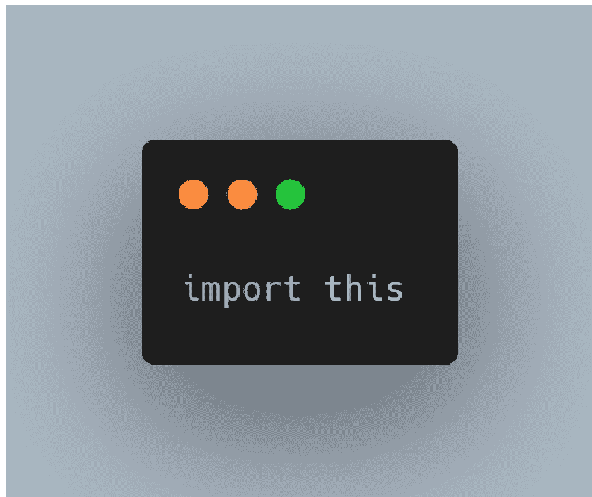

（原文缩略图，来自 https://mathspp.com/blog/pydonts/pydont-disrespect-the-zen-of-python）

为了开启 Pydon't 系列，我们从一组所有 Python 开发者都应该了解的准则开始：[Python 之禅](https://peps.python.org/pep-0020/)。

[Python 之禅](https://peps.python.org/pep-0020/)就像一个元风格指南。虽然有像 [PEP 8](https://peps.python.org/pep-0008/) 这样的东西告诉你应该如何格式化代码、如何命名变量等，但 [Python 之禅](https://peps.python.org/pep-0020/) 提供了你在思考（Python）代码和设计程序时应该遵循的准则。

## Python 之禅

你可以在你的 REPL 中执行 `import this` 来阅读 [Python 之禅](https://peps.python.org/pep-0020/)，它应该会打印出以下文本：

Python 之禅，作者 Tim Peters

```
优美胜于丑陋。
明了胜于晦涩。
简洁胜于复杂。
复杂胜于凌乱。
扁平胜于嵌套。
稀疏胜于密集。
可读性很重要。
特例也不可违背规则。
虽然实用性比纯粹性更重要。
错误绝不能悄悄溜过。
除非明确要求静默。
面对歧义，拒绝猜测的诱惑。
应该有一种——最好只有一种——显而易见的方式来做事。
虽然这种方式起初可能并不明显，除非你是荷兰人。
现在做总比不做好。
虽然不做好常常比*现在*做好更好。
如果实现难以解释，那它就是个坏主意。
如果实现容易解释，那它可能是个好主意。
命名空间是个绝妙的主意——让我们多用用吧！
```

看看这些准则，试着理解它们的含义。如果你想写出真正 Pythonic 的代码，那么你应该尽可能地拥抱这些准则。

深入查阅 [PEP 20 – Python 之禅](https://peps.python.org/pep-0020/) 的参考资料，你会发现 Tim Peters（Python 早期的主要贡献者）认为这些准则是“*在 [Python] 语言精神内运作的基本惯用建议*”，这表明这些建议是严肃的，不应被轻视——如果你愿意付出额外努力的话。

如果你看过[功夫熊猫](https://www.imdb.com/title/tt0441773/)，可以这样想：[Python 之禅](https://peps.python.org/pep-0020/)之于 Python 程序员，就像*神龙卷轴*之于功夫修行者：阿宝只有在拥抱了神龙卷轴之后，才能将他的功夫提升到新的境界，变得真正了不起。只有在你拥抱了 [Python 之禅](https://peps.python.org/pep-0020/)之后，你才会成为一个*真正的* Python 开发者。

我的建议是时不时地读一读它，并在你编码和审查（你或他人编写的）已有代码时，试着记住 [Python 之禅](https://www.python.org/dev/peps/pep-0020/)。我不知道*你*怎么样，但每当我写（文本）文档，比如一封信或一篇博客文章时，我从来不会一次就写好。我通常先写个初稿，然后根据需要进行修改：有时会重写整个部分。写代码也是一样：很有可能，你写的第一版代码可以得到极大的改进。

这篇 Pydon't 更像是一篇“元”Pydon't，包含关于如何编码的主观建议。起初这对你来说可能显得没用，但你思考得越多，它就会变得越有帮助。接下来的 Pydon't 将向你展示如何编写更 Pythonic 代码的客观、实用的技巧。

## 参考资料

- PEP 20 – Python 之禅, https://www.python.org/dev/peps/pep-0020/
- “The Way of Python” 邮件列表主题, https://groups.google.com/g/comp.lang.python/c/B_VxeTBClM0/m/L8W9KlsiriUJ
- Tim Peters (软件工程师), 维基百科 https://en.wikipedia.org/wiki/Tim_Peters_(software_engineer)

# Zip 拉链

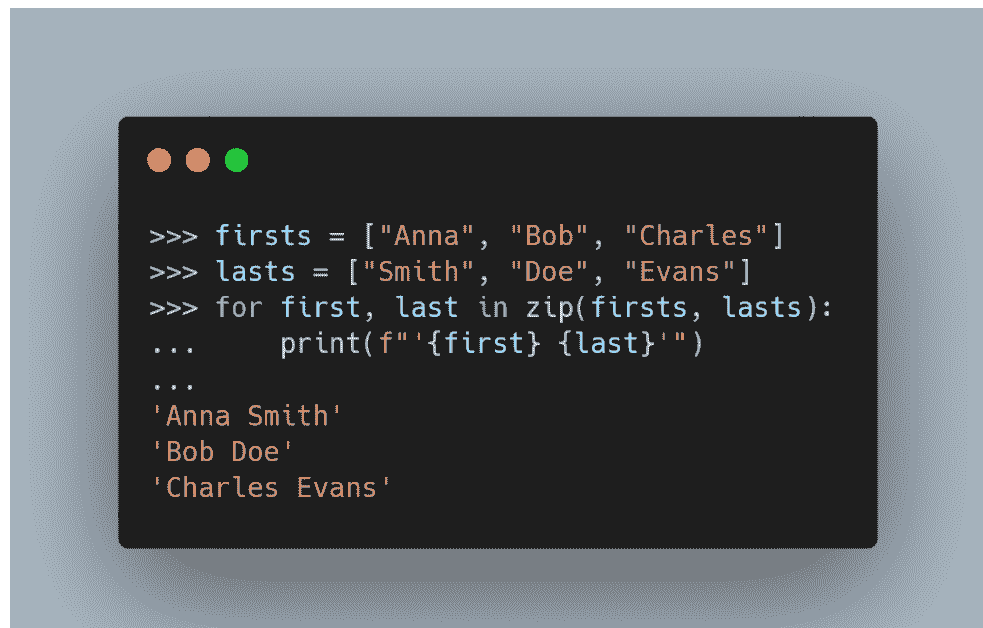

（原文缩略图，来自 https://mathspp.com/blog/pydonts/zip-up.）

## 介绍

与其他编程语言相比，Python 最让我欣赏的一点是它的 for 循环。Python 允许你编写非常富有表现力的循环，部分原因在于内置的 zip 函数。

在本文中，你将

- 了解 zip 的作用；
- 认识 zip 在 Python 3.10 中即将推出的一个新特性；
- 学习如何使用 zip 创建字典；以及
- 看到一些 zip 的精彩使用示例。

## zip 如何工作

在一个简单的 for 循环中，你通常有一个迭代器 `it`，然后你只需写类似这样的代码：

```
for elem in it:
    # 对 elem 做一些操作
    print(elem)
```

“迭代器”是可以线性遍历的东西，其中列表是最简单的例子。另一个在 Python for 循环中非常常见的迭代器是 range：

```
for n in range(10):
    print(n**2)
```

有时你会有两个或更多包含相关信息的迭代器，你需要遍历这些迭代器来处理你获得的不同信息片段。

在下面的例子中，我们有一个包含人名和姓氏的列表，我们想打印全名。朴素的解决方案是使用 range 来遍历所有索引，然后索引到列表中：

```
>>> firsts = ["Anna", "Bob", "Charles"]
>>> lasts = ["Smith", "Doe", "Evans"]
>>> for i in range(len(firsts)):
...     print(f"'{firsts[i]} {lasts[i]}'")
...
'Anna Smith'
'Bob Doe'
'Charles Evans'
```

这确实完成了任务，但这样的 for 循环只暗示了你可能要访问 `firsts` 中的值，因为你写了

```
range(len(firsts))
```

但结果你也想访问 `lasts` 中的项目。这就是 zip 的用途：你用它来配对你想要同时遍历的可迭代对象：

```
>>> firsts = ["Anna", "Bob", "Charles"]
>>> lasts = ["Smith", "Doe", "Evans"]
>>> for first, last in zip(firsts, lasts):
...     print(f"'{first} {last}'")
...
'Anna Smith'
```

## Zip是惰性的

有一点需要牢记，`zip`并不会立即创建元组。`zip`是惰性的，这意味着它只在你请求时才会计算元组，例如，当你在一个`for`循环中遍历它们时（就像上面的示例那样）或者当你将`zip`对象转换为列表时：

```
>>> firsts = ["Anna", "Bob", "Charles"]
>>> lasts = ["Smith", "Doe", "Evans", "Rivers"]
>>> z = zip(firsts, lasts)
>>> z
<zip object at 0x0000019F56702680>
>>> list(z)
[('Anna', 'Smith'), ('Bob', 'Doe'), ('Charles', 'Evans')]
```

`zip`的惰性也意味着`zip`本身与列表*并不那么*相似。例如，你不能询问一个`zip`对象的长度：

```
>>> len(z)
Traceback (most recent call last):
  File "<stdin>", line 1, in <module>
TypeError: object of type 'zip' has no len()
```

## 三个臭皮匠

我们已经看过带两个参数的`zip`，但`zip`可以接受任意数量的迭代器，并将生成一个相应大小的元组：

```
>>> firsts = ["Anna", "Bob", "Charles"]
>>> middles = ["Z.", "A.", "G."]
>>> lasts = ["Smith", "Doe", "Evans"]
>>> for z in zip(firsts, middles, lasts):
...     print(z)
...
('Anna', 'Z.', 'Smith')
('Bob', 'A.', 'Doe')
('Charles', 'G.', 'Evans')

>>> prefixes = ["Dr.", "Mr.", "Sir"]
>>> for z in zip(prefixes, firsts, middles, lasts):
...     print(z)
...
('Dr.', 'Anna', 'Z.', 'Smith')
('Mr.', 'Bob', 'A.', 'Doe')
('Sir', 'Charles', 'G.', 'Evans')
```

## 长度不匹配

`zip`*总是*返回一个元组，其元素个数与它接收的参数个数相同。那么，如果其中一个迭代器比其他的短会发生什么？

如果`zip`的参数长度不等，那么`zip`会持续工作，直到耗尽其中一个迭代器。一旦有一个迭代器结束，`zip`就会停止生成元组：

```
>>> firsts = ["Anna", "Bob", "Charles"]
>>> lasts = ["Smith", "Doe", "Evans", "Rivers"]
>>> for z in zip(firsts, lasts):
...     print(z)
...
('Anna', 'Smith')
('Bob', 'Doe')
('Charles', 'Evans')
```

从Python 3.10开始，`zip`将能够接收一个名为`strict`的关键字参数，你可以用它来告诉`zip`在迭代器长度不匹配时报错：

```
>>> firsts = ["Anna", "Bob", "Charles"]
>>> lasts = ["Smith", "Doe", "Evans", "Rivers"]
>>> # strict=True available in Python >= 3.10
>>> for z in zip(firsts, lasts, strict=True):
...     print(z)
...
('Anna', 'Smith')
('Bob', 'Doe')
('Charles', 'Evans')
Traceback (most recent call last):
  File "<stdin>", line 1, in <module>
ValueError: zip() argument 2 is longer than argument 1
```

请注意，`zip`只在*发现*长度不匹配*时*才会报错，它不会在一开始就进行检查：这是因为`zip`的参数本身可能是惰性迭代器。

> （惰性）迭代器将在后续的Pydon'ts文章中介绍，因此请务必[订阅](https://mathspp.com/subscribe)Pydon't通讯，以便保持关注！

通常情况下，`zip`与*期望*具有相同长度的迭代器一起使用。如果是这种情况——如果你期望你的迭代器具有相同的长度——那么始终设置`strict=True`是一个好主意，因为它将帮助你捕获代码中的错误。

## 用`zip`创建字典

你可以通过将键值对传递给`dict`函数来在Python中创建字典，这意味着当你在所有键在一个迭代器中，所有值在另一个迭代器中时，`zip`是创建字典的主要方法：

```
>>> firsts = ["Anna", "Bob", "Charles"]
>>> lasts = ["Smith", "Doe", "Evans"]
>>> dict(zip(firsts, lasts))
{'Anna': 'Smith', 'Bob': 'Doe', 'Charles': 'Evans'}
```

## 代码中的示例

现在你将看到一些在实际Python代码中使用`zip`的例子。

### 贪吃蛇游戏

我的一个朋友正在学习Python，他开始制作一个贪吃蛇游戏的复制品。在游戏的某个节点，他有一个菜单，并希望显示可以游玩的“地图”的缩略图，而他将这些图像存储在一个名为`lvlpictures`的列表中。同时，他将这些图像应该放置的位置存储在名为`self.buttons`的列表中。为了在正确的位置显示缩略图，他需要调用一个名为`blit`的函数，该函数期望接收图像和图像应该放置的位置。

```python
# Before:
for i in range(len(lvlpictures)):
    self.surface.blit(lvlpictures[i], (self.buttons[i][0]+2, self.buttons[i][1]+2))
```

```python
# Then he learned about `zip`:
for pic, btn in zip(lvlpictures, self.buttons):
    self.surface.blit(pic, (btn[0] + 2, btn[1] + 2))
```

注意，使用`zip`使你的代码更短，同时也更清楚地表达了将图像和按钮一起处理的意图。最后，当Python 3.10发布时，他甚至可以添加`strict=True`关键字参数，因为他期望`lvlpictures`和`self.buttons`具有相同的长度。

### 匹配路径

如果你没有意识到，你可能会有兴趣知道Python有一个名为`pathlib`的模块，它提供了处理文件系统路径的工具。

当你创建一个路径后，你可以检查它是否匹配给定的模式：

```python
>>> from pathlib import PurePath
>>> PurePath('a/b.py').match('*.py')
True
>>> PurePath('/a/b/c.py').match('b/*.py')
True
>>> PurePath('/a/b/c.py').match('a/*.py')
False
```

如果你看一下这个`match`函数，你会发现：

```python
class PurePath(object):
    # ...
    def match(self, path_pattern):
        """
        Return True if this path matches the given pattern.
        """
        # 为简洁起见，省略了代码
        for part, pat in zip(reversed(parts), reversed(pat_parts)):
            if not fnmatch.fnmatchcase(part, pat):
                # ...
                return False
        return True
```

省略的代码进行了一些检查，使函数能够立即判断出不匹配。我展示的这个`for`循环利用了`zip`将路径的每个部分与模式的每个部分配对，然后我们使用`fnmatch.fnmatchcase`检查它们是否匹配。

尝试在这里添加几行打印语句：

```python
class PurePath(object):
    # ...

    def match(self, path_pattern):
        """
        Return True if this path matches the given pattern.
        """
        # 为简洁起见，省略了代码

        print(parts)       # 手动添加以检查发生了什么。
        print(pat_parts)   # 同上。
        for part, pat in zip(reversed(parts), reversed(pat_parts)):
            if not fnmatch.fnmatchcase(part, pat):
                return False
        return True
```

然后重新运行文档中的示例：

```
>>> from pathlib import PurePath
>>> PurePath('a/b.py').match('*.py')
['a', 'b.py']    # parts
['*.py']          # pat_parts
True
>>> PurePath('/a/b/c.py').match('b/*.py')
['\\', 'a', 'b', 'c.py']
['b', '*.py']
True
>>> PurePath('/a/b/c.py').match('a/*.py')
['\\', 'a', 'b', 'c.py']
['a', '*.py']
False
```

现在应该更清楚`parts`和`pat_parts`实际上的作用了，也更清楚为什么我们要将它们`zip`在一起。

这是一个很好的例子，说明何时使用`strict=True`没有意义，因为路径和模式可能有不同数量的部分，而这完全没问题。

## 写入CSV文件

Python标准库自带一个名为`csv`的模块，用于读写CSV文件。除此之外，它还提供了`DictReader`和`DictWriter`类，方便你在想用CSV文件的表头来像字典一样读取数据行时，或者当你已将数据行处理为字典时使用。

下面是一个示例，展示如何将多个字典写入CSV文件：

```python
import csv

with open('names.csv', 'w', newline='') as csvfile:
    fieldnames = ['first_name', 'last_name']
    writer = csv.DictWriter(csvfile, fieldnames=fieldnames)

    writer.writeheader()
    writer.writerow({'first_name': 'Baked', 'last_name': 'Beans'})
    writer.writerow({'first_name': 'Lovely', 'last_name': 'Spam'})
    writer.writerow({'first_name': 'Wonderful', 'last_name': 'Spam'})
```

`fieldnames`变量将建立CSV文件的表头，然后`writerow`方法会利用它来确定字典中的值应按什么顺序写入文件。

`writeheader`函数是用于写入CSV文件表头的函数，其代码如下：

```python
class DictWriter:
    # ...

    def writeheader(self):
        header = dict(zip(self.fieldnames, self.fieldnames))
        return self.writerow(header)
```

基本上，这个函数的作用是利用`zip`将表头名称转换成一个键和值都相同的字典，假装表头只是一行普通的数据行：

```python
>>> fieldnames = ['first_name', 'last_name']
>>> dict(zip(fieldnames, fieldnames))
{'first_name': 'first_name', 'last_name': 'last_name'}
```

因此，`writeheader`函数只需创建这个字典，然后就可以将实际的写入操作委托给`writerow`函数了。

## 结论

以下是本文的核心要点，为你奉上：

> > “`zip`是你的好朋友，无论何时，只要你需要同时遍历两个或多个可迭代对象。”

本期Pydon't向你展示了：

- `zip`可以用来同时遍历多个可迭代对象；
- `zip`本身返回一个`zip`对象，你必须对其进行迭代，或者显式地转换为列表，才能得到它产生的元组；
- 如果`zip`的参数长度不一致，它会耗尽其中一个迭代器后就立即停止；
- 从Python 3.10开始，你可以使用关键字参数`strict=True`来指定，当`zip`的参数长度不同时应引发错误；
- `zip`提供了一种非常简单的方式来创建字典。

## 参考文献

- Python 3文档，Python标准库，zip，[docs.python.org/3/library/functions.html#zip](https://docs.python.org/3/library/functions.html#zip) [最后访问时间 2021-03-30]；
- Python 3.10文档，Python标准库，zip，[docs.python.org/3.10/library/functions.html#zip](https://docs.python.org/3.10/library/functions.html#zip) [最后访问时间 2021-03-30]；
- Python 3文档，Python标准库，csv，[docs.python.org/3/library/csv.html](https://docs.python.org/3/library/csv.html) [最后访问时间 2021-03-30]。
- Python 3文档，Python标准库，pathlib，[docs.python.org/3/library/pathlib.html](https://docs.python.org/3/library/pathlib.html) [最后访问时间 2021-03-30]。

# 来列举我一下

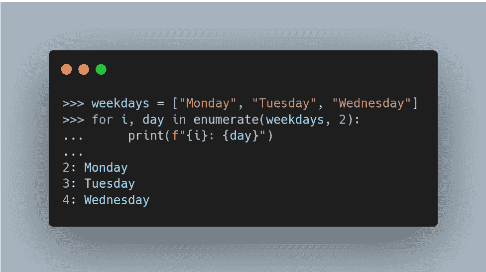

（原文缩略图，来自 https://mathspp.com/blog/pydonts/enumerate-me。）

## 引言

继上周关于`zip`的Pydon't之后，今天我们来谈谈`enumerate`。
与其他编程语言相比，我最欣赏Python的一点就是它的`for`循环。Python允许你编写表达力极强的循环，而其中一些表达力就来自于内置的`enumerate`函数。
在本文中，你将：

- 了解`enumerate`的作用；
- 看看它那被低估的可选参数`start`；
- 学习几个使用`enumerate`的巧妙用例；
- 看到一些使用`enumerate`的漂亮代码示例。

## enumerate的工作原理

Python新手通常很早就接触到这种`for`循环类型：

```python
>>> for i in range(3):
...     print(i)
...
0
1
2
```

这导致他们“学会”了这种反模式的`for`循环来遍历，比如，一个列表：

```python
>>> words = ["Hey", "there"]
>>> for i in range(len(words)):
...     print(f"'{words[i]}> has {len(words[i])} letters.'")
...
'<Hey> has 3 letters.'
'<there> has 5 letters.'
```

编写此类循环的Pythonic方式是直接迭代列表：

```python
>>> words = ["Hey", "there"]
>>> for word in words:
...     print(f"'{word}> has {len(word)} letters.'")
...
'<Hey> has 3 letters.'
'<there> has 5 letters.'
```

然而，当在索引与元素的对抗中需要迈入最后一步时，就是当你需要知道每个元素的索引，但同时也需要访问该元素本身时。天真的方法是先遍历长度的范围，然后通过索引获取元素：

```python
for i in range(len(words)):
    word = words[i]
    # ...
```

输出：
```
'Word #0: <Hey> has 3 letters.'
'Word #1: <there> has 5 letters.'
```

## 可选的 start 参数

`enumerate`函数还可以接受一个可选参数，用于指定它返回的第一个索引。例如，如果我们正在统计单词（如上面的例子所示），我们可能想从1开始计数：

```python
>>> words = ["Hey", "there"]
>>> for i, word in enumerate(words, 1):
...     print(f"'Word #{i}: <{word}> has {len(word)} letters.'")
...
'Word #1: <Hey> has 3 letters.'
'Word #2: <there> has 5 letters.'
```

这个可选参数非常有用，因为它省去了你手动偏移索引的麻烦。
顺便说一句，这个参数必须是整数，但可以是负数：

```python
>>> for i, v in enumerate("abc", start=-3243):
...     print(i)
...
-3243
-3242
-3241
```

你能想出一个使用负整数作为`enumerate`可选参数的*合理*场景吗？如果你想到了什么好主意，请在下面评论！

## 迭代时的解包

`enumerate`函数产生一个惰性生成器，这意味着你遍历的项目只有在你需要时才会变得可用。这可以防止Python在对大型参数（例如一个非常长的列表）使用`enumerate`时花费*大量*内存。

> `enumerate`的这种惰性在Python中很常见，例如`range`和`zip`也是惰性的。请务必[订阅](https://mathspp.com/subscribe)通讯，这样你就不会错过我讲解这些概念的Pydon't文章了。

`enumerate`返回的项目是包含2个元素的元组，其中第一个元素是索引，第二个元素是值：

```python
>>> for tup in enumerate("abc"):
...     print(tup)
...
(0, 'a')
(1, 'b')
(2, 'c')
```

我们通常做的是在循环语句中直接解包那个元组，像这样：

```python
for i, letter in enumerate("abc"):
    # 使用 i 和 letter 做任何事
```

这大致等同于：

```python
for tup in enumerate("abc"):
    i, letter = tup
    # 使用 i 和 letter 做任何事
```

### 深度解包

当你在类似`zip`的对象上使用`enumerate`时，事情会变得更有趣：

```python
>>> # 每一章开始的页码和书籍的最后一页。
>>> pages = [5, 17, 31, 50]
>>> for i, (start, end) in enumerate(zip(pages, pages[1:]), start=1):
...     print(f"'{i}: {end-start} pages long.'")
...
'1: 12 pages long.'
'2: 14 pages long.'
'3: 19 pages long.'
```

（这里我显式地命名了`enumerate`的`start=`参数，以便在视觉上更容易将其与`zip`的参数区分开。）

这段代码片段接收一个列表，其中包含书籍各章开始的页码，然后打印出每一章的长度。注意`enumerate`如何返回包含索引和值的元组，但这些值是从`zip`中提取的，而`zip`本身也返回元组：

```python
>>> # 每一章开始的页码和书籍的最后一页。
>>> pages = [5, 17, 31, 50]
>>> for tup in enumerate(zip(pages, pages[1:]), start=1):
...     print(tup)
...
(1, (5, 17))
(2, (17, 31))
(3, (31, 50))
```

我们做的是使用深度解包来直接访问所有这些值：

```python
>>> # 每一章开始的页码和书籍的最后一页。
>>> pages = [5, 17, 31, 50]
>>> for tup in enumerate(zip(pages, pages[1:]), start=1):
...     i, (start, end) = tup
...     print(f"'{i}: {end-start} pages long.'")
...
'1: 12 pages long.'
```

'2：14页长。'
'3：19页长。'

如果你不知道深度解包是什么或它是如何工作的，可以去看看我关于解包的Pydon't文章。

## 代码示例

现在你将看到一些在实际Python代码中使用enumerate的例子。

### 基础enumerate

我查看了Python标准库，总的来说，enumerate最常见的用法就是简单的`enumerate(iter)`，用于同时访问可迭代对象的值和索引。让我与你分享一个教科书式的例子：

doctest模块允许你在函数、类等的文档字符串中为代码编写简单的测试。编写这些测试的方式是REPL中的交互式会话形式。doctest随后会在你的文档字符串中定位这些“交互式会话”并运行它们，以查看代码的实际输出是否与文档字符串中显示的内容匹配。

如果你打开Python REPL，你会看到它以提示符`>>>`开头，三个大于号后面有一个空格。你不能删除那个空格，它是提示符的一部分。在解析文档字符串以提取实际测试时，解析器会检查提示符是否有那个前导空格，以下是执行此操作的代码：

```python
## from Lib\doctest.py in Python 3.9
class DocTestParser:
    # ...
    def _check_prompt_blank(self, lines, indent, name, lineno):
        """
        Given the lines of a source string (including prompts and
        leading indentation), check to make sure that every prompt is
        followed by a space character. If any line is not followed by
        a space character, then raise ValueError.
        """
        for i, line in enumerate(lines):
            if len(line) >= indent+4 and line[indent+3] != ' ':
                raise ValueError('line %r of the docstring for %s '
                                 'lacks blank after %s: %r' %
                                 (lineno+i+1, name,
                                  line[indent:indent+3], line))
```

注意顶部的for循环如何使用enumerate遍历交互式示例的行。如果在循环中，我们遇到一行在`>>>`之后没有额外空格，那么我们会引发一个ValueError，其中使用`i`来计算错误发生时的实际行号，这就是倒数第二行中的`lineno+i+1`部分。

想看看实际效果吗？试试运行这个简短的脚本：

```python
def sum_nats(n):
    """Sums the first n natural numbers.

    >>> sum_nats(1)
    1
    >>> sum_nats(10)
    55
    >>> sum_nats(100)
    5050
    """

    return int(n*(n+1)/2)

if __name__ == "__main__":
    import doctest
    doctest.testmod()
```

注意我故意在第三个例子中没有在`>>>`和`sum_nats(100)`之间留空格。运行这个脚本应该会抛出一个`ValueError`，当你在那里加上空格时，错误应该就会消失。

## 使用可选参数

### 文档字符串测试中的行号

如果你刚才在注意，也许你注意到前一个例子中的`enumerate`用法调用了`enumerate`的可选参数！

再看一下代码：

```python
## from Lib\doctest.py in Python 3.9
class DocTestParser:
    # ...

    def _check_prompt_blank(self, lines, indent, name, lineno):
        # docstring elided.
        for i, line in enumerate(lines):
            if len(line) >= indent+4 and line[indent+3] != ' ':
                raise ValueError('line %r of the docstring for %s '
                                 'lacks blank after %s: %r' %
                                 (lineno+i+1, name,
                                  line[indent:indent+3], line))
```

注意在最后的字符串格式化中，我们计算`lineno+i+1`来引发带有正确行号的错误消息，该行号对应于有缺陷的提示符...但这与重写循环以使用`start=`参数是相同的：

```python
class DocTestParser:
    # ...
    def _check_prompt_blank(self, lines, indent, name, lineno):
        # docstring elided.
        for line_n, line in enumerate(lines, start=lineno+1):
            if len(line) >= indent+4 and line[indent+3] != ' ':
                raise ValueError('line %r of the docstring for %s '
                                'lacks blank after %s: %r' %
                                (line_n, name,
                                line[indent:indent+3], line))
```

## 计算星期几

虽然不如普通的`enumerate(iter)`用法那么频繁，但也有不少地方利用可选参数来避免计算不必要的偏移量。

我在`calendar`模块中发现了一个有趣的用法，在`calendar.Calendar.itermonthdays2`函数中。`calendar.Calendar.itermonthdays2`函数执行以下操作：- 你给它一个年份和一个月份，例如2021和4（代表四月）；- 它返回一个生成器，其中包含该月的日期与星期几（0到6）配对。（有一个小注意事项：迭代器返回的是整周的序列，因此它可能在开头和/或结尾填充结果。）

这是一个例子：

```python
>>> for arg in c.Calendar().itermonthdays2(2021, 4):
...     print(arg)
...
(0, 0)
(0, 1)
(0, 2)
(1, 3)
(2, 4)
(3, 5)
(4, 6)
(5, 0)
(6, 1)
(7, 2)
## ... cut for brevity
(28, 2)
(29, 3)
(30, 4)
(0, 5)
(0, 6)
```

左边的数字表示月份中的日期，右边的数字编码星期几，其中0是星期一，直到6是星期日。2021年4月6日（我写这篇文章的那天）是星期二，在上面的输出中由`(6, 1)`编码。

以下是实现`itermonthdays2`的代码：

```python
## from Lib\calendar.py in Python 3.9
class Calendar(object):
    # ...

    def itermonthdays2(self, year, month):
        """
        Like itermonthdates(), but will yield (day number, weekday number)
        tuples. For days outside the specified month the day number is 0.
        """
        for i, d in enumerate(self.itermonthdays(year, month), self.firstweekday):
            yield d, i % 7
```

这个函数严重依赖于`itermonthdays(year, month)`，后者只返回一个月份日期的序列，前面和/或后面有一些零，以便该序列代表该月所在的所有整周。

例如，看看我2021年4月的桌面日历：


如果我告诉Calendar类从星期日（第6天）开始计算周数，就像我的桌面日历那样，以下是`itermonthdays`产生的结果：

```python
>>> for d in c.Calendar(6).itermonthdays(2021, 4):
...     print(d)
...
0
0
0
0
1
2
3
4
## ... cut for brevity
30
0
```

前四个0是出现在顶部一周的四个三月日期，最后的0对应于我日历右下角显示的5月1日。

为了将这些日期与相应的星期几一起返回，`enumerate`被传入了一个`start=`参数，即`self.firstweekday`，以将月份中的日期与`Calendar`视为一周第一天的日期同步。

## 过滤索引

我在探究Python标准库时发现的一个非常巧妙的`enumerate`用法是过滤列表以查找满足特定谓词的元素的索引。

例如，假设你有一个整数列表和一个函数，该函数告诉你一个数字是奇数还是偶数：

```python
>>> nums = [4071, 53901, 96045, 84886, 5228, 20108, 42468, 89385, 22040, 18800, 4071]
>>> odd = lambda x: x%2
```

你会编写什么代码来找出奇数的*索引*？注意，通常使用`nums.index`的解决方案不会奏效，因为列表可能包含重复项（参见上面的`nums[0]`和`nums[-1]`）。

在库中的一个辅助文件中，我引用一下，“共享的OS X支持函数”，我发现了一个非常优雅的解决方案：

```python
>>> [i for i, n in enumerate(nums) if odd(n)]
[0, 1, 2, 7, 10]
```

当然，我谈论的文件（`Lib\_osx_support.py`）并没有这段代码，但它确实有我刚才展示的模式。那里的实际代码如下：

```python
## from Lib\_osx_support.py in Python 3.9
def compiler_fixup(compiler_so, cc_args):
    # ...
    indices = [i for i,x in enumerate(compiler_so) if x.startswith('-isysroot')]
    # ...
```

虽然我从语义角度*完全不知道*这段代码在做什么，但我们可以清楚地看到`indices`正在收集`compiler_so`中以"-isysroot"开头的元素的索引。

## 充分利用元组

我发现的另一个有趣的`enumerate`函数用法是直接创建字典。例如，如果我们看看`mailbox`模块，我们可以找到一行代码，它正在构建一个目录表作为字典，其中键是`enumerate`给出的整数，值是由`zip`构建的元组：

## 源自 Python 3.9 的 Lib\mailbox.py
```python
class mbox(_mboxMMDF):
    # ...
    def _generate_toc(self):
        """生成 key-to-(start, stop) 目录表。"""
        starts, stops = [], []
        last_was_empty = False
        self._file.seek(0)
        while True:
            # 处理 self._file
            self._toc = dict(enumerate(zip(starts, stops)))
            # ...
```

请注意代码是如何初始化空列表 `starts` 和 `stops` 的，它们随后在我删除的、相当长的 while 循环中被填充，因为这段代码过长，会分散我们对主要内容的注意力：即这行代码

```python
self._toc = dict(enumerate(zip(starts, stops)))
```

因为 `enumerate` 返回的是包含 2 个元素的元组，`dict` 可以接受这种形式并构建一个字典。有趣的是，我们实际上希望 `starts` 和 `stops` 能配对在一起，所以我们最终调用 `enumerate` 处理一个 `zip` 对象，结果可能如下所示：

```python
>>> starts = [1, 10, 21, 30]
>>> stops = [9, 15, 28, 52]
>>> dict(enumerate(zip(starts, stops)))
{0: (1, 9), 1: (10, 15), 2: (21, 28), 3: (30, 52)}
```

## 结论

这是本文的主要结论，奉送给您：

> “如果你需要遍历一个迭代器来处理其数据，同时还需要访问其索引信息，那么 `enumerate` 就是你最好的朋友。”

这个 Pydon't 向你展示了：

-   `enumerate` 让你同时访问可迭代对象的元素和索引；
-   `enumerate` 本身返回一个惰性 enumerate 对象，你必须对其进行迭代或显式转换为列表（或其他适合你需求的类型）才能获取其值；
-   `enumerate` 接受第二个参数来设置索引的起始值；
    -   并且，特别地，该参数可以是负整数；
-   `enumerate` 的结果可以直接传给 `dict` 来创建一个以索引为键的字典；
-   使用 `enumerate`，我们得到了一种优雅的惯用法，用于找出可迭代对象中指向满足特定条件的元素的索引；并且
-   结合 `zip`、`enumerate` 和深度解包，可以让你优雅地遍历多个可迭代对象。

## 参考资料

-   Python 3 Documentation, The Python Standard Library, enumerate, docs.python.org/3/library/functions.html#enumerate [last accessed 06-04-2021];
-   Python 3 Documentation, The Python Standard Library, calendar.Calendar, docs.python.org/3/library/calendar.html#ca [last accessed 06-04-2021].
-   Python 3 Documentation, The Python Standard Library, doctest, docs.python.org/3/library/doctest.html [last accessed 06-04-2021].
-   Python 3 Documentation, The Python Standard Library, mailbox, docs.python.org/3/library/mailbox.html [last accessed 06-04-2021].

## 比较运算符的链式调用

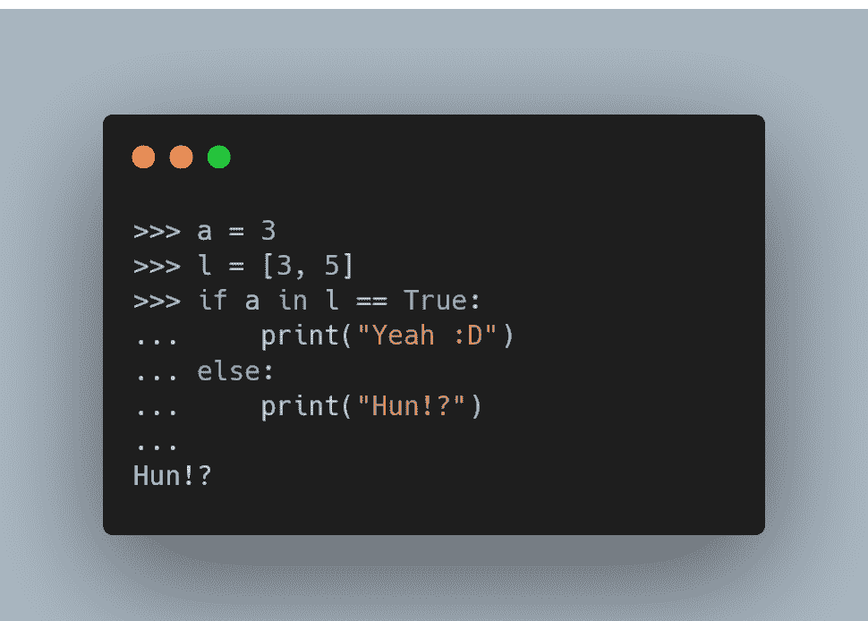

(原文缩略图，链接至 https://mathspp.com/blog/pydonts/chaining-comparison-operators。)

## 引言

在这个 Pydon't 中，我们将探讨比较运算符的链式调用：

-   它们是如何工作的；
-   一些有用的用法；以及
-   需要避免的奇怪情况。

## 比较运算符的链式调用

Python 让我喜爱的一点是，它的某些特性非常合理，以至于你甚至意识不到自己在使用一个特性，直到有人指出这样的代码在其他语言中无法运行。比较链式调用就是一个例子！看看这段代码片段，告诉我它是不是看起来非常自然：

```python
>>> a = 1
>>> b = 2
>>> c = 3
>>> if a < b < c:
...     print("Increasing seq.")
...
Increasing seq.
```

当 Python 看到两个比较运算符连续出现，例如 `a < b < c` 时，它的行为就像你写了 `a < b` 和 `b < c` 一样，只是 `b` 只被计算一次（如果 `b` 是像函数调用这样的表达式，这一点就很重要）。

在我看来，这个特性*非常*合理，并不令人惊讶。相反，我现在觉得有点遗憾，因为大多数语言都不支持这种行为。

另一个例子用法是当你想确保三个值都相同时：

```python
>>> a = b = 1
>>> c = 2
>>> if a == b == c:
...     print("all same")
... else:
...     print("some are diff")
...
some are diff
>>> c = 1
>>> if a == b == c:
...     print("all same")
... else:
...     print("some are diff")
...
all same
```

> 你知道吗？你实际上可以链式调用任意数量的比较运算符。例如，`a == b == c == d == e` 检查所有五个变量是否相同，而 `a < b < c < d < e` 检查是否为严格递增序列。

## 陷阱

尽管这个特性看起来非常合理，但有一些陷阱你必须注意。

### 非传递性运算符

我们上面看到可以使用 `a == b == c` 来检查 a、b 和 c 是否都相同。那该如何检查它们是否都不同呢？

如果你想到了 `a != b != c`，那么你刚刚就掉入了第一个陷阱！

看看这段代码：

```python
>>> a = c = 1
>>> b = 2
>>> if a != b != c:
...     print("a, b, and c all different:", a, b, c)
a, b, and c all different: 1 2 1
```

这里的问题是，`a != b != c` 等同于 `a != b and b != c`，它检查的是 b 是否与 a 和 c 都不同，但并未说明 a 和 c 之间的关系。

从数学角度看，`!=` 不是传递性的，即，知道 a 与 b 的关系以及 b 与 c 的关系，并不能告诉你 a 与 c 的关系。作为传递性的例子，可以看 `==` 相等运算符。如果 `a == b` 且 `b == c`，那么 `a == c` 也为真。

### 非常量表达式或副作用

回想一下，在比较链式调用中，例如 `a < b < c`，中间的表达式 `b` 只被计算一次，而如果你写出展开的表达式 `a < b and b < c`，那么 `b` 将被计算两次。

如果 `b` 包含一个带有副作用的表达式，或者它是一个非常量值，那么这两个表达式就不等价，你需要仔细考虑你在做什么。

这个代码片段展示了中间表达式被计算次数的差异：

```python
>>> def f():
...     print("hey")
...     return 3
...
>>> if 1 < f() < 5:
...     print("done")
...
hey
done
>>> if 1 < f() and f() < 5:
...     print("done")
...
hey
hey
done
```

这个代码片段展示了，像 `1 < f() < 0` 这样的表达式，在展开后实际上可能求值为 True：

```python
>>> l = [-2, 2]
>>> def f():
...     global l
...     l = l[::-1]
...     return l[0]
>>> if 1 < f() and f() < 0:
...     print("ehh")
...
ehh
```

> 语法 `l[::-1]` 是一个“切片”操作，用于反转列表。我很快就会写关于列表切片的内容，敬请期待！

当然，`1 < f() < 0` 不应该为 True，所以这恰恰说明了链式比较和展开后的表达式并不总是等价的。

### 难看的链式调用

这个特性看起来非常自然，但某些特定情况并不那么好。这是一个相当主观的问题，但就我个人而言，我不喜欢运算符没有“对齐”的链式调用，像下面这样的链式调用

-   `a == b == c`
-   `a < b <= c`
-   `a <= b < c`

看起来非常舒服，但在我看来，像这样的链式调用

-   `a < b > c`
-   `a <= b > c`
-   `a < b >= c`

看起来就不那么好了。有人可能会争辩说，例如，`a < b > c` 可以很好地理解为“检查 b 是否同时大于 a 和 c”，但你也可以写成 `max(a, c) < b` 或 `b > max(a, c)`。

现在还有一些其他链式调用，简直令人困惑：

-   `a < b is True`
-   `a == b in l`
-   `a in l is True`

在 Python 中，`is`、`is not`、`in` 和 `not in` 都是比较运算符，所以你也可以将它们与其他运算符链式调用。这会导致奇怪的情况，例如：

```python
>>> a = 3
>>> l = [3, 5]
>>> if a in l == True:
...     print("Yeah :D")
... else:
...     print("Hun!?")
...
Hun!?
```

以下是上一个示例中发生情况的分析：

-   `a in l == True` 等同于 `a in l and l == True`；
-   `a in l` 为 True，*但是*
-   `l == True` 为 False，所以
-   `a in l == True` 展开为 `True and False`，结果为 False。

写下 `a in l == True` 的人本意可能是 `(a in l) == True`，但这又等同于 `a in l`。

## 代码示例

## 不等式链式调用

编写一个简单的实用函数来确保给定值介于两个边界之间变得非常简单，例如：

```python
def ensure_within(value, bounds):
    return bounds[0] <= value <= bounds[1]
```

或者，如果你想更明确一些，同时确保 `bounds` 是一个恰好包含两个元素的向量，你也可以这样写：

```python
def ensure_within(value, bounds):
    m, M = bounds
    return m <= value <= M
```

## 等式链式调用

直接来自 Python 的 `enum` 模块，我们可以找到一个辅助函数（未暴露给用户），其内容如下：

```python
def _is_dunder(name):
    """如果是 __dunder__ 名称则返回 True，否则返回 False。"""
    return (len(name) > 4 and
            name[:2] == name[-2:] == '__' and
            name[2] != '_' and
            name[-3] != '_')
```

这个函数检查一个字符串是否是 "dunder" 方法。

[Dunder] 来源于“双下划线”（double underscore），它指的是某些类所拥有的一些特殊方法，这些方法使得它们能够与Python的许多内置特性良好交互。这些方法被称为“dunder”，因为它们的名称以`__`开头和结尾。你在“str和repr”那期Pydon’t中已经见过`__str__`和`__repr__`这两个dunder方法，也在“真值、假值与bool”那期中见过`__bool__`方法。我将在后续的Pydon't中专门撰写关于dunder方法的内容，因此欢迎订阅以获取更新。

代码首先检查字符串的开头和结尾是否相同且都为"__"：

```
>>> _is_dunder("__str__")
True
>>> _is_dunder("__bool__")
True
>>> _is_dunder("_dnd__")
False
>>> _is_dunder("________underscores__")
False
```

## 结论

以下是本文的主要要点，为您呈上：

> “链式比较运算符感觉如此自然，以至于你甚至不会注意到这是一种特性。然而，如果你忽视它们，某些链式写法可能会让你困惑。”

这篇Pydon’t为你展示了：

- 你可以链接比较运算符，并且可以任意多次链接；
- 链接具有副作用或非确定性输出的表达式，与扩展形式的写法并不等价；以及
- 某些使用`is`或`in`的链式比较可能看起来极具误导性。

## 参考文献

- Python 3 文档，Python 语言参考，https://docs.python.org/3/reference/expressions.html#comparisons;
- Python 3 文档，Python 标准库，enum，https://docs.python.org/3/library/enum.html;
- Reddit，对“If they did make a python 4, what changes from python 3 would you like to see?”一文的评论，https://www.reddit.com/r/Python/comments/ltaf3y/if_they_did_make_a_python_4_what_changes_from/gowuau5?utm_source=share&utm_medium=web2x&context=3。

线上参考文献最后查阅于2021年3月1日。

## 布尔短路求值

（原文文章的缩略图位于 https://mathspp.com/blog/pydonts/boolean-short-circuiting。）

## 引言

在这期Pydon’t中，我们将更深入地探讨`and`和`or`的实际工作原理，以及由于其定义方式而可以实现的一些非常巧妙的技巧。具体来说，我们将探讨：

- `and`和`or`从其操作数返回的是操作数本身的值，而不必然是`True`或`False`；
- 什么是“短路求值”以及如何最好地利用它；
- `and`和`or`中的短路求值如何延伸到`all`和`any`函数；以及
- 布尔短路求值的一些富有表现力的应用场景。

在本篇Pydon't中，我假定你熟悉Python中“真值”和“假值”的概念。如果你不熟悉此概念，或者只是想快速回顾一下，可以去阅读“真值、假值与bool”那期Pydon’t。

### and 和 or 运算符的返回值

如果我们查看文档，`or`的定义如下：

> “x or y 在 x 为假时返回 y，否则返回 x。”

等价地，可以用if表达式写成：

```python
(x or y) == (y if not x else x)
```

这看起来可能不值得深思，但此刻我们已经能看到一些非常有趣的东西：即使我们查看的是`x`的真值或假值，我们返回的却是与`x`/`y`关联的值，而不是布尔值。

例如，看看下面的程序，思考它的输出：

```python
if 3 or 5:
    print("Yeah.")
else:
    print("Nope.")
```

如果你认为它会输出“Yeah.”，那你是对的！注意`3 or 5`作为`if`语句的条件，其求值结果为真，因此执行了`if`下的语句。

现在，看看下面的程序，思考它的输出：

```python
print(3 or 5)
```

你认为它会输出什么？如果你认为输出应该是`True`，那你就错了！上述程序的输出是`3`：

```python
>>> 3 or 5
3
```

让我们回顾一下我刚才说的话：

> “注意`3 or 5`作为`if`语句的条件，其求值结果为真，因此执行了`if`下的语句。”

这句话的措辞是错误的，但错误相当微妙。如果你在我指出之前就发现了，请拍拍自己的背，你值得。那么，我哪里说错了？

`3 or 5`的求值结果**不是**`True`！它的结果是`3`，这是一个真值，因此指示`if`执行其语句。返回`True`和返回一个真值是有显著区别的。

`and`运算符也发生类似的情况。根据文档，`and`可以定义如下：

> “x and y 在 x 为假时返回 x，否则返回 y。”

我们也可以将其重写为：

```python
(x and y) == (x if not x else y)
```

花点时间像上面探索`x or y`一样，探索一下这个。

## 短路求值

你可能会问为什么这个区别很重要。它之所以重要，主要是因为以下特性：`and`和`or`仅在左操作数不足以确定操作结果时，才会求值右操作数。这就是短路求值：如果我们已经有足够的信息来确定最终结果，就不对整个表达式求值（中途停止求值）。

这个短路特性，加上布尔运算符`and`和`or`返回的是操作数的值而不一定是布尔值的事实，意味着我们可以用它们做一些非常巧妙的事情。

**or**

`or`在任一操作数为真值时返回`True`（注：此处指其操作数之一为真值时，整个表达式求值为真值，但返回的是那个真值操作数本身）。如果`or`的左操作数是`False`（或假值），那么`or`运算符必须查看其右操作数以确定最终结果。

因此，我们知道像下面这样的表达式

```python
val = False or y
```

其值将是`y`的值，并且在`if`语句或`while`循环中，它将仅在`y`为真值时执行结构体的主体：

```python
>>> y = 5   # 真值。
>>> if False or y:
...     print("Got in!")
... else:
...     print("Didn't get in...")
...
Got in!
>>> y = []   # 假值。
>>> if False or y:
...     print("Got in 2!")
... else:
...     print("Didn't get in 2...")
...
Didn't get in 2...
```

请记住这一点：如果`or`的左操作数是`False`或假值，那么我们需要查看右操作数来确定`or`的值。

**`True or y`**

另一方面，如果`or`的左操作数是`True`，我们就不需要查看`y`，因为我们已经知道最终结果将是`True`（更准确地说，将是左操作数的值`True`）。

让我们创建一个简单的函数，它原样返回参数，但会产生一个副作用：向屏幕打印一些内容：

```python
def p(arg):
    print(f"Inside `p` with arg={arg}")
    return arg
```

现在我们可以使用`p`来观察Python在试图确定`x or y`的值时求值了哪些部分：

```python
>>> p(False) or p(3)
Inside `p` with arg=False
Inside `p` with arg=3
3
>>> p(True) or p(3)
Inside `p` with arg=True
True
```

注意，在第二个例子中，`p`只打印了一次，因为它从未到达`p(3)`。

#### or 表达式的短路求值

现在我们将所有内容联系起来。如果`or`的左操作数是`False`或假值，我们知道`or`必须查看其右操作数，因此将在对右操作数求值后返回其值。另一方面，如果左操作数是`True`或真值，`or`将返回左操作数的值，甚至不会对右操作数求值。

### and

我们现在对`and`进行类似的分析。

**`False and y`**

`and`仅在其两个操作数都为`True`时才返回`True`。因此，如果我们有一个表达式

```python
val = False and y
```

我们需要知道`y`是什么才能确定`val`的值吗？不需要，因为无论`y`是`True`还是`False`，`val`总是`False`：

```python
>>> False and True
False
>>> False and False
False
```

如果我们把这个例子中的`False and y`表达式与我们之前写的if表达式

```python
(x and y) == (x if not x else y)
```

进行比较，我们可以看到，在这种情况下，`x`被替换为了`False`，因此我们有## `and` 表达式的短路求值

现在我们将所有内容联系起来。如果 `and` 的左操作数为 `False` 或假值，我们知道无论右操作数是什么，表达式都会返回左操作数的值，因此我们甚至不需要求值右操作数。另一方面，如果 `and` 的左操作数为 `True`，那么 `and` 将求值右操作数并返回其值。

## 用通俗语言解释短路求值

无需记忆关于何时求值哪一侧的规则，只需记住 `and` 和 `or` 都会根据需要求值尽可能多的操作数以确定整体布尔结果，然后返回它们最后求值的那一侧的值。

作为直接的结论，正如你可能想象的那样，左操作数总是会被求值。

如果你理解了这一点，那么剩下的就只是你从布尔角度了解 `and` 和 `or` 如何工作的问题了。

## `all` 和 `any`

内置函数 `all` 和 `any` *也*会短路求值，因为它们分别是 `and` 和 `or` 所提供行为的简单扩展。

`all` 希望确保其参数的*所有*值都是真值，因此一旦它找到一个假值，它就知道游戏结束了。这就是为什么[文档](https://docs.python.org/3/library/functions.html#all)说 `all` 等效于以下代码：

```python
def all(it):
    for elem in it:
        if not elem:
            return False
    return True
```

类似地，`any` 将尽其所能寻找*某个*真值。因此，一旦找到一个，`any` 就知道它已经达到了目的，不需要再求值其他值。

你能编写一个类似于上述 `all` 实现的 `any` 实现，并且也支持短路求值吗？

## 链式比较中的短路求值

一篇[之前的 Pydon't](https://mathspp.com/blog/pydonts/chained-comparison-operators) 文章向你展示比较运算符可以任意链接，这些链接几乎等效于一系列用 `and` 分隔的比较，只是子表达式只被求值一次，以防止浪费资源。因此，由于我们在后台也使用了 `and`，链式比较也可以短路求值：

```python
# 1 > 2 为 False，因此无需查看 p(2) < p(3)
>>> p(1) > p(2) < p(3)
Inside `p` with arg=1
Inside `p` with arg=2
False
```

## 代码示例

既然我们已经了解了所有这些内容的工作原理，我们将看到如何在实际代码中好好利用它们。

## 短路求值以节省时间

短路求值最基本的用途之一是节省时间。当你有一个包含多个语句的 `while` 循环或 `if` 语句时，你可能希望将较快的表达式放在较慢的表达式之前，因为如果第一个表达式的结果最终导致短路求值，这可能会为你节省一些时间。

## 条件性地创建文本文件

考虑这个应该能帮助我阐明观点的例子：想象你正在编写一个函数，该函数创建一个辅助 .txt 文件，但仅当它是一个 .txt 文件且尚不存在时才创建。

有了这个前提，你的函数需要做两件事：
- 检查文件后缀是否为 .txt；
- 检查文件是否存在于文件系统中。

你觉得哪个更快？检查文件是否以 .txt 结尾，还是在整个文件系统中查找它？我猜检查 .txt 结尾更简单，所以我会将这个表达式放在代码的前面：

```python
import pathlib

def create_txt_file(filename):
    path = pathlib.Path(filename)
    if filename.suffix == ".txt" and not path.exists():
        # 创建文件但保持为空。
        with path.open():
            pass
```

这意味着，每当 `filename` 不符合 .txt 格式时，函数可以立即退出，甚至不需要麻烦操作系统去询问文件是否存在。

## 条件性地检查字符串是否匹配正则表达式

现在让我展示一个使用短路求值的 `if` 语句的真实示例，以节省一些时间。为此，让我们看看 Python 标准库中 `base64` 模块的一个函数：

```python
# 来自 Python 3.9.2 的 Lib/base64.py
def b64decode(s, altchars=None, validate=False):
    """解码 Base64 编码的类字节对象或 ASCII 字符串 s。
    [为简洁起见，省略了文档字符串]
    """
    s = _bytes_from_decode_data(s)
    if altchars is not None:
        altchars = _bytes_from_decode_data(altchars)
        assert len(altchars) == 2, repr(altchars)
        s = s.translate(bytes.maketrans(altchars, b'+/'))
    if validate and not re.fullmatch(b'[A-Za-z0-9+/]*={0,2}', s):   # <--
        raise binascii.Error('Non-base64 digit found')
    return binascii.a2b_base64(s)
```

这个 `b64decode` 函数接受一个字符串（或类字节对象），该字符串被假定为 base64 编码，并对其进行解码。

这是一个快速演示：

```python
>>> import base64
>>> s = b"Base 64 encoding and decoding."
>>> enc = base64.b64encode(s)
>>> enc
b'QmFzZSA2NCBlbmNvZGluZyBhbmQgZGVjb2Rpbmcu'
>>> base64.b64decode(enc)
b'Base 64 encoding and decoding.'
```

现在，看看我用注释标记的 `if` 语句：

```python
if validate and not re.fullmatch(b'[A-Za-z0-9+/]*={0,2}', s):
    pass
```

`validate` 是 `b64decode` 的一个参数，它告诉函数我们是否应该验证要解码的字符串，然后 `re.fullmatch()` 函数调用执行该验证，确保要解码的字符串仅包含有效的 base64 字符。如果我们想要验证字符串且验证失败，我们将进入 `if` 语句并引发错误。

注意我们首先检查用户是否想要验证字符串，然后才运行正则表达式匹配。如果我们改变 `and` 操作数的顺序，我们将获得完全相同的结果，但我们将花费比需要多得多的时间。

为了证明这一点，让我们尝试两种情况！让我们构建一个包含 1001 个字符的字符串，其中只有最后一个字符是无效的。让我们比较一下在布尔值 `validate` 之前和之后运行带有正则表达式验证的布尔表达式需要多长时间。

```python
import timeit

# 设置变量的代码，用于计算我们不希望计入时间的表达式。
setup = """
import re
s = b"a"*1000 + b"*"
validate = False
"""

# 使用短路求值：在我的机器上为 0.01561140 秒。
print(timeit.timeit("validate and not re.fullmatch(b'[A-Za-z0-9+/]*={0,2}', s)", setup))
# 不使用短路求值：在我的机器上为 27.4744187 秒。
print(timeit.timeit("not re.fullmatch(b'[A-Za-z0-9+/]*={0,2}', s) and validate", setup))
```

请注意，短路求值将这些比较的速度提高了约 1750 倍。

> `timeit` 模块很棒，我建议你看看它的文档。在这里，我们用它来重复运行该布尔表达式（具体来说，一百万次）。

当然，我们可以尝试更长或更短的字符串，我们可以尝试通过验证的字符串，也可以尝试在更早阶段验证失败的字符串，但这只是一个展示短路求值如何有用的小例子。

## 短路求值以扁平化 if 语句

短路求值可以，并且应该被用来保持 `if` 语句尽可能扁平。

## 条件验证

一个典型的使用模式是，当我们希望在满足特定条件时执行某些验证。

回顾之前的 b64decode 示例，之前的 if 语句可以这样写：

```python
## Modified from Lib/base64.py in Python 3.9.2
def b64decode(s, altchars=None, validate=False):
    """Decode the Base64 encoded bytes-like object or ASCII string s.
    [docstring cut for brevity]
    """
    s = _bytes_from_decode_data(s)
    if altchars is not None:
        altchars = _bytes_from_decode_data(altchars)
        assert len(altchars) == 2, repr(altchars)
        s = s.translate(bytes.maketrans(altchars, b'+/'))
    # Do we want to validate the string?
    if validate:
        # Is the string valid?
        if not re.fullmatch(b'[A-Za-z0-9+/]*={0,2}', s):  # <--
            raise binascii.Error('Non-base64 digit found')
    return binascii.a2b_base64(s)
```

现在我们将实际的验证逻辑嵌套起来，这样就有了两个独立的检查：一个测试是否需要进行验证，另一个执行实际的验证。这样做有什么问题？从原教旨主义者的角度来看，你显然违背了 Python 之禅，其中提到：

“扁平胜于嵌套。”

但从实际角度来看，你也通过让一个多余的 if 语句悬挂在那里，增加了函数占用的垂直空间。如果你需要检查多个条件呢？难道你要为每个条件都写一个嵌套的 if 语句吗？

这正是短路求值的用武之地！只在布尔表达式的第二部分相关时才运行它！

## 在表达式前检查前置条件

另一个典型的使用模式出现在你需要检查某些内容时，例如，你需要检查变量名是否是一个包含字符串的列表，或者你需要检查给定的参数项是否小于零。在这种情况下，立即进行这些检查可能不是个好主意：

- 变量名可能不是一个列表，或者可能是空的；或者
- 参数项可能是不同的类型，因此可能无法与零进行比较。

以下是一个具体的例子：

```python
## From Lib/asynchchat in Python 3.9.2
def set_terminator(self, term):
    """Set the input delimiter.
    Can be a fixed string of any length, an integer, or None.
    """
    if isinstance(term, str) and self.use_encoding:
        term = bytes(term, self.encoding)
    elif isinstance(term, int) and term < 0:
        raise ValueError('the number of received bytes must be positive')
    self.terminator = term
```

这是 `asynchat` 模块中的一个辅助函数。我们不需要知道这个函数外部发生了什么，就能理解短路求值在 `elif` 语句中的作用。如果 `term` 变量小于 0，我们希望引发一个 ValueError 来报错，但前面的 if 语句表明 `term` 也可能是一个字符串。如果 `term` 是一个字符串，那么将其与 0 比较会引发另一个 ValueError，所以我们做的是从检查 `term < 0` 的一个必要前置条件开始：`term < 0` 只有在 `term` 是整数时才有意义，所以我们首先评估 `isinstance(term, int)`，然后才运行比较。

让我再给你看一个来自 `enum` 模块的例子：

```python
## From Lib/enum.py in Python 3.9.2
def _create_(cls, class_name, names, *, module=None, qualname=None, type=None, start=1):
    """
    Convenience method to create a new Enum class.
    """
    # [cut for brevity]

    # special processing needed for names?
    if isinstance(names, str):
        names = names.replace(',', ' ').split()
    if isinstance(names, (tuple, list)) and names and isinstance(names[0], str):
        original_names, names = names, []
        last_values = []
        for count, name in enumerate(original_names):
            value = first_enum._generate_next_value_(name, start, count, last_values[:])
            last_values.append(value)
            names.append((name, value))

    # [cut for brevity]
```

这个较长的 if 语句包含三个用 `and` 连接的表达式，前两个表达式是为了确保最后一个表达式

```python
isinstance(names[0], str)
```

是有意义的。你可以沿着这个语句思考，如果执行到达那个点意味着什么：

```python
if isinstance(names, (tuple, list)) and names and isinstance(names[0], str):
##^ 让我们开始检查这个 `if` 语句。
```

```python
if isinstance(names, (tuple, list)) and names and isinstance(names[0], str):
##
## 只有当 `names` 是元组或列表时，我们才需要查看这个 `and` 的右侧。
```

```python
if isinstance(names, (tuple, list)) and names and isinstance(names[0], str):
##
## 到目前为止，我已经检查了 `names` 是否是列表或元组，并且检查了它是否为真值或假值（即检查它是否为空）。
## 只有当 `names` 不为空时，我才需要查看这个 `and` 的右侧。
```

```python
if isinstance(names, (tuple, list)) and names and isinstance(names[0], str):
##
## 如果我正在评估这个表达式，那是因为 `names` 是列表或元组，并且它不为空，因此我可以安全地用 `names[0]` 对其进行索引。
```

这个扁平的 if 语句比完全嵌套的版本好得多：

```python
if isinstance(names, (tuple, list)):
    if names:
        if isinstance(names[0], str):
            pass
```

当然，如果在不同的点，你可能需要根据发生的情况做不同的事情，你可能*需要*嵌套版本。例如，假设你想在列表/元组为空时引发一个错误。在这种情况下，你需要嵌套版本：

```python
if isinstance(names, (tuple, list)):
    if names:
        if isinstance(names[0], str):
            pass
    else:
        raise ValueError("Empty names :(")
```

你能理解为什么我刚写的这个 if 语句与下面两个替代方案不同吗？

```python
## 我能把 `and names` 和第一个检查放在一起吗？
if isinstance(names, (tuple, list)) and names:
    if isinstance(names[0], str):
        pass
else:
    raise ValueError("Empty names..? :(")
```

```python
## 如果我把它和第二个 `isinstance` 检查放在一起会怎样？
if isinstance(names, (tuple, list)):
    if names and isinstance(names[0], str):
        pass
    else:
        raise ValueError("Empty names..? :(")
```

如果这对你来说是一个愚蠢的练习，我很抱歉！我只是想让你意识到，当你有许多布尔条件时，在检查什么是真、什么是假的特定配置时需要小心。

## 定义默认值

### 工作原理

如果你一直在浏览这篇文章，请注意这一部分。这，就是我最喜欢的短路求值用法。使用布尔运算符 `or` 进行短路求值可以用来为变量赋默认值。

这是如何工作的？这使用了 `or` 及其短路功能，在当前值为假值时为变量赋默认值。这里有一个例子：

```python
greet = input("Type your name >> ") or "there"
print(f"Hello, {greet}!")
```

尝试运行这个例子，不输入任何内容直接按回车。如果你这样做，`input` 返回一个空字符串 `""`，这是假值。因此，运算符 `or` 看到其左侧的假值，需要评估右侧操作数以确定表达式的最终值。因为它评估了右侧操作数，所以返回的是右侧的值，"there" 被赋值给 `greet`。

### 确保列表不为空

现在我们已经看到了这种赋默认值机制的工作原理，让我们看几个来自 Python 标准库的使用示例。

我们从 `collections` 模块的一个简单例子开始，具体来自 [ChainMap](ChainMap) 对象的实现：

```python
## From Lib/collections/__init__.py in Python 3.9.2
class ChainMap(_collections_abc.MutableMapping):
    ''' A ChainMap groups multiple dicts (or other mappings) together
    [docstring cut for brevity]
    '''

    def __init__(self, *maps):
        """Initialize a ChainMap by setting *maps* to the given mappings.
        If no mappings are provided, a single empty dictionary is used.

        """
        self.maps = list(maps) or [{}]        # always at least one map
```

这个 ChainMap 对象允许你将多个映射（例如，字典）组合成一个组合了所有键和值的单一映射。

```markdown
>>> import collections
>>> a = {"A": 1}
>>> b = {"B": 2, "A": 3}
>>> cm = collections.ChainMap(a, b)
>>> cm["A"]
1
>>> cm["B"]
2
```

我们在源代码中看到的赋值确保了 `self.maps` 是一个至少包含一个空映射的列表。如果我们没有给 `ChainMap` 传递任何映射，那么 `list(maps)` 的求值结果为 `[]`，这是假值，这会迫使 `or` 运算符查看其右操作数，返回 `[{}]`：这会产生一个包含单个空字典的列表。

## 可变参数的默认值

现在，我将与你分享另一个例子。这个例子可能看起来和上面那个一样，但这里有一个微妙之处。

首先，代码：

```
## 来自 Python 3.9.2 的 Lib/cgitb.py
class Hook:
    """一个替换 sys.excepthook 的钩子，用于以 HTML 格式显示回溯信息。"""
    def __init__(self, display=1, logdir=None, context=5, file=None,
                 format="html"):
        self.display = display  # 如果为真，则将回溯信息发送到浏览器
        self.logdir = logdir    # 如果不为 None，则将回溯信息记录到文件
        self.context = context  # 每帧的源代码行数
        self.file = file or sys.stdout  # 输出发送的位置
        self.format = format
```

这段代码来自 `cgitb` 模块，并将 `sys.stdout` 定义为 `self.file` 变量的默认值。`__init__` 函数的定义中，`file=None` 是一个关键字参数，其默认值也是 `None`，那么为什么我们不直接写成 `file=sys.stdout` 呢？

问题在于 `sys.stdout` 可能是一个可变对象，因此，将 `file=sys.stdout` 作为带有默认值的关键字参数使用，其行为可能不会如你所愿。虽然原理相同，但用列表作为默认参数来演示会更容易：

```
>>> def append(val, l=[]):
...     l.append(val)
...     print(l)
...
>>> append(3, [1, 2])
[1, 2, 3]
>>> append(5)
[5]
>>> append(5)
[5, 5]
>>> append(5)
[5, 5, 5]
```

注意连续的三次调用 `append(5)`。我们期望这三次调用的行为方式相同，但由于列表是一个可变对象，这三次连续的 `append` 调用将值添加到了默认值本身，该默认值最初是一个空列表，但会不断增长。

> 我将在未来的 Pydon'ts 中更详细地介绍可变性，所以请务必[订阅](https://mathspp.com/subscribe)以不错过未来的 Pydon't。

## 在元素序列中寻找见证者

作为短路求值的最后一个使用示例，我将与你分享一些非常巧妙的东西。

如果你将赋值表达式和海象运算符 `:=` 与生成器表达式一起使用，我们可以利用 `all` 和 `any` 也会短路求值这一事实，在元素序列中寻找“见证者”。

如果我们有一个谓词函数 `predicate`（一个返回布尔值的函数），并且我们有一个值序列 `items`，我们可以使用

```
any(predicate(item) for item in items)
```

来检查 `items` 中是否有任何元素满足谓词函数。

如果我们将其修改为

```
any(predicate(witness := item) for item in items)
```

那么，如果任何 `item` 满足谓词函数，`witness` 将保存其值！

例如，如果 `items` 包含许多整数，我们如何找出其中是否有奇数，并打印第一个奇数？

```
items = [14, 16, 18, 20, 35, 41, 100]
any_found = False
for item in items:
    any_found = item % 2
    if any_found:
        print(f"Found odd number {item}.")
        break
```

```
## 输出 'Found odd number 35.'
```

这是一种替代方案。你还能想出其他替代方案吗？

现在，将所有这些与以下内容进行比较：

```
items = [14, 16, 18, 20, 35, 41, 100]
is_odd = lambda x: x % 2
if any(is_odd(witness := item) for item in items):
    print(f"Found odd number {witness}.")
```

```
## 输出 'Found odd number 35.'
```

这不是很巧妙吗？

## 结论

这是本次 Pydon't 的主要收获，为你呈上：

> > 在排列 `and` 和 `or` 表达式的左、右操作数时要谨慎，以便充分利用短路求值。

本次 Pydon't 向你展示了：

- `and` 和 `or` 返回其某个操作数的值，而不一定是布尔值；
- 两个布尔运算符都会短路求值：
  - `and` 仅在左操作数为真值时才求值右操作数；
  - `or` 仅在左操作数为假值时才求值右操作数；
- 内置函数 `all` 和 `any` 也会短路求值；
- 短路求值也发生在链式比较中，因为它们包含一个隐式的 `and` 运算符；
- 使用短路求值可以为你节省大量计算时间；
- 如果我们使用短路求值并正确排列条件顺序，有时可以扁平化和简化嵌套的 `if` 语句结构；
- 通常使用短路求值在对变量应用测试之前检查一些前置条件；
- 短路求值的另一个绝佳用例是为变量和函数参数分配默认值，特别是当默认值是可变值时；以及
- 短路求值与海象运算符 `:=` 结合使用，可用于查找关于谓词函数的见证值。

## 参考资料

- Python 3 文档，Python 标准库，内置类型，布尔运算 – and, or, not，https://docs.python.org/3/library/stdtypes.html#boolean-operations-and-or-not [最后访问于 2021-05-31]；
- Python 3 文档，Python 语言参考，内置函数，all，https://docs.python.org/3/library/functions.html#all [最后访问于 2021-05-26]；
- Python 3 文档，Python 语言参考，内置函数，any，https://docs.python.org/3/library/functions.html#any [最后访问于 2021-05-26]；
- Stack Overflow，“Python 支持短路求值吗”，https://stackoverflow.com/a/14892812/2828287 [最后访问于 2021-05-31]；
- Python 3 文档，Python 标准库，base64，https://docs.python.org/3/library/base64.html [最后访问于 2021-06-01]；
- Python 3 文档，Python 标准库，asynch，https://docs.python.org/3/library/asynch.html [最后访问于 2021-06-01]；
- Python 3 文档，Python 标准库，enum，https://docs.python.org/3/library/enum.html [最后访问于 2021-06-01]；
- Python 3 文档，Python 标准库，collections.ChainMap，https://docs.python.org/3/library/collections.html#collections.ChainMap [最后访问于 2021-06-01]；
- Python 3 文档，Python 标准库，cgitb，https://docs.python.org/3/library/cgitb.html [最后访问于 2021-06-01]；
- Real Python，“如何使用 Python or 运算符”，https://realpython.com/python-or-operator/ [最后访问于 2021-06-01]；

# set 和 frozenset

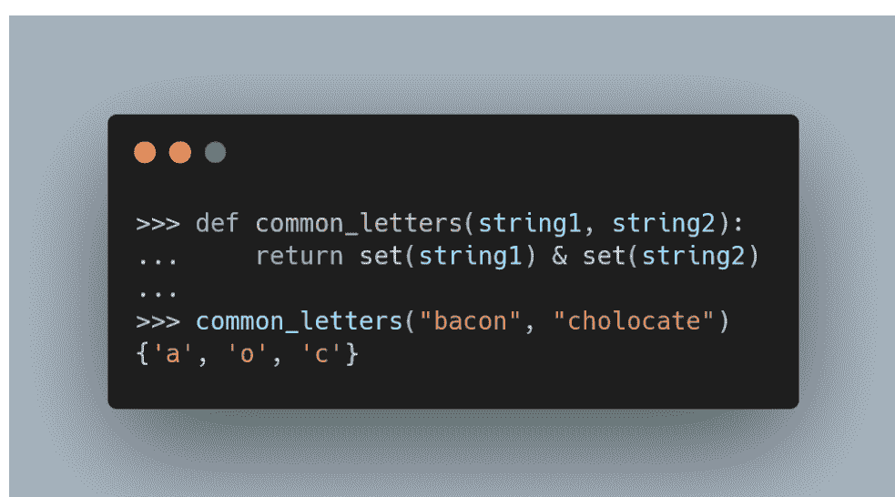

（原文缩略图，来自 https://mathspp.com/blog/pydonth/set-and-frozenset。）

## 简介

Python 包含一些内置类型，其中包括整数、列表、字符串等...
Python 还提供了两种内置类型来处理集合：`set` 和 `frozenset`。
在本次 Pydon't 中，你将：

- 理解 `set` 内置类型与数学概念“集合”之间的关系；
- 了解 `set` 和 `frozenset` 内置类型是什么；
- 查看 `set` 和 `frozenset` 之间的区别；
- 学习如何创建集合和冻结集合；
- 理解集合如何与其他内置类型（即列表）相适应；
- 在列表和元组之间，以及集合和冻结集合之间建立类比；
- 查看 Python 代码中 `set`（和 `frozenset`）的良好使用示例；

## （数学）集合

集合仅仅是一个无序的唯一元素的集合。每当我想到集合时，我就会想到购物车。

### 无序性

如果你去购物，并且带着一个购物车，那么你将物品放入购物车的顺序并不重要。*真正*重要的只有购物车里的物品。

如果你买了牛奶、巧克力和奶酪，这些物品的登记顺序并不重要。重要的是你买了牛奶、巧克力和奶酪。

从这个意义上说，你可以说你买的杂货形成了一个集合：包含牛奶、巧克力和奶酪的集合。在数学和 Python 中，我们都使用 `{}` 来表示一个集合，所以这就是你在 Python 中定义杂货集合的方式：

```
>>> groceries = {"milk", "cheese", "chocolate"}
>>> groceries
{'cheese', 'milk', 'chocolate'}
>>> type(groceries).__name__
'set'
```

我们可以通过检查 `groceries` 类型的 `__name__` 来确认我们确实创建了一个集合。

> 如果你不明白为什么我们输入 `type(groceries).__name__` 而不是直接输入 `type(groceries)`，那么我建议你浏览一下关于魔术属性 `__name__` 的 Pydon't。（顺便说一下，这里使用 `isinstance(groceries, set))` 也可以！）

为了确保顺序在集合中确实不重要，我们可以尝试将这个集合与包含相同元素但顺序不同的其他集合进行比较：

```
>>> groceries = {"milk", "cheese", "chocolate"}
>>> groceries == {"cheese", "milk", "chocolate"}
True
>>> groceries == {"chocolate", "milk", "cheese"}
True
```

### 唯一性

（数学）集合的另一个关键属性是没有重复元素。这就好比有人让你去买奶酪，当你回到家时，那个人从另一个房间喊道：

“你买奶酪了吗？”

## （通用）集合操作

集合定义了许多方法，正如文档所介绍的。

#### 创建

创建集合有三种主要方式。

### 显式 {} 表示法

使用 {} 表示法，你可以在花括号内以逗号分隔的列表形式写出集合的元素：

```
>>> {1, 2, 3}
{1, 2, 3}
>>> {"cheese", "ham"}
{'cheese', 'ham'}
>>> {"a", "b", "c"}
{'a', 'b', 'c'}
```

顺便提一下，你不能用 {} 来创建空集！单独的 {} 会创建一个空字典。要创建空集合，你需要使用下一种方法。

### 对可迭代对象调用 set

你可以对任何可迭代对象调用内置函数 `set`，将其元素转换为一个集合。显著的例子包括 `range` 对象、字符串和列表。

```
>>> set(range(3))
{0, 1, 2}
>>> set([73, "water", 42])
{73, 'water', 42}
```

请注意，对字符串调用 `set` 会生成一个包含字符串各字符的集合，而不是一个包含整个字符串的集合：

```
>>> {"mississippi"}
{'mississippi'}
```

```
>>> set("mississippi")
{'s', 'i', 'p', 'm'}
```

直接调用 `set()` 会生成一个空集合。

### 集合推导式

使用 {}，你也可以编写所谓的集合推导式。集合推导式与列表推导式*非常*相似，因此了解列表推导式对此很有帮助。

我将只展示几个简短的例子。

首先，一个使用过滤来包含部分元素的例子：

```
>>> veggies = ["broccoli", "carrot", "tomato", "pepper", "lettuce"]
>>> {veggie for veggie in veggies if "c" in veggie}
{'lettuce', 'carrot', 'broccoli'}
```

其次，一个包含两个嵌套 `for` 循环的集合推导式：

```
>>> veggies = ["broccoli", "carrot", "tomato", "pepper", "lettuce"]
>>> {char for veggie in veggies for char in veggie}
{'c', 'u', 't', 'o', 'p', 'b', 'l', 'i', 'a', 'e', 'm', 'r'}
```

> 我将撰写一篇关于 Python 支持的所有类型推导式的详尽 Pydon't 文章，因此请务必[订阅通讯](https://mathspp.com/newsletter)，以免错过即将发布的 Pydon't！

### 对单个集合的操作

许多常见操作是针对单个集合进行的，包括：

- 成员测试：
```
>>> "milk" in groceries
True
>>> "broccoli" in groceries
False
```
- 计算集合大小：
```
>>> len(groceries)
3
```
- 从集合中弹出一个随机元素：
```
>>> groceries.pop()
'cheese'
>>> groceries
{'milk', 'chocolate'}
```
- 向集合中添加一个元素：
```
>>> groceries.add("cheese")
>>> groceries
{'milk', 'cheese', 'chocolate'}
```

### 迭代

我经常将集合与列表（和元组）进行类比。集合类似于具有唯一元素的列表，但列表是有序的：列表可以从头到尾遍历，列表可以被索引。

虽然集合也可以被迭代（顺序不可靠）：

```
>>> for item in groceries:
...     print(item)
...
cheese
milk
chocolate
```

但集合不能直接被索引：

```
>>> groceries[0]
Traceback (most recent call last):
  File "<stdin>", line 1, in <module>
TypeError: 'set' object is not subscriptable
```

### 对多个集合的计算

当你有多个集合（两个或更多）时，你可能需要进行其他类型的操作。

让我们定义几个集合用于此处：

```
>>> groceries = {"milk", "cheese", "chocolate"}
>>> treats = {"chocolate", "popcorn", "cookie"}
```

以下是一些更常见的操作：

- 检查两个集合是否有交集：
```
>>> groceries & treats
{'chocolate'}
```
- 合并两个集合：
```
>>> groceries | treats
{'cheese', 'milk', 'popcorn', 'chocolate', 'cookie'}
```
> 注意，此处管道符 `|` 的用法类似于 Python 3.9+ 中使用 `|` 合并字典的用法。
- 求两个集合的差集（存在于左侧集合但不在右侧集合中的元素）：
```
>>> groceries - treats
{'cheese', 'milk'}
```
- 使用 `<`、`<=`、`>=` 和 `>` 检查包含关系：
```
>>> {"cheese", "milk"} < groceries
True
>>> groceries < groceries
False
>>> {"cheese", "milk"} <= groceries
True
>>> groceries <= groceries
True
>>> treats > {"chocolate"}
True
>>> treats >= {"chocolate", "cheese"}
False
```

请注意，大多数基于操作符的操作都有相应的方法调用。相应的方法调用可以接受任意迭代器，而基于操作符的版本则期望集合。

### 集合与冻结集合的区别

#### 创建

虽然你可以使用内置函数 `set` 或通过 {} 表示法创建集合，但冻结集合只能通过其各自的内置函数创建。

冻结集合可以从其他集合或任何可迭代对象创建，类似于集合。

打印时，冻结集合会显示它们是冻结状态的指示：

```
>>> groceries = {'cheese', 'milk', 'chocolate'}
>>> frozenset(groceries)
frozenset({'cheese', 'milk', 'chocolate'})
>>> frozenset(['cheese', 'milk', 'chocolate'])
frozenset({'cheese', 'milk', 'chocolate'})
```

#### 可变性

集合是可变的。集合被称为可变是因为它们可以改变，这就是英语中“可变”的意思。

正如我在上面向你展示的，集合的内容可以改变，例如通过调用 `.add` 和 `.pop` 方法。

但是，如果你需要创建一个行为像集合（即顺序无关紧要且保证唯一性）但又不希望被更改的对象，那么你需要创建一个冻结集合。

冻结集合的实例与集合非常相似，只是冻结集合是不可变的。换句话说，冻结集合是不可变的，它不能被修改，它是冻结的。

要创建冻结集合，你只需调用相应的类：

```
>>> groceries_ = frozenset(groceries)
>>> # 不能添加项目：
>>> groceries_.add("beans")
Traceback (most recent call last):
  File "<stdin>", line 1, in <module>
AttributeError: 'frozenset' object has no attribute 'add'
>>> # 不能弹出项目：
>>> groceries_.pop()
Traceback (most recent call last):
  File "<stdin>", line 1, in <module>
AttributeError: 'frozenset' object has no attribute 'pop'
```

有一对非常相似的内置类型具有这种二分性：列表和元组。列表是可变的（例如它们有 `.append` 和 `.pop` 方法），而元组是不可变的（它们没有 `.append` 或 `.pop` 方法，也不能直接赋值给索引）：

```
## 列表是可变的：
>>> l = [0, 1, 2]
>>> l[0] = 73
>>> l.pop()
2
>>> l.append(42)
>>> l
[73, 1, 42]
```

```
## 元组是不可变的：
>>> t = (0, 1, 2)
>>> t[0] = 73
Traceback (most recent call last):
  File "<stdin>", line 1, in <module>
>>> t.pop()
Traceback (most recent call last):
  File "<stdin>", line 1, in <module>
AttributeError: 'tuple' object has no attribute 'pop'
>>> t.append(42)
Traceback (most recent call last):
  File "<stdin>", line 1, in <module>
AttributeError: 'tuple' object has no attribute 'append'
```

#### （可哈希的）存在与否

可哈希的对象是可以计算哈希值的对象，因此是 hash-*able*（可哈希的）。

哈希是一个整数，由内置函数 `hash` 计算，用于帮助字典的快速操作，例如键查找。

内置函数 `hash` 知道如何处理某些类型的对象，而不能处理其他类型。内置函数 `hash` 决定了什么可以成为字典键：如果它是可哈希的，它就可以成为字典键；如果它不可哈希，它就不能成为字典键。

例如，列表是可变且不可哈希的，因此它们不能成为字典键。尝试使用列表作为字典键会引发错误：

```
>>> d = {}
>>> d[[1, 2, 3]] = 73
Traceback (most recent call last):
  File "<stdin>", line 1, in <module>
TypeError: unhashable type: 'list'
```

然而，元组——列表的兄弟——是不可变的，不可变对象通常可以是可哈希的。元组可以用作字典键：

```
>>> d = {}
>>> d[(1, 2, 3)] = 73
>>> d
{(1, 2, 3): 73}
```

类似地，因为集合是可变的，它们不可哈希。然而，冻结集合不是可变的，它们也是可哈希的！集合不能成为字典键，但冻结集合可以：

```
>>> d = {}
>>> d[groceries] = 73
Traceback (most recent call last):
  File "<stdin>", line 1, in <module>
TypeError: unhashable type: 'set'
>>> d[frozenset(groceries)] = 73
>>> d
{frozenset({'cheese', 'milk', 'chocolate'}): 73}
```

### 集合的用途是什么？

[直接引用文档](https://docs.python.org/3/library/stdtypes.html#set-types-set-frozenset)，

> “集合的常见用途包括快速成员测试、从序列中删除重复项，以及计算诸如交集、并集、差集和对称差集等数学运算。”

简而言之，当手头的问题受益于数学集合固有的特性（元素唯一性和无序性）以及我们从这些特性中继承的其他好处时，集合非常有用。

快速成员测试的例子很好。

在最近的一条推文中，我展示了在成员测试方面，10 个元素的集合已经优于 10 个元素的列表：

你知道 Python 🐍 的集合非常适合快速 🐇 成员测试吗？如果你仔细观察 👀，你会发现在集合中检查某物是否存在的速度比在列表中快得多，尤其是随着元素在列表中位置越来越靠后...下面的例子只有 10 个元素！pic.twitter.com/iJWwqeNIt0## 代码示例

接下来的示例是我尝试向你展示内置类型 `set` 和 `frozenset` 的良好用法。

### 使用 `set` 进行快速成员检查

`argparse` 模块是一个内置模块，允许你创建命令行接口。

其主要类 `ArgumentParser` 包含以下代码片段：

```python
# In Lib/argparse.py from Python 3.9.2
class ArgumentParser(_AttributeHolder, _ActionsContainer):
    # ...
    def _parse_known_args(self, arg_strings, namespace):
        # ...
        # map all mutually exclusive arguments to the other arguments
        # they can't occur with
        action_conflicts = {}
        # ...

        seen_actions = set()
        seen_non_default_actions = set()

        def take_action(action, argument_strings, option_string=None):
            seen_actions.add(action)
            argument_values = self._get_values(action, argument_strings)

            # error if this argument is not allowed with other previously
            # seen arguments, assuming that actions that use the default
            # value don't really count as "present"
            if argument_values is not action.default:
                seen_non_default_actions.add(action)
                for conflict_action in action_conflicts.get(action, []):
                    if conflict_action in seen_non_default_actions:
                        msg = _('not allowed with argument %s')
                        action_name = _get_action_name(conflict_action)
                        raise ArgumentError(action, msg % action_name)
```

简而言之：集合 `seen_actions` 和 `seen_non_default_actions` 正是被用于快速成员检查。

接下来是更详细的解释。

当你使用 `argparse` 创建命令行应用程序时，必须指定命令接受的选项。例如，`-v` 用于详细输出，或 `-h` 用于显示帮助信息。

有时，选项之间可能存在冲突。例如，如果你提供了 `-v` 用于详细输出，同时也提供了 `-q` 用于静默输出，那么同时指定两者就没有意义了。

`action_conflicts` 字典将记录哪些选项与哪些选项冲突。

之后，我们初始化两个空集合：`seen_actions` 和 `seen_non_default_actions`。现在，每当我们看到一个操作，就将其添加到包含所有已见操作的集合中。

然后，如果该操作确实是由用户指定的，我们就将其添加到未使用默认值的操作集合中。

最后，我们访问 `action_conflicts` 以获取与当前正在解析的操作不兼容的所有操作列表。如果任何冲突操作出现在我们之前已见的操作集合中，那么我们就抛出一个错误！

稍后，我们还可以找到以下代码：

```python
# In Lib/argparse.py from Python 3.9.2
class ArgumentParser(_AttributeHolder, _ActionsContainer):
    # ...
    def _parse_known_args(self, arg_strings, namespace):
        # ...
        
        seen_actions = set()
        seen_non_default_actions = set()
        
        def take_action(action, argument_strings, option_string=None):
            # ...
        
        # ...
        # make sure all required actions were present and also convert
        # action defaults which were not given as arguments
        required_actions = []
        for action in self._actions:
            if action not in seen_actions:
                if action.required:
                    required_actions.append(_get_action_name(action))
            # ...
        
        if required_actions:
            self.error(_('the following arguments are required: %s') %
                      ', '.join(required_actions))
```

我们再次使用集合 `seen_actions` 进行快速成员检查：我们遍历命令行接口知道的所有操作，并跟踪用户未指定/提及的所有必需操作。

之后，如果 `required_actions` 列表中存在任何操作，我们就通知用户他们忘记了一些事情。

## 无条件集合添加

关于前面的例子，还有一个巧妙的细节我想强调一下。
让我展示一下关键的代码片段：

```python
# In Lib/argparse.py from Python 3.9.2
class ArgumentParser(_AttributeHolder, _ActionsContainer):
    # ...
    def _parse_known_args(self, arg_strings, namespace):
        # ...
        def take_action(action, argument_strings, option_string=None):
            seen_actions.add(action)
            # ...
```

请关注最后一行代码：`seen_actions.add(action)`。
这乍一看可能不明显，但 `action` 可能已经存在于集合 `seen_actions` 中了。
为了说明这一点，修改 `take_action` 以包含一个打印语句：

```python
# In Lib/argparse.py from Python 3.9.2
class ArgumentParser(_AttributeHolder, _ActionsContainer):
    # ...
    def _parse_known_args(self, arg_strings, namespace):
        # ...
        def take_action(action, argument_strings, option_string=None):
            print(action)
            seen_actions.add(action)
            # ...
```

现在，将以下代码粘贴到一个名为 `foo.py` 的文件中：

```python
import argparse

parser = argparse.ArgumentParser()
parser.add_argument("-t", action="store_true")
args = parser.parse_args()
```

现在，在 `foo.py` 所在的目录中打开你的终端：

```
> python foo.py -ttt
_StoreTrueAction(option_strings=['-t'], dest='t', nargs=0, const=True, default=False, type=None, choices=None, metavar=None)
_StoreTrueAction(option_strings=['-t'], dest='t', nargs=0, const=True, default=False, type=None, choices=None, metavar=None)
_StoreTrueAction(option_strings=['-t'], dest='t', nargs=0, const=True, default=False, type=None, choices=None, metavar=None)
```

你会得到三行相同的输出，每行对应你在命令中输入的一个 `t`。

所以，我们看到出现了重复的操作……我们不应该在添加操作之前检查它是否已被添加吗？类似这样：

```python
# In Lib/argparse.py from Python 3.9.2
class ArgumentParser(_AttributeHolder, _ActionsContainer):
    # ...
    def _parse_known_args(self, arg_strings, namespace):
        # ...
        def take_action(action, argument_strings, option_string=None):
            if action not in seen_actions:
                seen_actions.add(action)
            # ...
```

**不！** 不要这样做！这是一种反模式，并且会重复不必要的工作！检查一个元素是否在集合中或无条件地添加它，工作量几乎相同，因此先检查它是否在，*然后*再添加它，会使你在所有新操作上的工作量加倍！

集合已经为你处理了唯一性，所以你不必担心强制执行它。从这个意义上说，这是集合的一个绝佳使用示例。

### 使用 `frozenset` 进行快速成员检查

在上面的例子中，我们看到我们使用的集合会随着程序的进行而增长。因此，我们需要可变性，所以使用了 `set`。

我将要展示的例子中，我们关心的集合是固定的，它总是包含相同的元素。因此，我们将使用 `frozenset` 而不是普通的 `set`。为什么？因为使用 `frozenset` 可以非常清楚地表明该集合是固定的。

```python
# In Lib/idlelib/hyperparser.py from Python 3.9.2

import string

## ...

# all ASCII chars that may be in an identifier
_ASCII_ID_CHARS = frozenset(string.ascii_letters + string.digits + "_")
# all ASCII chars that may be the first char of an identifier
_ASCII_ID_FIRST_CHARS = frozenset(string.ascii_letters + "_")

# lookup table for whether 7-bit ASCII chars are valid in a Python identifier
_IS_ASCII_ID_CHAR = [(chr(x) in _ASCII_ID_CHARS) for x in range(128)]
# lookup table for whether 7-bit ASCII chars are valid as the first
# char in a Python identifier
_IS_ASCII_ID_FIRST_CHAR = \
    [(chr(x) in _ASCII_ID_FIRST_CHARS) for x in range(128)]
```

诚然，上面的代码片段没有告诉你变量 `_IS_ASCII_ID_CHAR` 和 `_IS_ASCII_ID_FIRST_CHAR` 的用途，但很清楚这两个变量是通过一个进行成员检查的列表推导式构建的。

检查 `_ASCII_ID_CHARS` 和 `_ASCII_ID_FIRST_CHARS`。反过来，这两个变量都是字符的冻结集！

所以就是这样！又一个利用集合进行快速成员检查的例子。

## 结论

这是本篇 Pydon't 的核心要点，为你奉上：

> “当你处理数据集，并且重要的是（快速）成员检查时，请使用（冻结）集合。”

这篇 Pydon't 向你展示了：

- 集合是包含元素的（数学）对象；
- 元素是唯一的；且
- 它们的顺序无关紧要。
- 内置类型 `set` 为集合的数学概念提供了实现；
- `frozenset` 是集合的一个不可变且可哈希的版本；
- 元组之于列表，正如冻结集合之于集合；
- 你可以通过以下方式创建集合：
  - 用 `{}` 括住以逗号分隔的项目列表；
  - `set()` 和一个可迭代对象；以及
  - 集合推导式。
- 集合有允许修改它们的操作（如 `.add` 和 `.append`），以及其他许多操作；
- 你可以通过多种不同的方式组合集合，例如使用 `&` 和 `|` 等运算符；
- 你可以使用 `<`、`<=`、`>=`、`>` 来检查集合的包含关系；
- 如果你确定对象的集合不会改变，应该使用 `frozenset`；
- （冻结）集合通常用于快速成员检查；并且
- 无条件地向集合添加元素，比先检查成员再添加更快。

## 参考资料

- Python 3 文档，Python 标准库，内置类型，集合类型 — set，frozenset，https://docs.python.org/3/library/stdtypes.html#set-types-set-frozenset [最后访问 2021-09-14]；
- Python 3 文档，Python 标准库，内置函数，hash，https://docs.python.org/3/library/functions.html#hash [最后访问 2021-09-14]；
- Python 3 文档，Python 语言参考，特殊方法名称，object.__hash__，https://docs.python.org/3/reference/datamodel.html#object.__hash__ [最后访问 2021-09-14]；
- Python 3 文档，Python 标准库，argparse，https://docs.python.org/3/library/argparse.html [最后访问 2021-09-14]；

## 列表推导式入门

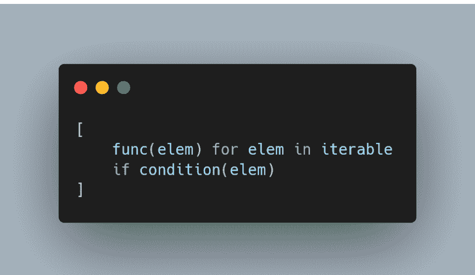

（原文文章缩略图位于 https://mathspp.com/blog/pydonts/list-comprehensions-101。）

这篇 Pydon't 将教你 Python 中列表推导式的基础知识。

## 引言

列表推导式，毫无疑问，是我最喜欢的 Python 特性之一。
它不是 **最** 喜欢的特性，但那是因为 Python 有很多我真正喜欢的东西！列表推导式就是其中之一。

本文（一个短系列中的第一篇）将涵盖列表推导式的基础知识。
这篇 Pydon't 将教你以下内容：

- 列表推导式的结构（哪些部分构成了一个列表推导式）；
- 如何创建列表推导式；
- 某些 `for` 循环与列表推导式之间的平行关系；
- 如果你有很强的数学背景，如何理解列表推导式；
- 列表推导式的四个主要优点；
- 列表推导式的主要用例；
- 列表推导式的良好用例；以及
- 列表推导式的不佳用例。

我还将这篇文章的内容总结成一份速查表，你可以免费 [从这里](https://mathspp.com/blog/pydonts/list-comprehensions) 获取。

## 什么是列表推导式？

列表推导式是一个构建列表的 Python 表达式。仅此而已。
换句话说，列表推导式之所以很棒，是因为它们提供了一种非常方便的 *创建列表* 的语法。
如果你来自函数式编程语言，有很强的数学背景，或者只是对数学符号很熟悉，你可能更容易[从基本原理学习列表推导式](https://mathspp.com/blog/pydonts/list-comprehensions-from-first-principles)。对于已经了解 Python 的人来说，将列表推导式与 `for` 循环比较是最好的理解方式，所以让我为你展示一下。

## 一个构建列表的循环

考虑下面的循环。它构建了一个名为 `squares` 的列表，其中包含前十个平方数：

```
squares = []
for num in range(10):
    squares.append(num ** 2)
```

这个循环展示了一个非常常见的模式：给定一个可迭代对象（在这个例子中是 `range(10)`），逐个处理其每个元素，并将结果追加到一个新列表中（在这个例子中是 `squares`）。
列表推导式背后的关键思想是，许多列表可以通过 *转换* 从这些可迭代对象（列表、元组、字符串、range 等）获得的数据，由其他更简单的可迭代对象构建出来。在这些情况下，我们希望关注正在做的 *数据转换*。
所以，在上面的循环例子中，等效的列表推导式看起来像这样：

```
squares = [num ** 2 for num in range(10)]
```

通过比较两者，我们可以看到，列表推导式提取了循环中最重要的部分，然后去掉了多余的：

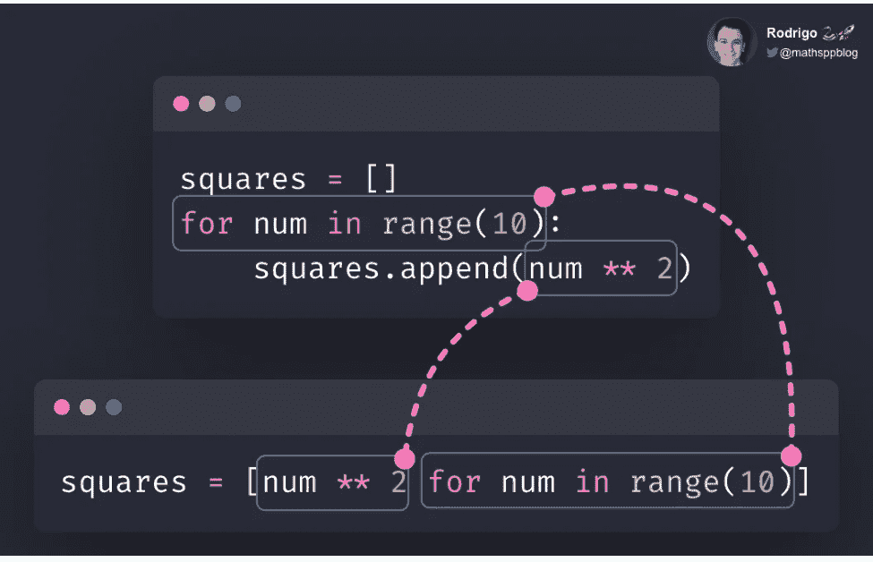

简而言之，列表推导式版本省略了：

- 列表的初始化（`squares = []`）；以及
- 对 `append` 的调用（`squares.append(...)`）。

我希望你理解，列表推导式就像循环一样，只是内容被重新排序，把 `append` 里的东西移到了开头。

（你可以观看一个简短的动画[这里](https://mathspp.com/blog)，展示这个过程在一般情况下是如何工作的。）

## 练习：将 `for` 循环改写为列表推导式

熟能生巧，所以我有几个循环供你练习。请继续，将下面的循环转换为列表推导式。

我们从一个简单的开始。你能重做我之前展示的例子吗？

1.  计算前十个平方数：

```
squares = []
for n in range(10):
    squares.append(num ** 2)
```

2.  将一系列单词大写：

```
fruits = "banana pear peach strawberry tomato".split()
upper_words = []
for fruit in fruits:
    upper_words.append(fruit.upper())
```

3.  查找句子中每个单词的长度：

```
words = "the quick brown fox jumps over the lazy dog".split()
lengths = []
for word in words:
    lengths.append(len(word))
```

如果你想获得关于列表推导式及其所有相关概念的 250 多道练习题，请查看我的书《Comprehending Comprehensions》。

## 在列表推导式中过滤数据

到目前为止我们介绍的列表推导式让你通过转换来自源可迭代对象的数据来构建新列表。然而，列表推导式还允许你过滤数据，以便新列表只转换来自源可迭代对象的 *部分* 数据。

例如，让我们修改之前构建平方数列表的循环。这次，我们将只对能被 3 或 5 整除的数字进行平方。有点像 “Fizz-Buzz” 问题的一个变体。

```
fizz_buzz_squares = []
for num in range(10):
    if (num % 3 == 0) or (num % 5 == 0):
        fizz_buzz_squares.append(num ** 2)
```

（出于教学目的，我们忽略了本可以直接使用 `range(1, 10, 2)` 的事实。）

再次，这是一个常见的模式，可以很容易地转换为列表推导式。因为数据过滤器是可选的（我们之前构建的列表推导式就没有它），所以它放在列表推导式的 *末尾*：

```
fizz_buzz_squares = [
    num ** 2                  # 数据转换
    for num in range(10)      # 数据源
    if (num % 3 == 0) or (num % 5 == 0)  # 数据过滤器
]
```

注意列表推导式三个组成部分的顺序：

1.  数据转换（`num ** 2`）；
2.  数据源（`for num in range(10)`）；以及
3.  数据过滤（`if (num % 3 == 0) or (num % 5 == 0)`）。

如你所见，列表推导式可以写在多行以提高可读性。如果我没有将列表推导式拆分成多行，它最终会太长，损害可读性。

在将列表推导式拆分成多行时，我个人喜欢将三个组成部分放在 *单独的* 行上。（这可能与代码格式化工具（如 black）也这样做有关！）我再说一遍以确保你明白：列表推导式跨多行书写是可以的。它们 *不* 必须写在一行。

特别是，如果你正在编写你的第一个列表推导式，多行表示使列表推导式看起来更像带有条件表达式的显式 `for` 循环。这应该使列表推导式更易于阅读。下面的图表展示了这种关系：

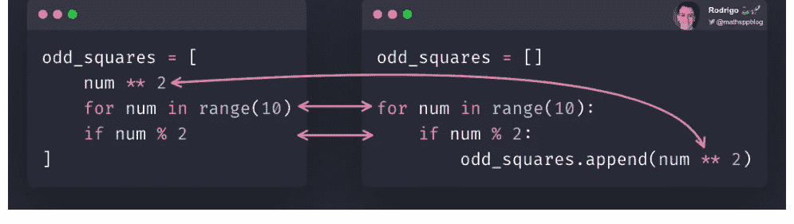

（如果你愿意，可以观看一个简短的动画，展示如何将带有条件语句的 Python `for` 循环转换为列表推导式，[这里](https://twitter.com/mathppblog)。）

## 更多练习

请继续，将下面的循环转换为列表推导式进行练习。

1.  求平方：

```python
fizz_buzz_squares = []
for n in range(10):
    if (num % 3 == 0) or (num % 5 == 0):
        fizz_buzz_squares.append(n ** 2)
```

2.  单词大写：

```python
fruits = "Banana pear PEACH strawberry tomato".split()
upper_cased = []
for word in words:
    if word.islower():
        upper_cased.append(word.upper())
```

3.  查找单词长度：

```python
words = "the quick brown fox jumps over the lazy dog".split()
lengths = []
for word in words:
    if "o" in word:
        lengths.append(len(word))
```

如果你想获得超过250道关于列表推导式及相关概念的练习题，请查看我的书《理解推导式》。

## 从第一性原理理解列表推导式

在本节中，我将列表推导式作为一种具有独立价值的结构来介绍，而不是将其视为常见for循环模式的衍生品。为了“从第一性原理”介绍列表推导式，我将借鉴标准数学符号进行类比。我发现列表推导式与数学之间的这种联系非常有启发性，但我也能理解并非所有人都对此感兴趣。如果是这样，你可以直接跳到后面阅读关于列表推导式完整结构的部分。

列表推导式的核心思想是提供一种语法结构，让你能够构建列表，类似于字面量列表表示法。然而，在编写列表字面量时，你需要写下列表中想要的每一个元素：

```
squares = [0, 1, 4, 9, 16, 25, 36, 49, 64, 81]
```

在上面的例子中，你不得不显式地写下十个元素。这有点烦人，但尚可处理。如果你想要的`squares`列表包含500个平方数，而不是十个呢？在这种情况下，手动写出每个平方数是不可行的。相反，我们使用列表推导式来描述我们希望在列表`squares`中包含哪些元素。

列表推导式类似于数学中的集合表示法，是一种通过全面描述列表中所需元素来定义列表的方式，而无需写下所有元素。例如，我们可以使用数学符号来定义类似于上面`squares`列表的内容：

```
{n² | n = 0, ..., 9}
```

`n²`是我们想要的内容的描述：平方数。`n = 0, ..., 9`通过说明`n`的取值来源来补充描述。两者结合，为我们提供了足够的信息来确定我们正在构建的对象的内容。

我可以修改第二部分，这样我就有500个平方数了：

```
{n² | n = 0, ..., 499}
```

我也可以修改第一部分，这样我就有500个立方数了：

```
{n³ | n = 0, ..., 499}
```

这种表示法为在数学中定义任意大的集合提供了一种捷径。在Python中，我们可以做类似的事情。对我们想要的内容的描述可以是任何Python表达式（例如，函数调用、方法调用或数学计算）。然后，Python中等价于数学部分`n = 0, ..., 499`的是一个for循环，它指定了一个可迭代对象，我们从中获取值。

```
squares = [n ** 2 for n in range(10)]
# ~~~~~~ ~~~~~~~~~~~~~~~~~~~~~~~~~~~~ 这指定了我们从哪里获取数据。
# ~~~~~~ 这描述了我们想要什么（平方数）。
```

除了指定数据来源，我们还可以对使用的数据施加进一步的限制——或过滤器。例如，我们可以扩展我们的例子来计算更多的平方数，但仅当*n*能被3或5整除时：

$$\{n^2| n = 0, \dots, 999, 3|n \lor 5|n\}$$

（数学中的$3|n$类似于Python中的`n % 3 == 0`。）以下是列表推导式的写法，我们使用`if`语句进行数据过滤：

```
squares = [n ** 2 for n in range(1000) if (n % 3 == 0) or (n % 5 == 0)]
```

为了可读性，你可能更喜欢将列表推导式的各个部分拆分到多行：

```
squares = [
    n ** 2
    for n in range(100)
    if (n % 3 == 0) or (n % 5 == 0)
]
```

当你的列表推导式变得很长时，这很有用。事实上，这非常有用，以至于许多代码检查工具会自动为你完成这个操作。

## 列表推导式的完整结构

正如你所看到的，列表推导式的结构由方括号`[]`内的三个部分决定：

1.  数据转换；
2.  数据源；以及
3.  数据过滤器（可选）。

这总结在下图中：

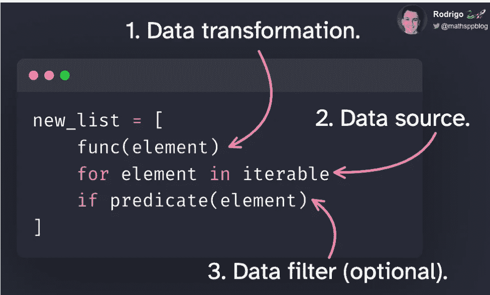

请注意，Python对列表推导式中的数据源或数据过滤器的数量没有施加任何限制，就像你可以任意嵌套for循环和if语句一样。例如，下面的嵌套结构包含12条语句，可以转换为列表推导式：

```
my_list = []
for it2 in it1:
  for _ in it3:
    if p1(it2):
      for it4 in it2:
        for v1 in it4:
          if p2(v1):
            if p3(it4):
              for it6 in it5:
                for v2, it7 in it6:
                  for v3, it8, it9 in it7:
                    if p2(v1):
                      for v4, v5 in zip(it8, it9):
                        my_list.append(func(v1, v2, v3, v4, v5))
```

事实上，将上面的嵌套结构转换为列表推导式，其难度与转换一个包含单个循环和单个条件的结构是一样的。这是因为转换的机制始终是相同的：

1.  `append`调用内部的内容移动到列表推导式的开头；以及
2.  其他所有内容保持原位不变。

自己试试看。将上面的代码转换为列表推导式。你应该会得到这个列表推导式：

```
my_list = [
    func(v1, v2, v3, v4, v5)
    for it2 in it1
    for _ in it3
    if p1(it2)
    for it4 in it2
    for v1 in it4
    if p2(v1)
    if p3(it4)
    for it6 in it5
    for v2, it7 in it6
    for v3, it8, it9 in it7
    if p2(v1)
    for v4, v5 in zip(it8, it9)
]
```

将两者并排比较，突显了嵌套语句的顺序被保留的事实：

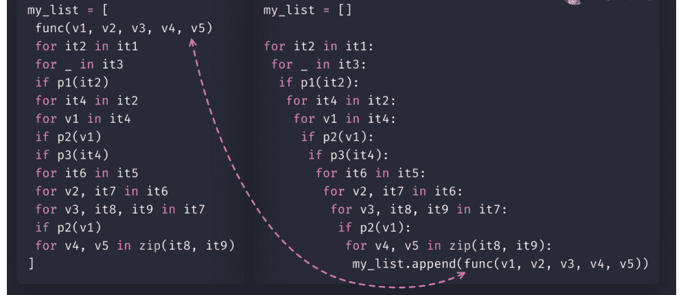

然而，请记住，仅仅因为它是*可能的*，并不意味着你*应该*这样做。列表推导式应该保持简单，并且数据源和数据过滤器的数量相对较少。对大多数人来说，就是一个数据源和一个数据过滤器（一个for和一个if），或者两个数据源且没有数据过滤器（两个for和零个if）。

## 列表推导式的优势

使用列表推导式相对于等效嵌套结构的主要优势在于：

-   速度；
-   简洁性；
-   纯粹性；以及
-   可读性。

让我们简要探讨上述所有优势，但请记住，**列表推导式的主要优势在于其可读性。**

### 速度

在处理非平凡情况时，列表推导式比等效的循环更快，这是由于CPython的内部机制。当我们有一个循环时，Python需要在C和Python本身之间来回切换以执行循环和计算要附加到新列表的元素。列表推导式的实现方式使得我们不需要这样做，由于来回切换更少，列表推导式比等效的循环结构稍快一些。

### 简洁性

上面的动画已经表明，从字面上看，你必须从循环中删除代码才能将其转换为列表推导式。因此，列表推导式客观上比等效的循环更短。

请注意，没有要求列表推导式*必须写在一行内*。这与一些人的信念相悖，他们会自豪地展示他们冗长的单行列表推导式。如果你遇到这样的人，你的任务就是教导他们列表推导式*可以*跨多行书写，而这通常能在*不增加成本*的情况下提高其可读性。

### 纯粹性

这里的“纯粹性”是指函数式编程意义上的纯粹性，或数学意义上的纯粹性。当一个*for*循环运行时，它有一个副作用：它会创建（或修改）用于循环的辅助变量。在下面的例子中，即使在循环结束后，我们仍然可以访问变量`num`：

```
squares = []
for num in range(10):
    squares.append(num ** 2)

print(num)  # 9，循环的最后一个值。
```

在列表推导式中则不是这样，因为列表推导式内部循环中使用的变量在列表推导式外部不可用。下面的例子表明，在列表推导式外部尝试访问`num`会导致*NameError*，因为变量`num`未定义：

```
squares = [num ** 2 for num in range(10)]

print(num)  # NameError，变量`num`不存在。
```

因为列表推导式的构建本质上不产生副作用，因此有一种约定：不应在列表推导式内部使用会产生副作用的代码。列表推导式应仅用于通过转换其他可迭代对象的数据来创建新列表。

### 可读性

尽管可读性是一个主观问题，但关于列表推导式的可读性，有一些客观之处可以说明。顾名思义，列表推导式在最开头就展示了它们所采用的数据转换。这使得阅读你代码的人更容易理解哪些数据进入了你正在创建的列表。

如果我们考虑到代码通常是在上下文中阅读的，这一点尤为重要。你的列表推导式/循环可能位于函数内部、方法内部，或是一个脚本的中间位置，带有更多的上下文。

例如，考虑这段不完整的代码：

```
with open("my_file.txt", "r") as my_file:
    lines = [...
```

上下文管理器（`with open(...)` 那行并打开文件的部分）提供了与变量 `lines` 非常相关的信息，这个变量将是一个列表。当你读到上下文管理器并看到有一个名为 `lines` 的变量时，你可以肯定地猜到代码将遍历 `my_file` 的各行。**周围的代码已经告诉你数据源是什么了。** 你所不知道的是，每一行将被*如何*处理！

记住，在列表推导式中，数据转换是你*首先*阅读到的部分：

```
with open("my_file.txt", "r") as my_file:
    lines = [line.strip() ...
```

在读完这部分代码后，你几乎可以猜到接下来是什么，那就是 `for line in my_file`。

正如我们所见，列表推导式重新排列了内容，使得最重要的部分排在最前面。就是这样。这一点，加上列表推导式比等效的循环代码更少这一事实，是许多人觉得列表推导式可读性高的原因。

## 代码示例

列表推导式*不是*可以直接替代每一个循环的方案。当你从现有的可迭代对象构建列表时，列表推导式很有用。

下面我提供了一些例子，展示了实际代码中好的和坏的列表推导式用例。如果你想要更多示例和超过250道练习题，请查看我的书《[理解推导式](https://mathspp.com/book/comprehending-comprehensions)》！

### 良好的用例

#### 简单的列表推导式

```python
# Lib/email/quoprimime.py in Python 3.11
['=%02X' % c for c in range(256)]
```

这个列表推导式取自标准库，它的好程度无可挑剔。这是一个教科书式的优秀列表推导式范例：
- 它很简洁；
- 它对一系列值应用了某种字符串格式化；并且
- 我们直接从简单的可迭代对象 `range(256)` 获取值。

你可能需要也可能不需要一秒钟来处理字符串格式化 `'=%02X' % c`（它使用的是古老的格式化语法），但无论我们使用的是列表推导式还是循环，你都需要那一秒钟。还不如一开始就看到它，这样你可以把脑力花在真正重要的事情上（理解格式化）。

#### 将列表的列表展平

使用带有两个循环的列表推导式是完全可接受的，一个很好的例子是：

```python
# Lib/asyncio/base_events.py in Python 3.11
[exc for sub in exceptions for exc in sub]
```

这个列表推导式的作用是将一个列表的列表展平。就是这样。这是一个非常常见的模式！只需记住，标准库中还有另一个工具可以做类似的事情，并且根据你的用例，它可能更好：`itertools.chain`。

#### 用一个可迭代对象过滤另一个

```python
# Lib/_pydecimal.py in Python 3.11
[sig for sig, v in self.flags.items() if v]
```

这个列表推导式展示了另一个相当常见的模式，其中我们根据第二个可迭代对象的值来过滤第一个可迭代对象的元素。在这个例子中，我们实际上是从一个字典获取键和值，但这也通常通过将两个可迭代对象与内置的 `zip` 结合在一起来完成。

#### 初始化数据

```python
from random import randint
colour = [randint(0, 255) for _ in range(3)]
```

这里的关键是循环中的 `_`，这是一个惯用法，表示我们不关心当前迭代的值，因为我们正在重复做同一件事。

#### 一个简单的循环和简单的过滤

这个例子有更多上下文，它来自我在Twitter上的一次互动。在浏览Twitter时，我看到有人写了一个小Python脚本，与Amazon Web Services交互以获取不同服务的IP前缀。（不管那意味着什么。）

在某个地方，他们有一个简单的 `for` 循环，遍历一堆前缀并将其存储在列表中，前提是该前缀与特定的Amazon服务有关。

这个人自称是Python初学者，所以我认为这是一个很好的机会来展示列表推导式如何有用。

相关原始代码摘录如下：

```python
def get_service_prefixes(amazon_service):
    aws_prefixes = get_aws_prefixes()
    count = 0
    service_prefixes = []
    for prefix in aws_prefixes["prefixes"]:
        if amazon_service in prefix["service"]:
            count += 1
            service_prefixes.append(prefix["ip_prefix"])

    # ...
```

查看上面的代码，我们可以看到列表 `service_prefixes` 是在 `for` 循环中被创建然后被追加的；而且，那是该 `for` 循环的*唯一*目的。这种通用模式表明列表推导式可能有用！

因此，我们可以用列表推导式替换该循环。变量 `count` 是多余的，因为它跟踪的是结果列表的长度，而我们用 `len` 函数可以轻松得知。这是我的建议：

```python
def get_service_prefixes(amazon_service):
    service_prefixes = [
        prefix for prefix in get_aws_prefixes()
        if amazon_service in prefix["service"]
    ]
    count = len(service_prefixes)

    # ...
```

现在，如果你留心了，你会注意到我上面的代码打破了我个人的偏好！上面的列表推导式被分成了两行，而不是三行。这是因为我的个人偏好和知识是随着时间的推移而演变的！

### 不良用例

让我也向你展示一些糟糕的列表推导式例子，因为列表推导式并不是可以替代你所有循环的东西。

#### 初始化另一个列表

这是我经常看到初学者做的，所以我认为现在就把它解决掉：

```python
squares = []
[squares.append(num ** 2) for num in range(10)]
```

上面发生了什么？我们创建了一个空列表 `squares`，然后在*另一个*列表内部向它追加……这完全不是列表推导式的初衷！

这里的问题是，我们的列表推导式有副作用（它改变了*另一个*列表的内容），而列表推导式不应该有副作用。

另一个表明这个列表推导式有缺陷的迹象——这也是你可以自己使用的一个指标——是代码的最终结果*不*依赖于我们是否将列表推导式赋值给了另一个变量。事实上，上面的代码片段中有一个列表推导式*没有*被赋值给变量，这意味着我们正在创建一个列表（这是列表推导式所做的），而我们浪费了它。

如果我们给上面的列表推导式赋值，结果会是这样：

```python
squares = []
some_list = [squares.append(num ** 2) for num in range(10)]
print(some_list)  # [None, None, None, None, None, None, None, None, None, None]
```

我们在 `some_list` 中得到一堆 `None` 值的原因是，那是 `append` 方法的返回值。

#### 副作用

上面的例子是我将要展示的坏例子的一个非常具体的版本，即列表推导式有副作用。在下面的例子中，它是调用 `print` 函数：

```python
[print(value) for value in iterable]
```

再次，你怎么知道这是一个糟糕的列表推导式？因为即使你没有将它赋值给变量，它也会做事！这正是老式 `for` 循环的用途：

```python
for value in iterable:
    print(value)
```

列表推导式不能替代每一个 `for` 循环！它们只是作为一种构建列表的工具。

#### 替换内置函数

列表推导式的另一个不良用例是，当我们试图替换某个内置函数时。一个常见的例子是：

```python
lst = [value for value in iterable]
```

这看起来像一个完美的列表推导式：简短而简洁！然而，上面的代码等同于

```
lst = list(iterable)
```

你可能最终还会重新发明的另一个内置函数是 `reversed`。

关于内置函数 `map` 和 `filter` 也有许多可说之处，但我会留到后续关于列表推导式更高级部分的文章中讨论。

## 结论

这就是本次 Pydon't 的主要要点，呈现在您面前：

> 列表推导式是 Python 的一项强大功能，它让您能够以简短且可读的方式构建列表。

本次 Pydon't 向您展示了：

- 一个列表推导式包含 4 个部分，其中一个是可选的；
- 列表推导式可以转换从另一个可迭代对象中提取的数据；
- 列表推导式可以过滤它们所转换的数据；
- 每个列表推导式等同于一个 `for` 循环，该循环在一个初始化为空的列表上依次调用 `.append`；
- 列表推导式可以嵌套任意多个 `for` 循环；
- 列表推导式可以嵌套任意多个 `if` 语句；
- 列表推导式通常比其对应的循环更快、更短、更纯粹且更具可读性；以及
- 仅用于向 `list` 追加内容的简单循环通常可以被列表推导式替换。

本次 Pydon't 也总结在一张免费的备忘录中，而以上内容仅为我的书《理解推导式》中所涵盖内容的一小部分，该书涵盖了高级列表推导式、集合与字典推导式、生成器表达式，并包含超过 250 道习题及解答。

## 参考文献

-   Python 3 文档，Python 教程，数据结构，列表更多内容，列表推导式 https://docs.python.org/3/tutorial/datastructures.html#list-comprehensions [最后访问于 2021-09-24]；
-   Python 3 文档，Python 标准库，内置函数，`filter`，https://docs.python.org/3/library/functions.html#filter [最后访问于 2021-09-22]；
-   Python 3 文档，Python 标准库，内置函数，`map`，https://docs.python.org/3/library/functions.html#map [最后访问于 2021-09-22]；

## 序列索引

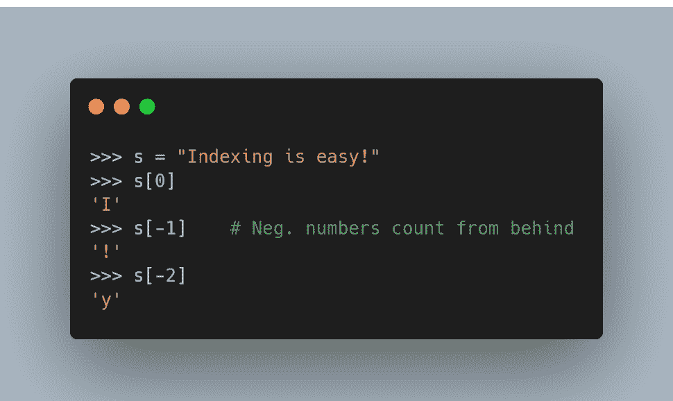

（原文文章缩略图，位于 https://mathspp.com/blog/pydonts/sequence-indexing。）

## 引言

Python 中的序列，如字符串、列表和元组，是支持索引的对象：这是一种相对简单的操作，可用于访问特定元素。这篇简短的文章将涵盖序列索引工作的基础知识，然后为您提供一些关于在 Python 代码中使用索引时应避免的反模式的提示。

在本文中，您将：

- 学习索引序列的基本语法；
- 了解负索引是如何工作的；
- 查看一些常用于处理序列和索引的工具；
- 学习一些关于索引的技巧和注意事项；

## 序列索引

首先，我在这里谈论序列索引是为了区分您访问字典值时所做的索引类型，那种情况您使用键来索引字典并检索其值。在本文中，我们将讨论使用整数来索引线性序列，即我们可以按顺序从一端遍历到另一端的序列。

一个非常简单的序列示例是字符串：

```
>>> s = "Indexing is easy!"
>>> s
'Indexing is easy!'
```

要索引此字符串的特定字符，我只需使用方括号和与我想要的字符对应的整数即可。Python 是 0-索引的，这意味着它从 0 开始计数索引。因此，序列的第一个元素可以通过 [0] 获得。在我们的例子中，这应该得到一个大写的 "I"：

```
>>> s = "Indexing is easy!"
>>> s[0]
'I'
```

然后，每个后续字符通过将索引增加 1 来获取：

```
>>> s = "Indexing is easy!"
>>> s[1]
'n'
>>> s[2]
'd'
>>> s[3]
'e'
```

下面是一幅图，展示了如何查看序列并弄清楚哪个索引对应于每个元素：


想象一下分隔连续元素的竖线，然后从最左边的竖线开始为每条竖线编号。每个元素获得与其左侧紧邻的竖线相关联的索引：

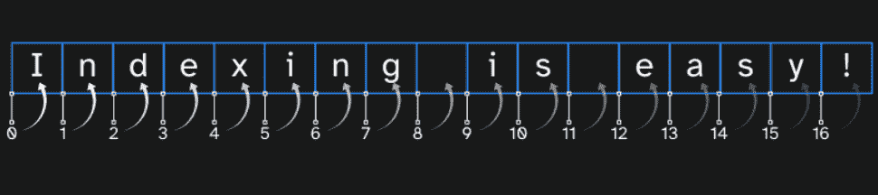

## 最大合法索引和索引错误

因为索引从 0 开始，所以序列的最后一个合法索引等于其长度*减去*一：

```
>>> s = "Indexing is easy!"
>>> len(s)
17
>>> s[16]
'!'
>>> s[17]
Traceback (most recent call last):
  File "<stdin>", line 1, in <module>
IndexError: string index out of range
```

如上所示，如果您使用的索引太大（即大于或等于序列的长度），Python 将引发 `IndexError`，警告您使用了对于该特定索引操作而言过大的整数。

## 负索引

如果最后一个合法索引是序列长度减 1，那么有一种明显的方法可以访问序列的最后一项：

```
>>> s = "Indexing is easy!"
>>> s[len(s)-1]
'!'
>>> l = [12, 45, 11, 89, 0, 99]
>>> l[len(l)-1]
99
```

然而，Python 提供了一个非常有趣的功能，您可以使用负索引从序列的末尾开始计数。为了弄清楚哪个负索引对应于哪个元素，请考虑将序列写在其自身左侧：

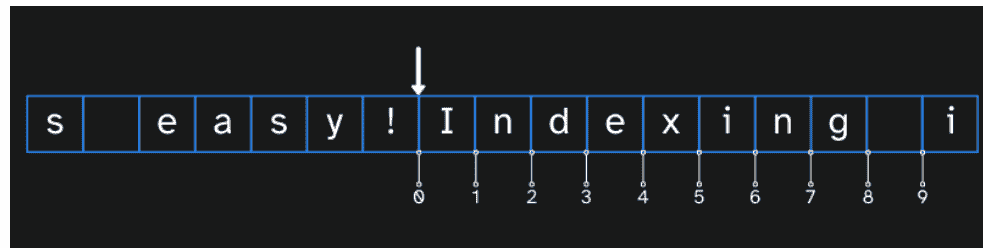

然后您只需从右向左继续编号，从而使用负数：

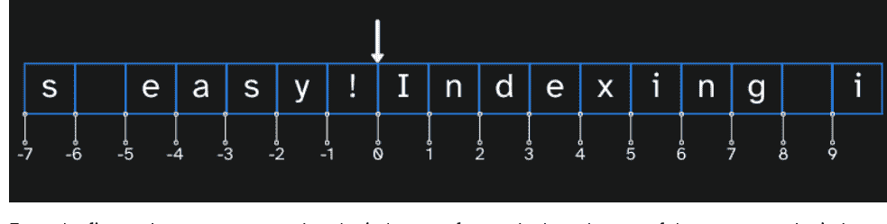

从上图可以看出，索引 -1 指向序列的最后一个元素，索引 -2 指向倒数第二个，以此类推：

```
>>> s = "Indexing is easy!"
>>> s[-1]
'!'
>>> s[-2]
'y'
```

我们也可以看看对我们特定序列有效的所有负索引：

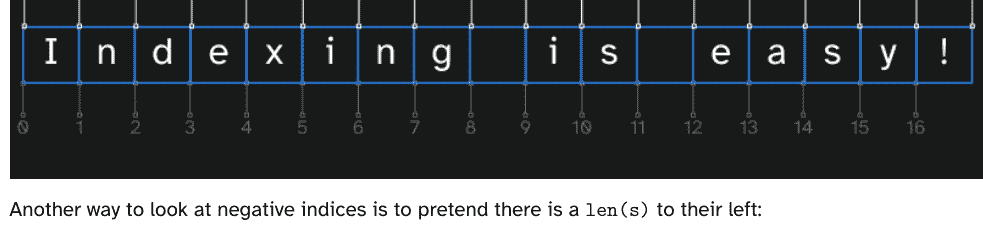

另一种理解负索引的方法是假设它们的左边有一个 `len(s)`：

| 负索引 | 对应的正索引 |
| --- | --- |
| -1 | len(s) - 1 |
| -2 | len(s) - 2 |
| -3 | len(s) - 3 |
| ... | ... |
| -len(s) | len(s) - len(s)（等同于 0） |

以及几个例子：

```
>>> s = "Indexing is easy!"
>>> s[-5]
'e'
>>> s[len(s)-5]
'e'
>>> s[-13]
'x'
>>> s[len(s)-13]
'x'
>>> len(s)
17
>>> s[-17]
'I'
>>> s[len(s)-17]
'I'
```

## 索引惯用法

了解了索引的基本语法后，有几个索引如果你能直接读懂其含义而无需思考，会很有帮助：

| 索引操作 | 解释 |
| --- | --- |
| s[0] | s 的第一个元素 |
| s[1] | s 的第二个元素 |
| s[-1] | s 的最后一个元素 |
| s[-2] | s 的倒数第二个元素 |

## 索引还是不索引？

快速提一点我时不时会绊倒的事情。

Python 有许多有用的内置函数和内置数据类型。其中，字符串、列表和元组可以用整数进行索引。集合则不能。

## 代码中的最佳实践

### 使用 range 的循环模式

由于 `range` 和索引的工作方式，可以理解 `range(len(s))` 将生成 `s` 的所有合法索引：

```
>>> s = "Indexing is easy!"
>>> list(range(len(s)))     # 使用 list() 来打印值
[0, 1, 2, 3, 4, 5, 6, 7, 8, 9, 10, 11, 12, 13, 14, 15, 16]
>>> s[0]
'I'
>>> s[16]
'!'
```

这导致初学者，以及更分心或习惯其他编程语言的人，最终在 `for` 循环中使用一种非常常见的反模式。

举个例子，假设我们想编写一个相当简单的程序来找出字符串中的唯一字母。反模式看起来会是这样：

```
>>> s = "Indexing is easy!"
>>> uniques = []
>>> for idx in range(len(s)):
...     if s[idx] not in uniques:
...         uniques.append(s[idx])
...
>>> uniques
['I', 'n', 'd', 'e', 'x', 'i', 'n', 'g', ' ', 'i', 's', ' ', 'e', 'a', 's', 'y', '!']
```> 这是解决“查找唯一字符”问题的一个朴素方案，你可能更想使用 Python 集合来实现更高效的版本 :)

这里的问题在于 `for` 循环的实现方式有些绕弯：我们本可以直接*遍历*一个序列（字符串），却先去获取其长度，以便用 `range` 计算出合法索引，再*遍历*这些索引，最后通过索引来访问序列元素。

这种编写 `for` 循环的方式类似于其他编程语言中遍历数组元素的写法。

然而，我们使用的是 Python，而非其他语言。Python `for` 循环最令我欣赏的特点之一，就是你可以直接访问序列的连续元素。因此，我们实际上可以稍微重写 `for` 循环，使其变得更加优雅：

```
>>> s = "Indexing is easy!"
>>> uniques = []
>>> for letter in s:
...     if letter not in uniques:
...         uniques.append(letter)
...
>>> uniques
['I', 'n', 'd', 'e', 'x', 'i', 'n', 'g', ' ', 'i', 's', ' ', 'e', 'a', 's', 'y', '!']
```

我特别喜欢这类循环的原因在于，如果变量命名得当，语句就能非常清晰地表达你的意图。`for letter in s:` 这行代码读起来就是：

> “对于（字符串）s 中的每个字母……”

这种 `for` 循环直接遍历你关心的值，这通常正是你想要的。如果你关心的是索引，那就请便，使用 `range(len(s))` 吧！

> 另一个需要警惕的反模式出现在你需要同时处理索引*和*值的情况下。这时，你可能想使用 `enumerate` 函数。我在专门的 Pydon’t 文章中详细介绍了这个函数，如果你还没看过，可以去了解一下。

## 大型表达式作为索引

当你处理序列及其索引时，可能需要进行一些计算来得到你感兴趣的新索引。例如，假设你想获取字符串的中间元素，但还不知道 `//` 运算符：

```
>>> s = "Indexing is easy!"
>>> s[len(s)/2]    # len(s)/2 不是整数！！
Traceback (most recent call last):
  File "<stdin>", line 1, in <module>
TypeError: string indices must be integers
>>> len(s)/2
8.5
>>> import math
>>> s[math.floor(len(s)/2)]
>>> s[len(s)//2]  # 专业提示：这里使用 // 运算符是理想的选择
```

我为什么要提这个呢？

看看你刚刚使用的表达式：

```
s[math.floor(len(s)/2)]
```

也许是我年纪大了，读起来有点费劲，因为外层的 `[]` 包裹着表达式，里面还有几个 `()` 需要解析，才能弄清楚各部分的位置。

如果你有大型表达式来计算索引（这里的“大型”是主观的），直接将它们放在 `[]` 中可能会导致代码行过长，从而难以阅读和理解。如果代码行难以理解，你可能就需要添加注释，这又会增加更多代码行。

另一种选择是创建一个命名良好的变量来保存新索引的计算结果：

```
>>> s = "Indexing is easy!"
>>> mid_char_idx = math.floor(len(s)/2)
>>> s[mid_char_idx]
```

对于这个简单的例子，注意新变量名几乎和表达式本身一样长！然而，`s[mid_char_idx]` 非常、非常容易阅读，不需要任何额外的注释。

所以，如果你有大型表达式来计算索引，在直接用它们索引当前序列之前，请三思，并考虑使用一个具有描述性名称的中间变量。

## 使用索引进行解包

你会经常发现自己在处理小的数据组，例如为了方便使用而放在一个小列表中的成对事物。例如，一个人的名和姓：

```
>>> names = ["Mary", "Doe"]
```

现在你有这个小函数，它为给定的名字创建正式或非正式的问候语：

```
>>> names = ["Mary", "Doe"]
>>> def greet(names, formal):
...     if formal:
...         return "Hello Miss " + names[1]
...     else:
...         return "Hey there " + names[0]
...
>>> greet(names, True)
'Hello Miss Doe'
>>> greet(names, False)
'Hey there Mary'
```

你可能会考虑的一件事，也是能为你的代码增添一点清晰度的做法，就是在到达 `if` 语句之前解包名字：

```
def greet(names, formal):
    first, last = names
    if formal:
        return "Hello Miss " + last
    else:
        return "Hey there " + first
```

为什么这样更可取，即使我多加了一行代码？它使代码的*意图*变得*更加*明显。仅从函数本身来看，你就能从第一行 `first, last = names` 看出 `names` 应该是一个包含一个人名和姓的对，然后 `if: ... else: ...` 就非常、非常容易理解了，因为我们*立即*看到，如果需要正式问候，就使用姓氏，否则（else）使用名字。

此外，解包操作（像这样：）

```
first, last = names
```

强制你的 `greet` 函数期望 `names` 变量是成对的，因为元素数量少于或多于两个的列表会引发错误：

```
>>> first, last = ["Mary", "Anne", "Doe"]
Traceback (most recent call last):
  File "<stdin>", line 1, in <module>
ValueError: too many values to unpack (expected 2)
```

我们假设我们确实在处理*成对*的数据，所以如果 `greet` 函数收到的不是成对的数据，这个错误有助于发现我们代码中的问题。也许有人没理解如何使用这个函数，只传入了人的名字？

```
>>> greet("Mary", True)
Traceback (most recent call last):
  File "<stdin>", line 1, in <module>
  File "<stdin>", line 2, in greet
ValueError: too many values to unpack (expected 2)
```

这将帮助你找到 `greet` 函数未被正确使用的位置。

> 我曾详细写过关于 Python 解包的内容（这是我另一个最喜欢的功能！），所以请随意阅读我关于[带星号赋值的解包](https://mathspp.com/blog/pydonts/unpacking-with-starred-assignments)和[深度解包](https://mathspp.com/blog/pydonts/deep-unpacking)的文章。

## 结论

这是本文的主要收获，为你奉上：

> *“索引简单而强大，但有时当索引看似是答案时，还有另一个 Python 特性等待被使用。”*

这个 Pydon’t 向你展示了：

- Python 中的索引从 0 开始；
- Python 允许序列使用负索引；
- 在 `for` 循环中使用索引来访问序列元素在 Python 中是一种反模式；
- 索引时使用大型表达式会使代码膨胀，使用一个描述性变量更好，即使该变量名很长；
- 如果你知道所处理序列的确切结构，解包可能比索引更可取。

## 惯用的序列切片

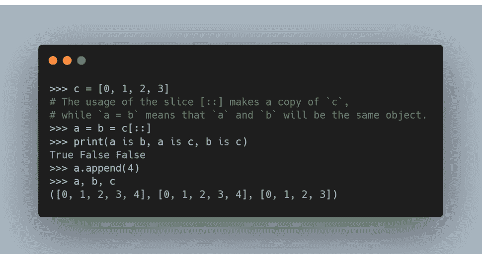

（原文缩略图，来自 https://mathspp.com/blog/pydonts/idiomatic-sequence-slicing。）

## 引言

上次我们讨论了 Python 中的[序列索引](https://mathspp.com/blog/pydonts/sequence-indexing)，为我们的下一个讨论主题——序列切片——奠定了基础。切片是一种访问序列（如列表和元组）部分元素的“更高级”方式。我说它更高级，只是因为索引是访问序列项最简单的形式；正如你将看到的，索引也并不那么复杂。

事实上，关于序列切片有很多内容可讲，所以我将把所有内容分成两个 Pydon’t，即本篇和下一篇。

在这个 Pydon’t 中，你将：

- 学习切片语法；
- 学习切片在使用 1 个和 2 个参数时如何工作；
- 将切片与内置函数 `range` 联系起来；
- 掌握使用负索引进行切片；
- 学习编写 Pythonic 和惯用的切片；
- 以及了解几个切片*不是*正确选择的常见用例。

在下一个 Pydon’t 中，我们将延续这一思路，涵盖与切片相关的更高级材料。特别是，你将：

- 了解切片中的步长参数；
- 了解切片赋值；
- 看看如何使用切片来复制序列；
- 学习更多惯用的切片模式；
- 揭示列表切片背后的两层语法糖；
- 以及学习如何为你的自定义对象实现切片。

在两个 Pydon’t 中，我们将尝试关注切片在实际 Python 代码（即 Python 标准库）中的实际使用方式。

如果你不想错过下一个关于更高级切片主题的 Pydon’t，你可以订阅 Pydon’ts 通讯，或者现在就获取你的 Pydon’ts 书籍副本。

## 切片语法

Python 中的切片是从较大序列的连续位置提取元素序列的行为。想象一把真正的刀切过你正在处理的序列（可能是字符串、列表、元组等），并提取出序列的一小块。

例如，如果我们处理字符串 "Slicing is easy!"，我将其展示如下。

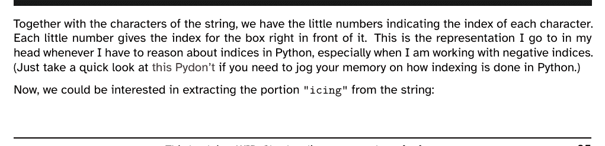

除了字符串的字符，我们还有表示每个字符索引的小数字。每个小数字给出其正前方方框的索引。这是我每当需要在 Python 中推理索引时，尤其是处理负索引时，脑海中浮现的表示方式。（如果你需要回顾 Python 中索引的工作方式，请快速浏览一下这个 Pydon’t。）

现在，我们可能对从字符串中提取 "icing" 这部分感兴趣：

# Python中的切片

我们该如何在Python中实现这一点呢？如果你不知道切片的工作原理，可能会想到用`for`循环和`range`来解决：

```
>>> s = "Slicing is easy!"
>>> subs = ""
>>> for i in range(2, 7):
...     subs += s[i]
...
>>> subs
'icing'
```

这样做完全可行，但针对这类操作，有一种简洁得多的语法——切片语法。

当你想要切片一个序列时，需要使用方括号`[]`和冒号`:`来分隔起点和终点。关键在于确定起点和终点，而这只需参照上图或使用`range(2, 7)`的解决方案即可：

```
>>> s = "Slicing is easy!"
>>> s[2:7]
'icing'
```

这是关于切片需要理解的第一个要点：起点和终点定义了你将提取内容的边界栏，换句话说，这意味着起点（在上面的例子中是2）是切片中包含的第一个元素的索引，而终点是切片中不包含的第一个元素的索引：

```
>>> s = "Slicing is easy!"
>>> s[2:7]
'icing'
>>> s[7]
' '
```

现在，启动你的Python解释器，将`s`定义为字符串"Slicing is easy!"，并亲自尝试几个切片操作，是个不错的时机。

## 可以切片什么？

以防之前没有说清楚，这里列举一些在Python中可以切片的对象：

```
>>> "Hello"[1:3] # 字符串
'el'
>>> [True, False, 1, "hey"][1:3] # 列表
[False, 1]
>>> (True, False, 1, "hey")[1:3] # 元组
(False, 1)
>>> range(10)[1:3] # range对象
range(1, 3)
>>> # 等等...
```

不过，为了保持一致性，在本系列的大部分示例中，我们将使用字符串进行演示。

## 从开头切片

现在假设我们想从字符串中提取"Slicing"。

如果我们回到最初使用`range`的朴素解决方案，大多数人可能会写出以下代码：

```
>>> s = "Slicing is easy!"
>>> subs = ""
>>> for i in range(7):
...     subs += s[i]
...
>>> subs
'Slicing'
```

请注意，与我们使用`range(2, 7)`提取"icing"时不同，现在我们的`range`只有一个参数，即终点。这是因为`range`将缺失的起始索引解释为0。

当我们使用切片时，也可以做类似的事情！如果我们想提取序列开头的部分，符合Python风格的写法是*省略*明确的0作为起点。因此，下面两种写法都有效，但第二种是首选：

```
>>> s = "Slicing is easy!"
>>> s[0:7] # 有效 ...
'Slicing'
>>> s[:7] # ... 但更推荐这种写法！
'Slicing'
```

就我之前分享的图示而言，可以这样理解：这就像你从未告诉Python从哪里开始切片，因此悬浮在字符串上的栏最终覆盖了字符串的整个开头部分，直到你指定的位置。

## 切到末尾

与省略起点类似，你也可以省略切片的终点。为了预测如果这样做会发生什么，我们只需看上图，并创建一个新图，让栏指向另一个方向。

因此，如果我们不指明切片的终点，就会从指定的点开始，提取所有元素。当然，我们可以将切片的终点指定为序列的长度，但这会增加太多视觉噪音：

```
>>> s = "Slicing is easy!"
>>> s[7:len(s)]    # 有效...
' is easy!'
>>> s[7:]          # ... 但更推荐这种写法！
' is easy!'
```

## 使用负索引切片

如果你读过我之前的文章，你已经了解负索引的工作方式。切片也可以使用负索引，且逻辑相同：我们只需画出选择相关索引之间元素的栏。

为了说明这一点，下面是我们一直在使用的字符串的负索引表示。

现在，无论数字是负数，如果让你告诉我应该在什么位置画两条竖线来框住子串"icing"，你会指向哪个位置？你可能会说“在位置-14和-9处画栏”，这绝对是正确的！

实际上，在朴素的`range`解决方案中使用-14和-9会有效，而且更重要的是，在切片语法中也同样有效：

```
>>> s = "Slicing is easy!"
>>> subs = ""
>>> for i in range(-14, -9):
...     subs += s[i]
...
>>> subs
'icing'
>>> s[-14:-9]       # 同样有效且更推荐！
'icing'
```

## 切片与range

此时你应该开始注意到一个规律：你在切片中插入的参数，似乎控制着Python从序列中获取元素的索引，就好像这些索引是由`range`函数生成的。如果你看着一个切片，完全不知道它会选取哪些项，试着用`range`的方式来思考这个切片。这可能会对你有帮助。

## 地道的切片模式

既然你已经了解了一些使用正、负索引的基本切片，并且知道可以省略切片的第一个或最后一个参数，那么你真的应该学习*四种*非常地道的切片模式。别担心，我会告诉你我说的是哪*四种*模式。

假设你有一个变量**n**，它是一个正整数（可以将其视为一个小的整数，比如1或2），并且假设**s**是某个支持切片的序列。以下是我所说的四种地道的切片模式：

- `s[n:]`
- `s[-n:]`
- `s[:n]`
- `s[:-n]`

为什么这些是“地道的”切片模式？它们之所以地道，是因为稍加练习后，你就不会将它们视为“从*位置某某*开始切片**s**，到*位置某某某*结束”，而会开始理解它们的语义含义。

打开你的Python解释器，设置 **s** = "Slicing is easy!" 和 **n** = 2，看看上面四个切片分别返回什么。尝试其他 **n** 值进行实验。你能解释每个切片的含义吗？

试试看...

下面是这些切片模式的含义。

### `s[n:]`

如果 **n** 不是负数（即大于等于0），那么 `s[n:]` 表示“跳过 **s** 的前 **n** 个元素”：

```
>>> s = "Slicing is easy!"
>>> s[2:]
'icing is easy!'
>>> s[3:]
'cing is easy!'
>>> s[4:]
'ing is easy!'
```

### `s[-n:]`

如果 **n** 是**正数**（即大于等于1），那么 `s[-n:]` 表示“**s** 的最后 **n** 个元素”：

```
>>> s = "Slicing is easy!"
>>> s[-2:]
'y!'
>>> s[-3:]
'sy!'
>>> s[-4:]
'asy!'
```

注意 **n = 0** 的情况，因为 `-0 == 0`，这意味着我们实际上使用的是前面的切片模式，即“跳过前n个字符”，这意味着我们什么也不跳过，返回整个序列：

```
>>> s = "Slicing is easy!"
>>> s[-0:]
'Slicing is easy!'
```

### `s[:n]`

如果 **n** 不是负数（即大于等于0），那么 `s[:n]` 可以理解为“**s** 的前 **n** 个元素”：

```
>>> s = "Slicing is easy!"
>>> s[:2]
'Sl'
>>> s[:3]
'Sli'
>>> s[:4]
'Slic'
```

### `s[:-n]`

最后，如果 **n** 是正数（即大于等于1），那么 `s[:-n]` 表示“丢弃 **s** 的最后 **n** 个元素”：

```
>>> s = "Slicing is easy!"
>>> s[:-2]
'Slicing is eas'
>>> s[:-3]
'Slicing is ea'
>>> s[:-4]
'Slicing is e'
```

与 `s[-n:]` 模式一样，我们需要小心 **n = 0** 的情况，因为惯用法 `s[:-n]` 在此并不真正适用，我们应该参考前面的惯用法。

## 空切片

值得注意的一点（可能会让一些人困惑，但不会困扰所有人）是：如果你搞混了起点和终点，最终会得到空切片，因为你的起点在终点的右边...而且由于负索引的存在，仅仅检查起点是否小于终点是不够的。

看看下面的图：

现在试着弄清楚为什么所有这些切片都是空的：

```
>>> s = "Slicing is easy!"
>>> s[10:5]
''
>>> s[-6:-10]
''
>>> s[-9:3]
''
>>> s[10:-10]
''
```

只需要看看上面的图，就会意识到终点是相对于起点*左侧*的索引。

## 更多空切片

关于切片的另一个非常有趣的事情是，如果你使用的数字*太大*或*太小*，切片仍然有效，不会引发`IndexError`或类似错误。在某种程度上，这是合理的，并且符合我们上面提出的习语解释。

```
>>> s = "Slicing is easy!"
>>> s[50:]
''
```

这自然地引出了切片的第一个常见使用模式。

## 代码示例

### 确保最多**n**个元素

想象一下，有人正在编写一个拼写检查器，他们有一个函数，接受一个拼写错误的单词，并返回用户可能想输入的前5个最接近的建议。

该函数可能如下所示：

```
def compute_top_suggestions(misspelled, k, corpus):
    similar = find_similar(misspelled, corpus)
    ordered = rank_suggestions_by_similarity(misspelled, similar)
    top_k = []
    for i in range(min(k, len(ordered))):
        top_k.append(ordered[i])
    return top_k
```

最后的循环是为了确保你返回*最多k个结果*。然而，编写这段代码的人没有阅读这篇Pydon't！因为如果他们读了，就会知道你可以使用切片从ordered中提取*最多k个元素*：

```
def compute_top_suggestions(misspelled, k, corpus):
    similar = find_similar(misspelled, corpus)
    ordered = rank_suggestions_by_similarity(misspelled, similar)
    return ordered[:k]
    # ^ 习语！读作“从开头返回最多`k`个”
```

当你想从末尾返回最多k个时，会出现一个非常相似的使用模式，但你已经知道了，因为你读过我之前分享的四个切片习语。

这种切片使用模式可以以多种方式出现，因为我们只是因为这个特定习语的语义含义而使用切片。上面，我们看到了四个不同的习语，所以在处理序列时请记住它们！

### 字符串的开头

切片很棒，我希望我已经说服了你，但切片并不能解决你所有的问题！

切片的一个常见用例是检查给定序列是否以预定义的值集开头。例如，我们可能想知道一个字符串是否以四个字符`">>> "`开头，这些字符是标记REPL Python提示符的字符。例如，Python的`doctest`模块执行类似的检查，因此我们将能够将我们的解决方案与`doctest`的进行比较。

你刚刚学习了切片，你知道`s[:4]`可以习语地读作“`s`的前四个字符”，所以你可能会写类似这样的代码

```
def check_prompt(line):
    if line[:4] == ">>> ":
        return True
    return False
```

或者，更优雅地，

```
def check_prompt(line):
    return line[:4] == ">>> "
```

*然而*，重要的是要注意这不是最好的解决方案，因为Python字符串有一个适合这种检查的方法：`startswith`函数。

因此，最好的解决方案是

```
def check_prompt(line):
    return line.startswith(">>> ")
```

这更好，因为这是一个经过测试和信任的函数，完全满足你的需求，所以代码非常清晰地表达了你的意图。更重要的是，如果你以后更改了提示符，你不需要记住也要更改切片中使用的索引。

如果我们看看doctest的实际源代码，他们写的是

```
## 来自Python 3.9.2的Lib/doctest.py中的_check_prefix内部
## ...
if line and not line.startswith(prefix):
    # ...
```

正如我们在这里看到的，他们使用startswith方法来查看line是否以作为参数给出的prefix开头。

> 与startswith类似，字符串也定义了一个endswith方法。

### 移除前缀和后缀

与上面的示例类似，切片的另一个常见使用模式是从序列中移除前缀或后缀，尤其是从字符串中。例如，我在这些Pydon't中展示的大多数代码都以">>> "开头，因为REPL提示符。我如何编写一个短函数来从代码行中剥离这个提示符？我对切片非常兴奋，所以显然我会做类似这样的事情

```
>>> def strip_prompt(line):
...     if line.startswith(">>> "):
...         return line[4:]
...     else:
...         return line
...
>>> strip_prompt(">>> 3 + 3")
'3 + 3'
>>> strip_prompt("6")
'6'
```

或者更好的是，我可能会以通用的方式做，并省略else：

```
>>> def strip_prefix(line, prefix):
...     if line.startswith(prefix):
...         return line[len(prefix):]
...     return line
...
>>> prompt = ">>> "
>>> strip_prefix(">>> 3 + 3", prompt)
'3 + 3'
>>> strip_prefix("6", prompt)
'6'
```

然而，我的机器上已经安装了Python 3.9，所以我*应该*使用Python提供给我的字符串方法：

```
def strip_prefix(line, prefix):
    return line.removeprefix(prefix)
```

当然，在这一点上，定义自己的函数是多余的，我只会使用

```
>>> prompt = ">>> "
>>> ">>> 3 + 3".removeprefix(prompt)
'3 + 3'
>>> "6".removeprefix(prompt)
'6'
```

如果你感兴趣，Python 3.9还添加了一个`removesuffix`方法，它做类似的事情，但在字符串的末尾。

这仅仅表明，尝试并或多或少地跟上你最喜欢/最常用的编程语言中添加的功能是很好的。另外（！），这也表明在网上查找代码片段时，例如在StackOverflow上，必须小心。StackOverflow有很棒的答案……但会过时，所以总是要注意投票最多的答案，也要注意最新的答案，它们可能包含更现代的方法。

## 结论

这是这篇Pydon't的主要要点，为你呈上：

> “切片和索引之间的关系意味着有四种非常好的习语用法，非常值得了解。”

这篇Pydon't向你展示了：

- 切片序列让你可以访问一系列连续的元素；
- 你可以切片字符串、列表、元组、范围等等；
- 如果省略start参数，切片从序列的开头开始；
- 如果省略end参数，切片在序列的末尾结束；
- 切片与使用具有相同参数的`for`循环和`range`选择元素相同；
- 与普通索引非常相似，可以使用负整数，它们从序列的末尾开始计数；
- `s[n:]`、`s[-n:]`、`s[:n]`和`s[:-n]`是四种具有清晰语义含义的习语切片模式：
    - `s[n:]`是“跳过s的前n个元素”；
    - `s[-n:]`是“s的最后n个元素”；
    - `s[:n]`是“s的前n个元素”；
    - `s[:-n]`是“跳过s的最后n个元素”；
- 参数过大的切片会产生空序列；
- 如果参数顺序错误，会产生空序列；以及
- 一些看似需要切片的操作可能有更好的替代方案，例如对字符串使用`startswith`、`endswith`、`removeprefix`和`removesuffix`。

## 参考资料

- Python 3文档，Python语言参考，表达式 – 切片，[https://docs.python.org/3/reference/expressions.html#slicings](https://docs.python.org/3/reference/expressions.html#slicings) [最后访问于2021-04-20]；
- Python 3文档，Python语言参考，数据模型 – 标准类型层次结构，[https://docs.python.org/3/reference/datamodel.html#the-standard-type-hierarchy](https://docs.python.org/3/reference/datamodel.html#the-standard-type-hierarchy) [最后访问于2021-04-20]；
- Python 3文档，Python语言参考，数据模型 – 模拟容器类型，[https://docs.python.org/3/reference/datamodel.html#emulating-container-types](https://docs.python.org/3/reference/datamodel.html#emulating-container-types) [最后访问于2021-04-20]；
- Python 3文档，Python语言参考，内置函数，slice，[https://docs.python.org/3/library/functions.html#slice](https://docs.python.org/3/library/functions.html#slice) [最后访问于2021-04-20]；
- “Effective Python – 90 Specific Ways to Write Better Python”；Slatkin, Brett；ISBN 9780134853987。

# 字符格式化比较

（原文缩略图见 https://mathspp.com/blog/pydonts/string-formatting-comparison。）

## 简介

Python之禅中有言：

> “对于一种问题，应该有一种——并且最好只有一种——显而易见的方法。”

然而，在Python中却有三种主要的字符串格式化方式。这篇Pydon't文章将彻底解决这个问题，比较这三种方法，并帮助你决定在每种情况下该使用哪种显而易见的方法。

在这篇Pydon't中，你将：

- 了解使用 % 的旧式C风格格式化；
- 了解字符串方法 `.format`；
- 了解Python 3.6+的新特性：字面量字符串插值与f字符串；
- 理解每种字符串格式化方式之间的关键区别；以及
- 看到每种字符串格式化方式真正擅长的应用场景。

## 字符串格式化的原理

假设，让我们暂时假设Python没有任何字符串格式化的方法。
现在，我有一个任务给你：编写一个函数，它接受一个编程语言名称，并返回一个字符串，说明该编程语言很棒。你能做到吗？再次强调，*不能*使用任何字符串格式化功能！
这里有一个可能的解决方案：

```
def language_rocks(language):
    return language + " rocks!"

## ---
>>> language_rocks("Python")
'Python rocks!'
```

做得很好！
现在，编写一个函数，它接受一个编程语言名称及其（估计的）用户数量，并返回一个类似“<插入语言>很棒！你知道<插入语言>大约有<插入数量>个用户吗？”的字符串。
你能做到吗？请记住，你*不能*使用任何字符串格式化功能！
这里有一个可能的解决方案：

```
def language_info(language, users_estimate):
    return (
        language + " rocks! Did you know that " + language +
        " has around " + str(users_estimate) + " users?!"
    )

## ---
>>> language_info("Python", 10)
'Python rocks! Did you know that Python has around 10 users?!'
```

注意事情很快就变得复杂了：我们函数的目的仍然很简单，但我们却不得不到处进行字符串拼接，仅仅因为我们有一些信息想要合并到字符串中。
这就是字符串格式化的用途：当你需要将信息放入字符串时，它旨在让事情变得更容易。

# 三种字符串格式化方法

既然我们已经确认字符串格式化很有用，让我们来看看Python中三种主要的字符串格式化方式。

首先，以下是如何重构上述函数：

```
## 使用C风格的字符串格式化：
def language_info_cstyle(language, users_estimate):
    return (
        "%s rocks! Did you know that %s has around %d users?!" %
        (language, language, users_estimate)
    )
```

```
## 使用Python 3的字符串方法 `.format`：
def language_info_format(language, users_estimate):
    return "{} rocks! Did you know that {} has around {} users?!".format(
        language, language, users_estimate
    )
```

```
## 使用f字符串，源自Python 3.6+：
def language_info_fstring(language, users_estimate):
    return (
        f"{language} rocks! Did you know that {language}" +
        f" has around {users_estimate} users?!"
    )
```

以上三个函数的行为完全相同。

1. `language_info_cstyle` 使用旧式字符串格式化，借用自C语言中实现相同功能的类似语法；
2. `language_info_format` 使用字符串方法 `.format`，该方法在PEP 3101中引入；以及
3. `language_info_fstring` 使用新的f字符串，该特性在PEP 498中引入，适用于Python 3.6+。

## C风格格式化

C风格格式化是存在时间最长的一种，其特点是在模板字符串中出现一系列百分号（“%”）。

（这里的“模板字符串”，我指的是我们想要填充空白处的字符串。）

这些百分号指示了信息片段应该放置的位置，而紧随其后的字符（上面我们看到的“%s”和“%d”）决定了传入信息的处理方式。

此外，应用格式化的方式是通过二元运算符 `%`：左边放置模板字符串，右边放置所有需要传入的信息片段。

## 字符串方法 `.format`

字符串方法 `.format`，顾名思义，是字符串类型的一个方法。这意味着你通常有一个格式字符串，当你获取到缺失的信息片段后，你只需在该字符串上调用 `.format` 方法。

使用 `.format` 方法进行格式化的字符串通常以字符串内出现一系列花括号“{}”为特征。通常也很常见，在定义字符串字面量时/时就调用 `.format` 方法。

## 字面量字符串插值，或f字符串

字面量字符串插值是将值插入到字符串中的过程。注意单词“插值”的定义：

> 动词：插值——将（不同性质的东西）插入到其他事物中。

这正是这种技术的作用：它直接将额外的值插入到模板字符串中。

当人们谈论“f字符串”时，他们也是在谈论这种技术。因为你需要在字符串前加上“f”来使用字面量字符串插值。

字面量字符串插值（显然）的特点是字符串字面量上的 f 前缀，以及字符串内的花括号“{}”。与字符串方法 `.format` 不同，花括号内*总是*有内容。

```
如果你想知道，在字符串字面量前使用字母作为前缀并不是字面量字符串插值引入的概念。两个常见的例子包括 r（原始）字符串和 b（字节）字符串：
>>> b"This is a bytes object!"
b'This is a bytes object!'
>>> type(_)          # Use _ to refer to the previous string.
<class 'bytes'>
>>> r"This is a \nstring"
'This is a \nstring'
```

既然我们已经了解了这三种字符串格式化方法，我们将展示一系列不同的（简单的）场景，以及格式化在三种选项下如何工作。

正如我们将看到的，C风格格式化几乎总是显得笨重且不够优雅，这应该有助于你认识到f字符串和字符串方法 `.format` 才是正道。

在这一系列比较之后，我们将就使用何种格式化方式以及何时使用给出一些建议。

## 值转换

当我们进行字符串格式化时，我们想要格式化到模板字符串中的对象需要被转换为字符串。

这通常通过调用对象的 `str` 来完成，这又会调用这些对象的魔法方法 `__str__`。然而，有时让对象用 `repr` 而不是 `str` 的结果来表示是有益的。（我之前写过为什么你会需要这个，所以如果你不熟悉 `__str__`/`__repr__` 的工作原理，请[阅读这篇Pydon't](https://mathspp.com/blog/pydonts/str-vs-repr-vs-format)。）

有特殊的方法来决定使用哪种类型的字符串转换。

看这个虚构的类：

```
python
class Data:
    def __str__(self):
        return "str"
    def __repr__(self):
        return "repr"
```

定义了该类后，以下三个字符串是相同的：

```
python
"%s %r" % (Data(), Data())

"{!s} {!r}".format(Data(), Data())

f"{Data()!s} {Data()!r}"

## 结果是 'str repr'
```

使用C风格格式化，我们使用“%s”和“%r”来区分对象的普通字符串版本或其表示形式。两种更现代的方法则通过 `!s` 和 `!r` 标志来区分。

## 对齐

当我们需要格式化许多行中的多个值时，例如显示表格形式的输出，我们可能希望对齐所有值并相应地填充它们。这是字符串格式化大放异彩的重要用例之一。

```
python
lang = "Python"

"%-10s" % lang

"{:<10}".format(lang)

f"{lang:<10}"

## 结果是 'Python     '
```

C风格默认右对齐，而 `.format` 和f字符串默认左对齐。因此，上面我们本可以写成

```
python
"{:10}".format(lang)
f"{lang:10}"
```

我们仍然会得到相同的结果。但是，为了进行比较，我决定包含左对齐符号 `<`。

C风格格式化无法实现居中对齐，但两种现代方法可以使用 `^` 将输出居中对齐：

```
"{:^10}".format(lang)
f"{lang:^10}"
```

```
## 结果是 '   Python   '
```

若要右对齐，现代方法使用 `>`，而C风格格式化则无需指定符号。
请记住，现代方法使用 `<>` 进行对齐，箭头的尖端指向对齐方向：

## 命名占位符

对于较长的字符串或需要填充多个槽位的字符串，使用占位符字符串可能比仅使用格式化符号更有帮助。使用f-string时，这几乎是自动完成的，但C风格格式化和 `.format` 方法也支持此功能：

```
name, age = "John", 73
```

```
"%(name)s is %(age)d years old." % {"name": name, "age": age}
```

```
"{name} is {age} years old.".format(name=name, age=age)
```

```
f"{name} is {age} years old."
```

```
## 结果是 'John is 73 years old.'
```

## 访问嵌套数据结构

让我们再次查看上面的例子，但假设姓名和年龄实际上存储在一个字典中。
在这种情况下，旧式格式化和字符串方法 `.format` 特别方便：

```
data = {"name": "John", "age": 73}
```

```
"%(name)s is %(age)d years old." % data
```

```
"{data[name]} is {data[age]} years old.".format(data=data)
## 或者
"{name} is {age} years old.".format(**data)
```

```
f"{data['name']} is {data['age']} years old."
```

```
## 结果是 'John is 73 years old.'
```

字符串方法 `.format` 的第一个用法展示了其格式化允许的一个有趣特性：被格式化的对象可以被索引，也可以访问其属性。

这里有一个非常复杂的例子：

```
python
class ConvolutedExample:
    values = [{"name": "Charles"}, {42: "William"}]

ce = ConvolutedExample()

"Name is: {ce.values[0][name]}".format(ce=ce)

f"Name is: {ce.values[0]['name']}"

## 结果是 'Name is: Charles'

```

## 参数化格式化

有时，你想进行一些字符串格式化，但具体的格式化方式是动态的：例如，你可能想以可变宽度打印某些内容，并且希望宽度能适应序列中最长的元素。

例如，假设你有一个包含公司及其原产国的列表，并且你希望对齐输出：

```
python
data = [("Toyota", "Japanese"), ("Ford", "USA")]

for brand, country in data:
    print(f"{brand:>7}, {country:>9}")

"""
结果是
 Toyota,  Japanese
    Ford,       USA
"""

```

问题是，如果我们现在加入一个名称更长的公司会怎样？

```
python
data = [("Toyota", "Japanese"), ("Ford", "USA"), ("Lamborghini", "Italy")]

for brand, country in data:
    print(f"{brand:>7}, {country:>9}")

"""
结果是
 Toyota,  Japanese
    Ford,       USA
Lamborghini,      Italy
"""

```

输出不再对齐，因为单词“Lamborghini”不符合指定的宽度7。因此，我们需要动态计算最大长度，并使用它们来创建正确的格式规范。这就是参数化格式规范派上用场的地方：

```
data = [("Toyota", "Japanese"), ("Ford", "USA"), ("Lamborghini", "Italy")]
## 计算格式化所需的品牌宽度和国家宽度。
bw = 1 + max(len(brand) for brand, _ in data)
cw = 1 + max(len(country) for _, country in data)

for brand, country in data:
    print(f"{brand:>{bw}}, {country:>{cw}}")
```

```
"""
结果是
    Toyota, Japanese
      Ford,       USA
Lamborghini,     Italy
"""
```

旧式格式化仅允许对字段的宽度和使用的精度进行参数化。对于字符串方法 `.format` 和f-string，参数化可用于所有格式规范选项。

```
month = "November"
prec = 3
value = 2.7182

"%.*s = %.*f" % (prec, month, prec, value)

"{:.{prec}} = {:.{prec}f}".format(month, value, prec=prec)

f"{month:.{prec}} = {value:.{prec}f}"

## 结果是 'Nov = 2.718'
```

## 自定义格式化

最后，字符串方法 `.format` 和f-string允许你定义自己的自定义对象应如何格式化，这是通过双下划线方法 `__format__` 实现的。
双下划线方法 `__format__` 接受一个字符串（格式规范）并返回相应的字符串。
这里有一个（愚蠢的）例子：

```
class YN:
    def __format__(self, format_spec):
        return "N" if "n" in format_spec else "Y"
```

```
":aaabbbccc".format(YN()) # 结果是 'Y'
```

```
f"{YN():nope}"          # 结果是 'N'
```

当然，在可能的情况下，你会想要实现一个与内置格式规范匹配的格式规范。

## 代码中的例子

正如上面的小代码片段向你展示的，几乎没有理由使用旧的字符串格式化风格。当然，请记住一致性很重要，因此如果你维护的旧代码库到处都使用旧式格式化，这可能仍然有意义。

否则，最好使用字符串方法 `.format` 和/或f-string。现在，我将向你展示一些使用模式，并帮助你弄清楚哪种字符串格式化类型最适合这些情况。

## 纯格式化

F-string 非常非常好。它们输入简短，具有良好的局部性（很容易看出是使用什么来格式化字符串的特定部分），而且速度快。

对于你所有的纯格式化需求，相对于 `.format` 方法，优先选择f-string：

```
## 一些随机变量：
name, age, w = "John", 73, 10

## 优先选择...
f"{name!s} {name!r}"
f"{name:<10}"
f"{name} is {age} years old."
f"{name:^{w}}"

## ...而不是 `.format`
"{!s} {!r}".format(name, name)
"{:<10}".format(name)
"{name} is {age} years old.".format(name=name, age=age)
"{:^{w}}".format(name, w=w)
```

## 字典中的数据

如果你所有的格式化数据都已经在一个字典中，那么使用字符串方法 `.format` 可能是最好的选择。

当该字典的键是字符串时尤其如此。在这种情况下，使用字符串方法 `.format` 几乎就像使用f-string一样！只是，当数据在字典中时，与在 `.format` 中使用 `**` 相比，使用f-string要冗长得多：

```
data = {"name": "John", "age": 73}

## 这样很好：
"{name} is {age} years old.".format(**data)

## 这样很麻烦：
f"{data['name']} is {data['age']} years old."
```

在上面的例子中，我们看到 `.format` 的例子表现出了f-string通常受益的局部性！

## 延迟格式化

如果你需要先创建格式化字符串，然后才进行格式化，那么你就不能使用f-string。
在这种情况下，使用 `.format` 方法可能是最好的选择。
这种场景可能会出现，例如，来自在（许多）不同语言中运行的程序：

```
def get_greeting(language):
    if language == "pt":
        return "Olá, {}!"
    else:
        return "Hello, {}!"
```

```
lang = input("  [en/pt] >> ")
name = input("  your name >> ")
get_greeting(lang).format(name)
```

## 结论

这是本 Pydon't 给你的主要收获，请查收：

> “不要使用旧式字符串格式化：尽可能使用f-string，其他情况使用 `.format`。”

本 Pydon't 向你展示了：

- Python有三种内置的字符串格式化类型；
- 相对于 `%` 格式化，优先使用 `.format` 和/或f-string；
- 你可以使用 `!s` 和 `!r` 来指定使用哪种类型的字符串表示；
- 对齐可以使用 `<^>` 规范符完成；
- 格式规范可以通过额外的 `{}` 层级进行参数化；
- 自定义格式化可以通过双下划线方法 `__format__` 实现；
- f-string 非常适合大多数标准格式化任务；
- 当格式化数据在字典内部时，`.format` 方法很有用；并且
- 对于延迟字符串格式化，f-string 不适用，这意味着 `.format` 是推荐的字符串格式化方法。

## 参考资料

-   Python 2 文档，字符串格式化操作，[https://docs.python.org/2/library/stdtypes.html#string-formatting](https://docs.python.org/2/library/stdtypes.html#string-formatting) [最后访问于 2021-11-10]
-   Python 3 文档，Python 教程，更美观的输出格式化，[https://docs.python.org/3/tutorial/inputoutput.html](https://docs.python.org/3/tutorial/inputoutput.html) [最后访问于 2021-11-10]
-   Python 3 文档，Python 标准库，string，[https://docs.python.org/3/library/string.html#string-formatting](https://docs.python.org/3/library/string.html#string-formatting) [最后访问于 2021-11-10]
-   PEP 3101 – 高级字符串格式化，[https://www.python.org/dev/peps/pep-3101/](https://www.python.org/dev/peps/pep-3101/) [最后访问于 2021-11-10]
-   PEP 498 – 字面字符串插值，[https://www.python.org/dev/peps/pep-0498/](https://www.python.org/dev/peps/pep-0498/) [最后访问于 2021-11-10]
-   PyFormat，[https://pyformat.info](https://pyformat.info) [最后访问于 2021-11-17]

## 真值、假值与布尔值

```python
l = [3, 1, 6]
if l:                    # if len(l) > 0:
    print(l)

n = 0
if n:                    # if n != 0:
    l.append(n)

msg = "Hello, world!"
if msg:                  # if len(msg) > 0:
    print(msg)

d = {"a": 2, "b": 6}
if d:                    # if len(d) > 0:
    print(d.keys())
```

## “真值”与“假值”

引用 Python 文档：

> “任何对象都可以被测试其真值，用于 if 或 while 条件中，或作为下面布尔运算 [or, and 和 not] 的操作数。”

这是什么意思？它的意思是，当需要一个布尔值时，我们可以使用任何我们想要的 Python 对象。布尔值（`True` 和 `False`）用于条件判断中，这些条件判断出现在 `if` 语句和 `while` 语句中，也出现在使用布尔运算符 `or`、`and` 和 `not` 的表达式中。

作为一个非常基础的例子，考虑这个 Python 会话：

```python
>>> if True:
...     print("Hello, World!")
...
Hello, World!
>>> if False:
...     print("Go away!")
...
>>>
```

这段代码不应该让你感到惊讶，因为它是非常标准的 Python 代码：有几个 `if` 语句使用了显式的布尔值。下一步是使用一个求值为布尔值的表达式：

```python
>>> 5 > 3
True
>>> if 5 > 3:
...     print("Hello, World!")
...
Hello, World!
```

下一步是使用一个不是布尔值的对象，而这正是这篇博文的核心内容：

```python
>>> l = [1, 2, 3]
>>> if l:
...     print(l)
...
[1, 2, 3]
```

如果你从未遇到过这种情况，这部分可能会让你感到惊讶。这个 `if` 语句之所以被执行，是因为列表 `[1, 2, 3]` 是“真值”的，也就是说，列表 `[1, 2, 3]` 在布尔上下文中可以被解释为 `True`。如何知道一个对象是“真值”还是“假值”呢？最简单的方法是使用内置的 `bool` 函数，它可以将任何 Python 对象转换为布尔值：

```python
>>> bool(l)
True
```

其工作原理非常简单！有一些规则规定了它的工作方式，但这些简单的规则甚至可以用一个更简单的启发式方法进一步简化：

> “给定类型的值，如果它是‘空的’或‘没有任何有用的值’，那么它就是假值。”

内置类型及其假值的例子包括空列表、空集合、空元组、空字典、数字 `0`、`None` 和空字符串。例如：

```python
>>> bool([])
False
>>> bool("")
False
```

当然，“没有任何有用的值”肯定取决于你打算如何使用你拥有的值，所以我应该明确客观的规则：

-   默认情况下，一个值是真值（即被解释为 `True`）。
-   如果对一个对象调用 `len` 返回 `0`，则该对象具有假值（即被解释为 `False`）。

请注意，前面的规则告诉我们，通常，容器或序列类型（通常对它们使用 `len` 有意义的对象类型）在为空时，即长度等于零时，被认为是假值。但还有一种情况会产生假值：

## `__bool__` 魔术方法

-   如果一个对象定义了 `__bool__` 方法并返回 `False`，则该对象具有假值（即被解释为 `False`）。

`__bool__` 是一个魔术方法（dunder 代表双下划线），你可以通过在自己的类中实现它来告诉你的对象在布尔上下文中是真值还是假值。（你已经见过其他魔术方法了。）

> 如果你对 Python 的魔术方法不熟悉，你可能想订阅 Pydon't 通讯，我以后会写更多关于它们的内容。在此之前，你可能想看看 Python 3 文档以及它们关于数据模型的说明。

这里有一个简单的例子，展示了一个总是被视为真值的对象：

```python
>>> class A:
...     pass
...
>>> a = A()
>>> if a:
...     print("Hello, World!")
...
Hello, World!
```

另一方面，我们可以考虑一个其对象总是被视为假值的类：

```python
>>> class A:
...     def __bool__(self):
...         return False
...
>>> a = A()
>>> if a:
...     print("Go away!")
...
```

通常，你的用例可能是你的对象有时是真值，有时是假值。

最后，说明规则的应用顺序非常重要！

> 当给定一个需要测试其真值的任意 Python 对象时，Python 首先尝试对其调用 `bool`，试图使用其 `__bool__` 魔术方法。如果该对象没有实现 `__bool__` 方法，那么 Python 尝试对其调用 `len`。最后，如果这也失败了，Python 默认给该对象一个真值。

## 备注

现在对真值和假值的功能做几点说明。

### 关于包含假值对象的容器的说明

我们说过像空列表、零和空字典这样的东西是假值。然而，像只包含零的列表或由零和空字典组成的字典这样的东西不是假值，因为容器本身不再是空的：

```python
>>> bool([])
False
>>> bool({})
False
>>> bool(0)
False
>>> bool([0, 0, 0]) # 一个包含零的列表不是空列表。
True
>>> bool({0: []})   # 一个包含 0 键的字典不是空字典。
True
```

### 关于检查 `None` 的说明

如上所述，`None` 是假值：

```python
>>> bool(None)
False
>>> if None:
...     print("Go away!")
...
```

这似乎是正确的，因为 `None` 是当函数什么都不做时返回的默认值。

想象有人实现了以下函数来返回一个数的整数平方根，对于负数输入返回 `None`（因为负数在通常意义上没有平方根）：

```python
import math
def int_square_root(n):
    if n < 0:
        return None
    return math.floor(math.sqrt(n))
```

当你使用上面的函数时，你知道如果计算失败它会返回 `None`，所以现在你可能想利用你新学到的关于 `None` 的假值的知识，你可能会写类似下面的代码来检查计算是否成功：

```python
n = int(input("Compute the integer square root of what? >> "))
int_sqrt = int_square_root(n)
if not int_sqrt:
    print("Negative numbers do not have an integer square root.")
```

现在，如果 `n` 是 `0` 或 `0.5` 会发生什么？

```python
>>> n = 0.5
>>> int_sqrt = int_square_root(n)
>>> if not int_sqrt:
...     print("Negative numbers do not have an integer square root.")
...
Negative numbers do **not** have an integer square root
```

这显然是错误的，因为 `n = 0.5` 肯定是正数。让我们检查一下 `int_sqrt`：

```python
>>> int_sqrt
0
```

问题在于 `int_square_root` 返回了一个有意义的值（即它没有返回 `None`），但这个有意义的值仍然是假值。当你想检查一个函数是否返回了 `None` 时，不要依赖返回值的真值/假值。相反，应该显式地检查返回值是否为 `None`：

```python
## 使用           # 避免
if returned is None:     # if not returned:
    # ...                 #     # ...
if returned is not None: # if returned:
    # ...                 #     # ...
```

这个建议是为了避免像上面概述的问题。

## 代码示例

现在我将向你展示一些使用 Python 对象的真值和假值可以让你编写更 Pythonic 代码的地方的例子。

## 二维点

让我们实现一个简单的类来表示二维平面上的点，这可以是一张图片、一个图表或其他东西。回顾我们在关于 `__str__` 和 `__repr__` 的文章中已有的内容，我们可以添加一个

## __bool__ 方法

我们可以通过自定义 `__bool__` 方法，使得原点（即 Point2D(0, 0)）为假值（Falsy），而所有其他点为真值（Truthy）：

```python
# From https://mathspp.com/blog/pydonts/pydont-confuse-str-and-repr
class Point2D:
    """A class to represent points in a 2D space."""

    def __init__(self, x, y):
        self.x = x
        self.y = y

    def __str__(self):
        """Provide a good-looking representation of the object."""
        return f"({self.x}, {self.y})"

    def __repr__(self):
        """Provide an unambiguous way of rebuilding this object."""
        return f"Point2D({repr(self.x)}, {repr(self.y)})"

    def __bool__(self):
        """The origin is Falsy and all other points are Truthy."""
        return self.x or self.y
```

```python
print(bool(Point2D(0, 1))) # True
print(bool(Point2D(0, 0))) # False
print(bool(Point2D(1, 0))) # True
print(bool(Point2D(4, 2))) # True
```

注意我们是如何根据 Point2D 各分量的真值来定义 Point2D 本身的真值的！我们希望当 `self.x` 为 0 且 `self.y` 也为 0 时，Point2D 为假值。这意味着，只要 `self.x` 或 `self.y` 中有一个为真值（即不等于 0），Point2D 就为真值。

## 处理错误码或错误信息

函数返回“错误码”（编码特定问题的整数）或错误信息字符串是很常见的做法。通常，返回 0 表示一切正常，而其他不同的整数则可能表示各种问题。

如果你调用此类函数，可以利用字符串和/或整数的真值来检查是否出错，并进行相应处理。

以下是一个通用模式：

```python
return_value, error_code = some_nice_function()
if error_code:
    # 出错了，相应处理。
```

### 或者类似这样：

```python
return_value, error_msg = some_other_nice_function()
if error_msg:
    print(error_msg)
    # 出错了，相应处理。
```

## 处理数据

使用真值和假值来判断是否还有数据需要处理也很常见。
例如，当我谈到海象运算符 `:=` 时，我们见过一个类似这样的 while 循环：

```python
input_lines = []
while (s := input()):
    input_lines.append(s)
## 没有更多行可读。
print(len(input_lines))
```

这个 while 循环本质上是*在*有输入行可读时读取输入行。一旦用户输入空行 `""`，循环就会停止，然后我们打印读取的行数：

```python
>>> input_lines = []
>>> while (s := input()):
...     input_lines.append(s)
...
Line 1
Line 2

>>> print(len(input_lines))
2
```

另一个常见模式是：你有一个包含待处理数据的列表，并且在处理过程中列表本身会被修改。

请看以下示例：

```python
import pathlib

def print_file_sizes(dir):
    """Print file sizes in a directory, recurse into subdirs."""
    paths_to_process = [dir]
    while paths_to_process:
        path, *paths_to_process = paths_to_process
        path_obj = pathlib.Path(path)
        if path_obj.is_file():
            print(path, path_obj.stat().st_size)
        else:
            paths_to_process += path_obj.glob("*")
```

这不一定是完成此任务的最佳方式，但请注意其中的 while 语句，以及随后的 `if: ... else: ...` 代码块，它要么打印某些内容，要么扩展 `paths_to_process` 列表。

## 结论

- Python 的真值和假值允许你以一种更具可读性（因此也更 Pythonic）的方式重写常见条件。
- 你可以通过实现 `__bool__` 魔术方法，在自定义类中实现自己的真值和假值。
- 在检查一个变量是否为 `None` 时，你也应该格外小心，避免在那些特定情况下使用 `None` 的假值。

## 参考文献

- Python 3 文档，Python 语言参考，数据模型，bool，https://docs.python.org/3/reference/datamodel.html#object.__bool__.
- Python 3 文档，Python 标准库，真值测试，https://docs.python.org/3/library/stdtypes.html#truth-value-testing.
- Python 3 文档，Python 标准库，内置函数，bool，https://docs.python.org/3/library/functions.html#bool.
- PEP 8 – Python 代码风格指南，https://www.python.org/dev/peps/pep-0008/.
- Python 3 文档，Python 标准库，文件和目录访问，pathlib，https://docs.python.org/3/library/pathlib.html.
- Stack Overflow，列出目录中的所有文件？，https://stackoverflow.com/a/40216619/2828287.
- Stack Overflow，如何在 Python 中检查文件大小？，https://stackoverflow.com/a/2104107/2828287.
- freeCodeCamp，Python 中的真值和假值：详细介绍，https://www.freecodecamp.org/news/truthy-and-falsy-values-in-python/.

在线参考文献最后查阅于 2021 年 2 月 9 日。

# 赋值表达式和海象运算符 :=

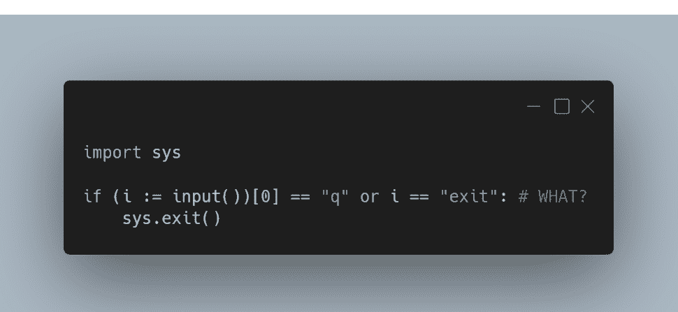

（原始文章的缩略图，发布于 https://mathspp.com/blog/pydonts/assignment-expressions-and-the-walrus-operator。）

## 海象运算符与赋值表达式

海象运算符写作 `:=`（一个冒号加一个等号），首次在 Python 3.8 中引入。海象运算符用于赋值表达式，这意味着赋值现在可以作为表达式的一部分使用，而在 Python 3.8 之前，赋值只能作为语句出现。

赋值语句将一个值赋给一个变量名，仅此而已。而通过赋值表达式，该值可以立即被重用。以下是两者的区别示例：

```python
>>> a = 3
>>> print(a)
3
>>> print(b = 3)
Traceback (most recent call last):
  File "<stdin>", line 1, in <module>
TypeError: 'b' is an invalid keyword argument for print()
>>> print(b := 3)
3
>>> b
3
```

正如 [PEP 572](https://peps.python.org/pep-0572/) 中所述，正确使用赋值表达式有助于编写更好的代码：更清晰和/或运行更快。

当赋值表达式使代码过于复杂时，应避免使用，即使它能节省几行代码。你不想[无视 Python 之禅](https://peps.python.org/pep-0020/)，而 Python 之禅推荐编写可读的代码。

下面的代码片段展示了一个我认为相当难读的赋值表达式用法：

```python
import sys

if (i := input())[0] == "q" or i == "exit":
    sys.exit()
```

我认为更好的替代方案是：

```python
import sys

i = input()
if i[0] == "q" or i == "exit":
    sys.exit()
```

第二种方案（不使用 `:=`）比第一种更容易阅读，即使使用 `:=` 节省了一行代码。

然而，正确使用赋值表达式可以

- 使你的代码更快，
- 使其更具可读性/表现力，
- 并使你的代码更短。

## 代码示例

这里有几个正确使用赋值表达式的例子。

### 通过初始化控制 while 循环

考虑以下 while 循环：

```python
inp = input()
while inp:
    eval(inp)
    inp = input()
```

这段代码可以用来创建一个非常基础的 Python REPL（交互式解释器），位于你的 Python 程序内部，当你提供空输入时 REPL 就会停止。但注意它包含一些重复代码。首先，你必须初始化 `inp`，因为你希望在 `while` 条件中使用它；但然后你也必须在 `while` 循环内部更新 `inp`。

使用赋值表达式，上述代码可以重写为：

```python
while inp := input(" >> "):
    eval(inp)
```

这不仅使代码更短，而且更具表现力，它明确表明是用户通过 `input()` 提供的输入在控制 `while` 循环。

### 减少视觉噪音

假设你想计算一个整数中末尾有多少个零。一个简单的方法是将整数转换为字符串，找到其长度，然后减去该字符串去掉所有末尾零后的长度。你可以这样写：

```python
def trailing_zeroes(n):
    s = str(n)
    return len(s) - len(s.rstrip("0"))
```

然而，对于这样一个简单且简短的函数，让这么短的一行 `s = str(n)` 占据了 `trailing_zeroes` 函数主体的一半，看起来有点糟糕。使用赋值表达式，你可以将上面的代码重写为：

```python
def trailing_zeroes(n):
    return len(s := str(n)) - len(s.rstrip("0"))
```

上面的函数可以理解为“返回你从 *n* 得到的字符串 *s* 的长度，减去 *s* 去掉末尾零后的长度”，因此赋值表达式并不损害函数的可读性，并且在我看来，还改善了它。当然，如有异议，可以提出，因为这并非客观之事。

### 在列表推导式中重用计算结果

假设你正在编写一个带有 `if` 过滤器的列表推导式，但推导式中的过滤条件使用了一个你同样想在列表中使用的值。例如，你有一个整数列表，并想保留那些阶乘有超过 50 个末尾零的数的阶乘。

你可以这样写：

```python
from math import factorial as fact

l = [3, 17, 89, 15, 58, 193]
facts = [fact(num) for num in l if trailing_zeroes(fact(num)) > 50]
```问题在于，上面的代码对每个数字都计算了两次阶乘，如果数字变大，这会变得非常慢。使用赋值表达式，可以改为：

```python
from math import factorial as fact

l = [3, 17, 89, 15, 58, 193]
facts = [f for num in l if trailing_zeroes(f := fact(num)) > 50]
```

使用 `:=` 可以避免重复计算 `num` 的阶乘这一昂贵操作。

另外两种不使用赋值表达式的类似替代方案如下：

```python
from math import factorial as fact

l = [3, 17, 89, 15, 58, 193]
## 替代方案 1
facts = [fact(num) for num in l]
facts = [num for num in facts if trailing_zeroes(num) > 50]
## 替代方案 2
facts = [num for num in map(fact, l) if trailing_zeroes(num) > 50]
```

请注意，如果你的列表 `l` 很大，第二种方案可能内存效率更高：第一种方案首先计算了*整个*阶乘列表，而第二种方案仅按需计算阶乘。（我将在后续的 Pydon't 文章中详细探讨此点，订阅以防错过！）

## 扁平化相关逻辑

假设在代码中遇到需要对数据选择一个操作的情况，并且有一系列需要尝试的操作。但你也希望坚持使用第一个有效的操作。一个非常简单的例子是，假设我们有一个可能包含电子邮件地址或电话号码的字符串，我们想先提取电子邮件地址，如果找不到，再查找电话号码。（为简化起见，我们假设电话号码为 9 位数字，并且只考虑仅有字母的简单 .com 电子邮件。）

你可以这样做：

```python
import re

string = input("Your contact info: >> ")
email = re.search(r"\b(\w+@\w+\.com)\b", string)
if email:
    print(f"Your email is {email.group(1)}.")
else:
    phone = re.search(r"\d{9}", string)
    if phone:
        print(f"Your phone is {phone.group(0)}.")
    else:
        print("No info found...")
```

注意上面的代码是嵌套的，但逻辑是扁平的：我们按顺序查找，一旦找到就停止。使用赋值表达式，可以重写为：

```python
import re

string = input("Your contact info: >> ")
if email := re.search(r"\b(\w+@\w+\.com)\b", string):
    print(f"Your email is {email.group(1)}.")
elif phone := re.search(r"\d{9}", string):
    print(f"Your phone is {phone.group(0)}.")
else:
    print("No info found...")
```

## 结论

赋值表达式允许将名称绑定到表达式的一部分，这可以极大有益于澄清某些程序的流程或节省昂贵计算的时间，例如。然而，赋值表达式的不当使用会使代码非常难以阅读，因此判断赋值表达式是否适合特定任务至关重要。

## 参考资料

-   Python 3 文档，Python 新特性，Python 3.8 新特性 - 赋值表达式，[https://docs.python.org/3/whatsnew/3.8.html#assignment-expressions](https://docs.python.org/3/whatsnew/3.8.html#assignment-expressions)。
-   PEP 572 – 赋值表达式，[https://www.python.org/dev/peps/pep-0572](https://www.python.org/dev/peps/pep-0572)。
-   Real Python，"赋值表达式：海象运算符"，[https://realpython.com/lessons/assignment-expressions/](https://realpython.com/lessons/assignment-expressions/)。

线上参考信息查询于 2021 年 1 月 26 日。

## 字符串的 translate 和 maketrans 方法

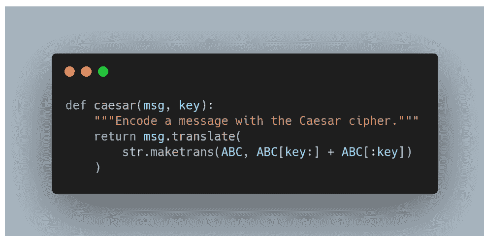

（原文缩略图，源自 https://mathspp.com/blog/pydonts/string-translate-and-maketrans-methods。）

## 引言

字符串方法 `str.translate` 和 `str.maketrans` 可能是 Python 中较少为人知的字符串方法。

遗憾的是，大多数介绍此主题的在线资源对这两个方法的工作原理解释得非常糟糕，所以希望这篇 Pydon't 文章能对你有所帮助，让你了解两个非常酷的字符串方法。

在本文中，你将：

-   了解字符串方法 `str.translate`；
-   学习 `translate` 方法可用的格式；
-   看到*所有*字符（甚至是表情符号！）都有对应的整数值；
-   复习内置函数 `ord` 和 `chr` 的行为；
-   了解互补的字符串方法 `str.maketrans`；
-   看到 `str.translate` 和 `str.maketrans` 的良好用例。

## str.translate

`str.translate` 方法鲜为人知，但并非因为其难以理解。它只是未受到应有的重视，这意味着它不常被使用，因此得到的关注也较少，于是人们不去学习它，于是它又不常被使用…… 你明白这个循环了吧。

我不会假装这个方法会彻底革新你一生中编写的每一段 Python 代码，*但*它确实是你工具箱中一个不错的工具。

根据文档，`str.translate(table)` 方法返回

> “一个字符串的副本，其中每个字符都通过给定的转换表进行了映射。”

这里提到的转换表是 `str.translate` 方法接受的唯一参数。

在其最简单的形式下，`str.translate` 方法类似于 `str.replace` 方法。

如果你不知道后者，以下是 `str.replace` 的示例：

```
>>> s = "Hello, world!"
>>> s.replace("l", "L")
'HeLLo, worLd!'
```

## 字符码点

计算机使用零和一（二进制）工作——这大概是大家都听说过的话。但如果真是这样，我们如何处理字符和文本？如何将文本信息编码为零和一？

我不会假装我*非常*了解这些内部机制的工作原理，但本质上我们只需要为每个字符赋予一个数字，然后计算机就可以查看这个数字并说：“哦，那是 65？好吧，那我就显示 'A'。”

为此，计算机程序必须就哪些整数代表哪些字符达成一致。例如，谁说 65 就是“A”？是不是我编的？

就像科学界一致同意米是描述距离的标准单位一样，计算机领域也有指定数字如何映射到字符的标准。最著名的此类标准是 [Unicode](https://en.wikipedia.org/wiki/Unicode) 标准，这也是 Python 所使用的标准。

所有这些讨论只有一个目的：让你习惯字符可以转换为整数再转换回来的概念。Python 甚至提供了两个有用的内置函数来进行这些转换：内置函数 `chr` 和 `ord`：

```
>>> ord("A")
65
>>> ord("a")
97
>>> ord(" ")
32
>>> chr(65)
'A'
>>> chr(97)
'a'
>>> chr(32)
' '
>>> chr(128013)
🐍
```

注意，即使是表情符号也有代表它的整数！

`chr` 接受一个整数并返回该整数表示的字符，而 `ord` 接受一个字符并返回其 Unicode 码点对应的整数。

> 字符的“码点”是其在所使用标准中对应的整数——对于 Python 而言，就是 Unicode 标准。

## 转换字典

现在我们了解了字符的码点，就可以学习如何使用 `str.translate` 方法了，因为现在我们可以构建可以作为转换表传递的字典。

作为 `str.translate` 参数传入的转换字典指定了目标字符串中将要发生的替换。

该字典需要将 Unicode 码点（即字符）映射到其他 Unicode 码点、其他字符串或 `None`。

让我们看看你是否能推断出每种情况是如何工作的：

```
>>> ord("a"), ord("b"), ord("c")
(97, 98, 99)
>>> ord("A")
65
>>> "aaa bbb ccc".translate(
...     {97: 65, 98: "BBB", 99: None}
... )
'AAA BBBBBBBB  '
```

注意上面的 `str.translate` 方法接收了一个包含 3 个键的字典：

-   97（字符 "a" 的码点）映射到 65（字符 "A" 的码点）；
-   98（字符 "b" 的码点）映射到字符串 "BBB"；
-   99（字符 "c" 的码点）映射到 `None`。

## 与str.replace的不等价性

你们中有些人可能觉得我有点小题大做，为了`str.translate`这么大费周章，而我明明只需要一个简单的for循环和`str.replace`方法就够了。你们说得对吗？

让我用一个for循环和字符串方法`str.replace`来重写上面的例子：

```python
>>> s = "Hey, aaa bbb ccc, how are you?"
>>> from_ = "abc"
>>> to_ = ["A", "BBB", ""]
>>> for f, t in zip(from_, to_):
...     s = s.replace(f, t)
...
>>> s
'Hey, AAA BBBBBBBBBBB , how are you?'
```

我们可以看到，结果看起来完全一样，而且我们没有引入新的字符串方法。

> 如果对于上面代码中的`zip`你感到不太熟悉，别担心：看看关于`zip`的Pydon't文章吧。

当然，我们忽略了一个事实，即使用连续的`str.replace`调用的for循环技术，比`str.translate`方法做了更多的工作。我这话是什么意思？

在每一次循环迭代中，`str.replace`方法都必须遍历整个字符串来查找我们要替换的字符，这是因为连续的`str.replace`调用之间是相互独立的。

但是等等，如果这些连续的调用是相互独立的，那是不是意味着……？是的！

如果我们想把一个由零和一组成的字符串中的所有零换成一，所有的一换成零呢？下面是使用连续`str.replace`调用的解决方案：

```python
>>> s = "001011010101001"
>>> from_ = "01"
>>> to_ = "10"
>>> for f, t in zip(from_, to_):
...     s = s.replace(f, t)
...
>>> s
'00000000000000'
```

它没有生效！为什么呢？在第一次迭代完成后，所有的零都变成了，`s`看起来是这样：

```python
>>> s = "001011010101001"
>>> s.replace("0", "1")
'11111111111111'
```

for循环的第二次迭代无法分辨哪些一是原始的，哪些一是刚刚由零转换过来的，因此`str.replace("1", "0")`调用直接把所有字符都替换成了零。

为了达到正确的效果，我们需要`str.translate`：

```python
>>> "001011010101001".translate(
...     {ord("0"): "1", ord("1"): "0"}
... )
'110100101010110'
```

因此，我们已经证明了`str.translate`并不等价于对`str.replace`进行一系列连续调用，因为`str.replace`可能会扰乱连续的转换操作。

## 通用翻译表

`str.translate`方法接受一个“翻译表”，但这个表不一定非得是字典。它可以是任何支持用方括号进行索引操作的对象。通常，人们使用映射类型（如字典）或序列类型（如列表），但你甚至可以使用自己定义的自定义对象。

我真的很喜欢使用字典（和其他类似的对象），因为它非常容易指定什么映射到什么。但为了学习，让我展示一个使用列表的例子。

为此，让我们编写一个翻译表（作为一个列表），将字母表中的26个大写字母中的每一个映射到同一个字母的小写形式重复两次。

大写字母的码位范围是从65到90，所以我们首先需要创建一个包含91个元素的列表，其中每个索引都应该映射到自身，这样其他字符就能保持不变：

```python
>>> translation_table = [i for i in range(91)]
```

然后，对于大写字母，我们需要更新相应的位置，使它们映射到我们想要的值：

```python
>>> for l in "ABCDEFGHIJKLMNOPQRSTUVWXYZ":
...     translation_table[ord(l)] = 2 * l.lower()
...
>>> translation_table[60:70]
[60, 61, 62, 63, 64, 'aa', 'bb', 'cc', 'dd', 'ee']
```

现在，我们只需要调用`str.translate`方法：

```python
>>> "Hey, what's UP?".translate(translation_table)
"hhey, what's uupp?"
```

这是这个小例子的所有代码，也使用了`string`模块，这样我就不用再手动输入所有字母了：

```python
>>> from string import ascii_uppercase
>>> ascii_uppercase
'ABCDEFGHIJKLMNOPQRSTUVWXYZ'
>>> translation_table = [i for i in range(91)]
>>> for l in ascii_uppercase:
...     translation_table[ord(l)] = 2 * l.lower()
...
>>> translation_table[60:70]
[60, 61, 62, 63, 64, 'aa', 'bb', 'cc', 'dd', 'ee']
>>> "Hey, what's UP?".translate(translation_table)
"hhey, what's uupp?"
```

## `str.maketrans`

了解了翻译表的通用形式之后，是时候介绍`str.translate`的最佳搭档`str.maketrans`了。
`str.maketrans`方法是一个实用工具方法，它提供了一种便捷的方式来创建可用于`str.translate`的翻译表。
`str.maketrans`最多接受3个参数，下面让我们为你分解说明。

### 单个参数版本

只接受一个参数的`str.maketrans`版本，其目的是让我们这些用户在定义可用于`str.translate`的字典时更加简单。
这有什么用呢？
正如我们在上面看到的，当使用字典作为翻译表时，我们需要确保字典的键是我们想要替换的字符的码位。
这通常会引入一些样板代码，因为在最常见的情况下，我们知道我们要替换的是字符本身，而不是它们的码位，所以我们需要事先手动进行转换，或者在用`ord`定义字典时进行。
这很不优雅，看看我们之前使用的例子：

```python
>>> "001011010101001".translate(
...     {ord("0"): "1", ord("1"): "0"}
... )
'110100101010110'
```

如果我们能直接用最自然的形式编写字典，那就太好了：

```python
trans_table = {"0": "1", "1": "0"}
```

为了使其生效，我们需要使用`str.maketrans`：

```python
>>> "001011010101001".translate(
...     str.maketrans({"0": "1", "1": "0"})
... )
'110100101010110'
```

### 两个参数版本

如果你看我刚刚展示的例子，会发现我们做了一种非常特定类型的翻译：用一些其他单个字符替换了一些字符。
这种情况非常常见，以至于`str.maketrans`方法可以用来创建这种类型的翻译表。为此，`str.maketrans`的第一个参数应该是一个由要被替换的字符组成的字符串，第二个参数是包含相应新字符的字符串。
重做上面的例子：

```python
>>> "001011010101001".translate(
...     str.maketrans("01", "10")
... )
'110100101010110'
```

这里是另一个例子，两个字符串包含不同的字符，只是为了展示多样性：

```python
>>> "#0F45cd".translate(
...     str.maketrans("abcdef", "ABCDEF")
... )
'#0F45CD'
```

在这个例子中，我们取了一个表示颜色的十六进制值，并确保所有字母都是大写的。

（当然，我们本可以，或许也应该，使用`str.upper`方法来完成这件事。）

### 第三个参数

最后，`str.maketrans`的第三个参数只是一个包含所有应被映射到`None`的字符的字符串，换句话说，这些字符应该从字符串中完全移除。

这里是一个小例子：

```python
>>> "# 0F45cd".translate(
...     str.maketrans("abcdef", "ABCDEF", "# ")
... )
'0F45CD'
```

## 代码示例

现在你已经了解了字符串方法`str.translate`和`str.maketrans`，我将分享一些这些方法的有趣用例。

我将从一个个人用例开始，然后包含三个来自Python标准库的用例。这些代码示例应该能帮助你理解这两个方法在实际世界中是如何使用的。

### 凯撒密码

> 我在Twitter上发帖，询问人们实现凯撒密码最符合Python风格的方法。

我将凯撒密码定义为一个接受两个参数的函数。第一个参数是一个字符串，指定一些文本。第二个参数是一个整数，指定一个整数密钥。然后，参数字符串的大写字母应该沿着字母表移动密钥指定的位置。所有其他字符应保持不变：

```python
>>> caesar("ABC", 1)
'BCD'
>>> caesar("ABC", 13)
'NOP'
>>> caesar("ABC", 25)
'ZAB'
>>> caesar("HELLO, WORLD", 7)
'OLSSV, DVYSK'
```

过了一段时间，我又去Twitter评论了一些直白的解法，并分享了有史以来最优雅的解法。

你能猜到我的凯撒密码实现利用了什么吗？如果你说/想到了`str.translate`和`str.maketrans`，那你完全正确！

这是你将会看到的最漂亮的凯撒密码实现：

```python
def caesar(msg, key):
    return msg.translate(
        str.maketrans(ABC, ABC[key:] + ABC[:key])
    )
```

在上面的代码中，`ABC`是一个全局常量，包含待转换的字母表。如果我们设置`ABC = string.ascii_uppercase`，那么它就与我最初定义的凯撒密码完全匹配：

```python
>>> from string import ascii_uppercase
>>> ABC = ascii_uppercase
>>> def caesar(msg, key):
...     return msg.translate(
```

```python
>>> str.maketrans(ABC, ABC[key:] + ABC[:key])
>>> caesar("HELLO, WORLD", 7)
'OLSSV, DVYSK'
```

## 净化文件名

Python 标准库提供了一个处理 ZIP 归档文件的模块，名为 zipfile。

该模块可用于例如以编程方式提取 ZIP 归档文件。

当你在 Windows 上使用 zipfile 且它需要提取归档文件时，该模块会检查正在提取的文件，并确保这些文件的名称在 Windows 上是合法的。你能猜出执行此操作的代码是什么吗？它是一段使用 `str.maketrans` 和 `str.translate` 的代码！

代码如下：

```python
## In Lib/zipfile.py in Python 3.9.2

class ZipFile:
    # ...

    @classmethod
    def _sanitize_windows_name(cls, arcname, pathsep):
        """Replace bad characters and remove trailing dots from parts."""
        table = cls._windows_illegal_name_trans_table
        if not table:
            illegal = ':<>"?*'
            table = str.maketrans(illegal, '_' * len(illegal))
            cls._windows_illegal_name_trans_table = table
        arcname = arcname.translate(table)
        # ...
```

其中 `arcname` 是归档文件的名称。我们首先要做的是获取翻译表并查看它是否已被设置。如果尚未设置，那么我们就自己设置它！

我们定义一系列非法字符，然后使用 `str.maketrans` 创建一个将这些字符转换为下划线 `_` 的翻译表：

```python
>>> illegal = ':<>"?*'
>>> table = str.maketrans(illegal, '_' * len(illegal))
>>> table
{58: 95, 60: 95, 62: 95, 124: 95, 34: 95, 63: 95, 42: 95}
```

然后，我们保存这个计算好的翻译表以备后用，并继续翻译归档文件名 `arcname`。

这展示了 `str.maketrans` 和 `str.translate` 的直接用法。

## 空白字符处理

（我之前不知道，所以查了一下：“to munge”的意思是处理/操作数据。）

秉持同样的精神，Python 的 textwrap 模块（用于将文本换行并进行其他相关字符串操作）使用 `str.translate` 来处理给定文本中的空白字符。

作为字符串换行的一个预处理步骤，我们将各种不规范的空白字符替换为简单的空格。

实现方式如下：

```python
## In Lib/textwrap.py from Python 3.9.2

_whitespace = '\t\n\x0b\x0c\r '

class TextWrapper:
    # ...

    unicode_whitespace_trans = {}
    uspace = ord(' ')
    for x in _whitespace:
        unicode_whitespace_trans[ord(x)] = uspace

    # ...

    def _munge_whitespace(self, text):
        # ...
        if self.replace_whitespace:
            text = text.translate(self.unicode_whitespace_trans)
        return text
```

注意，我们首先硬编码了一系列空白字符。我（省略了的）注释解释了我们这样做的原因。然后，在 `TextWrapper` 类内部，我们手动定义了翻译表。之后，在 `_munge_whitespace` 方法中，我们使用该表将不规范的空白字符替换为空格。

你可能想知道为什么这里没有使用 `str.maketrans`，而我也不清楚！你能重写定义翻译表的代码行，使其使用 `str.maketrans` 吗？它应该与前一个示例中的代码类似。

## 默认替换

如果我们查看 Python 自带的 IDE——IDLE 的源代码，也能找到 `str.translate` 方法的用法，其中定义了一个自定义对象作为翻译表。

在展示代码之前，让我说明它的作用：我们要创建一个翻译表，该表

-   保留空白字符 " \t\n\r"；
-   将 "("、"[" 和 "{" 映射为 "("；
-   将 ")"、"]" 和 "}" 映射为 ")"；以及
-   将其他所有字符映射为 "x"。

这样做的目的是我们需要解析一些 Python 代码，但我们只关心代码行的结构，而不那么关心实际编写的代码。

通过将代码元素替换为 "x"，这些 "x" 随后可以被去重。当 "x" 被去重后，字符串会变得（非常！）小，后续处理会显著加快。至少代码周围的注释是这么说的！

为了帮助实现这个目标，我们将实现一个名为 `ParseMap` 的类，它非常类似于一个普通的 `dict`，但有一个例外：当我们尝试访问一个 `ParseMap` 时，如果使用它不认识的键，它不会引发 `KeyError`，而是返回 120。为什么是 120？因为：

```python
>>> ord("x")
120
```

假设 `ParseMap` 已经定义，使用起来可能像这样：

```python
>>> pm = ParseMap()
>>> pm
{}
>>> pm[0] = 343
>>> pm["hey"] = (1, 4)
>>> pm
{0: 343, 'hey': (1, 4)}
>>> pm[999]
120
```

通过实现这种默认返回 120 的行为，我们知道我们的翻译表将默认把任何字符映射为 "x"。

概念介绍完毕，现在来看代码：

```python
## In Lib/idlelib/pyparse.py from Python 3.9.2

class ParseMap(dict):
    # [comments omitted for brevity]

    def __missing__(self, key):
        return 120  # ord('x')

trans = ParseMap.fromkeys(range(128), 120)
trans.update((ord(c), ord('(')) for c in "({['")  # open brackets => '('
trans.update((ord(c), ord(')')) for c in ")}]'")  # close brackets => ')'
trans.update((ord(c), ord(c)) for c in "\'\"#\\n"))  # Keep these.
```

为了实现“默认返回 120”的行为，只需声明 `ParseMap` 继承自 `dict`，然后实现 `__missing__` 特殊方法。

接着，我们初始化一个翻译表，该表已将许多字符映射到 120。我们使用 `dict.fromkeys` 方法来实现：

```python
>>> dict.fromkeys("abc", 42)
{'a': 42, 'b': 42, 'c': 42}
>>> dict.fromkeys(range(3), "Hello, world!")
{0: 'Hello, world!', 1: 'Hello, world!', 2: 'Hello, world!'}
```

```python
trans = ParseMap.fromkeys(range(128), 120)
```

这一行是为了明确地将许多常见字符映射到 "x"，这应该能加快翻译过程本身。

然后，接下来的三行以我描述的方式更新了翻译表，使得括号、方括号和大括号的映射关系如上所述。

最终，翻译的行为如下：

```python
>>> s = "(This [is]\tsome\ntext.)"
>>> print(s)
(This [is]       some
text.)
>>> print(s.translate(trans))
(xxxxx(xx)xxxxx
xxxxx)
```

## 结论

以下是本次 Pydon't 内容的主要收获，请您过目：

> “当你需要用其他字符或字符串替换多个字符时，`str.translate` 方法是你的好帮手。”

本次 Pydon't 向你展示了：

-   `str.translate` 方法用新字符或子字符串替换来自原始字符串的字符；
-   字符转换由一个翻译表控制，该表可以是任何支持按整数索引的对象；
-   所有字符（甚至是表情符号！）都可以通过内置函数 `ord` 和 `chr` 转换为唯一的整数，反之亦然；
-   字符的“码位”是表示它的整数；
-   Python 使用世界上最广泛使用的 Unicode 标准所设定的码位；
-   翻译表利用字符的码位来决定用什么替换什么；
-   通常，`str.translate` 不能用一系列 `str.replace` 调用来替代；
-   Python 提供了一个实用方法（`str.maketrans`）来帮助我们创建翻译表：
    -   带一个参数时，它可以处理字典以具有正确的格式；
    -   带两个参数时，它构建一个将单个字符映射到单个字符的翻译表；并且
    -   第三个参数指示应从字符串中移除的字符。
-   `__missing__` 特殊方法控制自定义 `dict` 子类在使用缺失键进行索引时的行为；

## 参考资料

-   Python 3 文档，Python 标准库，内置类型，str.maketrans，https://docs.python.org/3/library/stdtypes.html#str.maketrans [最后访问于 2021-08-16]；
-   Python 3 文档，Python 标准库，内置类型，str.translate，https://docs.python.org/3/library/stdtypes.html#str.translate [最后访问于 2021-08-16]；
-   Python 3 文档，Python 标准库，zipfile，https://docs.python.org/3/library/zipfile.html [最后访问于 2021-08-17]；
-   Python 3 文档，Python 标准库，textwrap，https://docs.python.org/3/library/textwrap.html [最后访问于 2021-08-17]；
-   Python 3 文档，Python 标准库，IDLE，https://docs.python.org/3/library/idle.html [最后访问于 2021-08-17]；
-   Unicode，https://home.unicode.org [最后访问于 2021-08-17]；

## 条件表达式

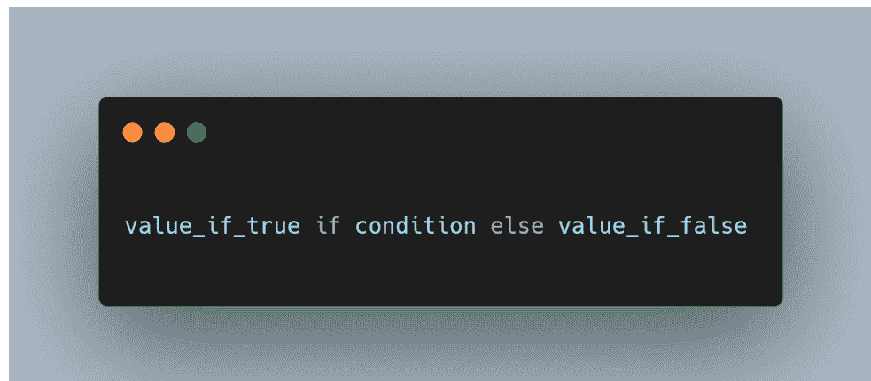

（原文缩略图，链接至 https://mathspp.com/blog/pydonts/conditional-expressions。）

## 简介

条件表达式是 Python 中最接近其他语言所称“三元运算符”的东西。在本篇 Pydon't 中，你将：

- 了解条件表达式的语法；
- 理解条件表达式背后的设计原理；
- 了解条件表达式的运算符优先级；
- 看到如何嵌套条件表达式；
- 理解 `if: ... elif: ... else:` 语句与条件表达式之间的关系；
- 看到条件表达式的好用法与不良用法示例；

## 什么是条件表达式？

Python 中的条件表达式是一个表达式（换句话说，是一段能计算出结果的代码），其值取决于一个条件。

## 表达式与语句

为了更清晰地说明，这里有一个 Python 表达式的例子：

```
>>> 3 + 4 * 5
23
```

代码 `3 + 4 * 5` 是一个表达式，该表达式计算结果为 23。

有些代码片段不是表达式。例如，`pass` 不是表达式，因为它不会计算出一个结果。`pass` 只是一个语句，它不“拥有”或“计算出”任何结果。

这可能有点奇怪（也可能不奇怪！），但为了帮助你判断某样东西是否是表达式，可以尝试把它放在 `print` 函数里。表达式可以用于其他表达式内部，而函数调用也是表达式。因此，如果它能放在 `print` 调用里，它就是表达式：

```
>>> print(3 + 4 * 5)
23
>>> print(pass)
File "<stdin>", line 1
    print(pass)
          ^
SyntaxError: invalid syntax
```

这里的语法错误在于语句 `pass` 不能放在 `print` 函数内部，因为 `print` 函数想要打印*某些东西*，而 `pass` 没有提供任何东西。

## 条件

我们非常习惯使用 `if` 语句在满足特定*条件*时运行一段代码。换句话说，条件可以决定运行哪段代码。

在条件表达式中，我们将使用一个条件来改变表达式计算出的值。等等，这不就和 `if` 语句一样吗？不！语句和表达式*不是*同一回事。

## 语法

闲话少说，让我直接展示条件表达式的结构：

```
expr_if_true if condition else expr_if_false
```

条件表达式由三个子表达式以及关键字 `if` 和 `else` 组成。这些组成部分一个都不能少，必须全部存在。

这是如何工作的呢？

首先，计算 `condition`。然后，根据 `condition` 计算结果为真值（Truthy）还是假值（Falsy），表达式分别计算 `expr_if_true` 或 `expr_if_false`。正如你可能从名字猜到的，`expr_if_true` 和 `expr_if_false` 本身也可以是表达式。这意味着它们可以是像 `42` 或 `"spam"` 这样的简单字面值，也可以是其他“复杂”的表达式。（哎呀，条件表达式中的表达式甚至可以是其他条件表达式！请继续阅读了解详情 ☺）

## 条件表达式示例

这里有几个简单的例子，根据上面介绍的 `expr_if_true`、`condition` 和 `expr_if_false` 结构进行分解。

- 1.

```
>>> 42 if True else 0
42
```

| expr_if_true | condition | expr_if_false |
|---|---|---|
| 42 | True | 0 |

- 2.

```
>>> 42 if False else 0
0
```

| expr_if_true | condition | expr_if_false |
|---|---|---|
| 42 | False | 0 |

- 3.

```
>>> "Mathspp".lower() if pow(3, 27, 10) > 5 else "Oh boy."
'mathspp'
```

| expr_if_true | condition | expr_if_false |
|---|---|---|
| "Mathspp".lower() | pow(3, 27, 10) > 5 | "Oh boy." |

参考：

```
>>> pow(3, 27, 10)
7
```

## 阅读条件表达式

虽然条件表达式呈现操作数的顺序可能会让一些人感到困惑，但很容易将其读成一个英语句子。

以这个参考条件表达式为例：

```
value if condition else other_value
```

以下是该条件表达式的两种可能的英语“翻译”：

> “如果条件为真，则计算为值，否则计算为 other_value。”

或者

> “如果条件为真则给出值，否则给出 other_value。”

话虽如此，...

## Python 有三元运算符吗？

许多语言都有一个看起来像 `condition ? expr_if_true : expr_if_false` 的三元运算符。Python 没有这样的三元运算符，但条件表达式与之类似。

条件表达式的相似之处在于它们计算两个值中的一个，但它们在语法上不同，因为它们使用关键字（而不是 `?` 和 `:`），并且操作数的顺序也不同。

## 设计原理

条件表达式背后的设计原理很简单：程序员经常面临必须从两个值中选择一个的情况。

就是这么简单。

每当你发现自己必须在两个值之间做出选择时，通常是在 `if: ... else: ...` 块内部，这可能就是使用条件表达式的好场景。

## 使用 if 语句的示例

以下是一些简单的函数来说明这一点：

- 1. 计算整数的奇偶性：

```
def parity(n):
    if n % 2:
        return "odd"
    else:
        return "even"

>>> parity(15)
"odd"
>>> parity(42)
"even"
```

- 2. 计算数字的绝对值（这已经作为内置函数存在）：

```
def abs(x):
    if x > 0:
        return x
    else:
        return -x

>>> abs(10)
10
>>> abs(-42)
42
```

这两个函数的结构非常相似：它们检查一个条件，如果条件计算结果为 True，则返回一个给定值。如果不是，则返回另一个值。

## 重构示例

你能重构上面的函数以使用条件表达式吗？以下是每个函数的一种可能的重构方式：

```
def parity(n):
    return "odd" if n % 2 else "even"
```

这个函数现在读作

> > “如果 n 除以 2 有余数则返回 "odd"，否则返回 "even"。”

至于绝对值函数，

```
def abs(n):
    return x if x > 0 else -x
```

它现在读作

> > “如果 x 为正数则返回 x，否则返回 -x。”

## 短路求值

你可能熟悉布尔短路求值，那么你可能会高兴地知道条件表达式也具有短路特性。

对于那些还不了解布尔短路求值的人，我可以推荐我关于这个主题的详细 Pydon't 文章。无论如何，这对于我们的条件表达式来说是需要理解的一点：条件表达式只会计算它真正需要计算的部分。

换句话说，如果你的条件表达式看起来像

```
expr_if_true if condition else expr_if_false
```

那么 `expr_if_true` 和 `expr_if_false` 中只有一个会被计算。指出这一点可能看起来很傻，但实际上非常重要。

有时，我们可能想做一些（`expr_if_true`）只有在满足特定条件时才有效的事情。

例如，假设我们想实现 APL 中的 quad-UCS 函数。这个函数很简单：它将整数转换为字符，将字符转换为整数。用 Python 的话说，它只是根据输入使用 `chr` 和 `ord`。

这是一个示例实现：

```
def ucs(x):
    if isinstance(x, int):
        return chr(x)
    else:
        return ord(x)

>>> ucs("A")
65
>>> ucs(65)
'A'
>>> ucs(102)
'f'
>>> ucs("f")
102
```

这段代码没有明确说明的是，`ord` 在对整数调用时会抛出错误，而 `chr` 在对字符调用时会失败：

```
>>> ord(65)
Traceback (most recent call last):
  File "<stdin>", line 1, in <module>
TypeError: ord() expected string of length 1, but int found

>>> chr("f")
Traceback (most recent call last):
  File "<stdin>", line 1, in <module>
TypeError: an integer is required (got type str)
```

幸运的是，这对于条件表达式来说不是问题，因此 `ucs` 可以用一个条件表达式来实现：

```
def ucs(x):
    return chr(x) if isinstance(x, int) else ord(x)

>>> ucs("A")
65
>>> ucs(65)
'A'
>>> ucs(102)
```

## 条件表达式与 if 语句

### 与 if 语句的等价性

这一点在整篇文章中已有所暗示，但为了清晰起见，我现在将其明确写出来。

（也因为“显式优于隐式”。🤓！）

条件表达式

```
name = expr_if_true if condition else expr_if_false
```

与 if 语句

```
if condition:
    name = expr_if_true
else:
    name = expr_if_false
```

之间存在密切关系。这种密切关系就是等价关系。这两段代码是完全等价的。

### 与 if-elif-else 块的等价性

鉴于条件表达式与 if: ... else: ... 块之间的等价性，很自然地会想，条件表达式中是否也有某种等价于 elif 语句的结构。

例如，我们能否将以下函数改写为使用条件表达式？

```
def sign(x):
    if x == 0:
        return 0
    elif x > 0:
        return 1
    else:
        return -1
```

```
>>> sign(-73)
-1
>>> sign(0)
0
>>> sign(42)
1
```

如何将其写成条件表达式？条件表达式不允许使用 `elif` 关键字，因此，我们首先需要重新构建 if 块本身：

```
def sign(x):
    if x == 0:
        return 0
    else:
        if x > 0:
            return 1
        else:
            return -1
```

这不是一个很好的实现，但这个中间表示形式更清楚地表明，if 块的底部可以替换为条件表达式：

```
def sign(x):
    if x == 0:
        return 0
    else:
        return 1 if x > 0 else -1
```

现在，如果我们抽象掉第二个返回值本身就是一个条件表达式这一事实，我们就可以将现有的 if 块重写为条件表达式：

```
def sign(x):
    return 0 if x == 0 else (1 if x > 0 else -1)
```

```
>>> sign(-73)
-1
>>> sign(0)
0
>>> sign(42)
1
```

这表明条件表达式可以自然地嵌套。现在只需要检查是否需要括号。

换句话说，如果我们写

```
A if B else C if D else E
```

Python 会将其解释为

```
(A if B else C) if D else E
```

还是解释为

```
A if B else (C if D else E)
```

事实证明，是后者。因此，上面的 sign 函数可以重写为

```
def sign(x):
    return 0 if x == 0 else 1 if x > 0 else -1
```

正是这种可以任意长的 if ... else ... 链——模拟了 elif。要将一个长的 if 块（无论是否包含 elif）转换为条件表达式，请从上到下进行，交替使用 `if` 和 `else` 关键字，将值和条件交错排列。在英语中大声朗读时，单词“otherwise”有助于澄清较长的条件表达式的含义：

```
return 0 if x == 0 else 1 if x > 0 else -1
```

读作“如果 x 为 0 则返回 0，否则，如果 x 为正数则返回 1，否则返回 -1。”

单词“otherwise”的重复变得笨拙，这很好地表明，通常不建议过度使用并链接多个条件表达式。作为参考，以下是第一个条件块和最终条件表达式的“并排”比较：

```
## 比较
if x == 0:
    return 0
elif x > 0:
    return 1
else:
    return -1
```

```
## 与：
return 0 if x == 0 else 1 if x > 0 else -1
```

### 与函数包装器的不等价性

由于我刚刚展示的等价性，许多人可能会认为条件表达式可以通过一个函数来实现，该函数封装了之前的 if: ... else: ... 块：

```
def cond(condition, value_if_true, value_if_false):
    if condition:
        return value_if_true
    else:
        return value_if_false
```

有了这个定义，我们可能认为我们已经实现了条件表达式：

```
>>> cond(pow(3, 27, 10) > 5, "Mathspp".lower(), "Oh boy.")
'mathspp'
>>> "Mathspp".lower() if pow(3, 27, 10) > 5 else "Oh boy."
'mathspp'
```

事实上，我们没有！这是因为对 `cond` 的函数调用只在我们评估了所有参数之后才发生。这与条件表达式的实际行为不同：正如我上面所示，条件表达式只评估它们需要的表达式。

因此，我们不能使用这个 `cond` 来实现 `ucs`：

```
def ucs(x):
    return cond(isinstance(x, int), chr(x), ord(x))
```

这段代码看起来没问题，但它的行为不会像我们期望的那样：

```
>>> ucs(65)
Traceback (most recent call last):
  File "<stdin>", line 1, in <module>
  File "<stdin>", line 2, in ucs
TypeError: ord() expected string of length 1, but int found
```

当给定 65 时，第一个参数求值为 True，第二个参数求值为 "A"，但第三个参数引发了错误！

### 优先级

根据文档，条件表达式是优先级最低的表达式。

这意味着，如果你在另一个表达式中使用条件表达式，有时可能需要用括号将其括起来。

例如，看看这个函数：

```
def foo(n, b):
    if b:
        to_add = 10
    else:
        to_add = -10
    return n + to_add
```

```
>>> foo(42, True)
52
>>> foo(42, False)
32
```

你可能发现了赋值两个值之一的模式，并决定使用条件表达式：

```
def foo(n, b):
    to_add = 10 if b else -10
    return n + to_add
```

```
>>> foo(42, True)
52
>>> foo(42, False)
32
```

但后来，你认为没有必要在这里浪费一行，于是决定内联条件表达式（即，将条件表达式放入与 `n +` 的算术表达式中）：

```
def foo(n, b):
    return n + 10 if b else -10
```

这样做，当 `b` 为 False 时，你突然破坏了函数：

```
>>> foo(42, False)
-10
```

这是因为表达式

```
n + 10 if b else -10
```

被 Python 看作

```
(n + 10) if b else -10
```

而你的本意是让它表示

```
n + (10 if b else -10)
```

换句话说，用不那么严格的术语来说，`+` “拉”了相邻的 `10`，整个 `n + 10` 被视为在条件为真时需要求值的表达式。

### 求值为布尔值的条件表达式

在展示条件表达式的良好用法示例之前，让我先向你展示一些在使用条件表达式时应该*避免*的事情。

当条件表达式求值为布尔值时，它们是次优的。

这里有一个愚蠢的例子：

```
def is_huge(n):
    return True if n > pow(10, 10) else False
```

你能看出这个 *is_huge* 实现有什么问题吗？

这个函数看起来可能真的很好，因为它简短、可读，并且其行为清晰：

```
>>> is_huge(3.1415)
False
>>> is_huge(999)
False
>>> is_huge(73_324_634_325_242)
True
```

然而... 条件表达式没有做任何相关的事情！条件表达式求值的结果与条件本身相同！

仔细看看这个函数。如果 `n > pow(10, 10)` 求值为 True，那么我们返回 True。如果 `n > pow(10, 10)` 求值为 False，那么我们返回 False。

下面是一个总结此信息的简短表格：

| n > pow(10, 10) 求值为... | 我们返回... |
| --- | --- |
| True | True |
| False | False |

所以，如果 `n > pow(10, 10)` 的值与我们返回的东西相同，为什么我们不*直接*返回 `n > pow(10, 10)` 呢？事实上，这正是我们应该做的：

```
python
def is_huge(n):
    return n > pow(10, 10)
```

请记住：永远不要使用 `if: ... else: ...` 或条件表达式来求值/返回布尔值。通常，仅使用条件本身就足够了。

一个相关的不应使用条件表达式的用例是为变量赋默认值。其中一些默认值可以通过使用 `or` 运算符的布尔短路求值来赋值。

## 代码示例

这里有几个条件表达式大放异彩的例子。
你会注意到这些例子并不特别复杂，也不需要太多上下文就能理解其机制。
这是因为条件表达式背后的原理很简单：在两个值之间进行选择。

### 字典的 .get 方法

`collections` 模块有一个 `ChainMap` 类。这可以用来将多个字典链接在一起，正如我过去在一条推文中展示的那样：

在 #Python 中，你可以使用 `collections.ChainMap` 从几个其他映射中创建一个更大的映射。例如，当你想将用户配置与默认配置并列时，这很有用。关注更多关于 Python 🐍 的 #tips #learnpython #learncode #100daysofcode pic.twitter.com/ip9IInItYG
— Rodrigo 🐍 (@mathsppblog) 2021年6月4日

> > 在 #Python 中，你可以使用 `collections.ChainMap` 从几个其他映射中创建一个更大的映射。例如，当你想将用户配置与默认配置并列时，这很有用。关注更多关于 Python 🐍 的 #tips #learnpython #learncode #100daysofcode pic.twitter.com/ip9IInItYG
> — Rodrigo 🐍 (@mathsppblog) 2021年6月4日

有趣的是，`ChainMap` 也定义了一个 `.get` 方法，很像一个字典。`.get` 方法尝试检索一个键，如果找到则返回一个默认值：

```
python
>>> from collections import ChainMap
>>> user_config = {"name": "mathspp"}
>>> default_config = {"name": "<noname>", "fullscreen": True}
>>> config = ChainMap(user_config, default_config)
>>> config.get("name")
'mathspp'
>>> config.get("fullscreen")
True
>>> config.get("darkmode", False)
False
```

以下是 `.get` 方法的完整实现：

```python
## From Lib/collections/__init__.py in Python 3.9.2

class ChainMap(_collections_abc.MutableMapping):
    # ...

    def get(self, key, default=None):
        return self[key] if key in self else default
```

非常简单！如果键在字典中，则返回与该键关联的值，否则返回默认值！仅此而已。

## 解析路径

当你需要处理路径时，`pathlib` 模块非常有用。它提供的一项功能是 `.resolve` 方法，该方法接受一个路径并使其变为绝对路径，同时消除路径中的符号链接：

```python
## Running this from C:/Users/rodri:
>>> Path("..").resolve()
WindowsPath('C:/Users')
## The current working directory is irrelevant here:
>>> Path("C:/Users").resolve()
WindowsPath('C:/Users')
```

以下是解析路径的部分代码：

```python
## In Lib/pathlib.py from Python 3.9.2

class _PosixFlavour(_Flavour):
    # ...

    def resolve(self, path, strict=False):
        # ...

        base = '' if path.is_absolute() else os.getcwd()
        return _resolve(base, str(path)) or sep
```

如你所见，在调用辅助函数 `_resolve` 并返回之前，该函数会判断是否需要为基础路径添加一个根目录。

如果我输入的路径是相对路径，比如上面的 `".."` 路径，那么基础路径就会被设置为当前工作目录 (`os.getcwd()`)。如果路径是绝对路径，则不需要基础路径，因为它已经包含了。

## 结论

这是本次 Pydon't 为你准备的主要内容，作为一份厚礼奉上：

这个 Pydon't 向你展示了：

- 条件表达式由三个子表达式组成，并由 `if` 和 `else` 关键字分隔；
- 条件表达式的创建目的是提供一种根据条件在两个值之间进行选择的便捷方式；
- 条件表达式可以很容易地读成英语陈述句；
- 条件表达式在所有 Python 表达式中优先级最低；
- 短路求值确保条件表达式仅对两个“值表达式”中的一个求值；
- 条件表达式可以链式组合，以模拟 `if: ... elif: ... else: ...` 代码块；
- 无法用函数模拟条件表达式；并且
- 如果你的条件表达式求值结果为布尔值，那么你应该只关注条件本身。

## 参考资料

- Python 3 文档，Python 语言参考，条件表达式，https://docs.python.org/3/reference/expressions.html#conditional-expressions [最后访问于 2021-09-28]；
- PEP 308 - 条件表达式，https://www.python.org/dev/peps/pep-0308/ [最后访问于 2021-09-28]；
- Python 3 文档，Python 标准库，`collections.ChainMap`，https://docs.python.org/3/library/collections.html#chainmap-objects [最后访问于 2021-09-28]；
- Python 3 文档，Python 标准库，`pathlib.Path.resolve`，https://docs.python.org/3/library/pathlib.html#pathlib.Path.resolve [最后访问于 2021-09-28]；
- "Does Python have a ternary conditional operator?"，Stack Overflow 问题与回答，https://stackoverflow.com/questions/394809/does-python-have-a-ternary-conditional-operator [最后访问于 2021-09-28]；
- "Conditional Expressions in Python"，note.nkmk.me，https://note.nkmk.me/en/python-if-conditional-expressions/ [最后访问于 2021-09-28]；
- "Conditional Statements in Python, Conditional Expressions (Python's Ternary Operator)"，Real Python，https://realpython.com/python-conditional-statements/#conditional-expressions-pythons-ternary-operator [最后访问于 2021-09-28]。

## 双下方法

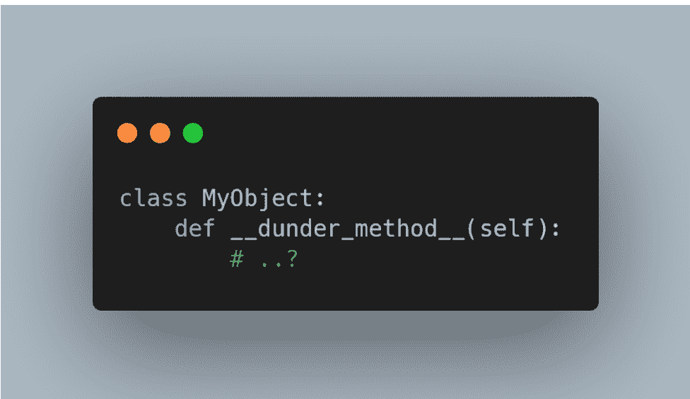

（原文缩略图，链接至 https://mathspp.com/blog/pydonts/dunder-methods）

这是对 Python 中双下方法的介绍，旨在帮助你理解它们是什么以及有何用途。

## 引言

Python 拥有丰富的内置函数和运算符，它们能与内置类型很好地协同工作。例如，运算符 `+` 对数字执行加法，但它也适用于字符串、列表和元组，用于拼接：

```python
>>> 1 + 2.3
3.3
>>> [1, 2, 3] + [4, 5, 6]
[1, 2, 3, 4, 5, 6]
```

但究竟是什么定义了 `+` 对数字（整数和浮点数）是加法，而对列表、元组、字符串是拼接？如果我希望 `+` 能用于其他类型呢？我能这样做吗？

简短的回答是“可以”，而这正是通过**双下方法**实现的，它们就是本次 Pydon't 的研究对象。在这个 Pydon't 中，你将：

- 理解什么是双下方法；
- 明白它们为何如此命名；
- 看到各种有用的双下方法；
- 了解哪些双下方法对应哪些内置函数；
- 为示例类编写自己的双下方法；以及
- 认识到双下方法与你以前写过的任何其他方法并无二致。

### 什么是双下方法？

在 Python 中，**双下方法是允许类的实例与语言的内置函数和运算符进行交互的方法**。“双下”一词来源于“双下划线”，因为双下方法的名称以两个下划线开始和结束，例如 `__str__` 或 `__add__`。通常，程序员不会直接调用双下方法，这使得它们看起来像是被魔法般地调用。这就是为什么双下方法有时也被称为“魔法方法”。¹

然而，双下方法并非通过魔法调用。它们只是在特定时间点被语言隐式地调用，而这些时间点是明确定义的，并取决于具体的双下方法。

### 人人都知道的双下方法

如果你在 Python 中定义过类，你肯定接触过某个双下方法：`__init__`。**双下方法 `__init__` 负责*初始化你的类实例***，这就是为什么你通常会在其中设置一堆与类接收的参数相关的属性。

例如，如果你要创建一个 `Square` 类的实例，你会在 `__init__` 中创建表示边长的属性：

```python
class Square:
    def __init__(self, side_length):
        """__init__ is the dunder method that INITIALises the instance.

        To create a square, we need to know the length of its side,
        so that will be passed as an argument later, e.g. with Square(1).
        To make sure the instance knows its own side length,
        we save it with self.side_length = side_length."""
        print("Inside init!")
        self.side_length = side_length

sq = Square(1)
## Inside init!
```

如果你运行上面的代码，你会看到打印出 "Inside init!" 的消息，然而，你并没有直接调用 `__init__` 方法！当你创建一个正方形实例时，双下方法 `__init__` 是被语言隐式调用的。

> ¹ 我更喜欢“双下方法”这个名字，而不是“魔法方法”，因为“魔法方法”让人感觉它难以理解，仿佛有什么巫术在起作用！剧透：并没有。

### 为什么双下方法以两个下划线开始和结束？

双下方法名称首尾的两个下划线并没有任何特殊含义。换句话说，仅仅因为方法名以两个下划线开头和结尾，这本身不会产生任何特殊效果。这两个下划线只是为了防止与其他方法（由不知情的程序员实现）发生命名冲突。

可以这样想：Python 有一个内置函数 `sum`。你*可以*将 `sum` 定义为别的东西，但那样你就失去了访问这个求和内置函数的能力，对吧？

```python
>>> sum(range(10))
45
>>> sum = 45
>>> sum(range(10))
Traceback (most recent call last):
  File "<stdin>", line 1, in <module>
TypeError: 'int' object is not callable
```

你经常看到初学者使用 `sum` 作为变量名，因为他们不知道 `sum` 实际上是一个内置函数。如果内置函数被命名为 `__sum__` 而不是 `sum`，你就不那么容易意外地覆盖它了，对吧？但那也会让使用 `sum` 变得非常不便……

然而，对于魔法方法，我们不需要它们的名字在输入时超级方便，因为你几乎从不输入魔法方法的名称。因此，Python 决定魔法方法的名称以两个下划线开始和结束，以降低人们意外覆盖这些方法的可能性！

总而言之，双下方法与你实现过的任何其他方法一样，唯一的小区别在于双下方法可以被语言隐式调用。

### Python 中的运算符重载与双下方法

所有的 Python 运算符，如 `+`、`==` 和 `in`，都依赖于双下方法来实现其行为。

例如，当 Python 遇到代码 `value in container` 时，它实际上会将其转换为对相应双下方法 `__contains__` 的调用，这意味着 Python 实际上执行的是表达式 `container.__contains__(value)`。

让我展示给你看：>>> my_list = [2, 4, 6]

>>> 3 in my_list
False
>>> my_list.__contains__(3)
False

>>> 6 in my_list
True
>>> my_list.__contains__(6)
True

因此，当你想要重载某些运算符以使其以自定义方式与你自己的对象配合工作时，你需要实现相应的魔术方法。

所以，如果你要创建自己的容器类型，你可以实现魔术方法 `__contains__`，以确保你的容器能够在包含 `in` 运算符的表达式的右侧使用。

## 魔术方法列表及其交互

正如我们所看到的，魔术方法通常由语言隐式调用……但是什么时候调用？魔术方法 `__init__` 在初始化一个类的实例时被调用，但是 `__str__`，或者 `__bool__`，或者其他魔术方法呢？

下表列出了所有魔术方法，以及一个或多个（简化的）用法示例，这些示例会隐式调用相应的魔术方法。这可能包括相关魔术方法可能被调用的场景的简要描述，或者依赖于该魔术方法的示例函数调用。这些示例场景可能有相关的注意事项，因此当你想要尝试不熟悉的魔术方法时，请务必[阅读关于魔术方法的文档](https://docs.python.org/3/reference/datamodel.html#special-methods)。

表格的行顺序与文档“数据模型”页面中提到这些魔术方法的顺序一致，这并不意味着各种魔术方法之间存在任何依赖关系，也不意味着理解这些方法的难度等级。

| 魔术方法 | 用途 / 所需功能 | 了解更多 |
| :--- | :--- | :--- |
| `__init__` | 初始化对象 | [文档](https://docs.python.org/3/reference/datamodel.html#object.__init__) |
| `__new__` | 创建对象 | [文档](https://docs.python.org/3/reference/datamodel.html#object.__new__) |
| `__del__` | 销毁对象 | [文档](https://docs.python.org/3/reference/datamodel.html#object.__del__) |
| `__repr__` | 计算“官方”字符串表示 / `repr(obj)` | [博客](https://dbader.org/blog/python-magic-methods); [文档](https://docs.python.org/3/reference/datamodel.html#object.__repr__) |
| `__str__` | 美化打印对象 / `str(obj)` / `print(obj)` | [博客](https://dbader.org/blog/python-magic-methods); [文档](https://docs.python.org/3/reference/datamodel.html#object.__str__) |
| `__bytes__` | `bytes(obj)` | [文档](https://docs.python.org/3/reference/datamodel.html#object.__bytes__) |
| `__format__` | 自定义字符串格式化 | [博客](https://dbader.org/blog/python-magic-methods); [文档](https://docs.python.org/3/reference/datamodel.html#object.__format__) |
| `__lt__` | `obj < ...` | [文档](https://docs.python.org/3/reference/datamodel.html#object.__lt__) |
| `__le__` | `obj <= ...` | [文档](https://docs.python.org/3/reference/datamodel.html#object.__le__) |
| `__eq__` | `obj == ...` | [文档](https://docs.python.org/3/reference/datamodel.html#object.__eq__) |
| `__ne__` | `obj != ...` | 文档 |
| `__gt__` | `obj > ...` | 文档 |
| `__ge__` | `obj >= ...` | 文档 |
| `__hash__` | `hash(obj)` / 对象作为字典键 | 文档 |
| `__bool__` | `bool(obj)` / 定义对象的真值 | 博客; 文档 |
| `__getattr__` | 属性访问的后备方案 | 文档 |
| `__getattribute__` | 实现属性访问: `obj.name` | 文档 |
| `__setattr__` | 设置属性值: `obj.name = value` | 文档 |
| `__delattr__` | 删除属性: `del obj.name` | 文档 |
| `__dir__` | `dir(obj)` | 文档 |
| `__get__` | 描述符中的属性访问 | 文档 |
| `__set__` | 描述符中设置属性 | 文档 |
| `__delete__` | 描述符中删除属性 | 文档 |
| `__init_subclass__` | 初始化子类 | 文档 |
| `__set_name__` | 所有者类分配回调 | 文档 |
| `__instancecheck__` | `isinstance(obj, ...)` | 文档 |
| `__subclasscheck__` | `issubclass(obj, ...)` | 文档 |
| `__class_getitem__` | 模拟泛型类型 | 文档 |
| `__call__` | 模拟可调用对象 / `obj(*args, **kwargs)` | 文档 |
| `__len__` | `len(obj)` | 文档 |
| `__length_hint__` | 用于优化目的的长度估计 | 文档 |
| `__getitem__` | 访问 `obj[key]` | 博客; 文档 |
| `__setitem__` | `obj[key] = ...` 或 `obj[]` | 博客; 文档 |
| `__delitem__` | `del obj[key]` | 博客; 文档 |
| `__missing__` | 处理字典子类中的缺失键 | 文档 |
| `__iter__` | `iter(obj)` / for ... in obj (迭代) | 文档 |
| `__reversed__` | `reverse(obj)` | 文档 |
| `__contains__` | ... in obj (成员测试) | 文档 |
| `__add__` | `obj + ...` | 博客; 文档 |
| `__radd__` | ... + obj | 博客; 文档 |
| `__iadd__` | `obj += ...` | 博客; 文档 |
| `__sub__` | `obj - ...` | 博客; 文档 |
| `__rsub__` | ... - obj | 博客; 文档 |
| `__isub__` | `obj -= ...` | 博客; 文档 |
| `__mul__` | `obj * ...` | 博客; 文档 |
| `__rmul__` | ... * obj | 博客; 文档 |
| `__imul__` | `obj *= ...` | 博客; 文档 |
| `__matmul__` | `obj @ ...` | 博客; 文档 |
| `__rmatmul__` | ... @ obj | 博客; 文档 |
| `__imatmul__` | `obj @= ...` | 博客; 文档 |
| `__truediv__` | `obj / ...` | 博客; 文档 |
| `__rtruediv__` | ... / obj | 博客; 文档 |
| `__itruediv__` | `obj /= ...` | 博客; 文档 |
| `__floordiv__` | `obj // ...` | 博客; 文档 |
| `__rfloordiv__` | ... // obj | 博客; 文档 |
| `__ifloordiv__` | `obj //= ...` | 博客; 文档 |
| `__mod__` | `obj % ...` | 博客; 文档 |
| `__rmod__` | ... % obj | 博客; 文档 |
| `__imod__` | `obj %= ...` | 博客; 文档 |
| `__divmod__` | `divmod(obj, ...)` | 博客; 文档 |
| `__rdivmod__` | `divmod(..., obj)` | 博客; 文档 |
| `__pow__` | `obj ** ...` | 博客; 文档 |
| `__rpow__` | ... ** obj | 博客; 文档 |
| `__ipow__` | `obj **= ...` | 博客; 文档 |
| `__lshift__` | `obj << ...` | 博客; 文档 |
| `__rlshift__` | ... << obj | 博客; 文档 |
| `__ilshift__` | `obj <<= ...` | 博客; 文档 |
| `__rshift__` | `obj >> ...` | 博客; 文档 |
| `__rrshift__` | ... >> obj | 博客; 文档 |
| `__irshift__` | `obj >>= ...` | 博客; 文档 |
| `__and__` | `obj & ...` | 博客; 文档 |
| `__rand__` | ... & obj | 博客; 文档 |
| `__iand__` | `obj &= ...` | 博客; 文档 |
| `__xor__` | `obj ^ ...` | 博客; 文档 |
| `__rxor__` | ... ^ obj | 博客; 文档 |
| `__ixor__` | `obj ^= ...` | 博客; 文档 |
| `__or__` | `obj \| ...` | 博客; 文档 |
| `__ror__` | ... \| obj | 博客; 文档 |
| `__ior__` | `obj \|= ...` | 博客; 文档 |

表格的行顺序与文档“数据模型”页面中提到这些魔术方法的顺序一致，这并不意味着各种魔术方法之间存在任何依赖关系，也不意味着理解这些方法的难度等级。

² 此魔术方法还有一个“右”版本，名称相同但以“r”为前缀，当对象位于操作的右侧且左侧对象未实现该行为时调用。请参阅上面的 `__radd__`。

³ 此魔术方法还有一个“原地”版本，名称相同但以“i”为前缀，当使用给定运算符进行增强赋值时调用。请参阅上面的 `__iadd__`。

## 探索一个 dunder 方法

每当我学习一个新的 dunder 方法时，我做的第一件事就是摆弄它。

下面，我将与你分享我探索新 dunder 方法时遵循的三个步骤：

1.  尝试理解该 dunder 方法是*何时*被调用的；
2.  为该方法实现一个存根并通过代码触发它；以及
3.  在一个有用的场景中使用该 dunder 方法。

我将通过一个实际例子向你展示我如何遵循这些步骤，这个 dunder 方法是 `__missing__`。

## 这个 dunder 方法的用途是什么？

这个 dunder 方法 `__missing__` 是做什么用的？[`__missing__` dunder 方法的文档说明：](https://docs.python.org/3/reference/datamodel.html#object.__missing__)

> “由 dict.__getitem__() 调用，为 dict 子类在键不在字典中时实现 self[key]。”

换句话说，dunder 方法 `__missing__` 仅与 dict 的子类相关，并且每当我们在字典中找不到给定的键时就会调用它。

## 如何触发这个 dunder 方法？

在哪些我可以重现的情况下，dunder 方法 `__missing__` 会被调用？

根据文档描述，我们可能需要一个字典子类，然后我们需要访问一个在该字典中不存在的键。因此，这应该足以触发 dunder 方法 `__missing__`：

```
class DictSubclass(dict):
    def __missing__(self, key):
        print("Hello, world!")

my_dict = DictSubclass()
my_dict["this key isn't available"]
## Hello, world!
```

注意上面代码的简陋之处：我只是定义了一个名为 `__missing__` 的方法并进行了打印，只是为了验证 `__missing__` 是否被调用。

现在我要进行更多测试，以确保 `__missing__` 确实只在尝试*获取*不存在的键的值时被调用：

```
class DictSubclass(dict):
    def __missing__(self, key):
        print(f"Missing {key = }")

my_dict = DictSubclass()
my_dict[0] = True
if my_dict[0]:
    print("Key 0 was `True`.")
## Prints: Key 0 was `True`
my_dict[1]  # Prints: Missing key = 1
```

## 在有用的场景中使用该 dunder 方法

现在我们对 `__missing__` 何时起作用有了更清晰的认识，我们可以将其用于有用的事情。
例如，我们可以尝试基于 `__missing__` 实现 `defaultdict`。

`defaultdict` 是来自 `collections` 模块的容器，它就像一个字典，不同之处在于当键缺失时，它使用工厂函数生成默认值。

例如，这是一个返回默认值 0 的 `defaultdict` 实例：

```
from collections import defaultdict

olympic_medals = defaultdict(lambda: 0)  # 默认产生 0
olympic_medals["Phelps"] = 28

print(olympic_medals["Phelps"])  # 28
print(olympic_medals["me"])  # 0
```

所以，要重新实现 defaultdict，我们需要接受一个工厂函数，需要保存该工厂，并且需要在 `__missing__` 内部使用它。

顺便提一下，请注意 defaultdict 不仅返回默认值，还会将其赋值给之前不存在的键：

```
>>> from collections import defaultdict
>>> olympic_medals = defaultdict(lambda: 0)  # 默认产生 0
>>> olympic_medals
defaultdict(<function <lambda> at 0x000001F15404F1F0>, {})
>>> # 注意底层字典是空的 ---------^^
>>> olympic_medals["me"]
0
>>> olympic_medals
defaultdict(<function <lambda> at 0x000001F15404F1F0>, {'me': 0})
>>> # 它现在不再是空的了 ----------------------------^^^^^^^^
```

考虑到以上所有，下面是重新实现 defaultdict 的一种可能方式：

```
class my_defaultdict(dict):
    def __init__(self, default_factory, **kwargs):
        super().__init__(**kwargs)
        self.default_factory = default_factory

    def __missing__(self, key):
        """填充缺失的键并返回其值。"""
        self[key] = self.default_factory()
        return self[key]

olympic_medals = my_defaultdict(lambda: 0)  # 默认产生 0
olympic_medals["Phelps"] = 28

print(olympic_medals["Phelps"])  # 28
print(olympic_medals["me"])  # 0
```

## 结论

这是这篇 Pydon't 文章的要点，为你总结如下：

> “Dunder 方法是允许你指定你的对象如何与 Python 语法、其关键字、运算符和内置函数交互的特定方法。

这篇 Pydon't 向你展示：

- dunder 方法是在特定情况下由 Python 语言隐式调用的方法；
- “dunder” 来自 “double underscore”（双下划线），指的是作为所有 dunder 方法前缀和后缀的两个下划线；
- dunder 方法有时被称为魔法方法，因为它们通常是在没有显式调用的情况下被调用的；
- 了解一个新的 dunder 方法可以通过一系列简单的小步骤完成；以及
- dunder 方法是常规 Python 类中的常规 Python 方法。

## 参考资料

- Python 3 文档，数据模型，[https://docs.python.org/3/reference/datamodel.html](https://docs.python.org/3/reference/datamodel.html) [最后访问于 2022-07-09]；

## 使用 dunder 方法重载算术运算符

```
class Vector:
    def __add__(self, other):
        ...

    def __radd__(self, other):
        ...

    def __iadd__(self, other):
        ...
```

（原文文章的缩略图见 https://mathspp.com/blog/pydonts/overloading-arithmetic-operators-with-dunder-methods。）

本文向你展示如何使用 dunder 方法重载 Python 中的算术运算符。

## 简介

Python 允许你通过 dunder 方法重载算术运算符，如表示加法的 + 或表示乘法的 *。Dunder 方法是特殊方法，其名称以双下划线开头和结尾（因此称为 “dunder”），一些 dunder 方法特定于算术运算。

在这篇 Pydon't 中，你将学习：

- 如何实现一元算术运算符：
  - 取反 (~p)；
  - 正号 (+p)；
  - 绝对值 (abs(p))；以及
  - 按位取反 (~)。
- 如何实现二元算术运算符：
  - 加法 (+)；
  - 减法 (-)；
  - 乘法 (*)；
  - 除法 (/)；
  - 整除 (//)；
  - 取模 (%)；
  - (divmod)；以及
  - 幂运算 (pow)。
- 如何实现用于按位运算的二元算术运算符：
  - 左移 (<<)；
  - 右移 (>>)；
  - 按位与 (&)；
  - 按位或 (|)；
  - 按位异或 (^)；
- 什么是反射算术 dunder 方法；
- 什么是增强算术 dunder 方法；
- 什么是 NotImplemented，它与 NotImplementedError 有何不同；以及
- Python 如何确定调用哪个算术 dunder 方法。

我们将首先解释 dunder 方法的工作原理，并通过实现一元运算符给出几个示例。然后，我们介绍二元算术运算符背后的机制，示例基于二元运算符 +。

在我们介绍了 Python 处理二元算术运算符的所有概念和机制之后，我们将提供一个实现了上述所有算术 dunder 方法的类的示例。

## 我们将使用的示例

本文将使用的示例是向量。向量将是一个用于几何向量的类，例如二维或三维向量，并提供处理向量的操作。例如，在本文结束时，你将拥有一个向量的实现，让你能够执行如下操作：

```
>>> from vector import Vector
>>> v = Vector(3, 2)
>>> v + Vector(4, 10)
Vector(7, 12)
>>> 3 * v
(9, 6)
>>> -v
(-3, -2)
```

让我们开始吧！

这是我们向量类的起始代码：

```
## vector.py
class Vector:
    def __init__(self, *coordinates):
        self.coordinates = coordinates

    def __repr__(self):
        return f"Vector{self.coordinates}"

if __name__ == "__main__":
    print(Vector(3, 2))
```

运行此代码将显示以下输出：

Vector(3, 2)

这个起始向量也展示了我们立即使用的两个魔术方法：

- 1. 我们使用魔术方法 `__init__` 来初始化我们的向量实例；以及
- 2. 我们使用魔术方法 `__repr__` 来提供向量对象的字符串表示。

这表明魔术方法**并非**神奇。它们看起来奇怪是因为名称中的前导和尾随下划线，但它们是 Python 自动调用的常规 Python 方法。

我们将从介绍一元算术运算开始，因为它们更简单。然后，我们将继续介绍二元算术运算。祝你好运！🚀

## 你的第一个算术魔术方法

看看这段代码：

```
>>> x = 73
>>> -x
-73
```

结果让你惊讶吗？可能不会！

现在，看看这个：

```
>>> x = 73
>>> x.__neg__()
-73
```

这让你惊讶吗？`__neg__` 方法是负责实现一元取反操作的魔术方法。

目前，我们的 `Vector` 类不支持取反操作：

```
>>> v = Vector(1, 2)
>>> -v
Traceback (most recent call last):
  File "<stdin>", line 1, in <module>
TypeError: bad operand type for unary -: 'Vector'
```

如果我们在 `Vector` 类中实现一个 `__neg__` 方法，我们就可以添加对此操作的支持。`__neg__` 方法只接受 `self` 参数，并应返回 `self` 取反的结果。为了说明目的，我们可以先实现一个总是返回 "Hello, world!" 的 `__neg__` 方法：

```
class Vector:
    ...

    def __neg__(self):
        return "Hello, world!"
```

现在，我们可以使用一元减号操作了：

```
>>> -Vector(1, 2)
'Hello, world!'
```

当然，向量的取反结果是字符串 "Hello, world!" 并没有太大意义。
我们将实际实现的一元取反将逐个坐标进行取反：

```
class Vector:
    ...

    def __neg__(self):
        return Vector(*[-coord for coord in self.coordinates])
```

这是一个更合理的操作，它使得以下操作成为可能：

```
>>> -Vector(1, -2, 3, -4)
Vector(-1, 2, -3, 4)
```

就是这样！这是你的第一个算术魔术方法！

现在，我们将实现剩余的一元算术运算。

## 一元算术运算的魔术方法

对于向量 `v`，有四种一元算术运算：

- 1. `-v` 是取反，通过 `__neg__` 实现；
- 2. `+v` 通过 `__pos__` 实现（我不知道它叫什么！）；
- 3. `abs(v)` 是绝对值，通过 `__abs__` 实现；以及
- 4. `~v` 是反转，通过 `__invert__` 实现。

这四个魔术方法都是一元的，这意味着它们接受的唯一参数是 `self`，即它们需要操作的 `Vector` 实例。

### 用于取反的魔术方法 `__neg__`

这个已经在上面实现了！

### 魔术方法 `__pos__`

当用于整数和浮点数时，`__pos__` 作为无操作：

```
>>> x = 73
>>> +x
73
>>> x.__pos__()
73

>>> x = -73
>>> +x
-73
>>> x.__pos__()
-73
```

所以，我们将对向量做同样的事情。然而，由于其他一元算术运算返回*不同的*实例，我们将确保返回一个具有相同坐标的*不同*实例：

```
class Vector:
    ...

    def __pos__(self):
        return Vector(*self.coordinates)

if __name__ == "__main__":
    v = Vector(1, 2, 3)
    print(+v)  # Vector(1, 2, 3)
    print((+v) is v)  # False
```

### 用于绝对值的魔术方法 `__abs__`

当我们使用内置函数 `abs` 时，会调用魔术方法 `__abs__`。

```
>>> 1 + 2j
(1+2j)
>>> abs(1 + 2j)
2.23606797749979
>>> (1 + 2j).__abs__()
2.23606797749979
```

对于我们的 `Vector` 类，我们将返回向量的*模*，即所有坐标平方和的平方根。

```python
class Vector:
    ...

    def __abs__(self):
        return pow(sum(coord ** 2 for coord in self.coordinates), 0.5)
```

```python
if __name__ == "__main__":
    v = Vector(1, 2)
    print(abs(v))
```

### 用于反转的魔术方法 `__invert__`

当使用一元算术运算 `~` 时，会调用魔术方法 `__invert__`。对于整数，此操作基于二进制。（试着弄清楚它的作用！）

对于我们的 `Vector` 类，我们可以做任何我们想做的事情。我实现的操作灵感来自几何。
它看起来像这样：

```python
class Vector:
    ...

    def __invert__(self):
        """计算一个与此向量正交的向量。"""
        if len(self.coordinates) <= 1:
            raise TypeError(
                f"Cannot invert vector of length {len(self.coordinates)}."
            )

        # 寻找两个非零坐标进行交换。
        to_flip = [0, 1]
        for idx, coord in enumerate(self.coordinates):
            if coord:
                to_flip.append(idx)

        # 将所有坐标清零...
        coordinates = [0] * len(self.coordinates)
        # 除了我们要交换的那两个。
        coordinates[to_flip[-1]] = self.coordinates[to_flip[-2]]
        coordinates[to_flip[-2]] = -self.coordinates[to_flip[-1]]
        return Vector(*coordinates)
```

这是做什么的？给定一个向量，它将寻找两个*非零*坐标并交换它们，同时翻转其中一个的符号。结果的所有其他坐标将为 0。

这里有一些小例子：

```
>>> ~Vector(1, 2, 3)
Vector(0, -3, 2)
>>> ~Vector(1, 0, 3)
Vector(-3, 0, 1)
>>> ~Vector(1, 0, 0)
Vector(0, -1, 0)
```

这里有一些更长向量的例子：

```
>>> ~Vector(1, 2, 3, 4, 5, 6, 7)
Vector(0, 0, 0, 0, 0, -7, 6)
>>> ~Vector(1, 0, 0, 0, 5, 0, 0)
Vector(-5, 0, 0, 0, 1, 0, 0)
>>> ~Vector(0, 2, 0, 4, 0, 0, 7)
Vector(0, 0, 0, -7, 0, 0, 4)
```

这不是我随便想出来的操作，它来自几何学。你可以阅读[这篇维基百科文章](https://en.wikipedia.org/wiki/Orthogonality)来了解“正交向量”。当我们稍后实现魔术方法 `__matmul__` 时，这也会更有意义。

## 一元算术运算总结

如果你读到了这里，意味着你已经实现了所有一元算术运算。干得好！🎉

这是到目前为止的所有代码：

```python
class Vector:
    def __init__(self, *coordinates):
        self.coordinates = coordinates

    def __repr__(self):
        return f"Vector{self.coordinates}"

    def __matmul__(self, other):
        return sum(c1 * c2 for c1, c2 in zip(self.coordinates, other.coordinates))

    def __neg__(self):
        return Vector(*[-coord for coord in self.coordinates])

    def __pos__(self):
        return Vector(*self.coordinates)

    def __abs__(self):
        return pow(sum(coord**2 for coord in self.coordinates), 0.5)

    def __invert__(self):
        """计算一个与此向量正交的向量。"""
        if len(self.coordinates) <= 1:
            raise TypeError(
                f"Cannot invert vector of length {len(self.coordinates)}."
            )

        # 寻找两个非零坐标进行交换。
        to_flip = [0, 1]
        for idx, coord in enumerate(self.coordinates):
            if coord:
                to_flip.append(idx)

        # 将所有坐标清零...
        coordinates = [0] * len(self.coordinates)
        # 除了我们要交换的那两个。
        coordinates[to_flip[-1]] = self.coordinates[to_flip[-2]]
        coordinates[to_flip[-2]] = -self.coordinates[to_flip[-1]]
        return Vector(*coordinates)
```

## 二元算术运算的魔术方法

到目前为止，我们处理的是一元运算符。这意味着运算符期望一个对象来工作。当我们深入研究二元运算符时，我们将实现的魔术方法将接受两个参数：`self` 和 `other`。

这将在我们开始实现加法时立即解释。

## 加法和魔术方法 `__add__`

为了实现我们的向量实例之间的加法，我们需要实现魔术方法 `__add__`。当 Python 发现像 `a + b` 这样的表达式时，Python 将尝试运行 `a.__add__(b)`，这就是为什么我们可以使用魔术方法 `__add__` 来为我们的对象实现加法。

因为加法是一个二元运算符（你将两个东西相加），魔术方法 `__add__` 接受两个参数：

- 1. `self`；以及
- 2. 被加的另一个东西，我们通常称之为 `other`。

## 使用特殊方法实现加法

记住：`a + b` 会转换为 `a.__add__(b)`，这只是一次常规的方法调用！因此，`b` 将作为想要添加到 `self` 的“另一个”对象，并作为参数传入。
对于我们的 `Vector` 类，`__add__` 方法的签名如下：

```python
class Vector:
    ...

    def __add__(self, other):
        ...
```

现在，我们需要提供实际的实现来替代 `...`。将两个向量实例相加，相当于将其所有对应的坐标值相加：

```python
class Vector:
    ...

    def __add__(self, other):
        result_coordinates = [a + b for a, b in zip(self.coordinates, other.coordinates)]
        return Vector(*result_coordinates)
```

```python
if __name__ == "__main__":
    print(Vector(3, 2) + Vector(10, 4))  # Vector(13, 6)
```

> 我这里使用了一个列表推导式和内置的 `zip` 函数来遍历每个向量实例的对应坐标。

实现一个特殊方法仅需如此。

## 为特殊方法添加验证

上面我们提供的实现非常基础。例如，如果我们尝试将一个向量与一个整数相加，就会引发一个有趣的错误：

```python
>>> Vector(1, 2) + 3
Traceback (most recent call last):
  File "<stdin>", line 1, in <module>
  File "/Users/rodrigogs/Documents/vector.py", line 9, in __add__
    result_coordinates = [a + b for a, b in zip(self.coordinates, other.coordinates)]
AttributeError: 'int' object has no attribute 'coordinates'
```

出现错误是因为我们假设 `other` 会是一个 `Vector` 的实例，但我们实际尝试将一个向量与一个整数相加，所以这个假设不成立。通常情况下，你需要使用 `isinstance` 来确保你确实能执行想要的操作：

```python
class Vector:
    ...

    def __add__(self, other):
        if isinstance(other, Vector):
            result_coordinates = [a + b for a, b in zip(self.coordinates, other.coordinates)]
            return Vector(*result_coordinates)
```

当我们添加了这个检查后，错误就完全消失了：

```python
>>> from vector import Vector
>>> Vector(1, 2) + 3
>>> # 没有报错？！
```

但这也不是我们完全想要的结果。我们希望看到的是语言在类型不匹配时通常会抛出的那种 `TypeError`：

```python
>>> 3 + "3"
Traceback (most recent call last):
  File "<stdin>", line 1, in <module>
TypeError: unsupported operand type(s) for +: 'int' and 'str'
```

如何引发这个错误呢？你可能想到用 `raise TypeError(...)` 手动引发错误，但 Python 内置了一种机制来做这件事。

### 使用 NotImplemented 标记不支持的操作

#### 内置常量 `NotImplemented`

当你遇到一组不支持的参数组合时，你需要返回内置常量 `NotImplemented`。

`NotImplemented` 常量和 `None` 类似，它们都是内置的，且只有一个实例。你不会实例化 `None`，只是使用 `None` 这个值。同样，你也不会实例化 `NotImplemented`，只是使用 `NotImplemented` 这个值。

如果你不知道如何将向量与其他类型的参数相加，你需要返回 `NotImplemented`，为此需要像这样修改 `__add__` 方法：

```python
class Vector:
    ...

    def __add__(self, other):
        if isinstance(other, Vector):
            result_coordinates = [a + b for a, b in zip(self.coordinates, other.coordinates)]
            return Vector(*result_coordinates)
        return NotImplemented
```

> > 你应该 **返回** `NotImplemented` 这个值。请注意，不要将其与 **返回** `NotImplementedError` 值或 **抛出** `NotImplementedError` 异常相混淆。

当你返回 `NotImplemented` 时，你是在告诉 Python，当前向量无法与 `other` 所属的任何类型进行加法运算，于是 Python 会为你处理并抛出相应的 `TypeError`：

```python
>>> from vector import Vector
>>> Vector(1, 2) + 3
Traceback (most recent call last):
  File "<stdin>", line 1, in <module>
TypeError: unsupported operand type(s) for +: 'Vector' and 'int'
```

你甚至可以看到一些内置类型在幕后也是如此工作的！例如，`3 + "hello"` 会引发错误，但 `(3).__add__("hello")` 会返回 `NotImplemented`：

```python
>>> (3).__add__("hello")
NotImplemented
```

### `NotImplemented` 与 `NotImplementedError` 的区别

这两个内置物 `NotImplemented` 和 `NotImplementedError` 看起来可能相似，但它们的使用场景截然不同。

内置 **常量** `NotImplemented` **仅**用于算术特殊方法的上下文中，告诉 Python 某个特定类无法处理该特定操作。而内置 **异常** `NotImplementedError` 则在你已经定义了函数或方法的签名（即声明了函数体），但尚未实现其具体行为时抛出。

例如，当你使用一个类作为抽象基类，并指定了子类需要实现的方法签名，但你本身不实现这些方法（因为具体行为由子类提供）时，这很有用。下面是一个简单的 `Shape` 示例：

```python
class Shape:
    def __init__(self, name):
        self.name = name

    def area(self):
        raise NotImplementedError("Subclass must implement this method")

    def perimeter(self):
        raise NotImplementedError("Subclass must implement this method")
```

`Shape` 指定了所有 `Shape` 的子类都必须实现 `area` 和 `perimeter` 方法：

```python
class Rectangle(Shape):
    def __init__(self, length, width):
        super().__init__("Rectangle")
        self.length = length
        self.width = width

    def area(self):
        return self.length * self.width

    def perimeter(self):
        return 2 * (self.length + self.width)
```

```python
rect = Rectangle(5, 3)
print(rect.area()) # 15
print(rect.perimeter()) # 16
```

> > Python 有更完整的机制来处理抽象基类（在其他语言中称为接口），但这个小例子说明了问题。

## 将特殊方法扩展到更多类型

在讨论 `NotImplemented` 和 `NotImplementedError` 的区别的小插曲之前，我们看到向量无法与整数相加。然而，我们希望将 `Vector` 的实现扩展到能够处理与整数和浮点数的加法。将一个整数或浮点数添加到向量，意味着向量的所有坐标都移动（缩放）给定的量。

要实现这种行为，我们需要在 `__add__` 方法内的 `if` 语句中添加一个额外的分支：

```python
class Vector:
    ...
    def __add__(self, other):
        if isinstance(other, Vector):
            result_coordinates = [a + b for a, b in zip(self.coordinates, other.coordinates)]
            return Vector(*result_coordinates)
        elif isinstance(other, (int, float)):
            result_coordinates = [coord + other for coord in self.coordinates]
            return Vector(*result_coordinates)
        return NotImplemented
```

现在，向量实例可以与数字相加了！它适用于整数：

```python
if __name__ == "__main__":
    print(Vector(1, 2) + 3)  # Vector(4, 5)
```

它适用于浮点数：

```python
if __name__ == "__main__":
    print(Vector(1, 2) + 3)  # Vector(4, 5)
    print(Vector(1, 2) + 4.5)  # Vector(5.5, 6.5)
```

它甚至可以反向操作：

```python
if __name__ == "__main__":
    print(Vector(1, 2) + 3)  # Vector(4, 5)
    print(Vector(1, 2) + 4.5)  # Vector(5.5, 6.5)
    print(3 + Vector(1, 2))  # 抛出异常: TypeError: unsupported operand type(s) for +: 'int' and 'Vector'
```

呃？这是什么意思？我们**刚刚**才实现了 `Vector` 实例和 `int` 实例之间的加法...

让我们添加几行打印语句进行调试：

```python
class Vector:
    ...

    def __add__(self, other):
        print(f"About to add {self} with {other}")
        if isinstance(other, Vector):
            result_coordinates = [a + b for a, b in zip(self.coordinates, other.coordinates)]
            return Vector(*result_coordinates)
        elif isinstance(other, (int, float)):
            print(f"{other} is an int or a float!")
            result_coordinates = [coord + other for coord in self.coordinates]
            return Vector(*result_coordinates)
        return NotImplemented
```

```python
if __name__ == "__main__":
    print("Vector plus int")
    print(Vector(1, 2) + 3)  # Vector(4, 5)
    print()
    print("Vector plus float")
    print(Vector(1, 2) + 4.5)  # Vector(5.5, 6.5)
    print()
    print("int plus Vector")
    print(3 + Vector(1, 2))  # 抛出异常: TypeError: unsupported operand type(s) for +: 'int' and 'Vector'
```

现在，如果我们重新运行文件，我们会看到……什么也没有！输出如下：

```
Vector plus int
About to add Vector(1, 2) with 3
3 is an int or a float!
Vector(4, 5)

Vector plus float
About to add Vector(1, 2) with 4.5
4.5 is an int or a float!
Vector(5.5, 6.5)

int plus Vector
Traceback (most recent call last):
  File "/Users/rodrigogs/Documents/vector.py", line 29, in <module>
```## 反射双下方法

准确地说，当你的算术双下方法返回`NotImplemented`时，它会告诉Python那个特定的方法调用失败了。例如，当`Vector.__add__`返回`NotImplemented`时，它告诉Python `Vector`类不知道如何将其与参数`other`中的值相加。

然而，当Python看到算术双下方法返回`NotImplemented`时，它不会立即引发`TypeError`异常！事实上，它会先尝试执行一个备选方案（plan B）。

当你编写`a + b`时，Python会首先尝试运行`a.__add__(b)`。如果失败了（即返回`NotImplemented`），Python接着会尝试运行`b.__radd__(a)`！

注意，我写的是`__radd__`，多了一个字母`r`，而不仅仅是`__add__`。

`__radd__`是“反射的双下方法 `__add__`”，它就像是加法的备选方案。

所以，当我们写`3 + Vector(1, 2)`时，Python首先尝试运行`(3).__add__(Vector(1, 2))`，它返回`NotImplemented`：

```
>>> from vector import Vector
>>> (3).__add__(Vector(1, 2))
NotImplemented
```
然后，Python会尝试运行`Vector(1, 2).__radd__(3)`。因为我们没有实现那个方法，Python引发了`TypeError`异常。

所有其他算术双下方法也有一个名称相同但以字母`r`开头的“反射”版本。*一些*反射双下方法的例子包括：

- 方法 `__rsub__`，是减法的反射双下方法；
- 方法 `__rmul__`，是乘法的反射双下方法；或者
- 更为特别的方法 `__rpow__`，是幂运算的反射双下方法。

所以，综合考虑，如果我们想能够编写像`3 + Vector(1, 2)`这样的表达式，我们需要实现双下方法`Vector.__radd__`。

## 实现反射双下方法

### 可交换操作

在我们的例子中，`Vector(1, 2) + 3`应该返回与`3 + Vector(1, 2)`相同的值，因此我们可以基于`__add__`来实现`__radd__`：

```python
class Vector:
    ...

    def __radd__(self, other):
        print(f"Inside __radd__ with {self} and {other}")
        return self + other

if __name__ == "__main__":
    print(3 + Vector(1, 2))
```
如果你运行这段代码，它会输出：

```
Inside __radd__ with Vector(1, 2) and 3
About to add Vector(1, 2) with 3
3 is an int or a float!
Vector(4, 5)
```
事实上，因为与`Vector`实例的加法是可交换的（即结果不依赖于左右操作数的顺序），你甚至可以说`__radd__ = __add__`：

```python
class Vector:
    ...

    def __add__(self, other):
        # 为简洁起见省略实现...

    __radd__ = __add__
```
这样仍然有效。你可以试试看。

### 不可交换操作

并非所有算术操作都是可交换的。事实上，即使是加法也*不总是*可交换的！字符串的加法——我们称之为连接——就是不可交换的，因为`a + b`通常不同于`b + a`：

```
>>> a = "Hello, "
>>> b = "world!"
>>> a + b
'Hello, world!'
>>> b + a
'world!Hello, '
```
当操作不可交换时，你必须像实现任何其他双下方法一样实现反射双下方法。你将在本文中看到这方面的例子。

### 反射双下方法中的 NotImplemented

反向双下方法*也应该*在操作对其他参数的某些类型未定义时返回`NotImplemented`。

例如，如果我们为`Vector`显式实现`__radd__`，我们仍然应该在方法末尾返回`NotImplemented`。假设我们没有这样做：

```python
class Vector:
    ...

    def __radd__(self, other):
        print(f"About to radd {self} with {other}")
        if isinstance(other, Vector):
            result_coordinates = [a + b for a, b in zip(self.coordinates, other.coordinates)]
            return Vector(*result_coordinates)
        elif isinstance(other, (int, float)):
            print(f"{other} is an int or a float!")
            result_coordinates = [coord + other for coord in self.coordinates]
            return Vector(*result_coordinates)
        # return NotImplemented  # <-- 我们需要这个吗？
```
你能猜到接下来会发生什么吗？运行下面的代码，结果应该是什么？

```python
class Vector:
    ...

if __name__ == "__main__":
    print("Adding a list and a vector:")
    print([1, 2] + Vector(1, 2))
```
列表和向量之间的加法是未定义的，因此这应该导致`TypeError`。然而，因为`Vector.__radd__`没有返回`NotImplemented`，Python实际上认为结果是`None`。运行该代码的输出是：

```
Adding a list and a vector:
About to radd Vector(1, 2) with [1, 2]
None
```
这里发生的情况是，`__radd__`方法在末尾没有显式的返回语句，这意味着当使用`__radd__`将一个`Vector`与非`Vector`、整数或浮点数的东西相加时，该方法返回`None`。

如果我们想要得到`TypeError`，就需要返回`NotImplemented`：

```python
class Vector:
    ...

    def __radd__(self, other):
        print(f"About to radd {self} and {other}")
        if isinstance(other, Vector):
            result_coordinates = [a + b for a, b in zip(self.coordinates, other.coordinates)]
            return Vector(*result_coordinates)
        elif isinstance(other, (int, float)):
            print(f"{other} is an int or a float!")
            result_coordinates = [coord + other for coord in self.coordinates]
            return Vector(*result_coordinates)
        return NotImplemented  # <-- 我们需要这个！
```
现在，当我们运行这段代码时，Python会给我们一个很好的错误消息：

```
About to radd Vector(1, 2) with [1, 2]
Traceback (most recent call last):
  File "/Users/rodrigogs/Documents/vector.py", line 43, in <module>
    print([1, 2] + Vector(1, 2))
         ~~~~~~~~~~^~~~~~~~~~~~~~
TypeError: can only concatenate list (not "Vector") to list
```

## 反射双下方法与子类

反射双下方法在另一种情况下也很有用，那就是当右操作数是左操作数的子类时。让我解释一下。

你正在编写一些代码，并实现了一个类`S`，它只包含一个字符串。然后，你实现了类型`S`实例之间的加法：

```python
class S:
    def __init__(self, value):
        self.value = value

    def __add__(self, other):
        if isinstance(other, S):
            return self.value + other.value
        return NotImplemented
```
这运行得很好：

```
>>> s1 = S("Hello, ")
>>> s2 = S("world!")
>>> s1 + s2
'Hello, world!'
```
然后，你决定创建一个`S`的子类，称为`E`，它总是持有空字符串。大概是这样的：

```python
class E(S):
    def __init__(self):
        super().__init__("")
```
因为`E`是`S`的子类，所以你可以毫无问题地将`S`和`E`的实例相加：

```
>>> S("Hey") + E()
'Hey'
>>> E() + S("Hey")
'Hey'
>>> E() + E()
''
```
一切都很好，对吧？然而，`E`*总是*空字符串，这意味着当你将一个`E`的实例加到另一个`S`的实例时，结果*总是*另一个实例中保存的字符串，对吧？

所以，你可以通过只返回另一个实例中的字符串来优化与类型`E`实例的加法。大概是这样的：

```python
class S:
    def __init__(self, value):
        self.value = value

    def __add__(self, other):
        print("S.__add__")  # <-- 在这里添加了这个。
        if isinstance(other, S):
            return self.value + other.value
        return NotImplemented
```

```python
class E(S):
    def __init__(self):
        super().__init__("")

    def __add__(self, other):
        print("E.__add__")  # <-- 辅助打印。
        if isinstance(other, S):
            return other.value
        return NotImplemented

    def __radd__(self, other):
        print("E.__radd__")  # <-- 辅助打印。
        if isinstance(other, S):
            return other.value
        return NotImplemented
```
因为这种行为更专门化，并且因为它来自`S`的一个子类，当我们尝试将一个`S`的实例与一个`E`的实例相加时，Python会优先使用`E`的相加方式：

```
>>> S("0i") + E()
E.__radd__
'0i'
```
注意，我们没有看到`S.__add__`的打印，因为`E.__radd__`优先于`S.__add__`。这种优先级来自于`E`是`S`的子类这一事实。

总而言之，在表达式`a + b`中，如果满足以下条件，将会调用`b.__radd__(a)`：

1.  调用`a.__add__(b)`返回了`NotImplemented`；或者
2.  `b`的类型是`a`类型的子类，在这种情况下，`b.__radd__(a)`会在`a.__add__(b)`*之前*被调用。

## 增强算术赋值

在 Python 中，我们可以编写诸如 `counter += 1` 和 `multiplier *= 2` 这样的代码。这被称为**增强赋值**，并且有特定的双下方法用于实现这种行为。

用于增强赋值的双下方法以 “i” 开头，我猜它代表 “in-place”（就地）。这些方法的原理是它们应该尝试就地执行操作。如果你的对象适合被就地修改，那么你就应该实现增强算术赋值双下方法。例如，对于加法，这个方法就是 `__iadd__`。

当然，即使没有实现双下方法 `__iadd__`，增强赋值也能工作。尝试运行这段代码：

```python
if __name__ == "__main__":
    v = Vector(1, 2)
    print(v, id(v))
    v += Vector(3, 4)
    print(v, id(v))
```

输出应该是：

```
python point.py
Vector(1, 2) 4305034320
About to add Vector(1, 2) with Vector(3, 4)
Vector(4, 6) 4305036176
```

注意两点：

1.  我们看到了来自双下方法 `__add__` 的辅助 `print` 语句；以及
2.  向量的 ID 变了。

这是因为，当运行 `v += ...` 时，Python 会尝试执行 `v.__iadd__(...)`，但它做不到，因为我们还没有实现这个方法。所以，Python 会将增强赋值展开，并尝试改为计算 `v = v + ...`，这就是我们看到 `__add__` 被调用的原因。

为了提供一个真正的增强赋值实现，我们可以这样编写：

```python
class Vector:
    ...

    def __iadd__(self, other):
        if isinstance(other, Vector):
            self.coordinates = tuple(
                self_coord + other_coord
                for self_coord, other_coord in zip(self.coordinates, other.coordinates)
            )
            return self
        elif isinstance(other, (int, float)):
            self.coordinates = tuple(coord + other for coord in self.coordinates)
            return self
        return NotImplemented
```

```python
if __name__ == "__main__":
    v = Vector(1, 2)
    print(v, id(v))
    v += Vector(3, 4)
    print(v, id(v))
```

如果你运行这段代码，得到的输出是

```
python point.py
Vector(1, 2) 4342701264
Vector(4, 6) 4342701264
```

正如你所看到的，v 的 ID 没有改变，因为我们实现了一个真正的就地双下方法。另一点需要注意的是，即使我们修改了 self，我们仍然需要返回结果。（这个结果就是 self。）

## 所有算术双下方法的完整实现

在本节中，我们将综合前几节的所有知识，提供一个示例类，该类完整实现了所有算术运算符及其对应的双下方法：

- 减法 -
- 乘法 *
- 除法 /
- 地板除 //
- 取模 %
- divmod
- 幂运算 **/pow
- 矩阵乘法 @
- 按位左移 <<
- 按位右移 >>
- 按位与 &
- 按位异或 ^
- 按位或 |

## 减法与运算符 -

二元运算符 – 用于减法。加法和减法密切相关是很常见的，当它们相关时，你可以利用这些关系。

### 减法的双下方法 __sub__, __rsub__, 和 __isub__ 示例

对于普通的减法，我们可以意识到 a – b 就是 a + (-b)，而我们已经实现了单元取负运算符（使用双下方法 `__neg__`），所以我们可以使用这个捷径：

```python
class Vector:
    ...

    def __sub__(self, other):
        return self + (-other)

if __name__ == "__main__":
    v = Vector(1, 2)
    print(v - 1)
    print(v - Vector(1, 2))
```

这段代码产生以下输出：

```
python point.py
About to add Vector(1, 2) with -1
-1 is an int or a float!
Vector(0, 1)
About to add Vector(1, 2) with Vector(-1, -2)
Vector(0, 0)
```

当然，因为我们是通过加法和取负来实现减法的，所以我们会从那些双下方法中得到一堆打印信息。

为了通过加法和取负来实现反向减法，我们需要小心！在 `Vector.__rsub__` 中，我们将有 self 和 other，并且我们需要计算 other - self，因此我们需要返回 `other + (-self)`：

```python
class Vector:
    ...

    def __rsub__(self, other):
        return other + (-self)
```

```python
if __name__ == "__main__":
    p = Vector(1, 2)
    print(1 - p)
```

这段代码产生以下输出：

```
python point.py
About to radd Vector(-1, -2) with 1
1 is an int or a float!
Vector(0, -1)
```

最后，要实现增强减法，我们可以通过增强加法来实现：

```python
class Vector:
    ...

    def __isub__(self, other):
        self += -other
        return self
```

```python
if __name__ == "__main__":
    v = Vector(1, 2)
    print(v, id(v))
    v -= 2
    print(v, id(v))
```

这产生以下输出：

```
python point.py
Vector(1, 2) 4372225424
Vector(-1, 0) 4372225424
```

## 乘法与运算符 *

二元运算符 * 用于乘法。将一个向量与另一个数字相乘将产生第二个向量，其所有坐标都乘以了该数字。

### 乘法的双下方法 __mul__, __rmul__, 和 __imul__ 示例

```python
class Vector:
    ...

    def __mul__(self, other):
        if isinstance(other, (int, float)):
            coordinates = [coord * other for coord in self.coordinates]
            return Vector(*coordinates)
        return NotImplemented
```

```python
if __name__ == "__main__":
    v = Vector(1, 2)
    print(v * 10)
```

```
python point.py
Vector(10, 20)
```

向量和数字之间的乘法是可交换的，因此我们通过 `__mul__` 来实现 `__rmul__`：

```python
class Vector:
    ...

    def __rmul__(self, other):
        return self * other
```

```python
if __name__ == "__main__":
    v = Vector(1, 2)
    print(v * 10)
    print(0.1 * v)
```

```
python point.py
Vector(10, 20)
Vector(0.1, 0.2)
```

增强乘法与普通乘法非常相似，只是我们返回 self 而不是新对象：

```python
class Vector:
    ...

    def __imul__(self, other):
        if isinstance(other, (int, float)):
            self.coordinates = tuple(coord * other for coord in self.coordinates)
            return self
        return NotImplemented
```

```python
if __name__ == "__main__":
    v = Vector(1, 2)
    print(v, id(v))
    v *= 10
    print(v, id(v))
```

```
python point.py
Vector(1, 2) 4301232784
Vector(10, 20) 4301232784
```

## 除法与运算符 /

鉴于加法、减法和乘法分别被称为 `__add__`、`__sub__` 和 `__mul__`，有人可能认为除法被称为 `__div__`。然而，`/` 被称为 `__truediv__`。这是为了与 `//` 区分开，后者则被称为 `__floordiv__`。

对于除法，我们将说一个向量可以被一个数字除，或者反过来。在这两种情况下，我们都只需取该数字，并将其除法操作应用到向量的所有坐标上。

### 除法的双下方法 `__truediv__`、`__rtruediv__` 和 `__itruediv__` 示例

```python
class Vector:
    ...

    def __truediv__(self, other):
        if isinstance(other, (int, float)):
            coordinates = [coord / other for coord in self.coordinates]
            return Vector(*coordinates)
        return NotImplemented

    def __rtruediv__(self, other):
        if isinstance(other, (int, float)):
            coordinates = [other / coord for coord in self.coordinates]
            return Vector(*coordinates)
        return NotImplemented

    def __itruediv__(self, other):
        if isinstance(other, (int, float)):
            self.coordinates = tuple(coord / other for coord in self.coordinates)
            return self
        return NotImplemented

if __name__ == "__main__":
    v = Vector(1, 2, 3, 4)
    print(v / 2)
    print(2 / v)
    v /= 10
    print(v)
```

上述代码产生以下输出：

```
python point.py
Vector(0.5, 1.0, 1.5, 2.0)
Vector(2.0, 1.0, 0.6666666666666666, 0.5)
Vector(0.1, 0.2, 0.3, 0.4)
```

## 地板除与运算符 //

地板除是 //，其双下方法是 `__floordiv__`，不要与用于除法 / 运算的 `__truediv__` 混淆。

与普通除法类似，我们将说一个向量可以被一个数字除，或者反过来。在这两种情况下，我们都只需取该数字，并将其除法操作应用到向量的所有坐标上。

### 地板除的双下方法 __floordiv__, __rfloordiv__, 和 __ifloordiv__ 示例

下面的实现本质上是从上面的 `__truediv__` 实现复制粘贴而来，只是我将运算符 / 替换成了 //...

```python
class Vector:
    ...

    def __floordiv__(self, other):
        if isinstance(other, (int, float)):
            coordinates = [coord // other for coord in self.coordinates]
            return Vector(*coordinates)
        return NotImplemented

    def __rfloordiv__(self, other):
```

## 取模运算与 % 运算符

二元运算符 % 是取模运算符。为了与其他运算符保持一致，当对数字和向量进行取模操作时，该操作将逐元素应用。

### 取模运算的特殊方法 __mod__、__rmod__ 和 __imod__ 示例

```python
class Vector:
    ...

    def __mod__(self, other):
        if isinstance(other, (int, float)):
            coordinates = [coord % other for coord in self.coordinates]
            return Vector(*coordinates)
        return NotImplemented

    def __rmod__(self, other):
        if isinstance(other, (int, float)):
            coordinates = [other % coord for coord in self.coordinates]
            return Vector(*coordinates)
        return NotImplemented

    def __imod__(self, other):
        if isinstance(other, (int, float)):
            self.coordinates = tuple(coord % other for coord in self.coordinates)
            return self
        return NotImplemented
```

```python
if __name__ == "__main__":
    v = Vector(9, 12, 23, 24)
    print(v % 10)
    print(30 % v)
    v %= 10
    print(v)
```

上述代码产生以下输出：

```
python point.py
Vector(9, 2, 3, 4)
Vector(3, 6, 7, 6)
Vector(9, 2, 3, 4)
```

## 除法取模与内置函数 divmod

内置函数 divmod 结合了除法运算符 / 和取模运算符 %。函数调用 `divmod(x, y)` 应当等价于 `(x / y, x % y)`，这就是我们要实现的行为。

### 除法取模的特殊方法 __divmod__ 和 __rdivmod__ 示例

请注意，没有用于实现的就地/增强运算符 `__idivmod__`，因为无法编写增强运算符 `divmod=`。这在 Python 中没有任何意义。

```python
class Vector:
    ...

    def __divmod__(self, other):
        if isinstance(other, (int, float)):
            return (self // other, self % other)
        return NotImplemented

    def __rdivmod__(self, other):
        if isinstance(other, (int, float)):
            return (other // self, other % self)
        return NotImplemented
```

```python
if __name__ == "__main__":
    v = Vector(9, 12, 23, 24)
    print(divmod(v, 10))
    print(divmod(10, v))
```

上述代码产生以下输出：

```
python point.py
(Vector(0, 1, 2, 2), Vector(9, 2, 3, 4))
(Vector(1, 0, 0, 0), Vector(1, 10, 10, 10))
```

## 幂运算与运算符 ** 及内置函数 pow

幂运算可以通过二元运算符 ** 和内置函数 pow 来表达。运算符 ** 获取左操作数，并将其提升到右操作数的幂次。内置函数 pow 执行类似的操作，不同之处在于 pow 接受一个可选的第三个参数，该参数是计算幂运算时所依据的模数。

对于实现，我们允许 ** 的左或右参数是向量，但另一个必须是数字。此外，作为可选第三个参数唯一可接受的值是数字。

### 幂运算的特殊方法 __pow__、__rpow__ 和 __ipow__ 示例

```python
class Vector:
    ...

    def __pow__(self, other, modulo=None):
        if isinstance(other, (int, float)):
            coordinates = [pow(coord, other, modulo) for coord in self.coordinates]
            return Vector(*coordinates)
        return NotImplemented

    def __rpow__(self, other, modulo=None):
        if isinstance(other, (int, float)):
            coordinates = [pow(other, coord, modulo) for coord in self.coordinates]
            return Vector(*coordinates)
        return NotImplemented

    def __ipow__(self, other, modulo=None):
        if isinstance(other, (int, float)):
            self.coordinates = tuple(
                pow(coord, other, modulo) for coord in self.coordinates
            )
            return self
        return NotImplemented

if __name__ == "__main__":
    print(2 ** Vector(0, 1, 2, 3, 4))
    # Some squares:
    print(Vector(1, 9, 37, 45, 467) ** 2)
    # Some squares, modulo 10
    print(pow(Vector(1, 9, 37, 45, 467), 2, 10))

    v = Vector(10, 100)
    v **= 2
    print(v)
```

上述代码产生以下输出：

```
python point.py
Vector(1, 2, 4, 8, 16)
Vector(1, 81, 1369, 2025, 218089)
Vector(1, 1, 9, 5, 9)
Vector(100, 10000)
```

## 矩阵乘法与运算符 @

二元运算符 @ 是矩阵乘法运算符。在撰写本文时，@ 在原生 Python 中未用于任何操作，但它被用于像 NumPy 这样的库中，在这些库中矩阵乘法是一种常见的操作。

在我们的例子中，两个向量之间的 @ 将实现点积，这种操作仅在两个向量长度相同时有效。首先，我们将两个向量的对应坐标相乘，然后对这些值求和。

请注意，两个向量之间的 @ 将产生单个数字。因此，`v1 @= v2` 是一个看起来可能没有意义的操作，因为 v1 将不再是向量，而会变成一个数字。然而，这种行为与原生 Python 一致：

```python
>>> x = 3
>>> x *= [0]
>>> x
[0, 0, 0]
```

### 矩阵乘法的特殊方法 __matmul__、__rmatmul__ 和 __imatmul__ 示例

对于矩阵乘法，我们唯一支持的是两个向量之间的矩阵乘法。因此，我们不需要实现 `__rmatmul__`。所以，我们可以省略 `__rmatmul__`，或者定义它但其中只包含 `return NotImplemented` 语句。

另一方面，由于两个向量之间的矩阵乘法返回一个数字，定义 `__imatmul__` 也没有意义，因为语句 `v1 @= v2` 不会就地修改 v1。相反，它会将 v1 替换为表达式 `v1 @ v2` 的数字结果。所以，我们可以实现 `__imatmul__` 使其等于 `__matmul__`，但这没有必要。

因此，对于矩阵乘法，我们可以将代码简化为：

```python
class Vector:
    ...

    def __matmul__(self, other):
        if isinstance(other, Vector):
            return sum(c1 * c2 for c1, c2 in zip(self.coordinates, other.coordinates))
        return NotImplemented

    def __rmatmul__(self, other):
        return NotImplemented

if __name__ == "__main__":
    v = Vector(-3, 1, 2, 3)
    print(v @ (~v))
    v @= ~v
    print(v)
```

上述代码产生以下输出：

```
python point.py
0
0
```

## 按位左移与运算符 <<

二元运算符 << 是按位左移运算符。（之所以称为按位，是因为它操作整数的比特位。）

对于向量，我们将实现左移运算符，接受一个整数参数和一个向量参数，它将根据整数指定的次数旋转向量的坐标。无论整数出现在左边还是右边，我们都将执行相同的操作。

以下是一些示例：

```python
>>> v = Vector(1, 2, 3, 4)
>>> 0 << v
Vector(1, 2, 3, 4)
>>> v << 1  # Doesn't matter if `v` is on the left or right.
Vector(2, 3, 4, 1)
>>> 2 << v
Vector(3, 4, 1, 2)
```

### 按位左移的特殊方法 __lshift__、__rlshift__ 和 __ilshift__ 示例

```python
class Vector:
    ...
    def __lshift__(self, other):
        if isinstance(other, int):
            coordinates = self.coordinates[other:] + self.coordinates[:other]
            return Vector(*coordinates)

    def __rlshift__(self, other):
        if isinstance(other, int):
            coordinates = self.coordinates[other:] + self.coordinates[:other]
            return Vector(*coordinates)
        return NotImplemented

    def __ilshift__(self, other):
        if isinstance(other, int):
            self.coordinates = self.coordinates[other:] + self.coordinates[:other]
            return self
        return NotImplemented

if __name__ == "__main__":
    v = Vector(1, 2, 3, 4)
    print(0 << v)
    print(v << 1)
    print(2 << v)
    v <<= 2
    print(v)
```

上述代码产生以下输出：

```
python point.py
Vector(1, 2, 3, 4)
Vector(2, 3, 4, 1)
Vector(3, 4, 1, 2)
Vector(3, 4, 1, 2)
```

## 按位右移与运算符 >>

二元运算符 >> 是按位右移运算符。

我们对于右移运算符的实现将与上面看到的左移运算符的实现相匹配，但它将以相反的方向工作。

以下是一些示例：

```python
>>> v = Vector(1, 2, 3, 4)
>>> 0 >> v
Vector(1, 2, 3, 4)
>>> v >> 1  # Doesn't matter if `v` is on the left or right.
Vector(4, 1, 2, 3)
>>> 2 >> v
Vector(3, 4, 1, 2)
```## 双下方法 `__rshift__`、`__rrshift__` 和 `__irshift__` 的按位右移示例

按位右移的实现与按位左移的实现非常相似，我们使用负索引和切片来获得移位行为。

你可以阅读[这篇关于切片的文章](this article about slicing)来了解下面使用的惯用切片模式。

```python
class Vector:
    ...

    def __rshift__(self, other):
        if isinstance(other, int):
            coordinates = self.coordinates[-other:] + self.coordinates[:-other]
            return Vector(*coordinates)
        return NotImplemented

    def __rrshift__(self, other):
        if isinstance(other, int):
            coordinates = self.coordinates[-other:] + self.coordinates[:-other]
            return Vector(*coordinates)
        return NotImplemented

    def __irshift__(self, other):
        if isinstance(other, int):
            self.coordinates = self.coordinates[-other:] + self.coordinates[:-other]
            return self
        return NotImplemented

if __name__ == "__main__":
    v = Vector(1, 2, 3, 4)
    print(0 >> v)
    print(v >> 1)
    print(2 >> v)

    v >>= 2
    print(v)
```

上述代码产生以下输出：

```
python point.py
Vector(1, 2, 3, 4)
Vector(4, 1, 2, 3)
Vector(3, 4, 1, 2)
Vector(3, 4, 1, 2)
```

## 按位与和运算符 `&`

二元运算符 `&` 是按位“与”运算符，*不要*与操作布尔值的关键字 `and` 混淆。我们将使用按位与运算符来实现向量的连接，如下所示：

```python
>>> Vector(1, 2) & Vector(3, 4)
Vector(1, 2, 3, 4)
```

## 双下方法 `__and__`、`__rand__` 和 `__iand__` 的按位与示例

因为我们只定义了向量实例之间的运算符 `&`，所以在 `__rand__` 内部我们不需要做任何事情。因此，我们提供了一个空的实现，只返回 `NotImplemented`，这样我们可以表明我们没有忘记 `__rand__`，但同时也表示它对于表达式 `x & v`（其中 `x` 是 `Vector` 以外的类型）不会执行任何操作。

```python
class Vector:
    ...

    def __and__(self, other):
        if isinstance(other, Vector):
            coordinates = self.coordinates + other.coordinates
            return Vector(*coordinates)
        return NotImplemented

    def __rand__(self, other):
        return NotImplemented

    def __iand__(self, other):
        if isinstance(other, Vector):
            self.coordinates = self.coordinates + other.coordinates
            return self
        return NotImplemented

if __name__ == "__main__":
    v = Vector(1, 2, 3, 4)
    print(v & Vector(5, 6))

    v &= Vector(5, 6)
    print(v)
```

上述代码产生以下输出：

```
python point.py
Vector(1, 2, 3, 4, 5, 6)
Vector(1, 2, 3, 4, 5, 6)
```

## 按位异或（xor）和运算符 `^`

二元运算符 `^` 是按位异或运算符。我们将使用按位异或运算符来实现数字和向量之间的操作。给定一个数字和一个向量，我们将创建一个由零和一组成的向量：

-   与数字运算符符号相同的坐标得到 1；并且
-   符号不同的坐标得到 0。

（据我所知，此操作没有特定含义，它只是我们在此实现的一个示例操作。）

以下是一些示例：

```python
>>> 1 ^ Vector(-3, 0, 5)
Vector(0, 0, 1)
>>> 0 ^ Vector(-3, 0, 5)
Vector(0, 1, 0)
>>> -73 ^ Vector(-3, 0, 5)
Vector(1, 0, 0)
>>> Vector(-3, 0, 5) ^ -73
Vector(1, 0, 0)
```

## 双下方法 `__xor__`、`__rxor__` 和 `__ixor__` 的按位异或（xor）示例

```python
def sign(x):
    if x < 0:
        return -1
    elif x == 0:
        return 0
    elif x > 0:
        return 1

class Vector:
    ...

    def __xor__(self, other):
        if isinstance(other, (int, float)):
            coordinates = [
                int(sign(coord) == sign(other)) for coord in self.coordinates
            ]
            return Vector(*coordinates)
        return NotImplemented

    def __rxor__(self, other):
        if isinstance(other, (int, float)):
            coordinates = [
                int(sign(coord) == sign(other)) for coord in self.coordinates
            ]
            return Vector(*coordinates)
        return NotImplemented

    def __ixor__(self, other):
        if isinstance(other, (int, float)):
            self.coordinates = tuple(
                int(sign(coord) == sign(other)) for coord in self.coordinates
            )
        return self
        return NotImplemented

if __name__ == '__main__':
    print(1 ^ Vector(-3, 0, 5))
    print(0 ^ Vector(-3, 0, 5))
    print(-73 ^ Vector(-3, 0, 5))
    print(Vector(-3, 0, 5) ^ -73)

    v = Vector(-3, 0, 5)
    v ^= -73
    print(v)
```

上述代码产生以下输出：

```
python point.py
Vector(0, 0, 1)
Vector(0, 1, 0)
Vector(1, 0, 0)
Vector(1, 0, 0)
Vector(1, 0, 0)
```

## 按位或和运算符 `|`

二元运算符 `|` 是按位“或”运算符。我们将使用按位或运算符来确定左向量操作数是否是右向量操作数的倍数。换句话说，`v1 | v2` 将检查是否存在一个数字 `x` 使得 `v1 == x * v2`。如果不存在，我们将返回 `None`。

（据我所知，此操作也没有特定含义，它只是我们在此实现的一个示例操作。）

以下是一些示例：

```python
>>> Vector(6) | Vector(2)
3
>>> Vector(2, 4) | Vector(1, 2)
2
>>> Vector(2, 4) | Vector(8, 16)
0.25
>>> Vector(2, 4) | Vector(1, 4)
None
```

## 双下方法 `__or__`、`__ror__` 和 `__ior__` 的按位或示例

按位或仅在向量之间操作，因此在 `__ror__` 内部我们无法实现任何行为。为此，我们只返回 `NotImplemented`。省略 `__ror__` 会产生相同的效果。

因为运算符 `|` 在应用于两个向量时产生数字，所以实现 `__ior__` 也没有意义，尽管我们可以将 `__ior__` 实现为与 `__or__` 完全相同。

```python
class Vector:
    ...
    def __or__(self, other):
        if isinstance(other, Vector):
            mult = (
                self.coordinates[0] / other.coordinates[0]
                if other.coordinates[0]
                else 0
            )
            for c1, c2 in zip(self.coordinates, other.coordinates):
                if c1 != mult * c2:
                    return None
            return mult
        return NotImplemented
    def __ror__(self, other):
        return NotImplemented

if __name__ == "__main__":
    print(Vector(6) | Vector(2))
    print(Vector(2, 4) | Vector(1, 2))
    print(Vector(2, 4) | Vector(8, 16))
    print(Vector(2, 4) | Vector(1, 4))
    print(Vector(0, 0) | Vector(0, 0))
    print(Vector(4, 2) | Vector(0, 1))
```

上述代码产生以下输出：

```
python point.py
3.0
2.0
0.25
None
0
None
```

## Vector 类的完整实现

如果你想查看 Vector 类的完整实现，请继续查看下面的内容。
完整实现。

```python
def sign(x):
    if x < 0:
        return -1
    elif x == 0:
        return 0
    elif x > 0:
        return 1

class Vector:
    def __init__(self, *coordinates):
        self.coordinates = coordinates

    def __repr__(self):
        return f"Vector{self.coordinates}"

    def __abs__(self):
        return pow(sum(coord**2 for coord in self.coordinates), 0.5)

    def __pos__(self):
        return Vector(*self.coordinates)

    def __neg__(self):
        return Vector(*[-coord for coord in self.coordinates])

    def __invert__(self):
        """计算一个与此向量正交的向量。"""
        if len(self.coordinates) <= 1:
            raise TypeError(f"无法反转长度为 {len(self.coordinates)} 的向量。")

        # 寻找两个非零坐标进行交换。
        to_flip = [0, 1]
        for idx, coord in enumerate(self.coordinates):
            if coord:
                to_flip.append(idx)

        # 将所有坐标清零...
        coordinates = [0] * len(self.coordinates)
        # 除了我们要交换的那两个。
        coordinates[to_flip[-1]] = self.coordinates[to_flip[-2]]
        coordinates[to_flip[-2]] = -self.coordinates[to_flip[-1]]
``````python
return Vector(*coordinates)

def __add__(self, other):
    print(f"准备将 {self} 与 {other} 相加")
    if isinstance(other, Vector):
        result_coordinates = [
            a + b for a, b in zip(self.coordinates, other.coordinates)
        ]
        return Vector(*result_coordinates)
    elif isinstance(other, (int, float)):
        print(f"{other} 是一个整数或浮点数！")
        result_coordinates = [coord + other for coord in self.coordinates]
        return Vector(*result_coordinates)
    return NotImplemented

def __radd__(self, other):
    print(f"准备将 {self} 与 {other} 进行反向加法")
    if isinstance(other, Vector):
        result_coordinates = [
            a + b for a, b in zip(self.coordinates, other.coordinates)
        ]
        return Vector(*result_coordinates)
    elif isinstance(other, (int, float)):
        print(f"{other} 是一个整数或浮点数！")
        result_coordinates = [coord + other for coord in self.coordinates]
        return Vector(*result_coordinates)
    return NotImplemented

def __iadd__(self, other):
    if isinstance(other, Vector):
        self.coordinates = tuple(
            self_coord + other_coord
            for self_coord, other_coord in zip(self.coordinates, other.coordinates)
        )
        return self
    elif isinstance(other, (int, float)):
        self.coordinates = tuple(coord + other for coord in self.coordinates)
        return self
    return NotImplemented

def __sub__(self, other):
    return self + (-other)

def __rsub__(self, other):
    return other + (-self)

def __isub__(self, other):
    self += -other
    return self

def __mul__(self, other):
    if isinstance(other, (int, float)):
        coordinates = [coord * other for coord in self.coordinates]
        return Vector(*coordinates)
    return NotImplemented

def __rmul__(self, other):
    return self * other

def __imul__(self, other):
    if isinstance(other, (int, float)):
        self.coordinates = tuple(coord * other for coord in self.coordinates)
        return self
    return NotImplemented

def __truediv__(self, other):
    if isinstance(other, (int, float)):
        coordinates = [coord / other for coord in self.coordinates]
        return Vector(*coordinates)
    return NotImplemented

def __rtruediv__(self, other):
    if isinstance(other, (int, float)):
        coordinates = [other / coord for coord in self.coordinates]
        return Vector(*coordinates)
    return NotImplemented

def __itruediv__(self, other):
    if isinstance(other, (int, float)):
        self.coordinates = tuple(coord / other for coord in self.coordinates)
        return self
    return NotImplemented

def __floordiv__(self, other):
    if isinstance(other, (int, float)):
        coordinates = [coord // other for coord in self.coordinates]
        return Vector(*coordinates)
    return NotImplemented

def __rfloordiv__(self, other):
    if isinstance(other, (int, float)):
        coordinates = [other // coord for coord in self.coordinates]
        return Vector(*coordinates)
    return Vector(*coordinates)
    return NotImplemented

def __ifloordiv__(self, other):
    if isinstance(other, (int, float)):
        self.coordinates = tuple(coord // other for coord in self.coordinates)
        return self
    return NotImplemented

def __mod__(self, other):
    if isinstance(other, (int, float)):
        coordinates = [coord % other for coord in self.coordinates]
        return Vector(*coordinates)
    return NotImplemented

def __rmod__(self, other):
    if isinstance(other, (int, float)):
        coordinates = [other % coord for coord in self.coordinates]
        return Vector(*coordinates)
    return NotImplemented

def __imod__(self, other):
    if isinstance(other, (int, float)):
        self.coordinates = tuple(coord % other for coord in self.coordinates)
        return self
    return NotImplemented

def __divmod__(self, other):
    if isinstance(other, (int, float)):
        return (self // other, self % other)
    return NotImplemented

def __rdivmod__(self, other):
    if isinstance(other, (int, float)):
        return (other // self, other % self)
    return NotImplemented

def __pow__(self, other, modulo=None):
    if isinstance(other, (int, float)):
        coordinates = [pow(coord, other, modulo) for coord in self.coordinates]
        return Vector(*coordinates)
    return NotImplemented

def __rpow__(self, other, modulo=None):
    if isinstance(other, (int, float)):
        coordinates = [pow(other, coord, modulo) for coord in self.coordinates]
        return Vector(*coordinates)
    return NotImplemented

def __ipow__(self, other, modulo=None):
    if isinstance(other, (int, float)):
        self.coordinates = tuple(
            pow(coord, other, modulo) for coord in self.coordinates
        )
        return self
    return NotImplemented

def __matmul__(self, other):
    if isinstance(other, Vector):
        return sum(c1 * c2 for c1, c2 in zip(self.coordinates, other.coordinates))
    return NotImplemented

def __rmatmul__(self, other):
    return NotImplemented

def __lshift__(self, other):
    if isinstance(other, int):
        coordinates = self.coordinates[other:] + self.coordinates[:other]
        return Vector(*coordinates)
    return NotImplemented

def __rlshift__(self, other):
    if isinstance(other, int):
        coordinates = self.coordinates[other:] + self.coordinates[:other]
        return Vector(*coordinates)
    return NotImplemented

def __ilshift__(self, other):
    if isinstance(other, int):
        self.coordinates = self.coordinates[other:] + self.coordinates[:other]
        return self
    return NotImplemented

def __rshift__(self, other):
    if isinstance(other, int):
        coordinates = self.coordinates[-other:] + self.coordinates[:-other]
        return Vector(*coordinates)
    return NotImplemented

def __rrshift__(self, other):
    if isinstance(other, int):
        coordinates = self.coordinates[-other:] + self.coordinates[:-other]
        return Vector(*coordinates)
    return NotImplemented

def __irshift__(self, other):
    if isinstance(other, int):
        self.coordinates = self.coordinates[-other:] + self.coordinates[:-other]
        return self
    return NotImplemented

def __and__(self, other):
    if isinstance(other, Vector):
        coordinates = self.coordinates + other.coordinates
        return Vector(*coordinates)
    return NotImplemented

def __rand__(self, other):
    return NotImplemented

def __iand__(self, other):
    if isinstance(other, Vector):
        self.coordinates = self.coordinates + other.coordinates
        return self
    return NotImplemented

def __xor__(self, other):
    if isinstance(other, (int, float)):
        coordinates = [
            int(sign(coord) == sign(other)) for coord in self.coordinates
        ]
        return Vector(*coordinates)
    return NotImplemented

def __rxor__(self, other):
    if isinstance(other, (int, float)):
        coordinates = [
            int(sign(coord) == sign(other)) for coord in self.coordinates
        ]
        return Vector(*coordinates)
    return NotImplemented

def __ixor__(self, other):
    if isinstance(other, (int, float)):
        self.coordinates = tuple(
            int(sign(coord) == sign(other)) for coord in self.coordinates
        )
        return self
    return NotImplemented

def __or__(self, other):
    if isinstance(other, Vector):
        mult = (
            self.coordinates[0] / other.coordinates[0]
            if other.coordinates[0]
            else 0
        )
        for c1, c2 in zip(self.coordinates, other.coordinates):
            if c1 != mult * c2:
                return None
        return mult
    return NotImplemented

def __ror__(self, other):
    return NotImplemented

if __name__ == "__main__":
    print("取反运算符 -")
    print(-Vector(1, -2, 3, -4))

    print("一元正号 +")
    v = Vector(1, 2, 3)
    print(+v)  # Vector(1, 2, 3)
    print((+v) is v)  # False

    print("绝对值")
    v = Vector(1, 2)
    print(abs(v))

    print("按位取反 ~")
    print(~Vector(1, 2, 3))
    print(~Vector(1, 0, 3))
    print(~Vector(1, 0, 0))
    print(~Vector(1, 2, 3, 4, 5, 6, 7))
    print(~Vector(1, 0, 0, 0, 5, 0, 0))
    print(~Vector(0, 2, 0, 4, 0, 0, 7))

    print("加法 +")
    print(Vector(1, 2) + 3)  # Vector(4, 5)
    print(Vector(1, 2) + 4.5)  # Vector(5.5, 6.5)
    print(Vector(3, 2) + Vector(10, 4))  # Vector(13, 6)
    print(3 + Vector(1, 2))  # Vector(4, 5)
    v = Vector(1, 2)
    print(v, id(v))
```

```python
v += Vector(3, 4)
print(v, id(v))

print("减法 -")
v = Vector(1, 2)
print(v - 1)
print(v - Vector(1, 2))
p = Vector(1, 2)
print(p, id(p))
p -= 2
print(p, id(p))

print("乘法 *")
v = Vector(1, 2)
print(v * 10)
print(v * 10)
print(0.1 * v)
print(v, id(v))
v *= 10
print(v, id(v))

print("除法 /")
v = Vector(1, 2, 3, 4)
print(v / 2)
print(2 / v)
v /= 10
print(v)

print("整除 //")
v = Vector(9, 12, 23, 24)
print(v // 10)
print(30 // v)
v //= 10
print(v)

print("取模 %")
v = Vector(9, 12, 23, 24)
print(v % 10)
print(30 % v)
v %= 10
print(v)

print("divmod")
v = Vector(9, 12, 23, 24)
print(divmod(v, 10))
print(divmod(10, v))
```

```python
print("幂运算 **/pow")
print(2 ** Vector(0, 1, 2, 3, 4))
# 一些平方：
print(Vector(1, 9, 37, 45, 467) ** 2)
# 一些平方，对10取模
print(pow(Vector(1, 9, 37, 45, 467), 2, 10))
v = Vector(10, 100)
v **= 2
print(v)

print("矩阵乘法 @")
v = Vector(-3, 1, 2, 3)
print(v @ (~v))
v @= ~v
print(v)

print("按位左移 <<")
v = Vector(1, 2, 3, 4)
print(0 << v)
print(v << 1)
print(2 << v)
v <<= 2
print(v)

print("按位右移 >>")
v = Vector(1, 2, 3, 4)
print(0 >> v)
print(v >> 1)
print(2 >> v)
v >>= 2
print(v)

print("按位与 &")
v = Vector(1, 2, 3, 4)
print(v & Vector(5, 6))
v &= Vector(5, 6)
print(v)

print("按位异或 ^")
print(1 ^ Vector(-3, 0, 5))
print(0 ^ Vector(-3, 0, 5))
print(-73 ^ Vector(-3, 0, 5))
print(Vector(-3, 0, 5) ^ -73)
v = Vector(-3, 0, 5)
v ^= -73
print(v)
```

```python
print("按位或 |")
print(Vector(6) | Vector(2))
print(Vector(2, 4) | Vector(1, 2))
print(Vector(2, 4) | Vector(8, 16))
print(Vector(2, 4) | Vector(1, 4))
print(Vector(0, 0) | Vector(0, 0))
print(Vector(4, 2) | Vector(0, 1))
```

## 练习

1.  修改 `+` 和 `-` 的实现，使得当两个向量相加/相减时长度不一致，抛出 `ValueError`。
2.  修改运算符 `*` 的实现，使得我们也可以将向量相乘。为了能够将两个向量相乘，这两个向量需要具有相同的长度，然后你将对应坐标相乘。
3.  修改运算符 `/` 和 `//` 的实现，使得我们也可以将向量相除。为了能够将两个向量相除，这两个向量需要具有相同的长度，然后你将对应坐标相除。
4.  写一段文字解释为什么我们不需要实现像 `__ror__` 和 `__rmatmul__` 这样的方法。
5.  尝试实现 `__imatmul__` 和 `__ior__`，看看这两个方法返回数字而不是向量是否会破坏像 `v1 |= v2` 和 `v1 @= v2` 这样的表达式。

## 结论

这是本篇 Pydonts 的主要收获，为你奉上：

> “Python 中算术运算符的行为是通过它们各自的 dunder 方法（以及反向和原地变体）以及单例值 `NotImplemented` 来实现的。”

这篇 Pydonts 向你展示了：

-   算术运算符是通过称为 dunder 方法的特殊方法实现的；
-   算术 dunder 方法在幕后由 Python 自动调用；
-   自定义对象可以通过这些相同的 dunder 方法与标准算术运算符交互；
-   二元算术运算符对应于具有两个参数的 dunder 方法；
-   单例值 `NotImplemented` 在幕后用于标记无法处理的运算符/参数组合；
-   你需要使用 `NotImplemented`，以便 Python 知道要调用哪些方法；
-   单例值 `NotImplemented` 不同于异常 `NotImplementedError`；
-   二元算术运算符有一个反向变体，名称前加 `r`；
-   反向变体在以下情况下被调用：
    -   原始调用未被运算符的左操作数处理（即，它返回了 `NotImplemented`）；或者
    -   当右操作数是左操作数的子类时。
-   二元算术运算符有一个原地变体，名称前加 `i`；
-   原地变体由增强赋值运算符调用，如 `+=` 和 `-=`；并且
-   如果原地变体不可用，Python 会自然地展开增强赋值。

此外，我们还提供了一个自定义类，它实现了几乎每一个算术 dunder 方法（包括反向和原地变体），并为你提供了一些练习来实践。

## 参考资料

-   Python 3 文档，数据模型，[https://docs.python.org/3/reference/datamodel.html](https://docs.python.org/3/reference/datamodel.html) [最后访问于 2023-03-27]；

## str 和 repr

（原文缩略图见 https://mathspp.com/blog/pydonts/str-and-repr。）

## str 和 repr

Python 有两种内置机制，允许你将对象转换为字符串，以便你可以查看和打印它。我指的是 `str` 类和内置的 `repr` 函数。

人们经常对这两个内置函数之间的区别感到困惑，但区别简单明了。`str` 类用于当你想将某些东西转换为字符串类型时，也用于当你需要对象的可读表示时。另一方面，`repr` 函数用于创建其参数的明确表示。

最终用户通常使用 `str`，因为他们想打印可读且美观的文本，而开发者可能使用 `repr`，因为他们需要调试代码并需要确保他们知道自己在看什么。例如，看看以下交互式会话：

```
>>> print(3)
3
>>> print("3")
3
>>> 3
3
>>> "3"
'3'
```

`print` 函数对其参数调用 `str`，然后显示它，因此整数 `3` 和字符串 `"3"` 的打印方式相同：你无法分辨原始对象是整数还是字符串。之后，你会看到在 REPL 中简单地写整数 `3` 和字符串 `"3"` 会返回对象的明确表示：你可以区分整数和字符串，因为 REPL 在幕后使用 `repr` 来显示对象。当你的对象在容器内时，如列表或字典，也会使用 `repr`，因为容器通常将其 `str` 行为委托给 `repr`，你可以通过查看 PEP 3149 和以下会话来了解：

```
>>> [3, "3"]
[3, '3']
>>> print([3, "3"])
[3, '3']
>>> str([3, "3"]) == repr([3, "3"])
True
```

### `__str__` 和 `__repr__` dunder 方法

当你在 Python 中定义自己的类时，你可能希望指定对象打印时的外观，因为 Python 中的默认行为不是很有帮助：

```
>>> class A:
...     pass
...
>>> a = A()
>>> print(a)
<__main__.A object at 0x012DF640>
>>> a
<__main__.A object at 0x012DF640>
```

如果你想正确显示你的对象，你需要实现 `__str__` 和 `__repr__` dunder 方法（dunder 代表双下划线），并且实现应该遵循上面概述的 `str` 和 `repr` 的用例：`__str__` 的实现应该提供对象的良好、可读的表示，而 `__repr__` 应该明确地表示你的对象，最好通过提供一个可以用来重建对象的表达式。

> 如果你对 Python 的 dunder 方法不熟悉，你可能想[订阅](https://mathspp.com/subscribe) Pydon't 通讯，我稍后会写更多关于它们的内容。在那之前，你可能想看看 Python 3 文档以及它们关于[数据模型](https://docs.python.org/3/reference/datamodel.html#object.__str__)的内容。

在实现自定义类时，我建议你从实现 `__repr__` 开始，因为如果没有提供自定义实现，`__str__` 将默认调用 `__repr__`，但只实现 `__str__` 仍然会让你的对象表示相当无用。

如果你只实现 `__str__`：

```
>>> class A:
...     def __str__(self):
...             return "A"
...
>>> a = A()
>>> a
<__main__.A object at 0x01600760>
>>> print(a)
A
```

如果你只实现 `__repr__`：

```
>>> class A:
...     def __repr__(self):
...             return "A"
...
>>> a = A()
>>> a
A
>>> print(a)
A
```

## 代码示例

**datetime**

Python 的 `datetime` 模块提供了用于操作日期和时间的类。一个简单的日期可以这样创建：

```markdown
>>> import datetime
>>> date = datetime.datetime(2021, 2, 2)

现在我们有了一个 `datetime.datetime` 类型的日期对象，可以查看它的 `repr` 表示形式，并与 `str` 版本进行比较：

```python
>>> print(repr(date))
datetime.datetime(2021, 2, 2, 0, 0)
>>> print(str(date))
2021-02-02 00:00:00
```

我们可以看到 `repr(date)` 可以用来创建完全相同的对象：

```python
>>> date == datetime.datetime(2021, 2, 2, 0, 0)
True
>>> date == eval(repr(date))
True
```

而 `str(date)` 则创建了该日期的美观表示形式。注意，仅从其 `str` 输出，我们甚至无法判断这是一个 `datetime.datetime` 对象。

## 二维点

如果你要实现一个表示二维点的简单类（例如，因为需要处理图像、游戏或地图等），那么自定义 `__str__` 和 `__repr__` 这两个特殊方法的用法就是一个很好的例子。

忽略你肯定会实现的其他所有方法，你的类可能看起来像这样：

```python
class Point2D:
    """一个表示二维空间中点的类。"""

    def __init__(self, x, y):
        self.x = x
        self.y = y

    def __str__(self):
        """提供对象的美观表示。"""
        return f"({self.x}, {self.y})"

    def __repr__(self):
        """提供一种明确无误的方式来重建此对象。"""
        return f"Point2D({repr(self.x)}, {repr(self.y)})"

p = Point2D(0, 0)  # 原点。
print(f"要在代码中构建点 {p}，请尝试编写 {repr(p)}。")
```

运行此代码会在控制台打印 `要在代码中构建点 (0, 0)，请尝试编写 Point2D(0, 0)。`。你的最终用户可能习惯于二维点，因此他们可能只需要标准的 (x, y) 表示法。在调试期间，`Point2D` 前缀很有用，因为它有助于区分元组和自定义的 `Point2D` 实例。

## 结论

在实现自定义类时，你可能希望为 `__repr__` 特殊方法提供自定义实现，如果你的实例在打印给最终用户时需要看起来美观，还需要提供 `__str__`。当你需要美观的字符串时，使用 `__str__` 和 `str`；而 `__repr__` 和 `repr` 的目的是创建对象的明确无误的表示。

## 参考资料

- Python 3 文档，Python 语言参考，数据模型，repr 和 str，https://docs.python.org/3/reference/datamodel.html#object.__repr__。
- Python 3 文档，Python 标准库，内置函数，https://docs.python.org/3/library/functions.html。
- Python 3 文档，Python 标准库，内置类型，str，https://docs.python.org/3/library/stdtypes.html#str。
- PEP 3140 – str(container) 应调用 str(item)，而非 repr(item)，https://www.python.org/dev/peps/pep-3140/。
- Stack Overflow，“Python repr 的用途”，https://stackoverflow.com/questions/1984162/purpose-of-pythons-repr。
- dbader.org，“Python 字符串转换入门：为什么每个类都需要一个 'repr'”，https://dbader.org/blog/python-repr-vs-str。

在线资料最后查阅于 2021 年 2 月 2 日。

### 深度解包


（原文文章缩略图，链接为 https://mathspp.com/blog/pydonts/deep-unpacking。）

## 简介

在这个 Pydon't 中，我们将介绍深度解包：

- 它是什么；
- 它如何工作；
- 如何使用它来提高代码可读性；以及
- 如何使用它来帮助调试代码。

了解深度解包将**非常**有帮助，为 [结构化模式匹配](https://mathspp.com/blog/pydonts/deep-unpacking)（Python 3.10 中将引入的功能）铺平道路。

### 赋值

在向你展示深度解包的工作原理之前，让我们快速了解一下 Python 赋值的另外两个不错的特性。

### 多重赋值

在 Python 中，多重赋值允许你编写如下代码：

```python
>>> x = 3
>>> y = "hey"
>>> x, y = y, x    # 多重赋值用于交换变量。
>>> x
'hey'
>>> y
3
```

或

```python
>>> rgb_values = (45, 124, 183)
>>> # 多重赋值解包元组。
>>> r, g, b = rgb_values
>>> g
124
```

使用多重赋值，你可以同时赋值多个变量，前提是右侧的项数与左侧期望的数量一致。

## 星号赋值

星号赋值（我在本 Pydon't 中已深入介绍）允许你编写如下代码：

```python
>>> l = [0, 1, 2, 3, 4]
>>> head, *body = l
>>> print(head)
0
>>> print(body)
[1, 2, 3, 4]
>>> *body, tail = l
>>> print(tail)
4
>>> head, *body, tail = l
>>> print(body)
[1, 2, 3]
```

使用星号赋值，你可以告诉 Python 你不确定右侧会有多少项，但所有项都可以存储在一个位置。

### 深度解包

深度解包，或称嵌套解包，在某种意义上类似于多重赋值。多重赋值允许你匹配赋值右侧可迭代对象的长度，并将每个元素放入一个变量。类似地，深度解包允许你匹配赋值右侧内容的*形状*；特别是，如果有嵌套的可迭代对象，你可以一次性解包这些可迭代对象。

例如，连续使用两次多重赋值，你可以这样做：

```python
>>> colour_info = ("AliceBlue", (240, 248, 255))
>>> name, rgb_values = colour_info
>>> name
'AliceBlue'
>>> r, g, b = rgb_values
>>> g
248
```

但如果你已经知道想要获取单独的 RGB 值，你可以使用深度解包：

```python
>>> colour_info = ("AliceBlue", (240, 248, 255))
>>> name, (r, g, b) = colour_info
>>> name
'AliceBlue'
>>> g
248
```

注意我们如何用 `()` 将 `r`、`g` 和 `b` 变量分组以创建一个元组，模仿 `colour_info` 变量的形状。如果我们只是写 `name, r, g, b = colour_info`，那么 Python 会认为我们试图进行多重赋值，并期望 `colour_info` 有四个项可供解包：

```python
>>> colour_info = ("AliceBlue", (240, 248, 255))
>>> name, r, g, b = colour_info
Traceback (most recent call last):
  File "<stdin>", line 1, in <module>
ValueError: not enough values to unpack (expected 4, got 2)
```

我们在 `(r, g, b)` 中使用括号告诉 Python，我们实际上想要进入 `colour_info` 的嵌套结构。

如果我们实际包含通常省略的外层括号，这一点可能会更清楚：

```python
>>> colour_info = ("AliceBlue", (240, 248, 255))
>>> (name, (r, g, b)) = colour_info
>>> name
'AliceBlue'
>>> g
248
```

现在，如果我们把赋值的左侧 `(name, (r, g, b))` 放在它获取的值旁边，值的去向就变得非常清楚了：

```python
>>> (name, (r, g, b)) = ("AliceBlue", (240, 248, 255))
```

你知道吗，在 Python 2 中，你可以在函数签名中使用深度解包？例如，以下代码在 Python 2 中是有效的：

```python
def print_some_colour_info(name, (r, g, b)):
    print name + " has g value of " + str(g)

# 打印 'AliceBlue has g value of 248'
print_some_colour_info("AliceBlue", (240, 248, 255))
```

这在 [PEP 3113](https://www.python.org/dev/peps/pep-3113/) 中被移除了。

## 在循环中

深度解包也可以用于 `for` 循环的隐式赋值中，不一定非要在带有等号的显式赋值中使用！下面的例子将向你展示这一点。

深度解包，如果使用得当，可以提高代码的可读性——通过消除索引的杂乱并使意图更加明确——并且可以帮助你测试代码中的一些错误和缺陷。

没有什么比向你展示一些代码更好的了，这样你可以自己看看。

## 代码示例

#### 增强表达力

给定一个颜色的 RGB 值，你可以应用一个基本公式将其转换为灰度，该公式对 R、G 和 B 分量进行不同的加权。我们可以编写一个函数，接受我们一直使用的颜色信息，然后计算其灰度值：

```python
def greyscale(colour_info):
    return 0.2126*colour_info[1][0] + 0.7152*colour_info[1][1] + \
        0.0722*colour_info[1][2]
```

（我们使用的这个公式，
[ 0.2126R + 0.7152G + 0.0722B ~ , ]
通常是更复杂公式的第一步，但对于我们的目的来说已经足够好了。）

现在你可以使用你的函数了：

```python
colour = ("AliceBlue", (240, 248, 255))
print(greyscale(colour))  # 打印 246.8046
```

但我认为我们都同意函数定义肯定可以改进。那个带有加法和乘法的长公式看起来不太美观。事实上，如果我们使用深度解包来提取 `r`、`g` 和 `b` 值，这个公式将几乎像我最初展示的数学公式一样清晰地表达出来：

```python
def greyscale(colour_info):
    name, (r, g, b) = colour_info
```## 捕捉错误

我之前提到过，深度解包也可以帮助你发现代码中的错误。不难想象，上一个示例中的颜色列表可能来自其他函数，例如一个抓取我正在检查的网页并创建这些包含颜色信息元组的函数。

让我们暂时假设我的网络爬虫还没有100%正常工作，结果产生了以下列表，其中它将两种颜色的RGB值读入了同一个元组中：

```python
colours = [
    ("AliceBlue", (240, 248, 255, 127, 255, 212)),
    ("DarkCyan", (0, 139, 139)),
]
```

如果我们对 `colours[0]` 应用原始的灰度函数，该函数会正常工作：

```python
def greyscale(colour_info):
    return 0.2126*colour_info[1][0] + 0.7152*colour_info[1][1] + \
           0.0722*colour_info[1][2]

colours = [
    ("AliceBlue", (240, 248, 255, 127, 255, 212)),
    ("DarkCyan", (0, 139, 139)),
]

print(greyscale(colours[0]))  # 246.8046
```

然而，如果你使用的是使用深度解包的函数，那么会发生这种情况：

```python
def greyscale(colour_info):
    name, (r, g, b) = colour_info
    return 0.2126*r + 0.7152*g + 0.0722*b

colours = [
    ("AliceBlue", (240, 248, 255, 127, 255, 212)),
    ("DarkCyan", (0, 139, 139)),
]

print(greyscale(colours[0]))  # ValueError: too many values to unpack (expected 3)
```

深度解包期望数据结构的形状是正确的，所以 `(r, g, b)` 这一部分告诉Python它期望一个包含三个元素的嵌套可迭代对象，但突然Python试图给它六个数字，于是报错！遇到这个错误，你会意识到代码中有些地方很奇怪，并最终找到那个错误！

总而言之，深度解包（或使用它的机会）并不常见，但当你用到它时，知道如何利用它会很棒。

## 结论

以下是本文的主要收获，呈现在您面前：

> “使用深度解包以提高可读性并保持变量的结构正确。”

这个 Pydon't 向你展示了：

-   Python 的赋值语句有许多有趣的特性；
-   深度解包可以防止代码中充斥着硬编码的索引；
-   深度解包提高了代码的可读性；并且
-   如果使用深度解包，可以捕获一些与可迭代对象形状相关的错误。

## 参考文献

-   PEP 634 – 结构模式匹配：规范，https://www.python.org/dev/peps/pep-0634/；
-   PEP 3113 – 移除元组参数解包，https://www.python.org/dev/peps/pep-3113/；
-   多重赋值和元组解包提高 Python 代码可读性，https://treyhunner.com/2018/03/tuple-unpacking-improves-python-code-readability/#Using_a_list-like_syntax；
-   在 Python 中解包嵌套数据结构，https://dbader.org/blog/python-nested-unpacking；
-   W3Schools，HTML 颜色名称，https://www.w3schools.com/colors/colors_names.asp；
-   维基百科，灰度，将颜色转换为灰度，[链接](https://en.wikipedia.org/wiki/Grayscale#Converting_color_to_grayscale)。

在线参考文献最后查阅于 2021 年 2 月 23 日。

## 使用星号赋值进行解包

```python
l = [1, 2, 3, 4, 5]

# head, tail = l[0], l[1:]
head, *tail = l
print(head)      # 1
print(tail)      # [2, 3, 4, 5]
```
（原文缩略图位于 https://mathspp.com/blog/pydonts/unpacking-with-starred-assignments。）

## 星号赋值

经常会有这样的情况：你有一个列表或其他可迭代对象，想要将它拆分成第一个元素和其余部分。你可以在Python中使用切片来完成，但最明确的方法是使用星号赋值。

此特性在 PEP 3132 – 扩展可迭代对象解包 中引入，并允许以下操作：

```python
>>> l = [1, 2, 3, 4, 5]
>>> head, *tail = l
>>> head
1
>>> tail
[2, 3, 4, 5]
```
这种星号赋值是通过在多重赋值中将单个 `*` 放置在变量名左侧，并在赋值右侧放置任何可迭代对象来完成的。所有变量名都获得一个元素，而带有“星号”（星号 `*`）的变量名则获得其余所有元素作为一个列表：

```python
>>> string = "Hello!"
>>> *start, last = string
>>> start
['H', 'e', 'l', 'l', 'o']
>>> last
'!'
```

你可以在左侧有超过两个变量名，但只能有一个星号：

```python
>>> a, b, *c, d = range(5) # 任何可迭代对象都可以
>>> a
0
>>> b
1
>>> c
[2, 3]
>>> d
4
```
当你使用星号赋值时，星号变量名可能会得到一个空列表，

```python
>>> a, *b = [1]
>>> a
1
>>> b
[]
```
如果可迭代对象中没有足够的项目来分配给非星号变量名，则会引发错误：

```python
>>> a, *b = []
Traceback (most recent call last):
  File "<stdin>", line 1, in <module>
ValueError: not enough values to unpack (expected at least 1, got 0)
```
这里有一个简单的例子，暗示了此特性的实际用例。字符串方法 `.split` 接受第二个参数 `maxsplit`，它指定了我们希望进行的最大分割次数：

```python
>>> sentence = "This is a sentence with many words."
>>> sentence.split(" ")
['This', 'is', 'a', 'sentence', 'with', 'many', 'words.']
>>> sentence.split(" ", maxsplit=3)
['This', 'is', 'a', 'sentence with many words.']
```
通过使用星号赋值，我们可以轻松获取句子的前三个单词：

```python
>>> *first_three, rest = sentence.split(" ", 3)
>>> first_three
['This', 'is', 'a']
>>> rest
'sentence with many words.'
```

## 代码中的示例

以下是几个实际代码中的示例，以提供更多上下文。

### functools 中的 reduce

想象你想实现一个类似于 `functools` 中 `reduce` 函数的功能（你可以在此处阅读其文档）。

这是一个使用切片的实现可能的样子：

```python
def reduce(function, list_):
    """通过二元函数归约列表的元素。"""

    if not list_:
        raise TypeError("Cannot reduce empty list.")
    value = list_[0]
    list_ = list_[1:]
    while list_:
        value = function(value, list_[0])
        list_ = list_[1:]
    return value
```

这是一个使用星号赋值的等效实现：

```python
def reduce(function, list_):
    """通过二元函数归约列表的元素。"""

    if not list_:
        raise TypeError("Cannot reduce empty list.")
    value, *list_ = list_
    while list_:
        val, *list_ = list_
        value = function(value, val)
    return value
```

这里使用星号赋值非常清楚地表明，我们希望将列表解包为一个现在使用的项和稍后使用的其余部分。

另一个类似的例子，但星号变量名在开头，如下所示。

### 信用卡校验位

Luhn 算法用于为信用卡号码或银行账户等计算校验位。

让我们实现一个函数，根据 Luhn 算法验证校验位是否正确，并使用星号赋值将校验位与其他所有数字分开：

```python
def verify_check_digit(digits):
    """使用 Luhn 算法验证校验位。"""

    *digits, check_digit = digits
    weight = 2
    acc = 0
    for digit in reversed(digits):
        value = digit * weight
        acc += (value // 10) + (value % 10)
        weight = 3 - weight # 2 -> 1 且 1 -> 2
    return (9 * acc % 10) == check_digit
```

```python
## 来自维基百科的示例。
print(verify_check_digit([7, 9, 9, 2, 7, 3, 9, 8, 7, 1, 3])) # True
```

也许仅仅通过查看代码，函数的作用对你来说并不明显，但应该很清楚 `*digits, check_digit = digits` 这一行将列表 `digits` 拆分成了开头的项和最后的数字。

你会如何使用切片和索引来实现上面的函数？一个例子可能如下：

```python
def verify_check_digit(digits):
    """使用 Luhn 算法验证校验位。"""

    weight = 2
    acc = 0
    for digit in reversed(digits[:-1]):
        value = digit * weight
        acc += (value // 10) + (value % 10)
        weight = 3 - weight # 2 -> 1 且 1 -> 2
    return (9 * acc % 10) == digits[-1]
```## 来自维基百科的示例。

```python
print(verify_check_digit([7, 9, 9, 2, 7, 3, 9, 8, 7, 1, 3]))  # True
```

这样写也行，但看起来有点更令人困惑。注意我们有两个相似的索引操作，但一个是实际的切片，而另一个是正确的索引。

在 for 循环中我们有 `reversed(digits[:-1])`，而在返回值中我们有 `... == digits[-1]`。如果我不够细心，我就不会注意到它们是不同的东西。当然，不够细心是*我*的错，但当我写代码时，我更喜欢我的代码尽可能清晰：我不希望读者花太多时间阅读代码，我更希望他们花时间研究算法本身。

## 参考资料

-   PEP 3132 – 扩展可迭代解包，https://www.python.org/dev/peps/pep-3132/
-   Python 3.9.1 文档，Python 标准库，函数式编程模块，functools，https://docs.python.org/3/library/functools.html#functools.reduce [查阅于 2021 年 1 月 12 日]。
-   Luhn 算法，维基百科，https://en.wikipedia.org/wiki/Luhn_algorithm.

## 结构化模式匹配教程

```python
colour = (25, 56, 200)

match colour:
    case r, g, b:
        print("No alpha.")
    case r, g, b, alpha:
        print(f"Alpha is {alpha}")

# Prints 'No alpha.'
```

（原文缩略图见 https://mathspp.com/blog/pydonts/structural-pattern-matching-tutorial。）

## 简介

结构化模式匹配即将进入 Python，虽然它看起来可能像许多其他语言中已有的简单 switch 语句，但 Python 的 `match` 语句并非仅仅作为简单的 switch 语句而引入。

PEP 634、635 和 636 包含大量关于结构化模式匹配为 Python 带来了什么、如何使用它、将其添加到 Python 中的理由等信息。在本文中，我将尝试专注于使用这个新特性来编写优美的代码。

> 在撰写本文时，Python 3.10 仍然是一个预发布版本，因此如果你想下载 Python 3.10 来试玩，需要[在正确的地方](https://www.python.org/downloads/)寻找。

## Python 已经能做的结构化模式匹配

结构化模式匹配在 Python 中并非完全新鲜事物。长久以来，我们已经能够进行诸如星号赋值（starred assignments）这样的操作：

```python
>>> a, *b, c = [1, 2, 3, 4, 5]
>>> a
1
>>> b
[2, 3, 4]
>>> c
5
```

我们还可以进行深度解包：

```python
>>> name, (r, g, b) = ("red", (250, 23, 10))
>>> name
'red'
>>> r
250
>>> g
23
>>> b
10
```

我在《星号赋值解包》和《深度解包》中详细介绍了这些内容，如果你不熟悉如何使用这些特性来编写 Python 风格的代码，请去阅读那些 Pydon'ts。

`match` 语句将结合星号赋值和深度解包的思想，因此了解如何使用它们会很有帮助。

## 你的第一个 `match` 语句

为了让你第一个 match 语句，我们来实现阶乘函数。阶乘函数是介绍递归时的教科书式示例，你可以这样写：

```python
def factorial(n):
    if n == 0 or n == 1:
        return 1
    else:
        return n * factorial(n-1)
factorial(5)    # 120
```

我们可以使用 match 语句来代替 if 语句：

```python
def factorial(n):
    match n:
        case 0 | 1:
            return 1
        case _:
            return n * factorial(n - 1)
factorial(5)
```

这里请注意几点：我们以 `match n` 开始 match 语句，这意味着我们将根据 n 的不同值做不同的事情。然后，我们有 case 语句，可以看作是我们想要处理的不同可能场景。每个 case 后必须跟一个模式（pattern），我们将尝试将 n 与该模式匹配。

模式也可以包含备选项，在 `case 0 | 1` 中由 `|` 表示，如果 n 是 0 或 1 则匹配成功。第二个模式 `case _:` 是匹配任何内容的通用方式（当你不关心匹配的是什么时），所以它或多或少充当了第一个定义中 else 的角色。

## 匹配基本结构

虽然 match 语句可以像普通的 if 语句一样使用，正如你上面所看到的，但当处理结构化数据时，它们才真正大放异彩：

```python
def normalise_colour_info(colour):
    """将颜色信息规范化为 (name, (r, g, b, alpha))。"""

    match colour:
        case (r, g, b):
            name = ""
            a = 0
        case (r, g, b, a):
            name = ""
        case (name, (r, g, b)):
            a = 0
        case (name, (r, g, b, a)):
            pass
        case _:
            raise ValueError("Unknown colour info.")
    return (name, (r, g, b, a))
```

```python
# Prints ('', (240, 248, 255, 0))
print(normalise_colour_info((240, 248, 255)))
# Prints ('', (240, 248, 255, 0))
print(normalise_colour_info((240, 248, 255, 0)))
# Prints ('AliceBlue', (240, 248, 255, 0))
print(normalise_colour_info(("AliceBlue", (240, 248, 255))))
# Prints ('AliceBlue', (240, 248, 255, 0.3))
print(normalise_colour_info(("AliceBlue", (240, 248, 255, 0.3))))
```

注意这里的每个 case 都包含一个类似于解赋值语句左侧的表达式，当 colour 的结构与 case 所呈现的结构匹配时，case 中的名称就会被赋值给相应的变量名。

这相比于使用 if 语句的等效代码是一个巨大的改进：

```python
def normalise_colour_info(colour):
    """将颜色信息规范化为 (name, (r, g, b, alpha))。"""

    if not isinstance(colour, (list, tuple)):
        raise ValueError("Unknown colour info.")

    if len(colour) == 3:
        r, g, b = colour
        name = ""
        a = 0
    elif len(colour) == 4:
        r, g, b, a = colour
        name = ""
    elif len(colour) != 2:
        raise ValueError("Unknown colour info.")
    else:
        name, values = colour
        if not isinstance(values, (list, tuple)) or len(values) not in [3, 4]:
            raise ValueError("Unknown colour info.")
        elif len(values) == 3:
            r, g, b = values
            a = 0
        else:
            r, g, b, a = values
    return (name, (r, g, b, a))
```

我试图编写一个体面的、与结构化模式匹配版本等效的代码，但看起来并不那么好。在[评论区](https://realpython.com/python-match-case/#comment-200498)，还有人提出了另一个同样不使用 match 的替代方案。那个建议看起来比我的好，但比使用 match 的版本复杂得多，代码量也大得多。

当我们为其添加类型验证，要求特定值实际匹配 Python 的内置类型时，match 版本变得更好了：

```python
def normalise_colour_info(colour):
    """将颜色信息规范化为 (name, (r, g, b, alpha))。"""

    match colour:
        case (int(r), int(g), int(b)):
            name = ""
            a = 0
        case (int(r), int(g), int(b), int(a)):
            name = ""
        case (str(name), (int(r), int(g), int(b))):
            a = 0
        case (str(name), (int(r), int(g), int(b), int(a))):
            pass
        case _:
            raise ValueError("Unknown colour info.")
    return (name, (r, g, b, a))
```

```python
# Prints ('AliceBlue', (240, 248, 255, 0))
print(normalise_colour_info(("AliceBlue", (240, 248, 255))))
# Raises # ValueError: Unknown colour info.
print(normalise_colour_info2(("Red", (255, 0, "0"))))
```

你如何用 if 语句重现所有这些验证呢？

## 匹配对象的结构

结构化模式匹配也可用于匹配类实例的结构。让我们重新使用我在几篇文章中，特别是在关于 `__str__` 和 `__repr__` 的 Pydon't 中作为示例使用的 Point2D 类：

```python
class Point2D:
    """一个表示二维空间中点的类。"""

    def __init__(self, x, y):
        self.x = x
        self.y = y

    def __str__(self):
        """提供对象的美观表示。"""
        return f"({self.x}, {self.y})"

    def __repr__(self):
        """提供一种明确重建此对象的方式。"""
        return f"Point2D({repr(self.x)}, {repr(self.y)})"
```

假设我们现在想编写一个函数，它接受一个 Point2D 并描述该点所在位置的一个小说明。我们可以使用模式匹配来捕获 x 和 y 属性的值，更重要的是，我们可以使用简短的 if 语句来帮助缩小我们希望成功的匹配类型！
请看以下示例：

```python
def describe_point(point):
    """Write a human-readable description of the point position."""

    match point:
        case Point2D(x=0, y=0):
            desc = "at the origin"
        case Point2D(x=0, y=y):
            desc = f"in the vertical axis, at y = {y}"
        case Point2D(x=x, y=0):
            desc = f"in the horizontal axis, at x = {x}"
        case Point2D(x=x, y=y) if x == y:
            desc = f"along the x = y line, with x = y = {x}"
        case Point2D(x=x, y=y) if x == -y:
            desc = f"along the x = -y line, with x = {x} and y = {y}"
        case Point2D(x=x, y=y):
            desc = f"at {point}"

    return "The point is " + desc
```

```python
# Prints "The point is at the origin"
print(describe_point(Point2D(0, 0)))
# Prints "The point is in the horizontal axis, at x = 3"
print(describe_point(Point2D(3, 0)))
# Prints "# The point is along the x = -y line, with x = 3 and y = -3"
print(describe_point(Point2D(3, -3)))
# Prints "# The point is at (1, 2)"
print(describe_point(Point2D(1, 2)))
```

## __match_args__

现在，我不知道你是否注意到了，但上面代码片段中的所有 `x=` 和 `y=` 是否让你感到困扰？每次我为 `Point2D` 实例编写新模式时，都必须指定哪个参数是 `x`，哪个是 `y`。对于那些参数顺序并非任意的类，我们可以使用 `__match_args__` 来告诉 Python 我们希望 `match` 如何匹配我们对象的属性。

这是上面示例的一个更简洁的版本，利用 `__match_args__` 让 Python 知道 `Point2D` 的参数应该按什么顺序进行匹配：

```python
class Point2D:
    """A class to represent points in a 2D space."""

    __match_args__ = ["x", "y"]

    def __init__(self, x, y):
        self.x = x
        self.y = y
```

```python
def describe_point(point):
    """Write a human-readable description of the point position."""

    match point:
        case Point2D(0, 0):
            desc = "at the origin"
        case Point2D(0, y):
            desc = f"in the vertical axis, at y = {y}"
        case Point2D(x, 0):
            desc = f"in the horizontal axis, at x = {x}"
        case Point2D(x, y):
            desc = f"at {point}"

    return "The point is " + desc
```

```python
# Prints "The point is at the origin"
print(describe_point(Point2D(0, 0)))
# Prints "The point is in the horizontal axis, at x = 3"
print(describe_point(Point2D(3, 0)))
# Prints "# The point is at (1, 2)"
print(describe_point(Point2D(1, 2)))
```

## 通配符

在匹配事物时，你可以做的另一件很酷的事情是使用通配符。

### 星号 *

就像你可以这样做：

```python
>>> head, *body, tail = range(10)
>>> print(head, body, tail)
0 [1, 2, 3, 4, 5, 6, 7, 8] 9
```

其中 `*body` 告诉 Python 将所有*不*进入 `head` 或 `tail` 的内容放入 `body`，你可以使用 `*` 和 `**` 通配符。你可以将 `*` 与列表和元组一起使用，以匹配其*剩余*部分：

```python
def rule_substitution(seq):
    new_seq = []
    while seq:
        match seq:
            case [x, y, z, *tail] if x == y == z:
                new_seq.extend(["3", x])
            case [x, y, *tail] if x == y:
                new_seq.extend(["2", x])
            case [x, *tail]:
                new_seq.extend(["1", x])
        seq = tail
    return new_seq
```

```python
seq = ["1"]
print(seq[0])
for _ in range(10):
    seq = rule_substitution(seq)
    print("".join(seq))
```

```
"""
Prints:
1
11
21
1211
111221
312211
13112221
1113213211
31131211131221
13211311123113112211
11131221133112132113212221
"""
```

### 普通字典匹配

类似地，我们可以使用 `**` 来匹配字典的剩余部分。但首先，让我们看看匹配字典时的行为：

```python
d = {0: "oi", 1: "uno"}
match d:
    case {0: "oi"}:
        print("yeah.")
## prints yeah.
```

虽然 `d` 有一个键 `1`，其值为 `"uno"`，并且这在唯一的 `case` 语句中没有指定，但匹配成功，我们进入了该语句。在匹配字典时，我们只关心匹配明确提到的结构，而原始字典拥有的任何其他额外键都会被忽略。这与匹配列表或元组不同，如果没有提到通配符，匹配必须是完美的。

### 双星号 **

但是，如果你想了解原始字典中未在匹配中指定的内容，你可以使用 `**` 通配符：

```python
d = {0: "oi", 1: "uno"}
match d:
    case {0: "oi", **remainder}:
        print(remainder)
## prints {1: 'uno'}
```

最后，如果你想匹配一个**仅**包含你指定内容的字典，你可以利用这一点：

```python
d = {0: "oi", 1: "uno"}
match d:
    case {0: "oi", **remainder} if not remainder:
        print("Single key in the dictionary")
    case {0: "oi"}:
        print("Has key 0 and extra stuff.")
## Has key 0 and extra stuff.
```

你也可以使用变量来匹配给定键的值：

```python
d = {0: "oi", 1: "uno"}
match d:
    case {0: zero_val, 1: one_val}:
        print(f"0 mapped to {zero_val} and 1 to {one_val}")
## 0 mapped to oi and 1 to uno
```

### 命名子模式

有时你可能想匹配一个更具结构化的模式，但随后给模式的一部分或整个模式命名，以便你有办法引用它。这尤其可能发生在你的模式有使用 `|` 添加的备选项时：

```python
def go(direction):
    match direction:
        case "North" | "East" | "South" | "West":
            return "Alright, I'm going!"
        case _:
            return "I can't go that way..."

print(go("North"))    # Alright, I'm going!
print(go("asfasdf"))    # I can't go that way...
```

现在，想象一下处理“前往”某处的逻辑嵌套在更复杂的内容中：

```python
def act(command):
    match command.split():
        case "Cook", "breakfast":
            return "I love breakfast."
        case "Cook", *wtv:
            return "Cooking..."
        case "Go", "North" | "East" | "South" | "West":
            return "Alright, I'm going!"
        case "Go", *wtv:
            return "I can't go that way..."
        case _:
            return "I can't do that..."
```

```python
print("Go North")      # Alright, I'm going!
print("Go asdfasdf")  # I can't go that way...
print("Cook breakfast")# I love breakfast.
print("Drive")        # I can't do that...
```

而且，不仅如此，我们想知道用户想去哪里，以便将其包含在消息中。我们可以通过保留选项，然后将匹配结果捕获到一个变量中来实现这一点：

```python
def act(command):
    match command.split():
        case "Cook", "breakfast":
            return "I love breakfast."
        case "Cook", *wtv:
            return "Cooking..."
        case "Go", "North" | "East" | "South" | "West" as direction:
            return f"Alright, I'm going {direction}!"
        case "Go", *wtv:
            return "I can't go that way..."
        case _:
            return "I can't do that..."
```

```python
print("Go North")      # Alright, I'm going North!
print("Go asdfasdf")  # I can't go that way...
```

### 遍历递归结构

结构化模式匹配预期会非常成功的另一种情况是处理递归结构。

我在下面包含的参考资料中看到了这个用例的绝佳示例，现在我将分享一个我自己的。

想象你想将一个数学表达式转换为前缀表示法，例如 "3 * 4" 变成 "* 3 4"，而 1 + 2 + 3 变成 + 1 + 2 3 或 + + 1 2 3，这取决于 + 是从左结合还是从右结合。

你可以编写一个小的 `match` 来处理这个问题：

```python
import ast

def prefix(tree):
    match tree:
        case ast.Expression(expr):
            return prefix(expr)
        case ast.Constant(value=v):
            return str(v)
        case ast.BinOp(lhs, op, rhs):
            match op:
                case ast.Add():
                    sop = "+"
                case ast.Sub():
                    sop = "-"
                case ast.Mult():
                    sop = "*"
                case ast.Div():
                    sop = "/"
                case _:
                    raise NotImplementedError()
            return f"{sop} {prefix(lhs)} {prefix(rhs)}"
        case _:
            raise NotImplementedError()

print(prefix(ast.parse("1 + 2 + 3", mode="eval")))    # + + 1 2 3
print(prefix(ast.parse("2**3 + 6", mode="eval")))     # + * 2 3 6
# Prints '- + 1 * 2 3 / 5 7', take a moment to digest this one.
print(prefix(ast.parse("1 + 2*3 - 5/7", mode="eval")))
```

## 谨慎对待炒作

现在，这里有一个警告：`match` 并不总是最佳解决方案。回顾上面的前缀表示法示例，也许有更好的方法将每个可能的二元运算符转换为其字符串表示？当前的解决方案为每个不同的运算符花费两行代码，如果我们添加对更多二元运算符的支持，那部分代码将变得难以忍受地长。

事实上，我们可以（并且可能应该）对此做些别的事情。例如，

```python
import ast

def op_to_str(op):
    ops = {
        ast.Add: "+",
        ast.Sub: "-",
```## 结论

以下是本文的核心要点，为你呈上：

> “结构模式匹配引入了一项特性，在许多情况下可以简化并提升 Python 代码的可读性，但它并非适用于所有场景的万能解决方案。”

这篇 Pydon't 向你展示了：

- 使用 `match` 语句的结构模式匹配极大地扩展了已有的星号赋值和结构赋值功能；
- 结构模式匹配可以匹配字面值和任意模式
- 模式可以通过 `if` 语句包含附加条件
- 模式可以使用 `*` 和 `**` 通配符
- `match` 语句在处理类实例结构时非常强大
- `__match_args__` 允许在自定义类用于 case 时定义参数匹配的默认顺序
- 内置的 Python 类可以在 case 语句中用于类型验证

## 参考资料

- PEP 622 – 结构模式匹配, https://www.python.org/dev/peps/pep-0622/;
- PEP 634 – 结构模式匹配：规范, https://www.python.org/dev/peps/pep-0634/;
- PEP 635 – 结构模式匹配：动机与原理, https://www.python.org/dev/peps/pep-0635/;
- PEP 636 – 结构模式匹配：教程, https://www.python.org/dev/peps/pep-0636/;
- 使用 Python 进行动态模式匹配, https://gvanrossum.github.io/docs/PyPatternMatching.pdf;
- Python 3.10 模式匹配实战, YouTube 视频 by “Big Python”, https://www.youtube.com/watch?v=SYTVSeTgL3s.

## 结构模式匹配反模式

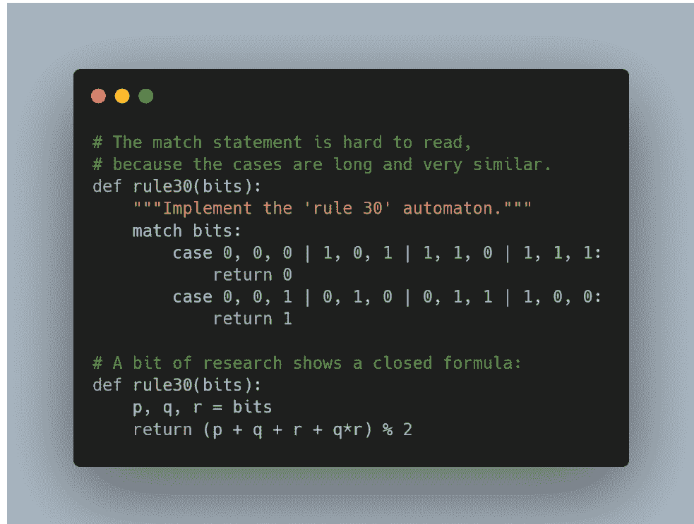

（原文缩略图，链接：https://mathspp.com/blog/pydonts/structural-pattern-matching-anti-patterns.）

## 引言

结构模式匹配即将登陆 Python，虽然它看起来可能像许多其他语言中常见的简单 switch 语句，但 Python 的 `match` 语句并非仅仅作为简单的 switch 语句而引入。
在本文中，我探讨了 `match` 语句的许多用例，而在这篇博客文章中，我将尝试探讨一些 `match` 并非最佳答案的用例。本文假设你了解结构模式匹配在 Python 中的工作原理，因此如果你不确定其工作原理，请随时阅读我的“Pythonic 代码模式匹配教程”。

> 在撰写本文时，Python 3.10 仍处于预发布阶段，因此如果你想下载并试用 Python 3.10，需要[前往正确的地方](https://www.python.org/downloads/)。

## 应该只有一种显而易见的方法

根据 [Python 之禅](https://peps.python.org/pep-0020/)，

> “应该有一种——最好只有一种——显而易见的方法。”

`match` 语句的引入似乎违反了这一原则……然而，你必须记住，`match` 语句的重点*不是*作为基本的 `switch` 语句，因为我们已经有很多替代方案——如果 `match` 本意是作为简单的 switch，那么它很可能被命名为“switch”而不是“match”。不，`match` 语句的重点是进行*结构模式匹配*，因此在 Python 3.10 之前我们一直使用的传统工具可以完成许多基本的匹配和分支操作。
下面我将与你分享其中一些工具，并尝试描述它们在哪些情况下很有帮助。当然，通过代码来理解会容易得多，因此沿途会有大量的代码示例。

## 简洁明了的 `if` 语句

[考拉兹猜想](https://en.wikipedia.org/wiki/Collatz_conjecture)是一个数学猜想，它指出对于任何给定的正整数输入，以下函数都会终止：

```python
def collatz_path(n):
    path = [n]
    while n != 1:
        match n % 2:
            case 0:
                n //= 2
            case 1:
                n = 3*n + 1
        path.append(n)
    return path
```

这会产生以下两个示例输出：

```python
>>> collatz_path(8)
[8, 4, 2, 1]
>>> collatz_path(15)
[15, 46, 23, 70, 35, 106, 53, 160, 80, 40, 20, 10, 5, 16, 8, 4, 2, 1]
```

如果我们查看上面 `match` 的用法，会发现它基本上充当了一个简单的 switch，用于匹配 0 或 1，这是正整数 `n` 进行 `n % 2` 运算可能产生的仅有的两个值。请注意，如果我们使用普通的 `if`，我们可以编写完全相同的代码*并且*节省一行代码：

```python
def collatz_path(n):
    path = [n]
    while n != 1:
        if n % 2:
            n = 3*n + 1
        else:
            n //= 2
        path.append(n)
    return path
```

我们节省了一行代码，并减少了最大缩进深度：使用 `match` 时，代码缩进了四次，而使用 `if` 的实现只有三级深度。当你只有几个选项并且正在检查显式相等性时，简洁明了的 `if` 语句很可能是最佳选择。

## 更聪明（一点）

有时你会觉得必须列出一系列 case 和相应的值，以便将一个映射到另一个。然而，通过寻找替代算法或公式并实现它，可能会让你的生活*简单得多*。我将给你举个例子。

如果你从未听说过，[规则 30](https://en.wikipedia.org/wiki/Rule_30) 是一种“初等元胞自动机”。你可以将其视为一个接收三个比特（三个零/一）并产生一个新比特的规则，具体取决于它接收到的三个比特。自动机非常非常有趣，但讨论它们超出了本文的范围。让我们看看“规则 30”自动机的一种可能实现：

```python
def rule30(bits):
    match bits:
        case 0, 0, 0:
            return 0
        case 0, 0, 1:
            return 1
        case 0, 1, 0:
            return 1
        case 0, 1, 1:
            return 1
        case 1, 0, 0:
            return 1
        case 1, 0, 1:
            return 0
        case 1, 1, 0:
            return 0
        case 1, 1, 1:
            return 0
```

这看起来像是 `match` 语句的合理用法，只是我们写了 16 行代码……好吧，你说得对，让我们把返回相同值的规则组合起来，这应该会使代码更短：

```python
def rule30(bits):
    match bits:
        case 0, 0, 0 | 1, 0, 1 | 1, 1, 0 | 1, 1, 1:
            return 0
        case 0, 0, 1 | 0, 1, 0 | 0, 1, 1 | 1, 0, 0:
            return 1
```

是的，好多了。但现在每个 case 有四个选项，我不得不眯着眼睛才能弄清楚每个选项从哪里开始到哪里结束，而且长串的零和一看起来并不那么赏心悦目……我们能做得更好吗？

只需做一点研究，你就会发现“规则 30”可以写成一个依赖于三个输入比特的*封闭公式*，这意味着我们不必将输入比特与所有可能的输入进行 `match`，我们只需*计算*输出：

```python
def rule30(bits):
    p, q, r = bits
    return (p + q + r + q*r) % 2
```

你可能会争辩说这个公式模糊了各个输入与其输出之间的关系。原则上你是对的，但将显式的“规则 30”写成 `match` 也并不能告诉你为什么每个输入映射到每个输出，所以为什么不把它写得简洁明了呢？

## 基本映射

## 从字典获取

在许多情况下，你只想获取一个值并将其映射到其他内容。例如，看这段代码，它接受一个表达式并将其写成前缀表示法：

```python
import ast

def prefix(tree):
    match tree:
        case ast.Expression(expr):
            return prefix(expr)
        case ast.Constant(value=v):
            return str(v)
        case ast.BinOp(lhs, op, rhs):
            sop = op_to_str(op)
            if sop is None:
                raise NotImplementedError()
            return f"{sop} {prefix(lhs)} {prefix(rhs)}"
        case _:
            raise NotImplementedError()

print(prefix(ast.parse("1 + 2 + 3", mode="eval")))    # + + 1 2 3
print(prefix(ast.parse("2*3 + 6", mode="eval")))      # + * 2 3 6
# 打印 '- + 1 * 2 3 / 5 7'，花点时间消化一下这个。
print(prefix(ast.parse("1 + 2*3 - 5/7", mode="eval")))
```

## case ast.BinOp(lhs, op, rhs):
    match op:
        case ast.Add():
            sop = "+"
        case ast.Sub():
            sop = "-"
        case ast.Mult():
            sop = "*"
        case ast.Div():
            sop = "/"
        case _:
            raise NotImplementedError()
    return f"{sop} {prefix(lhs)} {prefix(rhs)}"
case _:
    raise NotImplementedError()
```

```
print(prefix(ast.parse("1 + 2 + 3", mode="eval")))    # + + 1 2 3
print(prefix(ast.parse("2**3 + 6", mode="eval")))     # + * 2 3 6
# 最后一个打印输出 '- + 1 * 2 3 / 5 7'，花点时间琢磨一下。
print(prefix(ast.parse("1 + 2*3 - 5/7", mode="eval")))
```

注意到将 `BinOp` 内的 `op` 转换为字符串的内部 `match` 了吗？首先，这个嵌套的 `match` 占用了太多垂直空间，分散了我们对真正重要事情——即遍历树的递归结构——的注意力。这意味着我们实际上可以将这部分重构为一个工具函数：

```
import ast

def op_to_str(op):
    match op:
        case ast.Add():
            sop = "+"
        case ast.Sub():
            sop = "-"
        case ast.Mult():
            sop = "*"
        case ast.Div():
            sop = "/"
        case _:
            raise NotImplementedError()
    return sop

def prefix(tree):
    match tree:
        case ast.Expression(expr):
            return prefix(expr)
        case ast.Constant(value=v):
            return str(v)
        case ast.BinOp(lhs, op, rhs):
            return f"{op_to_str(op)} {prefix(lhs)} {prefix(rhs)}"
        case _:
            raise NotImplementedError()
```

```
print(prefix(ast.parse("1 + 2 + 3", mode="eval")))     # + + 1 2 3
print(prefix(ast.parse("2**3 + 6", mode="eval")))     # + * 2 3 6
# 最后一个打印输出 '- + 1 * 2 3 / 5 7'，花点时间琢磨一下。
print(prefix(ast.parse("1 + 2*3 - 5/7", mode="eval")))
```

这使得 `prefix` 函数更易于阅读和解释，但现在我们有了另一个真正困扰我的问题：一个简单却冗长的函数 `op_to_str`。你每支持一种运算符类型，函数就会增加两行……如果用 `if` 和 `elif` 语句链替代 `match`，你只在顶部节省了一行……

我在原文中建议的解决方法是使用字典将运算符类型映射到其字符串表示：

```
def op_to_str(op):
    ops = {
        ast.Add: "+",
        ast.Sub: "-",
        ast.Mult: "*",
        ast.Div: "/",
    }
    return ops.get(op.__class__, None)
```

这种字典使用模式在 Python 中相当常见，利用 `get` 方法计算值到另一个值的映射。如果你好奇，你可以使用 `get` 函数的第二个参数提供一个默认值，这在字典未列出所有可能的值或需要回退值时很有用。

## getattr

我们可用的另一个有用机制是 `getattr` 函数，它是 Python 内置函数三元组 `hasattr`、`getattr` 和 `setattr` 的一部分。

> 我将在未来的 Pydon't 文章中介绍这个三元组，务必订阅 Pydon't 通讯，以免错过！现在，我只简要展示一下 `getattr` 能为你做什么。

我正在编写一个名为 RGSPL 的 APL 解释器，其中有一个名为 `visit_F` 的函数，我需要将 APL 原语（如 `+` 和 `-`）映射到实现它们的相应 Python 函数。这些实现原语行为的 Python 函数位于 `functions.py` 文件中。如果我使用 `match` 语句，这个 `visit_F` 可能是这样的：

```
import functions

def visit_F(self, func):
    """获取可调用函数。"""
    name = func.token.type.lower()  # 获取符号的名称。
    match name:
        case "plus":
            function = functions.plus
        case "minus":
            function = functions.minus
        case "reshape":
            function = functions.reshape
        case _:
            function = None
    if function is None:
        raise Exception(f"Could not find function {name}.")
    return function
```

这与我上面展示的问题类似，我们想要为每种运算符类型获取一个字符串，所以这实际上可以用字典映射来编写。我邀请你以此作为小练习。

然而，问题在于：我的 RGPSPL 项目还有很长的路要走，而且我已经有了大约两打这样的原语，所以如果使用那个方案，我的 `match` 语句会接近 40 行；如果使用字典方案，每行一个键值对，则约 20 行。

值得庆幸的是，Python 的 `getattr` 可以用来从一个对象*获取*一个*属性*，前提是我有该属性的名称。上面代码中 `name` 变量的值正好与 `functions.py` 中定义的函数名相同，这并非巧合：

```
import functions

getattr(functions, "plus", None)          # 返回 functions.plus
getattr(functions, "reshape", None)       # 返回 functions.reshape
getattr(functions, "fasfADF", None)       # 返回 None
```

使用 Python 提供的 `getattr` 函数，我的 `visit_F` 保持恒定大小，无论我在 `functions.py` 文件中添加多少函数：

```
def visit_F(self, func):
    """获取可调用函数。"""
    name = func.token.type.lower()        # 获取符号的名称。
    function = getattr(functions, name, None)
    if function is None:
        raise Exception(f"Could not find function {name}.")
    return function
```

`getattr` 函数也可用于获取类实例的属性，例如：

```
class Foo:
    def __init__(self, a, b):
        self.a = a
        self.b = b

foo = Foo(3, 4)
print(getattr(foo, "a"))    # 打印 3
bar = Foo(10, ";")
print(getattr(bar, "b"))    # 打印 ';'
```

这说明，了解你可用的工具总是好的。并非所有工具都有非常广泛的用途，但这也意味着更专业的工具在投入使用时能产生最大的影响。

说到了解你的工具，本文最后一个 `match` 不是更好选择的用例，与在数据具有不同类型时调用不同的函数有关。

## 单分派泛型函数

如果你有像 Java 这样的编程语言经验，你会熟悉函数重载的概念：你多次实现同一个函数，但为不同类型的参数和/或不同数量的参数指定不同的行为。

例如，你可能想实现一个函数来漂亮打印一系列不同类型的对象：

```
def pretty_print(arg):
    if isinstance(arg, complex):
        print(f"{arg.real} + {arg.imag}i")
    elif isinstance(arg, (list, tuple)):
        for i, elem in enumerate(arg):
            print(i, elem)
    elif isinstance(arg, dict):
        for key, value in arg.items():
            print(f"{key}: {value}")
    else:
        print(arg)
```

它的使用方式如下：

```
>>> pretty_print(3)
3
>>> pretty_print([2, 5])
0 2
1 5
>>> pretty_print(3+4j)
3.0 + 4.0i
```

你可以看到，`if` 语句引入的分支仅仅是为了区分 `arg` 可能具有的不同类型，虽然处理逻辑可能不同，但最终目的始终相同：漂亮打印一个对象。但是，如果处理每种类型参数的代码有 10 行或 20 行呢？你将会得到一个非常长的函数，本质上包含了子函数。

你可以利用 `functools.singledispatch` 装饰器来分离所有这些子函数：

```
import functools

@functools.singledispatch
def pretty_print(arg):
    print(arg)

@pretty_print.register(complex)
def _(arg):
    print(f"{arg.real} + {arg.imag}i")

@pretty_print.register(list)
@pretty_print.register(tuple)
def _(arg):
    for i, elem in enumerate(arg):
        print(i, elem)

@pretty_print.register(dict)
def _(arg):
    for key, value in arg.items():
        print(f"{key}: {value}")
```

然后它就可以像原始函数一样使用：

```
>>> pretty_print(3)
3
>>> pretty_print([2, 5])
0 2
1 5
>>> pretty_print(3+4j)
3.0 + 4.0i
```

`pretty_print` 示例不是最好的例子，因为你装饰的行数和定义实际子函数的行数一样多，但这向你展示了现在可以留意的模式。你可以在文档中阅读更多关于 `singledispatch` 的信息。

## 结论

以下是本文的主要收获，我为你奉上：

> “新的 `match` 语句很棒，但这并不意味着 `match` 语句在所有情况下都是最佳选择，特别是，如果你将 `match` 语句用作简单的 `switch`，通常就是一种误用。”

这个 Pydon't 为你展示了：

- `match` 并不总是实现控制流的最佳方式；
- 短小且基础的 `match` 语句可能是普通的 `if` 语句；

- 有时可以通过*计算*来得到所需结果，而不必列举许多不同的情况及其对应的值；
- 内置工具如 `dict.get` 和 `getattr` 也可用于根据匹配的键获取不同的值；并且
- 当需要根据输入类型执行不同的子函数时，可以使用 `functools.singledispatch`。

## 参考资料

- PEP 622 – 结构化模式匹配，https://www.python.org/dev/peps/pep-0622/；
- PEP 634 – 结构化模式匹配：规范，https://www.python.org/dev/peps/pep-0634/；
- PEP 635 – 结构化模式匹配：动机与原理，https://www.python.org/dev/peps/pep-0635/；
- PEP 636 – 结构化模式匹配：教程，https://www.python.org/dev/peps/pep-0636/；
- PEP 443 – 单分派泛型函数，https://www.python.org/dev/peps/pep-0443/；
- Python 3 文档，Python 标准库，getattr，https://docs.python.org/3/library/functions.html#getattr；
- Python 3 文档，Python 标准库，functools.singledispatch，https://docs.python.org/3/library/functools.html#functools.singledispatch；
- 维基百科，“考拉兹猜想”，https://en.wikipedia.org/wiki/Collatz_conjecture；
- WolframAlpha，“规则 30”，https://www.wolframalpha.com/input/?i=rule+30；
- 维基百科，“规则 30”，https://en.wikipedia.org/wiki/Rule_30；

## 掌握序列切片

```
python
>>> c = [0, 1, 2, 3]
# 使用切片 [::] 会创建 `c` 的一个副本，
# 而 `a = b` 则意味着 `a` 和 `b` 将是同一个对象。
>>> a = b = c[:]
>>> print(a is b, a is c, b is c)
True False False
>>> a.append(4)
>>> a, b, c
([0, 1, 2, 3, 4], [0, 1, 2, 3, 4], [0, 1, 2, 3])
```

（原文缩略图见 https://mathspp.com/blog/pydonts/mastering-sequence-slicing。）

## 引言

在上一篇 Pydon't 中，我们探讨了如何使用序列切片来操作序列，例如字符串或列表。在本篇 Pydon't 中，我们将继续讨论序列切片的主题，但会涉及更高级的内容。具体来说，在本篇 Pydon't 中，你将

- 了解切片中的步长参数；
- 看到切片如何用于复制序列；
- 了解切片赋值；
- 学习更多地道的切片模式；

事实证明，关于序列切片有*很多*内容要讲，因此我将不得不再次拆分这篇 Pydon't，下次我们将通过以下内容完成序列切片的主题：

- 揭示围绕序列切片的两层语法糖；以及
- 了解如何为你的自定义对象实现切片。

## 切片步长

你掌握 Python 切片之旅的下一站是了解切片语法中较少使用的第三个参数：`step`（步长）。

### 仅步长

`step` 是你可以添加到切片语法中的第三个整数，它允许你从序列中选取*等间距*的元素。如果 `s` 是一个序列，那么你已经知道如何使用语法 `s[start:end]` 进行切片，而 `step` 就跟在这两个参数之后：`s[start:end:step]`。理解 `step` 参数工作原理的最简单方法是省略 `start` 和 `end` 参数，像这样：`s[::step]`。

这里有几个例子：

```
>>> "a0b0c0d0"[::2]
'abcd'
>>> "a00b00c00d00"[::3]
'abcd'
>>> "a000b000c000d000"[::4]
'abcd'
```

如你所见，在上面的所有例子中，我们都使用了 `step` 参数来跳过字母之间的所有零。

- 当 `step` 参数为 2 时，你将序列分成每组 2 个元素，并选取每组的第一个元素。
- 当 `step` 参数为 3 时，你将序列分成每组 3 个元素，并选取每组的第一个元素。
- 当 `step` 参数为 4 时，你将序列分成每组 4 个元素，并选取每组的第一个元素。
- ...

你明白了吧？再次注意，切片中的 `step` 参数与内置 `range` 函数接受的第三个（可选）参数密切相关。

## 起始、停止和步长

当你同时指定了起始和停止位置时，Python 会首先确定由 `start` 和 `stop` 参数所包含的序列部分，然后才使用 `step` 从该部分中选取正确的元素。

例如，你能解释一下这个结果吗：

```
>>> s = 'Slicing is easy!'
>>> s[2:14:2]
'iigi a'
```

首先发生的是 s[2:14] 告诉 Python 我们只想处理原始字符串的一部分：

```
>>> s = 'Slicing is easy!'
>>> s[2:14]
'icing is eas'
```

然后 `step` 参数开始工作，告诉 Python 只选取一些元素，如下图所示：

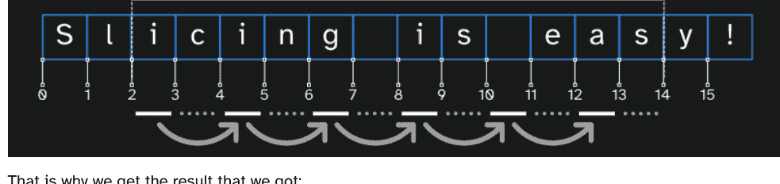

这就是为什么我们得到了这个结果：

```
>>> s = 'Slicing is easy!'
>>> s[2:14:2]
'iigi a'
# 我们也可以先获取子字符串，然后使用 `step`...
>>> sub = s[2:14]
>>> sub[::2]
'iigi a'
# ...或者连续执行这两步，不使用中间变量：
>>> s[2:14][::2]
'iigi a'
```

再试一次，试着弄清楚这个结果是什么：

```
>>> s = "Slicing is easy!"
>>> s[2:14:3]
# ..?
```

为了帮助你，这里有一张示意图，展示了上面的切片：

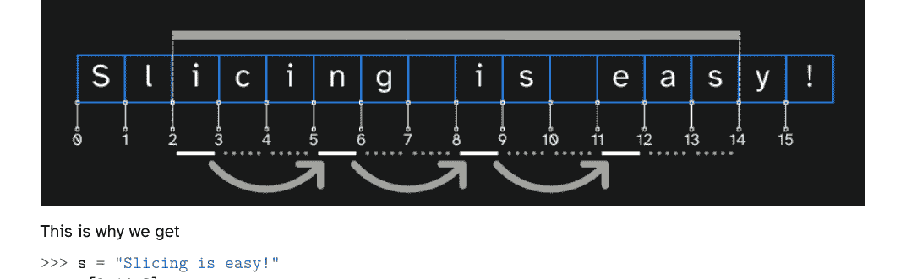

这就是为什么我们得到

```
python
>>> s = "Slicing is easy!"
>>> s[2:14:3]
'inie'
```

### 单位步长和空步长

与 `start` 和 `stop` 参数类似，`step` 参数也可以省略。当我们写形式为 [start:stop] 的切片时就是这样做的：通过不包含 `step` 参数，我们使用了它的默认值，即 1。这等同于写 [start:stop:]，也等同于写 [start:stop:1]。简而言之，以下三个切片是等价的：

- s[start:stop]；
- s[start:stop:]；以及
- s[start:stop:1]。

这里只有一个例子：

```
python
>>> s = "Slicing is easy!"
>>> s[2:14]
'icing is eas'
>>> s[2:14:]
'icing is eas'
>>> s[2:14:1]
'icing is eas'
```

> 这与 `range` 完全相同。当未指定第三个参数时，默认取值为 1。

### 负步长

我们已经看到了正步长参数的行为，现在我们将看到负步长的行为。这是事情真正变得混乱的地方，此时如果你熟悉 `range` 如何与三个参数一起工作，那么理解切片的工作原理会更容易。

当你指定一个切片 s[start:stop:step] 时，你将得到 s 中索引由 range(start, stop, step) 所指向的元素。如果 `step` 是负数，那么 `range` 函数将从 `start` 到 `stop` 反向计数。这意味着 `start` 需要大于 `stop`，否则就没有可计数的内容。

例如，range(3, 10) 给出整数 3 到 9。如果你想要整数 9 到 3，你可以使用步长 -1，但你也需要交换 `start` 和 `stop` 参数。不仅如此，你还需要稍微调整它们。`start` 参数是结果中包含的第一个数字，而 `stop` 参数是第一个不包含的数字，所以如果你想要从 9 到 3 的整数，倒数计数，你需要 `start` 参数为 9，`stop` 参数为 2：

```
>>> list(range(3, 10))
[3, 4, 5, 6, 7, 8]
>>> list(range(3, 10, -1))    # 你不能从 3 开始*向下*数到 10。
[]
>>> list(range(10, 3, -1))    # 从 10 开始，在 3 之前停止。
[10, 9, 8, 7, 6, 5, 4]
>>> list(range(9, 2, -1))     # 从 9 开始，在 2 之前停止。
[9, 8, 7, 6, 5, 4, 3]
```

如果你有点困惑，这是正常的。花点时间玩玩 `range`，感受一下它是如何工作的。

使用上面的 `range` 结果和下面的图，你应该能够弄清楚为什么这些切片返回这些值：

```
>>> s[3:10]
'cing is'
>>> s[3:10:-1]
''
>>> s[10:3:-1]
' si gni'
>>> s[9:2:-1]
'si gnic'
```

使用上面的 `range` 结果和这张图来帮助你：

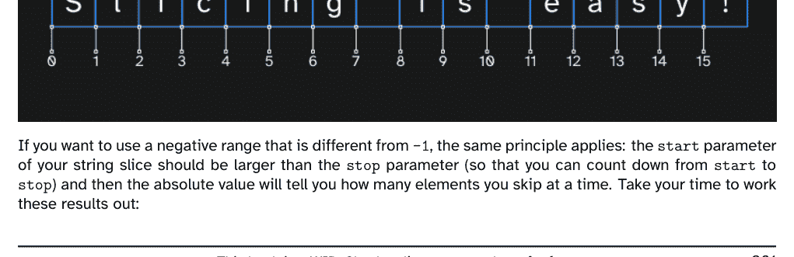

如果你想使用不同于 -1 的负步长，同样的原则适用：你的字符串切片的 `start` 参数应该大于 `stop` 参数（这样你才能从 `start` 倒数到 `stop`），然后绝对值将告诉你一次跳过多少个元素。花点时间推导出这些结果：## 反向然后跳跃

另一种让你更熟悉负步长的可能方法，是注意步长为 `-n` 的切片，与两个连续步长分别为 `-1` 和 `n` 的切片之间的关系：

```python
>>> s = 'Slicing is easy!'
>>> s[14:3:-2]
'ya igi'
>>> s[14:3:-1]
'ysae si gni'
>>> s[14:3:-1][::2]
'ya igi'
```

我们可以更进一步，认识到起始和结束参数用于缩短序列，然后步长参数才用于跳过元素：

```python
>>> s = 'Slicing is easy!'
>>> s[14:3:-2]
'ya igi'
>>> s[4:15]          # 交换 `start` 和 `stop` 并加 1...
'ing is easy'
>>> s[4:15][::-1]       # ...然后反转...
'ysae si gni'
>>> s[4:15][::-1][::2]  # ...然后每隔一个元素选取。
'ya igi'
```

## 零

为了完整起见，我们简要提一下，如果你将步长参数设为 0 会发生什么，因为我们已经查看了严格为正和严格为负的步长：

```python
>>> s = "Slicing is easy!"
>>> s[::0]
Traceback (most recent call last):
  File "<stdin>", line 1, in <module>
ValueError: slice step cannot be zero
```

将 0 用作步长会引发一个 `ValueError`，情况仅此而已。

## 建议

> 你知道吗？Python 标准库 (PSL) 中大约有 6000 处用到了序列切片，但其中只有不到 500 处使用了步长参数。这意味着，在 PSL 中，只有大约 8.33% 的切片操作用到了步长。（基于我 Windows 机器上 Python 3.9.2 的 PSL 粗略估算。）

- 使用不同于 1 的步长是非常特定的操作，只在少数情况下有意义，并且很大程度上取决于你如何组织数据；并且
- 除 1 和 -1 之外的步长参数会让你的代码更难阅读。

因此，建议你不要对切片过于兴奋，也不要强求你的数据必须以切片作为访问数据的最佳方式来组织。

例如，*不要*为了能使用 `[::2]` 和 `[1::2]` 来访问它们，就将颜色名称及其十六进制值交替存储。然而，如果由于某种原因你收到的数据是这种格式的，那么使用两个切片来分割数据是完全可以接受的：

```python
## 假设我们从某个 API 或其他地方以这种格式获得了 `colours`...
>>> colours = ["red", "#ff0000", "green", "#00ff00", "blue", "#0000ff"]
>>> names = colours[::2]
>>> names
['red', 'green', 'blue']
>>> hexs = colours[1::2]
>>> hexs
['#ff0000', '#00ff00', '#0000ff']
```

包含三个参数的切片往往很密集，且用肉眼难以解析，因为它们被括在 `[]` 中，然后用 `::` 分隔参数。如果你写一个形如 `s[a:b:c]` 的切片，可以预期你代码的读者需要暂停一下才能理解其中发生了什么。为此，当你编写一个长或复杂的切片时，首先考虑修改代码，这样你就无需编写长或复杂的切片。但如果你最终确实写了一个，你可能应该为你的切片添加注释，解释其用途。

我查看了 Python 标准库如何使用三参数切片，发现了一个取自 [dataclasses](https://docs.python.org/3/library/dataclasses.html) 模块源代码的优秀示例：

```python
## From Lib/dataclasses.py, Python 3.9.2
def _process_class(cls, init, repr, eq, order, unsafe_hash, frozen):
    # [code deleted for brevity]

    # Find our base classes in reverse MRO order, and exclude
    # ourselves.  In reversed order so that more derived classes
    # override earlier field definitions in base classes. As long as
    # we're iterating over them, see if any are frozen.
    any_frozen_base = False
    has_dataclass_bases = False
    for b in cls.__mro__[-1:0:-1]:
        # ...

    # [code deleted for brevity]
```

注意，在那个使用了切片的 `for` 循环之上，有 4 行注释，其中 3 行都在说明那个切片的作用：为什么步长参数是 -1，因为我们想要“*反向地*查找我们的基类”，然后它解释了为什么起始和结束参数分别是 -1 和 0，因为正如它所说，“并且排除我们自己”。如果我们在一个更简单的序列上尝试该切片，我们可以看到 `[-1:0:-1]` 实际上确实在反转序列的同时跳过了第一个元素：

```python
>>> s = "Slicing is easy!"
>>> s[-1:0:-1]
'!ysae si gniliC'
```

## 序列复制

在查看了许多不同的序列切片和剖析方法之后，现在该提及一个关于序列切片的非常重要的细微之处：当我们创建一个切片时，我们实际上创建了原始序列的一个副本。这不一定是件坏事。例如，有一个惯用的切片操作就利用了这种行为。

我提出这一点是因为，意识到这些细微差别很重要，这样你才能就代码编写方式做出明智的决定。

这种复制行为可能不可取的一个例子是：当你有一个非常大的列表，并且你考虑使用切片仅遍历该列表的一部分。在这种情况下，使用切片可能会浪费资源，因为你只是想遍历列表的特定部分，然后就结束了；你实际上并不需要在后续流程中保留那个子列表。

> 在这种情况下，你可能想使用的是 `itertools` 模块中的 `islice` 函数，它创建一个 *迭代器*，允许你遍历你关心的列表部分。*迭代器* 是 Python 中另一个很棒的功能，我将在未来的 Pydon'ts 中探讨它们，敬请期待！

验证切片会创建被切片序列副本的一个简单方法如下：

```python
>>> l = [1, 2, 3, 4]
>>> l2 = l
>>> l.append(5)    # 将 5 追加到 l...
>>> l2             # ... 注意 l2 也得到了新的 5，
                   # 所以 l2 = l 并没有复制 l。
[1, 2, 3, 4, 5]
>>> l3 = l[2:5]    # 将 l 切片赋值给 l3。
>>> l3
[3, 4, 5]
>>> l[3] = 42      # 改变 l 的一个值...
>>> l
[1, 2, 3, 42, 5]  # ... 4 被替换成了 42...
>>> l3
[3, 4, 5]         # ... 但 l3 仍然包含原始的 4。
```

## 操纵可变序列

让我们继续掌握序列切片的旅程。到目前为止，我们一直使用切片来提取序列的部分内容，但切片也可以用来操作我们序列的内容！

通过切片操作序列仅适用于特定类型的序列，即可变*序列；也就是我们能够修改的序列。*可变*序列的典型例子是列表，而*不可变*序列的典型例子则是字符串。

## 切片赋值

假设 `l` 是一个列表。我们习惯于"常规"赋值，

```
>>> l = [1, 2, 3, 4]
```

也习惯于为特定索引赋值：

```
>>> l[2] = 30
>>> l
[1, 2, 30, 4]
```

那么，为切片赋值呢？这完全没问题！

```
>>> l[:2] = [10, 20]     # 替换 l 的前两个元素。
>>> l
[10, 20, 30, 4]
>>> l[1::2] = [200, 400]  # 交换奇数位置的元素。
>>> l
[10, 200, 30, 400]
```

上面的两个简单示例展示了如何用相同数量的元素替换某些元素。
然而，使用更简单的切片时，你也可以改变原始切片的大小：

```
>>> l = [1, 2, 3, 4]
>>> l[:2] = [0, 0, 0, 0, 0]
>>> l
[0, 0, 0, 0, 0, 3, 4]
```

当你进行这样的切片赋值时，应该将其理解为“用右侧的新序列替换左侧的切片”，所以上面的例子可以理解为“将 `l` 的前两个元素替换为五个零”。
请注意，如果你使用“扩展切片”（带有步长参数的切片），那么左侧和右侧的元素数量*应该*匹配：

```
>>> l = [1, 2, 3, 4]
>>> l[::2]  # 这个切片包含两个元素...
[1, 3]
>>> l[::2] = [0, 0, 0, 0, 0]  # ...我们尝试用5个元素替换它们。
Traceback (most recent call last):
  File "<stdin>", line 1, in <module>
ValueError: attempt to assign sequence of size 5 to extended slice of size 2
```

在我看来，能够为切片赋值让你可以编写一些非常优雅的代码。
例如，当我在探索Python标准库时，在 `urljoin` 函数中发现了一个切片赋值的精妙用法。`urllib.parse` 模块中的 `urljoin` 函数接受一个基础路径和一个相对路径，并尝试将两者组合以创建一个绝对路径。这是一个示例：

```
>>> import urllib.parse
>>> urllib.parse.urljoin("https://mathspp.com/blog/", "pydonts/zip-up")
'https://mathspp.com/blog/pydonts/zip-up'
```

我使用 `urllib.parse.urljoin` 来获取我博客的基础URL，并将其与一个指向我已发布的一篇 Pydon't 文章的相对链接拼接起来。现在让我展示一下该函数的部分源代码：

```
## 源自 Python 3.9.2 的 Lib/urllib/parse.py
def urljoin(base, url, allow_fragments=True):
    """Join a base URL and a possibly relative URL to form an absolute
    interpretation of the latter."""

    # [为简洁起见省略部分代码]

    # 根据 rfc3986，如果首个字符是根路径，则忽略所有基础路径。
    if path[:1] == '/':
        segments = path.split('/')
    else:
        segments = base_parts + path.split('/')
        # 过滤掉在重新合并已解析路径时会导致冗余斜杠的元素
        segments[1:-1] = filter(None, segments[1:-1])
```

注意到 `segments[1:-1]` 的切片赋值了吗？这个 `segments` 列表包含了提供给 `urljoin` 函数的两个URL的不同部分，然后使用 `filter` 函数过滤掉URL中为空的部分。让我编辑 `urljoin` 的源代码，为其添加两条 `print` 语句：

```
## 源自 Python 3.9.2 的 Lib/urllib/parse.py
def urljoin(base, url, allow_fragments=True):
    """Join a base URL and a possibly relative URL to form an absolute
    interpretation of the latter."""

    # [为简洁起见省略部分代码]

    # 根据 rfc3986，如果首个字符是根路径，则忽略所有基础路径。
    if path[:1] == '/':
        segments = path.split('/')
    else:
        segments = base_parts + path.split('/')
        # 过滤掉在重新合并已解析路径时会导致冗余斜杠的元素
        print(segments)
        segments[1:-1] = filter(None, segments[1:-1])
        print(segments)
```

现在让我运行相同的示例：

```
>>> import urllib.parse
>>> urllib.parse.urljoin("https://mathspp.com/blog/", "pydonts/zip-up")
['', 'blog', '', 'pydonts', 'zip-up']   # 第一次 `print(segments)` 的输出
['', 'blog', 'pydonts', 'zip-up']        # <----- segments 中少了一个 ''！
'https://mathspp.com/blog/pydonts/zip-up'
```

我们可以取第一次打印的结果，手动执行过滤操作：

```
>>> segments = ['', 'blog', '', 'pydonts', 'zip-up']
>>> segments[1:-1]
['blog', '', 'pydonts']
>>> list(filter(None, segments[1:-1]))
['blog', 'pydonts']
>>> segments[1:-1] = filter(None, segments[1:-1])
>>> segments
['', 'blog', 'pydonts', 'zip-up']
```

所以这是一个非常有趣的切片赋值用例。你可能不会经常做这样的事情，但了解它意味着当你需要时，你能够优雅地编写那段代码。

## 切片删除

如果你可以为切片赋值，那么将空列表 `[]` 赋值给切片会发生什么？

```
>>> l = [1, 2, 3, 4]
>>> l[:2] = []             # 用空列表替换前两个元素。
>>> l
[3, 4]
```

如果你将空列表赋值给切片，你实际上是从列表中删除了那些元素。你可以通过赋值空列表来实现这一点，但也可以使用 `del` 关键字达到相同效果：

```
>>> l = [1, 2, 3, 4]
>>> del l[:2]
>>> l
[3, 4]
```

## 更地道的切片用法

既然我们已经了解了序列切片的更多酷炫特性，是时候看看这些特性如何更好地使用，以及它们如何以更地道的形式出现了。

*地道的*代码是指你可以一眼看过去就能整体理解其功能的代码，而不需要对每一小部分进行单独推理……把它想象成“正常的”阅读：当你学习时，你需要逐字阅读，但现在你能够整体把握词语。通过足够的练习，这些地道的代码片段也能被整体识别。

### 偶数位置与奇数位置

一个你可能希望记住的简单切片是，它可以让你访问序列中所有偶数位置的元素。这个切片是 `[::2]`：

```
>>> l = ["even", "odd", "even", "odd", "even"]
>>> l[::2]
['even', 'even', 'even']
```

类似地，`l[1::2]` 给出奇数位置的元素：

```
>>> l = ["even", "odd", "even", "odd", "even"]
>>> l[1::2]
['odd', 'odd']
```

### s[:-1]

一个没有起始和停止参数，步长为 -1 的切片是一个非常常见的切片模式。事实上，在Python标准库中大约有100个这样的切片，大约占所有使用步长参数的切片的三分之一。

`s[:-1]` 应该读作“序列 s，但反转”。这里是一个简单的例子：

```
>>> s = "Slicing is easy!"
>>> s[:-1]
'!ysae si gnicilS'
```

这里值得注意的一点，并且与之前关于切片创建副本的评论相关的是，有时你不想复制整个序列来反转它；例如，如果你只想按相反顺序迭代序列。在这种情况下，你可能只想使用内置函数 `reversed`。这个函数接受一个序列，并允许你按相反的顺序迭代该序列，而无需支付复制整个序列的额外内存成本。

### l[:] 或 l[::]

如果切片创建副本，那意味着切片是复制序列的一种非常干净的方式！切片 `[:]` 和 `[::]` 选择整个序列，所以它们是复制序列——例如，一个列表——的主要方式，当你确实需要创建副本时。

深拷贝与浅拷贝、按引用传递与按值传递等概念的区分，本身就是一个很大的讨论话题。

很容易在Python标准库中搜索到这种模式的用例（以及之前提到的那些模式），所以我只给你留下一个例子，来自 `argparse` 模块，其中包含一个名为 `_copy_items` 的辅助函数（我删除了它的注释）：

```
## 源自 Python 3.9.2 的 Lib/argparse.py
def _copy_items(items):
    if items is None:
        return []
```if type(items) is list:
    return items[:]
import copy
return copy.copy(items)
```

注意这个习惯用法与函数名的契合度：函数名为复制项目。函数具体做了什么？如果 `items` 参数是一个列表，那么它返回该列表的一个副本！因此 `l[:]` 和 `l[::]` 应当被理解为"l 的一个副本"。

这个习惯用法也解释了文章开头的缩略图。

## del l[:]

另一个使用了切片 `[:]` 的习惯用法，但带有些许附加内容，即清空列表内容的用法。

可将 `l[:]` 理解为"打开 l"，那么 `del l[:]` 就读作"打开 l 并删除其内容"。这与执行 `l[:] = []` 等效，但不同于执行 `l = []`，也不同于执行 `del l`。

很容易看出 `del l` 与其他操作的区别：`del l` 意味着名称 `l` 不再被使用：

```python
>>> l = [1, 2, 3, 4]
>>> del l
>>> l
Traceback (most recent call last):
  File "<stdin>", line 1, in <module>
NameError: name 'l' is not defined
```

而这个习惯用法仅仅是清空列表内容：

```python
>>> l = [1, 2, 3, 4]
>>> del l[:]
>>> l
[]
```

可能更难理解的是为什么 `del l[:]` 和 `l[:] = []` 不同于 `l = []`。我将通过一个示例明确展示它们的不同，然后你可以自行决定是否要花费精力去理解背后原理。

首先，让我使用 `l[:] = ...`

```python
>>> l = l_shallow = [1, 2, 3]
>>> l_shallow is l
True
>>> j = []
>>> l[:] = j
>>> l
[]
>>> l_shallow
[]
```

```python
>>> l is j
False.
>>> l_shallow is l
True
```

现在让我将它与 `l = ...` 进行对比：

```python
>>> l = l_shallow = [1, 2, 3]
>>> l_shallow is l
True
>>> j = []
>>> l = j
>>> l
[]
>>> l_shallow
[1, 2, 3]
>>> l is j
True
>>> l_shallow is l
False
```

你可以看到，在上面的例子中，像 `l is j` 和 `l_shallow is l` 这样的比较结果，以及 `l_shallow` 的内容，在两种情况下都不同。因此，这两者不可能相同。发生了什么？嗯，深拷贝和浅拷贝、可变对象的引用等等，正是原因所在！我将把这个更深入的讨论留到以后的 Pydon't 系列中，因为这篇已经相当长了。

只需记住，`l[:] = []` 和 `del l[:]` 可以理解为"删除 l 的内容"。

## 结论

> "切片功能非常强大，是处理序列（如字符串和列表）时必须掌握的关键工具。"

- 切片可以有一个步长参数，用于跳过序列中的元素；
- 步长参数的默认值为 1；
- 负步长允许从序列末尾向开头选取元素；
- 使用负步长时，起始参数应指向终止参数所指元素右侧的序列元素；
- 切片（使用负步长）与内置的 `range` 函数存在平行关系；
- 0 不是切片的有效步长参数；
- 切片更常见于仅使用起始和终止参数的情况，部分原因是包含 `[start:stop:step]` 的切片可能非常难以阅读；
- 切片会创建所查看序列部分的副本，因此在内存受限时需要格外注意；
- 你可以对可变对象（如列表）的切片进行赋值；
- 对切片进行赋值时，如果左侧使用简单切片（无步长参数）且右侧序列的元素数量不同，序列的最终长度可能会改变；
- 你可以使用 `del` 关键字删除可变序列的切片，也可以将空序列赋值给这些切片以达到相同效果；
- 有一些有趣的惯用切片用法你应该了解：
    - `s[::2]` 和 `s[1::2]` 分别是 "s 中偶数位置的元素" 和 "s 中奇数位置的元素"；
    - `s[::-1]` 是 "s 的反转版本"；
    - `l[:]` 和 `l[::]` 是 "l 的一个副本"；并且
    - `del l[:]` 是 "删除 l 的内容" 或 "清空 l"，这与执行 `l = []` 不同。

## 参考资料

- Python 3 文档，Python 语言参考，表达式 – 切片，https://docs.python.org/3/reference/expressions.html#slicings [最后访问 20-04-2021]；
- Python 3 文档，Python 语言参考，数据模型 – 标准类型层次结构，https://docs.python.org/3/reference/datamodel.html#the-standard-type-hierarchy [最后访问 20-04-2021]；
- Python 3 文档，Python 语言参考，数据模型 – 模拟容器类型，https://docs.python.org/3/reference/datamodel.html#emulating-container-types [最后访问 20-04-2021]；
- Python 3 文档，Python 语言参考，内置函数，slice，https://docs.python.org/3/library/functions.html#slice [最后访问 20-04-2021]；
- Python 3 文档，Python 语言参考，内置函数，range，https://docs.python.org/3/library/functions.html#func-range [最后访问 03-05-2021]；
- Python 3 文档，Python 语言参考，内置函数，filter，https://docs.python.org/3/library/functions.html#filter [最后访问 11-05-2021]；
- Python 3 文档，Python 语言参考，内置函数，reversed，https://docs.python.org/3/library/functions.html#reversed [最后访问 11-05-2021]；
- Python 3 文档，Python 标准库，dataclasses，https://docs.python.org/3/library/dataclasses.html [11-05-2021]；
- Python 3 文档，Python 标准库，itertools，islice，https://docs.python.org/3/library/itertools.html#itertools.islice [11-05-2021]；
- Python 3 文档，Python 标准库，urllib.parse，urljoin，https://docs.python.org/3/library/urllib.parse.html#urllib.parse.urljoin [11-05-2021]；
- "Effective Python – 90 Specific Ways to Write Better Python"；Slatkin, Brett；ISBN 9780134853987；
- Stack Overflow, "Why would I want to use itertools.islice instead of normal list slicing?", https://stackoverflow.com/q/32172612/2828287 [最后访问 10-05-2021]。

## 序列切片的内部工作原理

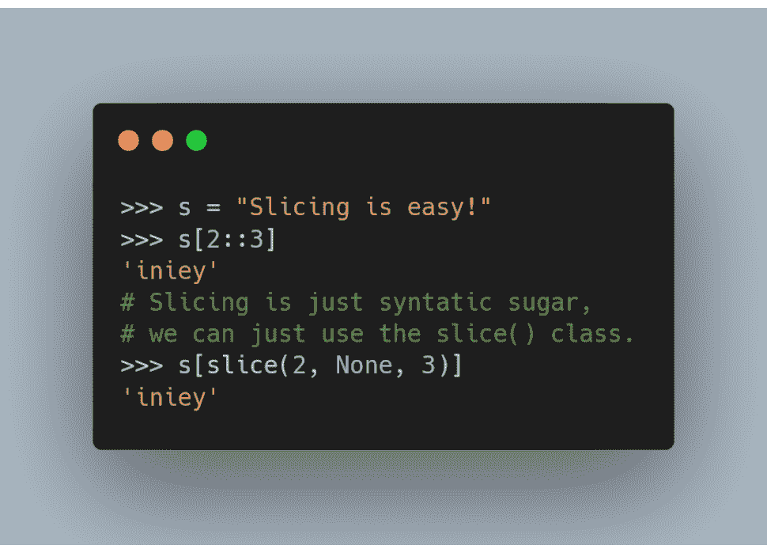

（原文缩略图来自 [https://mathspp.com/blog/pydonts/inner-workings-of-sequence-slicing](https://mathspp.com/blog/pydonts/inner-workings-of-sequence-slicing)。）

## # 引言

我们已经写了两篇关于序列切片的 Pydon't 文章：

1. "地道的序列切片"；以及
2. "掌握序列切片"。

这两篇 Pydon't 几乎涵盖了关于序列切片的所有知识，但今天我们将探讨一些新内容：

- 揭开序列切片背后的两层语法糖；以及
- 看看如何为你的自定义对象实现切片。

如果你不太了解序列切片的工作原理，建议先看看我上面链接的 Pydon't 文章。特别是掌握序列切片那篇，能真正帮助你将 Python 切片技巧提升到新的水平。

话不多说，让我们开始吧！

### `slice` 类

不知你是否了解，Python 在其详尽的文档中有一个章节专门介绍其内置函数。在那里，你可以找到诸如 `bool`、`enumerate` 或 `len` 这样的内容。如果你查看以 "s" 开头的内置函数，你会在其中发现 `slice`！

查看关于 `slice` 的文档，我们发现它的呈现方式类似于 `int` 或 `str`，这意味着切片定义了一种我们可以在程序中使用的对象类型：就像 `int(3)` 创建一个整数 3 或 `str(3)` 创建一个字符串 "3"，`slice(3)` 创建一个切片：

```python
>>> print(slice(3))
slice(None, 3, None)
```

这是我们在本篇 Pydon't 中揭开的第一层语法糖：当我们编写像 `s[2::3]` 这样的代码时，Python 使用的就是这些切片对象！但首先，让我们更深入地探索一下这些切片对象。

### 切片参数

如果我们阅读文档，或者对 `slice` 内置函数进行足够多的探索，我们会发现这个对象存储了我们在之前的 Pydon't 中反复讨论的切片参数。这些参数是切片的起始（start）、停止（stop）和步长（step）参数，文档告诉我们可以访问它们：

```python
>>> sl = slice(1, 12, 3)
>>> sl.start
1
>>> sl.stop
12
>>> sl.step
3
```

然而，我们不能修改它们：# 与切片和范围的关系

创建`slice`对象时，可以为`start`、`stop`和`step`参数指定值。例如：
```python
>>> sl = slice(None, 3, None)
>>> print(sl.start)
None
>>> sl.start = 0
Traceback (most recent call last):
  File "<stdin>", line 1, in <module>
AttributeError: readonly attribute
```

## 与 range 的关系

另一个非常重要的点在于，切片与由`range`指定的索引集之间的关系并非偶然。文档明确指出，`slice(start, stop, step)`表示的索引与`range(start, stop, step)`指定的相同。这就是为什么理解`s[start:stop:step]`与使用`for`循环和相应的`range`那种（冗长得多的）写法之间的关系如此有用：
```python
>>> s = "Slicing is easy!"
>>> print(s[1:15:3])
li  s
>>> start, stop, step = 1, 15, 3
>>> result = ""
>>> for idx in range(start, stop, step):
...     result += s[idx]
...
>>> print(result)
li  s
```

## 使用显式切片对象代替冒号

我们已经知道可以创建显式的切片对象，但我们能使用它们吗？当然可以！我之前一直在讨论语法糖，这正是其体现：编写`s[start:stop:step]`或`s[sl]`（其中`sl`是适当的切片对象）是完全等价的！

以下是两个例子：
```python
>>> s = "Slicing is easy!"
>>> s[1:15:2]
'lcn ses'
>>> sl = slice(1, 15, 2)
>>> s[sl]
'lcn ses'
>>> s[2::3]
'iniey'
>>> sl = slice(2, None, 3)
>>> s[sl]
'iniey'
```
注意上面的例子，在创建切片对象时我们使用了`None`，以指定一个隐式的切片参数，比如在切片`s[2::3]`中被省略的`stop`参数，它位于两个冒号之间。

> 顺便说一句，小心命名你的切片对象！最直观的名字是`slice`，但如果你用这个名字创建了一个切片对象，那么你将很难再创建其他切片对象，因为你会覆盖内置类型`name`。这也是为什么你不应该用`str`命名你的字符串，或用`int`命名你的整数。

## 从序列中获取元素

我们已经看到切片对象可以用于从序列中提取切片，就像我们使用冒号语法糖一样……但是，这些切片对象究竟是如何被用来从序列中提取元素的呢？与此相关，我如何在我自己的对象中实现切片功能？

答案在于`__getitem__`这个双下方法（dunder method）。

> 回想一下，“dunder”是“double underscore”（双下划线）的简称，这是Python对以双下划线开头和结尾的方法的常用命名，通常表明该方法与Python的内部工作有关。我们已经在关于`str`和`repr`，以及关于Truthy、Falsy和`bool`的Pydon'ts中见过其他双下方法。

`__getitem__`这个双下方法，是在你尝试访问索引或切片时，在幕后被调用的方法。一个经验性的验证非常容易进行：我们将创建一个名为`S`的新类，它将包装内置字符串，并拦截`__getitem__`调用：
```python
>>> class S(str):
...     def __getitem__(self, idx):
...         print("Inside __getitem__")
...         # Just let the built-in string handle indexing:
...         return super().__getitem__(idx)
...
>>> s = S("Slicing is easy!")
>>> s[3]
Inside __getitem__
'c'
>>> s[1::2]
Inside __getitem__
'lcn ses!'
```
这表明`__getitem__`方法是负责序列索引的方法。

> `super()`那一行是让内置的`str`类为我们处理索引，因为我们的目标只是验证`__getitem__`方法被调用了。

现在，与其打印无关的消息，我们实际上可以打印即将被使用的索引（或切片！）：
```python
>>> class S(str):
...     def __getitem__(self, idx):
...         print(f"The argument was: {idx}")
...         # Just let the built-in string handle indexing:
...         return super().__getitem__(idx)
...
>>> s = S("Slicing is easy!")
>>> s[3]
The argument was: 3
'c'
>>> s[1::2]
The argument was: slice(1, None, 2)
'lcn ses!'
```
正如你在上面看到的，我们尝试用`s[1::2]`切片字符串，当它到达`__getitem__`调用时，这已经被转换为`slice(1, None, 2)`了！

这揭示了两重语法糖：使用冒号语法进行切片`start:stop:step`，只是创建一个显式切片对象的语法糖；而使用方括号`[]`进行索引/切片，只是调用`__getitem__`函数的语法糖：
```python
>>> s = "Slicing is easy!"
>>> s[1::3]
'li  s'
>>> s.__getitem__(slice(1, None, 3))
'li  s'
```
这表明，如果你为自己的对象实现了`__getitem__`方法，你就可以在自己的自定义对象中使用索引/切片。我将在下面展示一个例子。

## 设置元素、删除元素和容器模拟

在关于掌握序列切片的Pydon't中，我们还看到了如何进行切片赋值以及如何删除序列的切片。要在你自己的对象中执行这些操作，你必须处理`__setitem__`和`__delitem__`方法，它们的签名与`__getitem__`类似。如果你想了解更多关于这些方法的信息，或者你正在研究实现模拟内置容器类型的自定义类，请查看文档。

## 逗号分隔的索引和切片

我想指出另一个很酷的特性，如果你在文档中“深入”挖掘（参见这里），或者如果你使用numpy或pandas等其他模块可能已经遇到过。这个“特性”就是你可以用逗号分隔来编写多个索引/切片。

这在语法上是完全有效的。也就是说，你可以编写类似这样的东西，Python会接受它。然而，Python的内置类型不支持多重索引或切片，所以内置类型最终会对你报错：
```python
>>> s = "Slicing is easy!"
>>> s[1, 2, 3, 4:16:2]
Traceback (most recent call last):
  File "<stdin>", line 1, in <module>
TypeError: string indices must be integers
```
Python抱怨了，但不是因为语法。它抱怨的是字符串无法处理你传给`__getitem__`的这些索引和额外的切片。与真正的`SyntaxError`对比一下：
```python
>>> for in range(10):
File "<stdin>", line 1
    for in range(10):
        ^
SyntaxError: invalid syntax
```
我甚至无法换行继续我虚构的`for`循环，Python直接抱怨语法错误。

然而，在你的自定义对象中，你可以添加对多重索引/切片的支持：
```python
>>> class Seq:
...     def __getitem__(self, idx):
...         print(idx)
...
>>> s = Seq()
>>> s[1, 2, 3, 4:16:2]
(1, 2, 3, slice(4, 16, 2))
```
正如你所看到的，多个索引和切片被打包成一个元组，然后传递给`__getitem__`。

我们已经了解了切片在底层是如何工作的，也窥视了常规索引的工作原理，现在我们将通过几个代码示例来看这些东西在哪些场景下会有用。

## 代码示例

请注意，你很可能不会在日常代码中使用显式的`slice`对象。在Python标准库中`slice`的使用示例很少，这支持我的说法。

我找到的`slice`用法大多用于测试其他对象的实现，然后我在`xml`模块中找到了几个（实际上只有两个）用法，但老实说，我不明白为什么使用它们！（如果你能解释一下那里发生了什么，请告诉我！）

## itertools.islice

我们将使用的第一个例子来自`itertools`模块的`islice`函数。`islice`函数可以用于切片迭代器，类似于常规切片，有两个关键区别：
- `islice`不支持负参数；且
- `islice`适用于泛型可迭代对象，这是`islice`有用的主要原因。

可迭代对象和生成器是Python中令人着迷的东西，未来会有专门的Pydon'ts讨论这个主题。敬请期待。

在不深入讨论可迭代对象细节的情况下，让我展示一个清晰的例子，说明常规切片不工作但`islice`工作的情况：
```python
>>> f = lambda x: x    # function that returns its input.
>>> f(3)
3
>>> f([1, 2, "Hey"])
[1, 2, 'Hey']
>>> s = "Slicing is easy!"
>>> s[2::3]
'iney'
>>> m = map(f, s)    # `m` is an iterable with the characters from `s`.
>>> m[2::3]          # regular slicing doesn't work...
Traceback (most recent call last):
  File "<stdin>", line 1, in <module>
TypeError: 'map' object is not subscriptable
>>> import itertools
>>> for char in itertools.islice(m, 2, None, 3):
...     print(char)
...
i
n
i
e
y
```
上面的例子只是表明，`islice`在某些常规切片`[start:stop:step]`不工作的情况下可以工作。`islice`的文档提供了`islice`的近似Python实现（实际函数是用C编写的）：
```python
## From https://docs.python.org/3/library/itertools.html#itertools.islice,
## accessed on the 18th of May 2021
def islice(iterable, *args):
    # (Some comments removed for brevity...)
    s = slice(*args)
    start, stop, step = s.start or 0, s.stop or sys.maxsize, s.step or 1
    it = iter(range(start, stop, step))
    # (Code sliced for brevity, pun much intended.)
    # ...
```
在上面的例子中，`slice`对象被用作一个实用工具，将传给`islice`的参数映射为示例第三行代码中`range`所需的参数。

另一个值得注意的地方是使用`or`运算符为`start`、`stop`、`step`赋值的那一行。`or`被用于为参数分配默认值，以防原始参数为`None`：
```python
>>> start = 4    # If `start` has a value,
```## 自定义算术与几何序列

```python
>>> start = 0     # 然后我们获取该值。
0
>>> start = None   # 然而，如果 `start` 是 `None`，
>>> start or 0     # 那么我们获取默认值 `0`。
0
```

`stop` 和 `step` 参数同理；这里再举一个关于 `stop` 的例子：

```python
>>> import sys
>>> stop = 4
>>> stop or sys.maxsize
4
>>> stop = None
>>> stop or sys.maxsize
9223372036854775807
```

> `or` 运算符（以及 `and` 运算符）的短路求值能力将在后续的 Pydon't 中详细讨论，不必担心！

总结这个示例，我们看到 `slice` 在将类似 range 的参数分派到正确位置的特殊用例中可能很有用，因为你可以从一个 `slice` 对象中读取参数。

# 自定义算术与几何序列

在这个示例中，我将向你展示一个支持切片的自定义对象的简单示例实现。为此，我们将为几何级数（参见 [Wikipedia](https://en.wikipedia.org/wiki/Geometric_progression)）的概念实现一个类：一种由两个参数定义的级数：

- 起始数字 `s`；以及
- 比率 `r`。

该级数的第一个数字是 `s`，之后的每一项都是前一项乘以 `r`。以下是如何为这种概念创建骨架的方法：

```python
class GeometricProgression:
    def __init__(self, start, ratio):
        self.start = start
        self.ratio = ratio

    def __str__(self):
        return f"GeometricProgression({self.start}, {self.ratio})"

gp = GeometricProgression(1, 3)
print(gp)   # 输出 GeometricProgression(1, 3)
```

现在，几何级数有无限多项，所以我们不能真正生成“所有项”并将它们放在列表中返回，因此如果我们想支持索引和/或切片，我们需要做些别的事情...我们需要实现 `__getitem__`！

让我们以返回一个包含用户尝试获取的所有元素的列表的方式来实现 `__getitem__`：

```python
import sys

class GeometricProgression:
    def __init__(self, start, ratio):
        self.start = start
        self.ratio = ratio

    def __str__(self):
        return f"GeometricProgression({self.start}, {self.ratio})"

    def nth(self, n):
        """计算级数的第 n 项，从 0 开始索引。"""
        return self.start*pow(self.ratio, n)

    def __getitem__(self, idx):
        if isinstance(idx, int):
            return self.nth(idx)
        elif isinstance(idx, slice):
            start, stop, step = idx.start or 0, idx.stop or sys.maxsize, idx.step or 1
            return [self.nth(n) for n in range(start, stop, step)]
        else:
            raise TypeError("Geo. progression indices should be integers or slices.")
```

```python
gp = GeometricProgression(1, 3)
print(gp[0])        # 输出 1
print(gp[1])        # 输出 3
print(gp[2])        # 输出 9
print(gp[0:3])      # 输出 [1, 3, 9]
print(gp[1:10:3])   # 输出 [3, 81, 2187]
```

如你所见，我们的实现已经支持切片和索引，但我们可以更进一步，轻松添加对多个索引/切片的支持：

```python
import sys

class GeometricProgression:
    def __init__(self, start, ratio):
        self.start = start
        self.ratio = ratio

    def __str__(self):
        return f"GeometricProgression({self.start}, {self.ratio})"

    def nth(self, n):
        """计算级数的第 n 项，从 0 开始索引。"""
        return self.start*pow(self.ratio, n)
```

```python
def __getitem__(self, idx):
    if isinstance(idx, int):
        return self.nth(idx)
    elif isinstance(idx, slice):
        start, stop, step = idx.start or 0, idx.stop or sys.maxsize, idx.step or 1
        return [self.nth(n) for n in range(start, stop, step)]
    elif isinstance(idx, tuple):
        return [self.__getitem__(sub_idx) for sub_idx in idx]
    else:
        raise TypeError("Geo. progression indices should be integers or slices.")

gp = GeometricProgression(1, 3)
print(gp[0, 1, 4])                # 输出 [1, 3, 81]
print(gp[0:2, 0:2, 1, 0:2])       # 输出 [[1, 3], [1, 3], 3, [1, 3]]
```

就是这样，这向你展示了一个（简单的）工作示例，说明如何为自定义对象定义索引和切片。

你可以在 GitHub 上找到这个简单的实现，以防你需要。

## 结论

这是本次 Pydon't 的主要收获，奉上：

> “序列切片为你隐藏了两层语法糖，但如果你想编写支持索引和/或切片的自定义对象，你确实需要了解它们。”

本次 Pydon't 向你展示了：

- Python 中有一个内置的 `slice` 类型；
- 语法 `[start:stop:step]` 只是 `slice(start, stop, step)` 的语法糖；
- `slice(start, stop, step)` 表示 `range(start, stop, step)` 的索引；
- 当你使用 `seq[]` 对 `seq` 进行索引/切片时，你实际上调用的是 `seq` 的 `__getitem__` 方法；
- `__getitem__`、`__setitem__` 和 `__delitem__`，是你在自定义对象中模拟索引、索引赋值和索引删除所需的三种方法；
- Python 语法允许多个用逗号分隔的索引/切片；
- `itertools.islice` 可与可迭代对象一起使用，而普通的切片则不能；并且
- 为自定义对象实现（多个）索引/切片可以相当直接。

## 参考文献

- Python 3 文档，Python 语言参考，表达式 – 切片，https://docs.python.org/3/reference/expressions.html#slicings [最后访问于 2021-05-18]；
- Python 3 文档，Python 语言参考，数据模型 – 标准类型层次结构，https://docs.python.org/3/reference/datamodel.html#the-standard-type-hierarchy [最后访问于 2021-04-20]；
- Python 3 文档，Python 语言参考，数据模型 – 模拟容器类型，https://docs.python.org/3/reference/datamodel.html#emulating-container-types [最后访问于 2021-05-18]；
- Python 3 文档，Python 语言参考，数据模型 – 模拟容器类型，`__getitem__`，https://docs.python.org/3/reference/datamodel.html#object.__getitem__ [最后访问于 2021-05-18]；
- Python 3 文档，Python 语言参考，内置函数，`slice`，https://docs.python.org/3/library/functions.html#slice [最后访问于 2021-05-18]；
- Python 3 文档，Python 标准库，`itertools`，`islice`，https://docs.python.org/3/library/itertools.html#itertools.islice [2021-05-18]；
- Stack Overflow，“为什么我要使用 itertools.islice 而不是普通的列表切片？”，https://stackoverflow.com/q/32172612/2828287 [最后访问于 2021-05-18]。

# 属性

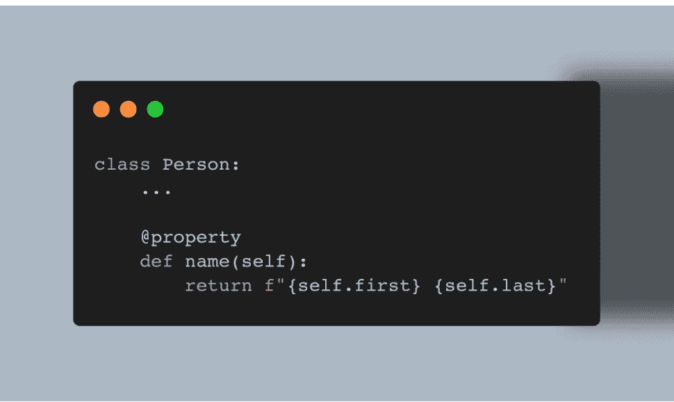

（原文文章缩略图，来源：https://mathspp.com/blog/pydonth/properties。）
学习如何使用属性为你的属性添加动态行为。

## 引言

属性（Property），通过内置的 `property` 定义，是 Python 的一个特性，它允许你为通常是一个静态接口的属性添加动态行为。属性还有其他好处和用例，我们将在这里涵盖它们。

+ 在本次 Pydon't 中，你将
- 了解属性是什么；
- 学习如何使用内置的 `property` 实现属性；
- 学习如何使用 `property` 实现只读属性；
- 看到 `property` 不必用作装饰器；
- 为你的属性添加设置器；
- 使用设置器进行数据验证和规范化；
- 阅读关于属性中的删除器的内容；以及
- 查看标准库中 `property` 的用法。

## 什么是属性？

属性是一个动态计算的属性。就是这样。你马上就会明白这是什么意思！

## 问题

这是一个具有三个普通属性的 `Person` 类：

```python
class Person:
    def __init__(self, first, last):
        self.first = first
        self.last = last
        self.name = f"{self.first} {self.last}"
john = Person("John", "Doe")
```

然而，这个实现有一个问题。你能看出这个实现有什么问题吗？给你一个提示：

```python
>>> john = Person("John", "Doe")
>>> john.name
'John Doe'
>>> john.last = "Smith"
>>> john.name
```

当你将 `name` 实现为一个普通属性时，当你更改 `name` 所依赖的属性时，它可能会不同步。我们如何修复这个问题？嗯，我们可以提供一些方法，让用户使用这些方法来设置 `Person` 实例的名字和姓氏，这些方法可以保持 `name` 同步：

```python
class Person:
    def __init__(self, first, last):
        self.first = first
        self.last = last
``````python
self.name = f"{self.first} {self.last}"

def set_first(self, first):
    self.first = first
    self.name = f"{self.first} {self.last}"

def set_last(self, last):
    self.last = last
    self.name = f"{self.first} {self.last}"
```

```
john = Person("John", "Doe")
```

这可以正常工作：

```
>>> john = Person("John", "Doe")
>>> john.name
'John Doe'
>>> john.set_first("Charles")
>>> john.name
'Charles Doe'
```

然而，我们不得不添加两个看起来几乎相同的方法... 如果我们引入一个中间名属性，情况会变得更糟... 本质上，这不是一个非常Python的解决方案——它不够优雅。（或者，至少，我们可以做得更好！）

还有另一种替代方案... 与其在其他属性被更改时更新名字，我们可以添加一个方法来按需计算用户的名字：

```
class Person:
    def __init__(self, first, last):
        self.first = first
        self.last = last

    def get_name(self):
        return f"{self.first} {self.last}"
```

这也可以正常工作：

```
>>> john = Person("John", "Doe")
>>> john.get_name()
'John Doe'
>>> john.first = "Charles"
>>> john.get_name()
'Charles Doe'
```

但这也不够优雅。然而，它为我们接下来的讨论提供了一个极好的起点！我们如何用属性来替代这个“getter方法”呢？

## 一种优雅的解决方案

针对这种动态计算属性的问题——因为一个人的名字本质上就是这个人的一个属性——Python化的解决方案就是属性！

要定义一个属性：

1.  你编写一个返回属性期望值的方法；并且
2.  你将该方法的名称设置为你想要的属性名称。

然后，你用 `@property` 装饰器包装这个方法。因此，我们取 `get_name` 方法的代码，将方法名称更改为与属性名称（`name`）匹配，然后添加装饰器：

如何使用这个？嗯，你就像平常一样访问 `name` 属性。在底层，Python会运行 `name` 方法并返回值：

```
>>> john = Person("John", "Doe")
>>> john.name
'John Doe'
>>> john.last = "Smith"
>>> john.name
'John Smith'
```

恭喜！你刚刚编写了你的第一个属性！

## 常见的属性用例

## 动态属性计算

正如我们之前所看到的，当你想要一个依赖于其他属性的动态属性时，属性非常出色。在上面的例子中，`Person.name` 属性依赖于另外两个属性：

```
class Person:
    def __init__(self, first, last):
        self.first = first
        self.last = last

    @property
    def name(self):
        return f"{self.first} {self.last}"
```

我们可以扩展 `Person` 类来跟踪人员的出生日期。然后，我们可以添加一个 `age` 属性来返回人员的年龄：

```
import datetime as dt
```

```
class Person:
    def __init__(self, first, last, birthdate):
        self.first = first
        self.last = last
        self.birthdate = birthdate

        today = dt.date.today()
        current_year = today.year
        # Will the person still celebrate their birthday this current year?
        will_celebrate = birthdate.replace(year=current_year) > today
        self.age = current_year - birthdate.year - will_celebrate

    @property
    def name(self):
        return f"{self.first} {self.last}"
```

现在，如果你一直留意，你可能会发现上面的代码有问题。是什么？

就像之前一样，如果 `birthdate` 属性被更新，那么 `age` 可能会出错。但更糟的是，`age` 属性会随时间推移而变得不正确！如果你在某个时间点实例化了 `Person`，然后你的程序运行超过了日期变更，或者你序列化数据然后又加载回来，你可能会得到过时的值。这就是为什么 `age` 应该是一个属性：

```
import datetime as dt

class Person:
    def __init__(self, first, last, birthdate):
        self.first = first
        self.last = last
        self.birthdate = birthdate

    @property
    def age(self):
        today = dt.date.today()
        current_year = today.year
        # Will the person still celebrate their birthday this current year?
        will_celebrate = self.birthdate.replace(year=current_year) > today
        return current_year - self.birthdate.year - will_celebrate

    @property
    def name(self):
        return f"{self.first} {self.last}"
```

如果你想查看一些实现动态依赖于对象其他属性的属性示例，请查看 `pathlib` 模块的源代码。你会在那里发现很多这样的 `@property` 用法。例如，`path.name` 是一个属性：

```
## datetime.py, Python 3.11
class PurePath(object):
    # ...
    @property
    def name(self):
        """The final path component, if any."""
        print("Computing the name!")  # <- Added by me!
        parts = self._parts
        if len(parts) == (1 if (self._drv or self._root) else 0):
            return ''
        return parts[-1]
```

```
>>> from pathlib import PurePath
>>> p = PurePath("~/Documents/readme.md")
>>> p.name
Computing the name!
'readme.md'
```

在我向你展示属性的另一个用例之前，这里有一个给你的小挑战。尝试为下面所示的 `Colour` 类创建一个 `hex` 属性。`hex` 属性应返回一个以 `#` 开头且包含颜色十六进制值的字符串。

```
class Colour:
    def __init__(self, r, g, b):
        self.r = r
        self.g = g
        self.b = b
```

如果做对了，你应该可以像这样使用 `Colour` 类：

```
>>> c = Colour(146, 255, 0)
>>> c.hex
'#92ff00'
```

## 何时应该使用属性？

对于何时使用属性与getter方法，没有硬性规定。然而，在某些情况下使用属性似乎存在一些共识：

- 值可以快速计算（如果使用点表示法访问属性然后花费很长时间才返回值，那看起来会很奇怪）；
- 值是与我们所讨论的实例本质相关联的一块数据；并且
- 值是简单的数据。（这并没有什么问题，但看到一个返回字典列表（其键是字符串，映射为三元组包含整数、布尔值和文件路径）的属性并不常见。属性往往是相对简单的数据。）

你研究和阅读的代码越多，你对何时使用属性的理解就会越好。不要害怕尝试它们，放心，即使你在“不该”使用属性的地方使用了属性，这也不是世界末日。

除了上面列出的经验法则之外，如果你意识到你需要接下来将列出的任何功能，那可能表明你非常需要属性。

## 只读属性

有一点我们尚未注意到：我们目前定义的属性无法被赋值。让我们回到具有 `name` 属性的 `Person` 类：

```
class Person:
    def __init__(self, first, last):
        self.first = first
        self.last = last

    @property
    def name(self):
        return f"{self.first} {self.last}"
```

如果你在你的REPL中使用这个类，你会看到你*无法*给 `name` 赋值：

```
>>> john = Person("John", "Doe")
>>> john.name
'John Doe'
>>> john.name = "Charles Smith"
...
AttributeError: ...
```

读取 `john.name` 会运行 `name` 方法并返回John的名字。但是 `john.name = "Charles Smith"` 意味着什么/会做什么..？

当我们在脑海中思考这个问题时，我们可以利用这个 `AttributeError` 来做其他事情：我们可以创建只读属性！

要创建只读属性，你只需将你关心的值隐藏在另一个属性后面（通常是同一个属性前面加上下划线 `_`），然后使用一个属性来读取那个私有属性。例如，这就是你如何使 `Person` 类中的 `first` 和 `last` 属性私有化的方法：

不过，这种方法有一个明显的局限性。如果用户去深究，他们会发现属性只是另一个属性的一个薄包装器，并且*那个*属性是可以更改的：

```
>>> john = Person("John", "Doe")
>>> john.first = "Charles"
Traceback (most recent call last):
  File "<stdin>", line 1, in <module>
AttributeError: property 'first' of 'Person' object has no setter
>>> john._first = "Charles"
>>> john.first
'Charles'
```

不过，这没关系。Python是一门面向成年人的语言。通过创建一个设置只读属性的属性，用户应该理解他们不应该随意更改这些属性，并且进行这些更改可能会产生意想不到的后果。然而，如果他们仍然选择更改底层的私有属性，那他们是自担风险。

这种只读属性的模式也可以在标准库中找到，例如在某个类中

`fractions`模块的`Fraction`类：

```python
## fractions.py, Python 3.11

class Fraction(numbers.Rational):
    # ...

    @property
    def numerator(a):
        return a._numerator
```

如我们所见，属性`numerator`实际上是一个只读属性：

```python
>>> from fractions import Fraction
>>> f = Fraction(1, 2)
>>> f.numerator
1
>>> f.numerator = 3
...
AttributeError: ...
```

然而，我们*可以*设置“私有”属性`_numerator`的值：

```python
>>> f = Fraction(1, 2)
>>> f._numerator = 3
>>> f.numerator
3
>>> f
Fraction(3, 2)
```

## 带设置器的属性

设置器装饰器

到目前为止，我们只使用属性来读取对象的属性。但是，属性也可用于对设置属性的方式提供更多的控制。

回到我们的`Person`示例，如果我们也希望用户能够设置`name`会怎样？如果我们这样做，就需要拆分名字以获取名和姓，然后更新相应的属性。因此，我们就这样做。

我们将首先在一个方法`set_name`中提供这种行为：

```python
class Person:
    def __init__(self, first, last):
        self.first = first
        self.last = last

    @property
    def name(self):
        return f"{self.first} {self.last}"

    def set_name(self, name):
        first, last = name.split()
        self.first = first
        self.last = last
```

```python
>>> john = Person("John", "Doe")
>>> john.name
'John Doe'
>>> john.set_name("Charles Smith")
>>> john.first
'Charles'
>>> john.name
'Charles Smith'
```

现在，我们希望能够将`set_name`的功能转移到直接赋值给`name`上，而这目前还无法工作：

```python
>>> john.name = "Anne Johnson"
...
AttributeError: property 'name' of 'Person' object has no setter
```

请注意，Python明确说明属性`name`没有设置器。要将方法`set_name`转换为属性设置器，我们只需要做两件事：

1.  将其重命名以匹配我们要设置的属性；以及
2.  用`@attribute.setter`装饰器包裹它。

在上面，“attribute”实际上应该匹配属性的`name`。因此，在我们的例子中，我们将使用装饰器`@name.setter`：

标准库中的`urllib`模块也遵循类似的模式。`Request`对象包含一个属性`full_url`，可以通过属性设置器来设置：

```python
## urllib/request.py, Python 3.11
class Request:
    # ...

    @full_url.setter
    def full_url(self, url):
        # unwrap('<URL:type://host/path>') --> 'type://host/path'
        self._full_url = unwrap(url)
        self._full_url, self.fragment = _splittag(self._full_url)
        self._parse()
```

如我们所见，`urllib`使用了属性设置器，这样更改`full_url`的值会更新一些相关的内容：

- 它不仅更新了属性`_full_url`和`fragment`；
- 它还会触发对`_parse()`的内部调用，该调用在底层执行进一步的工作！

通常，我们在Python中不会像`set_name`那样定义设置器方法。如果需要控制属性的设置方式，请使用属性和设置器装饰器。这对于验证新值、规范化新值或进一步处理新值非常有用，如`Person.name`和`Request.full_url`的示例所示。

作为第二个挑战，回到属性`Colour.hex`的示例，并尝试为其定义一个设置器。该设置器应使以下交互成为可能：

```python
>>> c = Colour(146, 255, 0)
>>> c.hex
'#92ff00'
>>> c.hex = "#ff00ff"
>>> c.r, c.g, c.b
(255, 0, 255)
```

## 错误消息“property of object has no setter”是什么意思？

总结一下关于属性设置器的讨论，让我们回到当我们第一次尝试将`name`的值设置为其他内容时引发的`AttributeError`异常：

```python
>>> john = Person("John", "Doe")
>>> john.name
'John Doe'
>>> john.name = "Charles Smith"
...
AttributeError: property 'name' of 'Person' object has no setter
```

当你看到这个`AttributeError`时，你应该立刻明白这意味着你试图设置一个属性的值，而该属性：

- 要么是只读的；要么
- 还没有定义设置器。

如果你在操作自己的代码，这可能意味着你忘记通过`@xxx.setter`属性定义设置器。如果你使用的是安装的模块，这可能意味着你正在处理一个应该是只读的属性。

## 属性删除器

属性还可以具有与其关联的第三种行为，即通用属性的第三种行为。实际上，属性可以被：

1.  读取；
2.  设置；以及
3.  删除。

当然，如果你指定了删除器方法，属性也可以被删除。默认情况下，如果你尝试使用`del instance.attribute`语句删除一个属性，你会得到一个`AttributeError`：

```python
>>> john = Person("John", "Doe")
>>> john.name
'John Doe'
>>> del john.name
...
AttributeError: property 'name' of 'Person' object has no deleter
```

就像设置器一样，你可以通过在执行必要删除操作的方法上使用装饰器`@xxx.deleter`来定义删除器。例如，下面的`Person`类首先定义了一个简单的属性，带有getter、setter和deleter：

```python
class Person:
    def __init__(self, first):
        self._first = first

    @property
    def first(self):
        return self._first

    @first.setter
    def first(self, first_name):
        self._first = first_name.strip().capitalize()

    @first.deleter
    def first(self):
        del self._first
```

```python
>>> john = Person("John")
>>> john.first
'John'
>>> john.first = "CHArles"
>>> john.first
'Charles'
>>> del john.first
>>> john.first
Traceback (most recent call last):
  File "<stdin>", line 1, in <module>
  File "/Users/rodrigogs/Documents/properties.py", line 43, in first
    return self._first
AttributeError: 'Person' object has no attribute '_first'. Did you mean: 'first'?
```

如你所见，当我们尝试在删除`john.first`后访问它时，我们得到了一个`AttributeError`。然而，这可能看起来是一个令人困惑的错误，因为我们访问了属性`first`，Python抱怨它不知道属性`_first`，然后问我们是否指的是`first`... 这里的问题是删除器只删除了私有属性`_first`，但并没有移除属性`property`本身。

由于这个复杂性，删除器通常用于我们可能需要清理作为主属性辅助的其他属性的情况。例如，如果你使用其他私有属性来缓存属性的信息，你会在删除器中清除它们。

例如，我们可以再次查看`urllib`模块中的`Request.full_url`属性：

```python
## urllib/request.py, Python 3.11
class Request:
    # ...

    @full_url.setter
    def full_url(self, url):
        # unwrap('<URL:type://host/path>') --> 'type://host/path'
        self._full_url = unwrap(url)
        self._full_url, self.fragment = _splittag(self._full_url)
        self._parse()

    @full_url.deleter
    def full_url(self):
        self._full_url = None
        self.fragment = None
        self.selector = ''
```

请注意删除器如何清理在设置器中设置的属性`_full_url`和`fragment`。同样在删除器中被清除的`selector`，是在调用`_parse`时设置的。

## 属性描述符

在我们结束这篇Pydon't之前，让我们看看内置`property`的本质。到目前为止，我们一直将`property`用作装饰器，但它真的是装饰器吗...？

文档展示了内置`property`的另一种用法：

```python
## 从文档中复制。
class C:
    def __init__(self):
        self._x = None

    def getx(self):
        return self._x

    def setx(self, value):
        self._x = value

    def delx(self):
        del self._x

    x = property(getx, setx, delx, "I'm the 'x' property.")
```

如上所示的属性`x`的定义，等效于下面看到的定义，该定义使用了## 使用我们见过的语法。
```python
class C:
    def __init__(self):
        self._x = None

    @property
    def x(self):
        """I'm the 'x' property."""
        return self._x

    @x.setter
    def x(self, value):
        self._x = value

    @x.deleter
    def x(self):
        del self._x
```

嗯，它并非完全等同。第一段定义，从文档中复制而来，定义了可以直接使用的方法：

```python
## 使用文档中的C类。
>>> c = C()
>>> c.setx(3)
>>> c.getx()
3
```

作为这种行为的现实生活示例，calendar 模块做了类似的事情：

```python
## calendar.py, Python 3.11
class Calendar(object):
    """
    Base calendar class. This class doesn't do any formatting. It simply
    provides data to subclasses.
    """

    def __init__(self, firstweekday=0):
        self._firstweekday = firstweekday # 0 = Monday, 6 = Sunday

    def getfirstweekday(self):
        return self._firstweekday % 7

    def setfirstweekday(self, firstweekday):
        self._firstweekday = firstweekday

    firstweekday = property(getfirstweekday, setfirstweekday)
```

这表明，如果你想定义用户可以访问的 getter/setter 方法，你可以像上面看到的那样，在赋值中使用 `property`。不过，这不是非常常见的做法。
然而，这确实显示了 Python 中存在一种比 `property` *更* 强大的机制。事实上，如果你仔细观察，我们在 `C` 和 `Calendar` 类的示例中所做的一切，就是 `赋值` 给一个名称（`C.x` 和 `Calendar.firstweekday`）。由此，Python 就能够自定义读取、写入和删除该属性的行为！这听起来是不是很疯狂..？
第一次听说时可能听起来很疯狂，但这都要归功于*描述符*。描述符是一个非常棒的主题，接下来将会介绍！

## 结论

这是本篇 Pydon't 的主要收获，为你奉上：

> “*property* 是为类属性交互添加动态行为的 Pythonic 接口。”

本篇 Pydon't 向你展示了：

- 你可以在类属性之间添加动态依赖关系；
- 装饰器 `property` 会将一个方法转变为同名的属性属性；
- 有几条经验法则可以决定*何时*使用属性；
- 属性可用于实现只读属性；
- 如果使用装饰器 `@xxx.setter`，也可以设置属性属性；
- 你可以使用 setter 为属性设置添加一些数据验证和规范化；
- 属性属性也可以有 deleter 方法；
- `property` 装饰器实际上并不是装饰器，而是一个描述符（无论这是什么意思）；并且
- 标准库中有大量的属性。

## 参考资料

- Python 3 文档，内置函数，`property`，https://docs.python.org/3/library/functions.html#property [最后访问于 2023-05-14]；
- 从零实现 `@property`、`@staticmethod` 和 `@classmethod`，https://tushar.lol/post/descriptors/ [最后访问于 2023-05-11]；

## 描述描述符

```python
class Descriptor:
    def __get__(self, obj, cls):
        ...

    def __set__(self, obj, value):
        ...

    def __delete__(self, obj):
        ...
```

> （原始文章的缩略图见 [https://mathspp.com/blog/pydonts/describing-descriptors](https://mathspp.com/blog/pydonts/describing-descriptors)。）

描述符并非黑魔法，本文将向你展示这一点。事实上，你每天都在使用描述符，只是你不知道而已。

## 引言

描述符是 Python 世界中的一块内容，许多人会称其为“晦涩”、“黑魔法”或“太复杂不值得学习”。我将向你证明事实并非如此。

虽然我们都同意描述符不应出现在 Python 入门课程中，但描述符绝非黑魔法，通过几个好的例子，你就能理解它们的工作原理和用途。

- 在这篇 Pydon’t 中，你将
  - 了解描述符是什么；
  - 学习如何实现你自己的描述符；
  - 了解与描述符相关的双下方法；
  - 学习描述符协议：
    - `__get__`；
    - `__set__`；以及
    - `__delete__`。
  - 看到如何在描述符中使用 `__set_name__`；
  - 理解描述符在 Python 工作方式中扮演着关键角色，例如在：
    - 方法中；
    - 内置属性中；
    - 内置的 staticmethod 中；以及
    - 内置的 classmethod 中。
  - 为你每天都使用描述符这一事实而感到震撼（剧透：函数就是描述符！）；
  - 研究一些描述符的常见用例；并且
  - 完成一些练习和挑战以供实践。

## 描述符解决的问题

考虑下面 `Colour` 类的实现，该类包含一个表示颜色十六进制值的 hex 属性：

```python
class Colour:
    def __init__(self, hex):
        self.hex = hex
```

这个类没做什么（至少目前是这样...）：

```python
>>> colour = Colour("#f8f8f2")  
>>> colour.hex  
'#f8f8f2'
```

现在，假设你想分别添加表示颜色红、绿、蓝分量的属性 r、g 和 b。这些属性依赖于颜色的十六进制表示值，并且你已经了解了所有关于属性的知识，所以你明白定义三个属性是此处的解决之道：

```python
class Colour:
    def __init__(self, hex_string):
        self.hex = hex_string

    @property
    def r(self):
        return int(self.hex[1:3], 16)

    @property
    def g(self):
        return int(self.hex[3:5], 16)

    @property
    def b(self):
        return int(self.hex[5:7], 16)
```

这样按预期工作：

```python
>>> red = Colour("#ff0000")
>>> red.r
255
>>> red.g, red.b
(0, 0)
```

如果你观察仔细，会注意到这三个属性几乎完全相同。唯一的区别在于切片参数 hex 时使用的索引。

描述符与属性一样，可以让你自定义属性查找。然而，描述符给了你*更多*的自由，因为你是将描述符实现为一个类。这与通常通过 getter、setter 和 deleter 方法实现的属性不同。

稍后你会明白，描述符给你更多自由的原因是属性*本身就是*一种特定的描述符。从某种意义上说，属性为你提供了一种可以填充的描述符蓝图，节省了你的一些工作。

通过使用类，我们可以编写一个单独的描述符，用于类 `Colour` 的属性 r、g 和 b。让我们看看如何做到。

## 你的第一个描述符

### 什么是描述符？

严格来说，描述符是遵循描述符协议的类。实际上，描述符是一个你可以用来自定义属性访问、设置属性以及其他相关操作的类。

## 实现一个描述符

让我向你展示你的第一个描述符——上面例子中的 `ColourComponent` 描述符的代码，然后我会解释发生了什么：

```python
class ColourComponent:
    def __init__(self, start, end):
        self.start = start
        self.end = end

    def __get__(self, obj, _):
        return int(obj.hex[self.start : self.end], 16)
```

```python
class Colour:
    r = ColourComponent(1, 3)
    g = ColourComponent(3, 5)
    b = ColourComponent(5, 7)

    def __init__(self, hex):
        self.hex = hex
```

无论看起来多么神奇，它确实有效：

```python
>>> red = Colour("#ff0000")
>>> red.r
255
>>> red.g, red.b
(0, 0)
```

那么，发生了什么？

`ColourComponent` 是我们的描述符类，它的前几行代码对你来说应该很熟悉：

```python
class ColourComponent:
    def __init__(self, start, end):
        self.start = start
        self.end = end
```

这是标准的、常见的 Python 代码，用于初始化一个带有两个属性的类：

```python
>>> cc = ColourComponent(1, 3)
>>> cc.start
1
>>> cc.end
3
```

有趣的是接下来发生的事情。注意我们还定义了一个双下方法 `__get__`：

```python
class ColourComponent:
    def __init__(self, start, end):
```## 魔术方法 `__get__`

当类 `ColourComponent` 被赋值给一个属性时，Python 会*自动*调用这个魔术方法。

因此，下面的代码将属性 `r` 设置为描述符实例 `ColourComponent(1, 3)`：

```python
class Colour:
    r = ColourComponent(1, 3)
    ...
```

现在，我可以谈论“描述符 `ColourComponent`”，因为 `ColourComponent` 实现了魔术方法 `__get__`。正是因为这个方法，`ColourComponent` 才是一个描述符。

稍后，每当我访问颜色实例的属性 `r` 时，Python 会发现 `r` 是一个带有 `__get__` 方法的 `ColourComponent` 描述符，并且会调用该 `__get__` 方法来获取实际值。对 `__get__` 的这次调用是自动在后台进行的。

这表明，描述符的本质，以及魔术方法 `__get__` 的本质，在于将属性访问转变为函数调用。这个函数调用赋予你在返回属性实际值之前做任何你想做的事情的全部自由。

我们已经知道，当访问属性时，魔术方法 `__get__` 会被 Python 自动调用。这是因为方法 `__get__` 的职责就是计算并返回属性的*值*。

当然，这个方法 `__get__` 并不*需要*做很多事情。例如，方法 `__get__` 可以简单地返回一个固定值：

```python
class GlorifiedAttribute:
    def __get__(self, obj, cls):
        return 73
```

```python
class Person:
    age = GlorifiedAttribute()

    def __init__(self, name):
        self.name = name
```

现在，每当你创建一个 `Person` 实例时，他们的 `age` 始终会是 73：

```python
>>> john = Person("John Doe")
>>> john.name
'John Doe'
>>> john.age
73
```

当然，拥有像 `GlorifiedAttribute` 这样的描述符并没有实际用处。方法 `__get__` 的关键在于做有用的事情。要做到这一点，通常描述符需要知道拥有该描述符的原始对象是什么。

为了解决这个问题，Python 调用魔术方法 `__get__` 时会传入两个参数：
- `obj` 是其属性被访问的原始对象；以及
- `cls` 是传入对象的类型。

在其他地方，你可能会发现 `__get__` 被定义为 `__get__(self, obj, objtype)` 或 `__get__(self, instance, owner)`，或其他类似变体。这没有问题。你可以为参数选择任何你喜欢的名字；参数的名字不会改变 Python 为你传入的内容。

大多数时候，你会直接使用 `obj`，例如访问对象上的其他属性。（在我们的例子中，我们需要 `obj` 来找到我们正在处理的颜色的原始十六进制表示。）让我们修改 `ColourComponent`，以便在方法 `__get__` 被调用时打印参数：

```python
class ColourComponent:
    def __init__(self, start, end):
        self.start = start
        self.end = end

    def __get__(self, obj, cls):
        print(f"Inside __get__ {obj} {cls}")
        return int(obj.hex[self.start : self.end], 16)
```

现在你可以看到，当你访问属性 `r`、`g` 和 `b` 时，`__get__` 正在被调用：

```python
>>> red = Colour("#ff0000")
>>> red.r
Inside __get__ <__main__.Colour object at 0x105171d50> <class '__main__.Colour'>
255
>>> red.g
Inside __get__ <__main__.Colour object at 0x105171d50> <class '__main__.Colour'>
0
>>> red.b
Inside __get__ <__main__.Colour object at 0x105171d50> <class '__main__.Colour'>
0
```

现在你知道，正是通过参数 `obj` 和 `cls`，魔术方法 `__get__` 才能访问原始对象。然而，存在一个限制，我将通过给你一个练习来突出这个限制。

## 访问原始属性的名称

### 使用描述符为私有属性实现 getter

考虑下面的 `Person` 类：

```python
class Person:
    def __init__(self, first, last):
        self._first = first
        self._last = last

    @property
    def first(self):
        return self._first

    @property
    def last(self):
        return self._last
```

注意我们是如何定义两个属性（property）来为两个私有属性 `_first` 和 `_last` 提供 getter 方法的。这使得 `Person` 对象的属性 `first` 和 `last` 不会被意外修改。

但是，我们真的需要为这么简单的功能费这么大劲吗？我们只是想为属性创建一层保护。如果我们想为更多的属性这样做呢？

让我们用一个描述符来简化它：

```python
class PrivateAttrGetter:
    def __get__(self, obj, cls):
        return obj.___ # <- 我们在这里放什么？

class Person:
    first = PrivateAttrGetter()
    last = PrivateAttrGetter()

    def __init__(self, first, last):
        self._first = first
        self._last = last
```

这是我们代码的骨架，但是我们该如何实现 `__get__` 才能确切知道要访问哪个私有属性呢？在 `ColourComponent` 中我们没有这个问题，因为我们只需要颜色的十六进制表示，它存储在 `hex` 中。在这里，我们需要访问一个名称取决于被设置为描述符本身的属性的私有属性！那么，描述符如何知道我们是想访问 `first` 还是 `last` 呢？

## 魔术方法 `__set_name__`

### 魔术方法 `__set_name__` 是如何工作的？

当一个描述符首次被创建并赋值给一个属性时，Python 会尝试调用一个名为 `__set_name__` 的魔术方法，其唯一目的是告诉描述符它在原始对象中的名称是什么。

例如，在下面的代码中，`PrivateAttrGetter` 描述符的第一个实例将接收到名称 "first"，而第二个实例将接收到名称 "last"。

以下是你如何使用魔术方法 `__set_name__` 来修复描述符 `PrivateAttrGetter` 的方法：

```python
class PrivateAttrGetter:
    def __set_name__(self, owner, name):
        print(f"Inside __set_name__ with {owner} and {name!r}.")
        self.private_attribute_name = f"_{name}"

    def __get__(self, obj, cls):
        print(f"Inside __get__ and going to access {self.private_attribute_name}.")
        return getattr(obj, self.private_attribute_name)

class Person:
    first = PrivateAttrGetter()  # 这将调用 __set_name__，其中 name = "first"
    last = PrivateAttrGetter()   # 这将调用 __set_name__，其中 name = "last"

    def __init__(self, first, last):
        self._first = first
        self._last = last
```

现在，我们可以将此类与 `Person` 类一起使用来访问属性 `first` 和 `last`：

```
Inside __set_name__ with <class '__main__.Person'> and 'first'.
Inside __set_name__ with <class '__main__.Person'> and 'last'.
>>> john = Person("John", "Doe")
>>> john.first
Inside __get__ and going to access _first.
'John'
>>> john.last
Inside __get__ and going to access _last.
'Doe'
```

如你所见，魔术方法 `__set_name__` 对描述符享有的灵活性负有很大责任。描述符通常包含一个魔术方法 `__set_name__`，用于存储原始的 `name` 参数，并为原始所有者也包含的相关属性计算一个或多个辅助名称。

## 内置函数 `getattr`、`setattr` 和 `delattr`

使用 `__set_name__` 时，你很可能需要使用内置函数 `getattr`（如上所见）、`setattr` 和 `delattr`。在上面的例子中，我们已经使用了 `getattr`。那么，这三个函数是做什么的？

三个内置函数 `getattr`、`setattr` 和 `delattr` 允许你动态地获取、设置和删除对象上的属性——分别对应。

让我展示给你看：

```python
>>> class C:
...     value = 73
...
>>> my_object = C()

>>> getattr(my_object, "value")
73

>>> setattr(my_object, "other_value", 42)
>>> my_object.other_value
42
>>> getattr(my_object, "other_value")
42

>>> delattr(my_object, "value")
>>> vars(my_object)
{'other_value': 42}
>>> my_object.value
AttributeError: ...
```

因此，本质上，这些方法用于常规属性操作，但当属性名是字符串时，它们就派上用场了！

- `getattr(obj, "attr")` 等同于 `obj.attr`；
- `setattr(obj, "attr", value)` 等同于 `obj.attr = value`；以及
- `delattr(obj, "attr")` 等同于 `del obj.attr`。

## `__set_name__` 和在类初始化之后创建的描述符

方法 `__set_name__` 是在类初始化的一个步骤中被自动调用的。也就是说，当上面的 `Person` 类被创建时，Python 会查看 `first` 和 `last`，发现它们是 `PrivateAttrGetter` 的实例，并决定调用它们的 `__set_name__` 方法。

如果你在之后实例化并赋值一个描述符，`__set_name__` 不会被为你调用：

```python
class Person:
    def __init__(self, first):
        self._first = first

Person.first = PrivateAttrGetter()
print(Person("John").first)
## AttributeError: 'PrivateAttrGetter' object has no attribute 'private_attribute_name'
```

如果你像这样在之后创建一个描述符，你需要手动调用 `__set_name__`。为了能够这样做，你需要知道如何访问描述符对象，这将在后面的章节中介绍。

## 关于特殊方法 `__set_name__` 需要知道的最后一点是，它并非描述符专属。如果你有任何其他类实现了特殊方法 `__set_name__`，那么当你将其赋值给一个类变量时，该方法将被调用：

```python
class Test:
    def __set_name__(self, obj, name):
        print("Ahhh, inside Test.__set_name__.")

class MyClass:
    test = Test()

## Ahhh, inside Test.__set_name__.
```

## 描述符练习

在我们继续之前，让我分享一些挑战，目标是让你来实现描述符。

### 为 Person 类实现名称描述符

考虑另一个 `Person` 类的实现：

```python
class Person:
    name = NameDescriptor()

    def __init__(self, first, last):
        self.first = first
        self.last = last

john = Person("John", "Doe")
print(john.name)  # John Doe
john.last = "Smith"
print(john.name)  # John Smith
```

实现描述符 `NameDescriptor`，使得 `name` 属性返回由空格分隔的人的名和姓。作为对比，可以尝试使用内置的 `property` 来实现相同的功能。

### 文件系统目录检查

考虑下面包含一个名为 `nfiles` 属性的 `Directory` 类。实现描述符 `NFilesDescriptor`，它通过访问 `path` 属性来确定 `path` 所指向的目录包含多少文件：

```python
import pathlib  # You may want to use this to help you out.

class Directory:
    nfiles = NFilesDescriptor()

    def __init__(self, path):
        self.path = path

home = Directory(pathlib.Path("/"))
print(home.nfiles)  # Some integer here, for me it was 19.
```

作为对比，可以尝试使用内置的 `property` 来实现相同的功能。

### 属性访问计数器

实现一个描述符 `AttributeAccessCounter`，它具有一个内部计数器，用于跟踪每个属性被访问的次数。（例如，可以在每次访问属性时打印计数器值。）然后，从同名的私有属性中获取实际的属性值。（例如，`name` 的值存储在 `_name` 中，`hex` 的值存储在 `_hex` 中。）

使用以下两个类来测试你的描述符：

```python
class Person:
    first = AttributeAccessCounter()
    last = AttributeAccessCounter()

    def __init__(self, first, last):
        self._first = first
        self._last = last

john = Person("John", "Doe")
print(john.first)  # Counter at 1.
print(john.last)  # Counter at 1.
print(john.first)  # Counter at 2.

class Colour:
    hex = AttributeAccessCounter()
    r = ColourComponent(1, 3)  # ColourComponent is the descriptor from above.
    g = ColourComponent(3, 5)
    b = ColourComponent(5, 7)

    def __init__(self, hex):
        self._hex = hex

red = Colour("#ff0000")
print(red.r, red.g, red.b)
print("---")
print(red.hex)  # Counter should be at 4 here.
```

## 描述符协议

### 什么是描述符协议？

描述符协议是 Python 用来判断一个类是否是描述符的机制。如果你的类实现了特殊方法 `__get__`、`__set__` 或 `__delete__` 中的*任何一个*，那么它就遵守描述符协议，是一个描述符。

描述符协议是 Python 用来区分普通的类属性赋值和创建描述符的一种方式。

特殊方法 `__get__` 是描述符协议的一部分，我们已经在前面的章节中介绍过它。我们现在将讨论 `__set__` 和 `__delete__` 方法。

### `__set_name__` 不是描述符协议的一部分

特殊方法 `__set_name__` *不是*描述符协议的一部分，这意味着拥有特殊方法 `__set_name__` 并不会使它成为一个描述符。

换句话说，`__set_name__` 不是一个描述符专属的方法，它只是一个与描述符一起使用的便捷方法。

## 关于属性的一点题外话

我不确定你是否已经发现了这一点，但你是否注意到构成描述符协议的三个特殊方法与你可以在 `property` 中实现的三个方法是如何对应的？

1. 内置的 `property` 通常用作围绕 getter 方法的装饰器，还有一个装饰器 `@xxx.getter` 用于 getter 方法。
2. 装饰器 `@xxx.setter` 用于围绕 setter 方法。
3. 装饰器 `@xxx.deleter` 用于围绕 deleter 方法。

这种关系的出现*绝非偶然*，在本篇 Pydon't 结束时，你将更好地理解它的起源。

## 特殊方法 `__set__`

到目前为止，我们已经了解了描述符如何让你访问数据，但描述符也可以用于设置数据。为此，你的描述符需要实现特殊方法 `__set__`。

### 特殊方法 `__set__` 是什么？

如果一个属性 `obj.x` 是一个描述符，那么执行 `obj.x = value` 将尝试调用该描述符上的特殊方法 `__set__`。特殊方法 `__set__` 随后负责执行保存新值所需的任何操作。

### 描述符 `__set__` 示例

作为特殊方法 `__set__` 工作方式的一个示例，让我们回到之前的 `Colour` 示例：

```python
class ColourComponent:
    def __init__(self, start, end):
        self.start = start
        self.end = end

    def __get__(self, obj, cls):
        print(f"Inside __get__ {obj} {cls}")
        return int(obj.hex[self.start : self.end], 16)

class Colour:
    r = ColourComponent(1, 3)
    g = ColourComponent(3, 5)
    b = ColourComponent(5, 7)

    def __init__(self, hex):
        self.hex = hex
```

我们希望修改描述符 `ColourComponent`，以便我们可以直接设置 `r`、`g` 和 `b` 分量。为了允许这样做，颜色的 `hex` 属性必须更新为我们设置的值的十六进制表示。

简而言之，我们希望启用这种行为：

```python
>>> colour = Colour("#ff0000")  # red
>>> colour.r = 0
>>> colour.g = 255
>>> colour.hex  # green
'#00ff00'
```

这是 `ColourComponent` 中特殊方法 `__set__` 的一种可能的实现：

```python
class ColourComponent:
    ...

    def __set__(self, obj, value):
        component_hex = f"{value:02X}"
        obj.hex = obj.hex[: self.start] + component_hex + obj.hex[self.end :]
```

我们使用 `f"{value:02X}"` 将整数值转换为十六进制数（使用格式说明符 `X`）。此外，该十六进制值在长度为 2 的字段内对齐，并使用前导零 `0` 补足。

### `__set__` 和 `__set_name__`

示例中的描述符 `ColourComponent` 知道它必须访问原始 `Colour` 对象的 `hex` 属性，无论我们设置的是 `r`、`g` 还是 `b` 属性。

在其他情况下，你需要知道你正在设置的原始属性名称，以便描述符可以访问原始对象的正确（私有）属性。在这种情况下，不要忘记实现特殊方法 `__set_name__`。

我们现在将看到一个例子。

### 使用描述符保留属性值历史记录

在本小节中，我们将看到一个更高级的描述符示例，它使用 `__get__`、`__set__` 和 `__set_name__` 来为属性添加值历史记录。通过我们的描述符，我们将能够获取和设置属性的值，同时也能检查其过去的值并撤销更改。

它看起来将会是这样的：

demo

首先，我们确定对于一个属性 `x`，我们将把当前值存储在属性 `_x` 中，将其历史记录存储在属性 `_x_history` 中。为了做到这一点，我们需要保存分配给描述符的属性的名称。我们使用 `__set_name__` 来做到这一点：

```python
class KeepHistory:
    def __set_name__(self, owner, name):
        self.private_name = f"_{name}"
        self.history_name = f"_{name}_history"
```

现在，当我们设置属性时，我们首先将旧值存储在属性值历史记录中，然后才将新值赋给私有属性：

```python
class KeepHistory:
    ...

    def __set__(self, obj, value):
        history = getattr(obj, self.history_name, [])
        sentinel = object()
        old_value = getattr(obj, self.private_name, sentinel)
        if old_value is not sentinel:
            history.append(old_value)
        setattr(obj, self.private_name, value)
        setattr(obj, self.history_name, history)
```

注意，我们使用了一个默认哨兵 `sentinel = object()`，因为使用另一个默认值（如 `None`）将无法让我们区分我们的默认值与属性实际设置为 `None` 的情况。

现在我们可以设置属性了，剩下的是能够获取属性。我们不能简单地返回属性值，因为值本身并不知道如何检索其历史记录或如何撤销其上次更改。相反，我们需要将结果包装在另一个提供该功能的类中。在下面的代码中，我们将结果包装在一个 `ValueWithHistory` 实例中，该实例已经允许访问当前值和值的历史记录：

```python
class KeepHistory:
    ...
```

### 魔术方法 `__set__` 挑战

class ValueWithHistory:
    def __init__(self, value, history):
        self.value = value
        self.history = history

    def __get__(self, obj, cls):
        value = getattr(obj, self.private_name)
        history = getattr(obj, self.history_name, [])
        return self.ValueWithHistory(value, history)

这意味着我们已经可以使用这个描述符：

```
class C:
    x = KeepHistory()

c = C()
c.x = 1
c.x = 2
c.x = 73
print(c.x.value)    # 73
print(c.x.history)  # [1, 2]
```

为了实现“撤销”功能，我们将在 ValueWithHistory 类中添加一个 undo 方法。调用 undo 应该从历史记录中弹出最后一个值并将其赋值给私有属性。

目前，我们从描述符方法 `KeepHistory.__get__` 返回的 ValueWithHistory 类只持有对 `value` 属性和 `history` 属性的引用，因此我们需要以某种方式将 ValueWithHistory 与描述符关联起来。例如，我们可以在描述符上定义一个 undo 方法，然后将该方法分配给我们返回的 ValueWithHistory 实例。

以下是此行为的一个示例实现：

```
from functools import partial

class KeepHistory:
    class ValueWithHistory:
        def __init__(self, value, history, undo_method):
            self.value = value
            self.history = history
            self.undo = undo_method

    def __get__(self, obj, cls):
        value = getattr(obj, self.private_name)
        history = getattr(obj, self.history_name, [])
        return self.ValueWithHistory(
            value,
            history,
            partial(self.undo, obj),
        )

    def undo(self, obj):
        history = getattr(obj, self.history_name, [])
        if not history:
            raise RuntimeError("Can't undo value change with empty history.")
        setattr(obj, self.private_name, history.pop())
        setattr(obj, self.history_name, history)

c = C()
c.x = 1
c.x = 2
c.x = 73
print(c.x.value)    # 73
print(c.x.history)  # [1, 2]
c.x.undo()
print(c.x.value)    # 2
print(c.x.history)  # [1]
```

我们在描述符内部定义 undo 方法，这样它可以通过 `self` 参数访问描述符，从而让我们能够访问 `private_name` 和 `history_name` 这两个名称。然后，在 `__get__` 内部，我们使用 `functools.partial` 将拥有描述符的对象绑定到 undo 方法，这样就可以直接调用 `obj.attr.undo()` 或者在我们的例子中调用 `c.x.undo()`。

### 魔术方法 `__set__` 挑战

在上面，你实现了一个描述符 `AttributeAccessCounter`。现在，修改它，使其同时计算属性被设置的次数。为此制作两个版本：

- 1. 将赋值次数与访问次数一起计算；以及
- 2. 将赋值次数与访问次数分开计算。

## 访问描述符对象

这是一个非常简单的描述符示例，它没有太多功能：

```
import random

class Descriptor:
    def __init__(self):
        self.value = random.randint(1, 10)

    def __get__(self, obj, cls):
        return 42

class MyClass:
    x = Descriptor()
```

注意描述符 `Descriptor` 被赋值给了类变量 `x`。那么，如果我们输入 `MyClass.x`，能否获得实际的描述符对象呢？事实证明，我们不能：

```
>>> MyClass.x
42
```

当我们从类访问属性时，描述符仍然会被触发。在这种情况下，当我们从类访问属性时，魔术方法 `__get__` 的第二个参数（`obj`）会得到一个 `None`。

让我修改 Descriptor 的实现来向你展示这一点：

```
import random

class Descriptor:
    def __init__(self):
        self.value = random.randint(1, 10)

    def __get__(self, obj, cls):
        print(f"In __get__ with {obj} and {cls}")
        return self.value

class MyClass:
    x = Descriptor()
```

现在，让我们来玩玩这个：

```
>>> c = MyClass()
>>> c.x
In __get__ with <__main__.MyClass object ...> and <class '__main__.MyClass'>
8
>>> MyClass.x
In __get__ with None and <class '__main__.MyClass'>
8
```

注意 `c.x` 和 `MyClass.x` 都触发了魔术方法 `__get__`。那么，如何才能获得实际的描述符对象呢？

## `vars`

为了能够访问描述符本身，而无需 Python 自动调用 `__get__`，你必须访问类的 `__dict__` 属性。一个用户友好的方式是通过内置函数 `vars`：

```
import random

class Descriptor:
    def __init__(self):
        self.value = random.randint(1, 10)

    def __get__(self, obj, cls):
        print(f"In __get__ with {obj} and {cls}")
        return self.value

class MyClass:
    x = Descriptor()

print(vars(MyClass))  # {..., 'x': <__main__.Descriptor object at 0x101121a50>, ...}
my_class_descriptor = vars(MyClass)["x"]
print(my_class_descriptor.value)  # 8
```

现在你知道了！如果你需要对描述符对象进行动态操作，可以使用内置函数 `vars` 来访问它。

## 在 `__get__` 中使用“逃生路线”

另一种替代使用 `vars` 的方法（你可能经常看到）是，在描述符从类访问时短路 `__get__` 的实现，使其返回描述符对象本身。

因此，不是像上面看到的那样实现类 `Descriptor`，你可以在 `__get__` 内部添加一个 `if` 语句，检查 `obj` 是否为 `None`，并在这种情况下返回 `self`：

```
import random

class Descriptor:
    def __init__(self):
        self.value = random.randint(1, 10)

    def __get__(self, obj, cls):
        print(f"In __get__ with {obj} and {cls}")
        if obj is None:
            return self
        return self.value
```

这使得访问描述符对象本身变得更加实用：

```
class MyClass:
    x = Descriptor()

print(MyClass.x)
## In __get__ with None and <class '__main__.MyClass'>
## <__main__.Descriptor object at 0x1044eb850>
```

然而，这种 `if obj is None` 的快捷方式并非总是可行的。

## 内置描述符

有三个内置的“函数”实际上是描述符，它们分别是：

- 1. `staticmethod`；
- 2. `classmethod`；以及
- 3. property。

在本节中，我们将展示三个实现了这些内置功能的描述符。所示的实现 *不是* 内置功能的忠实复制品，但它们具有教育目的，应该能帮助你更好地理解描述符和上述内置功能是如何工作的。

## 装饰器语法糖与描述符赋值

在实现 `staticmethod`、`classmethod` *以及* `property` 时，一个关键的核心思想是应用装饰器（使用 at 符号 `@`）的语法糖与描述符创建方式之间的关系。

记住，类似这样的写法

```
@decorator
def function(...):
    ...
```

等同于

```
function = decorator(function)
```

现在，假设你的装饰器实际上是一个描述符。那么，这段代码

```
class MyClass:
    @descriptor
    def method(...):
        ...
```

或多或少等同于

```
def method(...):
    ...

class MyClass:
    method = descriptor(method)
```

所以，如我们所见，只要描述符的魔术方法 `__init__` 期望一个函数作为参数，我们就可以将描述符用作装饰器。然后，描述符可以将该函数保存为一个属性并稍后使用。

让我们将这个模式付诸实践。

## 在 Python 中实现 `staticmethod`

### `staticmethod` 的作用是什么？

在尝试实现 `staticmethod` 之前，我们需要知道它做什么。如果你还不知道 `staticmethod` 是做什么的，可以[查看文档](https://docs.python.org/3/library/functions.html#staticmethod)或者查看下面的代码示例快速回顾。

`staticmethod` 被用作装饰器，它创建一个看起来像方法但不接收 `self` 作为其第一个参数的函数。

以下是一个例子：

```
class MyClass:
    def method(self, arg):
        print(f"Self is {self} and arg is {arg}.")

    @staticmethod
    def foo(arg):
        print(f"Arg is {arg}")

my_object = MyClass()
my_object.method(73)
## Self is <__main__.MyClass object at ...> and arg is 73.
my_object.foo(42)
## Arg is 42
```

### staticmethod **描述符**

为了实现我们的 staticmethod 描述符，我们首先创建魔术方法 `__init__`。在 `__init__` 内部，我们保存被装饰的函数：

```
class staticmethod_:
    def __init__(self, function):
        self.function = function
```

然后，当我们试图访问静态方法时，描述符的魔术方法 `__get__` 将被触发，因此在那时我们需要返回该函数。我们原样返回该函数，因为我们不想向该函数添加任何特殊参数：

```
class staticmethod_:
    def __init__(self, function):
        self.function = function

    def __get__(self, obj, cls):
        return self.function
```

这是一个看起来非常简单的描述符，但它完成了任务：

```
class staticmethod_:
    def __init__(self, function):
        self.function = function

    def __get__(self, obj, cls):
        return self.function

class MyClass:
    @staticmethod_
    def method(self, arg):
        print(f"Self is {self} and arg is {arg}.")
```

def foo(arg):
    print(f"Arg is {arg}")

my_object = MyClass()
MyClass.foo(73)   # 我们可以从类本身调用静态方法。
my_object.foo(42) # 我们也可以从实例调用静态方法。

这里可能令人惊讶的是，我们不需要做任何事情来*防止*参数 `self` 被自动填充。换句话说，我们没有主动阻止 `self` 被传递给函数。

## 在 Python 中实现 classmethod

### classmethod 的作用是什么？

在尝试实现 classmethod 之前，我们需要了解它的作用。[查阅文档](https://docs.python.org/3/library/functions.html#classmethod)或查看下面的代码示例以快速回顾。

classmethod 是一个内置函数，用作装饰器，它创建一个看起来像方法但期望将类（`cls`）作为第一个参数而不是实例（`self`）的函数。

下面是一个例子：

```python
class MyClass:
    def method(self, arg):
        print(f"Self is {self} and arg is {arg}.")

    @classmethod
    def class_method(cls, arg):
        print(f"Cls is {cls} and arg is {arg}")

my_object = MyClass()
my_object.method(73)
## Self is <__main__.MyClass object at ...> and arg is 73.
my_object.class_method(42)
## Cls is <class '__main__.MyClass'> and arg is 42
```

类方法也可以直接在类上调用：

```python
MyClass.class_method(16)
## Cls is <class '__main__.MyClass'> and arg is 16
```

### classmethod 描述符

实现一个描述符来模拟内置的 classmethod 与我们为 staticmethod 描述符所做的非常相似。然而，我们不是原样返回函数，而是将类作为第一个参数添加进去：

```python
from functools import partial

class classmethod_:
    def __init__(self, function):
        self.function = function

    def __get__(self, obj, cls):
        return partial(self.function, cls)
```

通过使用 functools.partial，我们将参数 cls 绑定到被装饰的函数上，这意味着类将作为第一个参数传递给函数。

> 上面的实现 classmethod_ 只是内置 classmethod 在 Python 中如何实现的一个模型，并且存在一些“复杂”的边缘情况，在这些情况下 classmethod_ 和 classmethod 的行为会有所不同。

## 在 Python 中实现 **property**

要在 Python 中实现内置的 property，我们需要比实现 staticmethod 和 classmethod 做更多的工作。

### **property** 的作用是什么？

内置的 property 允许你将方法转换为属性的 getter、setter 和 deleter。[这篇 Pydon't 文章详细解释了 property](https://mathspp.com/blog/pydonts/changing-the-behaviour-of-your-objects-with-property)，如果你不熟悉 property，可以看看。

下面的简单示例简要说明了 property 的行为：

```python
class MyClass:
    @property
    def value(self):
        """A random value."""
        return self._value

    @value.setter
    def value(self, value):
        self._value = value

    @value.deleter
    def value(self):
        del self._value

my_object = MyClass()
my_object.value = 73
print(my_object.value)  # 73
print("_value" in vars(my_object))  # 删除前为 True
del my_object.value
print("_value" in vars(my_object))  # 删除后为 False
```

### property 描述符

我认为从实现 dunder 方法 `__init__` 的更简单形式开始实现 property 描述符会更容易，这也恰好与 property 最不常用的形式相匹配。

注意，如果我们利用 property 是一个描述符并且可以在实例化时接受所有相关函数这一事实，上面的示例可以写成如下形式：

```python
def getter(obj):
    return obj._value

def setter(obj, value):
    obj._value = value

def deleter(obj):
    del obj._value

class MyClass:
    value = property(getter, setter, deleter, "A random value.")
```

为了实现这种行为，我们的描述符需要在其 `__init__` 方法中接受这四个参数：

```python
class property_:
    def __init__(self, getter_func, setter_func, deleter_func, doc):
        self.getter_func = getter_func
        self.setter_func = setter_func
        self.deleter_func = deleter_func
        self.__doc__ = doc
```

然后，我们只需要接入完整的描述符协议，该协议由 dunder 方法 `__get__`、`__set__` 和 `__delete__` 组成：

```python
class property_:
    def __init__(self, getter_func, setter_func, deleter_func, doc):
        self.getter_func = getter_func
        self.setter_func = setter_func
        self.deleter_func = deleter_func
        self.__doc__ = doc

    def __get__(self, obj, cls):
        return self.getter_func(obj)

    def __set__(self, obj, value):
        self.setter_func(obj, value)

    def __delete__(self, obj):
        self.deleter_func(obj)
```

这是内置 property 的一个更简单的版本，但它还有更多内容。

首先，描述符的文档字符串可以从 getter 本身继承（如果你看这里的初始示例，你会看到是 `value` 的第一个定义包含了文档字符串）。

此外，getter、setter 和 deleter 方法都不需要在实例化时提供。实际上，设置 getter、setter 和 deleter 方法最常见的方式是通过装饰器。

所以，让我们检查文档字符串是否从 getter 获取，并确保所有参数都是可选的：

```python
class property_:
    def __init__(self, getter_func=None, setter_func=None, deleter_func=None, doc=None):
        self.getter_func = getter_func
        self.setter_func = setter_func
        self.deleter_func = deleter_func
        if doc is None and getter_func is not None:
            doc = getter_func.__doc__
        self.__doc__ = doc

    def __get__(self, obj, cls):
        return self.getter_func(obj)

    def __set__(self, obj, value):
        self.setter_func(obj, value)

    def __delete__(self, obj):
        self.deleter_func(obj)
```

接下来，我们实现装饰器！我们将从 getter 装饰器开始，然后另外两个装饰器应该是一样的：

```python
class property_:
    ...

    def getter(self, getter_func):
        self.getter_func = getter_func
        return self
```

需要注意的主要一点是装饰器需要返回对象本身。这是因为 getter 装饰器将如下使用：

```python
class MyClass:
    value = property_()

    @value.getter
    def value(self):
        return 42

my_object = MyClass()
print(my_object.value)  # 42
```

在方法 `value` 上方使用 `@value.getter` 等同于编写 `value = value.getter(value)`，所以我们可以看到 `value.getter` 需要返回一些东西（因为它是赋值的右侧）。因为我们是赋值回 property，所以我们返回 self。

在继续 setter 和 deleter 装饰器之前，我们只需调整 getter 以在需要时更新文档字符串：

```python
class property_:
    ...

    def getter(self, getter_func):
        self.getter_func = getter_func
        if self.__doc__ is None and getter_func.__doc__ is not None:
            self.__doc__ = getter_func.__doc__
        return self
```

现在，我们需要为 setter 和 deleter 添加装饰器。在查看下面的代码之前，请自己尝试实现它们。

setter 和 deleter 的实现与 getter 非常相似，但不需要更新文档字符串：

```python
class property_:
    ...

    def getter(self, getter_func):
        self.getter_func = getter_func
        if self.__doc__ is None and getter_func.__doc__ is not None:
            self.__doc__ = getter_func.__doc__
        return self

    def setter(self, setter_func):
        self.setter_func = setter_func
        return self

    def deleter(self, deleter_func):
        self.deleter_func = deleter_func
        return self
```

为了完善我们的 property_ 模型，我们只需调整描述符，使错误消息看起来与内置的类似：

```python
class MyClass:
    value = property()

my_object = MyClass()

my_object.value
## AttributeError: property 'value' of 'MyClass' object has no getter
my_object.value = 73
## AttributeError: property 'value' of 'MyClass' object has no setter
```删除 my_object.value
## AttributeError: property 'value' of 'MyClass' object has no deleter
```

目前，如果你在上面的例子中将 `property` 替换为 `property_`，你会得到非常不同的错误信息，而且这些错误信息不那么有用，因为我们的实现目前假设你只使用了 getter、setter 或 deleter（如果它们存在的话）。

为了改进错误信息，我们需要跟踪属性被赋值给的名称，因此我们需要：

- 使用 `__set_name__` 来保存属性被赋值给的名称；并且
- 在构成描述符协议的魔术方法中引发 `AttributeError` 时使用这个保存的名称。

所以，这就是我们最终改进了错误信息的 `property_` 的样子：

```python
class property_:
    def __init__(self, getter_func=None, setter_func=None, deleter_func=None, doc=None):
        self.getter_func = getter_func
        self.setter_func = setter_func
        self.deleter_func = deleter_func
        if doc is None and getter_func is not None:
            doc = getter_func.__doc__
        self.__doc__ = doc

        self.attr_name = ""  # 默认值，以防描述符是手动赋值的。

    def __set_name__(self, obj, name):  # 保存属性的原始名称。
        self.attr_name = name

    def __get__(self, obj, cls):
        if self.getter_func is None:
            raise AttributeError(f"property {self.attr_name!r} has no getter")
        return self.getter_func(obj)

    def __set__(self, obj, value):
        if self.setter_func is None:
            raise AttributeError(f"property {self.attr_name!r} has no setter")
        self.setter_func(obj, value)

    def __delete__(self, obj):
        if self.deleter_func is None:
            raise AttributeError(f"property {self.attr_name!r} has no deleter")
        self.deleter_func(obj)

    def getter(self, getter_func):
        self.getter_func = getter_func
        if self.__doc__ is None and getter_func.__doc__ is not None:
            self.__doc__ = getter_func.__doc__
        return self

    def setter(self, setter_func):
        self.setter_func = setter_func
        return self

    def deleter(self, deleter_func):
        self.deleter_func = deleter_func
        return self
```

尽情实验你的 property 模型吧！

> 如果你访问 [这个指向 Pypy 仓库的链接](https://github.com/nicfit/pypy)，你可以找到一个用纯 Python 实现的更忠实的 `property`。它看起来有点古怪，但如果你仔细观察，你会发现两者之间的相似之处。

## 方法与描述符

我最后想写的是描述符与方法之间的关系。粗略地说，方法是在类内部定义的函数，它自动接收第一个参数 `self`。

### 用于方法的描述符

在 Python 中，幕后，函数使用描述符来实现方法的行为！

考虑这段 Python 代码片段：

```python
class Runner:
    def __init__(self, speed):
        self.speed = speed

    def time_to_run(self, distance):
        return distance / self.speed

someone = Runner(15)
print(someone.time_to_run(30))  # 2
```

我们如何在不使用通常方式定义方法的情况下模拟这种行为？假设我们没有在 `Runner` 内部使用 `def` 关键字？我们如何仍然定义 `Runner` 类？

我们可以像这样使用描述符 `Method`：

```python
class Runner:
    __init__ = Method(lambda self, speed: setattr(self, "speed", speed))
    time_to_run = Method(lambda self, distance: distance / self.speed)

someone = Runner(15)
print(someone.time_to_run(30))  # 2
```

剩下的就是实现描述符 `Method`。作为一个挑战，继续尝试实现一个描述符 `Method` 的模型。它应该类似于 `classmethod_`。（你可以使用 `def` 来实现 `Method`！）

明白了吗？好的，这是我的方案：

```python
class Method:
    def __init__(self, function):
        self.function = function

    def __get__(self, obj, cls):
        return partial(self.function, obj)

class Runner:
    __init__ = Method(lambda self, speed: setattr(self, "speed", speed))
    time_to_run = Method(lambda self, distance: distance / self.speed)

someone = Runner(15)
print(someone.time_to_run(30))  # 2
```

上面的描述符 `Method` 模拟了 Python 如何将 `self` 作为第一个参数传递给方法。当然，这不是 Python 中编写的精确代码，但这里的重点是 Python 在像方法访问这样基础的事情上使用了描述符。

### 函数是描述符

现在，这里有一个非常酷的转折。在 Python 中，函数是描述符！

让我们创建一个非常简单的函数：

```python
def f():
    pass
```

现在，我们可以检查 `f` 是否有 `__get__` 魔术方法：

```python
>>> f.__get__
<method-wrapper '__get__' of function object at 0x102b90360>
```

然而，函数没有 `__set__` 或 `__delete__` 方法：

```python
>>> f.__set__
## ...
AttributeError: 'function' object has no attribute '__set__'.
>>> f.__delete__
## ...
AttributeError: 'function' object has no attribute '__delete__'.
```

那么，为什么函数是描述符呢？这样它们就可以在从函数内部调用时接收 `self` 作为第一个参数！我们如何看到这一点的实际效果？

首先，让我们看看类内部一个简单方法的样子：

```python
class MyClass:
    def f(*args, **kwargs):
        print(args, kwargs)
```

我们不将 `self` 视为特殊参数，而是打印函数接收的任何参数。现在，我们可以看看这个函数是什么样子：

```python
>>> MyClass.f
<function MyClass.f at 0x102b90400>
>>> my_object = MyClass()
>>> my_object.f
<bound method MyClass.f of <__main__.MyClass object at 0x102b81f10>>
```

注意，从类访问属性 `f` 显示 "function ..."，而从实例访问属性 `f` 显示 "bound method ..."！

因为 `f` 是以如此通用的方式实现的，所以它也可以从类或实例中被*调用*：

```python
>>> MyClass.f(73, 42)
(73, 42) {}
>>> my_object.f(73, 42)
(<__main__.MyClass object at 0x102b81f10>, 73, 42) {}
```

这是没有我们干预的默认行为。现在，我们将看到使用 `f.__get__` 实际上会产生相同的结果！

首先，我们创建一个打印其所有参数的独立函数：

```python
def f(*args, **kwargs):
    print(args, kwargs)
```

接下来，我们创建一个空类：

```python
class MyClass:
    pass
```

现在，让我们使用 `__get__` 来模拟 `MyClass.f` 和 `my_object.f`：

```python
>>> f.__get__(None, MyClass)  # 模拟 MyClass.f
<function f at 0x102b90040>

>>> my_object = MyClass()
>>> f.__get__(my_object, type(my_object))  # 模拟 my_object.f
<bound method f of <__main__.MyClass object at 0x102b81f10>>
```

注意我们得到的表示形式完全相同！

现在，我们能*调用*这些函数吗？是的，我们可以！

```python
>>> f.__get__(None, MyClass)(73, 42)  # 模拟 MyClass.f(73, 42)
(73, 42) {}
>>> f.__get__(my_object, type(my_object))(73, 42)  # 模拟 my_object.f(73, 42)
(<__main__.MyClass object at 0x102b81790>, 73, 42) {}
```

```python
>>> my_object
<__main__.MyClass object at 0x102b81790>
```

注意对象 `my_object` 是如何作为参数传递给 `f` 的。这是由魔术方法 `f.__get__` 完成的，这表明函数是描述符这一事实使得 Python 能够传入第一个参数 `self`，从而将函数转换为方法！

一个更直接的方式来展示这一切是如何协同工作的是，意识到如果一个函数 `f` 是描述符的实例，那么我们可以像处理所有其他描述符一样将其赋值给一个类变量。因此，我们可以重复我们的实验，并看到一个函数成为方法*是因为*它是一个描述符：

```python
def f(*args, **kwargs):
    print(args, kwargs)

class MyClass:
    method = f
```

```python
print(MyClass.method)
## <function f at 0x10534ff60>
my_object = MyClass()
print(my_object.method)
## <bound method f of <__main__.MyClass object at 0x1053496d0>>
```

```python
MyClass.method(73, 42)
## (73, 42) {}
my_object.method(73, 42)
## (<__main__.MyClass object at 0x1053496d0>, 73, 42) {}
```

### 数据描述符与非数据描述符

如你所知，描述符协议由三个方法定义：

- `__get__`；
- `__set__`；和
- `__delete__`。

然而，一个类可以实现这三个方法的任何子集，并且*仍然*是一个描述符。例如，下面的 `DelDesc` *是*一个描述符，即使它只实现了 `__delete__` 并且什么也没做：

```python
class DelDesc:
    def __delete__(self, obj):
        pass
```

根据你实现了描述符协议中的哪些方法，你可能手头有一个数据描述符或一个非数据描述符。区别很简单：

- 如果一个描述符只实现了 `__get__`，它就是一个非数据描述符。
- 如果一个描述符实现了 `__set__` 或 `__delete__` 中的任何一个，它就是一个数据描述符。

作为（非）数据描述符，会影响属性访问和设置/删除的优先级，接下来我将进行解释。

## 非数据描述符

非数据描述符是*仅*实现了 `__get__` 方法的描述符。

非数据描述符的一个常见例子是函数。正如我们之前看到的，函数只实现了魔术方法 `__get__`，因此函数是非数据描述符。

在访问优先级方面，设置在类中的非数据描述符的优先级*低于*实例属性。这可以通过下面的代码看到。

我们首先创建一个简单的非数据描述符：

```
class NonDataDesc:
    def __get__(self, obj, cls):
        return "__get__"
```

接下来，我们将其赋值给类中的一个属性：

```
class MyClass:
    attr = NonDataDesc()
```

现在，我们可以访问该描述符，它的行为与往常一样：

```
>>> MyClass.attr
'__get__'

>>> my_object = MyClass()
>>> my_object.attr
'__get__'
```

然而，因为 `attr` 是一个非数据描述符，我们可以在 `my_object` 中为其赋值，从而创建一个实例属性 `attr`，这将优先于 `MyClass` 中的描述符：

```
>>> my_object = MyClass()
>>> vars(my_object)  # 对象没有实例属性：
{}
>>> my_object.attr  # 触发描述符：
'__get__'
>>> my_object.attr = 73
>>> vars(my_object)  # 实例属性 `attr` 已创建...
{'attr': 73}
>>> my_object.attr  # ...并且它优先于描述符：
73

>>> MyClass.attr    # 描述符仍然存在：
'__get__'
```

回到函数/方法的例子，这表明我们可以有一个方法，然后用一个实例属性覆盖它：

```
class MyClass:
    def v(self):
        return "v"

my_object = MyClass()
print(my_object.v())  # v
my_object.v = 73
print(my_object.v)    # 73
```

在使用数据描述符时，优先级是不同的，正如你现在将看到的。

## 数据描述符

数据描述符是实现了魔术方法 `__set__` 或 `__delete__` 的描述符，无论它们是否实现了魔术方法 `__get__`。
下面你可以找到所有五种可能的数据描述符的结构：

```
### 仅 __set__
class S:
    def __set__(self, obj, value):
        pass

### 仅 __delete__
class D:
    def __delete__(self, obj):
        pass

### __get__ 和 __set__
class GS:
    def __get__(self, obj, cls):
        pass

    def __set__(self, obj, value):
        pass

### __get__ 和 __delete__
class GD:
    def __get__(self, obj, cls):
        pass

    def __delete__(self, obj):
        pass

### __get__、__set__ 和 __delete__
class GSD:
    def __get__(self, obj, cls):
        pass

    def __set__(self, obj, value):
        pass

    def __delete__(self, obj):
        pass
```

数据描述符优先于实例属性，而非数据描述符则不然。同样，通过一些代码可以更好地理解这一点。

让我首先创建一个什么都不做的数据描述符：

```
class DataDesc:
    def __get__(self, obj, cls):
        return "__get__"

    def __set__(self, obj, value):
        print("Inside __set__")

    def __delete__(self, obj):
        pass
```

接下来，我们将其赋值给类中的一个属性：

```
class MyClass:
    attr = DataDesc()
```

现在，如果我们创建这个类的一个实例，我们可以尝试设置该属性，而该赋值*不会*创建一个实例属性。相反，它将运行描述符的 `__set__` 方法：

```
>>> my_object = MyClass()
>>> my_object.attr = 73
Inside __set__
>>> my_object.attr
'__get__'
>>> vars(my_object)
{}
```

这里需要注意的重要一点是，即使描述符只实现了 `__delete__` 而没有实现 `__set__`，实例 `my_object` 也不会获得一个 `attr` 属性：

```
class DelDataDesc:
    def __get__(self, obj, cls):
        return "__get__"
    def __delete__(self, obj):
        pass
```

```
class MyClass:
    attr = DelDataDesc()

my_object = MyClass()
my_object.attr = 73    # AttributeError: __set__
print(vars(my_object))  # {}
print(my_object.attr)   # '__get__'
```

此外，即使你使用 vars 手动创建实例属性，描述符也会优先，因为它是数据描述符：

```
vars(my_object)["attr"] = 73
print(vars(my_object))  # {'attr': 73}
print(my_object.attr)   # '__get__'
```

内置的 `property` 是数据描述符的一个很好的例子。

## 完整的描述符示例：属性验证

在本节中，我们将实现一个完整的描述符，这是描述符的一个绝佳用例：一个验证描述符。

我们的 Validator 描述符将有一个基类 Validator，它实现了我们需要的逻辑，然后通过继承 Validator 并实现执行验证的方法来实现特定的验证器。

这是基类：

```
from abc import ABC, abstractmethod

class ValidationError(Exception):
    """当验证失败时引发。"""
    pass

class Validator(ABC):
    def __set_name__(self, obj, name):
        self.private_name = f"_{name}"

    def __get__(self, obj, cls):
        return getattr(obj, self.private_name)

    def __set__(self, obj, value):
        self.validate(value)
        setattr(obj, self.private_name, value)

    def __delete__(self, obj):
        delattr(obj, self.private_name)

    @abstractmethod
    def validate(self, value):
        """验证给定的值。如果需要，引发 `ValidationError`。"""
        ...
```

注意 Validator 是一个完整的数据描述符。唯一缺少的是必须由继承自 Validator 的类实现的 validate 方法。

例如，下面的 InRange 类验证属性值是否在指定范围内：

```
class InRange(Validator):
    def __init__(self, min, max):
        self.min = min
        self.max = max

    def validate(self, value):
        if value < self.min or value > self.max:
            raise ValidationError(
                f"{value!r} outside of the range {self.min!r} - {self.max!r}"
            )
```

以下是它实际使用的一个例子：

```
class Person:
    age = InRange(0, 200)

    def __init__(self, name, age):
        self.name = name
        self.age = age

john = Person("John Doe", -3)
## ValidationError: -3 outside of the range 0 - 200
```

为了你的方便，这里有一些你可以尝试实现的验证器的想法，用于检查：

-   该值是否是给定类型（或一组类型）的实例；
-   整数是否为正数；
-   字符串是否具有给定的长度；
-   列表是否具有特定的长度；
-   该值是否属于给定的有效选项列表；
-   任何你可能想到的其他谓词...

## 标准库中的描述符

最后，我想向你指出标准库中的一些描述符，如果你想学习的话可以去研究一下。

在 functools 模块中，你可以找到三个描述符：

1.  partialmethod – 在[这里](https://docs.python.org/3/library/functools.html#functools.partialmethod)阅读文档；
2.  singledispatchmethod – 在[这里](https://docs.python.org/3/library/functools.html#functools.singledispatchmethod)阅读文档；以及
3.  cached_property – 在[这里](https://docs.python.org/3/library/functools.html#functools.cached_property)阅读文档。

作为一个有趣的练习，你可以尝试实现你自己的 `cached_property` 版本。它非常类似于 `property`，只是你在 getter 周围添加了缓存，这样你只需要运行一次。

在标准库中，你还可以找到一个描述符，它几乎模仿了 `property` 的工作方式，但有一个额外的转折。这就是来自 `types` 模块的 `DynamicClassAttribute`，它被 `enum` 模块内定义的自定义 `property` 所使用。

## 结论

这是这个 Pydon't 的主要收获，为你奉上：

> “描述符是 Python 编程的基本组成部分（甚至函数都是描述符！）。描述符是一个满足描述符协议的对象，该协议决定了如何检索、设置和删除实例和类属性。”

这个 Pydon't 向你展示了：

-   描述符可以像一个实现了魔术方法 `__get__` 的类一样简单；
-   要实现一个描述符，你需要实现魔术方法 `__get__`、`__set__` 或 `__delete__` 中的任何一个；并且
-   上述三个方法构成了描述符协议；
-   魔术方法 `__set_name__` 在实现描述符时可能很有用；但是
-   魔术方法 `__set_name__` 不是描述符的特性；
-   一些内置类型是描述符：
    -   `property`；
    -   `staticmethod`；以及
    -   `classmethod`。
-   函数是描述符，这就是 `self` 如何神奇地作为第一个参数传递给方法的；
-   描述符有许多常见且有用的用例，例如
    -   记录属性访问和设置；
    -   为属性保持缓存；
    -   保持属性所取值的历史记录；以及
    -   为属性设置添加验证。

## 参考资料

-   Python 3 文档，内置函数，`property`，[https://docs.python.org/3/library/functions.html#property](https://docs.python.org/3/library/functions.html#property) [最后访问于 2023-05-14]；
-   从头实现 `@property`、`@staticmethod` 和 `@classmethod`，[https://tushar.lol/post/descriptors/](https://tushar.lol/post/descriptors/) [最后访问于 2023-05-19]；
-   Python 3 文档，描述符 HowTo 指南，[https://docs.python.org/3/howto/descriptor.html](https://docs.python.org/3/howto/descriptor.html) [最后访问于 2023-05-19]；

GitHub 上的 PyPy 源代码，https://github.com/mozillazg/pypy [最后访问于 2023年6月13日，提交 6fcba0c]

## 用 REPL 提升你的生产力

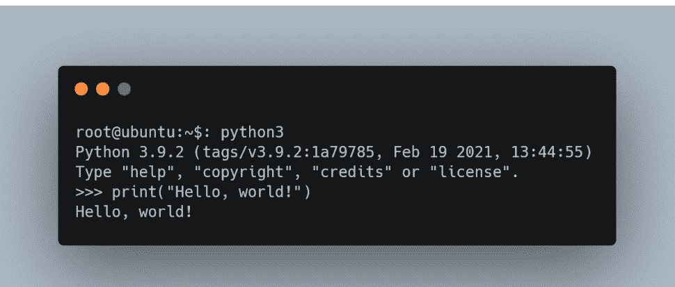

（原文缩略图位于 https://mathspp.com/blog/pydonts/boost-your-productivity-with-the-repl。）

## 简介

REPL 是一个了不起的工具，每个 Python 程序员都应该真正了解并欣赏它！不仅如此，如果你习惯使用它并学会充分利用它，你将获益良多。

在这篇 Pydon't 中，你将：

- 了解 “REPL” 代表什么；
- 理解 REPL 对你的学习有多重要；
- 理解 REPL 中“打印”结果的机制；
- 了解如何在 REPL 中恢复上一个结果，以防你忘记赋值；
- 了解内置的帮助系统；
- 了解一些在 REPL 中快速编写代码时的技巧；
- 了解两个能补充你 REPL 使用的绝佳工具。

## REPL

读取。求值。打印。循环。

这就是 “REPL” 的含义，它通常被称为“读取-求值-打印-循环”。REPL 是一个程序，它接收你的输入代码（即读取你的代码），对其进行求值，打印结果，然后重复（即循环）。

REPL，有时也被称为“交互式会话”或“解释器会话”，就是你打开计算机命令行并输入 `python` 或 `python3` 时看到的东西。

这应该会打印出类似以下的内容：

```
Python 3.9.2 (tags/v3.9.2:1a79785, Feb 19 2021, 13:44:55) [MSC v.1928 64 bit (AMD64)] on win32
Type "help", "copyright", "credits" or "license" for more information.
>>>
```

当然，打印出的具体内容（尤其是第一行）可能与我这里显示的不同，但它仍然是 REPL。

（顺便说一句，如果你需要退出 REPL，只需调用 `exit()` 函数即可。）

## 直接启动 REPL

毫无疑问，REPL 是你编写 Python 代码时最好的朋友之一。有一个 REPL 可以让你随意尝试，这使得学习这门语言变得容易得多。

不记得内置函数的参数顺序了？直接启动 REPL。

需要做一个比传统桌面计算器稍微复杂一点的快速计算？直接启动 REPL。

不记得你想导入的模块怎么拼写了？直接启动 REPL。

你明白我的意思了。

我怎么强调都不为过。习惯 REPL。玩转它。在里面写代码。一旦你熟悉了它，你就会爱上它，并为此感谢我。

## REPL 机制

### 基本输入和输出

REPL 通常在行首、光标左侧包含一个 `>>>`。你可以在该提示符前输入代码并按回车键。当你按回车键时，代码会被求值，并向你展示结果：

```
>>> 3 + 3
6
```

### 多行输入

REPL 也接受跨多行的代码，比如 `if` 语句、`for` 循环、使用 `def` 定义的函数等。

要执行这些操作，只需像平常一样开始输入你的 Python 代码：

```
>>> if True:
```

当你在冒号后按回车键时，Python 意识到 `if` 语句的主体缺失，因此开始一个新行，左侧包含一个 `...`。`...` 告诉你这是你上面开始内容的*延续*。

要告诉 Python 你完成了多行代码块的输入，只需在带有延续提示符 `...` 的空行上按回车键：

```
>>> if True:
...     print("Hello, world!")
...
Hello, world!
>>>
```

### 粘贴到 REPL 中

粘贴到 REPL 中应该没有任何问题。

例如，下面的函数返回输入的两倍。尝试将其复制到你的 REPL 中，然后使用它。

```
def double(x):
    return 2 * x
```

但是，如果你尝试复制并粘贴一个中间包含空行的多行代码块，那么 REPL 会破坏你的定义。

例如，如果你尝试粘贴以下内容，你会得到一个错误：

```
def double(x):

    return 2 * x
```

将上面的代码复制并粘贴到会话中，你最终会得到一个像这样的会话日志：

```
>>> def double(x):
...
File "<stdin>", line 2

IndentationError: expected an indented block
>>>     return 2 * x
File "<stdin>", line 1
python
return 2 * x
IndentationError: unexpected indent
```

这发生是因为 REPL 发现了一个空行，并认为我们试图结束函数的定义。

### 隐式打印结果

关于 REPL，你最后应该知道的一件事是，它会隐式地“打印”你输入的表达式的结果。

我用引号写了“打印”，因为 REPL 并不是真的打印结果，它只是显示其*表示形式*。对象的*表示形式*是你对对象调用 `repr` 时得到的结果。如果你显式地 `print` 某物，那么你得到的是对其调用 `str` 的结果。

我写了一篇非常详细的 Pydon't 来解释两者之间的区别，所以让我直接*展示*给你看有什么不同：

```
python
## 定义一个字符串。
>>> s = "Hello\nworld!"
## 打印其 `str` 和 `repr` 值：
>>> print(str(s))
Hello
world!
>>> print(repr(s))
'Hello\nworld!'
## 显式打印字符串并在 REPL 中求值。
>>> print(s)
Hello
world!
>>> s
'Hello\nworld!'
```

如你所见，打印 `s` 或者只是在 REPL 中输入它会得到两个不同的结果。请注意这一点。

### 不打印，或 `None`

特别是，如果你写的表达式求值为 `None`，那么什么都不会被打印。
最简单的查看方法是，你只需在 REPL 中输入 `None`。什么都不会显示；与之对比，如果你只输入 `3`：

```
python
>>> None
>>> 3
3
```

如果你调用一个没有显式 `return` 值的函数，或者显式返回 `None` 的函数，那么这些函数在 REPL 中不会显示任何内容：

```
>>> def explicit_None_return():
...     # 显式返回 None。
...     return None
...
>>> explicit_None_return()     # <- 什么都没显示。

>>> def implicit_None_return():
...     # 不以 `return` 结束会隐式返回 `None`。
...     pass
...
>>> implicit_None_return()     # <- 什么都没显示。
```

### 重复导入

有时使用 REPL 快速导入你刚刚定义的函数很有用。然后你测试该函数，接着继续在源文件中修改它。然后你会想再次导入该函数并再次测试它，但那样行不通。

你需要理解 REPL 如何处理导入，因为你不能重复导入来“更新”会话中的内容。

为了向你展示这一点，继续创建一个文件 `hello.py`：

```
## 在 `hello.py` 中：
print("Being imported.")
```

就这些。

现在打开 REPL：

```
>>> import hello
Being imported!
```

现在尝试修改 `print` 中的字符串，并重新导入模块：

```
>>> import hello
Being imported!
## 修改文件，然后再次导入：
>>> import hello
>>>
```

什么都没发生！那是因为 Python 已经处理过你的文件并知道里面有什么，所以它不需要再次解析和运行该文件。它可以直接给你需要的函数/变量。

简而言之，如果你修改了变量、函数、代码；并且你需要这些更改在 REPL 中反映出来，那么你需要用 `exit()` 退出 REPL，重新启动它，然后再次导入内容。

这就是为什么我将在下面分享的一些快速编码技巧如此有用。

> 编辑：另一种替代方法——由一位热心的读者提醒我——是在 Python 3.4+ 中使用 `importlib.reload(module)`。在我们的例子中，你可以使用 `importlib.reload(hello)`：

```
>>> import hello
Being imported
>>> import importlib          # 在 Python 3.0 到 Python 3.3 中使用 `imp`
>>> importlib.reload(hello)
Being imported
<module 'hello' from 'C:\tmp\hello.py'>
```

我们得到最后一行是因为 `importlib.reload` 返回它重新加载的模块。
你可以查看这个 StackOverflow 问题和答案（https://stackoverflow.com/questions/437589/how-do-i-unload-reload-a-python-module）以了解更多关于这种方法的信息。
请注意，当你有多个导入时，它可能无法按预期工作。在这些情况下，退出 REPL 并重新打开它可能是重新加载导入的最干净的方式。

## REPL 历史记录

老实说，我不完全确定我即将描述的是 Python REPL 的特性，还是我一生中使用过的所有命令行的特性，但这里就说了：

你可以使用向上和向下箭头键来浏览你已经输入过的表达式历史记录。这很标准。

超酷的是，REPL 会记住这个表达式历史记录，即使你退出了 REPL，*只要你不关闭终端*。

## 上一个结果

如果你读过我关于下划线用法的 Pydon't，你可能已经知道了，但你可以使用下划线 `_` 来检索上一个表达式的结果，如果你想使用它但忘记赋值的话。

这里有一个简单的例子：

```
>>> 3 + 6
9
>>> _ + 10
19
```

当你调用一个函数或运行一些需要很长时间的代码时，这可能会派上用场。例如，从互联网下载某些东西。

如果你刚刚运行了一个有副作用的表达式，并且不想再次运行它，因为你不想触发两次副作用，这也很有帮助。例如，如果你刚刚调用了一个 API。

当然，`_` 本身就是一个有效的变量名，所以你仍然可以将其用作变量名。但是，如果你这样做，那么 `_` 将不再反映上一个表达式的结果：

```
>>> _ = 0
>>> _
0
>>> 3 + 9
12
```

## 从 REPL 内部获取帮助

另一个常被低估的强大功能是内置的帮助系统。例如，当你需要快速查阅某个内置函数的参考信息时（比如忘记了参数是什么），只需使用 `help` 即可！

```
>>> help(sum)
Help on built-in function sum in module builtins:

sum(iterable, /, start=0)
    Return the sum of a 'start' value (default: 0) plus an iterable of numbers

    When the iterable is empty, return the start value.
    This function is intended specifically for use with numeric values and may
    reject non-numeric types.

>>>
```

这个内置 `help` 功能的妙处在于，只要你自己的代码文档编写得足够好，它甚至能提供关于*你自己的代码*的帮助。

下面是对一个你定义的函数调用 `help` 的结果：

```
>>> def my_function(a, b=3, c=4):
...     return a + b + c
...
>>> help(my_function)
Help on function my_function in module __main__:

my_function(a, b=3, c=4)

>>>
```

你可以看到，`help` 会告诉你函数定义所在的模块，并提供函数的签名、默认值等所有信息！

要从 `help` 获取更多信息，你需要用文档字符串来为你的函数编写文档：

```
>>> def my_function(a, b=3, c=4):
...     """返回三个参数的和。"""
...     return a + b + c
...
>>> help(my_function)
Help on function my_function in module __main__:

my_function(a, b=3, c=4)
    返回三个参数的和。

>>>
```

现在你可以看到，`help` 函数也会给出存储在文档字符串中的信息。

> 我很快会写一篇关于文档字符串的 Pydon't。请务必订阅我的通讯，以免错过！

## 快速编写代码片段的技巧

当你需要快速实现一个想法时，Python REPL 非常出色，因为它允许你快速测试代码、进行调整，并利用即时反馈反复迭代。

不言而喻，但 REPL 并不能取代你的 IDE！不过，了解一些小技巧可以帮助你更好地利用 REPL。

### 分号

是的，**真的**。

Python 支持使用分号来分隔语句：

```
>>> a = 3; b = a + 56; print(a * b)
177
```

然而，这个特性通常不适合出现在你的正式代码中，所以请避免使用。
尽管分号通常不适合用于生产代码，但在 REPL 中，它们是你的好朋友。我会向你解释原因，你也会同意的。

在命令行中，你通常可以使用上下箭头来循环浏览最近输入的命令。在 REPL 中也可以这样做。只需尝试计算一个随机表达式，然后按上箭头并再次按回车。这应该会再次运行完全相同的表达式。
有时你会在 REPL 中增量测试解决方案或算法。但是，如果你犯了错误，你必须重置所有内容。
这时，你只能疯狂地按上下箭头，试图找出所有已经运行过的代码，努力回忆哪些是正确的表达式，哪些是错误的……
分号可以防止这种情况！你可以使用分号来跟踪你整个“进展”过程：每当你想出下一步时，你可以使用箭头回到你上次“保存进度”的位置，然后在你的语句序列末尾添加正确的步骤。
下面是一个交互式 REPL 会话的例子，我尝试根据一个年龄列表对一个名字列表进行排序。
我没有使用两个单独的赋值，而是将它们放在同一行并用分号隔开：

```
>>> names = ["John", "Anna", "Bill"]; ages = [20, 40, 30]
```

我本来可以写成

```
>>> names, ages = ["John", "Anna", "Bill"], [20, 40, 30]
```

但使用分号表达了在编写正式代码时将这两个赋值放在不同行的意图。

然后，我将尝试看看如何将年龄和名字组合成配对：

```
>>> [(age, name) for name, age in zip(names, ages)]
[(20, 'John'), (40, 'Anna'), (30, 'Bill')]
```

然而，此时我意识到这样做有些冗余，如果我反转参数的顺序，就可以直接使用 `zip`：

```
>>> list(zip(ages, names))
[(20, 'John'), (40, 'Anna'), (30, 'Bill')]
```

现在我对名字和年龄的配对方式感到满意了，我使用箭头键回到赋值那一行。然后，我使用分号添加我刚才想出来的新代码段：

```
>>> names = ["John", "Anna", "Bill"]; ages = [20, 40, 30]; info_pairs = zip(ages, names)
>>> info_pairs
[(20, 'John'), (40, 'Anna'), (30, 'Bill')]
```

> `zip` 是 Python 中一个令人惊叹的工具，也是我最喜欢的内置函数之一。你可以通过这篇 Pydon't 学习如何掌握它的强大功能。

现在我可以继续下一步了，知道现在犯错代价不大：我可以通过回到包含所有中间步骤的那一行并运行那一行来重置所有内容。

### 不换行

当你想定义一个简单的多行块时，你通常可以把冒号后面的内容写在同一行。

例如，与其写

```
>>> for i in range(3):
...     print(i)
...
0
1
2
```

你可以写成

```
>>> for i in range(3): print(i)
...
0
1
2
```

虽然这种风格*不*推荐用于生产代码，但它使在 REPL 历史记录中上下导航更加方便。

如果你真的想挑战极限，你甚至可以将这与分号结合起来：

```
>>> i = 1
>>> while i < 30: print(i); i *= 2
...
1
2
4
8
16
```

### 导入、测试、循环

如果你正在编写一些代码，并想运行它看看——只是为了确保它合理——启动 REPL，导入代码，然后玩转它！这就是 REPL 的魔力。

确保将所有用于“测试”的设置放在一行内，用分号分隔，并与导入语句放在一起。这样，当你修改完刚编写的代码时，你可以输入 `exit()` 退出 REPL，再次进入，然后按几次上箭头，你的设置代码就原封不动地出现了，可以再次使用它进行测试。

## 其他工具

在撰写这些 Pydon't 时，我尽量坚持使用原生 Python，原因很简单：原生 Python 的世界非常广阔，对大多数开发者来说，还有很多潜力有待挖掘。

然而，我认为如果我不提及两个能真正提升你使用 REPL 体验的工具，那将是我的失职。

### Rich

> “Rich 是一个用于在终端中呈现富文本和精美格式的 Python 库。”

[Rich](https://github.com/Textualize/rich) 是一个我绝对热爱的开源库。你可以阅读文档和示例来快速掌握 Rich 的功能，但我特别想强调其中一点：

```
>>> from rich import pretty
>>> pretty.install()
```

在你的 REPL 中运行这两行代码会改变你的生活。通过这两行，Rich 将会美化打印你的变量，甚至包括语法高亮。

### IPython

[IPython](https://ipython.org/) 是一个用于多编程语言交互式计算的命令 shell，最初是为 Python 编程语言开发的。IPython 提供了内省、富媒体、shell 语法、Tab 补全和历史记录等功能。
简而言之，它是一个拥有更多花哨功能的 Python REPL。
详细讲解 IPython 超出了这篇 Pydon't 的范围，但我必须提及它（即使我个人并不使用它）。

## 结论

这就是这篇 Pydon't 为你奉上的主要收获：

> “熟练使用 REPL，因为它会让你成为一个更高效的 Python 程序员。”

这篇 Pydon't 向你展示了：

- REPL 是帮助你快速原型化小想法和解决方案的绝佳工具；
- REPL 支持多行输入，并在空行后中断输入；
- REPL 会隐式地显示你输入表达式的结果，但需要注意显示的是对象的表示形式（`repr`），而不是其字符串值（`str`）；
- 你可以使用箭头键在 REPL 中浏览已输入代码的历史记录；
- 只要不关闭终端窗口，已输入代码的历史记录在退出 REPL 后会保留；
- `None` 结果不会被隐式显示；
- 重复导入相同的模块不会更新其内容；
- 你可以使用 `_` 访问上一行的结果；
- 内置的 `help` 可以为你“手头”的函数和其他对象提供基本文档；它甚至适用于用户定义的对象；
- 通过使用文档字符串，你可以提高内置 `help` 在自定义对象上的实用性；
- 虽然不推荐作为最佳实践，但在 REPL 历史记录中导航时，使用分号和内联多行语句可以节省你的时间；
- Rich 是一个你可以在 REPL 中使用的工具，它可以自动美化打印结果并添加高亮；
- IPython 是一个替代的 Python REPL，拥有更多花哨功能。

## 参考资料

- Rich, https://github.com/willmcgugan/rich [最后访问于 2021-08-25]
- IPython, https://ipython.org/ [最后访问于 2021-08-25]
- 带有改进建议的反馈，Reddit 评论，https://www.reddit.com/r/Python/comments/pbkq3z/boost_your_productivity_with_the_repl_pydont/hadom13/ [最后访问于 2021-08-26]；
- Stack Overflow 问题，“如何在 Python 解释器中重新导入更新的包？”，https://stackoverflow.com/q/684171/2828287 [最后访问于 2021-08-26]；

## reduce 的强大之处

（原文文章的缩略图地址：https://mathspp.com/blog/pydonts/the-power-of-reduce。）

## 引言

在这篇 Pydon't 文章中，我将讨论 `reduce` 这个函数。它曾经是一个内置函数，但在 Python 3 中被移到了 `functools` 模块中。

此前所有的 Pydon't 文章，我都只关注那些无需导入任何模块即可使用的 Python 特性。因此，这篇 Pydon't 会有所不同。

在本文中，你将：

- 了解 `reduce` 如何工作；
- 学习 `reduce` 与 `for` 循环之间的关系；
- 注意到 `reduce` 隐藏在一些我们熟知和喜爱的其他内置函数中；
- 了解 `reduce` 的一个巧妙用例；

## `reduce` 如何工作

reduce 通常与函数式编程相关联，这是一种有时未被充分重视的编程范式。简单来说，`reduce` 接受一个可迭代对象和一个二元函数（接受两个参数的函数），然后使用该二元函数将可迭代对象“归约”为一个单一的值。

这听起来可能有些奇怪或复杂，所以我能做的最好的事情就是向你展示 `reduce` 的一个简化实现：

```python
def reduce(function, iterable, initial_value):
    result = initial_value
    for value in iterable:
        result = function(result, value)
    return result
```

如果你仔细看，那个 `for` 循环内部其实并没有太多复杂操作：我们只是用 `function` 参数和 `iterable` 参数中的连续值不断更新 `result` 变量。

但我可以让你更容易理解这一点。为此，我需要指出一些你一直都在使用的 `reduce` 用例！也许最简单、最常见的就是内置的 `sum` 函数：

```python
>>> sum(range(10))
45
>>> from functools import reduce; import operator
>>> reduce(operator.add, range(10))
45
```

那里的 `operator.add` 只是编程方式引用 Python 中使用 `+` 进行内置加法的一种方法。

根据 `operator` 模块的文档：

> “`operator` 模块导出了一组与 Python 内置运算符相对应的高效函数。例如，`operator.add(x, y)` 等价于表达式 `x+y`。”

你可能以前见过 `sum`，对吧？它只是将一个可迭代对象中的所有元素相加。如果我们传给 `reduce` 的函数是加法，那基本上就是 `reduce` 所做的事情。为了更清楚地说明这一点，让我们实现自己的 `sum` 函数：

```python
def sum(iterable):
    acc = 0
    for elem in iterable:
        acc += elem
    return acc
```

你对上面的实现感到舒适吗？现在让我稍微调整一下：

```python
def sum(iterable, start=0):
    acc = start
    for elem in iterable:
        acc = acc + elem
    return acc
```

现在，我们的 `sum` 函数可以从不同的值开始累加，并且我们使用 `operator.add` 函数，而不是使用 `+` 或修改赋值 `+=`。现在让我们将这个替代实现与原始的 `reduce` 实现并排放在一起：

```python
def sum(iterable, start=0):    # def reduce(function, iterable, initial_value):
    acc = start               #     result = initial_value
    for elem in iterable:      #     for value in iterable:
        acc = acc + elem       #         result = function(result, value)
    return acc                 #     return result
```

你能看出它们是同一个东西吗？

## 内置归约函数的“兔子洞”

### 一些内置函数

既然我们已经看到 `sum` 是一个归约，那么还有哪些内置函数也是归约呢？归约的一部分作用是接受一个可迭代对象并将其*归约*为一个单一的值。有哪些内置函数是这样做的？

浏览文档中的内置函数列表，以下是一些引起我注意的函数：

- `all` – 期望一个真值/假值可迭代对象，并返回一个布尔值；
- `any` – 期望一个真值/假值可迭代对象，并返回一个布尔值；
- `max` – 接受一个数字可迭代对象，并返回一个单一的数字；
- `min` – 接受一个数字可迭代对象，并返回一个单一的数字；
- `sum` – 我们已经看过了；

你能用 `for` 循环实现所有这些吗？你能将它们全部写成归约吗？

我来帮你实现这些归约：

```python
>>> all = lambda iterable: reduce(operator.and_, iterable)
>>> any = lambda iterable: reduce(operator.or_,  iterable)
>>> # 在可迭代对象上定义 `max`，仅使用二元的 max。
>>> max_ = lambda a, b: a if a >= b else b
>>> max = lambda iterable: reduce(max_,          iterable)
>>> # 在可迭代对象上定义 `min`，仅使用二元的 min。
>>> min_ = lambda a, b: a if a <= b else b
>>> min = lambda iterable: reduce(min_,          iterable)
>>> sum = lambda iterable: reduce(operator.add,  iterable)
```

我只是觉得非常有趣，内置函数中竟然有这么多归约！这让你觉得 `reduce` 确实是一个强大的工具，对吧？既然在内置函数中增加*五个*专门的归约是值得的...

## 其他常见的归约

当然，还有更多。如果我们使用 `operator.mul`（用于乘法），我们就能得到 `math.prod` 函数，它可以用来乘以可迭代对象中的所有数字：

```python
>>> from math import prod
>>> prod(range(1, 11))  # 10!
3628800
>>> reduce(operator.mul, range(1, 11))
3628800
```

如果你想把一堆字符串拼接起来呢？例如，如果你有一个单词列表，想用空格把它们重新组合起来：

```python
>>> words = ["Do", "I", "like", "reductions?"]
>>> " ".join(words)
'Do I like reductions?'
```

如果我们定义“字符串加法”为两个字符串的连接，但中间加一个空格，那么我们会得到相同的结果：

```python
>>> reduce(lambda s1, s2: s1 + " " + s2, words)
'Do I like reductions?'
```

现在，请别误会。我*不是*建议你在需要连接字符串时开始使用 `reduce`。我*只是*想向你展示这些模式是多么普遍，并且出现在如此多的地方，即使你没有注意到它们。

## 为什么要在意？

为什么你应该费心去了解 `reduce` 的存在以及它的工作原理？因为这就是“学习 Python”的含义：你需要接触库、内置函数，你需要学习新的算法、新的做事方式、新的工具。

`reduce` 是你现在工具箱里的另一个工具。也许这不是你每天都会用到的东西。也许你一年只用一次。甚至更少。但当需要的时候，你*可以*使用它，你的代码会因此变得更好：因为你知道如何为工作选择合适的工具。

人们通过在他们已经在其他地方学到的东西上构建知识，学到了很多东西...你在其他地方学得越多，你就能与不同的东西建立更多的联系，也就能发现更多的东西。也许这篇文章对你没什么帮助，但也许这篇文章是你需要的最后推力，以帮助你理解其他东西。或者现在它感觉不相关，但一周、一个月或一年后，*因为*你花时间学习了 `reduce` 并理解了它如何与所有这些其他内置函数相关联，其他东西会突然*想通*。

## 牵强的归约

上面的归约是比较“正常”的，但我们可以用 `reduce` 做各种有趣的事情！如果你开始对归约感到困惑或反感，请跳过这一节，我不想让你和 reduce 的关系受到无法修复的损害。本节包含一些归约——嗯，怎么说呢...——不一定适合在生产环境中使用。

### 第一个和最后一个

这里有一个让你觉得有点意思的小练习。你能写一个归约，给定一个可迭代对象，返回其第一个元素吗？类似地，你能写一个归约，给定一个可迭代对象，返回其最后一个元素吗？

认真思考一下。

好的，这是我的建议方案：

```python
>>> left = lambda l, r: l
>>> reduce(left, range(10))
0
>>> right = lambda l, r: r
>>> reduce(right, range(10))
9
```

（我写了上面的文字，过了几个小时后，我回来了。）

我必须对你诚实：一开始我觉得这些做法很疯狂，但说实话，你如何写一个函数来获取可迭代对象的最后一个元素？请注意，可迭代对象不一定可索引，所以类似 `iterable[-1]` 的写法并不能保证有效。你会怎么做？你可以写一个 `for` 循环：

```python
def get_last(iterable):
    for elem in iterable:
        last = elem
    return last
```

但这为什么比下面的替代方案更好呢？

```python
from functools import reduce
def get_last(iterable):
    return reduce(lambda l, r: r, iterable)
```

欢迎在下面的评论中发表你的意见。我其实更喜欢 `reduce` 的替代方案。

### 创建内置类型

另外几个我不建议在生产中使用的归约，是替换 `dict`、`list`、`set` 和 `tuple` 的。例如，如果你有一个可迭代对象，如何构建相应的元组？如何将其写成一个归约？对于这个，你需要记住 `reduce` 接受第三个参数，即我们修改的初始值...

你明白了吗？第三个参数需要是一个空元组：

```python
>>> reduce(lambda t, v: t + (v,), range(10), ())
(0, 1, 2, 3, 4, 5, 6, 7, 8, 9)
```

通过类似的变通方法，你可以将 `dict`、`list` 和 `set` 重新定义为归约。再次说明，我并不推荐这样做。

## 单位元...

### ...或它的缺失

我们已经看过一些归约操作的例子了，如果你足够勇敢，可能还在上一节里偷偷瞥见了一些疯狂的归约操作。然而，直到现在，我一直（有意地）没有过多关注 `reduce` 函数的第三个参数。让我们来简要讨论一下。

首先，为什么 `reduce` 需要第三个参数？嗯……因为我们喜欢事情能顺利进行：

```python
>>> from functools import reduce
>>> import operator
>>> sum([1, 2])
3
>>> reduce(operator.add, [1, 2])
3
>>> sum([1])
1
>>> reduce(operator.add, [1])
1
>>> sum([])
0
>>> reduce(operator.add, [])
Traceback (most recent call last):
  File "<stdin>", line 1, in <module>
TypeError: reduce() of empty sequence with no initial value
```

从严格的实际角度来看，`reduce` 的第三个参数存在是为了让 `reduce` 知道当给定的可迭代对象为空时应该返回什么。这意味着，通常如果你知道你的可迭代对象永远不会为空，你就不必担心那个参数……

文档对于如何使用这个第三个参数（他们称之为 `initializer`）的说明相当清楚：

> “如果提供了可选的 `initializer` 参数，它将被放置在可迭代对象的元素之前参与计算，并在可迭代对象为空时充当默认值。如果未给出 `initializer` 且可迭代对象只包含一个元素，则直接返回该元素。”[functools.reduce Python 3 文档，2021年6月8日]。

所以，实际上，你只有在可迭代对象可能为空时才真正需要 `initializer`，因此，当你可能会向 `reduce` 传递空可迭代对象时，就应该使用它。

## 什么是单位元

那么，如果你不能百分之百确定你的可迭代对象不会为空，你如何决定在 `reduce` 的第三个参数中使用什么值呢？你如何选择 `initializer` 参数？嗯，`initializer` 应该具有的值取决于你在归约中使用的函数，特别是 `initializer` 应该是该函数的单位元。这是什么意思？

再次从非常实用的角度来看，单位元是一个具有特殊行为的特殊元素：单位元是这样一种元素，如果可迭代对象不为空，那么包含单位元或不包含单位元应该完全是一回事。换句话说，当存在其他值时，单位元应该完全不影响结果。

例如，如果我们正在乘以一个数字列表，我们应该提供给 `reduce` 的单位元是什么？哪个数字，当与其他数字相乘时，恰好什么也不做？是 1：

```python
>>> from functools import reduce
>>> reduce(operator.mul, range(4, 10))
60480
>>> reduce(operator.mul, range(4, 10), 1)
60480
```

对于内置的归约函数，你通常可以通过用一个空可迭代对象调用归约函数来推断出单位元是什么：

```python
>>> sum([])
0
>>> import math
>>> math.prod([])
1
>>> all([])
True
>>> any([])
False
>>> max([])
Traceback (most recent call last):
  File "<stdin>", line 1, in <module>
ValueError: max() arg is an empty sequence
```

`max` 和 `min` 是有趣的归约操作，因为从数学角度来看，它们有合适的单位元：

- 对于 `max`，单位元是 $-\infty$；并且
- 对于 `min`，单位元是 $\infty$。

为什么是这样？同样，因为这些值在与其它数字混合时不会影响最终结果。

看看我运行会话中的以下摘录：

```python
>>> max(float("-inf"), 10)
10
>>> max(float("-inf"), -132515632534250)
-132515632534250
>>> max(float("-inf"), 67357321)
67357321
```

这六行会话展示了三个例子，说明用负无穷大作为参数之一调用 `max` 总是返回另一个参数，因为没有数字比负无穷大小。

然而，`max` 和 `min` 在用空可迭代对象调用时会抛出错误，*即使*有一个可以使用的单位元也是如此。

```python
>>> max([])
Traceback (most recent call last):
  File "<stdin>", line 1, in <module>
ValueError: max() arg is an empty sequence
```
也许它们这样做是为了让人们不必在程序中处理无穷大？老实说我也不知道！

> **编辑：** 我上网[询问了大家](https://twitter.com/jaborek/status/1234567890)，对我最有说服力的答案是 `max` 和 `min` 可以用于任何可比较的对象，而对于其他对象，无穷大可能完全没有意义。

例如，`max("abc", "da")` 返回 "da"，而在比较字符串时，将 `float("-inf")` 加入比较确实毫无意义。

## 单位元并非总是存在

有些操作看起来像是合理的归约操作，但就是*没有*单位元。即使你跳过了关于“可怕”归约的那一节，我也向你展示了一个没有单位元的归约操作。你能发现它吗？（在下面评论区留下你的猜测）。

如果你有一个找不到单位元的操作，那么你要么是走错了路——你确实不应该使用归约操作——要么你需要用 if 语句或 try 语句来包装你的归约操作（可以看看[这篇文章](https://realpython.com/python-reduce-function/)来帮助你理解该选择哪一个）。

## 为什么有些人不喜欢 `reduce`

如果 `reduce` 是如此强大的工具，为什么它从内置函数移到了 `functools` 模块中？更重要的是，为什么人们不喜欢 `reduce`？

网上[有一些信息](https://www.artima.com/weblogs/viewpost.jsp?thread=98196)解释了 `reduce` 被移入 `functools` 的原因，但我只能谈谈我使用 `reduce` 的经验以及我看到周围人对它的反应。

我看到的一点是，人们看待 `reduce` 的方式就好像它是只有那些试图卖弄聪明的人才会使用的工具，但我认为这只是对 `reduce` 的偏见。有时候，区分哪些代码值得人们花点时间思考，哪些不值得，可能很困难。

此外，像 `reduce` 这样的函数有时会被用于复杂的学术练习或脑筋急转弯中，这些练习只是为了活跃你的思维。然后人们忘记了那些并不是 `reduce` 在实际应用中应该如何使用的指示，从而对这么美妙的工具产生了这些不满情绪。

## 代码中的例子

我在 Python 标准库中查找了 `reduce` 的用法，并没有找到很多，但我发现了一种使用模式（在两个不同的地方），我觉得它非常优雅，这就是我在这里要与你们分享的。

除此之外，即使你没有显式地使用 `reduce`，请记住像 `sum`、`math.prod`、`max`、`min`、`all`、`any` 等函数在我们的代码中无处不在，无论你喜欢与否，你都在自己的代码中使用着归约操作。

### 深入访问嵌套字典

如果你想查看原始模式，可以在 `importlib.metadata.EntryPoint.load` 函数中找到，但我会稍微修改一下让它更简单。

假设你有一系列嵌套的字典：

```python
>>> d = {"one": {2: {"c": {4: 42}}}}
```

现在，假设你想通过一系列连续的键访问来访问嵌套的 42，这些键存储在一个列表中：

```python
>>> keys = ["one", 2, "c", 4]
```

你如何访问内部的 42？嗯，你可以写一个循环：

```python
>>> d = {"one": {2: {"c": {4: 42}}}}
>>> val = d
>>> for key in keys:
...     val = val[key]
...
>>> val
42
```

但我们可以再次将这个 for 循环与归约的定义进行比较：

```
val = d                # result = initial_value
for key in keys:        # for value in iterable:
    val = val[key]      #     result = function(result, value)
val                     # return result
# def reduce(function, iterable, initial_value):
```

所以我们可以看到结构非常相似！我们只需要弄清楚要使用的正确函数是什么，那就是 `dict.get`：

```python
>>> reduce(dict.get, keys, d)
42
```
这不是很巧妙吗？

### 深入访问嵌套类

类似地，我们可以使用这种模式来以编程方式访问深度嵌套的类属性。

让我定义一个空的类：

## 结论

以下是本次 Pydon't 的核心要点，为你奉上：

> “归约（Reductions）是你经常使用的经典技术，即使你并未意识到自己在使用它！”

本次 Pydon't 向你展示了：

-   `reduce` 接受一个可迭代对象，并依次应用一个函数，以构建出最终的单一对象；
-   `reduce` 在 Python 2 中是内置函数，在 Python 3 中则位于 `functools` 模块；
-   归约操作可以按照一个非常明确的模式转换为 `for` 循环，反之亦然；
-   像 `sum`、`max`、`min`、`any` 和 `all` 这样的内置函数，都是归约操作；
-   归约操作可以使用一个可选的第三个参数来初始化过程，该元素应是你所使用函数的单位元（identity element）；
-   并非所有函数都有单位元；
-   `operator` 模块允许你访问内置操作（如加法和减法），并在代码中传递它们；以及
-   `reduce` 可用于以编程方式深入嵌套字典或类属性。

## 参考资料

-   Python 3 文档，Python 标准库，内置函数，https://docs.python.org/3/library/functions.html [最后访问于 2021-06-07]；
-   Python 2 文档，Python 标准库，内置函数，reduce，https://docs.python.org/2.7/library/functions.html#reduce [最后访问于 2021-06-06]；
-   Python 3 文档，Python 标准库，functools.reduce，https://docs.python.org/3/library/functools.html#functools.reduce [最后访问于 2021-06-06]；
-   Python 3 文档，Python 标准库，operator，https://docs.python.org/3/library/operator.html [最后访问于 2021-06-07]；
-   Artima Weblogs，"The fate of reduce() in Python 3000" by Guido van Rossum，https://www.artima.com/weblogs/viewpost.jsp?thread=98196 [最后访问于 2021-06-06]；
-   Real Python，"Python's reduce(): From Functional to Pythonic Style"，https://realpython.com/python-reduce-function/ [最后访问于 2021-06-06]；
-   Stack Overflow，"Why don't max and min return the appropriate infinities when called with empty iterables?"，https://stackoverflow.com/q/67894680/2828287 [最后访问于 2021-06-08]；

## 下划线的用法

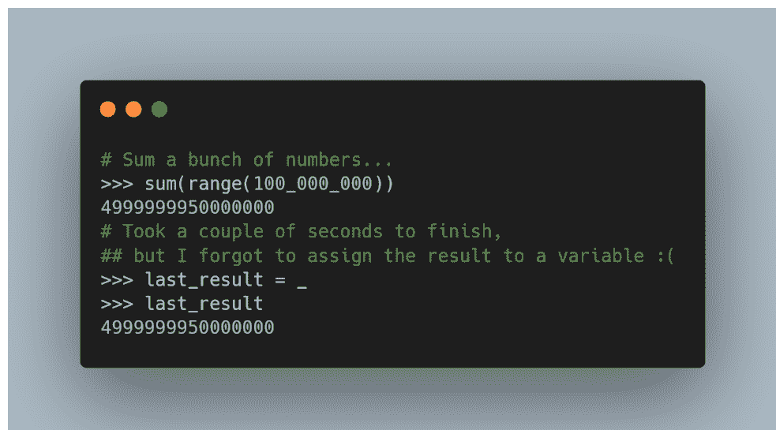

（原文文章的缩略图，发布于 https://mathspp.com/blog/pydonts/usages-of-underscore。）

## 引言

在本次 Pydon't 中，我们将探讨 `_` 在 Python 中的所有用例。有几个地方，`_` 在语法上扮演着非常特殊的角色，我们将讨论这些地方。我们还将讨论 `_` 的一些用法，这些用法仅仅是人们遵循的惯例，它们能让你编写出更地道的代码。

在本次 Pydon't 中，你将：

-   了解 `_` 在 Python REPL 中的实用功能；
-   了解 `_` 用作变量名前缀和/或后缀时的作用：
    -   用作后缀的单个下划线；
    -   用作前缀的单个下划线；
    -   用作前缀的双下划线；
    -   用作前缀和后缀的双下划线；
-   看到 `_` 在赋值中作为“接收器”的惯用用法；
-   并理解这如何扩展到 `_` 在新的 `match` 语句中的作用；
-   看到 `_` 在本地化字符串中的惯用用法；以及
-   学习如何使用 `_` 让你的数字更具可读性。

## 恢复会话中的上一个结果

你是否曾在 Python 会话中调用了一个慢速函数，然后因为忘记将其赋值给变量而丢失了返回值？我知道我无数次这样做过！因为有像（你和）我这样的人，有人做出了*最*明智的决定，决定在 Python 会话中可以使用 `_` 来指代上一个返回结果：

```
>>> 1 + 1
2
>>> _
2
>>> sum(range(100_000_000))    # 需要几秒钟才能完成。
4999999950000000
>>> _
4999999950000000
>>> save_for_later = _
>>> save_for_later
4999999950000000
```

这可以避免你不得不重新运行上一行代码，特别是当上一行代码需要一些时间才能完成、它有一些你不想再次触发的副作用，或者它根本无法重新运行（例如，因为你删除了一个文件或耗尽了一个可迭代对象）时，这尤其有用。

所以，下次你在解释器会话中玩耍，忘记将函数调用或其他代码片段的结果赋值时，记得使用 `_` 来引用它。

请注意，如果你显式地给 `_` 赋值，那么你赋的值将一直保留，直到你显式删除它。当你删除它时，`_` 将会恢复为指代上一个返回的结果：

```
>>> _ = "hey"
>>> "_ was explicitly assigned."
'_ was explicitly assigned.'
>>> _
'hey'
>>> del _
>>> "_ is no longer explicitly assigned."
'_ is no longer explicitly assigned.'
>>> _
'_ is no longer explicitly assigned.'
```

## 变量名的前缀和后缀

### 用作后缀的单个下划线

如你所知，Python 中有些词具有特殊含义，因此被称为关键字。这意味着我们不能将这些名称用于我们的变量。类似地，Python 定义了一系列内置函数，这些函数通常非常有用，理想情况下我们希望避免使用与这些内置名称匹配的变量名。

然而，有时完美的变量名恰好是这些关键字或内置函数之一。在这些情况下，通常使用单个 `_` 作为后缀来避免冲突。

例如，在统计学中，有一种随机分布称为“指数分布”，它依赖于一个数值参数，该参数在数学文献中通常被称为“lambda”。因此，当 `random` 模块决定在 `random.expovariate` 中实现该分布时，他们理想情况下希望使用 `lambda` 作为 `random.expovariate` 的参数，但 `lambda` 是一个保留关键字，这将导致错误：

```
>>> def expovariate(lambda):
  File "<stdin>", line 1
    def expovariate(lambda):
          ^
SyntaxError: invalid syntax
```

相反，他们本可以将参数命名为 `lambda_`。（然而，实现者最终选择了 `lambd`。）

在 Python 标准库中有许多例子，实现者选择了尾随下划线。例如，在 IDLE（Python 默认附带的 IDE，完全用 Python 实现）的代码中，你可以找到这个函数：

```
## 来自 Python 3.9.2 的 Lib/idlelib/help.py
def handle_starttag(self, tag, attrs):
    "Handle starttags in help.html."
    class_ = ''
    for a, v in attrs:
        if a == 'class':
            class_ = v
    # 为简洁起见，此处已截断...
```

注意在循环内定义和更新的 `class_` 变量。这里显而易见的变量名应该是 `class`，因为我们正在处理 HTML 类，但 `class` 是一个保留关键字，我们用它来定义，嗯，类... 这就是为什么我们在这里使用 `class_`！

### 用作前缀的单个下划线

虽然使用单个下划线作为后缀或多或少是一种惯例，但使用单个下划线作为前缀既是一种惯例，也会影响某些 Python 程序。

让我先解释一下这个惯例：当你定义一个以单个下划线开头的名称时，你是在告诉其他程序员，该名称仅指代内部使用的内容，外部用户不应随意操作。

例如，假设你正在实现一个在线商店框架，现在正在编写获取商品价格的代码部分。你可以编写一个像这样的小函数：

```python
prices = {
    "jeans": 20,
    "tshirt": 10,
    "dress": 30,
}

def get_price(item):
    return prices.get(item, None)
```

现在，商店不时不时打折就无法做生意，所以你给函数添加了一个参数，以便可以应用折扣：

```python
def get_price(item, discount=0):
    p = prices.get(item, None)
    if p is not None:
        return (1 - discount)*p
    else:
        return p
```

现在一切都很好，除了你认为验证函数尝试应用的折扣可能是个好主意，这样折扣永远不会为负或超过 100%。你可以在主函数中完成，或者你可以设计一个辅助函数来为你完成，可能是因为你需要在多个地方验证折扣金额是否正确。

所以，你编写了你的辅助函数：

```python
def valid_discount(discount):
    return 0 <= discount <= 1
```

> 顺便说一下，如果你想了解更多关于 Python 允许比较链式操作（如你上面所见）的事实，你可以阅读这篇关于该主题的 Pydon't。

现在你有了一种验证折扣的方法，你可以使用它：

```python
def get_price(item, discount=0):
    if not valid_discount(discount):
        raise ValueError(f"Trying to apply an illegal discount on {item}.")
    p = prices.get(item, None)
    if p is not None:
        return (1 - discount)*p
    else:
        return p
```

完美！你的在线商店管理框架的代码库正在顺利推进。

现在，假设你是你这个框架的用户，而不是它的实现者。你可能会从 PyPI 通过 pip 安装框架，或者直接从 GitHub 安装。但当你安装好，并且导入代码开始使用时，你会导入 `get_price` 和 `valid_discount` 函数。现在，你需要 `get_price` 函数，但不需要 `valid_discount`，因为整个框架已经为用户防止了非法折扣、负价格等任何问题！换句话说，`valid_discount` 函数与框架的内部实现更相关，而不是与框架的用户相关。不过，用户可能并不知道这一点，因为用户看到了 `valid_discount` 函数，并且可以合理地认为用户会觉得自己必须使用该函数来手动验证折扣……他们怎么会知道自己不需要呢？

一个解决方案是遵循我们刚刚开始讨论的惯例！如果你将函数名稍作改动：

```python
def _valid_discount(discount):
    return 0 <= discount <= 1
```

框架的用户立刻就会明白：“哦，我不用担心这个函数，因为它的名字是以单个下划线开头的。”不仅如此，Python 甚至会帮助用户忽略那些以下划线开头的函数。

请在你的 `onlineshop.py` 文件中写下以下内容：

```python
# onlineshop.py
def _valid_discount(discount):
    return 0 <= discount <= 1

prices = {
    "jeans": 20,
    "tshirt": 10,
    "dress": 30,
}

def get_price(item, discount=0):
    if not _valid_discount(discount):
        raise ValueError(f"Trying to apply an illegal discount on {item}.")
    p = prices.get(item, None)
    if p is not None:
        return (1 - discount)*p
    else:
        return p
```

完成后，打开你的 Python REPL，从 `onlineshop` 导入所有内容，并尝试获取一些价格和折扣：

```python
>>> from onlineshop import *
>>> get_price("jeans")
20
>>> get_price("jeans", discount=0.5)
10.0
>>> get_price("jeans", discount=1.3)
```
```
Traceback (most recent call last):
  File "<stdin>", line 1, in <module>
  File "C:\Users\rodri\Documents\mathspp\onlineshop.py", line 13, in get_price
    raise ValueError(f"Trying to apply an illegal discount on {item}.")
ValueError: Trying to apply an illegal discount on jeans.
```

请注意，两个函数似乎都工作正常，并且注意我们在最后一次调用时收到了错误，因为 `1.3` 这个折扣太大了，所以 `_valid_discount` 函数说它无效。

让我们自己验证一下：

```python
>>> _valid_discount(1.3)
Traceback (most recent call last):
  File "<stdin>", line 1, in <module>
NameError: name '_valid_discount' is not defined
```

我们得到了一个 `NameError`，因为 `_valid_discount` 函数未定义……因为它从未被导入！

即使原始代码仍然可以在内部使用该函数，它也没有被导入到你的代码中。如果你确实需要访问 `_valid_discount`，那么你需要显式地导入它，或者只导入模块名，然后通过点号访问它：

```python
>>> from onlineshop import _valid_discount
>>> _valid_discount(0.5)
True
>>> import onlineshop
>>> onlineshop._valid_discount(1.3)
False
```

这个机制也适用于变量，只要它们的名字以单个下划线开头。请继续将 `prices` 变量重命名为 `_prices`，关闭 REPL，重新打开，然后运行 `from onlineshop import *`，`_prices` 将不会被定义！

所以，一方面，请注意，单个前导下划线确实是一个*指示*，告诉你在使用他人编写的代码时，应该关心哪些内容，不应该关心哪些内容。另一方面，前导下划线*仅仅*是一个指示，它不会阻止他人访问你以单下划线开头编写的名称。

最后，还有一种方法可以控制当有人使用 `*` 从你的模块导入所有内容时，哪些内容会被导入：你可以使用 `__all__` 变量来指定在这种情况下应该导入的名称。

请继续在你的 `onlineshop.py` 文件顶部添加以下行：

```python
__all__ = ("get_price", "_valid_discount")
```

完成后，关闭你的 REPL 并重新打开：

```python
>>> from onlineshop import *
>>> get_price
<function get_price at 0x0000029410907430>
>>> _valid_discount
<function _valid_discount at 0x0000029410907280>
>>> prices
Traceback (most recent call last):
  File "<stdin>", line 1, in <module>
NameError: name 'prices' is not defined
```

请注意，`__all__` 内的所有名称都被导入了，不管它们是否以单个下划线开头，而*未*列出的名称则没有被包含。在我的例子中，我的变量名为 `prices`（所以它甚至没有前导下划线！），它就没有被导入。

这个 `__all__` 变量是进入下一小节的完美引子：

## 前导和尾随双下划线

在 Python 中，一个以双下划线开始和结束的名称，是具有 Python 内部相关性的名称。例如，许多函数如 `__str__`、`__repr__`、`__bool__` 和 `__init__`，有时被称为“魔法”函数，因为它们以某种方式与 Python 的“内部”运作交互。

这些魔法函数和变量的一个更好的名称是“双下划线函数”，或“双下划线变量”，或“双下划线方法”，具体取决于上下文。（“dunder”这个词——在 Python 世界中常见——是“double underscore”的缩写！）

然而，这些双下划线名称并非真的神奇：它们*只是*函数。（或者变量，就像 `__all__` 一样。）你需要知道的是，当你遇到一个以双下划线开始和结束的名称时，它很可能是一个以某种方式与 Python 语法交互的名称。

例如，调用 `str` 内置函数并传入某个参数所做的，与调用该参数的 `__str__` 函数完全相同：

```python
>>> n = 3
>>> str(n)
'3'
>>> n.__str__()
'3'
```

当然，写 `str(n)` 比写 `n.__str__()` 好看多了，但这只是告诉你，如果你定义了自己的对象，你需要实现 `__str__` 方法，以便你的对象可以作为参数传递给 `str` 内置函数。（我在这里更详细地讨论了 `str`、`__str__`、`repr` 和 `__repr__`，如果你需要，可以读一下那篇 Pydon't。）

因此，总而言之，双下划线前导和尾随用于那些具有“特殊”意义的函数和变量，这些意义通常与 Python 的默认行为有关。

> 不要在你自己的程序中使用（创建）双下划线名称，这样你就不会意外地被绊倒，并避免与 Python 语言未来的更改/添加发生冲突！

## 双下划线前导

在本小节中，我们将探讨当一个名称以双下划线开头时会发生什么。一个双下划线位于名称开头，有一个特殊的用例：你将其用于那些你希望通过前导下划线“保护”（以便用户知道不要碰它）的变量和方法，但这些名称又如此常见，以至于你担心其他人可能会覆盖它们。

这是什么意思？

首先，让我们看看实际效果。修改 `onlineshop.py` 文件，使我们的代码现在属于一个名为 `OnlineShop` 的类：

```python
# onlineshop.py
class OnlineShop:
    __prices = {
        "jeans": 20,
        "tshirt": 10,
        "dress": 30,
    }

    def _valid_discount(self, discount):
        return 0 <= discount <= 1

    def get_price(self, item, discount=0):
        if not self._valid_discount(discount):
            raise ValueError(f"Trying to apply an illegal discount on {item}.")
        p = self.__prices.get(item, None)
        if p is not None:
            return (1 - discount)*p
        else:
            return p
```

注意，`prices` 变量现在变成了 `__prices`。让我们来试用一下这个小类：

```python
>>> from onlineshop import OnlineShop as OS
>>> shop = OS()
>>> shop.get_price("jeans")
20
```

代码似乎工作正常，现在让我们看看 `__prices` 变量：

```python
>>> shop.__prices
Traceback (most recent call last):
  File "<stdin>", line 1, in <module>
AttributeError: 'OnlineShop' object has no attribute '__prices'
```

哦哦，又出错了！我们无法访问 `__prices` 变量，即使 `get_price` 方法明显（成功地！）使用了它。为什么我们无法访问 `__prices` 变量？嗯，我们可以使用 `dir()` 内置函数来列出我们 `shop` 对象的所有属性：

```python
>>> dir(shop)
['_OnlineShop__prices', '__class__', '__delattr__', '__dict__', '__dir__', '__doc__',
'__eq__', '__format__', '__ge__', '__getattribute__', '__gt__', '__hash__', '__init__',
'__init_subclass__', '__le__', '__lt__', '__module__', '__ne__', '__new__', '__reduce__',
```

## 隐藏的“价格”：名称修饰

```
'__reduce_ex__', '__repr__', '__setattr__', '__sizeof__', '__str__', '__subclasshook__',
'__weakref__', '_valid_discount', 'get_price']
```

现在请继续查找我们定义的内容的名称。你能找到 `_valid_discount` 和 `get_price` 函数吗？那 `__prices` 呢？你将无法在列表中找到 `__prices`，但列表中的第一个项目是 `_OnlineShop__prices`，看起来关联非常大。

还记得我说过双前导下划线用于避免名称冲突吗？嗯，如果其他人想要扩展你的在线商店框架，他们很有可能想要创建一个名为 `prices` 的变量，而你可能仍然需要你原始的 `prices` 变量，所以你有两个选择：

-   给你的 `prices` 变量一个巨大、非常复杂的名称，从而使其他人几乎不可能创建同名变量；或者
-   使用 `__prices` 让 Python *修饰* 变量名称，以避免未来的冲突。

选择第二个方案意味着 Python 将原始变量名称（即 `__prices`）加上类名以及一个额外的前导下划线作为前缀，这样用户仍然知道他们应该避免使用该名称。这就是你可以从类外部访问该变量所用的显式名称：

```
>>> shop._OnlineShop__prices
{'jeans': 20, 'tshirt': 10, 'dress': 30}
```

这种名称修饰功能适用于变量和函数，因此你可以有一个 `__valid_discount` 方法，从类外部看就像是 `_OnlineShop__valid_discount`，例如。

你很可能不需要在你的代码中使用双前导下划线，但我不能忽略这种使用场景！

## 下划线作为接收器

我个人最喜欢的下划线用例之一，是将下划线用作赋值的目标。我说的是在赋值中将 `_` 用作变量名的情况。

使用 `_` 作为变量名表示“我不关心这个值”，这是一种广泛采用的惯例。话虽如此，你可能会问自己：如果我不关心一个值，为什么一开始要赋值呢？问得好！

这样做

```
_ = 3          # 我不关心这个 3。
```

是愚蠢的。将下划线用作接收器（即，作为一个将持有一个我*不*关心的值的变量名）在*其他*情况下很有用。

## 解包

我在其他 Pydon'ts 中详细写过关于解包的内容：

-   "带星号赋值的解包"
-   "深度解包"

解包是一项让你可以一次将多个值解包为多个名称的功能。例如，下面是如何将一个列表拆分为其首项和末项，以及中间部分：

```
>>> first, *mid, last = range(0, 10)
>>> first
0
>>> mid
[1, 2, 3, 4, 5, 6, 7, 8]
>>> last
9
```

这不是很简洁吗？是的！但如果你只关心首项和末项呢？当然有各种选项，但我认为最优雅的方式是使用 _ 作为中间部分的接收器：

```
>>> first, *_, last = range(0, 10)
>>> first
0
>>> last
9
```

为什么这比下面的替代方案更好？

```
>>> sequence = range(0, 10)
>>> first, last = sequence[0], sequence[-1]
```

显然，sequence = range(0, 10) 只是一个序列的示例。如果我预先知道这就是我将要使用的序列，那么我会直接赋值 first = 0 和 last = 9。但对于通用序列，这两种用例的行为是不同的。

你能想出是在什么时候吗？我在那篇 Pydon't 中有讨论。

当序列只有一个元素时，行为是不同的。由于它们行为不同，可能存在必须使用两种替代方案之一的情况，但当你有选择时，解包看起来更优雅，并且能更好地传达将序列拆分为各部分的意图。

当然，_ 是一个有效的变量名，你可以请求它的值：

```
>>> first, *_, last = range(0, 10)
>>> _
[1, 2, 3, 4, 5, 6, 7, 8]
```

但当我看到赋值中的 *_ 时，我立即理解该赋值的语义是“忽略范围的中间部分”。

这也可以在你解包某个结构并且只关心该结构的特定部分时使用。你可以使用索引来访问你想要的特定信息：

```
>>> colour_info = ("lightyellow", (255, 255, 224))
>>> blue_channel = colour_info[1][2]
>>> blue_channel
224
```

但如果 `colour_info` 变量格式错误，你将很难发现。相反，使用解包，你可以断言结构是正确的，同时只访问重要的值：

```
>>> colour_info = ("lightyellow", (255, 255, 224))
>>> _, (_, _, blue_channel) = colour_info
>>> blue_channel
224
```

## 独立于迭代次数进行迭代

另一个类似的用例出现在你需要使用 `for` 循环进行迭代，但你确实*不*关心你处于哪个迭代次数时。例如，假设你想生成 5 个介于 0 和 20 之间的随机整数。你会怎么写？我会这样写：

```
>>> import random
>>> nums = [random.randint(0, 20) for _ in range(5)]
[16, 1, 17, 3, 1]
```

为什么我在 `for` 前面使用 `_`？因为我重复运行的表达式不依赖于迭代计数，它独立于该计数。所以，为了更清楚地传达这个意思，我使用 `_` 作为迭代器变量的接收器。

同样，`_` 是一个完全有效的变量名，我可以在表达式本身中使用它：

```
>>> [_ + 2 for _ in range(5)]
[2, 3, 4, 5, 6]
```

但关键在于，使用 `_` 作为接收器是一种*惯例*，可以使你程序的语义更清晰。

## 在新的 match 语句中匹配所有内容

新的 `match` 语句将在 Python 3.10 中引入，有很多值得期待的地方。遵循在赋值中使用 `_` 作为接收器的常见用例的精神，下划线也将在新的 `match` 语句中用作匹配“其他任何内容”的通配符：

```
## 需要 Python 3.10 运行
>>> v = 10
>>> match v:
...     case 0:
...         print("null")
...     case 1:
...         print("uno")
...     case 2:
...         print("two")
...     case _:
...         print("whatever")
...
whatever
```

在 match 语句的情况下，它是一个真正的接收器：你不能使用 _ 来引用原始值，所以在 match 语句中，_ 真正意味着“我不在乎”！看看：

```
>>> v = 10
>>> match v:
...     case _:
...             print(_)
...
Traceback (most recent call last):
  File "<stdin>", line 3, in <module>
NameError: name '_' is not defined
```

如果你想匹配任何其他内容并能够引用原始值，那么你需要使用一个有效的目标名称：

```
>>> v = 10
>>> match v:
...     case wtv:
...             print(wtv)
...
10
```

## 字符串本地化

下划线的另一个小众用例（但我发现它绝对可爱）是当你需要本地化你的程序时。本地化一个程序意味着使其适合不同的地区/国家。当你这样做时，你必须做的一件事是翻译程序中的字符串，以便它们可以被许多不同的语言阅读。

你将如何实现一种机制，使你的程序能够输出（任意多）不同的语言？请思考一下，这是一个不错的挑战！假设你不能使用专门为本地化构建的模块。

无论你做什么，例如函数调用或访问字典，都会在多个地方发生，并且会产生太多噪音。如果你的程序有很多字符串，从

```
print("Hello, world!")
```

变为

```
print(translate("Hello, world!"))
```

可能看起来危害不大，但在一个有很多字符串的程序中，所有的 translate 调用会增加很多视觉上的杂乱。因此，通常的做法是为像 translate 函数这样的函数创建一个别名，并将其称为 _。然后，本地化一个字符串不会增加太多视觉杂乱：

```
print(_("Hello, World!"))
```

这只是一个惯例，但它非常普遍，甚至在 gettext 文档中被提及，gettext 是一个专门设计用来帮助你的程序处理多种（自然）语言的模块的文档。

当我第一次发现 `_` 的这种用法时，我感到非常困惑。这是我在查看 `argparse` 模块的源代码时发现的。因为 `argparse` 处理命令行接口，所以它内部的工作机制进行本地化，使其命令行消息与命令行本身的语言匹配，这是合理的。我还记得第一次看到它的情景；我看到了这两行代码：

```python
if prefix is None:
    prefix = _('usage: ')
```

我对赋值语句中的 `_('usage: ')` 部分感到非常困惑，但最终我在该文件中找到了导入语句：

```python
from gettext import gettext as _, ngettext
```

我意识到他们将 `_` 设置为 `gettext` 的别名。

## 提升数字可读性

我们将讨论的下划线的最后一个用例与提高数字的可读性有关。

快问。
下面的 `n` 是多少？

```python
>>> n = 99999999
```
如果你心里想或说“九千九百九十九万九千九百九十九”，那就答对了。
现在，`n` 变成了多少？

```python
>>> n = 100_000_000
```
毫无疑问，我们说的是一亿吗？在这里，使用 `_` 作为千位分隔符确实能带来很大不同，我想我不需要再进一步说服你了！不过，我还是要从 Python 标准库中给你举个小例子。看看下面两个条件，告诉我哪一个更容易阅读。

不带分隔符：

```python
if not 1000 <= rounds <= 999999999:
    raise ValueError('rounds out of the range 1000 to 999999999')
```

带分隔符：

```python
if not 1000 <= rounds <= 999_999_999:
    raise ValueError('rounds out of the range 1000 to 999_999_999')
```

如果你告诉我你更喜欢第一个，那就请离开吧。我不想你再待在这里了！

下划线不一定非得是千位分隔符，你可以在任何想要分隔的数字之间使用它。但最重要的是，它适用于任何进制。

例如，使用 `_` 来分组二进制数中的比特位：

```python
>>> thirty_five = 0b0010_0011
>>> forty_seven = 0b0010_1111
```

或者用于分隔颜色十六进制值中的 R、G、B 通道：

```python
>>> lightyellow = 0xff_ff_e0
>>> peachpuff   = 0xff_da_b9   # 这名字不是我发明的！
```

## 总结

这就是本次 Pydon't 的核心要点，为你端上银盘：

> “编码规范的存在是为了让我们的生活更轻松，因此值得学习它们，以使我们的代码更具表现力和地道性。”

本次 Pydon't 向你展示了：

- 你可以在 Python REPL 中使用 `_` 恢复表达式的最后一个值；
- `_` 作为前缀/后缀使用时对名称有相当大的影响：
    - `name_` 是当 `name` 是保留关键字时的常见选择；
    - `_name` 是一种*约定*，表示 `name` 是一个内部名称，用户可能不应该随意修改它；
        - 如果有人使用 `from mymodule import *` 通配符导入，则 `_name` 不会被导入；并且
        - 如果在 `mymodule` 中将 `_name` 添加到 `__all__` 列表中，则此行为可以被覆盖。
    - 双下划线名称（以双下划线开头和结尾）指的是 Python 的内部机制，允许你与 Python 的语法交互；
    - `__name` 在类内部用于防止命名冲突，当你想使用一个与你担心用户可能意外覆盖的名称相同的内部变量时；
- `_` 以地道的方式用作赋值中的“接收器”，特别是在：
    - 解包多个值，而你只对其中一部分感兴趣时；
    - 在 `for` 循环中迭代，而你不在乎迭代编号时；
- 新的 `match` 语句将 `_` 用作“匹配所有”的情况，并使其成为一个真正的接收器，因为 `_` 无法用于访问原始值；
- `_` 由于其低视觉冲击性，经常被用作本地化函数的别名；
- 不同进制的数字（十进制、二进制等）可以用下划线分隔其数字以提高可读性。例如，比较 99999999 与 999_999_999 与 999999999。

## 参考资料

- Python 3 文档，Python 教程，模块，从包中导入“*”，https://docs.python.org/3/tutorial/modules.html#importing-from-a-package [最后访问于 2021-06-14]；
- Python 3 文档，Python 标准库，gettext，https://docs.python.org/3/library/gettext.html [最后访问于 2021-06-14]；
- Python 3 文档，Python 标准库，random.expovariate，https://docs.python.org/3/library/random.html#random.expovariate [最后访问于 2021-06-14]；
- Weisstein, Eric W. “指数分布。”来自 MathWorld – Wolfram 网络资源。https://mathworld.wolfram.com/ExponentialDistribution.html [最后访问于 2021-06-14]；
- Bader, Dan “Python 中下划线的含义”，https://dbader.org/blog/meaning-of-underscores-in-python [最后访问于 2021-06-14]；
- Datacamp，“Python 中下划线（_）的作用”，https://www.datacamp.com/community/tutorials/role-underscore-python [最后访问于 2021-06-14]；
- Hackernoon，“理解 Python 的下划线（ _ ）”，https://hackernoon.com/understanding-the-underscore-of-python-309d1a029edc [最后访问于 2021-06-14]；

## 名称双下划线属性

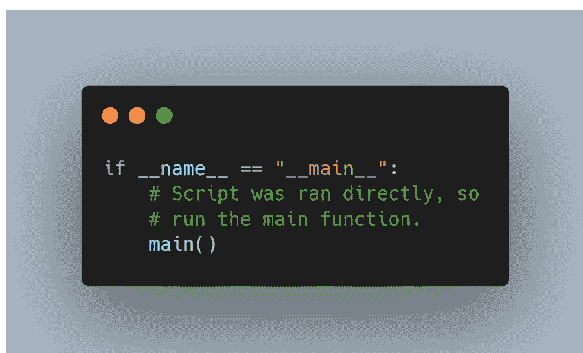

（原文缩略图位于 https://mathspp.com/blog/pydonts/name-dunder-attribute。）

## 介绍

在本次 Pydon't 中，我们将探讨 `__name__` 属性。如果你在 Google 上搜索它，你会找到大量解释 `__name__` 属性*一个*用例的结果，所以在本次 Pydon't 中，我将尝试告诉你另外几个用例，以便你学会在 Python 程序中有效使用 `__name__`。

在本次 Pydon't 中，你将：

- 了解使用 `__name__` 在 Python 中创建“主”函数的地道用法；
- 了解许多内置对象都有的只读属性 `__name__`；
- 看到 `__name__` 在一个涉及日志记录的约定中是如何使用的；以及
- 看到一些我将要教授内容的代码示例。

## 什么是 `__name__`？

`__name__` 是 Python 中的一个特殊属性。它特殊之处在于它是一个双下划线属性，这正是我们在 Python 中对那些名称以双下划线开头和结尾的属性所起的名字。（我在之前的 Pydon't 中更详细地解释了什么是双下划线属性/方法。）

你可以在 Python 文档中查找 `__name__`，你会找到我们将在此处介绍的两个主要结果。其中一个结果讨论了作为模块属性的 `__main__`，而另一个结果讨论了作为内置对象类型的属性的 `__main__`。

## 模块属性 `__name__`

`__name__` 最为人知的用例是作为模块属性，用于在 Python 中创建“主”函数。这意味着你可以使用 `__name__` 以编程方式确定你的代码是作为脚本直接运行，还是从另一个模块导入。

我们如何做到这一点？很简单！

请在你的 `print_name.py` 文件中写下以下代码行：

```python
print(__name__)
```

现在打开命令行并运行该脚本：

```
> python print_name.py
__main__
```

这显示的是，当你作为脚本运行代码时，属性 `__name__` 被自动设置为 `"__main__"`。这很重要，因为当你从其他地方导入你的代码时，情况就*不是*这样了。

例如，请在你的 `importer.py` 文件中写下以下代码行：

```python
import print_name
```

然后运行这个新的 Python 脚本：

```
> python importer.py
print_name
```

那个 "print_name" 是从哪里打印出来的？嗯，你*唯一的* print 语句是在 `print_name.py` 文件中，所以打印的值肯定是从那里出来的。请注意，仅仅通过从另一个模块导入代码，就有一些代码被执行了（并且有一些东西被打印到了控制台）。

另外，请注意打印的值与它所在文件的名称相匹配。在这里，我们看到当 `print_name` 中的代码从 `importer` 导入时，`__name__` 被自动设置为它所在文件的名称（`print_name`）。

所以，我们看到 `__name__` 根据代码是直接作为脚本运行还是从其他地方导入，会取不同的值。

当你编写代码时，你通常会编写几个函数来帮助你解决问题，然后你将这些函数应用于手头的问题。

例如，当我编写一些 Python 代码来高效地统计有效密码时，我在一个名为 `automaton.py` 的文件中编写了一个类来表示一个自动机：

```python
## automaton.py

class Automaton:
    # ...
```

那个类与问题无关，它只是实现了与自动机相关的一些基本行为。碰巧的是，该行为对我高效解决密码统计问题很有帮助，所以我将该 `Automaton` 类导入到另一个文件，并编写了一个小程序来解决我的问题。因此，我们可以说，我使用 `automaton.py` 文件中代码的大多数时候是为了从其他地方导入并使用它。

然而，我也在 `automaton.py` 文件中添加了 `Automaton` 类功能的一个小演示。现在的问题是，我不想这个小演示在每次 `Automaton` 类被其他程序导入时都运行，所以我必须想出一种方法，只在 `automaton.py` 文件直接作为脚本运行时才运行演示……原因是我的演示代码包含一些 `print` 语句，对于那些只是在另一个脚本中执行 `import automaton` 的用户来说，这些语句毫无意义……想象一下将一个模块导入到你的程序中，然后突然在你的控制台中出现一堆打印信息！

现在，我们可以使用 `__name__` 来避免这种情况！我们已经看到，当脚本直接运行时，`__name__` 被设置为 `"__main__"`，所以我们只需要检查这一点：

```python
## automaton.py

class Automaton:
    # ...

if __name__ == "__main__":
    print("Demo code.")
```

这是 `__name__` 最为人所知的用例。这就是为什么你经常会看到这样的代码片段：

```python
if __name__ == "__main__":
    main()
```

这仅仅是 Pythonic 的方式，将可能对你以后导入有用的函数、类和其他定义，与你只希望在程序是正在执行的主要代码块时才运行的代码分离开来。

顺便说一下，这个全局变量 `__name__` 确实是一个无需你手动执行任何操作就会被初始化的变量。不过，你可以对其赋值，尽管你可能不太需要这么做。因此，以下代码是完全有效的：

```
__name__ = "My name!"
if __name__ == "__main__":
    # 这段代码永远不会执行：
    print("Inside the __main__ if.")
```

## `__name__` 作为对象类型的属性

`__name__` 属性还有另一种 Python 风格的用途，另一种常见的使用模式。我现在要讲的这个模式与模块属性无关，而是与对象类型属性有关。

正如你可能知道的，所有对象都有一个类型，告诉你它"是什么"。

以下是一些常见的类型：

```
>>> type(0.5)
<class 'float'>
>>> type("hello")
<class 'str'>
>>> type(sum)
<class 'builtin_function_or_method'>
```

注意内置的 `type` 函数是如何告诉你对象是哪个类的实例。例如，`"hello"` 是一个字符串，这就是为什么 `type("hello")` 返回 `<class 'str'>`，这显然包含了类的名称：就是单引号内的 `'str'`。

根据这些信息，你会如何实现一个 `get_type_name` 函数，使其只返回类型名称的字符串，而不带多余的 `<class>` 部分？

请思考一下。

这里有一个实现方式：

```
>>> def get_type_name(obj):
...     return str(type(obj)).split("'")[1]
...
>>> get_type_name("hello")
'str'
>>> get_type_name(sum)
'builtin_function_or_method'
```

这是个好方案吗？我认为我们绝对可以做得更好。

文档告诉我们，许多内置对象类型和定义都有其 `__name__` 属性，它是 "类、函数、方法、描述符或生成器实例的名称"。

因此，一个更好的 `get_type_name` 函数实现是：

```
>>> def get_type_name(obj):
...     return type(obj).__name__
...
>>> get_type_name("hello")
'str'
>>> get_type_name(sum)
'builtin_function_or_method'
```

这简短得多、整洁得多（例如，没有嵌套的函数调用），也更容易阅读，因为代码清楚地表达了其意图。我们为函数选择的名字已经很好，因为很容易猜出函数的功能，但函数体本身就能明确表明我们获取了所需内容，那就更好了！

这种获取事物 `__name__` 的能力非常有用，例如，当你想要打印错误信息，因为你期望某个特定类型的参数，但实际得到了其他东西时。使用 `__name__`，你可以得到更友好的错误消息。

你可以查询的不只是内置类型的 `__name__`。你也可以查询函数的名称，例如：

```
>>> sum.__name__
'sum'
>>> get_type_name.__name__
'get_type_name'
```

如果你以编程方式获得了一个函数，并需要确定它是什么函数时，这可能会很有用：

```
>>> import random
>>> fn = random.choice([sum, get_type_name])
>>> fn.__name__
'sum'
```

我认为你不太可能从 `random.choice` 调用中获得一个函数，但这展示了你如何使用 `__name__` 来弄清楚你正在查看的函数是什么。

另一个已经具有 `__name__` 的很棒的东西是你的自定义类。如果你定义了一个类，`__name__` 将是一种非常简洁的方式来获取漂亮的类名，而无需过多周折或进行笨拙的字符串处理：

```
>>> class A():
...     pass
...
>>> A
<class '__main__.A'>
>>> A.__name__
'A'
>>> a = A()
>>> a
>>> type(a)
<class '__main__.A'>
>>> type(a).__name__
'A'
```

类似于模块的 `__name__`，类型、函数等的 `__name__` 属性也可以直接赋值：

```
>>> type(a).__name__
'A'
>>> A.__name__ = "name..?"
>>> type(a).__name__
'name..?'
```

有时这很有用，例如，当你需要将某些元数据从一个对象复制到另一个对象时。

## 代码示例

我已经向你展示了 `__name__` 属性在作为模块属性和类型对象属性时的含义，现在我将展示如何将这些知识付诸实践。我将照常从 Python 标准库中提取示例。

### 为模块代码定义命令行接口

如果你查看 `calendar` 模块，你会发现各种处理日历的函数。如果你检查源代码，你会看到模块的实现以以下两行结束：

```
# 来自 Python 3.9.2 中的 Lib/calendar.py
if __name__ == "__main__":
    main(sys.argv)
```

简而言之，该模块定义了一系列人们可能想从其他地方导入的函数，但如果程序是直接运行的，那么它将调用 `main` 函数，并将程序从终端接收的任何参数传递给它。

例如，尝试在你的命令行上运行以下命令：

```
> python -m calendar 2021 6
      June 2021
Mo Tu We Th Fr Sa Su
       1  2  3  4  5  6
 7  8  9 10 11 12 13
14 15 16 17 18 19 20
21 22 23 24 25 26 27
28 29 30
```

这很好地展示了当一个模块作为主程序启动时，可能会运行一些有趣/有用的功能。`calendar` 模块中的 `main` 函数使用 `argparse` 模块实现了一个简单的命令行接口，因此 `main` 函数*仅仅*是模块已定义代码的一个入口点。

出于好奇，我安装的 Python 3.9.2 的标准库有 2280 个 .py 文件，如果你查找，可以在 469 个文件中找到 `if __name__ == "__main__":` 这一行，占文件数的五分之一多一点……所以这确实是 Python 中一种常见的模式！

## 友好的错误信息

### 从枚举中删除

正如我之前提到的，如果你想获取对象的类型名称，`type(obj).__name__` 可能是实现这一目的的方法。

一个例子出现在 `enum` 模块中。该模块支持 Python 中的枚举，枚举是绑定到唯一、常量值的一组符号名称（成员）。

这是一个枚举示例：

```
>>> import enum
>>> class Colour(enum.Enum):
...     RED = "RED"
...     GREEN = "GREEN"
...     BLUE = "BLUE"
...
```

现在我们有一种谈论特定颜色的方式：

```
>>> Colour.RED
<Colour.RED: 'RED'>
>>> Colour.BLUE
<Colour.BLUE: 'BLUE'>
```

那么，如果我们想删除其中一个颜色呢？例如 `GREEN`？

```
>>> del Colour.GREEN
Traceback (most recent call last):
  File "<stdin>", line 1, in <module>
  File "C:\Program Files\Python39\lib\enum.py", line 382, in __delattr__
    raise AttributeError("%s: cannot delete Enum member." % cls.__name__)
AttributeError: Colour: cannot delete Enum member.
```

我们不能从枚举中删除 `GREEN`，因为 `GREEN` 属性不像其他类属性那样普通，它实际上是枚举结构的固有部分，因此该模块的实现者防止了这种类型的删除。

问题是，他们是如何获取我的 `Colour` 类的漂亮名称的？我甚至不需要向你展示代码，你只需查看上面的错误消息，它显示我们在 `Colour` 枚举中遇到了一个 `AttributeError`。是哪一行代码产生了这个漂亮的错误消息？是下面这行：

```
raise AttributeError("%s: cannot delete Enum member." % cls.__name__)
```

在这行代码中，`cls` 本身就是一个类，类似于：

```
>>> Colour # <--
<enum 'Colour'> # <-- 这就是 `cls` 的样子...
## 顺便说一下，这不是一个字符串。
```

所以我们可以直接获取它的 `__name__` 并生成漂亮的错误消息，至少就错误消息而言是漂亮的。

### 进行参数验证

在 `fractions` 模块中可以找到另一个类似的用例。该模块提供了一个名为 `from_decimal` 的函数，用于将 `Decimal` 数字（来自 `decimal` 模块）转换为精确的分数。根据我对该函数的描述，你可能已经理解了，但这个 `from_decimal` 函数期望一个 `decimal.Decimal` 实例，如果给定的参数不是这样的东西，就会报错：

```
>>> import fractions
>>> fractions.Fraction.from_decimal("3")
Traceback (most recent call last):
  File "<stdin>", line 1, in <module>
  File "C:\Program Files\Python39\lib\fractions.py", line 188, in from_decimal
    raise TypeError(
TypeError: Fraction.from_decimal() only takes Decimals, not '3' (str)
```

现在错误消息不太够用，因为代码跨越了几行，但这里是 `from_decimal` 函数执行的类型验证：

```
# 来自 Python 3.9.2 中的 Lib/fractions.py
class Fraction(numbers.Rational):
    # ...

    @classmethod
    def from_decimal(cls, dec):
        """Converts a finite Decimal instance to a rational number, exactly."""
        from decimal import Decimal
        if isinstance(dec, numbers.Integral):
            dec = Decimal(int(dec))
        elif not isinstance(dec, Decimal):
            raise TypeError(
                "%s.from_decimal() only takes Decimals, not %r (%s)" %
                (cls.__name__, dec, type(dec).__name__))
        return cls(*dec.as_integer_ratio())
```

注意该函数如何接收一个 `dec`，如果参数不是 `Decimal` 但易于处理为 `Decimal`，则尝试将其转换为 `Decimal`。这就是为什么将 `3` 传给函数不会产生错误：

```
>>> fractions.Fraction.from_decimal(3)
Fraction(3, 1)
```

然而，`"3"` 不是 `numbers.Integral`，它也*不是* `Decimal`，所以 `dec` 未能通过测试，最终我们得到

## 日志记录约定

在最终的代码示例中，我将向您展示一个使用 `logging` 模块记录程序时常用的通用约定。

`logging` 模块为用户提供了一个 `getLogger` 函数，该函数接受一个名称字符串参数。这样，`getLogger` 就可以返回一个具有指定名称的 logger。

一方面，您希望为 logger 命名，这样在大型应用程序中，您就可以分辨出哪些日志消息来自哪里。另一方面，如果您给 `getLogger` 传入相同的名称，它总是返回同一个 logger，因此在单个模块或文件中，您不需要到处传递 logger，只需始终用相同的名称调用 `getLogger` 即可。

现在，您希望通过总是使用相同的名称来获取 logger，并且还希望这个名称能够明确无误地标明日志记录发生的模块。这表明，随意选择像“logger”这样的名字是个坏主意，因为我可能会和其他开发者的代码选择相同的 logger 名称，这样当我们的代码交互时，日志就会变得一团糟。

另一个显而易见的备选方案是使用特定于我们所在模块的名称，例如文件名。然而，如果我手动将 logger 名称设置为文件名，我*知道*如果我最终更改了文件名，我会忘记更新它，所以我现在有点左右为难……

幸运的是，这种情况是 `__name__` 属性派上用场的教科书式范例！

`__name__` 属性为您提供了一个可读的名称，清楚地标明它所属的模块。使用 `__name__` 甚至意味着，如果您的代码与其他也进行日志记录的代码交互，您的日志设施也很可能表现良好。

这就是为什么使用 `getLogger(__name__)` 是文档中推荐的约定，也是为什么这个模式被使用了大约 84% 的次数！（在调用 `getLogger` 函数的 123 个 Python 标准库 `.py` 文件中，有 103 个文件使用了它。）

## 结论

以下是这份 Pydon't 文档的主要收获，我已为您奉上：

> “`__name__` 属性是一个动态属性，它告诉您当前所在的模块名称，或者您变量的类型名称。”

这份 Pydon't 向您展示：

- `__name__` 是一个模块属性，它告诉您当前所在的模块名称；
- 您可以通过检查 `__name__` 是否为 `__main__` 来判断程序是否正在直接运行；
- 您可以并且应该使用 `__name__` 来获取对象类型的漂亮名称；
- `__name__` 是一个可以随意赋值而不会有问题的属性；
- `if __name__ == "__main__"` 这种 `if` 语句是一种非常 Pythonic 的方式，用来确保某些代码仅在程序直接运行时执行；
- 模式 `type(obj).__name__` 是访问对象类型名称的一种简单方法；以及
- 存在一个成熟的约定，即在使用 `logging` 模块时使用 `__name__` 来设置 logger 的名称。

## 参考资料

- Python 3 文档，Python 标准库，内置类型，特殊属性，https://docs.python.org/3/library/stdtypes.html?highlight=__name__#definition.__name__ [最后访问于 2021-06-29]；
- Python 3 文档，Python 标准库，顶层脚本环境，https://docs.python.org/3/library/__main__.html [最后访问于 2021-06-29]；
- Python 3 文档，Python 语言参考，导入系统，https://docs.python.org/3/reference/import.html [最后访问于 2021-06-29]；
- Python 3 文档，Python 实用指南，日志实用指南，高级日志教程，https://docs.python.org/3/howto/logging.html#advanced-logging-tutorial [最后访问于 2021-06-29]；
- Python 3 文档，Python 标准库，calendar，https://docs.python.org/3/library/calendar.html [最后访问于 2021-06-29]；
- Python 3 文档，Python 标准库，enum，https://docs.python.org/3/library/enum.html [最后访问于 2021-06-29]；
- Python 3 文档，针对查询“__name__”的搜索结果，https://docs.python.org/3/search.html?q=__name__&check_keywords=yes&area=default [最后访问于 2021-06-29]；

# 按值传递、按引用传递与赋值

（原文文章的缩略图位于 [https://mathspp.com/blog/pydonts/pass-by-value-reference-and-assignment](https://mathspp.com/blog/pydonts/pass-by-value-reference-and-assignment)）

## 简介

许多传统编程语言在向函数传递参数时，采用以下两种模型之一：

- 一些语言使用按值传递模型；以及
- 大多数其他语言使用按引用传递模型。

话虽如此，了解 Python 使用的模型非常重要，因为它会影响代码的行为方式。

在这份 Pydon't 中，您将：

- 了解 Python 既不使用按值传递模型，也不使用按引用传递模型；
- 理解 Python 使用的是按赋值传递模型；
- 了解内置函数 `id`；
- 更好地理解 Python 对象模型；
- 认识到每个对象都有三个定义它的非常重要的属性；
- 理解可变对象和不可变对象之间的区别；
- 学习浅拷贝和深拷贝之间的区别；以及
- 学习如何使用 `copy` 模块进行两种类型的对象拷贝。

## Python 是按值传递的吗？

在按值传递模型中，当您用一组参数调用一个函数时，数据会被复制到函数中。这意味着您可以随意修改参数，并且无法改变函数外部的程序状态。Python 并非如此，它不使用按值传递模型。

观察下面的代码片段，它看起来可能像是 Python 使用按值传递：

```python
def foo(x):
    x = 4

a = 3
foo(a)
print(a)
## 3
```

这看起来像是按值传递模型，因为我们给了它一个 3，将它改成了 4，而这个更改没有反映到外部（a 仍然是 3）。

但实际上，Python 并没有将数据复制到函数中。

为了证明这一点，我将向您展示另一个函数：

```python
def clearly_not_pass_by_value(my_list):
    my_list[0] = 42

l = [1, 2, 3]
clearly_not_pass_by_value(l)
print(l)
## [42, 2, 3]
```

正如我们所见，在函数外部定义的列表 `l` 在调用函数 `clearly_not_pass_by_value` 之后发生了改变。因此，Python 并不使用按值传递模型。

## Python 是按引用传递的吗？

在真正的按引用传递模型中，被调用的函数可以访问调用者的变量！有时，看起来 Python 好像是这样做的，但 Python 并不使用按引用传递模型。

我将尽力解释为什么 Python 并非如此：

```python
def not_pass_by_reference(my_list):
    my_list = [42, 73, 0]

l = [1, 2, 3]
not_pass_by_reference(l)
print(l)
## [1, 2, 3]
```

如果 Python 使用按引用传递模型，该函数本可以完全改变函数外部 `l` 的值，但如我们所见，事实并非如此。

让我向您展示一个真正的按引用传递的情况。

这是一些 Pascal 代码：

```pascal
program callByReference;
var
    x: integer;

procedure foo(var a: integer);
{ 创建一个名为 `foo` 的过程 }
begin
    a := 6           { 将 6 赋值给 `a` }
end;

begin
    x := 2;          { 将 2 赋值给 `x` }
    writeln(x);      { 打印 `x` }
    foo(x);          { 用 `x` 调用 `foo` }
    writeln(x);      { 打印 `x` }
end.
```## (不可)变性

查看那段代码的最后几行：

-   我们用 `x := 2;` 将 2 赋值给 x；
-   我们打印 x；
-   我们以 x 作为参数调用 foo；并且
-   我们再次打印 x。

这个程序的输出是什么？

我想你们大多数人手边大概没有 Pascal 解释器。

对象的 (不可) 变性取决于它的类型。换句话说，(不可) 变性是类型的特性，而不是特定对象的特性！

但是，一个对象是*可变的*究竟意味着什么？或者一个对象是*不可变的*又意味着什么？

回想一下，对象由其标识、类型和内容来表征。如果一个对象可以在不改变其标识和类型的情况下改变其内容，那么这个类型就是可变的。

列表是可变数据类型的绝佳示例。为什么？因为列表是*容器*：你可以将东西放入列表，也可以从这些列表中移除东西。

下面，你可以看到当我们进行方法调用时，列表 `obj` 的内容如何变化，但列表的标识保持不变：

```
>>> obj = []
>>> id(obj)
2287844221184
>>> obj.append(0); obj.extend([1, 2, 3]); obj
[42, 0, 1, 2, 3]
>>> id(obj)
2287844221184
>>> obj.pop(0); obj.pop(0); obj.pop(); obj
42
0
3
[1, 2]
>>> id(obj)
2287844221184
```

然而，处理不可变对象时，情况就完全不同了。如果我们查阅英语词典，对于 “immutable” 的定义会得到：

> 形容词：immutable – 随时间推移不变或无法改变。

不可变对象的内容永远不会改变。以字符串为例：

```
>>> obj = "Hello, world!"
```

字符串对于这个讨论来说是一个很好的例子，因为有时它们*看起来*是可变的。但它们并不是！

一个对象不可变的一个很好指标是它的所有方法都返回某些东西。这与列表的 `.append` 方法不同！如果你对列表使用 `.append`，你不会得到返回值。另一方面，无论你对字符串使用什么方法，结果都会返回给你：

```
>>> [].append(0)    # 无返回值。
>>> obj.upper()     # 返回一个字符串。
'HELLO, WORLD!'
```

注意 `obj` 并未自动更新为 "HELLO, WORLD!"。相反，创建了新的字符串并返回给你。

另一个表明字符串不可变的好提示是你不能为其索引赋值：

```
>>> obj[0]
'H'
>>> obj[0] = "h"
Traceback (most recent call last):
  File "<stdin>", line 1, in <module>
TypeError: 'str' object does not support item assignment
```

这表明，当字符串被创建时，它保持不变。它可以用来构建其他字符串，但字符串本身始终保持不变。

作为参考，int、float、bool、str、tuple 和 complex 是最常见的不可变对象类型；list、set 和 dict 是最常见的可变对象类型。

## 变量名作为标签

另一个需要理解的重要事情是，变量名与对象本身关系很小。

事实上，名字 `obj` 只是我决定贴在具有标识 2698212637504、属于列表类型、内容为 1、2、3 的那个对象上的标签。

就像我将标签 `obj` 贴到那个对象上一样，我也可以给它贴更多名字：

```
>>> foo = bar = baz = obj
```

同样，这些名字只是标签。是我决定贴在同一个对象上的标签。我们如何知道它们是同一个对象？嗯，它们所有的 "社会安全号码"（即 ids）都匹配，所以它们一定是同一个对象：

```
>>> id(foo)
2698212637504
>>> id(bar)
2698212637504
>>> id(baz)
2698212637504
>>> id(obj)
2698212637504
```

因此，我们得出结论，`foo`、`bar`、`baz` 和 `obj` 都是指向同一个对象的变量名。

## 运算符 is

`is` 运算符正是这样做的：它检查两个对象是否相同。

两个对象要相同，它们必须具有相同的标识：

```
>>> foo is obj
True
>>> bar is foo
True
>>> obj is foo
True
```

*仅仅*具有相同的类型和内容是不够的！我们可以创建一个新的内容为 [1, 2, 3] 的列表，它与 `obj` 将*不是*同一个*对象*：

```
>>> obj is [1, 2, 3]
False
```

从完美双胞胎的角度来思考。当两个兄弟姐妹是完美双胞胎时，他们看起来一模一样。然而，他们是*不同的人*！

## is not

顺便提一下，但这一点很重要，你应该知道运算符 `is not`。

一般来说，当你想否定一个条件时，你在前面放一个 `not`：

```
n = 5
if not isinstance(n, str):
    print("n is not a string.")
## n is not a string.
```

所以，如果你想检查两个变量是否指向不同的对象，你可能会倾向于写：

```
if not a is b:
    print("`a` and `b` are different objects.")
```

然而，Python 有 `is not` 运算符，它更接近一个正确的英语句子，我认为这真的很酷！

因此，上面的例子实际上应该写成：

```
if a is not b:
    print("`a` and `b` are different objects.")
```

Python 对 `in` 运算符也做了类似的事情，提供了 `not in` 运算符……这多酷啊？！

## 赋值作为别名

如果我们继续推进这个比喻，给变量赋值就像给某人一个新绰号。

我中学的朋友叫我 "Rojer"。我大学的朋友叫我 "Girão"。我不太熟的人叫我的名字 "Rodrigo"。然而，无论他们怎么称呼我，*我*仍然是*我*，对吧？

如果有一天我决定换个新发型，每个人都会看到这个新发型，无论他们怎么称呼我！

类似地，如果我修改一个对象的*内容*，我可以使用我偏好的任何别名来查看这些更改是否发生。例如，我们可以更改我们一直在操作的列表的中间元素：

```
>>> foo[1] = 42
>>> bar
[1, 42, 3]
>>> baz
[1, 42, 3]
>>> obj
[1, 42, 3]
```

我们使用了别名 `foo` 来修改中间元素，但这个更改在所有其他别名中也是可见的。

为什么？

因为它们都指向*同一个*列表对象。

## Python 是赋值传递

在阐述了所有这些之后，我们现在准备好理解 Python 如何将参数传递给函数了。

当我们调用函数时，函数的每个参数被赋值给传入的对象。本质上，每个参数现在成为传入对象的一个*新*别名。

## 不可变参数

如果我们传入不可变参数，那么我们*没有办法*修改参数本身。毕竟，这就是不可变的含义："不改变"。

这就是为什么 Python 看起来像是使用按值传递模型的原因。因为让参数持有其他内容的唯一方法是将其赋值给一个完全不同的东西。当我们这样做时，我们是在为不同的对象重用同一个别名：

```
def foo(bar):
    bar = 3
    return bar

foo(5)
```

在上面的例子中，当我们以参数 5 调用 `foo` 时，就好像我们在函数开始时做了 `bar = 5`。

紧接着，我们有 `bar = 3`。这意味着 "将别名 'bar' 指向整数 3"。Python 不关心 `bar` 作为一个别名（作为一个变量名）已经被使用过。它现在指向那个 3！

## 可变参数

另一方面，可变参数*可以*被改变。我们可以修改它们的内部内容。可变对象的一个典型例子是列表：其元素可以改变（长度也可以）。

这就是为什么 Python 看起来像是使用按引用传递模型的原因。但是，当我们改变对象的*内容*时，我们并没有改变对象本身的标识。同样，当你改变你的发型或衣服时，你的社会安全号码*不会*改变：

```
>>> l = [42, 73, 0]
>>> id(l)
3098903876352
>>> l[0] = -1
>>> l.append(37)
>>> id(l)
3098903876352
```

你明白我想说什么了吗？如果不明白，请在下面留言，我会尽力帮助。

## 调用函数时请小心

这表明你在定义函数时应该谨慎。如果你的函数期望可变参数，你应该做以下两件事之一：

-   无论如何都不要改变参数；或
-   明确记录参数可能被改变。

就个人而言，我更喜欢采用第一种方法：不改变参数；但第二种方法也有适用的时候。

有时候，你确实需要以参数为基础进行某种转换，这意味着你会想要改变参数。在这些情况下，你可能会考虑复制参数（在下一节讨论），但进行复制可能会消耗大量资源。在这些情况下，改变参数可能是唯一明智的选择。

## 制作副本

### 浅拷贝与深拷贝

"复制一个对象" 意味着创建第二个对象，它具有不同的标识（因此，是一个不同的对象），但具有相同的内容。通常，我们复制一个对象是为了能够处理它并修改它，同时保留第一个对象。

在复制对象时，有几个细微差别需要讨论。

### 复制不可变对象

首先需要说明的是，对于不可变对象，谈论复制是没有意义的。

"复制" 只对可变对象有意义。如果你的对象是不可变的，并且你想保留对它的引用，你只需要进行第二次赋值并基于它进行操作：

```
string = "Hello, world!"
string_ = string
## 现在对 `string_` 进行一些操作...
```

或者，有时你可以直接在原始对象上调用方法和其他函数，因为原始对象不会消失：

```
python
string = "Hello, world!"
print(string.lower())
## 调用 `.lower` 后，`string` 仍然是 "Hello, world!"
```

因此，我们只需要担心可变对象。

## 浅拷贝

许多可变对象本身可以包含可变对象。因此，存在两种类型的拷贝：

- 浅拷贝；以及
- 深拷贝。

区别在于可变对象内部的可变对象会发生什么。

列表和字典有一个 `.copy` 方法，它返回相应对象的浅拷贝。

让我们看一个列表的例子：

```
python
>>> sublist = []
>>> outer_list = [42, 73, sublist]
>>> copy_list = outer_list.copy()
```

首先，我们在一个列表内部创建一个列表，然后复制外部列表。现在，因为它是副本，所以复制的列表与原始的外部列表不是同一个对象：

```
python
>>> copy_list is outer_list
False
```

但如果它们不是同一个对象，那么我们可以修改其中一个列表的内容，而另一个不会反映这种变化：

```
python
>>> copy_list[0] = 0
>>> outer_list
[42, 73, []]
```

正如我们所看到的：我们修改了 copy_list 的第一个元素，而 outer_list 保持不变。

现在，我们尝试修改 sublist 的内容，有趣的事情开始了！

```
python
>>> sublist.append(999)
>>> copy_list
[0, 73, [999]]
>>> outer_list
[42, 73, [999]]
```

当我们修改 sublist 的内容时，outer_list 和 copy_list 都反映了这些变化...

但拷贝不应该是给我第二个列表，让我可以修改它而不影响第一个吗？是的！这正是发生的事情！

事实上，修改 sublist 的内容并没有*真正*修改 copy_list 或 outer_list 的内容：毕竟，两者的第三个元素都指向一个列表对象，它仍然指向！改变的是我们指向的对象的（内部）内容。

有时，我们不希望这种情况发生：有时，我们不希望可变对象共享内部的可变对象。

### 常见的浅拷贝技术

处理列表时，通常使用切片来生成列表的浅拷贝：

```
>>> outer_list = [42, 73, []]
>>> shallow_copy = outer_list[:]
>>> outer_list[2].append(999)
>>> shallow_copy
[42, 73, [999]]
```

在对象本身上使用相应类型的内置函数，也可以构建浅拷贝。这适用于列表和字典，也可能适用于其他可变类型。

这是一个列表内部包含列表的例子：

```
>>> outer_list = [42, 73, []]
>>> shallow_copy = list(outer_list)
>>> shallow_copy[2].append(999)
>>> outer_list
[42, 73, [999]]
```

这是一个字典内部包含列表的例子：

```
>>> outer_dict = {42: 73, "list": []}
>>> shallow_copy = dict(outer_dict)
>>> outer_dict["list"].append(999)
>>> shallow_copy
{42: 73, 'list': [999]}
```

## 深拷贝

当你想要“彻底”复制一个对象，并且不希望副本共享对内部对象的引用时，你需要对对象进行“深拷贝”。你可以将深拷贝视为一种递归算法。

你复制第一级的元素，每当你在第一级发现一个可变元素时，你就递归下去并复制这些元素的内容。

为了说明这个想法，这里是一个简单的递归实现，用于深拷贝包含其他列表的列表：

```
def list_deepcopy(l):
    return [
        elem if not isinstance(elem, list) else list_deepcopy(elem)
        for elem in l
    ]
```

我们可以使用这个函数来复制之前的 outer_list，看看会发生什么：

```
>>> sublist = []
>>> outer_list = [42, 73, sublist]
>>> copy_list = list_deepcopy(outer_list)
>>> sublist.append(73)
>>> copy_list
[42, 73, []]
>>> outer_list
[42, 73, [73]]
```

正如你在这里看到的，修改 sublist 的内容只间接影响了 outer_list；它没有影响 copy_list。

遗憾的是，我实现的 list_deepcopy 方法不是很健壮，也不够通用，但 Python 标准库已经为我们提供了支持！

## copy 模块和 deepcopy 方法

`copy` 模块正是我们需要的。该模块提供了两个有用的函数：

- `copy.copy` 用于浅拷贝；以及
- `copy.deepcopy` 用于深拷贝。

就是这样！而且，更重要的是，`copy.deepcopy` 方法足够智能，可以处理可能出现的循环定义等问题！也就是说，当一个对象包含另一个对象，而后者又包含第一个对象时：一个简单的递归实现深拷贝算法会进入无限循环！

如果你编写自己的自定义对象，并且想要指定如何进行浅拷贝和深拷贝，你只需要分别实现 `__copy__` 和 `__deepcopy__` 即可！

在我看来，这是一个很棒的模块。

## 代码示例

既然我们已经深入探讨了理论——双关语——，现在是时候向你展示一些实际操作这些概念的代码了。

## 可变默认参数

让我们从一个 Twitter 上的热门话题开始：

Python 🐍 是一门令人难以置信的语言，但有时似乎有些怪癖 🤔 例如，经常让初学者困惑的一件事是为什么不应该使用列表作为默认值 🤔 这里有一个推文串 🧵 可以帮助你理解这一点 🧵 pic.twitter.com/HVhPjS2PSH

> — Rodrigo 🐍🐍 (@mathsppblog) 2021年10月5日

显然，使用可变对象作为默认参数是个坏主意。这里有一个代码片段向你展示原因：

```
def my_append(elem, l=[]):
    l.append(elem)
    return l
```

上面的函数将一个元素追加到一个列表中，如果没有给出列表，则默认追加到一个空列表中。
很好，让我们好好利用这个函数：

```
>>> my_append(1)
[1]
>>> my_append(1, [42, 73])
[42, 73, 1]
>>> my_append(3)
[1, 3]
```

我们用它一次，参数是 1，我们得到一个包含 1 的列表。然后，我们用它将 1 追加到我们已有的另一个列表中。最后，我们用它将 3 追加到一个空列表中... 但事实并非如此！
事实证明，当我们定义一个函数时，默认参数会被创建并存储在一个特殊的地方：

```
>>> my_append.__defaults__
([1, 3],)
```

这意味着默认参数_总是_同一个对象。因此，因为它是一个可变对象，它的内容可以随时间改变。这就是为什么在上面的代码中，__defaults__ 显示一个已经包含两个项目的列表。
如果我们重新定义函数，那么它的 __defaults__ 显示一个空列表：

```
>>> def my_append(elem, l=[]):
...     l.append(elem)
...     return l
...
>>> my_append.__defaults__
([],)
```

这就是为什么，通常情况下，不应该使用可变对象作为默认参数。
在这些情况下，标准做法是使用 None，然后使用布尔短路赋值来分配默认值：

```
def my_append(elem, l=None):
    lst = l or []
    lst.append(elem)
    return lst
```

通过这种实现，函数现在按预期工作：

```
>>> my_append(1)
[1]
>>> my_append(3)
[3]
>>> my_append(3, [42, 73])
[42, 73, 3]
```

## is not None

搜索 Python 标准库显示，`is not` 运算符被使用了大约 5000 次。这很多。

而且，绝大多数情况下，该运算符后面几乎总是跟着 `None`。事实上，`is not None` 在标准库中出现了 3169 次！

`x is not None` 的作用正如其字面意思：它检查 `x` 是否为 `None`。

这里有一个简单的使用示例，来自 `argparse` 模块，用于创建命令行接口：

```
## 来自 Python 3.9 的 Lib/argparse.py
class HelpFormatter(object):
    # ...

    class _Section(object):
        # ...

        def format_help(self):
            # 格式化缩进的部分
            if self.parent is not None:
                self.formatter._indent()
            # ...
```

即使没有大量的上下文，我们也能看出发生了什么：当显示给定部分的命令帮助时，我们可能希望缩进它（或不缩进）以显示层次依赖关系。

如果一个部分的父级是 `None`，那么该部分没有父级，不需要缩进。换句话说，如果一个部分的父级不是 `None`，那么我们希望缩进它。注意我的英文与代码完全匹配！

## 系统环境的深拷贝

`copy.deepcopy` 方法在标准库中被使用了几次，这里我想展示一个复制字典的示例用法。

`os` 模块提供了 `environ` 属性，类似于字典，包含已定义的环境变量。

这里有几个来自我的（Windows）机器的例子：

```
>>> os.environ["lang"]
'en_US.UTF-8'
>>> os.environ["appdata"]
'C:\Users\rodri\AppData\Roaming'
>>> os.environ["systemdrive"]
```

## 使用 `list(os.environ.keys())` 获取你的环境变量列表。

该模块 `http.server` 提供了一些用于构建基础 HTTP 服务器的类。

其中一个类 `CGIHTTPRequestHandler` 实现了一个可以运行 CGI 脚本的 HTTP 服务器。在其 `run_cgi` 方法中，它需要设置一堆环境变量。

设置这些环境变量是为了给即将运行的 CGI 脚本提供必要的上下文信息。然而，我们并不想实际修改当前的环境！

因此，我们所做的是创建环境的深拷贝，然后随心所欲地修改它！修改完成后，我们告诉 Python 执行 CGI 脚本，并将修改后的环境作为参数提供。

理解这样做的确切方式可能并不容易。就我而言，我不认为我能把它解释清楚。但这并不意味着我们无法推断出部分内容：

以下是代码：

```
## From Lib/http/server.py in Python 3.9
class CGIHTTPRequestHandler(SimpleHTTPRequestHandler):
    # ...

    def run_cgi(self):
        # ...
        env = copy.deepcopy(os.environ)
        env['SERVER_SOFTWARE'] = self.version_string()
        env['SERVER_NAME'] = self.server.server_name
        env['GATEWAY_INTERFACE'] = 'CGI/1.1'
        # and many more `env` assignments!

        # ...

        else:
            # Non-Unix -- use subprocess
            # ...
            p = subprocess.Popen(cmdline,
                                 stdin=subprocess.PIPE,
                                 stdout=subprocess.PIPE,
                                 stderr=subprocess.PIPE,
                                 env = env
                                 )
```

如我们所见，我们复制了环境并定义了一些变量。最后，我们创建了一个获得修改后环境的新子进程。

## 结论

这是本次 Pydon't 的核心要点，为你呈上：

> “Python 使用赋值传递模型，理解它需要你认识到所有对象都由一个标识号、它们的类型和它们的内容来表征。”

本次 Pydon't 向你展示了：

- Python 不使用值传递模型，也不使用引用传递模型；
- Python 使用赋值传递模型（使用“别名”）；
- 每个对象由以下因素表征：
  - 其标识；
  - 其类型；以及
  - 其内容。
- `id` 函数用于查询对象的标识符；
- `type` 函数用于查询对象的类型；
- 对象的类型决定了它是可变的还是不可变的；
- 浅拷贝复制嵌套可变对象的引用；
- 深拷贝执行允许一个对象及其内部元素在更改时永不影响副本的拷贝；
- `copy.copy` 和 `copy.deepcopy` 可用于执行浅拷贝/深拷贝；以及
- 如果你希望自己的对象可复制，可以实现 `__copy__` 和 `__deepcopy__`。

## 另请参阅

如果你偏爱视频内容，可以查看 [这个 YouTube 视频](https://www.youtube.com/watch?v=9Kc1o14j2c4)，它的灵感来自本次 Pydon't。

## 参考资料

- Python 3 文档，编程常见问题，“如何编写带输出参数（传引用调用）的函数？”，https://docs.python.org/3/faq/programming.html#how-do-i-write-a-function-with-output-parameters-call-by-reference [最后访问于 2021-10-04]；
- Python 3 文档，Python 标准库，copy，https://docs.python.org/3/library/copy.html [最后访问于 2021-10-05]；
- effbot.org，“对象传递”（通过“arquivo.pt”），https://arquivo.pt/wayback/20160516131553/http://effbot.org/zone/call-by-object.htm [最后访问于 2021-10-04]；
- effbot.org，“Python 对象”（通过“arquivo.pt”），https://arquivo.pt/wayback/20191115002033/http://effbot.org/zone/python-objects.htm [最后访问于 2021-10-04]；
- Robert Heaton，“Python 是传引用还是传值”，https://robertheaton.com/2014/02/09/pythons-pass-by-object-reference-as-explained-by-philip-k-dick/ [最后访问于 2021-10-04]；
- StackOverflow 问答，“如何通过引用传递变量？”，https://stackoverflow.com/q/986006/2828287 [最后访问于 2021-10-04]；
- StackOverflow 问答，“Python 中的值传递 [重复]”，https://stackoverflow.com/q/534375/2828287 [最后访问于 2021-10-04]；
- @mathsppblog 的推特话题，https://twitter.com/mathsppblog/status/1445148566721335298 [最后访问于 2021-10-20]；

## 警惕递归

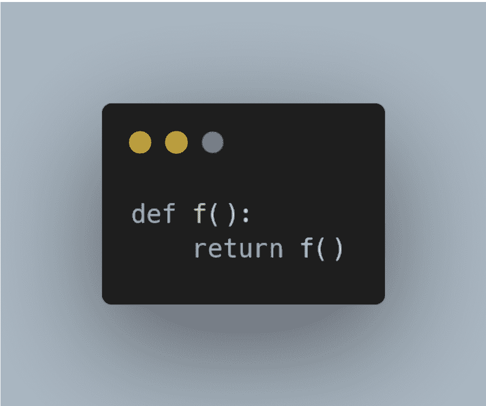

（原文文章缩略图，发布于 https://mathspp.com/blog/pydonts/watch-out-for-recursion。）

## 引言

在这篇 Pydon't 中，我将简要讨论何时以及为何递归可能不是解决问题的最佳策略。这次讨论将涉及 Python 的一些特性，但也将涵盖涵盖众多编程语言的更广泛主题和概念。在这次简短讨论之后，我将向你展示一些递归 Python 代码及其非递归对应版本的例子。

尽管我说了我会这么做，但请不要误会：本篇 Pydon't 的目的 *不是* 要让你不喜欢递归或说递归很糟糕。我 *真的* 喜欢递归，我觉得它非常优雅。

## 警惕递归

既然你知道了本篇 Pydon't 的目的，请允许我提及一些可能影响递归解决问题适用性的事情。

## RecursionError

我们将讨论的第一件事是 Python 执行的臭名昭著的递归深度限制。

如果你完全不知道我在说什么，那么要么——你一生中从未写过递归函数，要么——你真的、*真的* 很厉害，从没在你的递归函数定义中犯过错。

递归深度限制是这样一种机制：如果你进行过多的递归调用，它会使你的代码引发 `RecursionError`。要明白我说的，只需在你的 REPL 中执行以下操作：

```
>>> def f():
...     return f()
...
>>> f()
Traceback (most recent call last):
  File "<stdin>", line 1, in <module>
  File "<stdin>", line 2, in f
  File "<stdin>", line 2, in f
  File "<stdin>", line 2, in f
  [Previous line repeated 996 more times]
RecursionError: maximum recursion depth exceeded
>>>
```

在许多情况下，这个限制 *有帮助*，因为它能帮你找到那些没有正确定义基本情况的递归函数。

然而，也存在 1000 次递归调用不足以完成计算的情况。一个经典例子就是阶乘函数：

```
>>> def fact(n):
...     if n == 0:
...         return 1
...     return n*fact(n-1)
...
>>> fact(10)
3628800
>>> fact(2000)
Traceback (most recent call last):
  File "<stdin>", line 1, in <module>
  File "<stdin>", line 5, in fact
  File "<stdin>", line 5, in fact
  File "<stdin>", line 5, in fact
  [Previous line repeated 995 more times]
  File "<stdin>", line 2, in fact
RecursionError: maximum recursion depth exceeded in comparison
```

我们的函数定义正确，但默认情况下 Python 不允许我们进行足够多次的递归调用。

如果你必须，你总是可以设置自己的递归深度：

```
>>> import sys
>>> sys.setrecursionlimit(3000)
>>> fact(2000)
33162... # (omitted for brevity)
>>> sys.getrecursionlimit()
3000
```

只是要小心。我从未尝试过，但你可能不希望因为极其大量的递归调用而导致 Python 内存耗尽。

因此，如果你的函数会持续尝试递归超过允许的递归深度，你可能需要考虑为你的问题寻找不同的解决方案。

## 没有尾递归优化

在某些编程语言中，上面显示的阶乘函数可以被调整——以执行尾调用——这将防止一些问题，同时节省内存：尾调用发生在递归调用是函数内部执行的最后一件事时，这或多或少意味着你在递归时不需要保留任何关于当前上下文的信息。

在上面的阶乘函数中，用 `fact(n-1)` 递归后，我们仍然需要执行一个乘法才能从函数返回。如果我们重写函数，将部分阶乘作为累加器传递，我们可以得到一个执行尾调用的阶乘函数：

```
>>> def fact(n, partial=1):
...     if n <= 1:
...             return partial
...     return fact(n-1, n*partial)
...
>>> fact(10)
3628800
```

如你所见，在 `fact` 函数内部做的最后一件事是调用它自己，因此理论上 Python 在进行递归调用时可以“忘记关于它周围环境的一切”，并节省大量内存过程。

实际上，Python 并非*有意*不这样做，关于 Python 为何没有此特性，我建议你阅读参考文献中 [Neopythonic](https://neopythonic.blogspot.com/) 博客（由 Guido van Rossum 撰写）的两篇文章以了解更多。

将递归函数转换为尾递归函数是一个有趣的练习，我挑战你这样做，但你不会因此获得速度提升。然而，移除尾递归函数的递归非常容易，我将在[下面的示例](#tail-recursion)中向你展示如何操作。

## 分支重叠

考虑递归解决方案时需要考虑的另一件事是：递归调用之间是否存在大量重叠？

如果你的递归函数在递归调用中*分支*，并且递归调用重叠，那么你可能会浪费大量时间反复重新计算相同的值。通常这可以轻松修复，但仅仅因为一个问题*可能*有简单的解决方案，并不意味着你可以完全忽视它。

导致大量浪费计算的经典递归示例是斐波那契数列：

```
def fibonacci(n):
    if n <= 1:
        return n
    return fibonacci(n-1) + fibonacci(n-2)
```

对此函数的一个简单修改表明，进行了*许多*递归调用：

```
call_count = 0
def fibonacci(n):
    global call_count
    call_count += 1
    if n <= 1:
        return n
    return fibonacci(n-1) + fibonacci(n-2)

print(fibonacci(10))
print(call_count)    # 177
```

如果你的函数更复杂，那么你在重新计算上浪费的时间可能会变得难以忍受。

## 深度优先与广度优先

编写递归解决方案时需要考虑的另一件事是，递归解决方案本质上是深度优先的，而你的问题可能需要广度优先的解决方案。

这不太可能是一个大问题，但这表明有时即使一个解决方案有非常清晰的递归解法，你最好也不要实现纯递归解决方案。

当我解决水桶谜题时，出现了一个很好的例子：我想编写代码来解决（一个更通用版本的）谜题，其中你有一个可以装 A 升水的桶，另一个装 B 升水的桶，你必须来回倒水，使其中一个桶恰好装 T 升水。解决方案可以很容易地用递归表达，但我的实现实际上使用了 while 循环和 BFS 算法。

如果你不知道这是什么意思，最好的办法是谷歌一下。例如，访问关于深度优先搜索和广度优先搜索的维基百科页面。用一个简短而不精确的句子来说，深度优先搜索（DFS）意味着当你遍历某个结构时，你优先深入探索，然后再环顾四周，而广度优先搜索（BFS）则首先探索当前层级，然后再深入一层。

## 代码示例

我现在将展示一些可能导致上述问题的递归代码，并分享这些代码的非递归版本。

## 阶乘

阶乘的简单示例很棒，因为它可以有无数种不同的实现方式，这些实现所展示的思想可以应用于更复杂的递归。

这里的主要特征是阶乘的递归是“线性”递归，其中每次调用只执行一次递归调用，并且每次递归调用都是针对更简单的问题。

标准递归如下：

```
python
def factorial(n):
    if n <= 1:
        return 1
    return n * factorial(n-1)
```

正如我们上面看到的，我们可以使用累加器编写阶乘的尾递归版本，即使 Python 不会以任何方式优化它：

```
python
def factorial(n, partial=1):
    if n <= 1:
        return partial
    return factorial(n-1, n*partial)
```

现在我们有了这个以尾递归方式编写的函数，我们实际上可以按照一个简单的步骤完全移除递归：

```
python
def factorial(n):
    partial = 1
    while n > 1:
        n, partial = n-1, n*partial
    return partial
```

这是一个通用的转换，你可以对任何尾递归函数进行，我将在下面展示更多示例。

仍然关于阶乘，因为这是一个线性递归（而且相当简单），这个函数可以用多种方式重写。我提供几种，假设 `math.factorial` 不存在：

```
import math
def factorial(n):
    return math.prod(i for i in range(1, n+1))
```

```
import functools, operator
def factorial(n):
    return functools.reduce(operator.mul, [i for i in range(1, n+1)])
```

```
def factorial(n):
    fact = 1
    for i in range(1, n+1):
        fact *= i
    return fact
```

如果你在解决问题时想出不同的解决方案，不要害怕尝试它们。

## 关于尾递归的更多内容

让我展示几个简单的递归函数、它们的尾递归等价物以及它们的非递归对应物。我将向你展示通用的转换，以便你也可以轻松地将任何尾递归函数重写为命令式函数。

## 列表求和

你可以递归地实现自己的求和：

```
def sum(l):
    if not l:
        return 0
    return l[0] + sum(l[1:])
```

如果你在递归调用中传递部分和，你可以使其成为尾递归：

```
def sum(l, partial=0):
    if not l:
        return partial
    return sum(l[1:], l[0] + partial)
```

从尾递归函数到 while 循环解决方案很简单：

```
def sum(l):
    partial = 0
    while l:
        l, partial = l[1:], l[0] + partial
    return partial
```

注意发生了什么：- 辅助变量的默认值成为函数的第一条语句；- 你编写一个 while 循环，其条件是基本情况条件的补集；- 你像在尾递归调用中一样更新变量，只是现在你显式地赋值；- while 循环之后，你返回辅助变量。

当然，求和有更简单的实现，这里的重点是这种转换是*通用的*并且*总是*有效。

## 列表排序

这是另一个使用选择排序对列表进行排序的例子。首先，“常规”递归：

```
def selection_sort(l):
    if not l:
        return []
    m = min(l)
    idx = l.index(m)
    return [m] + selection_sort(l[:idx]+l[idx+1:])
```

现在是尾递归版本：

```
def selection_sort(l, partial=None): # partial=[] is bad!
    if partial is None:
        partial = []
    if not l:
        return partial
    m = min(l)
    idx = l.index(m)
    selection_sort(l[:idx]+l[idx+1:], partial + [m])
```

在上面，我们只需要注意一点：partial 的默认值应该是空列表，但你应该避免在参数的默认值中使用可变类型，所以我们使用 None，然后我们做的第一件事就是设置 `partial = []`，以防它是 None。

最后，应用步骤，我们可以移除递归：

```
def selection_sort(l):
    partial = []
    while l:
        m = min(l)
        idx = l.index(m)
        l, partial = l[:idx]+l[idx+1:], partial + [m]
    return partial
```

## 遍历（目录）

当你必须*遍历*某些东西时，深度优先与广度优先的区别更可能出现。

在这个例子中，我们将遍历一个完整的目录，打印文件名和文件大小。一个简单的、纯递归的解决方案如下：

```
import pathlib

def print_file_sizes(path):
    """Print file sizes in a directory."""
    path_obj = pathlib.Path(path)
    if path_obj.is_file():
        print(path, path_obj.stat().st_size)
    else:
        for path in path_obj.glob("*"):
            print_file_sizes(path)
```

如果你将该函数应用于像这样的目录树，

- file1.txt
- subdir1
  - file2.txt
  - subdir2
    - file3.txt
    - subdir3
      - deep_file.txt

那么你将看到打印的第一个文件是 deep_file.txt，因为这个递归解决方案是深度优先遍历你的文件系统的。如果你想广度优先遍历目录，以便你首先找到 file1.txt，然后是 file2.txt，然后是 file3.txt，最后是 deep_file.txt，你可以将你的函数重写为如下：

```
import pathlib

def print_file_sizes(dir):
    """Print file sizes in a directory, recurse into subdirs."""
    paths_to_process = [dir]
    while paths_to_process:
        path, *paths_to_process = paths_to_process
        path_obj = pathlib.Path(path)
        if path_obj.is_file():
            print(path, path_obj.stat().st_size)
        else:
            paths_to_process += path_obj.glob("*")
```

这个我从我的“Truthy, Falsy, and bool” Pydon’t 中拿来的例子使用 `paths_to_process` 列表来跟踪，嗯，仍然需要处理的路径，这模拟了递归而无需实际递归。

## 控制递归分支

### 重叠子问题

当你的递归函数大量分支，且这些分支存在重叠时，你可以通过保存已计算的值来节省一些计算量。这可以简单到在字典中查找已知值并插入基本情况。这种技术通常称为**记忆化**，我们将在后续的 Pydon't 文章中深入探讨，敬请期待！

```python
call_count = 0

fibonacci_values = {0: 0, 1: 1}
def fibonacci(n):
    global call_count
    call_count += 1

    try:
        return fibonacci_values[n]
    except KeyError:
        fib = fibonacci(n-1) + fibonacci(n-2)
        fibonacci_values[n] = fib
        return fib

print(fibonacci(10))
print(call_count)    # 19
```

请注意，这将递归调用次数从 177 次减少到了 19 次。我们甚至可以统计需要执行计算的次数：

```python
computation_count = 0

fibonacci_values = {0: 0, 1: 1}
def fibonacci(n):
    try:
        return fibonacci_values[n]
    except KeyError:
        global computation_count
        computation_count += 1
        fib = fibonacci(n-1) + fibonacci(n-2)
        fibonacci_values[n] = fib
        return fib

print(fibonacci(10))
print(computation_count)    # 9
```

这表明保存部分结果确实能带来显著收益！

## 将递归分支重写为循环

为了向你展示如何将递归、分支的函数重写为使用 `while` 循环的函数，我们将看一下另一种排序算法，称为**归并排序**。归并排序的工作方式很简单：要对一个列表排序，你首先分别对前半部分和后半部分排序，然后合并两个已排序的半部分。

用递归方式写，可能类似这样：

```python
def merge(l1, l2):
    result = []
    while l1 and l2:
        if l1[0] < l2[0]:
            h, *l1 = l1
        else:
            h, *l2 = l2
        result.append(h)

    result.extend(l1)  # One of the two lists is empty,
    result.extend(l2)  # the other contains the larger elements.
    return result
```

```python
def merge_sort(l):
    """Sort a list recursively with the merge sort algorithm."""

    # Base case.
    if len(l) <= 1:
        return l
    # Sort first and last halves.
    m = len(l)//2
    l1, l2 = merge_sort(l[:m]), merge_sort(l[m:])
    # Now put them together.
    return merge(l1, l2)
```

如果你不想使用所有这些递归分支，你可以使用一个通用列表来跟踪所有仍需排序的子列表：

```python
def merge(l1, l2):
    """Merge two lists in order."""

    result = []
    while l1 and l2:
        if l1[0] < l2[0]:
            h, *l1 = l1
        else:
            h, *l2 = l2
        result.append(h)

    result.extend(l1)  # One of the two lists is empty,
    result.extend(l2)  # the other contains the larger elements.
    return result
```

```python
def merge_sort(l):
    """Sort a list with the merge sort algorithm."""

    # Save all sorted sublists.
    already_sorted = []
    # Keep track of sublists that need sorting:
    to_sort = [l]
    while to_sort:
        # Pick a list to be sorted.
        lst, *to_sort = to_sort
        # Base case.
        if len(lst) <= 1:
            already_sorted.append(lst)
        else:
            # Split in halves to sort each half.
            m = len(lst) // 2
            to_sort.append(lst[:m])
            to_sort.append(lst[m:])

    # Merge all the sublists.
    while len(already_sorted) > 1:
        l1, l2, *already_sorted = already_sorted
        # Factored out the `merge` to keep this short.
        already_sorted.append(merge(l1, l2))

    return already_sorted[0]
```

> 如果你不太清楚 `h, *l1 = l1`、`h, *l2 = l2`、`lst, *to_sort = to_sort` 和 `l1, l2, *already_sorted = already_sorted` 这些行在做什么，你可能需要查看这篇关于星号赋值解包的 Pydon't 文章。

在这个特定的例子中，我将归并排序翻译成非递归解决方案的结果明显比递归版本更大。这仅仅表明你需要根据具体情况自行判断：这样做是否值得？是否存在比这种直接翻译更好的命令式实现？这些问题的答案总是取决于程序员及其所处的上下文。

这也表明，你思考问题的方式会影响代码的外观：尽管这最后一个实现是命令式的，但它是递归实现的直接翻译，所以它看起来可能不如它应有的那么好！

## 结论

以下是本文的主要要点，为你奉上：

> “Pydon't 请勿无脑递归。”

这篇 Pydon't 向你展示了：

- Python 对你可以进行的递归调用次数有硬性限制，如果超过该限制会引发 `RecursionError`；
- Python 不会优化尾递归调用，并且可能永远不会；
- 尾递归函数可以很容易地转换为命令式函数；
- 不加注意的分支递归函数可能会浪费大量计算；
- 使用纯递归遍历某些东西往往会创建深度优先遍历，这可能不是解决你问题的最优方式；并且
- 将递归函数直接翻译为命令式函数，反之亦然，很可能会产生次优代码，因此你需要将你的思维模式与你想要实现的目标对齐。

## 参考资料

- Stack Overflow, "What is the maximum recursion depth in Python, and how to increase it?", https://stackoverflow.com/questions/3323001/what-is-the-maximum-recursion-depth-in-python-and-how-to-increase-it.
- Stack Overflow, "Does Python optimize tail recursion?", https://stackoverflow.com/questions/13591970/does-python-optimize-tail-recursion.
- Neopythonic, "Tail Recursion Elimination", http://neopythonic.blogspot.com/2009/04/tail-recursion-elimination.html.
- Neopythonic, "Final Words on Tail Calls", http://neopythonic.blogspot.com/2009/04/final-words-on-tail-calls.html.
- Documentation, The Python Standard Library, Functional Programming Modules, operator, https://docs.python.org/3/library/operator.html.

在线参考资料最后查阅于 2021 年 2 月 16 日。

## EAFP 与 LBYL 编码风格

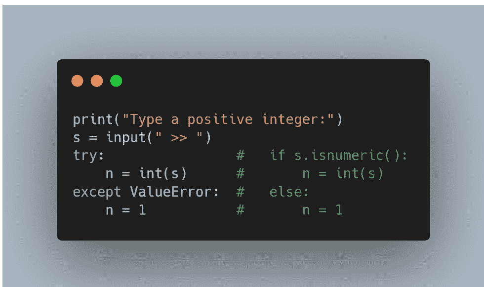

```python
print("Type a positive integer:")
s = input("> ")
try:
    n = int(s)
except ValueError:
    n = 1
# if s.isnumeric():
#     n = int(s)
# else:
#     n = 1
```

(原文缩略图链接：https://mathspp.com/blog/pydonts/eAFP-and-lBYL-coding-styles)

## EAFP 与 LBYL

“EAFP” 是一个首字母缩略词，代表 **"Easier to Ask for Forgiveness than Permission"**（先做后检查/请求原谅比请求许可更容易），这是一种编码实践，与 **"LBYL"** 代表的 **"Look Before You Leap"**（三思而后行/先检查后操作）大致相反。

LBYL 意味着你首先检查一个给定的操作是否可以成功进行，然后再执行它。例如，如果你想询问用户一个数字，其默认值为 1，你可以使用以下代码：

```python
print("Type a positive integer (defaults to 1):")
s = input("> ")
if s.isnumeric():
    n = int(s)
else:
    n = 1
```

(在上面的代码中，我们使用了 `str.isnumeric` 方法来检查字符串是否为有效的整数。尝试在你的 Python REPL 中运行 `print(str.isnumeric.__doc__)`。)

使用 EAFP，你首先尝试执行你想要进行的任何操作，然后使用一个 `try` 块来捕获你的操作在不成功时可能抛出的异常。在我们的例子中，这意味着我们直接尝试将 `s` 转换为整数，如果引发 `ValueError` 异常，我们就设置默认值：

```python
print("Type a positive integer (defaults to 1):")
s = input("> ")
try:
    n = int(s)
except ValueError:
    n = 1
```

我们使用 `except ValueError` 是因为如果你尝试将一个不包含整数的字符串转换为整数时，会引发 `ValueError` 异常：

```python
>>> int("345")
345
>>> int("3.4")
Traceback (most recent call last):
  File "<stdin>", line 1, in <module>
ValueError: invalid literal for int() with base 10: '3.4'
>>> int("asdf")
Traceback (most recent call last):
  File "<stdin>", line 1, in <module>
ValueError: invalid literal for int() with base 10: 'asdf'
```

## 用 EAFP 代替 LBYL？

编写遵循 EAFP 风格的代码在多种情况下可能具有优势，我现在将介绍它们。

## 避免冗余

有时，以 EAFP 为思维编写代码可以让你避免代码中的冗余。假设你有一个字典，你想从中提取与一个键相关联的值，但该键可能不存在。

使用 LBYL，你可能会这样做：d = {"a": 1, "b": 42}
print("What key do you want to access?")
key = input(" >> ")
if key in d:
    print(d[key])
else:
    print(f"Cannot find key '{key}'")

如果输入的键存在于字典中，此代码会执行两次字典访问：第一次检查 `key` 是否作为一个键存在，第二次检索其值。这有点像你打开一个盒子查看里面是否有东西，然后关上它。接着，如果盒子不是空的，你再次打开它并取出里面的东西。在现实生活中你会这样做吗？

采用EAFP策略，你可以打开盒子，如果发现里面有东西，就立即把它清空：

d = {"a": 1, "b": 42}
print("What key do you want to access?")
key = input(" >> ")
try:
    print(d[key])
except KeyError:
    print(f"Cannot find key '{key}'")

还有一种体现EAFP思维的方法，你应该了解：`dict.get`！我上面描述的操作非常常见，以至于字典甚至提供了一个在你想获取与一个键关联的值，而该键不存在时使用默认值的方法，其行为就类似于EAFP：

d = {"a": 1, "b": 42}
print("What key do you want to access?")
key = input(" >> ")
print(d.get(key, None))

试试运行上面的代码，输入你字典 `d` 中不存在的键。注意在这些情况下会打印出 `None`。

## EAFP 可能更快

如果失败的情况预期不常发生，那么EAFP更快：你只需运行一段代码（你的操作），而不是两段（“先看”和“再跳”）。

例如，让我们看看上面示例图片中的代码，使用 `timeit` 模块看看当输入 `can` 可以转换为整数时，哪个选项更快：

>>> import timeit
>>> eafp = """s = "345"
... try:
...     n = int(s)
... except ValueError:
...     n = 0"""
>>> timeit.timeit(eafp)
0.1687019999999393

这里我们直接将 s 定义为一个整数字符串，这样计时就不必考虑我输入整数所需的时间。此外，`timeit` 函数会运行代码很多次，而我不必在控制台输入一百万个整数。

现在，将其与LBYL方法进行比较：

>>> lbyl = """s = "345"
... if s.isnumeric():
...     n = int(s)
... else:
...     n = 0"""
>>> timeit.timeit(lbyl)
0.30682630000001154

LBYL方法花了几乎两倍的时间。如果你能让操作失败的情况极少发生，那么使用EAFP方法就能节省时间。

## LBYL 仍然可能失败

当与环境交互时，例如与互联网或操作系统交互，在你进行安全检查和执行操作之间的这段时间里，情况可能发生变化，你的操作可能不再可行。

例如，假设你有一个读取某些文件的脚本。显然，你只能读取存在的文件，所以LBYL方法可能涉及编写如下代码

import pathlib

print("What file should I read?")
filepath = input(" >> ")
if pathlib.Path(filepath).exists():
    with open(filepath, "r") as f:
        contents = f.read()
    # Do something with the contents.
else:
    print("Woops, the file does not exist!")

如果你的脚本运行在可以被多个用户访问的计算机上，或者有其他脚本正在操作文件系统，你的 `if` 语句可能因为找到了文件而判断为真，但随后一个外部代理可能删除了该文件，导致你的 `with` 语句失败，引发错误并中断你的代码。如果你正在编写关键代码，必须考虑到这种可能性。或者如果你在检查之后执行的代码需要很长时间才能运行完。

如果你使用EAFP方法，代码要么读取文件，要么不读，两种情况都已覆盖：

print("What file should I read?")
filepath = input(" >> ")
try:
    with open(filepath, "r") as f:
        contents = f.read()
except FileNotFoundError:
    print("Woops, the file does not exist!")
else:
    # Do something with the contents.
    pass

上面 `try` 块中的 `else` 确保你只有在能够成功读取文件的情况下才运行处理内容的代码。（我会为此写一篇 Pydon't，别担心！）

## 捕获多种类型的失败

如果你尝试执行一个可能以多种方式失败的复杂操作，只枚举可能引发的异常可能比编写一个非常非常长的、预先执行所有必要检查的 `if` 语句更容易。

例如，如果你想调用一个可能抛出多种不同异常的第三方函数，编写一个涵盖所有可能出现的情况的优雅 `try` 块是相当简单的。

假设你有一个函数，它接受一个表示整数的字符串，然后返回其倒数，但编写它的人没有执行任何检查：只是假设该字符串代表一个整数，用 `int` 转换它，然后用1除以该整数：

def get_inverse(num_str):
    return 1 / int(num_str)

你想在询问用户输入后在你的代码中使用该函数，但你注意到用户可能输入不是整数的内容，或者用户可能输入0，这会导致 `ZeroDivisionError`。使用EAFP方法，你可以这样写：

print("Type an integer:")
s = input("> ")
try:
    print(get_inverse(s))
except ValueError:
    print("I asked for an integer!")
except ZeroDivisionError:
    print("0 has no inverse!")

你用LBYL会怎么做呢？也许是

print("Type an integer:")
s = input("> ")
if s.isnumeric() and s != "0":
    print(get_inverse(s))
elif not s.isnumeric():
    print("I asked for an integer!")
else:
    print("0 has no inverse!")

但现在你使用了 `isnumeric` 函数两次。而且 `isnumeric` 对负整数甚至不起作用。如果用户输入类似 " 3" 这样的东西怎么办？`isnumeric` 会失败，但这仍然是一个 `int` 可以转换的整数！或者如果用户输入 "000" 呢？这仍然会计算为0... 我希望你现在能明白我的意思了。

## 结论

EAFP代码是LBYL代码的一个非常好的替代方案，在各种方面甚至更优越，比如我上面提到的那些。在编写代码时，尝试权衡不同方法的各种利弊，别忘了考虑编写EAFP代码！

EAFP并不是在*每种情况下*都绝对最好的方法，但EAFP代码可以非常易读且高效！

## 参考资料

- PEP 463 – 异常捕获表达式，https://www.python.org/dev/peps/pep-0463/
- Python 3 文档，Python标准库，调试与分析，timeit，https://docs.python.org/3/library/timeit.html。
- Python 3 文档，Python教程，错误与异常，https://docs.python.org/3/tutorial/errors.html。
- Microsoft Devblogs，地道的Python：EAFP对比LBYL，https://devblogs.microsoft.com/python/idiomatic-python-eafp-versus-lbyl/。
- Stack Overflow，“Python中的EAFP原则是什么？”，https://stackoverflow.com/questions/11360858/what-is-the-eafp-principle-in-python。
- Stack Overflow，“寻求原谅而非许可——解释”，https://stackoverflow.com/questions/11360858/what-is-the-eafp-principle-in-python。

在线参考查阅于2021年1月19日。

# 小规模重构

(原文章缩略图见 https://mathspp.com/blog/pydonts/bite-sized-refactoring。)

## 介绍

重构代码是指通览你的代码并更改其中的部分内容，通常目标是让你的代码更短、更快或在你设定的任何指标上变得更好。

在这篇 Pydon’t 中，我将分享我对重构重要性的看法，并在带你浏览一个重构示例的同时，分享一些重构代码时可以使用的技巧。

在本篇 Pydon’t 中，你将：

- 理解重构的重要性；
- 与我一起浏览一个真实的重构示例；以及
- 学习在重构自己的代码时可以采用的技巧。

## 重构

重构 – 动词

> “重构（应用程序或软件的源代码）的结构，以在不改变功能的前提下改善其运行。”

从上面的定义可以看出，重构代码的行为旨在让你的代码变得更好。根据你的具体情况，“让代码变得更好”可能意味着不同的事情：

-   它可能意味着代码更容易维护；
-   它可能意味着代码更容易向初学者解释；
-   它可能意味着代码运行速度更快；
-   ……

无论你选择提升哪个衡量标准，每个人都能从学习重构代码中受益。为什么呢？

当你重构代码时，你正在培养一系列对开发者很有帮助的技能，例如你阅读代码并真正理解它的能力、模式识别能力、批判性思维等等。

### 阅读代码并真正理解的能力

如果你在不理解一段代码的情况下修改它，你很可能会破坏它。因此，当你想要重构一段代码时，你应该尽力去*真正*理解这段代码在做什么以及它是如何做的。

### 模式识别能力

重构代码时，你应该留意的事情之一是冗余和重复。如果你看到看起来像是复制粘贴的代码，或者你发现结构非常相似的代码，那么它很可能就是重构的良好目标。

有时，发现这些事情非常简单，因为会存在*完全相同*的代码行。然而，发现代码不同部分之间的*结构性*相似之处，比找到完全相同的代码行要难。因此，在尝试发现这些相似之处时，你将训练你的模式识别能力。请注意，这在*真正理解*代码之后会变得容易得多。

### 批判性思维

在阅读你希望重构的代码时，你总会发现一些看起来不应该存在的代码片段。这可能有很多含义。可能是一段代码放在了错误的文件中。或者一段代码放在了错误的函数中。有时，甚至是一段看起来可以/应该被删除的代码。在这些时候，你能做的就是动脑筋去思考移动代码会产生什么影响。在考虑了保持现状与改变现状的影响*之后*，你不应该害怕移动代码。

记住，你应该致力于编写优雅的代码，而其中一部分就是要以一种让将来重构尽可能容易的方式来编写代码。代码是可变的东西，所以要确保通过编写易于阅读的优雅代码来让你未来的自己轻松一些。

## 重构什么？

我相信有着不同生活经验的人对这个问题的回答会有所不同，我唯一能做的就是分享我对这个主题的看法。

## 经常重构…

…或者至少为其创造条件。

如果你有机会重构一段代码，并且你*知道*有些地方可以改进，那就继续去做吧。随着你作为开发者变得成熟并积累经验，你会不断学习新事物；此外，你所使用的技术可能也在随时间演进。这意味着代码自然会进入一种可以从重构中获益的状态。

这是一个永无止境的循环：你应该编写优雅且易于阅读的代码；这意味着，在将来，重构代码会更容易、更快捷；重构使代码更易读、更优雅；这使得将来再次重构变得更容易；这将使它更易读、更优雅；如此循环往复。

代码重构不应该是一项令人生畏的任务，因为从中可以获益良多，所以请确保以一种允许你自己或其他人日后能够重构的方式来编写代码。

## 循序渐进地重构

当然，在重构现有代码和为新功能编写新代码等之间应该有一个平衡。

经常重构可以使其成为一项非常易于管理的任务，你实际上会学会欣赏它。如果你不经常重构，你就会让所有这些次优结构、糟糕的设计选择等堆积起来，而这些一次性修复起来将会困难得多。

循序渐进地重构，按你自己的节奏来。如果你是一个非常新鲜的初学者，这可能意味着你想一次重构一行代码，或者几行代码。如果你经验丰富得多，这可能意味着你一次重构一个或多个文件。只管“小”幅重构，无论这对你意味着什么。

## 案例研究

现在，我将深入探讨一个由初学者编写的简短 Python 函数，该函数[分享到了 Reddit](https://www.reddit.com)。我将带你了解我在尝试重构这段代码时大脑中所经历的过程，并在过程中分享一些小技巧。

首先，让我告诉你这段代码需要解决的任务。

编写一个改变其字母大小写的函数：

-   偶数位置的字母应变为大写；
-   奇数位置的字母应变为小写。

现在就尝试解决这个任务吧。

## 起点

分享到互联网上的代码如下：

```python
def myfunc(a):
    empty = []
    for i in range(len(a)):
        if i % 2 == 0:
            empty.append(a[i].upper())
        else:
            empty.append(a[i].lower())

    return "".join(empty)
```

## 自动样式格式化

朝着编写尽可能优雅代码迈出的第一步，是运行自动格式化器。

例如，如果你使用 black，你可以从一开始就修复许多样式问题和不一致之处。

在这种情况下，对上述代码运行 black 会产生以下结果：

```python
def myfunc(a):
    empty = []
    for i in range(len(a)):
        if i % 2 == 0:
            empty.append(a[i].upper())
        else:
            empty.append(a[i].lower())

    return "".join(empty)
```

这里唯一的区别在于 `empty = []` 和 `if i % 2 == 0:` 中的空格。操作符周围的空格非常重要，因为它让你的代码有呼吸的空间。确保你的代码具有一致的样式，对于你自己和他人提高代码的可读性大有帮助，所以请努力养成遵循某种样式的习惯。

PEP 8 提出了一种 Python 样式，许多人都遵循这种风格，所以花些时间查阅该样式指南可能是个好主意。在你弄清楚该样式如何运作后，请记住你不需要同时开始做所有事情。你可以逐步掌握该样式。另外，记住批判性思维非常重要。有时最好完全忽略样式指南。

## 命名

名称非常重要，正确命名你的函数和变量至关重要。名称可以成就一个程序，也可以毁掉一个程序。好的名称帮助代码读者，而坏的名称会让你花费数小时分析原本简单的代码。

名称应反映它们所指对象的意图或一个非常重要的属性。这与使用非常通用的名称相反，比如函数用 `myfunc` 或数字用 `num`，当该函数有特定作用或该数字包含特定信息时。

一个值得注意的例外是在 `for` 循环中使用 `i`，例如，虽然我个人倾向于使用稍微更详细的 `idx`。

那么，看看我们目前拥有的代码，我可以识别出三个可以改进的名称。你能找出它们是什么吗？试着将它们改成更好的名字。

现在，你的建议不一定与我的匹配，但以下是我的想法：

```python
def alternate_casing(text):
    letters = []
    for idx in range(len(text)):
        if idx % 2 == 0:
            letters.append(text[idx].upper())
        else:
            letters.append(text[idx].lower())

    return "".join(letters)
```

以下是我所做的更改：

-   `myfunc` -> `alternate_casing`；
-   `a` -> `text`；
-   `empty` -> `letters`；以及
-   `i` -> `idx`（出于我的个人偏好）。

现在，`empty = []` 本身似乎是个相当好的名称。*然而*，就在我们用空列表初始化 `empty` 之后，我们就开始向其中填充内容，因此这个名称并未反映对象在整个程序中保持的一个重要属性。相反，通过将其命名为 `letters`，我们指定了其中将存储什么。

## 遍历数据和索引

Python 在处理 `for` 循环方面有一些非常强大的功能，我们得到的工具之一是内置的 `enumerate`。

我[之前详细写过关于 `enumerate` 的内容](https://www.cosmicpython.com/book/chapter_2_exercise.html)，所以请记住，当你编写一个需要同时处理索引*和*数据的 `for` 循环时，`enumerate` 是你要使用的工具。

在我们的函数中，我们需要索引和数据，因为我们需要索引来确定要执行什么操作，然后需要数据（实际的字母）来改变其大小写。使用 `enumerate`，循环最终会是这样的：

```python
def alternate_casing(text):
    letters = []
    for idx, letter in enumerate(text):
        if idx % 2 == 0:
            letters.append(letter.upper())
        else:
            letters.append(letter.lower())
    
    return "".join(letters)
```

我们不仅能够移除显式索引，从而减少一个操作，而且还能更清晰地表达我们的意图：当有人看到 `enumerate` 时，应该立即明白这意味着“在这个循环中，我需要遍历中的索引和数据”。

## 只嵌套必要的内容

在 Python 中，缩进表示代码嵌套，这代表了依赖关系。如果一行代码嵌套在 `for` 循环内，意味着它依赖于该 `for` 循环。如果进一步嵌套在 `if` 语句内，意味着它仅在满足某些条件时适用。如果进一步嵌套在 `try` 语句内，我们可能会预期它引发一个错误，等等。

嵌套代码意味着我们在阅读代码时需要在脑海中跟踪许多上下文，即使你可能没有注意到，这也是令人疲惫的。进出所有那些缩进的结构，进行所有那些上下文切换，消耗着脑力。更扁平的代码对我们的大脑负担更小，更容易跟上代码。

为了让上下文更易于跟踪，我们应该尽量少嵌套代码。我们只应该嵌套那些绝对需要嵌套的代码片段。

对于 `for` 循环，这通常是那些依赖于 `for` 和 `in` 之间的迭代器变量的内容，而对于 `if-else` 语句，则是那些每个分支独有的代码片段。

现在，在上面的 `if-else` 语句中，你能发现有什么内容不是某个分支独有的吗？这里是代码：

```python
if idx % 2 == 0:
    letters.append(letter.upper())
else:
    letters.append(letter.lower())
```

注意，无论我们在哪个分支，我们都在执行 `letters.append`，这使得从一个分支到另一个分支变化的内容——即我们调用 `letter` 的哪个方法——变得不那么清晰。更不明显的是因为 `.upper()` 和 `.lower()` 占用的字符数完全相同，所以这两行是对齐的，这使得我们更难注意到 `.upper()` 与 `.lower()` 的区别。

现在，如果我们着手将 `.append()` 提取出来，因为它的值不依赖于 `idx % 2`，我们可能会得到类似这样的代码：

```python
def alternate_casing(text):
    letters = []
    for idx, letter in enumerate(text):
        if idx % 2 == 0:
            capitalised = letter.upper()
        else:
            capitalised = letter.lower()
        letters.append(capitalised)

    return "".join(letters)
```

你可能对我刚刚添加了一行代码，使代码变长而不是变短有强烈的感觉，但有时更好的代码会占用更多空间。然而...

## 条件赋值与条件表达式

将 `.append()` 提取到 `if` 外部，这赤裸裸地表明 `if` 语句仅仅是为了决定将什么赋值给 `capitalised`。这为另一种简化打开了大门，即使用条件表达式。

条件表达式就像浓缩的 `if-else` 块，非常适合条件赋值。

使用条件表达式，我们将 `if-else` 重写为：

```python
capitalised = letter.upper() if idx % 2 == 0 else letter.lower()
```

总而言之，中间变量是不需要的，我们可以将整个内容写成：

```python
def alternate_casing(text):
    letters = []
    for idx, letter in enumerate(text):
        letters.append(letter.upper() if idx % 2 == 0 else letter.lower())

    return "".join(letters)
```

## 真值与假值

下一步关注简化 `if` 语句的条件。在 Python 中，我们有一个奇妙的东西，它允许我们将许多对象解释为布尔值，即使它们本身不是布尔值。这通常被称为 Python 中对象的真值/假值，你可以在之前的 Pydon't 中了解到所有相关信息。

对我们来说，重要的是数字 `0` 被视为 `False`，任何其他整数都被视为 `True`。因此，条件 `if idx % 2: ...` 读作“如果 `idx` 除以 2 有余数”，这等同于“如果 `idx` 是奇数”。现在，如果索引是奇数，我们希望字母被小写化，所以如果我们简化条件，然后交换 `.upper()` 和 `.lower()` 调用，我们就可以简化条件表达式：

```python
def alternate_casing(text):
    letters = []
    for idx, letter in enumerate(text):
        letters.append(letter.lower() if idx % 2 else letter.upper())
    return "".join(letters)
```

在这一点上，函数变得如此短，以至于 `return` 语句前没有额外的空行分隔就没有意义了，所以我决定将所有内容放在一起。

## 列表推导式与追加

你还可以学习发现的一种情况是，当你通过连续调用 `.append()` 来构建一个列表。当出现这种情况时，寻找使用列表推导式的机会。列表推导式在使用得当时非常 Pythonic，它们允许你从一开始初始化变量为其正确的内容，而不是必须立即初始化一个变量然后再去修改它。

使用列表推导式，你可以将你的循环重写为类似这样的内容：

```python
def alternate_casing(text):
    letters = [letter.lower() if idx % 2 else letter.upper() for idx, letter in enumerate(text)]
    return "".join(letters)
```

## 避免长行

上面列表推导式的问题在于，我们现在有一行很长的代码。长行的代码是应该尽可能避免的，因为它们使代码更难阅读，也使代码在与调试器、另一个文件、Zoom 通话或其他任何东西并排放置时更难处理。代码中的水平滚动应该不惜一切代价避免，这意味着行不应该太长。

我们可以用几种方法来修复那个长列表推导式。一个总是可行的选项是不去修复它。仅仅因为一个想法在某个角度看起来不错，并不意味着它明显优越。

然而，我们还有别的办法。列表推导式内的名称只存在于列表推导式内部，所以它们的生命周期非常短，并且具有非常具体的角色。正因为如此，如果正在发生的事情的结构足够清晰，我们可以在列表推导式内使用更短的变量名：

```python
def alternate_casing(text):
    letters = [l.lower() if i % 2 else l.upper() for i, l in enumerate(text)]
    return "".join(letters)
```

现在，请记住，我们只能因为目标变量命名良好（`letters`）以及我们正在迭代的变量也命名良好（`text`）才能这样使用。我认为列表推导式有几种合理的替代方案，例如使用 `c` 或 `char` 代替 `l`。

如果你愿意，你可以保留长名称并拆分列表推导式：

```python
def alternate_casing(text):
    letters = [
        letter.lower() if idx % 2 else letter.upper()
        for idx, letter in enumerate(text)
    ]
    return "".join(letters)
```

## 辅助变量

再次强调，辅助变量并不总是需要的。无论你有拆分的列表推导式还是短名称的那个，你都可以直接去掉辅助变量，并直接调用 `.join()`：

```python
def alternate_casing(text):
    return "".join([l.lower() if i % 2 else l.upper() for i, l in enumerate(text)])
```

或者

```python
def alternate_casing(text):
    return "".join([
        letter.lower() if idx % 2 else letter.upper()
        for idx, letter in enumerate(text)
    ])
```

## 冗余的列表推导式

我们已经走了这么远，但还有一件事我们可以做，这与我们如何能够移除列表推导式的 `[]` 有关。我的意思是我们可以真正删除它们，这样我们最终会得到以下内容：

```python
def alternate_casing(text):
    return "".join(l.lower() if i % 2 else l.upper() for i, l in enumerate(text))
```

或者

```python
def alternate_casing(text):
    return "".join(
        letter.lower() if idx % 2 else letter.upper()
        for idx, letter in enumerate(text)
    )
```

发生了什么？现在，我们有的是一个生成器表达式，而不是列表推导式。生成器表达式在我看来很棒，它们具有内存和速度优势，所以在可以的时候尽量使用它们。实际上，当你用列表推导式调用一个函数时，你通常可以完全省略 `[]` 以切换到生成器表达式。

> 我将专门用一个 Pydon't 来介绍生成器表达式，所以一定要订阅，这样你就不会错过它了！

## 最终比较

供你参考，这是我们开始时的代码：

def myfunc(a):
    empty=[]
    for i in range(len(a)):
        if i%2==0:
            empty.append(a[i].upper())
        else:
            empty.append(a[i].lower())

return "".join(empty)
```

以下是两种可能的最终产物：

```
def alternate_casing(text):
    return "".join(l.lower() if i % 2 else l.upper() for i, l in enumerate(text))
```

以及

```
def alternate_casing(text):
    return "".join(
        letter.lower() if idx % 2 else letter.upper()
        for idx, letter in enumerate(text)
    )
```

注意这些最终产物与起点看起来多么不同，但请注意，我们做的每件事都只是一小步的变化。花时间分别理解这些小步骤，然后欣赏它们是如何在这个重构中协同工作的。

一个主要的收获是，重构真的不需要一蹴而就。进行增量式改变是可以的，甚至可能是更可取的：增量式改变更易于管理，也更容易理解。

## 结论

以下是本次 Pydon't 的主要收获，呈现在你面前：

> > “更优雅的代码更容易重构，而当你重构代码时，应努力使其变得更优雅。”

这次 Pydon't 向你展示了：

-   重构代码的能力很重要；
-   重构代码的能力是可以训练的；
-   代码重构可以（也许应该！）以小步骤进行；
-   一致的风格能提升代码的可读性；
-   自动格式化工具可以帮助我们在代码上强制执行固定的风格；
-   命名很重要，它应该反映
    -   对象的用途；或者
    -   不变的重要特征；
-   当遍历数据*和*索引时，`enumerate` 是你最好的朋友；
-   if-else 块下重复的代码可以被提取出来；
-   条件表达式非常适合进行条件赋值；
-   if 条件可以利用真值（Truthy）和假值（Falsy）来简化；
-   列表推导式是简单 `for` 循环和 `.append()` 操作的良好替代方案；
-   列表推导式可以转换为生成器表达式。

## 参考资料

-   Reddit /r/Python 帖子 "I get zero output even though there's nothing wrong with this code according to pycharm. What can be the reason? I would appreciate any help.", https://www.reddit.com/r/learnpython/comments/o2ko8l/i_get_zero_output_even_theres_nothing [最后访问于 2021-07-12]；
-   Hoekstra, Conor; "Beautiful Python Refactoring" 演讲，PyCon US 2020, https://www.youtube.com/watch?v=W-lZttZhsUY；
-   PEP 8 – Python 代码风格指南, https://www.python.org/dev/peps/pep-0008/ [最后访问于 2021-07-12]；

## 命名很重要

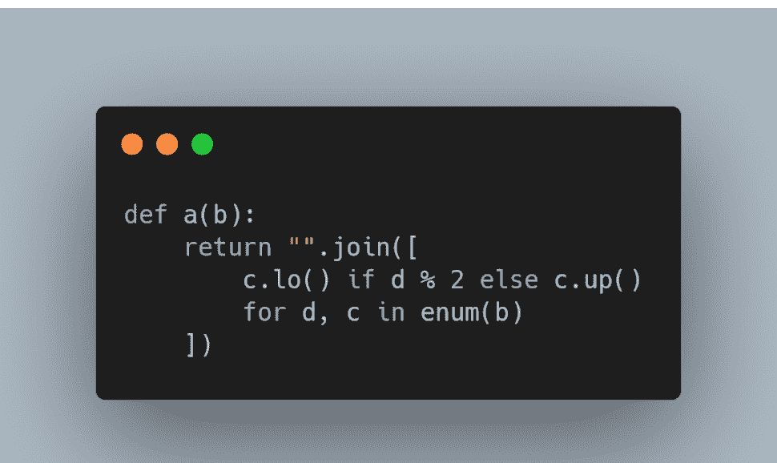

（原始文章缩略图，链接：https://mathspp.com/blog/pydonts/naming-matters。）

## 介绍

名字就像我们大脑中的房地产。它们是我们赋予事物、概念、想法、对象的标签，以便于我们指代这些东西，但它们也占用空间。事实证明，我们头脑中只能容纳极少数不同的想法，所以这些标签非常“昂贵”……

我们不妨尽自己所能做到最好地去管理它们！

在这个 Pydon't 中，你将：

-   了解一些命名约定；
-   学习 Python 代码建议的命名约定；
-   理解在 Python 中为变量、函数、方法等命名的一些注意事项。

### 命名约定

当我们谈论名称时，有两件事需要讨论。一件是你赋予事物的实际名称，另一件是你书写名称的方式：字母的大小写以及连续单词的分隔方式。

这些通常被称为命名约定，有好几种。我将在这里介绍它们，以便我可以在后续的 Pydon't 中引用它们。

以下列表*并非*详尽无遗，因为还有更多的命名约定。然而，它们与本次 Pydon't 无关。

-   CAPSLOCK（全大写）——所有单词的所有字母都大写，且没有分隔连续单词的符号；
-   CAPS_LOCK_WITH_UNDERSCORES（带下划线的全大写）——像上一种，但用下划线分隔单词；
-   lowercase（全小写）——所有单词的所有字母都小写，且没有分隔连续单词的符号；
-   snake_case（蛇形命名法）——像上一种，但用下划线分隔单词；
-   PascalCase（帕斯卡命名法）——所有单词连接在一起，但首字母大写以帮助你识别一个单词在哪里结束，另一个在哪里开始；
-   camelCase（驼峰命名法）——像上一种，除了第一个单词也以小写字母开头。

除了这些命名约定，有时还会添加前导和/或尾随下划线。这与命名约定本身没有严格关系，但与 Python 使用名称的方式有关。如果你需要复习，我写过一个 Pydon't 教你 [所有下划线的用法](https://mathspp.com/blog/pydonts/all-the-uses-of-underscore)，特别是它告诉你，如果在名称的开头和/或结尾，下划线能为你做什么。

### PEP 8 建议

[PEP 8](https://peps.python.org/pep-0008/) 是一份文档——一个 Python 增强提案——包含了 Python 的风格指南，它是目前最广泛接受和使用的 Python 风格指南。如果你还不了解它，值得一看。

[PEP 8](https://peps.python.org/pep-0008/) 开头就承认“Python 库的命名约定有点混乱”，所以请记住，如果你开始处理一个已经使用了特定命名约定的项目，你应该坚持使用它。记住，保持一致性比遵循 PEP 8 指南更重要。

### PascalCase（帕斯卡命名法）

你可以在类（class）中经常找到 PascalCase 约定。这是该约定最常见的使用场景。

这意味着你的类将如下所示：

```
class Shape:
    # ...

class Circle(Shape):
    # ...
```

以及

```
class GameArena:
    # ...

class HumanPlayer:
    # ...

class NPC:
    # ...

class AIPlayer:
    # ...
```

请注意，`NPC` 和 `AIPlayer` 类实际上使用了首字母缩写：NPC 代表 non-playable character（非玩家角色），AI 代表 artificial intelligence（人工智能）。PEP 8 建议你在 PascalCase 名称中将首字母缩写的所有字母都大写。这有时会让我们看起来像是在使用 CAPSLOCK（全大写）约定。

PascalCase 约定的其他常见使用场景包括异常（exceptions）——这并不奇怪，因为异常来自类（class）——以及类型变量（type variables）。

### snake_case（蛇形命名法）

snake_case 命名约定是 Python 命名的基础。变量、函数、方法、参数，它们都使用 snake_case 约定。

因此，比起这样：

```
def coolFunction(coolargument, optionalinfo):
    # ...

def CoolFunction(coolArgument, optionalInfo):
    # ...

def COOL_FUNCTION(cool_argument, optional_info):
    # ...
```

更推荐这样：

```
def cool_function(cool_argument, optional_info):
    # ...
```

另外一点说明，PEP 8 还建议，当你想使用的一个名称是关键字时，在其末尾添加一个下划线。所以，例如，你不能有一个名为 `for` 的变量，但你可以叫它 `for_`。

### CAPS_LOCK_WITH_UNDERSCORES（带下划线的全大写）

这个命名约定，对你来说可能有点笨拙，实际上被用来表示全局常量。Python 不支持真正意义上的常量变量——即尝试修改它们会抛出错误——所以我们使用这种广泛采用的约定，即用作全局常量的变量使用 CAPS_LOCK_WITH_UNDERSCORES 约定命名。

通常，你会在文件的开头找到这些“常量”。

例如，我经常以这种方式定义一些路径：

```
IMG_BIN = "images"
LOG_FILE = "logs/app.log"

## ...
```

### 标准名称

在某些情况下，特定的名称是那些情况下的黄金标准。

#### self

一个很好的例子是实例方法第一个参数的名称。此类方法的第一个参数总是 `self`。

因此，这样做：

```
class Square:
    def __init__(self, side_length):
        # ...
```

而不是这样做：

```
class Square:
    def __init__(square, side_length):
        # ...
```

```
class Square:
    def __init__(a, b):
        # ...
```

```
class Square:
    def __init__(bananas, side_length):
        # ...
```

请注意，上面我声称应该避免的三种替代方式实际上都是可行的。这是一个例子：## cls

在类似的语境中，`cls`是类方法（class methods）被广泛接受的命名。

> 类方法*并非*你在实现自定义类时定义的常规方法。那些被称为实例方法（instance methods）。类方法是装饰了`@classmethod`的实例方法。

为什么是这样呢？嗯，`class`是一个关键字，所以我们不能真的把它用作参数名。出于某种原因，人们开始使用`cls`而不是像`class_`这样的名字。因此，如今类方法的第一个参数就是`cls`。

类方法的一个绝佳例子是`dict.fromkeys`方法，你调用它来以一种不同的方式初始化字典：

```
>>> dict.fromkeys("abc")
{'a': None, 'b': None, 'c': None}
```

类方法常用于实现构建类实例的不同方式，这正是前一个例子中发生的事情：我们正在以一种不同于常规的方式创建一个字典（或者换种说法，是类`dict`的一个实例）。

## 冗长

在讨论了Python中处理名称的一些最普遍约定之后，现在我将分享关于良好命名原则的个人经验。

一个经常引起许多担忧的事情是你所选名称的长度。你是应该选择一个包含大量信息但输入起来很痛苦的长名称吗？还是应该选择一个输入简单但回忆其用途很痛苦的短名称？

平衡始终是关键。

请记住，Python对单行长度有一个软限制（*soft limit*），所以如果你的变量名看起来像

```
number_of_times_user_tried_to_login_unsuccessfully = 2
```

那么你在编写的每一行代码中就做不了太多事情。

然而，如果你走向另一个极端，最终会得到只有一两个、三个字符长的名称，而这些名称什么也说明不了。

有两个指标可以帮助你决定一个名称应该有多长：

1.  名称被使用的次数；以及
2.  名称的定义与使用之间的距离。

这些意味着什么？

如果一个名称使用非常频繁，因为它是一个你一直在调用的函数，或者是一个你需要非常频繁访问的变量，那么这个名称可以短一些，因为你始终清楚这个名称的存在和用途。

另一方面，如果一个名称*很少*使用，那么名称应该更长，因为你需要更多的帮助来记住这个名称的用途。

第二点背后的推理是类似的。如果你定义一个名称并在其定义后立即使用它，那么它的用途在你的记忆中还很清晰，你可能能够使用一个较短的名称。

另一方面，如果你定义一个名称——比如一个函数或一个变量——并且只在文件下方很远的地方使用它，甚至在其他文件或模块中使用它，那么最好使用一个更长、更具描述性的名称。

## 单字符名称

在命名谱系的一个端点是单字符名称。单字符名称由一个字母组成，大写或小写，或下划线。

通常应避免使用单字符名称，因为它们包含很少甚至没有关于所指内容的信息。然而，在给定上下文中，有几个例外情况是合理的。

当你需要给一个变量赋值，即使你不需要它的值，你可以使用一个接收器（sink），而单字符名称`_`是推荐用于接收器的变量名。接收器是一个即使我们不关心其值也会被赋值的变量。接收器的一个例子出现在解包（unpacking）中，当你关心一个列表的第一个和最后一个元素，而不关心中间元素时：

```
>>> l = [42, 10, 20, 73]
>>> first, *_, last = l
>>> first
42
>>> last
73
```

在数值语境中，`n`也常被用作整数的名称，`x`用于实数（浮点数）。这可能看起来很傻，但建议你不要将`n`用于可能不是完整整数的值。人们对这些约定习以为常，以至于违反它们可能意味着理解你的代码需要更长时间。

`c`和`z`也偶尔用于复数，但这些约定来自数学界。换句话说，这些约定更可能被亲近数学的人或数学家所遵循。

同样遵循数学界惯例的是，`i`、`j`和`k`（按此顺序）常被用于（整数）索引。例如，你经常会看到for循环的如下开头：

```
for i in range(n):
    pass
```

然后，`j`和`k`用于嵌套循环，或者当`i`已经指代另一个固定索引时：

```
for i in range(...):
    for j in range(...):
        for k in range(...):
            pass
```

其他常见的单字符名称包括内置类型的首字母：`d`代表字典（dictionaries），`s`代表集合（sets）或字符串（strings），`l`代表列表（lists）。

然而，`l`是一个特别糟糕的单字符名称，`I`（大写i）和`O`（大写o）也是如此，因为在许多字体中，这些字符很容易与数字1和0混淆。

单字符名称只应在周围上下文*明确*验证了这些名称所指内容时使用。例如，如果你在同一个地方处理集合和字符串，`s`将是一个糟糕的单字符名称。

最后，你可以尝试使用其他较短的名称来替换单字符名称。例如，用`idx`代替`i`能更清楚地表明我们谈论的是一个索引，用`char`代替`c`能更清楚地表明我们谈论的是一个字符。

## 缩写

需要谨慎使用缩写。如果是一个广泛认可的缩写，它可能有意义……但这本身就是一个危险的游戏，因为你无法知道你的代码读者可能知道哪些缩写。

更安全的方法可能是使用与代码领域知识相关的缩写。例如，如果你的代码处理一个物流无人机网络，在某个时候，使用“eta”（代表“estimated time of arrival” - 预计到达时间）作为一个存放无人机*预计到达时间*的变量名可能是有意义的。但同样，需要思考你的代码读者是否会熟悉这种特定领域的术语。

虽然第一条指南相当主观，但有一类缩写绝对是个糟糕的主意，那就是非标准缩写。如果你无法通过谷歌搜索该缩并在前几个结果中找到它的含义，那么它就不是一个标准的缩写。

例如，将上面那个长的变量名缩写是个*坏*主意：

```
## 不要这样做
number_of_times_user_tried_to_login_unsuccessfully = 2

## 但这样更糟：
ntutlu = 2
```

这还有一个不便之处：这不是一个你可以*发音*的名字，这让你在与他人讨论你的代码时更加困难。

另一方面，在一种非常特定的情况下，非标准缩写可能是合理的，那就是在短生命周期的作用域中。一个典型的例子出现在遍历一个集合时：

```
data_sets = [ds for ds in data_sets if not is_complete(ds)]
```

请注意，有一个容器（一个列表），其名称是复数形式：`data_sets`。那么，当我们遍历这个容器时，我们期望每个元素是什么？因为容器被称为`data_sets`，我们立即期望它包含数据集（data sets）。因此，每个元素自然被认为是一个单独的数据集。由此延伸，名称`ds`——缩写自“data set”——作为`data_sets`中连续元素的名称是完全可以接受的，因为该名称仅存在于列表推导式内部。

## 句子

与其使用像

```
number_of_times_user_tried_to_login_unsuccessfully = 2
```

或

```
def compute_number_of_unsuccessful_login_attempts():
    pass
```

这样的名字，不如考虑缩短这些名称，并在需要时添加一条注释来提供更多上下文。正如你将看到的，大多数时候你甚至不需要额外的注释：

```
## 用户登录失败的尝试次数：
unsuccessful_logins = 2
```

我是说，我们显然在处理一个数字，所以我们可以直接写：

```
## 用户进行的失败尝试：
unsuccessful_logins = 2
```

我们也知道我们谈论的是失败尝试，因为那在变量名里：

```
## 用户进行的尝试：
unsuccessful_logins = 2
```

我们可以在此时停止，或者如果用户是唯一可能进行登录尝试的实体，就完全去掉注释。

对于函数，将额外的上下文包含在文档字符串（docstring）中。这确保了在你/用户调用函数时能显示这些有用的上下文。如今，集成开发环境（IDE）会在我们代码中调用函数时显示它们的文档字符串。

## 选择名称

在为任何需要命名的东西选择实际名称时，请记住：

-   选择与你的周围环境在风格/措辞上一致的名称；
-   始终使用相同的词汇和拼写；

### 反面示例：
first_color = "red"
last_colour = "blue"

### 正面示例：
first_colour = "red"
last_colour = "blue"
## （或者两者都使用 `color`）

### 反面示例：
item.has_promotion = True
item.discount_percentage = 30

### 正面示例：
item.has_discount = True    # 或者例如使用 item.is_discounted
item.discount_percentage = 30

- 使用能反映我们正在处理的内容的名称，而不是反映数据类型的通用名称。

### 反面示例：
num = 18
string = "Hello, there."

### 正面示例：
legal_age = 18
greeting = "Hello, there."

对于变量，你也可以考虑一个能反映你所处理实体的某个主要不变属性的名称。“不变”意味着它不会改变。这一点很重要，否则你的名称会指示某个含义，而值本身却是另一个含义。我将在本篇 Pydon't 的末尾为你举一个这样的例子。

## 命名函数和方法

针对函数/方法的一个具体指导原则是：它们应该使用动词命名。这反映了函数/方法被调用时将执行的动作，并清楚地表明当函数/方法被调用时，事情会*发生*。

## 命名变量

类似地，当变量指代实体时，最好使用名词命名。
对于布尔变量（也称为谓词），形容词可能也是一个不错的选择，因为布尔值反映了该形容词的存在与否。
例如：

```python
if painting.colourful:
    print("I like colours!")
```

注意名词“painting”引导我们假定我们讨论的是某个对象，它可能是之前创建的某个 `Painting` 类的实例，而 `painting.colourful` 引导我们假定它是一个布尔值，指示这幅画是否色彩丰富。

注意上面那段话是多么冗余。当代码中使用的名称很好时，英语解释很容易变得过于啰嗦。这是一件好事，意味着代码不言自明。

将变量命名为名词/形容词，将函数命名为动词，这提高了在对变量调用函数时的可读性，因为函数（动词）将作用于变量（名词）。这正是英语和大多数自然语言的工作方式，因此我们以类似于自然语言的方式编写代码。

## 上下文是关键

这一点在整个 Pydon't 中已被多次提及，但我想更加强调它，因此这里专门设有一个标题：上下文是关键。

请记住，你编写代码的上下文将极大地影响你所选择的名称。

重要的上下文包括：你的代码所属的领域（你是编写处理银行交易的软件、管理物流无人机网络，还是在实现一个游戏？），你所处的具体模块和函数，以及你是否在循环、列表推导式或 `try: ... except: ...` 代码块等语句中。

作为你工作所在领域如何极大影响命名的一个例子，考虑以下来自我数学经验的例子。有时能够添加多项式是很有用的，因此你可能想要实现这个函数：

```python
def poly_addition(poly1, poly2):
    pass
```

然而，如果你处于一个专门处理多项式的模块的上下文中，那么该函数的签名可能可以简化为：

```python
def add(p, q):
    pass
```

（p 和 q 在数学中是多项式的常用名称。）

看到了吗？上下文是关键。

## 实际示例

在我的 Pydon'ts 演讲和关于重构的 Pydon't 中，我展示了一段由初学者编写的代码，然后逐步对其进行重构。其中的一步是重命名事物。

以下是该代码：

```python
def myfunc(a):
    empty = []
    for i in range(len(a)):
        if i % 2 == 0:
            empty.append(a[i].upper())
        else:
            empty.append(a[i].lower())
    return "".join(empty)
```

这段代码的功能如下：

```python
>>> myfunc("abcdef")
'AbCdEf'
>>> myfunc("ABCDEF")
'AbCdEf'
>>> myfunc("A CDEF")
'A CdEf'
```

它交替更改参数字符的大小写。

作为你的一个练习，在继续阅读之前，尝试改进上面代码段中的名称。

好了，你尝试过改进名称了吗？

以下是该函数中出现的所有名称：

- myfunc 是函数名称；
- a 是函数的参数；
- empty 是一个列表，随着结果中的新字符而增长；以及
- i 是参数字符串的索引。

以下是改进的建议：

```python
def alternate_casing(text):
    letters = []
    for idx in range(len(text)):
        if idx % 2 == 0:
            letters.append(text[idx].upper())
        else:
            letters.append(text[idx].lower())
    return "".join(letters)
```

### myfunc **现在变成了** alternate_casing

myfunc 是一个通用的函数名称，它没有告诉你任何关于函数功能的信息。

相反，我们可以选择像 `alternate_casing` 这样的名称，它告诉你这个函数将交替更改其参数的大小写。

注意我们没有选择类似这样的名称：

```python
def alternate_casing_starting_with_uppercase(...):
    pass
```

那个实现细节更适合放在函数的文档字符串中。

### **a 现在变成了 text**

我们的函数接受一个通用字符串作为输入。这个字符串没有什么特别或有趣之处，因此像 `text` 和 `string` 这样的名称就非常合适。

我选择 `text` 是因为它给人一种我们将处理人类可读字符串的感觉。

### **empty 现在变成了 letters**

变量名 `empty` 在这里是之前提出的指导原则的一个很好的反例。本篇 Pydon't 建议你根据对象的重要 _不变_ 属性来给变量命名。

嗯，`[]` 显然是一个空列表，所以作者决定将这个变量命名为 `empty`，这看起来确实很合理。然而，三行之后，那个列表被连续追加，因此它很快不再是空的。因此，列表为空不是一个 _不变_ 属性，也不是一个好名字。

名称 `letters` 比 `empty` 更合适，但你可能会认为它可能具有误导性——毕竟，我们将所有字符都放入其中，而不仅仅是字母。

那么，你会用什么名字呢？

### **i 现在变成了 idx**

`i` 是一个非常典型的索引名称，我认为它没有什么问题。我个人偏好使用明确无误的 `idx` 来表示索引，这就是我选择它的原因。

## **结论**

通读这篇 Pydon't 之后，你可能在想这里的大多数指导原则都相当主观，你是对的！

我知道没有客观的规则来选择变量、函数等的名称可能会令人沮丧... 但你知道人们怎么说吗！命名事物是编程中最难解决的问题。

别担心，随着经验的积累，你会越来越擅长在代码中使用好的名称，而且请记住，Python 几乎像英语一样可读，所以你选择的名称应该有助于这一点。

以下是为你奉上的本篇 Pydon't 的主要收获：

> > “虽然命名可能很难，但有一些指导原则可以帮助你做出尽可能最佳的决策。”

本篇 Pydon't 向你展示了：

- 在命名事物时，与现有代码保持一致性至关重要；
- 从上下文中获取所有可能的线索来确定最佳名称；
- [PEP 8](https://www.python.org/dev/peps/pep-0008) 为你的代码提出了一些命名约定，
    - 最值得注意的是几乎所有情况都使用 `snake_case`；以及
    - 类和异常使用 `PascalCase`。
- `CAPS_WITH_UNDERSCORE` 是全局常量广泛接受的约定；
- 变量应使用名词命名，布尔变量有时使用形容词，函数使用动词命名；

## 参考资料

- PEP 8 – Python 代码风格指南，https://www.python.org/dev/peps/pep-0008 [最后访问于 2021-07-28]；
- Stack Overflow, “What’s an example use case for a Python classmethod?”，https://stackoverflow.com/q/5738470/2828287 [最后访问于 2021-07-28]；
- testdriven.io, “Clean Code”，https://testdriven.io/blog/clean-code-python/#naming-conventions [最后访问于 2021-08-10]

## 优雅重要吗？

> “优雅并非可有可无的奢侈品，而是决定成败的关键所在。”
> —— Edsger W. Dijkstra

（原文缩略图链接：https://mathspp.com/blog/pydonts/does-elegance-matter）

## 引言

撰写这篇《Pydon't》文章时，我正在为即将在EuroPython举行的Python会议演讲“Pydon’ts”做最后准备。因此，今天的《Pydon't》会有些不同。通常，我写的是关于如何运用Python的核心特性来编写地道、富有表现力且优雅的Python代码。而在这篇《Pydon't》中，我想与你分享*为什么*这很重要。

### 提前声明：本文包含个人观点

地道的代码、可读的代码、“Python风格”的代码、优雅的代码——这些概念都带有主观性。这意味着我在此探讨的这些话题，永远不会得到100%的认同。换句话说，你可能会有不同看法。

我接受有人与我意见相左的事实，并且我也鼓励你表达自己的观点，或许可以通过给我写信或在博客留言——多元的观点交流能让讨论更加丰富。

我只想告诉你，如果你无法接受其他人可能与你想法不同这一点 🤔，那么这篇《Pydon't》可能不太适合你阅读。

### 优雅并非可有可无的奢侈品

坦白说，在准备演讲和这篇文章时，我曾以为我论证“优雅为何重要”的部分观点会源于我作为数学家的经验——在数学领域，人们通常努力撰写优雅的证明，构建简洁的论证，甚至寻找比他人论证更简单的反例等等。

后来，我找到了一位受人尊敬的计算机科学家的一段引文，它帮我建立了这种联系，让我对试图建立的类比更加自信。荷兰计算机科学家Edsger W. Dijkstra（“Dijkstra算法”即以他命名）写道：

> “我们如何说服人们，在编程中，简洁和清晰——简言之：数学家所谓的‘优雅’——并非可有可无的奢侈品，而是决定成败的关键所在？”
>
> Edsger W. Dijkstra, 《Selected Writings on Computing: A Personal Perspective》, p347.

我认为Dijkstra的这段话已经说明了一切：简单清晰的代码就是优雅的代码。而这正是代码中非常理想的特性。实际上，在书的下一页稍后一点，Dijkstra补充道：

> “[……] 在软件领域，不可靠性是最大的成本因素。这听起来可能有点矛盾，但一个可靠的（因此也是简单的）程序，其开发和使用成本远低于一个（复杂因而）不可靠的程序。”

根据我的经验，人们常常误将初学者水平的代码当作简单清晰的代码，在我看来，这是非常危险的。

请不要误会，初学者水平的代码本身并无过错，我们在学习时都会写出这样的代码。错误在于，当你或他人因为强迫你只能使用语言中最基础的工具来编码，从而将你限制在只能写初学者代码的水平上时——那才是有问题的。

### 别那样写，根本看不懂

想想你是否曾经遇到过这种情况，或者目睹过：你写出了漂亮的几行代码，完美地完成了需要做的工作。然后你的同事（或者更糟，是上级）走过来，瞥了一眼你的代码，说：“别这样写代码，根本看不懂。”结果发现，他们之所以这么说，仅仅是因为你使用了他们不知道的一个特性！正因为他们不了解你使用的特性，他们*瞥*了你的代码，感觉读起来不*舒服*，就断定它不可读！

我不懂中文。如果我打开一本中文书，你认为我看着书页断言“这根本看不懂！”合理吗？我需要做的是承认我*不会*读中文，而不是说中文不可读。如果你不懂一门语言，你说其中一段文字不可读是没有道理的。Python或其他任何编程语言也是同样的道理。

这是一个[APL](https://en.wikipedia.org/wiki/APL_(programming_language))表达式：

```
    (a b c) ← 1 ¯4 3
    (2×a)÷ -b(+,÷)0.5* (b*2)-4×a×c
1 3
```

它计算了方程 $x^2 + -4x + 3 = 0$ 的两个解。这段代码不可读吗？如果你*懂*APL，那么答案是“不，它不是不可读的”，因为在APL中这样写二次方程公式是非常自然的方式。然而，如果你*不懂*APL，那么你的第一反应可能是说它*是*不可读的，但事实上你的意思是*你不知道如何读它*。

简而言之，当你了解所有组成部分的含义，但这些部分以一种无法很好地传达整体含义的方式组合在一起时，东西才是不可读的。这可能是由于使用了错误的组成部分，或者组成部分缺失，或者有冗余的组成部分等原因造成的。

因此，如果你不了解一段Python代码中使用的所有特性，我认为你没有立场看着它说这段代码不可读。首先，你必须花时间去了解所有不同组成部分是什么。然后，你才能审视那行代码，判断这些部分是否被恰当地组合在一起。

当然，这需要*时间*，是一项必须有意识去做的努力，这也是为什么大多数人根本不去尝试。请不要随波逐流。

### 工欲善其事，必先利其器

为了支持我的观点，我引用了传奇人物[Tim Peters](https://en.wikipedia.org/wiki/Tim_Peters_(software_engineer))的话，他是[Python之禅](https://en.wikipedia.org/wiki/Zen_of_Python)的作者。针对Python的一些新特性，有人抱怨说“这增加了阅读他人代码的复杂性”，Tim Peters回应道：

> “计划是这样的：当有人使用了你不懂的特性时，直接开枪干掉他们。这比学习新东西容易多了，而且要不了多久，唯一活着的程序员就只会用易懂的Python 0.9.6的一小部分子集来编程了 <wink>。”
>
> Tim Peters

我开始写Python代码时，版本已经远不止0.9.6了，但我猜那时没多少特性。可能就是简单的 `for` 循环和 `if` 语句。

如果你想进步，就必须学习。事情就是这样。

这正是我的《Pydon't》系列文章试图解决的问题。我尝试教会你Python核心的所有特性，然后展示这些特性被良好运用的代码示例，从而扩展你的Python知识。

正是通过持续学习的过程，你才能写出优雅的代码。当你学习了更多的语法、函数、模块、数据类型等，你就掌握了更多解决你问题的工具。你的工具箱里工具越多，当你需要做新事情时，就越有可能知道*最适合的工具*是什么。

如果你手头有合适的工具，就可以用它来解决问题。简洁、清晰、优雅；这些都会自然而然地随之而来。

如果你不了解这些工具，你的解决方案最终可能在各个方面都很糟糕，例如：

- （长）得多——你不得不写更多代码来弥补你不知道更好函数、模块、语法等的事实；
- （慢）得多——正确的工具可能已经为其使用场景进行了优化；
- 悖论性地，更难维护——错误的工具无法以同样的方式传达相同的含义，因此理解、调试、调整那段代码就需要更长时间。

相反，编写优雅且Python风格的代码会使其：

- 更简洁；
- 更清晰；
- 更容易维护；
- （运行）更快；

### 为重写而优化

到这里，我假设你对持续学习的理念感兴趣——我这么说，并不是要求你在下周内通读完整的Python文档。你只是认同，尽可能多地学习这门语言，自然会引导你写出更好的代码。

如果你持续学习，那么你会有一天看着自己的一段旧代码说：“有趣，我知道一种更好的方法来做这个。”因为你努力编写简单优雅的代码，你可以快速理解你的代码在做什么，因此，你可以修改旧代码以包含新的、改进的解决方案。但这只是让你的代码变得更清晰、更优雅。这是一个可以无限循环下去的过程。

地道的代码是语义易于理解的代码，也就是说，地道的代码能很好地传达其意图。如果你做得正确，优雅的代码和地道的代码是相辅相成的，如果你努力编写这样的代码，本质上就是在为未来重写你的代码打开大门。这是件好事，因为能被改变的代码才能随时间改进。

你是更愿意编写易于理解和修改的代码，还是更愿意编写连未来的自己都害怕碰的代码？

## 结论

你的Python程序中部分优雅，将自然地来源于学习Python提供的特性，关于内置函数、标准库中的模块等等。

通过掌握这些原则，并尽最大努力在正确的场景中运用它们，用它们来解决它们被设计出来要解决的问题，你将稳步迈向编写地道、优雅代码的道路。而编写这样的代码，不仅让你自己，也让他人能够更轻松地持续改进你的代码，进而改进你的项目/产品。

所以，下次当有人看着你用来展平嵌套列表的代码说“这看不懂”时：

```python
>>> import itertools
>>> list_of_lists = [[1, 2, 3], [4], [5, 6]]
>>> list(itertools.chain(*list_of_lists))
[1, 2, 3, 4, 5, 6]
```

就让他们去读文档吧。

## 参考文献

- Edsger W. Dijkstra (2012), “Selected Writings on Computing: A personal Perspective”, p.347, Springer Science & Business Media;
- Aaron W. Hsu (2017), “Beginner Patterns vs Anti-patterns in APL”, FnConf’17, https://www.youtube.com/watch?v=7Mt0GYHU9A [最后访问于 2021-07-06];
- Tim Peters (2002), Python 邮件列表讨论串, https://mail.python.org/pipermail/python-list/2002-December/134521.html [最后访问于 2021-07-06];

## 代码风格很重要

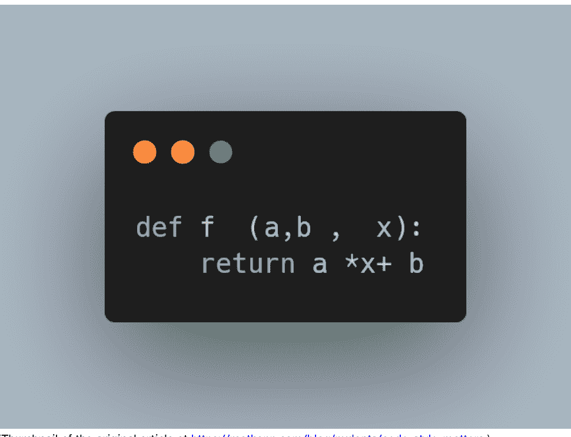

```python
def f(a, b, x):
    return a * x + b
```

（原文文章缩略图，链接：https://mathspp.com/blog/pydonts/code-style-matters。）

## 引言

你代码的整体风格会对代码的可读性产生巨大影响。而代码被阅读的次数远多于被编写的次数，因此，编写风格良好的代码将使你（以及他人！）受益匪浅。

在这篇 Pydon't 中，你将：

- 理解保持风格一致性的重要性；以及
- 了解能帮助你规范代码风格的工具。

顺便提一下，本周我写了一篇更短、更轻松的 Pydon't，因为在撰写本文时，我仍在投入大量时间为 Euro Python 2021 做准备……希望你仍然觉得它有用！

## 代码风格

### 一致性

人类是习惯的产物。从你总是先穿同一条腿进裤子，到你总是从同一侧开始刷牙。

这些习惯将不需要太多注意力的日常事务自动化，从而让你能将宝贵的认知能力投入到其他事情上。

根据我的经验，你的编码风格也是如此：如果你使用一致的代码风格编写代码，它会变得更容易阅读，因为你已经预期了某种结构；你只需获取该结构内的信息即可。

否则，如果你的风格不一致，你就必须花费更多宝贵的认知能力来解析你所阅读内容的结构，然后才能理解其中的信息。

> PEP 8 是一份旨在为 Python 代码编写者勾勒风格指南的文档。它包含许多有用的建议。然而，就在引言之后，PEP 8 写道：
>
> “风格指南是关于一致性的。遵循本风格指南很重要。在一个项目内保持一致性更重要。在一个模块或函数内保持一致性是最重要的。
>
> 然而，要知道何时可以不一致——有时风格指南的建议并不适用。如有疑问，请运用你的最佳判断。参考其他示例，决定什么看起来最好。并且不要犹豫去提问！”

这一点非常重要：PEP 8 是一份包含建议的风格指南，而非法律或严格规则。更重要的是，请注意它非常强调一致性。始终如一地使用你自己的（可能有些奇怪的）风格，比完全不使用任何风格要好。这是在你独自工作的情况下；在一个项目中，事先商定一种特定的风格是个好主意。

### 空白很重要

（此处原文有省略，根据上下文补充翻译）人们常常复制我输入的代码，却不会遵循我的空白使用习惯。这有点夸张，但我可能会输入：

```python
def f(a, b, x):
    return a*x + b
```

而他们会输入类似这样的代码：

```python
def f (a,b , x):
    return a *x+ b
```

Python 是一门空白很重要的语言（因为 Python 使用缩进来嵌套结构），但事实证明，空白在更多地方都很重要。

例如，上面我们可以看到，空白的误用使得第二个 `f` 的定义显得更加杂乱且在审美上令人不快。如果我们知道一件事，那就是**优雅很重要**。

如果你浏览 PEP 8，你会发现其中*大部分*建议都是关于空白的。函数、类、方法周围的空行数量；运算符和关键字周围的空白；逗号前后的空白；等等。看看 PEP 8，并逐步尝试将一些建议融入你的编码中。

例如，PEP 8 建议你使用空白来帮助读者解析表达式中数学运算的优先级。上面我写了：

```python
return a*x + b
```

在 `+` 周围加了空格，以表明 `a*x`（注意 `*` 周围没有空格）具有更高的优先级。当然，我使用的空格数量不会改变运算顺序，但它有助于你理解事情的顺序。

而且更酷的是，你越习惯这样写，它就越有帮助！

再次建议，你看看 PEP 8，挑选几个你喜欢的建议，并尝试将它们融入你的编码中。当这些成为习惯后，再添加几个。就这样坚持下去。这比试图一次性改变所有事情要容易得多。

### 你的工具箱

更令人高兴的是，有*许多*工具可以帮助你格式化代码，使其保持整洁有序。

#### 自动格式化工具

**black**

你可以使用的一类工具被称为（自动）格式化工具，其中 `black` 是一个典型代表（参见其仓库 [这里](https://github.com/psf/black)）。

像 `black` 这样的自动格式化工具会获取你的代码并重新格式化它，使其符合该工具支持/你配置的风格。

例如，让我创建文件 `my_f.py` 并将以下代码粘贴进去：

```python
## In my_f.py
def f(a,b , x):
    return a *x+ b
```

现在让我在该文件上运行 `black`：

```
> python -m black my_f.py
reformatted my_f.py
All done!
1 file reformatted.
```

现在，我打开我的文件，里面的内容是：

```python
## In my_f.py
def f(a, b, x):
    return a * x + b
```

正如我们所看到的，`black` 获取了我的代码，并将其重新格式化为 `black` 所遵循的风格。`black` 的风格与 PEP 8 的风格非常相似，如果你只想有一个工具自动帮你重新格式化代码，而不想过多思考，`black` 是一个很棒的工具。

`black` 的安装与其他任何 Python 模块一样简单：

```
python -m pip install black
```

市面上有许多像 `black` 这样的工具；另一个常见的选择是 `pycodestyle`。

**pycodestyle**

`pycodestyle` 检查你的风格是否与 PEP 8 推荐的风格相似。事实上，`pycodestyle` 曾被称为 `pep8`，但后来改名了，以便人们理解：

1. PEP 8 不是一套严格的规则；以及
2. `pycodestyle` 并不 100% 符合 PEP 8 的建议。

让我将文件 `my_f.py` 修改为以下内容：

```python
## In my_f.py
import os, time
def f(a, b, x):
    return a * x + b
```

如果我运行 `pycodestyle`，输出如下：

```
> python -m pycodestyle my_f.py
my_f.py:2:10: E401 multiple imports on one line
my_f.py:3:1: E302 expected 2 blank lines, found 0
```

我们可以看到 `pycodestyle` 对几件事提出了抱怨：

1. 我将 `import os` 和 `import time` 合并了；以及
2. 导入语句和 `f` 之间没有足够的空行分隔。

`black` 和 `pycodestyle` 的一个主要区别是，`black` 会重新格式化你的代码，而 `pycodestyle` 只是抱怨。

安装 `pycodestyle` 只需输入：

```
python -m pip install pycodestyle
```

对于这两个工具，以及市面上大多数类似的工具，你都可以配置它们忽略某些类型的错误，或忽略代码的某些部分等。请去阅读它们的文档吧！

#### 进阶工具（即代码检查工具）

（自动）格式化工具很有帮助，但还有其他工具具有更大的潜力：代码检查工具（linters）。

代码检查工具是分析你的代码并帮助你发现以下问题的工具：

- 风格问题（就像格式化工具那样）；
- 编程错误；
- 某些类型的 bug；
- 等等。

这些工具非常有用，例如，在管理大型项目中的所有导入时。我经常发现自己导入了一些模块并使用它们。后来，我重构了代码，不再需要那些导入。当我这样做时，我总是忘记检查这些导入是否仍然需要或不再相关。代码检查工具可以，例如，标记未使用的导入。

一个代码检查工具的例子是 flake8（你可以在这里找到它）。如果我对我的 `my_f.py` 文件使用 flake8，结果如下：

```
> python -m flake8 my_f.py
my_f.py:2:1: F401 'os' imported but unused
my_f.py:2:1: F401 'time' imported but unused
my_f.py:2:10: E401 multiple imports on one line
my_f.py:3:1: E302 expected 2 blank lines, found 0
```

你可以看到，现在 flake8 抱怨我导入了根本没有使用的东西！不仅如此，最后两行与上面 pycodestyle 的输出完全相同……这是因为 flake8 内部使用了 pycodestyle。

你可以通过以下方式安装 flake8：

```
python -m pip install flake8
```

另一个相当常见的代码检查工具替代品是 pylint（pylint 的页面）。在同一个 `my_f.py` 文件上运行它，我得到了更多警告：

```
> python -m pylint my_f.py
************* Module my_f
my_f.py:1:0: C0114: Missing module docstring (missing-module-docstring)
my_f.py:2:0: C0410: Multiple imports on one line (os, time) (multiple-imports)
my_f.py:3:0: C0103: Function name "f" doesn't conform to snake_case naming style (invalid-name)
my_f.py:3:0: C0103: Argument name "a" doesn't conform to snake_case naming style (invalid-name)
my_f.py:3:0: C0103: Argument name "b" doesn't conform to snake_case naming style (invalid-name)
```## 结论

就这些工具而言，我建议你在个人项目中选择一个相当通用的工具，这样当你参与其他项目时，就不会太不适应。对于开源项目，你通常会被要求遵循特定的代码风格，并且可能有也可能没有工具能帮助你重新格式化代码以符合该风格。

这篇 Pydon't 并非旨在全面回顾所有可用的可能性，我只触及了几个流行的替代方案，因此这可能是一个衡量通用性的好指标。

顺便说一句，如今许多 IDE 都集成了对这些 linter 的支持，使得利用它们的有用建议变得更加容易。

以下是这篇 Pydon't 的主要收获，为你奉上：

> > “注意你编写代码时所使用的风格，并选择一套工具来帮助你，如果你想要/需要的话。”

这篇 Pydon't 向你展示了：

- 代码风格对代码可读性有影响；
- 像 **black** 和 **pycodestyle** 这样的工具可以帮助你修复代码的风格；以及
- 像 **flake8** 和 **pylint** 这样的 linter 可以进一步洞察你的程序可能存在的某些类型的错误/缺陷/问题。

## 参考资料

- PEP 8 – Python 代码风格指南，https://www.python.org/dev/peps/pep-0008 [最后访问于 2021-07-20]；
- black - The Uncompromising Code Formatter，https://github.com/psf/black [最后访问于 2021-07-20]；
- pycodestyle，https://pycodestyle.pycqa.org/en/latest/intro.html [最后访问于 2021-07-20]；
- pydocstyle，http://www.pydocstyle.org/en/stable/ [最后访问于 2021-07-20]；
- flake8，https://flake8.pycqa.org/en/latest/index.html [最后访问于 2021-07-20]；
- pylint，https://www.pylint.org/ [最后访问于 2021-07-20]；

## 为什么精通 Python 是不可能的，以及为什么这没关系


（原文缩略图，链接：https://mathspp.com/blog/pydonts/why-mastering-python-is-impossible）

让我告诉你为什么真正精通 Python 是不可能的，同时也向你展示如何尽可能接近它。

## 引言

有人说你需要一万小时才能掌握一项技能。我不会争论这是否属实。我要告诉你的是，即使这是真的，我也不确定它是否适用于 Python！

在这篇 Pydon't 中，我将解释为什么我认为你无法真正*精通* Python，但我也要告诉你为什么我认为这没关系：我会给你一系列实用的建议，你可以用它们来确保你持续提升你的 Python 知识。

最后，在这篇 Pydon't 的结尾，我将分享一个我与 Python 亲身经历的小故事，以支持我的观点。

## “精通”，动词

以下是动词“精通”的字典定义：

> “精通”，动词 – 完全学习或理解某事

根据我的个人经验，我认为在两个层面上，一个人无法精通 Python；我现在将阐述这两个层面。

## Python 是一门不断发展的语言

Python 语言是一门不断发展的语言：它不是一个成品。因此，它持续增长：

- 新函数被添加；
- 新语法被引入；
- 标准库发生变化；
- ...

因此，我永远无法了解它的一切！就在我以为我已经学完了所有需要学习的东西时，新的东西又冒出来了。

这是我所相信的，但这几乎也是一个哲学观点。这个论点也有其实际的一面。

## Python 太庞大了

不仅语言在不断变化，有人可能会认为 Python 语言本身已经庞大到你无法精通它。

例如，我们大多数人都熟悉列表方法 `.append` 或 `.pop`。但是，根据我的经验，大多数人并不熟悉列表方法 `.copy` 或 `.extend`。事实上，让我们做一个实验：你能说出现有的 11 个列表方法吗？

滚动到页面底部，把它们写在评论里。如果写不全 11 个，就写下你能记住的所有方法。

它们如下：

```python
>>> [name for name in dir(list) if not name.startswith("__")]
['append', 'clear', 'copy', 'count', 'extend', 'index', 'insert', 'pop', 'remove', 'reverse', 'sort']
```

> > 不知道 `dir` 是什么？请继续往下看。

也许你甚至知道所有这些方法，但能全部说出来很难，对吧？

让我们对字符串做类似的事情！首先，写下你能记住的所有字符串方法。

写完了吗？

很好。现在数一数。你写出了多少个？

现在，你认为有多少个字符串方法？

有 47 个（！）字符串方法！

可能你从未听说过其中一些：

```python
>>> [name for name in dir(str) if not name.startswith("__")]
['capitalize', 'casefold', 'center', 'count', 'encode', 'endswith', 'expandtabs', 'find', 'format', 'fo...']
>>> len(_)
47
```

这恰恰说明了我的观点。字符串有 47 个方法，其中许多还有几个参数。

Python (3.9) 有 71 个内置函数。你知道所有这些函数吗？你认为你能知道所有这些函数吗？

我确信你能记住所有内置函数，但这无关记忆！编程是关于构建事物、解决问题，记住所有函数的名字对你帮助不大...

然而，对它们有个模糊的印象，会很有帮助！

（只是为了好玩，你可以阅读我关于 Python 有多庞大的短文。）

## 如何尽可能接近精通 Python

### 获得接触

一个优秀的程序员会为工作选择合适的工具，但只有当你知道这些工具存在，并且知道在哪里可以找到它们时，你才能使用合适的工具。

这意味着，虽然你无法精通 Python，即“完全学习或理解某事”，但你可以非常接近！

而且，根据我的经验，你是通过尽可能多地接触 Python 来达到这一点的。即使你无法了解一切，阅读并尝试尽可能多的功能确实会有所帮助。

通过接触新的/不同的事物，你的大脑很可能会对你尝试或玩过的新事物留下一点印象。当然，你可能无法脱口而出所有这些你玩过的东西。其原理是，当需要的时候，你的大脑有可能会亮起来，你会记起你过去见过相关的东西。

这种情况几乎是板上钉钉的：

- 如果你从未见过一个现在会有用的函数，你*不可能*记起它；
- 如果你*曾经*见过一个现在会有用的函数，你*可能*会记起它！

所以，一切都归结为弄清楚如何尽可能多地接触 Python 的不同部分。要接触 Python 的不同部分，你只需要探索这门语言并尝试它！

让我告诉你一些可能帮助你找到新东西去学习和探索的事情。

不过，先快速**声明**一下：我即将告诉你的大多数事情都是*非结构化*的 Python 学习方式。根据你在 Python 之旅中走了多远，我告诉你的事情可能或多或少有意义。总而言之，如果你现在刚开始你的 Python 之旅，我建议你找到一种学习 Python 的方法，而不仅仅是遵循这些临时的方法。

### 文档

你熟悉 Python 的文档吗？它的 URL 很容易记住：[https://docs.python.org](https://docs.python.org)。

文档是一个很棒的学习资源！如果你发现自己不知道该学什么，打开文档并浏览一会儿。你很可能会到达一个你从未去过的地方。

但访问文档中的新页面并不是学习新事物的唯一方式。我不断地反复引用一些页面，因为它们包含太多信息了！以下是我经常访问的几个页面：

- [这个页面](https://docs.python.org/3/library/functions.html)包含所有内置函数；
- [这个页面](https://docs.python.org/3/library/stdtypes.html)包含所有内置类型及其方法；
- [这个页面](https://docs.python.org/3/py-modindex.html)包含标准库所有模块的索引；以及
- [这个页面](https://docs.python.org/3/reference/datamodel.html)关于数据模型（你可以在这里找到大多数 dunder 名称）；

### dir 和 help

另一个发现更多学习内容的好方法是进入 REPL 并利用两个很棒的函数：`dir` 和 `help`。

`help` 函数（如果你读过[关于提高 REPL 生产力的 Pydon't](https://mathspp.com/blog/pydonts/improving-productivity-in-the-repl)，你会知道它）接受一个 Python 对象并打印其文档字符串，为你提供关于该对象的信息：

```
>>> help(max)
Help on built-in function max in module builtins:

max(...)
    max(iterable, *[, default=obj, key=func]) -> value
    max(arg1, arg2, *args, *[, key=func]) -> value
```

对于单个可迭代参数，返回其最大项。默认的仅关键字参数指定了在提供的可迭代对象为空时返回的对象。对于两个或多个参数，返回最大的参数。

例如，你知道 `max` 可以接受关键字参数 `default` 和 `key` 吗？

配合 `help` 使用，你绝对可以利用 `dir`：

```
>>> help(dir)
Help on built-in function dir in module builtins:

dir(...)
    dir([object]) -> list of strings

    If called without an argument, return the names in the current scope.
    Else, return an alphabetized list of names comprising (some of) the attributes
    of the given object, and of attributes reachable from it.
    ...
```

本质上，你可以使用 `dir` 来了解更多关于对象属性的信息。例如，你可以像上面看到的那样，轻松地用 `dir(list)` 找出字符串有哪些方法。然而，之前我过滤掉了大部分属性以忽略 dunder 属性。在没有任何过滤的情况下，我确信 `dir` 会向你展示一些你还不知道的东西：

```
>>> dir(list)
['__add__', '__class__', '__class_getitem__', '__contains__', '__delattr__', '__delitem__', '__dir__',
```

## 教学

我经常听到这个，但也许你没有，所以让我告诉你：教别人实际上能提高你对所教内容的理解。

这对我来说经常发生：我着手写一篇关于我认为自己相当了解的主题的文章，而在研究过程中，我学到了很多新东西。

教学也是学习的好方法，因为它迫使你积极思考你试图教授的内容。仅仅是弄清楚如何最好地解释某件事这个“简单”的行为，结果也非常有用！

除此之外，许多学生会提问，你很可能会被其中一些问题问得措手不及。

如果你身边没有正在学习 Python 的人，你可能会认为你没有人可以教。这完全错了。

有很多社区以 Python 为讨论主题。许多学习 Python 的人聚集在这些社区里，有学习者的地方，就有教学的机会。

这里有几个例子：

- StackOverflow；
- Reddit 的 /r/Python；以及
- Reddit 的 /r/learnpython；

## 阅读源代码

这*毫无疑问*是程序员需要掌握的最被低估的技能之一：知道如何阅读代码也是一项需要练习的技能！我们都学过如何*写*代码，但从未学过如何*读*代码……然而，我们却花很多时间阅读代码！

通过阅读代码，你可以接触到你已知函数的不同用例，学习新工具，看到不同的编码风格、新算法等等！

有没有一个你一直使用的模块？看看它的源代码。它甚至不必是第三方模块。如果我没弄错的话，Python 的大部分标准库都是用 *Python* 编写的。去[看看](https://github.com/python/cpython/tree/3.10/Lib)吧。

## 熟悉标准库

再说一次，作为一名程序员，关键在于为工作使用合适的工具。你知道 Python 标准库有超过 249 个模块吗？

我知道，因为我写了一个巨大的 Twitter 线程列出了它们：

> 你知道 Python 🐍 在标准库中有超过 249 个模块吗？这是一个超级长的线程🧵，对这些模块进行了非常高层次的概述……但在那之前，我挑战你尽可能多地凭记忆说出模块名称！🤔🤔让我们看看谁说得更多！

— Rodrigo 🐍 (@mathsppblog) August 24, 2021

你肯定不是所有模块都知道！这没关系！但这只是说明：你仍然可以学到更多关于 Python 的东西。

你甚至不需要深入研究那些被遗忘的模块。你对 `functools`、`collections`、`functools` 熟悉吗？`random` 呢？`pathlib` 呢？这些只是一些你可以进一步学习的*非常*有用的模块！

## 了解更多 Python 包

你不仅可以努力更多地了解 Python 的标准库，还可以尝试更多地了解任何数量的 Python 包！

像 Flask、Django、Rich、Pandas、NumPy、PyTorch 和 Tensorflow 这样的项目是 Python 社区的支柱。你可以选择一个与你使用 Python 的领域相关的项目，或者选择学习一个更通用的模块。无论哪种方式，你肯定会从中学到很多！

如果你不知道要查看哪些模块，你总是可以[搜索 PyPI](https://pypi.org/) 或[探索 GitHub](https://github.com/)。

## 学习其他语言

这可能看起来很矛盾，但学习*其他*语言可以提升你的 Python 技能。我是从经验出发；我*感受*到了这一点。

编程，除其他外，是关于解决问题。你需要从 A 到 B，你需要选择一条从 A 到 B 的路径。你需要弄清楚这一点。

你选择从 A 到 B 的路径将取决于你的经验和背景，对吧？

- 由于我受过数学方面的正规教育，我经常尝试为我面临的一些编程挑战提出更偏向数学的解决方案。这些方案不一定更好或更差，但它们肯定会*不同*。
- 经验更丰富的人更有可能已经见过类似的问题，因此可能对首先尝试哪些事情有更好的想法。

事实证明，你所知道的编程语言*也*会影响你思考问题的方式。遗憾的是，这并不一定适用于所有其他语言。为了最大化一门新语言对你掌握其他语言熟练程度的影响，你需要学习一门与你所学过的所有其他语言*根本不同*的新语言。

所以，如果你懂 Python，如果你学习 JavaScript、C、C++、Perl、Rust 或其他类似语言，你可以学到很多新东西。然而，这些语言从根本上是相同的：它们都是命令式语言。

命令式语言的范式并非唯一的范式。如果你学习一门来自新范式的新语言，你将被展示一种新的思维方式，这也会在用其他语言编写代码时开辟新的可能性。

> 图灵奖（“计算机界的诺贝尔奖”）的首位获得者 Alan Perlis 精辟地指出：
> “一门不能影响你思考编程方式的语言，不值得学习。”
> Alan Perlis, Epigrams on Programming

对我个人而言，*Haskell* 和 *APL* 比我使用过的所有其他语言都更多地改变了我思考编程的方式（从而影响了我的 Python 代码）。

遗憾的是，很难量化我的编程能力提高了多少，或者具体改变了什么……这是那种你必须亲眼所见的事情。

如果你想了解一些其他根本不同的范式以及你可以从这些范式中学到的语言，请看看[这篇博客文章](this blog post)。它非技术性且轻松易读——是学习一门*全新语言*的绝佳第一步。

## 关于字符串方法的轶事

我绝不是 Python 专家。我从 Python 中获得了很多乐趣，学习它、教授它，并用它构建东西。我从 2012 年就开始这样做了。然而，*每一次*我使用 Python，我都会学到新东西。

就个人而言，我正努力精通 Python 的核心：所有核心语法特性和标准库。为什么？不确定；我想是因为我认识到这些核心内容有*巨大*的潜力，我想真正擅长使用它们。

我已经学习 Python 的核心有一段时间了，我想我正在变得擅长它……不过，显然，我还有很多要学！

这是我发布的一条推文：

> 这里有一个 Python 🐍 挑战给你 🤔

swap_casing 是一个非常简单的函数。它接受一个字符串，并 🔄 将大写字母转换为小写字母；🔄 反之亦然。你能想到的最 Pythonic 🐍 的实现是什么？ pic.twitter.com/5zkZ7pHqvx

— Rodrigo 🦎 (@mathsppblog) November 10, 2021

我发布了那个挑战，后来才发现字符串本身已经内置了这个方法：

```
>>> "Hello, world!".swapcase()
'hELLO, WORLD!'
```

这只是一个小轶事证据，表明关于 Python 总有其他东西可以学习。

我甚至围绕这个主题构建了我的 Pyjamas Conf 2021 演讲！

## 结论

这是这个 Pydon't 给你的主要收获，呈现在银盘上：

> “总有新东西要学。不要回避它。”

这个 Pydon't 向你展示了：

- 你可以从文档中学到很多关于 Python 的知识；
- 内置函数 `help` 和 `dir` 可以教你新东西；
- 教学能促进你的学习；
- 阅读代码是提高技能的另一种好方法；
- 探索 Python 标准库会让你接触到许多新工具；
- 探索 Python 包索引也是如此；以及
- 学习其他语言可以提高你的 Python 代码。

## 参考资料

- Python 3 Docs, The Python Standard Library, Built-in Functions, dir, https://docs.python.org/3/library/functions.html#dir [last accessed 04-12-2021];
- Python 3 Docs, The Python Standard Library, Built-in Functions, help, https://docs.python.org/3/library/functions.html#help [last accessed 04-12-2021];
- "Galaxy Brain Programming Languages", Conor Hoekstra, https://codereport.github.io/Galaxy-Brain-Languages/ [last accessed 04-12-2021];
- "Epigrams in Programming", cs.yale.edu, http://www.cs.yale.edu/homes/perlis-alan/quotes.html [last accessed 04-12-2021];## 结语

感谢您通过本书投入时间提升您的 Python 知识，我诚邀您告知我您的反馈意见。

您可能有的所有批评——无论是积极的还是消极的——我都会阅读并欢迎。只需通过 [rodrigo@mathspp.com](mailto:rodrigo@mathspp.com) 给我发一行邮件，或通过 Twitter 与我联系，我在那里的账号是 mathsppblog。

希望很快能与您交流！

— Rodrigo, [https://mathspp.com](https://mathspp.com)