# Python 不该这样做

编写优雅的 Python 代码

Rodrigo Girão Serrão

2021年8月23日

## 目录

前言

Python 不该冒犯 Python 之禅

-   Python 之禅
-   参考资料

优雅重要吗？

-   引言
-   注意，以下为个人观点
-   优雅并非可有可无的奢侈品
-   别那么写，那难以阅读
-   工欲善其事，必先利其器
-   为重写而优化
-   结论
-   参考资料

代码风格很重要

-   引言
-   代码风格
-   为你的工具箱添置工具
-   结论
-   参考资料

命名很重要

-   引言
-   命名约定
-   PEP 8 建议
-   标准名称
-   详尽度
-   选择名称
-   上下文是关键
-   实例讲解
-   结论
-   参考资料

# 链式比较运算符

-   引言

## 使用 zip 创建字典
## 代码示例
## 结论
## 参考资料

# 枚举我
## 简介
## 枚举的工作原理
## 可选的起始参数
## 迭代时的解包
## 代码示例
## 结论
## 参考资料

## str 和 repr
## str 和 repr
## __str__ 和 __repr__ 魔术方法
## 代码示例
## 结论
## 参考资料

# 结构化模式匹配教程
## 简介
## Python 已能实现的结构化模式匹配
## 你的第一个 match 语句
## 匹配基本结构
## 匹配对象的结构
## __match_args__
## 通配符
## 命名子模式
## 遍历递归结构
## 结论
## 参考资料

# 结构化模式匹配反模式
## 简介
## 应该只有一种显而易见的方法
## 简洁而有效的 if 语句
## 更智能（些）
## 基本映射
## 结论
## 参考资料

## 警惕递归
## 简介
## 警惕递归
## 代码示例
## 结论

# 布尔短路求值

## 简介
许多编程语言中的布尔表达式都受到短路求值（或称短路计算）的影响。这意味着在合取（与，`&&`）或析取（或，`||`）运算中，如果表达式的值已由第一个操作数确定，则不会对第二个操作数求值。

例如：
- 在表达式 `x && y` 中，如果 `x` 的求值结果为假，则整个表达式必定为假，因此不会对 `y` 求值。
- 在表达式 `x || y` 中，如果 `x` 的求值结果为真，则整个表达式必定为真，因此不会对 `y` 求值。

## 形式化定义
短路求值的操作语义可以通过对逻辑运算符分情况来定义。关键规则是，右侧操作数的求值取决于左侧操作数的值和运算符。

一种常见的形式化定义使用条件表达式来描述行为：

表达式 `e1 && e2` 的行为等同于：
`if e1 then e2 else false`

表达式 `e1 || e2` 的行为等同于：
`if e1 then true else e2`

## 实现
短路求值通常在语言层面实现。在 C、C++、Java 和 Python 等语言中，`&&` 和 `||`（或 `and` 和 `or`）执行短路求值。这不仅仅是一种优化；它是一个具有语义影响的语言特性，尤其是在涉及副作用时。

例如，在类似 `if (p != null && p.value > 0)` 的代码中，如果 `p` 为 null，短路求值可以防止空指针解引用。

## 副作用的形式化建模
为了对带有副作用的行为进行形式化建模，我们需要一种能考虑状态变化和控制流的操作语义。求值函数通常被定义为一个关系，该关系在求值过程中传递一个状态（或存储）。

一个标准的表示可能会将求值判断定义为：
`⟨e, σ⟩ ⇓ ⟨v, σ'⟩`
其中 `e` 是一个表达式，`σ` 是初始状态，`v` 是求得的结果值，而 `σ'` 是最终状态。

短路求值的规则变为：

1.  对于 `e1 && e2`：
    - 如果 `⟨e1, σ⟩ ⇓ ⟨true, σ1⟩`，那么 `⟨e2, σ1⟩ ⇓ ⟨v, σ'⟩` 给出 `⟨e1 && e2, σ⟩ ⇓ ⟨v, σ'⟩`。
    - 如果 `⟨e1, σ⟩ ⇓ ⟨false, σ1⟩`，那么 `⟨e1 && e2, σ⟩ ⇓ ⟨false, σ1⟩`。

2.  对于 `e1 || e2`：
    - 如果 `⟨e1, σ⟩ ⇓ ⟨true, σ1⟩`，那么 `⟨e1 || e2, σ⟩ ⇓ ⟨true, σ1⟩`。
    - 如果 `⟨e1, σ⟩ ⇓ ⟨false, σ1⟩`，那么 `⟨e2, σ1⟩ ⇓ ⟨v, σ'⟩` 给出 `⟨e1 || e2, σ⟩ ⇓ ⟨v, σ'⟩`。

## `?:` 运算符
三元条件运算符 `e1 ? e2 : e3` 是短路运算符所依赖的条件表达式的基础形式。其语义为：
`if e1 then e2 else e3`

这可以用来表达短路求值的 `&&` 和 `||`：
- `e1 && e2` 等价于 `e1 ? e2 : false`。
- `e1 || e2` 等价于 `e1 ? true : e2`。

这种关系对于理解这些运算符如何被脱糖成一种共同的核心语言至关重要。

## 使用抽象机建模
形式化此类操作语义的一种常见方法是使用状态机。机器的配置是一个三元组 `⟨S, E, σ⟩`，其中 `S` 是控制状态/表达式的栈，`E` 是环境（将变量映射到位置），而 `σ` 是存储/内存。

例如，求值 `e1 && e2` 的规则可以是：
- 当栈 `S` 的顶部是 `e1 && e2` 且表达式 `e1` 被求值为一个值 `v` 时：
    - 如果 `v = true`，则将 `e2` 压入栈 `S`。
    - 如果 `v = false`，则从栈 `S` 弹出 `e1 && e2`，并压入 `false`。

该模型清晰地分离了控制流和状态更新。

## 实际考虑因素
- **非终止**：如果 `e1` 不终止，则永远不会对 `e2` 求值，这在语义上是正确的。
- **异常**：如果对 `e1` 的求值抛出异常，则不会对 `e2` 求值。
- **优化**：编译器通常使用生成代码中的条件跳转来实现短路求值，这既高效又直接地建模了所需的语义。

## 形式化规范总结
下表总结了操作语义中短路运算符的核心求值规则。

| 表达式 | 对左操作数的条件 | 结果值 | 状态转换 |
| :--- | :--- | :--- | :--- |
| `e1 && e2` | `v1 = true` | `e2` 的结果 | `e1` 之后的状态 → `e2` 之后的状态 |
| `e1 && e2` | `v1 = false` | `false` | 仅有 `e1` 之后的状态 |
| `e1 \|\| e2` | `v1 = true` | `true` | 仅有 `e1` 之后的状态 |
| `e1 \|\| e2` | `v1 = false` | `e2` 的结果 | `e1` 之后的状态 → `e2` 之后的状态 |

此行为等价于将其脱糖为条件语句：`e1 && e2` → `if e1 then e2 else false`，以及 `e1 || e2` → `if e1 then true else e2`。

Case study ...
</div>

---

（注：鉴于提供的原始OCR文本内容仅包含大量重复的、以点号分隔的“.”或“...”序列，且未出现可识别的有效文字、结构化标题或列表内容，因此无法进行语义层面的纠错、合并或格式化。为严格遵守“保留原文的所有信息”这一要求，上述处理结果即为原始OCR文本的纯内容呈现（移除了 `` 标记和分页标记）。如果后续有包含实际文字的文档片段，请提供，我将能进行更有效的处理。）

# 条件表达式

- 引言
- 什么是条件表达式？
- 选择依据
- 短路求值
- 条件表达式与 if 语句
- 优先级
- 求值为布尔值的条件表达式
- 代码示例
- 结论
- 参考文献

# 按值传递、引用传递与赋值

- 引言
- Python 是按值传递的吗？
- Python 是按引用传递的吗？
- Python 对象模型
- Python 是按赋值传递的
- 创建副本
- 代码示例
- 结论
- 参考文献

# 字符串格式化对比

- 引言
- 字符串格式化的原理
- 三种字符串格式化方法
- 值转换
- 对齐
- 命名占位符
- 访问嵌套数据结构
- 参数化格式化
- 自定义格式化
- 代码示例
- 结论
- 参考文献

## 结语

# 前言

很高兴你正在阅读这些文字。

长久以来，教学与分享知识一直是我的热情所在。如果你正在阅读这本书，那可能意味着你希望从中发现新知识，而我正与你分享这些知识。这让我感到非常愉悦。

我从15岁起就开始编写Python，这意味着到现在，我编写Python的时间已经超过了我人生的三分之一（算一下的话，这意味着在写作时我至少22.5岁）。这不一定让*你*觉得了不起，但我确实很欣赏自己这一点。

Python并不是我接触的第一门编程语言，我记得是在一位朋友的推荐下开始学习它的。如今，多年过去，我依然乐于编写Python代码，无论是出于工作原因还是个人项目（可以看看 [https://mathspp.com/blog/tag:python](https://mathspp.com/blog/tag:python)）。在编程中，就像在我的主要专长领域——数学中一样，我们所编写的代码（或证明）存在一种优雅感。随着我对编程，尤其是对Python了解的日益加深，我培养出了一种关于*我*认为何为优雅的Python程序的判断力。这正是我计划在本书中分享的内容之一：关于如何编写优美Python程序的技巧。

当然，“优雅”是一个主观的概念，所以很可能我发现的优雅，与*你*发现的优雅并不相同，这完全没问题。总的来说，我们都不会是错的。

伴随着我分享自己对优雅Python程序诠释的努力，我也希望你能了解核心语言的所有角角落落。Python是一门非常非常丰富的语言，你对它了解得越多，就越能充分运用它的潜力。这就是为什么每一章都专注于探索Python核心语言的一个特性，并且总会附带该特性的使用示例。有时我们会看看Python自己的标准库是如何使用该特性的，有时我会展示一些我自己的代码，有时我甚至会构思一些随机示例。

目前，本书仍在扩充中，我每周撰写一章并发布到 [https://mathspp.com/blog/pydonts](https://mathspp.com/blog/pydonts)，你可以在那里免费阅读本书内容。

如果你想分享反馈意见，让我知道你发现的任何拼写或错误，或者只是想联系我，随时可以发邮件至 rodrigo@mathspp.com。

— Rodrigo, [https://mathspp.com](https://mathspp.com)

# 请勿对 Python 之禅不敬

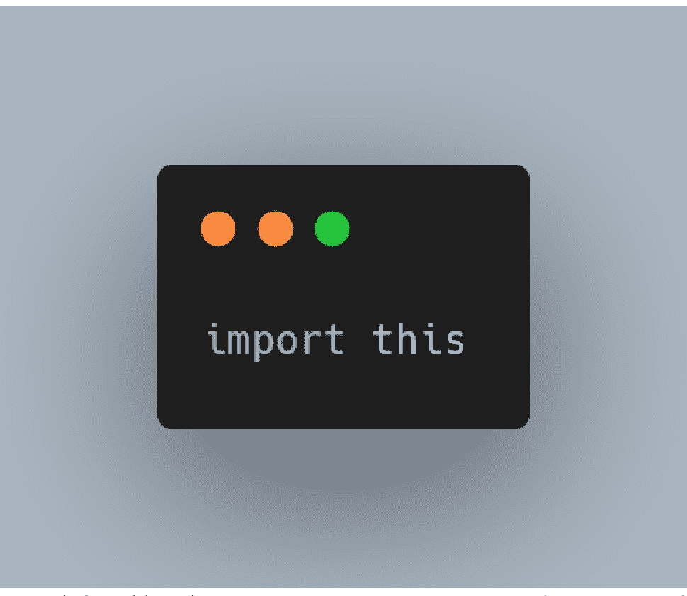

(原始文章缩略图位于 https://mathspp.com/blog/pydonts/pydont-disrespect-the-zen-of-python)

为了启动 Pydon't 系列，我们首先介绍一套所有 Python 开发者都应该了解的准则：Python 之禅。

Python 之禅就像一个元风格指南。当像 PEP 8 这样的规范告诉你应该如何格式化代码、如何命名变量等时，Python 之禅则为你提供了在思考（Python）代码和设计程序时应遵循的准则。

## Python 之禅

你可以在解释器中执行 `import this` 来阅读 Python 之禅，这会打印出以下文本：

Python 之禅，作者 Tim Peters

```
美胜于丑。
明胜于隐。
简胜于繁。
繁胜于杂。
平胜于嵌。
疏胜于密。
可读性很重要。
特例不足以特殊到破坏规则。
虽然实用性优于纯粹性。
错误不应被无声地忽略。
除非明确要求保持沉默。
面对歧义，拒绝猜测的诱惑。
应该有一种——最好只有一种——显而易见的方式去做事。
虽然这种方式起初可能并不明显，除非你是荷兰人。
现在做胜于永远不做。
虽然永远不做常常胜于*立刻*去做。
如果实现难以解释，那它就是个坏主意。
如果实现易于解释，那它可能是个好主意。
命名空间是一个非常棒的想法——我们应该多使用！
```

看看这些准则，试着去领会它们的含义。如果你想写出真正 Python 风格的代码，那么你应该尽可能地践行这些准则。

深入查阅 PEP 20 – Python 之禅的参考资料可以发现，Tim Peters（Python 早期的重要贡献者）认为这些准则是“在[Python]语言精神内运作的基本惯用建议”，这表明这些建议是严肃的，不应掉以轻心——如果你愿意加倍努力的话。

如果你看过《功夫熊猫》，可以这样想：Python 之禅对于 Python 程序员，就如同神龙卷轴对于功夫修行者：阿宝正是在领悟了神龙卷轴之后，才将他的功夫提升到了新的境界，变得真正令人惊叹。只有当你领悟了 Python 之禅，你才会成为一名真正的 Python 开发者。

我的建议是时不时重读此部分，并尝试在编写代码以及审视已编写代码（无论是你自己还是他人所写）时，记住 Python 之禅。我不知道你的情况如何，但每当我撰写（文本）文档时，比如一封信或一篇博文，我很少能一次就写好。我通常先写个初稿，然后重新审视，根据需要进行编辑：有时会重写整个部分。编写代码也是如此：很有可能，你最初写下的东西都可以得到极大的改进。

这篇 Pydon’t 更像是一篇“元”Pydon’t，包含一些关于如何编码的主观建议。起初你可能觉得这没什么用，但思考得越多，它就越有帮助。接下来的 Pydon’t 将为你展示一些客观、实用的技巧，教你如何写出更具 Python 风格的代码。

## 参考资料

- [PEP 20 – Python 之禅](https://www.python.org/dev/peps/pep-0020/)
- “Python之道”邮件讨论帖，https://groups.google.com/g/comp.lang.python/c/B_VxeTBCIM0/m/L8W9KlsiriUJ
- [Tim Peters (软件工程师)](https://en.wikipedia.org/wiki/Tim_Peters_(software_engineer)), 维基百科

# 优雅是否重要？

> 优雅并非不重要的奢侈品，而是决定成败的关键。
>
> —— 艾兹格·迪科斯彻

（原文缩略图链接：https://mathspp.com/blog/pydonts/does-elegance-matter.）

## 引言

在撰写这篇 Pydon’t 时，我正在为即将在 EuroPython 上做的 Python 演讲“Pydon’ts”做最后的准备。

因此，今天的 Pydon’t 会有些不同。通常，我写的是关于如何使用 Python 的核心特性来编写地道的、富有表现力的、优雅的 Python 代码。在这篇 Pydon’t 中，我将与你分享*为何*这一点如此重要。

## 注意，以下内容包含个人观点

地道代码、可读代码、“Python风格”代码、优雅代码，这些都是主观事物。这意味着无论我如何撰写这些主题，都不可能100%达成共识。换句话说，你可能会持不同意见。

我能接受有人与我意见相左，也确实邀请你畅所欲言，或许可以通过给我发邮件或在博客上留言——多元的观点是有益的。

我只想让你知道，如果你无法忍受别人可能与你想法不同这一点，那么这篇 Pydon’t 对你来说可能不是一次愉快的阅读体验 🤷。

## 优雅并非不重要的奢侈品

让我对你坦诚：在准备演讲和这篇 Pydon’t 时，我认为我关于为何优雅重要的一部分论证会源于我的数学家经验——在进行数学研究时，人们通常力求写出优雅的证明、构建简洁的论证、为他人的论点找到更简单的反例等等。

后来，我找到了一位受人尊敬的计算机科学家的一句话，它为我建立了这种联系，让我对我试图建立的类比更加自信。荷兰计算机科学家艾兹格·迪科斯彻（以他的名字命名了“[迪科斯彻算法][dijkstra-alg]”）写道：

> “我们如何才能让人相信，在编程中，简洁与清晰——简而言之：数学家所谓的‘优雅’——并非不重要的奢侈品，而是决定成败的关键？”

艾兹格·迪科斯彻，《计算selected writings: A个人视角》，第347页。

我认为迪科斯彻的引言说明了一切：简单清晰的代码就是优雅的代码。这些恰恰是代码中非常可取的特性。事实上，在同一页的稍后部分，迪科斯彻补充道：

> “[...] 在软件领域，不可靠性是最大的成本因素。这听起来可能有些矛盾，但一个可靠（因而简单）的程序，其开发和使用成本远低于一个（因复杂而）不可靠的程序。”

根据我的经验，人们常常将*初学者水平*的代码误认为是*简单*和*清晰*的代码，在我看来，这是非常危险的。

别误会，初学者水平的代码本身并无过错，我们在学习时都会这么写。错的是，当你自己或他人束缚你，强迫你编写初学者水平的代码：即只使用语言中最基本工具的代码。

## 别这么写，这代码没法读

想想你是否曾遇到过这种情况，或者目睹过：你写了漂亮的几行代码，*精确地*完成了需要的任务。然后你的同事（或者更糟，是你上级的人）走过，瞥了一眼你的代码，说：“别这么写代码，这代码没法读。”结果发现，他们这么说只是因为你使用了他们不知道的一个特性！因为他们不熟悉你使用的特性，所以他们只是*瞥了一眼*你的代码，觉得*读起来不顺*，就断定它没法读！

我不懂中文。如果我打开一本中文书，你认为我扫一眼几页内容然后断言“这没法读！”合理吗？我需要承认的是我*不会*读中文，而不是中文没法读。如果你不懂一门语言，那么断言其中某一部分无法阅读是没有道理的。对 Python 或任何其他编程语言来说，也是同理。

这里有一个 APL 表达式：

```
(a b c) ← 1 ¯4 3
(2×a)÷ -b(+,-)0.5* (b*2)-4×a×c
1 3
```

它计算方程 $x^2 + -4x + 3 = 0$ 的两个解。这段代码无法阅读吗？如果你*懂* APL，那么答案就是“不，它不是无法阅读的”，因为在 APL 中，这是一种非常自然的编写二次公式的方式。然而，如果你*不懂* APL，你的第一反应会是说它*无法阅读*，而实际上你的意思是你*不知道如何阅读它*。

简而言之，当某个东西你知道其所有组成部分的含义，但它们的组合方式却未能很好地传达整体意义时，它才是无法阅读的。这可能是由于使用了错误的组成部分、组成部分缺失、存在多余的部分等原因造成的。

因此，如果你不完全了解一段 Python 代码中使用的所有特性，我认为你无权看着它说这段代码无法阅读。首先，你必须花时间去了解这些不同的组成部分是什么。只有这样，你才能审视那行代码，并判断这些部分是否被很好地组织在了一起。

当然，这需要*时间*，并且必须是有意识地付出的努力，这就是为什么大多数人甚至懒得去尝试。请不要成为大多数人那样。

## 为工作选择合适的工具

为了支持我的观点，我引用传奇人物、《Python 之禅》的作者 Tim Peters 的话。针对 Python 的一些新特性，有人抱怨“增加了阅读他人代码的复杂性”，Tim Peters 回复道：

> “计划是这样的：当有人使用了一个你不懂的特性，直接毙了他们。这比学习新东西容易多了，而且要不了多久，唯一存活的程序员就只会用 Python 0.9.6 的一个简单易懂的子集写代码了 <眨眼>。”
>
> —— Tim Peters

在 Python 0.9.6 版本时期我还没开始写 Python 代码，但我猜那时候内容可能没太多。也许就是普通的 `for` 循环和 `if` 语句。

如果你想进步，你就必须学习。事情就是这样。

这正是我的 Pydon’ts 试图解决的问题。我试图教你所有关于 Python 核心特性需要了解的知识，然后向你展示这些特性被良好应用的代码示例，以便你扩展对 Python 的了解。

正是通过持续学习的过程，你才能写出优雅的代码。随着你学习更多的语法、函数、模块、数据类型等，你就拥有了更多解决问题的工具。而你工具带上的工具越多，当你需要做新事情时，你就越有可能知道*完美的工具是什么*。

如果你手头有合适的工具，你就可以用它来解决问题。简洁、清晰、优雅；所有这些都会自然而然地随之而来。

如果你不了解这些工具，你的解决方案最终可能会在多方面变得更糟，例如：

- （更）长——你不得不编写更多代码来弥补你不知道更好函数、模块、语法等的事实；
- （更）慢——正确的工具可能已经针对其使用场景进行了优化；
- 矛盾的是，更难维护——错误的工具无法以同样的方式传达相同的含义，因此那段代码需要更长时间去理解、调试、调整等。

相反，编写优雅且 Python 风格的代码会使它：

- 更简洁；
- 更清晰；
- 更易于维护；
- 更快；

## 为重写而优化

至此，我假设你对持续学习这个概念感兴趣——我这么说，并非指你应该在下周内吞噬掉整个 Python 文档。你只是同意，尽可能多地学习这门语言，自然会引导你写出更好的代码。

如果你在持续学习，那么当你审视一段自己很久以前的代码时，就可能会想：“有意思，我现在知道一种更好的写法。”因为你努力编写简单优雅的代码，所以你能快速理解那段代码在做什么，因此你可以修改旧代码，加入新的、改进的方案。但这又使得你的代码更清晰、更优雅了。这是一个可能无限循环下去的过程。

地道的代码是指其语义易于理解的代码，也就是说，地道的代码能很好地传达其意图。如果你做对了，优雅的代码和地道的代码是相辅相成的，如果你努力写出这样的代码，本质上就是在为未来重写代码打开了大门。这是一件好事，因为可以改变的代码就是可以随时间推移而改进的代码。

你是宁愿编写易于理解和修改的代码，还是宁愿编写一种让所有人（包括未来的你自己）都望而生畏、不敢触碰的代码？

## 结论

你的 Python 程序中的部分优雅感，将自然地来自于你学习 Python 所提供的特性、内置函数、标准库中的模块等。

通过掌握这些概念，并在合适的场景下尽力运用它们，使用它们解决它们被设计用来解决的问题，你就将踏上编写地道、优雅代码的道路。而编写这样的代码，不仅为你自己，也为他人，持续改进代码以及随之改进项目/产品变得更容易。

那么，下次当有人看着你用于展平嵌套列表的代码说“这根本看不懂”时：

```python
>>> import itertools
>>> list_of_lists = [[1, 2, 3], [4], [5, 6]]
>>> list(itertools.chain(*list_of_lists))
[1, 2, 3, 4, 5, 6]
```

就直接告诉他们去读文档好了。

## 参考文献

-   Edsger W. Dijkstra (2012), “Selected Writings on Computing: A personal Perspective”, p.347, Springer Science & Business Media;
-   Aaron W. Hsu (2017), “Beginner Patterns vs Anti-patterns in APL”, FnConf’17, https://www.youtube.com/watch?v=7Mt0GYHU9A [最后访问于 2021-07-06];
-   Tim Peters (2002), Python mailing list thread, https://mail.python.org/pipermail/python-list/2002-December/134521.html [最后访问于 2021-07-06];

本书仍在编写中。请在线查看以免费获取更新。

# 代码风格很重要

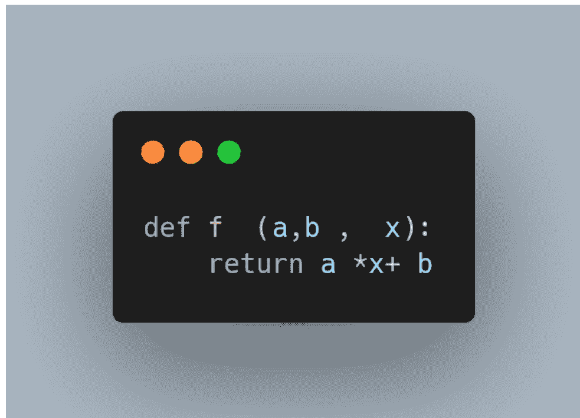

(原文文章的缩略图，链接在 https://mathspp.com/blog/pydonts/code-style-matters.)

## 引言

你代码的整体风格会对代码的可读性产生巨大影响。而代码被阅读的次数远多于被编写的次数，因此，编写风格良好的代码将使你（以及其他人！）受益匪浅。

在这个 Pydon't 中，你将：

-   理解保持一致性风格的重要性；以及
-   了解能帮助你管理代码风格的工具。

顺便说一下，本周我写了一个更短、更轻松的 Pydon't，因为在撰写本文时，我仍在投入大量时间[为 Euro Python 2021 做准备](https://europython.eu/)……希望你仍然觉得它有用！

## 代码风格

### 一致性

人类是习惯的产物。从你总是用同一条腿先伸进裤子，到你总是从同一侧开始刷牙。

这些习惯将无需过多关注的日常程序自动化，从而让你能将宝贵的认知能力用于其他事情。

就我的经验而言，你的编码风格也是如此：如果你使用一致的代码风格编写代码，它会变得更容易阅读，因为你已经预期了一种给定的结构；你只需获取该结构内的信息即可。

否则，如果你的风格不一致，你就必须花费更多宝贵的认知能力去解析你所阅读代码的结构，然后才能理解其中的信息。

[PEP 8](https://peps.python.org/pep-0008/) 是一份旨在为编写 Python 代码的人勾勒风格指南的文档。它包含大量有用的建议。然而，就在引言之后，PEP 8 写道：

> “风格指南关乎一致性。与本风格指南保持一致很重要。在项目内保持一致更重要。在单个模块或函数内保持一致是最重要的。
>
> 然而，要懂得何时可以不一致——有时风格指南的建议并不适用。当有疑问时，运用你最好的判断。参考其他示例，决定哪个看起来最好。并且不要犹豫去询问！”

这一点非常重要：PEP 8 是一份包含*建议*的风格指南，而非法律或严格规则。更重要的是，请注意它非常强调*一致性*。一致地使用你自己（可能有些古怪）的风格，比完全不用任何风格要好。这是在独自工作的情况下；在一个项目中，事先约定好一种特定风格是个好主意。

### 空白符很重要

在教授 Python 时，我经常进行某种现场编码，一边解释一边输入示例，并经常让学生也输入。我注意到*刚刚开始*学习 Python 的人常常会复制我输入的字符，却不会遵循我的空白符使用方式。

这有点夸张，但可能是这样：

```python
def f(a, b, x):
    return a*x + b
```

然后他们会输入类似这样的东西：

```python
def f (a,b , x):
    return a *x+ b
```

Python 是一门空白符很重要的语言（因为 Python 使用缩进来嵌套结构），但事实证明，空白符在更多地方都很重要。

例如，上面我们可以看到，错误使用空格使得第二个 f 的定义显得更加杂乱且在美学上不令人愉悦。如果我们知道一件事，那就是优雅很重要。

如果你浏览一下 PEP 8，你会发现其中大多数建议都是关于空白符的。函数、类、方法周围的空行数；运算符和关键字周围的空格；逗号前后的空格等等。看看 PEP 8，并逐步尝试将一些建议融入你的编码中。

例如，PEP 8 建议你使用空格来帮助读者解析表达式中数学运算的优先级。在上面，我写了

```python
return a*x + b
```

在 + 两边加了空格，以表示 a*x（注意 * 两边没有空格）具有更高的优先级。当然，我使用的空格数量不会改变运算顺序，但它有助于你看到事情的顺序。

而且很酷的是，你越习惯于这样写，它就越有帮助！

再次，我的建议是你看看 PEP 8，挑选一些你喜欢的建议，并尝试将它们融入你的编码中。当这些成为习惯后，再添加一些。就这样坚持下去。这比试图一次性改变一切要容易。

### 工具箱里的工具

说点开心的事，有很多工具可以帮助你格式化代码，使其保持整洁有序。

#### 自动格式化工具

**black**

你可以使用的一类工具被称为（自动）格式化工具，其中 black 是一个典型示例（参见他们的代码仓库）。

像 black 这样的自动格式化工具会获取你的代码并重新格式化它，使其符合该工具支持/你配置的风格。

例如，让我创建文件 my_f.py 并将这段代码粘贴进去：

```python
## In my_f.py
def f(a,b , x):
    return a *x+ b
```

现在让我对那个文件运行 black：

```
> python -m black my_f.py
reformatted my_f.py
All done!
1 file reformatted.
```

现在，我打开我的文件，里面的内容是：

```python
## In my_f.py
def f(a, b, x):
    return a * x + b
```

如我们所见，black 获取了我的代码并将其重新格式化为 black 所遵循的风格。black 的风格与 PEP 8 的风格非常相似，如果你只是想有个工具自动帮你重新格式化代码，而不想过多思考它，black 是个很棒的工具。

black 的安装就像任何其他 Python 模块一样简单：

```
python -m pip install black
```

市面上有很多像 black 这样的工具；另一个常见的选择是 pycodestyle。

**pycodestyle**

pycodestyle 检查你的风格是否与 PEP 8 建议的相似。事实上，pycodestyle 以前叫 pep8，但改名是为了让人们明白：

1.  PEP 8 并不是一套僵化的规则；以及
2.  pycodestyle 并没有 100% 符合 PEP 8 的建议。

让我将文件 my_f.py 修改为以下内容：

```python
## In my_f.py
import os, time
def f(a, b, x):
    return a * x + b
```

如果我运行 pycodestyle，我得到的输出是这样的：

```
> python -m pycodestyle my_f.py
my_f.py:2:10: E401 multiple imports on one line
my_f.py:3:1: E302 expected 2 blank lines, found 0
```

我们可以看到 pycodestyle 抱怨了几件事：

1.  我将 `import os` 和 `import time` 合并写在一行了；以及
2.  导入语句和函数 f 之间没有足够的空行分隔。

black 和 pycodestyle 的一个主要区别是，black 会实际重新格式化你的代码，而 pycodestyle 只是抱怨。

安装 pycodestyle 只需输入：

```
python -m pip install pycodestyle
```

对于这两个工具，以及市面上大多数类似工具，你都可以配置它们忽略某些类型的错误，或忽略代码的某些部分等等。去阅读它们的文档吧！

#### 进阶工具（即 linter）

（自动）格式化工具很有用，但市面上还有其他工具具有更大的潜力：linter。

Linter 是分析你的代码并帮助你查找诸如以下问题的工具：

-   风格问题（就像格式化工具那样）；
-   编程错误；
-   某些类型的 bug；
-   等等。

这些工具可能非常有用，例如，用于管理大型项目中的所有导入。我经常发现自己导入了一些模块并使用它们。后来，我重构代码，不再需要那些导入。当我这样做时，我总是忘记检查那些导入是否仍然需要或不再相关。Linter 可以，例如，标记未使用的导入。

一个 linter 的例子是 flake8（你可以在这里找到它）。如果我对我的 my_f.py 文件使用 flake8，我会得到：

```
> python -m flake8 my_f.py
my_f.py:2:1: F401 'os' imported but unused
my_f.py:2:1: F401 'time' imported but unused
my_f.py:2:10: E401 multiple imports on one line
my_f.py:3:1: E302 expected 2 blank lines, found 0
```

你可以看到现在 flake8 在抱怨我导入了根本没用的东西！不仅如此，最下面两行和上面 pycodestyle 的输出完全一样……这是因为 flake8 内部使用了 pycodestyle。

你可以用以下命令安装 flake8：

```
python -m pip install flake8
```

另一个相当常见的 linter 选择是 pylint（pylint 的页面）。在同一个 my_f.py 文件上运行它，我得到了一些额外的警告：

```
> python -m pylint my_f.py
************* Module my_f
my_f.py:1:0: C0114: Missing module docstring (missing-module-docstring)
my_f.py:2:0: C0410: Multiple imports on one line (os, time) (multiple-imports)
my_f.py:3:0: C0103: Function name "f" doesn't conform to snake_case naming style (invalid-name)
my_f.py:3:0: C0103: Argument name "a" doesn't conform to snake_case naming style (invalid-name)
my_f.py:3:0: C0103: Argument name "b" doesn't conform to snake_case naming style (invalid-name)
```## 结论

就这些工具而言，我建议你在个人项目中选择一个相对通用的工具，这样在参与其他项目时就不会太难适应。对于开源项目，你通常会被要求遵循特定的代码风格，并且可能会有一些工具来帮助你重新格式化代码以符合该风格。

这篇 Pydon't 并非旨在对所有可用的选项进行全面回顾；我只是触及了少数几个流行的替代方案，因此这或许能作为衡量通用性的一个参考指标。

顺便提一下，如今许多集成开发环境都内置了对这些代码检查工具的支持，这使得利用它们提供的有用建议变得更加容易。

以下是为你精心准备的，本篇 Pydon't 的主要收获：

> “请注意你编写代码时所使用的风格，并挑选一套工具来帮助你，如果你想或需要的话。”

本篇 Pydon't 向你展示了：

- 编码风格会影响代码的可读性；
- 像 `black` 和 `pycodestyle` 这样的工具可以帮助你修正代码的风格；以及
- 像 `flake8` 和 `pylint` 这样的代码检查工具可以为你程序中可能出现的某些类型错误、缺陷或问题提供更深入的见解。

## 参考资料

- PEP 8 – Python 代码风格指南, https://www.python.org/dev/peps/pep-0008 [最后访问于 2021-07-20];
- black - 毫不妥协的代码格式化工具, https://github.com/psf/black [最后访问于 2021-07-20];
- pycodestyle, https://pycodestyle.pycqa.org/en/latest/intro.html [最后访问于 2021-07-20];
- pydocstyle, http://www.pydocstyle.org/en/stable/ [最后访问于 2021-07-20];
- flake8, https://flake8.pycqa.org/en/latest/index.html [最后访问于 2021-07-20];
- pylint, https://www.pylint.org/ [最后访问于 2021-07-20];

# 命名至关重要

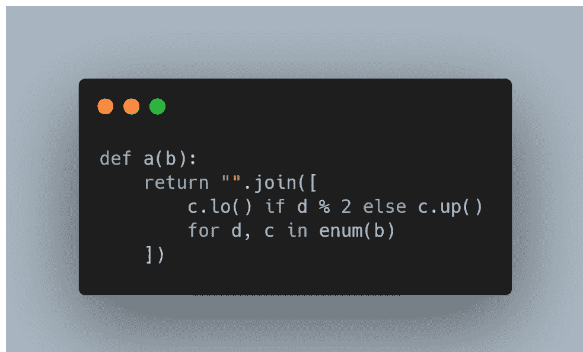

(原始文章的缩略图，发布于 https://mathspp.com/blog/pydonts/naming-matters)

## 引言

名称就像是我们大脑中的房地产。它们是我们赋予事物、概念、想法、对象的标签，以便于我们指代这些东西，但它们会占用空间。事实证明，我们头脑中只能容纳数量非常有限的、不同的想法，因此这些标签是非常昂贵的……

我们最好尽其所能，尽可能好地管理它们！

在本篇 Pydon't 中，你将：

- 了解一些命名约定；
- 学习 Python 代码的推荐命名约定；以及
- 理解在 Python 中为变量、函数、方法等命名时的一些注意事项。

## 命名约定

当我们谈论名称时，有两件事情需要讨论。其一是你赋予事物的实际名称，其二是你书写名称的方式：字母的大小写以及连续单词的分隔方式。

这些通常被称为命名约定，并且有几种。我将在此列出它们，以便在本篇 Pydon't 的后续部分中引用。

以下列表*并非*详尽无遗，因为市面上还有更多的命名约定。然而，它们与本篇 Pydon't 的内容无关。

- CAPSLOCK – 所有单词的所有字母均大写，且连续单词之间没有分隔符；
- CAPS_LOCK_WITH_UNDERSCORES – 与上述相同，但使用下划线分隔单词；
- lowercase – 所有单词的所有字母均小写，且连续单词之间没有分隔符；
- snake_case – 与上述相同，但使用下划线分隔单词；
- PascalCase – 所有单词连写在一起，但首字母大写以帮助你区分一个单词的结束和另一个单词的开始；以及
- camelCase – 与上述类似，不同之处在于第一个单词也以小写字母开头。

除了这些命名约定，有时还会在名称中添加前导和/或尾随下划线。这与命名约定本身并无严格关联，而是与 Python 使用名称的方式有关。如果你需要复习，我写过一篇教你[下划线所有用法](https://mathspp.com/blog/pydonts/all-the-underscores-in-python)的 Pydon't，它特别讲述了名称开头和/或结尾的下划线的作用。

## PEP 8 推荐建议

[PEP 8](https://peps.python.org/pep-0008/) 是一份文档——一份 Python 增强提案——包含 Python 的代码风格指南，它是 Python 领域最广泛接受和使用的风格指南。如果你不了解它，值得一看。

[PEP 8](https://peps.python.org/pep-0008/) 开篇就承认“Python 库的命名约定有点混乱”，因此请记住，如果你开始参与一个已经使用特定命名约定的项目，你应该坚持使用它。请记住，保持一致性比遵循 PEP 8 指南更重要。

## PascalCase

PascalCase 约定常见于类定义。这是该约定最常见的使用场景。

这意味着你的类看起来会像这样：

```python
class Shape:
    # ...

class Circle(Shape):
    # ...

class GameArena:
    # ...

class HumanPlayer:
    # ...

class NPC:
    # ...

class AIPlayer:
    # ...
```

请注意，`NPC` 和 `AIPlayer` 类实际上使用了缩写：`NPC` 代表“非玩家角色”(non-playable character)，`AI` 代表“人工智能”(artificial intelligence)。PEP 8 建议在 PascalCase 名称中将缩写的所有字母大写。这有时会使它看起来像我们使用了 CAPSLOCK 约定。

PascalCase 约定的其他常见用例包括异常——这不应让你惊讶，因为异常来自类——以及类型变量。

## snake_case

snake_case 命名约定是 Python 命名的基石。变量、函数、方法、参数，它们都使用 snake_case 约定。

因此，与其使用像下面这样的形式

```python
def coolFunction(coolargument, optionalinfo):
    # ...

def CoolFunction(coolArgument, optionalInfo):
    # ...

def COOL_FUNCTION(cool_argument, optional_info):
    # ...
```

不如优先选择

```python
def cool_function(cool_argument, optional_info):
    # ...
```

作为额外说明，PEP 8 也建议，当你要使用的名称是一个关键字时，在该名称末尾添加一个下划线。例如，你不能有一个名为 `for` 的变量，但可以将其命名为 `for_`。

## CAPS_LOCK_WITH_UNDERSCORES

这种你可能觉得有点笨拙的命名约定，实际上用于表示全局常量。Python 不支持真正意义上的常量变量——即尝试修改它们会引发错误——因此我们广泛采用这种约定，将用作全局常量的变量命名为 CAPS_LOCK_WITH_UNDERSCORES 格式。

通常，你会在文件开头找到这些“常量”。

例如，我经常这样定义几个路径：

```python
IMG_BIN = "images"
LOG_FILE = "logs/app.log"
```

## 标准名称

在某些特定情况下，某些名称是该场景下的黄金标准。

## self

一个很好的例子是实例方法的第一个参数名称。此类方法的第一个参数总是命名为 `self`。

因此，请这样做

```python
class Square:
    def __init__(self, side_length):
        # ...
```

而不是像下面这样

```python
class Square:
    def __init__(square, side_length):
        # ...

class Square:
    def __init__(a, b):
        # ...

class Square:
    def __init__(bananas, side_length):
        # ...
```

请注意，我声称你应该避免的三种备选方案实际上是能工作的。这里有一个例子：

## cls

在类似的场景中，`cls` 是类方法被广泛接受的名称。

> 类方法*不是*你在实现自定义类时定义的常规方法。那些被称为实例方法。类方法是用 @classmethod 装饰器修饰的实例方法。
> 为什么会这样？嗯，`class` 是一个关键字，所以我们不能真的用它作为参数名。而且出于某种原因，人们开始坚持使用 `cls` 而不是像 `class_` 这样的名称。所以，如今，类方法的第一个参数是 `cls`。

类方法的一个很好的例子是 `dict.fromkeys` 方法，你可以用它以不同的方式初始化一个字典：

```python
>>> dict.fromkeys("abc")
{'a': None, 'b': None, 'c': None}
```

类方法通常用于实现构建类实例的不同方式，这正是前面例子中发生的情况：我们正在以一种不同于通常方式的方式创建一个字典（或者换句话说，`dict` 类的一个实例）。

## 冗长性

在讨论了 Python 中处理名称时一些最广泛使用的约定之后，我现在将分享我关于良好命名原则的经验。

一个经常引起许多担忧的事情是你选择的名称的长度。你应该选择一个包含大量信息但输入起来很痛苦的长名称吗？还是应该选择一个易于输入但回忆其用途很痛苦的短名称？

平衡是关键，永远如此。

请记住，Python 对一行的最大长度施加了软限制，所以如果你的变量看起来像 `number_of_times_user_tried_to_login_unsuccessfully = 2`，那么你在编写的每一行代码中能做的事情就非常有限。

然而，如果你走向另一个极端，最终会得到一个、两个、三个字符长的名称，而这些名称不会告诉你任何信息。

有两个指标可以帮助你决定一个名称应该有多长：

1.  名称使用的次数；以及
2.  名称定义与其使用之间的距离。

这些是什么意思？

如果一个名称使用非常频繁，因为它是一个你经常调用的函数，或者是一个你需要非常频繁访问的变量，那么这个名称可以更短，因为你总是意识到这个名称的存在和目的。

另一方面，如果一个名称*很少*使用，那么这个名称应该更长，因为你需要更多的帮助来记住这个名称的目的。

要点 2 背后的推理是类似的。如果你定义一个名称并在定义后立即使用它，那么它的目的在你的记忆中是新鲜的，你可能能够承受一个更短的名称。

另一方面，如果你定义一个名称——比如一个函数或一个变量——并且只在文件的后面部分使用它，甚至在其他文件或模块中使用它，那么最好使用一个更长、更具描述性的名称。

## 单字符名称

在光谱的一端是单字符名称。单字符名称由一个字母组成，大写或小写，或者下划线。

单字符名称通常应该避免使用，因为它们包含很少或根本不包含关于它们所指代内容的信息。然而，在给定的上下文中，有几个例外是有意义的。

当你需要给一个变量赋值，即使你不需要它的值时，你可以使用一个接收器，而单字符名称 `_` 是推荐的接收器变量名。接收器是一个被赋值但我们不在乎其值的变量。接收器的一个例子出现在解包中，当你关心列表的第一个和最后一个元素，但不关心中间元素时：

```python
>>> l = [42, 10, 20, 73]
>>> first, *_, last = l
>>> first
42
>>> last
73
```

在数值上下文中，`n` 也是整数的常用名称，`x` 用于实数（浮点数）。这可能看起来很傻，但建议你不要将 `n` 用于可能不是整数的值。人们非常习惯这些约定，以至于打破它们可能意味着理解你的代码需要更长的时间。

`c` 和 `z` 也偶尔用于复数，但这些约定来自数学世界。换句话说，这些约定更可能被接近数学/数学家的人遵循。

仍然沿着从数学中汲取的约定，`i`、`j` 和 `k`，按此顺序，通常用于（整数）索引。例如，你经常看到以下 for 循环的开头：

```python
for i in range(n):
    pass
```

然后 j 和 k 用于嵌套循环，或者当 i 已经指代另一个固定索引时：

```python
for i in range(...):
    for j in range(...):
        for k in range(...):
            pass
```

其他常见的单字符名称包括内置类型的首字母：d 代表字典，s 代表集合或字符串，l 代表列表。

然而，l 是一个特别糟糕的单字符名称，I（大写 i）和 O（大写 o）也是如此，因为对于许多字体，这些字符很容易被数字一和零混淆。

单字符名称只应在周围上下文*明确*验证名称所指代的内容时使用。例如，如果你在同一位置处理集合和字符串，s 将是一个糟糕的单字符名称。

最后，你可以尝试使用其他短名称来替换单字符名称。例如，`idx` 代替 i 使我们更清楚地知道我们谈论的是索引，`char` 代替 c 使我们更清楚地知道我们谈论的是字符。

## 缩写

缩写需要谨慎使用。如果是一个广泛认可的缩写，它们可能有意义……但这本身就是一个危险的游戏，因为你无法知道你的代码读者可能知道哪些缩写。

更安全的做法可能是使用相对于代码领域知识的缩写。例如，如果你的代码处理一个物流无人机网络，在某个时候，使用“eta”——代表“预计到达时间”——作为保存无人机*预计到达时间*的变量名可能是有意义的。但同样，试着推理一下你的代码读者是否熟悉特定领域的术语。

虽然这第一条指导原则相当主观，但有一种类型的缩写绝对是个糟糕的主意，那就是非标准缩写。如果你无法通过谷歌搜索该缩写并在前几个结果中找到其含义，那么它根本就不是一个标准缩写。

例如，将上面的长变量名缩写是一个*坏*主意：

```python
## Don't
number_of_times_user_tried_to_login_unsuccessfully = 2

## but this is even worse:
ntutlu = 2
```

这还有一个不便之处，那就是它不是一个你可以*发音*的名称，这使得你更难与他人讨论你的代码。

另一方面，也有一个非常特定的情况，非标准缩写可能是有意义的，那就是在短生命周期的范围内。一个典型的例子来自遍历一个集合：

```python
data_sets = [ds for ds in data_sets if not is_complete(ds)]
```

注意有一个容器，一个列表，其名称是复数：`data_sets`。然后，当我们遍历该容器时，我们期望每个元素是什么？因为容器被称为 `data_sets`，我们立即期望它包含，嗯，数据集。因此，每个元素自然地被认为是一个单独的数据集。作为对此的扩展，名称 `ds`——缩写“data set”——是 `data_sets` 连续元素的一个完全可接受的名称，因为该名称仅存在于列表推导式内部。

## 句子

与其使用像

```python
number_of_times_user_tried_to_login_unsuccessfully = 2
```

或

```python
def compute_number_of_unsuccessful_login_attempts():
    pass
```

这样的名称，不如考虑缩短这些名称，并在需要时添加一个提供进一步上下文的注释。正如你将看到的，大多数时候，你甚至不需要额外的注释：

```python
## Number of unsuccessful attempts made by the user:
unsuccessful_logins = 2
```

我的意思是，我们显然在处理一个数字，所以我们可以直接写：

```python
## Unsuccessful attempts made by the user:
unsuccessful_logins = 2
```

我们也知道我们谈论的是不成功的尝试，因为这在变量名中：

```python
## Attempts made by the user:
unsuccessful_logins = 2
```

我们可以到此为止，或者如果用户是唯一可能进行登录尝试的实体，则完全删除注释。

对于函数，在文档字符串中包含额外的上下文。这确保了在调用你的函数时，对你/用户显示有用的上下文。如今，IDE 会显示我们代码中调用的函数的文档字符串。

## 选择名称

在为需要命名的任何事物选择实际名称时，请记住：

-   选择一个在风格/措辞上与周围环境一致的名称；
-   始终使用相同的词汇和拼写；

## 错误示范：
first_color = "red"
last_colour = "blue"

## 正确示范：
first_colour = "red"
last_colour = "blue"
## （或者两者都使用 `color`）

## 错误示范：
item.has_promotion = True
item.discount_percentage = 30

## 正确示范：
item.has_discount = True    # 或者，例如 item.is_discounted。
item.discount_percentage = 30

- 使用一个能反映我们处理内容的名称，而不是一个只反映数据类型的通用名称。

## 错误示范：
num = 18
string = "Hello, there."

## 正确示范：
legal_age = 18
greeting = "Hello, there."

对于变量，你也可以考虑一个能反映所处理实体主要不变属性的名称。“不变”意味着它不会改变。这一点很重要，否则你的名称会暗示某个含义，而其实际值却是另一回事。我将在本篇 Pydon't 的末尾举例说明这一点。

## 为函数和方法命名

针对函数/方法的一个具体准则是，它们应该用动词来命名。这反映了函数/方法被调用时将执行的操作，并明确了当函数/方法被调用时会有事情*发生*。

## 为变量命名

同样，当变量指代实体时，最好用名词来命名。
对于布尔变量（也称为谓词），形容词可能也是一个不错的选择，因为布尔值反映了该形容词所描述特性的存在与否。
例如：

```python
if painting.colourful:
    print("I like colours!")
```

注意，名词“painting”引导我们假设我们讨论的是某个对象，它可能是之前创建的 Painting 类的一个实例。而 painting.colourful 则引导我们假设它是一个布尔值，表示这幅画是否色彩丰富。

注意上面那段话有多冗余。当代码中使用的名称很好时，英语解释就会变得过于冗长。这是件好事，这意味着代码不言自明。

当变量是名词/形容词*且*函数是动词时，可以提高你在自己的变量上调用函数时的可读性，因为函数（动词）将作用于变量（名词）。这正是英语和大多数自然语言的工作方式，因此我们的代码编写方式也类似于自然语言。

## 上下文是关键

这一点在本篇 Pydon't 中已多次提及，但我想进一步强调它，因此专门设立了一个标题：上下文是关键。

请记住，你编写代码的上下文将极大地影响你所选择的名称。

重要的上下文包括代码所属的领域（你是编写处理银行交易的软件，管理物流无人机网络，还是在实现一个游戏？）、你所在的特定模块和函数，以及你是否在一个语句中，例如循环、列表推导式或 try: ... except: ... 块内。

作为一个例子，说明你工作的领域如何极大地影响命名，考虑以下基于我数学经验的例子。有时能够对多项式进行加法运算很有用，因此你可能想实现该函数：

```python
def poly_addition(poly1, poly2):
    pass
```

然而，如果你在一个专门处理多项式的模块上下文中，那么该函数的签名可能可以简化为：

```python
def add(p, q):
    pass
```

（p 和 q 是数学中多项式的常用名称。）

看到了吗？上下文是关键。

## 实际示例

在我关于 Pydon'ts 的演讲和关于重构的 Pydon't 中，我展示了一段初学者编写的代码，然后逐步重构它。其中一个步骤就是重命名事物。

以下是这段代码：

```python
def myfunc(a):
    empty = []
    for i in range(len(a)):
        if i % 2 == 0:
            empty.append(a[i].upper())
        else:
            empty.append(a[i].lower())

    return "".join(empty)
```

这段代码的功能如下：

```python
>>> myfunc("abcdef")
'AbCdEf'
>>> myfunc("ABCDEF")
'AbCdEf'
>>> myfunc("A CDEF")
'A CdEf'
```

它交替更改参数字符的大小写。
作为一个练习，请在继续阅读之前，尝试改进上面代码片段中的名称。
好的，你尝试改进名称了吗？
以下是该函数中出现的所有名称：

- myfunc 是函数名；
- a 是函数的参数；
- empty 是一个列表，它随着结果的新字符而增长；以及
- i 是参数字符串的索引。

以下是改进建议：

```python
def alternate_casing(text):
    letters = []
    for idx in range(len(text)):
        if idx % 2 == 0:
            letters.append(text[idx].upper())
        else:
            letters.append(text[idx].lower())

    return "".join(letters)
```

**myfunc 现在变成了 alternate_casing**
myfunc 是一个通用函数名，它没有提供任何关于函数功能的信息。
相反，我们可以选择像 alternate_casing 这样的名称，它告诉你这个函数将交替其参数的大小写。

注意我们没有采用类似这样的方式

```python
def alternate_casing_starting_with_uppercase(...):
    pass
```

该实现细节更适合放在函数的文档字符串中。

## **a 现在变成了 text**

我们的函数接受一个通用字符串作为输入。这个字符串没有特别之处或有趣之处，因此完全合适的名称包括 text 和 string。我选择 text 是因为它给人一种我们将处理人类可读字符串的感觉。

## **empty 现在变成了 letters**

这里的变量名 empty 是前面提到的准则的一个很好的反例。这篇 Pydon't 建议你根据对象的重要不变属性来给变量命名。显然，[] 是一个空列表，所以作者决定将此变量命名为 empty，这实际上看起来很合理。然而，三行代码之后，该列表被连续追加，因此它很快就不再是空的了。因此，列表为空并非一个不变属性，也不是一个好名字。名称 letters 比 empty 更合适，但你可能会争辩说它可能具有误导性——毕竟，我们往里面放的是所有字符，而不仅仅是字母。那么，你会用什么名字呢？

## **i 现在变成了 idx**

i 是一个非常典型的索引名称，我认为它没有错。我个人更喜欢用完全明确的 idx 来表示索引，这就是我选择它的原因。

## **结论**

通读这篇 Pydon't 后，你可能认为这里的大多数准则都是相当主观的，你是对的！我知道没有客观的规则来为变量、函数等选择名称可能会令人沮丧……但你知道人们怎么说！命名是你在编程中必须解决的最难题。别担心，随着经验的积累，你会越来越擅长在代码中使用好的名称。记住，Python 读起来几乎就像英语，因此你选择的名称应该有助于这一点。以下是这篇 Pydon't 给你的主要收获，呈现在你面前：“虽然命名可能很困难，但有一些准则可以帮助你做出尽可能好的决策。”这篇 Pydon't 向你展示了：

- 与现有代码保持一致在命名中至关重要；
- 从上下文中收集所有可能的提示以确定最佳名称；
- PEP 8 为你的代码提供了一些命名约定，
  - 最显著的是几乎所有情况都使用蛇形命名法（snake_case）；以及
  - 类和异常使用帕斯卡命名法（PascalCase）。
- 全大写加下划线（CAPS_WITH_UNDERSCORE）是全局常量被广泛接受的约定；
- 变量应该用名词命名，布尔变量有时可以用形容词，函数用动词命名；

如果你喜欢这篇 Pydon't，请务必在下方留下反馈并与你的朋友和 Python 同伴分享。同时，不要忘记订阅新闻通讯，这样你就不会错过任何一篇 Pydon't！

## 参考文献

- PEP 8 – Python 代码风格指南，https://www.python.org/dev/peps/pep-0008 [最后访问于 2021-07-28]；
- Stack Overflow，“Python classmethod 的示例用例是什么？”，https://stackoverflow.com/q/5738470/2828287 [最后访问于 2021-07-28]；
- testdriven.io，“Clean Code”，https://testdriven.io/blog/clean-code-python/#naming-conventions [最后访问于 2021-08-10]

# 链式比较运算符

```python
>>> a = 3
>>> l = [3, 5]
>>> if a in l == True:
...     print("Yeah :D")
... else:
...     print("Hun!?")
...
Hun!?
```

(原文文章缩略图见 https://mathspp.com/blog/pydonts/chaining-comparison-operators。)

## 引言

在这篇“Python禁术”中，我们将探讨比较运算符的链式使用：

+   - 它们如何工作；
- 有用的使用场景；以及
- 需要避免的奇怪情况。

## 比较运算符的链式操作

我欣赏Python的一点是，它的某些特性设计得如此合理，以至于你甚至不会意识到自己在使用某个特性，直到有人指出这种代码在其他语言中行不通。比较运算符的链式操作就是一个这样的例子！看看这段代码片段，告诉我它看起来是否很自然：

```python
>>> a = 1
>>> b = 2
>>> c = 3
>>> if a < b < c:
...     print("Increasing seq.")
...
Increasing seq.
```

当Python连续看到两个比较运算符时，就像在 `a < b < c` 中那样，它的行为等同于你写了 `a < b` 和 `b < c`，只不过 `b` 只会被求值一次（如果 `b` 是一个像函数调用这样的表达式时，这一点很重要）。

在我看来，这个特性非常合理，一点也不令人惊讶。相反，我现在感到有点难过，因为大多数语言都不支持这种行为。

另一个示例用法是，当你想要确保三个值都相同时：

```python
>>> a = b = 1
>>> c = 2
>>> if a == b == c:
...     print("all same")
... else:
...     print("some are diff")
...
some are diff
>>> c = 1
>>> if a == b == c:
...     print("all same")
... else:
...     print("some are diff")
...
all same
```

> 你知道吗？你实际上可以链式使用任意数量的比较运算符。例如，`a == b == c == d == e` 用于检查所有五个变量是否相同，而 `a < b < c < d < e` 用于检查是否构成严格递增的序列。

## 陷阱

尽管这个特性看起来非常合理，但还是有几个陷阱需要留意。

## 非传递性运算符

我们上面看到可以使用 `a == b == c` 来检查 `a`、`b` 和 `c` 是否都相同。那么如何检查它们是否都不同呢？

如果你想到了 `a != b != c`，那么你就掉进了第一个陷阱！

看看这段代码：

```python
>>> a = c = 1
>>> b = 2
>>> if a != b != c:
...     print("a, b, and c all different:", a, b, c)
a, b, and c all different: 1 2 1
```

这里的问题在于，`a != b != c` 等价于 `a != b` 和 `b != c`，它检查的是 `b` 是否不同于 `a` 和 `c`，但没有说明 `a` 和 `c` 之间的关系。

从数学的角度看，`!=` 不是传递性的，也就是说，知道 `a` 如何与 `b` 相关以及 `b` 如何与 `c` 相关，*并不* 能告诉你 `a` 与 `c` 的关系。作为一个传递性的例子，你可以看看 `==` 等号运算符。如果 `a == b` 且 `b == c`，那么 `a == c` 也成立。

## 非常量表达式或副作用

回想一下，在比较链式操作中，例如 `a < b < c`，中间的表达式 `b` 只会被求值*一次*，而如果你写出展开后的表达式 `a < b` 和 `b < c`，那么 `b` 会被求值两次。

如果 `b` 包含具有副作用的表达式，或者它不是一个常量，那么这两个表达式就不等价，你需要仔细考虑你的操作。

这个片段展示了中间表达式求值次数的差异：

```python
>>> def f():
...     print("hey")
...     return 3
...
>>> if 1 < f() < 5:
...     print("done")
...
hey
done
>>> if 1 < f() and f() < 5:
...     print("done")
...
hey
hey
done
```

这个片段展示了，当展开时，像 `1 < f() < 0` 这样的表达式实际上可能求值为 `True`：

```python
>>> l = [-2, 2]
>>> def f():
...     global l
...     l = l[::-1]
...     return l[0]
>>> if 1 < f() and f() < 0:
...     print("ehh")
...
ehh
```

> 语法 `l[::-1]` 是一个“切片”，它能反转一个列表。我很快会写关于列表切片的文章，敬请期待！

当然，`1 < f() < 0` 不应该为 `True`，所以这仅仅说明了链式比较和展开后的比较并不总是等价的。

## 丑陋的链式

这个特性看起来非常自然，但某些特定情况并不那么好。这是一个相当主观的问题，但我个人不喜欢运算符没有“对齐”的链式操作，所以像

+   - `a == b == c`
- `a < b <= c`
- `a <= b < c`

这样的链看起来很好，但在我看来像

+   - `a < b > c`
- `a <= b > c`
- `a < b >= c`

这样的链看起来不太好。有人可能会争辩说，例如，`a < b > c` 读作“检查 b 是否大于 a 和 c”很自然，但你也可以写成 `max(a, c) < b` 或 `b > max(a, c)`。

现在还有一些令人困惑的链：

+   - `a < b is True`
- `a == b in l`
- `a in l is True`

在Python中，`is`、`is not`、`in` 和 `not in` 都是比较运算符，所以你也可以将它们与其他运算符链式使用。这会创造出奇怪的情况，比如

```python
>>> a = 3
>>> l = [3, 5]
>>> if a in l == True:
...     print("Yeah :D")
... else:
...     print("Hun!?")
...
Hun!?
```

以下是前一个例子中发生情况的分解：

+   - `a in l == True` 等价于 `a in l and l == True`;
- `a in l` 是 `True`，但
- `l == True` 是 `False`，所以
- `a in l == True` 展开为 `True and False`，结果为 `False`。

写下 `a in l == True` 的人可能意思是 `(a in l) == True`，但这与 `a in l` 是相同的。

## 代码示例

### 不等式链

拥有一个简单的实用函数，确保一个给定值位于两个边界之间，会变得非常简单，例如

```python
def ensure_within(value, bounds):
    return bounds[0] <= value <= bounds[1]
```

或者，如果你想要稍微更明确一些，同时确保 `bounds` 是一个恰好有两个元素的向量，你也可以写成

```python
def ensure_within(value, bounds):
    m, M = bounds
    return m <= value <= M
```

### 等式链

直接取自Python的 `enum` 模块，我们可以找到一个辅助函数（不对外暴露），其内容如下：

```python
def _is_dunder(name):
    """Returns True if a __dunder__ name, False otherwise."""
    return (len(name) > 4 and
            name[:2] == name[-2:] == '__' and
            name[2] != '_' and
            name[-3] != '_')
```

这个函数检查一个字符串是否是“dunder”方法。

> “Dunder”来自“double underscore”（双下划线），仅指某些Python类具有的某些方法，这些方法允许它们与许多Python内置功能良好交互。这些方法被称为“dunder”，因为它们的名字以 `__` 开头和结尾。你在“str and repr”那篇“Python禁术”中见过 `__str__` 和 `__repr__` dunder方法，在“Truthy, falsy, and bool”那篇中见过 `__bool__` dunder方法。我将在后续的“Python禁术”中撰写关于dunder方法的通用介绍，请随时订阅以保持关注。

代码首先检查字符串的开头和结尾是否相同且等于“__”：

```python
>>> _is_dunder("__str__")
True
>>> _is_dunder("__bool__")
True
>>> _is_dunder("_dnd__")
False
>>> _is_dunder("________underscores__")
False
```

## 结论

以下是本文的主要结论，为您呈上：

> “链式比较运算符感觉如此自然，你甚至不会注意到它是一个特性。然而，如果你忽略了某些链式操作，它们可能会让你困惑。”

这篇“Python禁术”向你展示了：

+   * 你可以链式使用比较运算符，并且可以任意多次链式使用；
* 包含具有副作用或不确定输出表达式的链式比较，与展开版本并不等价；以及
* 某些使用 `is` 或 `in` 的链式比较可能非常有误导性。

## 参考文献

+   * Python 3 文档，Python语言参考 [https://docs.python.org/3/reference/expressions.html#comparisons](https://docs.python.org/3/reference/expressions.html#comparisons);
* Python 3 文档，Python标准库，enum模块，[https://docs.python.org/3/library/enum.html](https://docs.python.org/3/library/enum.html);
* Reddit，对“如果他们真的做了Python 4，你希望看到哪些Python 3的改变？”的评论，[https://www.reddit.com/r/Python/comments/ltaf3y/if_they_did_make_a_python_4_what_changes_from/gowuau5?utm_source=share&utm_medium=web2x&context=3](https://www.reddit.com/r/Python/comments/ltaf3y/if_they_did_make_a_python_4_what_changes_from/gowuau5?utm_source=share&utm_medium=web2x&context=3)。

在线参考文献最后查询于2021年3月1日。

# 赋值表达式与海象运算符

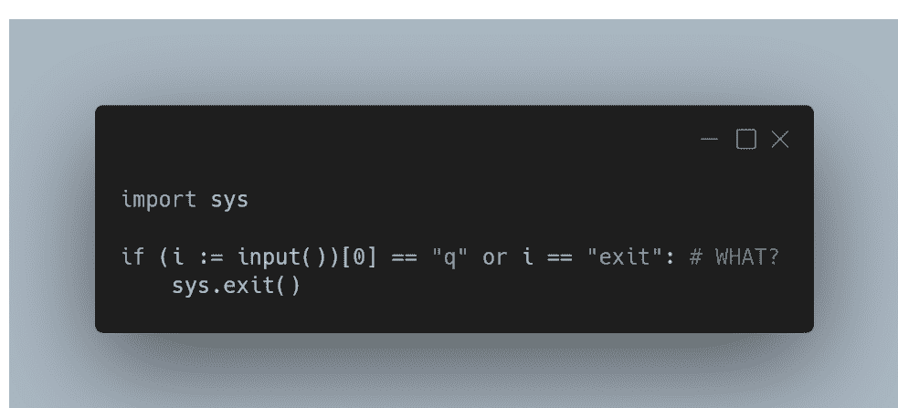

（原文缩略图见：https://mathspp.com/blog/pydonts/assignment-expressions-and-the-walrus-operator）

## 海象运算符与赋值表达式

海象运算符写作 `:=`（一个冒号和一个等号），首次在 Python 3.8 中引入。海象运算符用于*赋值表达式*，这意味着赋值操作现在可以作为表达式的一部分使用，而在 Python 3.8 之前，赋值只能作为语句。

赋值语句将一个值赋给一个变量名，仅此而已。而通过赋值表达式，该值可以立即被重用。以下是两者差异的示例：

```
>>> a = 3
>>> print(a)
3
>>> print(b = 3)
Traceback (most recent call last):
  File "<stdin>", line 1, in <module>
TypeError: 'b' is an invalid keyword argument for print()
>>> print(b := 3)
3
>>> b
3
```

正如 PEP 572 中所示，恰当使用赋值表达式可以帮助编写更好的代码：代码更清晰和/或运行更快。

当赋值表达式会使代码过于复杂时，即使它能节省几行代码，也应避免使用。你不想违背 Python 之禅，而 Python 之禅推荐编写可读的代码。

我认为下面这段代码片段展示了一个相当难以阅读的赋值表达式用法：

```
import sys

if (i := input())[0] == "q" or i == "exit":
    sys.exit()
```

我认为一个更好的替代方案是：

```
import sys

i = input()
if i[0] == "q" or i == "exit":
    sys.exit()
```

即使使用 `:=` 节省了一行代码，第二种替代方案（不带 `:=`）也比第一种容易读得多。

然而，恰当使用赋值表达式可以

- 使你的代码更快，
- 使其更具可读性/表现力，并且
- 使你的代码更短。

## 代码示例

以下是几个恰当使用赋值表达式的例子。

### 通过初始化控制 while 循环

考虑以下 while 循环：

```
inp = input()
while inp:
    eval(inp)
    inp = input()
```

这段代码可以用来创建一个非常基础的 Python REPL（交互式解释器），并且当你输入空内容时 REPL 会停止，但请注意它存在一些重复。首先，你必须初始化 `inp`，因为你想在 `while` 条件中使用它；然后你还需要在 `while` 循环内部更新 `inp`。

使用赋值表达式，上述代码可以改写为：

```
while inp := input(" >> "):
    eval(inp)
```

这不仅使代码更短，而且使其更具表现力，清晰地表明是由 `input()` 提供的用户输入来控制 `while` 循环。

### 减少视觉噪音

假设你想计算一个整数末尾零的个数。一个简单的方法是将整数转换为字符串，找到其长度，然后减去移除所有末尾零后的同一字符串的长度。你可以这样写：

```
def trailing_zeroes(n):
    s = str(n)
    return len(s) - len(s.rstrip("0"))
```

然而，对于一个如此简单且简短的函数来说，让 `s = str(n)` 这样简短的一行代码占据 `trailing_zeroes` 函数体的一半，看起来有点奇怪。使用赋值表达式，你可以将上述代码改写为：

```
def trailing_zeroes(n):
    return len(s := str(n)) - len(s.rstrip("0"))
```

上面的函数可以理解为“返回从 `n` 得到的字符串 `s` 的长度，减去 `s` 去除末尾零后的长度”，所以赋值表达式并没有损害函数的可读性，而且在我看来，还提高了可读性。当然，如果你不同意也没问题，因为这并不是客观的事情。

### 在列表推导式中重用计算结果

假设你正在编写一个带有 `if` 过滤器的列表推导式，但推导式中的过滤测试使用了你也想在列表本身中使用的值。例如，你有一个整数列表，并想保留那些阶乘值末尾超过 50 个零的数字的阶乘。

你可以这样做：

```
from math import factorial as fact

l = [3, 17, 89, 15, 58, 193]
facts = [fact(num) for num in l if trailing_zeroes(fact(num)) > 50]
```

问题是上面的代码对每个数字计算了两次阶乘，如果数字很大，这可能会变得非常慢。使用赋值表达式，可以改写为：

```
from math import factorial as fact

l = [3, 17, 89, 15, 58, 193]
facts = [f for num in l if trailing_zeroes(f := fact(num)) > 50]
```

使用 `:=` 允许重用对 `num` 求阶乘这个昂贵的计算。

另外两种类似的替代方案（不使用赋值表达式）是：

```
from math import factorial as fact

l = [3, 17, 89, 15, 58, 193]
## 替代方案 1
facts = [fact(num) for num in l]
facts = [num for num in facts if trailing_zeroes(num) > 50]
## 替代方案 2
facts = [num for num in map(fact, l) if trailing_zeroes(num) > 50]
```

请注意，如果列表 `l` 很大，第二种方案可能在内存上更高效：第一种方案首先计算整个阶乘列表，而第二种方案只在需要时计算阶乘。（我将在后续的 Pydon't 文章中更多地讨论这一点，订阅以避免错过！）

### 扁平化相关逻辑

想象一下，你的代码中到了一个需要选择对数据执行某种操作的地方，你有一系列想要尝试的操作。但你也想坚持使用第一个有效的操作。举一个非常简单的例子，假设我们有一个字符串，其中可能包含电子邮件地址或电话号码，你想提取电子邮件地址，如果没找到，再查找电话号码。（为简单起见，我们假设电话号码是 9 位数字，并且只考虑仅包含字母的简单 .com 电子邮件。）

你可以这样做：

```
import re

string = input("Your contact info: >> ")
email = re.search(r"\b(\w+@\w+\.com)\b", string)
if email:
    print(f"Your email is {email.group(1)}.")
else:
    phone = re.search(r"\d{9}", string)
    if phone:
        print(f"Your phone is {phone.group(0)}.")
    else:
        print("No info found...")
```

请注意，上面的代码是嵌套的，但逻辑是扁平的：我们依次查找东西，一旦找到就停止。使用赋值表达式可以改写为：

```
import re

string = input("Your contact info: >> ")
if email := re.search(r"\b(\w+@\w+\.com)\b", string):
    print(f"Your email is {email.group(1)}.")
elif phone := re.search(r"\d{9}", string):
    print(f"Your phone is {phone.group(0)}.")
else:
    print("No info found...")
```

## 结论

赋值表达式允许将名称绑定到表达式的某一部分，这可以带来很大的好处，例如用于澄清某些程序的流程或节省昂贵计算的时间。然而，不当使用赋值表达式可能会使代码非常难以阅读，因此判断赋值表达式是否适合特定任务至关重要。

## 参考资料

- Python 3 文档，Python 新增内容，Python 3.8 中的新增内容 - 赋值表达式，https://docs.python.org/3/whatsnew/3.8.html#assignment-expressions。
- PEP 572 – 赋值表达式，https://www.python.org/dev/peps/pep-0572。
- Real Python，“Assignment Expressions: The Walrus Operator”，https://realpython.com/lessons/assignment-expressions/。

在线资料查阅于 2021 年 1 月 26 日。

# 真值（Truthy）、假值（Falsy）与 bool 类型

```
l = [3, 1, 6]
if l:                    # if len(l) > 0:
    print(l)

n = 0
if n:                    # if n != 0:
    l.append(n)

msg = "Hello, world!"
if msg:                  # if len(msg) > 0:
    print(msg)

d = {"a": 2, "b": 6}
if d:                    # if len(d) > 0:
    print(d.keys())
```## “真值”与“假值”

引用 Python 文档中的一句话：

> “任何对象都可以用于测试其真值，以用于 `if` 或 `while` 条件语句中，或作为下面布尔运算（[`or`, `and` 和 `not`]）的操作数。”

这意味着什么？它的意思是，当需要一个布尔值时，我们可以使用任何想要的 Python 对象。布尔值（`True` 和 `False`）用在条件语句中，例如 `if` 语句和 `while` 语句，以及使用布尔运算符 `or`、`and` 和 `not` 的表达式中。

来看一个最基本的示例，这个 Python 交互过程：

```python
>>> if True:
...     print("Hello, World!")
...
Hello, World!
>>> if False:
...     print("Go away!")
...
>>>
```

这段代码不应该让你惊讶，因为它是标准的 Python 代码：几个 `if` 语句使用了明确的布尔值。下一步是使用一个*求值*结果为布尔值的表达式：

```python
>>> 5 > 3
True
>>> if 5 > 3:
...     print("Hello, World!")
...
Hello, World!
```

*再下一步是使用一个**不是**布尔值的对象，这也是这篇博文的核心内容：

```python
>>> l = [1, 2, 3]
>>> if l:
...     print(l)
...
[1, 2, 3]
```

如果你从未接触过，*这*部分可能会让你感到意外。这个 `if` 语句之所以被执行，是因为列表 `[1, 2, 3]` 是*真值*的，也就是说，列表 `[1, 2, 3]` 在布尔上下文中可以被解释为 `True`。如何知道一个对象是“真值”还是“假值”呢？最简单的方法是使用内置的 `bool` 函数，它可以将任何 Python 对象转换为布尔值：

```python
>>> bool(1)
True
```

其工作原理非常简单！有一些规则规定了它的行为，但这些简单的规则甚至可以进一步简化为一个更简单的经验法则：

> 对于给定类型，当其值为“空”或“没有任何有用的值”时，它就是假值。

内置类型的假值示例包括空列表、空集合、空元组、空字典、数字 0、`None` 和空字符串。例如：

```python
>>> bool([])
False
>>> bool("")
False
```

当然，“没有任何有用的值”肯定取决于你打算如何使用这个值，所以我应该明确客观的规则：

- 默认情况下，一个值为真值（即被解释为 `True`）。
- 如果一个对象是假值（即被解释为 `False`），那么调用 `len` 会返回 0。

请注意，上述规则告诉我们，通常来说，容器或序列类型（通常对这些对象使用 `len` 是有意义的类型）在为空时被认为是假值的，即当它们的长度等于零时。但还有一个情况会产生假值：

## `__bool__` 双下方法

- 如果一个对象定义了 `__bool__` 方法且该方法返回 `False`，则该对象为假值。

`__bool__` 是一个双下方法（dunder 代表双下划线），你可以通过在自己的类中实现它，来告诉你对象在布尔上下文中是真值还是假值。（你已经见过其他双下方法了。）

> 如果你还不熟悉 Python 的双下方法，你可能想订阅 Pydon’t 通讯，我以后会写更多关于它们的文章。在此之前，你可能想看看 Python 3 文档中关于数据模型的说明。

这是一个简单的示例，展示了一个总是被视为真值的对象：

```python
>>> class A:
...     pass
...
>>> a = A()
>>> if a:
...     print("Hello, World!")
...
Hello, World!
```

相反，我们可以考虑一个其对象总是被视为假值的类：

```python
>>> class A:
...     def __bool__(self):
...         return False
...
>>> a = A()
>>> if a:
...     print("Go away!")
...
```

通常，你的用例可能是这样的：你的对象有时为真值，有时为假值。

最后，声明规则的适用顺序非常重要！

> 当给定一个需要测试真值的任意 Python 对象时，Python 首先尝试调用 `bool`，试图使用其 `__bool__` 双下方法。如果该对象没有实现 `__bool__` 方法，那么 Python 尝试调用 `len`。最后，如果这也失败了，Python 默认会给该对象一个真值。

## 备注

现在对真值和假值的工作方式补充几点说明。

### 关于包含假值对象的容器的说明

我们说过，像空列表、零和空字典这样的东西是假值的。然而，像只包含零的列表或由零和空列表组成的字典这样的东西则不是假值的，因为容器本身不再是空的：

```python
>>> bool([])
False
>>> bool({})
False
>>> bool(0)
False
>>> bool([0, 0, 0]) # 一个包含零的列表不是空列表。
True
>>> bool({0: []})    # 一个有一个 0 键的字典不是空字典。
True
```

### 关于检查 None 的说明

如上所述，`None` 是假值的：

```python
>>> bool(None)
False
>>> if None:
...     print("Go away!")
...
```

这看起来很合理，因为当函数什么也不做时，`None` 是默认的返回值。

假设有人实现了以下函数来返回一个数字的整数平方根，对于负数输入返回 `None`（因为负数在通常意义上没有平方根）：

```python
import math
def int_square_root(n):
    if n < 0:
        return None
    return math.floor(math.sqrt(n))
```

当你使用上面的函数时，你知道如果计算失败它会返回 `None`，所以现在你可能想运用你刚学到的关于 `None` 的假值的知识，可能会写类似下面的代码来检查计算是否成功：

```python
n = int(input("计算什么的整数平方根？ >> "))
int_sqrt = int_square_root(n)
if not int_sqrt:
    print("负数没有整数平方根。")
```

那么，如果 `n` 是 0 或 0.5 会发生什么？

```python
>>> n = 0.5
>>> int_sqrt = int_square_root(n)
>>> if not int_sqrt:
...     print("负数没有整数平方根。")
...
负数没有整数平方根。
```

这显然是错误的，因为 `n = 0.5` 肯定是正数。让我们检查一下 `int_sqrt`：

```python
>>> int_sqrt
0
```

问题是 `int_square_root` 返回了一个有意义的值（即它没有返回 `None`），但这个有意义的值仍然是假值的。当你想检查一个函数是否返回了 `None` 时，不要依赖返回值的真值/假值。相反，应该明确检查返回值是否是 `None`：

```python
## 使用                     # 避免
if returned is None:      # if not returned:
    # ...                 #     # ...
if returned is not None:  # if returned:
    # ...                 #     # ...
```

这个建议是为了避免上述问题。

## 代码示例

现在我将向你展示一些使用 Python 对象的真值和假值可以让你编写更符合 Python 风格的代码的地方。

### 二维点

让我们实现一个简单的类来表示二维平面上的点，这可以是一张图像、一个图表或其他东西。回顾我们在关于 `__str__` 和 `__repr__` 的文章中已有的内容，我们可以添加一个 `__bool__` 方法，使得原点（点 `Point2D(0, 0)`）是假值的，而所有其他点是真值的：

```python
# From https://mathspp.com/blog/pydonts/pydont-confuse-str-and-repr
class Point2D:
    """A class to represent points in a 2D space."""

    def __init__(self, x, y):
        self.x = x
        self.y = y

    def __str__(self):
        """Provide a good-looking representation of the object."""
        return f"({self.x}, {self.y})"

    def __repr__(self):
        """Provide an unambiguous way of rebuilding this object."""
        return f"Point2D({repr(self.x)}, {repr(self.y)})"

    def __bool__(self):
        """The origin is Falsy and all other points are Truthy."""
        return self.x or self.y
```

```python
print(bool(Point2D(0, 1))) # True
print(bool(Point2D(0, 0))) # False
print(bool(Point2D(1, 0))) # True
print(bool(Point2D(4, 2))) # True
```

注意我们是如何根据 `Point2D` 组成部分的真值/假值来定义 `Point2D` 的真值/假值的！我们希望当 `self.x` 为 0 且 `self.y` 也为 0 时，`Point2D` 是假值的，这意味着如果 `self.x` 或 `self.y` 中任何一个为真值（即不等于 0），`Point2D` 就是真值的！

### 处理错误代码或错误消息

函数返回“错误代码”是很常见的：这些整数编码了某些出错的特定信息，或者此类函数在出错时返回字符串错误消息。这些错误代码通常是这样的：返回 0 表示一切正常，而不同的其他整数可能意味着各种问题。

如果你调用这样的函数，你可以利用字符串和/或整数的真值来检查是否出了问题，并相应地进行处理。

作为一个通用示例，这就是我们寻找的模式：

```python
return_value, error_code = some_nice_function()
if error_code:
    # 出错了，相应处理。
```

或者类似这样：## 处理数据

使用真值和假值来判断是否还有数据需要处理，这也是非常常见的做法。例如，当我谈到海象运算符 `:=` 时，我们曾见过一个与此类似的 `while` 循环：

```
input_lines = []
while (s := input()):
    input_lines.append(s)
## No more lines to read.
print(len(input_lines))
```

这个 `while` 循环本质上是在有行可读时持续读取输入行。一旦用户输入了一个空行 `""`，循环就会停止，然后我们打印所读行的数量：

```
>>> input_lines = []
>>> while (s := input()):
...     input_lines.append(s)
...
Line 1
Line 2

>>> print(len(input_lines))
2
```

另一种常见的模式是，你有一个包含某些待处理数据的列表，并且该列表本身会在处理数据时被修改。请看下面的例子：

```
import pathlib

def print_file_sizes(dir):
    """Print file sizes in a directory, recurse into subdirs."""

    paths_to_process = [dir]
    while paths_to_process:
        path, *paths_to_process = paths_to_process
        path_obj = pathlib.Path(path)
        if path_obj.is_file():
            print(path, path_obj.stat().st_size)
        else:
            paths_to_process += path_obj.glob("*")
```

这不一定是完成此任务的最佳方式，*但是*请注意 `while` 语句，以及后面要么打印内容、要么扩展 `paths_to_process` 列表的 `if: ... else: ...` 代码块。

## 结论

-   Python 的真值和假值允许你以更可读、因此也更符合 Python 风格的方式来重写常见条件。
-   你可以通过实现 `__bool__` 魔术方法，在自定义类中实现自己的真值和假值。
-   在检查给定变量是否为 `None` 时也应小心，并避免在那些特定情况下使用 `None` 的假值。

## 参考资料

-   Python 3 文档，Python 语言参考，数据模型，`bool`，https://docs.python.org/3/reference/datamodel.html#object.__bool__。
-   Python 3 文档，Python 标准库，真值测试，https://docs.python.org/3/library/stdtypes.html#truth-value-testing。
-   Python 3 文档，Python 标准库，内置函数，`bool`，https://docs.python.org/3/library/functions.html#bool。
-   PEP 8 – Python 代码风格指南，https://www.python.org/dev/peps/pep-0008/。
-   Python 3 文档，Python 标准库，文件和目录访问，pathlib，https://docs.python.org/3/library/pathlib.html。
-   Stack Overflow，列出目录下的所有文件？，https://stackoverflow.com/a/40216619/2828287。
-   Stack Overflow，如何在 Python 中检查文件大小？，https://stackoverflow.com/a/2104107/2828287。
-   freeCodeCamp，Python 中的真值和假值：详细介绍，https://www.freecodecamp.org/news/truthy-and-falsy-values-in-python/。

在线资料最后查阅于 2021 年 2 月 9 日。

### 深度解包

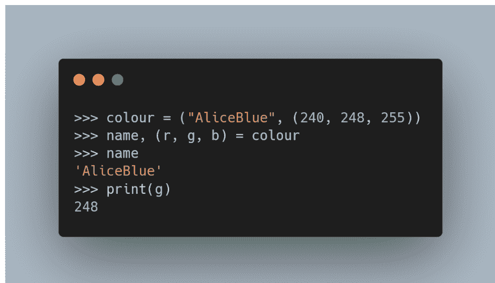

（原文文章缩略图，链接至 https://mathspp.com/blog/pydonts/deep-unpacking。）

## 简介

在这个“Pydon'ts”教程中，我们将探讨深度解包：- 它是什么；- 它如何工作；- 如何使用它来提高代码可读性；以及 - 如何使用它来帮助调试你的代码。

了解深度解包对于为 [结构化匹配](https://mathspp.com/blog/pydonts/deep-unpacking) 铺平道路将**非常**有帮助，这是 Python 3.10 中将要引入的一个特性。

## 赋值

在向你展示深度解包如何工作之前，让我们快速了解一下 Python 赋值中的另外两个不错特性。

### 多重赋值

在 Python 中，多重赋值允许你写下这样的代码

```
>>> x = 3
>>> y = "hey"
>>> x, y = y, x    # Multiple assignment to swap variables.
>>> x
'hey'
>>> y
3
```

或

```
>>> rgb_values = (45, 124, 183)
>>> # Multiple assignment unpacks the tuple.
>>> r, g, b = rgb_values
>>> g
124
```

通过多重赋值，你可以同时，嗯，给多个变量赋值，前提是右侧的项数与左侧期望的数量相同。

## 星号赋值

星号赋值，我在 [这个 Pydon'ts](https://mathspp.com/blog/pydonts) 中深入讨论过，允许你写下这样的代码

```
>>> l = [0, 1, 2, 3, 4]
>>> head, *body = l
>>> print(head)
0
>>> print(body)
[1, 2, 3, 4]
>>> *body, tail = l
>>> print(tail)
4
>>> head, *body, tail = l
>>> print(body)
[1, 2, 3]
```

通过星号赋值，你可以告诉 Python，你不确定右侧会有多少项，但所有项都可以存储在一个位置。

### 深度解包

深度解包，或嵌套解包，在某种意义上类似于多重赋值。多重赋值允许你匹配赋值右侧可迭代对象的长度，并将每个元素放入一个变量中。类似地，深度解包允许你匹配赋值右侧的*形状*；特别是，如果有嵌套的可迭代对象，你可以一次解包这些可迭代对象。

例如，连续使用两次多重赋值，你可以这样做：

```
>>> colour_info = ("AliceBlue", (240, 248, 255))
>>> name, rgb_values = colour_info
>>> name
'AliceBlue'
>>> r, g, b = rgb_values
>>> g
248
```

但如果你已经知道你想要获取独立的 RGB 值，你可以使用深度解包：

```
>>> colour_info = ("AliceBlue", (240, 248, 255))
>>> name, (r, g, b) = colour_info
>>> name
'AliceBlue'
>>> g
248
```

注意我们如何使用 `()` 将变量 *r*、*g* 和 *b* 组合成一个元组，以模仿 *colour_info* 变量的形状。如果我们只是简单地写成 *name, r, g, b = colour_info*，那么 Python 会认为我们想要进行多重赋值，并期望 *colour_info* 有四个要解包的项：

```
>>> colour_info = ("AliceBlue", (240, 248, 255))
>>> name, r, g, b = colour_info
Traceback (most recent call last):
  File "<stdin>", line 1, in <module>
ValueError: not enough values to unpack (expected 4, got 2)
```

我们在 *(r, g, b)* 中使用括号告诉 Python，我们实际上想要进入 *colour_info* 的嵌套结构。

如果我们写出通常被省略的最外层括号，这可能更清楚：

```
>>> colour_info = ("AliceBlue", (240, 248, 255))
>>> (name, (r, g, b)) = colour_info
>>> name
'AliceBlue'
>>> g
248
```

现在，如果我们把赋值的左侧部分，*(name, (r, g, b))*，放在它要接收的值旁边，就很清楚什么值放在哪里：

```
>>> (name, (r, g, b)) = ("AliceBlue", (240, 248, 255))
```

你知道在 Python 2 中，你可以在函数签名中使用深度解包吗？例如，以下是有效的 Python 2 代码：

```
def print_some_colour_info(name, (r, g, b)):
    print name + " has g value of " + str(g)

# Prints 'AliceBlue has g value of 248'
print_some_colour_info("AliceBlue", (240, 248, 255))
```

这随着 [PEP 3113](https://www.python.org/dev/peps/pep-3113/) 被移除了。

### 在循环中

深度解包也可以用于 `for` 循环的隐式赋值中，不必非得是带等号的显式赋值！下面的例子将向你展示这一点。

深度解包，如果使用得当，可以提高代码的可读性——通过移除索引混乱和使意图更明确——并可以帮助你测试代码中的一些错误和缺陷。

没有什么比向你展示一些代码更好的了，这样你可以自己看到。

## 代码示例

## 增强表达力

给定一个颜色的 RGB 值，你可以应用一个基本公式将其转换为灰度，该公式对 R、G 和 B 分量赋予不同的权重。我们可以编写一个函数，接受我们一直使用的颜色信息，然后计算其灰度值：

```
def greyscale(colour_info):
    return 0.2126*colour_info[1][0] + 0.7152*colour_info[1][1] + \
           0.0722*colour_info[1][2]
```

（我们使用的这个公式，

```
0.2126R + 0.7152G + 0.0722B
```

通常是一个更复杂公式的第一步，但对于我们的目的来说已经足够好了。）

现在你可以使用你的函数了：

```
colour = ("AliceBlue", (240, 248, 255))
print(greyscale(colour))  # prints 246.8046
```

但我认为我们都同意函数定义肯定可以改进。那个带有加法和乘法的长公式看起来不太好。事实上，如果我们使用深度解包来提取 `r`、`g` 和 `b` 的值，该公式将几乎就像我最初展示的数学公式一样清晰：

```
def greyscale(colour_info):
    name, (r, g, b) = colour_info
``````python
return 0.2126*r + 0.7152*g + 0.0722*b
```

```python
colour = ("AliceBlue", (240, 248, 255))
print(greyscale(colour))  # 仍然输出 246.8046
```

当然，更聪明或多疑的读者可能会说：“这都挺好，但你本可以从一开始就定义函数，直接接受分开的 r、g 和 b 值作为参数。”。这些人说得对！你本可以把函数定义为

```python
def greyscale(r, g, b):
    return 0.2126*r + 0.7152*g + 0.0722*b
```

但有时你编写的代码需要与他人的代码交互，有时已经存在特定的数据类型和格式，此时遵守既定标准会更简单。

现在想象一下，你有一个包含一些颜色的列表，并想要计算它们的灰度值。你可以在 `for` 循环（以及在列表推导式中）使用深度解包：

```python
colours = [
    ("AliceBlue", (240, 248, 255)),
    ("Aquamarine", (127, 255, 212)),
    ("DarkCyan", (0, 139, 139)),
]
greyscales = [
    round(0.2126*r + 0.7152*g + 0.0722*b, 2)
    for name, (r, g, b) in colours
]
print(greyscales)  # [246.8, 224.68, 109.45]
```

## 捕捉错误

我之前说过，深度解包也能帮助你发现代码中的错误。前一个示例中的颜色列表很可能来自其他函数——例如一个我一直在检查的网页爬虫函数，该函数创建包含颜色信息的元组。

假设我的网页爬虫功能尚未完全正常，最终产生了如下列表，它把两种颜色的 RGB 值错误地读入到了同一个元组中：

```python
colours = [
    ("AliceBlue", (240, 248, 255, 127, 255, 212)),
    ("DarkCyan", (0, 139, 139)),
]
```

如果我们对 `colours[0]` 应用原始的灰度函数，它仍然能正常运行：

```python
def greyscale(colour_info):
    return 0.2126*colour_info[1][0] + 0.7152*colour_info[1][1] + \
           0.0722*colour_info[1][2]

colours = [
    ("AliceBlue", (240, 248, 255, 127, 255, 212)),
    ("DarkCyan", (0, 139, 139)),
]

print(greyscale(colours[0]))  # 246.8046
```

然而，如果你使用的是使用了深度解包的函数，那么情况就会变成：

```python
def greyscale(colour_info):
    name, (r, g, b) = colour_info
    return 0.2126*r + 0.7152*g + 0.0722*b

colours = [
    ("AliceBlue", (240, 248, 255, 127, 255, 212)),
    ("DarkCyan", (0, 139, 139)),
]

print(greyscale(colours[0]))  # ValueError: 解包时值过多（应为 3 个）
```

深度解包要求数据结构形状正确，因此 `(r, g, b)` 这部分告诉 Python，它期望一个包含三个元素的嵌套可迭代对象。但突然之间，Python 试图给它六个数字，于是报错了！遇到这个错误时，你会意识到代码有些不对劲，并最终找到错误所在！

总而言之，深度解包（或使用它的机会）并不常见，但当你遇到时，知道如何利用它来发挥优势是件好事。

## 结论

以下是本文的主要要点，直接奉上：

> “使用深度解包来提高可读性，并保持变量结构的正确性。”

这个 Pydon't 告诉你：

- Python 的赋值语句具有许多有趣的特性；
- 深度解包可以避免代码中充斥着硬编码的索引；
- 深度解包能提高代码的可读性；
- 使用深度解包可以捕捉到一些与可迭代对象形状相关的错误。

## 参考文献

- PEP 634 – 结构化模式匹配：规范, https://www.python.org/dev/peps/pep-0634/;
- PEP 3113 – 移除元组参数解包, https://www.python.org/dev/peps/pep-3113/;
- 多重赋值和元组解包提高Python代码可读性, https://treyhunner.com/2018/03/tuple-unpacking-improves-python-code-readability/#Using_a_list-like_syntax;
- 解包Python中的嵌套数据结构, https://dbader.org/blog/python-nested-unpacking;
- W3Schools, HTML颜色名称, https://www.w3schools.com/colors/colors_names.asp;
- 维基百科, 灰度, 将颜色转换为灰度, https://en.wikipedia.org/wiki/Grayscale#Converting_color_to_grayscale.

在线参考文献最后查阅于 2021 年 2 月 23 日。

# 使用星号赋值进行解包

```python
l = [1, 2, 3, 4, 5]

# head, tail = l[0], l[1:]
head, *tail = l
print(head)      # 1
print(tail)      # [2, 3, 4, 5]
```

（原始文章缩略图见 https://mathspp.com/blog/pydonts/unpacking-with-starred-assignments.）

## 星号赋值

想要将一个列表或其他可迭代对象拆分为第一个元素和*其余部分*，这是相当常见的需求。你可以通过使用切片来实现，但最明确的方式是使用*星号赋值*。

此特性在 PEP 3132 – 扩展可迭代对象解包 中引入，并允许以下操作：

```python
>>> l = [1, 2, 3, 4, 5]
>>> head, *tail = l
>>> head
1
>>> tail
[2, 3, 4, 5]
```

这种星号赋值是通过在多重赋值中将单个 `*` 放在变量名左侧，并在赋值符号右侧放置任何可迭代对象来完成的。所有变量名都会获得单个元素，而带“星号”（即星号 `*`）的变量名会将其余所有元素作为一个列表获取：

```python
>>> string = "Hello!"
>>> *start, last = string
>>> start
['H', 'e', 'l', 'l', 'o']
>>> last
'!'
```

你可以在左侧有多个变量名，但**只能有一个**星号：

```python
>>> a, b, *c, d = range(5) # 任何可迭代对象都适用
>>> a
0
>>> b
1
>>> c
[2, 3]
>>> d
4
```

当你使用星号赋值时，带星号的名称可能会获得一个空列表，

```python
>>> a, *b = [1]
>>> a
1
>>> b
[]
```

如果没有足够的项来赋值给非星号的名称，则会引发错误：

```python
>>> a, *b = []
Traceback (most recent call last):
  File "<stdin>", line 1, in <module>
ValueError: not enough values to unpack (expected at least 1, got 0)
```

## 代码示例

这里有几个实际代码示例，以便提供更清晰的背景。

### functools 中的 reduce

想象一下你想实现一个类似于 `functools` 中 `reduce` 的函数（你可以在这里阅读其文档）。

以下是一个使用切片的实现方式：

```python
def reduce(function, list_):
    """使用二元函数规约列表的元素。"""
    if not list_:
        raise TypeError("Cannot reduce empty list.")
    value = list_[0]
    list_ = list_[1:]
    while list_:
        value = function(value, list_[0])
        list_ = list_[1:]
    return value
```

而这是一个使用星号赋值的等效实现：

```python
def reduce(function, list_):
    """使用二元函数规约列表的元素。"""
    if not list_:
        raise TypeError("Cannot reduce empty list.")
    value, *list_ = list_
    while list_:
        val, *list_ = list_
        value = function(value, val)
    return value
```

这里使用星号赋值清楚地表明，我们希望将列表解包为一个现在使用的元素和稍后使用的其余部分。

下面是一个类似的例子，但带星号的名称在开头。

### 信用卡校验位

Luhn 算法用于计算信用卡号或银行账户等的校验位。

让我们实现一个函数来验证校验位是否正确，根据 Luhn 算法，并使用星号赋值将校验位与其他所有数字分离：

```python
def verify_check_digit(digits):
    """使用 Luhn 算法验证校验位。"""
    *digits, check_digit = digits
    weight = 2
    acc = 0
    for digit in reversed(digits):
        value = digit * weight
        acc += (value // 10) + (value % 10)
        weight = 3 - weight # 2 -> 1 且 1 -> 2
    return (9 * acc % 10) == check_digit
```

## 来自维基百科的例子。
print(verify_check_digit([7, 9, 9, 2, 7, 3, 9, 8, 7, 1, 3])) # True

也许仅看代码，你并不明显函数的功能，但应该很清楚 `*digits, check_digit = digits` 这一行将列表 `digits` 分成了开头的数字和最后的数字。

你会如何使用切片和索引来实现上述函数？一个例子可以像这样：

```python
def verify_check_digit(digits):
    """使用 Luhn 算法验证校验位。"""

    weight = 2
    acc = 0
    for digit in reversed(digits[:-1]):
        value = digit * weight
        acc += (value // 10) + (value % 10)
        weight = 3 - weight # 2 -> 1 且 1 -> 2
    return (9 * acc % 10) == digits[-1]
```

## 来自维基百科的例子。
print(verify_check_digit([7, 9, 9, 2, 7, 3, 9, 8, 7, 1, 3])) # True

这样也能工作，但看起来更令人困惑。注意我们有两个类似的索引操作，但一个是切片，另一个是正式的索引。

在 `for` 循环中我们有 `reversed(digits[:-1])`，而在返回值中我们有 `... == digits[-1]`。如果我不够仔细，我不会注意到它们是不同的东西。当然，这是我不够仔细的过错，但当我写代码时，我更喜欢代码尽可能清晰：我不想让读者花太多时间读代码，我宁愿他们花时间研究算法。

## 参考文献

- PEP 3132 – 扩展可迭代对象解包, https://www.python.org/dev/peps/pep-3132/
- Python 3.9.1 文档, Python 标准库, 函数式编程模块, functools, https://docs.python.org/3/library/functools.html#functools.reduce [查阅于 2021 年 1 月 12 日]。

# EAFP与LBYL编码风格

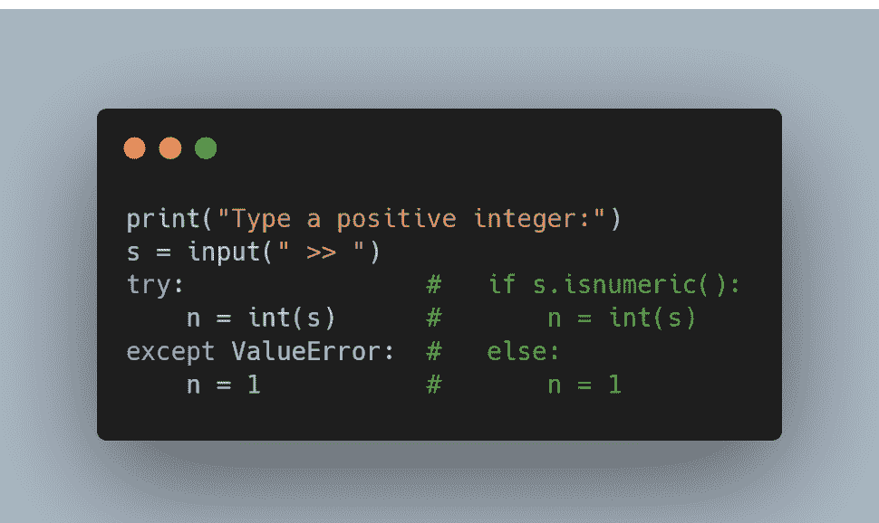

(原文文章缩略图，发布于 https://mathspp.com/blog/pydonts/eafp-and-lbyl-coding-styles。)

## EAFP与LBYL

“EAFP”是一个缩写，代表“Easier to Ask for Forgiveness than Permission”（获取宽恕比请求许可更容易），这种编码实践与“LBYL”（即“Look Before You Leap”，三思而后行）多少有些相反。

LBYL意味着你首先检查某个给定的操作是否能够成功执行，然后再进行它。例如，如果你想要求用户输入一个数字，其默认值为1，你可以使用以下代码

```python
print("Type a positive integer (defaults to 1):")
s = input(">> ")
if s.isnumeric():
    n = int(s)
else:
    n = 1
```

(在上面的代码中，我们使用方法 `str.isnumeric` 来检查字符串是否为有效的整数。尝试在你的Python REPL中运行 `print(str.isnumeric.__doc__)`。)

采用EAFP时，你首先尝试执行你想要进行的任何操作，然后使用一个 `try` 块来捕获操作可能失败时引发的异常。在我们的例子中，这意味着我们直接尝试将 `s` 转换为整数，如果引发 `ValueError` 异常，则设置默认值：

```python
print("Type a positive integer (defaults to 1):")
s = input(">> ")
try:
    n = int(s)
except ValueError:
    n = 1
```

我们使用 `except ValueError` 是因为当你尝试将一个不包含整数的字符串转换为整数时，引发的异常就是 `ValueError`：

```
>>> int("345")
345
>>> int("3.4")
Traceback (most recent call last):
  File "<stdin>", line 1, in <module>
ValueError: invalid literal for int() with base 10: '3.4'
>>> int("asdf")
Traceback (most recent call last):
  File "<stdin>", line 1, in <module>
ValueError: invalid literal for int() with base 10: 'asdf'
```

## 采用EAFP而非LBYL？

在许多情况下，编写遵循EAFP风格的代码是有利的，我将在此介绍这些情况。

### 避免冗余

有时，以EAFP思想编码可以避免代码中的冗余。想象一下，你有一个字典，你想从中提取一个与某个键相关联的值，但这个键可能不存在。

如果采用LBYL，你会这样做：

```python
d = {"a": 1, "b": 42}
print("What key do you want to access?")
key = input(" >> ")
if key in d:
    print(d[key])
else:
    print(f"Cannot find key '{key}'")
```

如果输入的键存在于字典中，这段代码会进行两次字典访问：第一次检查键是否存在，第二次获取其值。这有点像你打开一个盒子看看里面有没有东西，然后关上。接着，如果盒子不空，你再打开它，取出里面的东西。你在现实生活中会这样做吗？

使用EAFP，你可以打开盒子，如果发现里面有东西就立即倒空：

```python
d = {"a": 1, "b": 42}
print("What key do you want to access?")
key = input(" >> ")
try:
    print(d[key])
except KeyError:
    print(f"Cannot find key '{key}'")
```

还有一个你应该知道的方法也符合EAFP思维：dict.get！我描述的这个操作非常常见，以至于字典甚至内置了一个方法，在想要获取与键关联的值、而该键不存在时使用默认值，其行为就类似于EAFP：

```python
d = {"a": 1, "b": 42}
print("What key do you want to access?")
key = input(" >> ")
print(d.get(key, None))
```

尝试运行上面的代码，并输入字典 `d` 中不存在的键。注意在这些情况下会打印出 `None`。

### EAFP可能更快

如果失败预计不会经常发生，那么EAFP更快：你只需运行一段代码（你的操作），而不是两段（“检查”和“执行”）。

例如，让我们用 `timeit` 模块来测试上面示例图片中的代码，看看当输入可以转换为整数时，哪种方式更快：

```python
>>> import timeit
>>> eafp = """s = "345"
...     try:
...         n = int(s)
...     except ValueError:
...         n = 0"""
>>> timeit.timeit(eafp)
0.1687019999999393
```

这里我们直接将 `s` 定义为一个整数字符串，这样计时就不必考虑我输入一个整数所需的时间。此外，`timeit` 函数会运行代码很多次，而我不希望在控制台输入一百万个整数。

现在，与LBYL方法比较一下：

```python
>>> lbyl = """s = "345"
... if s.isnumeric():
...     n = int(s)
... else:
...     n = 0"""
>>> timeit.timeit(lbyl)
0.30682630000001154
```

LBYL方法花费的时间几乎是EAFP的两倍。如果能让操作失败的情况非常少，那么使用EAFP方法就能节省时间。

### LBYL仍然可能失败

当与环境交互时，例如与互联网或操作系统交互，在你进行安全检查和执行操作之间的时间内，情况可能发生变化，你的操作可能不再可行。

例如，想象你有一个读取一些文件的脚本。显然，你只能读取存在的文件，因此LBYL方法可能涉及编写如下代码：

```python
import pathlib

print("What file should I read?")
filepath = input(" >> ")
if pathlib.Path(filepath).exists():
    with open(filepath, "r") as f:
        contents = f.read()
    # 对内容做一些处理。
else:
    print("Woops, the file does not exist!")
```

如果你的脚本位于一台可以被多个用户访问的计算机上，或者有其他脚本在操作文件系统，你的 `if` 语句可能因为找到了文件而评估为True，但随后外部代理可能删除了文件，导致你的 `with` 语句失败，引发错误并中断你的代码。如果你正在编写关键代码，这种可能性必须考虑在内。或者，如果你在检查之后执行的代码需要很长时间运行。

如果你使用EAFP方法，代码要么读取文件，要么不读取，但两种情况都被覆盖了：

```python
print("What file should I read?")
filepath = input(" >> ")
try:
    with open(filepath, "r") as f:
        contents = f.read()
except FileNotFoundError:
    print("Woops, the file does not exist!")
else:
    # 对内容做一些处理。
    pass
```

上面 `try` 块中的 `else` 确保只有在能够成功读取文件时，才运行处理内容的代码。（我会为此写一篇Pydon't，别担心！）

### 捕获多种类型的失败

如果你正尝试执行一个可能以多种方式失败的复杂操作，那么直接列举可能引发的异常，可能比编写一个真正、真正长的 `if` 语句来提前执行所有必要的检查更容易。

例如，如果你想调用一个可能抛出几种不同异常的第三方函数，编写一个优雅的 `try` 块来覆盖所有可能出现的情况是相当简单的。

想象你有一个函数，它接受一个表示整数的字符串，然后返回其倒数，但编写它的人没有进行任何检查：只是假设字符串代表一个整数，用 `int` 转换它，然后用1除以该整数：

```python
def get_inverse(num_str):
    return 1 / int(num_str)
```

你想在获取用户输入后使用该函数，但你注意到用户可能输入的不是整数，或者用户可能输入0，这会导致 `ZeroDivisionError`。使用EAFP方法，你可以这样写：

```python
print("Type an integer:")
s = input(" >> ")
try:
    print(get_inverse(s))
except ValueError:
    print("I asked for an integer!")
except ZeroDivisionError:
    print("0 has no inverse!")
```

你会用LBYL怎么做？也许

```python
print("Type an integer:")
s = input(" >> ")
if s.isnumeric() and s != "0":
    print(get_inverse(s))
elif not s.isnumeric():
    print("I asked for an integer!")
```

else:
    print("0 has no inverse!")

但你现在是两次使用 `isnumeric` 函数。而且 `isnumeric` 甚至对负整数都不起作用。如果用户输入类似 " 3" 的内容怎么办？`isnumeric` 会失败，但这仍然是一个 `int` 能够转换的整数！又或者如果用户输入 "000" 呢？这仍然会被解析为 0……希望你现在明白我的意思了。

## 结论

EAFP 代码是 LBYL 代码一个非常好的替代方案，在某些情况下甚至更优，比如我上面提到的几种情况。编写代码时，试着权衡几种不同方法的优缺点，别忘了考虑使用 EAFP 代码！

EAFP 并非在*每一种情况*下都是绝对最佳的方式，但 EAFP 代码可以具有很高的可读性和性能！

## 参考资料

- PEP 463 – 异常捕获表达式，https://www.python.org/dev/peps/pep-0463/
- Python 3 文档，Python 标准库，调试与分析，timeit，https://docs.python.org/3/library/timeit.html。
- Python 3 文档，Python 教程，错误与异常，https://docs.python.org/3/tutorial/errors.html。
- Microsoft 开发博客，地道的 Python：EAFP 对比 LBYL，https://devblogs.microsoft.com/python/idiomatic-python-eafp-versus-lbyl/。
- Stack Overflow，"Python 中的 EAFP 原则是什么？"，https://stackoverflow.com/questions/11360858/what-is-the-eafp-principle-in-python。
- Stack Overflow，"请求原谅而非许可——解释一下"，https://stackoverflow.com/questions/11360858/what-is-the-eafp-principle-in-python。

在线资料查阅于 2021 年 1 月 19 日。

# Zip 组合

```python
>>> firsts = ["Anna", "Bob", "Charles"]
>>> lasts = ["Smith", "Doe", "Evans"]
>>> for first, last in zip(firsts, lasts):
...     print(f"'{first} {last}'")
...
'Anna Smith'
'Bob Doe'
'Charles Evans'
```

> （原文缩略图见 https://mathspp.com/blog/pydonts/zip-up。）

## 引言

与其它编程语言相比，Python 最让我欣赏的一点是它的 for 循环。Python 允许你编写表达力非常强的循环，部分原因就在于内置的 `zip` 函数。

在本文中，你将

- 了解 `zip` 的功能；
- 认识一个即将在 Python 3.10 中推出的 `zip` 新特性；
- 学习如何使用 `zip` 创建字典；
- 以及看到一些不错的 `zip` 使用示例。

## Zip 的工作原理

在一个简单的 for 循环中，你通常有一个迭代器 `it`，然后写类似这样的代码：

```python
for elem in it:
    # 对 elem 进行一些操作
    print(elem)
```

“迭代器”是可以线性遍历的东西，其中列表是最简单的例子。Python for 循环中另一个非常常用的迭代器是 `range`：

```python
for n in range(10):
    print(n**2)
```

有时你会有两个或更多包含相关信息的迭代器，你需要遍历这些迭代器来处理获得的不同信息片段。

在下面的例子中，我们有一个包含人们名字和姓氏的列表，我们想要打印全名。朴素的解决方案是使用 `range` 遍历所有索引，然后对列表进行索引访问：

```python
>>> firsts = ["Anna", "Bob", "Charles"]
>>> lasts = ["Smith", "Doe", "Evans"]
>>> for i in range(len(firsts)):
...     print(f"'{firsts[i]} {lasts[i]}'")
...
'Anna Smith'
'Bob Doe'
'Charles Evans'
```

这确实能完成任务，但这样的 for 循环只暗示了你可能会访问 `firsts` 中的值，因为你写了：

`range(len(firsts))`

但结果是你还想访问 `lasts` 中的元素。这就是 `zip` 的用途：你用它来同时配对你想要遍历的可迭代对象：

```python
>>> firsts = ["Anna", "Bob", "Charles"]
>>> lasts = ["Smith", "Doe", "Evans"]
>>> for first, last in zip(firsts, lasts):
...     print(f"'{first} {last}'")
...
'Anna Smith'
'Bob Doe'
'Charles Evans'
```

注意，你可以在 for 循环中指定两个迭代变量，在我们的例子中是 `first` 和 `last`，每个变量将依次取各自迭代器的后续值。

这是解包赋值的一种特殊情况，因为 `zip` 实际上生成的是包含这些名字的元组：

```python
>>> firsts = ["Anna", "Bob", "Charles"]
>>> lasts = ["Smith", "Doe", "Evans"]
>>> for z in zip(firsts, lasts):
...     print(z)
...
('Anna', 'Smith')
('Bob', 'Doe')
('Charles', 'Evans')
```

我们做的是获取那个元组并分配每个部分：

```python
>>> firsts = ["Anna", "Bob", "Charles"]
>>> lasts = ["Smith", "Doe", "Evans"]
>>> for z in zip(firsts, lasts):
...     first, last = z
...     print(f'{first} {last}')
...
'Anna Smith'
'Bob Doe'
'Charles Evans'
```

但是，我们不在中间步骤停留，而是直接在 for 语句中解包。这种解包，结合良好的变量命名，使得循环可以像普通英语一样被阅读。

例如，之前的循环是：

```python
for first, last in zip(firsts, lasts):
```

它可以被读作：

> “对于列表 `firsts` 和 `lasts` 中的每个 `first`（名）和 `last`（姓）……”

## Zip 是惰性的

需要注意的一点是，`zip` 不会立即创建元组。`zip` 是惰性的，这意味着它只有在你请求时才会计算元组，例如当你在 for 循环中遍历它们时（如上面的例子）或者当你将 `zip` 对象转换为列表时：

```python
>>> firsts = ["Anna", "Bob", "Charles"]
>>> lasts = ["Smith", "Doe", "Evans", "Rivers"]
>>> z = zip(firsts, lasts)
>>> z
<zip object at 0x0000019F56702680>
>>> list(z)
[('Anna', 'Smith'), ('Bob', 'Doe'), ('Charles', 'Evans')]
```

`zip` 的惰性也意味着 `zip` 本身并不*那么*像一个列表。例如，你无法询问一个 `zip` 对象的长度是多少：

```python
>>> len(z)
Traceback (most recent call last):
  File "<stdin>", line 1, in <module>
TypeError: object of type 'zip' has no len()
```

## 三者成众

我们已经看过了有两个参数的 `zip`，但 `zip` 可以接受任意数量的迭代器，并将生成相应大小的元组：

```python
>>> firsts = ["Anna", "Bob", "Charles"]
>>> middles = ["Z.", "A.", "G."]
>>> lasts = ["Smith", "Doe", "Evans"]
>>> for z in zip(firsts, middles, lasts):
...     print(z)
...
('Anna', 'Z.', 'Smith')
('Bob', 'A.', 'Doe')
('Charles', 'G.', 'Evans')
```

```python
>>> prefixes = ["Dr.", "Mr.", "Sir"]
>>> for z in zip(prefixes, firsts, middles, lasts):
...     print(z)
...
('Dr.', 'Anna', 'Z.', 'Smith')
('Mr.', 'Bob', 'A.', 'Doe')
('Sir', 'Charles', 'G.', 'Evans')
```

## 长度不匹配

`zip` *总是*会返回一个元组，其元素个数与它接收到的参数个数相同。那么，如果其中一个迭代器比其他迭代器短会发生什么？

如果 `zip` 的参数长度不相等，那么 `zip` 会继续运行直到耗尽其中一个迭代器。一旦有一个迭代器结束，`zip` 就会停止生成元组：

```python
>>> firsts = ["Anna", "Bob", "Charles"]
>>> lasts = ["Smith", "Doe", "Evans", "Rivers"]
>>> for z in zip(firsts, lasts):
...     print(z)
...
('Anna', 'Smith')
('Bob', 'Doe')
('Charles', 'Evans')
```

从 Python 3.10 开始，`zip` 将能够接收一个名为 `strict` 的关键字参数，你可以用它来告诉 `zip`，如果迭代器的长度不匹配就报错：

```python
>>> firsts = ["Anna", "Bob", "Charles"]
>>> lasts = ["Smith", "Doe", "Evans", "Rivers"]
>>> # strict=True 在 Python >= 3.10 中可用
>>> for z in zip(firsts, lasts, strict=True):
...     print(z)
...
('Anna', 'Smith')
('Bob', 'Doe')
('Charles', 'Evans')
Traceback (most recent call last):
  File "<stdin>", line 1, in <module>
ValueError: zip() argument 2 is longer than argument 1
```

注意，`zip` 只有在*发现*长度不匹配时才会报错，它不会在开头就做检查：这是因为 `zip` 的参数本身也可能是惰性迭代器。

> （惰性）迭代器将在后续的 Pydon'ts 文章中介绍，所以请务必[订阅](https://mathspp.com/subscribe) Pydon't 新闻通讯以获取最新消息！

通常，`zip` 与*预期*长度相同的迭代器一起使用。如果确实是这种情况——如果你预期你的迭代器长度相同——那么最好始终设置 `strict=True`，因为这将帮助你捕获代码中的错误。

## 用 `zip` 创建字典

你可以通过向 `dict` 函数提供键值对来在 Python 中创建字典，这意味着 `zip` 是当你在一个迭代器中有所有键，在另一个迭代器中有所有值时，创建字典的主要方式：

```python
>>> firsts = ["Anna", "Bob", "Charles"]
>>> lasts = ["Smith", "Doe", "Evans"]
>>> dict(zip(firsts, lasts))
{'Anna': 'Smith', 'Bob': 'Doe', 'Charles': 'Evans'}
```

## 代码示例

现在你将在实际的 Python 代码中看到一些 `zip` 的用法。

# 贪吃蛇游戏

我的一个朋友正在学习Python，他开始制作一个贪吃蛇游戏的复刻版。在游戏中的某个地方，他有一个菜单，希望显示可以游玩的“地图”的缩略图，而这些图像存储在一个名为`lvlpictures`的列表中。同时，他还有另一个名为`self.buttons`的列表，其中存放着这些图像应该放置的位置。为了在正确的位置显示缩略图，他需要调用一个名为`blit`的函数，该函数期望接收图像和图像应放置的位置。

以下是他了解`zip`之前和之后所写的循环：

```python
# 之前：
for i in range(len(lvlpictures)):
    self.surface.blit(lvlpictures[i], (self.buttons[i][0]+2,self.buttons[i][1]+2))

# 后来他学到了`zip`：
for pic, btn in zip(lvlpictures, self.buttons):
    self.surface.blit(pic, (btn[0] + 2, btn[1] + 2))
```

请注意，使用`zip`使你的代码更短，也更清晰地表达了将图像和按钮一起处理的意图。最后，当Python 3.10发布时，他甚至可能添加`strict=True`关键字参数，因为他期望`lvlpictures`和`self.buttons`的长度相同。

# 路径匹配

如果你还不知道，那么你可能会有兴趣了解Python有一个名为`pathlib`的模块，它提供了处理文件系统路径的工具。

当你创建一个路径后，可以检查它是否匹配给定的模式：

```python
>>> from pathlib import PurePath
>>> PurePath('a/b.py').match('*.py')
True
>>> PurePath('/a/b/c.py').match('b/*.py')
True
>>> PurePath('/a/b/c.py').match('a/*.py')
False
```

如果你看看这个`match`函数，你会发现：

```python
class PurePath(object):
    # ...

    def match(self, path_pattern):
        """
        Return True if this path matches the given pattern.
        """
        # 为简洁起见，代码省略
        for part, pat in zip(reversed(parts), reversed(pat_parts)):
            if not fnmatch.fnmatchcase(part, pat):
                return False
        return True
```

省略的代码进行了一些检查，使函数能立即判断没有匹配项。我展示给你的这个`for`循环利用`zip`将路径的每个部分与模式的每个部分配对，然后我们使用`fnmatch.fnmatchcase`检查它们是否匹配。

试着在这里添加几条打印语句：

```python
class PurePath(object):
    # ...

    def match(self, path_pattern):
        """
        Return True if this path matches the given pattern.
        """
        # 为简洁起见，代码省略

        print(parts)        # 手动添加以检查发生了什么。
        print(pat_parts)    # 同上。
        for part, pat in zip(reversed(parts), reversed(pat_parts)):
            if not fnmatch.fnmatchcase(part, pat):
                return False
        return True
```

然后重新运行文档中的示例：

```python
>>> from pathlib import PurePath
>>> PurePath('a/b.py').match('*.py')
['a', 'b.py']   # parts
['*.py']        # pat_parts
True
>>> PurePath('/a/b/c.py').match('b/*.py')
['\\', 'a', 'b', 'c.py']
['b', '*.py']
True
>>> PurePath('/a/b/c.py').match('a/*.py')
['\\', 'a', 'b', 'c.py']
['a', '*.py']
False
```

现在应该更清楚`parts`和`pat_parts`实际做了什么，也应该更清楚为什么我们将它们`zip`在一起。

这是一个很好的例子，说明了在某些情况下使用`strict=True`毫无意义，因为路径和模式的部分数量可能不同，而这完全没有问题。

# 写入CSV文件

Python标准库附带了一个模块`csv`，用于读写CSV文件。除此之外，它还提供了`DictReader`和`DictWriter`类，供你使用CSV文件的标题行来将数据行读取为字典，或者在你有字典格式的数据行时使用。

以下是一个如何将几个字典写入CSV文件的示例：

```python
import csv

with open('names.csv', 'w', newline='') as csvfile:
    fieldnames = ['first_name', 'last_name']
    writer = csv.DictWriter(csvfile, fieldnames=fieldnames)

    writer.writeheader()
    writer.writerow({'first_name': 'Baked', 'last_name': 'Beans'})
    writer.writerow({'first_name': 'Lovely', 'last_name': 'Spam'})
    writer.writerow({'first_name': 'Wonderful', 'last_name': 'Spam'})
```

`fieldnames`变量将建立CSV文件的标题行，然后`writerow`方法使用它来知道字典中的值应以何种顺序写入文件。

`writeheader`函数是写入CSV文件标题行的函数，它看起来像这样：

```python
class DictWriter:
    # ...

    def writeheader(self):
        header = dict(zip(self.fieldnames, self.fieldnames))
        return self.writerow(header)
```

基本上，这个函数所做的就是使用`zip`将标题名称转换为一个键和值相同的字典，假装标题只是一个普通的数据行：

```python
>>> fieldnames = ['first_name', 'last_name']
>>> dict(zip(fieldnames, fieldnames))
{'first_name': 'first_name', 'last_name': 'last_name'}
```

因此，`writeheader`函数只需要创建这个字典，然后就可以将实际的写入操作委托给`writerow`函数。

## 结论

以下是本文的主要收获，为你奉上：

> “只要你需要同时遍历两个或多个可迭代对象，`zip`就是你的好朋友。”

这个Pydon't向你展示：

- `zip`可以用于同时遍历多个可迭代对象；
- `zip`本身返回一个`zip`对象，你必须对其进行迭代，或者如果你想得到它产生的元组，则需要显式转换为列表；
- 如果传递给`zip`的参数长度不均等，`zip`会在其中一个迭代器耗尽时立即停止；
- 从Python 3.10开始，你可以使用关键字参数`strict=True`来告诉`zip`，如果传递给它的参数长度不同则报错；以及
- `zip`可以提供一种创建字典的非常简单的方法。

## 参考文献

- Python 3文档，Python标准库，`zip`，docs.python.org/3/library/functions.html#zip [最后访问于 2021-03-30]；
- Python 3.10文档，Python标准库，`zip`，docs.python.org/3.10/library/functions.html#zip [最后访问于 2021-03-30]；
- Python 3文档，Python标准库，`csv`，docs.python.org/3/library/csv.html [最后访问于 2021-03-30]；
- Python 3文档，Python标准库，`pathlib`，docs.python.org/3/library/pathlib.html [最后访问于 2021-03-30]。

# 给我枚举一下

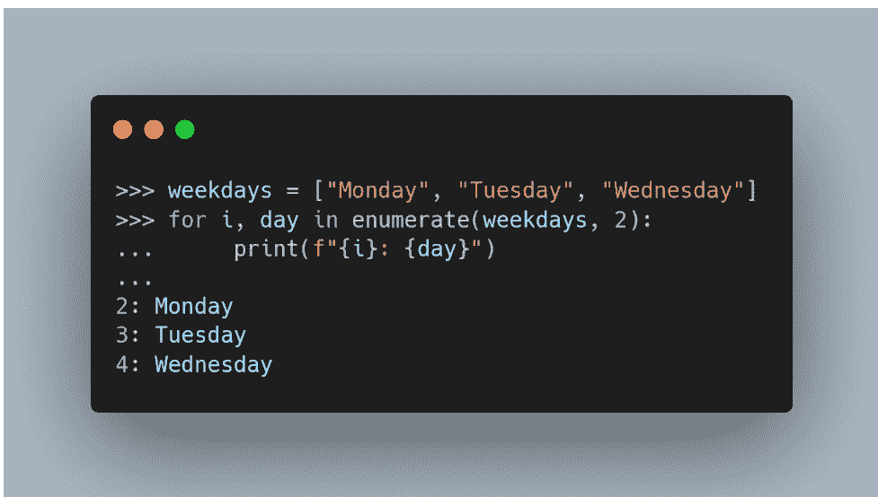

## 引言

延续上周关于[zip的Pydon't](https://mathspp.com/blog/pydonts/zip-me)，今天我们来谈谈`enumerate`。

与其他编程语言相比，我最欣赏Python的一点就是它的`for`循环。Python允许你编写非常富有表现力的循环，而其中一些表现力就来自于内置的`enumerate`函数。

在本文中，你将

- 了解`enumerate`的作用；
- 查看其被低估的可选参数`start`；
- 学习`enumerate`的几个巧妙用例；
- 查看一些使用`enumerate`的优秀代码示例。

# enumerate的工作原理

Python新手通常很早就接触到这种类型的`for`循环：

```python
>>> for i in range(3):
...     print(i)
...
0
1
2
```

这导致他们“学会”了这种用于遍历（例如）列表的`for`循环反模式：

```python
>>> words = ["Hey", "there"]
>>> for i in range(len(words)):
...     print(f"'<{words[i]}> has {len(words[i])} letters.'")
...
'<Hey> has 3 letters.'
'<there> has 5 letters.'
```

更Python风格的方式是直接遍历列表：

```python
>>> words = ["Hey", "there"]
>>> for word in words:
...     print(f"'<{word}> has {len(word)} letters.'")
...
'<Hey> has 3 letters.'
'<there> has 5 letters.'
```

然而，在索引与元素的对决中，最后一步是你既需要知道每个元素的索引，又需要同时访问该元素。天真的方法是遍历长度范围，然后通过索引获取元素：

```python
for i in range(len(words)):
    word = words[i]
    # ...
```

或者，如果你读过我关于`zip`的Pydon't并且富有想象力，你也可以这样做：

```python
for i, word in zip(range(len(words)), words):
    # ...
```

但更Python风格的方式是使用内置的`enumerate`：

```python
>>> words = ["Hey", "there"]
>>> for i, word in enumerate(words):
...     print(f"'Word #{i}: <{word}> has {len(word)} letters.'")
```

## 可选起始参数

`enumerate` 函数也可以接受一个可选参数，用于指定返回的第一个索引。例如，如果我们像上面的示例一样在计算单词，可能希望从 1 开始计数：

```
>>> words = ["Hey", "there"]
>>> for i, word in enumerate(words, 1):
...     print(f"'Word #{i}: <{word}> has {len(word)} letters.'")
...
'Word #1: <Hey> has 3 letters.'
'Word #2: <there> has 5 letters.'
```

这个可选参数非常有用，因为它能让你省去手动偏移索引的麻烦。
顺便提一下，该参数必须是整数，但可以是负数：

```
>>> for i, v in enumerate("abc", start=-3243):
...     print(i)
...
-3243
-3242
-3241
```

你能想出一种*合理*的情况，在其中使用 `enumerate` 并将负整数作为可选参数是有意义的吗？如果你想到了不错的想法，请在下面评论！

## 迭代时解包

`enumerate` 函数产生一个惰性生成器，这意味着你迭代的元素只有在你需要时才会变得可用。这可以防止当在大型参数（比如一个非常长的列表）上使用 `enumerate` 时，Python 消耗*大量*内存。

> `enumerate` 的这种惰性是 Python 中的常见特性，例如 `range` 和 `zip` 也是惰性的。务必订阅新闻通讯，这样你就不会错过我介绍这些概念的 Pydon'ts。

`enumerate` 返回的元素是 2 项元组，其中第一个元素是索引，第二个元素是值：

```
>>> for tup in enumerate("abc"):
...     print(tup)
...
(0, 'a')
(1, 'b')
(2, 'c')
```

我们通常做的是在循环语句中直接解包该元组，像这样：

```python
for i, letter in enumerate("abc"):
    # 根据需要使用 i 和 letter
```

这大致等同于：

```python
for tup in enumerate("abc"):
    i, letter = tup
    # 根据需要使用 i 和 letter
```

### 深度解包

当你在 `zip` 上使用 `enumerate` 时，事情可以变得更有趣：

```python
>>> # 书中每章开始的页码和书的最后一页。
>>> pages = [5, 17, 31, 50]
>>> for i, (start, end) in enumerate(zip(pages, pages[1:]), start=1):
...     print(f"'{i}: {end-start} pages long.'")
...
'1: 12 pages long.'
'2: 14 pages long.'
'3: 19 pages long.'
```

（这里我显式地在 `enumerate` 中命名了 `start=` 参数，以便在视觉上更容易将其与 `zip` 的参数区分开来。）

这个代码片段接收一个书籍每章开始的页码列表，并打印每章的长度。注意 `enumerate` 如何返回带有索引和值的元组，而这些值是从 `zip` 中提取的，`zip` 本身也返回元组：

```python
>>> # 书中每章开始的页码和书的最后一页。
>>> pages = [5, 17, 31, 50]
>>> for tup in enumerate(zip(pages, pages[1:]), start=1):
...     print(tup)
...
(1, (5, 17))
(2, (17, 31))
(3, (31, 50))
```

我们所做的就是使用深度解包来直接访问所有这些值：

```python
>>> # 书中每章开始的页码和书的最后一页。
>>> pages = [5, 17, 31, 50]
>>> for tup in enumerate(zip(pages, pages[1:]), start=1):
...     i, (start, end) = tup
...     print(f"'{i}: {end-start} pages long.'")
...
'1: 12 pages long.'
'2: 14 pages long.'
'3: 19 pages long.'
```

> 如果你不知道什么是深度解包或它如何工作，请去看一下我关于解包的 Pydon't。

## 代码中的示例

现在你将看到一些在*真实* Python 代码中使用 `enumerate` 的例子。

### 基本用法

我查看了 Python 标准库，大体上 `enumerate` 最常见的用法就是基本的 `enumerate(iter)` 来同时访问可迭代对象的值和索引。让我与你分享一个教科书式的例子：

`doctest` 模块允许你在函数、类等的文档字符串中为代码编写简单的测试。编写这些测试的方式是模仿 REPL 中的交互式会话。然后，`doctest` 会定位你文档字符串中的那些“交互式会话”并执行它们，看看代码的实际输出是否与你的文档字符串显示的相符。

如果你打开 Python REPL，你会看到它以提示符 `>>>` 开始，三个大于号后面有一个空格。你*不能*删除那个空格，它是提示符的一部分。当解析文档字符串以提取实际测试时，解析器会检查提示符是否有那个前导空格，以下是执行此操作的代码：

```python
# 摘自 Python 3.9 的 Lib\doctest.py
class DocTestParser:
    # ...

    def _check_prompt_blank(self, lines, indent, name, lineno):
        """
        给定源字符串的行（包括提示符和前导缩进），
        检查确保每个提示符后都跟着一个空格字符。
        如果任何行后面没有空格字符，则引发 ValueError。
        """
        for i, line in enumerate(lines):
            if len(line) >= indent+4 and line[indent+3] != ' ':
                raise ValueError('line %r of the docstring for %s '
                                 'lacks blank after %s: %r' %
                                 (lineno+i+1, name,
                                  line[indent:indent+3], line))
```

注意顶部的 for 循环如何使用 `enumerate` 来遍历交互式示例的行。如果在循环中，我们遇到一行在 `>>>` 之后没有额外的空格，那么我们会引发一个 ValueError，其中使用 `i` 来计算发生错误的实际行号，即倒数第二行中的 `lineno+i+1` 部分。

想看看这个的实际效果吗？试试运行这个短脚本：

```python
def sum_nats(n):
    """计算前 n 个自然数的和。

    >>> sum_nats(1)
    1
    >>> sum_nats(10)
    55
    >>> sum_nats(100)
    5050
    """

    return int(n*(n+1)/2)

if __name__ == "__main__":
    import doctest
    doctest.testmod()
```

注意我故意在第三个示例中没有在 `>>>` 和 `sum_nats(100)` 之间留空格。运行这个脚本应该会给你抛出一个 ValueError，当你在那里放一个空格后，错误应该就会消失。

### 使用可选参数

#### 文档字符串测试中的行号

如果你仔细看了，也许注意到上一个示例中的 `enumerate` 用法实际上使用了 `enumerate` 的可选参数！

再看一下代码：

```python
# 摘自 Python 3.9 的 Lib\doctest.py
class DocTestParser:
    # ...

    def _check_prompt_blank(self, lines, indent, name, lineno):
        # 省略了文档字符串。
        for i, line in enumerate(lines):
            if len(line) >= indent+4 and line[indent+3] != ' ':
                raise ValueError('line %r of the docstring for %s '
                    'lacks blank after %s: %r' %
                    (lineno+i+1, name,
                     line[indent:indent+3], line)))
```

注意在最后的字符串格式化中，我们计算 `lineno+i+1` 是为了用正确的行号引发错误消息，该行号对应于有缺陷的提示符... 但这与重写循环以使用 `start=` 参数是相同的：

```python
class DocTestParser:
    def _check_prompt_blank(self, lines, indent, name, lineno):
        # 省略了文档字符串。
        for line_n, line in enumerate(lines, start=lineno+1):
            if len(line) >= indent+4 and line[indent+3] != ' ':
                raise ValueError('line %r of the docstring for %s '
                                 'lacks blank after %s: %r' %
                                 (line_n, name,
                                  line[indent:indent+3], line))
```

#### 计算一周的天数

虽然不如基本的 `enumerate(iter)` 用法常见，但也有不少地方利用可选参数来避免计算不必要的偏移量。

我在 `calendar` 模块中的 `calendar.Calendar.itermonthdays2` 函数里发现了一个有趣的用法。`calendar.Calendar.itermonthdays2` 函数执行以下操作：- 你给它一个年份和一个月份，例如 2021 和 4（代表四月）；然后 - 它返回一个生成器，其中包含该月的日期与星期几（0 到 6）配对。（有一个小提示是，该迭代器返回完整周的序列，因此可能在开始和/或结束处填充结果。）

这里有一个示例：

```
>>> for arg in c.Calendar().itermonthdays2(2021, 4):
...     print(arg)
...
(0, 0)
(0, 1)
(0, 2)
(1, 3)
(2, 4)
(3, 5)
(4, 6)
(5, 0)
(6, 1)
(7, 2)
... 为简洁起见省略
(28, 2)
(29, 3)
(30, 4)
(0, 5)
(0, 6)
```

左边的数字表示该月的日期，右边的数字表示星期几，其中 0 代表星期一，直到 6 代表星期日。2021年4月6日（我写这篇文章的那天）是星期二，在上面的输出中由 `(6, 1)` 编码。

以下是实现 `itermonthdays2` 的代码：## 来自 Python 3.9 中的 Lib\calendar.py

```python
class Calendar(object):
    # ...
    def itermonthdays2(self, year, month):
        """
        Like itermonthdates(), but will yield (day number, weekday number)
        tuples. For days outside the specified month the day number is 0.
        """
        for i, d in enumerate(self.itermonthdays(year, month), self.firstweekday):
            yield d, i % 7
```

该函数在很大程度上依赖于 `itermonthdays(year, month)` 函数，后者仅返回一个包含该月日期的序列，其前后会用零填充，以确保序列表示的是该月所跨越的完整周。

例如，请看我2021年4月的桌面日历：


如果我让 `Calendar` 类像我的桌面日历一样从周日（第6天）开始计算一周，那么 `itermonthdays` 函数的输出如下：

```
>>> for d in c.Calendar(6).itermonthdays(2021, 4):
...     print(d)
...
0
0
0
0
1
2
3
4
## ... 出于篇幅考虑已截断
30
0
```

前四个0是出现在顶部一周的四个三月份日期，最后的0则对应于我日历右下角显示的5月1日。

为了返回这些日期及其各自是星期几，`enumerate` 被传入了一个 `start=` 参数，该参数即为 `self.firstweekday`，以此将月份中的日期与 `Calendar` 所认定的一周第一天同步。

## 筛选索引

我在探索 Python 标准库时发现 `enumerate` 的一个非常巧妙的用法，就是筛选列表以查找满足特定谓词的元素索引。

例如，假设你有一个整数列表和一个能判断数字是否为奇数的函数：

```
>>> nums = [4071, 53901, 96045, 84886, 5228, 20108, 42468, 89385, 22040, 18800, 4071]
>>> odd = lambda x: x%2
```

你需要编写什么代码来找出奇数的*索引*呢？请注意，通常使用 `nums.index` 的解决方案是行不通的，因为列表可能包含重复项（参见上文的 `nums[0]` 和 `nums[-1]`）。

我在该库的一个辅助文件中（引用原话）“OS X 共享支持函数。”发现了一个非常优雅的解决方案：

```
>>> [i for i, n in enumerate(nums) if odd(n)]
[0, 1, 2, 7, 10]
```

当然，我所说的文件（`Lib\_osx_support.py`）本身并没有这段代码，但它包含了我刚才展示的模式。那里的实际代码如下：

```python
## 来自 Python 3.9 中的 Lib\_osx_support.py
def compiler_fixup(compiler_so, cc_args):
    # ...
    indices = [i for i,x in enumerate(compiler_so) if x.startswith('-isysroot')]
    # ...
```

虽然我从语义上*完全*不清楚这段代码在做什么，但我们可以清楚地看到 `indices` 正在收集 `compiler_so` 中以“`-isysroot`”开头的元素的索引。

## 最大化利用元组

我发现的另一个关于 `enumerate` 函数的有趣用法是直接创建字典。例如，如果我们查看 `mailbox` 模块，可以发现一行代码正在将目录构建为字典，其中键是由 `enumerate` 给出的整数，值是由 `zip` 构建的元组：

```python
## 来自 Python 3.9 中的 Lib\mailbox.py
class mbox(_mboxMMDF):
    # ...
    def _generate_toc(self):
        """Generate key-to-(start, stop) table of contents."""
        starts, stops = [], []
        last_was_empty = False
        self._file.seek(0)
        while True:
            # 处理 self._file
            self._toc = dict(enumerate(zip(starts, stops)))
        # ...
```

注意代码如何初始化空列表 starts 和 stops，它们随后在被我删除的 while 循环中被填充（因为该循环相当长，会分散我们对主要内容的注意力）：即这行代码

```python
self._toc = dict(enumerate(zip(starts, stops)))
```

因为 `enumerate` 返回的是2项元组，`dict` 可以接收这样的结构并构建一个字典。奇怪的是，我们实际上希望 starts 和 stops 被成对组合，所以我们最终是对一个 `zip` 结果调用 `enumerate`，最终结果可能如下所示：

```
>>> starts = [1, 10, 21, 30]
>>> stops = [9, 15, 28, 52]
>>> dict(enumerate(zip(starts, stops)))
{0: (1, 9), 1: (10, 15), 2: (21, 28), 3: (30, 52)}
```

## 结论

以下是本文的要点，供您参考：

> “如果你需要遍历一个迭代器来处理其数据，同时还需要访问其索引信息，那么 `enumerate` 就是你最好的朋友。”

这篇 Pydon't 向你展示了：

-   `enumerate` 让你同时访问可迭代对象的元素和索引；
-   `enumerate` 本身返回的是一个惰性的 `enumerate` 对象，你必须对其进行迭代，或者如果希望获得其值，则需要显式地将其转换为列表（或其他适合你需求的结构）；
-   `enumerate` 接受第二个参数来设置索引的偏移量；
    -   而且，这个参数可以是一个负整数；
-   `enumerate` 的结果可以直接传给 `dict` 来创建一个以索引为键的字典；
-   使用 `enumerate`，我们可以得到一个很好的习惯用法，用于查找指向满足给定条件元素的可迭代对象的索引；并且
-   将 `zip`、`enumerate` 和深度解包结合起来，允许你优雅地遍历多个可迭代对象。

## 参考文献

-   Python 3 Documentation, The Python Standard Library, enumerate, [docs.python.org/3/library/functions.html#enumerate](docs.python.org/3/library/functions.html#enumerate) [最后访问于 2021-04-06];
-   Python 3 Documentation, The Python Standard Library, calendar.Calendar, [docs.python.org/3/library/calendar.html#calendar.Calendar](docs.python.org/3/library/calendar.html#calendar.Calendar) [最后访问于 2021-04-06].
-   Python 3 Documentation, The Python Standard Library, doctest, [docs.python.org/3/library/doctest.html](docs.python.org/3/library/doctest.html) [最后访问于 2021-04-06].
-   Python 3 Documentation, The Python Standard Library, mailbox, [docs.python.org/3/library/mailbox.html](docs.python.org/3/library/mailbox.html) [最后访问于 2021-04-06].

## str 和 repr

```python
class SomeClass:
    def __str__(self):
        # ..?

    def __repr__(self):
        # ..?
```

（原文缩略图见 https://mathspp.com/blog/pydonts/str-and-repr。）

## str 和 repr

Python 提供了两个内置机制，允许你将对象转换为字符串，以便查看和打印。我指的是 `str` 类和内置的 `repr` 函数。

人们常常对这两个内置函数的区别感到困惑，但其实区别简单明了。当你想将某个东西转换为字符串类型，或者需要对象的可读表示时，使用 `str` 类。另一方面，`repr` 函数用于创建其参数的*明确无歧义*的表示。

最终用户通常使用 `str`，因为他们想要打印可读且美观的文本；而开发人员可能会使用 `repr`，因为他们需要调试代码，并且需要确保自己知道所看到的是什么。例如，请看以下交互式会话：

```
>>> print(3)
3
>>> print("3")
3
>>> 3
3
>>> "3"
'3'
```

`print` 函数对其参数调用 `str` 然后显示它，因此整数 3 和字符串 "3" 都以相同方式打印：你无法分辨原始对象是整数还是字符串。之后，你会看到，直接在 REPL 中写入整数 3 和字符串 "3" 会返回对象的一个明确表示：你可以区分整数和字符串，因为 REPL 在底层使用 `repr` 来显示对象。当你的对象位于容器（如列表或字典）中时，也会使用 `repr`，因为容器通常将其 `str` 行为委托给 `repr`，你可以在 [PEP 3149](https://www.python.org/dev/peps/pep-3149/) 以及下面的会话中看到这一点：

```
>>> [3, "3"]
[3, '3']
>>> print([3, "3"])
[3, '3']
>>> str([3, "3"]) == repr([3, "3"])
True
```

## `__str__` 和 `__repr__` 双下方法

当你在 Python 中定义自己的类时，你可能会希望指定你的对象在打印时应该是什么样子，因为 Python 的默认行为并不是很有帮助：

```
>>> class A:
...     pass
...
>>> a = A()
>>> print(a)
<__main__.A object at 0x012DF640>
```如果您想正确展示您的对象，就需要实现 `__str__` 和 `__repr__` 这两个魔术方法（魔术方法指双下划线方法）。它们的实现应当遵循上述 `str` 和 `repr` 的用例：`__str__` 的实现应提供一个友好、可读的对象表示，而 `__repr__` 的表示则应无歧义，最好能提供一个可用于重建该对象的表达式。

> 如果您还不熟悉Python的魔术方法，可以考虑[订阅](https://mathspp.com/newsletter) Pydon't 通讯，我之后会写更多相关内容。目前，您可以先看看 [Python 3 文档](https://docs.python.org/3/reference/datamodel.html) 中关于数据模型的说明。

在实现自定义类时，我建议您从实现 `__repr__` 开始，因为如果没有提供自定义的 `__str__` 实现，它将默认调用 `__repr__`。但如果只实现了 `__str__`，您的对象表示方式可能仍然不够有用。

如果您只实现了 `__str__`：

```python
>>> class A:
...     def __str__(self):
...         return "A"
...
>>> a = A()
>>> a
<__main__.A object at 0x01600760>
>>> print(a)
A
```

如果您只实现了 `__repr__`：

```python
>>> class A:
...     def __repr__(self):
...         return "A"
...
>>> a = A()
>>> a
A
>>> print(a)
A
```

## 代码示例

### datetime

Python 的 `datetime` 模块提供了操作日期和时间的类。一个简单的日期可以这样创建：

```python
>>> import datetime
>>> date = datetime.datetime(2021, 2, 2)
```

现在我们有了一个 `datetime.datetime` 类型的日期对象，可以查看它的 repr 表示并与 str 版本进行比较：

```python
>>> print(repr(date))
datetime.datetime(2021, 2, 2, 0, 0)
>>> print(str(date))
2021-02-02 00:00:00
```

我们可以看到 `repr(date)` 可以用来创建完全相同的对象：

```python
>>> date == datetime.datetime(2021, 2, 2, 0, 0)
True
>>> date == eval(repr(date))
True
```

而 `str(date)` 则创建了一个该日期的好看表示。请注意，仅从其 str 中，我们甚至无法得知这是一个 `datetime.datetime` 对象。

### 2D 点

`__str__` 和 `__repr__` 这两个魔术方法的一个自定义用例示例，可能出现在您实现一个表示二维点的简单类时，例如，因为您需要处理图像、游戏或地图等，具体取决于您的应用场景。

忽略您肯定会实现的其他方法，您的类可能如下所示：

```python
class Point2D:
    """用于表示二维空间中点的类。"""

    def __init__(self, x, y):
        self.x = x
        self.y = y

    def __str__(self):
        """提供对象的美观表示。"""
        return f"({self.x}, {self.y})"

    def __repr__(self):
        """提供一种无歧义地重建此对象的方式。"""
        return f"Point2D({repr(self.x)}, {repr(self.y)})"

p = Point2D(0, 0) # 原点。
print(f"要在代码中构建点 {p}，可以尝试编写 {repr(p)}。")
```

运行这段代码会在控制台打印出 `要在代码中构建点 (0, 0)，可以尝试编写 Point2D(0, 0)。`。您的最终用户可能习惯于二维点，因此可能只需要标准的 (x, y) 表示法。在调试期间，`Point2D` 前缀很有用，因为它能帮助区分元组和自定义的 `Point2D` 实例。

## 结论

在实现自定义类时，您可能需要为 `__repr__` 魔术方法提供自定义实现。如果您需要实例在打印给最终用户时显示良好，还需要实现 `__str__`。`__str__` 和 `str` 用于需要美观字符串的场景，而 `__repr__` 和 `repr` 的目的是创建无歧义的对象表示。

## 参考资料

- Python 3 文档，Python 语言参考，数据模型，`repr` 和 `str`，https://docs.python.org/3/reference/datamodel.html#object.__repr__。
- Python 3 文档，Python 标准库，内置函数，https://docs.python.org/3/library/functions.html。
- Python 3 文档，Python 标准库，内置类型，`str`，https://docs.python.org/3/library/stdtypes.html#str。
- PEP 3140 – `str(container)` 应调用 `str(item)`，而非 `repr(item)`，https://www.python.org/dev/peps/pep-3140/。
- Stack Overflow，“Python's `repr` 的目的”，https://stackoverflow.com/questions/1984162/purpose-of-pythons-repr。
- dbader.org，“Python 字符串转换 101: 为什么每个类都需要一个 `repr`”，https://dbader.org/blog/python-repr-vs-str。

线上资料最后查阅于 2021 年 2 月 2 日。

# 结构化模式匹配教程

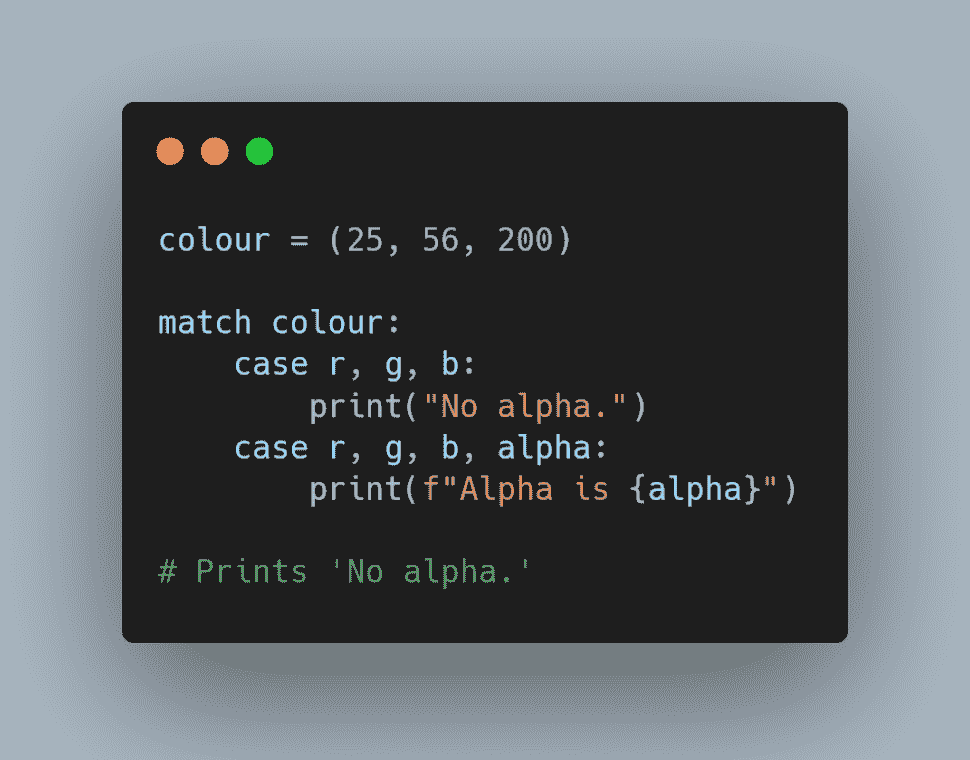

## 简介

结构化模式匹配即将引入 Python。尽管它可能看起来像许多其他语言中的简单 `switch` 语句，但 Python 的 `match` 语句并非仅为充当一个简单的 `switch` 语句而引入。

PEP 634、635 和 636 中包含大量关于结构化模式匹配为 Python 带来什么、如何使用它、将其添加到 Python 的原理等信息。在本文中，我将尝试聚焦于如何利用这个新特性编写优美的代码。

> 在撰写本文时，Python 3.10 仍处于预发布阶段，因此如果您想下载并尝试 Python 3.10，需要找到正确的途径。

## 结构化模式匹配 Python 早已支持

结构化模式匹配在 Python 中并非全新。长期以来，我们已经可以进行诸如星号赋值的操作：

```python
>>> a, *b, c = [1, 2, 3, 4, 5]
>>> a
1
>>> b
[2, 3, 4]
>>> c
5
```

我们也可以进行深度解包：

```python
>>> name, (r, g, b) = ("red", (250, 23, 10))
>>> name
'red'
>>> r
250
>>> g
23
>>> b
10
```

我在“使用星号赋值进行解包”和“深度解包”中详细介绍了这些内容，因此如果您不熟悉如何使用这些特性编写符合 Python 风格的代码，请阅读那些 Pydon't 文章。

`match` 语句将结合星号赋值和深度解包的思想，因此了解如何使用它们将非常有帮助。

## 您的第一个 `match` 语句

让我们实现阶乘函数作为您的第一个 `match` 语句示例。阶乘函数是向人们介绍递归时的教科书示例，您可以这样编写：

```python
def factorial(n):
    if n == 0 or n == 1:
        return 1
    else:
        return n * factorial(n-1)
factorial(5)    # 120
```

我们可以使用 `match` 语句来替代 `if` 语句：

```python
def factorial(n):
    match n:
        case 0 | 1:
            return 1
        case _:
            return n * factorial(n - 1)
factorial(5)
```

注意这里有几个要点：我们以 `match n` 开始 `match` 语句，意味着我们将根据 `n` 的值执行不同的操作。然后，我们有 `case` 语句，可以看作是我们需要处理的不同可能场景。每个 `case` 后面必须跟着一个模式，我们将尝试将 `n` 与之匹配。

模式也可以包含替代项，由 `case 0 | 1` 中的 `|` 表示，当 `n` 为 0 或 1 时匹配。第二个模式 `case _:` 是匹配任何内容的默认方式（当您不关心匹配内容时），因此它在作用上更接近于第一个定义中的 `else`。

### 模式匹配基本结构

虽然 `match` 语句可以像普通的 `if` 语句一样使用（如您上面所见），但当处理结构化数据时，它们才真正大放异彩：

```python
def normalise_colour_info(colour):
    """将颜色信息规范化为 (name, (r, g, b, alpha))。"""

    match colour:
        case (r, g, b):
            name = ""
            a = 0
        case (r, g, b, a):
            name = ""
        case (name, (r, g, b)):
            a = 0
        case (name, (r, g, b, a)):
            pass
        case _:
            raise ValueError("Unknown colour info.")
    return (name, (r, g, b, a))
```

# 输出 ('', (240, 248, 255, 0))
print(normalise_colour_info((240, 248, 255)))
# 输出 ('', (240, 248, 255, 0))
print(normalise_colour_info((240, 248, 255, 0)))
# 输出 ('AliceBlue', (240, 248, 255, 0))
print(normalise_colour_info(("AliceBlue", (240, 248, 255))))
# 输出 ('AliceBlue', (240, 248, 255, 0.3))
print(normalise_colour_info(("AliceBlue", (240, 248, 255, 0.3))))

请注意，每种情况都包含一个类似于解包赋值左侧的表达式，当颜色的结构与该情况所展示的结构匹配时，名称就会被赋值给该情况中的变量名。

这比使用 `if` 语句的等效代码有了很大的改进：

```
def normalise_colour_info(colour):
    """将颜色信息规范化为 (name, (r, g, b, alpha))。"""

    if not isinstance(colour, (list, tuple)):
        raise ValueError("Unknown colour info.")

    if len(colour) == 3:
        r, g, b = colour
        name = ""
        a = 0
    elif len(colour) == 4:
        r, g, b, a = colour
        name = ""
    elif len(colour) != 2:
        raise ValueError("Unknown colour info.")
    else:
        name, values = colour
        if not isinstance(values, (list, tuple)) or len(values) not in [3, 4]:
            raise ValueError("Unknown colour info.")
        elif len(values) == 3:
            r, g, b = values
            a = 0
        else:
            r, g, b, a = values
    return (name, (r, g, b, a))
```

我尝试编写一段与使用结构化模式匹配的代码等效的、还算不错的代码，但效果看起来并不那么好。在评论中，有人提出了另一个不使用 `match` 的替代方案。那个建议看起来比我的好，但比使用 `match` 的替代方案要复杂得多，代码量也大得多。

当我们通过要求特定值实际匹配 Python 的内置类型来添加类型验证时，`match` 版本变得更好了：

```
def normalise_colour_info(colour):
    """将颜色信息规范化为 (name, (r, g, b, alpha))。"""

    match colour:
        case (int(r), int(g), int(b)):
            name = ""
            a = 0
        case (int(r), int(g), int(b), int(a)):
            name = ""
        case (str(name), (int(r), int(g), int(b))):
            a = 0
        case (str(name), (int(r), int(g), int(b), int(a))):
            pass
        case _:
            raise ValueError("Unknown colour info.")
    return (name, (r, g, b, a))
```

```
# 输出 ('AliceBlue', (240, 248, 255, 0))
print(normalise_colour_info(("AliceBlue", (240, 248, 255))))
# 引发 ValueError: Unknown colour info.
print(normalise_colour_info2(("Red", (255, 0, "0"))))
```

如何用 `if` 语句重现所有这些验证呢..？

## 匹配对象的结构

结构化模式匹配也可用于匹配类实例的结构。让我们回顾一下我在几篇文章中用作示例的 `Point2D` 类，特别是在关于 `__str__` 和 `__repr__` 的 [Pydon't](https://mathspp.com/blog/pydonts/pythons-special-methods-str-and-repr) 文章中。

```
class Point2D:
    """一个表示二维空间中点的类。"""

    def __init__(self, x, y):
        self.x = x
        self.y = y

    def __str__(self):
        """提供对象的良好表示。"""
        return f"({self.x}, {self.y})"

    def __repr__(self):
        """提供一种明确的方式来重建此对象。"""
        return f"Point2D({repr(self.x)}, {repr(self.y)})"
```

想象一下，我们现在想编写一个小函数，它接受一个 `Point2D` 并写出该点位置的简要描述。我们可以使用模式匹配来捕获 `x` 和 `y` 属性的值，更重要的是，我们可以使用简短的 `if` 语句来帮助缩小我们希望成功的匹配类型！看看下面的例子：

```
def describe_point(point):
    """写出点位置的人类可读描述。"""
    match point:
        case Point2D(x=0, y=0):
            desc = "在原点"
        case Point2D(x=0, y=y):
            desc = f"在垂直轴上，y = {y}"
        case Point2D(x=x, y=0):
            desc = f"在水平轴上，x = {x}"
        case Point2D(x=x, y=y) if x == y:
            desc = f"在 x = y 线上，x = y = {x}"
        case Point2D(x=x, y=y) if x == -y:
            desc = f"在 x = -y 线上，x = {x} 且 y = {y}"
        case Point2D(x=x, y=y):
            desc = f"在 {point}"
    return "该点 " + desc

# 输出 "该点 在原点"
print(describe_point(Point2D(0, 0)))
# 输出 "该点 在水平轴上，x = 3"
print(describe_point(Point2D(3, 0)))
# 输出 "该点 在 x = -y 线上，x = 3 且 y = -3"
print(describe_point(Point2D(3, -3)))
# 输出 "该点 在 (1, 2)"
print(describe_point(Point2D(1, 2)))
```

## `__match_args__`

现在，我不知道你是否注意到了，但上面代码片段中的所有 `x=` 和 `y=` 没有让你感到烦恼吗？每次我为 `Point2D` 实例编写新模式时，我都必须指定哪个参数是 `x`，哪个是 `y`。对于那些顺序不是任意的类，我们可以使用 `__match_args__` 来告诉 Python 我们希望如何匹配对象的属性。

这是上面示例的一个更短的版本，利用 `__match_args__` 让 Python 知道 `Point2D` 参数的匹配顺序：

```
class Point2D:
    """一个表示二维空间中点的类。"""
    __match_args__ = ["x", "y"]
    def __init__(self, x, y):
        self.x = x
        self.y = y

def describe_point(point):
    """写出点位置的人类可读描述。"""

    match point:
        case Point2D(0, 0):
            desc = "在原点"
        case Point2D(0, y):
            desc = f"在垂直轴上，y = {y}"
        case Point2D(x, 0):
            desc = f"在水平轴上，x = {x}"
        case Point2D(x, y):
            desc = f"在 {point}"

    return "该点 " + desc

# 输出 "该点 在原点"
print(describe_point(Point2D(0, 0)))
# 输出 "该点 在水平轴上，x = 3"
print(describe_point(Point2D(3, 0)))
# 输出 "该点 在 (1, 2)"
print(describe_point(Point2D(1, 2)))
```

## 通配符

匹配事物时你可以做的另一件很酷的事情是使用通配符。

### 星号 *

就像你可以这样做一样

```
>>> head, *body, tail = range(10)
>>> print(head, body, tail)
0 [1, 2, 3, 4, 5, 6, 7, 8] 9
```

其中 `*body` 告诉 Python 将*不*进入 `head` 或 `tail` 的任何内容放入 `body`，你可以使用 `*` 和 `**` 通配符。你可以将 `*` 与列表和元组一起使用来匹配其*剩余*部分：

```
def rule_substitution(seq):
    new_seq = []
    while seq:
        match seq:
            case [x, y, z, *tail] if x == y == z:
                new_seq.extend(["3", x])
            case [x, y, *tail] if x == y:
                new_seq.extend(["2", x])
            case [x, *tail]:
                new_seq.extend(["1", x])
        seq = tail
    return new_seq

seq = ["1"]
print(seq[0])
for _ in range(10):
    seq = rule_substitution(seq)
    print("".join(seq))
```

> """
输出：
1
11
21
1211
111221
312211
13112221
1113213211
31131211131221
13211311123113112211
1113122113311213211312221
"""

这构建了我上面展示的序列，其中每个数字都是通过查看其数字并描述你所看到的内容从上一个数字派生出来的。例如，当你发现三个相等的数字连续出现时，比如 "222"，你将其重写为 "32"，因为你看到了三个二。使用 `match` 语句，这变得干净多了。在上面的 `case` 语句中，模式的 `*tail` 部分匹配序列的剩余部分，因为我们只使用 `x`、`y` 和 `z` 来匹配序列的开头。

### 普通字典匹配

类似地，我们可以使用 `**` 来匹配字典的剩余部分。但首先，让我们看看匹配字典时的行为：

```
d = {0: "oi", 1: "uno"}
match d:
    case {0: "oi"}:
        print("yeah.")
# 输出 yeah.
```

虽然 `d` 有一个键 `1`，其值为 `"uno"`，并且这在唯一的 `case` 语句中没有指定，但存在匹配，我们进入了该语句。在匹配字典时，我们只关心匹配明确提到的结构，而原始字典拥有的任何其他额外键都会被忽略。这是## 双星号 **

然而，如果你想知道原始字典中有哪些内容未在匹配中指定，可以使用 `**` 通配符：

```python
d = {0: "oi", 1: "uno"}
match d:
    case {0: "oi", **remainder}:
        print(remainder)
# prints {1: 'uno'}
```

最后，如果你想匹配一个**仅**包含你指定内容的字典，可以利用这个技巧：

```python
d = {0: "oi", 1: "uno"}
match d:
    case {0: "oi", **remainder} if not remainder:
        print("Single key in the dictionary")
    case {0: "oi"}:
        print("Has key 0 and extra stuff.")
# Has key 0 and extra stuff.
```

你还可以使用变量来匹配给定键的值：

```python
d = {0: "oi", 1: "uno"}
match d:
    case {0: zero_val, 1: one_val}:
        print(f"0 mapped to {zero_val} and 1 to {one_val}")
# 0 mapped to oi and 1 to uno
```

## 命名子模式

有时你可能希望匹配一个更具结构化的模式，但随后给模式的一部分或整个模式起一个名字，以便你有办法引用回去。当你的模式包含使用 `|` 添加的备选项时，尤其可能发生这种情况：

```python
def go(direction):
    match direction:
        case "North" | "East" | "South" | "West":
            return "Alright, I'm going!"
        case _:
            return "I can't go that way..."

print(go("North"))    # Alright, I'm going!
print(go("asfasdf"))  # I can't go that way...
```

现在，假设处理“前往”某地的逻辑嵌套在更复杂的内容中：

```python
def act(command):
    match command.split():
        case "Cook", "breakfast":
            return "I love breakfast."
        case "Cook", *wtv:
            return "Cooking..."
        case "Go", "North" | "East" | "South" | "West":
            return "Alright, I'm going!"
        case "Go", *wtv:
            return "I can't go that way..."
        case _:
            return "I can't do that..."

print("Go North")      # Alright, I'm going!
print("Go asdfasdf")   # I can't go that way...
print("Cook breakfast") # I love breakfast.
print("Drive")         # I can't do that...
```

而且不仅如此，我们想知道用户想去哪里，以便将此信息包含在消息中。我们可以通过保留选项不变，然后将匹配结果捕获到变量中来实现这一点：

```python
def act(command):
    match command.split():
        case "Cook", "breakfast":
            return "I love breakfast."
        case "Cook", *wtv:
            return "Cooking..."
        case "Go", "North" | "East" | "South" | "West" as direction:
            return f"Alright, I'm going {direction}!"
        case "Go", *wtv:
            return "I can't go that way..."
        case _:
            return "I can't do that..."

print("Go North")      # Alright, I'm going North!
print("Go asdfasdf")   # I can't go that way...
```

## 遍历递归结构

结构模式匹配被期望非常成功的另一种情况是处理递归结构。

我在下面包含的参考文献中看到过关于此用例的优秀示例，现在将分享一个我自己的例子。

假设你想将数学表达式转换为前缀表示法，例如 "3 * 4" 变成 "* 3 4"，而 1 + 2 + 3 变成 + 1 + 2 3 或 + + 1 2 3，这取决于 + 是从左结合还是从右结合。

你可以写一个小的 `match` 来处理这个：

```python
import ast

def prefix(tree):
    match tree:
        case ast.Expression(expr):
            return prefix(expr)
        case ast.Constant(value=v):
            return str(v)
        case ast.BinOp(lhs, op, rhs):
            match op:
                case ast.Add():
                    sop = "+"
                case ast.Sub():
                    sop = "-"
                case ast.Mult():
                    sop = "*"
                case ast.Div():
                    sop = "/"
                case _:
                    raise NotImplementedError()
            return f"{sop} {prefix(lhs)} {prefix(rhs)}"
        case _:
            raise NotImplementedError()
```

```python
print(prefix(ast.parse("1 + 2 + 3", mode="eval")))     # + + 1 2 3
print(prefix(ast.parse("2**3 + 6", mode="eval")))      # + * 2 3 6
# Prints '+ - + 1 * 2 3 / 5 7', take a moment to digest this one.
print(prefix(ast.parse("1 + 2*3 - 5/7", mode="eval")))
```

## 谨慎对待炒作

现在，这里有句忠告：`match` 并非总是最佳解决方案。回顾上面的前缀表示法示例，也许有更好的方法将每个可能的二元运算符转换为其字符串表示？当前的解决方案为每个不同的运算符使用两行代码，如果我们添加对更多二元运算符的支持，那部分代码将变得长到难以忍受。

事实上，我们可以（并且可能应该）对此做些别的事。例如，

```python
import ast

def op_to_str(op):
    ops = {
        ast.Add: "+",
        ast.Sub: "-",
        ast.Mult: "*",
        ast.Div: "/",
    }
    return ops.get(op.__class__, None)

def prefix(tree):
    match tree:
        case ast.Expression(expr):
            return prefix(expr)
        case ast.Constant(value=v):
            return str(v)
        case ast.BinOp(lhs, op, rhs):
            sop = op_to_str(op)
            if sop is None:
                raise NotImplementedError()
            return f"{sop} {prefix(lhs)} {prefix(rhs)}"
        case _:
            raise NotImplementedError()

print(prefix(ast.parse("1 + 2 + 3", mode="eval")))    # + + 1 2 3
print(prefix(ast.parse("2*3 + 6", mode="eval")))    # + * 2 3 6
# Prints '- + 1 * 2 3 / 5 7', take a moment to digest this one.
print(prefix(ast.parse("1 + 2*3 - 5/7", mode="eval")))
```

## 结论

这是本文的主要收获，为你呈现：

> “结构模式匹配引入了一个特性，在许多情况下可以简化并提高 Python 代码的可读性，但它并非在所有情况下都是首选解决方案。”

这个 Pydon't 向你展示了：

- 使用 `match` 语句的结构模式匹配极大地扩展了已存在的星号赋值和结构赋值功能的力量；
- 结构模式匹配可以匹配字面值和任意模式；
- 模式可以使用 `if` 语句包含附加条件；
- 模式可以使用 `*` 和 `**` 包含通配符；
- 当处理类实例的结构时，`match` 语句非常强大；
- `__match_args__` 允许定义在自定义类用于 `case` 时，参数被匹配的默认顺序；
- 内置的 Python 类可以在 `case` 语句中使用以验证类型。

## 参考文献

- PEP 622 – 结构模式匹配, [https://www.python.org/dev/peps/pep-0622/](https://www.python.org/dev/peps/pep-0622/)
- PEP 634 – 结构模式匹配：规范, https://www.python.org/dev/peps/pep-0634/
- PEP 635 – 结构模式匹配：动机与原理, https://www.python.org/dev/peps/pep-0635/
- PEP 636 – 结构模式匹配：教程, https://www.python.org/dev/peps/pep-0636/
- Python 中的动态模式匹配, https://gvanrossum.github.io/docs/PyPatternMatching.pdf
- Python 3.10 模式匹配实战, "Big Python" 的 YouTube 视频, https://www.youtube.com/watch?v=SYTVSeTgL3s

# 结构模式匹配反模式

```python
# The match statement is hard to read,
# because the cases are long and very similar.
def rule30(bits):
    """Implement the 'rule 30' automaton."""
    match bits:
        case 0, 0, 0 | 1, 0, 1 | 1, 1, 0 | 1, 1, 1:
            return 0
        case 0, 0, 1 | 0, 1, 0 | 0, 1, 1 | 1, 0, 0:
            return 1

# A bit of research shows a closed formula:
def rule30(bits):
    p, q, r = bits
    return (p + q + r + q*r) % 2
```

(原文缩略图见 https://mathspp.com/blog/pydonts/structural-pattern-matching-anti-patterns)

## 引言

结构化模式匹配即将登陆Python。虽然它看起来可能像许多其他语言中普通的 switch 语句，但Python的`match`语句的引入并非仅仅为了充当简单的switch语句。

在这篇文章中，我探讨了`match`语句的许多用例，而在这篇博客文章中，我将尝试探讨一些`match`并非最佳答案的用例。本文将假设你了解Python中结构化模式匹配的工作原理，因此如果你不确定其工作原理，请随时阅读我的《Pythonic代码模式匹配教程》。

> 撰写本文时，Python 3.10 仍是预发布版本，因此如果你想下载并体验Python 3.10，需要前往正确的渠道获取。

## 应该只有一种显而易见的方法来做这件事

根据Python之禅：

> “应该有一种——最好只有一种——显而易见的方法来做这件事。”

`match`语句的引入似乎违背了这一原则...但是，你必须记住，`match`语句的目的并非作为基本的switch语句，因为我们已经有很多其他的替代方案——如果`match`本意是一个简单的switch，那么它很可能被命名为“switch”而不是“match”。不，`match`语句的目的是进行结构化模式匹配，因此许多基本的匹配和分支判断，完全可以通过我们直到Python 3.10仍在使用的传统工具来完成。

接下来，我将与你分享其中的一些工具，并尝试描述它们在何种场景下会很有用。当然，结合代码来理解会容易得多，因此会有很多代码示例贯穿全文。

## 简洁高效的 if 语句

考拉兹猜想是一个数学猜想，它指出对于任意给定的正整数作为输入，以下函数都会终止：

```python
def collatz_path(n):
    path = [n]
    while n != 1:
        match n % 2:
            case 0:
                n //= 2
            case 1:
                n = 3*n + 1
        path.append(n)
    return path
```

给出以下两个示例输出：

```
>>> collatz_path(8)
[8, 4, 2, 1]
>>> collatz_path(15)
[15, 46, 23, 70, 35, 106, 53, 160, 80, 40, 20, 10, 5, 16, 8, 4, 2, 1]
```

如果我们看上面的`match`用法，会发现它基本上充当了一个简单的switch，用于匹配`n % 2`运算对于正整数`n`可能产生的仅有的两个值：0或1。请注意，如果我们使用普通的`if`，可以写出完全相同的代码，并且*节省*一行代码：

```python
def collatz_path(n):
    path = [n]
    while n != 1:
        if n % 2:
            n = 3*n + 1
        else:
            n //= 2
        path.append(n)
    return path
```

我们节省了一行代码，并且减少了缩进的最大深度：使用`match`时，代码缩进了四次，而使用`if`的实现只有三层缩进。当你只有几个选项并且需要检查明确的相等性时，简洁高效的`if`语句很可能是首选方案。

## 更聪明（一点）

有时你会觉得不得不列出一系列的`case`和对应的值，以便进行映射。然而，通过寻找替代算法或公式来实现，可能会让你的生活*简单得多*。我来给你举个例子。

如果你从未听说过，[规则30](https://en.wikipedia.org/wiki/Rule_30)是一种“初等元胞自动机”。你可以将其视为一个接收三个比特（三个0/1）并产生一个新比特的规则，具体取决于它接收到的那三个比特。自动机非常、非常有趣，但讨论它们已经超出了本文的范围。让我们先看看“规则30”自动机的一种可能的实现：

```python
def rule30(bits):
    match bits:
        case 0, 0, 0:
            return 0
        case 0, 0, 1:
            return 1
        case 0, 1, 0:
            return 1
        case 0, 1, 1:
            return 1
        case 1, 0, 0:
            return 1
        case 1, 0, 1:
            return 0
        case 1, 1, 0:
            return 0
        case 1, 1, 1:
            return 0
```

这看起来像是`match`语句的合理用法，只是我们写了16行代码...好吧，你说得对，让我们把返回相同值的规则合并起来，这应该会使代码更短：

```python
def rule30(bits):
    match bits:
        case 0, 0, 0 | 1, 0, 1 | 1, 1, 0 | 1, 1, 1:
            return 0
        case 0, 0, 1 | 0, 1, 0 | 0, 1, 1 | 1, 0, 0:
            return 1
```

是的，好多了。但现在每个`case`里有四个选项，我得眯着眼才能分辨每个选项从哪里开始到哪里结束，而那一长串的0和1也不太悦目...我们能让它更好吗..？

只需稍加研究你就会发现，“规则30”可以写成一个依赖于三个输入比特的*封闭公式*，这意味着我们不必用`match`将输入比特与所有可能的输入进行匹配，我们只需*计算*输出：

```python
def rule30(bits):
    p, q, r = bits
    return (p + q + r + q*r) % 2
```

你可能会辩称，这个公式掩盖了各个输入及其输出之间的关系。从原则上说你是对的，但即使显式地用`match`写出“规则30”，同样无法告诉你为什么每个输入映射到每个输出，那何不既简短又高效呢？

## 基础映射

### 从字典获取

有很多情况下，你只想接收一个值并将其映射到另一个值。举个例子，看看这段将表达式转换为前缀表示法的代码：

```python
import ast

def prefix(tree):
    match tree:
        case ast.Expression(expr):
            return prefix(expr)
        case ast.Constant(value=v):
            return str(v)
        case ast.BinOp(lhs, op, rhs):
            match op:
                case ast.Add():
                    sop = "+"
                case ast.Sub():
                    sop = "-"
                case ast.Mult():
                    sop = "*"
                case ast.Div():
                    sop = "/"
                case _:
                    raise NotImplementedError()
            return f"{sop} {prefix(lhs)} {prefix(rhs)}"
    case _:
        raise NotImplementedError()

print(prefix(ast.parse("1 + 2 + 3", mode="eval")))       # + + 1 2 3
print(prefix(ast.parse("2**3 + 6", mode="eval")))       # + * 2 3 6
# 最后一条语句输出 '- + 1 * 2 3 / 5 7'，花点时间琢磨一下。
print(prefix(ast.parse("1 + 2*3 - 5/7", mode="eval")))
```

注意将`BinOp`内的运算符转换为字符串的内部`match`？首先，这个嵌套的`match`占据了太多垂直空间，并且分散了我们对真正重要事情的注意力——即递归结构的树的遍历。这意味着我们实际上可以将这部分重构为一个工具函数：

```python
import ast

def op_to_str(op):
    match op:
        case ast.Add():
            sop = "+"
        case ast.Sub():
            sop = "-"
        case ast.Mult():
            sop = "*"
        case ast.Div():
            sop = "/"
        case _:
            raise NotImplementedError()
    return sop

def prefix(tree):
    match tree:
        case ast.Expression(expr):
            return prefix(expr)
        case ast.Constant(value=v):
            return str(v)
        case ast.BinOp(lhs, op, rhs):
            return f"{op_to_str(op)} {prefix(lhs)} {prefix(rhs)}"
    case _:
        raise NotImplementedError()

print(prefix(ast.parse("1 + 2 + 3", mode="eval")))  # + + 1 2 3
print(prefix(ast.parse("2**3 + 6", mode="eval")))  # + * 2 3 6
# 最后一条语句输出 '- + 1 * 2 3 / 5 7'，花点时间琢磨一下。
print(prefix(ast.parse("1 + 2*3 - 5/7", mode="eval")))
```

这使得`prefix`函数更易于阅读和理解，但现在我们面临另一个让我非常困扰的问题：一个简单但冗长的函数——`op_to_str`函数。你支持的每种运算符类型，函数就要增加两行...如果你将`match`替换为一连串的`if`和`elif`语句，只能在顶部节省一行...

我在原文中建议的修复方法是使用字典将`op`的类型映射到其字符串表示：

```python
def op_to_str(op):
    ops = {
        ast.Add: "+",
        ast.Sub: "-",
        ast.Mult: "*",
        ast.Div: "/",
    }
    return ops.get(op.__class__, None)
```

这种字典的使用模式在Python中相当常见，使用`get`方法来计算一个值到另一个值的映射。如果你想知道，可以使用`get`函数的第二个参数提供一个默认值，如果字典没有列出所有可能的值，或者你想有一个回退值时，这可能会很有用。

### **getattr**

我们可用的另一个有用机制是`getattr`函数，它是Python内置函数三兄弟的一员：`hasattr`、`getattr`和`setattr`。

> 我将在未来的Pydon't文章中详细讨论这三兄弟；请务必订阅Pydon't通讯，以免错过！现在，我将简要展示`getattr`能为你做些什么。

我正在编写一个名为RGSPL的APL解释器，其中有一个名为`visit_F`的函数，我需要将APL原语（如+和–）映射到实现它的相应Python函数。这些实现原语行为的Python函数位于`functions.py`文件中。如果我使用`match`语句，`visit_F`可能看起来是这样的：

```python
import functions

def visit_F(self, func):
    """获取可调用的函数。"""
```

## 单分发泛型函数

如果你使用过像 Java 这样的编程语言，你会熟悉函数重载的概念：你多次实现同一个函数，但可以为不同的参数类型和/或参数数量指定函数的行为。

例如，你可能想实现一个函数来漂亮地打印一系列不同类型的对象：

```python
def pretty_print(arg):
    if isinstance(arg, complex):
        print(f"{arg.real} + {arg.imag}i")
    elif isinstance(arg, (list, tuple)):
        for i, elem in enumerate(arg):
            print(i, elem)
    elif isinstance(arg, dict):
        for key, value in arg.items():
            print(f"{key}: {value}")
    else:
        print(arg)
```

它的工作方式如下：

```python
>>> pretty_print(3)
3
>>> pretty_print([2, 5])
0 2
1 5
>>> pretty_print(3+4j)
3.0 + 4.0i
```

你可以看到，`if` 语句引入的分支仅仅是为了区分 `arg` 可能具有的不同类型。虽然处理逻辑可能不同，但最终目的始终相同：漂亮地打印一个对象。但是，如果处理每种参数类型的代码需要 10 行或 20 行呢？你将会得到一个非常长的函数，其本质上内嵌了子函数。

你可以利用 `functools.singledispatch` 装饰器来分离所有这些子函数：

```python
import functools

@functools.singledispatch
def pretty_print(arg):
    print(arg)

@pretty_print.register(complex)
def _(arg):
    print(f"{arg.real} + {arg.imag}i")

@pretty_print.register(list)
@pretty_print.register(tuple)
def _(arg):
    for i, elem in enumerate(arg):
        print(i, elem)

@pretty_print.register(dict)
def _(arg):
    for key, value in arg.items():
        print(f"{key}: {value}")
```

然后它的使用方式与原始函数完全相同：

```python
>>> pretty_print(3)
3
>>> pretty_print([2, 5])
0 2
1 5
>>> pretty_print(3+4j)
3.0 + 4.0i
```

`pretty_print` 的例子并不是*最好的*，因为你花费在装饰上的行数与定义实际子函数的行数一样多，但这向你展示了你现在可以留意的模式。你可以在文档中阅读更多关于 `singledispatch` 的信息。

## 结论

以下是本文的主要要点，呈送给你：

> “新的 `match` 语句*确实*很棒，但这并不意味着 `match` 语句将总是最好的替代方案，特别是，如果你仅仅将其用作简单的开关，那么通常是在误用 `match` 语句。”

这个 Pydon't 向你展示：

- `match` 并不一定总是实现控制流的最佳方式；
- 简短而基础的 `match` 语句可以是普通的 `if` 语句；
- 有时有一种方法可以*计算*你所需的东西，而无需列出许多不同的情况及其相应的值；
- 内置工具如 `dict.get` 和 `getattr` 也可以用于根据匹配的键获取不同的值；
- 并且，当你需要在输入具有不同类型时执行不同的子函数时，可以使用 `functools.singledispatch`。

## 参考资料

- PEP 622 – 结构化模式匹配，https://www.python.org/dev/peps/pep-0622/；
- PEP 634 – 结构化模式匹配：规范，https://www.python.org/dev/peps/pep-0634/；
- PEP 635 – 结构化模式匹配：动机与原理，https://www.python.org/dev/peps/pep-0635/；
- PEP 636 – 结构化模式匹配：教程，https://www.python.org/dev/peps/pep-0636/；
- PEP 443 – 单分发泛型函数，https://www.python.org/dev/peps/pep-0443/；
- Python 3 文档，Python 标准库，getattr，https://docs.python.org/3/library/functions.html#getattr；
- Python 3 文档，Python 标准库，functools.singledispatch，https://docs.python.org/3/library/functools.html#functools.singledispatch；
- 维基百科，“考拉兹猜想”，https://en.wikipedia.org/wiki/Collatz_conjecture；
- WolframAlpha，“规则 30”，https://www.wolframalpha.com/input/?i=rule+30；
- 维基百科，“规则 30”，https://en.wikipedia.org/wiki/Rule_30；

## 当心递归

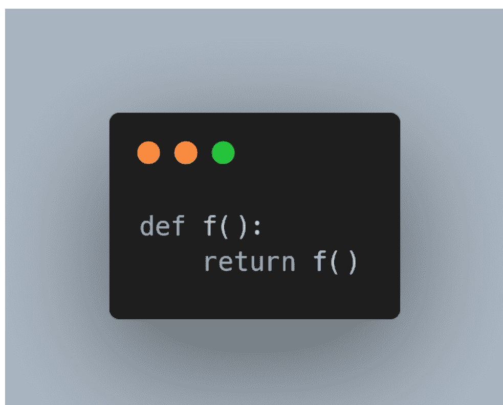

（原始文章缩略图，原文位于 https://mathspp.com/blog/pydonts/watch-out-for-recursion。）

## 介绍

在这篇 Pydon't 中，我将简要讨论何时以及为什么递归可能不是解决问题的最佳策略。这个讨论将涉及 Python 的一些特性，但也涵盖许多编程语言所涉及的更广泛的主题和概念。在这简短的讨论之后，我将向你展示一些递归 Python 代码及其非递归对应物的示例。

尽管我上面说了我要做什么，但请不要误解：这篇 Pydon't 的目的*不是*让你不喜欢递归，也不是说递归很糟糕。我*真的*喜欢递归，并且觉得它非常优雅。

## 当心递归

既然你知道这篇 Pydon't 的目的，让我提一些可能影响递归解决问题适用性的事情。

## RecursionError

我们将讨论的第一件事是 Python 实施的臭名昭著的递归深度限制。

如果你完全不知道我在说什么，那么要么——你一生中从未编写过递归函数，要么——你真的、*真的*非常出色，从未在递归函数定义中犯过错误。

递归深度限制会在你进行过多递归调用时使你的代码引发 `RecursionError`。要看看我在说什么，只需在你的 REPL 中执行以下操作：

```python
>>> def f():
...     return f()
...
>>> f()
Traceback (most recent call last):
  File "<stdin>", line 1, in <module>
  File "<stdin>", line 2, in f
  File "<stdin>", line 2, in f
  File "<stdin>", line 2, in f
  [Previous line repeated 996 more times]
RecursionError: maximum recursion depth exceeded
>>>
```

在许多情况下，这个限制*有帮助*，因为它帮助你发现那些你没有正确定义基本情况的递归函数。

然而，有些情况下 1000 次递归调用不足以完成你的计算。一个经典的例子是阶乘函数：

```python
>>> def fact(n):
...     if n == 0:
...         return 1
...     return n*fact(n-1)
...
```我们的函数已正确定义，但默认情况下，Python不允许我们进行足够的递归调用。

如果必须，你可以随时设置自己的递归深度：

```python
>>> import sys
>>> sys.setrecursionlimit(3000)
>>> fact(2000)
33162... # (omitted for brevity)
>>> sys.getrecursionlimit()
3000
```

只是使用时要小心。我从未尝试过，但你可能不希望因为数量极其庞大的递归调用而导致Python内存耗尽。

因此，如果你的函数会不断地尝试进行超过允许递归深度的递归，你可能需要考虑为你的问题寻找不同的解决方案。

## 没有尾递归消除

在某些编程语言中，上面所示的阶乘函数可以被调整——以执行尾调用——这可以防止一些问题并节省内存：当递归调用是函数内部执行的最后一步时，就发生了尾调用，这或多或少意味着你在递归时无需保留关于当前上下文的任何信息。

在上面的阶乘函数中，在通过`fact(n-1)`递归之后，我们仍然必须在从函数返回之前执行一次乘法。如果我们重写函数，将部分阶乘作为累加器传递，我们就可以得到一个执行尾调用的阶乘函数：

```python
>>> def fact(n, partial=1):
...     if n <= 1:
...         return partial
...     return fact(n-1, n*partial)
...
>>> fact(10)
3628800
```

正如你所见，`fact`函数内部执行的最后一步是调用自身，因此理论上Python在进行递归调用时可以“忘记所有关于其环境的内容”，并在过程中节省大量内存。

实际上，Python并非*有意*这样做，关于Python为何没有此功能，我建议你参考参考文献中Neopythonic博客（Guido van Rossum所著）上的两篇文章以获取更多信息。

将递归函数转换为尾递归函数是一个有趣的练习，我向你发起挑战去尝试，但你不会因此获得速度上的提升。不过，移除尾递归函数的递归是非常容易的，我将在下面的示例中展示如何操作。

## 分支重叠

在考虑递归解决方案时需要考虑的另一件事是：递归调用之间会有很多重叠吗？

如果你的递归函数在递归调用中*并且*这些递归调用之间存在重叠，那么你可能在浪费大量时间反复重新计算相同的值。通常这很容易解决，但仅仅因为一个问题*可能*有一个简单的解决方案，并不意味着你可以完全忽视它。

一个导致大量浪费计算的递归经典示例是斐波那契数列：

```python
def fibonacci(n):
    if n <= 1:
        return n
    return fibonacci(n-1) + fibonacci(n-2)
```

对该函数的一个简单修改显示有*许多*递归调用被发起：

```python
call_count = 0
def fibonacci(n):
    global call_count
    call_count += 1
    if n <= 1:
        return n
    return fibonacci(n-1) + fibonacci(n-2)

print(fibonacci(10))
print(call_count)  # 177
```

如果你的函数更复杂，那么你在重新计算上浪费的时间可能会变得难以忍受。

## 深度优先与广度优先

编写递归解决方案时需要考虑的另一点是，递归解决方案本质上是深度优先的，而你的问题可能更适合广度优先的解决方案。

这不太可能成为一个大问题，但它只是表明，有时即使一个解决方案有一个非常清晰的递归解，你也最好不实现一个纯粹的递归解决方案。

在我[解决水壶谜题](https://en.wikipedia.org/wiki/Water_pouring_puzzle)时，出现了一个很好的例子：我想编写代码来解决（一个更通用版本的）那个谜题，其中你有一个能装A升水的桶和一个装B升水的桶，你需要通过倒水使其中一个桶恰好装有T升水。解决方案可以很容易地用递归术语表达，但我的实现实际上使用了一个`while`循环和一个BFS（广度优先搜索）算法。

如果你不知道这是什么意思，最好去谷歌一下。例如，访问[深度优先搜索](https://en.wikipedia.org/wiki/Depth-first_search)和[广度优先搜索](https://en.wikipedia.org/wiki/Breadth-first_search)的维基百科页面。用一句简短而不精确的话说，深度优先搜索（DFS）意味着当你遍历某个结构时，你优先深入探索，然后再环顾四周；而在广度优先搜索（BFS）中，你首先探索当前层级，然后再进入下一层级。

## 代码示例

我现在将展示一些可能引起上述某些问题的递归代码，同时也将分享这些相同代码的非递归版本。

### 阶乘

阶乘这个简单示例很好，因为它可以有无数种不同的实现方式，而这些实现所展现的思想可以适应更复杂的递归。
这里的主要特征是，阶乘的递归是“线性”递归，其中每次调用只执行一次递归调用，而每次递归调用都是针对一个更简单的问题。
朴素递归如下：

```python
def factorial(n):
    if n <= 1:
        return 1
    return n * factorial(n-1)
```

正如我们上面所看到的，我们可以使用累加器来编写阶乘的尾递归版本，即使Python不会以任何方式对其进行优化：

```python
def factorial(n, partial=1):
    if n <= 1:
        return partial
    return factorial(n-1, n*partial)
```

现在我们以尾递归方式编写了这个函数，实际上我们可以遵循一个简单的步骤完全移除递归：

```python
def factorial(n):
    partial = 1
    while n > 1:
        n, partial = n-1, n*partial
    return partial
```

这是一个通用的转换，你可以对任何尾递归函数使用，我将在下面提供更多示例。

继续讨论阶乘，因为这是一个线性递归（而且相当简单），有很多方法可以重写这个函数。我展示几种，暂时假装`math.factorial`不存在：

```python
import math
def factorial(n):
    return math.prod(i for i in range(1, n+1))
```

```python
import functools, operator
def factorial(n):
    return functools.reduce(operator.mul, [i for i in range(1, n+1)])
```

```python
def factorial(n):
    fact = 1
    for i in range(1, n+1):
        fact *= i
    return fact
```

如果你在解决问题时想出了不同的解决方案，不要害怕去尝试它们。

### 更多关于尾递归的内容

让我展示几个简单的递归函数、它们的尾递归等价物以及它们的非递归对应版本。我将向你展示通用的转换方法，这样你也可以轻松地将任何尾递归函数重写为命令式函数。

### 列表求和

你可以递归地实现你自己的求和：

```python
def sum(l):
    if not l:
        return 0
    return l[0] + sum(l[1:])
```

如果你在递归调用中传递部分和，你可以使其成为尾递归：

```python
def sum(l, partial=0):
    if not l:
        return partial
    return sum(l[1:], l[0] + partial)
```

从尾递归函数转换到`while`循环解决方案很简单：

```python
def sum(l):
    partial = 0
    while l:
        partial += l[0]
        l = l[1:]
    return partial
```

这是你可以对任何尾递归函数执行的通用转换，我将在下面提供更多示例。

## 列表排序

这是另一个例子，我们用选择排序对一个列表进行排序。首先是“常规”递归版本：

```python
def selection_sort(l):
    if not l:
        return []
    m = min(l)
    idx = l.index(m)
    return [m] + selection_sort(l[:idx]+l[idx+1:])
```

现在是一个尾递归版本：

```python
def selection_sort(l, partial=None): # partial=[] is bad!
    if partial is None:
        partial = []
    if not l:
        return partial
    m = min(l)
    idx = l.index(m)
    selection_sort(l[:idx]+l[idx+1:], partial + [m])
```

在上述代码中，我们需要注意一点：`partial` 参数的默认值本应是空列表，但你应该避免在函数参数的默认值中使用可变类型。因此，我们使用 `None`，然后首先做的就是将 `partial` 设置为 `[]`，以防它原来是 `None`。

最后，应用转换技巧，我们可以消除递归：

```python
def selection_sort(l):
    partial = []
    while l:
        m = min(l)
        idx = l.index(m)
        l, partial = l[:idx]+l[idx+1:], partial + [m]
    return partial
```

## 遍历（目录）

当你需要遍历某个东西时，深度优先和广度优先的区别更可能出现。

在这个例子中，我们将遍历一个完整的目录，打印文件名和文件大小。一个简单的、纯递归的解决方案如下：

```python
import pathlib

def print_file_sizes(path):
    """Print file sizes in a directory."""
    
    path_obj = pathlib.Path(path)
    if path_obj.is_file():
        print(path, path_obj.stat().st_size)
    else:
        for path in path_obj.glob("*"):
            print_file_sizes(path)
```

如果你将该函数应用于像这样的目录树：

```
+   - file1.txt
- subdir1
    - file2.txt
    - subdir2
        - file3.txt
        - subdir3
            - deep_file.txt
```

那么你看到的第一个被打印的文件将是 `deep_file.txt`，因为这个递归解决方案是深度优先遍历你的文件系统。如果你想以广度优先的方式遍历目录，以便你首先发现 `file1.txt`，然后是 `file2.txt`，接着是 `file3.txt`，最后是 `deep_file.txt`，你可以将你的函数重写成如下形式：

```python
import pathlib

def print_file_sizes(dir):
    """Print file sizes in a directory, recurse into subdirs."""
    
    paths_to_process = [dir]
    while paths_to_process:
        path, *paths_to_process = paths_to_process
        path_obj = pathlib.Path(path)
        if path_obj.is_file():
            print(path, path_obj.stat().st_size)
        else:
            paths_to_process += path_obj.glob("*")
```

这个例子来自我的 "Truthy, Falsy, and bool" Pydon't，它使用 `paths_to_process` 列表来追踪那些仍需处理的路径，从而在不实际进行递归的情况下模拟了递归行为。

## 控制分支

### 重叠

当你的递归函数产生大量分支，并且这些分支重叠时，你可以通过保存已计算的值来节省一些计算量。这可以简单到使用一个字典，在其中检查已知值并插入基础情况。

> 这种技术通常被称为“记忆化”，我们将在后续的 Pydon't 中深入探讨，敬请期待！

```python
call_count = 0

fibonacci_values = {0: 0, 1: 1}
def fibonacci(n):
    global call_count
    call_count += 1

    try:
        return fibonacci_values[n]
    except KeyError:
        fib = fibonacci(n-1) + fibonacci(n-2)
        fibonacci_values[n] = fib
        return fib

print(fibonacci(10))
print(call_count)   # 19
```

注意，这将递归调用次数从 177 次减少到了 19 次。我们甚至可以统计必须执行计算的次数：

```python
computation_count = 0

fibonacci_values = {0: 0, 1: 1}
def fibonacci(n):
    try:
        return fibonacci_values[n]
    except KeyError:
        global computation_count
        computation_count += 1
        fib = fibonacci(n-1) + fibonacci(n-2)
        fibonacci_values[n] = fib
        return fib

print(fibonacci(10))
print(computation_count)   # 9
```

这表明保存部分结果确实能带来显著的收益！

## 将递归分支改写为循环

为了向你展示如何将一个递归的、有分支的函数重写为使用 `while` 循环的函数，我们将看看另一个排序算法，称为归并排序。归并排序的工作方式很简单：要对一个列表进行排序，你首先分别对前半部分和后半部分进行排序，然后将这两个已排序的半部分合并起来。

递归地写出来，可能如下所示：

```python
def merge(l1, l2):
    result = []
    while l1 and l2:
        if l1[0] < l2[0]:
            h, *l1 = l1
        else:
            h, *l2 = l2
        result.append(h)
    result.extend(l1)  # One of the two lists is empty,
    result.extend(l2)  # the other contains the larger elements.
    return result

def merge_sort(l):
    """Sort a list recursively with the merge sort algorithm."""
    # Base case.
    if len(l) <= 1:
        return l
    # Sort first and last halves.
    m = len(l)//2
    l1, l2 = merge_sort(l[:m]), merge_sort(l[m:])
    # Now put them together.
    return merge(l1, l2)
```

如果你不想使用所有这些递归分支，你可以使用一个通用列表来追踪所有仍需排序的子列表：

```python
def merge(l1, l2):
    """Merge two lists in order."""
    result = []
    while l1 and l2:
        if l1[0] < l2[0]:
            h, *l1 = l1
        else:
            h, *l2 = l2
        result.append(h)
    result.extend(l1)  # One of the two lists is empty,
    result.extend(l2)  # the other contains the larger elements.
    return result

def merge_sort(l):
    """Sort a list with the merge sort algorithm."""

    # Save all sorted sublists.
    already_sorted = []
    # Keep track of sublists that need sorting:
    to_sort = [l]
    while to_sort:
        # Pick a list to be sorted.
        lst, *to_sort = to_sort
        # Base case.
        if len(lst) <= 1:
            already_sorted.append(lst)
        else:
            # Split in halves to sort each half.
            m = len(lst) // 2
            to_sort.append(lst[:m])
            to_sort.append(lst[m:])

    # Merge all the sublists.
    while len(already_sorted) > 1:
        l1, l2, *already_sorted = already_sorted
        # Factored out the `merge` to keep this short.
        already_sorted.append(merge(l1, l2))

    return already_sorted[0]
```

> 如果你并不真正知道 `h, *l1 = l1`，`h, *l2 = l2`，`lst, *to_sort = to_sort` 和 `l1, l2, *already_sorted = already_sorted` 这些行在做什么，你可能需要看一下这篇关于带星号赋值解包的 Pydon't。

在这个特定的例子中，*我*将归并排序转换为非递归解决方案的最终代码明显比递归版本更庞大。这恰恰表明你需要自己判断所有情况：这样做值得吗？是否存在比这种直接翻译更好的命令式实现？这些问题的答案总是取决于程序员及其所处的环境。

这也表明，你*思考*问题的方式会影响代码的样子：尽管最后一个实现是命令式的，但它是递归实现的直接翻译，因此可能看起来不如它本可以达到的那么好！

## 结论

以下是本文的主要结论，我为你呈上：

## Python之不要盲目递归。

这篇Python之不要展示了以下几点：

-   Python对你能进行的递归调用次数有硬性限制，如果超出该限制，会引发`RecursionError`；
-   Python不会优化尾递归调用，并且可能永远不会优化；
-   尾递归函数可以轻松地转换为命令式函数；
-   若不加注意，包含分支的递归函数可能会浪费大量计算资源；
-   仅使用纯递归遍历数据结构，往往会形成深度优先遍历，这可能不是解决问题的最佳方式；并且
-   将递归函数直接翻译成命令式函数，或将命令式函数直接翻译成递归函数，很可能会产生次优代码，因此你需要根据你想要达成的目标来调整你的思维方式。

## 参考资料

-   Stack Overflow, “Python中的最大递归深度是多少，以及如何增加它？”，https://stackoverflow.com/questions/3323001/what-is-the-maximum-recursion-depth-in-python-and-how-to-increase-it.
-   Stack Overflow, “Python会优化尾递归吗？”，https://stackoverflow.com/questions/13591970/does-python-optimize-tail-recursion.
-   Neopythonic, 尾递归消除，http://neopythonic.blogspot.com/2009/04/tail-recursion-elimination.html.
-   Neopythonic, 关于尾调用的最终结语，http://neopythonic.blogspot.com/2009/04/final-words-on-tail-calls.html.
-   文档, Python标准库, 函数式编程模块, operator, https://docs.python.org/3/library/operator.html.

线上资料最后查阅于2021年2月16日。

# 序列索引

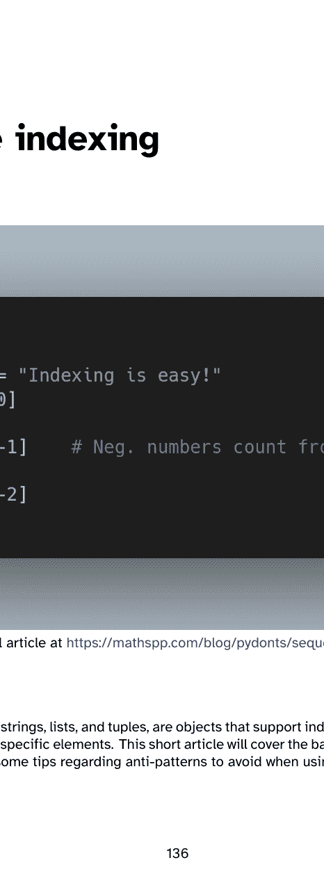

（原文缩略图，链接至https://mathspp.com/blog/pydonts/sequence-indexing。）

## 引言

Python中的序列，如字符串、列表和元组，都是支持索引的对象：这是一种相当简单的操作，我们可以用它来访问特定的元素。这篇短文将介绍序列索引的基础知识，然后就Python代码中使用索引时需要避免的反模式给你一些建议。

在这篇文章中，你将：

-   学习索引序列的基本语法；
-   学习负数索引的工作原理；
-   查看一些常用于处理序列和索引的工具；
-   学习一些索引时的技巧和需要避免的事项；

首先，我需要澄清，这里讨论的是序列索引，以区别于你访问字典值时所使用的索引类型——在字典中，你使用键来索引字典并检索其值。本文我们将讨论使用整数索引线性序列，即我们可以从一端到另一端、按顺序遍历的序列。

此类序列的一个非常简单的例子是字符串：

```
>>> s = "Indexing is easy!"
>>> s
'Indexing is easy!'
```

要索引这个字符串的特定字符，我只需使用方括号和与所需字符对应的整数。Python是从0开始索引的，这意味着它从0开始计算索引。因此，序列的第一个元素可以通过[0]获得。在我们的示例中，这应该得到大写字母"I"：

```
>>> s = "Indexing is easy!"
>>> s[0]
'I'
```

然后，通过将索引增加1，可以得到后续的每个字符：

```
>>> s = "Indexing is easy!"
>>> s[1]
'n'
>>> s[2]
'd'
>>> s[3]
'e'
```

下图展示了如何查看序列并弄清楚每个元素对应的索引：

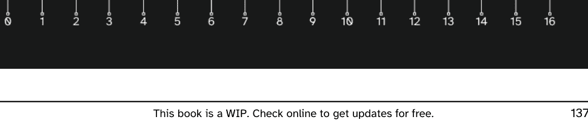

想象一下分隔相邻元素的竖线，然后从最左边的竖线开始为每条竖线编号。每个元素获得与其左侧紧邻的竖线相关联的索引：

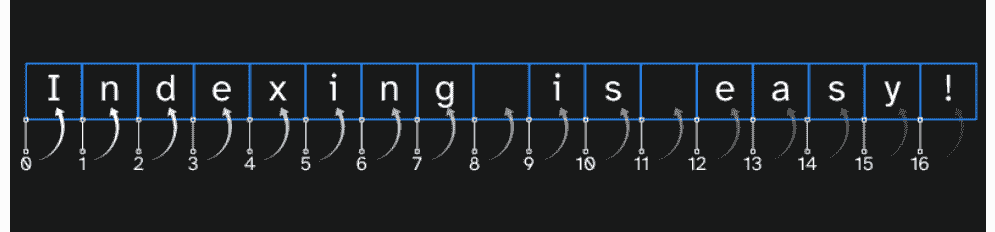

### 最大合法索引与索引错误

因为索引从0开始，所以序列的最后一个合法索引等于序列的长度*减去*1：

```
>>> s = "Indexing is easy!"
>>> len(s)
17
>>> s[16]
'!'
>>> s[17]
Traceback (most recent call last):
  File "<stdin>", line 1, in <module>
IndexError: string index out of range
```

如上所示，如果你使用了一个过大的索引（即大于或等于序列的长度），Python会引发一个`IndexError`，警告你使用了一个对该特定索引操作来说过大的整数。

### 负数索引

如果最后一个合法索引是序列长度减1，那么显然有一种方法可以访问序列的最后一项：

```
>>> s = "Indexing is easy!"
>>> s[len(s)-1]
'!'
>>> l = [12, 45, 11, 89, 0, 99]
>>> l[len(l)-1]
99
```

然而，Python提供了一个非常有趣的功能，你可以使用负数索引从序列末尾开始计数。为了弄清楚哪个负数索引对应哪个元素，可以想象将序列写在它自己的左边：

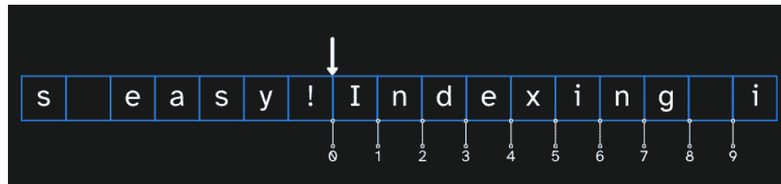

然后你只需从右向左继续编号，从而使用负数：

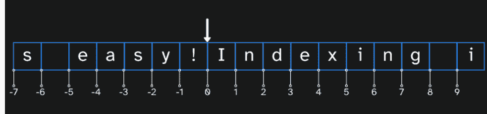

从上图可以看出，索引-1指的是序列的最后一个元素，索引-2指的是倒数第二个，依此类推：

```
>>> s = "Indexing is easy!"
>>> s[-1]
'!'
>>> s[-2]
'y'
```

我们也可以看看适用于我们这个特定序列的所有负数索引：

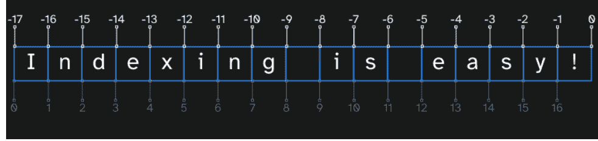

看待负数索引的另一种方式是假设它们左边有一个`len(s)`：

| 负数索引 | 对应的正面索引 |
|---|---|
| -1 | len(s) - 1 |
| -2 | len(s) - 2 |
| -3 | len(s) - 3 |
| ... | ... |
| -len(s) | len(s) - len(s) (等同于0) |

再举几个例子：

```
>>> s = "Indexing is easy!"
>>> s[-5]
'e'
>>> s[len(s)-5]
'e'
>>> s[-13]
'x'
>>> s[len(s)-13]
'x'
>>> len(s)
17
>>> s[-17]
'I'
>>> s[len(s)-17]
'I'
```

### 索引惯用法

学习了索引的基本语法后，有一些索引操作你应该能够立即识别其含义，无需思考：

| 索引操作 | 解释 |
|---|---|
| s[0] | s的第一个元素 |
| s[1] | s的第二个元素 |
| s[-1] | s的最后一个元素 |
| s[-2] | s的倒数第二个元素 |

### 索引还是不索引？

简单提一下，这个问题我偶尔也会遇到。

Python有许多有用的内置函数和内置数据类型。其中，字符串、列表和元组可以用整数进行索引。集合则不能。

你还应该小心那些你*认为*像列表但实际上*不是*的东西。这些包括`enumerate`、`zip`、`map`以及其他对象。这些都不能被索引，都没有`len`值等。请注意这点！

```
>>> l = [0, 1, 2, 3, 4, 5, 6, 7, 8, 9]
>>> e = enumerate(l)
>>> e[3]
Traceback (most recent call last):
  File "<stdin>", line 1, in <module>
TypeError: 'enumerate' object is not subscriptable
>>> z = zip(l)
>>> z[3]
## ...
TypeError: 'zip' object is not subscriptable
>>> m = map(str, l)
>>> m[3]
## ...
TypeError: 'map' object is not subscriptable
```

### 代码中的最佳实践

#### 使用range的循环模式

由于`range`和索引的工作方式，可以理解为`range(len(s))`将生成`s`的所有合法索引：

```
>>> s = "Indexing is easy!"
>>> list(range(len(s)))    # 使用list()来打印值
[0, 1, 2, 3, 4, 5, 6, 7, 8, 9, 10, 11, 12, 13, 14, 15, 16]
>>> s[0]
'I'
>>> s[16]
'!'
```

由此导致的一个结果是，初学者，以及那些更易分心或习惯于其他编程语言的人，最终在`for`循环中使用了一种非常常见的反模式。

为了说明这一点，假设我们想编写一个相当简单的程序来找出字符串中的唯一字母。反模式看起来会是这样：

```
>>> s = "Indexing is easy!"
>>> uniques = []
>>> for idx in range(len(s)):
...     if s[idx] not in uniques:
...         uniques.append(s[idx])
...
>>> uniques
['I', 'n', 'd', 'e', 'x', 'i', 'n', 'g', ' ', 'i', 's', ' ', 'e', 'a', 's', 'y', '!']
```## 大型表达式作为索引

当你处理序列及其索引时，可能最终需要执行一些计算来得到你感兴趣的新索引。例如，假设你想获取字符串的中间元素，但你还不知道 `//` 运算符：

```
>>> s = "Indexing is easy!"
>>> s[len(s)/2]     # len(s)/2 不是整数！！
Traceback (most recent call last):
  File "<stdin>", line 1, in <module>
TypeError: string indices must be integers
>>> len(s)/2
8.5
>>> import math
>>> s[math.floor(len(s)/2)]
' '
>>> s[len(s)//2]    # 专业提示：这里 // 运算符是理想之选
' '
```

我要说什么呢？
看看你刚才用的表达式：
`s[math.floor(len(s)/2)]`
也许是上了年纪，但我读起来有点费劲，因为 `[]` 括住了整个表达式，里面还有几个 `()` 需要我去解析，才能弄清楚哪个是哪个。
如果你需要计算索引的表达式很长（这里的“长”是相对而言的），将这些表达式直接放在 `[]` 内可能会导致代码行很长，进而难以阅读和理解。如果代码行难以理解，你可能就需要加注释，从而产生更多的代码行。
另一种方法是创建一个命名良好的变量来存放新索引计算的结果：

```
>>> s = "Indexing is easy!"
>>> mid_char_idx = math.floor(len(s)/2)
>>> s[mid_char_idx]
' '
```

对于这个简单的例子，请注意新变量名几乎和表达式本身一样长！然而，`s[mid_char_idx]` 非常、非常、易于阅读，无需任何额外注释。
所以，如果你有很长的表达式来计算索引，请三思而后再用它们直接索引序列，考虑使用一个具有描述性名称的中间变量。

## 使用索引进行解包

你经常会处理小组数据，例如，为方便起见，将成对的事物保存在一个小列表中。例如，一个人的名和姓：

```
>>> names = ["Mary", "Doe"]
```

现在你有了这个小函数，它为给定的名字创建正式或非正式的问候语：

```
>>> names = ["Mary", "Doe"]
>>> def greet(names, formal):
...     if formal:
...         return "Hello Miss " + names[1]
...     else:
...         return "Hey there " + names[0]
...
>>> greet(names, True)
'Hello Miss Doe'
>>> greet(names, False)
'Hey there Mary'
```

你可以考虑的一件事，它能为你的代码增添一点清晰度，就是在 `if` 语句之前解包这些名字：

```python
def greet(names, formal):
    first, last = names
    if formal:
        return "Hello Miss " + last
    else:
        return "Hey there " + first
```

这有什么好处，即使我只是增加了一行代码？它使代码的 _意图_ 变得 _更加_ 明显。仅仅从函数的第一行 `first, last = names` 就可以看出，`names` 应该是一个包含某人名和姓的对，然后 `if: ... else: ...` 就变得非常、非常容易理解，因为我们 _立即_ 看到：如果需要正式问候，就使用姓氏，否则（`else`）使用名字。

此外，解包操作（像这样：）

```python
first, last = names
```

强制你的 `greet` 函数期望 `names` 变量是一个对，因为元素少于或多于两个的列表都会引发错误：

```python
>>> first, last = ["Mary", "Anne", "Doe"]
Traceback (most recent call last):
  File "<stdin>", line 1, in <module>
ValueError: too many values to unpack (expected 2)
```

我们假设我们确实在处理“对”，因此如果 `greet` 函数收到的不是一对数据，这个错误有助于发现我们代码中的问题。也许有人不理解如何使用这个函数，只传入了人的名字？

```python
>>> greet("Mary", True)
Traceback (most recent call last):
  File "<stdin>", line 1, in <module>
  File "<stdin>", line 2, in greet
ValueError: too many values to unpack (expected 2)
```

这将帮助你定位到 `greet` 函数未被正确使用的位置。

> 我曾详细写过关于 Python 解包的文章（这是我另一个喜欢的功能！），所以请随意阅读我关于 [带星号赋值的解包](https://mathspp.com/blog/pydonts/unpacking-with-starred-assignments) 和 [深度解包](https://mathspp.com/blog/pydonts/deep-unpacking) 的文章。

## 结论

以下是本文的要点，为你呈上，如银盘托着：

> “索引简单而强大，但有时当索引看起来是答案时，还有另一个 Python 功能正等待被使用。”

这篇 Py不思指南向你展示了：

- Python 中的索引是从 0 开始的；
- Python 序列允许负索引；
- 在 `for` 循环中使用索引来访问序列元素在 Python 中是一种反模式；
- 索引时使用大型表达式会使代码臃肿，更好的做法是使用一个描述性变量，即使该变量名很长；
- 如果你知道你正在处理的序列的确切结构，解包可能比索引更可取。

# 惯用的序列切片

```
>>> c = [0, 1, 2, 3]
# 使用切片 [::] 会创建 `c` 的一个副本，
# 而 `a = b` 则意味着 `a` 和 `b` 将指向同一个对象。
>>> a = b = c[:]
>>> print(a is b, a is c, b is c)
True False False
>>> a.append(4)
>>> a, b, c
([0, 1, 2, 3, 4], [0, 1, 2, 3, 4], [0, 1, 2, 3])
```

（原文缩略图见 https://mathspp.com/blog/pydonts/idiomatic-sequence-slicing。）

## 引言

上次我们回顾了 Python 中的[序列索引](https://mathspp.com/blog/pydonts/sequence-indexing)，为下一个讨论主题——序列切片——打下了基础。切片是访问序列（如列表和元组）部分元素的一种“更高级”的方式。我说它更高级，只是因为索引是访问序列元素最简单的方式；正如你将看到的，索引本身也并不那么复杂。

事实证明，关于序列切可以说的内容很多，所以我将把所有内容分成两篇 Py不思指南，本篇和下一篇。

在这篇 Py不思指南中，你将学到：

## 切片语法

Python中的切片是指从一个较大序列的连续位置提取出一系列元素。可以想象成用一把真实的刀切过你正在操作的序列（可能是字符串、列表、元组等），从中取出一小段。

例如，假设我们操作字符串`"Slicing is easy!"`，如下所示：

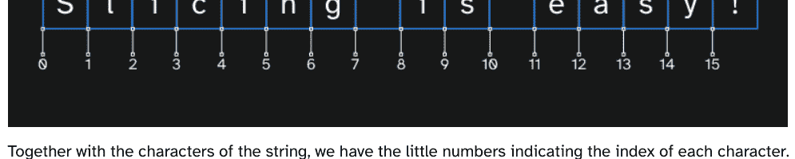

除了字符串的字符外，我们还有表示每个字符索引的小数字。每个小数字对应其正前方方框的索引。这是我思考Python索引时脑中会浮现的图示，尤其在处理负索引时。（如果需要回顾Python中索引的工作方式，可以快速浏览这个Pydon't教程。）

现在，我们可能想提取字符串中的`"icing"`部分：

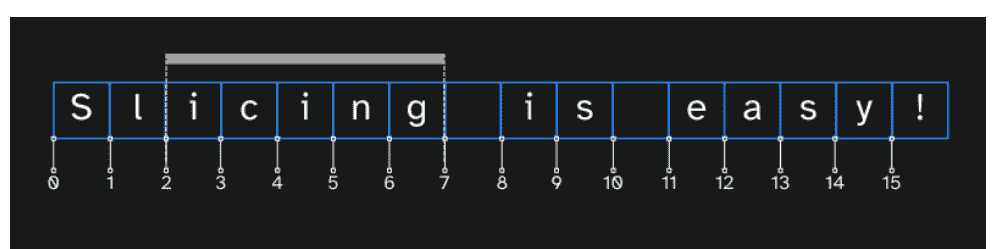

在Python中如何实现呢？如果不知道切片的工作原理，可能会想出一个使用`for`循环和`range`的解决方案：

```
>>> s = "Slicing is easy!"
>>> subs = ""
>>> for i in range(2, 7):
...     subs += s[i]
...
>>> subs
'icing'
```

这没问题，但对于这类操作，有一个更简洁的语法——切片语法。

对序列进行切片时，需要使用方括号`[]`和冒号`:`来分隔起点和终点。关键在于确定起点和终点，而这只需查看上面的图示或使用`range(2, 7)`的解决方案即可：

```
>>> s = "Slicing is easy!"
>>> s[2:7]
'icing'
```

这是关于切片需要明确的首要重点：起点和终点定义了你将提取内容的边界，换句话说，起点（在前面的例子中是2）是切片中包含的第一个元素的索引，而终点是切片中不包含的第一个元素的索引：

```
>>> s = "Slicing is easy!"
>>> s[2:7]
'icing'
>>> s[7]
' '
```

现在是启动你的Python解释器，将`s`定义为字符串`"Slicing is easy!"`，并自己尝试几个切片的好时机。

## 切什么？

以防之前不清楚，以下只是Python中可以切片的一部分对象：

```
python
>>> "Hello"[1:3]          # 字符串
'el'
>>> [True, False, 1, "hey"][1:3] # 列表
[False, 1]
>>> (True, False, 1, "hey")[1:3] # 元组
(False, 1)
>>> range(10)[1:3]        # range对象
range(1, 3)
>>> # 等等...
```

不过，为了保持一致性，本Pydon't教程的大部分内容都将使用字符串示例。

## 从开头切片

现在假设我们想从字符串中提取`"Slicing"`。

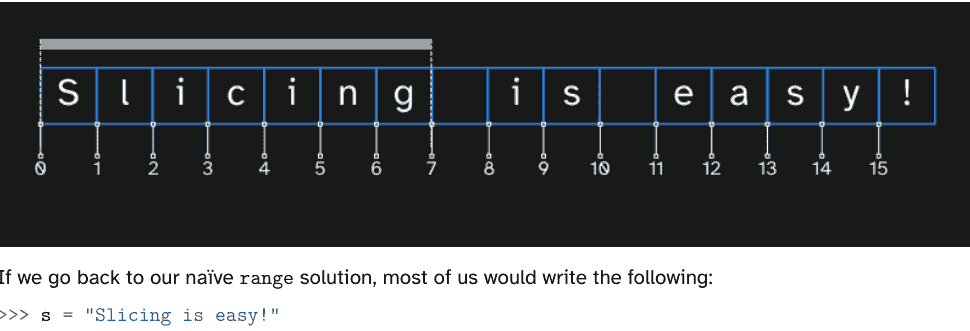

如果回到我们最初的`range`解决方案，大多数人会写成：

```
python
>>> s = "Slicing is easy!"
>>> subs = ""
>>> for i in range(7):
...     subs += s[i]
...
>>> subs
'Slicing'
```

注意，与我们用`range(2, 7)`提取`"icing"`不同，现在我们的`range`只有一个参数——终点。这是因为`range`将缺失的起始索引解释为0。

使用切片时，我们可以做类似的事情！如果想从序列开头提取一部分，Python风格的写法是*不*显式指定起点0。因此，以下两种方式都可以，但第二种是更推荐的：

```
python
>>> s = "Slicing is easy!"
>>> s[0:7]  # 可以...
'Slicing'
>>> s[:7]   # ...但更推荐这种写法！
'Slicing'
```

就我一直在分享的图示而言，可以这样理解：就像你从未告诉Python从哪里开始切片，所以悬停在字符串上方的栏最终覆盖了整个字符串的开头，直到你指定的位置停止。

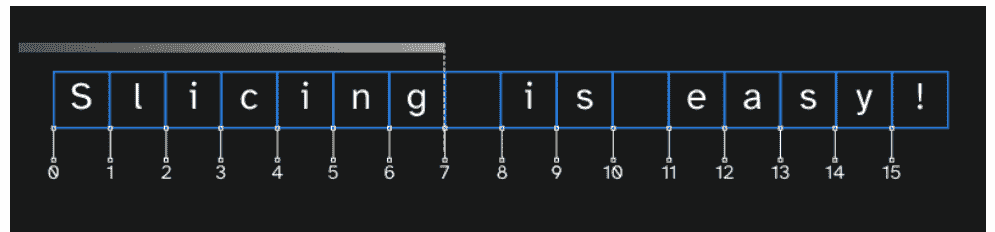

## 切到末尾

与省略起点类似，你也可以省略切片的终点。要预测如果这样做会发生什么，我们只需查看上面的图示并创建一个新的图示，让栏指向另一个方向：

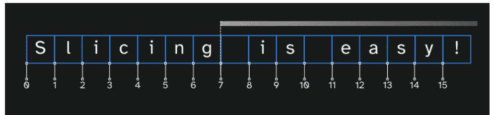

因此，如果我们不指定切片的终点，将提取从指定点开始的所有元素。当然，我们可以将切片的终点指定为序列的长度，但这增加了太多视觉干扰：

```
>>> s = "Slicing is easy!"
>>> s[7:len(s)]    # 可以...
' is easy!'
>>> s[7:]          # ...但更推荐这种写法！
' is easy!'
```

## 使用负索引切片

如果你读过我之前的Pydon't教程，你已经了解了负索引的工作原理。切片也可以使用负索引，逻辑保持不变：我们只需画出栏来选择相关索引之间的元素。

为了说明这一点，这里是我们目前使用的字符串的负索引表示：

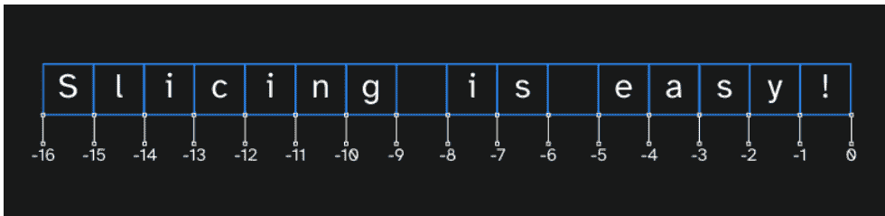

现在，不管数字是负数，如果你要告诉我在哪里画两个垂直栏来包围子串`"icing"`，你会指出哪些位置？你可能会告诉我“在-14和-9的位置画栏”，这完全正确！

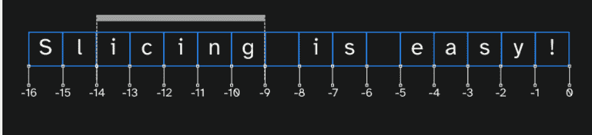

实际上，使用-14和-9在我的朴素`range`解决方案中有效，而且——更重要的是——在切片语法中也有效：

```
>>> s = "Slicing is easy!"
>>> subs = ""
>>> for i in range(-14, -9):
...     subs += s[i]
...
>>> subs
'icing'
>>> s[-14:-9]      # 也有效，并且更推荐！
'icing'
```

## 切片与range

至此，你应该开始注意到一个模式，那就是你在切片中插入的参数似乎在控制Python用于从序列中获取元素的*索引*，就像这些索引是用`range`函数生成的一样。如果你看到一个切片却不知道它会选择哪些元素，可以尝试用`range`的方式来思考这个切片。这可能会帮助你理解。

## 地道的切片模式

既然你已经了解了一些使用正负索引的基本切片，并且知道你可以省略切片的第一个或最后一个参数，现在你确实应该学习四种真正地道的切片模式。别担心，我会告诉你我所说的这四种模式。

假设你有一个变量`n`是一个正整数（可以想象为一个较小的整数，比如1或2），并假设`s`是某个支持切片的序列。以下是我所说的四种地道的切片模式：

- s[n:]
- s[-n:]
- s[:n]
- s[:-n]

为什么这些是“地道的”切片模式？这些是地道的，因为稍加练习后，你就会停止将它们看作“从位置blah开始切片s，到位置blah blah结束”，而开始理解它们的语义含义。

打开你的Python解释器，设置`s = "Slicing is easy!"`和`n = 2`，看看上面的四个切片分别返回什么。尝试使用其他`n`值进行实验。你能解释每个切片的含义吗？

继续尝试吧...

以下是这些切片模式的含义。

**s[n:]**

如果`n`不是负数（即0或更大），那么`s[n:]`表示“跳过s的前n个元素”：

```
>>> s = "Slicing is easy!"
>>> s[2:]
'icing is easy!'
>>> s[3:]
'cing is easy!'
>>> s[4:]
'ing is easy!'
```

**s[-n:]**

如果`n`是正数（即1或更大），那么`s[-n:]`表示“s的最后n个元素”：

```
>>> s = "Slicing is easy!"
>>> s[-2:]
'y!'
>>> s[-3:]
'sy!'
>>> s[-4:]
'asy!'
```## s[-n:]

注意 n = 0 的情况，因为 -0 == 0，这意味着我们实际上使用的是*前一个*切片模式，即“跳过前 n 个字符”，也就是跳过零个字符并返回整个序列：

```python
>>> s = "Slicing is easy!"
>>> s[-0:]
'Slicing is easy!'
```

## s[:n]

如果 n 不是负数（即 0 或更大），那么 s[:n] 可以理解为“s 的前 n 个元素”：

```python
>>> s = "Slicing is easy!"
>>> s[:2]
'Sl'
>>> s[:3]
'Sli'
>>> s[:4]
'Slic'
```

## s[:-n]

最后，如果 n 是正数（即 1 或更大），那么 s[:-n] 表示“丢弃 s 的最后 n 个元素”：

```python
>>> s = "Slicing is easy!"
>>> s[:-2]
'Slicing is eas'
>>> s[:-3]
'Slicing is ea'
>>> s[:-4]
'Slicing is e'
```

与 s[-n:] 模式一样，当 n = 0 时需要小心，因为惯用法 s[:-n] 并不真正适用，我们应该参考前一个惯用法。

## 空切片

值得注意的是，有些人可能会感到困惑，但有些人不会：如果你混淆了起始点和结束点，最终会得到空切片，因为你的起始点在结束点的右侧……而且由于负索引的存在，仅仅检查起始点是否小于结束点是*不够*的。

请看下图：

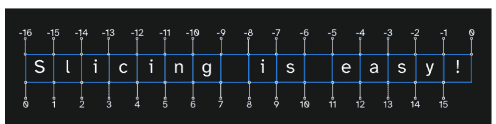

现在试着弄清楚为什么所有这些切片都是空的：

```python
>>> s = "Slicing is easy!"
>>> s[10:5]
''
>>> s[-6:-10]
''
>>> s[-9:3]
''
>>> s[10:-10]
''
```

只需查看上图，并意识到结束点是相对于一个*位于*起始点*左侧*的索引。

## 更多空切片

关于切片的另一个非常有趣的事情是，如果你使用的数字*太大*或*太小*，切片仍然有效，不会引发 `IndexError` 或类似错误。在某种程度上，这是合理的，并且符合我们上面介绍的惯用法的解释。

如果 `s[50:]` 是“跳过 s 的前 50 个元素”，而 `s` 只有 16 个元素，那么还剩下多少个？自然是零个，所以当 `s = "Slicing is easy!"` 时，`s[50:]` 返回空字符串也就不足为奇了：

```python
>>> s = "Slicing is easy!"
>>> s[50:]
''
```

这自然地引出了切片的第一个常见使用模式。

## 代码示例

### 确保最多 n 个元素

假设有人正在编写一个拼写检查器，他们有一个函数，该函数接受一个拼写错误的单词，并返回用户可能想输入的前 5 个最接近的建议。

该函数可能如下所示：

```python
def compute_top_suggestions(misspelled, k, corpus):
    similar = find_similar(misspelled, corpus)
    ordered = rank_suggestions_by_similarity(misspelled, similar)
    top_k = []
    for i in range(min(k, len(ordered))):
        top_k.append(ordered[i])
    return top_k
```

最后的循环是为了确保你返回*最多 k* 个结果。然而，编写这段代码的人没有阅读这篇 Pydon't！因为如果他们读了，他们就会知道你可以使用切片从 ordered 中提取*最多 k* 个元素：

```python
def compute_top_suggestions(misspelled, k, corpus):
    similar = find_similar(misspelled, corpus)
    ordered = rank_suggestions_by_similarity(misspelled, similar)
    return ordered[:k]
    # ^ 惯用法！读作“从开头返回最多 `k` 个”
```

当你想从末尾返回最多 k 个元素时，会出现一个非常相似的使用模式，但你已经知道了，因为你阅读了我之前分享的四个切片惯用法。

这种切片使用模式可以以多种方式出现，因为我们只是因为这个特定惯用法的语义含义而使用切片。上面，我们看到了四个不同的惯用法，所以在处理序列时请记住它们！

### 字符串的开头

切片很棒，我希望我已经说服了你，但切片并不是解决你所有问题的答案！

切片的一个常见用例是检查给定序列是否以预定义的值集开头。例如，我们可能想知道一个字符串是否以四个字符 ">>> " 开头，这些字符是标记 REPL Python 提示符的字符。例如，Python 的 doctest 模块执行类似的检查，因此我们将能够将我们的解决方案与 doctest 的进行比较。

你刚刚学习了切片，并且知道 s[:4] 可以惯用地理解为“s 的前四个字符”，所以你可能会写类似这样的代码

```python
def check_prompt(line):
    if line[:4] == ">>> ":
        return True
    return False
```

或者，更优雅地，

```python
def check_prompt(line):
    return line[:4] == ">>> "
```

*然而*，重要的是要注意这不是最佳解决方案，因为 Python 字符串有一个适合此类检查的方法：`startswith` 函数。

因此，最佳解决方案是

```python
def check_prompt(line):
    return line.startswith(">>> ")
```

这更好，因为这是一个经过测试和信任的函数，完全满足你的需求，因此代码非常清晰地表达了你的意图。更重要的是，如果你以后更改了提示符，你不需要记住还要更改切片中使用的索引。

如果我们查看 doctest 的实际源代码，他们写的是

```python
## 来自 Python 3.9.2 的 Lib/doctest.py 中的 _check_prefix 内部
## ...
if line and not line.startswith(prefix):
    # ...
```

正如我们在这里看到的，他们使用 startswith 方法来查看 line 是否以作为参数给出的 prefix 开头。

> 与 startswith 类似，字符串也定义了一个 endswith 方法。

### 移除前缀和后缀

与上面的示例类似，切片的另一个常见使用模式是从序列中移除前缀或后缀，尤其是从字符串中。例如，我在这些 Pydon'ts 中展示的大多数代码都以 ">>> " 开头，因为 REPL 提示符。我如何编写一个简短的函数来从代码行中剥离这个提示符？我对切片非常兴奋，所以显然我会这样做

```python
>>> def strip_prompt(line):
...     if line.startswith(">>> "):
...         return line[4:]
...     else:
...         return line
...
>>> strip_prompt(">>> 3 + 3")
'3 + 3'
>>> strip_prompt("6")
'6'
```

或者更好的是，我可能会以通用的方式进行并省略 else：

```python
>>> def strip_prefix(line, prefix):
...     if line.startswith(prefix)
...         return line[len(prefix):]
...     return line
...
>>> prompt = ">>> "
>>> strip_prefix(">>> 3 + 3", prompt)
'3 + 3'
>>> strip_prefix("6", prompt)
'6'
```

然而，我的机器上已经安装了 Python 3.9，所以我*应该*使用 Python 提供的字符串方法：

```python
def strip_prefix(line, prefix):
    return line.removeprefix(prefix)
```

当然，此时定义我自己的函数是多余的，我只会使用

```python
>>> prompt = ">>> "
>>> ">>> 3 + 3".removeprefix(prompt)
'3 + 3'
>>> "6".removeprefix(prompt)
'6'
```

如果你感兴趣，Python 3.9 还添加了一个 `removesuffix` 方法，它执行类似的操作，但在字符串的末尾。

这仅仅表明，尝试并或多或少地跟上你最喜欢/最常用的编程语言中添加的功能是很好的。此外（！），这也表明在网上查找代码片段时，例如在 StackOverflow 上，必须小心。StackOverflow 有很棒的答案……但会过时，所以总是要注意票数最高的答案，也要注意最新的答案，它们可能包含更现代的方法。

## 结论

这是这篇 Pydon't 的主要收获，为你奉上：

> “切片和索引之间的关系意味着有四种非常好的惯用切片用法，非常值得了解。”

这篇 Pydon't 向你展示了：

- 切片序列允许你访问一系列连续的元素；
- 你可以切片字符串、列表、元组、范围等；
- 如果省略 start 参数，切片从序列的开头开始；
- 如果省略 end 参数，切片在序列的末尾结束；
- 切片与使用具有相同参数的 `for` 循环和 `range` 选择元素相同；
- 与普通索引非常相似，可以使用负整数，这些整数从序列的末尾开始计数；
- `s[n:]`、`s[-n:]`、`s[:n]` 和 `s[:-n]` 是四种具有清晰语义含义的惯用切片模式：
    - `s[n:]` 是“跳过 s 的前 n 个元素”；
    - `s[-n:]` 是“s 的最后 n 个元素”；
    - `s[:n]` 是“s 的前 n 个元素”；
    - `s[:-n]` 是“跳过 s 的最后 n 个元素”；
- 参数过大的切片会产生空序列；
- 如果参数顺序错误，会产生空序列；以及
- 一些看似需要切片的操作可能有更好的替代方案，例如对字符串使用 `startswith`、`endswith`、`removeprefix` 和 `removesuffix`。## 参考文献

-   Python 3 文档，Python 语言参考，表达式 – 切片，https://docs.python.org/3/reference/expressions.html#slicings [最后访问于 2021-04-20]；
-   Python 3 文档，Python 语言参考，数据模型 – 标准类型层次结构，https://docs.python.org/3/reference/datamodel.html#the-standard-type-hierarchy [最后访问于 2021-04-20]；
-   Python 3 文档，Python 语言参考，数据模型 – 模拟容器类型，https://docs.python.org/3/reference/datamodel.html#emulating-container-types [最后访问于 2021-04-20]；
-   Python 3 文档，Python 语言参考，内置函数，slice，https://docs.python.org/3/library/functions.html#slice [最后访问于 2021-04-20]；
-   《Effective Python – 90 Specific Ways to Write Better Python》；Slatkin, Brett；ISBN 9780134853987。

# 精通序列切片

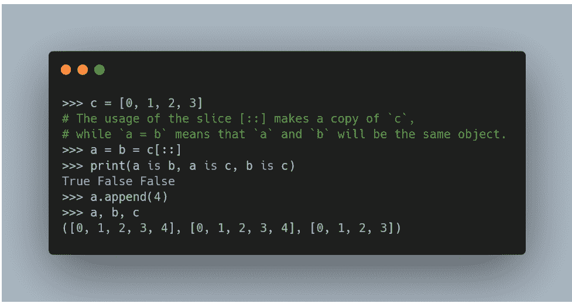

（原文缩略图，发布于 https://mathspp.com/blog/pydonts/mastering-sequence-slicing。）

## 引言

在上一篇 Pydon't 中，我们探讨了如何使用序列切片来操作序列，例如字符串或列表。在这篇 Pydon't 中，我们将继续讨论序列切片的主题，但会涉及更高级的话题。具体来说，在这篇 Pydon't 中，你将：

-   了解切片中的步长参数；
-   看看如何使用切片来复制序列；
-   了解切片赋值；
-   学习更多地道的切片模式；

事实证明，关于序列切片有很多内容要讲，所以我将不得不再次拆分这篇 Pydon't，下次我们将通过以下内容来结束序列切片的主题：

-   揭示围绕序列切片的两层语法糖；以及
-   看看如何为你的自定义对象实现切片。

## 切片步长

你精通 Python 切片之旅的下一站是了解切片语法中较少使用的第三个参数：步长。

### 仅步长

步长是你可以在切片语法中添加的第三个整数，它允许你从序列中均匀间隔地选取元素。如果 `s` 是一个序列，那么你已经见过如何使用语法 `s[start:end]` 进行切片，而步长跟在这两个参数之后：`s[start:end:step]`。理解步长参数工作原理的最简单方法是省略 `start` 和 `end` 参数，像这样：`s[::step]`。

这里有几个例子：

```
>>> "a0b0c0d0" [::2]
'abcd'
>>> "a00b00c00d00" [::3]
'abcd'
>>> "a000b000c000d000" [::4]
'abcd'
```

如你所见，在上面的所有例子中，我们都使用了步长参数来跳过字母之间的所有零。

-   当步长参数为 2 时，你将序列分成每组 2 个元素，并选取每组的第一个元素。
-   当步长参数为 3 时，你将序列分成每组 3 个元素，并选取每组的第一个元素。
-   当步长参数为 4 时，你将序列分成每组 4 个元素，并选取每组的第一个元素。
-   ...

你明白了吧？再次注意，切片中的步长参数与内置 `range` 函数接受的第三个（可选）参数密切相关。

### 起始、停止和步长

当你同时指定了起始和停止位置时，Python 会首先确定由起始和停止参数所包含的序列部分，然后才使用步长从该部分中选取正确的元素。

例如，你能解释一下这个结果吗：

```
>>> s = 'Slicing is easy!'
>>> s[2:14:2]
'iigi a'
```

首先发生的是 `s[2:14]` 告诉 Python 我们只想处理原始字符串的一部分：

```
>>> s = 'Slicing is easy!'
>>> s[2:14]
'icing is eas'
```

然后步长参数开始工作，告诉 Python 只选取一些元素，如下图所示：

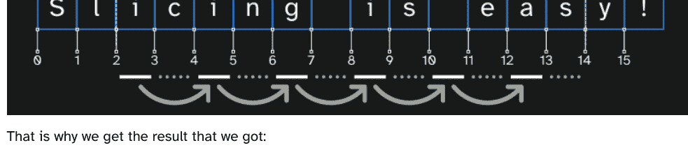

这就是为什么我们得到这个结果：

```
>>> s = 'Slicing is easy!'
>>> s[2:14:2]
'iigi a'
## 我们也可以先获取子字符串，然后使用 `step`...
>>> sub = s[2:14]
>>> sub[::2]
'iigi a'
## ... 或者连续执行两者，无需中间变量：
>>> s[2:14][::2]
'iigi a'
```

再试一次，试着弄清楚这个结果是什么：

```
>>> s = "Slicing is easy!"
>>> s[2:14:3]
## ..?
```

为了帮助你，这里有一张示意图，展示了上面的切片：

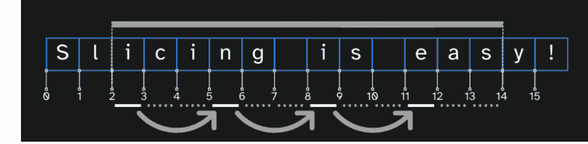

这就是为什么我们得到：

```
>>> s = "Slicing is easy!"
>>> s[2:14:3]
'ine'
```

## 单位步长和空步长

与起始和停止参数类似，步长参数也可以省略。当我们写 `[start:stop]` 形式的切片时就是这样做的：通过不包含步长参数，我们使用其默认值，即 1。这等同于写 `[start:stop:]`，也等同于写 `[start:stop:1]`。简而言之，所有这三个切片都是等价的：

-   `s[start:stop]`；
-   `s[start:stop:]`；以及
-   `s[start:stop:1]`。

这里只有一个例子：

```
>>> s = "Slicing is easy!"
>>> s[2:14]
'icing is eas'
>>> s[2:14:]
'icing is eas'
>>> s[2:14:1]
'icing is eas'
```

> 这与 `range` 完全相同。当未指定第三个参数时，默认取值为 1。

## 负步长

我们已经看到了正步长参数的行为，现在我们将看看负步长的行为。这是事情真正变得混乱的地方，此时如果你熟悉 `range` 如何使用三个参数，那么理解切片的工作原理会更容易。

当你指定一个切片 `s[start:stop:step]` 时，你将得到 `s` 中索引由 `range(start, stop, step)` 指向的元素。如果 `step` 是负数，那么 `range` 函数将从 `start` 到 `stop` 反向计数。这意味着 `start` 需要大于 `stop`，否则就没有可计数的内容。

例如，`range(3, 10)` 给出整数 3 到 9。如果你想得到整数 9 到 3，你可以使用步长 `-1`，但你也需要交换 `start` 和 `stop` 参数。不仅如此，你还需要稍微调整它们。`start` 参数是结果中包含的*第一个*数字，而 `stop` 参数是*不*包含的第一个数字，所以如果你想从 9 到 3 倒数，你需要 `start` 参数为 9，`stop` 参数为 2：

```
>>> list(range(3, 10))
[3, 4, 5, 6, 7, 8]
>>> list(range(3, 10, -1))   # 你不能从 3 开始*向下*数到 10。
[]
>>> list(range(10, 3, -1))   # 从 10 开始，在 3 之前停止。
[10, 9, 8, 7, 6, 5, 4]
>>> list(range(9, 2, -1))    # 从 9 开始，在 2 之前停止。
[9, 8, 7, 6, 5, 4, 3]
```

如果你有点困惑，这是正常的。花点时间玩一下 `range`，感受一下它是如何工作的。

使用上面的 `range` 结果和下面的图，你应该能弄清楚为什么这些切片返回这些值：

```
>>> s[3:10]
'cing is'
>>> s[3:10:-1]
''
>>> s[10:3:-1]
' si gni'
>>> s[9:2:-1]
'si gnic'
```

使用上面的 `range` 结果和这张图来帮助你：

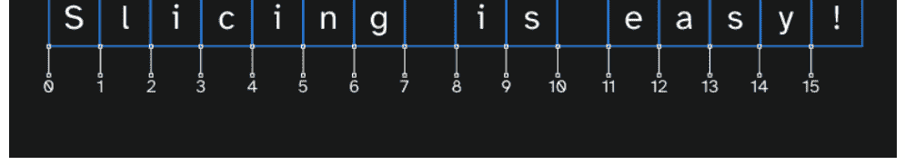

如果你想使用不同于 `-1` 的负步长，同样的原则适用：你的字符串切片的 `start` 参数应该大于 `stop` 参数（这样你才能从 `start` 倒数到 `stop`），然后绝对值将告诉你一次跳过多少个元素。花点时间算出这些结果：

```
>>> s = 'Slicing is easy!'
>>> s[15:2:-2]
'!ysae si gnic'
>>> s[15:2:-3]
'!ses nc'
>>> s[15:2:-4]
'!asgc'
>>> s[15:2:-5]
'!e c'
```

> 需要强调一个重要说明：虽然 `range` 接受负整数作为起始和结束参数，并将其解释为实际的负数，但请记住切片也接受负数，但这些负数是在你正在切片的序列的上下文中解释的。
这意味着什么？
这意味着如果切片 `s[start:stop:step]` 中的 `step` 是负数，那么 `start` 需要引用一个在 `stop` 所引用元素右侧的元素。

我将给你一个明确的例子，说明上述说明试图警告你的那种混淆：

```
python
>>> s = 'Slicing is easy!'
>>> list(range(2, -2, -1))
[2, 1, 0, -1]
>>> s[2:-2:-1]
''
>>> s[2]
'i'
>>> s[-2]
'y'
```

注意 `range(2, -2, -1)` 中有四个整数，但 `s[2:-2:-1]` 是一个空切片。为什么？因为 `s[2]` 是 `s` 中的第一个 "i"，而 `s[-2]` 是字符串末尾附近的 "y"。使用步长 -1 会让我们从 "i" 到 "y"，但是从右向左... 如果你从 "i" 开始向左走，你会到达字符串的开头，而不是 "y"。

也许另一种帮助你理解的方法是回忆一下 `s[-2]` 等同于 `s[len(s)-2]`，在这个特定情况下是 `s[14]`。如果我们把上面的代码片段中的所有 `-2` 替换为 `14`，那么切片为什么是空的就更清楚了：

```
python
>>> s = 'Slicing is easy!'
>>> list(range(2, 14, -1))
[]
>>> s[2:14:-1]
''
>>> s[2]
'i'
>>> s[14]
'y'
```

## 反转后跳过

另一种能让你更适应这些负步长的方法，是注意到步长为 `-n` 的切片与两个连续的、步长分别为 `-1` 和 `n` 的切片之间的关系：

```python
>>> s = 'Slicing is easy!'
>>> s[14:3:-2]
'ya igi'
>>> s[14:3:-1]
'ysae si gni'
>>> s[14:3:-1][::2]
'ya igi'
```

我们甚至可以更进一步，认识到 `start` 和 `stop` 参数用于缩短序列，而 `step` 参数则仅用于跳过元素：

```python
>>> s = 'Slicing is easy!'
>>> s[14:3:-2]
'ya igi'
>>> s[4:15]         # 交换 `start` 和 `stop` 并加 1...
'ing is easy'
>>> s[4:15][::-1]    # ...然后反转...
'ysae si gni'
>>> s[4:15][::-1][::2]  # ...然后选取每个其他元素。
'ya igi'
```

## 零

为了完整性，鉴于我们已经考察了严格正步长和严格负步长，让我们简要提一下如果将 `0` 作为步长参数会发生什么：

```python
>>> s = "Slicing is easy!"
>>> s[::0]
Traceback (most recent call last):
  File "<stdin>", line 1, in <module>
ValueError: slice step cannot be zero
```

使用 `0` 作为步长会引发 `ValueError`，仅此而已。

## 建议

> 你知道吗？Python 标准库（PSL）中大约有 6000 处用到了序列切片，但其中只有不到 500 处利用了 `step` 参数？这意味着，在 PSL 中，只有大约 8.33% 的切片操作使用了步长。（这是在我 Windows 机器上的 Python 3.9.2 PSL 中的粗略数据。）

如果非要猜测，我认为主要有两个原因解释了为什么只有一“小部分”切片使用了 `step` 参数：
-   使用不同于 `1` 的步长是一种非常具体的操作，只在少数情况下有意义，并且很大程度上取决于你如何构建数据结构；而且
-   除了 `1` 和 `-1` 之外的其他步长参数会使你的代码更难阅读。

因此，建议你不要对切片过度兴奋，也不要强行将你的数据塑造成切片是获取数据的最佳方式的格式。

例如，*不要*为了能使用 `[::2]` 和 `[1::2]` 来访问它们，而将颜色名称及其十六进制值以交替方式存储。然而，如果出于某种原因你以这种格式收到了数据，那么使用两个切片来拆分数据是完全可接受的：

```python
## 假设我们从 API 或其他地方以这种格式获得了 `colours`...
>>> colours = ["red", "#ff0000", "green", "#00ff00", "blue", "#0000ff"]
>>> names = colours[::2]
>>> names
['red', 'green', 'blue']
>>> hexs = colours[1::2]
>>> hexs
['#ff0000', '#00ff00', '#0000ff']
```

带有三个参数的切片往往很密集，用眼睛解析起来很困难，因为它们被包含在 `[]` 中，然后使用 `::` 分隔参数。如果你写一个形如 `s[a:b:c]` 的切片，可以预期代码的读者需要停下来一会儿才能理解发生了什么。就这一点而言，当你编写一个长或复杂的切片时，首先考虑重新设计代码，这样你就不必编写长或复杂的切片。但如果你最终还是写了，你可能应该注释你的切片，解释正在发生什么。

我查看了 Python 标准库如何使用带三个参数的切片，并在 `dataclasses` 模块的源代码中找到了这个很好的例子：

```python
## 来自 Lib/dataclasses.py, Python 3.9.2
def _process_class(cls, init, repr, eq, order, unsafe_hash, frozen):
    # [为简洁起见，省略了代码]

    # 按照 MRO 的逆序查找我们的基类，并排除
    # 自身。按逆序是为了让更派生的类
    # 能够覆盖基类中较早的字段定义。在
    # 迭代它们时，看看是否有任何基类是冻结的。
    any_frozen_base = False
    has_dataclass_bases = False
    for b in cls.__mro__[-1:0:-1]:
        # ...

    # [为简洁起见，省略了代码]
```

请注意，在使用切片的那个 *for* 循环上方，有 4 行注释，其中 3 行都在说明那个切片的作用：为什么步长参数是 `-1`，因为我们想要“按*逆序*查找我们的基类”，然后它解释了为什么 `start` 和 `stop` 参数分别是 `-1` 和 `0`，正如它所说“并排除自身”。如果我们用一个更简单的序列尝试那个切片，可以看到 `[-1:0:-1]` 确实会反转序列并跳过第一个元素：

```python
>>> s = "Slicing is easy!"
>>> s[-1:0:-1]
'!ysae si gniliC'
```

### 序列复制

在探索了多种不同方式对序列进行切片和分割之后，现在是时候提及一个关于序列切片的重要细微差别：当我们创建一个切片时，我们实际上是在创建原始序列的一个副本。这不一定是坏事。例如，有一种**惯用的切片操作**就利用了这种行为。

我提出这一点是因为重要的是你要意识到这些细微差别，这样你才能对代码的编写方式做出明智的决定。

这种复制行为可能不受欢迎的一个例子是，当你有一个非常大的列表，并且你考虑使用切片来只迭代该列表的一部分。在这种情况下，也许使用切片会浪费资源，因为你只想迭代列表的特定部分，然后就完成了；你实际上*不*需要在之后拥有那个子列表。

> 在这种情况下，你可能想使用 `itertools` 模块中的 `islice` 函数，它创建一个*迭代器*，允许你迭代关心的列表部分。*迭代器*是 Python 中另一个很棒的特性，我将在未来的 Pydon'ts 中探讨它们，敬请期待！

一个简单的方法来验证切片会创建被切片序列的副本如下：

```python
>>> l = [1, 2, 3, 4]
>>> l2 = l
>>> l.append(5)    # 将 5 追加到 l...
>>> l2            # ... 注意 l2 也获得了新的 5，
                  # 所以 l2 = l 并没有复制 l。
[1, 2, 3, 4, 5]
>>> l3 = l[2:5]    # 将 l 切片赋值给 l3。
>>> l3
[3, 4, 5]
>>> l[3] = 42      # 改变 l 的一个值...
>>> l
[1, 2, 3, 42, 5]  # ... 4 被替换成了 42...
>>> l3
[3, 4, 5]         # ... 但 l3 仍然包含原来的 4。
```

### 操纵可变序列

让我们继续这段掌握序列切片的旅程。到目前为止，我们一直在使用切片来提取序列的部分，但切片也可以用来操纵我们序列的内容！
使用切片操纵序列只能用于某些类型的序列，即*可变*序列；也就是我们可以改变的序列。*可变*序列的主要例子是列表，而*不可变*序列的主要例子是字符串。

## 切片赋值

假设 `l` 是一个列表。我们习惯了“常规”赋值，

```python
>>> l = [1, 2, 3, 4]
```

也习惯了给特定索引赋值：

```python
>>> l[2] = 30
>>> l
[1, 2, 30, 4]
```

那么给切片赋值呢？这完全可以！

```python
>>> l[:2] = [10, 20]    # 替换 l 的前 2 个元素。
>>> l
[10, 20, 30, 4]
>>> l[1::2] = [200, 400]  # 交换奇数位置的元素。
>>> l
[10, 200, 30, 400]
```

上面的两个简单例子展示了如何用相同数量的元素替换一些元素。然而，使用更简单的切片，你也可以改变原始切片的大小：

```python
>>> l = [1, 2, 3, 4]
>>> l[:2] = [0, 0, 0, 0, 0]
>>> l
[0, 0, 0, 0, 0, 3, 4]
```

当你有一个这样的切片赋值时，你应该将其读作“用右侧的新序列替换左侧的切片”，所以以上示例读作“用五个零替换 `l` 的前两个元素”。

请注意，如果你使用“扩展切片”（带 `step` 参数的切片），那么左右两侧的元素数量*应该*匹配：

```python
>>> l = [1, 2, 3, 4]
>>> l[::2]  # 这个切片包含两个元素...
[1, 3]
>>> l[::2] = [0, 0, 0, 0, 0]  # ...我们试图用 5 个元素来替换它们。
Traceback (most recent call last):
  File "<stdin>", line 1, in <module>
ValueError: attempt to assign sequence of size 5 to extended slice of size 2
```

在我看来，能够对切片进行赋值使你可以写出一些非常优雅的代码。

例如，当我在探索 Python 标准库时，在 `urljoin` 函数中发现了一个切片赋值的精妙用法。`urllib.parse` 模块中的 `urljoin` 函数接受一个基础路径和一个相对路径，并尝试将两者组合以创建一个绝对路径。这里有一个例子：

## 切片删除

如果你可以对切片进行赋值，那么将空列表 `[]` 赋值给切片会发生什么？你可以通过赋值空列表来实现，但也可以使用 `del` 关键字达到相同效果：

```
>>> l = [1, 2, 3, 4]
>>> l[:2] = []  # 用空列表替换前两个元素。
>>> l
[3, 4]
```

## 更地道的切片用法

既然我们已经学习了一些序列切片的炫酷特性，现在是时候看看如何更好地运用这些特性，以及它们在更地道形式中的体现。所谓*地道代码*，就是你能一目了然、整体理解其功能，而无需逐个推敲每个细节的代码……可以把它想象成“正常”阅读：在你学习时，必须逐字逐句地读，但现在你能整体把握词汇。经过足够多的练习，这些地道代码片段也能被整体识别。

## 偶数位置与奇数位置

一个你可能想记在心里的简单切片是，让你访问序列中所有**偶数位置**元素的切片。那就是 `[::2]`：

```
>>> l = ["even", "odd", "even", "odd", "even"]
>>> l[::2]
['even', 'even', 'even']
```

类似地，`l[1::2]` 给你奇数位置的元素：

```
>>> l = ["even", "odd", "even", "odd", "even"]
>>> l[1::2]
['odd', 'odd']
```

## s[::-1]

一个没有 `start` 和 `stop` 参数、步长为 `-1` 的切片，是一种非常常见的切片模式。事实上，Python 标准库中大约有 100 处这样的切片，这大约占所有使用了步长参数的切片的三分之一。

`s[::-1]` 应读作“序列 `s`，但是反转了”。这里有一个简单的例子：

```
>>> s = "Slicing is easy!"
>>> s[::-1]
'!ysae si gniciilS'
```

值得注意的是，这与之前关于切片创建副本的评论有关：有时你并不想复制整个序列来反转它；例如，如果你只是想按逆序迭代序列。在这种情况下，你可能只想使用内置的 `reversed` 函数。该函数接受一个序列，并允许你按逆序迭代它，而无需支付复制整个序列的额外内存成本。

## l[:] 或 l[::]

如果切片创建了副本，那就意味着切片是复制序列的一种非常简洁的方式！切片 `[:]` 和 `[::]` 会选中整个序列，所以它们是在你真正想要创建副本时——例如，一个列表——复制序列的首选方法。

深拷贝与浅拷贝、按引用传递与按值传递之间的区别，等等，本身就是一个很大的讨论话题。

很容易在 Python 标准库中搜索这个惯用法（以及之前的那些）的使用示例，所以我只给你留一个，来自 `argparse` 模块，其中包含一个名为 `_copy_items` 的辅助函数（我删除了它的注释）：

```
## 摘自 Python 3.9.2 的 Lib/argparse.py
def _copy_items(items):
    if items is None:
        return []
    if type(items) is list:
        return items[:]
    import copy
    return copy.copy(items)
```

请注意这个惯用法与函数名称的契合程度：函数说它复制项目。函数做什么？如果 `items` 参数是一个列表，那么它返回其副本！所以 `l[:]` 和 `l[::]` 应读作“`l` 的一个副本”。

这个惯用法也解释了文章开头的缩略图图片。

## del l[:]

另一个使用了切片 `[:]` 的惯用法，但带有额外内容，就是删除列表内容的惯用法。

将 `l[:]` 想象为“展开 `l`”，那么 `del l[:]` 就读作“展开 `l` 以删除其内容”。这与执行 `l[:] = []` 效果相同，但与执行 `l = []` 不同，也与执行 `del l` 不同。

很容易看出为什么 `del l` 与其他不同：`del l` 意味着名称 `l` 不再被使用：

```
>>> l = [1, 2, 3, 4]
>>> del l
>>> l
Traceback (most recent call last):
  File "<stdin>", line 1, in <module>
NameError: name 'l' is not defined
```

而这个惯用法只是清空了列表：

```
>>> l = [1, 2, 3, 4]
>>> del l[:]
>>> l
[]
```

可能更难理解的是为什么 `del l[:]` 和 `l[:] = []` 与 `l = []` 不同。我将给你一个例子来清楚地展示它们的不同，然后你自己决定是否要费尽脑力去理解发生了什么。

首先，让我使用 `l[:] = ...`

```
>>> l = l_shallow = [1, 2, 3]
>>> l_shallow is l
True
>>> j = []
>>> l[:] = j
>>> l
[]
>>> l_shallow
[]
>>> l is j
False
>>> l_shallow is l
True
```

现在让我将它与 `l = ...` 进行比较

```
>>> l = l_shallow = [1, 2, 3]
>>> l_shallow is l
True
>>> j = []
>>> l = j
>>> l
[]
>>> l_shallow
[1, 2, 3]
>>> l is j
True
>>> l_shallow is l
False
```

你可以看到上面比较的结果，比如 `l is j` 和 `l_shallow is l`，以及 `l_shallow` 的内容，在两个例子中都发生了变化。因此，这两件事不可能相同。怎么回事？嗯，深拷贝与浅拷贝，以及对可变对象的引用等等，是罪魁祸首！我将把这个更深入的讨论推迟到以后的 Pydon't 专栏，因为这一篇已经很长了。

只要记住，`l[:] = []` 和 `del l[:]` 可以理解为“删除 `l` 的*内容*”。

## 结论

这就是本次 Pydon't 的主要收获，为你奉上：

> “切片*确实*非常强大，当你在处理序列（如字符串和列表）时，掌握它们是一个必备工具。”

本次 Pydon't 向你展示：

-   切片可以有一个 `step` 参数，允许跳过序列的元素；
-   `step` 参数的默认值是 1；
-   负数步长允许从序列末尾向开头选取元素；
-   当使用负数步长时，`start` 参数应指向序列中相对于 `stop` 参数所指元素的*右侧*元素；
-   切片（使用负数步长）与内置的 `range` 函数之间存在平行关系；
-   `0` 不是切片有效的 `step` 参数值；
-   切片更常见的是只包含 `start` 和 `stop` 参数，部分原因是因为带有 `[start:stop:step]` 的切片可能真的很难阅读；
-   切片创建的是我们所查看序列部分的*副本*，所以在内存受限时你必须注意这一点；
-   你可以对可变对象（如列表）的切片进行赋值；

- 当对切片进行赋值时，如果左侧使用简单的切片（不带步长参数），且右侧序列的元素数量不同，则序列的最终长度可能会改变；
- 你可以使用 `del` 关键字来删除可变序列的切片，也可以将空序列赋给这些切片以达到相同效果；
- 有一些有趣的惯用切片值得注意：
    - `s[::2]` 和 `s[1::2]` 分别表示“`s` 中偶数位置的元素”和“`s` 中奇数位置的元素”；
    - `s[::-1]` 表示“`s` 的反转”；
    - `l[:]` 和 `l[::]` 表示“`l` 的一个副本”；而
    - `del l[:]` 表示“删除 `l` 的内容”或“清空 `l`”，这与执行 `l = []` 不同。

## 参考文献

- Python 3 Documentation, The Python Language Reference, Expressions – Slicings, https://docs.python.org/3/reference/expressions.html#slicings [last accessed 20-04-2021];
- Python 3 Documentation, The Python Language Reference, Data Model – The Standard Type Hierarchy, https://docs.python.org/3/reference/datamodel.html#the-standard-type-hierarchy [last accessed 20-04-2021];
- Python 3 Documentation, The Python Language Reference, Data Model – Emulating Container Types, https://docs.python.org/3/reference/datamodel.html#emulating-container-types [last accessed 20-04-2021];
- Python 3 Documentation, The Python Language Reference, Built-in Functions, slice, https://docs.python.org/3/library/functions.html#slice [last accessed 20-04-2021];
- Python 3 Documentation, The Python Language Reference, Built-in Functions, range, https://docs.python.org/3/library/functions.html#func-range [last accessed 03-05-2021];
- Python 3 Documentation, The Python Language Reference, Built-in Functions, filter, https://docs.python.org/3/library/functions.html#filter [last accessed 11-05-2021];
- Python 3 Documentation, The Python Language Reference, Built-in Functions, reversed, https://docs.python.org/3/library/functions.html#reversed [last accessed 11-05-2021];
- Python 3 Documentation, The Python Standard Library, dataclasses, https://docs.python.org/3/library/dataclasses.html [11-05-2021];
- Python 3 Documentation, The Python Standard Library, itertools, islice, https://docs.python.org/3/library/itertools.html#itertools.islice [11-05-2021];
- Python 3 Documentation, The Python Standard Library, urllib.parse, urljoin, https://docs.python.org/3/library/urllib.parse.html#urllib.parse.urljoin [11-05-2021];
- 《Effective Python – 90 Specific Ways to Write Better Python》；作者：Slatkin, Brett；ISBN 9780134853987；
- Stack Overflow，“Why would I want to use itertools.islice instead of normal list slicing?”，https://stackoverflow.com/q/32172612/2828287 [last accessed 10-05-2021].

# 序列切片的内部工作原理

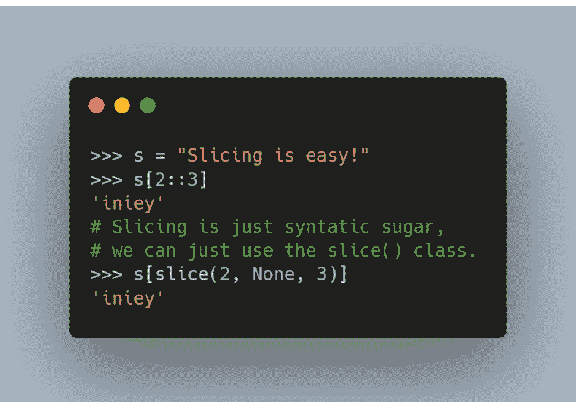

（原文文章缩略图：https://mathspp.com/blog/pydonts/inner-workings-of-sequence-slicing。）

## 引言

我们已经写过两篇关于序列切片的 Pydon’t：

1.  “惯用序列切片”；以及
2.  “掌握序列切片”。

那两篇 Pydon’t 教会了你关于序列切片几乎所有的知识，但今天我们要探讨的是另一部分内容：

- 揭开围绕序列切片的两层语法糖；以及
- 看看如何为你的自定义对象实现切片功能。

如果你不真正了解序列切片的工作原理，你可能需要看看我上面链接的 Pydon’t。特别是关于掌握序列切片的那篇，它真的可以帮助你将 Python 切片技巧提升到一个新的水平。

话不多说，让我们开始吧！

## slice 类

我不知道你是否了解，但 Python 在其详尽的文档中有一个专门介绍内置函数的部分。在那里，你可以找到像 bool、enumerate 或 len 这样的函数。如果你查看以“s”开头的内置函数，你会在其中找到 slice！

查看关于 slice 的文档，我们发现它的出现方式类似于 int 或 str，这意味着 slice 定义了我们程序中可以拥有的一种对象类型：就像 int(3) 创建一个整数 3 或 str(3) 创建一个字符串 "3"，slice(3) 创建一个切片：

```
>>> print(slice(3))
slice(None, 3, None)
```

这是我们在本 Pydon’t 中揭开的第一层语法糖：当我们编写 s[2::3] 这样的代码时，Python 就在使用这些 slice 对象！但首先，让我们进一步探索一下 slice 对象。

## 切片参数

如果我们阅读文档，或者足够多地玩转 slice 内置函数，我们会发现这个对象存储了我们在前面的 Pydon’t 中反复讨论的切片参数。这些参数是 slice 的 start、stop 和 step 参数，文档告诉我们如何访问它们：

```
>>> sl = slice(1, 12, 3)
>>> sl.start
1
>>> sl.stop
12
>>> sl.step
3
```

然而，我们无法修改它们：

```
>>> sl = slice(None, 3, None)
>>> print(sl.start)
None
>>> sl.start = 0
Traceback (most recent call last):
  File "<stdin>", line 1, in <module>
AttributeError: readonly attribute
```

## 与 range 的关系

这里另一个非常重要的点是，要注意我试图阐明的切片与由 range 指定的索引集之间的关系，并非巧合。不，文档明确指出 slice(start, stop, step) 表示由 range(start, stop, step) 指定的索引。这就是为什么理解 s[start:stop:step] 和使用 for 循环及相应 range 的（繁琐得多的！）表达方式之间的关系如此有用：

```
>>> s = "Slicing is easy!"
>>> print(s[1:15:3])
li  s
>>> start, stop, step = 1, 15, 3
>>> result = ""
>>> for idx in range(start, stop, step):
...     result += s[idx]
...
>>> print(result)
li  s
```

## 使用显式切片代替冒号

我们已经看到可以创建显式的 slice 对象，但我们能用它们吗？当然可以！我一直在谈论语法糖，这就是它的体现：编写 s[start:stop:step] 或 s[sl]（其中 sl 是适当的 slice）是一回事！

以下是两个这样的例子：

```
>>> s = "Slicing is easy!"
>>> s[1:15:2]
'lcn ses'
>>> sl = slice(1, 15, 2)
>>> s[sl]
'lcn ses'
>>> s[2::3]
'iniey'
>>> sl = slice(2, None, 3)
>>> s[sl]
'iniey'
```

注意在上面的例子中，我们在创建 slice 对象时使用了 None，以指定一个隐式切片参数，例如切片 s[2::3] 中被省略的 stop 参数，该参数位于两个冒号之间。

> 顺便提一下，命名你的 slice 对象时要小心！最明显的名字是 slice，但如果你用这个名字创建了一个切片对象，那么你将很难创建其他 slice 对象，因为你会覆盖内置类型的名称。这也是你不应该将你的字符串命名为 str 或整数命名为 int 的原因。

## 从序列中获取元素

我们已经看到，slice 对象可以用于从序列中提取切片，其方式与我们使用冒号的语法糖时相同……但是，这些对象究竟是如何用于从序列中提取元素的呢？与此相关的问题是，我如何在我自己的对象中实现切片功能？

答案在于 `__getitem__` 魔术方法。

> 回想一下，“dunder”是“double underscore”（双下划线）的缩写，这是 Python 对以两个下划线开头和结尾的方法的通用称呼，通常表明该方法与 Python 的内部工作机制有关。我们在关于 str 和 repr 以及关于 Truthy、Falsy 和 bool 的 Pydon’t 中见过其他魔术方法。

`__getitem__` 魔术方法是你在尝试访问索引或切片时，在幕后调用的方法。一个经验性的验证很容易进行：我们将创建一个名为 S 的新类，它将包装内置字符串，并拦截对 `__getitem__` 的调用：

```
>>> class S(str):
...     def __getitem__(self, idx):
...         print("Inside __getitem__")
...         # Just let the built-in string handle indexing:
...         return super().__getitem__(idx)
...
>>> s = S("Slicing is easy!")
>>> s[3]
Inside __getitem__
'c'
>>> s[1::2]
Inside __getitem__
'lcn ses!'
```

这表明 `__getitem__` 方法是负责序列索引操作的方法。

> 以 `super()` 开头的代码行让内置的 str 类为我们处理索引，因为我们的目标只是验证 `__getitem__` 方法被调用了。

现在，我们可以实际打印即将被使用的索引（或切片！），而不是仅仅打印一条无关紧要的消息：

```
>>> class S(str):
...     def __getitem__(self, idx):
...         print(f"The argument was: {idx}")
``````python
...         # Just let the built-in string handle indexing:
...         return super().__getitem__(idx)
...
>>> s = S("Slicing is easy!")
>>> s[3]
The argument was: 3
'c'
>>> s[1::2]
The argument was: slice(1, None, 2)
'lcn ses!'

```

如上所示，我们尝试使用 `s[1::2]` 对字符串进行切片，而这个操作在传到 `__getitem__` 调用时，已被转换为 `slice(1, None, 2)`！

这揭示了其中两种语法糖的应用：使用冒号语法 `start:stop:step` 进行切片，这仅仅是创建显式 `slice` 对象的语法糖；而使用方括号 `[]` 进行索引/切片，则仅仅是调用 `__getitem__` 函数的语法糖：

```python
>>> s = "Slicing is easy!"
>>> s[1::3]
'li  s'
>>> s.__getitem__(slice(1, None, 3))
'li  s'

```

这表明，只要你为自己的自定义对象实现了 `__getitem__` 方法，就可以在其上使用索引/切片操作。我将在下面为你展示一个例子。

## 设置项、删除项与容器模拟

在关于掌握序列切片的 Pydon't 文章中，我们也介绍了如何进行切片赋值以及如何删除序列的切片。要在你自己的对象中实现这些功能，你需要处理 `__setitem__` 和 `__delitem__` 方法，它们的签名与 `__getitem__` 类似。如果你想了解更多关于这些方法的内容，或者你正在研究如何实现模拟内置容器类型的自定义类，请查阅相关文档。

## 逗号分隔的索引与切片

我想指出另一个很酷的特性，如果你在文档中“深入”挖掘（请见[此处](https://docs.python.org/3/library/stdtypes.html#common-sequence-operations)），或者如果你使用过 `numpy` 或 `pandas` 等模块，可能已经遇到过了。这个“特性”就是：你可以使用逗号分隔多个索引/切片。

从语法上讲，这是完全有效的。也就是说，你可以写出类似的内容，Python 会接受它。然而，Python 的内置类型不支持多重索引或切片，所以内置类型最终会报错：

```python
>>> s = "Slicing is easy!"
>>> s[1, 2, 3, 4:16:2]
Traceback (most recent call last):
  File "<stdin>", line 1, in <module>
TypeError: string indices must be integers
```

Python 报错了，但不是语法错误。是字符串无法处理你提供给 `__getitem__` 的多重索引和额外的切片。将这个与真正的 `SyntaxError` 对比一下：

```python
>>> for in range(10):
  File "<stdin>", line 1
    for in range(10):
      ^
SyntaxError: invalid syntax
```

我甚至无法换行来继续我虚构的 `for` 循环，Python 直接抱怨语法错误。

然而，在你的*自定义*对象中，你可以添加对多重索引/切片的支持：

```python
>>> class Seq:
...     def __getitem__(self, idx):
...         print(idx)
...
>>> s = Seq()
>>> s[1, 2, 3, 4:16:2]
(1, 2, 3, slice(4, 16, 2))
```

如你所见，多个索引和切片被打包成一个元组，然后传递给 `__getitem__`。

我们已经探讨了切片在底层是如何工作的，也窥探了常规索引的工作原理，现在我们将通过几个代码示例来看看这些知识在哪些地方可能派上用场。

## 代码示例

请记住，在日常代码中，你很可能不会使用显式的 `slice` 对象。Python 标准库中 `slice` 的用例稀少，这支持了我的说法。

我发现的大多数 `slice` 用法都是为了测试其他对象的实现，然后我在 `xml` 模块中发现了几个（真的只有两个）用法，但老实说，我并不理解为什么要那样用！（如果你能向我解释那里发生了什么，请务必告诉我！）

## itertools.islice

我们要使用的第一个例子来自 `itertools` 模块的 `islice` 函数。`islice` 函数可以用来对迭代器进行切片，类似于常规切片，但有两个关键区别：

- `islice` *不*支持负参数；并且
- `islice` 适用于通用的可迭代对象，这是 `islice` 有用的主要原因。

迭代器和生成器在 Python 中是非常迷人的东西，未来还会有关于此主题的 Pydon't 文章。敬请期待。

关于可迭代对象，这里不多做赘述，让我给你展示一个清晰的例子，说明在常规切片失效但 `islice` 有效的情况：

```python
>>> f = lambda x: x    # 返回其输入值的函数。
>>> f(3)
3
>>> f([1, 2, "Hey"])
[1, 2, 'Hey']
>>> s = "Slicing is easy!"
>>> s[2::3]
'iney'
>>> m = map(f, s)      # `m` 是一个包含 `s` 中各字符的可迭代对象。
>>> m[2::3]            # 常规切片失效...
Traceback (most recent call last):
  File "<stdin>", line 1, in <module>
TypeError: 'map' object is not subscriptable
>>> import itertools
>>> for char in itertools.islice(m, 2, None, 3):
...     print(char)
...
i
n
i
e
y
```

上面的例子仅表明，`islice` 在某些常规切片 `[start:stop:step]` 失效的情况下仍然有效。`islice` 的文档提供了 `islice` 的近似 Python 实现（实际函数是用 C 编写的）：

```python
## 摘自 https://docs.python.org/3/library/itertools.html#itertools.islice,
## 访问于 2021 年 5 月 18 日
def islice(iterable, *args):
    # （为简洁起见，删除了部分注释...）
    s = slice(*args)
    start, stop, step = s.start or 0, s.stop or sys.maxsize, s.step or 1
    it = iter(range(start, stop, step))
    # （为简洁起见，代码已切片，双关语用得很棒。）
    # ...
```

在上面的例子中，`slice` 对象只是作为一个工具，将传给 `islice` 的参数映射为第三行代码中 `range` 所需的参数。

另一个值得注意的地方是使用 `or` 运算符为 `start`、`stop`、`step` 赋值的行。`or` 被用于为参数设置默认值，以防原始参数为 `None`：

```python
>>> start = 4    # 如果 `start` 有值，
>>> start or 0     # 那么我们得到该值。
4
>>> start = None   # 然而，如果 `start` 是 `None`，
>>> start or 0     # 那么我们得到默认值 `0`。
0
## 同样适用于 `stop` 和 `step` 参数；
## 这是 `stop` 的另一个例子：
>>> import sys
>>> stop = 4
>>> stop or sys.maxsize
4
>>> stop = None
>>> stop or sys.maxsize
9223372036854775807
```

> `or` 运算符（以及 `and` 运算符）的短路能力将在后续的 Pydon't 中详细讨论，别担心！

总结一下这个例子，我们看到 `slice` 在将类似 `range` 的参数分派到其正确位置的特定用例中很有用，因为你可以从 `slice` 对象中读取这些参数。

## 自定义等差与等比序列

在这个例子中，我将向你展示一个支持切片的自定义对象的简单示例实现。为此，我们将实现一个表示等比数列（参见 [Wikipedia](https://en.wikipedia.org/wiki/Geometric_progression)）概念的类：一个由两个参数定义的数列：

- 起始数字 `s`；以及
- 公比 `r`。

数列的第一个数字是 `s`，之后的每一项都是前一项乘以 `r`。以下是为这种概念创建骨架代码的方式：

```python
class GeometricProgression:
    def __init__(self, start, ratio):
        self.start = start
        self.ratio = ratio

    def __str__(self):
        return f"GeometricProgression({self.start}, {self.ratio})"

gp = GeometricProgression(1, 3)
print(gp)   # 输出 GeometricProgression(1, 3)
```

现在，等比数列有无限项，所以我们实际上不能生成数列的“所有项”并将它们放在列表中返回，因此，如果我们想支持索引和/或切片，需要做些别的事情……我们需要实现 `__getitem__`！

让我们以这样的方式实现 `__getitem__`：它返回一个列表，包含用户尝试获取的所有元素：
```import sys

class 等比数列:
    def __init__(self, 首项, 公比):
        self.首项 = 首项
        self.公比 = 公比

    def __str__(self):
        return f"等比数列({self.首项}, {self.公比})"

    def 第n项(self, n):
        """计算数列的第n项，索引从0开始。"""
        return self.首项 * pow(self.公比, n)

    def __getitem__(self, idx):
        if isinstance(idx, int):
            return self.第n项(idx)
        elif isinstance(idx, slice):
            start, stop, step = idx.start or 0, idx.stop or sys.maxsize, idx.step or 1
            return [self.第n项(n) for n in range(start, stop, step)]
        elif isinstance(idx, tuple):
            return [self.__getitem__(sub_idx) for sub_idx in idx]
        else:
            raise TypeError("等比数列的索引应为整数或切片。")

gp = 等比数列(1, 3)
print(gp[0])        # 输出 1
print(gp[1])        # 输出 3
print(gp[2])        # 输出 9
print(gp[0:3])      # 输出 [1, 3, 9]
print(gp[1:10:3])   # 输出 [3, 81, 2187]
print(gp[0, 1, 4])           # 输出 [1, 3, 81]
print(gp[0:2, 0:2, 1, 0:2])  # 输出 [[1, 3], [1, 3], 3, [1, 3]]

如你所见，我们的实现已经支持了切片和索引操作，但我们可以更进一步，轻松地添加对多个索引/切片的支持：

就是这样，这个例子向你展示了一个（简单的）工作示例，演示了如何在你自己的对象中定义索引和切片。

> 如果需要，你可以在这个简单的实现中找到它。

## 结论

以下是为你奉上的，关于这个 Pydon't 的核心要点：

> “序列切片为你隐藏了两层语法糖，但如果你想编写支持索引和/或切片的自定义对象，你就需要了解它们。”

这个 Pydon't 向你展示了：

- Python 内置了 `slice` 类型；
- 语法 `[start:stop:step]` 只是 `slice(start, stop, step)` 的语法糖；
- `slice(start, stop, step)` 代表了 `range(start, stop, step)` 的索引；
- 当你使用 `seq[]` 对 `seq` 进行索引或切片时，你实际上是在调用 `seq` 的 `__getitem__` 方法；
- `__getitem__`、`__setitem__` 和 `__delitem__` 是自定义对象中用于模拟索引访问、索引赋值和索引删除所需的三个方法；
- Python 语法允许多个用逗号分隔的索引/切片；
- `itertools.islice` 可用于可迭代对象，而普通切片则不行；
- 为你的自定义对象实现（多个）索引/切片可以相当简单直接。

## 参考资料

- Python 3 文档，《Python 语言参考手册》，表达式 – 切片，https://docs.python.org/3/reference/expressions.html#slicings [最后访问于 2021-05-18]；
- Python 3 文档，《Python 语言参考手册》，数据模型 – 标准类型层次结构，https://docs.python.org/3/reference/datamodel.html#the-standard-type-hierarchy [最后访问于 2021-04-20]；
- Python 3 文档，《Python 语言参考手册》，数据模型 – 模拟容器类型，https://docs.python.org/3/reference/datamodel.html#emulating-container-types [最后访问于 2021-05-18]；
- Python 3 文档，《Python 语言参考手册》，数据模型 – 模拟容器类型，`__getitem__`，https://docs.python.org/3/reference/datamodel.html#object.__getitem__ [最后访问于 2021-05-18]；
- Python 3 文档，《Python 语言参考手册》，内置函数，slice，https://docs.python.org/3/library/functions.html#slice [最后访问于 2021-05-18]；
- Python 3 文档，《Python 标准库》，itertools，islice，https://docs.python.org/3/library/itertools.html#itertools.islice [2021-05-18]；
- Stack Overflow，“Why would I want to use itertools.islice instead of normal list slicing?”，https://stackoverflow.com/q/32172612/2828287 [最后访问于 2021-05-18]。

# 布尔短路求值

```python
>>> words = ["bob", "baseball", "cake", "bike"]
>>> if all("b" == (l := word[0]) for word in words):
...     print("所有单词都以'b'开头。")
... else:
...     print(f"糟糕，发现了一个'{l}'！")
...
糟糕，发现了一个'c'！
```

> （原文文章的缩略图，请访问 https://mathspp.com/blog/pydonts/boolean-short-circuiting。）

## 简介

在这篇 Pydon't 中，我们将深入了解 `and` 和 `or` 运算符的实际工作方式，以及由于它们的定义方式而能实现的几个巧妙技巧。具体来说，我们将探讨：

- `and` 和 `or` 返回的是其操作数的值，而不一定是 `True` 或 `False`；
- 什么是“短路”以及如何充分利用它；
- `and` 和 `or` 中的短路特性如何延伸至 `all` 和 `any` 函数；以及
- 布尔短路求值的一些富有表现力的应用场景。

在这篇 Pydon't 中，我假设你熟悉 Python 中什么是“真值”（Truthy）和“假值”（Falsy）值。如果你不熟悉这个概念，或者只是想快速回顾一下，请直接阅读“真值、假值与 bool”这篇 Pydon't。

## and 和 or 运算符的返回值

如果我们查阅文档，`or` 的定义如下：

> “`x or y` 在 x 为假时返回 y，否则返回 x。”

等效地，用 `if` 表达式写出来就是：

```python
(x or y) == (y if not x else x)
```

这似乎不值得深思，但即使在此刻，我们已经能看到一些非常有趣的东西：虽然我们看的是 x 的真值或假值，但返回的是 x 和 y 的 *值*，而不是布尔值。

例如，看看下面的程序，思考一下它的输出是什么：

```python
if 3 or 5:
    print("Yeah.")
else:
    print("Nope.")
```
如果你认为它会打印 "Yeah."，那么你是对的！注意 `3 or 5` 是 `if` 语句的条件，它的求值结果为真值，这就是为什么 `if` 下的语句被执行了。

现在，看看下面的程序，思考一下它的输出：

```python
print(3 or 5)
```
你认为它的输出是什么？如果你认为输出应该是 `True`，那么你就错了！上面的程序输出的是 `3`：

```python
>>> 3 or 5
3
```
让我们回顾一下我 *刚才* 说过的话：

> “注意 `3 or 5` 是 `if` 语句的条件，它的求值结果为真值，这就是为什么 `if` 下的语句被执行了。”

这句话的措辞是错误的，但其中的错误相当微妙。如果你在我指出来之前就发现了，给自己鼓鼓掌吧，你值得。那么，我错在哪里呢？

`3 or 5` 并 *不* 求值为 `True`！它求值为 `3`，而 `3` 是 *真值*，因此告诉 `if` 去执行其内部语句。返回 `True` 和返回一个真值是有显著区别的。

对于 `and` 也有类似的情况。根据文档，`and` 可以定义如下：

> “`x and y` 在 x 为假时返回 x，否则返回 y。”

我们也可以将其重写为：

```python
(x and y) == (x if not x else y)
```
花点时间像我们上面探索 `x or y` 那样，去探索一下这个。

## 短路求值

你可能会问为什么这种区分很重要。它之所以重要，主要是因为以下特性：`and` 和 `or` 只有在左操作数不足以确定操作结果时，才会去求值右操作数。这就是所谓的短路：如果已经有了足够的信息来确定最终结果，就不再对整个表达式求值（中途停止求值）。

这种短路特性，加上布尔运算符 `and` 和 `or` 返回的是操作数的值而不一定是布尔值这一事实，意味着我们可以用它们做些非常巧妙的事情。

`or`

`False or y`

如果任意一个操作数为真值，`or` 就会求值为真值。如果 `or` 的左操作数是 `False`（或者类似的假值），那么 `or` 运算符就必须查看其右操作数来确定最终结果。

因此，我们知道像这样的表达式：

```python
val = False or y
```
将包含 `y` 的值，并且在 `if` 语句或 `while` 循环中，只有当 `y` 为真值时才会执行该语句块：

```python
>>> y = 5   # 真值。
>>> if False or y:
...     print("进来了！")
... else:
...     print("没进去...")
进来了！
>>> y = []   # 假值。
>>> if False or y:
...     print("进来了2！")
... else:
...     print("没进去2...")
...
没进去2...
```
请仔细思考：如果 `or` 的左操作数是 `False` 或假值，那么我们 *需要* 查看右操作数来确定 `or` 的值。

`True or y`

另一方面，如果 `or` 的左操作数是 `True`，我们就不需要看 `y` 了，因为我们已经知道最终结果将是 `True`。

让我们创建一个简单的函数，该函数返回其参数不变，但会产生一个副作用，即打印内容到屏幕：

```python
def p(arg):
    print(f"Inside `p` with arg={arg}")
    return arg
```

现在我们可以使用 `p` 来观察 Python 在确定 `x` 或 `y` 的值时计算了哪些内容：

```python
>>> p(False) or p(3)
Inside `p` with arg=False
Inside `p` with arg=3
3
>>> p(True) or p(3)
Inside `p` with arg=True
True
```

注意在第二个示例中，`p` 只执行了一次打印，因为它从未执行到 `p(3)`。

## `or` 表达式的短路求值

现在我们将所有内容整合起来。如果 `or` 的左操作数为 `False` 或假值，我们知道 `or` 必须检查其右操作数，并因此会在计算右操作数后返回其值。另一方面，如果左操作数为 `True` 或真值，`or` 将直接返回左操作数的值，而不会计算右操作数。

## `and`

我们现在对 `and` 进行类似的考察。

### `False and y`

`and` 在*两个*操作数都为 `True` 时返回 `True`。因此，如果我们有如下表达式：

```python
val = False and y
```

我们需要知道 `y` 是什么才能确定 `val` 吗？不，我们不需要，因为无论 `y` 是 `True` 还是 `False`，`val` 总是 `False`：

```python
>>> False and True
False
>>> False and False
False
```

如果我们将这个示例中的 `False and y` 表达式与我们之前编写的 `if` 表达式进行比较，即：

```python
(x and y) == (x if not x else y)
```

我们看到，在这种情况下，`x` 被替换为了 `False`，因此我们有：

```python
(False and y) == (False if not False else y)
```

现在，该 `if` 表达式内部的条件是：

```python
not False
```

我们知道它计算结果为 `True`，这意味着该 `if` 表达式永远不会返回 `y`。

如果我们考虑任何可以是 `False` 或假值的左操作数，我们会发现 `and` 永远不会检查右操作数：

```python
>>> p([]) and True  # [] 是假值
Inside `p` with arg=[]
[]
>>> p(0) and 3242  # 0 是假值
Inside `p` with arg=0
0
>>> p({}) and 242  # {} 是假值
Inside `p` with arg={}
{}
>>> p(0) and p(0)  # 两者都是假值，但只有左边的被求值
Inside `p` with arg=0
0
```

### `True and y`

现在，请你花点时间用同样的推理来分析 `True and y` 形式的表达式。在这样做的过程中，你应该会发现，这种表达式的结果总是 `y` 的值，因为左操作数是 `True` 或任何其他真值，并没有给 `and` 提供足够的信息来提前终止。

## `and` 表达式的短路求值

现在我们将所有内容整合起来。如果 `and` 的左操作数为 `False` 或假值，我们知道表达式将返回左操作数的值，而不管右操作数如何，因此我们甚至不会计算右操作数。另一方面，如果 `and` 的左操作数为 `True`，那么 `and` 将计算右操作数并返回其值。

## 用通俗语言解释短路求值

不要去记忆关于何时计算哪一边的规则，只需记住 `and` 和 `or` 都会根据需要计算尽可能多的操作数来确定整体的布尔结果，然后返回最后计算的那一边的值。

一个直接的结论是，左操作数总是被计算的，正如你所想象的那样。

如果你理解了这一点，那么剩下的就只是你知道 `and` 和 `or` 从布尔角度是如何工作的了。

## `all` 和 `any`

内置函数 `all` 和 `any` 也会进行短路求值，因为它们分别是 `and` 和 `or` 所提供行为的简单扩展。

`all` 想要确保其参数的所有值都是真值，因此一旦它找到一个假值，它就知道大局已定。这就是为什么文档说 `all` 等同于以下代码：

```python
def all(it):
    for elem in it:
        if not elem:
            return False
    return True
```

类似地，`any` 会尽力寻找某个真值。因此，一旦找到一个，`any` 就知道它已经达到了目的，无需再计算其他值。

你能编写一个类似于上述 `all` 实现的 `any` 的实现，并且也支持短路求值吗？

## 链式比较中的短路求值

之前的 Pydon't 曾向你展示过，比较运算符可以任意链接，这些链接几乎等价于用 `and` 连接的一系列比较，不同之处在于子表达式只被计算一次，以防止浪费资源。因此，由于我们在底层也使用了 `and`，链式比较也可以短路求值：

```python
## 1 > 2 为 False，所以没有必要查看 p(2) < p(3)
>>> p(1) > p(2) < p(3)
Inside `p` with arg=1
Inside `p` with arg=2
False
```

## 代码中的示例

既然我们已经了解了所有这些内容的工作原理，我们来看看如何在实际代码中很好地利用它们。

### 利用短路求值节省时间

短路求值最基本的用途之一就是节省时间。当你有一个包含多个语句的 `while` 循环或 `if` 语句时，你可能希望将较快的表达式放在较慢的表达式之前，因为如果第一个表达式的结果导致了短路求值，这可能会为你节省一些时间。

### 有条件地创建文本文件

考虑这个应该能帮我表达观点的例子：想象一下，你正在编写一个函数，该函数创建一个辅助的 `.txt` 文件，但仅当它是一个 `.txt` 文件且该文件尚不存在时才创建。

基于这个前提，你的函数需要做两件事：
- 检查文件后缀是否为 `.txt`；
- 检查文件在文件系统中是否存在。

你认为哪个更快？检查文件是否以 `.txt` 结尾，还是在整个文件系统中查找它？我猜检查 `.txt` 结尾更简单，所以我会把这个表达式放在代码的前面：

```python
import pathlib

def create_txt_file(filename):
    path = pathlib.Path(filename)
    if filename.suffix == ".txt" and not path.exists():
        # 创建文件但保持其为空。
        with path.open():
            pass
```

这意味着，每当 `filename` 不符合 `.txt` 格式时，函数可以立即退出，甚至不需要麻烦操作系统去查询文件是否存在。

### 有条件地检查字符串是否匹配正则表达式

现在让我给你展示一个使用了短路求值的 `if` 语句的真实示例，以节省时间。为此，让我们看一下 Python 标准库中 `base64` 模块的一个函数：

```python
## 来自 Python 3.9.2 的 Lib/base64.py
def b64decode(s, altchars=None, validate=False):
    """Decode the Base64 encoded bytes-like object or ASCII string s.
    [docstring cut for brevity]
    """
    s = _bytes_from_decode_data(s)
    if altchars is not None:
        altchars = _bytes_from_decode_data(altchars)
        assert len(altchars) == 2, repr(altchars)
        s = s.translate(bytes.maketrans(altchars, b'+/'))
    if validate and not re.fullmatch(b'[A-Za-z0-9+/]*={0,2}', s):   # <--
        raise binascii.Error('Non-base64 digit found')
    return binascii.a2b_base64(s)
```

这个 `b64decode` 函数接受一个字符串（或字节类对象），假定它是 base64 编码的，并对其进行解码。

这是一个快速演示：

```python
>>> import base64
>>> s = b"Base 64 encoding and decoding."
>>> enc = base64.b64encode(s)
>>> enc
b'QmFzZSA2NCBbmNvZGluZyBhbmQgZGVjb2Rpbmcu'
>>> base64.b64decode(enc)
b'Base 64 encoding and decoding.'
```

现在，看我标记了注释的 `if` 语句：

```python
if validate and not re.fullmatch(b'[A-Za-z0-9+/]*={0,2}', s):
    pass
```

`validate` 是 `b64decode` 的一个参数，它告诉函数我们是否应该验证要解码的字符串，然后 `re.fullmatch()` 函数调用执行该验证，确保要解码的字符串仅包含有效的 base64 字符。如果我们需要验证字符串且验证失败，我们将进入 `if` 语句并抛出错误。

注意我们如何首先检查用户是否想要验证字符串，然后才运行正则表达式匹配。如果我们改变 `and` 操作数的顺序，我们将得到完全相同的结果，但我们将花费远多于所需的时间。

为了说明这一点，让我们尝试两种情况！让我们构建一个包含 1001 个字符的字符串，其中只有最后一个是无效的。让我们比较一下在布尔值 `validate` 之前和之后运行带有正则表达式验证的布尔表达式所需的时间。

```python
import timeit

## 设置变量的代码，这些变量将用于计算我们不希望被计时考虑的表达式。
setup = """
import re
s = b"a"*1000 + b"*"
validate = False
"""

## 使用了短路求值：在我的机器上为 0.01561140 秒。
print(timeit.timeit("validate and not re.fullmatch(b'[A-Za-z0-9+/]*={0,2}', s)", setup))
## 未使用短路求值：在我的机器上为 27.4744187 秒。
print(timeit.timeit("not re.fullmatch(b'[A-Za-z0-9+/]*={0,2}', s) and validate", setup))
```

请注意，短路求值使这些比较的速度提高了约 1750 倍。

`timeit` 模块非常棒，我建议你看看它的文档。在这里，我们使用它来重复运行该布尔表达式（具体来说是一百万次）。

当然，我们可以尝试更长或更短的字符串，我们可以尝试通过验证的字符串，也可以尝试在更早阶段就验证失败的字符串，但这只是一个小例子，展示了短路求值如何能够提供帮助。

### 利用短路求值简化 `if` 语句

短路求值可以、也应该被用来尽可能保持 `if` 语句的扁平化。

### 条件验证

一个典型的使用模式是，当我们需要在满足某些条件时执行某些验证。
回想一下之前的 `b64decode` 示例，之前的 if 语句可以改写成这样：

```python
## Modified from Lib/base64.py in Python 3.9.2
def b64decode(s, altchars=None, validate=False):
    """Decode the Base64 encoded bytes-like object or ASCII string s.
    [docstring cut for brevity]
    """
    s = _bytes_from_decode_data(s)
    if altchars is not None:
        altchars = _bytes_from_decode_data(altchars)
        assert len(altchars) == 2, repr(altchars)
        s = s.translate(bytes.maketrans(altchars, b'+/'))
    # Do we want to validate the string?
    if validate:                                  # <--
        # Is the string valid?
        if not re.fullmatch(b'[A-Za-z0-9+/]*={0,2}', s):   # <--
            raise binascii.Error('Non-base64 digit found')
    return binascii.a2b_base64(s)
```

现在我们将实际的验证逻辑嵌套起来，这样我们有了两个独立的检查：一个测试是否需要进行验证，另一个执行实际的验证。这样做有什么问题呢？从原则主义者的角度来看，你显然违背了 Python 之禅，其中说到：

> “扁平胜过嵌套。”

但从实际角度来看，你也因为让一个笨拙的 if 语句悬挂在那里，增加了你的函数所占用的垂直空间。如果你需要检查多个条件呢？你会为每个条件都嵌套一个 if 语句吗？
这正是**短路求值**的用武之地！仅当布尔表达式的后半部分相关时，才运行它！

### 在表达式之前检查前置条件

另一个典型的使用模式出现在你需要检查某些东西时，例如你需要检查一个变量 `names` 是否是一个包含字符串的列表，或者你需要检查给定的参数 `term` 是否小于零。在这种情况下，立即进行这些检查可能不是一个好主意：

- 变量 `names` 可能不是一个列表，或者可能为空；或者
- 参数 `term` 可能是不同类型，因此可能与零不可比较。

下面是一个我所说的示例：

```python
## From Lib/asynchats in Python 3.9.2
def set_terminator(self, term):
    """Set the input delimiter.
    Can be a fixed string of any length, an integer, or None.
    """
    if isinstance(term, str) and self.use_encoding:
        term = bytes(term, self.encoding)
    elif isinstance(term, int) and term < 0:
        raise ValueError('the number of received bytes must be positive')
    self.terminator = term
```

这是 `asynchat` 模块中的一个辅助函数。我们不需要知道这个函数外部发生了什么，就能理解短路求值在 `elif` 语句中的作用。如果 `term` 变量小于 0，我们希望引发一个 `ValueError` 来表示错误，但前面的 if 语句表明 `term` 也可能是一个字符串。如果 `term` 是一个字符串，那么将它与 0 比较会引发另一个 `ValueError`，所以我们做的是从检查 `term < 0` 的一个必要前置条件开始：`term < 0` 仅在 `term` 是整数时才有意义，因此我们首先评估 `isinstance(term, int)`，然后才运行比较。

让我再给你一个来自 `enum` 模块的示例：

```python
## From Lib/enum.py in Python 3.9.2
def _create_(cls, class_name, names, *, module=None, qualname=None, type=None, start=1):
    """
    Convenience method to create a new Enum class.
    """
    # [cut for brevity]

    # special processing needed for names?
    if isinstance(names, str):
        names = names.replace(',', ' ').split()
    if isinstance(names, (tuple, list)) and names and isinstance(names[0], str):
        original_names, names = names, []
        last_values = []
        for count, name in enumerate(original_names):
            value = first_enum._generate_next_value_(name, start, count, last_values[:])
            last_values.append(value)
            names.append((name, value))

    # [cut for brevity]
```

这个较长的 `if` 语句包含三个用 `and` 连接的表达式，前两个表达式的存在是为了确保最后一个表达式

```python
isinstance(names[0], str)
```

是有意义的。你可以沿着这个语句思考，如果执行到达那个点，它的含义是什么：

```python
if isinstance(names, (tuple, list)) and names and isinstance(names[0], str):
    ## lets start checking this `if` statement.

if isinstance(names, (tuple, list)) and names and isinstance(names[0], str):
    ##
```

## 我们只需要在 `names` 是元组或列表时，才查看这个 `and` 的右侧。

```python
if isinstance(names, (tuple, list)) and names and isinstance(names[0], str):
```

## 到了这一步，我已经检查了 `names` 是列表或元组，并且检查了它是否为真值或假值（即检查它是否为空）。只有在 `names` 不为空时，我才需要查看这个 `and` 的右侧。

```python
if isinstance(names, (tuple, list)) and names and isinstance(names[0], str):
```

## 如果我正在评估这个表达式，那是因为 `names` 是列表或元组且不为空，因此我可以安全地用 `names[0]` 进行索引。

这个扁平的 if 语句比完全嵌套的版本好得多：

```python
if isinstance(names, (tuple, list)):
    if names:
        if isinstance(names[0], str):
            pass
```

当然，在某些情况下你可能*需要*嵌套版本，因为根据发生的情况，你可能需要在不同点执行不同的操作。例如，假设你想在列表/元组为空时引发错误。在这种情况下，你将需要嵌套版本：

```python
if isinstance(names, (tuple, list)):
    if names:
        if isinstance(names[0], str):
            pass
    else:
        raise ValueError("Empty names :(")
```

你能理解为什么我刚刚写的这个 if 语句与下面的两个替代方案不同吗？

### 我可以把 `and names` 和第一个检查放在一起吗？

```python
if isinstance(names, (tuple, list)) and names:
    if isinstance(names[0], str):
        pass
else:
    raise ValueError("Empty names..? :(")
```

### 如果我把 `and names` 和第二个 `isinstance` 检查放在一起呢？

```python
if isinstance(names, (tuple, list)):
    if names and isinstance(names[0], str):
        pass
    else:
        raise ValueError("Empty names..? :(")
```

如果这是一个对你来说很愚蠢的练习，我很抱歉！我只是想让你意识到，当你有许多布尔条件时，在检查什么是 True 和什么是 False 的特定配置时需要小心。

### 定义默认值

#### 工作原理

如果你一直在浏览这篇文章，现在请专注于这一部分。这里，正是我最喜欢使用短路求值的地方。使用布尔运算符 `or` 进行短路求值可以用于为变量分配默认值。

这是如何工作的？这利用了 `or` 的短路功能，如果当前值为假值，则为变量分配一个默认值。下面是一个示例：

```python
greet = input("Type your name >> ") or "there"
print(f"Hello, {greet}!")
```

尝试运行这个示例，不输入任何内容直接按回车。如果你这样做，`input` 返回一个空字符串 `""`，这是假值。因此，运算符 `or` 看到其左侧的假值，需要评估右侧操作数来确定表达式的最终值。因为它评估了右侧操作数，所以返回的是右侧的值，`"there"` 被赋值给 `greet`。

#### 确保列表不为空

既然我们已经看到了这个分配默认值的机制是如何工作的，让我们来看一下 Python 标准库中的一些使用示例。

我们从 `collections` 模块中的一个简单示例开始，具体来自 `ChainMap` 对象的实现：

```python
## From Lib/collections/__init__.py in Python 3.9.2
class ChainMap(_collections_abc.MutableMapping):
    ''' A ChainMap groups multiple dicts (or other mappings) together
    [docstring cut for brevity]
    '''

    def __init__(self, *maps):
        '''Initialize a ChainMap by setting *maps* to the given mappings.
        If no mappings are provided, a single empty dictionary is used.

        '''
        self.maps = list(maps) or [{}]  # always at least one map
```

这个 `ChainMap` 对象允许你将多个映射（例如，字典）组合成一个单一的映射，该映射组合了所有的键和值。

```python
>>> import collections
>>> a = {"A": 1}
>>> b = {"B": 2, "A": 3}
>>> cm = collections.ChainMap(a, b)
>>> cm["A"]
1
>>> cm["B"]
2
```

我们在源代码中看到的赋值操作确保了 `self.maps` 是一个至少包含一个空映射的列表。如果我们根本不给 `ChainMap` 提供任何映射，那么 `list(maps)` 的计算结果将是 `[]`，这是一个假值，这会迫使 `or` 运算符去检查其右操作数，并返回 `[{}]`：这会产生一个包含一个空字典的列表。

## 可变参数的默认值

现在，我将与你分享另一个例子。这个例子看起来可能与上面那个相同，但这里有一个微妙之处。

首先，是代码：

```python
## From Lib/cgitb.py in Python 3.9.2
class Hook:
    """A hook to replace sys.excepthook that shows tracebacks in HTML."""

    def __init__(self, display=1, logdir=None, context=5, file=None,
                 format="html"):
        self.display = display          # send tracebacks to browser if true
        self.logdir = logdir            # log tracebacks to files if not None
        self.context = context          # number of source code lines per frame
        self.file = file or sys.stdout  # place to send the output
        self.format = format
```

这段代码来自 `cgitb` 模块，它将 `sys.stdout` 定义为 `self.file` 变量的默认值。`__init__` 函数的定义中，`file=None` 也是一个关键字参数，其默认值也是 `None`，那么我们为什么不直接一开始就写 `file=sys.stdout` 呢？

问题在于，`sys.stdout` 可能是一个可变对象，因此，将 `file=sys.stdout` 用作带默认值的关键字参数，其行为不会如你预期。虽然原理相同，但用列表作为默认参数来演示这一点会更容易些：

```python
>>> def append(val, l=[]):
...     l.append(val)
...     print(l)
...
>>> append(3, [1, 2])
[1, 2, 3]
>>> append(5)
[5]
```

```python
>>> append(5)
[5, 5]
>>> append(5)
[5, 5, 5]
```

注意连续三次调用 `append(5)`。我们期望这三次调用的行为是一样的，但由于列表是一个可变对象，这三次连续的 `append` 调用实际上是将值添加到了默认值本身上，这个默认值最初是一个空列表，但会不断增长。

> 我将在未来的 Pydon'ts 中更详细地讨论可变性，所以请务必[订阅](https://mathspp.com/subscribe)以免错过未来的 Pydon't。

## 在项序列中寻找见证者

作为短路求值的最后一个使用示例，我将与你分享一些非常巧妙的东西。

如果你将 [赋值表达式和海象运算符 `:=`](https://mathspp.com/blog/pydonts/assignment-expressions-and-the-walrus-operator) 与生成器表达式一起使用，我们可以利用 `all` 和 `any` 也会短路求值这一事实，在元素序列中寻找“见证者”。

如果我们有一个谓词函数 `predicate`（一个返回布尔值的函数），并且我们有一个值序列 `items`，我们可以使用

```python
any(predicate(item) for item in items)
```

来检查 `items` 中是否有任何元素满足谓词函数。

如果我们将其修改为：

```python
any(predicate(witness := item) for item in items)
```

那么，如果有任何 `item` 满足谓词函数，`witness` 将保存其值！

例如，如果 `items` 包含许多整数，我们如何判断其中是否有奇数，并打印出第一个奇数呢？

```python
items = [14, 16, 18, 20, 35, 41, 100]
any_found = False
for item in items:
    any_found = item % 2
    if any_found:
        print(f"Found odd number {item}.")
        break
```

```python
## Prints 'Found odd number 35.'
```

这是一种替代方案。你能想到哪些其他的方案呢？

现在，将所有这些与以下代码进行比较：

```python
items = [14, 16, 18, 20, 35, 41, 100]
is_odd = lambda x: x % 2
if any(is_odd(witness := item) for item in items):
    print(f"Found odd number {witness}.")
```

```python
## Prints 'Found odd number 35.'
```

这难道不巧妙吗？

## 结论

以下是这个 Pydon't 的主要收获，为你呈上：

> "请注意 `and` 和 `or` 表达式中左右操作数的顺序，以便充分利用短路求值。"

这个 Pydon't 向你展示了：

- `and` 和 `or` 返回的是其中一个操作数的值，而不一定是一个布尔值；
- 两个布尔运算符都会短路求值：
    - `and` 仅在左操作数为真时，才会求值右操作数；
    - `or` 仅在左操作数为假时，才会求值右操作数；
- 内置函数 `all` 和 `any` 也会短路求值；
- 短路求值也发生在链式比较中，因为它们包含了一个隐式的 `and` 运算符；
- 使用短路求值可以为你节省大量的计算时间；
- 嵌套的 `if` 语句结构，有时可以通过正确排列条件顺序，利用短路求值来扁平化和简化；
- 通常我们使用短路求值在对变量进行测试之前检查一些先决条件；
- 短路求值的另一个绝佳用例是为变量和函数参数分配默认值，特别是当默认值是一个可变值时；以及
- 短路求值，结合海象运算符 `:=`，可以用来根据一个谓词函数查找一个见证值。

## 参考资料

- Python 3 Documentation, The Python Standard Library, Built-in Types, Boolean Operations – and, or, not, https://docs.python.org/3/library/stdtypes.html#boolean-operations-and-or-not [last accessed 31-05-2021];
- Python 3 Documentation, The Python Language Reference, Built-in Functions, all, https://docs.python.org/3/library/functions.html#all [last accessed 26-05-2021];
- Python 3 Documentation, The Python Language Reference, Built-in Functions, any, https://docs.python.org/3/library/functions.html#any [last accessed 26-05-2021];
- Stack Overflow, "Does Python support short-circuiting", https://stackoverflow.com/a/14892812/2828287 [last accessed 31-05-2021];
- Python 3 Documentation, The Python Standard Library, base64, https://docs.python.org/3/library/base64.html [last accessed 01-06-2021];
- Python 3 Documentation, The Python Standard Library, asynchat, https://docs.python.org/3/library/asynchat.html [last accessed 01-06-2021];
- Python 3 Documentation, The Python Standard Library, enum, https://docs.python.org/3/library/enum.html [last accessed 01-06-2021];
- Python 3 Documentation, The Python Standard Library, collections.ChainMap, https://docs.python.org/3/library/collections.html#collections.ChainMap [last accessed 01-06-2021];
- Python 3 Documentation, The Python Standard Library, cgitb, https://docs.python.org/3/library/cgitb.html [last accessed 01-06-2021];
- Real Python, “How to Use the Python or Operator”, https://realpython.com/python-or-operator/ [last accessed 01-06-2021];

# reduce 的力量

```python
>>> # Programmatically access nested dictionaries.
>>> d = {"one": {2: {"c": {4: 42}}}}
>>> successive_keys = ["one", 2, "c", 4]
>>> import functools
>>> functools.reduce(dict.get, successive_keys, d)
42
```

> (原文的缩略图，来自 https://mathspp.com/blog/pydonts/the-power-ofreduce.)

## 引言

在这个 Pydon't 中，我将谈论 `reduce`，这是一个曾经是内置函数，但在 Python 3 中被移到了 `functools` 模块中的函数。

在我所有的 Pydon'ts 中，我一直只关注那些你可以无需导入任何模块就能使用的 Python 特性，所以在这个方面，这个 Pydon't 会有些不同。

在这个 Pydon't 中，你将会：

- 了解 `reduce` 是如何工作的；
- 学习 `reduce` 和 `for` 循环之间的关系；
- 注意到 `reduce` 隐藏在我们熟知和喜爱的其他一些内置函数中；
- 了解一个 `reduce` 的巧妙用例；

## `reduce` 是如何工作的

`reduce` 是一个通常与函数式编程相关联的工具，我有时觉得这种编程范式被低估了。简单来说，`reduce` 接受一个可迭代对象和一个二元函数（一个接受两个参数的函数），然后使用该二元函数将可迭代对象归约为单个值。

这听起来可能有些奇怪或复杂，所以我能为你做的最好的事情就是展示一个简化版的 `reduce` 实现：

```python
def reduce(function, iterable, initial_value):
    result = initial_value
    for value in iterable:
        result = function(result, value)
    return result
```

如果你仔细看，那个 `for` 循环内部其实没有太多操作：我们只是不断用参数 `function` 和 `iterable` 参数中的连续值来更新 `result` 变量。

但我可以让这对你来说更容易理解。为了做到这一点，我只需指出一些你一直使用的 `reduce` 用例！也许最简单、出现频率最高的是内置的 `sum`：

```python
>>> sum(range(10))
45
>>> from functools import reduce; import operator
>>> reduce(operator.add, range(10))
45
```

那里的 `operator.add` 只是一种以编程方式引用 Python 中内置加法 `+` 的方法。

根据 [operator 模块的文档](https://docs.python.org/3/library/operator.html)，

> “`operator` 模块导出了一组对应于 Python 内在运算符的高效函数。例如，`operator.add(x, y)` 等同于表达式 `x+y`。”

你以前可能见过 `sum`，对吧？它只是将可迭代对象中的所有元素相加。如果给 `reduce` 的函数是加法，那基本上就是 `reduce` 所做的事情。为了让联系更清晰，让我们实现自己的 `sum` 函数：

```python
def sum(iterable):
    acc = 0
    for elem in iterable:
        acc += elem
    return acc
```

你对上面的实现感到满意吗？现在让我稍微调整一下它：def sum(iterable, start=0):
    acc = start
    for elem in iterable:
        acc = acc + elem
    return acc

现在，我们的 `sum` 函数可以从一个不同的值开始累加，而且我们使用了 `operator.add` 函数而不是使用 `+` 或修改后的赋值运算符 `+=`。让我们现在把这个替代实现与原始的 `reduce` 实现并排放置：

```
def sum(iterable, start=0):    # def reduce(function, iterable, initial_value):
    acc = start                #     result = initial_value
    for elem in iterable:      #     for value in iterable:
        acc = acc + elem       #         result = function(result, value)
    return acc                 #     return result
```

你能看出它们是如何等价的吗？

## 内置归约函数的深层世界

## 一些内置函数

既然我们已经看到 `sum` 是一个归约操作，那么还有哪些内置函数是归约操作呢？嗯，归约操作的部分作用就是接受一个可迭代对象并将其*归约*为一个单一的值。哪些内置函数有这种功能呢？

查阅文档中的[内置函数列表](https://docs.python.org/3/library/functions.html)，以下是一些引起我注意的函数：

- `all` - 接受一个真值/假值可迭代对象并返回一个布尔值；
- `any` - 接受一个真值/假值可迭代对象并返回一个布尔值；
- `max` - 接受一个数字可迭代对象并返回一个数字；
- `min` - 接受一个数字可迭代对象并返回一个数字；
- `sum` - 我们已经见过这个了；

你能用 `for` 循环实现所有这些函数吗？你能把所有这些函数都写成归约操作吗？

我来帮你用归约来实现：

```
>>> all = lambda iterable: reduce(operator.and_, iterable)
>>> any = lambda iterable: reduce(operator.or_,  iterable)
>>> # 在可迭代对象上定义 `max`，而不仅仅是二元 max。
>>> max_ = lambda a, b: a if a >= b else b
>>> max = lambda iterable: reduce(max_,           iterable)
>>> # 在可迭代对象上定义 `min`，而不仅仅是二元 min。
>>> min_ = lambda a, b: a if a <= b else b
>>> min = lambda iterable: reduce(min_,           iterable)
>>> sum = lambda iterable: reduce(operator.add,   iterable)
```

我只是觉得在内置函数中存在这么多归约操作非常有趣！这让你想到 `reduce` 真的是一个强大的工具，对吧？毕竟它值得在内置函数中加入*五种*专门的归约实现...

## 其他常见的归约

当然还有更多。如果我们使用 `operator.mul`（用于乘法），那么我们就得到了 `math.prod` 函数，可以用来乘以可迭代对象中的所有数字：

```
>>> from math import prod
>>> prod(range(1, 11))  # 10!
3628800
>>> reduce(operator.mul, range(1, 11))
3628800
```

如果你有一堆想要拼接在一起的字符串呢？例如，如果你有一个单词列表，想要用空格将它们重新组合在一起：

```
>>> words = ["Do", "I", "like", "reductions?"]
>>> " ".join(words)
'Do I like reductions?'
```

如果我们定义“字符串加法”为连接两个字符串，但在中间加一个空格，那么我们会得到相同的结果：

```
>>> reduce(lambda s1, s2: s1 + " " + s2, words)
'Do I like reductions?'
```

现在，请不要误会。我*不是*建议你在需要连接字符串时开始使用 reduce。我*只是*想向你展示这些模式是多么常见，出现在如此多的地方，即使你没有注意到它们。

## 为什么要费心呢？

你为什么要费心去了解 `reduce` 的存在及其工作原理？因为这就是“学习 Python”的意义：你需要接触库、内置函数，你需要学习新算法、新的做事方式、新的工具。

reduce 是你现在工具箱中的另一个工具。也许它不是你会每天都用的东西。也许你会一年用一次。甚至更少。但是当那一刻来临时，你*可以*使用它，你的代码会因此变得更好：因为你知道如何为工作选择合适的工具。

人们通过在已经学到的知识基础上构建更多知识来学习很多东西... 你在其他地方学到的东西越多，你就能与不同的事物建立越多的联系，你就能发现越多的东西。也许这篇文章对你没有任何作用，但也许这篇文章是你最终需要的那一推，以帮助其他东西融会贯通。或者也许现在觉得不相关，但在一周、一个月或一年后，其他东西会*因为*你花了时间去学习 `reduce` 并理解它与所有这些其他内置函数的关系而豁然开朗。

## 牵强的归约

上面提到的归约是那些更“正常”的归约，但我们也可以用 reduce 做各种有趣的事情！如果你开始对归约感到困惑或反感，请完全跳过这一节，我不想让你与 `reduce` 的关系变得无法修复。这一节包含一些归约——嗯，该怎么委婉地说呢... ——不一定适合生产环境。

## 第一个和最后一个

这里有一个给你练习的小趣味。你能写一个归约函数，给定一个可迭代对象，返回它的第一个元素吗？类似地，你能写一个归约函数，给定一个可迭代对象，返回它的最后一个元素吗？

认真思考一下。

好的，这是我提出的解决方案：

```
>>> left = lambda l, r: l
>>> reduce(left, range(10))
0
>>> right = lambda l, r: r
>>> reduce(right, range(10))
9
```

> [我写了上面的文字，几个小时过去了，然后我回来了。]

我得老实跟你说：我一开始觉得这些太疯狂了，但老实说，你怎么编写一个函数来获取可迭代对象的*最后一个*元素呢？请注意，可迭代对象不一定可索引，所以像 `iterable[-1]` 这样的方法不能保证有效。你会怎么做？你可以写一个 `for` 循环：

```
def get_last(iterable):
    for elem in iterable:
        last = elem
    return last
```

但这为什么比下面的替代方案更好呢？

```
from functools import reduce
def get_last(iterable):
    return reduce(lambda l, r: r, iterable)
```

欢迎在下面的评论中留下你的意见。我其实更喜欢 `reduce` 的替代方案。

## 创建内置类型

我不建议用于生产的另外几个归约是对 `dict`、`list`、`set` 和 `tuple` 的替代。例如，如果你有一个可迭代对象，如何构建相应的元组？如何将它写成一个归约？嗯，对于这个，你需要记住 `reduce` 接受第三个参数，即我们要修改的初始值...

你明白了吗？第三个参数需要是一个空元组：

```
>>> reduce(lambda t, v: t + (v,), range(10), ())
(0, 1, 2, 3, 4, 5, 6, 7, 8, 9)
```

使用类似的变通方法，你可以将 `dict`、`list` 和 `set` 重新定义为归约。再说一次，我并不推荐这样做。

## 单位元...

### ...或者其缺失

我们已经看过一些归约了，如果你足够勇敢，在上一节中你甚至偷瞄了一些疯狂的归约。然而，直到现在，我（有意地）一直没有过多关注 reduce 的第三个参数。让我们简要讨论一下。

首先，为什么我们需要 reduce 的第三个参数？嗯... 因为我们喜欢事情能正常运行：

```
>>> from functools import reduce
>>> import operator
>>> sum([1, 2])
3
>>> reduce(operator.add, [1, 2])
3
>>> sum([1])
1
>>> reduce(operator.add, [1])
1
>>> sum([])
0
>>> reduce(operator.add, [])
Traceback (most recent call last):
  File "<stdin>", line 1, in <module>
TypeError: reduce() of empty sequence with no initial value
```

从严格的实际角度来看，reduce 的第三个参数存在是为了让 reduce 知道在给定的可迭代对象为空时该返回什么。这意味着，一般来说，如果你知道你的可迭代对象永远不会为空，你就不用担心那个参数...

> 文档对于它如何使用这个第三个参数（他们称之为初始化器）说得很清楚：
>     “如果存在可选的初始化器，则将其放置在可迭代对象的项目之前进行计算，并在可迭代对象为空时作为默认值。如果未给出初始化器且可迭代对象只包含一个项目，则返回第一个项目。” [functools.reduce Python 3 docs, 2021年6月8日]。

所以，实际上，你真的只在可迭代对象可能为空时需要初始化器，因此，当你可能将空可迭代对象传入 reduce 时，你应该使用它。

### 什么是单位元

那么，如果你不能 100% 确定你的可迭代对象不会为空，你如何决定在 reduce 的第三个参数中使用什么值？你如何选择初始化器参数？嗯，初始化器应该具有的值取决于你在归约中使用的函数，特别是，初始化器应该是该函数的单位元。这是什么意思？同样，从非常实际的角度来看，单位元是一个具有特殊行为的特殊元素：单位元的特性在于，如果可迭代对象非空，那么包含单位元与否应该完全相同。换句话说，当存在其他值时，单位元应该完全不起作用。

例如，如果我们正在对一个数字列表进行乘法运算，那么应该传递给`reduce`的单位元是什么？哪个数字在与其他数字相乘时，确实什么都不做？答案是1：

```
>>> from functools import reduce
>>> reduce(operator.mul, range(4, 10))
60480
>>> reduce(operator.mul, range(4, 10), 1)
60480
```

对于内置的归约函数，你通常可以通过尝试用空可迭代对象调用该归约来找出单位元：

```
>>> sum([])
0
>>> import math
>>> math.prod([])
1
>>> all([])
True
>>> any([])
False
>>> max([])
Traceback (most recent call last):
  File "<stdin>", line 1, in <module>
ValueError: max() arg is an empty sequence
```

`max`和`min`是有趣的归约函数，因为从数学角度来看，它们有合适的单位元：

- 对于`max`，单位元是 $-\infty$；以及
- 对于`min`，单位元是 $\infty$。

为什么是这样？同样，因为这些值在与其他数字混合时不会影响最终结果。

看看我会话中的以下摘录：

```
>>> max(float("-inf"), 10)
10
>>> max(float("-inf"), -132515632534250)
-132515632534250
>>> max(float("-inf"), 67357321)
67357321
```

这六行会话展示了三个实例，说明了以负无穷作为参数之一调用`max`时，总是返回另一个参数，因为没有数字比负无穷小。

然而，如果你用空可迭代对象调用`max`和`min`，它们会抛出错误，*即使*有一个可以使用的单位元。

```
>>> max([])
Traceback (most recent call last):
  File "<stdin>", line 1, in <module>
ValueError: max() arg is an empty sequence
```

也许它们这样做是为了让人们不必在程序中处理无穷大？老实说，我不知道！

> **编辑：** 我上网询问了人们，对我来说最有道理的答案是，`max`和`min`可以用于任何可比较的对象，而对于其他对象，无穷大可能完全没有意义。
> 例如，`max("abc", "da")`返回`"da"`，而在比较字符串时，将`float("-inf")`混入其中确实没有意义。

### 单位元并非总是存在

有些操作看起来像是合理的归约，但就是*没有*单位元。即使你跳过了关于“可怕”归约的部分，我也向你展示了一个没有单位元的归约。你能发现它吗？（在下面评论区留下你的猜测）。

如果你有一个找不到单位元的操作，那么你要么走错了路——你确实不应该使用归约——要么你需要用`if`语句或`try`语句来包装你的归约（看看[这篇文章](https://google.com)来帮助你理解该选择哪一个）。

### 为什么有些人不喜欢`reduce`

如果`reduce`是如此强大的工具，为什么它从内置函数移到了`functools`中？更重要的是，为什么人们不喜欢`reduce`？

网上有一些关于`reduce`为何被移入`functools`的[信息](https://google.com)，但我只能谈谈我使用`reduce`的经验以及我看到周围人对它的反应。

我见过的一件事是，人们看待`reduce`，就好像它是人们试图表现聪明时才使用的工具，但我认为这只是对`reduce`的偏见。有时，可能很难划清界限，哪些代码值得人们思考一下，哪些不值得。

此外，有时像`reduce`这样的函数被用于复杂的学术练习或脑筋急转弯中，这些练习只是为了活动你的大脑。然后人们忘记了这些并不是`reduce`在实际应用中应该如何使用的指示，并对如此美妙的工具产生了这些负面情绪。

## 代码示例

我在Python标准库中查找了`reduce`的用法，没有找到很多，但我发现了一种使用模式（在两个不同的地方），我觉得它非常优雅，这就是我在这里与你分享的。

除此之外，即使你没有显式地使用`reduce`，只要记住像`sum`、`math.prod`、`max`、`min`、`all`、`any`等函数在我们的代码中无处不在，无论你是否喜欢，你都在自己的代码中使用着归约。

## 深入嵌套字典

如果你想看看原始模式，可以在`importlib.metadata.EntryPoint.load`函数中找到它，但我会稍微修改一下，使其更简单。

假设你有一系列嵌套的字典：

```
>>> d = {"one": {2: {"c": {4: 42}}}}
```

现在，假设你想通过一个包含一系列连续键访问的列表来访问嵌套的42：

```
>>> keys = ["one", 2, "c", 4]
```

你如何到达内部的42？嗯，你可以写一个循环：

```
>>> d = {"one": {2: {"c": {4: 42}}}}
>>> val = d
>>> for key in keys:
...     val = val[key]
...
>>> val
42
```

但我们可以再次将这个`for`循环与归约的定义进行比较：

```
val = d                     # result = initial_value
for key in keys:            # for value in iterable:
    val = val[key]          #     result = function(result, value)
val                         # return result
```

所以我们可以看到结构非常相似！我们只需要弄清楚使用哪个正确的函数，那就是`dict.get`：

```
>>> reduce(dict.get, keys, d)
42
```

这不是很巧妙吗？

## 深入嵌套类

类似地，我们可以使用这种模式来以编程方式访问深度嵌套的类属性。

让我定义一个空的类：

```
>>> class C:
...     pass
...
```

现在，让我创建几个实例并将它们嵌套起来：

```
>>> c = C()
>>> c.one = C()
>>> c.one._2 = C()
>>> c.one._2.c = C()
>>> c.one._2.c._4 = 42
```

如果我有基础实例`c`，并且我有指向42的连续属性的名称，我如何到达那里？嗯，我们可以使用`getattr`代替`dict.get`：

```
>>> attrs = ["one", "_2", "c", "_4"]
>>> reduce(getattr, attrs, c)
42
```

我很快会写关于`getattr`的文章，所以请务必订阅以保持关注。

## 结论

这是这个Pydon't的主要收获，为你奉上：

> “归约是你经常使用的经典技术，即使你没有意识到你在这样做！”

这个Pydon't向你展示了：

- `reduce`接受一个对象的可迭代对象，并依次应用一个函数，以构建单个最终对象；
- `reduce`在Python 2中是内置函数，在Python 3中它位于`functools`模块中；
- 归约可以按照一个非常明确的模式转换为`for`循环，反之亦然；
- 像`sum`、`max`、`min`、`any`和`all`这样的内置函数都是归约；
- 归约可以与可选的第三个参数一起使用，以初始化过程，该元素应该是你所使用函数的单位元；
- 并非所有函数都有单位元；
- `operator`模块允许你访问内置操作，如加法和减法，并在代码中传递它们；以及
- `reduce`可用于以编程方式深入嵌套字典或类属性。

## 参考资料

- Python 3 文档，Python 标准库，内置函数，https://docs.python.org/3/library/functions.html [最后访问于 2021-06-07]；
- Python 2 文档，Python 标准库，内置函数，reduce，https://docs.python.org/2.7/library/functions.html#reduce [最后访问于 2021-06-06]；
- Python 3 文档，Python 标准库，functools.reduce，https://docs.python.org/3/library/functools.html#functools.reduce [最后访问于 2021-06-06]；-   Python 3 文档，Python 标准库，operator，https://docs.python.org/3/library/operator.html [最后访问于 2021-06-07]；
-   Artima Weblogs，"Python 3000 中 reduce() 的命运"，作者：Guido van Rossum，https://www.artima.com/weblogs/viewpost.jsp?thread=98196 [最后访问于 2021-06-06]；
-   Real Python，"Python 的 reduce()：从函数式到 Pythonic 风格"，https://realpython.com/python-reduce-function/ [最后访问于 2021-06-06]；
-   Stack Overflow，"为什么 max 和 min 在使用空可迭代对象调用时不返回适当的无穷大？"，https://stackoverflow.com/q/67894680/2828287 [最后访问于 2021-06-08]；

# 下划线的用法

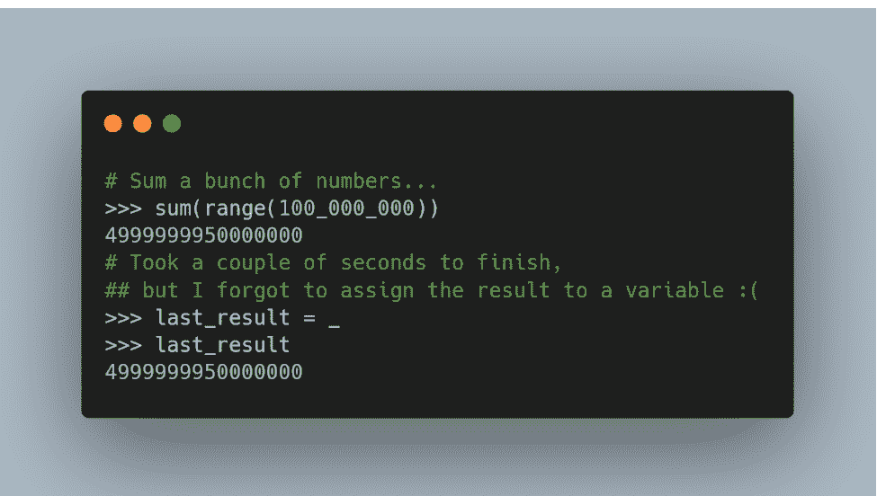

> （原文缩略图，来自 [https://mathspp.com/blog/pydonts/usages-of-underscore.](https://mathspp.com/blog/pydonts/usages-of-underscore.)）

## 简介

在这篇 Pydon't 文章中，我们将探讨 `_` 在 Python 中的所有用例。在语法上，`_` 在一些地方扮演着非常特殊的角色，我们将讨论这些地方。我们还将讨论 `_` 的一些用法，这些用法仅仅是人们遵循的惯例，它们能让代码编写得更地道。

在这篇 Pydon't 文章中，你将：

-   了解 `_` 在 Python REPL 中的用途；
-   了解 `_` 作为变量名前缀和/或后缀时的作用：
    -   用作后缀的单个下划线；
    -   用作前缀的单个下划线；
    -   用作前缀的双下划线；
    -   用作前缀和后缀的双下划线；
-   看到 `_` 在赋值中作为“接收器”的地道用法；
-   并理解这如何扩展到 `_` 在新的 `match` 语句中的作用；
-   看到 `_` 在本地化字符串中的地道用法；以及
-   学习如何使用 `_` 让你的数字更具可读性。

## 恢复会话中的上一个结果

你是否曾在 Python 会话中调用了一个慢速函数，然后因为忘记将其赋值给变量而丢失了返回值？我知道我无数次这样做过！因为有像（你和）我这样的人，有人做出了*最*好的决定，决定在 Python 会话中可以使用 `_` 来指代上一个返回结果：

```
>>> 1 + 1
2
>>> _
2
>>> sum(range(100_000_000))   # 需要几秒钟才能完成。
4999999950000000
>>> _
4999999950000000
>>> save_for_later = _
>>> save_for_later
4999999950000000
```

这可以防止你不得不重新运行上一行代码，这在以下情况下尤其有用：上一行代码需要一些时间才能完成，它有一些你不想再次触发的副作用，或者它根本无法重新运行（例如，因为你删除了一个文件或耗尽了一个可迭代对象）。

所以，下次你在解释器会话中玩耍，忘记将函数调用或其他代码片段的结果赋值时，记得使用 `_` 来引用它。

请注意，如果你显式地给 `_` 赋值，那么你赋的值将一直保留，直到你显式地删除它。当你删除它时，`_` 将会恢复为指代上一个返回的结果：

```
>>> _ = "hey"
>>> "_ was explicitly assigned."
'_ was explicitly assigned.'
>>> _
'hey'
>>> del _
>>> "_ is no longer explicitly assigned."
'_ is no longer explicitly assigned.'
>>> _
'_ is no longer explicitly assigned.'
```

## 变量名的前缀和后缀

### 用作后缀的单个下划线

如你所知，Python 中有些词有特殊含义，因此被称为关键字。这意味着我们不能将这些名称用于我们的变量。类似地，Python 定义了一系列内置函数，这些函数通常非常有用，理想情况下我们希望避免使用与这些内置名称匹配的变量名。

然而，有时最完美的变量名恰好是这些关键字或内置函数之一。在这些情况下，通常使用单个 `_` 作为后缀来避免冲突。

例如，在统计学中，有一种随机分布叫做“指数分布”，它依赖于一个数值参数，而该参数在数学文献中通常被称为“lambda”。因此，当 `random` 模块决定在 `random.expovariate` 中实现该分布时，他们理想情况下希望使用 `lambda` 这个词作为 `random.expovariate` 的参数，但 `lambda` 是一个保留关键字，这会导致错误：

```
>>> def expovariate(lambda):
  File "<stdin>", line 1
    def expovariate(lambda):
          ^
SyntaxError: invalid syntax
```

相反，他们本可以将参数命名为 `lambda_`。（然而，实现者最终选择了 `lambd`。）

在 Python 标准库中有许多例子，实现者选择了尾随下划线。例如，在 IDLE（Python 默认附带的 IDE，完全用 Python 实现）的代码中，你可以找到这个函数：

```
## 来自 Python 3.9.2 的 Lib/idlelib/help.py
def handle_starttag(self, tag, attrs):
    "Handle starttags in help.html."
    class_ = ''
    for a, v in attrs:
        if a == 'class':
            class_ = v
    # 为简洁起见已截断...
```

注意在循环内定义和更新的 `class_` 变量。这里显而易见的变量名应该是 `class`，因为我们处理的是 HTML 类，但 `class` 是一个保留关键字，我们用它来定义，嗯，类... 这就是为什么我们在这里使用 `class_`！

### 用作前缀的单个下划线

虽然用作后缀的单个下划线或多或少是一种惯例，但用作前缀的单个下划线既是一种惯例，也会影响一些 Python 程序。

让我先解释一下这个惯例：当你定义一个以单个下划线开头的名称时，你是在告诉其他程序员，这个名称指的是仅供内部使用的东西，外部用户不应该随意使用。

例如，假设你正在实现一个在线商店框架，现在正在编写获取商品价格的代码部分。你可以写一个像这样的小函数：

```python
prices = {
    "jeans": 20,
    "tshirt": 10,
    "dress": 30,
}

def get_price(item):
    return prices.get(item, None)
```

现在，商店现在不能没有促销活动，所以你给函数添加一个参数，以便可以应用折扣：

```python
def get_price(item, discount=0):
    p = prices.get(item, None)
    if p is not None:
        return (1 - discount)*p
    else:
        return p
```

现在一切都很好，除了你认为验证函数尝试应用的折扣可能是个好主意，这样折扣永远不会是负数或大于 100%。你可以在主函数中这样做，或者你可以设计一个辅助函数来为你做这件事，可能是因为你需要在各种地方验证折扣金额是否正确。

所以，你编写了你的辅助函数：

```python
def valid_discount(discount):
    return 0 <= discount <= 1
```

> > 顺便说一下，如果你想了解更多关于 Python 允许比较链式操作的事实，就像你上面看到的那样，你可以阅读[这篇 Pydon't](https://mathspp.com/tildes) 文章。

现在你有了一种验证折扣的方法，你可以使用它：

```python
def get_price(item, discount=0):
    if not valid_discount(discount):
        raise ValueError(f"Trying to apply an illegal discount on {item}.")
    p = prices.get(item, None)
    if p is not None:
        return (1 - discount)*p
    else:
        return p
```

完美！你的在线商店管理框架的代码库进展顺利。

现在想象一下，你是一个框架的用户，而不是实现者。你可能会通过 pip 从 PyPI 安装框架，或者直接从 GitHub 安装。但当你这样做，并导入代码开始使用时，你会导入 `get_price` 和 `valid_discount` 函数。现在，你需要 `get_price` 函数，但你不需要 `valid_discount`，因为整个框架已经保护用户免受非法折扣、负价格等的影响！换句话说，`valid_discount` 函数与框架的内部实现更相关，而不是与框架的用户相关。只是用户可能不知道这一点，因为用户看到了 `valid_discount` 函数，并且可以合理地假设用户会认为他们必须使用该函数来验证折扣... 他们怎么知道他们不需要呢？

一个解决方案是你遵循我们刚刚开始讨论的惯例！如果你给你的函数起一个稍微不同的名字：

```python
def _valid_discount(discount):
    return 0 <= discount <= 1
```

框架的用户会立即明白“哦，我不必担心这个函数，因为它的名字以单个下划线开头”。不仅如此，Python 甚至帮助用户不用担心那些以单下划线开头的函数。

请在你的 `onlineshop.py` 文件中写下以下内容：

```python
## onlineshop.py
def _valid_discount(discount):
    return 0 <= discount <= 1

prices = {
    "jeans": 20,
    "tshirt": 10,
    "dress": 30,
}

def get_price(item, discount=0):
    if not _valid_discount(discount):
        raise ValueError(f"Trying to apply an illegal discount on {item}.")
    p = prices.get(item, None)
    if p is not None:
        return (1 - discount)*p
    else:
        return p
```

完成之后，打开你的 Python REPL，从 `onlineshop` 导入所有内容，并尝试获取一些价格和折扣：

```
>>> from onlineshop import *
>>> get_price("jeans")
20
>>> get_price("jeans", discount=0.5)
10.0
>>> get_price("jeans", discount=1.3)
```

请注意观察这两个函数似乎都运行良好，并注意到我们最后一次调用时出错了，因为1.3这个折扣太大，所以`_valid_discount`函数返回它无效。

让我们自己验证一下：

```
>>> _valid_discount(1.3)
Traceback (most recent call last):
  File "<stdin>", line 1, in <module>
NameError: name '_valid_discount' is not defined
```

我们得到了一个NameError，因为`_valid_discount`函数未定义... 因为它从未被导入！即使原始代码仍能在内部使用它，该函数也没有被导入到你的代码中。如果你确实需要访问`_valid_discount`，那么你可以显式地导入它，或者只导入模块名，然后通过其点号名称来访问：

```
>>> from onlineshop import _valid_discount
>>> _valid_discount(0.5)
True
>>> import onlineshop
>>> onlineshop._valid_discount(1.3)
False
```

只要变量名以一个前导下划线开头，这个机制也适用于变量。试试看，将`prices`变量重命名为`_prices`，关闭REPL，重新打开，然后运行`from onlineshop import *`，`_prices`将不会被定义！

所以，一方面请注意，前导下划线确实是一个*指示*，它告诉你在使用他人编写的代码时，哪些内容应该关心，哪些不应该。另一方面，前导下划线*仅仅*是一个指示，它无法阻止他人访问你用前导下划线编写的名称。

最后，还有另一种方法可以控制当有人使用`*`从你的模块导入所有内容时哪些内容会被导入：你可以使用`__all__`变量来指定在此情况下应导入的名称。

试试看，将下面一行添加到你的`onlineshop.py`文件的顶部：

```python
__all__ = ("get_price", "_valid_discount")
```

完成之后，关闭你的REPL并重新打开：

```
>>> from onlineshop import *
>>> get_price
<function get_price at 0x0000029410907430>
>>> _valid_discount
<function _valid_discount at 0x0000029410907280>
```

```
>>> prices
Traceback (most recent call last):
  File "<stdin>", line 1, in <module>
NameError: name 'prices' is not defined
```

请注意，`__all__`内的所有名称都被导入了，无论它们是否以单下划线开头，而*未*列出的名称则没有被包含。在我的例子中，我的变量名为`prices`（所以它甚至没有前导下划线！），它没有被导入。

这个`__all__`变量完美地引出了下一个小节：

## 前导和后缀双下划线

在Python中，一个以双下划线开头和结尾的名称是对Python具有内部相关性的名称。例如，许多函数如`__str__`、`__repr__`、`__bool__`和`__init__`，有时被称为“魔法”函数，因为它们在某种程度上与Python的“内部”运作交互。

这些魔法函数和变量的一个更好的名称是“双下划线函数”、“双下划线变量”或“双下划线方法”，具体取决于上下文。（“dunder”一词——在Python世界中很常见——是“双下划线”的缩写！）

然而，这些双下划线名称并非真正魔法：它们*只是*函数。（或者变量，就像`__all__`一样。）你可以知道的是，当你发现一个以双下划线开头和结尾的名称时，它很可能是一个以某种方式与Python语法交互的名称。

例如，使用`str`内置函数并传入参数所做的操作，与调用同一个参数的`__str__`函数完全相同：

```
>>> n = 3
>>> str(n)
'3'
>>> n.__str__()
'3'
```

当然，写`str(n)`看起来比`n.__str__()`优雅得多，但这只是告诉你，如果你定义自己的对象，你需要实现`__str__`方法，这样你的对象才能作为参数传递给`str`内置函数。（我曾在[这里](https://mathspp.com/blog/pydonts/str-repr-and-their-implications)更详细地写过`str`、`__str__`、`repr`和`__repr__`，如果你需要，可以读读那篇Pydon't。）

因此，总结一下，双前导和后缀下划线用于具有某种“特殊”含义的函数和变量，这些含义通常与Python的默认行为有关。

> 不要在你自己的程序中使用（创建）双下划线名称，这样你就不会在某些意想不到的地方绊倒，并避免与未来Python语言的更改/添加发生冲突！

## 双前导下划线

在这个小节中，我们将看看当你在名称开头使用双下划线时会发生什么。一个双下划线在名称开头有特殊的用例：你将其用于那些你希望通过前导下划线来“保护”的变量和方法（以便用户知道不要动它们），但它们的名字又太常见，你担心其他人可能会覆盖它们。

这是什么意思？

首先，让我们看看实际操作。修改`onlineshop.py`文件，使我们的代码现在属于一个名为`OnlineShop`的类：

```python
## onlineshop.py
class OnlineShop:
    __prices = {
        "jeans": 20,
        "tshirt": 10,
        "dress": 30,
    }

    def _valid_discount(self, discount):
        return 0 <= discount <= 1

    def get_price(self, item, discount=0):
        if not self._valid_discount(discount):
            raise ValueError(f"Trying to apply an illegal discount on {item}.")
        p = self.__prices.get(item, None)
        if p is not None:
            return (1 - discount)*p
        else:
            return p
```

请注意，prices变量现在是`__prices`。让我们试试这个小类：

```
>>> from onlineshop import OnlineShop as OS
>>> shop = OS()
>>> shop.get_price("jeans")
20
```

代码似乎运行正常，所以现在让我们看看`__prices`变量：

```
>>> shop.__prices
Traceback (most recent call last):
  File "<stdin>", line 1, in <module>
AttributeError: 'OnlineShop' object has no attribute '__prices'
```

哦哦，又出错了！我们无法访问`__prices`变量，即使`get_price`方法显然（成功地！）使用了它。为什么我们无法访问`__prices`变量？嗯，我们可以使用`dir()`内置函数来列出我们shop对象的所有属性：

```
>>> dir(shop)
['_OnlineShop__prices', '__class__', '__delattr__', '__dict__', '__dir__', '__doc__',
'__eq__', '__format__', '__ge__', '__getattribute__', '__gt__', '__hash__', '__init__',
'__init_subclass__', '__le__', '__lt__', '__module__', '__ne__', '__new__', '__reduce__',
'__reduce_ex__', '__repr__', '__setattr__', '__sizeof__', '__str__', '__subclasshook__',
'__weakref__', '_valid_discount', 'get_price']
```

试着找找我们定义的东西的名称。你能找到_valid_discount和get_price函数吗？__prices呢？你不会在那个列表中找到__prices，但列表中的第一项是_OnlineShop__prices，它看起来与__prices密切相关。

还记得我说过双前导下划线用于避免名称冲突吗？嗯，如果有人扩展你的在线购物框架，他们很可能想创建一个名为`prices`的变量，而你可能仍然需要你原始的`prices`变量，所以你有两个选择：

- 给你的`prices`变量一个很长、非常复杂的名字，这样其他人就极不可能创建同名的变量；或者
- 你使用`__prices`来要求Python修饰变量名，以避免未来的冲突。

选择第二个选项意味着Python获取原始变量名`__prices`，并在其前面加上类名和一个额外的前导下划线，这样用户仍然知道应该避开那个名称。这就是你可以从类外部访问该变量的显式名称：

```
>>> shop._OnlineShop__prices
{'jeans': 20, 'tshirt': 10, 'dress': 30}
```

这种名称修饰机制对变量和函数都有效，所以你可以有一个`__valid_discount`方法，从类外部看就像是`_OnlineShop__valid_discount`。

你很可能不需要在你的代码中使用双前导下划线，但我不能忽视这个用例！

## 下划线作为占位符

我对下划线最喜欢的一个用例是，当我们使用下划线作为赋值的目标时。我说的是我们在赋值中使用`_`作为变量名的时候。

使用`_`作为变量名意味着“我不关心这个值”，这是一个广泛流传的约定。话虽如此，你应该问自己：如果我都不关心一个值，为什么还要首先赋值它呢？问得好！

做类似这样的事情

```python
_ = 3  # I don't care about this 3.
```

是愚蠢的。在其他情况下，将下划线用作占位符（即作为一个将保存我不关心的值的变量名）很有用。

## 解包

我在其他Pydon't中详细写过关于解包的内容：

- “使用星号赋值进行解包”
- “深度解包”

解包是一项功能，它让你，嗯，一次将多个值解包到多个名称中。例如，以下是如何将一个列表拆分成它的第一个和最后一个项目，以及中间部分：这难道不巧妙吗？确实是！但如果你只关心首尾两个元素呢？当然有多种方法，但我认为最优雅的是使用 `_` 作为中间部分的“接收变量”：

```
>>> first, *_, last = range(0, 10)
>>> first
0
>>> last
9
```

为什么下面这种替代方案就不如它好呢？

```
>>> sequence = range(0, 10)
>>> first, last = sequence[0], sequence[-1]
```

显然，`sequence = range(0, 10)` 只是一个序列的示例。如果我事先知道这就是我要用的序列，那我直接赋值 `first = 0` 和 `last = 9` 就行了。但对于通用的序列，这两种用例的表现是不同的。

你能想到是什么时候吗？我在本文中讨论了这个话题。

当 `sequence` 只有一个元素时，两者的行为就不同了。因为它们表现不一，所以在某些情况下你可能不得不二选一。但当你有选择余地时，解包的方式看起来更优雅，也更清晰地传达了“将序列拆分成其组成部分”的意图。

当然，`_` 是一个合法的变量名，你可以获取它的值：

```
>>> first, *_, last = range(0, 10)
>>> _
[1, 2, 3, 4, 5, 6, 7, 8]
```

但当我在赋值语句中看到 `*_` 时，我立即就明白这个赋值的语义是“忽略这个范围的中间部分”。

在解包某些结构并只关心其中特定部分时，也可以使用此方法。你可以使用索引来访问所需信息：

```
>>> colour_info = ("lightyellow", (255, 255, 224))
>>> blue_channel = colour_info[1][2]
>>> blue_channel
224
```

但如果 `colour_info` 变量的结构有误，你很难察觉。相反，使用解包可以断言结构正确，同时只访问相关的值：

```
>>> colour_info = ("lightyellow", (255, 255, 224))
>>> _, (_, _, blue_channel) = colour_info
>>> blue_channel
224
```

## 独立于迭代次数进行迭代

另一个类似的用例出现在你需要用 `for` 循环进行迭代，但确实不关心当前迭代次数的时候。例如，假设你想生成 5 个 0 到 20 之间的随机整数。你会怎么写？我会这样写：

```
>>> import random
>>> nums = [random.randint(0, 20) for _ in range(5)]
[16, 1, 17, 3, 1]
```

为什么我在 `for` 前面使用 `_`？因为我反复执行的表达式不依赖于迭代次数，它独立于该计数。所以，为了更清晰地传达这个意思，我使用 `_` 作为迭代器变量的“接收变量”。

再次强调，`_` 是一个完全合法的变量名，我也可以在表达式中使用它：

```
>>> [_ + 2 for _ in range(5)]
[2, 3, 4, 5, 6]
```

但重点是，将 `_` 用作“接收变量”是一种约定俗成的做法，旨在让你的程序语义更清晰。

## 在新的 match 语句中匹配一切

新的 `match` 语句即将在 Python 3.10 中推出，令人期待。秉承在解包赋值中使用 `_` 作为“接收变量”的常见用例精神，在新的 `match` 语句中，下划线也将用作匹配“其他任何内容”的通配符：

```
## 需要 Python 3.10 运行
>>> v = 10
>>> match v:
...     case 0:
...         print("null")
...     case 1:
...         print("uno")
...     case 2:
...         print("two")
...     case _:
...         print("whatever")
...
whatever
```

在 `match` 语句中，`_` 是一个真正的“接收变量”：你无法使用 `_` 来引用原始值。所以，在 `match` 语句里，`_` 的真正含义是“我不在乎”！看看这个：

```
>>> v = 10
>>> match v:
...     case _:
...         print(_)
...
Traceback (most recent call last):
  File "<stdin>", line 3, in <module>
NameError: name '_' is not defined
```

如果你想匹配任何其他情况*并且*能够引用原始值，那么你需要使用一个合法的目标名称：

```
>>> v = 10
>>> match v:
...     case wtv:
...         print(wtv)
...
10
```

## 字符串本地化

下划线另一个虽然小众但我非常喜欢的用例，出现在你需要本地化程序的时候。本地化一个程序意味着让它适用于不同的地区/国家。当你这么做时，必须做的事情之一就是翻译程序中的字符串，以便它们能以多种不同语言显示。

你该如何实现一种机制，让程序能够以（任意多种）不同语言输出呢？花点时间思考一下，这是个很好的挑战！假设你不能使用专门为本地化设计的模块。

无论你做什么，例如函数调用或访问字典，都会在许多地方发生并产生大量冗余。如果你的程序有大量字符串，从

```
print("Hello, world!")
```

改为

```
print(translate("Hello, world!"))
```

看起来没什么问题，但在一个有许多字符串的程序中，所有的 `translate` 调用会增加很多视觉干扰。因此，常见的做法是为像 `translate` 这样的函数创建一个别名，并将其命名为 `_`。这样，本地化一个字符串就不会增加太多视觉干扰：

```
print(_("Hello, World!"))
```

这只是一个*约定*，但它非常普遍，以至于在 [gettext 文档](https://docs.python.org/3/library/gettext.html)（一个专门帮助程序处理多种自然语言的模块的文档）中都有提及。

我第一次发现 `_` 的这个用法时非常困惑。我是在查看 `argparse` 模块的源代码时发现的。因为 `argparse` 处理命令行界面，所以它的内部工作流程进行本地化是有意义的，这样它的命令行信息才能与命令行的语言匹配。我还记得第一次看到它时的情景；我看到了这两行：

```
if prefix is None:
    prefix = _('usage: ')
```

我对赋值语句中的 `_('usage: ')` 部分感到非常困惑，但最终我在那个文件里找到了导入语句：

```
from gettext import gettext as _, ngettext
```

我意识到他们将 `_` 设置为 `gettext` 的别名。

## 提高数字的可读性

我们要讨论的最后一个下划线用例与提高数字的可读性有关。快！下面的 `n` 是多少？

```
>>> n = 99999999
```

如果你想到/说出“99,999,999”（九千九百九十九万九千九百九十九），那就对了。那么现在 `n` 是多少？

```
>>> n = 100_000_000
```

有没有任何疑问我们谈论的是一亿？使用 `_` 作为千位分隔符在这里真的很有帮助，你不需要更多说服了！但我还是要给你看一个来自 Python 标准库的小例子。看看下面两个条件，告诉我哪个更容易读。无分隔符：

```
if not 1000 <= rounds <= 999999999:
    raise ValueError('rounds out of the range 1000 to 999999999')
```

有分隔符：

```
if not 1000 <= rounds <= 999_999_999:
    raise ValueError('rounds out of the range 1000 to 999_999_999')
```

如果你告诉我你更喜欢第一个，请离开。我不想你再待在这里了！下划线不必是千位分隔符，你可以在任何想要的数字之间使用它。但最重要的是，它适用于任何其他进制。例如，使用 `_` 对二进制数的位进行分组：

```
>>> thirty_five = 0b0010_0011
>>> forty_seven = 0b0010_1111
```

或者用来分隔颜色十六进制值中的 R、G、B 通道：

```
>>> lightyellow = 0xff_ff_e0
>>> peachpuff    = 0xff_da_b9    # 我没发明这个名字！
```

## 结论

这是本文为你奉上的主要收获：

> “编程规范的存在是为了让我们的生活更轻松，因此值得学习它们，以使我们的代码更具表现力和地道性。”

本文向你展示了：

- 你可以在 Python REPL 中用 `_` 恢复表达式的最后一个值；
- `_` 作为前缀/后缀对名称有很大影响：
    - `name_` 是当 `name` 是保留关键字时的常见选择；
    - `_name` 是一种*约定*，表示 `name` 是一个内部名称，用户可能不应随意使用；
        * 如果有人使用 `from mymodule import *` 通配符导入，`_name` 将不会被导入；并且
        * 如果在 `mymodule` 中将 `_name` 添加到 `__all__` 列表，则可以覆盖此行为。
    - 魔术方法名称（以双下划线开头和结尾）指的是 Python 的内部机制，并允许你与 Python 的语法交互；
    - `__name` 在类内部使用，以防止命名冲突，当你想使用一个内部变量，但又担心用户可能会意外覆盖其名称时；
- `_` 被以地道的方式用作解包赋值中的“接收变量”，特别是
    - 当解包多个值但只关心部分值时；
    - 当在 `for` 循环中迭代且不关心迭代次数时；
- 新的 `match` 语句使用 `_` 作为“匹配所有”的情况，并使其成为真正的“接收变量”，因为 `_` 无法用于访问原始值；
- `_` 由于其低视觉干扰，常被用作本地化函数的别名；
- 不同进制的数字（十进制、二进制……）可以用下划线分隔数字以提高可读性。例如，比较 `99999999` 与 `999_999_999` 和 `999999999`。

## 参考文献

-   Python 3 文档，Python 教程，模块，“从包中导入所有内容”，https://docs.python.org/3/tutorial/modules.html#importing-from-a-package [最后访问 2021-06-14]；
-   Python 3 文档，Python 标准库，gettext，https://docs.python.org/3/library/gettext.html [最后访问 2021-06-14]；
-   Python 3 文档，Python 标准库，random.expovariate，https://docs.python.org/3/library/random.html#random.expovariate [最后访问 2021-06-14]；
-   Weisstein, Eric W. “指数分布”。来自 MathWorld -- Wolfram Web 资源，https://mathworld.wolfram.com/ExponentialDistribution.html [最后访问 2021-06-14]；
-   Bader, Dan “Python 中下划线的含义”，https://dbader.org/blog/meaning-of-underscores-in-python [最后访问 2021-06-14]；
-   Datacamp，“下划线 (_) 在 Python 中的作用”，https://www.datacamp.com/community/tutorials/role-underscore-python [最后访问 2021-06-14]。

+   - Hackernoon，《理解Python中的下划线（_）》，https://hackernoon.com/understanding-the-underscore--of-python-309d1a029edc [最后访问于 2021-06-14]；

# name 魔术属性

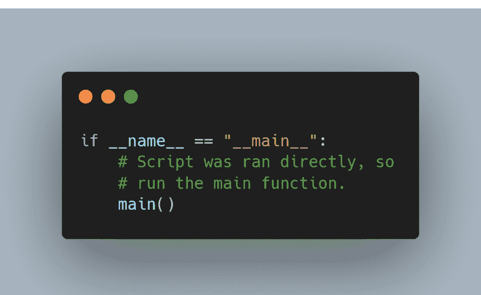

（原文缩略图，来自 https://mathspp.com/blog/pydonts/name-dunder-attribute。）

## 简介

在这篇 Pydon't 文章中，我们将探讨 `__name__` 属性。如果你在谷歌上搜索它，会找到大量解释 `__name__` 属性*一个*用例的结果，因此在这篇 Pydon't 中，我将尝试向你介绍另外几个用例，以便你学会在 Python 程序中有效地使用 `__name__`。

在这篇 Pydon't 中，你将：

- 了解 `__name__` 在 Python 中创建“主”函数的惯用用法；
- 了解许多内置对象都具有的只读属性 `__name__`；
- 了解 `__name__` 在涉及日志记录的约定中如何使用；以及
- 查看我将要教授内容的一些代码示例。

## 什么是 `__name__`？

`__name__` 是 Python 中的一个特殊属性。它之所以特殊，是因为它是一个魔术属性（dunder attribute），这在 Python 中指的是名称以双下划线开头和结尾的属性。（我在[之前的 Pydon't 文章](https://mathspp.com/blog/pydonts)中更详细地解释了什么是魔术属性/方法。）

你可以[在 Python 文档中查找 `__name__`](https://docs.python.org/3/library/__main__.html)，会找到两个我们将在此介绍的主要结果。其中一个结果将 `__main__` 作为模块属性进行讨论，而另一个结果则将 `__main__` 作为内置对象类型的属性进行讨论。

## 模块属性 `__name__`

`__name__` 最广为人知的用例是作为模块属性，用于在 Python 中创建“主”函数。这意味着你可以使用 `__name__` 以编程方式确定你的代码是作为脚本直接运行，还是从另一个模块导入的。

我们如何做到这一点？很简单！

在你的 `print_name.py` 文件中写下以下行：

```
print(__name__)
```

现在打开命令行并运行该脚本：

```
> python print_name.py
__main__
```

这向你展示的是，当你将代码作为脚本运行时，属性 `__name__` 会自动设置为 `"__main__"`。这很重要，因为当你从其他地方导入代码时，情况*并非*如此。

例如，在你的 `importer.py` 文件中写下以下行：

```
import print_name
```

然后运行这个新的 Python 脚本：

```
> python importer.py
print_name
```

那个 "print_name" 是从哪里打印出来的？嗯，你*唯一*的 print 语句在 `print_name.py` 文件中，所以打印的值肯定来自那里。请注意，仅仅通过从另一个模块导入代码，就执行了一些代码（并且一些内容被打印到了控制台）。

另外，请注意打印的值与它来源的文件名匹配。在这里，我们看到当从 `importer` 导入 `print_name` 的代码时，`__name__` 被自动设置为它所在文件的名称（`print_name`）。

因此，我们看到 `__name__` 的值取决于代码是作为脚本直接运行还是从其他地方导入。

当你编写代码时，你通常会编写一些函数来帮助你解决问题，然后将这些函数应用于你手头的问题。

例如，当我编写一些 Python 代码来高效地计算有效密码时，我在一个名为 `automaton.py` 的文件中编写了一个类来表示自动机：

```
## automaton.py

class Automaton:
    # ...
```

那个类与问题无关，它只是实现了一些与自动机相关的基本行为。碰巧的是，这种行为对我高效解决计算密码的问题很有帮助，因此我在另一个文件中导入了那个 `Automaton` 类，并编写了一个小程序来解决我的问题。因此，我们可以说，大多数时候我使用 `automaton.py` 文件中的代码都是为了从其他地方导入并使用它。

然而，我也在 `automaton.py` 文件中添加了一个 `Automaton` 类功能的小演示。现在的问题是，我不希望这个小演示在每次 `Automaton` 类被另一个程序导入时都运行，所以我必须想办法只在 `automaton.py` 文件作为脚本直接运行时才运行演示……原因是我的演示代码有一些 `print` 语句，对于只是从另一个脚本中执行 `import automaton` 的用户来说，这些语句没有意义……想象一下，将一个模块导入你的程序，然后突然在你的控制台中出现一堆打印信息！

现在，我们可以使用 `__name__` 来避免这种情况！我们已经看到，当脚本直接运行时，`__name__` 被设置为 `"__main__"`，所以我们只需要检查这个：

```
## automaton.py

class Automaton:
    # ...

if __name__ == "__main__":
    print("Demo code.")
```

这是 `__name__` 最广为人知的用例。这就是为什么你经常会看到这样的代码片段：

```
if __name__ == "__main__":
    main()
```

这只是 Python 的方式，用于将可能对你以后导入有用的函数、类和其他定义，与你只希望在你的程序是正在执行的主要代码块时才运行的代码分开。

顺便说一句，这个全局变量 `__name__` 确实是一个变量，它会在你无需做任何事情的情况下自动初始化。但你可以给它赋值，尽管你可能不太需要这样做。因此，以下代码是完全有效的：

```
__name__ = "My name!"
if __name__ == "__main__":
    # 这永远不会运行：
    print("Inside the __main__ if.")
```

## __name__ 作为对象类型属性

`__name__` 属性还有另一个 Python 式的用例，另一个使用 `__name__` 的常见使用模式。我现在要教你的这个模式与模块属性无关，而是与对象类型属性有关。

正如你可能知道的，所有对象都有一个类型，告诉你这个对象“是”什么。
这里有几个常见的类型：

```
>>> type(0.5)
<class 'float'>
>>> type("hello")
<class 'str'>
>>> type(sum)
<class 'builtin_function_or_method'>
```

注意内置类型如何告诉你该对象是哪个类的实例。例如，"hello" 是一个字符串，这就是为什么 `type("hello")` 返回 `<class 'str'>`，其中显然包含了类的名称：就是单引号之间的 'str'。

有了这些信息，你将如何实现一个 `get_type_name` 函数，使其只返回类型名称的字符串，而不包含额外的 `<class>` 修饰？
思考一下。
这里有一个可能的实现：

```
>>> def get_type_name(obj):
...     return str(type(obj)).split("'")[1]
...
>>> get_type_name("hello")
'str'
>>> get_type_name(sum)
'builtin_function_or_method'
```

这是一个好的解决方案吗？我认为我们绝对可以做得更好。
文档告诉我们，许多内置对象类型和定义都带有其 `__name__` 属性，它是“类、函数、方法、描述符或生成器实例的名称”。
因此，`get_type_name` 函数的一个更好的实现是：

```
>>> def get_type_name(obj):
...     return type(obj).__name__
...
>>> get_type_name("hello")
'str'
>>> get_type_name(sum)
'builtin_function_or_method'
```

这简短得多，干净得多（例如，没有嵌套的函数调用），也更容易阅读，因为代码说明了它在做什么。我们为函数选择的名称已经很好了，因为很容易猜测函数的功能，但如果函数体本身能绝对清楚地表明我们正在获取所需的内容，那就更好了！

这种获取事物 `__name__` 的能力很有用，例如，当你想打印错误消息，因为你期望某种类型的参数，但得到了其他东西时。使用 `__name__`，你可以获得更漂亮的错误消息。

你可以查询除内置类型之外的事物的 `__name__`。你也可以查询函数的名称，例如：

```
>>> sum.__name__
'sum'
>>> get_type_name.__name__
'get_type_name'
```

如果你以编程方式获得一个函数并需要弄清楚它是什么函数，这可能很重要：

```
>>> import random
>>> fn = random.choice([sum, get_type_name])
>>> fn.__name__
'sum'
```

我不认为你很可能会从 `random.choice` 调用中收到一个函数，但这只是展示了如何使用 `__name__` 来弄清楚你正在查看的是什么函数。

另一个已经带有 `__name__` 的很棒的东西是你的自定义类。如果你定义一个类，`__name__` 将是一种非常干净的方式来访问漂亮的类名称，而无需绕太多弯路或进行笨拙的字符串处理：

```
>>> class A():
...     pass
...
>>> A
<class '__main__.A'>
>>> A.__name__
'A'
>>> a = A()
>>> a
>>> type(a)
<class '__main__.A'>
```

## 代码示例

我已经向你展示了`__name__`属性作为模块属性和类型对象属性时的含义，现在我将向你展示如何将这些知识付诸实践。和往常一样，我将从Python标准库中汲取示例。

## 为模块代码定义命令行接口

如果你查看`calendar`模块，会发现它提供了以各种方式处理日历的函数。如果你检查其源代码，会看到该模块的实现以最后两行结束：

```python
## 摘自 Python 3.9.2 中的 Lib/calendar.py
if __name__ == "__main__":
    main(sys.argv)
```

简而言之，该模块定义了一系列人们可能想从其他地方导入的函数，但如果该程序是直接运行的，那么它将调用`main`函数，并传入程序从终端接收到的任何参数。

例如，尝试在命令行上运行以下命令：

```
> python -m calendar 2021 6
     June 2021
Mo Tu We Th Fr Sa Su
    1  2  3  4  5  6
 7  8  9 10 11 12 13
14 15 16 17 18 19 20
21 22 23 24 25 26 27
28 29 30
```

这是一个很好的例子，展示了如果一个模块被当作主程序启动，它可能包含一些有趣/实用的可运行内容。`calendar`模块中的`main`函数通过`argparse`模块实现了一个简单的命令行接口，因此`main`函数仅仅是该模块已定义代码的一个入口点。

出于好奇，我安装的Python 3.9.2版本的标准库有2280个`.py`文件，如果你寻找的话，可以在469个文件中找到`if __name__ == "__main__":`这一行，略多于五分之一的文件...所以这在Python中确实是一个常见的模式！

## 美观的错误消息

### 从枚举中删除

正如我之前提到的，如果你想获取一个对象类型的名称，`type(obj).__name__`很可能是可行的方法。

一个出现这种情况的例子是在`enum`模块中。`enum`模块为Python中的枚举提供支持，枚举是绑定到唯一常量值的符号名称（成员）集合。

这是一个枚举示例：

```python
>>> import enum
>>> class Colour(enum.Enum):
...     RED = "RED"
...     GREEN = "GREEN"
...     BLUE = "BLUE"
...
```

现在我们有了一种谈论特定颜色的方式：

```python
>>> Colour.RED
<Colour.RED: 'RED'>
>>> Colour.BLUE
<Colour.BLUE: 'BLUE'>
```

那么，如果我们想删除其中一种颜色呢？例如，`GREEN`？

```python
>>> del Colour.GREEN
Traceback (most recent call last):
  File "<stdin>", line 1, in <module>
  File "C:\Program Files\Python39\lib\enum.py", line 382, in __delattr__
    raise AttributeError("%s: cannot delete Enum member." % cls.__name__)
AttributeError: Colour: cannot delete Enum member.
```

我们无法从枚举中删除`GREEN`，因为`GREEN`属性不像其他类属性那样普通，它实际上是枚举结构的一个组成部分，因此该模块的实现者阻止了类对此类删除操作。

问题在于，他们是如何获得我的`Colour`类的漂亮名称的？我甚至不需要向你展示代码，你可以看看上面的错误消息，它说我们在`Colour`枚举内部遇到了一个`AttributeError`。是哪行代码产生了这个漂亮的错误消息？是下面这一行：

```python
raise AttributeError("%s: cannot delete Enum member." % cls.__name__)
```

在这行代码中，`cls`已经是一个类了，类似于这样：

```python
>>> Colour # <--
<enum 'Colour'> # <-- 这就是 `cls` 的值...
# 顺便说一句，这不是一个字符串。
```

所以我们可以直接获取它的`__name__`并生成一个漂亮的错误消息，或者至少在错误消息中算得上漂亮。

### 进行参数验证

另一个类似的用例可以在`fractions`模块中找到。该模块提供了一个名为`from_decimal`的函数，用于将一个`Decimal`数字（来自`decimal`模块）转换为一个精确的分数。从我对该函数的描述中，也许你已经明白了，但这个`from_decimal`函数期望一个`decimal.Decimal`实例，如果给定的参数不是这种类型，它就会报错：

```python
>>> import fractions
>>> fractions.Fraction.from_decimal("3")
Traceback (most recent call last):
  File "<stdin>", line 1, in <module>
  File "C:\Program Files\Python39\lib\fractions.py", line 188, in from_decimal
    raise TypeError(
TypeError: Fraction.from_decimal() only takes Decimals, not '3' (str)
```

现在错误消息不够完整，因为代码跨越了几行不同的位置，但这是`from_decimal`函数执行的类型验证：

```python
## 摘自 Python 3.9.2 中的 Lib/fractions.py
class Fraction(numbers.Rational):
    # ...

    @classmethod
    def from_decimal(cls, dec):
        """将有限的 Decimal 实例精确转换为有理数。"""
        from decimal import Decimal
        if isinstance(dec, numbers.Integral):
            dec = Decimal(int(dec))
        elif not isinstance(dec, Decimal):
            raise TypeError(
                "%s.from_decimal() only takes Decimals, not %r (%s)" %
                (cls.__name__, dec, type(dec).__name__))
        return cls(*dec.as_integer_ratio())
```

注意该函数如何接受一个`dec`，如果参数不是`Decimal`但容易转换为`Decimal`，则尝试将其转换为`Decimal`。这就是为什么给函数传递`3`不会出错的原因：

```python
>>> fractions.Fraction.from_decimal(3)
Fraction(3, 1)
```

然而，`"3"`不是`numbers.Integral`，它也*不是*`Decimal`，所以`dec`未能通过测试，最终我们得到：

```python
raise TypeError(
    "%s.from_decimal() only takes Decimals, not %r (%s)" %
    (cls.__name__, dec, type(dec).__name__))
```

注意这里我们甚至使用了两次`__name__`。第一次用法类似于上面`Enum`的例子，我们获取我们的`cls`（它已经是一个类）并直接询问其名称。这部分代码构建了消息的开头：

```
TypeError: Fraction.from_decimal() ...
```

然后我们打印导致问题的值，这就是`dec`在那里的作用：

```
TypeError: Fraction.from_decimal() only takes Decimals, not '3' ...
```

最后，我们想告诉用户他传入了什么，以防从错误消息的开头看不清楚。为此，我们确定`dec`的类型，然后询问它的`__name__`，因此代码中出现了`type(dec).__name__`。这产生了错误消息的结尾部分：

```
TypeError: Fraction.from_decimal() only takes Decimals, not '3' (str)
```

> 上面字符串中的`"%s"`和`"%r"`与字符串格式化有关，这是这些Pydon'ts中尚未涉及的话题。请保持关注，以便在这些Pydon'ts发布时第一时间得知。

这种`type(obj).__name__`模式也非常常见。在我安装的Python 3.9.2标准库中，它在74个不同的`.py`文件中出现了138次。具体的`cls.__name__`模式也出现了几次。

## 日志规范

对于最后一个代码示例，我将向你展示在使用`logging`模块记录程序日志时常见的一个规范。

`logging`模块向用户提供了一个`getLogger`函数，该`getLogger`函数接受一个`name`字符串参数。这样`getLogger`就能返回一个具有指定名称的日志记录器。

一方面，你想为你的日志记录器命名，以便在庞大的应用程序中，你能分辨出日志消息来自何处。另一方面，如果你给`getLogger`相同的名称，它总是返回相同的日志记录器，这样在单个模块或文件内，你不需要传递日志记录器，只需总是用相同的名称调用`getLogger`即可。

现在，你想总是使用相同的名称来获取日志记录器，同时也希望这个名称能明确无误地标识发生日志记录的模块。这表明，像`"logger"`这样随手选择的名称是个坏主意，因为我很可能选择与其他开发者代码中使用的相同的日志记录器名称，所以如果我们的代码有交互，日志将会变得一团糟。

另一个显而易见的备选方案是将其命名为我们所在模块特有的名称，例如文件名。然而，如果我手动将日志记录器名称设置为文件名，我*知道*如果我最终更改了文件名，我会忘记更新它，所以我有点进退两难...

值得庆幸的是，这种情况是`__name__`属性可能派上用场的教科书式示例！

`__name__` 属性提供了一个可读的名称，可以清晰地标识它所属的模块。使用 `__name__` 甚至意味着，如果你的代码与其他也进行日志记录的代码交互，你的日志工具很可能会表现良好。

这就是为什么在文档中推荐使用 `getLogger(__name__)` 的约定，也是为什么这个模式大约在 84% 的情况下被使用！（在 Python 标准库中调用 `getLogger` 函数的 123 个 .py 文件中，有 103 个使用了它。）

## 结论

这是本篇 Pydon't 给你的主要收获，请查收：

> “`__name__` 是一个动态属性，告诉你当前所在的模块名称，或你的变量类型的名称。”

这篇 Pydon't 向你展示了：

- `__name__` 是一个模块属性，告诉你当前所在的模块名称；
- 可以通过检查 `__name__` 是否为 `__main__` 来判断程序是否直接运行；
- 你可以且应该使用 `__name__` 来获取对象类型的漂亮名称；
- `__name__` 是一个可以被赋值的属性；
- `if` 语句 `if __name__ == "__main__":` 是一种非常 Pythonic 的方式，用于确保某些代码仅在程序直接运行时执行；
- 模式 `type(obj).__name__` 是访问对象类型名称的一种简单方法；并且
- 有一个成熟的约定，在使用 `logging` 模块时使用 `__name__` 来设置日志记录器的名称。

## 参考文献

- Python 3 Documentation, The Python Standard Library, Built-in Types, Special Attributes, https://docs.python.org/3/library/stdtypes.html?highlight=name#definition.__name__ [最后访问于 2021-06-29];
- Python 3 Documentation, The Python Standard Library, Top-level script environment, https://docs.python.org/3/library/__main__.html [最后访问于 2021-06-29];
- Python 3 Documentation, The Python Language Reference, The import system, https://docs.python.org/3/reference/import.html [最后访问于 2021-06-29];
- Python 3 Documentation, Python HOWTOs, Logging HOWTO, Advanced Logging Tutorial, https://docs.python.org/3/howto/logging.html#advanced-logging-tutorial [最后访问于 2021-06-29];
- Python 3 Documentation, The Python Standard Library, calendar, https://docs.python.org/3/library/calendar.html [最后访问于 2021-06-29];
- Python 3 Documentation, The Python Standard Library, enum, https://docs.python.org/3/library/enum.html [最后访问于 2021-06-29];
- Python 3 Documentation, Search results for the query "__name__", https://docs.python.org/3/search.html?q=__name__&check_keywords=yes&area=default [最后访问于 2021-06-29];

# 微重构


（原文缩略图，来自 https://mathspp.com/blog/pydonths/bite-sized-refactoring。）

## 引言

重构代码是通读你的代码并修改一些部分的行为，通常目标是让代码更短、更快，或在你设定的任何度量标准上变得更好。

在这篇 Pydon't 中，我分享了关于重构重要性的想法，并提供了一些重构代码时的建议，同时带你经历一个重构示例。

在这篇 Pydon't 中，你将：

- 理解重构的重要性；
- 与我一起经历一个真实的重构示例；并且
- 学习重构自己代码时可以采用的技巧。

## 重构

**重构 (REFACTOR)** – 动词

> “重组（应用程序或软件一部分的源代码）以改进操作而不改变功能。”

正如你从上面的定义所见，重构代码的行为是试图让你的代码变得更好。让你的代码变得更好可能意味着不同的事情，取决于你的上下文：

- 可能意味着它更容易维护；
- 可能意味着它更容易向初学者解释；
- 可能意味着它更快；
- ……

无论你选择改进哪个度量标准，每个人都可以从学习重构代码中受益。

为什么呢？

当你在重构代码时，你在训练作为开发者对你有帮助的一系列技能，比如你阅读代码并真正理解它的能力、模式识别技能、批判性思维等。

### 阅读和真正理解代码的能力

如果你在不理解代码的情况下修改它，你很可能会破坏它。因此，当你想重构一段代码时，你应该尽力去真正理解代码的功能和实现方式。

### 模式识别技能

在重构代码时，你应该注意的一件事是冗余和重复。如果你看到看起来是复制粘贴的代码，或者你发现结构非常相似的代码，那么它可能是重构的好目标。

有时，发现这些很简单，因为会有*完全相同*的代码行。然而，发现不同代码部分之间的*结构性*相似之处比发现相同的代码行更难，因此在尝试发现这些的过程中，你将训练你的模式识别技能。注意，这在真正理解代码之后会变得容易得多。

### 批判性思维

在阅读你想重构的代码时，你总会发现一些看起来不应该存在的代码片段。

这可能有很多含义。

它可能是在错误文件中的代码。在错误函数中的代码。有时，甚至是一段看起来可以/应该被删除的代码。在这些时候，你能做的就是运用你的大脑去思考移动代码的含义。你不应该害怕在考虑了保持原状与改变它们的含义之后移动代码。

记住，你应该努力编写优雅的代码，而这部分包含了以一种使未来重构尽可能容易的方式编写代码。代码是可变的，所以请确保通过编写易于阅读的优雅代码来为你未来的自己提供便利。

## 重构什么？

我确信不同生活经历的人会对这个问题有不同的回答，我唯一能做的就是分享我对此的看法。

## 经常重构...

…或者至少为此创造条件。

如果你有可能重构一段代码，并且你*知道*有可以改进的地方，那就去做吧。随着你作为开发者的成熟和经验的积累，你会不断学习新东西；此外，你使用的技术可能也在随时间发展。这意味着代码自然会进入一种可以从重构中受益的状态。

这是一个永无止境的循环：你应该编写优雅且易于阅读的代码；这意味着在未来，重构代码更容易更快；重构使代码更易读、更优雅；这使得将来更容易重构；这将使其更易读、更优雅；如此循环往复。

代码重构不应该是一项艰巨的任务，因为从中收获很多，所以请确保以一种允许你或他人在未来重构的方式编写代码。

## 一点一点地重构

当然，在重构现有代码和编写新功能的新代码之间应该取得平衡。

频繁重构使其成为一项非常可控的任务，你实际上可以学会欣赏它。如果你不经常重构，你就会让所有这些次优结构、糟糕的设计选择等堆积起来，而这些一次性全部修复将会困难得多。

一点一点地重构，在你自己的规模上。如果你是一个非常新鲜的初学者，这可能意味着你想一次重构一行代码，或者也许几行。如果你更有经验，这可能意味着你一次重构一个或多个文件。就重构“一点”，无论那对你意味着什么。

## 案例研究

现在我将深入探讨一个由初学者编写并[分享到 Reddit](https://www.reddit.com) 的简短 Python 函数。我将带你经历我试图重构那段代码时大脑中的过程，并且我们会在过程中分享一些小技巧。

首先，让我告诉你这段代码需要解决的任务。编写一个函数来改变字母的大小写：

-   偶数位置的字母应变为大写；以及
-   奇数位置的字母应变为小写。

请尝试解决这个任务。

## 起点

网上分享的代码如下：

```python
def myfunc(a):
    empty=[]
    for i in range(len(a)):
        if i%2==0:
            empty.append(a[i].upper())
        else:
            empty.append(a[i].lower())
return "".join(empty)
```

## 自动样式格式化

编写尽可能优雅代码的第一步是运行自动格式化工具。例如，如果你使用 `black`，你可以从一开始就修复许多样式问题和不一致之处。

在这种情况下，对上面的代码运行 `black` 会产生以下结果：

```python
def myfunc(a):
    empty = []
    for i in range(len(a)):
        if i % 2 == 0:
            empty.append(a[i].upper())
        else:
            empty.append(a[i].lower())
return "".join(empty)
```

这里唯一的区别是 `empty = []` 和 `if i % 2 == 0:` 中的间距。运算符周围的间距非常重要，因为它让你的代码有呼吸的空间。确保你的代码具有一致的风格，对于你自己和他人阅读代码都大有裨益，所以请努力养成遵循某种风格的习惯。

PEP 8 提出了一种 Python 风格，许多人遵循这种风格，因此花时间回顾一下该风格指南可能是个好主意。在你弄清楚该风格如何运作后，请记住你不需要同时开始做所有事情。你可以逐步采用该风格。另外，请记住批判性思维非常重要。有时最好完全忽略风格指南。

## 命名

名称非常重要，正确命名你的函数和变量至关重要。名称可以成就一个程序，也可以毁掉一个程序。好的名称有助于代码的阅读者，而坏的名称会让你花费数小时分析原本简单的代码。

名称应反映它们所指事物的意图或一个非常重要的属性。这与使用非常通用的名称相反，例如为函数使用 `myfunc` 或为数字使用 `num`，而该函数具有特定作用或该数字包含某些特定信息。

一个显著的例外是在 `for` 循环中使用 `i`，例如，尽管我个人倾向于使用稍微冗长一点的 `idx`。

那么，看看我们目前拥有的代码，我可以识别出三个可以改进的名称。你能找出是哪些吗？尝试将它们改为更好的名称。

现在，你的建议不必与我的匹配，但以下是我的想法：

```python
def alternate_casing(text):
    letters = []
    for idx in range(len(text)):
        if idx % 2 == 0:
            letters.append(text[idx].upper())
        else:
            letters.append(text[idx].lower())

    return "".join(letters)
```

以下是我所做的更改：

-   `myfunc` -> `alternate_casing`；
-   `a` -> `text`；
-   `empty` -> `letters`；以及
-   `i` -> `idx`（出于我个人的偏好）。

现在，`empty = []` 本身似乎是一个相当好的名称。然而，在我们用空列表初始化 `empty` 之后，我们就开始填充它，因此该名称并未反映对象在整个程序中保持的一个属性或重要属性。相反，通过将其命名为 `letters`，我们指定了其中将存储什么。

## 遍历数据和索引

Python 在处理 `for` 循环方面有一些非常好的功能，我们获得的工具之一是内置的 `enumerate`。

我之前详细写过关于 `enumerate` 的内容，所以请注意，当你编写一个需要同时处理索引和数据的 `for` 循环时，`enumerate` 是你需要使用的工具。

在我们的函数中，我们需要索引*和*数据，因为我们需要索引来确定要执行的操作，然后我们需要数据（实际的字母）来改变其大小写。使用 `enumerate`，循环最终会是这样的：

```python
def alternate_casing(text):
    letters = []
    for idx, letter in enumerate(text):
        if idx % 2 == 0:
            letters.append(letter.upper())
        else:
            letters.append(letter.lower())

    return "".join(letters)
```

我们不仅能够移除显式索引，从而减少一个操作，而且我们还更清晰地表达了我们的意图：当有人看到 `enumerate` 时，他们应该立即理解这意味着“在这个循环中，我需要索引和我正在遍历的数据”。

## 只嵌套必要的内容

在 Python 中，缩进表示代码嵌套，这表示依赖关系。如果一行代码嵌套在 `for` 循环中，这意味着它依赖于该 `for` 循环。如果它进一步嵌套在 `if` 语句中，这意味着它仅在满足某些条件时适用。如果它进一步嵌套在 `try` 语句中，我们可能预期它会引发错误，等等。

嵌套代码意味着我们在阅读代码时需要在脑海中跟踪许多上下文，即使你可能没有注意到，这也很累人。进出所有这些缩进结构，进行所有这些上下文切换，会消耗脑力。更扁平的代码对我们的大脑压力更小，更容易跟上代码。

为了更容易跟上上下文，我们应该尝试尽可能少地嵌套代码。我们只应该嵌套那些绝对必要的代码片段。

对于 `for` 循环，这通常是依赖于 `for` 和 `in` 之间的迭代器变量的内容，对于 `if-else` 语句，这是每个语句*唯一*的代码片段。

现在，在上面的 `if-else` 语句中，你能发现不是*唯一*属于单个分支的内容吗？以下是代码：

```python
if idx % 2 == 0:
    letters.append(letter.upper())
else:
    letters.append(letter.lower())
```

注意，无论我们在哪个分支中，我们都在执行 `letters.append`，这使得从一个分支到另一个分支变化的内容（即我们调用 `letter` 的方法选择）变得不那么清晰。它甚至*更不*清晰，因为 `.upper()` 和 `.lower()` 占用的字符数完全相同，所以两行对齐，使得更难注意到 `.upper()` 与 `.lower()` 的区别。

现在，如果我们着手提取出 `.append()`，因为它独立于 `idx % 2` 的值，我们可以得到类似这样的结果：

```python
def alternate_casing(text):
    letters = []
    for idx, letter in enumerate(text):
        if idx % 2 == 0:
            capitalised = letter.upper()
        else:
            capitalised = letter.lower()
        letters.append(capitalised)

    return "".join(letters)
```

你可能强烈感觉到我刚刚添加了一行代码，使代码变长而不是变短，但有时更好的代码会占用更多空间。然而……

## 条件赋值和条件表达式

将 `.append()` 提取到 `if` 外部后，`if` 语句仅用于决定分配给 `capitalised` 的值这一点变得非常明显。这为另一种简化打开了大门，即条件表达式。

条件表达式就像浓缩的 `if-else` 块，非常适合条件赋值。

使用条件表达式，我们将 `if-else` 重写为：

```python
capitalised = letter.upper() if idx % 2 == 0 else letter.lower()
```

总而言之，中间变量是不需要的，我们可以将整个内容写为：

```python
def alternate_casing(text):
    letters = []
    for idx, letter in enumerate(text):
        letters.append(letter.upper() if idx % 2 == 0 else letter.lower())

    return "".join(letters)
```

## 真值和假值

下一步涉及简化 `if` 语句的条件。在 Python 中，我们有一个奇妙的东西，允许我们将许多对象解释为布尔值，即使它们本身不是布尔值。这通常被称为 Python 中对象的真值/假值，你可以在之前的 Pydon't 中了解所有相关信息。

对我们来说，重要的是数字 `0` 被视为 `False`，任何其他整数被视为 `True`。因此，条件 `if idx % 2:` … 读作“如果 `idx` 除以 2 有余数”，这等同于“如果 `idx` 是奇数”。现在，如果索引是奇数，我们希望字母变为小写，因此如果我们简化条件并交换 `.upper()` 和 `.lower()` 调用，我们可以简化条件表达式：## 列表推导式与追加操作

另一件你可以学会识别的事情是，当你通过连续调用 `.append()` 方法来构建一个列表时。遇到这种情况，就应该寻找机会使用列表推导式。列表推导式如果用得好，会非常“Pythonic”，它们允许你从一开始就用正确的内容初始化一个变量，而无需先初始化一个变量然后立即修改它。

使用列表推导式，你可以将循环重写为类似这样的代码：

```python
def alternate_casing(text):
    letters = [letter.lower() if idx % 2 else letter.upper() for idx, letter in enumerate(text)]
    return "".join(letters)
```

现在，请记住，我们之所以能这样简化，是因为目标变量命名恰当（`letters`），同时我们迭代的变量（`text`）也命名得当。我认为对于上面的列表推导式，有几个合理的替代方案，例如使用 `c` 或 `char` 代替 `l`。

如果你愿意，也可以保留较长的名称并拆分列表推导式：

```python
def alternate_casing(text):
    letters = [
        letter.lower() if idx % 2 else letter.upper()
        for idx, letter in enumerate(text)
    ]
    return "".join(letters)
```

## 避免过长的行

上述列表推导式的问题在于，它产生了一行很长的代码。应尽可能避免过长的代码行，因为这会使得代码更难阅读，也更难在将其与调试器、其他文件、Zoom 通话或其他任何东西并排工作时使用。在代码中应不惜一切代价避免水平滚动，这意味着行的长度不应过长。

有几种方法可以修复这个过长的列表推导式。一个总是可行的选项是*不*这样做。仅仅因为一个想法在某个角度看起来不错，并不意味着它明显更优。

然而，我们还有别的办法。列表推导式内部的变量名只存在于列表推导式内部，因此它们的生命周期非常短，并且扮演着非常具体的角色。正因如此，如果正在发生的事情的结构足够清晰，我们就可以在列表推导式内部使用更短的变量名：

```python
def alternate_casing(text):
    letters = [l.lower() if i % 2 else l.upper() for i, l in enumerate(text)]
    return "".join(letters)
```

## 辅助变量

同样，辅助变量也并非总是必需的。无论你使用的是拆分后的列表推导式，还是使用短名称的那个，你都可以直接去掉辅助变量，直接在这些字母上调用 `.join()`：

```python
def alternate_casing(text):
    return "".join([l.lower() if i % 2 else l.upper() for i, l in enumerate(text)])
```

或者

```python
def alternate_casing(text):
    return "".join([
        letter.lower() if idx % 2 else letter.upper()
        for idx, letter in enumerate(text)
    ])
```

## 冗余的列表推导式

我们已经做了这么多，但还有一件最终的事情可以做，这与我们如何移除列表推导式的 `[]` 有关。我是说我们可以直接删除它们，从而得到如下代码：

```python
def alternate_casing(text):
    return "".join(l.lower() if i % 2 else l.upper() for i, l in enumerate(text))
```

或者

```python
def alternate_casing(text):
    return "".join(
        letter.lower() if idx % 2 else letter.upper()
        for idx, letter in enumerate(text)
    )
```

发生了什么？现在，我们得到的不再是列表推导式，而是一个生成器表达式。在我看来，生成器表达式非常棒，它们具有内存和速度方面的优势，所以尽可能使用它们。实际上，当你用列表推导式调用一个函数时，通常可以完全省略 `[]`，切换到生成器表达式。

> 我会专门用一期 Pydon't 来讲解生成器表达式，所以一定要订阅，以免错过！

## 最终对比

供你参考，这是我们开始时的代码：

```python
def myfunc(a):
    empty=[]
    for i in range(len(a)):
        if i%2==0:
            empty.append(a[i].upper())
        else:
            empty.append(a[i].lower())
    return "".join(empty)
```

这是两个可能的最终成品：

```python
def alternate_casing(text):
    return "".join(l.lower() if i % 2 else l.upper() for i, l in enumerate(text))
```

和

```python
def alternate_casing(text):
    return "".join(
        letter.lower() if idx % 2 else letter.upper()
        for idx, letter in enumerate(text)
    )
```

注意最终成品与起点看起来有多么不同，但也要注意我们所做的每一步都是一个小改动。花时间分别理解这些小步骤，然后欣赏它们在这次重构中是如何契合在一起的。

一个主要的收获是：重构并不需要一蹴而就。进行增量修改是可以的，甚至可能是更可取的：增量修改更容易管理，也更容易理解。

## 结论

这期 Pydon't 为你奉上的主要收获是：

> “优雅的代码更容易重构，而当你重构代码时，应该力求使其更优雅。”

这期 Pydon't 向你展示了：

- 重构代码的能力很重要；
- 重构代码的能力是需要锻炼的；
- 代码重构可以（也许应该！）以小步骤进行；
- 一致的风格能提升代码可读性；
- 自动格式化工具可以帮助我们在代码上强制执行固定的风格；
- 命名很重要，应该反映：
    - 对象的目的；或者
    - 一个不变的重要特性；
- `enumerate` 是遍历数据和索引时的最佳伙伴；
- `if-else` 代码块中重复的代码可以被提取出来；
- 条件表达式非常适合进行条件赋值；
- if 条件可以利用真值和假值来简化；
- 列表推导式是带有 `.append()` 操作的简单 `for` 循环的良好替代方案；并且
- 列表推导式可以转换成生成器表达式。

## 参考资料

- Reddit /r/Python 帖子 “I get zero output even though there's nothing wrong with this code according to pycharm. What can be the reason? I would appreciate any help.”，https://www.reddit.com/r/learnpython/comments/02ko8l/i_get_zero_output_even_though_theres_nothing [最后访问于 2021-07-12]；
- Hoekstra, Conor; “Beautiful Python Refactoring” 在 PyCon US 2020 上的演讲，https://www.youtube.com/watch?v=W-lZttZhsUY；
- PEP 8 – Python 代码风格指南，https://www.python.org/dev/peps/pep-0008/ [最后访问于 2021-07-12]；

# 字符串 translate 和 maketrans 方法

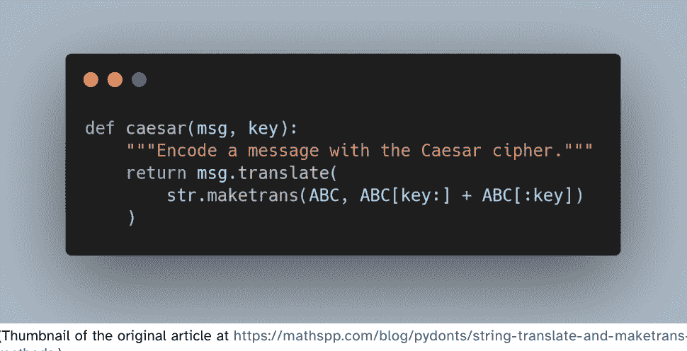

（原文文章的缩略图，位于 https://mathspp.com/blog/pydonts/string-translate-and-maketrans-methods。）

## 简介

字符串方法 `str.translate` 和 `str.maketrans` 可能是 Python 中不太为人所知的字符串方法。

遗憾的是，大多数涉及此主题的在线资源对这两个方法的工作原理都解释得非常糟糕，因此希望这篇 Pydon't 能为你服务，让你了解两个非常酷的字符串方法。

在这期 Pydon't 中，你将：

- 了解字符串方法 `str.translate`；
- 学习 `translate` 方法的可用格式；
- 看到*所有*字符（甚至包括表情符号！）都有对应的整数值；
- 复习内置函数 `ord` 和 `chr` 的行为；
- 了解互补的字符串方法 `str.maketrans`；
- 看到 `str.translate` 和 `str.maketrans` 的良好用例。

## str.translate

`str.translate` 方法鲜为人知，但并非因为它难以理解。它只是未受到应有的重视，这意味着它使用不多，因此得到的关注就比它应得的少，这又意味着人们不去学习它，从而它使用得就更少…… 你能看出这个循环了吗？

我不会假装这个方法会彻底改变你一生中将编写的每一行 Python 代码，*但是*，在你的工具箱中拥有它确实是一件好事。

根据文档，`str.translate(table)` 方法返回：

> “字符串的副本，其中每个字符都通过给定的翻译表进行映射。”

这里提到的翻译表是 `str.translate` 方法接受的唯一参数。

在其最简单的形式下，`str.translate` 方法与 `str.replace` 方法*类似*。

如果你还不知道，`str.replace` 看起来是这样的：

```
>>> s = "Hello, world!"
>>> s.replace("l", "L")
'HeLLo, worLd!'
```

## 字符码点

计算机处理零和一，二进制——这是我们在生活中都曾听人说过的事情。但如果真是这样，我们又如何处理字符和文本呢？我们如何将文本信息编码为零和一？

我不会假装我*非常*清楚这些事物内部的工作原理，但本质上，我们只需要为每一个字符分配一个数字，然后计算机就可以查看这个数字并说：“哦，这是一个65？*好吧，那我就显示一个*‘A’。”

为了使其工作，计算机程序必须就什么整数代表什么字符达成一致。例如，谁说65是“A”？是我刚刚发明的吗？

就像科学界一致同意用米作为描述距离的标准单位一样，计算机领域也有标准，规定如何将数字映射到字符。最著名的此类标准是 [Unicode](https://en.wikipedia.org/Unicode) 标准，这也是 Python 使用的标准。

所有这些讨论只有一个目的：让你熟悉字符可以被转换成整数再转换回来的概念。Python 甚至提供了两个有用的内置函数来完成这些转换，内置函数 `chr` 和 `ord`。

## 翻译字典

既然我们已经了解了字符的码位，现在可以学习如何使用 `str.translate` 方法了，因为现在我们可以构建可以作为翻译表传入的字典。

作为参数传递给 `str.translate` 的翻译字典指定了目标字符串中将要发生的替换。

该字典需要将 Unicode 码位（即字符）映射到其他 Unicode 码位、其他字符串或 `None`。

让我们看看你是否能推断出每种情况是如何工作的：

```python
>>> ord("a"), ord("b"), ord("c")
(97, 98, 99)
>>> ord("A")
65
>>> "aaa bbb ccc".translate(
...     {97: 65, 98: "BBB", 99: None}
... )
'AAA BBBBBBBBB '
```

请注意，上面的 `str.translate` 方法接收了一个包含 3 个键的字典：

- 97（"a" 的码位）映射到 65（"A" 的码位）；
- 98（"b" 的码位）映射到 "BBB"；以及
- 99（"c" 的码位）映射到 `None`。

在最终结果中，我们看到所有小写 "a" 都被替换为大写 "A"，小写 "b" 被替换为三个 "BBB"（以至于我们开始时有三个 "b"，最终字符串中有九个 "B"），而小写 "c" 被移除了。

这很微妙，但请注意空格被保留了。如果字符串包含其他字符会发生什么？

```python
>>> "Hey, aaa bbb ccc, how are you?".translate(
...     {97: 65, 98: "BBB", 99: None}
... )
'Hey, AAA BBBBBBBBB , how Are you?'
```

我们可以看到，不是字典键的字符被原样保留。

因此，翻译的工作方式如下：

- 不在翻译表中的字符保持不变；
- 所有其他字符被替换为它们在映射中的值；以及
- 映射到 `None` 的字符被移除。

## 与 str.replace 的不等价性

你们中的一些人可能认为我只是在小题大做，对 `str.translate` 大惊小怪，而我只需要一个简单的 for 循环和 `str.replace` 方法。你们对吗？

让我用 for 循环和字符串方法 `str.replace` 重写上面的例子：

```python
>>> s = "Hey, aaa bbb ccc, how are you?"
>>> from_ = "abc"
>>> to_ = ["A", "BBB", ""]
>>> for f, t in zip(from_, to_):
...     s = s.replace(f, t)
...
>>> s
'Hey, AAA BBBBBBBBB , how Are you?'
```

正如我们所看到的，结果似乎完全相同，而且我们不必引入新的字符串方法。

> 如果你对上面 for 循环中的 `zip` 不太熟悉，别担心：看看关于 `zip` 的 Pydon't。

当然，我们忽略了一个事实，即使用连续 `str.replace` 调用的 for 循环技术比 `str.translate` 方法做了更多的工作。我这是什么意思？

在每次循环迭代中，`str.replace` 方法都必须遍历整个字符串以查找我们要替换的字符，这是因为连续的 `str.replace` 调用彼此独立。

但是等等，如果连续的调用彼此独立，那是否意味着……？是的！

如果我们想将一个由零和一组成的字符串中的所有零替换为一，反之亦然呢？以下是使用连续 `str.replace` 调用的解决方案：

```python
>>> s = "001011010101001"
>>> from_ = "01"
>>> to_ = "10"
>>> for f, t in zip(from_, to_):
...     s = s.replace(f, t)
...
>>> s
'000000000000000'
```

它没有成功！为什么？在第一次迭代完成后，所有零都已变成一，`s` 看起来像这样：

```python
>>> s = "001011010101001"
>>> s.replace("0", "1")
'111111111111111'
```

for 循环的第二次迭代无法知道哪些一是原始的，哪些一是刚刚转换的零，因此调用 `s.replace("1", "0")` 只是将所有内容替换为零。

为了达到正确的效果，我们需要 `str.translate`：

```python
>>> "001011010101001".translate(
...     {ord("0"): "1", ord("1"): "0"}
... )
'110100101010110'
```

因此，我们已经证明 `str.translate` 不等同于进行一系列连续的 `str.replace` 调用，因为 `str.replace` 可能会混淆连续的转换。

## 通用翻译表

`str.translate` 方法接受一个“翻译表”，但该表不必是字典。该表可以是任何支持方括号索引的对象。通常，人们使用映射（如字典）或序列（如列表），但你甚至可以使用自己的自定义对象。

我真的很喜欢使用字典（和其他类似对象），因为指定什么映射到什么非常容易，但为了学习，让我给你展示一个使用列表的例子。

为此，让我们编写一个翻译表（作为列表），将字母表中的 26 个大写字母中的每一个映射到相同字母的小写形式两次。

大写字母的范围是从码位 65 到 90，因此我们首先需要创建一个包含 91 个元素的列表，其中每个索引应映射到自身，以便其他字符保持不变：

```python
>>> translation_table = [i for i in range(91)]
```

然后，对于大写字母，我们需要更新相应的位置，使其映射到我们想要的值：

```python
>>> for l in "ABCDEFGHIJKLMNOPQRSTUVWXYZ":
...     translation_table[ord(l)] = 2 * l.lower()
...
>>> translation_table[60:70]
[60, 61, 62, 63, 64, 'aa', 'bb', 'cc', 'dd', 'ee']
```

现在，我们只需要调用 `str.translate` 方法：

```python
>>> "Hey, what's UP?".translate(translation_table)
"hhey, what's uupp?"
```

以下是这个小例子的所有代码，也使用了 `string` 模块，这样我就不必再次输入所有字母表：

```python
>>> from string import ascii_uppercase
>>> ascii_uppercase
'ABCDEFGHIJKLMNOPQRSTUVWXYZ'
>>> translation_table = [i for i in range(91)]
>>> for l in ascii_uppercase:
...     translation_table[ord(l)] = 2 * l.lower()
...
>>> translation_table[60:70]
[60, 61, 62, 63, 64, 'aa', 'bb', 'cc', 'dd', 'ee']
>>> "Hey, what's UP?".translate(translation_table)
"hhey, what's uupp?"
```

## str.maketrans

在了解了翻译表的通用形式之后，是时候介绍 `str.translate` 的最佳伙伴 `str.maketrans` 了。

`str.maketrans` 方法是一个实用方法，它提供了一种方便的方式来创建可与 `str.translate` 一起使用的翻译表。

`str.maketrans` 最多接受 3 个参数，让我们为你分解一下。

### 单参数版本

只接受一个参数的 `str.maketrans` 版本旨在使我们用户定义可与 `str.translate` 一起使用的字典更加简单。

为什么这会有用？

正如我们在上面看到的，当使用字典作为翻译表时，我们需要确保字典的键是我们要替换的字符的码位。

这通常会引入一些样板代码，因为在最常见的情况下，我们知道要替换的字符，而不是它们的码位，所以我们需要事先手动进行转换，或者在定义字典时使用 `ord`。

这很丑陋，看看我们之前使用的例子：

```python
>>> "001011010101001".translate(
...     {ord("0"): "1", ord("1"): "0"}
... )
'110100101010110'
```

如果我们能以最自然的形式编写字典就好了：

```python
trans_table = {"0": "1", "1": "0"}
```

为了使其工作，我们需要使用 `str.maketrans`：

```python
>>> "001011010101001".translate(
...     str.maketrans({"0": "1", "1": "0"})
... )
'110100101010110'
```

### 双参数版本

如果你看我刚刚展示的例子，我们看到我们做了一种非常特定类型的翻译：我们用一些其他单个字符替换了一些字符。

这非常常见，因此 `str.maketrans` 方法可用于创建此类翻译表。为此，`str.maketrans` 的第一个参数应是由要替换的字符组成的字符串，第二个参数是包含相应新字符的字符串。

重做上面的例子：

```python
>>> "001011010101001".translate(
...     str.maketrans("01", "10")
... )
'110100101010110'
```

这里是另一个例子，其中两个字符串具有不同的字符，只是为了多样性：

```python
>>> "#0F45cd".translate(
...     str.maketrans("abcdef", "ABCDEF")
... )
'#0F45CD'
```

在这个例子中，我们取了一个表示颜色的十六进制值，并确保所有字母都是大写的。

（当然，我们本可以，也许应该，使用 `str.upper` 方法来完成。）

### 第三个参数

最后，`str.maketrans` 的第三个参数只是一个字符串，包含所有应映射到 `None` 的字符，或者换句话说，应从字符串中完全移除的字符。

这里有一个小例子：

## 代码示例

在你了解了字符串方法 `str.translate` 和 `str.maketrans` 之后，我将分享一些关于这两个方法的有趣用例。

我将从一个个人使用案例开始，然后介绍三个来自Python标准库的用例。这些代码示例应该能帮助你理解这两个方法在实际场景中是如何使用的。

## 凯撒密码

我曾在推特上发文，询问大家实现凯撒密码最具Python风格的方式。

我将凯撒密码定义为一个接受两个参数的函数。第一个参数是字符串，指定某些文本；第二个参数是整数，指定一个整数密钥。然后，参数字符串中的大写字母应沿着字母表按照密钥指定的偏移量进行移位。所有其他字符应保持不变：

```python
>>> caesar("ABC", 1)
'BCD'
>>> caesar("ABC", 13)
'NOP'
>>> caesar("ABC", 25)
'ZAB'
>>> caesar("HELLO, WORLD", 7)
'OLSSV, DVYSK'
```

一段时间后，我又去推特评论了一些直接的解决方案，并分享了有史以来最优雅的解决方案。

你能猜到我的凯撒密码实现方式利用了什么吗？如果你说/想到的是 `str.translate` 和 `str.maketrans`，那你就完全正确！

以下是你将会看到的最漂亮的凯撒密码实现：

```python
def caesar(msg, key):
    return msg.translate(
        str.maketrans(ABC, ABC[key:] + ABC[:key])
    )
```

在上面的代码中，`ABC` 是一个全局常量，包含需要进行变换的字母表。如果我们设置 `ABC = string.ascii_uppercase`，那么就与我开头定义的凯撒密码完全匹配了：

```python
>>> from string import ascii_uppercase
>>> ABC = ascii_uppercase
>>> def caesar(msg, key):
...     return msg.translate(
...         str.maketrans(ABC, ABC[key:] + ABC[:key])
...     )
...
>>> caesar("HELLO, WORLD", 7)
'OLSSV, DVYSK'
```

### 清理文件名

Python标准库提供了一个用于处理ZIP归档文件的模块，该模块名为 `zipfile`。这个模块可以用于，例如，通过编程方式解压ZIP归档文件。当你在Windows上使用 `zipfile` 并且 `zipfile` 解压一个归档文件时，该模块会检查正在解压的文件，并确保这些文件在Windows上是合法的文件名。你能猜到执行此操作的代码是什么吗？它是一段使用了 `str.maketrans` 和 `str.translate` 的代码！如下所示：

```python
## In Lib/zipfile.py in Python 3.9.2

class ZipFile:
    # ...

    @classmethod
    def _sanitize_windows_name(cls, arcname, pathsep):
        """Replace bad characters and remove trailing dots from parts."""
        table = cls._windows_illegal_name_trans_table
        if not table:
            illegal = ':<>"|?*'
            table = str.maketrans(illegal, '_' * len(illegal))
            cls._windows_illegal_name_trans_table = table
    arcname = arcname.translate(table)
    # ...
```

这里的 `arcname` 是归档文件的名称。我们首先获取转换表并检查它是否已被设置。如果尚未设置，我们就自己定义它！我们定义一系列非法字符，然后使用 `str.maketrans` 创建一个将这些字符转换为下划线 `_` 的转换表：

```python
>>> illegal = ':<>"|?*'
>>> table = str.maketrans(illegal, '_' * len(illegal))
>>> table
{58: 95, 60: 95, 62: 95, 124: 95, 34: 95, 63: 95, 42: 95}
```

然后，我们将这个计算好的表保存起来以备后用，并继续处理归档文件的名称 `arcname`。这展示了 `str.maketrans` 和 `str.translate` 的直接用法。

### 空白字符处理

（我之前不知道，所以查了一下：“to munge”的意思是处理/操作数据。）

本着同样的精神，Python的 `textwrap` 模块（用于将文本换行到多行以及进行其他相关的字符串操作）使用 `str.translate` 来处理给定文本中的空白字符。

作为对字符串进行换行处理的前置步骤，我们将各种奇怪的空白字符替换为简单的空格。

以下是其实现方式：

```python
## In Lib/textwrap.py from Python 3.9.2

_whitespace = '\t\n\x0b\x0c\r '

class TextWrapper:
    # ...

    unicode_whitespace_trans = {}
    uspace = ord(' ')
    for x in _whitespace:
        unicode_whitespace_trans[ord(x)] = uspace

    # ...

    def _munge_whitespace(self, text):
    # ...
        if self.replace_whitespace:
            text = text.translate(self.unicode_whitespace_trans)
        return text
```

注意，我们首先硬编码了一系列空白字符。注释（我省略了）解释了我们为什么这样做。然后，在 `TextWrapper` 类内部，我们手动定义了转换表。之后，在 `_munge_whitespace` 方法中，我们使用该表将奇怪的空白字符替换为空格。

你可能会想知道为什么这里没有使用 `str.maketrans`，我也不知道！你能否重写定义转换表的代码行，使其使用 `str.maketrans` 而不是手动创建字典？它应该与上一个例子的代码类似。

### 默认替换

如果我们查看Python自带的IDE `IDLE` 的源代码，也可以找到 `str.translate` 方法的一个用例，并且这个用例特别为转换表定义了一个自定义对象。

在展示代码之前，让我先说明一下它应该做什么：我们希望创建一个转换表，该转换表

- *保留*空白字符 " \t\n\r"；
- 将 "(", "[", 和 "{" 映射到 "("；
- 将 ")", "]", 和 "}" 映射到 ")"；以及
- 将*所有其他*字符映射为“x”。

这里的关键在于我们需要解析一些Python代码，我们只关心代码行的结构，而不那么关心实际编写的代码。

通过将代码元素替换为“x”，这些“x”随后可以被去重。当“x”被去重后，字符串会变得（非常！）小，后续的处理也会显著加快。至少代码周围的注释是这么说的！

为了帮助实现这个目标，我们将实现一个名为 `ParseMap` 的类，它将*非常*类似于一个普通的字典，但有一个例外：当我们尝试使用一个它不知道的键访问 `ParseMap` 时，它不会引发 `KeyError`，而是返回120。为什么是120？因为：

```python
>>> ord("x")
120
```

假设 `ParseMap` 已经定义，下面是使用它的样子：

```python
>>> pm = ParseMap()
>>> pm
{}
>>> pm[0] = 343
>>> pm["hey"] = (1, 4)
>>> pm
{0: 343, 'hey': (1, 4)}
>>> pm[999]
120
```

通过实现这种默认返回120的行为，我们知道我们的转换表默认情况下会将任何字符映射到“x”。

既然已经介绍了这个想法，下面是代码：

> ## In Lib/idlelib/pyparse.py from Python 3.9.2

```python
class ParseMap(dict):
    # [comments omitted for brevity]
    def __missing__(self, key):
        return 120  # ord('x')
```

```python
trans = ParseMap.fromkeys(range(128), 120)
trans.update((ord(c), ord('(')) for c in "({[")  # open brackets => '(';
trans.update((ord(c), ord(')')) for c in ")}]" )  # close brackets => ')'.
trans.update((ord(c), ord(c)) for c in " '\n#")  # Keep these.
```

为了实现“默认返回120”的行为，我们需要做的只是声明 `ParseMap` 继承自 `dict`，然后实现 `__missing__` 这个特殊方法。

然后，我们初始化一个转换表，该表已经将许多字符映射到120。我们使用 `dict.fromkeys` 方法来完成：

```python
>>> dict.fromkeys("abc", 42)
{'a': 42, 'b': 42, 'c': 42}
>>> dict.fromkeys(range(3), "Hello, world!")
{0: 'Hello, world!', 1: 'Hello, world!', 2: 'Hello, world!'}
```

这行

`trans = ParseMap.fromkeys(range(128), 120)`

旨在显式地将许多常见字符映射到“x”，这应该能加速转换过程本身。

然后，后面的三行更新了转换表，使得圆括号、方括号和花括号的映射方式如我之前所述。

最后，转换的行为如下：

```python
>>> s = "(This [is]\tsome\ntext.)"
>>> print(s)
(This [is]	some
text.)
>>> print(s.translate(trans))
xxxxx(xx)xxxxx xxxxx
```

## 总结

这是本篇 Pydon’t 文章的要点，为你呈上：

> “当你需要用其他字符或字符串替换多个字符时，`str.translate` 方法是你最好的朋友。”

这篇 Pydon’t 文章向你展示了：

- `str.translate` 方法将源字符串中的字符替换为新的字符或子字符串；
- 字符转换由一个转换表控制，该表可以是任何支持整数索引的对象；
- 所有字符（甚至是表情符号！）都可以通过内置函数 `ord` 和 `chr` 转换为唯一的整数，并能反向转换；
- 字符的“码点”是表示它的整数；
- Python使用的是世界上最广泛使用的Unicode标准所定义的码点；
- 转换表利用字符的码点来决定什么被替换为什么；
- 通常，`str.translate` 不能被一系列 `str.replace` 调用所替代；
- Python提供了一个工具方法（`str.maketrans`）来帮助我们创建转换表：
    - 使用单个参数时，它可以处理字典以使其具有正确的格式；
    - 使用两个参数时，它构建一个将单个字符映射到单个字符的转换表；
    - 第三个参数指定了应从字符串中移除的字符。以及
- `__missing__` 特殊方法控制当自定义字典子类使用缺失的键进行索引时的行为。

如果你喜欢这篇《Don't》教程，请务必在下方点赞，并与你的朋友以及Python同好们分享。同时，别忘了订阅我们的简报，以免错过任何一篇《Don't》！

## 参考文献

-   Python 3 文档，Python 标准库，内置类型，`str.maketrans`，[https://docs.python.org/3/library/stdtypes.html#str.maketrans](https://docs.python.org/3/library/stdtypes.html#str.maketrans) [最后访问于 2021-08-16]；
-   Python 3 文档，Python 标准库，内置类型，`str.translate`，[https://docs.python.org/3/library/stdtypes.html#str.translate](https://docs.python.org/3/library/stdtypes.html#str.translate) [最后访问于 2021-08-16]；
-   Python 3 文档，Python 标准库，`zipfile`，[https://docs.python.org/3/library/zipfile.html](https://docs.python.org/3/library/zipfile.html) [最后访问于 2021-08-17]；
-   Python 3 文档，Python 标准库，`textwrap`，[https://docs.python.org/3/library/textwrap.html](https://docs.python.org/3/library/textwrap.html) [最后访问于 2021-08-17]；
-   Python 3 文档，Python 标准库，IDLE，[https://docs.python.org/3/library/idle.html](https://docs.python.org/3/library/idle.html) [最后访问于 2021-08-17]；
-   Unicode，[https://home.unicode.org](https://home.unicode.org) [最后访问于 2021-08-17]；

# 用 REPL 提升你的工作效率

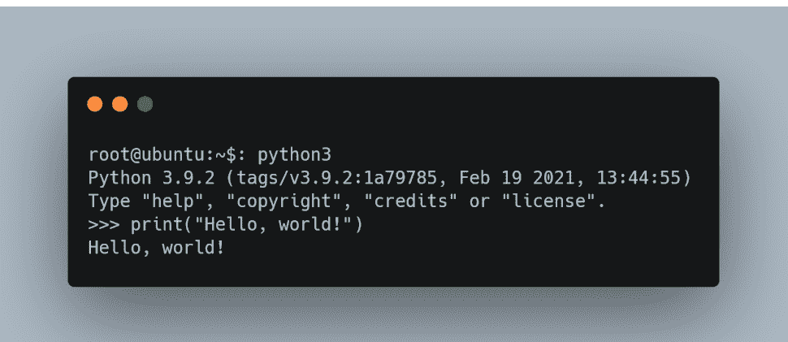

(原文缩略图，原文链接：[https://mathspp.com/blog/pydonts/boost-your-productivity-with-the-repl](https://mathspp.com/blog/pydonts/boost-your-productivity-with-the-repl))

## 引言

REPL 是一个了不起的工具，每个 Python 程序员都应该真正认识并欣赏它！不仅如此，如果你习惯使用它并学会充分利用它，你将收获良多 🤓

在这篇《Don't》中，你将：

-   了解“REPL”代表什么；
-   理解 REPL 对你的学习有多么重要；
-   理解 REPL 中“打印”结果的机制；
-   了解在 REPL 中如何获取上一个结果（以防你忘记赋值）；
-   了解内置的帮助系统；
-   了解一些在 REPL 中快速编写代码的技巧；
-   获悉两个能与你的 REPL 使用相辅相成的出色工具。

# REPL

读取。执行。打印。循环。

这就是“REPL”所代表的含义，通常被称为“读取-执行-打印-循环”。REPL 是接收你的输入代码（即读取代码）、执行它、打印结果，然后重复（即循环）的程序。

REPL 有时也被称为“交互式会话”或“解释器会话”，当你在计算机的命令行中键入 `python` 或 `python3` 时，看到的就是它。

你应该会看到类似以下内容的输出：

```
Python 3.9.2 (tags/v3.9.2:1a79785, Feb 19 2021, 13:44:55) [MSC v.1928 64 bit (AMD64)] on win32
Type "help", "copyright", "credits" or "license" for more information.
>>>
```

当然，具体打印的内容（尤其是第一行）可能与我这里展示的不同，但它仍然是 REPL。

(顺便提一下，如果你需要离开 REPL，只需调用 `exit()` 函数即可。)

# 启动 REPL

毫无疑问，REPL 是你编写 Python 代码时最好的朋友之一。有一个 REPL 可以让你动手实践，会让学习这门语言变得容易得多。

记不住内置函数的参数顺序？只需启动 REPL。

需要进行一个对常规桌面计算器来说稍显复杂的快速计算？只需启动 REPL。

想不起你要导入的模块如何拼写？只需启动 REPL。

你明白这个意思了。

我*再怎么强调*也不为过。习惯使用 REPL。在其中玩耍。在里面写代码。一旦你熟悉了它，你会爱上它，并为此感谢我。

# REPL 机制

## 基本输入与输出

REPL 通常在行首、你光标的左侧显示一个 `>>>`。你可以在该提示符前输入代码并按回车键。按下回车后，代码被执行，并显示结果：

```
>>> 3 + 3
6
```

## 多行输入

REPL 也接受跨越多行的代码，例如 `if` 语句、`for` 循环、使用 `def` 的函数定义等。

要输入这些，只需像平常一样开始输入你的 Python 代码：

```
>>> if True:
```

在冒号后按回车时，Python 意识到 `if` 语句的主体缺失，因此开始一个新行，并在左侧显示 `...`。这个 `...` 告诉你，这是对上面开始的内容的延续。

要告诉 Python 你已完成多行代码块的输入，可以在带有延续提示符 `...` 的空行上按回车：

```
>>> if True:
...     print("Hello, world!")
...
Hello, world!
>>>
```

## 粘贴代码到 REPL

将代码粘贴到 REPL 中通常不会有任何问题。

例如，下面的函数返回输入的两倍。尝试将其复制到你的 REPL 中然后使用它。

```
def double(x):
    return 2 * x
```

然而，如果你尝试复制并粘贴一个中间包含空行的多行代码块，那么 REPL 会中断你的定义。

例如，如果你尝试粘贴以下代码，你会得到一个错误：

```
def double(x):

    return 2 * x
```

将上面的代码复制并粘贴到会话中，你最终会得到类似这样的会话日志：

```
>>> def double(x):
...
  File "<stdin>", line 2
    ^
IndentationError: expected an indented block
>>>     return 2 * x
  File "<stdin>", line 1
    return 2 * x
IndentationError: unexpected indent
```

这会发生，是因为 REPL 发现了一个空行，并认为我们试图结束函数的定义。

## 隐式打印结果

关于 REPL，你最后应该知道的一点是，它会隐式地“打印”你输入表达式的结果。

我在“打印”上加了引号，因为 REPL 并没有真正打印结果，它只是显示其表示形式。对象的表示形式是当你对对象调用 `repr` 时得到的结果。如果你显式地打印某些东西，那么你得到的是对它调用 `str` 的结果。

我写了一篇非常详细的《Don't》来解释两者之间的区别，所以我只展示一下它们的不同之处：

```
## 定义一个字符串。
>>> s = "Hello\nworld!"
## 打印它的 `str` 和 `repr` 值：
>>> print(str(s))
Hello
world!
>>> print(repr(s))
'Hello\nworld!'
## 显式打印字符串并在 REPL 中执行它。
>>> print(s)
Hello
world!
>>> s
'Hello\nworld!'
```

如你所见，打印 `s` 和只是在 REPL 中输入它会产生两个不同的结果。只需留意这一点。

## 不打印，或 None

特别地，如果你写的表达式求值为 `None`，则不会打印任何内容。

最简单的观察方法是在 REPL 中直接输入 `None`。没有任何显示；与之对比，如果你只输入 `3`：

```
>>> None
>>> 3
3
```

如果你调用一个没有显式返回值或显式返回 `None` 的函数，那么这些函数在 REPL 中不会显示任何内容：

```
>>> def explicit_None_return():
...     # 显式返回 None。
...     return None
...
>>> explicit_None_return()     # <- 没有显示任何内容。

>>> def implicit_None_return():
...     # 在没有 `return` 的情况下结束会隐式返回 `None`。
...     pass
...
>>> implicit_None_return()     # <- 没有显示任何内容。
```

## 重复导入

有时使用 REPL 快速导入你刚刚定义的函数很有用。然后你测试该函数，接着在源文件中修改它。然后你会想再次导入该函数并再次测试它，但那样行不通。

你需要理解 REPL 如何处理导入，因为你不能通过重复导入来“更新”会话中的内容。

为了向你展示这一点，请先创建一个文件 `hello.py`：

```
## 在 `hello.py` 中：
print("Being imported.")
```

就这些。

现在打开 REPL：

```
>>> import hello
Being imported!
```

现在尝试修改 `print` 中的字符串，然后重新导入模块：

```
>>> import hello
Being imported!
## 修改文件，然后再次导入：
>>> import hello
>>>
```

什么都没发生！那是因为 Python 已经读取了你的文件，知道里面有什么，所以它不需要再次解析和运行文件。它可以直接提供你需要的函数/变量。

简而言之，如果你修改了变量、函数、代码；并且需要这些更改在 REPL 中体现，那么你需要用 `exit()` 退出 REPL，重新启动它，并重新导入相关内容。

这就是为什么我下面将分享的一些快速编写代码的技巧如此有用。

> 编辑：另一个替代方法——由一位热心读者提醒我——是在 Python 3.4+ 中使用 `importlib.reload(module)`。在我们的例子中，你可以使用 `importlib.reload(hello)`：

## REPL 历史记录

老实说，我并不完全确定我接下来要描述的内容是 Python REPL 的特性，还是我这辈子用过的所有命令行都有的功能，但还是说说吧：

你可以使用上下箭头键来浏览你输入过的表达式历史记录。这是相当标准的操作。

更酷的是，REPL 会记住这个表达式历史，即使你退出了 REPL，*只要你不关闭终端*。

```python
>>> import hello
Being imported
>>> import importlib          # Use `imp` from Python 3.0 to Python 3.3
>>> importlib.reload(hello)
Being imported
<module 'hello' from 'C:\tmp\hello.py'>
```

我们之所以得到最后一行，是因为 `importlib.reload` 返回了它重新加载的模块。你可以查看 [这个 StackOverflow 问题及其回答](https://stackoverflow.com/questions/437589/how-do-i-unload-reload-a-python-module) 来更多地了解这种方法。请注意，当有多个导入时，它可能不会像你期望的那样工作。在这些情况下，退出 REPL 并重新打开它可能是重新加载导入的最干净方式。

## 上一条结果

如果你读过我关于[下划线用法的 Pydon't](https://mathspp.com/blog/pydonts/pydonts-the-uses-of-underscore)，你可能已经知道了，但你可以使用下划线 `_` 来获取上一个表达式的结果，如果你想使用它但忘了赋值。

这里有一个简单的例子：

```python
>>> 3 + 6
9
>>> _ + 10
19
```

当你调用一个函数或运行一些耗时较长的代码时（例如，从互联网下载东西），这可能会派上用场。

如果你刚运行了一个有副作用的表达式，并且不想再次运行它以避免触发两次副作用，这也很有帮助。例如，如果你刚进行了一次 API 调用。

当然，`_` 本身就是一个有效的变量名，所以你仍然可以把它用作变量名。但是，如果你这样做了，那么 `_` 将不再反映上一个表达式的结果：

```python
>>> _ = 0
>>> _
0
>>> 3 + 9
12
>>> _
0           # <- it still evaluates to 0!
```

如果你想恢复 `_` 保存上一个表达式结果的神奇行为，只需使用 `del _` 删除 `_` 即可。

## 在 REPL 中获取帮助

另一个经常被低估的优秀特性是内置的帮助系统。例如，如果你需要快速查看一个内置函数的参考，因为你忘记了它的参数，只需使用 help！

```python
>>> help(sum)
Help on built-in function sum in module builtins:

sum(iterable, /, start=0)
    Return the sum of a 'start' value (default: 0) plus an iterable of numbers

    When the iterable is empty, return the start value.
    This function is intended specifically for use with numeric values and may
    reject non-numeric types.

>>>
```

这个内置 help 函数的妙处在于，只要你为自己的代码提供了足够好的文档，它甚至可以提供关于*你自己的*代码的帮助。

这是对一个你定义的函数调用 help 的结果：

```python
>>> def my_function(a, b=3, c=4):
...     return a + b + c
...
>>> help(my_function)
Help on function my_function in module __main__:

my_function(a, b=3, c=4)

>>>
```

你可以看到，help 告诉你你的函数定义在哪个模块中，并且还提供了函数的签名、默认值等等！

要从 help 获取更多信息，你需要用文档字符串为你的函数编写文档：

```python
>>> def my_function(a, b=3, c=4):
...     """Return the sum of the three arguments."""
...     return a + b + c
...
>>> help(my_function)
Help on function my_function in module __main__:

my_function(a, b=3, c=4)
    Return the sum of the three arguments.

>>>
```

现在你可以看到，help 函数也给出了存储在文档字符串中的信息。

> 我很快会写一篇关于文档字符串的 Pydon't。请务必订阅我的通讯，这样你就不会错过了！

## 快速编码的技巧

当你需要快速将一个想法实现出来时，Python REPL 是非常棒的，因为它允许你快速测试一些代码、调整它，并通过即时反馈反复迭代。

不用说，REPL 不能替代你的 IDE！然而，了解一些小技巧有时可以帮助你更好地利用 REPL。

### 分号

是的，**真的**。

Python 支持使用分号来分隔语句：

```python
>>> a = 3; b = a + 56; print(a * b)
177
```

然而，这个特性通常**不**适合你的代码，所以请避免使用它。

尽管分号通常不适合生产代码，但在 REPL 中，它们是你最好的朋友。我会向你解释，你也会同意。

在命令行中，你通常可以使用上下箭头键来循环浏览最近输入的命令。在 REPL 中你也可以这样做。只需尝试计算一个随机表达式，然后按上箭头键再按回车键。这应该会再次运行完全相同的表达式。

有时你会在 REPL 中增量测试一个解决方案或算法。然而，如果你犯了一个错误，你必须重置一切。

这时，你只能疯狂地按上下箭头键，试图找出你已经运行过的所有代码，试图记住哪些是正确的表达式，哪些是错误的……

分号可以防止这种情况！你可以使用分号来跟踪你整个“进度”：每当你弄清楚下一步该怎么做，你可以使用箭头键回到你上次“保存进度”的地方，然后在语句序列的末尾添加正确的步骤。

以下是一个交互式 REPL 会话的例子，我尝试根据年龄列表对姓名列表进行排序。

我没有使用两个单独的赋值，而是把它们放在同一行，用 `;` 分隔：

```python
>>> names = ["John", "Anna", "Bill"]; ages = [20, 40, 30]
```

我本可以写成

```python
>>> names, ages = ["John", "Anna", "Bill"], [20, 40, 30]
```

但使用分号表达了在编写实际代码时希望这两个赋值在不同行的意图。

然后，我将尝试看看如何将年龄和姓名组合成配对：

```python
>>> [(age, name) for name, age in zip(names, ages)]
[(20, 'John'), (40, 'Anna'), (30, 'Bill')]
```

然而，这时我意识到我有点多余，我只需要交换参数的顺序使用 zip 就可以了：

```python
>>> list(zip(ages, names))
[(20, 'John'), (40, 'Anna'), (30, 'Bill')]
```

现在我对姓名和年龄的配对方式感到满意了，我使用箭头键回到包含赋值的那一行。然后，我使用分号添加我推导出的新代码片段：

```python
>>> names = ["John", "Anna", "Bill"]; ages = [20, 40, 30]; info_pairs = zip(ages, names)
```

> `zip` 是 Python 中一个强大的工具，也是我最喜欢的内置函数之一。你可以通过这篇 Pydon't 学习如何运用它的力量。

现在我可以继续下一步了，知道现在犯错代价不高：我可以通过回到包含所有中间步骤的那一行并运行那一行代码来重置一切。

### 不换行

当你想定义一个简单的多行块时，你通常可以把冒号后面的内容放在同一行，这没有问题。

例如，与其写

```python
>>> for i in range(3):
...     print(i)
...
0
1
2
```

你可以写

```python
>>> for i in range(3): print(i)
...
0
1
2
```

虽然这种风格*不*推荐用于生产代码，但它使得在 REPL 历史记录中上下移动更加方便。

如果你真的想挑战极限，你甚至可以把它和分号结合起来：

```python
>>> i = 1
>>> while i < 30: print(i); i *= 2
...
1
2
4
8
16
```

### 导入、测试、循环

如果你正在写一些代码并想试运行一下——只是为了确保它合理——启动 REPL，导入代码，然后玩转它！这就是 REPL 的魔力。

务必在一行中用分号分隔完成所有“测试”的设置，以及导入语句。这样，当你调整完刚编写的代码后，你可以输入 `exit()` 退出 REPL，再次进入它，然后按几次上箭头键，你的设置代码就完整无误，准备好再次使用了。

## 其他工具

在写这些 Pydon't 时，我尽量坚持使用原生 Python，原因很简单：原生 Python 的世界非常广阔，对于大多数开发者来说，还有很多未开发的潜力。

然而，我认为如果我不提及两个可以真正改善你在 REPL 中的体验的工具，那将是对你的不负责。

### Rich

> “Rich 是一个用于在终端中实现富文本和美观格式化的 Python 库。”

Rich 是一个我非常喜爱的开源库。你可以阅读文档和示例来快速掌握 Rich 的功能，但我想特别关注一个非常具体的功能：

```python
>>> from rich import pretty
>>> pretty.install()
```

在你的 REPL 中运行这两行代码将会改变你的生活。通过这两行代码，Rich 将会美观地打印你的变量，甚至包括语法高亮。

### IPython

IPython 是一个用于多种编程语言交互式计算的命令行 shell，最初是为 Python 编程语言开发的。IPython 提供了自省、富媒体、shell 语法、Tab 补全等功能。补全、历史记录等功能。简而言之，它是一个功能更丰富的 Python REPL。本 Pydon't 系列无法涵盖 IPython 的所有内容，但我必须提及它（尽管我个人并不使用）。

## 结论

以下是本 Pydon't 为你奉上的主要收获：

> “熟练使用 REPL，这将使你成为更高效的 Python 程序员。”

本 Pydon't 向你展示了：

- REPL 是帮助快速原型化小想法和解决方案的绝佳工具；
- REPL 支持多行输入，并在空行后中断输入；
- REPL 会隐式显示你输入表达式的结果，但需注意显示的是对象的表示形式（repr），而非其字符串值（str）；
- 你可以使用方向键浏览在 REPL 中输入的代码历史记录；
- 只要不关闭终端窗口，输入的代码历史记录在退出 REPL 后仍会保留；
- None 结果不会被隐式显示；
- 重复导入相同模块不会更新其内容；
- 你可以使用 _ 访问上一行的结果；
- 内置的 help 函数可以为你“手边”的函数和其他对象提供基本文档；它甚至适用于用户定义的对象；
- 通过使用文档字符串，你可以提高内置 help 在自定义对象上的实用性；
- 尽管不推荐作为最佳实践，但使用分号和内联多行语句可以在浏览 REPL 历史记录时节省时间；
- Rich 是一个可以在 REPL 中使用的工具，可以自动美化打印带高亮的结果；
- IPython 是一个替代的 Python REPL，功能更加丰富。

如果你喜欢这个 Pydon't，请务必在下方留下反馈，并与你的朋友和 Python 同好分享。同时，订阅新闻通讯，这样你就不会错过任何一个 Pydon't！

## 参考资料

- Rich, https://github.com/willmcgugan/rich [最后访问于 2021-08-25]
- IPython, https://ipython.org/ [最后访问于 2021-08-25]
- 改进建议反馈，Reddit 评论，https://www.reddit.com/r/Python/comments/pbkq3z/boost_your_productivity_with_the_repl_pydont/hadom13/ [最后访问于 2021-08-26]；
- Stack Overflow 问题，“如何在 Python 解释器中重新导入更新的包？”，https://stackoverflow.com/q/684171/2828287 [最后访问于 2021-08-26]；

# set 和 frozenset

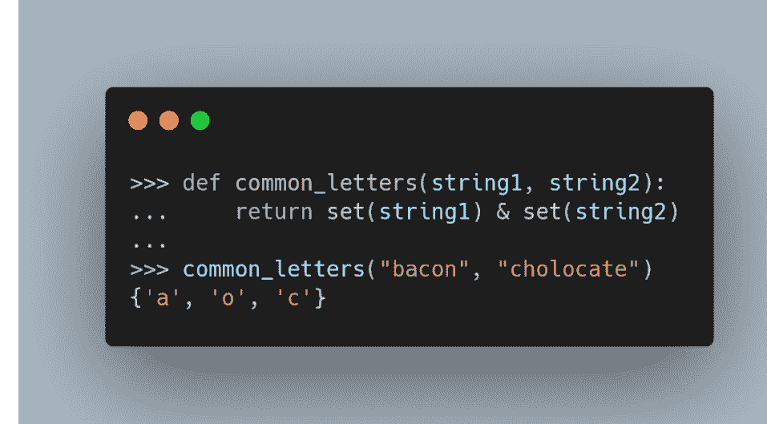

## 简介

Python 包含一些内置类型，其中包括整数、列表、字符串等。

Python 还提供了两种内置类型来处理集合：set 和 frozenset。

在本 Pydon't 中，你将：

- 理解 set 内置类型与数学概念“集合”之间的关系；
- 了解 set 和 frozenset 内置类型是什么；
- 查看 set 和 frozenset 之间的区别；
- 学习如何创建集合和冻结集合；
- 理解集合如何与其他内置类型（即列表）相适应；
- 建立列表与元组、集合与冻结集合之间的类比；
- 查看 Python 代码中 set（和 frozenset）的良好使用示例；

## （数学）集合

集合仅仅是一个无序的唯一项目集合。每当我想到集合时，我就会想到购物车。

## 无序性

如果你去购物，并带上一个购物车，那么你将物品放入购物车的顺序并不重要。*真正*重要的是购物车里有什么物品。

如果你买了牛奶、巧克力和奶酪，这些物品的登记顺序并不重要。重要的是你买了牛奶、巧克力和奶酪。

从这个意义上说，你可以说你买的杂货形成了一个集合：包含牛奶、巧克力和奶酪的集合。在数学和 Python 中，我们都使用 {} 来表示集合，因此以下是你在 Python 中定义杂货集合的方式：

```
>>> groceries = {"milk", "cheese", "chocolate"}
>>> groceries
{'cheese', 'milk', 'chocolate'}
>>> type(groceries).__name__
'set'
```

我们可以通过检查 `groceries` 类型的 `__name__` 来确认我们确实创建了一个集合。

> 如果你不明白为什么我们输入 `type(groceries).__name__` 而不是直接使用 `type(groceries)`，那么我建议你快速浏览一下关于魔术属性 `__name__` 的 Pydon't。（另外，使用 `isinstance(groceries, set)` 在这里也可以！）

为了确保顺序在集合中确实不重要，我们可以尝试将此集合与包含相同元素但顺序不同的其他集合进行比较：

```
>>> groceries = {"milk", "cheese", "chocolate"}
>>> groceries == {"cheese", "milk", "chocolate"}
True
>>> groceries == {"chocolate", "milk", "cheese"}
True
```

## 唯一性

（数学）集合的另一个关键属性是没有重复元素。这就好比有人让你去买奶酪，当你回到家时，那个人从另一个房间喊道：

“你买奶酪了吗？”

这是一个是/否问题：你要么买了奶酪，要么没买。
对于集合，情况相同：元素要么在集合中，要么不在。我们不关心元素的数量。我们甚至不考虑它。
以下是 Python 做同样事情的证明：

```
>>> {"milk", "cheese", "milk", "chocolate", "milk"}
{'cheese', 'milk', 'chocolate'}
```

## （常见）集合操作

集合定义了许多方法，正如文档会告诉你的那样。

### 创建

创建集合有三种主要方式。

### 显式 {} 表示法

使用 {} 表示法，你在花括号内以逗号分隔的列表形式写出集合的元素：

```
>>> {1, 2, 3}
{1, 2, 3}
>>> {"cheese", "ham"}
{'cheese', 'ham'}
>>> {"a", "b", "c"}
{'c', 'a', 'b'}
```

顺便说一下，你*不能*使用 {} 来创建空集合！{} 本身会创建一个空字典。要创建空集合，你需要使用下一种方法。

### 对可迭代对象调用 set

你可以对任何可迭代对象调用内置函数 set，以从该可迭代对象的元素创建一个集合。显著的例子包括 range、字符串和列表。

```
>>> set(range(3))
{0, 1, 2}
>>> set([73, "water", 42])
{73, 'water', 42}
```

注意，对字符串调用 set 会产生一个包含字符串字符的集合，而不是包含整个字符串的集合：

```
>>> {"mississippi"}
{'mississippi'}
```

↑ 不同 ↓

```
>>> set("mississippi")
{'s', 'i', 'p', 'm'}
```

单独调用 set() 将产生一个空集合。

### 集合推导式

使用 {}，你也可以编写所谓的集合推导式。集合推导式与列表推导式*非常*相似，因此了解列表推导式在这里会很有帮助。

我将只展示几个简短的例子。

第一个例子，使用过滤来包含我们想要的一些元素：

```
>>> veggies = ["broccoli", "carrot", "tomato", "pepper", "lettuce"]
>>> {veggie for veggie in veggies if "c" in veggie}
{'lettuce', 'carrot', 'broccoli'}
```

第二个例子，一个包含两个嵌套 for 循环的集合推导式：

```
>>> veggies = ["broccoli", "carrot", "tomato", "pepper", "lettuce"]
>>> {char for veggie in veggies for char in veggie}
{'c', 'u', 't', 'o', 'p', 'b', 'l', 'i', 'a', 'e', 'm', 'r'}
```

> 我将撰写一篇关于 Python 支持的所有类型推导式的详尽 Pydon't，因此请务必[订阅新闻通讯](https://mathspp.com/newsletter)，以免错过即将发布的 Pydon't！

## 单个集合上的操作

许多常见操作是在单个集合上进行的，即：

- 成员测试：

```
>>> "milk" in groceries
True
>>> "broccoli" in groceries
False
```

- 计算集合的大小：

```
>>> len(groceries)
3
```

- 从集合中弹出一个随机元素：

```
>>> groceries.pop()
'cheese'
>>> groceries
{'milk', 'chocolate'}
```

- 向集合中添加一个元素：

```
>>> groceries.add("cheese")
>>> groceries
{'milk', 'cheese', 'chocolate'}
```

### 迭代

我经常将集合与列表（和元组）联系起来。集合类似于具有唯一元素的列表，但列表是有序的：列表可以从头到尾遍历，并且列表可以被索引。

虽然集合也可以被迭代（以一种你无法依赖的顺序），

```
>>> for item in groceries:
...     print(item)
...
cheese
milk
chocolate
```

但集合不能被直接索引：

```
>>> groceries[0]
Traceback (most recent call last):
  File "<stdin>", line 1, in <module>
TypeError: 'set' object is not subscriptable
```

### 多个集合的计算

当你有多个集合（两个或更多）时，你可能需要进行其他类型的操作。

让我们定义几个集合来使用：

```
>>> groceries = {"milk", "cheese", "chocolate"}
>>> treats = {"chocolate", "popcorn", "cookie"}
```

以下是一些更常见的操作

- 检查两个集合之间是否有重叠：

```
>>> groceries & treats
{'chocolate'}
```

- 合并两个集合：

```
>>> groceries | treats
{'cheese', 'milk', 'popcorn', 'chocolate', 'cookie'}
```

> 注意，这里使用管道符 | 类似于在 Python 3.9+ 中使用 | 合并字典。

- 查找两个集合的差集（在左边集合中但不在右边集合中的元素）：

```
>>> groceries - treats
{'cheese', 'milk'}
```

- 使用 <, <=, >=, 和 > 检查包含关系：

```python
>>> {"cheese", "milk"} < groceries
True
>>> groceries < groceries
False
>>> {"cheese", "milk"} <= groceries
True
>>> groceries <= groceries
True
>>> treats > {"chocolate"}
True
>>> treats >= {"chocolate", "cheese"}
False
```

请注意，大多数基于操作符的操作都有对应的方法调用。对应的方法调用可以接受任意可迭代对象，而基于操作符的版本则期望集合。

## 集合与冻结集合的区别

### 创建

虽然你可以使用内置的 `set` 或 `{}` 符号来创建集合，但冻结集合只能通过它们各自的内置方式创建。

冻结集合可以从其他集合或任何可迭代对象创建，这与集合类似。

打印时，冻结集合会显示其被冻结的指示：

```python
>>> groceries = {'cheese', 'milk', 'chocolate'}
>>> frozenset(groceries)
frozenset({'cheese', 'milk', 'chocolate'})
>>> frozenset(['cheese', 'milk', 'chocolate'])
frozenset({'cheese', 'milk', 'chocolate'})
```

### 可变性

集合是可变的。集合被称为可变的，因为它们可以改变，这就是“mutable”在英语中的含义。

正如我在上面展示的，集合的内容可以改变，例如通过调用 `.add` 和 `.pop` 方法。

然而，如果你需要创建一个行为像集合（即顺序不重要且保证唯一性）但又不希望被改变的对象，那么你就需要创建一个冻结集合。

冻结集合的实例与集合非常相似，只是冻结集合不可变。换句话说，冻结集合是 *不可变* 的，它不能被改变，它是被冻结的。

要创建一个冻结集合，你只需调用相应的类：

```python
>>> groceries_ = frozenset(groceries)
>>> # 不能添加项目：
>>> groceries_.add("beans")
Traceback (most recent call last):
  File "<stdin>", line 1, in <module>
AttributeError: 'frozenset' object has no attribute 'add'
>>> # 不能弹出项目：
>>> groceries_.pop()
Traceback (most recent call last):
  File "<stdin>", line 1, in <module>
AttributeError: 'frozenset' object has no attribute 'pop'
```

有一个非常类似的内置类型对，也具有这种二分法：列表和元组。列表是可变的（例如，它们有 `.append` 和 `.pop` 方法），而元组是不可变的（它们没有 `.append` 或 `.pop` 方法，也不能直接赋值给索引）：

```python
### 列表是可变的：
>>> l = [0, 1, 2]
>>> l[0] = 73
>>> l.pop()
2
>>> l.append(42)
>>> l
[73, 1, 42]
```

```python
### 元组是不可变的：
>>> t = (0, 1, 2)
>>> t[0] = 73
Traceback (most recent call last):
  File "<stdin>", line 1, in <module>
>>> t.pop()
Traceback (most recent call last):
  File "<stdin>", line 1, in <module>
AttributeError: 'tuple' object has no attribute 'pop'
>>> t.append(42)
Traceback (most recent call last):
  File "<stdin>", line 1, in <module>
AttributeError: 'tuple' object has no attribute 'append'
```

### 是否（可哈希）

可哈希的对象是其哈希值可以被计算的对象，因此，它是可哈希的（hash-able）。

哈希是一个整数，由内置函数 `hash` 计算，用于帮助字典进行快速操作，例如键查找。

内置函数知道如何与某些类型的对象一起工作，而与其他类型则不行。内置函数 `hash` 决定了什么可以、什么不能成为字典键：如果它是可哈希的，它就可以成为字典键；如果它不可哈希，它就不能成为字典键。

例如，列表是可变的且不可哈希的，因此它们不能作为字典键。尝试将列表用作字典键会引发错误：

```python
>>> d = {}
>>> d[[1, 2, 3]] = 73
Traceback (most recent call last):
  File "<stdin>", line 1, in <module>
TypeError: unhashable type: 'list'
```

然而，元组——列表的同源类型——是不可变的，不可变对象通常可以变成可哈希的。元组可以用作字典键：

```python
>>> d = {}
>>> d[(1, 2, 3)] = 73
>>> d
{(1, 2, 3): 73}
```

类似地，因为集合是可变的，所以它们不可哈希。然而，冻结集合是不可变的，并且它们也是可哈希的！集合不能作为字典键，但冻结集合可以：

```python
>>> d = {}
>>> d[groceries] = 73
Traceback (most recent call last):
  File "<stdin>", line 1, in <module>
TypeError: unhashable type: 'set'
>>> d[frozenset(groceries)] = 73
>>> d
{frozenset({'cheese', 'milk', 'chocolate'}): 73}
```

### 集合的用途是什么？

直接引用文档中的话，

> “集合的常见用途包括快速成员测试、从序列中删除重复项以及计算数学运算，如交集、并集、差集和对称差集。”

简而言之，当手头的问题受益于数学集合固有的特性（元素唯一性和无序性）以及我们从这些特性中继承的其他优势时，集合就非常有用。

快速成员测试就是一个很好的例子。

在最近的一条推文中，我展示了当执行成员测试时，10个元素的集合如何已经优于10个元素的列表：

> 你知道吗？Python的集合非常适合快速成员测试。如果你观察，你会发现检查某物是否在集合中，比检查它是否在列表中要快得多，尤其是在列表越长时……下面的例子只有10个元素！pic.twitter.com/iJWwqeNlt0
>
> — Rodrigo 🐍 (@mathsppblog) September 1, 2021

这些特性将是编写我将要展示的代码片段的程序员所遵循的主要依据，这些代码展示了集合的良好用法。

## 代码示例

以下示例是我向你展示内置类型 `set` 和 `frozenset` 的良好用法的尝试。

### 使用集合进行快速成员测试

`argparse` 模块是一个内置模块，允许你创建命令行接口。

主要的类，参数解析器 `ArgumentParser`，包含以下代码片段：

```python
## 来自 Python 3.9.2 的 Lib/argparse.py
class ArgumentParser(_AttributeHolder, _ActionsContainer):
    # ...
    def _parse_known_args(self, arg_strings, namespace):
        # ...
        # 将所有互斥的参数映射到它们不能同时出现的其他参数上
        action_conflicts = {}
        # ...

        seen_actions = set()
        seen_non_default_actions = set()

        def take_action(action, argument_strings, option_string=None):
            seen_actions.add(action)
            argument_values = self._get_values(action, argument_strings)

            # 如果此参数与先前见过的其他参数不兼容，则报错，
            # 假设使用默认值的操作并不真正算作“已出现”
            if argument_values is not action.default:
                seen_non_default_actions.add(action)
                for conflict_action in action_conflicts.get(action, []):
                    if conflict_action in seen_non_default_actions:
                        msg = _('not allowed with argument %s')
                        action_name = _get_action_name(conflict_action)
                        raise ArgumentError(action, msg % action_name)
```

长话短说：集合 `seen_actions` 和 `seen_non_default_actions` 正是被用于快速成员测试。

下面是更详细的解释。

当你使用 `argparse` 创建一个命令行应用程序时，你必须指定你的命令接受的选项。例如，`-v` 用于详细输出或 `-h` 用于显示帮助信息。

有时，可能存在冲突的选项。例如，如果你提供了 `-v` 用于详细输出，同时也提供了 `-q` 用于静默输出，那么同时指定两者就没有意义了。

`action_conflicts` 字典将跟踪哪些东西与哪些东西冲突。

接着，我们初始化两个空集合，`seen_actions` 和 `seen_non_default_actions`。现在，每当我们看到一个操作时，我们就把它添加到包含所有已见操作的集合中。

然后，如果那个操作确实被用户指定了，我们就把它添加到未使用默认值的操作集合中。

最后，我们访问 `action_conflicts` 以获取与当前正在解析的操作不兼容的所有操作的列表。如果任何冲突的操作出现在我们之前已见的操作集合中，那么我们就抛出一个错误！

稍后，我们还可以找到以下代码：

```python
## 来自 Python 3.9.2 的 Lib/argparse.py
class ArgumentParser(_AttributeHolder, _ActionsContainer):
    # ...
    def _parse_known_args(self, arg_strings, namespace):
        # ...

        seen_actions = set()
        seen_non_default_actions = set()

        def take_action(action, argument_strings, option_string=None):
            # ...

        # ...
        # 确保所有必需的操作都已出现，并且也转换
        # 未作为参数给出的操作默认值
        required_actions = []
        for action in self._actions:
            if action not in seen_actions:
                if action.required:
                    required_actions.append(_get_action_name(action))
            # ...

        if required_actions:
            self.error(_('the following arguments are required: %s') %
                       ', '.join(required_actions))
```

我们再次使用集合 `seen_actions` 进行快速成员测试：我们遍历命令行接口知道的所有操作，并跟踪所有用户未指定/提及的必需操作。
```

之后，如果 `required_actions` 列表中有任何操作，我们就会告知用户他们遗忘了一些事项。

### 无条件集合添加

关于前面的例子，还有一个我想要强调的巧妙细节。
让我展示关键的代码片段：

```python
## In Lib/argparse.py from Python 3.9.2
class ArgumentParser(_AttributeHolder, _ActionsContainer):
    # ...
    def _parse_known_args(self, arg_strings, namespace):
        # ...
        def take_action(action, argument_strings, option_string=None):
            seen_actions.add(action)
            # ...
```

关注代码的最后一行：`seen_actions.add(action)`。
这起初可能看起来不明显，但 `action` 可能已经存在于集合 `seen_actions` 中。
为了阐明这一点，修改 `take_action` 函数，加入一个打印语句：

```python
## In Lib/argparse.py from Python 3.9.2
class ArgumentParser(_AttributeHolder, _ActionsContainer):
    # ...
    def _parse_known_args(self, arg_strings, namespace):
        # ...
        def take_action(action, argument_strings, option_string=None):
            print(action)
            seen_actions.add(action)
            # ...
```

现在，请将以下代码粘贴到一个名为 `foo.py` 的文件中：

```python
import argparse

parser = argparse.ArgumentParser()
parser.add_argument("-t", action="store_true")
args = parser.parse_args()
```

然后，在 `foo.py` 所在的目录打开你的终端：

```
> python foo.py -ttt
_StoreTrueAction(option_strings=['-t'], dest='t', nargs=0, const=True, default=False, type=None, choices=None, required=False, help=None, metavar=None)
_StoreTrueAction(option_strings=['-t'], dest='t', nargs=0, const=True, default=False, type=None, choices=None, required=False, help=None, metavar=None)
_StoreTrueAction(option_strings=['-t'], dest='t', nargs=0, const=True, default=False, type=None, choices=None, required=False, help=None, metavar=None)
```

你会得到三行相同的输出，每次你在命令中输入一个 `t` 就输出一行。

所以，我们看到出现了重复的操作……难道我们不应该在添加操作之前检查它是否已被添加吗？比如像这样：

```python
## In Lib/argparse.py from Python 3.9.2
class ArgumentParser(_AttributeHolder, _ActionsContainer):
    # ...
    def _parse_known_args(self, arg_strings, namespace):
        # ...
        def take_action(action, argument_strings, option_string=None):
            if action not in seen_actions:
                seen_actions.add(action)
            # ...
```

不！不要那样做！这是一种反模式，并且会重复不必要的工作！检查一个元素是否在集合中与无条件地添加它，所做的工作量几乎相同，因此，先检查是否已在其中，然后再添加，将使你处理所有新操作的工作量翻倍！

集合已经为你处理了唯一性问题，所以你不必担心强制实施它。从这个意义上说，这是集合用法的一个绝佳示例。

### 使用 frozenset 进行快速成员检查

在上面的例子中，我们看到我们使用的集合会随着程序的进行而增长。因此，我们需要可变性，于是使用了 `set`。

我即将展示的这个例子是，我们关心的集合是固定的，它总是包含相同的元素。因此，我们将使用 `frozenset` 代替普通的 `set`。为什么？因为使用 `frozenset` 能非常清楚地表明该集合是固定的。

```python
## In Lib/idlelib/hyperparser.py from Python 3.9.2
import string

## ...

## 所有可能出现在标识符中的 ASCII 字符
_ASCII_ID_CHARS = frozenset(string.ascii_letters + string.digits + "_")
## 所有可能作为标识符第一个字符的 ASCII 字符
_ASCII_ID_FIRST_CHARS = frozenset(string.ascii_letters + "_")

## 查找表：用于判断 7 位 ASCII 字符是否在 Python 标识符中有效
_IS_ASCII_ID_CHAR = [(chr(x) in _ASCII_ID_CHARS) for x in range(128)]
## 查找表：用于判断 7 位 ASCII 字符是否能作为 Python 标识符的第一个字符
_IS_ASCII_ID_FIRST_CHAR = \
    [(chr(x) in _ASCII_ID_FIRST_CHARS) for x in range(128)]
```

诚然，上面的代码片段没有告诉你变量 `_IS_ASCII_ID_CHAR` 和 `_IS_ASCII_ID_FIRST_CHAR` 的用途，但很清楚，这两个变量是通过列表推导式构建的，该推导式对 `_ASCII_ID_CHARS` 和 `_ASCII_ID_FIRST_CHARS` 进行成员检查。而这两个变量正是字符的冻结集合！

所以，这就是了！又一个用于快速成员检查的集合用例。

## 结论

以下就是这篇 Pydon't 的主要要点，呈现在你眼前：

> “在处理集合，并且需要进行（快速的）成员检查时，请使用（冻结）集合。”

这篇 Pydon't 向你展示了：

-   集合是包含元素的（数学）对象；
-   元素是唯一的；并且
-   它们的顺序无关紧要。
-   内置类型 `set` 为数学上的集合概念提供了实现；
-   `frozenset` 是 `set` 的不可变且可哈希的版本；
-   元组之于列表，就像冻结集合之于集合；
-   你可以用以下方式创建集合：
    -   用 `{}` 括起一个逗号分隔的项目列表；
    -   `set()` 和一个可迭代对象；以及
    -   集合推导式。
-   集合有允许你修改它们的操作（如 `.add` 和 `.append`），以及其他许多操作；
-   你可以用多种不同的方式组合集合，例如使用 `&` 和 `|` 等运算符；
-   你可以用 `<`、`<=`、`>=`、`>` 来检查集合包含关系；
-   如果你确定对象的集合不会改变，你应该使用 `frozenset`；
-   （冻结）集合常用于快速成员检查；并且
-   无条件地向集合添加元素比先检查成员再添加要快。

如果你喜欢这篇 Pydon't，请务必在下方留下反馈，并与你的朋友和 Python 同好们分享。此外，订阅我们的通讯，这样你就不会错过任何一篇 Pydon't！

## 参考文献

-   Python 3 文档，Python 标准库，内置类型，集合类型 — set, frozenset，https://docs.python.org/3/library/stdtypes.html#set-types-set-frozenset [最后访问于 2021-09-14]；
-   Python 3 文档，Python 标准库，内置函数，hash，https://docs.python.org/3/library/functions.html#hash [最后访问于 2021-09-14]；
-   Python 3 文档，Python 语言参考，特殊方法名称，object.__hash__，https://docs.python.org/3/reference/datamodel.html#object.__hash__ [最后访问于 2021-09-14]；
-   Python 3 文档，Python 标准库，argparse，https://docs.python.org/3/library/argparse.html [最后访问于 2021-09-14]；

# 列表推导式入门

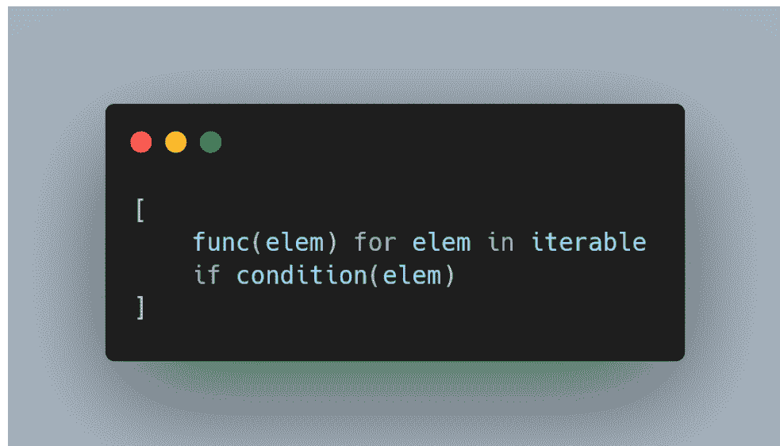

（原始文章在 https://mathspp.com/blog/pydonts/list-comprehensions-101 的缩略图。）

## 介绍

毫无疑问，列表推导式是我最喜欢的 Python 特性之一。
它不是最最喜欢的特性，但那是因为 Python 有很多我真的很喜欢的东西！列表推导式就是其中之一。
这篇 Pydon't（一个系列中的第一篇）将涵盖列表推导式的基础知识。

在这篇 Pydon't 中，你将：

-   了解列表推导式的结构；
-   学习如何创建列表推导式；并且
-   理解列表推导式的构建块；
-   看到某些 for 循环与列表推导式之间存在的相似之处；
-   建立 `map` 和 `filter` 与列表推导式之间的对应关系；
-   理解该特性的主要用例；并且
-   在真实人员编写的真实代码中看到列表推导式的良好用法。

我还将这篇 Pydon't 的内容总结在了一份速查表中，你可以在这里免费获取。

## 什么是列表推导式？

列表推导式是返回一个列表的 Python 表达式。

列表推导式很棒，因为它们提供了一种非常方便的语法来生成简单的列表。这通常是使用完整的 `for` 循环并多次调用要构建的列表的 `.append` 方法的一个很好的替代方案。

然而，列表推导式的结构与等效的 for 循环非常相似，因此如果你理解列表推导式与相应循环之间的关系，列表推导式应该很容易使用。

列表推导式背后的关键思想是，许多列表可以由其他更简单的可迭代对象（列表、元组、字符串……）构建而成。

例如，如果你想构建一个包含一些平方数的列表，你可能会首先使用 `range` 来创建一系列连续的整数。

## 列表推导式的结构

一个列表推导式有四个部分，其中一个是可选的。以下是一个表示这四个部分的图表：

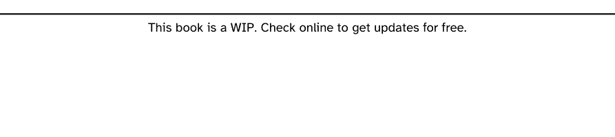

第一部分是一对开闭括号，用于界定列表推导式。这些括号本身并不会自动表明这是一个列表推导式，因为它们也可以用来创建列表字面量，例如 `[1, 2, 3]`。

第二部分是你应用于初始种子数据每个元素的表达式。这通常是一个函数调用或另一个表达式，例如算术表达式，它将每个元素转换为一个新元素。在上图中，这由 `func(elem)` 表示。

第三部分是 `for` 组件，它确定了初始数据是什么，以及我们将从哪里提取元素。这类似于标准 `for` 循环中的 `for ... in ...`。实际上，它的形式与 `for` 循环的初始语句完全相同，在上图中表示为 `for elem in iterable`。

第四部分是可选的，是一个 `if` 语句。这个 `if` 语句用于从初始种子数据中过滤元素，以防我们想忽略部分数据/只使用部分数据。这在上图中由 `cond(elem)` 表示。

理论废话就到这里，让我们来看一些实际的列表推导式。

## 无过滤条件的列表推导式示例

1.  计算平方数：

    ```python
    >>> [n ** 2 for n in range(10)]
    [0, 1, 4, 9, 16, 25, 36, 49, 64, 81]
    ```

2.  将一系列单词转为大写：

    ```python
    >>> words = "This is Sparta!".split()
    >>> [word.upper() for word in words]
    ['THIS', 'IS', 'SPARTA!']
    ```

3.  找出句子中每个单词的长度：

    ```python
    >>> words = "To be or not to be, that is the question.".split()
    >>> [len(word) for word in words]
    [2, 2, 2, 3, 2, 3, 4, 2, 3, 9]
    ```

## 有过滤条件的列表推导式示例

1.  为偶数 `n` 计算平方数：

    ```python
    >>> [n ** 2 for n in range(10) if n % 2 == 0]
    [0, 4, 16, 36, 64]
    ```

    这也等价于：

    ```python
    >>> [n ** 2 for n in range(0, 10, 2)]
    [0, 4, 16, 36, 64]
    ```

    后者更好，因为它使用了更少的初始数据。

2.  如果单词全部是小写，则将其大写：

    ```python
    >>> words = "This is Sparta!".split()
    >>> [word.upper() for word in words if word == word.lower()]
    ['IS']
    ```

    结果只包含单词 “is”，因为在原始句子 “This is Sparta!” 中，它是唯一一个完全由小写字母组成的单词。

3.  找出每个不与标点符号相邻的单词的长度：

    ```python
    >>> words = "To be or not to be, that is the question.".split()
    >>> words
    ['To', 'be', 'or', 'not', 'to', 'be,', 'that', 'is', 'the', 'question.']
    >>> [len(word) for word in words if word.isalpha()]
    [2, 2, 2, 3, 2, 4, 2, 3]
    ```

    最终结果只包含 8 个数字（而原始句子包含 10 个单词），因为单词 “be,” 和 “question.” 旁边有标点符号。

## 与 for 循环的等价性

既然你已经看了一些列表推导式，现在是时候将其与 for 循环进行类比了。如果你足够了解你的 for 循环，并且你研究这种等价性，你将掌握列表推导式。

一个列表推导式等价于一个连续调用（初始时）空列表的 `.append` 方法的 for 循环：

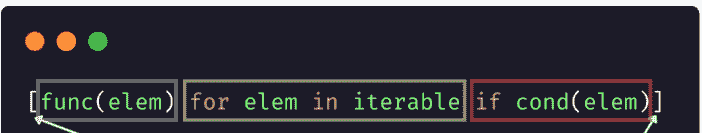

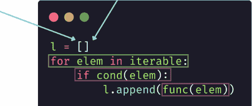

这实际上是列表推导式最有用的常见模式之一。

如果你发现一段代码先初始化一个空列表，然后使用一个 for 循环用数据填充它，那么这很可能是使用列表推导式的好场景。

当然，这并不总是可以以合理的方式实现，列表推导式并非旨在替代所有的 for 循环。但如果你有一个短小的循环表现出上述结构，那么它可能可以被一个列表推导式所取代。

我鼓励你这样做。浏览你的一些代码并寻找这种模式。然后，尝试用一个列表推导式替换它。

以下是之前的列表推导式及其等价的 for 循环：

1.  计算平方：

    ```python
    even_squares = [n ** 2 for n in range(10) if n % 2 == 0]
    ## ↓
    ## ↓
    even_squares = []
    for n in range(10):
        if n % 2 == 0:
            even_squares.append(n ** 2)
    ```

2.  将单词大写：

    ```python
    words = "This is Sparta!".split()
    upper_cased = [word.upper() for word in words if word == word.lower()]
    ## ↑
    ## ↓
    upper_cased = []
    for word in words:
        if word == word.lower():
            upper_cased.append(word.upper())
    ```

3.  计算单词长度：

    ```python
    words = "To be or not to be, that is the question.".split()
    lengths = [len(word) for word in words if word.isalpha()]
    ## ↑
    ## ↓
    lengths = []
    for word in words:
        if word.isalpha():
            lengths.append(len(word))
    ```

## 嵌套 for 循环

与标准 for 循环非常类似，列表推导式也可以有嵌套循环：

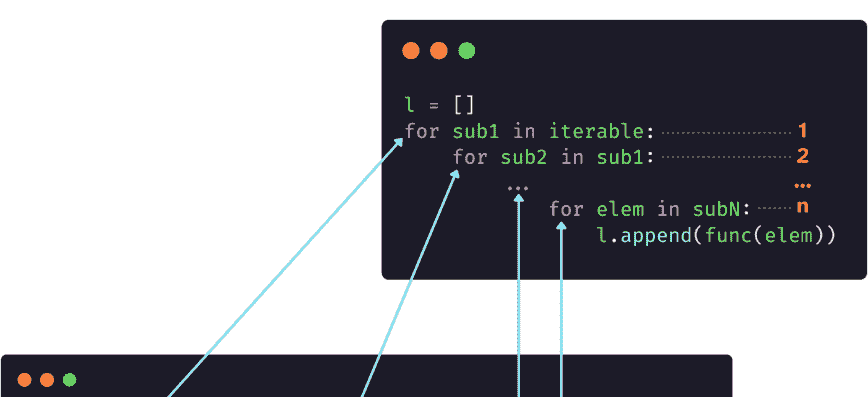

一个典型用例就是将嵌套列表展平：

```python
>>> lists = [[1, 2, 3], [4, 5, 6, 7], [8, 9]]
>>> [elem for sublist in lists for elem in sublist]
[1, 2, 3, 4, 5, 6, 7, 8, 9]
```

第二个循环不必显式地依赖于第一个循环；它可以迭代另一个可迭代对象，以创建另一个变量。当你这样做时，所有遍历可迭代对象的临时变量都可以在左侧使用。

```python
l = []
for elem1 in iterable1:
    ...
        for elemN in iterableN:
            l.append(func(elem1, ..., elemN))
```


```python
[func(elem1, ..., elemN) for elem1 in iterable1 ... for elemN in iterableN]
```

当你想要*组合*来自两个或多个数据源的信息时，这种模式会自然出现：

```python
>>> colours = ["red", "green", "blue"]
>>> clothes = ["t-shirt", "shirt"]
>>> [f"{colour} {clothing}" for colour in colours for clothing in clothes]
['red t-shirt', 'red shirt', 'green t-shirt', 'green shirt', 'blue t-shirt', 'blue shirt']
```

> 注意，在这里，“组合”信息意味着用一个和另一个可迭代对象的数据创建所有不同的配对。如果你想通过并行遍历两个可迭代对象来创建配对，那么你应该去查阅 zip。

## 嵌套 if 语句

就像你可以嵌套 for 循环以迭代更多的可迭代对象一样，你也可以嵌套 if 语句以创建更严格的过滤条件。

当你有一系列 if 语句时，只有第一个条件通过后，第二个条件才会运行；只有第二个条件通过后，第三个条件才会运行；以此类推。

然而，对于 if 语句，这等同于使用 `and` 组合连续的条件。这是因为布尔短路确保只有在前面的条件评估为真（True）时，后面的条件才会被评估。

这意味着当我们考虑带有嵌套 if 语句的列表推导式时，存在一系列的等价关系：

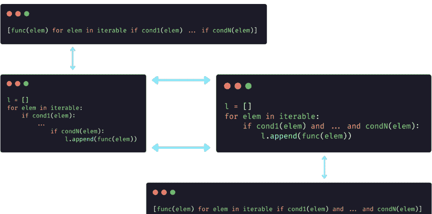

## 任意嵌套

上面两个部分向你展示了你可以嵌套多个 for 循环，以及多个 if 语句。

现在，你需要知道的唯一一点是，这些可以任意混合和嵌套。当然，你不应该过度嵌套，因为一个很长的列表推导式比等价的嵌套形式更难阅读。

下图帮助你理解嵌套形式中事物的顺序与列表推导式中从左到右的事物顺序之间的对应关系。

在列表推导式中，你越往右，你在等价的嵌套形式中就越深：

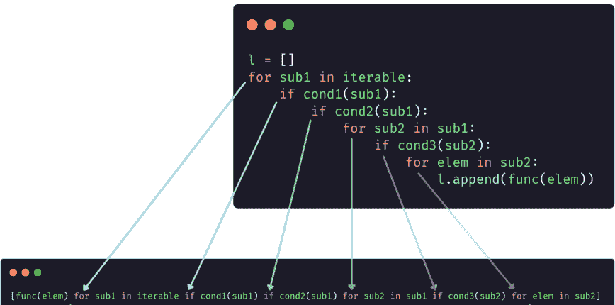

## 用列表推导式替代 `map` 和 `filter`

列表推导式通常被视为对内置函数 `map` 和 `filter` 调用的更 Pythonic 的替代品。

`map` 接受一个函数并将其应用于可迭代对象的所有元素，这用列表推导式可以轻松实现：

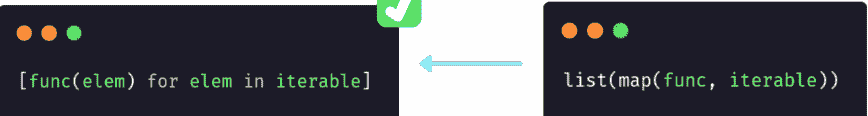

类似地，内置的 `filter` 通常也可以被更 Pythonic 的列表推导式所取代。

## 代码示例

### 随机数据

列表推导式是*最佳*方式的一个典型小例子，就是生成一些随机数据时。例如，生成三个整数来表示一个RGB颜色：

```
>>> from random import randint
>>> r, g, b = [randint(0, 255) for _ in range(3)]
>>> r
180
>>> g
148
>>> b
188
```

或者生成一个随机字符串：

```
>>> from string import ascii_lowercase, ascii_uppercase
>>> from random import choice
>>> "".join([choice(ascii_lowercase + ascii_uppercase) for _ in range(16)])
'qMQlkhwKJfdZGBEZ'
```

### 获取AWS前缀

在浏览Twitter时，我发现有人写了一个小Python脚本与Amazon Web Services交互，以获取不同服务的IP前缀。（不管那是什么意思。）

在某个地方，他们有一个简单的for循环，遍历一堆前缀并将它们存储在一个列表中，前提是该前缀与特定的Amazon服务相关。

这个人自称是Python初学者，所以我认为这是一个展示列表推导式如何有用的好机会。

原始代码的相关摘录如下：

```
def get_service_prefixes(amazon_service):
    aws_prefixes = get_aws_prefixes()
    count = 0
    service_prefixes = []
    for prefix in aws_prefixes["prefixes"]:
        if amazon_service in prefix["service"]:
            count += 1
            service_prefixes.append(prefix["ip_prefix"])

    # ...
```

查看上面的代码，我们可以看到列表`service_prefixes`被创建，然后在for循环中被追加；而且，那个for循环的唯一目的就是这个。

> 这是表明列表推导式可能有用的通用模式！

因此，我们可以用列表推导式替换这个循环。变量`count`是多余的，因为它跟踪结果列表的长度，而我们可以通过`len`函数轻松得知。

这是一个使用列表推导式的可能替代方案：

```
def get_service_prefixes(amazon_service):
    service_prefixes = [
        prefix for prefix in get_aws_prefixes()
        if amazon_service in prefix["service"]
    ]
    count = len(service_prefixes)

    # ...
```

## 结论

这是这个Pydon't的主要收获，为你奉上：

> “列表推导式是Python的一个强大特性，对于构建列表非常有用。”

这个Pydon't也总结在一份免费的备忘单中：

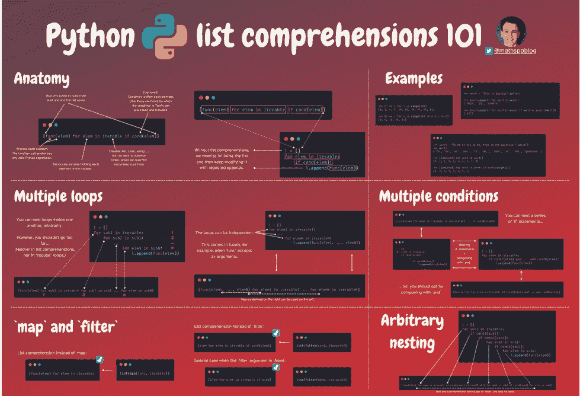

这个Pydon't向你展示了：

- 列表推导式有4个部分，其中一个是可选的；
- 列表推导式可以转换从另一个可迭代对象中提取的数据；
- 列表推导式可以过滤它们转换的数据；
- 每个列表推导式都等价于一个for循环，该循环依次在一个初始化为空的列表上调用`.append`；
- 列表推导式可以任意嵌套多个for循环；
- 列表推导式可以任意嵌套多个if语句；
- 嵌套if语句等同于用`and`组合条件；
- `map`和`filter`通常可以用列表推导式替换；
- 唯一工作是向列表追加的简单循环通常可以用列表推导式替换。

如果你喜欢这个Pydon't，一定要在下方留下反应，并与你的朋友和Python同好分享。另外，[订阅新闻通讯](https://mathspp.com/newsletter)，这样你就不会错过任何一个Pydon't！

## 参考资料

- Python 3文档，Python教程，数据结构，更多关于列表，列表推导式 https://docs.python.org/3/tutorial/datastructures.html#list-comprehensions [最后访问于2021-09-24]；
- Python 3文档，Python标准库，内置函数，`filter`，https://docs.python.org/3/library/functions.html#filter [最后访问于2021-09-22]；
- Python 3文档，Python标准库，内置函数，`map`，https://docs.python.org/3/library/functions.html#map [最后访问于2021-09-22]；

# 条件表达式

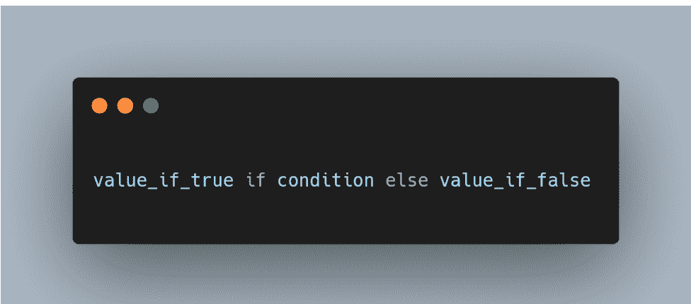

（原文缩略图，来自 https://mathspp.com/blog/pydonts/conditional-expressions。）

## 引言

条件表达式是Python中最接近其他语言中所谓的“三元运算符”的东西。
在这个Pydon't中，你将：

- 了解条件表达式的语法；
- 理解条件表达式背后的原理；
- 了解条件表达式的优先级；
- 看看如何嵌套条件表达式；
- 理解`if: ... elif: ... else:`语句与条件表达式之间的关系；
- 看看条件表达式的好用法和坏用法示例；

### 什么是条件表达式？

Python中的条件表达式是一个表达式（换句话说，一段计算结果为某个值的代码），其值取决于一个条件。

### 表达式和语句

为了更清楚，这里有一个Python表达式的例子：

```
>>> 3 + 4 * 5
23
```

代码`3 + 4 * 5`是一个表达式，该表达式计算结果为23。

有些代码片段不是表达式。例如，`pass`不是表达式，因为它不计算结果。`pass`只是一个语句，它不“拥有”或“计算为”任何结果。

这可能很奇怪（也可能不！），但为了帮助你判断某物是否是表达式，可以尝试将其放入`print`函数中。表达式可以在其他表达式中使用，函数调用也是表达式。因此，如果它能放入`print`调用中，它就是表达式：

```
>>> print(3 + 4 * 5)
23
>>> print(pass)
  File "<stdin>", line 1
    print(pass)
          ^
SyntaxError: invalid syntax
```

这里的语法错误是语句`pass`不能放入`print`函数中，因为`print`函数想要打印*某些东西*，而`pass`什么也没给。

### 条件

我们非常习惯使用`if`语句在满足某些*条件*时运行代码片段。换句话说，条件可以决定运行哪些代码片段。

在条件表达式中，我们将使用一个条件来改变表达式计算的值。等等，这不就是`if`语句吗？不！语句和表达式*不是*同一回事。

### 语法

与其拐弯抹角，让我直接向你展示条件表达式的结构：

```
expr_if_true if condition else expr_if_false
```

条件表达式由三个子表达式和关键字`if`和`else`组成。这些组件都不是可选的。它们都必须存在。

这是如何工作的？

首先，计算`condition`。然后，根据`condition`计算结果为真值还是假值，表达式分别计算`expr_if_true`或`expr_if_false`。
正如你可能从名字中猜到的，`expr_if_true`和`expr_if_false`本身可以是表达式。这意味着它们可以是简单的字面值，如42或"spam"，或其他“复杂”的表达式。
（哎呀，条件表达式中的表达式甚至可以是其他条件表达式！继续阅读了解详情 ☺）

### 条件表达式示例

这里有几个简单的例子，根据上面介绍的`expr_if_true`、`condition`和`expr_if_false`结构进行分解。

1.  ```
    >>> 42 if True else 0
    42
    ```
    | expr_if_true | condition | expr_if_false |
    |---|---|---|
    | 42 | True | 0 |

2.  ```
    >>> 42 if False else 0
    0
    ```
    | expr_if_true | condition | expr_if_false |
    |---|---|---|
    | 42 | False | 0 |

3.  ```
    >>> "Mathspp".lower() if pow(3, 27, 10) > 5 else "Oh boy."
    'mathspp'
    ```
    | expr_if_true | condition | expr_if_false |
    |---|---|---|
    | "Mathspp".lower() | pow(3, 27, 10) > 5 | "Oh boy." |

参考：

```
>>> pow(3, 27, 10)
7
```## 阅读条件表达式

尽管条件表达式中操作数的顺序可能会让一些人感到困惑，但将其作为一个英文句子来理解是很简单的。

以这个参考条件表达式为例：

```
value if condition else other_value
```

以下是该条件表达式的两种可能的英文“翻译”：

> “如果条件为真，则求值为 value，否则求值为 other_value。”

或者

> “如果条件为真，给出 value，否则给出 other_value。”

理解了这一点后...

## Python 有三元运算符吗？

许多语言都有一个形如 `condition ? expr_if_true : expr_if_false` 的三元运算符。Python 没有这样的三元运算符，但条件表达式与之相似。

它们的相似之处在于都会计算两个值中的一个，但在语法上不同，因为条件表达式使用关键字（而不是 ? 和 :），并且操作数的顺序也不同。

## 设计原理

条件表达式背后的设计原理很简单：程序员经常面临必须从两个值中选择一个的情况。

就仅此而已。

无论何时，当你发现自己必须在两个值之间做出选择时，通常是在一个 `if: ... else: ...` 块内，那么这可能就是使用条件表达式的好时机。

## 使用 if 语句的例子

以下是一些简单的函数，用于展示这一点：

1.  计算一个整数的奇偶性：

```
def parity(n):
    if n % 2:
        return "odd"
    else:
        return "even"

>>> parity(15)
"odd"
>>> parity(42)
"even"
```

2.  计算一个数的绝对值（这已经作为内置函数存在了）：

```
def abs(x):
    if x > 0:
        return x
    else:
        return -x

>>> abs(10)
10
>>> abs(-42)
42
```

这两个函数的结构非常相似：它们检查一个条件，并在条件为真时返回一个给定的值。如果条件为假，则返回另一个值。

## 重构后的例子

你能将上面的函数重构为使用条件表达式的形式吗？下面为每个函数提供一种可能的重构方式：

```
def parity(n):
    return "odd" if n % 2 else "even"
```

这个函数现在的读法是：

> “如果 n 除以 2 有余数，则返回 'odd'，否则返回 'even'。”

至于绝对值函数，

```
def abs(n):
    return x if x > 0 else -x
```

它现在的读法是：

> “如果 x 为正数，则返回 x，否则返回 -x。”

## 短路求值

你可能熟悉布尔短路求值，那么很高兴知道条件表达式也支持短路求值。

对于那些还不熟悉布尔短路求值的人，我推荐我那篇详尽的 Pydon't 主题文章。无论如何，为了理解我们的条件表达式，这一点很重要：条件表达式只会计算它真正需要计算的部分。

换句话说，如果你的条件表达式看起来像这样：

```
expr_if_true if condition else expr_if_false
```

那么 `expr_if_true` 和 `expr_if_false` 中只有一个会被求值。指出这一点可能看起来有些多余，但实际上非常重要。

有时，我们可能想要做某件事（`expr_if_true`），而这件事*仅*在满足特定条件时才有效。

例如，假设我们想实现 APL 语言中的 `quad-UCS` 函数。这个函数解释起来很简单：它将整数转换为字符，将字符转换为整数。用 Python 的术语来说，它只使用 `chr` 和 `ord`，对输入应用合适的函数。

下面是一个实现示例：

```
def ucs(x):
    if isinstance(x, int):
        return chr(x)
    else:
        return ord(x)

>>> ucs("A")
65
>>> ucs(65)
'A'
>>> ucs(102)
'f'
>>> ucs("f")
102
```

从这段代码中不明确的一点是，`ord` 在整数上调用时会抛出错误，而 `chr` 在字符上调用时也会失败：

```
>>> ord(65)
Traceback (most recent call last):
  File "<stdin>", line 1, in <module>
TypeError: ord() expected string of length 1, but int found

>>> chr("f")
Traceback (most recent call last):
  File "<stdin>", line 1, in <module>
TypeError: an integer is required (got type str)
```

值得庆幸的是，对于条件表达式来说，这不是问题，因此 `ucs` 可以用它来实现：

```
def ucs(x):
    return chr(x) if isinstance(x, int) else ord(x)

>>> ucs("A")
65
>>> ucs(65)
'A'
>>> ucs(102)
'f'
>>> ucs("f")
102
```

因此，我们看到当 `x` 是整数时，`ord(x)` 永远不会运行。反过来，当 `x` *不是*整数时，`chr(x)` 永远不会运行。这是一个非常有用的细微差别！

## 条件表达式与 if 语句

### 与 if 等价

这一点在整篇文章中都是隐含的，但为了清晰起见，我现在明确地写下来。

（也是因为“显式优于隐式。”❗！）

条件表达式

```
name = expr_if_true if condition else expr_if_false
```

和 if 语句

```
if condition:
    name = expr_if_true
else:
    name = expr_if_false
```

之间存在着密切的关系。

这种密切的关系就是等价关系。这两段代码是完全等价的。

### 与 if-elif-else 块等价

鉴于条件表达式和 `if: ... else: ...` 块之间的等价性，自然会想知道条件表达式中是否有与 `elif` 语句等价的东西。

例如，我们能否将下面这个函数重写为使用条件表达式的形式？

```
def sign(x):
    if x == 0:
        return 0
    elif x > 0:
        return 1
    else:
        return -1

>>> sign(-73)
-1
>>> sign(0)
0
>>> sign(42)
1
```

我们如何将它写成一个条件表达式？条件表达式不允许使用 `elif` 关键字，因此，我们首先需要重新处理 if 块本身：

```
def sign(x):
    if x == 0:
        return 0
    else:
        if x > 0:
            return 1
        else:
            return -1
```

这不是一个很好的实现，但这个中间表示形式清楚地表明，if 块的底部可以被替换为一个条件表达式：

```
def sign(x):
    if x == 0:
        return 0
    else:
        return 1 if x > 0 else -1
```

现在，如果我们抽象掉第二个返回值本身是一个条件表达式这个事实，我们就可以将现有的 if 块重写为一个条件表达式：

```
def sign(x):
    return 0 if x == 0 else (1 if x > 0 else -1)

>>> sign(-73)
-1
>>> sign(0)
0
>>> sign(42)
1
```

这表明条件表达式可以自然嵌套。现在只需要检查是否需要括号。

换句话说，如果我们写：

```
A if B else C if D else E
```

Python 会将其解释为

```
(A if B else C) if D else E
```

还是解释为

```
A if B else (C if D else E)
```

事实证明，是后者。所以，上面的 `sign` 函数可以重写为：

```
def sign(x):
    return 0 if x == 0 else 1 if x > 0 else -1
```

正是这种可以任意长的 `if ... else ... if ... else ...` 链，模拟了 `elif`。
要将长的 if 块（带或不带 `elif`）转换为条件表达式，请从上到下，在关键字 `if` 和 `else` 之间交替插入值和条件。
在英文中大声朗读时，单词“otherwise”有助于澄清较长的条件表达式的含义：

```
return 0 if x == 0 else 1 if x > 0 else -1
```

读作
“return 0 if x is 0, otherwise, return 1 if x is positive otherwise return -1.”
单词“otherwise”的重复变得笨拙，这很好地表明，通常链式连接多个条件表达式并不是一个好主意。
供参考，以下是初始 if 块和最终条件表达式的“并排”比较：

```
## Compare
if x == 0:
    return 0
elif x > 0:
    return 1
else:
    return -1

## to:
return 0 if x == 0 else 1 if x > 0 else -1
```

### 不等价于函数封装

因为我刚刚展示的等价性，许多人可能会认为条件表达式可以通过封装之前的 `if: ... else: ...` 块来实现：

```
def cond(condition, value_if_true, value_if_false):
    if condition:
        return value_if_true
    else:
        return value_if_false
```

有了这个定义，我们可能*认为*已经实现了条件表达式：

```
>>> cond(pow(3, 27, 10) > 5, "Mathspp".lower(), "Oh boy.")
'mathspp'
>>> "Mathspp".lower() if pow(3, 27, 10) > 5 else "Oh boy."
'mathspp'
```

但实际上，我们并没有！这是因为对 `cond` 的函数调用只有在所有参数都计算完毕之后才会发生。这与条件表达式的实际工作方式不同：正如我上面所示，条件表达式只会计算它真正需要计算的那个表达式。

因此，我们不能使用这个条件来实现 UCS：

```python
def ucs(x):
    return cond(isinstance(x, int), chr(x), ord(x))
```

这段代码看起来没问题，但其行为并不符合预期：

```python
>>> ucs(65)
Traceback (most recent call last):
  File "<stdin>", line 1, in <module>
  File "<stdin>", line 2, in ucs
TypeError: ord() expected string of length 1, but int found
```

当传入 65 时，第一个参数求值为 `True`，第二个参数求值为 `"A"`，但第三个参数引发了错误！

## 优先级

根据文档，条件表达式是所有表达式中优先级最低的。

这意味着，当条件表达式嵌入在其他表达式中时，有时你可能需要用括号将其括起来。

例如，看看这个函数：

```python
def foo(n, b):
    if b:
        to_add = 10
    else:
        to_add = -10
    return n + to_add
```

```python
>>> foo(42, True)
52
>>> foo(42, False)
32
```

你可能发现了这种赋值两个值之一的模式，并决定使用条件表达式：

```python
def foo(n, b):
    to_add = 10 if b else -10
    return n + to_add
```

```python
>>> foo(42, True)
52
>>> foo(42, False)
32
```

但接着，你认为没必要浪费这一行，于是决定将条件表达式内联（即把条件表达式放入与 `n +` 的算术表达式中）：

```python
def foo(n, b):
    return n + 10 if b else -10
```

这样做后，当 `b` 为 `False` 时，函数就突然出错了：

```python
>>> foo(42, False)
-10
```

这是因为表达式
`n + 10 if b else -10`
被 Python 解析为
`(n + 10) if b else -10`
而你原本想让它表示
`n + (10 if b else -10)`

换句话说，用不太严谨的术语来说，`+` “拉”走了相邻的 `10`，整个 `n + 10` 被视为当条件为真时要进行求值的表达式。

## 求值为布尔值的条件表达式

在展示条件表达式的良好用法示例之前，让我先指出使用条件表达式时你应该*避免*的一点。
当条件表达式求值为布尔值时，它是次优的。
这里有一个简单的例子：

```python
def is_huge(n):
    return True if n > pow(10, 10) else False
```

你能看出这个 `is_huge` 实现有什么问题吗？
这个函数看起来可能真的很不错，因为它简短、可读，且行为清晰：

```python
>>> is_huge(3.1415)
False
>>> is_huge(999)
False
>>> is_huge(73_324_634_325_242)
True
```

然而...条件表达式没有起到任何相关作用！条件表达式的求值结果和条件本身的值完全一样！
仔细看看这个函数。如果 `n > pow(10, 10)` 求值为 `True`，则我们返回 `True`。如果 `n > pow(10, 10)` 求值为 `False`，则我们返回 `False`。
下面是一个总结此信息的简短表格：

| 条件 (`n > pow(10, 10)`) | 条件表达式的值 (`True if n > pow(10, 10) else False`) |
| :--- | :--- |
| True | True |
| False | False |

| n > pow(10, 10) 求值为... | 我们返回... |
| --- | --- |
| True | True |
| False | False |

那么，既然 `n > pow(10, 10)` 的值和我们返回的东西是一样的，为什么不*直接*返回 `n > pow(10, 10)` 呢？事实上，这正是我们应该做的：

```python
def is_huge(n):
    return n > pow(10, 10)
```

请记住：永远不要使用 `if: ... else: ...` 或条件表达式来求值/返回布尔值。通常，只使用条件本身就足够了。

一个相关且不应使用条件表达式的场景是为变量赋默认值。其中一些默认值可以使用 `or` 运算符的布尔短路特性来赋值。

## 代码中的示例

这里有几个条件表达式大放异彩的例子。

你会注意到这些例子并不特别复杂，也不需要太多上下文就能理解其中的机制。

这是因为条件表达式背后的原理很简单：在两个值之间做出选择。

## 字典的 .get 方法

`collections` 模块有一个 `ChainMap` 类。它可以用来将多个字典链接在一起，就像我之前在一条推文中展示过的：

在 #Python 中，你可以使用 collections.ChainMap 将多个其他映射组合成一个更大的映射。这很有用，例如，当你想将用户配置与默认配置并列时。关注更多关于 Python 的 #tips 🐍 #learnpython #learncode #100daysofcode pic.twitter.com/ip9IInItYG

— Rodrigo 🐍 (@mathsppblog) 2021年6月4日

有趣的是，`ChainMap` 也定义了一个 `.get` 方法，就像字典一样。`.get` 方法尝试检索一个键，并在找到时返回一个默认值：

```python
>>> from collections import ChainMap
>>> user_config = {"name": "mathspp"}
>>> default_config = {"name": "<noname>", "fullscreen": True}
## 直接访问一个键：
>>> config["fullscreen"]
True
## config["darkmode"] 会引发 KeyError。
>>> config.get("darkmode", False)
False
```

这是 `.get` 方法的完整实现：

```python
## 来自 Python 3.9.2 的 Lib/collections/__init__.py

class ChainMap(_collections_abc.MutableMapping):
    # ...

    def get(self, key, default=None):
        return self[key] if key in self else default
```

很简单！如果键在字典中，则返回与该键关联的值，否则返回默认值！仅此而已。

## 解析路径

当需要处理路径时，`pathlib` 模块非常有用。它提供的功能之一是 `.resolve` 方法，该方法接受一个路径并将其转换为绝对路径，同时消除路径中的符号链接：

```python
## 从 C:/Users/rodri 运行此命令：
>>> Path("..").resolve()
WindowsPath('C:/Users')
## 当前工作目录在此无关紧要：
>>> Path("C:/Users").resolve()
WindowsPath('C:/Users')
```

下面是解析路径的部分代码：

```python
## 来自 Python 3.9.2 的 Lib/pathlib.py

class _PosixFlavour(_Flavour):
    # ...

    def resolve(self, path, strict=False):
        # ...

        base = '' if path.is_absolute() else os.getcwd()
        return _resolve(base, str(path)) or sep
```

如你所见，在调用辅助函数 `_resolve` 并返回之前，该函数会判断是否需要为路径添加基准路径。

如果我输入的路径是相对路径，比如上面的 `".."` 路径，那么基准路径就被设置为当前工作目录 (`os.getcwd()`)。如果路径是绝对路径，则不需要基准路径，因为它已经存在了。

## 结论

这是本次 Pydon't 给你的主要收获，呈上：

> “条件表达式擅长根据条件的值，求值为两个不同值中的一个。”

本次 Pydon't 向你展示了：

- 条件表达式由三个子表达式组成，中间穿插 `if` 和 `else` 关键字；
- 条件表达式的创建意图是提供一种根据条件在两个值之间进行选择的便捷方式；
- 条件表达式可以很容易地读作英语语句；
- 条件表达式在所有 Python 表达式中具有最低的优先级；
- 短路求值确保条件表达式只求值两个“值表达式”中的一个；
- 条件表达式可以链式使用，以模拟 `if: ... elif: ... else: ...` 代码块；
- 无法用函数模拟条件表达式；并且
- 如果你的条件表达式求值为布尔值，那么你应该只使用条件本身。

如果你喜欢本次 Pydon't，一定要在下方留下反馈，并分享给你的朋友和 Python 同仁。同时，订阅通讯，这样你就不会错过任何一个 Pydon't！

## 参考资料

- Python 3 文档，Python 语言参考，条件表达式，https://docs.python.org/3/reference/expressions.html#conditional-expressions [最后访问于 2021-09-28]；
- PEP 308 – 条件表达式，https://www.python.org/dev/peps/pep-0308/ [最后访问于 2021-09-28]；
- Python 3 文档，Python 标准库，collections.ChainMap，https://docs.python.org/3/library/collections.html#chainmap-objects [最后访问于 2021-09-28]；
- Python 3 文档，Python 标准库，pathlib.Path.resolve，https://docs.python.org/3/library/pathlib.html#pathlib.Path.resolve [最后访问于 2021-09-28]；
- “Python 有三元条件运算符吗？”，Stack Overflow 问题与回答，https://stackoverflow.com/questions/394809/does-python-have-a-ternary-conditional-operator [最后访问于 2021-09-28]；
- “Python 中的条件表达式”，note.nkmk.me，https://note.nkmk.me/en/python-if-conditional-expressions/ [最后访问于 2021-09-28]；
- “Python 中的条件语句，条件表达式（Python 的三元运算符）”，Real Python，https://realpython.com/python-conditional-statements/#conditional-expressions-pythons-ternary-operator [最后访问于 2021-09-28]；

# 按值传递、引用与赋值

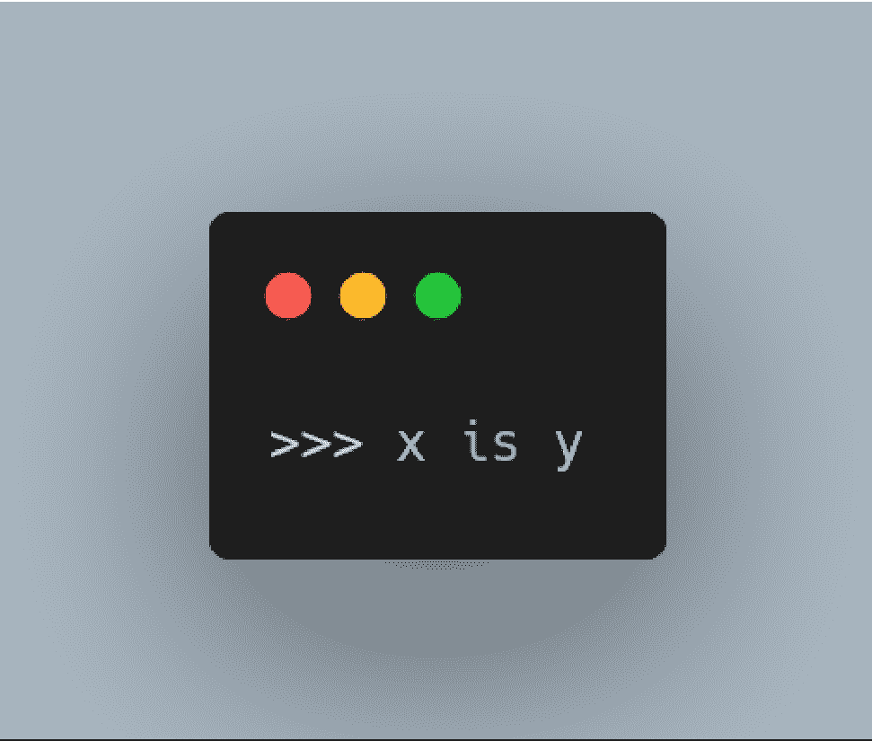

## 引言

许多传统编程语言在向函数传递参数时，会采用以下两种模型之一：

- 某些语言使用按值传递模型；而
- 其他大多数语言使用按引用传递模型。

话虽如此，了解 Python 所使用的模型非常重要，因为这会影响你的代码行为。

在这篇“Pydon't”中，你将会：

- 发现 Python 既没有使用按值传递也没有使用按引用传递模型；
- 理解 Python 使用的是按赋值传递模型；
- 了解内置函数 `id`；
- 更好地理解 Python 对象模型；
- 认识到每个对象都有三个定义其属性的非常重要的特性；
- 理解可变对象与不可变对象的区别；
- 了解浅拷贝与深拷贝的区别；以及
- 学习如何使用 `copy` 模块进行这两种对象拷贝。

## Python 是按值传递的吗？

在按值传递模型中，当你用一组参数调用函数时，数据会被复制到函数内部。这意味着你可以随意修改参数，并且不会影响函数外部程序的状态。Python 并非如此，它没有使用按值传递模型。

观察下面的代码片段，它可能看起来像 Python 使用了按值传递：

```python
def foo(x):
    x = 4
a = 3
foo(a)
print(a)
## 3
```

这看起来像是按值传递模型，因为我们传入了 3，将其改为 4，而这个改变没有反映到外部（`a` 仍然是 3）。

但是，事实上，Python 并没有将数据复制到函数内部。

为了证明这一点，我将向你展示另一个不同的函数：

```python
def clearly_not_pass_by_value(my_list):
    my_list[0] = 42

l = [1, 2, 3]
clearly_not_pass_by_value(l)
print(l)
## [42, 2, 3]
```

如我们所见，在函数外部定义的列表 `l`，在调用函数 `clearly_not_pass_by_value` 之后发生了改变。因此，Python 并没有使用按值传递模型。

## Python 是按引用传递的吗？

在真正的按引用传递模型中，被调用的函数可以访问调用者的变量！有时，Python 的行为可能看起来是这样，但 Python 并没有使用按引用传递模型。

我会尽力解释为什么 Python 并非如此：

```python
def not_pass_by_reference(my_list):
    my_list = [42, 73, 0]

l = [1, 2, 3]
not_pass_by_reference(l)
print(l)
## [1, 2, 3]
```

如果 Python 使用了按引用传递模型，该函数本可以完全改变函数外部 `l` 的值，但如我们所见，情况并非如此。

让我为你展示一个真正的按引用传递场景。

这是一些 Pascal 代码：

```pascal
program callByReference;
var
    x: integer;

procedure foo(var a: integer);
{ 创建一个名为 `foo` 的过程 }
begin
    a := 6         { 将 6 赋值给 `a` }
end;

begin
    x := 2;        { 将 2 赋值给 `x` }
    writeln(x);    { 打印 `x` }
    foo(x);        { 用 `x` 调用 `foo` }
    writeln(x);    { 打印 `x` }
end.
```

请看这段代码的最后几行：

- 我们用 `x := 2;` 将 2 赋值给 x；
- 我们打印 x；
- 我们用 x 作为参数调用 foo；然后
- 我们再次打印 x。

这个程序的输出是什么？

我猜你们大多数人手头没有一个 Pascal 解释器，所以你可以直接去 tio.run 在线运行这段代码。

如果你运行它，你会看到输出是

```
2
6
```

如果你的大部分编程经验都在 Python 中，这可能会相当令人惊讶！

过程 `foo` 确实接收了变量 `x` 并改变了它包含的值。在 `foo` 执行完毕后，位于 `foo` 外部的变量 `x` 的值发生了变化。在 Python 中你无法做到类似的事情。

## Python 对象模型

要真正理解 Python 在调用函数时的行为，最好我们首先理解 Python 对象是什么，以及如何描述它们。

## 对象的三大特性

在 Python 中，一切皆对象，每个对象都由三样东西来表征：

- 它的标识符（一个唯一标识该对象的整数，非常像社会安全号码标识人一样）；
- 一个类型（标识你可以对该对象执行的操作）；以及
- 对象的内容。

这是一个对象及其三大特性的示例：

```
>>> id(obj)
2698212637504      # `obj` 的标识符
>>> type(obj)
<class 'list'>    # `obj` 的类型
>>> obj
[1, 2, 3]          # `obj` 的内容
```

如我们所见，`id` 是你用来查询对象标识符的内置函数，`type` 是你用来查询对象类型的内置函数。

## （不）可变性

对象的（不）可变性取决于其类型。换句话说，（不）可变性是类型的特性，而不是特定对象的特性！

但是，一个对象可变*究竟*意味着什么？或者说一个对象不可变又意味着什么？

回想一下，对象由其标识符、类型和内容来表征。如果一个类型允许在不改变其标识符和类型的情况下改变其对象的内容，那么这个类型就是可变的。

列表是一个可变数据类型的绝佳例子。为什么？因为列表是*容器*：你可以将东西放入列表中，也可以从这些列表中移除东西。

在下面，你可以看到当我们进行方法调用时，列表 `obj` 的内容如何变化，但列表的标识符保持不变：

```
>>> obj = []
>>> id(obj)
2287844221184
>>> obj.append(0); obj.extend([1, 2, 3]); obj
[42, 0, 1, 2, 3]
>>> id(obj)
2287844221184
>>> obj.pop(0); obj.pop(0); obj.pop(); obj
42
0
3
[1, 2]
>>> id(obj)
2287844221184
```

然而，当处理不可变对象时，情况就完全不同了。如果我们查阅一本英语字典，对于“immutable”（不可变的）的定义是这样的：

> 形容词：immutable – 随时间推移保持不变或无法被改变。

不可变对象的内容永远不会改变。以字符串为例：

```
>>> obj = "Hello, world!"
```

字符串是这个讨论的一个很好的例子，因为有时它们可能*看起来*是可变的。但它们不是！

一个非常好的指标是判断一个对象是否不可变，即它的所有方法都返回某个值。这与列表的 `.append` 方法不同，例如！如果你在列表上使用 `.append`，你不会得到返回值。另一方面，无论你在字符串上使用什么方法，结果都会返回给你：

```
>>> [].append(0)    # 没有返回值。
>>> obj.upper()     # 返回一个字符串。
'HELLO, WORLD!'
```

注意 `obj` 并没有自动更新为 "HELLO, WORLD!"。相反，一个新的字符串被创建并返回给你。

另一个表明字符串不可变的重要提示是你不能对其索引进行赋值：

```
>>> obj[0]
'H'
>>> obj[0] = "h"
Traceback (most recent call last):
  File "<stdin>", line 1, in <module>
TypeError: 'str' object does not support item assignment
```

这表明，当字符串被创建时，它保持不变。它可以用来构建*其他*字符串，但字符串本身总是.保持.不变。

作为参考，`int`、`float`、`bool`、`str`、`tuple` 和 `complex` 是最常见的不可变对象类型；`list`、`set` 和 `dict` 是最常见的可变对象类型。

## 变量名作为标签

另一个需要理解的重要事项是，变量名与对象本身关系不大。

事实上，名称 `obj` 只是我决定附加到一个对象上的标签，该对象具有标识符 2698212637504，类型为列表，内容为 1, 2, 3。

就像我将标签 `obj` 附加到那个对象一样，我可以给它附加更多的名称：

```
>>> foo = bar = baz = obj
```

同样，这些名称只是标签。我决定贴在*同一个*对象上的标签。我们怎么知道它是同一个对象呢？嗯，它们所有的“社会安全号码”（id）都匹配，所以它们一定是同一个对象：

```
>>> id(foo)
2698212637504
>>> id(bar)
2698212637504
>>> id(baz)
2698212637504
>>> id(obj)
2698212637504
```

因此，我们得出结论：`foo`、`bar`、`baz` 和 `obj` 都是引用同一个对象的变量名。

## 运算符 `is`

这正是运算符 `is` 的作用：它检查两个对象是否*是同一个*。

要使两个对象相同，它们必须具有相同的标识符：

```
>>> foo is obj
True
>>> bar is foo
True
```

拥有相同的类型和内容还不够！我们可以创建一个包含 [1, 2, 3] 内容的新列表，但这个新列表与 `obj` 不是同一个 *对象*：

```
>>> obj is [1, 2, 3]
False
```

可以用完美的双胞胎来比喻。当两个兄弟姐妹是完美的双胞胎时，他们看起来一模一样。然而，他们是不同的人！

### **is not**

顺便提一下，但很重要的一点是，你应该了解运算符 `is not`。

一般来说，当你想否定一个条件时，你会在它前面加上一个 `not`：

```
n = 5
if not isinstance(n, str):
    print("n is not a string.")
## n is not a string.
```

因此，如果你想检查两个变量是否指向不同的对象，你可能会忍不住这样写：

```
if not a is b:
    print("`a` and `b` are different objects.")
```

然而，Python 有运算符 `is not`，它更接近一个恰当的英语句子，我认为这真的很酷！

因此，上面的例子实际上应该写成：

```
if a is not b:
    print("`a` and `b` are different objects.")
```

Python 对 `in` 运算符也做了类似的事情，同样提供了 `not in` 运算符……这多酷啊？！

### **赋值如同起昵称**

如果我们继续延伸这个比喻，给变量赋值就像是给别人起一个新的昵称。

我中学时的朋友叫我 "Rojer"。我大学时的朋友叫我 "Girão"。与我关系不那么亲密的人叫我的名字——"Rodrigo"。然而，无论他们怎么叫我，*我依然是我*，对吧？

如果有一天我决定换个新发型，无论他们怎么叫我，大家都会看到这个新发型！

类似地，如果我修改了一个对象的*内容*，我可以使用任何我偏好的昵称来查看这些变化。例如，我们可以修改我们一直在操作的列表的中间元素：

```
>>> foo[1] = 42
>>> bar
[1, 42, 3]
>>> baz
[1, 42, 3]
>>> obj
[1, 42, 3]
```

我们使用昵称 `foo` 来修改中间元素，但这个变化从其他所有昵称也能看到。

为什么？

因为它们都指向*同一个*列表对象。

## Python 是赋值传递

在铺垫了这么多之后，我们现在准备好理解 Python 如何将参数传递给函数。

当我们调用一个函数时，函数的每个参数都被赋值给传入的对象。本质上，每个参数现在都成为了这些传入对象的一个*新*昵称。

## 不可变参数

如果我们传入不可变参数，那么我们*无法*修改参数本身。毕竟，这就是“不可变”的含义：“不会改变”。

这就是为什么它看起来像是 Python 使用了按值传递模型。因为让参数持有其他内容的唯一方式，就是将它赋值给一个完全不同的东西。当我们这样做时，我们是在为不同的对象重用同一个昵称：

```
def foo(bar):
    bar = 3
    return bar

foo(5)
```

在上面的例子中，当我们用参数 5 调用 `foo` 时，就好像我们在函数开头执行了 `bar = 5`。

紧接着，我们有 `bar = 3`。这意味着“拿昵称 ‘bar’ 并将其指向整数 3”。Python 不在乎 `bar` 作为一个昵称（作为一个变量名）已经被使用过。它现在指向那个 3！

## 可变参数

另一方面，可变参数*可以*被改变。我们可以修改它们的内部内容。一个典型的可变对象例子是列表：其元素可以改变（其长度也可以改变）。

这就是为什么它看起来像是 Python 使用了按引用传递模型。然而，当我们改变一个对象的*内容*时，我们并没有改变对象本身的身份。同样，当你改变发型或衣服时，你的社会安全号码*不会*改变：

```
>>> l = [42, 73, 0]
>>> id(l)
3098903876352
>>> l[0] = -1
>>> l.append(37)
>>> id(l)
3098903876352
```

你明白我想表达的意思了吗？如果没有，请在下方留言，我会尽力帮助你。

## 调用函数时要小心

这表明你在定义函数时应该小心。如果你的函数期望可变参数，你应该做以下两件事之一：
-   绝对不要以任何方式改变参数；或者
-   明确地记录该参数可能会被改变。

就我个人而言，我更喜欢第一种方法：不改变参数；但有时候也需要采用第二种方法。

有时，你确实需要以参数为基础进行某种转换，这意味着你可能想要改变参数。在这些情况下，你可能会考虑制作参数的副本（在下一节讨论），但制作副本可能非常耗资源。在这些情况下，改变参数可能是唯一合理的选择。

## 制作副本

### 浅拷贝与深拷贝

“复制一个对象”意味着创建第二个具有不同身份（因此是*一个不同的对象*）但具有相同内容的对象。一般来说，我们复制一个对象是为了能够对它进行操作和修改，同时保留第一个对象。

在复制对象时，有几个细节需要讨论。

### 复制不可变对象

首先需要说明的是，对于不可变对象，讨论复制没有意义。
“副本”只对可变对象有意义。如果你的对象是不可变的，并且你想保留对它的引用，你可以直接进行第二次赋值并处理它：

```
string = "Hello, world!"
string_ = string
## 现在对 `string_` 做些操作...
```

或者，有时你可以直接在原始对象上调用方法和其他函数，因为原始对象不会消失：

```
python
string = "Hello, world!"
print(string.lower())
## 调用 `.lower` 之后，`string` 仍然是 "Hello, world!"
```

所以，我们只需要担心可变对象。

### 浅拷贝

许多可变对象本身可以包含可变对象。因此，存在两种类型的副本：

-   浅拷贝；和
-   深拷贝。

区别在于可变对象内部的可变对象会怎样。
列表和字典有一个 `.copy` 方法，它返回对应对象的浅拷贝。
让我们看一个列表的例子：

```
python
>>> sublist = []
>>> outer_list = [42, 73, sublist]
>>> copy_list = outer_list.copy()
```

首先，我们在一个列表中创建了一个列表，然后复制了外层列表。现在，因为是 `copy`，复制后的列表与原始的外层列表不是同一个对象：

```
python
>>> copy_list is outer_list
False
```

但如果它们不是同一个对象，那么我们可以修改其中一个列表的内容，而另一个不会反映出变化：

```
python
>>> copy_list[0] = 0
>>> outer_list
[42, 73, []]
```

这就是我们看到的：我们改变了 `copy_list` 的第一个元素，而 `outer_list` 保持不变。
现在，我们尝试修改 `sublist` 的内容，有趣的部分来了！

```
python
>>> sublist.append(999)
>>> copy_list
[0, 73, [999]]
>>> outer_list
[42, 73, [999]]
```

当我们修改 `sublist` 的内容时，`outer_list` 和 `copy_list` 都反映了这些变化……
但是副本不应该是给我一个可以修改而不影响第一个列表的第二个列表吗？
*是的！而且这就是发生的情况！*

事实上，修改 sublist 的内容并没有*真正*修改 copy_list 或 outer_list 的内容：毕竟，两者的第三个元素都指向一个列表对象，它现在仍然指向同一个列表对象！是我们指向的（内部）对象的内容改变了。

有时，我们不希望发生这种情况：有时，我们不希望可变对象共享内部的可变对象。

### 常见的浅拷贝技术

在处理列表时，通常使用切片来生成列表的浅拷贝：

```
>>> outer_list = [42, 73, []]
>>> shallow_copy = outer_list[:]
>>> outer_list[2].append(999)
>>> shallow_copy
[42, 73, [999]]
```

对对象本身使用相应类型的内置函数，也会构建浅拷贝。这对列表和字典有效，并且可能对其他可变类型也有效。

这里有一个列表内嵌列表的例子：

```
>>> outer_list = [42, 73, []]
>>> shallow_copy = list(outer_list)
>>> shallow_copy[2].append(999)
>>> outer_list
[42, 73, [999]]
```

这里有一个列表内嵌字典的例子：

```
>>> outer_dict = {42: 73, "list": []}
>>> shallow_copy = dict(outer_dict)
>>> outer_dict["list"].append(999)
>>> shallow_copy
{42: 73, 'list': [999]}
```

### 深拷贝

当你想要“彻底”地复制一个对象，并且不希望副本共享对内部对象的引用时，你需要对该对象进行“深拷贝”。你可以将深拷贝视为一种递归算法。

你复制第一级的元素，每当在第一级发现一个可变元素时，你就递归下去并复制那些元素的内容。

为了展示这个想法，这里是一个简单的递归实现，用于复制包含其他列表的列表：

```
def list_deepcopy(l):
    return [
        elem if not isinstance(elem, list) else list_deepcopy(elem)
        for elem in l
    ]
```我们可以利用这个函数来复制之前的 `outer_list` 并观察结果：

```
>>> sublist = []
>>> outer_list = [42, 73, sublist]
>>> copy_list = list_deepcopy(outer_list)
>>> sublist.append(73)
>>> copy_list
[42, 73, []]
>>> outer_list
[42, 73, [73]]
```

如你所见，修改 `sublist` 的内容只间接影响了 `outer_list`，而没有影响到 `copy_list`。

遗憾的是，我实现的 `list_deepcopy` 方法并不健壮，功能也有限，不过 Python 标准库早已为我们提供了完善的解决方案！

## copy 模块与 deepcopy 方法

`copy` 模块正是我们需要的。该模块提供了两个实用函数：

-   `copy.copy` 用于浅拷贝；
-   `copy.deepcopy` 用于深拷贝。

就是这样！而且更妙的是，`copy.deepcopy` 方法足够智能，能够处理例如循环引用这类可能出现的问题！也就是说，当一个对象包含另一个对象，而后者又包含前者时——朴素的深拷贝递归算法会陷入无限循环！

如果你编写了自己的自定义对象，并想指定如何进行浅拷贝和深拷贝，你只需分别实现 `__copy__` 和 `__deepcopy__` 即可！

在我看来，这是一个非常棒的模块。

## 代码示例

现在我们已经深入探讨了理论——双关一下——，是时候向你展示一些运用这些概念的实际代码了。

## 可变的默认参数

让我们先从 Twitter 上一个热门话题开始：

> Python 🐍 是一门不可思议的语言，但有时也有些古怪 ⚠️ 例如，经常让初学者困惑的一点是，为什么不应该用列表作为默认值 🧵 这里有一个话题将帮助你理解这一点 👉 pic.twitter.com/HVhPjs2PSH — Rodrigo 🐍🐍 (@mathsppblog) 2021年10月5日

显然，使用可变对象作为默认参数是个坏主意。下面的代码片段说明了原因：

```
def my_append(elem, l=[]):
    l.append(elem)
    return l
```

上面的函数将一个元素追加到列表，如果没有提供列表，则默认将其追加到一个空列表。

很好，让我们好好利用这个函数：

```
>>> my_append(1)
[1]
>>> my_append(1, [42, 73])
[42, 73, 1]
>>> my_append(3)
[1, 3]
```

我们用它处理一次 `1`，得到了一个包含 `1` 的列表。然后，我们用它向另一个已有的列表追加了一个 `1`。最后，我们用它向一个空列表追加一个 `3`……只是结果并非如此！

事实证明，当我们定义一个函数时，其默认参数会被创建并存储在一个特殊位置：

```
>>> my_append.__defaults__
([1, 3],)
```

这意味着默认参数*始终*是同一个对象。因此，由于它是一个可变对象，其内容可以随时间改变。这就是为什么在上面的代码中，`__defaults__` 显示了一个已包含两个元素的列表。

如果我们重新定义该函数，那么它的 `__defaults__` 就会显示一个空列表：

```
>>> def my_append(elem, l=[]):
...     l.append(elem)
...     return l
...
>>> my_append.__defaults__
([],)
```

这就是为什么通常不应将可变对象用作默认参数。

在这些情况下，标准做法是使用 `None`，然后*利用布尔短路求值*来赋默认值：

```
def my_append(elem, l=None):
    lst = l or []
    lst.append(elem)
    return lst
```

通过这种实现，函数现在按预期工作了：

```
>>> my_append(1)
[1]
>>> my_append(3)
[3]
>>> my_append(3, [42, 73])
[42, 73, 3]
```

## is not None

搜索 Python 标准库发现，`is not` 运算符被使用了超过 5000 次。这数量很大。

而且，绝大多数情况下，该运算符后面几乎总是跟着 `None`。事实上，`is not None` 在标准库中出现了 3169 次！

`x is not None` 的作用与其字面意思完全一致：它检查 `x` 是否不是 `None`。

这是一个来自 `argparse` 模块（用于创建命令行界面）的简单示例：

```
## From Lib/argparse.py from Python 3.9
class HelpFormatter(object):
    # ...

    class _Section(object):
        # ...

        def format_help(self):
            # format the indented section
            if self.parent is not None:
                self.formatter._indent()
            # ...
```

即使没有太多上下文，我们也能看出发生了什么：当显示某个给定部分的命令帮助时，我们可能希望对其进行缩进（或不缩进）以显示层级依赖关系。

如果一个部分的 `parent` 是 `None`，那么该部分没有父级，无需缩进。换句话说，如果一个部分的父级不是 `None`，那么我们就希望对其进行缩进。注意我的英文描述与代码完全匹配！

## 系统环境的深拷贝

`copy.deepcopy` 方法在标准库中被使用了几次，这里我想展示一个复制字典的示例。

`os` 模块提供了一个类似于字典的属性 `environ`，它包含了已定义的环境变量。

以下是我（Windows）机器上的几个示例：

```
>>> os.environ["lang"]
'en_US.UTF-8'
>>> os.environ["appdata"]
'C:\Users\rodri\AppData\Roaming'
>>> os.environ["systemdrive"]
'C:'
## Use list(os.environ.keys()) for a list of your environment variables.
```

`http.server` 模块提供了一些用于基础 HTTP 服务器的类。

其中一个类 `CGIHTTPRequestHandler` 实现了一个也可以运行 CGI 脚本的 HTTP 服务器，在其 `run_cgi` 方法中，需要设置一系列环境变量。

这些环境变量的设置是为了给即将运行的 CGI 脚本提供必要的上下文。然而，我们并不想真正修改当前的环境！

所以，我们做的是创建环境的深拷贝，然后随心所欲地修改它！完成后，我们告诉 Python 执行 CGI 脚本，并将修改后的环境作为参数提供。

理解这种做法的具体方式可能并不容易。我个人认为我无法向你解释清楚。但这并不意味着我们无法推断部分内容：

以下是代码：

```
## From Lib/http/server.py in Python 3.9
class CGIHTTPRequestHandler(SimpleHTTPRequestHandler):
    # ...

    def run_cgi(self):
        # ...
        env = copy.deepcopy(os.environ)
        env['SERVER_SOFTWARE'] = self.version_string()
        env['SERVER_NAME'] = self.server.server_name
        env['GATEWAY_INTERFACE'] = 'CGI/1.1'
        # and many more `env` assignments!

        # ...

        else:
            # Non-Unix -- use subprocess
            # ...
            p = subprocess.Popen(cmdline,
                                stdin=subprocess.PIPE,
                                stdout=subprocess.PIPE,
                                stderr=subprocess.PIPE,
                                env = env
                                )
```

如我们所见，我们复制了环境并定义了一些变量。最后，我们创建了一个新的子进程，该进程接收修改后的环境。

## 结论

以下是这篇 Pydon't 文章的要点总结，为你奉上：

> “Python 使用基于赋值的参数传递模型，理解它需要你认识到所有对象都由一个标识号、其类型及其内容来表征。”

这篇 Pydon't 向你展示了：

-   Python 既不使用按值传递模型，也不使用按引用传递模型；
-   Python 使用基于赋值的参数传递模型（使用“别名”）；
-   每个对象由以下特征标识：
    -   其标识符；
    -   其类型；以及
    -   其内容。
-   `id` 函数用于查询对象的标识符；
-   `type` 函数用于查询对象的类型；
-   对象的类型决定了它是可变的还是不可变的；
-   浅拷贝复制的是嵌套可变对象的引用；
-   深拷贝执行的复制允许一个对象及其内部元素被修改，而不会影响到副本；
-   `copy.copy` 和 `copy.deepcopy` 可用于执行浅拷贝/深拷贝；以及
-   如果你希望自己的对象可复制，可以实现 `__copy__` 和 `__deepcopy__`。

## 另请参阅

如果你更喜欢视频内容，可以查看[这个 YouTube 视频](https://www.youtube.com/watch?v=...)，其灵感正源于这篇 Pydon't。

如果你喜欢这篇 Pydon't，请务必留下反馈并与你的朋友及 Python 同好分享。同时，[订阅新闻通讯](https://mathspp.com/newsletter)，这样你就不会错过任何一篇 Pydon't 了！

## 参考资料

-   Python 3 文档, 编程常见问题解答, “如何编写带有输出参数（按引用调用）的函数？”, https://docs.python.org/3/faq/programming.html#how-do-i-write-a-function-with-output-parameters-call-by-reference [最后访问于 04-10-2021]；
-   Python 3 文档, Python 标准库, copy, https://docs.python.org/3/library/copy.html [最后访问于 05-10-2021]；
-   effbot.org, “按对象调用” (via “arquivo.pt”), https://arquivo.pt/wayback/20160516131553/http://effbot.org/zone/call-by-object.htm [最后访问于 04-10-2021]；
-   effbot.org, “Python 对象” (via “arquivo.pt”), https://arquivo.pt/wayback/20191115002033/http://effbot.org/zone/python-objects.htm [最后访问于 04-10-2021]；
-   Robert Heaton, “Python 是按引用传递还是按值传递”, https://robertheaton.com/2014/02/09/pythons-pass-by-object-reference-as-explained-by-philip-k-dick/ [最后访问于 04-10-2021]；
-   StackOverflow 问题与解答, “如何按引用传递变量？”, https://stackoverflow.com/q/986006/2828287 [最后访问于 04-10-2021]；

# 字符串格式化比较

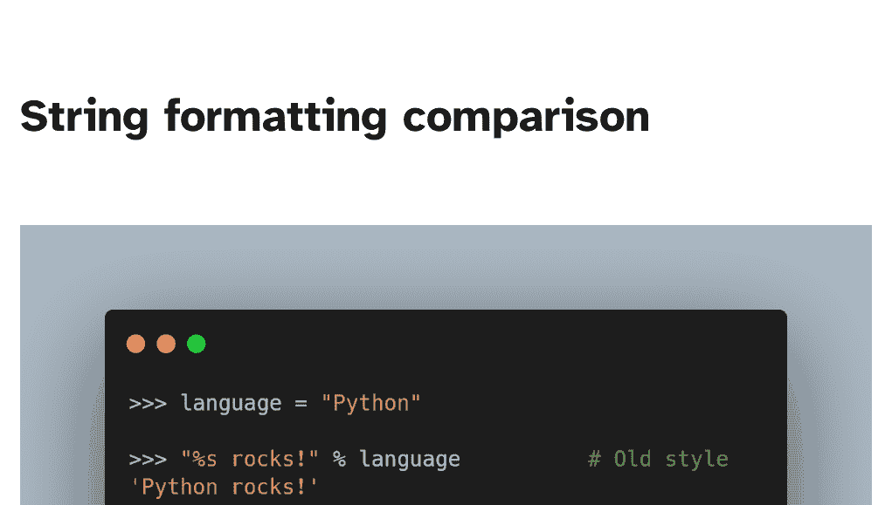

（原文缩略图，链接：https://mathspp.com/blog/pydonts/string-formatting-comparison。）

## 引言

Python 之禅中提到：

> “应该有一种——最好只有一种——显而易见的方式来完成一件事。”

然而，在 Python 中进行字符串格式化却有三种主要方式。这篇 Pydon't 文章将一决高下，比较这三种方法，并帮助你决定在每种情况下哪种方式才是显而易见的选择。

在这篇 Pydon't 中，你将：

- 了解使用 `%` 的旧式 C 风格格式化；
- 了解字符串方法 `.format`；
- 了解 Python 3.6+ 引入的字面量字符串插值和 f-string 特性；
- 理解每种字符串格式化类型之间的关键区别；以及
- 看到每种字符串格式化方式真正擅长的场景。

## 字符串格式化的原理

让我们假设一下，Python 没有任何字符串格式化的方式。

现在，我有一个任务给你：编写一个函数，它接受一个编程语言名称，并返回一个字符串，说明该编程语言很棒。你能做到吗？再次强调，不能使用任何字符串格式化功能！

这是一个可能的解决方案：

```python
def language_rocks(language):
    return language + " rocks!"

>>> language_rocks("Python")
'Python rocks!'
```

干得好！

现在，编写一个函数，它接受一个编程语言名称及其（估计的）用户数量，并返回一个类似“<插入语言>很棒！你知道吗，<插入语言>大约有<插入数量>个用户？”的字符串。

你能做到吗？记住，你不应该使用任何字符串格式化功能！

这是一个可能的解决方案：

```python
def language_info(language, users_estimate):
    return (
        language + " rocks! Did you know that " + language +
        " has around " + str(users_estimate) + " users?!"
    )

>>> language_info("Python", 10)
'Python rocks! Did you know that Python has around 10 users?!'
```

注意情况升级得有多快：我们函数的目的仍然非常简单，但我们却不得不在各处进行一堆字符串拼接，仅仅是因为我们有一些信息片段想要合并到字符串中。

这就是字符串格式化的用途：当你需要将信息放入字符串时，它旨在让你的生活更轻松。

## 三种字符串格式化方法

既然我们已经确定字符串格式化很有用，让我们来看看 Python 中进行字符串格式化的三种主要方式。

首先，这是你如何重构上面的函数：

```python
# 使用 C 风格字符串格式化：
def language_info_cstyle(language, users_estimate):
    return (
        "%s rocks! Did you know that %s has around %d users?!" %
        (language, language, users_estimate)
    )
```

```python
# 使用 Python 3 的字符串 `.format` 方法：
def language_info_format(language, users_estimate):
    return "{} rocks! Did you know that {} has around {} users?!".format(
        language, language, users_estimate
    )
```

```python
# 使用 f-string，来自 Python 3.6+：
def language_info_fstring(language, users_estimate):
    return (
        f"{language} rocks! Did you know that {language}" +
        f" has around {users_estimate} users?!"
    )
```

上面三个函数的行为方式相同。

1. `language_info_cstyle` 使用旧式字符串格式化，借鉴了具有相同功能的类似 C 语法；
2. `language_info_format` 使用字符串方法 `.format`，该方法在 PEP 3101 中引入；以及
3. `language_info_fstring` 使用新的 f-string，该特性在 PEP 498 中为 Python 3.6+ 引入。

## C 风格格式化

C 风格格式化是存在时间最长的一种，其特点是模板字符串中出现一系列百分号（“%”）。

（这里的“模板字符串”是指我们想要填充信息的字符串。）

这些百分号表示信息片段应该放置的位置，而紧随其后的字符（上面我们看到了“%s”和“%d”）决定了传入信息的处理方式。

此外，应用格式化的方式是通过二元运算符 `%`：左边放置模板字符串，右边放置所有需要传入的信息片段。

## 字符串方法 .format

字符串方法 `.format`，顾名思义，是字符串类型的一个方法。这意味着你通常有一个格式字符串，当你获取到缺失的信息片段时，只需在该字符串上调用 `.format` 方法。

使用 `.format` 方法进行格式化的字符串通常以字符串中出现一系列花括号“{}”为特征。通常也会在字符串字面量定义时/处调用 `.format` 方法。

## 字面量字符串插值，或 f-string

字面量字符串插值是将值插入字符串的过程。注意“插值”这个词的定义：

> 动词：插值 – 将（性质不同的东西）插入其他事物中。

这正是这种技术的作用：它直接将额外的值插入模板字符串中。

当人们谈论“f-string”时，他们也在谈论这种技术。这是因为你需要在字符串前加上 `f` 前缀才能使用字面量字符串插值。

字面量字符串插值（显然）的特点是字符串字面量上的 `f` 前缀，以及字符串内部的花括号“{}”。与字符串方法 `.format` 不同，花括号*总是*包含内容。

```python
>>> b"This is a bytes object!"
b'This is a bytes object!'
>>> type(_)      # 使用 _ 引用前一个字符串。
<class 'bytes'>
>>> r"This is a \nstring"
'This is a \\nstring'
```

既然我们已经了解了三种字符串格式化方法，我们将展示一系列不同的（简单）场景，以及格式化如何与这三个选项一起工作。

正如我们将看到的，C 风格格式化几乎总是看起来更笨拙、不够优雅，这应该能让你意识到 f-string 和字符串方法 `.format` 才是正道。

在这一系列比较之后，我们将就使用何种类型的格式化以及何时使用给出一些建议。

## 值转换

当我们进行字符串格式化时，我们想要格式化到模板字符串中的对象需要被转换为字符串。

这通常通过在对象上调用 `str` 来完成，而这又会调用这些对象的魔术方法 `__str__`。然而，有时让对象使用调用 `repr` 的结果而不是 `str` 来表示是有益的。（我之前写过关于为什么你会想要这样做的文章，所以如果你不熟悉 `__str__`/`__repr__` 的工作原理，请阅读这篇 Pydon't。）

有特殊的方法来确定发生哪种类型的字符串转换。

看这个示例类：

```python
class Data:
    def __str__(self):
        return "str"
    def __repr__(self):
        return "repr"
```

定义了该类后，以下三个字符串是相同的：

```python
"%s %r" % (Data(), Data())
```

```python
"{!s} {!r}".format(Data(), Data())
```

```python
f"{Data()!s} {Data()!r}"
```

### 结果是 'str repr'

使用 C 风格格式化，我们使用“%s”和“%r”来区分对象的常规字符串版本或其表示形式。两种更现代的方法使用 `!s` 和 `!r` 标志来进行区分。

## 对齐

当我们需要跨多行格式化许多值时，例如显示表格形式的输出，我们可能希望对齐所有值并相应地填充它们。这是字符串格式化大放异彩的一个绝佳用例。

```python
lang = "Python"
```

```python
"%-10s" % lang
```

```python
"{:<10}".format(lang)
```

```python
f"{lang:<10}"
```

### 结果是 'Python      '

C 风格默认右对齐，而 `.format` 和 f-string 默认左对齐。因此，上面我们本可以写成

```python
"{:10}".format(lang)
```

```python
f"{lang:10}"
```

我们仍然会得到相同的结果。但是，为了便于比较，我决定包含 `<` 以表示左对齐。

C风格格式化无法实现居中对齐，但两种现代方法可以使用`^`将输出居中对齐：

```
"{: ~10}".format(lang)
f"{lang:^10}"
```

```
### 结果为 '   Python   '
```

若要右对齐，现代方法使用`>`，而C风格格式化则无需任何符号。
请记住，现代方法使用`<>`进行对齐，箭头的尖端指向对齐方向：

## 命名占位符

对于较长的字符串或包含多个待填充槽位的字符串，使用占位符字符串可能比仅使用字符串格式化符号更有帮助。使用f字符串时，这几乎是自动完成的，但C风格格式化和`.format`也支持此功能：

```
name, age = "John", 73
```

```
"%(name)s is %(age)d years old." % {"name": name, "age": age}
```

```
"{name} is {age} years old.".format(name=name, age=age)
```

```
f"{name} is {age} years old."
```

```
## 结果为 'John is 73 years old.'
```

## 访问嵌套数据结构

让我们再次查看上面的示例，但假设姓名和年龄实际上存储在一个字典中。
在这种情况下，旧式格式化和字符串方法`.format`特别方便：

```
data = {"name": "John", "age": 73}
```

```
"%(name)s is %(age)d years old." % data
```

```
"{data[name]} is {data[age]} years old.".format(data=data)
## 或
"{name} is {age} years old.".format(**data)
```

```
f"{data['name']} is {data['age']} years old."
```

```
## 结果为 'John is 73 years old.'
```

字符串方法`.format`的第一个用法展示了一个有趣的功能：使用`.format`进行格式化时，被格式化的对象可以被索引，也可以访问其属性。

这是一个非常复杂的示例：

```
python
class ConvolutedExample:
    values = [{"name": "Charles"}, {42: "William"}]

ce = ConvolutedExample()

"Name is: {ce.values[0][name]}".format(ce=ce)

f"Name is: {ce.values[0]['name']}"

## 结果为 'Name is: Charles'
```

## 参数化格式化

有时，你想进行一些字符串格式化，但具体的格式化方式是动态的：例如，你可能想打印具有可变宽度的内容，并且希望宽度能适应序列中最长的元素。

例如，假设你有一个包含公司及其原产国的列表，并且你希望它们对齐：

```
python
data = [("Toyota", "Japanese"), ("Ford", "USA")]

for brand, country in data:
    print(f"{brand:>7}, {country:>9}")

"""
结果为
   Toyota,    Japanese
    Ford,       USA
"""
```

问题是，如果我们现在加入一个名称更长的公司会怎样？

```
python
data = [("Toyota", "Japanese"), ("Ford", "USA"), ("Lamborghini", "Italy")]

for brand, country in data:
    print(f"{brand:>7}, {country:>9}")

"""
结果为
   Toyota,    Japanese
    Ford,       USA
Lamborghini,        Italy
"""
```

输出不再对齐，因为单词“Lamborghini”无法放入指定的宽度7中。因此，我们需要动态计算最大长度，并使用它们来创建正确的格式规范。这就是格式规范参数化的用武之地：

```
python
data = [("Toyota", "Japanese"), ("Ford", "USA"), ("Lamborghini", "Italy")]
## 计算格式化所需的品牌宽度和国家宽度。
bw = 1 + max(len(brand) for brand, _ in data)
cw = 1 + max(len(country) for _, country in data)
```

```
python
for brand, country in data:
    print(f"{brand:>{bw}}, {country:>{cw}}")
```

```

"""
结果为
    Toyota, Japanese
       Ford,        USA
Lamborghini,     Italy
"""
```

旧式格式化仅允许对字段宽度和使用的精度进行参数化。对于字符串方法`.format`和f字符串，参数化可用于所有格式说明符选项。

```
python
month = "November"
prec = 3
value = 2.7182

"%.*s = %.*f" % (prec, month, prec, value)

"{:.*{prec}} = {:.*{prec}f}".format(month, value, prec=prec)

f"{month:.{prec}} = {value:.{prec}f}"

## 结果为 'Nov = 2.718'
```

## 自定义格式化

最后，字符串方法`.format`和f字符串允许你定义自己的自定义对象应如何格式化，这是通过魔术方法`__format__`实现的。
魔术方法`__format__`接受一个字符串（格式规范）并返回相应的字符串。
这是一个（愚蠢的）示例：

```
python
class YN:
    def __format__(self, format_spec):
        return "N" if "n" in format_spec else "Y"
```

```
python
"{:aaabbbccc}".format(YN()) # 结果为 'Y'

f"{YN():nope}"              # 结果为 'N'

```

当然，在可能的情况下，你会希望实现一个与**内置格式规范**匹配的格式规范。

## 代码示例

正如上面的小代码片段所示，几乎没有理由使用旧的字符串格式化风格。当然，请记住一致性很重要，因此如果你正在维护一个到处使用旧式格式化的旧代码库，这可能仍然有意义。否则，最好使用字符串方法`.format`和/或f字符串。现在，我将向你展示一些使用模式，并帮助你弄清楚在这些情况下哪种类型的字符串格式化最有效。

## 纯格式化

F字符串非常非常好。它们输入简短，具有良好的局部性（很容易看出是什么用于格式化字符串的特定部分），并且速度很快。

对于所有纯格式化需求，优先选择f字符串而不是`.format`方法：

```
python
## 一些随机变量：
name, age, w = "John", 73, 10

## 优先选择...
f"{name!s} {name!r}"
f"{name:<10}"
f"{name} is {age} years old."
f"{name:^{w}}"

## ...而不是`.format`
"{!s} {!r}".format(name, name)
"{:<10}".format(name)
"{name} is {age} years old.".format(name=name, age=age)
"{:^{w}}".format(name, w=w)

```

## 字典中的数据

如果你的所有格式化数据都已经在一个字典中，那么使用字符串方法`.format`可能是最好的选择。

如果该字典的键是字符串，这一点尤其正确。在这种情况下，使用字符串方法`.format`几乎就像使用f字符串一样！只是，当数据在字典中时，与`.format`中使用`**`相比，使用f字符串要冗长得多：

```
data = {"name": "John", "age": 73}

## 这样很好：
"{name} is {age} years old.".format(**data)

## 这样很繁琐：
f"{data['name']} is {data['age']} years old."
```

在上面的示例中，我们看到`.format`示例展现了f字符串通常受益的局部性！

## 延迟格式化

如果你需要先创建格式化字符串，然后才进行格式化，那么你就不能使用f字符串。
在这种情况下，使用`.format`方法可能是最好的选择。
这种场景可能出现在例如在（多种）不同语言中运行的程序中：

```
def get_greeting(language):
    if language == "pt":
        return "Olá, {}!"
    else:
        return "Hello, {}!"

lang = input(" [en/pt] >> ")
name = input(" your name >> ")
get_greeting(lang).format(name)
```

## 结论

这是这个Pydon't为你准备的主要要点：

> “不要使用旧式字符串格式化：尽可能使用f字符串，其他情况则使用`.format`。”

这个Pydon't向你展示了：

- Python有三种内置的字符串格式化类型；
- 使用`.format`和/或f字符串优于%-格式化；
- 你可以使用`!s`和`!r`来指定使用哪种类型的字符串表示；
- 对齐可以使用`<>`说明符完成；
- 格式规范可以通过额外的`{}`层级进行参数化；
- 自定义格式化可以通过魔术方法`__format__`实现；
- f字符串非常适合大多数标准格式化任务；
- 当格式化数据在字典中时，`.format`方法很有用；以及
- 对于延迟字符串格式化，f字符串不适用，这意味着`.format`是推荐的字符串格式化方法。

如果你喜欢这篇 Pydon’t，请务必在下方留下你的反馈，并与你的朋友和 Python 同好们分享。同时，[订阅我们的通讯](https://mathspp.com/newsletter)，这样你就不会错过任何一篇 Pydon’t 了！

## 参考资料

- Python 2 文档，字符串格式化操作，https://docs.python.org/2/library/stdtypes.html#string-formatting [最后访问于 2021-11-10]
- Python 3 文档，Python 教程，更美观的输出格式化，https://docs.python.org/3/tutorial/inputoutput.html [最后访问于 2021-11-10]
- Python 3 文档，Python 标准库，string 模块，https://docs.python.org/3/library/string.html#string-formatting [最后访问于 2021-11-10]
- PEP 3101 – 高级字符串格式化，https://www.python.org/dev/peps/pep-3101/ [最后访问于 2021-11-10]
- PEP 498 – 字面字符串插值，https://www.python.org/dev/peps/pep-0498/ [最后访问于 2021-11-10]
- PyFormat，https://pyformat.info [最后访问于 2021-11-17]

## 结语

感谢你投入时间通过本书提升你的 Python 知识，我诚挚地邀请你让我知道你的反馈。

无论是正面还是负面的批评，我都非常欢迎，并且会亲自阅读。只需给我发一封邮件至 [rodrigo@mathspp.com](mailto:rodrigo@mathspp.com)，或在 Twitter 上联系我，我的用户名是 [mathsppblog](https://twitter.com/mathsppblog)。

期待与你交流！

— Rodrigo，[https://mathspp.com](https://mathspp.com)