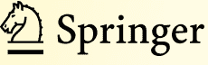
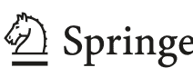
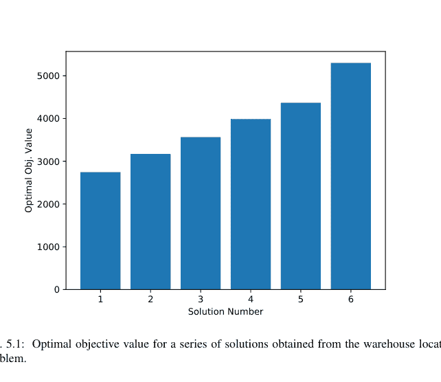
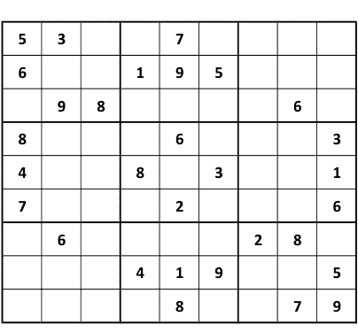
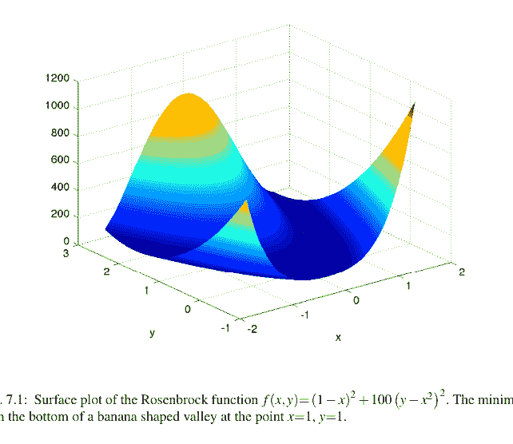
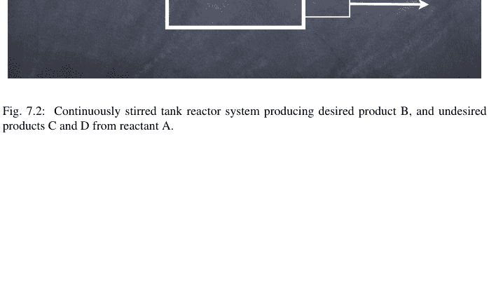
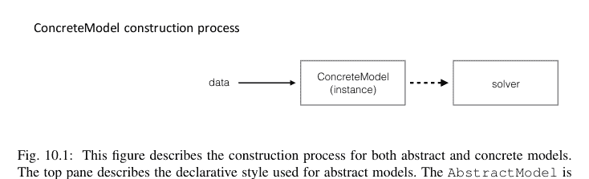
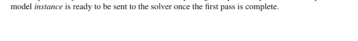
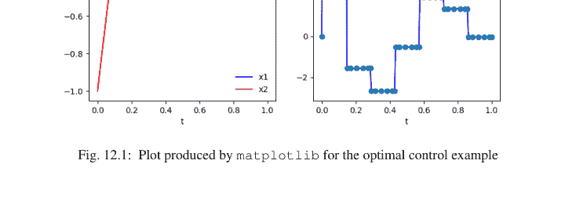

Springer Optimization and Its Applications 67

Michael L. Bynum
Gabriel A. Hackebeil · William E. Hart
Carl D. Laird · Bethany L. Nicholson
John D. Sirola · Jean-Paul Watson
David L. Woodruff

## Pyomo — Python 优化建模

第三版



## Springer Optimization and Its Applications

第 67 卷

**丛书编辑**
Panos M. Pardalos, *University of Florida*
My T. Thai, *University of Florida*

**荣誉编辑**
Ding-Zhu Du, *University of Texas at Dallas*

**顾问编辑**
Roman V. Belavkin, *Middlesex University*
John R. Birge, *University of Chicago*
Sergiy Butenko, *Texas A&M University*
Vipin Kumar, *University of Minnesota*
Anna Nagurney, *University of Massachusetts Amherst*
Jun Pei, *Hefei University of Technology*
Oleg Prokopyev, *University of Pittsburgh*
Steffen Rebennack, *Karlsruhe Institute of Technology*
Mauricio Resende, *Amazon*
Tamás Terlaky, *Lehigh University*
Van Vu, *Yale University*
Michael N. Vrahatis, *University of Patras*
Guoliang Xue, *Arizona State University*
Yinyu Ye, *Stanford University*

## 目标与范围

优化领域一直以惊人的速度向各个方向扩展。新的算法和技术不断发展，并迅速渗透到其他学科，尤其聚焦于机器学习、人工智能和量子计算。我们对该领域各方面的认识变得更加深刻。同时，优化领域最引人注目的趋势之一是，对其跨学科性质的重视程度不断增加。优化已成为不限于应用数学、工程、医学、经济学、计算机科学、运筹学及其他科学等多个领域的基本工具。

丛书**Springer Optimization and Its Applications (SOIA)** 旨在出版聚焦于优化理论、方法和应用的先进阐述性著作（专著、合集、教材、手册）。涵盖的主题包括但不限于非线性优化、组合优化、连续优化、随机优化、贝叶斯优化、最优控制、离散优化、多目标优化等。本丛书新增的作品涵盖优化与机器学习、人工智能和量子计算的交叉领域。

*本系列各卷均被 Web of Science, zbMATH, Mathematical Reviews 和 SCOPUS 索引。*

有关本系列的更多信息，请访问 [http://www.springer.com/series/7393](http://www.springer.com/series/7393)

Michael L. Bynum • Gabriel A. Hackebeil
William E. Hart • Carl D. Laird
Bethany L. Nicholson • John D. Sirola
Jean-Paul Watson • David L. Woodruff

## Pyomo – Python 优化建模

第三版



- Michael L. Bynum
Sandia National Laboratories
Albuquerque, NM, USA
- Gabriel A. Hackebeil
Deepfield Nokia
Ann Arbor, MI, USA
- William E. Hart
Sandia National Laboratories
Albuquerque, NM, USA
- Carl D. Laird
Sandia National Laboratories
Albuquerque, NM, USA
- Bethany L. Nicholson
Sandia National Laboratories
Albuquerque, NM, USA
- John D. Sirola
Sandia National Laboratories
Albuquerque, NM, USA
- Jean-Paul Watson
Lawrence Livermore National Laboratory
Livermore, CA, USA
- David L. Woodruff
Graduate School of Management
University of California
Davis, CA, USA

This is a U.S. Government work and not under copyright protection in the US; foreign copyright protection may apply

ISSN 1931-6828 ISSN 1931-6836 (electronic)
Springer Optimization and Its Applications
ISBN 978-3-030-68927-8 ISBN 978-3-030-68928-5 (eBook)
https://doi.org/10.1007/978-3-030-68928-5

© This is a U.S. government work and not under copyright protection in the U.S.; foreign copyright protection may apply 2012, 2017, 2021
版权所有，无论是材料的全部还是部分，所有权利均由出版商独家许可，特别是翻译权、转载权、插图复用权、朗诵权、广播权、以缩微胶片或任何其他物理形式复制的权利、以及信息存储与检索、电子改编、计算机软件的传输权，或基于现有或未来开发的类似或不同方法的复制权。
本出版物中使用的一般性描述性名称、注册名称、商标、服务标志等，即使在没有具体声明的情况下，也不意味着这些名称不受相关保护性法律法规的约束，因此可以自由使用。
出版商、作者和编辑有理由认为，本书中的建议和信息在出版时是真实准确的。无论是出版商、作者还是编辑，均不对本文所含材料或任何可能存在的错误或遗漏提供任何明示或暗示的保证。出版商对于已出版地图和机构附属关系中涉及的管辖权主张保持中立。

*献给Pyomo的过去、现在和未来的用户。*

## 前言

本书描述了一个用于数学建模的工具：Python优化建模对象（Pyomo）软件。Pyomo支持用于复杂优化应用的数学模型的构建与分析。这种能力通常与代数建模语言（AMLs）相关联，后者支持使用高级语言描述和分析数学模型。尽管大多数AMLs是在自定义建模语言中实现的，但Pyomo的建模对象嵌入在Python中，Python是一个功能齐全的高级编程语言，拥有丰富的支持库。Pyomo曾获得R&D100组织和INFORMS计算学会的奖项。

建模是科学研究、工程和商业许多方面的基本过程，而计算的广泛普及使得数学模型的数值分析成为司空见惯的活动。此外，AMLs已成为为复杂的现实世界应用稳健地构建大型模型的关键能力[37]。AMLs通过简化稀疏数据的管理和支持模型组件的自然表达，简化了模型构建过程。此外，像Pyomo这样的AMLs支持使用模型对象进行脚本编写，这有助于对复杂问题进行自定义分析。

Pyomo的核心是用于表示优化模型的面向对象能力。Pyomo还包含定义建模扩展和模型重构的包。Pyomo还包括定义与求解器（如CPLEX和Gurobi）接口的包，以及求解器服务（如NEOS）。

## 本书目标

第三版提供了对Pyomo建模能力的最新描述。本书的一个主要目标是提供对Pyomo的广泛描述，使用户能够使用Pyomo开发和优化模型。本书使用许多示例来阐述可用于构建模型的不同技术。

本书的另一个目标是展示Pyomo能力的广度。Pyomo支持常见优化模型的构建与分析，包括线性规划、混合整数线性规划、非线性规划、混合整数非线性规划、带均衡约束的数学规划、基于微分方程的约束和目标、广义析取规划等。此外，Pyomo包括对各种广泛使用的优化软件包（如CBC、CPLEX、GLPK和Gurobi）的求解器接口。另外，可以使用采用AMPL求解器库接口的优化器（如IPOPT）来优化Pyomo模型。

最后，本书的一个目标是帮助用户开始使用Pyomo，即使他们对Python知之甚少。附录A提供了Python的快速入门介绍，但我们对Python参考文本在支持新Pyomo用户方面所表现出的良好效果印象深刻。尽管Pyomo引入了Python对象及其应用过程，但使用Pyomo表达模型强烈反映了Python清晰简洁的语法。

然而，我们对Pyomo高级建模能力的讨论假设读者具备一定的面向对象设计和Python编程语言特性背景。例如，我们关于建模组件的讨论区分了类定义和类实例。我们没有试图在本书中描述Python的这些高级特性。因此，用户应该期望熟悉Python，以便有效地理解和使用高级建模功能。

## 目标读者

本书为学生、学术研究人员和从业人员提供参考。Pyomo的设计足够简单，已被有效地用于本科生和研究生的课堂教学。但是，我们假设读者通常熟悉优化和数学建模。虽然本书不包含术语表，但我们建议读者参考《数学规划词汇表》[32]。

Pyomo也是学术研究人员和从业人员的宝贵工具。Pyomo开发的一个关键重点是支持现实世界应用的构建与分析。因此，运行时性能和稳健的求解器接口等问题非常重要。

此外，我们相信研究人员会发现Pyomo提供了一个开发高级优化和分析工具的有效框架。例如，Pyomo是一个名为`mpi-sppy`的不确定性下优化软件包的基础，它利用了Pyomo的建模对象嵌入在功能齐全的高级编程语言中这一事实。这允许使用Python并行通信库对子问题进行透明的并行化。这种支持复杂模型通用求解器的能力非常强大，我们相信它可以与许多其他优化分析技术一起使用。

## 第三版修订说明

在编写本书第三版时，我们做了若干重大修改。一个贯穿全书的细微变化在于我们推荐的Pyomo导入方式。另一个贯穿全书的更大变化是强调使用**具体模型**。引言章节以一个具体模型开始，并且在除了专门讲解抽象模型的章节之外的大多数章节中，我们都强调具体模型。这并非反映Pyomo功能的变化，而是认识到具体模型在规范和使用Pyomo模型时提供了更少的限制。例如，用户可以使用通用的Python工具加载数据，而不仅限于专门为抽象模型支持的机制。因此，具体模型使得对Pyomo潜力的讨论更为广泛。最后，我们重新组织了大部分内容，添加了新的示例，并增加了一章讲解建模者如何提升模型性能。本书删除了两章：关于双层规划的一章，以及关于提供不确定性优化支持的PySP的一章。这些功能可通过其他方式获得，且不再包含在Pyomo软件发行版中。

## 致谢

我们感谢许多为本书当前版本和先前版本提供支持的人们。我们感谢施普林格出版社的Elizabeth Loew，帮助将本书从一个初步构想引导至最终出版；她对出版的热情富有感染力。同时，我们感谢桑迪亚国家实验室的Madelynn Farber，在开源软件发布和图书出版的法律流程方面给予的指导。最后，我们感谢Doug Prout设计了Pyomo、PySP、Pyomo.DAE和Coopr的标志。

我们感谢那些投入时间和精力审阅本书的读者。没有他们，书中将包含许多拼写错误和软件缺陷。因此，感谢Jack Ingalls、Zev Friedman、Harvey Greenberg、Sean Legg、Angelica Wong、Daniel Word、Deanna Garcia、Ellis Ozakylol和Florian Mader。特别感谢Amber Gray-Fenner和Randy Brost。

我们尤其感谢不断壮大的Pyomo用户社区。你们对Pyomo的兴趣和热情是我们决定撰写本书的最重要因素。我们感谢Pyomo的早期采用者，他们对软件的设计和效用提供了详细反馈，包括Fernando Badilla、Steven Chen、Ned Dimitrov、YueYue Fan、Eric Haung、Allen Holder、Andres Iroume、Darryl Melander、Carol Meyers、Pierre Nancel-Penard、Mehul Rangwala、Eva Worminghaus和David Alderson。你们的反馈持续对Pyomo的设计和功能产生着重大影响。

我们也感谢COIN-OR项目中的朋友们，感谢他们对Pyomo软件的支持。尽管Pyomo的主要开发站点托管在GitHub上，但我们与COIN-OR的合作是我们确保Pyomo保持为一个活跃的开源软件项目的关键战略部分。

特别感谢为Pyomo相关包做出贡献的合作者：Francisco Muñoz、Timothy Ekl、Kevin Hunter、Patrick Steele和Daniel Word。我们也感谢Tom Brounstein、Dave Gay和Nick Benevidas，他们帮助为Pyomo开发了Python模块和文档。

作者们衷心感谢以下为本书开发提供支持的机构：美国国家科学基金会资助编号CBET#0941313和CBET#0955205、美国能源部科学办公室下属的先进科学计算研究办公室、美国能源部ARPA-E办公室的绿色电力网络集成项目、由美国能源部化石能源办公室下属的基于仿真的工程交叉研究项目资助的先进能源系统设计研究所（IDAES）、美国能源部电力办公室的高级电网建模（AGM）项目，以及桑迪亚国家实验室的实验室定向研究与发展计划。

最后，我们要感谢家人和朋友们对我们投身优化软件的热情给予的包容。

## 免责声明

桑迪亚国家实验室是由桑迪亚技术与工程解决方案有限责任公司（霍尼韦尔国际公司全资子公司）为美国能源部国家核安全管理局管理并运营的多任务实验室，合同编号为DE-NA0003525。本文描述了客观的技术成果和分析。文中可能表达的任何主观观点或意见不一定代表美国能源部或美国政府的观点。

本文是作为由美国政府机构赞助的工作报告编写的。美国政府或其任何机构，或其任何雇员，不作任何明示或暗示的保证，也不承担因文中披露的任何信息、仪器、产品或过程的准确性、完整性或实用性而引起的任何法律责任或义务，或声称其使用不会侵犯私有权利。文中提及任何特定商业产品、过程或服务，以商标、制造商等，并不必然构成或意味着美国政府或其任何机构的认可、推荐或 favor。本文作者表达的观点和意见不一定表明或反映美国政府或其任何机构的观点。本材料基于美国能源部科学办公室在合同号DEAC02-05CH11231下支持的工作。

本文是作为由美国政府机构赞助的工作报告编写的。美国政府或劳伦斯利弗莫尔国家安全有限责任公司，或其任何雇员，不作任何明示或暗示的保证，也不承担因文中披露的任何信息、仪器、产品或过程的准确性、完整性或实用性而引起的任何法律责任或义务，或声称其使用不会侵犯私有权利。文中提及任何特定商业产品、过程或服务，以商标、制造商等，并不必然构成或意味着美国政府或劳伦斯利弗莫尔国家安全有限责任公司的认可、推荐或 favor。本文作者表达的观点和意见不一定表明或反映美国政府或劳伦斯利弗莫尔国家安全有限责任公司的观点，且不得用于广告或产品推广目的。本工作部分在劳伦斯利弗莫尔国家实验室根据合同DE-AC52-07NA27344，在美国能源部的主持下完成。

## 意见与问题

本书记录了Pyomo 6.0版本的功能。更多信息可在Pyomo网站获取，包括勘误表：

```
http://www.pyomo.org
```

Pyomo的开源软件托管在GitHub上，本书中使用的示例包含在`pyomo/examples/doc/pyomobook`目录中：

```
https://github.com/Pyomo/pyomo
```

许多Pyomo问题在Stack Overflow上提出并解答：

```
https://stackoverflow.com/
```

我们鼓励读者反馈，可通过直接与作者沟通或通过Pyomo论坛：

```
pyomo-forum@googlegroups.com
```

祝好运！

美国新墨西哥州阿尔伯克基
美国密歇根州安娜堡
美国新墨西哥州阿尔伯克基
美国新墨西哥州阿尔伯克基
美国新墨西哥州阿尔伯克基
美国新墨西哥州阿尔伯克基
美国加利福尼亚州利弗莫尔
美国加利福尼亚州戴维斯

Michael Bynum
Gabe Hackebeil
William Hart
Carl Laird
Bethany Nicholson
John Siirola
Jean-Paul Watson
David Woodruff
2021年1月5日

## 目录

- 1 引言

## 4 Pyomo 模型与组件：简介

### 4.1 面向对象的 AML

3.3.5 集合与参数的建模组件

## 第二部分 高级主题

### 7 使用 Pyomo 进行非线性规划

7.1 引言
7.2 Pyomo 中的非线性规划问题
7.2.1 非线性表达式
7.2.2 Rosenbrock 问题
7.3 求解非线性规划模型
7.3.1 非线性求解器
7.3.2 非线性规划的额外技巧
7.4 非线性规划示例
7.4.1 多峰函数的变量初始化
7.4.2 鹿群可持续捕捞的最优配额
7.4.3 传染病模型的估计
7.4.4 反应器设计

### 8 使用块进行结构化建模

8.1 引言
8.2 块结构
8.3 作为索引组件的块
8.4 块内的构建规则
8.5 从层次模型中提取值
8.6 块示例：最优多周期批量规模
8.6.1 不使用块的模型
8.6.2 使用块的模型

### 9 性能：模型构建与求解器接口

9.1 通过性能分析识别瓶颈
9.1.1 报告计时
9.1.2 TicTocTimer
9.1.3 性能分析器
9.2 使用 LinearExpression 提升模型构建性能
9.3 使用持久化求解器进行重复求解
9.3.1 何时使用持久化求解器
9.3.2 基本用法
9.3.3 处理索引变量和约束
9.3.4 额外性能优化
9.3.5 示例
9.4 稀疏索引集

### 10 抽象模型及其求解

10.1 概述
10.1.1 抽象模型与具体模型
10.1.2 模型 (H) 的抽象模型
10.1.3 仓库选址问题的抽象模型
10.2 pyomo 命令
10.2.1 help 子命令
10.2.2 solve 子命令
10.2.3 convert 子命令
10.3 AbstractModel 的数据命令
10.3.1 set 命令
10.3.2 param 命令
10.3.3 include 命令
10.3.4 数据命名空间
10.4 构建组件

## 第三部分 建模扩展

### 11 广义析取规划

11.1 引言
11.2 在 Pyomo 中建模 GDP
11.3 表达逻辑约束
11.4 求解 GDP 模型
11.4.1 Big-M 变换
11.4.2 Hull 变换
11.5 带有半连续变量的混合问题

### 12 微分代数方程

12.1 引言
12.2 Pyomo DAE 建模组件
12.3 求解带有 DAE 的 Pyomo 模型
12.3.1 有限差分变换
12.3.2 配点变换
12.4 附加功能
12.4.1 应用多种离散化方法
12.4.2 限制控制输入曲线
12.4.3 绘图

### 13 带有均衡约束的数学规划

13.1 引言
13.2 建模均衡条件
13.2.1 互补条件
13.2.2 互补表达式
13.2.3 建模混合互补条件
13.3 MPEC 变换
13.3.1 标准形式
13.3.2 简单非线性
13.3.3 简单析取
13.3.4 AMPL 求解器接口
13.4 求解器接口与元求解器
13.4.1 非线性重构
13.4.2 析取重构
13.4.3 PATH 与 ASL 求解器接口
13.5 讨论

## A Python 简明教程

A.1 概述
A.2 安装与运行 Python
A.3 Python 行格式
A.4 变量与数据类型
A.5 数据结构
A.5.1 字符串
A.5.2 列表
A.5.3 元组
A.5.4 集合
A.5.5 字典
A.6 条件语句
A.7 迭代与循环
A.8 生成器与列表推导式
A.9 函数
A.10 对象与类
A.11 赋值、复制与深拷贝
A.11.1 引用
A.11.2 复制
A.12 模块
A.13 Python 资源

## 参考文献
## 索引

# 第1章 引言

**摘要** 本章介绍并阐述了 Pyomo，一个基于 Python 的优化问题建模与求解工具。建模是科学研究、工程和商业诸多方面的基本过程。像 Pyomo 这样的代数建模语言是用于指定和求解数学优化问题的高级语言。Pyomo 是一个灵活、可扩展的建模框架，它在广泛使用的编程语言环境中，捕捉并扩展了现代代数建模语言的核心思想。

### 1.1 优化建模语言

本书描述了一个用于数学建模的工具：Python 优化建模对象（Pyomo）软件包。Pyomo 支持为复杂优化应用构建和分析数学模型。这种能力通常与商业代数建模语言（AMLs）相关联，例如 AIMMS [1]、AMPL [2] 和 GAMS [22]。Pyomo 实现了一套丰富的建模和分析功能，并在 Python 这种功能齐全、拥有大量支持库的高级编程语言中提供了对这些功能的访问。

优化模型定义了所考虑系统的目标或目的。优化模型可用于探索目标之间的权衡、识别极端状态和最坏情况，以及识别影响系统现象的关键因素。因此，优化模型被用于分析广泛的科学、商业和工程应用。

计算资源的广泛普及使得优化模型的数值分析变得普遍。优化模型的计算分析需要指定一个模型，并将其传递给求解器软件包。如果没有用于指定优化模型的语言，编写输入文件、执行求解器以及从求解器中提取结果的过程将是繁琐且容易出错的。在复杂的、大规模的现实世界应用中，当错误发生时难以调试，这种困难会加剧。此外，求解器使用许多不同的输入格式，但很少有被认为是标准的。因此，将多个求解器应用于分析单个优化模型会引入额外的复杂性。再者，模型验证（即确保传递给求解器的模型准确反映了开发者意图表达的模型）在没有用于表达模型的高级语言的情况下是极其困难的。

代数建模语言（AMLs）是用于描述和求解优化问题的高级语言 [26, 37]。AMLs 通过支持优化问题的高级规范，最大限度地减少了分析优化模型相关的困难。此外，AML 软件为用于分析问题的外部求解器包提供了严格的接口，并允许用户在其高级模型规范的上下文中与求解器结果进行交互。

像 AIMMS [1]、AMPL [2, 21] 和 GAMS [22] 这样的定制 AMLs 实现了优化模型规范语言，具有直观简洁的语法来定义变量、约束和目标。此外，这些 AMLs 支持指定抽象概念，如稀疏集、索引和代数表达式，这些在指定具有数千或数百万约束和变量的大规模现实世界问题时至关重要。这些 AMLs 可以表示各种各样的优化模型，并且它们与丰富的求解器包接口。AMLs 正越来越多地被扩展以包含自定义脚本功能，这使得可以在优化模型规范的同时表达高级分析算法。

一种互补的策略是使用扩展了标准高级编程语言（而不是基于专有语言）的 AML 来构建优化模型，并使用用低级语言编写的求解器进行分析。这种双语言方法利用了高级语言在构建优化问题方面的灵活性和低级语言在数值计算方面的效率。这是科学计算软件中一种日益常见的方法。Matlab TOMLAB 优化环境 [57] 是使用这种方法最成熟的优化软件包之一；Pyomo 也强烈地利用了这种方法。类似地，像 Java 和 C++ 这样的标准编程语言已被扩展以包含 AML 构造。例如，像 FlopC++ [19]、OptimJ [47] 和 JuMP [13] 这样的建模库分别支持在 C++、Java 和 Julia 中使用面向对象的设计来指定优化模型。尽管这些建模库牺牲了定制 AML 的一些直观数学语法，但它们允许用户利用现代高级编程语言的灵活性。这些 AML 库的另一个优势是它们可以直接链接到高性能优化库和求解器，这在某些应用中可能是一个重要的考虑因素。

### 1.2 使用 Pyomo 建模

Pyomo 的目标是为指定优化模型提供一个平台，该平台体现了现代 AML 中的核心理念，同时具备灵活性、可扩展性、可移植性、开放性和可维护性。Pyomo 是一种扩展 Python 的 AML，包含了用于优化建模的对象 [30]。这些对象可用于指定优化模型，并将其转换为外部求解器可以处理的各种格式。

我们现提供一些示例以展示如何使用 Pyomo 指定优化模型。

#### 1.2.1 简单示例

考虑以下线性规划：

$$\min x_1 + 2x_2$$
$$\text{s.t.} \quad 3x_1 + 4x_2 \geq 1$$
$$\quad 2x_1 + 5x_2 \geq 2$$
$$\quad x_1, x_2 \geq 0$$

这个线性规划可以很容易地用 Pyomo 表达如下：

```python
import pyomo.environ as pyo

model = pyo.ConcreteModel()
model.x_1 = pyo.Var(within=pyo.NonNegativeReals)
model.x_2 = pyo.Var(within=pyo.NonNegativeReals)
model.obj = pyo.Objective(expr=model.x_1 + 2*model.x_2)
model.con1 = pyo.Constraint(expr=3*model.x_1 + 4*model.x_2 >= 1)
model.con2 = pyo.Constraint(expr=2*model.x_1 + 5*model.x_2 >= 2)
```

第一行是标准的 Python import 语句，它初始化 Pyomo 环境并加载 Pyomo 的核心建模组件库。接下来的几行构建一个模型对象并定义其属性。此示例描述了一个 *具体* 模型。模型组件是模型对象的属性，而 `ConcreteModel` 对象在添加时初始化每个模型组件。模型的决策变量、约束和目标函数使用 Pyomo 的 *模型组件* 定义。

用户通常很少只求解特定优化问题的单个实例。相反，他们通常有一个通用的优化模型，然后使用特定数据创建该模型的一个具体实例。例如，以下方程组表示一个包含标量参数 $n$ 和 $m$、向量参数 $b$ 和 $c$ 以及矩阵参数 $a$ 的线性规划：

$$\min \sum_{i=1}^n c_i x_i$$
$$\text{s.t.} \quad \sum_{i=1}^n a_{ji} x_i \geq b_j \quad \forall j = 1 \dots m$$
$$\quad x_i \geq 0 \quad \forall i = 1 \dots n$$

这个线性规划可以使用 Pyomo 的具体模型表示如下：

```python
import pyo.environ as pyo
import mydata

model = pyo.ConcreteModel()

model.x = pyo.Var(mydata.N, within=pyo.NonNegativeReals)

def obj_rule(model):
    return sum(mydata.c[i]*model.x[i] for i in mydata.N)
model.obj = pyo.Objective(rule=obj_rule)

def con_rule(model, m):
    return sum(mydata.a[m,i]*model.x[i] for i in mydata.N) \
            >= mydata.b[m]
model.con = pyo.Constraint(mydata.M, rule=con_rule)
```

此脚本要求用于构建模型的数据在每个建模组件构造时都是可用的。在本例中，必要数据存在于 mydata.py 中：

```python
N = [1,2]
M = [1,2]
c = {1:1, 2:2}
a = {(1,1):3, (1,2):4, (2,1):2, (2,2):5}
b = {1:1, 2:2}
```

这个线性规划也可以被视为一个抽象的数学模型，其中未指定的符号参数值在模型初始化时被定义。例如，此线性规划可以在 Pyomo 中表示为抽象模型，如下所示：

```python
import pyo.environ as pyo

model = pyo.AbstractModel()

model.N = pyo.Set()
model.M = pyo.Set()
model.c = pyo.Param(model.N)
model.a = pyo.Param(model.M, model.N)
model.b = pyo.Param(model.M)

model.x = pyo.Var(model.N, within=pyo.NonNegativeReals)

def obj_rule(model):
    return sum(model.c[i]*model.x[i] for i in model.N)
model.obj = pyo.Objective(rule=obj_rule)

def con_rule(model, m):
    return sum(model.a[m,i]*model.x[i] for i in model.N) \
            >= model.b[m]
model.con = pyo.Constraint(model.M, rule=con_rule)
```

此示例包含对集合和参数值提供抽象或符号定义的模型组件。`AbstractModel` 对象将模型组件的初始化延迟到创建 *模型实例* 时进行，该实例使用用户提供的集合和参数数据。具体模型和抽象模型都可以使用来自各种不同数据源的数据进行初始化，包括从 AMPL 的数据命令改编的数据命令文件。例如：

```
param : N : c :=
1 1
2 2 ;

param : M : b :=
1 1
2 2 ;

param a :=
1 1 3
1 2 4
2 1 2
2 2 5 ;
```

#### 1.2.2 图着色示例

我们通过一个简单且知名的优化问题——最小图着色（也称为顶点着色）——进一步说明 Pyomo 的建模能力。图着色问题关注将颜色分配给图的顶点，使得没有两个相邻的顶点共享相同的颜色。图着色有许多实际应用，包括编译器中的寄存器分配、资源调度和模式匹配，它也是数独等娱乐性谜题的核心。

设 $G = (V, E)$ 表示一个具有顶点集 $V$ 和边集 $E \subseteq V \times V$ 的图。给定 $G$，最小图着色问题的目标是找到使用最少数量不同颜色的有效着色。为简单起见，我们假设 $E$ 中的边已排序，使得若 $(v_1, v_2) \in E$，则 $v_1 < v_2$。令 $k$ 表示颜色的最大数量，并定义可能的颜色集 $C = \{1, \ldots, k\}$。

我们可以将最小图着色问题表示为以下整数规划：

$$\begin{aligned} \min \quad & y \\ \text{s.t.} \quad & \sum_{c \in C} x_{v,c} = 1 \quad & \forall v \in V \\ & x_{v_1,c} + x_{v_2,c} \leq 1 \quad & \forall (v_1, v_2) \in E \quad & (1.1) \\ & y \geq c \cdot x_{v,c} \quad & \forall v \in V, c \in C \\ & x_{v,c} \in \{0, 1\} \quad & \forall v \in V, c \in C \end{aligned}$$

在这个公式中，变量 $x_{v,c}$ 在顶点 $v$ 被着以颜色 $c$ 时等于 1，否则为 0；$y$ 表示所使用的颜色数量。第一个约束要求每个顶点恰好被着以一种颜色。第二个约束要求由一条边连接的顶点必须具有不同的颜色。第三个约束为 $y$ 定义了一个下界，保证 $y$ 不小于解中使用的颜色数量。第四个也是最后一个约束强制 $x_{v,c}$ 的二进制约束。

图 1.1 展示了上述图着色公式的 Pyomo 规格，使用具体模型；该示例改编自 Gross 和 Yellen [27]。此规格由定义 `ConcreteModel` 对象以及该对象的各种属性（包括变量、约束和优化目标）的 Python 命令组成。第 10-24 行定义模型数据。第 28 行是标准的 Python import 语句，将 `pyomo.environ` 中定义的所有符号（例如，类和函数）添加到当前的 Python 命名空间。第 31 行指定创建 `model` 对象，它是 `ConcreteModel` 类的一个实例。第 34 和 35 行定义模型决策变量。注意 $y$ 是一个标量变量，而 $x$ 是一个二维变量数组。示例中的其余行定义了模型约束和目标函数。`Objective` 类使用 `expr` 关键字选项定义单个优化目标。`ConstraintList` 类定义约束列表，这些约束被单独添加。

与定制 AML 相比，Pyomo 模型显然更为冗长（例如，参见 Hart 等 [30]）。然而，本例说明了 Python 简洁的语法如何让 Pyomo 直观且简洁地表达数学概念。除了使用 Pyomo 类之外，本例还使用了标准的 Python 语法和方法。例如，第 41 行使用 Python 的生成器语法遍历 `colors` 集合的所有元素，并对结果应用 Python 的 `sum` 函数。尽管 Pyomo 包含一些简化表达式构建的实用函数，但它并不依赖于对 Python 核心功能的复杂扩展。

#### 1.2.3 Pyomo 关键特性

**Python**

Python 简洁的语法使得 Pyomo 能够以直观和简洁的方式表达数学概念。此外，Python 富有表现力的编程环境可用于构造复杂模型和定义高级求解器，以定制高性能优化库的执行。Python 提供了广泛的脚本能力，允许用户利用 Python 丰富的第三方库（例如，numpy、scipy 和 matplotlib）来分析 Pyomo 模型及其解决方案。最后，Pyomo 嵌入在 Python 中，允许用户通过 Python 丰富的文档来学习核心语法。

**可定制能力**

Pyomo 被设计为支持“石头汤”开发模式，即每位开发者“自扫门前雪”。此设计的一个关键要素是 Pyomo 用于集成模型组件、模型转换## 1.2 使用 Pyomo 建模

```python
#
# Graph coloring example adapted from
#
#  Jonathan L. Gross and Jay Yellen,
#  "Graph Theory and Its Applications, 2nd Edition",
#  Chapman & Hall/CRC, Boca Raon, FL, 2006.
#

# Define data for the graph of interest.
vertices = set(['Ar', 'Bo', 'Br', 'Ch', 'Co', 'Ec',
                'FG', 'Gu', 'Pa', 'Pe', 'Su', 'Ur', 'Ve'])

edges = set([('FG','Su'), ('FG','Br'), ('Su','Gu'),
             ('Su','Br'), ('Gu','Ve'), ('Gu','Br'),
             ('Ve','Co'), ('Ve','Br'), ('Co','Ec'),
             ('Co','Pe'), ('Co','Br'), ('Ec','Pe'),
             ('Pe','Ch'), ('Pe','Bo'), ('Pe','Br'),
             ('Ch','Ar'), ('Ch','Bo'), ('Ar','Ur'),
             ('Ar','Br'), ('Ar','Pa'), ('Ar','Bo'),
             ('Ur','Br'), ('Bo','Pa'), ('Bo','Br'),
             ('Pa','Br')])

ncolors = 4
colors = range(1, ncolors+1)


# Python import statement
import pyomo.environ as pyo

# Create a Pyomo model object
model = pyo.ConcreteModel()

# Define model variables
model.x = pyo.Var(vertices, colors, within=pyo.Binary)
model.y = pyo.Var()

# Each node is colored with one color
model.node_coloring = pyo.ConstraintList()
for v in vertices:
    model.node_coloring.add(
            sum(model.x[v,c] for c in colors) == 1)

# Nodes that share an edge cannot be colored the same
model.edge_coloring = pyo.ConstraintList()
for v,w in edges:
    for c in colors:
        model.edge_coloring.add(
                model.x[v,c] + model.x[w,c] <= 1)

# Provide a lower bound on the minimum number of colors
# that are needed
model.min_coloring = pyo.ConstraintList()
for v in vertices:
    for c in colors:
        model.min_coloring.add(
                model.y >= c * model.x[v,c])

# Minimize the number of colors that are needed
model.obj = pyo.Objective(expr=model.y)
```

图 1.1：一个用于最小图着色问题的具体 Pyomo 模型。

求解器和求解器管理器。一个插件框架管理这些能力的注册。因此，用户可以以模块化的方式自定义 Pyomo，而不会破坏核心功能的稳定性。

## 命令行工具与脚本

Pyomo 模型既可以使用命令行工具进行分析，也可以通过 Python 脚本进行分析。`pyomo` 命令行实用程序为大多数 Pyomo 建模功能提供了通用接口。`pyomo` 命令支持通用的优化过程。这个过程可以很容易地在 Python 脚本中复制，并根据用户的特定需求进行进一步定制。

## 具体模型与抽象模型定义

第 1.2.1 节中的示例说明了 Pyomo 对具体模型和抽象模型定义的支持。这两种建模方法的区别在于建模组件何时被初始化：具体模型会立即初始化组件，而抽象模型则会延迟组件的初始化，直到后续的模型初始化操作。因此，这些建模方法是等效的，选择哪种方法取决于使用 Pyomo 的上下文和用户偏好。两种类型的模型都可以轻松地从各种数据源（例如 csv、json、yaml、excel 和数据库）加载数据进行初始化。

## 面向对象设计

Pyomo 采用面向对象的库设计。模型是 Python 对象，模型组件是这些模型的属性。这种设计允许 Pyomo 自动管理建模组件的命名，并自然地将建模组件隔离在不同的模型对象中。Pyomo 模型可以使用块（blocks）进一步结构化，这支持模型组件的分层嵌套。Pyomo 的许多高级建模功能都利用了这种结构化建模能力。

## 强大的建模能力

Pyomo 的建模组件可用于表达广泛的优化问题，包括但不限于：

- 线性规划，
- 二次规划，
- 非线性规划，
- 混合整数线性规划，
- 混合整数二次规划，
- 广义析取规划，
- 混合整数随机规划，
- 带微分代数方程的动态问题，以及
- 带均衡约束的数学规划。

## 求解器集成

Pyomo 支持紧耦合和松耦合的求解器接口。紧耦合的建模工具直接访问优化求解器库（例如，通过静态或动态链接），而松耦合的建模工具则应用外部优化可执行文件（例如，通过系统调用）。许多优化求解器从知名的数据格式（例如，AMPL nl 格式 [24]）读取问题；这些求解器与 Pyomo 是松耦合的。具有 Python 接口的求解器（例如 Gurobi 和 CPLEX）可以紧耦合，从而避免了编写外部文件。

## 开源

Pyomo 作为一个开源项目进行管理，以促进软件设计和实现的透明度。Pyomo 在 BSD 许可证 [8] 下获得许可，该许可证对政府或商业使用的限制很少。Pyomo 在 GitHub [53] 上管理，并通过 COIN-OR 项目 [9] 进行管理。开发者和用户邮件列表在 Google Groups 上管理。越来越多的证据表明，开源软件的可靠性与闭源软件相似 [3, 59]，Pyomo 经过精心管理，以确保为用户提供稳健性和可靠性。

### 1.3 入门

为了执行本书中的所有示例，应安装以下软件：

- Python 3.6 或更高版本（尽管几乎所有示例都可以在早期版本的 Python 上运行）。Pyomo 目前依赖于 CPython；仅对 Pyomo 的部分功能支持 Jython 和 PyPy。
- Pyomo 6.0，本书通篇使用此版本。
- GLPK [25] 求解器，用于生成本书中大多数示例的输出。其他 LP 和 MILP 求解器也可用于这些示例，但 GLPK 软件易于安装且广泛可用。
- IPOPT [34] 求解器，用于生成非线性模型示例的输出。如果使用 AMPL 求解器库 [23] 编译，其他非线性优化器可以轻松用于这些示例。
- CPLEX [11] 求解器，用于生成随机规划示例的输出。这个商业求解器提供了这些示例所需的功能，而这些功能在开源优化求解器中并不常见（例如，二次整数规划的优化）。
- `matplotlib` Python 包，用于生成绘图。

Pyomo 的安装说明可在 Pyomo 网站上找到：[www.pyomo.org](http://www.pyomo.org)。附录 A 提供了 Python 脚本语言的简要教程；各种在线资源提供了更全面的教程和文档。

### 1.4 本书概要

本书的其余部分分为三个部分。第一部分是对 Pyomo 的介绍。第 2 章提供了优化和数学建模的基础知识，包括简要说明如何使用 Pyomo 来指定和求解代数优化模型。第 3 章通过简单的具体和抽象模型说明了 Pyomo 的建模能力，第 4 章描述了 Pyomo 的核心建模组件。将 Pyomo 模型嵌入脚本的基础知识在第 5 章。第一部分以第 6 章描述与求解器的交互结束。

本书的第二部分记录了高级功能和扩展。第 7 章描述了 Pyomo 的非线性规划能力，第 8 章描述了如何在 Pyomo 中表达分层模型。第 9 章给出了提高性能的指导。第 10 章描述了 `AbstractModel` 类、Pyomo 数据命令文件的语法以及 Pyomo 的命令行接口。

本书的第三部分描述了一些建模扩展。第 11 章概述了广义析取规划。第 12 章描述了用微分和代数方程表达的动态模型，第 13 章描述了带均衡约束的规划。

> **注意：** 本书并未提供 Pyomo 的*完整*参考。相反，我们的目标是讨论 Pyomo 6.0 版本中可用的核心功能。

### 1.5 讨论

许多开发者已经认识到，Python 简洁的语法和丰富的支持库使其成为优化建模的绝佳选择 [30]。各种开源软件包在 Python 中提供优化建模功能，例如 PuLP [49]、APLEpy [4] 和 OpenOpt [46]。此外，当前存在许多基于Python的求解器接口包，除了PyGlpk [50] 和 pyipopt [51] 等开源包之外，还有CPLEX [11] 和 Gurobi [28] 等商业求解器的Python接口。

Pyomo有几个突出的特点。首先，Pyomo提供了扩展核心建模和优化功能的机制，而无需修改Pyomo本身。其次，Pyomo支持定义具体模型和抽象模型，这使用户在决定数据与模型定义的整合紧密程度时具有很大的灵活性。最后，Pyomo能够支持广泛的优化模型类别，包括标准线性规划、一般非线性优化模型、广义析取规划、受微分方程约束的问题以及带有均衡条件的数学规划。

# 第一部分
Pyomo简介

## 第二章
数学建模与优化

**摘要** 本章提供关于优化和数学建模的入门介绍。它并未全面阐述这些主题，而是提供足够的背景信息以支持阅读本书的其余部分。关于优化建模技术的更多讨论，请参见 Williams [58]。文中展示了简单模型示例的实现，旨在帮助读者快速上手使用Pyomo。

### 2.1 数学建模

#### 2.1.1 概述

建模是科学研究、工程和商业许多方面的基本过程。建模涉及对一个系统或现实世界对象形成简化表示。这些简化使得关于原始系统的知识得以结构化呈现，从而便于对所得模型进行分析。Schichl [56] 指出，模型用于：

- **解释现象**，这些现象产生于系统中；
- **做出预测**，关于系统的未来状态；
- **评估关键因素**，这些因素影响系统中的现象；
- **识别极端状态**，可能代表最坏情况或最小成本计划；以及
- **分析权衡**，以支持人类决策者。

此外，模型表示的结构化方面有助于与模型相关知识的交流。例如，模型的一个关键方面是其详细程度，反映了将模型应用于某项任务所需的系统知识。

数学在表示和表述我们的知识方面一直扮演着基础性角色。随着新框架的出现，用以表达复杂系统，数学建模变得越来越形式化。以下数学概念是现代建模活动的核心：

- **变量：** 代表模型中*未知的*或变化的部分（例如，要做的决策，或系统结果的特征）。
- **参数：** 是现实数据的符号表示，可能因不同问题实例或情景而变化。
- **关系：** 是*方程*、*不等式*或其他数学关系，定义了模型不同部分如何相互关联。

优化模型是具有代表被建模系统目标或目的函数的数学模型。可以分析优化模型以探索系统权衡，从而找到优化系统目标的解决方案。因此，这些模型可用于广泛的科学、商业和工程应用。

#### 2.1.2 建模示例

我们所说的*模型*，是通过抽象掉某些特征来表示物品。每个人都熟悉物理模型，例如模型铁路或模型汽车。我们的兴趣在于数学模型，它们使用符号来表示系统或现实世界对象的各个方面。

例如，一个人可能想确定购买冰淇淋球的最佳数量。我们可以用符号 $x$ 来表示球的数量。我们可以用 $c$ 来表示每球的单价。那么我们可以将总成本建模为 $c$ 乘以 $x$，通常写为 $cx$。

如果有批量折扣或购买非整数球的附加费，我们可能需要一个更复杂的总成本模型。此外，对于 $x$ 的负值，这个模型可能无效。很少有可能以购买价退还冰淇淋。

为蛋筒冰淇淋球所带来的快乐提供一个数学模型更为复杂。一种方法是使用一个缩放的快乐度量。我们将使用与一个冰淇淋球相关的快乐基本单位 $h$ 来这样做。那么一个简单的模型可以是说 $x$ 个冰淇淋球带来的总快乐是 $h$ 乘以 $x$，我们写为 $hx$。对于某些人来说，当 $x$ 在半球到三个球之间时，这可能是一个相当好的近似，但几乎没有人会因为蛋筒上有100个冰淇淋球而比只有1个球快乐100倍。对于某些人来说，当 $x$ 在零到十个之间时，快乐模型可能是这样的：

$h \cdot (x - (x/5)^2)$。

请注意，当蛋筒上的球数超过25个时，这个模型会变成负数，这对每个人来说可能不是一个好模型。

通常需要同时对多个事物建模。例如，你可能可以购买冰淇淋球和花生。由于有多种可以购买的东西，我们可以用一个向量 $x$（即符号 $x$ 现在代表一个列表）来表示购买的数量。我们使用符号 $x_i$ 来引用列表的*元素*，其中符号 $i$ 是向量的索引。例如，如果我们约定第一个元素是冰淇淋球的数量，那么这个数字可以用 $x_1$ 来引用。对于更高维度，使用*元组*作为索引，例如 $i, j$ 或 $(i, j)$。

让我们将 $c$ 改为一个成本向量，其索引与 $x$ 相同（即，$c_1$ 是每球冰淇淋的成本，$c_2$ 是每杯花生的成本）。那么现在，我们将冰淇淋和花生的总成本写为

$$c_1x_1 + c_2x_2 = \sum_{i=1}^{2} c_ix_i.$$

同样，这个成本模型可能对于 $x$ 的所有元素的所有可能值都不成立，但对于某些目的来说可能足够好。

通常，将索引引用为集合的成员是很有用的。对于刚刚给出的例子，我们可以使用集合 $\{1, 2\}$ 来将总成本写为

$$\sum_{i \in \{1, 2\}} c_ix_i.$$

但更常见的是使用更抽象的表达式，例如

$$\sum_{i \in \mathscr{A}} c_ix_i$$

其中集合 $\mathscr{A}$ 被理解为 $c$ 和 $x$ 的索引集（在我们的例子中，集合 $\mathscr{A}$ 为 $\{1, 2\}$）。

除了在索引集上求和之外，我们可能还希望某些条件对索引集的所有成员都成立。这只需通过使用逗号来实现。例如，如果我们要求 $x$ 的所有值都不能为负，我们会写成

$$x_i \geq 0, \quad i \in \mathscr{A}$$

我们大声朗读这一行为“对于A中的所有i，x下标i大于或等于零”。

没有哪条数学定律，甚至数学建模定律，要求使用单字母符号如 $x$、$c$ 或 $i$。集合 $\mathscr{A}$ 完全可以由一张冰淇淋蛋筒图片和一张花生杯图片组成，但这在某些环境下难以操作。该集合也可以是 $\{Scoops, Cups\}$，但这在书籍中并不常见，因为它占用太多空间并导致行溢出。另外，$x$ 可以被替换为像 $Quantity$ 这样的名称。重要的是，像Pyomo这样的建模语言支持长名称，并且在编写Pyomo模型时使用有意义的名称通常是个好主意。名称中嵌入的空格或破折号常常引起问题和混淆，因此使用下划线-   在长名称中经常使用。

### 2.2 优化

符号 $x$ 常在优化建模中用作*变量*。有时也称为*决策变量*，因为建立优化模型是为了辅助决策。这有时会让熟悉统计学家建模方式的人感到些许困惑。他们经常用符号 $x$ 来指代数据。统计学家将 $x$ 的值输入计算机以计算统计量，而优化建模者则将其他数据输入计算机，并要求计算机计算 $x$ 的好值。当然，也可以使用 $x$ 以外的符号；尽管在教科书和入门介绍中，$x$ 是常见的选择。

像成本（我们使用符号 $c$）这样的值被称为*数据*或*参数*。优化模型可以在参数值未定义的情况下描述，但需要优化的具体实例必须具有具体的数据值，我们有时称之为*实例数据*。

模型必须有一个目标才能执行优化，这被表示为*目标函数*。决策变量的最优值会导致目标函数的*最佳*可能值。需要注意的是，我们没有说“最优值”，因为通常情况下，不止一组变量值能使目标函数达到最佳可能值。通常以非常抽象的方式书写此函数，例如 $f(x)$。最佳是最小可能值还是最大可能值，由优化的*方向*决定：*最小化*还是*最大化*。

例如，假设 $x$ 不是一个向量，而是一个*标量*，表示要购买冰淇淋球的份数。如果我们使用前面给出的幸福模型，那么 $ f(x) \equiv h \cdot (x - (x/5)^2) $，其中 $h$ 作为数据给出。（在这个特定例子中，为了找到使幸福感最大化的 $x$，$h$ 取何值其实无关紧要。）我们建模的优化问题可以表示为 $ \max h \cdot (x - (x/5)^2) $，但非常严谨的作者会写成 $ \max_x h \cdot (x - (x/5)^2) $，以明确 $x$ 是决策变量。在这种情况下，只有一个最佳 $x$ 值，可以通过数值优化找到。最佳的 $x$ 值结果是分数，这意味着它不是一个整数份数。这个模型对于典型的冰淇淋店可能被认为没有用处，因为冰淇淋球的数量必须是非负整数。为了指定这个要求，我们为优化模型添加一个约束：

$$
\max_{x} h \cdot (x - (x/5)^2)
$$

$$
\text{s.t.}
$$

$$
x \in \text{non-negative integers}
$$

其中 “s.t.” 是 “subject to” 或 “such that” 的缩写。假设模型不是在冰淇淋店使用，而是在家中，冰淇淋由模型使用者的父母提供。如果父母愿意提供部分球但不愿意超过两球，那么约束

$$
x \in \text{non-negative integers}
$$

将被替换为

$$
0 \le x \le 2.
$$

这并不是一个完美的模型，因为实际上，并非所有分数值的 $x$ 都是合理的。

为了说明到目前为止讨论的模型方面，让我们回到由索引集 A 描述的多个产品，因此 $x$ 是一个向量。让我们使用以下关于产品索引 $i$ 的幸福模型：

$$
h_i \cdot (x_i - (x_i/d_i)^2),
$$

其中 $h$ 和 $d$ 是与 $x$ 具有相同索引集的数据向量。进一步，设 $c$ 是一个成本向量，$u$ 是每种产品最多可购买量的向量。暂时假设所有产品都可以购买分数数量。最后，假设有一个由 $b$ 给出的总预算。优化问题可以写为：

$$
\max_{x} \sum_{i \in A} h_i \cdot (x_i - (x_i/d_i)^2) \quad (H) \\
\text{s.t.} \sum_{i \in A} c_i x_i \le b \\
0 \le x_i \le u_i, \quad i \in A
$$

有些建模者会将最后一个约束分开表示：

$$
\max_{x} \sum_{i \in A} h_i \cdot (x_i - (x_i/d_i)^2) \quad (H) \\
\text{s.t.} \sum_{i \in A} c_i x_i \le b \\
x_i \le u_i, \quad i \in A \\
x_i \ge 0, \quad i \in A
$$

通常会在目标函数同一行的括号内放置模型的简写名称。名称 (P) 非常常见，但我们使用 (H) 作为“幸福感”的助记符。名称 (H) 允许我们在本章后面引用此模型，展示如何在 Pyomo 中实现并求解它。

### 2.3 使用 Pyomo 建模

我们现在考虑使用 Pyomo 制定和优化代数优化模型的不同策略。尽管对 Pyomo 模型的详细解释推迟到第 3 章，但以下示例说明了如何使用 Pyomo 实现模型 (H)。

#### 2.3.1 具体化构建

*具体化*的 Pyomo 模型在构建组件时进行初始化。这允许建模者在定义模型实例时轻松使用 Python 原生数据结构。有许多方法可以将我们的模型实现为具体化的 Pyomo 模型，我们首先使用 Python 列表和字典来实现一个。

> **注意：** 认识到我们经常使用不同的数据创建模型的新实例，我们选择编写一个 Python 函数，该函数将所需数据作为参数传入并返回一个 Pyomo 模型。使用这种方法，我们可以用不同的数据定义来重用通用的 Pyomo 模型。

```python
import pyomo.environ as pyo

def IC_model(A, h, d, c, b, u):
    model = pyo.ConcreteModel(name = "(H)")
    def x_bounds(m, i):
        return (0,u[i])
    model.x = pyo.Var(A, bounds=x_bounds)
    def z_rule(model):
        return sum(h[i] * (model.x[i] - (model.x[i]/d[i])**2)
                   for i in A)
    model.z = pyo.Objective(rule=z_rule, sense=pyo.maximize)
    model.budgetconstr = pyo.Constraint(
        expr = sum(c[i]*model.x[i] for i in A) <= b)
    return model
```

在 `budgetconstr` 声明中，我们直接使用 `expr` 关键字参数定义了约束，但也可以使用构建规则。目标函数的声明展示了构建规则的一个例子。我们本可以在目标函数声明中使用 `expr` 关键字。

> **注意：** 行尾的反斜杠字符告诉 Python 该行继续；我们使用它来帮助将行宽控制在书页范围内。在这个特定情况下，严格来说并非必需，因为行中断发生在括号分组内部。

有更优雅的方法来创建这个 `IC_model` 函数，但如上所述的函数展示了可以做出的一些选择。有了具体的数据，可以编写一个 Python 程序将数据提供给函数以获得完全实例化的 Pyomo 模型。如果计算机上安装了求解器，Python 程序可以将模型发送给求解器求解，如果成功，则从模型中查询解。但在我们深入这些步骤之前，让我们考虑更多编写此函数的方式。

请注意，函数 `IC_model` 只是一个 Python 函数。也可以直接在调用求解器的 Python 程序中编写 Pyomo 模型，或者定义一个函数 `IC_model` 接受一个字典作为参数，而不是更明确的参数列表。Python 程序员可能能想出更多、更好的方法来编写这段 Python 代码。

除了已经讨论过的建模组件，Pyomo 还提供集合（`Set`）和参数（`Param`），这些组件将在后续章节中讨论。在下面的代码中，我们定义了函数 `IC_model_dict`，它接收一个 Python 字典，并利用 `Set` 和 `Param` 对象定义相同的模型。

```python
import pyomo.environ as pyo

def IC_model_dict(ICD):
    # ICD 是包含问题数据的字典

    model = pyo.ConcreteModel(name = "(H)")

    model.A = pyo.Set(initialize=ICD["A"])

    model.h = pyo.Param(model.A, initialize=ICD["h"])
    model.d = pyo.Param(model.A, initialize=ICD["d"])
    model.c = pyo.Param(model.A, initialize=ICD["c"])
    model.b = pyo.Param(initialize=ICD["b"])
    model.u = pyo.Param(model.A, initialize=ICD["u"])

    def xbounds_rule(model, i):
        return (0, model.u[i])
    model.x = pyo.Var(model.A, bounds=xbounds_rule)

    def obj_rule(model):
        return sum(model.h[i] * (model.x[i] - (model.x[i]/model.d[i])**2)
                   for i in model.A)
    model.z = pyo.Objective(rule=obj_rule, sense=pyo.maximize)

    def budget_rule(model):
        return sum(model.c[i]*model.x[i] for i in model.A) <= model.b
    model.budgetconstr = pyo.Constraint(rule=budget_rule)

    return model
```[model.x[i] - (model.x[i]/model.d[i])**2)
    for i in model.A)
model.z = pyo.Objective(rule=obj_rule, sense=pyo.maximize)

def budget_rule(model):
    return sum(model.c[i]*model.x[i]
        for i in model.A) <= model.b
model.budgetconstr = pyo.Constraint(rule=budget_rule)

return model
```

### 2.4 线性和非线性优化模型

#### 2.4.1 定义

如果一个表达式仅由决策变量的和，和/或决策变量与数据的乘积组成，则称该表达式在线性优化模型中是**线性的**。因此，线性表达式是关于决策变量的非恒定线性函数。假设$x$是一个变量向量，$c$是由索引集合$\mathcal{A}$索引的数据向量。再假设2和3是$\mathcal{A}$的成员。以下是线性表达式：

$\sum_{i \in \mathcal{A}} c_i x_i$
$\sum_{i \in \mathcal{A}} x_i$
$x_2$
$c_3 x_2 + c_2 x_3$
$c_3 x_2 + c_2 x_3 + 4$

另一方面，以下表达式不是线性的：$x_i^2$，$x_2 x_3$和$\cosine(x_2)$。

线性表达式通常得到的问题，可以比具有非线性表达式的类似模型付出少得多的计算努力来求解。因此，许多建模者努力尽可能地使用线性表达式，一些建模者则力求只使用线性表达式。此外，许多建模者开发非线性模型的线性近似，希望能找到原始非线性模型的“足够好”的解。

为了说明目的，假设我们对(H)有如下线性近似，并将(H)中的目标函数替换为：

$\max_x \sum_{i \in \mathcal{A}} h_i \cdot (1 - u_i / d_i^2) x_i, \quad (2.1)$

其中$u_i$是一个新的模型参数。我们说这个表达式是线性的，因为决策变量只与数据相乘并求和。诚然，参数$d$被平方了，但这并不是一个决策变量。在将问题实例传递给求解器之前，Pyomo会计算整个表达式$h_i \cdot (1 - u_i/d_i^2)$的数值，而求解器的任务是找到决策变量的最优值。

#### 2.4.2 线性版本

如果我们想修改第20页给出的具体模型以使用表达式(2.1)，我们将目标函数表达式规则更改如下：

```
def obj_rule(model):
    return sum(h[i]*(1 - u[i]/d[i]**2) * model.x[i] \
                for i in A)
```

### 2.5 求解Pyomo模型

Pyomo提供了自动化方法来（1）组合模型和数据，（2）将得到的模型实例发送给求解器，以及（3）恢复结果用于显示和进一步使用。Pyomo本身并不求解优化问题实例，它们总是被传递给某种求解器。

#### 2.5.1 求解器

Pyomo可以在没有任何求解器的情况下安装。例如，Pyomo可以简单地将问题实例写入适合直接作为求解器输入的文件。如果求解器需要在另一台计算机上单独运行，这种使用Pyomo的方式可能是必要的。通常，应该安装一个求解器并使其可被Pyomo访问，本书中的大多数示例都基于这个假设。

回顾(H)中的目标函数不是变量x的线性函数，而预算约束是线性的。虽然许多求解器可以求解具有二次目标和线性约束的实例，但有些求解器不能。如果计算机上唯一的求解器仅限于线性问题，那么(H)就需要用线性模型来近似。

#### 2.5.2 Python脚本

Python脚本通过命令行使用Python或在开发环境中执行。与建模一样，编写脚本以提供数据和求解模型有许多选项，将在后续章节中描述。例如，可以创建一个定义第2.3.1节给出的具体模型的脚本，方法是添加以下几行：

```python
A = ['I_C_Scoops', 'Peanuts']
h = {'I_C_Scoops': 1, 'Peanuts': 0.1}
d = {'I_C_Scoops': 5, 'Peanuts': 27}
c = {'I_C_Scoops': 3.14, 'Peanuts': 0.2718}
b = 12
u = {'I_C_Scoops': 100, 'Peanuts': 40.6}

model = IC_model_linear(A, h, d, c, b, u)

opt = pyo.SolverFactory('glpk')
results = opt.solve(model) # 求解并更新模型
pyo.assert_optimal_termination(results)

model.display()
```

如果生成的文件名为`ConcHLinScript.py`，则可以使用以下命令行从终端运行：

```bash
python ConcHLinScript.py
```

将数据赋值给Python变量的前几行看起来有点奇怪，因为它们确实如此。通常，优化数据从文件或数据库读取；然而，对于本教材示例，我们使用Python字面量分配数据，使其自包含。最后几行创建一个求解器，求解模型，并显示带有解值的模型。如果求解器未报告找到最优解，函数`assert_optimal_termination`会停止脚本并输出消息。配套函数`check_optimal_termination`在求解器报告最优性时返回`True`，否则返回`False`。

## 第3章
Pyomo概述

**摘要** 本章概述了Pyomo的建模策略和能力。简要讨论了Pyomo支持的核心建模组件，以及Pyomo中的一些建模能力（例如，离散变量和非线性模型）。

### 3.1 引言

Pyomo支持用于定义优化模型的面向对象设计。一个Pyomo *模型* 对象包含一组定义优化问题的建模*组件*。Pyomo包包括构建优化问题所需的建模组件：变量、目标和约束，以及现代AML（抽象建模语言）通常支持的其他建模组件，包括索引集合和参数。这些基本建模组件在Pyomo中通过以下Python类定义：

| 类 | 描述 |
| :--- | :--- |
| Var | 模型中的优化变量 |
| Objective | 模型中被最小化或最大化的表达式 |
| Constraint | 模型中的约束表达式 |
| Set | 用于定义模型实例的集合数据 |
| Param | 用于定义模型实例的参数数据 |

本章概述了这些组件以及定义和求解Pyomo模型的过程。简单建模过程的基本步骤如下：

- 1. 使用Pyomo建模组件创建一个模型实例。
- 2. 将此实例传递给求解器以找到解决方案。
- 3. 报告并分析求解器的结果。

Pyomo支持使用Python进行通用脚本编写，用户可以灵活地控制求解过程并开发自定义工作流程，例如通过修改来求解一系列问题，或更复杂的元算法。

本章使用一个示例问题来阐述构建实际模型的过程，包括使用建模组件、索引组件和构造规则。也讨论了用于更高级工作流程的脚本编写。

### 3.2 仓库选址问题

本章将使用仓库选址问题。该模型旨在找到一组仓库的位置，在优化运输成本的同时满足交付需求。设$N$为一组候选仓库位置，$M$为客户位置集合。对于每个仓库$n$，向客户$m$交付产品的成本由$d_{n,m}$给出。目标是确定最优的仓库位置，以最小化产品交付的总成本。二进制变量$y_n$用于定义是否应建造一个仓库，其中如果选择建造仓库$n$，则$y_n$为1，否则为0。变量$x_{n,m}$表示仓库$n$满足客户$m$需求的比例。

变量$x$和$y$将由优化求解器确定，而所有其他数量都是已知输入或问题中的参数。这个问题是$p$-中位数问题的一个具体描述，它有一个有趣的性质，即使$x$没有被指定为二进制变量，也会有最优的$x$值属于$\{0,1\}$。

完整的问题模型是：

```
\[
\begin{aligned}
\min_{x,y} & \sum_{n \in N} \sum_{m \in M} d_{n,m} x_{n,m} && \text{(WL.1)} \\
\text{s.t.} & \sum_{n \in N} x_{n,m} = 1, \quad \forall m \in M && \text{(WL.2)} \\
& x_{n,m} \le y_n, \quad \forall n \in N, m \in M && \text{(WL.3)} \\
& \sum_{n \in N} y_n \le P && \text{(WL.4)} \\
& 0 \le x \le 1 && \text{(WL.5)} \\
& y \in \{0, 1\} && \text{(WL.6)}
\end{aligned}
\]
```

这里，目标函数（方程WL.1）是最小化与向所有客户交付产品相关的总成本。方程WL.2确保每个客户的需求得到完全满足，方程WL.3确保只有当一个仓库被选中建造时，它才能向客户交付产品。方程WL.4将可建造的仓库数量限制为$P$。

在我们的示例中，我们将假设 $P=2$，并使用以下仓库和客户位置的数据：

-   客户位置：$M = \{‘NYC’, ‘LA’, ‘Chicago’, ‘Houston’\}$
-   候选仓库位置：$N = \{‘Harlingen’, ‘Memphis’, ‘Ashland’\}$

成本 $d_{n,m}$ 如下表所示：

| | NYC | LA | Chicago | Houston |
|---|---|---|---|---|
| Harlingen | 1956 | 1606 | 1410 | 330 |
| Memphis | 1096 | 1792 | 531 | 567 |
| Ashland | 485 | 2322 | 324 | 1236 |

### 3.3 Pyomo 模型

Pyomo 支持面向对象的设计，通过将建模组件添加到 Pyomo 模型中来定义优化问题。本节概述了常用的建模组件，并提供了仓库选址问题的完整 Pyomo 示例。

#### 3.3.1 变量、目标函数和约束的组件

优化问题至少需要一个变量和一个目标函数。大多数问题还包括约束。用于实现这些建模组件的 Pyomo 类分别是 `Var`、`Objective` 和 `Constraint`。以下示例展示了如何定义这些组件：

```
model.x = pyo.Var()
model.y = pyo.Var(bounds=(-2, 4))
model.z = pyo.Var(initialize=1.0, within=pyo.NonNegativeReals)

model.obj = pyo.Objective(expr=model.x**2 + model.y + model.z)

model.eq_con = pyo.Constraint(expr=model.x + model.y + model.z == 1)
model.ineq_con = pyo.Constraint(expr=model.x + model.y <= 0)
```

此示例包含三个优化变量（x、y 和 z）、一个单一目标函数和两个约束。对于每个优化变量，都会创建一个 `Var` 类的实例，并将该实例作为属性添加到模型对象中。代码 `model.x=pyo.Var()` 创建一个 Pyomo 类 `Var` 的实例，并将其赋值给 `model.x`。`model` 对象会识别何时添加组件，并执行特殊处理，例如，将 `Var` 实例的名称设置为 "x"，并设置一个指向所属模型的引用。

此示例将 $x$ 声明为一个连续变量，但可以使用关键字参数来定义 Pyomo `Var` 的不同属性。例如，`bounds` 用于设置下界和上界，`initialize` 用于设置初始值，`within` 用于设置定义域。在此示例中，`model.y` 的下界为 $-2$，上界为 $4$，而 `model.z` 的下界为 $0$，由于关键字参数 `within` 被设置为非负实数，因此没有上界。

> 注意：在 Pyomo 组件的构造函数中，使用关键字参数来指定组件属性是很常见的。有关 Pyomo 组件支持的关键字参数的更多详细信息，请参见第 4 章。

此示例使用 `Objective` 组件定义了一个目标函数。`expr` 关键字用于定义目标函数的表达式。默认情况下，优化目标是最小化，但对于最大化问题，可以将 `sense` 关键字设置为 `maximize`。此示例使用 `Constraint` 组件声明了一个等式约束和一个不等式约束。同样使用 `expr` 关键字定义约束的数学表达式，包括分隔左侧表达式和右侧表达式的关系运算符。约束可以包括等于（`==`）、小于等于（`<=`）或大于等于（`>=`）的关系运算符。有关 `Objective` 和 `Constraint` 组件以及可用关键字参数的详细描述，请参见第 4 章。

> 注意：在前面的示例中，目标函数和约束都是使用 `expr` 关键字定义的。虽然这对用少量代码行说明示例很方便，但这些组件通常使用*构造规则*来定义，这将在第 3.3.3 节和第 4.2.1 节中详细讨论。

#### 3.3.2 索引组件

在前面的示例中，每个建模组件都是*标量*的。具体来说，每个优化变量 $x$、$y$ 和 $z$ 都是单个值，而不是向量或数组。约束也是标量的，每个声明只创建一个数学约束。在建模大型、复杂的应用时，通常会有变量和约束的向量，其维度和索引根据模型数据确定。这在 Pyomo 中通过*索引组件*来处理。

为了说明索引组件的概念，考虑使用仅标量组件定义的仓库选址问题（WL）。注意，稍后将展示一种使用索引组件的更好方法。例如，可以为每对仓库和客户创建单独的 $x$ 变量：

```
model.x_Harlingen_NYC = pyo.Var(bounds=(0,1))
model.x_Harlingen_LA = pyo.Var(bounds=(0,1))
model.x_Harlingen_Chicago = pyo.Var(bounds=(0,1))
model.x_Harlingen_Houston = pyo.Var(bounds=(0,1))
model.x_Memphis_NYC = pyo.Var(bounds=(0,1))
model.x_Memphis_LA = pyo.Var(bounds=(0,1))
#...
```

并且，WL.4 中描述的约束可以手动展开为：

```
model.maxY = pyo.Constraint(expr=model.y_Harlingen + \
    model.y_Memphis + model.y_Ashland <= P)
```

并且，等式 (WL.2) 中的所有约束可以被显式地写为：

```
model.one_warehouse_for_NYC = \
    pyo.Constraint(expr=model.x_Harlingen_NYC + \
        model.x_Memphis_NYC + model.x_Ashland_NYC == 1)

model.one_warehouse_for_LA = \
    pyo.Constraint(expr=model.x_Harlingen_LA + \
        model.x_Memphis_LA + model.x_Ashland_LA == 1)
#...
```

然而，对于大型数据集，这将变得非常繁琐，而使用*索引*组件进行表述则容易得多。首先，我们可以为仓库位置和客户位置定义一个有效索引的列表：

```
N = ['Harlingen', 'Memphis', 'Ashland']
M = ['NYC', 'LA', 'Chicago', 'Houston']
```

然后，使用这些数据，我们可以声明变量如下：

```
model.x = pyo.Var(N, M, bounds=(0,1))
model.y = pyo.Var(N, within=pyo.Binary)
```

我们将 `N` 和 `M` 称为索引变量 `model.x` 和 `model.y` 的索引集。具体来说，变量 `y` 在 `N` 上索引，而变量 `x` 是一个二维数组，同时在 `N` 和 `M` 上索引。通过此声明，可以通过 `model.x[i, j]` 访问 `x` 的元素，其中 `i` 和 `j` 分别是集合 `N` 和 `M` 的元素。

> **注意：** Pyomo 建模组件可以在其声明中包含任意数量的索引集作为无名参数，但它们必须在任何其他命名关键字参数之前指定。这些索引集指定了组件各个元素的有效索引。

有了这些声明，约束 (WL.4) 可以定义为：

```
model.num_warehouses = pyo.Constraint(expr=sum(model.y[n] for n \
    in N) <= P)
```

此声明使用 Python 的迭代语法对一组索引变量求和。*列表推导式*语法可以简洁地指定求和，其中语法指定了通过遍历集合 N 来生成项 model.y[n]。在生成这些项时，函数 sum 将它们相加形成整体表达式。类似地，目标函数可以定义为：

```
model.obj = pyo.Objective(expr=sum(d[n,m]*model.x[n,m] for n in \
N for m in M))
```

其中项 d[n,m]*model.x[n,m] 是通过遍历 N 和 M 来生成的。

#### 3.3.3 构造规则

许多索引约束的构造是通过构造规则完成的。考虑约束 (WL.2)：

> $$\sum_{n \in N} x_{n,m} = 1, \forall m \in M$$

这种数学符号表示，对于集合 M 中的每个 m，定义了一个单一的约束。`Constraint` 组件可以声明为一个在该集合元素上的索引约束。然而，需要一种机制来为 Pyomo 提供 M 中每个元素的显式表达式。Pyomo 允许使用称为规则的用户定义函数来初始化模型组件。

以下示例说明了使用构造规则定义约束 (WL.2)：

```
def demand_rule(mdl, m):
    return sum(mdl.x[n,m] for n in N) == 1
model.demand = pyo.Constraint(M, rule=demand_rule)
```

前两行定义了一个 Python 函数，该函数将被调用以生成 M 中每个元素的正确约束表达式。此示例中的最后一行通过创建一个在集合 M 上索引的 `Constraint` 组件来声明约束。`rule` 关键字参数表明将调用函数 `demand_rule` 来构造每个约束。

函数 `demand_rule` 的第一个参数将自动设置为正在构造的模型对象的实例。紧随其后的是提供正在构造的特定约束的索引的参数。当 Pyomo 构造 `Constraint` 对象时，会对指定的索引集的每个值调用一次构造规则。

> 注意：Pyomo 期望构造规则为每个索引值返回一个表达式。如果某个索引组合不需要约束，则可以返回值 `Constraint.Skip` 代替。

构造规则可以用于大多数建模组件，使用 `rule`关键字参数，即使组件未被索引。尽管所有组件类型的组件规则函数参数是相同的，但下表说明返回值的预期类型是不同的：

| 组件 | 构造规则返回类型 |
|-----------|--------------------------------|
| Set       | 一个Python集合或列表对象    |
| Param     | 一个整数或浮点数值      |
| Objective | 一个表达式                  |
| Constraint| 一个约束表达式。       |

#### 3.3.4 仓库选址问题的具体模型

仓库选址问题可以定义为如下具体模型：

```python
# wl_concrete.py
# 仓库选址问题的ConcreteModel版本
import pyomo.environ as pyo

def create_warehouse_model(N, M, d, P):
    model = pyo.ConcreteModel(name="(WL)")

    model.x = pyo.Var(N, M, bounds=(0,1))
    model.y = pyo.Var(N, within=pyo.Binary)

    def obj_rule(mdl):
        return sum(d[n,m]*mdl.x[n,m] for n in N for m in M)
    model.obj = pyo.Objective(rule=obj_rule)

    def demand_rule(mdl, m):
        return sum(mdl.x[n,m] for n in N) == 1
    model.demand = pyo.Constraint(M, rule=demand_rule)

    def warehouse_active_rule(mdl, n, m):
        return mdl.x[n,m] <= mdl.y[n]
    model.warehouse_active = pyo.Constraint(N, M,
                                           rule=warehouse_active_rule)

    def num_warehouses_rule(mdl):
        return sum(mdl.y[n] for n in N) <= P
    model.num_warehouses = \
        pyo.Constraint(rule=num_warehouses_rule)

    return model
```

该文件首先导入Pyomo环境，该环境定义了用于构建模型的Python类。第5行定义了一个函数，该函数将被调用以创建并返回模型。这不是必需的，模型可以直接在Python脚本中创建，然而，这种策略通常是首选的，因此这个模型构建代码可以很容易地用不同的数据重用。第6行创建了`ConcreteModel`并提供了一个名称。

第8行和第9行声明并构建了问题的变量。`model`对象是一个`ConcreteModel`，一旦执行这些行，变量$x$和$y$就会被完全构建并具有已知的索引。第11行和第12行定义了目标函数的*构造规则*，第13行声明目标函数并将其赋值给`model.obj`。一旦第13行执行，第11行和第12行声明的规则就会被调用，以构建目标函数的表达式。类似地，在Python文件的其余行中，首先声明约束规则，然后是约束对象本身。由于这是一个`ConcreteModel`，当Python执行第17、21和25行时，约束规则被调用。第27行从函数返回构造好的模型。

既然模型已经定义好了，我们可以创建一个简短的Python脚本来求解模型的一个特定实例并展示解决方案。

```python
# wl_concrete_script.py
# 求解仓库选址问题的一个实例

# 导入Pyomo环境和模型
import pyomo.environ as pyo
from wl_concrete import create_warehouse_model

# 确定此模型的数据（也可以使用其他Python包导入）

N = ['Harlingen', 'Memphis', 'Ashland']
M = ['NYC', 'LA', 'Chicago', 'Houston']

d = {('Harlingen', 'NYC'): 1956,
    ('Harlingen', 'LA'): 1606,
    ('Harlingen', 'Chicago'): 1410,
    ('Harlingen', 'Houston'): 330,
    ('Memphis', 'NYC'): 1096,
    ('Memphis', 'LA'): 1792,
    ('Memphis', 'Chicago'): 531,
    ('Memphis', 'Houston'): 567,
    ('Ashland', 'NYC'): 485,
    ('Ashland', 'LA'): 2322,
    ('Ashland', 'Chicago'): 324,
    ('Ashland', 'Houston'): 1236}
P = 2

# 创建Pyomo模型
model = create_warehouse_model(N, M, d, P)

# 创建求解器接口并求解模型
solver = pyo.SolverFactory('glpk')
res = solver.solve(model)

pyo.assert_optimal_termination(res)

model.y.pprint() # 打印最优仓库位置
```

第5行导入Pyomo环境，第6行导入在`wl_concrete.py`中定义的函数，以根据传入的数据创建模型。第11行到第26行定义了此问题的数据。Python列表`N`和`M`分别用于指定有效的仓库位置和客户位置。Python字典`d`定义了从每个位置服务每个客户的相关成本，第26行指定了`P`，提供了所需的仓库数量。

在第29行，这些原生Python数据结构被传递给编写的函数`create_warehouse_model`，它们在其中被用于声明和构建Pyomo建模组件，即`Var`、`Objective`和`Constraint`对象。构造好的模型从函数返回并赋值给`model`。第32行创建了一个可以用于求解优化问题的求解器“glpk”的接口。第33行调用`solve`来执行求解器，并将结果对象返回给`res`，该对象在第34行传递给`assert_optimal_termination`函数。如果求解器没有报告最优解（可能是因为求解器安装不正确或者没有最优解），此函数将打印一条消息并终止脚本。

> **注意：** 构造Pyomo模型后，可以使用`pprint`方法`model.pprint()`打印模型。这概括了Pyomo模型中的信息，包括约束和目标表达式。当模型未生成预期结果时，这可能是一个非常有用的调试工具，因为它显示了模型的完全展开版本。

在此示例中，问题的Python数据（`N`、`M`、`d`和`P`）在脚本中显式定义。虽然这对于创建简短的书籍示例很方便，但在实践中，通常需要更多的数据，而这些数据会从另一个来源（例如Excel文件或JSON文件）加载。

考虑图3.1，其中显示了在Microsoft Excel中指定的一些仓库选址问题示例数据。以下脚本使用Python包Pandas从Excel电子表格加载此数据，然后执行与之前相同的行来构造和求解模型，并报告解决方案。

```python
# wl_excel.py: 使用Pandas加载Excel数据
import pandas
import pyomo.environ as pyo
from wl_concrete import create_warehouse_model

# 使用Pandas从Excel读取数据
df = pandas.read_excel('wl_data.xlsx', 'Delivery Costs',
    header=0, index_col=0)

N = list(df.index.map(str))
M = list(df.columns.map(str))
d = {(r, c):df.at[r,c] for r in N for c in M}
P = 2

# 创建Pyomo模型
model = create_warehouse_model(N, M, d, P)

# 创建求解器接口并求解模型
solver = pyo.SolverFactory('glpk')
solver.solve(model)

model.y.pprint() # 打印最优仓库位置
```

|            |  NYC  |  LA  | Chicago | Houston |
|------------|-------|------|---------|---------|
| Harlingen  | 1956  | 1606 | 1410    | 330     |
| Memphis    | 1096  | 1792 | 531     | 567     |
| Ashland    | 485   | 2322 | 324     | 1236    |

图 3.1：此图显示了我们在Microsoft Excel中格式化的仓库选址问题数据。

#### 3.3.5 集合和参数的建模组件

虽然数据可以使用原生Python类型指定，但Pyomo还包含建模组件`Set`和`Param`，分别用于定义索引集和参数。Pyomo的`Set`组件用于为任何索引组件声明有效的索引。例如，在仓库选址问题的背景下，展示了两个集合：$N$存储有效的仓库位置，$M$存储客户位置。这些集合可以使用以下代码轻松声明：

```python
model.N = pyo.Set()
model.M = pyo.Set()
```

这些`Set`对象可用于定义索引变量或约束：

```python
model.x = pyo.Var(model.N, model.M, bounds=(0,1))
model.y = pyo.Var(model.N, within=pyo.Binary)
```

此示例将`Set`对象传递给`Var`构造函数，而不是早期示例中使用的Python列表。`Set`组件可以通过使用`initialize`关键字参数，配合一个Python集合、列表或元组来初始化。

```markdown
## 第四章

# Pyomo模型与组件简介

**摘要** 本章介绍了在Pyomo中定义优化模型所使用的核心类。讨论重点集中于用于声明模型各部分的建模组件。内容涵盖了声明组件时可用的选项，以及关键组件属性和方法的信息。

### 4.1 面向对象的AML

Pyomo支持一种面向对象的方法来表示数学优化模型。首先创建一个模型对象，然后向该对象添加建模组件以声明模型的不同部分。Pyomo包含了现代AML普遍支持的建模组件：变量、约束、目标函数、索引集合和符号参数。本章将描述Pyomo的建模组件。在后续章节中，将介绍其他组件，这些组件提供了增强的功能以表示高级优化模型特性。

用户可以在Pyomo中创建两种类型的模型：具体模型和抽象模型。*具体*模型在声明每个模型组件时是“即时”构建的。因此，与具体模型关联的数据必须在声明模型组件之前指定。用户可以利用原生的Python数据结构来定义具体模型中的组件。`ConcreteModel`类用于表示一个具体模型。

相比之下，*抽象*模型支持对模型进行完全抽象的声明。在所有组件被声明且数据被提供之前，不会构建具体的问题实例。`AbstractModel`类用于创建抽象模型。因为抽象模型允许组件在数据定义之前引用数据，它们通常依赖Pyomo的数据组件（如`Set`和`Param`）来提供用于构建模型的数据的抽象定义（尽管这些组件也可用于具体模型）。

以下是Pyomo的核心建模组件：

- **Var** Var组件用于表示优化变量。Pyomo支持连续和离散变量，并包含多个预定义域。
- **Objective** Objective组件定义求解器要优化的函数。该组件包含用于定义目标函数的表达式，以及一个表示优化方向（最大化或最小化）的标志。
- **Constraint** 约束用于定义对优化变量的附加限制。Constraint组件包含表达式和相应的关系运算符。Pyomo支持等式约束（==）和一般不等式约束（<=或>=）。
- **Set** Set组件表示一个数据集合，可以包含数值（如整数）或符号（如字符串）元素。它们最常用于为其他组件定义有效的索引。同时还支持一些常见的集合运算。
- **Param** Param组件用于表示优化问题中的数据的数值或符号值。与简单的Python数据类型（如float）相比，Param对象支持更改值的能力（即它们是*可变的*），并包含稀疏表示和默认值等特性。
- **Expression** Expression组件可用于创建可在Pyomo模型不同部分重复使用的Pyomo表达式。这对于表示公共子表达式以提高内存效率很有用。与可变参数类似，底层表达式可以在求解器调用之间更改。
- **Suffix** 通常，需要提供或接收关于模型或组件的元数据（例如，来自约束的对偶信息）。这通过Pyomo的Suffix组件得到支持。

本章将更详细地描述每个组件。Pyomo中还包含各种其他建模组件，其中一些将在本章末尾简要讨论，并在本书剩余章节中更详细地介绍。

> 注意：除非另有说明，本章中使用的代码片段和示例均指具体模型。

### 4.2 常见的组件范式

大多数Pyomo建模组件之间存在一些共同的行为。此外，Pyomo的Set对象也可以被其他集合索引。考虑以下示例：

```python
model.PremierSundaes = pyo.Set()
model.Toppings = pyo.Set(model.PremierSundaes)
```

集合`model.Toppings`是一个索引集合。如果`model.PremierSundaes`被赋予值{'PBC-Banana', 'Very Berry'}，那么就可以为每个索引定义配料。例如，`model.Toppings['PBC-Banana']`可能包含集合{'Peanut Butter', 'Chocolate Fudge', 'Banana'}。另一方面，`model.Toppings['Very Berry']`可能包含{'Strawberries', 'Raspberries', 'Blueberries', 'Crunch-berries'}。

Pyomo的Param组件可用于定义此问题的数据值。在仓库选址问题的背景下，需要指定两个数据：P和d_{n,m}。这些参数可以使用以下代码声明：

```python
model.d = pyo.Param(model.N, model.M)
model.P = pyo.Param()
```

此示例声明了一个标量参数P和一个索引参数d。参数d由前面定义的仓库和客户位置的Pyomo集合索引。与Set对象类似，这些参数的值可以通过`initialize`关键字参数使用Python字典提供，或者通过定义构建规则来提供。

默认情况下，参数是不可变的，这意味着一旦它们的值被设置，这些值就不能更改。这种默认行为允许Pyomo在处理表达式时提高效率。但是，可以使用`mutable=True`关键字参数定义值可变的参数。如果模型需要用不同的参数值多次求解，这可能会很有用。

作为一个例子，再次考虑仓库选址问题。假设需要更多的数据（例如，大量的潜在仓库位置和客户位置）。使用可变参数P可以轻松地展示当最大仓库数量改变时，最优配送成本如何变化。

以下代码展示了使用Pyomo的Param对象为P定义可变参数模型的过程。

```python
# wl_mutable.py: 带有可变参数的仓库选址问题
import pyomo.environ as pyo

def create_warehouse_model(N, M, d, P):
    model = pyo.ConcreteModel(name="(WL)")

    model.x = pyo.Var(N, M, bounds=(0,1))
    model.y = pyo.Var(N, within=pyo.Binary)
    model.P = pyo.Param(initialize=P, mutable=True)

    def obj_rule(mdl):
        return sum(d[n,m]*mdl.x[n,m] for n in N for m in M)
    model.obj = pyo.Objective(rule=obj_rule)

    def demand_rule(mdl, m):
        return sum(mdl.x[n,m] for n in N) == 1
    model.demand = pyo.Constraint(M, rule=demand_rule)

    def warehouse_active_rule(mdl, n, m):
        return mdl.x[n,m] <= mdl.y[n]
    model.warehouse_active = pyo.Constraint(N, M, rule=warehouse_active_rule)

    def num_warehouses_rule(mdl):
        return sum(mdl.y[n] for n in N) <= mdl.P
    model.num_warehouses = pyo.Constraint(rule=num_warehouses_rule)

    return model
```

关键区别在于Param对象`model.P`的声明以及在`num_warehouses`约束中使用了`model.P`。可以修改脚本以从Excel加载距离数据，并在Python中执行循环，对可变参数`model.P`的不同值重复求解优化问题。该脚本如下所示。

```python
# wl_mutable_excel.py: 对不同的P值求解问题
import pandas
import pyomo.environ as pyo
from wl_mutable import create_warehouse_model

# 使用Pandas从Excel读取数据
df = pandas.read_excel('wl_data.xlsx', 'Delivery Costs', header=0, index_col=0)

N = list(df.index.map(str))
M = list(df.columns.map(str))
d = {(r, c):df.at[r,c] for r in N for c in M}
P = 2

# 创建Pyomo模型
model = create_warehouse_model(N, M, d, P)

# 创建求解器接口
solver = pyo.SolverFactory('glpk')

# 对可变参数P的不同值进行循环
for n in range(1,10):
    model.P = n
    res = solver.solve(model)
    pyo.assert_optimal_termination(res)
    print('# warehouses:', n, 'delivery cost:', pyo.value(model.obj))
```

Pyomo用户可以利用Python强大的脚本功能来执行自定义工作流，以操作和优化模型。本节仅触及了脚本应用可能性的皮毛。更多细节将在第5章提供。

跨越多个组件。本节将描述这些常见的行为。

#### 4.2.1 索引组件

如上一章所示，Pyomo组件可以声明为单独的原子实体，也可以声明为索引集合。本章的几个示例中都会出现索引组件。请考虑以下模型：

```python
model = pyo.ConcreteModel()
model.A = pyo.Set(initialize=[1,2,3])
model.B = pyo.Set(initialize=['Q', 'R'])
model.x = pyo.Var()
model.y = pyo.Var(model.A, model.B)
model.o = pyo.Objective(expr=model.x)
model.c = pyo.Constraint(expr=model.x >= 0)
def d_rule(model, a):
    return a * model.x <= 0
model.d = pyo.Constraint(model.A, rule=d_rule)
```

在此模型中，组件`c`指定了一个单独的约束，而组件`d`指定了一个在集合`A`上索引的约束集合。`Constraint`组件可用于声明简单约束和索引约束。一般来说，组件也可以由多个索引集索引。例如，`model.y`在`A`和`B`上都有索引，可以通过`model.y[i, j]`来引用，其中`i`是来自`model.A`的任意有效元素，`j`是来自`model.B`的任意有效元素（例如`model.y[2, 'Q']`）。

> 注意：组件构造函数中任何未命名的参数都被假定为该组件的索引集。它们指定了组件有效索引的集合。

索引组件的参数声明通常更复杂。例如，在声明单个变量时可以使用`initialize`关键字参数：

```python
model.x = pyo.Var(initialize=3.14)
```

当组件未被索引时，为这些类型的关键字参数指定值很简单。但是，当组件被索引时，我们可能希望为每个索引指定不同的值。对于这类关键字参数，通常支持三种方法：

*   传递单个标量值时，该值将用于组件的所有索引。
*   在许多情况下，您还可以传递一个Python字典（索引-值对），其中字典的键是组件的有效索引。
*   也可以传递一个Python函数来为组件中的每个索引提供值。我们通常将这些函数称为规则。

以下是这些用法的示例：

```python
model.A = pyo.Set(initialize={1,2,3})
model.x = pyo.Var(model.A, initialize=3.14)
model.y = pyo.Var(model.A, initialize={1:1.5, 2:4.5, 3:5.5})
def z_init_rule(m, i):
    return float(i) + 0.5
model.z = pyo.Var(model.A, initialize=z_init_rule)
```

### 4.3 变量

Pyomo变量使用Var类创建，它可以表示单个值或索引的值集合。变量可以具有初始值，用户或求解器可以在求解过程中检索和设置变量的值。

#### 4.3.1 Var声明

以下代码创建一个非索引的Var对象：

```python
model.x = pyo.Var()
```

支持命名和未命名的参数，表4.1提供了在声明Var组件时可传递的常见参数列表。

| 关键字 | 描述 | 可接受的值 |
| :--- | :--- | :--- |
| `<未命名>` | 保留用于指定索引集 | 任意数量的Pyomo Set对象或Python列表 |
| `within or domain` | 指定变量的有效域或值 | Pyomo Set对象、Python列表或规则函数 |
| `bounds` | 提供变量的下界和上界 | 一个二元组，或一个规则函数 |
| `initialize` | 提供变量的初始值 | 一个标量值、索引-值对的Python字典或规则函数 |

**表 4.1: Var组件的常见声明参数**

变量的域（即合法值的集合）通过`Var`构造函数的`domain`或`within`关键字选项指定：

```python
model.A = pyo.Set(initialize=[1,2,3])
model.y = pyo.Var(within=model.A)
model.r = pyo.Var(domain=pyo.Reals)
model.w = pyo.Var(within=pyo.Boolean)
```

在此示例中，`y`只能取整数值1、2或3。变量`r`可以是任意实数值，而`w`被限制为二元值（即0/1或True/False）。如果未指定域，默认值是`Reals`虚拟集。Pyomo支持的其他虚拟集定义在表4.2中。请注意，这些虚拟集也可以在其他上下文中使用（例如，在构造`Param`对象时）。

| 名称 | 描述 |
|---|---|
| `Any` | 所有可能值的集合，除`None`外 |
| `AnyWithNone` | 所有可能值的集合 |
| `EmptySet` | 不含数据值的集合 |
| `Reals` | 浮点数值集合 |
| `PositiveReals` | 严格正浮点数值集合 |
| `NonPositiveReals` | 非正浮点数值集合 |
| `NegativeReals` | 严格负浮点数值集合 |
| `NonNegativeReals` | 非负浮点数值集合 |
| `PercentFraction` | 区间[0,1]内的浮点数值集合 |
| `UnitInterval` | 与'PercentFraction'相同 |
| `Integers` | 整数值集合 |
| `PositiveIntegers` | 正整数值集合 |
| `NonPositiveIntegers` | 非正整数值集合 |
| `NegativeIntegers` | 负整数值集合 |
| `NonNegativeIntegers` | 非负整数值集合 |
| `Boolean` | 布尔值集合，可表示为False/True、0/1、'False'/'True'和'F'/'T' |
| `Binary` | 与'Boolean'相同 |

**表 4.2: Pyomo中预定义的虚拟集。**

`domain`或`within`参数也可以接受一个函数，该函数用于定义索引变量的单个元素的域。例如：

```python
model.A = pyo.Set(initialize=[1,2,3])
def s_domain(model, i):
    return pyo.RangeSet(i, i+1, 1) # (start, end, step)
model.s = pyo.Var(model.A, domain=s_domain)
```

在此示例中，`s`是一个索引变量，其单个实体定义在连续的整数区间上。

> 注意：虽然Pyomo支持限制变量域的通用表示，但并非所有求解器都支持这种通用行为。您可能需要将定义限制为所选求解器支持的范围。

变量的边界可以通过`bounds`关键字选项显式指定：

```python
model.A = pyo.Set(initialize=[1,2,3])
model.a = pyo.Var(bounds=(0.0,None))

lower = {1:2.5, 2:4.5, 3:6.5}
upper = {1:3.5, 2:4.5, 3:7.5}
def f(model, i):
    return (lower[i], upper[i])
model.b = pyo.Var(model.A, bounds=f)
```

`bounds`选项可以指定一个包含下界和上界的二元组。或者，它可以指定一个函数，为每个变量索引返回一个二元组。请注意，`None`可以用来替代下界或上界，表示不施加界限。在上面的代码片段中，`model.a`的下界为0，没有上界，而`model.b`的每个索引具有不同的界限。例如，`model.b[3]`的下界为6.5，上界为7.5。

变量的初始值可以通过`initialize`关键字参数设置，如以下示例所示：

```python
model.A = pyo.Set(initialize=[1,2,3])
model.za = pyo.Var(initialize=9.5, within=pyo.NonNegativeReals)
model.zb = pyo.Var(model.A, initialize={1:1.5, 2:4.5, 3:5.5})
model.zc = pyo.Var(model.A, initialize=2.1)

print(pyo.value(model.za))  # 9.5
print(pyo.value(model.zb[3]))  # 5.5
print(pyo.value(model.zc[3]))  # 2.1
```

对于非索引变量，向`initialize`关键字参数提供单个标量值。如果组件是索引的，仍然可以提供单个值，在这种情况下，索引变量中的所有条目都将被初始化为相同的值。此外，可以传入一个字典，其中的键对应于变量的有效索引。此外，该参数可以传递一个规则（一个Python函数），该函数接受模型和变量索引作为参数，并返回该变量元素的期望初始值：

```python
model.A = pyo.Set(initialize=[1,2,3])
def g(model, i):
    return 3*i
model.m = pyo.Var(model.A, initialize=g)

print(pyo.value(model.m[1]))  # 3
print(pyo.value(model.m[3]))  # 9
```

#### 4.3.2 使用 Var 对象

在生成格式化输出或编写高级工作流脚本时，Var 对象有几个常用的属性和方法。请参考以下声明：

```python
model.A = pyo.Set(initialize=[1,2,3])
model.za = pyo.Var(initialize=9.5, within=pyo.NonNegativeReals)
model.zb = pyo.Var(model.A, initialize={1:1.5, 2:4.5, 3:5.5})
model.zc = pyo.Var(model.A, initialize=2.1)
```

可以使用 `value()` 函数获取变量的当前值，属性 `lb` 和 `ub` 分别保存变量的下界和上界值。这些值可以从变量的域中推断出来。

```python
print(pyo.value(model.zb[2])) # 4.5
print(model.za.lb) # 0
print(model.za.ub) # None
```

`setlb` 和 `setupb` 方法用于设置变量的下界和上界。

可以使用 Python 赋值运算符设置变量的值，

```python
model.za = 8.5
model.zb[2] = 7.5
```

也可以调用 `set_values` 方法从一个字典中设置所有变量的值。

Var 分量可以被固定为特定的值。如果 `fixed` 属性为 `True`，则变量具有一个固定值，该值不会被优化器改变。`fix` 方法用于固定 Var 的元素，`unfix` 方法用于取消固定 Var 的元素。

```python
model.zb.fix(3.0)
print(model.zb[1].fixed) # True
print(model.zb[2].fixed) # True
model.zc[2].fix(3.0)
print(model.zc[1].fixed) # False
print(model.zc[2].fixed) # True
```

### 4.4 目标函数

目标函数是被求解器最小化或最大化的函数。求解器搜索使目标函数达到最优值的变量值。以下几节介绍了声明和操作目标函数的语法。

#### 4.4.1 目标函数声明

大多数求解器可用于具有单一目标函数的优化模型。以下代码创建了一个 `Objective` 对象：

```python
model.a = pyo.Objective()
```

支持命名参数和非命名参数，表 4.3 列出了声明 `Objective` 分量时可以传递的常见参数。

**表 4.3：`Objective` 分量的常用声明参数**

| 关键字 | 描述 | 可接受的值 |
|---------|-------------|-------------------|
| <非命名> | 保留用于指定索引集 | 任意数量的 `Pyomo Set` 对象或 Python 列表 |
| expr | 提供定义目标函数的表达式 | 任何有效的 Pyomo 表达式 |
| rule | 提供将被调用以获取定义目标函数表达式的规则函数 | 一个返回 Pyomo 表达式或 `Objective.Skip` 的函数 |
| sense | 确定目标是最小化还是最大化（默认为最小化） | `minimize` 或 `maximize` |

`expr` 关键字可用于指定目标的实际表达式。也可以使用 `rule` 关键字指定一个规则（一个 Python 函数），该函数返回一个表达式。规则提供了对如何形成目标函数的控制。以下两种选项都有说明：

```python
model.x = pyo.Var([1,2], initialize=1.0)

model.b = pyo.Objective(expr=model.x[1] + 2*model.x[2])

def m_rule(model):
    expr = model.x[1]
    expr += 2*model.x[2]
    return expr
model.c = pyo.Objective(rule=m_rule)
```

一些求解器可以使用两个或多个目标函数进行多目标优化。多个目标函数可以单独声明，也可以像下面这样索引并使用规则定义：

```python
A = ['Q', 'R', 'S']
model.x = pyo.Var(A, initialize=1.0)
def d_rule(model, i):
    return model.x[i]**2
model.d = pyo.Objective(A, rule=d_rule)
```

当 `Objective` 对象被声明为一个索引分量时，Pyomo 在对象构建期间会遍历索引集的所有元素，将每个集元素传递给 `rule` 关键字参数给出的函数。如果在 `Objective` 声明中指定了多个集合，那么 Pyomo 会遍历所有集合的笛卡尔积，为规则函数提供每个集合的一个元素。

在某些情况下，为某些索引值不定义目标函数可能更方便。如果构建规则返回 `Objective.Skip`，则该目标将被忽略。

```python
def e_rule(model, i):
    if i == 'R':
        return pyo.Objective.Skip
    return model.x[i]**2
model.e = pyo.Objective(A, rule=e_rule)
```

默认情况下，`Objective` 对象的声明表示目标是最小化。可以使用 `sense` 关键字并设置 `sense=pyo.maximize` 来表示最大化目标。

#### 4.4.2 使用目标函数对象

目标函数包含一些对于脚本编写或调试可能有用的属性。`expr` 属性存储目标函数的表达式。`sense` 属性表示目标是最小化还是最大化。`value` 函数可用于计算目标函数的值。以下示例演示了这些用法：

```python
A = ['Q', 'R']
model.x = pyo.Var(A, initialize={'Q':1.5, 'R':2.5})
model.o = pyo.Objective(expr=model.x['Q'] + 2*model.x['R'])
print(model.o.expr) # x[Q] + 2*x[R]
print(model.o.sense) # minimize
print(pyo.value(model.o)) # 6.5
```

### 4.5 约束

约束定义了一个或多个表达式，用于限制变量的可行取值范围。约束表达式的声明类似于目标函数表达式的声明。约束与目标函数的不同之处在于，其表达式包含关系（等式或不等式）。虽然目标函数可以被索引，但此特性并不常用。相反，约束通常被索引，这允许构建一组相关的约束表达式并将其存储在一个约束对象中。

#### 4.5.1 约束声明

以下代码创建一个单一的、未索引的 `Constraint` 对象：

```python
model.x = pyo.Var([1,2], initialize=1.0)
model.diff = pyo.Constraint(expr=model.x[2]-model.x[1] <= 7.5)
```

支持几个命名参数，表 4.4 列出了声明 `Constraint` 分量时可以传递的常见参数。

`expr` 关键字指定的表达式也可以用规则函数生成。例如，`diff` 约束也可以这样声明：

```python
model.x = pyo.Var([1,2], initialize=1.0)
def diff_rule(model):
    return model.x[2] - model.x[1] <= 7.5
model.diff = pyo.Constraint(rule=diff_rule)
```

**表 4.4：`Constraint` 分量的常用声明参数**

| 关键字 | 描述 | 可接受的值 |
|---------|-------------|-------------------|
| <非命名> | 保留用于指定索引集 | 任意数量的 `Pyomo Set` 对象或 Python 列表 |
| expr | 提供定义约束的表达式 | 任何带有关系运算符的有效 Pyomo 表达式、一个 2 元组或一个 3 元组 |
| rule | 提供将被调用以获取定义约束表达式的规则函数 | 一个返回带有关系运算符的 Pyomo 表达式、2 元组、3 元组或 `Constraint.Skip` 的函数 |

约束可以被索引，这些索引可用于在构建表达式时引用索引参数和变量的特定元素。以下代码片段展示了这方面的示例：

```python
N = [1,2,3]

a = {1:1, 2:3.1, 3:4.5}
b = {1:1, 2:2.9, 3:3.1}

model.y = pyo.Var(N, within=pyo.NonNegativeReals, initialize=0.0)

def CoverConstr_rule(model, i):
    return a[i] * model.y[i] >= b[i]
model.CoverConstr = pyo.Constraint(N, rule=CoverConstr_rule)
```

索引约束的指定方式与索引目标函数相同。Pyomo 遍历索引集的笛卡尔积，为规则函数提供每个集合的一个索引。此示例中的 `CoverConstr` 约束实现了以下数学模型：

$$a_i y_i \geq b_i \; \forall i \in \{1,2,3\}$$

给定 `a` 和 `b` 中指定的数据，传递给求解器的模型实例将包含以下显式约束：

$$y[1] \geq 1$$
$$3.1 \cdot y[2] \geq 2.9$$
$$4.5 \cdot y[3] \geq 3.1$$

Pyomo 中允许三种类型的约束表达式：

- *不等式约束* 形式如下：

  $$expr_1 \leq expr_2 \quad \text{或} \quad expr_1 \geq expr_2$$

  其中 $expr_1$ 和 $expr_2$ 可以是非恒定表达式。（注意不支持 `<` 和 `>`。）
- *等式约束* 形式如下：

  $$expr_1 = expr_2$$

  其中 $expr_1$ 和 $expr_2$ 可以是非恒定表达式。
- *范围约束* 形式如下：

  $$lower \leq expr_1 \leq upper$$

  其中 $lower$ 和 $upper$ 是常量表达式，$expr_1$ 是非恒定表达式。

#### 4.5.2 使用约束对象

在某些优化模型中，约束可能并非对所有索引都有定义。例如，某些索引可能在物理上无法实现。规则函数可以返回 `Constraint.Skip`（或 `Constraint.NoConstraint`），以表示特定索引没有关联的约束。例如，考虑一个假想的任务调度约束声明：

```
TimePeriods = [1,2,3,4,5]
LastTimePeriod = 5

model.StartTime = pyo.Var(TimePeriods, initialize=1.0)

def Pred_rule(model, t):
    if t == LastTimePeriod:
        return pyo.Constraint.Skip
    else:
        return model.StartTime[t] <= model.StartTime[t+1]

model.Pred = pyo.Constraint(TimePeriods, rule=Pred_rule)
```

值 `Constraint.Skip` 表示不生成约束，并跳过相应的索引值。此方法的另一种替代方案是构建一个稀疏索引集，该集合仅指定约束中的有效索引。然而，在复杂模型中这可能并不总是可行的（关于稀疏索引集的讨论，请参见第9.4节）。

值 `Constraint.Feasible` 表示为指定索引生成的约束始终是可行的。因此，该约束不需要生成，会被跳过。类似地，值 `Constraint.Infeasible` 表示为指定索引生成的约束是不可行的。例如，当特定的参数组合产生无效约束时，可能会使用此值。对于此值，Pyomo会引发异常以通知用户，因为这通常表示模型或数据中存在错误。

约束声明后，约束表达式将被处理，以识别逻辑元组的元素：`(lower, body, upper)`，其中非常量表达式被推入到`body`部分。因此，`lower` 和 `upper` 属性是常量表达式或 `None`，而 `body` 属性包含一个Pyomo表达式。如果 `Constraint` 包含一个等式表达式，则 `equality` 属性为 `True`，并且 `lower` 和 `upper` 属性具有相同的值。

可以使用 `value` 函数来评估约束主体的值。类似地，可以使用 `lslack` 和 `uslack` 方法来计算松弛值（当前表达式值与下界或上界的差值），如下例所示：

```
model = pyo.ConcreteModel()
model.x = pyo.Var(initialize=1.0)
model.y = pyo.Var(initialize=1.0)

model.c1 = pyo.Constraint(expr=model.y - model.x <= 7.5)
model.c2 = pyo.Constraint(expr=-2.5 <= model.y - model.x)
model.c3 = pyo.Constraint(
    expr=pyo.inequality(-3.0, model.y - model.x, 7.0))

print(pyo.value(model.c1.body)) # 0.0

print(model.c1.lslack()) # inf
print(model.c1.uslack()) # 7.5
print(model.c2.lslack()) # 2.5
print(model.c2.uslack()) # inf
print(model.c3.lslack()) # 3.0
print(model.c3.uslack()) # 7.0
```

### 4.6 集合数据

集合是数据的集合，可能包括数值数据（例如实数或整数值）以及符号数据（例如字符串），通常用于指定索引组件的有效索引。有几种类可用于在Pyomo模型中定义集合：

- `Set`：用于声明集合的通用组件。
- `RangeSet`：定义一个数字范围的组件。
- `SetOf`：从外部数据创建集合而不复制数据的组件。

#### 4.6.1 集合声明

以下代码创建了一个 `Set` 对象：

```
model.A = pyo.Set()
```

支持命名和未命名参数，表4.5提供了在声明 `Set` 组件时可以传递的常见参数列表。

表4.5：Set组件的常用声明参数

| 关键字 | 描述 | 可接受的值 |
|---------|-------------|-------------------|
| <未命名> | 保留用于指定索引集 | 任意数量的 Pyomo Set 对象或 Python 列表 |
| initialize | 提供要存储在集合中的初始值 | Python 列表、Python 字典或规则函数 |
| within (domain) | 指定集合中可包含的有效值 | 一个 Pyomo Set 对象或 Python 列表 |
| ordered | 指定是否应保留集合的顺序 | True, False, Set.InsertionOrder, 或 Set.SortedOrder |
| bounds | 指定集合中有效值的上下界 | 一个2元组、一个Python字典或一个规则函数 |
| filter | 指定用于确定集合成员资格的规则 | 一个规则函数 |

也可以通过提供其他集合或Python列表作为声明中的未命名参数来指定一个索引集：

```
model.A = pyo.Set()
model.B = pyo.Set()
model.C = pyo.Set(model.A)
model.D = pyo.Set(model.A, model.B)
```

类似地，可以使用标准的Python类型来定义集合索引：

```
model.E = pyo.Set([1,2,3])
f = set([1,2,3])
model.F = pyo.Set(f)
```

集合声明也可以使用标准集合操作来以构造性的方式声明集合：

```
model.A = pyo.Set()
model.B = pyo.Set()
model.G = model.A | model.B # 集合并集
model.H = model.B & model.A # 集合交集
model.I = model.A - model.B # 集合差集
model.J = model.A ^ model.B # 集合对称差集
```

同样，可以使用乘法运算符指定集合的笛卡尔积：

```
model.A = pyo.Set()
model.B = pyo.Set()
model.K = model.A * model.B
```

`initialize` 关键字可用于指定集合中的元素：

```
model.B = pyo.Set(initialize=[2,3,4])
model.C = pyo.Set(initialize=[(1,4),(9,16)])
```

也可以将Python字典传递给 `initialize` 关键字，以指定索引集中每个索引的元素：

```
F_init = {}
F_init[2] = [1,3,5]
F_init[3] = [2,4,6]
F_init[4] = [3,5,7]
model.F = pyo.Set([2,3,4], initialize=F_init)
```

或者，可以将规则（Python函数）传递给 `initialize` 关键字，以为索引集提供元素。该函数接受模型和索引，并返回该索引所需的集合：

```
def J_init(model, i, j):
    return range(0, i*j)
model.J = pyo.Set(model.B, model.B, initialize=J_init)
```

前面的示例说明了如何指定或动态生成数据来初始化集合。在某些情况下，指定应被省略的集合元素更为简单。`filter` 关键字可用于指定一个函数，当元素属于集合时返回 `True`，否则返回 `False`。例如：

```
model.P = pyo.Set(initialize=[1,2,3,5,7])
def filter_rule(model, x):
    return x not in model.P
model.Q = pyo.Set(initialize=range(1,10), filter=filter_rule)
```

这里，集合P包含质数值，集合Q是除P的成员之外的所有数字的集合。

在具体模型中构建索引集后，可以使用Python赋值运算符为特定索引添加集合：

```
model.R = pyo.Set([1,2,3])
model.R[1] = [1]
model.R[2] = [1,2]
```

集合数据的验证有两种不同的方式。首先，可以使用 `within` 或 `domain` 关键字指定一个超集：

```
model.B = pyo.Set(within=model.A)
```

当一个元素被添加到集合B中时，会被检查以确认它也属于A。这确保B是A的子集。

集合数据的验证也可以通过向 `validate` 关键字参数传递一个规则来执行。规则函数应在传入的元素属于此集合时返回 `True`，否则返回 `False`（Pyomo将抛出异常）。例如，以下 `C_validate` 函数模拟了 `within` 关键字参数：

```
def C_validate(model, value):
    return value in model.A
model.C = pyo.Set(validate=C_validate)
```

最后，请注意，如果同时指定了 `within` 和 `validate` 关键字参数，则两者指定的逻辑都会应用于验证集合元素。

默认情况下，集合按插入顺序排序。在某些情况下，我们可能希望集合元素按排序顺序排列。这可以通过将 `ordered` 关键字与 `Set.SortedOrder` 选项一起使用来实现：

```
model.A = pyo.Set(ordered=pyo.Set.SortedOrder)
```

集合可以包含单元素或 k-元组的数据元素。`dimen` 关键字用于指定数据的预期维度。默认值为一，表示集合将包含单元素数据。在某些情况下，可以从其他关键字值推断出维度的适当值，但通常情况下用户需要为元组集合数据指定此关键字。

有序集合可以有首值和末值。`bounds` 选项可用于指定一个定义集合上下界的2元组。当集合有序时，此选项可以从 `within` 参数推断出来。

`RangeSet` 组件定义了一个有序的虚拟集，表示整数或浮点值的序列。此序列由起始值、终止值和步长定义。如果使用单个参数定义 `RangeSet`，则该参数定义终止值。起始值默认为1，步长默认为1。例如，以下定义一个从1到10的整数序列：

```
model.A = pyo.RangeSet(10)
```

如果使用两个参数定义 `RangeSet`，则第一个是起始值，第二个是终止值。例如，以下定义一个从5到10的整数序列：

```
model.C = pyo.RangeSet(5, 10)
```

最后，如果使用三个参数定义 `RangeSet`，则它们分别是起始值、终止值和步长。例如，以下定义一个从2.5到10.0，步长为1.5的浮点值序列：

```
model.D = pyo.RangeSet(2.5, 11, 1.5)
```

#### 4.6.2 使用集合对象

`len()` 函数返回集合中的元素数量：

```
model.A = pyo.Set(initialize=[1,2,3])

print(len(model.A)) # 3
```集合中的元素可以通过 `data()` 方法访问，该方法将底层集合数据作为 Python 元组（或对于索引集合为 Python 字典）返回，如下所示：

```
model.A = pyo.Set(initialize=[1, 2, 3])
model.B = pyo.Set(initialize=[3, 2, 1], ordered=True)
model.C = pyo.Set(model.A, initialize={1:[1], 2:[1, 2]})

print(type(model.A.data()) is tuple) # True
print(type(model.B.data()) is tuple) # True
print(type(model.C.data()) is dict) # True
print(sorted(model.A.data())) # [1, 2, 3]
for index in sorted(model.C.data().keys()):
    print(sorted(model.C.data()[index]))
# [1]
# [1, 2]
```

集合支持使用多种 Python 运算符进行比较和成员测试：

```
model.A = pyo.Set(initialize=[1,2,3])

# 测试元素是否在集合中
print(1 in model.A) # True

# 测试集合是否相等
print([1, 2] == model.A) # False

# 测试集合是否不相等
print([1, 2] != model.A) # True

# 测试一个集合是否是另一个集合的子集或等于它
print([1, 2] <= model.A) # True

# 测试一个集合是否是另一个集合的真子集
print([1, 2] < model.A) # True

# 测试一个集合是否是另一个集合的超集
print([1, 2, 3] > model.A) # False

# 测试一个集合是否是另一个集合的超集或等于它
print([1, 2, 3] >= model.A) # True
```

也可以通过迭代集合来访问其中的各个元素：

```
model.A = pyo.Set(initialize=[1, 2, 3])
model.C = pyo.Set(model.A, initialize={1:[1], 2:[1, 2]})

print(sorted(e for e in model.A)) # [1, 2, 3]
for index in model.C:
    print(sorted(e for e in model.C[index]))
# [1]
# [1, 2]
```

有序集合包含多种反映集合中顺序的方法：

```
model.A = pyo.Set(initialize=[3, 2, 1], ordered=True)

print(model.A.first()) # 3
print(model.A.last()) # 1
print(model.A.next(2)) # 1
print(model.A.prev(2)) # 3
print(model.A.nextw(1)) # 3
print(model.A.prevw(3)) # 1
```

`first()` 和 `last()` 方法分别返回有序集合中的第一个和最后一个元素。`next()` 方法接受集合中的一个元素，并返回集合中的下一个元素。类似地，`prev()` 方法返回前一个元素。`nextw()` 和 `prevw()` 方法的工作方式类似，但它们会在集合的两端循环。在此示例中，`nextw(1)` 的值为 3，因为 1 是集合的最后一个元素，而 3 是集合索引循环时的下一个元素。`ord()` 方法可用于查找有序集合中元素的位置索引，而 `[]` 运算符可用于根据位置索引访问元素：

```
model.A = pyo.Set(initialize=[3, 2, 1], ordered=True)

print(model.A.ord(3)) # 1
print(model.A.ord(1)) # 3
print(model.A[1]) # 3
print(model.A[3]) # 1
```

> 注意：位置索引从 1 开始，而不是从 0 开始。集合的顺序由实例化时提供的数据序列以及为 `ordered` 关键字参数指定的选项决定。

### 4.7 参数数据

参数是用于在模型中构建约束和目标的数值或符号值。Pyomo 参数可以使用 `Param` 类创建，该类可以表示单个值、值数组或多维值数组。

未索引的 `Param` 组件看起来很像标量值，而索引的 `Param` 组件看起来很像值的 Python 字典。`Param` 组件支持高级功能，如可变性和带有默认值的稀疏表示。

### 4.7.1 *Param* 声明

以下代码创建了一个 `Param` 对象：

```
model.Z = pyo.Param(initialize=32)
```

支持命名和未命名参数，表 4.6 提供了声明 `Param` 组件时可以传递的常用参数列表。

| 关键字 | 描述 | 可接受的值 |
| :--- | :--- | :--- |
| <未命名> | 保留用于指定索引集 | 任意数量的 Pyomo `Set` 对象或 Python 列表 |
| `initialize` | 为参数提供初始值 | 标量值、Python 字典或规则函数 |
| `default` | 如果未设置值，则为参数提供要使用的默认值 | 标量值、Python 字典或规则函数 |
| `validate` | 指定一个函数，该函数被调用以确定特定值对参数是否有效 | 给定特定值时返回 True 或 False 的函数 |
| `mutable` | 指定参数值是否可以在调用求解器之间更改 | True/False |

**表 4.6：`Param` 组件的常用声明参数**

可以通过将集合作为未命名参数提供给 `Param` 声明来指定索引参数：

```
model.A = pyo.Set(initialize=[1,2,3])
model.B = pyo.Set(initialize=['A','B'])
model.U = pyo.Param(model.A, initialize={1:10, 2:20, 3:30})
model.T = pyo.Param(model.A, model.B,
                   initialize={(1,'A'):10, (2,'B'):20, (3,'A'):30})
```

如前两个代码片段所示，可以使用 `initialize` 关键字来指定参数的值。也可以将规则函数传递给 `initialize` 关键字来设置参数的值：

```
def X_init(model, i, j):
    return i*j
model.X = pyo.Param(model.A, model.A, initialize=X_init)
```

如果使用有序集合来定义索引参数的索引，那么初始化函数可以引用先前定义的参数值：

```
def XX_init(model, i, j):
    if i==1 or j==1:
        return i*j
    return i*j + model.XX[i-1, j-1]
model.XX = pyo.Param(model.A, model.A, initialize=XX_init)
```

`default` 选项可用于为所有未显式初始化的有效索引指定参数值。例如，我们可以如下定义一个表示 3 × 3 对角矩阵的索引参数：

```
u={}
u[1,1] = 10
u[2,2] = 20
u[3,3] = 30
model.U = pyo.Param(model.A, model.A, initialize=u, default=0)
```

与 `Set` 组件类似，有两种方法可以验证参数值。首先，可以使用 `within` 关键字选项来指定参数值的有效域：

```
model.Z = pyo.Param(within=pyo.Reals)
```

也可以使用 `validate` 选项执行参数数据的验证，该选项指定一个函数，如果参数值有效则返回 `True`，否则返回 `False`（Pyomo 将抛出异常）。以下示例使用 `validate` 选项来模拟 `within` 选项的行为：

```
def Y_validate(model, value):
    return value in pyo.Reals
model.Y = pyo.Param(validate=Y_validate)
```

索引参数的验证方式类似。`validate` 选项指定一个函数，其参数是模型、参数值和参数索引：

```
model.A = pyo.Set(initialize=[1,2,3])
def X_validate(model, value, i):
    return value > i
model.X = pyo.Param(model.A, validate=X_validate)
```

如果同时指定了 `within` 和 `validate` 选项，那么这两个选项的逻辑都将应用于验证参数值。

`Param` 组件可用于表示 Pyomo 模型中的常量值；但是，也支持可变性。在下面的示例中，Pyomo 生成此模型中目标的表达式形式为：

$x_1 + 4x_2 + 9x_3$。

具体来说，Pyomo 将参数值视为固定常量，其表达式仅包含数值常量。

```
model = pyo.ConcreteModel()
p = {1:1, 2:4, 3:9}

model.A = pyo.Set(initialize=[1,2,3])
model.p = pyo.Param(model.A, initialize=p)
model.x = pyo.Var(model.A, within=pyo.NonNegativeReals)

model.o = pyo.Objective(expr=sum(model.p[i]*model.x[i] for i in model.A))
```

请注意，这种“转换”在表达式首次创建时就会发生。这些值来自 Param 组件的事实丢失了，只剩下数值。这样做是为了提高效率。因此，一旦表达式创建，这些值*就不能被更改*。

但是，如果在构建模型时指定了 mutable 选项，则此行为会有所不同。如果此选项为 True，则参数值不会被视为常量。再次考虑前面的示例，其中 p 参数现在是可变的：

```
model = pyo.ConcreteModel()
p = {1:1, 2:4, 3:9}

model.A = pyo.Set(initialize=[1,2,3])
model.p = pyo.Param(model.A, initialize=p, mutable=True)
model.x = pyo.Var(model.A, within=pyo.NonNegativeReals)

model.o = pyo.Objective(expr=pyo.summation(model.p, model.x))

model.p[2] = 4.2
model.p[3] = 3.14
```

当 Pyomo 生成此模型中目标的表达式时，它保留了对 Param 组件的引用，现在形式为：

$p_1x_1 + p_2x_2 + p_3x_3$。

其中值 $p_i$ 是引用参数值的 Param 对象。在这里，Pyomo 将参数值视为可变值，用户可以稍后更改。在此示例中，参数值在目标表达式定义*之后*被更改，最终的目标为

$x_1 + 4.2x_2 + 3.14x_3$。

参数仅在调用求解器时才替换为其数值。因此，它们的值可以在连续调用求解器之间更改。

可变参数在内存方面会引入一些额外的开销，并且在将Pyomo表达式转换为求解器能够理解的形式时，需要额外的处理。因此，参数默认是不可变的。

#### 4.7.2 使用 Param 对象

Pyomo 假设参数值以稀疏表示的形式指定。例如，`Param` 对象 `T` 声明了一个在集合 `A` 和 `B` 上索引的参数：

```
model.T = pyo.Param(model.A, model.B)
```

然而，并非所有这些值都需要在模型中定义。例如：

```
model.B = pyo.Set(initialize=[1,2,3])
w={}
w[1] = 10
w[3] = 30
model.W = pyo.Param(model.B, initialize=w)
```

参数 `W` 为索引 1 和 3 定义了值，但索引集 `B` 包含 1、2 和 3。如果访问 `W[2]`，则会发生错误并抛出 Python 异常。

如前所述，也可以使用 `default` 关键字参数提供默认值。如果提供了默认值，并且模型尝试访问尚未初始化的值，则会使用默认值（而不是抛出异常）。请注意，即使指定了默认值，参数数据也以稀疏表示存储。这样做是为了内存效率。它为建模者提供了一种方便的方式来引用稀疏值，而无需采用专门的数据结构。

由于这种稀疏表示，一些考虑索引参数有效键的方法需要专门的行为。令 *有效索引集* 指所有有效索引的完整列表（无论是否已初始化），令 *有效索引集* 仅表示索引组件中已初始化的键值集合。如果未声明默认值，则 `len` 函数返回有效索引集的大小，`in` 运算符测试指定值是否在有效索引集中。支持对有效索引集中的值进行迭代，并且可以使用 Python 的 `[]` 运算符访问单个元素（在此示例中即为参数值）。

如果声明了默认值，则无论是否显式索引，所有索引在模型中都具有同等的有效性。因此，`len()` 函数返回完整索引集的大小，迭代和 `in` 运算符考虑完整索引集。因此，当指定默认值时，即使底层数据结构保持稀疏以提高效率，参数看起来也是密集填充了值。以下示例说明了这一点：

```
model = pyo.ConcreteModel()
model.p = pyo.Param([1,2,3], initialize={1:1.42, 3:3.14})
model.q = pyo.Param([1,2,3], initialize={1:1.42, 3:3.14}, default=0)
```

```
# 演示 len() 函数
print(len(model.p)) # 2
print(len(model.q)) # 3

# 演示 'in' 运算符（检查组件键）
print(2 in model.p) # False
print(2 in model.q) # True

# 演示遍历组件键
print([key for key in model.p]) # [1, 3]
print([key for key in model.q]) # [1, 2, 3]
```

方法 `sparse_keys()`、`sparse_values()`、`sparse_items()`、`sparse_iterkeys()`、`sparse_itervalues()` 和 `sparse_iteritems()` 定义了 `IndexedComponent` 类中相应方法的稀疏版本。无论是否指定了默认值，这些方法仅返回已定义参数值对应的值。

### 4.8 命名表达式

Pyomo 表达式是数学陈述，包含数字、参数和变量，使用 +、-、*、/ 等运算符组合而成。这些表达式构成了模型代数表示的基础，并存储在模型的约束和目标组件内。

`Expression` 组件提供了一种将 Pyomo 表达式存储在模型上的机制，使得该表达式可以在多个上下文中重复使用，例如在一个或多个约束中作为公共子表达式，而无需每次都重新生成表达式所带来的开销。此外，`Expression` 组件存储的 Pyomo 表达式可以稍后更改，从而更新任何引用它的约束或目标表达式。这提供了一种在两次求解器调用之间修改模型的强大方法。

以下各节描述了声明和使用命名表达式的语法。

#### 4.8.1 表达式声明

以下代码创建了一个单独的、非索引的 `Expression` 对象：

```
model.e = pyo.Expression()
```

支持命名和未命名的参数，表 4.7 提供了在声明 `Expression` 组件时可以传递的常用参数列表。

`expr` 或 `rule` 关键字可用于在声明命名表达式时对其进行初始化，如下例所示：

```
model.x = pyo.Var()
model.e1 = pyo.Expression(expr=model.x + 1)
def e2_rule(model):
    return model.x + 2
model.e2 = pyo.Expression(rule=e2_rule)
```

| 关键字 | 描述 | 可接受值 |
| :--- | :--- | :--- |
| <未命名> | 保留用于指定索引集 | 任意数量的 Pyomo Set 对象或 Python 列表 |
| expr | 提供要存储的表达式 | 任何有效的 Pyomo 表达式 |
| rule | 提供将被调用以提供要存储的表达式的规则函数 | 返回 Pyomo 表达式或 Expression.Skip 的函数 |

表 4.7：`Expression` 组件的常用声明参数

与其他核心建模组件一样，`Expression` 组件可以通过声明一个或多个表示索引集的未命名参数来进行索引。以下示例声明了一个索引的 `Expression` 组件，其成员为索引集中除第一个以外的所有成员。应从索引 `Expression` 组件中排除的索引，由规则函数返回 `Expression.Skip` 属性来表示。

```
N = [1,2,3]
model.x = pyo.Var(N)
def e_rule(model, i):
    if i == 1:
        return pyo.Expression.Skip
    else:
        return model.x[i]**2
model.e = pyo.Expression(N, rule=e_rule)
```

#### 4.8.2 使用 Expression 对象

`Expression` 组件的一个简单用法是声明单个表达式，并在目标函数和约束声明中使用它：

```
model.x = pyo.Var()
model.e = pyo.Expression(expr=(model.x - 1.0)**2)
model.o = pyo.Objective(expr=0.1*model.e + model.x)
model.c = pyo.Constraint(expr=model.e <= 1.0)
```

可以使用 `value` 函数计算命名表达式的值。此外，存储在命名 Expression 组件中的表达式也可以更新。如下例所示，更新命名表达式会更新使用它的目标和约束表达式：

```
model.x.set_value(2.0)
print(pyo.value(model.e))  # 1.0
print(pyo.value(model.o))  # 2.1
print(pyo.value(model.c.body))  # 1.0

model.e.set_value((model.x - 2.0)**2)
print(pyo.value(model.e))  # 0.0
print(pyo.value(model.o))  # 2.0
print(pyo.value(model.c.body))  # 0.0
```

Expression 组件在模型上声明时不需要表达式，但是，如果命名表达式在任何活动的目标函数或约束中使用，则必须在求解模型之前为其赋值。此外，在目标函数或约束中使用的命名表达式不应存储关系型 Pyomo 表达式，即使用 <=、<、>=、> 和 == 中一个或多个运算符的表达式。

### 4.9 后缀组件

后缀提供了一种机制，用于在模型上标注与模型声明和结构无严格关系的辅助数据。后缀通常被求解器插件用于存储关于模型解的额外信息。更一般地说，后缀可用于：

- 从求解器导入关于数学规划解的信息（例如，约束对偶、变量简约成本、基信息），
- 向求解器或算法导出信息以配置求解过程（例如，热启动信息、变量分支优先级），以及
- 使用本地数据标记模型组件，以供高级脚本算法后续使用。

此功能通过 `Suffix` 组件类提供给建模者，为向 Pyomo 建模组件标注附加数据提供了接口。

#### 4.9.1 后缀声明

以下代码创建一个标签为 `foo` 的后缀：

```
model.foo = pyo.Suffix()
```支持命名参数，表4.8列出了声明`Suffix`组件时可传递的常用参数。

| 关键字 | 描述 | 可接受的值 |
|---------|-------------|-------------------|
| direction | 指定后缀是求解器的输入还是输出 | `Suffix.LOCAL`, `Suffix.IMPORT`, `Suffix.EXPORT`, `Suffix.IMPORT_EXPORT`（更多细节见下文） |
| datatype | 指定存储在后缀中的特定数据类型 | `Suffix.FLOAT`, `Suffix.INT`, `None`（更多细节见下文） |
| initialize | 为后缀提供初始值 | 一个规则函数 |

表4.8: `Suffix`组件的常用声明参数

`Suffix`组件不是索引组件，因此不能使用无位置参数进行声明。`direction`关键字参数用于指定后缀与求解器交互时的信息流。此参数可以是四个可能的值之一：

-   `Suffix.LOCAL`：后缀数据是模型本地的。它不会被求解器插件导入或导出，并且是默认值。
-   `Suffix.IMPORT`：后缀数据将由求解器插件从求解器导入到模型。
-   `Suffix.EXPORT`：后缀数据将由插件从模型导出到求解器。
-   `Suffix.IMPORT_EXPORT`：后缀数据既会被导入也会被导出。

并非所有求解器插件都保证能管理后缀信息流，但用户可以通过配置后缀组件来控制此信息流。

`datatype`关键字参数指定后缀中保存的数据类型。此参数可以是三个可能的值之一：

-   `Suffix.FLOAT`：浮点数据（默认值）。
-   `Suffix.INT`：整数数据。
-   `None`：任意类型的数据。

对于某些求解器接口，此参数可能是可选的；但是，使用`nl`文件接口的求解器导出后缀数据时，要求所有活动的导出后缀都具有严格的数据类型（即`datatype`关键字不能为`None`）。

以下示例展示了各种后缀声明方式：

```python
# 导出整数数据
model.priority = pyo.Suffix(direction=pyo.Suffix.EXPORT,
                           datatype=pyo.Suffix.INT)
```

```python
# 导出并导入浮点数据
model.dual = pyo.Suffix(direction=pyo.IMPORT_EXPORT)
```

后缀并不保证与Pyomo中的所有求解器插件兼容。给定的后缀是否可接受取决于所使用的求解器和求解器接口。在某些情况下，如果求解器插件遇到它无法处理的后缀类型，可能会引发异常，但这并非在所有情况下都成立。例如，`nl`文件接口对所有与AMPL兼容的求解器都是通用的，因此Pyomo无法验证具有给定名称、方向和数据类型的后缀是否适合某个求解器。在切换到不同的求解器或求解器接口时，应仔细验证后缀声明是否按预期处理。

`initialize`关键字参数可用于定义后缀值。此参数指定在构建模型时执行的一个函数。该函数返回一个（组件，值）元组的列表或可迭代对象。

```python
model = pyo.AbstractModel()
model.x = pyo.Var()
model.c = pyo.Constraint(expr=model.x >= 1)

def foo_rule(m):
    return ((m.x, 2.0), (m.c, 3.0))
model.foo = pyo.Suffix(initialize=foo_rule)
```

#### 4.9.2 使用后缀

考虑以下示例：

```python
model = pyo.ConcreteModel()
model.x = pyo.Var()
model.y = pyo.Var([1,2,3])
model.foo = pyo.Suffix()
```

此示例包含两个变量组件（一个是索引的，一个不是），以及一个后缀组件。概念上，后缀`foo`的声明允许将`foo`与模型中的每个组件关联。例如：

```python
# 为model.x的后缀'foo'赋值1.0
model.x.set_suffix_value('foo', 1.0)

# 为model.x的后缀model.foo赋值2.0
model.x.set_suffix_value(model.foo, 2.0)

# 获取model.x的后缀'foo'的值
print(model.x.get_suffix_value('foo')) # 2.0
```

后缀值可以通过`set_suffix_value`赋值，并通过`get_suffix_value`访问。此示例展示了指定相同后缀的两种方式：通过名称和通过后缀组件对象。

索引组件的后缀值也可以通过`set_suffix_value`赋值：

```python
# 为model.y的后缀model.foo赋值3.0
model.y.set_suffix_value(model.foo, 3.0)

# 为model.y[2]的后缀model.foo赋值4.0
model.y[2].set_suffix_value(model.foo, 4.0)

# 获取model.y的后缀'foo'的值
print(model.y.get_suffix_value(model.foo)) # None
print(model.y[1].get_suffix_value(model.foo)) # 3.0
print(model.y[2].get_suffix_value(model.foo)) # 4.0
print(model.y[3].get_suffix_value(model.foo)) # 3.0
```

此示例说明了如何使用`set_suffix_value`为索引组件和单个组件数据对象设置值。当为索引组件调用`set_suffix_value`时，默认情况下它会为组件的所有元素或索引设置后缀值，而不是为组件本身设置。因此，当我们尝试检索`model.y`组件的后缀值时，会发现它是`None`。

后缀值也可以清除，这等同于将值设置为`None`：

```python
model.y[3].clear_suffix_value(model.foo)

print(model.y.get_suffix_value(model.foo)) # None
print(model.y[1].get_suffix_value(model.foo)) # 3.0
print(model.y[2].get_suffix_value(model.foo)) # 4.0
print(model.y[3].get_suffix_value(model.foo)) # None
```

### 4.10 其他建模组件

本章介绍了Pyomo支持的一些最常见的建模组件的详细信息。还有其他建模组件未在本章深入讨论。这些包括：

-   `Block`：`Block`组件提供了一种机制来声明具有重复或嵌套结构的模型（例如，模型上可能存在独立的`Block`对象以表示多周期优化中的不同时间点）。`Block`由一组Pyomo建模组件组成。关于`Block`的更多讨论在第8章。
-   `Model`：`Model`组件提供了一个容器，用于将Pyomo建模组件分组以形成优化问题的定义。Pyomo支持抽象和具体建模表示。虽然本书广泛使用了“model”对象（在Pyomo中构建和解决优化问题需要它们），但我们尚未讨论它们本身也是组件。事实上，它们继承自`Block`组件。
-   `Complementarity`：此组件用于在具有平衡约束的数学规划中定义互补条件。支持多种互补条件形式。此组件在第13章中有进一步记录。
-   `ContinuousSet`：此组件用于在建模微分方程时表示有界连续域。此组件在第12章中有进一步记录。
-   `DerivativeVar`：此组件用于在建模微分方程时表示`Var`组件的导数。此组件在第12章中有进一步记录。
-   `Disjunct`：此组件支持Pyomo中的一般析取规划能力。`Disunct`组件是一个容器，包含一个指示变量和一组当该指示变量为True时应激活的约束。此组件在第11章中有进一步记录。
-   `Disjunction`：此组件支持Pyomo中的一般析取规划能力。`Disjunction`组件包含一组通过逻辑“或”运算符连接的`Disjunct`对象。此组件在第11章中有进一步记录。
-   `Piecewise`：此组件支持对一般函数进行分段建模。它支持多种不同的变换，以生成分段函数的混合整数表示。有关此组件的更多信息，请参阅Pyomo网站。
-   `SOSConstraint`：特殊有序集可以在Pyomo中通过`SOSConstraint`组件定义。Pyomo支持1型和2型特殊有序集。有关此组件的更多信息，请参阅Pyomo网站。
-   `BuildAction`和`BuildCheck`：这些组件主要用于抽象模型，并在第10.4节中描述。

## 第5章 脚本编写自定义工作流程

摘要 本章阐述如何使用Python与Pyomo进行求解分析，以及开发自定义工作流程或高级元算法。例如，本章展示了如何访问变量和目标函数值、添加和移除约束条件，以及遍历模型组件。本章还包含一些较大的示例，以说明Pyomo用户如何超越基础知识，开发自定义的求解和分析策略。

### 5.1 引言

在前几章中，我们描述了如何使用Pyomo执行通用的优化流程，包括构建模型、求解模型和显示结果。Python和Pyomo API的使用为开发高级工作流程提供了极大的灵活性。使用一些建模语言（AML）时，会定义一种该AML独有的新脚本语言，并且该软件包的开发者会为这种新语言编写一个解析器。这将用户与框架本身的底层代码隔离开来。而在Pyomo中，Python被同时用于整体框架和建模环境。这为用户提供了对整个求解过程的完全控制，从而赋予了两个重要的高层能力：

- Pyomo用户可以利用现有的Python库，在求解优化问题之前和之后分析数据。
- Pyomo支持开发需要进行问题转换以及对具有不同结构和数据的问题进行多次求解的算法。结合Python的编程能力，这使得用户能够构建高层算法（例如，本德斯分解、混合整数非线性规划求解器和多阶段初始化策略）。

本章将讨论使用Pyomo进行脚本编写的基础知识。该功能将在一些示例中进行演示，包括一个数独求解器。

> **注意：** 本章展示了通过Python语言可访问的Pyomo的强大功能，本章中的示例可能会使用Pyomo核心基础设施组件上的方法。Pyomo的开发者会尽可能地保持向后兼容性。但是，请注意，本章描述的方法比本书讨论的其他功能更有可能发生变化。

在第3章中，我们介绍了一个仓库选址问题。该问题求解构建仓库的最优位置以满足配送需求。请回顾第3.2节以了解该问题的详细描述。

以下示例建立在前面的仓库选址示例之上，它强调了几乎所有用于在Pyomo中求解问题的Python脚本所包含的基本组成部分：(1) 加载必要的数据，(2) 创建Pyomo模型，(3) 使用求解器接口对Pyomo模型执行优化，以及 (4) 获取并报告解。

```python
import json
import pyomo.environ as pyo
from warehouse_model import create_wl_model

# load the data from a json file
with open('warehouse_data.json', 'r') as fd:
    data = json.load(fd)

# call function to create model
model = create_wl_model(data, P=2)

# solve the model
solver = pyo.SolverFactory('glpk')
solver.solve(model)

# look at the solution
model.y.pprint()
```

此脚本需要两个额外的文件。标准Python发行版包含对读写JSON文件的支持。以下文件以JSON格式包含必要的数据。

```json
{
    "WH": [
        "Harlingen",
        "Memphis",
        "Ashland"
    ],
    "CUST": [
        "NYC",
        "LA",
        "Chicago",
        "Houston"
    ],
    "dist": {
        "Harlingen": {
            "NYC": 1956,
            "LA": 1606,
            "Chicago": 1410,
            "Houston": 330
        },
        "Memphis": {
            "NYC": 1096,
            "LA": 1792,
            "Chicago": 531,
            "Houston": 567
        },
        "Ashland": {
            "NYC": 485,
            "LA": 2322,
            "Chicago": 324,
            "Houston": 1236
        }
    }
}
```

仓库模型通过以下代码定义。

```python
import pyomo.environ as pyo

def create_wl_model(data, P):
    # create the model
    model = pyo.ConcreteModel(name="(WL)")
    model.WH = data['WH']
    model.CUST = data['CUST']
    model.dist = data['dist']
    model.P = P
    model.x = pyo.Var(model.WH, model.CUST, bounds=(0,1))
    model.y = pyo.Var(model.WH, within=pyo.Binary)

    def obj_rule(m):
        return sum(m.dist[w][c]*m.x[w,c] for w in m.WH for c in m.CUST)
    model.obj = pyo.Objective(rule=obj_rule)

    def one_per_cust_rule(m, c):
        return sum(m.x[w,c] for w in m.WH) == 1
    model.one_per_cust = pyo.Constraint(model.CUST, rule=one_per_cust_rule)

    def warehouse_active_rule(m, w, c):
        return m.x[w,c] <= m.y[w]
    model.warehouse_active = pyo.Constraint(model.WH, model.CUST, rule=warehouse_active_rule)

    def num_warehouses_rule(m):
        return sum(m.y[w] for w in m.WH) <= m.P
    model.num_warehouses = pyo.Constraint(rule=num_warehouses_rule)

    return model
```

Python允许编写比这个简单示例强大得多的自定义工作流程脚本。在本章中，将通过示例说明访问模型组件和以编程方式修改模型的步骤。

> **注意：** 尽管脚本编写最常见的是与具体模型交互，但抽象模型也可以进行脚本编写。虽然本章中的示例侧重于具体模型，但可以使用`create_instance()`从抽象模型创建具体模型。更多细节请参见第10章。

### 5.2 询问模型

Pyomo建模对象（例如，`Var`, `Param`, `Constraint`）的实例具有多个可以编程访问的属性。可以查询这些属性以提供有关模型状态的信息。在本节中，我们将展示如何遍历模型组件并访问这些组件的关键属性。第4章提供了有关Pyomo建模组件属性的更多细节。

例如，可以访问目标函数的实际表达式。考虑前面描述的仓库选址问题。以下代码将打印目标函数的表达式、解处的目标函数值以及其中一个变量的值。

```python
import json
import pyomo.environ as pyo
from warehouse_model import create_wl_model

# load the data from a json file
with open('warehouse_data.json', 'r') as fd:
    data = json.load(fd)

# call function to create model
model = create_wl_model(data, P=2)

# solve the model
solver = pyo.SolverFactory('glpk')
solver.solve(model)

# print the expression for the objective function
print(model.obj.expr)

# print the value of the objective function
# at the solution
print(pyo.value(model.obj))

# print the value of a particular variable
print(pyo.value(model.y['Harlingen']))
```

#### 5.2.1 `value` 函数

一些Pyomo组件属性可能包含Pyomo对象，而不是原生的Python数值。例如，一个`Var`的下界可能是一个简单的`float`（例如，3.2），但它也可能是一个带有相关值的Pyomo `Param`对象。因此，使用`value`函数来评估预期返回数值的属性非常重要。

`value`函数对于将Pyomo表达式转换为数值非常重要。下面的示例对此进行了说明。

```python
import pyomo.environ as pyo

model = pyo.ConcreteModel()
model.u = pyo.Var(initialize=2.0)

# unexpected expression instead of value
a = model.u - 1
print(a) # "u - 1"
print(type(a)) # <class 'pyomo.core.expr.numeric_expr.SumExpression'>

# correct way to access the value
b = pyo.value(model.u) - 1
print(b) # 1.0
print(type(b)) # <class 'float'>
```

在此示例中，`a`包含一个Pyomo表达式对象（而不是可能预期的数值）。这通过打印它并检查类型得以证实。打印语句正确地显示了表达式的描述。要获取变量（或其他Pyomo组件）的数值，需要调用`pyo.value`。这里，`b`按预期包含了数值。

此示例说明了隐式表达式的创建及其可能导致的意外后果。强烈建议用户避免生成表达式，除非是作为模型构建过程的一部分。

> **注意：** 在从Pyomo `Var`组件检索值时，忘记使用`value()`函数是很常见的。例如，在下面显示的代码中，Python实际上会打印变量对象本身的表示，而不是值。

```python
print(model.y)
```

在这种情况下，代码将打印变量名“y”，而不是其值。

#### 5.2.2 访问索引组件的属性

前面的示例说明了访问标量变量值的过程。可以通过指定确切的索引来检索索引变量特定索引的值。

```
print(pyo.value(model.y['Ashland']))
```

也可以通过遍历索引变量的每个元素来访问所有值。

```
for i in model.y:
    print('{0} = {1}'.format(model.y[i], pyo.value(model.y[i])))
```

上面的循环遍历索引变量 `model.y` 的键。此示例也可以直接遍历索引集，如下所示。

```
for i in model.WH:
    print('{0} = {1}'.format(model.y[i], pyo.value(model.y[i])))
```

此方法也可用于访问变量的不同属性（例如，下界 `model.y[i].lb`）以及其他模型组件。

##### 5.2.2.1 对组件索引进行切片

Pyomo 支持高级切片表示法，以便在循环遍历模型组件的各个元素时提供更精细的控制。例如，我们可以使用以下切片表示法查看由特定仓库服务的所有客户：

```
for v in model.x['Ashland', :]:
    print('{0} = {1}'.format(v, pyo.value(v)))
```

> **注意：** 请注意，切片表示法返回的是组件对象本身，而不是它们的索引。更多信息可在第 8.5 节中找到。

##### 5.2.2.2 遍历模型上的所有 Var 对象

Pyomo 还提供了通用方法来循环遍历给定模型或块上的组件。在这个简短的示例中，我们展示了如何遍历模型上的所有 Var 对象。

```
# 遍历模型上的 Var 对象
for v in model.component_objects(ctype=pyo.Var):
    for index in v:
        print('{0} <= {1}'.format(v[index], pyo.value(v[index].ub)))

# 或者使用以下方法直接遍历每个 Var 对象的各个索引
for v in model.component_data_objects(ctype=pyo.Var):
    print('{0} <= {1}'.format(v, pyo.value(v.ub)))
```

> **注意：** 这些方法可用于查找 Pyomo 模型上的所有组件并遍历它们。此方法也适用于具有 `Block` 组件的层次模型。要深入了解这些方法，请查阅在线文档。

### 5.3 修改 Pyomo 模型结构

一个常见的用例是需要使用不同的参数值或对约束进行最小更改来重复求解模型。可变参数可用于高效地求解具有不同参数值的模型。第 3.3.5 节展示了使用可变 `Param P` 的示例。

在 Pyomo 中，可以在求解之间修改模型的结构。例如：

-   目标和约束可以在不更改模型中存储的数据的情况下被激活和停用。当 Pyomo 模型发送给求解器时，停用的组件将被排除。
-   变量可以被视为固定或未固定（默认）。
-   Pyomo 还允许添加和删除建模组件。例如，可以从模型中添加或删除约束。

以下示例说明了使用这些方法修改模型结构：

```
import pyomo.environ as pyo

model = pyo.ConcreteModel()
model.x = pyo.Var(bounds=(0,5))
model.y = pyo.Var(bounds=(0,1))
model.con = pyo.Constraint(expr=model.x + model.y == 1.0)
model.obj = pyo.Objective(expr=model.y-model.x)

# 求解问题
solver = pyo.SolverFactory('glpk')
solver.solve(model)
print(pyo.value(model.x))  # 1.0
print(pyo.value(model.y))  # 0.0

# 添加约束
model.con2 = pyo.Constraint(expr=4.0*model.x + model.y == 2.0)
solver.solve(model)
print(pyo.value(model.x)) # 0.33
print(pyo.value(model.y)) # 0.66

# 停用约束
model.con.deactivate()
solver.solve(model)
print(pyo.value(model.x)) # 0.5
print(pyo.value(model.y)) # 0.0

# 重新激活约束
model.con.activate()
solver.solve(model)
print(pyo.value(model.x)) # 0.33
print(pyo.value(model.y)) # 0.66

# 删除约束
del model.con2
solver.solve(model)
print(pyo.value(model.x)) # 1.0
print(pyo.value(model.y)) # 0.0

# 固定变量
model.x.fix(0.5)
solver.solve(model)
print(pyo.value(model.x)) # 0.5
print(pyo.value(model.y)) # 0.5

# 解除固定变量
model.x.unfix()
solver.solve(model)
print(pyo.value(model.x)) # 1.0
print(pyo.value(model.y)) # 0.0
```

### 5.4 常见脚本任务示例

在本节中，我们将展示几个脚本示例，以说明前面展示的功能。更多示例可在 Pyomo Gallery（参见 [www.pyomo.org](http://www.pyomo.org)）中找到。

#### 5.4.1 仓库选址循环与绘图

以下示例构建了仓库选址问题并重复求解以找到所有可能的解。每次找到一个解后，都会添加一个新的割（cut）来排除该解，然后再次求解问题以找到下一个解。此过程重复进行，直到问题不可行，无法再找到更多解。`ConstraintList` 组件用于包含割列表；每次循环都会向此组件添加一个新的割。

```
import json
import pyomo.environ as pyo
from warehouse_model import create_wl_model
import matplotlib.pyplot as plt

# 从 json 文件加载数据
with open('warehouse_data.json', 'r') as fd:
    data = json.load(fd)

# 调用函数创建模型
model = create_wl_model(data, P=2)
model.integer_cuts = pyo.ConstraintList()
objective_values = list()
done = False
while not done:
    # 求解模型
    solver = pyo.SolverFactory('glpk')
    results = solver.solve(model)

    term_cond = results.solver.termination_condition
    print('')
    print('--- 求解器状态: {0} ---'.format(term_cond))

    if pyo.check_optimal_termination(results):
        # 查看解
        print('最优目标值 = {0}'.format(pyo.value(model.obj)))
        objective_values.append(pyo.value(model.obj))
        model.y.pprint()

        # 创建新的整数割以排除此解
        WH_True = [i for i in model.WH if pyo.value(model.y[i]) > 0.5]
        WH_False = [i for i in model.WH if pyo.value(model.y[i]) < 0.5]
        model.integer_cuts.add(
            sum(model.y[i] for i in WH_True)
            - sum(model.y[i] for i in WH_False)
            <= len(WH_True)-1)
    else:
        done = True

x = range(1, len(objective_values)+1)
plt.bar(x, objective_values, align='center')
plt.gca().set_xticks(x)
plt.xlabel('解编号')
plt.ylabel('最优目标值')
plt.savefig('WarehouseCuts.pdf')
```

此示例生成控制台输出，显示遇到的每个解。它还使用 `matplotlib` 包生成图 5.1，显示每个获得的解的最优目标函数值。



图 5.1：从仓库选址问题获得的一系列解的最优目标值。

#### 5.4.2 数独求解器

在本节中，我们进一步说明了使用 Pyomo 在 Python 中进行脚本编写的能力。具体来说，我们将求解一个可行性问题，并展示如何找到数独谜题的所有可行解。我们将求解一次问题，找到一个可行解，然后添加一个整数割将此解从可能解列表中移除，并再次求解问题。

一个典型的数独谜题如图 5.2 所示。在此谜题中，必须用数字 1 到 9 填充空单元格。每行必须只出现一次每个数字。同样，每列也必须只出现一次每个数字。最后，九个子方格中的每一个也必须只出现一次每个数字。我们定义集合 *ROWS*、*COLS* 和 *VALUES*（所有集合都包含整数 1 到 9）。然后我们定义一个二元变量 $y[r, c, v]$ 来指示每个单元格中的数字。如果 $y[r, c, v] = 1$，则意味着为行 $r$ 和列 $c$ 标识的单元格选择了值 $v$。

### 5.4 常见脚本任务示例



图 5.2：一个待解数独谜题的示例。

使用这种表示法，定义限制每行每列中允许数字的约束相对直接，如下所示：

$$\sum_{c \in COLS} y[r,c,v] = 1 \quad \forall r \in ROWS, v \in VALUES$$
$$\sum_{r \in ROWS} y[r,c,v] = 1 \quad \forall c \in COLS, v \in VALUES$$

这些约束的 Pyomo 代码为：

```python
# exactly one number in each row
def _RowCon(model, r, v):
    return sum(model.y[r,c,v] for c in model.COLS) == 1
model.RowCon = pyo.Constraint(model.ROWS, model.VALUES, rule=_RowCon)

# exactly one number in each column
def _ColCon(model, c, v):
    return sum(model.y[r,c,v] for r in model.ROWS) == 1
model.ColCon = pyo.Constraint(model.COLS, model.VALUES, rule=_ColCon)
```

定义限制子方格数字的约束要稍微困难一些。为了使定义更容易，我们定义了一个带有每个子方格索引的集合。然后，我们定义一个元组列表，描述从每个子方格到相应索引列表的映射。这个列表及其对应的子方格约束在本节末尾的该示例完整代码清单中定义。子方格的期望约束由下式给出：

$$\sum_{(r,c) \in ssmap[i]} y[r,c,v] = 1 \quad \forall i \in SUBSQUARES.$$

此约束的 Pyomo 代码为：

```python
# exactly one number in each subsquare
def _SqCon(model, s, v):
    return sum(model.y[r,c,v] for (r,c) in subsq_to_row_col[s]) == 1
model.SqCon = pyo.Constraint(model.SUBSQUARES, model.VALUES, rule=_SqCon)
```

数独问题的最后一个关键约束是确保每个单元格只允许一个值。该约束由下式给出：

$$\sum_{v \in VALUES} y[r,c,v] = 1 \quad \forall r \in ROWS, c \in COLS.$$

此约束的 Pyomo 代码为：

```python
# exactly one number in each cell
def _ValueCon(model, r, c):
    return sum(model.y[r,c,v] for v in model.VALUES) == 1
model.ValueCon = pyo.Constraint(model.ROWS, model.COLS, rule=_ValueCon)
```

在设计数独谜题时，有两个特性可能会频繁变化：初始棋盘布局和用于移除已发现解的整数割平面数量。处理这种多样化输入的一种方法是定义一个函数，从起始谜题以及整数割平面列表创建模型。然而，对于我们而言，这样的函数效率低下，因为每次在求解后想要添加一个新的整数割平面时，我们都需要创建一个全新的模型。因此，我们将定义两个独立的函数：一个是在给定数独棋盘时创建初始模型，另一个是基于模型变量的当前值向给定模型添加新的整数割平面。

我们使用两个集合来定义一个整数割平面。第一个集合 $S_0$ 由当前解为 0 的变量的索引组成，第二个集合 $S_1$ 由当前解为 1 的变量的索引组成。给定这两个集合，一个能防止此类解再次出现的整数割平面约束定义为：

$$\sum_{(r,c,v) \in S_0} y[r,c,v] + \sum_{(r,c,v) \in S_1} (1 - y[r,c,v]) \geq 1.$$

以下 Python 代码定义了三个函数。第一个函数 `create_sudoku_model` 为数独问题创建 Pyomo 模型。第二个函数 `add_integer_cut` 创建一个对应于当前解的整数割平面，并将其添加到名为 `IntegerCuts` 的 `ConstraintList` 中。第三个函数 `print_solution` 以数独棋盘的形式打印当前解。

```python
import pyomo.environ as pyo

# create a standard python dict for mapping subsquares to
# the list (row,col) entries
subsq_to_row_col = dict()

subsq_to_row_col[1] = [(i,j) for i in range(1,4) for j in range(1,4)]
subsq_to_row_col[2] = [(i,j) for i in range(1,4) for j in range(4,7)]
subsq_to_row_col[3] = [(i,j) for i in range(1,4) for j in range(7,10)]

subsq_to_row_col[4] = [(i,j) for i in range(4,7) for j in range(1,4)]
subsq_to_row_col[5] = [(i,j) for i in range(4,7) for j in range(4,7)]
subsq_to_row_col[6] = [(i,j) for i in range(4,7) for j in range(7,10)]

subsq_to_row_col[7] = [(i,j) for i in range(7,10) for j in range(1,4)]
subsq_to_row_col[8] = [(i,j) for i in range(7,10) for j in range(4,7)]
subsq_to_row_col[9] = [(i,j) for i in range(7,10) for j in range(7,10)]

# creates the sudoku model for a 10x10 board, where the
# input board is a list of fixed numbers specified in
# (row, col, val) tuples.
def create_sudoku_model(board):

    model = pyo.ConcreteModel()

    # store the starting board for the model
    model.board = board

    # create sets for rows columns and squares
    model.ROWS = pyo.RangeSet(1,9)
    model.COLS = pyo.RangeSet(1,9)
    model.SUBSQUARES = pyo.RangeSet(1,9)
    model.VALUES = pyo.RangeSet(1,9)

    # create the binary variables to define the values
    model.y = pyo.Var(model.ROWS, model.COLS, model.VALUES, within=pyo.Binary)

    # fix variables based on the current board
    for (r,c,v) in board:
        model.y[r,c,v].fix(1)

    # create the objective - this is a feasibility problem
    # so we just make it a constant
    model.obj = pyo.Objective(expr= 1.0)

    # exactly one number in each row
    def _RowCon(model, r, v):
        return sum(model.y[r,c,v] for c in model.COLS) == 1
    model.RowCon = pyo.Constraint(model.ROWS, model.VALUES, rule=_RowCon)

    # exactly one number in each column
    def _ColCon(model, c, v):
        return sum(model.y[r,c,v] for r in model.ROWS) == 1
    model.ColCon = pyo.Constraint(model.COLS, model.VALUES, rule=_ColCon)

    # exactly one number in each subsquare
    def _SqCon(model, s, v):
        return sum(model.y[r,c,v] for (r,c) in subsq_to_row_col[s]) == 1
    model.SqCon = pyo.Constraint(model.SUBSQUARES, model.VALUES, rule=_SqCon)

    # exactly one number in each cell
    def _ValueCon(model, r, c):
        return sum(model.y[r,c,v] for v in model.VALUES) == 1
    model.ValueCon = pyo.Constraint(model.ROWS, model.COLS, rule=_ValueCon)

    return model
```

```python
# use this function to add a new integer cut to the model.
def add_integer_cut(model):
    # add the ConstraintList to store the IntegerCuts if
    # it does not already exist
    if not hasattr(model, "IntegerCuts"):
        model.IntegerCuts = pyo.ConstraintList()

    # add the integer cut corresponding to the current
    # solution in the model
    cut_expr = 0.0
    for r in model.ROWS:
        for c in model.COLS:
            for v in model.VALUES:
                if not model.y[r,c,v].fixed:
                    # check if the binary variable is on or off
                    # note, it may not be exactly 1
                    if pyo.value(model.y[r,c,v]) >= 0.5:
                        cut_expr += (1.0 - model.y[r,c,v])
                    else:
                        cut_expr += model.y[r,c,v]
    model.IntegerCuts.add(cut_expr >= 1)

# prints the current solution stored in the model
def print_solution(model):
    for r in model.ROWS:
        print(' '.join(str(v) for c in model.COLS
                       for v in model.VALUES
                       if pyo.value(model.y[r,c,v]) >= 0.5))
```

以下代码展示了一个基于这三个函数驱动优化过程的脚本。该脚本定义了候选棋盘，并通过添加整数割平面迭代求解数独问题，直到问题不再可行。当求解器终止条件不再报告为最优时，即认为问题不可行。

```python
from pyomo.opt import (SolverFactory,
                       TerminationCondition)
from sudoku import (create_sudoku_model,
                    print_solution,
                    add_integer_cut)

# define the board
board = [(1,1,5), (1,2,3), (1,5,7),
         (2,1,6), (2,4,1), (2,5,9), (2,6,5),
         (3,2,9), (3,3,8), (3,8,6),
         (4,1,8), (4,5,6), (4,9,3),
         (5,1,4), (5,4,8), (5,6,3), (5,9,1),
         (6,1,7), (6,5,2), (6,9,6),
         (7,2,6), (7,7,2), (7,8,8),
         (8,4,4), (8,5,1), (8,6,9), (8,9,5),
         (9,5,8), (9,8,7), (9,9,9)]

model = create_sudoku_model(board)

solution_count = 0
while 1:

    with SolverFactory("glpk") as opt:
        results = opt.solve(model)
``````python
if results.solver.termination_condition != \
    TerminationCondition.optimal:
    print("All board solutions have been found")
    break

solution_count += 1

add_integer_cut(model)

print("Solution #%d" % (solution_count))
print_solution(model)
```

运行此脚本会输出所有可能的解。在此示例中，候选数独谜题只有一个解，如图5.3所示。

| 5 | 3 | 4 | 6 | 7 | 8 | 9 | 1 | 2 |
|---|---|---|---|---|---|---|---|---|
| 6 | 7 | 2 | 1 | 9 | 5 | 3 | 4 | 8 |
| 1 | 9 | 8 | 3 | 4 | 2 | 5 | 6 | 7 |
| 8 | 5 | 9 | 7 | 6 | 1 | 4 | 2 | 3 |
| 4 | 2 | 6 | 8 | 5 | 3 | 7 | 9 | 1 |
| 7 | 1 | 3 | 9 | 2 | 4 | 8 | 5 | 6 |
| 9 | 6 | 1 | 5 | 3 | 7 | 2 | 8 | 4 |
| 2 | 8 | 7 | 4 | 1 | 9 | 6 | 3 | 5 |
| 3 | 4 | 5 | 2 | 8 | 6 | 1 | 7 | 9 |

图 5.3：已解出的数独谜题。

## 第6章 与求解器交互

摘要 本章描述如何在Pyomo中与求解器进行接口交互。所有接口支持的基本功能包括：将Pyomo实例转换为求解器所需的格式、处理求解器选项、调用求解器、检查求解状态以及加载解。

### 6.1 引言

图6.1展示了Pyomo与我们称之为*求解器*的优化软件之间的高层关系视图。Pyomo是一个建模工具，其本身并不包含求解器。相反，Pyomo提供了多个与求解器的接口。如图所示，Pyomo将模型转换为求解器使用的格式。求解器的结果用于填充Pyomo模型中的`Var`对象，同时还会返回一个*Results*对象，可以查询该对象以获取有关求解器执行的更多信息。可以向求解器发送附加信息（例如，选项）并从求解器接收附加信息（例如，对偶值），但这些在图中未显示。

- *Shell求解器*是通过运行用户PATH环境变量中找到的可执行文件，作为单独的子进程启动的。Pyomo通过文件与这些求解器进行接口交互。Pyomo生成问题的文件描述，启动求解器，然后从日志文件和标准输出文件中加载结果。这是一种常见的求解器形式。
- *Direct求解器*作为子程序执行。Pyomo通过以Python包形式安装和暴露的库与这些求解器进行接口交互。这是一种不太常见的求解器形式，因为它依赖于求解器库的Python接口的存在。
- *Persistent求解器*与Direct求解器相关，但包含额外的功能，允许对模型进行增量修改和重新求解。Persistent求解器通常用于在模型构建时间显著或已知相关模型族的解可用于减少求解时间的情况下提高性能。Persistent求解器将在第9节进一步讨论。

本章其余部分讨论如何调用求解器、发送特定于求解器的选项以及获取求解器执行信息和结果。

### 6.2 使用求解器

如第5.1节所述，`SolverFactory`函数用于构建求解器接口对象。传递给求解器工厂的参数指定了所使用求解器的名称。在大多数情况下，这是将用于求解问题的可执行文件的名称；但是，Pyomo支持某些求解器的较短名称。例如，GLPK求解器可以指定为

```python
solver = pyo.SolverFactory('glpk')
```

一旦构建了求解器对象，就可以通过调用`solve()`方法来调用求解器。`solve()`方法接受多个关键字参数，其中一些在此处显示，大致按重要性排序。

- `options`：传递给底层求解器的选项字典。
- `tee`：如果此参数为`True`，则求解器输出将打印到标准输出并保存到日志文件。如果为`False`（默认值），则求解器输出仅在求解器创建日志文件时保存到日志文件。
- `load_solutions`：如果此参数为`True`（默认值），则解值会自动传输到模型上的`Var`对象。如果为`False`，则结果对象保留解的*原始*表示，并且不会传输到模型。可以使用`model.solutions.load_from()`方法将其传输到模型。
- `logfile`：用于存储Shell求解器输出的文件名。
- `solnfile`：用于存储Shell求解器解的文件名。
- `timelimit`：Shell求解器在终止前运行的秒数。（默认为`None`）
- `report_timing`：如果此参数为`True`，则求解器报告计时信息（默认为`False`）
- `solver_io`：指定替代的求解器接口，例如`solver_io='nl'`。
- `suffixes`：导出到求解器的后缀列表。

`options`属性可用于向底层求解器发送特定于求解器的选项。在以下示例中，我们传递`tee=True`关键字参数，告诉Pyomo将求解器的执行跟踪打印到终端。我们向GLPK传递两个特定于求解器的选项（将日志输出发送到`warehouse.log`并关闭缩放）。请注意，某些特定于求解器的选项不接受值（例如`noscale`），而只是用于打开或关闭特定行为的标志。对于这些类型的选项，请在字典中将选项值设置为`None`。请注意，选项也可以作为字典直接传递给`solve`函数。传递给`solve`函数的选项不会持久化。

```python
import json
import pyomo.environ as pyo
from warehouse_model import create_wl_model

# load the data from a json file
with open('warehouse_data.json', 'r') as fd:
    data = json.load(fd)

# call function to create model
model = create_wl_model(data, P=2)

# create the solver
solver = pyo.SolverFactory('glpk')

# options can be set directly on the solver
solver.options['noscale'] = None
solver.options['log'] = 'warehouse.log'
solver.solve(model, tee=True)
model.y.pprint()

# options can also be passed via the solve command
myoptions = dict()
myoptions['noscale'] = None
myoptions['log'] = 'warehouse.log'
solver.solve(model, options=myoptions, tee=True)
model.y.pprint()
```

### 6.3 检查解

模型求解后，需要检查解的两个方面。第一个是从求解器返回的解状态，第二个是变量和目标函数的值。解状态通常可以通过在solve命令中传递`tee=True`在控制台中查看，但很多时候人们希望在代码中读取此状态。本节将讨论结果对象，并展示如何在求解后从变量中检索值。

#### 6.3.1 求解器结果

`solve()`方法返回一个结果对象，其中包含来自求解器的状态信息。如果求解成功完成，解值会直接加载到模型中。这包括三个步骤：(1) 将解存储在模型的`solutions`属性中，(2) 从选定的解中加载变量的值，以及(3) 从结果对象中移除解。之后，`results`对象仅包含有关模型和优化过程的元数据。为了内存效率，它默认不再包含解本身。

> **注意：** 默认情况下，当求解器完成时，解会自动加载到模型对象中并从结果对象中移除。因此，结果对象将指示其有0个解。

通常，求解器只返回一个解；然而，在某些情况下，求解器可能返回多个解（一个解池）。因此，结果对象支持一个看起来像包含多个解的列表字典的接口。然而，对于最常见的单个解情况，结果对象支持一个简单的类属性接口。从`solve()`方法返回的结果对象包含一个`problem`属性和一个`solver`属性，其中包含有关问题统计信息和求解器状态的信息。`results.solver`属性包含一个`SolverInformation`对象。该对象的关键属性如表6.1所示。如第2.5节所述，对`results`对象最简单的处理是将其传递给函数`assert_optimal_termination`，如果求解器未报告找到最优解，该函数将停止脚本并输出消息。在脚本不应在解最优时停止但需要进行最优性测试的情况下，可以将`results`对象传递给`check_optimal_termination`函数，如果求解器报告最优则返回`True`，否则返回`False`。

在某些脚本中，将解从结果对象移动到模型的操作推迟到检查最优性之后是有意义的。这可能是出于效率考虑，或者为了避免将非最优的`Var`值加载到模型中。

# 第二部分

## 高级主题

## 第7章
使用Pyomo进行非线性规划

**摘要** 本章描述了Pyomo的非线性规划能力。它介绍了所支持的非线性表达式和函数，并提供了一些关于如何构建和求解非线性规划问题的技巧。本章还提供了几个现实世界的例子来说明如何构建和求解非线性规划问题。最后，简要讨论了支持非线性问题的求解器。

### 7.1 引言

如果不建模非线性关系，许多应用就无法得到充分的表达。幸运的是，Pyomo能够以直接的方式表示一般的非线性规划问题。然而，求解这类问题面临着一些在线性问题中不存在的挑战。例如，大多数现代、高效的非线性规划求解器需要约束条件和目标函数的导数。由于函数是非线性的，这需要对这些导数进行精确的数值计算。此外，在非凸问题的情况下，由于目标函数或约束条件的形状，可能存在多个局部最小值，因此指定一个合适的初始点可能至关重要。

在7.2节中，我们将描述Pyomo支持的非线性表达式，然后说明如何在Pyomo中构建非线性问题模型。在7.3节中，我们将简要讨论Pyomo支持的求解器，并提供一些技巧以帮助有效地构建非线性规划问题。最后，我们将以几个小型但现实世界的非线性规划例子来结束本章。

### 7.2 Pyomo中的非线性规划问题

Pyomo支持以下一般非线性规划模型：

```
\min_{x} f(x) \quad \text{s.t.} \quad c(x) = 0 \quad d^L \le d(x) \le d^U \quad x^L \le x \le x^U
```

目标函数 f(x)、等式约束向量 c(x) 和不等式约束向量 d(x) 的允许形式完全取决于所选的求解器。然而，Pyomo经过与局部和全局求解器的广泛测试，这些求解器通常假设这些函数是连续且光滑的，具有一阶（可能还有二阶）连续导数。Pyomo的非线性扩展开发主要集中在这类广泛的问题上。

#### 7.2.1 非线性表达式

在Pyomo中构建非线性优化问题与构建线性或混合整数问题并无不同。本书中描述的所有Pyomo建模组件（例如，Objective，Constraint）的使用方式相同，只是它们可能包含非线性表达式。表7.1列出了当前用于构建表达式的运算符，其中x和y是Pyomo Var对象。除了这些运算符，Pyomo还支持许多非线性函数，如表7.2所述。请注意，这些是Pyomo特有的函数，Pyomo不支持在Pyomo表达式中使用来自其他Python库的非线性函数。

> **注意：** 在创建Pyomo表达式时，将Pyomo组件（例如，Var，Param）传递给来自其他Python包（例如，math或numpy）的非线性函数将引发异常，这可能难以调试。通过始终使用命名导入并明确指定非线性函数的来源，可以避免此错误。
>
> ```python
> import pyomo.environ as pyo  # 在Pyomo中使用pyo.sin
> import math as mt            # 表达式中不使用mt.sin
> ```

表7.1：已重新定义以生成Pyomo表达式的Python运算符。

| 运算 | 运算符 | 示例 |
| :--- | :--- | :--- |
| 乘法 | * | expr = model.x * model.y |
| 除法 | / | expr = model.x / model.y |
| 求幂 | ** | expr = (model.x+2.0) **model.y |
| 就地乘法¹ | *= | expr *= model.x |
| 就地除法² | /= | expr /= model.x |
| 就地求幂³ | **= | expr **= model.x |

¹ 此就地乘法示例等同于 `expr = expr * model.x`。
² 此就地除法示例等同于 `expr = expr / model.x`。
³ 此就地求幂示例等同于 `expr = expr ** model.x`。

表7.2：Pyomo支持的用于定义非线性表达式的函数。此表假设已通过 `import pyomo.environ as pyo` 导入Pyomo。

| 运算 | 函数 | 示例 |
| :--- | :--- | :--- |
| 反余弦 | acos | expr = pyo.acos(model.x) |
| 双曲反余弦 | acosh | expr = pyo.acosh(model.x) |
| 反正弦 | asin | expr = pyo.asin(model.x) |
| 双曲反正弦 | asinh | expr = pyo.asinh(model.x) |
| 反正切 | atan | expr = pyo.atan(model.x) |
| 双曲反正切 | atanh | expr = pyo.atanh(model.x) |
| 余弦 | cos | expr = pyo.cos(model.x) |
| 双曲余弦 | cosh | expr = pyo.cosh(model.x) |
| 指数 | exp | expr = pyo.exp(model.x) |
| 自然对数 | log | expr = pyo.log(model.x) |
| 以10为底的对数 | log10 | expr = pyo.log10(model.x) |
| 正弦 | sin | expr = pyo.sin(model.x) |
| 平方根 | sqrt | expr = pyo.sqrt(model.x) |
| 双曲正弦 | sinh | expr = pyo.sinh(model.x) |
| 正切 | tan | expr = pyo.tan(model.x) |
| 双曲正切 | tanh | expr = pyo.tanh(model.x) |

#### 7.2.2 Rosenbrock问题

在本节中，我们将通过一个简短的例子来说明如何构建和求解一个非线性Pyomo模型。我们考虑无约束最小化双变量Rosenbrock函数，这是一个经典问题，经常用作讨论无约束非线性优化算法的例子（例如，参见[45]）。该问题定义为

$$\min_{x,y} f(x,y) = (1-x)^2 + 100(y-x^2)^2,$$

其解位于香蕉形山谷的底部，即点 x=1 和 y=1（见图7.1）。



考虑以下用于此问题的Pyomo模型：

```python
# rosenbrock.py
# Rosenbrock问题的Pyomo模型
import pyomo.environ as pyo

model = pyo.ConcreteModel()
model.x = pyo.Var(initialize=1.5)
model.y = pyo.Var(initialize=1.5)

def rosenbrock(model):
    return (1.0 - model.x)**2 \
        + 100.0*(model.y - model.x**2)**2
model.obj = pyo.Objective(rule=rosenbrock, sense=pyo.minimize)

status = pyo.SolverFactory('ipopt').solve(model)
pyo.assert_optimal_termination(status)
model.pprint()
```

这个例子说明，定义一个非线性模型与定义一个线性模型实际上并无不同。该模型创建了两个变量x和y，并对每个变量进行了初始化将它们的值设为1.5。请注意，无需提前说明这些变量是否会出现在非线性表达式中；Pyomo会在求解问题前自动推断这一点。目标函数的构建规则只需返回一个非线性表达式。随后，使用非线性求解器IPOPT求解该问题，并检查求解器状态以及打印解。

> **注意：** *Pyomo应可与任何基于AMPL或GAMS的求解器配合使用。* 因此，多种有竞争力的商业和开源软件包可用于求解Pyomo模型。本章示例使用开源非线性优化软件包IPOPT [34]。

Rosenbrock示例可通过以下命令执行：

```
python rosenbrock.py
```

将产生如下类似的输出：

```
2 Var Declarations
    x : Size=1, Index=None
        Key  : Lower : Value               : Upper : Fixed :
        None : None : 1.0000000000008233 : None : False :
False :  Reals
    y : Size=1, Index=None
        Key  : Lower : Value               : Upper : Fixed :
        None : None : 1.000000000016314 : None : False :
False :  Reals
1 Objective Declarations
    obj : Size=1, Index=None, Active=True
        Key  : Active : Sense     : Expression
        None :    True : minimize : (1.0 - x)**2 + 100.0*(y - x**2)**2
3 Declarations: x y obj
```

在此输出中，我们看到问题被正确求解，得到 *x*=*y*=1.0 的值，目标函数值基本为零。虽然此示例只有一个非线性目标函数和两个标量变量，但前面章节讨论的建模组件同样可以使用。

### 7.3 求解非线性规划模型

在大多数情况下，必须先安装适当的非线性求解器，Pyomo才能用于优化非线性规划模型。Pyomo的功能专注于优化应用建模，与Pyomo直接集成的求解器数量有限。

#### 7.3.1 非线性求解器

非线性规划求解器要求建模框架在候选点x处评估目标函数和约束。此外，许多非线性求解器还要求在候选点处评估一阶导数，通常还需要二阶导数。然而，Pyomo用户无需实现这些计算。取而代之的是使用自动微分（AD）工具，在无需用户参与的情况下，提供准确高效的一阶和二阶导数数值评估。

Pyomo提供了针对AMPL或GAMS编译的非线性求解器的接口，并利用这些工具提供的模型评估和自动微分（AD）能力来支持导数的有效计算。通过支持这些接口，大量求解器可立即用于Pyomo，无需为每个求解器开发单独的接口。

对于AMPL求解器，求解器代码本身使用AMPL求解器库（ASL）接口[23]（属于公共领域）进行编译。因此，通过此接口，有多种开源求解器可供Pyomo使用。Pyomo-GAMS接口执行Pyomo模型到GAMS模型的转换，因此用户需要安装GAMS才能使用GAMS特定的求解器。

#### 7.3.2 非线性规划的其他技巧

非线性规划问题的有效表述和求解可能比线性规划问题更具挑战性。在本节中，我们提供一些基本技巧，以帮助进行非线性规划问题的表述和求解。

#### 变量初始化

非线性规划问题的求解器通常要求对问题变量进行初始化。如果未指定初始值，则Pyomo假设初始值为零。然而，在许多应用中，这些默认值无法依赖。

对于一般的非凸情况，非线性规划问题可能（且通常）存在多个局部解。尽管在全局优化方面已取得重大进展（即，提供全局最优性保证的严谨方法），但一般的大规模问题即使使用最先进的全局求解器也往往难以处理。因此，人们通常被迫采用仅能保证局部最优性的求解器。而且，通常必须有效地初始化问题，以确保收敛到理想的局部解。

有时，不期望的局部解在物理上无意义，通过合理的变量界限进行明智的初始化足以确保可靠地进展到所需解。其他时候，可能存在几个物理上合理的局部解。良好的非线性问题表述的制定通常包括大量努力以提供合理的初始化策略。

#### 未定义的评估

一些非线性函数仅在特定定义域上定义良好（例如，log(x)仅对 x > 0 有效）。因此，建模者必须注意确保问题表述将变量值限制在有效定义域内。这通常通过设置合理的变量界限和初始值来实现。

同样需要注意的是，许多非线性求解器使用目标函数和约束的一阶（有时是二阶）导数信息。因此，可能还需要将变量限制在非线性表达式导数的有效定义域内。例如，当表达式中包含 sqrt(x) 时，指定界限 x ≥ 0 可能并不足够。虽然 √x 在 x=0 处有效，但其导数 1/√x 在此处无效。在设置合理的变量界限时，应考虑这一点。

最后，请注意，一些非线性内点求解器（如IPOPT）可能在求解问题之前稍微放宽变量界限。虽然这在许多应用中已被证明是有效的策略，但有时即使建模者指定了合理的变量界限，也可能导致定义域违规。可能需要在求解器中禁用此行为，或采用更保守的界限。

#### 模型奇异性与问题缩放

许多非线性规划求解器对约束（称为约束规范）有限制，必须满足这些限制才能保证收敛。通常，确保约束在解定义域内处处独立（即，活动约束梯度的集合是线性无关的）是一个好主意。Nocedal和Wright[45]进一步讨论了这个问题（参见第12章）。

遗憾的是，在精确数学中满足这些限制的模型在数值求解时仍可能出现问题。如果模型是病态的，那么许多求解器可能难以收敛或无法高效找到解。对模型进行缩放以提供条件良好的雅可比矩阵和海森矩阵非常重要。这可以像线性缩放变量和约束一样简单。在困难情况下，可能需要重新表述模型。

### 7.4 非线性规划示例

在本节中，我们展示几个示例，说明Pyomo在处理非线性问题时的能力。

#### 7.4.1 多模态函数的变量初始化

以下示例说明了有效变量初始化的重要性。考虑最小化以下多模态函数：

$f(x) = (2 - \cos(\pi x) - \cos(\pi y))x^2 y^2$

该函数具有多个局部最小值。以下针对此问题的Pyomo模型将变量初始化为 $x=y=0.25$。

```
# multimodal_init1.py
import pyomo.environ as pyo
from math import pi

model = pyo.ConcreteModel()
model.x = pyo.Var(initialize = 0.25, bounds=(0,4))
model.y = pyo.Var(initialize = 0.25, bounds=(0,4))

def multimodal(m):
    return (2-pyo.cos(pi*m.x)-pyo.cos(pi*m.y)) * (m.x**2) * \
           (m.y**2)
model.obj = pyo.Objective(rule=multimodal, sense=pyo.minimize)

status = pyo.SolverFactory('ipopt').solve(model)
pyo.assert_optimal_termination(status)
print(pyo.value(model.x), pyo.value(model.y))
```

此问题可通过以下命令求解：

```
python multimodel_init1.py
```

IPOPT找到的解接近我们的初始点 $x=y=0.0178$。然而，如果我们更改问题，将变量初始化为 $x=y=2.1$，

```
model.x = pyo.Var(initialize = 2.1, bounds=(0,4))
model.y = pyo.Var(initialize = 2.1, bounds=(0,4))
```

则IPOPT会找到另一个不同的局部解 $x=y=2.0$。

#### 7.4.2 鹿群可持续狩猎的最优配额

维持健康的鹿群数量依赖于有效栖息地的管理和可持续的狩猎政策。大多数猎人普遍希望获得猎取公鹿的许可标签。然而，在一个种群中捕猎过多公鹿可能会限制未来的种群增长。我们考虑一个非线性规划模型，该模型通过最大化捕猎价值来确定最优的狩猎策略，同时确保鹿群数量保持稳定且可持续。

考虑一个改编自 Bailey [5] 的模型，用于描述鹿群的动态变化。特定区域的鹿群可以分为三个子种群：公鹿、母鹿和幼鹿。此外，一年被划分为四个时期：冬季、繁殖季、夏季和狩猎季。描述种群动态的模型基于以下假设：

- 假设子种群可以用连续变量表示（即种群数量足够大，此近似方法有效）。
- 每个季节，公鹿、母鹿和幼鹿的数量都会减少。这种减少被假定是自然原因造成的，并与各子种群的大小成比例。这种减少通过为每个时期（冬季、繁殖季、夏季、狩猎季）和相关子种群（公鹿、母鹿、幼鹿）指定一个存活率分数来体现。
- 每年繁殖季期间会有新的幼鹿出生。幼鹿由母鹿和年长的幼鹿所生，其出生率取决于可用食物量。假设其中一半为雄性，一半为雌性。存活一年后，剩余幼鹿中一半成为公鹿，一半成为母鹿。
- 每年的总食物供应量是恒定的，这代表了基于栖息地管理的一个约束。
- 所有捕猎都基于狩猎。可以为每个子种群设定狩猎配额，并假设这些配额会被完全达到（即所有猎人都成功狩猎）。

子种群模型的完整推导过程见 [5]，得到如下差分方程组：

$$
\begin{aligned}
f_{y+1} &= p_1 b r_y \left( \frac{p_2}{10} f_y + p_3 d_y \right) - h_y^f \quad (7.1) \\
d_{y+1} &= p_4 d_y + \frac{p_5}{2} f_y - h_y^d \quad (7.2) \\
b_{y+1} &= p_6 b_y + \frac{p_5}{2} f_y - h_y^b \quad (7.3) \\
b r_y &= 1.1 + 0.8 \frac{p_s - c_y}{p_s} \quad (7.4) \\
c_y &= p_7 b_y + p_8 d_y + p_9 f_y \quad (7.5)
\end{aligned}
$$

其中，参数 $p_1$ 至 $p_9$ 的值由各种存活率和食物消耗率计算得出。这些值在表 7.3 中给出。变量 $f_y$、$d_y$ 和 $b_y$ 分别表示第 $y$ 年的幼鹿、母鹿和公鹿的数量。同样，$h_y^f$、$h_y^d$ 和 $h_y^b$ 分别是第 $y$ 年被捕获的幼鹿、母鹿和公鹿的未知数量。母鹿的出生率 $br_y$ 用一个非线性关系描述，其中 $c_y$ 是鹿群消耗的食物量（以磅计），$p_s$ 是可用的食物总供应量（同样以磅计）。

表 7.3：鹿群狩猎问题使用的参数值。

| 参数 | 值 | 参数 | 值 |
|-----------|-------|-----------|-------|
| $p_1$ | 0.88 | $p_7$ | 2700.0 |
| $p_2$ | 0.82 | $p_8$ | 2300.0 |
| $p_3$ | 0.92 | $p_9$ | 540.0 |
| $p_4$ | 0.84 | $w_f$ | 1.0 |
| $p_5$ | 0.73 | $w_d$ | 1.0 |
| $p_6$ | 0.87 | $w_b$ | 10.0 |
| $p_s$ | 700000 | | |

在原始文献中，这组差分方程在一个20年的周期内进行优化建模，以便从后期的数值中推导出可持续的稳态策略。这里，我们改为只考虑一年，并添加约束条件：第 $y+1$ 年的幼鹿、母鹿和公鹿数量等于第 $y$ 年的数量。这以显著更小的模型规模提供了相同的稳态解。

目标是最大化捕猎价值，由此得到以下非线性规划模型：

$$
\begin{aligned}
\max \quad & w_b h_y^b + w_f h_y^f + w_d h_y^d & (7.6) \\
s.t. \quad & f_y = p_1 br_y \left( \frac{p_2}{10} f_y + p_3 d_y \right) - h_y^f & (7.7) \\
& d_y = p_4 d_y + \frac{p_5}{2} f_y - h_y^d & (7.8) \\
& b_y = p_6 b_y + \frac{p_5}{2} f_y - h_y^b & (7.9) \\
& br_y = 1.1 + 0.8 \frac{p_s - c_y}{p_s} & (7.10) \\
& c_y = p_7 b_y + p_8 d_y + p_9 f_y & (7.11) \\
& c_y \le p_s & (7.12) \\
& b_y \ge \frac{1}{5} \left( 0.4 f_y + d_y \right) & (7.13)
\end{aligned}
$$

其中 $w_f$、$w_d$ 和 $w_b$ 分别表示捕猎一头幼鹿、母鹿和公鹿的价值。如表 7.3 所示，假设一张公鹿标签的价值是母鹿或幼鹿标签价值的10倍。方程 (7.12) 确保消耗的食物量不超过可用供应量，从而限制种群的整体规模。方程 (7.13) 确保公鹿数量足够多，以进行有效的可持续繁殖。

以下 Pyomo 模型代表了最优鹿群狩猎问题：

```python
# DeerProblem.py
import pyomo.environ as pyo

model = pyo.AbstractModel()

model.p1 = pyo.Param();
model.p2 = pyo.Param();
model.p3 = pyo.Param();
model.p4 = pyo.Param();
model.p5 = pyo.Param();
model.p6 = pyo.Param();
model.p7 = pyo.Param();
model.p8 = pyo.Param();
model.p9 = pyo.Param();
model.ps = pyo.Param();

model.f = pyo.Var(initialize = 20, within=pyo.PositiveReals)
model.d = pyo.Var(initialize = 20, within=pyo.PositiveReals)
model.b = pyo.Var(initialize = 20, within=pyo.PositiveReals)

model.hf = pyo.Var(initialize = 20, within=pyo.PositiveReals)
model.hd = pyo.Var(initialize = 20, within=pyo.PositiveReals)
model.hb = pyo.Var(initialize = 20, within=pyo.PositiveReals)

model.br = pyo.Var(initialize=1.5, within=pyo.PositiveReals)

model.c = pyo.Var(initialize=500000, within=pyo.PositiveReals)

def obj_rule(m):
    return 10*m.hb + m.hd + m.hf
model.obj = pyo.Objective(rule=obj_rule, sense=pyo.maximize)

def f_bal_rule(m):
    return m.f == m.p1*m.br*(m.p2/10.0*m.f + m.p3*m.d) - m.hf
model.f_bal = pyo.Constraint(rule=f_bal_rule)

def d_bal_rule(m):
    return m.d == m.p4*m.d + m.p5/2.0*m.f - m.hd
model.d_bal = pyo.Constraint(rule=d_bal_rule)

def b_bal_rule(m):
    return m.b == m.p6*m.b + m.p5/2.0*m.f - m.hb
model.b_bal = pyo.Constraint(rule=b_bal_rule)

def food_cons_rule(m):
    return m.c == m.p7*m.b + m.p8*m.d + m.p9*m.f
model.food_cons = pyo.Constraint(rule=food_cons_rule)

def supply_rule(m):
    return m.c <= m.ps
model.supply = pyo.Constraint(rule=supply_rule)

def birth_rule(m):
    return m.br == 1.1 + 0.8*(m.ps - m.c)/m.ps
model.birth = pyo.Constraint(rule=birth_rule)

def minbuck_rule(m):
    return m.b >= 1.0/5.0*(0.4*m.f + m.d)
model.minbuck = pyo.Constraint(rule=minbuck_rule)

# create the ConcreteModel
instance = model.create_instance('DeerProblem.dat')
status = pyo.SolverFactory('ipopt').solve(instance)
pyo.assert_optimal_termination(status)

instance.pprint()
```

以下数据文件代表表 7.3 中的参数：

```
# DeerProblem.dat
param p1 := 0.88;
param p2 := 0.82;
param p3 := 0.92;
param p4 := 0.84;
param p5 := 0.73;
param p6 := 0.87;
param p7 := 2700;
param p8 := 2300;
param p9 := 540;
param ps := 700000;
```

可以使用以下命令对此问题进行优化：

```bash
python DeerProblem.py
```

最优解是捕猎62头公鹿、37头母鹿，不捕猎幼鹿。该解倾向于捕猎公鹿，但捕猎过多公鹿会影响种群增长。`minbuck`约束的残差基本为零，这意味着在最优解处此不等式约束是紧的。因此，正是这个约束限制了可以捕猎的公鹿数量。

显然，这个解是参数值的函数，这些参数值决定了目标函数中幼鹿、母鹿和公鹿的价值，以及种群动态模型中的参数。由于 Pyomo 建立在 Python 之上，可以轻松编写一个脚本，将最优解表示为不同参数值的函数，从而实现对系统的更高级分析。第 5 章将对此功能进行更多讨论。

#### 7.4.3 传染病模型的估计

有效的广泛疫苗接种计划已显著降低了多种儿童疾病的影响。然而，儿童传染病在发展中国家仍然是一个问题，而新型疾病菌株的暴发对公共卫生政策制定者构成了挑战。在本例中，我们模拟一个由300名个体组成的小型社区（例如，一所小学校）中传染病的暴发。我们推导出一个基本模型来描述感染在人群中的传播，并利用非线性规划公式，根据模拟数据估计该模型中的关键参数。

我们采用标准的离散时间仓室模型来表示该系统。个体根据其相对于疾病的状态被分为三个仓室：易感者（S）、感染者（I）或康复者（R）。我们假设一旦个体感染并康复，从那时起他们就具有免疫力（即不会回到易感者库）。代表该系统的离散时间模型由以下公式给出：

$$I_i = \frac{\beta I_{i-1}^\alpha S_{i-1}}{N}$$
$$S_i = S_{i-1} - I_i$$

这两个差分方程描述了疾病在人群中的传播。作为一个基于代际的模型，它假设在时间 $i$ 感染的所有个体到时间 $i+1$ 时已康复。$I_i$ 和 $S_i$ 分别表示在时间 $i$ 的感染者和易感者数量。人口规模为 $N$，$\beta$ 和 $\alpha$ 是模型参数。

> **注意：** 通常，我们将在优化问题中*参数*称为固定数据。然而，在本例中，我们传染病模型中的参数尚未知，我们希望从现有数据中估计它们。因此，模型参数 $\beta$ 和 $\alpha$ 在模型中变成了Pyomo变量（因为它们将通过优化来估计）。

在本例中，我们使用最小二乘法从模拟数据中估计参数。令 $SI$ 为连续间隔索引的集合。在我们的例子中，我们在一年内进行估计，包含26个两周的连续间隔。报告的病例数（已知输入）为 $C_i$，变量 $\epsilon_i^I$ 是测量值与计算病例数之间的残差。完整的问题表述如下，

$$\min \sum_{i \in SI} (\varepsilon_i^I)^2$$

$$I_i = \frac{\beta I_{i-1}^\alpha S_{i-1}}{N} \quad \forall i \in SI \setminus \{1\}$$

$$S_i = S_{i-1} - I_i \quad \forall i \in SI \setminus \{1\}$$

$$C_i = I_i + \varepsilon_i^I$$

$$0 \le I_i, S_i \le N$$

$$0.5 \le \beta \le 70$$

$$0.5 \le \alpha \le 1.5$$

以下代码清单展示了一个用于此非线性最小二乘估计问题的抽象模型：

```python
# disease_estimation.py
import pyomo.environ as pyo

model = pyo.AbstractModel()

model.S_SI = pyo.Set(ordered=True)

model.P_REP_CASES = pyo.Param(model.S_SI)
model.P_POP = pyo.Param()

model.I = pyo.Var(model.S_SI, bounds=(0,model.P_POP), \
    initialize=1)
model.S = pyo.Var(model.S_SI, bounds=(0,model.P_POP), \
    initialize=300)
model.beta = pyo.Var(bounds=(0.05, 70))
model.alpha = pyo.Var(bounds=(0.5, 1.5))
model.eps_I = pyo.Var(model.S_SI, initialize=0.0)

def _objective(model):
    return sum((model.eps_I[i])**2 for i in model.S_SI)
model.objective = pyo.Objective(rule=_objective, \
    sense=pyo.minimize)

def _InfDynamics(model, i):
    if i != 1:
        return model.I[i] == (model.beta * model.S[i-1] * \
            model.I[i-1]**model.alpha)/model.P_POP
    return pyo.Constraint.Skip

model.InfDynamics = pyo.Constraint(model.S_SI, rule=_InfDynamics)

def _SusDynamics(model, i):
    if i != 1:
        return model.S[i] == model.S[i-1] - model.I[i]
    return pyo.Constraint.Skip
model.SusDynamics = pyo.Constraint(model.S_SI, rule=_SusDynamics)

def _Data(model, i):
    return model.P_REP_CASES[i] == model.I[i]+model.eps_I[i]
model.Data = pyo.Constraint(model.S_SI, rule=_Data)

# create the ConcreteModel
instance = model.create_instance('disease_estimation.dat')
status = pyo.SolverFactory('ipopt').solve(instance)
pyo.assert_optimal_termination(status)

print(' ***')
print(' *** Optimal beta Value: %.2f' % pyo.value(instance.beta))
print(' *** Optimal alpha Value: %.2f' % \
      pyo.value(instance.alpha))
print(' ***')
```

包含该模型实例数据的Pyomo数据文件如下：

```
# disease_estimation.dat

set S_SI := 1 2 3 4 5 6 7 8 9 10 11 12 13 14
            15 16 17 18 19 20 21 22 23 24 25 26 ;

param P_POP := 300.000000;

param P_REP_CASES default 0.0 :=
 1  1.000000
 2  2.000000
 3  4.000000
 4  8.000000
 5  15.000000
 6  27.000000
 7  44.000000
 8  58.000000
 9  55.000000
 10  32.000000
 11  12.000000
 12  3.000000
 13  1.000000
;
```

我们可以使用以下命令求解估计问题：

```bash
python disease_estimation.py
```

它将产生与以下类似的输出：

```
***
*** Optimal beta Value: 1.99
*** Optimal alpha Value: 1.00
***
```

我们是使用 β=2 和 α=1 生成的数据，因此这些结果看起来相当合理。

#### 7.4.4 反应器设计

化学反应器通常是化工厂中最重要的单元操作。反应器形式多样，但其中两种最常见的理想化类型是连续搅拌釜式反应器（CSTR）和塞流反应器。CSTR在建模研究中经常被使用，它能有效地建模为一个集总参数系统。在本例中，我们将考虑以下被称为Van de Vusse反应的反应方案：

$$A \xrightarrow{k_1} B \xrightarrow{k_2} C$$
$$2A \xrightarrow{k_3} D$$

该系统的示意图如图7.2所示，其中 $F$ 是体积流量。假设反应器填充至恒定体积，且混合物具有恒定密度，因此流入反应器的体积流量等于流出反应器的体积流量。由于假设反应器充分混合，反应器内的浓度等同于流出反应器的各组分浓度，分别记为 $c_A$、$c_B$、$c_C$ 和 $c_D$。



考虑改编自Bequette [7] 的以下反应器问题。目标是从含有反应物A的进料中生产产物B。如果我们设计的反应器太小，A到所需产物B的转化将不足。然而，根据反应方案，如果反应器太大（例如，允许发生过多的反应），大量的所需产物B将进一步反应生成不需要的产物C。因此，本练习的目标将是求解最优反应器体积，以产生产物B的最大出口浓度。

四种组分中每一种的稳态摩尔平衡由以下公式给出，

$$0 = \frac{F}{V}c_{Af} - \frac{F}{V}c_A - k_1c_A - 2k_3c_A^2$$
$$0 = -\frac{F}{V}c_B + k_1c_A - k_2c_B$$
$$0 = -\frac{F}{V}c_C + k_2c_B$$
$$0 = -\frac{F}{V}c_D + k_3c_A^2$$

系统的已知参数为，

$$c_{Af} = 10000 \frac{\text{gmol}}{\text{m}^3} \quad k_1 = \frac{5}{6} \text{min}^{-1} \quad k_2 = \frac{5}{3} \text{min}^{-1} \quad k_3 = \frac{1}{6000} \frac{\text{m}^3}{\text{gmol min}}$$

由于体积流量 $F$ 总是作为分子除以反应器体积 $V$，通常将该比率视为一个单独变量，称为空速（$sv$）。我们的优化公式将寻求找到能使所需产物B出口浓度最大化的空速。

以下文件包含一个函数，用于构建反应器设计问题的具体模型，以及如果在直接执行Python文件时将求解该问题的代码：

```python
import pyomo.environ as pyo

def create_model(k1, k2, k3, caf):
    # create the concrete model
    model = pyo.ConcreteModel()

    # create the variables
    model.sv = pyo.Var(initialize=1.0, within=pyo.PositiveReals)
    model.ca = pyo.Var(initialize=5000.0, within=pyo.PositiveReals)
    model.cb = pyo.Var(initialize=2000.0, within=pyo.PositiveReals)
    model.cc = pyo.Var(initialize=2000.0, within=pyo.PositiveReals)
    model.cd = pyo.Var(initialize=1000.0, within=pyo.PositiveReals)

    # create the objective
    model.obj = pyo.Objective(expr = model.cb, sense=pyo.maximize)

    # create the constraints
```model.ca_bal = pyo.Constraint(expr=(0 == model.sv * caf
    - model.sv * model.ca - k1 * model.ca
    - 2.0 * k3 * model.ca ** 2.0))

model.cb_bal = pyo.Constraint(expr=(0 == -model.sv * model.cb
    + k1 * model.ca - k2 * model.cb))

model.cc_bal = pyo.Constraint(expr=(0 == -model.sv * model.cc
    + k2 * model.cb))

model.cd_bal = pyo.Constraint(expr=(0 == -model.sv * model.cd
    + k3 * model.ca ** 2.0))

return model

if __name__ == '__main__':
    # solve a single instance of the problem
    k1 = 5.0/6.0 # min^-1
    k2 = 5.0/3.0 # min^-1
    k3 = 1.0/6000.0 # m^3/(gmol min)
    caf = 10000.0 # gmol/m^3

    m = create_model(k1, k2, k3, caf)
    status = pyo.SolverFactory('ipopt').solve(m)
    pyo.assert_optimal_termination(status)
    m.pprint()

该问题可通过以下命令求解：

```
python ReactorDesign.py
```

最优空间速率为1.34，得到B的出口浓度为1072。构建模型并使用模型执行脚本非常容易。例如，如果我们想针对不同的进料浓度值求解此设计问题，可以使用以下代码：

```
import pyomo.environ as pyo
from ReactorDesign import create_model

# set the data (native Python data)
k1 = 5.0/6.0 # min^-1
k2 = 5.0/3.0 # min^-1
k3 = 1.0/6000.0 # m^3/(gmol min)

# solve the model for different values of caf and report results
print('{:>10s}\t{:>10s}\t{:>10s}'.format('CAf', 'SV', 'CB'))
for cafi in range(1,11):
    caf = cafi*1000.0 # gmol/m^3

    # create the model with the new data
    # note, we could do this more efficiently with
    # mutable parameters
    m = create_model(k1, k2, k3, caf)

    # solve the problem
    status = pyo.SolverFactory('ipopt').solve(m)
    print("{:10g}\t{:10g}\t{:10g}".
        format(caf, pyo.value(m.sv), pyo.value(m.cb)))
```

该脚本可以使用 `python` 命令执行，产生以下结果：

| CAf | SV | CB |
|---|---|---|
| 1000 | 1.21294 | 157.564 |
| 2000 | 1.23903 | 294.346 |
| 3000 | 1.25993 | 416.943 |
| 4000 | 1.27729 | 529.051 |
| 5000 | 1.29209 | 632.993 |
| 6000 | 1.30495 | 730.339 |
| 7000 | 1.31629 | 822.212 |
| 8000 | 1.32641 | 909.447 |
| 9000 | 1.33553 | 992.687 |
| 10000 | 1.34381 | 1072.44 |

此示例说明了Pyomo的脚本功能。更多脚本示例及这些功能的进一步描述，请参见第5章。

## 第8章
使用块进行结构化建模

**摘要** 本章介绍如何使用Pyomo的`Block`组件来表达层次结构化的模型。许多模型包含显著的层次结构；也就是说，它们由概念上相关的建模组件的重复组构成。Pyomo允许建模者定义基本构建块，然后通过以面向对象的方式连接这些构建块来构建整个问题。在本章中，我们将描述基本的`Block`组件及其常见使用示例，包括重复组件和管理模型作用域。

### 8.1 引言

优化求解器通常依赖于获取标准化形式的模型。例如，线性求解器接受基于以下标准形式构建的模型：

```
min $c^T x$
s.t. $Ax \leq b$ .
$x \geq 0$
```

这里，变量被组合成一个单一的向量 $x$，约束以简化的矩阵形式表示。虽然这种形式对于直接操作这些矩阵的算法很方便，但对于建模者来说，生成、操作或调试这种形式并不容易。代数建模语言（AMLs）通过允许建模者为建模组件（例如，变量或约束）提供有区别的名称，并在索引集上定义模型，直接解决了这一挑战。由于模型通常由重复的数学表达式组成，这使得可以用相对较少的行来表达大型模型，并且这些代码也更易于记录、理解、修改和调试。

随着模型变得越来越大和越来越复杂，我们通常希望利用面向对象编程中的*组合*原则来进一步推进这一概念。在这种方法中，我们将概念上相关的变量和约束分组或组合成一个单一对象。这种建模方法并不强调约束是通过公共表达式生成器连接的，而是变量和约束描述了某种（通常是物理的）概念。例如，一组变量和约束可能表示发电机的运行行为（爬坡限制、降坡限制、成本曲线）或化工过程设备如蒸馏塔（质量、平衡和能量平衡方程）。其他示例包括多期优化问题，其中相同的基础模型在多个时间段重复出现，或随机规划问题，其中相同的基本模型在不同情景下使用不同参数重复出现。在Pyomo中，我们使用`Block`组件来支持如上所述的建模组件的通用组合。

`Block`组件是组织变量和约束组的容器，它可以包含任意数量的命名Pyomo组件，其方式与模型完全相同。事实上，`ConcreteModel`和`AbstractModel`本身就是`Block`组件的特殊实现。`Block`组件可以添加到模型或另一个块中，允许建模者以面向对象的方式基于基本构建块构建层次模型结构。

这个概念在图8.1中进行了说明，该图展示了一种可能的电网模型的面向块表示。在这个示例中，单个块定义了描述单个设备（无论是发电机、母线还是输电线路）所需的变量和方程。然后，这些块连接在一起形成整个（单时间周期的）电网潮流模型。该模型可以独立求解。然而，它也可以用作更高层次模型的构建块，如图中所示的多期规划问题。通过这种方式，Pyomo可以表示使用更小、更简单、可重用的部件构建的非常复杂的模型。

块为建模者和算法开发者提供了以下几个有用的好处：
- *组合* 建模者可以构建并测试小模型或模型组件，然后将它们组装成更大、更复杂的系统模型。
- *注释* 模型可以显式地注释模型结构，并为算法（例如，Benders分解或渐进对冲等分解算法）和转换（例如，广义析取规划）提供关于如何操作模型的“提示”。
- *沙盒* 因为每个`Block`都是它自己的容器，它使模型（组件）开发者和算法开发者能够在他们自己的“私有”沙盒中构建和操作建模组件，而不必担心命名冲突或其他开发者的干扰。

### 8.2 块结构

Pyomo的`Block`组件的处理方式与模型非常相似：组件作为属性直接添加到块中。由于`Block`组件可以包含任何其他Pyomo建模组件，包括其他块，因此可以构建任意嵌套的层次结构。

以下代码片段显示了一个基本的块层次结构：

```
model = pyo.ConcreteModel()
model.x = pyo.Var()
model.P = pyo.Param(initialize=5)
model.S = pyo.RangeSet(model.P)
model.b = pyo.Block()
model.b.I = pyo.RangeSet(model.P)
model.b.x = pyo.Var(model.b.I)
model.b.y = pyo.Var(model.S)
model.b.b = pyo.Block([1,2])
model.b.b[1].x = pyo.Var()
model.b.b[2].x = pyo.Var()
```

这里，`model`包含一个变量（`model.x`）、一个参数（`model.P`）和一个集合（`model.S`）。它还包含一个名为`model.b`的`Block`。这个块本身包含一个集合、两个变量和另一个带索引的块。注意，块中的组件可以引用其他块或父模型中的组件。例如，变量`model.b.x`使用了其父块中的一个集合，而变量`model.b.y`引用了父块的父级（在这种情况下是模型）中的一个集合。组件也可以使用`add_component`方法添加到块中。

组件和表达式可以引用层级结构中任何位置的组件。

> **注意：** 在一个块内部，Pyomo 支持对其他任何块中组件的引用。然而，从良好的面向对象实践出发，通常建议只引用当前层级或其下层级的组件。这有助于提高块在其他模型中的可重用性，而无需对拥有块或父块的结构做过多假设。

请注意，在代码片段中，每个块定义了自己的 *组件命名空间*；虽然组件名称在单个块内必须唯一，但它们不需要全局唯一。这允许安全地构建块，而无需担心一个块中的定义与其他块中的定义发生冲突或干扰。这导致所有组件有两种形式的名称：局部名称（可能在模型其他地方重复）和全局唯一的 *完全限定* 名称，其中包含以句点分隔的父块名称：

```
print(model.x.local_name)           # x
print(model.x.name)                 # x
print(model.b.x.local_name)         # x
print(model.b.x.name)               # b.x
print(model.b.b[1].x.local_name)    # x
print(model.b.b[1].x.name)          # b.b[1].x
```

在讨论块层级结构时，我们采用树结构的术语，将层级中上一级（朝向顶层模型）的块称为 *父块*，将包含在块中的所有组件称为其 *子组件*。块层级结构的 *根* 始终是当前模型。Pyomo 组件都提供了一组标准方法用于在组件层级结构中导航：

`parent_component()` Pyomo 模型中的每个建模对象都由一个组件拥有。对建模对象调用 `parent_component()` 会返回持有（或拥有）该建模对象的 *组件*。对于索引组件的成员，`parent_component()` 返回包含该组件的索引组件对象。对于标量组件，父组件就是该标量组件本身。

`parent_block()` 每个建模组件都连接到一个单一的块。对 Pyomo 建模对象调用 `parent_block()` 会返回拥有该对象 `parent_component()` 的块。

`model()` 对建模对象调用 `model()` 会向上遍历 `parent_block()` 调用，返回顶层（根）块。

`__getitem__` 与模型类似，子组件可以通过属性查找在块上以编程方式访问。

`component()` 子组件也可以使用 Blocks 的 `component()` 方法按名称检索。

以下示例展示了如何在组件层级结构中移动：

```
model.b.b[1].x.parent_component()  # 是 model.b.b[1].x
model.b.b[1].x.parent_block()      # 是 model.b.b[1]
model.b.b[1].x.model()             # 是 model
model.b.b[1].component('x')         # 是 model.b.b[1].x
model.b.x[1].parent_component()    # 是 model.b.x
model.b.x[1].parent_block()        # 是 model.b
model.b.x[1].model()               # 是 model
model.b.component('x')             # 是 model.b.x
```

块组件也可以被创建和填充，然后添加到模型中。下面的代码展示了创建一个块，稍后将其添加到模型的过程。它也演示了父模型如何利用子块中包含的集合和参数。

```
new_b = pyo.Block()
new_b.x = pyo.Var()
new_b.P = pyo.Param(initialize=5)
new_b.I = pyo.RangeSet(10)

model = pyo.ConcreteModel()
model.b = new_b
model.x = pyo.Var(model.b.I)
```

> 注意：在此示例中，Block 对象 `new_b` 在声明时并未初始化。这种方式下，它是抽象的，直到被添加到 `ConcreteModel` 对象中。在那时，它会立即被初始化。类似地，当一个 Block 对象被添加到 `AbstractModel` 时，它不会被初始化，直到拥有它的抽象模型对象被初始化。

### 8.3 块作为索引组件

与其他 Pyomo 组件类似，Block 组件也可以使用构造规则进行索引和初始化。然而，块构造规则遵循略有不同的约定：块规则的第一个参数是要填充的块，而不是拥有该块的块。该块已经附加到模型上，因此像 `model()` 和 `parent_block()` 这样的方法将按预期工作。在规则内部，可以通过直接为块赋值组件来填充它，或者创建一个新的块并将其从规则中返回。

以下示例展示了块构造规则的使用：

```
model = pyo.ConcreteModel()
model.P = pyo.Param(initialize=3)
model.T = pyo.RangeSet(model.P)

def xyb_rule(b, t):
    b.x = pyo.Var()
    b.I = pyo.RangeSet(t)
    b.y = pyo.Var(b.I)
    b.c = pyo.Constraint(expr=b.x == 1 - sum(b.y[i] for i in b.I))
model.xyb = pyo.Block(model.T, rule=xyb_rule)
```

这里定义了一个索引 Block 组件，它为集合 `model.T` 的每个元素包含一个块。在构造规则中，我们创建了两个变量和一个集合。这些构造规则与其他组件的构造规则一样灵活。此示例中创建的集合 `b.I` 对于每个块都是不同的，因此变量 `b.y` 对于每个块也是不同长度的。这说明了块的另一个特性。通常，不同的块包含完全相同的模型结构，只是数据不同。也可以基于构造规则中可用的数据构建具有不同结构的块。

此示例可以扩展为打印每个块的约束主体 `c`：

```
for t in model.T:
    print(model.xyb[t].c.body)
```

约束被适当展开，并且它们包含每个子块中变量的完全限定名：

```
-1.0 + xyb[1].x + xyb[1].y[1]
-1.0 + xyb[2].x + xyb[2].y[1] + xyb[2].y[2]
-1.0 + xyb[3].x + xyb[3].y[1] + xyb[3].y[2] + xyb[3].y[3]
```

### 8.4 块内的构造规则

与模型对象类似，块可以包含其他建模组件，包括 `Set` 和 `Param` 对象。此外，块可以用那些本身使用规则构建的建模组件进行初始化。然而，这样做会暴露出 Pyomo 组件构造规则的一个微妙之处。

到目前为止，我们经常将组件规则的第一个参数称为“模型”，但这并不完全正确。组件规则的第一个参数实际上是正在构建的组件所拥有的块。对于“扁平”模型（没有任何子块的模型），拥有块确实是模型，但对于层次结构化的模型，情况就不是这样了。如果需要，可以使用前述的 `model()` 方法从拥有块获取模型对象。

例如，考虑以下替代声明的 `xyb` 块（来自前一个示例）：

```
def xyb_rule(b, t):
    b.x = pyo.Var()
    b.I = pyo.RangeSet(t)
    b.y = pyo.Var(b.I, initialize=1.0)
    def _b_c_rule(_b):
        return _b.x == 1.0 - sum(_b.y[i] for i in _b.I)
    b.c = pyo.Constraint(rule=_b_c_rule)
model.xyb = pyo.Block(model.T, rule=xyb_rule)
```

在此示例中，`xyb` 块包含一个使用规则 `_b_c_rule` 定义的约束。传递给此规则的拥有块 `_b` 与 `b` 是同一个。然而，`_b` 变量是局部定义的。这允许即使在拥有块以不同方式构造时也能使用该规则。

由于拥有块（或模型）没有被传递到块构造规则中，建模者可能需要另一种机制来访问父块或层级结构中其他块上的组件。组件方法 `parent_block` 和 `model` 有助于在块层级结构中向上移动。任何组件或组件数据对象的 `parent_block()` 是该组件所连接的块。任何组件或组件数据对象的 `model()` 方法返回位于树根处的块对象。

### 8.5 从层次模型中提取值

虽然块为表示复合概念（例如，一个时间段，一个场景）提供了便捷的机制，但这导致一些数据在模型中变得更加分散。然而，我们可以通过显式地迭代块及其关联的变量来访问组件：

```
for t in model.xyb:
    for i in model.xyb[t].y:
        print("%s %f" % (model.xyb[t].y[i], pyo.value(model.xyb[t].y[i])))
```

此外，Pyomo 的切片表示法可用于动态提取块或变量值的一个子集：

```
for y in model.xyb[:].y[:]:
    print("%s %f" % (y, pyo.value(y)))
```

### 8.6 块示例：最优多期批量规模

我们现在使用一个著名的批量规模优化问题 [31] 来演示一个基于块的完整模型。我们在批量规模问题中的目标是...问题是要确定每个时期 $t \in T$ 的最优产量 $X_t$，已知需求 $d_t$。我们令 $y_t$ 为一个二元变量，表示在时期 $t$ 是否进行生产，并假设如果决定在时期 $t$ 生产，则存在一个固定成本 $c_t$。每个时期末的库存 $I_t$ 是前一期库存、生产和销售的函数，
$$I_t = I_{t-1} + X_t - d_t.$$
如果我们允许库存为负（意味着未能满足需求并产生了待办订单积压），我们可以将库存表示为 $I_t = I_t^+ - I_t^-$，其中限制 $I_t^+$ 和 $I_t^-$ 均为非负。这里，$I_t^+$ 代表持有的库存，$I_t^-$ 代表订单积压。我们可以分别设定库存持有成本和缺货成本（积压订单的成本）为 $h_t^+$ 和 $h_t^-$。

根据此描述，优化问题可以表述为，
$$\min \sum_{t \in T} c_t y_t + h_t^+ I_t^+ + h_t^- I_t^-$$
$$\text{s.t.} \quad I_t = I_{t-1} + X_t - d_t \quad \forall t \in T$$
$$I_t = I_t^+ - I_t^- \quad \forall t \in T$$
$$X_t \le P y_t \quad \forall t \in T$$
$$X_t, I_t^+, I_t^- \ge 0 \quad \forall t \in T$$
$$y_t \in \{0, 1\} \quad \forall t \in T$$
其中等式 4 是一个约束，仅当指示变量 $y_t=1$ 时才允许在时期 $t$ 生产。我们问题的数据在表 8.1 中提供。

表 8.1：批量生产问题数据

| 参数 | 描述 | 值 |
| :--- | :--- | :--- |
| $c$ | 生产固定成本 | 4.6 |
| $I_0^+$ | 初始正库存值 | 5.0 |
| $I_0^-$ | 初始待办订单积压值 | 0.0 |
| $h^+$ | 持有库存的单位成本 | 0.7 |
| $h^-$ | 缺货的单位成本 | 1.2 |
| $P$ | 最大生产量（大M值） | 5 |
| $d$ | 需求 | [5, 7, 6.2, 3.1, 1.7] |

#### 8.6.1 不使用模块的公式化

我们可以使用下面所示的 Pyomo 代码来表述不使用模块的批量生产问题。

```python
import pyomo.environ as pyo

model = pyo.ConcreteModel()
model.T = pyo.RangeSet(5) # 时间段

i0 = 5.0 # 初始库存
c = 4.6 # 设置成本
h_pos = 0.7 # 库存持有成本
h_neg = 1.2 # 缺货成本
P = 5.0 # 最大生产量

# 时期 t 的需求
d = {1: 5.0, 2:7.0, 3:6.2, 4:3.1, 5:1.7}

# 定义变量
model.y = pyo.Var(model.T, domain=pyo.Binary)
model.x = pyo.Var(model.T, domain=pyo.NonNegativeReals)
model.i = pyo.Var(model.T)
model.i_pos = pyo.Var(model.T, domain=pyo.NonNegativeReals)
model.i_neg = pyo.Var(model.T, domain=pyo.NonNegativeReals)

# 定义库存关系
def inventory_rule(m, t):
    if t == m.T.first():
        return m.i[t] == i0 + m.x[t] - d[t]
    return m.i[t] == m.i[t-1] + m.x[t] - d[t]
model.inventory = pyo.Constraint(model.T, rule=inventory_rule)

def pos_neg_rule(m, t):
    return m.i[t] == m.i_pos[t] - m.i_neg[t]
model.pos_neg = pyo.Constraint(model.T, rule=pos_neg_rule)

# 创建生产指示变量的大M约束
def prod_indicator_rule(m, t):
    return m.x[t] <= P*m.y[t]
model.prod_indicator = pyo.Constraint(model.T, rule=prod_indicator_rule)

# 定义目标函数
def obj_rule(m):
    return sum(c*m.y[t] + h_pos*m.i_pos[t] + h_neg*m.i_neg[t] for t in m.T)
model.obj = pyo.Objective(rule=obj_rule)

# 求解问题
solver = pyo.SolverFactory('glpk')
solver.solve(model)

# 打印结果
for t in model.T:
    print('Period: {0}, Prod. Amount: {1}'.format(t, pyo.value(model.x[t])))

```

此示例使用了书中早期章节讨论的标准 Pyomo 语法。如果我们只考虑单时期的批量生产问题，我们的变量声明将如下所示，

```python
# 定义变量
model.y = pyo.Var(domain=pyo.Binary)
model.x = pyo.Var(domain=pyo.NonNegativeReals)
model.i = pyo.Var()
model.i_pos = pyo.Var(domain=pyo.NonNegativeReals)
model.i_neg = pyo.Var(domain=pyo.NonNegativeReals)
```

在多时期情况下，我们拥有相同的基本变量和约束，但它们被定义在每个时间段上。这里，变量声明如下所示，

```python
# 定义变量
model.y = pyo.Var(model.T, domain=pyo.Binary)
model.x = pyo.Var(model.T, domain=pyo.NonNegativeReals)
model.i = pyo.Var(model.T)
model.i_pos = pyo.Var(model.T, domain=pyo.NonNegativeReals)
model.i_neg = pyo.Var(model.T, domain=pyo.NonNegativeReals)
```

如果我们考虑一个多时期、多场景的问题（例如，针对不确定性下的批量生产问题的随机规划表述），变量声明将如下所示，

```python
# 定义变量
model.y = pyo.Var(model.T, model.S, domain=pyo.Binary)
model.x = pyo.Var(model.T, model.S, domain=pyo.NonNegativeReals)
model.i = pyo.Var(model.T, model.S,)
model.i_pos = pyo.Var(model.T, model.S, domain=pyo.NonNegativeReals)
model.i_neg = pyo.Var(model.T, model.S, domain=pyo.NonNegativeReals)
```

在所有这些示例中，当我们增加新的复杂性或给模型增加新的*层*时，我们都会在变量和约束上增加一个新的索引。这种方法在运筹学领域非常常见。不幸的是，它需要为每一层完全重新定义模型，并且不能轻松支持具有可重用代码的层次化模型构建。模块提供了另一种方法，可以轻松地以面向对象的方式支持模型重用。

#### 8.6.2 使用模块的公式化

我们现在展示如何使用模块来编写这个问题。多时期批量生产问题中的大部分约束都是定义在 $t \in T$ 上的，它们可以按时间进行逻辑分组。Pyomo 允许我们定义模块，每个模块只包含单个时间段的变量和约束，然后将它们链接起来形成整体模型。

再次考虑批量生产问题，规则内的变量和约束可以被定义，为批量生产问题的单个时期提供一个模块：

```python
# 为单个时间段创建一个模块
def lotsizing_block_rule(b, t):
    # 定义变量
    b.y = pyo.Var(domain=pyo.Binary)
    b.x = pyo.Var(domain=pyo.NonNegativeReals)
    b.i = pyo.Var()
    b.i0 = pyo.Var()
    b.i_pos = pyo.Var(domain=pyo.NonNegativeReals)
    b.i_neg = pyo.Var(domain=pyo.NonNegativeReals)

    # 定义约束
    b.inventory = pyo.Constraint(expr=b.i == b.i0 + b.x - d[t])
    b.pos_neg = pyo.Constraint(expr=b.i == b.i_pos - b.i_neg)
    b.prod_indicator = pyo.Constraint(expr=b.x <= P * b.y)
model.lsb = pyo.Block(model.T, rule=lotsizing_block_rule)
```

这里，单个时期 *t* 的变量和约束是在规则内定义的。**Block** 组件随后被索引到集合 model.T 上，声明为 model.T 中的每个条目构建一个批量生产模块。模型对象现在为每个时间段 *t* 包含一个模块。最后一步是提供将模块链接在一起的约束（将一个模块的初始库存设置为前一个模块的最终库存），并为所有模块定义目标函数。使用模块的多时期批量生产问题的完整代码如下所示。

```python
import pyomo.environ as pyo

model = pyo.ConcreteModel()
model.T = pyo.RangeSet(5) # 时间段

i0 = 5.0 # 初始库存
c = 4.6 # 设置成本
h_pos = 0.7 # 库存持有成本
h_neg = 1.2 # 缺货成本
P = 5.0 # 最大生产量

# 时期 t 的需求
d = {1: 5.0, 2:7.0, 3:6.2, 4:3.1, 5:1.7}

# 为单个时间段创建一个模块
def lotsizing_block_rule(b, t):
    # 定义变量
    b.y = pyo.Var(domain=pyo.Binary)
    b.x = pyo.Var(domain=pyo.NonNegativeReals)
    b.i = pyo.Var()
    b.i0 = pyo.Var()
    b.i_pos = pyo.Var(domain=pyo.NonNegativeReals)
    b.i_neg = pyo.Var(domain=pyo.NonNegativeReals)

    # 定义约束
    b.inventory = pyo.Constraint(expr=b.i == b.i0 + b.x - d[t])
    b.pos_neg = pyo.Constraint(expr=b.i == b.i_pos - b.i_neg)
    b.prod_indicator = pyo.Constraint(expr=b.x <= P * b.y)
```## 第9章
性能：模型构建与求解器接口

**摘要** 本章记录了用于分析模型构建性能以及提升模型构建和与求解器交互效率的工具。我们首先讨论可用于识别性能瓶颈的各种性能分析工具。Pyomo 内置了性能分析功能，但也有诸如 `cProfile` 和 `line_profiler` 等专门用于性能分析的 Python 包。9.2 节讨论了 LinearExpression 类，该类可用于显著提升某些应用中的模型构建时间。9.3 节描述了持久型求解器接口如何被用于高效地重复求解具有微小改动的模型。最后，9.4 节讨论了稀疏索引集。

### 9.1 通过性能分析识别瓶颈

当性能成为问题时，必须在改进前识别性能瓶颈。本节描述可用于识别性能瓶颈的各种性能分析工具。

在本节中，我们将以仓库选址问题为例进行回顾。仓库选址问题最初在 3.2 节中引入。此处，为进行说明，我们将使用该问题的连续松弛形式。我们重写仓库选址问题，使模型在函数中构建，并且仓库的最大数量为可变参数。

```python
import pyomo.environ as pyo # import pyomo environment
import cProfile
import pstats
import io
from pyomo.common.timing import TicTocTimer, report_timing
from pyomo.opt.results import assert_optimal_termination
from pyomo.core.expr.numeric_expr import LinearExpression
import matplotlib.pyplot as plt
import numpy as np
np.random.seed(0)

def create_warehouse_model(num_locations=50, num_customers=50):
    N = list(range(num_locations)) # warehouse locations
    M = list(range(num_customers)) # customers

    d = dict() # distances from warehouse locations to customers
    for n in N:
        for m in M:
            d[n, m] = np.random.randint(low=1, high=100)
    max_num_warehouses = 2

    model = pyo.ConcreteModel(name="(WL)")
    model.P = pyo.Param(initialize=max_num_warehouses,
                        mutable=True)

    model.x = pyo.Var(N, M, bounds=(0, 1))
    model.y = pyo.Var(N, bounds=(0, 1))

    def obj_rule(mdl):
        return sum(d[n,m]*mdl.x[n,m] for n in N for m in M)
    model.obj = pyo.Objective(rule=obj_rule)

    def demand_rule(mdl, m):
        return sum(mdl.x[n,m] for n in N) == 1
    model.demand = pyo.Constraint(M, rule=demand_rule)

    def warehouse_active_rule(mdl, n, m):
        return mdl.x[n,m] <= mdl.y[n]
    model.warehouse_active = pyo.Constraint(N, M, \
        rule=warehouse_active_rule)

    def num_warehouses_rule(mdl):
        return sum(mdl.y[n] for n in N) <= model.P
    model.num_warehouses = \
        pyo.Constraint(rule=num_warehouses_rule)

    return model
```

#### 9.1.1 报告计时

Pyomo 有一个非常有用的函数 `report_timing`，用于分析模型构建性能。以下示例说明如何使用 `report_timing` 来分析仓库选址问题的构建过程。

```python
report_timing()
print('Building model')
print('--------------')
m = create_warehouse_model(num_locations=200, num_customers=200)
```

代码的输出如下所示。

```
Building model
--------------
    0 seconds to construct Block ConcreteModel; 1 index total
    0 seconds to construct Set Any; 1 index total
    0 seconds to construct Param P; 1 index total
    0 seconds to construct Set OrderedSimpleSet; 1 index total
    0 seconds to construct Set OrderedSimpleSet; 1 index total
    0 seconds to construct Set SetProduct_OrderedSet; 1 index total
    0 seconds to construct Set SetProduct_OrderedSet; 1 index total
    0.09 seconds to construct Var x; 40000 indices total
    0 seconds to construct Set OrderedSimpleSet; 1 index total
    0 seconds to construct Var y; 200 indices total
    0.19 seconds to construct Objective obj; 1 index total
    0 seconds to construct Set OrderedSimpleSet; 1 index total
    0.11 seconds to construct Constraint demand; 200 indices total
    0 seconds to construct Set OrderedSimpleSet; 1 index total
    0 seconds to construct Set OrderedSimpleSet; 1 index total
    0 seconds to construct Set SetProduct_OrderedSet; 1 index total
    0 seconds to construct Set SetProduct_OrderedSet; 1 index total
    0.62 seconds to construct Constraint warehouse_active; 40000 indices total
    0 seconds to construct Constraint num_warehouses; 1 index total
```

调用 `report_timing` 函数会使 Pyomo 打印构建每个组件所需的时间。在输出的倒数第二行，我们可以看到构建 `warehouse_active` 约束占了模型构建时间的大部分。请注意，约束规则内执行的任何数据处理时间也包含在内，因此并非所有时间都必然花费在 Pyomo 本身上。在此示例中，规则内没有任何数据处理，因此我们知道构建 `warehouse_active` 约束的表达式是性能瓶颈。

#### 9.1.2 TicTocTimer

Pyomo 还提供了一个用于便捷计时的 `TicTocTimer`。在下面的示例中，我们比较构建模型所需的时间与编写 LP 文件并使用 Gurobi 求解问题所需的时间。假设有如下函数用于求解模型：

```python
def solve_warehouse_location(m):
    opt = pyo.SolverFactory('gurobi')
    res = opt.solve(m)
    assert_optimal_termination(res)
```

我们可以使用以下脚本来利用 `TicTocTimer` 进行计时：

```python
timer = TicTocTimer()
timer.tic('start')
m = create_warehouse_model(num_locations=200, num_customers=200)
timer.toc('Built model')
solve_warehouse_location(m)
timer.toc('Wrote LP file and solved')
```

代码的输出如下所示。

```
[    0.00] start
[+   1.22] Built model
[+   4.05] Wrote LP file and solved
```

输出表明构建 Pyomo 模型花费了 1.22 秒，编写 LP 文件并求解问题总共花费了 4.05 秒。通过使用 `TicTocTimer`，我们发现编写 LP 文件并求解问题花费的时间明显长于构建模型。然而，目前尚不清楚 4.05 秒中有多少是花费在编写 LP 文件上，而这正是 `cProfile` 派上用场的地方。

#### 9.1.3 性能分析器

存在许多专门用于性能分析的 Python 包。这类包的例子包括 `cProfile` (https://docs.python.org/3/library/profile.html) 和 `line_profiler` (https://github.com/pyutils/line_profiler)。`cProfile` 包报告在每个函数中花费的时间，而 `line_profiler` 包报告在函数的每一行上花费的时间。

让我们再次以仓库选址问题为例。首先，我们编写一个函数来执行参数扫描，在改变最大仓库数量 m.P 的同时反复求解仓库选址问题。

```python
def solve_parametric():
    m = create_warehouse_model(num_locations=50, num_customers=50)
    opt = pyo.SolverFactory('gurobi')
    p_values = list(range(1, 31))
    obj_values = list()
    for p in p_values:
        m.P.value = p
        res = opt.solve(m)
        assert_optimal_termination(res)
        obj_values.append(res.problem.lower_bound)
```

我们首先调用 `solve_parametric` 函数并报告执行参数扫描所需的时间。

```python
solve_parametric()
timer.toc('Finished parameter sweep')
```

代码的输出如下所示。

```
[+ 7.28] finished parameter sweep
```

model.lsb = pyo.Block(model.T, rule=lotsizing_block_rule)

# 将块之间的库存变量链接起来
def i_linking_rule(m, t):
    if t == m.T.first():
        return m.lsb[t].i0 == i0
    return m.lsb[t].i0 == m.lsb[t-1].i
model.i_linking = pyo.Constraint(model.T, rule=i_linking_rule)

# 构建覆盖所有块的目标函数
def obj_rule(m):
    return sum(c*m.lsb[t].y + h_pos*m.lsb[t].i_pos + \
               h_neg*m.lsb[t].i_neg for t in m.T)
model.obj = pyo.Objective(rule=obj_rule)

### 求解问题
solver = pyo.SolverFactory('glpk')
solver.solve(model)

# 打印结果
for t in model.T:
    print('Period: {0}, Prod. Amount: {1}'.format(t, \
        pyo.value(model.lsb[t].x)))
```

这个公式很小，因此可能很难看出块的好处。然而，随着模型规模和复杂性的增长，这种面向对象的建模概念使我们能够在独立的代码块中定义模型的各个小部分，然后通过将这些部分组合在一起来构建大型模型。选择此示例部分是因为它是一个被广泛研究的经典多阶段库存模型。人们可以很容易地想象到对该模型的扩展，以包含额外的约束和成本。事实上，许多这样的模型已经出现在学术文献和实际应用中。在大型模型中，编写方法或类来定义单个块，并在几个不同的高级优化公式中重用代码是很常见的。

`TicTocTimer` 报告完成参数扫描耗时 7.28 秒。接下来，我们编写一个函数来帮助打印 `cProfile` 的输出。

```python
def print_c_profiler(pr, lines_to_print=15):
    s = io.StringIO()
    stats = pstats.Stats(pr, stream=s).sort_stats('cumulative')
    stats.print_stats(lines_to_print)
    print(s.getvalue())

    s = io.StringIO()
    stats = pstats.Stats(pr, stream=s).sort_stats('tottime')
    stats.print_stats(lines_to_print)
    print(s.getvalue())
```

我们使用 `pstats` 包对 `cProfile` 的输出进行排序，并打印指定行数的统计信息。我们分别按累计时间和总时间排序打印统计信息。如 `cProfile` 文档所述，累计时间是函数内花费的时间，包括函数内调用的所有函数。总时间是函数内花费的时间，不包括对指定函数内调用的所有函数的时间。

我们可以按如下方式使用 `cProfile` 包。

```python
pr = cProfile.Profile()
pr.enable()
solve_parametric()
pr.disable()
print_c_profiler(pr)
```

接下来显示运行此代码产生的计时终端输出。

```
14897207 function calls (14894602 primitive calls) in 10.229 seconds

Ordered by: cumulative time
List reduced from 559 to 15 due to restriction <15>

| ncalls | tottime | percall | cumtime | percall | filename:lineno(function)                                                                 |
|--------|---------|---------|---------|---------|-------------------------------------------------------------------------------------------|
|      1 |   0.001 |   0.001 |  10.229 |  10.229 | w1.py:112(solve_parametric)                                                               |
|     30 |   0.000 |   0.000 |   5.758 |   0.192 | .../pyomo/pyomo/base/solvers.py:513(solve)                                                |
|     30 |   0.001 |   0.000 |   5.758 |   0.192 | .../pyomo/pyomo/plugins/solvers/GUROBI.py:189(_presolve)                                  |
|     30 |   0.001 |   0.000 |   5.726 |   0.191 | .../pyomo/pyomo/opt/solver/shellcmd.py:189(_presolve)                                     |
|     30 |   0.000 |   0.000 |   5.725 |   0.191 | .../pyomo/pyomo/opt/base/solvers.py:653(_presolve)                                        |
|     30 |   0.000 |   0.000 |   5.723 |   0.191 | .../pyomo/pyomo/opt/base/solvers.py:721(_convert_problem)                                 |
|     30 |   0.001 |   0.000 |   5.721 |   0.191 | .../pyomo/pyomo/core/base/block.py:1635(write)                                            |
|     30 |   0.000 |   0.000 |   5.692 |   0.190 | .../pyomo/pyomo/solvers/plugins/converter/model.py:43(apply)                               |
|     30 |   0.000 |   0.000 |   5.675 |   0.189 | .../pyomo/pyomo/core/base/block.py:1736(write)                                            |
|     30 |   0.016 |   0.001 |   5.673 |   0.189 | .../pyomo/pyomo/repn/plugins/cpxlp.py:84(_print_model_LP)                                 |
|     30 |   0.001 |   0.000 |   5.659 |   0.189 | .../pyomo/pyomo/repn/plugins/cpxlp.py:380(_print_model_LP)                                |
|     30 |   0.003 |   0.000 |   3.528 |   0.118 | .../pyomo/pyomo/opt/solver/shellcmd.py:224(_apply_solver)                                 |
|     30 |   0.002 |   0.000 |   3.524 |   0.117 | .../pyomo/pyomo/opt/solver/shellcmd.py:290(_execute_command)                              |
|     30 |   0.008 |   0.000 |   3.522 |   0.117 | .../pyutilib/pyutilib/subprocess/processmgr.py:433(run_command)                           |
|     30 |   0.001 |   0.000 |   3.292 |   0.110 | .../pyutilib/pyutilib/subprocess/processmgr.py:829(wait)                                  |

14897207 function calls (14894602 primitive calls) in 10.229 seconds

Ordered by: internal time
List reduced from 559 to 15 due to restriction <15>

| ncalls  | tottime | percall | cumtime | percall | filename:lineno(function)                                                                 |
|---------|---------|---------|---------|---------|-------------------------------------------------------------------------------------------|
|      30 |   3.285 |   0.110 |   3.285 |   0.110 | (built-in method posix.waitpid)                                                           |
|      30 |   0.804 |   0.027 |   5.650 |   0.188 | .../pyomo/pyomo/repn/plugins/cpxlp.py:380(_print_model_LP)                                |
|   76560 |   0.423 |   0.000 |   0.534 |   0.000 | .../pyomo/pyomo/repn/standard_repn.py:433(_collect_sum)                                   |
|   76560 |   0.419 |   0.000 |   0.700 |   0.000 | .../pyomo/pyomo/repn/plugins/cpxlp.py:181(_print_expr_canonical)                          |
|   76560 |   0.373 |   0.000 |   0.373 |   0.000 | .../pyomo/pyomo/repn/standard_repn.py:474(generate_standard_repn)                         |
|  306000 |   0.338 |   0.000 |   0.586 |   0.000 | .../pyomo/pyomo/core/base/set.py:581(bounds)                                              |
|      30 |   0.252 |   0.008 |   0.375 |   0.013 | .../pyomo/pyomo/solvers/plugins/solvers/GUROBI.py:363(process_soln_file)                   |
|   76560 |   0.197 |   0.000 |   1.411 |   0.000 | .../pyomo/pyomo/repn/standard_repn.py:254(generate_standard_repn)                         |
|   21600 |   0.170 |   0.000 |   0.548 |   0.000 | .../pyomo/pyomo/expr/numvalue.py:570(evaluate_expression)                                 |
|  225090 |   0.157 |   0.000 |   0.206 |   0.000 | .../pyomo/pyomo/core/base/constraint.py:206(has_ub)                                       |
|  153060 |   0.148 |   0.000 |   0.256 |   0.000 | .../pyomo/pyomo/core/expr/symbol_map.py:82(createSymbol)                                  |
|   77220 |   0.124 |   0.000 |   0.272 |   0.000 | (built-in method builtins.sorted)                                                         |
|  153000 |   0.123 |   0.000 |   0.454 |   0.000 | .../pyomo/pyomo/core/base/var.py:407(ub)                                                  |
|  153000 |   0.122 |   0.000 |   0.457 |   0.000 | .../pyomo/pyomo/core/base/var.py:394(lb)                                                  |
|  229530 |   0.116 |   0.000 |   0.222 |   0.000 | .../pyomo/pyomo/repn/plugins/cpxlp.py:41(_get_bound)                                      |
```

输出的第一行显示了函数调用总数和运行被分析代码所需的总时间。请注意，`cProfile` 报告的 10.229 秒明显长于 `TicTocTimer` 报告的 7.28 秒。使用 `cProfile` 确实会为被分析的代码增加一些开销。因此，`cProfile` 应用于识别瓶颈（而不是用于比较两个算法）。第一块输出按累计时间排序。每一行最右侧显示了该函数的累计时间。正如预期的那样，整个 10.229 秒都花在了 `solve_parametric` 函数内。在总共 10.229 秒中，有 10.107 秒花在了 Pyomo 的 `solve` 调用中。我们已经可以得出结论：构建模型、更改 `m.P` 的值以及检查求解器终止条件所花费的时间很少。此外，我们看到 `write` 调用（即写入 LP 文件的地方）在 `solve` 的 10.107 秒中占用了 5.675 秒。只有 3.528 秒花在了 `apply_solver` 上，这是执行调用 Gurobi 的子进程命令的地方。这些结果表明，对于此应用，持久化求解器接口将非常有用。持久化求解器接口将在第 9.3 节中讨论。

### 9.2 使用 LinearExpression 改进模型构建性能

在本节中，我们讨论直接使用 `LinearExpression` 类以改进模型构建时间。虽然运算符重载是构建表达式的一种非常方便的方式，但它可能计算成本很高。作为替代方案，Pyomo 支持使用原生 Python 列表创建线性表达式，这比运算符重载方法快得多。`LinearExpression` 类的构造函数接受三个关键字参数：

- `constant`：常数项
- `linear_vars`：线性表达式中出现的 Pyomo 变量列表
- `linear_coefs`：与 `linear_vars` 列表中每个变量对应的系数列表

以下示例比较了使用运算符重载和 `LinearExpression` 构造函数创建线性表达式。为了比较时间，我们创建表达式 100,000 次。

```python
import pyomo.environ as pyo
from pyomo.common.timing import TicTocTimer
from pyomo.core.expr.numeric_expr import LinearExpression

N1 = 10
N2 = 100000

m = pyo.ConcreteModel()
m.x = pyo.Var(list(range(N1)))

timer = TicTocTimer()
timer.tic()

for i in range(N2):
    e = sum(i*m.x[i] for i in range(N1))
timer.toc('created expression with sum function')

for i in range(N2):
    coefs = [i for i in range(N1)]
    lin_vars = [m.x[i] for i in range(N1)]
    e = LinearExpression(constant=0, linear_coefs=coefs, linear_vars=lin_vars)
timer.toc('created expression with LinearExpression constructor')
```

输出如下所示。

```
[ 0.00] Resetting the tic/toc delta timer
[+ 3.52] created expression with sum function
[+ 0.52] created expression with LinearExpression constructor
```

尽管使用 `LinearExpression` 不够清晰和简洁，但在本例中它快了 6 倍以上。请注意，性能提升在很大程度上取决于表达式中的项数。

### 9.3 使用持久化求解器进行重复求解

每次使用标准求解器接口求解 Pyomo 模型时，都必须将定义模型的通用建模组件转换为所用求解器识别的某种输入形式。对于求解器相对快速完成的情况，这种模型转换可能会引入显著的时间开销。持久化求解器接口提供了一种机制，用于减少对具有增量更改的模型进行重复求解时的总转换时间。这是通过暴露允许用户在初始步骤（完整模型被转换）之后，高效地通知求解器这些对 Pyomo 模型的增量更改的功能来实现的。

使用持久化接口时，必须格外小心，以确保 Pyomo 模型及其转换后的求解器表示保持同步。这是一个必须由用户完成的手动过程。然而，通过这种权衡，对于许多常见的优化方法，可以实现显著的性能改进。

在第 9.3.1 节中，我们简要讨论了持久化求解器何时最有用。在第 9.3.2 – 9.3.4 节中，我们描述了如何使用持久化求解器接口。在第 9.3.5 节中，我们使用持久化求解器接口重新实现了第 9.1.3 节中的参数扫描示例。

#### 9.3.1 何时使用持久化求解器

持久化求解器接口设计用于在模型仅有微小改动时反复求解同一模型。当求解器的运行时间与 Pyomo 将模型转换为求解器输入格式所需的时间相比并非显著更长时，它们最为有用。当然，无论问题求解耗时多久，都可以使用持久化求解器。然而，如果求解问题所花费的时间显著长于翻译所需的时间，那么几乎不会观察到加速效果，但代码的复杂性可能已经增加。线性规划是使用持久化求解器接口的绝佳候选者，因为大多数线性规划可以非常高效地求解。另一方面，许多混合整数规划难以求解，不适合作为持久化求解器接口的候选对象。最终，有必要使用第 9.1 节讨论的性能分析工具来确定持久化求解器接口对任何特定应用的收益有多大。

#### 9.3.2 基本用法

使用持久化求解器的第一步是照常创建一个 Pyomo 模型。

```python
import pyomo.environ as pyo
m = pyo.ConcreteModel()
m.x = pyo.Var()
m.y = pyo.Var()
m.obj = pyo.Objective(expr=m.x**2 + m.y**2)
m.c = pyo.Constraint(expr=m.y >= -2*m.x + 5)
```

你可以通过 `SolverFactory` 创建一个持久化求解器实例。

```python
opt = pyo.SolverFactory('gurobi_persistent')
```

这将返回一个 `GurobiPersistent` 类的实例。现在我们需要将模型信息告知求解器。

```python
opt.set_instance(m)
```

这将创建一个 gurobipy 模型对象，并包含相应的变量和约束。我们现在可以求解该模型。

```python
results = opt.solve()
```

请注意，与大多数求解器接口不同，不应将模型传入 `solve` 方法。我们还可以添加或删除变量、约束或块，并设置目标。例如，

```python
m.c2 = pyo.Constraint(expr=m.y >= m.x)
opt.add_constraint(m.c2)
```

这告诉求解器添加一个新约束，但除此之外模型保持不变。我们现在可以重新求解该模型。

```python
results = opt.solve()
```

要删除一个组件，只需调用相应的移除方法。

```python
opt.remove_constraint(m.c2)
del m.c2
results = opt.solve()
```

如果用同名的另一个组件替换了 Pyomo 组件，则必须从求解器中移除第一个组件。否则，求解器将拥有多个组件。例如，以下代码运行不会出错，但求解器将有一个额外的约束。求解器将同时包含 $y \geq -2*x + 5$ 和 $y \leq x$，这不是预期的结果！

```python
m = pyo.ConcreteModel()
m.x = pyo.Var()
m.y = pyo.Var()
m.c = pyo.Constraint(expr=m.y >= -2*m.x + 5)
opt = pyo.SolverFactory('gurobi_persistent')
opt.set_instance(m)
# 错误的方式：
del m.c
m.c = pyo.Constraint(expr=m.y <= m.x)
opt.add_constraint(m.c)
```

正确的做法是：

```python
m = pyo.ConcreteModel()
m.x = pyo.Var()
m.y = pyo.Var()
m.c = pyo.Constraint(expr=m.y >= -2*m.x + 5)
opt = pyo.SolverFactory('gurobi_persistent')
opt.set_instance(m)
# 正确的方式：
opt.remove_constraint(m.c)
del m.c
m.c = pyo.Constraint(expr=m.y <= m.x)
opt.add_constraint(m.c)
```

在大多数情况下，修改组件的唯一方法是从求解器实例中将其移除，使用 Pyomo 进行修改，然后将其重新添加到求解器实例中。唯一的例外是变量。变量可以被修改然后与求解器同步：

```python
m = pyo.ConcreteModel()
m.x = pyo.Var()
m.y = pyo.Var()
m.obj = pyo.Objective(expr=m.x**2 + m.y**2)
m.c = pyo.Constraint(expr=m.y >= -2*m.x + 5)
opt = pyo.SolverFactory('gurobi_persistent')
opt.set_instance(m)
m.x.setlb(1.0)
opt.update_var(m.x)
```

简而言之，每当 Pyomo 模型发生更改时，都必须通知持久化求解器接口并保持其同步。表 9.1 展示了用于各种 Pyomo 模型修改的相应方法。请注意，当可变参数或

表 9.1：持久化求解器接口方法

| 操作 | 方法 |
| :--- | :--- |
| 添加约束 | `opt.add_constraint()` |
| 添加变量 | `opt.add_var()` |
| 添加块 | `opt.add_block()` |
| 设置目标 | `opt.set_objective()` |
| 移除约束 | `opt.remove_constraint()` |
| 移除变量 | `opt.remove_var()` |
| 移除块 | `opt.remove_block()` |
| 修改变量 | `opt.update_var()` |
| 修改可变参数 | `opt.remove_constraint()`<br>`m.param.value = val`<br>`opt.add_constraint()` |
| 修改表达式 | `opt.remove_constraint()`<br>`m.expr += val`<br>`opt.add_constraint()` |

命名表达式被修改时，所有使用修改后参数/表达式的约束都必须被更新（移除并重新添加）。

#### 9.3.3 处理带索引的变量和约束

第 9.3.2 节中的示例都使用了标量变量和约束；为了使用带索引的变量和/或约束，代码必须稍作调整：

```python
m.v = pyo.Var([0, 1, 2])
m.c2 = pyo.Constraint([0, 1, 2])
for i in range(3):
    m.c2[i] = m.v[i] == i
for v in m.v.values():
    opt.add_var(v)
for c in m.c2.values():
    opt.add_constraint(c)
```

移除带索引的变量和约束时也必须这样做。请注意，`is_indexed` 方法可用于自动化此过程。

#### 9.3.4 附加性能优化

为了从持久化求解器获得最佳性能，请使用 `save_results` 参数：

```python
m = pyo.ConcreteModel()
m.x = pyo.Var()
m.y = pyo.Var()
m.obj = pyo.Objective(expr=m.x**2 + m.y**2)
m.c = pyo.Constraint(expr=m.y >= -2*m.x + 5)
opt = pyo.SolverFactory('gurobi_persistent')
opt.set_instance(m)
results = opt.solve(save_results=False)
```

请注意，如果 `save_results` 标志设置为 `False`，则不支持以下操作。

```python
results = opt.solve(save_results=False, load_solutions=False)
if results.solver.termination_condition == \
    pyo.TerminationCondition.optimal:
    try:
        m.solutions.load_from(results)
    except AttributeError:
        print('AttributeError was raised')
```

```
AttributeError was raised
```

然而，以下代码是有效的：

```python
results = opt.solve(save_results=False, load_solutions=False)
if results.solver.termination_condition == \
    pyo.TerminationCondition.optimal:
    opt.load_vars()
```

此外，可以将一部分变量值加载回模型：

```python
results = opt.solve(save_results=False, load_solutions=False)
if results.solver.termination_condition == \
    pyo.TerminationCondition.optimal:
    opt.load_vars([m.x])
```

#### 9.3.5 示例

在本节中，我们使用持久化求解器接口重新实现了第 9.1.3 节中的参数扫描示例。以下是一个使用持久化求解器接口执行参数扫描的函数。

```python
def solve_parametric_persistent():
    m = create_warehouse_model(num_locations=50, num_customers=50)
    opt = pyo.SolverFactory('gurobi_persistent')
    opt.set_instance(m)
    p_values = list(range(1, 31))
    obj_values = list()
    for p in p_values:
        m.P.value = p
        opt.remove_constraint(m.num_warehouses)
        opt.add_constraint(m.num_warehouses)
        res = opt.solve(save_results=False)
        assert_optimal_termination(res)
        obj_values.append(res.problem.lower_bound)
```

与第 9.1.3 节中的函数相比，这里多出了几行代码。具体来说，我们添加了对求解器接口上 `set_instance`、`remove_constraint` 和 `add_constraint` 方法的调用。

以下代码块调用上述函数并报告执行时间。

```python
timer.tic()
solve_parametric_persistent()
timer.toc('Finished parameter sweep with persistent interface')
```

输出结果如下。

```
[ 22.79] Resetting the tic/toc delta timer
[+ 0.91] finished parameter sweep with persistent interface
```

请注意，此函数比非持久化对应版本快约 8 倍（0.91 秒对 7.28 秒）。回顾一下，正如第 9.3.1 节所讨论的，性能在很大程度上取决于具体应用。

### 9.4 稀疏索引集

通常，模型仅使用多个索引集交叉乘积的一部分。具体来说，有时一个维度中的成员依赖于另一个维度的值，导致了“参差不齐集合”的俗称。

例如，建模者可能希望约束在以下条件下成立：

$i \in \mathcal{I}, k \in \mathcal{K}, v \in \mathcal{V}_k$。

有多种方法可以实现这一点，但一个好方法是创建一个由所有有效的“model.k, model.V[k]”对组成的元组集合。以下示例说明了这一点，其中使用了参差不齐的集合 KV。

```python
import pyomo.environ as pyo

model = pyo.AbstractModel()

model.I = pyo.Set()
model.K = pyo.Set()
model.V = pyo.Set(model.K)

def kv_init(m):
    return ((k,v) for k in m.K for v in m.V[k])
model.KV = pyo.Set(dimen=2, initialize=kv_init)

model.a = pyo.Param(model.I, model.K)

model.y = pyo.Var(model.I)
model.x = pyo.Var(model.I, model.KV)
```

## 第10章
抽象模型及其求解

**摘要** 本章介绍如何声明和使用`AbstractModel`以及数据命令文件来初始化抽象模型。最后，本章介绍`pyomo`命令，该命令使得使用数据命令文件求解抽象模型变得尤为简便。尽管具体模型和抽象模型提供相似的功能，但抽象模型在模型构建与模型数据之间实现了清晰的分离，这在概念上很优雅，在某些场景下也具有实际效用。

### 10.1 概述

在本书的许多示例中，我们使用一个函数，该函数接收数据并返回一个`ConcreteModel`。这有助于分离模型和数据的概念。Pyomo中的`AbstractModel`类通过仅在抽象模型对象创建后才用数据填充模型来实现这种分离。

#### 10.1.1 抽象模型与具体模型

Pyomo支持两种模型声明策略：具体模型（立即构建模型组件）和抽象模型（延迟组件构建）。抽象模型反映了许多数学优化问题的结构。例如，第26页的仓库选址问题（WL）的公式是以一般形式编写的，描述了一类优化问题。然而，我们无法*求解*这个问题，因为问题的实际数据（$N$, $M$, $d$, 和 $P$）尚未指定。求解器必须获得一个特定的问题实例（数据已指定）。

在Pyomo中，首先声明一个抽象模型，组件构建被延迟，直到数据加载完毕且Pyomo创建模型实例。这种建模方法如图10.1的上半部分所示。首先创建一个`AbstractModel`对象，然后将特定问题的数据提供给Pyomo，接着Pyomo执行构建过程，以创建一个包含所有变量、约束表达式和目标表达式的模型*实例*，该实例可以发送给求解器。这需要一个两遍的方法：第一遍声明模型，随后使用单独指定的数据值构建模型。为了支持延迟构建，模型必须使用构建规则来定义。

相比之下，具体模型支持一种编程风格，其中模型实例是立即创建的；当Python执行模型脚本时，模型组件在第一遍就被构建和初始化。这种建模方法如图10.1的下半部分所示。创建一个ConcreteModel对象，并且在声明每个组件*之前*数据就需要存在。当Python执行你的模型脚本时，特定的模型实例及其组件在Python遇到组件声明时立即创建。一旦Python文件的执行完成，模型就可以发送给求解器（即单遍完成）。此时，ConcreteModel就是特定的实例。

> 注意：构建规则仍然可以与具体模型一起使用（这些规则在模型的Python文件中遇到时会立即触发）。





图10.1：此图描述了抽象模型和具体模型的构建过程。上半部分描述了用于抽象模型的声明式风格。首先创建AbstractModel。然后，给定数据的特定实现，Pyomo执行构建过程以创建一个可以发送给求解器的模型实例。下半部分描述了用于具体模型的编程式风格。当Python执行模型脚本时，组件对象使用先前声明的数据立即构建。一旦第一遍完成，特定的模型实例就可以发送给求解器。

选择使用哪种模型对象（`AbstractModel`或`ConcreteModel`）在很大程度上取决于个人品味和偏好。使用`AbstractModel`或`ConcreteModel`的最大区别在于数据的指定方式。使用`AbstractModel`时，模型中使用的数据的名称和结构在构建之前就被声明（但值本身不是）。这意味着Pyomo知道在构建实例时*将*遇到的集合和参数的存在。更重要的是，Pyomo知道这些量的关联名称和类型，以及它们之间的一些关系（例如，变量$y$由集合$N$索引）。这允许用户使用任何数量的Pyomo支持的数据格式来指定数据，同时通过名称引用这些量。Pyomo包含许多选项来向抽象模型提供数据，包括一个*数据命令文件*来指定集合和参数数据的值。Pyomo数据命令文件的语法与AMPL [2]支持的数据命令语法非常相似。

具体模型在创建模型实例时更便于直接使用原生Python数据类型。因此，如果你更习惯在过程式编程环境（如Python或MATLAB）中构建模型，或者如果你的应用程序需要比`pyomo`命令支持的更广泛的工作流程，那么`ConcreteModel`更合适。如果你的数据可以通过其他Python包（例如pandas）轻松加载到Python中，这一点尤其正确。

> **注意：** 一般来说，对于不熟悉Python或更喜欢在更传统的AML环境中工作的用户，`AbstractModel`更直接。`ConcreteModel`通常需要用户进行Python编码来加载数据（例如，使用现有的Python包处理原始数据格式）并将其应用于模型，但提供了对执行顺序的透明控制。

#### 10.1.2 模型（H）的抽象公式

考虑模型（H）（见第19页），为方便起见在此复现：

$$\begin{aligned}
\max_{x} \sum_{i \in \mathscr{A}} h_i \cdot (x_i - (x_i/d_i)^2) \quad (H) \\
\text{s.t.} \sum_{i \in \mathscr{A}} c_i x_i \leq b \\
0 \leq x_i \leq u_i, \quad i \in \mathscr{A}
\end{aligned}$$

由于模型（H）是一个抽象模型，在Pyomo中表达此模型的自然方式是使用Pyomo的`AbstractModel`类。

考虑以下针对此问题的Pyomo模型：

```python
# AbstractH.py - Implement model (H)
import pyomo.environ as pyo

model = pyo.AbstractModel(name="(H)")

model.A = pyo.Set()

model.h = pyo.Param(model.A)
model.d = pyo.Param(model.A)
model.c = pyo.Param(model.A)
model.b = pyo.Param()
model.u = pyo.Param(model.A)

def xbounds_rule(model, i):
    return (0, model.u[i])
model.x = pyo.Var(model.A, bounds=xbounds_rule)

def obj_rule(model):
    return sum(model.h[i] * \
            (model.x[i] - (model.x[i]/model.d[i])**2) \
            for i in model.A)
model.z = pyo.Objective(rule=obj_rule, sense=pyo.maximize)

def budget_rule(model):
    return sum(model.c[i]*model.x[i] for i in model.A) <= model.b
model.budgetconstr = pyo.Constraint(rule=budget_rule)
```

给定此模型中参数的特定数据，人们可能对找到`model.x`的最优赋值感兴趣。有多种方式可以为抽象模型向Pyomo提供数据。以下是定义本书其中一位作者的合适幸福目标的数据（保存在`AbstractH.dat`中）：

```
# Pyomo data file for AbstractH.py
set A := I_C_Scoops Peanuts ;
param h := I_C_Scoops 1 Peanuts 0.1 ;
param d :=
    I_C_Scoops 5
    Peanuts 27 ;
param c := I_C_Scoops 3.14 Peanuts 0.2718 ;
param b := 12 ;
param u := I_C_Scoops 100 Peanuts 40.6 ;
```

这是一个Pyomo数据文件，其中包含与AMPL数据命令非常相似的`set`和`param`命令。这些数据命令的描述在第10.3节中给出。

以下几行可用于优化抽象模型，方法是将它们添加到定义模型的Python文件中：

#### 10.1.3 仓库选址问题的抽象模型

仓库选址问题（参见第3.2节）可以表示为如下抽象模型：

```python
# wl_abstract.py: AbstractModel version of warehouse
#     location determination problem
import pyomo.environ as pyo

model = pyo.AbstractModel(name="(WL)")
model.N = pyo.Set()
model.M = pyo.Set()
model.d = pyo.Param(model.N, model.M)
model.P = pyo.Param()
model.x = pyo.Var(model.N, model.M, bounds=(0, 1))
model.y = pyo.Var(model.N, within=pyo.Binary)

def obj_rule(model):
    return sum(model.d[n, m] * model.x[n, m] for n in
        model.N for m in model.M)
model.obj = pyo.Objective(rule=obj_rule)

def one_per_cust_rule(model, m):
    return sum(model.x[n, m] for n in model.N) == 1
model.one_per_cust = pyo.Constraint(model.M,
    rule=one_per_cust_rule)

def warehouse_active_rule(model, n, m):
    return model.x[n, m] <= model.y[n]
model.warehouse_active = pyo.Constraint(model.N,
    model.M, rule=warehouse_active_rule)

def num_warehouses_rule(model):
    return sum(model.y[n] for n in model.N) <= model.P
model.num_warehouses = pyo.Constraint(rule=num_warehouses_rule)
```

集合被声明为Pyomo的Set组件，参数数据被声明为Pyomo的`Param`组件，但没有指明数据将如何提供。Pyomo被告知`Param`和`Var`组件将由集合索引，但这些集合的内容尚未声明。

目标函数构建规则定义在Python函数`obj_rule`中，然后`model.obj`被声明为Pyomo的`Objective`组件。由于这是一个抽象模型，目标规则`obj_rule`尚未被调用。此时，Pyomo知道应该调用什么规则来构建目标组件，但由于是抽象模型，它并未调用构造函数。约束规则和约束组件以类似方式声明。

数据可以用几种不同的格式表示。例如，可以使用以下Pyomo数据文件：

```
# wl_data.dat: Pyomo format data file for the warehouse
#     location problem

set N := Harlingen Memphis Ashland ;
set M := NYC LA Chicago Houston;

param d :=
    Harlingen NYC 1956
    Harlingen LA  1606
    Harlingen Chicago  1410
    Harlingen Houston  330
    Memphis NYC  1096
    Memphis LA  1792
    Memphis Chicago  531
    Memphis Houston  567
    Ashland NYC  485
    Ashland LA  2322
    Ashland Chicago  324
    Ashland Houston  1236
;

param P := 2 ;
```

脚本可以用`python`命令执行，但这实际上不会*执行*任何操作。该脚本声明了模型，但没有定义模型数据或为求解器创建问题实例。将数据文件应用到此抽象模型的操作可以在Python代码中显式脚本化，也可以使用`pyomo`命令完成。例如：

```
pyomo solve --solver=glpk wl_abstract.py wl_data.dat
```

可以使用`--summary`标志来提供关于解的更详细输出。

当`pyomo`运行时，它会执行`wl_abstract.py`来创建一个名为`model`的`AbstractModel`。此模型对象包含已声明的Pyomo建模组件。然后`pyomo`读取数据文件`wl_data.dat`，并按照模型中组件声明的相同顺序将这些数据应用于`Set`和`Param`组件。接下来，`pyomo`命令按声明顺序构建所有剩余组件：变量、目标和约束。模型构建完成后，`pyomo`调用求解器寻找解。

抽象模型可以在脚本中使用，但必须使用`create_instance`方法从`AbstractModel`对象创建具体实例。以下示例接受一个`AbstractModel`，使用名为`wl_data.dat`的数据文件构建实例，求解该实例，并打印一些结果：

```python
instance = model.create_instance('wl_data.dat')
solver = pyo.SolverFactory('glpk')
solver.solve(instance)
instance.y.pprint()
```

如果不想编写自己的脚本，而是想使用`pyomo`命令，则不应添加这些行。

### 10.2 `pyomo` 命令

Pyomo软件发行版包含一个预定义的执行脚本，即`pyomo`命令，它包含多种支持使用Pyomo的子命令。Pyomo 6.0中支持以下子命令：

- `check`：此子命令检查模型是否存在错误。这对于评估抽象模型中的规则逻辑特别有用。
- `convert`：此子命令用于将Pyomo模型转换为其他格式，例如`lp`或`nl`文件。
- `help`：打印有关Pyomo配置和安装的信息。例如，`-s`选项提供有关可用求解器的信息：

```
pyomo help -s
```

- `run`：从Pyomo bin（或Scripts）目录执行命令。例如，这为启动安装了Pyomo的Python提供了一种便捷机制：

```
pyomo run python
```

- `solve`：构建并优化模型。
- `test-solvers`：执行各种测试以验证求解器功能。

以下各节说明了`check`、`convert`、`help`和`solve`子命令的使用，这些子命令可以通过多种选项进行自定义。

#### 10.2.1 help 子命令

help子命令打印关于Pyomo功能的信息，包括有关已安装插件以及可用求解器的信息。-h选项打印有关可用不同信息的信息，包括：

- `--checkers`：打印随Pyomo一起安装的模型检查器。
- `--commands`, `-c`：打印随Pyomo安装的命令。虽然Pyomo的许多功能可以通过pyomo命令访问，但部分功能是单独开发的。
- `--components`：打印Pyomo中可用的建模组件和虚拟集合。
- `--data-managers`, `-d`：打印DataPortal类支持的数据接口。也可以通过这些接口使用Pyomo数据文件导入数据。
- `--info`, `-i`：打印有关用户PATH环境和Python安装的信息。此命令有助于诊断Pyomo执行时的问题。
- `--solvers`, `-s`：打印有关可用于优化Pyomo模型的求解器和求解器管理器的信息。注意，如果Pyomo可以连接到NEOS服务器，则会包含有关NEOS求解器的信息。
- `--transformations`, `-t`：打印Pyomo支持的模型转换。
- `--writers`, `-w`：打印Pyomo支持的模型写入器。具体来说，这总结了Pyomo模型可以转换为的不同文件格式。

```
pyomo help --transformations
```

#### 10.2.2 solve 子命令

`pyomo solve`子命令会自动执行一个Pyomo模型，过程如下：

1.  构建一个模型。
2.  读取实例数据（如果适用）。
3.  生成模型实例（如果模型是抽象的）。
4.  对模型实例应用简单的预处理器。
5.  对模型实例应用求解器。
6.  将结果加载到模型实例中。
7.  显示求解器结果。

例如，以下命令使用LP求解器glpk，从文件`wl_data.dat`读取数据，求解在`wl_abstract.py`中定义的仓库选址问题：

```
pyomo solve --solver=glpk wl_abstract.py wl_data.dat
```

模型构建步骤需要一个Pyomo模型文件，即一个定义Pyomo模型对象的Python文件。因此，`solve`子命令可以被视为一个通用脚本，用于分析由Pyomo模型文件定义的模型。`solve`子命令有多种可选的命令行参数来自定义优化过程；可通过指定`--help`选项获取各种可用选项的文档。

但是，`solve`子命令也可以使用YAML或JSON配置文件执行，从而无需指定命令行选项。考虑以下配置文件：

```yaml
# concrete1.yaml
model:
  filename: concrete1.py
solvers:
  - solver name: glpk
```

此配置文件可用于配置`pyomo`子命令的执行，如下所示：

```
pyomo solve concrete1.yaml
```

此配置文件定义了与上一段中第一个命令相同的逻辑，而以下配置文件定义了与第二个命令相同的逻辑：

```yaml
# abstract5.yaml
model:
  filename: abstract5.py
data:
  files:
    - abstract5.dat
solvers:
  - solver name: glpk
```

使用配置文件时不需要命令行选项，因为所有命令行选项在配置文件中都有对应的元素。此外，有些配置选项只能通过配置文件表达。可以使用`--generate-config-template`选项生成模板配置文件。

| 选项 | 描述 |
| --- | --- |
| `-c, --catch-errors` | 为异常触发失败并打印程序堆栈。 |
| `--json` | 以 JSON 格式存储结果。 |
| `-k, --keepfiles` | 保留临时文件。 |
| `-l, --log` | 执行优化后打印求解器日志文件。 |
| `--logfile FILE` | 将输出重定向到指定文件。 |
| `--logging LEVEL` | 指定日志级别：quiet、warning、info、verbose、debug。 |
| `--model-name NAME` | 在指定的 Pyomo 模块中创建的模型对象的名称。 |
| `--path PATH` | 给出用于查找 Pyomo Python 文件的路径。 |
| `--report-timing` | 在模型构建过程中报告各种计时统计信息。 |
| `--results-format FORMAT` | 指定结果格式：json 或 yaml。 |
| `--save-results FILE` | 结果保存到的文件名。 |
| `--show-results` | 优化后打印结果对象。 |
| `--solver SOLVER` | 指定求解器名称。 |
| `--solver-executable FILE` | 求解器接口使用的可执行文件。 |
| `--solver-io FORMAT` | 用于执行求解器的 IO 类型。不同的求解器支持不同类型的 IO，但以下是常见选项：lp - 生成 LP 文件，nl - 生成 NL 文件，python - 直接 Python 接口。 |
| `--stream-output` | 流式传输求解器输出，以提供有关求解器进度的信息。 |
| `--solver-options STRING` | 描述求解器选项的字符串。 |
| `--solver-suffix SUFFIXES` | 求解器将提取的解后缀（例如，rc、dual 或 slack）。 |
| `--summary` | 执行优化后总结最终解。 |
| `--symbolic-solver-labels` | 与求解器交互时，使用从模型派生的符号名称。例如，使用 "my_special_variable[1_2_3]" 而不是 "v1"。使用 ASL 求解器时，此选项会生成相应的 .row（约束）和 .col（变量）文件。 |
| `--tempdir TEMPDIR` | 指定生成临时文件的目录。 |

表 10.1：`pyomo solve` 子命令的常用选项。

`solve` 子命令的 `--help` 和 `--generate-config-template` 选项需要 `--solver` 选项。这两个选项分别为命令行选项和配置文件提供特定于求解器的摘要。例如，您可以执行以下命令以获取适合 `glpk` 求解器的命令行选项：

```
pyomo solve --solver=glpk --help
```

表 10.1 总结了 `solve` 子命令的常用关键选项。

##### 10.2.2.1 指定模型对象

模型文件可以执行任意 Python 脚本，但 `pyomo solve` 命令期望它生成一个包含 Pyomo 模型的对象。在 `solve` 子命令中，模型文件是通过 Python 导入命令执行的，因此它被解释为任何其他 Python 文件。

在最简单的情况下，Pyomo 模型文件包含用于创建存储在 `model` 变量中的模型对象的 Python 命令。例如，考虑以下简单的 LP：

```python
# abstract5.py
import pyomo.environ as pyo

model = pyo.AbstractModel()

model.N = pyo.Set()
model.M = pyo.Set()
model.c = pyo.Param(model.N)
model.a = pyo.Param(model.N, model.M)
model.b = pyo.Param(model.M)

model.x = pyo.Var(model.N, within=pyo.NonNegativeReals)

def obj_rule(model):
    return sum(model.c[i]*model.x[i] for i in model.N)
model.obj = pyo.Objective(rule=obj_rule)

def con_rule(model, m):
    return sum(model.a[i,m]*model.x[i] for i in model.N) \
           >= model.b[m]
model.con = pyo.Constraint(model.M, rule=con_rule)
```

这是一个存储在 `model` 变量中的抽象 Pyomo 模型。

如果用户使用不同的变量名定义模型，则可以使用 `--model-name` 选项来指导 Pyomo 选择指定的名称。例如，我们可以修改前面的示例，将模型存储在 `Model` 中：

```python
# abstract6.py
import pyomo.environ as pyo

Model = pyo.AbstractModel()

Model.N = pyo.Set()
Model.M = pyo.Set()
Model.c = pyo.Param(Model.N)
Model.a = pyo.Param(Model.N, Model.M)
Model.b = pyo.Param(Model.M)

Model.x = pyo.Var(Model.N, within=pyo.NonNegativeReals)

def obj_rule(Model):
    return sum(Model.c[i]*Model.x[i] for i in Model.N)
Model.obj = pyo.Objective(rule=obj_rule)

def con_rule(Model, m):
    return sum(Model.a[i,m]*Model.x[i] for i in Model.N) \
           >= Model.b[m]
Model.con = pyo.Constraint(Model.M, rule=con_rule)
```

可以使用以下命令优化此模型：

```
pyomo solve --solver=glpk --model-name=Model \
            abstract6.py abstract6.dat
```

除了为用户提供更大的灵活性外，此选项还允许用户在 Pyomo 模型文件中定义多个模型，然后在执行 `solve` 子命令时选择要优化的模型。

##### 10.2.2.2 使用命名空间选择数据

第 10.3.4 节介绍了 Pyomo 数据文件中的 `namespace` 命令。此命令用于定义数据命令块，这些块可以有选择地集成到模型中。`solve` 子命令提供 `--namespace` 选项来指定一个或多个用于构建抽象模型实例的命名空间；`--ns` 是此选项的较短别名。例如，命令

```
pyomo solve --solver=glpk --namespace=data1 abstract5.py \
            abstract5-ns1.dat
```

使用以下数据命令创建并优化 `abstract5.py` 中的抽象模型：

```
namespace data1 {
    set N := 1 2 ;
    set M := 1 2 ;
    param c :=
    1 1
    2 2 ;
    param a :=
    1 1 3
    2 1 4
    1 2 2
    2 2 5 ;
    param b :=
    1 1
    2 2 ;
}

namespace data2 {
    set N := 3 4 ;
    set M := 5 6 ;
    param c :=
    3 10
    4 20 ;

    param a :=
    3 5 3
    4 5 4
    3 6 2
    4 6 5 ;

    param b :=
    5 1
    6 2 ;
}
```

此命令指定 data1 命名空间，其最优解为 0.8。类似地，命令

```
pyomo solve --solver=glpk --namespace=data2 abstract5.py \
            abstract5-ns1.dat
```

使用 data2 命名空间创建并优化同一模型，其最优解为 8。data2 数据中使用了不同的索引集以及不同的目标系数。

前面的示例说明了命名空间如何允许用户在单个数据命令文件中指定不同的数据集。请注意，模型可以使用多个命名空间（包括命名空间外的数据）的数据命令来构建。考虑以下数据命令：

```
set N := 1 2;

namespace c1 {
    param c :=
    1 1
    2 2 ;
}

namespace c2 {
    param c :=
    1 10
    2 20 ;
}

namespace data1 {
    set M := 1 2 ;

    param a :=
    1 1 3
    2 1 4
    1 2 2
    2 2 5 ;

    param b :=
    1 1
    2 2 ;
}

namespace data2 {
    set M := 5 6 ;

    param a :=
    1 5 3
    2 5 4
    1 6 2
    2 6 5 ;

    param b :=
    5 1
    6 2 ;
}
```

这包括四个命名空间和命名空间外的数据命令。命令

```
pyomo solve --solver=glpk --namespace=c1 --namespace=data2 \
            abstract5.py abstract5-ns2.dat
```

使用 `c1` 和 `data2` 命名空间的数据命令以及任何命名空间之外的 `N` 数据命令，创建并优化 `abstract5.py` 中的抽象模型。请注意，如果多个命名空间包含相同组件的数据命令，则该组件将使用包含相应数据命令的第一个命名空间中的数据进行初始化。如果没有包含相应数据命令的命名空间，则使用命名空间外的数据命令初始化该组件。

##### 10.2.2.3 自定义 Pyomo 的工作流

`solve` 子命令执行的不同步骤代表了模型构建和优化的通用工作流。此工作流可以使用在 Pyomo 模型文件中定义的各种回调函数进行自定义。这些回调函数允许用户定义额外的分析步骤，以及替换工作流中的一些默认步骤。

## 10.2 pyomo 命令

| 函数 | 描述 |
| :--- | :--- |
| pyomo_preprocess | 在模型构建之前执行预处理步骤 |
| pyomo_create_model | 构建并返回一个模型对象 |
| pyomo_create_modeldata | 构建并返回一个 DataPortal 对象 |
| pyomo_print_model | 输出模型对象信息 |
| pyomo_modify_instance | 修改模型实例 |
| pyomo_print_instance | 输出模型实例信息 |
| pyomo_save_instance | 保存模型实例 |
| pyomo_print_results | 打印优化结果 |
| pyomo_save_results | 保存优化结果 |
| pyomo_postprocess | 在优化之后执行后处理步骤 |

表 10.2：可以在 Pyomo 模型文件中使用以自定义 `pyomo solve` 子命令工作流的回调函数。

表 10.2 总结了 `pyomo` 命令的回调函数及其支持的功能。每个回调函数都接受一个或多个 `keyword=value` 形式的关键字参数。例如，`pyomo_print_results` 回调函数接受三个参数：`options`、`instance` 和 `results`。

```python
def pyomo_print_results(options=None, instance=None,
                       results=None):
    print(results)
```

表 10.2 中描述的回调函数有几个标准参数。`options` 参数是一个增强的 Python 字典，包含发送给 `solve` 子命令的命令行选项。`model` 参数是 Pyomo 模型对象，而 `instance` 参数是由该模型构建的模型实例。如果用户使用 `ConcreteModel` 定义模型，则 `model` 和 `instance` 参数是同一个对象。其他参数在它们关联的回调函数中描述。

## pyomo_preprocess

此回调函数在模型构建之前执行以执行预处理步骤。此函数有一个参数：`options`。例如，以下回调函数只是打印命令行选项：

```python
def pyomo_preprocess(options=None):
    print("Here are the options that were provided:")
    if options is not None:
        options.display()
```

## pyomo_create_model

此回调函数用于构建模型。此函数有两个参数：`options` 和 `model_options`。后一个参数包含构建模型的选项，这些选项通过 `--model-options` 命令行选项指定。此函数的返回值必须是创建的模型对象，可以是抽象模型或具体模型。例如，以下回调函数通过导入 `abstract6.py` 文件然后返回 `Model` 对象来创建模型：

```python
def pyomo_create_model(options=None, model_options=None):
    sys.path.append(abspath(dirname(__file__)))
    abstract6 = __import__('abstract6')
    sys.path.remove(abspath(dirname(__file__)))
    return abstract6.Model
```

## pyomo_create_modeldata

此回调函数创建用于构建模型实例的模型数据对象。模型数据对象在需要为模型构建指定一组不同数据源的场景中非常有用。此函数有两个参数：`options` 和 `model`。返回值必须是一个 `DataPortal` 对象。例如，以下回调函数从文件 `abstract6.dat` 创建一个 `DataPortal` 对象：

```python
def pyomo_create_dataportal(options=None, model=None):
    data = pyo.DataPortal(model=model)
    data.load(filename='abstract6.dat')
    return data
```

## pyomo_print_model

此回调函数在创建模型实例之前打印一个抽象模型。此函数有两个参数：`options` 和 `model`。以下示例调用 `pprint` 方法打印抽象模型的详细信息：

```python
def pyomo_print_model(options=None, model=None):
    if options['runtime']['logging']:
        model.pprint()
```

## pyomo_modify_instance

此回调函数在模型实例构建后对其进行修改。此函数有三个参数：`options`、`model` 和 `instance`。以下回调函数在模型构建后固定了一个变量：

```python
def pyomo_modify_instance(options=None, model=None,
                         instance=None):
    instance.x[1].value = 0.0
    instance.x[1].fixed = True
```

## pyomo_print_instance

此回调函数打印 Pyomo 模型实例。此函数用于打印具体模型实例，而不是抽象模型。此函数有两个参数：`options` 和 `instance`。以下示例调用 `pprint` 方法打印模型实例的详细信息：

```python
def pyomo_print_instance(options=None, instance=None):
    if options['runtime']['logging']:
        instance.pprint()
```

## pyomo_save_instance

此回调函数保存 Pyomo 模型实例。此函数有两个参数：`options` 和 `instance`。请注意，Pyomo 并未指定模型如何保存。然而，一个方便的机制是使用 Python 的 `pickle` 机制：

```python
def pyomo_save_instance(options=None, instance=None):
    OUTPUT = open('abstract7.pyomo','w')
    OUTPUT.write(str(pickle.dumps(instance)))
    OUTPUT.close()
```

## pyomo_print_results

此回调函数打印优化生成的结果。此函数有三个参数：`options`、`instance` 和 `results`。`results` 对象支持以 JSON 或 YAML 格式提供优化解、求解器统计等的通用摘要。因此，此回调函数可以简单地打印这些数据：

```python
def pyomo_print_results(options=None, instance=None,
                       results=None):
    print(results)
```

但是，`solve` 子命令包含 `--print-results` 选项，该选项执行此操作。更一般地说，包含此回调函数是为了允许用户提供其优化结果的问题特定摘要。

## pyomo_save_results

此回调函数用于保存优化生成的结果。此函数有三个参数：`options`、`instance` 和 `results`。此回调函数可以简单地将结果打印到文件：

```python
def pyomo_save_results(options=None, instance=None,
                       results=None):
    OUTPUT = open('abstract7.results','w')
    OUTPUT.write(str(results))
    OUTPUT.close()
```

`solve` 子命令包含 `--save-results` 选项，该选项执行此操作。更一般地说，包含此回调函数是为了允许用户保存其优化结果的问题特定摘要。

## pyomo_postprocess

此回调函数在优化之后执行以执行后处理步骤。此函数有三个参数：`options`、`instance` 和 `results`。例如，以下函数打印优化结果的简单摘要：

```python
def pyomo_postprocess(options=None, instance=None,
                      results=None):
    instance.solutions.load_from(results, \
                               allow_consistent_values_for_fixed_vars=True)
    print("Solution value "+str(pyo.value(instance.obj)))
```

##### 10.2.2.4 自定义求解器行为

`solve` 子命令支持的通用工作流包括执行求解器来优化（或以其他方式分析）模型。使用各种命令行选项来控制求解器行为。`--solver` 选项用于指定要构建的求解器的名称。此选项可以指定两类求解器：用户路径上命令行可执行文件的名称，以及预定义的求解器接口。

命令行可执行文件被假定使用 NL 文件执行 I/O。因此，可以使用使用 AMPL 求解器库构建的任何求解器可执行文件进行优化。

可以使用 `--solver-options` 选项以通用方式指定求解器选项。这指定一个字符串，被解释为一个或多个选项-值对。例如，以下选项将 `mipgap` 选项传递给 glpk 求解器：

```bash
pyomo solve --solver=glpk --solver-options='mipgap=0.01' \
concrete1.py
```此外，可使用`--timelimit`选项来指定求解器的最大运行时间。该选项通常传递给求解器，因此该时限会以依赖于求解器的方式执行。

求解器结果基于求解器提供的解信息生成，也可选择性地包含求解器输出的日志文件。默认情况下，Pyomo会捕获求解器选定的变量值信息。然而，用户可能希望收集其他附加信息，例如线性规划中约束条件的对偶值。出于性能考虑，`solve`子命令不会自动收集这些数据，但可使用`--solver-suffixes`选项来指定所需数据的名称。*后缀*仅指由求解器应用产生的约束或变量数据。后缀可以通过名称或正则表达式指定。例如，以下命令请求求解器生成的所有后缀：

```
pyomo solve --solver=glpk --solver-suffix='.*' concrete2.py
```

目前Pyomo支持以下后缀：

- `dual` - 约束对偶值
- `rc` - 约简成本
- `slack` - 约束松弛值

请注意，特定的求解器可能仅提供这些后缀的子集。

`--tempdir`和`--keepfiles`选项可用于归档Pyomo使用的临时文件。默认情况下，Pyomo在系统临时目录中使用自动生成的临时文件。`--tempdir`选项用于指定创建这些文件的目录。默认情况下，优化完成后临时文件会被删除。`--keepfiles`选项禁用此删除操作，允许用户查看Pyomo发送给优化器的数据。

##### 10.2.2.5 分析求解器结果

`--postprocess`选项可用于指定一个在求解器执行完毕后运行的Python模块。该选项的典型用法是根据问题指定用于解释求解器结果的后处理步骤。

后处理步骤可以通过在Python模块中声明`pyomo_postprocess`函数来定义，以供后处理使用。**图10.2**提供了一个后处理函数示例，该函数将最终解以CSV格式写入文件。

##### 10.2.2.6 管理诊断输出

`solve`子命令包含多种选项，用于控制诊断输出以及其他有助于了解执行工作流信息的生成。

```python
import csv

def pyomo_postprocess(options=None, instance=None,
                     results=None):
    #
    # Collect the data
    #
    vars = set()
    data = {}
    f = {}
    for i in range(len(results.solution)):
        data[i] = {}
        for var in results.solution[i].variable:
            vars.add(var)
            data[i][var] = \
                results.solution[i].variable[var]['Value']
        for obj in results.solution[i].objective:
            f[i] = results.solution[i].objective[obj]['Value']
            break
    #
    # Write a CSV file, with one row per solution.
    # The first column is the function value, the remaining
    # columns are the values of nonzero variables.
    #
    rows = []
    vars = list(vars)
    vars.sort()
    rows.append(['obj']+vars)
    for i in range(len(results.solution)):
        row = [f[i]]
        for var in vars:
            row.append( data[i].get(var,None) )
        rows.append(row)
    print("Creating results file results.csv")
    OUTPUT = open('results.csv', 'w')
    writer = csv.writer(OUTPUT)
    writer.writerows(rows)
    OUTPUT.close()
```
图10.2：一个将最终解写入CSV文件的后处理插件。

`solve`子命令的默认输出是主要执行步骤的简要摘要。`--log`和`--stream-output`选项用于打印求解器输出。`--log`选项在求解器终止后打印其输出，`--stream-output`选项在求解器生成输出时即时打印。类似地，`--summary`和`--show-results`选项打印优化结果的不同摘要。`--summary`命令在加载结果后打印Pyomo模型摘要。

`--show-results`打印最终结果。如果安装了PyYAML包，则默认结果格式为YAML，最终结果存储在`results.yml`文件中。否则，默认结果格式为JSON，最终结果存储在`results.json`文件中。`--json`选项可在安装PyYAML包时指定JSON结果格式。`--save-results`选项可用于指定备选的结果文件。

Pyomo使用标准的Python日志系统来管理底层软件的日志消息打印。默认情况下，代表Pyomo错误和警告的日志消息始终被打印。`--quiet`选项抑制除错误以外的所有日志消息。`--warning`选项启用Pyomo的警告消息。`--info`选项启用Pyomo的信息、警告和错误日志消息。

`--verbose`选项启用Pyomo的调试日志消息。可以多次指定此选项以启用Pyomo不同部分的调试日志：(1) 仅为Pyomo启用调试，以及(2) 为所有Pyomo包启用调试。`--debug`选项启用调试日志，并允许异常触发失败时打印程序堆栈。

#### 10.2.3 convert子命令

Pyomo支持的许多优化器会读取Pyomo以标准问题格式生成的临时文件。例如，NL格式可被与AMPL建模工具一起使用的求解器识别，而LP文件格式被多种商业和开源整数规划求解器使用。

直接生成这些问题文件通常很有用，既可用于诊断模型问题，也可用于直接管理求解器的执行。`convert`子命令可用于将Pyomo模型转换为标准文件格式。例如，考虑以下命令：

```
pyomo convert --format=lp concrete1.py
```

此命令将`concrete1.py`中的模型转换为LP文件格式，并存储为`unknown.lp`文件：

```
[ 0.00] Setting up Pyomo environment
[ 0.00] Applying Pyomo preprocessing actions
[ 0.00] Creating model
Model written to file 'unknown.lp'
[ 0.05] Pyomo Finished
```

`--output`选项也可用于指定文件名，其中文件后缀指定文件格式。例如，命令

```
pyomo convert --output=concrete1.lp concrete1.py
```

创建文件`concrete1.lp`，该文件以LP文件格式表示`concrete1.py`中的模型。

命令

```
pyomo help -w
```

总结了Pyomo支持的文件格式。

### 10.3 AbstractModel的数据命令

Pyomo模型的`Set`和`Param`组件用于定义用于构建约束和目标的数据值。前面的章节已经说明，开发复杂模型并不需要这些组件。但是，`Set`和`Param`组件可用于定义抽象数据声明，其中未指定数据值。例如：

```
model.A = Set(within=Reals)
model.p = Param(model.A, within=Integers)
```

数据命令文件可用于初始化Pyomo模型中的数据声明，特别是对于初始化`AbstractModel`数据声明很有用。但请注意，复杂的映射通常通过脚本在Pyomo中完成，而非使用数据命令文件。

Pyomo的数据命令文件使用一种领域特定语言，其语法与AMPL的数据命令[2]语法非常相似。数据命令文件由一系列命令组成，用于指定集合和参数数据，或指定从外部源获取此类数据的位置。以下命令可用于声明数据：

- `set`命令声明集合数据。
- `param`命令声明参数数据表，该表也可以包含用于索引参数数据的集合数据的声明。
- `load`命令从外部资源（如电子表格或数据库）加载数据。
- `table`命令声明参数数据的二维表。

以下命令也可在数据命令文件中使用：

- `include`命令指定立即处理的数据命令文件。
- `data`和`end`命令不执行任何操作，但它们提供了与定义数据命令的AMPL脚本的兼容性。

最后，`namespace`声明允许将数据命令组织成命名的组，以便在模型构建期间启用或禁用每个组。

请注意，Pyomo的数据命令*并不*完全对应于AMPL数据命令。`set`和`param`命令的设计旨在紧密匹配AMPL的语法和语义。然而，这些命令仅支持AMPL中相应声明的一个子集。但是，无法支持其他AMPLcommands because Pyomo treats data commands as data declarations while AMPL treats data commands as part of its scripting language.

以下小节将描述 Pyomo 数据文件命令的语法，load 和 table 命令除外，后者通过 Pyomo 的在线文档进行记录。数据命令的语法可能相当多样化，我们提供详细示例来阐释这些命令。请注意，所有 Pyomo 数据命令均以分号结束，并且数据命令的语法不依赖于空白字符。因此，数据命令可以跨多行书写——换行符和制表符会被忽略——并且可以用空白字符进行格式化，几乎没有限制。

#### 10.3.1 set命令

##### 10.3.1.1 简单集合

set数据命令用于显式指定单个集合或集合数组（即索引集合）的成员。单个集合通过列出包含在该集合中的数据值来指定。set数据命令的正式语法如下：

```
set <setname> := [<value>] ... ;
```

集合中的数据值可以是数值、简单字符串或带引号的字符串：
- 数值是任何可以被Python计算为数值的字符串，例如整数、浮点数、科学计数法或布尔值。
- 简单字符串是字母数字字符序列。
- 带引号的字符串是包含在一对单引号或双引号中的简单字符串。带引号的字符串内部可以包含引号。

对集合声明中的值没有限制。一个集合可以是空的，并且可以包含任何数值和非数值字符串值的组合。集合数据的验证在构建Pyomo模型时进行，而不是在解析数据命令文件时进行。例如，以下是有效的set命令：

```
# An empty set
set A := ;

# A set of numbers
set A := 1 2 3;

# A set of strings
set B := north south east west;

# A set of mixed types
set C :=
0
-1.0e+10
' foo bar'
infinity
"100"
;
```

请注意，当解析set数据规范时，数值会自动转换为Python整数或浮点值。带引号的字符串可用于定义包含数值的字符串值。但是，如果字符串严格指定了一个数值，它将被Python转换为数值类型。例如，字符串“100”包含在集合C中，但该值会被转换为数值。

##### 10.3.1.2 元组数据的集合

`set`数据命令也可以使用元组的标准表示法来指定元组数据。例如，假设集合A包含三元组：

```
model.A = pyo.Set(dimen=3)
```

以下`set`数据命令指定A是包含元组 (1,2,3) 和 (4,5,6) 的集合：

```
set A := (1,2,3) (4,5,6) ;
```

或者，集合数据也可以简单地按照元组的表示顺序列出：

```
set A := 1 2 3 4 5 6 ;
```

显然，使用此语法指定的数据元素数量应该是集合维度的倍数。

包含二元组数据的集合也可以用一个矩阵来指定，该矩阵表示集合成员关系。例如，以下`set`数据命令使用 + 表示有效元组，- 表示无效元组，来声明A中的二元组：

```
set A : A1 A2 A3 A4 :=
    1   +  -  -  +
    2   +  -  +  -
    3   -  +  -  - ;
```

此数据命令声明了以下五个二元组：(‘A1’,1), (‘A1’,2), (‘A2’,3), (‘A3’,2), (‘A4’,1)。

最后，元组数据集可以用元组*模板*来简洁地表示，这些模板代表元组数据的一个*切片*。例如，假设集合A包含四元组：

```
model.A = pyo.Set(dimen=4)
```

以下`set`数据命令声明了由一个模板以及用于填充该模板的数据定义的元组组：

```
set A :=
    (1,2,*,4) A B
    (*,2,*,4) A B C D ;
```

元组模板包含一个或多个 * 符号来代替值。这些符号表示索引位置，其元组值将由元组模板后的值列表中的值替换。在此示例中，集合A中包含以下元组：

```
(1, 2, 'A', 4)
(1, 2, 'B', 4)
('A', 2, 'B', 4)
('C', 2, 'D', 4)
```

##### 10.3.1.3 集合数组

set数据命令也可用于为集合数组声明数据。集合数组中的每个集合必须使用单独的set数据命令进行声明，语法如下：

```
set <set-name>[<index>] := [<value>] ... ;
```

集合数组可以由任意集合索引，并且索引值可以是数值、非数值字符串值或逗号分隔的字符串值列表。假设集合A如下用于索引集合B：

```
model.A = pyo.Set()
model.B = pyo.Set(model.A)
```

那么集合B使用为集合A声明的值进行索引：

```
set A := 1 aaa 'a b';

set B[1] := 0 1 2;
set B[aaa] := aa bb cc;
set B['a b'] := 'aa bb cc';
```

#### 10.3.2 param命令

简单或非索引参数以一种显而易见的方式声明，如以下示例所示：

```
param A := 1.4;
param B := 1;
param C := abc;
param D := true;
param E := 1.0e+04;
```

参数可以用数值和字符串数据定义。数值数据由Python计算为数值的字符串定义，包括整数、浮点数、科学计数法和布尔值。布尔值可以用多种字符串指定：TRUE, true, True, FALSE, false, 和 False。请注意，参数不能在没有数据的情况下定义，因此没有与空集指定相对应的方式。大多数参数数据在一个或多个集合上索引，并且有多种方式可以使用`param`数据命令来指定索引参数数据。

##### 10.3.2.1 一维参数数据

一维参数数据在单个集合上索引。假设参数B由集合A索引：

```
model.A = pyo.Set()
model.B = pyo.Param(model.A)
```

`param`数据命令可以使用索引-值对列表为B指定值：

```
set A := a c e;

param B := a 10 c 30 e 50;
```

由于空白字符被忽略，此示例数据命令文件可以重新组织，以表格格式指定相同的数据：

```
set A := a c e;

param B :=
a 10
c 30
e 50
;
```

多个参数可以使用单个`param`数据命令定义。例如，假设参数B、C和D都是由集合A索引的一维参数：

```
model.A = pyo.Set()
model.B = pyo.Param(model.A)
model.C = pyo.Param(model.A)
model.D = pyo.Param(model.A)
```

这些参数的值可以使用单个`param`数据命令指定，该命令声明这些参数名称，后跟索引和参数值列表：

```
set A := a c e;

param : B C D :=
a 10 -1 1.1
c 30 -3 3.3
e 50 -5 5.5
;
```

`param`数据命令中的值被解释为子列表的列表，其中每个子列表由一个索引后跟相应的数值组成。

请注意，不需要为所有索引定义参数值。例如，以下数据命令文件是有效的：

```
set A := a c e g;

param : B C D :=
a 10 -1 1.1
c 30 -3 3.3
e 50 -5 5.5
;
```

索引g被从`param`命令中省略，因此此索引对于使用此数据的模型实例无效。更复杂的缺失数据模式可以使用“.”字符来指定一个缺失值。当指定不一定具有相同索引值的多个参数时，此语法很有用：

```
set A := a c e;

param : B C D :=
a . -1 1.1
c 30 . 3.3
e 50 -5 .
;
```

此示例提供了一种简洁的表示方式，用于共享公共索引集但使用不同索引值的参数。

请注意，此数据文件为集合A指定了两次数据：(1) 定义A时，(2) 隐式在定义参数时。`param`的替代语法允许用户简洁地指定索引集的定义以及关联的参数：

```
param : A : B C D :=
a 10 -1 1.1
c 30 -3 3.3
e 50 -5 5.5
;
```

最后，我们注意到缺失数据的默认值也可以使用`default`关键字指定：

```
set A := a c e;

param B default 0.0 :=
c 30
e 50
;
```

请注意，默认值只能在定义单个参数值的`param`命令中指定。

##### 10.3.2.2 多维参数数据

多维参数数据通过多个集合或多维集合进行索引。假设参数 B 通过二维集合 A 进行索引：

```
model.A = pyo.Set(dimen=2)
model.B = pyo.Param(model.A)
```

当使用索引和参数值列表为 B 指定值时，`param` 数据命令的语法基本保持不变：

```
set A := a 1 c 2 e 3;

param B :=
a 1 10
c 2 30
e 3 50;
```

缺失值和默认值的处理方式在多维索引集中也相同：

```
set A := a 1 c 2 e 3;

param B default 0 :=
a 1 10
c 2 .
e 3 50;
```

类似地，可以使用单个 `param` 数据命令定义多个参数。假设参数 B、C 和 D 是通过二维集合 A 索引的参数：

```
model.A = pyo.Set(dimen=2)
model.B = pyo.Param(model.A)
model.C = pyo.Param(model.A)
model.D = pyo.Param(model.A)
```

这些参数可以使用单个 `param` 命令来定义，该命令声明参数名称，后跟索引和参数值列表：

```
set A := a 1 c 2 e 3;

param : B C D :=
a 1 10 -1 1.1
c 2 30 -3 3.3
e 3 50 -5 5.5
;
```

类似地，以下 `param` 数据命令同时定义了索引集和参数：

```
param : A : B C D :=
a 1 10 -1 1.1
c 2 30 -3 3.3
e 3 50 -5 5.5
;
```

`param` 命令还支持使用矩阵语法来指定具有二维索引的参数值。假设参数 B 通过二维集合 A 进行索引：

```
model.A = pyo.Set(dimen=2)
model.B = pyo.Param(model.A)
```

以下 `param` 命令定义了一个参数值矩阵：

```
set A := 1 a 1 c 1 e 2 a 2 c 2 e 3 a 3 c 3 e;

param B : a c e :=
1 1 2 3
2 4 5 6
3 7 8 9
;
```

此外，可以使用以下语法来指定参数值的转置矩阵：

```
set A := 1 a 1 c 1 e 2 a 2 c 2 e 3 a 3 c 3 e;

param B (tr) : 1 2 3 :=
a 1 4 7
c 2 5 8
e 3 6 9
;
```

此功能便于以自然的格式呈现参数数据。特别是，转置语法可以方便地指定那些行内容能舒适地容纳在单行内的表格。然而，由于 Pyomo 数据命令中的换行符并不重要，矩阵也可以按列拆分成更短的行。

对于具有三个或更多索引的参数，其数据值必须指定为一系列切片。每个切片由一个模板定义，后跟索引和参数值列表。假设参数 B 通过具有四个维度的集合 A 进行索引：

```
model.A = pyo.Set(dimen=4)
model.B = pyo.Param(model.A)
```

以下 `param` 命令使用多个模板定义了参数值矩阵：

```
set A := (a,1,a,1) (a,2,a,2) (b,1,b,1) (b,2,b,2);

param B :=

    [*,1,*,1] a a 10 b b 20
    [*,2,*,2] a a 30 b b 40
;
```

参数 B 包含四个值：B[a,1,a,1]=10, B[b,1,b,1]=20, B[a,2,a,2]=30, 和 B[b,2,b,2]=40。

#### 10.3.3 `include` 命令

`include` 命令允许一个数据命令文件执行来自另一个文件的数据命令。例如，以下命令文件执行来自 `ex1.dat` 然后 `ex2.dat` 的数据命令：

```
include ex1.dat;
include ex2.dat;
```

Pyomo 对数据命令的执行顺序敏感，因为数据命令可以重新定义集合和参数值。`include` 命令遵循这种数据顺序；被包含文件中的所有数据命令会在当前文件中剩余的数据命令执行之前执行。

#### 10.3.4 数据命名空间

`namespace` 关键字本身不是一个数据命令，而是用于构建 Pyomo 数据命令的结构。具体来说，命名空间声明用于分组数据命令并提供组标签。考虑以下数据命令文件：

```
set C := 1 2 3 ;

namespace ns1
{
    set C := 4 5 6 ;
}

namespace ns2
{
    set C := 7 8 9 ;
}
```

该数据文件定义了两个命名空间：`ns1` 和 `ns2`，它们初始化了一个集合 `C`。默认情况下，在模型构建过程中会忽略命名空间内包含的数据命令；当未指定命名空间时，集合 `C` 具有值 1、2、3。当指定命名空间 `ns1` 时，集合 `C` 的值会被集合 4、5、6 覆盖。有关如何使用 `pyomo` 命令选择命名空间的示例，请参见第 10.2.2.2 节。

### 10.4 构建组件

在构建 `ConcreteModel` 的函数中，可以在过程中的任何位置插入 Python 代码。例如，可以固定变量的特定组合、打印参数值，或者在特定参数值组合无效时抛出异常。为了为 `AbstractModel` 提供此功能，Pyomo 支持一组组件，允许在构建过程中执行 Python 代码。

`BuildAction` 组件可以定义在模型中，以将操作（通过 Python 代码定义）注入模型构建过程。类似地，`BuildCheck` 组件用于在模型构建过程中执行用户定义的测试（同样通过 Python 代码），如果测试失败则停止构建。这些组件以与其他组件相同的方式添加到模型中，但它们的作用是允许用户将类似脚本的代码插入到模型构建过程中。

考虑以下抽象模型（定义在 buildactions.py 中），它演示了如何使用 `BuildAction` 和 `BuildCheck` 组件，基于我们在第 3.2 和 10.1.3 节定义的仓库选址示例来定义错误检查和诊断输出。

```
import pyomo.environ as pyo

model = pyo.AbstractModel()

model.N = pyo.Set() # Set of warehouses
model.M = pyo.Set() # Set of customers
model.d = pyo.Param(model.N,model.M)
model.P = pyo.Param()

model.x = pyo.Var(model.N, model.M, bounds=(0,1))
model.y = pyo.Var(model.N, within=pyo.Binary)

def checkPN_rule(model):
    return model.P <= len(model.N)
model.checkPN = pyo.BuildCheck(rule=checkPN_rule)

def obj_rule(model):
    return sum(model.d[n,m]*model.x[n,m] for n in model.N for m \
        in model.M)
model.obj = pyo.Objective(rule=obj_rule)

def one_per_cust_rule(model, m):
    return sum(model.x[n,m] for n in model.N) == 1
model.one_per_cust = pyo.Constraint(model.M, \
    rule=one_per_cust_rule)

def warehouse_active_rule(model, n, m):
    return model.x[n,m] <= model.y[n]
model.warehouse_active = pyo.Constraint(model.N, model.M, \
    rule=warehouse_active_rule)

def num_warehouses_rule(model):
    return sum(model.y[n] for n in model.N) <= model.P
model.num_warehouses = pyo.Constraint(rule=num_warehouses_rule)
```

```
python
def printM_rule(model):
    model.M.pprint()
model.printM = pyo.BuildAction(rule=printM_rule)

```

在此示例中，我们添加了一个带有规则 `checkPN_rule` 的 `BuildCheck` 组件。此规则将检查以确保我们可以放置的仓库总数不超过可用仓库位置的数量。我们还添加了一个带有规则 `printM_rule` 的 `BuildAction` 组件来打印客户位置的集合。

我们创建了一个 .dat 文件，其中参数 P 大于可用的仓库位置数量（因此它将无法通过 `checkPN_rule` 构建检查）：

```
text
# buildactions_fails.dat: Pyomo format data file for the \
# warehouse location problem
# Note: parameter P is larger than the number of warehouse \
# locations

set N := Harlingen Memphis Ashland ;
set M := NYC LA Chicago Houston;

param d :=
Harlingen NYC 1956
Harlingen LA 1606
Harlingen Chicago 1410
Harlingen Houston 330
Memphis NYC 1096
Memphis LA 1792
Memphis Chicago 531
Memphis Houston 567
Ashland NYC 485
Ashland LA 2322
Ashland Chicago 324
Ashland Houston 1236
;

param P := 4 ;

```

使用 `pyomo` 命令解决此问题：

```
bash
pyomo solve --solver=glpk buildactions.py buildactions_fails.dat

```

会得到类似以下的输出：

```
text
[   0.00] Setting up Pyomo environment
[   0.00] Applying Pyomo preprocessing actions
[   0.00] Creating model
ERROR: Constructing component 'checkPN' from data=None failed:
        ValueError: BuildCheck 'checkPN' identified error
[   0.01] Pyomo Finished
ERROR: Unexpected exception while running model:
        BuildCheck 'checkPN' identified error

```

与其他组件一样，`BuildAction` 和 `BuildCheck` 组件可以被索引，这允许根据特定数据定制操作和检查。

# 第三部分

## 建模扩展

## 第11章

广义析取规划

**摘要** 本章阐述如何表达和求解广义析取规划问题。GDP模型为描述优化模型中的逻辑关系提供了一种结构化方法。我们将展示Pyomo的块如何为表示析取项和构建析取式提供自然基础，以及如何通过自动化问题转换来求解GDP模型。

### 11.1 引言

许多离散优化问题的一个共同特征是在两个或多个离散选择中进行抉择。这些决策对可行问题空间施加了额外的限制。例如，一个*半连续变量*要么取值为零，要么必须大于某个给定值。这可以代数地表示为 $x = 0$ 或 $L \leq x \leq U$，其中 $L > 0$ 且 $U$ 可以是无穷大。当 $U$ 为有限值时，可以通过定义一个二元变量 $y$ 并引入以下约束来强制执行此性质：

$$Ly \leq x$$
$$x \leq Uy$$
$$y \in \{0, 1\}$$

当 $U$ 为无穷大时，第二个不等式被所谓的“大M”约束所取代：

$$x \leq My$$

其中 $M$ 的值被选择得足够大，以不限制可行解的空间（尽管它确实意味着一个有限的 $U$）。可以很容易地看出，当 $y = 1$ 时，不等式强制 $x$ 位于连续范围 $L \leq x \leq U$ 内；而当 $y = 0$ 时，不等式简化为 $0 \leq x \leq 0$，即 $x = 0$。

在这个公式中，二元变量 y 并非约束本身固有的，而是捕捉了一个逻辑条件：指示必须强制执行一组互斥约束（L ≤ x ≤ U）中的哪一组，还是另一组（x = 0）。因此，该变量通常被称为指示变量。事实上，可以说数学规划中使用的大部分二元变量实际上都是用于捕捉模型中逻辑关系的指示变量。

这种构建切换决策的方法可以推广到在不同约束组之间进行切换。例如，考虑机组组合问题，其中优化问题的目标是确定一组发电机开关机的最小成本调度方案，以满足预期需求。在这种情况下，发电机可以处于几种状态之一：开启、关闭、启动和停机。选择特定状态会对发电机运行施加额外的约束。如果发电机“开启”，则输出功率被限制在最小（非零）和最大功率水平之间。相反，当发电机“关闭”时，输出功率必须为0。此外，任何时间段的输出功率必须在前一时间段输出功率的“爬坡限制”范围内。

这些状态选择规则的一种实现方式是表达所有约束，并基于二元状态（指示）变量使用所谓的“大M”项来松弛它们：

```
Power_{g,t} \leq MaxPower_g \cdot GenOn_{g,t} \quad (11.1) \n Power_{g,t} \geq MinPower_g \cdot GenOn_{g,t} \quad (11.2) \n Power_{g,t} \leq Power_{g,t-1} + RampUpLimit_g + M_g \cdot (1 - GenOn_{g,t}) \quad (11.3) \n Power_{g,t} \geq Power_{g,t-1} - RampDownLimit_g - M_g \cdot (1 - GenOn_{g,t}) \quad (11.4) \n Power_{g,t} \leq MaxPower_g \cdot (1 - GenOff_{g,t}) \quad (11.5) \n Power_{g,t-1} \leq ShutDownRampLimit_g + MaxPower_g \cdot (1 - GenOff_{g,t}) \quad (11.6) \n Power_{g,t} \leq StartUpRampLimit_g + MaxPower_g \cdot (1 - GenStartUp_{g,t}) \quad (11.7) \n GenOn_{g,t} + GenOff_{g,t} + GenStartUp_{g,t} = 1 \quad (11.8) \n GenOn_{g,t} \leq GenOn_{g,t-1} + GenStartUp_{g,t-1} \quad (11.9) \n GenStartUp_{g,t} \leq GenOff_{g,t-1} \quad (11.10) \n GenOn_{g,t}, GenOff_{g,t}, GenStartUp_{g,t}, GenShutDown_{g,t} \in \{0,1\} \quad (11.11) \n Power_{g,t} \in (0, MaxPower_g) \quad (11.12)
```

这种构建切换决策的方法有两个显著的局限性。首先，二元选择变量与该二元变量所选择的相应约束之间的关系有些模糊不清。其次，使用“大M”松弛只是构建该问题的几种可能方法之一。通过将这种松弛硬编码到你的模型中，你实际上排除了探索其他方法（如凸包松弛）的可能性，除非付出巨大努力重写模型。

广义析取规划 [54] 代表了一种表示具有显著逻辑结构问题的替代方法。它将析取规划 [6] 中针对整数线性问题的概念推广到也包括非线性系统。规范的GDP模型 [38] 在典型的MI(N)LP的目标、变量和约束基础上，增加了布尔变量、析取式和逻辑约束：

```
\min \sum_{k\in K} c_k + f(x) \quad (11.13) \\
\text{s.t.} \quad r(x) \leq 0 \quad (11.14) \\
\bigvee_{j\in J_k} \left[ Y_{jk} \right. \left. \begin{array}{c} g_{jk}(x) \leq 0 \\ c_k = \gamma_{j,k} \end{array} \right] \quad \forall k \in K \quad (11.15) \\
\Omega(Y) = \text{True} \quad (11.16) \\
x \geq 0, c_k \geq 0, Y_{jk} \in \{\text{True}, \text{False}\} \quad (11.17)
```

在这个框架中，逻辑决策被表示为一组析取式（公式11.15）和逻辑约束（公式11.16）。每个析取式包含若干个通过“或”运算符连接的项（析取项）。每个析取项包含一个布尔指示变量（Y）和一组仅在Y为真时才强制执行的约束。通过公式11.16施加额外的约束，以强制执行指示变量之间的逻辑关系。

```
\left[ \begin{array}{c} Y_{g,on} \\ MinPower_g \leq Power_{g,t} \leq MaxPower_g \\ -RampDownLimit_g \leq Power_{g,t} - Power_{g,t-1} \leq RampUpLimit_g \end{array} \right] \\
\bigvee \left[ \begin{array}{c} Y_{g,off} \\ Power_{g,t} = 0 \\ Power_{g,t-1} \leq ShutDownRampLimit_g \end{array} \right] \\
\bigvee \left[ \begin{array}{c} Y_{g,startup} \\ Power_{g,t} \leq StartUpRampLimit_g \end{array} \right] \quad (11.18)
```

这种建模方法直接解决了前面讨论的典型MI(N)LP模型的两个局限性：切换变量与其所隐含的约束之间的关系现在在模型结构中是显式的，并且模型不再局限于任何特定的松弛方法。

### 11.2 在Pyomo中建模GDP

`pyomo.gdp` 包扩展了核心建模环境以表示GDP模型。该包定义了两个新构造：*析取项*和*析取式*。我们在 `pyomo.gdp` 中将这些构造实现为两个新组件：`Disjunct` 和 `Disjunction`。这些组件从GDP包中导入：

```python
from pyomo.gdp import Disjunct, Disjunction
```

析取项在逻辑上是指示变量和相应约束的容器。这里我们看到了由 `Block` 组件启用的层次化建模方法的强大之处：`Disjunct` 组件自然地派生自 `Block` 类。与块一样，`Disjunct` 组件可以通过规则进行任意索引和初始化。此外，它们可以包含任何Pyomo建模组件，不仅包括 `Sets`、`Params`、`Vars` 和 `Constraints`，还包括 `Blocks`、`Disjuncts` 和 `Disjunctions`。`Disjunct` 类在普通 `Block` 实现基础上增加的唯一内容是隐式且自动地定义析取项的布尔指示变量。

对于我们的发电机状态示例，所需的三个析取项声明如下：

```python
model.NumTimePeriods = pyo.Param()
model.GENERATORS = pyo.Set()
model.TIME = pyo.RangeSet(model.NumTimePeriods)

model.MaxPower = pyo.Param(model.GENERATORS, \n    within=pyo.NonNegativeReals)
model.MinPower = pyo.Param(model.GENERATORS, \n    within=pyo.NonNegativeReals)
model.RampUpLimit = pyo.Param(model.GENERATORS, \n    within=pyo.NonNegativeReals)
model.RampDownLimit = pyo.Param(model.GENERATORS, \n    within=pyo.NonNegativeReals)
model.StartUpRampLimit = pyo.Param(model.GENERATORS, \n    within=pyo.NonNegativeReals)
model.ShutDownRampLimit = pyo.Param(model.GENERATORS, \n    within=pyo.NonNegativeReals)

def Power_bound(m,g,t):
    return (0, m.MaxPower[g])
model.Power = pyo.Var(model.GENERATORS, model.TIME, \n    bounds=Power_bound)

def GenOn(b, g, t):
    m = b.model()
    b.power_limit = pyo.Constraint(
        expr=pyo.inequality(m.MinPower[g], m.Power[g,t], \n            m.MaxPower[g]) )
    if t == m.TIME.first():
        return
    b.ramp_limit = pyo.Constraint(
```

### 11.3 表达逻辑约束

虽然析取块（Disjunct blocks）捕捉了布尔指示变量 `indicator_var` 与其包含的约束之间的指示关系，但我们还希望表达析取指示变量之间的额外逻辑约束。为此，Pyomo 提供了 `LogicalConstraint` 组件，用于在模型中表示逻辑约束。与 `Constraint` 组件类似，`LogicalConstraint` 组件可以是单个的或带索引的，并使用显式的 `expr` 关键字参数进行初始化，或通过 `rule` 关键字传递一个规则函数。它们的区别在于所接受的表达式类型：`Constraint` 接受等式或不等式关系表达式，而 `LogicalConstraint` 接受逻辑表达式。

逻辑表达式是使用一个表达式系统构建的，该系统包含布尔变量和布尔常量，并通过逻辑运算符进行组合。表 11.1 展示了逻辑表达式支持的运算符。逻辑表达式的运算有意与代数表达式支持的运算不重叠，从而强制区分二元（代数）变量和布尔（逻辑）变量。

表 11.1：生成逻辑表达式支持的运算。在这些示例中，X、Y 和 Z 是声明的 `BooleanVar` 变量（由于篇幅限制，省略了 `model.`）。

| 运算 | 函数 | 方法 | 运算符 |
|-----------|----------|--------|----------|
| **一元运算** | | | |
| 否定 | pyo.lnot(X) | | ~X |
| **二元运算** | | | |
| 合取 | | X.land(Y) | |
| 析取 | | X.lor(Y) | |
| 异或 | pyo.xor(X, Y) | X.xor(Y) | |
| 蕴含 | pyo.implies(X, Y) | X.implies(Y) | |
| 等价 | pyo.equivalent(X, Y) | X.equivalent_to(Y) | |
| **n元运算** | | | |
| 合取 | pyo.land(X, Y, Z) | | |
| 析取 | pyo.lor(X, Y, Z) | | |
| 计数（至少 m） | pyo.atleast(m, X, Y, Z) | | |
| 计数（至多 m） | pyo.atmost(m, X, Y, Z) | | |
| 计数（恰好 m） | pyo.exactly(m, X, Y, Z) | | |

对于上一节的发电机状态示例，我们将使用逻辑约束来捕捉描述发电机状态如何在两个时间段之间变化的状态转换规则。我们可以将切换规则表达为：

```python
def onState(m, g, t):
    if t == m.TIME.first():
        return pyo.LogicalConstraint.Skip
    return m.GenOn[g, t].indicator_var.implies(pyo.lor(
        m.GenOn[g, t-1].indicator_var,
        m.GenStartup[g, t-1].indicator_var))
model.onState = pyo.LogicalConstraint(
    model.GENERATORS, model.TIME, rule=onState)

def startupState(m, g, t):
    if t == m.TIME.first():
        return pyo.LogicalConstraint.Skip
    return m.GenStartUp[g, t].indicator_var.implies(
        m.GenOff[g, t-1].indicator_var)
model.startupState = pyo.LogicalConstraint(
    model.GENERATORS, model.TIME, rule=startupState)
```

### 11.4 求解 GDP 模型

虽然 Pyomo 中正在开发能够解析和操作广义析取规划模型的专用求解器，但 Pyomo 的标准求解器接口无法直接表达析取或逻辑约束。然而，Pyomo 包含将析取模型*转换*为等效的 MI(N)LP 模型的能力，方法是将逻辑约束转换为其等效的线性形式，并松弛析取约束。然后，转换后的（松弛的）模型可以通过标准求解器接口由适当的求解器求解。Pyomo 的 GDP 包提供了两种自动松弛方法：第一种通过添加所谓的“Big-M”项来松弛析取约束（恢复第 11.1 节的原始模型结构），第二种显式生成各个析取的凸包松弛。

#### 11.4.1 Big-M 转换

Big-M 转换对原始析取模型执行逐约束松弛。这以可能生成较弱的连续松弛为代价，保留了原始模型的规模（变量和约束的数量）。

此转换首先将每个析取重铸为一个普通块，修改各个约束以添加 Big-M 项。对于等式约束和双边不等式约束（具有上下界的约束），转换会先将约束复制为两个单边不等式约束，然后再对每个进行松弛。`M` 参数的值可以通过放置在 `Disjunct` 上的 `BigM Suffix` 来指定。在转换有界变量上的线性约束时，此值可以由转换自动估算。最后，Big-M 转换将 `Disjunction` 组件重铸为等效逻辑约束的代数形式；即对于排他性析取（默认情况）为

$\exists_k(d_k.indicator\_var \land \neg\exists_l(d_l.indicator\_var \land k \neq l))$  (11.19)

或对于非排他性析取为

$\exists_k(d_k.indicator\_var)$  (11.20)

这些约束具有等效的代数形式

$\sum_{k \in K} b_k = 1$  (11.21)

和

$\sum_{k \in K} b_k \geq 1$  (11.22)

其中 $b_k$ 是与布尔变量 $d_k.indicator\_var$ 相关联的二元变量。

转换名称 `gdp_bigm` 用于应用 Big-M 转换。

#### 11.4.2 凸包转换

凸包转换通过生成提升表示来松弛原始析取模型。该转换遵循 Balas [6] 对于线性析取的流程，以及 Lee 和 Grossmann [38]（并采用了 Sawaya 和 Grossmann [55] 的修改）对于非线性析取的流程。在这两种情况下，出现在每个析取中的变量都通过为每个析取定义新变量并约束原始变量为这些分解变量之和来进行“分解”。这具有将析取表示为各个析取的仿射组合的效果。对于仅包含凸约束的析取，分解（提升）析取的仿射组合定义了析取的凸包。逻辑析取关系使用与 Big-M 相同的方法（公式 11.19-11.22）转换为代数形式。

通过约束分解变量在析取的指示变量为 False 时为零，离散松弛问题的解将是原始析取问题的解。这增加了模型的整体规模（变量和约束的数量），但给出了比 Big-M 转换更紧的连续松弛。然而，所有变量必须有界才能应用凸包析取，并且析取只能表达排他性关系（即默认的“恰好一个”情况）。

转换名称 `gdp_hull` 用于应用凸包转换。

---

请注意，虽然析取可以是完全自包含的，拥有自己的局部变量、参数和约束，但它们也可以引用其直接作用域之外的 Pyomo 组件。`Disjunction` 组件用于关联一组析取。析取类似于约束，因为它可以被索引并通过规则定义。然而，与 `Constraint` 不同（其规则返回关系表达式），`Disjunction` 的规则必须返回一个 `Disjunct` 列表。后续的模型转换将转换 `Disjunction` 组件并生成跨析取的绑定约束。虽然 GDP 的一般形式使用“或”运算符关联析取，但绝大多数模型实际上期望“恰好一个”关系（“异或”运算符的推广）。这非常常见，以至于 `Disjunction` 组件的默认行为是生成“恰好一个”关系。但是，建模者可以通过向 `Disjunction` 声明提供 `xor=False` 来指定原始的“或”运算符。我们发电机状态示例中的析取正确地说是一个“恰好一个”关系，可以在 Pyomo 中使用以下方式表达：

```python
def bind_generators(m, g, t):
    return [m.GenOn[g, t], m.GenOff[g, t], m.GenStartup[g, t]]
model.bind_generators = Disjunction(
    model.GENERATORS, model.TIME, rule=bind_generators)
```

expr = pyo.inequality(-m.RampDownLimit[g],
                 m.Power[g,t] - m.Power[g,t-1],
                 m.RampUpLimit[g])
)
model.GenOn = Disjunct(model.GENERATORS, model.TIME, rule=GenOn)

def GenOff(b, g, t):
    m = b.model()
    b.power_limit = pyo.Constraint(
        expr=m.Power[g,t] == 0 )
    if t == m.TIME.first():
        return
    b.ramp_limit = pyo.Constraint(
        expr=m.Power[g,t-1] <= m.ShutDownRampLimit[g] )
model.GenOff = Disjunct(model.GENERATORS, model.TIME, rule=GenOff)

def GenStartUp(b, g, t):
    m = b.model()
    b.power_limit = pyo.Constraint(
        expr=m.Power[g,t] <= m.StartUpRampLimit[g] )
model.GenStartup = Disjunct(model.GENERATORS, model.TIME, rule=GenStartUp)
```## 11.5 带半连续变量的混合问题

`xor=True)` 变换名称 `gdp.hull` 用于应用 Hull 变换。

以下模型展示了一个简单的混合问题，涉及三个半连续变量 (x1, x2, x3)，它们表示为满足体积约束而混合的量。在这个简单的例子中，目标是使源的数量最少：

```python
# scont.py
import pyomo.environ as pyo
from pyomo.gdp import Disjunct, Disjunction

L = [1,2,3]
U = [2,4,6]
index = [0,1,2]

model = pyo.ConcreteModel()
model.x = pyo.Var(index, within=pyo.Reals, bounds=(0,20))
model.x_nonzero = pyo.Var(index, bounds=(0,1))

# Each disjunction is a semi-continuous variable
# x[k] == 0 or L[k] <= x[k] <= U[k]
def d_0_rule(d, k):
    m = d.model()
    d.c = pyo.Constraint(expr=m.x[k] == 0)
model.d_0 = Disjunct(index, rule=d_0_rule)

def d_nonzero_rule(d, k):
    m = d.model()
    d.c = pyo.Constraint(expr=pyo.inequality(L[k], m.x[k], U[k]))
    d.count = pyo.Constraint(expr=m.x_nonzero[k] == 1)
model.d_nonzero = Disjunct(index, rule=d_nonzero_rule)

def D_rule(m, k):
    return [m.d_0[k], m.d_nonzero[k]]
model.D = Disjunction(index, rule=D_rule)

# Minimize the number of x variables that are nonzero
model.o = pyo.Objective(
    expr=sum(model.x_nonzero[k] for k in index))

# Satisfy a demand that is met by these variables
model.c = pyo.Constraint(
    expr=sum(model.x[k] for k in index) >= 7)
```

有三种方法可以应用 Big-M 或 Hull 变换来求解此模型：

1.  通过 `pyomo` 命令行，
2.  通过脚本接口，或
3.  通过 `BuildAction`。

在 pyomo 命令行上，使用 `--transform` 命令行选项来应用变换：

```
pyomo solve scont.py --transform gdp.bigm --solver=glpk
```

在开发自定义脚本时，等效的方法是在应用变换到模型之前创建变换：

```
xfrm = pyo.TransformationFactory('gdp.bigm')
xfrm.apply_to(model)

solver = pyo.SolverFactory('glpk')
status = solver.solve(model)
```

最后，在某些情况下，您可能希望将变换注入到在 `pyomo` 命令或自定义脚本（例如 `runph` 脚本）之外的环境中生成和操作的模型中。在这种情况下，可以通过向模型添加 `BuildAction` 来触发变换：

```
def transform_gdp(m):
    xfrm = pyo.TransformationFactory('gdp.bigm')
    xfrm.apply_to(m)
model.transform_gdp = pyo.BuildAction(rule=transform_gdp)
```

## 第12章：微分代数方程

摘要：本章记录如何构建和求解包含微分和代数方程（DAEs）的优化问题。pyomo.dae包允许用户在优化框架内整合详细的动态模型，其灵活性足以表示各种微分方程。pyomo.dae还包含几种基于同步离散化方法的自动化求解技术，用于解决动态优化问题。

### 12.1 引言

为了更好地理解现实世界的现象，科学家和工程师经常开发动态模型，即基于微分方程的模型。这些模型的高保真仿真在许多领域仍然是一个活跃的研究领域，因为这些仿真模型可能很复杂且计算代价高昂。但是，在开发出适合仿真的模型之后，下一个目标通常是优化动态系统的某个特定方面（例如，根据动态数据估计模型参数，或将动态系统控制到期望的设定点）。考虑文献 [35] 中的一个小型最优控制问题：

$$
\begin{aligned}
&\min \quad x_3(t_f) \tag{12.1} \\
&\text{s.t.} \quad \dot{x}_1 = x_2 \tag{12.2} \\
&\quad \dot{x}_2 = -x_2 + u \tag{12.3} \\
&\quad \dot{x}_3 = x_1^2 + x_2^2 + 0.005 \cdot u^2 \tag{12.4} \\
&\quad x_2 - 8 \cdot (t - 0.5)^2 + 0.5 \leq 0 \tag{12.5} \\
&\quad x_1(0) = 0, x_2(0) = -1, x_3(0) = 0, t_f = 1 \tag{12.6}
\end{aligned}
$$

这个问题由最小化一个函数 (12.1) 组成，约束条件是一组表示为约束的常微分方程 (12.2-12.4)，以及一个限制 $x_2$ 形状（也称为路径约束）的不等式约束。

虽然写出包含动态模型的优化问题很容易，但求解它们却很难。现成的优化求解器无法直接处理微分方程。因此，包含微分方程作为约束的优化问题，被称为动态优化问题，必须重新表述才能求解。常见的求解方法包括单或多打靶法或完全离散化方法。无论采用何种求解策略，该技术的实现通常与所求解的特定模型或问题紧密交织，这使得将这些求解技术应用于新的动态优化问题或对同一模型尝试不同的求解策略非常耗时。

pyomo.dae包旨在解决其中的一些挑战。它为用户提供了将动态优化表述与用于求解它的求解策略分离的能力。这是通过引入直接表示连续域和导数项的建模组件来实现的。pyomo.dae还包括同步离散化求解技术的实现，该技术可以自动应用于包含微分方程的Pyomo模型。本章简要介绍了如何使用pyomo.dae包。我们请读者参阅 Nicholson 等人 [44] 以获取关于该包的设计和新颖性的更详细描述和信息。该包仍在积极开发和扩展中。请参阅 Pyomo 在线文档以获取有关新功能的最更新文档。

### 12.2 Pyomo DAE 建模组件

pyomo.dae包定义了两个用于在Pyomo中表示DAE模型的新组件：

- ContinuousSet 表示可以对其取导数的连续域，
- DerivativeVar 表示一个变量相对于给定ContinuousSet的导数。

需要显式导入该包才能访问这些建模组件：

```python
import pyomo.environ as pyo
import pyomo.dae as dae
```

ContinuousSet 组件的功能类似于常规的 Pyomo Set。它可以用于索引其他Pyomo组件，如Var、Constraint或Expression。ContinuousSet可以被视为一个有界的、连续的实数值范围。它通常用于表示时间或空间域。为了构建一个ContinuousSet，必须提供表示所表示连续域上下界的数值。对于我们上面的最优控制例子，连续域 t 声明如下。

```python
m.tf = pyo.Param(initialize=1)
m.t = dae.ContinuousSet(bounds=(0,m.tf))
```

模型中的每个连续域必须单独声明一个 `ContinuousSet`。声明后，它可以用于索引其他Pyomo组件，并与 `DerivativeVar` 组件结合来声明导数。动态模型中出现的每个导数都必须声明一个 `DerivativeVar`。此外，您只能对作为变量索引集一部分的 `ContinuousSet` 取 `Var` 的导数。我们可以使用以下代码来声明我们最优控制示例中的变量和导数：

```python
m.u = pyo.Var(m.t, initialize=0)
m.x1 = pyo.Var(m.t)
m.x2 = pyo.Var(m.t)
m.x3 = pyo.Var(m.t)

m.dx1 = dae.DerivativeVar(m.x1, wrt=m.t)
m.dx2 = dae.DerivativeVar(m.x2, wrt=m.t)
m.dx3 = dae.DerivativeVar(m.x3)
```

请注意，提供给 `DerivativeVar` 组件的位置参数是要被微分的 `Var`。`DerivativeVar` 的索引集继承自并等同于被微分的 `Var` 的索引集。如果一个变量由多个 `ContinuousSet` 索引，则使用 `wrt` 或 `withrespectto` 关键字参数来指定所需的导数。此外，高阶导数也可以使用 `DerivativeVar` 组件声明。例如，二阶导数可以指定为：

```python
m.dx1dt2 = dae.DerivativeVar(m.x1, wrt=(m.t, m.t))
```

微分方程可以使用标准的 Pyomo 约束来表述。例如，我们最优控制示例的微分方程可以这样实现：

```python
def _x1dot(m, t):
    return m.dx1[t] == m.x2[t]
m.x1dotcon = pyo.Constraint(m.t, rule=_x1dot)

def _x2dot(m, t):
    return m.dx2[t] == -m.x2[t] + m.u[t]
m.x2dotcon = pyo.Constraint(m.t, rule=_x2dot)

def _x3dot(m, t):
    return m.dx3[t] == m.x1[t]**2 + m.x2[t]**2 + 0.005*m.u[t]**2
m.x3dotcon = pyo.Constraint(m.t, rule=_x3dot)
```

`pyomo.dae` 包并不对微分方程的形式或结构施加特定限制。默认情况下，微分方程将在连续域的边界处被强制执行。根据动态模型的不同，这可能并非所期望的。您可以使用 `deactivate()` 方法来覆盖微分方程在一个或多个连续域边界处的强制执行，如下所示：python
m.x1dot[m.t.first()].deactivate()
m.x2dot[m.t.first()].deactivate()
m.x3dot[m.t.first()].deactivate()

任何动态优化问题的最后一个关键方面是初始或边界条件的设定。这可以通过在 `ContinuousSet` 的某个边界上固定一个 `Var` 或 `DerivativeVar` 来实现。`ContinuousSet` 的边界可以通过 `ContinuousSet` 上的 `first()` 或 `last()` 访问方法来获取。例如，最优控制示例的初始条件可以如下实现：

```python
m.x1[0].fix(0)
m.x2[m.t.first()].fix(-1)
m.x3[m.t.first()].fix(0)
```

或者，可以使用约束来指定更复杂的条件，如循环边界条件。

我们最优控制示例的最后部分，即目标函数 (12.1) 和路径约束 (12.5)，通过以下代码实现：

```python
m.obj = pyo.Objective(expr=m.x3[m.tf])

def _con(m, t):
    return m.x2[t] - 8*(t - 0.5)**2 + 0.5 <= 0
m.con = pyo.Constraint(m.t, rule=_con)
```

### 12.3 使用DAE求解Pyomo模型

在构建了包含微分方程的Pyomo模型之后，我们现在来描述如何求解它。目前，与Pyomo对接的所有优化求解器都不能直接处理微分方程。`pyomo.dae` 当前包含的唯一求解技术是同时离散化方法，也称为直接转录法。该方法将模型中的连续域离散化，并使用在离散点上定义的代数方程来近似微分方程。这种离散化变换的结果是一个纯代数模型，可以使用标准的非线性规划求解器进行求解。

`pyomo.dae` 包含两种离散化方案：有限差分和配置法。这些方案在用于近似导数的代数方程上有所不同，但它们的使用语法几乎完全相同。离散化被应用于特定的连续域，并传播到该域上的每个导数和约束。在您指定离散化方案和离散化分辨率（离散点数）后，`pyomo.dae` 会自动向适当的 `ContinuousSet` 添加必要的离散点，并向 Pyomo 模型添加带有离散化方程的额外约束。这会将 DAE 模型转换为代数模型。

**注意：** 与其他 Pyomo 变换不同，`pyomo.dae` 离散化变换目前无法从 `pyomo` 命令行应用，您必须创建一个变换对象并在 Python 脚本中对模型应用离散化变换。

#### 12.3.1 有限差分变换

有限差分方法使用差分方程来近似特定点的导数，是最容易从概念上理解和实现的离散化方案之一。许多变体在用于近似导数的点的选择上有所不同。后向差分方法，也称为隐式或后向欧拉法，是最常见的变体。为了说明与此方法相关的离散化方程，我们首先定义以下导数和微分方程（约束）：

$$\left(\frac{dx(t)}{dt}, f(x(t), u(t))\right) = 0, \quad t \in [0, T].$$
(12.7)

对连续域 $t$ 应用后向差分方法后，得到的导数和约束对为

$$\frac{dx}{dt}\bigg|_{t_{k+1}} = \frac{x_{k+1} - x_k}{h}, \quad k = 0, ..., N-1$$
(12.8)

$$g\left(\frac{dx}{dt}\bigg|_{t_{k+1}}, f(x_{k+1}, u_{k+1})\right) = 0, \quad k = 0, ..., N-1$$
(12.9)

其中 $x_k = x(t_k)$，$t_k = kh$，$h$ 是离散点之间的步长或每个有限单元的大小。当对 Pyomo 模型应用有限差分变换时，诸如 (12.8) 的离散化方程会自动生成并作为等式约束添加到 Pyomo 模型中。
对我们的最优控制示例应用后向有限差分方法所需的代码如下：

```python
discretizer = pyo.TransformationFactory('dae.finite_difference')
discretizer.apply_to(m, nfe=20, wrt=m.t, scheme='BACKWARD')
```

关键字参数 `nfe` 代表“有限单元数”，它指定了离散化中使用的离散点数。关键字 `scheme` 指定了要应用哪种有限差分方法。目前 `pyomo.dae` 中包含三种有限差分方案：后向有限差分（'BACKWARD'）、中心有限差分（'CENTRAL'）和前向有限差分（'FORWARD'）。

#### 12.3.2 配置变换

`pyomo.dae` 中包含的第二种离散化类型是配置法，或者更具体地说，是有限元上的正交配置法。这种方法的工作原理是首先将连续域划分为 $N - 1$ 个称为有限元的段。在每个这样的段上，微分变量（导数出现在模型中的变量）的轮廓使用多项式来近似。多项式使用每个有限元内作为离散点的 $K$ 个配置点来定义。在有限元边界处对微分变量强制连续性。为了提供应用于导数和微分方程 (12.7) 的该方法的正式数学表示，我们有：

$$
\frac{dx}{dt}\bigg|_{t_{ij}} = \frac{1}{h_i} \sum_{j=0}^K x_{ij} \frac{d\ell_j(\tau_k)}{d\tau}, \quad k=1,\dots,K, i=1,\dots,N-1 \quad (12.10)
$$

$$
0 = g\left(\frac{dx}{dt}\bigg|_{t_{ij}}, f(x_{ik}, u_{ik})\right), \quad k=1,\dots,K, i=1,\dots,N-1 \quad (12.11)
$$

$$
x_{i+1,0} = \sum_{j=0}^K \ell_j(1)x_{ij}, \quad i=1,\dots,N-1 \quad (12.12)
$$

其中 $t_{ij} = t_{i-1} + \tau_j h_i, x(t_{ij}) = x_{ij}$。此外，我们注意到解 $x(t)$ 的插值如下：

$$
x(t) = \sum_{j=0}^K \ell_j(\tau)x_{ij}, \quad t \in [t_{i-1}, t_i], \quad \tau \in [0,1] \quad (12.13)
$$

$$
\ell_j(\tau) = \prod_{\substack{k=0, \\ k \neq j}}^K \frac{(\tau - \tau_k)}{(\tau_j - \tau_k)}. \quad (12.14)
$$

与有限差分方法相比，配置方法产生的代数近似精确度显著更高。然而，它们手动实现起来要困难得多。配置方法的变体在微分变量在每个有限元上的函数表示以及配置点的选择上有所不同。在撰写本文时，`pyomo.dae` 中的配置变换使用拉格朗日多项式来表示微分变量轮廓。配置点的选择有两个选项：平移的 Gauss-Radau 根（'LAGRANGE-RADAU'）和平移的 Gauss-Legendre 根（'LAGRANGE-LEGENDRE'）。

可以使用以下方式对 Pyomo 模型应用配置离散化：

```python
discretizer = pyo.TransformationFactory('dae.collocation')
discretizer.apply_to(m, nfe=7, ncp=6, scheme='LAGRANGE-RADAU')
```

关键字参数 `nfe` 指定有限元的数量，参数 `ncp` 指定每个有限元内的配置点数。

### 12.4 附加功能

`pyomo.dae` 包含几个高级功能。在本节中，我们简要提及其中两个功能，这些功能将对对 PDE 约束优化或更高级最优控制策略感兴趣的用户有所帮助。

#### 12.4.1 应用多个离散化

如前所述，可以对模型中出现的每个 `ContinuousSet` 应用单独的离散化变换。这意味着可以将不同的有限差分或配置方案或两者的组合应用于单个 Pyomo 模型。例如，一个包含两个 `ContinuousSet` 组件（`m.t1` 和 `m.t2`）的 Pyomo 模型，可以使用以下任何离散化方案的组合进行离散化：

```python
# 应用多个有限差分方案
discretizer = pyo.TransformationFactory('dae.finite_difference')
discretizer.apply_to(m, wrt=m.t1, nfe=10, scheme='BACKWARD')
discretizer.apply_to(m, wrt=m.t2, nfe=100, scheme='FORWARD')
```

```python
# 应用多个配置方案
discretizer = pyo.TransformationFactory('dae.collocation')
discretizer.apply_to(m, wrt=m.t1, nfe=4, ncp=6, \
    scheme='LAGRANGE-LEGENDRE')
discretizer.apply_to(m, wrt=m.t2, nfe=10, ncp=3, \
    scheme='LAGRANGE-RADAU')
```

```python
# 应用有限差分和配置方案的组合
discretizer1 = pyo.TransformationFactory('dae.finite_difference')
discretizer2 = pyo.TransformationFactory('dae.collocation')
discretizer1.apply_to(m, wrt=m.t1, nfe=10, scheme='BACKWARD')
discretizer2.apply_to(m, wrt=m.t2, nfe=5, ncp=3, \
    scheme='LAGRANGE-RADAU')
```

#### 12.4.2 限制控制输入轮廓

`pyomo.dae` 包的主要设计考量之一是其可扩展性，能够包含应用于动态优化问题的常见操作的通用实现。在最优控制领域，一个常见的操作是将控制输入限制为具有特定轮廓，通常是分段常数或分段线性。通常，当模型使用有限元上的配置法进行离散化时，控制变量会被限制为在每个有限元上保持常数。`pyomo.dae` 包包含一个函数，用于在对模型应用配置离散化后执行此操作。它通过减少特定变量的自由配置点数量来实现。例如，要将我们的控制输入 $u$ 限制为在我们的小型最优控制问题中分段常数，您需要在应用离散化转换后立即添加以下行：

```
discretizer.reduce_collocation_points(m, var=m.u, ncp=1, contset=m.t)
```

关键字参数 `ncp` 指定了由关键字 `var` 指定的变量在每个有限元上的自由配置点数量。指定 `ncp=1` 将 $u$ 限制为只有一个自由配置点（或自由度），使其在每个有限元上保持常数。该函数通过向离散化模型添加约束来工作，这些约束强制任何额外的、不需要的配置点从其他点插值得出。

#### 12.4.3 绘图

在构建、离散化和求解动态优化问题之后，`pyomo.dae` 使得绘制结果动态轮廓变得容易。由于 `ContinuousSet` 是从连续域中填充浮点值的，用户可以直接从中创建 Python 列表用于绘图。任何由 `ContinuousSet` 索引的变量在模型求解后，将在 `ContinuousSet` 的每个点上都有一个值。因此，为变量值创建 Python 列表与为 `ContinuousSet` 创建列表一样直接。

下面的 Python 脚本将所有内容整合在一起。假设 Pyomo 模型已在单独的文件中声明，该脚本展示了如何应用离散化并求解模型。

```python
import pyomo.environ as pyo
from pyomo.dae import *
from path_constraint import m

# 使用正交配置法离散化模型
discretizer = pyo.TransformationFactory('dae.collocation')
discretizer.apply_to(m, nfe=7, ncp=6, scheme='LAGRANGE-RADAU')
discretizer.reduce_collocation_points(m, var=m.u, ncp=1, contset=m.t)

solver = pyo.SolverFactory('ipopt')
solver.solve(m, tee=True)
```

最后，下面的代码展示了一个使用 matplotlib 进行绘图的绘图函数示例实现。生成的图形也如下所示。

```python
def plotter(subplot, x, *y, **kwds):
    plt.subplot(subplot)
    for i, _y in enumerate(y):
        plt.plot(list(x), [value(_y[t]) for t in x], 'brgcmk'[i % 6])
        if kwds.get('points', False):
            plt.plot(list(x), [value(_y[t]) for t in x], 'o')
    plt.title(kwds.get('title', ''))
    plt.legend(tuple(_y.name for _y in y))
    plt.xlabel(x.name)

import matplotlib.pyplot as plt
plotter(121, m.t, m.x1, m.x2, title='Differential Variables')
plotter(122, m.t, m.u, title='Control Variable', points=True)
plt.show()
```



图 12.1：由 matplotlib 为最优控制示例生成的图形

# 第 13 章
具有均衡约束的数学规划

**摘要** 本章记录了如何构建具有均衡约束的数学规划（MPECs），这类问题在广泛的工程和经济系统中自然产生。我们描述了用于互补条件的 Pyomo 组件、能够自动化 MPEC 模型重构的转换功能，以及利用这些转换来支持 MPEC 模型全局和局部优化的元求解器。

### 13.1 引言

具有均衡约束的数学规划（MPEC）问题在工程和经济系统的大量应用中出现 [15, 40, 48]。MPEC 是一个包含以互补条件形式出现的均衡约束的优化问题。均衡约束自然地作为优化子问题（例如，对于双层规划）、变分不等式和互补问题 [29] 的解而出现。

由于 MPEC 问题在实践中经常出现，许多代数建模语言（AML）已经集成了表达互补条件的能力 [43]，包括像 AIMMS [1]、AMPL [2, 21]、GAMS [22]、MATLAB [42] 和 YALMIP [39] 这样的 AML。在本章中，我们描述了表达和优化 MPEC 模型的方法。MPEC 模型可以使用 Pyomo 的互补条件建模组件轻松表达。此外，Pyomo 的面向对象设计自然支持将 MPEC 模型自动化重构为其他形式（例如，析取规划）的能力。我们描述了将 MPEC 转换为 MIP 或 NLP 问题的 Pyomo 元求解器，然后使用标准求解器进行优化。此外，我们描述了与专门的混合互补问题求解器的接口，这些求解器用于求解不带优化目标表达的 MPEC 问题。

### 13.2 建模均衡条件

#### 13.2.1 互补条件

Ferris 等人 [16] 指出，有几种基本形式可以解释实践中出现的广泛互补条件。考虑一个变量 $x$ 和函数 $g(x)$。经典的互补条件形式可以表示为

$$x \geq 0 \perp g(x) \geq 0,$$

这表达了互补限制，即这两个条件中至少有一个必须以等式成立。当变量 $x$ 有界，即 $x \in [l, u]$ 时，则可以表示一个*混合互补条件*

$$l \leq x \leq u \perp g(x),$$

这表达了互补限制，即以下条件中至少有一个必须成立：

$$\begin{aligned} x = l \quad &\text{且 } g(x) \geq 0, \\ x = u \quad &\text{且 } g(x) \leq 0, \\ \text{或 } l < x < u \text{ 且 } g(x) = 0. \end{aligned}$$

这些形式可以通过用函数 $f(x)$ 替换变量 $x$ 来推广。因此，一个*广义混合互补条件*可以表示为

$$l \leq f(x) \leq u \perp g(x),$$

这表达了互补限制，即以下条件中至少有一个必须成立：

$$\begin{aligned} f(x) = l \quad &\text{且 } g(x) \geq 0, \\ f(x) = u \quad &\text{且 } g(x) \leq 0, \\ \text{或 } l < f(x) < u \text{ 且 } g(x) = 0. \end{aligned}$$

为完整起见，请注意互补条件

$$f(x) \perp g(x) = 0$$

是函数 $f(x)$ 无界时的特例。

#### 13.2.2 互补表达式

Pyomo 中互补条件的设计依赖于 Pyomo 约束表达式的规范。Pyomo 约束表达式定义了一个等式、一个简单不等式或一对不等式。例如：

```
expr1 = expr2
expr3 ≤ expr4
const1 ≤ expr5 ≤ const2
```

其中 \( const_i \) 是常数算术表达式，只能包含固定的变量，而 \( expr_i \) 是包含未固定变量的算术表达式。

互补条件由一对约束表达式定义

```
l1 ≤ expr1 ≤ u1 ⊥ l2 ≤ expr2 ≤ u2,
```

其中常数边界 \( l_1, u_1, l_2 \) 和 \( u_2 \) 中恰好有两个是有限的。在实践中，非有限的边界值会被省略，因此此条件直接描述了经典或混合互补条件。此外，互补条件可以用简单不等式表示，例如：

```
l1 ≤ expr1 ⊥ expr3 ≤ expr4.
```

此互补条件被隐式转换为具有常数边界的形式：

```
l1 ≤ expr1 ⊥ expr3 - expr4 ≤ 0.
```

如果使用简单不等式，则另一个约束表达式也必须是简单不等式，以确保互补条件恰好有两个有限边界。

#### 13.2.3 建模混合互补条件

Pyomo 的 \( pyomo.mpec \) 包定义了 \( \text{Complementarity} \) 组件，用于声明互补条件。

例如，考虑 MacMPEC [41] 中的 \( \text{ralph1} \) 问题：

```
min 2x - y
0 ≤ y ⊥ y ≥ x
x, y ≥ 0
```# 13.3 MPEC 变换

以下脚本定义了 `ralph1` 的 Pyomo 模型：

```
# ralph1.py
import pyomo.environ as pyo
from pyomo.mpec import Complementarity, complements

model = pyo.ConcreteModel()

model.x = pyo.Var( within=pyo.NonNegativeReals )
model.y = pyo.Var( within=pyo.NonNegativeReals )

model.f1 = pyo.Objective( expr=2*model.x - model.y )

model.compl = Complementarity(
    expr=complements(0 <= model.y,
                     model.y >= model.x) )
```

脚本的前几行导入 Pyomo 包。`pyomo.environ` 包初始化 Pyomo 的环境，`pyomo.mpec` 定义了互补条件的建模组件。脚本随后的几行创建了一个模型，声明了变量 x 和 y，声明了一个目标 f1，并声明了一个互补条件 `compl`。

互补条件使用 `Complementarity` 组件声明。在最简单的情况下，这个 Python 类接受一个关键字参数 `expr`，其中包含 `complements` 函数的值。该函数接受两个用于声明互补条件的 Pyomo 约束表达式。

Pyomo 还支持索引组件，即一组组件通过构造规则在索引集上初始化。因此，`Complementarity` 组件可以使用索引集来声明。例如，考虑以下模型：

$$\min \sum_{i=1}^n i(x_i - 1)^2$$
$$0 \le x_i \perp 0 \le x_{i+1} \quad i = 1, \dots, n-1$$

以下脚本定义了 $n = 5$ 时该模型的 Pyomo 实现：

```
# ex1a.py
import pyomo.environ as pyo
from pyomo.mpec import Complementarity, complements

n = 5

model = pyo.ConcreteModel()

model.x = pyo.Var( range(1,n+1) )

model.f = pyo.Objective(expr=sum(i*(model.x[i]-1)**2
                                for i in range(1,n+1)) )

def compl_(model, i):
    return complements(model.x[i] >= 0, model.x[i+1] >= 0)
model.compl = Complementarity( range(1,n), rule=compl_ )
```

互补条件通过一个单一的 `Complementarity` 组件定义，该组件在索引集 $1, \ldots, n-1$ 上建立索引，并使用构造规则 `compl_` 初始化。此规则是一个函数，接受一个模型实例和一个索引，并返回第 $i$ 个互补条件。

声明的索引集可能是定义互补条件的索引的超集。如果构造规则返回 `Complementarity.Skip`，则相应的索引会被跳过。例如：

```
# ex1d.py
import pyomo.environ as pyo
from pyomo.mpec import Complementarity, complements

n = 5

model = pyo.ConcreteModel()

model.x = pyo.Var( range(1,n+1) )

model.f = pyo.Objective(expr=sum(i*(model.x[i]-1)**2
                                for i in range(1,n+1)) )

def compl_(model, i):
    if i == n:
        return Complementarity.Skip
    return complements(model.x[i] >= 0, model.x[i+1] >= 0)
model.compl = Complementarity( range(1,n+1), rule=compl_ )
```

这个示例也可以使用 `ComplementarityList` 组件来表达：

```
# ex1b.py
import pyomo.environ as pyo
from pyomo.mpec import ComplementarityList, complements

n = 5

model = pyo.ConcreteModel()

model.x = pyo.Var( range(1,n+1) )

model.f = pyo.Objective(expr=sum(i*(model.x[i]-1)**2
                                for i in range(1,n+1)) )

model.compl = ComplementarityList()
model.compl.add(complements(model.x[1]>=0, model.x[2]>=0))
model.compl.add(complements(model.x[2]>=0, model.x[3]>=0))
model.compl.add(complements(model.x[3]>=0, model.x[4]>=0))
model.compl.add(complements(model.x[4]>=0, model.x[5]>=0))
```

这个组件定义了一个互补条件列表。列表索引可以在 Pyomo 中使用，但该组件简化了索引值不重要的模型的声明。`ComplementarityList` 组件也可以通过一个迭代地生成互补条件的规则来定义：

```
# ex1c.py
import pyomo.environ as pyo
from pyomo.mpec import ComplementarityList, complements

n = 5

model = pyo.ConcreteModel()

model.x = pyo.Var( range(1,n+1) )

model.f = pyo.Objective(expr=sum(i*(model.x[i]-1)**2
                           for i in range(1,n+1)) )

def compl_(model):
    yield complements(model.x[1] >= 0, model.x[2] >= 0)
    yield complements(model.x[2] >= 0, model.x[3] >= 0)
    yield complements(model.x[3] >= 0, model.x[4] >= 0)
    yield complements(model.x[4] >= 0, model.x[5] >= 0)
model.compl = ComplementarityList( rule=compl_ )
```

类似地，构造规则也可以是一个 Python 列表推导式，生成一系列互补条件：

```
# ex1e.py
import pyomo.environ as pyo
from pyomo.mpec import ComplementarityList, complements

n = 5

model = pyo.ConcreteModel()

model.x = pyo.Var( range(1,n+1) )

model.f = pyo.Objective(expr=sum(i*(model.x[i]-1)**2
                           for i in range(1,n+1)) )

model.compl = ComplementarityList(
    rule=(complements(model.x[i] >= 0, model.x[i+1] >= 0)
          for i in range(1,n)) )
```

Pyomo 支持模型的自动变换。Pyomo 可以遍历模型组件以及嵌套的模型块。因此，模型组件可以方便地进行局部变换，并且可以收集全局数据以支持全局变换。此外，Pyomo 组件和块可以被激活和停用，这有利于进行*原地*变换，而无需创建原始模型的单独副本。Pyomo 的 `pyomo.mpec` 包定义了多个可以轻松应用的模型变换。例如，如果模型定义了一个 MPEC 模型（如我们之前的示例），那么以下示例说明了如何应用模型变换：

```
xfrm = pyo.TransformationFactory("mpec.simple_nonlinear")
transformed = xfrm.create_using(model)
```

在这种情况下，应用了 `mpec.simple_nonlinear` 变换。以下各节描述了 pyomo.mpec 中当前支持的变换。

#### 13.3.1 标准形式

在 Pyomo 中，互补条件被表达为一对约束表达式

$l_1 \le expr_1 \le u_1 \perp l_2 \le expr_2 \le u_2$，

其中常数界限 $l_1$、$u_1$、$l_2$ 和 $u_2$ 中恰好有两个是有限的。非有限的界限通常被省略，但可以使用值 None 来表示无穷界限。此外，每个约束表达式都可以用形式为

$expr_3 \le expr_4$

的简单不等式表示。

`mpec.standard_form` 变换将模型中的每个互补条件重新表述为标准形式：

$l_1 \le expr \le u_1 \perp l_2 \le var \le u_2$，

其中常数界限 $l_1$、$u_1$、$l_2$ 和 $u_2$ 中恰好有两个是有限的，并且 $l_2$ 为零或 $l_2$ 和 $u_2$ 均为有限值。

请注意，此变换作为其一部分创建了新的变量和约束。例如，互补条件

$1 \le x+y \perp 1 \le 2x-y$，

被变换为：

$1 \le x+y \perp 0 \le v$，

其中 $v \in \mathbb{R}$ 且 $v = 2x - y - 1$。

对于每个互补条件对象，新的变量和约束作为附加组件添加到互补对象中。因此，MPEC 模型的总体结构不会因此变换而改变。

#### 13.3.2 简单非线性

`mpec.simple_nonlinear` 变换首先应用 `mpec.standard_form` 变换。随后，创建一个定义互补条件的非线性约束。这是一个源自 Ferris 等人 [17] 的简单非线性变换，可以通过三种不同的情况来描述：

-   如果 $l_1$ 是有限的，则定义以下约束：
    $$\left( \text{expr} - l_1 \right) * v \leq \varepsilon$$
-   如果 $u_1$ 是有限的，则定义以下约束：
    $$\left( u_1 - \text{expr} \right) * v \leq \varepsilon$$
-   如果 $l_2$ 和 $u_2$ 都是有限的，则定义以下约束：
    $$\left( \text{var} - l_2 \right) * \text{expr} \leq \varepsilon$$
    $$\left( \text{var} - u_2 \right) * \text{expr} \leq \varepsilon$$

这些情况中的每一种都确保当 $\varepsilon$ 为零时满足互补条件。例如，在第一种情况下，我们知道 $0 \leq v$ 且 $0 \leq \text{expr} - l_1$。当 $\varepsilon$ 为零时，此约束确保要么 $v$ 为零，要么 $\text{expr} - l_1$ 为零。

此变换使用参数 `mpec_bound`，该参数定义了每个互补条件的 $\varepsilon$ 值。这允许指定一个松弛的非线性问题，这可能使得某些非线性规划求解器更容易优化。`mpec_bound` 的默认值为零。

#### 13.3.3 简单析取

`mpec.simple_disjunction` 变换将互补条件表示为析取规划。给定一个由一对约束表达式定义的互补条件

$$l_1 \leq \text{expr}_1 \leq u_1 \perp l_2 \leq \text{expr}_2 \leq u_2,$$

其中常数界限 $l_1$、$u_1$、$l_2$ 和 $u_2$ 中恰好有两个是有限的。不失一般性，我们假设 $l_1$ 或 $u_1$ 是有限的。

此变换生成与互补条件所隐含的条件相对应的约束（参见方程 (13.1)）。有三种不同的情况：

-   如果第一个约束是等式，则互补条件被该等式约束简单地替代。

#### 13.3.4 AMPL 求解器接口

诸如 PATH [14] 等求解器已经过专门调整，可与 AMPL 求解器库（ASL）协同工作。AMPL 使用 `nl` 文件与求解器进行通信，求解器则通过 ASL 读取 `nl` 文件。Pyomo 也能创建 `nl` 文件，而 `mpec.nl` 转换则会将 `Complementarity` 组件处理成适合此格式的规范形式 [16]。

### 13.4 求解器接口与元求解器

Pyomo 支持与第三方求解器的接口，也支持应用转换和第三方求解器的元求解器，后者可能以迭代方式进行。`pyomo.mpec` 包包括了与 `PATH` 求解器的接口以及若干元求解器。本节将介绍这些内容，并提供使用 `pyomo` 命令行接口的示例。

#### 13.4.1 非线性重构

`mpec.simple_nonlinear` 转换提供了一种将 MPEC 转化为非线性规划的通用方法。当 MPEC 仅包含连续决策变量时，所得模型可由广泛的求解器进行优化。

例如，`pyomo` 命令行接口允许用户为模型指定一个非线性求解器和一种模型转换：

```
pyomo solve --solver=ipopt \
            --transform=mpec.simple_nonlinear ex1a.py
```

此示例展示了使用 `ipopt` 内点求解器来解决由 `mpec.simple_nonlinear` 转换生成的问题。像这样直接使用转换时，返回给用户的结果包含转换后模型的决策变量。Pyomo 不具备将解映射回原始模型空间的通用功能。在此示例中，结果对象包含了 `x` 变量的值，以及在将转换应用于如前所述的标准形式时引入的变量 `v` 的值。

Pyomo 包含一个元求解器 `mpec_nlp`，它应用非线性转换，执行优化，然后返回原始决策变量的结果。例如，`mpec_nlp` 执行的逻辑与前面的 `pyomo` 示例相同：

```
pyomo solve --solver=mpec_nlp ex1a.py
```

此外，该元求解器还可以操作模型中的 `\epsilon` 值，从较大的值开始，通过迭代逐步收紧以生成更精确的模型。

```
pyomo solve --solver=mpec_nlp \
            --solver-options="epsilon_initial=0.1 \
                            epsilon_final=1e-7" \
            ex1a.py
```

当使用难以处理等式约束的非线性求解器时，此方法可能很有用。

#### 13.4.2 析取重构

`mpec.simple_disjunction` 转换提供了一种将 MPEC 转化为析取规划的通用方法。`mpec_minlp` 求解器应用此转换来创建一个非线性析取规划，然后使用 `pyomo.gdp` 包提供的“大 M”转换进一步重构该析取模型。所得转换类似于 Fortuny-Amat 和 McCarl [20] 所描述的二层模型重构。如果原始模型是非线性的，那么所得模型就是混合整数非线性规划（MINLP）。Pyomo 包含与使用 AMPL 求解器库（ASL）的求解器的接口，因此 `mpec_minlp` 可以使用像 Couenne [10] 这样的求解器来优化非线性 MPEC。

如果原始模型是线性 MPEC，那么所得模型就是可以进行全局优化的混合整数线性规划（例如，参见 Hu 等人 [33]，Júdice [36]）。例如，可以使用 `pyomo` 命令来执行 `mpec_minlp` 求解器，并指定一个 MIP 求解器：

```
pyomo solve --solver=mpec_minlp \
            --solver-options="solver=glpk" ralph1.py
```

请注意，Pyomo 包含与各种 MIP 求解器的接口，包括 CPLEX、Gurobi、CBC 和 GLPK。

#### 13.4.3 PATH 和 ASL 求解器接口

Pyomo 为 AMPL 求解器库（ASL）提供的求解器接口应用 `mpec.nl` 转换，写入一个 AMPL `.nl` 文件，执行一个 ASL 求解器，然后将解加载到原始模型中。Pyomo 提供了与 PATH 求解器 [14] 的自定义接口，该接口只需将求解器指定为 `path`，而求解器可执行文件名为 `pathamp`。

只需指定 `path` 求解器名称，`pyomo` 命令即可执行 PATH 求解器。例如，考虑来自 MCPLIB 的 `munson1` 问题：

```python
# munson1.py
import pyomo.environ as pyo
from pyomo.mpec import Complementarity, complements

model = pyo.ConcreteModel()

model.x1 = pyo.Var()
model.x2 = pyo.Var()
model.x3 = pyo.Var()

model.f1 = Complementarity(expr=complements(
    model.x1 >= 0,
    model.x1 + 2*model.x2 + 3*model.x3 >= 1))

model.f2 = Complementarity(expr=complements(
    model.x2 >= 0,
    model.x2 - model.x3 >= -1))

model.f3 = Complementarity(expr=complements(
    model.x3 >= 0,
    model.x1 + model.x2 >= -1))
```

可以使用以下命令解决此问题：

```bash
pyomo solve --solver=path munson1.py
```

### 13.5 讨论

Pyomo 支持以与其他 AML 类似的方式对互补条件进行建模。例如，`pyomo-model-libraries` 仓库 [52] 包含了许多最初在 GAMS 和 AMPL 中建模的 MacMPEC [41] 和 MC-PLIB [12] 模型的 Pyomo 公式。然而，Pyomo 目前尚不支持相关均衡模型、变分不等式和嵌入式模型的建模功能，而这些功能是 GAMS 扩展数学规划框架 [18] 所支持的。

## 附录 A
简明 Python 教程

**摘要** 本章提供 Python 编程语言的简要教程。本章简要介绍了 Python 的基本概念，包括变量、表达式、控制流、函数和类。目标是为本书中使用的 Python 构造提供参考。关于 Python 的全面介绍，请参阅本章末尾列出的资源等。

### A.1 概述

Python 是一种强大且易于学习的编程语言。Python 是一种解释型语言，因此开发和测试 Python 软件不需要像 FORTRAN 和 C 等传统软件语言所需的编译和链接。此外，Python 包含一个命令行解释器，可以交互式使用。这允许用户直接与 Python 数据结构交互，这对于了解数据结构功能以及诊断软件故障非常宝贵。

Python 拥有优雅的语法，使得程序可以以紧凑、可读的风格编写。用 Python 编写的程序通常比用 C、C++ 或 Java 等语言开发的等效软件短得多，因为：

-   Python 支持许多高级数据类型，简化了复杂操作。
-   Python 使用缩进来组织语句，这强制执行了干净的编码风格。
-   Python 使用动态类型数据，因此不需要变量和参数声明。

Python 是一种高度结构化的编程语言，支持大型软件应用程序。因此，Python 是一种比许多脚本工具（例如，shell 语言和 Windows 批处理文件）强大得多的语言。Python 还包含现代编程语言特性，如面向对象编程，

### A.2 安装与运行Python

Python提供了丰富的内置标准库，可用于快速构建复杂的软件应用程序。本附录旨在为全书其余部分使用的Python结构提供参考。更全面的Python入门资料可参见本章末尾列出的资源。

Python代码通过解释器执行。当此解释器启动时，会打印一个命令提示符，并等待用户输入Python命令。例如，开始使用Python的一种标准方式是从shell环境执行解释器，然后打印"Hello World"：

```
% python
Python 3.7.4 (default, Aug 13 2020, 20:35:49)
[GCC 7.3.0] :: Anaconda, Inc. on linux
Type "help", "copyright", "credits" or "license" for more information.
>>> print("Hello World")
Hello World
>>>
```

在Windows上，可以从DOS shell（或其他shell）启动python命令；在*nix系统（包括Mac）上，可以从bash或csh shell（或终端）启动python命令。Python交互式shell与这些shell环境类似；当用户输入一个有效的Python语句时，会立即计算并打印相应的输出。

交互式shell对于检查复杂数据类型的状态很有用。在大多数情况下，这涉及单行语句，如前例所示的`print`函数。多行语句也可以输入到交互式shell中。Python使用"..."提示符表示需要继续行来定义一个有效的多行语句。例如，一个条件语句需要在继续行上定义一个语句块：

```
>>> x = True
>>> if x:
...     print("x is True")
... else:
...     print("x is False")
...
x is True
```

> 注意：在交互式shell中执行的多行语句需要正确的缩进。

注意：`True`是一个预定义的Python字面量，因此`x = True`将此值赋给`x`，其方式与`x = 6`给`x`赋值预定义字面量6相同。

Python解释器也可用于执行文件中的Python语句，从而允许自动执行复杂的Python程序。Python源文件是文本文件，惯例是使用`.py`后缀命名源文件。例如，考虑`example.py`文件：

```
# This is a comment line, which is ignored by Python

print("Hello World")
```

该代码可以通过多种方式执行。最常见的方式可能是在shell环境中执行Python解释器：

```
% python example.py
Hello World
%
```

在Windows上，可以通过双击`.py`文件来执行Python程序；这将启动一个控制台窗口，在其中执行Python解释器。控制台窗口在解释器执行后立即终止，但此示例可以轻松修改为在终止前等待用户输入：

```
# A modified example.py program
print("Hello World")

import sys
sys.stdin.readline()
```

### A.3 Python行格式

Python不使用begin-end符号来定义代码块。而是使用冒号表示定义块起始的语句结束，然后使用缩进来划分块。例如，考虑一个包含以下Python命令的文件：

```
# This comment is the first line of LineExample.py
# all characters on a line after the #-character are
# ignored by Python

print("Hello World, how many people do you have?")

population = 400

if population > 300:
    print("Wow!")
    print("That's a lot of people")
else:
    print("That's fewer than I suspected...")
```

当传递给Python时，此程序将输出一些文本。因为缩进具有意义，Python要求一致性。以下程序将生成错误消息，因为if块内的缩进不一致：

```
# This comment is the first line of BadIndent.py,
# which will cause Python to give an error message
# concerning indentation.

print("Hello World, what's happening?")

ans = "A lot"

if ans == "A lot":
    print("Very interesting")
        print("But not without risks.")
else:
    print("Take it easy!")
```

通常，Python脚本或程序的每一行包含一个语句。带有长变量名的长语句可能导致Python脚本中的行很长。尽管这在语法上是正确的，但有时将语句分成两行或多行会更方便。反斜杠（`\`）告诉Python逻辑上属于当前行的文本将在下一行继续。在少数情况下，行续不需要反斜杠。对于Pyomo用户，最重要的不需要反斜杠的情况是在函数的参数列表中。函数的参数由逗号分隔，在逗号之后，参数可以在下一行继续，而无需使用反斜杠。相反，有时可以将多个Python语句放在一行中。但是，我们从风格角度和提高代码可维护性出发，不建议这样做。

### A.4 变量和数据类型

Python变量不需要显式声明。将值赋给未定义符号的语句会隐式声明该变量。此外，变量的类型由其包含的数据决定。语句

```python
population = 200
```

创建一个名为`population`的变量，它具有整数类型，因为200是一个整数。Python区分大小写，因此语句

```python
Population = "More than yesterday."
```

创建的变量与`population`不同。赋值

```python
population = Population
```

将导致变量`population`具有与`Population`相同的值，因此也具有相同的类型。

### A.5 数据结构

本节总结了在编写Pyomo应用脚本时有用的Python数据结构。许多Python和Pyomo数据结构可以通过索引其元素来访问。Pyomo通常从一开始索引和使用范围，而Python是从零开始。

#### A.5.1 字符串

字符串字面量可以用单引号或双引号括起来，这使得另一种引号可以轻松地包含在字符串中。Python支持多种字符串函数和操作。例如，加法运算符（`+`）连接字符串。要将其他类型转换为字符串，请使用`str`函数。以下Python行：

```python
NameAge = "SPAM was introduced in " + str(1937)
```

将一个字符串赋值给名为`NameAge`的Python变量。

#### A.5.2 列表

Python列表大致对应于许多其他编程语言中的数组。列表可以按元素、作为整个列表或作为部分列表进行访问。切片字符是冒号（`:`），负索引表示从末尾开始索引。以下Python会话演示了这些操作：

```python
>>> a = [3.14, 2.72, 100, 1234]
>>> a
[3.14, 2.72, 100, 1234]
>>> a[0]
3.14
>>> a[-2]
100
>>> a[1:-1]
[2.72, 100]
>>> a[:2] + ['bacon', 2*2]
[3.14, 2.72, 'bacon', 4]
```

加法运算符连接列表，乘以整数会复制列表。

> 注意：在Python中，列表可以包含混合类型，例如刚才给出的浮点数和整数的混合。

有许多列表函数。最常见的可能是`append`函数，它在列表末尾添加元素：

```python
>>> a = []
>>> a.append(16)
>>> a.append(22.4)
>>> a
[16, 22.4]
```

#### A.5.3 元组

元组类似于列表，但旨在描述多维对象。例如，拥有一个元组列表是合理的。元组与列表的不同之处在于它们使用圆括号而不是方括号进行初始化。此外，列表的成员可以通过赋值来更改，而元组不能更改（即，元组是不可变的，而列表是可变的）。尽管使用圆括号进行初始化，但使用方括号来引用元组中的单个元素（这与列表相同；这允许使用看起来像数组访问的代码来访问元组列表的成员）。

假设我们有一个元组，旨在表示三维空间中一个点的位置。原点由元组`(0,0,0)`给出。考虑以下Python会话：

```python
>>> orig = (0,0,0)
>>> pt = (-1.1, 9, 6)
>>> pt[1]
9
>>> pt = orig
>>> pt
(0, 0, 0)
```

例如，语句

```python
pt[1] = 4
```

将生成错误，因为不能覆盖元组元素。当然，整个元组可以被覆盖，因为赋值只影响包含元组的变量。

#### A.5.4 集合

Python集合与Pyomo的Set组件极为相似。Python集合不能包含重复成员，且是无序的。它们使用`set`函数声明，该函数接受一个列表（可以是空列表）作为参数。集合一旦创建，便拥有一些用于操作的成员函数，例如 `add`（添加一个新成员）、`update`（添加多个新成员）和 `discard`（移除现有成员）。下面的Python会话演示了`set`对象的功能：

```
>>> A = set([1, 3])
>>> B = set([2, 4, 6])
>>> A.add(7)
>>> C = A | B
>>> print(C)
set([1, 2, 3, 4, 6, 7])
```

> **注意：** 小写的 `set` 指的是内置的 *Python* 对象。大写的 `Set` 指的是 *Pyomo* 组件。

#### A.5.5 字典

Python字典与列表有某些相似之处；然而，它们是无序的，并且可以通过任何不可变类型（例如字符串、数字、由字符串和/或数字组成的元组，以及更复杂的对象）进行索引。索引被称为键，并且在任何特定字典中，键必须是唯一的。字典使用花括号创建，并且可以用逗号分隔的键值对列表进行初始化。通过为字典键赋值可以添加字典成员。字典中的值可以是任何对象（甚至是其他字典），但我们将只关注更简单的字典。下面是一个示例：

```
>>> D = {'Bob':'123-1134',}
>>> D['Alice'] = '331-9987'
>>> print(D)
{'Bob': '123-1134', 'Alice': '331-9987'}
>>> print(D.keys())
['Bob', 'Alice']
>>> print(D['Bob'])
123-1134
```

### A.6 条件语句

Python支持使用类似以下结构进行条件代码执行：

```
if CONDITIONAL1:
    statements
elif CONDITIONAL2:
    statements
else:
    statements
```

`else` 和 `elif` 语句是可选的，并且可以使用任意数量的 `elif` 语句。每个条件代码块可以包含任意数量的语句。条件可以是逻辑表达式、布尔函数调用或布尔变量（它甚至可以被命名为CONDITIONAL1）。布尔字面量 `True` 和 `False` 有时会用于这些表达式中。下面的程序演示了其中的一些想法：

```
x = 6
y = False

if x == 5:
    print("x happens to be 5")
    print("for what that is worth")
elif y:
    print("x is not 5, but at least y is True")
else:
    print("This program cannot tell us much.")
```

### A.7 迭代与循环

与现代编程语言的典型做法一样，Python提供了由 `continue` 和 `break` 语句修改的 `for` 和 `while` 循环。当为 `for` 或 `while` 循环给出 `else` 语句时，当循环终止时，由 `else` 语句控制的代码块将被执行。`continue` 语句导致当前代码块终止，并将控制权转移回循环语句。`break` 命令导致退出整个循环结构。
下面的例子说明了这些结构：

```
D = {'Mary':231}
D['Bob'] = 123
D['Alice'] = 331
D['Ted'] = 987

for i in sorted(D):
    if i == 'Alice':
        continue
    if i == 'John':
        print("Loop ends. Cleese alert!")
        break;
    print(i+" "+str(D[i]))
else:
    print("Cleese is not in the list.")
```

在这个例子中，`for` 循环遍历字典中的所有键。`in` 关键字在Python中特别有用，便于遍历可迭代类型，如列表和字典。请注意，键的顺序是任意的；可以使用 `sorted()` 函数对其进行排序。

该程序将打印键和字典条目的列表（“Alice”键除外），然后打印“Cleese is not in the list.”。如果名字“John”是其中一个键，那么当遇到它时循环就会终止，在这种情况下，`else` 子句会被跳过，因为 `break` 导致控制权退出整个循环结构，包括其 `else`。

### A.8 生成器与列表推导式

生成器和列表推导式密切相关。列表推导式在Pyomo模型中很常用，因为它们使用简洁的语法“即时”创建一个列表。生成器允许在不实际创建列表的情况下对其进行迭代。

在讨论列表推导式和生成器之前，回顾一下Python的 `range` 函数会很有帮助。它最多接受三个整数参数：`start`、`beyond` 和 `step`。`range` 函数返回一个从 `start` 开始的列表，每个元素增加 `step`，并在不创建 `beyond` 的情况下停止。`start` 的默认值为零，`step` 的默认值为一。如果只给出一个参数，则是 `beyond`。如果给出两个参数，则它们是 `start` 和 `beyond`。

列表推导式是方括号内的一个表达式，用于指定创建一个列表。下面的Python会话演示了使用列表推导式生成前五个自然数的平方：

```
>>> a = [i*i for i in range(1,6)]
>>> a
[1, 4, 9, 16, 25]
```

生成器在迭代表达式中的使用方式类似于列表推导式，但它们并不实际创建一个列表。在某些情况下，使用生成器而不是列表推导式可以节省内存和时间，这一点可能很重要。

### A.9 函数

Python函数可以接受对象作为参数并返回对象。因为Python提供了像元组、列表和字典这样的内置类型，所以函数很容易以有序的方式返回多个值。函数编写者可以为未指定的参数提供默认值，因此拥有可以以可变数量参数调用的Python函数是很常见的。在Python中，函数也是一个对象；因此，函数可以作为参数传递给其他函数。

函数参数是通过引用传递的，但Python中的许多类型是不可变的，因此对于新程序员来说，确定哪些类型的参数可以被函数更改可能会有点令人困惑。Python开发者编写函数来修改其任何参数的值是不那么常见的。但是，如果函数是类的成员，那么该函数更改调用它的对象内部的数据是非常常见的。

用户定义的函数使用 `def` 语句声明。`return` 语句导致函数结束并返回指定的值。不要求函数必须返回任何东西；函数缩进块的结束也可以表示函数的结束。以下示例说明了其中一些概念：

```
def Apply(f, a):
    r = []
    for i in range(len(a)):
        r.append(f(a[i]))
    return r

def SqifOdd(x):
    # if x is odd, 2*int(x/2) is not x
    # due to integer divide of x/2
    if 2*int(x/2) == x:
        return x
    else:
        return x*x

ShortList = range(4)
B = Apply(SqifOdd, ShortList)
print(B)
```

该程序打印 [0, 1, 2, 9]。`Apply` 函数假定它被传递了一个函数和一个列表；它通过将函数应用于列表来构建一个新列表，然后返回新列表。`SqifOdd` 函数返回其参数（x），除非 `2*int(x/2)` 不等于 x。如果 x 是一个奇数整数，那么 `int(x/2)` 会截断 x/2，因此两倍的结果将不等于 x。

一个相当高级的编程主题是函数包装器的编写和使用。在Python中有多种方式来编写和使用包装器，但我们现在将简要介绍 *装饰器*，因为它们有时在Pyomo模型和脚本中使用。虽然装饰器的定义可能很复杂，但使用起来很简单：在要装饰的函数声明的上方一行放置一个“@”符号，后跟装饰器的名称。

接下来是一个定义和使用一个简单装饰器的例子，该装饰器将函数返回值中的'c'改为'b'。

```
# An example of a silly decorator to change 'c' to 'b'
# in the return value of a function.
```def ctob_decorate(func):
    def func_wrapper(*args, **kwargs):
        retval = func(*args, **kwargs).replace('c','b')
        return retval.replace('C','B')
    return func_wrapper

@ctob_decorate
def Last_Words():
    return "Flying Circus"

print(Last_Words())  # 打印结果：Flying Circus

在名为 `ctob_decorate` 的装饰器定义中，名为 `func_wrapper` 的函数包装器使用了一种相当标准的Python机制来处理任意参数。包装器假定传递给名为 `func` 的形参的函数返回一个字符串（包装器不会检查这一点）。一旦定义完成，该包装器就可以用于装饰任意数量的函数。在这个例子中，函数 `Last_Words` 被装饰，这会产生修改其返回值的效果。

### A.10 对象与类

类定义了对象。换句话说：对象实例化了类。对象可以包含作为数据或函数的成员。在这个上下文中，函数通常被称为方法。顺便指出，我们注意到在Python中，数据和函数从技术上讲都是对象，因此直接说对象可以拥有成员对象也是正确的。

用户定义的类使用 `class` 命令声明，`class` 命令缩进块中的所有内容都是类定义的一部分。一个过于简单的类示例是一个打印其值的存储容器：

```python
class IntLocker:
    sint = None
    def __init__(self, i):
        self.set_value(i)
    def set_value(self, i):
        if type(i) is not int:
            print("Error: %d is not integer." % i)
        else:
            self.sint = i
    def pprint(self):
        print("The Int Locker has "+str(self.sint))

a = IntLocker(3)
a.pprint()  # 打印结果：The Int Locker has 3
a.set_value(5)
a.pprint()  # 打印结果：The Int Locker has 5
```

类 `IntLocker` 有一个名为 `sint` 的数据成员和两个成员函数。当调用成员函数时，Python会自动将对象作为第一个参数传递。因此，将成员函数的第一个参数列为 `self` 是合理的，因为这是类引用自身的方式。`__init__` 方法是一个特殊的成员函数，在创建对象时会自动调用；这个函数不是必需的。

新的属性可以很容易地附加到Python对象上。例如，对于一个名为 `a` 的对象，可以使用以下方式附加一个名为 `name` 且值为 "spam" 的属性：

```
a.name = "spam"
```

也可以查询对象以查看它们已经拥有的属性。

### A.11 赋值、`copy` 和 `deepcopy`

#### A.11.1 引用

Python中的赋值语句将一个引用与等号左侧给定的变量名关联起来。如果右侧的值是一个字面量，那么Python会在内存中创建该对象，并将一个引用分配给它。例如，考虑以下Python会话：

```
>>> x = [1,2,3]
>>> y = x
>>> x[0] = 3
>>> x.append(6)
>>> print(y)
```

将产生输出

```
[3,2,3,6]
```

但一个微妙之处是，`y` 引用的是与 `x` 相同的东西，而不是 `x` 本身。因此，继续上面的例子：

```
>>> x = [1,2,3]
>>> y = x
>>> x[0] = 3
>>> x = 'Norwegian Blue'
>>> print(x, y)
```

将产生输出

```
Norwegian Blue [3,2,3]
```

Python中的某些类型是 *不可变的*，这意味着它们在内存中的值不能被更改；其中包括 `int`、`float`、`decimal`、`bool`、`string` 和 `tuple`。除了 `tuple` 之外，其他都不足为奇。考虑以下情况：

```
>>> x = (1,2,3)
>>> y = x
>>> x[0] = 3
```

这个Python会话将导致错误，因为元组（与列表不同）一旦创建就不能被更改。

#### A.11.2 复制

有时引用的赋值并不是我们想要的。对于这些情况，Python的 `copy` 模块允许将数据从一个变量转移到另一个变量。它通过 `copy` 方法支持 *浅* 拷贝，通过 `deepcopy` 方法支持 *深* 拷贝。这种区别只在复合结构（例如包含列表的字典）中明显。`deepcopy` 方法将尝试复制所有内容的新副本，而 `copy` 只会复制顶层，并尝试为其他所有内容创建引用。例如，

```
>>> import copy
>>> x = [1,2,3]
>>> y = copy.deepcopy(x)
>>> x[0] = 3
>>> x.append(6)
>>> print(x,y)
```

将产生输出

```
[3,2,3,6] [1,2,3]
```

在这个特定的例子中，`copy.copy` 和 `copy.deepcopy` 的行为将是相同的。

### A.12 模块

*模块* 是一个包含Python语句的文件。例如，任何包含定义类或函数的Python“程序”的文件都是一个模块。一个模块中的定义可以通过 `import` 命令在另一个模块（或程序文件）中变得可用，该命令可以指定要导入的名称，或者通过使用星号来指定导入所有名称。

Python通常安装时会包含许多标准模块，例如 `types`。命令 `from types import *` 会导入 `types` 模块中的所有名称。

一个目录中的多个模块文件可以组织成一个 *包*，包可以包含模块和子包。从包导入可以使用一个语句，给出包名（即目录名），后跟一个点，再后跟模块名。例如，命令

```
import pyomo.environ as pyo
```

要使用Python类中的方法，可以在目录中包含一个 `__init__.py` 文件，当该模块被导入时，该文件中的任何代码都会被执行。

### A.13 Python资源

- Python主页，http://www.python.org。

- Stack Overflow，https://stackoverflow.com

## 参考文献

1.  AIMMS. 主页. http://www.aimms.com, 2017.
2.  AMPL. 主页. http://www.ampl.com, 2017.
3.  P. Anbalagan and M. Vouk. On reliability analysis of open source software - FEDORA. In 19th International Symposium on Software Reliability Engineering, 2008.
4.  APLEpy. APLEpy: An open source algebraic programming language extension for Python. http://aplepy.sourceforge.net, 2005.
5.  S. Bailey, D. Ho, D. Hobson, and S. Busenberg. Population dynamics of deer. Mathematical Modelling, 6(6):487–497, 1985.
6.  E. Balas. Disjunctive programming and a hierarchy of relaxations for discrete optimization problems. SIAM J Alg Disc Math, 6(3):466–468, 1985.
7.  B. Bequette. Process control: modeling, design, and simulation. Prentice Hall, 2003.
8.  BSD. Open Source Initiative (OSI) - the BSD license. http://www.opensource.org/licenses/bsd-license.php, 2009.
9.  COIN-OR. 主页. http://www.coin-or.org, 2017.
10. COUENNE. 主页. http://www.coin-or.org/Couenne, 2017.
11. CPLEX. http://www.cplex.com, July 2010.
12. S. P. Dirkse and M. C. Ferris. MCPLIB: A collection of nonlinear mixed-complementarity problems. Optimization Methods and Software, 5(4):319–345, 1995.
13. I. Dunning, J. Huchette, and M. Lubin. Jump: A modeling language for mathematical optimization. SIAM Review, 59(2):295–320, 2017. doi: 10.1137/15M1020575.
14. M. C. Ferris and T. S. Munson. Complementarity problems in GAMS and the path solver. Journal of Economic Dynamics and Control, 24(2):165–188, 2000.
15. M. C. Ferris and J. S. Pang. Engineering and economic applications of complementarity problems. SIAM Review, 39(4):669–713, 1997.
16. M. C. Ferris, R. Fourer, and D. M. Gay. Expressing complementarity problems in an algebraic modeling language and communicating them to solvers. *SIAM J. Optimization*, 9(4):991–1009, 1999.
17. M. C. Ferris, S. P. Dirkse, and A. Meeraus. Mathematical programs with equilibrium constraints: Automatic reformulation and solution via constrained optimization. In T. J. Kehoe, T. N. Srinivasan, and J. Whalley, editors, *Frontiers in Applied General Equilibrium Modeling*, pages 67–93. Cambridge University Press, 2005.
18. M. C. Ferris, S. P. Dirkse, J.-H. Jagla, and A. Meeraus. An extended mathematical programming framework. *Computers and Chemical Engineering*, 33(12):1973–1982, 2009.
19. FLOPC++. 主页. https://projects.coin-or.org/FlopC++, 2017.
20. J. Fortuny-Amat and B. McCarl. A representation and economic interpretation of a two-level programming problem. *The Journal of the Operations Research Society*, 32(9):783–792, 1981.
21. R. Fourer, D. M. Gay, and B. W. Kernighan. *AMPL: A Modeling Language for Mathematical Programming, 2nd Ed*. Brooks/Cole–Thomson Learning, Pacific Grove, CA, 2003.
22. GAMS. 主页. http://www.gams.com, 2008.
23. D. Gay. Hooking your solver to ampl. *Numerical Analysis Manuscript*, pages 93–10, 1993.
24. D. Gay. Writing .nl files, 2005.
25. GLPK. GLPK: GNU linear programming toolkit. http://www.gnu.org/software/glpk, 2009.
26. H. J. Greenberg. A bibliography for the development of an intelligent mathematical programming system. *ITORMS*, 1(1), 1996.
27. J. L. Gross and J. Yellen. *Graph Theory and Its Applications, 2nd Edition*. Chapman & Hall/CRC, 2006.
28. GUROBI. Gurobi optimization. http://www.gurobi.com, July 2010.
29. P. T. Harker and J. S. Pang. Finite-dimensional variational inequality and nonlinear complementarity problems: A survey of theory, algorithms and applications. *Mathematical Programming*, 48:161–220, 1990.
30. W. E. Hart, J.-P. Watson, and D. L. Woodruff. Pyomo: Modeling and solving mathematical programs in Python. *Mathematical Programming Computation*, 3:219–260, 2011.
31. K. K. Haugen, A. Løkketangen, and D. L. Woodruff. Progressive hedging as a meta-heuristic applied to stochastic lot-sizing. *European Journal of Operational Research*, 132(1):116–122, 2001.
32. A. Holder, editor. *Mathematical Programming Glossary*. INFORMS Computing Society, http://glossary.computing.society.informs.org, 2006–11. Originally authored by Harvey J. Greenberg, 1999-2006.
33. J. Hu, J. E. Mitchell, J.-S. Pang, K. P. Bennett, and G. Kunapuli. On the global solution of linear programs with linear complementarity constraints. *SIAM J. Optimization*, 19(1):445–471, 2008.

## 参考文献

[34] Ipopt. 主页. https://projects.coin-or.org/Ipopt, 2017.

[35] D. Jacobson 和 I. Lele. 一种处理状态变量不等式约束最优控制问题的变换技术. *《IEEE自动控制汇刊》*, 14(5):457–464, 1969年10月.

[36] J. J. Júdice. 求解带线性互补约束的线性规划算法. *《TOP》*, 20(1):4–25, 2011.

[37] J. Kallrath. *《数学优化中的建模语言》*. Kluwer学术出版社, 2004.

[38] S. Lee 和 I. E. Grossmann. 求解非线性广义析取规划的新算法. *《计算机与化学工程》*, 24(9-10):2125–2141, 2000.

[39] J. Löfberg. YALMIP: 一个用于MATLAB建模与优化的工具箱. 见 *《2004年IEEE计算机辅助控制系统设计国际研讨会》*, 2004.

[40] Z.-Q. Lou, J.-S. Pang, 和 D. Ralph. *《带平衡约束的数学规划》*. 剑桥大学出版社, 英国剑桥, 1996.

[41] MacMPEC. MacMPEC: AMPL的MPECs集合. https://wiki.mcs.anl.gov/leyffer/index.php/MacMPEC, 2000.

[42] MATLAB. *《用户指南》*. The MathWorks公司, 1992.

[43] T. S. Munson. *《互补性问题的算法与计算环境》*. 博士论文, 威斯康星大学麦迪逊分校, 2000.

[44] B. Nicholson, J. D. Sirola, J.-P. Watson, V. M. Zavala, 和 L. T. Biegler. py-omo.dae: 一个用于微分代数方程优化的建模与自动离散化框架. *《数学规划计算》*, 2018.

[45] J. Nocedal 和 S. Wright. 数值优化, 运筹学与金融工程丛书, 2006.

[46] OpenOpt. 主页. https://pypi.python.org/pypi/openopt, 2017.

[47] OptimJ. 维基百科页面. https://en.wikipedia.org/wiki/OptimJ, 2017.

[48] J. Outrata, M. Kocvara, 和 J. Zowe. *《带平衡约束的非光滑优化问题方法》*. Kluwer学术出版社, 荷兰多德雷赫特, 1998.

[49] PuLP. 一个Python线性规划建模器. https://pythonhosted.org/PuLP/, 2017.

[50] PyGlpk. PyGlpk: 一个封装了GLPK的Python模块. http://www.tfinley.net/software/pyglpk, 2011.

[51] Pyipopt. 主页. https://github.com/xuy/pyipopt, 2017.

[52] pyomo-model-libraries. Pyomo的模型和示例. https://github.com/Pyomo/pyomo-model-libraries, 2015.

[53] Pyomo软件. GitHub站点. https://github.com/Pyomo, 2017.

[54] R. Raman 和 I. E. Grossmann. 基于逻辑的整数规划建模与计算技术. *《计算机与化学工程》*, 18(7):563–578, 1994.

[55] N. Sawaya 和 I. E. Grossmann. 非线性凸壳重构的计算实现. *《计算机与化学工程》*, 31(7):856–866, 2007.

[56] H. Schichl. 建模及其历史. 见 J. Kallrath, 编辑, *《数学优化中的建模语言》*, 荷兰多德雷赫特, 2004. Kluwer学术出版社.

[57] TOMLAB. TOMLAB优化环境. http://www.tomopt.com/tomlab, 2008.

[58] H. P. Williams. *《数学规划建模》*. John Wiley & Sons公司, 第五版, 2013.

[59] Y. Zhou 和 J. Davis. 开源软件可靠性模型：一种实证方法. *《ACM SIGSOFT软件工程札记》*, 30:1–6, 2005.

## 索引

符号

- `*`, 乘法运算符 93
- `*`, 乘法运算符 50
- `**`, 幂运算符 93
- `**=`, 原地幂运算 93
- `*/`, 原地除法 93
- `*=`, 原地乘法 93
- `/`, 除法运算符 93

- `assert_optimal_termination` 24, 86
- `atan` 函数 93
- `atanh` 函数 93
- `atleast` 函数 176
- `atmost` 函数 176
- 自动微分 96

## A

- Var
  - 访问全部 72
- 抽象模型 139
- AbstractModel
  - 脚本 141
- `AbstractModel` 组件 139
- `AbstractModel` 组件 4, 37, 137
- `acos` 函数 93
- `acosh` 函数 93
- 激活组件 73
- 代数建模语言 1, 2
  - AIMMS 2
  - AMPL 2, 139
  - APLEpy 10
  - GAMS 2
  - PuLP 10
  - TOMLAB 2
- AML *参见* 代数建模语言
- AMPL
  - 数据命令 158
- AMPL求解器库 viii
- Any 虚拟集 41
- AnyWithNone 虚拟集 41
- `asin` 函数 93
- `asinh` 函数 93

## B

- Binary 虚拟集 41
- 块 8
- Boolean 虚拟集 41
- BuildAction 组件 167
- BuildCheck 组件 167

## C

- 回调函数
  - pyomo solve 命令 150
  - `pyomo_create_model` 函数 151
  - `pyomo_create_modeldata` 函数 151
  - `pyomo_modify_instance` 函数 151
  - `pyomo_postprocess` 函数 151
  - `pyomo_preprocess` 函数 151
  - `pyomo_print_instance` 函数 151
  - `pyomo_print_model` 函数 151
  - `pyomo_print_results` 函数 151
  - `pyomo_save_instance` 函数 151
  - `pyomo_save_results` 函数 151
- `check_optimal_termination` 24, 86
- 类实例 6
- Complementarity 组件 193
- Complementarity.Skip 195
- ComplementarityList 组件 195
- `complements` 函数 194
- 组件 *参见* 建模组件
  - 激活 73
  - 停用 73
  - 初始化 37
- 具体模型 20
- ConcreteModel 组件 3, 6, 37, 137
- 约束 19
  - 激活 73
  - Constraint 组件 25, **46**
  - ConstraintList 组件 6
  - 停用 73
  - 表达式 31, 33, 46, 47
  - 索引 47
  - 规则 30
- Constraint 组件 25
- Constraint.Feasible 规则值 48
- Constraint.Infeasible 规则值 48
- Constraint.NoConstraint 规则值 48
- Constraint.Skip 规则值 48
- ConstraintList 74
- ConstraintList 组件 6
- 约束
  - 添加 73
  - 移除 73
- ContinuousSet 组件 182
- 复制 215
- cos 函数 93
- cosh 函数 93
- CPLEX 求解器 10, 11

## D

- 数据
  - 参数 25, 54, 161
  - 集 25, 49, 159
  - 验证 56
  - 验证 51, 159
- 数据命令 158
  - data 158
  - end 158
  - include 158, **166**
  - namespace 148, 158, **166**
  - param 158, **161**
  - set 158, **159**
  - table 158
- 数据命令文件 139, 149
- 停用组件 73
- 鹿群收割问题 99
- 导数 91
- DerivativeVar 组件 182
- 疾病估计问题 103
- Disjunct 组件 174
- Disjunction 组件 175
- 对偶值 155

## E

- EmptySet 虚拟集 41
- equivalent 函数 176
- exactly 函数 176
- exp 函数 93
- 表达式 59
  - 非线性 95

## F

- 文件扩展名
  - .lp CPLEX LP 157
  - .nl AMPL NL 154, 157
- 固定 73

## G

- GLPK 求解器 9, 145, 154
- 图着色问题 5
- Gurobi 求解器 11

## I

- Immutable 208
- implies 函数 176
- include 数据命令 *参见* 数据命令, include
- 索引
  - 有效集 58
  - 有效集 58
- 索引组件 28, 47
- 不可行性 86
- 初始值
  - 变量 42, 96
- 实例 *参见* 模型, 实例
- 整数规划 5
- Integers 虚拟集 41
- IPOPT 求解器 9

## J

- JSON 145

## L

- land 函数 176
- 线性规划 3, 155
- load_solutions 87
- log 函数 93
- log10 函数 93
- lor 函数 176
- LP *参见* 线性规划

## M

- 带平衡约束的数学规划 (MPECs) 191
- matplotlib 包 10
- 元求解器
  - mpec_minlp 201
  - mpec_nlp 200
- 混合互补条件 192
- 模型
  - AbstractModel 组件 139
  - AbstractModel 组件 4, 137
  - ConcreteModel 组件 3, 6, 37, 137
  - 实例 5, 23
  - 对象 8, 37, 145, 147
- 建模 15
- 建模组件 3, 25, 37
- 可变 38, 208

## N

- namespace 数据命令 *参见* 数据命令, namespace
- NegativeIntegers 虚拟集 41
- NegativeReals 虚拟集 41
- .nl 文件 154, 157
- 非线性
  - 表达式 92
  - 模型 92
  - 求解器 96
- NonNegativeIntegers 虚拟集 41
- NonNegativeReals 虚拟集 41
- NonPositiveIntegers 虚拟集 41
- NonPositiveReals 虚拟集 41

## O

- 目标 43
  - 激活 73
  - 停用 73
  - 声明 44
  - 表达式 31, 33, 44
  - 多目标 45
  - Objective 组件 6, 25
  - 感知 18
- Objective 组件 6, 25
- 目标函数 18
- 开源 9
- 有序集 52

## P

- Param 组件 25, 54
- param 数据命令 *参见* 数据命令, param
- 参数 16, 18
  - 默认值 56
  - Param 组件 25, 54
  - 稀疏表示 58
  - 验证 56
- PATH 求解器 199, 201
- PercentFraction 虚拟集 41
- 绘图示例 74
- PositiveIntegers 虚拟集 41
- PositiveReals 虚拟集 41
- 问题
  - 鹿群收割 99
  - 疾病估计 103
  - 图着色 5
  - 反应器设计 107
  - Rosenbrock 93
- .py 文件 205
- pyomo convert 命令
  - 参数, --option 157
- pyomo solve 命令
  - 参数, --debug 157
  - 参数, --generate-config-template 145
  - 参数, --help 145
  - 参数, --info 157
  - 参数, --json 157
  - 参数, --keepfiles 155
  - 参数, --log 156
  - 参数, --model-name 147
  - 参数, --model-options 152
  - 参数, --namespace, --ns 148
  - 参数, --postprocess 155
  - 参数, --print-results 153
  - 参数, --quiet 157
  - 参数, --save-results 154, 157
  - 参数, --show-results 156
  - 参数, --solver-options 154
  - 参数, --solver-suffixes 155
  - 参数, --solver 154
  - 参数, --stream-output 156
  - 参数, --summary 156
  - 参数, --tempdir 155
  - 参数, --timelimit 155
  - 参数, --verbose 157
  - 参数, --warning 157
  - 回调函数 150
- pyomo.dae 包 182
- pyomo.environ 包 6

© 作者, 根据与Springer Nature Switzerland AG的独家许可 2021
M. L. Bynum等, *《Pyomo — Python中的优化建模》*, Springer优化及其应用 67, https://doi.org/10.1007/978-3-030-68928-5

## 索引

-   pyomo.gdp 包 174
-   pyomo.mpec 包 193
-   python **203**
    -   类声明 213
    -   条件语句 210
    -   字典数据 209
    -   函数声明 211
    -   函数装饰器 212
    -   生成器 211
    -   生成器语法 30
    -   迭代 210
    -   列表推导式 29, 211
    -   列表数据 207
    -   模块 215
    -   集合数据 209
    -   字符串数据 207
    -   sum 函数 6, 30
    -   元组数据 208
-   PyYAML 包 156
-   集合 49
    -   边界 52
    -   定义 51
    -   维度 52
    -   过滤元素 51
    -   初始化 51
    -   有序 52
    -   RangeSet 组件 49, **52**
    -   规则 51
    -   Set 组件 25, 49
    -   SetOf 组件 49
    -   元组元素 52
    -   无序 49
    -   验证 51
    -   值 49
-   Set 组件 25, 49
-   set 数据命令 *参见* 数据命令，set
-   SetOf 组件 49
-   sin 函数 93
-   奇异性 97
-   sinh 函数 93
-   松弛值 155
-   solve
    -   使用 pyomo 命令 144
-   solve()
    -   load_solutions 87
-   solve() 方法 84
-   求解器
    -   CPLEX 10, 11
    -   GLPK 9, 145, 154
    -   Gurobi 11
    -   IPOPT 9
    -   PATH 199, 201
    -   结果对象 86
    -   设置选项 85
    -   终止条件 80
-   求解器工厂 84
-   求解器选项 85
-   SolverFactory 84
-   sqrt 函数 93
-   数独问题 76
-   后缀 155
    -   对偶 155
    -   rc 155
    -   松弛 155

## R

-   RangeSet 组件 49, **52**
-   反应器设计问题 107
-   Reals 虚拟集合 41
-   约减成本 155
-   关系式 16
-   结果对象 86
-   Rosenbrock 问题 93
-   规则 30

## S

-   脚本编写 67
    -   添加组件 73
    -   component_data_objects 72
    -   component_objects 72
    -   脚本编写
        -   ConstraintList 74
    -   示例 74
    -   固定变量 73
    -   修改模型 73
    -   使用 matplotlib 绘图 74
    -   移除组件 73
    -   结果对象 86
    -   脚本编写
        -   solve() 方法 84
    -   求解器选项 85
    -   脚本编写
        -   SolverFactory 84
    -   释放变量 73
    -   变量值 71, 72
-   Set
    -   稀疏 134

## T

-   tan 函数 93
-   tanh 函数 93
-   临时文件 155, 157
-   变换
    -   dae.collocation 187
    -   dae.finite_difference 185
    -   gdp.bigm 178
    -   gdp.hull 179
    -   mpec.nl 199
    -   mpec.simple_disjunction 198
    -   mpec.simple_nonlinear 197, 198
    -   mpec.standard_form 197

## U

-   unfix 73
-   UnitInterval 虚拟集合 41
-   无序集合 49

## V

-   value() 函数 71
-   Var 组件 25
-   变量 16, 18, 40
    -   边界 42
    -   声明 40
    -   定义域 40
    -   fix 73
    -   索引 40
    -   初始值 42
    -   setlb 43
    -   setub 43
    -   unfix 73
-   Var 组件 25
-   变量
    -   获取值 71, 72

## X

-   xor 函数 176

## Y

-   YAML 145