# 第二部分 分类

## 十三、KNN 分类入门


欢迎阅读第十三篇机器学习系列讲义。我们开始了一个全新的部分：分类。这面，我们会涉及两个主要的分类算法：K 最近邻和支持向量机（SVM）。这两个算法都是分类算法，它们的工作方式不同。

首先，让我们考虑一个数据集，创建下面的图像：


直观上，你应该能够看到两个组。但是，分类是监督式机器学习。当我们将数据提供给机器学习算法的时候，我们实际上已经告诉它组的存在，以及哪个数据属于哪个组。一个机器学习的相似形式是聚类，其中你让机器寻找组，但它是非监督机器学习算法，后面我们会降到。所以，使用监督式机器学习，我们需要拥有预置标签的数据用于训练，像这样：


这里我们拥有黑的点和红的点。分类的目标就是拿已知的数据训练机器，就像这样，使机器能够识别新数据的分类（红的还是黑的）。例如，我们会处理乳腺肿瘤的数据，来基于一些属性尝试判断是良性的还是恶性的。我们实现它的方式，就是获取已知的样本属性，例如大小、形状作为特征，标签或者分类就是良性或者恶性。这里，我们可以根据纵六的相同属性来评估未来的肿瘤，并且预测是良性还是恶性。

所以，分类的目标就是识别下面的点属于哪个类：


你可能能猜到它是红的类，但是为什么呢？尝试为自己定义这里有什么参数。下面这种情况呢？

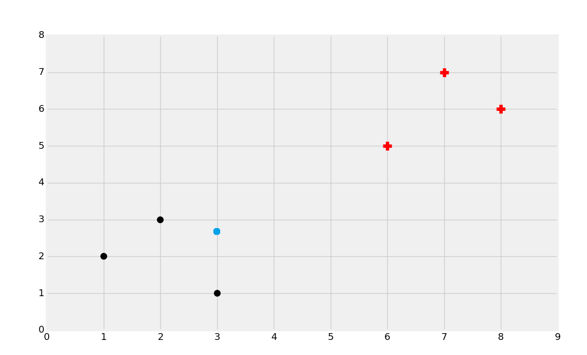

第二种情况中我们可能选取黑色。同样，尝试定义为啥这么选择。最后，如果是这样：

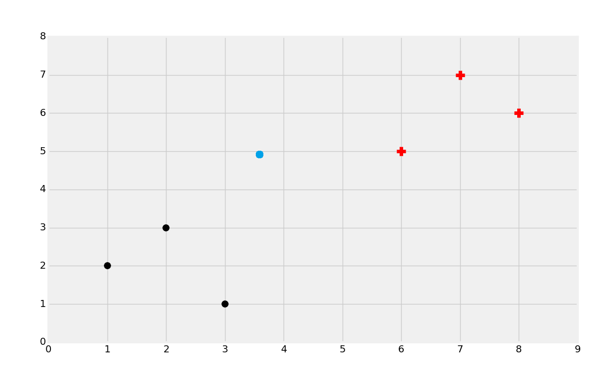

这种情况比较复杂，尝试选取一种分类。

大多数人都会选择黑色。无论哪种，考虑为什么你会做出这种选择。多数人会根据近似性对数据集分组。直觉上它是最有意义的。如果你拿尺子画出它到最近的黑色点的直线，之后画出它到最近的红色点的直线，你就会发现黑色点更近一些。与之相似，当数据点距离一个分组比另一个更近时，你就会基于近似性做出判断。因此 KNN 机器学习算法就诞生了。

KNN 是个简单高效的机器学习分类算法。如果这非常简单，就像我们看到的那样，我们为什么需要一个算法，而不是直接拿眼睛看呢？就像回归那样，机器可以计算得更快，处理更大的数据集，扩展，以及更重要的是，处理更多维度，例如 100 维。

它的工作方式就是它的名字。K 就是你选取的数量，近邻就是已知数据中的相邻数据点。我们寻找任意数量的“最近”的相邻点。假设`K=3`，所以我们就寻找三个最近的相邻点。例如：


上面的图中，我圈出了三个最近的相邻点。这里，所有三个点都是红色分类。KNN 会基于相邻点进行计数。所有三个近邻都是红色，所以它 100% 是红色分类。如果两个近邻都是红色，一个是黑色，我们也将其分类为红色，只是置信度就少了。要注意，由于计数的本质，你会更希望使用奇数 K，否则会产生 50:50 的情况。有一种方式在距离上应用权重，来惩罚那些更远的点，所以你就可以使用偶数的 K 值了。

下一个教程中，我们会涉及到 Scikit 的 KNN 算法，来处理乳腺肿瘤数据，之后我们会尝试自己来编写这个算法。


## 十四、对数据使用 KNN

欢迎阅读第十四个部分。上一个部分我们介绍了分类，它是一种机器学习的监督算法，并且解释了 KNN 算法的直觉。这个教程中，我们打算使用 Sklearn，讲解一个简单的算法示例，之后在后面的教程中，我们会构建我们自己的算法来更多了解背后的工作原理。

为了使用例子说明分类，我们打算使用[乳腺肿瘤数据集](https://archive.ics.uci.edu/ml/datasets/Breast+Cancer+Wisconsin+%28Original%29)，它是 UCI 所贡献的数据集，从威斯康星大学收集。UCI 拥有庞大的[机器学习仓库](https://archive.ics.uci.edu/ml/datasets.html)。这里的数据集组织为经常使用的机器学习算法类型、数据类型、属性类型、主题范围以及其它。它们对教学和机器学习算法开发都很实用。我自己经常浏览那里，非常值得收藏。在乳腺肿瘤数据集的页面，选择[`Data Folder`链接](https://archive.ics.uci.edu/ml/machine-learning-databases/breast-cancer-wisconsin/)。之后，下载`breast-cancer-wisconsin.data`和`breast-cancer-wisconsin.names`。这些可能不能下载，而是会在浏览器中展示。如果是这样右键点击“另存为”。

下载之后，打开`breast-cancer-wisconsin.names`文件。查看文件，向下滚动 100 行，我们就能获取属性（列）的名称、使用这些信息，我们打算手动将这些标签添加到` breast-cancer-wisconsin.data`文件中。打开它，并输入新的第一行：

```
id,clump_thickness,uniform_cell_size,
uniform_cell_shape,marginal_adhesion,
single_epi_cell_size,bare_nuclei,bland_chromation,
normal_nucleoli,mitoses,class
```

之后，你应该会思考，我们的特征和标签应该是什么。我们尝试对数据进行分类，所以很显然分类就是这些属性会导致良性还是恶性。同样，大多数这些属性看起来都是可用的，但是是否有任何属性与其它属性类似，或者是无用的？ID 属性并不是我们打算扔给分类器的东西。

缺失或者损坏的数据：这个数据集拥有一些缺失数据，我们需要清理。让我们以导入来开始，拉取数据，之后做一些清理：

```py
import numpy as np
from sklearn import preprocessing, cross_validation, neighbors
import pandas as pd

df = pd.read_csv('breast-cancer-wisconsin.data.txt')
df.replace('?',-99999, inplace=True)
df.drop(['id'], 1, inplace=True)
```

在读取数据之后，我们注意到，有一些列存在缺失数据。这些缺失数据以`?`填充。`.names`文件告诉了我们，但是我们最终可以通过错误来发现，如果我们尝试将这些信息扔给分类为。这个时候，我们选择将缺失数据填充为 -99999 值。你可以选择你自己的方法来处理缺失数据，但是在真实世界中，你可能发现 50% 或者更多记录，一个或多个列都含有缺失数据。尤其是，如果你使用可扩展的属性来收集数据。-99999 并不完美，但是它足够有效了。下面，我们丢弃了 ID 列。完成之后，我们会注释掉 ID 列的丢弃，只是看看包含他可能有哪些影响。

下面，我们定义我们的特征和标签。

特征`X`是除了分类的任何东西。调用`df.drop`会返回一个新的 DataFrame，不带丢弃的列。标签`y`仅仅是分类列。

现在我们创建训练和测试样本，使用 Sklearn 的`cross_validation.train_test_split`。

```py
X_train, X_test, y_train, y_test = cross_validation.train_test_split(X, y, test_size=0.2)
```

定义分类器：


```py
clf = neighbors.KNeighborsClassifier()
```

这里，我们使用 KNN 分类器。

训练分类器：

```py
clf.fit(X_train, y_train)
```

测试：

```py
accuracy = clf.score(X_test, y_test)
print(accuracy)
```

结果应该是 95%，并且开箱即用，无需任何调整。非常棒。让我们展示一下，当我们注释掉 ID 列，包含一些无意义和误导性的数据之后，会发生什么。

```py
import numpy as np
from sklearn import preprocessing, cross_validation, neighbors
import pandas as pd

df = pd.read_csv('breast-cancer-wisconsin.data.txt')
df.replace('?',-99999, inplace=True)
#df.drop(['id'], 1, inplace=True)

X = np.array(df.drop(['class'], 1))
y = np.array(df['class'])

X_train, X_test, y_train, y_test = cross_validation.train_test_split(X, y, test_size=0.2)

clf = neighbors.KNeighborsClassifier()
clf.fit(X_train, y_train)
accuracy = clf.score(X_test, y_test)
print(accuracy)
```

影响很令人吃惊，准确率从 95% 降到了 60%。在未来，如果 AI 通知了这个星球，要注意你只需要给它一些无意义的属性来智取它。非常有意思，添加噪声是一种损害你的算法的方式。当你和你的机器人霸主较量时，分辨有意义和恶意的噪声会节省你的时间。


下面你可以大致猜测，我们如何做预测，如果你遵循了 Sklearn 的教程。首先，我们需要一些沿革本数据。我们可以自己编。例如，我们会查看样本文件的某一行。你可以添加噪声来执行进一步的分析，假设标准差不是那么离谱。这么做也比较安全，由于你并不在篡改的数据上训练，你仅仅做了测试。我会通过编造一行来手动实现它。

```py
example_measures = np.array([4,2,1,1,1,2,3,2,1])
```

你可以尽管在文档中搜索特征列表。它不存在。现在你可以：

```py
prediction = clf.predict(example_measures)
print(prediction)
```

或者取决于你的阅读时间，你可能不能这么做。在这么做的时候，我得到了一个警告：

```py
DeprecationWarning: Passing 1d arrays as data is deprecated in 0.17 and will raise ValueError in 0.19. Reshape your data either using X.reshape(-1, 1) if your data has a single feature or X.reshape(1, -1) if it contains a single sample.
```

好的，没有问题。我们只拥有一个特征吗？不是。我们只拥有一个记录吗？是的。所以我们使用`X.reshape(1, -1)`。

```py
example_measures = np.array([4,2,1,1,1,2,3,2,1])
example_measures = example_measures.reshape(1, -1)
prediction = clf.predict(example_measures)
print(prediction)
# 0.95
# [2]
```

这里的第一个输出是准确率（95%）和预测（2）。这就是我们的伪造数据的建模。

如果我们有两条呢？

```py
example_measures = np.array([[4,2,1,1,1,2,3,2,1],[4,2,1,1,1,2,3,2,1]])
example_measures = example_measures.reshape(2, -1)
prediction = clf.predict(example_measures)
print(prediction)
```

忽略这个硬编码。如果我们不知道有几何样例会怎么样？

```py
example_measures = np.array([[4,2,1,1,1,2,3,2,1],[4,2,1,1,1,2,3,2,1]])
example_measures = example_measures.reshape(len(example_measures), -1)
prediction = clf.predict(example_measures)
print(prediction)
```

你可以看到，KNN 算法的实现不仅仅很简单，而且这里也很准确。下一个教程中，我们打算从零构建我们自己的 KNN 算法，而不是使用 Sklearn，来尝试了解更多算法的东西，理解它的工作原理，最重要的是，了解它的陷阱。


## 十五、对数据使用 KNN

欢迎阅读第十五篇教程，其中我们当前涉及到使用 KNN 算法来分类。上一篇教程中，我们涉及到如何使用 Sklearn 的 KNN 算法来预测良性或者恶性肿瘤，基于肿瘤的属性，准确率有 95%。现在，我们打算深入 KNN 的工作原理，以便完全理解算法本身，来使其更好为我们工作。

我们会回到我们的乳腺肿瘤数据集，对其使用我们自定义 KNN 算法，并将其与 Sklearn 的比较，但是我们打算首先以一个非常简单的理论开始。KNN 基于近似性，不是分组，而是单独的点。所以，所有这种算法所做的，实际上是计算点之间的距离，并且之后选取距离最近的前 K 个点的最常出现的分类。有几种方式来计算平面上的距离，他们中许多都可以在这里使用，但是最常使用的版本是欧氏距离，以欧几里得命名。他是一个著名的数学家，被称为几何之父，他编写了《几何原本》，被称为数学家的圣经。欧氏距离为：


所以这是什么意思？基本上，它是每个点之间距离的平方和的平方根。在 Python 的术语中，是这样：

```py
plot1 = [1,3]
plot2 = [2,5]
euclidean_distance = sqrt( (plot1[0]-plot2[0])**2 + (plot1[1]-plot2[1])**2 )
```

这里距离是 2.236。

这就是 KNN 背后的基本数学原理了，现在我们仅仅需要构建一个系统来处理算法的剩余部分，例如寻找最近距离，它们的分组，然后是计数。


## 十六、从零创建 KNN 分类器：第一部分

欢迎阅读第十六个部分，我们现在涉及到 KNN 算法的分类。在上一个教程中，我们涉及到了欧氏距离，现在我们开始使用纯粹的 Python 代码来建立我们自己的简单样例。

最开始，让我们导入下列东西并为 Matplotlib 设置一个样式。

```py
import numpy as np
import matplotlib.pyplot as plt
from matplotlib import style
import warnings
from math import sqrt
from collections import Counter
style.use('fivethirtyeight')
```

我们打算使用警告来避免使用比分组数量更低的 K 值，至少是最开始（因为我会展示一个更加高效的方法），之后对集合计数来获取出现次数最多的分类。

下面，我们创建一些数据：

```py
dataset = {'k':[[1,2],[2,3],[3,1]], 'r':[[6,5],[7,7],[8,6]]}
new_features = [5,7]
```

这个数据集只是个 Python 字典，键是点的颜色（将这些看做分类），值是属于这个分类的数据点。如果你回忆我们的乳腺肿瘤数据集，分类都是数字，通常 Sklearn 只能处理数字。例如，向量翻译为任意数字`2`，而恶性翻译为任意数字`4`，而不是一个字符串。这是因为，Sklearn 只能使用数字，但是你并不一定要使用数字来代表分类。下面，我们创建简单的数据集`5, 7`，用于测试。我们可以这样来快速绘图：

```py
[[plt.scatter(ii[0],ii[1],s=100,color=i) for ii in dataset[i]] for i in dataset]
plt.scatter(new_features[0], new_features[1], s=100)

plt.show()
```

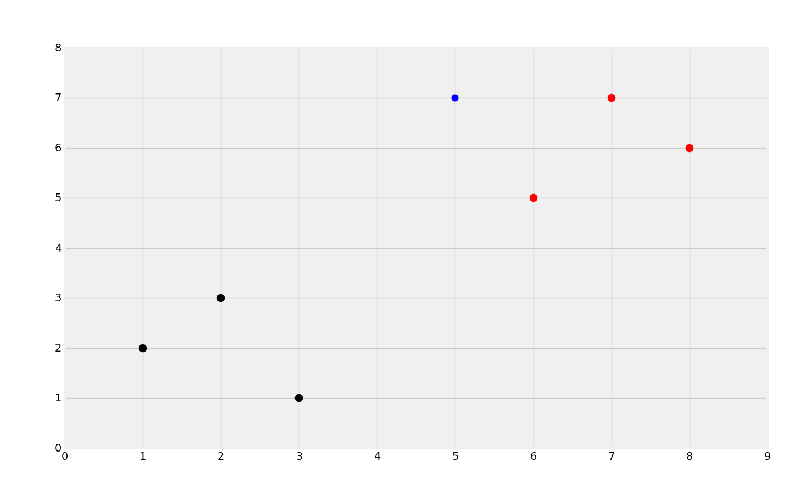

` [[plt.scatter(ii[0],ii[1],s=100,color=i) for ii in dataset[i]] for i in dataset]`这一行和下面这个相同：

```py
for i in dataset:
    for ii in dataset[i]:
        plt.scatter(ii[0],ii[1],s=100,color=i)
```

你可以看到红色和黑色的明显分组，并且我们还有蓝色的点，它是`new_features`，我们打算对其分类。

我们拥有了数据，现在我们打算创建一些函数，来分类数据。

```py
def k_nearest_neighbors(data, predict, k=3):

    return vote_result
```

这就是我们的框架，从这里开始。我们想要一个函数，它接受要训练的数据，预测的数据，和 K 值，它的默认值为 3。

下面，我们会开始填充函数，首先是一个简单的警告：


```py
def k_nearest_neighbors(data, predict, k=3):
    if len(data) >= k:
        warnings.warn('K is set to a value less than total voting groups!')

    return vote_result
```

如果选取的最近邻的数量小于或等于分类数量，那么就给出警告（因为这样会产生偏差）。

现在，如何寻找最近的三个点呢？是否有一些用于搜索的魔法呢？没有，如果有的话，也是很复杂而。为什么呢？KNN 的工作原理是，我们需要将问题中的数据与之前的数据比较，之后才能知道最近的点是什么。因此，如果你的数据越多，KNN 就越慢。我们这里告一段落，但是要考虑是否有方法来加速这个过程。


## 十七、从零创建 KNN 分类器：第二部分

欢迎阅读第十七个部分，我们正在讲解 KNN 算法的分类。上一个教程中，我们开始构建我们的 KNN 示例，这里我们将其完成。

我处理它的方式，就是首先创建一个 Python 列表，它包含另一个列表，里面包含数据集中每个点的距离和分类。一旦填充完毕，我们就可以根据距离来排序列表，截取列表的前 K 个值，找到出现次数最多的，就找到了答案。

```py
def k_nearest_neighbors(data, predict, k=3):
    if len(data) >= k:
        warnings.warn('K is set to a value less than total voting groups!')
        
    distances = []
    for group in data:
        for features in data[group]:
            euclidean_distance = sqrt( (features[0]-predict[0])**2 + (features[1]-predict[1])**2 )
            distances.append([euclidean_distance,group])
```

有一种方式来计算欧氏距离，最简洁的方式就是遵循定义。也就是说，使用 NumPy 会更快一点。由于 KNN 是一种机器学习的爆破方法，我们需要我们能得到的所有帮助。因此，我们可以将函数修改一点。一个选项是：

```py
euclidean_distance = np.sqrt(np.sum((np.array(features)-np.array(predict))**2))
print(euclidean_distance)
```

这还是很清楚，我们刚刚使用了 NumPy 版本。NumPy 使用 C 优化，是个非常高效的库，很多时候允许我们计算更快的算术。也就是说，NumPy 实际上拥有大量的线性代数函数。例如，这是范数：


```py
euclidean_distance = np.linalg.norm(np.array(features)-np.array(predict))
print(euclidean_distance)
```

欧式距离度量两个端点之间的线段长度。欧几里得范数度量向量的模。向量的模就是它的长度，这个是等价的。名称仅仅告诉你你所在的控件。

我打算使用后面那一个，但是我会遵循我的约定，使其易于拆解成代码。如果你不了解 NumPy 的内建功能，你需要去了解如何使用。

现在，`for`循环之外，我们得到了距离列表，它包含距离和分类的列表。我们打算对列表排序，之后截取前 K 个元素，选取下标 1，它就是分类。

```py
votes = [i[1] for i in sorted(distances)[:k]]
```

上面，我们遍历了排序后的距离列表的每个列表。排序方法会（首先）基于列表中每个列表的第一个元素。第一个元素是距离，所以执行`orted(distances)`之后我们就按照从小到大的距离排序了列表。之后我们截取了列表的`[:k]`，因为我们仅仅对前 K 个感兴趣。最后，在`for`循环的外层，我们选取了`i[1]`，其中`i`就是列表中的列表，它包含`[diatance, class]`（距离和分类的列表）。按照距离排序之后，我们无需再关心距离，只需要关心分类。

所以现在有三个候选分类了。我们需要寻找出现次数最多的分类。我们会使用 Python 标准库模块`collections.Counter`。

```py
vote_result = Counter(votes).most_common(1)[0][0]
```

`Collections`会寻找最常出现的元素。这里，我们想要一个最常出现的元素，但是你可以寻找前 3 个或者前`x`个。如果没有`[0][0]`这部分，你会得到`[('r', 3)]`（元素和计数的元组的列表）。所以`[0][0]`会给我们元组的第一个元素。你看到的 3 是`'r'`的计数。

最后，返回预测结果，就完成了。完整的代码是：

```py
def k_nearest_neighbors(data, predict, k=3):
    if len(data) >= k:
        warnings.warn('K is set to a value less than total voting groups!')
        
    distances = []
    for group in data:
        for features in data[group]:
            euclidean_distance = np.linalg.norm(np.array(features)-np.array(predict))
            distances.append([euclidean_distance,group])

    votes = [i[1] for i in sorted(distances)[:k]]
    vote_result = Counter(votes).most_common(1)[0][0]
    return vote_result
```

现在，如果我们打算基于我们之前所选的点，来做预测：

```py
result = k_nearest_neighbors(dataset, new_features)
print(result)
```

非常肯定，我得到了`r`，这就是预期的值。让我们绘制它吧。

```py
import numpy as np
import matplotlib.pyplot as plt
from matplotlib import style
import warnings
from math import sqrt
from collections import Counter
style.use('fivethirtyeight')

def k_nearest_neighbors(data, predict, k=3):
    if len(data) >= k:
        warnings.warn('K is set to a value less than total voting groups!')
        
    distances = []
    for group in data:
        for features in data[group]:
            euclidean_distance = np.linalg.norm(np.array(features)-np.array(predict))
            distances.append([euclidean_distance,group])

    votes = [i[1] for i in sorted(distances)[:k]]
    vote_result = Counter(votes).most_common(1)[0][0]
    return vote_result

dataset = {'k':[[1,2],[2,3],[3,1]], 'r':[[6,5],[7,7],[8,6]]}
new_features = [5,7]
[[plt.scatter(ii[0],ii[1],s=100,color=i) for ii in dataset[i]] for i in dataset]
# same as:
##for i in dataset:
##    for ii in dataset[i]:
##        plt.scatter(ii[0],ii[1],s=100,color=i)
        
plt.scatter(new_features[0], new_features[1], s=100)

result = k_nearest_neighbors(dataset, new_features)
plt.scatter(new_features[0], new_features[1], s=100, color = result)  
plt.show()
```

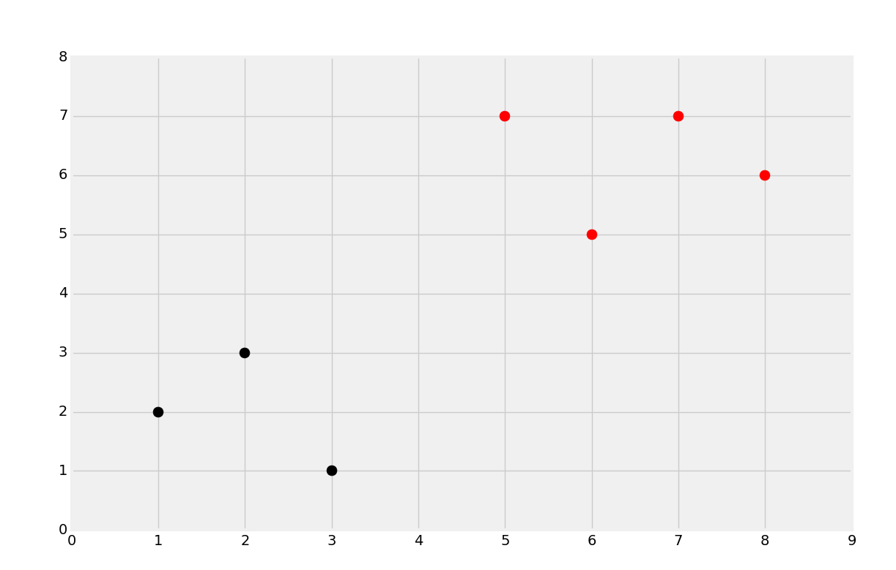

你可以看到，我们添加了新的点`5, 7`，它分类为红色的点，符合预期。

这只是小规模的处理，但是如果我们处理乳腺肿瘤数据集呢？我们如何和 Sklearn 的 KNN 算法比较？下一个教程中，我们会将算法用于这个数据集。


## 十八、测试 KNN 分类器

欢迎阅读第十八篇教程，我们刚刚编写了我们自己的 KNN 分类器算法，现在我们准备好了使用一些真实数据来测试它。开始，我们打算使用之前的乳腺肿瘤数据集。如果你没有它，返回教程 13 并抓取数据。

目前为止，我们的算法像这样处理数据：


其中蓝色的点是位置数据，运行算法，并正确分类数据：


现在，我们打算回顾乳腺肿瘤数据集，它记录肿瘤的属性变将它们按照良性还是恶性分类。Sklearn 的 KNN 分类器有 95% 的准确率，并且我们打算测试我们自己的算法。

我们会以下列代码开始：

```py
import numpy as np
import warnings
from collections import Counter
import pandas as pd
import random


def k_nearest_neighbors(data, predict, k=3):
    if len(data) >= k:
        warnings.warn('K is set to a value less than total voting groups!')
    distances = []
    for group in data:
        for features in data[group]:
            euclidean_distance = np.linalg.norm(np.array(features)-np.array(predict))
            distances.append([euclidean_distance,group])
    votes = [i[1] for i in sorted(distances)[:k]]
    vote_result = Counter(votes).most_common(1)[0][0]
    return vote_result
```

这应该看起来很熟悉。要注意我导入了 Pandas 和 random。我已经移除了 Matplotlib 的导入，因为我们不打算绘制任何东西。下面，我们打算加载数据：

```py
df = pd.read_csv('breast-cancer-wisconsin.data.txt')
df.replace('?',-99999, inplace=True)
df.drop(['id'], 1, inplace=True)
full_data = df.astype(float).values.tolist()
```

这里，我们加载了数据，替换掉了问号，丢弃了 ID 列，并且将数据转危为列表的列表。要注意我们显式将 DataFrame 转换为浮点类型。出于一些原因，至少对于我来说，一些数据点仍然是数字，但是字符串数据类型并不是很好。

下面，我们打算把数据打乱，之后将其分割：

```py
Next, we're going to shuffle the data, and then split it up:

random.shuffle(full_data)
test_size = 0.2
train_set = {2:[], 4:[]}
test_set = {2:[], 4:[]}
train_data = full_data[:-int(test_size*len(full_data))]
test_data = full_data[-int(test_size*len(full_data)):]
```

首先我们打乱了数据（它包含特征和标签）。之后我们为训练和测试集准备了一个字典用于填充。下面，我们指定了哪个是`train_data `，哪个是`test_data`。我们选取前 80% 作为`train_data `（逻辑是在后 20% 的地方分割），之后我们通过在后 20% 的地方分割，来创建`test_data`。

现在我们开始填充字典。如果不清楚的话，字典有两个键：2 和 4。2 是良性肿瘤（和实际数据集相同），4 是恶性肿瘤，也和数据集相同。我们将其硬编码，但是其他人可以选取分类，并像这样创建字典，它的键是分类中的唯一值。我们仅仅是使其简单。

```py
for i in train_data:
    train_set[i[-1]].append(i[:-1])

for i in test_data:
    test_set[i[-1]].append(i[:-1])
```

现在我们填充了字典，我们拥有了测试集，其中键是分类，值是属性。

最后就是训练和测试的时候了。使用 KNN，这些步骤基本就完成了，因为训练步骤就是把点村进内存，测试步骤就是比较距离：

```py
correct = 0
total = 0

for group in test_set:
    for data in test_set[group]:
        vote = k_nearest_neighbors(train_set, data, k=5)
        if group == vote:
            correct += 1
        total += 1
print('Accuracy:', correct/total)
```

现在我们首先迭代测试集的分组（分类，2 或者 4，也是字典的键），之后我们遍历每个数据点，将数据点扔给`k_nearest_neighbors`，以及我们的训练集`train_set`，之后是我们的 K，它是 5。我选择了 5，纯粹是因为它是 SKlearn 的`KNeighborsClassifier`的默认值。所以我们的完整代码是：

```py
import numpy as np
import matplotlib.pyplot as plt
from matplotlib import style
import warnings
from collections import Counter
#dont forget this
import pandas as pd
import random
style.use('fivethirtyeight')

def k_nearest_neighbors(data, predict, k=3):
    if len(data) >= k:
        warnings.warn('K is set to a value less than total voting groups!')
    distances = []
    for group in data:
        for features in data[group]:
            euclidean_distance = np.linalg.norm(np.array(features)-np.array(predict))
            distances.append([euclidean_distance,group])
    votes = [i[1] for i in sorted(distances)[:k]]
    vote_result = Counter(votes).most_common(1)[0][0]
    return vote_result

df = pd.read_csv('breast-cancer-wisconsin.data.txt')
df.replace('?',-99999, inplace=True)
df.drop(['id'], 1, inplace=True)
full_data = df.astype(float).values.tolist()

random.shuffle(full_data)

test_size = 0.2
train_set = {2:[], 4:[]}
test_set = {2:[], 4:[]}
train_data = full_data[:-int(test_size*len(full_data))]
test_data = full_data[-int(test_size*len(full_data)):]

for i in train_data:
    train_set[i[-1]].append(i[:-1])

for i in test_data:
    test_set[i[-1]].append(i[:-1])

correct = 0
total = 0

for group in test_set:
    for data in test_set[group]:
        vote = k_nearest_neighbors(train_set, data, k=5)
        if group == vote:
            correct += 1
        total += 1
print('Accuracy:', correct/total)
```


## 十九、KNN 的最终见解

既然我们了解了它的工作原理，这里我们打算涉及一些 KNN 算法的最终见解，包含 K 值，置信度，速度，以及算法的优点和缺点。

在执行 100 个样例的测试之后，Sklearn 的`neighbors.KNeighborsClassifier`分类器的准确率是 0.97，我们自己编写的分类器也一样。不要故步自封，因为这个算法非常简单和基础。KNN 分类器的真正价值并不在准确率上，而是它的速度。KNN 分类器的主要缺陷就是就是速度，你可以用它来执行操作。

对于速度，Sklearn 的 KNN 版本的每个周期是 0.044 秒，我们的是 0.55 秒。因此，虽然我们实现了相同的结果，我们比 Sklearn 慢很多。好的消息是，如果你对它们如何实现的感兴趣，你可以查看源代码、我们也提到了，我们也可以使用一个主流方式来提升速度。KNN 并不需要过多的训练。训练仅仅是将数据集加载到内存。你可以将数据集保留在内存中，但是 KNN 分类器的真正痛点就是对比每个数据集来寻找最近的那个。之后，如果你打算对 1000 个数据集分类，会发生什么呢？是的，一个选项是可以并发。串行执行它们没有任何好处。我们的方式是这样，仅仅使用一点点的处理器的能力。但是，我们可以一次性至少计算 100~200 个数据，即使是在便宜的处理器上。如果你打算了解如何并发，看一看这个[并发教程](https://pythonprogramming.net/threading-tutorial-python/)。使用 Sklearn，KNN 分类器自带一个并行处理参数`n_jobs`。你可以将其设置为任何数值，你可以以这个线程数来并发。如果你打算一次运行 100 个操作，`n_jobs=100`。如果你仅仅打算运行尽可能做的操作，设置`n_jobs=-1`。阅读[最近邻文档](https://scikit-learn.org/stable/modules/generated/sklearn.neighbors.NearestNeighbors.html#sklearn.neighbors.NearestNeighbors)，你可以了解更多选项。有几种方式将你的数据与指定半径之内的数据对比，如果你对加速 KNN，以及 Sklearn 的 KNN 版本感兴趣，你可能想要看一看。

最后，我要讲的最后一点就是预测的置信度。有两种方式来度量置信度。一种是比较你预测对了多少个点，另一个是，检查计数的百分比。例如，你的算法准确率可能是 97%，但是对于一些分类，计数可能是 3 比 2。其中 3 是主流，它的占有率是 60%，而不是理想情况下的 100%。但是告诉别人它是否有癌症的话，就像自动驾驶汽车分辨一团土和毛毯上的孩子，你可能更希望是 100%。可能 60% 的计数就是 3% 的不准确度量的一部分。

好的，所以我们刚刚编写了准确率为 97% 的分类器，但是没有把所有事情都做好。KNN 非常拥有，因为它对线性和非线性数据都表现出色。主要的缺陷是规模、离群点和不良数据（要记得 ID 列的无效引入）。

我们仍然专注于监督式机器学习，特别是分类，我们下面打算设计支持向量机。

最后的代码：

```py
import numpy as np
from math import sqrt
import warnings
from collections import Counter
import pandas as pd
import random

def k_nearest_neighbors(data, predict, k=3):
    if len(data) >= k:
        warnings.warn('K is set to a value less than total voting groups!')
    distances = []
    for group in data:
        for features in data[group]:
            euclidean_distance = np.linalg.norm(np.array(features)-np.array(predict))
            distances.append([euclidean_distance, group])

    votes = [i[1] for i in sorted(distances)[:k]]
    vote_result = Counter(votes).most_common(1)[0][0]
    confidence = Counter(votes).most_common(1)[0][1] / k
  
    return vote_result, confidence


df = pd.read_csv("breast-cancer-wisconsin.data.txt")
df.replace('?',-99999, inplace=True)
df.drop(['id'], 1, inplace=True)
full_data = df.astype(float).values.tolist()
random.shuffle(full_data)

test_size = 0.4
train_set = {2:[], 4:[]}
test_set = {2:[], 4:[]}
train_data = full_data[:-int(test_size*len(full_data))]
test_data = full_data[-int(test_size*len(full_data)):]

for i in train_data:
    train_set[i[-1]].append(i[:-1])
    
for i in test_data:
    test_set[i[-1]].append(i[:-1])

correct = 0
total = 0

for group in test_set:
    for data in test_set[group]:
        vote,confidence = k_nearest_neighbors(train_set, data, k=5)
        if group == vote:
            correct += 1
        total += 1
print('Accuracy:', correct/total)
```


## 二十、支持向量机简介

欢迎阅读第二十篇。我们现在打算深入另一个监督式机器学习和分类的形式：支持向量机。

支持向量机，由 Vladimir Vapnik 在上个世纪 60 年代发明，但是 90 年代之前都被忽视，并且是最热门的机器学习分类器之一。

支持向量的目标就是寻找数据之间的最佳分割边界。在二维空间中，你可以将其看做分隔你的数据集的最佳拟合直线。使用支持向量机，我们在向量空间中处理问题，因此分隔直线实际上是个单独的超平面。最佳的分隔超平面定义为，支持向量之间间距“最宽”的超平面。超平面也可以叫做决策边界。最简单的讲解方式就是图片：


我们会使用上面的数据开始。我们注意到，之前最普遍的直觉就是，你会将一个新的点基于它的近邻来分类，这就是 KNN 的工作原理。这个方式的主要问题是，对于每个数据点，你将其与每个其它数据点比较，来获取距离，因为算法不能很好扩展，尽管准确率上很可靠。支持向量机的目标就是，一次性生成“最佳拟合”直线（实际上是个平面，甚至是个超平面），他可以最优划分数据。一旦计算出了超平面，我们就将其作为决策边界。我们这样做，因为决策边界划分两个分类的数据。一旦我们计算了决策边界，我们就再也不需要计算了，除非我们重新训练数据集。因此，算法易于扩展，不像 KNN 分类器。

好奇之处在于，我们如何找出最佳分隔超平面？我们可以先使用眼睛来找。


这几乎是争取的，但是如何寻找呢？首先寻找支持向量。


一旦你找到了支持向量，你就可以创建直线，最大分隔彼此。这里，我们可以通过计算总宽度来轻易找到决策边界。


一分为二。


你就会得到边界。


现在如果一个点位于决策边界或者分割超平面的左侧，我们就认为它是黑色分类，否则就是红色分类。

值得注意的是，这个方式本质上只能处理线性分隔的数据，如果你的数据是：

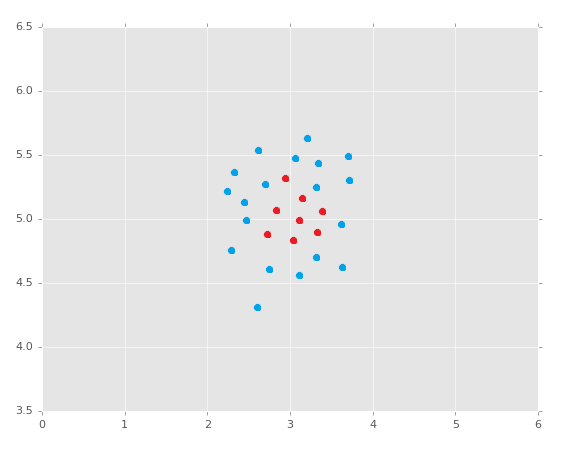

这里你能够创建分隔超平面嘛？不能。还有没有办法了？当我们深入支持向量机的时候，我会让你考虑这个问题。这里是使用 Sklearn 非常方便的原因。记得我们之前使用 Sklearn KNN 分类器的代码嘛？这里就是了。

```py
import numpy as np
from sklearn import preprocessing, cross_validation, neighbors
import pandas as pd

df = pd.read_csv('breast-cancer-wisconsin.data.txt')
df.replace('?',-99999, inplace=True)
df.drop(['id'], 1, inplace=True)

X = np.array(df.drop(['class'], 1))
y = np.array(df['class'])

X_train, X_test, y_train, y_test = cross_validation.train_test_split(X, y, test_size=0.2)

clf = neighbors.KNeighborsClassifier()


clf.fit(X_train, y_train)
confidence = clf.score(X_test, y_test)
print(confidence)

example_measures = np.array([[4,2,1,1,1,2,3,2,1]])
example_measures = example_measures.reshape(len(example_measures), -1)
prediction = clf.predict(example_measures)
print(prediction)
```

我们只需要改动两个地方，第一个就是从`sklearn`导入`svm`。第二个就是使用支持向量分类为，它是`svm.SVC`。改动之后是：

```py
import numpy as np
from sklearn import preprocessing, cross_validation, neighbors, svm
import pandas as pd

df = pd.read_csv('breast-cancer-wisconsin.data.txt')
df.replace('?',-99999, inplace=True)
df.drop(['id'], 1, inplace=True)

X = np.array(df.drop(['class'], 1))
y = np.array(df['class'])

X_train, X_test, y_train, y_test = cross_validation.train_test_split(X, y, test_size=0.2)

clf = svm.SVC()

clf.fit(X_train, y_train)
confidence = clf.score(X_test, y_test)
print(confidence)

example_measures = np.array([[4,2,1,1,1,2,3,2,1]])
example_measures = example_measures.reshape(len(example_measures), -1)
prediction = clf.predict(example_measures)
print(prediction)
# 0.978571428571
# [2]
```

取决于你爹随机样例，你应该得到 94% 到 99% ，平均值为 97%。同样，对操作计时，要记得我通过 Sklearn 执行 KNN 代码花费了 0.044 秒。使用`svm.SVC`，执行时间仅仅是 0.00951，在这个非常小的数据集上也有 4.6 倍。

所以我们可以认为，支持向量机似乎有同样的准确度，但是速度更快。要注意如果我们注释掉丢弃 ID 列的代码，准确率会降到 60%。支持向量机通常比 KNN 算法处理大量数据要好，并且处理离群点要好。但是，这个例子中，无意义数据仍然会误导它。我们之前使用默认参数，查看[支持向量机的文档](https://scikit-learn.org/stable/modules/generated/sklearn.svm.SVC.html)，确实有一些参数，我们不知道它们干什么用。在后面的教程中，我们打算深入支持向量机算法，以便我们能够实际理解所有这些参数的含义，以及它们有什么影响。虽然我们在这里告一段落，思考一下：如何处理非线性分隔，多个分类的数据和数据集（由于 SVM 是个二元分类器，也就是它生成直线来划分两个分组）。


## 二十一、向量基础

欢迎阅读第二十一篇教程，下面就是支持向量机的部分了。这个教程中，我们打算设计一些向量的基础，它们是支持向量机概念的组成部分。

首先，向量拥有模（大小）和方向：

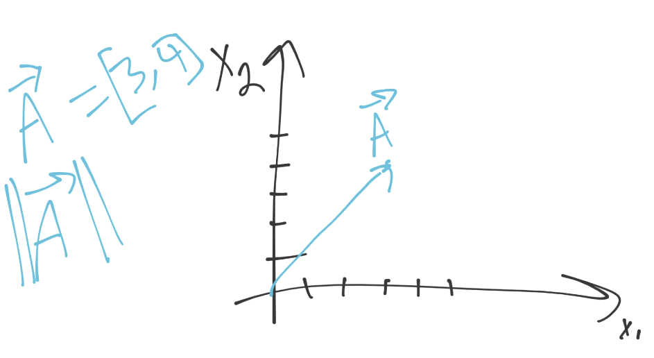

上面的例子中，向量 A（使用字母上面的箭头来表示），向`[3, 4]`移动。可以将每个坐标看做该维度上的方向。我们这里，有两个维度。我们在第一维里面移动 3 个单位，第二维里面移动 4 个。这就是方向了，那么模是什么呢？我们之前看到过它，它就是欧氏距离，范式，或者是大小。对我们来说，最重要的是，它们的计算方式相同（平方和的平方根）。

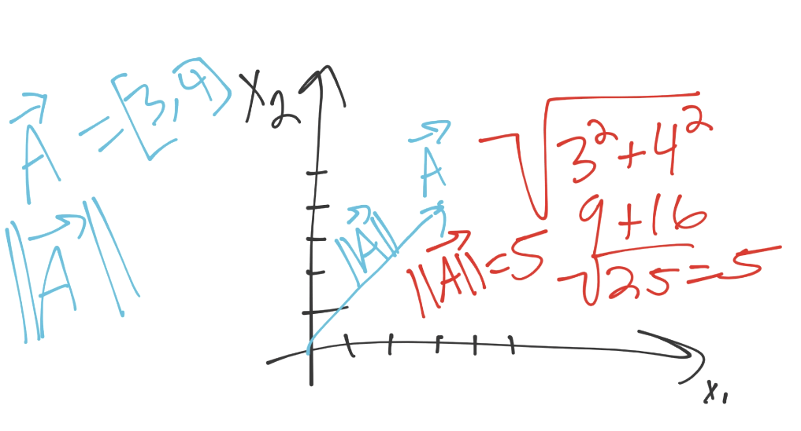

我们这里，向量的模是 5。如果你仔细观察图片，你可能会注意一些其它东西：


看起来像是直角三角形的勾股（帕斯卡）定理。的确是相同的公式，只要我们进入更高的维度，它就不是简单的三角形了。

很简单，下面是点积。如果我们对向量计算点积会发生什么呢？假设有两个向量，A 和 B。A 是`[1, 3]`，B 是`[4, 2]`。我们所做的是，将对应分量相乘再相加。例如：

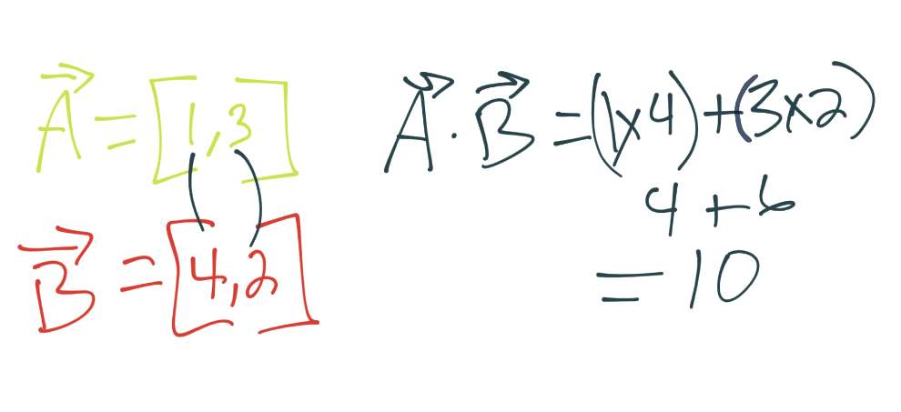

好的，既然我们知道了这些东西，我们就要讲解支持向量机本身了。我们作为科学家，首先会在机器上做一些断言。


## 二十二、支持向量断言

欢迎阅读机器学习教程的第二十二章。这个教程中，我们会涉及一些 SVM 的断言。理解这些断言，它们中一些是约束，是是理解 SVM 的数学与美的一部分。

首先，让我们看一看 SVM 的示例目标。它的理念是接受已知数据，之后 SVM 的拟合或者训练是个最优化问题，寻找数据的最佳分隔直线，也就是决策边界，像这样：


我们在二维空间中，所以分隔超平面（决策边界）也就是简单的直线（红色直线）。决策边界分隔了蓝色减号分组，和绿色加号分组。下面，如果我们在图中任意位置放一个点，我们就可以做一个简单的检查，来看看它位于分隔直线的哪一边，我们就会有答案了。是不是很简单？如果我们仅仅停留在二维空间，我们这里的维度是什么呢？每个特征都是一个维度，所有特征组成了我们的特征集。因此，我们可能拥有一条简单的直线，超级简单。我们可以使用线性代数来解决它。但如果我们拥有 63 个特征，也就是 63 维呢？

目前为止还不清楚，但是勾股定理多于二维是没问题的。好的，我们来看看向量空间吧。我们现在在向量空间中了，我们拥有了未知的特征集，记为`v`。之后，我们有了另一个向量（法向量），和决策边界正交，记为`w`。看起来是：


现在如何呢？我们可以用眼睛看出来，但是如何用数学表达呢？同样，要记得你需要一个方法，在 2 维和 5902 维都工作。你可以仅仅将向量`v`和`w`点乘，并加上一些偏移`b`（就是超平面的一般式方程），之后观察这个值大于还是小于 0。


好的，尽管我们这里不知道`w`和`b`都是什么。

然后就复杂了。

我们有了两个未知变量，并且有个坏消息：我们要求解它们。根据优化来说，这应该是个危险信号，也就是有无限个`w`和`b`满足我们的方程，但是我们也知道有一种约束，已经在我们的脑子里定义了逻辑：我们想要最佳的分隔超平面。我们可以大致猜测这是`w`和`b`优化的一部分。最开始我们打算设置一些真实的数学约束。

目前为止，我们仅仅看到了分隔超平面，但是分隔超平面在两个超平面之间。所谓的支持向量经过两个超平面，这些支持向量是特征集（图上的数据点），如果移动了它们，就会对最佳分隔超平面有影响。

由于这些支持向量会产生重大影响，我们打算为其设置一个常量值。前面说，分类函数是`sign(x·w + b)`，如果它是 0，那就说明在决策边界上。如果大于零，就是正向分类，如果小于零，就是负向分类。我们打算利用它，并且认为，如果`x·w + b`为 1，就是正向支持向量，如果为 -1，就是负向支持向量。如果一个未知值是 -0.52，仍然是负向分类，即使它没有超过支持向量的标记 -1。我们简单使用支持向量来帮助我们选取最佳分隔超平面，这就是它们的作用。我们的断言是：

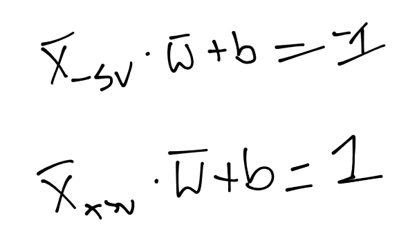

也就是说，第一行，我们让`X`负向支持向量（这是任何为负向支持向量的特征）点乘向量`w`再加`b`等于 -1。我们断言了这个。之后对正向支持向量：`X`正向支持向量点乘向量`w`再加`b`为正一。同样，我们刚开始，没有真正的证明，我们刚刚说这是一个案例。现在，我们打算引入新的值，`Yi`。


y 在 Python 代码中是我们的分类，这里也是。

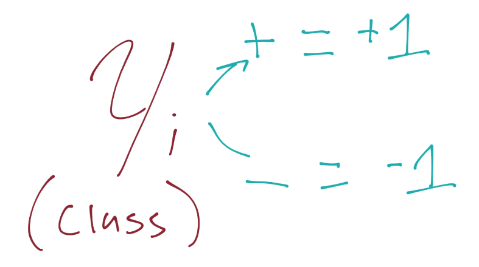

我们打算向之前的断言引入它，如果你记得正向和负向支持向量的值：`x·w+b=1`是正向，`x·w+b=-1`是负向。我们打算将我们的原始断言相乘：


根据这个新的`Yi`值，它同样是 -1 或者 1（取决于分类是 -1 还是 1）。当我们将原始断言相乘时，我们就需要将两边都乘`Yi`，也就是：


我们将`Yi`的符号留在左边，但是我们实际上将其应用到了右边（1 或者 -1）。这样意味着对于正向支持向量，我们得到了`1x1=1`，对于负向支持向量，我们得到了`(-1)x(-1)=1`，也等于 1。我们可以将每个方程的右边设为 0，通过两边都减一，我们就有了相同的方程`Yi(Xi·w+b)-1 = 0`。


现在我们拥有了约束，下个教程中我们会深入讲解。


## 二十三、支持向量机基础

欢迎阅读第二十三篇教程。这篇教程中，我们打算为支持向量机的优化来解方程。

我们需要计算的支持向量为：`Yi(Xi·w+b)-1 = 0`。


现在我们打算讨论一下，我们如何处理这个支持向量机的形式优化问题。特别是，我们如何获取向量`w`和`b`的最优解。我们也会涉及一些支持向量机的其它基础。

开始，之前说过超平面的定义为`w·x+b`。因此，我们断言了该方程中支持向量机的定义，正向类为 1，负向类为 -1。

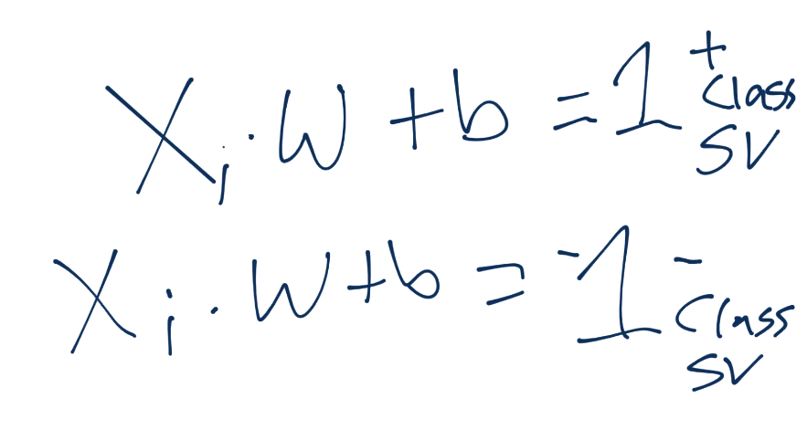

我们也推测，一旦我们找到了满足约束问题（`w`的模最小，`b`最大）的`w`和`b`，我们用于未知点的分类决策函数，只需要简单计算`x·w+b`。如果值为 0.99 呢？它在图中是什么样子？


所以它并不在正向支持向量平面上，但是很接近了。它超过了决策边界没有？是的，决策边界是`x·w+b=0`。因此，未知数据集的实际决策函数只是`sign(x·w+b)`。就是它了。如果它是正的，就是`+`分类，负的就是`-`分类。现在为了求得这个函数，我们需要`w`和`b`。我们的约束函数，`Yi(Xi·W+b) >= 1`，需要满足每个数据集。我们如何使其大于等于 1 呢？如果不乘 Yi，就仅仅需要我们的已知数据集，如果代入`x·w+b`大于 1 或者小于 -1，尽管我们之前提到过，0.98 的值也是正向分类。原因就是，新的或者未知的数据可以位于支持向量平面和决策边界之间，但是训练集或已知数据不可以。

于是，我们的目标就是最小化`|w|`，最大化`b`，并保持`Yi(X·W+b)>=1`的约束。


要注意，我们尝试满足向量`w`的约束，但是我们需要最小化`w`的模，而不是`w`，不要混淆。

有许多方式来计算这个带约束的最优化。第一个方式就是支持向量机的传统描述。开始，我们尝试将分隔超平面之间的宽度最大化。


下面，向量之间的距离可以记为：


要注意，这里我们得到了`X+`和`X-`，这是两个超平面，我们尝试最大化之间的距离。幸运的是，这里没有`b`，非常好。那么，`X+`和`X-`又是什么呢？我们知道吗？是的，我们知道。

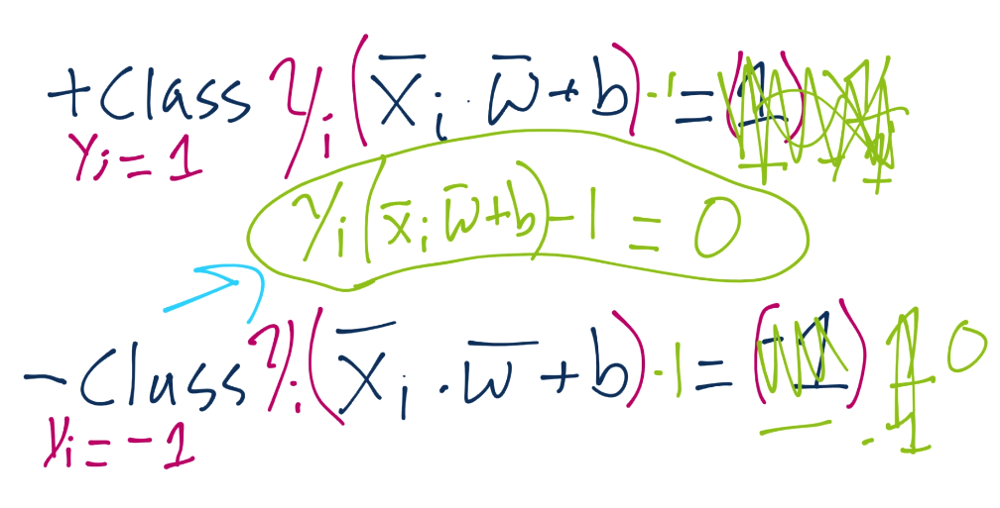

这里就有`b`了。总有一天我们会将其解出来。无论如何，我们做一些代数，将`X+`和`X-`替换为`1-b`和`1+b`。

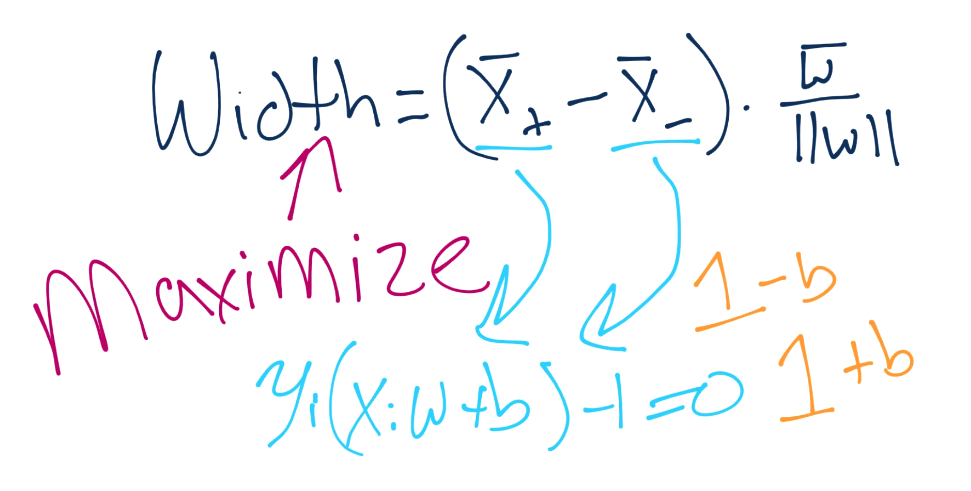

记得你的操作顺序吗？这非常方便，我们就将`b`移走了，现在我们的方程极大简化了。


为了更好地满足我们未来的要求，我们可以认为，如果我们打算最大化`2/|w|`，我们就可以最小化`|w|`，这个之前已经讲过了。由于我们打算最小化`|w|`，相当于最小化`1/2 * |w|^2`：


我们的约束是` Yi(Xi·W+b)-1 = 0`。因此，所有特征集的和应该也是 0。所以我们引入了拉格朗日乘数法：

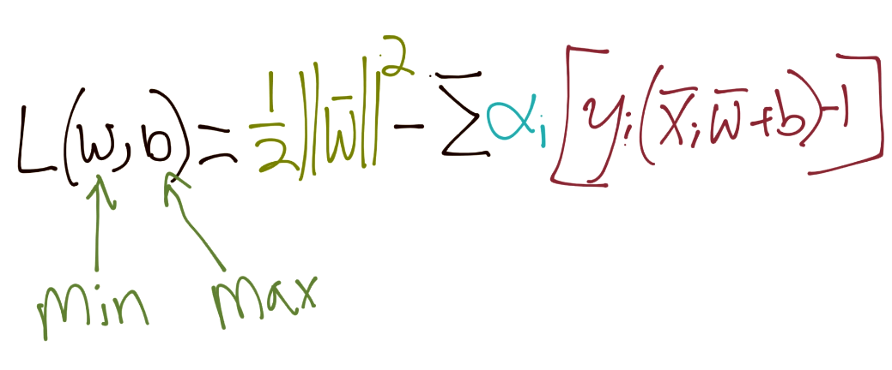

在这里求导：

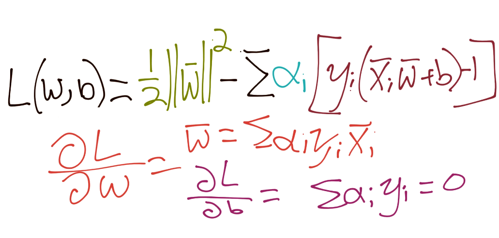

把所有东西放到一起：


于是，如果你没有对求出来的东西不满意，你就到这里了。我们得到了`alpha`的平方，也就是说，我们需要解决一个平方规划。

很快就变复杂了。

下一篇教程中，我们的兴趣是从零编写 SVM，我们看看是否可以将其简化。


## 二十四、约束优化

欢迎阅读第二十四篇教程。这个教程中，我们打算深入讨论 SVM 的约束优化。

上一个教程中，我们剩下了 SVM 的形式约束优化问题：


看起来很丑陋，并且由于`alpha`的平方，我们看到了一个平方规划问题，这不是很容易完成。约束优化不是一个很大的范围吗？有没有别的方式？你怎么问我会很高兴，因为是的，的确存在其他方式。SVM 的优化问题是个凸优化问题，其中凸优化的形状是`w`的模。


这个凸优化的目标是寻找`w`的最大模。一种解决凸优化问题的方式就是“下降”，直到你不能再往下走了。一旦你到达了底部，你就能通过其他路径慢慢回去，重复这个步骤，直到你到达了真正的底部。将凸优化问题看做一个碗，求解过程就是沿着碗的边缘扔进去一个球。球会很快滚下边缘，正好达到最中间的位置，之后可能会在另一侧上升，但是会再次下降，沿着另一个路径，可能会重复几次，每次都会移动得更慢，并且距离更短，最终，球会落在碗的底部。

我们会使用 Python 来模拟这个十分相同的问题。我们会专注于向量`w`，以一个很大的模来开始。之前提到过向量的模就是分量的平方和的平方根。也就是说，向量`w`为`[5,5]`或者`[-5,5]`的模都一样。但是和特征集的点积有很大不同，并且是完全不同的超平面。出于这个原因，我们需要检查每个向量的每个变种。

我们的基本思想就是像一个球那样，快速沿侧壁下降，重复知道我们不能再下降了。这个时候，我们需要重复我们的最后几个步骤。我们以更小的步骤来执行。之后可能将这个步骤重复几次，例如：


首先，我们最开始就像绿色的线，我们用大的步长下降。我们会绕过中心，之后用更小的步长，就像红色的线。之后我们会像蓝色的线。这个方式，我们的步长会越来越小（每一步我们都会计算新的向量`w`和`b`）。这样，我们就可以获取最优化的向量`w`，而不需要一开始就使用较大的步长来完成相同结果，并且在处理时浪费很多时间。

如果我们找到了碗或者凸形状的底部，我们就说我们找到了全局最小值。凸优化问题非常好的原因，就是我们可以使用这个迭代方式来找到底部。如果不是凸优化，我们的形状就是这样：


现在，当从左侧开始时，你可能检测到上升了，所以你返回并找到了局部最小值。

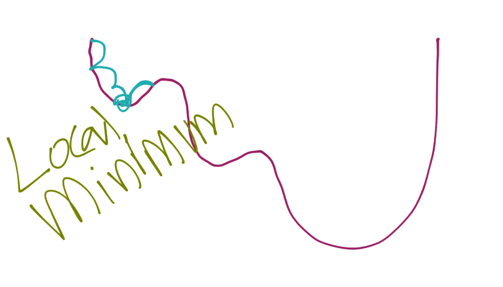

再说一遍，我们在处理一个很好的凸优化问题，所以我们不需要担心错误。我的计划就是给定一个向量，缓慢减小向量的模（也就是讲笑向量中数据的绝对值）。对于每个向量，假设是`[10, 10]`，我们会使用这些东西来变换向量：`[1,1],[-1,1],[-1,-1],[1,-1]`。这会向我们提供这个向量的所有变种，我们需要检查它们，尽管它们拥有相同的模。这就是下个教程中要做的事情。


## 二十五、使用 Python 从零开始编写 SVM

欢迎阅读第 25 篇教程，下面就是我们的 SVM 部分了。这个教程中，我们打算从零编写 SVM。

在深入之前，我们会专注于一些选项，用于解决约束优化问题。

首先，约束优化的话题很多，也有很多材料。即使是我们的子话题：凸优化，也是很庞大的。一个不错的起始点是 <https://web.stanford.edu/~boyd/cvxbook/bv_cvxbook.pdf>。对于约束优化，你可以查看 <http://www.mit.edu/~dimitrib/Constrained-Opt.pdf>。

特别是在 Python 中，[CVXOPT](http://cvxopt.org/) 包拥有多种凸优化方法，其中之一就是我们的平方规划问题（`cvxopt.solvers.qp`）。

同样，也有[ libsvm 的 Python 接口](https://github.com/cjlin1/libsvm/tree/master/python)，或者[ libsvm 包](https://www.csie.ntu.edu.tw/~cjlin/libsvm/)。我们选择不要用这些东西，因为 SVM 的最优化问题几乎就是 SVM 问题的全部了。

现在，为了使用 Python 来开始写 SVM，我们以这些导入来开始。

```py
import matplotlib.pyplot as plt
from matplotlib import style
import numpy as np
style.use('ggplot')
```

我们使用 Matplotlib 来绘图，NumPy 来处理数组。下面我们会拥有一些起始数据：

```py
data_dict = {-1:np.array([[1,7],
                          [2,8],
                          [3,8],]),
             
             1:np.array([[5,1],
                         [6,-1],
                         [7,3],])}
```

现在我们打算开始构建我们的 SVM 类。如果你不熟悉面向对象编程，不要害怕。我们这里的例子是个非常基本的 OOP 形式。只要知道 OOP 创建带有对象，类中带有属性、函数（实际上是方法），以及我们使用`self`变量来代表对象本身。解释再多也没有意义，已经足以开始了。如果你对代码感到疑惑，可以去在线社区提问。

```py
class Support_Vector_Machine:
    def __init__(self, visualization=True):
        self.visualization = visualization
        self.colors = {1:'r',-1:'b'}
        if self.visualization:
            self.fig = plt.figure()
            self.ax = self.fig.add_subplot(1,1,1)
```

类的`__init__`方法是使用类创建对象时，执行的方法。其它方法只在调用时执行。对于每个方法，我们传入`self`作为第一个参数，主要是一种约定。下面，我们添加可视化参数。我们想看看 SVM，所以将其设为`True`。下面米可以看见一些变量，例如`self.color`和`self.visualization`。这样做能够让我们在类的其它方法中，引用`self.color`，最后，如果我们开启了可视化，我们打算绘制我们的图像。

下面，让我们继续并体感家更多方法：`fit`和`predict`。

```py
class Support_Vector_Machine:
    def __init__(self, visualization=True):
        self.visualization = visualization
        self.colors = {1:'r',-1:'b'}
        if self.visualization:
            self.fig = plt.figure()
            self.ax = self.fig.add_subplot(1,1,1)
    # train
    def fit(self, data):
        pass

    def predict(self,features):
        # sign( x.w+b )
        classification = np.sign(np.dot(np.array(features),self.w)+self.b)

        return classification
```

`fit`方法会用于训练我们的 SVM。这就是最优化的步骤。一旦我们完成了训练，`predict`方法会预测新特征集的值，一旦我们知道了`w`和`b`，它就是`sign(x·w+b)`。

目前为止的代码。

```py
import matplotlib.pyplot as plt
from matplotlib import style
import numpy as np
style.use('ggplot')

class Support_Vector_Machine:
    def __init__(self, visualization=True):
        self.visualization = visualization
        self.colors = {1:'r',-1:'b'}
        if self.visualization:
            self.fig = plt.figure()
            self.ax = self.fig.add_subplot(1,1,1)
    # train
    def fit(self, data):
        pass

    def predict(self,features):
        # sign( x.w+b )
        classification = np.sign(np.dot(np.array(features),self.w)+self.b)

        return classification
        
data_dict = {-1:np.array([[1,7],
                          [2,8],
                          [3,8],]),
             
             1:np.array([[5,1],
                         [6,-1],
                         [7,3],])}
```

下个教程中，我们会继续并开始处理`fit`方法。


## 二十六、支持向量机优化

欢迎阅读第二十六篇教程，下面就是我们的支持向量机章节。这篇教程中，我们打算处理 SVM 的优化方法`fit`。

目前为止的代码为：

```py
import matplotlib.pyplot as plt
from matplotlib import style
import numpy as np
style.use('ggplot')

class Support_Vector_Machine:
    def __init__(self, visualization=True):
        self.visualization = visualization
        self.colors = {1:'r',-1:'b'}
        if self.visualization:
            self.fig = plt.figure()
            self.ax = self.fig.add_subplot(1,1,1)
    # train
    def fit(self, data):
        pass

    def predict(self,features):
        # sign( x.w+b )
        classification = np.sign(np.dot(np.array(features),self.w)+self.b)

        return classification
        
data_dict = {-1:np.array([[1,7],
                          [2,8],
                          [3,8],]),
             
             1:np.array([[5,1],
                         [6,-1],
                         [7,3],])}
```

我们开始填充`fit`方法：

```py
    def fit(self, data):
        self.data = data
        # { ||w||: [w,b] }
        opt_dict = {}

        transforms = [[1,1],
                      [-1,1],
                      [-1,-1],
                      [1,-1]]
```

要注意这个方法首先传递`self`（记住这是方法的约定），之后传递`data`。`data`就是我们我们打算训练或者优化的数据。我们这里，它是`data_dict`，我们已经创建好了。

我们将`self.data`设为该数据。现在，我们可以在类中的任何地方引用这个训练数据了（但是，我们需要首先使用数据来调用这个训练方法，来避免错误）。

下面，我们开始构建最优化字典`opt_dict`，它包含任何最优化的值。随着我们减小我们的`w`向量，我们会使用约束函数来测试向量，如果存在的话，寻找最大的满足方程的`b`，之后将所有数据储存在我们的最华友字典中。字典是`{ ||w|| : [w,b] }`。当我们完成所有优化时，我们会选择字典中键最小的`w`和`b`值。

最后，我们会设置我们的转换。我们已经解释了我们的意图，来确保我们检查了每个可能的向量版本。

下面，我们需要一些匹配数据的起始点。为此，我们打算首先引用我们的训练数据，来选取一些合适的起始值。


```py
        # finding values to work with for our ranges.
        all_data = []
        for yi in self.data:
            for featureset in self.data[yi]:
                for feature in featureset:
                    all_data.append(feature)

        self.max_feature_value = max(all_data)
        self.min_feature_value = min(all_data)
        # no need to keep this memory.
        all_data=None
```

我们所做的就是遍历所有数据，寻找最大值和最小值。现在我们打算定义我们的步长。

```py
        step_sizes = [self.max_feature_value * 0.1,
                      self.max_feature_value * 0.01,
                      # starts getting very high cost after this.
                      self.max_feature_value * 0.001]
```

这里我们设置了一些大小的步长，我们打算这样执行。对于我们的第一遍，我们会采取大跨步（10%）。一旦我们使用这些步长找到了最小值，我们就将步长降至 1% 来调优。我们会继续下降，取决于你想要多么精确。我会在这个项目的末尾讨论，如何在程序中判断是否应该继续优化。

下面，我们打算设置一些变量，来帮助我们给`b`生成步长（用于生成比`w`更大的步长，因为我们更在意`w`的精确度），并跟踪最后一个最优值。

```py
        # extremely expensive
        b_range_multiple = 5
        b_multiple = 5
        latest_optimum = self.max_feature_value*10
```

现在我们开始了：


```py
        for step in step_sizes:
            w = np.array([latest_optimum,latest_optimum])
            # we can do this because convex
            optimized = False
            while not optimized:
                pass
```

这里的思想就是沿着向量下降。开始，我们将`optimized`设为`False`，并为我们会在每个主要步骤重置它。`optimized`变量再我们检查所有步骤和凸形状（我们的碗）的底部之后，会设为`True`。

我们下个教程中会继续实现这个逻辑，那里我们会实际使用约束问题来检查值，检查我们是否找到了可以保存的值。

目前为止的代码：

```py
import matplotlib.pyplot as plt
from matplotlib import style
import numpy as np
style.use('ggplot')

class Support_Vector_Machine:
    def __init__(self, visualization=True):
        self.visualization = visualization
        self.colors = {1:'r',-1:'b'}
        if self.visualization:
            self.fig = plt.figure()
            self.ax = self.fig.add_subplot(1,1,1)
    # train
    def fit(self, data):
        self.data = data
        # { ||w||: [w,b] }
        opt_dict = {}

        transforms = [[1,1],
                      [-1,1],
                      [-1,-1],
                      [1,-1]]

        all_data = []
        for yi in self.data:
            for featureset in self.data[yi]:
                for feature in featureset:
                    all_data.append(feature)

        self.max_feature_value = max(all_data)
        self.min_feature_value = min(all_data)
        all_data = None

        step_sizes = [self.max_feature_value * 0.1,
                      self.max_feature_value * 0.01,
                      # point of expense:
                      self.max_feature_value * 0.001,]
        
        # extremely expensive
        b_range_multiple = 5
        # 
        b_multiple = 5
        latest_optimum = self.max_feature_value*10

        for step in step_sizes:
            w = np.array([latest_optimum,latest_optimum])
            # we can do this because convex
            optimized = False
            while not optimized:
                pass
            
    def predict(self,features):
        # sign( x.w+b )
        classification = np.sign(np.dot(np.array(features),self.w)+self.b)

        return classification
        


data_dict = {-1:np.array([[1,7],
                          [2,8],
                          [3,8],]),
             
             1:np.array([[5,1],
                         [6,-1],
                         [7,3],])}
```


## 二十七、支持向量机优化 第二部分

欢迎阅读第二十七篇教程，下面就是支持向量机的部分。这个教程中，我们打算继续使用 Python 代码处理 SVM 优化问题。

在我们停止的地方，我们的代码为：

```py
import matplotlib.pyplot as plt
from matplotlib import style
import numpy as np
style.use('ggplot')

class Support_Vector_Machine:
    def __init__(self, visualization=True):
        self.visualization = visualization
        self.colors = {1:'r',-1:'b'}
        if self.visualization:
            self.fig = plt.figure()
            self.ax = self.fig.add_subplot(1,1,1)
    # train
    def fit(self, data):
        self.data = data
        # { ||w||: [w,b] }
        opt_dict = {}

        transforms = [[1,1],
                      [-1,1],
                      [-1,-1],
                      [1,-1]]

        all_data = []
        for yi in self.data:
            for featureset in self.data[yi]:
                for feature in featureset:
                    all_data.append(feature)

        self.max_feature_value = max(all_data)
        self.min_feature_value = min(all_data)
        all_data = None

        step_sizes = [self.max_feature_value * 0.1,
                      self.max_feature_value * 0.01,
                      # point of expense:
                      self.max_feature_value * 0.001,]
        
        # extremely expensive
        b_range_multiple = 5
        # 
        b_multiple = 5
        latest_optimum = self.max_feature_value*10

        for step in step_sizes:
            w = np.array([latest_optimum,latest_optimum])
            # we can do this because convex
            optimized = False
            while not optimized:
                pass
            
    def predict(self,features):
        # sign( x.w+b )
        classification = np.sign(np.dot(np.array(features),self.w)+self.b)

        return classification
        


data_dict = {-1:np.array([[1,7],
                          [2,8],
                          [3,8],]),
             
             1:np.array([[5,1],
                         [6,-1],
                         [7,3],])}
```

选取`while not optimized `部分：

```py
            optimized = False
            while not optimized:
                for b in np.arange(-1*(self.max_feature_value*b_range_multiple),
                                   self.max_feature_value*b_range_multiple,
                                   step*b_multiple):
```

这里我们开始迭代所有可能的`b`值，并且现在可以看到，之前设置的`b`值。这里要注意，我们使用一个固定的步长，直接迭代`b`。我们也可以拆分`b`的步长，就像我们对`w`所做的那样。为了使事情更加准确，你可能打算这样实现。也就是说，出于简洁，我打算跳过这个部分，因为我们要完成近似的结果。而不是尝试获得什么奖项。

继续：

```py
            optimized = False
            while not optimized:
                for b in np.arange(-1*(self.max_feature_value*b_range_multiple),
                                   self.max_feature_value*b_range_multiple,
                                   step*b_multiple):
                    for transformation in transforms:
                        w_t = w*transformation
                        found_option = True
                        # weakest link in the SVM fundamentally
                        # SMO attempts to fix this a bit
                        # yi(xi.w+b) >= 1
                        # 
                        # #### add a break here later..
                        for i in self.data:
                            for xi in self.data[i]:
                                yi=i
                                if not yi*(np.dot(w_t,xi)+b) >= 1:
                                    found_option = False
                                    
                        if found_option:
                            opt_dict[np.linalg.norm(w_t)] = [w_t,b]
```

现在我们迭代了每个变形，对我们的约束条件测试了每个东西。如果我们数据集中的任何特征集不满足我们的约束，我们就会去掉这个变量，因为它不匹配，并继续。我建议在这里停顿一下。如果仅仅是一个变量不工作，你可能要放弃其余部分，因为一个变量不匹配，就足以扔掉`w`和`b`了。你应该在这里停顿，并且处理循环。现在，我们会将代码保持原样，但是我在录制视频的时候，会有所修改。

现在我们完成`fit`方法，我会贴出完整代码并解释差异：

```py
    def fit(self, data):
        self.data = data
        # { ||w||: [w,b] }
        opt_dict = {}

        transforms = [[1,1],
                      [-1,1],
                      [-1,-1],
                      [1,-1]]

        all_data = []
        for yi in self.data:
            for featureset in self.data[yi]:
                for feature in featureset:
                    all_data.append(feature)

        self.max_feature_value = max(all_data)
        self.min_feature_value = min(all_data)
        all_data = None

        # support vectors yi(xi.w+b) = 1
        

        step_sizes = [self.max_feature_value * 0.1,
                      self.max_feature_value * 0.01,
                      # point of expense:
                      self.max_feature_value * 0.001,]

        
        
        # extremely expensive
        b_range_multiple = 5
        # we dont need to take as small of steps
        # with b as we do w
        b_multiple = 5
        latest_optimum = self.max_feature_value*10

        for step in step_sizes:
            w = np.array([latest_optimum,latest_optimum])
            # we can do this because convex
            optimized = False
            while not optimized:
                for b in np.arange(-1*(self.max_feature_value*b_range_multiple),
                                   self.max_feature_value*b_range_multiple,
                                   step*b_multiple):
                    for transformation in transforms:
                        w_t = w*transformation
                        found_option = True
                        # weakest link in the SVM fundamentally
                        # SMO attempts to fix this a bit
                        # yi(xi.w+b) >= 1
                        # 
                        # #### add a break here later..
                        for i in self.data:
                            for xi in self.data[i]:
                                yi=i
                                if not yi*(np.dot(w_t,xi)+b) >= 1:
                                    found_option = False
                                    
                        if found_option:
                            opt_dict[np.linalg.norm(w_t)] = [w_t,b]

                if w[0] < 0:
                    optimized = True
                    print('Optimized a step.')
                else:
                    w = w - step

            norms = sorted([n for n in opt_dict])
            #||w|| : [w,b]
            opt_choice = opt_dict[norms[0]]
            self.w = opt_choice[0]
            self.b = opt_choice[1]
            latest_optimum = opt_choice[0][0]+step*2
```

一旦我们越过了`w`向量的零点，就没有理由继续了，因为我们通过变换测试了负值。所以我们已经完成了这个步长，要么继续下一个步长，要么就完全完成了。如果没有经过 0，那就向下走一步。一旦我们走完了能走的所有步骤，我们就对`opt_dict `字典的键数组记性排序（它包含`||w|| : [w,b]`）。我们想要向量`w`的最小模，所以我们选取列表的第一个元素。我们给这里的`self.w`和`self.b`赋值，并设置最后的优化值。之后，我们选取另一个步长，或者完全完成了整个过程（如果没有更多的步长可选取了）。

这里，完整代码是：

```py
import matplotlib.pyplot as plt
from matplotlib import style
import numpy as np
style.use('ggplot')

class Support_Vector_Machine:
    def __init__(self, visualization=True):
        self.visualization = visualization
        self.colors = {1:'r',-1:'b'}
        if self.visualization:
            self.fig = plt.figure()
            self.ax = self.fig.add_subplot(1,1,1)
    # train
    def fit(self, data):
        self.data = data
        # { ||w||: [w,b] }
        opt_dict = {}

        transforms = [[1,1],
                      [-1,1],
                      [-1,-1],
                      [1,-1]]

        all_data = []
        for yi in self.data:
            for featureset in self.data[yi]:
                for feature in featureset:
                    all_data.append(feature)

        self.max_feature_value = max(all_data)
        self.min_feature_value = min(all_data)
        all_data = None

        # support vectors yi(xi.w+b) = 1
        

        step_sizes = [self.max_feature_value * 0.1,
                      self.max_feature_value * 0.01,
                      # point of expense:
                      self.max_feature_value * 0.001,]

        
        
        # extremely expensive
        b_range_multiple = 5
        # we dont need to take as small of steps
        # with b as we do w
        b_multiple = 5
        latest_optimum = self.max_feature_value*10

        for step in step_sizes:
            w = np.array([latest_optimum,latest_optimum])
            # we can do this because convex
            optimized = False
            while not optimized:
                for b in np.arange(-1*(self.max_feature_value*b_range_multiple),
                                   self.max_feature_value*b_range_multiple,
                                   step*b_multiple):
                    for transformation in transforms:
                        w_t = w*transformation
                        found_option = True
                        # weakest link in the SVM fundamentally
                        # SMO attempts to fix this a bit
                        # yi(xi.w+b) >= 1
                        # 
                        # #### add a break here later..
                        for i in self.data:
                            for xi in self.data[i]:
                                yi=i
                                if not yi*(np.dot(w_t,xi)+b) >= 1:
                                    found_option = False
                                    
                        if found_option:
                            opt_dict[np.linalg.norm(w_t)] = [w_t,b]

                if w[0] < 0:
                    optimized = True
                    print('Optimized a step.')
                else:
                    w = w - step

            norms = sorted([n for n in opt_dict])
            #||w|| : [w,b]
            opt_choice = opt_dict[norms[0]]
            self.w = opt_choice[0]
            self.b = opt_choice[1]
            latest_optimum = opt_choice[0][0]+step*2
            

    def predict(self,features):
        # sign( x.w+b )
        classification = np.sign(np.dot(np.array(features),self.w)+self.b)
        return classification
        
        
data_dict = {-1:np.array([[1,7],
                          [2,8],
                          [3,8],]),
             
             1:np.array([[5,1],
                         [6,-1],
                         [7,3],])}
```

现在我们已经准备好可视化以及测试支持向量机的预测了。我们会在下一个教程中完成它们。


## 二十八、使用我们的 SVM 来可视化和预测

欢迎阅读第二十八篇教程。这个教程中，我们完成我们从零开始的基本 SVM，并使用它来可视化并作出预测。

我们目前为止的代码：

```py
import matplotlib.pyplot as plt
from matplotlib import style
import numpy as np
style.use('ggplot')

class Support_Vector_Machine:
    def __init__(self, visualization=True):
        self.visualization = visualization
        self.colors = {1:'r',-1:'b'}
        if self.visualization:
            self.fig = plt.figure()
            self.ax = self.fig.add_subplot(1,1,1)
    # train
    def fit(self, data):
        self.data = data
        # { ||w||: [w,b] }
        opt_dict = {}

        transforms = [[1,1],
                      [-1,1],
                      [-1,-1],
                      [1,-1]]

        all_data = []
        for yi in self.data:
            for featureset in self.data[yi]:
                for feature in featureset:
                    all_data.append(feature)

        self.max_feature_value = max(all_data)
        self.min_feature_value = min(all_data)
        all_data = None

        # support vectors yi(xi.w+b) = 1
        

        step_sizes = [self.max_feature_value * 0.1,
                      self.max_feature_value * 0.01,
                      # point of expense:
                      self.max_feature_value * 0.001,]

        
        
        # extremely expensive
        b_range_multiple = 5
        # we dont need to take as small of steps
        # with b as we do w
        b_multiple = 5
        latest_optimum = self.max_feature_value*10

        for step in step_sizes:
            w = np.array([latest_optimum,latest_optimum])
            # we can do this because convex
            optimized = False
            while not optimized:
                for b in np.arange(-1*(self.max_feature_value*b_range_multiple),
                                   self.max_feature_value*b_range_multiple,
                                   step*b_multiple):
                    for transformation in transforms:
                        w_t = w*transformation
                        found_option = True
                        # weakest link in the SVM fundamentally
                        # SMO attempts to fix this a bit
                        # yi(xi.w+b) >= 1
                        # 
                        # #### add a break here later..
                        for i in self.data:
                            for xi in self.data[i]:
                                yi=i
                                if not yi*(np.dot(w_t,xi)+b) >= 1:
                                    found_option = False
                                    
                        if found_option:
                            opt_dict[np.linalg.norm(w_t)] = [w_t,b]

                if w[0] < 0:
                    optimized = True
                    print('Optimized a step.')
                else:
                    w = w - step

            norms = sorted([n for n in opt_dict])
            #||w|| : [w,b]
            opt_choice = opt_dict[norms[0]]
            self.w = opt_choice[0]
            self.b = opt_choice[1]
            latest_optimum = opt_choice[0][0]+step*2
            

    def predict(self,features):
        # sign( x.w+b )
        classification = np.sign(np.dot(np.array(features),self.w)+self.b)
        return classification
        
        
data_dict = {-1:np.array([[1,7],
                          [2,8],
                          [3,8],]),
             
             1:np.array([[5,1],
                         [6,-1],
                         [7,3],])}
```

我们已经拥有预测方法了，因为这非常简单。但是现在我们打算添加一些，来处理预测的可视化。

```py
    def predict(self,features):
        # classifiction is just:
        # sign(xi.w+b)
        classification = np.sign(np.dot(np.array(features),self.w)+self.b)
        # if the classification isn't zero, and we have visualization on, we graph
        if classification != 0 and self.visualization:
            self.ax.scatter(features[0],features[1],s=200,marker='*', c=self.colors[classification])
        else:
            print('featureset',features,'is on the decision boundary')
        return classification
```

上面，我们添加了代码来可视化预测，如果存在的话。我们打算一次做一个，但是你可以扩展代码来一次做许多个，就像 Sklearn 那样。

下面，让我们构建`visualize`方法：

```py
    def visualize(self):
        #scattering known featuresets.
        [[self.ax.scatter(x[0],x[1],s=100,color=self.colors[i]) for x in data_dict[i]] for i in data_dict]
```

这一行所做的就是，遍历我们的数据，并绘制它和它的相应颜色。

下面，我们打算绘制正向和负向支持向量的超平面，以及决策边界。为此，我们至少需要两个点，来创建“直线”，它就是我们的超平面。

一旦我们知道了`w`和`b`，我们就可以使用代数来创建函数，它对`x`值返回`y`值来生成直线：

```py
        def hyperplane(x,w,b,v):
            # w[0] * x + w[1] * y + b = v
            # 正向支持超平面 v = 1
            # 最佳分隔超平面 v = 0
            # 负向支持超平面 v = -1
            # y = (v - b - w[0] * x) / w[1]
            return (-w[0]*x-b+v) / w[1]
```

然后，我们创建一些变量，来存放我们打算引用的多种数据：


```py
        datarange = (self.min_feature_value*0.9,self.max_feature_value*1.1)
        hyp_x_min = datarange[0]
        hyp_x_max = datarange[1]
```

我们的主要目标就是弄清楚为了绘制我们的超平面，我们需要什么值。

现在，让我们绘制正向支持向量超平面。

```py
       # w.x + b = 1
        # pos sv hyperplane
        psv1 = hyperplane(hyp_x_min, self.w, self.b, 1)
        psv2 = hyperplane(hyp_x_max, self.w, self.b, 1)
        self.ax.plot([hyp_x_min,hyp_x_max], [psv1,psv2], "k")
```

非常简单，我们获得了`x_min`和`x_max`的`y`值，然后我们绘制了它们。

···
        # w.x + b = -1
        # negative sv hyperplane
        nsv1 = hyperplane(hyp_x_min, self.w, self.b, -1)
        nsv2 = hyperplane(hyp_x_max, self.w, self.b, -1)
        self.ax.plot([hyp_x_min,hyp_x_max], [nsv1,nsv2], "k")

        # w.x + b = 0
        # decision
        db1 = hyperplane(hyp_x_min, self.w, self.b, 0)
        db2 = hyperplane(hyp_x_max, self.w, self.b, 0)
        self.ax.plot([hyp_x_min,hyp_x_max], [db1,db2], "g--")

        plt.show()
```

现在，在底部添加一些代码来训练、预测和可视化：

```py
import matplotlib.pyplot as plt
from matplotlib import style
import numpy as np
style.use('ggplot')

class Support_Vector_Machine:
    def __init__(self, visualization=True):
        self.visualization = visualization
        self.colors = {1:'r',-1:'b'}
        if self.visualization:
            self.fig = plt.figure()
            self.ax = self.fig.add_subplot(1,1,1)
    # train
    def fit(self, data):
        self.data = data
        # { ||w||: [w,b] }
        opt_dict = {}

        transforms = [[1,1],
                      [-1,1],
                      [-1,-1],
                      [1,-1]]

        all_data = []
        for yi in self.data:
            for featureset in self.data[yi]:
                for feature in featureset:
                    all_data.append(feature)

        self.max_feature_value = max(all_data)
        self.min_feature_value = min(all_data)
        all_data = None

        # support vectors yi(xi.w+b) = 1
        

        step_sizes = [self.max_feature_value * 0.1,
                      self.max_feature_value * 0.01,
                      # point of expense:
                      self.max_feature_value * 0.001,
                      ]

        
        
        # extremely expensive
        b_range_multiple = 2
        # we dont need to take as small of steps
        # with b as we do w
        b_multiple = 5
        latest_optimum = self.max_feature_value*10
        
        for step in step_sizes:
            w = np.array([latest_optimum,latest_optimum])
            # we can do this because convex
            optimized = False
            while not optimized:
                for b in np.arange(-1*(self.max_feature_value*b_range_multiple),
                                   self.max_feature_value*b_range_multiple,
                                   step*b_multiple):
                    for transformation in transforms:
                        w_t = w*transformation
                        found_option = True
                        # weakest link in the SVM fundamentally
                        # SMO attempts to fix this a bit
                        # yi(xi.w+b) >= 1
                        # 
                        # #### add a break here later..
                        for i in self.data:
                            for xi in self.data[i]:
                                yi=i
                                if not yi*(np.dot(w_t,xi)+b) >= 1:
                                    found_option = False
                                    #print(xi,':',yi*(np.dot(w_t,xi)+b))
                                    
                        if found_option:
                            opt_dict[np.linalg.norm(w_t)] = [w_t,b]

                if w[0] < 0:
                    optimized = True
                    print('Optimized a step.')
                else:
                    w = w - step

            norms = sorted([n for n in opt_dict])
            #||w|| : [w,b]
            opt_choice = opt_dict[norms[0]]
            self.w = opt_choice[0]
            self.b = opt_choice[1]
            latest_optimum = opt_choice[0][0]+step*2
            
        for i in self.data:
            for xi in self.data[i]:
                yi=i
                print(xi,':',yi*(np.dot(self.w,xi)+self.b))            

    def predict(self,features):
        # sign( x.w+b )
        classification = np.sign(np.dot(np.array(features),self.w)+self.b)
        if classification !=0 and self.visualization:
            self.ax.scatter(features[0], features[1], s=200, marker='*', c=self.colors[classification])
        return classification

    def visualize(self):
        [[self.ax.scatter(x[0],x[1],s=100,color=self.colors[i]) for x in data_dict[i]] for i in data_dict]

        # hyperplane = x.w+b
        # v = x.w+b
        # psv = 1
        # nsv = -1
        # dec = 0
        def hyperplane(x,w,b,v):
            return (-w[0]*x-b+v) / w[1]

        datarange = (self.min_feature_value*0.9,self.max_feature_value*1.1)
        hyp_x_min = datarange[0]
        hyp_x_max = datarange[1]

        # (w.x+b) = 1
        # positive support vector hyperplane
        psv1 = hyperplane(hyp_x_min, self.w, self.b, 1)
        psv2 = hyperplane(hyp_x_max, self.w, self.b, 1)
        self.ax.plot([hyp_x_min,hyp_x_max],[psv1,psv2], 'k')

        # (w.x+b) = -1
        # negative support vector hyperplane
        nsv1 = hyperplane(hyp_x_min, self.w, self.b, -1)
        nsv2 = hyperplane(hyp_x_max, self.w, self.b, -1)
        self.ax.plot([hyp_x_min,hyp_x_max],[nsv1,nsv2], 'k')

        # (w.x+b) = 0
        # positive support vector hyperplane
        db1 = hyperplane(hyp_x_min, self.w, self.b, 0)
        db2 = hyperplane(hyp_x_max, self.w, self.b, 0)
        self.ax.plot([hyp_x_min,hyp_x_max],[db1,db2], 'y--')

        plt.show()
        
data_dict = {-1:np.array([[1,7],
                          [2,8],
                          [3,8],]),
             
             1:np.array([[5,1],
                         [6,-1],
                         [7,3],])}

svm = Support_Vector_Machine()
svm.fit(data=data_dict)

predict_us = [[0,10],
              [1,3],
              [3,4],
              [3,5],
              [5,5],
              [5,6],
              [6,-5],
              [5,8]]

for p in predict_us:
    svm.predict(p)

svm.visualize()
```

我们的结果：


## 二十九、核的简介

欢迎阅读第二十九篇教程。这个教程中，我们打算使用机器学习谈论核的概念。

回忆一开始的 SVM 话题，我们的问题是，你可不可以使用 SVM 来处理这样的数据：


至少我们现在为止，它可能吗？不，完全不可能，至少不能是这样。但是一个选择，就是采取新的视角。我们可以通过添加一个新的维度来实现。例如上面的数据中，我们可以添加第三个维度，使用一些函数，比如`X3 = X1*X2`。在这里可能管用，但是也可以不管用。同样，一些案例，比如图像分析又如何呢？其中你可能有多于几百和维度。它就是性能很重要的场景，并且你是否应该添加一个维度到已经有很多维度的数据中，我们会进一步把事情变慢。

如果我告诉你，你可以在无限的维度上做计算，或者，你可以让那些计算在这些维度上实现，而不需要在这些维度上工作，并且仍然能得到结果呢？

就是这样。我们实际上使用叫做核的东西来实现。相对于 SVM 来说，许多人一开始就接触它了，也可能最后才接触。这可能会让你认为，核主要用于 SVM，但是并不是这样。

核就是相似度函数，它接受两个输出，并使用内积来返回相似度。由于这是个机器学习教程，你们中的一些可能想知道，为什么人们不将核用于机器学习算，以及，我在这里告诉你它们实际上使用了。你不仅仅可以使用核来创建自己的机器学习算法，你可以将现有的机器学习算法翻译为使用核的版本。

核所做的就是允许你，处理许多维度，而不需要花费处理的开销。核的确有个要求：它们依赖于内核。对于这篇教程的目的，“点积”和“内积”可以互相代替。

为了验证我们是否可以使用核，我们需要做的，就是验证我们的特征空间的每个交互，都是内积。我们会从末尾开始，然后返回来确认它。

首先，我们如何在训练之后判断特征的分类呢？


它是不是内积的交互呢？当然是，我们可以将`x`换成`z`。


继续，我们打算回顾我们的约束，约束方程为：


这里如何呢？这个交互式内积嘛？当然，` yi(xi.w+b)-1 >= 0`等价于`yi(xi.w+b) >= 1`。所以这里我们可以讲义将`x_i`替换为`z_i`。

最后，我们的形式优化方程`w`如何呢？


它是另一个点积或内积。有任何问题吗？这样：


太好了。我们可以使用核。你可能想知道，这个“零开销来计算无穷维度”是什么？好吧，首先我们需要确保我们能这样做。对于零开销的处理，你需要看下一篇教程来了解。


## 三十、为什么是核

欢迎阅读第三十篇教程。这篇教程中，我们打算继续讨论核，既然我们知道了我们能使用它之后，主要弄清楚如何实际使用它们。

我们之前了解到，我们可以利用核来帮助我们将数据转换为无穷数量的维度，以便找到线性分隔。我们也了解到，核可以让我们处理这些维度，而不需要实际为这些高维度花费开销。通常，核定义为这样：


核函数应用于`x`和`x'`，并等于`z`和`z'`的内积，其中`z`就是`z`维度的值（我们新的维度空间）。


`z`值就是一些`function(x)`的结果，这些`z`值点乘在一起就是我们核函数的结果。


我们仍然需要涉及，它如何节省我们的处理步骤。所以看一个例子吧。我们以多项式来开始，并将多项式核的要求，与简单使用我们的向量来创建二阶多项式来比较：


核对`x`和`x'`使用相同函数，所以我们对`z'`也使用相同的东西（`x'`对二阶多项式）。这里，最终步骤就是计算二者的点积。


所以所有工作就是手动执行一个和核函数类似的操作。幸运的是，我们的起始维度只有两维。现在让我们考虑多项式核：


要注意，这里没有提到`z`。整个核仅仅使用`x`来计算。你所需的所有东西，就是使用维度数量`n`和你想使用的权重`p`来计算。你的方程是这样：


如果你计算了出来，你的新向量是这样，它对应`z`空间的向量：


也就是说，你永远不需要继续深入了。你只需要专注于多项式和，它简单返回点积给你，你不需要实际计算向量，之后计算非常大的点积。

也有一些预先创建的核，但是我这里仅仅会展示径向基函数（RBF）核。只是因为它通常是默认使用的核，并且可以将我们带到无限的维度中。


这里的 Gamma 值是后面教程的话题。所以这里以拥有了核，了解了为什么使用它们，如何使用它们，以及它们如何让你处理更大的维度，而不需要花费非常大的处理开销。下一篇教程中，我们打算讨论另一个非线性数据的解决方案，以及数据的过拟合问题。


## 三十一、软边界 SVM

欢迎阅读第 31 个部分。这篇教程中，我们打算讨论软边界 SVM。

首先，为什么软边界分类器更加优秀，主要有两个原因。一是你的数据可能不是完全线性分隔的，但是很接近了，并且继续使用默认的线性核有更大意义。另一个原因是，即使你使用了某个核，如果你打算使用硬边界的话，你最后也会过拟合。例如，考虑这个：


这里是一个数据案例，当前并不是线性可分的。假设使用硬边界（也就是我们之前看到的那种），我们可能使用核来生成这样的决策边界：


下面，注意我的绘图工具中的缺陷，让我们绘制支持向量平面，并圈出支持向量：


这里，每个正向的数据样例都是支持向量，只有两个负向分类不是支持向量。这个信号就是可能过拟合了，我们应该避免它。因为，当我们用它来预测未来的点时，我们就没有余地了，并且可能会错误分类新的数据。如果我们这样做，会怎么样呢？


我们有一些错误或者误差，由箭头标记，但是这个可能能够更好地为将来的数据集分类。我们这里就拥有了“软边界”分类器，它允许一些误差上的“弹性”，我们可以在优化过程中获得它。


我们的新的优化就是上面的计算，其中弹性大于等于 0。弹性越接近 0，就越接近“硬边界”。弹性越高，边界就越软。如果弹性是 0，我们就得到了一个典型的硬边界分类器。但是你可能能够菜刀，我们希望最小化弹性。为此，我们将其添加到向量`w`的模的最小值中。


因此，我们实际上打算最小化`1/2||w||^2 + C * 所有使用的弹性之和`。使用它，我们引入了另一个变量`C`。`C`是个系数，关于我们打算让弹性对方程的剩余部分有多少影响。`C`阅读，弹性的和与向量`w`的模相比，就越不重要，反之亦然。多数情况下，`C`的值默认为 1。

所以这里你了解了软边界 SVM，以及为什么打算使用它。下面，我们打算展示一些样例代码，它们由软边界、核和 CVXOPT 组成。


## 三十二、核、软边界和使用 Python 和 CVXOPT 的平方规划

欢迎阅读第三十二篇机器学习教程。这篇教程中，我们打算展示核、软边界的 Python 版本，并使用 CVXOPT 来解决平方规划问题。

在这个简短的章节中，我打算主要向你分享其它资源，你应该想要使用 Python 和 CVXOPT 深入研究 SVM 或者平方规划。为了开始，你可以阅读[ CVXOPT 平方规划文档](https://cvxopt.org/userguide/coneprog.html#quadratic-programming)，来深入了解 Python 中的平方规划。你也可以查看[ CVXOPT 平方规划示例](https://cvxopt.org/examples/tutorial/qp.html)。

对于 CVXOPT 的更加深入的平方规划示例，请查看[这个 PDF](https://courses.csail.mit.edu/6.867/wiki/images/a/a7/Qp-cvxopt.pdf)。

最后，我们打算看一看来自[ Mathieu Blondel 的博客](http://www.mblondel.org/journal/2010/09/19/support-vector-machines-in-python/)的一些代码，它由核、软边界 SVM 以及 CVXOPT 平方规划组成。所有代码都优于我写的任何东西。

```py
# Mathieu Blondel, September 2010
# License: BSD 3 clause
# http://www.mblondel.org/journal/2010/09/19/support-vector-machines-in-python/

# visualizing what translating to another dimension does
# and bringing back to 2D:
# https://www.youtube.com/watch?v=3liCbRZPrZA

# Docs: http://cvxopt.org/userguide/coneprog.html#quadratic-programming
# Docs qp example: http://cvxopt.org/examples/tutorial/qp.html

# Nice tutorial:
# https://courses.csail.mit.edu/6.867/wiki/images/a/a7/Qp-cvxopt.pdf


import numpy as np
from numpy import linalg
import cvxopt
import cvxopt.solvers
             
def linear_kernel(x1, x2):
    return np.dot(x1, x2)

def polynomial_kernel(x, y, p=3):
    return (1 + np.dot(x, y)) ** p

def gaussian_kernel(x, y, sigma=5.0):
    return np.exp(-linalg.norm(x-y)**2 / (2 * (sigma ** 2)))

class SVM(object):

    def __init__(self, kernel=linear_kernel, C=None):
        self.kernel = kernel
        self.C = C
        if self.C is not None: self.C = float(self.C)

    def fit(self, X, y):
        n_samples, n_features = X.shape

        # Gram matrix
        K = np.zeros((n_samples, n_samples))
        for i in range(n_samples):
            for j in range(n_samples):
                K[i,j] = self.kernel(X[i], X[j])

        P = cvxopt.matrix(np.outer(y,y) * K)
        q = cvxopt.matrix(np.ones(n_samples) * -1)
        A = cvxopt.matrix(y, (1,n_samples))
        b = cvxopt.matrix(0.0)

        if self.C is None:
            G = cvxopt.matrix(np.diag(np.ones(n_samples) * -1))
            h = cvxopt.matrix(np.zeros(n_samples))
        else:
            tmp1 = np.diag(np.ones(n_samples) * -1)
            tmp2 = np.identity(n_samples)
            G = cvxopt.matrix(np.vstack((tmp1, tmp2)))
            tmp1 = np.zeros(n_samples)
            tmp2 = np.ones(n_samples) * self.C
            h = cvxopt.matrix(np.hstack((tmp1, tmp2)))

        # solve QP problem
        solution = cvxopt.solvers.qp(P, q, G, h, A, b)

        # Lagrange multipliers
        a = np.ravel(solution['x'])

        # Support vectors have non zero lagrange multipliers
        sv = a > 1e-5
        ind = np.arange(len(a))[sv]
        self.a = a[sv]
        self.sv = X[sv]
        self.sv_y = y[sv]
        print("%d support vectors out of %d points" % (len(self.a), n_samples))

        # Intercept
        self.b = 0
        for n in range(len(self.a)):
            self.b += self.sv_y[n]
            self.b -= np.sum(self.a * self.sv_y * K[ind[n],sv])
        self.b /= len(self.a)

        # Weight vector
        if self.kernel == linear_kernel:
            self.w = np.zeros(n_features)
            for n in range(len(self.a)):
                self.w += self.a[n] * self.sv_y[n] * self.sv[n]
        else:
            self.w = None

    def project(self, X):
        if self.w is not None:
            return np.dot(X, self.w) + self.b
        else:
            y_predict = np.zeros(len(X))
            for i in range(len(X)):
                s = 0
                for a, sv_y, sv in zip(self.a, self.sv_y, self.sv):
                    s += a * sv_y * self.kernel(X[i], sv)
                y_predict[i] = s
            return y_predict + self.b

    def predict(self, X):
        return np.sign(self.project(X))

if __name__ == "__main__":
    import pylab as pl

    def gen_lin_separable_data():
        # generate training data in the 2-d case
        mean1 = np.array([0, 2])
        mean2 = np.array([2, 0])
        cov = np.array([[0.8, 0.6], [0.6, 0.8]])
        X1 = np.random.multivariate_normal(mean1, cov, 100)
        y1 = np.ones(len(X1))
        X2 = np.random.multivariate_normal(mean2, cov, 100)
        y2 = np.ones(len(X2)) * -1
        return X1, y1, X2, y2

    def gen_non_lin_separable_data():
        mean1 = [-1, 2]
        mean2 = [1, -1]
        mean3 = [4, -4]
        mean4 = [-4, 4]
        cov = [[1.0,0.8], [0.8, 1.0]]
        X1 = np.random.multivariate_normal(mean1, cov, 50)
        X1 = np.vstack((X1, np.random.multivariate_normal(mean3, cov, 50)))
        y1 = np.ones(len(X1))
        X2 = np.random.multivariate_normal(mean2, cov, 50)
        X2 = np.vstack((X2, np.random.multivariate_normal(mean4, cov, 50)))
        y2 = np.ones(len(X2)) * -1
        return X1, y1, X2, y2

    def gen_lin_separable_overlap_data():
        # generate training data in the 2-d case
        mean1 = np.array([0, 2])
        mean2 = np.array([2, 0])
        cov = np.array([[1.5, 1.0], [1.0, 1.5]])
        X1 = np.random.multivariate_normal(mean1, cov, 100)
        y1 = np.ones(len(X1))
        X2 = np.random.multivariate_normal(mean2, cov, 100)
        y2 = np.ones(len(X2)) * -1
        return X1, y1, X2, y2

    def split_train(X1, y1, X2, y2):
        X1_train = X1[:90]
        y1_train = y1[:90]
        X2_train = X2[:90]
        y2_train = y2[:90]
        X_train = np.vstack((X1_train, X2_train))
        y_train = np.hstack((y1_train, y2_train))
        return X_train, y_train

    def split_test(X1, y1, X2, y2):
        X1_test = X1[90:]
        y1_test = y1[90:]
        X2_test = X2[90:]
        y2_test = y2[90:]
        X_test = np.vstack((X1_test, X2_test))
        y_test = np.hstack((y1_test, y2_test))
        return X_test, y_test

    def plot_margin(X1_train, X2_train, clf):
        def f(x, w, b, c=0):
            # given x, return y such that [x,y] in on the line
            # w.x + b = c
            return (-w[0] * x - b + c) / w[1]

        pl.plot(X1_train[:,0], X1_train[:,1], "ro")
        pl.plot(X2_train[:,0], X2_train[:,1], "bo")
        pl.scatter(clf.sv[:,0], clf.sv[:,1], s=100, c="g")

        # w.x + b = 0
        a0 = -4; a1 = f(a0, clf.w, clf.b)
        b0 = 4; b1 = f(b0, clf.w, clf.b)
        pl.plot([a0,b0], [a1,b1], "k")

        # w.x + b = 1
        a0 = -4; a1 = f(a0, clf.w, clf.b, 1)
        b0 = 4; b1 = f(b0, clf.w, clf.b, 1)
        pl.plot([a0,b0], [a1,b1], "k--")

        # w.x + b = -1
        a0 = -4; a1 = f(a0, clf.w, clf.b, -1)
        b0 = 4; b1 = f(b0, clf.w, clf.b, -1)
        pl.plot([a0,b0], [a1,b1], "k--")

        pl.axis("tight")
        pl.show()

    def plot_contour(X1_train, X2_train, clf):
        pl.plot(X1_train[:,0], X1_train[:,1], "ro")
        pl.plot(X2_train[:,0], X2_train[:,1], "bo")
        pl.scatter(clf.sv[:,0], clf.sv[:,1], s=100, c="g")

        X1, X2 = np.meshgrid(np.linspace(-6,6,50), np.linspace(-6,6,50))
        X = np.array([[x1, x2] for x1, x2 in zip(np.ravel(X1), np.ravel(X2))])
        Z = clf.project(X).reshape(X1.shape)
        pl.contour(X1, X2, Z, [0.0], colors='k', linewidths=1, origin='lower')
        pl.contour(X1, X2, Z + 1, [0.0], colors='grey', linewidths=1, origin='lower')
        pl.contour(X1, X2, Z - 1, [0.0], colors='grey', linewidths=1, origin='lower')

        pl.axis("tight")
        pl.show()

    def test_linear():
        X1, y1, X2, y2 = gen_lin_separable_data()
        X_train, y_train = split_train(X1, y1, X2, y2)
        X_test, y_test = split_test(X1, y1, X2, y2)

        clf = SVM()
        clf.fit(X_train, y_train)

        y_predict = clf.predict(X_test)
        correct = np.sum(y_predict == y_test)
        print("%d out of %d predictions correct" % (correct, len(y_predict)))

        plot_margin(X_train[y_train==1], X_train[y_train==-1], clf)

    def test_non_linear():
        X1, y1, X2, y2 = gen_non_lin_separable_data()
        X_train, y_train = split_train(X1, y1, X2, y2)
        X_test, y_test = split_test(X1, y1, X2, y2)

        clf = SVM(polynomial_kernel)
        clf.fit(X_train, y_train)

        y_predict = clf.predict(X_test)
        correct = np.sum(y_predict == y_test)
        print("%d out of %d predictions correct" % (correct, len(y_predict)))

        plot_contour(X_train[y_train==1], X_train[y_train==-1], clf)

    def test_soft():
        X1, y1, X2, y2 = gen_lin_separable_overlap_data()
        X_train, y_train = split_train(X1, y1, X2, y2)
        X_test, y_test = split_test(X1, y1, X2, y2)

        clf = SVM(C=1000.1)
        clf.fit(X_train, y_train)

        y_predict = clf.predict(X_test)
        correct = np.sum(y_predict == y_test)
        print("%d out of %d predictions correct" % (correct, len(y_predict)))

        plot_contour(X_train[y_train==1], X_train[y_train==-1], clf)

        
    #test_linear()
    #test_non_linear()
    test_soft()
```

如果你想要让我执行这个代码，你可以查看[这个视频](https://www.youtube.com/embed/XdcfJX-mDG4?list=PLQVvvaa0QuDfKTOs3Keq_kaG2P55YRn5v)。我会仅仅提及，你可能不需要使用 CVXOPT。多数人用于 SVM 的库是[ LibSVM](https://www.csie.ntu.edu.tw/~cjlin/libsvm/)。

大家都说，这个代码可以让你理解内部的工作原理，并不是为了让你实际创建一个健壮的 SVM，超过你可以自由使用的那个。

下一篇教程中，我们打算再讨论一个 SVM 的概念，它就是当你拥有多于两个分组时，你该怎么做。我们也会在总结中，浏览 Sklearn 的 SVM 的所有参数，因为我们很少涉及这个话题。

# 第三十三章 支持向量机的参数

> 原文：[Support Vector Machine Parameters](https://pythonprogramming.net/support-vector-machine-parameters-machine-learning-tutorial/)

> 译者：[飞龙](https://github.com/wizardforcel)

> 协议：[CC BY-NC-SA 4.0](http://creativecommons.org/licenses/by-nc-sa/4.0/)

欢迎阅读第三十三篇教程，这篇教程中，我们打算通过解释如何处理多于 2 个分类，以及卢兰 Sklearn 的 SVM 的参数，来对 SVM 做个收尾，并且让你见识一下用于 SVM 的现代方法论。

首先，你已经学到了，SVM 是个二元分类器。也就是说，任何时候，SVM 的最优化都只能将一个分组与另一个分组分离。之后问题是我们如何对三个或更多分组分类。通常，方法就是“一对其它”（OVR）。这里的理念就是，将每个分组从其余的分组分离。例如，为了分类三个分组（1，2 和 3），你应该首先将 1 从 2 和 3 分离。之后将 2 从 1 和 3。最后将 3 从 1 和 2 分离。这样有一些问题，因为类似置信度的东西，可能对于每个分类边界都不同，以及分隔边界可能有一些缺陷，因为有一些不仅仅是正向和负向的东西，你将一个分组与其它三个比较。假设最开始有一个均衡的数据集，也就是说每个分类的边界可能是不均衡的。


另一个方法是“一对一”（OVO）。这个情况下，考虑你总共拥有三个分组。它的工作方式是，你的边界从 1 分离 3，以及从 1 分离 2，并且对其余分类重复这个过程。这样，边界就会更均衡。


第一个参数是`C`。它告诉你这是一个软边界分类器。你可以按需调整`C`，并且可以使`C`足够高来创建硬边界分类器。`C`是`||w||`的软边界优化函数。


`C`的默认值是 1，并且多数情况下都很好。

下面我们有个`kernel`的选项。这里默认是`rbf`核，但是你可以调整为`linear`，`poly`（多项式）和`sigmoid`核，甚至你选择或设计的自定义核。

然后，还有`degree`值，默认为 3，这个是多项式的阶数，如果你将`poly`用于`kernel`参数的话。

`gamma`是你为`rbf`核设置 Gamma 值的地方。你应该将其保留为`auto`。

`coef0`允许你调整核函数的独立项，但是你应该保留不变，并且它只用于多项式和 sigmoid 核。

`probability `参数项可能对你很使用。回忆 KNN 算法不仅仅拥有模型准确度，每个预测还拥有置信度。SVM 本质上没有这个属性，但是你可以使用`probability `参数来获取一种形式。这是个开销大的功能，但是可能对你来说足够重要，或者默认值为`False`。

下面是`shrinking`布尔值，它默认为`True`。这个用于表示你是否将启发式用于 SVM 的优化，它使用了序列最小优化（SMO）。你应该将其保留为`True`，因为它可以极大提升你的性能，并且只损失一点点准确性。

`tol`参数设置了 SVM 的容差。前面说过`yi(xi.w+b)-1 >= 0`。对于 SVM 来说，所有值都必须大于等于 0，每一边至少一个值要等于 0，这就是你的支持向量。由于你不可能让值（浮点数）完全等于 0，你需要设置一个容差来获取一些弹性空间。Sklearn 中默认的 `tol`是`1e-3`，也就是 0.001。

下一个重要的参数是`max_iter`，它是你可以为平方规划设置最大迭代次数的地方。默认值为`-1`，也就是没有限制。

`decision_function_shape `是一对一（OVO），或者一对其它（OVR），那就是教程开始讨论的概念。


`random_state `用于概率估计中的种子，如果你打算指定的话。

除了这些参数，我们还有几个属性。

`support_ `提供了支持向量的索引。`support_vectors_ `提供了实际的支持向量。`n_support_`是支持向量的个数，如果你的数据集有一些统计问题，将它与你的数据集尺寸相比非常实用。最后三个参数是`dual_coef_`、` coef_`和`intercept_`，如果你打算绘制 SVM，会非常实用。

SVM 就讲完了。下一个话题是聚类。
