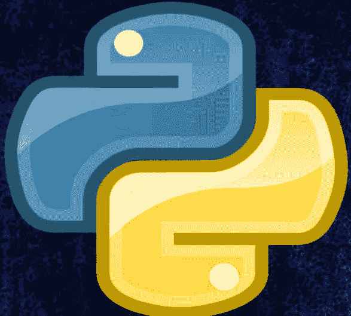
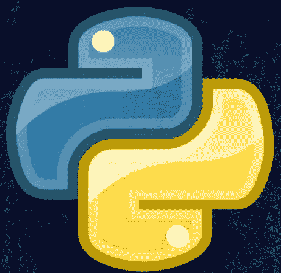
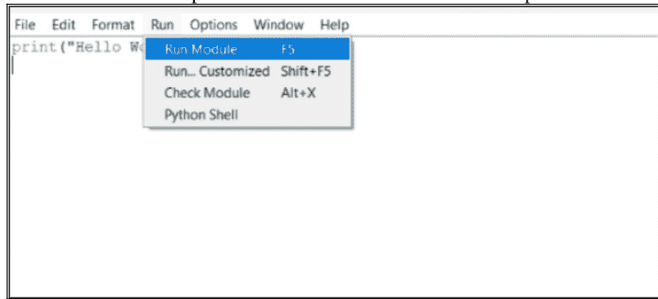
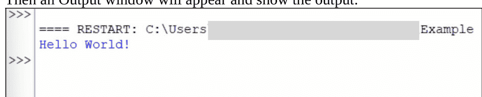

# 第一卷

## PYTHON 101

### 基础篇



Sam

# 第一卷

## PYTHON 101

### 基础篇



Sam

# 目录

简介
什么是Python
为什么学习Python

## 1. Python入门

- 1.1. Python安装
- 1.2. 集成开发环境
    - 1.2.1. 编辑器与命令行界面
    - 1.2.2. Python IDLE
    - 1.2.3. PyCharm
    - 1.2.4. Visual Studio Code

## 2. 我们的第一个程序

- 2.1. Hello World!
- 2.2. 运行程序

## 3. 数据类型、变量与注释

- 3.1. 什么是数据类型
- 3.2. 数据类型分类
    - 3.2.1. 字符串
    - 3.2.2. 整数
    - 3.2.3. 浮点数
    - 3.2.4. 布尔值
    - 3.2.5. 序列
- 3.3. 什么是变量
- 3.4. 创建变量
- 3.5. 使用变量
- 3.6. 类型转换
- 3.7. 注释

## 4. 运算符

- 4.1. 算术运算符
- 4.2. 赋值运算符
- 4.3. 比较运算符
- 4.4. 逻辑运算符
- 4.5. 其他运算符

## 5. 用户输入

- 5.1. 输入函数

## 6. 条件语句

- 6.1. If-Else条件
- 6.2. 流程图
- 6.3. 嵌套If-Else语句

## 7. 循环

- 7.1. While循环
    - 7.1.1. 无限循环
- 7.2. For循环
    - 7.2.1. Range函数
- 7.3. 循环控制语句
    - 7.3.1. Continue语句
    - 7.3.2. Break语句
    - 7.3.3. Pass语句

## 8. 序列

- 8.1. 列表
    - 8.1.1. 访问值
    - 8.1.2. 修改值
    - 8.1.3. 列表操作
    - 8.1.4. 列表函数
- 8.2. 元组
- 8.3. 字典
    - 8.3.1. 访问值
    - 8.3.2. 字典函数
- 8.4. 成员运算符

## 9. 函数

- 9.1. 定义函数
    - 9.1.1. 参数
    - 9.1.2. 返回值
- 9.2. 默认参数
- 9.3. Args与KWArgs
- 9.4. 作用域

## 10. 异常处理

- 10.1. Try-Except
    - 10.1.1. Else语句
    - 10.1.2. Finally语句

## 11. 字符串操作

- 11.1. 字符串切片
- 11.2. 字符串连接
- 11.3. 字符串格式化
- 11.4. 转义字符
- 11.5. 字符串函数
    - 11.5.1. 大小写转换
    - 11.5.2. 计数函数
    - 11.5.3. 查找函数
    - 11.5.4. 替换函数
    - 11.5.5. 连接函数
    - 11.5.6. 分割函数

## 12. 文件处理

- 12.1. 打开与关闭文件
    - 12.1.1. 访问模式
- 12.2. With语句
- 12.3. 从文件读取
- 12.4. 写入文件
- 12.5. 其他操作

下一步做什么？

# 简介

本书是名为**Python 101**的系列的第一部分。在这个系列中，我们将专注于以一种有效且简单的方式学习Python编程语言。目标是聪明、实用、快速地学习它，而无需阅读数千页。我们将保持简单明了。在第一本书中，我们将向您介绍这门语言并学习基础知识。

本书面向完全初学者，理解它不需要任何*编程*、*IT*或*数学*技能。最后，您将能够编写各种简单有趣的程序，并为继续第二卷的学习打下必要的基础。

## 什么是Python？

实际上，关于Python存在一个很大的误解。大多数程序员说Python是一种解释型语言，而另一些人说它是编译型语言。但如果您正在寻找一个合适的答案，那么它两者都是。Python既是解释型语言，也是编译型语言。

因为尽管我们没有编译源代码，但有一个后台过程将源代码编译成*字节码*，然后Python解释器将该字节码转换为机器语言。所有这些过程都由Python虚拟机完成*（我们将在本书的第一章下载并安装它）*。这就是为什么我们可以称Python既是编译型语言也是解释型语言。

正如我们之前所学，Python是一种解释型和编译型语言。但Python也是一种面向对象、具有动态语义的高级编程语言。

## 为什么选择Python？

您现在可能在问自己一个问题：‘为什么学习Python？为什么不学Java、C、C++或其他语言？为什么？’

首先，一个优秀的程序员精通所有编程语言。所以，学习Python并不意味着你不能学习其他编程语言。但其次，Python可能是开始编程之旅的最佳语言。

Python语法非常简单，连孩子都能轻松掌握。在其他语言中，有很多事情需要手动完成。在这种情况下，Python让我们的生活更轻松。因为庞大的库让你能够借助已有的东西创造新事物。这意味着你不需要从零开始制作一切，你可以在你的程序中使用别人的程序来创造新东西，显然可以节省你宝贵的时间和辛勤工作。

除此之外，Python的受欢迎程度正在飙升。根据TIOBE指数，Python是最受欢迎的语言，呈上升趋势*（2022年8月）*。

来源 - [www.tiobe.com/tiobe-index](http://www.tiobe.com/tiobe-index)

# 第一章

# Python入门

那么现在，在深入编码之前，我们需要安装Python和开发环境。正如我们之前所学（*什么是Python*），Python是一种所谓的解释型语言。这意味着源代码需要解释器或特定软件来执行。

另一方面，其他语言如C、C++或Java需要编译器来编译或将源代码转换为机器语言（*0和1的组合*），而不是解释器来执行源代码。但Python做不到这一点。这就是为什么我们需要在开始编码之前安装Python。

## 1.1 - Python安装

要下载，请访问Python的官方网站并获取最新版本。链接如下。

下载Python：[www.python.org](http://www.python.org)

下载安装程序并按照说明操作。完成安装过程后，您的电脑上应该有Python解释器和IDLE。

## 1.2 - 集成开发环境（*IDE*）

IDE，即集成开发环境，使程序员能够整合编写计算机程序的不同方面。

IDE通过将编写软件的常见活动组合到一个应用程序中来提高程序员的生产力：编辑源代码、执行代码和调试。

您可以使用任何您想要的IDE。但在这里我们将讨论4种常用的Python程序IDE。

### 1.2.1 - 编辑器与命令行界面

在IDE中编写Python代码不是强制性的。您可以在任何文本编辑器上编写代码，如Notepad、Vim、Atom、Sublime等。为此，您首先需要使用正确的文件名和扩展名（<filename>.py）编写并保存代码。然后您可以在CMD（Windows）或终端（Linux/Mac）上运行代码或脚本。要运行代码，您需要使用以下语法：

```
python <filename>.py
```

这个选项不太方便，但如果您愿意，可以尝试一下。

### 1.2.2 - Python IDLE

Python IDLE随Python安装一起提供。您无需外部安装IDLE。可以称其为Python的默认IDE。它是一个编写代码的好工具，并且有一个集成的解释器。此外，它的用户界面非常直观。对于初学者来说，这绝对是足够的。在本书中，我们将使用IDLE来运行我们的代码。

### 1.2.3 - PyCharm

PyCharm是最受欢迎的Python IDE之一。这有很多原因。PyCharm是一个跨平台应用程序，兼容Linux、macOS和Windows平台。PyCharm提供了大量的模块、包，以及专业的语法高亮和出色的用户界面。我绝对推荐给每个Python开发者。如果您感兴趣，可以免费获取社区版。

### 1.2.4 - Visual Studio Code

最后但同样重要的是，我个人最喜欢的非常专业的IDE是Visual Studio Code。它由微软开发。您也可以选择它作为您的开发环境。喜欢它有很多原因。主要是它的扩展、代码片段和高级语法高亮，这对开发者帮助很大。此外，它能够在一处运行任何类型的代码，并且完全免费。那么现在，让我们开始编码吧。

## 第二章

## 我们的第一个程序

每种编程语言都有其特定的语法。Python 也不例外，它拥有自己的语法体系。不过别担心，Python 的语法就像普通英语一样简单。我们将从一个非常简单的程序开始我们的编程之旅。

## 2.1 - Hello World！

在学习一门新语言时，以 Hello World 程序作为开端是编程界的一个传统。因此，本章我们将遵循这一传统。Hello World 程序只是一个简单的脚本，它会在屏幕上输出文本“Hello World!”。在 Python 中，这非常容易实现。

```python
print("Hello World!")
```

如你所见，这里我们只用了一行代码就在屏幕上打印了文本。在其他语言中，我们可能需要定义包含函数、类等的基本结构，仅仅是为了打印一段文本。

让我们看看这里发生了什么。首先我们注意到一个名为 *print* 的*函数*。函数 *print* 用于在屏幕上打印特定的文本。我们应该将想要打印的文本放在括号内。

但有一件非常重要的事情你必须记住：我们想要打印的文本必须是一个字符串。字符串是 Python 的一种数据类型。现在不必深究，我们将在本书后面简要学习它。只需记住，在 Python 编程中使用的任何文本都是字符串。我们用引号来表示字符串。如果不使用引号，Python 解释器会认为 *Hello World!* 是一个变量名而不是文本，并且会给出一个*错误消息*，因为该变量名未定义。

再次强调，不要过多思考变量，因为我们将在下一章学习更多关于它的内容。

## 2.1 – 运行程序

现在，是时候运行我们刚刚编写的脚本了。为此，你需要先将脚本保存为一个 Python 文件。

- 转到 **文件** > **保存** 或按 **Ctrl** + **S** 以保存脚本。



- 然后点击 **运行** > **运行模块** 或按 **F5** 来运行脚本。

*在 IDLE 中运行 Python 程序*

然后会出现一个输出窗口并显示结果。



*Hello World! 程序的输出*

现在，对自己说声恭喜吧，因为你成功运行了你的*第一个程序*。

## 第三章

## 数据类型、变量与注释

## 3.1 – 什么是数据类型？

数据类型是对数据的分类或归类。它表示一种值的类型，指明了可以对特定数据执行哪些操作。在 Python 编程中，数据类型实际上是类，而变量是该特定类的实例或对象。

## 3.2 – 数据类型的种类

Python 编程中有不同类型的数据类型。我们将在这里学习所有关于它们的知识。

### 3.2.1 – 字符串

*字符串*不过是一系列字符或一段文本。你应该记得我们在第一个程序中打印了一个字符串。在 Python 编程中，我们在引号（“” 或 ‘’）内编写的任何文本或字符都称为*字符串*。如果文本没有被引号包围，Python 解释器将永远不会将其识别为*字符串*。字符串的关键字是 **str**。

### 3.2.2 – 整数

整数也称为数值数据类型。*整数*就是普通的整数，我们可以用它进行基本计算。整数的关键字是 **int**。

**示例：** 1, 54, 69, 23, 0, 32, 1947 等。

### 3.2.3 – 浮点数

浮点数与整数类似。它们也是数值数据类型。但在*整数*中我们不能使用小数位，而*浮点数*允许我们使用小数位。因为它是一个浮点数。*浮点数*的关键字是 **float**。

**示例：** 32.42, 5.01, 0.122 等。

### 3.2.4 – 布尔值

布尔值基本上是一种二进制数据类型，只包含两个值，即 *True* 或 *False*。当我们进入条件或循环部分时，会经常使用它。布尔数据类型的关键字是 **bool**。

### 3.2.5 – 序列

我们将在后面的章节学习序列。但由于*序列*也是数据类型，我们至少应该在这里提及它们。

| 数据类型 | 关键字 | 描述 |
| :--- | :--- | :--- |
| 列表 | list | 值的集合 |
| 元组 | tuple | 不可变列表 |
| 字典 | dict | 键值对的列表 |

## 3.3 – 什么是变量

变量不过是一个容器，用来存放一些值。每个变量都有特定的数据类型。但 Python 编程的好处在于，我们不需要在使用前声明变量或其数据类型。变量在我们为其赋值的那一刻就被创建了。因为 Python 不是“静态类型”的。

## 3.4 – 创建变量

在 Python 中创建变量非常简单。你只需选择一个合适的名称，并借助*赋值运算符* (=) 为其赋值。例如：

```python
myString = "Hello World!"
myInteger = 35
myFloat = 65.03
```

这里我们定义了三个变量。第一个是*字符串*类型，第二个是*整数*类型，最后一个是*浮点数*类型。基本上，你可以为变量选择任何你想要的名字，但有一些限制。不允许使用任何保留关键字，如 *str*、*int*、*dict*、*if*、*for*、*while* 等。此外，变量名不能以整数或除下划线 (_) 以外的特殊字符开头。

## 3.5 – 使用变量

```python
myString = "Hello World!"
myInteger = 35
myFloat = 65.03

print(myString)
print(myInteger)
print(myFloat)
```

现在我们可以开始使用之前定义的变量了。例如，我们只是将变量打印到屏幕上。但你可以在脚本中的任何地方、用于任何目的来使用你的变量。

这里你可以看到我们没有使用引号，因此括号内的文本被视为变量名。Python 解释器打印的是变量的值，而不是括号内实际写的文本。上述代码的输出如下：

```
Hello World!
35
65.03
```

## 3.6 – 类型转换

有时我们会得到某种数据类型的值，而我们无法直接处理。为此，我们将这些值转换为我们需要的数据类型，这个过程称为*类型转换*。

例如，我们可能得到一个字符串作为输入，但字符串的值是数字。在这种情况下，“11”不等于 11。我们不能用字符串进行计算，即使字符串表示一个数字。因此，我们需要进行类型转换。

语法：

```python
<所需数据类型>(表达式)
```

示例：

```python
value = "11"
number = int(value)
```

类型转换通过使用特定的数据类型函数来完成。在这个例子中，我们将一个*字符串*转换为*整数*。所以，我们需要使用 **int()** 函数。你也可以使用 **str()** 函数反向执行此过程。在 Python 中，这是一个非常重要的事情，我们将在编码过程中经常使用它。

## 3.7 – 注释

Python 中的注释不过是代码中的一行或多行文本，解释器在执行脚本时会忽略它们。它帮助我们对代码块做简短说明，并增强代码的可读性。Python 编程中有三种类型的注释。

**单行注释：** 如果我们在脚本中任何一行的开头放置一个井号 (#)，解释器就会将该行视为单行注释。

```python
# 这是一个单行注释
print("Python 101")
```

我们也可以在任何语句之后添加单行注释。例如：

```python
# 这是一个单行注释
print("Python 101")    # 我们也可以在这里添加注释
```

**多行注释：** Python 没有提供单独的方式来编写多行注释。然而，有其他方法可以解决这个问题。我们可以在多行注释的每一行开头使用井号 (#)。

```python
# 这是一个
# 多行
# 注释
print("Python 101")
```

**文档字符串注释：** Python文档字符串是紧跟在函数之后、使用三引号括起来的字符串字面量。它用于关联写在Python函数内部的文档。它被添加在函数正下方，用于描述函数的功能。

```python
def sum(a, b):
    """This Function takes two parameters
    and returns sum of them"""
    result = a + b
    return result
```

我们将在后面的章节*函数*中使用文档字符串注释。另外，无需过多思考上述函数语法，我们将在那里学习它。

## 第四章

## 运算符

Python运算符通常用于对变量和值执行操作。它们是用于逻辑、比较和算术运算的一些标准符号。在本章中，我们将探讨不同类型的Python运算符。

## 4.1 – 算术运算符

如果我没弄错的话，你已经了解了这种类型的运算符。因为*算术运算符*用于执行算术运算，如*加法、减法、乘法和除法*。

| 运算符 | 名称 | 描述 | 语法 |
| :---: | :--- | :--- | :---: |
| + | 加法 | 将两个操作数相加。 | a + b |
| - | 减法 | 用第一个操作数减去第二个操作数。 | a - b |
| * | 乘法 | 将两个操作数相乘。 | a * b |
| / | 除法 | 用第一个操作数除以第二个操作数，并返回*浮点数*值。 | a / b |
| ** | 幂运算 | 第二个操作数是第一个操作数的*幂*。 | a ** b |
| // | 整除 | 用第一个操作数除以第二个操作数，并返回*整数*值。 | a // b |
| % | 取模 | 返回除法的*余数*。 | a % b |

```
>>> a = 5
>>> b = 3
>>> 
>>> print(a + b)
8
>>> print(a - b)
2
>>> print(a * b)
15
>>> print(a / b)
1.6666666666666667
>>> print(a ** b)
125
>>> print(a // b)
1
>>> print(a % b)
2
>>> 
```

算术运算符示例：

## 4.2 – 赋值运算符

基本上，*赋值运算符*用于为变量赋值。在*创建变量*部分，我们使用‘=’为变量赋值。以下是更多*赋值运算符*的列表。

| 运算符 | 名称 | 描述 | 语法 |
| :--- | :--- | :--- | :--- |
| = | 等于 | 将右侧表达式的值赋给左侧变量。 | x = a + b |
| += | 加并赋值 | 将右侧操作数与左侧操作数相加，并将值赋给左侧操作数。 | a += b 或 a = a + b |
| -= | 减并赋值 | 从左侧操作数中减去右侧操作数，并将值赋给左侧操作数。 | a -= b 或 a = a - b |
| *= | 乘并赋值 | 将右侧操作数与左侧操作数相乘，并将值赋给左侧操作数。 | a *= b 或 a = a * b |
| /= | 除并赋值 | 用左侧操作数除以右侧操作数，并将值赋给左侧操作数。 | a /= b 或 a = a / b |
| **= | 幂并赋值 | 计算幂值并赋给左侧操作数。 | a**=b 或 a = a ** b |
| //= | 整除并赋值 | 用左侧操作数除以右侧操作数，并将值（*整除结果*）赋给左侧操作数。 | a //= b 或 a = a // b |
| %= | 取模并赋值 | 使用左侧和右侧操作数进行取模运算，并将值赋给左侧操作数。 | a %= b 或 a = a % b |

基本上，我们使用这些运算符直接为变量赋值。下面给出的两条语句具有相同的效果。这只是更简洁的写法。

```
a = a + b
a += b
```

## 4.3 – 比较运算符

这种类型的运算符主要用于比较两个或多个值。当我们使用*比较运算符*来比较两个或多个值时，它返回一个*布尔值*，即*True*或*False*。

| 运算符 | 名称 | 描述 | 语法 |
|---|---|---|---|
| == | 等于 | 两边的值**相同** | a == b |
| != | 不等于 | 两边的值**不相同** | a != b |
| > | 大于 | 左侧的值**大于**右侧的值 | a > b |
| < | 小于 | 左侧的值**小于**右侧的值 | a < b |
| >= | 大于或等于 | 左侧的值**大于或等于**右侧的值 | a >= b |
| <= | 小于或等于 | 左侧的值**小于或等于**右侧的值 | a <= b |

在Python编程中，我们使用*比较运算符*来处理*条件和循环*。这两个主题我们将在后面的章节中介绍。

```
>>> a = 9
>>> b = 3
>>>
>>> print(a == b)
False
>>> print(a != b)
True
>>> print(a > b)
True
>>> print(a < b)
False
>>> print(a >= b)
True
>>> print(a <= b)
False
>>> 
```

**比较运算符示例：**

## 4.4 – 逻辑运算符

*逻辑运算符*也用于*循环*或检查*条件*。在Python中，有三个逻辑*运算符*：**or**、**and**和**not**。

| 运算符 | 名称 | 描述 | 语法 |
| :--- | :--- | :--- | :--- |
| or | 逻辑或 | 如果至少一个操作数为True，则条件为True。 | a or b |
| and | 逻辑与 | 如果所有操作数都为True，则条件为True。 | a and b |
| not | 逻辑非 | 如果操作数为False，则条件为True。 | not b |

```
>>> print(True or True)
True
>>> print(True or False)
True
>>> print(False or True)
True
>>> print(False or False)
False
>>> print(True and True)
True
>>> print(True and False)
False
>>> print(False and True)
False
>>> print(False and False)
False
>>> print(not True)
False
>>> print(not False)
True
```

如果你有*布尔代数*的基础知识，它将帮助你理解。如果你不了解，别担心，下面的例子将帮助你理解。

## 4.5 – 其他运算符

Python中还有一些其他运算符，如*成员运算符*或*位运算符*。但其中一些我们不需要，或者需要更多的编程知识才能理解。这就是为什么我们不在本章讨论它们。我们将在学习*序列（第8章）*时学习它们。

## 第五章

## 用户输入

在编程中，从用户那里获取一些数据以给出某种结果是最重要的事情之一。Python有一个内置函数叫做*input()*，它允许我们从用户那里获取数据。在本章中，我们将了解用户输入及其工作原理。

## 5.1 – 输入函数

输入函数不过是Python的一个内置函数，就像打印函数一样，它使我们能够从用户那里获取输入。

```python
# 获取输入并存储到变量 'name'
name = input("Enter your name: ")

# 将 'name' 打印到屏幕上
print(name)
```

当你执行上面的脚本时，你将能够在终端上输入你的名字，你的输入将存储在变量*name*中。然后打印函数会将*name*的值打印到终端上。

```
Output:

Enter your name: Sam
Sam
```

让我们看另一个例子，

```python
# 从用户获取两个数字
number1 = input("Enter Number-1: ")
number2 = input("Enter Number-2: ")

# 将 number1 和 number2 相加并存储到 'sum'
sum = number1 + number2

# 打印结果
print("Result is: ", sum)
```

这里我们从用户那里获取两个数字，然后将它们相加并打印结果。但是如果你运行这个脚本，你会得到一个奇怪的输出。你会看到你输入的数字没有相加，它们只是被连接在一起了。那么为什么会发生这种情况呢？

问题在于函数*input()*只返回*字符串*。这意味着当你输入15和43时，它们作为字符串“15”和“43”存储在变量中。

那么，当我们把两个字符串相加时会发生什么？我们只是将一个字符串附加到另一个字符串后面。这意味着“15”和“43”的和将是“1543”，而不是58。

要解决这个问题，也就是说，如果你想对输入数据进行任何数学运算，你需要先将变量类型转换为**int**或**float**。

```python
# 类型转换变量
number1 = int(number1)
number2 = int(number2)
```

你需要在将number1和number2相加之前添加这两行代码。现在，如果你输入15和43，你将得到58作为输出。

```
Output:

Enter Number-1: 15
```

## 第六章

## 条件语句

决策在编程中与在现实生活中同样重要。Python 中的条件语句会根据条件求值为 *True* 还是 *False* 来执行不同的计算。这些条件在 Python 中由 if-else 语句处理。

## 6.1 – If-Elif-Else 条件

基本上，一个条件需要为 *True*，这样我们的脚本才会继续执行其代码块中编写的代码。这里三个重要的关键字是 **if**、**elif** 和 **else**。

**语法：**

```
if Condition:
    <Statement>

elif Condition:
    <Statement>

else:
    <Statement>
```

**示例：**

```
number = input("Enter a Number: ")
number = int(number)

if number < 20:
    print("Number is less than 20.")

elif number > 30:
    print("Number is greater than 30.")

else:
    print("The Number is in 20 - 30")
```

在这里你可以看到，我们从用户那里获取 'number' 输入，并将该数字类型转换为整数。然后我们的第一个 *if 语句* 检查给定的数字是否小于 20。请记住，比较（number < 20）总是返回 True 或 False。因此，如果条件返回 True，那么只有 **if 代码块** 会被执行。解释器永远不会检查其余的条件。

```
Output:
Enter a Number: 1
Number is less than 20.
```

现在假设给定的数字是 39。那么会发生什么？
我们的第一个条件将为 False，因为 39 不小于 20。所以，解释器会忽略 **if 代码块**，并继续检查下一个条件。当一个条件返回 True 时，解释器将只执行那个特定的代码块。在这种情况下，下一个 **elif 代码块** 将被执行。因为 39 大于 30。如果没有条件返回 True，解释器将只执行 **else 代码块**。

```
Output:
Enter a Number: 39
Number is greater than 30.
```

请记住，你可以使用无限数量的 **elif** 条件，但不能在 **if-else** 梯形结构中使用超过一个的 **if** 或 **else**。整个 **if-else** 条件集也被称为 **if-else** 梯形结构。
当然，你不需要 **elif** 或 **else** 代码块。你只需编写一个 **if** 语句，如果条件不满足，它就会跳过代码并继续执行脚本的其余部分。

## 6.2 – 流程图

在这个流程图中，你可以看到这些基本的 if、elif 和 else 树是如何工作的。

## 6.3 – 嵌套 If-Else 语句

你也可以将 **if 代码块** 放入 **if 代码块** 中。这些被称为嵌套 **if 语句**。

```python
number = input("Enter a Number: ")
number = int(number)

if number % 2 == 0:
    if number == 0:
        print("Your number is even but zero")
    else:
        print("Your number is even")
else:
    print("Your number is odd")
```

所以，这里我们有第一个条件，它检查数字是否为偶数。当它是偶数时，它会检查它是否为零。这是一个简单的例子，但你理解了这个概念。

## 第七章

## 循环

通常，语句是按顺序执行的；第一条语句首先执行，然后是第二条，依此类推。可能会出现需要多次执行一段代码的情况。
循环语句允许我们多次执行一条语句或一组语句。

## 7.1 – While 循环

Python 编程中有两种类型的循环：While 循环和 For 循环。While 循环仅在 *while* 条件满足时执行代码块。下图说明了 *while 循环* 语句：

在这里你可以看到，它会循环执行，直到 *while* 条件返回 *false*。
让我们通过一个例子来理解这个概念。
假设我们需要打印从 1 到 10 的数字。所以，你可以轻松地使用 print() 语句 10 次。但 *while* 循环允许我们以非常简单的方式完成这项任务。

让我们看看代码，

```
number = 1

while number <= 10:
    print(number)
    number += 1
```

我们用关键字 *while* 定义一个 while 循环。然后我们编写条件，就像 if-else 条件一样，并且代码块再次在冒号 ':' 之后缩进。如你所知，在这个例子中我们试图打印 1 到 10。所以，首先我们将变量 (number) 初始化为值 1。在每次迭代中，我们打印 *number* 的值并将其递增 1。只要数字小于或等于 10，这个迭代就会进行。

### 7.1.1 – 无限循环

在本节中，我们将学习使用 while 循环的 **无限循环** 或 **无尽循环**。这可能看起来不太有用，但它有一些应用。

```
while True:
    print("This will run forever")
```

我们用条件 **True** 定义一个 *无尽循环*，由于条件总是 **True**，循环将永远不会中断。上面的循环将永远运行并执行 print 语句，除非你终止脚本。

**警告：** *如果你使用的是低端系统，这可能会使你的计算机过载。*

## 7.2 – For 循环

在 Python 编程中，**For 循环** 以不同的方式工作。通常，我们使用 For 循环来遍历任何 **序列** 的所有或部分项目，我们将在下一章学习这个，这里不会深入讨论。
目前，我们不需要关心 *序列* 的语法。只需注意我们有一个名为 **numberList** 的变量，它是一个包含 5 个数字的列表。

```
numberList = [2, 4, 5, 9, 1]

for number in numberList:
    print(number)
```

这里我们在变量 **numberList** 中存储了一个包含 5 个数字的列表。然后我们使用 **for** 关键字定义循环，并定义一个控制变量 **number**。对于每次迭代，它将分配列表中下一个项目的值。在这里，每次迭代中 **number** 将逐个分配 **numberList** 的每个项目。之后我们可以将 **number** 用于任何目的。例如，我们只是逐个打印所有数字。

下面的流程图将说明 **For 循环** 语句：

### 7.2.1 – Range 函数

Range 是 Python 的一个内置函数。同样，不要担心函数是什么，因为我们将在本书后面的章节中学习它。只需记住，当我们向 **Range 函数** 传递一个数字时，它会返回一个从 0 到该数字的数字列表。我们可以在 for 循环中使用该列表。例如，

```
for i in range(10):
    print(i)
```

当我们运行这段代码时，它将打印 0 到 9。因为 range 函数从 0 开始，到我们传递给它的第 n<sup>个</sup> 数字结束。这里的第 10<sup>个</sup> 数字是 9。所以，它将打印 0 到 9。

但如果我们想从一个非零数字开始呢？那么我们必须向 range 函数传递两个参数。

假设我们需要一个从 20 到 30 的数字列表。所以，我们必须向函数传递这两个参数。例如，

```
for i in range(20, 30):
    print(i)
```

同样，这个循环将打印从 20 到 29 的数字。如果你想打印 30，你需要传递 31。自己用不同的参数尝试一下，以便更好地理解它。

## 7.3 – 循环控制语句

为了管理循环，Python 中有一些所谓的控制语句。它们允许我们在特定点操纵循环的流程。

### 7.3.1 – Continue 语句

Continue 语句允许我们跳过循环的特定迭代。假设我们想打印 1 到 10，除了 7。所以，我们可以这样做，

```
for i in range(10):
    if i+1 == 7:
        continue
    print(i+1)
```

你可以看到我们打印 (i+1)，因为正如我们之前学到的，range 函数返回从 0 开始的索引。所以，如果我们打印 (i+1)，我们将得到从 1 到 10 的数字。但你也可以看到我们正在用 *if 语句* 检查数字是否等于 7。并且在 *if* 语句内部有一个 **Continue** 语句。这意味着当数字为 7 时，*if* 条件将为 *True* 并且它将继续或跳过该迭代。

这里我们将得到如下输出，

```
Output:

1
2
3
4
5
6          # The 7 is
8          # Missing Here
9
10
```

### 7.3.2 – Break 语句

在 *Continue 语句* 中，我们已经看到我们可以跳过特定的迭代，但如果我们想在满足特定条件时停止任何进一步的迭代呢。

我们使用相同的例子来理解这一点，但这次将使用 **break 语句** 而不是 **continue**。

```
for i in range(10):
    if i+1 == 7:
        break
    print (i+1)
```

我们将得到如下输出：

```
Output:
1
2
3
4
5
6           # 循环将在此处中断
```

在这种情况下，当 *if 条件* 为 *True* 时，它将中断循环。循环将不再继续迭代。

### 7.3.3 – Pass 语句

pass 语句是一个非常特殊的语句，因为它实际上什么都不做。实际上，它并不是一个真正的循环控制语句，而是一个代码占位符。

```
if number == 5:
    pass
else:
    pass

while number < 5:
    pass
```

有时你想编写基本的代码结构，但尚未实现逻辑。在这种情况下，我们可以使用 pass 语句来填充代码块。否则，我们将无法运行脚本，它会抛出如下错误：

```
IndentationError: expected an indented block after 'if' statement on line 1
```

## 第 8 章

## 序列

序列是 Python 最基本的数据结构。它包含多个元素，并通过特定的数字进行索引。在本章中，我们将讨论不同类型的序列及其函数。

## 8.1 – 列表

我们之前已经对 *列表* 有了一些了解。这里我们将详细学习。顾名思义，它就是一个项目列表。

*Numbers* = [2, 5, 6, 7, 1, 6]

在 Python 中，我们使用 *方括号* 来定义一个 **列表**。然后我们将所有项目放在方括号之间，并用逗号分隔。最有趣的是，Python 列表对数据类型没有限制。你可以使用任何数据类型，也可以混合使用。例如：

```
names = ["Sam", "Alex", "Virat", "jack"]
ages = [22, 19, 25, 24]
mixed = ["India", 9, True, 98.3]
```

### 8.1.1 – 访问值

为了访问列表的值，你首先需要了解索引。基本上，索引是列表中每个元素的位置。在 Python 中，索引从零开始。这意味着第一个元素的索引是零，第二个元素的索引是一，以此类推。现在，让我们尝试使用索引来访问值。

```
print(names[0])
print(ages[1])
print(mixed[2])
```

这里我们访问的是 names 的第一个项目（Sam）、ages 的第二个项目（19）和 mixed 的第三个项目（True）。
为了访问值，我们需要在变量后面的方括号中放入索引。这是 Python 中访问值的基本语法。

```
Output:

Sam
19
True
```

在上面的例子中，我们只访问了每个列表的一个值。但如果我们想访问特定范围内的多个值或整个列表呢？让我们看看下面的例子。

```
Example - 1:

print(names[0:3])
print(names[:3])
print(names[1:])

Output:

['Sam', 'Alex', 'Virat']
['Sam', 'Alex', 'Virat']
['Alex', 'Virat', 'jack']
```

在这里你可以看到，我们传递了一个索引范围来访问值。在第一个 print 语句中，我们使用 [0:3] 来访问从第零个到第三个项目。可能有一个问题困扰着你：我们传递了结束索引 3，但为什么没有得到第四个项目？因为索引 3 对应的是第四个元素。
原因是，我们在冒号后面传递的（这里是 3）不是结束索引。它是第 n 个元素（这里是第 3 个元素，即 “Virat”）。

**语法：变量[起始索引 : *第 n 个* 元素]**

还有一点要记住，如果我们不传递起始索引，它将默认取 0（第二个语句）。同样，你可以不传递长度来访问列表的其余部分。

希望你理解了索引的概念。让我们再看一些例子以更好地理解。

```
# 返回整个列表
print(ages)
>>> [22, 19, 25, 24]

# 返回从第 3 个项目到列表的其余部分
print(mixed[2:])
>>> [True, 98.3]

# 返回从第 2 个到第 3 个项目
print(names[1:3])
>>> ['Alex', 'Virat']
```

### 8.1.2 – 修改值

在 Python 列表中，我们不仅可以访问值，还可以通过索引修改值。修改值的过程非常简单。

```
names = ["Sam", "Alex", "Virat", "jack"]
ages = [22, 19, 25, 24]

names[3] = "Rahul"
ages[3] = 20

print(names)
print(ages)

Output:
['Sam', 'Alex', 'Virat', 'Rahul']
[22, 19, 25, 20]
```

这里我们修改了两个列表的第四个元素。names 中的 Jack 被 Rahul 替换，ages 列表中的 24 被 20 替换。

### 8.1.3 – 列表操作

在运算符章节中，我们看到了不同类型的运算符。我们可以将这些运算符应用于我们的列表。

```
将两个列表相加：

list_1 = [22, 19, 25, 24]
list_2 = [54, 9, 11, 94]

list_3 = list_1 + list_2

print(list_3)

Output:
>>> [22, 19, 25, 24, 54, 9, 11, 94]
```

我们也可以将一个列表乘以多次。

```
将一个列表乘以 3 次：

list_1 = ["Sam", 22]
list_2 = list_1 * 3

print(list_2)

Output:
>>> ['Sam', 22, 'Sam', 22, 'Sam', 22]
```

### 8.1.4 – 列表函数

在 Python 中，有很多内置的列表函数和方法可以让我们的生活更轻松。但这里我们不会全部介绍。我们只看最重要的那些。

列表函数：

| 函数 | 描述 |
| :--- | :--- |
| len(list) | 返回列表的长度 |
| max(list) | 返回具有最大值的项目 |
| min(list) | 返回具有最小值的项目 |
| list(element) | 将任何元素类型转换为列表 |

列表方法：

| 方法 | 描述 |
| :--- | :--- |
| list.append(x) | 将元素 (x) 追加到列表 |
| list.count(x) | 计算列表中存在多少个元素 (x) |
| list.index(x) | 返回元素 (x) 的索引 |
| list.pop(x) | 移除列表的元素 |
| list.reverse(x) | 反转列表中元素的顺序 |
| list.sort(x) | 对列表的元素进行排序 |

## 8.2 – 元组

我们要看的下一个序列类型与列表非常相似。它就是 **元组**。列表和元组之间的唯一区别是元组是 *不可变的*。我们不能操作它。

*Numbers* = (93, 43, 87, 54, 35)

注意，元组是使用圆括号而不是方括号定义的。

基本上，所有读取和访问函数，如 *len*、min 和 max 都保持不变，可以用于元组。但当然，由于元组是不可变的，不可能使用任何修改或追加函数。

## 8.3 – 字典

Python 字典是 *键* 和 *值* 的集合。此序列中的每个条目都有一个键和一个相应的值。在其他编程语言中，这种结构被称为 *哈希映射*。

```
dict = {
    "name" : "Sam",
    "age" : 22,
    "dept" : "Programmer"
}
```

我们使用 *花括号* 定义字典，键值对用 *逗号* 分隔。键和值本身用 *冒号* 分隔。左边是 *键*，右边是相应的 *值*。

由于键就像列表或元组的索引，它应该是唯一的。但值不一定是唯一的。我们可以有多个键具有相同的值，但当我们引用某个键时，它必须是具有该特定名称的唯一键。此外，键不能被更改。

一个有趣的事情是，我们可以将列表或元组作为值存储。

```
dict = {
    "name" : ["Sam", "Alex", "Virat", "jack"],
    "age" : [22, 19, 25, 24],
    "dept" : ("Programmer", "Writer", "Photographer", "Editor")
}
```

### 8.3.1 – 访问值

正如我们之前所学，在字典中，键就像列表的索引一样是唯一的，所以我们可以使用键来访问值。

```
print(dict["name"])
print(dict["age"])
```

注意，如果有多个同名的键，我们将无法得到结果，因为它不知道我们指的是哪个值。

### 8.3.2 – 字典函数

与列表和元组一样，Python 字典也有一些 *函数* 和 *方法*。但它们并不相同，因为字典没有索引。

字典函数：

| 函数 | 描述 |
| :--- | :--- |
| len(dict) | 返回字典的长度 |
| str(dict) | 将字典类型转换为字符串 |

字典方法：

| 方法 | 描述 |
| :--- | :--- |
| dict.clear() | 移除字典的所有元素 |
| dict.fromkeys(dict) | 使用相同的键创建一个新字典， |

| | |
|---|---|
| | 但值为空 |
| dict.copy() | 创建原始字典的副本 |
| dict.get(key) | 返回给定键的值 |
| dict.items() | 以元组列表的形式返回所有项 |
| dict.keys() | 返回所有键的列表 |
| dict.values() | 返回所有值的列表 |
| dict.update(dict2) | 将一个字典（dict2）的内容添加到另一个字典（dict）中 |

## 8.4 – 成员运算符

如果你还记得，我们在运算符章节（*第4章*）中跳过了*成员运算符*。现在是时候学习它们了。通常，我们使用*成员运算符*来检查一个元素是否是序列的成员，以及遍历它们。

```
list = [23, "Sam", 32.4, True, "India"]

print("Sam" in list)        >>> True

print(32 in list)       >>> False

print("London" not in list)        >>> True
```

两个*成员运算符*是 **in** 和 **not in**。使用它们，我们可以检查一个序列是否包含特定元素。如果包含，返回 **True**，否则返回 **False**。

此外，我们可以使用成员运算符遍历序列的所有元素。

```
list = [23, "Sam", 32.4, True, "India"]

for i in list:
    print(i)
```

在每次迭代中，*i* 成为下一个元素的值并被打印出来。我们已经在*第7章（循环）*中讨论过这一点。

# 第9章

# 函数

函数不过是一段语句块。有时我们需要在不同地方为不同值使用一些通用代码。这会降低代码的可读性和美观性。这就是为什么我们使用*函数*。

*函数*允许我们编写一次代码并多次使用。函数可以看作是组织好的代码块，我们在脚本的不同地方重复使用它们。它们使我们的代码更具模块化，并提高了可重用性。

## 9.1 – 定义函数

我们使用关键字 **def**，后跟**函数名**和**圆括号**来定义一个*函数*。冒号之后的代码需要缩进。

```
# 定义函数
def greet():
    print("Welcome to Python 101")
```

这是一个非常基础的函数示例。这里我们定义了一个名为 **greet** 的函数，然后在函数内部我们只是打印了一段文本。但是如果你现在运行这段代码，什么也不会发生。因为我们必须调用函数才能执行函数内部的代码块。

```
# 调用函数
greet()
```

我们可以在脚本中的任何地方调用函数。而且，我们可以在同一个脚本中多次调用函数。对于这个函数，每次调用时它都会打印 *Welcome to Python 101*。

### 9.1.1 – 参数

在上面的例子中，我们看到函数 *greet* 只是打印相同的值。但我们可以通过使用参数使其动态化。这意味着我们可以通过传递不同的参数来获得不同的值。

```
# 定义带参数的函数
def sum(num1, num2):
    print(num1 + num2)

# 调用函数
sum(33, 16)

输出：
>>> 49
```

如你所见，我们在圆括号中有两个参数 **num1** 和 **num2**。函数 **sum()** 打印这两个数字的和。
当我们用两个参数 33 和 16 调用函数时，它给我们输出 49。现在你可以通过使用不同的参数来获得不同的输出。
但要记住一件事，参数的数量必须与参数的数量相同。否则，它会抛出一个错误。

### 9.1.2 – 返回值

到目前为止，我们看到函数只是执行语句。但它也可以返回一个特定的值。在 *sum()* 函数的情况下，它也可以返回求和值而不是直接打印。这个值可以被保存或处理。为了返回值，我们使用关键字 **return**。

```
# 定义带返回值的函数
def sum(num1, num2):
    return(num1 + num2)
```

这里我们返回 *num1* 和 *num2* 的和，而不是打印它。

```
# 调用函数 - 1
result = sum(33, 16)
print(result)

# 调用函数 - 2
print(sum(33, 16))

输出：
>>> 49
>>> 49
```

由于函数返回求和值，我们可以将其存储到变量中或直接使用。在任何情况下，输出都是相同的。

## 9.2 – 默认参数

有时我们需要为参数传递一些默认值。为此，我们需要在函数定义中为参数赋值。

```
def hello(text="Python 101"):
    print(text)
```

如你所见，我们为参数 *text* 赋了一个值。然后打印 *text* 的值。当我们调用函数时，它将打印分配给参数的文本。

```
hello()

输出：
>>> Python 101
```

有趣的是，如果需要，我们可以在调用函数时更改默认值。

```
hello(text="This is changed value")

输出：
>>> This is changed value
```

## 9.3 – Args 和 KWArgs

到目前为止，我们看到*参数*和*实参*的数量应该相同。但如果我们不知道用户将传递的实际参数数量怎么办？在这种情况下，*Args* 和 *KWArgs* 允许我们通过只定义一个*参数*来传递多个参数。

让我们用一个现实生活中的例子来理解。

假设我们正在收集员工的信息。所以显然名字是必填的，但有些人可以跳过一些信息。所以，我们可以这样做，

```
# 定义带 Args 的函数
def employee(name, *info):
    print(name, info)

# 用多个参数调用函数
employee("Sam", 22, "Kolkata", "Programmer")
employee("Rio", 20, "Designer")

输出：
Sam (22, 'Kolkata', 'Programmer')
Rio (20, 'Designer')
```

这里你可以看到，我们定义了一个带有两个参数 *name* 和 *info* 的函数。但我们在 *info* 前使用了一个星号 (*) 符号。因为 info 是一个可变参数。它可以以元组的形式存储多个值。

有趣的是，元素的数量没有限制。实际上，如果你仔细看输出，你会看到我们的第一个参数 *name* 是一个普通的字符串，但其余所有参数都显示为一个元组。

如果我们想访问 *Args* 的值，我们在打印时也需要使用星号 (*) 符号。比如，

```
def employee(name, *info):
    print(name, *info)

employee("Sam", 22, "Kolkata", "Programmer")

输出：
Sam 22 Kolkata Programmer
```

但这里所有信息都不清楚。因为当我们为不同的员工调用函数时，它返回不同的结果。所以，很难决定哪个是年龄、地址或职位。在这种情况下，*KWArgs*（关键字可变参数或实参）帮助我们克服这个问题。

```
def employee(name, **info):
    print(name, info)

employee("Sam", age = 22, address = "Kolkata", desig = "Programmer")

输出：
Sam {'age': 22, 'address': 'Kolkata', 'desig': 'Programmer'}
```

我们用双星号 (**) 符号定义 *kwargs*。如果你注意到上面的例子，它返回一个键值对的字典。所以，现在我们可以应用字典函数或处理数据。

## 9.4 – 作用域

本章的最后一个主题是*作用域*。作用域不仅对函数很重要，对循环、条件和其他类似结构也很重要。基本上，作用域意味着*全局*和*局部*变量之间的区别概念。

```
name = "Sam"

def function():
    name = "Jhon"
    print(name)

function()
print(name)
```

这里你可以看到有两个名为 *name* 的变量。一个在函数外部，另一个在函数内部。
现在，当我们运行这个脚本时，首先它会打印 **Jhon**，然后打印 **Sam**。因为第一个 *print* 语句在函数内部，而第二个在函数外部。
这里你应该记住的是，我们在任何函数、循环、条件或其他类似结构内部定义的任何变量都被称为该特定语句的*局部变量*，其余所有变量都被称为*全局变量*。
我们不能在语句外部直接访问任何局部变量。同样，也不能在任何语句内部修改全局变量。如果我们想修改

## 第十章

## 异常处理

程序中充满了错误和异常。我相信你肯定遇到过一些，如果没有，那说明你还不够努力！错误或异常是编程的日常组成部分。看看下面这段代码。

```python
print(10/0)
```

如果我们尝试运行这段代码，它会抛出一个 **ZeroDivisionError**。这是因为除以零是未定义的，我们的脚本不知道如何处理这种情况，所以它会崩溃。
让我们看另一个例子。

```python
name = "Sam"
name = int(name)

输出：
Traceback (most recent call last):
  File "c:\...\test.py", line 2, in <module>
    name = int(name)
ValueError: invalid literal for int() with base 10: 'Sam'
```

或者，当我们尝试将一个 *字符串* 类型转换为 *整数* 类型时，它会抛出一个 **ValueError**，脚本同样会崩溃。

## 10.1 – Try-Except

通过使用 try 和 except 代码块，我们可以轻松处理这类错误。try-except 的结构与 if-else 条件语句类似，但没有条件判断。我们将那些可能存在问题（如网络问题或其他类似情况）的代码写在 *try* 代码块中，而在 except 代码块中处理异常。

```python
try:
    name = "Sam"
    name = int(name)
except ValueError:
    print("Code block for Value-Error")
```

try 语句必须至少有一个 *except* 代码块。不过，它可以有多个 *except* 代码块。

### 10.1.1 – Else 语句

我们也可以使用 *else* 语句。当代码没有错误时，它会被执行。

```python
try:
    name = "Sam"
    # name = int(name)
except ValueError:
    print("Code block for Value-Error")
else:
    print("All ok")
```

首先它会执行 try 代码块中的代码。由于没有错误，它将执行 else 代码块。

### 10.1.2 – Finally 语句

```python
try:
    name = "Sam"
    # name = int(name)
except ValueError:
    print("Code block for Value-Error")
finally:
    print("It will execute always")
```

*Finally* 语句与 *else* 语句类似。它们之间基本且唯一的区别是，*else* 仅在代码没有错误时执行，而 *finally* 无论代码是否有错误都会执行。

## 第十一章

## 字符串操作

尽管 *字符串* 只是简单的文本或字符序列，但我们可以对它们应用许多函数和操作。由于本书面向初学者，我们不会深入探讨高级内容，但了解如何正确处理字符串对你来说很重要。

## 11.1 – 字符串切片

正如我们已经学到的，字符串是字符序列，也可以像列表或元组那样处理。这意味着我们可以使用索引来切片它们。

```python
text = "My name is Sam"

print(text[:5])
>>> My na

print(text[5:10])
>>> me is

print(text[10:])
>>> Sam
```

我们也可以通过循环来访问字符串的字符。它会逐个打印每个字符。

```python
text = "My name is Sam"

for x in text:
    print(x)
```

## 11.2 – 字符串连接

字符串连接就是将两个或多个字符串连接成一个字符串的技术。有几种方法可以做到这一点。假设我们有两个字符串，想要将它们连接起来。

```python
str_1 = "Hey guys"
str_2 = "Welcome to Python 101"
```

**逗号：** 我们可以简单地在两个字符串之间放一个逗号来连接它们。

```python
print(str_1, str_2)

>>> Hey guys Welcome to Python 101
```

**+ 运算符：** + *运算符* 与 *逗号* 类似，但有一个小问题。

```python
print(str_1 + str_2)

>>> Hey guysWelcome to Python 101
```

当我们使用 + *运算符* 连接两个字符串时，它会移除它们之间的空格。为了避免这个问题，我们需要在第一个字符串的末尾或第二个字符串的开头添加一个额外的空格。

**f-string：** *f-string* 是 Python 中最常用的字符串连接技术，也是我个人最喜欢的。使用 *f-string* 可以使代码更具可读性且易于理解。

```python
print(f"{str_1} {str_2}")

>>> Hey guys Welcome to Python 101
```

我们使用关键字 **f**（在引号外）来定义 *f-string*（f""）。然后在引号内，我们将字符串变量放在 *花括号* 中，以指定要连接字符串的位置。此外，我们也可以在引号内使用普通文本。

```python
print(f"Hey guys {str_2}. Let's start Coding.")

>>> Hey guys Welcome to Python 101. Let's start coding.
```

## 11.3 – 字符串格式化

当我们有一段文本，并想在其中插入变量的值时，字符串格式化可以帮助我们实现这一点。

```python
name, age = "Sam", 22

print("My name is %s and I'm %d years old." % (name, age))

>>> My name is Sam and I'm 22 years old.
```

如果你注意到了，这里我们在想要插入变量的地方使用了 **%s** 和 **%d**。这被称为占位符。不同的数据类型有不同的占位符。下表会更好地说明这一点。

| 占位符 | 数据类型 |
| :--- | :--- |
| %c | 字符 |
| %s | 字符串 |
| %d 或 %i | 整数 |
| %f | 浮点数 |
| %e | 科学计数法 |

如果你像我一样懒，不想指定数据类型，那么你可以使用 *format()* 函数。只需在想要放置变量的地方使用花括号，并将所有变量作为 format() 函数的参数传递即可。

```python
name, age = "Sam", 22

print("My name is {} and I'm {} years old.".format(name, age))

>>> My name is Sam and I'm 22 years old.
```

## 11.4 – 转义字符

在字符串中，我们使用许多转义字符来正确管理字符串。实际上，它们是不可打印的字符，比如制表符、换行符、退格符等。它们都由反斜杠 (\) 引导，这就是为什么我们在文件路径中使用双反斜杠（第十二章）。

下表总结了最重要的转义字符。如果你想了解更多转义字符，可以在网上搜索。但目前你可能用不到它们。

| 转义字符 | 描述 |
| :--- | :--- |
| \b | 退格 |
| \n | 换行 |
| \t | 制表符 |

```python
print("My name is\b Sam")
>>> My name i Sam

print("My name is\n Sam")
>>> My name is
    Sam

print("My name is\t Sam")
>>> My name is    Sam
```

## 11.5 – 字符串函数

Python 中有很多字符串函数，在本书中讨论所有函数是不必要且浪费时间的。如果你想概览一下，可以上网查找。

然而，在本章中，我们将重点介绍这些函数中最基础、最有趣和最重要的部分，也就是你在不久的将来可能需要用到的那些。

### 11.5.1 – 大小写操作

Python 中有五个不同的大小写操作字符串函数。让我们来看看它们。

| 函数 | 描述 |
|---|---|
| string.upper() | 将所有字符转换为大写 |
| string.lower() | 将所有字符转换为小写 |
| string.title() | 将所有字符转换为标题大小写 |
| string.capitalize() | 将首字母转换为大写 |
| string.swapcase() | 交换所有字母的大小写 |

### 11.5.2 – Count 函数

假设你有一个字符串，想知道某个特定字母或单词在该字符串中出现了多少次。*count* 函数允许我们这样做。

```python
str = "Hey you, listen to me; you are not allowed to go there"

print(str.count("you"))
>>> 2

print(str.count("e"))
>>> 7
```

### 11.5.3 – Find 函数

这个函数与 count 函数有些相似。它返回字符串中某个单词或字母首次出现的索引。

```python
str = "Hey you, listen to me; you are not allowed to go there"

print(str.find("you"))
>>> 4
```

### 11.5.4 – Replace 函数

Replace 函数允许我们用另一个字符串替换字符串的特定部分。在下面的例子中，我们将名字 *Sam* 替换为 *Jack*。

```python
text = "My name is Sam"
text = text.replace("Sam", "Jack")
print(text)

>>> My name is Jack
```

### 11.5.5 – Join 函数

通过 join 函数，我们可以将一个序列连接成一个字符串，并用这个特定的字符串分隔每个元素。

```python
names = ["B", "Sam"]
separator = "-"
print(separator.join(names))

>>> B-Sam
```

### 11.5.6 – 分割函数

如果我们想按特定字符分割字符串，那么分割函数就能帮我们实现。有趣的是，它会返回一个包含字符串各部分的列表。

```
name = "Sam,Jack,Axle,Mickel"
name_list = name.split(",")
print(name_list)

>>> ['Sam', 'Jack', 'Axle', ' Mickel']
```

## 第12章

## 文件处理

这是本书的最后一章，在本章中，我们将学习如何从外部文件读取或写入数据。你可能会问，我们为什么要这样做？答案是，让我们来看看。

## 12.1 – 打开与关闭文件

如果我们想喝水，首先需要打开瓶盖，对吧？同样，为了访问特定文件的数据，我们需要先打开文件流。

假设我们有一个名为‘myfile.txt’的文本文件，其中包含一些数据。我们将使用该文件进行操作。

```
Myfile.txt:

This book is the first part of a series that is called the Python 101. In this series, we are going to focus on learning the Python Programming Language in an effective and easy way.
```

打开文件：

```
file = open('myfile.txt', 'r')
```

这里你可以看到，我们只是使用`open()`函数来打开文件流。作为参数，我们需要定义文件名和访问模式（我们稍后会讨论）。该函数返回流，我们可以将其保存到变量中，并对其应用不同的操作。

### 12.1.1 – 访问模式

每当我们在Python中打开文件时，都会使用特定的访问模式。访问模式定义了我们打开文件的目的，例如读取或写入。Python中有多种访问模式。下表将更好地总结它们。

| 访问模式 | 描述 |
|---|---|
| r | 读取文件 |
| r+ | 读取与写入 |
| rb | 读取二进制文件 |
| rb+ | 读取与写入二进制文件 |
| w | 写入文件 |
| w+ | 读取与写入 |
| wb | 写入二进制文件 |
| wb+ | 读取与写入二进制文件 |
| a | 追加文件 |
| a+ | 读取与追加 |
| ab | 追加二进制文件 |
| ab+ | 读取与追加二进制文件 |

希望你已经理解了访问模式的概念。现在是时候关闭文件了。当我们完成所有文件操作后，需要关闭文件，否则可能会引发一些不必要的错误。为此，我们只需使用*close()*函数。

```
file = open('myfile.txt', 'r')

# 所有必要的代码

file.close()
```

## 12.2 – With 语句

或者，我们可以使用`with`语句更有效地打开和关闭流。`with`语句会打开一个流，执行缩进的代码，然后关闭该流。

```
with open('myfile.txt', 'r') as file:
    # 所有必要的代码
```

如果你像我一样懒，`with`语句会对你有所帮助。因为我们不需要手动关闭文件流，它会自动完成。此外，使用`with`语句可以缩短代码并使其更具可读性。

## 12.3 – 从文件读取

一旦我们以读取模式打开文件流，就可以开始从流中读取数据。为此，我们只需使用*read()*方法。

```
# 普通方式读取
file = open('myfile.txt', 'r')
print(file.read())
file.close()

# 使用 with 语句读取
with open('myfile.txt', 'r') as file:
    print(file.read())
```

这里我们以读取模式打开文件，并使用`read`方法打印文件的所有数据。

如果我们不需要全部数据，只需要文件的前50或100个字符怎么办？我们可以通过向`read`方法传递一个参数来实现。

```
with open('myfile.txt', 'r') as file:
    print(file.read(50))
```

这段代码将打印文件的前50个字符。

## 12.4 – 写入文件

向文件写入内容与读取文件非常相似。我们只需要改变两件事：访问模式和方法。我们需要使用*write()*方法而不是*read()*方法来写入文件。

这里我们使用`with`语句来操作，两种方式都可以。

```
with open('myfile.txt', 'w') as file:
    file.write("Welcome to Python-101")
```

这里你可以看到，我们向`write`方法传递了一个字符串，该字符串将被写入我们的文件（*myfile.txt*）。此外，你也可以向`write`方法传递一个变量，而不是直接传递字符串。

到目前为止，一切似乎都很好。但有一个大问题。每次运行代码时，如果文件名相同，它都会覆盖文件。因此，在写入之前，你必须决定你想要什么。如果你每次都想覆盖，那就继续吧。但如果你不想丢失过去的数据，你应该使用追加访问模式，即‘**a**’。

```
with open('myfile.txt', 'a') as file:
    file.write("Welcome to Python-101")
```

现在，即使数据相同，它也会将作为参数传递的数据追加到文件中。如果文件名相同，每次迭代的数据都会被追加到文件中。

# 接下来做什么？

哈哈，你做到了！在本书中，我们涵盖了Python编程的所有基础知识。希望你现在理解了这门语言的结构，以及*函数、循环、条件、序列*等的基本原理。现在你可以构建一些自己的程序，比如计算器、石头剪刀布游戏或其他简单的应用程序。

本书面向绝对初学者，因为它仅仅是**Python 101**系列的开始。在下一部分中，我们将更深入地学习Python，了解*模块、类、面向对象编程*等等。在本系列的后续部分，我们还将学习数据科学、机器学习和其他高级主题。

最后但同样重要的是一个小提醒，这本书是为你而写的，以便你能够以简单的方式学习Python的基础知识并尽可能多地获取价值。所以，如果你喜欢这本书，或者认为你从中学到了新的、有趣的东西，请在**Amazon**上写一篇简短的评论。这不会超过一分钟，而且完全免费。这将帮助我写出更多高质量的书籍，这对你也将是有益的。

*谢谢你...*