# 极客挑战

# Python 入门

14天掌握Python基础

里卡多·里德 & 凯西·杰雷纳

里卡多·里德和凯西·杰雷纳

# Python 入门

14天掌握Python基础

由 Nerd Challenges LLC 首次出版
2021

版权所有 © 2021 里卡多·里德和
凯西·杰雷纳

保留所有权利。未经出版商书面许可，不得以任何形式或任何方式（电子、机械、影印、录音、扫描或其他方式）复制、存储或传播本出版物的任何部分。未经许可复制本书、将其发布到网站或通过任何其他方式分发均属非法。

里卡多·里德和凯西·杰雷纳主张其作为本作品作者的署名权。

里卡多·里德和凯西·杰雷纳对本出版物中提及的外部或第三方互联网网站的URL的持续性或准确性不承担任何责任，并且不保证此类网站上的任何内容现在或将来是准确或适当的。

公司用于区分其产品的名称通常被声明为商标。本书及其封面上使用的所有品牌名称和产品名称均为其各自所有者的商品名、服务标志、商标和注册商标。出版商和本书与本书中提及的任何产品或供应商均无关联。本书中引用的任何公司均未认可本书。

第一版

ISBN: 978-1-7374537-1-0

本书由 Reedsy 专业排版

了解更多请访问 [reesdy.com](https://reesdy.com)

献给我们所有的家人、朋友、同事以及鼓励我们撰写本书的人，我们希望本书能成为你实现目标的垫脚石。

# 目录

- 前言
- 序言
    - 这本书适合你吗？
    - 解决方案代码
    - 书籍安排
    - 阅读时间
    - 代码片段和重要术语
        - 代码示例
        - 带注释的代码示例
        - 终端输出
- [其他资源](Other resources)
- [致谢](Acknowledgement)
- [勘误 / 联系我们](Errata / Contacting Us)
- [反馈与评论](Feedback and Reviews)
- [简介](Introduction)
    - [什么是Python？](What is Python?)
    - [为什么选择Python？](Why Python?)
        - [优势](Advantages)
        - [劣势](Disadvantages)
    - [何时不使用Python](When not to use Python)
    - [用Python能构建什么？](What can you build with Python?)

# 1. 第1天：安装Python、变量和注释

- [Python安装](Python Installation)
    - [在Windows上安装Python](Installing Python on Windows)
    - [在macOS上安装Python](Installing Python on macOS)
    - [在Linux上安装Python（特别是Ubuntu 20.04）](https://example.com)
- [PyCharm安装](https://example.com)
    - [在Windows上安装PyCharm](https://example.com)
    - [在macOS上安装PyCharm](https://example.com)
    - [在Linux上安装PyCharm](https://example.com)
- [关于IDE的说明](https://example.com)
- [Hello World!](https://example.com)
- [Python变量简介](https://example.com)
    - [理解变量](https://example.com)
    - [变量命名](https://example.com)
    - [数据类型](https://example.com)
    - [打印语句](https://example.com)
- [注释简介](https://example.com)
- [问答复习](https://example.com)
- [第1天挑战](https://example.com)

# 2. 第2天：探索数据类型

- 列表
- 元组
- 集合
- 字典
- 类型转换
    - 隐式类型转换
    - 显式类型转换
- 问答复习
- 第2天挑战

# 3. 第3天：运算符

- 算术运算符
- 赋值运算符
- 位运算符
- 比较运算符
- 身份运算符
- 逻辑运算符
- 成员运算符
- 问答复习
- 第3天挑战

# 4. 第4天：用户交互

- 问答复习
- 第4天挑战

# 5. 第5天：If-Else语句、While和For循环

- If-Else语句
- While循环
- For循环
- 问答复习
- 第5天挑战

# 6. 第6天：Try-异常处理

- Try和Except块
- Else子句和Finally
- Raise
- 问答复习
- 第6天挑战

# 7. 第7天：极客挑战1

- 第1部分：实现总体要求
- 第2部分：设置计算器
- 解决方案

# 8. 第8天：函数

- 内置函数
- 用户自定义函数
    - 创建函数
    - 使用用户自定义函数
- 问答复习
- 第8天挑战

# 9. 第9天：模块与包

- 环境设置
- 模块
    - 导入模块
    - 创建模块
    - Python社区模块
    - Python pip（包管理器）
    - 安装社区模块
- 使用PySimpleGUI包
- 问答复习
- 第9天挑战

# 10. 第10天：文件操作

- 读取文件
- 访问模式
- 追加到文件
    - 将一个文件追加到另一个文件
- [写入](Write)
- [创建文件](Create Files)
- [删除文件](Delete Files)
- [删除文件夹/目录](Delete Folders/Directories)
- [问答复习](Q&A Review)
- [第10天挑战](Day 10 Challenges)

# 11. 第11天：调试

- [断点](Breakpoints)
- [运行调试器](Running the debugger)
- [监视器](Watchers)
    - [添加监视器](Adding a Watcher)
- [单步执行代码](Stepping through your code)
    - [单步跳过](Step Over)
    - [单步进入](Step Into)
    - [单步进入我的代码](Step Into My Code)
    - [单步跳出](Step Out)
- [停止调试器](Stopping the debugger)
- [问答复习](Q&A Review)
- [极客挑战2：调试文件](Nerd Challenge 2: Debugging a file)
    - [有错误的文件：`day-11-nerd-challenge.py`](Buggy File: `day-11-nerd-challenge.py`)
    - [解决方案](Solution)
    - [解决方案文件：`day-11-nerd-challenge-solution.py`](Solution File: `day-11-nerd-challenge-solution.py`)

# 12. 第12天：类和对象

- [Python类](Python Classes)
- [对象](Objects)
- [构造类](Constructing Classes)
- [方法](Methods)
- [问答复习](Q&A Review)
- [第12天挑战](Day 12 Challenges)

# 13. 第13天：Requests库

- [HTTP方法](HTTP Methods)
- [HTTP响应状态码](HTTP Response Status Codes)
- [安装requests](Installing requests)
- [发送你的第一个GET请求](Sending your first GET request)
- [发送你的第一个POST请求](Sending your first POST request)
- [再次发送你的第一个GET请求](Sending your first GET request, again)
- [这次是真正的第一个POST请求](Sending your first POST request, for real this time)
- [删除你的博客文章](DELETE your blog post)
- [第13天回顾](Recap Day 13)
- [问答复习](Q&A Review)
- [第13天挑战](Day 13 Challenges)

# 14. 第14天：极客挑战3 - 高级GUI计算器

- [导入模块](Import the module)
- [程序问候](Program Greeting)
- [设计布局](Design the layout)
- [窗口](Window)
- [事件循环](Event Loop)
- [结论](Conclusion)

# 15. 第15天：奖励日 - 使用GatsbyJS构建网站

- [设置你的环境](Setting up your environment)
- [安装VS Code](Installing VS Code)
    - [Windows设置](Windows Setup)
    - [MacOS设置](MacOS Setup)
    - [Linux设置](Linux Setup)
- [安装Curl](Installing Curl)
    - [Windows设置](Windows Setup)
    - [MacOS设置](MacOS Setup)
    - [Linux设置](Linux Setup)
- [安装git（如果是MacOS则包括Homebrew）](https://example.com)
    - [Windows设置](https://example.com)
    - [MacOS设置](https://example.com)
    - [Linux设置](https://example.com)
- [安装Node.js](https://example.com)
    - [Windows设置](https://example.com)
    - [你应该看到类似以下的内容](https://example.com)
    - [MacOS设置](https://example.com)
    - [Linux设置](https://example.com)
- [安装Gatsby CLI](https://example.com)
- [使用GatsbyJS v4的Hello World](https://example.com)
    - [更新主页](https://example.com)
    - [创建新链接](https://example.com)
    - [问答复习](https://example.com)

## 第15天挑战

这很有趣！

## 问答解答

- 第1天 - 安装Python 答案
- 第2天 - 数据类型
- 第3天 - 运算符
- 第4天 - 用户交互
- 第5天 - If-Else语句
- 第6天 - Try-异常
- 第8天 - 函数
- 第9天 - 模块与包
- 第10天 - 文件操作
- 第11天 - 调试
- 第12天 - 类与对象
- 第13天 - Requests库
- 第15天 - 额外一天 - 使用GatsbyJs构建网站

## 关于作者

## 前言

我很高兴看到这本书的最终成果，包括作者们以易于理解的方式呈现教学内容的创新方法，专注于理解和记忆。在过去15年的工程和技术领域（包括工业界和学术界）经验中，我无法更加强调理解技术基础的重要性。Python已成为一种广受认可的编程语言，应用于各种职能和行业。Python的采用率持续增长，主要原因是该语言相对容易学习，使其成为技术和非技术学习者进入编程领域的绝佳起点。

我在行业中的重点主要在专业服务领域，为全球各国制定和实施技术投资与转型计划。我职责的重要部分是为客户合作制定战略性的多年技术路线图，并管理大规模、复杂的技术项目。我们的程序员、开发人员、架构师和工程师长期以来一直是我们技术项目的无名英雄。在撰写本文时，劳动力市场中这些角色及相关技能仍然存在短缺。在过去的十年里，组织将数字化转型作为关键优先事项，重点是变得更加数字化，将技术嵌入日常运营，并提升员工技能。我曾乘坐过无数航班，与来自不同行业、市场和地区的高级合伙人和C级高管坐在许多会议室里，讨论这种短缺以及他们的计划和路线图；未来几年，对技术和人才的投资将继续增长。

本书的结构旨在吸引处于不同学习旅程中的个人，无论是技术性还是非技术性。无论你是寻求开始学习旅程的初学者，寻求补充学习计划的高级学习者，甚至是希望评估自己当前知识水平的人（在多年未从事任何开发工作之后），本书都能很好地帮助你实现目标。我向我指导的团队推荐这本书，包括那些希望熟悉Python并管理其技术产品团队的项目经理。鉴于其14天的方法，无论你的最终目标是什么，本书都能在短时间内提供增值见解。

我与作者们的一个明显共同点是，我们都是终身学习者。除了我在行业中的角色外，我还是一名教育者、研究员和同行评审研究作者。两位作者都在行业中担任过各种技术职位，并继续磨练他们的技能，参与学习课程，追求技术认证，补充他们的职能角色，并保持思维敏锐。话虽如此，我对作者们撰写本书的方法感到满意；他们利用了专业和学术经验中的最佳实践，这一点显而易见——本书采用精简、直奔主题的方法，提供学习Python的要点，没有“废话”，只有增值内容。另一个区别是他们在文本中战略性地穿插了独特的“极客挑战”，以提供引人入胜的实践学习。任何能让读者不仅仅是阅读，而是鼓励他们将手指放在键盘上进行实时实践的教育文本，都清楚地理解如何促进（并加速）学习。作者们在这本书中精通地理解和运用了这种方法。

> Josh Lumseyfai博士是一位值得信赖的技术专业人士，具有持续改进的心态，同时也是一位发表过同行评审研究论文的作者。Lumseyfai博士还是一所经认证的私立院校的兼职教授。他的经验涵盖工程、技术、咨询、项目管理和战略等跨学科领域。Lumseyfai博士目前担任全球专业服务网络的值得信赖的战略技术顾问，为全球150多个国家制定和实施技术投资与转型计划。他以战略、协作和“系统思维”方法而闻名。Lumseyfai博士擅长领导大规模、复杂的项目，指导高绩效团队，并协调业务和技术转型计划。Lumseyfai博士持有多个专业认证，包括亚马逊网络服务（AWS）、美国工程管理学会（ASEM）、美国质量学会（ASQ）、谷歌、人因国际（HFI）、IBM、微软、普华永道（PwC）、项目管理协会（PMI）和Salesforce。

## 序言

在你开始阅读本书之前，Casey和我想指出几点，这将对你开始Python之旅有所帮助。以下是提示、资源、解决方案代码位置以及本书时间表的列表。

## 这本书适合你吗？

以下是一些你可以问自己的问题，以确定这本书是否适合你。

- 你是编程初学者吗？
- 你有兴趣学习Python的基础知识吗？

如果你对这两个问题的回答都是肯定的，那么这本书就是为你准备的。在本书中，Casey和我只涵盖Python的基础知识。如果你正在寻找与Python相关的更高级主题，有更适合你的书籍和课程。我在**其他资源**部分列出了一些。

## 解决方案代码

你可以在我们的GitHub仓库中找到每天内容的所有解决方案代码，地址如下：[https://github.com/nerdchallenges/python-101-book](https://github.com/nerdchallenges/python-101-book)

## 本书时间表

坚持本书概述的时间表至关重要；原因很简单。Casey和我在多年教授初级软件工程师和编程新手的过程中发现，很容易感到不知所措，并在未知领域中迷失方向。对许多人来说，保持正轨也变得越来越困难。Casey和我概述了本书，以便你每天可以涵盖几个关键主题，回顾当天的活动，所有这些大约需要20分钟的阅读时间。

换句话说，你应该能够在午休时间完成一天的材料。我们知道拿起一本1000页的软件工程书籍，在翻到第三页之前就感到筋疲力尽是什么感觉。我们写这本书就是为了解决这个问题。所以坚持大纲，你会没事的。如果你想在一天内涵盖两天的材料，那就去做吧。然而，我不建议一次超过两天；最好在两次学习之间给自己留出时间，这样你就有时间思考和消化你刚刚学到的内容。

## 阅读时间

在每天的开头，你会看到一个估计的阅读时间，这不是一个固定的数字，只是让你了解应该留出多少时间来阅读整天的内容。有些天可能需要更长时间，有些天可能更短，这只是大致的指导。平均而言，每天大约需要20分钟；但是，有一些例外情况，所以请相应地计划！

## 代码片段与重要术语

遗憾的是，在书籍排版方面，可展示的内容相当有限，尤其当你希望支持电子阅读器时。因此，你会发现本书大部分内容都是黑白的（即没有颜色）。在编程中，能够区分什么是代码、什么是注释（稍后详述）以及什么是终端输出非常重要。以下是每种内容的简短示例。

## 代码示例

```
print('Hello World!')
```

## 带注释的代码示例

```
# This is a comment
print('This is some real code!')
```

### 终端输出

终端输出将被描述为*结果*，并显示在代码块下方，如下所示

```
answer = 2 + 2
print(answer)
```

*结果：4*

## 其他资源

- **解决方案代码：** 可在我们的 github.com 仓库中找到 - https://github.com/nerdchallenges/python101-book
- **Python 官方网站：** 所有 Python 相关内容的官方平台 - https://www.python.org/
- **Udemy 课程：** 如果你更喜欢观看视频而非阅读，或想用讲座材料补充本书，该课程可在 Udemy 上获取 - https://udemy.com
- **Nerd Challenges：** 我们的官方网站，提供其他关于科技与健身的书籍 - https://nerdchallenges.com
- **高性能 Python：** 针对更高级工程师的优秀资源，专注于优化 Python 代码 - [https://www.amazon.com/High-Performance-Python-Performant-Programming/dp/1492055026/](https://www.amazon.com/High-Performance-Python-Performant-Programming/dp/1492055026/)

## 致谢

感谢 Ivan Lozano 和 Sean Soto 协助我们进行书籍内容的技术审阅，你们在整个编写过程中持续的反馈对按时完成本书至关重要。

## 勘误 / 联系我们

我们坚信持续成长与改进。如果你愿意分享想法或提供任何反馈，我们很乐意倾听。我们为读者撰写书籍，因此如果某些内容对你不起作用，或你希望我们继续保持出色的工作，请随时通过 rico@nerdchallenges.com 或 casey@nerdchallenges.com 联系我们。

## 反馈与评论

我们撰写本书是因为我们想帮助任何对 Python 编程感兴趣但可能没有任何编程经验的人。我们希望看到这本书成为市面上最好的 Python 编程入门书籍。因此，如果你觉得本书有益或无益，请在你购买本书的任何地方留下评论。我们会尽力阅读每条评论，并在许多情况下回复评论（如果可能），因此你的反馈对我们至关重要且极其重要。

## 引言

你是否曾认为编程太难学习？或许你说过那句非常常见的话：“我只是不够有技术天赋。”我们从学生那里听到过这些担忧以及更多，根据我们的经验，这些都不是真的。我们相信任何人都可以学习编程，无论其教育背景或技术专长如何。学习编程语言不需要学位或特殊培训，成为一名程序员也不是需要多年训练的事情。

在本书中，我们仅用14天时间教你 Python 编程的基础知识，你每天只需投入30分钟到一小时。我们采用基于挑战的方法，我们相信通过在全书中融入里程碑项目，或我们喜欢称之为“极客挑战”，可以加速学习，让你亲身体验所学概念。我们发现这强化了我们教授的概念，提高了学生的记忆力，从而带来更高效、更愉快的学习过程。

## 什么是 Python？

Python 是一种解释型高级编程语言。它由 Guido van Rossum 在 1980 年代创建，并于 1991 年 2 月首次发布。代码结构非常强调代码可读性。因此，它成为一种如此易于学习的编程语言。它易于理解、易于读写。Python 非常适合任何学习编程语言的人。

由于它是**解释型语言**，Python 代码或指令由称为解释器的计算机程序立即执行。无需像大多数其他编程语言那样将代码编译成机器语言程序。

还有其他编程语言。其中一些与 Python 的运行方式相同。语言之间的主要差异通常源于代码执行方式和语法。我之前提到 Python 是一种解释型语言。一些语言使用编译器来运行代码。编译器将编程语言的源代码翻译成机器代码，由 **CPU（中央处理器）** 执行。一些编译型语言的例子包括 C、C++、Go 和 Rust。

每种编程语言也有**语法**。语法是一套广泛的结构化规则、过程和原则，定义了正确的代码。在本书中，你将学习 Python 语法。在我看来，这是所有语言中最简单的语法。Python IDE 的优点在于，它们会实时提醒你正在编写的代码中的任何语法错误。你可以通过快速识别语法错误来修复不正确的代码。

其他常用语言：

- Java
- C#
- PHP
- Ruby
- JavaScript

## 为什么选择 Python？

Python 易于编写，易于阅读，甚至更容易理解。你还有什么理由不想学习 Python 呢？那么，这意味着什么，你如何使用它？是的，它是一种编程语言，但用于什么？像任何事物一样，使用这种语言有优点和缺点。在深入学习 Python 之前，让我们先了解其中一些。

### 优点

使用 Python 有许多优点，但主要有四个：免费且开源、丰富的库、可在多种平台或操作系统上运行以及动态类型。开源意味着一个充满免费库的社区，由其他 Python 开发者共享。你可以将他人已开发的代码用于你的项目和代码中。

关键在于，编程时无需重新发明轮子。代码和库已经为你创建好，你可以直接使用。这引出了我们相对于其他语言的下一个优势。有大量可用的库。我将介绍库，你会发现它们可以让程序开发变得像 1、2、3 一样简单！

你可以在多种操作系统上使用 Python。跨平台开发的优势在于，它使你能够编写一次应用程序，然后在不同的操作系统（如 macOS 和 Windows）上运行相同的代码。

在声明变量时，大多数语言需要你指定变量数据类型。这种严格的声明可能使编程变得困难，并在设置不当时导致错误。幸运的是，Python 没有这个问题。Python 是一种**动态类型**语言。当你创建变量时，无需告诉 Python 它是什么类型的变量。动态类型特性是 Python 如此易于编写的众多原因之一。

Python 可以与你可能知道的几乎所有数据库配合使用。它有一个名为 PANDAS 的软件库，允许在机器学习应用中进行数据操作和分析。你可以从各种文件格式（如 SQL、JSON、Microsoft Excel 和 CSV 文件）导入数据。

### 缺点

像任何事物一样，也有缺点。我现在将向你展示这些，以确保你选择 Python 用于正确的应用程序。这种语言的运行速度比许多其他语言慢。这是作为解释型语言而非编译型语言的直接结果。本质上，代码执行速度较慢，因为它在运行时转换为机器代码。

解释器虽然有帮助，但也带来了其他问题。它还执行程序的内存管理。你无法控制 Python 在程序运行时如何分配内存。内存管理并不是一个阻碍因素，

本书中你将处理的程序规模较小。不过，在设计更大型的程序时，记住这一点会很有帮助。

在编译型语言中，大多数错误会在构建时出现。编译器必须编译或构建你的代码，以便CPU运行它，如果出现任何错误，编译器会通知你。

在解释型语言中，错误发生在运行时，因为没有构建或编译步骤。这些运行时错误在程序执行过程中产生，可能导致程序完全无法运行。你将接触到常见的运行时错误，以便在创建程序时避免它们。

### 何时不应使用 Python

总而言之，Python 是一门很棒的语言；然而，它并不适合每一个用例。有几个关键领域它并不擅长。首先，如果**速度**是你的应用程序的一个重要考量因素，那么 Python，或者任何解释型语言，可能都不应该被使用。编译型语言就是运行得快，就这么简单。其次，**移动应用**开发通常不是 Python 的强项。虽然有一些较新的框架，如 Kivy ([https://kivy.org](https://kivy.org)) 和 BeeWare ([https://beeware.org](https://beeware.org))，但你能构建的东西是有限的。最好还是坚持使用原生语言 Swift (iOS - [https://developer.apple.com/swift/](https://developer.apple.com/swift/)) 和 Kotlin (Android - [https://kotlinlang.org/](https://kotlinlang.org/))。第三，一般来说，任何需要图形用户界面 (GUI) 的应用程序。Python 没有那么多丰富且支持良好的 GUI 或图形库可供选择。正如你将在一个“极客挑战”中看到的，你将构建一个基于 Python 的 GUI 计算器程序。它很酷；然而，它看起来并不那么吸引人。所以，如果你要制作一个 3D 游戏，Python 可能不是最佳选择。最后，Python 不太适合构建底层应用程序，如操作系统或嵌入式系统。

### 你能用 Python 构建什么？

你在这里的原因是为了学习 Python。我讨论了使用 Python 的优缺点。你现在应该问自己的问题是，它能用来做什么以及如何做？Python 的应用是无穷无尽的。如果你有一个重复性的任务，想要一遍又一遍地运行，该怎么办？你可以编写一个 Python 脚本。这个脚本将允许你高效地运行一个程序，根据需要多次执行那个单一的任务。它使得运行一组预定义的指令就像按下你日程表上的运行按钮一样简单。

也许你每天有 20 件事需要在电脑上完成。每天可能需要 2-3 个小时才能完成这 20 件事。为什么不创建一个脚本，只需按一下按钮就能执行这 20 件事，并在大约是你手动操作所需时间的 5% 内更快地完成这些活动呢？在开发软件时，可能还需要测试功能。脚本编写可以通过创建标准化的测试脚本来节省时间。从这个例子中，你可以看到脚本编写如何导致自动化，使我们的任务变得更简单、更高效。Python 的其他一些用例包括：

- 使用 Python 框架快速创建 Web 应用程序和网站。像 Django 和 Flask 这样的框架使得创建网站相对容易，耗时更少。
- 设计能够跨所有操作系统（例如 Microsoft Windows、macOS 和 Linux 发行版）运行的单机桌面应用程序。
- 分析大量数据以提取信息，从而做出更明智的决策。
- 使用用于机器学习和人工智能项目的库和框架，例如 PyTorch (https://pytorch.org/)。
- 简单性和可读性使其成为学习编程概念的首选。Python 可以作为学习其他高级编程语言的入门。如今，美国和世界各地的许多大学都让学生在学习其他语言之前先学习 Python。

希望这让你对 Python 能做和不能做的所有事情有了很好的理解。是时候停止*谈论* Python，开始用它编程了！记住，你只有 14 天的时间来学习用 Python 编程/编码。让我们开始吧！

# 第 1 天：安装 Python、变量和注释

*阅读时间：23 分钟*

闲话少说。在本章中，你将直接深入设置环境，开始用 Python 编码。

你将安装解释器，我在引言中讨论过。你还将安装一个集成开发环境或 IDE。IDE 为你提供了一个友好的用户界面，其中包含开发程序所需的有用工具。之后，你将学习变量以及如何在 Python 应用程序中添加注释。

在整本书中，你将使用 Python 3。请记住，Python 2 被认为是旧版本，仍被一些应用程序使用。好消息是，如果你知道 Python 3，你就知道 Python 2。理解用旧版本编写的程序根本不会困难。在撰写本文时，Python 3.9.5 是最新版本；但是，请知道你将在本书中编写的所有代码都可以在 3.7 或更高版本上使用。在接下来的部分中，你将安装两个主要的东西：Python 和 IDE PyCharm。在每个部分中，你都会找到每个操作系统的说明，因此对于每个工具，请跳转到你的操作系统并仅遵循该部分。macOS 有一个例外，你将安装一个名为 Homebrew 的额外工具，你将在该特定部分中了解它。

* * *

## Python 安装

### 在 Windows 上安装 Python

我将介绍如何在 Windows 上安装 Python；但是，无论你使用什么操作系统，你应该能够通过遵循 Python 文档页面上的说明成功安装 Python，该页面位于此处 https://wiki.python.org/moin/BeginnersGuide/

确定你当前使用的操作系统 (OS) 和系统类型。系统类型指示操作系统是 32 位还是 64 位。如果你不确定选择哪个，大多数现代笔记本电脑是 64 位的，但也可以运行 32 位应用程序。确定操作系统后，打开你的 Web 浏览器并导航到 https://www.python.org/downloads/，这是 Python 的官方下载页面。页面应该会打开，显示适用于你的操作系统的最新版本。以我为例，此时的最新版本是 Python 3.9.5。单击“下载”以下载最新的稳定版本 Python。

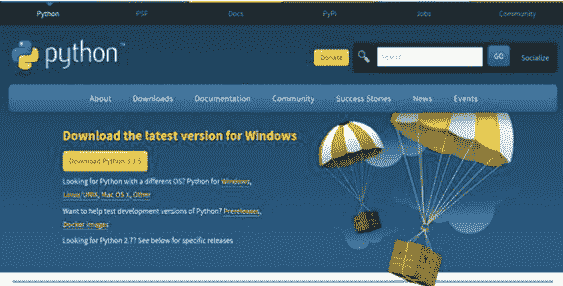

在 Windows 上，这会下载一个可执行文件，继续打开它并接受所有详细信息。选择 **Add Python 3.9 to PATH**。

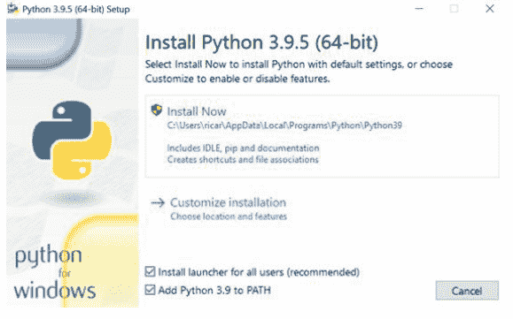

完成安装后，Python、IDLE、pip 和文档将安装在你的计算机上。

- IDLE 是捆绑在 Python 发行版中的集成开发学习环境。它是一个我们可以编写 Python 代码的 shell。可以把它想象成一个命令提示符。
- *pip* 是一个 Python 包管理系统，用于管理和安装软件包。
- 文档包括 Python 操作指南和教程。

### 在 macOS 上安装 Python

如果你有一台较新的 Mac，很可能已经安装了 Python 3，要检查，请在终端窗口中输入以下内容

```
python3 --version
```

你应该会看到类似 Python 3.8.9 的内容，任何高于 Python 3.7 的版本都应该足以满足本书的内容。

如果你在较旧的 Mac 上运行且未安装 Python 3，你需要安装它。最简单的方法是使用一个名为 Homebrew 的工具。

### 安装 Homebrew（如果未安装 Python3 或你只想运行最新最强大的功能）

Homebrew 是一款开发者工具，让你能在 macOS 和 Linux 上轻松安装软件包和工具。安装过程非常简单，打开终端并运行以下命令

```
/bin/bash -c "$(curl -fsSL https://raw.githubusercontent.com/Homebrew/install"
```

然后只需按照提示操作并接受默认设置，你应该会看到类似下面的输出。注意：系统可能会提示你输入管理员密码，这是正常的。

```
==> This script will install:
/opt/homebrew/bin/brew
/opt/homebrew/share/doc/homebrew
/opt/homebrew/share/man/man1/brew.1
/opt/homebrew/share/zsh/site-functions/_brew
/opt/homebrew/etc/bash_completion.d/brew
/opt/homebrew
==> The following new directories will be created:
/opt/homebrew/bin
/opt/homebrew/etc
/opt/homebrew/include
/opt/homebrew/lib
/opt/homebrew/sbin
/opt/homebrew/share
/opt/homebrew/var
/opt/homebrew/opt
/opt/homebrew/share/zsh
/opt/homebrew/share/zsh/site-functions
/opt/homebrew/var/homebrew
/opt/homebrew/var/homebrew/linked
/opt/homebrew/Cellar
/opt/homebrew/Caskroom
/opt/homebrew/Frameworks
==> The Xcode Command Line Tools will be installed.

Press RETURN to continue or any other key to abort:
```

按下回车键，让它安装所有需要的组件。Homebrew 下载和安装所有依赖项可能需要几分钟时间，所以不妨去冲杯咖啡 ☕

安装完成后，你应该会看到一个名为 **下一步** 的部分，其中包含两条命令。复制这两条命令并运行它们。输出应该类似下面这样（但不会完全一样！所以不要复制这里的，而是复制你终端里显示的）

```
echo 'eval "$(/opt/homebrew/bin/brew shellenv)"'
>> /Users/administrator/.zprofile
eval "$(/opt/homebrew/bin/brew shellenv)"
```

现在你可以通过输入以下命令来安装 Python

```
brew install python
```

搞定，全部完成！

### 在 Linux 上安装 Python（具体为 Ubuntu 20.04）

Ubuntu 20.04 已经预装了 Python 3，所以你开箱即用！Linux 太棒了！不过正如我父亲常说的

> 信任，但要核实。

那么如何核实呢？在终端窗口中运行以下命令。

```
python3 --version
```

如果你看到类似下面的输出，那就没问题了！

> 结果：3.8.10

但是等等...这是 Python 3.8.10，如果我想要最新最强大的版本呢？那么你需要从源代码编译。从源代码编译稍微超出了本书的范围。不过，这并不太复杂，只是需要一些额外的工具。如果你想走这条路，这里有一份优秀的文档教你如何操作 https://devguide.python.org/setup/

如果你不想编译源代码，别担心，本书中我们将要做的所有内容在 Python 3.8.10 上都能完美运行。

## PyCharm 安装

你完全可以在文本编辑器中编写代码，然后在命令行中运行扩展名为 .py 的文本文件。但对于刚开始学习编程的人来说，这似乎没什么吸引力。在本书中，你将使用 Python IDE，让编写和理解代码变得轻松可控。有多种 IDE 可供选择，但在本书中，我使用 PyCharm。PyCharm 是由 JetBrains 公司开发的应用程序。

如果你想使用不同的 IDE，没问题！只是要知道，有些内容，主要是关于调试的章节，是专门为 PyCharm 编写的。

### 在 Windows 上安装 PyCharm

访问此网址，[https://www.jetbrains.com/pycharm/download](https://www.jetbrains.com/pycharm/download) 下载 **社区版（免费）** 的 PyCharm，它是开源的。专业版功能更丰富；但是，对于本书的目的来说，你不需要它。你可以下载文件，然后打开它并按照安装说明完成 PyCharm 的安装。

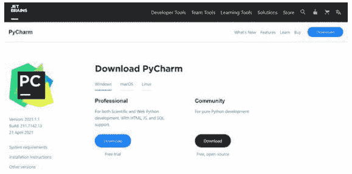

### 在 macOS 上安装 PyCharm

访问此网址，[https://www.jetbrains.com/pycharm/download](https://www.jetbrains.com/pycharm/download) 下载 **社区版（免费）** 的 PyCharm，它是开源的。专业版功能更丰富；但是，对于本书的目的来说，你不需要它。你可以下载文件，然后打开它并按照安装说明完成 PyCharm 的安装。

> **注意：** 如果你使用的是最新的 M1 芯片，请确保选择 Apple Silicon 版本。

#### 下载 PyCharm

- Windows
- macOS
- Linux

#### 专业版

#### 社区版

适用于科学计算和 Web Python 开发。支持 HTML、JS 和 SQL。

适用于纯 Python 开发

下载 .dmg (Intel)

下载 .dmg (Intel)

免费试用

免费，开源

> PyCharm 提供 Intel 和 Apple Silicon 版本

### 在 Linux 上安装 PyCharm

访问此网址，[https://www.jetbrains.com/pycharm/download](https://www.jetbrains.com/pycharm/download) 下载 **社区版（免费）** 的 PyCharm，它是开源的。专业版功能更丰富；但是，对于本书的目的来说，你不需要它。你可以下载文件，然后打开它并按照安装说明完成 PyCharm 的安装。

#### 下载 PyCharm

- Windows
- macOS
- Linux

#### 专业版

#### 社区版

适用于科学计算和 Web Python 开发。支持 HTML、JS 和 SQL。

适用于纯 Python 开发

下载

下载

免费试用

免费，基于开源构建

## 关于 IDE 的说明

IDE 是非常个人化的选择，有许多合适的 IDE 可供选择。为了方便起见，我在这里列出了一些，你可以自行查看并尝试所有这些。

- Visual Studio Code (VSCode)：一款出色的 IDE，我很喜欢。- https://code.visualstudio.com/
- PyCharm：非常棒 - https://www.jetbrains.com/pycharm/
- Sublime text：另一款优秀的编辑器 - https://www.sublimetext.com/
- Notepad：虽然不是真正的 IDE，但我想指出你也可以用它！

> 重要说明：在本书中，我将讨论一些我发现非常有用的 PyCharm 功能，其他 IDE 可能也有这些选项，但它们的工作方式可能不完全相同。你需要自行探索这些选项。

## Hello World！

安装完成后，你就可以使用 PyCharm 了。打开 PyCharm 社区版应用程序。应该会出现“创建项目”窗口，如下所示。转到窗口顶部的“文件”，然后选择 **新建项目...**

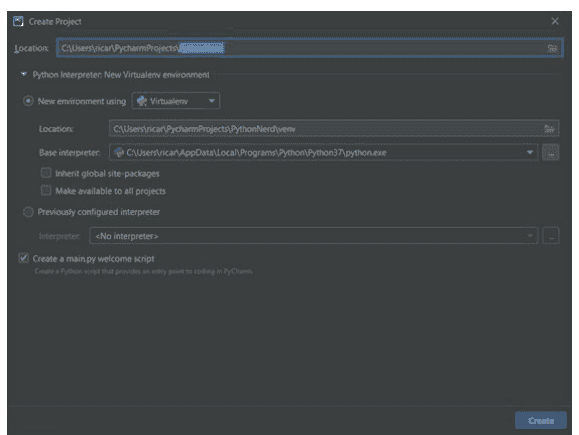

在位置字段中，将项目名称输入为 **PythonNerd**，而不是默认文本 **pythonProject**。“创建项目”窗口中的所有其他默认设置都可以直接使用。点击“创建”继续。你的新项目环境应该需要几分钟来加载。

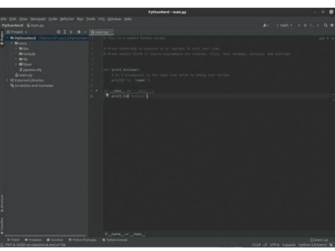

现在你的项目已经创建好了，让我们来看看工作区。在屏幕左侧，是你的项目文件和文件夹列表。在那下面，你还会注意到有名为 libs 的文件夹，这些是内部和外部库。我将在本书后面更详细地讨论这些。名为 main.py 的文件是一个 Python 文件。所有 Python 文件或脚本/程序都需要有 .py 才能运行。

右侧的内部窗口是你放置每个脚本 Python 代码的地方。该窗口当前显示的是你的 main.py 脚本的代码。选择右上角的绿色三角形或运行按钮，查看脚本的实际运行效果。在你的工作区正下方应该会神奇地出现一个窗口，显示 main.py 代码的执行结果。恭喜你运行了你的第一个 Python 脚本！

*结果：Hi, PyCharm*

***

## Python 变量简介

在这里，你将专注于 Python 的一些基础知识。我将向你介绍变量、几种数据类型，以及如何打印语句来查看程序输出，就像你在上一节末尾的程序中看到的那样。

确保你的 PyCharm PythonNerd 程序窗口已打开并准备好供我们使用——右键单击左侧的 Program 文件夹，然后选择“新建”。在菜单中，选择 **Python 文件**。会弹出一个菜单，提示输入名称。

将文件命名为 **intro_to_variables.py**。注意文件名全部小写，并使用下划线而不是空格。使用在Python中，使用下划线来表示空格是标准做法。你正在创建的Python文件是脚本或程序。还有其他你将要学习的Python文件，称为模块、包或库。它们都使用`.py`扩展名！

编写代码时，遵循最佳实践或广泛认可的标准总是理想的。幸运的是，Python有一个被称为[Python开发者指南](https://docs.python.org/3/glossary.html#term-developer-guide)的东西。该指南包含被称为Python增强提案（PEP）的文档，这些提案定义了Python的编码标准。在本书中，我将使用[PEP 8，即Python代码风格指南](https://peps.python.org/pep-0008/)标准。

该指南指出：“Guido的一个关键见解是，代码被阅读的频率远高于被编写的频率。此处提供的指导原则旨在提高代码的可读性，并使其在广泛的Python代码中保持一致。”我们必须通过坚持这些标准来延续这一传统。是时候深入探索了！

### 理解变量

程序的基本要素之一是使用变量。**变量**是一个名称，它在内存中保存一个值，以便在程序中稍后访问。这听起来有点复杂。让我们用一个例子来说明。

假设我想给一个也是极客的用户起名叫Casey。我可以用以下代码将名字**Casey**存储在一个名为**nerd_name**的变量中：

```
nerd_name = "Casey"
```

哇，这看起来毫不费力。我只是将名字Casey赋值给了变量**nerd_name**。现在我可以在整个程序中使用变量**nerd_name**来表示一个名叫Casey的极客。

注意“Casey”周围有引号。在Python中创建文本变量时，这些引号是必需的。赋值给变量的文本被称为**字符串**。我们例子中的名字Casey就是一个字符串。假设我将**nerd_name**的值改为“Kelvin”。文本Kelvin现在是一个字符串，程序的其余部分可以通过引用该变量来访问它。

```
nerd_name = "Kelvin"
```

省略引号可能会在运行程序时导致错误。它也可能导致程序的其余部分无法访问该变量。IDE使得不可能省略其中一个引号。如果你忘记了，你会立即收到警告。IDE非常适合实时检查我们的工作！

变量可以存储的远不止字符串。它们可以存储其他数据类型，例如数值、表格、列表、元组、集合和字典。随着本书的进行，我们将详细介绍所有这些数据类型。

### 命名变量

正确命名我们的变量至关重要！有必要保持简单且足够描述性，以表明该变量存储的内容。例如，假设你想将一个学生姓名存储在一个变量中。你可能会将该变量命名为**student_name**或**studentName**。如果你想存储该学生的年龄，你可能会将变量命名为**student_age**或**studentAge**。请注意，所有变量名必须是唯一的。如果你有多个学生，你可以分配一个数字，例如**student_name3**或**studentAge3**作为第三个学生变量。

你可能已经注意到你创建的这些变量名的一些特点。每个变量都以小写字母开头。我们的变量都不应以大写字母或任何特殊字符开头。变量名不能使用空格。在本书中，我使用带下划线的格式来命名变量。因此，每个变量都遵循**student_name**格式。使用下划线是我的偏好，也是PEP 8风格指南的建议。所以，从技术上讲，你可以选择任何你喜欢的。然而，我强烈建议你使用PEP 8风格，因为这很可能是你在其他Python项目中会看到的。

## 数据类型

### 字符串

你已经了解了字符串。在我们的例子中，我的字符串只是一个单词。如果你想让那个变量包含更多单词呢？这可能吗？是的，一个字符串变量可以包含多个单词。你可以将整个句子赋值给一个字符串变量。让我们通过将一个句子赋值给名为**nerd_welcome**的变量来实际操作一下：

```
nerd_welcome = "Welcome to the Nerd Challenges Python 101 Course."
```

上面的赋值将字符串**“Welcome to Nerd Challenges Python 101 Course”**设置给了变量**nerd_welcome**。

### 数字

除了字符串数据类型，还有数字数据类型。你可以用同样的方式将数字直接保存到变量中。唯一的区别是你需要省略引号。让我们给我们的极客设定年龄为34岁：

```
nerd_age = 34
```

由于我省略了引号，Python将变量赋值为数字。即使保留引号，**nerd_age**变量仍然可以工作，但我们会将年龄保存为字符串。将数字存储为字符串是一个常见的错误，在进行数学计算时可能导致编程错误。记住，当你想将数字赋值给变量时，请省略引号。

这相当简单。让我们多谈谈数字。数字34是一个整数。在Python中，整数被称为**整数**。好的，那么小数叫什么呢？小数被称为**浮点数**。整数和浮点数变量之间的区别现在可能看起来不重要，但在后面的章节中会变得重要。

### 数学运算符

有了数字和赋值，也就有了执行数学运算的能力。如果出于某种原因，那个极客今天过生日，我可以通过加1来增加他的年龄，像这样。

```
nerd_age = 34 + 1
print(nerd_age)
```

结果：35

**nerd_age**变量现在被赋值为35。没错，Python将**34 + 1**视为一个数学表达式。加号是Python中可用的众多算术运算符之一。下表显示了一些可用于基本数学赋值的标准运算符。

| 运算符 | 名称 | 示例 |
| :--- | :--- | :--- |
| + | 加法 | x + y |
| - | 减法 | x - y |
| * | 乘法 | x * y |
| ** | 指数 | x ** y |
| / | 除法 | x / y |
| % | 取模 | x % y |

你可能熟悉大多数这些运算符，除了最后一个叫做**取模**的。取模返回x除以y的余数。让我们用之前的**nerd_age**变量来说明这一点。对于值x和y，我分别使用了数字三和二。所以x = 3，y = 2。

```
nerd_age = 3 % 2
print(nerd_age)
```

*结果：1*

通过设置**nerd_age = 3 % 2**，我将一赋值给了变量nerd\_age。一就是三除以二后得到的余数。我可以继续用任何两个数字这样做来返回余数。

**表示指数运算符。同样，我使用了变量nerd_age，数字三和二。三的二次方是九。赋值给**nerd_age**的值现在是**9**。

```
nerd_age = 3**2
print(nerd_age)
```

*结果：* 9

希望你喜欢这节编程中的数学课。我差点忘了这是一本教我们如何编程的书！

## 打印语句

到目前为止，你已经学会了如何将数值和字符串赋值给变量。在某些情况下，你甚至学会了如何执行数学运算作为赋值。运行我编写的任何赋值变量的代码都没有视觉输出。因此，最关键的问题是：你如何知道你的代码返回了预期的值？想一想，如果你不能在头脑中计算2的20次方怎么办？你如何检查这样的事情并确保代码是正确的？这个问题的答案是**打印函数**。

打印函数是你在编程中将学到的一个重要函数。打印函数允许你输出或显示一旦你执行或运行程序，就会得到相应的值。还记得你运行 `main.py` 程序时，它显示了 "Hi, PyCharm" 吗？那就是使用 `print` 函数并运行程序的直接结果。你可以使用以下语法 `print(string)` 来使用 `print` 函数。

回到你的 IDE 查看你的 **intro_to_variables.py** 脚本。在右侧窗格中，输入：

```
print("Welcome to the Nerd Challenges Python101 Course")
```

*结果：Welcome to the Nerd Challenges Python101 Course*

别忘了那些引号！在项目文件中右键单击该脚本。然后选择绿色的 **Run** 按钮来运行 **intro_to_variables.py** 脚本。

如果你完全按照我的指示操作，你应该会看到上面的输出。恭喜你刚刚编写并运行了你的第一个 Python 程序！你已经迈出了成为 Python 程序员的第一步。

用 `Print` 函数打印出那个字符串很酷，对吧？既然你可以继续打印东西，为什么止步于此呢？那只是一个简单的字符串。如果你决定多次打印那个欢迎语呢？你可以这样做。

```
print("Welcome to the Nerd Challenges Python101 Course")
print("Welcome to the Nerd Challenges Python101 Course")
print("Welcome to the Nerd Challenges Python101 Course")
```

结果：Welcome to the Nerd Challenges Python101 Course.
Welcome to the Nerd Challenges Python101 Course.
Welcome to the Nerd Challenges Python101 Course.

这看起来效果相当不错。试着自己打印一下。它能用，但似乎效率不高。假设你必须在程序的不同位置反复打印整个段落。那样的话，这很快就会变成一件真正的麻烦事。幸运的是，我们之前已经学习了如何使用变量。

你还记得今天早些时候我们学过的变量 **nerd_welcome** 吗？你设置了 **nerd_welcome** = **"Welcome to the Nerd Challenges Python101 Course"**。所以，假设你想打印出前面的例子，而不想把整个字符串重写三遍。那样的话，你可以将变量融入到 `print` 语句中。看看下面的代码如何简化最后一个例子。

```
nerd_welcome = "Welcome to the Nerd Challenges Python101 Course."
print(nerd_welcome)
print(nerd_welcome)
print(nerd_welcome)
```

结果：*Welcome to the Nerd Challenges Python101 Course.*
*Welcome to the Nerd Challenges Python101 Course.*
*Welcome to the Nerd Challenges Python101 Course.*

上面的代码产生了与之前相同的结果，而我们写的代码却少了很多。首先，我将我们的语句赋值给变量。然后，我使用 `print` 函数打印了该变量三次。注意，当你打印变量时，括号内不需要引号。

另一个需要掌握的相关概念是，Python 中的缩进很重要。你需要确保正确的间距和缩进，在这种情况下，缩进必须一致。如果你缩进这些行中的任何一行，在尝试执行程序时很可能会出错。我们将在后面的章节讨论函数时，再详细谈谈缩进。

### 单引号与双引号

我一直在用双引号编写 `print` 语句。也可以使用单引号来达到同样的效果。那么，为什么需要单引号呢？一个完美的例子是，如果有人想打印出一个已经包含引号的句子。

例如，假设我想输出
*Casey says, "Welcome to the Nerd Challenges Python 101 Course."*
这看起来很简单，但我不能直接使用

```
print("Casey says "Welcome to the Nerd Challenges Python 101 Course."" ).
```

如果你运行这段代码，Python 会返回一个 **SyntaxError**。引号不会让你得到想要的输出。你必须使用单引号来打印包含引号的语句。

让我们修正代码，使其输出你想要的内容：

```
print('Casey says "Welcome to the Nerd Challenges Python 101 Course"')
```

结果：Casey says "Welcome to the Nerd Challenges Python 101 Course"

### 转义字符

你可以使用 **转义字符** 来打印相同的语句。它们允许你插入通常在字符串中无效的字符。你使用一个反斜杠后跟你想显示的字符来插入转义字符。例如，如果你想打印与之前完全相同的字符串，但使用转义字符，你可以这样做：

```
print("Casey says \"Welcome to the Nerd Challenges Python 101 Course\"")
```

结果：Casey says "Welcome to the Nerd Challenges Python 101 Course"

| 代码 | 结果 | 示例 |
|---|---|---|
| \n | 换行 | "Hello Nerd" |
| \r | 回车 | "Hello \r Nerd" |
| \t | 制表符 | "Hello \t Nerd" |
| \\ | 反斜杠 | "\\" |
| \' | 单引号 | "'" |
| \" | 双引号 | "\"" |

### 字符串连接

Python 中的 **连接** 意味着使用 `+` 运算符将字符串连接在一起。如果你有多个不同的字符串，你如何将这些字符串组合起来打印出一条语句呢？在这个例子中，你有以下三个字符串：

1. Hello
2. Casey
3. Welcome to Nerd Challenges Python 101 Course!

让我们连接或组合这些字符串，以提供一个单独的 `print` 语句。你首先使用 `print` 函数。在括号中，放入每个字符串，并用 `+` 运算符分隔它们。查看下面的代码以获得更好的说明，并尝试自己运行它！

```
print("Hello " + "Casey" + " Welcome to Nerd Challenges Python 101 Course!")
```

*结果：* Hello Casey Welcome to Nerd Challenges Python 101 Course!

你通过在引号内添加空格，适当地分隔了每个字符串。在使用连接时，在每个字符串后留一个空格是一个好习惯。

好吧，这很简单。让我们继续学习字符串和变量的连接。清除工作区中的任何代码。这次你将使用一个变量来表示名字，打印出相同的语句，如下所示：

```
nerd_name = "Casey"
print("Hello " + nerd_name + " welcome to Nerd Challenges Python 101 Course")
```

*结果：Hello Casey welcome to Nerd Challenges Python 101 Course*

看！你的程序返回了相同的结果！这里唯一需要注意的是，在最后一个字符串的开头添加一个额外的空格以保持间距。变量 **nerd_name** 不包含任何空格；如果它包含空格，你就不需要在 `print` 语句中添加空格了。

### 字符串格式化 - 现代风格 format()

当变量也是字符串时，组合字符串和变量很容易。然而，如果变量是数字，情况就完全不同了。我们之前使用的连接方法不适用于数字。记住，连接只用于连接字符串。但是，我们还有另一种方法可以组合字符串和数字变量。为此，我们可以使用另一个名为 *format()* 的函数。`format` 函数允许我们将数字插入字符串中。

好的，现在让我们尝试使用字符串和变量的组合，打印出语句 "We are on Chapter 2 of the Python 101 book. I am 34 with 0 years of programming experience"。

首先，我将为所有数字创建变量。然后，我需要为要打印的字符串创建一个变量，方法是用开放的 {} 括号替换字符串中的数字。清除你的工作区并粘贴以下代码：

```
book_chapter = 2
python_series = 101
age = 34
programming_experience = 0
statement = "We are on Chapter {} of the Python {} book. I am {} with {} python experience."
print(statement.format(book_chapter, python_series, age, programming_experience))
```

*结果：We are on Chapter 2 of the Python 101 book. I am 34 with 0 python experience.*

`format` 函数中的变量对应于它在字符串语句中的位置。在这个例子中，变量 `book_chapter` 被替换为第一个 {}，python_series 用于接下来的 {}，age 用于接下来的 {}，最后 programming_experience 用于最后的 {}。可以包含的数值变量数量没有限制。

### 字符串格式化 - 传统 % 运算符

% 运算符之前在本章中用于执行算术运算。% 运算符也可用于格式化列表中一组固定的封闭变量。这已不再是常用做法，但它允许你在旧代码或 Python 2.6 及更早版本中快速识别使用 % 运算符的字符串。快速解释 % 运算符工作原理的唯一方法是查看其实际应用。

如果你想输出显示 "Hello Nerd Challenges LLC"，我们可能会编写代码

```
print("Hello Nerd Challenges LLC")
```

要使用传统 % 运算符编写此代码，你可以将公司名称替换为 %s，这表示在此位置插入一个字符串变量。在语句末尾，然后你会写 % 加上 **company_name**。让我们直接开始吧。

清除工作区中之前的所有代码。现在使用下面的传统代码格式编写 **"Hello Nerd Challenges LLC"**：

```
company_name = "Nerd Challenges LLC."
print("Hello %s" % company_name)
```

*结果：Hello Nerd Challenges LLC.*

上面的代码在使用传统格式运算符时，产生了与仅使用 print 语句相同的输出。请注意，你使用了 %s，因为我们的变量 **company_name** 是一个字符串，并且你想打印出一个字符串。如果你想打印一个十进制变量但将其输出为整数或整数呢？这很简单。你可以用某人的年龄来展示这一点。请看下面的示例：

```
nerd_age = 34.5
print("This user is %i" % nerd_age)
```

*结果：This user is 34*

运行上面的代码。你会看到 **nerd_age** 变量是一个十进制值。然而，当你打印这个十进制数时，它被打印为一个整数。原因是你使用了 %i 来转换变量类型。有一长串修饰符允许我们转换为另一种变量类型。下面是一些常见修饰符的精简表格。

| 修饰符 | 转换 |
| :--- | :--- |
| %d | 十进制 |
| %i | 整数 |
| %o | 八进制值 |
| %x | 十六进制 |
| %f | 浮点数 |

好的，现在我想打印不止一个变量。我该如何实现这一点？让我们运用你已经学到的知识来实现这一点。我可以通过输出以下语句来练习：

> “嘿，Casey 来自 Nerd Challenges，目前 34 岁”。

```
company_name = "Nerd Challenges"
nerd_age = 34.5
print("Hey Casey is from %s and currently %i years old" % (company_name, nerd_age))
```

结果：Hey Casey is from Nerd Challenges and currently 34 years old

如果你在运行屏幕上得到了上面的输出，那么你现在已经开始掌握使用传统字符串格式化器了。你可以添加任意数量的变量，并格式化不同或转换各种数据类型。请记住，print 语句中的变量必须按照你指定的顺序排列。

跟踪许多变量很快就会变得繁琐。使用 % 运算符有一种更简单的方法。这种方法在 print 语句中使用内联变量和一个**键值对**。基于我们上一个示例并将其转换为这种方法。请参见下文：

```
print("Hey Casey is from %(company_name)s and currently %(nerd_age)i years old" %
{"company_name": "Nerd Challenges LLC",
"nerd_age": 34.5})
```

结果：Hey Casey is from Nerd Challenges LLC and currently 34 years old

很简单，这种方法消除了当有多个变量时的猜测游戏。你可能再也不会这样写代码了，但至少如果它出现在旧的 Python 2.7 代码中，你会熟悉它。

### 字符串格式化 - f-Strings

随着 Python 3.6 的出现，一种新的字符串格式化方法出现了，称为**字符串插值**或 **f-Strings**。这种方法结合了 Python 使代码更易于阅读和编写的能力。既然我们正在学习 Python，这使我们的工作变得容易得多。语法非常简单。你首先为变量赋值。然后你打印带有内联变量的语句。唯一的区别是你在第一个引号前包含字母 *f*。再次清除你的工作区。让我们回到我们之前的一个示例，并使用 f-Strings 将其转换：

```
book_chapter = 1
python_series = 101
print(f"We are on Day {book_chapter} of the Python {python_series} book.")
```

*结果：We are on Day 1 of the Python 101 book.*

在花括号内，你可以计算任何 Python 表达式。你甚至可以在 print 语句中包含数学运算，例如将书籍章节增加 1。尝试在你之前的代码中添加 + 1：

```
book_chapter = 1
python_series = 101
print(f"We are on Day {book_chapter + 1} of the Python {python_series} book.")
```

结果：We are on Day 2 of the Python 101 book.

非常巧妙，对吧！你刚刚在 print 语句中将章节增加了 1。这种方法功能强大。将这个宝贵的工具作为你 Python 工具箱的一部分。

* * *

## 注释简介

到目前为止，你编写的大多数代码只有几行。随着你进一步深入编程，可能会有数百行代码。在大型应用程序中，这可能接近数千行。在这样的应用程序中，可能有一个完整的程序员团队在处理单个项目或复杂功能。为了帮助代码的连续性和理解，程序员使用**注释**。注释分布在程序中，为我们提供关于正在发生什么的提醒。它也为阅读代码的其他人增加了更多澄清。

单行注释的语法是 #（官方称为 Octothorpe，也称为 hashtag）。你可以通过插入 # 来注释代码以解释正在发生的事情：

```
# Python does not execute a comment line
print("However, this line prints!")
```

*结果：However, this line prints!*

注释告诉你下面的代码行在做什么。它不会被打印出来，甚至不会改变执行代码的输出。当其他开发人员试图理解你的代码时，它很有帮助。

第一行只有有限的空间来提供注释。有时注释需要多行来解释程序中正在发生的事情。在后续行中放置句子可能更有意义。与单行注释不同，多行注释以三个单引号 ''' 开始和结束：

```
''' This is a multi-line comment
The only line that is output by Python is the print statement
This line is ignored. It is just a way for developers to document code.
The final program prints The value of x is 3
'''
x = 3
print(f"The value of x is {x}")
```

结果：The value of x is 3

注释可以帮助进行故障排除或调试代码。如果你的代码中有错误，你可能考虑注释掉部分代码。注释允许你隔离问题，使其更容易修复。尝试运行下面的代码：

```
print("Nerd Challenges are awesome!")
print(Nerd Challenges can be challenging)
```

结果：print(Nerd Challenges can be challenging). SyntaxError: invalid syntax

代码似乎无法工作，因为存在语法错误。这很奇怪，因为我向代码添加了一行，现在它不工作了。让我注释掉我刚刚添加的代码部分：

```
print("Nerd Challenges are fantastic!")
# print(Nerd Challenges can be challenging)
```

结果：Nerd Challenges are fantastic!

由于你没有收到错误，因此该特定代码行存在问题。你看出问题所在了吗？

问题在于我在 print 语句中字符串外部的引号缺失了。你可以将引号添加回 print 语句并删除注释。

## 问答回顾

1.  什么是 IDE？
    -   集成开发环境：基本上是一个文本编辑器，提供一系列工具帮助你编写更好的软件。
    -   整数破坏环境：一个允许你破坏整数的编辑器。
    -   不可变开发环境：一个不可变的编辑器，一旦输入就刻在石头上。

2.  最好的 IDE 软件是什么？
    -   VS Code
    -   Pycharm
    -   Notepad
    -   Sublime Text
    -   Notepad++
    -   这是个陷阱问题！答案是我个人最喜欢的那个，基于我的个人原因。

3.  什么是变量？
    -   变量是代码在应用程序生命周期中自行随时间变化的部分。
    -   Python 中没有变量，只有整数。这是个陷阱问题。
    -   变量允许你通过指定一个属性来引用数据，之后你可以在应用程序中引用该属性。例如 `my_name = “Casey”` 就是一个变量。

4.  在 Python 3 中如何向终端窗口打印内容？
    -   `log(‘I print things like this’)!`
    -   `display(‘Printing cool text’);`
    -   `print(“This doesn’t print anything!“)`

5.  为什么应该使用注释？
    -   为了嘲弄查看代码的其他开发者。
    -   Python 3 中没有注释。
    -   为 Python 程序提供有意义的上下文。

6.  你能有多行注释吗？
    -   真
    -   假

## 第一天挑战

-   千字节挑战：尝试修改 main.py 文件，让它不说 ‘Hi PyCharm’ 而是说 ‘Hi, Nerds!’
-   千字节挑战：如果你在有效的 Python 命令同一行添加注释会发生什么？例如：
    ```python
    print("This is a valid python command") # This is a comment
    ```
-   兆字节挑战：如果你在 print 语句内部放置一个 # 会发生什么？例如：
    ```python
    print("This shouldn't print # right...?")
    ```

# 第二天：探索数据类型

阅读时间：15 分钟

在本章中，你将更深入地了解数据类型和运算符。我将带你踏上在上一章所学概念基础上构建的旅程。你将接触到的数据类型包括列表、元组、集合和字典。这些在许多其他编程语言中也能找到。然后我将讨论类型转换，这将允许我们将一种数据类型的值转换为另一种。接着是学习两种称为隐式和显式类型转换的转换类型。阅读完第 3 章后，你将能够非常自如地用 Python 编写代码。

## 列表

列表是 Python 中最常用的数据类型之一。它们为我们提供了组织项目和跟踪不同数据类型的能力。通常，列表包含一组相关的值。列表也不限于一种数据类型。你可以有一个包含字符串、数字、另一个列表、元组、布尔值甚至二进制组合的列表。

你可以使用方括号 `[ ]` 来创建一个列表。你将任何数据类型的变量或元素放在这些方括号内。你将列表保存在一个变量中，就像保存任何其他数据类型一样。让我们继续创建我们的第一个列表，我将其保存在一个名为 **genius_name** 的变量中。我们可以赋值 **geek_names** = `["Nikola", "Tesla", "Thomas", "Edison"]`。注意所有数据类型都是字符串。然而，数据类型不必如此。我可以在这个列表中包含数字。我将添加数字 100 来展示这一点。所以 **geek_names** = `["Nikola", "Tesla", 100, "Thomas", "Edison"]`。让我们像打印任何其他变量一样打印出来看看结果：

```python
geek_names = ["Nikola", "Tesla", 100, "Thomas", "Edison"]
print(geek_names)
```

结果：`['Nikola', 'Tesla', 100, 'Thomas', 'Edison']`

看，这就是你在 Python 中创建的第一个列表！

### 列表索引

列表中的项目是索引的，这意味着每个项目都处于一个有序的位置。任何列表中的第一个项目是 *index[0]*，而不是 *index[1]*。理解任何列表中的第一个项目都在 *index[0]* 中很重要！在我刚刚创建的列表中，‘**Nikola**’ 在位置 0，‘**Tesla**’ 在位置 1，依此类推。列表中的项目是有序的、可更改的，并且允许有重复项。

在示例中，我打印了整个 **geek_names** 列表。有时打印整个项目列表是有益的。然而，你可能想要从一个广泛的项目列表中选择一个项目。这就是你索引知识派上用场的地方。如果你想打印列表中的第 4 个项目，也就是第 3 个索引，你该怎么做？实际上很简单。你打印带有方括号的变量，包括你想要打印的索引。让我们看看索引的实际应用：

```python
geek_names = ["Nikola", "Tesla", 100, "Thomas", "Edison"]
print(geek_names[3])
```

*结果：Thomas*

看到了吗？我能够选择列表中的一个项目并打印出来。继续尝试使用它们的索引打印列表中的其他项目。但如果你想打印最后一个项目或倒数第二个项目呢？使用之前的方法，你必须计算列表中的所有项目。让我们不要花所有时间来计算列表中的每一个项目。任何列表中的最后一个项目是 *index[-1]*。要打印 **geek_names** 列表中的最后一个项目，你可以使用另一个带有 *index[-1]* 的 print 语句。

```python
geek_names = ["Nikola", "Tesla", 100, "Thomas", "Edison"]
print(geek_names[-1])
```

结果：Edison

如果我决定打印倒数第二个项目，我可以简单地将 *index[-1]* 替换为 *index[-2]*。有时也需要知道列表中的项目数量。这就是函数 *len()* 派上用场的地方。你可以使用此函数确定列表的长度或项目数量。要找出 **geek_names** 的长度，我可以执行以下操作：

```python
geek_names = ["Nikola", "Tesla", 100, "Thomas", "Edison"]
print(len(geek_names))
```

结果：5

数字 5 是 **geek_names** 列表中的项目总数。现在你知道了长度，你可以使用变量前的 `[X:Y]` 来选择一系列项目。**X** 是第一个索引，**Y** 是最后一个索引。当你选择一系列项目时，最后一个数字或 **Y** 不会被返回。现在让我们打印列表，除了最后一个项目 “Edison”。

```python
geek_names = ["Nikola", "Tesla", 100, "Thomas", "Edison"]
print(geek_names[0:4])
```

结果：`['Nikola', 'Tesla', 100, 'Thomas']`

如果你想一直到最后并打印出 Edison，你可以简单地将 **[0:4]** 替换为 **[0:5]**。这看起来很简单，但你可能不知道长度或不想查找列表的长度。另外，想想如果列表发生变化会发生什么。例如，你总是可以向列表中添加或删除项目。硬编码一个数字来打印可能不是最佳选择。更合适的选择是使用 `[X:]` 或者对于这个特定情况使用 `[0:]`。

```python
geek_names = ["Nikola", "Tesla", 100, "Thomas", "Edison"]
print(geek_names[0:])
```

结果：`['Nikola', 'Tesla', 100, 'Thomas', 'Edison']`

好的，现在让我们快速打印从 “Tesla” 到 “Thomas” 以进行一些额外的练习。代码如下：

```python
geek_names = ["Nikola", "Tesla", 100, "Thomas", "Edison"]
print(geek_names[1:4])
```

结果：`['Tesla', 100, 'Thomas']`

现在我不喜欢这个列表中有一个数字。它看起来格格不入，因为它是唯一的数值。我们如何将该数字数据类型更改为与其他项目类似的字符串？我们可以这样做，因为我们知道数字 **100** 的索引。

```python
geek_names = ["Nikola", "Tesla", 100, "Thomas", "Edison"]
geek_names[2] = "Einstein"
print(geek_names)
```

*结果：* `['Nikola', 'Tesla', 'Einstein', 'Thomas', 'Edison']`

你已经将数字 **100** 替换为 **"Einstein"**。爱因斯坦现在是 **geek_names** 列表的 *index*[2]。你只需知道索引就可以替换列表中的任何其他项目。正如我之前所说，你可以在列表中添加任何你想要的数据类型。

你也可以通过名称查找项目来找到索引位置。我可以在列表中搜索，找到“Tesla”的第一个索引位置。

```
geek_names = ["Nikola", "Tesla", 100, "Thomas", "Edison"]
print(geek_names.index("Tesla"))
```

*结果：1*
数字**1**代表*索引[1]*，即找到Tesla值的位置。如果你尝试搜索一个不在列表中的值，控制台窗口会返回一个错误。

## 列表函数

除了能够替换项目外，还有许多函数可以修改列表。与其在这里全部介绍，我提供几个列表来帮助你设置环境，这样你就可以尝试下表中的一些函数：

```
nerd_names = ["CJ", "Albert" , "Kelv",
"Prodigy", "Rico", "Jamison"]
geek_names = ["Nikola", "Tesla", "Thomas",
"Edison"]
nerd_ages = [8, 12, 25, 13, 15, 18]
geek_ages = [1, 16, 14, 22, 10, 31]
nerd_pop = ["pop1", "pop2", "pop3"]
```

| 函数 | 描述 | 示例 | 结果 |
| :--- | :--- | :--- | :--- |
| Extend | 允许你将一个列表追加到另一个列表 | nerd_names.extend(geek_names) | 将geek_names列表添加到nerd_names列表的末尾 |
| Append | 将一个项目添加到列表的末尾 | nerd_ages.append(70) | 将数字70添加到nerd_ages列表的末尾 |
| Insert | 在列表中的任意位置添加一个项目 | geek_names.insert(1, "Newton") | 在索引1处插入Newton |
| Remove | 移除列表中的一个元素 | nerd_names.remove("Jamison") | 从nerd_names列表中移除Jamison |
| Clear | 清空整个列表 | geek_ages.clear() | 清空geek_ages列表中的所有项目 |
| Pop | 弹出列表中的最后一个项目 | nerd_pop.pop() | 结果是从nerd_pop列表中移除pop3 |
| Count | 统计列表中相同元素的数量 | nerd_names.count("Albert") | 结果为数字1，表示Albert出现一次 |
| Sort | 按字母顺序或升序对列表进行排序 | geek_names.sort() | 结果是列表按字母顺序或升序排列 |
| Reverse | 反转列表的顺序 | nerd_ages.reverse() | 这会将列表置于反向顺序 |
| Copy | 允许用户将列表复制到另一个变量 | nerd_ages2 = nerd_ages.copy() | 将nerd_ages列表复制到nerd_age2变量 |

## 元组

**元组**在Python中与列表非常相似。它是一种数据结构类型，充当存储不同值的容器。就像列表一样，单个元组中可以存储多种数据类型。元组中的所有值都以它们被排序的相同方式执行。这本质上意味着，如果你创建一个元组，它会按照被赋值给变量的顺序打印出来。

关于元组，最重要的一点是它们的内容以后不能被更改或修改。元组的这个特性被称为**不可变**。一旦我们将一个元组赋值给一个变量，就无法更改该元组中的值。因此，如果你处理任何值必须更改的数据，建议你使用列表！元组中的内容是永久的。元组通常在程序中的数据预计不会更改时使用。

元组用开括号和闭括号 ( ) 表示。你可以在这些括号中放入任何数据类型的变量或元素。

让我们继续创建你的第一个元组，包含一组形状。我将变量**my_shapes**赋值为 (**Circle**, **Rectangle**, **Square**, **Triangle**)。我在程序中处理的这些形状是永久的。我不打算从我们的元组中添加、删除或修改它们中的任何一个。它们本质上是固定的。让我们打印出你的第一个元组，看看我们得到什么。

```
my_shapes = ("Circle", "Rectangle", "Triangle", "Square")
print(my_shapes)
```

结果：(‘Circle’, ‘Rectangle’, ‘Triangle’, ‘Square’)

### 元组中的数据

访问元组中的数据或项目与列表的语法相同。你使用方括号来标识所选数据的索引。例如，假设你想打印出形状“Rectangle”。你的代码只需是 print(my_shapes[1])，这是my_shapes元组中的第二个值。但是，嘿，如果你决定不想要“Rectangle”而想要“Trapezoid”呢？你之前已经轻松地更改过列表中的值。让我们看看当你尝试以下操作时会发生什么：

```
my_shapes = ("Circle", "Rectangle", "Triangle",
"Square")
my_shapes[1] = "Trapezoid"
print(my_shapes)
```

结果：SyntaxError: invalid character ‘“’ (U+201C)

这看起来有点乱！我认为我们以前没有见过这样的错误消息。我确实谈过元组是不可变的。这意味着元组中的值不能被更改为任何东西。在我们的例子中，你试图将**“Rectangle”**更改为**“Trapezoid”**。在使用元组时这是不允许的。这也给我们带来了另一个结论。我们之前表格中讨论的所有那些列表函数都不适用于元组，因为它们涉及更改其内容。

关于元组，最后一个要复习的主题是数据类型。可能有那么一刻，你想在元组中存储的不仅仅是字符串或数字值。你甚至可以在元组中存储一个列表，反之亦然。看看下面的代码：

```
my_shapes = ("Circle", "Rectangle", "Triangle",
"Square", [0, 4, 4, 3])
print(my_shapes)
```

结果：(‘Circle’, ‘Rectangle’, ‘Triangle’, ‘Square’, [0, 4, 4, 3])

我刚刚创建了一个元组，其中嵌入了一个列表！

## 集合

**集合**是另一个值得讨论的数据类型。它用于存储无序且不需要重复项的数据。想象一个单个骰子。一个骰子有六个可能的值。如果掷出，它一次只能有一个值，所以一个骰子上的点数不会重复。我可以将骰子表示为一个集合。我可以用花括号 { } 将骰子的值括起来：

```
my_die = {1, 2, 3, 4, 5, 6, 1, 2}
print(my_die)
```

*结果：* {1, 2, 3, 4, 5, 6}

在输出中请注意，我们的集合不包含任何重复项。集合只存储一个值一次。你可以将相同的6个骰子值添加一百次，这不会改变我们的输出。在这个例子中，6个值是按数字顺序排列的。在集合中情况并非总是如此。你**永远**不应该期望值以任何顺序执行或存储。集合中的值应始终被视为任意的。你的第一个数字可以是集合中的任何数字，集合中的每个值也是如此。

还有一种方法可以在集合中搜索特定值。如果你想知道数字3是否在我们的my_die集合中，你可以写：

```
my_die = {1, 2, 3, 4, 5, 6, 1, 2}
print(3 in my_die)
```

*结果：True*

在print函数中，你正在集合中搜索数字**3**。**TRUE**表示在集合中找到了数字**3**。如果我们寻找数字**7**，输出将是**FALSE**。**TRUE**和**FALSE**是表达式求值时返回的布尔值。在这种情况下，你评估一个数字是否是一组数字的一部分。

### 集合函数

在使用集合时，还有其他有用的函数或方法。清除你的代码，并用以下集合设置你的环境：

```
my_vowels = {"a", "e", "i", "o", "u"}
my_alpha = {"a", "b", "c", "d", "e"}
```

第一个要看的函数叫做**交集**。交集方法用于确定两个集合中是否有共同的项目。你可以使用你创建的两个集合来说明这一点：

```
print(my_vowels.intersection(my_alpha))
```

结果：{‘a’, ‘e’}

下一个要看的函数叫做**差集**。差集方法用于确定你创建的两个集合之间是否有不同的项目。这个例子展示了差集方法如何在两个集合中使用：

```
print(my_vowels.difference(my_alpha))
```

结果：{‘o’, ‘i’, ‘u’}

最后一个函数叫做**并集**。并集方法将两个不同的集合连接在一起。你可以使用之前创建的两个集合来展示当两者连接在一起时会发生什么：

```
print(my_vowels.union(my_alpha))
```

*结果：* {‘d’, ‘c’, ‘i’, ‘o’, ‘e’, ‘u’, ‘a’, ‘b’}

## 字典

**字典**与列表类似。它们存储一个有序对象的集合。与其他数据结构不同的是，它们不是通过数字索引，而是通过键来索引。其语法与集合非常相似，使用花括号 `{ }` 来表示一个字典。与集合不同，字典中的每个值都有一个键值对。因此，每一对至少包含一个由冒号分隔的**键**和一个**值**。后续的对之间用逗号分隔。让我们创建第一个存储在变量 **day_conversion** 中的字典：

```
day_conversion = {
    "Mon": "Monday",
    "Tues": "Tuesday",
    "Wed": "Wednesday",
    "Thurs": "Thursday",
    "Fri": "Friday",
    "Sat": "Saturday",
    "Sun": "Sunday",
}
```

一个需要注意的重要点是缩进。每个键值对都在变量名下缩进。变量下方的第一列是键。Mon、Tues、Wed 等都是**键**。下一列包含每个键对应的值。本质上，我们说的是每个值都由一个唯一的键表示。键必须始终不同，在字典中不能重复。然而，这些键的值可以是相同的。两个不同的键可以拥有相同的值。让我们打印这个字典，同时打印键 "Wed" 对应的值：

```
print(day_conversion)
print(day_conversion["Wed"])
```

结果：{‘Mon’: ‘Monday’, ‘Tues’: ‘Tuesday’, ‘Wed’: ‘Wednesday’, ‘Thurs’: ‘Thursday’, ‘Fri’: ‘Friday’, ‘Sat’: ‘Saturday’, ‘Sun’: ‘Sunday’}
Wednesday

我刚刚打印了包含所有键值对的整个字典。然后我能够通过使用键 "Wed" 来打印值 "Wednesday"。这可以用于我们字典中的任何键。键也不限于字符串。你也可以使用数字、元组和列表。一个类似的字典可能包含一年中的月份。如果你打印一个字典中不存在的键，使用之前的方法会返回一条错误消息。*get( )* 方法允许我们的程序在找不到键时继续运行而不会中断。让我们用 *get( )* 方法重写我们的代码，并输入一个错误的键：

```
print(day_conversion.get("not_in_dictionary"))
```

*结果：None*

现在，从字典中不存在的键返回的值只是 none。如果我将 "not_in_dictionary" 替换为字典中的一个键，它会像之前一样返回该键的值。当打印字典或遍历一个键可能存在也可能不存在的字典列表时，使用此方法更好。

字典的值不能像列表那样被更改。没有索引，因此更改其内容中值的唯一方法是使用键。让我们尝试使用其键将 **"Sunday"** 的值更改为 **"Funday"**，看看结果如何：

```
day_conversion = {
    "Mon": "Monday",
    "Tues": "Tuesday",
    "Wed": "Wednesday",
    "Thurs": "Thursday",
    "Fri": "Friday",
    "Sat": "Saturday",
    "Sun": "Sunday",
}
day_conversion["Sun"] = "Funday"
print(day_conversion)
```

*结果：* ‘Fri’: ‘Friday’, ‘Sat’: ‘Saturday’, ‘Sun’: ‘Funday’

看，你现在有了 Funday 而不是 Sunday。只需记住，修改字典时，你必须针对键，而不是索引。很简单。

你可以使用字典来表示对象。如果我们想存储用户 Casey 的信息。你可以将变量或对象命名为 **caseydict**，并捕获有关他姓名和工作信息的特征。该字典可能如下所示：

```
caseydict = {
    "name": {
        "prefix": "Mr.",
        "first": "Casey",
        "last": "Gerena",
        "suffix": "Jr"
    },
    "job": {
        "company": "Nerd Challenges LLC",
        "position": "Lead Nerd",
        "location": {
            "address": "123 NC Blvd",
            "city": "Tampa",
            "state": "Florida",
            "zip": 33601
        }
    }
}
```

```
print(caseydict)
```

结果：{'name': {'prefix': 'Mr.', 'first': 'Casey', 'last': 'Gerena', 'suffix': 'Jr'}, 'job': {'company': 'Nerd Challenges LLC', 'position': 'Lead Nerd', 'location': {'address': '123 NC Blvd', 'city': 'Tampa', 'state': 'Florida', 'zip': 33601}}}

尝试自己运行这段代码。你会清楚地看到，在字典中存储键值对如何应用于现实世界场景，例如构建数据库或存储重要的用户信息。这种格式与 JavaScript 对象表示法 (JSON) 完全相同。

## 类型转换

Python 中另一个需要学习的有用工具是**类型转换**。类型转换涉及将一种数据类型转换为另一种数据类型。我在本章和上一章讨论了大多数标准数据类型。变量可以存储所有不同数据类型的值。某些操作可能需要变量的值处于特定的数据类型才能成功执行操作。这就是类型转换或类型转换变得必要的地方。类型转换有两种类型：

- 隐式类型转换
- 显式类型转换

### 隐式类型转换

**隐式类型转换**自动将数据类型从一种类型转换为另一种类型。Python 执行隐式类型转换，它不需要用户进行任何交互来进行隐式类型转换。当你将值赋给变量时，隐式类型转换就会发生。当你设置变量 **nerd_name = "Casey"** 时，Python 自动将此值转换为字符串数据类型。

你可以使用 *type()* 方法检查我们的变量是什么数据类型。*type()* 方法让你了解变量是如何被隐式类型转换的。让我们使用此方法检查一些我之前讨论过的数据类型：

```
nerd_name = "Casey"
nerd_age = 34
pi = 3.1415926535897

nerd_names = ["CJ", "Albert", "Kelv", "Prodigy", "Rico", "Jamison"]
my_shapes = ("Circle", "Rectangle", "Triangle", "Square")
my_die = {1, 2, 3, 4, 5, 6, 1, 2}

print(type(nerd_name))
print(type(nerd_age))
print(type(pi))
print("\n")
print(type(nerd_names))
print(type(my_shapes))
print(type(my_die))
```

结果：<class ‘str’>
<class ‘int’>
<class ‘float’>

<class ‘list’>
<class 'tuple'>
<class 'set'>

我忘了包含我们刚刚讨论的字典数据类型！让我们打印分配给变量 **day_conversion** 的字典的数据类型。

```
day_conversion = {
    "Mon": "Monday",
    "Tues": "Tuesday",
    "Wed": "Wednesday",
    "Thurs": "Thursday",
    "Fri": "Friday",
    "Sat": "Saturday",
    "Sun": "Sunday",
}
print(type(day_conversion))
```

结果：<class 'dict'>

Python 也可以对两种不同数据类型的数字进行数学计算。看看当我将整数 **nerd_age = 34** 和浮点数 **pi = 3.141592653589793** 相加时会发生什么：

```
nerd_age = 34
pi = 3.1415926535897
sum = nerd_age + pi
print(sum)
print(type(sum))
```

*结果：37.1415926535897 <class 'float'>*

你会注意到最终的值或总和的数据类型是 **float**。Python 为你自动转换了它。总和是整数没有任何意义。这样做会导致截断小数部分，产生不正确的值。Python 帮助我们，因此通过隐式类型转换不会发生这种情况。

### 显式类型转换

**显式类型转换**使用预定义函数将数据类型从一种转换为另一种。下面是常见预定义函数的列表；然而，还有许多其他函数。

- **str()** - 将值转换为字符串
- **int()** - 将值转换为整数
- **float()** - 将值转换为浮点数/小数
- **list()** - 将值转换为列表
- **tuple()** - 将值转换为元组
- **set()** - 将值转换为集合

当你在第 2 章中连接字符串时，如果你尝试打印

## 第二天挑战

- 千字节挑战：创建一个包含`apple`和`banana`的水果列表。列表创建后，使用append方法向列表中添加一种新水果。

# 第三天：运算符

*阅读时间：3分钟*

本章将深入讲解Python运算符。我将在第二章介绍的基础算术运算符基础上进行扩展，讲解如何执行数学运算。Python运算符可分为以下几类：算术运算符、赋值运算符、位运算符、比较运算符、身份运算符、逻辑运算符和成员运算符。下表对各类运算符进行了概述：

- **算术运算符** - 用于执行数学运算
- **赋值运算符** - 用于为变量赋值
- **位运算符** - 用于比较二进制数字
- **比较运算符** - 用于比较两个变量或值
- **身份运算符** - 用于判断一个值是否是某个特定值（即**True**或**False**）
- **逻辑运算符** - 用于条件语句
- **成员运算符** - 用于判断一个值是否在某个集合或序列中

## 算术运算符

让我们通过下表回顾第二章所学内容。我在表中新增了一个运算符，称为地板除法。地板除法会将商向下取整为最小的整数。为简化起见，我们设变量x = 1，y = 3。请查看表格最后一列，了解使用每个运算符得到的结果。

| 运算符 | 名称 | 示例 | 结果 |
| :--- | :--- | :--- | :--- |
| + | 加法 | x + y | 4 |
| - | 减法 | x - y | -2 |
| * | 乘法 | x * y | 3 |
| ** | 幂运算 | x ** y | 1 |
| / | 除法 | x / y | 0.333333 |
| % | 取模 | x % y | 1 |
| // | 地板除法 | x//y | 0 |

## 赋值运算符

你一直在使用“=”**赋值运算符**为变量赋值。在后续的编码学习中，还会用到其他几种赋值运算符。现在不必过于关注这些运算符。当你学习for和while循环时，就会用到它们。

| 运算符 | 名称 | 示例 | 结果 |
| :--- | :--- | :--- | :--- |
| = | 赋值 | x = 5 | x = 5 |
| += | 加法赋值 | x += 3 | x = x + 3 |
| -= | 减法赋值 | x -= 2 | x = x - 2 |
| *= | 乘法赋值 | x *= 4 | x = x * 4 |
| /= | 除法赋值 | x /= 6 | x = x / 6 |

## 位运算符

**位运算符**用于比较两个二进制数。这些运算符仅在处理包含0和1的二进制数时使用。目前无需深入探讨。本书中的所有数字均为整数或小数。

## 比较运算符

**比较运算符**在你创建的大多数Python程序中都会用到，特别是包含if-else语句、while循环和for循环的程序。使用比较运算符，你可以比较两个变量，然后在满足特定标准或条件时执行一组指令。你将在第五天学习更多关于比较运算符的知识，现在只需了解这些符号及其用法。

| 运算符 | 名称 | 示例 |
| --- | --- | --- |
| == | 等于 | x == y |
| > | 大于 | x > y |
| >= | 大于或等于 | x >= y |
| < | 小于 | x < y |
| <= | 小于或等于 | x <= y |
| != | 不等于 | x != y |

## 身份运算符

类似于比较运算符。**身份运算符**用于检查两个变量是否相同。最简单的展示方式是通过一个比较三个不同变量的小脚本。两个身份运算符是**is**和**is not**：

```
a = 7
b = 3
c = 7

print(a is b)
print(a is c)
print(a is not b)
```

*结果：False, True, True*

第一个print语句的结果是**False**，因为**a = 7**不等于**b=3**。第二个print语句的结果是**True**，因为**a = 7**等于**c = 7**。第三个print语句的结果是**True**，因为**a =7**不等于**b =3**。身份运算的结果总是**True**或**False**。

## 逻辑运算符

**逻辑运算符**用于处理多个条件语句。它允许我们在评估一个语句时同时包含或查看两个条件。下面的三个逻辑运算符将在第六章中更详细地介绍。

- **and** - 当两个条件都满足时返回结果
- **or** - 当一个或多个条件满足时返回结果
- **not** - 返回与结果相反的值（即，如果语句为**True**，则返回**False**，反之亦然）

## 成员运算符

最后一类运算符是**成员运算符**。可以将其想象成公司里的一名员工。如果一名员工为公司工作，那么他就被视为成员。Python中的项目或变量也是如此。如果在某个组中找到了指定的值，则返回**True**值。如果该指定值不在该组中，则返回**False**。成员运算符包括**in**和**not in**。让我们来找出谁是Nerd Challenges公司的员工：

```
nerd_company = ["Casey", "Ricardo", "Marilyn", "Mia"]
print("Ricardo" in nerd_company)
print("Jessica" in nerd_company)
print("Ricardo" not in nerd_company)
print("Jessica" not in nerd_company)
```

结果：True, False, False, True

因此，从上面的代码中，我保存了所有为Nerd Challenges工作的员工列表。为了查看Ricardo或Jessica是否是成员，我使用了一个带有成员运算符的print语句进行检查。运算符的结果显示在上面的输出中。Ricardo确实是公司的成员，但Jessica显然不是！

## 问答回顾

1. 哪个运算符用于将两个数字相乘？
    1. +
    2. -
    3. &
    4. *

2. Python中有比较运算符，允许你比较整数。
    1. True
    2. False

## 第三天挑战

- 千字节挑战：创建两个变量，每个变量存储一个整数。然后尝试将这两个变量相乘。

# 第四天：用户交互

*阅读时间：3分钟*

打印语句固然不错，但并不能满足实际应用程序的所有要求。如果我不希望我们的程序仅仅打印语句呢？你日常交互的许多程序都需要用户提供额外的输入。本章将教你如何通过提示用户输入信息，将用户交互融入程序中。

还记得你学习如何打印语句**“Welcome to the Nerd Challenges Python101 Course”**的时候吗？你所做的只是打印变量**nerd_welcome**，其中包含了字符串**“Welcome to the Nerd Challenges Python101 Course”**。这可以工作，但如果你想欢迎某人加入课程呢？那么你需要询问那个人的名字。

要在Python中请求用户输入，你需要使用*input( )*函数。该函数将读取用户输入的一行内容。然后，你可以将该用户输入保存到一个变量中以备后用。要提示用户输入他们的名字并打印出该名称，请使用以下代码：

```
name = input("Enter your name: ")
print("Welcome to Nerd Challenges " + name)
```

**结果：** *Enter your name: John*
*Welcome to Nerd Challenges John*

运行上述代码后，程序会提示用户输入姓名。用户随后输入了姓名**“John”**。`input`函数将该姓名保存到一个名为**name**的变量中。在`print`语句中，你打印出了**name**变量。这个变量刚刚由用户初始化。

很好，你现在知道如何获取用户输入了。继续让你的程序更具交互性吧。你可以通过询问用户一些不同的信息来练习。请向用户询问以下信息：

- 1. 姓名
- 2. 正在阅读的书名
- 3. 学习Python的原因

发挥创意，因为你将像刚才一样打印出这些值。完成后，请参考下面的代码示例，看看你的代码可能是什么样子。在编程方面，没有绝对的对错。实现同一目标的方法有很多种。

```
print("Welcome to the Nerd Challenges!")
name = input("Enter your name: ")
print("Hey " + name + ", great to have you aboard.")
title_of_book = input("What is the title of the book you are reading? ")
print(title_of_book + " is a great resource to learn Python.")
python_reason = input("What is your reason for wanting to learn Python? ")
print(python_reason + " is an excellent reason to learn how to program in Python")
```

结果：
Welcome to the Nerd Challenges!
Enter your name: Casey
Hey Casey, great to have you aboard.
What is the title of the book you are reading? Python 101
Python 101 is a great resource to learn Python.
What is your reason for wanting to learn Python? To improve my skills
To improve my skills is an excellent reason to learn how to program in Python

你也可以使用相同的*input( )*函数来获取用户的数字输入。如果用户在Python中输入一个数字，它会自动保存为字符串。你可以使用显式类型转换轻松地将该字符串转换为数字。还记得你在第3章学到的内容吗？在深入Python领域之前，请先复习下面的示例。

```
course_number = input("Input the course number: ")
print("The course number + 1 is")
print(int(course_number) + 1)
```

结果：
*Input the course number: 101*
*The course number + 1 is:*
*102*

今天的课程很短；然而，它包含了一些很棒的概念，一定要多加练习！敬请期待我们明天的课程内容。

* * *

## 问答复习

1. Python中哪个函数用于提示用户输入？
    - 1. print()
    - 2. input()
    - 3. read()
    - 4. write()

2. 当用户使用数字响应input函数时，该变量会被保存为字符串。
    - 1. 正确
    - 2. 错误

* * *

## 第4天挑战

- 千字节挑战：写一个短篇故事，通过向用户提问来使用用户的输入。

# 第5天：If-Else语句、While循环和For循环

*阅读时间：10分钟*

本章专门介绍如何使用Python的if-else语句、while循环和for循环。我将回顾所有这些概念以及如何在你的程序中使用它们。这些概念也适用于大多数其他编程语言。由于语法上的细微差别，它们的使用方式会有所不同。尽管如此，你将能够将这些概念应用到其他语言中。

## If-Else语句

在现实世界中，你无时无刻不在做决定。你做出的每个决定都会产生某种类型的响应或预期结果。你可以使用if-else语句编写程序，根据用户输入或决策来执行操作。if-else语句非常适合在Python中用于决策。

一个**if-else语句**以“if”开头，包含一个需要被评估的条件。如果该条件为**真（TRUE）**，程序将继续执行后续操作。如果该条件为**假（FALSE）**，程序将退出if-else语句，不执行后续操作。为此，你可以使用在第4章学到的比较运算符。

| 运算符 | 名称 | 示例 |
| --- | --- | --- |
| == | 等于 | x == y |
| > | 大于 | x > y |
| >= | 大于或等于 | x >= y |
| < | 小于 | x < y |
| <= | 小于或等于 | x <= y |
| != | 不等于 | x != y |

我希望你编写一个if-else语句，根据用户输入判断他们是否达到乘坐主题公园游乐设施的年龄。主题公园通常对游乐设施有年龄限制。在这个语句中，你需要为乘客的年龄和年龄限制分配变量值。可以比较这些数字，如果满足条件（即乘客年龄超过限制），则打印一条声明，表明乘客年龄足够可以乘坐该游乐设施。if-else语句大致如下所示：

```
rider_age = 18
age_limit = 16
if rider_age >= age_limit:
    print("Congrats! You are old enough to go on this ride.")
```

结果：Congrats! You are old enough to go on this ride.

由于乘客年龄为18岁，大于年龄限制，因此满足了if-else语句的条件。这意味着可以执行print语句，打印出乘客年龄足够可以乘坐该游乐设施。`>=`运算符本质上表示**rider_age**变量大于或等于**age_limit**。如果你将**rider_age**变量改为**13**，则所需条件为假或不满足。这将导致输出不执行print语句：

```
rider_age = 13
age_limit = 16
if rider_age >= age_limit:
    print("Congrats! You are old enough to go on this ride.")
```

结果：Process finished with exit code 0

注意条件未满足，因此没有返回任何结果。等一下，如果没有视觉提示，程序用户如何知道条件未满足呢？在现实生活中，如果有人年龄不够，会有人告知。现在，你将添加一个print语句，以便在乘客不满足所需条件时告知他们年龄不够：

```
rider_age = 13
age_limit = 16
if rider_age >= age_limit:
    print("Congrats! You are old enough to go on this ride.")
else:
    print("Sorry, you are not old enough to go on this ride!")
```

结果：Sorry, you are not old enough to go on this ride!

由于你在if-else语句中添加了*else*，当所需条件不满足时，程序返回了一个结果。当预期输入不满足预期条件或要求时，让用户知道这是一个好习惯。

假设你现在想让年龄低于限制的乘客知道他离达到年龄限制很近了。也许该乘客只差一年就能乘坐游乐设施了。你可以使用*elif*在if-else语句中添加另一个条件。现在，当乘客年龄超过13岁时，程序将通知他们离乘坐游乐设施所需的年龄更近了：

```
rider_age = 15
age_limit = 16
if rider_age >= age_limit:
    print("Congrats! You are old enough to go on this ride.")
elif rider_age >= 13:
    print("You are almost old enough to go on this ride.")
else:
    print("Sorry, you are way too young to go on this ride!")
```

结果：You are almost old enough to go on this ride.

这很简单。程序仍然有最后一个条件来捕获不满足上述两个条件的任何输入。你的程序在if-else语句中应至少包含一个*if*和一个*else*。*elif*是可选的，但它提供了检查多个条件的能力。if-else语句总是从第一个或最上面的条件开始检查，然后继续检查下一个，直到结束。

有些情况下，一个条件有两个要求。使用前面的例子，如果年龄不是乘坐游乐设施的唯一要求，那么有必要考虑其他因素，比如身高。太高的人很可能无法坐进游乐设施的车厢。幸运的是，有逻辑运算符如*and*、*or*、*not*可以帮助解决这个问题。我们的第一个条件应该同时检查乘客的年龄和身高。

```
rider_age = 20
age_limit = 16
tall = True

if rider_age >= age_limit and tall:
    print("Congrats! You are old enough and tall enough for this ride.")
elif rider_age >= 13 and tall:
    print("You are almost old enough to go on this ride, but you are tall enough!")
else:
    print("Sorry, you are way too young or way too short to go on this ride!")
```

## While 循环

**While 循环**会检查是否满足某个条件以执行操作，只要满足所需条件，while 循环就会持续执行操作。关键在于要理解，只要满足所需条件，while 循环就不会结束。因此，如果你决定创建一个 while 循环条件始终有效的代码，那么该 while 循环将持续运行，你的程序将永远不会停止。为避免这种情况，你必须确保插入最终结束循环的代码。将变量 **x = 3** 赋值。当变量 x 小于数字 **10** 时，打印出变量 **x** 的值。查看下面的代码：

```
x = 3
while (x < 10):
    print(x)
    x = 15
```

结果：3

由于值 **3** 小于条件 **x<10**，因此打印出 **x = 3** 的值。然而，如果我省略了代码 **x = 15**，程序将一遍又一遍地运行，不断打印出 **x = 3**。这本质上会变成一个没有终点的无限循环。你绝对不希望这种情况发生。

另一件你绝不希望发生的事情是，你的程序为循环中的某个变量分配了一个任意值。不知道传递到 while 循环中的值是多少是危险的。这也可能导致无限循环。

在编程时，开始培养一种“如果……会怎样”的思维模式。始终思考如果存在特定值或条件会发生什么。你的程序需要能够处理不同的情况。作为程序员，你必须考虑这些。While 循环是你第一次需要思考“如果……会怎样”。我向你保证，随着我们继续学习，还会有更多这样的情况。

让我们继续在你的 while 循环基础上构建。你现在知道你想打印出所有小于 **10** 的 x。同时，你决定每次增加 1，直到达到 10。这可能很酷，因为现在你只需几行代码就能打印出数字 **4** 到 **10**。尝试使用下面的代码来实现：

```
x = 3
while (x < 10):
    x = x + 1
    print(x)
```

结果：

4
5
6
7
8
9
10

在这段代码中，你从数字 **3** 开始，它小于 **10**，然后执行 **x = x +1**。这将 **x = 3 + 1**，返回值 **4**。值 **4** 现在保存在变量 **x** 中。这也是执行下一行后打印出的值。等一下；这个过程会重新开始，因为 **x** 现在等于 **4**，仍然小于 **10**。我们 while 循环下的代码现在打印出 **5**。这个过程持续进行，直到你最终得到数字 **10**！因此，你能够打印出数字 **4** 到 **10**，并在值大于 **10** 时退出循环。当 **x** 等于 **10** 时，循环结束。将数字递增一是结束 while 循环的好方法。

你可以通过使用之前讨论过的一个赋值运算符来稍微清理一下这段代码。不要使用 `x = x + 1`，而是用 `x += 1` 替换它。从现在开始，你可以使用这种表示法来简化你的代码：

```
x = 3
while (x < 10):
    x += 1
    print(x)
```

结果：

4
5
6
7
8
9
10

你仍然需要让用户知道循环何时结束。在 if-else 语句中，你让用户知道何时没有满足任何条件。对于循环也应该如此。在 while 循环外部打印一条语句，表明循环已完成。

```
x = 3
while (x < 10):
    x += 1
    print(x)
print("This loop has now been terminated!")
```

结果：

4
5
6
7
8
9
10

This loop has now been terminated!

## For 循环

**For 循环**的工作方式类似于 while 循环。在我看来，它们可能更容易使用。For 循环可以遍历各种数据类型，包括字符串和列表。这些循环为你提供了遍历各种数据类型的灵活性。

我一直想在程序中找到一种简单的方法来打印字符串的各个字母，但一直不知道怎么做。我的第一反应总是使用 while 循环。虽然这是可能的，但这并不是最佳方式。For 循环在处理此类任务时更快，无需多行代码。那么，我如何打印出“**Nerd Challenges LLC**”的各个字母呢？嗯，我只需要遍历一个存储了该字符串的变量：

```
company = "Nerd Challenges LLC"
for letter in company:
    print(letter)
```

结果：

N
e
r
d
C
h
a
l
l
e
n
g
e
s

L
L
C

上面的代码为变量 company 中的每个字母打印出一个字母。对于字符串变量中的每个字母，都会打印出一个字母。这可以用于任何字符串。让我们尝试不使用任何字符串变量来实现这一点。

```
for letter in "Nerd Challenges LLC":
    print(letter)
```

结果：

N
e
r
d
C
h
a
l
l
e
n
g
e
s
L
L
C

我得到了与之前相同的输出，而无需为变量赋值。那么一个名字列表呢？如果我尝试对一个名字列表使用 for 循环，循环会查看列表中的每个项目：

```
geek_names = ["Nikola", "Tesla", "Thomas", "Edison"]
for name in geek_names:
    print(name)
```

结果：

Nikola
Tesla
Thomas
Edison

这很酷。名字列表中的每个名字都被打印出来了。相同的代码也可以用来打印元组或集合：

```
geek_names_list = ["Nikola", "Tesla", "Thomas", "Edison"]
geek_names_tuple = ("Nikola", "Tesla", "Thomas", "Edison")
geek_names_set = {"Nikola", "Tesla", "Thomas", "Edison"}
```

For 循环也适用于数字。还记得我们打印数字 **4** 到 **10** 的 while 循环吗？那几乎需要 5 行代码。如果你只能用两行代码来完成同样的事情呢？嗯，你可以，方法如下：

```
for number in range(4,11):
    print(number)
```

结果：

4
5
6
7
8
9
10

**range** 函数使我们能够选择一个数字范围。第一个数字包含在范围内，最后一个数字被排除在外。使用 **11** 是因为我们想包含从 **4** 到 **10** 的所有数字。如果你在 range 中只指定一个值，例如 **range(11)**，则范围将是从 **0** 到 **10**。

## 问答复习

1. Python中哪种语句可用于做出决策？
    - 1. 运算符
    - 2. if-else语句
    - 3. print语句
    - 4. 数据类型

2. 假设你有以下代码块并执行它，你将在终端上看到什么？

```python
rider_age = 13
age_limit = 16
if rider_age >= age_limit:
    print("Congrats! You are old enough to go on this ride!")
```

    - 1. Congrats! You are old enough to go on this ride!
    - 2. 不会有任何输出
    - 3. Sorry! You are not old enough to go on this ride
    - 4. 无效，提供的变量不合法。

3. 要使用`if`语句，你也必须使用else。
    - 1. 正确
    - 2. 错误

***

## 第5天挑战

- 千字节挑战：询问用户是否想将一个数字加倍或三倍。然后询问他们的数字。接着根据他们之前的选择将其加倍或三倍。

# 第6天：Try-Exceptions

阅读时间：6分钟

编程的一部分是学习如何处理异常和错误。代码中的错误，甚至用户输入的错误，都可能使程序变得无用。无用意味着整个程序崩溃，你只能看着一条错误消息。并非所有错误都应被视为严重到足以阻止整个程序运行。

## Try和Except块

**Try、except和finally块**可以帮助你管理这些错误。错误通常帮助我们程序员找出代码中的问题。用户通常不希望看到这些关于程序错误的额外信息。一行简单的错误信息可能就足够了，不会分散用户继续运行程序的注意力。

在try块内，你可以测试一段代码是否有错误。如果没有错误，代码将正常执行。但是，如果存在错误，except块会处理该错误。这个块有时被称为异常。最后，有一个finally块，无论try-except块中是否有错误，它都会执行代码。

标准计算器使我们能够进行几乎你能想到的每一种数学运算。我说几乎是因为如果你尝试在计算器上用任何数字除以零，你肯定会收到类似“Cannot divide by zero”的错误。如果你不相信我，可以自己试试。

Python代码中的数学运算也是如此。Python程序也无法执行尝试将数字除以零的代码。

你总是可以确保你编写的代码中没有数字被除以零。这看起来没问题，但通常程序是交互式的，会向用户请求输入。如果用户输入一个用于除以零的数字，程序将执行它并立即停止，并打印出错误消息。自己尝试将一个数字除以零以查看结果：

```python
result = 5/0
print(result)
```

*结果：Traceback (most recent call last)*
*result = 5/0. ZeroDivisionError: division by zero*

数字**5**显然不能被数字**0**除。下面的错误消息在尝试执行该行代码时停止了程序。错误消息还指出了发生的错误类型。尝试除以零导致了*ZeroDivisionError*，因此程序停止后没有代码能够执行。你刚刚破坏了程序。幸运的是，你正在学习使用try-except块，这样就不会再发生了！

添加*try-except*允许你处理诸如除以零之类的错误。这次添加一个try块来尝试将5除以零，然后打印。对于except块，你可以编写一个异常来打印错误原因：

```python
try:
    result = 5/0
    print(result)
except Exception:
    print("Cannot divide by zero")
```

*结果：Cannot divide by zero*

程序的输出看起来比之前收到的要好。程序仍然有错误，但程序仍然能够毫无问题地执行其所有代码。输出向用户提供了代码中存在错误的原因。打印出的错误消息非常通用。同样重要的是要注意，代码中的任何错误都会给我们这个结果。如果你只是尝试打印一个尚未赋值的变量，在同一个try-except块中会怎样？

```python
try:
    print(unknown_variable)
except Exception:
    print("Cannot divide by zero")
```

**结果：** *Cannot divide by zero*

这个输出甚至与你预期的相差甚远。它有错误的错误消息。代码没有将任何数字除以零。它应该说一些关于糟糕的变量或找不到变量之类的话。我这样做是为了向你展示，如果except是**Exception**，except块会将try块中发现的任何错误视为一般错误。这就是为什么有必要具体说明错误类型，而不是使用通用的Exception。

有很多可能的错误类型。访问网站：https://docs.python.org/3/library/exceptions.html 获取你可能遇到的所有错误列表。*NameError*是用于缺失或未赋值变量的异常：

```python
try:
    print(unknown_variable)
except NameError as error:
    print(error)
```

**结果：** name ‘unknown_variable’ is not defined

现在异常是**NameError**，并且该错误类型的错误正在被打印出来。这就是你应该编写try-except块的方式。某些场景可能需要多个异常：

```python
try:
    result = 5 / 0
    print(result)
except NameError as error:
    print(error)
except ZeroDivisionError as error:
    print(error)
```

*结果：division by zero*

在这种情况下，异常是**ZeroDivisionError**。然而，程序首先检查是否有任何**NameError**异常。如果result变量没有被赋值，它将导致**NameError**异常。当你知道要查找的错误类型时，没有必要打印自定义错误消息。*as error*代码帮助你更好地说明错误。即使你不知道具体的错误，通用的Exception类仍然可以用来打印错误消息。回到我们最初的例子，使用*as error*为程序捕获的第一个错误打印消息：

```python
try:
    result = 5/0
    print(result)
except Exception as error:
    print(error)
```

*结果：division by zero*

上面的代码能够捕获异常并打印与该错误类型相关的标准化消息。尽量具体说明你的异常。如果不是，总有通用的Exception类。你还没有学习过类，但我将在本书后面介绍这个主题。

## Else子句和Finally

**else子句**可以添加到前面的代码中，以便在未发现异常时执行更多指令。使用ZeroDivisionError示例，你应该仅在未捕获异常时打印结果。为此，将结果除以1而不是0，并添加一个else子句来打印结果：

```python
try:
    result = 5/1
except Exception as error:
    print(error)
else:
    print(result)
```

*结果：5.0*

没有捕获异常，因此程序打印了else子句中的结果。如果你想让代码无论是否捕获异常都执行，你可以在代码末尾添加*finally*。*Finally*将始终执行，不考虑异常或错误：

```python
try:
    result = 5/0
except Exception as error:
    print(error)
else:
    print(result)
finally:
    print("This program runs even if exceptions occur.")
```

*结果：division by zero. This program runs even if exceptions occur.*

## Raise

当try-except中的代码块执行时，异常被捕获。Python解释器在执行时会自动捕获它。有一种方法可以让我们手动**raise**一个异常。你可以在try块中包含一个raise异常来手动触发异常。我们将使用我们的5/1示例并手动引发异常。这个例子通常不会抛出异常，因为5可以很容易地被1除。我说通常，但这次，我包含了一个引发的异常：

```python
try:
    result = 5/1
    raise Exception
except Exception:
```

print("This is a raised exception!")

结果：This is a raised exception!

请注意，try 块中的代码没有任何实际的错误或异常。try 块中唯一会抛出异常的代码是插入在结果变量赋值下方的 `raise Exception`。该 raise exception 触发了 except 块。只有自定义的 print 错误可以用于 raise exception。

* * *

## 问答回顾

1.  你如何处理 Python 程序中的错误或异常？

    - 1. if-else 语句
    - 2. input 函数
    - 3. 运算符
    - 4. try-except 块

2.  用于描述字符串连接或组合的术语是什么？

    - 1. Union
    - 2. Intersection
    - 3. Concatenation
    - 4. Join

3.  Finally 块总是会运行

    - 1. 正确
    - 2. 错误

* * *

## 第 6 天挑战

- 千字节挑战：要求用户输入一个 1 到 25 之间的数字。如果他们输入的数字大于 25，则引发一个异常。如果他们输入的数字小于 1，则引发另一个不同的异常。

# 第 7 天：极客挑战 1

*阅读时间：3 分钟*

你已经完成了本书的一半。在第 1 到 7 天，你为成为一名 Python 程序员打下了基础：

- **第 1 天** – 你安装了 Python 并了解了变量
- **第 2 天** – 你学习了数据类型和基本运算符入门
- **第 3 天** – 你深入学习了更高级的运算符
- **第 4 天** – 你学习了如何提示用户输入
- **第 5 天** – 你知道如何创建 if-else 语句和循环
- **第 6 天** – 你构建了一个处理异常和错误的程序

现在是时候将所有知识整合到一个小型 Python 项目中，或者我称之为“极客挑战”的东西了。场景很简单。我希望你创建一个能够执行简单数学运算（如加、减、乘、除）的计算器。

我还希望你给用户一个选择，可以在简单计算器和更高级的计算器（仍在开发中）之间进行选择。我在下面提供了一些指导。记住要将程序分解成小块。编程确实需要大量的试错，所以慢慢来。

行动时间到了。你打算继续成为一名 Python 程序员吗？如果是的话，那么对自己说，**接受挑战！**

## 第一部分：实现整体要求

在第一部分，你将从用户那里收集输入。以下是完成此部分挑战的要求

1.  询问用户的名字
2.  欢迎用户使用名为 Python Calculator Program 的程序
3.  提示用户选择使用哪个计算器：简单计算器或高级计算器
4.  如果选择了简单计算器：然后应询问用户是否要对两个数字进行加、减、乘或除运算。将输入值赋给变量 **op**（运算符的缩写）。提示用户输入第一个数字，并将值保存为变量 **num1**；第二个变量的值保存为变量 **num2**
5.  如果选择了高级计算器，程序应打印一条消息：“**高级计算器仍在开发中，请尝试简单计算器**”
6.  如果用户输入的字符串不是 Simple 或 Advanced，告诉用户他们的输入“无效，请重试。”

## 第二部分：设置计算器

在第二部分，你将实现 **op** 变量的逻辑

1.  在简单计算器下添加一个嵌套的 if-else 语句来处理 op 变量，该变量由用户选择的数学运算符决定：
    - 如果用户选择 **add**，程序应打印变量 **num1** 和 **num2** 的和。
    - 如果用户选择 **subtract**，程序应打印变量 **num1** 和 **num2** 的差。
    - 如果用户选择 **multiply**，程序应打印变量 **num1** 和 **num2** 的乘积。
    - 如果用户选择 **divide**，程序应打印变量 **num1** 和 **num2** 的商。
2.  计算器应处理无效输入

### 解答

不要偷看 :smile:！在你至少花了 2 小时在挑战上之后再查看这个答案。

* * *

```python
user = input("What is your name? ")
print("Welcome " + user + " to the Python Calculator Program!")
calculator = input("Please choose which calculator to use: Simple or Advanced. ")
if calculator.lower() == "simple":
    op = input("Would you like to (add, subtract, multiply, or divide) two numbers?  ")
    num1 = input("Provide your first number: ")
    num2 = input("Provide your second number: ")
    if op.lower() == "add":
        print(float(num1) + float(num2))
    elif op.lower() == "subtract":
        print(float(num1) - float(num2))
    elif op.lower() == "multiply":
        print(float(num1) * float(num2))
    elif op.lower() == "divide":
        try:
            print(float(num1) / float(num2))
        except ZeroDivisionError as error:
            print(error)
    else:
        print("Invalid op or #, expected a value of add, subtract, multiply, divide, number")
elif calculator == "Advanced" or "advanced":
    print("The Advanced Calculator is still under development. Please use Simple calculator.")
else:
    print("The input you chose is invalid. Please run program again")
```

# 第 8 天：函数

阅读时间：9 分钟

函数是一块可重用的代码，由一组相关的语句组成，用于执行单个任务。用外行话说，函数执行一组指令来完成一件特定的事情。一旦定义了函数，就可以在程序中的任何地方使用它来完成任务。

如果你想执行一个需要一段代码块的任务，并且打算反复使用它，那么最好使用函数。你只需要定义一次函数及其所有代码。然后，你就可以通过输入函数名在整个程序中使用该函数。

这可以节省大量时间，特别是如果你的函数由几行代码组成的话。你能想象为了执行相同的事情而不得不输入超过一百行的代码吗？嗯，Python 中的函数消除了这种需要。你只需要在定义函数时输入一次代码，然后调用该函数以在以后重用代码。

函数有 2 种类型：

- 内置函数
- 用户定义函数

## 内置函数

你可能不知道，你一直在整个课程中使用内置函数。内置函数随 Python 一起提供，原生支持执行特定任务的能力。看看你在前面章节中使用过的一些内置函数：

- print()
- format()
- int()
- float()
- len()
- range()
- tuple()
- set()

使用这些函数，你唯一需要做的就是写出函数名，有时还需要向其传递值。以用于创建 print 语句的常用函数为例。你可以通过编写以下代码来打印：

```python
print("This is a built-in function.")
```

*结果：This is a built-in function.*

print 函数在 Python 内部已经定义好了。Python 接收任何值并在打印之前将其转换为字符串。你可以打印任何你想要的值，但前提是必须向函数提供一个值。这个放入函数中打印的值被称为参数或实参。一个函数可能需要一个或多个参数来执行指定的任务。参数之间用逗号分隔。*print()* 事实上接受多个参数：

```python
print("Hello programmer.", "Welcome to Python 101!", "3rd argument of function", sep = "\n")
```

*结果：Hello programmer.*
*Welcome to Python 101.*
*3rd argument of function*

这个 print 函数总共有 4 个参数。前三个参数是字符串，最后一个是每个字符串之间的分隔符。由于选择了 "\n" 作为分隔符，它在每个字符串或参数之间创建了一个新行！分隔符可以包括任何文本或转义字符。默认情况下，分隔符是一个空格。这意味着如果没有指定分隔符，则在每个提供的字符串参数之间包含一个空格。

## 用户自定义函数

用户自定义函数使你能够在 Python 中创建自己的函数。你可以为特定用例定制代码。在开发应用程序时，函数也可用于将代码分解成更小的部分。假设你想为程序添加功能。其中一个功能可以通过用户自定义函数来创建和分离。本质上，通过将程序分解成更易于管理的部分，你可以使程序开发变得更容易。这能确保你的程序按预期运行，同时集成新功能。

### 创建函数

要创建自己的函数，首先使用 *def* 关键字。*def* 是函数定义的缩写。紧随其后的是函数名。所有函数名都是唯一的，这意味着它们不能与同一程序中使用的任何其他函数同名。在考虑函数名时，应尽可能具有描述性。这是你将在程序中调用以完成特定任务的名称：

```
def function_name():
```

参数或实参允许传递值。参数位于括号之间。括号后面是一个冒号“:”，表示函数代码的开始。函数中的其余部分称为函数体。每个函数必须包含一个函数体，否则会发生语法错误。上面的代码没有函数体，因此如果你尝试运行当前状态的代码，将会出错。让我们添加一个 print 语句，使这个函数真正起作用：

```
def function_name():
    print("My first User-defined Function!")
```

*结果：无*

嗯，这并不完全是你所期望的。程序运行了，但除了显示一个黑屏外什么也没做。那是因为你只是定义了函数。要在程序中使用函数，你现在需要调用该函数。调用指的是在程序中使用函数名。让我们再次尝试调用：

```
def function_name():
    print("My first User-defined Function!")
function_name()
```

结果：My first User-defined Function!

调用函数后，程序会跳回到函数定义的位置，运行函数体中包含的代码块。一旦这段代码执行完毕，程序会跳回到函数调用之后的代码继续执行。你可以在程序中多次调用此函数。如果你需要多次运行此任务，甚至可以调用 4 次：

```
def function_name():
    print("My first User-defined Function!")

function_name()
function_name()
function_name()
function_name()
```

结果：My first User-defined Function!
My first User-defined Function!
My first User-defined Function!
My first User-defined Function!

需要注意的一点是，函数必须在实际调用之前定义。你不能先调用函数，然后在代码后面再定义它。你会收到如下错误：

**结果：** NameError: name ‘function_name’ is not defined

好的，你现在知道如何创建函数了。如果你想添加一个可以在函数中使用的参数怎么办？如果你创建一个打印欢迎消息的函数，如何在每次调用该函数时包含用户名？这些都是很好的问题，而且实现起来很简单。像之前一样定义函数。这个函数将被命名为 **welcome_msg**：

```
def welcome_msg():
    print("Welcome to Python 101", name)

welcome_msg()
```

*结果：* NameError name ‘name’ is not defined

函数体已定义，但错误是由于没有为 name 赋值造成的。我们需要在函数中创建一个参数。这很容易修复。我们只需在函数的括号内添加一个 name，并在调用函数时输入一个名字：

```
def welcome_msg(name):
    print("Welcome to Python 101", name)
welcome_msg("Casey")
```

结果：Welcome to Python 101 Casey

现在每次调用函数时，它都会寻找参数 name 的输入或实参。除非提供名字，否则函数将不会运行！我们可以为单个人定制函数，这真的很酷。为什么不按名字欢迎课程中的所有学生呢？

```
def welcome_msg(name):
    print("Welcome to Python 101", name)

welcome_msg("Casey")
welcome_msg("Ricardo")
welcome_msg("John")
welcome_msg("Jacky")
welcome_msg("Justin")
```

结果：Welcome to Python 101 Casey
Welcome to Python 101 Ricardo
Welcome to Python 101 John
Welcome to Python 101 Jacky
Welcome to Python 101 Justin

现在修改代码，使其包含两个参数，包括书名和名字：

```
def welcome_msg(title, name):
    print("Welcome to " + title + name)

welcome_msg("Python 101", " Casey")
```

结果：Welcome to Python 101 Casey

### 使用用户自定义函数

在你的 Python 挑战中，你创建了一个计算器。在这个计算器中，你能够进行加、减、乘、除运算。在实际程序中进行这些运算时，你可能需要快速多次执行这些操作。

没有必要一遍又一遍地重复编写相同的代码，因为你可以创建一个函数。然后可以调用该函数来执行这些操作。尝试下面的代码，看看如何创建一个乘法函数来将两个数字相乘：

```
def multiply(num1, num2):
    result = num1 * num2
    print(result)
multiply(2, 3)
```

结果：6

使用这个函数，你可以快速将多组数字相乘：

```
def multiply(num1, num2):
    result = num1 * num2
    print(result)

multiply(2, 3)
multiply(4, 2)
multiply(1, 6)
multiply(10, 10)
multiply(3, 5)
```

结果：
6
8
6
100
15

运用你刚刚学到的知识，你可以创建一个计算三角形面积的函数。你可能正在上一门数学课，需要求各种形状的面积。你可以创建一个函数来为你做这件事。现在，让我们为三角形面积构建一个函数：

```
def triangle_area(base, height):
    area = (0.5 * base * height)
    print("The area of the triangle is:", area)
triangle_area(2, 5)
```

**结果：** *The area of the triangle is: 5.0*

如果我不想为函数打印任何东西怎么办？通常，函数只是执行代码并简单地返回一个结果。然后，该结果通常作为输入用于程序中其他操作的执行。换句话说，该返回结果会影响程序中其他代码块的输出。

第一个三角形函数运行良好，但正如我之前所说，函数中的 print 语句通常会限制你在实际程序中进一步使用输出的能力。如果我为三个不同大小的三角形调用函数三次，并想求出总面积，使用之前的代码会很困难。让我们尝试一种新方法，只返回函数的结果或面积，这样返回的唯一输出就是一个数值。

```
def triangle_area(base, height):
    result = (0.5 * base * height)
    return result

triangle1 = triangle_area(2, 5)
print(triangle1)
```

**结果：** 5.0

return 函数只是返回函数的结果，但实际上并不显示任何内容。一旦在倒数第二行调用函数，返回值就会将结果作为数字保存在变量 triangle1 中。然后使用 print 语句打印出结果。

由于输出是一个数字变量，因此更容易在程序的后续部分进一步处理结果。例如，你可能想将这个答案从英尺转换为米。一米等于 3.281 英尺，因此你可以将这个假定为英尺的结果除以 3.281 来将其转换为米：

```
def triangle_area(base, height):
    result = (0.5 * base * height)
    return result

triangle1 = triangle_area(2, 5)
print(triangle1, "feet")
print(triangle1 / 3.281, "meters")
```

结果：5.0 feet
1.5239256324291375 meters

就是这样。函数输出了以英尺为单位的三角形面积，并将该数字转换为米。现在，尝试计算三个不同底和高的三角形的面积之和（以米为单位）怎么样？

```
def triangle_area(base, height):
    result = (0.5 * base * height)
    return result

triangle1 = triangle_area(2, 5)
triangle2 = triangle_area(8, 3)
triangle3 = triangle_area(1, 9)
sum_in_meters = (triangle1 + triangle2 + triangle3) / 3.281
print(triangle1, "feet - Triangle 1")
print(triangle2, "feet - Triangle 2")
print(triangle3, "feet - Triangle 3")
```

print("所有三角形的总和是：",
sum_in_meters, "米")

结果：5.0 英尺 - 三角形 1
12.0 英尺 - 三角形 2
4.5 英尺 - 三角形 3
所有三角形的总和（米）是：
6.552880219445289 米

这做起来一点也不难。不过，这个数值看起来不太美观。幸好有一个内置函数可以用来四舍五入我们的结果，叫做 *round()*。

```
def triangle_area(base, height):
    result = (0.5 * base * height)
    return result

triangle1 = triangle_area(2, 5)
triangle2 = triangle_area(8, 3)
triangle3 = triangle_area(1, 9)
sum_in_meters = (triangle1 + triangle2 + triangle3) / 3.281
print(triangle1, "feet - Triangle 1")
print(triangle2, "feet - Triangle 2")
print(triangle3, "feet - Triangle 3")
print("The sum of all triangles is:",
round(sum_in_meters, 2), "meters")
```

结果：5.0 英尺 - 三角形 1
12.0 英尺 - 三角形 2
4.5 英尺 - 三角形 3
所有三角形的总和（米）是：6.55 米

这正是你想要的。这个总和看起来比那个有10位小数的数字好多了。round 函数有两个参数，你刚刚填入了它们。它接收总和，以及要保留的小数位数，这里是 2。如果你想要更精确的四舍五入值，只需增加最后一个参数即可。

这里的关键要点是，在使用用户自定义函数时，要尽可能使用返回值。现在你可以看到，如果依赖一个内嵌了 print 语句的函数，计算所有三角形总和的代码会有多难写。

* * *

## 问答复习

1.  你如何在代码中创建或定义一个函数？
    - 1. function
    - 2. funct
    - 3. def
    - 4. define

2.  在一个程序中，一个函数可以被使用多少次？
    - 1. 无限次
    - 2. 一次
    - 3. 3次
    - 4. 两次

* * *

## 第 8 天挑战

- 千字节挑战：更新你今天创建的 triangle_area 函数，使用内置的 multiply 函数。

# 第 9 天：模块与包

阅读时间：10 分钟

## 环境设置

在本章中，你需要创建一个全新的项目，名为 **pythonModules**。这将使处理多个模块和包变得更加容易。距离你上次创建项目已经有一段时间了。如果忘记了如何操作，只需转到屏幕左上角的“文件”，然后选择“新建项目...”。新建项目菜单将会出现。在位置字段的最后一个反斜杠之后，将文本替换为你的新项目名称，**pythonModules**。

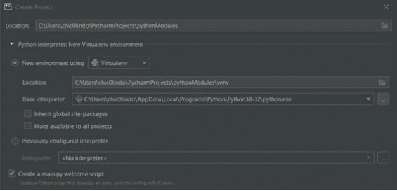

选择“创建”后，环境就设置好了。此时，你的项目文件列表中会创建一个 main.py 文件。这个 main.py 文件将用作我们程序的主文件。换句话说，它将是包含所有执行程序代码的文件。让我们清除屏幕上的所有默认代码。

## 模块

**模块**由包含定义和语句的 Python 文件组成，这些内容可以在我们的程序中后续使用。模块为我们提供了灵活性，可以将程序组织成更小的块，使其更易于管理。这对于那些需要大量代码的大型程序尤其如此。这有点像我们在上一章中提到的概念。可以把模块想象成一个函数库，你想在整个程序中使用它们。

你的新 **pythonModules** 项目创建的 **main.py** 文件包含了执行程序的主要指令。你将创建的模块将被引入到这个 **main.py** 程序中。这使我们能够轻松地重用模块中的代码，甚至在其他模块中使用模块。最终，所有内容都会汇入 **main.py**，我也会将其称为你的主程序。

## 导入模块

Python 3 内置了几个模块。让我们看几个例子，以便你学习如何导入它们。有关 Python 3 附带的所有已安装模块的列表，请参考 [https://docs.python.org/3/py-modindex.html](https://docs.python.org/3/py-modindex.html)。这个列表由内置库和外部库组成，可以在你的 Python 文件夹下的“外部库”中访问。请注意，在 Windows 上，默认情况下你可以访问整个库以及更多内容。对于 Mac 和 Linux，可能需要使用打包工具来访问其中一些库。

我希望你导入的三个内置模块是 os、operator 和 math。转到主程序或 **main.py**。你可以在程序的任何位置导入模块。通常的做法是在主程序的顶部导入。

第一个要导入的内置模块是 **os**。os 模块用于执行操作系统任务。导入模块的语法是 *import*。要导入 os，你只需写 `import os`。这将导入整个 os 模块，包括其所有函数，例如列出目录中的所有文件和文件夹、获取当前工作目录的位置以及修改目录。

在这个例子中，获取当前目录的文件列表。你可以通过输入句点字符 `.` 来调用模块中的函数。尝试打印 *os.listdir( )*。这是用于打印目录中文件和文件夹列表的函数。由于你没有在括号中指定文件夹的位置，默认值是当前项目或工作目录：

```
import os
print(os.listdir())
```

结果：[‘.idea’, ‘customModule.py’, ‘main.py’, ‘main_alternate.py’…]

你的输出显示了当前工作目录中的所有文件。我的输出与你的不同，多了一些额外的文件。没关系，你明白意思就好！你可能想知道的一件事是你当前正在哪个目录中工作。**listdir** 函数的一个参数是指定目录的位置。你可以使用另一个函数来获取当前工作目录的位置：

```
import os
print(os.getcwd())
```

结果：E:\dev-projects\course-python101

这就是我当前的工作目录。**os** 中还有更多函数。你可以在 Python 3 文档网站上查看所有函数，我在本章前面已经提供了链接。

在第 9 章中，我定义了一些数学函数。我没想到已经有一个模块包含了其中一些相同的操作符。那个模块的名字是 **operator**，它包含了所有作为函数的标准操作符。在代码顶部的 **os** 模块下方导入 **operator** 模块。现在你可以使用操作符来执行所有那些标准的数学函数，而无需定义新函数：

```
import os
import operator

print(os.getcwd())
print(operator.add(5, 6))
print(operator.sub(5, 6))
print(operator.mul(5, 6))
print(operator.truediv(5, 6))
```

**结果：** *E:\dev-projects\course-python101*

11
-1
30
0.8333333333333334

operator 模块使我们能够快速对数字 **5** 和 **6** 进行常见的数学计算。我提到过还有一个叫做 math 的模块吗？！math 模块有一个庞大的数学函数列表，从简单的数学计算到更高级的都有。

我们将看看 math 模块中众多函数中的 4 个：

- **math.pow(x, y)** - 返回 x 的 y 次幂
- **math.sqrt(x)** - 返回 x 的平方根
- **math.fabs(x)** - 返回 x 的绝对值
- **math.gcd(x, y)** - 返回整数 x 和 y 的最大公约数

像你之前做的那样，是时候将 math 模块导入到你的代码中了。你将把上面的 4 个函数添加到其余代码中，并使用随机数来看看你会得到什么：

```
import os
import operator
import math

print(os.getcwd())
print(operator.add(5, 6))
print(operator.sub(5, 6))
print(operator.mul(5, 6))
print(operator.truediv(5, 6))

print(math.pow(5, 6))
print(math.sqrt(25))
print(math.fabs(-8))
print(math.gcd(48, 36))
```

结果：E:\dev-projects\course-python101

11
-1
30
0.8333333333333334
15625.0
5.0
8.0
12

到目前为止，你一直在导入整个模块。如果你只打算

### 创建模块

我已经讨论了如何导入已有的模块。然而，并非所有模块都适用于你的程序用例。如果你想创建自己的模块，这也是可以做到的。

在左侧项目文件窗格中，右键单击你的项目文件夹，然后点击“新建”。将你的文件命名为 **customModule**，并选择 Python 文件选项。这将创建一个名为 **customModule.py** 的文件。后缀 .py 表明它是一个模块。没有 .py 后缀，你将无法将该模块导入到你的主程序中。

打开你的新模块。输入以下代码，该代码会向用户打印感谢信息，感谢他们使用自定义模块：

```python
def thanks(name):
    print("Thank you " + name + " for using this new module.")
```

如果你在当前状态下运行此模块，不会显示任何内容，因为函数 **thanks** 尚未被调用。现在，导航回你的 main.py 文件。清除屏幕上上一节遗留的任何代码。

你的自定义模块现在可以像任何其他模块一样被导入。导入该模块，然后使用一个名称作为参数调用该函数：

```python
import customModule

customModule.thanks("Casey")
```

结果：Thank you Casey for using this new module.

看，你已经能够导入并使用你创建的模块了。这真的很棒。

## Python 社区模块

Python 是开源的，拥有一个由开发者和支持者组成的社区。这个 Python 开发者社区为每个人提供了软件和库。很可能，如果你正试图在程序中完成某项任务，已经有人做过了。这个社区很棒，因为你可以利用其他开发者编写的代码。有无数的非标准模块可供你的程序使用。Python 包索引 (PyPI) 是可以找到社区 Python 包的默认仓库。尝试在 [https://pypi.org/](https://pypi.org/) 网站上搜索，查看一些可用的包。

那么，到底什么是包？一个 **包** 包含了使用一个模块所需的所有必要文件。你可以从 Python 包仓库 PyPI 安装包。为此，你必须确保安装了名为 pip 的包管理系统。Pip 是默认的 Python 包管理器，用于安装、更新、卸载和管理软件包。

### Python pip（包管理器）

pip 在 Python 3.4 之后的每个版本中都已预装。你可以检查你的系统上是否安装了 pip。如果你使用的是 Microsoft Windows，请转到“开始”菜单，输入 CMD，然后按键盘上的回车键。应该会出现一个命令提示符。在命令提示符中，输入 **pip – version** 并按回车：

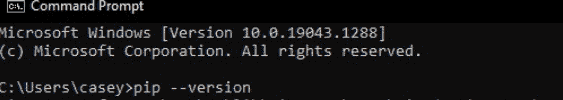

如你所见，我正在运行 pip 版本 21.1.2，并且还显示了它的安装路径。

对于 Mac/Linux/Unix 用户，打开一个终端。输入 **python -m pip –version**，然后按回车。这将显示你系统上当前安装的 pip 版本。

如果 pip 未安装在你的系统上，请访问 [https://pip.pypa.io/en/stable/installing/](https://pip.pypa.io/en/stable/installing/)。那里有关于如何在相应操作系统上安装 pip 的说明。很可能，在阅读本书时，pip 已经安装在你的系统上了。

### 安装社区模块

在验证你的包管理器 pip 已安装后，你现在可以安装社区、第三方或外部模块了。有成千上万的包可供选择。我在本课程中没有过多讨论的一件事是图形用户界面，简称 GUI。大多数应用程序都使用 GUI 来让用户轻松地与程序交互。话虽如此，让我们安装一个 GUI 模块，它将使我们的程序能够像更现代的应用程序一样做出反应。

你将要安装的包是 **PySimpleGUI**。简而言之，PySimpleGUI 让我们能够为你的程序添加图形！大多数人都希望他们的程序有某种类型的 GUI，使其更直观。

好了，让我们开始安装 PySimpleGUI。我希望你和我一样兴奋。再次打开你的命令提示符或终端。如果你使用的是 Windows，输入 **pip install PySimpleGUI** 然后按回车。对于 Mac/Linux/Unix 用户，在你的终端中输入命令 **python3 -m pip install PySimpleGUI** 然后按回车。运行命令后，它将开始为你安装 PySimpleGUI 包。最后一行应该会告诉你已成功安装最新版本的 PySimpleGUI。

```
C:\Users\chic0lindo>pip install PySimpleGUI
Collecting PySimpleGUI
  Downloading PySimpleGUI-4.43.0-py3-none-any.whl (350 kB)
     |████████████████████████████████| 350 kB 1.7 MB/s
Installing collected packages: PySimpleGUI
Successfully installed PySimpleGUI-4.43.0
```

下载和安装包就是这么简单。在你的命令提示符中，你也可以输入命令 **pip freeze** 来显示你已安装的所有包。在 [https://pypi.org/](https://pypi.org/) 上搜索任何你想安装的其他包。

### 使用 PySimpleGUI 包

创建另一个名为 **my_GUI.py** 的 Python 文件。导入 **PySimpleGUI** 模块。我将使用 **import PySimpleGUI as sg**。这样每次我调用 PySimpleGUI 中的函数时，我只需要在函数前加上 **sg**。这可以避免我每次使用模块时都必须拼写完整的 PySimpleGUI。我们将使用开发者提供的示例代码。将下面的代码复制并粘贴到你的 my_GUI.py 窗口中：

```python
import PySimpleGUI as sg  # Part 1 - The import

# Define the window's contents
layout = [[sg.Text("What's your name?")]],  #
Part 2 - The Layout
        [sg.Input()],
        [sg.Button('Ok')]]

# Create the window
window = sg.Window('Window Title', layout)  # Part 3 - Window Definition

# Display and interact with the Window
event, values = window.read()  # Part 4 - Event loop or Window.read call

# Do something with the information gathered
print('Hello', values[0], '! Thanks for trying PySimpleGUI')

# Finish up by removing from the screen
window.close()  # Part 5 - Close the Window
```

### 结果：

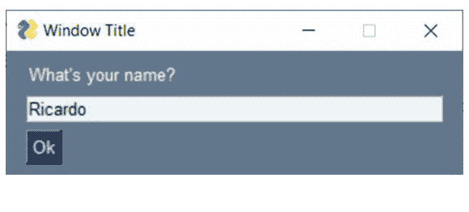

运行这段代码，看看会发生什么。如果一切正常，你应该会看到一个图形用户界面弹出，提示你输入姓名。输入姓名并点击“确定”后，窗口会关闭，运行屏幕上会显示一条感谢你阅读本书的信息。上面提供的示例代码仅展示了你现在可以在该模块中使用的部分功能。网站上的用户手册提供了分步说明，教你如何使用 PySimpleGUI 包的所有功能 [https://pysimplegui.readthedocs.io/en/latest/](https://pysimplegui.readthedocs.io/en/latest/)

## 问答回顾

1. 在 Python 代码中，你使用哪个关键字来引入一个包或模块？
    - 1. download
    - 2. use
    - 3. import
    - 4. run

2. Python 的包安装器/管理器是什么？
    - 1. pip
    - 2. pyp
    - 3. snake
    - 4. cobra kai

## 第 9 天挑战

- 千字节挑战：在 pypi.org 上找一个看起来有趣的第三方包，并在程序中尝试使用它。请访问 https://pypi.org/search/ - 如果找不到看起来很酷的，可以看看 Colorama - https://pypi.org/project/colorama/ :)

# 第 10 天：处理文件

*阅读时间：11 分钟*

在 Python 中，你的应用程序经常需要从外部文件中读取或写入数据。这些文件不一定是 Python 文件。它们可以是任何类型的文件，从文本文件到可执行文件。

不同的支持文件类型由其文件扩展名表示（例如 .html、.txt、.csv、.exe、.bin、.sh）。Python 具有文件处理能力，允许程序读取、写入、创建和/或追加到外部文件。在本章中，你将使用扩展名为 **.txt** 的标准文本文件。

为了在 Python 中处理文件，程序必须首先打开该文件。要在 Python 中打开任何文件，请使用内置函数 *open( )*。该函数在括号内接受两个参数：你想打开的文件和你想打开文件的模式。对于位于同一工作目录中的文件，只需 *<file_name>* 作为参数。对于位于工作文件夹或目录之外的文件，还必须包含文件位置。我稍后也会展示处理位于当前工作目录之外的文件的示例。

让我们学习如何打开文件。打开文件所需的唯一参数是文件名。如果未提供第二个模式参数，`open()` 函数将默认以读取模式打开文件。在项目文件的左窗格中，右键单击你的项目以创建一个新文件。将此文件命名为 **nerd_names.txt**。这将在当前工作目录中创建一个空白文本文件，你可以双击进行编辑。将以下内容复制并粘贴到你的 **nerd_names.txt** 文件中：

- Nikola
- Tesla
- Einstein
- Thomas
- Edison
- Ricardo
- Casey
- Kelvin

在同一项目中创建一个新的 Python 文件，命名为 **readFile.py**。这将代表你用于打开和读取你创建的文本文件的程序。在 **readFile.py** 代码窗口中，使用 *open( )* 函数打开新的文本文件。打开新文件的语法应为 **open(nerd_names.txt)**。由于省略了模式参数，文件将以读取模式打开。每个使用此函数打开的文件也必须有一个关闭函数。关闭函数在文件的所有操作完成后编写。在编写文件的打开函数时同时编写关闭函数是一个好习惯。看看下面是如何完成的：

```
nerd_file = open("nerd_names.txt")
nerd_file.close()
```

*结果：以代码 0 退出进程*

## 读取文件

文件被打开，然后读取，并立即关闭。注意输出窗口中没有任何内容出现。你还没有告诉 readFile 程序对读取到的信息做任何处理。你必须告诉程序如何处理这些数据。为了确保程序能够正确读取数据，你可以使用另一个名为 *readable( )* 的函数。这告诉我们 **nerd_names.txt** 是否确实可以被程序读取：

```
# 输出 "True" 表示程序可以读取文件
nerd_file = open("nerd_names.txt")
print(nerd_file.readable())
nerd_file.close()
```

结果：True

打印的响应 **TRUE** 表示文件可被程序读取。响应 **FALSE** 则表示文件不可被程序读取。这可能是由于文件位于当前工作目录之外、文件名拼写错误或文件损坏造成的。位于当前工作目录之外的文件只需一个路径来指定其位置。我稍后会详细讨论这一点。好的，现在使用 *readlines()* 函数在程序中打印出整个文本文件的副本：

```
# 以数组形式打印所有行
nerd_file = open("nerd_names.txt")
print(nerd_file.readlines())
nerd_file.close()
```

结果：['Nikola', 'Tesla', 'Einstein', 'Thomas', 'Edison', 'Ricardo', 'Casey']

readlines 的输出将文本文件的所有行作为列表打印出来。记住，`\n` 是一个转义字符，仅表示换行。readlines 函数打印出文本文件的每一行。如果你只想获取第一行，可以使用单数函数 *readline()*：

```
# 读取并打印 nerd_file 中的第一行
nerd_file = open("nerd_names.txt")
print(nerd_file.readline())
nerd_file.close()
```

结果：Nikola

如果你调用 *readline()* 函数两次，它将输出文本文件的前两项：

```
# 读取并打印 nerd_file 中的前 2 行
nerd_file = open("nerd_names.txt")
print(nerd_file.readline())
print(nerd_file.readline())
nerd_file.close()
```

**结果：** *Nikola*
*Tesla*

好的，这些是一些很棒的函数。现在，当你想选择文本文件中的某个项目进行打印时会发生什么。假设你想选择文档中的第三个项目，在本例中是 **“Einstein”**。你如何读取文件并打印出这个单项？由于 **readlines()** 给你一个列表，你可以使用索引。第三个项目也是索引 2。让我们打印出来：

```
# 读取并打印文件中的第 3 行或第 3 项
nerd_file = open("nerd_names.txt")
print(nerd_file.readlines()[2])
nerd_file.close()
```

**结果：** *Einstein*

好的，让我们保持简单，使用 *read()* 函数打印出文本文件中的确切内容：

```
nerd_file = open("nerd_names.txt")
print(nerd_file.read())
nerd_file.close()
```

*结果：* *Nikola*
*Tesla*
*Einstein*
*Thomas*
*Edison*
*Ricardo*
*Casey*

### 读取目录外的文件

很可能，你的程序需要访问的所有文件并不都在确切的文件位置或路径中。读取当前工作目录之外的文件需要在文件名之前添加路径。转到你的 PC、Mac 或 Linux 的桌面，添加一个名为 **testPythonfile.txt** 的文件。同时，记下此文件的确切路径（例如，C:/Users/Username/testPythonfile.txt）。打开文件并输入以下文本：

- Circle
- Rectangle
- Triangle
- Square

完成后保存文件，然后关闭窗口。使用以下内容修改你在 **readFile.py** 中的原始代码，并使用你实际的文件夹位置而不是我的：

```
desktop_file = open("C:/Users/Rico/Desktop/testPythonfile.txt")
print(desktop_file.read())
desktop_file.close()
```

*结果：Circle*
*Rectangle*
*Triangle*
*Square*

你能够打开当前工作目录之外的文件。了解你访问的文件的确切路径并在函数中将该路径插入到文件名之前至关重要。

## 访问模式

记住 *open( )* 函数有不止一个参数。它还有一个我们尚未讨论的第二个可选参数。打开函数在打开文件时接受各种模式作为参数。默认模式是读取，由字母 *r* 表示。总共有六种模式，但本节我将介绍以下 4 种：

- **r** - 打开指定文件进行读取
- **a** - 打开指定文件进行追加
- **w** - 打开指定文件进行写入
- **x** - 创建指定文件

*open( )* 函数使用读取作为默认值。所以 **nerd_file** =

### 追加到文件

在当前工作目录中创建另一个名为 **more_names.txt** 的文本文件。在该文本文件中，放入以下名字：

- 牛顿
- 霍金
- 泰森
- 马斯克

这次创建一个名为 **appendFile.py** 的 Python 文件。我们来快速检查一下 more_names.txt 文件是否可读：

```
names_file = open("more_names.txt", "r")
print(names_file.readable())
names_file.close()
```

结果：True

正如你之前所学，**TRUE** 表示该文件可被你的程序读取；既然它可读，你就可以访问该文件并向其追加更多内容。当你使用追加模式时，你可以向文件末尾添加文本，甚至添加来自另一个文件的内容。因此，一个文件的信息可以被追加到另一个文件，使得该文件包含从被追加文件添加的内容。要追加文件，我们使用 *a* 作为 *open()* 函数的模式。语法是 *open(, “a”>*。

必须理解的是，当使用此模式时，你不仅仅是在打开和读取文件。你也在向其写入内容。追加函数会向你打开的文件末尾写入，以添加额外内容。函数执行后，无法恢复到原始文件。因此，最好备份你的原始文件，以防出错。

好的，那么，我们来试一试。在我们的示例中，你将把名字“盖茨”追加到 **more_names.txt**。这意味着字符串“盖茨”将被复制到 **more_names.txt** 文件的末尾。然后你将打印出 **more_names.txt** 以查看其内容：

```
names_file = open("more_names.txt", "a")
names_file.write("\nGates")

names_file = open("more_names.txt", "r")
print(names_file.read())
names_file.close()
```

*结果：牛顿*
*霍金*
*泰森*
*马斯克*
*盖茨*

如你所见，你已成功将“盖茨”添加到你的 **more_names.txt** 文件中。我添加了转义字符 * **，以便该名字能像文件中已有的其他名字一样独占一行。如果你不添加该转义字符，该名字将被添加到文件中最后一个字符串之后；在这种情况下，它将是马斯克。没有 *，你的代码输出的最后一行将是“马斯克盖茨”。**

让我们使用相同的例子。使用之前的相同代码，将两个 open 函数中的文件名都改为 **“random.txt”**。你我都知道当前工作目录中没有这个文件名的文件。我想知道会发生什么。只有一种方法可以找出：

```
names_file = open("random.txt", "a")
names_file.write("\nGates")
names_file.close()

names_file = open("random.txt", "r")
print(names_file.read())
names_file.close()
```

*结果：盖茨*

输出结果只有盖茨这个名字。你的代码执行并尝试在当前工作目录中查找并打开该文件。由于找不到该文件，它会创建一个名为 **“random.txt”** 的相应文件。新创建的文件中没有内容，因此只有名字 **“盖茨”** 可见，因为它被追加到了一个空白文件中。如果你重新运行此程序，**“盖茨”** 将再次被添加到另一行，所以要小心。

### 将一个文件追加到另一个文件

你可以将一个文件的内容追加到另一个文件。两个文件都必须被打开，然后关闭。为了练习，我们将把 **nerd_names.txt** 追加到 **more_names.txt**。这意味着 **nerd_names.txt** 的内容将被复制到 **more_names.txt** 文件的末尾。

```
# 打开两个文件，包括一个要追加到的文件
# 和另一个要读取的文件
names_file = open("more_names.txt", "a")
nerd_file = open("nerd_names.txt", "r")

# 将 nerd_names.txt 的内容追加到
# more_name.txt 文件
names_file.write(nerd_file.read())

names_file = open("more_names.txt", "r")
print(names_file.read())

names_file.close()
nerd_file.close()
```

结果：牛顿

- 霍金
- 泰森
- 马斯克
- 盖茨
- 尼古拉
- 特斯拉
- 爱因斯坦
- 托马斯
- 爱迪生
- 里卡多
- 凯西

如你所见，你现在拥有一个列表，其中包含 **more_names.txt** 的原始内容以及添加的 **nerd_names.txt** 内容。

### 写入

创建另一个名为 **writeFile.py** 的文件。

使用写入模式或 *w* 会写入被打开的文件。它会覆盖文件中已有的所有内容。因此，如果你只想向文件添加内容，请确保你的模式设置为 *a* 而不是 *w*。否则，所有内容都将被写入函数中的信息替换。

好的，你决定需要写入文件。你不会事先创建该文件。就像你使用追加模式一样，如果 open 函数在调用时找不到文件，它会创建该文件。你的目标是让你的程序生成一个包含元音字母列表的文本文件：

```
# 创建一个新文件，准备写入。
vowels_file = open("vowels_list.txt", "w")

# 创建一个元音字母列表，并将列表作为
# 字符串写入新的文本文件
vowels_list = ["a", "e", "i", "o", "u"]
vowels_file.write("This is a list of all the vowels:" + str(vowels_list))

# 打开并打印更新后的 vowels_list 文件
vowels_file = open("vowels_list.txt", "r")
print(vowels_file.read())

vowels_file.close()
```

结果：This is a list of all the vowels: [‘a’, ‘e’, ‘i’, ‘o’, ‘u’]

上面的代码创建了一个名为 **vowels_list.txt** 的新文件，并将输出的内容写入其中。在此过程中，你将元音字母列表转换为字符串，以便可以写入文件。请记住，*write( )* 函数的参数是字符串。虽然列表包含一个元音字母字符串，但它本身并不是一个字符串。这就是为什么你必须使用显式类型转换将列表转换为字符串。

### 创建文件

通过追加和写入函数，你能够创建新文件。还有另一种方法，只需调用 open 函数即可创建一个没有内容的新文件。首先，创建一个新的 Python 文件，名为 **createFile.py**。创建新文件的语法是 *open("file", "x")*。*x* 模式用于创建新文件。它可以是任何文件名，末尾加上扩展名。尝试创建一个你选择的新文件：

```
new_file = open("created_file.txt", "x")
new_file.close()
```

执行相关代码时没有任何可视输出。但是，如果我打开当前工作目录，一个名为 created_file.txt 的新空白文件（在我的例子中）就会出现。找到你创建的文件名，该文件名是你选择的名称。

### 删除文件

创建文件相当简单。在 Python 中，你也可以删除文件和文件夹。就像你能够创建文件一样，你也可以轻松删除文件。要删除文件，你必须导入 **os** 模块。用于删除文件的函数是 *remove( )*。创建一个新的 Python 文件，名为 **removeFile.py**。

让我们使用 remove 函数删除你创建的最后一个文件：

```
# 从工作目录中删除名为 created_file.txt 的文件
import os
os.remove("created_file.txt")
```

此代码从当前工作目录中删除了你创建的文件。你也可以从其他目录（如你的桌面）删除文件。还记得你之前创建的文件 **testPythonfile.txt** 吗？你可以通过包含其路径来删除该文件：

```
# 删除我桌面上名为
# testPythonfile.txt 的文件
import os
os.remove("C:/Users/Rico/Desktop/testPythonfile.txt")
```

### 删除文件夹/目录

文件夹或目录可以像文件一样被删除。唯一的区别是用于目录的函数是 `rmdir( )` 而不是 `remove( )`。`rmdir( )` 函数只删除空文件夹。如果你尝试删除一个包含文件的目录，将会发生错误。你必须先删除文件夹或目录中的所有文件，然后才能使用 `rmdir( )` 删除该目录。“rmdir”是 remove directory 的缩写。`remove( )` 函数不允许你删除目录。

右键单击你的 **pythonModules** 项目文件夹，然后选择“新建”，然后选择“目录”。将该目录命名为 **testDirectory**。现在

创建另一个名为 **removeDirectory.py** 的 Python 文件。在此文件中，输入以下代码以使用 *rmdir()* 函数永久删除目录：

```
# Deletes the folder named testDirectory from
the current working directory
import os
os.rmdir("testDirectory")
```

执行该代码后，你的程序将移除刚刚创建的 **testDirectory**。此函数允许你删除任何空文件夹。

* * *

## 问答回顾

1.  对现有文件使用 open 和 write 函数：
    - 1. 会向文件追加内容
    - 2. 会覆盖文件中已有的所有内容
    - 3. 会创建一个同名文件并追加内容
    - 4. 会删除文件内的所有内容，使其变为空文件。

2.  以下代码块将打开一个名为 nerd_names.txt 的文件，读取它，将其打印到终端，然后关闭该文件。

```
nerd_file = open("nerd_names.txt", "r")
print(nerd_file.read())
nerd_file.close()
```

    - 1. 正确
    - 2. 错误

* * *

## 第10天挑战

- 千字节挑战：使用 Python 将你最喜欢的一餐列表写入一个文本文件。

# 第11天：调试

阅读时间：8分钟

极客们好！今天是第11天，在今天的课程中，你将学习调试。Python 调试器是一个交互式代码工具，允许你调试代码。你可以执行诸如评估变量、逐行单步执行代码以及设置断点等操作，这将使你能够在特定行停止执行 Python 代码。你将通过使用 Python 调试器来了解 PyCharm 界面及其一些功能。虽然本课程使用 PyCharm，但你可以将这些技能应用于任何现代 IDE。在今天结束时，你将解决你的第二个极客挑战！让我们直接开始吧！

## 断点

使用 Python 调试器时，断点允许你在特定行停止程序的执行。你可以在 PyCharm 中使用键盘快捷键 Ctrl+F8 来实现这一点，但首先，你需要有一些代码来添加断点。在你的 PyCharm IDE 中编写以下代码。

```
debugger = "A debugger is a tool that lets you find problems or bugs with your code."
print("Welcome to this fake program")
print(f"We will use it to talk about a debugger.")
print(f"{debugger}")

add = 5 + 5
print(add)

def some_cool_function(x, y):
    result = x * y
    return result

run_this = some_cool_function(3, 3)
print(f"{run_this}")

user_x = int(input('Enter a number you want to times by 2 > '))
user_result = some_cool_function(user_x, 2)
print(f"{user_result}")
```

在 `add = 5 + 5` 这一行放置一个断点。要放置断点，你可以选中该行并按 Ctrl+F8。或者，你可以点击 Run > Toggle breakpoint > Line Breakpoint。你已添加断点，现在可以在第6行看到一个红点。红点是 PyCharm 中断点的图标。

```
python
debugger = "A debugger is a tool that lets you find problems or bugs with your code"
print("Welcome to this fake program")
print(f"We will use it to talk about a debugger.")
print(f"{debugger}")

add = 5 + 5
print(add)

def some_cool_function(x, y):
    result = x + y
    return result

run_this = some_cool_function(3, 3)
print(f"{run_this}")

user_x = int(input('Enter a number you want to times by 2 > '))
user_result = some_cool_function(user_x, 2)
print(f"{user_result}")
```

## 运行调试器

你已经放置了断点；接下来，你需要运行调试器。从菜单中选择 Run > Debug。或者，你可以使用键盘上的 Alt+Shift+F9。PyCharm 可能会提示你选择要使用的文件。选择相应的文件。在我的例子中，是 `example.py`。你现在可以在屏幕下半部分看到一个调试器窗口。

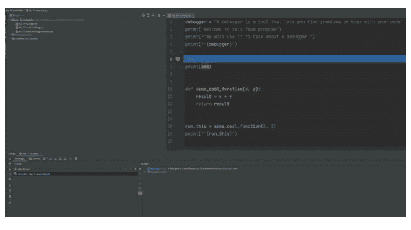

你可以看到程序已在第6行停止执行，你可以通过 `Console` 窗口查看输出。点击 `Console` 标签页，你可以看到以下结果：

*Welcome to this fake program*
*We will use it to talk about a debugger.*
*A debugger is a tool that lets you find problems or bugs with your code*

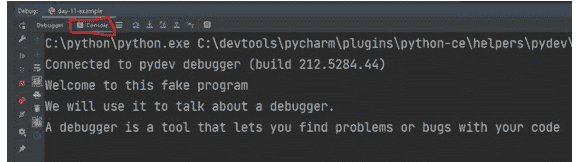

如你所见，调试器已执行了第6行之前（不包括第6行）的所有代码。Python 赋值了 `debugger` 变量并打印了你指定的三条语句。

点击回 `Debugger` 标签页，我们将讨论更多选项。

## 监视器

监视器允许你评估当前执行中的任意数量的变量或表达式，特别是在 PyCharm 称为堆栈帧的东西中。我不会在本书中涵盖堆栈帧或 CPU 线程，因为这是一个高级主题，但在资源部分，如果你有兴趣了解更多，你会找到更多信息。现在，重要的是要知道，监视器使你能够在单步执行应用程序时监视或 *观察* 一个变量或表达式。如果你指定了一个监视器，你可以在程序运行时监控它如何随时间变化。

### 添加监视器

你知道 *监视器* 是做什么的，所以是时候添加一个了。点击 *Debugger* 标签页，然后在变量窗口中，你会看到一个 + 号，为 `add` 创建一个监视器，这是你在第六行定义的变量。PyCharm 将报告一个错误。错误是

> {NameError} name `add` is not defined

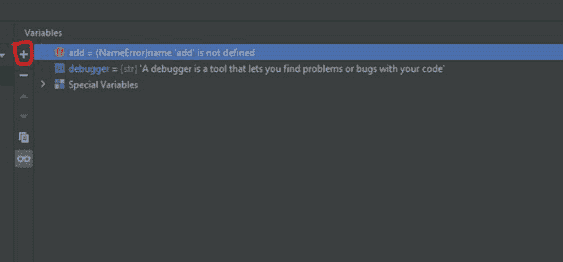

你认为为什么会发生这种情况？断点停在第6行。它没有执行该行然后停止；因此，从 Python 的角度来看，*add* 不存在。你将在下一节中学习如何继续 Python 执行你的程序。另外，请注意 *debugger* 变量会自动显示为监视器，因为 PyCharm 会自动添加它找到的变量作为 *监视器*。所以，你甚至不需要添加 `add` 变量。它会自动发生！

## 单步执行代码

单步执行代码意味着一次执行一行代码，直到你完成程序或到达你想停止的点。你将逐行执行代码，以帮助你识别任何问题或发现任何错误。PyCharm 提供了五个关键选项来 *单步* 执行你的代码：Step Over (F8)、Step Into (F7)、Step Into My Code (Alt+Shift+F7)、Step Out (Shift+F8) 和 Run To Cursor (Alt+F9)。

你将在以下部分中了解每个选项；但是，在阅读了每个选项之后，我希望你使用示例代码执行每个操作。通过使用调试器，你可以更好地理解 *单步* 执行代码的工作原理。如果你完成了示例程序中所有代码行的执行，你总是可以重新运行调试器。毕竟，你现在知道如何做了！一个 **重要** 的提示，当你到达第18行时，程序会要求用户 *input()*，所以当你遇到这一行时，你需要转到 Console 标签页并输入一个你想乘以2的数字。然后调试器将继续执行程序。

### Step Over

Step over 将跳过当前代码行并带你到下一行代码。这里的关键特征是，即使该行有函数或方法调用，它也会转到下一行代码。在示例代码中，你有一个名为 `some_cool_function` 的函数，你在第15行调用它。如果你在第15行执行 step over，Python 将运行该行，而不会进入你在第10到12行定义的该函数的定义。试一试，这样你就可以亲眼看到！

### Step Into

Step Into 与 *step over* 相反。Step into 意味着如果调试器正在评估的当前行上定义了任何函数，调试器将 *进入* 这些函数。在你之前设置的示例代码中，尝试此功能；当你在第15行调用 `some_cool_function` 时会发生什么？`step into` 带你去了哪里？为什么？

step into 功能将带你进入 int() 和 input() 函数，这些是 Python 核心函数。这些函数中可能存在错误或缺陷，但可能性不大，因此你可能不想专门进入这些函数。为了解决这个问题，你可以对这些特定的函数使用 step-over 操作。

行。或者，PyCharm 为你提供了另一个选项来缓解这个问题。

### 步入我的代码

没错！你可以只步入你自己的代码，这是我最喜欢的 PyCharm 功能之一。你可以单步执行你的代码，并忽略你调用的任何库，如果你不怀疑你正在使用的其他库有任何问题，这非常方便！在你的示例代码上试一试，看看它的实际效果。

### 步出

如果你步入了一个函数，也许你并非有意为之，或者你想检查某些东西，但随后你确认该函数没有问题，PyCharm 允许你使用此选项从中步出。使用“步入”重新运行代码，在你执行到第 18 行后，使用“步出”跳出 *parse.py*。很棒，对吧？

## 停止调试器

有时，你可能想要停止调试器。也许你已经浏览了一部分代码并找到了错误，或者调试器卡住了，你需要退出。要退出调试器，你可以按快捷键（Windows）`Ctrl+F2` 或转到 `Run > Stop file-name`，这将停止并退出调试器。

* * *

## 问答回顾

1. 断点允许你
    - 自动中断你的代码
    - 允许你在特定行号停止程序，然后单步执行后续行代码
    - 仅对包含整数的行有效
    - 仅在定义了变量时有效

2. 监视器允许你在程序运行时监视一个变量。
    - 正确
    - 错误

***

## 极客挑战 2：调试文件

在短短 11 天内，你已经学习了大量关于 Python 的知识，你的技能正在增长并持续提高。快速回顾一下，以下是你到目前为止所学到的内容：

- **第 1 天** – 你安装了 Python 并了解了变量
- **第 2 天** – 你学习了数据类型和基本运算符简介
- **第 3 天** – 你深入学习了更高级的运算符
- **第 4 天** – 你学习了如何提示用户输入
- **第 5 天** – 你知道如何创建 if-else 语句和循环
- **第 6 天** – 你构建了一个处理异常和错误的程序
- **第 7 天** – 你解决了你的第一个极客挑战，制作了一个简单的计算器
- **第 8 天** – 你编写了你的第一个定义的 Python 函数
- **第 9 天** – 你导入了你的第一个第三方包并创建了自己的包
- **第 10 天** – 你学习了如何用 Python 操作文件

祝贺你在短短十天内完成了所有这些！这个挑战有点不同；我已经为你编写了代码。你在这个挑战中的任务是识别这个 Python 应用程序中存在的主要错误。当你发现问题时，将它们记录在纸上或单独的文件中，尝试自己修复问题，然后将你的答案与解决方案进行比较。你可能会发现与我们在“解决方案”部分列出的不同错误，这完全没问题；这不是一个详尽的列表。

那么，你准备好迎接挑战了吗？如果是，你知道该怎么做，说 **接受挑战！**

### 有错误的文件：`day-11-nerd-challenge.py`

```python
# Nerd Challenge: Debugging
# Erm, I found some bugs :(
import random

guess = input('Guess a number between 1 and 5: ')
x = random.randint(0, 5)

print(f"You guessed {guess}")
print(f"The answer was: {x}")

if guess == x:
    print("Congrats you guessed right!")
else:
    print("Sorry you guessed wrong. You lose.")

random_fact_result = guess / x
print(f"Random fact of the day: Your guess number, {guess} divided by the answer {x} is equal to {random_fact_result}")
```

### 解答

不许偷看！在你至少花 1 小时在挑战上之后再查看答案。

* * *

### 解答文件：`day-11-nerd-challenge-solution.py`

```python
# Nerd Challenge: Debugging
# Erm, I found some bugs :(
import random

guess = input('Guess a number between 1 and 5: ')
if guess.isdigit() and 5 >= int(guess) >= 1:
    guess = int(guess)
else:
    print("Sorry, next time enter a number between 1 and 5")
    exit(-1)

x = random.randint(1, 5)

print(f"You guessed {guess}")
print(f"The answer was: {x}")

if guess == x:
    print("Congrats you guessed right!")
else:
    print("Sorry you guessed wrong. You lose.")

random_fact_result = guess / x
print(f"Random fact of the day: Your guess number, {guess} divided by the answer {x} is equal to {random_fact_result}")

# Error #1: input returns a string. We need to compare integers!
# Error #2: The instructions say between 1 and 5, but 0 is possible
# Error #3: ZeroDivisionError Exception
# Error #4: TypeError: unsupported operand type(s) for /: 'str' and 'int'
```

这是漫长但有趣且令人兴奋的一天。你学到了很多关于使用调试器的知识，在第十二天，你将学习 Python 中的类和对象。

# 12

# 第 12 天：类和对象

阅读时间：8 分钟

## Python 类

将 Python 中的**类**视为创建对象的蓝图，这些对象可以在整个程序中使用。建筑物的蓝图或示意图为你提供了构建建筑物所需的框架。类与对象的关系也是如此。类本质上为你提供了创建自己的数据类型的能力。这很重要，因为现实世界中的并非所有事物都可以用我在第 3 天讨论的数据类型来表示。那些数据类型仅限于字符串、数字、列表、元组和字典。

想想你可能需要在程序中表示的一些人、地点或事物。可能没有任何变量可以使用你在前面章节中学到的基本数据类型来存储它。如果你没有类，这可能是一个问题，因为那样每次你想使用该数据类型时，你都需要重复生成大量代码来表示它。类允许我们创建对象，所以你不需要这样做。

到目前为止，你一直认为 Python 只是另一种解释型高级编程语言。我尚未讨论的另一个特点是它也是一种面向对象的编程语言。类似于 Java、C++ 和 C#，它允许围绕类和对象来组织程序设计，而不仅仅是过程式和使用函数。

类由数据属性和方法组成。属性描述类的特征。它定义了该类是什么。然后是**方法**，它们描述类做什么或如何运作。当我举几个例子时，这将变得更加清晰。

## 对象

**对象**是类的实例。所以，你所做的是创建一个类。每次调用该类时，它都会从该类创建一个对象或实例。这意味着创建的对象拥有与类相同的所有属性类型和方法。这也意味着你可以创建具有不同属性值的同一类的多个对象。

## 构造类

我指出类由数据属性和方法组成。汽车是类的一个完美例子。到处都是汽车，有不同的年份、品牌、型号、颜色和车门。我刚才列出的所有这些特征都是数据属性。这些属性的值可能不同，但它们始终存在于每辆车上。它们是使汽车成为汽车的东西！每辆车还有一些它们执行的功能，例如加速、刹车和转弯。在类中，这被称为它们的方法。你将在程序中表示的每种不同类型的汽车都将是一个新的对象。

让我们创建一个名为 **car_class.py** 的新 Python 文件来展示类是如何构造的。代码的第一行将包含类名，其语法为 *class :*。在这种情况下，你将编写 **class Car:** 来表示一个 Car 类。

在类名下方将是你的 ***init()*** 函数。这应该包含在你创建的每个函数中。此函数总是在函数初始化时执行。它是调用类时运行的第一部分代码。在函数的括号内，你可以为数据属性定义参数。***init()*** 函数中的第一个参数总是 *self*。Self 让我们能够访问类内的数据属性和方法。Self 之后是类的数据属性：

def __init__(self, parameter1, parameter2,
    parameter3, etc..):
```

在你的 `Car` 类中，数据属性类型将是年份、品牌、型号、颜色和车门数。这些是汽车可能具有不同值的属性。这将用于从类中创建一个对象。让我们为你的汽车类填写一些信息。将车门数改为 `is_Sedan`。如果 `is_Sedan` 为 **TRUE**，则表示四门轿车；如果为 **FALSE**，则表示双门轿跑车：

```
class Car:
    def __init__(self, year, make, model, color,
        is_Sedan):
```

**init** 函数尚未完成。你还需要添加一段代码主体，以便将参数输入的内容保存到对象的变量中。简单来说，当创建一个对象时，其属性的值需要被存储。在你的对象定义下方添加以下代码以实现此功能：

```
class Car:
    def __init__(self, year, make, model, color, is_Sedan):
        self.year = year
        self.make = make
        self.model = model
        self.color = color
        self.is_Sedan = is_Sedan
```

创建一个名为 **car_program.py** 的新 Python 文件。你将在这里创建 `Car` 类的实例或对象。输入 **from car_class import Car**。这使得 `Car` 类可以在你的汽车程序中使用。该命令从你创建的名为 **car_class.py** 的文件中导入 `Car` 类。

现在你将创建一个变量 **car_A** 并将一个汽车对象赋值给它。你希望这个对象是一辆 2021 年的特斯拉 Model S。由于你已经创建了一个汽车类，这很容易做到。你可以调用该类并输入汽车特定的属性来创建特斯拉汽车对象：

```
car_A = Car("2021", "Tesla", "Model S", "Red", True)
```

创建的对象现在保存在变量 **car_A** 中。你通过创建 `Car` 类的实例来表示一辆完整的汽车。还记得在汽车类中创建的那些对象属性吗？由于它们已存储在对象中，你现在可以访问这些变量。让我们通过打印一些你创建的属性值来看看这是如何工作的：

```
from car_class import Car
car_A = Car("2021", "Tesla", "Model S", "Red",
True)
print("The color of the car is:", car_A.color)
print("Is this car a Sedan, True or False?",
car_A.is_Sedan)
```

**结果：** *The color of the car is: Red*
*Is this car a Sedan, True or False? True*
输出能够打印出汽车颜色和车门属性。这样做的美妙之处在于，如果你有 100 辆车，并且想知道其中几辆车的某个特征，你可以轻松地打印出来。除了对象名称，你不需要知道任何其他识别信息。
在这个例子中，你只创建了一个汽车对象。我以为类应该像过去使用标准数据类型一样，使创建多个对象变得容易？你可以，而且就像创建更多的 `Car` 对象并将它们赋值给更多变量一样简单：

```
from car_class import Car

car_A = Car("2021", "Tesla", "Model S", "Red", True)
car_B = Car("2021", "Mazda", "CX-5", "White", True)
car_C = Car("2014", "Cadillac", "CTS", "Black", False)

color_list = [car_A.color, car_B.color, car_C.color]
door_list = [car_A.is_Sedan, car_B.is_Sedan, car_C.is_Sedan]

print("The colors of those cars are:", color_list)
print("Are those cars a Sedan, True or False?", door_list)
```

**结果：** The colors of those cars are: [‘Red’, ‘White’, ‘Black’]

Are those cars a Sedan, True or False? [True, True, False]

你能够创建多个 `Car` 对象，并使用列表打印出每辆车的颜色和车门属性。如果你想更花哨一点，可以遍历每个列表，找出你的汽车库存中出现的颜色数量。让我们将你的汽车 A 特斯拉对象的颜色更改为“黑色”。然后你将添加一些额外的代码来打印出黑色汽车的数量：

```
from car_class import Car

car_A = Car("2021", "Tesla", "Model S", "Black", True)
car_B = Car("2021", "Mazda", "CX-5", "White", True)
car_C = Car("2014", "Cadillac", "CTS", "Black", False)

color_list = [car_A.color, car_B.color, car_C.color]
door_list = [car_A.is_Sedan, car_B.is_Sedan, car_C.is_Sedan]

count = 0
print("The number of Black cars in inventory is:")
for color in color_list:
    if color == "Black":
        count = count + 1
print(count)
print("The colors of those cars are:", color_list)
print("Are those cars a Sedan, True or False?", door_list)
```

**结果：** The number of Black cars in inventory is:

2

The colors of those cars are: [‘Black’, ‘White’, ‘Black’]

Are those cars a Sedan, True or False?
[True, True, False]

为了计算黑色汽车对象的数量，你创建了一个带有嵌套 `if` 语句的 `for` 循环。这很酷，你能够在你的主要汽车程序中使用 `Car` 类。你忘记添加的一件事是当库存中没有黑色汽车时会发生什么。让我们将你所有的汽车对象都设为“白色”，并添加一个子句说明没有“黑色”汽车：

```
from car_class import Car

car_A = Car("2021", "Tesla", "Model S", "White", True)
car_B = Car("2021", "Mazda", "CX-5", "White", True)
car_C = Car("2014", "Cadillac", "CTS", "White", False)

color_list = [car_A.color, car_B.color, car_C.color]
door_list = [car_A.is_Sedan, car_B.is_Sedan, car_C.is_Sedan]

count = 0
print("The number of Black cars in inventory is:")
for color in color_list:
    if color == "Black":
        count = count + 1
print(count)
if count == 0:
    print("There are no Black color cars available.")

print("The colors of those cars are:", color_list)
print("Are those cars a Sedan, True or False?", door_list)
```

结果：
The number of Black cars in inventory is:
0
The colors of those cars are: [‘White’, ‘White’, ‘White’]
Are those cars a Sedan, True or False?
[True, True, False]

你没想到你会使用类和对象编写一个完整的程序。你在不到 14 天的时间里就成为了一名面向对象的程序员。这还有更多内容，但你已经了解了它是如何工作的。

## 方法

我介绍了类的数据属性，它定义了对象是什么。类的第二部分是它的方法。方法是对象的函数。创建的每个对象都能够使用在其类中定义的函数。方法为对象提供了可使用的函数。

如果你回到前面的例子，你创建了带有数据属性的 `Car` 类。其中一个属性是 `is_Sedan` 属性。你将通过赋予对象使用车门更改方法不再是轿车的能力来扩展该属性。让我们回到你的 **car_class.py** 文件。使用下面的 **door_change** 方法更新代码：

```
python
class Car:
    def __init__(self, year, make, model, color, is_Sedan):
        self.year = year
        self.make = make
        self.model = model
        self.color = color
        self.is_Sedan = is_Sedan

    def door_change(self):
        self.is_Sedan = False
```

**door_change** 方法已定义。没有其他参数与之关联，因此唯一需要的是 `self`。`self` 让我们可以访问 **self.is_Sedan** 并允许我们为其赋值。如果执行此 **door_change** 方法，无论之前的声明如何，对象的 `is_Sedan` 属性都会自动设置为 `False`。这意味着你可以使用 **door_change** 方法将任何汽车对象更改为双门车。将下面的代码复制并粘贴到另一个名为 **door_Method.py** 的 Python 文件中：

```
from car_class import Car

car_A = Car("2021", "Tesla", "Model S", "White", True)

print(car_A.make, car_A.model, "is currently a Sedan right?")
print(car_A.is_Sedan)
print("Let's use the Door Change method we created to see if it's still true.")
car_A.door_change()
print("The", car_A.make, car_A.model, "is still a Sedan, right?")
print(car_A.is_Sedan)
```

**结果：** *Tesla Model S is currently a Sedan right?*
*True*
*Let's use the Door Change method we created to see if it's still true?*
*The Tesla Model S is still a Sedan, right?*

错误

如果你还记得，你的**car_A**是一辆2021年的特斯拉Model S轿车。你运行了上面的**door_change**方法，这改变了它，所以它不再是轿车了。这只是对象如何使用方法的一个例子。方法赋予对象作为行为的功能。

## 问答回顾

1. 你可以将类想象成一个*蓝图*
    - 正确
    - 错误

2. 对象是类的一个实例
    - 正确
    - 错误

## 第12天挑战

- 千字节挑战：创建一个Book类并创建一个Book对象。

# 第13天：Requests库

*阅读时间：7分钟*

requests库允许你向Web服务器发送数据并从中接收数据。到现在，你应该对安装第三方库更加熟悉了。你将使用pip来安装requests库，就像你之前安装其他库一样。

requests库允许你发送超文本传输协议（HTTP）数据。你可能认得HTTP。你以前在哪里见过它？当你在网页浏览器中输入统一资源定位符（URL）时，你就见过它。例如（[https://nerdchallenges.com](https://nerdchallenges.com)），HTTP协议允许网页浏览器和其他应用程序在互联网上来回发送数据。HTTP是一种定义Web服务器和浏览器如何来回发送数据的协议。

在你开始安装requests库并学习如何使用它之前，你将首先了解HTTP方法和HTTP响应代码。

## HTTP方法

HTTP方法是允许你向Web服务器发送数据并从中接收数据的方法。你将使用四种主要方法：

- GET
- POST
- PUT
- DELETE

GET方法允许你从Web服务器请求数据，因此，每当你想从Web服务器或网站获取数据时，就会发送一个GET请求。例如，当你访问[https://nerdchallenges.com](https://nerdchallenges.com)时，你的网页浏览器会向Nerd Challenges的Web服务器发送一个GET请求。

POST方法允许你在服务器上创建一个新记录。换句话说，这是用于向Web服务器发送数据。它是在Web服务器上创建数据的一种方式。例如，你正在从你最喜欢的披萨店订购披萨，你访问他们的网站，将披萨添加到购物车，然后结账。当你结账时，会向服务器发送一个POST请求来创建一个*新*订单，披萨店的Web服务器会将订单添加到他们的数据库中，并开始制作你的披萨。POST请求用于向Web服务器添加全新的数据。

PUT方法与POST方法类似，因为它向服务器添加数据；但是，当你用新值*覆盖*数据而不是创建新记录时使用它。例如，假设你有一家美甲沙龙，在你的Web应用程序中，你有一个当天客户的预约列表。你的客户Jane有一个周二下午4:00的预约，Jane将预约更新为周四下午5:00。前面的场景将是一个PUT请求，因为Jane已经有一个预约记录，只是想用新数据覆盖该数据。

DELETE方法从Web服务器或应用程序中删除数据。继续美甲沙龙的例子，Jane现在想完全删除她的预约。Jane可以向Web服务器发送一个DELETE请求来删除她的预约。

还有更多的HTTP方法，但这些是几乎每个应用程序中使用的主要四种。要查看所有HTTP方法的列表，你可以访问这个网站：
https://developer.mozilla.org/en-US/docs/Web/HTTP/Methods

## HTTP响应状态码

HTTP响应状态码告诉你Web服务器或应用程序是否已成功处理HTTP请求。有许多状态码，但我想介绍三个主要的状态码，你在创建应用程序时很可能会看到。

- 200
- 201
- 404

200是OK。这意味着Web服务器已收到你发送的数据，或已发送你请求的数据，具体取决于发送的请求类型。本质上，它意味着一切运行成功。

201是Created。这通常在你向服务器发送数据（可能是POST或PUT请求）后发送。它告诉你记录或数据已被创建和处理。

404是Not Found。这个你可能在浏览网站或应用程序时已经见过。它意味着你请求的资源不在你指定的位置。这通常意味着网站所有者已将页面移动到其他地方或完全删除了该页面。

## 安装requests

要安装requests，你遵循与其他库相同的过程。

```
pip install requests
```

恭喜，你现在已经安装了requests！

## 发送你的第一个GET请求

要发送你的第一个GET请求，你将导入库并调用`.get`函数。你将从[https://swapi.dev](https://swapi.dev)获取数据，这是一个很棒的网站，有一些你可以探索的星球大战数据！

```
# 示例 1 - 发送你的第一个 GET 请求
import requests

response = requests.get('https://swapi.dev/api/people/1/')
print(f"Status Code = {response.status_code}")
print(f"Response from Website = {response.text}")
```

### 终端输出

Status Code = 200

Response from Website = {"name":"Luke Skywalker","height":"172","mass":"77","hair_color":"blond","skin_color":"fair","eye_color":"blue","birth_year":"19BBY","gender":"male","homeworld":"https://swapi.dev/api/planets/1/","films":["https://swapi.dev/api/films/1/","https://swapi.dev/api/films/2/","https://swapi.dev/api/films/3/","https://swapi.dev/api/films/6/"],"species":[],"vehicles":["https://swapi.dev/api/vehicles/14/","https://swapi.dev/api/vehicles/30/"],"starships":["https://swapi.dev/api/starships/12/","https://swapi.dev/api/starships/22/"],"created":"2014-12-09T13:50:51.644000Z","edited":"2014-12-20T21:17:56.891000Z","url":"https://swapi.dev/api/people/1/"}

太棒了！你刚刚发送了你的第一个GET请求，正如你所看到的，你得到了关于卢克·天行者的数据。这很酷！你可以看到卢克·天行者的所有属性，比如他的eye_color、skin_color、mass等等。你可能注意到的一件事是，网站的响应包含所有这些文本，它是一个字符串，但如果你只想获取一个特定的属性呢？你该怎么做？

你可以使用像`regex`这样的东西来解析你正在寻找的数据，这将允许你在数据字符串中搜索，但这很快就会变得非常复杂。相反，有一个更简单的方法。你可以使用一种叫做JavaScript对象表示法（JSON）的东西。JSON是一种格式化数据的方式。它由键和值组织。例如，在你刚刚进行的API调用中，服务器的响应是JSON数据，其中属性是键；这些将是：name、height、mass、hair_color等。

你可以使用.json()函数来获取卢克·天行者的name、height、birth_year和gender。以下是操作方法：

```
# 示例 1 - 发送你的第一个 GET 请求，
再次
import requests

response = requests.get('https://swapi.dev/api/people/1/')
print(f"Status Code = {response.status_code}")
print(f"Response from Website = {response.text}")

data = response.json()
print(type(data))
print(data['name'])
print(data['height'])
print(data['birth_year'])
print(data['gender'])
```

### 终端输出

Status Code = 200

Response from Website = {"name":"Luke Skywalker","height":"172","mass":"77","hair_color":"blond","skin_color":"fair","eye_color":"blue","birth_year":"19BBY","gender":"male","homeworld":"https://swapi.dev/api/planets/1/","films":["https://swapi.dev/api/films/1/","https://swapi.dev/api/films/2/","https://swapi.dev/api/films/3/","https://swapi.dev/api/films/6/"],"species":[],"vehicles":["https://swapi.dev/api/vehicles/14/","https://swapi.dev/api/vehicles/30/"],"starships":["https://swapi.dev/api/starships/12/","https://swapi.dev/api/starships/22/"],"created":"2014-12-09T13:50:51.644000Z","edited":"2014-12-20T21:17:56.891000Z","url":"https://swapi.dev/api/people/1/"}

## 发送你的第一个 POST 请求

回顾一下，POST 请求允许你在服务器上创建新数据，让我们尝试在 swapi.dev 网站上创建一个新角色。

```python
# Example 2 - Sending a Post Request? Oh no.
data = {'name': 'John Smith'}
response = requests.post('https://swapi.dev/api/people/1', data)
print(response.status_code)
print(response.text)
```

### 终端输出

```
405
{"detail":"Method 'POST' not allowed."}
```

哦不！你遇到了一个 405 错误，如你所见，这意味着网络服务器拒绝了该请求，并且 swapi.dev 网站不允许使用 POST 方法。并非所有网站和应用程序都接受来自终端用户的数据，这就是一个例子。幸运的是，互联网上有无数的应用程序编程接口（API）可供你使用。让我们尝试另一个。

## 再次发送你的第一个 GET 请求

这次你向 typicode.com 发送一个 GET 请求，该网站有一些我们可以使用的假博客数据。让我们发送请求。

```python
# Example 3 - Finding a better API :) Sending a GET request again
# https://jsonplaceholder.typicode.com/posts
response = requests.get('https://jsonplaceholder.typicode.com/posts')

print(f"Status Code = {response.status_code}")
print(f"Response from Website = {response.text}")
```

### 终端输出

```
Status Code = 200
Response from Website = {
  "userId": 1,
  "id": 1,
  "title": "sunt aut facere repellat provident occaecati excepturi optio reprehenderit",
  "body": "quia et suscipit\nsuscipit recusandae consequuntur expedita et cum\nreprehenderit molestiae ut ut quas totam\nnostrum rerum est autem sunt rem eveniet architecto"
}
```

同样，我们可以在这里使用 `.json()` 来解析你感兴趣的特定数据，就像你为星球大战 API 所做的那样。

## 真正发送你的第一个 POST 请求

你正在创建一个带有标题和正文的假博客文章并将其发送到服务器，试一试吧。

```python
# Example 4 - Sending a POST again
data = {
  "title": "Python Requests Library is awesome!",
  "body": "Pretty cool yea? :D"
}
response = requests.post('https://jsonplaceholder.typicode.com/posts', data)
print(response.status_code)
print(response.text)
```

### 终端输出

```
201
{
  "title": "Python Requests Library is awesome!",
  "body": "Pretty cool yea? :D",
  "id": 101
}
```

注意这里你得到了一个 201 的状态码，这意味着服务器已经添加了该记录。你可以看到服务器为该博客分配了一个 id 号 101。现在让我们删除这条记录。

## 删除你的博客文章

这非常直接，调用 `.delete()` 函数并传入正确的 URL。

```python
# Example 5 - Sending a DELETE Request
response = requests.delete('https://jsonplaceholder.typicode.com/posts/101')

print(response.status_code)
print(response.text)
```

### 终端输出

```
200
{}
```

你得到了一个 200，文本字段中没有数据。服务器已成功删除了该记录。

## 第 13 天回顾

在今天的课程中，你学习了 HTTP 方法、HTTP 状态码、如何使用 *requests* 库发送和接收数据，以及如何访问 API。使用 HTTP 在互联网上传输数据是每个开发者都应该掌握的关键技能。以下是两个快速的极客挑战，你现在应该能够解决。尝试自己实现它们！

---

## 问答复习

1. requests 库是 Python 内置的
    - 正确
    - 错误

2. requests 库允许你发送 HTTP 请求
    - 正确
    - 错误

---

## 第 13 天挑战

- 千字节挑战：除了卢克·天行者，你如何获取关于其他人的额外数据？
- 千字节挑战：如果你想获取通过 swapi.dev 可用的所有星球大战角色的名字，你该如何实现？

# 第 14 天：极客挑战 3 - 高级图形用户界面计算器

阅读时间：6 分钟

我们将逐步挑战创建一个具有实际图形用户界面的计算器。在第一个挑战中，我们创建了一个没有任何图形用户界面的计算器。程序的所有内容都打印在终端屏幕上；虽然它的工作方式类似于任何计算器，但这并不理想，尤其是作为解决问题的工具重复使用时。拥有图形用户界面将显著提升用户交互和体验。因此，我们将使用第 10 章安装的 PySimpleGUI 包来创建一个计算器图形用户界面。

与上一个挑战一样，计算器需要执行简单的数学运算，如加、减、乘、除。唯一的区别是用户需要一个图形用户界面来进行这些数学运算。最好在图形用户界面中显示任何计算过程。

是时候行动了。你打算继续成为一名 Python 程序员吗？如果是的话，那么对自己说，**挑战已接受！**

当你全部完成后，你的计算器将如下所示：

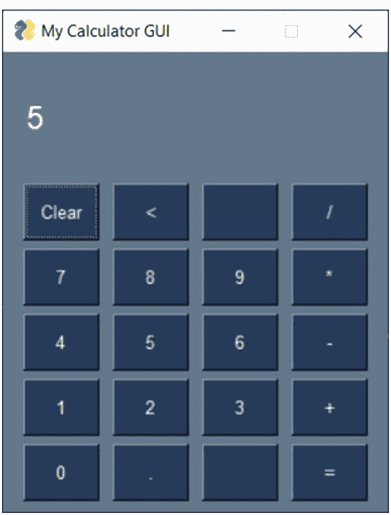

创建一个名为 **calculatorGUI** 的新项目。

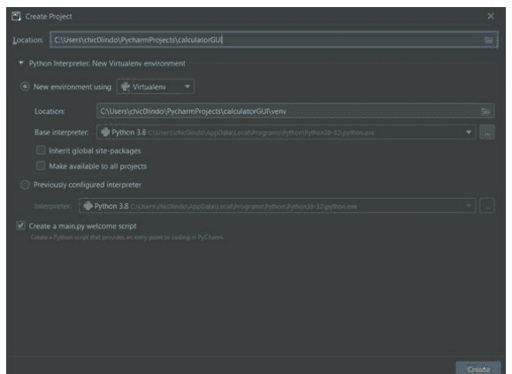

在设计图形用户界面时，我们必须牢记三个设计元素：窗口、布局和事件循环。你在窗口上显示应用程序内容。布局包含程序的用户界面和输出。事件循环处理用户与表单元素（如按钮）交互时发生的情况。

## 导入模块

我们首先需要像过去一样导入我们的 PySimpleGUI 程序。这次我们将使用语法 **from PySimpleGUI import *** 导入整个模块。

## 程序问候语

当我创建应用程序时，我喜欢向用户问好。这是一个计算器，所以这可能相关也可能不相关，但让我们这样做以进入欢迎用户的心态。使用 `popup_get_text()` 获取问候所需的任何输入，例如姓名或用户。然后使用 **popup()** 函数打印问候语。你的问候语可能看起来类似于这样：

```python
# Program Greeting
user_name = popup_get_text("Please enter your name to proceed:")
popup("Hey " + user_name.upper() + ", welcome to Calculator GUI!")
```

### 结果：

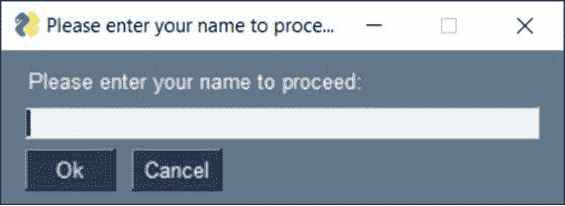

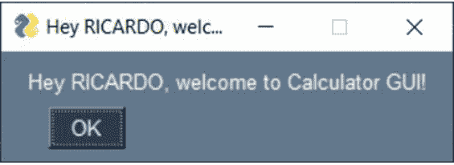

## 设计布局

PySimpleGUI 中的布局部分允许我们以图形方式输出代码的可视化表示。在该布局中，你拥有从文本、按钮和用户输入字段到格式化的一切。PySimpleGUI 使得创建布局变得非常容易，几乎不需要使用太多代码。

我们整个计算器程序的布局可以表示为一个列表的列表。布局被组织成列和行及其元素。布局的第一行用于显示用户输入和计算输出。这些值将显示在布局的顶行。这一行，也是第一个列表，具有文本格式化属性，指示值将如何输出。在我们的代码中，我们选择更改字体大小、类型和颜色。需要的额外属性是 `key`，它基于我们稍后将讨论的事件循环部分进行输出：

```python
layout = [[Txt('' * 10)], # adds 10 spaces to skip a line to center the output
          [Text('', size=(17, 1), font=('Arial', 18), text_color='white', key='input')],
          [Txt('' * 10)], # adds 10 spaces to skip a line to center the output
```

布局的最后五行是实际的按钮。在计算器的按钮中，你需要数字（0-9）、小数点、所有算术运算符以及删除和清除的功能。所有这些都以列表形式的按钮表示。让我们将按钮添加到之前的布局代码中：

## 窗口

接下来我们需要设置的是实际的应用程序窗口。在这个窗口内，我们将有一个布局。在本节中，我们获得了更改布局属性的能力。在这里，我们指定了布局中列出的每个按钮的宽度/高度（以字符为单位）。在本例中，我们使用尺寸 (5,2) 作为元素大小。这意味着五个字符宽，两个字符高：

```python
# Window/From Section: Setup GUI and size buttons
form = FlexForm('My Calculator GUI',
    default_button_element_size=(6, 2),
    auto_size_buttons=False, grab_anywhere=False)
form.Layout(layout) # chooses the above layout
```

## 事件循环

事件循环是所有操作进行的地方。`while` 循环用于打开 GUI 窗口并保持其打开状态，直到用户点击右上角的退出按钮关闭程序。当每个按钮被选中时，按钮值通过以下代码读取：

```python
# Return Value
Return = ''

# Event Loop
while True:
    # Button Values
    button, value = form.Read() # reads in the values from the form when a button is clicked
```

如果收到“清除”、“<”（退格）、“X”（退出按钮）或超过 17 位数字的值，我们的计算器必须有一些特殊处理。十七位数字是我们的限制，因为我们的布局只支持 17 个字符宽。这可以用 `if-else` 语句表示：

```python
# Check Selected Buttons
if button == 'Clear':
    Return = ''
    form.FindElement('input').Update(Return) # updates input key with return value
elif button == '<':
    Return = Return[:-1]
    form.FindElement('input').Update(Return)
elif len(Return) == 17: # if return value is over 17 digits no action taken
    pass
# Quit Program
elif button == 'Quit' or button == None:
    break
```

现在我们已经处理了这些特定情况，是时候执行计算器运算了。下面的代码接收每个按下的按钮的值，并将其保存为一个表达式。然后对该表达式进行求值，以便我们得到最终答案。最后的答案随后显示在我们的按键或输出显示中：

```python
# Evaluates the return values in the expression to get an answer
elif button == '=':
    Answer = eval(Return)
    Answer = str(round(float(Answer), 3))
    form.FindElement('input').Update(Answer)
    Return = Answer
else:
    Return += button
    form.FindElement('input').Update(Return)
```

最后一部分是我们完成计算器 GUI 程序所需的全部内容。下一步是运行我们的 **calculator_GUI.py**。让我们看看所有三个部分，看看整个程序是什么样子的：

```python
# Import Module
from PySimpleGUI import *

# Program Greeting
user_name = popup_get_text("Please enter your name to proceed:")
popup("Hey " + user_name.upper() +", welcome to Calculator GUI!")

# GUI Layout
layout = [[Txt('' * 10)], # adds 10 spaces to skip a line to center the output
          [Text('', size=(17, 1), font=('Arial', 18), text_color='white', key='input')],
          [Txt('' * 10)], # adds 10 spaces to skip a line to center the output
          [ReadFormButton('Clear'), ReadFormButton('<'), SimpleButton(''), ReadFormButton('/')],
          [ReadFormButton('7'), ReadFormButton('8'), ReadFormButton('9'), ReadFormButton('*')],
          [ReadFormButton('4'), ReadFormButton('5'), ReadFormButton('6'), ReadFormButton('-')],
          [ReadFormButton('1'), ReadFormButton('2'), ReadFormButton('3'), ReadFormButton('+')],
          [ReadFormButton('0'), ReadFormButton('.'), SimpleButton(''), ReadFormButton('=')],
          ]

# Window/From Section: Setup GUI and size buttons
form = FlexForm('My Calculator GUI', default_button_element_size=(6, 2),
                auto_size_buttons=False, grab_anywhere=False)
form.Layout(layout) # chooses the above layout

# Return Value
Return = ''

# Event Loop
while True:
    # Button Values
    button, value = form.Read() # reads in the values from the form when a button is clicked

    # Check Selected Buttons
    if button == 'Clear':
        Return = ''
        form.FindElement('input').Update(Return) # updates input key with return value
    elif button == '<':
        Return = Return[:-1]
        form.FindElement('input').Update(Return)
    elif len(Return) == 17: # If return value is over 17 digits no action taken
        pass
    # Quit Program
    elif button == 'Quit' or button == None:
        break

    # Evaluates the return values in the expression to get an answer
    elif button == '=':
        Answer = eval(Return)
        Answer = str(round(float(Answer), 3))
        form.FindElement('input').Update(Answer)
        Return = Answer
    else:
        Return += button
        form.FindElement('input').Update(Return)
```

如果你能够成功运行你的程序，你将看到下面的窗口。

### 结果：

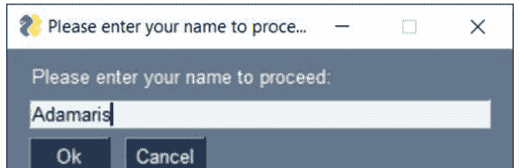

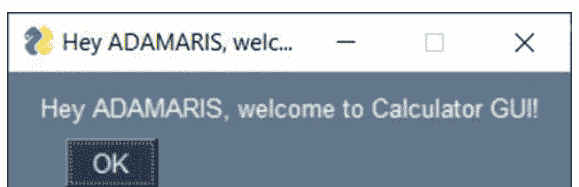

## 我的计算器 GUI

5+5

| 清除 | < |   | / |
|---|---|---|---|
| 7 | 8 | 9 | * |
| 4 | 5 | 6 | - |
| 1 | 2 | 3 | + |
| 0 | . |   | = |

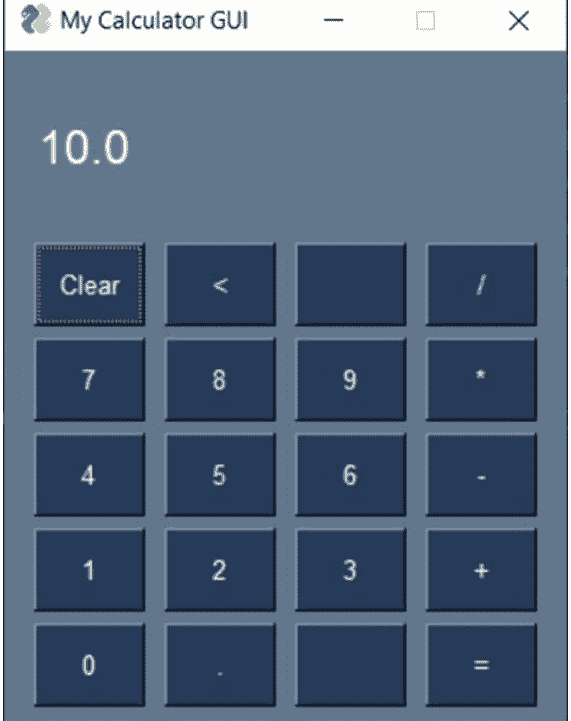

## 结论

成为一名 Python 程序员的旅程绝非易事。你通过这个循序渐进的教程，学习了各种编程概念，坚持了下来。这些概念不仅适用于 Python，也适用于其他编程语言。

我希望你喜欢这本书。更重要的是，我希望你喜欢学习如何成为一名 Python 程序员！这是一段艰难的旅程，但你一步步地完成了它。Casey 和我想通过表达我们的谢意来结束这本书。我们附上了我们关于 GatsbyJS 书籍中的一个免费章节。这本书深入探讨了如何在短短 14 天内使用 GatsbyJS 创建一个超快的网站。它充满了有用的信息，包括现实世界的例子、挑战，甚至还有一个补充课程以进行更多的实践练习。

你的 Python 之旅不必在此停止。Python 可以做许多令人惊叹的事情，从机器学习到图像处理和 DevOps。此外，请关注我们的下一本书，其中将包含一些更高级的概念，包括使用面向对象编程创建应用程序。再次感谢你，我们期待很快再次见到你。

## 15

# 第 15 天：奖励日 - 使用 GatsbyJS 构建网站

阅读时间：18 分钟

好了，极客们！你们做到了！你们已经学习了 Python 的基础知识！哇哦！Python 是一门优秀的语言，正如你现在所知，它有许多用例。然而，在当今的网络上，Javascript 是王者。在 2022 年，如果我必须选择一个框架或前端技术栈来学习，那肯定是 GatsbyJS。不深入探讨所有细节，原因如下：

- 1. 它**超级快** - 主要是因为它生成静态 HTML 文件来显示你的网站，这意味着它经历了一个构建过程。你稍后会了解更多关于这方面的知识，现在只需知道它超级快。
- 2. 它**可扩展** - 这非常重要，因为由于它易于扩展，你不必像使用其他 Web 技术栈（C# 等）那样担心基础设施问题。
- 3. 遵循最佳实践，特别是在**可访问性**和**图像优化**方面 - GatsbyJS 最酷的功能之一是许多最佳实践，如可访问性和图像优化，都直接内置在框架中。这并不意味着你永远不需要进行图像优化或一切都是 100% 可访问的；然而，它确实为你节省了相当多的工作量，至少在最初是这样。

这些只是一些好处，绝不是详尽的列表。今天的内容摘自我们的 GatsbyJS 101 书籍，向你展示如何安装你的 IDE、Node.js，并在 Gatsby Cloud 上使用 GatsbyJS 加载你的第一个网站。背景介绍到此为止，让我们开始吧，极客们！

## 设置你的环境

与所有编程语言和框架一样，你首先必须设置所有必需的工具。为了构建一个 GatsbyJS 网站，我们需要安装以下工具：

1.  Visual Studio Code (https://code.visualstudio.com) - 首选的 Node.js 编辑器。不过，一如既往，你可以自由选择任何你喜欢的 IDE，是的，甚至记事本和 vim 也可以。
2.  Curl (https://curl.se) - 一个方便的命令行工具，允许你传输 HTTP/HTTPS 数据。
3.  Homebrew (仅限 macOS) - 一个方便的工具，使在 Mac 上安装开发者工具变得非常简单。
4.  Git CLI (https://git-scm.com) - 一个免费且开源的分布式版本控制系统，你可以用它来跟踪你的源代码。你需要将它与 GitHub 账户结合使用。
5.  Node.js (https://nodejs.org/en/) - 一个基于 Chrome 的 V8 JavaScript 引擎构建的 JavaScript 运行时，它允许你在本地机器上运行 JavaScript。
6.  Gatsby CLI (https://www.npmjs.com/package/gatsby-cli) - 一个命令行界面，你可以用它来快速启动你的 Gatsby 站点。

在本节中，你还将找到针对三个不同操作系统的特定说明：

- Windows 10
- MacOS
- Linux (Ubuntu)

你可以跳转到你当前使用的操作系统的相应部分。如果你使用的是不同的操作系统，说明应该大致相似。例如，如果你使用的是 Linux Mint，你可能可以通过 Ubuntu 部分来操作。话虽如此，所有这些工具都得到了很好的支持，并且有优秀的文档。如果你在某个特定工具上遇到困难，请访问该特定工具的网站并进行搜索，很可能你会找到解决该问题的确切方法。

### 安装 VS Code

Visual Studio Code 是一个轻量级且出色的源代码编辑器，我最喜欢它的是它是跨平台的。这意味着它可以在 macOS、Windows 和 Linux 上运行，作为一名开发者，我根据不同的工作在不同的主机操作系统上工作，保持 IDE 体验在不同语言之间的一致性非常有帮助。此外，VSCode 拥有丰富的插件生态系统，这非常强大，我们稍后将探索一些更好的 GatsbyJS 插件。

#### Windows 设置

前往 https://code.visualstudio.com/download 并点击 Windows 的下载按钮

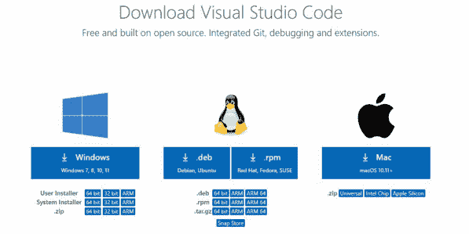

我将使用 64 位用户安装程序；如果你想为系统上的所有用户安装，请使用系统安装程序。文件下载完成后，继续安装。你可以使用所有默认选项，也可以根据需要更改任何选项。

#### MacOS 设置

前往 [https://code.visualstudio.com/download](https://code.visualstudio.com/download) 并点击 Mac 的下载按钮，在我的情况下是 Apple Silicon；但如果你使用的是 Intel 芯片组，请选择那个。

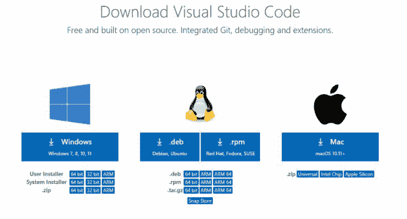

#### Linux 设置

要在 Ubuntu 20.04.2 LTS 上安装 Visual Studio Code，你可以通过 Ubuntu Snap Store (https://snapcraft.io/code) 或通过命令行进行安装。要进行图形化安装，请打开 Snap 商店并搜索 Visual Studio Code，或者访问提供的 URL 并点击安装。


不过，作为一名开发者，你应该能够熟练操作终端。为此，打开 **终端** 应用程序并输入命令。

```
sudo snap install code --classic
```

现在你应该能够启动 Visual Studio Code，方法是转到你的应用程序并点击 Visual Studio Code！请继续执行此操作，以确保一切设置正确。或者，你可以通过 **终端** 打开它，输入以下命令

```
code
```

现在你应该看到 Visual Studio Code 打开了！恭喜 😊！

### 安装 Curl

**cURL** 是一个命令行工具，允许你通过命令行传输 HTTP 和 HTTPS（它还支持其他协议）数据，它是免费且开源的。要安装它，请在终端中运行这些命令。

#### Windows 设置

幸运的是，从 Windows 10（以及可能的 Windows 11）开始，curl 现在默认安装。要验证这一点，请打开命令提示符并输入以下内容

```
curl --version
```

你应该看到类似以下的内容

```
终端输出
C:\Users\casey>curl --version
curl 7.55.1 (Windows) libcurl/7.55.1 WinSSL
Release-Date: 2017-11-14, security patched: 2019-11-05
Protocols: dict file ftp ftps http https imap imaps pop3 pop3s smtp smtps telnet tftp
Features: AsynchDNS IPv6 Largefile SSPI Kerberos SPNEGO NTLM SSL
```

如果由于某种原因 curl 没有安装，你可以在这里下载：[https://curl.se/windows/](https://curl.se/windows/)

#### MacOS 设置

幸运的是，在 macOS 上 curl 默认已安装；但让我们验证一下，打开一个终端窗口并输入以下内容：

```
curl --version
```

你应该看到类似以下的内容

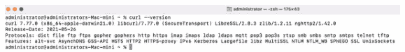

#### Linux 设置

这会更新包索引，以便你可以下载最新的文件

```
sudo apt-get update
```

接下来，安装 curl 包

```
sudo apt-get install curl
```

要验证 curl 是否已安装，请运行此命令

```
curl --version
```

你应该看到

```
终端输出
curl 7.68.0 (x86_64-pc-linux-gnu)
```

### 安装 git（如果是 MacOS 则包括 Homebrew）

你将使用一个名为 git 的工具，它是一个开源的分布式版本控制系统，允许你跟踪源代码随时间的变化。嗯？它将帮助跟踪代码的更改，因此如果你需要回溯时间，你可以相当容易地做到！

#### Windows 设置

转到以下 URL：https://git-scm.com/downloads 并点击 Windows 的下载按钮。安装时，你可以接受所有默认设置。安装完成后，打开命令提示符并输入以下内容：

```
git --version
```

你应该看到类似以下的内容

```
终端输出
git version 2.34.1.windows.1
```

#### MacOS 设置

Homebrew 是一个开发者工具，允许你在 macOS 和 Linux 上非常轻松地安装软件包和软件工具。安装它非常简单，打开终端并运行以下命令

```
/bin/bash -c "$(curl -fsSL https://raw.githubusercontent.com/Homebrew/install/HEAD/install.sh)"
```

然后只需按照说明操作并接受默认设置，你应该会看到类似以下的输出。注意：它可能会提示你输入管理员密码，这是正常的。

```
administrator@Administrator-Mac-mini ~ % /bin/bash -c "$(curl -fsSL https://raw.githubusercontent.com/Homebrew/install/HEAD/install.sh)"
==> Checking for `sudo` access (which may request your password)...
==> This script will install:
/opt/homebrew/bin/brew
/opt/homebrew/share/doc/homebrew
/opt/homebrew/share/man/man1/brew.1
/opt/homebrew/share/zsh/site-functions/_brew
/opt/homebrew/etc/bash_completion.d/brew
/opt/homebrew
==> The following new directories will be created:
/opt/homebrew/bin
/opt/homebrew/include
/opt/homebrew/lib
/opt/homebrew/sbin
/opt/homebrew/share
/opt/homebrew/var
/opt/homebrew/opt
/opt/homebrew/share/zsh
/opt/homebrew/share/zsh/site-functions
/opt/homebrew/var/homebrew
/opt/homebrew/var/homebrew/linked
/opt/homebrew/Cellar
/opt/homebrew/Caskroom
/opt/homebrew/Frameworks
==> The Xcode Command Line Tools will be installed.

Press RETURN to continue or any other key to abort:
>
```

按 RETURN 键让它安装所有需要的东西。Homebrew 下载和安装所有需要的东西可能需要几分钟时间，所以去冲杯咖啡吧 ☕

Homebrew 安装完成后，你应该会看到一个名为 **下一步** 的部分，其中包含两个命令，复制这两个命令并运行它们。它应该看起来类似于以下内容（但不完全一样！所以不要复制这些，复制你终端中的那些）

```
echo 'eval "$(/opt/homebrew/bin/brew shellenv)"' >> /Users/administrator/.zprofile
eval "$(/opt/homebrew/bin/brew shellenv)"
```

太棒了，你将使用 brew 来安装 git！
运行此命令安装 git

```
brew install git
```

安装完成后，只需输入以下内容：

```
git --version
```

如果它报告了一个版本，那么你就准备好了！全部搞定！有了 Homebrew，生活就是这么简单！

#### Linux 设置

运行此命令安装 git

```
sudo apt-get install git
```

要验证 git 是否已安装，请运行此命令

```
git --version
```

它应该会输出一个版本，例如 git version 2.25.1

### 安装 Node.js

Node.js 允许你在本地机器上运行 Javascript，既然你使用 Javascript 来构建网站，你就需要能够在浏览器之外运行和测试东西。React 和 GatsbyJS 利用 Node.js 来构建你稍后将部署到托管提供商的构建产物。

此外（在 MacOS 和 Linux 上），你可以使用 **Node 版本管理器 (NVM)** 轻松地在不同版本的 Node.js 之间切换。虽然你可能不一定使用此功能，但如果你需要为不同的项目切换 Node.js 版本，它是一个方便的工具。要了解更多关于 NVM 的信息，你可以查看位于此处的 GitHub 仓库
https://github.com/nvm-sh/nvm

#### Windows 设置

前往 [https://nodejs.org/en/download/](https://nodejs.org/en/download/) 并下载 LTS 版本的 Windows 安装程序 (.msi) 文件。在撰写本文时，它是 v16.13.1；但是，v14 之后的任何版本可能都足够了。下载后，继续安装它并接受所有默认安装选项。

安装后，打开你的命令提示符并输入以下内容

```
node --version
```

你应该会看到类似以下的内容

```
Terminal output
v16.13.1
```

太好了！它已安装。

#### MacOS 设置

因为你之前安装了 Homebrew，所以这很简单，只需运行以下命令

```
brew install nvm
```

之后你会看到一些 homebrew 和 nvm 要求你执行的后续步骤，这些步骤会创建一个目录并更新你的配置文件。请务必遵循这些说明，它们应该看起来像这样

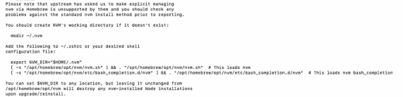

如果你不遵循这些说明，nvm 可能无法正常工作。你的最终配置文件应该看起来像这样：

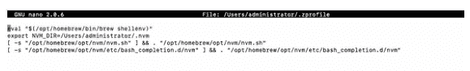

现在 nvm 已安装，让我们通过输入以下内容来验证一切是否按预期工作

```
nvm --version
```

nvm 应该会报告版本号，它应该看起来像这样

```
Terminal Output
0.39.0
```

现在我们已经安装了 nvm，我们可以用它来安装 Node.Js，为此输入以下命令

```
nvm install --lts
```

这应该会安装 Node.Js 的 **LTS** 版本，LTS 代表长期支持。LTS 术语意味着 Node.Js 将支持该主要 LTS 版本 3 年。在撰写本文时，当前的 LTS 版本是 v16.13.1。我建议你使用 LTS 版本，因为它比 Node.js 的最新版本（目前是 v17.2.0）更稳定。

但是，如果你想尝试最新版本的 Node，你可以使用 nvm 来安装它，然后只需在两者之间切换。为此，只需运行

```
nvm install node
```

这将安装最新版本的 Node.js，你可以通过输入以下内容切换到最新版本

```
nvm use node
```

要切换回 LTS 版本，只需输入

```
nvm use --lts
```

非常棒，对吧？！

#### Linux 设置

**nvm** 是一个 bash 脚本，要安装它，请运行此命令

```
wget -o- https://raw.githubusercontent.com/nvm-sh/nvm/v0.38.0/install.sh | bash
```

接下来，关闭你的终端并重新打开终端应用程序。这将刷新你的终端，以便你可以访问 **nvm**。要检查 **nvm** 是否正确安装，请输入此命令

```
nvm --version
```

nvm 应该会报告版本号，它应该看起来像这样

```
Terminal Output
0.39.0
```

现在我们已经安装了 nvm，我们可以用它来安装 Node.Js，为此输入以下命令

```
nvm install --lts
```

这应该会安装 Node.Js 的 **LTS** 版本，LTS 代表长期支持。LTS 术语意味着 Node.Js 将支持该主要 LTS 版本 3 年。在撰写本文时，当前的 LTS 版本是 v16.13.1。我建议你使用 LTS 版本，因为它比 Node.js 的最新版本（目前是 v17.2.0）更稳定。

但是，如果你想尝试最新版本的 Node，你可以使用 nvm 来安装它，然后只需在两者之间切换。为此，只需运行

```
nvm install node
```

这将安装最新版本的 Node.js，你可以通过输入以下内容切换到最新版本

```
nvm use node
```

要切换回 LTS 版本，只需输入

```
nvm use --lts
```

非常棒，对吧？！

### 安装 Gatsby CLI

在 Windows、MacOS 和 Linux 上安装 Gatsby CLI 的过程是相同的。Gatsby CLI 将帮助你快速创建一个新的 Gatsby 网站，它使入门变得极其简单。该工具将设置整个网站包，以便你可以开始构建。

你将把它作为全局 npm 包安装，因为你将在多个项目中使用它。一般来说，你应该避免全局安装包；但是，对于某些基于 CLI 的工具，在某些情况下可能是有意义的。在这种情况下，确实如此。要安装它，请运行

```
npm install --global gatsby-cli
```

瞧！Gatsby CLI 已安装，通过运行以下命令确保它正常工作

```
gatsby --version
```

你应该会看到它返回 Gatsby CLI Version: 4.3.0（或更新版本）

## 使用 GatsbyJS v4 的 Hello World

好了！你所有的开发工具都已安装，呼，这真是一段旅程！现在是时候在你的开发环境中启动并运行你的第一个 GatsbyJS v4 网站了。

你将使用 Gatsby CLI 来创建初始的样板网站。为此，打开一个终端窗口并导航到你想要创建网站的任何文件夹。例如，我将所有项目放在一个名为 external-website-projects 的文件夹中。所以，在 VSCode 中打开一个终端，我可以通过输入以下内容导航到该目录

```
cd ~/Documents/external-website-projects/
```

这是我的目录，但不一定是你的，请随意创建你喜欢的任何目录结构。我将来只会将此位置称为 **网站项目文件夹**。一旦你到达了你想要的位置，通过输入以下内容创建一个新的 Gatsby 项目

```
gatsby new
```

Gatsby CLI 将问你几个问题，它将使用这些问题来确定特定的构建设置。所以，你是在告诉这个命令行程序 gatsby 为你创建一个新站点。按照以下方式回答 Gatsby CLI 提出的问题：

### 你想给你的网站起什么名字？

```
My First Gatsby Site
```

### 你想将创建网站的文件夹命名为什么？

```
my-first-gatsby-site
```

### 你将使用 CMS 吗？

```
No (or I'll add it later)
```

### 你想安装样式系统吗

```
No (or I'll add it later)
```

### （多选）使用箭头键移动，按回车键选择，选择“Done”确认你的选择

```
Don't select any of the choices, and select Done
```

### 我们这样做吗 (Y/n)？

```
Yes
```

太棒了！我们的网站现在已构建完成，是时候看看并检查一下了。导航到网站目录。

```
cd my-first-gatsby-site
```

通过在本地运行它来启动你的网站，输入

```
gatsby develop
```

此命令告诉 Gatsby 在端口 8000 上启动本地开发服务器，并在 `___graphql` 路径上启动 GraphiQL 工具，你将在后面的章节中了解 GraphiQL。现在，如果你将网络浏览器打开到以下地址 http://localhost:8000/，你应该会看到你的第一个 GatsbyJS 网站！

## 恭喜
— 你刚刚创建了一个 Gatsby 网站！🎉🎉🎉

编辑 `src/pages/index.js` 以实时查看此页面更新。😎

文档

- [教程](https://www.gatsbyjs.com/docs/tutorial/)
  如果你是 Web 开发新手，这是一个很好的起点。旨在指导你完成第一个 Gatsby 网站的设置。

- [操作指南](https://www.gatsbyjs.com/docs/how-to/)
  实用的分步指南，帮助你实现特定目标。当你试图完成某件事时最有用。

- [参考指南](https://www.gatsbyjs.com/docs/reference/)
  关于 Gatsby 工作原理的详细技术描述。当你需要有关 Gatsby API 的详细信息时最有用。

- [概念指南](https://www.gatsbyjs.com/docs/conceptual/)
  对更高级 Gatsby 概念的宏观解释。对于理解特定主题最有用。

- [插件库](https://www.gatsbyjs.com/plugins/)
  使用我们出色的开发者社区构建的数千个插件为你的 Gatsby 网站或应用程序添加功能并进行自定义。

- [构建和托管](https://www.gatsbyjs.com/docs/how-to/previews-deploys-and-distribution/hosting-on-gatsby-cloud/) 🆕
  现在你准备好向世界展示了！赋予你的 Gatsby 网站超能力：在 Gatsby Cloud 上构建和托管。免费开始！

是不是很棒？既然你已经了解了如何快速开始使用 GatsbyJS 构建网站，现在是时候进行一些修改了。

## 更新主页

在 VSCode IDE 中，打开 `src` 文件夹，接着打开 `pages` 文件夹，里面应该有两个文件：

1.  `index.js`
2.  `404.js`

`index.js` 是你的主页，当你访问 `http://localhost:8000` 时会显示这个页面。`404.js` 页面则会在你访问网站中不存在的链接时显示，换句话说，它用于处理任何 404 错误。

请打开 `index.js`，在第 136 行你应该会看到以下 HTML 代码：

```
<span style={headingAccentStyles}>-- you just made a Gatsby site! </span>
```

将这一行更新为：

```
<span style={headingAccentStyles}>-- I just made my FIRST Gatsby site</span>
```

在你的终端中保存文件。注意，如果你在保存文件时保持浏览器打开，Gatsby 会自动为你刷新页面，这样你就能立即看到更改生效！

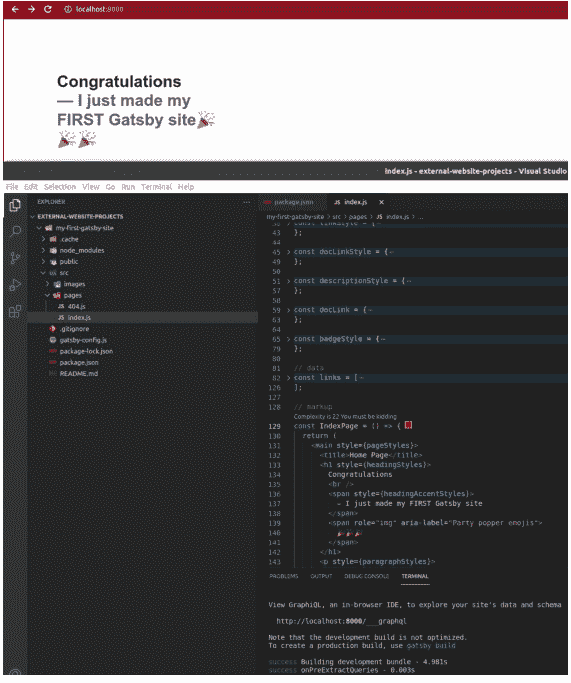

如你所见，修改 Gatsby 网站非常简单。事实上，如果你已经了解 HTML，那么这只是一个非常简单的练习：打开一个文件并进行 HTML 更改。由于 Gatsby 使用 React，所有页面都将包含 JavaScript、HTML 和 CSS 的某种组合。

## 创建新链接

既然你已经对 HTML 进行了文本更改，现在是时候创建一个新链接了。通常，你会在刚才修改的地方下方进行操作，对吗？毕竟，你刚刚在第 136 行更新了一些文本，而页面上的链接显示在该点下方，所以你应该在那里进行更改，对吗？下面是你会看到的内容：

```
{links.map((link) => (
    <li key={link.url} style={{
        ...listItemStyles, color: link.color }}>
        <span>
            <a
                style={linkStyle}
                href={`${link.url}?utm_source=starter&utm_medium=start-page&utm_campaign=minimal-starter`}
            >
                {link.text}
            </a>
            {link.badge && (
              <span style={badgeStyle} aria-label="New Badge">
                NEW!
              </span>
            )}
            <p style={descriptionStyle}>
                {link.description}
            </p>
        </span>
    </li>
))}
```

如果你已经使用 JavaScript 一段时间了，你完全知道接下来该做什么。但如果 **Javascript** 或 **JSX** 对你来说还比较新，你可能会有点困惑。你所有的 http 链接在哪里？这些 `{}` 是什么意思？第一行中的 `links.map` 是做什么的？在接下来的章节中，你将学习所有这些概念。目前，我希望你从这里了解到的是，使用 GatsbyJS（以及 React 和 Javascript），你可以开始将数据与网站的显示方式分离开来。

## 好的，我明白了。我想？那么我该如何进行这个更改呢？

向上滚动到文件顶部，在第 82 行你会看到以下内容：

```
const links = [...]
```

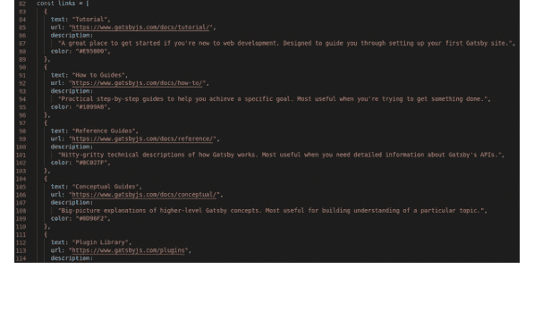

啊哈！（顺便说一句，你可以通过将鼠标悬停在第 82 行并点击向下箭头来折叠 `links` 数组。VSCode 会折叠 `links` 数组，这在你处理代码时非常方便，这样你可以折叠当前未修改的部分）

所以这里你有一个 **links** 数据数组，它存储了关于链接的所有信息，具体来说，它有四个必需属性：`text`、`url`、`description`、`color`，以及第五个可选属性 `badge`。那么，继续，通过复制 `{}` 括号之间的所有内容来创建一个新链接（别忘了逗号！）。按如下方式进行更改：

```
const links = [
  {
    text: "Nerd Challenges",
    url: "https://nerdchallenges.com",
    description:
      "A great place to challenge yourself to learn new skills, like GatsbyJS and Python!",
    color: "#E90025",
  },
  {
    text: "Tutorial",
    url: "https://www.gatsbyjs.com/docs/tutorial/",
    description:
      "A great place to get started if you're new to web development. Designed to guide you through setting up your first Gatsby site.",
    color: "#E95800",
  },
  // ... other links
]
```

保存文件，瞧！页面现在加载了你最新的链接。

## 恭喜 — 我刚刚制作了我的第一个 Gatsby 网站 🎉🎉🎉

编辑 `src/pages/index.js` 以实时查看此页面更新。😎

[文档](https://www.gatsbyjs.com/docs/)

- [Nerd Challenges](https://www.gatsbyjs.com/docs/nerd-challenges/)
  一个挑战自我学习新技能的好地方，比如 GatsbyJS 和 Python！
- [Tutorial](https://www.gatsbyjs.com/docs/tutorial/)
  如果你是 Web 开发新手，这是一个很好的起点。旨在指导你完成第一个 Gatsby 网站的设置。
- [How to Guides](https://www.gatsbyjs.com/docs/how-to/)
  实用的分步指南，帮助你实现特定目标。当你试图完成某项任务时最有用。
- [Reference Guides](https://www.gatsbyjs.com/docs/reference/)
  关于 Gatsby 工作原理的详细技术描述。当你需要关于 Gatsby API 的详细信息时最有用。
- [Conceptual Guides](https://www.gatsbyjs.com/docs/conceptual/)
  对高级 Gatsby 概念的宏观解释。对于理解特定主题最有用。
- [Plugin Library](https://www.gatsbyjs.com/plugins/)
  使用我们出色的开发者社区构建的数千个插件，为你的 Gatsby 网站或应用添加功能并进行自定义。
- [Build and Host](https://www.gatsbyjs.com/docs/how-to/previews-deploys-and-distribution/hosting-on-gatsby-cloud/) NEW!
  现在你准备好向世界展示了！赋予你的 Gatsby 网站超能力：在 Gatsby Cloud 上构建和托管。免费开始！

但是等等，我们缺少那个闪亮的 NEW 徽章？没问题，将以下内容添加到第一个条目：

```
{
    text: "Nerd Challenges",
    url: "https://nerdchallenges.com",
    description:
        "A great place to challenge yourself to learn new skills, like GatsbyJS and Python!",
    color: "#E90025",
    badge: true,
},
```

砰！你看到这个效果了吗？退一步讲，你能够修改一段数据，具体来说是一个 Javascript 数组，然后 Gatsby 使用它来以不同的方式渲染页面。你不需要用 CSS 设置任何样式或进行任何 HTML 更改，你只是简单地更改了一段数据来添加一条新记录。

这的强大之处在于，稍后你将学习如何从外部数据源查询数据，例如 MySQL 数据库或外部 API。假设你想从数据源（API）拉取股票价格列表并显示在你的网站上。你可以通过 GraphQL 使用 Gatsby 查询数据，Gatsby 会为你显示这些数据。这意味着，每次你查询该数据源时，如果有任何新数据添加，它都会显示在你的网站上！最重要的是，一旦你正确编程，除了重新运行查询以获取最新数据外，不需要任何更新！

## 恭喜 — 我刚刚制作了我的第一个 Gatsby 网站 🎉🎉🎉

编辑 `src/pages/index.js` 以实时查看此页面更新。😎

[文档](https://www.gatsbyjs.com/docs/)

- [Nerd Challenges](https://www.gatsbyjs.com/docs/tutorial/part-one/#-challenges) NEW!
  一个挑战自我学习新技能的好地方，比如 GatsbyJS 和 Python！

在本章中，你学到了几个关键点：

1.  如何使用 Gatsby CLI 设置初始项目，随意创建一个新项目并尝试各种操作吧！😉
2.  如何编辑 Gatsby 页面上的文本
3.  如何编辑一个数据数组，该数组随后会在 Gatsby 页面上渲染不同的数据
4.  更新数据对象与手动更新 HTML 标签之间的重要区别

明天，你将暂时离开 Gatsby，我们将专注于项目本身，探讨我们试图实现的目标，以及客户的需求。

## 问答回顾

1.  什么是 GatsbyJS？
    1.  一个基于 React 的框架，允许你构建快速、安全且可扩展的网站。
    2.  一个静态网站生成器
    3.  一种构建网站的方法
    4.  就是那个叫 Jay 的家伙，对吧？

2.  使用 Gatsby CLI 启动本地开发服务器的命令是什么？
    1.  `gatsby start`
    2.  `gatsby develop`
    3.  `gatsby new`
    4.  `gatsby stop`

## 第15天挑战

如果这本书不包含一些挑战，那它就不算是《极客挑战》了！所以，开始行动吧！

-   千字节挑战：尝试将你开发的网站的站点标题更新为“My First Gatsby Page!”。
-   兆字节挑战：尝试将**恭喜——我刚刚创建了我的第一个Gatsby网站**的字体颜色更改为#E90025。
-   吉字节挑战：尝试更新网页上的**文档**链接。
-   太字节挑战：尝试将此网站自行部署到Gatsby Cloud！

## 这很有趣！

里卡多和我希望你喜欢这本Python书以及我们《GatsbyJS v4》书中摘录的这一小部分。我们创作它和录制视频的过程非常愉快，希望你能从中学习。一如既往，欢迎随时联系我们，告诉我们你对这本书的看法，无论好坏！casey@nerdchallenges.com 和 rico@nerdchallenges.com

## 问答解答

### 第1天 - 安装Python 答案

1.  什么是IDE？
**集成开发环境：** 基本上是一个文本编辑器，它提供了一堆工具来帮助你编写更好的软件。

2.  最好的IDE软件是什么？
**这是个陷阱题！它取决于我个人喜好，出于个人原因。**

3.  什么是变量？
**变量允许你通过指定一个属性来引用数据，之后你可以在应用程序中引用该属性。例如，my_name = “Casey” 就是一个变量。**

4.  如何在Python 3中向终端窗口打印内容？
```
print("This doesn't print anything!")
```

5.  为什么应该使用注释？
为Python程序提供有意义的上下文。

6.  可以有多行注释吗？
是的

### 第2天 - 数据类型

1.  如何显式地将数字转换为字符串？
**使用 *str()* 方法**

2.  元组是不可变的？
**是的**

### 第3天 - 运算符

1.  用于将两个数字相乘的运算符是什么？
*

2.  Python中有比较运算符，允许你比较整数。
**是的**

### 第4天 - 用户交互

1.  Python中用于提示用户输入的函数是什么？
**input()**

2.  当用户用数字响应input函数时，该变量被保存为字符串。
**是的**

### 第5天 - If-Else语句

1.  Python中可以用来做决定的语句类型是什么？
**if-else语句**

2.  假设你有以下代码块并执行它，你将在终端上看到什么？
```
rider_age = 13
age_limit = 16
if rider_age >= age_limit:
    print("Congrats! You are old enough to go on this ride!")
```
**不会有任何输出**

3.  要使用`if`语句，你也必须使用else。
**错误**

### 第6天 - Try-Exceptions

1.  如何在Python程序中处理错误或异常？
**try-except块**

2.  用于描述字符串连接或组合的术语是什么？
**连接**

3.  Finally块总是会运行
**是的**

### 第8天 - 函数

1.  如何在代码中创建或定义函数？
**def**

2.  在程序中允许使用一个函数多少次？
**无限次**

### 第9天 - 模块与包

1.  在Python代码中使用包或模块时，使用哪个关键字？
**import**

2.  Python的包安装器/管理器是什么？
**pip**

### 第10天 - 处理文件

1.  对现有文件使用open和write函数：
**会覆盖该文件中已有的所有内容**

2.  以下代码块将打开一个名为nerd_names.txt的文件，读取它，将其打印到终端，然后关闭该文件。
```
nerd_file = open("nerd_names.txt", "r")
print(nerd_file.read())
nerd_file.close()
```
**是的**

### 第11天 - 调试

1.  断点允许你：
**允许你在特定行号停止程序，然后逐步执行后续的代码行**

2.  监视器允许你在程序运行时监视一个变量。
**是的**

### 第12天 - 类与对象

1.  你可以将类看作一个*蓝图*
**是的**

2.  对象是类的一个实例
**是的**

### 第13天 - Requests库

1.  requests库是Python内置的
**错误**

2.  requests库允许你发送HTTP请求
**是的**

### 第15天 - 额外一天 - 使用GatsbyJs构建网站

## 关于作者

**里卡多·里德**

里卡多·A·里德是一名工程师和军官，在航空航天和国防行业拥有超过12年的系统工程经验。他曾为洛克希德·马丁和诺斯罗普·格鲁曼公司工作，为美国军方设计、开发和集成武器系统。著名的项目包括为第五代战斗机开发高超音速导弹和双波段传感器。作为海军预备役人员，他已光荣服役15年，并完成了两次阿富汗部署。他目前担任一个单位的指挥官，该单位为海军水面舰艇和潜艇提供仓库级维护支持。

他是一位狂热的学习者，始终致力于持续教育和教学。他是中佛罗里达大学的毕业生，获得了电气工程学士学位、系统工程硕士学位和工程管理硕士学位。截至2015年12月，他是一名认证的项目管理专业人士（PMP），并拥有各种IT和云认证。他持有5个AWS认证、3个CompTIA认证，并且之前持有CCNA认证。

里卡多对向他人传授技术技能充满热情，特别是对退伍军人和军属。他的目标是更好地教育尽可能多的人学习工程和信息技术。他致力于帮助他人以最小的努力理解各种技术主题。他相信每个人都有能力掌握技术技能。所需要的只是一点点努力和学习的意愿。说到技术，天空才是极限！

### 凯西·杰瑞纳

凯西·杰瑞纳从八岁开始构建软件，并曾在亚马逊、埃森哲和洛克希德·马丁等公司担任各种工程相关职位。凯西在七岁时玩电脑游戏《毁灭战士》时就对软件产生了热情。凯西热衷于教授他人软件工程、云计算和无服务器技术。他认为无服务器是软件工程的未来。凯西拥有中佛罗里达大学管理信息系统学士学位、安柏瑞德航空大学物流与全球供应链管理硕士学位，以及佐治亚理工学院计算机科学第二个硕士学位。凯西持有多个IT认证，包括认证信息系统安全专家（CISSP）和九个AWS认证。凯西喜欢帮助他人学习技术，尤其是在软件工程方面。他喜欢举重、玩电子游戏，并与妻子玛丽莲和女儿米娅共度时光。

**你可以通过以下方式联系我：**

-   🌐 [https://nerdchallenges.com](https://nerdchallenges.com)
-   🐦 [https://twitter.com/cjgerena](https://twitter.com/cjgerena)
-   🔗 [https://twitter.com/rricoreid](https://twitter.com/rricoreid)

**订阅我的通讯：**

-   ✉️ [https://nerdchallenges.com](https://nerdchallenges.com)