整数、变量、函数、方法、属性、数据类型、运算符、模块化、异常处理、迭代器、模式匹配、编程、调试、代码

```python
import math
def range_plus_plus(*args):
    match args:
        case []:
            return
        case [int(a), e, math.inf] if e is ...:
            while True:
                yield a
                a += 1
        case [e, int(a), *rest] if e is ...:
            yield from range(a + 1)
            yield from range_plus_plus(*rest)
        case [int(a), e, int(b), *rest] if e is ...:
            yield from range(a, b + 1)
```


# Python 3
## 综合指南

Johannes Ernesti
Peter Kaiser


Johannes Ernesti, Peter Kaiser

# Python 3

综合指南


# 版权页

这本电子书是一项多人参与的出版物，具体贡献者如下：

**编辑** Rachel Gibson
**策划编辑** Hareem Shafi
**德文版编辑** Anne Scheibe
**翻译** Winema Language Services, Inc.
**文字编辑** Melinda Rankin
**封面设计** Graham Geary
**图片来源** Adobe Stock: 65543369/© Sergey Skleznev
**电子书制作** Graham Geary
**电子书排版** SatzPro, Germany

我们希望您喜欢这本电子书。请与我们分享您的反馈，并阅读[服务页面](Service Pages)以了解如何联系我们。

**美国国会图书馆已将印刷版编目如下：**
名称：Ernesti, Johannes, 作者。 | Kaiser, Peter (计算机程序员), 作者。
题名：Python 3 : 综合指南 / Johannes Ernesti 和 Peter Kaiser 著。
描述：第1版。 | 波恩；波士顿：Rheinwerk Publishing/SAP Press, 2022。 | 包含索引。

标识符：LCCN 2022029178 | ISBN 9781493223022 (精装) | ISBN 9781493223039 (电子书)
主题：LCSH: Python (计算机程序语言) | 计算机编程。
分类：LCC QA76.73.P98 E76 2022 | DDC 005.13/3--dc23/eng/20220812
LC记录可在 https://lccn.loc.gov/2022029178 获取

**ISBN 978-1-4932-2302-2 (印刷版)**
**ISBN 978-1-4932-2303-9 (电子书)**
**ISBN 978-1-4932-2304-6 (印刷版和电子书)**

© 2022 by Rheinwerk Publishing Inc., Boston (MA)
2022年第1版
2021年由德国波恩的Rheinwerk Verlag出版第6版德文版

# 亲爱的读者，

我是一个自称极简主义者的人。

众所周知，我会进行长达一天的整理活动，并积极尝试减少我的消费和拥有的物品数量。光是想到要在一个塞满了半死不活的电池、外卖菜单和早已被遗忘的邮件的杂物抽屉里翻找一支可用的笔，就足以让我的血压飙升。虽然我可能永远达不到拥有一个只有一套餐具和极简家具的时尚全白房子的阶段，但拥有一个简洁、宁静的环境能显著提高我的生产力并降低我的压力水平。

如果说有一种编程语言是为极简主义者打造的，那么Python就是不二之选。Python围绕简洁性构建。每个元素都被视为对象，这使得编码变得直接明了；开发者被鼓励编写干净且易于阅读的代码；甚至官方的Python原则也带有一种宁静的本质（“Python之禅”）。此外，它还是一个终极的多用途工具：它不专门化，可以用来编写你所能想到的几乎任何东西。

通过这本书，你将获得关于这门简单而强大的语言所需的一切知识，全部汇集于此。那么，你对*Python 3：综合指南*有什么看法？你的评论和建议是帮助我们把书籍做到最好的最有用的工具。请随时与我联系，分享你可能有的任何赞扬或批评。

感谢你购买Rheinwerk Publishing的书籍！

**Rachel Gibson**
编辑，Rheinwerk Publishing

*rachelg@rheinwerk-publishing.com*
*www.rheinwerk-computing.com*
Rheinwerk Publishing • Boston, MA

# 使用说明

这本电子书**受版权保护**。购买此电子书即表示你同意接受并遵守版权规定。你有权将此电子书用于个人目的。你也可以打印和复制它，但也仅限于个人使用。然而，不允许与他人分享电子或印刷副本，无论是整体还是部分。当然，在互联网或公司网络上提供它们也是非法的。

有关详细且具有法律约束力的使用条件，请参阅[法律说明](Legal Notes)部分。

此电子书副本包含一个**数字水印**，一个标识哪个人可以使用此副本的签名：

# 屏幕显示说明

你正在以一种文件格式（EPUB或Mobi）阅读这本电子书，该格式使书籍内容能够适应你的阅读设备的显示选项和个人需求。这是一件好事；但不幸的是，并非每台设备都以相同的方式显示内容，图片和表格等特征的渲染或断字可能会导致困难。此电子书已针对尽可能多的常见阅读设备的显示进行了优化。

如果你想放大某个图表（尤其是在iPad上的iBooks中），请轻点相应的图表一次。再次轻点，你将返回到上一个屏幕。你可以在[服务页面](https://example.com)上找到更多关于自定义屏幕布局的建议。

# 目录

**亲爱的读者**
**使用说明**
**目录**

# 1 引言

## 1.1 我们为什么写这本书？

## 1.2 这本书提供了什么？

## 1.3 本书结构

## 1.4 你应该如何阅读这本书？

## 1.5 示例程序

## 1.6 第一版英文版序言（2022年）

## 1.7 致谢

# 2 Python编程语言

## 2.1 历史、概念和应用领域

### 2.1.1 历史与起源

### 2.1.2 基本概念

### 2.1.3 可能的应用领域和优势

### 2.1.4 使用示例

## 2.2 安装Python

### 2.2.1 在Windows上安装Anaconda

### 2.2.2 在Linux上安装Anaconda

### 2.2.3 在macOS上安装Anaconda

## 2.3 安装第三方模块

## 2.4 使用Python

# 第一部分 Python入门

# 3 交互模式入门

## 3.1 整数

## 3.2 浮点数

## 3.3 字符串

## 3.4 列表

## 3.5 字典

## 3.6 变量

### 3.6.1 下划线的特殊含义

### 3.6.2 标识符

## 3.7 逻辑表达式

## 3.8 函数和方法

### 3.8.1 函数

### 3.8.2 方法

## 3.9 屏幕输出

## 3.10 模块

# 4 通往第一个程序之路

## 4.1 输入、编译和测试

### 4.1.1 Windows

### 4.1.2 Linux和macOS

### 4.1.3 Shebang

### 4.1.4 内部过程

## 4.2 Python程序的基本结构

### 4.2.1 长行换行

### 4.2.2 多行连接

## 4.3 第一个程序

### 4.3.1 初始化

### 4.3.2 循环头

### 4.3.3 循环体

### 4.3.4 屏幕输出

## 4.4 注释

## 4.5 出错时

# 5 控制结构

## 5.1 条件语句

### 5.1.1 if语句

### 5.1.2 条件表达式

## 5.2 循环

### 5.2.1 while循环

### 5.2.2 循环终止

### 5.2.3 检测循环中断

### 5.2.4 中止当前迭代

### 5.2.5 for循环

### 5.2.6 作为计数循环的for循环

## 5.3 pass语句

## 5.4 赋值表达式

### 5.4.1 使用赋值表达式的猜数字游戏

# 6 文件

## 6.1 数据流

## 6.2 从文件读取数据

### 6.2.1 打开和关闭文件

### 6.2.2 with语句

### 6.2.3 读取文件内容

## 6.3 将数据写入文件

## 6.4 生成文件对象

### 6.4.1 内置open函数

### 6.4.2 文件对象的属性和方法

### 6.4.3 更改读/写位置

# 7 数据模型

## 7.1 实例的结构

### 7.1.1 数据类型

### 7.1.2 值

### 7.1.3 标识

## 7.2 删除引用

## 7.3 可变与不可变数据类型

# 8 函数、方法和属性

## 8.1 函数和方法的参数

- 8.1.1 位置参数
- 8.1.2 关键字参数
- 8.1.3 可选参数
- 8.1.4 仅关键字参数

## 8.2 属性

# 9 Python信息来源

## 9.1 内置help函数

## 9.2 在线文档

## 9.3 PEPs

# 第二部分 数据类型

## 10 基本数据类型：概述

- 10.1 虚无：NoneType
- 10.2 运算符
  - 10.2.1 运算符优先级
  - 10.2.2 求值顺序
  - 10.2.3 比较运算符的链式调用

## 11 数值数据类型

- 11.1 算术运算符
- 11.2 比较运算符
- 11.3 数值数据类型之间的转换
- 11.4 整数：int
  - 11.4.1 数制系统
  - 11.4.2 位运算
  - 11.4.3 方法
- 11.5 浮点数：float
  - 11.5.1 科学计数法
  - 11.5.2 精度
  - 11.5.3 无穷大与非数字

## 11.6 布尔值：bool

- 11.6.1 逻辑运算符
- 11.6.2 非布尔数据类型的真值
- 11.6.3 逻辑运算符的求值

## 11.7 复数：complex

## 12 序列数据类型

## 12.1 文本与二进制数据的区别

## 12.2 序列数据类型实例的操作

- 12.2.1 检查元素
- 12.2.2 连接
- 12.2.3 重复
- 12.2.4 索引
- 12.2.5 切片
- 12.2.6 序列的长度
- 12.2.7 最小与最大元素
- 12.2.8 搜索元素
- 12.2.9 计数元素

## 12.3 list 数据类型

- 12.3.1 更改列表中的值：通过 [] 赋值
- 12.3.2 替换子列表与插入新元素：通过 [] 赋值
- 12.3.3 删除元素与子列表：del 与 [] 结合使用
- 12.3.4 list 实例的方法
- 12.3.5 列表排序：s.sort([key, reverse])
- 12.3.6 副作用
- 12.3.7 列表推导式

## 12.4 不可变列表：tuple

- 12.4.1 打包与解包
- 12.4.2 不可变并不意味着不可更改！

## 12.5 字符串：str, bytes, bytearray

- 12.5.1 控制字符
- 12.5.2 字符串方法
- 12.5.3 字符串格式化
- 12.5.4 字符集与特殊字符

## 13 映射与集合

## 13.1 字典：dict

- 13.1.1 创建字典
- 13.1.2 键与值
- 13.1.3 迭代
- 13.1.4 运算符
- 13.1.5 方法
- 13.1.6 字典推导式

## 13.2 集合：set 与 frozenset

- 13.2.1 创建集合
- 13.2.2 迭代
- 13.2.3 运算符
- 13.2.4 方法
- 13.2.5 可变集合：set
- 13.2.6 不可变集合：frozenset

## 14 集合类型

- 14.1 链式字典
- 14.2 频率计数
- 14.3 带默认值的字典
- 14.4 双向链表
- 14.5 命名元组

## 15 日期与时间

## 15.1 基础时间函数—time

- 15.1.1 struct_time 数据类型
- 15.1.2 常量
- 15.1.3 函数

## 15.2 面向对象的日期管理：datetime

- 15.2.1 datetime.date
- 15.2.2 datetime.time
- 15.2.3 datetime.datetime
- 15.2.4 datetime.timedelta
- 15.2.5 datetime.datetime 与 datetime.date 的操作

## 15.3 时区：zoneinfo

- 15.3.1 IANA 时区数据库
- 15.3.2 指定时区中的时间
- 15.3.3 使用本地时区时间指示进行计算

## 16 枚举与标志

- 16.1 枚举类型：enum
- 16.2 用于位模式的枚举类型：flag
- 16.3 整数枚举类型：IntEnum

# 第三部分 高级编程技术

## 17 函数

- 17.1 定义函数
- 17.2 返回值
- 17.3 函数对象
- 17.4 可选参数
- 17.5 关键字参数
- 17.6 任意数量的参数
- 17.7 仅关键字参数
- 17.8 仅位置参数
- 17.9 调用函数时的解包
- 17.10 副作用
- 17.11 命名空间
  - 17.11.1 访问全局变量：global
  - 17.11.2 访问全局命名空间
  - 17.11.3 局部函数
  - 17.11.4 访问父级命名空间：nonlocal
  - 17.11.5 未绑定的局部变量：一个绊脚石
- 17.12 匿名函数
- 17.13 递归

## 17.14 内置函数

- 17.14.1 abs(x)
- 17.14.2 all(iterable)
- 17.14.3 any(iterable)
- 17.14.4 ascii(object)
- 17.14.5 bin(x)
- 17.14.6 bool([x])
- 17.14.7 bytearray([source, encoding, errors])
- 17.14.8 bytes([source, encoding, errors])
- 17.14.9 chr(i)
- 17.14.10 complex([real, imag])
- 17.14.11 dict([source])
- 17.14.12 divmod(a, b)
- 17.14.13 enumerate(iterable, [start])
- 17.14.14 eval(expression, [globals, locals])
- 17.14.15 exec(object, [globals, locals])
- 17.14.16 filter(function, iterable)
- 17.14.17 float([x])
- 17.14.18 format(value, [format_spec])
- 17.14.19 frozenset([iterable])
- 17.14.20 globals()
- 17.14.21 hash(object)
- 17.14.22 help([object])
- 17.14.23 hex(x)
- 17.14.24 id(object)
- 17.14.25 input([prompt])
- 17.14.26 int([x, base])
- 17.14.27 len(s)
- 17.14.28 list([sequence])
- 17.14.29 locals()
- 17.14.30 map(function, [*iterable])
- 17.14.31 max(iterable, {default, key}), max(arg1, arg2, [*args], {key})
- 17.14.32 min(iterable, {default, key}), min(arg1, arg2, [*args], {key})
- 17.14.33 oct(x)
- 17.14.34 ord(c)
- 17.14.35 pow(x, y, [z])
- 17.14.36 print([*objects], {sep, end, file, flush})
- 17.14.37 range([start], stop, [step])
- 17.14.38 repr(object)
- 17.14.39 reversed(sequence)
- 17.14.40 round(x, [n])
- 17.14.41 set([iterable])
- 17.14.42 sorted(iterable, [key, reverse])
- 17.14.43 str([object, encoding, errors])
- 17.14.44 sum(iterable, [start])
- 17.14.45 tuple([iterable])
- 17.14.46 type(object)
- 17.14.47 zip([*iterables], {strict})

## 18 模块与包

- 18.1 导入全局模块
- 18.2 本地模块
  - 18.2.1 名称冲突
  - 18.2.2 模块内部引用
  - 18.2.3 执行模块

## 18.3 包

- 18.3.1 导入包中的所有模块
- 18.3.2 命名空间包
- 18.3.3 相对导入语句

## 18.4 importlib 包

- 18.4.1 导入模块与包
- 18.4.2 更改导入行为

## 18.5 计划中的语言元素

## 19 面向对象编程

## 19.1 示例：一个非面向对象的账户

- 19.1.1 创建新账户
- 19.1.2 转账
- 19.1.3 存款与取款
- 19.1.4 查看账户余额

## 19.2 类

- 19.2.1 定义方法
- 19.2.2 构造函数
- 19.2.3 属性
- 19.2.4 示例：一个面向对象的账户

## 19.3 继承

- 19.3.1 一个简单的例子
- 19.3.2 方法重写
- 19.3.3 示例：带每日交易额的支票账户
- 19.3.4 展望

## 19.4 多重继承

## 19.5 属性描述符

- 19.5.1 设置器与获取器
- 19.5.2 定义属性描述符

## 19.6 静态方法

## 19.7 类方法

## 19.8 类属性

## 19.9 面向对象编程的内置函数

- 19.9.1 管理实例属性的函数
- 19.9.2 获取类层次结构信息的函数

## 19.10 继承内置数据类型

## 19.11 魔术方法与魔术属性

- 19.11.1 通用魔术方法
- 19.11.2 运算符重载
- 19.11.3 模拟数据类型：鸭子类型

## 19.12 数据类

- 19.12.1 元组与列表
- 19.12.2 字典
- 19.12.3 命名元组
- 19.12.4 可变数据类
- 19.12.5 不可变数据类
- 19.12.6 数据类中的默认值

## 20 异常处理

## 20.1 异常

- 20.1.1 内置异常
- 20.1.2 抛出异常
- 20.1.3 处理异常
- 20.1.4 自定义异常
- 20.1.5 重新抛出异常
- 20.1.6 异常链

## 20.2 断言

## 20.3 警告

## 21 生成器与迭代器

## 21.1 生成器

- 21.1.1 子生成器
- 21.1.2 生成器表达式

## 21.2 迭代器

- 21.2.1 迭代器协议
- 21.2.2 示例：斐波那契数列
- 21.2.3 示例：黄金分割比
- 21.2.4 用于实现 __iter__ 的生成器
- 21.2.5 使用迭代器
- 21.2.6 同一实例的多个迭代器
- 21.2.7 迭代器与通过索引直接访问相比的缺点
- 21.2.8 可迭代对象的替代定义
- 21.2.9 函数迭代器

## 21.3 特殊生成器：itertools

- 21.3.1 accumulate(iterable, [func])
- 21.3.2 chain([*iterables])
- 21.3.3 combinations(iterable, r)
- 21.3.4 combinations_with_replacement(iterable, r)
- 21.3.5 compress(data, selectors)
- 21.3.6 count([start, step])
- 21.3.7 cycle(iterable)
- 21.3.8 dropwhile(predicate, iterable)
- 21.3.9 filterfalse(predicate, iterable)
- 21.3.10 groupby(iterable, [key])
- 21.3.11 islice(iterable, [start], stop, [step])
- 21.3.12 permutations(iterable, [r])
- 21.3.13 product([*iterables], [repeat])
- 21.3.14 repeat(object, [times])
- 21.3.15 starmap(function, iterable)
- 21.3.16 takewhile(predicate, iterable)
- 21.3.17 tee(iterable, [n])
- 21.3.18 zip_longest([*iterables], {fillvalue})

## 22 上下文管理器

## 22.1 with 语句

- 22.1.1 __enter__(self)
- 22.1.2 __exit__(self, exc_type, exc_value, traceback)

## 22.2 with 上下文的辅助函数：contextlib

- 22.2.1 动态组装的上下文组合 - ExitStack
- 22.2.2 抑制特定异常类型
- 22.2.3 重定向标准输出流
- 22.2.4 可选上下文
- 22.2.5 简单函数作为上下文管理器

## 23 装饰器

### 23.1 函数装饰器

- 23.1.1 装饰函数和方法
- 23.1.2 应用装饰器后的名称和文档字符串
- 23.1.3 嵌套装饰器
- 23.1.4 示例：缓存装饰器

### 23.2 类装饰器

### 23.3 functools 模块

- 23.3.1 简化函数接口
- 23.3.2 简化方法接口
- 23.3.3 缓存
- 23.3.4 完成自定义类的排序
- 23.3.5 函数重载

## 24 用于静态类型检查的注解

### 24.1 注解

- 24.1.1 为函数和方法添加注解
- 24.1.2 为变量和属性添加注解
- 24.1.3 在运行时访问注解
- 24.1.4 注解何时被求值？

### 24.2 类型提示：typing 模块

- 24.2.1 有效的类型提示
- 24.2.2 容器类型
- 24.2.3 抽象容器类型
- 24.2.4 类型别名
- 24.2.5 类型联合与可选值
- 24.2.6 类型变量

### 24.3 Python 中的静态类型检查：mypy

- 24.3.1 安装
- 24.3.2 示例

## 25 结构化模式匹配

### 25.1 match 语句

### 25.2 case 语句中的模式类型

- 25.2.1 字面量和值模式
- 25.2.2 或模式
- 25.2.3 带类型检查的模式
- 25.2.4 指定匹配条件
- 25.2.5 分组子模式
- 25.2.6 捕获和通配符模式
- 25.2.7 序列模式
- 25.2.8 映射模式
- 25.2.9 对象及其属性值的模式

# 第四部分 标准库

## 26 数学

### 26.1 数学函数：math, cmath

- 26.1.1 通用数学函数
- 26.1.2 指数和对数函数
- 26.1.3 三角函数和双曲函数
- 26.1.4 距离和范数
- 26.1.5 角度转换
- 26.1.6 复数的表示

### 26.2 随机数生成器：random

- 26.2.1 保存和加载随机状态
- 26.2.2 生成随机整数
- 26.2.3 生成随机浮点数
- 26.2.4 序列上的随机操作
- 26.2.5 SystemRandom([seed])

### 26.3 统计计算：statistics

### 26.4 直观的十进制数：decimal

- 26.4.1 使用数据类型
- 26.4.2 非数值
- 26.4.3 上下文对象

### 26.5 哈希函数：hashlib

- 26.5.1 使用模块
- 26.5.2 其他哈希算法
- 26.5.3 比较大文件
- 26.5.4 密码

## 27 屏幕输出与日志记录

### 27.1 复杂对象的格式化输出：pprint

### 27.2 日志文件：logging

- 27.2.1 自定义消息格式
- 27.2.2 日志处理器

## 28 正则表达式

### 28.1 正则表达式语法

- 28.1.1 任意字符
- 28.1.2 字符类
- 28.1.3 量词
- 28.1.4 预定义字符类
- 28.1.5 其他特殊字符
- 28.1.6 非贪婪量词
- 28.1.7 分组
- 28.1.8 分支
- 28.1.9 扩展

### 28.2 使用 re 模块

- 28.2.1 搜索
- 28.2.2 匹配
- 28.2.3 分割字符串
- 28.2.4 替换字符串的部分内容
- 28.2.5 替换问题字符
- 28.2.6 编译正则表达式
- 28.2.7 标志
- 28.2.8 匹配对象

### 28.3 一个简单的示例程序：搜索

### 28.4 一个更复杂的示例程序：匹配

### 28.5 正则表达式中的注释

## 29 操作系统和运行时环境接口

### 29.1 操作系统功能：os

- 29.1.1 environ
- 29.1.2 getpid()
- 29.1.3 cpu_count()
- 29.1.4 system(cmd)
- 29.1.5 popen(command, [mode, buffering])

### 29.2 访问运行时环境：sys

- 29.2.1 命令行参数
- 29.2.2 默认路径
- 29.2.3 标准输入/输出流
- 29.2.4 退出程序
- 29.2.5 Python 版本的详细信息
- 29.2.6 操作系统详细信息
- 29.2.7 钩子

### 29.3 命令行参数：argparse

- 29.3.1 计算器：一个简单示例
- 29.3.2 一个更复杂的示例

## 30 文件系统

### 30.1 访问文件系统：os

- 30.1.1 access(path, mode)
- 30.1.2 chmod(path, mode)
- 30.1.3 listdir([path])
- 30.1.4 mkdir(path, [mode]) 和 makedirs(path, [mode])
- 30.1.5 remove(path)
- 30.1.6 removedirs(path)
- 30.1.7 rename(src, dst) 和 renames(old, new)
- 30.1.8 walk(top, [topdown, onerror])

### 30.2 文件路径：os.path

- 30.2.1 abspath(path)
- 30.2.2 basename(path)
- 30.2.3 commonprefix(list)
- 30.2.4 dirname(path)
- 30.2.5 join(path, *paths)
- 30.2.6 normcase(path)
- 30.2.7 split(path)
- 30.2.8 splitdrive(path)
- 30.2.9 splitext(path)

### 30.3 访问文件系统：shutil

- 30.3.1 目录和文件操作
- 30.3.2 归档操作

### 30.4 临时文件：tempfile

- 30.4.1 TemporaryFile([mode, [bufsize, suffix, prefix, dir]])
- 30.4.2 tempfile.TemporaryDirectory([suffix, prefix, dir])

## 31 并行编程

### 31.1 进程、多任务和线程

- 31.1.1 进程中的轻量级单元：线程
- 31.1.2 线程还是进程？
- 31.1.3 协作式多任务：第三条路

### 31.2 Python 的并行化接口

### 31.3 抽象接口：concurrent.futures

- 31.3.1 使用 futures.ThreadPoolExecutor 的示例
- 31.3.2 作为上下文管理器的执行器实例
- 31.3.3 使用 futures.ProcessPoolExecutor
- 31.3.4 管理执行器的任务

### 31.4 灵活接口：threading 和 multiprocessing

- 31.4.1 Python 中的线程：threading
- 31.4.2 Python 中的进程：multiprocessing

### 31.5 协作式多任务

- 31.5.1 协作函数：协程
- 31.5.2 可等待对象
- 31.5.3 协程的协作：任务
- 31.5.4 一个协作式网络爬虫
- 31.5.5 协程中的阻塞操作
- 31.5.6 其他异步语言特性

### 31.6 结论：哪个接口是正确的？

- 31.6.1 协作式多任务是一个选项吗？
- 31.6.2 抽象还是灵活性？
- 31.6.3 线程还是进程？

## 32 数据存储

### 32.1 XML

- 32.1.1 ElementTree
- 32.1.2 XML 的简单 API

### 32.2 数据库

- 32.2.1 Python 中的内置数据库：sqlite3

### 32.3 压缩文件和归档

- 32.3.1 gzip.open(filename, [mode, compresslevel])
- 32.3.2 访问压缩数据的其他模块

### 32.4 序列化实例：pickle

- 32.4.1 函数式接口
- 32.4.2 面向对象接口

### 32.5 JSON 数据交换格式：json

### 32.6 CSV 表格格式：csv

- 32.6.1 使用 reader 对象从 CSV 文件读取数据
- 32.6.2 使用自定义方言：Dialect 对象

## 33 网络通信

### 33.1 Socket API

- 33.1.1 客户端-服务器系统
- 33.1.2 UDP
- 33.1.3 TCP
- 33.1.4 阻塞和非阻塞套接字
- 33.1.5 创建套接字
- 33.1.6 Socket 类
- 33.1.7 网络字节序
- 33.1.8 多路复用服务器：selectors
- 33.1.9 面向对象的服务器开发：socketserver

### 33.2 XML-RPC

- 33.2.1 服务器
- 33.2.2 客户端
- 33.2.3 多次调用
- 33.2.4 限制

## 34 访问互联网资源

### 34.1 协议

- 34.1.1 超文本传输协议
- 34.1.2 文件传输协议

### 34.2 解决方案

- 34.2.1 Python 2 的过时解决方案
- 34.2.2 标准库中的解决方案
- 34.2.3 第三方解决方案

### 34.3 简单方法：requests

- 34.3.1 通过 GET 和 POST 发送简单请求
- 34.3.2 Web API

### 34.4 URL：urllib

- 34.4.1 访问远程资源：urllib.request
- 34.4.2 读取和处理 URL：urllib.parse

### 34.5 FTP：ftplib

- 34.5.1 连接到 FTP 服务器
- 34.5.2 执行 FTP 命令
- 34.5.3 处理文件和目录
- 34.5.4 传输文件

## 35 电子邮件

### 35.1 SMTP：smtplib

- 35.1.1 SMTP([host, port, local_hostname, timeout, source_address])
- 35.1.2 建立和终止连接
- 35.1.3 发送电子邮件
- 35.1.4 示例

### 35.2 POP3：poplib

- 35.2.1 POP3(host, [port, timeout])
- 35.2.2 建立和终止连接
- 35.2.3 列出已有邮件
- 35.2.4 检索和删除邮件
- 35.2.5 示例

### 35.3 IMAP4：imaplib

- 35.3.1 IMAP4([host, port, timeout])
- 35.3.2 建立和终止连接
- 35.3.3 查找和选择邮箱
- 35.3.4 邮箱操作
- 35.3.5 搜索邮件
- 35.3.6 检索邮件
- 35.3.7 示例

### 35.4 创建复杂电子邮件：email

- 35.4.1 创建简单电子邮件
- 35.4.2 创建带附件的电子邮件
- 35.4.3 读取电子邮件

## 36 调试与质量保证

### 36.1 调试器

### 36.2 自动化测试

- 36.2.1 文档字符串中的测试用例：doctest

### 36.2.2 单元测试：unittest

### 36.3 分析运行时性能

### 36.3.1 运行时测量：timeit

### 36.3.2 性能分析：cProfile

### 36.3.3 跟踪：trace

## 37 文档

### 37.1 文档字符串

### 37.2 自动生成文档：pydoc

# 第五部分 高级主题

## 38 分发Python项目

- 38.1 Python分发历史
  - 38.1.1 经典方法：distutils
  - 38.1.2 新标准：setuptools
  - 38.1.3 包索引：PyPI
- 38.2 创建分发包：setuptools
  - 38.2.1 安装
  - 38.2.2 编写模块
  - 38.2.3 安装脚本
  - 38.2.4 创建源码分发包
  - 38.2.5 创建二进制分发包
  - 38.2.6 安装分发包
- 38.3 创建EXE文件：cx_Freeze
  - 38.3.1 安装
  - 38.3.2 使用
- 38.4 包管理器
  - 38.4.1 Python包管理器：pip
  - 38.4.2 conda包管理器
- 38.5 程序本地化：gettext
  - 38.5.1 使用gettext的示例
  - 38.5.2 创建语言编译

## 39 虚拟环境

### 39.1 使用虚拟环境：venv
- 39.1.1 激活虚拟环境
- 39.1.2 在虚拟环境中工作
- 39.1.3 停用虚拟环境
### 39.2 Anaconda中的虚拟环境

## 40 替代解释器和编译器

### 40.1 即时编译：PyPy
- 40.1.1 安装和使用
- 40.1.2 示例
### 40.2 Numba
- 40.2.1 安装
- 40.2.2 示例
### 40.3 连接C和C++：Cython
- 40.3.1 安装
- 40.3.2 Cython的功能
- 40.3.3 编译Cython程序
- 40.3.4 带静态类型的Cython程序
- 40.3.5 使用C库
### 40.4 交互式Python Shell：IPython
- 40.4.1 安装
- 40.4.2 交互式Shell
- 40.4.3 Jupyter Notebook

## 41 图形用户界面

- 41.1 工具包
  - 41.1.1 Tkinter (Tk)
  - 41.1.2 PyGObject (GTK)
  - 41.1.3 Qt for Python (Qt)
  - 41.1.4 wxPython (wxWidgets)
- 41.2 tkinter简介
  - 41.2.1 一个简单示例
  - 41.2.2 控制变量
  - 41.2.3 Packer布局管理器
  - 41.2.4 事件
  - 41.2.5 控件
  - 41.2.6 绘图：Canvas控件
  - 41.2.7 其他模块
- 41.3 PySide6简介
  - 41.3.1 安装
  - 41.3.2 Qt基本概念
  - 41.3.3 开发流程
- 41.4 信号与槽
- 41.5 重要控件
  - 41.5.1 QCheckBox
  - 41.5.2 QComboBox
  - 41.5.3 QDateEdit、QTimeEdit和QDateTimeEdit
  - 41.5.4 QDialog
  - 41.5.5 QLineEdit
  - 41.5.6 QListWidget和QListView
  - 41.5.7 QProgressBar
  - 41.5.8 QPushButton
  - 41.5.9 QRadioButton
  - 41.5.10 QSlider和QDial
  - 41.5.11 QTextEdit
  - 41.5.12 QWidget
- 41.6 绘图功能
  - 41.6.1 工具
  - 41.6.2 坐标系
  - 41.6.3 简单形状
  - 41.6.4 图像
  - 41.6.5 文本
  - 41.6.6 视觉效果
- 41.7 模型-视图架构
  - 41.7.1 示例项目：通讯录
  - 41.7.2 选择条目
  - 41.7.3 编辑条目

## 42 Python作为Web服务器端编程语言：Django入门

### 42.1 Django的概念和特性

### 42.2 安装Django

### 42.3 创建新的Django项目
- 42.3.1 开发Web服务器
- 42.3.2 配置项目

### 42.4 创建应用
- 42.4.1 将应用导入项目
- 42.4.2 定义模型
- 42.4.3 模型之间的关系
- 42.4.4 将模型迁移到数据库
- 42.4.5 模型API
- 42.4.6 项目有了界面
- 42.4.7 Django的模板系统
- 42.4.8 处理表单数据
- 42.4.9 Django的管理控制面板

## 43 科学计算与数据科学

### 43.1 安装

### 43.2 模型程序
- 43.2.1 导入numpy、scipy和matplotlib
- 43.2.2 向量化和numpy.ndarray数据类型
- 43.2.3 使用matplotlib.pyplot可视化数据

### 43.3 numpy和scipy模块概览
- 43.3.1 numpy.ndarray数据类型概览
- 43.3.2 scipy概览

### 43.4 使用pandas进行数据分析入门
- 43.4.1 DataFrame对象
- 43.4.2 选择性数据访问
- 43.4.3 删除行和列
- 43.4.4 插入行和列
- 43.4.5 数据记录的逻辑表达式
- 43.4.6 操作数据记录
- 43.4.7 输入与输出
- 43.4.8 可视化

## 44 内部知识

### 44.1 在默认浏览器中打开URL：webbrowser

### 44.2 解释二进制数据：struct

### 44.3 隐藏密码输入
- 44.3.1 getpass([prompt, stream])
- 44.3.2 getpass.getuser()

### 44.4 命令行解释器

### 44.5 字符串的文件接口：io.StringIO

### 44.6 生成器作为消费者
- 44.6.1 消费生成器函数的装饰器
- 44.6.2 在生成器中触发异常
- 44.6.3 作为消费生成器函数链的管道

### 44.7 复制实例：copy

### 44.8 图像处理：Pillow
- 44.8.1 安装
- 44.8.2 加载和保存图像文件
- 44.8.3 访问单个像素
- 44.8.4 操作图像
- 44.8.5 互操作性

## 45 从Python 2到Python 3

### 45.1 主要区别
- 45.1.1 输入/输出
- 45.1.2 迭代器
- 45.1.3 字符串
- 45.1.4 整数
- 45.1.5 异常处理
- 45.1.6 标准库

### 45.2 自动转换

## A 附录

- A.1 保留字
- A.2 运算符优先级
- A.3 内置函数
- A.4 内置异常
- A.5 Python IDE
  - A.5.1 PyCharm
  - A.5.2 Visual Studio Code
  - A.5.3 PyDev
  - A.5.4 Spyder

## B 作者

## 索引

服务页面
法律声明

# 1 引言

欢迎阅读我们这本全面的Python编程语言指南。既然您此刻正手持我们的书，说明您已经做出了一个决定：您想用Python编程。无论您是编程新手还是已有编程经验，我们贯穿全书的目标都是向您介绍Python语言本身及其相关的背景、概念和工具。但首先，我们想祝贺您做出这个决定：Python简洁、优雅且强大；简而言之，用Python编程纯粹是一种乐趣。

在带您进入精彩的Python世界之前，我们想简要介绍一下本书。这将提供关于本书结构的基本信息，并根据您个人的经验水平给出阅读建议。我们还概述了本书的目标和概念，以便您提前了解可以期待什么。

## 1.1 我们为什么写这本书？

我们，Peter Kaiser和Johannes Ernesti，在2002年偶然接触到了Python编程语言，并从此一直使用它。我们对Python的简洁性、灵活性和优雅性印象尤为深刻。使用Python，一个想法可以在短时间内开发成一个可运行的程序。借助于广泛的标准库（它极大地简化了日常编程），可以为复杂任务编写简短、优雅且高效的程序。此外，Python代码无需修改即可在所有主要操作系统和计算机架构上运行。出于这些原因，我们现在几乎只使用Python进行自己的项目。

我们与Python的初次相遇也有其不利之处：虽然当时有很多关于Python的书籍，互联网上也能找到文档和教程，但这些文本要么非常技术性，要么只是旨在让您入门Python语言。大量的教程让初学者很容易体验Python世界并迈出第一步。通过优秀的入门书籍，甚至可以在几天内建立起扎实的基础知识，这使得快速入门成为可能。但向高级编程的过渡有点问题：您无法从入门教程中继续前进，同时您仍然无法使用Python主要非常技术性的文档进行深入学习。

本书的目的就是填补这一空白。除了对Python语言的全面介绍外，它还提供了许多高级章节，最终将使您能够专业地使用Python。此外，本书始终提供参考点和术语，您可以用于进一步研究——例如，在Python文档中。

## 1.2 本书提供什么？

本书将为你提供深入的Python知识，使你能够处理专业任务。为此，本书从第一个简单程序到复杂的语言元素，全面系统地介绍了Python语言。本书侧重于Python的实际应用；它旨在让你能够尽快理解并独立开发Python程序。

除了语言本身的介绍，本书还详细讨论了Python标准库的大部分内容。标准库是程序员开发复杂程序时可用的工具集合。丰富的标准库是Python最强大的优势之一。根据各个主题的重要性和复杂性，本书创建了具体的示例程序用于演示，这些程序一方面训练你使用Python语言，另一方面可以作为你自己项目的基础。示例程序的源代码可直接执行，你可以在本书的在线资源中找到，相关描述见[第1.5节](Section 1.5)。

即使本书以实践为导向的介绍和Python的实际应用为重点，它也传授了大量的编程背景知识。我们将避免过于理论化的解释。

## 1.3 本书结构

本书分为五个部分，其内容将在下文简要概述。如果你目前无法理解这些术语，请不要担心；此处提到的所有术语仅用于指引方向，将在各章节中详细解释。

**第一部分**介绍了如何使用Python。我们重视让你能够在早期阶段就开发和测试自己的第一个程序。我们建议你将本部分学到的知识应用到自己的Python程序中。我们认为，与编程学习的一般规律一样，在Python学习中，“边做边学”是最有成效的方法。

**第二部分**详细介绍了Python中可用的数据类型。其中包括数值数据类型、序列数据类型、映射、集合以及日期和时间数据类型。

**第三部分**重点介绍一些重要的概念，这些概念使得使用Python非常愉快，但对于缺乏经验的读者来说也可能是全新的领域。主要的贯穿性主题是函数、模块化和面向对象，它们在Python中扮演着核心角色。本部分还涵盖了现代编程技术，如异常处理、迭代器和生成器，以及注解。

**第四部分**聚焦于Python的“自带电池”哲学：Python的标准库应尽可能包含开发自己应用程序所需的一切。我们将在本部分讨论许多内置模块，以及一两个第三方模块。

在这里花些时间浏览和实验是值得的，这样你以后就能知道标准库中有哪些工具可用于解决问题。

最后，在**第五部分**，我们涵盖了更高级的主题，例如将完成的Python程序和模块分发给最终用户或其他开发者、使用Tkinter和Qt编程图形用户界面，或者介绍使用Python进行科学计算。本部分的其他核心主题包括使用Django框架进行Web开发，以及对替代解释器和编译器的概述——例如，用于与用C或C++编写的程序进行互操作。在本书的最后，我们讨论了Python 2代和3代之间的差异。

## 1.4 你应该如何阅读本书？

本书主要面向两类读者：一类是想开始使用Python编程，并且最好已经具备基本编程知识的人；另一类是已经或多或少熟悉Python语言，并希望深化知识的人。对于这两类读者，本书都非常适合，既提供了对编程语言的完整介绍，也提供了在许多领域使用Python的全面参考。

在以下段落中，我们根据你的知识水平，推荐如何阅读本书：

- 作为初学者程序员或具备其他编程语言基础知识的新手，你应该仔细学习本书的前两部分。介绍部分将使你能够尽早编写自己的Python程序。抓住这个机会，在阅读介绍部分的同时尽可能多地编程。请准备好应对从第二部分开始迅速增加的要求，因为本书旨在让你能够专业地使用Python。
- 如果你已经擅长编程，并希望将本书作为从其他语言过渡到Python的桥梁，你应该阅读本书的前三部分，以学习Python的语法和概念，并填补知识上的空白。根据你的技能水平，学习Python语言不会太难。之后，你可以在第四部分和第五部分深化你的知识。
- 最后需要考虑的目标群体是经验丰富的Python程序员。如果使用Python是你日常工作的一部分，你可以略读第一部分、第二部分，以及根据你的知识水平略读第三部分。你会对最后两部分更感兴趣，它们作为有用的参考，并提供关于特定应用主题的更多信息和实用建议。

## 1.5 示例程序

为了补充印刷版中的示例，我们提供了额外的示例，由于各种原因，这些示例未包含在本书中。例如，这涉及一些更复杂的程序，出于教学考虑，我们不想印刷其技术细节。

你可以通过本书的在线资源访问这些内容，网址为 www.rheinwerk-computing.com/5566。

## 1.6 第一版英文版序言（2022年）

本书基于其2008年首次出版的德文版。此后，德文版已发行了六版，每一版都以其广泛的范围和时效性而著称。下文我们将概述自首次出版以来德文版的发展历程。最新的第六版是当前你正在阅读的第一版英文版的基础。

自本书第一版于2008年春季出版以来，Python世界发生了许多变化。当时讨论的2.5语言版本在不久后随着Python 3.0的引入而进行了根本性的修订，语言本身得到了彻底的现代化。为了便于过渡，Python开发者多年来也积极维护和开发了Python 2版本。

Python各代之间的过渡期是一次艰苦的历程：由于有意打破向后兼容性，Python生态系统的重要库只是逐渐变得与Python 3兼容。截至2020年1月1日，即Python 3.0发布十一年多后，对Python 2的支持正式结束，为Python历史的这一章画上了句号。

从Python 2到Python 3的过渡也伴随着本书，并且有时给作者带来了巨大的挑战。跟上编程语言、库和操作系统的快速发展并非总是易事。尽管如此，我们可以总结说，过去几年的发展使得Python编程的世界变得更加简单和易于访问。由于如今Python包管理器的普及，那些在早期版本中让我们非常头疼的安装说明和特定操作系统细节的解释，几乎变得多余了。

本书本身在技术上也经历了演变：我们从附带CD光盘发展到附带DVD光盘，最终发展到在线资源。保持不变的是我们始终如一的雄心，即在教学法和内容上进一步改进本书，并使其保持最新。特别是，我们也考虑到了读者的大量反馈，对此我们表示诚挚的感谢。

通过这个新的英文版，我们彻底修订了全书，润色了陈旧的章节，并通过新章节来反映当前的发展。我们还进行了一些结构调整，旨在进一步提高可读性和易读性。除了许多关于各种主题的小节外，本版还包括对Python 3.10中引入的*结构化模式匹配*的描述。

## 1.7 致谢

现在我们已经向您呈现了这本书，并希望它能合您心意，我们想感谢那些在书稿准备过程中陪伴我们、支持我们、并推动我们反复修改的伙伴们。

我们要特别感谢乌尔里希·凯泽博士，他建设性的批评和无数小时的校对显著提升了本书的质量。此外，正是由于他的倡议，我们才得以着手撰写这本书。我们非常高兴能够受益于他的专业知识和经验。

除了技术上的准确性，所使用的语言也对本书的质量做出了重要贡献。对于德文版，我们要向安格莉卡·凯泽表达谢意，她能够将即使是最复杂冗长的句子结构也转化为清晰易懂的表述。

我们还要感谢赫伯特·埃内斯蒂，他从整体上重新审视了完成的作品，并提出了许多有益的改进建议。

安妮·凯泽通过实验测试了解释说明的初学者友好性，并发现其效果良好；对此我们深表感谢。

我们要感谢丹尼尔·魏斯博士，他于2015年冬季学期在卡尔斯鲁厄理工学院首次基于本书设计了一门Python入门讲座。他的评论在某些地方显著提升了本书的质量。

自2016年起，该讲座每年开设，并持续受到广泛欢迎。特别是本书的教学质量，得益于与魏斯先生和学生们的众多讨论。魏斯先生本人这样描述他使用Python的经历：

> 我的同事们一再提出在教学和学术研究中利用Python优势的想法。我当时犹豫不决，因为那时（2015年）我对Python毫无经验。在约翰内斯·埃内斯蒂同意支持开设一门名为“Python入门”的讲座后，我开始研究Python。这本书是理想的入门读物。有趣的话题在那里也被清晰深入地呈现。因此，学习Python变得非常容易。

自2016年起，我们每年夏季学期都在卡尔斯鲁厄理工学院开设这门课程。学生们对此兴趣浓厚，甚至超出了数学学院的范围。2020年春季，卡尔斯鲁厄理工学院数学学院授予该课程优秀教学奖。本书精心设计的结构以及约翰内斯在讲座概念化方面的合作，都对这一成功起到了决定性作用。如今，我已拥有数年使用Python编程语言的经验，我仍然乐于使用这本书。

我们还要感谢莱茵韦克出版社所有参与本书创作的工作人员。我们要提及我们的德语编辑朱迪思·史蒂文斯-勒莫因和安妮·沙伊贝，她们帮助我们理清了作者的繁杂事务，并给予我们充分的自由来发挥自己的想法。对于这个英文版，我们得到了瑞秋·吉布森和哈里姆·沙菲的支持，我们对此深表感谢。

最后，我们要感谢所有先前德文版的读者，他们无数封包含提示、评论、批评和错误修正的电子邮件已被纳入这个新版本。

科隆和丁斯拉肯，2022年8月

—**约翰内斯·埃内斯蒂**，*ernesti@python-book.com*
—**彼得·凯泽**，*kaiser@python-book.com*

# 2 Python编程语言

在上一章中，我们向您概述了本书，并讨论了您阅读本书的方式。现在我们转向Python编程语言，首先介绍其历史和基本概念。本章最后两节涵盖了Python的用途和应用。您可以将本章视为对主题的叙述性介绍，为后续的技术条目做准备。

## 2.1 历史、概念和应用领域

在接下来的章节中，我们将介绍Python编程语言的历史、概念和应用。

### 2.1.1 历史与起源

Python编程语言于20世纪90年代初由*吉多·范罗苏姆*在阿姆斯特丹的*数学与计算机科学中心*开发。它最初是为Amoeba分布式操作系统设计的脚本语言。Python这个名字并非指蛇类，而是为了致敬英国喜剧团体蒙提·派森。

在Python之前，范罗苏姆参与了ABC编程语言的开发，该语言的开发目标是足够简单，以便能够轻松地教授给没有编程经验的感兴趣的外行。范罗苏姆利用从对ABC的正面和负面批评中获得的经验来开发Python。因此，他创造了一种功能强大且易于学习的编程语言。

随着2008年12月发布的3.0版本，该语言进行了彻底修订。主要目标是在现代化语言的同时，消除早期设计缺陷，这些缺陷在之前的版本中由于向后兼容性而不得不保留。随着2020年初Python 2官方支持的结束，语言版本2和3之间的漫长过渡期已经结束。

与此同时，Python已成为最受欢迎的编程语言之一，并在编程语言流行度指数中定期名列前茅。[1]

2001年，非营利性的Python软件基金会成立，它拥有Python代码的版权并推广Python。例如，Python软件基金会组织了在美国每年举办的PyCon会议。欧洲也定期举办大大小小的Python会议。

### 2.1.2 基本概念

基本上，Python是一种命令式编程语言，它结合了其他*编程范式*。例如，Python允许您进行面向对象和函数式编程。如果您现在无法理解这些术语，请不要担心；毕竟，您是要通过本书学习Python编程以及不同范式的应用。

Python是一种解释型编程语言。与Java或C#类似，Python有一个*编译器*，它读取*源代码*并生成编译结果，即所谓的*字节码*。然后，这个字节码在虚拟机——*Python解释器*中执行。

Python与Java等语言共有的另一个概念是*平台独立性*。Python程序通常无需修改即可在所有受Python解释器支持的操作系统上运行。这尤其包括三大桌面操作系统：Windows、Linux和macOS。

除了解释器和编译器，Python还附带了一个广泛的*标准库*。这个标准库允许程序员在短时间内编写简洁的程序，执行非常复杂的任务。例如，Python提供了广泛的网络通信或数据存储选项。由于标准库显著丰富了Python的编程选项，我们将在本书的第三部分以及第四部分的某些部分特别关注它。

ABC编程语言的一个缺点是缺乏灵活性，这是范罗苏姆在开发Python时希望消除的。因此，Python的一个基本概念是让程序员能够尽可能轻松地根据需要扩展标准库。Python作为一种解释型编程语言，本身只提供有限的底层编程可能性。然而，时间关键或需要直接硬件访问的程序部分，可以毫无问题地用C语言实现为*扩展*。这通过Python API得以实现。

[图2.1](Figure 2.1) 包含了迄今为止描述的Python交互概念的概述：一个Python程序由Python解释器执行，该解释器提供了一个广泛的标准库，

## 2.1.3 可能的应用领域与优势

Python 最大的优势在于其*灵活性*。例如，Python 既可以作为小型和大型应用程序的编程语言，也可以作为互联网上的服务器端编程语言，或者作为更大的 C 或 C++ 应用程序的脚本语言。Python 也在传统市场之外不断扩展，例如在嵌入式领域。例如，针对各种智能手机或平板电脑系统以及树莓派，都存在 Python 解释器。

由于其*语法简洁*，Python 易于学习和阅读。此外，自动内存管理和丰富的标准库使程序员能够用精简的程序解决非常复杂的问题。因此，Python 也适用于*快速原型开发*。这种开发类型涉及在最短时间内创建一个可执行的原型，作为大型软件程序的可行性研究，之后再用另一种编程语言实现。借助这样的原型，甚至在软件实际开发开始之前，就能发现设计问题和错误。

Python 的另一个优势是其*可扩展性*，这在上一节中已经提到。由于这种可扩展性，Python 开发者可以利用丰富的第三方库资源。例如，有与最常用的图形用户界面（GUI）工具包的连接，使得创建带有 GUI 的 Python 程序成为可能。

近年来，Python 已成为新兴数据科学和人工智能（AI）应用的核心编程语言。由于 NumPy、SciPy、Matplotlib 和 pandas 库的存在，Python 为科学计算、数据分析和可视化提供了卓越的生态系统。此外，scikit-learn、PyTorch、Keras 和 TensorFlow 是用于机器学习和深度学习的大型 Python 库，它们使 Python 成为该领域的标准编程语言。

## 2.1.4 应用示例

Python 在软件公司、科学家以及开源社区中广为人知并被广泛使用。至少部分使用 Python 编写的产品范围广泛，从 Web 应用程序（例如 Gmail、Google Maps、YouTube、Dropbox、Reddit）到开发工具（例如 Mercurial、SCons），再到用于机器学习（例如 scikit-learn、PyTorch、TensorFlow）和人类语言处理（例如 NLTK）的科学平台。

许多成熟的应用程序支持 Python 作为扩展的脚本语言。例如 LibreOffice 办公套件，以及 Maya、Blender、ParaView、Cinema 4D、PaintShop Pro 和 GIMP 等图形和可视化应用程序。

树莓派单板计算机提供了 Python 接口，并推荐使用 Python 作为编程语言。

除了上述提到的，还有无数其他知名应用程序是用 Python 编写的，或者在其环境中使用 Python。从目前介绍的示例中可以看出，Python 是一门流行、应用广泛且现代化的编程语言，非常值得学习。

## 2.2 安装 Python

你可以从 Python 官方网站 http://www.python.org 下载并安装适用于你操作系统的最新版本 Python 安装文件。

然而，在许多情况下，使用 *Python 发行版* 会更方便。除了 Python 本身，这样的发行版还包括大量常用的扩展，并提供了方便的工具，用于后续安装额外模块。

在本书中，我们将使用名为 Anaconda 的 Python 发行版，由 Continuum Analytics 提供。该发行版的默认安装几乎包含了我们示例程序所需的一切。

你可以在 https://www.anaconda.com 下载适用于 Windows、macOS 或 Linux 的最新版本 Anaconda。请注意，由于其独立的发布周期，Anaconda 通常默认不安装最新的 Python 版本。就本书而言，我们将参考版本 2022-05，其默认使用 Python 3.9。可以通过 Anaconda 包仓库安装更新的解释器版本，如 [第 39 章，第 39.2 节](第 39 章，第 39.2 节) 所述。

> **注意**
>
> 在 Linux 和 macOS 上，通常已经预装了 Python 解释器，这使你能够尝试本书中的大多数示例程序。然而，这通常是一个相对较旧的 Python 版本，因此较新的语言元素尚不可用。此外，你需要自己负责安装某些章节所需的扩展，这偶尔会导致问题。
>
> 基于这些原因，我们建议你在 Linux 和 macOS 上也使用 Anaconda。

### 2.2.1 在 Windows 上安装 Anaconda

Windows 版的 Anaconda 以安装程序的形式提供，只需执行即可。要安装 Anaconda，只需在安装程序中多次点击 **Next** 按钮，最后点击 **Install**。

安装完成后，你会在 **开始** 菜单中看到一个新的程序组：**Anaconda3**。该程序组包含多个程序，目前我们感兴趣的是 **Anaconda Prompt** 或 **Anaconda Powershell Prompt** 条目。[3] 如果你点击此条目，将打开一个黑色背景的窗口，你现在可以使用 `python` 命令启动 Python 的交互模式，并通过 `idle` 命令启动图形交互式开发环境（IDLE）。

在后续章节中，每当提到 *shell* 或 *命令提示符* 时，均指 Anaconda 提示符。

### 2.2.2 在 Linux 上安装 Anaconda

对于 Linux，Anaconda 提供了一个安装脚本，你可以在 shell 中运行。为此，在安装文件所在的目录中，你必须运行以下命令（不带开头的美元符号）来启动安装过程：

```
$ bash Anaconda3-2022.05-Linux-x86_64.sh
```

在安装过程中，你可以用 `Enter` 键确认几乎所有提示。在过程中的某个时刻，你需要通过回答“yes”来确认你接受 Anaconda 的使用条款：

```
Do you approve the license terms? [yes|no]
>>> yes
```

在安装过程结束时，会询问你是否希望将 Anaconda 发行版中的 Python 版本用作默认 Python。如果是这样，你应该用“yes”回答这个问题。

```
Do you wish the installer to prepend the Anaconda3 install location
to PATH in your /home/your_user/.bashrc ? [yes|no]
[no] >>> yes
```

如果你在这里没有输入“yes”，那么每次在 shell 中启动 Python 之前，你都必须确保启动了 Anaconda 版本：

```
$ export PATH=/home/your_user/anaconda3/bin:$PATH
```

安装 Anaconda 后，你应该从 shell 使用 `python` 或 `idle3` 命令启动交互模式或 IDLE。

> **注意**
>
> 如果你使用 Linux 发行版中包含的 Python 版本，你应该注意，许多发行版要求你通过与 `python` 不同的命令（例如 `python3`）来启动 Python 3.x，因为通常 Python 2.x 和 3.x 是并行安装的。

### 2.2.3 在 macOS 上安装 Anaconda

在 macOS 上，你可以在图形安装程序和通过命令行安装之间进行选择。如果你决定使用命令

## 2.3 安装第三方模块

Python 默认安装中包含许多适用于各种用例的模块。这个集合通过大量可用的第三方模块得到补充，这些模块必须在安装后才能使用。最简单的方法通常是通过 `pip` 或 `conda` 包管理器。例如，你可以使用

```
$ pip install pandas
```

或

```
$ conda install pandas
```

来安装 `pandas` 模块，该模块允许你处理表格数据，正如你将在[第 43 章](Chapter 43)、[第 43.4 节](Section 43.4)中看到的那样。

关于如何使用 `conda` 和 `pip` 的详细信息，请参阅[第 38 章](Chapter 38)、[第 38.4 节](Section 38.4)。

## 2.4 使用 Python

每个 Python 安装除了 Python 解释器本身外，还包括两个重要组件——即交互模式和 IDLE。

在*交互模式*（也称为 *Python shell*）中，可以输入单个程序行并直接查看结果。因此，交互模式对于学习 Python 语言等方面很有趣，因此在本书中经常使用。

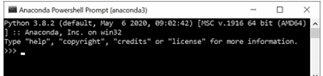

**图 2.2** 交互模式下的 Python（Python Shell）

IDLE 是一个具有图形用户界面的初级 Python 开发环境。启动 IDLE 时，最初只打开一个包含 Python shell 的窗口。此外，可以通过 **File • New Window** 菜单项创建和编辑新的 Python 程序文件。程序文件保存后，可以在 IDLE 的 Python shell 中通过 **Run • Run Module** 菜单项执行。除此之外，IDLE 为程序员提供了一些便利功能，例如代码元素的彩色高亮显示（*语法高亮*）和自动代码补全。

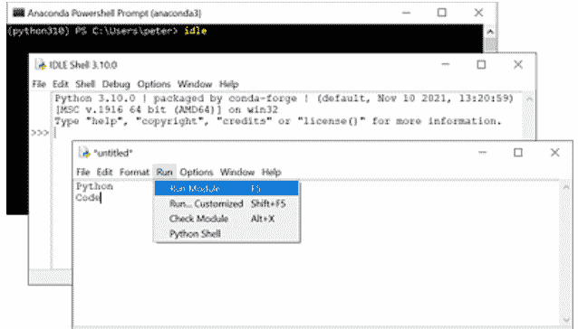

**图 2.3** Python IDLE

如果你对 IDLE 不满意，请参阅本书附录，了解最常见 Python 开发环境的概述。

# 第一部分
## Python 入门

在本书的第一部分，我们将概述 Python 的基本概念，这些概念对于有经验的 Python 开发者也很重要。在这些章节的许多情况下，我们给出了高级应用示例，没有深入细节，以便我们能涵盖更广泛的主题。

# 3 交互模式入门

当你在不带任何参数的情况下启动 Python 解释器时，你会进入所谓的*交互模式*。这种模式允许程序员直接向解释器发送命令，而无需先创建程序。交互模式通常用于快速尝试或测试某些东西。然而，它并不适合编写真正的程序。尽管如此，我们还是想从交互模式开始，因为它可以让你快速轻松地开始使用 Python 语言。

本节旨在让你熟悉一些对理解后续章节很重要的基础知识。最好在阅读的同时，在你的计算机上并行实现本章中的示例。

作为问候，解释器会输出几行内容，你现在应该看到类似以下形式的内容：

```
Python 3.11.0b1 (main, Jun 20 2022, 21:48:01) [Clang 13.1.6 (clang-1316.0.21.2.5)] on darwin
Type "help", "copyright", "credits" or "license" for more information.
>>>
```

在提示符（>>>）旁边，你可以输入任何 Python 代码。

关于交互模式的操作，应该提到它有一个历史记录功能。这意味着你可以使用 `Up` 和 `Down` 箭头键来检索旧的输入，而不需要重新输入。也可以通过历史记录编辑所选的输入。

让我们从介绍一些基本数据类型开始。目前，我们将仅限于整数、浮点数、字符串、列表和字典。编写这些数据类型的实例（例如，数值或字符串）必须遵循某些规则，以便解释器能够识别它们。这种表示法被称为*字面量*。

## 3.1 整数

作为第一个非常简单的例子，我们将在交互模式中生成一个整数。解释器通过输出其值来响应：

```
>>> -9
-9
>>> 1139
1139
>>> +12
12
```

整数的字面量由数字 0 到 9 组成。此外，你可以添加正号或负号前缀。无符号数总是假定为正数。

可以使用算术运算符（如 +、-、* 或 /）将多个整数组合成一个算术表达式。在这种情况下，解释器会以表达式的值作为响应：

```
>>> 5 + 9
14
```

如你所见，Python 可以非常直观地用作一种计算器。下一个示例稍微复杂一些，包含多个相互关联的算术运算：

```
>>> (21 - 3) * 9 + 6
168
```

在这里你可以看到，解释器应用了通常的数学计算定律并输出预期的结果。两个整数的除法结果不一定是整数，这就是为什么除法运算符总是以浮点数形式返回结果：

```
>>> 3/2
1.5
>>> 2/3
0.6666666666666666
>>> 4/4
1.0
```

> **注意**

这一特性使 Python 区别于许多其他编程语言，这些语言在两个整数相除时执行整数除法并返回整数作为结果。这也是 Python 2 中的默认行为。

整数除法可能是一种期望的行为，但它经常引起混淆，特别是对于编程初学者，因此在 Python 3 中被弃用。如果你想在 Python 3 中执行整数除法，必须使用 // 运算符：

```
>>> 3//2
1
>>> 2//3
0
```

## 3.2 浮点数

浮点数的字面量由整数部分、小数点和小数部分组成。与整数一样，可以指定符号：

```
>>> 0.5
0.5
>>> -123.456
-123.456
>>> +1.337
1.337
```

请注意，小数分隔符必须是句点。不允许使用逗号表示法。浮点数可以像整数一样直观地用于表达式中：

```
>>> 1.5 / 2.1
0.7142857142857143
```

也可以用科学计数法指定浮点数：

```
>>> 12.345e3
12345.0
>>> 12.345E3
12345.0
```

像 XeY 这样的表达式表示数字 X · 10^Y。在前面的例子中，它计算为 12.345 · 10^3。

在本书的第二部分，我们将回到这些基本数据类型并更详细地介绍它们。接下来，我们将看看另一个重要的数据类型：字符串。

## 3.3 字符串

除了数字，*字符串*（也称为 *strings*）在几乎每个实际程序中都极其重要。字符串允许用户读取、保存、编辑或输出文本。

要创建字符串，将相关文本写在双引号中：

```
>>> "Hello World"
'Hello World'
>>> "abc123"
'abc123'
```

解释器用于输出字符串值的单引号与我们使用的双引号（你也可以使用）是等效的表示法：

```
>>> 'Hello World'
'Hello World'
```

类似于整数和浮点数，你也可以对字符串使用运算符。例如，+ 运算符连接两个字符串：

```
>>> "Hello" + " " + "World"
'Hello World'
```

字符串的两种不同表示法很有用，例如，当单引号或双引号要作为字符包含在字符串中时：

```
>>> 'He says "Hello"'
'He says "Hello"'
>>> "He says 'Hello'"
"He says 'Hello'"
```

## 3.4 列表

现在我们来讨论列表。列表是任意数据类型元素的有序集合。要创建一个列表，可以将它应包含的值的字面量写在方括号内，并用逗号分隔：

```
>>> [1,2,3]
[1, 2, 3]
>>> ["This", "is", "a", "list"]
['This', 'is', 'a', 'list']
```

此外，列表元素也可以用表达式的形式来定义：

```
>>> [-7 / 4, 5 * 3]
[-1.75, 15]
```

列表的元素不必都是同一类型，特别是它们本身也可以是列表，如下例所示：

```
>>> ["Python", 1, 2, -7 / 4, [1,2,3]]
['Python', 1, 2, -1.75, [1, 2, 3]]
```

与字符串类似，列表可以通过 `+` 运算符用元素进行扩展；`+` 运算符用于连接两个列表。

```
>>> [1,2,3] + ["Python", "is", "great"]
[1, 2, 3, 'Python', 'is', 'great']
```

列表元素从0开始连续编号，可以使用 `[]` 运算符进行访问。

```
>>> x = ["Python", "is", "great"]
>>> x[0]
'Python'
>>> x[1]
'is'
>>> x[2]
'great'
```

## 3.5 字典

我们要在此介绍的第五种也是最后一种数据类型是*字典*。字典存储键到值的映射。要创建一个字典，可以将键值对写在花括号内，并用逗号分隔。键和对应的值之间有一个冒号：

```
>>> d = {"key1": "value1", "key2": "value2"}
```

你可以通过键来访问对应的值。为此，可以像列表一样使用方括号：

```
>>> d["key1"]
'value1'
>>> d["key2"]
'value2'
```

你也可以使用此访问操作来修改值或向字典中输入新的键值对：

```
>>> d["key2"] = "value2.1"
>>> d["key2"]
'value2.1'
>>> d["key3"] = "value3"
>>> d["key3"]
'value3'
>>> d
{'key1': 'value1', 'key2': 'value2.1', 'key3': 'value3'}
```

键和值都可以具有与目前使用的字符串不同的数据类型。我们将在适当的时候再讨论这一点。

在本书第二部分之前，我们将基于前面章节介绍的五种基本数据类型——整数、浮点数、字符串、列表和字典——进行后续描述。在第二部分，我们将更详细地介绍Python内置的所有数据类型。

## 3.6 变量

在Python中，你可以为一个值（如数字或字符串）赋予一个名称。为此，将名称写在等号左侧，将相应的字面量写在右侧。这样的操作称为*赋值*。

```
>>> name = 0.5
>>> var123 = 12
>>> string = "Hello World!"
>>> list = [1,2,3]
```

与名称关联的值可以在之后通过输入名称（而不是相应的值）来输出或用于计算：

```
>>> name
0.5
>>> 2 * name
1.0
>>> (var123 + var123) / 3
8.0
>>> var123 + name
12.5
```

也可以将名称赋值给任何表达式的值，例如计算的结果：

```
>>> a = 1 + 2
>>> b = var123 / 4
```

等号右侧的部分总是首先被计算。例如，指令 `a = 1 + 2` 总是先确定 `1 + 2` 的结果，然后才将名称赋给结果值。

### 3.6.1 下划线的特殊含义

在交互模式下，下划线（`_`）总是可以用来访问最后输出的值。通过这种方式，例如，可以获取先前输出的中间结果并用于进一步的计算：

```
>>> 1 + 7
8
>>> _
8
>>> _ * 3
24
```

请注意，下划线仅在交互模式下承担此特殊角色，而在常规Python程序中则不会，我们将在后面描述。

### 3.6.2 标识符

*变量名*，也称为*标识符*，可以由几乎任何字母和下划线组成。在至少一个前导字母或下划线之后，也可以使用数字。[4]

> **注意**

使用变量时，请注意Python是*区分大小写*的。这意味着它区分大小写。在实践中，这意味着标识符 `otto` 和 `Otto` 不相同，因此可以关联两个不同的值。

还要注意，允许使用变音符号和国际字母表的字符，如下例所示：

```
>>> äöüßéè = 123
>>> äöüßéè
123
```

某些关键字[5]在Python中是为语言本身保留的，不能用作标识符。本书的附录提供了Python中所有保留字的概览。

## 3.7 逻辑表达式

除了算术运算符，还有第二组运算符允许比较值，例如数字：

```
>>> 3 < 4
True
```

这里我们测试3是否小于4。解释器对此类比较的响应是一个*真值*——即 `True` 或 `False`。比较是使用所谓的*关系运算符*执行的——在本例中是 `<`。

表3.1包含关系运算符的列表。

| 比较 | 含义 |
| :--- | :--- |
| `3 == 4` | 3等于4吗？注意双等号将比较与赋值区分开来。 |
| `3 != 4` | 3不等于4吗？ |
| `3 < 4` | 3小于4吗？ |
| `3 > 4` | 3大于4吗？ |
| `3 <= 4` | 3小于或等于4吗？ |
| `3 >= 4` | 3大于或等于4吗？ |

**表3.1** Python中的比较

通常，任何算术表达式都可以用于3和4的位置。当你使用刚才描述的运算符之一组合两个算术表达式时，你就创建了一个逻辑表达式：

```
(a - 7) < (b * b + 6.5)
```

除了已经介绍的算术运算符，还有三个逻辑运算符可用于改变逻辑表达式的结果或连接两个逻辑表达式。

`not` 运算符反转比较的结果，从而将 `True` 变为 `False`，将 `False` 变为 `True`。因此，表达式 `not (3 < 4)` 等同于 `3 >= 4`：

```
>>> not (3 < 4)
False
>>> 3 >= 4
False
>>> not (4 < 3)
True
>>> 4 >= 3
True
```

`and` 运算符接受两个逻辑表达式作为操作数，当且仅当第一个和第二个表达式都计算为 `True` 时，其结果才为 `True`。因此，它对应于自然语言中连接句子两个部分的单词*和*。在示例中，这可能如下所示：

```
>>> (3 < 4) and (5 < 6)
True
>>> (3 < 4) and (4 < 3)
False
```

`or` 运算符接受两个逻辑表达式作为操作数，仅当第一个表达式和第二个表达式都计算为 `False` 时，其结果才为 `False`。因此，如果其操作数中至少有一个返回 `True`，则该运算符返回 `True`：

```
>>> (3 < 4) or (5 < 6)
True
>>> (3 < 4) or (4 < 3)
True
>>> (5 > 6) or (4 < 3)
False
```

为了简单起见，我们这里只比较了数字。当然，这种比较只有在比较更复杂的算术表达式时才有意义。使用关系运算符和三个布尔运算符 `not`、`and` 和 `or`，你已经可以创建非常复杂的比较。

> **注意**

请注意，所有示例中添加括号仅是为了清晰起见，因为运算符之间的优先级规则使得括号变得多余。这意味着这里介绍的每个示例即使没有括号也能按预期工作。尽管如此，特别是在开始时，通过将它们括在括号中来使关联在视觉上明确无误是有意义的。关于运算符优先级规则（即所谓的运算符排名）的表格可以在[第10章](Chapter 10)、[第10.2节](Section 10.2)中找到。

## 3.8 函数和方法

在本节中，我们将对函数和面向对象编程的一些概念提供基本概述。在这方面，我们将仅限于后续章节所需的方面。这两个主题将分别在[第17章](Chapter 17)和[第19章](Chapter 19)中再次详细讨论。

### 3.8.1 函数

在Python中，程序的部分可以封装在函数中，然后通过函数调用来执行。这种方法的目标是避免源代码中的冗余。经常需要的功能应该只实现一次作为函数，然后在程序的其余部分中作为函数使用。此外，使用函数可以提高源代码的可读性和可维护性，因为属于同一部分的代码被封装成单元。

Python提供了一组*内置函数*，程序员可以随时使用。作为示例，本节使用 `max` 内置函数，它确定列表中的最大元素：

```
>>> max([1, 5, 2, 7, 9, 3])
9
```

函数通过编写函数名后跟括号中的函数参数来调用。在示例中，`max` 函数期望恰好一个参数——即要考虑的值列表。计算结果作为函数的返回值返回。你可以想象，源代码中的函数调用被返回值所替代。

`max`函数有一个变体，它用于确定传入参数中的最大值，而非列表中的最大元素。要向函数传递多个参数，需在调用函数时将它们写在括号内，并用逗号分隔：

```
>>> max(1, 5, 3)
5
```

当然，你可以在Python中定义自己的函数，但目前只需了解如何使用现有函数即可。在[第17章](Chapter 17)中，我们将再次详细讨论函数。

### 3.8.2 方法

创建特定数据类型的值（例如通过字面量创建整数）被称为*实例化*，而生成的值称为*实例*。例如，`2`是整数数据类型的一个实例，而`[4, 5, 6]`是列表数据类型的一个实例。实例的数据类型决定了存储的数据以及可以对该数据执行的一系列操作。其中一些操作由运算符表示；例如，浮点数据类型提供了用于两个浮点数相加的`+`运算符。对于简单的数值数据类型，几个运算符就足以处理它们。而对于更复杂的数据类型（如列表），可以想象出一整套无法仅由运算符表示的操作。对于这类情况，数据类型可以定义*方法*。这些是在特定实例上下文中执行的函数。

例如，列表数据类型提供了一个`sort`方法，可用于对列表进行排序。要调用一个方法，需指定一个实例（通过字面量或引用），后跟一个句点和方法调用，其结构类似于函数调用：

```
>>> list = [2, 7, 3, 2, 7, 8, 4, 2, 5]
>>> list.sort()
>>> list
[2, 2, 2, 3, 4, 5, 7, 7, 8]
```

另一个例子是字符串数据类型的`count`方法，它计算一个字符在字符串中出现的次数：

```
>>> "Hello World".count("l")
3
```

此处获得的关于函数和方法的知识将在本书后续内容中进一步深化。在接下来的章节中，我们将首先讨论Python内置的最重要的函数之一：`print`。

## 3.9 屏幕输出

尽管我们将经常使用交互模式，但我们的目标是尽快编写真正的Python程序。交互模式的一个特殊之处在于，输入的表达式值会自动输出。而在普通程序中，屏幕输出必须由程序员显式生成。要输出变量的值，Python使用`print`函数：

```
>>> print(1.2)
1.2
```

请注意，虽然`print`输出的是*值*，但交互模式的自动输出显示的是*表示形式*，即主要是字面量。例如，自动输出会将字符串的值用引号括起来，而`print`则不会：

```
>>> "Hello World"
'Hello World'
>>> print("Hello World")
Hello World
```

同样，使用变量名代替常量值也完全没有问题：

```
>>> var = 9
>>> print(var)
9
```

或者，你可以直接输出表达式的结果：

```
>>> print(-3 * 4)
-12
```

使用`print`还可以在一行中输出多个变量或常量。为此，值之间用逗号分隔。输出时，每个逗号会被替换为空格字符：

```
>>> print(-3, 12, "Python rocks")
-3 12 Python rocks
```

当你想输出的不仅是单个值，还包括关于它们的简短说明文本时，这尤其有用。你可以通过以下方式实现类似效果：

```
>>> var = 9
>>> print("The magic number is:", var)
The magic number is: 9
```

最后，`print`在每次输出后都会打印一个换行符，因此连续的`print`调用会产生多个输出行。

> **注意**

在Python 2中，屏幕输出是使用`print`关键字而非`print`函数生成的：

```
>>> print "This", "is", "Python", 2
This is Python 2
```

在大多数情况下，缺少括号是唯一的区别。关于Python 2和3之间差异的更多信息，请参阅[第45章](Chapter 45)。

## 3.10 模块

除了简单灵活的编程语言本身，Python的一个决定性优势是其附带的大量*模块*，这些模块共同构成了*标准库*。

这些模块通常作为特定功能的集合。例如，`pprint`模块（用于*美观打印*）提供了`pprint`函数。该函数使你能够在屏幕上清晰地格式化输出复杂数据类型的实例。因此，当只需要输出单个实例时，它是内置`print`函数的一个替代方案。在使用模块之前，必须使用`import`关键字将其包含进来：

```
>>> import pprint
```

现在，`pprint`中可用的函数和常量就可以在后续程序中使用了。在这个例子中，我们调用`pprint.pprint`函数来清晰地输出一个较大的字典：

```
>>> d = {"Python is": ["awesome", "brilliant", "mega cool", "simple and exciting"],
"Python has": ["lots of modules", "always the right argument", "a nicely formatted screen output"]}
>>> pprint.pprint(d)
{'Python has': ['lots of modules',
                'always the right argument',
                'a nicely formatted screen output'],
 'Python is': ['awesome', 'brilliant', 'mega cool', 'simple and exciting']}
```

作为对比，以下是使用内置`print`函数的未格式化输出：

```
>>> print(d)
{'Python is': ['awesome', 'brilliant', 'mega cool', 'simple and exciting'], 'Python has': ['lots of modules', 'always the right argument', 'a nicely formatted screen output']}
```

关于`pprint`模块的更多信息，请参阅[第27章，第27.1节](Chapter 27, Section 27.1)。在[第18章](Chapter 18)中，我们将更仔细地研究`import`关键字的工作方式。本书的大部分内容也致力于介绍标准库，以及那些能有效扩展Python语言范围的第三方模块和库。

# 4 通往第一个程序的道路

既然我们已经在交互模式下介绍了一些Python语言的基本元素，我们希望将这些知识应用到实际的程序中。与允许程序员和解释器之间相互交互的交互模式不同，程序的源代码被写入一个文件中。该文件被解释器完整地读取并执行。

在接下来的章节中，你将了解Python程序的基本结构，并编写你的第一个简单示例程序。

## 4.1 输入、编译和测试

本节描述了创建和运行Python程序所需的工作流程。更一般地说，在本书的大部分内容中，我们将只编写控制台应用程序，因此我们将为此做好准备。*控制台应用程序*具有纯文本的用户界面，并在各自操作系统的*控制台*（或*shell*）中运行。对于大多数示例以及许多实际用例，这样的文本界面就足够了。[6]

基本上，一个Python程序由一个或多个程序文件组成。这些程序文件使用*.py*文件扩展名，并包含Python源代码。这些文件是简单的文本文件。因此，程序文件可以用常规文本编辑器编辑。

编写好程序文件后，下一步就是执行它。如果你使用IDLE，可以通过**Run • Run Module**菜单项方便地运行程序文件。如果你使用的编辑器不支持类似功能，你必须在命令行中切换到程序文件所在的目录，并根据你的操作系统执行各种命令。

### 4.1.1 Windows

在Windows上，你必须进入程序文件所在的目录，并使用`python`命令后跟要运行的程序文件名来启动Python解释器。[7]

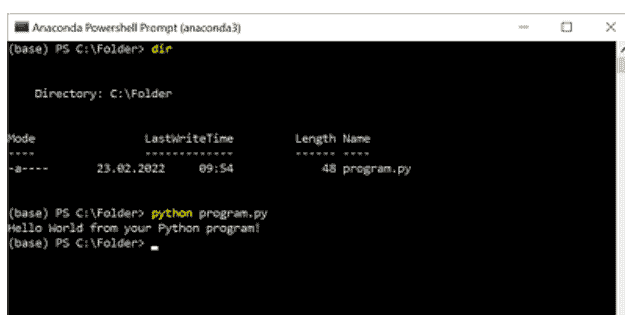

**图 4.1** 在Windows中运行Python程序

"Hello World from your python program!"是*program.py*文件中Python程序的输出，这证明了Python程序确实被执行了。

> **注意**

在Windows上，也可以通过双击相应的程序文件来执行Python程序。但这样做的缺点是，控制台窗口会在程序执行后立即关闭。

## 4.1.2 Linux 和 macOS

在类 Unix 操作系统（如 Linux 或 macOS）上，你需要进入程序文件所在的目录，然后启动 Python 解释器，使用 `python` 命令后跟要运行的程序文件名。在下面的示例中，程序文件 `program.py` 在 Linux 上运行，它位于 `/home/user/folder` 目录中：

```
user@HOST ~ $ cd folder
user@HOST ~/folder $ python program.py
This is what your Python program writes to you
```

请阅读[第 2 章，第 2.2 节](Chapter 2, Section 2.2)中的说明，其中指出，根据发行版的不同，你用于启动 Python 的命令可能与这里显示的 `python` 命令不同。

### 4.1.3 Shebang

在类 Unix 操作系统（如 Linux）上，Python 程序文件可以使用 *shebang*（`#!`，也称为 *magic line*）直接设为可执行文件。为此，程序文件的第一行通常必须如下所示：

```
#!/usr/bin/python
```

在这种情况下，操作系统会始终使用 Python 解释器来运行此程序文件。在其他操作系统（如 Windows）上，shebang 行会被忽略。

请注意，Python 解释器可能安装在你系统上与这里指定的不同目录中。因此，通常以下 shebang 行更好，因为它独立于 Python 的实际安装位置：

```
#!/usr/bin/env python
```

关于 Anaconda 虚拟环境与 shebang 之间相互作用的更多信息，请参阅[第 39 章](Chapter 39)，[第 39.2 节](Section 39.2)。另请注意，程序文件的可执行标志必须在文件实际可执行之前设置。可以使用以下命令完成此操作：

```
chmod +x filename
```

为了保持高度清晰，本书中显示的示例不包含 shebang 行。然而，这并不明确意味着应该避免使用 shebang 行。

### 4.1.4 内部过程

至此，你应该对 Python 是什么以及这种编程语言的优势所在有了一个大致的了解。我们还提供了创建和运行 Python 程序文件的基础知识。但在前面的章节中，诸如 *compiler* 或 *interpreter* 之类的术语在没有进一步解释的情况下被使用。因此，在本节中，我们将探讨执行 Python 程序文件时发生的内部操作。[图 4.2](Figure 4.2) 说明了执行名为 *program.py* 的程序文件时发生的情况。

当执行 `program.py` 程序文件时，如本章开头所述，它首先经过 *compiler*，这是一个将一种形式语言翻译成另一种形式语言的程序。在 Python 的情况下，编译器将 Python 语言翻译成 *byte code*。编译器可以自由地将生成的字节码保存在内存中，也可以将其作为 *program.pyc* 保存在硬盘驱动器上。

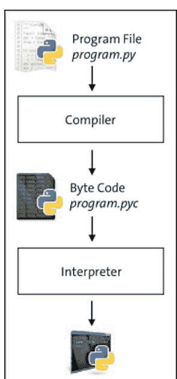

**图 4.2** 编译和解释程序文件

请注意，编译器生成的字节码不能直接在处理器上执行，这与 C 或 C++ 编译不同。要运行字节码，需要另一个抽象层，即 *interpreter*。解释器——通常被称为 *virtual machine*——读取编译器生成的字节码并执行它。

这种解释型编程语言的原理有几个优点。例如，相同的 Python 代码可以在所有有 Python 解释器的平台上无需修改即可运行。然而，由于中间解释器的存在，解释型编程语言的程序通常比直接在处理器上执行的可比 C 程序运行得慢。[ 8 ]

## 4.2 Python 程序的基本结构

为了让你对 Python 语言有所了解，我们将首先概述其语法。*syntax* 一词来自希腊语，意为“句子结构”。编程语言的语法是允许和禁止构造的完整描述。语法由程序员必须遵守的语法定义。如果他或她不这样做，就会触发众所周知的 *syntax error*。

Python 为程序员提供了关于如何构建源代码的非常精确的说明。虽然经验丰富的程序员可能认为这是一种限制，但这一特性尤其有利于初学者程序员，因为非结构化和混乱的代码是编程中最大的错误来源之一。

基本上，一个 Python 程序由单独的 *statements* 组成，在最简单的情况下，它们在源代码中恰好占一行。例如，以下语句在屏幕上打印文本：

```
print("Hello World")
```

一些语句可以分为 *statement header* 和 *statement body*，其中主体可以包含更多语句：

```
Statement header:
    Statement
    ...
    Statement
```

在真实的 Python 程序中，它可能看起来像这样：

```
if x > 10:
    print("x is greater than 10")
    print("Second line!")
```

主体与标题的从属关系在 Python 中通过语句标题末尾的冒号和语句主体的更深缩进来指定。缩进可以使用制表符和空格，但你最好不要混合使用两者。我们建议每次缩进四个空格。

Python 在这里与许多常见的编程语言不同，在那些语言中，语句标题和语句主体的映射是通过花括号或 *begin* 和 *end* 等关键字实现的。

> **注意**

一个同时使用了空格和制表符的程序可以被 Python 编译器轻松编译，因为每个制表符在内部都被替换为八个空格。然而，这可能会导致难以发现的错误，因为许多编辑器默认使用四个空格的制表符宽度。这使得源代码的某些部分看起来缩进相同，而实际上并非如此。

请将你的编辑器设置为自动将每个制表符替换为空格，或者只使用空格来缩进代码。

你现在可能想知道，跨越多行的语句如何与交互模式兼容，在交互模式中一次只能编辑一行。嗯，通常情况下，当代码示例有几行时，我们会尽量避免使用交互模式。尽管如此，这个问题是合理的。答案是语句是逐行输入的，非常直观。当解释器检测到指令尚未完成时，它会将提示符从 `>>>` 更改为 `....` 让我们将前面的示例输入到交互模式中：

```
>>> x = 123
>>> if x > 10:
...     print("The interpreter is doing a good job")
...     print("Second line!")
...
The interpreter is doing a good job
Second line!
>>>
```

请注意，即使一行以 `....` 开头，你也必须考虑当前的缩进深度。此外，解释器无法自动检测语句主体的结束，因为它可以包含任意数量的语句。因此，在交互模式下，语句主体必须通过按 `Enter` 键来终止。

### 4.2.1 长行换行

基本上，源代码行可以是任何长度。然而，许多程序员限制其源代码行的长度，以便例如多个源代码文件可以并排显示在屏幕上，或者代码可以在具有固定行宽的设备上舒适地阅读。常见的最大行长度为 80 或 120 个字符。在括号内，你可以以任何你喜欢的方式换行源代码：

```
>>> var = (
... 10
... +
... 10
... )
>>> var
20
```

然而，在许多不允许使用括号的其他地方，你必须遵守 Python 严格的语法规则。通过使用反斜杠表示法，几乎可以在任何位置将源代码换行到新行：

```
>>> var \
... = \
... 10
>>> var
10
```

## 4.2.2 合并多行

正如你可以使用反斜杠将单行语句换行到多行一样，你也可以将多个单行语句合并为一行。为此，语句之间用分号分隔：

```
>>> print("Hello"); print("World")
Hello
World
```

由语句头和语句体组成的语句也可以放在一行，而无需使用分号，前提是语句体本身不超过一行：

```
>>> x = True
>>> if x: print("Hello World")
...
Hello World
```

如果语句体有多行，可以用分号将它们组合起来：

```
>>> x = True
>>> if x: print("Hello"); print("World")
...
Hello
World
```

所有用分号连接的语句都被视为具有相同的缩进级别。单独的冒号会增加缩进深度。因此，在前面的例子中，无法在同一行编写一个不再属于 `if` 语句体的语句。

> **注意**

使用反斜杠，尤其是分号，很快会导致代码难以阅读。因此，只有在你认为这有助于提高可读性和清晰度时，才应使用这两种表示法。

## 4.3 第一个程序

作为 Python 编程的入门，我们现在将创建一个小型示例程序——猜数字游戏。游戏的想法如下：玩家应该猜一个程序中指定的数字。为此，他们可以进行任意多次尝试。每次尝试后，程序会告知他们猜测的数字是太大、太小还是完全正确。一旦玩家猜中数字，程序会输出尝试次数并退出。从玩家的角度来看，整个过程应该如下所示：

```
Guess: 42
Too small
Guess: 10000
Too big
Guess: 999
Too small
Guess: 1337
Great, it took you only 4 attempts!
```

现在让我们从流程协议切换到 Python 中的实际实现。

程序的高亮部分将在后面再次详细讨论。

### 4.3.1 初始化

在初始化期间，创建游戏所需的变量。Python 区分不同的数据类型，例如字符串、整数或浮点数。变量的类型在程序运行时根据分配给它的值确定，因此无需显式指定数据类型。变量可以在程序运行过程中改变其类型。

在我们的游戏中，创建了用于存储搜索数字（`secret`）、用户输入（`attempt`）和尝试计数器（`counter`）的变量，并赋予了初始值。`attempt` 和 `secret` 在程序开始时具有不同的值，这确保了循环确实会开始。

### 4.3.2 循环头

启动一个 `while` 循环。`while` 循环会一直运行，直到循环头中指定的条件（`attempt != secret`）满足为止——在这种情况下，直到 `attempt` 和 `secret` 变量具有相同的值。从用户的角度来看，这意味着循环会一直运行，直到用户输入与要猜测的数字匹配。

属于循环头的循环体可以通过以下行进一步缩进一步来识别。一旦缩进向左移动一步，循环体就结束了。

### 4.3.3 循环体

在循环体的第一行，读取玩家输入的数字并将其存储在 `attempt` 变量中。用户输入通过 `input("Guess: ")` 读取，并使用 `int` 转换为整数。这种转换很重要，因为用户输入通常作为字符串读取。然而，在我们的例子中，我们希望将输入作为数字继续使用。字符串 "Guess: " 在输入前输出，用于提示用户输入数字。

读取后，会单独检查输入的数字 `attempt` 是大于还是小于搜索数字 `secret`，并通过 `print` 输出相应的消息。最后，尝试计数器 `counter` 增加一。

在尝试计数器递增后，循环体结束，因为下一行不再缩进在循环头下方。

### 4.3.4 屏幕输出

最后一行程序不属于循环体。这意味着它不会执行，直到循环完全运行完毕——也就是说，直到游戏获胜。在这种情况下，会输出成功消息和所需的尝试次数。游戏结束。

现在，通过将程序代码写入名为 `game.py` 的文件并运行它来创建你的第一个 Python 程序。更改 `secret` 的起始值，并玩游戏。

## 4.4 注释

你当然可以想象，目标不是编写适合明信片的程序。随着时间的推移，你程序的源代码会变得更加广泛和复杂。在某个时候，仅仅依靠记忆训练将不足以掌握情况。这就是注释最迟发挥作用的时候。

*注释*是一小段文本，用于解释源代码的某个部分，以指出问题、未完成的任务或类似的事情。注释会被解释器忽略，因此不会改变程序的流程。

编写注释最简单的方法是使用*行注释*。这种类型的注释以 # 字符开头，以行尾结束：

```
# An example with comments
print("Hello world!") # Simple hello world output
```

对于较长的注释，*块注释*是一个不错的选择。块注释以三个连续的引号开始和结束：[9]

```
""" This is a block comment,
it can extend over several lines. """
```

注释应仅在有助于理解源代码或包含有价值信息时使用。对每一行进行注释，无论多么不重要，都会导致只见树木不见森林。

## 4.5 出错时

也许你已经玩过 [第 4.3 节](Section 4.3) 中的示例程序，并遇到过解释器的以下或类似输出：

```
File "hello_world.py", line 10
    if attempt < secret
          ^
SyntaxError: expected ':'
```

这是一个错误消息，表示程序中存在语法错误。你能说出在这种情况下错误到底是什么吗？正确：行尾缺少冒号。

Python 在输出错误消息时提供了重要信息，这有助于故障排除：

- 错误消息的第一行指示错误发生在哪一行以及哪个文件中。在这种情况下，是 *hello_world.py* 文件中的第 8 行。
- 中间部分显示了受影响的源代码部分，消息所指的确切位置用一个小箭头标记。重要的是，这是解释器首先检测到错误的地方。这不一定是错误发生的地方。
- 最后一行指定了错误消息的类型——在这种情况下，是 `SyntaxError`。这些是最常见的错误消息。它们表明编译器由于形式错误而无法继续编译程序。

除了语法错误外，还有许多其他类型的错误，这里无法全部详细讨论。[10] 然而，我们想强调 `IndentationError`，因为 Python 初学者经常遇到它。为了演示这一点，尝试运行以下程序：

```
i = 10
if i == 10:
print("Incorrectly indented")
```

你可以看到最后一行实际上应该再缩进一步。按照程序现在的写法，`if` 语句没有语句体。这是不允许的，会发生 `IndentationError`：

```
File "indent.py", line 3
    print("Incorrectly indented")
    ^
IndentationError: expected an indented block after 'if' statement on line 2
```

现在我们已经熟悉了这些基础知识，我们可以转向允许程序员控制程序流程的控制结构。

> **注意**

在 Python 3.10 和 3.11 中，许多常见的错误消息及其一般格式都进行了修订。因此，如果你使用的是较旧版本的 Python，你实际看到的输出可能与本书中打印的不同。

# 5 控制结构

*控制结构*是用于控制程序流程的构造。Python 中有两种控制结构：循环和条件语句。*循环*用于多次执行一段代码块。而*条件语句*则将一段代码块与一个条件绑定。Python 中循环和条件语句各有两种子类型，将在以下章节中描述。

控制结构可以以任何方式相互嵌套。在此过程中，缩进深度会持续增加。

## 5.1 条件语句

在 Python 中，有两种类型的条件语句：经典的 `if` 语句，以及作为条件执行代码的附加方式的条件表达式。我们将在接下来的内容中详细讨论这两种条件语句，并借助示例进行解释。让我们从 `if` 语句开始。

#### 5.1.1 if 语句

最简单的条件语句类型是 `if` 语句。一个 `if` 语句由一个包含条件的语句头和一个作为语句体的代码块组成（参见第 4 章，第 4.2 节）。

只有当条件为真时，代码块才会被执行。`if` 语句的条件必须是一个可以被解释为真值（`True` 或 `False`）的表达式。通常，这里会应用第 3 章，第 3.7 节介绍的逻辑表达式：

```
if condition:
    Statement
    ...
    Statement
```

例如，你可以考虑一个 `if` 语句，它仅在变量 `x` 的值为 `1` 时输出相应的文本：

```
if x == 1:
    print("x has value 1")
```

当然，你也可以使用其他比较运算符或更复杂的逻辑表达式，并在主体中编写多条语句：

```
if x < 1 or x > 5:
    print("x is less than 1 ...")
    print("... or greater than 5")
```

在许多情况下，单个 `if` 语句是不够的，你需要一整套互斥的条件语句链。在下面的例子中，我们希望根据 `x == 1` 还是 `x == 2` 来输出两个不同的字符串。为此，我们可以使用两个连续的 `if` 语句：

```
if x == 1:
    print("x has value 1")
if x == 2:
    print("x has value 2")
```

然而，从解释器的角度来看，这是一种低效的实现目标的方式，因为无论如何两个条件都会被求值和检查。但是，如果第一个条件已经得出 `True`，那么第二个条件语句就不必再考虑了。变量 `x` 在任何情况下都不可能同时具有值 `1` 和 `2`。为了使这类情况从解释器的角度更高效，并且从程序员的角度更清晰，`if` 语句可以通过一个或多个 `elif` 分支进行扩展。只有当所有前面的 `if` 或 `elif` 条件都被求值为 `False` 时，才会对这样一个分支的条件进行求值。

你可以使用 `elif` 将前面的示例重写如下：

```
if x == 1:
    print("x has value 1")
elif x == 2:
    print("x has value 2")
```

一个 `if` 语句可以扩展任意数量的 `elif` 分支：

```
if condition:
    Statement
    ...
    Statement
elif condition:
    Statement
    ...
    Statement
elif condition:
    Statement
    ...
    Statement
```

在源代码中，这可能看起来像这样：

```
if x == 1:
    print("x has value 1")
elif x == 2:
    print("x has value 2")
elif x == 3:
    print("x has value 3")
```

作为 `if` 语句的最终扩展，可以一次性拦截所有先前未处理的情况。例如，想象一下，我们不仅希望在 `x == 1` 或 `x == 2` 成立时输出相应的字符串，还希望在所有其他情况下（例如 `x == 35` 成立时）输出一条错误消息。为此，`if` 语句可以通过一个 else 分支进行扩展。如果要使用此分支，它必须写在 if 语句的末尾：

```
if condition:
    Statement
    ...
    Statement
else:
    Statement
    ...
    Statement
```

在源代码中，这可以看起来像这样：

```
if x == 1:
    print("x has value 1")
elif x == 2:
    print("x has value 2")
else:
    print("Error: The value of x is neither 1 nor 2")
```

只有当所有先前的条件都不满足时，才会运行从属于 else 分支的代码块。一个 if 语句只能有一个 else 分支。在示例中，else 与 elif 结合使用，这是可能的，但不是强制性的。

以下示例概述了 if 语句的结构，包括可能的分支类型：

```
if condition:
    Statement
    Statement
elif condition:
    Statement
    Statement
else:
    Statement
    Statement
```

> **注意**
>
> 如果你已经了解 C 或 Java 等编程语言，你可能有兴趣知道，自 Python 3.10 起，存在与这些语言的 switch/case 控制结构相对应的结构——即 `match/case` 控制结构，我们将在第 25 章中描述。在 3.10 之前的 Python 版本中，你可以通过使用 `if/elif/else` 分支的级联来模拟此控制结构的行为。

### 5.1.2 条件表达式

基于上一节，考虑以下代码：

```
if x == 1:
    var = 20
else:
    var = 30
```

考虑到这只是一个条件赋值，这个例子长达四行，显得相当冗长。我们现在将向你展示，使用*条件表达式*，这段代码可以放在一行内。

这样的条件表达式可以根据一个条件具有两个不同的值。例如，你可以根据 `x` 的值，在同一个赋值中将 `var` 设置为 `20` 或 `30`：

```
var = (20 if x == 1 else 30)
```

在这种情况下，括号将条件表达式括起来。它们不是必需的，但它们提高了清晰度。条件表达式的结构基于英语，如下所示：

```
A if condition else B
```

如果条件满足，则取值 `A`，否则取值 `B`。因此，你可以想象等号后面的条件表达式被替换为 `A` 或 `B`——即在前面的例子中是 `20` 或 `30`。因此，在求值条件表达式之后，结果再次是一个有效的赋值。

当然，这种将语句与条件链接的形式可以应用于不仅仅是赋值。在下面的例子中，相同的 `print` 语句根据 `x` 的值输出不同的字符串：

```
print("x has value 1" if x == 1 else "x is unequal to 1")
```

请注意，`condition` 可以是一个逻辑表达式，而 `A` 和 `B` 可以是任意两个算术表达式。因此，一个复杂的条件表达式也可以像这样：

```
xyz = (a * 2 if (a > 10 and b < 5) else b * 2)
```

需要注意的是，条件表达式的求值顺序与 Python 代码的正常求值规则不同。条件总是首先被求值，然后根据结果，再求值表达式的左侧或右侧部分。这种求值过程被称为*惰性求值*，因为并非语句的所有组成部分都会被求值。

这里介绍的条件表达式在实践中可用于优雅地缩短复杂而冗长的代码。然而，这是以牺牲可读性和清晰度为代价的。因此，我们在这本书中只会在特殊情况下使用它。但是，你可以在自己的项目中以任何适合你的方式自由使用条件表达式。

## 5.2 循环

*循环*允许你连续多次执行一段代码块，即*循环体*。Python 区分两种类型的循环：作为简单循环结构的 `while` 循环，以及用于遍历更复杂数据类型的 `for` 循环。

### 5.2.1 while 循环

我们已经在猜数字游戏中使用了 `while` 循环。它用于在满足某个条件时执行一段代码块。在第 4 章，第 4.3 节的第一个程序中，使用了一个 `while` 循环来从玩家那里读取一个新数字，直到输入的数字与我们寻找的数字匹配。

基本上，一个 `while` 循环由一个包含条件的循环头和一个对应于要执行的代码块的循环体组成（请注意，循环在条件满足*期间*运行，而不是*直到*它满足）：

```
while condition:
    Statement
    ...
    Statement
```

以下示例是猜数字游戏的一个稍微简化的变体，旨在说明 `while` 循环的使用：

```
secret = 1337
attempt = -1
while attempt != secret:
    attempt = int(input("Guess: "))
print("You did it!")
```

## 5.2.2 循环的终止

`while` 关键字引入循环头，后接所需条件和一个冒号。在随后的行中，循环体以进一步缩进一级的形式出现。此处，用户输入一个数字并将其命名为 `attempt`。此过程持续进行，直到满足循环头中指定的条件——即，直到用户的输入（`attempt`）与秘密数字（`secret`）匹配。

由于上一节介绍的猜数字游戏变体没有提供任何关于所搜索数字所在区域的线索，游戏可能需要相当长的时间。因此，在本节中，我们希望通过输入 0 让用户提前取消游戏。这可以通过将循环条件修改为以下内容来实现：

```
attempt != secret and attempt != 0
```

在这种情况下，这是一个可接受的解决方案，但如果循环条件本身就很复杂，并且在此基础上添加了多个终止条件，源代码的可读性将显著下降。

`break` 关键字提供了另一种解决方案，它可以放置在循环体中的任何位置并中断循环：

```
secret = 1337
attempt = -1
while attempt != secret:
    attempt = int(input("Guess: "))
    if attempt == 0:
        print("Game will be finished")
        break
print("You did it!")
```

在用户输入后，立即使用 `if` 语句检查输入是否为 0。如果是这种情况，则输出相应的消息，并通过 `break` 语句终止 `while` 循环。

### 5.2.3 检测循环中断

在上一节中，用户可以通过输入 0 来提前结束猜数字游戏。不幸的是，本应向玩家发出已猜中所搜索数字的成功消息，在循环结束后无论如何都会显示，即使在用户取消游戏之后也是如此：

```
Guess: 10
Guess: 20
Guess: 30
Guess: 0
Game will be finished
You did it!
```

因此，在这一点上，我们正在寻找一种方法来判断循环是因为循环条件结束还是因为 `break` 语句结束。为此，类似于 `if` 语句，`while` 循环可以通过 `else` 分支进行扩展。属于此分支的代码块仅执行一次：当循环已完全处理完毕时——即，当条件首次返回 `False` 时。特别是，如果循环因 `break` 语句而提前终止，则不会执行 `else` 分支：

```
while condition:
    Statement
    ...
    Statement
else condition:
    Statement
    ...
    Statement
```

让我们看一个具体的例子：

```
secret = 1337
attempt = -1
while attempt != secret:
    attempt = int(input("Guess: "))
    if attempt == 0:
        print("Game will be finished")
        break
else:
    print("You did it!")
```

从用户的角度来看，这意味着当猜中正确数字时会输出成功消息：

```
Guess: 10
Guess: 1337
You did it!
```

相反，如果用户输入 `0` 取消游戏，则不会执行 `else` 分支，因此不会输出成功消息：

```
Guess: 10
Guess: 0
Game will be finished
```

### 5.2.4 中止当前迭代

我们已经介绍了使用 `break` 影响循环流程的一种方法。`continue` 语句提供了第二种选择，与 `break` 不同，它不会终止整个循环，而只终止当前迭代。为了说明这一点，让我们考虑以下示例，该示例目前尚未使用 `continue` 语句：

```
while True:
    number = int(input("Enter a number: "))
    result = 1
    while number > 0:
        result = result * number
        number = number - 1
    print("Result: ", result)
```

在一个无限循环中——即，一个在所有情况下条件都满足的 `while` 循环——读取一个数字，并将 `result` 变量初始化为值 `1`。在随后的 `while` 循环中，`result` 乘以 `number`，直到满足条件 `number > 0`。此外，在内部循环的每次传递中，`number` 的值减少 `1`。

在内部循环通过后，输出 `result` 变量。您可能已经认识到，该示例程序计算输入的任何数字的阶乘[14]：

```
Enter a number: 4
Result: 24
Enter a number: 5
Result: 120
Enter a number: 6
Result: 720
```

然而，前面的代码也允许以下输入：

```
Enter a number: -10
Result: 1
```

通过输入负数，内部循环的条件从一开始就是 `False`，因此循环根本不会执行。因此，`result` 的值立即输出，在这种情况下为 1。

这不是您在此情况下所期望的。负数是无效条目。理想情况下，程序应在输入无效数字时中止计算，而不显示任何结果。这种行为可以通过 `continue` 语句来实现：

```
while True:
    number = int(input("Enter a number: "))
    if number < 0:
        print("Negative numbers are not allowed")
        continue
    result = 1
    while number > 0:
        result = result * number
        number = number - 1
    print("Result: ", result)
```

在读取用户输入后，立即使用 `if` 语句检查是否为负数。如果是，则输出相应的错误消息并中止当前迭代。这意味着程序立即跳转到下一次迭代；即，检查循环条件，然后由用户读取下一个数字。

从用户的角度来看，这意味着在输入负数后，不会输出结果，而是输出错误消息并提示用户输入下一个数字：

```
Enter a number: 4
Result: 24
Enter a number: 5
Result: 120
Enter a number: -10
Negative numbers are not allowed
Enter a number: -100
Negative numbers are not allowed
Enter a number: 6
Result: 720
```

回顾一下，我们想在此再次阐述 `break` 和 `continue` 之间的区别。`break` 完全终止循环，而 `continue` 只终止当前迭代；循环本身继续运行：

```
while condition:
    ...
    if condition:
        continue    # jump back to while condition:
    ...
    if condition:
        break # jump to First statement after loop
    ...
First statement after loop
```

## 5.2.5 for 循环

除了上一节描述的 `while` 循环外，Python 中还有另一种可用的循环——`for` 循环。`for` 循环用于遍历可迭代对象。[15] 为此，编写 `for` 关键字，后接一个标识符、`in` 关键字和可迭代对象。然后是循环体，它进一步缩进一级：

```
for variable in object:
    Statement
```

可以在循环体中通过选定的标识符访问可迭代对象的当前元素。具体来说，`for` 循环可以遍历列表或字符串——例如：

```
>>> for x in [1,2,3]:
...     print(x)
...
1
2
3
>>> for c in "Python":
...     print(c)
...
P
y
t
h
o
n
```

在本书的过程中，您将了解更多可以通过 `for` 循环以这种方式遍历的数据类型。

> **注意**

Python 中存在的 `for` 循环并不是 C 或 Java 中同名循环结构的对应物。它类似于 PHP 或 Perl 中的 `foreach` 循环，或 C++ 中基于范围的 `for` 循环。

在 `while` 循环中讨论的用于取消整个循环或单个迭代的 `break` 和 `continue` 关键字（第 5.2.2 节和第 5.2.4 节）也可以与 `for` 循环一起使用，并且在那里具有相同的含义。此外，`for` 循环可以有一个类似于 `while` 循环的 `else` 分支，该分支仅在循环完全运行且未通过 `break` 提前终止时执行：for 变量 in 对象:
    语句
    ...
    语句
else:
    语句
    ...
    语句

## 5.2.6 将 for 循环用作计数循环

关于 `for` 循环，内置的 `range` 函数尤其值得关注。它创建一个可迭代对象，该对象会生成给定范围内的所有整数：

```
range(stop)
range(start, stop)
range(start, stop, step)
```

`start` 占位符代表起始数字。一旦达到 `stop`，循环就会终止。你应该知道，循环计数器本身永远不会达到 `stop` 的值，因为它总是小于 `stop`。在每次迭代中，循环计数器会增加 `step`。`start`、`stop` 和 `step` 都必须是整数。一旦指定了所有值，`for` 循环看起来就像这样：

```
for i in range(1, 10, 2):
    print(i)
```

计数变量 `i` 现在从值 `1` 开始；只要 `i` 小于 `10`，循环就会执行，并且在每次迭代中 `i` 增加 `2`。因此，循环会在屏幕上输出值 `1`、`3`、`5`、`7` 和 `9`。

`for` 循环不仅可以用于正向计数；也可以用于倒计数：

```
for i in range(10, 1, -2):
    print(i)
```

在这种情况下，`i` 在循环开始时被设置为值 `10`，并在每次循环中减少 `2`。只要 `i` 大于 `1`，循环就会运行，并在屏幕上输出值 `10`、`8`、`6`、`4` 和 `2`。

这使得 `for` 循环成为修改上一节中计算数字阶乘示例的理想方式。它也是 `while` 和 `for` 循环如何相互嵌套的一个例子：

```python
while True:
    number = int(input("Enter a number: "))
    if number < 0:
        print("Negative numbers are not allowed")
        continue
    result = 1
    for i in range(2, number+1):
        result = result * i
    print("Result: ", result)
```

在用户输入并检查其符号后，会启动一个 `for` 循环。该循环的循环计数器 `i` 从值 `2` 开始。只要 `i` 小于 `number+1`，循环就会运行；因此 `i` 的最大可能值是 `number`。在每次迭代中，`result` 变量会乘以 `i`。

## 5.3 pass 语句

在程序开发过程中，可能会出现某个控制结构在特定时间点只部分实现的情况。程序员创建了语句头，但没有添加语句体，因为他们可能想先处理其他更重要的事情。然而，一个没有相应语句体的悬空语句头会导致语法错误。

为此，你可以使用 `pass` 语句——一个完全不执行任何操作的语句。它可以如下应用：

```
if x == 1:
    pass
elif x == 2:
    print("x has value 2")
```

在这种情况下，`if` 语句的主体中只有 `pass`。因此，如果 `x` 的值为 `1`，则不会发生任何事情。

`pass` 语句的目的是避免程序初步版本中的语法错误。完成的程序通常不包含任何 `pass` 语句。

## 5.4 赋值表达式

在 Python 3.8 中，引入了*赋值表达式*。这些被理解为赋值和计算赋值值的表达式之间的混合体。在下面的示例中，我们将通过一个简单的算术表达式来确定整数 `y` 的平方：

```
>>> y = 10
>>> y*y
100
```

在这里，交互模式帮助我们捕获表达式 `y*y` 的值。例如，这样的表达式可以在条件语句的上下文中使用，其值成为更大逻辑表达式的一部分：

```
>>> if y*y >= 100:
...     print("Yeah!")
...
Yeah!
```

*赋值*将一个名称分配给表达式的值，以便在程序中稍后引用它。与表达式不同，赋值本身没有值，因此不能在算术或逻辑表达式的上下文中使用：

```
>>> z = y*y
>>>
```

赋值表达式是通过 `:=` 运算符实现的赋值和表达式的组合：

```
>>> (z := y*y)
100
```

因此，赋值表达式可以用于例如 `if` 语句的条件中，以便在程序中稍后访问条件的中间结果：

```
>>> if (z := y*y) >= 100:
...     print("Yeah!")
...
Yeah!
>>> z
100
```

> **注意**

`:=` 运算符是绑定性最弱的运算符（参见附录中的 A.2 节），这就是为什么在更复杂的表达式中的赋值表达式通常必须用括号括起来。

为了说明动机，让我们想象一个示例场景，我们处理一个大小可变但最多限制为 1000 个元素的列表。此外，让我们假设如果超过最大大小，我们希望输出一条错误消息，指定所考虑列表的确切大小。

结合所需错误消息检查最大大小可以如下完成：

```
if len(lst) > 1000:
    print("List too large:", len(lst), "elements")
```

这种紧凑解决方案的缺点是必须计算列表的长度 `len(lst)` 两次，首先检查列表是否太长，然后再次编译错误消息。[16] 一种避免重复调用 `len` 的替代方法是预先确定列表长度：

```
length = len(lst)
if length > 1000:
    print("List too large:", len(lst), "elements")
```

这也是一个有效的解决方案，它通过添加额外的代码行避免了重复计算的问题。批评者通常抱怨这样的构造使 Python 程序不必要地变大，并且在视觉上更难理解。

赋值表达式，使用 Python 3.8 中引入的 `:=` 运算符，允许以紧凑的方式表达前面的示例，同时避免多次计算：

```
if (length := len(lst)) > 1000:
    print("List too large:", len(lst), "elements")
```

请注意，赋值表达式可以使程序更紧凑，但同时也限制了其可读性。因此，你应该始终适度且谨慎地使用赋值表达式。

> **注意**

除了这里使用的术语外，赋值表达式通常还有其他名称。这些包括*命名表达式*这一术语，因为表达式的值可以同时被赋予一个名称，以及讽刺性的*海象运算符*这一术语，因为该运算符的外观：`:=`。

### 5.4.1 使用赋值表达式的猜数字游戏

在[第 4 章](第 4 章)[第 4.3 节](第 4.3 节)中，我们考虑了一个程序，该程序从用户那里连续读取输入并检查输入是否满足某个条件。这个程序可以通过使用赋值表达式将读取输入和检查组合到循环头中来进行调整：

```
secret = 1337
counter = 1
while (attempt := int(input("Guess: "))) != secret:
    if attempt < secret:
        print("Too small")
    if attempt > secret:
        print("Too large")
    counter = counter + 1
print("Great, you did it in", counter, "tries!")
```

在循环或条件等控制结构中使用 `:=` 运算符是一个常见的用例，通常会导致更紧凑和更少冗余的代码。

# 6 文件

到目前为止，我们已经讨论了如何创建和使用各种数据类型的实例。此外，你已经知道程序流程如何受到控制结构的影响。现在是时候将这些知识付诸实践，并使你能够编写更复杂的程序了。本章专门介绍你可用于数据输入或输出的各种选项。这特别指的是读取和写入文件，这是程序员标准技能的一部分。

在我们专门讨论 Python 中的读取和写入文件之前，下一节将向你介绍必要的基础知识，使你能够做到这一点。

## 6.1 数据流

*数据流*是数据的连续序列。我们区分两种类型的数据流：数据可以从*传入*数据流（*下游*）读取，并写入*传出*数据流（*上游*）。屏幕输出、键盘输入以及文件和网络连接都被视为数据流。

[图 6.1](图 6.1) 通过一个示例说明了数据流的概念，其中程序从传入流接收数据，从中计算结果，并将结果输出到传出流。例如，你可以想象程序读取一个文件，并在屏幕上打印文件中包含的每个其他单词。

有两种标准数据流，你可能已经在不知不觉中使用过：将字符串输出到屏幕以及用户输入，实际上都是对标准输入流和输出流（分别为 `stdin` 和 `stdout`）的操作。`stdout` 输出流可以通过内置的 `print` 函数写入，而 `stdin` 输入流则通过 `input` 函数读取。

所有主要操作系统都允许你以文本模式或二进制模式打开数据流。虽然文本流和二进制流之间通常没有技术差异，但使用适当的模式打开流很重要。在文本模式下，某些控制字符（例如换行符或*文件结束符（EOF）字符*）可能会根据其各自的语义进行解释。此外，Python 会自动尝试将文本流的内容解码[ 17 ]为 `str` 实例。

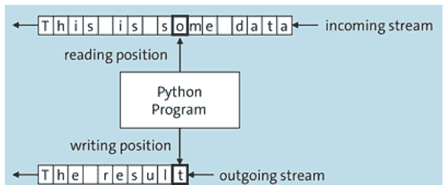

**图 6.1** 程序从传入流读取数据并写入传出流

最后还有一个区别：有些数据流允许你随意定位读写位置，而有些则不允许。例如，文件代表一种可以按需指定读写位置的数据流。而无法这样做的流的例子包括标准输入流（`stdin`）和网络连接。

## 6.2 从文件读取数据

首先，我们将描述如何从文件中读取数据。为此，我们需要以只读模式访问该文件。本例中我们将使用的测试文件是一个字典，每行包含一个英文单词及其德文翻译，两者用空格分隔。该文件应命名为 *dictionary.txt*：

```
Spain Spanien
Germany Deutschland
Sweden Schweden
France Frankreich
Italy Italien
```

在程序中，我们希望处理此文件中的数据，以便稍后可以方便地在字典中访问它。[ 18 ] 作为额外功能，我们将扩展程序，允许用户向程序查询英文术语的翻译。

### 6.2.1 打开和关闭文件

首先，必须打开文件以进行读取。为此，我们使用内置的 `open` 函数。该函数返回一个所谓的文件对象：

```
fobj = open("dictionary.txt", "r")
```

作为 `open` 的第一个参数，我们传递一个包含相应文件路径的字符串。请注意，这里允许使用相对路径和绝对路径。[ 19 ] 第二个参数也是一个字符串，指定文件的打开模式，其中 "r" 代表 *read*（读取），表示文件以读取模式打开。我们将函数返回的文件对象与 `fobj` 引用关联起来。如果文件不存在，则会生成 `FileNotFoundError`：

```
Traceback (most recent call last):
  File "dictionary.py", line 1, in <module>
    fobj = open("dictionary.txt", "r")
FileNotFoundError: [Errno 2] No such file or directory: 'dictionary.txt'
```

一旦调用了 `open`，就可以使用文件对象从文件中读取数据。文件读取完毕后，必须通过调用 `close` 方法显式关闭：

```
fobj.close()
```

调用此方法后，将无法再从文件对象读取数据。

### 6.2.2 with 语句

在上一节中，你了解了如何使用内置的 `open` 函数打开文件，并在使用打开的文件对象的 `close` 方法后关闭它：

```
fobj = open("dictionary.txt", "r")
# 对 fobj 进行一些操作
fobj.close()
```

`open` 和 `close` 的这种交互模式是你将在各种情况下反复遇到的典型模式。除了文件操作外，例如网络连接也代表了必须先建立连接、然后使用、最后关闭的情况。

如前面的示例所示，显式使用 `open` 和 `close` 存在风险：由于编程错误或省略了错误处理，`close` 方法可能未被调用，从而导致文件对象未被关闭。为确保此类错误不会发生，你应该使用 `with` 语句来打开文件：

```
with open("dictionary.txt", "r") as fobj:
    # 对 fobj 进行一些操作
    pass
```

一旦控制流离开 `with` 语句下方缩进的语句块，使用 `with` 语句打开的文件对象就会自动关闭。特别是，在发生未处理的错误时也是如此。

诸如文件对象这样可以与 `with` 语句结合使用的对象也称为*上下文管理器*。此时，只需知道 `with` 语句确保上下文管理器在任何情况下都能正确关闭即可。我们将在[第 22 章](Chapter 22)中进一步探讨这个主题。

### 6.2.3 读取文件内容

下一步，我们希望逐行读取文件。这相对简单，因为文件对象可以逐行迭代。因此，我们可以使用熟悉的 `for` 循环：

```
python
with open("dictionary.txt", "r") as fobj:
    for line in fobj:
        print(line)
```

在 `for` 循环中，我们逐行迭代文件对象，其中 `line` 每次引用当前行的内容。目前，循环体中的每一行只是被输出。然而，我们希望在程序中构建一个字典，该字典在读取文件后包含英文术语作为键，以及相应的德文术语作为值。

为此，我们首先创建一个空字典：

```
python
words = {}
```

然后打开 *dictionary.txt* 文件进行读取，并在循环中迭代文件的所有行：

```
python
with open("dictionary.txt", "r") as fobj:
    for line in fobj:
        assignment = line.split(" ")
        if len(assignment) == 2:    # 仅考虑有效行
            words[assignment[0]] = assignment[1]
```

在循环体中，我们现在使用字符串的 `split` 方法将当前读取的行分成列表的两部分：空格左侧的部分（即英文单词）和空格右侧的部分（即德文单词）。在循环体的下一行，然后在字典中创建一个新条目，键为 `assignment[0]`（英文单词），值为 `assignment[1]`（德文单词）。最后，如果我们无法从一行中提取出恰好两个部分，我们选择默默地跳过该行。我们出于教学原因选择了这种错误处理方式，以使程序尽可能简单。在实践中，你应该考虑是否应该输出有问题的行，甚至以错误消息终止程序。

现在修改前面的代码，使得在关闭文件对象后，使用 `print` 输出生成的字典。输出将如下所示：

```
{'Spain': 'Spanien\n', 'Germany': 'Deutschland\n', 'Sweden': 'Schweden\n', 'France': 'Frankreich\n', 'Italy': 'Italien\n'}
```

你可以看到每个值后面都有一个 `\n`，这是换行符的转义序列。这是因为在 Python 中，换行符被视为一个字符，因此是文件内容的一部分。因此，文件的每一行都会被完整读取，包括末尾可能的换行符。当然，只有在换行符确实存在时才会被读取。

我们不希望在最终的字典中再次找到换行符。因此，在每次迭代中，我们调用 `line` 字符串的 `strip` 方法。这会移除字符串开头和结尾的所有空白字符，[20] 包括换行符：

```
words = {}
with open("dictionary.txt", "r") as fobj:
    for line in fobj:
        line = line.strip()
        assignment = line.split(" ")
        if len(assignment) == 2:    # 仅考虑有效行
            words[assignment[0]] = assignment[1]
```

这样，文件的内容就完全转移到了一个字典中。作为额外功能，我们现在希望允许用户向程序发送翻译请求。在流程顺序中，它应该如下所示：

```
Enter a word: Germany
The German word is: Deutschland
Enter a word: Italy
The German word is: Italien
Enter a word: Greece
The word is unknown
```

在程序中，我们在一个无限循环中读取用户的请求。`in` 运算符使我们能够检查读取的单词是否作为键存在于字典中。如果存在，则输出相应的德文翻译。如果输入的单词不存在，则会显示错误消息：

```
words = {}
with open("dictionary.txt", "r") as fobj:
    for line in fobj:
        line = line.strip()
        assignment = line.split(" ")
        if len(assignment) == 2:    # 仅考虑有效行
            words[assignment[0]] = assignment[1]
while True:
    word = input("Enter a word: ")
    if word in words:
        print("The German word is:", words[word])
    else:
        print("The word is unknown")
```

这里展示的示例程序远非完美，但它很好地展示了文件对象以及字典如何以有意义的方式使用。请随意扩展该程序。例如，你可以允许用户正常退出程序，提供双向翻译，或允许多个源文件的使用。

## 6.3 将数据写入文件

在上一节中，我们重点介绍了读取文件。而反向操作同样可行，这正是本节的主题。要打开一个文件进行写入，我们同样使用内置的 `open` 函数。你会记得，这个函数需要第二个参数来指定模式，在上一节中，对于*读取*操作，该参数必须是 "r"。类似地，如果要打开文件进行写入，则必须指定 "w"（代表*写入*）。如果目标文件已存在，它将被清空。如果文件尚不存在，则会被创建：

```
fobj = open("output.txt", "w")
```

所有数据写入文件后，必须通过调用 `close` 方法来关闭文件对象：

```
fobj.close()
```

此外，在写入文件时，你应该使用 `with` 语句，而不是显式地调用 `open` 和 `close`：

```
with open("output.txt", "w") as fobj:
    # 对 fobj 进行一些操作
    pass
```

要向打开的文件写入字符串，你可以调用文件对象的 `write` 方法。以下示例程序旨在作为上一节示例的对应部分。我们假设 `words` 引用一个字典，其中包含英语术语作为键，德语翻译作为值——例如：

```
words = {
    "Germany": "Deutschland",
    "Spain": "Spanien",
    "Greece": "Griechenland"
}
```

因此，它类似于上一节示例程序创建的字典：

```
with open("output.txt", "w") as fobj:
    for engl in words:
        fobj.write(f"{engl} {words[engl]}\n")
```

首先，我们打开一个名为 `output.txt` 的文件用于写入，然后遍历 `words` 字典的所有键。在每次迭代中，通过 `fobj.write` 将一个相应格式化的字符串写入文件。请注意，在写入文件时，你必须通过输出 `\n` 来显式地跳转到新行。

我们将在[第12章，第12.5.3节](Chapter 12, Section 12.5.3)中更详细地探讨用于格式化字符串的 f-string 语法 `f"..."`。目前，我们只需知道 f-string 支持在字符串中定义占位符，这些占位符将被花括号中给出的表达式的值所替换。

本示例编写的文件可以由上一节的示例程序再次读取。

## 6.4 生成文件对象

从前面的示例中可以看出，可以使用内置的 `open` 函数创建文件对象。除了文件名和模式之外，你还可以向此函数传递其他参数，这些参数值得一看。此外，除了已经描述的 "r" 和 "w" 模式之外，还有其他几种模式我们将在后面讨论。最后，我们将概述生成的文件对象的方法。

> **注意**

本节包含关于文件对象的详细信息，主要作为参考。因此，你可以在第一次阅读时跳过它。

### 6.4.1 内置的 open 函数

内置的 `open` 函数打开一个文件并返回创建的文件对象。使用此文件对象，你可以随后对文件执行所需的操作。[21]

```
open(filename, [mode, buffering, encoding, errors, newline])
```

我们已经在前面的章节中讨论了前两个参数。它们是要打开的文件的文件名或路径，以及文件要以何种模式打开。`mode` 参数必须传递一个字符串。所有有效值及其含义列于[表 6.1](Table 6.1)。

| 模式 | 描述 |
| :--- | :--- |
| "r" | 文件以只读方式打开。 |
| "w" | 文件以只写方式打开。任何同名的现有文件都将被覆盖。 |
| "a" | 文件以只写方式打开。可能存在的同名文件不会被覆盖，而是被扩展。 |
| "x" | 文件以只写方式打开，前提是它尚不存在。如果同名文件已存在，则会引发 `FileExistsError` 异常。 |
| "r+", "w+", "a+", "x+" | 文件以读写方式打开。请注意，"w+" 会清空任何同名的现有文件。 |
| "rb", "wb", "ab", "xb", "r+b", "w+b", "a+b", "x+b" | 文件将以二进制模式打开。请注意，在这种情况下，必须使用 `bytes` 实例而不是字符串（参见[第12章，第12.5节](#)）。 |

**表 6.1** 文件模式

`mode` 参数是可选的，如果省略，则假定为 "r"。

另外四个可选参数 `buffering`、`encoding`、`errors` 和 `newline` 通常不需要，我们将在本书中通过许多类似的接口来说明它们的用法。尽管如此，我们还是想在此简要总结一下它们的含义。

第四个可选参数 `encoding` 可用于指定文件读取或写入的*编码*。编码决定了超出 ASCII 字符集的特殊字符如何存储。有关 Python 中编码的更多信息，你可以参考[第12章](Chapter 12)中关于字符串的描述，[第12.5.4节](Section 12.5.4)。在那里你还会找到关于 `encoding` 和 `errors` 参数的更详细信息。在以二进制模式打开文件时指定编码没有意义，在这种情况下应省略。

第五个参数 `errors` 决定如何处理在指定编码中编码字符时的错误。如果为 `errors` 传递 `"ignore"` 值，它们将被忽略。对于 `"strict"` 值，会引发 `ValueError` 异常，如果你不指定该参数，也会发生这种情况。

`buffering` 参数控制内部缓冲区大小，`newline` 指定在读取或写入文件时要识别或用作换行符的字符。

### 6.4.2 文件对象的属性和方法

打开时指定的参数可以通过生成的文件对象的 `name`、`encoding`、`errors`、`mode` **和** `newlines` 属性再次读取。

[表 6.2](Table 6.2) 简要总结了文件对象最重要的方法。我们将在下一节更详细地讨论 `seek` 和 `tell` 方法。

| 方法 | 描述 |
| :--- | :--- |
| `close()` | 关闭一个现有的文件对象。请注意，之后不能再执行任何读取或写入操作。 |
| `fileno()` | 以整数形式返回打开文件的描述符*。 |
| `flush()` | 命令挂起的写入操作立即执行。** |
| `isatty()` | 如果文件对象是在无法在任意位置写入或读取的数据流上打开的，则返回 `True`。 |
| `next()` | 读取文件的下一行并将其作为字符串返回。 |
| `read([size])` | 读取文件的 `size` 字节。如果未指定 `size` 或文件小于 `size` 字节，则将读取整个文件。数据作为字符串或 `bytes` 字符串返回，具体取决于读取模式。 |
| `readline([size])` | 读取文件的一行。可以通过指定 `size` 来限制要读取的字节数。 |
| `readlines([sizehint])` | 读取所有行并将其作为字符串列表返回。如果指定了 `sizehint`，则读取过程将持续到大约读取了 `sizehint` 字节为止。*** |
| `seek(offset, [whence])` | 将文件中的当前读/写位置设置为 `offset`。 |
| `tell()` | 返回文件中的当前读/写位置。 |
| `truncate([size])` | 删除当前读/写位置之后文件中的所有数据，或者——如果指定了——删除除前 `size` 字节之外的所有内容。 |
| `write(str)` | 将 `str` 字符串写入文件。 |
| `writelines(iterable)` | 将多行写入文件。`iterable` 可迭代对象必须传递字符串，例如字符串列表。 |

* *文件描述符*是操作系统为打开的文件分配的标识号。默认的 `stdin` 和 `stdout` 流的描述符分别为 0 和 1。

** 操作系统可以出于效率考虑缓冲挂起的文件操作，并在稍后执行它们。这就是为什么，例如，USB 驱动器不应在未从操作系统中注销的情况下拔出。

*** 在此上下文中，*大约*意味着要读取的字节数可能会向上舍入到内部缓冲区大小。

**表 6.2** 文件对象的方法

### 6.4.3 更改写入/读取位置

前面的示例展示了如何以顺序方式读取或写入文件。由于文件的特殊性质，可以随意更改写入或读取位置。为此，你可以使用文件对象的 `seek` 和 `tell` 方法。

**seek(offset, [whence])**

文件对象的 `seek` 方法设置文件内的读/写位置。它是 `tell` 方法的对应部分，后者返回当前的读/写位置。

> 注意

`seek` 方法在 "a" 模式下无效。在 "a+" 模式下，读写位置会被改变，以便可以在文件的任何位置进行读取，但在写入操作之前会被重置。

如果文件以二进制模式打开，`offset` 参数是从文件开头计算的字节数。`offset` 的这种解释方式会受到可选参数 `whence` 的影响（参见 [表 6.3](#)）。

| whence 的值 | offset 的解释 |
| :--- | :--- |
| 0 | 相对于文件开头的字节数 |
| 1 | 相对于当前读写位置的字节数 |
| 2 | 相对于文件末尾的字节数 |

**表 6.3** whence 参数

如果文件以文本模式打开，你将无法自由使用 `seek`。此时，只能使用 `tell` 方法的返回值作为 `offset`。使用其他值可能导致未定义的行为。

在下面的示例中，`seek` 方法用于确定位图图形的宽度、高度和颜色深度：[ 22 ]

```python
from struct import unpack
with open("coffee.bmp", "rb") as f:
    f.seek(18)
    width, height = unpack("ii", f.read(8))
    f.seek(2, 1)
    bpp = unpack("H", f.read(2))[0]
print("Width:", width, "px")
print("Height:", height, "px")
print("Color depth:", bpp, "bpp")
```

根据位图文件格式的规范，[ 23 ] 我们可以看到所需信息位于偏移量 18、22 和 28 处，形式为两个连续的四字节值和一个两字节值。因此，我们以二进制模式打开 `image.bmp` 文件，并使用 `seek` 方法跳过前 18 个字节。此时，我们可以使用 `read` 来读取图形的宽度和高度。通过 `read` 读取的值以 `bytes` 字符串形式返回（参见 [第 12 章，第 12.5 节](#)），因此必须根据我们的目的将其转换为数字。为此，我们使用标准库 `struct` 模块中的 `unpack` 函数。`unpack` 所需的格式语句 "ii" 表示传递的 `bytes` 字符串应被解释为两个连续的有符号 32 位整数。关于 `struct` 的更多信息可以在 [第 44 章，第 44.2 节](#) 中找到。

读取宽度和高度后，我们从当前读取位置再跳过两个字节（在 `seek` 调用中将 `whence` 参数设置为 1），然后可以读取包含图像颜色深度的两个字节。[ 24 ] 最后，我们输出读取的信息，并可以使用图形程序检查其正确性，例如：[ 25 ]

```
Width: 800 px
Height: 600 px
Color depth: 24 bpp
```

# 7 数据模型

本章描述了 Python 在运行时如何管理数据。特别是，我们将讨论 Python 中变量实际上是什么，并解释相关术语 *对象*、*实例* 和 *引用*。

在计算机科学中，变量通常被理解为不同类型数据（如数字、列表或其他结构）的命名存储位置。正如你已经知道的，在 Python 中可以如下创建一个名为 `a` 的新变量：

```
>>> a = 1337
```

随后，变量 `a` 可以像数值 `1337` 一样使用：

```
>>> 2674 / a
2.0
```

要理解创建新变量时内部发生了什么，需要区分两个概念：实例和引用。*实例* 是根据某种数据类型的模板在内存中创建的具体数据对象——例如，根据数据类型 `int` 的模板创建的特殊数字 `1337`。

在接下来的章节中，出于简单起见，我们将只关注整数和字符串，但该原理适用于任何类型的数据对象。

在最简单的情况下，整数实例可以如下创建：

```
>>> 12345
12345
```

然而，对我们程序员来说，这个实例用处不大，因为虽然它在创建后被输出，但之后将无法再访问，因此我们无法继续使用其值。

这就是 *引用* 发挥作用的地方。只有引用使我们能够使用实例，因为它们允许我们访问实例。在 Python 中，引用通常简称为 *名称*。你可以使用赋值运算符 `=` 创建对实例的引用，引用在运算符左侧，实例在运算符右侧：

```
>>> a = 12345
```

这样，我们可以将我们的示例描述如下：我们创建了一个值为 `1337` 的新整数实例。我们还创建了一个指向该实例的引用 `a`。这也可以用图形方式说明（参见 [图 7.1](#figure-7-1)）。


**图 7.1** 引用-实例关系示意图

也可以为先前引用的实例提供额外的引用：

```
>>> reference1 = 1337
>>> reference2 = reference1
```

图形化说明，结果如 [图 7.2](#figure-7-2) 所示。

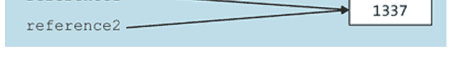

**图 7.2** 两个引用指向同一个实例

特别需要注意的是，内存中仍然只有一个值为 `1337` 的实例，尽管我们可以通过两个不同的名称——`reference1` 和 `reference2`——来访问它。因此，通过赋值 `reference2 = reference1`，实例 `1337` 并没有被复制，只是多了一个引用。

请注意，对同一实例的引用彼此是独立的，当我们为其中一个引用分配新实例时，其他引用所引用的值不会改变：

```
>>> reference1 = 1337
>>> reference2 = reference1
>>> reference1
1337
>>> reference2
1337
>>> reference1 = 2674
>>> reference1
2674
>>> reference2
1337
```

在前两次输出之前，情况如 [图 7.2](Figure 7.2) 所示：两个引用 `reference1` 和 `reference2` 指向同一个实例 `1337`。然后我们创建一个新实例 `2674` 并将其赋值给 `reference1`。输出显示 `reference2` 仍然指向 `1337`，没有改变。因此，第三次赋值后的情况如 [图 7.3](Figure 7.3) 所示。

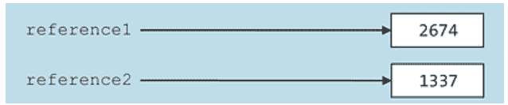

**图 7.3** 两个引用彼此独立

> **注意**

正如你所看到的，Python 中变量作为内存位置的概念只是部分正确的，因为 Python 中的变量是具有符号名称的引用。因此，编程中常用的短语，如 *存储在变量中*，严格来说并不适用。更准确的说法应该是 *通过符号名称引用*。

根据我们的经验，在使用 Python 时，了解这种正确的观点很重要。然而，如果始终使用精确的表述，其他方面很容易被更复杂的表达形式所掩盖。因此，我们决定在本章向你介绍准确的背景知识，但在本书的其余部分，如果认为这能提高可理解性，我们将使用更不精确的表述，如 *存储在变量中*。

你现在知道必须区分两个概念：对实例的引用，以及实例本身。在接下来的章节中，我们将更详细地了解实例的属性。

## 7.1 实例的结构

Python 中的每个实例包含三个部分：其 *数据类型*、其 *值* 和其 *标识*。我们的初始示例可以看作有三个部分，如 [图 7.4](#figure-7-4) 所示。

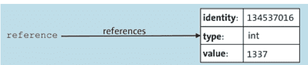

### 7.1.1 数据类型

数据类型在创建实例时充当蓝图，并定义实例可以取哪些值。例如，`int` 数据类型允许你存储一个整数。字符串可以通过 `str` 数据类型来管理。在下面的示例中，你可以看到如何使用 `type` 来识别不同实例的数据类型：

```
>>> type(1337)
<class 'int'>
>>> type("Hello World")
<class 'str'>
>>> v1 = 2674
>>> type(v1)
<class 'int'>
```

`type` 函数在你想检查两个实例是否具有相同类型或一个实例是否具有特定类型时很有用：[26]

```
>>> v1 = 1337
>>> type(v1) == type(2674)
True
>>> type(v1) == int
True
>>> type(v1) == str
False
```

但是请注意，类型仅指实例，与链接的引用无关。引用没有类型，可以引用任何类型的实例。以下情况是完全可能的：

```
>>> first_a_string = "I am a string"
>>> type(first_a_string)
<class 'str'>
>>> first_a_string = 1789
>>> type(first_a_string)
<class 'int'>
```

因此，说 "`first_a_string` 具有类型 `str`" 是错误的。正确的说法是 "`first_a_string` 当前引用一个类型为 `str` 的实例"。然而，由于前者在许多情况下会导致更简单、更易于理解的描述，因此这种表述

### 7.1.2 值

一个实例具体构成什么值取决于其类型。类型可以是数字、字符串或其他类型的数据，这些我们稍后会了解。在前面的例子中，它们是 `1337`、`2674`、`1798`、`"Hello world"` 和 `"I am a string"`。

你可以使用 `==` 运算符来比较实例的值：

```
>>> v1 = 1337
>>> v2 = 1337
>>> v1 == v2
True
>>> v1 == 2674
False
```

借助我们的图形模型（见图 7.5），可以很好地说明 `==` 运算符的操作。

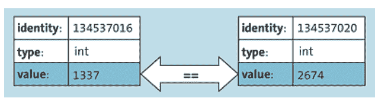

**图 7.5** 两个实例的值比较（本例中为 False）

值比较仅在涉及结构相似的数据类型（如整数和浮点数）时才有用：

```
>>> number1 = 1987.0
>>> type(number1)
<class 'float'>
>>> number2 = 1987
>>> type(number2)
<class 'int'>
>>> number1 == number2
True
```

尽管 `number1` 和 `number2` 类型不同，但通过 `==` 比较它们会返回真值 `True`。

从结构上看，数字和字符串几乎没有共同之处，因为数字是单个值，而字符串将多个字母组合成一个单元。因此，用于比较字符串和数字的 `==` 运算符总是返回 `False`，即使这些值在人类看来“相同”：

```
>>> string = "1234"
>>> string == 1234
False
```

`==` 运算符是否为两个特定类型定义取决于数据类型本身。[27] 如果未定义，则使用实例的标识进行比较，这将在下一节中解释。

### 7.1.3 标识

实例的*标识*用于将其与所有其他实例区分开来。这可以比作一个人的个人指纹，因为它在程序中对每个实例都是唯一的，并且不能改变。标识是一个整数，可以使用 `id` 函数确定：

```
>>> id(1337)
134537016
>>> v1 = "Hello World"
>>> id(v1)
3082572528
```

每当您想检查一个实例是否是特定的，而不仅仅是具有相同类型和值的实例时，标识就变得很重要：

```
>>> v1 = [1,2,3]
>>> v2 = v1
>>> v3 = [1,2,3]
>>> type(v1) == type(v3)
True
>>> v1 == v3
True
>>> id(v1) == id(v3)
False
>>> id(v1) == id(v2)
True
```

在这个例子中，Python 创建了两个不同的实例，类型为 `list`，值为 `[1,2,3]`，其中 `v1` 和 `v2` 引用同一个实例。图 7.6 以图形方式说明了这一点。

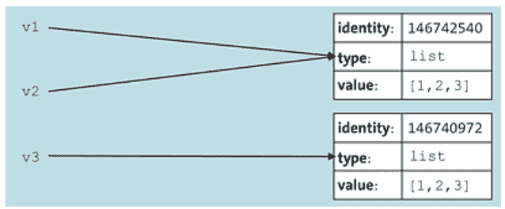

**图 7.6** 三个引用，两个实例

在 Python 中，标识相等性的比较非常重要，因此为此定义了一个单独的运算符：`is`。

表达式 `id(reference1) == id(reference2)` 与 `reference1 is reference2` 含义相同。图 7.7 说明了这一点。

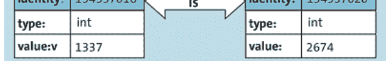

**图 7.7** 两个实例的标识比较

图 7.7 所示的比较产生真值 `False`，因为两个实例的标识不同。

## 7.2 删除引用

在程序运行期间，通常会创建大量实例，但并非所有实例都一直需要。让我们考虑以下虚构的程序启动：

```
welcome = "Welcome to the sample program"
print(welcome)
# 从这里开始，程序的其余部分将继续
```

很容易看出，`welcome` 引用的实例在欢迎之后就不再需要了，因此在程序运行的其余时间里浪费内存而没有任何目的。因此，这里更可取的是按需删除不再需要的实例的方法。

Python 不允许程序员直接管理内存；它代替他们管理。因此，我们不能手动删除现有实例，而必须依赖一种称为*垃圾回收*的自动化机制。[28] 尽管如此，有一种方法可以影响这个过程。

不再被引用的实例被 Python 分类为不再需要，并相应地释放。因此，如果我们想删除一个实例，我们只需要删除所有相关的引用。为此，Python 提供了 `del` 语句。一旦被删除，引用就不再存在，尝试访问它会导致 `NameError`：

```
>>> v1 = 1337
>>> v1
1337
>>> del v1
>>> v1
Traceback (most recent call last):
  File "<stdin>", line 1, in <module>
NameError: name 'v1' is not defined
```

如果你想一次删除多个引用，你可以简单地用逗号分隔它们：

```
>>> v1 = 1337
>>> v2 = 2674
>>> v3 = 4011
>>> del v1, v2, v3
>>> v1
Traceback (most recent call last):
  File "<stdin>", line 1, in <module>
NameError: name 'v1' is not defined
```

为了识别何时不再有引用指向某个实例，Python 在内部为每个实例存储一个计数器，即所谓的*引用计数*。对于新创建的实例，引用计数的值为零。每当创建一个指向实例的新引用时，该实例的引用计数就增加一，而每当删除一个引用时，它就减少一。因此，实例的引用计数始终表示当前指向该实例的引用数量。当实例的引用计数达到零时，就不存在指向该特定实例的引用。因为实例只能通过引用被程序员访问，所以无法再访问这样的实例，因此可以将其删除。

## 7.3 可变与不可变数据类型

也许你在尝试我们刚刚描述的内容时已经遇到了以下看似矛盾的情况：

```
>>> a = 1
>>> b = 1
>>> id(a)
9656320
>>> id(b)
9656320
>>> a is b
True
```

为什么 a 和 b 引用同一个整数实例，正如标识比较所示，即使我们在前两行明确创建了两个值为 1 的实例？

要回答这个问题，你需要知道 Python 从根本上区分两种数据类型——即*可变*和*不可变*数据类型。顾名思义，这两种类型的区别在于实例创建后其值是否可以改变——即它是否是可变的。可变类型的实例在创建后能够取其他值，而不可变数据类型则不是这样。

然而，如果实例的值不能改变，那么在内存中管理多个相同值的不可变实例也没有意义；在理想情况下，一个实例就足够了，所有相应的引用都指向它。现在，正如你可能想象的那样，整数就是这样一种不可变数据类型，Python 为了优化目的，让值 1 两次引用同一个实例。字符串也是不可变的。[29]

然而，不能保证每个所需值的不可变数据类型总是只有一个实例，尽管这在理论上是可能的。每个 Python 实现都可以在这里选择自己的变体。

对于*可变*数据类型，情况则不同：因为 Python 必须预期此类实例的值随后会改变，所以尽可能重新引用现有实例的系统在这里并不适用。因此，你可以依赖这样一个事实：总是会创建一个新实例。

处理*可变*和*不可变*数据类型时的这种不同行为意味着相同的代码对不同的数据类型可能做根本不同的事情。以下示例旨在让你意识到其中的特殊性。

首先，我们介绍 `+=` 运算符，它可以用来将一个字符串附加到现有字符串：

```
>>> a = "water "
>>> a += "bottle"
>>> a
'water bottle'
```

所以这里，首先创建一个值为 `"water"` 的字符串，然后将字符串 `"bottle"` 附加到它上面。

同样，可以使用 `+=` 将列表的元素附加到现有列表：

```
>>> a = [1,2]
>>> a += [3,4]
>>> a
[1, 2, 3, 4]
```

所以一切都表明运算符 `+=` 对字符串和列表做同样的事情。然而，实际上存在一个严重的区别。

在下一个示例中，我们将运行相同的代码两次，一次针对字符串，一次针对列表：

```
>>> a = "water "
>>> b = a
>>> a += "bottle"
>>> a
'water bottle'
>>> b
'water '
```

同样，我们生成一个值为 "water" 的字符串。这次我们让引用 `b` 与引用 `a` 一起指向这个字符串。然后我们再次将字符串 "bottle" 追加到 `a` 引用的字符串上，并在输出中看到 `b` 仍然引用字符串 "water"，而 `a` 指向连接后的 "water bottle"。

如果我们对列表类型的实例做同样的操作，情况就不同了：

```
>>> a = [1,2]
>>> b = a
>>> a += [3,4]
>>> a
[1, 2, 3, 4]
>>> b
[1, 2, 3, 4]
```

这个示例与前面字符串实例的示例类似：列表 `[1,2]` 对应字符串 "water"，列表 `[3,4]` 对应字符串 "bottle"。然而，在这个示例中，`b` 引用的列表发生了变化，而在字符串示例中则不是这样。

要理解这种差异，让我们详细看看两个代码序列的操作。

在图 7.8 中，对比了字符串的示例代码及其产生的内部操作。

| 代码 | 内部表示 |
| :--- | :--- |
| `a = "water"` | a → "water" |
| `b = a` | a → "water"<br>b → "water" |
| `a += " bottle"` | b → "water"<br>a → "water bottle" |

**图 7.8** str 实例的 += 运算符

关键点在于 `a += "bottle"` 这一行。因为 `str` 是不可变数据类型，所以无法通过追加 "bottle" 来扩展现有的 `str` 实例 "water"。相反，此时会创建一个值为 "water bottle" 的新 `str` 实例，然后由 `a` 引用。`b` 仍然引用的值为 "water" 的实例不受影响。

列表示例如图 7.9 所示，情况有所不同。

| 代码 | 内部表示 |
| :--- | :--- |
| `a = [1,2]` | a → [1,2] |
| `b = a` | a → [1,2]<br>b → [1,2] |
| `a += [3,4]` | a → [1,2,3,4]<br>b → [1,2,3,4] |

**图 7.9** list 实例的 += 运算符

因为 `list` 是可变数据类型，所以 `a` 和 `b` 共同引用的 `list` 实例可以被修改。因此，`a += [3,4]` 这一行不会导致创建新的 `list` 实例，而是修改了已存在的实例。因此，`a` 和 `b` 继续引用同一个列表，所以 `b` 也受到了对 `a` 操作的影响。

这种某物受到另一处过程影响的过程，称为*副作用*。

副作用通常只发生在可变数据类型上，并且不限于 `+=` 运算符。每当可变数据类型的实例被修改时，它们就会发生作用。有关列表相关副作用的更多信息，请参见第 12 章，第 12.3.6 节。在第 17 章，第 17.10 节，我们将描述函数调用中的副作用。

随着你继续阅读本书，你将熟悉一系列可变数据类型以及可用于修改它们的操作。在此过程中，你应该牢记此处介绍的行为。

> **注意**

在本节中，我们将 `int` 和 `str` 数据类型视为不可变数据类型的代表，将 `list` 视为可变数据类型的代表。有关 Python 内置数据类型及其可变性的完整列表，请参见第 10 章。

# 8 函数、方法和属性

在前面的章节中，我们通过示例介绍了 Python 语言。最初涉及在交互模式下尝试简单的示例，并在此基础上编写第一个示例程序。之后，我们讨论了控制结构、运行时模型和输入/输出功能，这三个主题应该能够让你尽早复现示例程序并自己动手实验 Python。

现在，我们将介绍另外两个核心主题：向函数或方法传递参数以及处理实例。在这里，我们将仅进行一般性的介绍，提供后续章节所需的足够细节。这三个主题的全面讨论将在第 17 章和第 19 章中进行。

## 8.1 函数和方法的参数

*函数*是一个命名的子程序，封装了常用的功能，可以通过*函数调用*来执行。函数的一个例子是用于确定列表中最大元素的 `max` *内置函数*：

```
>>> max([3, 6, 2, 1, 9])
9
```

要确定其最大元素的列表是 `max` 函数的*参数*，在调用函数时写在括号内。

如果函数调用返回一个结果，这个*返回值*可以像普通实例一样使用：

```
>>> value = max([3,6,2,1,9])
>>> value/2
4.5
```

*方法*是在特定实例上下文中执行的函数。例如，列表有一个 `sort` 方法，用于对其被调用的列表进行排序：

```
>>> list = [4,6,2,1,8,5,9]
>>> list.sort()
>>> list
[1, 2, 4, 5, 6, 8, 9]
```

实例的数据类型决定了它可用的方法。

> **注意**

下面我们将更详细地讨论 Python 中函数参数的不同可能性。请注意，文献区分了两个术语，它们基于对函数调用的不同看法：*参数*和*实参*。

术语 *argument* 指的是在函数调用中传递的具体值，而函数定义中对应的占位符称为 *parameter*。

意识到这种细微的含义差异很重要。然而，为了提高可读性，我们决定不严格区分这些含义，并在本书中几乎同义地使用术语 parameter 和 argument。

#### 8.1.1 位置参数

许多方法除了调用所引用的实例外，还需要额外的信息才能工作。为此，提供了所谓的*参数*，它们以逗号分隔写在方法调用末尾的括号中。引用和字面量都可以指定为参数：

```
var = 12
reference.method(var, "Hello World!")
```

方法的定义决定了可以传递给它的参数数量和类型，因此因方法而异。

总的来说，一个方法及其期望的参数被称为*接口*。每次我们在本书中描述一个方法时，我们通常以以下形式指定关联的接口：

*method(parameter1, parameter2, parameter3)*

在这种情况下，该方法期望三个名为 *parameter1*、*parameter2* 和 *parameter3* 的位置参数。术语 *positional* 意味着在方法调用中传递的实例根据它们在参数列表中的位置分配给参数。在方法调用 `reference.method(1, 45, -7)` 的情况下，*parameter1* 的值为 1，*parameter2* 的值为 45，*parameter3* 的值为 -7。

#### 8.1.2 关键字参数

你也可以向方法传递*关键字参数*。关键字参数直接链接到形式参数名称，它们在参数列表中的顺序不再重要。要将值作为关键字参数传递，你必须在方法调用中使用等号将要传递的值赋给参数名称。因此，以下两个方法调用是等效的：

```
reference.method(1, 2, 3)
reference.method(parameter2=2, parameter1=1, parameter3=3)
```

你也可以混合使用位置参数和关键字参数，但所有关键字参数必须位于参数列表的末尾。因此，以下调用与前两个等效：

```
reference.method(1, parameter3=3, parameter2=2)
```

只有 `parameter1` 作为位置参数传递，而 `parameter2` 和 `parameter3` 作为关键字参数传递。

使用哪种传递方式取决于你。然而，通常参数作为位置参数传递，因为这样写起来更省事。

#### 8.1.3 可选参数

存在*可选参数*，仅在需要时才必须传递。当我们介绍带有此类参数的方法时，它们在接口描述中用方括号表示：
`method(parameter1, [parameter2, parameter3])`
在这个例子中，`parameter1` 是必需参数，而 `parameter2` 和 `parameter3` 是两个可选参数。因此，该方法可以以不同的方式调用：

```
reference.method(1, 2, 3)
reference.method(1, 2)
reference.method(1)
```

## 8.1.4 仅关键字参数

函数或方法可以拥有*仅关键字参数*。这些参数只能以关键字形式传递。我们将在函数或方法接口中用花括号来标识这些参数：

*method(parameter1, parameter2, {parameter3})*

仅关键字参数可以是可选的，也可以是非可选的。因此，该方法可以按如下方式调用：

```
reference.method(1, 2, parameter3=3)
reference.method(1, 2)
```

## 8.2 属性

除了方法，实例还可以拥有*属性*。属性构成了整个实例值的命名部分。例如，每个复数都有 `real` 和 `imag` 属性，用于访问其实部或虚部：

```
>>> number = 5 + 6j
>>> number.real
5.0
>>> number.imag
6.0
```

由于 `reference.attribute` 形式的表达式本身就是一个引用，因此它可以像任何其他引用一样使用。例如，它可以作为计算中的操作数出现，或者存储在列表中：

```
>>> number.real*number.real + 5*number.imag
55.0
>>> [1, number.imag, number.real]
[1, 6.0, 5.0]
```

特别地，`reference.attribute` 所引用的实例本身可能拥有一个 `aaa` 属性，然后可以通过 `reference.attribute.aaa` 来访问。同样，通过 `reference.attribute.method(param1, param2)` 访问实例的方法也是可行的。

在示例中，复数的 `real` 属性指向一个浮点数，而该浮点数又有一个 `is_integer` 方法来检查它是否为整数：

```
>>> number.real.is_integer()
True
```

这里，复数 `5 + 6j` 的实部 `5.0` 通过 `number.real` 被访问，然后调用了 `5.0` 的 `is_integer` 方法。

在 Python 程序中，这种嵌套的属性和方法访问非常常见。

## 9 Python 信息来源

本书的目标是为你提供关于 Python 编程的全面介绍。不幸的是，本书的范围有限，因此我们不得不在某些地方省略细节，并建议你参考进一步的文档。但在日常编程中，有时正是这些细节造成了差异。

在本章中，我们将简要介绍一些非常有用的 Python 信息来源。这些来源均提供英文版本。

### 9.1 内置帮助函数

你可以调用内置的 `help` 函数来启动 Python 解释器的交互式帮助功能。通过 `help()`，会输出介绍性文本，然后是命令提示符。如果你需要查找术语，这种交互式帮助非常有用。

术语可以包括关键字（例如 `for`）、符号（例如 `+`）、模块（例如 `pprint`）或主题（例如 `DEBUGGING`）。可以使用 `keywords`、`symbols`、`modules` 和 `topics` 命令来显示这些类别中可能的搜索词列表。

如果为你输入的术语找到了帮助页面，它将以只读模式显示。较长的文本可以滚动查看。在 Linux 上，可以使用 `Up` 和 `Down` 箭头键；在 Windows 上，可以使用 `Space` 空格键。按 `Q` 键可以从只读模式返回到交互模式，你可以使用 `quit()` 命令或 `Ctrl` + `D` 快捷键退出交互模式。

Python 的交互式帮助对于快速查找与接口相关的问题答案特别有用，例如，“`copy` 模块中包含了哪些函数？”或“`pprint.pprint` 函数的 `indent` 参数的默认值是什么？”

除了启动 `help` 函数的交互式 shell，还可以将模块或函数等实例传递给 `help` 函数。然后相应的帮助页面将以只读模式显示：

```
>>> import pprint
>>> help(pprint.pprint)
Help on function pprint in module pprint:

pprint(object, stream=None, indent=1, width=80, depth=None, *, compact=False)
    Pretty-print a Python object to a stream [default is sys.stdout].
```

或者，可以传递一个包含搜索词的字符串：

```
>>> import copy
>>> help("copy.copy")
Help on function copy in copy:

copy.copy = copy(x)
    Shallow copy operation on arbitrary Python objects.

    See the module's __doc__ string for more info.
```

## 9.2 在线文档

Python 交互式帮助函数显示的文本摘自内容丰富的在线文档。最新版本可以在 https://docs.python.org 找到。在那里，你可以通过左上角的选择列表切换到旧版 Python 的文档。

在线文档对初学者和经验丰富的 Python 开发者都大有帮助。如果你感兴趣，值得在文档中再次查阅本书涵盖的主题，因为模块通常提供大量无法在此全面描述的详细函数。

### 9.3 PEP

Python 语言和 CPython 参考解释器的开发过程基于所谓的 *Python 增强提案 (PEPs)*。这些是简短的阐述，它们识别语言或解释器中的一个问题，总结可能的解决方案及其相关讨论，并最终提出一个解决方案。这些 PEP 是 Python 开发者讨论未来版本可能创新的基础。PEP 在讨论后可以被接受或拒绝，被接受的 PEP 随后将在 Python 的未来版本中实现。

查看 [https://www.python.org/dev/peps](https://www.python.org/dev/peps) 获取迄今为止提出的所有 PEP 列表。特别是如果你对 Python 中某个函数为何以特定方式实现有详细问题，阅读相关的 PEP 是有意义的。但需要注意的是，PEP 有时可能非常技术性，即使对于经验丰富的 Python 开发者也可能难以理解。

PEP 435 是一个被接受并实现的 PEP 示例。它描述了 `Enum` 数据类型，该类型自 Python 3.4 起已包含在语言中。

> **注意**

相当有趣的是 PEP 8 和 257，它们描述了 Python 代码和文档字符串的格式约定。[ 31 ] 尽管这些 PEP 绝非强制性的，但它们在社区中非常受欢迎。因此值得一看。

## 第二部分
数据类型

在本书的第一部分，你学习并使用了一些基本数据类型，如整数、字符串和列表。你可能已经猜到，除了第一部分介绍的入门示例，Python 中的数据类型还有更多内容。本书的第二部分全面讨论了 Python 中定义的基本数据类型。

## 10 基本数据类型：概述

在[第 7 章](第 7 章)，[第 7.1.1 节](第 7.1.1 节)中，我们讨论了*数据类型*作为实例蓝图的概念。因此，数据类型指定了实例可以具有的值。实例的数据类型可以通过内置的 `type` 函数来识别：

```
>>> x = "Hello"
>>> type(x)
<class 'str'>
```

在本章中，我们希望在逐一探索 Python 的核心数据类型之前，先讨论数据类型主题的一些基本方面。我们已经在[第 3 章](第 3 章)学习了许多基本数据类型，并在实践中进行了测试。

从[第 7 章](第 7 章)，[第 7.3 节](第 7.3 节)中，你也已经了解了实例可变性的基本概念。某些数据类型的实例，即所谓的可变数据类型，可以被修改。对于其他数据类型，称为*不可变数据类型*，当它们被更改时，必须创建新的实例。有关 Python 内置数据类型及其可变性说明的概述，请参见[表 10.1](表 10.1)。

| 数据类型 | 存储内容 | 可变性 | 章节 |
| :--- | :--- | :--- | :--- |
| NoneType | 无 | 不可变 | [第 10.1 节](第 10.1 节) |
| **数值数据类型** | | | |
| `int` | 整数 | 不可变 | [第 11 章，第 11.4 节](#) |
| `float` | 浮点数 | 不可变 | [第 11 章，第 11.5 节](#) |
| `bool` | 布尔值 | 不可变 | [第 11 章，第 11.6 节](#) |
| `complex` | 复数 | 不可变 | [第 11 章，第 11.7 节](#) |
| **序列数据类型** | | | |
| `list` | 任意实例的列表 | 可变 | [第 12 章，第 12.3 节](#) |
| `tuple` | 任意实例的列表 | 不可变 | [第 12 章，第 12.4 节](#) |
| `str` | 作为字母序列的文本 | 不可变 | [第 12 章，第 12.5 节](#) |
| `bytes` | 作为字节序列的二进制数据 | 不可变 | [第 12 章，第 12.5 节](#) |
| `bytearray` | 作为字节序列的二进制数据 | 可变 | [第 12 章，第 12.5 节](#) |
| **映射和集合** | | | |
| `dict` | 键值映射 | 可变 | [第 13 章，第 13.1 节](#) |
| `set` | 可哈希实例的集合 | 可变 | [第 13 章，第 13.2.5 节](#) |
| `frozenset` | 可哈希实例的集合 | 不可变 | [第 13 章，第 13.2.6 节](#) |

**表 10.1** Python 数据类型概览

除了表 10.1 中列出的数据类型外，本书的这一部分还描述了可以通过标准库模块导入的其他数据类型。

## 10.1 虚无：NoneType

让我们从所有数据类型中最简单的一种——虚无——开始探索 Python 数据类型之旅。对应的基础数据类型称为 `NoneType`。当然，问题随之而来：为什么需要一个仅仅用来表示“无”的数据类型？嗯，这实际上完全合乎逻辑。让我们想象以下情况：你实现了一个方法，其中任何实数都是可能的结果。然而，在某些情况下，计算可能不可行。那么应该返回什么值作为结果呢？正确答案是：无。

虚无只有一个实例——即 `None`。这是一个常量，你可以在源代码中随时使用：

```
>>> ref = None
>>> ref
>>> print(ref)
None
```

在示例中，创建了一个名为 `ref` 的引用指向 `None`。在第二行，我们注意到 `None` 实际上对应于“无”：我们尝试从解释器输出 `ref`，实际上没有得到任何结果。为了能够在屏幕上输出该值，我们必须使用 `print` 函数。

前面已经提到，`None` 是虚无的唯一实例。我们可以利用这一特性来检查一个引用是否指向 `None`：

```
>>> if ref is None:
...     print("ref is None")
ref is None
```

关键字 `is` 用于检查 `ref` 引用的实例是否与 `None` 相同。这种测试值是否为 `None` 的方式，比通过 `==` 运算符进行基于值的比较执行得更快，当然后者也是可能的。请注意，这两种操作只是表面上等价：`==` 检查两个值是否相等，而 `is` 检查两个身份是否相同。[ 32 ]

## 10.2 运算符

你从数学中知道 *运算符* 这个术语，它表示代表特定算术运算的公式符号。在 Python 中，例如，你可以使用运算符将两个数值组合成一个算术表达式：

```
>>> 1 + 2
3
```

运算符所应用的值——在本例中是 1 和 2——称为 *操作数*。其他数据类型也有运算符。例如，+ 可以用来连接两个字符串：

```
>>> "A" + "B"
'AB'
```

因此，在 Python 中，运算符的含义取决于它所应用的数据类型。

### 10.2.1 运算符优先级

在本节中，我们将仅限于讨论运算符 +、-、* 和 <，它们足以解释基本原理。在下面的示例中，引用 a、b 和 c 反复出现，它们并非在示例本身中创建。当然，要运行这些示例，这些引用必须存在，并且例如各自引用一个整数。

考虑以下表达式：

```
(a * b) + c
a * (b + c)
```

两者在含义上都是明确的，因为括号指明了表达式的哪一部分应首先计算。让我们将前面的表达式不带括号地写一次：

```
a * b + c
```

现在，表达式的哪一部分应该首先计算就不再明显了。这里需要一个规定，因为根据计算顺序的不同，可能会产生不同的结果：

```
(2 * 3) + 4 = 10
2 * (3 + 4) = 14
```

为了解决这个问题，Python 中的运算符与数学中一样，具有 *优先级*，其定义方式使得 `*` 的优先级高于 `+`。表 10.2 显示了 Python 中定义的运算符的优先级。此外，该表还提供了运算符通常含义的描述。表中位置较高的运算符比位置较低的运算符绑定得更紧密。位于同一单元格中的运算符具有同等的绑定强度。

> **注意**

表 10.2 仅涵盖了有效表达式中可能包含的语法元素的一个子集。本书的附录指定了有效表达式中语法元素的完整排名。

| 运算符 | 通常含义 |
| :--- | :--- |
| `x ** y` | x 的 y 次幂 |
| `+x`<br>`-x`<br>`~x` | 正号<br>负号<br>x 的按位取反 |
| `x * y` | x 与 y 的乘积 |
| `x / y` | x 除以 y 的商 |
| `x % y` | x 除以 y 的整数除法余数 |
| `x // y` | x 除以 y 的整数除法 |
| `x @ y` | x 与 y 的矩阵乘法 |
| `x + y` | x 与 y 的加法 |
| `x - y` | x 与 y 的减法 |
| `x << n` | 按位左移 n 位 |
| `x >> n` | 按位右移 n 位 |
| `x & y` | x 与 y 的按位与 |
| `x ^ y` | x 与 y 的按位异或 |
| `x | y` | x 与 y 的按位或 |
| `x < y` | x 是否小于 y？ |
| `x <= y` | x 是否小于或等于 y？ |
| `x > y` | x 是否大于 y？ |
| `x >= y` | x 是否大于或等于 y？ |
| `x != y` | x 是否不等于 y？ |
| `x == y` | x 是否等于 y？ |
| `x is y` | x 和 y 是否相同？ |
| `x is not y` | x 和 y 是否不同？ |
| `x in y` | x 是否位于 y 中？ |
| `x not in y` | x 是否不位于 y 中？ |
| `not x` | 逻辑非 |
| `x and y` | 逻辑与 |
| `x or y` | 逻辑或 |

表 10.2 运算符优先级

### 10.2.2 求值顺序

运算符优先级确保了由不同绑定性的运算符组成的表达式的求值。但是，如果同一个运算符在表达式中出现多次会怎样？在这种情况下，绑定性就不再有任何差异。让我们在此背景下考虑以下表达式：

```
a + b + c
a - b - c
```

在这两种情况下，求值顺序既没有通过括号也没有通过运算符优先级得到明确说明。你可以看到，这对于第一个表达式的求值不是问题，但至少对于第二个表达式，需要一个规定，因为根据求值顺序的不同，可能产生两种不同的结果。在这种情况下，Python 的规则是，仅由具有相同绑定性的运算符组成的表达式或子表达式 *从左到右* 求值：

```
a + b + c == ((a + b) + c)
a - b - c == ((a - b) - c)
```

### 10.2.3 连接比较

除少数例外情况外，[ 33 ] 我们到目前为止只描述了返回操作数类型值作为结果的运算符。因此，两个整数相加的结果始终是一个整数。然而，并非每个运算符都是如此。你已经知道比较运算符，无论操作数的数据类型如何，它们都会产生一个真值：

```
>>> 1 < 2.5
True
```

思考一下这个表达式的求值顺序：

```
a < b < c
```

理论上，按照前面讨论的模式进行是可能的，并且在某些编程语言中就是这样做的：连接的比较应该从左到右求值。在这种情况下，`a < b` 会首先被求值，例如得到 `True`。下一个比较将是 `True < c`。虽然这种求值形式是可能的，但它没有实际用途——因为 `True < c` 到底意味着什么？

在 Python 中，某些运算符以特殊方式处理。表达式 `a < b < c` 被求值为等价于以下形式：

```
a < b and b < c
```

这符合数学观点，因为该表达式实际上意味着：“`b` 是否在 `a` 和 `c` 之间？”对于更复杂的表达式，应用类似的描述性规则。例如，表达式 `a < b <= c != d > e` 被求值为：

```
a < b and b <= c and c != d and d > e
```

此行为适用于以下运算符：`<`、`<=`、`>`、`>=`、`==`、`!=`、`is`、`is not`、`in`、`and`、`not in`。

## 11 数值数据类型

在本章中，我们将描述数值数据类型，这是 Python 中第一个主要的数据类型组。表 11.1 列出了属于此组的所有数据类型并描述了它们的用途。

| 数据类型 | 描述 | 可变性* | 章节 |
| :--- | :--- | :--- | :--- |
| `int` | 整数 | 不可变 | 第 11.4 节 |
| `float` | 浮点数 | 不可变 | 第 11.5 节 |
| `bool` | 布尔值 | 不可变 | 第 11.6 节 |
| `complex` | 复数 | 不可变 | 第 11.7 节 |

* 所有数值数据类型都是不可变的。这并不意味着没有改变数字的运算符，而是意味着每次更改后都必须创建相应数据类型的新实例。因此，从程序员的角度来看，起初几乎没有区别。有关可变和不可变数据类型之间区别的更多详细信息，请参见第 7 章，第 7.3 节。

**表 11.1** 数值数据类型

数值数据类型构成一个组，因为它们在主题上相关。这种相关性也体现在数值数据类型共享许多运算符这一事实上。在接下来的几节中，我们将介绍这些共同的运算符，然后详细讨论 `int`、`float`、`bool` 和 `complex` 数值数据类型。

## 11.1 算术运算符

*算术运算符*是指执行算术计算的运算符——例如加法或乘法。对于所有数值数据类型，表 11.2 中列出的算术运算符均已定义。

| 运算符 | 结果 |
| :--- | :--- |
| `x + y` | x 与 y 的和 |
| `x - y` | x 与 y 的差 |
| `x * y` | x 与 y 的积 |
| `x / y` | x 与 y 的商 |
| `x % y` | x 除以 y 的余数* |
| `+x` | 正号 |
| `-x` | 负号 |
| `x ** y` | x 的 y 次幂 |
| `x // y` | x 与 y 的商取整* |
| * `%` 和 `//` 运算符对于复数没有数学意义，因此未为 `complex` 数据类型定义。 | |

**表 11.2** 数值数据类型的常用运算符

> **注意**

给已经熟悉 C 或相关编程语言的读者两点说明：

首先，Python 中没有与 C 语言中的自增和自减运算符 `++` 和 `--` 等价的运算符。

其次，`%` 和 `//` 运算符可以描述如下：

- `x // y = round(x / y)`
- `x % y = x - y * round(x / y)`

Python 总是向下取整，而 C 则向零取整。这种差异仅在操作数符号相反时才会出现。

## 增强赋值

除了这些基本运算符，Python 中还有许多其他运算符。例如，你经常需要计算 `x` 和 `y` 的总和并将结果存储在 `x` 中——即将 `x` 增加 `y`。这需要使用前面所示运算符的以下语句：

`x = x + y`

对于这种情况，Python 提供了所谓的*增强赋值*，可以视为上述语句的缩写形式。Python 中增强赋值的概览见表 11.3。

| 运算符 | 等价形式 |
| :--- | :--- |
| `x += y` | `x = x + y` |
| `x -= y` | `x = x - y` |
| `x *= y` | `x = x * y` |
| `x /= y` | `x = x / y` |
| `x %= y` | `x = x % y` |
| `x **= y` | `x = x ** y` |
| `x //= y` | `x = x // y` |

**表 11.3** 数值数据类型的常用运算符

需要注意的是，这里 `y` 可以使用任何算术表达式，而 `x` 必须是一个也可以用作普通赋值目标的表达式，例如符号名称或列表或字典的元素。

## 11.2 比较运算符

*比较运算符*是一种从两个实例计算真值的运算符。表 11.4 列出了为数值数据类型定义的比较运算符。

| 运算符 | 结果 |
| :--- | :--- |
| `x == y` | 如果 x 和 y 相等则为真 |
| `x != y` | 如果 x 和 y 不相等则为真 |
| `x < y` | 如果 x 小于 y 则为真* |
| `x <= y` | 如果 x 小于或等于 y 则为真* |
| `x > y` | 如果 x 大于 y 则为真* |
| `x >= y` | 如果 x 大于或等于 y 则为真* |
| * | 因为复数无法以有意义的方式排序，所以 `complex` 数据类型只允许使用前两个运算符。 |

**表 11.4** 数值数据类型的常用运算符

每个比较运算符都返回一个真值作为结果。例如，这种值被期望作为 `if` 语句的条件。因此，运算符可以如下使用：

```
if x < 4:
    print("x is less than 4")
```

你可以将任意多个比较运算符连接成一个系列。严格来说，前面的例子只是这个规则的一个特例，因为它只有两个操作数。这种连接的含义对应于数学观点，可以在以下示例中看到：

```
if 2 < x < 4:
    print("x is between 2 and 4")
```

我们将在第 11.6 节更详细地描述布尔值。

## 11.3 数值数据类型之间的转换

数值数据类型可以使用内置函数 `int`、`float`、`bool` 和 `complex` 相互转换。请注意，在此过程中，根据转换的不同可能会丢失信息。作为示例，让我们在交互模式下考虑一些转换：

```
>>> float(33)
33.0
>>> int(33.5)
33
>>> bool(12)
True
>>> complex(True)
(1+0j)
```

除了具体的字面量，也可以使用引用，或者可以将引用链接到结果值：

```
>>> var1 = 12.5
>>> int(var1)
12
>>> var2 = int(40.25)
>>> var2
40
```

> **注意**

`complex` 数据类型在本文介绍的转换中扮演着特殊角色，因为它无法以有意义的方式简化为单个数值。因此，像 `int(1+2j)` 这样的转换会失败。

关于数值数据类型的通用介绍就到这里。接下来的章节将更详细地介绍此组中的每种数据类型。

## 11.4 整数：int

Python 中用于处理整数的数据类型是 `int`。与许多其他编程语言不同，这种数据类型在其值范围上没有任何主要限制，这使得在 Python 中处理大整数非常方便。[ 34 ]

我们已经做了很多整数的工作，所以使用 `int` 实际上不需要更多演示。然而，为了完整性，这里有一个小例子：

```
>>> i = 1234
>>> i
1234
>>> p = int(5678)
>>> p
5678
```

自 Python 3.6 发布以来，可以使用下划线对字面量的数字进行分组：

```
>>> 1_000_000
1000000
>>> 1_0_0
100
```

分组不会改变字面量的数值，但它有助于提高数字字面量的可读性。是否以及如何对数字进行分组取决于你。

### 11.4.1 数制

整数在 Python 中可以用多种*数制*书写：[ 35 ]

- 没有特殊前缀的数字，如前面的示例所示，被解释为*十进制*（基数为 10）。请注意，这样的数字前面不能有前导零：

```
v_dez = 1337
```

- 前缀 `0o`（"zero-o"）表示以*八进制*（基数为 8）书写的数字。请注意，这里只允许使用 `0` 到 `7` 的数字：

```
v_oct = 0o2471
```

前缀中的小写 `o` 也可以替换为大写 `O`。但是，我们建议你始终使用小写 `o`，因为在许多字体中，大写 `O` 与零几乎无法区分。

- 下一个也是更常见的变体是*十六进制*（基数为 16），由前缀 `0x` 或 `0X`（"zero-x"）标识。数字本身可以由数字 `0`–`9` 和字母 `A`–`F` 或 `a`–`f` 组成：

```
v_hex = 0x5A3F
```

- 除了十六进制，*二进制*系统，在计算机科学中也称为*二进制系统*（基数为 2），具有决定性的重要意义。二进制系统中的数字由前缀 `0b` 引入，类似于前面的字面量：

```
v_bin = 0b1101
```

在二进制系统中，只能使用数字 `0` 和 `1`。

然而，你可能不想局限于 Python 明确支持的这四种数制；你可能想使用更特殊的数制。当然，Python 没有为每种可能的数制提供单独的字面量。相反，你可以使用以下表示法：

```
v_6 = int("54425", 6)
```

这是创建 `int` 数据类型实例并为其提供初始值的另一种方法。为此，在括号中写入包含所选数制中所需初始值的字符串以及该数制的基数（作为整数）。两个值必须用逗号分隔。在示例中，使用了基数为 6 的系统。

Python 支持基数从 2 到 36 的数制。如果某种数制需要超过 10 个不同的数字来表示一个数字，则除了数字 0 到 9 之外，还使用英文字母 A 到 Z。

变量 `v_6` 现在在十进制系统中的值为 `7505`。

对于所有数制字面量，都可以使用负号：

```
>>> -1234
-1234
>>> -0o777
-511
>>> -0xFF
-255
>>> -0b1010101
-85
```

请注意，数制只是相同值的替代表示法。例如，`int` 数据类型不会因为包含这样的值而切换到某种十六进制模式；数制仅对赋值或输出很重要。默认情况下，所有数字都以十进制输出：

```
>>> v1 = 0xFF
>>> v2 = 0o777
>>> v1
255
>>> v2
511
```

我们将在后面第 12 章第 12.5.3 节关于字符串的上下文中，讨论如何以其他数制输出数字。

## 11.4.2 位运算

如前所述，二进制系统在计算机科学中至关重要。对于 `int` 数据类型，因此定义了一些额外的运算符，它们明确指向数字的二进制表示。表 11.5 总结了这些*位*运算符。

| 运算符 | 增强赋值 | 结果 |
| :--- | :--- | :--- |
| `x & y` | `x &= y` | `x` 和 `y` 的按位与（AND） |
| `x | y` | `x |= y` | `x` 和 `y` 的按位非排他或（OR） |
| `x ^ y` | `x ^= y` | `x` 和 `y` 的按位排他或（XOR） |
| `~x` | | `x` 的按位补码 |
| `x << n` | `x <<= n` | 按位左移 `n` 位 |
| `x >> n` | `x >>= n` | 按位右移 `n` 位 |

**表 11.5** int 数据类型的位运算符

由于各个操作的作用可能不是立即明了，我们将在下文中详细描述它们。

### 按位与

两个数字的*按位与*是通过将其二进制表示逐位连接而形成的。结果数字的二进制表示中，仅在两个操作数的相应位均为 1 的位置上为 1，其他所有位置均为 0。图 11.1 说明了这一点。

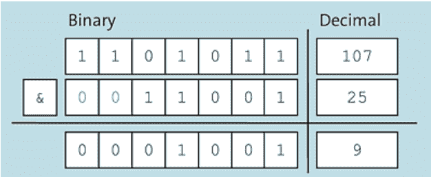

**图 11.1** 按位与

现在让我们在 Python 的交互模式中尝试一下，使用图中选定的操作数进行按位与运算，是否确实返回预期结果：

```
>>> 107 & 25
9
>>> 0b1101011 & 0b11001
9
>>> bin(0b1101011 & 0b11001)
'0b1001'
```

在示例中，我们使用内置函数 `bin`（参见第 17 章，第 17.14.5 节）以二进制系统表示按位与的结果。

### 按位或

两个数字的*按位或*是通过逐位比较两个数字的二进制表示而形成的。结果数字的二进制表示中，仅在两个操作数的相应位中至少有一个为 1 的位置上为 1。图 11.2 说明了这一点。

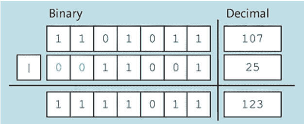

**图 11.2** 按位非排他或

现在让我们在 Python 的交互模式中尝试一下，使用图中选定的操作数进行按位或运算，是否确实返回预期结果：

```
>>> 107 | 25
123
>>> 0b1101011 | 0b11001
123
>>> bin(0b1101011 | 0b11001)
'0b1111011'
```

在示例中，我们使用内置函数 `bin`（参见第 17 章，第 17.14.5 节）以二进制系统表示按位或的结果。

### 按位排他或

两个数字的*按位排他或*（也称*异或*）是通过逐位比较两个数字的二进制表示而形成的。结果数字的二进制表示中，仅在两个操作数的相应位彼此不同时为 1，相同时为 0。如图 11.3 所示。

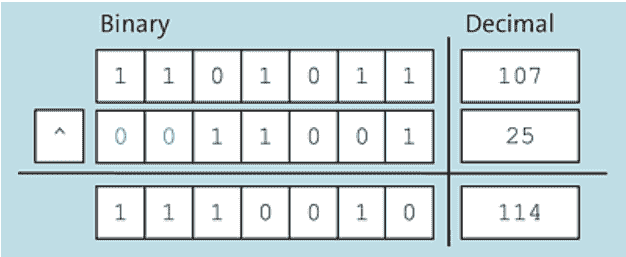

**图 11.3** 按位排他或

下一步，我们将在 Python 的交互模式中尝试一下，使用图中选定的操作数进行按位排他或运算，是否确实返回预期结果：

```
>>> 107 ^ 25
114
>>> 0b1101011 ^ 0b11001
114
>>> bin(0b1101011 ^ 0b11001)
'0b1110010'
```

在示例中，我们使用内置函数 `bin`（参见第 17 章，第 17.14.5 节）以二进制系统表示按位排他或的结果。

### 按位补码

*按位补码*形成二进制数的所谓一的补码，它对应于所有出现位的取反。在 Python 中，这在位级别上是不可能的，因为整数的长度是无限的，而补码必须始终在封闭的数空间中形成。因此，实际的位运算变成了算术运算，定义如下：[ 36 ]

~x = -x - 1

在交互模式中，可以实验性地测试按位补码的功能：

```
>>> ~9
-10
>>> ~0b1001
-10
>>> bin(~0b1001)
'-0b1010'
```

在示例中，我们使用内置函数 `bin`（参见第 17 章，第 17.14.5 节）以二进制系统表示按位补码的结果。

### 位移

*位移*用于将第一个操作数的二进制表示中的位序列向左或向右移动第二个操作数指定的位数。右侧出现的任何间隙都用零填充，并保留第一个操作数的符号。图 11.4 和图 11.5 分别说明了向左和向右移动两位的情况。

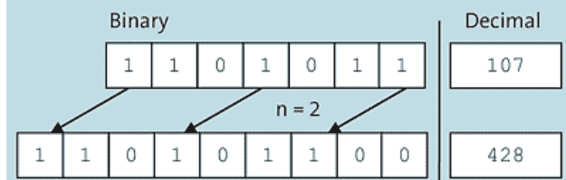

**图 11.4** 向左位移两位

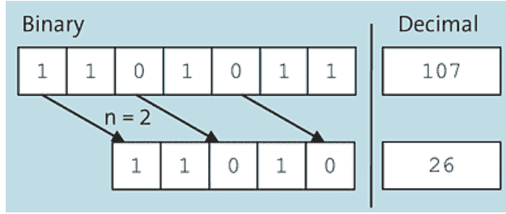

**图 11.5** 向右位移两位

位表示中右侧或左侧出现的间隙都用零填充。

在 Python 中，位移是通过算术方式实现的，类似于补码运算符。向右移动 $x$ 位对应于除以 $2^x$ 的整数除法。向左移动 $x$ 位对应于乘以 $2^x$。

对于按位移位，我们也可以在交互模式中遵循图中所示的示例：

```
>>> 107 << 2
428
>>> 107 >> 2
26
>>> bin(0b1101011 << 2)
'0b110101100'
>>> bin(0b1101011 >> 2)
'0b11010'
```

在示例中，我们使用内置函数 `bin`（参见第 17 章，第 17.14.5 节）以二进制系统表示位移的结果。

## 11.4.3 方法

`int` 数据类型有一个指向整数二进制表示的方法。`bit_length` 方法计算数字的二进制表示所需的位数：

```
>>> (36).bit_length()
6
>>> (4345).bit_length()
13
```

`36` 的二进制表示是 `100100`，`4345` 的二进制表示是 `1000011111001`。因此，这两个数字的二进制表示分别需要 `6` 和 `13` 位。

> **注意**

请注意，整数字面量周围的括号是必需的；否则在浮点数的语法方面可能会产生歧义。

## 11.5 浮点数：float

我们之前简要提到过浮点数。现在我们想更详细地描述它们。要存储有限精度的浮点数，[ 37 ] 你可以使用 `float` 数据类型。

如前所述，最简单情况下浮点数的字面量如下所示：

```
v = 3.141
```

如果小数点前后的部分值为 0，则可以省略：

```
>>> -3.
-3.0
>>> .001
0.001
```

请注意，小数点是浮点数字面量的基本元素，因此不能省略。

自 Python 3.6 起，也可以使用下划线对浮点数字面量的数字进行分组：

```
>>> 3.000_000_1
3.0000001
```

### 11.5.1 指数表示法

Python 还支持一种允许使用指数表示法的表示法：

```
v = 3.141e-12
```

小写或大写 `e` 将*尾数*（3.141）与*指数*（-12）分开。转换为数学表示法，这对应于值 3.141 · 10⁻¹²。请注意，尾数和指数都必须以十进制系统指定。由于不支持其他数字系统，因此可以安全地使用前导零：

```
v = 03.141e-0012
```

### 11.5.2 精度

你可能刚刚尝试了一下浮点数，并在解释器中遇到了一个假定的错误：

```
>>> 1.1 + 2.2
3.3000000000000003
```

实数无法在 `float` 数据类型中以无限精度存储，而是被近似表示。

精通技术的人和从其他编程语言切换过来的人会感兴趣地知道，Python 中的 `float` 实例是 IEEE-754 双精度浮点数。因此，Python 中的 `float` 数据类型与 C、C++ 和 Java 中的 `double` 数据类型相当。

如果你想显式使用单精度浮点数，可以借助第三方 NumPy 库的 `float32` 数据类型（参见第 43 章）。

### 11.5.3 无穷大和非数字

`float` 的精度是有限的。这也意味着该数据类型必须有一个上限和下限。确实，超过一定大小限制的浮点数在 Python 中无法再表示。如果超过限制，数字将存储为 `inf[38]`，如果数字低于下限，则存储为 `-inf`。因此，没有错误，仍然可以将一个过大的数字与其他数字进行比较：

```
>>> 3.0e999
inf
>>> -3.0e999
-inf
>>> 3.0e999 < 12.0
False
>>> 3.0e999 > 12.0
True
>>> 3.0e999 == 3.0e99999999999
True
```

虽然可以比较两个无限大的浮点数，但它们在计算中的用途是有限的。让我们看下面的例子：

```
>>> 3.0e999 + 1.5e999999
inf
>>> 3.0e999 - 1.5e999999
nan
>>> 3.0e999 * 1.5e999999
inf
>>> 3.0e999 / 1.5e999999
nan
>>> 5 / 1e9999
0.0
```

两个无限大的浮点数可以轻松地相加或相乘。这两种情况的结果都是 `inf`。然而，当尝试对两个这样的数字进行减法或除法运算时，就会出现问题。因为这些算术运算没有意义，所以结果会是 `nan`。`nan` 状态类似于 `inf`，但它表示“非数字”——即不可计算。

请注意，`inf` 和 `nan` 都不是你可以在 Python 程序中直接使用的常量。相反，你可以按照以下方式创建具有 `inf` 和 `nan` 值的 `float` 实例：

```
>>> float("inf")
inf
>>> float("nan")
nan
>>> float("inf") / float("inf")
nan
```

## 11.6 布尔值：bool

`bool[39]` 数据类型的实例只能有两个不同的值：真或假——或者，为了符合 Python 语法，`True` 或 `False`。因此，乍一看将 `bool` 归类为数值数据类型是荒谬的。正如许多编程语言中的常见用法，在 Python 中，`True` 被视为类似于 1，`False` 被视为类似于 0，因此布尔值可以像整数一样进行计算。名称 `True` 和 `False` 是可以在源代码中使用的常量。特别要注意的是，这些常量以大写字母开头：

```
v1 = True
v2 = False
```

### 11.6.1 逻辑运算符

一个或多个布尔值可以使用特定的运算符组合成一个布尔表达式。当求值时，这样的表达式会再次产生一个布尔值——即 `True` 或 `False`。在变得过于理论化之前，[表 11.6](#table-11-6) 展示了所谓的逻辑运算符。[40] 我们将随后提供进一步的解释和具体示例。

| 运算符 | 结果 |
| :--- | :--- |
| `not x` | `x` 的逻辑非 |
| `x and y` | `x` 和 `y` 的逻辑与 |
| `x or y` | `x` 和 `y` 的逻辑（非排他）或 |

**表 11.6** bool 数据类型的逻辑运算符

### 逻辑非

布尔值的*逻辑非*可以快速解释：相应的 `not` 运算符将 `True` 变为 `False`，将 `False` 变为 `True`。在一个具体的例子中，这看起来如下：

```
if not x:
    print("x is False")
else:
    print("x is True")
```

### 逻辑与

两个真值之间的*逻辑与*仅在两个操作数都已经是 `True` 时才返回 `True`。[表 11.7](#) 列出了所有可能的情况。

| x | y | x and y |
|---|---|---|
| True | True | True |
| False | True | False |
| True | False | False |
| False | False | False |

**表 11.7** 逻辑与的可能情况

在一个具体的例子中，逻辑与的应用看起来如下：

```
if x and y:
    print("x and y are True")
```

### 逻辑或

两个真值之间的*逻辑或*，当且仅当两个操作数中至少有一个为真时，结果才为真。因此，它是一个非排他或。Python 中不存在逻辑异或运算符。[41] [表 11.8](#) 列出了所有可能的情况。

| x | y | x or y |
|---|---|---|
| True | True | True |
| False | True | True |
| True | False | True |
| False | False | False |

**表 11.8** 逻辑或的可能情况

逻辑或可以如下实现：

```
if x or y:
    print("x or y is True")
```

当然，你可以组合所有这些运算符并在复杂的表达式中使用它们。这可能看起来像这样：

```
if x and y or ((y and z) and not x):
    print("Holy cow")
```

在这一点上，我们不想进一步讨论这个表达式。只需说明使用括号具有预期的效果——即括号内的表达式首先被求值。[表 11.9](Table 11.9) 显示了该表达式的真值，作为三个参数 x、y 和 z 的函数。

| x | y | z | x and y or ((y and z) and not x) |
|---|---|---|---|
| True | True | True | True |
| False | True | True | True |
| True | False | True | False |
| True | True | False | True |
| False | False | True | False |
| False | True | False | False |
| True | False | False | False |
| False | False | False | False |

**表 11.9** 表达式的可能结果

### 逻辑运算符与比较运算符的结合

在数值数据类型部分的开头，我们介绍了一些比较运算符，它们产生一个作为布尔值的真值陈述。以下示例表明，它们可以与逻辑运算符正常结合使用：

```
if x > y or (y > z and x != 0):
    print("My goodness")
```

在这种情况下，x、y 和 z 必须是可比较类型的实例，例如 int、float 或 bool。

### 11.6.2 非布尔数据类型的真值

任何基本数据类型的实例都可以使用内置的 `bool` 函数转换为布尔值：

```
>>> bool([1,2,3])
True
>>> bool("")
False
>>> bool(-7)
True
```

这是一个有用的特性，因为基本数据类型的实例通常可以处于两种状态之一：“空”和“非空”。例如，经常发生的情况是，你想测试一个字符串是否包含字母。因为字符串可以转换为布尔值，所以通过逻辑运算符可以使这样的测试变得非常容易：

```
>>> not ""
True
>>> not "abc"
False
```

通过使用逻辑运算符，操作数会自动被解释为真值。

对于每种基本数据类型，都定义了一个特定的值为 `False`。所有其他值都是 `True`。[表 11.10](Table 11.10) 列出了每种数据类型对应的 `False` 值。其中一些数据类型尚未介绍，但你现在不必担心。

| 基本数据类型 | False 值 | 描述 |
| :--- | :--- | :--- |
| `NoneType` | `None` | `None` 值 |
| **数值数据类型** | | |
| `int` | `0` | 数值零 |
| `float` | `0.0` | 数值零 |
| `bool` | `False` | 布尔值 `False` |
| `complex` | `0 + 0j` | 数值零 |
| **序列数据类型** | | |
| `str` | `""` | 空字符串 |
| `list` | `[]` | 空列表 |
| `tuple` | `()` | 空元组 |
| **关联数据类型** | | |
| `dict` | `{}` | 空字典 |
| **集合** | | |
| `set` | `set()` | 空集合 |
| `frozenset` | `frozenset()` | 空集合 |

**表 11.10** 基本数据类型的真值

所有其他值的结果都是 `True`。

### 11.6.3 逻辑运算符的求值

Python 基本上从左到右对逻辑表达式求值——因此在以下示例中，首先求值 `a`，然后是 `b`：

```
if a or b:
    print("a or b are True")
```

然而，并不能保证表达式的每个部分都会被实际求值。出于优化原因，一旦获得结果，Python 就会立即终止表达式的求值。因此，在前面的例子中，如果 `a` 已经具有值 `True`，那么 `b` 的值就不再重要；`b` 将不再被求值。以下示例演示了这种行为，称为*惰性求值*：

```
>>> a = True
>>> if a or print("Lazy "):
...     print("Evaluation")
...
Evaluation
```

尽管 `print` 函数在 `if` 语句的条件中被调用，但此屏幕输出永远不会执行，因为在对 `a` 求值后，条件的值已经确定。这个细节似乎不重要，但在具有副作用的函数的上下文中，它可能导致难以发现的错误。[42]

## 11.6.1 布尔表达式

在第 11.6.1 节中，我们提到布尔表达式在求值时总是产生一个布尔值。这并不完全正确，因为在这里，解释器的工作方式也经过了优化，你应该了解这一点。以下来自交互模式的示例清楚地说明了这一点：

```
>>> 0 or 1
1
```

根据我们目前的讨论，表达式的结果应该是 `True`，但事实并非如此。相反，Python 在这里返回了第一个具有真值 `True` 的操作数。在许多情况下，这没有区别，因为返回的值会自动转换为真值 `True`，不会有任何问题。

两个运算符 `or` 和 `and` 的求值过程如下：逻辑或（`or`）取第一个具有真值 `True` 的操作数的值，或者——如果没有这样的操作数——取最后一个操作数的值。逻辑与（`and`）取第一个具有真值 `False` 的操作数的值，或者——如果没有这样的值——取最后一个操作数的值。

然而，这些细节也具有娱乐价值：

```
>>> "Python" or "Java"
'Python'
```

## 11.7 复数：complex

令人惊讶的是，在 Python 的基本数据类型中，有一种用于存储复数的数据类型。在许多编程语言中，复数在标准库中可能只是附带提及，或者完全省略。如果你不熟悉复数，可以放心地跳过本节。它不涵盖进一步学习 Python 所需的任何内容。

复数由实部和虚部组成。虚部是一个实数乘以虚数单位 $j$。[43] 虚数单位 $j$ 被定义为以下方程的解：

$j^2 = -1$

在下面的示例中，我们将名称 $v$ 赋给一个复数：

```
v = 4j
```

如果你只指定虚部，如示例所示，实部会自动假定为 0。为了确定实部，它被加到虚部上。以下两种表示法是等效的：

```
v1 = 3 + 4j
v2 = 4j + 3
```

除了小写 $j$，你也可以使用大写 $J$ 作为复数虚部的字面量。使用哪种选项完全取决于你的偏好。

实部和虚部都可以是任何实数。因此，以下表示法也是正确的：

```
v3 = 3.4 + 4e2j
```

在数值数据类型部分的开头，我们已经指出复数与其他数值数据类型不同。由于没有为复数定义数学排序，`complex` 数据类型的实例只能检查相等性或不等性。因此，比较运算符集仅限于 `==` 和 `!=`。

此外，`%` 取模运算符和用于整数除法的 `//` 运算符都没有数学意义，因此不能与复数一起使用。

`complex` 数据类型有两个属性，使其更易于使用。例如，你可能只想对存储的数字的实部或虚部进行计算。为了分离这两个部分之一，`complex` 实例提供了表 11.11 中列出的属性。

| 属性 | 描述 |
| :--- | :--- |
| `x.real` | `x` 的实部，作为浮点数 |
| `x.imag` | `x` 的虚部，作为浮点数 |

**表 11.11** 复数数据类型的属性

这些可以在以下示例中使用：

```
>>> c = 23 + 4j
>>> c.real
23.0
>>> c.imag
4.0
```

除了两个属性外，`complex` 数据类型还有一个方法，表 11.12 以名为 `x` 的复数引用为例进行说明。

| 方法 | 描述 |
| :--- | :--- |
| `x.conjugate()` | 返回与 x 共轭的复数 |

**表 11.12** 复数数据类型的方法

以下示例演示了 `conjugate` 方法的使用：

```
>>> c = 23 + 4j
>>> c.conjugate()
(23-4j)
```

`conjugate` 的结果仍然是一个复数，因此也具有 `conjugate` 方法：

```
>>> c = 23 + 4j
>>> c2 = c.conjugate()
>>> c2
(23-4j)
>>> c3 = c2.conjugate()
>>> c3
(23+4j)
```

对复数取共轭是一个自反操作。这意味着双重共轭的结果再次是初始数字。

## 12 顺序数据类型

顺序数据类型是指管理相似或不同元素序列的一类数据类型。存储在顺序数据类型中的元素具有定义的顺序，并且可以通过唯一的索引进行访问。

Python 基本上提供以下五种顺序类型：`str`、`bytes`、`bytearray`、`list` 和 `tuple`，参见表 12.1。

| 数据类型 | 存储内容 | 可变性 | 章节 |
| :--- | :--- | :--- | :--- |
| `list` | 任何实例的列表 | 可变 | 第 12.3 节 |
| `tuple` | 任何实例的列表 | 不可变 | 第 12.4 节 |
| `str` | 作为字母序列的文本 | 不可变 | 第 12.5 节 |
| `bytes` | 作为字节序列的二进制数据 | 不可变 | 第 12.5 节 |
| `bytearray` | 作为字节序列的二进制数据 | 可变 | 第 12.5 节 |

**表 12.1** 顺序数据类型列表

## 12.1 文本与二进制数据的区别

`str` 数据类型旨在存储和处理文本。因此，`str` 实例由字母、空格、标点符号和换行符的序列组成；这些正是构成人类语言文本的组成部分。值得注意的是，这也适用于区域特殊字符，如德语变音字母 ä、ü 和 ö。

相比之下，`bytes` 数据类型的实例可以存储二进制数据流——即字节序列。`bytearray` 数据类型也能够存储二进制数据。然而，与 `bytes` 实例不同，`bytearray` 实例是可变的。

文本数据和二进制数据的结构分离是 Python 区别于许多其他编程语言的一个特点。

> **注意**

`str` 和 `bytes` 数据类型代表了 Python 2 和 Python 3 之间的主要区别之一。在 Python 2 中，有两种数据类型：`str` 和 `unicode`，其中 `str` 对应于当前的 `bytes`，`unicode` 对应于当前的 `str`。

因为旧的数据类型 `str` 经常用于存储文本字符串，所以如果你想用 Python 程序处理特殊字符，会遇到一些障碍。

由于 Python 3 中的 `str` 和 `bytes` 类型，字符串的处理结构更加清晰。但是，你必须注意标准库的数据类型函数期望作为参数或作为返回值返回的数据类型，然后在必要时进行转换。

更多信息，请参见第 12.5.4 节。

`str` 数据类型和 `bytes` 数据类型的实例是不可变的，因此它们的值在实例化后不能更改。尽管如此，你仍然可以方便地使用和操作字符串。当进行更改时，原始字符串不会被更改，因为总是会创建一个新的字符串。

`list` 和 `tuple` 类型可以存储任何实例的序列。这两个几乎相同的数据类型之间的主要区别是，列表可以在创建后修改，而元组不允许修改初始内容：`list` 是可变的，`tuple` 是不可变的数据类型。

> **注意**

可变和不可变数据类型之间的区别在 Python 中非常重要。由于可变性是数据类型 `list` 和 `tuple` 之间的本质区别，因此产生了为什么实际上需要元组作为列表的不可变变体的问题。

一个原因是，由于元组的不可变性，它们可以用于列表不适用的情况。例如，元组可以用作字典中的键，而列表在那里是禁止的。这与 *可哈希性* 的概念密切相关，而可哈希性与不可变性紧密相关。

对于顺序数据类型的每个实例，都有一组始终可用的基本运算符和方法。为了简单起见，我们将使用 `list` 和 `str` 实例作为可变和不可变顺序类型的通用示例来介绍这一点。之后，我们将深入探讨各个数据类型的具体方面。

## 12.2 序列数据类型实例的操作

以下操作适用于所有序列数据类型（`s` 和 `t` 是同一序列数据类型的实例；`i`、`j`、`k` 和 `n` 是整数；`x` 是对实例的引用；参见表 12.2）。

| 符号 | 描述 | 章节 |
| :--- | :--- | :--- |
| `x in s` | 检查 `x` 是否包含在 `s` 中。结果是一个真值。 | 第 12.2.1 节 |
| `x not in s` | 检查 `x` 是否不包含在 `s` 中。结果是一个 `bool` 实例。等同于 `not x in s`。 | 第 12.2.1 节 |
| `s + t` | 结果是一个新序列，包含 `s` 和 `t` 的连接。 | 第 12.2.2 节 |
| `s += t` | 创建 `s` 和 `t` 的连接，并将其赋值给 `s`。 | 第 12.2.2 节 |
| `s * n` 或 `n * s` | 返回一个新序列，包含 `n` 个 `s` 的连接。 | 第 12.2.3 节 |
| `s *= n` | 生成乘积 `s * n` 并将其赋值给 `s`。 | 第 12.2.3 节 |
| `s[i]` | 返回 `s` 的第 `i` 个元素。 | 第 12.2.4 节 |
| `s[i:j]` | 返回 `s` 从 `i` 到 `j` 的切片。 | 第 12.2.5 节 |
| `s[i:j:k]` | 返回 `s` 从 `i` 到 `j` 的切片，其中只考虑每第 `k` 个元素。 | 第 12.2.5 节 |
| `len(s)` | 返回 `s` 的元素数量。 | 第 12.2.6 节 |
| `max(s)` | 返回 `s` 中最大的元素，前提是元素之间定义了排序。 | 第 12.2.7 节 |
| `min(s)` | 返回 `s` 中最小的元素，前提是元素之间定义了排序。 | 第 12.2.7 节 |
| `s.index(x[, i[, j]])` | 返回序列 `s` 中在范围 `i ≤ k < j` 内 `x` 第一次出现的索引 `k`。 | 第 12.2.8 节 |
| `s.count(x)` | 计算 `x` 在序列 `s` 中出现的次数。 | 第 12.2.9 节 |

**表 12.2** 序列数据类型实例的操作

接下来将详细解释这些操作。

## 12.2.1 检查元素

借助 `in`，你可以确定某个元素是否包含在序列中。对于一个同时包含字符串和数字的 `list` 数据类型实例，它看起来像这样：

```
>>> lst = ["one", 2, 3.0, "four", 5, "six", "seven"]
>>> 3.0 in lst
True
>>> "four" in lst
True
>>> 10 in lst
False
```

因为字符串的元素是字符，我们可以使用该运算符检查特定字母是否出现在字符串中。结果是一个真值：如果元素存在则为 `True`，否则为 `False`。在 Python 中，你可以使用长度为 1 的字符串来表示字符：

```
>>> s = "This is our test string"
>>> "u" in s
True
>>> if "j" in s:
...     print("Yay, my favorite letter is included")
... else:
...     print("I don't like this string ...")
I don't like this string ...
```

你也可以使用 `in` 运算符检查特定子字符串是否包含在字符串中：

```
>>> s = "This is our test string"
>>> "is" in s
True
>>> "Hello" in s
False
```

这仅适用于字符串——即 `str`、`bytes` 和 `bytearray` 类型的实例。`in` 运算符不能用于检查子列表是否包含在 `list` 实例中。同样适用于 `tuple` 类型的实例：

```
>>> [2,3] in [1,2,3,4]
False
```

要检查相反的情况——即元素是否*不*包含在序列中——你可以使用 `not in` 运算符。它的用法与 `in` 运算符相同，唯一的区别是它产生 `in` 运算符结果的否定：

```
>>> "a" in "Dentist appointment"
True
>>> "a" not in "Dentist appointment"
False
```

此时，你可能会合理地问自己，既然可以用 `not` 否定任何布尔值，为什么还要为此定义一个单独的运算符。以下检查是等效的：

```
>>> "n" not in "Python is great"
False
>>> not "n" in "Python is great"
False
```

这个看似多余的定义的原因是为了提高可读性。表达式 `x not in s` 读起来就像一个英语句子，不像 `not x in s` 那样难以阅读。

## 12.2.2 连接

要连接序列，使用 `+` 运算符。在示例中，Miller 先生的名字和姓氏与一个空格字符连接起来形成一个新字符串：

```
>>> first_name = "Harold"
>>> last_name = "Miller"
>>> name = first_name + " " + last_name
>>> name
'Harold Miller'
```

`+=` 运算符提供了另一种连接字符串的方式，用于增强赋值：

```
>>> s = "music "
>>> t = "loudspeaker"
>>> s += t
>>> s
'music loudspeaker'
```

这里，对于不可变数据类型，`s += t` 应与 `s = s + t` 以相同方式理解，因为实际上创建了一个值为 `s + t` 的新实例，然后由 `s` 引用。因此，在执行 `s += t` 操作后，内存中存在三个实例：`"music"`、`"loudspeaker"` 和 `"music loudspeaker"`，而 `"music"` 不再有引用。

这不适用于可变数据类型，如 `list`。这里不会创建值为 `s + t` 的新实例，而是修改了实例 `s`。

在以下示例中，我们以字符串为例研究操作不可变数据类型的效果：

```
>>> s = "music "
>>> t = "loudspeaker"
>>> temp = s
>>> s += t
>>> s
'music loudspeaker'
>>> t
'loudspeaker'
>>> temp
'music '
```

因为通过 `s += t` 语句创建了一个新的 `str` 实例，所以由 `temp` 引用的 `str` 实例没有改变。对于可变的 `list` 数据类型则不同：

```
>>> s = [1,2]
>>> t = [3,4]
>>> temp = s
>>> s += t
>>> s
[1, 2, 3, 4]
>>> t
[3, 4]
>>> temp
[1, 2, 3, 4]
```

这里，即使在语句 `s += t` 之后，`s` 和 `temp` 仍然引用同一个 `list` 实例，因为修改了现有列表而没有创建新对象。我们说表现出这种行为的运算符是*就地*工作的。顺便说一下，这也适用于 `*=` 运算符，将在下一节中描述。

## 12.2.3 重复

你可以形成序列 `s` 与整数 `n` 的乘积：`n * s` 或 `s * n`。结果是一个新序列，包含 `n` 个连续的 `s` 副本：

```
>>> 3 * "abc"
'abcabcabc'
>>> "xyz" * 5
'xyzxyzxyzxyzxyz'
```

与连接一样，也有一个用于增强赋值的运算符 `*=`：

```
>>> santa_claus = "ho"
>>> santa_claus *= 3
>>> santa_claus
'hohoho'
```

整数列表可以以相同方式相乘：

```
>>> [1,2] * 3
[1, 2, 1, 2, 1, 2]
```

与 `+=` 一样，`*=` 运算符也是*就地*工作的。我们在上一节中使用 `+=` 运算符解释了这的确切含义。

请注意，当列表相乘时，列表中的对象不会被复制，而后续的列表元素只是对相同实例的额外引用。如果列表元素本身是可变对象（在以下示例中是单元素列表），这一点尤其重要：

```
>>> x = [["nice"], ["list"]] * 3
>>> x
[['nice'], ['list'], ['nice'], ['list'], ['nice'], ['list']]
>>> x[1][0] = "what?"
>>> x
[['nice'], ['what?'], ['nice'], ['what?'], ['nice'], ['what?']]
```

通过乘以初始列表，`x` 包含对列表 `['nice']` 和 `['list']` 的三个引用。一旦我们通过其中一个引用访问并更改底层实例，我们也会通过副作用更改 `x` 的其他两个关联条目。

## 12.2.4 索引

正如本章开头所述，序列表示元素的序列。因为这些元素以特定顺序存储——例如，字母顺序任意的字符串作为文本存储几乎没有意义——你可以为序列的每个元素分配一个*索引*。为此，序列的所有元素从前往后连续编号，第一个元素获得索引 0。

`[ ]` 运算符允许你通过在方括号中写入相应的索引来访问序列的特定元素：

```
>>> alphabet = "abcdefghijklmnopqrstuvwxyz"
>>> alphabet[9]
'j'
>>> alphabet[1]
'b'
>>> l = [1, 2, 3, 4, 5, 6]
>>> l[3]
4
```

要访问最后一个或从后往前第 *x* 个元素，还有另一种从后往前的元素索引。最后一个元素获得索引 -1，倒数第二个获得 -2，依此类推。表 12.3 说明了两种索引类型。

| 从前往后的索引 | 0 | 1 | 2 | 3 | 4 | 5 |
| :--- | :---: | :---: | :---: | :---: | :---: | :---: |
| 元素 | P | y | t | h | o | n |
| 从后往前的索引 | -6 | -5 | -4 | -3 | -2 | -1 |

**表 12.3** 从前往后和从后往前的索引

在以下示例中，我们使用负索引访问字符串的倒数第二个字符或列表的最后一个元素：

```
>>> name = "Python"
>>> name[-2]
'o'
```

## 12.2.5 切片

除了访问序列的单个元素外，你还可以使用 `[]` 运算符读取整个子序列。这是通过在方括号中写入相关子序列的起始和结束位置，并用冒号分隔来实现的。起始位置是子序列第一个元素的索引，结束位置是第一个不应再包含在子序列中的元素的索引。

要从以下示例中的字符串提取字符串 "NEEDLE"，我们指定大写字母 "N" 的索引和 "NEEDLE" 之后第一个 "h" 的索引：

```
>>> s = "haystackNEEDLEhaystack"
>>> s[8]
'N'
>>> s[14]
'h'
>>> s[8:14]
'NEEDLE'
```

[图 12.1](Figure 12.1) 展示了对子序列的访问。

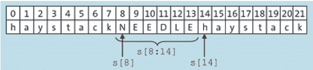

**图 12.1** 提取子序列

你可以用类似的方式提取列表的部分内容：

```
>>> l = ["I", "am", "a", "list", "of", "strings"]
>>> l[2:5]
['a', 'list', 'of']
```

在这种所谓的*切片*过程中，也可以混合使用正索引和负索引。例如，以下代码段确定了一个不包含原始序列第一个和最后一个元素的子序列：

```
>>> string = "python"
>>> string[1:-1]
'ytho'
>>> l = ["I", "am", "a", "list", "of", "strings"]
>>> l[1:-1]
['am', 'a', 'list', 'of']
```

索引也可以省略，这将假定为最大或最小可能值。如果省略起始索引，则假定第零个元素是子序列的第一个元素；如果省略结束索引，则会复制所有字母直到末尾。例如，如果你想确定字符串的前五个字母或从第五个字符开始的所有字母，[45] 可以这样做：

```
>>> s = "abcdefghijklmnopqrstuvwxyz"
>>> s[:5]
'abcde'
>>> s[5:]
'fghijklmnopqrstuvwxyz'
```

## 用于复制的切片

如果同时省略两个索引（`s[:]`），你也可以创建序列的真正副本，因为这样会从第一个到最后一个复制所有元素。为了说明这一点，我们首先回顾简单赋值的行为：

```
>>> s1 = ["thesis"]
>>> s2 = s1
>>> s1 == s2
True
>>> s1 is s2
True
```

正如预期的那样，`s1` 和 `s2` 引用同一个实例，因此它们是相同的。在下一个示例中，我们使用切片在内存中创建 `["thesis"]` 列表的真实副本。[46] 这可以通过与 `is` 的身份比较看出：

```
>>> s1 = ["thesis"]
>>> s2 = s1[:]
>>> s1 == s2
True
>>> s1 is s2
False
```

> **注意**

如果在前面的示例中使用不可变数据类型（如 `str`）而不是可变数据类型（如 `list`），表达式 `s1 is s2` 在两种情况下都可能求值为 `True`。这是因为对于不可变数据类型，无论实例是实际复制还是使用原始实例都没有区别：值无论如何都无法更改。

因此，即使使用了 `[:]`，不可变数据类型的实例也不一定会被复制，而是为了效率而再次被引用。

如果你使用字符串而不是列表，与前面示例的差异就变得清晰了：

```
>>> s1 = "Copy me"
>>> s2 = s1[:]
>>> s2 is s1
True
```

## 带步长的切片

如果你不想提取整个子序列，而只想提取该部分的某些元素，切片提供了更灵活的选项。*步长*允许你指定从子序列的开头到结尾如何计数索引。步长在尾部边界之后指定，用另一个冒号分隔。例如，步长为 2 确保只复制每隔一个元素：

```
>>> digits = "0123456789"
>>> digits[1:10:2]
'13579'
```

从第一个元素（即索引为零的元素）开始，包含 `digits` 每隔一个元素的字符串，会产生一个包含奇数数字的新字符串。在这种扩展表示法中，边界索引也可以省略。因此，以下代码等效于前面的示例：

```
>>> digits = "0123456789"
>>> digits[1::2]
'13579'
```

负增量导致从起始索引到结束索引向下计数，在这种情况下，起始索引必须引用序列中比结束索引更靠后的元素。例如，步长为 -1 时，序列可以被“翻转”：

```
>>> name = "ytnoM Python"
>>> name[4::-1]
'Monty'
>>> name[::-1]
'nohtyP Monty'
```

使用负步长时，序列的开头和结尾会交换。因此，在示例 `name[4::-1]` 中，读取的不是从第四个到最后一个字符的所有内容，而是从第四个到第一个字符的部分。

处理切片的重要一点是，过大或过小的索引不会像访问单个元素时那样导致 `IndexError`。过大的索引在内部被替换为最大可能索引，过小的索引被替换为最小可能索引。如果两个索引都超出有效范围，或者当步长为正时起始索引大于结束索引，则返回空序列：

```
>>> s = "Much less than 1337 characters"
>>> s[5:1337]
'less than 1337 characters'
>>> s[-100:100]
'Much less than 1337 characters'
>>> s[1337:2674]
''
>>> s[10:4]
''
```

## 12.2.6 序列的长度

序列中的元素数量定义了*序列的长度*。序列的长度是一个正整数，可以通过内置的 `len` 函数确定：

```
>>> string = "How long do you think I am?"
>>> len(string)
27
>>> len(["Hello", 5, 2, 3, "World"])
5
```

## 12.2.7 最小和最大元素

要确定序列的最小或最大元素，你可以使用内置的 `min` 和 `max` 函数：

```
>>> l = [5, 1, 10, -9.5, 12, -5]
>>> max(l)
12
>>> min(l)
-9.5
```

然而，这两个函数仅在序列的元素存在*排序*时才有用。例如，在[第 11 章，第 11.7 节](https://example.com)关于复数的内容中，描述了没有排序的 `complex` 数据类型。同样，无法比较完全不同的数据类型，如字符串和数字：

```
>>> l = [1,2, "world"]
>>> min(l)
Traceback (most recent call last):
  File "<stdin>", line 1, in <module>
TypeError: '<' not supported between instances of 'str' and 'int'
```

尽管如此，`min` 和 `max` 可以有意义地应用于字符串，因为对于字母，它们在字母表中的位置[47]定义了排序：

```
>>> max("who do you think will win")
'y'
>>> min("string")
'g'
```

## 12.2.8 搜索元素

你可以使用序列的 `index` 方法来确定元素的位置：

```
>>> digits = [1, 2, 3, 4, 5, 6, 7, 8, 9]
>>> digits.index(3)
2
>>> s = "Hello world"
>>> s.index("l")
2
```

为了将搜索限制在序列的子范围内，该方法支持两个可选参数 i 和 j，其中 i 是所需子序列的第一个索引，j 是所需子序列之后的第一个索引：

```
>>> sequence = [0, 11, 222, 3333, 44444, 3333, 222, 11, 0]
>>> sequence.index(222)
2
>>> sequence.index(222, 3)
6
>>> sequence.index(222, -5)
6
>>> "Hello World".index("l", 5, 100)
9
```

与索引序列元素一样，i 和 j 的负值从序列末尾开始计数。因此，在前面的示例中，`sequence.index(222, -5)` 用于在 [44444, 3333, 222, 11, 0] 子序列中搜索，从倒数第五个元素开始。

如果元素 x 不包含在 s 或指定的子序列中，`index` 会导致 ValueError：

```
>>> s = [2.5, 2.6, 2.7, 2.8]
>>> s.index(2.4)
Traceback (most recent call last):
  File "<stdin>", line 1, in <module>
ValueError: 2.4 is not in list
```

## 12.2.9 计数元素

你可以使用 `count` 来确定特定元素 x 在序列中出现的次数：

```
>>> s = [1, 2, 2, 3, 2]
>>> s.count(2)
3
>>> "Hello world".count("l")
3
```

## 12.3 列表数据类型

在本节中，你将详细了解第一种可变数据类型——*列表*。与只能存储相同类型元素（字符）的 `str`、`bytes` 和 `bytearray` 顺序数据类型不同，列表适用于管理任何类型的实例，甚至是不同数据类型的实例。因此，列表可以包含数字、字符串，甚至其他列表作为元素。

你可以通过将元素列举在方括号 `[]` 中来创建一个新列表：

```
>>> l = [1, 0.5, "String", 2]
```

列表 `l` 现在包含两个整数、一个浮点数和一个字符串。

> **注意**

列表也可以通过*列表推导式*生成。在这种情况下，列表的所有元素并非被显式列出，而是通过类似于 `for` 循环的生成规则产生。例如，以下列表推导式生成一个包含 0 到 9 的数字平方的列表：

```python
>>> [i*i for i in range(10)]
[0, 1, 4, 9, 16, 25, 36, 49, 64, 81]
```

[第 12.3.7 节](#) 将更详细地描述列表推导式。

你可以在创建列表时使用解包：

```python
>>> [1, 2, *[3, 4]]
[1, 2, 3, 4]
```

有关解包的更多信息，请参阅 [第 12.4.1 节](#)。

由于 Python 中名为 `list` 的列表类型是一种顺序数据类型，因此上一节描述的所有方法和过程都可以应用于它。有关所有顺序数据类型可用操作的表格，请参阅 [第 12.2 节](Section 12.2)。

与字符串不同，列表的内容即使在创建后也可以更改，这就是为什么它有许多其他可用的运算符和方法（参见 [表 12.4](Table 12.4)）。

| 运算符 | 效果 | 章节 |
| :--- | :--- | :--- |
| `s[i] = x` | `s` 中索引为 `i` 的元素被 `x` 替换。 | [第 12.3.1 节](Section 12.3.1) |
| `s[i:j] = t` | 部分 `s[i:j]` 被 `t` 替换。同时，`t` 必须是可迭代的。 | [第 12.3.2 节](Section 12.3.2) |
| `s[i:j:k] = t` | `s[i:j:k]` 的元素被 `t` 的元素替换。 | [第 12.3.2 节](Section 12.3.2) |
| `del s[i]` | `s` 的第 `i` 个元素被移除。 | [第 12.3.3 节](Section 12.3.3) |
| `del s[i:j]` | 部分 `s[i:j]` 从 `s` 中移除。这等同于 `s[i:j] = []`。 | [第 12.3.3 节](Section 12.3.3) |
| `del s[i:j:k]` | 子序列 `s[i:j:k]` 的元素从 `s` 中移除。 | [第 12.3.3 节](Section 12.3.3) |

**表 12.4** 列表数据类型的运算符

我们现在将通过简短示例逐一解释这些运算符。

### 12.3.1 更改列表中的值：通过 [] 赋值

如果你知道元素的索引，就可以用其他元素替换列表中的元素：

```
>>> s = [1, 2, 3, 4, 5, 6, 7]
>>> s[3] = 1337
```

```
>>> s
[1, 2, 3, 1337, 5, 6, 7]
```

然而，这种方法不适用于向列表中插入额外的元素。只能替换现有元素，而列表的长度保持不变。

### 12.3.2 替换子列表和插入新元素：通过 [] 赋值

可以用其他元素替换整个子列表。为此，你必须像在切片过程中一样编写要替换的列表部分，但它必须位于赋值的左侧：

```
>>> shopping_list = ["bread", "eggs", "milk", "fish", "flour"]
>>> shopping_list[1:3] = ["water", "beef"]
>>> shopping_list
['bread', 'water', 'beef', 'fish', 'flour']
```

要插入的列表可能比要替换的部分包含更多或更少的元素，甚至可能完全为空。

你可以指定步长，就像在切片中一样。在下面的示例中，`s[2:11]` 子序列的每个第三个元素被 `["A", "B", "C"]` 中的相应元素替换：

```
>>> s = [0, 1, 2, 3, 4, 5, 6, 7, 8, 9, 10]
>>> s[2:9:3] = ["A", "B", "C"]
>>> s
[0, 1, 'A', 3, 4, 'B', 6, 7, 'C', 9, 10]
```

如果指定了步长，则赋值右侧的序列必须与左侧的子序列具有相同数量的元素。如果情况并非如此，将生成 `ValueError`。

### 12.3.3 删除元素和子列表：del 与 [] 结合使用

要从列表中移除单个值，可以使用 `del` 运算符：

```
>>> s = [26, 7, 1987]
>>> del s[0]
>>> s
[7, 1987]
```

同样，也可以移除整个子列表：

```
>>> s = [9, 8, 7, 6, 5, 4, 3, 2, 1]
>>> del s[3:6]
>>> s
[9, 8, 7, 3, 2, 1]
```

对于移除列表的部分，也支持切片表示法的步长序列。在下面的示例中，这将移除所有具有偶数索引的元素：

```
>>> s = ["a","b","c","d","e","f","g","h","i","j"]
>>> del s[::2]
>>> s
['b', 'd', 'f', 'h', 'j']
```

### 12.3.4 列表实例的方法

既然我们已经介绍了列表的运算符，现在让我们转向列表的方法。在表 12.5 中，s 和 t 是列表，i、j 和 k 是整数，x 是一个实例。[48]

| 方法 | 效果 |
| :--- | :--- |
| `s.append(x)` | 将 x 追加到列表 s 的末尾。 |
| `s.extend(t)` | 将列表 t 的所有元素追加到列表 s 的末尾。 |
| `s.insert(i, x)` | 在列表 s 的位置 i 插入 x。然后，s[i] 的值为 x，所有后续元素向上移动一位。 |
| `s.pop([i])` | 返回列表 `s` 的第 `i` 个元素并将其从 `s` 中移除。如果未指定 `i`，则取最后一个元素。 |
| `s.remove(x)` | 从列表 `s` 中移除第一个出现的 `x`。 |
| `s.reverse()` | 反转 `s` 中元素的顺序。 |
| `s.sort([key, reverse])` | 对列表 `s` 进行排序。 |

**表 12.5** 列表实例的方法

现在让我们更详细地了解这些方法。

#### s.append(x)

`append` 方法允许你在列表末尾添加另一个元素来扩展列表：

```
>>> s = ["There should be another string after me"]
>>> s.append("Here it is")
>>> s
['There should be another string after me', 'Here it is']
```

#### s.extend(t)

要向列表追加多个元素，可以使用 `extend` 方法，它期望一个可迭代对象（例如另一个列表）作为 `t` 参数。结果，`t` 的所有元素都被追加到列表 `s` 中：

```
>>> s = [1, 2, 3]
>>> s.extend([4, 5, 6])
>>> s
[1, 2, 3, 4, 5, 6]
```

#### s.insert(i, x)

使用 `insert`，你可以在列表的任何位置插入一个新元素。第一个参数 `i` 指定新元素的所需索引，第二个参数 `x` 指定元素本身：

```
>>> first_with_gap = [1, 2, 3, 5, 6, 7, 8]
>>> first_with_gap.insert(3, 4)
>>> first_with_gap
[1, 2, 3, 4, 5, 6, 7, 8]
```

如果索引 `i` 太小，`x` 将被插入到 `s` 的开头；如果太大，则像 `append` 一样追加到末尾。

#### s.pop([i])

`append` 和 `insert` 的对应方法是 `pop`。此方法允许你根据索引从列表中移除任何元素。如果未指定可选参数，则移除列表的最后一个元素。移除的元素由 `pop` 返回：

```
>>> s = ["H", "e", "l", "l", "o"]
>>> s.pop()
'o'
>>> s.pop(0)
'H'
>>> s
['e', 'l', 'l']
```

如果你尝试传递无效索引或从空列表中移除元素，将生成 `IndexError`。

#### s.remove(x)

如果你想从列表中移除具有特定值的元素，无论其索引是什么，都可以使用 `remove` 方法。它移除列表中第一个与 `x` 值相同的元素：

```
>>> s = ["W", "o", "o", "h", "o", "o"]
>>> s.remove("o")
>>> s
['W', 'o', 'h', 'o', 'o']
```

尝试移除不存在的元素会导致 ValueError。

#### s.reverse()

你可以使用 `reverse` 来反转列表中元素的顺序：

```
>>> s = [1, 2, 3]
>>> s.reverse()
>>> s
[3, 2, 1]
```

与 `s[::-1]` 切片表示法不同，反转是*就地*完成的。因此，不会创建新的 `list` 实例，而是修改旧实例。如果列表非常大，复制会产生显著开销，这一点尤其重要。

### 12.3.5 列表排序：s.sort([key, reverse])

`sort` 方法可用于根据特定条件对列表进行排序。如果你不带参数调用该方法，Python 将使用正常的比较运算符进行排序：

```
>>> l = [4, 2, 7, 3, 6, 1, 9, 5, 8]
>>> l.sort()
>>> l
[1, 2, 3, 4, 5, 6, 7, 8, 9]
```

如果列表包含未定义排序的元素，例如 `complex` 数据类型的实例，不带参数调用 `sort` 将导致 `TypeError`：

```
>>> lst = [5 + 13j, 1 + 4j, 6 + 2j]
>>> lst.sort()
Traceback (most recent call last):
  File "<stdin>", line 1, in <module>
TypeError: '<' not supported between instances of 'complex' and 'complex'
```

要根据特定条件对列表进行排序，可以使用 `key` 参数。`sort` 方法期望在 `key` 参数中传入一个函数，该函数在每次比较两个操作数之前都会被调用，因此它本身也需要一个参数。结果是，比较的不是操作数本身，而是传入函数的相应返回值。

在下面的例子中，我们将按长度对一个姓名列表进行排序。为此，我们将使用内置函数 `len`，它将每个姓名的长度赋值给它。实际操作如下所示：

```
>>> l = ["Catherine", "Peter", "Bob", "Michael", "Emily", "Ben"]
>>> l.sort(key=len)
>>> l
['Bob', 'Ben', 'Peter', 'Emily', 'Michael', 'Catherine']
```

每当排序算法比较列表中的两个元素时，例如 "Michael" 和 "Bob"，比较的不是元素本身，而是 `key` 函数的相应返回值。在我们的例子中，`len("Michael")` 和 `len("Bob")`——即数字 7 和 3——被进行比较。因此，在这个例子中，字符串 "Bob" 应该排在字符串 "Michael" 之前。图示上，这个例子可以如 [图 12.2](#figure-12-2) 所示。

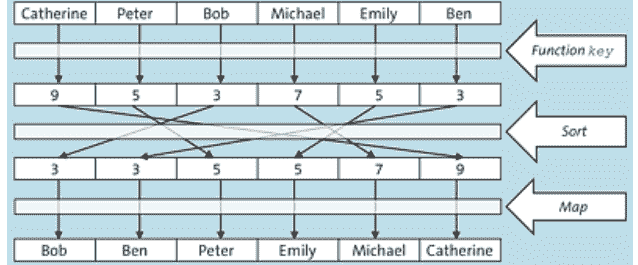

**图 12.2** 使用键进行排序

当然，你也可以传递比内置 `len` 函数更复杂的函数。要了解如何定义自己的函数——例如，将它们与 `sort` 一起使用——请参阅 [第 17 章](#chapter-17)。

最后一个参数 `reverse` 期望传入一个布尔值，指示是否应反转排序顺序：

```
>>> l = [4, 2, 7, 3, 6, 1, 9, 5, 8]
>>> l.sort(reverse=True)
>>> l
[9, 8, 7, 6, 5, 4, 3, 2, 1]
```

> **注意**

这里需要注意的是，`sort` 是一个只接受关键字参数的函数。如果你尝试传递位置参数，这将导致错误。在下面的例子中，我们将再次尝试按长度对姓名列表进行排序。然而，这次我们将使用位置参数来传递 `len`：

```python
>>> l = ["Catherine", "Peter", "Bob", "Michael", "Emily"]
>>> l.sort(len)
Traceback (most recent call last):
  File "<stdin>", line 1, in <module>
TypeError: sort() takes no positional arguments
```

你可能想知道 `sort` 如何处理在排序顺序中处于相同位置的值。在前面显示的例子中，长度为 3 的 "Bob" 和 "Ben" 以及长度为 5 的 "Peter" 和 "Emily" 各自具有相同的值。在下一节中，你将了解 *稳定排序方法* 的含义以及这对这些值意味着什么。

## 稳定排序方法

`sort` 的一个重要特性是它是一个 *稳定排序方法*。稳定排序方法的特点是它们在排序过程中不会交换相等元素的相对位置。假设你有 [表 12.6](#) 中显示的姓名列表。

| 名 | 姓 |
|---|---|
| Natalie | Smith |
| Matthew | Taylor |
| Felix | Crowe |
| Robert | Smith |
| Howard | Smith |
| Peter | Anderson |

**表 12.6** 示例姓名列表

现在你的任务是按姓氏的字母顺序对这个列表进行排序。姓氏相同的组应按各自的名进行排序。要解决这个问题，你可以在第一步按名对列表进行排序，结果如下所示（参见 [表 12.7](Table 12.7)）。

| 名 | 姓 |
|---|---|
| Felix | Crowe |
| **Howard** | **Smith** |
| Matthew | Taylor |
| **Natalie** | **Smith** |
| Peter | Anderson |
| **Robert** | **Smith** |

**表 12.7** 按名排序的姓名列表

因此，我们现在只关心姓氏为 Smith 的三个人的位置。如果你只是删除所有其他姓名，Smith 们将被正确排序，因为他们的相对位置已通过第一次排序运行正确建立。现在 `sort` 方法的稳定性发挥作用了，因为在再次按姓氏排序时，这种相对顺序不会受到影响。最终结果将如下所示（参见 [表 12.8](#)）。

| 名 | 姓 |
|---|---|
| Peter | Anderson |
| Felix | Crowe |
| Howard | Smith |
| Natalie | Smith |
| Robert | Smith |
| Matthew | Taylor |

**表 12.8** 完全排序的姓名列表

如果 `sort` 不是稳定的，就无法保证 Howard 会排在 Natalie 和 Robert 之上。

## 12.3.6 副作用

在 Python 的 `list` 数据类型中，有一些并非立即显而易见的特殊性。[ 49 ]

你肯定还记得 `+=` 运算符的特殊性，这在 [第 12.2.2 节](#) 中关于 *就地* 术语时已经解释过。让我们再次审视这种行为，以提供一些更全面的解释。

首先，`list` 是一种可变数据类型；因此，对 `list` 实例的更改总是会影响所有指向它的引用。让我们考虑以下示例，其中将 `str` 不可变数据类型与 `list` 进行比较：

```
>>> a = "Hello "
>>> b = a
>>> b += "world"
>>> b
'Hello world'
>>> a
'Hello '
```

这个例子只是创建了一个值为 "Hello" 的 `str` 实例，并让两个引用 `a` 和 `b` 指向它。然后，使用 `+=` 运算符将 "world" 追加到 `b` 引用的字符串。正如你在输出中看到的——正如我们所预期的——创建了一个值为 "Hello world" 的新实例并赋值给 `b`，而 `a` 保持不变。

如果我们把这个例子应用到列表上，一个重要的区别就会出现：

```
>>> a = [1337]
>>> b = a
>>> b += [2674]
>>> b
[1337, 2674]
>>> a
[1337, 2674]
```

从结构上看，代码与 `str` 示例类似，只是这次使用的数据类型不是 `str`，而是 `list`。有趣的是最后的输出，根据输出，`a` 和 `b` 具有相同的值，尽管操作只在 `b` 上执行。实际上，`a` 和 `b` 引用的是同一个实例，你可以使用 `is` 运算符来确认这一点：

```
>>> a is b
True
```

在使用列表和其他可变数据类型时，你应该记住这些所谓的副作用[50]。如果你想确保原始列表不被修改，你应该使用切片创建一个真正的副本：

```
>>> a = [1337]
>>> b = a[:]
>>> b += [2674]
>>> b
[1337, 2674]
>>> a
[1337]
```

在这个例子中，`a` 引用的列表已被复制，保护它免受通过 `b` 的间接操作。在这种情况下，你必须权衡资源消耗与副作用防护，因为必须在内存中创建列表的副本。这会消耗计算时间和内存，尤其是对于长列表，因此可能会减慢程序速度。

在副作用的背景下，列表的元素也值得关注：列表本身并不存储实例，而只是存储对它们的引用。一方面，这使得列表更灵活并提高了它们的性能，但另一方面，这也使它们容易受到副作用的影响。让我们看看下面的例子，它初看可能有些奇怪：

```
>>> a = [[]]
>>> a = 4 * a
>>> a
[[], [], [], []]
>>> a[0].append(10)
>>> a
[[10], [10], [10], [10]]
```

最初，`a` 引用一个包含另一个空列表的列表。在随后的乘以因子 4 的过程中，内部的空列表没有被复制，而只是被额外引用了三次。因此，在输出中我们看到了同一个列表四次。一旦理解了这一点，很明显为什么追加到 `a` 第一个元素的 10 也被添加到了其他三个列表中：它根本就是同一个列表。[图 12.3](#figure-12-3) 说明了这一点。

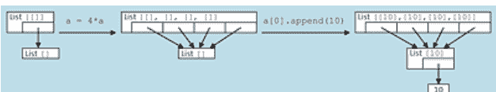

**图 12.3** 多个元素引用同一列表时的副作用

列表也可能包含自身作为元素：

```
>>> a = []
>>> a.append(a)
```

结果是一个无限深的嵌套，因为每个列表依次包含自身作为元素。由于只需要存储引用，这种无限嵌套消耗的内存非常少，而不是像人们最初可能假设的那样消耗无限多的内存。尽管如此，如果你想处理包含的数据，这种嵌套会带来无限循环的风险。例如，假设你想在屏幕上输出这样一个列表。这将导致无限数量的开括号和闭括号。尽管如此，可以通过 `print` 输出这样的列表。Python 会检查列表是否包含自身，然后输出三个点（...）而不是进一步的嵌套：

```
>>> a = []
>>> a.append(a)
>>> print(a)
[[...]]
```

请注意，使用三个点的表示法不是创建自身嵌套列表的有效 Python 代码。

如果你自己使用可能递归的列表，你应该为你的程序配备查询以检测列表与自身的嵌套，这样程序在处理过程中就不会陷入无限循环。

## 12.3.7 列表推导式

开发者常常需要根据特定的计算规则，从现有列表的元素创建一个新列表。在此之前，你不得不笨拙地在 `for` 循环中完成这个操作。在下面的例子中，我们使用这种方法从一个整数列表生成一个包含各自平方值的结果列表：

```
>>> lst = [1,2,3,4,5,6,7,8,9]
>>> result_lst = []
>>> for x in lst:
...     result_lst.append(x**2)
...
>>> result_lst
[1, 4, 9, 16, 25, 36, 49, 64, 81]
```

Python 支持一种为此目的专门创建的更灵活的语法：即所谓的*列表推导式*。从一个整数列表出发，下面的列表推导式生成一个包含这些数字平方值的新列表：

```
>>> lst = [1,2,3,4,5,6,7,8,9]
>>> [x**2 for x in lst]
[1, 4, 9, 16, 25, 36, 49, 64, 81]
```

列表推导式被方括号包围，由一个表达式后跟任意数量的 `for/in` 部分组成。`for/in` 部分借鉴了 `for` 循环的语法，并指定了哪个标识符用于遍历哪个列表——在本例中，是标识符 `x` 遍历列表 `lst`。指定的标识符可以在列表推导式开头的表达式中使用。列表推导式的结果是一个新列表，其元素是每次迭代步骤中表达式的结果。前面介绍的列表推导式功能可以总结如下：对于 `lst` 列表的每个 `x` 元素，取 `x` 的平方，并将结果插入结果列表。

这是列表推导式最简单的形式。`for/in` 部分可以通过一个条件进行扩展，以便只将某些元素纳入新列表。例如，我们可以扩展前面的列表推导式，只形成偶数的平方：

```
>>> lst = [1,2,3,4,5,6,7,8,9]
>>> [x**2 for x in lst if x%2 == 0]
[4, 16, 36, 64]
```

为此，`for/in` 部分通过 `if` 关键字进行扩展，其后跟一个条件。只有当此条件返回 `True` 时，计算出的元素才会被包含在结果列表中。因此，这种形式的列表推导式可以描述如下：对于列表 `lst` 的每个 `x` 元素——如果 `x` 是偶数——取 `x` 的平方，并将结果插入结果列表。

下一个例子将使用列表推导式来加和两个表示为列表的三维向量。向量是逐坐标相加的——在本例中，是逐元素相加：

```
>>> v1 = [1, 7, -5]
>>> v2 = [-9, 3, 12]
>>> [v1[i] + v2[i] for i in range(3)]
[-8, 10, 7]
```

为此，在列表推导式中遍历由 `range` 生成的索引列表。在每次运行中，相应的坐标被相加并追加到结果列表。

我们已经提到，列表推导式可以有任意数量的 `for/in` 部分。这些可以被视为类似于嵌套的 `for` 循环。在接下来的部分中，我们将描述一个这种特性很有用的例子。首先，我们定义两个列表：

```
>>> lst1 = ["A", "B", "C"]
>>> lst2 = ["D", "E", "F"]
```

现在，一个列表推导式应该创建一个列表，包含所有可能的字母组合，这些组合通过首先从 `lst1` 中选择一个字母，然后从 `lst2` 中选择一个字母形成。组合应以元组的形式出现在列表中：

```
>>> [(a,b) for a in lst1 for b in lst2]
[('A', 'D'), ('A', 'E'), ('A', 'F'), ('B', 'D'), ('B', 'E'), ('B', 'F'),
 ('C', 'D'), ('C', 'E'), ('C', 'F')]
```

这个列表推导式可以描述如下：对于列表 `lst1` 的每个 `a` 元素，遍历 `lst2` 的所有 `b` 元素，并在每种情况下将 `(a,b)` 元组插入结果列表。

列表推导式提供了一种有趣而优雅的方式来以节省空间的方式编写复杂操作。许多使用列表推导式解决的问题也可以通过内置的 `map` 或 `filter` 函数（参见[第 17 章，第 17.14 节](#)）或两者的组合来解决，但列表推导式通常更具可读性，并能产生更清晰的源代码。

## 12.4 不可变列表：元组

列表是一种非常灵活的顺序数据类型，可以容纳任意长的元素序列。本节描述*元组*，一种与列表密切相关的数据类型。

与列表不同，元组是不可变的，这为计算元组的*哈希值*提供了可能性。这一特性对于元组与字典或集合（参见[第 13 章](Chapter 13)）等基于哈希表的数据类型结合使用非常重要。基于元组的所有元素也可以计算哈希值这一条件，因此它可以用作字典中的键或集合中的元素，这将其与列表区分开来。

元组的概念与列表相关，但由于其不可变性，`tuple` 实例只能使用顺序数据类型的基本操作集，如[第 12.2 节](Section 12.2)所述。

要创建新的 `tuple` 实例，你必须使用圆括号，它——像列表一样——包含元组的元素，用逗号分隔：

```
>>> a = (1, 2, 3, 4, 5)
>>> a[3]
4
```

空元组由两个没有内容的圆括号 `()` 定义。一个特殊情况是只有一个元素的元组。如果你尝试用前面描述的方式创建一个只有一个元素的元组，程序的行为将与预期不同：

```
>>> no_tuple = (2)
>>> type(no_tuple)
<class 'int'>
```

使用 (2) 不会创建新的 `tuple` 实例，因为在此上下文中，圆括号已用于整数的算术运算。因此，只包含单个元素的元组字面量在元素后写一个额外的逗号：

```
>>> a_tuple = (2,)
>>> type(a_tuple)
<class 'tuple'>
```

### 12.4.1 打包与解包

你可以在 `tuple` 定义中省略外层的圆括号。尽管如此，用逗号分隔的引用会被组合成一个 `tuple`，这被称为*元组打包*，或者更简单地称为*打包*：

```
>>> date = 7, 26, 1987
>>> date
(7, 26, 1987)
```

反过来，也可以*解包*元组的值：

```
>>> date = 7, 26, 1987
>>> (month, day, year) = date
>>> month
7
>>> day
26
>>> year
1987
```

这个过程被称为*元组解包*，或者简单地称为*解包*，同样可以省略圆括号。通过结合打包和解包，你可以非常优雅地交换两个变量的值，而无需辅助变量，或者在一行中组合多个赋值：

```
>>> a, b = 10, 20
>>> a, b = b, a
>>> a
20
>>> b
10
```

解包不仅限于 `tuple` 数据类型，而是适用于一般的顺序数据类型。在这种情况下，术语*序列解包*也经常被使用：

```
>>> a, b, c = "abc"
>>> a
'a'
```

如果使用得当，此功能的使用有助于提高程序的可读性，因为缓存数据的技术细节退居到交换值这一实际意图的背景中。

解包也可用于读取序列开头和结尾的值。让我们考虑以下示例：

```
>>> numbers = [11, 18, 12, 15, 10]
>>> eleven, *others, ten = numbers
>>> eleven
11
>>> ten
10
>>> others
[18, 12, 15]
```

如果在解包时在引用前加上星号 (`*`)，序列的所有其他值都将存储在其中。在前面的例子中，`numbers` 的第一个值存储在 `eleven` 中，最后一个值存储在 `ten` 中。中间的数字被收集到 `others` 中。

任意数量的其他引用可以出现在带星号条目的前面和后面。特别是，第一个或最后一个条目可以带星号：

```
>>> numbers = [11, 17, 17, 19, 10]
>>> *something, nineteen, ten = numbers
>>> nineteen
19
>>> ten
10
>>> eleven, *blah_blah_blah = numbers
>>> eleven
11
>>> blah_blah_blah
[17, 17, 19, 10]
```

在带解包的赋值中，始终只能有一个带星号的引用。这是有道理的，因为否则可能会产生歧义。

> **注意**

通常，在对无序数据类型使用解包时应小心。在下面的例子中，元素 1、2 和 3 的顺序取决于集合 {3, 1, 2} 的迭代顺序：

```
>>> a, b, c = {3, 1, 2}
>>> a, b, c
(1, 2, 3)
```

因为这个顺序是一个实现细节，它可能在不同版本的 Python 之间有所不同，甚至在同一程序的不同运行之间也可能不同。有关集合的更多详细信息，请参见[第 13 章，第 13.2 节](Chapter 13, Section 13.2)。

### 12.4.2 不可变并不意味着不可更改！

尽管 `tuple` 实例是不可变的，但在其生成过程中包含的元素值可能会更改。当创建一个新元组时，它要存储的引用被指定。如果这样的引用指向一个可变数据类型（如列表）的实例，其值仍然可以更改：

```
>>> a = ([],)
>>> a[0].append("And yet it moves!")
```

## 12.5 字符串：str、bytes、bytearray

本节将介绍 Python 中字符串的处理，特别是为此提供的 `str`、`bytes` 和 `bytearray` 数据类型的特性。

正如你已经了解的，字符串是字符的序列。这意味着所有适用于序列类型的操作都可用于它们。[51]

`str` 数据类型的实例可以存储的字符包括字母、标点符号、空格、德语变音符号以及其他特殊字符。相比之下，`bytes` 和 `bytearray` 数据类型则用于存储二进制数据。因此，`bytes` 和 `bytearray` 数据类型的实例由一系列单个字节组成——即从 0 到 255 的整数。

目前，我们只处理 `str` 实例，因为处理 `str` 与处理 `bytes` 并没有太大不同。只有在将 `str` 转换为 `bytes` 以及反向转换时，才会遇到一些障碍，这些将在关于字符集和特殊字符的 [第 12.5.4 节](Section 12.5.4) 中进行描述。

要创建新的 `str` 实例，可以使用以下字面量：

```
>>> string1 = "I was defined with double quotation marks"
>>> string2 = 'I was defined with single quotes'
```

字符串的所需内容写在引号之间，但不能包含任何换行符（在下面的示例中，在第一行末尾按下了 `Enter` 键）：

```
>>> s = "First line
File "<stdin>", line 1
    s = "First line
    ^
SyntaxError: unterminated string literal (detected at line 1)
```

也可以跨多行的字符串常量用 `"""` 或 `'''` 括起来：[52]

```
>>> string3 = """First line!
... Ooops, another line"""
```

如果两个字符串字面量紧挨着或用空格隔开，Python 会将它们连接成一个字符串：

```
>>> string = "First part" "Second part"
>>> string
'First partSecond part'
```

正如你在示例中看到的，连接时字面量之间的空格不再存在。

这种类型的连接非常适合将长或笨重的字符串拆分成多个程序行，而不会在结果中存储换行符和空格，就像使用包含 `"""` 或 `'''` 的字符串那样。要实现这种分离，必须将字符串部分写在括号中：

```
>>> a = ("Imagine a terribly "
...     "complicated string that "
...     "in no case can be written in one "
...     "line.")
>>> a
'Imagine a terribly complicated string that in no case can be written in one line.'
```

如你所见，字符串的存储方式就像它是在单行中定义的一样。

`bytes` 实例的创建方式与前面描述的 `str` 实例的创建方式相同。唯一的区别是，必须在字符串字面量前加上小写的 `b` 以获得 `bytes` 字符串：

```
>>> string1 = b"I am bytes!"
>>> string1
b'I am bytes!'
>>> type(string1)
<class 'bytes'>
```

其他类型的字符串创建方式对于 `bytes` 也类似。但请注意，`bytes` 字面量中只能使用 ASCII 字符（[第 12.5.4 节](#)）。

要创建 `bytearray` 类型的新实例，可以使用内置的 `bytearray` 函数：

```
>>> string1 = b"Hello world"
>>> string2 = bytearray(string1)
>>> string2
bytearray(b'Hello world')
```

这样，就可以创建一个 `bytearray` 实例，其值从现有的 `bytes` 实例中获取。

如果向内置的 `bytearray` 函数传递一个整数 $k$ 作为参数，将创建一个长度为 $k$ 的新 `bytearray`，其中每个字节都被赋值为零：

```
>>> bytearray(7)
bytearray(b'\x00\x00\x00\x00\x00\x00\x00')
```

在下一节中，你将了解这些字符的 `\x00` 表示法是什么意思。这个主题将在 [第 12.5.4 节](#) 中关于字符串编码的上下文中再次讨论。

`bytes` 和 `bytearray` 数据类型之间的关系类似于 `tuple` 和 `list` 数据类型之间的关系。`bytes` 数据类型表示不可变的字节值序列，而 `bytearray` 可以使用你已经从列表中知道的相同操作进行修改：

```
>>> b = bytearray(b"Hello world")
>>> b[:5] = b"Bye"
>>> b
bytearray(b'Bye world')
>>> b.append(ord("!"))
>>> b
bytearray(b'Bye world!')
>>> b.extend(b"!!!!")
>>> b
bytearray(b'Bye world!!!!')
```

### 12.5.1 控制字符

有一些特殊的文本元素控制文本流，无法作为单个字符显示在屏幕上。这些所谓的 *控制字符* 包括换行符、制表符和退格符。在字符串字面量中表示此类字符是通过特殊字符串完成的：*转义序列*。转义序列以反斜杠 (\) 开头，后跟所需特殊字符的标识符。例如，"\n" 转义序列代表换行符：

```
>>> a = "First line\nSecond line"
>>> a
'First line\nSecond line'
>>> print(a)
First line
Second line
```

注意在交互模式下使用 `print` 和不使用 `print` 输出的区别：`print` 语句将控制字符转换为其屏幕表示（例如，"\n" 开始新行），而不使用 `print` 语句的输出则在屏幕上显示带有特殊字符转义序列的字符串字面量。

对于控制字符，Python 有 [表 12.9](Table 12.9) 中列出的转义序列。

**表 12.9** 控制字符的转义序列

| 转义序列 | 含义 |
| :--- | :--- |
| \a | 响铃 (BEL) 生成提示音。 |
| \b | 退格 (BS) 将输出位置重置一个字符。 |
| \f | 换页 (FF) 创建换页符。 |
| \n | 换行 (LF) 将输出位置设置到下一行。 |
| \r | 回车 (CR) 将输出位置设置到下一行的开头。 |
| \t | 水平制表符 (TAB) 与 Tab 键含义相同。 |
| \v | 垂直制表符 (VT) 用于垂直缩进。 |
| " | 双引号。 |
| \' | 单引号。 |
| \ | 应在字符串中实际显示的反斜杠。 |

控制字符起源于主要通过打印机处理输出的时代。因此，其中一些字符在今天几乎没有实际意义。

单引号和双引号的转义序列是必要的，因为 Python 使用这些字符作为字符串字面量的分隔符。如果用于分隔字符串的引号类型要作为字符出现在该字符串中，则必须在该处将相应的引号指定为转义序列：

```
>>> a = "The following single quote does not need to be encoded ' "
>>> b = "This double quote does " "
>>> c = 'This is also true in strings with single quotes " '
>>> d = 'Here an escape sequence must be used \' '
```

在 [第 12.5.4 节](Section 12.5.4) 中，我们将回到转义序列，并使用它们来编码特殊字符，如变音符号或欧元符号。

转义序列的自动替换有时很烦人，特别是当字符串中需要出现大量反斜杠时。为此，Python 提供了前缀 `r` 和 `R`，可以将其放在字符串字面量之前。这些前缀将字面量标记为所谓的 *原始字符串*，这导致所有反斜杠都逐个传递到结果字符串中：

```
>>> "A \tstring with \ many \nescape sequences\t"
'A \tstring with \ many \nescape sequences\t'
>>> r"A \tstring with \ many \nescape sequences\t"
'A \\tstring with \\ many \\nescape sequences\\t'
>>> print(r"A \tstring with \ many \nescape sequences\t")
A \tstring with \ many \nescape sequences\t
```

从结果字面量中的双反斜杠和通过 `print` 的输出可以看出，转义序列没有被解释为被屏蔽的特殊字符。

通过使用 `rb` 或 `br` 前缀，你可以创建 `bytes` 类型的原始字符串。

> **注意**

为了便于从 Python 2 迁移到 Python 3，你可以选择性地创建带有或不带前缀 `u` 的 `str` 实例。这些 `u` 字面量在 Python 2 中用于创建 `unicode` 实例，这是 Python 3 中 `str` 数据类型的对应物：

```
>>> u"The goshawk is the bird of the year 2015"
'The goshawk is the bird of the year 2015'
```

当我们下文提到*空白字符*时，指的是单词之间所有不作为独立字符显示的字符。空白字符是[表 12.10](#)中列出的字符。

| 字符串字面量 | 名称 |
|---|---|
| " " | 空格字符 |
| "\n" | 换行符 |
| "\v" | 垂直制表符 |
| "\t" | 水平制表符 |
| "\f" | 换页符 |
| "\r" | 回车符 |

**表 12.10** 空白字符列表

## 12.5.2 字符串方法

除了顺序数据类型的方法外，字符串实例还包含其他简化字符串处理的方法。在以下章节中，我们将讨论以下主题类别中相关的方法：

- 分割字符串
- 搜索子字符串
- 替换子字符串
- 移除字符串开头或结尾的特定字符
- 对齐字符串
- 字符串测试
- 连接顺序数据类型中的元素
- 字符串格式化

## 分割字符串

要根据特定规则将字符串分割成多个部分，可以使用以下方法（参见[表 12.11](#table-12-11)）。

| 方法 | 描述 |
| :--- | :--- |
| `s.split([sep, maxsplit])` | 在 `sep` 出现时分割 `s`。搜索从字符串开头开始。 |
| `s.rsplit([sep, maxsplit])` | 在 `sep` 出现时分割 `s`。搜索从字符串末尾开始。 |
| `s.splitlines([keepends])` | 在换行符出现时分割 `s`。 |
| `s.partition(sep)` | 在 `sep` 第一次出现时将 `s` 分割成两部分。除了此分割的产物外，结果元组还包含分隔符 `sep`（如果它出现在 `s` 中）。 |
| `s.rpartition(sep)` | 在 `sep` 最后一次出现时将 `s` 分割成两部分。除了此分割的产物外，结果元组还包含分隔符 `sep`（如果它出现在 `s` 中）。 |

**表 12.11** 用于分割字符串的字符串方法

`split` 和 `rsplit` 方法将字符串分割成单词并以列表形式返回。这里，`sep` 参数指定分隔单词的字符串，`maxsplit` 允许你限制分割次数。如果未指定 `maxsplit`，字符串将根据 `sep` 在其中出现的次数进行分割。任何剩余部分将作为字符串插入结果列表中。请注意，`split` 从字符串开头开始分割，而 `rsplit` 从末尾开始：

```
>>> s = "1-2-3-4-5-6-7-8-9-10"
>>> s.split("-")
['1', '2', '3', '4', '5', '6', '7', '8', '9', '10']
>>> s.split("-", 5)
['1', '2', '3', '4', '5', '6-7-8-9-10']
>>> s.rsplit("-", 5)
['1-2-3-4-5', '6', '7', '8', '9', '10']
```

如果多个分隔符连续出现，它们不会被合并，而是每次都被分开：

```
>>> s = "1---2-3"
>>> s.split("-")
['1', '', '', '2', '3']
```

如果未指定 `sep`，这两个方法的行为会有所不同。首先，移除字符串开头和结尾的所有空白字符，然后根据空白字符分割字符串，这次会将连续的分隔符合并为一个：

```
>>> s = "  Any \t\t sentence with \n\r\t whitespaces"
>>> s.split()
['Any', 'sentence', 'with', 'whitespaces']
```

完全不带参数调用 `split` 对于将文本字符串分割成单词非常有用，即使它们不仅仅由空白字符分隔。

`splitlines` 方法将字符串分割成单独的行，并返回包含这些行的列表。Unix 换行符 "\n"、Windows 换行符 "\r\n" 和 Mac 换行符 "\r" 被解释为分隔符：

```
>>> s = "Unix\nWindows\r\nMac\rLast line"
>>> s.splitlines()
['Unix', 'Windows', 'Mac', 'Last line']
```

如果要保留行末的分隔换行符，必须为可选的 `keepends` 参数传递值 `True`。

`partition` 方法在传入的分隔符字符串 `sep` 第一次出现的位置分割字符串，并返回一个由分隔符字符串之前的部分、分隔符字符串本身和之后的部分组成的元组。`rpartition` 方法的工作方式相同，只是它使用源字符串中 `sep` 的最后一次出现作为分隔符：

```
>>> s = "www.python-book.com"
>>> s.partition(".")
('www', '.', 'python-book.com')
>>> s.rpartition(".")
('www.python-book', '.', 'com')
```

## 搜索子字符串

要确定一个字符串在另一个字符串中的位置和出现次数，或替换字符串的部分内容，可以使用[表 12.12](Table 12.12)中列出的方法。

| 方法 | 描述 |
| :--- | :--- |
| `s.find(sub, [start, end])` | 在字符串 `s` 中搜索 `sub` 字符串。搜索从字符串开头开始。 |
| `s.rfind(sub, [start, end])` | 在字符串 `s` 中搜索 `sub` 字符串。搜索从字符串末尾开始。 |
| `s.index(sub, [start, end])` | 在字符串 `s` 中搜索 `sub` 字符串。搜索从字符串开头开始。如果 `sub` 不在 `s` 中，则会引发异常。 |
| `s.rindex(sub, [start, end])` | 在字符串 `s` 中搜索 `sub` 字符串。搜索从字符串末尾开始。如果 `sub` 不在 `s` 中，则会引发异常。 |
| `s.count(sub, [start, end])` | 计算 `sub` 在 `s` 中出现的次数。 |

**表 12.12** 用于在字符串中搜索的字符串方法

这五个方法的可选 `start` 和 `end` 参数用于缩小搜索范围。如果指定了 `start` 或 `end`，则只考虑子字符串 `s[start:end]`。

> **注意**

*请记住：* 当使用 `s[start:end]` 切片字符串 `s` 时，会创建一个从 `s[start]` 开始且不再包含元素 `s[end]` 的子字符串。

为了查明一个特定字符串是否以及（如果出现）在什么位置出现在另一个字符串中，Python 提供了 `find` 和 `index` 方法，以及它们的对应方法 `rfind` 和 `rindex`。`find` 方法返回 `sub` 在 `s` 中第一次出现的索引，而 `rfind` 相应地返回最后一次出现的索引。如果 `sub` 不包含在 `s` 中，`find` 和 `rfind` 将返回 -1：

```
>>> s = "Let's see where the 'e' occurs in this string"
>>> s.find("e")
1
>>> s.rfind("e")
21
```

`index` 和 `rindex` 方法的工作方式相同，但如果 `sub` 不包含在 `s` 中，则会生成 `ValueError`：

```
>>> s = "This string is about to be searched"
>>> s.index("is")
2
>>> s.index("not available")
Traceback (most recent call last):
  File "<stdin>", line 1, in <module>
ValueError: substring not found
```

这些几乎相同的方法存在的原因是，错误消息可能比无效的返回值处理得更优雅。

一个子字符串在另一个子字符串中出现的次数可以通过 `count` 来确定：

```
>>> "Peter Piper picked a peck of pickled peppers".count("p")
7
```

## 替换子字符串

[表 12.13](Table 12.13)中列出的方法可用于将字符串的某些部分或字母替换为其他内容。

| 方法 | 描述 |
| :--- | :--- |
| `s.replace(old, new, [count])` | 将字符串 `s` 中 `old` 的出现替换为 `new`。 |
| `s.lower()` | 将 `s` 中所有大写字母替换为相应的小写字母。 |
| `s.upper()` | 将 `s` 中所有小写字母替换为相应的大写字母。 |
| `s.swapcase()` | 将 `s` 中所有大写字母替换为相应的小写字母，反之亦然，将所有小写字母替换为相应的大写字母。 |
| `s.capitalize()` | 将 `s` 的第一个字母替换为相应的大写字母，并将所有后续的大写字母替换为相应的小写字母。 |
| `s.casefold()` | 工作方式类似于 `s.lower()`，并额外替换特殊字符。一个例子是德语字母 ß，它被替换为 ss。<br>`casefold` 的行为在 Unicode 标准中定义，旨在用于不区分大小写的字符串比较。 |
| `s.title()` | 更改 `s` 的大小写，使单词全部小写，但各自的首字母除外。 |
| `s.expandtabs([tabsize])` | 通过将制表符 ("\t") 替换为空白字符来缩进 `s`。 |

**表 12.13** 用于替换子字符串的字符串方法

`replace` 方法返回一个字符串，其中所有 `old` 的出现都已被 `new` 替换：

```
>>> false = "Python is not great!"
>>> true = false.replace("not", "really")
>>> true
'Python is really great!'
```

`count` 参数可用于限制替换次数：

```
>>> s = "Please replace only the first four e's"
>>> s.replace("e", "E", 4)
"PlEasE rEplacE only the first four e's"
```

当空字符串 "" 作为第一个参数 `old` 传入时，会出现一个有趣的特殊情况。然后，作为 `new` 传入的字符串将被插入到所有字符之间以及开头和结尾：

## 移除字符串开头或结尾的特定字符

`strip` 系列方法允许你移除字符串开头或结尾的不需要的字符（参见表 12.14）。

| 方法 | 描述 |
|---|---|
| `s.strip([chars])` | 移除字符串 `s` 开头和结尾的特定字符 |
| `s.lstrip([chars])` | 移除字符串 `s` 开头的特定字符 |
| `s.rstrip([chars])` | 移除字符串 `s` 结尾的特定字符 |
| `s.removeprefix(prefix)` | 移除字符串 `s` 开头的指定前缀字符串 |
| `s.removesuffix(suffix)` | 移除字符串 `s` 结尾的指定后缀字符串 |

**表 12.14** 用于移除字符串开头或结尾特定字符的字符串方法

`strip` 方法移除字符串两侧的不需要的字符。`lstrip` 方法仅移除左侧的字符，而 `rstrip` 仅移除右侧的字符。

对于可选的 `chars` 参数，你可以传递一个包含要移除字符的字符串。如果未指定 `chars`，则会删除所有空白字符：

```
>>> s = "\t\n \rSurrounded by whitespaces   \t\t\r"
>>> s.strip()
'Surrounded by whitespaces'
>>> s.lstrip()
'Surrounded by whitespaces   \t\t\r'
>>> s.rstrip()
'\t\n  \rSurrounded by whitespaces'
```

例如，要移除所有周围的数字，你可以按如下方式操作：

```
>>> digits = "0123456789"
>>> s = "3674784673546Hidden between numbers3425923935"
>>> s.strip(digits)
'Hidden between numbers'
```

`removeprefix` 和 `removesuffix` 方法是在 Python 3.9 中添加到语言范围内的，因此仅在较新的语言版本中可用。如果存在指定的前缀或后缀，你可以将其从字符串中移除：

```
>>> s = "PREFIX: This is my message (SUFFIX)"
>>> s.removeprefix("PREFIX: ")
'This is my message (SUFFIX)'
>>> s.removesuffix(" (SUFFIX)")
'PREFIX: This is my message'
>>> s.removesuffix("DOESNOTOCCUR")
'PREFIX: This is my message (SUFFIX)'
```

## 对齐字符串

表 12.15 中列出的方法创建一个给定长度的字符串，并以特定方式将源字符串在其中对齐。

| 方法 | 描述 |
|---|---|
| `s.center(width, [fillchar])` | 将 **s** 在结果字符串中居中 |
| `s.ljust(width, [fillchar])` | 将 **s** 在结果字符串中左对齐 |
| `s.rjust(width, [fillchar])` | 将 **s** 在结果字符串中右对齐 |
| `s.zfill(width)` | 通过在左侧填充零来右对齐 s |

**表 12.15** 用于对齐的字符串方法

你可以使用 `width` 参数指定新字符串的所需长度。前三个方法的可选 `fillchar` 参数必须是长度为 1 的字符串，并指定用于填充到传递长度的字符。默认情况下，使用空格进行填充：

```
>>> s = "Align me"
>>> s.center(50)
'                    Align me                    '
>>> s.ljust(50)
'Align me                                        '
>>> s.rjust(50, "-")
'------------------------------------Align me'
```

如果 `s` 的长度大于 `width` 参数的值，则会返回 `s` 的副本，因为在这种情况下没有足够的空间进行对齐。

`zfill` 方法是 `rjust` 的一个特例，适用于包含数值的字符串。调用 `zfill` 方法会创建一个长度为 `width` 的字符串，其中源字符串右对齐，左侧用零填充：

```
>>> "13.37".zfill(20)
'00000000000000013.37'
```

## 字符串测试

表 12.16 中列出的方法返回一个真值，该值表明字符串的内容是否具有特定属性。例如，通过 `islower`，你可以检查 `s` 中的所有字母是否都是小写。

| 方法 | 描述 |
| :--- | :--- |
| `s.isalnum()` | 如果 `s` 中的所有字符都是字母或数字，则为 `True` |
| `s.isalpha()` | 如果 `s` 中的所有字符都是字母，则为 `True` |
| `s.isascii()` | 如果 `s` 仅包含来自 ASCII 字符集的字符，则为 `True`* |
| `s.isdigit()` | 如果 `s` 中的所有字符都是数字，则为 `True` |
| `s.islower()` | 如果 `s` 中的所有字母都是小写，则为 `True` |
| `s.isupper()` | 如果 `s` 中的所有字母都是大写，则为 `True` |
| `s.isspace()` | 如果 `s` 中的所有字符都是空白字符，则为 `True` |
| `s.istitle()` | 如果 `s` 中的所有单词都是首字母大写，则为 `True` |
| `s.startswith(prefix, [start, end])` | 如果 `s` 以字符串 `prefix` 开头，则为 `True` |
| `s.endswith(suffix, [start, end])` | 如果 `s` 以字符串 `suffix` 结尾，则为 `False` |

*在第 12.5.4 节中，你将了解更多关于字符集及其对字符串中特殊字符的意义。

**表 12.16** 字符串测试方法

由于表中的前七个方法非常相似，此处仅需一个示例即可：

```
>>> s = "1234abcd"
>>> s.isdigit()
False
>>> s.isalpha()
False
>>> s.isalnum()
True
```

要检查字符串是否以某个特定字符串开头或结尾，你可以使用 `startswith` 或 `endswith` 方法。可选的 `start` 和 `end` 参数将查询限制在 `s[start:end]` 范围内——这与搜索和替换方法的情况相同：

```
>>> s = "www.python-book.com"
>>> s.startswith("www.")
True
>>> s.endswith(".com")
True
>>> s.startswith("python", 4)
True
```

## 连接顺序数据类型中的元素

一个常见的任务是使用分隔符连接字符串列表。为此，Python 提供了 `join` 方法（参见表 12.17）。

| 方法 | 描述 |
|---|---|
| `s.join(seq)` | 将 `seq` 序列的元素连接成一个新字符串，其中 `s` 是分隔符 |

**表 12.17** 用于使用分隔符字符串连接多个元素的字符串方法

`seq` 参数可以是任何可迭代对象，但其所有元素必须是字符串。`seq` 的元素以 `s` 作为分隔符进行连接。在下面的示例中，几个名称被连接起来，以逗号分隔：

```
>>> contact_list = ["Mickey", "Minnie", "Donald", "Daisy"]
>>> ", ".join(contact_list)
'Mickey, Minnie, Donald, Daisy'
```

如果为 `seq` 传递一个字符串，结果将是所有字母的连接，每个字母之间用 `s` 分隔：

```
>>> sentence = "Unintelligible sentence"
>>> "...um...".join(sentence)
'U...um...n...um...i...um...n...um...t...um...e...um...l...um...l...um...i...um...g...um...i...um...b...um...l...um...e...um...s...um...e...um...n...um...t...um...e...um...n...um...c...um...e'
```

## 12.5.3 格式化字符串

你经常需要以特定方式自定义屏幕输出。例如，要显示一个三列数字表格，你必须插入空格——根据数字的长度——以便各列能上下对齐。如果你想输出存储在 `float` 实例中且小数位超过两位的金额，也需要自定义输出。

为了解决这类问题，你可以使用 `str` 数据类型的 `format` 方法。使用 `format`，你可以用特定值替换字符串中的占位符。这些占位符用花括号括起来，可以是数字或名称。在下面的例子中，我们将用两个数字替换占位符 `{0}` 和 `{1}`：

```
>>> "It's {0}.{1}".format(13, 37)
"It's 13.37"
```

如果使用数字作为占位符，它们必须从 0 开始连续编号。然后，它们会按顺序被传递给 `format` 方法的参数替换——第一个参数替换 `{0}`，第二个参数替换 `{1}`，依此类推。

也可以通过不在花括号之间写任何内容来隐式完成编号。Python 会自动从 0 开始为占位符编号：

```
>>> "It's {}.{}".format(13, 37)
"It's 13.37"
```

名称也可以用作占位符。在这种情况下，你必须将值作为关键字参数传递给 `format` 方法：

```
>>> "It's {hour}.{minute}".format(hour=13, minute=37)
"It's 13.37"
```

所有在 Python 中也可以用作变量名的字符串都可以用作占位符的名称。特别地，你的占位符名称不应以数字开头；否则，Python 会尝试将它们解释为整数。

你也可以将编号占位符与符号占位符混合使用：

```
>>> "It's {hour}.{0}".format(37, hour=13)
"It's 13.37"
```

这种符号和编号占位符的混合使用也适用于隐式编号。在这种情况下，Python 会自动从 0 开始为占位符编号：

```
>>> "{h}oz. yeast, {}oz. flour, {w}fl.oz. water, {}oz. salt".format(
...     2, 15, h=0.2, w=3)
'0.2oz. yeast, 2oz. flour, 3fl.oz. water, 15oz. salt'
```

除了前面示例中使用的数值，你通常可以使用任何对象作为值，只要它们可以转换为字符串。[54] 在下面的代码片段中，不同类型的数被传递给 `format` 方法：

```
>>> "List: {0}, String: {string}, Complex number: {1}".format(
...     [1,2], 13 + 37j, string="Hello world")
'List: [1, 2], String: Hello world, Complex number: (13+37j)'
```

要在字符串中多次插入相同的值，你可以多次使用占位符：

```
>>> "{h}{um} yeast, {}{um} flour, {w}{uv} water, {}{um} salt".format(
...     2, 15, h=0.2, w=3, um='oz.', uv='fl.oz.')
'0.2oz. yeast, 2oz. flour, 3fl.oz. water, 15oz. salt'
```

这里 `um` 和 `uv` 分别代表“质量单位”和“体积单位”。

如果你想防止花括号被解释为占位符的分隔符，你必须使用两个连续的花括号。结果，这些双花括号会被替换为单花括号：

```
>>> "Unformatted: {{NoPlaceholder}}. Formatted: {v}.".format(
...     v="only a test")
'Unformatted: {NoPlaceholder}. Formatted: only a test.'
```

> **注意**

自 Python 3 以来，`format` 方法一直是字符串格式化的标准，取代了之前一直使用的 `%` 格式化运算符。尽管 `%` 运算符出于向下兼容的原因仍然有效，但不建议使用；应改用 `format` 方法。

有关 `%` 运算符工作原理的更多细节，你可以参考 Python 的在线文档。

## f-字符串

在 Python 3.6 中，引入了一种特殊的字符串字面量，进一步简化了字符串的格式化。例如，让我们通过创建 `hour` 和 `minute` 变量来定义一个时间：

```
>>> hour = 13
>>> minute = 37
```

你已经知道两种使用 `format` 字符串方法将时间格式化为字符串的方法：

```
>>> "It's {}.{}".format(hour, minute)
"It's 13.37"
>>> "It's {hour}.{minute}".format(hour=hour, minute=minute)
"It's 13.37"
```

在第一种变体中，值根据它们在 `format` 调用参数列表中的位置插入到字符串中。这种占位符到值的隐式赋值产生了紧凑的代码，但在更复杂的情况下可能会变得混乱，尤其是在你稍后插入新的占位符时。第二种变体通过一个临时标识符（我们在前面的例子中也称之为 `hour` 或 `minute`）在占位符和变量之间建立了显式赋值。这导致了明确但又不便地冗余的代码。

使用 *f-字符串*，你可以同时明确且紧凑地表述这个例子。f-字符串被视为特殊的字符串字面量 `f""`，它会自动用同名的实例替换占位符：

```
>>> f"It's {hour}:{minute}"
"It's 13:37"
```

f-字符串的另一个重要特性是，任何表达式都可以放在占位符内，然后它们的值会被插入到字符串的这个位置：

```
>>> f"It's soon {hour + 1}:{minute + 1}"
"It's soon 14:38"
>>> f"{60 * hour + minute} minutes of the day have already passed"
'817 minutes of the day have already passed'
>>> f"It's around {hour if minute < 30 else hour + 1}:00"
"It's around 14:00"
>>> f"It's {bin(hour)}:{bin(minute)}"
"It's 0b1101:0b100101"
```

在接下来的章节中，我们将描述更多关于字符串格式化的细节，主要使用 `format` 方法。但请注意，这些示例可以类似地应用于 f-字符串。

> **注意**

除了[第 31 章](#)之外，我们在本书的大多数示例程序中一致使用既定的 `format` 方法进行字符串格式化。这明确不是要反对使用 f-字符串。你可以根据你的偏好或应用场景来决定哪个选项更适合你。

有关在并行编程应用上下文中使用 f-字符串进行字符串格式化的示例，请参见[第 31 章](#)。

## 访问属性和方法

除了简单地替换占位符，你还可以在格式字符串中访问传递值的属性。为此，你必须在占位符名称之后写上相应的属性，用句点分隔，就像在 Python 中正常访问属性一样。

以下示例以这种方式输出复数的虚部和实部：

```
>>> c = 15 + 20j
>>> "Real part: {0.real}, Imaginary part: {0.imag}".format(c)
'Real part: 15.0, Imaginary part: 20.0'
```

如你所见，属性访问也适用于编号占位符。

除了访问要格式化的值的属性外，还可以使用 `[ ]` 运算符。例如，它使你能够输出列表的特定元素：

```
>>> l = ["I'm first!", "No, I'm first!"]
>>> "{list[1]}. {list[0]}".format(list=l)
"No, I'm first!. I'm first!"
```

即使你此时还没有学习过支持 `[ ]` 运算符的其他数据类型，它在格式字符串中的使用也不限于序列数据类型。特别是，这种类型的访问在字典的情况下很有趣，我们将在[第 13 章，第 13.1 节](https://example.com)中描述。[55]

属性访问和 `[ ]` 运算符也可以用于占位符的隐式编号：

```
>>> "Attribute: {.imag}, list element: {[1]}".format(
...     1+4j, [1,2,3])
'Attribute: 4.0, list element: 2'
```

接下来的章节将描述如何影响替换本身。

## 格式化输出

到目前为止，我们只使用了 `format` 将占位符替换为特定值，而没有指定替换应遵循的规则。为此，你可以指定用冒号与占位符名称分隔的*格式说明符*。例如，要输出一个四舍五入到两位小数的浮点数，你会使用格式说明符 `.2f`：

```
>>> "Amount: {:.2f} Euro".format(13.37690)
'Amount: 13.38 Euro'
```

格式说明符的效果取决于作为相应占位符值传递的数据类型。我们将

接下来，让我们深入探讨 Python 内置数据类型的格式化选项。

请注意，所有格式规范都是可选的，并且彼此独立。因此，它们也可以单独出现。

在详细查看格式化选项之前，我们先简要展示格式规范的基本结构：

```
[[fill]align][sign][#][0][minimumwidth][,][.precision][type]
```

方括号表示其内容是可选的。所有这些字段将在以下各节中逐一描述。

## 设置最小宽度：minimumwidth

如果使用简单的整数作为格式规范，它指定了被替换值应具有的最小宽度。例如，如果你想输出一个姓名表并确保所有内容在下方对齐，可以按如下方式实现：

```
f = "{:15}|{:15}"
print(f.format("First name", "Last name"))
print(f.format("Daniel", "Rodriguez"))
print(f.format("Linda", "Moore"))
print(f.format("Steve", "Bishop"))
print(f.format("Kaylee", "Harris"))
```

在这个小程序中，我们将两个占位符 0 和 1 格式化为宽度各为 15 个字符。因此输出如下所示：

```
First name     |Last name
Daniel         |Rodriguez
Linda          |Moore
Steve          |Bishop
Kaylee         |Harris
```

如果值的长度超过最小宽度，插入值的宽度会调整为该值的宽度，而不会被截断：

```
>>> "{long:2}".format(long="I'm longer than two characters!")
"I'm longer than two characters!"
```

## 确定对齐方式：align

当你指定字段的最小宽度时，你可以确定值在未填满整个宽度时的对齐方式——就像前面两个示例中的第一个那样。

例如，要像通常那样将金额右对齐，你必须在最小宽度前放置一个 > 符号：

```
>>> "Final price: {sum:>5} Euro".format(sum=443)
'Final price:   443 Euro'
```

表 12.18 包含四种对齐类型的列表。

| 符号 | 含义 |
| :--- | :--- |
| < | 值在保留空间内左对齐插入。除非指定对齐方式，否则这是默认行为。 |
| > | 值在保留空间内右对齐插入。 |
| = | 确保对于数值，符号始终位于插入值的开头；之后才进行右对齐（参见下面的示例）。此规范仅对数值有用，对其他数据类型会导致 ValueError。 |
| ^ | 值在保留空间内居中插入。 |

**表 12.18** 对齐类型

一个示例应该能阐明 = 对齐类型不太直观的效果。这里符号的位置很有趣：

```
>>> "Temperature: {:10}".format(-12.5)
'Temperature:       -12.5'
>>> "Temperature: {:=10}".format(-12.5)
'Temperature: -       12.5'
```

请注意，如果插入值的长度等于或大于相关最小宽度，对齐规范将无效。

## 填充字符：fill

在指定对齐方式之前，你可以指定在对齐过程中用于填充多余字符的字符。默认情况下，使用空格字符。但是，你可以使用任何你喜欢的字符：

```
>>> "{text:-^25}".format(text="Hello world")
'--------Hello world---------'
```

这里，字符串 `"Hello World"` 被居中插入，并被减号包围。

## 处理符号：sign

在最小宽度规范和对齐规范之间，你可以指定如何处理数值的符号。三种可能的格式化字符如表 12.19 所示。

| 符号 | 含义 |
| :--- | :--- |
| + | 正数和负数都必须指示符号。 |
| - | 仅对负数指示此符号。这是默认行为。 |
| 空格字符 | 使用空格字符，你可以确保正数插入空格而不是符号。负数在此设置下获得减号作为符号。 |

**表 12.19** 不同类型的符号处理

让我们用几个简单的示例来演示符号的处理：

```
>>> "Cost: {:+}".format(135)
'Cost: +135'
>>> "Cost: {:+}".format(-135)
'Cost: -135'
>>> "Cost: {:-}".format(135)
'Cost: 135'
>>> "Cost: {: }".format(135)
'Cost:  135'
>>> "Cost: {: }".format(-135)
'Cost: -135'
```

如前所述，对齐规范 = 仅在与符号一起使用时才有意义：

```
>>> "Cost: {:=+10}".format(-135)
'Cost: -        135'
```

如你所见，在前面的示例中，减号被插入到保留空间的开头；之后数字 135 才被右对齐。

## 数字表示类型：type

为了能够进一步自定义数值的输出，有各种输出类型被插入到格式规范的末尾。例如，`b` 类型规范以二进制表示法输出整数：

```
>>> "Funny Bits: {:b}".format(109)
'Funny Bits: 1101101'
```

Python 为整数提供了总共八种可能的类型规范，如表 12.20 所列。

| 符号 | 含义 |
| :--- | :--- |
| b | 数字以二进制表示法输出。 |
| c | 数字被解释为 Unicode 字符。有关 Unicode 的更多信息，请参见第 12.5.4 节。 |
| d | 数字以十进制表示法输出。这是默认行为。 |
| o | 数字以八进制表示法输出。 |
| x | 数字以十六进制表示法输出，数字 a 到 f 使用小写字母。 |
| X | 类似 x，但数字 A 到 F 使用大写字母。 |
| n | 类似 d，但它尝试使用该区域的常用字符来分隔数字（例如，用点或逗号作为千位分隔符）。 |

**表 12.20** 整数输出类型

还有另一种整数输出的替代模式，你可以通过在最小宽度和符号之间写一个井号 (#) 来激活。在此模式下，以非 10 为基数的数字系统的输出会通过适当的前缀来标识：

```
>>> "{:#b} vs. {:b}".format(109, 109)
'0b1101101 vs. 1101101'
>>> "{:#o} vs. {:o}".format(109, 109)
'0o155 vs. 155'
>>> "{:#x} vs. {:x}".format(109, 109)
'0x6d vs. 6d'
```

浮点数也有各种输出类型，如表 12.21 所列。

| 符号 | 含义 |
| :--- | :--- |
| e | 数字以科学计数法输出，使用小写 e 分隔尾数和指数。 |
| E | 类似 e，但使用大写 E 作为分隔符。 |
| f | 数字以带小数点的十进制数输出。 |
| g | 如果数字不太长，则像 f 一样输出。对于太长的数字，会自动使用 e 类型。 |
| G | 类似 g，只是对于太长的数字使用 E 类型 |
| n | 类似 g，但它尝试使用适合该区域的分隔符。 |
| % | 数值首先乘以一百，然后输出，后跟一个百分号。 |
| 未指定 | 类似 g，但至少指定一位小数。 |

**表 12.21** 浮点数的输出类型

以下示例说明了浮点数的格式化：

```
>>> "{number:e}".format(number=123.456)
'1.234560e+02'
>>> "{number:f}".format(number=123.456)
'123.456000'
>>> "{number:n}".format(number=123.456)
'123.456'
>>> "{number:%}".format(number=0.75)
'75.000000%'
```

## 浮点数的精度：precision

在输出浮点数时，可以指定小数位数。为此，你在最小长度和输出类型之间写入相关数字，并用句点分隔，就像我们在介绍性示例中所做的那样：

```
>>> "Amount: {:.2f} Euro".format(13.37690)
'Amount: 13.38 Euro'
```

格式化过程中不会截断多余的小数位，而是进行四舍五入。

请注意，在此示例中未指定最小长度，因此格式规范以句点开头。

作为最后的格式化选项，可以在最小宽度前插入 0。这个零会导致多余的空间用零填充，并且符号被插入到保留空间的开头。因此，此模式等同于对齐类型 = 和填充字符 0：

```
>>> "The following holds true: {z1:05} == {z2:0=5}.".format(z1=23, z2=23)
'The following holds true: 00023 == 00023.'
```

## 千位分隔：, 和 _ 选项

如果设置了 , 选项，千位块将用逗号分隔。同时，_ 允许你将下划线设置为千位分隔符：

```
>>> "A lot of money: {:,d}".format(12345678900)
'A lot of money: 12,345,678,900'
>>> "A lot of money: {:_d}".format(12345678900)
'A lot of money: 12_345_678_900'
```

## f-字符串中的自文档表达式

Python 3.8 在 f-字符串中引入了 *自文档表达式*，用于轻松格式化调试输出。此类输出在测试程序时插入，以观察某些变量。一个包含f-string的典型调试输出可能如下所示：

```
>>> variable_1 = 12
>>> variable_2 = 17
>>> print(f"variable_1={variable_1}, variable_2={variable_2}")
variable_1=12, variable_2=17
```

这类输出通常在调试期间被临时插入程序代码，之后再移除。因此，为了获得清晰的调试输出而不得不将变量名写两次会非常烦人：一次用于输出变量名本身，另一次用于输出变量的值。

自文档化表达式在此场景下提供了帮助。它使得可以用紧凑的方式编写前面的示例：

```
>>> print(f"{variable_1=}, {variable_2=}")
variable_1=12, variable_2=17
```

注意等号，它表示这是一个自文档化表达式，而不是占位符中通常使用的冒号。在格式化结果中，除了变量的值之外，它们的标识符也会被自动插入，因此输出值的归属总是清晰的。

与f-string中的常规占位符一样，自文档化表达式不一定只由一个标识符组成，如下例所示：

```
>>> import math
>>> f"{math.cos(math.pi)=}"
'math.cos(math.pi)=-1.0'
```

## 12.5.4 字符集与特殊字符

在前面的章节中，我们学习了用于文本的`str`和用于字节序列的`bytes`数据类型。这两种数据类型非常相似，尤其是因为两者都可以被解释为字符串，并通过相应的字面量进行实例化：

```
>>> "Python"
'Python'
>>> b"Python"
b'Python'
```

在这种情况下，我们一次将`Python`字符串实例化为文本，一次实例化为字节序列，这起初似乎没有区别。然而，在内部，这两种情况下生成的字符串表示非常不同，特别是当我们的字符串包含特殊字符时，我们就会注意到这一点：

```
>>> "Püthøn"
'Püthøn'
>>> b"Püthøn"
  File "<stdin>", line 1
    b"Püthøn"
          ^
SyntaxError: bytes can only contain ASCII literal characters
```

虽然`str`字面量可以毫无问题地包含任何特殊字符，但`bytes`字面量显然不能轻易做到这一点。此外，`str`和`bytes`实例之间的转换不能自动进行，这就是为什么例如`bytes`字符串不能附加到`str`字符串的原因：

```
>>> "P" + b"ython"
Traceback (most recent call last):
  File "<stdin>", line 1, in <module>
TypeError: can only concatenate str (not "bytes") to str
```

通常，Python程序中的文本数据应尽可能使用`str`实例表示，因为它们可以毫无问题地表示任何特殊字符。尽管如此，通常需要将字符串显式表示为字节序列。当文本数据通过二进制接口读取或输出时，尤其如此。这种二进制接口可能由文件操作、直接内存访问、网络连接、数据库或外部库强制执行。

在[图12.4](#figure-12-4)中，通过两个通过字节导向通信通道（如网络连接）交换字符串的Python程序说明了这一原则。在内部，两个程序都使用`str`实例，因此可以处理任何特殊字符。为了通信，发送方必须将其字符串*编码*为字节序列，而接收方则将接收到的字节序列*解码*回`str`实例。为此过程，双方约定使用"utf8"编码。

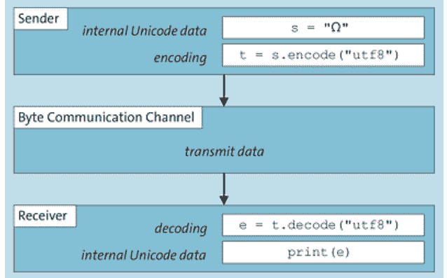

**图12.4** 在字节导向通信通道中用于传输目的的字符串编码与解码

在本节中，我们将探讨`str`和`bytes`数据类型如何在内部表示字符串，最后讨论如何在这两个世界之间进行转换。

## 字符编码

首先，我们想了解一下计算机如何在内部处理字符串。首先可以说，计算机实际上根本不认识任何字符，因为它的内存中只能表示基于位的数值。为了仍然能够产生屏幕输出或对字符执行其他操作，定义了翻译表，即所谓的*代码页*，它们为每个字母分配一个特定的数字。这种分配意味着，除了字母和数字之外，标点符号和特殊字符也被映射。还有不可打印的*控制字符*，如制表符或换行符（参见[表12.9](#)）。

最著名和最重要的字符集是*ASCII字符集*，[ 56 ]它实现了七位字符编码。这意味着每个字符使用七位内存，因此总共可以映射2<sup>7</sup>（128）个不同的字符。ASCII字符集的定义基于英语字母表，特别是不包含诸如ä、ø或ü之类的特殊字符。为了能够表示这些特殊字符，通过将字符的存储空间增加一位来扩展ASCII代码，从而可以存储2<sup>8</sup>（256）个不同的字符。

这种ASCII字符集的扩展为128个额外的特殊字符提供了空间。所使用的代码页决定了这些额外位置的具体解释。使用哪个代码页取决于各自计算机的配置。特别是操作系统和区域设置会影响代码页的选择。

## 编码与解码

`bytes`数据类型表示一个字节序列，根据所使用的代码页，特别可以表示一个字符串。Python允许程序员通过特殊的字面量直接实例化`bytes`字符串，前提是字面量中包含的字符仅限于作为所有字符集最低公分母的ASCII字符集。这解释了我们在开始时观察到的使用和不使用特殊字符实例化`bytes`字符串的行为：

```
>>> b"Python"
b'Python'
>>> b"Püthøn"
  File "<stdin>", line 1
SyntaxError: bytes can only contain ASCII literal characters
```

如果我们仍然想将字符串`Püthøn`表示为`bytes`字符串，例如将其作为二进制I/O操作的一部分输出，我们必须先创建一个`str`字符串，然后*编码*它。这可以使用`str`数据类型的`encode`方法来完成，该方法在调用时需要指定用于编码的字符集：

```
>>> str_string = "Püthøn"
>>> bytes_string = str_string.encode("iso-8859-15")
>>> bytes_string
b'P\xfcth\xf8n'
```

在`iso-8859-15`编码的`bytes`字符串中，所有未包含在ASCII字符集中的字符都表示为转义序列。这些转义序列以`\x`前缀开头，后跟一个两位十六进制数字，表示编码字符的数值。在示例中，特殊字符`ü`和`ø`用转义序列`\xfc`和`\xf8`表示，它们分别代表十进制数值252和248。

在*解码*过程中，使用`decode`方法将`bytes`字符串转换为`str`字符串。同样，在这种情况下，必须指定要使用的字符集：

```
>>> bytes_string.decode("iso-8859-15")
'Püthön'
```

**图12.5** 总结了编码和解码的过程以及`str`和`bytes`之间的相应转换。

此处使用的`iso-8859-15`代码页（也称为*Latin-9*）涵盖了西欧所有重要字符，如变音符号、重音符号和欧元符号。除了`iso-8859-15`之外，还有大量具有不同目标和广泛不同普及程度的代码页。现代操作系统通常基于Unicode和相关的代码页UTF-8，我们将在接下来的章节中更详细地探讨。

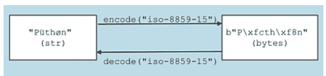

**图12.5** 字符串的编码与解码

## 通用字符集Unicode

到目前为止描述的字符编码方法的一个主要缺点是字符数量的限制。想象一个包含对来自不同语言区域的作者及其原始引文的阐述的字符串：由于众多不同的字母表，它们很快就会达到八位编码的限制，无法将作品数字化。或者想象你想编码一段中文文本，由于该语言超过100,000个字符，这将变得不可能。

解决这个问题的一个显而易见的方法是增加每个字符的存储空间，但这会引入新的缺点。例如，如果你为每个字符使用16位，字符数量仍然限制在65,536个。可以假设语言将继续发展，开发，因此从长远来看，这个数字将不再足够。[57] 此外，在16位示例中，字符串的内存需求将翻倍，因为每个字符使用的位数将是扩展ASCII编码的两倍，尽管事实上大部分文本主要由所有可用字符的一个小子集组成。

编码问题的长期解决方案最终由Unicode标准提出，它为单个字符提供了可变的编码长度。原则上，Unicode是一个巨大的表格，它为每个已知字符分配一个数字，称为*码位*。这个表由非营利机构Unicode联盟维护并不断扩展。码位通常写成“U+x”，其中*x*是码位的十六进制表示。

Unicode真正的新颖之处在于Unicode转换格式（UTF）过程，它可以通过不同长度的字节序列表示码位。有几种这样的转换格式，但最重要且使用最广泛的是UTF-8。UTF-8使用最多七个字节来编码单个字符，实际长度取决于字符在文本中的频率。例如，ASCII标准的所有字符都可以用一个字节编码，其数值与字符的相应ASCII编码相同。这个过程确保了每个用ASCII编码的字符串也是一个有效的UTF-8代码：UTF-8与ASCII兼容。在这一点上，我们不再对Unicode的技术实现感兴趣，而是对如何在Python中使用Unicode感兴趣。

## Python中的Unicode

在Python中，字符串的数据类型层面，二进制数据（`bytes`数据类型）和文本数据（`str`数据类型）之间有明确的分离。只要您使用文本数据，使用`str`数据类型，通常不需要担心字符编码。一个例外是在字符串字面量中通过其Unicode码位显式使用特殊字符。

正如您在本节开头的示例中已经看到的，您可以使用转义序列在字符串字面量中编码特殊字符。我们使用了以`\x`开头的转义序列。然而，这些序列仅适用于使用前256个码位之一的字符。对于任何Unicode字符，例如欧元符号（€；码位8364，十六进制0x20ac），有以`\u`开头的转义序列：

```
>>> s = "\u20ac"
>>> print(s)
€
```

除了码位之外，Unicode字符还有一个唯一的名称，可以通过它来识别。`\N`转义序列允许您在字符串字面量中通过其Unicode名称使用特殊字符：

```
>>> "\N{euro sign}"
'€'
```

在示例中，`\N`转义序列用于在字符串字面量中插入基于其Unicode名称*euro sign*的欧元符号。

> **注意**

聊天应用程序中流行的表情符号也在Unicode标准中定义，可以通过它们各自的码位或通过它们的唯一名称在Python程序中使用。

以下代码使您能够用一个漂亮的Python表情符号装饰您的程序输出，例如：

```
>>> "\N{Snake}"
🐍
```

请注意，表情符号的具体外观没有标准化，取决于每个系统使用的字体。

内置的`chr`和`ord`函数使您能够将Unicode码位和相应的字符相互转换：

```
>>> chr(8364)
'€'
>>> ord("€")
8364
```

对于使用UTF-8进行编码或解码，在调用`encode`和`decode`方法时指定字符集`"utf-8"`：

```
>>> str_string ="Püthøn"
>>> bytes_string = str_string.encode("utf-8")
>>> bytes_string
b'P\xc3\xbcth\xc3\xb8n'
>>> bytes_string.decode("utf-8")
'Püthøn'
```

## 其他字符集

到目前为止，我们只处理了两种编码方法：`"iso-8859-15"`和`"UTF-8"`。除了这两种之外，还有相当多的其他方法，其中许多是Python原生支持的。这些编码中的每一种在Python中都有一个名称，您可以将其传递给`encode`方法。表12.22显示了其中一些名称作为示例。

| Python中的名称 | 属性 |
| :--- | :--- |
| `"ascii"` | 使用ASCII表进行编码；英文字母、英文数字、标点符号和控制字符；每个字符一个字节 |
| `"utf-8"` 或 `"utf8"` | 用于所有Unicode码位的编码；向下兼容ASCII；每个字符的字节数可变 |
| `"iso-8859-15"` | 由国际标准化组织（ISO）在1999年标准化的西欧字符编码 |
| `"cp1252"` | 旧版Windows使用的西欧编码；除了ASCII字符外，还支持欧洲特殊字符，特别是欧元符号；向下兼容ASCII；每个字符一个字节 |

**表12.22** Python支持的四种编码

请注意，Unicode和UTF-8现在已成为许多地方的标准，并取代了其他字符编码。因此，开发人员需要担心的字符编码问题比过去少得多。

如果您尝试使用错误的字符集解码`bytes`字符串，结果取决于字符串中使用的码位是否也在用于解码的字符集中定义。如果定义了，将解码出乱码；如果没有，将生成`UnicodeDecodeError`：

```
>>> bytes_string.decode("utf-8")
'Püthøn'
>>> bytes_string.decode("iso-8859-15")
'Péthøn'
>>> bytes_string.decode("ascii")
Traceback (most recent call last):
  File "<stdin>", line 1, in <module>
UnicodeDecodeError: 'ascii' codec can't decode byte 0xc3 in position 1: ordinal not in range(128)
```

`encode`和`decode`方法提供了一个可选的`errors`参数，它定义了在这些错误情况下要遵循的过程。`errors`最重要的值总结在表12.23中。

| 值 | 含义 |
| :--- | :--- |
| `"strict"` | 默认设置。任何无法编码的字符都会导致错误。 |
| `"ignore"` | 无法编码的字符将被忽略。 |
| `"replace"` | 无法编码的字符将被替换为占位符：编码时替换为问号`"?"`，解码时替换为Unicode字符U+FFFD。 |
| `"xmlcharrefreplace"` | 无法编码的字符将被替换为其XML实体。*（仅适用于`encode`。） |
| `"backslashreplace"` | 无法编码的字符将被替换为反斜杠`\x`转义序列。 |
| * 这是在XML文件中显示特殊字符的一种特殊格式化方式。有关XML文件的更多信息，请参阅第32章。 | |

**表12.23** 编码和解码的errors参数的值

让我们再次查看使用不同`errors`值对上一个示例中的`bytes`字符串`bytes_string`进行解码：

```
>>> bytes_string.decode("ascii", "ignore")
'Pthn'
>>> bytes_string.decode("ascii", "replace")
'P??th??n'
>>> bytes_string.decode("ascii", "backslashreplace")
'P\xc3\xbcth\xc3\xb8n'
```

为了避免必须事先使用这些工具来解决编码问题，您应该尽可能始终使用通用编码方案，如UTF-8。

## Python源代码的编码声明

默认情况下，Python假设程序文件以UTF-8编码存储，这在字符串字面量、标识符或注释中使用特殊字符时尤其重要。Python程序文件的UTF-8编码存储也是成熟的Python编辑器和开发环境的默认行为。

如果您想偏离此默认行为，可以在Python程序文件的头部插入一个*编码声明*。这是一行标识程序文件保存时所用编码的文本。编码声明通常位于shebang行[58]正下方或程序文件的第一行，如下所示：

```
# -*- coding: cp1252 -*-
```

在这种情况下，使用了过时的`cp1252` Windows字符集。

> **注意**

在Python 3中，只有在您不想使用常见的默认编码UTF-8的少数情况下才需要编码声明。

但请注意，Python 2默认假设程序文件使用ASCII编码。如果没有编码声明，则无法在字符串字面量或注释中使用特殊字符。

## 13 映射与集合

在本章中，我们将探讨另外两种数据类型：映射和集合。*映射*类别包含在不同对象之间建立映射关系的数据类型。属于此类别的唯一基本数据类型是*字典*。

*集合*是一种元素的无序集合，其中每个元素最多只能包含一次。在Python中，有两种基本数据类型用于表示集合：`set`用于可变集合，`frozenset`用于不可变集合。因此，`set`是可变的，而`frozenset`是不可变的。

| 数据类型 | 存储内容 | 可变性 | 章节 |
| :--- | :--- | :--- | :--- |
| `dict` | 键值映射 | 可变 | [第13.1节](#section-131) |
| `set` | 任意实例的集合 | 可变 | [第13.2节](#section-132) |
| `frozenset` | 任意实例的集合 | 不可变 | [第13.2节](#section-132) |

**表13.1** 映射与集合的数据类型列表

## 13.1 字典：dict

`dict`数据类型的名称已经很好地揭示了其内涵：一个*字典*包含任意数量的*键/值对*，其中键不一定像列表中那样必须是整数。你可能已经从其他编程语言中熟悉了这种数据类型，在其他语言中它被称为*关联数组*（例如PHP）、*映射*（例如C++）或*哈希*（例如Perl）。`dict`数据类型是可变的；也就是说，它可以被修改。

#### 13.1.1 创建字典

以下示例解释了如何在花括号内创建一个包含多个键值对的`dict`。此外，与字典的关联变得显而易见：

```
translations = {"Germany": "Deutschland", "Spain": "Spanien"}
```

在这种情况下，创建了一个包含两个条目的`dict`，条目之间用逗号分隔。第一个条目将值"Germany"赋给键"Deutschland"。键和值之间用冒号分隔。所有键值对不一定都必须写在一行。在花括号内，源代码可以按你的意愿进行格式化：

```
translations = {
    "Germany": "Deutschland",
    "Spain": "Spanien",
    "France": "Frankreich"
}
```

最后一个键值对后面可以有一个逗号，但这不是必需的。

除了通过字面量的方式，字典也可以使用内置的`dict`函数创建。为此，可以传递一个包含键/值对的可迭代对象，或者将这些对作为关键字参数传递给函数：

```
>>> dict([("Germany", "Deutschland"), ("Spain", "Spanien")])
{'Germany': 'Deutschland', 'Spain': 'Spanien'}
>>> dict(Germany="Deutschland", Spain="Spanien")
{'Germany': 'Deutschland', 'Spain': 'Spanien'}
```

如果你决定使用关键字参数，必须记住在这种情况下，字典的键只能是符合标识符命名规则的字符串。

> **注意**

字典也可以使用*字典推导式*创建。这里，字典的所有键值对并非被显式列出，而是通过类似于`for`循环的生成规则来生成。以下字典推导式创建了一个字典，将`0`到`4`的数字分别映射到它们的平方：

```python
>>> {i: i*i for i in range(5)}
{0: 0, 1: 1, 2: 4, 3: 9, 4: 16}
```

[第13.1.6节](#)包含更多关于字典推导式的信息。

此外，在创建字典时可以使用解包：

```python
>>> {"a": 1, **{"b": 2, "c": 3}}
{'a': 1, 'b': 2, 'c': 3}
```

有关解包的更多信息，请参阅[第12章](#)，[第12.4.1节](#)。

#### 13.1.2 键与值

每个键在字典中必须是唯一的，因此不能存在第二个同名的键。虽然形式上以下代码是可能的，但只有第二个键值对会被传递到字典中：

```python
d = {
    "Germany": "Deutschland",
    "Germany": "Bayern"
}
```

与此相反，字典的值不必是唯一的；也就是说，它们可以出现多次：

```
d = {
    "Germany": "Deutschland",
    "Allemagne": "Deutschland"
}
```

在前面的例子中，所有键值对的键和值都是字符串。但情况并非必须如此：

```
mapping = {
    0: 1,
    "abc": 0.5,
    1.2e22: [1,2,3,4],
    (1,3,3,7): "def"
}
```

在字典中，任何实例，无论是可变的还是不可变的，都可以用作值。但是，只有不可变数据类型的实例才能用作键。这些是迄今为止讨论过的所有数据类型，除了列表和字典本身。例如，如果你尝试创建一个以列表作为键的字典，解释器会报告相应的错误：

```
>>> d = {[1,2,3]: "abc"}
Traceback (most recent call last):
  File "<stdin>", line 1, in <module>
TypeError: unhashable type: 'list'
```

这种限制源于字典的键是使用根据其值计算的*哈希值*来管理的。基本上，任何对象都可以计算哈希值；然而，这对于可变对象来说意义不大，因为当对象改变时，哈希值也会改变。这样的改变会干扰字典的键管理。因此，可变对象是“不可哈希的”，正如上面显示的错误消息所述。[ 59 ]

#### 13.1.3 迭代

字典是一个可迭代对象，它迭代其包含的所有键。在下面的例子中，我们迭代`translations`字典的键并用`print`输出它们：

```
for key in translations:
    print(key)
```

正如预期的那样，代码的输出如下：

```
Germany
Spain
France
```

使用“values”和“items”方法，也可以单独迭代字典的值，或者将值与其各自的键一起迭代：

```
>>> for value in translations.values():
...     print(value)
...
Deutschland
Spanien
Frankreich
>>> for key, value in translations.items():
...     print(key, "->", value)
...
Germany -> Deutschland
Spain -> Spanien
France -> Frankreich
```

字典的键总是按照它们被添加到字典中的顺序进行迭代。

> **注意**

在Python 3.7之前，字典曾经是一种*无序*数据类型。这意味着键不一定按照它们被添加到字典中的顺序进行迭代。从Python 3.7开始，保证在迭代过程中保留插入顺序。

请注意，在迭代字典时，你不能调整其大小。例如，添加或删除键值对会影响字典的大小。如果你仍然尝试这样做，你会得到以下错误消息：

```
Traceback (most recent call last):
  File "<stdin>", line 1, in <module>
RuntimeError: dictionary changed size during iteration
```

此限制仅适用于影响字典大小的操作，例如添加和删除条目。如果你只是在循环中更改键的关联值，则不会发生错误。

#### 13.1.4 运算符

到目前为止，你已经了解了什么是字典以及如何创建它。此外，我们还深入探讨了一些细节。现在我们将讨论可用于字典的运算符，这些运算符列在[表13.2](Table 13.2)中。

| 运算符 | 描述 |
| :--- | :--- |
| `len(d)` | 返回字典`d`中包含的所有键值对的数量 |
| `d[k]` | 访问键为`k`的值 |
| `del d[k]` | 删除键`k`及其值 |
| `k in d` | 如果键`k`位于`d`中，则为`True` |
| `k not in d` | 如果键`k`不在`d`中，则为`True` |
| `d1 \| d2` | 合并两个字典：`d1`和`d2`（Python 3.9中的新功能） |

**表13.2** 字典的运算符

在接下来的章节中，将更详细地描述字典的运算符。大多数运算符都使用`translations`字典进行解释，该字典定义如下：

```
translations = {
    "Germany": "Deutschland",
    "Spain": "Spanien",
    "France": "Frankreich"
}
```

##### 字典的长度

要确定字典的长度，可以使用内置的`len`函数。长度对应于键值对的数量：

```
>>> len(translations)
3
```

##### 访问值

运算符`[]`可用于访问字典的值。为此，你必须在字典名称后的方括号中写入相应的键。对于示例字典，这样的访问可能如下所示：

```
>>> translations["Germany"]
'Deutschland'
```

运算符`[]`不仅可用于读取访问，还可用于重新插入或替换字典中的条目。在下面的例子中，`translations` 字典中 "Germany" 键对应的值被设置为 "Bayern"：

```
>>> translations["Germany"] = "Bayern"
```

随后对 "Germany" 键的读取访问表明，先前的值 "Deutschland" 实际上已被 "Bayern" 替换：

```
>>> translations["Germany"]
'Bayern'
```

如果以写入模式访问字典中尚不存在的键，则字典会通过访问中指定的键值对进行扩展。另一方面，如果以读取模式访问不存在的键，解释器会抛出 `KeyError`：

```
>>> translations["Greece"]
Traceback (most recent call last):
  File "<stdin>", line 1, in <module>
KeyError: 'Greece'
```

> **注意**

字典的键在访问时是基于其值进行比较的，而不是基于其标识。这是因为键在内部是通过其哈希值表示的，而哈希值仅基于实例的值形成。

实际上，这意味着，例如，访问 `d[1]` 和 `d[1.0]` 是等效的。

## 删除键值对

要删除字典中的条目，可以将关键字 `del` 与访问运算符结合使用。在以下示例中，条目 "Germany": "Deutschland" 将从字典中移除：

```
del translations["Germany"]
```

即使通过删除最后一个条目使字典变为空，字典本身仍然存在。

## 测试特定键

与列表类似，字典也存在 `in` 和 `not in` 运算符，用于测试键是否存在于字典中。它们将相应的结果作为真值返回：

```
>>> "France" in translations
True
>>> "Spain" not in translations
False
```

## 合并两个字典

从 Python 3.9 开始，为字典定义了 `|` 运算符，它将两个字典 `d1` 和 `d2` 的键值对合并到一个新字典中：

```
>>> {"France": "Frankreich"} | {"Spain": "Spanien"}
{'France': 'Frankreich', 'Spain': 'Spanien'}
```

`|` 运算符也可以用作增强赋值 `|=`，将另一个字典的键值对添加到现有字典 `d` 中：

```
>>> d = {}
>>> d |= {"France": "Frankreich"}
>>> d |= {"Spain": "Spanien"}
>>> d
{'France': 'Frankreich', 'Spain': 'Spanien'}
```

如果一个键同时出现在要合并的两个字典中，则结果中始终包含右操作数的相应键值对。

> **注意**

请注意，用于合并两个字典的 `|` 和 `|=` 运算符是从 Python 3.9 开始添加到语言范围中的，这使它们成为一个相当新的语言特性。在较旧的 Python 版本中，可以使用 `update` 方法代替。

## 13.1.5 方法

除了运算符之外，还定义了一些方法来方便字典的操作（参见 [表 13.3](Table 13.3)）。

| 方法 | 描述 |
|---|---|
| `d.clear()` | 清空字典 `d`。 |
| `d.copy()` | 创建 `d` 的一个副本。 |
| `d.get(k, [x])` | 如果键 `k` 存在，则返回 `d[k]`，否则返回 `x`。 |
| `d.items()` | 返回一个可迭代对象，该对象生成 `d` 的所有键值对。 |
| `d.keys()` | 返回一个可迭代对象，该对象生成 `d` 的所有键。 |
| `d.pop(k)` | 返回与键 `k` 关联的值，并从字典 `d` 中删除该键值对。 |
| `d.popitem()` | 返回 `d` 的一个任意键值对，并将其从字典中移除。 |
| `d.setdefault(k, [x])` | `get` 的反向操作。如果键 `k` 不存在，则设置 `d[k] = x`。 |
| `d.update(d2)` | 将字典 `d2` 添加到 `d` 中，并在必要时覆盖已存在键的值。 |
| `d.values()` | 返回一个可迭代对象，该对象生成 `d` 的所有值。 |

**表 13.3** 字典的方法

除了这些方法之外，`dict` 数据类型还提供了一个静态方法。这是一个即使没有具体字典实例也可以调用的方法（参见 [表 13.4](#)）。

| 方法 | 描述 |
|---|---|
| `dict.fromkeys(seq, [value])` | 创建一个新字典，以 `seq` 列表的值作为键，并将每个值初始设置为 `value` |

**表 13.4** 字典的静态方法

现在我们将详细解释上述方法，并在交互模式下为每个方法提供一个简短的示例。所有示例都应在以下上下文中理解：

```
>>> d = {"k1": "v1", "k2": "v2", "k3": "v3"}
>>> d
{'k1': 'v1', 'k2': 'v2', 'k3': 'v3'}
```

因此，在每个示例中都有一个包含三个键值对的字典 `d`。在示例中，我们将修改字典并让解释器输出其值。

### d.clear()

`clear` 方法从 `d` 中删除所有键值对。它与 `del d` 的效果不同，因为字典本身没有被删除，只是被清空了：

```
>>> d = {"k1": "v1", "k2": "v2", "k3": "v3"}
>>> d.clear()
>>> d
{}
```

### d.copy()

`copy` 方法创建字典 `d` 的一个副本：

```
>>> d = {"k1": "v1", "k2": "v2", "k3": "v3"}
>>> e = d.copy()
>>> e
{'k1': 'v1', 'k2': 'v2', 'k3': 'v3'}
```

请注意，虽然字典本身被复制了，但值仍然是对相同对象的引用。以下示例说明了这一点：

```
>>> d1 = {"key": [1,2,3]}
>>> d2 = d1.copy()
>>> d2["key"].append(4)
>>> d2
{'key': [1, 2, 3, 4]}
>>> d1
{'key': [1, 2, 3, 4]}
```

创建了一个字典 `d1`，其中包含一个键值对，其值是一个列表。通过调用 `copy` 方法复制字典 `d1`，然后将 `d2` 副本中作为值引用的列表扩展了一个元素。由于 `copy` 方法仅执行浅拷贝，因此字典 `d1` 和 `d2` 都包含对同一个列表的引用：

```
>>> d1["key"] is d2["key"]
True
```

更改此列表会导致两个字典相应地更改。可以使用标准库的 `copy` 模块创建深拷贝，它也会复制字典的值（参见 [第 44 章，第 44.7 节](https://example.com)）。

### d.get(k, [x])

`get` 方法提供对字典值的访问。然而，与访问运算符不同的是，如果键不存在，则不会生成异常。相反，在这种情况下返回可选参数 `x`。如果未指定 `x`，则假定为 `None`。因此，以下行 `value = d.get(k,x)` 可以被视为以下代码的替代：

```
if k in d:
    value = d[k]
else:
    value = x
```

`get` 方法可以如下使用：

```
>>> d = {"k1": "v1", "k2": "v2", "k3": "v3"}
>>> d.get("k2", 1337)
'v2'
>>> d.get("k5", 1337)
1337
```

### d.items()

`items` 方法返回一个可迭代对象，遍历字典中的所有键值对。可以使用 `for` 循环如下迭代：

```
>>> d = {"k1": "v1", "k2": "v2", "k3": "v3"}
>>> for pair in d.items():
...     print(pair)
('k1', 'v1')
('k2', 'v2')
('k3', 'v3')
```

在每次迭代中，`pair` 变量包含相应的键值对作为元组。

### d.keys()

`keys` 方法返回一个可迭代对象，遍历字典中的所有键。在以下示例中，通过 `print` 输出字典 `d` 中存在的所有键：

```
>>> d = {"k1": "v1", "k2": "v2", "k3": "v3"}
>>> for key in d.keys():
...     print(key)
k1
k2
k3
```

我们在开头提到，迭代字典的所有键不需要特殊方法。因此，可以使用以下代码避免使用 `keys` 方法：

```
>>> for key in d:
...     print(key)
k1
k2
k3
```

### d.pop(k)

`pop` 方法从字典中删除键为 `k` 的键值对，并返回该对的值：

```
>>> d = {"k1": "v1", "k2": "v2", "k3": "v3"}
>>> d.pop("k1")
'v1'
>>> d.pop("k3")
'v3'
>>> d
{'k2': 'v2'}
```

### d.popitem()

`popitem` 方法返回一个任意的键值对作为元组，并将其从字典中移除。请注意，返回的对是任意的，但不是随机的：[ 60 ]

```
>>> d = {"k1": "v1", "k2": "v2", "k3": "v3"}
>>> d.popitem()
```

## d.setdefault(k, [x])

`setdefault` 方法在键 `k` 不存在时，会将键值对 `{k: x}` 添加到字典 `d` 中。参数 `x` 是可选的，默认值为 `None`。

```
>>> d = {"k1": "v1", "k2": "v2", "k3": "v3"}
>>> d.setdefault("k2", 1337)
'v2'
>>> d.setdefault("k5", 1337)
1337
>>> d
{'k1': 'v1', 'k2': 'v2', 'k3': 'v3', 'k5': 1337}
```

无论键值对是否已写入字典，`setdefault` 方法都会返回值 `d[k]`。

## d.update(d2)

`update` 方法通过字典 `d2` 的键和值来扩展字典 `d`，`d2` 作为参数传递给该方法：

```
>>> d = {"k1": "v1", "k2": "v2", "k3": "v3"}
>>> d.update({"k4": "v4"})
>>> d
{'k1': 'v1', 'k2': 'v2', 'k3': 'v3', 'k4': 'v4'}
```

如果两个字典有相同的键，则 `d` 中与该键关联的值会被 `d2` 中的值覆盖：

```
>>> d.update({"k1": "python rulez"})
>>> d
{'k1': 'python rulez', 'k2': 'v2', 'k3': 'v3', 'k4': 'v4'}
```

## d.values()

`values` 方法的行为与 `keys` 类似，区别在于它迭代的是所有的值：

```
>>> d = {"k1": "v1", "k2": "v2", "k3": "v3"}
>>> for value in d.values():
...     print(value)
v1
v2
v3
```

## dict.fromkeys(seq, [value])

静态方法 `fromkeys` 使用可迭代对象 `seq` 的条目作为键来创建一个新字典。参数 `value` 是可选的。但是，如果指定了该参数，它将用作任何键值对的值：

```
>>> dict.fromkeys([1,2,3], "python")
{1: 'python', 2: 'python', 3: 'python'}
```

如果省略 `value` 参数，则始终将 `None` 作为值：

```
>>> dict.fromkeys([1,2,3])
{1: None, 2: None, 3: None}
```

## 13.1.6 字典推导式

为了生成字典，Python 提供了一个类似于列表推导式的过程，称为*字典推导式*，简称*dict 推导式*。

字典推导式的结构与列表推导式相似（参见[第 12 章](Chapter 12)、[第 12.3.7 节](Section 12.3.7)），所以我们直接从一个示例开始：

```
>>> names = ["Donald", "Scrooge", "Daisy", "Gilbert"]
>>> {k: len(k) for k in names}
{'Donald': 6, 'Scrooge': 7, 'Daisy': 5, 'Gilbert': 7}
>>> {k: len(k) for k in names if k[0] == "D"}
{'Donald': 6, 'Daisy': 5}
```

这里，使用字典推导式创建了一个字典，该字典以给定的字符串列表作为键，以相应键字符串的长度作为值。

观察这个示例，与列表推导式的两个不同之处立即显现出来：

- 与列表推导式不同，字典推导式用花括号括起来。
- 在字典推导式中，循环的每次运行都必须向字典添加一个键值对。这位于推导式的开头，键和值用冒号分隔。

除此之外，你可以像使用列表推导式一样使用字典推导式。两种类型也可以一起使用。再看一个例子：

```
>>> lst1 = ["A", "B", "C"]
>>> lst2 = [2, 4, 6]
>>> {k:[k*i for i in lst2] for k in lst1}
{'A': ['AA', 'AAAA', 'AAAAAA'], 'B': ['BB', 'BBBB', 'BBBBBB'],
'C': ['CC', 'CCCC', 'CCCCCC']}
```

这段代码创建了一个字典，它使用列表推导式为每个键生成一个列表作为值，该列表分别包含键的两倍、四倍和六倍。

## 13.2 集合：set 和 frozenset

*集合*是元素的无序集合，其中每个元素只能包含一次。在 Python 中，有两种基本数据类型用于表示集合：`set` 用于可变集合，`frozenset` 用于不可变集合。

### 13.2.1 创建集合

请注意，无论实例化的是可变集合还是不可变集合，集合只能包含不可变元素。[表 13.1](Table 13.1) 概述了基本数据类型及其可变性。例如，如果你尝试创建一个应包含列表作为元素的集合，解释器会报告相应的错误：

```
>>> set([1, 2, list()])
Traceback (most recent call last):
  File "<stdin>", line 1, in <module>
TypeError: unhashable type: 'list'
```

与字典类似，这种行为的基本原理是集合的元素在内部使用持久哈希值进行管理，而哈希值只能为不可变数据类型的实例确定。

数据类型 `set` 和 `frozenset` 的空实例可以如下创建：

```
>>> set()
set()
>>> frozenset()
frozenset()
```

如果集合在实例化时已经包含元素，则可以将这些元素作为可迭代对象的元素传递给构造函数——例如，一个元组：

```
>>> set(("A", "B", "C"))
{'C', 'B', 'A'}
>>> frozenset([True, 47, (1,2,3)])
frozenset({True, (1, 2, 3), 47})
```

此外，有一个用于创建可变集合的特殊字面量。与数学中一样，集合应包含的元素写在花括号中，用逗号分隔：

```
>>> s = {1, 2, 3, 99, -7}
>>> s
{1, 2, 99, 3, -7}
```

这种表示法存在一个问题：因为花括号已经用于字典，所以无法用此字面量创建空集合；`{}` 总是实例化一个空字典。因此，如前所述，空集合必须通过 `set()` 实例化。`frozenset` 数据类型没有字面量；它必须始终通过 `frozenset()` 构造函数实例化。

> **注意**
>
> 通过*集合推导式*，可以通过指定元素的形成规则来创建集合，类似于 `for` 循环。
>
> 以下集合推导式创建一个包含 0 到 9 数字平方的集合：
>
> ```
> >>> {i*i for i in range(10)}
> {0, 1, 64, 4, 36, 9, 16, 49, 81, 25}
> ```
>
> 除了括号不同，集合推导式的工作方式与列表推导式类似（参见[第 12 章，第 12.3.7 节](#)）。因此，无需更多示例你就能成功使用它们。

创建集合时，可以使用解包：

```
>>> {1, 2, *[3, 4]}
{1, 2, 3, 4}
```

有关解包的更多信息，请参阅[第 12 章](Chapter 12)、[第 12.4.1 节](Section 12.4.1)。

### 13.2.2 迭代

*集合*是一个可迭代对象，可以在 `for` 循环中迭代。让我们看下面的例子：

```
set = {1, 100, "a", 0.5}
for element in set:
    print(element)
```

此代码生成以下输出：

```
a
1
100
0.5
```

与字典的键不同，集合的元素不是按照它们插入集合的顺序迭代的。事实上，它们以任意但当前程序运行始终相同的顺序迭代，这源于集合底层哈希表中元素的排列。

> **注意**
>
> 在此上下文中需要提及的一个重要细节是，集合的元素顺序在程序运行之间可能不同：
>
> ```
> >>> {"A", "B", "C"}
> {'A', 'C', 'B'}
> ... (重启解释器) ...
> >>> {"A", "B", "C"}
> {'C', 'A', 'B'}
> ```
>
> 这种行为的原因是*哈希随机化*。为了防止对哈希表的恶意拒绝服务攻击，Python 中的哈希值不是完全确定性地形成的。相反，它们包含一个在解释器启动时随机确定的*盐*。
>
> 如果你需要跨程序运行的一致迭代序列，例如在可重现测试的上下文中，可以通过 `PYTHONHASHSEED` 环境变量强制使用常量盐。

### 13.2.3 运算符

`set` 和 `frozenset` 数据类型有一个共同的接口，这将在后续章节中更详细地解释。让我们首先介绍所有通用运算符。为了简单起见，在描述运算符时，我们将专门指代 `set` 数据类型。尽管如此，它们和后面描述的方法也可以同样用于 `frozenset`。

| 运算符 | 描述 |
| :--- | :--- |
| `len(s)` | 返回集合 `s` 中包含的所有元素的数量。 |
| `x in s` | 如果 `x` 包含在集合 `s` 中，则为 `True`，否则为 `False`。 |
| `x not in s` | 如果 `x` 不包含在集合 `s` 中，则为 `True`，否则为 `False`。 |
| `s <= t` | 如果集合 `s` 是集合 `t` 的子集，则为 `True`，否则为 `False`。 |
| `s < t` | 如果集合 `s` 是集合 `t` 的真子集，则为 `True`，否则为 `False`。 |
| `s >= t` | 如果集合 `t` 是集合 `s` 的子集，则为 `True`，否则为 `False`。 |
| `s > t` | 如果集合 `t` 是集合 `s` 的真子集，则为 `True`，否则为 `False`。 |
| `s \| t` | 创建一个包含 `s` 和 `t` 所有元素的新集合。因此，此操作形成两个集合的并集。 |

| 运算符 | 描述 |
| :--- | :--- |
| `s & t` | 创建一个新集合，包含同时是集合 `s` 和集合 `t` 元素的对象。因此，此操作形成两个集合的交集。 |
| `s - t` | 创建一个新集合，包含 `s` 的所有元素，但排除同时存在于 `t` 中的元素。因此，此操作创建两个集合的差集。 |
| `s ^ t` | 创建一个新集合，包含所有在 `s` 或 `t` 中出现，但不同时在两者中出现的对象。因此，此操作形成两个集合的对称差集。 |

如果集合 *T* 是集合 *M* 的子集，并且至少存在一个元素属于 *M* 但不属于 *T*，则称集合 *T* 为集合 *M* 的*真子集*。

两个集合 A 和 B 的*对称差集*包含所有仅属于 A 或仅属于 B 的元素。因此，`^` 运算符可以建模为：A ^ B = (A | B) - (A & B)。

**表 13.5** set 和 frozenset 数据类型的运算符

其中一些运算符也存在增强赋值形式（参见表 13.6）。

| 运算符 | 对应的表达式 |
| :--- | :--- |
| `s |= t` | `s = s | t` |
| `s &= t` | `s = s & t` |
| `s -= t` | `s = s - t` |
| `s ^= t` | `s = s ^ t` |

**表 13.6** set 数据类型的运算符

这些运算符同样适用于 `frozenset` 数据类型。然而，它们不会改变集合本身，而是创建一个新的 `frozenset` 实例，该实例包含操作结果，并且从现在起由 `s` 引用。

在接下来的章节中，我们将基于示例清晰地描述所有运算符。示例应在以下上下文中理解：

```
>>> s = {0,1,2,3,4,5,6,7,8,9}
>>> t = {6,7,8,9,10,11,12,13,14,15}
```

因此，有两个名为 `s` 和 `t` 的集合，出于清晰起见，每个集合仅包含数字元素。这两个集合在某个范围内重叠。从图形上看，初始情况可以如图 13.1 所示。深灰色区域对应于 `s` 和 `t` 的交集。

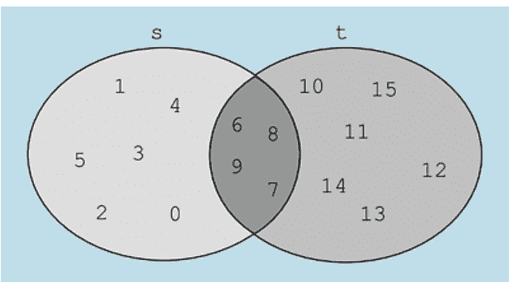

**图 13.1** 初始情况

## 元素数量

要确定集合中包含的元素数量，我们使用内置的 `len` 函数——就像处理序列数据类型和字典一样：

```
>>> len(s)
10
```

## 集合是否包含某个元素？

要测试一个集合是否包含某个元素，可以使用 `in` 运算符。同样，其反向运算符 `not in` 可用于检查相反的情况：

```
>>> 10 in s
False
>>> 10 not in t
False
```

## 是否是子集？

要测试一个集合是否是另一个集合的子集，可以使用 `<=` 和 `>=` 运算符，以及用于真子集的 `<` 和 `>` 运算符：

```
>>> u = {4, 5, 6}
>>> u <= s
True
>>> u < s
True
>>> u >= s
False
>>> u <= t
False
```

注意以下示例中*子集*（`<=`、`>=`）和*真子集*（`<`、`>`）的区别：

```
>>> m = {1, 2, 3}
>>> n = {1, 2, 3}
>>> m <= n
True
>>> m < n
False
```

## 两个集合的并集

对于两个集合的并集，Python 提供了 `|` 运算符。它创建一个新集合，包含 `s` 或 `t` 中的所有元素：

```
>>> s | t
{0, 1, 2, 3, 4, 5, 6, 7, 8, 9, 10, 11, 12, 13, 14, 15}
```

图 13.2 说明了这一点。

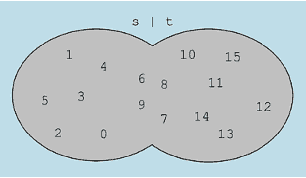

**图 13.2** 集合 s 和 t 的并集

并集运算符使用与两个整数的按位或（OR）相同的符号。这是因为集合 `s` 和 `t` 的并集包含所有在 `s` 或 `t` 中的元素。请注意，与按位运算符一样，这是一个非排他性的或（OR），因此并集也包含同时出现在 `s` 和 `t` 中的元素。

## 交集

要确定两个集合的交集，我们使用 `&` 运算符。此运算符创建一个新集合，包含同时存在于第一个和第二个操作数中的所有元素：

```
>>> s & t
{8, 9, 6, 7}
```

让我们也看看此运算符的效果（参见图 13.3）。

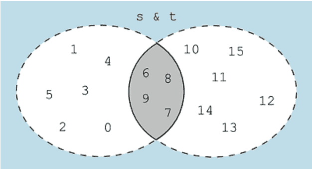

**图 13.3** 集合 s 和 t 的交集

两个集合 `s` 和 `t` 的交集包含所有同时出现在 `s` 和 `t` 中的元素。这解释了运算符符号 `&` 的选择，它也用于按位与（AND）。

## 两个集合的差集

要确定两个集合的差集，我们使用 `-` 运算符。结果形成一个新集合，包含第一个操作数中所有不属于第二个操作数的元素：

```
>>> s - t
{0, 1, 2, 3, 4, 5}
>>> t - s
{10, 11, 12, 13, 14, 15}
```

图 13.4 说明了这一点。

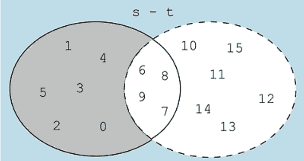

**图 13.4** 集合 s 和 t 的差集

## 两个集合的对称差集

要确定两个集合的对称差集，我们使用 `^` 运算符，它创建一个新集合，包含所有在第一个或第二个操作数中出现，但不同时在两者中出现的元素：

```
>>> s ^ t
{0, 1, 2, 3, 4, 5, 10, 11, 12, 13, 14, 15}
```

让我们看看图 13.5 中的图表。

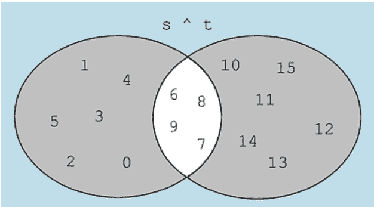

**图 13.5** 集合 s 和 t 的对称差集

两个集合 `s` 和 `t` 的对称差集包含那些仅包含在 `s` 或仅包含在 `t` 中的元素（但不同时在两个集合中）。这解释了运算符符号 `^` 的选择，它也用于按位异或（XOR）。

## 13.2.4 方法

`set` 和 `frozenset` 数据类型提供了少量方法，其中大多数等同于前面描述的某个运算符（参见表 13.7）。

| 方法 | 描述 |
| :--- | :--- |
| `s.issubset(t)` | 等同于 `s <= t` |
| `s.issuperset(t)` | 等同于 `s >= t` |
| `s.isdisjoint(t)` | 检查集合 `s` 和 `t` 是否*不相交*——即它们的交集是否为空 |
| `s.union(t)` | 等同于 `s | t` |
| `s.intersection(t)` | 等同于 `s & t` |
| `s.difference(t)` | 等同于 `s - t` |
| `s.symmetric_difference(t)` | 等同于 `s ^ t` |
| `s.copy()` | 创建集合 `s` 的一个副本 |

**表 13.7** set 和 frozenset 数据类型的方法

`<=`、`>=`、`|`、`&`、`-` 和 `^` 运算符与 `issubset`、`issuperset`、`union`、`intersection`、`difference` 和 `symmetric_difference` 方法（每个具有相同含义）之间的区别在于，使用运算符时两个操作数都必须是 `set` 或 `frozenset` 实例，而方法接受任何序列数据类型作为参数 `t`：

```
>>> {1,2,3} | frozenset([4,5,6])
{1, 2, 3, 4, 5, 6}
>>> {1,2,3} | "ABC"
Traceback (most recent call last):
  File "<stdin>", line 1, in <module>
TypeError: unsupported operand type(s) for |: 'set' and 'str'
>>> {1,2,3}.union("ABC")
{1, 2, 3, 'A', 'C', 'B'}
```

除了这个区别之外，这些方法的行为与关联的运算符相同。

你可以使用 `copy` 方法创建集合的副本：

```
>>> m = s.copy()
>>> m
{0, 1, 2, 3, 4, 5, 6, 7, 8, 9}
>>> m is s
False
>>> m == s
True
```

重要的是，你只复制了集合本身。它包含的元素在原始集合和副本中都是对相同对象的引用。你已经在第 12 章第 12.3.6 节中了解了这一点。

## 13.2.5 可变集合：set

作为可变集合的数据类型，`set` 提供了一些方法（参见表 13.8），这些方法超出了刚刚描述的基本方法。请注意，此处介绍的所有方法都不适用于 `frozenset`。

| 方法 | 描述 |
| :--- | :--- |
| `s.add(e)` | 将对象 `e` 作为元素插入集合 `s`。 |
| `s.clear()` | 删除集合 `s` 的所有元素，但不删除集合本身。 |
| `s.difference_update(t)` | 等同于 s -= t。 |
| `s.discard(e)` | 从集合 `s` 中删除元素 `e`。如果 `e` 不存在，则忽略此操作。 |
| `s.intersection_update(t)` | 等同于 s &= t。 |
| `s.remove(e)` | 从集合 `s` 中删除元素 `e`。如果 `e` 不存在，将引发异常。 |
| `s.symmetric_difference_update(t)` | 等同于 s ^= t。 |
| `s.update(t)` | 等同于 s |= t。 |

**表 13.8** set 数据类型的方法

在接下来的章节中，我们将基于一些示例来解释这些方法。

### s.add(e)

`add` 方法将元素 `e` 插入集合 `s`：

```
>>> s = {1,2,3,4,5}
>>> s.add(6)
>>> s
{1, 2, 3, 4, 5, 6}
```

如果 `e` 已经包含在集合中，集合将不会改变。

### s.clear()

## 13.2.5 `clear` 方法

`clear` 方法会移除集合 `s` 中的所有元素。调用 `clear` 后，集合本身仍然保留：

```
>>> s = {1,2,3,4,5}
>>> s.clear()
>>> s
set()
```

## 13.2.5 `discard` 方法

`discard` 方法从集合 `s` 中删除一个元素 `e`。与 `remove` 方法的唯一区别在于，如果 `e` 不在 `s` 中，则不会生成错误信息：

```
>>> s = {1,2,3,4,5}
>>> s.discard(5)
>>> s
{1, 2, 3, 4}
>>> s.discard(17)
>>> s
{1, 2, 3, 4}
```

## 13.2.5 `remove` 方法

`remove` 方法从集合 `s` 中删除元素 `e`：

```
>>> s = {1,2,3,4,5}
>>> s.remove(5)
>>> s
{1, 2, 3, 4}
```

如果要删除的元素不在集合中，则会生成错误信息：

```
>>> s.remove(17)
Traceback (most recent call last):
  File "<stdin>", line 1, in <module>
KeyError: 17
```

## 13.2.6 不可变集合：frozenset

由于 `frozenset` 只是 `set` 类型的一个版本，一旦创建就不能更改，因此所有运算符和方法在本节开头作为基本功能的一部分已经解释过。

但请注意，`frozenset` 不能像 `set` 那样使用花括号进行实例化。`frozenset` 的实例化始终如下进行：

```
>>> fs_empty = frozenset()
>>> fs_full = frozenset([1,2,3,4])
>>> fs_empty
frozenset()
>>> fs_full
frozenset({1, 2, 3, 4})
```

调用 `frozenset` 时，可以传递一个可迭代对象（例如 `set`），其元素将被输入到 `frozenset` 中。

请注意，`frozenset` 本身不仅是不可变的，而且只能包含不可变元素：

```
>>> frozenset([1, 2, 3, 4])
frozenset({1, 2, 3, 4})
>>> frozenset([[1, 2], [3, 4]])
Traceback (most recent call last):
  File "<stdin>", line 1, in <module>
TypeError: unhashable type: 'list'
```

那么，显式地将集合视为不可变有什么好处呢？请记住，只有不可变对象才能用作字典的键。[61] 因此，在字典中，`frozenset` 也可以用作键，而 `set` 则不行。让我们用以下示例来说明这一点：

```
>>> d = {frozenset([1,2,3,4]): "Hello World"}
>>> d
{frozenset({1, 2, 3, 4}): 'Hello World'}
```

相比之下，当你尝试使用 `set` 作为键时，会发生以下情况：

```
>>> d = {{1,2,3,4}: "Hello World"}
Traceback (most recent call last):
  File "<stdin>", line 1, in <module>
TypeError: unhashable type: 'set'
```

通过 `set` 和 `frozenset` 数据类型，我们已经讨论了最后的基本数据类型。在接下来的章节中，我们将介绍标准库中其他有趣的数据类型。

## 14 集合模块

标准库中的 `collections` 模块包含高级的*容器数据类型*。这个术语指的是在最广泛意义上表示对象集合的数据类型。虽然通用容器类型 `list`、`tuple`、`dict` 和 `set` 属于基本数据类型，但在 `collections` 模块中可以找到一些更具体的容器类型。

| 函数或数据类型 | 描述 | 章节 |
|---|---|---|
| `ChainMap` | 字典的链接 | [第 14.1 节](#) |
| `Counter` | 用于记录频率的字典 | [第 14.2 节](#) |
| `defaultdict` | 支持为未包含的键提供默认值的字典 | [第 14.3 节](#) |
| `deque` | 双向链表 | [第 14.4 节](#) |
| `namedtuple` | 创建命名元组的函数 | [第 14.5 节](#) |

**表 14.1** 集合模块的内容

要使用 `collections` 模块，必须首先导入它：

```
>>> import collections
```

## 14.1 链式字典

`ChainMap` 数据类型允许你同时访问多个字典，就像它们的内容被合并到一个字典中一样。在这个过程中，字典被链接起来。这意味着当访问时，总是返回包含指定键的第一个字典的赋值。

当数据分布在不同的字典中时，可以使用 `ChainMap`。在下面的示例中，我们有 2014 年世界杯小组赛的结果，分别存储在单独的字典中。为了保持示例简短，我们仅限于 A 组和 G 组：

```
>>> group_a = {
...     "Brazil": 7,
...     "Mexico": 7,
...     "Croatia": 3,
...     "Cameroon": 0
... }
>>> group_g = {
...     "Germany": 7,
...     "USA": 4,
...     "Portugal": 4,
...     "Ghana": 1
... }
```

使用 `ChainMap`，无论球队属于哪个组，都可以通过单次查询找到其得分：

```
>>> groups = collections.ChainMap(group_a, group_g)
>>> groups["Brazil"]
7
>>> groups["Germany"]
7
```

你可以想象，当访问 `ChainMap` 时，它包含的字典会按照传递给 `ChainMap` 构造函数的顺序进行查询。因此，如果一个键出现在 `ChainMap` 的多个字典中，那么在创建 `ChainMap` 时首先命名的、包含该键的字典决定了访问该键时 `ChainMap` 返回的值。

## 14.2 统计频率

你经常会关心可迭代对象元素的频率分布——例如，字符串中各个字母出现的次数。[62] 这个问题可以用字典优雅地解决：

```
>>> t = "This is the text"
>>> d = {}
>>> for c in t:
...     if c in d:
...         d[c] += 1
...     else:
...         d[c] = 1
...
>>> d
{'T': 1, 'h': 2, 'i': 2, 's': 2, ' ': 3, 't': 3, 'e': 2, 'x': 1}
```

`collections` 模块的 `Counter` 数据类型是一个字典，当使用未知键 `k` 访问时，它会自动向字典添加一个键值对 {k: 0}。这种数据类型可以用来简化前面显示的代码：

```
>>> t = "This is the text"
>>> d = collections.Counter()
>>> for c in t:
...     d[c] += 1
...
>>> d
Counter({' ': 3, 't': 3, 'h': 2, 'i': 2, 's': 2, 'e': 2, 'T': 1, 'x': 1})
```

在示例中，数据已经具有可迭代对象的形式。在这种情况下，可以在实例化 `Counter` 时传递该对象。这将示例变成了一行代码：

```
>>> collections.Counter("This is the text")
Counter({' ': 3, 't': 3, 'h': 2, 'i': 2, 's': 2, 'e': 2, 'T': 1, 'x': 1})
```

`Counter` 数据类型除了字典的功能外，还提供了一些方法，接下来将讨论这些方法。这些示例应在前面示例中创建的 `Counter` 实例 `d` 的上下文中理解。

### d.elements()

此方法返回一个迭代器，遍历 `Counter` 实例的元素。每个元素出现的次数等于其当前的计数器值。

```
>>> list(d.elements())
['T', 'h', 'h', 'i', 'i', 's', 's', ' ', ' ', ' ', 't', 't', 't', 'e', 'e', 'x']
```

### d.most_common([n])

此方法返回一个列表，包含 `n` 个最频繁的元素。该列表由元组组成，每个元组包含相应的元素及其频率：

```
>>> d.most_common(3)
[(' ', 3), ('t', 3), ('h', 2)]
```

如果未指定参数 `n`，则返回的列表包含所有元素。

### d.subtract([iterable])

此方法从 `d` 中的频率减去 `iterable` 中元素的频率。例如，可以找到能够最好地区分德语文本和英语文本的字符频率：

```
>>> import collections
>>> with open("german.txt", "r") as f_de:
...     ger = collections.Counter(f_de.read().lower())
>>> with open("english.txt", "r") as f_en:
...     eng = collections.Counter(f_en.read().lower())
>>> eng.most_common(5)
[('e', 6357), ('a', 4188), ('n', 4154), ('t', 4150), ('r', 3822)]
>>> ger.most_common(5)
[('e', 8030), ('n', 4953), ('i', 3819), ('r', 3581), ('s', 3276)]
>>> eng.subtract(ger)
>>> eng.most_common(5)
[('o', 2030), ('a', 1494), ('t', 938), ('y', 758), ('p', 531)]
```

首先，读取两个大小相等的文件（分别包含德语和英语文本）的内容，并使用 `Counter` 数据类型进行频率分析。除了变音符号和 ß 之外，文本不包含任何特殊字符。使用 `subtract` 方法，从英语字母频率中减去德语字母频率。结果表明，显然可以通过字母 o 和 a 的绝对频率来区分英语文本和德语文本。[63]

### d.update([iterable])

`update` 函数的行为类似于 `subtract`，唯一的区别在于 `iterable` 中包含的频率不是被减去，而是被加到 `d` 的频率中。

## 14.3 带默认值的字典

`defaultdict` 数据类型是上一节描述的 `counter` 数据类型的泛化。对于 `counter` 实例，当访问一个不存在的键 `k` 时，键值对 `{k: 0}` 会自动添加到字典中。而 `defaultdict` 实例在这种情况下会添加键值对 `{k: x()}`，其中 `x` 代表任意数据类型。

值的数据类型在实例化过程中传入。之后，`defaultdict` 就可以像普通字典一样使用。

例如，如果你想根据单词长度对文本中的单词进行分组，可以使用基本的 `dict` 数据类型如下操作：

```
>>> t = "if for else while elif with not and or try except"
>>> d = {}
>>> for word in t.split(" "):
...     if len(word) in d:
...         d[len(word)].append(word)
...     else:
...         d[len(word)] = [word]
...
>>> d
{2: ['if', 'or'], 3: ['for', 'not', 'and', 'try'], 4: ['else', 'elif', 'with'], 5: ['while'], 6: ['except']}
```

使用 `defaultdict` 可以更轻松地解决这个问题：

```
>>> import collections
>>> t = "if for else while elif with not and or try except"
>>> d = collections.defaultdict(list)
>>> for word in t.split(" "):
...     d[len(word)].append(word)
...
>>> d
defaultdict(<class 'list'>, {2: ['if', 'or'], 3: ['for', 'not', 'and', 'try'], 4: ['else', 'elif', 'with'], 5: ['while'], 6: ['except']})
```

## 14.4 双向链表

让我们考虑以下两种用 0 到 9999 的数字填充列表的变体。在第一个版本中，数字被逐个添加到列表末尾：

```
l = []
for x in range(10000):
    l.append(x)
```

在第二个变体中，数字被插入到每个列表的开头：

```
l = []
for x in range(9999, -1, -1):
    l.insert(0, x)
```

两个示例生成相同的列表，但结果表明第一个变体比第二个运行得快得多。这是由于基本的 `list` 数据类型在通过索引访问和向列表末尾追加新元素方面进行了优化。当在列表开头插入一个值时，列表中包含的所有元素都必须重新复制；也就是说，它们实际上必须向右移动一个位置。

`collections` 模块的 `deque`（代表 *双端队列*）数据类型实现了一个 *双向链表*，支持在开头或末尾高效插入元素。如果在前面的示例中使用 `deque` 实例而不是列表，运行时差异将不明显。

除了从基本 `list` 数据类型中已知的 `append`、`copy`、`count`、`extend`、`index`、`insert`、`pop`、`remove` 和 `reverse` 方法，以及 `+` 和 `*` 运算符外，`deque` 数据类型还包含表 14.2 中列出的附加方法。

| 方法 | 描述 |
| :--- | :--- |
| `appendleft(x)` | 在列表开头插入元素 `x`。 |
| `clear()` | 清空列表。 |
| `extendleft(iterable)` | 将 `iterable` 中的元素插入到列表开头。 |
| `popleft()` | 返回第一个元素并将其从列表中移除。 |
| `rotate(n)` | 将列表旋转 `n` 个元素。这意味着列表的最后 `n` 个元素被删除并插入到开头。 |

**表 14.2** deque 数据类型的方法

以下示例展示了 `deque` 实例的使用：

```
>>> d = collections.deque([1,2,3,4])
>>> d.appendleft(0)
>>> d.append(5)
>>> d
deque([0, 1, 2, 3, 4, 5])
>>> d.extendleft([-2, -1])
>>> d
deque([-1, -2, 0, 1, 2, 3, 4, 5])
>>> d.rotate(4)
>>> d
deque([2, 3, 4, 5, -1, -2, 0, 1])
```

此外，在实例化双向链表时可以指定最大长度。当在最大长度的列表中在一侧添加元素时，另一侧的最后一个元素将被移除：

```
>>> d = collections.deque([1,2,3,4], 4)
>>> d
deque([1, 2, 3, 4], maxlen=4)
>>> d.append(5)
>>> d
deque([2, 3, 4, 5], maxlen=4)
>>> d.appendleft(1)
>>> d
deque([1, 2, 3, 4], maxlen=4)
```

`deque` 实例的最大长度可以通过 `maxlen` 属性访问。

> **注意**

`deque` 在添加和移除元素方面提供的灵活性是有代价的。虽然 `deque` 数据类型支持通过索引访问元素，但这通常比基本数据类型 `list` 慢。

## 14.5 命名元组

标准库中的许多函数将其结果作为 *命名元组* 返回。这是一个每个字段都有名称的元组。元组的值可以通过字段名访问，这就是为什么命名元组能带来更具可读性的代码。命名元组的一个例子是标准库 `sys` 模块中的 `version_info`，它指定了 Python 解释器的版本：

```
>>> import sys
>>> sys.version_info
sys.version_info(major=3, minor=11, micro=0, releaselevel='beta', serial=1)
```

命名元组的字段可以像属性一样访问：

```
>>> sys.version_info.major
3
```

命名元组可以使用 `collections` 模块的 `namedtuple` 函数创建。`namedtuple` 函数创建一个从基本 `tuple` 数据类型派生的新数据类型，名称为 `typename`。该数据类型的实例允许你通过固定名称访问底层元组的各个元素。

`field_names` 参数用于指定元组元素的名称。这里可以传递一个字符串列表，或者一个用空格或逗号分隔名称的单个字符串。名称必须遵循 Python 标识符的规则，并且不能以下划线开头。数据类型创建后，字段名存储在 `_fields` 类属性中：

```
>>> Book = collections.namedtuple("Book",
...                                ["title", "author", "number_of_pages", "ISBN"])
>>> py = Book("The Art of Computer Programming", "Donald E. Knuth",
...           3168, "978-0321751041")
>>> py.author
'Donald E. Knuth'
>>> py[1]
'Donald E. Knuth'
>>> Book._fields
('title', 'author', 'number_of_pages', 'ISBN')
```

实例化命名元组时——在本例中是 `book` 数据类型——必须为元组的所有字段指定值。之后，可以通过索引或分配的名称访问字段。

如果为 `rename` 参数传递值 `True`，则接受无效的字段名。这样的字段只能通过其索引访问。`rename` 参数默认为 `False`，在字段名无效时会引发 `ValueError` 异常。

预设为 `False` 的 `verbose` 参数控制数据类型创建后是否输出其类定义。

# 15 日期和时间

在本章中，你将了解帮助你处理时间和日期信息的 Python 模块。Python 为此提供了两个模块：`time` 和 `datetime`。

`time` 模块面向底层 C 库实现的函数，而 `datetime` 提供了一个面向对象的接口，用于处理时间点和时间跨度。

> **注意**

本章基本上是作为参考。因此，我们建议你如果感兴趣可以先浏览一下，如果有具体问题再查看相关细节。

在接下来的章节中，我们将更仔细地研究这两个模块及其函数。要使用 `time` 和 `datetime` 模块，你必须先导入它们：

```
>>> import time
>>> import datetime
```

## 15.1 基本时间函数—time

在我们更详细地介绍 `time` 模块的函数之前，我们将介绍一些理解时间管理所必需的术语。

`time` 模块直接基于操作系统 C 库的时间函数，因此将所有时间数据存储为 Unix 时间戳。*Unix 时间戳* 通过自 1970 年 1 月 1 日 0:00 以来经过的秒数来描述一个时间点。[64]

例如，值为 1190132696.0 的 Unix 时间戳标记了 2007 年 9 月 18 日下午 6:24:56，因为从 Unix 纪元开始到此时正好经过了 1,190,132,696.0 秒。

处理时间戳时，需要区分两种不同的指示：*本地时间* 和 *协调世界时*。

本地时间取决于检查时钟的位置，并指该位置的时钟必须指示什么才是正确的。协调世界时被理解为本初子午线上的本地时间，该子午线穿过英国等地。协调世界时缩写为 UTC。[65] 所有本地时间都可以根据与 UTC 的小时偏差来指定。例如，中欧的本地时间是 UTC+1，这意味着中欧的时钟比英国的时钟快一小时。

实际的本地时间还受一个因素影响：夏令时。这个时间偏移取决于各自地区的法律规定，并且通常根据季节有不同的值。`time` 模块会为程序员找出在当前使用的平台和当前位置哪个夏令时值是正确的，所以你不必担心这一点。

## 15.1.1 struct_time 数据类型

除了前面提到的通过 Unix 时间戳表示时间外，还有另一种通过 `struct_time` 数据类型表示时间的方式。`struct_time` 类型的实例有九个属性，可以通过索引或名称来访问。表 15.1 展示了该数据类型的精确结构。

| 索引 | 属性 | 含义 | 值范围 |
|---|---|---|---|
| 0 | `tm_year` | 年份 | |
| 1 | `tm_mon` | 月份 | 1-12 |
| 2 | `tm_mday` | 月份中的日期 | 1-31 |
| 3 | `tm_hour` | 小时 | 0-23 |
| 4 | `tm_min` | 分钟 | 0-59 |
| 5 | `tm_sec` | 秒* | 0-61 |
| 6 | `tm_wday` | 星期几（0 对应星期一） | 0-6 |
| 7 | `tm_yday` | 年份中的日期 | 0-366 |
| 8 | `tm_isdst` | 指示时间戳是否已针对夏令时进行调整 | 0：否，1：是，-1：未知 |

> * 实际范围是 0 到 61，以补偿所谓的*闰*秒。闰秒用于补偿地球自转在时间指示上的不准确性。通常，你无需为此费心。

**表 15.1** struct_time 数据类型的结构

你可以通过向构造函数传递表 15.1 中九个元素的序列来创建 `struct_time` 数据类型的新实例：

```
>>> t = time.struct_time((2007, 9, 18, 18, 24, 56, 0, 0, 0))
>>> t.tm_year
2007
```

对于所有期望 `struct_time` 实例作为参数的函数，你也可以交替传递一个包含九个元素的元组，其中包含对应索引的所需值。

现在让我们继续描述模块函数和属性。

## 15.1.2 常量

`time` 模块包含表 15.2 中列出的属性。

| 属性 | 描述 |
|---|---|
| `altzone` | 包含夏令时的本地时间与 UTC 的偏移量（秒） |
| `daylight` | 指示本地时区是否使用夏令时 |
| `timezone` | 不包含夏令时的本地时间与 UTC 的偏移量（秒） |
| `tzname` | 时区描述 |

**表 15.2** time 模块的属性

### 夏令时：daylight 和 altzone

如果本地时区使用夏令时，`daylight` 常量的值不为 `0`。如果本地时区不使用夏令时，`daylight` 的值为 `0`。夏令时引起的偏移可以使用 `altzone` 常量来确定，该常量指定了本地时间相对于 UTC 的偏移量（秒），并考虑了可能适用的任何夏令时更改。如果当前时区位于本初子午线以东，`altzone` 的值为正；如果本地时区位于其以西，则为负。

仅当 `daylight` 的值不为 0 时，才应使用 `altzone` 常量。

### 时区：tzname 和 timezone

`tzname` 常量包含一个包含两个字符串的元组。第一个字符串是本地时区的名称，而第二个是夏令时本地时区的名称。如果本地时间不使用夏令时，则不应使用元组的第二个元素。

```
>>> time.tzname
('CET', 'CEST')
```

`timezone` 常量存储本地时间相对于 UTC 的偏移量（秒），其中不考虑可能存在的夏令时。

## 15.1.3 函数

表 15.3 提供了 `time` 模块函数的概述。

| 函数 | 描述 |
| :--- | :--- |
| `asctime([t])` | 将传递的 `struct_time` 实例转换为字符串。 |
| `perf_counter()`<br>`perf_counter_ns()` | 提供适合测量程序性能的时间点。 |
| `ctime([secs])` | 将传递的 Unix 时间戳转换为字符串。如果未传递时间戳，则使用当前系统时间。 |
| `gmtime([secs])` | 将 Unix 时间戳转换为 `struct_time` 实例。基于 UTC。 |
| `localtime([secs])` | 将 Unix 时间戳转换为 `struct_time` 实例。以本地时间为基础。 |
| `mktime(t)` | 将 `struct_time` 实例转换为 Unix 时间戳。以本地时间为基础。 |
| `sleep(secs)` | 中断程序流程指定的时间段（秒）。 |
| `strftime(format, [t])` | 根据传递的规则将 `struct_time` 实例转换为字符串。 |
| `strptime(string, [format])` | 根据传递的规则将字符串解释为时间，并返回匹配的 `struct_time` 实例。 |
| `time()`<br>`time_ns()` | 返回当前的 Unix 时间戳。基于 UTC。 |

**表 15.3** time 模块的函数

### asctime([t])

此函数将 `struct_time` 实例或包含九个元素的元组转换为字符串。生成字符串的结构如下例所示：

```
>>> time.asctime((1987, 7, 26, 10, 40, 0, 0, 0, 0))
'Mon Jul 26 10:40:00 1987'
```

如果未传递可选参数 `t`，`asctime` 将返回当前系统时间的字符串。

`ctime` 函数的功能与 `asctime` 相同，但用于 Unix 时间戳。

> **注意**
>
> `asctime` 函数始终返回一个由 24 个字符组成的字符串，格式如示例所示。
>
> 如果你需要对结果字符串的外观进行更多控制，`strftime` 方法是更好的选择。

### perf_counter(), perf_counter_ns()

`perf_counter` 函数返回一个时间计数器，非常适合测量程序内的运行时间。在此上下文中，使用操作系统提供的最高分辨率的时钟：

```
>>> start = time.perf_counter()
>>> compute_intensive_function()
>>> end = time.perf_counter()
>>> print("The function ran for "
...       "{:.2f} seconds".format(end - start))
The function ran for 7.46 seconds
```

`perf_counter_ns` 变体与 `perf_counter` 的不同之处在于，结果以纳秒为单位的整数返回，而不是以秒为单位的浮点数。通过使用 `perf_counter_ns`，你可以避免由于浮点数的有损表示而导致的纳秒范围内的不准确性。

### gmtime([secs])

此函数将 Unix 时间戳转换为 `struct_time` 对象。始终使用 UTC，且结果对象的 `tm_isdst` 属性始终为 `0`。

如果未传递 `secs` 参数或其值为 `None`，则使用 `time` 函数返回的当前时间戳：

```
>>> time.gmtime()
time.struct_time(tm_year=2022, tm_mon=7, tm_mday=1, tm_hour=22, tm_min=21, tm_sec=13, tm_wday=4, tm_yday=182, tm_isdst=0)
```

因此，前面的示例是根据 UTC 在 2022 年 7 月 1 日 22:21（晚上 10:21）执行的。

### localtime([secs])

这与 `gmtime` 类似，但此函数将传递的时间戳转换为本地时区的规范。

### mktime(t)

此函数将 `struct_time` 实例转换为本地时间的 Unix 时间戳。返回值是一个浮点数。

`localtime` 和 `mktime` 函数是彼此的反函数：

```
>>> t1 = time.localtime()
>>> t2 = time.localtime(time.mktime(t1))
>>> t1 == t2
True
```

### sleep(secs)

`sleep` 函数中断程序执行指定的时间段。`secs` 参数必须是一个浮点数，指定中断的持续时间（秒）。

如果你通过 `sleep` 中断程序，它将进入空闲模式，不会利用处理器。

### strftime(format, [t])

此函数将 `struct_time` 实例 `t` 或九元素元组 `t` 转换为字符串。这里，第一个名为 `format` 的参数传递一个包含输出字符串所需格式的字符串。

类似于字符串的格式运算符，格式字符串包含许多占位符，这些占位符将被结果中的相应值替换。每个占位符由一个百分号和一个标识字母组成。表 15.4 显示了所有支持的占位符。

| 字符 | 含义 |
| :--- | :--- |
| %a | 星期几名称的本地缩写。 |
| %A | 本地语言中星期几的完整名称。 |
| %b | 月份名称的本地缩写。 |
| %B | 本地语言中月份的完整名称。 |
| %c | 本地平台上适当的日期和时间表示格式。 |
| %d | 当前月份中的日期编号。结果为长度为 2 的字符串，范围在 [01,31] 内。 |
| %H | 24 小时制的小时。结果始终为两位数，范围在 [00,23] 内。 |
| %I | 12 小时制的小时。结果始终为两位数，范围在 [01,12] 内。 |

| 字符 | 含义 |
|---|---|
| %j | 一年中的第几天。结果始终为三位数，范围在 [001, 366] 之间。 |
| %m | 月份编号，由两位数字组成，范围在 [01,12] 之间。 |
| %M | 分钟数，由两位数字组成。范围始终在 [00,59] 之间。 |
| %p | 上午（a.m.）或下午（p.m.）的本地等效表示* |
| %S | 秒数，由两位数字组成。范围始终在 [00,61] 之间。 |
| %U | 一年中的当前周数，其中星期日被视为一周的第一天。结果始终为两位数，范围在 [01,53] 之间。一年开始到第一个星期日之前的时段被定义为第 0 周。 |
| %w | 一周中的当前天数。星期日被视为第 0 天。结果范围在 [0,6] 之间。 |
| %W | 类似于 %U，但不同之处在于星期一被视为一周的第 0 天，而非星期日。 |
| %x | 本地平台的日期格式。 |
| %X | 本地平台的时间格式。 |
| %y | 不带世纪指示的年份。结果始终由两位数字组成，范围在 [00,99] 之间。 |
| %Y | 带世纪指示的完整年份。 |
| %Z | 本地时区的名称，如果未设置本地时区，则为空字符串。 |
| %% | 在结果字符串中生成百分号 %。 |

| 字符 | 含义 |
|---|---|
| * | 源自拉丁语 *ante meridiem*（“中午之前”）或拉丁语 *post meridiem*（“中午之后”） |

**表 15.4** strftime 函数所有占位符概览

例如，以下表达式使你能够以德国常用的格式生成当前时间的输出：

```
>>> time.strftime("%d.%m.%Y um %H:%M:%S Uhr")
'02.07.2022 um 00:27:38 Uhr'
```

## strptime(string, [format])

你可以使用 `strptime` 将时间字符串转换回 `time.struct_time` 实例。`format` 参数指定字符串包含时间的格式。此类格式字符串的结构与 `strftime` 相同：

```
>>> time_string = '19.09.2007 at 00:21:17'
>>> time.strptime(time_string, "%d.%m.%Y at %H:%M:%S")
time.struct_time(tm_year=2007, tm_mon=9, tm_mday=19, tm_hour=0, tm_min=21, tm_sec=17, tm_wday=2, tm_yday=262, tm_isdst=-1)
```

如果你不指定可选的 `format` 参数，则使用默认值 `"%a %b %d %H:%M:%S %Y"`。这对应于 `ctime` 和 `asctime` 的输出格式。

## time(), time_ns()

这会以浮点数形式返回当前的 UTC Unix 时间戳。

请注意，并非所有系统都支持高于一秒的分辨率，因此小数部分不一定可靠。

`time_ns` 变体与 `time` 的不同之处在于，结果不是以秒为单位的浮点数返回，而是以纳秒为单位的整数返回。通过使用 `time_ns`，可以避免由于浮点数的有损表示而导致的纳秒范围内的不准确性。

## 15.2 面向对象的日期管理：datetime

与 `time` 模块相比，`datetime` 模块更加抽象，并且由于其自身的时间和日期类型，使用起来也更加方便。

提供了四种数据类型（见表 15.5），我们将在以下各节中分别描述。

| datetime 的数据类型 | 章节 |
|---|---|
| `date` | 用于存储日期的数据类型。 | [第 15.2.1 节](#) |
| `time` | 保存特定日期的时间点。 | [第 15.2.2 节](#) |
| `datetime` | `datetime.date` 和 `datetime.time` 的组合，用于存储同时包含日期和时间的时间。 | [第 15.2.3 节](#) |
| `timedelta` | 可以创建 `datetime.date` 以及 `datetime.datetime` 实例之间的差异。此类减法的结果是 `datetime.timedelta` 对象。 | [第 15.2.4 节](#) |

表 15.5 datetime 模块的数据类型

### 15.2.1 datetime.date

`datetime.date` 实例通过在其属性中存储 `year`、`month` 和 `day` 来描述时间线上的某一天。

在最简单的情况下，你可以通过指定这三个值来创建一个 `datetime.date` 实例，如以下 1995 年 3 月 28 日的示例所示：

```
>>> d = datetime.date(1995, 3, 28)
>>> d
datetime.date(1995, 3, 28)
```

构造函数会检查传递的日期是否有效，如果数据无效则引发 `ValueError`。例如，与 1995 年不同，1996 年是闰年：

```
>>> datetime.date(1996, 2, 29)
datetime.date(1996, 2, 29)
>>> datetime.date(1995, 2, 29)
Traceback (most recent call last):
  File "<stdin>", line 1, in <module>
ValueError: day is out of range for month
```

你可以使用 `datetime.date.today()` 创建一个表示当前日期的 `datetime.date` 实例，而要从 Unix 时间戳创建 `datetime.date` 实例，可以使用 `datetime.date.fromtimestamp` 类方法：

```
>>> datetime.date.today()
datetime.date(2020, 3, 9)
>>> datetime.date.fromtimestamp(0)
datetime.date(1970, 1, 1)
```

[表 15.6](Table 15.6) 列出了处理 `datetime.date` 实例最重要的方法。

| 方法 | 描述 |
| :--- | :--- |
| `ctime()` | 生成一个字符串，以 `'Tue Oct 23 00:00:00 1989'` 格式指定 `datetime.date` 实例所描述的日期。 |
| `fromisoformat(date_string)` | 从形式为 `"YYYY-MM-DD"` 的字符串创建一个 `datetime.date` 实例。 |
| `isoformat()` | 将 `datetime.date` 实例转换为形式为 `"YYYY-MM-DD"` 的字符串。 |
| `replace({year, month, day})` | 通过替换单个元素，从现有的 `datetime.date` 实例创建一个新的实例。 |
| `strftime(format)` | 根据格式描述将 `datetime.date` 实例转换为字符串（参见 [第 15.1.3 节](#) 中的 `time.strftime`）。 |
| `timetuple()` | 创建一个与 `datetime.date` 实例的日期相对应的 `time.struct_time` 实例。 |
| `weekday()` | 返回一周中的天数。在此上下文中，0 对应于星期一，6 对应于星期日。 |

**表 15.6** datetime.date 数据类型的重要方法

### 15.2.2 datetime.time

`datetime.time` 类型的对象用于管理基于小时、分钟、秒以及微秒的一天中的时间。

`datetime.time` 实例具有属性 `hour`、`minute`、`second` 和 `microsecond`，分别表示自一天开始以来的小时、分钟、秒和微秒。这些属性中的每一个都可以传递给构造函数，默认值均为 0：

```
>>> datetime.time(2, 30, 25)
datetime.time(2, 30, 25)
>>> datetime.time(minute=10)
datetime.time(0, 10)
>>> datetime.time(hour=12, second=36, microsecond=123456)
datetime.time(12, 0, 36, 123456)
```

表 15.7 提供了 `time` 数据类型最重要方法的概览。

| 方法 | 描述 |
| :--- | :--- |
| `fromisoformat(time_string)` | 从形式为 "HH:MM:SS.mmmmmm" 的字符串创建一个 `datetime.time` 实例。 |
| `isoformat()` | 创建一个格式为 "HH:MM:SS.mmmmmm" 的字符串来描述时间。如果 `microsecond` 属性的值为 0，则字符串格式为 "HH:MM:SS"。 |
| `replace([hour, minute, second, microsecond])` | 通过替换传递的信息，从现有的 `time` 实例创建一个新的实例。 |
| `strftime(format)` | 根据传递的格式描述将 `time` 实例转换为字符串。参见 [第 15.1.3 节](#) 中的 `time.strftime`。 |

**表 15.7** datetime.time 数据类型的重要方法

### 15.2.3 datetime.datetime

要描述一个完整的时间点，`datetime.date` 和 `datetime.time` 数据类型的单独功能是不够的，因为时间规范通常由日期和当天的时间组成。

`datetime.datetime` 数据类型正如其名：一种用于存储日期和时间信息组合的类型。它在一个数据类型中结合了 `datetime.date` 和 `datetime.time` 的功能。

## datetime(year, month, day, [hour, minute, second, microsecond])

与 `datetime.date` 和 `datetime.time` 一样，**新的** `datetime.datetime` 实例是通过指定时间的各个组成部分来创建的。参数的含义与 [第 15.2.1 节](https://docs.python.org/3/library/datetime.html#datetime.datetime) 和 [第 15.2.2 节](https://docs.python.org/3/library/datetime.html#datetime.time) 中 `date` 和 `time` 构造函数的同名元素相同，其中可选参数默认为 0：

```
>>> gifts = datetime.datetime(1989, 12, 25, 18, 30)
>>> gifts
datetime.datetime(1989, 12, 25, 18, 30)
```

`datetime` 实例具有每个参数的属性。因此，例如，可以按如下方式读取分钟和月份：

```
>>> gifts.minute
30
>>> gifts.month
12
```

还有其他类方法可以方便地创建特定的 `datetime.datetime` 实例。

## now() 和 utcnow()

`now()` 方法创建一个存储当前本地时间的 `datetime` 实例，而 `utcnow()` 使用当前的 UTC 时间：

```
>>> datetime.datetime.now()
datetime.datetime(2020, 4, 6, 17, 54, 46, 638458)
>>> datetime.datetime.utcnow()
datetime.datetime(2020, 4, 6, 15, 54, 50, 309061)
```

## fromtimestamp(timestamp) 和 utcfromtimestamp(timestamp)

`fromtimestamp` 方法创建一个 `datetime.datetime` 实例，该实例表示与传递的 Unix 时间戳相同的时间

## combine(date, time)

此函数创建一个 `datetime.datetime` 对象，该对象由 `date` 和 `time` 组合而成。`date` 参数必须包含一个 `datetime.date` 实例，而 `time` 参数必须引用一个 `datetime.time` 对象。

或者，你也可以为 `date` 参数传递一个 `datetime.datetime` 对象。在这种情况下，`date` 中包含的时间将被忽略，仅考虑其日期部分。

## strptime(date_string, format)

根据 `format` 参数提供的格式描述，将作为 `date_string` 参数传递的字符串解析为时间信息，并返回一个相应的 `datetime` 对象。

关于格式描述，其规则与 [第 15.1.3 节](Section 15.1.3) 中 `time.strftime` 的规则相同。

`datetime.datetime` 实例最重要的方法列于 [表 15.8](Table 15.8)。

| 方法 | 描述 |
|---|---|
| `ctime()` | 将 `datetime` 实例转换为格式为 'Tue Oct 23 16:03:12 1989' 的字符串。 |
| `date()` | 返回一个与 `datetime` 实例对应日期的 `datetime.date` 对象。 |
| `fromisoformat(date_string)` | **创建**一个 `datetime.datetime` 实例，其字符串格式为 "YYYY-MM-DDTHH:MM:SS.mmmmmm"。 |
| `isoformat([sep])` | **将** `datetime` 实例转换为格式为 "YYYY-MM-DDTHH:MM:SS.mmmmmm" 的字符串，其中 `sep` 可用于指定一个作为日期和时间信息分隔符的字符串。 |
| `replace([year, month, day, hour, minute, second, microsecond])` | 通过替换传入的值，从现有的 `datetime` 实例**创建**一个新的实例。 |
| `strftime(format)` | 根据格式描述**将** `datetime` 对象转换为字符串。<br>其格式与 `time.strftime` 函数（[第 15.1.3 节](#)）相同。 |
| `time()` | **返回**一个与 `datetime` 实例对应时间的 `datetime.time` 对象。 |
| `timetuple()` | **创建**一个 `time.struct_time` 实例，该实例描述与 `datetime` 实例相同的时间（[第 15.1.3 节](#)）。 |
| `weekday()` | **返回**星期几的数字表示，其中星期一为 0，星期日为 6。 |

表 15.8 datetime.datetime 数据类型的重要方法

## 15.2.4 datetime.timedelta

`datetime.timedelta` 数据类型的实例可用于描述时间跨度，例如在创建两个 `datetime.datetime` 实例的差值时就会产生：

```
>>> d1 = datetime.datetime(1989, 1, 9, 12, 0, 0)
>>> d2 = datetime.datetime(1989, 2, 10, 20, 15, 0)
>>> delta1 = d2 - d1
>>> delta1
datetime.timedelta(days=32, seconds=29700)
```

这里，一个 `datetime.timedelta` 实例分别存储了时间跨度的天数、秒数和微秒数。因此，在示例中，两个时间点之间相隔 32 天和 29,700 秒。可以使用 `days`、`seconds` 和 `microseconds` 属性来访问时间跨度的相应部分。

```
>>> delta1.days, delta1.seconds, delta1.microseconds
(32, 29700, 0)
```

时间跨度有一个符号，表示该时间跨度是指向未来还是过去。在前面的示例中，从时间 `d1` 开始，必须向未来经过 32 天和 29,700 秒才能到达 `d2`。如果差值反过来计算，符号就会改变：

```
>>> delta2 = d1 - d2
>>> delta2
datetime.timedelta(days=-33, seconds=56700)
```

这个指示应理解为：从 `d2` 开始，必须先向过去方向走 33 天，然后向未来方向走 56,700 秒才能到达 `d1`。

即使乍看之下并不明显，`delta1` 和 `delta2` 各自描述的是相同的持续时间，只是一个带负号，一个带正号。当你计算两者的和时，这一点就变得清晰了：

```
>>> delta1 + delta2
datetime.timedelta(0)
```

这种行为是由于 `datetime.timedelta` 实例的秒数和微秒数始终为正。只有天数的指示可以有负号。

一天有 24 × 60 × 60 (86,400) 秒。因此，如果你想向过去回溯 32 天和 29,700 秒，你也可以先向过去回溯 33 天，然后补偿因此多走的量。这个多余的量是 86,400 秒。

为了让你不必自己进行这种简单但不切实际的计算，`datetime.timedelta` 的构造函数会为你完成这项工作。它将计算为传入值总和的时间跨度转换为一个 `datetime.timedelta` 实例。

例如，要创建一个指向过去 32 天和 29,700 秒的 `datetime.timedelta` 实例，如我们刚才描述的，你可以使用以下调用：

```
>>> datetime.timedelta(days=-32, seconds=-29700)
datetime.timedelta(days=-33, seconds=56700)
```

所有参数都是可选的，默认值为 0，并且除了整数外还可以传递浮点数。在这种情况下，`days` 的所有小数部分会被合并，并将值四舍五入到最接近的 `timedelta` 实例：

```
>>> datetime.timedelta(days=0.5)
datetime.timedelta(seconds=43200)
```

`timedelta.timedelta` 实例的唯一方法是 `total_seconds()`，它将时间跨度转换为以秒为单位的表示。返回值是一个浮点数，以便也能表示微秒部分：

```
>>> delta1 = datetime.timedelta(days=32, seconds=29700)
>>> delta1.total_seconds()
2794500.0
>>> delta2 = datetime.timedelta(days=32, seconds=29700, milliseconds=123)
>>> delta2.total_seconds()
2794500.123
```

这种以秒为单位的表示可以反向转换，因此我们可以从 `2794500.123` 再次得到原始的 `datetime.timedelta` 实例：

```
>>> delta2
datetime.timedelta(days=32, seconds=29700, microseconds=123000)
>>> delta3 = datetime.timedelta(seconds=2794500.123)
>>> delta3
datetime.timedelta(days=32, seconds=29700, microseconds=123000)
```

因此，一个 `datetime.timedelta` 实例可以被视为一个简单的数字——即其等效的秒数。因此，`datetime.timedelta` 实例可以像数字一样进行计算也就不足为奇了：

```
>>> week = datetime.timedelta(days=7)
>>> day = week/7
>>> day
datetime.timedelta(days=1)
>>> year = 52*week + day
>>> year
datetime.timedelta(days=365)
>>> year/week
52.142857142857146
```

[表 15.9](Table 15.9) 概述了 `datetime.timedelta` 实例可用的算术运算。

| 运算 (t1, t2 为 timedelta 实例，i 为 int 实例，f 为 float 实例) | |
| :--- | :--- |
| `t1 + t2` | 计算两个 `timedelta` 实例的和。 |
| `t1 - t2` | 计算两个 `timedelta` 实例的差。 |
| `t1 * i`<br>`t1 * f` | 创建一个 `timedelta` 实例，其长度是 `t1` 的 `i` 或 `f` 倍。如果 `i` 或 `f` 的符号为负，则时间轴上的方向也会反转。 |
| `t1 / t2`<br>`t1 / i`<br>`t1 / f` | 形成两个 `timedelta` 实例或一个 `timedelta` 实例与一个整数或浮点数的商。 |
| `t1 // t2`<br>`t1 // i` | 类似于 / 运算符，但额外四舍五入到最接近的整数。 |
| `t1 % t2` | 返回两个 `timedelta` 实例相除的余数，作为一个 `timedelta` 实例。 |
| `<, <=, >, >=` | 比较两个 `timedelta` 实例。 |
| `q,r = divmod(t1,t2)` | 生成一个元组，包含 q = t1//t2 和 r = t1%t2——即四舍五入后的商和除法余数。 |
| `abs(t1)` | 创建一个 `timedelta` 实例，描述与 t1 相同的持续时间，但指向正时间轴方向。 |

**表 15.9** 使用 datetime.timedelta 实例进行计算

## 15.2.5 datetime.datetime 和 datetime.date 的运算

如前面的示例所示，`datetime.date` 和 `datetime.datetime` 实例也可用于计算。可以计算两个 `datetime.date` 或两个 `datetime.datetime` 实例之间的差值：

```
>>> p = datetime.date(1987, 1, 9)
>>> j = datetime.date(1987, 7, 26)
>>> delta1 = j-p
>>> delta1
datetime.timedelta(days=198)
>>> s = datetime.datetime(1995, 1, 1)
>>> o = datetime.datetime(1995, 5, 4, 12, 00)
>>> delta2 = o-s
```

## 15.3 时区：zoneinfo

除了此处描述的函数外，Python 还提供了对处理本地时区的支持。为此，`datetime.time` 和 `datetime.datetime` 类型的实例可以提供有关其所属时区的信息。在接下来的章节中，我们将介绍标准库的 `zoneinfo` 模块，该模块旨在表示时区信息，主要参考 `datetime.datetime` 数据类型。

### 15.3.1 IANA 时区数据库

要处理本地时区的时间数据，我们首先需要一个数据基础，因为全球存在大量不同的时区，每个时区都有其自身的特点——例如，在夏令时和标准时间之间的切换，或闰秒的调整方面。此外，时区及其特征在历史上经常发生变化，因此，本地时区的历史时间可能与当前时间在不同的条件下被理解。预计时区在未来也会不断变化。

互联网号码分配机构（IANA）标准化组织定期发布时区数据库，通常称为 *tz 数据库* 或 *zoneinfo*。在其中，你可以找到两种将世界划分为时区的方法，如下所述。

### 行政时区

传统上，世界被划分为与 UTC 有固定偏移量的 *行政时区*。行政时区的一个例子是中欧时间（CET），与 UTC 有固定的 1 小时偏移量（UTC+1）。在一年中，中欧地区在行政时区 CET 和中欧夏令时（CEST；UTC+2）之间切换。

### 按地理区域划分的时区

目前普遍采用的替代方案是划分为历史上具有单一时间定义的 *地理区域*。这种细分的优点在于，例如，夏令时和标准时间之间的切换，甚至其历史上的引入或暂停，都可以通过指定一个地理区域来明确说明。这些区域以大型或知名城市命名——例如，Europe/Berlin 或 Europe/Paris。这些例子显示了按地理区域指定时区的优势：尽管柏林和巴黎如今总是遵循相同的时间，但在历史上并非总是如此。

### 下载数据库

IANA 时区数据库已在许多系统上安装，并由各自的提供商维护和更新。因此，如果系统有默认数据库，Python 总是使用它。

一些操作系统，包括 Microsoft Windows，使用其他来源来定义时区，这些来源与 `zoneinfo` 模块不兼容。因此，Python 包索引（PyPI）包含 `tzdata` 包，可以通过 `pip` 或 `conda` 安装：

```
$ pip install tzdata
$ conda install -c conda-forge tzdata
```

如果系统中没有时区数据库，Python 会使用 `tzdata` 包。如果该包也未安装，涉及时区的操作将引发 `ZoneInfoNotFoundError` 异常。

### 15.3.2 在本地时区中指定时间

要指定一个参考本地时区的时间，可以在实例化 `datetime.time` 或 `datetime.datetime` 时使用 `tzinfo` 参数。为此，可以传递标准库 `zoneinfo` 模块中 `ZoneInfo` 类的一个实例，该类用于描述时区：

```
>>> from datetime import datetime, timedelta
>>> from zoneinfo import ZoneInfo
>>> d = datetime(2022, 3, 26, 12, tzinfo=ZoneInfo("Europe/Berlin"))
```

当我们通过 `print` 输出 `datetime` 实例时，可以看到日期和时间信息已通过其与协调世界时的差值进行了补充：

```
>>> print(d)
2022-03-26 12:00:00+01:00
```

因此，在这种情况下，我们看到的是一个相对于 UTC 偏移了一小时的时间指示。使用 `astimezone` 方法，我们可以将日期和时间转换为任何其他时区：

```
>>> print(d.astimezone(ZoneInfo("UTC")))
2022-03-26 11:00:00+00:00
>>> print(d.astimezone(ZoneInfo("America/New_York")))
2022-03-26 07:00:00-04:00
```

这种转换的结果是一个新的 `datetime` 实例，它描述了相同的时间点，但参考的是不同的时区。

### 15.3.3 在本地时区中进行时间计算

结合使用 `datetime` 和 `zoneinfo` 允许程序员方便地比较和处理本地时区的时间数据。然而，有一个重要的特性需要考虑，我们将通过一个例子来讨论。

让我们假设 `datetime` 实例 `d`，它描述了 Europe/Berlin 本地时区中从标准时间切换到夏令时之前的一个时间点：

```
>>> d1 = datetime(2022, 3, 26, 12, tzinfo=ZoneInfo("Europe/Berlin"))
```

现在我们想将 `d` 描述的时间增加一天：

```
>>> d2 = d1 + timedelta(days=1)
```

结果，得到的时间处于夏令时，这个操作可以从两个不同的角度来看待：

- 从 *时间间隔视角*，我们期望 `d1` 和 `d2` 之间正好有一天，即 24 小时。由于切换到夏令时，我们期望结果是 2022 年 3 月 27 日下午 1 点。当时间差被视为实际经过的时间时——例如，在运行时测量的上下文中，这种观点尤为重要。
- 从 *日历视角*，我们期望 `d1` 和 `d2` 之间正好有一个日历日。在这种情况下，我们期望结果是 2022 年 3 月 27 日中午 12 点，无论是否切换到夏令时。当考虑日历时间差时——例如，在定期重复的事件或特定时间的通知的上下文中，这种观点尤为重要。这些不应因切换到夏令时而延迟一小时。

这两种观点都是合理的，并且有有用的应用。因此，本地时区时间规范上的算术运算行为必须通过约定来指定。在 `datetime` 和 `zoneinfo` 的情况下，算术运算的行为取决于算术是在同一时区还是在两个不同时区之间进行。

### 在同一本地时区中进行时间数据计算

在上述例子的情况下，我们从 Europe/Berlin 本地时区中的给定时间 `d1` 开始，计算增加一天的时间：

```
>>> d1 = datetime(2022, 3, 26, 12, tzinfo=ZoneInfo("Europe/Berlin"))
>>> d2 = d1 + timedelta(days=1)
```

此操作完全在 Europe/Berlin 本地时区内进行，因此结果也在此时区中被理解。在此类操作中，始终使用日历视图，因此尽管切换到夏令时，`d2` 指示的时间与 `d1` 相同：

```
>>> print(d2)
2022-03-27 12:00:00+02:00
```

我们可以通过 `tzname`、`utcoffset` 和 `dst` 方法来识别夏令时和标准时间之间的切换，每个方法都表达了不同的方面：

```
>>> d1.tzname()
'CET'
>>> d2.tzname()
'CEST'
```

`tzname` 方法指定了 `d1` 和 `d2` 时间点各自生效的行政时区。我们看到在 `d1` 的时间点，CET 生效，而在 `d2` 的时间点，CEST 生效。

## 使用不同时区的时间数据进行计算

与在单一时区内的计算不同，跨时区的计算不使用日历视图。相反，其结果被理解为绝对时间跨度。例如，考虑纽约本地时区中的时间 `d1` 和 `d2`：

```python
>>> d3 = datetime(2022, 3, 26, 12, tzinfo=ZoneInfo("America/New_York"))
>>> d4 = d3 + timedelta(days=1)
>>> d3.tzname()
'EDT'
>>> d4.tzname()
'EDT'
```

调用 `tzname` 确认在纽约本地时区的这些时间点上，夏令时与标准时间之间没有变化。[66] 如果我们现在计算德国时间 `d1` 和 `d2` 与纽约对应时间 `d3` 和 `d4` 之间的差值，我们会看到德国夏令时的开始反映在结果中，因此这些结果应被理解为绝对时间跨度：

```python
>>> d3 - d1
datetime.timedelta(seconds=18000)
>>> d4 - d2
datetime.timedelta(seconds=21600)
```

作为对比，以下是在德国时区内的类似计算，由于日历视图，尽管夏令时已经开始，结果仍恰好是一天的差值：

```python
>>> d2 - d1
datetime.timedelta(days=1)
```

如果您希望强制在同一时区内的计算使用时间跨度视图，可以通过临时切换到 UTC（或其他行政区时区）来实现：

```python
>>> UTC = ZoneInfo("UTC")
>>> Berlin = ZoneInfo("Europe/Berlin")
>>> print(d2.astimezone(UTC) - d1.astimezone(UTC))
23:00:00
>>> print((d1.astimezone(UTC) + timedelta(days=1)).astimezone(Berlin))
2022-03-27 13:00:00+02:00
```

## 16 枚举与标志

在本章中，我们将描述*枚举*，这是 Python 作为标准库一部分提供给开发者的另一种有趣的数据类型。

这不是一个固定的、预定义的数据类型，而是一种定义您自己的、特定任务数据类型的方法。

在[第 19 章](#)关于面向对象编程的上下文中，我们将深入讨论如何创建具有任何功能的自定义数据类型。在此，我们将稍作提前，着手创建我们自己的枚举类型。

> **注意**
>
> 在本章中，我们将使用面向对象编程的术语和语法，您将在[第 19 章](#)中完整地了解它们。目前，只需知道数据类型是由一个*类*定义的。该类基本上决定了该数据类型的实例具有哪些属性和方法以及它们的行为方式。在 Python 中，可以使用 `class` 关键字定义类。

### 16.1 枚举类型：enum

枚举类型是一种数据类型，其值域是一组符号常量。一个例子是（目前仍是虚构的）数据类型 `weekday`，其实例各自代表一周中的一天。使用到目前为止描述的方法，这种数据类型可以实现为整数或字符串。这两种变体都假设了数字或字符串到抽象的“星期几”概念的隐式定义映射。但这种映射带来了一些问题：

- `int` 和 `str` 数据类型的运算符仍然可用，但它们失去了意义。例如，“星期一除以星期二”是什么意思并不明确。
- 没有检查分配给星期几变量的值是否有效。
- 星期几变量的值可以与没有星期几含义的其他 `int` 或 `str` 实例进行比较。更糟糕的是，星期几变量可以与代表其他枚举实例的值进行比较，例如交通灯颜色。
- 对于屏幕输出，输出的不是星期几，而是内部分配的值——在最坏的情况下，是一个与父概念没有任何关联的数字。这使得理解调试输出变得困难。

标准库中的 `enum` 模块提供了用于不可变枚举类型的基本 `enum` 类。在下面的示例中，前面提到的 `weekday` 数据类型被实现为枚举类型：

```python
>>> import enum
>>> class Weekday(enum.Enum):
...     Monday = 1
...     Tuesday = 2
...     Wednesday = 3
...     Thursday = 4
...     Friday = 5
...     Saturday = 6
...     Sunday = 7
```

对于一周中的每一天，在从 `enum` 派生的 `weekday` 类中创建了一个符号常量。每个常量都被分配了一个内部值。在这种情况下，该值是一个整数，但它不必是整数。

现在可以使用定义的常量、分配的内部值或其名称来创建具体的星期几：

```python
>>> Weekday.Saturday
<Weekday.Saturday: 6>
>>> Weekday(6)
<Weekday.Saturday: 6>
>>> Weekday["Saturday"]
<Weekday.Saturday: 6>
```

从这些示例中您还可以看到，枚举值的屏幕输出包含其符号名称。可以通过 `name` 属性访问此名称：

```python
>>> Weekday.Saturday.name
'Saturday'
```

枚举值只能相互比较。特别是，与内部值的比较结果为 `False`：

```python
>>> Weekday.Monday != Weekday.Tuesday
True
>>> Weekday.Monday == 1
False
```

枚举类型允许遍历其值。任何别名都将被跳过（*别名*是被分配了与先前定义的枚举值相同的内部值的枚举值）：

```python
>>> for day in Weekday:
...     print(day)
...
Weekday.Monday
Weekday.Tuesday
Weekday.Wednesday
Weekday.Thursday
Weekday.Friday
Weekday.Saturday
Weekday.Sunday
```

自 Python 3.6 起，可以使用 `auto` 函数，它可用于定义无需分配具体内部值的枚举类型：

```python
>>> class Weekday(enum.Enum):
...     Monday = enum.auto()
...     Tuesday = enum.auto()
...     Wednesday = enum.auto()
...     Thursday = enum.auto()
...     Friday = enum.auto()
...     Saturday = enum.auto()
...     Sunday = enum.auto()
...
>>> Weekday.Monday
<Weekday.Monday: 1>
```

### 16.2 用于位模式的枚举类型：flag

Python 3.6 引入了 `flag` 枚举类型，它定义内部值的方式使得符号常量可以使用位运算符进行组合。以下示例说明了这一点，其中交通灯系统的状态由符号常量的组合表示：

```python
>>> class TrafficLight(enum.Flag):
...     Red = enum.auto()
...     Amber = enum.auto()
...     Green = enum.auto()
```

借助按位或运算，可以组合两个符号常量（也称为 `flags`）：

```python
>>> combined_state = TrafficLight.Red | TrafficLight.Amber
```

在我们的示例中，`combined_state` 将描述一个红灯和黄灯同时亮起的交通灯。

可以使用按位与运算来检查某个符号常量是否包含在组合中：

```python
>>> combined_state & TrafficLight.Red
<TrafficLight.Red: 1>
>>> combined_state & TrafficLight.Green
<TrafficLight: 0>
```

按位与运算的结果可以解释为真值：

```python
>>> bool(combined_state & TrafficLight.Red)
True
>>> bool(combined_state & TrafficLight.Green)
False
```

### 16.3 整数枚举类型：IntEnum

`enum` 枚举类型的一个优点是符号枚举值与其内部表示严格分离。因此，符号值 `Weekday.Monday` 与数值 `1` 之间的比较结果总是 `False`，即使值 `1` 是枚举中 `Weekday.Monday` 的内部表示。

然而，有时明确需要这种可比性。为此，`enum` 模块包含 `IntEnum` 数据类型，其使用方式与 `enum` 类似。继承自 `IntEnum` 的枚举类型的枚举值可以像整数一样使用：

```python
>>> class Weekday(enum.IntEnum):
...     Monday = 1
...     Tuesday = 2
...     Wednesday = 3
...     Thursday = 4
...     Friday = 5
...     Saturday = 6
...     Sunday = 7
...
>>> Weekday.Monday < 10
True
>>> Weekday.Monday * 2
2
>>> Weekday.Monday + Weekday.Tuesday
3
```

特别是，也允许与不同 `IntEnum` 枚举的值进行比较和运算。

## 第三部分
高级编程技术

本书第三部分涵盖了核心的编程概念及其在Python中的实现。你将找到每个主题的全面介绍及其在Python中的应用。首先，我们讨论函数的编写，然后介绍模块和包的使用。我们还将探索面向对象编程。在此基础上，我们将处理Python中的异常处理，以及更高级的主题，如迭代器、生成器和上下文对象。

## 17 函数

从数学中，你知道*函数*这个术语，它表示一种赋值规则。例如，函数 $f(x) = x^2$ 将参数 $x$ 赋值为其平方。在数学意义上，函数由一个名称、一个参数列表和一个计算函数值的规则组成。

在编程中，你也能找到函数的数学概念。例如，我们已经讨论过内置的 `len` 函数，它计算一个可迭代对象的长度。为此，它被作为参数传递给相应的对象，并将结果作为返回值返回：

```
>>> len("This string is an argument")
26
```

显然，这里与数学中的函数概念有某种相似之处。编程中的函数由一个*函数名*、一个*函数参数*列表和一个代码块——*函数体*组成。当调用函数时，函数体会被执行，同时考虑传入的参数。Python中的函数，如 `len`，可以有也可以没有*返回值*。[ 67 ]

在编程中使用函数是为了避免源代码中的冗余。这意味着程序中需要以相同或相似形式重复出现的代码片段，不会每次都重写，而是封装在一个函数中。然后，可以在需要的地方调用这个函数。此外，函数是将长源代码以有意义的方式划分为子程序的优雅工具。这提高了代码的可读性和可维护性。

在接下来的几节中，我们将以 `range` 为例，解释如何使用现有函数。你已经从[第8章](第8章)中了解了这里描述的大部分内容；尽管如此，我们还是想再回顾一遍。

内置的 `range` 函数在[第5章，第5.2.6节](第5章，第5.2.6节)中介绍过，它创建一个跨越有限数量连续整数的可迭代对象：

```
result = range(0, 10, 2)
```

在前面的例子中，调用了 `range`；这被称为*函数调用*。为此，在函数名后面写上一对（可能为空的）括号。括号内是函数的*参数*，用逗号分隔。函数期望的参数数量和类型取决于函数的定义，并且可能有很大差异。在这种情况下，`range` 需要三个参数来获取足够的信息。参数集被称为*函数接口*。通过接口传递的具体实例被称为*实参*。另一方面，*形参*表示实参的占位符。[ 68 ]

一旦函数被处理完毕，其结果就会返回。你可以形象地想象，源代码中出现的函数调用被返回值所替换。在前面的例子中，我们直接将一个名称赋值给 `range` 的返回值，因此可以通过 `result` 来访问它。例如，我们可以在 `for` 循环中遍历 `range` 调用的结果：

```
>>> result = range(0, 10, 2)
>>> for i in result:
...     print(i)
...
0
2
4
6
8
```

你也可以将 `range` 调用的结果转换为列表：

```
>>> lst = list(result)
>>> lst
[0, 2, 4, 6, 8]
>>> lst[3]
6
```

关于预定义函数的使用就先讲到这里。Python允许你编写自己的函数，并可以按照这里描述的相同方案使用它们。在下一节中，我们将看看如何创建自己的函数。

### 17.1 定义函数

在深入实际源代码之前，我们想回顾一下函数的构成——即定义函数时必须指定的内容：

- 函数必须有一个*名称*，以便在程序的其他部分调用它。函数名的组成遵循与标识符命名相同的规则。[ 69 ]
- 函数必须有一个*接口*，通过它将信息从调用程序部分传递到函数的上下文中。接口可以由任意数量的参数（可能没有）组成。在函数内部，每个参数都有一个名称。然后它们可以在函数体中像引用一样使用。
- 函数必须返回一个*值*。如果没有显式指定返回值，每个函数都会自动返回 `None`。

要在Python中定义函数，你可以使用 `def` 关键字。定义的语法如下所示：

```
def function_name(parameter_1, ..., parameter_n):
    Statement_1
    Statement_2
    ...
```

`def` 关键字后面是选定的函数名。之后，在括号中列出所有参数的名称。接口定义之后是一个冒号，然后缩进一级，是函数体。函数体可以是任何代码块，其中参数名称可以作为引用使用。在函数体内，你也可以调用函数。

让我们考虑一个实际实现的函数，它计算一个整数的阶乘并将结果显示在屏幕上：

```
def fac(number):
    result = 1
    for i in range(2, number+1):
        result *= i
    print(result)
```

通过这个例子，你可以很容易地理解 `number` 参数在函数体中是如何被处理的。计算完成后，通过 `print` 输出 `result`。`number` 引用仅在函数体内定义，与函数外部的其他引用无关。

现在，如果你保存并运行前面的例子，你会注意到没有显示错误消息，但也没有其他事情发生。嗯，那是因为我们到目前为止只定义了一个函数。要看到它的实际作用，我们需要至少调用一次它。以下程序从用户循环读取数字，并使用刚刚定义的函数计算它们的阶乘：

```
def fac(number):
    result = 1
    for i in range(2, number+1):
        result *= i
    print(result)

while True:
    user_input = int(input("Enter a number: "))
    fac(user_input)
```

你可以看到源代码被分成了两个部分：首先是顶部的函数定义，其次是底部要执行的主程序。主程序由一个无限循环组成，其中以输入的数字作为参数调用 `fac` 函数。

### 17.2 返回值

再次考虑程序的两个组成部分。本着封装功能的精神，修改程序使得主程序单独负责与用户交互并启动计算，而 `fac` 子程序实际执行计算，这是可取的。这种方法的主要目标是允许在程序的其他部分调用 `fac` 函数来计算另一个阶乘。应该能够将计算结果用于进一步的操作，例如屏幕输出或额外的计算。为此，`fac` 必须专门处理计算。`fac` 自己输出计算结果不符合这个概念。

理想情况下，我们的 `fac` 函数应该完成计算并将结果返回给主程序，以便在那里进行输出。这是通过使用 `return` 关键字实现的，它立即终止函数的执行并返回任何指定的返回值：

```
def fac(number):
    result = 1
    for i in range(2, number+1):
        result *= i
    return result

while True:
    user_input = int(input("Enter a number: "))
    print(fac(user_input))
```

函数可以在函数流程中的任何时候通过 `return` 终止。以下版本的函数在计算之前检查传递的参数是否为负数。如果是这种情况，则中止函数的处理：

def fac(number):
    if number < 0:
        return None
    result = 1
    for i in range(2, number+1):
        result *= i
    return result

while True:
    user_input = int(input("Enter a number: "))
    result = fac(user_input)
    if result is None:
        print("Error during calculation")
    else:
        print(result)

在函数体的第二行，通过 `return None` 显式返回了值 `None`，但这并非绝对必要。以下代码是等效的：

```python
if number < 0:
    return
```

从程序流程的角度来看，无论你是显式还是隐式地返回 `None`，都没有区别。然而，出于可读性的考虑，在这种情况下 `return None` 仍然很有用，因为它是一个明确期望的返回值。它是函数逻辑的一部分，而不仅仅是函数终止的副产品。

如本例所示，`fac` 函数可以在任何时候被调用来计算阶乘，无论该阶乘需要在何种上下文中使用。

当然，你可以在源代码中定义和调用多个自定义函数。以下示例的目的不是在输入负数时输出错误信息，而是输出其绝对值的阶乘：

```python
def absolute(number):
    if number < 0:
        return -number
    else:
        return number
```

```python
def fac(number):
    result = 1
    for i in range(2, number+1):
        result *= i
    return result

while True:
    user_input = int(input("Enter a number: "))
    print(fac(absolute(user_input)))
```

为了计算一个数的绝对值，Python 还提供了内置的 `abs` 函数。你将在本章后面学习它。

## 17.3 函数对象

在讨论函数参数之前，我们还需要介绍一个术语。一个函数不仅可以按其名称调用，还可以像实例一样被对待。例如，可以查询一个函数的类型。以下示例假设 `fac` 函数在交互模式下可用：

```
>>> type(fac)
<class 'function'>
>>> p = fac
>>> p(5)
120
>>> fac(5)
120
```

通过定义一个函数，会创建一个所谓的 *函数对象*，它由函数名引用。在 Python 中，函数就像数字或字符串一样是实例。

## 17.4 可选参数

在本章开头，我们使用内置的 `range` 函数介绍了 Python 中函数的概念。你肯定还记得 [第 5 章，第 5.2.6 节](#) 关于 `for` 循环的内容，其中 `range` 函数的三个参数中的最后一个参数是可选的，这意味着在调用函数时可以省略它。可选参数必须在函数内部预先赋值，通常是一个默认值，这在大多数函数调用中就足够了。在 `range` 函数中，第三个参数控制步长，预设为 1。因此，以下对 `range` 的调用是等效的：

```
range(2, 10, 1)
range(2, 10)
```

这很有趣，因为经常会出现一个函数具有默认行为的情况，而这种行为应该通过额外的参数来适应特殊条件。然而，在大多数默认行为足够的情况下，仍然指定本次调用不需要的参数会很麻烦。因此，预定义的参数值通常是对函数接口的有用补充。

要在函数定义中为函数参数预设一个默认值，需要在参数名后写上该值，并加上等号。以下函数旨在根据应用情况计算两个、三个或四个整数的和并返回结果。程序员在调用函数时只需指定所需数量的数字：

```
>>> def my_sum(a, b, c=0, d=0):
...     return a + b + c + d
```

要执行加法运算，必须至少传递两个参数。另外两个参数预设为 0。如果它们在函数调用中没有被显式指定，它们将不会包含在加法中。该函数可以如下调用：

```
>>> my_sum(1, 2)
3
>>> my_sum(1, 2, 3)
6
>>> my_sum(1, 2, 3, 4)
10
```

请注意，可选参数只能放在函数接口的末尾。这意味着可选参数后面不能跟非可选参数。这个限制很重要，以便在调用函数时所有指定的参数都能被唯一地分配。

## 17.5 关键字参数

除了迄今为止使用的 *位置参数* 之外，Python 中还有另一种传递参数的方式。这种参数称为 *关键字参数*。这是在调用函数时传递参数的一种替代技术。函数定义没有任何变化。为此，让我们考虑我们在上一节编写的求和函数：

```
>>> def my_sum(a, b, c=0, d=0):
...     return a + b + c + d
```

这个函数也可以如下调用：

```
>>> my_sum(d=1, b=3, c=2, a=1)
7
```

为此，在函数调用中，参数被设置为所需的值，就像赋值一样。因为必须在函数调用中指定各自的参数名，所以赋值在任何情况下都是唯一的。这允许程序员以任何顺序指定关键字参数。

可以将两种形式的参数传递结合起来。请注意，关键字参数后面不能跟位置参数，因此后者必须始终位于函数调用的末尾：

```
>>> my_sum(1, 2, c=10, d=11)
24
```

还要注意，只有那些在同一个函数调用中尚未作为位置参数传递的参数，才能作为关键字参数传递。

## 17.6 任意数量的参数

让我们再次回顾内置 `print` 函数的用法：

```
>>> print("P")
P
>>> print("P", "y", "t", "h", "o", "n")
P y t h o n
>>> print("P", "y", "t", "h", "o", "n", " ", "i", "s", " ",
... "g", "r", "e", "a", "t")
P y t h o n   i s   g r e a t
```

显然，可以向 `print` 函数传递任意数量的参数。这个特性并非 `print` 函数独有：你也可以定义自己的函数，使其能够接受任意数量的参数。

对于两种形式的参数传递（位置和关键字），都有一种表示法允许函数接受任意数量的参数。我们现在先继续讨论位置参数。考虑以下函数定义：

```
>>> def function(a, b, *other):
...     print("Fixed parameters:", a, b)
...     print("Other parameters:", other)
...
```

首先，以经典方式定义了两个参数 `a` 和 `b`，再加上第三个参数，名为 `other`。其名称前的星号很重要。如果调用此函数，`a` 和 `b` 将引用传递的前两个实例，你已经知道这一点。有趣的是，`other` 从此引用一个元组，该元组包含所有额外传递的实例。如果我们考虑以下函数调用，这一点就变得清晰了：

```
>>> function(1, 2)
Fixed parameters: 1 2
Other parameters: ()
>>> function(1, 2, "Hello World", 42, [1,2,3,4])
Fixed parameters: 1 2
Other parameters: ('Hello World', 42, [1, 2, 3, 4])
```

因此，在第一次调用中，`other` 参数引用一个空元组，在第二次调用中，它引用一个包含所有超出 `a` 和 `b` 的实例的元组，顺序与传递顺序相同。

此时，我们希望扩展在上一个示例中定义的 `my_sum` 函数，使其能够计算用户指定的多个参数的和：

```
>>> def my_sum(*parameters):
...     s = 0
...     for p in parameters:
...         s += p
...     return s
```

以下示例演示了在交互模式下使用扩展后的 `my_sum` 函数：

```
>>> my_sum(1, 2, 3, 4, 5)
15
>>> my_sum(1, 2, 3, 4, 5, 6, 7, 8, 9, 10, 11, 12)
78
```

这种允许函数接收任意数量参数的方式也适用于关键字参数。区别在于，在函数定义中，应该包含所有其他作为关键字参数传递的实例的参数必须用两个星号编写。此外，它之后引用的不是元组，而是一个字典。这个字典包含各自的参数名作为键，传递的实例作为值。考虑以下函数定义：

```
>>> def function(a, b, **other):
...     print("Fixed parameters:", a, b)
...     print("Other parameters:", other)
```

以及这两个匹配的函数调用：

```
>>> function(1, 2)
Fixed parameters: 1 2
```

## 17.7 仅限关键字参数

你还可以定义只能作为关键字参数传递的参数。这种*仅限关键字参数*写在函数定义中接收任意数量位置参数的参数之后：

```
>>> def f(a, b, *c, d, e):
...     print(a, b, c, d, e)
```

在这种情况下，函数接口由两个位置参数 `a` 和 `b`、一个可接收其他位置参数的选项 `*c`，以及两个仅限关键字参数 `d` 和 `e` 组成。除了作为关键字参数传递外，无法传递 `d` 和 `e` 参数：

```
>>> f(1, 2, 3, 4, 5)
Traceback (most recent call last):
  File "<stdin>", line 1, in <module>
TypeError: f() missing 2 required keyword-only arguments: 'd' and 'e'
>>> f(1, 2, 3, 4, 5, d=4, e=5)
1 2 (3, 4, 5) 4 5
```

与位置参数一样，除非为仅限关键字参数指定了默认值，否则必须提供它们：

```
>>> def f(a, b, *c, d=4, e=5):
...     print(a, b, c, d, e)
...
>>> f(1, 2, 3)
1 2 (3,) 4 5
```

如果还需要允许传递任意数量的关键字参数，那么所需的 `**` 符号应放在函数定义末尾的仅限关键字参数之后：

```
>>> def f(a, b, *args, d, e, **kwargs):
...     print(a, b, args, d, e, kwargs)
```

也可以在不允许任意数量位置参数的同时定义仅限关键字参数。为此，函数接口中的仅限关键字参数通过一个星号 (`*`) 与位置参数分隔开：

```
>>> def f(a, b, *, c, d):
...     print(a, b, c, d)
...
>>> f(1, 2, 3, 4)
Traceback (most recent call last):
  File "<stdin>", line 1, in <module>
TypeError: f() takes 2 positional arguments but 4 were given
>>> f(1, 2, c=3, d=4)
1 2 3 4
```

## 17.8 仅限位置参数

除了仅限关键字参数，你还可以标记*仅限位置参数*。这指的是只能作为位置参数传递，而不能作为关键字参数传递的函数参数。

仅限位置参数必须放在函数参数列表的最前面，并通过一个正斜杠 (`/`) 与其余参数分隔开：

```
>>> def f(a, b, /, c, d):
...     print(a, b, c, d)
...
>>> f(1, b=2, c=3, d=4)
Traceback (most recent call last):
  File "<stdin>", line 1, in <module>
TypeError: f() got some positional-only arguments passed as keyword arguments: 'b'
>>> f(1, 2, c=3, d=4)
1 2 3 4
```

定义仅限位置参数的语法可以与之前讨论的函数接口中的参数类型结合使用。仅限位置参数始终位于参数列表的开头，并且可以是可选的。

仅限位置参数的可能应用场景包括：

- 在初步接口中，函数参数可以临时命名，然后声明为仅限位置参数。这样，后续可以进行向下兼容的重命名。
- 当通过 `**kwargs` 传递任意数量的关键字参数时，可以重用仅限位置参数的名称。这样，它们简化了必须接收任何类型关键字参数同时又具有位置参数的函数的定义。

> **注意**

请注意，标记仅限位置参数的语法仅从 Python 3.8 开始有效，在更早的语言版本中会导致 `SyntaxError`。

## 17.9 调用函数时的解包

在本节中，你将学习另一种向函数传递参数的方式。为此，假设我们想使用 [第 17 章，第 17.6 节](Chapter 17, Section 17.6) 中定义的 `my_sum` 函数的扩展版本来确定元组中所有条目的总和。目前这需要以下表示法：

```
>>> t = (1, 4, 3, 7, 9, 2)
>>> my_sum(t[0], t[1], t[2], t[3], t[4], t[5])
26
```

这非常繁琐。此外，这与 `my_sum` 函数的一般性质相悖，因为必须始终知道 `t` 元组的元素数量。因此，如果有一种方法可以将存储在可迭代对象中的参数列表直接传递给函数，那将会好得多。这个过程称为*解包*，其工作方式类似于序列数据类型的解包（参见 [第 12 章，第 12.4.1 节](Chapter 12, Section 12.4.1)）。

解包可迭代对象是通过将对象传递给函数，并在前面加上一个星号 (`*`) 来完成的。在下面的示例中，使用内置 `range` 函数创建的可迭代对象，通过 `my_sum` 函数计算前 100 个自然数的总和：[ 70 ]

```
>>> my_sum(*range(101))
5050
```

当调用函数时，可迭代对象的每个元素（在本例中是从 0 到 100 的数字）都作为单独的参数传递给函数。解包参数列表不仅适用于期望任意数量参数的函数上下文，也可以用于确定最多四个参数总和的原始 `my_sum` 函数：

```
>>> def my_sum(a, b, c=0, d=0):
...     return a + b + c + d
```

请注意，要解包的可迭代对象也最多提供四个（最少两个）元素：

```
>>> t = (6, 3, 9, 12)
>>> my_sum(*t)
30
>>> my_sum(*[4, 6, 12, 7, 9])
Traceback (most recent call last):
  File "<stdin>", line 1, in <module>
TypeError: my_sum() takes from 2 to 4 positional arguments but 5 were given
```

类似于将元组解包为位置参数列表，字典可以解包为关键字参数列表。表示法上的区别在于，要解包字典，必须在前面加上两个星号：

```
>>> d = {"a": 7, "b": 3, "c": 4}
>>> my_sum(**d)
14
```

值得一提的是，解包参数列表的技术可以组合使用，如下例所示：

```
>>> my_sum(1, *(2,3), **{"d": 4})
10
```

此外，可以在同一次函数调用中解包多个序列或字典：

```
>>> my_sum(*(1,2), *(3,4))
10
>>> my_sum(*(1,2), **{"c": 3}, **{"d": 4})
10
```

关键字参数不得重复传递。

此外，在创建序列数据类型、集合和字典时，你也可以使用打包或解包：

```
>>> A = [1,2,3]
>>> B = [3,4,5]
>>> [1, *A, *B]
[1, 1, 2, 3, 3, 4, 5]
>>> {1, *A, *B}
{1, 2, 3, 4, 5}
>>> (1, *A, *B)
(1, 1, 2, 3, 3, 4, 5)
>>> {"a": 10, **{"b": 11, "c": 12}, "d": 13}
{'a': 10, 'b': 11, 'c': 12, 'd': 13}
>>> {"a": 10, **{"b": 11, "c": 12}, "d": 13, **{"e": 14}}
{'a': 10, 'b': 11, 'c': 12, 'd': 13, 'e': 14}
```

如果同一个键在字典中被传递多次，后面的出现会覆盖前面的出现：

```
>>> {"a": 10, **{"a": 11, "b": 12}, "a": 13, **{"b": 14}}
{'a': 13, 'b': 14}
```

> **注意**

通常，在对无序数据类型使用解包时应小心。在下面的示例中，元素 1、2、3、4 和 5 的顺序取决于集合 {3, 4, 1, 2, 5} 的迭代顺序：

```
>>> [0, *{3, 4, 1, 2, 5}]
[0, 1, 2, 3, 4, 5]
```

因为这个顺序是一个实现细节，它可能在不同的 Python 版本之间有所不同，而且——对于集合而言——甚至在使用相同 Python 版本的不同程序运行之间也可能不同。

## 17.10 副作用

到目前为止，我们巧妙地避开了这个问题，但你应该始终牢记，当可变数据类型（如列表或字典）的实例作为函数参数传递时，所谓的副作用总是可能发生。

在 Python 中，函数调用不会创建作为参数传递的实例的任何副本，而是在函数内部通过引用来操作参数。这种参数传递方法称为*引用传递*。这与*值传递*原则形成对比，后者在函数内操作参数的副本。后者是许多其他编程语言支持的变体，没有副作用，但由于复制过程而较慢。

让我们考虑以下示例：

```
>>> def f(a, b):
...     print(id(a))
...     print(id(b))
...
>>> p = 1
>>> q = [1,2,3]
>>> id(p)
134537016
>>> id(q)
134537004
>>> f(p, q)
134537016
134537004
```

在交互模式下，我们首先定义一个函数 `f`，它期望两个参数 `a` 和 `b`，并输出它们各自的标识。然后，创建引用 `p` 和 `q`，分别引用一个整数和一个列表。然后我们输出两个引用的标识，并调用创建的函数 `f`。你可以看到输出的标识是相同的。因此，`p` 和 `q` 以及函数体中的 `a` 和 `b` 都是对相同实例的引用。你可以将其想象为在函数头开始时将传递的参数隐式赋值给相应的参数名。这种引用传递原则的实现通常被称为*共享传递*。

以下代码使用前面的函数 `f` 作为示例来说明这种思维模型，尽管当然你不应该在实践中采用这种编程方式：

```
>>> def f():
...     a = p
...     b = q
...     print(id(a))
...     print(id(b))
```

与在同一命名空间中的赋值一样，`a` 和 `p` 现在引用同一个对象，`b` 和 `q` 也是如此。

无论引用的对象是可变还是不可变数据类型的实例，都没有区别。然而，使用不可变数据类型基本上没有副作用，因为它们在更改时会自动复制，并且其他现有引用不受影响。例如，如果我们在函数体中将 `a` 增加一，那么之后 `a` 和 `p` 将引用不同的实例。这导致在函数接口中使用不可变数据类型时不会发生副作用。[71]

可变数据类型，如列表或字典，无法给我们这种安全性。让我们看以下示例：

```
>>> def f(lst):
...     lst[0] = 42
...     lst += [5,6,7,8,9]
>>> numbers = [1,2,3,4]
>>> f(numbers)
>>> numbers
[42, 2, 3, 4, 5, 6, 7, 8, 9]
```

首先，定义一个函数，它期望一个列表作为参数，并在函数体中修改它。然后创建一个整数列表，将其作为参数传递给函数，最后输出。输出显示，对列表的更改不仅限于函数的上下文，而且在主程序中也有效果。这种现象被称为*副作用*。如果函数需要以只读以外的方式访问可变数据类型的实例，并且不希望有副作用，你应该在函数内或传递参数时创建实例的副本。基于前面的示例，这可能如下所示：[72]

```
>>> numbers = [1,2,3,4]
>>> f(numbers[:])
>>> numbers
[1, 2, 3, 4]
```

还有另一种更罕见的副作用形式，当可变数据类型用作参数的默认值时会发生：

```
>>> def f(a=[1,2,3]):
...     a += [4,5]
...     print(a)
...
>>> f()
[1, 2, 3, 4, 5]
>>> f()
[1, 2, 3, 4, 5, 4, 5]
>>> f()
[1, 2, 3, 4, 5, 4, 5, 4, 5]
>>> f()
[1, 2, 3, 4, 5, 4, 5, 4, 5, 4, 5]
```

我们将在交互模式下定义一个函数，它期望一个预填充了列表的单个参数。在函数体中，该列表被扩展两个元素，然后输出。多次调用该函数后，可以看出默认值显然始终是同一个实例，并且每次调用都没有生成一个值为 `[1, 2, 3]` 的新列表。

这是因为用作默认值的实例只创建一次，而不是在每次函数调用时重新创建。因此，通常你应该避免使用可变数据类型的实例作为默认值。相反，你可以使用以下模式：

```
>>> def f(a=None):
...     if a is None:
...         a = [1,2,3]
```

当然，你可以使用任何其他不可变数据类型的实例来代替 `None`，而不会产生副作用。

## 17.11 命名空间

到目前为止，函数体被视为一个封装的部分，只能通过参数或返回值与主程序交换信息。起初，这并不是一种糟糕的看待事物的方式，因为它使你的接口保持“干净”。然而，在某些情况下，让函数在其局部命名空间之外发挥作用是有意义的，这将在本章中描述。

### 17.11.1 访问全局变量：global

首先，我们必须区分两个概念。如果我们处于函数的上下文中——即在函数体中——那么我们当然可以在那里创建和使用引用和实例。然而，它们在函数调用期间仅在函数体内部可访问。它们存在于*局部命名空间*中。相比之下，主程序的引用存在于*全局命名空间*中。同样，也区分*全局引用*和*局部引用*。让我们看以下示例：

```
def f():
    a = "local string"
b = "global string"
```

全局和局部命名空间之间的区别通过以下示例变得清晰：

```
>>> def f(a):
...     print(a)
>>> a = 10
>>> f(100)
100
```

在这个示例中，一个名为 `a` 的引用在全局和局部命名空间中都存在。在全局命名空间中，它引用整数 `10`；在函数的局部命名空间中，它引用传递的参数——在本例中是整数 `100`。重要的是要理解这两个引用——尽管名称相同——但彼此无关，因为它们存在于不同的命名空间中。[图 17.1](#figure-17-1) 总结了命名空间的概念。

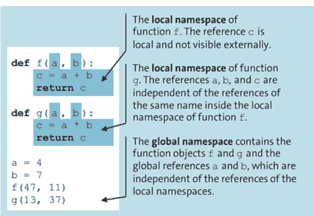

**图 17.1** 使用示例区分局部命名空间与全局命名空间

### 17.11.2 访问全局命名空间

在函数体的局部命名空间中，只要不存在同名的局部引用，就可以随时对全局引用进行读取访问：

```
python
>>> def f():
...     print(s)
...
>>> s = "global string"
>>> f()
global string
```

一旦尝试将新实例赋值给全局引用，就会创建相应的局部引用：

```
>>> def f():
...     s = "local string"
...     t = "other local string"
...     print(s, "/", t)
...
>>> s = "global string"
>>> f()
local string / other local string
>>> s
'global string'
>>> t
Traceback (most recent call last):
  File "<stdin>", line 1, in <module>
NameError: name 't' is not defined
```

函数仍然可以使用 `global` 语句将实例赋值给全局引用。为此，必须在函数体中写入 `global` 关键字，后跟一个或多个应被视为全局引用的名称：

```
>>> def f():
...     global s, t
...     s = "local string"
...     t = "other local string"
...     print(s, "/", t)
...
>>> s = "global string"
>>> f()
local string / other local string
>>> s
'local string'
>>> t
'other local string'
```

在 `f` 的函数体中，`s` 和 `t` 被显式标记为全局引用，因此可以将其用作全局引用。

### 17.11.3 局部函数

你也可以定义*局部函数*。这些是在另一个函数的局部命名空间中创建的函数，仅在该函数内有效，就像

## 17.11.4 访问父命名空间：nonlocal

在上一节中，我们讨论了两种现有的命名空间：全局命名空间和局部命名空间。这种划分是正确的，但它忽略了一个有趣的情况：根据[第17章第17.11.3节](https://example.com)，局部函数也可以在函数内部定义。当然，局部函数会在父函数的局部命名空间内再次引入自己的局部命名空间。这意味着嵌套函数可以访问其自身命名空间中的变量、在父函数中定义的变量以及全局变量。因此，通过嵌套函数定义，你无法将命名空间的世界简单地划分为局部和全局两个层面。不过，这里同样会产生一个问题：局部函数如何访问位于父函数局部命名空间中的引用？

`global`关键字在这里帮不上忙，因为它只提供对最外层全局命名空间的访问。但为此目的，我们有`nonlocal`关键字。让我们看下面的例子：

```
>>> def function1():
...     def function2():
...         nonlocal res
...         res += 1
...     res = 1
...     function2()
...     print(res)
...
>>> function1()
2
```

在`function1`函数内部，定义了一个局部函数`function2`，用于递增`function1`局部命名空间中的`res`引用。为此，必须在`function2`内部将`res`标记为`nonlocal`。这种表示法基于通过`global`访问全局命名空间中的引用。

在定义`function2`之后，`res`在`function1`的局部命名空间中被定义，并与值`1`关联。最后，调用局部函数`function2`，并输出`res`的值。在示例中，`function1`输出值`2`。

`nonlocal`关键字也可以用于多个嵌套函数，如前一个示例的扩展所示：

```
>>> def function1():
...     def function2():
...         def function3():
...             nonlocal res
...             res += 1
...         nonlocal res
...         function3()
...         res += 1
...     res = 1
...     function2()
...     print(res)
...
>>> function1()
3
```

现在，在`function2`的局部命名空间中定义了一个额外的局部函数`function3`。同样可以使用`nonlocal`从`function3`的局部命名空间递增`res`变量。在此示例中，`function1`函数输出值`3`。

一般来说，`nonlocal`对于更深的函数嵌套的工作方式是：它沿着命名空间层次结构向上移动，并将第一个具有指定名称的引用绑定到`nonlocal`关键字所在的命名空间中。

## 17.11.5 未绑定的局部变量：一个绊脚石

在本节中，我们将描述在使用同名的局部变量和全局变量时遇到的一个绊脚石。在下面的示例中，我们首先定义一个名为`name`的全局变量，然后定义一个名为`hello`的函数，该函数向`name`定义的人输出友好的问候：

```
>>> name = "Peter"
>>> def hello():
...     print("Hello,", name)
>>> hello()
Hello, Peter
```

正如我们之前讨论的，可以在函数内通过`name`标识符访问全局变量。在`hello`函数的命名空间中创建同名的局部变量也是可能的，并且按预期工作：

```
>>> name = "Peter"
>>> def hello():
...     name = "Johannes"
...     print("Hello,", name)
>>> hello()
Hello, Johannes
```

现在我们将尝试结合这两种变体：首先输出全局变量的值，然后创建并输出同名的局部变量：

```
>>> name = "Peter"
>>> def hello():
...     print("Hello,", name)
...     name = "Johannes"
...     print("Hello,", name)
...
>>> hello()
Traceback (most recent call last):
  ...
UnboundLocalError: cannot access local variable 'name' where it is not associated with a value
```

你可以看到，在这种情况下，第一次访问`name`变量时失败并出现`UnboundLocalError`。原因是，在编译函数时，`hello`函数局部命名空间中的`name`标识符已经被保留给一个局部变量。这种保留不会在函数运行时改变。因此，即使我们还没有创建局部变量`name`，它的名称在第一次`print`调用时就已经被保留给一个局部变量了。

如果我们在函数执行过程中使用`del`从局部命名空间中移除局部变量`name`，也可以达到类似的效果：

```
>>> name = "Peter"
>>> def hello():
...     name = "Johannes"
...     print("Hello,", name)
...     del name
...     print("Hello,", name)
>>> hello()
Hello, Johannes
Traceback (most recent call last):
  ...
UnboundLocalError: cannot access local variable 'name' where it is not
associated with a value
```

请注意，在这种情况下，`UnboundLocalError`仅在第二次访问`name`时发生——即在输出"Hello, Johannes"之后。

## 17.12 匿名函数

当使用内置的`sorted`函数对列表进行排序时，可以传递一个描述元素排序方式的函数。通过这种方式，可以根据自定义标准对元素进行排序：

```
>>> def s(x):
...     return -x
...
>>> sorted([1,4,7,3,5], key=s)
[7, 5, 4, 3, 1]
```

在这个例子中，函数`s`被定义为对传入的值取反，从而将列表按降序排序。像`s`这样在此类或类似上下文中使用的函数通常非常简单，它们被定义、使用，然后被遗忘。

使用`lambda`关键字，可以创建一个小型匿名函数来替代：

```
>>> s = lambda x: -x
```

`lambda`关键字后面跟着一个参数列表和一个冒号。冒号后面必须跟任何算术或逻辑表达式，其结果由匿名函数返回。请注意，限制为算术表达式排除了控制结构的使用，但不包括条件表达式的使用。

`lambda`表达式产生一个函数对象，可以像往常一样调用：`s(10)`。在这种情况下，返回值将是`-10`。然而，顾名思义，匿名函数通常在不分配名称的情况下使用。开头描述的排序问题提供了一个例子：

```
>>> sorted([1,4,7,3,5], key=lambda x: -x)
[7, 5, 4, 3, 1]
```

让我们看一个稍微复杂一点的匿名函数示例，它有三个参数：

```
>>> f = lambda x, y, z: (x - y) * z
```

匿名函数可以在不事先引用它们的情况下被调用。为此，`lambda`表达式必须用括号括起来：

```
>>> (lambda x, y, z: (x - y) * z)(1, 2, 3)
-3
```

## 17.13 递归

Python 允许程序员编写所谓的*递归*函数。这些函数会调用自身。被调用的函数会不断调用自身，直到一个终止条件结束这原本无尽的递归。嵌套函数调用的次数被称为*递归深度*，它在运行时环境中被限制在一个特定的值。

在下面的例子中，我们编写了一个递归函数来计算一个整数的阶乘：

```
def fac(n):
    if n > 1:
        return fac(n - 1) * n
    else:
        return 1
```

本节的目的并非全面介绍递归主题。相反，我们只想在此给你一个简要的概述。如果你一开始不理解这个例子，不要感到气馁，因为即使不使用递归，你也能很好地用 Python 编程。尽管如此，你不应该完全忽视递归，因为它是一种编写非常优雅程序的有趣方式。[73]

## 17.14 内置函数

在本书的过程中，我们经常提到*内置函数*。这些是预定义的函数，程序员可以随时使用。例如，你已经知道内置的 `len` 和 `range` 函数。在本节中，我们将详细描述一部分内置函数（见表 17.1）。请注意，还有其他内置函数无法在此讨论，因为它们需要面向对象编程的概念。所有 Python 内置函数的完整概述可以在本书的附录中找到。

| 内置函数 | 描述 | 章节 |
| :--- | :--- | :--- |
| `abs(x)` | 计算数字 `x` 的绝对值。 | [第 17.14.1 节](#) |
| `all(iterable)` | 检查可迭代对象的所有元素是否都返回值 `True`。 | [第 17.14.2 节](#) |
| `any(iterable)` | 检查可迭代对象中是否至少有一个元素返回值 `True`。 | [第 17.14.3 节](#) |
| `ascii(object)` | 创建一个描述 `object` 对象的可打印字符串。特殊字符被转义，以便输出仅包含 ASCII 字符。 | [第 17.14.4 节](#) |
| `bin(x)` | 返回一个表示整数 x 为二进制数的字符串。 | [第 17.14.5 节](Section 17.14.5) |
| `bool([x])` | 将 x 转换为布尔值。 | [第 17.14.6 节](Section 17.14.6) |
| `breakpoint()` | 停止程序流程，并在函数调用的位置启动集成的命令行调试器 PDB（参见[第 36 章，第 36.1 节](Chapter 36, Section 36.1)）。 | – |
| `bytearray([source, encoding, errors])` | 创建一个新的 `bytearray` 实例。 | [第 17.14.7 节](Section 17.14.7) |
| `bytes([source, encoding, errors])` | 创建一个新的 `bytes` 实例。 | [第 17.14.8 节](Section 17.14.8) |
| `chr(i)` | 返回 Unicode 码位为 i 的字符。 | [第 17.14.9 节](Section 17.14.9) |
| `complex([real, imag])` | 创建一个复数。 | [第 17.14.10 节](Section 17.14.10) |
| `dict([arg])` | 创建一个字典。 | [第 17.14.11 节](Section 17.14.11) |
| `divmod(a, b)` | 返回一个包含整除结果和余数的元组。`divmod(a, b)` 等价于 `(a // b, a % b)`。 | [第 17.14.12 节](Section 17.14.12) |
| `enumerate(iterable, [start])` | 为传入的可迭代对象返回一个枚举迭代器。 | [第 17.14.13 节](Section 17.14.13) |
| `eval(expression, [globals, locals])` | 计算 `expression` Python 表达式。 | [第 17.14.14 节](Section 17.14.14) |
| `exec(object, [globals, locals])` | 执行 Python 代码。 | [第 17.14.15 节](Section 17.14.15) |
| `filter(function, iterable)` | 允许你从可迭代对象中过滤出特定元素。 | [第 17.14.16 节](Section 17.14.16) |
| `float([x])` | 将 `x` 转换为浮点数。 | [第 17.14.17 节](Section 17.14.17) |
| `format(value, [format_spec])` | 使用 `format_spec` 格式规范格式化 `value` 值。 | [第 17.14.18 节](Section 17.14.18) |
| `frozenset([iterable])` | 创建一个不可变集合。 | [第 17.14.19 节](Section 17.14.19) |
| `globals()` | 返回一个包含全局命名空间所有引用的字典。 | [第 17.14.20 节](Section 17.14.20) |
| `hash(object)` | 返回 `object` 实例的哈希值。 | [第 17.14.21 节](Section 17.14.21) |
| `help([object])` | 启动 Python 的内置交互式帮助。 | [第 17.14.22 节](Section 17.14.22) |
| `hex(x)` | 将整数 `x` 的十六进制值作为字符串返回。 | [第 17.14.23 节](Section 17.14.23) |
| `id(object)` | 返回 `object` 实例的标识符。 | [第 17.14.24 节](Section 17.14.24) |
| `input([prompt])` | 从键盘读取一个字符串。 | [第 17.14.25 节](Section 17.14.25) |
| `int(x, [base])` | 将 `x` 转换为整数。 | [第 17.14.26 节](Section 17.14.26) |
| `len(s)` | 返回 `s` 实例的长度。 | [第 17.14.27 节](Section 17.14.27) |
| `list([iterable])` | 创建一个列表。 | [第 17.14.28 节](Section 17.14.28) |
| `locals()` | 返回一个包含局部命名空间所有引用的字典。 | [第 17.14.29 节](Section 17.14.29) |
| `map(function, [*iterables])` | 将 `function` 函数应用于传入的可迭代对象的每个元素。 | [第 17.14.30 节](Section 17.14.30) |
| `max(iterable, {default, key})`<br>`max(arg1, arg2, [*args], {key})` | 返回 `iterable` 中的最大元素。 | [第 17.14.31 节](Section 17.14.31) |
| `min(iterable, {default, key})`<br>`min(arg1, arg2, [*args], {key})` | 返回 `iterable` 中的最小元素。 | [第 17.14.32 节](Section 17.14.32) |
| `oct(x)` | 将整数 `x` 的八进制值作为字符串返回。 | [第 17.14.33 节](Section 17.14.33) |
| `open(file, [mode, buffering, encoding, errors, newline, closefd])` | 创建一个文件对象。 | [第 6 章，第 6.4.1 节](Chapter 6, Section 6.4.1) |
| `ord(c)` | 返回字符 `c` 的 Unicode 码位。 | [第 17.14.34 节](Section 17.14.34) |
| `pow(x, y, [z])` | 执行幂运算。 | [第 17.14.35 节](Section 17.14.35) |
| `print([*objects], {sep, end, file})` | 将传入的对象输出到屏幕或其他输出流。 | [第 17.14.36 节](Section 17.14.36) |
| `range([start], stop, [step])` | 创建一个从 `start` 到 `stop` 的数字序列的迭代器。 | [第 17.14.37 节](Section 17.14.37) |
| `repr(object)` | 返回 `object` 实例的字符串表示。 | [第 17.14.38 节](Section 17.14.38) |
| `reversed(seq)` | 创建一个反向遍历 `seq` 可迭代对象的迭代器。 | [第 17.14.39 节](Section 17.14.39) |
| `round(x, [n])` | 将数字 x 四舍五入到 n 位小数。 | [第 17.14.40 节](https://example.com) |
| `set([iterable])` | 创建一个集合。 | [第 17.14.41 节](https://example.com) |
| `sorted(iterable, [key, reverse])` | 对可迭代对象进行排序。 | [第 17.14.42 节](https://example.com) |
| `str([object, encoding, errors])` | 创建一个字符串。 | [第 17.14.43 节](https://example.com) |
| `sum(iterable, [start])` | 返回可迭代对象所有元素的总和。 | [第 17.14.44 节](https://example.com) |
| `tuple([iterable])` | 创建一个元组。 | [第 17.14.45 节](https://example.com) |
| `type(object)` | 返回实例的数据类型。 | [第 17.14.46 节](https://example.com) |
| `zip([*iterables])` | 将多个序列组合成元组——例如，以便用 `for` 循环遍历它们。 | [第 17.14.47 节](https://example.com) |

**表 17.1** 本节描述的内置函数

### 17.14.1 abs(x)

`abs` 函数计算 x 的绝对值。x 参数必须是一个数值——例如，`int`、`float`、`bool` 或 `complex` 数据类型的实例：

```
>>> abs(1)
1
>>> abs(-12.34)
12.34
>>> abs(3 + 4j)
5.0
```

## 17.14.2 all(iterable)

`all` 函数在传入的可迭代对象（例如列表或元组）的所有元素都产生真值 `True` 时，总是返回 `True`。其用法如下：

```
>>> all([True, True, False])
False
>>> all([True, True, True])
True
```

传入的可迭代对象不一定只包含 `bool` 实例。其他数据类型的实例会根据 [第 11 章，第 11.6.2 节](Chapter 11, Section 11.6.2) 中描述的规则转换为真值。

## 17.14.3 any(iterable)

`any` 函数的工作方式与 `all` 类似。当传入的可迭代对象（例如列表或元组）的至少一个元素返回真值 `True` 时，它总是返回 `True`。其用法如下：

```
>>> any([True, False, False])
True
>>> any([False, False, False])
False
```

传入的可迭代对象不一定只包含 `bool` 实例。其他数据类型的实例会根据 [第 11 章，第 11.6.2 节](Chapter 11, Section 11.6.2) 中描述的规则转换为真值。

## 17.14.4 ascii(object)

`ascii` 函数返回 `object` 实例的可读等价形式（例如字面量）作为字符串。与具有相同目的的内置 `repr` 函数不同，`ascii` 返回的字符串仅包含 ASCII 字符集中的字符：

```
>>> ascii(range(0, 10))
'range(0, 10)'
>>> ascii("Püthon")
"'P\xfcthon'"
>>> repr("Püthon")
"'Püthon'"
```

## 17.14.5 bin(x)

`bin` 函数返回一个字符串，其中包含传入的整数 `x` 的二进制表示：

```
>>> bin(123)
'0b1111011'
>>> bin(-12)
'-0b1100'
>>> bin(0)
'0b0'
```

## 17.14.6 bool([x])

此函数创建一个 `bool` 数据类型的实例，其真值与实例 `x` 相同。`x` 的真值根据 [第 11 章，第 11.6.2 节](Chapter 11, Section 11.6.2) 中指定的规则确定。

如果未传递任何参数，`bool` 函数返回布尔值 `False`。

## 17.14.7 bytearray([source, encoding, errors])

`bytearray` 函数创建一个 `bytearray` 数据类型的实例，[74] 它表示一个字节值序列——即 0 到 255 范围内的整数。请注意，与 `bytes` 不同，`bytearray` 是一种可变数据类型。

`source` 参数用于初始化字节数组，可以有不同的含义。

如果为 `source` 传递一个字符串，它将使用 `encoding` 和 `errors` 参数编码为字节序列，然后用于初始化字节数组。此处，`encoding` 和 `errors` 参数与内置 `str` 函数中的含义相同。

如果为 `source` 传递一个整数，则会创建一个长度为 `source` 的字节数组，并用零填充。

如果为 `source` 传递一个可迭代对象（如列表），则字节数组将用 `source` 迭代的元素填充。请注意，这些元素必须是 0 到 255 范围内的整数。

此外，任何支持所谓缓冲区协议的数据类型的实例都可以作为 `source` 传递。例如，这包括 `bytes` 和 `bytearray` 数据类型本身：

```
>>> bytearray("äöü", "utf-8")
bytearray(b'\xc3\xa4\xc3\xb6\xc3\xbc')
>>> bytearray([1,2,3,4])
bytearray(b'\x01\x02\x03\x04')
>>> bytearray(10)
bytearray(b'\x00\x00\x00\x00\x00\x00\x00\x00\x00\x00')
```

> **注意**

在 Windows 中，命令提示符中输入特殊字符可能会出现问题。如果遇到此类问题，可以使用 IDLE 来运行受影响的示例。

有关更多信息，请参阅 [第 12 章，第 12.5.4 节](Chapter 12, Section 12.5.4)。

## 17.14.8 bytes([source, encoding, errors])

此函数创建一个 `bytes[75]` 数据类型的实例，它与 `bytearray` 数据类型一样，存储一个字节值序列。然而，与 `bytearray` 相比，它是一种不可变数据类型，因此我们也称其为 `bytes` 字符串。

`source`、`encoding` 和 `errors` 参数用于初始化字节序列，其方式与内置 `bytearray` 函数相同：

```
>>> bytes(10)
b'\x00\x00\x00\x00\x00\x00\x00\x00\x00\x00'
>>> bytes([1,2,3])
b'\x01\x02\x03'
>>> bytes("äöü", "utf-8")
b'\xc3\xa4\xc3\xb6\xc3\xbc'
```

## 17.14.9 chr(i)

`chr` 函数返回一个长度为 1 的字符串，其中包含 Unicode 码位为 `i` 的字符：

```
>>> chr(65)
'A'
>>> chr(33)
'!'
>>> chr(8364)
'€'
```

有关字符编码的更多信息，请参阅 [第 12 章，第 12.5.4 节](Chapter 12, Section 12.5.4)。

## 17.14.10 complex([real, imag])

此函数创建一个 `complex[76]` 数据类型的实例，用于存储复数。生成的实例具有复数值 *real* + *imag* · *j*。缺失的参数假定为 0。

也可以将包含复数字面量的字符串传递给 `complex` 函数。但是，在这种情况下，不能指定任何其他参数：

```
>>> complex(1, 3)
(1+3j)
>>> complex(1.2, 3.5)
(1.2+3.5j)
>>> complex("3+4j")
(3+4j)
>>> complex("3")
(3+0j)
```

请注意，任何传递的字符串都不能在 `+` 运算符周围包含任何空格：

```
>>> complex("3 + 4j")
Traceback (most recent call last):
  File "<stdin>", line 1, in <module>
ValueError: complex() arg is a malformed string
```

但是，字符串开头或结尾的空格不会造成问题。

## 17.14.11 dict([source])

此函数创建一个 `dict` 数据类型的实例。[77] 如果未传递任何参数，它将创建一个空字典。使用以下调用之一，可以在创建字典时用值填充它：

- 如果 `source` 是一个字典，则该字典的键和值将被复制到新字典中。请注意，这不会创建值的副本，而是值继续引用相同的实例：

```
>>> dict({"a": 1, "b": 2})
{'a': 1, 'b': 2}
```

- 或者，`source` 可以是一个迭代元组的对象，其中每个元组必须包含两个元素：键及其关联的值。

```
>>> dict([("a", 1), ("b", 2)])
{'a': 1, 'b': 2}
```

- 此外，`dict` 允许你将键和值作为关键字参数传递。参数名称用作键。请注意，这在分配名称时会受到标识符的约束：

```
>>> dict(a=1, b=2)
{'a': 1, 'b': 2}
```

## 17.14.12 divmod(a, b)

`divmod` 函数返回以下元组：`(a//b, a%b)`。除了 `complex` 之外，任何数值数据类型的实例都可以作为 `a` 和 `b` 传递：

```
>>> divmod(2.5, 1.3)
(1.0, 1.2)
>>> divmod(11, 4)
(2, 3)
```

## 17.14.13 enumerate(iterable, [start])

`enumerate` 函数创建一个可迭代对象，该对象产生形式为 `(i, iterable[i])` 的元组，而不仅仅是遍历 `iterable` 的元素。在此上下文中，`i` 是一个从 `start`（默认为 0）开始的循环计数器。当 `enumerate` 调用的结果转换为列表时，这些元组结构变得明显：

```
>>> list(enumerate(["a", "b", "c", "d"]))
[(0, 'a'), (1, 'b'), (2, 'c'), (3, 'd')]
```

这使得 `enumerate` 特别适合在需要包含数字循环计数器的 `for` 循环中使用。在 `for` 循环中，`enumerate` 可以如下使用：

```
>>> for i, value in enumerate([1,2,3,4,5]):
...     print("The value of iterable in position", i, "is:", value)
The value of iterable in position 0 is: 1
The value of iterable in position 1 is: 2
The value of iterable in position 2 is: 3
The value of iterable in position 3 is: 4
The value of iterable in position 4 is: 5
```

## 17.14.14 eval(expression, [globals, locals])

`eval` 函数将 `expression` Python 表达式作为字符串进行求值，并返回其结果：

```
>>> eval("1+1")
2
```

调用 `eval` 时，可以通过 `globals` 和 `locals` 参数指定表达式求值所需的全局和局部命名空间。如果未指定这些参数，`expression` 将在调用 `eval` 的环境中求值：

```
>>> x = 12
>>> eval("x**2")
144
```

> **注意**

有时 `eval` 用于将用户输入解释为 Python 代码：

```
>>> eval(input("Enter Python code: "))
Enter Python code: 2**4
16
```

请注意，如果用户输入未经仔细检查，这种使用 `eval` 的方式可能存在风险。恶意用户或不受信任的数据源可以在此处操纵程序执行。

## 17.14.15 exec(object, [globals, locals])

## 17.14.16 `filter(function, iterable)`

`filter` 函数期望一个函数对象作为其第一个参数，一个可迭代对象作为其第二个参数。为 `function` 传递的函数对象必须期望一个参数并返回一个布尔值。

`filter` 函数为 `iterable` 可迭代对象的每个元素调用传递的函数，并创建一个可迭代对象，该对象遍历所有 `function` 返回 `True` 的 `list` 元素。这将通过以下示例进行说明，其中 `filter` 用于从整数列表中过滤出奇数：

```
>>> filterobj = filter(lambda x: x%2 == 0, range(21))
>>> print(list(filterobj))
[0, 2, 4, 6, 8, 10, 12, 14, 16, 18, 20]
```

## 17.14.17 float([x])

这将创建一个 `float` 数据类型的实例。[78] 如果未指定参数 `x`，则实例的值将初始化为 `0.0`，否则初始化为传递的值。除了 `complex` 之外，所有数值数据类型都可以作为 `x` 传递给实例：

```
>>> float()
0.0
>>> float(5)
5.0
```

也可以为 `x` 传递一个包含浮点数的字符串：

```
>>> float("1e30")
1e+30
>>> float("0.5")
0.5
>>> float("inf")
inf
```

## 17.14.18 format(value, [format_spec])

`format` 函数根据 `format_spec` 格式规范返回 `value` 值。例如，可以将货币金额在输出中四舍五入到两位小数，如下所示：

```
>>> format(1.23456, ".2f") + "€"
'1.23€'
```

有关格式规范的详细信息，请参阅关于字符串格式化的[第 12 章，第 12.5.3 节](Chapter 12, Section 12.5.3)。

## 17.14.19 frozenset([iterable])

此函数创建一个 `frozenset`[79] 数据类型的实例，用于存储不可变集合。如果指定了 `iterable` 参数，则生成的集合的元素取自此可迭代对象。如果未指定 `iterable` 参数，则 `frozenset` 生成一个空集合。

请注意，`frozenset` 不能包含任何可变元素；此外，每个元素在集合中只能出现一次：

```
>>> frozenset()
frozenset()
>>> frozenset({1,2,3,4,5})
frozenset({1, 2, 3, 4, 5})
>>> frozenset("Pyyyyyyython")
frozenset({'t', 'P', 'n', 'y', 'h', 'o'})
```

## 17.14.20 globals()

内置的 `globals` 函数返回一个字典，其中包含当前命名空间的所有全局引用。键对应于引用名称（字符串），值对应于相应的实例：

```
>>> a = 1
>>> b = {}
>>> c = [1,2,3]
>>> globals()
{..., 'a': 1, 'b': {}, 'c': [1, 2, 3]}
```

返回的字典包含全局命名空间中存在的其他引用，除了示例中创建的引用，这在示例中用三个点表示。

## 17.14.21 hash(object)

`hash` 函数计算 `object` 实例的*哈希值*并返回它。哈希值是从实例的类型和值生成的整数。这样的值可用于有效地检查两个更复杂的实例是否相等。例如，字典的键在内部通过其哈希值进行管理：

```
>>> hash(12345)
12345
>>> hash("Hello World")
-1324507931790039535
>>> hash((1,2,3,4))
485696759010151909
```

注意可变实例和不可变实例之间的区别。虽然从形式上也可以从可变实例计算哈希值，但该值仅在实例未更改时才有效。因此，计算可变实例的哈希值没有用处；可变实例是“不可哈希的”：

```
>>> hash([1,2,3,4])
Traceback (most recent call last):
  File "<stdin>", line 1, in <module>
TypeError: unhashable type: 'list'
```

> **注意**
>
> 出于安全原因，`str`、`bytes` 和 `datetime` 实例的哈希值是随机化的。这意味着这些数据类型在两个不同的解释器进程中的哈希值是不同的。然而，在同一进程中，它们不会改变。

## 17.14.22 help([object])

`help` 函数启动 Python 的交互式帮助。如果 `object` 参数是一个字符串，它将在帮助系统中查找。如果它是另一个实例，将为其生成一个动态帮助页面。有关更多详细信息，请参阅[第 37 章](Chapter 37)，[第 37.1 节](Section 37.1)。

## 17.14.23 hex(x)

`hex` 函数生成一个字符串，其中包含作为参数 `x` 传递的整数的十六进制表示。字符串中显示的数字对应于十六进制数的 Python 字面量。

```
>>> hex(12)
'0xc'
>>> hex(0xFF)
'0xff'
>>> hex(-33)
'-0x21'
```

## 17.14.24 id(object)

`id` 函数返回任何实例的身份标识。实例的身份标识是一个唯一标识该实例的整数。

```
>>> id(1)
134537016
>>> id([1,2,3])
4328840000
>>> id("test")
4326941040
```

有关身份标识的更多信息，请参阅[第 7 章，第 7.1.3 节](Chapter 7, Section 7.1.3)。

## 17.14.25 input([prompt])

`input` 函数从用户读取输入并以字符串形式返回。`prompt` 参数是可选的。在这里，你可以指定一个在提示之前输出的字符串：

```
>>> s = input("Enter a text: ")
Enter a text: Python is good
>>> s
'Python is good'
```

> **注意**
>
> 内置的 `input` 函数的行为在 Python 3 中发生了变化。在 Python 2 中，用户的输入被解释器作为 Python 表达式进行求值，并将此求值的结果作为字符串返回。因此，“旧的” `input` 函数对应于以下代码：
>
> ```python
> >>> eval(input("Prompt: "))
> Prompt: 2+2
> 4
> ```
>
> 当前版本的 Python 中存在的 `input` 函数在 Python 2 中被称为 `raw_input`。

## 17.14.26 `int([x, base])`

此函数创建一个 `int` 数据类型的实例。[80] 可以通过为 `x` 指定一个值来初始化实例。如果未指定参数，则创建的实例接收值 `0`。

如果为 `x` 传递一个字符串，则 `int` 函数期望此字符串包含所需的整数值。可选的 `base` 参数可用于指定数字书写的进制：

```
>>> int(5)
5
>>> int("FF", 16)
255
>>> int(hex(12), 16)
12
```

## 17.14.27 `len(s)`

`len` 函数返回 `s` 的长度或元素数量。对于 `s`，可以传递序列、映射或集合：

```
>>> len("Hello World")
11
>>> len([1,2,3,4,5])
5
>>> len({"a": 1, "b": 2})
2
```

## 17.14.28 list([sequence])

此函数从 `sequence` 的元素创建一个 `list` 数据类型[81] 的实例。`sequence` 参数必须是一个可迭代对象。如果省略，将生成一个空列表：

```
>>> list()
[]
>>> list((1,2,3,4))
[1, 2, 3, 4]
>>> list({"a": 1, "b": 2})
['a', 'b']
```

`list` 函数可用于将任何可迭代对象转换为列表：

```
>>> list(range(0, 10, 2))
[0, 2, 4, 6, 8]
```

## 17.14.29 locals()

内置的 `locals` 函数返回一个字典，其中包含当前命名空间的所有局部引用。键对应于引用名称（字符串），值对应于相应的实例。以下示例说明了这一点：

```
>>> def f(a, b, c):
...     d = a + b + c
...     print(locals())
...
>>> f(1, 2, 3)
{'a': 1, 'b': 2, 'c': 3, 'd': 6}
```

在主程序的命名空间中调用 `locals` 等同于调用 `globals`。

## 17.14.30 map(function, [*iterable])

此函数期望一个函数对象作为第一个参数，一个可迭代对象作为第二个参数。可选地，可以传递更多的可迭代对象，但它们必须与第一个具有相同的长度。传递的函数必须期望与传递的可迭代对象数量相同的参数。

`map` 函数为 `iterable` 的每个元素调用 `function`，并返回一个可迭代对象，该对象遍历 `function` 的相应返回值。如果传递了多个可迭代对象，则这些对象的第 n 个元素在每次调用时传递给 `function`。

在以下示例中，函数对象是使用 `lambda` 创建的匿名函数。也可以通过 `def` 定义一个函数并传递其名称。

在第一个示例中，我们使用 map 生成一个初始列表元素的平方列表：

```
>>> f = lambda x: x**2
>>> result = map(f, [1,2,3,4])
>>> list(result)
[1, 4, 9, 16]
```

在第二个示例中，我们使用 `map` 从两个列表创建一个包含初始列表相应元素之和的列表：

```
>>> f = lambda x, y: x+y
>>> result = map(f, [1,2,3,4], [1,2,3,4])
>>> list(result)
[2, 4, 6, 8]
```

[图 17.2](Figure 17.2) 说明了此示例。传入和传出的可迭代对象分别垂直显示。

## 17.14.31 max(iterable, {default, key}), max(arg1, arg2, [*args], {key})

如果未传递额外参数，`max` 期望一个可迭代对象并返回其最大元素：

```
>>> max([2,4,1,9,5])
9
>>> max("Hello World")
'r'
```

如果传递了多个参数，`max` 的行为是返回传递的参数中最大的那个：

```
>>> max(3, 5, 1, 99, 123, 45)
123
>>> max("Hello", "World", "!")
'World'
```

`max` 函数可以通过 `key` 关键字参数可选地传递一个函数对象。然后，最大值是通过比较该函数的返回值来确定的。因此，`key` 参数可用于指定自定义排序。在下面的示例中，`key` 用于使 `max` 函数对字符串*不区分大小写*。为此，我们首先看一下不使用 `key` 的常规调用：

```
>>> max("a", "P", "q", "X")
'q'
```

没有自定义 `key` 函数时，最大参数是通过包含大写和小写字母来确定的。以下 `key` 函数将所有字母预先转换为小写：

```
>>> f = lambda x: x.lower()
>>> max("a", "P", "q", "X", key=f)
'X'
```

`map` 函数根据 `f` 修改后的值确定其参数中的最大值，但返回的是未修改的原始值。
最后一个关键字参数 `default` 可用于指定当 `iterable` 为空时 `max` 应返回的值。

## 17.14.32 min(iterable, {default, key}), min(arg1, arg2, [*args], {key})

`min` 函数的行为与 `max` 类似，但确定的是序列中的最小元素或传递的参数中最小的那个。

## 17.14.33 oct(x)

`oct` 函数生成一个字符串，其中包含以八进制表示法表示的传递的整数 `x`：

```
>>> oct(123)
'0o173'
>>> oct(0o777)
'0o777'
```

## 17.14.34 ord(c)

`ord` 函数期望一个长度为 1 的字符串，并返回所包含字符的 Unicode 码位：

```
>>> ord("P")
80
>>> ord("€")
8364
```

有关 Unicode 和码位的更多信息，请参阅[第 12 章，第 12.5.4 节](Chapter 12, Section 12.5.4)。

## 17.14.35 pow(x, y, [z])

计算 `x ** y`，或者如果指定了 `z`，则计算 `x ** y % z`。使用 `z` 参数时，`pow` 使用比表达式 `pow(x, y) % z` 或 `x ** y % z` 更高效的实现：

```
>>> 7 ** 5 % 4
3
>>> pow(7, 5, 4)
3
```

## 17.14.36 print([*objects], {sep, end, file, flush})

`print` 函数将为 `objects` 传递的实例的文本等效项写入 `file` 数据流。到目前为止，我们只使用 `print` 来写入屏幕或标准输出。但在这里你可以看到，`print` 允许你通过 `file` 关键字参数写入任何为写入而打开的 `file` 对象：

```
>>> with open("datei.txt", "w") as f:
...     print("Hello World", file=f)
```

`sep` 关键字参数预赋值为空格，用于指定要放置在两个要输出的值之间的分隔符：

```
>>> print("Hello", "World")
Hello World
>>> print("Hello", "you", "beautiful", "world", sep="-")
Hello-you-beautiful-world
```

第二个关键字参数 `end` 用于确定 `print` 最后应输出哪个字符——即在所有传递的实例都输出之后。此参数预赋值为换行符：

```
>>> print("Hello", end=" World\n")
Hello World
>>> print("Hello", "World", end="AAAA")
Hello WorldAAAA>>>
```

在最后一个示例中，解释器的提示符直接位于 `print` 生成的输出之后，因为与 `print` 的默认行为相反，最后没有输出换行符。

使用最后一个参数 `flush`，你可以在输出后强制清空数据流缓冲区。

## 17.14.37 range([start], stop, [step])

`range` 函数创建一个可迭代对象，用于遍历连续的数值。生成的序列从 `start` 开始，在 `stop` 之前结束，并在每一步中将前一个值增加 `step`。`start` 和 `step` 都是可选的，分别预设为 0 和 1。

请注意，`stop` 表示一个未达到的限制。因此，编号从 0 开始，在达到 `stop` 之前一步结束。

`range` 返回的可迭代对象是一个 `range` 对象。这在交互模式输出中显示如下：

```
>>> range(10)
range(0, 10)
```

为了说明 `range` 对象遍历哪些数字，在以下示例中使用 `list` 将其转换为列表：

```
>>> list(range(10))
[0, 1, 2, 3, 4, 5, 6, 7, 8, 9]
>>> list(range(5, 10))
[5, 6, 7, 8, 9]
>>> list(range(2, 10, 2))
[2, 4, 6, 8]
```

也可以指定负的步长：

```
>>> list(range(10, 0, -1))
[10, 9, 8, 7, 6, 5, 4, 3, 2, 1]
>>> list(range(10, 0, -2))
[10, 8, 6, 4, 2]
```

> **注意**

在 Python 2 中，存在内置的 `range` 和 `xrange` 函数。旧的 `range` 函数将结果作为列表返回，而 `xrange` 函数的工作方式类似于当前版本 Python 中的 `range` 函数。

## 17.14.38 repr(object)

`repr` 函数返回一个字符串，其中包含 `object` 实例的可打印表示，例如一个字面量。对于许多实例，`repr` 尝试在字符串中写入创建相应实例的 Python 代码。然而，对于某些实例，这是不可能或不切实际的。在这种情况下，`repr` 至少输出实例的简短描述，包括其数据类型和部分属性值。

```
>>> repr([1,2,3,4])
'[1, 2, 3, 4]'
>>> repr(0x34)
>>> repr(set([1,2,3,4]))
'{1, 2, 3, 4}'
>>> with open("file.txt", "w") as file:
...     repr(file)
"<_io.TextIOWrapper name='file.txt' mode='w' encoding='UTF-8'>"
```

## 17.14.39 reversed(sequence)

使用 `reversed`，可以反向遍历顺序数据类型的序列实例：

```
>>> for i in reversed([1, 2, 3, 4, 5, 6]):
...     print(i)
6
5
4
3
2
1
```

## 17.14.40 round(x, [n])

`round` 函数将浮点数 `x` 四舍五入到 `n` 位小数。`n` 参数是可选的，预设为 0：

```
>>> round(-0.5)
0
>>> round(0.5234234234234, 5)
0.52342
>>> round(0.5, 4)
0.5
```

## 17.14.41 set([iterable])

此函数创建一个 set 数据类型的实例。[82] 如果指定了，可迭代对象的所有元素都将包含在集合中。请注意，集合不能包含任何重复项，因此可迭代对象中多次出现的每个元素只输入一次：

```
>>> set()
set()
>>> set("Hello World")
{'d', 'r', 'e', 'l', ' ', 'W', 'H', 'o'}
>>> set((1,2,3,4))
{1, 2, 3, 4}
```

## 17.14.42 sorted(iterable, [key, reverse])

`sorted` 函数从可迭代对象的元素生成一个排序后的列表：

```
>>> sorted([3,1,6,2,9,1,8])
[1, 1, 2, 3, 6, 8, 9]
>>> sorted("Hello World")
[' ', 'H', 'W', 'd', 'e', 'l', 'l', 'l', 'o', 'o', 'r']
```

`sorted` 的操作方式与我们在[第 12 章，第 12.3.4 节](Chapter 12, Section 12.3.4)中描述的顺序数据类型的 `sort` 方法相同。

## 17.14.43 str([object, encoding, errors])

`str` 方法创建一个字符串，[83] 其中包含作为 `object` 传递的实例的可读描述。如果未传递 `object`，`str` 生成一个空字符串：

```
>>> str(None)
'None'
>>> str()
''
>>> str(12345)
'12345'
>>> str(str)
"<class 'str'>"
```

`str` 函数可用于将 `bytes` 字符串或 `bytearray` 实例转换为字符串。此过程称为*解码*，并且至少必须指定 `encoding` 参数：

```
>>> b = bytearray([1,2,3])
>>> str(b, "utf-8")
'\x01\x02\x03'
>>> b = bytes("Hellö Wörld", "utf-8", "strict")
>>> str(b)
"b'Hell\xc3\xb6 W\xc3\xb6rld'"
>>> str(b, "utf-8")
'Hellö Wörld'
```

对于 `encoding` 参数，必须传递一个字符串，其中包含用于编码 `bytes` 字符串的编码——在本例中为 `utf-8`。在前面的示例中未指定 `errors` 参数；它决定如何处理解码错误。[表 17.2](#) 列出了 `errors` 的可能值及其含义。

| 错误值 | 描述 |
| :--- | :--- |
| `"strict"` | 如果发生解码错误，则引发 `ValueError` 异常。 |
| `"ignore"` | 忽略解码过程中的错误。 |
| `"replace"` | 无法解码的字符将被 U+FFFD Unicode 字符替换，也称为*替换字符*。 |

**表 17.2** errors 参数的可能值

> **注意**

请注意，`str` 数据类型在 Python 3 中经过了修订。与 Python 2 中的 `str` 数据类型不同，在 Python 3 中它旨在存储 Unicode 文本。因此，它与 Python 2 中的 `unicode` 数据类型相当。Python 2 中的 `str` 数据类型可以与 Python 3 中的 `bytes` 字符串相比较。

有关 `str` 和 `bytes` 数据类型以及 Unicode 的更多信息，请参阅[第 12 章](#)、[第 12.5.4 节](#)。

## 17.14.44 sum(iterable, [start])

`sum` 函数计算可迭代对象所有元素的总和并返回结果。如果指定了可选的 `start` 参数，它也会作为计算的起始值包含在总和中：

```
>>> sum([1,2,3,4])
10
>>> sum([1,2,3,4], 2)
12
```

## 17.14.45 tuple([iterable])

此函数从 `iterable` 的元素创建一个 `tuple` 数据类型[84]的实例：

```
>>> tuple()
()
>>> tuple([1,2,3,4])
(1, 2, 3, 4)
```

## 17.14.46 type(object)

`type` 函数返回传入 `object` 的数据类型：

```
>>> type(1)
<class 'int'>
>>> type("Hello World") == str
True
>>> type(sum)
<class 'builtin_function_or_method'>
```

## 17.14.47 zip([*iterables], {strict})

`zip` 函数接受任意数量的可迭代对象作为参数。如果它们的长度不全相同，较长的对象将只考虑到这些对象中最短的那个的长度。

返回值是一个可迭代对象，它在第 i 次迭代步骤中遍历包含传入序列第 i 个元素的元组：

```
>>> result = zip([1,2,3,4], [5,6,7,8], [9,10,11,12])
>>> list(result)
[(1, 5, 9), (2, 6, 10), (3, 7, 11), (4, 8, 12)]
>>> result = zip("Hello World", "HeWo")
>>> list(result)
[('H', 'H'), ('e', 'e'), ('l', 'W'), ('l', 'o')]
```

[第17章，第17.14.13节](Chapter 17, Section 17.14.13)中描述的 `enumerate` 函数是 `zip` 函数的一个特例：

```
>>> s = "Python"
>>> list(zip(range(len(s)), s))
[(0, 'P'), (1, 'y'), (2, 't'), (3, 'h'), (4, 'o'), (5, 'n')]
```

在 Python 3.10 中，添加了仅关键字参数 `strict`，其默认值为 `False`。如果传入 `strict=True`，当传入的可迭代对象长度不同时，`zip` 会引发异常：

```
>>> s = "strict check"
>>> list(zip(s, "Hello", strict=True))
Traceback (most recent call last):
  File "<stdin>", line 1, in <module>
ValueError: zip() argument 2 is shorter than argument 1
```

这种模式确保了数据不会因为其中一个可迭代对象提供的元素比另一个少而被无意中忽略。

本章提供了关于内置函数首批选择的信息。[第19章，第19.9节](Chapter 19, Section 19.9)包含了具有面向对象背景的内置函数的描述。

## 18 模块和包

所谓的*模块*允许将源代码组织成独立的单元。模块通常提供服务于特定目的的数据类型和函数，例如处理特定文件格式的文件。模块可以*导入*到程序中，然后为程序员提供包含的功能。基本上，有三种类型的模块：

- *标准库*模块存在于每个 Python 安装中，因此每个 Python 程序都可以预期使用它们。一些标准库模块可以在 Python 安装的 *lib/python3.11* 子目录中找到。其他一些标准库模块，例如 `sys`，直接在 Python 解释器中实现，称为*内置模块*。
- 此外，任何 Python 程序都可以导入*全局*模块，也称为*库*。全局模块在 Python 安装的 *site-packages* 子目录中系统范围内安装，对所有 Python 程序都同样可用。可以编写自己的全局模块或安装第三方全局模块。
- 最后一种变体是*本地模块*。这是将单个程序部分封装在自己的程序文件中。这些文件可以像库一样导入，但不能在任何其他 Python 程序中使用。这种模块化形式在编程中很有用，因为它允许程序员以可管理的方式将长程序代码划分为不同的程序文件。

在 Python 中，本地模块和全局模块最重要的区别在于它们存储的位置。本地模块通常位于程序目录或其子目录之一，而全局模块存储在 Python 安装的几个指定目录中。

Python 解释器查找本地和全局模块的目录列在 `sys.path` 列表中：

```
>>> import sys
>>> sys.path
['', '/python/installation/lib/python311.zip', '/python/installation/lib/python3.11', '/python/installation/lib/python3.11/lib-dynload', '/python/installation/lib/python3.11/site-packages']
```

目录按它们在 `sys.path` 中出现的顺序进行搜索，列表开头的空字符串代表本地工作目录。可以使用 `PYTHONPATH` 环境变量指定其他目录。这些目录随后在本地工作目录之后，以第二位输入到 `sys.path` 中。`sys.path` 列表可以被程序修改。

### 18.1 导入全局模块

全局模块——无论是标准库的一部分还是自己编写的——都可以使用 `import` 语句导入。在以下示例中，我们将主要使用标准库的 `math` 模块。这是一个提供数学函数（如 `sin` 或 `cos`）以及数学常量（如 `pi`）的模块。要在程序中利用此功能，使用以下形式的 `import` 语句：

```
>>> import math
```

`import` 语句由 `import` 关键字后跟模块名组成。可以通过在关键字后编写多个模块名（用逗号分隔）来同时导入多个模块：

```
>>> import math, random
```

这等同于以下内容：[85]

```
>>> import math
>>> import random
```

尽管 `import` 语句基本上可以放在源代码中的任何位置，但为了清晰起见，在源代码的开头导入所有模块是有意义的。

一旦导入了模块，就会创建一个以其名称命名的新命名空间。模块的所有函数、数据类型和值都可以通过此命名空间在程序中使用。命名空间可以像实例一样处理，而模块的函数可以像命名空间的方法一样使用。因此，以下示例程序导入 `math` 模块并计算数字 π 的正弦值：

```
>>> import math
>>> math.sin(math.pi)
1.2246467991473532e-16
```

可以使用 `import/as` 语句指定命名空间名称：

```
>>> import math as mathematics
>>> mathematics.sin(mathematics.pi)
1.2246467991473532e-16
```

这个新名称不是一个额外的选项。`math` 模块现在只能通过名称 `mathematics` 访问。

此外，`import` 语句可以以这样的方式使用：不会为导入的模块创建单独的命名空间，而是将模块的所有元素导入到程序的全局命名空间中：

```
>>> from math import *
>>> sin(pi)
1.2246467991473532e-16
```

请注意，以下划线开头的名称不会以这种方式导入。模块的这些元素被视为实现细节，因此是模块内部的。

> **注意**

命名空间的目的是封装具有不同主题的部分（例如模块的内容），并通过一个公共名称来寻址它们。如果将模块的完整内容导入到程序的全局命名空间中，库可能会干扰可能存在的任何引用。在这种情况下，已经存在的引用会被覆盖而没有任何注释，如下例所示：

```
>>> pi = 1234
>>> from math import *
>>> pi
3.141592653589793
```

因此，在完全导入模块时，将其封装在自己的命名空间中是有意义的，从而将导入到全局命名空间的元素数量保持在最低限度。

在前面的注意框中，我们提到您应该最小化要导入到全局命名空间的对象数量。因此，不建议使用带星号的 `from/import` 语句。但是，可以指定要导入的模块元素列表来代替：

## 18.2 本地模块

既然你已经了解了 `import` 语句，现在让我们来看看如何自己创建和导入本地模块。请注意，这不是一个在每个 Python 程序中都可用的全局模块，而是一个只能在你自己的 Python 程序中本地使用的模块。在使用方面，本地模块和全局模块几乎没有区别。在本节中，我们将创建一个程序，该程序读取一个整数，计算其阶乘和倒数，并输出结果。数学计算不仅应该封装在函数中，还应该封装在一个单独的模块中。为此，我们首先将它们写在一个名为 `mathshelper.py` 的文件中：

```python
def fac(n):
    result = 1
    for i in range(2, n+1):
        result *= i
    return result

def recipr(n):
    return 1 / n
```

这些函数应该是不言自明的。`mathshelper.py` 文件只创建了 `fac` 和 `recipr` 函数，这些函数可以从其他模块中调用。

现在我们将创建一个名为 `program.py` 的程序文件，其中应包含主程序。两个文件必须位于同一目录中。在主程序中，我们首先导入本地的 `mathshelper` 模块。本地模块的模块名对应于关联程序文件的文件名（不含文件扩展名）。模块名必须遵循标识符的命名规则。这意味着文件名中不允许使用点号，文件扩展名前的点号除外：

```python
>>> import mathshelper
>>> print("factorial:", mathshelper.fac(5))
factorial: 120
>>> print("reciprocal:", mathshelper.recipr(5))
reciprocal: 0.2
```

如你所见，你可以在主程序中像导入和使用全局模块一样导入和使用本地模块。

> **注意**
>
> 在导入模块时，Python 在 Windows 上也区分大小写。这意味着你不能通过 `xyz` 语句导入名为 `XYZ.py` 的模块文件。相反，你必须写 `import XYZ`。

### 18.2.1 名称冲突

创建自定义模块很容易与全局模块发生名称冲突。例如，我们可能将之前使用的程序文件命名为 `math.py`，从而导致模块名为 `math`。但这个模块会与标准库的 `math` 模块冲突。在这种情况下，`import math` 导入的是本地模块还是全局模块 `math` 就不再明显了。为此，解释器在导入模块时遵循一个定义好的位置搜索顺序：

- 首先，解释器检查是否存在具有指定名称的内置模块。
- 如果未找到具有指定名称的内置模块，则会在本地程序文件夹中搜索具有相应名称的文件。在上述冲突情况下，第一步会确定已经存在一个名为 `math` 的本地模块。如果确实存在这样的本地模块，它将被导入，并且不会执行进一步的搜索。
- 如果未找到具有指定名称的本地模块，搜索将扩展到全局模块。
- 如果也未找到具有指定名称的全局模块，将生成一个 `ModuleNotFoundError`：

```
Traceback (most recent call last):
  File "<stdin>", line 1, in <module>
ModuleNotFoundError: No module named 'bla'
```

### 18.2.2 模块内部引用

在每个模块中，都有一些包含有关模块本身信息的引用。这些引用总结在表 18.1 中。请注意，引用名称前后各有两个下划线。

| 引用 | 描述 |
| :--- | :--- |
| `__builtins__` | 一个字典，包含所有内置类型和函数的名称作为键，以及与这些名称关联的实例作为值 |
| `__file__` | 一个字符串，包含模块的程序文件名和路径；对于标准库模块不可用 |
| `__name__` | 一个字符串，包含模块的名称 |

**表 18.1** 模块中的全局变量

### 18.2.3 执行模块

如果模块通过 `import` 语句导入，它包含的代码将被执行。这会影响，例如，随后将包含在生成的命名空间中的函数或类的定义。然而，模块基本上与普通的 Python 程序没有区别。特别是，它不限于函数或类声明；它可以包含任何代码。当模块被导入时，这些代码也会被执行。反过来，模块不一定必须被导入，也可以通过 Python 解释器直接执行。简而言之：程序和模块之间的区别仅在于它们的执行方式。

你可以通过 `__name__` 的值来判断程序文件是作为程序运行还是作为模块运行。对于导入的模块，`__name__` 引用模块名；对于执行的程序，它引用 `"__main__"` 字符串。这使得在模块被直接执行时能够做出反应：

```python
if __name__ == "__main__":
    print("This is a module and should be imported.")
```

## 18.3 包

Python 允许你将多个模块封装在一个 *包* 中。如果这些模块在主题上属于同一类别，这将是有利的。与单个模块相比，包可以包含任意数量的其他包，而这些包又可以包含模块或包。

要创建一个包，必须在程序目录中创建一个子文件夹。文件夹的名称必须与包的名称相对应。此外，该文件夹可以包含一个名为 `__init__.py` 的程序文件（注意这里的 *init* 前后各有两个下划线）。此文件包含初始化代码，当包被导入时，该代码会执行一次。

> **注意**
>
> 如果在同一目录中存在同名的包和模块，这将导致名称冲突。基本上，如果名称相同，包优先于模块，因此将不再有直接导入模块的方法。

一个包含多个包和子包的程序具有类似于图 18.1 所示的目录结构。

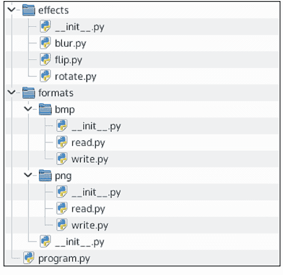

**图 18.1** 示例程序的包结构

这是一个虚构的图像编辑程序的目录结构。主程序位于 `program.py` 文件中。除了主程序外，程序目录中还存在两个包：

- `effects` 包旨在对先前加载的图像应用某些效果。为此，除了 `__init__.py` 文件外，该包还包含三个模块，每个模块提供一种基本效果。这些模块是 `blur`（用于模糊图像）、`flip`（用于翻转图像）和 `rotate`（用于旋转图像）。
- `formats` 包旨在能够读取和写入某些图形格式。为此，我们假设在其 `__init__.py` 文件中定义了两个名为 `read_image` 和 `write_image` 的函数。此时，我们不会进一步讨论功能接口的细节。为了允许读取和写入各种格式的图形，`formats` 包包含两个子包。分别命名为 `bmp` 和 `png`，每个包包含两个模块，用于读写相应的格式。

在主程序中，首先导入并使用 `effects` 和 `formats` 包：

```
>>> import effects
>>> import formats
```

`import` 语句会执行被导入包的 `__init__.py` 程序文件，并将该文件的内容作为模块引入到其自身的命名空间中。因此，在执行上述 `import` 语句后，你可以通过以下方式访问 `read_image` 和 `write_image` 函数：

```
>>> formats.read_image()
>>> formats.write_image()
```

为了能够修改当前加载的图像，我们希望从 `effects` 包中加载一个模块。为此，在 `import` 语句中，包名与模块名之间用点号分隔：

```
>>> import effects.blur
```

在这种情况下，`effects` 包之前已被导入。如果之前没有导入，导入 `effects.blur` 会确保首先导入 `effects` 包并执行其关联的 `__init__.py` 文件。之后，`blur` 子模块被导入并可以使用：

```
>>> effects.blur.blur_image()
```

> **注意**

包结构内的程序文件可以按如下方式执行：

```
$ python -m formats.png.read
```

这样，整个包结构都会被加载，使得相对 `import` 语句（[第 18.3.3 节](#)）保持其有效性。

## 18.3.1 导入包的所有模块

导入模块时，可以使用 `from xyz import *` 将整个模块内容导入到当前命名空间。但这对包不适用，因为对于大型包来说这可能耗时很长，并且盲目导入整个包内容可能会产生不良的副作用。

因此，上述语句不会将包中包含的所有模块导入当前命名空间，而只会导入包本身，并执行 `__init__.py` 中的初始化代码。该文件中创建的所有引用都会被引入当前命名空间。

有两种方法可以实现该语句的预期行为。两者都必须由包的作者实现：

- 首先，可以在 `__init__.py` 文件中通过 `import` 语句导入包的所有模块。这样做的效果是，当包被导入时，这些模块也会被导入，即在 `__init__.py` 文件的代码执行之后。
- 其次，可以通过创建一个名为 `__all__` 的引用来实现，该引用必须指向一个包含要导入的模块名称的字符串列表：

```
__all__ = ["blur", "flip", "rotate"]
```

`from xyz import *` 应该如何处理包，这取决于程序员的判断。但请注意，将完整的模块或包内容导入当前命名空间可能会导致不良的命名冲突。因此，你应该始终将导入的模块保留在它们自己的命名空间中。

## 18.3.2 命名空间包

*命名空间包*是一种可以由存储在不同位置的多个部分组成的包。例如，当相关库的多个组件需要彼此独立分发时，这会很有用。导入此类包时，各个组件会被分配到同一个命名空间。

因为多个文件夹可以属于一个命名空间包，所以不再有唯一的 `__init__.py` 文件。相反：`__init__.py` 文件的存在与否决定了包是作为常规包导入还是作为命名空间包导入。

假设在 Python 查找模块和包的文件系统不同位置存在两个名为 *package* 的文件夹。两个文件夹同名，但包含不同的模块：*directory1/package/module1.py* 和 *directory2/package/module2.py*。

然后可以通过包名 `package` 导入这两个模块，就像它们是在同一文件夹的常规包中导入一样。假设两个模块在导入时输出其名称，我们将看到以下行为：

```
>>> import package.module1
module1
>>> import package.module2
module2
```

任何常规包都可以通过删除 `__init__.py` 文件变成命名空间包。但请注意，导入命名空间包比导入常规包耗时更长，因为必须搜索所有已知目录以查找包的组件。

## 18.3.3 相对导入语句

大型库通常不仅由单个模块或包组成，而是包含各种子包，从而定义任意复杂的*包结构*。在此类包结构中，需要 `import` 语句的*相对*变体，该变体基于相对路径规范导入子包。通过这种方式，一个包可以导入另一个包，例如，该包在包结构中位于导入包的上两级。相对 `import` 语句的写法如下：

```
from . import xyz
```

此语句从 `from` 和 `import` 之间指定的目录导入包（或模块）`xyz`。一个点代表当前目录。每个额外的点象征着上一级目录。

在来自[图 18.1](Figure 18.1) 的虚构图像编辑器的上下文中，`png` 包的 `read` 模块中的以下语句将导入位图对应的模块：

```
from ..bmp import read
```

`read` 模块从 `bmp` 包导入，该包在包结构中位于导入包的上一级。

如果在包结构外部执行，相对 `import` 语句将失败。

如前面章节所讨论的经典 `import` 语句也称为*绝对* `import` 语句，可以在包结构内用于仅导入全局模块。在所有其他情况下，你必须使用相对 `import` 语句。

开头讨论的用于重命名导入包或模块的选项也适用于相对 `import` 语句：

```
from ..bmp import read as read_bmp
```

## 18.4 importlib 包

标准库的 `importlib` 包实现了 `import` 语句所依赖的导入行为。该包有三个基本用途：

- 它包含 `import_module` 函数，可用于在不使用 `import` 语句的情况下导入模块或包。例如，当要导入的模块名称以字符串形式提供时，这很有用。
- 它定义了所谓的导入器。使用这些导入器，可以干预导入过程，从而修改 `import` 语句的默认行为。
- 因此，导入过程的实现是用 Python 语言本身编写的。特别是，这意味着替代的 Python 解释器不需要提供自己的实现；它们也可以使用 `importlib`。

### 18.4.1 导入模块和包

`importlib` 包定义了 `import_module` 函数，可用于在不使用 `import` 语句的情况下导入模块。`import_module` 函数接收要导入的模块或包的名称作为字符串：

```
>>> import importlib
>>> math = importlib.import_module("math")
>>> math.cos(0)
1.0
```

导入的模块由 `import_module` 返回。

如果要执行相对导入，必须为可选的第二个参数传递一个包含相对导入所引用的基本包路径的字符串。

在来自[图 18.1](Figure 18.1) 的包结构的上下文中，前面示例中的相对 `import` 语句 `from ..bmp import read` 大致等同于以下所有 `import_module` 调用：

```
read = importlib.import_module("..bmp.read", __package__)
read = importlib.import_module("..bmp.read", "formats.png")
read = importlib.import_module(".bmp.read", "formats")
```

### 18.4.2 更改导入行为

> **注意**
本节面向高级读者，涵盖了一个很少需要的主题。它假设读者具备面向对象（参见[第 19 章](Chapter 19)）和异常处理（参见[第 20 章](Chapter 20)）的基础知识。

从用户的角度来看，`importlib` 包的关键方面无疑是 `import_module` 函数的定义；然而，该包还提供了用于干预解释器导入过程的有用选项。例如，这些方法使你能够从压缩档案或互联网加载模块。此外，还可以在嵌入模块时动态创建模块。因此，在此我们将简要概述模块和包的导入在内部是如何工作的，以及如何实现自定义行为。

导入行为由所谓的查找器和加载器的组合决定。查找器通过其名称并实例化一个匹配的加载器来导入它。`sys.path_hooks`列表包含在整个系统中注册的查找器。由于查找器可以在不同类型的位置查找模块，因此对于`sys.path`中的每个条目，系统会依次询问注册的查找器是否适合该路径。`sys.path_hooks`中第一个声明自己适合某个路径的查找器负责在该路径中查找模块。

处理`import`语句时，系统会按顺序遍历`sys.path`中输入的路径，并指示关联的查找器查找要导入的模块。如果某个查找器找到了模块，其实例化的加载器必须导入该模块。这里适用以下原则：在第一个查找器找到模块后，搜索即被终止。

## 查找器

*查找器*是一个类，除了构造函数外，还包含一个`find_module`方法。当在分配给查找器的路径中搜索模块时，会调用此方法。通过构造函数，查找器表明它适用于哪些路径。在接下来的章节中，我们将开发一个示例查找器，该查找器将文本文件识别为模块：

```python
import os
class TextFinder:
    def __init__(self, path):
        if path != "#":
            raise ImportError
    def find_module(self, fullname, path=None):
        if os.path.exists(fullname + ".txt"):
            return TextLoader(path)
        else:
            return None
```

对于`sys.path`中每个尚未有关联查找器的条目，注册的查找器会依次被实例化。实例化时，相应的路径会传递给构造函数。如果一个查找器不想负责指定的路径，它必须引发`ImportError`异常。在示例中，我们编写了一个只负责"#"路径的查找器。这是一个我们将稍后添加到`sys.path`的人工条目，以免干扰其余的导入行为。

当指示查找器查找名为`fullname`的模块时，会调用`find_module`方法。为此，它检查`fullname.txt`文件是否存在，如果存在，则实例化一个匹配的加载器——在本例中，是用于导入文本文件的`TextLoader`。

## 加载器

*加载器*本质上实现了`load_module`方法，模块名称会传递给该方法。它负责导入模块并返回生成的模块实例。此外，必须将模块输入到`sys.modules`模块索引中，并且必须初始化模块的各种属性。

如果模块已存在于`sys.modules`中，这意味着它被第二次导入，加载器应返回`sys.modules`中包含的实例。如果加载模块失败，`load_module`会引发`ImportError`异常。

要创建新的模块实例，可以使用标准库中`imp`模块的`new_module`函数：

```python
import types
class TextLoader:
    def __init__(self, path):
        pass
    def load_module(self, fullname):
        if fullname in sys.modules:
            return sys.modules[fullname]
        module = types.ModuleType(fullname, "Docstring")
        module.__file__ = fullname + ".txt"
        module.__package__ = None
        module.__loader__ = self
        try:
            with open(fullname + ".txt") as f:
                module.text = f.read()
            sys.modules[fullname] = module
            return module
        except FileNotFoundError:
            raise ImportError
```

在示例实现中，我们尝试读取与模块名称匹配的文本文件，如果成功，则将包含的文本作为`text`属性插入到模块中。

要测试文本文件的导入，必须将`TextFinder`注册为查找器，并将`"#"`虚拟路径添加到`sys.path`：

```python
import sys
sys.path_hooks.append(TextFinder)
sys.path.append("#")
```

查找器类和虚拟路径都可以插入到各自列表的更靠前位置，以赋予它们更高的优先级。

如果现在导入一个模块，`sys.path`中包含的路径将照常处理。由于`"#"`虚拟路径被添加到列表末尾，因此首先检查具有默认路径的默认查找器。如果标准查找器都无法找到该模块，`TextFinder`将尝试将模块作为文本文件加载：

```python
>>> import testfile
>>> testfile
<module 'testfile' (<__main__.TextLoader object at 0x7f089dcce880>)>
>>> testfile.text
'This is the content of the test file\n'
```

查找器和加载器可以是单独的类，如示例所示，但它们也可以是同一个类。在这种情况下，`find_module`方法可以返回其自身的实例：`self`。

## 18.5 计划的语言元素

Python语言在不断发展，每个新版本都会带来新的语言元素，这可能使旧的Python代码与最新版本的解释器不兼容。虽然开发人员尽最大努力保持最大兼容性，但仅仅添加一个关键字，例如，就已经使使用该新关键字作为普通标识符的代码变得不兼容。

解释器包含一种模式，允许你使用即将发布的Python版本的一些选定语言元素与当前版本一起使用。这是为了简化从一个版本到下一个版本的过渡，因为可以在发布之前针对下一个版本的一些新功能运行测试。

要导入计划的功能，你可以使用`import`语句：

```python
from __future__ import language_element
```

这些语言元素可以像封装在名为`__future__`的模块中一样使用。但请注意，你不能像处理其他模块那样自由地处理`__future__`模块。例如，你只能在程序文件的开头导入它。只有注释、空行或其他future导入可以出现在这样的`import`语句之前。

future导入的一个例子是`print_function`，它在Python 2.6中引入，它导入`print`函数。同时，导入`print_function`时，`print`关键字会从语言中移除。通过这种方式，可以模拟Python 3的行为：

```python
>>> from __future__ import print_function
>>> print "Test"
  File "<stdin>", line 1
    print "Test"
          ^
SyntaxError: invalid syntax
>>> print("Test")
Test
```

这个特定的future导入在准备将旧的Python 2代码移植到Python 3时非常方便。

## 19 面向对象编程

到目前为止，作为用户，我们已经使用了各种对象，例如字符串、列表、字典、文件对象等等。在本章中，我们将向你展示如何定义我们自己的对象，这些对象可以根据我们的个人需求进行定制。术语*面向对象*描述了一种编程范式，可用于确保数据对象的一致性并提高源代码的可重用性。这些优点是通过将数据结构和相关操作组合成一个*对象*，并仅允许通过特定接口访问这些结构来实现的。

我们将通过一个例子来说明这种方法，首先以之前的方式开发一个解决方案，然后第二次实现它，但这次使用Python的面向对象机制。

## 19.1 示例：一个非面向对象的账户

假设你要为一家银行开发一个账户管理系统，该系统管理新账户的创建、转账以及存款和取款。一种可能的方法是为每个银行账户创建一个字典，存储有关客户及其财务状况的所有信息。为了支持所需的操作，你必须定义用于操作字典的函数。一个简化账户的字典如下所示：[ 87 ]

```python
account = {
    "owner": "Steve Miller",
    "account_number": 567123,
    "account_balance": 12350.0,
    "max_daily_turnover": 1500,
    "turnover_today": 10.0
}
```

对于这个模型，我们假设每个账户都有一个"owner"，由包含相关名称的字符串标识。账户有一个"account_number"，这是一个唯一的整数，用于将该账户与所有其他账户区分开来。与"account_balance"键关联的浮点数用于存储以美元计的当前余额。"max_daily_turnover"和"turnover_today"键用于将每个客户的每日交易额限制在一定金额内，以保护他们自己。使用键"max_daily_turnover"存储的值指定了每天可以从账户转出或转入的最大金额。使用"turnover_today"，系统"记住"今天已经交易了多少。在新的一天开始时，此值会重置为零。

#### 19.1.1 创建新账户

基于此数据结构，我们现在将所需的操作定义为函数。首先，我们需要一个根据特定规范创建新账户的函数：

```python
def new_account(owner, account_number, account_balance,
                max_daily_turnover=1500):
    return {
        "owner": owner,
        "account_number": account_number,
        "account_balance": account_balance,
        "max_daily_turnover": max_daily_turnover,
        "turnover_today": 0
    }
```

## 19.1.2 转账

资金转移总是涉及发送方（源账户）和接收方（目标账户）。此外，要执行转账，必须知道相应的金额。因此，该函数将期望三个参数：`source`、`destination` 和 `amount`。根据我们的要求，只有当两个账户的当日交易额未超过其限额时，转账才可能成功。转账函数应返回一个布尔值，指示转账是否可以执行。这允许其实现如下：

```python
def money_transfer(source, destination, amount):
    # Here we test whether the transfer is possible
    if (amount < 0 or
        source["turnover_today"] + amount > source["max_daily_turnover"] or
        destination["turnover_today"] + amount >
            destination["max_daily_turnover"]):
        # Transfer impossible
        return False
    else:
        # Everything's OK - Let's go
        source["account_balance"] -= amount
        source["turnover_today"] += amount
        destination["account_balance"] += amount
        destination["turnover_today"] += amount
        return True
```

该函数首先检查转账是否可行，如果不可行，则提前终止函数调用并返回 `False`。如果传递了有效的金额值且未超过每日交易限额，该函数将根据转账更新账户余额和当日交易额，并返回 `True`。

## 19.1.3 存款和取款

我们模型账户的剩余操作涉及在 ATM 或银行柜台存入或取出资金。这两个函数都需要相关账户和相应的金额作为参数：

```python
def deposit(account, amount):
    if amount < 0 or \
        account["turnover_today"] + amount > account["max_daily_turnover"]:
        # Daily limit exceeded or invalid amount
        return False
    else:
        account["account_balance"] += amount
        account["turnover_today"] += amount
        return True

def withdraw(account, amount):
    if (amount < 0 or \
        account["turnover_today"] + amount > account["max_daily_turnover"]):
        # Daily limit exceeded or invalid amount
        return False
    else:
        account["account_balance"] -= amount
        account["turnover_today"] += amount
        return True
```

这些函数也根据其成功与否返回一个布尔值。

## 19.1.4 查看账户余额

为了概览我们账户的当前状态，我们必须定义一个简单的输出函数：

```python
def show_account(account):
    print("Account of {}".format(account["owner"]))
    print("Current account balance: {:.2f} USD".format(
        account["account_balance"]))
    print("(Today already {:.2f} of {} USD turned over)".format(
        account["turnover_today"], account["max_daily_turnover"]))
```

使用这些定义，我们可以模拟例如以下银行操作：

```python
>>> a1 = new_account("Steve Miller", 567123, 12350.0)
>>> a2 = new_account("John Smith", 396754, 15000.0)
>>> money_transfer(a1, a2, 160)
True
>>> money_transfer(a2, a1, 1000)
True
>>> money_transfer(a2, a1, 500)
False
>>> deposit(a2, 500)
False
>>> show_account(a1)
Account of Steve Miller
Current account balance: 13190.00 USD
(Today already 1160.00 of 1500 USD turned over)
>>> show_account(a2)
Account of John Smith
Current account balance: 14160.00 USD
(Today already 1160.00 of 1500 USD turned over)
```

首先，Steve Miller 开设了一个新账户 a1，账号为 567123，初始余额为 12,350 美元。John Smith 在他的新账户 a2 中存入了 15,000 美元，账号为 396754。两人都选择了默认的每日最高交易额 1,500 美元。现在两人开始做生意：Miller 先生以 160 美元的价格从 Smith 先生那里购买了一部二手智能手机，并通过电汇支付。同一天，Miller 先生以 1,000 美元的价格购买了 Smith 先生的二手笔记本电脑。晚上，当 Smith 先生对 Miller 先生的家庭影院系统表现出浓厚兴趣，并想为此向他转账 500 美元时，他失望了，因为转账失败了。Smith 先生非常惊讶，过早地得出结论，认为他的账户里没有钱了。因此，他想将这笔钱存入他的账户，然后再次发起转账。但当存款也被拒绝时，他打电话给银行职员，银行职员查看了相关账户的信息。在此过程中，银行职员可以看到请求的转账超过了 Smith 先生账户的每日限额，因此无法执行。

如您所见，我们的银行模拟按预期运行，使我们能够相对轻松地处理账户数据。然而，它有一个不吸引人的特点，我们将在以下部分中描述。

在示例中，数据结构及其处理函数是分开定义的，这意味着每次函数调用都必须将账户字典作为参数传递。

然而，可以认为一个账户只有与相关的管理函数一起才能有意义地使用，反之，账户的管理函数也只有在与该账户相关联时才有用。

面向对象编程正是通过将数据和处理函数组合成*对象*来满足这一立场。在此上下文中，此类对象的数据称为*属性*，而处理函数称为*方法*。属性和方法被概括为类的*成员*。因此，账户对象可以用如下模式表示（见表 19.1）。

| 账户 | |
| :--- | :--- |
| **属性** | **方法** |
| `owner` | `new_account()` |
| `account_balance` | `money_transfer()` |
| `max_daily_turnover` | `deposit()` |
| `turnover_today` | `withdraw()` |
| | `show()` |

**表 19.1** 账户对象的模式

您已经从前面关于基本数据类型章节中熟悉了*属性*和*方法*这两个术语，因为基本数据类型的每个实例都代表一个对象——即使您当时可能不知道。此外，您已经知道可以通过编写对象引用及其成员（用点分隔）来访问对象的属性和方法。

假设 `a1` 和 `a2` 是如上图所示的账户对象，包含 Miller 先生和 Smith 先生的数据。那么我们可以将前面的示例表述如下：

```python
>>> a1.money_transfer(a2, 160)
True
>>> a2.money_transfer(a1, 1000)
True
>>> a2.money_transfer(a1, 500)
False
>>> a2.deposit(500)
False
>>> a1.show()
Account of Steve Miller
Current account balance: 13190.00 USD
(Today already 1160.00 of 1500 USD turned over)
>>> a2.show()
Account of John Smith
Current account balance: 14160.00 USD
(Today already 1160.00 of 1500 USD turned over)
```

`money_transfer` 和 `show` 方法现在调用时少了一个参数，因为它们各自引用的账户现在位于调用的开头。由于 `show` 方法现在自动引用一个账户，我们相应地缩短了方法的名称。

从基本数据类型的介绍中，您已经熟悉了对象的处理及其属性和方法的使用。在本章中，您将学习如何使用类创建自己的对象。

## 19.2 类

对象是通过*类*创建的。类是对象结构的正式描述，它说明了对象具有哪些属性和方法。

但仅使用一个类没有太大意义：它只代表一个对象类型的描述，而不是对象本身。您可以将类与对象的关系比作烘焙食谱与蛋糕的关系。食谱定义了蛋糕的配料和制造过程，从而定义了其特点。然而，仅凭食谱不足以邀请亲戚在周日下午分享美味的蛋糕。只有在烘焙过程中，抽象的描述才会变成一个完整的蛋糕。

对象的另一个名称是*实例*。因此，面向对象的烘焙被称为*实例化*。就像一个食谱可以制作多个蛋糕一样，一个类也可以有多个实例（见图 19.1）。

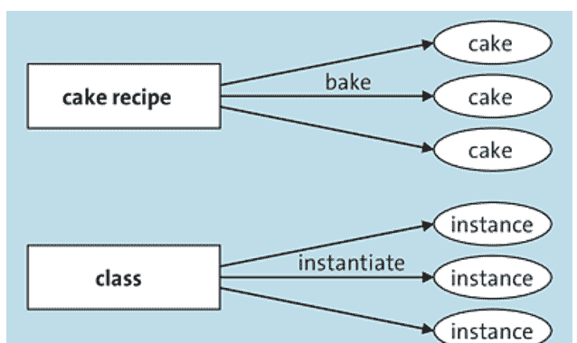

**图 19.1** 食谱/蛋糕与类/对象的类比

要在 Python 中定义一个新类，可以使用 `class` 关键字，后跟新类的名称。最简单的类既没有方法也没有属性，其定义如下：

```python
class Account:
    pass
```

如前所述，你不能单独使用一个类，因为它只是一个抽象描述。因此，我们现在想要创建一个仍然为空的 `Account` 示例类的实例。要实例化一个类，你可以像调用函数一样调用它，无需参数，只需在类名后跟一对括号。此调用的返回值是该类的一个新实例：

```python
>>> Account()
<__main__.Account object at 0x7f118556de10>
```

输出告诉我们，`Account()` 的返回值是 `__main__` 命名空间中 `Account` 类的一个实例，并存储在某个内存地址；我们只需知道 `Account` 类的一个新实例已被创建即可。

## 19.2.1 定义方法

基本上，方法与函数仅在两个方面有所不同：首先，它是在 `class` 引入的块内定义的；其次，它总是接收一个对调用它的实例的引用作为其第一个参数。这个第一个参数只需要在定义中显式写出，在方法被调用时会自动链接到相应的实例。由于这个引用指向对象本身，因此第一个参数被命名为 `self`。与函数一样，方法有自己的命名空间，可以访问全局变量，并将值 `return` 给调用层级。

这使我们能够向账户类添加缺失的方法，最初只写下方法头而不包含代码：

```python
class Account:
    def money_transfer(self, destination, amount):
        pass
    def deposit(self, amount):
        pass
    def withdraw(self, amount):
        pass
    def show(self):
        pass
```

请注意每个方法参数列表开头的 `self` 参数，在调用时，会自动将实例的引用传递到点的左侧：

```python
>>> a = Account()
>>> a.deposit(500)
```

这里，账户 `a` 的引用被传递给 `deposit` 方法，然后可以在 `deposit` 内部通过 `self` 参数访问它。

在下一节中，你将学习如何操作新对象的创建过程并创建新属性。

## 19.2.2 构造函数

每个实例的生命周期总是相同的：它被创建、使用，然后被消除。类——即蓝图——负责确保实例始终处于明确定义的状态。为此，提供了一个特殊的方法，当对象被实例化时自动调用，以将对象置于有效的初始状态。此方法被称为类的*构造函数*。

要给一个类一个构造函数，你必须定义一个名为 `__init__` 的方法：[90]

```python
class SampleClass:
    def __init__(self):
        print("This is the constructor speaking")
```

如果我们现在创建一个 `SampleClass` 的实例，`__init__` 方法会被隐式调用，文本 "This is the constructor speaking" 会出现在屏幕上：

```python
>>> SampleClass()
This is the constructor speaking
<__main__.SampleClass object at 0x7f118556dfd0>
```

构造函数没有任何返回值是有道理的，因为它们不是直接调用的，并且在创建新实例时已经返回了对新实例的引用。

> **注意**
>
> 如果你已经了解其他面向对象编程语言，并想知道如何在 Python 中实现析构函数，你应该注意，Python 中没有保证在实例生命周期结束时被调用的析构函数。
>
> 可以使用 `__del__` 方法（[第 19.11.1 节](Section 19.11.1)）或通过实现上下文管理器（[第 22 章](Chapter 22)）来实现类似的行为。

## 19.2.3 属性

因为构造函数的主要任务是建立实例的一致初始状态，所以类的所有属性都应该在那里定义。[91] 新属性的定义可以通过你从普通变量中知道的值赋值来完成。这使我们能够用 `Account` 类的构造函数替换 `new_account` 函数，然后可以如下实现：

```python
class Account:
    def __init__(self, owner, account_number, account_balance,
                 max_daily_turnover=1500):
        self.owner = owner
        self.account_number = account_number
        self.account_balance = account_balance
        self.max_daily_turnover = max_daily_turnover
        self.turnover_today = 0
    # 剩余的方法将放在这里
```

因为 `self` 包含对要创建的实例的引用，我们可以用它来创建新属性，如示例所示。在此基础上，基于字典的非面向对象变体的其他函数也可以转移到账户类中。

## 19.2.4 示例：一个面向对象的账户

以下示例包含完整的 `Account` 类：

```python
class Account:
    def __init__(self, owner, account_number, account_balance,
                 max_daily_turnover=1500):
        self.owner = owner
        self.account_number = account_number
        self.account_balance = account_balance
        self.max_daily_turnover = max_daily_turnover
        self.turnover_today = 0
    def money_transfer(self, destination, amount):
        # 这里进行测试，检查转账是否可能
        if (amount < 0 or
            self.turnover_today + amount > self.max_daily_turnover or
            destination.turnover_today + amount > destination.max_daily_turnover
            ):
            # 转账不可能
            return False
        else:
            # 一切正常 - 开始吧
            self.account_balance -= amount
            self.turnover_today += amount
            destination.account_balance += amount
            destination.turnover_today += amount
            return True
    def deposit(self, amount):
        if (amount < 0 or
            self.turnover_today + amount > self.max_daily_turnover):
            # 超出每日限额或金额无效
            return False
        else:
            self.account_balance += amount
            self.turnover_today += amount
            return True
    def withdraw(self, amount):
        if amount < 0 or self.turnover_today + amount > self.max_daily_turnover:
            # 超出每日限额或金额无效
            return False
        else:
            self.account_balance -= amount
            self.turnover_today += amount
            return True
    def show(self):
        print("Account of {}".format(self.owner))
        print("Current account balance: {:.2f} USD".format(
            self.account_balance))
        print("(Today already {:.2f} of {} USD turned over)".format(
            self.turnover_today, self.max_daily_turnover))
```

至此，我们已经实现了将账户数据和相关的处理函数组合成一个单元的目标。

使用新的账户类，我们可以重放本章开头史密斯先生和米勒先生的交易：

```python
>>> a1 = Account("Steve Miller", 567123, 12350.0)
>>> a2 = Account("John Smith", 396754, 15000.0)
>>> a1.money_transfer(a2, 160)
True
>>> a2.money_transfer(a1, 1000)
True
>>> a2.money_transfer(a1, 500)
False
>>> a2.deposit(500)
False
>>> a1.show()
Account of Steve Miller
Current account balance: 13190.00 USD
(Today already 1160.00 of 1500 USD turned over)
>>> a2.show()
Account of John Smith
Current account balance: 14160.00 USD
(Today already 1160.00 of 1500 USD turned over)
```

在下一节中，我们将尝试找出如何构建我们的示例，以便它可以轻松地推广到新问题。

## 19.3 继承

除了将数据和处理它的方法结构化地合并到一个单元中之外，面向对象的概念还旨在提高程序代码的可重用性。这意味着程序可以轻松地适应与最初开发程序时类似的问题。

具体来说，这意味着可以从现有类派生出新类，以扩展其附加功能。派生类从其*基类*继承所有能力，因此最初它是该类的副本。在这种情况下，我们说基类将其能力传递给子类，子类又继承了这些能力。在此继承步骤之后，你可以调整派生类以适应新要求。

在我们将继承应用于我们的账户类之前，我们将描述一些抽象示例，向你展示继承在 Python 中是如何工作的。

### 19.3.1 一个简单的例子

要让一个类继承另一个类，你可以在定义子类时在类名后的括号中写下基类。因此，在以下示例中，类 B 继承自类 A：

```python
class A:
    pass
class B(A):
    pass
```

类 A 和类 B 仍然相当无聊，因为它们不包含任何方法或属性。因此，我们将扩展我们的类如下所示：

```python
class A:
    def __init__(self):
        print("Constructor of A")
        self.x = 1337
    def m(self):
        print("Method m of A. It's self.x =", self.x)
class B(A):
    def n(self):
        print("Method n of B")
b = B()
b.n()
b.m()
```

在此示例中，类 A 被扩展，添加了一个构造函数，该构造函数创建了一个值为 1337 的属性 x。此外，类 A 还获得了一个方法 m。构造函数和方法 m 都会向屏幕输出一条消息。另外，我们为类 B 提供了一个方法 n，该方法同样会输出一条消息。在小程序的末尾，创建了一个类 B 的实例，并调用了它的 n 和 m 方法。

输出结果表明，B 继承了类 A 的构造函数和方法 m。属性 x 也被正确创建了：

```
Constructor of A
Method n of B
Method m of A. It's self.x = 1337
```

类的构造函数的任务是将类置于一个定义良好的初始状态。正如前面程序的输出所示，当创建类 B 的实例时，类 A 的构造函数被调用了。然而，在实践中，派生类通常需要一个与其基类不同的构造函数，以便执行自己的初始化操作。

## 19.3.2 方法重写

因此，我们为类 B 扩展了自己的构造函数，该构造函数创建了一个属性 y 并生成输出。此外，我们扩展了方法 n，使其输出属性 y 的值：

```python
class B(A):
    def __init__(self):
        print("Constructor of B")
        self.y = 10000
    def n(self):
        print("Method n of B. It's self.y =", self.y)
b = B()
b.n()
b.m()
```

这个示例的输出让我们惊讶地看到了一条错误信息：

```
Constructor of B
Method n of B. It's self.y = 10000
Traceback (most recent call last):
  ...
AttributeError: 'B' object has no attribute 'x'
```

根据屏幕输出，类 B 的构造函数以及方法 n 和 m 都被调用了。然而，方法 m 报错说实例没有属性 x。

这并不奇怪，因为负责创建属性 x 的类 A 的构造函数根本没有被调用。这种行为的原因如下：类 B 最初从类 A 继承了 `__init__` 方法——即构造函数，但随后用自己的构造函数*覆盖*了它。因此，当创建类 B 的实例时，只会调用 B 定义的新构造函数，而类 A 的构造函数则不会起作用。

通常，当一个类重新实现了它先前从基类继承的方法时，我们称之为*方法重写*。

然而，为了将实例置于一致的状态，通常有必要调用基类被重写的构造函数。因此，可以显式调用基类被重写的方法：

```python
class B(A):
    def __init__(self):
        print("Constructor of B")
        super().__init__()
        self.y = 10000
    def n(self):
        print("Method n of B. It's self.y =", self.y)
b = B()
b.n()
b.m()
```

`super().__init__()` 这一行在类 B 的构造函数中显式调用了基类 A 的构造函数。内置的 `super` 函数发现 A 是 B 的基类，因此应该通过 `super().__init__()` 调用 A 的 `__init__` 方法。

前面所示代码的输出表明，类 A 的构造函数现在按预期被调用了，并且方法 m 的调用也正常工作了：

```
Constructor of B
Constructor of A
Method n of B. It's self.y = 10000
Method m of A. It's self.x = 1337
```

方法的重写不仅限于构造函数，基类的任何方法也可以像上面示例中的构造函数一样被显式调用。为了说明这一点，在下面的示例中，我们将在类 B 中重写类 A 的方法 m，并使用 `super` 再次调用 A 的 m：

```python
class B(A):
    def __init__(self):
        print("Constructor of B")
        super().__init__()
        self.y = 10000
    def n(self):
        print("Method n of B. It's self.y =", self.y)
    def m(self):
        print("Method m of B.")
        super().m()
b = B()
b.m()
```

这个示例程序的输出如下：

```
Constructor of B
Constructor of A
Method m of B.
Method m of A. It's self.x = 1337
```

因此，基类 `A` 的方法 `m` 通过 `super().m()` 按预期被调用了。

> **注意**

基类的方法也可以在不使用 `super` 的情况下被显式调用。在 `B` 的构造函数中，`super().__init__()` 可以替换为 `A.__init__(self)` 来调用 `A` 的构造函数。然而，这需要为每次调用显式指定基类，即使从上下文中可以清楚地看出这一点。

现在我们手头有了工具，可以将继承的概念应用到我们的账户示例中。为此，我们将把程序分解成几个相互继承的类。

## 19.3.3 示例：带每日交易额的活期账户

面向对象编程旨在重用现有代码或提供易于适应新需求的代码。因此，在开发面向对象程序时，应始终确保使类尽可能通用。只有这样，才能通过智能继承采用程序的部分来解决新问题。

作为示例，我们将开发一个 `CheckingAccountWithDailyTurnover` 类，其功能与前面介绍的 `Account` 类相同。然而，这次我们将确保以易于用于类似任务的方式构建程序代码。

我们程序的起点是 [第 19.2 节](Section 19.2) 中的 `Account` 类，其属性最初可以分为两类：

- 与账户中资金处理相关的数据（`account_balance`、`max_daily_turnover`、`turnover_today`）
- 与客户相关的数据（`owner`、`account_number`）

除了 `show` 方法外，所有方法都只使用第一类属性。因此，我们现在将通过将账户分成两部分来实现第一次结构分离。

一部分负责管理账户余额，另一部分则存储客户数据。

### ManagedMoneyAmount 类

从抽象的角度来看，管理我们账户余额的类必须支持存款、取款和向其他账户转账。必须能够将这些操作与特定条件联系起来——即是否满足各自的最大每日交易额。

然而，除了账户之外，还有其他实体根据特定规则管理一定金额的资金。例如，钱包中的现金可以解释为账户余额。“存款”和“取款”操作则分别描述了将现金放入钱包和从中取出现金的过程。这种情况类似于保险箱或预付卡上的信用额度。

因此，实现一个允许根据特定规则管理一定金额资金的类是有用的。这个 `ManagedMoneyAmount` 类将作为 `CheckingAccountWithDailyTurnover` 类的基础，但它对其他应用程序也将保持有用：

```python
class ManagedMoneyAmount:
    def __init__(self, initial_amount):
        self.amount = initial_amount
    def deposit_possible(self, amount):
        return True
    def withdraw_possible(self, amount):
        return True
    def deposit(self, amount):
        if amount < 0 or not self.deposit_possible(amount):
            return False
        else:
            self.amount += amount
            return True
    def withdraw(self, amount):
        if amount < 0 or not self.withdraw_possible(amount):
            return False
        else:
            self.amount -= amount
            return True
    def show(self):
        print("Amount: {:.2f}".format(self.amount))
```

在类的构造函数中，创建了 `amount` 属性并设置为传入的初始值。`deposit` 和 `withdraw` 方法可用于更改金额，如果操作成功则返回 `True`，如果出现问题则返回 `False`。`show` 方法在屏幕上显示当前可用的金额。

`ManagedMoneyAmount` 类的关键特性在于 `deposit_possible` 和 `withdraw_possible` 方法，`deposit` 和 `withdraw` 方法分别使用它们来检查是否可以执行相应的操作。

这些方法旨在被派生类重写，以设置所需的条件。因为它们在基类中返回 `True`，所以派生类可以重写它们以实现特定的条件检查。

## GeneralAccount 类

除了其他功能外，我们的 `ManagedMoneyAmount` 类仍然缺乏在不同实例之间转账的能力，无法模拟我们最初 `Account` 类的功能。由于这是一个应该由所有账户处理的操作，我们现在将从 `ManagedMoneyAmount` 派生一个 `GeneralAccount` 类，并为其扩展一个 `money_transfer` 方法。

此外，一个账户总是包含相应账户所有者的客户数据。我们将这些数据存储在 `customer_data` 属性中，其值将设置为构造函数的第一个参数。我们将在后续阶段处理用于存储客户数据的类的定义：

```python
class GeneralAccount(ManagedMoneyAmount):
    def __init__(self, customer_data, account_balance):
        super().__init__(account_balance)
        self.customer_data = customer_data
    def money_transfer(self, destination, amount):
        if (self.withdraw_possible(amount) and
            destination.deposit_possible(amount)):
            self.withdraw(amount)
            destination.deposit(amount)
            return True
        else:
            return False
    def show(self):
        self.customer_data.show()
        super().show()
```

新的 `money_transfer` 方法访问 `withdraw_possible` 和 `deposit_possible` 方法来检查转账的可行性。对于转账本身，使用 `withdraw` 和 `deposit` 方法。

为了输出 `GeneralAccount` 类的实例，重写了 `show` 方法，以便首先输出客户数据，然后调用 `ManagedMoneyAmount` 基类的 `show` 方法。这假设 `customer_data` 属性引用的实例有一个名为 `show` 的方法。

## GeneralAccountWithDailyTurnover 类

现在是时候扩展 `GeneralAccount` 类，使其具备限制每日交易额的能力了。为此，我们从 `GeneralAccount` 派生 `GeneralAccountWithDailyTurnover` 类，并重写一些方法：

```python
class GeneralAccountWithDailyTurnover(GeneralAccount):
    def __init__(self, customer_data, account_balance, max_daily_turnover=1500):
        super().__init__(customer_data, account_balance)
        self.max_daily_turnover = max_daily_turnover
        self.turnover_today = 0.0
    def transfer_possible(self, amount):
        return (self.turnover_today + amount <= self.max_daily_turnover)
    def withdraw_possible(self, amount):
        return self.transfer_possible(amount)
    def deposit_possible(self, amount):
        return self.transfer_possible(amount)
    def deposit(self, amount):
        if super().deposit(amount):
            self.turnover_today += amount
            return True
        else:
            return False
    def withdraw(self, amount):
        if super().withdraw(amount):
            self.turnover_today += amount
            return True
        else:
            return False
    def show(self):
        super().show()
        print("Today already {:.2f} of {:.2f} USD turned over".format(
            self.turnover_today, self.max_daily_turnover))
```

重写了 `deposit_possible` 和 `withdraw_possible` 方法，以便根据每日交易额来启用或阻止存款和取款。这两个方法都使用新的 `transfer_possible` 方法来实现此目的。

调整了 `deposit` 和 `withdraw` 方法，以便在必要时更新 `turnover_today` 属性。最后但同样重要的是，`show` 方法在 `GeneralAccount.show` 的输出中添加了关于每日交易额的信息。

因此，`GeneralAccountWithDailyTurnover` 类具有与最初的 `Account` 类相同的管理账户余额的功能。仍然缺少的是客户数据的管理。

## CheckingAccountCustomerData 类

与支票账户关联的客户数据存储在 `CheckingAccountCustomerData` 类的实例中。除了存储账户所有者姓名和账号的两个属性外，该类还有一个 `show` 方法，用于将信息输出到屏幕上：

```python
class CheckingAccountCustomerData:
    def __init__(self, owner, account_number):
        self.owner = owner
        self.account_number = account_number
    def show(self):
        print("Owner:", self.owner)
        print("Account number:", self.account_number)
```

现在我们可以定义 `CheckingAccountWithDailyTurnover` 类了。

## CheckingAccountWithDailyTurnover 类

最后，我们从 `GeneralAccountWithDailyTurnover` 类派生 `CheckingAccountWithDailyTurnover` 类，并通过重写构造函数为其提供相关的客户数据：

```python
class CheckingAccountWithDailyTurnover(GeneralAccountWithDailyTurnover):
    def __init__(self, owner, account_number, account_balance,
                 max_daily_turnover=1500):
        customer_data = CheckingAccountCustomerData(owner, account_number)
        super().__init__(customer_data, account_balance, max_daily_turnover)
```

这个类映射了 `Account` 类的全部功能，因此我们现在可以运行关于 Miller 先生和 Smith 先生的开篇示例了：

```python
>>> a1 = CheckingAccountWithDailyTurnover("Steve Miller", 567123, 12350.0)
>>> a2 = CheckingAccountWithDailyTurnover("John Smith", 396754, 15000.0)
>>> a1.money_transfer(a2, 160)
True
>>> a2.money_transfer(a1, 1000)
True
>>> a2.money_transfer(a1, 500)
False
>>> a2.deposit(500)
False
>>> a1.show()
Owner: Steve Miller
Account number: 567123
Amount: 13190.00
Today already 1160.00 of 1500.00 USD turned over
>>> a2.show()
Owner: John Smith
Account number: 396754
Amount: 14160.00
Today already 1160.00 of 1500.00 USD turned over
```

在下一节中，我们将演示由于这种结构，我们的程序可以轻松扩展。

## 对 Account 类的可能扩展

通过使用继承原则进行逐步细化，我们现在从最初的资金管理概念派生出了 `CheckingAccountWithDailyTurnover` 类。这个类现在具有与 `Account` 类相同的功能。[图 19.2](Figure 19.2) 以图形方式说明了由此产生的类层次结构。

这种结构的好处在我们引入可以利用现有功能的新类时变得显而易见。例如，我们将使用 `Wallet`、`Safe`、`CheckingAccount`、`NumberedAccount` 和 `NumberedAccountWithDailyTurnover` 类。

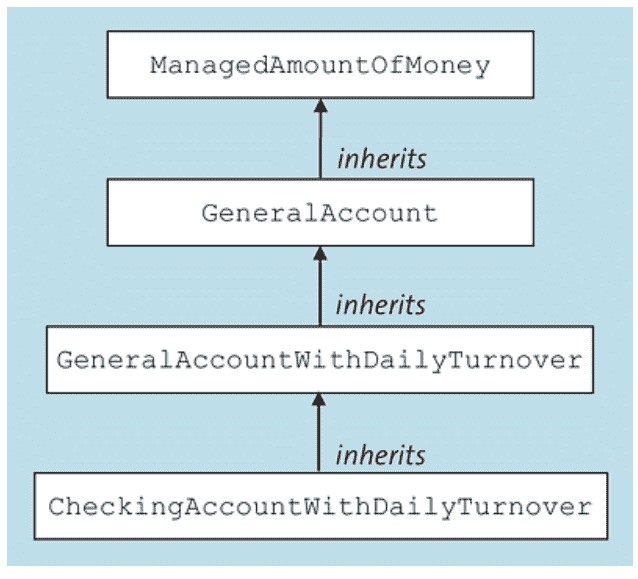

**图 19.2** 账户示例的类层次结构

在我们深入描述和实现这些类之前，让我们先看看正在形成的类层次结构，如[图 19.3](#figure-19-3) 所示。

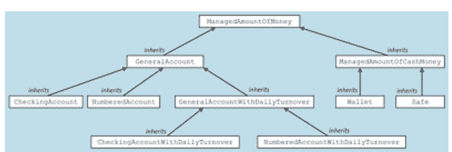

**图 19.3** 账户示例的扩展类层次结构

`Wallet` 和 `Safe` 类都管理现金金额，这就是为什么我们首先从 `ManagedMoneyAmount` 类派生一个 `ManagedCashAmount` 类。与一般管理的资金金额不同，现金金额不能为负。因此，`ManagedCashAmount` 类重写了 `withdrawPossible` 方法以避免负金额。

除了受最大每日交易额限制的支票账户外，我们现在通过 `CheckingAccount` 类对没有交易额限制的支票账户进行建模。该类直接从 `GeneralAccount` 类派生，并使用与 `CheckingAccountWithDailyTurnover` 相同的客户数据。

为了能够管理编号账户（除了支票账户），我们将创建一个新类，用于管理编号账户的客户数据。[92] 因此，`NumberedAccount` 和 `NumberedAccountWithDailyTurnover` 类可以分别从 `GeneralAccount` 和 `GeneralAccountWithDailyTurnover` 类派生。

现在让我们看看如何实现 `Wallet`、`Safe`、`CheckingAccount`、`NumberedAccount` 和 `NumberedAccountWithDailyTurnover` 类。

## ManagedCashAmount、Wallet 和 Safe 类

`ManagedCashAmount` 类调整了 `ManagedMoneyAmount` 类，以避免 `Amount` 属性出现负值：

```python
class ManagedCashAmount(ManagedMoneyAmount):
    def __init__(self, cash_amount):
        if cash_amount < 0:
            cash_amount = 0
        super().__init__(cash_amount)
    def withdraw_possible(self, amount):
        return (self.amount >= amount)
```

在构造函数中，我们确保金额不能用负值初始化，并且 `withdraw_possible` 方法仅在钱包中的金额至少与要提取的金额一样大时才返回 `True`。

`Wallet` 和 `Safe` 类现在继承自 `ManagedCashAmount` 类：

```
class Wallet(ManagedCashAmount):
    # TODO: Special methods for a wallet
    pass
class Safe(ManagedCashAmount):
    # TODO: Special methods for a safe
    pass
```

这两条注释旨在表明，目前仍缺少一些方法，这些方法能将钱包和保险箱转变为特殊的受管理货币金额。由于我们目前并非在开发完整的软件，而只是演示程序的基本可扩展性，因此我们不会深入探讨这些细节。作为练习，你可以自行思考在这两种情况下，哪些功能是有意义的。

## `CheckingAccount`、`NumberedAccount` 和 `NumberedAccountWithDailyTurnover` 类

`CheckingAccount` 类直接继承自 `GeneralAccount` 类：

```
class CheckingAccount(GeneralAccount):
    def __init__(self, owner, account_number, account_balance):
        customer_data = CheckingAccountCustomerData(owner, account_number)
        super().__init__(customer_data, account_balance)
```

与 `CheckingAccountCustomerData` 类类似，我们引入 `NumberedAccountCustomerData` 类来管理编号账户的客户数据。在我们的模型中，编号账户由一个标识号描述：

```
class NumberedAccountCustomerData:
    def __init__(self, identification_number):
        self.identification_number = identification_number
    def show(self):
        print("Identification number:", self.identification_number)
```

使用这个类，我们可以定义 `NumberedAccount` 和 `NumberedAccountWithDailyTurnover` 类：

```
class NumberedAccount(GeneralAccount):
    def __init__(self, identification_number, account_balance):
        customer_data = NumberedAccountCustomerData(identification_number)
        super().__init__(customer_data, account_balance)
class NumberedAccountWithDailyTurnover(GeneralAccountWithDailyTurnover):
    def __init__(self, account_number, account_balance, max_daily_turnover):
        customer_data = NumberedAccountCustomerData(account_number)
        super().__init__(customer_data, account_balance, max_daily_turnover)
```

为了演示目的，我们在一个小型示例程序中使用这两个类：

```
>>> na1 = NumberedAccount(113427613185, 5000)
>>> na2 = NumberedAccountWithDailyTurnover(45657364234, 12000, 3000)
>>> na1.withdraw(1000)
True
>>> na2.deposit(1500)
True
>>> na1.money_transfer(na2, 2000)
False
>>> na1.show()
Identification number: 113427613185
Amount: 4000.00
>>> na2.show()
Identification number: 45657364234
Amount: 13500.00
Today already 1500.00 of 3000.00 USD turned over
```

创建了 `NumberedAccount` 类和 `NumberedAccountWithDailyTurnover` 类的实例 `na1` 和 `na2`。然后从第一个账户提取了 1,000 美元，并向第二个账户存入了 1,500 美元。最后，我们尝试从账户 `na1` 向账户 `na2` 转账 2,000 美元。由于这将超过 `na2` 的每日交易限额，转账失败。

如输出所示，这两个类的工作方式与其他账户类完全相同。

## 19.3.4 展望

继承的巨大优势在于，你可以从现有类派生新类，然后将它们调整以适应要解决的问题。在此过程中，派生类可以利用基类提供的全部功能。因此，只需实现或重写那些不适合新问题的方法。

例如，如果我们基于 `Account` 类开发 `CurrentAccount`、`NumberedAccount`、`CurrentAccountWithDailyTurnover` 和 `NumberedAccountWithDailyTurnover` 类，而不使用继承，我们就必须在每个类中重新实现 `deposit` 和 `withdraw` 方法。这将导致我们的程序中出现多处非常相似的代码。这种代码重复不必要地增加了程序的大小，使得维护和进一步开发变得更加困难，因为工作或修正总是需要在多个地方同时进行。

基于使用继承的智能结构，你可以开发出功能重复最小化的程序。

在大型软件项目中，我们处理的不仅仅是像我们的模型示例中那样少数几个类，而是数百或数千个类。在这种环境中，通过继承节省的资源更加显著。

## 19.4 多重继承

到目前为止，我们总是让一个子类恰好继承自一个基类。然而，在某些情况下，一个类应该继承两个甚至更多基类的能力，以达到预期的结果。这种一个类继承自多个基类的概念被称为*多重继承*。

如果你想让一个类继承自多个基类，可以在类名后的括号中用逗号分隔基类：

```
class NewClass(BaseClass1, BaseClass2, BaseClass3):
    # Definition of methods and attributes
    pass
```

在这个例子中，`NewClass` 类继承自三个类：`BaseClass1`、`BaseClass2` 和 `BaseClass3`。

多重继承是一个非常复杂的话题，这就是为什么我们在这里只限于一个抽象的例子来帮助你理解其背后的思想。

假设我们有两个类来描述越野车和水上交通工具：`OffroadVehicle` 和 `Watercraft`。现在，如果我们想定义一个 `AmphibiousVehicle` 类，那么 `OffroadVehicle` 类和 `Watercraft` 类都适合作为基类，因为两栖车辆同时属于这两个类别。

因此，让 `AmphibiousVehicle` 类同时继承这两个类是一致的，如[图 19.4](#)所示。


**图 19.4** 以两栖车辆为例的多重继承

因此，`AmphibiousVehicle` 类继承了 `OffroadVehicle` 和 `Watercraft` 类的方法。

只有少数语言支持多重继承的概念并非偶然，因为存在一些原则性问题。

例如，假设几个基类实现了一个同名的方法。那么继承类将从基类列表中最左边的基类继承该方法。

现在，两个同名的方法执行的任务可能完全不同。因此，在最坏的情况下，继承类可能变得不可用，因为它只能继承冲突方法中的一个。

在实践中，多重继承通常可以规避，因此我们在此不再进一步讨论。

## 19.5 属性特性

有时，根据特定规则操作对类属性的访问是有用的。例如，有些属性只有某些值才有意义。在我们的 `Account` 类（[第 19.2.2 节](#section-19-2-2)）中，例如，有 `daily_turnover` 属性，其值应始终为正；否则，它们就没有意义。

### 19.5.1 设置器和获取器

*设置器和获取器方法*代表了面向对象编程中控制属性访问的概念。不是直接访问属性，而是通过特殊方法来控制访问。

为了使以下示例易于管理，我们将引入一个新类 `A`，它有一个通过设置器和获取器方法管理的属性。将其转换为账户示例是一个简单的练习：

```
class A:
    def __init__(self):
        self._x = 100
    def get_x(self):
        return self._x
    def set_x(self, value):
        if value < 0:
            return
        self._x = value
```

使用 `get_x` 获取器方法和 `set_x` 设置器方法，我们现在可以处理 `A` 的 `_x` 属性，其中 `_x` 的负值赋值被 `set_x` 阻止：

```
a = A()
print(a.get_x())
```

## 19.5.2 定义属性特性

通过 setter 和 getter 方法显式管理属性的方式比较混乱，因为在使用类时，你现在必须区分哪些属性可以直接使用，哪些属性的访问需要通过 setter 和 getter 方法来控制。

所谓的*属性特性*通过在写入或读取属性时隐式调用 setter 和 getter 方法来解决这个问题。

我们可以使用它们来调整我们的类，使其能够以以下方式使用，并且我们仍然可以保证 `x` 的有效赋值：

```python
a = A()
a.x = 300
print(a.x)
a.x = -20
print(a.x)
```

为了实现这一点，我们需要使用内置的 `property` 函数将 `x` 创建为一个属性特性。

### property([fget, fset, fdel, doc])

对于 `fget` 参数，需要传入一个指向新属性的 getter 方法的引用。`fset` 参数指定关联的 setter 方法。`fdel` 参数可用于额外指定一个在通过 `del` 删除属性时要执行的方法。可以通过 `doc` 参数为属性提供所谓的文档字符串。你可以在[第 35 章，第 35.1 节](Chapter 35, Section 35.1)中找到更多关于文档字符串概念的信息。

我们现在扩展类 `A`，添加一个属性特性 `x`，该特性使用 `get_x` 和 `set_x` 方法进行访问。在内部，`x` 的值仍然存储在 `_x` 属性中。我们还为 `get_x` 和 `set_x` 方法添加了输出，以查看它们是否确实被隐式调用：

```python
class A:
    def __init__(self):
        self.x = 100
    def get_x(self):
        print("Getter called")
        return self._x
    def set_x(self, value):
        print("Setter called")
        if value < 0:
            return
        self._x = value
    x = property(get_x, set_x)

a = A()
a.x = 300
print(a.x)
a.x = -20
print(a.x)
```

从输出中可以看出，当访问属性时，setter 和 getter 方法被隐式调用。特别是在构造函数中初始化 x 属性时就是这种情况。此外，无效的 -20 值赋值被阻止了：

```
Setter called
Setter called
Getter called
300
Setter called
Getter called
300
```

在使用 setter 和 getter 方法时，请记住，这样做会导致每次属性访问都调用一个方法，如果有很多这样的访问，可能会使程序变慢。

## 19.6 静态方法

到目前为止，我们为类定义的方法和属性总是引用具体的实例。特别是，`Account` 类的每个实例（[第 19.2.2 节](https://example.com)）都有自己的 `owner`、`account_number`、`account_balance`、`max_daily_turnover` 和 `turnover_today` 属性值，并且 `money_transfer`、`deposit`、`withdraw` 和 `show` 方法只有在与 `Account` 类的现有实例结合时才能有意义地调用。

这种总是引用具体实例的方法和属性被称为*非静态的*。与之相对的是由类的所有实例共享的*静态*方法和属性。

要定义静态方法，你可以使用内置的 `staticmethod` 函数。在下面的示例中，定义了一个类 `A`，它有一个静态方法 `m`：

```python
>>> class A:
...     def m():
...         print("Hello static method!")
...     m = staticmethod(m)
>>> A.m()
Hello static method!
```

静态方法的定义类似于普通函数，并通过 `staticmethod` 函数绑定到类作为静态方法。

因为静态方法不引用类的实例，所以它不需要 `self` 参数。此外，它可以直接从类调用，而无需先创建实例。

在 Python 中，静态方法通常用于提供替代构造函数。例如，我们可以用一个创建初级账户的静态方法来扩展 `Account` 类。在这方面，初级账户的特点是预设了较低的每日限额：

```python
class Account:
    # 剩余的方法将放在这里
    def junior_account(owner, account_number, account_balance):
        return Account(owner, account_number, account_balance, 20)
    junior_account = staticmethod(junior_account)

jr = Account.junior_account("Ethan Peters", 436574, 67)
jr.show()
```

该程序的输出如下所示：

```
Account of Ethan Peters
Current account balance: 67.00 USD
(Today already 0.00 of 20 USD turned over)
```

因此，`junior_account` 方法又创建了一个新的 `Account` 类实例，并为每日限额传递了固定值 `20`。

这样的替代构造函数也被称为*工厂函数*。

## 19.7 类方法

除了可以独立于实例存在的静态方法外，还有另一种不引用类实例的方法。这些所谓的*类方法*期望将它们被调用的类的引用作为第一个参数。要定义类方法，你可以使用内置的 `classmethod` 函数。

在下面的示例中，定义了三个类 `A`、`B` 和 `C`，其中 `C` 和 `B` 分别继承自 `A`。类 `A` 有一个类方法 `m`，它输出调用该方法的实例的类型：

```python
class A:
    def m(cls):
        print("I am", cls)
    m = classmethod(m)

class B(A):
    pass

class C(A):
    pass

A.m()
a = A()
b = B()
c = C()
a.m()
b.m()
c.m()
```

程序的输出如下所示：

```
I am <class '__main__.A'>
I am <class '__main__.A'>
I am <class '__main__.B'>
I am <class '__main__.C'>
```

使用 `A.m()`，我们调用 `A` 的类方法 `m`，而没有引用类的实例。正如输出的第一行所示，对于 `m` 的第一个参数 `cls`，传递的是类 `A` 本身。

然后我们创建类 A、B 和 C 的实例，并在这些新实例上调用方法 m。同样，对于 cls 参数，每个实例都会传递调用它的实例所属的类。在普通方法中，实例本身的引用将作为第一个参数传递。

> **注意**
>
> `staticmethod` 和 `classmethod` 通常都用作*函数装饰器*。你将在[第 23 章](#)中了解更多关于这个主题的内容。

## 19.8 类属性

除了类方法之外，还有不引用类实例而是引用类本身的属性。这些属性既可以通过类本身访问，也可以通过其实例访问。

以下示例定义了一个类 `D`，它有一个类属性 `x`：

```python
class D:
    x = 10

print(D.x)
d = D()
print(d.x)
```

因此，类属性可以直接通过 `class` 语句体内的赋值来创建。该示例产生以下输出：

```
10
10
```

所以再次强调，你可以直接通过类或通过类的实例来访问类属性。

## 19.9 面向对象编程的内置函数

从[第 17 章，第 17.14 节](Chapter 17, Section 17.14)中，你已经知道许多内置函数，它们随时可供程序员使用。在[第 17 章，第 17.14 节](Chapter 17, Section 17.14)的概述中，我们有意省略了与面向对象编程相关的内置函数，以便在此处讨论它们。[表 19.2](Table 19.2) 列出了那些专门与对象和类相关的内置函数。

| 名称 | 描述 |
| :--- | :--- |
| `getattr(object, name, [default])` | 返回 `object` **实例**的 `name` 属性的值。 |
| `setattr(object, name, value)` | 将 `object` **实例**的 `name` 属性的值设置为 `value`。 |
| `hasattr(object, name)` | 检查 `object` 实例是否具有 `name` **属性**。如果属性存在，则返回 `True`，否则返回 `False`。 |
| `delattr(object, name)` | 从 `object` 实例中删除 `name` 属性。 |
| `isinstance(object, classinfo)` | 检查 `object` 实例是否是 `classinfo` 描述的类的实例。 |
| `issubclass(class_, classinfo)` | 检查 `class_` 类是否是 `classinfo` 描述的类的子类。 |

**表 19.2** 面向对象的内置函数

## 19.9.1 管理实例属性的函数

要管理实例的属性，可以使用 `setattr`、`getattr` 和 `delattr` 函数。可以通过将属性名作为字符串传递来访问属性。

### getattr(object, name, [default])

此函数返回 `object` 实例中名为 `name` 的属性（如果该属性存在）。如果传递了 `default`，则当 `name` 属性不存在时，将返回 `default` 的值。

以下示例使用 `getattr` 访问一个存在的属性和一个不存在的属性。此处 `getattr(a, "x")` 调用等同于 `a.x`：

```
>>> class A:
...     def __init__(self):
...         self.x = 42
>>> a = A()
>>> getattr(a, "x")
42
>>> getattr(a, "y", 404)
404
```

如果属性不存在且未传递 `default` 的值，`getattr` 将引发 `AttributeError` 异常：

```
>>> getattr(a, "y")
Traceback (most recent call last):
  File "<stdin>", line 1, in <module>
AttributeError: 'A' object has no attribute 'y'
```

### setattr(object, name, value)

此函数将 `object` 实例的 `name` 属性的值设置为 `value`。

以下示例定义了一个在循环中创建 10 个属性的类：

```
>>> class B:
...     def __init__(self):
...         for i in range(10):
...             setattr(self, "x{}".format(i), i)
>>> b = B()
>>> b.x3
3
>>> b.x8
8
```

形式为 `setattr(a, "x", value)` 的调用**等同于** `a.x = value`。

### delattr(object, name)

使用 `delattr`，你可以选择性地删除实例的属性。让我们再次使用前面 `setattr` 示例中的 `B` 类：

```
>>> b = B()
>>> b.x4
4
>>> delattr(b, "x4")
>>> b.x4
Traceback (most recent call last):
  File "<stdin>", line 1, in <module>
AttributeError: 'B' object has no attribute 'x4'
```

`delattr(b, "x4")` 调用与 `del b.x4` 具有相同的效果。

## 19.9.2 关于类层次结构信息的函数

在本节中，我们将使用以下示例程序作为起点：

```
class A:
    pass
class B(A):
    pass
class C(B):
    pass
class D:
    pass
a = A()
b = B()
c = C()
d = D()
```

### isinstance(object, classinfo)

此函数检查 `object` 是否是 `classinfo` 类（或多个类）的实例，并相应地返回 `True` 或 `False`。`classinfo` 参数可以传递单个类或多个类的元组：

```
>>> isinstance(a, A)
True
>>> isinstance(a, (B,C))
False
>>> isinstance(a, (A,B,C))
True
```

即使 `object` 是继承自 `classinfo` 中某个类的类的实例，`isinstance` 的返回值也是 `True`：

```
>>> isinstance(c, A)
True
>>> isinstance(c, (B,D))
True
```

### issubclass(class_, classinfo)

`issubclass` 函数可用于检查 `class_` 类[93]是否派生自 `classinfo` 中的某个类。与 `isinstance` 一样，`classinfo` 可以传递单个类或多个类的元组：

```
>>> issubclass(B,A)
True
>>> issubclass(B, (D,A))
True
>>> issubclass(A,C)
False
>>> issubclass(D, (A,B,C))
False
```

## 19.10 继承内置数据类型

自 Python 2.3 将数据类型和类统一以来，Python 从根本上就是面向对象的。这意味着在使用 Python 时，你遇到的几乎所有东西都是某个类的实例。从简单的数字到类[94]本身，每个对象都有自己的属性和方法。

特别是，可以从内置数据类型（如 `list` 或 `dict`）继承。

以下示例实现了一个 `list` 的子类，该子类在每次更改后自动对其元素进行排序：

```
class SortedList(list):
    def __init__(self, *args, **kwargs):
        super().__init__(*args, **kwargs)
        self.sort()
    def __setitem__(self, key, value):
        super().__setitem__(key, value)
        self.sort()
    def append(self, value):
        super().append(value)
        self.sort()
    def extend(self, sequence):
        super().extend(sequence)
        self.sort()
    def insert(self, index, value):
        super().insert(index, value)
        self.sort()
    def reverse(self):
        pass
    def __iadd__(self, s):
        res = super().__iadd__(s)
        self.sort()
        return res
    def __imul__(self, n):
        res = super().__imul__(n)
        self.sort()
        return res
```

为此，`list` 中所有将元素插入列表的方法都被重写，以便在相应操作后对列表进行排序。由于列表已排序，因此不应能够反转其顺序，这就是为什么 `reverse` 方法被剥夺了其功能。

对于方法的实现，当然仍然使用 `list` 的实现。

以下示例程序说明了新类的用法：

```
l = SortedList([6,4,3])
print(l)
l.append(2)
print(l)
l.extend([67,0,-56])
print(l)
l += [100,5]
print(l)
l *= 2
print(l)
```

如你所见，新类可以像 `list` 一样使用。[95] 只有输出阐明了功能上的差异：

```
[3, 4, 6]
[2, 3, 4, 6]
[-56, 0, 2, 3, 4, 6, 67]
[-56, 0, 2, 3, 4, 5, 6, 67, 100]
[-56, -56, 0, 0, 2, 2, 3, 3, 4, 4, 5, 5, 6, 6, 67, 67, 100, 100]
```

尽管以任意顺序插入，但列表的元素在每次操作后都会被排序。

## 19.11 魔术方法和魔术属性

Python 中有许多特殊的方法和属性，为类提供特殊功能。这些方法和属性的名称都以两个下划线开头和结尾。在前面的章节中，你已经认识了其中一个所谓的魔术方法或魔术属性——即名为 `__init__` 的构造函数。

这些方法和属性的处理是“神奇的”，因为它们通常不是直接按名称使用的，而是在需要时在后台隐式使用。例如，每当创建类的新对象时，都会调用 `__init__` 构造函数，即使没有显式调用——例如，在适当的位置使用 `classname.__init__()`。

许多魔术方法允许你为自己的类自定义内置函数和运算符的行为——例如，这样你的类的实例就可以使用 `<` 和 `>` 比较运算符进行比较。

### 19.11.1 通用魔术方法

[表 19.3](Table 19.3) 包含了常用的魔术方法。

| 名称 | 描述 |
| :--- | :--- |
| `__init__(self, ...)` | 类的构造函数。在创建新实例时调用。更多信息，请参见[第 19 章，第 19.2.2 节](Chapter 19, Section 19.2.2)。 |
| `__del__(self)` | 类的析构函数。在实例被销毁时调用。 |
| `__repr__(self)` | `obj.__repr__` 的返回值指定了 `repr(obj)` 应该返回什么。如果可能，这应该是有效的 Python 代码，执行时创建 `obj` 实例。 |
| `__str__(self)` | `obj.__str__` 的返回值指定了 `str(obj)` 应该返回什么。如果可能，这应该是 `obj` 的人类可读表示形式，形式为 `str` 实例。 |
| `__bytes__(self)` | `obj.__bytes__` 的返回值指定了 `bytes(obj)` 应该返回什么。这应该是一个 `bytes` 实例。 |
| `__bool__(self)` | `__bool__` 方法应返回一个真值，指示如何将对象转换为 `bool` 实例。如果未实现 `__bool__`，则使用 `__len__` 的返回值。如果两种方法都不存在，则相关类的所有实例都被视为 `True`。 |
| `__call__(self, ...)` | `__call__` 方法确保类的实例可以像函数一样被调用。 |
| `__complex__(self)` | 指定内置 `complex` 函数应为类的实例返回哪个值。 |
| `__int__(self)` | 指定内置 `int` 函数应为类的实例返回哪个值。 |
| `__float__(self)` | 指定内置 `float` 函数应为类的实例返回哪个值。 |

## 通用魔术方法

| 名称 | 描述 |
| :--- | :--- |
| `__round__(self, [n])` | 指定内置 `round` 函数应为类的实例返回哪个值。参数 `n` 指定要四舍五入到的小数位数。 |
| `__hash__(self)` | 实例的 `__hash__` 方法决定了内置 `hash` 函数应为该实例返回哪个值。 |
| `__index__(self)` | 如果要将数据类型用作索引（例如切片所要求的），则必须重写无参数的 `__index__` 方法。`__index__` 的返回值必须是整数（`int`）。 |

**表 19.3** 通用魔术方法

在接下来的章节中，我们将更详细地描述其中一些方法。

## `__del__(self)`

当没有更多引用指向某个实例，并且该实例被 Python 的内存管理删除时，会调用该实例的 `__del__(self)` 终结器。因此，在以下示例中，类 `A` 的终结器只被调用了一次：

```
>>> class A:
...     def __del__(self):
...         print("This is the finalizer speaking.")
>>> a = A()
>>> b = a
>>> del a
>>> del b
This is the finalizer speaking.
```

因此，`del x` 语句并不会立即调用 `x.__del__`。

以下示例展示了两个实例 a 和 b，它们通过属性 x 循环引用彼此。这意味着即使这两个实例不再能被程序的其余部分访问，它们仍然存在引用：

```
>>> class B:
...     def __init__(self, name):
...         self.Name = name
...     def __del__(self):
...         print("This is the finalizer of", self.Name)
>>> a = B("a")
>>> b = B("b")
>>> a.x = b
>>> b.x = a
>>> del a,b
>>>
```

有趣的是，此时并未调用这些不可访问实例的终结器。`__del__` 方法的调用直到 Python 解释器终止时才会发生：

```
>>> exit()
This is the finalizer of a
This is the finalizer of b
```

因此，你不能依赖终结器在实例的最后一个可访问引用被删除后立即被调用。[ 96 ]

> **注意**
>
> 由于 Python 的内存管理负责释放内存，终结器的重要性不如其他具有手动内存管理的语言（如 C++）中的析构器。
>
> 特别需要注意的是，不能保证 Python 在删除实例的最后一个引用后的特定时间内调用终结器。因此，Python 中的终结器仅在有限程度上适用于清理任务，例如关闭文件或终止网络连接。
>
> 需要执行必要清理任务（如关闭已打开的文件对象）的类应实现为上下文管理器（参见[第 22 章](Chapter 22)）。

## `__call__(self, ...)`

`__call__` 方法确保类的实例可以像函数一样被调用。

以下示例实现了一个 `Power` 类，用于计算幂。关于使用哪个指数的信息作为参数传递给构造函数。通过 `__call__` 方法，`Power` 的实例可以像函数一样被调用来计算幂：

```
class Power:
    def __init__(self, exponent):
        self.exponent = exponent

    def __call__(self, basis):
        return basis ** self.exponent
```

现在我们可以轻松地进行幂运算：

```
>>> power_of_3 = Power(3)
>>> power_of_3(2)
8
>>> power_of_3(5)
125
```

## `__hash__(self)`

实例的 `__hash__` 方法决定了内置函数 `hash` 应为该实例返回哪个值。哈希值必须是整数，并且对于将实例用作字典的键尤为重要。

有效哈希值的条件是：通过 `==` 比较时被认为是相同的对象，也必须具有相同的哈希值。此外，实例的哈希值在运行时不能改变，这就是为什么它只能为不可变数据类型有意义地定义。

> **注意**
>
> 实现了 `__hash__` 的类也应该实现 `__eq__` 方法。这使其成为*可哈希的*。只有可哈希的实例才能用作字典的键或存储在集合中。

## 自定义属性访问

[表 19.4](Table 19.4) 中的方法和属性用于指定当读取或写入实例的属性时，Python 应该做什么。

| 名称 | 描述 |
| :--- | :--- |
| `__dict__` | 每个实例都有一个名为 `__dict__` 的属性，它将实例的成员存储在一个字典中。 |
| `__getattr__(self, name)` | 当读取名为 `name` 的属性但该属性不存在时调用。`__getattr__` 方法应返回一个值以应用于该属性，或引发 `AttributeError`。 |
| `__getattribute__(self, name)` | 每当读取名为 `name` 的属性的值时调用，即使该属性已经存在。 |
| `__setattr__(self, name, value)` | 每当通过赋值更改属性的值或创建新属性时，都会调用 `__setattr__` 方法。 |
| `__delattr__(self, name)` | 当通过 `del` 删除名为 `name` 的属性时调用。 |
| `__slots__` | 指示 Python 以节省内存的方式管理类的属性。 |

**表 19.4** 用于控制属性访问的方法和属性

在接下来的章节中，我们将更详细地描述表中的一些条目。

## `__dict__`

每个实例都有一个名为 `__dict__` 的属性，它将实例的成员存储在一个字典中。

因此，假设 `obj` 是一个定义了属性 `a` 的类的实例，以下两行代码产生相同的结果：

```
>>> obj.a
'The value of attribute a'
>>> obj.__dict__["a"]
'The value of attribute a'
```

## `__getattribute__(self, name)`

每当读取名为 `name` 的属性的值时调用，即使该属性已经存在。

如果一个类同时实现了 `__getattr__` 和 `__getattribute__(self, name)`，那么在读取属性时，除非 `__getattribute__` 本身调用了 `__getattr__`，否则只会调用后者。

> **注意**
>
> 你永远不应该在 `__getattribute__` 内部使用 `self.attribute` 来访问实例的属性，因为这样做会导致无限递归。
>
> 相反，你应该始终使用基类的 `__getattribute__`——例如，`object.__getattribute__(self, "attribute")`。

## `__setattr__(self, name, value)`

每当通过赋值更改属性的值或创建新属性时，都会调用 `__setattr__` 方法。参数 `name` 指定一个包含要修改的属性名称的字符串。参数 `value` 传递新值。

例如，`__setattr__` 可用于指定实例被允许拥有哪些属性，只需忽略所有其他值或通过错误输出来确认它们。

> **注意**
>
> 永远不要在 `__setattr__` 内部使用 `self.attribute = value` 形式的赋值来将属性设置为特定值，因为这会导致无限递归：每次赋值都会再次调用 `__setattr__`。
>
> 要在 `__setattr__` 中更改属性值，你应该使用基类的 `__setattr__` 方法——例如，`object.__setattr__(self, "attribute", value)`。

## `__slots__`

Python 中的实例灵活而强大，这使得使用 Python 非常方便。例如，你可以在运行时动态添加属性：

```
>>> class A:
...     pass
>>> a = A()
>>> a.x = 10
>>> a.x
10
```

这种灵活性是以计算时间和内存为代价的，因为每个实例都会创建一个 `dict` 实例来管理属性。

如果你定义了一个具有少量属性的简单类，并且在运行时有大量该类的实例，这可能会不必要地浪费内存。

为了在这种情况下节省内存，你可以在定义类时限制该类实例的属性。这会失去动态创建新属性的灵活性，但 Python 解释器可以更有效地管理属性，从而节省内存。

以下示例定义了一个类 `B`，其实例只能拥有属性 `x` 和 `y`：

```
>>> class B:
...     __slots__ = ("x", "y")
...     def __init__(self):
...         self.x = 1
...         self.y = 2
>>> b = B()
>>> b.x
1
>>> b.y
2
>>> b.z = 3
Traceback (most recent call last):
```

## 19.11.2 运算符重载

*运算符*是一种规则，它根据一组*操作数*计算出一个新值。你在本书中已经遇到过很多运算符——例如，算术运算符的形式：

```
>>> 1 + 2
3
```

在这个例子中，`+` 运算符被用来计算两个 `int` 实例的和。然而，`+` 运算符也可以用来连接字符串——例如：

```
>>> "Hello " + "world"
'Hello world'
```

运算符的这种调整后的行为是通过内部调用一个特殊方法来实现的，该方法决定了运算符应该做什么。对于 `+` 运算符，这个方法是 `__add__`。因此，以下两个表达式是等价的：

```
>>> 1 + 2
3
```

```
>>> (1).__add__(2)
3
```

所以，你也可以通过重写这些方法来为自己的类定义运算符。

作为一个例子，我们将实现一个用于管理带单位长度的小类，它支持加法和减法运算符。`__sub__` 方法用于实现 - 运算符。

该类将在内部将所有测量值转换为米进行计算。它们的定义如下：

```
class Length:
    conversion = {
        "m": 1, "dm": 0.1, "cm": 0.01,
        "mm": 0.001, "km": 1000,
        "ft": 0.3048,  # feet
        "in": 0.0254,  # inch
        "mi": 1609.344 # miles
    }
    def __init__(self, value, unit):
        self.value = value
        self.unit = unit
    def __str__(self):
        return "{f} {}".format(self.value, self.unit)
    def __add__(self, other):
        z = self.value * self.conversion[self.unit]
        z += other.value * self.conversion[other.unit]
        z /= self.conversion[self.unit]
        return Length(z, self.unit)
    def __sub__(self, other):
        z = self.value * self.conversion[self.unit]
        z -= other.value * self.conversion[other.unit]
        z /= self.conversion[self.unit]
        return Length(z, self.unit)
```

`Length.conversion` 字典包含了将常见长度度量转换为米的系数。`__add__` 和 `__sub__` 方法分别通过首先根据单位将两个操作数的数值转换为米，然后进行偏移，最后将结果转换回最左侧操作数的单位，来重载加法 (+) 和减法 (-) 运算符。

让我们看看 `Length` 类的以下应用：

```
>>> a1 = Length(5, "cm")
>>> a2 = Length(3, "dm")
>>> print(a1 + a2)
35.000000 cm
>>> print(a2 + a1)
3.500000 dm
```

如你所见，计算按预期进行。值得注意的是，输出中的单位会根据操作数的顺序而变化。这是由于这里的 `Length` 类总是使用最左侧操作数的单位作为结果单位。

> **注意**

如果二元运算符中实现的操作由于 `other` 的数据类型而无法执行，你应该返回 `NotImplemented` 常量。这样，解释器会尝试其他方式来计算结果，包括操作数顺序反转的运算符实现，我们接下来将介绍这一点。

注意 `NotImplemented` 常量和 `NotImplementedError` 异常类型之间的区别。

除了 + 和 - 运算符，Python 还包含许多其他运算符。我们区分几种类型的运算符，如表 19.5 所示。

| 类别 | 描述 | 示例 |
| :--- | :--- | :--- |
| 比较运算符 | 比较两个实例并返回一个 `bool` 实例作为结果。 | <, >, == |
| 二元算术运算符 | 应用于两个操作数的运算符。返回类型取决于运算符和操作数。 | +, -, *, /, %, @ |
| 操作数顺序反转的二元运算符 | 应用于两个操作数的运算符。返回类型取决于运算符和操作数。 | +, -, *, /, %, @ |
| 增强赋值 | 结合操作和赋值的运算符。 | +=, -=, *=, /=, @= |
| 一元运算符 | 只有一个操作数的运算符，例如符号。 | +, - |

**表 19.5** 运算符类型

> **注意**

@ 运算符是 Python 3.5 中新增的，用于为矩阵乘法提供易于阅读的语法。

## 比较运算符

以下魔术方法用于自定义类的比较运算符行为。

例如，要比较 `Account` 类的两个实例（参见第 19 章，第 19.2.2 节），我们可以使用账号。这为通过 `==` 比较账户提供了合理的解释。使用 `==` 进行比较的方法称为 `__eq__`（来自 *equals*，“等于”），它期望一个实例作为参数，该参数是要与调用 `__eq__` 的对象进行比较的对象。

以下示例代码扩展了面向对象简介中的 `Account` 类，使其能够通过 `==` 进行有意义的比较：

```python
class Account:
    def __init__(self, owner, account_number, account_balance,
                 max_daily_turnover=1500):
        self.owner = owner
        self.account_number = account_number
        self.account_balance = account_balance
        self.max_daily_turnover = max_daily_turnover
        self.turnover_today = 0

    def __eq__(self, a2):
        return self.account_number == a2.account_number
```

现在我们创建三个账户，其中两个具有相同的账号，并使用 `==` 运算符进行比较。当然，对于唐老鸭来说，这种情况将永远是一个白日梦：

```python
>>> account1 = Account("Scrooge McDuck", 1337, 9999999999999999)
>>> account2 = Account("Donald Duck", 1337, 1.5)
>>> account3 = Account("Gladstone Gander", 2674, 50000)
>>> account1 == account2
True
>>> account1 == account3
False
```

Python 在执行时将语句 `account1 == account2` 内部替换为 `account1.__eq__(account2)`。

除了 `__eq__` 方法，还有许多其他比较方法，每个方法对应一个比较运算符。所有这些方法除了 `self` 之外，还期望另一个参数，该参数必须引用要与 `self` 进行比较的实例。

表 19.6 显示了所有比较方法及其等效项。来源列可以帮助你更好地记住方法名称及其含义。

| 运算符 | 方法 | 含义 |
| :--- | :--- | :--- |
| < | `__lt__(self, other)` | 小于 |
| <= | `__le__(self, other)` | 小于或等于 |
| == | `__eq__(self, other)` | 等于 |
| != | `__ne__(self, other)` | 不等于 |
| > | `__gt__(self, other)` | 大于 |
| >= | `__ge__(self, other)` | 大于或等于 |

**表 19.6** 比较的魔术方法

> **注意**

如果一个类没有实现任何 `__eq__` 或 `__ne__` 方法，则该类的实例将基于其身份使用 `==` 和 `!=` 进行比较。

如果无法将 `self` 引用的实例与 `other` 进行比较，则应返回常量 `NotImplemented`。在这种情况下，Python 会尝试使用回退机制（如操作数顺序反转的运算符实现）来计算表达式。

## 二元运算符

二元运算符是处理两个操作数的运算符。二元运算符的例子有 `+`、`-`、`*` 和 `/`。

所有用于重载二元运算符的方法都期望一个引用第二个操作数的参数。使用的第一个操作数始终是传递给 `self` 参数的实例。其返回值必须是一个包含计算结果的新实例。

使用二元运算符的示例可以在 [第 19.11.2 节](Section 19.11.2) 的开头找到。

[表 19.7](Table 19.7) 列出了所有二元运算符[98]及其对应的魔术方法。

| 运算符 | 魔术方法 | 运算符 | 魔术方法 |
| :--- | :--- | :--- | :--- |
| + | `__add__(self, other)` | % | `__mod__(self, other)` |
| - | `__sub__(self, other)` | >> | `__lshift__(self, other)` |
| * | `__mul__(self, other)` | << | `__rshift__(self, other)` |
| / | `__truediv__(self, other)` | & | `__and__(self, other)` |
| // | `__floordiv__(self, other)` | \| | `__or__(self, other)` |
| divmod() | `__divmod__(self, other)` | ^ | `__xor__(self, other)` |
| ** | `__pow__(self, other, [modulo])` | @ | `__matmul__(self, other)` |

**表 19.7** 二元运算符的魔术方法

如果无法使用 `self` 引用的实例与 `other` 执行操作，则应返回常量 `NotImplemented`。

## 操作数顺序反转的二元算术运算符

当 Python 要计算形式为 *operand1 operator operand2* 的表达式时，例如 `2 * "abc"`，它首先尝试使用第一个操作数的匹配方法。如果该方法不存在或返回 `NotImplemented`，则会尝试为第二个操作数查找相应的方法。

但是，第二个操作数必须为交换操作数实现一个特殊方法。[99] [表 19.8](#table-19-8) 列出了所有可用于此目的的方法名称及相应的运算符，每个二元运算符都有一个等效方法。

| 运算符 | 魔术方法 | 运算符 | 魔术方法 |
| :--- | :--- | :--- | :--- |
| + | `__radd__(self, other)` | divmod() | `__rdivmod__(self, other)` |
| - | `__rsub__(self, other)` | >> | `__rlshift__(self, other)` |
| * | `__rmul__(self, other)` | << | `__rrshift__(self, other)` |
| / | `__rtruediv__(self, other)` | & | `__rand__(self, other)` |
| // | `__rfloordiv__(self, other)` | \| | `__ror__(self, other)` |
| ** | `__rpow__(self, other, [modulo])` | ^ | `__rxor__(self, other)` |
| % | `__rmod__(self, other)` | @ | `__rmatmul__(self, other)` |

**表 19.8** 右操作数的二元运算符魔术方法

如果无法使用 `self` 引用的实例与 `other` 执行操作，则应返回常量 `NotImplemented`。

## 增强赋值

你还可以重载增强赋值，它将算术运算与赋值关联起来。在增强赋值的情况下，相应的运算符后跟一个等号：

```
>>> a = 10
>>> a += 5
>>> a
15
```

默认情况下，Python 对此类赋值使用运算符本身，因此 `a += 5` 在内部执行时等同于 `a = a + 5`。

然而，这个过程并不总是理想的，因为在这种情况下 `+=` 总是为结果创建相应数据类型的新实例。特别是对于像列表或字典这样的可变容器类型，我们希望*就地*实现增强赋值。对于列表，`+=` 等同于调用 `extend` 方法。

[表 19.9](Table 19.9) 包含了所有增强赋值运算符及相应的方法。

| 运算符 | 魔术方法 | 运算符 | 魔术方法 |
| :--- | :--- | :--- | :--- |
| += | `__iadd__(self, other)` | >>= | `__ilshift__(self, other)` |
| -= | `__isub__(self, other)` | <<= | `__irshift__(self, other)` |
| *= | `__imul__(self, other)` | &= | `__iand__(self, other)` |
| /= | `__itruediv__(self, other)` | \|= | `__ior__(self, other)` |
| //= | `__ifloordiv__(self, other)` | ^= | `__ixor__(self, other)` |
| **= | `__ipow__(self, other, [modulo])` | @= | `__imatmul__(self, other)` |
| %= | `__imod__(self, other)` | | |

**表 19.9** 增强赋值的方法

> **注意**

即使增强赋值运算符修改了 `self` 实例，它们也必须返回对计算结果的引用——在这种情况下，就是 `self`。

## 一元运算符

[表 19.10](Table 19.10) 中的方法用于重载一元运算符。与二元运算符不同，一元运算符只期望一个操作数。一元运算符包括 + 和 - 符号、用于确定绝对值的内置 `abs` 函数，以及用于计算值的补码的波浪号字符 (~)。

| 运算符 | 魔术方法 | 运算符 | 魔术方法 |
| :--- | :--- | :--- | :--- |
| + | `__pos__(self)` | abs | `__abs__(self)` |
| - | `__neg__(self)` | ~ | `__invert__(self)` |

**表 19.10** 一元运算符的魔术方法

如果计算成功，这些方法应返回结果。如果无法处理 `other` 操作数，则应返回 `NotImplemented`。

## 19.11.3 模拟数据类型：鸭子类型

在 Python 中，数据类型实现的方法决定了它属于哪个数据类型类别。因此，你可以让你自己的数据类型“看起来”像数字或序列数据类型，例如，通过实现适当的接口。

这种基于实例上存在的方法而非类来判断实例类型的概念被称为*鸭子类型*。这个名字源于流行的*鸭子测试*。正如美国诗人詹姆斯·惠特科姆·赖利（1849-1916）所阐述的：

> “当我看到一只鸟，它走路像鸭子，游泳像鸭子，叫声像鸭子，我就称那只鸟为鸭子。”

转移到程序中的实例，这意味着，例如，所有行为与其他数字相同的实例都被视为数字。无论实例是 `int`、`float` 还是 `complex` 类型都无关紧要。特别是，可以定义一个单独的类，它也表现得像一个数字，因此被视为数字。

原则不是强行实现尽可能多的运算符和方法，而是只实现对类有意义的方法。所有其他方法要么根本不实现，要么返回常量 `NotImplemented`。

在接下来的章节中，你将了解根据鸭子类型，数据类型必须实现哪些方法才能成为数字数据类型。我们还将介绍序列和映射的接口。

## 模拟数字数据类型

数字数据类型应尽可能多地实现算术运算符。如果可能，它还可以定义将其转换为其他数字数据类型的方法。

表 19.11 提供了可能的方法概述。

| 名称或简短描述 | 描述 |
|---|---|
| 算术运算符 | 用于求和、差、商等的计算运算符 |
| `__complex__` | 转换为 `complex` |
| `__int__` | 转换为 `int` |
| `__float__` | 转换为 `float` |
| `__round__` | 值的四舍五入 |
| `__index__` | 用作索引 |

**表 19.11** 数字数据类型应尽可能定义的特殊方法

## 实现上下文管理器

*上下文管理器*是一个可以与 `with` 语句一起使用的实例。你可以在 [第 22 章](Chapter 22) 中找到更多关于 `with` 的信息。

要作为上下文管理器与 `with` 一起使用，必须实现两个方法，这些方法列在 [表 19.12](Table 19.12) 中。

| 名称 | 描述 |
|---|---|
| `__enter__(self)` | 构建上下文并返回要使用的对象。 |
| `__exit__(self, ...)` | 在离开 `with` 语句的主体后进行清理。 |

**表 19.12** 上下文管理器的方法

与 `__del__` 不同，一旦控制流离开关联的 `with` 上下文，上下文管理器的 `__exit__` 方法就会立即被调用。因此，上下文管理器特别适合于确保某些资源（如文件对象）在不再需要时立即被释放。

## 模拟容器

使用以下方法，你可以创建自己的容器数据类型。*容器*是一个可以*包含*其他实例的实例。例子包括列表、字典和集合。

基本区别在于*序列容器*（其元素可以通过整数寻址[ 100 ]）和*映射容器*（其索引可以具有任何形式）之间。

### 通用容器的方法

首先，有一组方法是序列容器和映射容器都应该实现的（参见 [表 19.13](Table 19.13)）。

| 方法 | 描述 |
| :--- | :--- |
| `__len__(self)` | 以整数形式返回容器中的元素数量。 |
| `__getitem__(self, key)` | 当使用 `[]` 运算符时，从容器中读取一个或多个元素。 |
| `__setitem__(self, key, value)` | 修改与 `key` 键关联的容器元素。 |
| `__delitem__(self, key)` | 从容器中移除具有 `key` 索引的元素。 |

## 19.12 数据类

*数据类*是将数据聚合为结构化单元的一种方式。

它是在程序上下文中具有共同语义的数据的结构化集合。

作为初步介绍，假设我们需要编写一个处理地址的程序，而一个地址应包含街道号码、街道名称、州、邮政编码和城市：

```
2 Heritage Dr.
Quincy, MA 02171
```

为了便于处理，我们希望存储地址时能够随时访问各个组成部分。这意味着将完整地址保存为字符串（例如）是不可行的。到目前为止，我们已知的工具允许以下在程序中表示地址的方法。

### 19.12.1 元组和列表

一种选择是将地址表示为具有预定义元素序列的元组或列表：

```
>>> address = (2, "Heritage Dr", "MA", "02171", "Quincy")
```

这种表示地址的方式简单且可以快速实现。然而，访问地址的各个元素（如街道号码）是通过约定俗成的索引来完成的：

```
>>> print(address[0])
2
```

这种语义不明显的元素访问方式会使代码变得越来越混乱和晦涩。它还导致在后续扩展地址元组时，代码中需要进行容易出错的索引调整。此外，由于错误或用户输入，程序可能会处理结构完全不同的列表和元组，这最终可能导致程序执行中出现难以理解的错误。

因此，元组和列表仅应在特殊情况下或用于非常简单的数据结构时才用于存储结构化数据。

### 19.12.2 字典

许多Python开发者会将像我们地址这样的记录表示为字典：

```
>>> address = {
...     "street_number": 2,
...     "street": "Heritage Dr",
...     "state": "MA",
...     "zip": "02171",
...     "city": "Quincy",
... }
```

这样，元组和列表在存储结构化数据方面的一些缺点就可以被规避。例如，元素访问代码现在是自解释的：

```
>>> print(address["street_number"])
2
```

即使是后续扩展地址字典也没有问题。然而，字典中也没有对数据集完整性的内在检查，因此不完整的地址也会被我们的程序处理。根据应用场景，这种灵活性可能是一个主要优势或劣势。

### 19.12.3 命名元组

我们在第14章第14.5节讨论的命名元组代表了一种缓解元组在表示结构化数据方面的局限性的方法。在这种情况下，我们通过`namedtuple`创建一个新的数据类型`addr`；当实例化时，它将一个包含四个条目的元组解释为地址记录，并通过属性提供地址的各个元素：

```
>>> import collections
>>> Address = collections.namedtuple(
...     "Address",
...     ("street_number", "street", "state", "zip", "city")
... )
>>> address = Address(2, "Heritage Dr", "MA", "02171", "Quincy")
>>> address
Address(street_number=2, street='Heritage Dr', state='MA', zip='02171',
        city='Quincy')
```

使用命名元组，对地址元素的访问变成了属性访问，因此在代码中具有唯一的语义：

```
>>> print(address.street_number)
2
```

这种属性访问使得集成开发环境（例如）能够自动提供上下文相关的帮助。然而，除此之外，与字典类似，没有对数据集一致性的检查。也无法为各个地址元素定义有意义的默认值。

到目前为止提到的解决方案的另一个缺点是，它们继承了各自基础数据类型（元组或字典）的所有属性。例如，这使得命名元组不可变且可迭代，这在某些用例中可能毫无意义。在没有进一步处理的情况下，无法将这种数据类型适配到用例的具体情况。

## 顺序容器的方法

除了容器的通用方法（见表19.14）之外，所有顺序容器都应实现加法（连接）和乘法（重复）方法。

| 方法 | 描述 |
| :--- | :--- |
| `__add__(self, other)`<br>`__radd__(self, other)`<br>`__iadd__(self, other)` | 将序列与`other`序列连接。<br>对于可变数据类型，`__iadd__`应修改`self`引用的实例；即，它应就地工作。 |
| `__mul__(self, other)`<br>`__rmul__(self, other)`<br>`__imul__(self, other)` | 应生成一个序列，该序列通过将`self`引用的实例重复`other`次而产生。<br>例如，对于字符串，如下所示：<br>`>>> 5*"a"`<br>`'aaaaa'` |

**表19.14** 顺序容器的通用方法

可变序列还应定义表19.15所示的方法。有关这些方法的示例，您可以查看第12章第12.3节中的`list`数据类型。

| 方法 | 描述 |
| :--- | :--- |
| `append(x)` | 将x追加到序列末尾。 |
| `count(x)` | 计算x在序列中出现的次数。 |
| `index(x, [i, j])` | 返回x在序列中首次出现的索引。可选的i和j参数可用于缩小搜索范围。 |
| `extend(s)` | 通过序列s的元素扩展序列。 |
| `insert(i, x)` | 在序列的i位置插入元素x。 |
| `pop([i])` | 返回序列的第i个元素并将其从序列中移除。如果未指定i，则返回并移除最后一个元素。 |
| `remove(x)` | 从序列中移除x的首次出现。 |
| `__reversed__(self)` | 返回用于反向遍历顺序数据类型的迭代器。在此过程中序列不会被更改。 |
| `reverse()` | 就地反转序列的顺序。 |
| `sort([key, reverse])` | 就地对序列进行排序。 |

**表19.15** 可变序列的方法

## 映射容器的方法

除了通用容器的方法之外，所有映射数据类型都应实现其他方法；这些附加方法列于表19.16。

| 方法 | 含义 |
|---|---|
| `m.keys()` | 返回遍历`m`的键的迭代器。 |
| `m.values()` | 返回遍历`m`的值的迭代器。 |
| `m.items()` | 返回遍历`m`的键值对的迭代器。 |
| `m.has_key(k)` | 检查`k`键是否存在于`m`中。 |
| `m.get(k, [d])` | 如果`k`键存在于`m`中，则返回`m[k]`；否则返回`d`。 |
| `m.clear()` | 从`m`中移除所有元素。 |
| `m.setdefault(k, [x])` | 如果`k`键存在于`m`中，则返回`m[k]`。如果`k`键不存在于`m`中，则将`m[k]`设置为值`x`并返回`x`。 |
| `m.pop(k, [d])` | 如果`k`键存在于`m`中，则返回`m[k]`，然后通过`del`删除。如果`k`键不存在于`m`中，则返回`d`。 |
| `m.popitem()` | 从`m`中返回一个任意选择的键值对，然后将其从`m`中移除。 |
| `m.copy()` | 返回`m`的副本。 |
| `m.update(b)` | 将`b`中的所有键值对接受到`m`中。现有条目将被覆盖。 |

**表19.16** 映射类型的方法

| 方法 | 描述 |
| :--- | :--- |
| `__iter__(self)` | 必须返回一个迭代器，用于遍历顺序容器的值或映射容器的键。有关迭代器的更多信息，请参见第21章第21.2节。 |
| `__contains__(self, item)` | 检查`item`是否包含在容器中。 |

**表19.13** 所有容器数据类型都可以实现的方法

## 19.12.4 可变数据类

Python 3.7 引入了数据类，用于全面表示结构化数据。*数据类*的创建方式类似于使用 `class` 关键字定义类，但需要在前面加上来自 `dataclasses` 模块的 `dataclass` 装饰器[103]：

```python
>>> import dataclasses
>>> @dataclasses.dataclass
... class Address:
...     pass
```

要在我们的 `Address` 数据类中表示的数据集元素，通过类属性来定义：

```python
>>> @dataclasses.dataclass
... class Address:
...     street_number: int
...     street: str
...     state: str
...     zip: str
...     city: str
```

对于每个属性，除了名称外，还通过冒号分隔指定了预期的数据类型。关于这些*注解*语法的更多细节，请参阅[第24章](https://example.com/ch24)，[第24.1节](https://example.com/s24.1)。需要注意的是，尽管有注解，但并没有标准的类型检查。[104]

在实例化新的 `address` 数据类型时，地址的各个元素可以作为位置参数或关键字参数传递：

```python
>>> address = Address(2, "Heritage Dr", "MA", "02171", "Quincy")
>>> address
Address(street_number=2, street='Heritage Dr', state='MA', zip='02171',
        city='Quincy')
```

默认情况下，数据类是可变数据类型，因此地址的元素可以被赋予新值。此外，一些*魔法*方法（第19.11节）会自动添加，例如，使得地址之间可以相互比较。

## 19.12.5 不可变数据类

使用 `dataclass` 装饰器的 `frozen` 参数，我们也可以创建用于不可变地址的数据类型：

```python
>>> @dataclasses.dataclass(frozen=True)
... class FrozenAddress:
...     street_number: int
...     street: str
...     state: str
...     zip: str
...     city: str
```

在这种情况下，`FrozenAddress` 成为一个*不可变*且*可哈希*的数据类型，其实例也可以用作字典的键或集合的元素。

## 19.12.6 数据类中的默认值

数据类允许为单个属性分配默认值。在示例中，我们将 `city` 属性的默认值设为 `None`，如果在实例化时未指定，则该属性应始终具有此默认值。这样，在实例化地址时，指定城市就变成了可选操作：

```python
>>> @dataclasses.dataclass()
... class Address:
...     street_number: int
...     street: str
...     state: str
...     zip: str
...     city: str = ""
```

通过添加 `__post_init__` 方法（该方法在执行为数据类自动定义的构造函数之后被调用），我们可以在实例化地址时修改传入的信息。这很有用，例如，可以检查信息的一致性，或者像我们这种情况，自动替换可选信息：

```python
>>> @dataclasses.dataclass()
... class Address:
...     street_number: int
...     street: str
...     state: str
...     zip: str
...     city: str = ""
...     def __post_init__(self):
...         if not self.city and self.state == "MA" and self.zip == "02171":
...             self.city = "Quincy"
```

修改后的 `Address` 数据类现在可以根据指定的州和邮政编码自动确定城市：[105]

```python
>>> address = Address(2, "Heritage Dr", "MA", "02171")
>>> address
Address(street_number=2, street='Heritage Dr', state='MA', zip='02171',
        city='Quincy')
```

总之，数据类是功能完备的类。因此，例如，我们可以以方法的形式添加任何功能，或者实现数据类的继承层次结构。

## 20 异常处理

想象一个具有相对较深调用层次结构的程序；也就是说，函数调用其他子函数，而这些子函数又再次调用函数。通常情况下，如果其中一个子函数发生错误，高层级的函数就无法继续正确工作。因此，必须将发生错误的信息通过调用层次结构向上传递，以便每个高层级函数都能对错误做出反应并适应它。

## 20.1 异常

到目前为止，我们只能根据函数的返回值来识别函数内部发生的错误。将这样的返回值通过函数层次结构向上传递需要付出很大努力，特别是因为它们是常规程序流的例外情况。因此，我们将花费大量代码来处理这些罕见情况。

Python 支持一种称为*异常处理*的编程概念。在发生错误时，子函数会生成一个所谓的*异常*，并形象地说，将其向上传递。然后函数的执行就结束了。每个父函数现在有三个选择：

- 它处理异常，执行旨在处理错误的代码，然后正常继续。在这种情况下，其他高层级函数不会注意到异常。
- 它处理异常，执行旨在处理错误情况的代码，并将异常进一步向上传递。在这种情况下，该函数的执行将立即终止，父函数面临是否处理异常的选择。
- 它让异常通过而不拦截。在这种情况下，函数的执行将立即终止，父函数面临是否处理异常的选择。

考虑以下输出：

```
>>> abc
Traceback (most recent call last):
  File "<stdin>", line 1, in <module>
NameError: name 'abc' is not defined
```

到目前为止，对于这样的输出，我们通常称之为*错误*或*错误消息*，但这并不完全正确：在接下来的章节中，我们将此输出称为*回溯*。回溯中包含的信息以及如何解释它已在[第4章，第4.5节](Chapter 4, Section 4.5)中描述。每当异常一路传递到顶部而未被处理时，就会显示回溯。但异常到底是什么？

*异常*是一个包含用于分类和处理错误的属性和方法的对象。其中一些信息显示在回溯中，例如错误描述（`name 'abc' is not defined`）。异常可以在程序本身中被捕获和处理，而用户不会察觉。你将在本章后面了解更多关于处理异常的知识。如果异常没有被处理，它将作为回溯输出，并且程序流将终止。

### 20.1.1 内置异常

Python 有许多内置异常——例如，已经知道的 `SyntaxError`、`NameError` 和 `TypeError` 异常。这些异常由标准库的函数或解释器本身引发。因为它们是内置的，所以可以在源代码中随时使用：

```python
>>> NameError
<class 'NameError'>
>>> SyntaxError
<class 'SyntaxError'>
```

内置异常是分层组织的；也就是说，它们继承自公共基类。因此，它们在属性和方法范围上大体相同。附录中包含内置异常类型的列表及其简要说明。

### BaseException

`BaseException` 类是所有异常的基类，因此提供了所有异常类型可用的基本功能。现在我们来描述它。

基本的 `BaseException` 功能包括一个名为 `args` 的基本属性。这是一个元组，其中存储了实例化异常时传递给它的所有参数。使用这些参数，之后在处理异常时就可以获得有关所发生错误的详细信息。以下示例演示了 `args` 属性的使用：

```python
>>> e = BaseException("Hello world")
>>> e.args
('Hello world',)
>>> e = BaseException("Hello world",1,2,3,4,5)
>>> e.args
('Hello world', 1, 2, 3, 4, 5)
```

## 20.1.2 抛出异常

到目前为止，我们只探讨了由 Python 解释器在错误情况下引发的异常。然而，你也可以使用 `raise` 语句自行引发异常：

```
>>> raise SyntaxError("Hello world")
Traceback (most recent call last):
  File "<stdin>", line 1, in <module>
SyntaxError: Hello world
```

这是通过编写 `raise` 关键字后跟一个实例来完成的。这个实例只能是派生自 `BaseException` 的类的实例。此外，也可以在不先创建实例的情况下引发派生自 `BaseException` 的类。以这种方式引发的异常将不包含错误消息：

```
>>> raise SyntaxError
Traceback (most recent call last):
  File "<stdin>", line 1, in <module>
SyntaxError: None
```

无法引发其他数据类型的实例，尤其是字符串：

```
>>> raise "Hello world"
Traceback (most recent call last):
  File "<stdin>", line 1, in <module>
TypeError: exceptions must derive from BaseException
```

在下一节中，我们将描述如何在程序中处理异常，使其不会以回溯信息结束，而是可以用于异常处理。在本节和下一节中，我们将坚持使用内置异常。自定义异常类型将是 [第 20 章，第 20.1.4 节](Chapter 20, Section 20.1.4) 的主题。

## 20.1.3 处理异常

本节讨论如何在子函数中引发的异常在其上方的调用层级中被处理。*处理*异常对于能够响应发生的错误是必要的。假设你有一个程序，它从用户指定的文件中读取数据。为此，程序使用以下仍然非常简单的 `get` 函数，该函数返回打开的文件对象：

```
def get_file(name):
    return open(name)
```

如果不存在指定名称的文件，内置的 `open` 函数会引发 `FileNotFoundError` 异常。因为 `get` 函数没有响应这个异常，它会沿着调用层级向上传递，并最终导致程序过早终止。

现在，不正确的用户输入构成了编写交互式程序时应该考虑的问题。`get_file` 函数的以下变体处理了由 `open` 引发的 `FileNotFoundError` 异常，并在这种情况下返回值 `None` 而不是打开的文件对象：

```
def get_file(name):
    try:
        return open(name)
    except FileNotFoundError:
        return None
```

为了处理异常，使用了 `try/except` 语句。最初，这种类型的语句由两部分组成：

- `try` 块由 `try` 关键字引入，后跟冒号和任何向右缩进一级的代码块。此代码块首先执行。如果在此代码块中发生异常，其执行将立即终止，并执行语句的 `except` 分支。

- `except` 分支由 `except` 关键字引入，后跟一个可选的异常类型列表，该分支应为这些异常类型执行。请注意，可以将多个异常类型指定为元组。你稍后会看到一个这样的例子。异常类型列表之后，也可以选择性地跟 `as` 关键字，后跟一个可自由选择的标识符。在这里，你指定在 `except` 分支中可以通过哪个名称访问处理过的异常实例。例如，通过这种方式，你可以访问存储在异常实例的 `args` 属性中的信息。你也会在本章中看到这方面的例子。

`except` 关键字后跟冒号和任何进一步缩进一级的代码块。仅当在 `try` 块中引发了列出的异常之一时，才会执行此代码块。

因此，一个基本的 `try/except` 语句具有以下结构：

```
try:
    语句
    语句
except 异常类型 as 名称:
    语句
    语句
```

让我们回到我们的示例函数 `get_file`。函数调用很可能错误地传递了一个列表而不是字符串作为 `name`。在这种情况下，引发的不是 `FileNotFoundError` 而是 `TypeError`，此时 `try/except` 语句不会处理它：

```
>>> get_file([1,2,3])
Traceback (most recent call last):
  File "<stdin>", line 1, in <module>
  File "<stdin>", line 3, in get
TypeError: expected str, bytes or os.PathLike object, not list
```

现在需要扩展该函数，使其也能处理 `TypeError`，并在之后返回 `None`。有三种主要方法可以实现这一点。第一种是在现有的 `except` 分支中添加要处理的异常类型 `TypeError`。请注意，两个或多个异常类型必须在 `except` 分支的头部指定为元组：

```
def get_file(name):
    try:
        return open(name)
    except (FileNotFoundError, TypeError):
        return None
```

这很简单，并且在选定的示例中达到了预期的结果。但是，想象一下你想根据异常类型执行不同的代码。为了实现这种行为，一个 `try/except` 语句可以有多个 `except` 分支：

```
def get_file(name):
    try:
        return open(name)
    except FileNotFoundError:
        return None
    except TypeError:
        return None
```

第三种不太优雅的选项是一次性处理所有类型的异常。为此，编写一个不指定异常类型的 `except` 分支：

```
def get_file(name):
    try:
        return open(name)
    except:
        return None
```

> **注意**
>
> 只有在少数情况下，一次性处理所有可能的异常才有意义。通过这种异常处理，可能会无意中处理与前面显示的代码无关的异常。例如，这涉及到 `KeyInterrupt` 异常，当程序因组合键而中止时会引发该异常。

如果你确实想处理任何异常，你应该使用 `except Exception`，因为 `Exception` 是所有不一定终止程序的异常的基类。

异常不过是一个特定类的实例。因此，问题出现了：是否以及如何在 `except` 分支中访问引发的异常实例。这可以通过在 `except` 分支的头部指定前面提到的 `as 标识符` 部分来实现。然后，你可以在代码块中通过指定的名称访问引发的异常实例：

```
try:
    print([1,2,3][10])
except (IndexError, TypeError) as e:
    print("Error message:", e.args[0])
```

此示例的输出如下：

```
Error message: list index out of range
```

此外，一个 `try/except` 语句可以有一个 `else` 分支和一个 `finally` 分支，每个分支在每个语句中只能出现一次。与 `else` 分支关联的代码块在没有发生异常时执行，而与 `finally` 分支关联的代码块在所有异常都已处理并且相应的 `else` 分支已执行后，在任何情况下都会执行，无论之前是否发生过异常或发生了哪些异常。因此，`finally` 分支特别适合必须在任何情况下执行的操作，例如关闭文件对象。

`else` 和 `finally` 分支都必须写在 `try/except` 语句的末尾。如果两个分支都存在，`else` 分支必须在 `finally` 分支之前。

图 20.1 显示了一个完整的 `try/except` 语句。

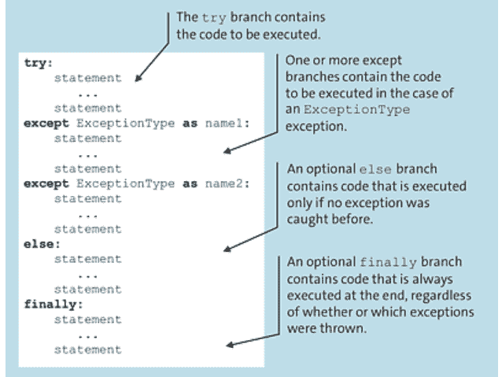

**图 20.1** 完整的 Try/Except 语句

最后，关于 `try/except` 语句如何执行的几点说明：首先，执行与 `try` 分支关联的代码。如果在此代码中引发异常，则执行与相应 `except` 分支关联的代码。如果没有匹配的 `except` 分支，则异常未被处理，如果在其他地方未处理，则最终会作为回溯信息显示在屏幕上。如果在 `try` 分支中没有引发异常，则不会执行任何 `except` 分支；而是执行 `else` 分支。`finally` 分支在最后无论如何都会执行。

在 `except`、`else` 或 `finally` 分支中引发的异常不能由同一语句的后续 `except` 分支处理。但是，可以嵌套 `try/except` 语句：

try:
    try:
        raise TypeError
    except IndexError:
        print("An IndexError has occurred")
except TypeError:
    print("A TypeError has occurred")

在内部 `try/except` 语句的 `try` 分支中引发了一个 `TypeError`，但该语句本身并未处理它。形象地说，这个异常随后向上移动一级，并运行到下一个 `try/except` 语句中。在其中，引发的 `TypeError` 被处理，并输出相应的消息。因此，示例的输出如下：`A TypeError has occurred`。不会显示回溯信息。

## 20.1.4 自定义异常

在引发和处理异常时，你并不局限于内置的异常类型集合：你也可以自己创建新的类型。许多第三方库利用这种可能性来提供针对各自应用程序的特殊异常类型。

要定义自己的异常类型，你只需要创建一个继承自 `Exception` 基类的自己的类，然后根据需要添加更多的属性和方法来完全处理你的异常。

现在让我们定义一个基本的账户类，它支持的唯一操作是提取特定金额：

```
class Account:
    def __init__(self, amount):
        self.account_balance = amount
    def withdraw(self, amount):
        self.account_balance -= amount
```

在这个类的实现中，可以透支任意金额。在一个稍微复杂一点的变体中，需要防止账户透支，并在尝试提取超过可用金额时引发一个自定义异常。为此，我们将首先定义一个派生自 `Exception` 基类的类，并为账户余额和要提取的金额添加属性：

```
class AccountBalanceError(Exception):
    def __init__(self, account_balance, amount):
        super().__init__(account_balance, amount)
        self.account_balance = account_balance
        self.amount = amount
```

然后我们将修改 `Account` 类的 `withdraw` 方法，以便在无效提取时引发一个 `AccountBalanceError` 实例：

```
class Account:
    def __init__(self, amount):
        self.account_balance = amount
    def withdraw(self, amount):
        if amount > self.account_balance:
            raise AccountBalanceError(self.account_balance, amount)
        self.account_balance -= amount
```

传递给类构造函数的附加信息不会在回溯中显示：

```
>>> a = Account(1000)
>>> a.withdraw(2000)
Traceback (most recent call last):
  File "<stdin>", line 1, in <module>
  File "<stdin>", line 7, in withdraw
AccountBalanceError: (1000, 2000)
```

它只在异常被处理和加工时才生效：

```
try:
    a.withdraw(2000)
except AccountBalanceError as e:
    print("Account balance: {} USD".format(e.account_balance))
    print("Unable to withdraw {} USD".format(e.amount))
```

这段代码处理产生的异常，然后输出错误消息。使用类通过 `account-balance` 和 `amount` 属性提供的附加信息，可以重建之前的提取过程。示例的输出如下：

```
Account balance: 1000 USD
Unable to withdraw 2000 USD
```

对于带有附加信息的自定义异常，如果还要包含错误消息，它必须实现 `__str__` 魔术方法：

```
class AccountBalanceError(Exception):
    def __init__(self, account_balance, amount):
        super().__init__(account_balance, amount)
        self.account_balance = account_balance
        self.amount = amount
    def __str__(self):
        return "Account balance too low (need {} USD more)".format(
            self.amount - self.account_balance)
```

由此异常引起的回溯如下所示：

```
>>> a = Account(1000)
>>> a.withdraw(2000)
Traceback (most recent call last):
  File "<stdin>", line 1, in <module>
  File "<stdin>", line 7, in withdraw
AccountBalanceError: Account balance too low (need 1000 USD more)
```

## 20.1.5 重新引发异常

在某些情况下，特别是在函数层次结构较深时，处理异常、启动为此情况提供的错误处理，然后再次引发异常是有意义的。让我们看下面的例子：

```
def function3():
    raise TypeError
def function2():
    function3()
def function1():
    function2()
function1()
```

在这个例子中，调用了 `function1` 函数，它又调用了 `function2`，在 `function2` 中调用了 `function3`。因此，总共有三个嵌套的函数调用。在这些函数调用中最内层的 `function3` 中，引发了一个 `TypeError` 异常。这个异常没有被处理，因此相关的回溯如下所示：

```
Traceback (most recent call last):
  File "test.py", line 10, in <module>
    function1()
  File "test.py", line 8, in function1
    return function2()
  File "test.py", line 5, in function2
    return function3()
  File "test.py", line 2, in function3
    raise TypeError
TypeError
```

正如预期的那样，回溯描述了 `raise` 语句执行时的函数层次结构。这个列表也被称为*调用栈*。

异常原则背后的思想是，异常沿着调用层次结构向上工作，并且可以在任何站点被处理。在我们的例子中，我们希望 `function1` 函数处理 `TypeError` 异常，以便它可以执行针对 `TypeError` 的特殊错误处理。在 `function1` 执行完其内部错误处理功能后，异常需要被传递上去。为此，它像下面的例子一样被再次引发：

```
def function3():
    raise TypeError
def function2():
    function3()
def function1():
    try:
        function2()
    except TypeError:
        # Error handling
        raise TypeError
function1()
```

与前面的例子相比，现在发生的回溯如下所示：

```
Traceback (most recent call last):
  File "test.py", line 14, in <module>
    function1()
  File "test.py", line 12, in function1
    raise TypeError
TypeError
```

你可以看到这个回溯包含了关于第二个 `raise` 语句上下文的信息。[ 107 ] 然而，这根本不重要，它只是 `function1` 内部错误处理的副产品。理想的情况是，尽管异常在 `function1` 中被临时处理，但产生的回溯仍然描述原始 `raise` 语句的上下文。为了实现这一点，可以编写一个不指定异常类型的 `raise` 语句：

```
def function3():
    raise TypeError
def function2():
    function3()
def function1():
    try:
        function2()
    except TypeError as e:
        # Error handling
        raise
function1()
```

这个例子中的回溯输出如下所示：

```
Traceback (most recent call last):
  File "test.py", line 16, in <module>
    function1()
  File "test.py", line 11, in function1
    function2()
  File "test.py", line 7, in function2
    function3()
  File "test.py", line 4, in function3
    raise TypeError
TypeError
```

你可以看到这是异常最初引发位置的堆栈跟踪。因此，回溯包含了关于错误实际发生位置的所需信息。

## 20.1.6 异常链

偶尔会发生这样的情况：在 `except` 分支内，你需要引发另一个异常——要么是因为在处理异常期间发生了另一个错误，要么是为了“重命名”出现的异常。

如果在 `except` 分支内引发另一个异常，Python 会自动应用所谓的*异常链*。前一个异常作为新引发异常的上下文被附加，以便传递最大信息量。例如，让我们看看以下代码：

```
try:
    [1,2,3][128]
except IndexError:
    raise RuntimeError("Bad error")
```

输出如下：

```
Traceback (most recent call last):
  File "test.py", line 3, in <module>
    [1,2,3][128]
IndexError: list index out of range
The above exception was the direct cause of the following exception:
Traceback (most recent call last):
  File "test.py", line 5, in <module>
    raise RuntimeError("Bad error") from e
RuntimeError: Bad error
```

它访问一个三元素列表的第128个元素，这引发了一个 `IndexError` 异常。这个异常被捕获，并在处理时引发了一个 `RuntimeError` 异常。从回溯输出中，你可以看到原始的 `IndexError` 异常被附加到了新的 `RuntimeError` 异常上。

`raise/from`语法可用于控制异常链的行为。在引发异常时，可以指定一个上下文，该上下文随后会被纳入最终的回溯信息中。这个上下文可以是，例如，第二个异常：

```
>>> raise IndexError from ValueError
ValueError
The above exception was the direct cause of the following exception:
Traceback (most recent call last):
  File "<stdin>", line 1, in <module>
IndexError
```

事实证明，我们可以使用`raise/from`语法来触发异常链。或者，`raise/from`语法也可以用来阻止异常的自动附加：

```
try:
    [1,2,3][128]
except IndexError:
    raise RuntimeError("Bad error") from None
```

在这种情况下，最终的回溯信息只包含新创建的`RuntimeError`异常。原始的`IndexError`异常丢失了。

## 20.2 断言

`assert`关键字使你能够将断言集成到Python程序中。通过编写`assert`语句，程序员指定了一个对程序执行至关重要且在`assert`语句被执行时必须始终为`True`的条件。如果`assert`语句的条件求值为`False`，则会引发`AssertionError`异常。在以下交互式会话中，输入了几个`assert`语句：

```
>>> lst = [7, 1, 3, 5, -12]
>>> assert max(lst) == 7
>>> assert min(lst) == -12
>>> assert sum(lst) == 0
Traceback (most recent call last):
  File "<stdin>", line 1, in <module>
AssertionError
```

也可以在`assert`语句中指定错误消息，该消息在失败时会被插入到`AssertionError`异常中。这个错误消息可以在条件之后用逗号分隔写出来：

```
>>> lst = [7, 1, 3, 5, -12]
>>> assert max(lst) == 7, "max is broken"
>>> assert min(lst) == -12, "min is broken"
>>> assert sum(lst) == 0, "sum is broken"
Traceback (most recent call last):
  File "<stdin>", line 1, in <module>
AssertionError: sum is broken
```

因此，`assert`语句是跟踪错误的实用工具，并且可以在不满足某些要求时终止程序流程。通常，`assert`用于在程序的关键点检查所有变量是否具有预期的值。

请注意，`assert`语句通常只在程序开发期间需要；在完成的程序中它们会相当干扰。因此，`assert`语句仅在全局`__debug__`常量引用值`True`时才会执行。只有当解释器使用`-O`命令行选项启动时，该常量才为`False`。如果`__debug__`常量引用值`False`，`assert`语句将被忽略，从而不再影响程序的运行时。

> **注意**

请注意，你不能在程序本身中更改`__debug__`的值；你只能使用`-O`命令行选项来确定`assert`语句是应该执行还是被忽略。

## 20.3 警告

*警告*被理解为一种不会改变程序流程，而只是出现在标准`stderr`错误流（参见[第29章，第29.2.3节](#)）中的异常，用于通知程序员一个可疑但不关键的情况。

警告的一个典型例子是`DeprecationWarning`，它通知开发人员或用户，正在运行的程序使用了在未来Python版本或库的未来版本中将不再可用的功能。这个发现对于当前的程序流程来说不是问题，但它足够重要，应该被知晓。

> **注意**

附录列出了Python中默认定义的警告类型并解释了它们的含义。

标准库的`warnings`模块允许你通过复杂的过滤规则控制显示或忽略不同内容和不同来源的警告。默认情况下，Python会抑制一些警告，特别是当它们来自导入的模块时。然而，这些过滤规则经常被Python开发人员根据新的情况进行调整。

`warnings`模块包含`simplefilter`函数，该函数可以用一个通用规则覆盖预设的过滤规则。通过这种方式，可以普遍抑制警告，例如：

```
>>> import warnings
>>> warnings.simplefilter("ignore")
```

同样，所有警告都可以变成中断程序流程的异常。在这种情况下，警告也可以被处理：

```
>>> warnings.simplefilter("error")
```

其他可能的参数包括`"default"`用于抑制来自同一来源的重复警告，`"always"`用于输出所有警告，`"module"`用于仅输出模块的第一个警告，以及`"once"`用于抑制重复的警告类型。

> **注意**

警告也可以使用Python解释器的`-w`命令行参数转换为错误。通过这种方式，可以在不修改代码的情况下改变Python程序对警告的行为：

```
$ python -W error program.py
```

同样，`default`、`always`、`module`和`once`参数也可以使用。

# 21 生成器和迭代器

在前面的章节中，我们经常使用诸如*迭代*或*可迭代对象*之类的术语。虽然没有精确定义，但直观上很清楚，这意味着对相应实例的各个元素进行连续考虑。例如，可以使用`for`循环来迭代列表：

```
>>> for x in [1,2,3,4]:
...     print(x)
...
1
2
3
4
```

在本章中，我们将通过引入*生成器*和*迭代器*的核心概念，为迭代的概念奠定坚实的基础。然后我们将了解`itertools`，这是标准库中的一个模块，它为各种有趣的用例提供了一组生成器。

## 21.1 生成器

在本节中，我们将描述生成器的概念，它可以用于方便地生成值序列。因为这听起来仍然非常抽象，我们将直接从一个例子开始。你肯定记得内置函数`range`，它在`for`循环中扮演着重要角色：

```
>>> for i in range(10):
...     print(i, end=" ")
0 1 2 3 4 5 6 7 8 9
```

正如你已经知道的，`range(10)`返回一个可迭代对象，可用于循环遍历数字0到9。你已经知道`range`为此目的并不创建这些数字的列表，而是按需生成它们。经常发生的情况是，你希望用循环处理一个对象列表，而整个列表本身不必都在内存中。对于前面的例子，这意味着虽然我们处理数字0到9，但我们不需要在任何时候都拥有列表`[0, 1, 2, 3, 4, 5, 6, 7, 8, 9]`。

这个原理现在被推广，允许任何不必全部位于内存中的对象序列使用循环进行迭代——例如，如果我们想迭代前n个平方数。

这就是所谓的生成器发挥作用的地方。生成器是一个函数，当被调用时，它创建一个可迭代对象，该对象按顺序返回虚拟序列的元素。因此，对于平方数的例子，我们需要一个生成器来按顺序返回前n个平方数。这些构造（也称为*生成器函数*）的定义类似于常规函数。我们需要的生成器可以实现如下：

```
def square_generator(n):
    for i in range(1, n+1):
        yield i*i
```

这个生成器现在允许我们优雅地在屏幕上输出前10个平方数：

```
>>> for i in square_generator(10):
...     print(i, end=" ")
1 4 9 16 25 36 49 64 81 100
```

`square_generator(10)`函数调用返回一个可迭代对象（生成器实例），该对象可以用`for`循环进行迭代：

```
>>> square_generator(10)
<generator object square_generator at 0x7feb157ebbf8>
```

生成器的关键在于`yield`语句，我们用它来返回虚拟序列的各个值。`yield`的语法与`return`语句的语法非常相似，因此不需要进一步解释。决定性因素是`yield`与`return`相比如何影响程序的控制流。

如果在程序运行期间在普通函数中遇到`return`，控制流将返回到上一级，函数调用终止。因此，函数调用的本地命名空间将被删除。再次调用函数时，Python将再次从函数开头开始并完整执行它。

相反，当遇到`yield`语句时，生成器函数内的当前位置及其本地命名空间被保存，控制流通过`yield`指定的值返回到调用程序。在下一个迭代步骤中，Python然后在最后一个执行的`yield`之后继续，并可以再次访问旧的本地变量，在本例中为`i`和`n`。只有当到达函数末尾时，最终的清理才会开始。

生成器函数可以包含多个`yield`语句：

```
def generator_with_multiple_yields():
    a = 10
    yield a
    yield a*2
    b = 5
    yield a+b
```

这个生成器也可以用`for`循环进行迭代：

## 21.1.1 子生成器

```python
>>> for i in generator_with_multiple_yields():
...     print(i, end=" ")
10 20 15
```

在第一次迭代步骤中，生成器函数内创建了局部变量 `a`，其值随后通过 `yield a` 传递给循环。下一次迭代则从 `yield a*2` 处继续，返回的 `20` 表明 `a` 的值确实被保留在了两次调用之间。在最后一次迭代步骤中，我们还创建了值为 `5` 的局部变量 `b`，并将 `a` 和 `b` 的和传递给循环，输出 `15`。由于此时已到达生成器函数的末尾，循环将在三次遍历后终止，并最终释放局部命名空间。

如果需要，也可以提前退出生成器函数。为此，你必须使用不带返回值的 `return` 语句。以下生成器根据可选参数 `also_boys` 的值，创建一个女孩名字序列，或女孩和男孩名字的序列：

```python
def names(also_boys=True):
    yield "Ella"
    yield "Linda"
    if not also_boys:
        return
    yield "Phillip"
    yield "Steve"
```

使用内置的 `list` 函数，我们可以从生成器的值创建一个列表，该列表仅包含 "Ella" 和 "Linda"，或者额外包含 "Phillip" 和 "Steve"：

```python
>>> list(names())
['Ella', 'Linda', 'Phillip', 'Steve']
>>> list(names(False))
['Ella', 'Linda']
```

> 注意：你可以选择与生成器交换数据。用于此目的的 `send` 和 `throw` 方法在[第 44 章，第 44.6 节](Chapter 44, Section 44.6)中讨论。

生成器可以将控制权转移给另一个生成器。这使得将生成器的部分功能分解到单独的生成器中成为可能。例如，我们可以将上一节中的 `name` 生成器拆分为两个子生成器 `boys` 和 `girls`：

```python
def boys():
    yield "Phillip"
    yield "Steve"

def girls():
    yield "Ella"
    yield "Linda"

def names(also_boys=True):
    yield from girls()
    if also_boys:
        yield from boys()
```

新的 `name` 生成器的行为与没有子生成器的版本完全相同：

```python
>>> list(names())
['Ella', 'Linda', 'Phillip', 'Steve']
>>> list(names(False))
['Ella', 'Linda']
```

请注意，子生成器生成的值会直接传递到调用层级。委托生成器无法访问这些值。在示例中，名字 Ella、Linda、Phillip 和 Steve 是由 `girls` 和 `boys` 生成器直接写入结果列表的，`names` 生成器并未看到它们。要将数据返回给委托生成器，我们可以使用 `return` 语句。`yield from` 语句在子生成器执行完毕后获取其返回值。作为示例，让我们扩展 `boys` 和 `girls` 子生成器，使它们通过 `return` 返回各自名字的数量：

```python
def boys():
    yield "Phillip"
    yield "Steve"
    return 2

def girls():
    yield "Ella"
    yield "Linda"
    return 2

def names(also_boys=True):
    number_of_girls = (yield from girls())
    print("{} girls".format(number_of_girls))
    if also_boys:
        number_of_boys = (yield from boys())
        print("{} boys".format(number_of_boys))
```

现在 `names` 生成器通过 `print` 输出相应的数字：

```python
>>> list(names())
2 girls
2 boys
['Ella', 'Linda', 'Phillip', 'Steve']
```

我们在此使用子生成器解释了 `yield from` 的功能。需要提及的是，`yield from` 也适用于任意可迭代对象：

```python
>>> def names():
...     yield from ["Ella", "Linda", "Phillip", "Steve"]
>>> list(names())
['Ella', 'Linda', 'Phillip', 'Steve']
```

> **注意**：如果一个生成器将控制权传递给子生成器，子生成器将负责处理所有接收到的值和异常。有关在生成器中引发异常的更多细节，请参阅[第 44 章，第 44.6.2 节](Chapter 44, Section 44.6.2)。

### 示例：使用子生成器遍历二叉树

子生成器的一个更实际的例子是遍历二叉树。*二叉树*是一种由节点以树状方式连接组成的数据结构。每个节点都有一个值，并且可以有一个左子节点或右子节点，每个子节点本身也是一个节点。二叉树的一个示例如[图 21.1](#figure-21-1)所示。

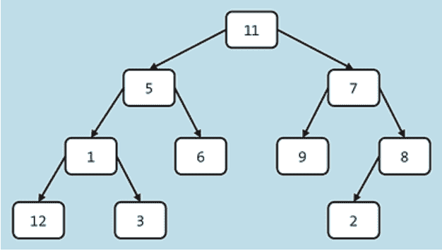

**图 21.1** 二叉树

遍历树时，所有节点按顺序被访问。这可以通过所谓的中序遍历实现。在一个节点处，首先遍历左子树，然后输出节点本身的值，最后遍历右子树。这可以通过以下包含 `traverse` 方法的 `Node` 类来实现：

```python
class Node:
    def __init__(self, value, left=None, right=None):
        self.left = left
        self.value = value
        self.right = right

    def traverse(self):
        if self.left:
            for k in self.left.traverse():
                yield k
        yield self.value
        if self.right:
            for k in self.right.traverse():
                yield k
```

`traverse` 生成器方法中的两个 `for` 循环迭代左子树和右子树的值，并为此递归地访问各自子树的 `traverse` 生成器方法。现在可以通过 `yield from` 显式地转移控制权，因此 `traverse` 方法可以重写如下：

```python
def traverse(self):
    if self.left:
        yield from self.left.traverse()
    yield self.value
    if self.right:
        yield from self.right.traverse()
```

我们现在可以构建并遍历[图 21.1](Figure 21.1)中的示例树：

```python
bl_ = Node(left=Node(12), value=1, right=Node(3))
bl = Node(left=bl_, value=5, right=Node(6))

br_ = Node(left=Node(2), value=8)
br = Node(left=Node(9), value=7, right=br_)

tree = Node(left=bl, value=11, right=br)
print(list(tree.traverse()))
```

我们得到的输出是树的所有节点的列表：

```
[12, 1, 3, 5, 6, 11, 9, 7, 2, 8]
```

## 21.1.2 生成器表达式

在[第 12 章](Chapter 12)，[第 12.3.7 节](Section 12.3.7)中，你学习了列表推导式，它允许你以简单的方式创建列表。例如，以下列表推导式生成前 10 个平方数的列表：

```python
>>> [i*i for i in range(1, 11)]
[1, 4, 9, 16, 25, 36, 49, 64, 81, 100]
```

如果你现在想计算这前 10 个平方数的和，可以使用内置的 `sum` 函数：

```python
>>> sum([i*i for i in range(1, 11)])
385
```

到目前为止，一切顺利。然而，这会在求和之前创建一个包含所有平方数的、不必要的 `list` 实例。

为了在这种情况下继续享受列表推导式的便利，我们可以使用*生成器表达式*。生成器表达式看起来与相应的列表推导式完全相同，只是必须使用圆括号 (`()`) 而不是方括号 (`[]`) 作为分隔符。这允许我们使用生成器表达式以节省内存的方式表述前面的示例：

```python
>>> sum((i*i for i in range(1, 11)))
385
```

如果表达式本身已经被括号括起来，则可以省略外层的圆括号。因此在 `sum` 示例中，我们可以去掉一对圆括号：

```python
>>> sum(i*i for i in range(1, 11))
385
```

生成器可以帮助你在可读性和执行速度两方面改进程序。每当你需要处理一个复杂且因此难以阅读的 `while` 循环时，你应该检查生成器是否能更优雅地完成这项工作。

在本节中，我们仅限于生成器的定义及其在 `for` 循环或与 `list` 一起使用。在下一节中，你将了解它们的背景和技术实现：生成器和 `for` 循环背后的基本概念是迭代器。

## 21.2 迭代器

在阅读本书时，你经常遇到*可迭代对象*这个术语，但到目前为止，你只知道可以用`for`循环遍历这类实例，或者将它们作为参数传递给某些函数，例如`list`。在本节中，我们将探讨这些对象的背景和功能。

将多个元素组合在一个实例中的数据类型，如列表、集合或字典，被称为*容器*。*迭代器*是一个抽象层，允许通过标准化接口枚举容器的元素。

这抽象了容器的具体特性以访问其元素，使得任何可迭代对象都可以用相同的代码遍历。这样，了解容器如何存储元素以及如何以其他方式访问它们就不再重要了。

### 21.2.1 迭代器协议

为此目的定义的接口称为*迭代器协议*，其定义如下：每个可迭代实例必须实现一个无参数的`__iter__`方法，该方法返回一个*迭代器对象*。迭代器对象也必须有一个`__iter__`方法，该方法简单地返回对迭代器对象本身的引用。它还必须有一个`__next__`方法，每次调用时返回正在遍历的容器的下一个元素。一旦到达迭代的末尾，`__next__`方法必须引发`StopIteration`异常。

为了能够开始迭代，必须通过内置的`iter`函数确定对迭代器的引用。`iter(object)`语句调用`object`实例的`__iter__`方法，并将结果作为返回值传递给调用层。然后可以从返回的迭代器实例调用`__next__`方法，直到它引发`StopIteration`异常。

### 21.2.2 示例：斐波那契数列

为了更清楚地说明这个抽象描述，我们将开发一个允许我们遍历斐波那契数列的类。[109] 斐波那契数列是一个整数序列，其中每个元素$f(n)$可以通过其两个前驱元素的和$f(n-2) + f(n-1)$计算得出。根据定义，前两个元素被设置为$f(1) = f(2) = 1$。这个无限数列的开头如表21.1所示。

| n | 1 | 2 | 3 | 4 | 5 | 6 | 7 | 8 | 9 | 10 | 11 | 12 | 13 | 14 |
|---|---|---|---|---|---|---|---|---|---|---|---|---|---|---|
| f(n) | 1 | 1 | 2 | 3 | 5 | 8 | 13 | 21 | 34 | 55 | 89 | 144 | 233 | 377 |

**表21.1** 斐波那契数列的前14个元素

我们下面讨论的`Fibonacci`类使用迭代器协议来实现一个遍历斐波那契数列的迭代器。

```python
class Fibonacci:
    def __init__(self, max_n):
        self.max_n = max_n
        self.n = 0
        self.a = 0
        self.b = 1
    def __iter__(self):
        return self
    def __next__(self):
        if self.n < self.max_n:
            self.n += 1
            self.a, self.b = self.b, self.a + self.b
            return self.a
        else:
            raise StopIteration
```

这里的`Fibonacci`类在其构造函数中期望一个参数，即迭代应停止的元素编号。我们将这个数字存储在`max_n`属性中，然后使用`n`属性来计算已经返回了多少个元素。为了在`__next__`调用之间记住数列中的当前位置并能够计算下一个元素，我们将最后返回的元素及其后继元素存储在`Fibonacci`类的`a`和`b`属性中。我们不会定义单独的迭代器类，因此我们将让`__iter__`方法返回对`Fibonacci`实例本身的引用——即`self`。[110] `__next__`方法负责计算数列的当前元素，并更新缓存和计数器。当到达所需子序列的末尾时，会引发`StopIteration`。

现在，该类可以与所有支持迭代器协议的构造一起处理，例如`for`循环和内置的`list`和`sum`函数：

```
>>> for f in Fibonacci(14):
...     print(f, end=" ")
...
1 1 2 3 5 8 13 21 34 55 89 144 233 377
>>> list(Fibonacci(16))
[1, 1, 2, 3, 5, 8, 13, 21, 34, 55, 89, 144, 233, 377, 610, 987]
>>> sum(Fibonacci(60))
4052739537880
```

### 21.2.3 示例：黄金分割比

使用`Fibonacci`的一个小的子类，我们还可以创建一个迭代器，让我们遍历两个连续斐波那契数的比率。在这里你可以看到，这些商趋近于黄金分割比。子类只需要覆盖`Fibonacci`类的`__next__`方法，然后返回商而不是数列元素。我们受益于这样一个事实：在属性b中，我们已经预先计算了下一个元素的值。实现如下所示：

```python
class GoldenRatio(Fibonacci):
    def __next__(self):
        super().__next__()
        return self.b / self.a
```

即使是这个数列的前14个元素也揭示了收敛性。黄金分割比四舍五入到六位小数是1.618034：

```
>>> for g in GoldenRatio(14):
...     print("{:.6f}".format(g), end=" ")
...
1.000000 2.000000 1.500000 1.666667 1.600000 1.625000 1.615385
1.619048 1.617647 1.618182 1.617978 1.618056 1.618026 1.618037
```

### 21.2.4 用于实现 __iter__ 的生成器

可以将可迭代对象的`__iter__`方法实现为生成器。在斐波那契数列的情况下，这种技术会产生更优雅的代码，因为我们现在不再需要在`__next__`调用之间记住迭代器的状态，也不需要显式定义`__next__`：

```python
class Fibonacci2:
    def __init__(self, max_n):
        self.max_n = max_n
    def __iter__(self):
        a, b = 0, 1
        for n in range(self.max_n):
            a, b = b, a + b
            yield a
```

Fibonacci2类的实例在迭代期间的行为与不使用生成器方法的解决方案完全相同：

```
>>> list(Fibonacci2(10))
[1, 1, 2, 3, 5, 8, 13, 21, 34, 55]
```

然而，`GoldenRatio`类不能再像上面那样作为`Fibonacci2`的子类来实现，因为值的缓存以及`__next__`方法现在都封装在生成器中。

### 21.2.5 使用迭代器

现在你已经学会了如何在自己的类中实现有效的迭代器接口。接下来，我们将从相反的角度来看待这个主题，看看如何使用这个迭代器接口，以便我们也能编写可以处理任何可迭代实例的函数，而不仅仅是列表或其他序列。

为此，我们将考虑一个简单的`for`循环，然后通过编程一个不使用`for`但显式使用迭代器协议的等效循环来深入了解其幕后原理：

```
>>> for i in range(10):
...     print(i, end=" ")
...
0 1 2 3 4 5 6 7 8 9
```

正如你已经知道的，要遍历一个序列，我们需要相关的迭代器对象。这由内置的`iter`函数提供，如上一节所述，它调用传递对象的`__iter__`方法：

```
>>> iter(range(10))
<range_iterator object at 0x7f7ef190dab0>
```

使用迭代器对象的`__next__`方法，我们现在依次确定所有元素。这里我们不会直接调用`__next__`方法，而是使用内置的`next`函数。`next(i)`调用等同于`i.__next__()`：

```
>>> i = iter(range(3))
>>> next(i)
0
>>> next(i)
1
>>> next(i)
2
>>> next(i)
Traceback (most recent call last):
  File "<stdin>", line 1, in <module>
StopIteration:
```

如果在返回最后一个元素后再次调用`i.__next__`，该方法会如预期那样引发`StopIteration`异常。

内置的`next`函数提供了一个可选的第二个参数`default`。如果为`default`传递了一个值，内置的`next`函数会处理`StopIteration`异常并返回`default`的值：

```
>>> i = iter(range(2))
>>> next(i, 111)
0
>>> next(i, 111)
1
>>> next(i, 111)
111
>>> next(i, 111)
111
```

如果我们用`try/except`语句自己处理`StopIteration`异常，我们可以如下重新创建`for`循环：

```
>>> i = iter(range(10))
>>> while True:
...     try:
...         print(next(i), end=" ")
...     except StopIteration:
...         break
...
0 1 2 3 4 5 6 7 8 9
```

当然，Python中的`for`循环并不是像示例中那样实现的，而是Python解释器的一个优化例程。

> 注意

如果生成器函数包含一个`return`语句，返回的值会存储在`StopIteration`中，并可通过其`value`属性读取：

```python
>>> def test():
...     yield 10
...     yield 20
...     return 1337
...
>>> i = test()
>>> while True:
...     try:
...         print(next(i))
...     except StopIteration as e:
...         print("Return:", e.value)
...         break
...
10
20
Return: 1337
```

这里，生成器中的`return value`等价于`raise StopIteration(value)`。

`for`循环也可以直接迭代迭代器本身，而不必创建一个新的迭代器。因此，以下两个循环是等价的：

```python
>>> for i in range(3):
...     print(i, end=" ")
...
0 1 2
>>> for i in iter(range(3)):
...     print(i, end=" ")
...
0 1 2
```

`for`循环自身再次调用`iter`这一事实，如替代的`while`循环所示，并不是问题，因为迭代器对象的`__iter__`方法必须返回对象自身的引用。如果`a`是一个迭代器对象，那么`(a is iter(a))`总是成立的，如下例所示：

```python
>>> a = iter(range(10))  # 创建一个range迭代器
>>> a is iter(a)
True
```

相比之下，可迭代对象的`__iter__`方法不需要返回自身的引用，也不总是需要返回相同的迭代器实例：

```python
>>> a = [1, 2, 3]  # 一个可迭代对象
>>> iter(a) is iter(a)
False
```

## 21.2.6 同一实例的多个迭代器

反过来，这意味着内置函数`iter`在为同一个可迭代对象调用时可以返回不同的迭代器，这对于用两个不同的迭代器遍历列表也很有用，例如：

```python
>>> l = [1, 2, 3]
>>> for i in l:
...     for j in l:
...         print(i, j, end=", ")
...     print()
...
1 1, 1 2, 1 3,
2 1, 2 2, 2 3,
3 1, 3 2, 3 3,
```

在这个例子中，列表`l`的每个元素都与列表中的每个其他元素组合，并输出结果对。为此，每种情况都使用了一个`for`循环。

如果我们尝试使用本节开头的`Fibonacci`类的实例运行相同的代码，我们会得到不同的结果：

```python
>>> l = Fibonacci(3)
>>> for i in l:
...     for j in l:
...         print(i, j, end=", ")
...     print()
...
1 1, 1 2,
```

我们原本期望输出前三个斐波那契数1、1和2的每个组合，得到如下输出：

```
1 1, 1 1, 1 2,
1 1, 1 1, 1 2,
2 1, 2 1, 2 2,
```

这种异常行为是由于`Fibonacci`类的`__iter__`方法没有创建新的迭代器，而是返回了相应对象自身的引用。因此，`Fibonacci`类的实例一次只能有一个迭代器，该迭代器必须由示例中的两个`for`循环共享。

具体过程如下：首先，创建一个Fibonacci类的实例，将属性`l.n`和`l.a`设置为0，属性`l.b`设置为1。然后，在外层循环中，通过调用`__next__`方法确定第一个斐波那契数1，并用`i`引用它。第一个斐波那契数1是通过调用`__next__`方法确定的。

现在内层循环开始，它再次调用实例`l`的`__iter__`方法，并接收到与外层循环相同的迭代器对象的引用。随后，`j`在内层循环中遍历第二个和第三个斐波那契数1和2，并将它们与`i`的值1组合。

此后，外层循环再次调用`l`的`__next__`方法，该方法仍然引发`StopIteration`异常，因为公共迭代器的末尾已经在内层循环中到达。这就在这一点上结束了程序。

如你所见，当迭代器在多个循环中被隐式共享时，可能会出现意外行为。我们可以通过修改`Fibonacci`类，使其在每次调用`__iter__`时返回一个新的迭代器对象来解决这个问题：

```python
class Fibonacci3:
    class FibonacciIterator:
        def __init__(self, max_n):
            self.max_n = max_n
            self.n, self.a, self.b = 0, 0, 1
        def __iter__(self):
            return self
        def __next__(self):
            if self.n < self.max_n:
                self.n += 1
                self.a, self.b = self.b, self.a + self.b
                return self.a
            else:
                raise StopIteration
    def __init__(self, max_n):
        self.max_n = max_n
    def __iter__(self):
        return self.FibonacciIterator(self.max_n)
```

新的`Fibonacci3`类定义了另一个类`FibonacciIterator`，它负责实际的迭代，其定义方式与`Fibonacci`类相同。每次通过`Fibonacci3`类的实例请求一个新的迭代器时，都会创建一个新的`FibonacciIterator`类的对象。

因此，之前的两个嵌套循环提供了预期的结果：

```python
>>> l = Fibonacci3(3)
>>> for i in l:
...     for j in l:
...         print(i,j, end=", ")
...     print()
...
1 1, 1 1, 1 2,
1 1, 1 1, 1 2,
2 1, 2 1, 2 2,
```

由于这些潜在的问题，通常最好在每次调用`__iter__`时都创建一个新的迭代器（如果可能的话）。

## 21.2.7 迭代器与通过索引直接访问相比的缺点

迭代器非常适合遍历序列的所有元素，并为所有容器数据类型统一实现这一点。相比之下，索引允许以任意顺序对容器的元素进行读写访问，而迭代器方法无法做到这一点。

在这方面，索引不能完全被迭代器取代，但迭代器在特殊情况下对其进行了补充。

## 21.2.8 可迭代对象的替代定义

除了前面描述的可迭代对象的定义之外，还有另一种方法可以使一个类可迭代。因为许多序列和容器可以对元素进行连续编号并通过整数索引访问它们，所以如果一个对象可以通过`__getitem__`方法（即使用`[]`运算符）用整数索引访问其元素，那么它已经是可迭代的了。如果你用这样的实例作为参数调用内置的`iter`函数，Python会负责创建迭代器。每次调用生成的迭代器的`__next__`方法时，都会调用可迭代实例的`__getitem__`方法，并始终传递一个整数作为参数。传递的索引计数从0开始，直到`__getitem__`方法在传递无效索引时产生`IndexError`才结束。

例如，一个用于迭代前`max_n`个平方数的类，如果它还支持使用`len`确定其长度，可能如下所示：

```python
class Squares:
    def __init__(self, max_n):
        self.max_n = max_n
    def __getitem__(self, index):
        index += 1  # 0*0 不太有趣...
        if index > len(self) or index < 1:
            raise IndexError
        return index*index
    def __len__(self):
        return self.max_n
```

为了演示这个隐藏的迭代器，让我们输出前20个平方数的列表：

```python
>>> list(Squares(20))
[1, 4, 9, 16, 25, 36, 49, 64, 81, 100, 121, 144, 169, 196, 225, 256, 289, 324, 361, 400]
```

## 21.2.9 函数迭代器

Python中迭代器的最后一个选项是所谓的函数迭代器。这些是调用特定函数直到它返回一个特殊值——序列的*终止符*——的对象。你可以使用内置的`iter`函数创建一个函数迭代器，将要迭代的函数的引用作为第一个参数传递，将终止符的值作为第二个参数传递。

**`iter(function, terminator)`**

一个有用的例子是`file`对象的`readline`方法，它返回下一行的值，直到到达文件末尾。如果`file`实例的当前读取位置之后没有更多数据，`readline`返回一个空字符串。如果当前工作目录中有一个名为*friends.txt*的文件，其中包含四个名字"Luke"、"Michael"、"Leo"和"John"，每个名字占一行，我们可以这样迭代它：

```python
>>> with open("friends.txt") as file:
...     for line in iter(file.readline, ""):
...         print(line.strip(), end=" ")
Luke Michael Leo John
```

## 注意

本示例仅用于说明函数迭代器。你也可以用这种方式直接迭代文件的行：

```
>>> with open("friends.txt") as file:
...     for line in file:
...         print(line.strip(), end=" ")
```

## 21.3 特殊生成器：itertools

至此，我们要介绍标准库的 `itertools` 模块，它包含在日常编程中非常有用的生成器函数。例如，`itertools` 允许你迭代给定列表中元素的所有组合或排列。

表 21.2 列出了 `itertools` 模块中包含的生成器并进行了简要说明。详细描述将在后续章节中展开。

| 函数 | 描述 |
| :--- | :--- |
| `accumulate(iterable, [func])` | 迭代 `iterable` 元素的部分和 |
| `chain([*iterables])` | 迭代传入的可迭代对象的连接 |
| `combinations(iterable, r)` | 迭代 `iterable` 的所有 r 元素组合 |
| `combinations_with_replacement(iterable, r)` | 遍历 `iterable` 的所有 r 元素组合（允许重复） |
| `compress(data, selectors)` | 遍历 `data` 中对应 `selectors` 元素为 `True` 的元素 |
| `count(start, step)` | 从 `start` 开始，以 `step` 为间隔计数 |
| `cycle(iterable)` | 无限循环迭代 `iterable` 的元素 |
| `dropwhile(predicate, iterable)` | 遍历 `iterable` 的所有元素，**从** `predicate` **首次返回** `False` **的元素开始** |
| `filterfalse(predicate, iterable)` | 遍历 `iterable` 中所有 `predicate` **返回** `False` **的元素** |
| `groupby(iterable, key)` | 遍历 `iterable` 的元素，**按** `key` **函数分组** |
| `islice(iterable, [start], stop, [step])` | 启用可迭代对象的切片 |
| `permutations(iterable, r)` | 迭代 `iterable` 的所有 `r` 元素排列 |
| `product([*iterables], repeat)` | 遍历传入的可迭代对象的笛卡尔积 |
| `repeat(object, [times])` | 重复对象 `times` 次 |
| `starmap(function, iterable)` | 以 `iterable` 的元素作为参数调用 `function` 函数，并迭代结果 |
| `takewhile(predicate, iterable)` | 遍历 `iterable` 的所有元素，**直到** `predicate` **首次返回** `False` **的元素为止** |
| `tee(iterable, [n])` | 为 `iterable` 创建 `n` 个独立的迭代器 |
| `zip_longest([*iterables], fillvalue)` | 类似于内置函数 `zip`，但不会根据最短可迭代对象的长度截断 |

**表 21.2** itertools 模块的函数

为了说明目的，以下示例将生成器函数返回的迭代器转换为列表并输出。要能够理解这些示例，你必须事先导入 `itertools` 模块：

```
>>> import itertools
```

### 21.3.1 accumulate(iterable, [func])

`accumulate` 函数创建一个迭代器，该迭代器生成 `iterable` 元素的部分和。以下示例说明了这一点：

```
>>> list(itertools.accumulate([1,2,3,4]))
[1, 3, 6, 10]
```

生成的迭代器依次生成元素 1、1 + 2、1 + 2 + 3 和 1 + 2 + 3 + 4。

对于可选的 `func` 参数，你可以传递一个自定义运算符，该运算符将替代加法运算符。这必须是一个接受两个参数并从中计算返回值的函数对象。

### 21.3.2 chain([*iterables])

`chain` 函数创建一个迭代器，该迭代器按顺序迭代传入的可迭代对象的所有元素：

```
>>> list(itertools.chain("ABC", "DEF"))
['A', 'B', 'C', 'D', 'E', 'F']
```

你可以看到，首先遍历第一个字符串的元素，然后是第二个传入字符串的元素。

在某些情况下，单独传递可迭代对象作为参数不方便。为此，你可以使用 `chain.from_iterable` 函数，它接受一个可迭代对象序列作为唯一参数：

```
>>> list(itertools.chain.from_iterable(["ABC", "DEF", "GHI"]))
['A', 'B', 'C', 'D', 'E', 'F', 'G', 'H', 'I']
```

这两个函数仅在参数传递方式上有所不同。

### 21.3.3 combinations(iterable, r)

`combinations` 函数生成 `iterable` 的所有包含 `r` 个元素的组合。在组合中，不考虑元素的排列顺序。因此，交换组合中的元素不会产生新的组合。在以下示例中，迭代了数字 0 到 3 的所有三位数组合：

```
>>> list(itertools.combinations(range(4), 3))
[(0, 1, 2), (0, 1, 3), (0, 2, 3), (1, 2, 3)]
```

例如，你可以看到排列 (1, 0, 2) 没有列出，因为它只是通过交换组合 (0, 1, 2) 中的元素得到的。

在下一个示例中，你可以看到生成的组合取决于 `iterable` 中元素的顺序：

```
>>> list(itertools.combinations("ABC", 2))
[('A', 'B'), ('A', 'C'), ('B', 'C')]
>>> list(itertools.combinations("CBA", 2))
[('C', 'B'), ('C', 'A'), ('B', 'A')]
```

如果你对一个考虑元素顺序的生成器感兴趣，你会想要迭代所有的排列。在这种情况下，`permutations` 函数是更好的选择。

### 21.3.4 combinations_with_replacement(iterable, r)

`combinations_with_replacement` 函数生成 `iterable` 的所有包含 `r` 个元素的组合，就像 `combinations` 一样，但允许元素重复。这意味着 `iterable` 中的一个元素可以在组合中出现多次：

```
>>> list(itertools.combinations_with_replacement(range(4), 3))
[(0, 0, 0), (0, 0, 1), (0, 0, 2), (0, 0, 3), (0, 1, 1), (0, 1, 2), (0, 1, 3), (0, 2, 2), (0, 2, 3), (0, 3, 3), (1, 1, 1), (1, 1, 2), (1, 1, 3), (1, 2, 2), (1, 2, 3), (1, 3, 3), (2, 2, 2), (2, 2, 3), (2, 3, 3), (3, 3, 3)]
```

与 `combinations` 一样，元素的顺序并不重要。

### 21.3.5 compress(data, selectors)

`compress` 函数创建一个迭代器，该迭代器生成 `data` 可迭代对象中那些在 `selectors` 中对应元素值为 `True` 的元素。以下示例说明了这一点：

```
>>> list(itertools.compress("ABCDEFGH", [1,1,1,0,0,1,0,1]))
['A', 'B', 'C', 'F', 'H']
```

为 `selectors` 传递的列表指定了要遍历 `data` 的前三个、第六个和第八个元素。

### 21.3.6 count([start, step])

`count` 函数创建一个迭代器，该迭代器为所有 `n >= 0` 生成值 `start + n * step`。`start` 和 `step` 都可以传递浮点数。默认情况下，它从 0 开始，步长设置为 1。请注意，此迭代器本身不会停止计数：

```
>>> for i in itertools.count(-5):
...     print(i)
...     if i >= 0:
...         break
...
-5
-4
-3
-2
-1
0
```

`count` 函数与内置的 `map` 函数（参见[第 17 章，第 17.14.30 节](#)）结合使用也很有用。以下示例演示了这一点，它输出 0 到 30 之间的平方数：

```
>>> m = map(lambda x: x**2, itertools.count())
>>> for i in m:
...     if i > 30:
...         break
...     print(i)
...
0
1
4
9
16
25
```

### 21.3.7 cycle(iterable)

`cycle` 函数迭代 `iterable` 对象的所有元素，然后重新开始。`cycle` 生成的迭代器在无限循环中运行。请注意，`cycle` 函数内部会复制 `iterable` 的每个元素，并在再次迭代时使用它。这可能会导致显著的内存消耗，具体取决于 `iterable` 的长度。

### 21.3.8 dropwhile(predicate, iterable)

`dropwhile` 函数接受一个 `iterable` 可迭代对象和一个 `predicate` 函数。它首先对 `iterable` 的所有元素调用 `predicate` 函数，并忽略任何 `predicate` 返回 `True` 的元素。当 `predicate` 首次返回 `False` 时，将遍历 `iterable` 的每个后续元素，无论 `predicate` 对这些元素返回什么值。因此，你可以将 `predicate` 函数视为一个开始信号：

```
>>> p = lambda x: x.islower()
>>> list(itertools.dropwhile(p, "abcdefghHIJKLMnopQRStuvWXYZ"))
['H', 'I', 'J', 'K', 'L', 'M', 'n', 'o', 'p', 'Q', 'R', 'S', 't', 'u', 'v', 'W', 'X', 'Y', 'z']
```

在此示例中，开头小写字母之后的所有字母都包含在结果列表中。你可以看到，在 `p` 谓词函数首次返回 `True` 之后，小写字母也包含在结果中。

### 21.3.9 filterfalse(predicate, iterable)

`filterfalse` 函数生成 `iterable` 中所有 `predicate` 函数返回 `False` 的元素。因此，调用 `filterfalse` 等效于以下生成器表达式：

```
(x for x in iterable if not predicate(x))
```

在以下示例中，仅遍历字符串的大写字母：

```python
>>> p = lambda x: x.islower()
>>> list(itertools.filterfalse(p, "abcDEFghiJKLmnoP"))
['D', 'E', 'F', 'J', 'K', 'L', 'P']
>>> list((x for x in "abcDEFghiJKLmnoP" if not p(x)))
['D', 'E', 'F', 'J', 'K', 'L', 'P']
```

## 21.3.10 groupby(iterable, [key])

`groupby` 函数创建一个迭代器，该迭代器以分组方式生成 `iterable` 的元素。分组是通过为 `key` 传递的键函数执行的。如果未指定 `key` 参数，则根据元素的值进行分组。

`groupby` 生成的迭代器产生包含相应组键和组元素迭代器的元组。以下示例演示了 `groupby` 的工作原理：

```python
>>> for l in list(itertools.groupby("AAABBBCCC")):
...     print(list(l))
...
['A', <itertools._grouper object at 0x7f4784b6c310>]
['B', <itertools._grouper object at 0x7f4784b6c5d0>]
['C', <itertools._grouper object at 0x7f4784b6c390>]
>>> [list(g) for k, g in itertools.groupby('AAABBBCCC')]
[['A', 'A', 'A'], ['B', 'B', 'B'], ['C', 'C', 'C']]
```

借助单独的键函数，可以根据其他方面对元素进行分组。在以下示例中，使用键函数按单词长度进行分组：

```python
>>> def f(x):
...     return len(x)
...
>>> words = ["for", "while", "and", "or", "if", "elif", "else"]
>>> [list(g) for k, g in itertools.groupby(words, f)]
[['for'], ['while'], ['and'], ['or', 'if'], ['elif', 'else']]
```

这揭示了对 `iterable` 中元素顺序的一个重要要求。尽管单词 *for* 和 *and* 长度相同，但它们并未被分组在一起。要使通过 `groupby` 进行的分组正常工作，`iterable` 中包含的对象必须根据所使用的键函数进行预排序。

## 21.3.11 islice(iterable, [start], stop, [step])

`islice` 函数将你从序列数据类型中了解的切片功能转移到任何可迭代对象。该函数创建一个迭代器，该迭代器从序列号为 `start` 的元素开始，在编号为 `stop` 的元素之前停止，并在每一步中前进 `step` 个元素：

```python
>>> list(itertools.islice("ABCDEFGHIJKL", 2, 8, 2))
['C', 'E', 'G']
>>> "ABCDEFGHIJKL"[2:8:2]
'CEG'
```

## 21.3.12 permutations(iterable, [r])

`permutations` 函数创建一个迭代器，用于遍历可迭代对象的所有具有 `r` 个元素的排列：

```python
>>> list(itertools.permutations(range(3), 2))
[(0, 1), (0, 2), (1, 0), (1, 2), (2, 0), (2, 1)]
```

如你所见，排列 (0,1) 和 (1,0) 都包含在结果列表中。与组合不同，排列取决于它们的排列顺序：

```python
>>> list(itertools.permutations("ABC", 2))
[('A', 'B'), ('A', 'C'), ('B', 'A'), ('B', 'C'), ('C', 'A'), ('C', 'B')]
>>> list(itertools.permutations("CBA", 2))
[('C', 'B'), ('C', 'A'), ('B', 'C'), ('B', 'A'), ('A', 'C'), ('A', 'B')]
```

此示例再次表明，结果列表中排列的顺序取决于可迭代对象中待排列元素的顺序。

## 21.3.13 product([*iterables], [repeat])

`product` 函数创建一个迭代器，该迭代器生成传递的可迭代对象的笛卡尔积。结果包含可以从每个传递的可迭代对象中各取一个元素形成的所有元组。在这种情况下，元素在元组中的位置与其来源的可迭代对象在参数列表中的位置完全相同。以下示例说明了这一点：

```python
>>> list(itertools.product("ABC", [1,2]))
[('A', 1), ('A', 2), ('B', 1), ('B', 2), ('C', 1), ('C', 2)]
```

这里，"ABC" 字符串中包含的每个字符都与 [1,2] 列表中的所有元素关联了一次。

使用可选的 `repeat` 关键字参数，例如，可以将一个可迭代对象与自身“相乘”多次，而无需多次将其传递给函数：

```python
>>> list(itertools.product("AB", "AB", "AB"))
[('A', 'A', 'A'), ('A', 'A', 'B'), ('A', 'B', 'A'), ('A', 'B', 'B'), ('B', 'A', 'A'), ('B', 'A', 'B'), ('B', 'B', 'A'), ('B', 'B', 'B')]
>>> list(itertools.product("AB", repeat=3))
[('A', 'A', 'A'), ('A', 'A', 'B'), ('A', 'B', 'A'), ('A', 'B', 'B'), ('B', 'A', 'A'), ('B', 'A', 'B'), ('B', 'B', 'A'), ('B', 'B', 'B')]
```

## 21.3.14 repeat(object, [times])

`repeat` 函数创建一个迭代器，该迭代器反复返回 `object`。你可以选择使用 `times` 参数来指定应执行多少次迭代步骤：

```python
>>> list(itertools.repeat("A", 10))
['A', 'A', 'A', 'A', 'A', 'A', 'A', 'A', 'A', 'A']
```

如果未指定 `times` 参数，`repeat` 返回的迭代器将无限运行。

## 21.3.15 starmap(function, iterable)

`starmap` 函数的工作方式类似于内置的 `map` 函数。对于 `iterable` 中包含的每个参数列表，都会调用 `function` 函数。`starmap` 生成的迭代器产生这些函数调用的结果：

```python
>>> list(itertools.starmap(max, [(1,2), (4,4,3,6), [2,3,9]]))
[2, 6, 9]
```

在此示例中，`starmap` 函数与内置的 `max` 函数一起使用，以遍历每个元组中的最大元素。

## 21.3.16 takewhile(predicate, iterable)

`takewhile` 函数是 `dropwhile` 的对应函数。它创建一个迭代器，只要 `predicate` 函数对元素返回 `True`，就生成 `iterable` 的元素。一旦 `predicate` 调用返回值 `False`，迭代器就会终止：

```python
>>> p = lambda x: x.islower()
>>> list(itertools.takewhile(p, "abcdefGHIjklMNOp"))
['a', 'b', 'c', 'd', 'e', 'f']
```

在这种情况下，`takewhile` 用于仅获取传递字符串开头的小写字母。

## 21.3.17 tee(iterable, [n])

`tee` 函数创建 `n` 个独立的迭代器，用于遍历 `iterable` 的元素。默认情况下，生成 `n=2` 个迭代器。

```python
>>> list(itertools.tee([1,2,3,4]))
[<itertools._tee object at 0x7f26a9e69e48>, <itertools._tee object at 0x7f26a9e69f08>]
>>> [list(x) for x in itertools.tee([1,2,3,4])]
[[1, 2, 3, 4], [1, 2, 3, 4]]
```

调用 `tee` 后，应仅使用 `tee` 返回的迭代器，而不是作为参数传递的那个。

## 21.3.18 zip_longest([*iterables], {fillvalue})

`zip_longest` 函数的工作方式类似于内置的 `zip` 函数。区别在于，使用 `zip_longest` 时，传递的可迭代对象中最长的那个始终是决定性的，其他对象中缺失的元素用 `fillvalue` 填充：

```python
>>> list(zip("ABC", "abcde"))
[('A', 'a'), ('B', 'b'), ('C', 'c')]
>>> list(itertools.zip_longest("ABC", "abcde"))
[('A', 'a'), ('B', 'b'), ('C', 'c'), (None, 'd'), (None, 'e')]
>>> list(itertools.zip_longest("ABC", "abcde", fillvalue="-"))
[('A', 'a'), ('B', 'b'), ('C', 'c'), ('-', 'd'), ('-', 'e')]
```

## 22 上下文管理器

有些操作必须在特定上下文中执行，并且必须确保上下文始终被正确反初始化——例如，即使发生异常也是如此。这种上下文的一个例子是打开的文件对象：必须确保即使在调用 `open` 和文件对象的 `close` 方法之间引发异常，也会调用文件对象的 `close` 方法。

为此，Python 定义了所谓的 *上下文对象*。这些是具有魔术成员 `__enter__` 和 `__exit__` 的对象，分别用于进入和退出上下文。对于上下文对象的使用，有 `with` 语句，你将在下一节中了解它。

## 22.1 with 语句

如果你想在打开的文件对象的上下文中执行操作，使用 Python 的传统语言元素需要以下 `try/finally` 语句：

```python
f = open("file.txt", "r")
try:
    print(f.read())
finally:
    f.close()
```

首先，打开一个名为 *file.txt* 的文件进行读取。随后的 `try/finally` 语句确保在任何情况下都会调用 `f.close`。

这种表示法的缺点在于，程序员必须确保文件对象被正确地反初始化。`with`语句将这一责任转移给了对象本身，并提供了一种比之前展示的代码更简洁优雅的替代方案：

```python
with open("program.py", "r") as f:
    print(f.read())
```

`with`语句由`with`关键字后跟一个实例组成。可选地，该实例后可以跟`as`关键字和一个标识符。这个标识符被称为*目标*，其含义取决于所使用的实例。在前面的例子中，`f`引用了打开的文件对象。

除了嵌套多个`with`语句外，也可以将相应的实例和标识符写在一个`with`语句中，用逗号分隔。因此，以下代码：

```python
with open("file1.txt", "r") as f1, open("file2.txt", "r") as f2:
    print(f1.read())
    print(f2.read())
```

等同于以下代码：

```python
with open("file1.txt") as f1:
    with open("file2.txt", "r") as f2:
        print(f1.read())
        print(f2.read())
```

如果在同一个`with`语句中使用多个实例，这通常会导致行非常长。在这种情况下，使用反斜杠（\）将它们分成多行是一个好主意，如[第4章，第4.2.1节](Chapter 4, Section 4.2.1)所述。从Python 3.10开始，你也可以将列表放在`with`后面的括号中，从而允许任意数量的换行：

```python
with (
    open("file1.txt", "r") as f1,
    open("file2.txt", "r") as f2
):
    print(f1.read())
    print(f2.read())
```

为了理解使用`with`语句时到底发生了什么，在下面的例子中，我们将定义一个可以与`with`语句一起使用的类。这样的类被称为*上下文管理器*。

`MyLogging`类旨在维护一个基本的日志文件。为此，它实现了`entry`函数，该函数向日志文件写入新行。类定义如下所示：

```python
class MyLogging:
    def __init__(self, filename):
        self.filename = filename
        self.f = None
    def entry(self, text):
        self.f.write("==>{}\n".format(text))
    def __enter__(self):
        self.f = open(self.filename, "w")
        return self
    def __exit__(self, exc_type, exc_value, traceback):
        self.f.close()
```

关于这个类的前两个方法，没有太多可说的。`__init__`构造函数接收日志文件的文件名，该文件名存储在内部的`self.filename`属性中。此外，还创建了`self.f`属性，它稍后将引用打开的文件对象。

`entry`方法旨在将传入的文本写入日志文件。为此，它调用文件对象的`write`方法。请注意，`entry`方法只能在`with`语句内部调用，因为文件对象仅在以下魔术方法中打开和关闭。

提到的`__enter__`和`__exit__`魔术方法代表了该类的核心，如果类要与`with`结合使用，则必须实现它们。`__enter__`方法在建立上下文时被调用——即在执行`with`语句的主体之前。该方法不接收参数，但返回一个值。`__enter__`的返回值稍后由目标标识符引用（如果指定了的话）。在示例类的情况下，`self.filename`文件被打开用于写入，并通过`return self`返回对`MyLogging`实例本身的引用。

第二个魔术方法`__exit__`在退出上下文时被调用——即在`with`语句的主体完全执行完毕或因异常而提前终止之后。在示例类的情况下，打开的`self.f`文件对象被关闭。关于`__exit__`方法的三个参数的更多细节将在后面介绍。

我们刚刚创建的`MyLogging`类可以与`with`一起使用，如下所示：

```python
with MyLogging("logfile.txt") as log:
    log.entry("Hello world")
    log.entry("How are you doing?")
```

首先，创建一个`MyLogging`类的实例，传递文件名`logfile.txt`。`with`语句首先导致实例的`__enter__`方法被执行，其返回值由`log`引用。然后执行`with`语句的主体，其中总共调用了两次`entry`方法，从而将文本写入日志文件。在语句主体执行完毕后，`log`实例的`__exit__`方法被调用一次。

## 22.1.1 `__enter__(self)`

这个魔术方法在执行`with`语句的主体之前被调用一次，以打开上下文。此方法的返回值由`with`语句主体中的目标标识符引用。

## 22.1.2 `__exit__(self, exc_type, exc_value, traceback)`

`__exit__`魔术方法在`with`语句的主体执行完毕后被调用一次，以关闭上下文。`exc_type`、`exc_value`和`traceback`参数指定了在`with`语句主体内引发的任何异常的类型、值和回溯对象。如果没有引发异常，则所有三个参数都引用`None`。返回值控制如何处理引发的异常：如果方法返回`True`，异常将被抑制。如果返回值是`False`，异常将被重新引发。

## 22.2 with上下文的辅助函数：contextlib

标准库的`contextlib`模块包含用于处理`with`上下文的函数和装饰器。例如，对象可以被扩展成为上下文管理器，即使它们最初并非为此目的而创建。`contextlib`中的其他函数允许你抑制某些异常或重定向屏幕输出。

要运行本节中的示例，必须首先导入`contextlib`模块：

```python
>>> import contextlib
```

### 22.2.1 动态组装的上下文组合 - ExitStack

`with`语句提供了一种简单而优雅的语法，用于在定义的上下文中执行程序部分——例如，在打开的文件对象的上下文中。此外，你知道多个`with`语句可以嵌套，因此我们可以轻松地在多个打开的文件对象的上下文中执行程序部分：

```python
>>> with open("file1.txt") as file1:
...     with open("file2.txt") as file2:
...             with open("file3.txt") as file3:
...                 pass # Do something with three files
```

或者，可以在一个`with`语句中打开这三个文件。但无论采用哪种变体，都必须预先确定在进入上下文时要打开多少个文件对象。

使用`contextlib`模块中的`ExitStack`上下文管理器，可以将动态组装的上下文管理器组合成一个公共的上下文管理器，然后与`with`语句一起整体使用：

```python
>>> num = 10
>>> with contextlib.ExitStack() as s:
...     names = [f"file_{i}.txt" for i in range(num)]
...     files = [s.enter_context(open(name, "w")) for name in names]
...     for file in files:
...         file.write("Test!")
```

在这个例子中，使用`with`语句进入一个名为`s`的`ExitStack`上下文。在此上下文中，我们首先准备文件名，然后依次打开相关的文件对象。每个文件对象随后通过调用`enter_context`方法附加到`ExitStack`。当然，此时不仅可以关联文件对象，还可以关联任何上下文管理器。

当离开`ExitStack`定义的上下文时，属于`ExitStack`的上下文管理器的`__exit__`方法按相反的顺序被调用。在这个例子中，这意味着最后打开的文件将首先被关闭。

### 22.2.2 抑制特定异常类型

`contextlib`模块包含`suppress`上下文管理器，当在`with`上下文中引发特定类型的异常时，它会抑制这些异常：

```python
>>> x = ["I appear"]
>>> with contextlib.suppress(IndexError):
...     print(x[0])
...     print(x[1])
...
I appear
```

这段代码等同于以下`try/except`语句，后者可读性稍差：

## 22.2.3 重定向标准输出流

`contextlib` 模块中的 `redirect_stdout` 上下文管理器使你能够重定向用于屏幕输出的标准输出流（例如使用 `print`）：

```python
>>> with open("out.txt", "w") as f_out:
...     with contextlib.redirect_stdout(f_out):
...         print("Screen")
...         print("output")
```

在此示例程序中，`redirect_stdout` 被用于将所有屏幕输出重定向到 `out.txt` 文件。除了错误处理部分，该代码等同于以下代码：

```python
>>> import sys
>>> with open("out.txt", "w") as f_out:
...     sys.stdout = f_out
...     print("Screen")
...     print("output")
...     sys.stdout = sys.__stdout__
```

此外，`redirect_stdout` 函数会覆盖全局的 `sys.stdout` 引用。因此，你应该注意可能产生的副作用。

> 注意

与 `redirect_stdout` 类似，此处也可使用 `redirect_stderr` 上下文管理器，它用于重定向标准的 `stderr` 错误流。

## 22.2.4 可选上下文

在某些情况下，你可能希望选择性地执行使用上下文管理器实现的代码，而不使用该上下文管理器。例如，让我们考虑上一节讨论的用于重定向标准输出流的 `redirect_stdout` 上下文管理器。

下面，我们将使用 `contextlib` 模块中的 `nullcontext` 上下文管理器，根据一个动态可配置的设置来决定是否重定向标准输出流：

```python
>>> stdout_redirect = False
>>> with open("out.txt", "w") as f_out:
...     if stdout_redirect:
...         context = contextlib.redirect_stdout(f_out)
...     else:
...         context = contextlib.nullcontext()
...     with context:
...         print("Screen")
...         print("output")
Screen
output
```

根据 `stdout_redirect` 中的设置，第二个 `with` 语句内的屏幕输出要么在 `redirect_stdout` 的上下文中执行，要么在 `nullcontext` 的上下文中执行。`nullcontext` 上下文管理器在进入和退出时完全不执行任何操作，因此非常适合作为示例中所示情况的替代方案，即需要关闭输出流重定向时。

## 22.2.5 简单函数作为上下文管理器

可以在 `with` 语句中使用的经典上下文管理器是实现了 `__enter__` 和 `__exit__` 方法的类。`contextlib` 模块中的 `contextmanager` 装饰器允许你基于函数编写更简单的上下文管理器。

> **注意**

此处介绍的 `contextmanager` 函数是一个*装饰器*。这是一种特殊函数，其任务是操作其他函数并以此添加功能。Python 通过一种特殊语法支持装饰器的便捷使用。你可以在[第 23 章](第 23 章)中找到更多关于装饰器主题的信息。

一个用 `contextmanager` 装饰的函数必须通过恰好一个元素返回一个生成器对象[112]：

```python
import time

@contextlib.contextmanager
def runtime():
    start = time.perf_counter()
    try:
        yield
    finally:
        print("Runtime: {:.2f} s".format(time.perf_counter() - start))
```

在示例中，无参数的 `runtime` 函数被 `contextmanager` 装饰。从技术上讲，它现在必须返回一个生成单个元素的生成器。这通过函数体中的 `yield` 语句实现。函数体在概念上可以分为两部分：`yield` 之前的部分和 `yield` 之后的部分。在 `with` 上下文中使用 `runtime` 时，你可以将 `yield` 之前的部分视为 `__enter__` 的实现，将 `yield` 之后的部分视为 `__exit__` 的实现。

扩展为上下文管理器的 `runtime` 函数现在可用于测量程序段的运行时间：

```python
>>> with runtime():
...     x = 0
...     for i in range(10000000):
...         x += (-1)**i * i  # 一个耗时的计算
...
Runtime: 5.09 s
```

## 23 装饰器

在本章中，我们将探讨如何通过包装函数来定制和增强在函数和类中实现的行为。当包装函数执行的是可以同样应用于许多不同函数或类的通用定制时，这一点尤其有趣。将此类行为封装在包装函数中，可以避免在不同函数中重复实现相同的行为。

在接下来的章节中，我们将首先使用一个简单的例子开发自己的包装函数，然后使用*装饰器*为函数的使用引入一种优雅的语法。接着，我们将在一个更复杂的例子中开发一个通用的函数调用缓存，并将包装器和装饰器的概念转移到类上。最后，我们将讨论标准库的 `functools` 模块，其中包含一系列有用的装饰器。

### 23.1 函数装饰器

作为一个简单的例子，让我们假设有一组函数，每个函数都以自己的方式使用 `time.sleep` 让程序休眠一段时间：

```python
>>> import time
>>> import random
>>> def small_nap():
...     time.sleep(random.randint(1, 3))
>>> def precise_nap(n):
...     time.sleep(n)
>>> def power_nap(stay_awake=False):
...     if not stay_awake:
...         time.sleep(0.1)
```

现在我们感兴趣的是这些函数的实际调用耗时。为了避免在三个函数中各自独立实现时间测量，我们将编写一个通用的包装函数，它接收一个函数对象并为其添加时间测量：

```python
>>> def with_timing(fn):
...     def wrapper(*args, **kwargs):
...         t = time.perf_counter()
...         try:
...             return fn(*args, **kwargs)
...         finally:
...             e = time.perf_counter()
...             print(f"Runtime of {fn.__name__}: {e - t}s")
...     return wrapper
```

`with_timing` 函数旨在为给定的函数对象 `fn` 定义一个合适的包装函数，该包装函数通过添加时间测量来扩展 `fn`。为此，包装函数 `wrapper` 在 `with_timing` 内部局部定义。该函数接受任意数量的位置参数和关键字参数，这一点很重要，因为它稍后将用其各自的接口替换实际的 `small_nap`、`precise_nap` 和 `power_nap` 函数。包装器的接口不一定必须像示例中那样由通用参数 `*args` 和 `**kwargs` 组成，也可以更具体。重要的是它必须与要应用包装器的函数的接口相匹配。

包装器本身的行为本质上与其要扩展的 `fn` 函数对象相同：它使用传递给它的参数调用 `fn` 并返回其返回值。它还测量开始和结束时间，并在调用 `fn` 后输出其运行时间。

我们现在可以使用 `with_timing` 为现有函数添加时间测量：

```python
>>> small_nap = with_timing(small_nap)
>>> precise_nap = with_timing(precise_nap)
>>> power_nap = with_timing(power_nap)
```

以这种方式操作的函数可以基于其原始定义使用，但现在它们会自动附带时间测量：

```python
>>> small_nap()
Runtime of small_nap: 2.001250743865967s
>>> precise_nap(1)
Runtime of precise_nap: 1.004967212677002s
>>> power_nap(stay_awake=True)
Runtime of power_nap: 3.0994415283203125e-06s
```

这种使用通用包装器为函数添加功能的原则被广泛使用。你已经熟悉的一个例子是内置的 `staticmethod` 函数，它在[第 19 章，第 19.6 节](第 19 章，第 19.6 节)中介绍过：

```python
class MyClass:
    def method():
        pass
    method = staticmethod(method)
```

此外，在标准库中还可以找到该原则的许多其他应用。

### 23.1.1 装饰函数和方法

在上一节中，我们将一个通用包装器应用于各种函数对象，例如：

```python
>>> small_nap = with_timing(small_nap)
```

Python 提供了一种特殊语法，可以在函数定义期间直接通过包装函数执行此类函数对象操作。为此，我们将在函数定义之前编写一个*函数装饰器*：

## 23.1.2 应用装饰器后的名称与文档字符串

你可能已经注意到，使用包装函数处理过的函数对象，其原始名称和文档字符串已经丢失：

```python
>>> small_nap.__name__
'wrapper'
```

这是因为该函数已被一个名为 `wrapper` 的包装函数所替代，因此 `__name__` 和 `__doc__` 属性现在指向的是这个包装函数的名称和 `docstring`。

通过将 `functools` 模块中的 `wraps` 装饰器应用于包装函数，可以自动转移这些信息，使得装饰器的应用对于 `__name__` 和 `doc__` 属性来说是透明的：

```python
>>> def with_timing(fn):
...     @functools.wraps(fn)
...     def wrapper(*args, **kwargs):
...         t = time.perf_counter()
...         try:
...             return fn(*args, **kwargs)
...         finally:
...             e = time.perf_counter()
...             print(f"Runtime of {fn.__name__}: {e - t}s")
...     return wrapper
```

装饰器通过在函数定义前加上 `@` 字符和装饰器名称来应用于函数。`staticmethod` 的应用也可以使用函数装饰器来表述：

```python
class MyClass:
    @staticmethod
    def method():
        pass
```

## 23.1.3 嵌套装饰器

函数装饰器可以相互嵌套，如下例所示：

```python
@dec1
@dec2
def function():
    pass
```

这个函数定义等同于以下代码：

```python
def function():
    pass
function = dec1(dec2(function))
```

不用说，`dec1` 和 `dec2` 都必须在示例可执行之前实现。

## 23.1.4 示例：缓存装饰器

以下示例展示了一种有趣的*缓存*函数调用的方法，其中复杂计算的结果会被自动保存。这样，在下次使用相同参数调用函数时，就可以直接重放这些结果，而无需再次执行计算。缓存函数只需指定一个函数装饰器即可完成——也就是说，无需干扰函数本身——并且适用于所有只传递可哈希实例的函数调用。为此，我们首先来看计算函数的定义，该函数在此例中计算一个整数的阶乘，包括装饰器：

```python
@CacheDecorator()
def fac(n):
    result = 1
    for i in range(2, n+1):
        result *= i
    return result
```

这里的函数装饰器很有趣，因为它不是一个函数，而是一个名为 `CacheDecorator` 的类，在装饰器中被实例化。你肯定记得，一个类可以通过实现 `__call__` 魔术方法来变得可调用，从而表现得像一个函数对象。我们必须采用这种变通方法，因为我们需要存储计算结果，以便在装饰器的后续调用中仍然可用。这对于函数来说是不可能的，但对于类来说是可以的。装饰器类的定义如下：

```python
class CacheDecorator:
    def __init__(self):
        self.cache = {}
        self.func = None
    def cached_func(self, *args):
        if args not in self.cache:
            self.cache[args] = self.func(*args)
            print("Result calculated")
        else:
            print("Result loaded")
        return self.cache[args]
    def __call__(self, func):
        self.func = func
        return self.cached_func
```

在 `CacheDecorator` 类的构造函数中，为缓存值创建了一个空字典。除了构造函数外，还实现了 `__call__` 方法等。这个方法使得类的实例可调用，从而可以像函数对象一样使用。[113] 要用作函数装饰器，`__call__` 方法必须接受一个函数对象作为参数并返回一个函数对象。返回的函数对象随后作为原始传递函数的修改版本与之关联。在示例中，`__call__` 返回的是 `cached_func` 方法的函数对象。

因此，现在应该调用 `cached_func` 方法，而不是最初创建的函数。为了使其工作，它可以访问实际函数的函数对象，该对象由 `self.func` 属性引用。`cached_func` 方法接受任意数量的位置参数，因为它应该尽可能适用于多种函数接口。[114] 这些参数在方法内部以元组形式可用。

现在必须检查传递的参数元组是否已作为键存在于 `self.cache` 字典中。如果存在，则说明该函数已经使用完全相同的参数调用过，可以直接返回缓存的返回值。如果键不存在，则使用传递的参数调用 `self.func` 计算函数，并将结果缓存。之后，返回该结果。

在实际应用中，我们会在计算或加载结果时省略 `print` 输出，但它们在此处有助于我们验证缓存的操作：

```python
>>> fac(10)
Result calculated
3628800
>>> fac(20)
Result calculated
2432902008176640000
>>> fac(20)
Result loaded
2432902008176640000
>>> fac(10)
Result loaded
3628800
```

如你所见，前两个结果是计算出来的，而后两个是从内部缓存加载的。根据应用领域和计算的复杂性，这种缓存可以提供显著的速度优势。

在[第17章](第17章)，[第17.13节](第17.13节)中，我们开发了阶乘函数 `fac` 的递归实现。如果你将其与 `CacheDecorator` 结合运行会发生什么？你能解释这个结果吗？

> **注意**

请注意，`CacheDecorator` 中没有实现清除缓存条目的逻辑。因此，随着使用，缓存会持续增长。因此，请将 `CacheDecorator` 仅视为如何使用装饰器的示例，而不是用于缓存函数调用的现成实现。在[第23章](第23章)，[第23.3.3节](第23.3.3节)中，我们将讨论 `functools` 模块中的 `lru_cache` 装饰器，作为 `CacheDecorator` 的现成替代方案。

### 23.2 类装饰器

函数装饰器的原理可以类似地应用于*类装饰器*，唯一的区别是被操作的对象不是函数而是类。

从[第19章，第19.12节](#)中，你已经了解了使用类装饰器定义的数据类：

```python
>>> import dataclasses
>>> @dataclasses.dataclass
... class SomeDataClass:
...     python: str
...     works: int
...     well: list
>>> SomeDataClass("Test", 123, ["A", "B", "C"])
SomeDataClass(python='Test', works=123, well=['A', 'B', 'C'])
```

与之前关于函数装饰器的示例非常相似，这个数据类的定义也可以表述如下：

```python
>>> class AnotherDataClass:
...     python: str
...     works: int
...     well: list
>>> AnotherDataClass = dataclasses.dataclass(AnotherDataClass)
>>> AnotherDataClass("Test", 123, ["A", "B", "C"])
AnotherDataClass(python='Test', works=123, well=['A', 'B', 'C'])
```

### 23.3 functools 模块

标准库的 `functools` 模块包含可用于在抽象级别修改可调用对象（如函数或方法）的函数和装饰器。本节描述如何简化接口、添加缓存以及完成自定义类的排序。

### 23.3.1 简化函数接口

`functools` 模块包含 `partial` 函数，可用于简化函数接口。为此，让我们看看以下函数：

```python
def f(a, b, c, d):
    print("{} {} {} {}".format(a,b,c,d))
```

`f` 函数需要许多参数——准确地说是四个。现在让我们想象一下，我们必须在程序中非常频繁地调用 `f` 函数，并且总是为 `b`、`c` 和 `d` 参数传递相同的值。可以使用 `partial` 函数来改变 `f` 的接口，使得只需要传递实际感兴趣的 `a` 参数。

**partial(func, [*args], {**kwargs})**

`partial` 函数接收一个函数对象，其接口将被简化。此外，还传递要固定的位置参数和关键字参数。

`partial` 函数返回一个新的函数对象，其接口与 `func` 相同，但通过 `args` 中指定的参数进行了简化。（参数）和`kwargs`（关键字参数）。当返回的函数对象被调用时，这些固定参数会自动添加。

以下示例演示了这一点，使用之前定义的`f`函数：

```
>>> import functools
>>> f_new = functools.partial(f, b="you", c="beautiful", d="world")
>>> f_new("Hello,")
Hello, you beautiful world
>>> f_new("Bye,")
Bye, you beautiful world
```

首先，定义了`f`函数，它接受四个参数并在屏幕上依次输出它们。由于该接口的最后三个参数在此程序中始终相同，我们不想每次都重复它们，可以使用`partial`来简化接口。

为此，我们调用`partial`函数，并将`f`的函数对象作为第一个参数传递。随后以关键字参数的形式传递参数`b`、`c`和`d`的三个固定值。`partial`函数返回一个对应于简化接口的`f`函数的函数对象。如示例所示，此函数对象可以用单个参数调用。`f`函数会接收此参数以及三个固定参数。

除了关键字参数，您还可以向`partial`函数传递位置参数[115]，这些参数也会原样传递给要简化的函数。请注意，固定参数必须位于函数接口的开头。让我们看下面的例子：

```
>>> f_new = functools.partial(f, "Hello", "you", "beautiful")
>>> f_new("world")
Hello you beautiful world
>>> f_new("woman")
Hello you beautiful woman
```

`f`函数的前三个参数始终相同，并使用`partial`函数设置为位置参数。生成的`f_new`函数对象可以用一个参数调用，该参数在调用生成的`f`函数时，除了三个固定参数外，还会作为第四个参数传递。

## 23.3.2 简化方法接口

类似于刚才讨论的用于简化函数接口的`partial`函数，`partialmethod`函数用于简化方法接口。使用`partialmethod`，您可以创建预定义了某些参数的方法变体。让我们看下面的例子：

```
>>> import functools
>>> class Quote:
...     def __init__(self):
...         self.source = "Unknown"
...     def quote(self, text):
...         print("{}: '{}'".format(self.source, text))
...     def set_source(self, source):
...         self.source = source
...     set_donald = functools.partialmethod(set_source, "Donald Duck")
...     set_goofy = functools.partialmethod(set_source, "Goofy")
...
>>> quote = Quote()
>>> quote.set_donald()
>>> quote.quote("Quack")
Donald Duck: 'Quack'
```

在示例中，`Quote`类添加了`set_source`方法的两个简化版本，每个版本指定了特定的作者。`partialmethod`函数与`partial`具有相同的接口，设置参数的原理也相同。

## 23.3.3 缓存

使用`functools`模块中包含的`lru_cache`装饰器，您可以为函数提供缓存。*缓存*是保存过去函数调用的内存。如果在函数调用期间已经发生过参数赋值，则可以从缓存中读取结果，而无需再次执行函数。此原理可以提供巨大的运行时优势，特别是对于CPU密集型和频繁调用的函数。

> **注意**

当从缓存中读取函数结果时，函数不会执行。因此，只有当函数没有副作用且是确定性的时，缓存才有意义；即，对于相同的参数赋值，结果始终相同。

### lru_cache([maxsize, typed])

`lru_cache`装饰器为函数提供一个具有`maxsize`个条目的最近最少使用（LRU）缓存。在LRU缓存中，如果缓存已满，新条目总是会替换最长时间未出现的条目。如果为`maxsize`传递值`None`，则缓存没有最大大小，可以无限增长。`typed`参数默认为`False`，指定是否应将不同数据类型的等效实例（例如`2`和`2.0`）视为相等（`False`）或不相等（`True`）。

在以下示例中，定义了用于计算整数阶乘的`fac`函数并进行了缓存：

```
>>> import functools
>>> @functools.lru_cache(20)
... def fac(n):
...     res = 1
...     for i in range(2, n+1):
...         res *= i
...     return res
...
>>> [fac(x) for x in [7, 5, 12, 3, 5, 7, 3]]
[5040, 120, 479001600, 6, 120, 5040, 6]
```

使用`lru_cache`装饰器添加到被装饰函数对象的`cache_info`方法，您可以获取有关缓存当前状态的信息：

```
>>> fac.cache_info()
CacheInfo(hits=3, misses=4, maxsize=20, currsize=4)
```

结果是一个命名元组，包含以下条目（参见[表23.1](Table 23.1)）。

| 条目 | 描述 |
|---|---|
| `hits` | 结果从缓存中读取的函数调用次数 |
| `misses` | 结果未从缓存中读取的函数调用次数 |
| `maxsize` | 缓存的最大大小 |
| `currsize` | 缓存的当前大小 |

**表23.1** CacheInfo元组中的条目

除了`cache_info`，用`lru_cache`装饰的函数对象还有一个名为`cache_clear`的无参数方法，用于清除缓存。

> **注意**

在内部，缓存实现为一个字典，其中函数调用的参数赋值用作键。因此，只能将可哈希数据类型的实例传递给使用此处介绍的LRU缓存的函数对象。

## 23.3.4 完成自定义类的排序

定义*排序*的类——即`<`、`<=`、`>`和`>=`比较运算符适用的类——必须实现相应的`__lt__`、`__le__`、`__gt__`和`__ge__`魔术方法。然而，其中一种方法就足以描述顺序。

`functools`模块中包含的`total_ordering`装饰器扩展了一个仅提供这些魔术方法之一以及`__eq__`方法的类，通过添加其他比较方法。

## 23.3.5 函数重载

有些操作是为不同数据类型的实例定义的，但必须根据数据类型以不同的方式实现。此类操作的一个例子是内置的`print`函数，它根据传递的数据类型选择输出变体。

`functools`模块包含`singledispatch`装饰器，它允许函数重载。*重载*在相同名称下添加函数的实现变体。当函数被调用时，解释器根据传递参数的数据类型选择执行哪个具体变体。在`singledispatch`的情况下，要执行的变体是根据第一个传递参数的数据类型选择的——因此得名。

以下示例定义了`mult`函数，它忽略传递给它的数据类型，因此在数字和字符串方面表现出不同的行为：

```
>>> def mult(x):
...     return x*2
...
>>> mult(5)
10
>>> mult("5")
'55'
```

`singledispatch`装饰器可用于为字符串重载该函数，以便在这种情况下，对字符串中包含的数值执行乘法：

```
>>> import functools
>>> @functools.singledispatch
... def mult(x):
...     return x*2
...
>>> @mult.register(str)
... def _(x):
...     return str(int(x)*2)
...
```

`mult`输出函数的定义与前面的示例相同，并且也提供了`singledispatch`装饰器。此装饰器通过`register`方法扩展了函数，该方法可用于重载它。

在示例的第二部分中，为字符串实现了`mult`方法的一个变体。这个临时名为`_`的变体通过`mult`装饰器注册为`mult`的变体。根据参数，现在将执行`mult`的两个变体之一：

```
>>> mult(5)
10
>>> mult("5")
'10'
```

通过这种方式，可以根据需要多次重载函数。如果要为多种数据类型提供变体，可以链接`register`装饰器：

```
>>> @mult.register(float)
... @mult.register(str)
... def _(x):
...     return str(int(x)*2)
```

...>>> mult(5.0)
'10'
>>> mult("5")
'10'
```

> **注意**

这种函数重载方式并非 Python 的基本概念，而是为了方便在 Python 中实现标准库的基本函数（如 `print` 或 `len`）而引入的。因此，Python 中的函数重载存在重大局限性：

*   并非所有函数都能重载，只有那些用 `singledispatch` 装饰过的函数才可以。
*   可重载的函数只能有一个非可选参数。
*   其他语言（例如 C++）在函数重载方面提供了极大的自由度。此处介绍的方法与之有显著不同。

## 24 用于静态类型检查的注解

Python 是一种*动态类型*语言。这意味着分配给实例的数据类型不是在程序实际执行之前确定的。接口也常常由实例的能力隐式定义，而非由数据类型定义；这一原则被称为*鸭子类型*（参见[第 19 章，第 19.11.3 节](https://example.com)）。例如，标准库中有许多函数和方法期望一个*类文件对象*，即一个提供读写数据接口的对象。然而，两个类文件对象可能具有完全不同的数据类型。

这种灵活性是 Python 的一大优势，但它也导致了一个事实：对于函数和方法接口，从未正式规定哪些数据类型满足函数要求，因此有资格作为参数。即使是集成开发环境有时也无法提供可靠的帮助，这在大型软件项目中会导致重大问题。

由于这个问题，在多年的发展过程中，一种或多或少标准化的类型注释语法得以确立，开发者以及用于静态代码分析的开发环境和工具都能理解和处理它：

```
def repeat(s, n):
    # type: (str, int) -> str
    return s*n
```

因此，*类型注释*是函数接口的纯粹注解，它为人类开发者和自动代码工具都提供了关于接口可能数据类型的提示。特别是，类型注释本质上是可选的，不会影响程序的执行。在类型注释中注解的数据类型，以及后来在注解中注解的数据类型，也被称为*类型提示*。

为了能够为这种*类型注解*用例提供正式语法，Python 3.0 引入了所谓的函数注解，并在 Python 3.8 中扩展了注解变量和属性的可能性：

```
def repeat(s: str, n: int) -> str:
    return s*n
```

与类型注释类似，注解不会以任何方式影响程序流程，而是代表可选的附加信息，旨在支持开发者及其自动化工具。特别是，即使存在注解，也不会进行类型检查，并且尽管存在注解，也没有计划偏离鸭子类型的原则。

在接下来的章节中，我们将描述注解的语法以及标准库中密切相关的 `typing` 模块。许多 Python 的集成开发环境（IDE）能够理解注解，并利用其中包含的信息提供上下文帮助或潜在错误警告。[图 24.1](Figure 24.1) 和 [图 24.2](Figure 24.2) 展示了两个 *PyCharm* IDE 使用注解为开发者提供上下文帮助的示例。

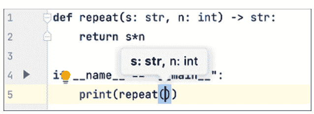

**图 24.1** PyCharm IDE 基于注解显示上下文帮助

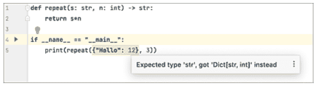

**图 24.2** PyCharm IDE 基于注解标记代码中的潜在错误

> **注意**

在本章中，我们将专门讨论作为类型注释现代变体的注解。但请注意，许多 Python 代码库仍在继续使用类型注释。这尤其影响那些必须在 Python 3 和 Python 2 中都能执行的代码，因为注解仅在 Python 3 中引入。

### 24.1 注解

在[第 19 章](Chapter 19)，[第 19.12 节](Section 19.12)中，我们首次提到了*注解*，因为在定义数据类时需要其规范。在此，我们希望阐明注解实际上是什么，以及它们在类型化上下文中起什么作用。

使用注解，程序员可以在定义变量和属性以及在函数和方法接口中指定附加信息。这些信息是可选的，可以由任何 Python 表达式组成。它们最初不会改变程序执行的任何内容，可以说 Python 解释器并不关心注解。尽管如此，注解确实可以包含有用的附加信息，这些信息可以通过两种机制访问：

- 标准库的 `typing` 模块提供了在程序运行时访问程序员所做的注解的方式。通过这种方式，例如可以在函数执行期间使用函数接口中所做的注解。是否以及如何读取注解并将其用于程序执行，始终由程序的开发者决定。
- 按照惯例，注解可以包含不考虑程序流程本身的附加信息，但外部代码分析工具（例如 IDE 的支持功能）会基于这些信息。

如本章开头所述，注解提供了一种在 Python 语法内为某些定义添加附加信息的方式。最初，注解的概念并未定义这种附加信息应该是什么样子。

然而，注解是在一个重要的使用背景下引入的，并且在实践中也主要在此上下文中使用：Python 代码的类型化。

> **注意**

我们在本章中仅在类型化的上下文中考虑注解，这是该概念的主要使用领域。但是，您应该记住，注解的语法从根本上并不限于类型信息。

### 24.1.1 注解函数和方法

函数或方法接口的元素——即参数和返回值——可以提供注解，在此上下文中也称为*函数注解*：

```
def function(p1: Annotation1, p2: Annotation2) -> Annotation3:
    Function body
```

定义函数时，可以在每个参数后写一个冒号，后跟一个注解。注解可以是任何 Python 表达式。注解的指定是可选的。参数列表后面可以跟一个可选的函数返回值注解。此注解由箭头（->）引入。只有在此注解之后才是冒号，它引入函数体。

在下面的示例中，我们将定义 `repeat` 函数，其任务是返回由输入字符串 `s` 重复 n 次组成的字符串：

```
>>> def repeat(s: str, n: int) -> str:
...     return s*n
```

在此过程中，我们使用注解来标记 `s` 和 `n` 函数参数的预期数据类型，以及返回值的数据类型。如前所述，与没有注解的版本相比，我们并未以任何方式改变 `repeat` 函数的行为。特别是，`repeat` 也可以使用与函数接口注解相矛盾的参数来调用：

```
>>> repeat("P", 3)
'PPP'
>>> repeat(["P"], 3)
['P', 'P', 'P']
```

尽管如此，函数接口的注解通过以明确的方式向开发者提示函数原始开发者为其接口预期的数据类型，从而提供了清晰度。此信息在大型协作软件项目中尤为重要。

现代 IDE[ 116 ]能够从注解中读取类型信息，因此可以为 `repeat` 函数提供信息丰富的上下文帮助，甚至警告函数的错误使用。

方法的接口可以类似地用类型信息进行注解。为此，我们将前面的 `repeat` 函数示例扩展为一个（诚然无意义的）`StringTools` 类，其中 `repeat` 再次被定义为一个方法：

```
>>> class StringTools:
...     def repeat(self, s: str, n: int) -> str:
...         return s*n
...
>>> st = StringTools()
>>> st.repeat("P", 3)
'PPP'
```

### 24.1.2 注解变量和属性

类似于在函数或方法接口上下文中出现的参数注解，自 Python 3.6 起，在定义变量和属性时也可以指定注解。其基本动机是相同的：尽管变量和属性的注解基本上可以由任何 Python 表达式组成，但它们旨在指定数据类型信息，并且在实践中通常以这种方式使用。

变量总是在为其赋值的地方进行注解。特别是，分配给标识符的注解可以因此，在程序运行期间，如果多次为同一名称赋新值且每次指定不同的注解，注解也会随之改变。

与函数参数的注解类似，变量的注解写在标识符之后，用冒号分隔，但在赋值的等号之前：

```
>>> s: str = "Hello world"
>>> n: int = 12
>>> l: list = [1, 2, 3]
```

这既适用于模块级别的全局变量，也适用于函数或方法内的局部变量。[117] 在下面的例子中，通过一个扩展了中间变量 `result` 的 `repeat` 函数变体，这一点变得清晰：

```
>>> def repeat(s: str, n: int) -> str:
...     result: str = s*n
...     return result
```

即使在类或实例级别定义属性时，也可以使用常规语法指定注解：

```
>>> class Class:
...     class attribute: int = 1
...     def __init__(self):
...         self.instanceattribute: str = "Hello world"
```

与其他注解一样，变量和属性的注解本质上会被 Python 解释器忽略，因此它们不会直接影响程序流程。

> **注意**

全局变量和局部变量注解的一个区别在于，对于全局变量、类属性以及函数和方法接口，注解背后的 Python 表达式会被求值，以在运行时提供其值：

```
>>> x: blahblah = 12
Traceback (most recent call last):
  File "<stdin>", line 1, in <module>
NameError: name 'blahblah' is not defined
```

相比之下，局部变量和实例属性注解背后的 Python 表达式不会被求值。在 [第 24.1.3 节](Section 24.1.3) 中，我们将看到这些表达式在程序运行时也无法被访问：

```
>>> def function():
...     x: blahblah = 12
...     return x
...
>>> function()
12
```

有关注解求值的确切时间，请参阅 [第 24.1.4 节](Section 24.1.4)。

可以执行独立的变量注解，与同时进行的赋值无关。以下语法仅为标识符 `k` 创建所需的注解，而不定义 `k` 本身：

```
>>> k: str
>>> k
Traceback (most recent call last):
  File "<stdin>", line 1, in <module>
NameError: name 'k' is not defined
```

这种语法很方便，例如，只需在条件语句中为变量定义注解一次：

```
>>> k: str
>>> if True:
...     k = "Hello"
... else:
...     k = "world"
```

另一个用例是注解循环变量或 `with` 上下文的变量，因为这两种结构的语法不允许嵌入注解：

```
>>> city: str
>>> for city in ["Chicago", "Boston", "Atlanta", "Seattle"]:
...     print(city)
```

## 24.1.3 在运行时访问注解

注解作为语法扩展被引入 Python，旨在以简单且语法明确的方式支持外部工具获取关于变量、属性以及函数和方法接口的类型信息。例如，这些外部工具可以作为 IDE 的一部分显示上下文帮助，或指出代码中的潜在错误。

注解本身不会从根本上改变 Python 代码的运行时行为，但有一个限制：如果注解包含无效表达式，则可能会引发异常。

基本上，注解是为类型信息而设计的，通常建议仅在此上下文中使用它们。然而，它们的语法具有通用性，允许任何 Python 表达式作为注解，因此也可能用于其他领域。在本节中，我们将描述如何在程序运行时访问注解。让我们再看一下上一节中的 `repeat` 函数：

```
>>> def repeat(s: str, n: int) -> str:
...     result: str = s*n
...     return result
```

如果需要在运行时访问 `repeat` 函数的注解，可以使用标准库 `typing` 模块的 `get_type_hints` 函数来实现，该函数将注解作为字典返回。此字典包含参数名称或用于返回值注解的 "return" 作为键，以及相应的注解表达式作为值：

```
>>> import typing
>>> typing.get_type_hints(repeat)
{'s': <class 'str'>, 'n': <class 'int'>, 'return': <class 'str'>}
```

同样，可以在运行时访问已注解方法接口的类型信息——例如，我们在上一节中定义的 `StringTools` 类的 `repeat` 方法：

```
>>> typing.get_type_hints(StringTools.repeat)
{'s': <class 'str'>, 'n': <class 'int'>, 'return': <class 'str'>}
```

`get_type_hints` 函数还能够返回模块的全局变量或类的类属性的注解。函数内的局部变量和实例属性的注解无法在运行时确定。这些注解的唯一目的是为外部系统提供信息。

> **注意**

在内部，解释器将注解存储在被注解对象的 `__annotations__` 属性中。此字典与 `get_type_hints` 返回的字典形式相同：

```python
>>> repeat.__annotations__
{'s': <class 'str'>, 'n': <class 'int'>, 'return': <class 'str'>}
```

然而，`__annotations__` 是 Python 解释器的一个实现细节，其名称和组织结构在未来版本的 Python 中可能会改变。因此，通过 `get_type_hints` 访问注解是推荐的选择。

## 24.1.4 注解何时被求值？

如前几节所述，注解可以是功能齐全、有时复杂的表达式，在注解定义时根据解释器的默认行为进行求值。[118] 这导致例如在导入模块时，必须对其包含的所有注解进行求值，并将其值输入到 `__annotations__` 字典中。因为注解主要用于为外部系统提供类型检查信息，所以它们的值在运行时通常无关紧要，因此会因冗长的导入而不必要地付出代价。

注解立即求值的另一个问题是前向引用，例如使用在注解位置尚未完全定义的数据类型来注解函数接口。例如，以下尝试为自定义类的 `__add__` 魔术方法进行类型注解将会失败：

```
>>> class Test:
...     def __add__(self, other: Test):
...         pass
Traceback (most recent call last):
  File "<stdin>", line 1, in <module>
  File "<stdin>", line 2, in Test
NameError: name 'Test' is not defined
```

这里的问题在于，在定义 `__add__` 方法时，`Test` 类尚未完全定义，因此在其注解求值时也是如此。因此，方法的注解不能引用定义它们的类。在这种情况下，你可以通过将注解包装在字符串中来解决：

```
>>> class Test:
...     def __add__(self, other: "Test"):
...         pass
```

或者，你可以使用未来的 `import annotations`，它会延迟注解的求值时间，从而允许前面的示例无需字符串包装即可执行：

```
>>> from __future__ import annotations
>>> class Test:
...     def __add__(self, other: Test):
...         pass
```

未来的导入确保注解在定义时不会被求值，而是作为字符串存储：

```
>>> Test.__add__.__annotations__
{'other': 'Test'}
```

求值仅在注解实际使用时进行，并通过调用 `get_type_hints` 隐式完成：

```
>>> import typing
>>> typing.get_type_hints(Test.__add__)
{'other': <class '__main__.Test'>}
```

计划在未来版本的 Python 中将注解的延迟求值作为标准行为。但由于此更改可能与现有代码不兼容，因此在另行通知之前，需要使用未来的导入来激活它。

### 24.2 类型提示：typing 模块

在上一节中，我们探讨了注解作为一种语法，允许开发者为函数、方法、变量和属性的定义添加额外信息。基本上，这些额外信息可以是任何 Python 表达式，但在实践中，我们通常将其限制为类型信息——即所谓的类型提示。这些注解可以被支持程序员的外部工具读取，例如，用于提供上下文帮助。

到目前为止，我们已经研究了使用 `int` 或 `str` 等简单数据类型的注解，并利用这些示例阐明了注解的基本语法形式。在本节中，我们将利用类型提示也可以是更复杂的表达式这一事实，结合标准库的 `typing` 模块，使我们能够清晰地注解复杂的函数接口。

`typing` 模块为 Python 中的常见数据类型定义了标准化的占位符，并允许它们组合以指定更复杂的数据结构。在接下来的几节中，我们将使用 `typing` 描述一些重要的注解用例，但请注意，这些只是 `typing` 提供的可能性中的一部分。

以下各节中的示例涉及简单的函数接口，但它们也可以应用于注解方法、变量和属性的其他用例。

## 24.2.1 有效的类型提示

作为将注解引入 Python 编程语言的一部分，已经建立了描述有效类型提示可能包含什么的约定[119]。因此，类型提示可以由任何内置和用户定义的类组成，包括来自标准库或外部第三方模块和包的模块。此外，特别允许使用标准库 `typing` 模块中包含的类型，其中为各种应用目的定义了泛型占位符类型——例如，嵌套数据结构。

## 24.2.2 容器类型

当在类型注解中使用容器类型（例如列表或字典）时，会出现以下问题：容器类型包含其他数据类型的实例。因此，例如，类型提示 *list* 信息量不大。相反，需要能够指定容器对象中包含的实例的数据类型的类型提示。

为此，容器类型的类型提示可以用所包含实例的类型提示进行补充，如下所示：

```python
>>> v1: list[int] = [1, 2, 3, 4, 5]
>>> v2: tuple[int, str, int] = (1, "test", 2)
>>> v3: tuple[int, ...] = (1, 2, 3, 4, 5)
>>> v4: dict[int, str] = {1: "test_1", 2: "test_2"}
>>> v5: set[int] = {1, 2, 3}
>>> v6: frozenset[int] = {1, 2, 3}
```

这些类型提示也称为 *泛型*。应特别注意 `tuple` 和 `list` 之间的区别。`list[int]` 表示一个包含任意数量 `int` 类型元素的列表，而为 `tuple` 指定的数据类型直接对应于元组的元素。如果要表示一个包含任意数量整数的元组，如示例中的变量 v3，则必须额外附加省略号。

在下面的示例中，我们使用容器数据类型注解一个函数接口：

```python
def function(p1: list[str], p2: dict[int, list[str]]):
    pass
```

在 `function` 的定义中，参数 `p1` 被注解为类型提示 *字符串列表*，而参数 `p2` 获得类型提示 *字典，将整数映射到字符串列表*。在方括号内，指定了各自容器类型中包含的实例的数据类型，而这些类型本身也可以是泛型。

> **注意**

在注解上下文中使用内置数据类型作为泛型是在 Python 3.9 中引入的。在较旧的语言版本中，可以使用来自 typing 模块的特殊泛型代替：

```python
>>> from typing import List, Dict
>>> v1: List[int] = [1, 2, 3, 4]
>>> v2: Dict[int, str] = {1: "test_1", 2: "test_2"}
```

此外，也可以通过 future import 在较旧的语言版本中激活现代行为（参见[第 18 章，第 18.5 节](#)）：

```python
>>> from __future__ import annotations
>>> x: dict[str, str]
```

## 24.2.3 抽象容器类型

上一节讨论的泛型可用于为复杂容器类型定义注解。然而，特别是在函数接口中，容器对象的具体数据类型在许多情况下并不相关，而是其在鸭子类型意义上的属性。例如，函数通常可以处理任意可迭代对象，而不仅仅是列表。

在这种情况下，建议使用 `collections.abc` 模块中的 *抽象基类 (ABC)* 进行注解。在下面的示例中，我们定义了一些使用 `collections.abc` 中的抽象基类选择进行注解的变量：

```python
>>> import collections.abc
>>> v1: collections.abc.Iterable[int]
>>> v2: collections.abc.Iterator[int]
>>> v3: collections.abc.Sequence[int]
>>> v4: collections.abc.MutableSequence[int]
>>> v5: collections.abc.Mapping[int]
>>> v6: collections.abc.MutableMapping[int]
>>> v7: collections.abc.Set[int]
>>> v8: collections.abc.MutableSet[int]
```

我们在此不深入探讨 Python 中抽象基类的主题，但请参阅在线文档以获取更多信息。

## 24.2.4 类型别名

复杂的类型提示可能很快变得混乱，因此可以分配给一个新名称，即所谓的类型别名：

```python
>>> from typing import Dict, List
>>> MyType = Dict[int, List[str]]
>>> def function(p: MyType):
...     pass
```

在这种情况下，`MyType` 类型别名被定义为一个将整数映射到字符串列表的字典。从现在起，这个别名可以在接口定义中毫无问题地使用。

## 24.2.5 类型联合和可选值

如果在函数接口中，对于一个参数，一组可能的数据类型变得有效，则可以通过 `typing` 模块中的 `union` 类型形成数据类型的联合集，即所谓的类型联合：

```python
>>> from typing import Union
>>> def function(p: Union[int, float]):
...     pass
```

在示例中，`p` 函数参数的类型提示表明，可以同样传递 `int` 和 `float` 数据类型的实例。

> **注意**

自 Python 3.10 起，可以使用你从按位或中知道的 `|` 运算符更轻松地编写类型联合。前面的示例也可以这样写：

```python
>>> def function(p: int | float):
...     pass
```

使用类型联合的一个特殊情况在实践中起着重要作用，即可选值：通常在函数接口中，除了参数实际预期的数据类型实例外，还接受值 `None`。对于这个经常使用的特殊情况，`typing` 模块提供了 `Optional` 类型，允许以下两种等效表示法：

```python
>>> from typing import Union, Optional
>>> def function1(p: Union[int, None]):
...     pass
>>> def function2(p: Optional[int]):
...     pass
```

第二种变体 `function2` 只是第一种变体的简写：对于 `p` 参数，通常期望 `int` 实例，但额外允许的值 `None` 除外。

> **注意**

与其他注解一样，`Optional` 类型提示不包含函数接口的语义。特别是，无论 `p` 参数是否可选，类型提示都保持不变。可选参数 `p` 和 `Optional` 类型提示的组合可以如下所示：

```python
>>> def function3(p: Optional[int] = None):
...     pass
```

类型联合的另一个特殊情况是所有可能类型的联合，例如，一个可以传递任何数据类型的函数参数。对于这种情况，`typing` 模块包含 `Any` 类型：

```python
>>> from typing import Any
>>> def function(p: Any):
...     pass
```

隐式地，所有缺失的类型提示都被假定为 `Any`。

## 24.2.6 类型变量

经常出现函数接口的数据类型之间存在依赖关系的情况。例如，我们可以考虑一个函数，它使用包含任意类型实例的列表，并始终返回与列表中包含的数据类型相同的实例。函数接口数据类型之间的这种依赖关系可以通过 *类型变量* 来指定：

```python
>>> from typing import List, TypeVar
>>> T = TypeVar("T")
>>> def function(p: List[T]) -> T:
...     return p.pop()
```

在这种情况下，创建了一个类型变量 `T`。它在 `p` 参数和 `function` 返回值的类型提示中被进一步指定。

可以传递一个包含任意数据类型 `T` 实例的列表，同时返回相同数据类型的实例。

类型变量可以被限制为特定的数据类型：

```
>>> P = TypeVar("P", str, bytes)
```

在示例中，定义了类型变量 `P`，它可以是字符串或 `bytes` 字符串。在实例化 `TypeVar` 时指定的字符串 "T" 和 "P" 对应于类型变量的名称。这些名称会出现在错误消息中，例如。

### 24.3 Python 中的静态类型检查：mypy

在前两节中，我们探讨了使用类型提示注解接口和定义的方法。这些注解是静态类型检查工具的重要信息来源。

这种静态类型检查由外部工具执行——而不是由 Python 解释器本身执行，它分析 Python 程序的源代码，并检查接口中数据类型使用可能出现的错误。在这种情况下，分析是*静态*执行的；也就是说，程序并未被执行。

这种代码分析通常由现代 IDE 隐式执行。许多 IDE 不仅限于处理数据类型的错误，还能识别其他类型的错误和易出错的程序模式。类型提示支持这些过程，并能够进行更深入的分析。有关 Python 开发环境及其功能的概述，请参见附录中的 A.5 节。

如果你想独立于集成开发环境执行静态类型检查，可以使用 *mypy* 工具，它已成为该领域的标准。

### 24.3.1 安装

因为 mypy 是一个第三方包，所以在使用前必须安装。如果尚未默认安装，可以通过 Anaconda 包管理器方便地完成安装：

```
$ conda install mypy
```

如果你不使用 Anaconda，也可以通过 Python 包管理器 *pip* 安装 mypy：

```
$ pip install mypy
```

如果你使用 Linux，也可以通过 Linux 发行版的包管理器进行安装。

### 24.3.2 示例

此时，我们想用一个简单的例子来说明 mypy 的工作原理。为此，我们将首先编写两个函数，以描述性的方式总结我们即将前往的旅行目的地和选择的交通方式：

```
from typing import List
def fly(destinations):
    print("We are flying to:", ", ".join(destinations))
def walk(destinations: List[str]):
    print("We are walking to:", ", ".join(destinations))
```

这两个函数在处理字符串输入列表时基本功能相同。然而，对于 `walk` 函数，我们添加了类型提示注解，从而为 mypy 分析工具提供了执行类型检查的机会。`fly` 函数则完全没有任何注解定义。

在程序的其余部分，我们将以不同的方式调用 `fly` 和 `walk` 函数——包括正确和错误的方式：

```
if __name__ == "__main__":
    fly(["Rome", "Paris", "New York"])
    fly([0, 1, 2])
    fly(4)
    walk(["Rome", "Paris", "New York"])
    walk([0, 1, 2])
    walk(4)
```

这里很明显，使用参数 `[0, 1, 2]` 和 `4` 调用 `fly` 或 `walk` 会导致程序执行错误。然而，此时我们关注的不是程序执行本身，而是 mypy 是否能对这些假定的编程错误发出警告。

为此，我们在 shell 中运行 mypy，将要检查的 Python 程序文件 test.py 作为参数传递：

```
$ mypy test.py
test.py:15: error: List item 0 has incompatible type "int"; expected "str"
test.py:15: error: List item 1 has incompatible type "int"; expected "str"
test.py:15: error: List item 2 has incompatible type "int"; expected "str"
test.py:16: error: Argument 1 to "walk" has incompatible type "int"; expected "List[str]"
Found 4 errors in 1 file (checked 1 source file)
```

从输出中我们可以看到，mypy 正确地检测到了 `walk` 函数的错误调用，并能够发出适当的警告。像 PyCharm 这样的 IDE 也会在此处标记潜在错误。但是，没有类型提示定义的 `fly` 函数不会被 mypy 检测到，只会在执行时才给我们带来错误。

## 25 结构化模式匹配

使用我们在 [第 5 章，第 5.1 节](Chapter 5, Section 5.1) 中详细讨论的条件语句，你可以调整程序的控制流——例如，针对特定事件或以任何方式读取的数据。在 Python 3.10 中，引入了*结构化模式匹配*。这是另一种用于特殊类型条件的控制结构，我们将在本节中更仔细地探讨。

### 25.1 match 语句

我们将从一个简单的例子开始，想象我们的程序应该响应一系列命令——例如，由用户输入或从文件读取的命令。这种行为可以使用 `if-elif-else` 语句来实现，如下面的抽象示例所示：

```
python
command = "version"    # from the user or other data source
if command == "time":
    show_time()
elif command == "memory":
    show_memory()
elif command == "version":
    show_program_version()
elif command == "end":
    program_end()
else:
    print(f"Unknown command: {command}")
```

你可能已经注意到，在语句的每个条件中，都必须再次显式地写出与 `command` 变量进行比较，这使得程序文本相对较长。结构化模式匹配允许你在语句开头指定一次，为同一个值区分不同的情况，而无需在每个条件中再次指定该值：

```
command = "version"    # from the user or other data source
match command:
    case "time":
        show_time()
    case "memory":
        show_memory()
    case "version":
        show_program_version()
    case "end":
        program_end()
    case _:
        print(f"Unknown command: {command}")
```

`match` 语句指定了要为哪个对象区分不同的情况。每个情况由 `case` 后跟相应的模式指定。在最简单的情况下，*模式*由一个字面量组成，例如字符串字面量或数字字面量，如前面的示例所示。就像使用 `if-elif-else` 的条件语句一样，不同的情况按照它们定义的顺序进行检查，如果匹配，则执行第一个匹配模式下方的程序代码。我们示例中的最后一个 `case` 语句根本不包含具体的值，而只是一个标识符——即 `_`——这导致该模式匹配任何可能的值。有关此特殊模式的更多详细信息，你可以参考 [第 25 章，第 25.2.6 节](Chapter 25, Section 25.2.6)。

通常，`match-case` 语句具有以下结构：

```
match expression:
    case pattern:
        Statement
        ...
        Statement
    case pattern:
        Statement
        ...
        Statement
        ...
```

就像 `if` 语句中可以有任意数量的 `elif` 分支一样，`match` 块中也允许有任意数量的 `case` 语句。

### 25.2 case 语句中的模式类型

Python 的结构化模式匹配提供了广泛的选项来定义模式。我们将在本节中重点介绍其中几种。

### 25.2.1 字面量和值模式

模式的最简单情况是显式地将匹配值写为字面量，就像我们在字符串的介绍性示例中所做的那样。允许使用以下字面量：

- 字符串字面量
- 有符号和无符号数字的字面量
- `None`、`True` 和 `False`

此外，可以不通过字面量显式指定值，而是使用对所需值的引用。为了避免与我们稍后将描述的捕获模式（参见 [第 25 章，第 25.2.6 节](#)）产生歧义，这里有一个限制：引用必须包含它们所在的命名空间。另一方面，局部或全局变量不能使用。在下面的示例中，我们将使用从 `Enum` 派生的 `StatusCodes` 枚举类型（参见 [第 16 章，第 16.1 节](#)）为比较值创建一个命名空间：

```
from enum import Enum

class StatusCodes(Enum):
    OK = 0
    NETWORK_ERROR = 1
    SYSTEM_ERROR = 2

status = StatusCodes.SYSTEM_ERROR
```

匹配状态：
    case StatusCodes.OK:
        print("操作成功完成")
    case StatusCodes.NETWORK_ERROR:
        print("发生网络错误")
    case StatusCodes.SYSTEM_ERROR:
        print("发生系统错误")
    case _:
        print(f"未知状态：{status}")

在此示例中，系统错误模式匹配成功，因此输出相应信息：`发生系统错误`。

## 25.2.2 或模式

通常无需为每个可能的值实现单独的特殊处理，因为一组相似的值可以用相同的方式处理。你可以在 `case` 语句中通过 OR 运算符（`|`）列出相关值来实现这一点：

```
match status:
    case StatusCodes.OK:
        print("操作成功完成")
    case StatusCodes.NETWORK_ERROR | StatusCodes.SYSTEM_ERROR:
        print("发生错误")
    case _:
        print(f"未知状态：{status}")
```

与前面的示例不同，此处网络错误和系统错误由同一个 `case` 块处理。`|` 运算符的使用不限于字面量或值模式；它也可以与后续章节描述的模式类型结合使用。

## 25.2.3 带类型检查的模式

模式不仅可以检查值本身，还可以检查值的数据类型。为此，你必须编写对所需数据类型的引用，后跟一对括号：

```python
class A:
    pass

value = 3.14
match value:
    case str():
        print(f"字符串是：{value}")
    case int() | float() | complex():
        print(f"这里有一个数字 {value}。")
    case list():
        print(f"一个列表：{value}")
    case A():
        print("我的类 A :-)")
    case _:
        print(f"{type(value)}：{value}")
```

如你所见，你可以使用内置数据类型以及自定义类。

> **注意**

对于类，模式中还有一个额外的选项来检查特定的属性值。我们将在 [第 25.2.9 节](Section 25.2.9) 中描述此机制。

## 25.2.4 指定匹配条件

`case` 块中的程序代码是否应在匹配时执行的问题可以与条件相关联。当模式（如前一个示例中的类型模式）不仅匹配一个特定值，而是匹配大量不同的值时，这尤其有用。为此，你可以使用 `case` 语句的以下扩展变体：

```
case pattern if condition:
```

你可以为条件使用任何表达式，正如你已经从 `if` 语句中了解的那样。

以下程序基于前面的示例，并区分有限数和无限数：

```python
import math
class Constants:
    inf = math.inf
    minf = -math.inf

value = 12345
match value:
    case int() | float() | complex() if abs(value) < Constants.inf:
        print(f"这里有一个有限数 {value}。")
    case math.inf | Constants.minf:
        print("这是无限的！")
    case _:
        print(f"{type(value)}：{value}")
```

因为模式中不能使用表达式以及局部或全局引用，所以我们在第二个 `case` 语句中使用自定义类 `Constants` 的类属性 `inf` 和 `minf`，而不是无效的 `math.inf | -math.inf` 模式。

## 25.2.5 分组子模式

类似于算术表达式，你可以通过括号对模式的部分进行分组。例如，以下三个模式在含义上是相同的：

```
int() | float() | complex()
(int() | float()) | complex()
(int() | (float() | complex()))
```

首先，使用括号允许我们更清晰地组织模式；其次，它使我们能够将长模式拆分到多行：

```
case (
    int() | float() | complex()
) if abs(value) < math.inf:
```

在本章后面，你将看到模式分组与其他模式类型交互时多么有用——例如，以避免歧义。

## 25.2.6 捕获和通配符模式

可以使用 `case` 语句将模式匹配的值绑定到一个新名称，以便在程序的后续运行中继续使用它。以下示例使用此机制从值序列中确定最后一个字符串和最后一个有限数。为此，我们必须在模式后编写 `as` 关键字，后跟所需的名称：

```python
values = ["Hello", [], -5, 6, 3, float("-inf"), "world", {4, 6}]
last_finite_number, last_string = None, None
for value in values:
    match value:
        case (
            int() | float() | complex() as number
        ) if abs(value) < float("inf"):
            last_finite_number = number
        case str() as string:
            last_string = string
print(f"最后一个有限数：{last_finite_number}")
print(f"最后一个字符串：{last_string}")
```

正如你可能已经预料到的，此程序的输出如下：

```
最后一个有限数：3
最后一个字符串：        world
```

你也可以为整个或部分模式分配名称。这在与序列和映射模式结合使用时特别有用，但也可以用于定义匹配任何值的模式，正如我们在本章开头示例中使用名称 `_` 所做的那样：

```python
a = "Test"
match "something":
    case a:
        print(f"它是 {a}！")
print(a)
```

输出如下：

```
它是 something！
something
```

如你所见，模式匹配了值 "`something`"，对于任何其他值也会发生同样的情况。此外，这导致 `a` 的先前值 "`test`" 被匹配的值 "`something`" 覆盖。

在 `case` 语句中分配的名称在匹配时设置在当前本地命名空间中，类似于赋值发生的情况。如果它将现有名称绑定到新值，这可能会产生不希望的副作用。为防止这种情况发生，你可以使用名称 `_`，它被用作通配符。`_` 的存在和值不会被匹配语句更改：

```python
_ = "Test2"
match "something":
    case _:
        print(f"它是 {_}！")
print(_)
```

与之前的输出相比，此程序提供以下内容：

```
它是 Test2！
Test2
```

如你所见，`_` 的值没有被匹配更改。同样在 `case` 块中，无论匹配的值是什么，`_` 都包含字符串 `Test2`。由于其语义，通配符 `_` 适用于你不想在程序中重用其值的模式或子模式。

### 将捕获模式与类型检查结合

在 [第 25.2.3 节](Section 25.2.3) 中，我们使用 `int() as x` 等模式实现了类型检查，并在匹配的情况下将值绑定到名称 `x`。

另一个选项是在类型名称后的括号中写入所需的名称。例如，`int(x)` 模式匹配一个整数，并将值直接绑定到名称 `x`。

更一般地说，语法 `Class(a, b, c)` 执行基于位置的属性匹配，我们将在 [第 25.2.9 节](#section-25-2-9) 中讨论。

### 将捕获模式与或模式结合

名称也可以在或模式中分配。但是，你必须确保在或模式的所有备选方案中分配相同的名称。例如，以下三个模式是有效的，并且在含义上是等效的，因为名称 `number` 在每种情况下都被赋予相同的值：

```python
int() | float() | complex() as number
(int() as number) | (float() as number) | (complex() as number)
int(number) | (float() as number) | complex(number)
```

请注意，当你将 `as` 与或模式结合用于命名目的时，可能需要使用括号以避免歧义。

## 25.2.7 序列模式

在前面的示例中，我们的模式仅限于具体值或特定数据类型的值。但是，你也可以定义匹配特定结构序列的序列模式。语法基于解包语法；参见 [第 12 章，第 12.4.1 节](#chapter-12-section-12-4-1)。

### 一个简单的例子

在以下示例中，我们将使用序列模式来生成一个紧凑的输出，该输出取决于列表中的元素数量。这里，我们使用捕获模式为列表中的特定元素和部分分配名称：

```python
def print_list(x):
    match x:
        case []:
            print("(empty)")
        case [a]:
            print(f"[{a}]")
        case [a, b]:
            print(f"[{a}, {b}]")
        case [a, b, *rest]:
            print(f"[{a}, ..., {rest[-1]}]")
print_list([1])
print_list([1, 2])
print_list(list(range(100)))
```

该程序的输出如下：

```
[1]
[1, 2]
[0, ..., 99]
```

例如，与解包类似，这涉及将名称 `a` 和 `b` 绑定到模式 `[a, b, *rest]` 中匹配序列的前两个元素。然后，`rest` 使我们能够访问从序列的第三个条目开始的所有其他元素。

## 一个更复杂的示例

以下示例中定义的生成器（参见[第 21 章，第 21.1 节](https://example.com)）`range_plus_plus` 是对内置 `range` 函数的修改，用于使用省略号字面量 `...` 定义数字序列。[120] **例如**，`range_plus_plus(1, ..., 4, 10, ..., 14)` 返回一个迭代器，遍历数字序列 `1, 2, 3, 4, 10, 11, 12, 13, 14`。该实现使用了值模式、序列模式、带类型检查的模式、模式上的条件、通配符 `_` 和捕获模式，所有这些都在前面的章节中描述过。此外，`range_plus_plus` 通过 `yield from` 递归调用自身作为子生成器：

```python
import math
import itertools
def range_plus_plus(*args):
    match args:
        case []:
            return
        case [e, int(a), *rest] if e is ...:
            yield from range(a + 1)
            yield from range_plus_plus(*rest)
        case [int(a), e, int(b), *rest] if e is ...:
            yield from range(a, b + 1)
            yield from range_plus_plus(*rest)
        case [int(a), e, math.inf] if e is ...:
            yield from itertools.count(start=a)
        case [int(a), *rest]:
            yield a
            yield from range_plus_plus(*rest)
        case _:
            raise ValueError(f"Invalid range: {args}")
```

对于像 `4, ..., math.inf` 这样的范围定义，`range_plus_plus` 返回一个生成器，遍历从数字 `4` 开始的所有整数。

> **注意**

与解包一样，你可以在序列模式中选择使用圆括号或方括号，而不会影响模式的语义——例如，`(e, int(a), *rest)` 代替 `[e, int(a), *rest]`。

一个特殊情况是单元素序列的模式：为避免与分组子模式产生歧义，在这种情况下必须写成 `(x,)` 而不是 `[x]`。

## 25.2.8 映射模式

类似于序列模式可用于匹配具有特定结构的序列，具有特定结构的映射（如 `dict` 实例）可以使用*映射模式*来描述。其语法类似于 `dict` 字面量，并且可以解释为将解包（[第 12 章，第 12.4.1 节](https://docs.python.org/3/reference/compound_stmts.html#the-match-statement)）转移到映射数据类型。

### 映射模式的语法

要定义映射模式，必须使用花括号 `{` 和 `}`。在花括号内，你定义映射中必须包含哪些键。此外，可以通过在键后写一个冒号分隔的模式来为每个值制定要求。例如，模式 `{"statement": str(), "timestamp": (int() | float())}` 可以用于所有包含 `"statement"` 和 `"timestamp"` 键的映射 `d`，如果此外 `d["statement"]` 是字符串且 `d["timestamp"]` 是整数或浮点数。对于以下每个示例，都添加了关于它们是否符合此模式的注释：

```python
{"statement": "SHUTDOWN"}                          # 不符合
{"statement": 123, "timestamp": "sometime"}          # 不符合
{"statement": "SHUTDOWN", "timestamp": 554256000.0}   # 符合
{"statement": "SHUTDOWN", "timestamp": 554256000, "a": 3} # 符合
```

如果你还对模式未指定的键感兴趣，可以使用双星号运算符分配一个名称来引用映射的其余部分。考虑以下示例：

```python
value = {"statement": "SHUTDOWN", "timestamp": 554256000, "a": 3}
match value:
    case {"statement": str(), "timestamp": (int() | float()), **rest}:
        print(f"Rest: {rest}")
```

此示例生成以下输出：

```
Rest: {'a': 3}
```

在映射值的子模式中，我们可以借鉴本章中全部范围的模式类型。例如，我们可以使用捕获模式将值绑定到自选名称：

```python
value = {"statement": "SHUTDOWN", "timestamp": 554256000, "a": 3}
match value:
    case {
        "statement": str(statement),
        "timestamp": (int() | float() as timestamp)
    }:
        print(f"statement: {statement}, timestamp: {timestamp}")
```

该程序的输出相应地为：

```
statement: SHUTDOWN, timestamp: 554256000
```

要仅要求特定键存在，而不管它映射到什么值，使用带通配符 `_` 的捕获模式是合适的。你可以多次使用通配符：

```python
value = {"statement": "SHUTDOWN", "timestamp": 554256000, "a": 3}
match value:
    case {"a": _, "timestamp": _}:
        print("The keys 'a' and 'timestamp' exist!")
```

以下输出确认了这一点：The keys 'a' and 'timestamp' exist!。

### 一个更复杂的示例

作为一个更实际的例子，我们希望使用映射模式来输出存储在字典中的地址，以便打印在信封上。我们的程序应该能够处理德国和美国使用的地址。由于两国地址的适当数据格式以及信件上的常见表示法不同，我们使用带有映射模式的结构化模式匹配来分别处理这些情况：

```python
addresses = [
    {"type": "DE", "name": "DeepL SE", "street": "Maarweg 165",
     "city": "Cologne", "ZIP": 50825},
    {"type": "US", "name": "Linux Foundation", "street": "548 Market St",
     "city": "San Francisco", "state": "CA", "ZIP": "94104"},
    {"something": "something else"},
]
```

```python
def print_address(address):
    match address:
        case {
            "type": ("DE" | "Deutschland" | "Germany"),
            "name": str(name),
            "street": str(street),
            "city": str(city),
            "ZIP": (str() | int()) as zip_code
        }:
            print(name)
            print(street)
            print(f"{zip_code} {city}")
            print("Germany")
        case {
            "type": ("US" | "USA" | "United States"),
            "name": str(name), "street": str(street),
            "city": str(city),
            "state": str(state),
            "ZIP": (str() | int()) as zip_code
        }:
            print(name)
            print(street)
            print(f"{city} {state} {zip_code}")
            print("US")
        case x:
            print(f"Unknown data format: {x}")
```

```python
for address in addresses:
    print_address(address)
    print("---")
```

此程序使用捕获模式，或模式和类型检查模式，产生以下输出：

```
DeepL SE
Maarweg 165
50825 Cologne
Germany
---
Linux Foundation
548 Market St
San Francisco CA 94104
US
---
Unknown data format: {'something': 'something else'}
---
```

映射模式非常适合处理复杂结构的实例。

## 25.2.9 对象及其属性值的模式

在[第 25.2.3 节](Section 25.2.3)中，你了解了我们可以用来检查值是否是特定数据类型实例的模式。以下程序使用此机制来识别复数：

```python
value = 1 + 5j
match value:
    case complex():
        print("A complex number!")
```

Python 支持更高级的方式，使此模式类型也能引用值的属性。

### 按名称检查属性值

正如你在[第 11 章](Chapter 11)、[第 11.7 节](Section 11.7)中看到的，`complex` 数据类型的实例具有 `real` 和 `imag` 属性，分别用于复数的实部和虚部。我们可以定义模式来检查这些属性的存在和值，除了数据类型之外：

```python
case complex(real=realpart, imag=0):
    print(f"Real number {realpart}")
```

`complex(imag=0, real=realpart)` 模式在这里检查三个方面：

- 匹配的值是 `complex` 数据类型的实例。
- 匹配的值具有 `imag` 和 `real` 属性。

+   - 匹配值的 `imag` 属性与字面量模式 0 相匹配。

与序列或映射模式一样，在匹配的情况下，可以为属性值分配名称，正如前面示例中应用于复数实部的方式。

此机制不仅限于内置数据类型；它也可以应用于用户定义的类。以下示例中的 `match` 构造使用此模式类型来评估和显示整数的简单算术运算：

```python
class Task:
    def __init__(self, operand1, operator, operand2):
        self.op1 = operand1
        self.operator = operator
        self.op2 = operand2

    def evaluate(self):
        match self:
            case Task(operator=op, op1=int(op1), op2=int(op2)):
                match op:
                    case "+": return op1 + op2
                    case "-": return op1 - op2
                    case "*": return op1 * op2
                    case "/": return op1 // op2
                    case _: raise ValueError(f"Unknown operator: {op}")
            case Task(operator=op, op1=Task() as op1, op2=op2):
                return Task(op1.evaluate(), op, op2).evaluate()
            case Task(operator=op, op1=op1, op2=Task() as op2):
                return Task(op1, op, op2.evaluate()).evaluate()
            case _:
                print("Invalid task:", self)

    def __str__(self):
        match (self.operator, self.op1, self.op2):
            case (op, Task() as op1, Task() as op2):
                return f"({op1}) {op} ({op2})"
            case (op, Task() as op1, int(op2)):
                return f"({op1}) {op} {op2}"
            case (op, int(op1), Task() as op2):
                return f"{op1} {op} ({op2})"
            case (op, op1, op2):
                return f"{op1} {op} {op2}"

task = Task(Task(Task(23,"-",3), "/", 5), "+", Task(2,"*",3))
print(f"{task} = {task.evaluate()}")
```

示例的输出表明计算有效：

```
((23 - 3) / 5) + (2 * 3) = 10
```

正如你在 `evaluate` 方法中看到的，完全可以在彼此内部嵌套多个 `match` 构造。评估 `Task` 的策略是递归地评估第一个和第二个操作数，直到两者都是整数。对于这种情况，`evaluate` 方法随后利用 Python 提供的算术运算。`__str__` 魔术方法（[第 19 章，第 19.11.1 节](https://example.com)）区分操作数类型的不同情况，以便仅在需要时输出括号。

## 通过模式中的位置匹配属性值

在许多用例中，属性存在自然的排序，因此按名称寻址每个无助于模式的可理解性。在前面评估计算任务的示例中，你可以假设 `操作数1 运算符 操作数2` 的顺序是如此自然，以至于你不想在每个模式中重复属性的名称，例如，在以下模式中：

```
Task(operator=op, op1=int(op1), op2=int(op2))
```

Python 为此目的提供了 `__match_args__` 魔术属性，可用于定义哪些属性存在自然顺序以及其外观。以下示例使用此选项为 `Task` 类的属性提供顺序。注意此调整如何简化 `evaluate` 方法中使用的模式。由于这对 `__str__` 方法中的模式没有影响，我们已从示例中省略了相应的代码：

```python
class Task:
    __match_args__ = ("op1", "operator", "op2")
    def __init__(self, operand1, operator, operand2):
        self.op1 = operand1
        self.operator = operator
        self.op2 = operand2

    def evaluate(self):
        match self:
            case Task(int(op1), op, int(op2)):
                match op:
                    case "+": return op1 + op2
                    case "-": return op1 - op2
                    case "*": return op1 * op2
                    case "/": return op1 // op2
                    case _: raise ValueError(f"Unknown operator: {op}")
            case Task(Task() as op1, op, op2):
                return Task(op1.evaluate(), op, op2).evaluate()
            case Task(op1, op, op2=Task() as op2):
                return Task(op1, op, op2.evaluate()).evaluate()
            case _:
                print("Invalid task:", self)
# 剩余代码与前面的示例相同
```

尝试自行检查程序在此简化后是否仍能完美运行。

## 通过位置和名称混合匹配属性

你也可以通过按位置指定部分属性，按名称指定另一部分属性来混合两种选项：

```python
class A:
    __match_args__ = ("x", "z")
    def __init__(self, x, y, z, a):
        self.x = x
        self.y = y
        self.z = z
        self.a = a

a = A(1, 2, 3, 4)
match a:
    case A(1, 3, y=2):
        print("Match!")
```

这里，字面量模式 1 和 3 引用类 A 的 x 和 z 属性。类似于调用方法和函数（第 17 章，第 17.5 节），存在一个限制，即通过名称引用的属性必须位于模式的末尾。

# 第四部分
## 标准库

本书的第四部分讨论 Python 的标准库。标准库由模块和包组成，你可以随时导入和使用它们来解决特定问题。在接下来的章节中，我们将讨论标准库的选定内容，坚持面向项目的方法，除了少数特别重要的模块将使用参考风格描述。

例如，标准库包含用于数学函数、正则表达式、访问操作系统或文件系统信息、并行编程、数据存储以及网络通信以及调试或质量保证的模块和包。

## 26 数学

我们将从标准库中可用于执行最广泛意义上的数学计算的模块开始。[表 26.1](Table 26.1) 列出了本章将描述的模块。

| 模块 | 描述 | 章节 |
| :--- | :--- | :--- |
| `math` | 数学函数 | [第 26.1 节](Section 26.1) |
| `cmath` | 复数的数学函数 | [第 26.1 节](Section 26.1) |
| `random` | 生成随机数或从给定集合中随机选择 | [第 26.2 节](Section 26.2) |
| `statistics` | 统计计算函数 | [第 26.3 节](Section 26.3) |
| `decimal` | 十进制数的精确表示 | [第 26.4 节](Section 26.4) |
| `hashlib` | 哈希函数 | [第 26.5 节](Section 26.5) |

**表 26.1** 标准库的数学模块

请注意，在这一点上，我们将讨论标准库中包含的功能，这对于许多用例来说已经足够。此外，`numpy`、`scipy` 和 `matplotlib` 库在 Python 领域中已经确立了自己作为高效科学计算和可视化全面基础的地位。有关此主题的介绍，请参见[第 43 章](Chapter 43)。

### 26.1 数学函数：math, cmath

`math` 模块是标准库的一部分，提供数学函数和常量。

> **注意**

`math` 模块不提供复数运算。最重要的是，这意味着 `math` 中包含的函数永远不会接受复数参数或返回复数结果。

如果明确需要复数结果，可以使用 `cmath` 模块代替 `math`，它包含 `math` 中那些在复数上有合理扩展的函数。

在以下章节中，`math` 或 `cmath` 中包含的函数根据不同的主题分组呈现。在各自的表格中，`cmath` 列指示函数是否也包含在 `cmath` 模块中。

除了丰富的函数外，`math` 和 `cmath` 模块定义了六个常量（见[表 26.2](#)）。

| 常量 | 描述 | cmath |
| :--- | :--- | :--- |
| `e` | 欧拉数 e | 是 |
| `pi` | 圆周率 π | 是 |
| `inf` | 值“无穷大”，等同于 `float("inf")` | 是 |
| `nan` | 值“非数字”，等同于 `float("nan")` | 是 |
| `infj` | 复数值“无穷大”，等同于 `float("infj")` | 仅限于此 |

| 常量 | 描述 | cmath |
| :--- | :--- | :--- |
| nanj | 复数值“非数字”，等价于 `float("nanj")` | 仅限 |

**表 26.2** math 和 cmath 模块的常量

在交互模式下使用以下示例之前，必须导入 `math` 或 `cmath`：

```
>>> import math
>>> import cmath
```

## 26.1.1 通用数学函数

`math` 和 `cmath` 模块分别定义了 [表 26.3](Table 26.3) 中列出的通用数学函数。

| 函数 | 描述 | cmath |
| :--- | :--- | :--- |
| `ceil(x)` | 返回大于或等于 `x` 的最小整数。 | 否 |
| `copysign(x, y)` | 将 `y` 的符号传递给 `x` 并返回结果。 | 否 |
| `fabs(x)` | 返回 `x` 的绝对值。结果始终是浮点数。 | 否 |
| `factorial(x)` | 计算整数 `x` 的阶乘。 | 否 |
| `floor(x)` | 返回小于或等于 `x` 的最大整数。 | 否 |
| `fmod(x, y)` | 计算 `x` 对 `y` 取模的结果。 | 否 |
| `frexp(x)` | 提取 `x` 的尾数和指数。 | 否 |
| `fsum(iterable)` | 计算 `iterable` 中包含的浮点数的总和。 | 否 |
| `gcd(*integers)` | 返回传入数字的最大公约数。（自 Python 3.9 起，可以接受两个以上的参数。） | 否 |
| `isclose(a, b, {rel_tol, abs_tol})` | 仅当 `a` 和 `b` 足够接近时返回 `True`。允许的容差可以通过 `rel_tol` 和 `abs_tol` 定义为相对值和/或绝对值。 | 是 |
| `isfinite(x)` | 仅当 `x` 不引用 `inf`、`-inf` 或 `nan` 中的任何一个值时返回 `True`。 | 是 |
| `isinf(x)` | 仅当 `x` 是正无穷或负无穷时返回 `True`。 | 是 |
| `isnan(x)` | 仅当 `x` 的值为 `nan` 时返回 `True`。 | 是 |
| `lcm(*integers)` | 返回传入数字的最小公倍数。（Python 3.9 中新增。） | 否 |
| `ldexp(m, e)` | 根据尾数 `m` 和指数 `e` 确定一个浮点数。 | 否 |
| `modf(x)` | 返回一个包含浮点数 `x` 的整数部分和小数部分的元组。 | 否 |
| `nextafter(x, y)` | 返回从 `x` 开始朝向 `y` 方向的下一个可精确表示的浮点数。（Python 3.9 中新增。） | 否 |
| `prod(iterable, {start})` | 计算 `iterable` 中包含的值的乘积，其中 `start` 可用于指定初始乘积值。 | 否 |
| `trunc(x)` | 将 `x` 的整数部分作为整数返回。对于 `x` 的正值，其行为类似于 `floor`；对于负值，则类似于 `ceil`。 | 否 |
| `ulp(x)` | 返回一个浮点数的值，该值是通过将 `x` 的尾数的二进制表示中除最低有效位外的所有位设置为零而得到的。例如，`ulp(1.0)` 返回相对机器精度。（Python 3.9 中新增。） | 否 |

* 这些值分别表示正负无穷大和非数字。更多详情，请参阅 [第 11 章，第 11.5 节](Chapter 11, Section 11.5)。

**表 26.3** math 和 cmath 中的数论函数

以下各节对 [表 26.3](Table 26.3) 中介绍的部分函数进行了详细说明。

### fmod(x, y)

`fmod` 函数计算 `x` 对 `y` 取模的结果。请注意，此函数并不总是计算与 `x % y` 相同的结果。因此，`fmod` 返回的结果带有 `x` 的符号，而 `x % y` 返回的结果带有 `y` 的符号。通常，对于浮点数的取模运算应优先使用 `fmod`，而对于整数的取模运算则使用取模运算符 `%`。

```
>>> math.fmod(7.5, 3.5)
0.5
```

### frexp(x)

`frexp` 函数提取传入数字 `x` 的尾数和指数。结果是一个形式为 `(m, e)` 的元组，其中 `m` 是尾数，`e` 是指数。尾数和指数应在公式 $x = m \cdot 2^e$ 的上下文中理解。

```
>>> math.frexp(2.5)
(0.625, 2)
```

### fsum(iterable)

`fsum` 函数计算 `iterable` 中包含的浮点数的总和。

```
>>> math.fsum([1.5, 7.34, 2, 4.78])
15.620000000000001
```

`fsum` 相对于内置 `sum` 函数（其基本可用于相同目的）的优势在于，`fsum` 试图将浮点数求和引起的误差保持在尽可能小的范围内。因此，`fsum` 的结果比 `sum` 的结果更准确。

## 26.1.2 指数和对数函数

`math` 或 `cmath` 模块定义了 [表 26.4](Table 26.4) 中列出的函数，这些函数涉及指数或对数函数。

| 函数 | 描述 | cmath |
| :--- | :--- | :--- |
| `exp(x)` | 计算 $e^x$。 | 是 |
| `log(x, [base])` | 计算以 base 为底的 x 的对数。如果未指定 base，则计算自然对数（以 e 为底）。 | 是 |
| `log10(x)` | 计算以 10 为底的 x 的对数。 | 是 |
| `log2(x)` | 计算以 2 为底的 x 的对数。 | 否 |
| `pow(x, y)` | 计算 x^y。 | 否 |
| `sqrt(x)` | 计算 x 的平方根。 | 是 |

**表 26.4** math 和 cmath 中的指数和对数函数

## 26.1.3 三角函数和双曲函数

`math` 和 `cmath` 模块分别定义了 [表 26.5](Table 26.5) 中列出的三角函数。

| 函数 | 描述 | cmath |
| :--- | :--- | :--- |
| `sin(x)` | 计算 x 的正弦值。 | 是 |
| `cos(x)` | 计算 x 的余弦值。 | 是 |
| `tan(x)` | 计算 x 的正切值。 | 是 |
| `asin(x)` | 计算 x 的反正弦值。 | 是 |
| `acos(x)` | 计算 x 的反余弦值。 | 是 |
| `atan(x)` | 计算 x 的反正切值。 | 是 |
| `sinh(x)` | 计算 x 的双曲正弦值。 | 是 |
| `cosh(x)` | 计算 x 的双曲余弦值。 | 是 |
| `tanh(x)` | 计算 x 的双曲正切值。 | 是 |
| `asinh(x)` | 计算 x 的反双曲正弦值。 | 是 |
| `acosh(x)` | 计算 x 的反双曲余弦值。 | 是 |
| `atanh(x)` | 计算 x 的反双曲正切值。 | 是 |
| `atan2(y, x)` | 计算 `atan(x / y)`。 | 否 |

**表 26.5** math 和 cmath 模块的三角函数和双曲函数

## 26.1.4 距离和范数

要计算二维向量 (x, y) 的长度，可以使用 `math` 模块的 `hypot` 函数（*斜边*）：

```
>>> math.hypot(1,1)
1.4142135623730951
```

或者，如果需要计算任意维度的两个向量 p 和 q 之间的距离，可以使用 `dist` 函数，其中 p 和 q 必须是长度相同的可迭代对象：

```
>>> math.dist((1,1), (2,2))
1.4142135623730951
```

## 26.1.5 角度转换

要在弧度和度之间转换角度，`math` 模块包含 `degrees` 和 `radians` 函数：

```
>>> math.degrees(math.pi/2)
90.0
>>> math.radians(90)
1.5707963267948966
```

## 26.1.6 复数的表示

`cmath` 中包含的 `phase`、`polar` 和 `rect` 函数可用于将复数的不同表示形式相互转换。为此，将复数 `a + bj` 视为二维空间中的一个点 `(a, b)`。该空间被称为*复平面*。复数可以使用值 `a` 和 `b` 以*笛卡尔坐标*表示，也可以使用角度 φ 和半径 r 以*极坐标*表示。[图 26.1](#figure-261) 通过一个示例展示了复数的两种表示形式。

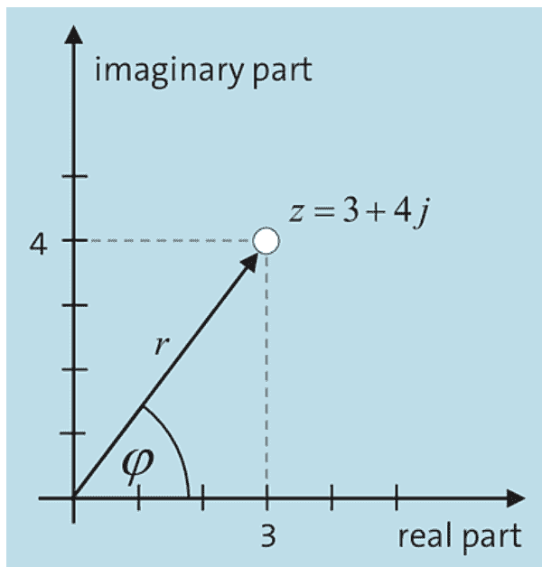

**图 26.1** 复数 3+4j 的笛卡尔坐标和极坐标表示

`phase`、`polar` 和 `rect` 函数允许你以笛卡尔坐标或极坐标表示复数：

```
>>> cmath.phase(3+4j)
0.9272952180016122
```

### 26.2 随机数生成器：random

标准库的 `random` 模块用于生成伪随机数，并提供了额外的函数，用于对基本数据类型应用随机操作。

> **注意**

`random` 模块生成的不是真随机数，而是所谓的伪随机数。真随机数无法通过计算机计算得出。伪随机数生成器使用一个整数进行初始化，并生成一个确定性的、但表面上看起来随机的伪随机数序列。这个数字序列在生成一定数量的随机数后会重复出现。在 Python 默认使用的算法中，这个周期是 $2^{19937} - 1$ 个数字。

`random` 中实现的伪随机数生成器可以使用 `seed` 函数进行初始化：

```
>>> import random
>>> random.seed(12)
```

如果种子是一个整数，随机数生成器将直接使用该数字进行初始化。或者，也可以传递 `NoneType`、`float`、`str`、`bytes` 和 `bytearray` 数据类型的实例，这将使用该实例的哈希值来初始化随机数生成器。如果未传递任何参数，则使用当前系统时间作为种子。通过这种方式，生成的数字可以被认为是准随机的：

```
>>> random.seed()
```

如果在不同时间使用相同的值初始化随机数生成器，它每次都会生成相同的数字序列。这对于在使用随机数的情况下实现可重现的程序执行特别有用。

### 26.2.1 保存和加载随机状态

`getstate` 函数返回一个描述随机数生成器当前状态的元组。借助 `setstate` 函数，可以在稍后时间保存和恢复生成器的状态——例如，在此期间重新初始化之后：

```
>>> state = random.getstate()
>>> random.setstate(state)
```

然后生成器将继续运行，就好像中断从未发生过一样。

### 26.2.2 生成随机整数

要生成一个（伪）随机整数，可以使用 `randint` 函数，可以向其传递所需的区间边界：

```
>>> random.randint(0, 10)
4
```

在这种情况下，会随机生成 `0` 到 `10` 之间的整数，区间限制 `0` 和 `10` 也可以是有效结果。

`randrange` 函数提供了对可能结果的更多控制。它从使用相同参数调用内置 `range` 函数所产生的数字空间中，随机选择一个元素返回：

```
>>> random.randrange(0, 50, 2)
40
```

在这种情况下，生成了一个 0 到 49 之间的随机偶数。

另一种生成随机数的方法是使用 `getrandbits` 函数，它生成一个固定长度的随机位序列并将其作为整数返回：

```
>>> random.getrandbits(8)
156
```

在这种情况下，使用 `getrandbits` 函数生成了一个随机字节（8 位）。

### 26.2.3 生成随机浮点数

`random` 模块包含一些函数，用于根据选定的概率分布生成随机浮点数。其中最简单的函数是 `random`，用于生成一个在 0 到 1 之间均匀分布的随机数：

```
>>> random.random()
0.6018018690250143
```

相关的 `uniform` 函数在指定的区间限制内生成一个均匀分布的随机数：

```
>>> random.uniform(0, 10)
5.044950881560962
```

此外，`random` 模块还包含更多根据其他概率分布生成随机数的函数。其中最著名的是*正态*或*高斯分布*。你可以按如下方式生成一个正态分布的随机数：

```
>>> random.gauss(0, 1)
1.4999823501567913
```

期望值 (μ) 和标准差 (σ) 作为参数传递。

### 26.2.4 序列上的随机操作

`random` 模块包含多个对序列执行随机操作的函数，包括 `choice` 函数，它返回传递的非空序列的一个随机元素：

```
>>> random.choice([1,2,3,4,5])
5
>>> random.choice([1,2,3,4,5])
2
>>> random.choice(["A", "B", "C"])
'B'
```

与 `choice` 类似，可以使用 `choices` 函数从传递的序列中获取 `k` 个随机选择的元素。元素是*有放回*选择的，这意味着单个元素可能被多次选择。

```
>>> random.choices(range(100), k=4)
[76, 41, 39, 5]
```

`sample` 函数接收一个 `population` 序列和一个整数 `k` 作为参数。结果是一个新列表，其中包含从 `population` 中随机选择的 `k` 个元素。元素是*无放回*选择的，这意味着单个元素最多只能被选择一次。通过这种方式，例如，可以从彩票参与者列表中抽取一定数量的获胜者。请注意，生成列表的顺序也是随机的，并且 `population` 中多次出现的值也可以被多次抽取：

```
>>> pop = [1,2,3,4,5,6,7,8,9,10]
>>> random.sample(pop, 3)
[7, 8, 5]
>>> random.sample(pop, 3)
[5, 9, 7]
```

`sample` 函数也可以与内置的 `range` 函数结合使用：

```
>>> random.sample(range(10000000), 3)
[4571575, 2648561, 2009814]
```

`shuffle` 函数将序列 `x` 的元素随机排序。请注意，此函数并非没有副作用，因为传递的序列会被修改。因此，`x` 只能传递可变序列数据类型的实例：

```
>>> l = [1,2,3,"A","B"]
>>> random.shuffle(l)
>>> l
[1, 'B', 2, 'A', 3]
```

在 Python 3.9 中，引入了 `randbytes` 函数，它生成一个给定长度的随机字节序列作为 `bytes` 字符串：

```
>>> random.randbytes(4)
b'\x86\x0f\xa3\xbe'
>>> random.randbytes(4)
b'A\x12u\xa3'
```

在这种情况下，生成了一个包含四个随机字节的序列。在结果的输出表示中，如果这些字节不对应于可打印的 ASCII 字符，则会以转义序列的形式输出。

### 26.2.5 SystemRandom([seed])

除了前面描述的函数外，`random` 模块还包含一个名为 `SystemRandom` 的类，它允许你使用操作系统的随机数生成器，而不是 Python 自身的生成器。此类并非在所有操作系统上都存在，但在最常见的操作系统上存在。[ 121 ]

实例化该类时，可以传递一个数字或实例来初始化随机数生成器。之后，可以像使用 `random` 模块一样使用 `SystemRandom` 类，因为它将模块中包含的大部分函数实现为方法。

但请注意，并非 `random` 的所有功能在 `SystemRandom` 中都可用。**因此，调用 `seed` 方法会被忽略，而调用 `getstate` 和 `setstate` 方法会引发 `NotImplementedError` 异常：**

```
>>> sr = random.SystemRandom()
>>> sr.randint(1, 10)
9
```

### 26.3 统计计算：statistics

标准库的 `statistics` 模块包含许多有用的函数，用于执行简单的统计计算。

`statistics` 模块中包含的函数通常操作于*样本*，即一个遍历数值的可迭代对象。一个包含 10 个浮点数的样本示例如下所示：

```
>>> data = [1.0, 2.0, 2.0, 5.7, 7.0, 1.1, 4.0, 2.0, 6.5, 1.5]
```

基本上，用于 `statistics` 模块的样本可以包含整数、浮点数，以及来自 `decimal` 和 `fractions` 模块的 `decimal` 和 `fraction` 数据类型。

> **注意**

样本应始终由单一数据类型的实例组成；否则，`statistics` 中实现的函数可能会表现出未定义的行为。

现在，例如，可以使用 `mean` 和 `median` 函数确定 `data` 样本的均值和中位数：

```
>>> import statistics
>>> statistics.mean(data)
3.477777777777778
>>> statistics.median(data)
2.0
```

[表 26.6](Table 26.6) 概述了 `statistics` 中包含的最重要函数。

| 函数 | 描述 |
| --- | --- |

| 函数 | 描述 |
| :--- | :--- |
| `mean(data)` | 计算 `data` 样本的算术平均值或平均值。 |
| `geometric_mean(data)` | 计算 `data` 样本的几何平均值。 |
| `harmonic_mean(data)` | 计算 `data` 样本的调和平均值。 |
| `median(data)` | 计算 `data` 样本的中位数。 |
| `median_low(data)` | 计算 `data` 样本的下中位数。 |
| `median_high(data)` | 计算 `data` 样本的上中位数。 |
| `mode(data)` | 确定 `data` 样本的众数或模态值——即出现频率最高的元素。 |
| `multimode(data)` | 类似于 `mode`，但当样本中有多个元素出现频率相同时，它会确定一个模态值列表。 |
| `stdev(data)` | 计算 `data` 样本的标准差。 |
| `variance(data)` | 计算 `data` 样本的方差。 |
| `pstdev(data)` | 计算 `data` 总体的标准差。 |
| `pvariance(data)` | 计算 `data` 总体的方差。 |

**表 26.6** statistics 模块中的统计计算函数

`statistics` 模块包含两个用于计算标准差和方差的函数：`stdev` 和 `pstdev`，以及 `variance` 和 `pvariance`。区别在于，`stdev` 和 `variance` 假设传递给它们的数据代表总体的一个样本。而 `pstdev` 和 `pvariance` 则假设传递给它们的数据代表整个总体。`stdev` 和 `variance` 函数包含一个校正，以修正样本标准差和方差被系统性低估的事实。

### 26.4 直观的十进制数：decimal

你肯定还记得下面的例子，它展示了使用内置 `float` 数据类型时会出现计算错误：

```
>>> 1.1 + 2.2
3.3000000000000003
```

这是因为并非每个十进制数都能被 `float` 的内部内存模型精确表示，只能近似到一定的精度。[ 122 ] 出于效率考虑，这些计算错误通常是可以接受的。然而，在某些情况下，例如在计算货币金额时，即使是像 1.1 和 2.2 这样简单的浮点数也无法精确表示，因此涉及货币金额的计算很容易出错，这尤其不便。

`decimal` 模块包含 `Decimal` 数据类型，它可以存储和处理具有用户选择的有限精度的十进制数：

```
>>> from decimal import Decimal
```

> **注意**

此处描述的 `decimal` 模块功能基于 IBM 的通用十进制算术规范。因此，你可能已经从其他编程语言中了解过类似的模块。

例如，存在一些库，它们以相同或修改的形式为 C、C++、Java 和 Perl 实现了 `decimal` 模块。

### 26.4.1 使用数据类型

没有像 `float` 那样的字面量可以直接创建 `Decimal` 数据类型的实例。要创建一个具有特定值的 `Decimal` 实例，你必须显式地实例化该数据类型。你可以将值作为字符串传递给构造函数：

```
>>> Decimal("0.9")
Decimal('0.9')
>>> Decimal("1.33e7")
Decimal('1.33E+7')
```

这是实例化 `Decimal` 最常见的方法。你也可以将整数或元组传递给构造函数：

```
>>> Decimal(123)
Decimal('123')
>>> Decimal((0, (3, 1, 4, 1), -3))
Decimal('3.141')
```

在元组的情况下，第一个元素决定符号，其中 0 代表正数，1 代表负数。第二个元素必须是另一个元组，包含该数字的所有数字。元组的第三个元素是前一个元素中指定的数字的小数点移位量。

> **注意**

可以将浮点数直接传递给 `Decimal` 类的构造函数：

```python
>>> Decimal(0.7)
Decimal('0.6999999999999999555910790149937383830547332763671875')
```

你应该始终记住，`float` 的不精确性会在初始化过程中传递给 `Decimal` 实例。

一旦创建了 `Decimal` 实例，就可以像使用数值数据类型的实例一样使用它。这尤其意味着，这些数据类型的所有已知运算符也适用于 `Decimal`。你也可以在与其他数值数据类型的运算中使用 `Decimal`。简而言之，`Decimal` 很好地融入了现有的数值数据类型世界：

```
>>> Decimal("0.9") * 5
Decimal('4.5')
>>> Decimal("0.9") / 10
Decimal('0.09')
>>> Decimal("0.9") % Decimal("1.0")
Decimal('0.9')
```

该数据类型的一个特殊功能是保留十进制数小数部分末尾的零，即使它们实际上是多余的。这在计算货币金额时很有用：

```
>>> Decimal("2.50") + Decimal("4.20")
Decimal('6.70')
```

`Decimal` 类型的实例可以相互比较，也可以与其他数值数据类型的实例进行比较：

```
>>> Decimal("0.7") < Decimal("0.8")
True
>>> Decimal(0.7) == 0.7
True
>>> Decimal("0.7") == 0.7
False
```

`Decimal` 值可以转换为任何其他数值数据类型的值。请注意，这些转换通常是有损的，因此值会失去精度：

```
>>> float(Decimal("1.337"))
1.337
>>> float(Decimal("0.9"))
0.9
>>> int(Decimal("1.337"))
1
```

此特性使你能够理所当然地将 `Decimal` 实例作为内置函数或 `math` 库函数的参数传递：

```
>>> import math
>>> math.sqrt(Decimal("2"))
1.4142135623730951
```

> **注意**

尽管 `Decimal` 实例可以传递给 `math` 模块的函数，但这些函数永远不会返回 `Decimal` 实例，因此你可能会因为 `float` 返回值而面临精度损失的风险。

对于某些数学函数，`Decimal` 实例提供了特殊方法。这些方法中的每一个都允许你除了其特定参数外，还可以传递一个 `context` 对象。这样的 `context` 对象描述了执行计算的上下文——例如，要精确舍入到多少位小数。你将在本节后面了解更多关于 `context` 对象的信息。

`Decimal` 实例 `d` 的最重要方法列于 [表 26.7](Table 26.7)。

| 方法 | 含义 |
|---|---|
| `d.exp([context])` | $e^d$ |
| `d.fma(other, third[, context])` | $d \cdot other + third^*$ |
| `d.ln([context])` | $\log_e(d)$ |
| `d.log10([context])` | $\log_{10}(d)$ |
| `d.logb([context])` | $\log_b(d)$ |
| `d.sqrt([context])` | $\sqrt{d}$ |
| `d.as_integer_ratio()` | 以元组形式返回 `d` 的分子和分母。 |

* 此方法的优点在于它一次性执行计算；也就是说，它不会继续使用乘法的舍入中间结果。

**表 26.7** Decimal 数据类型的数学方法

以下示例演示了这些方法的使用：

```
>>> d = Decimal("9")
>>> d.sqrt()
Decimal('3')
>>> d.ln()
Decimal('2.197224577336219382790490474')
>>> d.fma(2, -7)
Decimal('11')
```

> **提示**

使用 `Decimal` 数据类型进行编程需要大量输入，因为该数据类型没有字面量。许多 Python 程序员通过给数据类型一个更短的名称来凑合使用：

```python
>>> from decimal import Decimal as D
>>> D("1.5e-7")
Decimal('1.5E-7')
```

### 26.4.2 非数值

从 [第 11 章](Chapter 11)、[第 11.5 节](Section 11.5) 中，你已经了解了 `float` 数据类型的 `nan` 和 `inf` 值，当计算不可能或数字超出 `float` 的数值空间时，这些值就会出现。`Decimal` 数据类型基于这种方法，并允许你用这种状态初始化 `Decimal` 实例。表 26.8 中列出的值是可能的。

| 值 | 含义 |
| :--- | :--- |
| `Infinity`, `Inf` | 正无穷大 |
| `-Infinity`, `-Inf` | 负无穷大 |
| `NaN` | 无效值（非数字） |
| `sNaN` | 无效值（信号非数字）* |

* 与 `NaN` 的区别在于，一旦尝试使用 `sNaN` 继续计算，就会引发异常。与 `NaN` 的算术运算是执行的，但结果总是 `NaN`。

**表 26.8** Decimal 数据类型的非数值

这些非数值可以像数字一样使用：

```
>>> Decimal("NaN") + Decimal("42.42")
Decimal('NaN')
>>> Decimal("Infinity") + Decimal("Infinity")
Decimal('Infinity')
>>> Decimal("sNaN") + Decimal("42.42")
Traceback (most recent call last):
  File "<stdin>", line 1, in <module>
InvalidOperation: [<class 'decimal.InvalidOperation'>]
>>> Decimal("Inf") - Decimal("Inf")
Traceback (most recent call last):
  File "<stdin>", line 1, in <module>
InvalidOperation: [<class 'decimal.InvalidOperation'>]
```

### 26.4.3 上下文对象

`Decimal` 数据类型允许你存储具有任意有限精度的十进制数。精度——即小数位数——是封装在 `context` 对象中的几个全局设置之一。

为了访问算术运算的当前上下文，`decimal` 模块中存在 `getcontext` 和 `setcontext` 函数。此时，我们想讨论 `Context` 对象的三个属性，它们会影响计算。

## prec

`prec` 属性（代表*精度*）决定了当前上下文中 `Decimal` 实例的精度。该值是要计算的小数位数，预设为 28：

```
>>> import decimal
>>> c = decimal.getcontext()
>>> c.prec = 3
>>> Decimal("1.23456789") * Decimal("2.3456789")
Decimal('2.90')
```

## Emin 和 Emax

`Emin` 和 `Emax` 属性分别定义了指数的最大和最小值。两者都必须引用一个整数。如果计算结果超出此限制，将引发异常：

```
>>> import decimal
>>> c = decimal.getcontext()
>>> c.Emax = 9
>>> Decimal("1e100") * Decimal("1e100")
Traceback (most recent call last):
  File "<stdin>", line 1, in <module>
Overflow: [class 'decimal.Overflow']
```

本节旨在作为 `decimal` 模块的基础介绍。该模块提供了更多选项，用于进行计算或根据自身需求调整这些计算的结果。如果您对该模块产生了兴趣，我们鼓励您研究其其他用途，尤其是在 Python 文档中。

但请注意，通常不需要像 `Decimal` 数据类型提供的那样进行如此精确的计算。`float` 的速度优势通常超过 `Decimal` 的精度增益。

### 26.5 哈希函数：hashlib

标准库的 `hashlib` 模块实现了最常见的*哈希函数*。哈希函数是一种复杂的算法，它从一个参数（通常是一个字符串）计算出一个*哈希值*。这样的哈希值有什么用呢？下面，我们将描述一个为演示目的而简化的实际例子[ 123 ]。

想象一下，您正在开发一个论坛软件，该软件稍后将用于互联网上的一个社区。在用户可以在论坛发帖之前，他们必须使用用户名和相关密码登录。当然，密码不落入错误之手符合论坛运营者，尤其是用户自身的利益。因此，问题是如何使登录过程尽可能安全。

最直观的方式是将用户名和密码提交给论坛软件。在那里，这两条信息与所有用户的凭证进行比较，如果找到匹配项，则授予访问论坛的权限。

如果这样的软件实际上以这种方式执行登录过程，用户名和密码就必须以明文形式存储在论坛的内部数据库中。对于用户名来说，这通常不是大问题，因为它是公开信息。但在这样的数据库中以明文形式存储密码则是严重的疏忽。攻击者通过软件另一部分的安全漏洞获得数据库访问权限后，将立即获得所有已登录用户的密码。当考虑到许多人仍然为多个用户账户使用相同的密码时，这一点变得尤其危险。

因此，理想的情况是能够在不以明文形式存储参考密码的情况下，以接近确定的概率确定密码的正确性。这就是哈希函数发挥作用的地方。哈希函数接收一个参数并从中计算出所谓的哈希值。现在，当一个新用户登录论坛软件并选择他的密码时，它不会以明文形式输入数据库；而是存储密码的哈希值。

登录时，用户将密码发送到服务器。然后服务器计算传输密码的哈希值，并将其与存储的哈希值进行比较。[ 124 ]

为了使这样的登录过程有效工作，并且使潜在的攻击者即使获得数据库访问权限也无法计算密码，哈希函数必须满足一些要求：

- 哈希函数代表*单向编码*。这意味着哈希值的计算是不可逆的，因此您无法以合理的努力从哈希值推断出原始参数。
- 使用哈希函数时，原则上会发生所谓的碰撞，这意味着两个不同的参数产生相同的哈希值。破解哈希函数的一个关键步骤是能够计算出这样的碰撞。因此，哈希函数应该使碰撞的计算变得非常困难，以至于只能通过极高的资源投入才能确定。
- 哈希函数应该尽可能任意，这样您就不能根据相似的哈希值推断出您接近所寻找的密码。一旦哈希函数的参数发生微小变化，就应该计算出完全不同的哈希值。
- 最后但同样重要的是，哈希函数应该计算迅速。此外，必须能够高效地比较生成的哈希值。

哈希函数的应用领域很广。除了密码示例之外，它们还用于比较大文件等。与其逐字节比较这些文件，不如计算它们的哈希值并进行比较。哈希值可以用来确定文件是否不同（确定）或相同（高概率）。当由于带宽有限而无法直接比较文件时，这一点尤其有趣。例如，比较哈希值是从互联网下载文件验证真实性的最有效方式。哈希函数的另一个有趣应用是*区块链技术*，例如，可用于实现具有可追溯修改历史的去中心化数据存储。

请注意，对于 `hashlib` 模块中实现的程序，碰撞的概率非常低，但在理论上仍然存在。

### 26.5.1 使用模块

首先，`hashlib` 模块包含一组类，每个类实现一种哈希算法（参见[表 26.9](#table-26-9)）。

| 类 | 算法 | 哈希大小 | 描述 |
|---|---|---|---|
| `blake2s`<br>`blake2b` | BLAKE2 | 可变 | – |
| `md5` | MD5 | 128位 | 消息摘要算法5 |
| `sha1` | SHA-1 | 160位 | 安全散列算法1 |
| `sha224`<br>`sha256`<br>`sha384`<br>`sha512` | SHA | 224位<br>256位<br>384位<br>512位 | 安全散列算法 |
| `sha3_224`<br>`sha3_256`<br>`sha3_384`<br>`sha3_512` | SHA-3 | 224位<br>256位<br>384位<br>512位 | 安全散列算法3 |

**表 26.9** 支持的哈希函数

> **注意**

请注意，MD5 和 SHA-1 算法在某种程度上已被破解。因此，它们不应再用于安全相关的应用程序中。

这些类的使用方法是相同的。因此，我们在这里以 `md5` 类为例进行描述。在实例化 `md5` 类时，传递一个要计算其哈希值的 `bytes` 实例：

```
>>> import hashlib
>>> m = hashlib.md5(b"Hello world")
```

通过调用 `digest` 方法，计算出的哈希值作为字节序列返回。请注意，返回的 `bytes` 实例可能包含不可打印字符：

```
>>> m.digest()
b'>%\x96\ny\xdb\xc6\x9bgL\xd4\xecg\xa7,b'
```

通过调用 `hexdigest` 方法，计算出的哈希值作为包含两位十六进制数序列的字符串返回。这些十六进制数各代表哈希值的一个字节。返回的字符串仅包含可打印字符：

```
>>> m.hexdigest()
'3e25960a79dbc69b674cd4ec67a72c62'
```

### 26.5.2 其他哈希算法

除了前面列出的保证在 `hashlib` 中存在的哈希算法外，该模块还提供了许多其他算法，其可用性取决于操作系统。这些额外的算法可以使用 `new` 函数实例化。注意，您必须将算法名称传递给它：

```
>>> m = hashlib.new("md4", b"Hello world")
>>> m.hexdigest()
'2f34e7edc8180b87578159ff58e87c1a'
```

所有可用算法的集合通过 `algorithms_available` 提供：

```
>>> hashlib.algorithms_available
{'sha3_512', 'blake2s', 'md5', 'ripemd160', 'sha512_256', 'sha224', 'sha3_384', 'sha512_224', 'sha3_224', 'sm3', 'shake_256', 'whirlpool', 'sha384', 'sha512', 'md4', 'md5-sha1', 'shake_128', 'sha3_256', 'blake2b', 'mdc2', 'sha1', 'sha256'}
```

### 26.5.3 比较大文件

哈希函数从基本上无限量的数据中计算出一个短的哈希值。由于哈希函数的特性，找到两个产生相同哈希值的不同数据集的概率非常低。这使得哈希函数适合用于比较大文件，而无需将文件放在同一位置。例如，这使得可以判断存储在服务器上的文件是否需要重新上传，因为该文件在用户的计算机上已发生更改。

以下示例程序读取两个文件，并根据其哈希值进行比较：

```python
import hashlib
with open("file1.txt", "rb") as f1, open("file2.txt", "rb") as f2:
    if hashlib.md5(f1.read()).digest() == hashlib.md5(f2.read()).digest():
        print("The files are identical")
    else:
        print("The files are different")
```

在此例中，使用了广泛使用的`md5`哈希函数，但也可以使用`hashlib`中包含的其他函数。

对于处理数据流，哈希类包含`update`方法，可用于扩展其创建时指定的数据量：

```python
>>> h1 = hashlib.md5(b"First.")
>>> h1.update(b"Second.")
>>> h1.update(b"Third.")
>>>
>>> h2 = hashlib.md5(b"First.Second.Third.")
>>> h1.digest() == h2.digest()
True
```

上述用于比较两个文件的示例程序实现效率低下，因为文件内容被完全读入RAM，然后才计算各自的哈希值。对于非常大的文件，这需要不必要的大量RAM，或者如果可用RAM小于文件大小，则根本无法完成。使用`update`方法，你可以分小部分顺序读取文件，并为每个部分更新哈希值：

```python
def my_file_hash(filename, buffer_size=1024):
    with open(filename, "rb") as f:
        h = hashlib.md5(f.read(buffer_size))
        while data := f.read(buffer_size):
            h.update(data)
        return h
```

函数`my_file_hash`一次从文件中读取`buffer_size`字节的块，并用此数据更新哈希值。对于大文件，此过程显著减少了内存消耗。

## 26.5.4 密码

以下示例程序使用`hashlib`模块实现密码保护。密码不应以明文形式存储在源代码中，而应存储为哈希值。这确保了即使有人获得了哈希值，也无法查看密码。需要注册的互联网门户（如论坛）也将用户密码存储为哈希值：

```python
import hashlib
pwhash = "329670c3265b6ccd392e622733e9772f"
m = hashlib.md5(input("Your password, please: ").encode("utf-8"))
if pwhash == m.hexdigest():
    print("Access allowed")
else:
    print("Access denied")
```

该程序从用户读取密码，计算该密码的MD5哈希值，并将其与存储的哈希值进行比较。在此例中，先前计算的`pwhash`哈希值在程序中预定义。在正常情况下，它会与其他哈希值一起存储在数据库中或存储在文件中。如果两个值匹配，则象征性地输出“Access allowed”。此程序的密码是“My password”。

使用哈希值存储密码是常见做法。然而，到目前为止讨论的哈希函数，特别是前面示例中使用的`md5`函数，仅在有限程度上适用于此目的，因为它们容易受到暴力破解攻击。要安全地存储密码，应遵循两个基本原则：

- 你应该使用*盐*。这是一个在计算哈希值之前附加到密码的字符串。这样，即使两个用户使用相同的密码，也可以存储不同的哈希值。这防止了使用预计算的明文表（即所谓的*彩虹表*）来破解密码。
- 你应该在一定数量的轮次中重复应用哈希函数，以设置哈希函数的计算时间。这使得尝试大量可能的密码变得困难。

特别是对于存储密码，`hashlib`模块包含`pbkdf2_hmac`函数：

```python
pbkdf2_hmac(name, password, salt, rounds)
```

它使用`salt`和`round`轮算法为`password`密码计算密码哈希。此处实现的算法基于本节开头讨论的基本哈希函数之一。`name`参数可用于指定应使用哪种哈希函数：

```python
>>> hashlib.pbkdf2_hmac("sha256", b"password", b"salt", 100000)
b'\x03\x94\xa2\xed\xe32\xc9\xa1>\xb8.\x9b$\xc\x16\x04\xc3\x1d\xf9x\xb4\xe2\xf0\xfb\xd2\xc5I\x940\x9dy\xa5'
```

## 27 屏幕输出和日志记录

在此，我们希望研究标准库中那些能有效补充屏幕输出可能性的模块。这些是`pprint`模块，用于清晰格式化输出复杂实例（我们在[第3章，第3.10节]中也简要使用过），以及`logging`模块，用于在屏幕或日志文件中格式化输出日志消息。

本章讨论的模块旨在补充通常使用的内置`print`函数，该函数已在[第17章，第17.14.36节]中详细描述。

### 27.1 复杂对象的格式化输出：pprint

标准库包含`pprint`模块（用于*pretty print*），可用于在屏幕上整齐格式化地表示Python数据类型。该模块使复杂数据类型（如长列表）的输出更具可读性。在执行示例之前，必须导入该模块：

```python
>>> import pprint
```

`pprint`模块主要包含一个同名函数，可以调用该函数来输出一个实例。

### pprint(object, [stream, indent, width, depth], {compact})

`pprint`函数在`stream`流上格式化打印`object`实例。如果未传递`stream`参数，`pprint`将写入标准输出流`sys.stdout`。`indent`、`width`和`depth`参数可用于控制输出的格式化。`indent`可以传递用于缩进的空格数。`indent`参数预设为1。

可选的`width`参数可用于指定输出宽度的最大字符数。此参数预设为80个字符。

在以下示例中，我们首先使用我们选择的方法创建一个字符串列表，并通过`pprint`格式化输出：

```python
>>> strings = [f"The value of {i}**2 is {i**2}" for i in range(10)]
>>> pprint.pprint(strings)
['The value of 0**2 is 0',
 'The value of 1**2 is 1',
 'The value of 2**2 is 4',
 'The value of 3**2 is 9',
 'The value of 4**2 is 16',
 'The value of 5**2 is 25',
 'The value of 6**2 is 36',
 'The value of 7**2 is 49',
 'The value of 8**2 is 64',
 'The value of 9**2 is 81']
```

为了进行比较，我们再次通过`print`非格式化地输出`strings`：

```python
>>> print(strings)
['The value of 0**2 is 0', 'The value of 1**2 is 1', 'The value of 2**2 is 4', 'The value of 3**2 is 9', 'The value of 4**2 is 16', 'The value of 5**2 is 25', 'The value of 6**2 is 36', 'The value of 7**2 is 49', 'The value of 8**2 is 64', 'The value of 9**2 is 81']
```

`depth`参数是一个整数，它确定要输出子实例（如嵌套列表）的深度。如果为`depth`传递了`None`以外的值，`pprint`将省略更深的嵌套元素，并用三个点（...）表示它们。

`compact`关键字参数可用于控制大型结构（例如长列表）的显示紧凑程度。例如，如果此处传递`True`，则`strings`的每个元素不会写入单独的行。

如果你希望进一步处理`pprint`的输出，可以使用`pformat`函数，该函数将格式化表示作为字符串返回：

```python
>>> s = pprint.pformat(strings)
>>> print(s)
['The value of 0**2 is 0',
 'The value of 1**2 is 1',
 'The value of 2**2 is 4',
 'The value of 3**2 is 9',
 'The value of 4**2 is 16',
 'The value of 5**2 is 25',
 'The value of 6**2 is 36',
 'The value of 7**2 is 49',
 'The value of 8**2 is 64',
 'The value of 9**2 is 81']
```

`pformat`函数与`pprint`具有相同的接口，唯一的区别是缺少`stream`参数。

### 27.2 日志文件：logging

`logging` 模块为记录程序流程提供了灵活的接口。程序序列通过在程序的不同位置向 `logging` 模块发送消息来记录。这些消息可以具有不同的紧急程度。例如，有错误消息、警告和调试信息。`logging` 模块可以通过多种方式处理这些消息。通常的做法是为消息添加时间戳，然后将其输出到屏幕或写入文件。

本节将通过交互模式下的几个示例来展示 `logging` 模块的使用。为了能够正确执行示例程序，必须首先导入 `logging` 模块：

```
>>> import logging
```

在向日志记录器发送消息之前，必须通过调用 `basicConfig` 函数对其进行初始化。以下示例设置了一个日志记录器，将所有传入的消息写入 `program.log` 日志文件：

```
>>> logging.basicConfig(filename="program.log")
```

现在可以使用模块中包含的 `log` 函数将消息传递给日志记录器。`log` 函数的第一个参数是消息的紧急程度级别，第二个参数是以字符串形式表示的消息本身：

```
>>> logging.log(logging.ERROR, "An error has occurred")
>>> logging.log(logging.INFO, "This is information")
```

通过调用 `shutdown` 函数，日志记录器被正确地反初始化，并执行任何待处理的写操作：

```
>>> logging.shutdown()
```

当然，`ERROR` 和 `INFO` 紧急程度级别并非唯一可用的级别。表 27.1 列出了所有可供选择的预定义级别。该表按紧急程度排序，最紧急的级别列在最后。

| 级别 | 描述 |
| :--- | :--- |
| `NOTSET` | 无紧急程度级别 |
| `DEBUG` | 仅与程序员调试相关的消息 |
| `INFO` | 关于程序状态的信息消息 |
| `WARNING` | 指示可能错误的警告消息 |
| `ERROR` | 程序可以继续运行的错误消息 |
| `CRITICAL` | 关于导致程序或当前执行操作立即终止的严重错误的消息 |

**表 27.1** 预定义的紧急程度级别

为了方便，每个紧急程度级别都有一个单独的函数。因此，上一个示例中的两次 `log` 函数调用等效于以下内容：

```
logging.error("An error has occurred")
logging.info("This is information")
```

如果你在调用这两个函数后查看日志文件，你会注意到只有一条记录：

```
ERROR:root:An error has occurred
```

这是因为在基本配置中，日志记录器只记录紧急程度大于或等于警告级别的消息。要同时记录调试和信息消息，必须在调用 `basicConfig` 函数时通过 `level` 关键字参数传递一个合适的值：

```
python
logging.basicConfig(
    filename="program.log",
    level=logging.DEBUG)
logging.error("An error has occurred")
logging.info("This is information")
```

在此示例中，最小紧急程度被设置为 `DEBUG`。这意味着所有至少具有 `DEBUG` 紧急程度的消息都将被记录。因此，两条消息也出现在日志文件中：

```
ERROR:root:An error has occurred
INFO:root:This is information
```

表 27.2 列出了可以传递给 `basicConfig` 函数的最重要的关键字参数。

| 参数 | 描述 |
| :--- | :--- |
| `datefmt` | 指定日期格式，将在下一节中描述。 |
| `filemode` | 指定打开日志文件的模式*（默认值："a"）。 |
| `filename` | 指定日志文件的文件名。 |
| `format` | 指定消息格式，将在下一节中描述。 |
| `handlers` | 指定要注册的处理程序列表。更多详情，请参见第 27.2.2 节。 |
| `level` | 设置要包含在日志文件中的消息的最小紧急程度。 |
| `stream` | 指定要将日志消息写入的流。如果同时指定了 `stream` 和 `filename` 参数，则 `stream` 将被忽略。 |
| `style` | 确定消息的格式化语法。默认值 "%" 使用来自 Python 2 的旧 % 语法，而 "{" 值则使用新的字符串格式化语法。** |
| * 文件可以打开的不同模式列在第 6 章第 6.4 节中。 |
| ** 有关字符串格式化的更多详情，请参见第 12 章第 12.5.3 节。 |

表 27.2 basicConfig 函数的关键字参数

## 27.2.1 自定义消息格式

从前面的示例中可以看出，日志文件条目默认没有时间戳。但是，你可以自定义记录消息的格式。为此，必须在调用 `basicConfig` 函数时传递 `format` 关键字参数：

```
logging.basicConfig(
    filename="program.log",
    level=logging.DEBUG,
    style="{",
    format="{asctime} [{levelname:8}] {message}")
logging.error("An error has occurred")
logging.info("This is information")
logging.error("And another error")
```

你可以看到传递了一个格式字符串，其中包含消息在日志文件中应出现的模板。`asctime`、`levelname` 和 `message` 标识符分别代表时间戳、紧急程度级别和消息。此示例生成的消息如下所示：

```
2020-02-05 14:28:55,811 [ERROR   ] An error has occurred
2020-02-05 14:29:00,690 [INFO    ] This is information
2020-02-05 14:29:12,686 [ERROR   ] And another error
```

表 27.3 列出了可以在 `format` 字符串中使用的最重要的标识符。根据生成消息的上下文，某些标识符可能没有意义。

| 标识符 | 描述 |
|---|---|
| `asctime` | 报告时间。日期和时间格式可以通过调用 `basicConfig` 函数时的 `datefmt` 参数指定。更多详情将在本表后介绍。 |
| `filename` | 发送消息的程序文件的文件名。 |
| `funcName` | 发送消息的函数的名称。 |
| `levelname` | 消息的紧急程度级别。 |
| `lineno` | 放置消息的源代码行。 |
| `message` | 消息的文本。 |
| `module` | 发送消息的模块的名称。模块名称对应于不带文件扩展名的文件名。 |
| `pathname` | 放置消息的程序文件的路径。 |
| `process` | 发送消息的进程的 ID。 |
| `thread` | 发送消息的线程的 ID。 |

表 27.3 format 字符串中的标识符

可以自定义用于输出时间戳的格式。例如，我们可以设置德国常用的日期格式，并且禁用毫秒部分的输出。时间戳的格式可以通过调用 `basicConfig` 时的 `datefmt` 关键字参数指定：

```
logging.basicConfig(
    filename="program.log",
    level=logging.DEBUG,
    style="{",
    format="{asctime} [{levelname:8}] {message}",
    datefmt="%d.%m.%Y %H:%M:%S")
logging.error("An error has occurred")
```

日期格式模板中使用的占位符在第 15 章第 15.1 节中介绍。此示例生成的消息如下所示：

```
05.02.2020 14:38:49 [ERROR   ] An error has occurred
```

## 27.2.2 日志处理程序

到目前为止，我们只描述了如何使用 `logging` 模块将所有传入的消息写入文件。实际上，该模块在这方面非常灵活，不仅允许写入文件，还允许写入流，或者通过网络连接发送消息。为此，你可以使用 *日志处理程序*。严格来说，我们在前面的章节中已经使用了一个隐式处理程序，只是没有意识到。

要设置特定的处理程序，必须创建处理程序类的实例。然后，日志记录器可以使用此实例。在以下示例中，所有消息都将写入一个流——即 `sys.stdout`。为此，使用了 `logging.StreamHandler` 处理程序类：

```
import logging
import sys
```

handler = logging.StreamHandler(sys.stdout)
frm = logging.Formatter("{asctime} {levelname}: {message}",
                       "%d.%m.%Y %H:%M:%S", style="{")
handler.setFormatter(frm)
logger = logging.getLogger()
logger.addHandler(handler)
logger.setLevel(logging.DEBUG)
logger.critical("A really critical error")
logger.warning("And a subsequent warning")
logger.info("This, on the other hand, is just for your information")

首先，处理器——在本例中是`StreamHandler`——被实例化。下一步是创建`Formatter`类的实例。该类封装了我们在前面示例中调用`basicConfig`函数时传入的格式化语句。通过使用`setFormatter`方法，格式化语句被传递给处理器。

要将处理器注册到日志记录器，我们通过`getLogger`函数获取之前隐式使用的日志记录器实例。然后使用`addHandler`添加处理器，并使用`setLevel`设置相关的紧急级别。

之后，消息不再通过`logging`模块的函数发送，而是通过`Logger`实例`logger`的`critical`、`warning`和`info`方法发送。示例程序在屏幕上输出以下文本：

```
05.02.2020 17:21:46 CRITICAL: A really critical error
05.02.2020 17:21:46 WARNING: And a subsequent warning
05.02.2020 17:21:46 INFO: This, on the other hand, is just for your information
```

以下部分将介绍`logging`或`logging.handlers`包中包含的最重要的附加处理器类。

## logging.FileHandler(filename, [mode, encoding, delay])

此处理器将日志条目写入`filename`文件。文件将以`mode`模式打开。通过在调用`basicConfig`函数时指定`filename`和`filemode`关键字参数，也可以隐式使用`FileHandler`处理器。

`encoding`参数可用于指定写入文件时使用的编码。如果为`delay`参数传递`True`，文件将等到实际要写入数据时才打开。

## logging.StreamHandler([stream])

此处理器将日志条目写入`stream`流。请注意，通过在调用`basicConfig`函数时指定`stream`关键字参数，也可以隐式使用`StreamHandler`处理器。

## logging.handlers.SocketHandler(host, port)
## logging.handlers.DatagramHandler(host, port)

这些处理器通过TCP接口（`SocketHandler`）或UDP网络接口（`DatagramHandler`）将日志条目发送到主机名`host`的端口`port`。

## logging.handlers.SMTPHandler(mailhost, from, to, subject, [credentials])

此处理器将日志条目作为电子邮件发送到`to`地址。在此过程中，`subject`作为主题，`from`作为发件人地址。你可以使用`mailhost`参数指定要使用的SMTP服务器。如果此服务器需要身份验证，你可以为最后一个可选参数`credentials`传递一个包含用户名和密码的元组。

## 28 正则表达式

标准库的`re`模块为使用正则表达式提供了广泛的选择。在*正则表达式*中，文本模式通过特殊语法描述，然后可以应用于不同的文本或文本片段。基本上，正则表达式有两个主要应用领域：

- *匹配*检查文本部分是否与正则表达式模式匹配。匹配的一个例子是检查输入的电子邮件地址在语法上是否有效的测试。
- 正则表达式的第二个可能用途是*搜索*，它在较大的文本中搜索与正则表达式匹配的文本片段。

搜索本身就是一个学科，因为程序员无法通过匹配高效地实现这种行为。一个使用示例是你的Python环境的语法高亮器，它搜索代码的特殊部分（如关键字或字符串）以图形方式突出显示它们。

Python中的正则表达式可以使用包含相应规则的字符串来指定。与其他编程语言相反，Python没有为此目的提供单独的字面量。

在接下来的部分中，我们想向你介绍正则表达式的语法。仅这个主题就已经出版了整本书，这就是为什么这里的描述相对简短和基础。有几种表示法可用于描述正则表达式。Python遵循Perl编程语言中使用的语法。

## 28.1 正则表达式的语法

基本上，字符串"`python`"本身就是一个正则表达式，它精确匹配字符串"`python`"。直接指定的单个字母称为*字符字面量*。正则表达式中的字符字面量是*区分大小写*的，这意味着前面的表达式不会匹配字符串"`Python`"。

你可以在正则表达式中使用一些控制字符，使表达式更灵活和强大。这些将在以下部分中描述。

> **注意**

如果你已经熟悉正则表达式，你可能刚刚意识到一个问题。反斜杠是描述正则表达式的重要字符，而恰恰是这个字符在字符串中已经具有含义：通常，反斜杠引入转义序列。你现在可以始终使用反斜杠的转义序列（"`\`"）或使用Python的原始字符串，它们以`r`为前缀：

`r"\Hello world"`

### 28.1.1 任意字符

正则表达式中可以使用的最简单的概括是用句点标记任意字符。[ 126 ] 因此，表达式`r".ython"`匹配`"python"`和`"Python"`以及`"Jython"`，但不匹配`"blython"`或`"ython"`，因为恰好只有一个任意字符。

### 28.1.2 字符类

除了显式地将字符标记为任意字符外，你还可以指定可能出现在该位置的字符类。为此，有效字符被写在相应位置的方括号中：

```
r"[jp]ython"
```

这个正则表达式的工作方式与上一节中的类似，但只允许字母`j`和`p`作为单词的第一个字符。因此，该表达式匹配`"jython"`和`"python"`，但不匹配`"Python"`、`"jpython"`或`"ython"`。为了也允许单词中的相应大写字母，你可以按以下方式扩展表达式：

```
r"[jJpP]ython"
```

在字符类中，可以允许整个字符范围。这导致使用以下语法：

```
r"[A-Z]ython"
```

这个正则表达式允许任何大写字母作为单词的首字母，但不允许小写字母或数字，例如。为了允许多个范围，你可以简单地将它们一个接一个地写出来：

```
r"[A-Ra-r]ython"
```

例如，这个正则表达式匹配`"Qython"`和`"qython"`，但不匹配`"Sython"`或`"3ython"`。

你也可以使用数字范围作为字符类：

```
r"[0-9]ython"
```

作为字符组提供的最后一个选项，可以排除字符或字符范围。为此，在字符组的开头写一个插入符号（^）。因此，正则表达式`r"[^pP]ython"`允许你使用除大写或小写P之外的任何字符。因此，`"sython"`和`"wython"`都有效，而`"Python"`和`"python"`被排除在外。

请注意，在字符类中，除了连字符和插入符号外，没有其他字符具有特殊含义。特别是，这意味着字符类中的句点实际上描述的是.字符，而不是任意字符。

### 28.1.3 量词

到目前为止，我们可以为正则表达式中的单个字符设置某些规则。但是，如果我们想允许一定数量甚至任意数量的这些字符出现在单词的某个位置，我们将面临一个问题。为此，你可以使用*量词*。这些是写在单个字符字面量或类之后的特殊字符，表示字符字面量或类可以出现多少次。[表 28.1](Table 28.1) 列出了所有量词并简要解释了它们的含义。之后，我们将通过几个示例演示量词的使用。

| 量词 | 含义 |
| :--- | :--- |
| ? | 前面的字符或字符类可以出现一次或根本不出现。 |

## 28.1.4 预定义字符类

为了让你不必为每个正则表达式都重新发明轮子，有一组预定义的字符类，例如包含所有数字或所有字母数字字符。这些字符类在处理正则表达式时经常需要，因此可以通过一个特殊代码来缩写。每个代码都以反斜杠开头。表 28.3 列出了最重要的预定义字符类及其含义。

| 字符类 | 含义 |
| :--- | :--- |
| \d | 匹配十进制系统的所有数字。等同于 [0-9]。 |
| \D | 匹配所有不是十进制系统数字的字符。等同于 [^0-9]。 |
| \s | 匹配所有空白字符。等同于 [ \t\n\r\f\v]。 |
| \S | 匹配所有非空白字符。等同于 [^ \t\n\r\f\v]。 |
| \w | 匹配所有字母数字字符和下划线。等同于 [a-zA-Z0-9_]。 |
| \W | 匹配所有非字母数字且非下划线的字符。等同于 [^a-zA-Z0-9_]。 |

**表 28.3** 正则表达式中的预定义字符类

> **注意**

正则表达式操作可以在两种模式下执行，可以通过正则表达式类型来区分：[ 127 ]

* 如果正则表达式是 `bytes` 字符串，则在 ASCII 字符空间中执行操作。
* 如果正则表达式是字符串，则在 Unicode 字符空间中执行操作。

在 Unicode 表达式的情况下，表 28.3 中提供的字符类会进行类似的扩展。例如，在这种情况下，德语变音字母被视为字母数字字符。

预定义字符类可以在正则表达式中像普通字符一样使用。因此，表达式 `r"P\w*th\dn"` 匹配 "Pyth0n" 或 "P_th1n" 等单词，但不匹配 "Python"。

请注意，通常可以在字符串内使用的转义序列在正则表达式内也保留其含义——即使写在原始字符串中——并且不会干扰此处介绍的字符类。在此上下文中，最常见的是 \n、\t、\r 和 \，但特别是 \x。[ 128 ]

此外，反斜杠允许你在正则表达式内将具有特殊含义的字符用作普通字符。这样，你可以使用 * 或 + 字符，而不会被视为量词。因此，正则表达式 `r"\*Py\.\.\.on\*"` 仅匹配字符串 "*Py...on*"。

## 28.1.5 其他特殊字符

有时需要建立超出纯字符级别的规则。例如，创建一个仅在单词位于文本行的开头或结尾时才匹配的正则表达式可能很有用。对于此类和类似情况，有一组特殊字符，其应用方式与预定义字符类相同。表 28.4 列出了所有额外的特殊字符，并为每个字符提供了简要说明。

| 特殊字符 | 含义 |
| :--- | :--- |
| \A | 仅在字符串开头匹配。 |
| \b | 仅在单词的开头或结尾匹配。一个单词可以由 \w 类的所有字符组成，并由 \W 类的字符分隔。 |
| \B | 仅在不是单词的开头或结尾时匹配。 |
| \Z | 仅在字符串末尾匹配。 |
| ^ | 仅在字符串开头匹配。如果设置了 MULTILINE 标志，^ 也会匹配字符串内每个换行符之后的位置。* |
| $ | 仅在字符串末尾匹配。如果设置了 MULTILINE 标志，$ 也会匹配字符串内每个换行符之前的位置。 |

* 有关 MULTILINE 标志的更多详细信息，请参见第 28.2.7 节。

**表 28.4** 正则表达式中的特殊字符

在实际示例中，正则表达式 `r"Python\Z"` 仅匹配字符串 "Python"，但不匹配 "Python rocks"。除了表 28.4 中列出的特殊字符外，字符串字面量中已知的转义序列也可以在正则表达式中使用。

## 28.1.6 非贪婪量词

我们已经讨论了 ?、* 和 + 量词。在正则表达式的术语中，这些被称为*贪婪*量词。这种分类对于搜索尤其重要。考虑以下正则表达式：

```
r"Py.*on"
```

此表达式匹配任何以 Py 开头并以 on 结尾的子字符串。两者之间可以有任意数量的未指定字符。执行搜索时，该表达式用于从较长的字符串中分离出与正则表达式匹配的各种子字符串。

现在让我们在脑海中将正则表达式应用于以下字符串：

```
"Python Python Python"
```

你会说找到了三个结果吗？那就错了。实际上只有一个结果，即子字符串"Python Python Python"。原因如下：这里使用了贪婪量词`*`。贪婪量词的"野心"在于"吞噬"尽可能多的字符。因此，在搜索时，如果使用贪婪量词，总会找到尽可能大的匹配字符串。

这种行为可以反转，从而总是找到尽可能小的匹配字符串。为此，你可以在每个量词后附加一个问号。这会将量词变为非贪婪量词。假设使用正则表达式`r"Py.*?on"`在上述字符串上进行搜索。如果是这样，实际上会找到三次部分字符串"Python"。这适用于量词`?`、`*`、`+`和`{}`。

## 28.1.7 分组

正则表达式的某一部分可以通过括号组合成一个分组。这种分组方式有三个主要优点：

- 分组可以被视为一个单元，因此可以为其分配一个量词。例如，这样可以允许某个字符串出现多次：

```
r"( ?Python)+ is good"
```

在此表达式中，子表达式`r" ?Python"`被括号包围。该子表达式匹配字符串"Python"，其开头有一个可选的空格。现在整个分组可以出现任意次数，使得上述正则表达式既匹配"Python is good"，也匹配"Python Python Python is good"。但分组必须至少出现一次，并且该表达式不匹配字符串" is good"。请注意分组开头的空格，以理解该表达式的工作原理。

- 分组的第二个优点是，你可以在搜索或匹配完成后访问它。这意味着，例如，你可以检查输入的URL是否有效，同时过滤出子域名、域名和顶级域名。有关如何访问分组的更多详细信息，请参见[第28.2节](Section 28.2)。

- 正则表达式中有一些分组使用得更频繁。为了避免每次都必须书写它们，分组被连续编号，从1开始，然后可以通过其索引来引用。这样的引用由一个反斜杠后跟相应分组的索引组成，并匹配该分组所匹配的相同子字符串。因此，正则表达式`r"(Python) \1"`匹配"Python Python"。

## 28.1.8 替选

正则表达式语法提供的另一个选项是*替选*。基本上，这是两个字符或字符组的OR操作，就像你已经从Python的`or`运算符中了解的那样。这种关联通过竖线字符`|`实现，也称为*管道符*。

```
r"P(ython|eter)"
```

此正则表达式匹配"Python"和"Peter"两个字符串。之后，分组使你能够读取发生了两个替选中的哪一个。

## 28.1.9 扩展

至此，我们已经涵盖了正则表达式语法最重要的方面。除了这种或多或少标准化的语法外，Python还允许使用所谓的扩展。扩展的结构如下：

```
(?...)
```

三个点被替换为所需扩展的标识符以及进一步的扩展特定信息。选择这种语法是因为左括号后跟问号在语法上没有意义，因此是"空闲的"。但请注意，扩展不一定创建新分组，即使括号暗示了这一点。在接下来的章节中，我们将更详细地介绍可以在Python正则表达式中使用的扩展。

### (?aiLmsux)

此扩展允许你为整个正则表达式设置一个或多个标志。字符*a*、*i*、*L*、*m*、*s*、*u*和*x*中的每一个都表示一个特定的标志。术语*标志*已经用于描述可以启用或禁用的设置。标志可以在正则表达式本身中设置，仅通过此扩展，或者通过`re.compile`函数的参数（[第28.2.6节](https://example.com)）。结合此函数，我们将更详细地介绍每个标志的含义。例如，*i*标志使正则表达式*不区分大小写*：

```
r"(?i)P"
```

此表达式匹配"P"和"p"。从Python 3.6开始，可以为正则表达式的部分设置或移除标志。以下两个正则表达式分别更改单词*Python*中间两个字母的大小写敏感性：

```
r"Py(?i:th)on"
r"(?i)Py(?-i:th)on"
```

例如，第一个表达式匹配字符串"PyThon"，而第二个表达式匹配"pYthON"。

### (?:...)

此扩展的使用方式类似于普通括号，但不创建分组。这意味着你无法在之后访问由此扩展括起来的部分表达式。否则，此语法等同于括号：

```
r"(?:abc|def)"
```

借助此构造，可以构建正则表达式而不会因分组的形成而产生开销。此扩展对于将量词应用于正则表达式的部分也很有用。

### (?P<name>...)

此扩展创建一个具有指定名称的分组。这种命名分组的特殊之处在于，它不仅可以按其索引引用，还可以按其名称引用，参见下面的`(?P=name)`。名称必须是有效的标识符：

```
r"(?P<helloworld>abc|def)"
```

### (?P=name)

此扩展匹配已定义的名为`name`的分组所匹配的所有内容。因此，此扩展允许你引用命名分组：

```
r"(?P<py>[Pp]ython) is as (?P=py) should be"
```

例如，此正则表达式匹配字符串"`Python is as Python should be`"。

### (?#...)

此扩展表示注释。括号内的内容将被忽略：

```
r"Py(?#blahblahblah)thon"
```

### (?=...)

此扩展仅在正则表达式...接下来将匹配时才匹配。因此，该扩展在不实际推进表达式求值的情况下进行预判。

例如，正则表达式`r"\w+(?= Miller)"`可用于搜索文本中所有姓氏为Miller的人的名字。显而易见的替代方案`r"\w+ Miller"`不仅会包含名字，还会始终包含姓氏Miller。你可以轻松地将此示例应用于以下三个扩展，因此我们不再提供示例。

### (?!...)

此扩展仅在正则表达式...接下来*不会*匹配时才匹配。此扩展是前一个的对应物。

### (?<=...)

此扩展仅在正则表达式...之前已匹配时才匹配。因此，它访问字符串中已求值的部分，而不返回求值本身。

### (?<!...)

此扩展仅在正则表达式...之前未匹配时才匹配。因此，它是前一个的对应物。

### (?(id/name)yes-pattern|no-pattern)

这个看起来复杂的扩展可以用作正则表达式中的条件。根据具有指定索引或名称的分组是否匹配了子字符串，要么（在正例中）测试*yes-pattern*，要么（在反例中）测试*no-pattern*。*no-pattern*通过竖线与*yes-pattern*分隔，但也可以省略：

```
r"(?P<parenthesis>\()?Python(?(parenthesis)\))"
```

在此表达式中，首先创建一个名为`parenthesis`的分组，该分组最多出现一次，并由一个左括号组成。接下来是字符串`Python`，最后，如果之前出现过左括号——即如果分组`parenthesis`之前匹配过——则扩展要求一个右括号。

因此，例如，该正则表达式匹配字符串"`Python`"和"`(Python)`"，但不匹配"`(Python`"。

关于正则表达式语法的理论知识应该就足够了。虽然本节可能有点枯燥，理论上，处理正则表达式相当重要，因为在许多情况下，其使用方式尤为优雅。

在接下来的章节中，我们将讨论正则表达式在 Python 中的实际应用。首先，这包括 `re` 模块的使用。之后，我们将描述一个用于匹配或搜索的小型示例项目。

### 28.2 使用 re 模块

在更详细地描述了正则表达式的语法之后，我们现在来看看它们在 Python 中的实际用法。以下章节中的示例将在交互模式下实现，并基于 `re` 模块已被导入的假设：

```
>>> import re
```

> **注意**

以下章节介绍的函数允许你通过可选的最后一个 `flags` 参数传递一组设置，这使你能够影响正则表达式的求值。有关标志的更多信息，请参阅[第 28.2.7 节](#)。

### 28.2.1 搜索

`search` 函数接收一个 `pattern` 正则表达式和一个 `string` 字符串。

**search(pattern, string, [flags])**

然后，它返回 `string` 中与 `pattern` 匹配的第一个子字符串作为匹配对象：[ 129 ]

```
>>> re.search(r"P[Yy]thon", "Python or PYthon and Python")
<re.Match object; span=(0, 6), match='Python'>
```

`findall` 函数与 `search` 具有相同的接口，并在 `string` 中搜索与 `pattern` 正则表达式匹配的内容。找到的所有非重叠匹配项都作为字符串列表返回：

```
>>> re.findall(r"P[Yy]thon", "Python or PYthon and Python")
['Python', 'PYthon', 'Python']
```

如果 `pattern` 包含一个或多个组，则只有组匹配的部分将被写入结果列表，而不是完整的匹配子字符串：

```
>>> re.findall(r"P([Yy])thon", "Python or PYthon and Python")
['y', 'Y', 'y']
>>> re.findall(r"P([Yy])th(.).n", "Python or PYthon and Python")
[('y', 'o'), ('Y', 'o'), ('y', 'o')]
```

如果有多个组，那么结果就是一个元组列表。替代函数 `finditer` 的工作方式与 `findall` 类似，但返回的结果是一个匹配对象的迭代器。

### 28.2.2 匹配

`match` 函数接收一个 `pattern` 正则表达式和一个 `string` 字符串，并检查 `pattern` 是否匹配 `string` 开头的部分。

**match(pattern, string, [flags])**

特别是，`string` 不必完全匹配 `pattern`。如果匹配成功，结果将作为匹配对象返回：

```
>>> re.match(r"P.th", "python")
>>> re.match(r"P.th", "Python")
<re.Match object; span=(0, 4), match='Pyth'>
```

如果字符串开头没有匹配项，则返回 `None`。

`fullmatch` 函数与 `match` 具有相同的接口，但与 `match` 不同，它**检查** `pattern` 是否匹配整个 `string` 字符串：

```
>>> re.fullmatch(r"P.th", "Python")
>>> re.fullmatch(r"P.thon", "Python")
<re.Match object; span=(0, 6), match='Python'>
```

### 28.2.3 分割字符串

`split` 函数接收一个 `pattern` 正则表达式和一个 `string`，并在 `string` 中搜索与 `pattern` 匹配的内容。所有匹配的子字符串都被视为分隔符，它们之间的部分作为字符串列表返回：

```
>>> re.split(r"\s", "Python Python Python")
['Python', 'Python', 'Python']
```

正则表达式中出现的任何组也会作为此列表的元素返回：

```
>>> re.split(r"(,)\s", "Python, Python, Python")
['Python', ',', 'Python', ',', 'Python']
```

在这个正则表达式中，任何后跟空格的逗号都被视为分隔符。

如果指定了可选的最后一个 `maxsplit` 参数且不为 0，则字符串将最多被分割 `maxsplit` 次。剩余的字符串作为列表的最后一个元素返回：

```
>>> re.split(r"\s", "Python Python Python", 1)
['Python', 'Python Python']
```

### 28.2.4 替换字符串的部分内容

`sub` 函数具有以下接口：

```
sub(pattern, repl, string, [count, flags])
```

它在 `string` 中搜索与 `pattern` 正则表达式匹配的非重叠项。返回 `string` 的一个副本，其中所有匹配的子字符串都已被 `repl` 字符串替换：

```
>>> re.sub(r"[Jj]a[Vv]a", "Python", "Java or java and jaVa")
'Python or Python and Python'
```

除了字符串，`repl` 也可以传递一个函数对象。对于找到的每个匹配项，都会调用此函数，并将相应的匹配对象作为唯一参数传递。匹配的子字符串将被函数的返回值替换。

在下面的示例中，为 `repl` 参数传递了一个函数对象，用于审查文本中的不雅词汇：

```
>>> def f(m):
...     return "x" * len(m.group(0))
...
>>> re.sub(r"\b(\w*?sex\w*?)\b", f,
...     "Essex isn't Middlesex")
'xxxxx isn't xxxxxxxxx'
```

`sub` 函数在指定文本中搜索包含 `sex` 子词的单词。然后使用函数 `f` 将这些单词替换为与相应单词长度相同的 `x`。

可以使用 `\g<name>` 或 `\g<index>` 表示法来引用正则表达式组：

```
>>> re.sub(r"([Jj]ava)", r"Python instead of \g<1>", "Take Java")
'Take Python instead of Java'
```

可选的 `count` 参数可用于指定可能执行的最大替换次数。

替代函数 `subn` 的工作方式与 `sub` 类似，但除了结果字符串外，还返回所做的替换次数：

```
>>> re.subn(r"[Jj]a[Vv]a", "Python", "Java or java and jaVa")
('Python or Python and Python', 3)
```

### 28.2.5 替换问题字符

`escape` 函数将传递字符串的所有非字母数字字符转换为其对应的转义序列，并将结果作为字符串返回。如果你想将一个字符串嵌入正则表达式但不确定是否包含句点或问号等特殊字符时，此函数很有用：

```
>>> re.escape("Does this really work? ... (yes!)")
'Does\ this\ really\ work\?\ \.\.\.\ \(yes!\)'
```

请注意，字符串字面量中的转义序列前面都有一个双反斜杠。这是因为结果是使用常规字符串字面量而不是原始字符串字面量打印的。

### 28.2.6 编译正则表达式

`compile` 函数将正则表达式编译为一个*正则表达式对象*（*RE 对象*）。返回的对象提供的功能与 `re` 模块基本相同，但对其执行的操作通常更快：

```
>>> regexp = re.compile(r"P[Yy]thon")
>>> regexp.findall("Python or PYthon and Python")
['Python', 'PYthon', 'Python']
```

特别是那些需要高频评估大量不同正则表达式的程序，应该编译正则表达式。由于 `re` 模块的内部缓存机制，频繁评估相同的正则表达式并不关键。

### 28.2.7 标志

在前面的章节中，多次提到了所谓的*标志*。这些是影响正则表达式求值的设置。标志可以通过表达式本身的扩展来指定，也可以作为 `re` 模块中可用函数的参数来指定。它们只影响当前正在处理的表达式，之后不会保持活动状态。每个标志都作为常量包含在 `re` 模块中，可以通过其名称的长版本或短版本来寻址。[表 28.5](#) 列出了所有标志并解释了它们的含义。

| 别名 | 名称 | 含义 |
| :--- | :--- | :--- |
| `re.A` | `re.ASCII` | 如果设置了此标志，字符类 `\w`、`\W`、`\b`、`\B`、`\s` 和 `\S` 将被限制为 ASCII 字符集。 |
| `re.I` | `re.IGNORECASE` | 如果设置了此标志，正则表达式求值将变为*不区分大小写*，这意味着，例如，字符组 `[A-Z]` 将匹配大写和小写字母。 |
| `re.L` | `re.LOCALE` | 如果设置了此标志，某些预定义的字符类将取决于当前的区域设置。这涉及组 `\w`、`\W`、`\b`、`\B`、`\s` 和 `\S`。 |
| `re.M` | `re.MULTILINE` | 如果设置了此标志，`^` 将匹配字符串的开头以及每个换行符之后，`$` 将匹配每个换行符之前。通常 `^` 和 `$` 仅分别匹配字符串的开头和结尾。 |

## 28.2.8 匹配对象

| 别名 | 名称 | 含义 |
| :--- | :--- | :--- |
| re.S | re.DOTALL | 如果设置了此标志，特殊字符 `.` 将匹配任何字符。通常，点号匹配除换行符 `\n` 之外的任何字符。 |
| re.X | re.VERBOSE | 如果设置了此标志，正则表达式中的空白字符（如空格、制表符或换行符）将被忽略，只要它们前面没有反斜杠。此外，`#` 号引入注释。这意味着该字符之后直到换行符的所有内容都会被忽略。由于此标志极大地提高了正则表达式的可读性，我们将在 [第 28.5 节](Section 28.5) 中单独讨论。 |

**表 28.5** 标志

之前介绍的大多数 `re` 模块函数都有一个可选的 `flags` 参数，可用于指定标志的组合：

```
>>> print(re.match(r"python", "Python"))
None
>>> print(re.match(r"python", "Python", re.I))
<re.Match object; span=(0, 6), match='Python'>
```

如示例所示，`match` 函数的行为会根据传递的标志进行调整。在这种情况下，匹配首先是区分大小写的，然后是不区分大小写的。标志可以使用按位或（`|`）进行组合，例如：

```
re.I | re.S | re.M
```

匹配或搜索操作的结果由之前介绍的函数（例如 `match` 和 `search`）作为匹配对象返回。匹配对象包含有关当前正在考虑的匹配的更多详细信息。为此，匹配对象定义了 [表 28.6](#) 中列出的属性。

| 属性 | 描述 |
| :--- | :--- |
| `pos`, `endpos` | `search` 或 `match` 调用所考虑的子字符串的起始或结束索引 |
| `re` | 作为字符串的原始正则表达式 |
| `string` | 此匹配对象引用的字符串 |

**表 28.6** 匹配对象的属性

`group` 方法提供了对匹配正则表达式不同组的子字符串的便捷访问。如果只传递了一个参数，则返回值是一个字符串；否则，它是一个字符串元组。如果某个组没有匹配任何子字符串，则为其返回 `None`：

```
>>> m1 = re.match(r"(P[Yy]) (th.n)", "Python")
>>> m1.group(1)
'Py'
>>> m1.group(1, 2)
('Py', 'thon')
```

索引 `0` 返回整个匹配的字符串：

```
>>> m1.group(0)
'Python'
```

`groups` 方法返回一个列表，其中包含匹配正则表达式中包含的所有组的子字符串：

```
>>> m1.groups()
('Py', 'thon')
```

`start` 和 `end` 或 `span` 方法可用于通过输入字符串中的起始或结束索引获取匹配某个组的子字符串：

```
>>> m1.start(2)
2
>>> m1.end(2)
6
>>> m1.span(2)
(2, 6)
```

特别是对于命名组，有一个 `groupdict` 函数，它将组的名称映射到匹配它们的子字符串：

```
>>> m2 = re.match(r"(?P<group1>P[Yy])(?P<group2>th.n)", "Python")
>>> m2.groupdict()
{'group1': 'Py', 'group2': 'thon'}
```

从 Python 3.6 开始，匹配对象允许基于索引的访问，等同于调用 `groups`：

```
>>> m1[1]
'Py'
>>> m2["group2"]
'thon'
```

### 28.3 一个简单的示例程序：搜索

到目前为止，我们已经讨论了正则表达式的语法以及标准库 `re` 模块的使用。此时，我们想再介绍两个专注于使用正则表达式的小型示例项目。首先，我们将在这个简单的例子中解释搜索；匹配将在后续更复杂的例子中处理。

搜索用于在较长的文本中查找和过滤模式。在我们的示例程序中，搜索旨在从任何 HTML 文件中检索所有链接及其描述。为此，我们必须首先可视化 HTML 链接的结构：

```
<a href="URL">description</a>
```

因为 HTML 不区分大小写，所以我们应该使用带有 `IGNORECASE` 标志的正则表达式。此外，刚刚展示的示例只是 HTML 链接的最简单形式；除了 URL 和描述之外，还可以提供其他信息。

以下正则表达式匹配前面的链接以及其他更复杂的 HTML 链接：

```
r"<a .*href=["\'](.+?)["\'].*>(.*?)</a>"
```

该正则表达式包含两个组，一个用于 URL，一个用于描述，以便稍后可以读取这两条信息。在这些组内，使用了非贪婪量词；否则，多个链接可能会被错误地组合成一个。

那么，让我们转向示例程序：

```
import re
with open("rheinwerk-publishing.html", "r") as f:
    html = f.read()
```

```
it = re.finditer(r"<a .*?href=["\'](.*)["\'].*?>(.*?)</a>", html, re.I)
for n, m in enumerate(it):
    print("#{} Name: {}, Link: {}".format(n, m.group(2), m.group(1)))
```

首先，打开一个 HTML 文件（在本例中为 *rheinwerk-publishing.html*），并使用文件对象的 `read` 方法读取其内容。然后调用 `re` 模块的 `finditer` 函数，以在 HTML 代码中查找与前面讨论的正则表达式匹配的所有内容。结果作为迭代器返回，并由 `it` 引用。

最后，遍历 `it`，在每个迭代步骤中，当前匹配项作为匹配对象 `m` 可用。现在，输出符合正则表达式两个组的部分字符串。

你可以使用任何 HTML 页面测试该程序。为此，只需访问互联网上尽可能复杂的网站（例如新闻杂志网站），并将其保存为 HTML 文件。你会看到示例程序也能在这里找到包含的链接。

> **注意**

解析 HTML 内容是一项非平凡的任务，正则表达式仅部分适用。如果你想深入研究这个主题，我们建议使用专门为此目的设计的第三方库，例如 `beautifulsoup`，但由于篇幅限制，本书不再进一步介绍。

### 28.4 一个更复杂的示例程序：匹配

一个常见问题，尤其是在网络上，是验证输入的表单数据并从输入中过滤出重要信息。当然，使用普通的字符串操作也可以做到这一点，但使用正则表达式可以优雅且相对较少的代码来解决这个问题。

我们的示例程序应该从一种电子名片中读取所有相关信息，并将其准备成机器可读的形式。名片以以下格式保存在文本文件中：

```
Name: John Doe
Addr: Samplestreet 123
      12345 Sampletown
P:    +1 781 228 5070
```

程序现在应该读取这个文本文件，提取其中包含的信息，并将其准备成如下字典：

```
{
    'Name': ('John', 'Doe'),
    'Addr': ('Samplestreet', '123', '12345', 'Sampletown'),
    'P': ('+1', '781', '228', '5070')
}
```

我们假设文本文件始终只包含一条数据记录。
让我们首先更详细地了解示例程序的工作原理。名片由各种信息组成，始终带有标题或类别（"Name"、"Addr" 和 "P"）。将类别与信息分开并不复杂，因为冒号不会出现在类别名称中，因此一行中第一次出现的冒号总是标志着类别和信息之间的过渡。第三行是一个问题，因为这里没有给出明确的标题。在这种情况下，该行将附加到前一个标题的信息中。通过这种方式，可以创建一个将标题映射到相关信息的字典。

现在让我们转向实现。为此，我们首先编写一个函数，逐行读取数据并将其格式化为字典：

```
def read_file(filename):
    d = {}
    with open(filename) as f:
        for line in f:
            if ":" in line:
                key, d[key] = (s.strip() for s in line.split(":",1))
            elif "key" in locals():
                d[key] += "\n{}".format(line.strip())
    return d
```

`read_file` 函数接收带有路径规范的 `filename` 字符串。在函数内部，文件被逐行读取。每一行根据第一个冒号分为两部分：类别和信息，并使用 `strip` 方法去除多余的空格。然后将标题和信息写入字典 `d`，并且当前标题还通过 `key` 引用。

在任何没有冒号的行中，信息被换行到多行。对我们来说，这意味着我们首先也对完整的行内容应用 `strip` 方法，然后将其附加到字典中 `key` 标题下已存在的值中。为此，`key` 引用当然必须存在。因为它只在 `if` 语句中创建，所以假定在没有冒号的行之前必须有一行带有冒号。虽然没有有意义的文件不满足这个假设，但我们显式地检查 `elif` 分支以查看 `key` 引用是否存在。

此函数的结果是一个字典，其中标题作为键，关联信息（以字符串形式）作为值。示例中的第二个函数使用正则表达式解析数据，然后将其作为元组存储在字典中。为此，我们首先创建一个名为 `regexp` 的字典，为每个标题提供一个可用于验证信息的正则表达式：

```
regexp = {
    "Name": r"([A-Za-z]+)\s([A-Za-z]+)",
    "Addr": r"([A-Za-z]+)\s(\d+)\s*(\d{5})\s([A-Za-z]+)",
    "P": r"(\+\d{1,3})\s(\d{3})\s(\d{3})\s(\d{4})"
}
```

这些正则表达式包含多个分组，以便更容易将信息拆分为不同的独立信息片段。

用于分析数据的函数如下所示：

```
def analyze_data(data, regexp):
    for key in data:
        if key not in regexp:
            return False
        m = re.match(regexp[key], data[key])
        if not m:
            return False
        data[key] = m.groups()
    return True
```

`analyze_data` 函数接收两个字典作为参数：第一个是刚刚创建的 `regexp` 字典，第二个是由 `read_file` 函数创建的字典，其中包含读取的数据。

该函数在 `for` 循环中遍历 `data` 字典，并使用 `re.match` 函数将正则表达式应用于读取的字符串，匹配当前标题。返回的匹配对象由 `m` 引用。

然后，我们测试 `re.match` 是否返回了值 `None`。如果是，`analyze_data` 函数将返回 `False`。否则，`data` 字典的当前值将被覆盖为与每个正则表达式分组匹配的子字符串。匹配对象的 `group` 方法返回一个字符串元组。运行 `analyze_data` 函数后，字典以格式化形式包含所需的数据。

最后但同样重要的是，仍然缺少触发数据读取和准备的代码：

```
data = read_file("id.txt")
if analyze_data(data, regexp):
    print(data)
else:
    print("The data is incorrect")
```

根据 `analyze_data` 函数返回的真值，将输出准备好的数据或错误消息。

希望这两个示例能帮助您亲身体验正则表达式的世界。请注意，所展示的程序实际上可以运行，但它远非完美。您可以根据需要自由扩展或调整它。例如，正则表达式目前还不允许街道名称中包含变音符号或标点符号。您还可以在名片中添加电子邮件地址并进行编程。

### 28.5 正则表达式中的注释

根据应用程序的不同，正则表达式在实践中可能变得非常复杂，以至于其含义对程序的读者来说并不明显。在这种情况下，使用 `re` 模块的 `VERBOSE` 标志很有用。如表 28.5 所述，此标志确保正则表达式中的所有空白字符都被忽略，除非它们前面有反斜杠。这可以通过有选择地插入空格和换行符来直观地构建正则表达式。例如，让我们考虑第 28.3 节中介绍的用于在 HTML 页面中查找链接的正则表达式：

```
r"<a .*href=["\'](.*)["\'].*>(.*?)</a>"
```

可以使用 `VERBOSE` 标志将此表达式重新格式化如下：

```
import re
with open("rheinwerk-publishing.html", "r") as f:
    html = f.read()
    it = re.finditer(r"""
        <a\ .*?
            href=["\']
                (.*?)
            ["\']
        .*?>
            (.*?)
        </a>
    """, html, re.I | re.VERBOSE)
for n, m in enumerate(it):
    print("|{} Name: {}, Link: {}".format(n, m.group(2), m.group(1)))
```

虽然上述程序的行为与第 28.3 节中的程序完全相同，但有三个主要区别：

1.  包含正则表达式的字符串使用三引号分成多行，并通过行首的空格突出显示其结构。
2.  对于 `finditer` 函数的 `flags` 参数，还传递了 `re.VERBOSE` 标志。
3.  表达式开头 `a` 后的空格字符已加上反斜杠前缀，以便在 `VERBOSE` 标志下仍被考虑。

除了纯粹的正则表达式结构化之外，`VERBOSE` 标志还提供了插入注释的选项——例如，用于解释表达式的部分或突出显示特殊功能。要在正则表达式中使用注释，请使用 `#` 符号。井号确保其自身以及同一行中后续的所有内容在解释正则表达式时被忽略。我们可以用它来注释前面的正则表达式，例如：

```
it = re.finditer(r"""
    <a\ .*?            # Warning: Space after a requires backslash
        href=["\']    # Double or single quotes
                      # enclose the target of the link
            (.*?)      # We allow any characters in the link target ...
        ["\']
    .*?>
        (.*?)          # ... just like in the link text
    </a>
""", html, re.I | re.VERBOSE)
```

与程序代码本身一样，决定注释多少以及具体注释什么，或者不注释什么，是一门艺术，也是个人品味的问题。

## 29 与操作系统和运行时环境的接口

为了使您的程序与其运行的操作系统进行交互，您需要访问操作系统的功能。这里的一个问题是，不同的操作系统在功能范围和可用操作的使用方式上有时差异很大。然而，Python 从一开始就被设计为一种跨平台语言。为了能够在尽可能多的平台上无需任何修改即可运行需要利用操作系统功能的程序，创建了一个提供对操作系统功能统一访问的接口。简单地说，这意味着通过使用这个统一接口，您可以编写保持平台无关性的程序，即使它们基于操作系统功能。

此接口由 `os` 和 `sys` 模块实现，我们将在以下各节中更详细地描述它们。之后，我们将看看标准库的 `argparse` 模块，它提供了对命令行参数的便捷访问。

### 29.1 操作系统功能：os

您可以使用 `os` 模块访问操作系统提供的功能和信息。由于 `os` 模块在很大程度上服务于非常特定且很少需要的用例，我们将在此处仅限于一个选定的子集。

`os` 模块包含一些与文件系统相关的函数，以及用于路径名操作和处理的 `os.path` 子模块。这将是第 30 章、第 30.1 节和第 30.2 节的主题。

`os` 模块有自己的异常类型，称为 `os.error`。错误类的另一个名称是 `OSError`。

> **注意**
>
> `os` 提供的所有接受 `str` 实例作为参数的方法和函数也可以使用 `bytes` 实例调用。然而，这也会改变返回值。
>
> 简而言之：`str` 输入—`str` 输出；`bytes` 输入—`bytes` 输出。

要运行以下示例程序，必须首先导入 `os` 模块：

```
>>> import os
```

#### 29.1.1 environ

`os` 模块包含一个字典 `environ`，可用于访问操作系统为您的程序提供的环境变量。例如，您可以在许多平台上使用 `os.environ['HOME']` 来确定活动用户的主目录。以下示例显示了 Windows 和 Linux 机器上 `os.environ['HOME']` 的值：

```
>>> print(os.environ['HOME'])
C:\Documents and Settings\username
```

## 29.1.2 getpid()

执行当前程序的 Python 进程拥有一个唯一的标识号。可以通过 `os.getpid()` 来确定：

```
>>> os.getpid()
1360
```

## 29.1.3 cpu_count()

`cpu_count()` 模块返回计算机的处理器数量。虚拟核心被计为独立的处理器：

```
>>> os.cpu_count()
8
```

例如，执行此行的系统拥有一个四核处理器，每个核心有两个虚拟核心。

## 29.1.4 system(cmd)

`os.system` 模块使你能够像在系统控制台中发出命令一样，执行操作系统的任何命令。以下示例使用 `mkdir` 命令创建一个名为 `test_folder` 的新文件夹：

```
>>> os.system("mkdir test_folder")
0
```

`os.system` 的返回值是被调用程序返回的状态码——在此例中为 `0`，表示成功。

`os.system` 函数的一个问题是，无法轻易获取被调用程序的输出。为此，你可以使用 `os.popen` 函数。

## 29.1.5 popen(command, [mode, buffering])

`os.popen` 函数执行任何命令，就像在操作系统命令行上一样。该函数返回一个*类文件对象*[130]，可用于访问被执行程序的输出。与内置的 `open` 函数类似，`mode` 参数指定文件对象是以读取（"r"）还是写入（"w"）模式打开。通过写入访问，可以将数据传输到正在运行的程序。

在以下示例中，我们将使用 Windows 的 `dir` 命令创建 C:\ 目录下的文件和文件夹列表：[131]

```
>>> output = os.popen("dir /B C:")
>>> files = [line.strip() for line in output]
>>> files
['AUTOEXEC.BAT', 'CONFIG.SYS', 'Documents and Settings', 'Programs', 'WINDOWS']
```

你可以在关于文件处理的[第 6 章，第 6.4.1 节](#)中阅读更多关于 `mode` 和 `buffering` 确切含义的内容。

### 29.2 访问运行时环境：sys

标准库的 `sys` 模块提供了与 Python 解释器相关或密切相关的预定义变量和函数。例如，你可以使用 `sys` 模块查询解释器或操作系统的版本号。该模块为程序员提供了一系列有时非常有用的信息。

要运行本节中的示例，必须首先导入 `sys` 模块：

```
>>> import sys
```

### 29.2.1 命令行参数

`sys.argv` 列表包含调用 Python 程序时使用的命令行参数。`argv[0]` 是程序本身的名称。考虑示例程序调用 `$ program.py -blah 0 -bubble abc`。这里，`argv` 引用以下列表：

```
['program.py', '-blah', '0', '-bubble', 'abc']
```

在交互模式下，`argv` 为空。如果你想方便地管理命令行参数，应该使用 `argparse` 模块（[第 29.3 节](https://example.com)）。

### 29.2.2 默认路径

`path` 列表包含解释器在导入模块时按出现顺序搜索的路径。找到的第一个与搜索名称匹配的模块将被导入。

程序员可以自由修改此列表，以便根据自己的需求进行模块导入。有关 Python 中模块导入的更多详细信息，请参阅[第 18 章](Chapter 18)。

### 29.2.3 标准输入/输出流

`sys` 模块包含对系统标准输入/输出流的引用。这些是用于解释器输入和输出的文件对象。这里，`sys.stdin`（用于*标准输入*）表示调用 `input` 时读取用户输入的文件对象。所有 Python 程序的输出都写入 `sys.stdout`（标准输出）文件对象，而解释器的输出（如回溯信息）则写入 `sys.stderr`（标准错误）。

用你自己的文件对象替换这些文件对象，可以将输入和输出重定向到其他流。`sys.stdin`、`sys.stdout` 和 `sys.stderr` 的原始流存储在 `sys.__stdin__`、`sys.__stdout__` 和 `sys.__stderr__` 中，以便随时可以恢复。

### 29.2.4 退出程序

`sys` 模块的 `exit` 函数会引发一个 `SystemExit` 异常。如果未处理，这将导致程序在没有回溯输出的情况下终止：

```
>>> sys.exit()
```

可选地，你可以传递一个整数，它将作为*退出码*传递给操作系统。退出码 0 通常表示程序成功终止，而退出码不等于 0 则表示程序因错误而终止：

```
>>> sys.exit(1)
```

如果你传递了另一个实例（例如字符串），它将在程序以退出码 0 终止之前输出到 `stderr`：

```
>>> sys.exit("Error")
Error
```

### 29.2.5 Python 版本详情

`sys.implementation` 命名元组提供有关正在运行的 Python 解释器的信息。除了单独提供的 `hexversion` 和 `version_info` 条目外，包含 `name` 条目的元组包含解释器的名称——例如，默认实现的 "cpython"：

```
>>> sys.implementation
namespace(name='cpython', cache_tag='cpython-311', version=sys.version_info(major=3, minor=11, micro=0, releaselevel='beta', serial=1), hexversion=51052721, _multiarch='darwin')
```

`sys.implementation` 的两个 `version` 和 `hexversion` 组件也可以分别通过 `sys.version_info` 和 `sys.hexversion` 单独获取：

```
>>> sys.version_info
sys.version_info(major=3, minor=11, micro=0, releaselevel='beta', serial=1)
>>> hex(sys.hexversion)
'0x30b00b1'
```

`sys.hexversion` 常量包含 Python 解释器的版本号（作为整数）。如果像前面的示例中那样，通过调用内置的 `hex` 函数将其写为十六进制数（在 Python 3.11.0 (Beta 1) 下执行），该数字的结构就变得清晰了。可以保证 `hexversion` 会随着每个 Python 版本的更新而增加，因此你可以使用 < 和 > 运算符来测试你使用的解释器版本是比特定参考版本号更旧还是更新。

最后，你可以使用 `sys.executable` 字符串来确定当前运行的 Python 解释器的完整路径。

### 29.2.6 操作系统详情

`sys.platform` 字符串包含正在运行的操作系统的标识符。三个最流行操作系统的标识符列于[表 29.1](#)。

| 系统 | 标识符 |
|---|---|
| Linux | "linux" |
| macOS | "darwin" |
| Windows | "win32" |

**表 29.1** 不同操作系统的标识符

> **注意**

在 Python 3.2 之前，Linux 上的 `platform` 值是 "linux2" 或 "linux3"，具体取决于 Linux 内核版本。从 Python 3.3 开始，Linux 上的值统一为 "linux"。

因此，建议使用 `sys.platform.startswith("linux")` 来检查程序是否在 Linux 系统上运行。

在 Windows 系统上，你可以使用 `sys.getwindowsversion` 函数，该函数返回有关当前使用的 Windows 操作系统版本的详细信息：

```
>>> sys.getwindowsversion()
sys.getwindowsversion(major=10, minor=0, build= 14393, platform=2,
service_pack='')
```

该函数返回一个命名元组，其前三个元素是整数，描述版本号。第四个元素也是整数，表示所使用的平台。表 29.2 中列出的值是有效的。

| 平台 | 含义 |
|---|---|
| 0 | Windows 3.1 (32-bit) |
| 1 | Windows 95/98/ME |
| 2 | Windows NT/2000/XP/Server 2003/Vista/Server 2008/7/8/10/11 |
| 3 | Windows CE |

**表 29.2** Windows 平台

元组的最后一个元素是一个字符串，包含更多信息。

要区分归类在平台 2 下的各个 Windows 版本，你可以参考版本号（由元组的 major 和 minor 字段组成；见表 29.3）。

| 名称 | major | minor |
|---|---|---|
| Windows 2000 | 5 | 0 |
| Windows XP | 5 | 1 |
| Windows Server 2003 | 5 | 2 |
| Windows Vista 或 Windows Server 2008 | 6 | 0 |

| 名称 | 主版本号 | 次版本号 |
|---|---|---|
| Windows 7 | 6 | 1 |
| Windows 8 | 6 | 2 |
| Windows 10 | 10 | 0 |

**表 29.3** Windows 版本

在非 Microsoft Windows 操作系统上，`getwindowsversion` 函数不可用。

`sys.byteorder` 常量指定了当前系统的字节序[132]。其值为 "big" 表示*大端*系统（最高有效字节存储在前），或 "little" 表示*小端*系统（最低有效字节存储在前）。

## 29.2.7 钩子

`sys` 模块提供了对所谓*钩子*的访问。这些是当 Python 解释器执行某些操作时被调用的函数。通过覆盖这些函数，程序员可以“钩入”解释器，从而改变解释器的工作方式。

### displayhook(value)

每当需要在交互模式下输出表达式的结果时，就会调用 `displayhook` 函数——例如，在以下情况中：

```
>>> 42
42
```

通过用自定义函数覆盖 `displayhook`，可以改变此行为。在以下示例中，我们输出输入表达式的标识符而非其值：

```
>>> def f(value):
...     print(id(value))
...
>>> sys.displayhook = f
>>> 42
139716935035616
>>> 97 + 32
139716935038400
>>> "Hello world"
139716901939824
```

请注意，当通过 `print` 输出时，`displayhook` 不会被调用：[133]

```
>>> print("Hello world")
Hello world
```

你可以通过 `sys.__displayhook__` 访问 `displayhook` 的原始函数对象，从而恢复原始功能：

```
>>> sys.displayhook = sys.__displayhook__
```

### excepthook(type, value, traceback)

每当发生未捕获的异常时，就会调用 `excepthook` 函数。它负责输出回溯信息。通过用自定义函数对象覆盖此函数，例如，可以记录错误或更改回溯信息的输出方式。

`excepthook` 函数接收异常类型、异常值（通常是错误消息）以及一个所谓的回溯对象，该对象包含有关异常发生位置的信息。

在以下示例中，我们将设置一个钩子，通过添加一句讽刺性评论来丰富单调的回溯信息：

```
>>> def f(type, value, traceback):
...     print('gnahahaha: "{}"'.format(value))
...
>>> sys.excepthook = f
>>> abc
gnahahaha: "name 'abc' is not defined"
```

你可以通过 `sys.__excepthook__` 访问 `excepthook` 的原始函数对象，从而恢复原始功能：

```
>>> sys.excepthook = sys.__excepthook__
```

### 29.3 命令行参数：argparse

在上一节关于标准库 `sys` 模块的讨论中，我们介绍了全局 `sys.argv` 列表，你可以使用它来访问调用 Python 程序时传递的命令行参数。然而，这种对命令行参数的原始访问方式通常不够用。本节描述的 `argparse` 模块允许你更方便地处理命令行参数。

到目前为止，本书仅涉及控制台程序——即具有纯文本用户界面的程序。此类程序通常从*控制台*（也称为*shell*）启动——例如，Windows 中的命令提示符。

[134]

在 Windows 上，通过切换到程序目录然后输入程序文件名（例如 `program.py`）来启动 Python 程序。对于类 Unix 系统（如 Linux 或 macOS），你可以使用 `python program.py`，或者通过添加 shebang 头行使 Python 文件本身可执行，参见[第 4 章，第 4.1.1 节](Chapter 4, Section 4.1.1)。此外，你需要使用 `chmod` 命令或文件管理器设置文件的可执行标志。之后，在这些系统上，可以通过在程序目录中输入 `./program.py` 直接执行程序。程序调用后面可以跟选项和参数：

- *参数*写在程序文件名之后。与函数参数作类比，我们可以称之为*位置参数*。这主要意味着参数是根据其顺序分配的。例如，一个带有三个参数的程序调用可能如下所示：

```
$ program.py dylan 1337 james
```

- 除了参数，你还可以传递类似于关键字参数的*选项*。这意味着每个选项都有一个名称，并通过该名称进行寻址。调用程序时，选项必须写在参数前面，并且每个选项前面必须有一个连字符。后面是选项名称、一个空格和所需的值。因此，一个带有选项和参数的程序调用可能如下所示：

```
$ program.py -a dylan -b james -c 1337 hello world
```

在这种情况下，有三个名为 `a`、`b` 和 `c` 的选项，其值分别为 "dylan"、"james" 和 `1337`。此外，还给出了两个参数："hello" 和 "world" 字符串。

除了这些参数化选项外，还有无参数选项，类似于标志。这意味着它们要么存在（启用），要么不存在（禁用）：

```
$ programm.py -a -b 1 hello world
```

在这种情况下，`a` 是一个无参数选项。

在本章的剩余部分，我们将通过两个示例讨论 `argparse` 模块的使用。

### 29.3.1 计算器：一个简单示例

第一个示例是一个简单的计算器程序，其中算术运算和操作数都通过命令行参数指定。

程序应按如下方式调用：

```
$ calc.py -o add 7 5
$ calc.py -o sub 13 29
$ calc.py -o mult 4 11
$ calc.py -o div by 3 2
```

`-o` 选项指定应用于后续两个参数的算术运算。如果缺少 `-o` 选项，则参数将被相加。

在程序开始时，必须导入并实例化 `argparse` 模块的 `ArgumentParser` 类：

```
from argparse import ArgumentParser
parser = ArgumentParser()
```

然后，你可以使用 `add_argument` 方法向 `ArgumentParser` 实例添加允许的选项。在我们的例子中，只有一个：

```
parser.add_argument("-o", "--operation", default="add")
```

该方法的第一个参数指定选项的短名称。每个选项也可以使用其完整名称版本，前提是使用第二个参数指定了此替代名称。在这种情况下，`-o` 和 `--operation` 选项是等效的。最后一个参数为此选项设置默认值，如果未指定该选项，则使用该默认值。

> **注意**

在 Windows 上，斜杠也常用作可选命令行参数的前缀字符。`argparse` 默认不支持此约定，但可以通过可选的 `prefix_chars` 参数实现：

```python
parser = ArgumentParser(prefix_chars="/")
parser.add_argument("/operation", default="add")
```

除了 `-o` 选项外，还必须添加两个操作数的参数。同时，指定了参数的名称和允许的数据类型：

```
parser.add_argument("op1", type=float)
parser.add_argument("op2", type=float)
```

一旦添加了所有选项和参数，就调用 `parse_args` 方法，该方法读取命令行参数并以所需形式处理它们：

```
args = parser.parse_args()
```

接下来，我们创建一个字典，其中包含所有可能的算术运算作为键，以及相应的计算函数作为各自的值。这些键与可以通过 `-o` 选项指定的键相同，因此我们可以直接根据选项中传递的字符串推断出要使用的计算函数：

```
calc = {
    "add": lambda a, b: a + b,
    "sub": lambda a, b: a - b,
    "mult": lambda a, b: a * b,
    "div": lambda a, b: a / b
}
```

基本上，现在只需读取通过 `-o` 选项传递的值。使用 `parse_args` 返回的 `args` 实例访问选项非常直接，因为每个选项都作为该实例的属性以其选择的名称提供。我们为 `-o` 选项选择的名称是 `operation`。参数也可以通过相同方式访问：

```
op = args.operation
if op in calc:
    print("Result:", calc[op](args.op1, args.op2))
else:
    parser.error("{} is not an operation".format(op))
```

对于由于错误或缺少命令行参数而发生的错误，你可以使用 `ArgumentParser` 实例的 `error` 方法，该方法输出相应的错误消息并终止程序。

在进入更复杂的示例程序之前，我们先详细讨论 `ArgumentParser` 类的构造函数及其 `add_argument` 方法。

## ArgumentParser([description, epilog, prog, usage, add_help, argument_default])

`ArgumentParser` 类的构造函数可以接受多个关键字参数，其中最重要的几个在表 29.4 中进行了简要说明。许多参数都与 `argparse` 模块动态生成的帮助页面有关。有关如何使用此帮助页面的示例，请参阅下一节。

| 参数 | 含义 |
| :--- | :--- |
| `description` | 一个字符串，显示在帮助页面上，位于选项和参数说明之前。 |
| `epilog` | 一个字符串，显示在帮助页面上，位于选项和参数说明之后。 |
| `prog` | 显示在帮助页面上的程序名称。默认情况下，此处使用程序文件的名称。 |
| `usage` | 一个字符串，总结程序及其命令行参数的使用方法。默认情况下，此字符串会自动生成。 |
| `add_help` | 指定是否应通过 `-h` 或 `--help` 选项提供帮助页面。默认值为 `True`。 |
| `argument_default` | 为未指定的选项或参数设置全局默认值。`argparse.SUPPRESS` 值会导致未指定的选项或参数被忽略。默认值为 `None`。 |

**表 29.4** ArgumentParser 构造函数的关键字参数

## add_argument([*name_or_flags, action, nargs, const, default, type, choices, required, help, metavar, dest, version])

`add_argument` 方法向程序接口添加一个参数或选项。可以指定多个参数，其中最重要的几个在表 29.5 中进行了描述。

| 参数 | 含义 |
| :--- | :--- |
| `*name_or_flags` | 对于参数，是一个指定参数名称的字符串。对于选项，是一系列指定选项替代名称的字符串。前导连字符用于区分参数和选项。 |
| `action` | 指定如何从用户指定的值推导出参数的内部值。可能的值如下：<br>• "store" 原样存储值。<br>• "store_const" 存储一个常量值。此常量由 `const` 关键字参数指定。<br>• "store_true" 类似于 `store_const`，其中 `const=True`。<br>• "store_false" 类似于 `store_const`，其中 `const=False`。<br>• "append" 将值存储为列表的一个元素。如果一个选项可能被多次使用，这很有用。<br>• "append_const" 类似于 `append`，常量值由 `const` 关键字参数指定。<br>• "version" 输出版本信息并退出程序。必须指定 `version` 关键字参数。<br>默认值为 "store"。 |
| `nargs` | 允许你控制一个参数或选项可以或必须被指定的次数。传递的值随后在程序内部作为列表的元素提供。`nargs` 的可能值包括：整数 N 表示恰好 N 次，"?" 表示一次或零次，"*" 表示任意次数，"+" 表示任意次数但至少一次。 |
| `default` | 指定如果用户未传递相应值，选项应采用的值。默认值为 `None`。 |
| `type` | 通常，用户指定的值被解释为字符串。借助 `type` 参数，信息可以自动转换为另一种数据类型。 |
| `choices` | 一个可迭代对象，包含用户可以为选项或参数选择的值。 |
| `required` | 决定用户是否必须指定一个选项。 |
| `help` | 描述参数或选项的字符串。此描述显示在自动生成的帮助页面上。 |
| `metavar` | 帮助页面默认显示为 `dest` 指定的参数和选项的实际内部名称。可以使用 `metavar` 参数更改此名称。 |
| `dest` | 指定参数或选项的内部名称的字符串。默认情况下，此名称是自动确定的。 |

**表 29.5** add_argument 方法的参数

## 29.3.2 一个更复杂的示例

在上一节中，我们向你展示了一个使用 `argparse` 的最小示例。本节将扩展该示例程序，以介绍 `argparse` 模块提供的更多选项。这里你可以先看到修改后的示例程序的源代码：

```python
from argparse import ArgumentParser
parser = ArgumentParser(description = "A calculator")
parser.add_argument("-o", "--operation", default="plus",
                    help="arithmetic operation")
parser.add_argument("operands", metavar="operand", type=float,
                    nargs="+", help="operands")
parser.add_argument("-i", "--integer", dest="type",
                    action="store_const", const=int, default=float,
                    help="integer calculation")
args = parser.parse_args()
calc = {
    "add": lambda a, b: a + b,
    "sub": lambda a, b: a - b,
    "mult": lambda a, b: a * b,
    "div": lambda a, b: a / b
}
op = args.operation
if op in calc:
    result = args.type(args.operands[0])
    for z in args.operands[1:]:
        result = calc[op](result, args.type(z))
    print("Result:", result)
else:
    parser.error("{} is not a valid operation".format(op))
```

首先，在添加新参数时，一致地传递了 `help` 关键字参数。在这里，你可以将参数的描述指定为一个字符串，`argparse` 模块将使用它来提供动态生成的帮助页面。当程序使用 `-h` 或 `--help` 选项调用时，会显示此帮助页面。对于本例，帮助页面如下所示：

```
usage: calculator2.py [-h] [-o OPERATION] [-i] operand [operand ...]
A calculator
positional arguments:
  operand               operands
optional arguments:
  -h, --help            show this help message and exit
  -o OPERATION, --operation OPERATION
                        arithmetic operation
  -i, --integer         integer calculation
```

帮助页面显示了示例程序的另一个变化：不再期望两个参数 `op1` 和 `op2`，而是期望任意数量的参数（但至少一个参数）。你可以通过在 `add_argument` 调用中将 `nargs` 参数设置为 "+" 来实现这一点。此外，`metavar` 用于指定参数在帮助页面上显示的名称。从 `args.operands` 操作数列表计算结果是从左到右进行的，这对于 `-` 和 `/` 运算符尤其重要，因为它们的求值顺序很重要。[135] 示例调用 `$ python calculator2.py -o minus 1 2 3` 执行计算 `1 - 2 - 3`，并计算出结果 `-4`。

## 30 文件系统

本章描述提供用于访问文件系统的函数的模块。这些模块包括用于处理文件路径的 `os.path` 模块，以及用于基本文件系统操作的 `os` 和 `shutil` 模块。最后，我们将描述 `tempfile` 模块，通过它可以创建临时文件。

首先，你将了解 `os` 模块提供的用于处理文件系统的函数。

### 30.1 访问文件系统：os

以下各节描述的函数允许你浏览文件系统、查找有关文件和文件夹的信息，以及重命名、删除或创建它们，就像你正在使用 shell 或文件管理器一样。为了能够执行前面列出的示例，必须首先导入 `os` 模块：

```python
>>> import os
```

你通常可以将路径作为参数传递给所描述的函数。在此上下文中，我们区分*绝对*路径和*相对*路径，后者指的是运行程序的当前工作目录。

除非另有说明，路径以 `str` 或 `bytes` 实例的形式传递（见表 30.1）。

## 30.1.1 access(path, mode)

`access` 方法允许你检查正在运行的 Python 程序对 `path` 拥有哪些访问权限。`mode` 参数指定一个位掩码，其中包含要检查的权限。

表 30.2 中列出的值可以单独传递，也可以使用按位或（OR）组合传递。

| 常量 | 含义 |
| :--- | :--- |
| `F_OK` | 检查路径是否存在 |
| `R_OK` | 检查路径是否可读 |
| `W_OK` | 检查路径是否可写 |
| `X_OK` | 检查路径是否可执行 |

**表 30.2** os.access 的 mode 参数值

`access` 的返回值为 `True`，如果为 `mode` 传递的所有值都适用于该路径；如果至少有一个访问权限不适用于该程序，则返回 `False`：

```
>>> os.access("python.exe", os.F_OK | os.X_OK)
True
```

在前面的示例中调用 `os.access` 表明本地的 *python.exe* 文件存在，并且可以执行。

## 30.1.2 chmod(path, mode)

此函数设置由传递路径引用的文件或文件夹的访问权限。`mode` 参数是一个三位八进制数，其中每一位指定一类用户的访问权限。第一位代表文件的*所有者*，第二位代表相关的*用户组*，第三位代表所有*其他用户*。

各个位数是表 30.3 中列出的三个值的和。

| 值 | 描述 |
|---|---|
| 1 | 执行 |
| 2 | 写入 |
| 4 | 读取 |

**表 30.3** os.chmod 的访问标志

例如，如果你现在进行以下 `chmod` 调用，你将授予所有者完全的读写访问权限：

```
>>> os.chmod("a_file", 0o640)
```

但是，他们仍然无法执行该文件。组内的所有其他用户被允许读取该文件，但不能修改它；对于组外的所有其他用户，由于缺少读取权限，文件内容是隐藏的。

请注意访问权限中的前导 `0o`，它构成了八进制数的字面量。

## 30.1.3 listdir([path])

此函数返回一个列表，指定 `path` 传递的文件夹中的所有文件和子文件夹。此列表不包含目录本身（"."）和父目录（".."）的特殊条目。

列表的元素与传递的 `path` 参数具有相同的类型——即 `str` 或 `bytes`。出现的任何特殊字符都使用 UTF-8 编码。

## 30.1.4 mkdir(path, [mode]) 和 makedirs(path, [mode])

这些函数在 `path` 传递的路径中创建一个新文件夹。可选的 `mode` 参数指定一个位掩码，定义新文件夹的访问权限。默认情况下，`mode` 使用八进制数 `0o777`（另请参阅 `chmod`）。

如果指定的文件夹已存在，将引发 `os.error` 异常。

请注意，`mkdir` 只能在所有父目录都已存在时才能创建新文件夹：

```
>>> os.mkdir(r"C:\This\specific\path\does\not\yet\exist")
[...]
FileNotFoundError: [WinError 3] The system cannot find the specified path: 'C:\This\specific\path\does\not\yet\exist'
```

如果你想在需要时创建完整的文件夹结构，你应该使用 `makedirs`：

```
>>> os.makedirs(r"C:\This\specific\path\does\not\yet\exist")
>>>
```

如果传递的文件夹已存在，将引发 `os.error` 异常。

## 30.1.5 remove(path)

此函数从文件系统中删除由 `path` 指定的文件。如果你传递的是文件夹的路径而不是文件的路径，`remove` 将引发 `os.error` 异常。

> **注意**

请注意，在 Windows 系统上，无法删除当前正在使用的文件。在这种情况下，也会引发异常。

## 30.1.6 removedirs(path)

此函数递归删除整个文件夹结构，前提是所有文件夹都是空的。如果最低级别的文件夹无法删除，将引发 `os.error` 异常。删除更高级别目录时发生的错误将被忽略。

考虑以下 `removedirs` 调用：

```
>>> os.removedirs(r"C:\Any\sample\path")
```

那么系统将首先尝试删除 `C:\Any\sample\path` 处的文件夹。如果成功，将删除 `C:\Any\sample`，如果这也成功，之后将删除 `C:\Any`。

要删除嵌套的非空目录，你可以使用 `shutil.rmtree` 函数。

## 30.1.7 rename(src, dst) 和 renames(old, new)

这些函数将由 `src` 指定的文件或文件夹重命名为 `dst`。如果 `dst` 路径下已存在同名文件或文件夹，则会引发 `os.error`。

> **注意**

在 Unix 系统上，当你调用 `rename` 时，`dst` 路径下已存在的文件会被覆盖，不会有任何提示。但是，对于已存在的文件夹，仍然会生成异常。

`os.rename` 方法仅在 `dst` 的所有父目录都已存在时才有效。如果你想创建必要的目录结构，必须改用 `os.renames`。

## 30.1.8 walk(top, [topdown, onerror])

`walk` 函数提供了一种遍历目录树的便捷方式。`top` 参数指定要遍历的子树根路径。迭代的方式是，`walk` 为 `top` 文件夹及其每个子文件夹返回一个包含三个元素的元组。例如，这样的元组可能如下所示：

```
('a\path', ['folder1'], ['file1', 'file2'])
```

第一个元素是从 `top` 到子文件夹的相对路径，第二个元素包含当前子文件夹本身包含的所有文件夹列表，最后一个元素包含该子文件夹中所有文件的名称。

为了详细理解这一点，让我们看一个示例目录树（见图 30.1）。

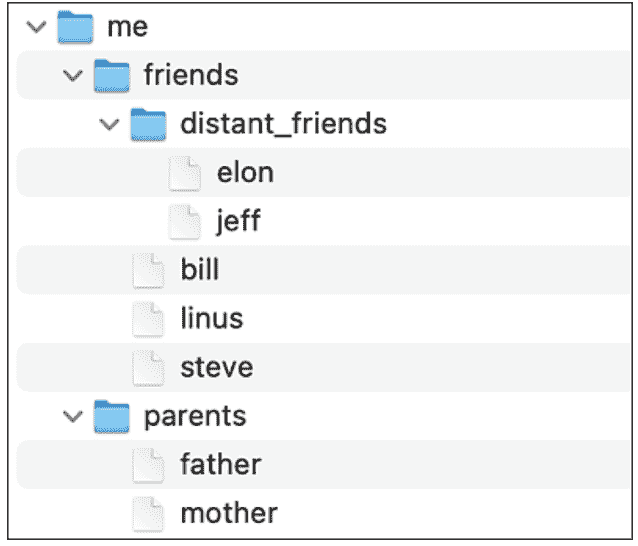

**图 30.1** 示例目录树

假设当前工作目录是 `me` 文件夹的直接父文件夹。

然后我们查看 `me` 目录的 `walk` 输出：

```
>>> for t in os.walk("me"):
...     print(t)
...
('me', ['parents', 'friends'], [])
('me/parents', [], ['father', 'mother'])
('me/friends', ['distant_friends'], ['bill', 'linus', 'steve'])
('me/friends/distant_friends', [], ['elon', 'jeff'])
```

如你所见，为每个文件夹创建了一个包含所述信息的元组。双反斜杠（\）的出现是因为该示例是在 Windows 机器上执行的，字符串字面量中的反斜杠必须写成转义序列。

你也可以根据需要自定义元组中存储的列表——例如，更改访问当前目录子目录的顺序，或者如果你进行了添加或删除文件和文件夹等更改。

| 名称 | 描述 |
| :--- | :--- |
| `access(path, mode)` | 检查程序对传递的 `path` 拥有的访问权限。 |
| `chdir(path)` | 将当前工作目录设置为 `path`。 |
| `getcwd()` | 返回当前工作目录的路径。 |
| `chmod(path, mode)` | 更改 `path` 的访问权限。 |
| `listdir([path])` | 创建位于 `path` 下的所有文件和目录的列表。 |
| `mkdir(path, [mode])` | 在 `path` 创建一个新目录。 |
| `makedirs(path, [mode])` | 在 `path` 创建一个新目录。如有必要，也会创建父目录。 |
| `remove(path)` | 从文件系统中删除由 `path` 指定的文件。 |
| `removedirs(path)` | 删除整个文件夹结构。在此过程中，它会从最低级别到最高级别依次删除所有文件夹，前提是它们是空的。 |
| `rename(src, dst)` | 将由 `src` 指定的文件或文件夹重命名为 `dst`。 |
| `renames(src, dst)` | 类似于 `rename`，但如果需要，会创建目标路径的目录结构。此外，在重命名过程之后，它会尝试使用 `removedirs` 清理 `src` 路径中的空文件夹。 |
| `replace(src, dst)` | 用 `src` 替换 `dst` 文件或目录。 |
| `rmdir(path)` | 从文件系统中删除传递的目录，如果目录不存在则引发 `os.error` 异常。这仅适用于空目录。 |
| `walk(top, [topdown, onerror])` | 递归遍历 `top` 下的目录树。 |

**表 30.1** 访问文件系统的方法。

### 30.2 文件路径：os.path

不同平台对文件系统路径有不同的约定。例如，Windows操作系统要求绝对路径名以驱动器号开头，而Unix则在路径前加上斜杠。此外，路径中各个文件夹的分隔符也不同；微软选择了反斜杠，而Unix世界则普遍使用斜杠。

作为跨平台软件的程序员，你现在面临的问题是，你的程序必须处理这些不同的约定以及其他操作系统的约定。

为了方便地处理文件系统路径，开发了`os.path`模块。

你可以通过两种不同的方式使用此模块：

- 你可以先导入`os`，然后通过`os.path`访问它。
- 你可以直接导入`os.path`。

表30.4概述了`os.path`模块最重要的函数。

| 名称 | 描述 |
| :--- | :--- |
| `abspath(path)` | 返回相对路径对应的绝对路径和规范化路径（参见`os.normpath`）。 |
| `basename(path)` | 返回路径的基本名称。 |
| `commonprefix(list)` | 返回路径列表`list`的最长公共基础路径。 |
| `dirname(path)` | 返回`path`所在目录的路径，例如用于确定文件的父目录。 |
| `exists(path)` | 如果路径在文件系统中存在，则返回`True`，否则返回`False`。 |
| `getatime(path)` | 返回`path`的最后访问时间，以Unix时间戳表示。* |
| `getmtime(path)` | 返回`path`的最后修改时间，以Unix时间戳表示。 |
| `getsize(path)` | 返回`path`下找到的文件的大小（以字节为单位）。返回值始终是`int`实例。 |
| `isabs(path)` | 如果`path`是绝对路径规范，则返回`True`，否则返回`False`。 |
| `isfile(path)` | 如果`path`指向一个文件，则返回`True`，否则返回`False`。该函数可能会跟踪符号链接。 |
| `isdir(path)` | 如果传递的路径指向一个文件夹，则返回`True`，否则返回`False`。 |
| `islink(path)` | 如果`path`指向一个符号链接，则返回`True`，否则返回`False`。 |
| `join(path, *paths)` | 将传递的路径连接成一个完整的路径。 |
| `normcase(path)` | 将Unix路径转换为Windows路径。 |
| `realpath(path)` | 返回一个不包含符号链接的等效路径。 |
| `split(path)` | 将`path`拆分为目录和文件。两个元素都以元组形式返回。 |
| `splitdrive(path)` | 将`path`拆分为驱动器号和驱动器上的路径。两个元素都以元组形式返回。 |
| `splitext(path)` | 将`path`拆分为文件路径和文件扩展名。两个元素都以元组形式返回。 |

* Unix时间戳是整数，表示自Unix纪元开始以来的秒数——即自1970年1月1日以来。

表30.4 os.path模块最重要的函数

### 30.2.1 abspath(path)

此函数返回相对路径对应的绝对路径和规范化路径（参见`os.normpath`）。以下示例说明了其工作原理：

```
>>> os.path.abspath(".")
'Z:\\examples\\os'
```

在这个例子中，使用指向当前目录的相对路径"."，我们发现我们的脚本存储在`'Z:\\examples\\os'`。

### 30.2.2 basename(path)

此函数返回路径的所谓基本名称。路径的基本名称是最后一个文件夹分隔符（如\或/）之后的部分。此函数非常适合从完整路径中提取文件名：

```
>>> os.path.basename(r"C:\Games\StrategyGames\Civilization.exe")
'Civilization.exe'
```

> **注意**
>
> 此函数与Unix命令`basename`的不同之处在于，如果字符串以文件夹分隔符结尾，它会返回一个空字符串：

```python
>>> os.path.basename(r"/usr/include/")
''
```

相比之下，同名Unix命令的输出如下所示：

```bash
$ basename /usr/include/
include
```

### 30.2.3 commonprefix(list)

此函数返回一个字符串，其中包含`list`中所有路径的最长公共前缀：

```
>>> os.path.commonprefix([
...     r"C:\Games\StrategyGames\Civilization.exe",
...     r"C:\Games\ShooterGames\Counterstrike.exe",
...     r"C:\Games\StrategyGames\TheSettlers.exe"])
'C:\\Games\\S'
```

不能保证结果字符串也是一个有效且存在的路径，因为路径被视为简单的字符串。

### 30.2.4 dirname(path)

此函数返回`path`的父文件夹：

```
>>> os.path.dirname(r"C:\Games\StrategyGames\Civilization.exe")
'C:\\Games\\StrategyGames'
```

与`os.path.basename`一样，对于以文件夹分隔符结尾的路径，`dirname`的行为也不同：

```
>>> os.path.dirname(r"/usr/include")
'/usr'
>>> os.path.dirname(r"/usr/include/")
'/usr/include'
```

### 30.2.5 join(path, *paths)

此函数通过连接将传递的路径规范合并为单个路径。这里使用的是操作系统通常的分隔符：

```
>>> os.path.join(r"C:\Games", r"StrategyGames\Civilization.exe")
'C:\\Games\\StrategyGames\\Civilization.exe'
```

如果第二个或后续参数传递了绝对路径，os.path.join将忽略所有先前传递的路径：

```
>>> os.path.join(r"This\gets\ignored", r"C:\Games",
r"StrategyGames\Civilization.exe")
'C:\\Games\\StrategyGames\\Civilization.exe'
```

### 30.2.6 normcase(path)

在路径不区分大小写的操作系统（例如Windows）上，所有大写字母都会被替换为相应的小写字母。此外，在Windows上，所有斜杠都会被替换为反斜杠：

```
>>> os.path.normcase(r"C:\Games/StrategyGames/Civilization.exe")
'c:\\games\\strategygames\\civilization.exe'
```

在Unix上，传递的路径将不加修改地返回。

### 30.2.7 split(path)

此函数将传递的路径拆分为它所描述的文件夹或文件的名称以及指向父目录的路径，并返回一个包含这两个部分的元组：

```
>>> os.path.split(r"C:\Games\StrategyGames\Civilization.exe")
('C:\\Games\\StrategyGames', 'Civilization.exe')
```

> **注意**
>
> 如果路径以斜杠或反斜杠结尾，元组的第二个元素是空字符串：

```
>>> os.path.split("/home/username/")
('/home/username', '')
```

### 30.2.8 splitdrive(path)

如果平台支持驱动器规范，此函数将传递的路径拆分为驱动器规范和路径的其余部分：

```
>>> os.path.splitdrive(r"C:\Games/StrategyGames/Civilization.exe")
('C:', '\\Games/StrategyGames/Civilization.exe')
```

在不支持驱动器字母的操作系统上，元组的第一个字符串是空字符串：

```
>>> os.path.splitdrive("/usr/share/bin")
('', '/usr/share/bin')
```

### 30.2.9 splitext(path)

此函数将`path`拆分为文件路径和文件扩展名。两个元素都以元组形式返回：

```
>>> os.path.splitext(r"C:\Games\StrategyGames\Civilization.exe")
('C:\\Games\\StrategyGames\\Civilization', '.exe')
```

使用可选的`topdown`参数（其默认值为`True`），你可以指定遍历应从何处开始。默认设置是从目录树中最接近根目录的目录开始；在示例中，那就是`me`。如果`topdown`设置为`False`，那么`os.walk`将做完全相反的事情，从最深的嵌套文件夹开始。在示例树中，那就是`me/friends/distant_friends`：

```
>>> for t in os.walk("me", False):
...     print(t)
...
('me/parents', [], ['father', 'mother'])
('me/friends/distant_friends', [], ['elon', 'jeff'])
('me/friends', ['distant_friends'], ['bill', 'linus', 'steve'])
('me', ['parents', 'friends'], [])
```

最后但同样重要的是，你可以使用最后一个参数`onerror`来指定在检索目录内容时发生错误时函数应如何表现。为此，你可以传递一个函数的引用，该函数期望一个参数。在发生错误时，该函数将被调用，并传递一个描述错误的`os.error`实例作为参数。

> **注意**
>
> 如果你使用支持目录符号链接的操作系统，这些符号链接在遍历结构时不会被包含，以避免无限循环。

> **注意**
>
> 如果你指定了一个相对路径名，如我们的示例所示，你不能在执行期间通过`os.walk`更改当前工作目录。如果你这样做，可能会导致未定义的行为。

### 30.3 访问文件系统：shutil

`shutil` 模块可视为 `os` 和 `os.path` 的补充，包含特别与复制和删除文件相关的函数。它抽象了平台特定的命令，例如 Windows 上的 `copy` 或 Unix 上的 `cp`。此外，`shutil` 还包含用于创建和解压归档文件（如 ZIP 或 TAR 归档）的函数。

表 30.5 列出了 `shutil` 实现的函数，其中 `src` 和 `dst` 参数是分别包含源文件和目标文件路径的字符串。

| 名称 | 描述 |
| :--- | :--- |
| **目录和文件操作** | |
| `chown(path, [user, group])` | 将 `path` 的所有者和组分别设置为传入的 `user` 和 `group` 值。 |
| `copy(src, dst, [follow_symlinks])` | 将 `src` 下的文件复制到 `dst`。与 `copyfile` 不同，`dst` **也可以指向要将文件复制到的目录。** |
| `copyfile(src, dst, [follow_symlinks])` | 将 `src` 下的文件复制到 `dst`。如果 `dst` 下已存在同名文件，将被覆盖且不提示。为此，`dst` 路径必须可写。否则将引发 `PermissionError` 异常。 |
| `copyfileobj(fsrc, fdst, [length])` | 将为读取而打开的 `fsrc` 文件对象的内容复制到为写入而打开的 `fdst` 对象。 |
| `copymode(src, dst, [follow_symlinks])` | 将访问权限从 `src` 路径复制到 `dst` 路径。在此过程中，`dst` 的内容以及所有者和组保持不变。两个路径都必须在文件系统中已存在。 |
| `copystat(src, dst, [follow_symlinks])` | 类似于 `copymode`，但此外还会复制最后访问时间和最后修改时间。 |
| `copy2(src, dst, [follow_symlinks])` | 类似于 `copy`，但也会复制最后访问时间和最后更改时间。 |
| `copytree(src, dst, [symlinks, ignore, copy_function, ignore_dangling_symlinks])` | 将 `src` 下的整个目录结构复制到 `dst`。 |
| `disk_usage(path)` | 以元组形式返回 `path` 下的内存容量、使用情况和可用内存信息。 |
| `ignore_patterns([*patterns])` | 创建一个函数，可传递给 `copytree` 函数的 `ignore` 参数，以排除某些文件不被复制。 |
| `move(src, dst)` | 将文件或文件夹从 `src` 移动到 `dst`。 |
| `rmtree(src, [ignore_errors, onerror])` | 删除 `src` 下的整个目录结构。 |
| `which(cmd, [mode, path])` | 返回与 `cmd` 命令关联的可执行文件的路径。 |

### 归档操作

| 名称 | 描述 |
| :--- | :--- |
| `make_archive(base_name, format, [root_dir])` | 创建一个包含 `root_dir` 目录中文件的归档文件，并返回归档的名称。 |
| `get_archive_formats()` | 返回可用于创建归档的格式列表。 |
| `get_unpack_formats()` | 返回可用于解压归档的格式列表。 |
| `unpack_archive(filename, [extract_dir, format])` | 将 `filename` 下的归档解压到 `extract_dir` 目录。 |

**表 30.5** shutil 模块的函数

在接下来的章节中，我们将首先更详细地描述目录和文件的函数，然后是归档操作。为了能够执行列出的示例，必须首先导入 `shutil` 模块：

```
>>> import shutil
```

## 30.3.1 目录和文件操作

**copy(src, dst [follow_symlinks])**

此操作将 `src` 路径下的文件复制到 `dst`。`dst` 参数可以包含一个文件路径，该文件将被创建或覆盖。如果 `dst` 指向一个文件夹，则将在 `dst` 文件夹中创建一个与 `src` 文件名相同的新文件，或在必要时覆盖。这是与 `copyfile` 函数的主要区别，后者不接受任何文件夹作为其目标。

访问权限也会被复制。

如果 `follow_symlinks` 参数的值为 `False`，则会复制符号链接本身，而默认值 `True` 确保复制的是符号链接引用的文件，而不是符号链接。

## **copytree(src, dst, [symlinks, ignore, copy_function, ignore_dangling_symlinks])**

此操作将 `src` 下的整个目录结构复制到 `dst`。`dst` 路径不能指向一个已存在的文件夹，并且 `dst` 路径中所有缺失的目录都将被创建。

可选的 `symlinks` 参数指定如何处理符号链接。如果 `symlinks` 的值为 `False` 或未指定 `symlinks`，则链接的文件或文件夹本身将被插入到复制的目录结构中。如果 `symlinks` 的值为 `True`，则只复制链接。如果 `symlinks` 的值为 `False` 且 `ignore_dangling_symlinks` 参数设置为 `True`，则当符号链接指向不存在的文件时发生的错误将被忽略。

`ignore` 参数期望一个函数，该函数用于排除某些文件不被复制。`ignore_patterns` 函数用于创建这样的函数。以下示例创建了一个忽略所有以 ".txt" 结尾的文件名以及以 "tmp" 开头的文件名的函数：

```
>>> my_ignore_function = shutil.ignore_patterns("*.txt", "tmp*")
```

通过 `copy_function` 参数传递的函数用于复制文件，其中 `copy2` 是默认值。

`copytree` 函数内部使用 `copystat` 函数来设置创建的目录和文件的权限。

## **rmtree(src, [ignore_errors, onerror])**

这将删除 `src` 下的整个目录结构。对于 `ignore_errors`，可以传递一个真值，该值决定在删除过程中发生的错误是应该被忽略还是由为 `onerror` 传递的函数处理。如果未指定 `ignore_errors`，则发生的任何错误都将引发异常。

如果指定 `onerror`，它必须是一个期望三个参数的函数：

- `function`
  导致错误的函数的引用。这可以是 `os.listdir`、`os.remove` 或 `os.rmdir`。
- `path`
  发生错误的路径。
- `excinfo`
  错误上下文中 `sys.exc_info` 的返回值。

> **注意**

`onerror` 函数引发的异常不会被捕获。

## 30.3.2 归档操作

对于以下示例，我们假设当前工作目录包含一个名为 `data` 的目录，其结构如图 30.2 所示。

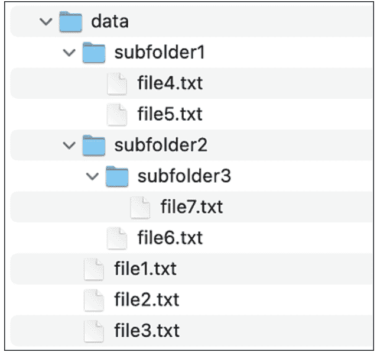

**图 30.2** 归档函数的示例数据

## make_archive(base_name, format, [root_dir, base_dir, verbose, dry_run, owner, group, logger])

此函数创建一个包含 `root_dir` 目录中文件的新归档。如果未指定 `root_dir`，则将打包当前工作目录的文件。`base_name` 参数指定归档文件的位置和名称，但*不应*包含文件扩展名。

归档文件的所需格式通过 `format` 参数指定。你可以通过 `get_archive_formats` 函数（后文描述）获取可用的归档格式。

`make_archive` 的典型调用如下所示：

```
>>> shutil.make_archive("test", "zip", "data")
'[...]/test.zip'
```

`unzip` Unix 程序使我们能够查看归档包含 `data` 目录中的所有文件：

```
$ unzip -v test.zip
Archive:  test.zip
 Length   Method    Size  Name
 ------    ------    ----  ----
       2  Defl:N        4  file2.txt
       2  Defl:N        4  file3.txt
       2  Defl:N        4  file1.txt
       2  Defl:N        4  subfolder1/file5.txt
       2  Defl:N        4  subfolder1/file4.txt
       2  Defl:N        4  subfolder2/file6.txt
       2  Defl:N        4  subfolder2/subfolder3/file7.txt
```

如果你想只打包 `root_dir` 的一个子目录中的文件，包括相应的相对路径，你可以通过 `base_dir` 参数实现。

在以下示例中，我们将只打包 `subfolder2` 子目录中的文件，同时保留 `data` 目录内的相对路径：

```
>>> shutil.make_archive("test2", "zip", "data", "subfolder2")
'[...]/test2.zip'
```

我们再次使用 `unzip` 来检查归档的内容：

```
$ unzip -v test2.zip
Archive:  test2.zip
 Length   Method    Size  Name
 ------    ------    ----  ----
       2  Defl:N        4  subfolder2/file6.txt
       2  Defl:N        4  subfolder2/subfolder3/file7.txt
```

你可以看到 `subfolder2` 目录中的所有文件和文件夹都已被打包，并保留了相对于 `data` 目录的路径——即 `subfolder2`。

对于技术性且很少使用的 `verbose`、`dry_run`、`owner`、`group` 和 `logger` 参数，我们建议你参考 Python 文档。

函数 `get_archive_formats` 返回一个包含两个元素的元组列表，描述可用于创建归档的格式：

### 30.4 临时文件：tempfile

如果你的程序需要处理大量数据，将所有数据同时保存在内存中通常是不现实的。为此，你可以使用临时文件，它允许你将当前不需要的数据暂时交换到硬盘上。然而，临时文件不适合永久存储数据。

为了方便地处理临时文件，Python 提供了 `tempfile` 模块。

该模块最重要的函数是 `TemporaryFile`，它返回一个与新临时文件关联的已打开文件对象。该文件以二进制模式（"w+b"）打开，支持读写访问。作为该函数的使用者，我们除了读写数据外，无需操心其他任何事情。该模块确保临时文件被创建，并在文件对象关闭时将其删除。特别地，这包括文件对象被垃圾回收时的隐式关闭。

将程序数据交换到硬盘上存在安全风险，因为其他程序可能读取这些数据，从而可能获取与安全相关的信息。因此，`TemporaryFile` 会尝试在创建后立即将文件从文件系统中移除，以将其隐藏起来，不让其他程序发现，前提是操作系统支持此过程。此外，文件名使用由六个字符组成的随机字符串，这使得其他程序很难确定一个临时文件属于哪个程序。

尽管在大多数情况下你会无参数调用 `TemporaryFile`，但让我们来看看完整的接口。

### 30.4.1 TemporaryFile([mode, [bufsize, suffix, prefix, dir]])

`mode` 和 `bufsize` 参数对应于内置 `open` 函数的同名参数（你可以在[第 6 章，第 6.2.1 节](https://example.com)中找到更多信息）。如果需要，你可以使用 `suffix` 和 `prefix` 来自定义新临时文件的名称。你为 `prefix` 传递的内容将放在自动生成的文件名之前，而 `suffix` 的值将附加到文件名的末尾。此外，你可以使用 `dir` 参数指定文件应创建的文件夹。默认情况下，`TemporaryFile` 会自动处理文件的位置。

为了说明 `TemporaryFile` 的用法，这里有一个小例子，它首先将一个字符串存储在临时文件中，然后将其读回：

```
>>> import tempfile
>>> with tempfile.TemporaryFile() as tmp:
...     tmp.write(b"Hello buffer")
...     tmp.seek(0)
...     data = tmp.read()
...     data
...
b'Hello buffer'
```

请注意，在这个例子中，我们必须向 `write` 方法传递一个 `bytes` 字符串，因为临时文件是以二进制模式打开的。如果你想将 `str` 对象写入临时文件，必须以 "w" 文本模式打开文件，或者在保存时使用 `encode` 方法将字符串转换为 `bytes` 对象。

如果你不希望临时文件被隐藏，应该使用 `NamedTemporaryFile` 函数，它具有与 `TemporaryFile` 相同的接口，行为也相同，只是该文件对其他程序是可访问的。

### 30.4.2 tempfile.TemporaryDirectory([suffix, prefix, dir])

使用 `tempfile.TemporaryDirectory`，你可以利用操作系统提供的所有手段来创建临时文件夹，以防止对临时数据的未授权访问。`tempfile.TemporaryDirectory` 的接口可以与 `tempfile.TemporaryFile` 类似地使用。

返回值是临时文件夹的绝对路径名：

```
>>> tempfile.TemporaryDirectory()
<TemporaryDirectory '/tmp/T/tmpf3ywp03w'>
```

## 31 并行编程

本章将介绍使用 Python 进行并行编程，它允许多个任务同时执行。在开始介绍技术细节和示例程序之前，我们将解释一些术语，并探讨现代操作系统工作方式的某些方面。

> **注意**

在本章中，我们一致使用 f-strings 进行字符串格式化（参见[第 12 章](Chapter 12)，[第 12.5.3 节](Section 12.5.3)），而不是其他章节中使用的 `format` 方法。特别是，本章也作为 f-strings 在具体应用中使用的示例集。

### 31.1 进程、多任务和线程

作为现代计算机的用户，我们习惯于多个程序可以同时运行。例如，我们在写电子邮件的同时，后台正在将最新的度假视频转换为另一种格式，并且流媒体服务正在播放我们喜欢的歌曲。[图 31.1](Figure 31.1) 显示了一个典型的工作会话，每个方框代表一个正在运行的程序。方框沿时间轴的长度表示相应进程运行了多长时间。

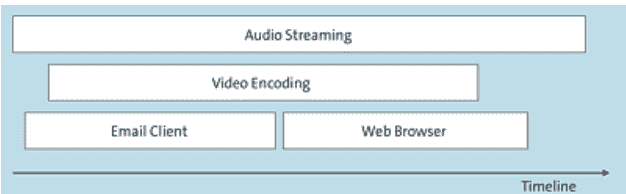

**图 31.1** 多个进程同时运行

然而，实际上，一个处理器在给定时间只能执行一个任务，而不能同时执行多个任务。即使在具有多个核心的现代处理器上，或者在具有多个处理器的计算机上，可以同时执行的程序数量也受到核心或处理器数量的限制。那么，引言中描述的场景如何在只有一个处理器、只有一个核心的计算机上实现呢？

这背后的诀窍非常简单，因为机器的限制被巧妙地隐藏起来，让用户相信多个程序正在同时运行。这是通过以下方式实现的：一个程序被允许在非常短的 *时间片* 内独占使用处理器。在这样的时间片过后，控制权再次从程序中夺走，保存其当前状态。然后，时间片可以分配给下一个程序。在程序等待分配时间片的期间，它被称为 *休眠*。

你可以将计算机的工作想象成以极快的速度唤醒每个正在运行的程序，让它运行一小段时间，然后将其放回休眠状态，再继续处理下一个程序。由于进程之间切换的速度非常快，用户不会注意到这一点。不同进程的管理和时间片的分配由操作系统负责，因此操作系统也被称为 *多任务系统*。

因此，我们最初例子的正确表示应该更像 [图 31.2](#)。每个小方框象征一个时间片。

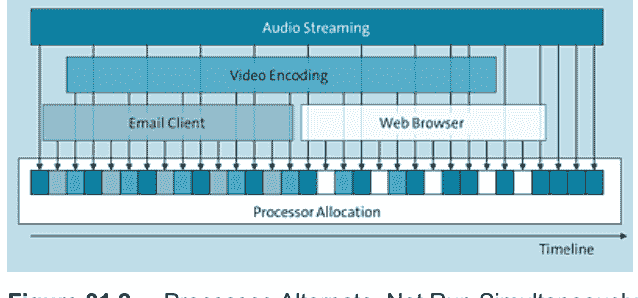

**图 31.2** 进程交替运行，而非同时运行

#### 31.1.1 进程中的轻量级单元：线程

在进程内部，如果程序是顺序执行的，一次只能执行一个任务。然而，在许多情况下，程序同时执行多个操作是有利的。例如，在进行复杂计算时，用户界面不能冻结，而应显示当前状态，并且用户必须能够在必要时取消计算。另一个例子是 Web 服务器，在处理客户端请求时，也必须能够响应其他请求。

通过创建更多进程，可以绕过一次只能执行一个操作的限制。然而，创建进程会消耗大量资源，并且进程之间的数据交换也必须处理，因为每个进程都有自己独立的内存，该内存受到保护，不会被其他进程访问。

另一种并行化程序的方式是所谓的线程。*线程*是进程内独立执行的操作序列。默认情况下，每个进程恰好有一个线程，负责执行该进程中的程序流程。

然而，现在一个进程也可以启动多个线程，这些线程随后会被操作系统像进程一样看似同时地执行。线程相对于进程的优势在于，一个进程的线程共享其全局变量的内存。因此，如果一个线程中更改了全局变量，该新值也会立即对该进程的所有其他线程可见。[137] 此外，操作系统管理线程的开销比管理进程要小，因为在同一进程内切换到另一个线程可以保留部分上下文。这就是为什么线程也被称为*轻量级进程*。

图 31.3 展示了进程中的线程。

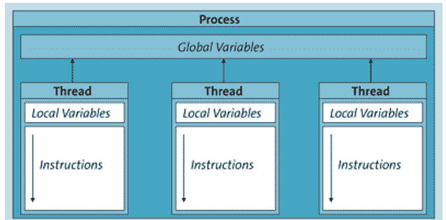

**图 31.3** 一个包含三个线程的进程

> **注意**

在 CPython 中，[138] 由于技术原因，目前不幸的是没有办法在不同的处理器或处理器核心上运行不同的线程。因此，即使严重依赖线程的 Python 程序也只能使用单个处理器或处理器核心。

我们在此不想深入探讨这种情况的背景。你可以通过搜索“全局解释器锁”（GIL）在网上找到更多信息。

## 31.1.2 线程还是进程？

你应该使用线程还是进程来并行化你的程序，这取决于你的需求。例如，如果你正在开发一个在后台执行耗时计算，同时又希望程序界面能及时响应用户输入的程序，那么线程是一个不错的选择。同样，线程也适用于处理像网络连接这样的慢速输入/输出接口：当一个线程在等待新数据时，另一个线程可以处理已经接收到的数据。

如果你的程序必须处理大量数据或执行复杂计算，因此你想利用多个处理器核心的全部计算能力，情况就不同了。在这种情况下，由于前面提到的 CPython 的限制，你被迫使用进程。

## 31.1.3 协作式多任务：第三条路

到目前为止，我们已经探讨了并行编程的两种主要方法：

-   *线程*是进程内的并行控制流。这使得它们轻量级，并允许它们访问共享内存。由于线程在时间片中交替执行，对共享数据的访问必须加以保护以保证其一致性。

-   *进程*是并行执行的程序，它们在独立的内存段中运行。这确保了进程所用数据的一致性，但作为交换，进程间的数据交换通信必须单独处理。

线程和进程都属于*抢占式多任务*的范畴。这指的是并行执行的方法，其中操作系统过早地中断一个线程或进程的执行，以便切换到另一个线程或进程。这种快速切换实现了线程和进程的准并行执行。[139]

抢占式多任务的一个替代方案是*协作式多任务*。这里，系统也在程序的不同控制流之间切换以实现准并行执行，但决定何时切换的不是操作系统，而是程序本身。不同的控制流相互协作，并在合适的时机相互通知进行上下文切换——例如，在等待外部计算或数据访问的响应时。

协作方法使得确保不同控制流共享的数据一致性变得容易。另一方面，程序员必须明确地处理协作问题。Python 在这里提供了一些工具，以使这尽可能简单。

### 31.2 Python 的并行化接口

Python 为程序部分的并行执行提供了各种接口。具体使用哪个接口取决于具体的应用（见表 31.1）。

| 接口 | 特性 |
| :--- | :--- |
| `concurrent.futures` | 用于执行线程和进程的接口，具有高度抽象、低灵活性且无同步能力 |
| `threading`, `multiprocessing` | 用于执行线程和进程的接口，抽象程度较低、灵活性高，并提供同步可能性 |
| `asyncio` | 用于协作式多任务的接口 |

**表 31.1** Python 的并行化接口

对于可以独立执行且无需数据交换的简单任务，你可以使用 `concurrent.futures` 模块。[140] 它提供了一个便捷的接口，允许在不同的线程或进程中执行函数调用。在此上下文中，假设每个函数调用都可以独立于其他调用运行，调用的顺序不必起任何作用，并且不同的函数调用之间不得交换数据。

另一方面，`threading` 和 `multiprocessing` 模块为在并行程序中以安全方式在线程或进程之间交换数据提供了强大的工具。在内部，`concurrent.futures` 分别使用了 `threading` 和 `multiprocessing` 模块的功能，因此它不是一个独立的实现，而是一个额外的抽象层。

`async` 和 `await` 关键字，以及像 `asyncio` 这样用于协作执行特定任务的库，构成了 Python 支持实现协作式多任务的基础。

我们将首先探讨更抽象的 `concurrent.futures` 接口，然后讨论在 `threading` 和 `multiprocessing` 中同步多个线程或进程的一些选定问题。在本章的最后，我们将看看协作式多任务。

### 31.3 抽象接口：concurrent.futures

针对程序必须执行复杂但独立任务的情况，开发了 `concurrent.futures` 模块。该模块允许你方便地在线程或进程中执行函数调用。

提供了 `ThreadPoolExecutor` 和 `ProcessPoolExecutor` 类，它们的实例分别代表一组线程和进程。这两个类实现了一个共同的接口——即执行器的接口。*执行器*用于处理一系列任务，它可以利用多个*工作者*——即线程或进程。

执行器的接口包括表 31.2 中列出的方法。

| 方法 | 描述 |
| :--- | :--- |
| `submit(fn, [*args], {**kwargs})` | 向执行器注册一个新任务。该任务由使用 `args` 和 `kwargs` 参数调用 `fn` 函数组成。 |
| `map(fn, [*iterables], {timeout})` | 将 `fn` 函数应用于 `iterables` 可迭代对象的所有元素，并创建一个结果迭代器。 |
| `shutdown([wait, cancel_futures])` | 指示执行器在传递的任务处理完毕后立即释放所有使用的资源。 |

**表 31.2** 执行器类的方法

你可以将执行器想象成一个由多个工作者组成的团队的老板，你通过 `submit` 方法向其传达你希望团队完成的任务。将这些任务分配给各个工作者由执行器处理。

在创建新的执行器实例时，我们可以使用 `max_workers` 关键字参数指定所需的工作者数量。

### 31.3.1 使用 futures.ThreadPoolExecutor 的示例

在下面的示例中，我们将使用 `ThreadPoolExecutor` 在三个线程中执行一个简单示例函数的四次调用：

```python
from concurrent import futures
from time import sleep, time

def test(t):
    sleep(t)
    print(f"I have waited for {t} seconds. Time: {time():.0f}")

e = futures.ThreadPoolExecutor(max_workers=3)
print(f"Start time:                {time():.0f}")
e.submit(test, 9)
e.submit(test, 2)
e.submit(test, 5)
e.submit(test, 6)
print("All tasks started.")
e.shutdown()
print("All tasks completed.")
```

`test` 函数在屏幕上生成延迟输出，其中 `t` 参数可用于指定延迟的长度。在示例中，我们让执行器以不同的延迟调用此函数，产生以下输出：

```
Start time:                1428830988
All tasks started.
I have waited for 2 seconds. Time: 1428830990
I have waited for 5 seconds. Time: 1428830993
I have waited for 6 seconds. Time: 1428830996
I have waited for 9 seconds. Time: 1428830997
All tasks completed.
```

输出的时间戳证明函数调用是并行执行的：等待时间为2秒、5秒和9秒的输出，其延迟时间恰好等于各自的等待时间。如果调用是顺序处理的，时间将会累加。

一个例外是等待时间为6秒的调用，通过比较时间戳可以看到，它在8秒后才出现在屏幕上。这种延迟的原因是我们执行器的工作线程数量。执行器内部管理着一个已提交任务的队列。该队列按照相应的`submit`调用顺序进行处理。在我们的示例中，执行器有三个线程可用于完成四个任务。因此，首先在一个线程中启动了参数为9的`test`函数调用。在参数为2和5的调用在各自的线程中启动后，执行器达到了我们定义的最大工作线程数。因此，参数为6的调用必须等到一个工作线程再次可用时才能开始。2秒后，等待时间最短的任务终止，因此参数为6的调用相应地延迟启动。

另一个有趣的事实是`submit`和`shutdown`方法的不同行为：每次`submit`调用都会立即将控制权返回给调用者，而不会等待传递的函数完成其工作。因此，“所有任务已启动。”的输出出现在`test`函数的输出之前。另一方面，`shutdown`调用会阻塞调用者的执行，直到所有任务都被处理完毕，然后释放所使用的资源。

如果为`wait`参数传递值`False`，`shutdown`也会立即将控制权返回给调用者，以便工作可以继续进行而无需延迟。然而，只要后台仍在进行工作，整个程序就不会终止。需要注意的是，在调用`shutdown`之后，执行器不能再接受任何新任务。

因此，如果我们在示例程序中将`e.shutdown()`行替换为`e.shutdown(False)`，输出将如下所示：

```
Start time:                     1428829782
All tasks started.
All tasks completed.
I have waited for 2 seconds. Time: 1428829784
I have waited for 5 seconds. Time: 1428829787
I have waited for 6 seconds. Time: 1428829788
I have waited for 9 seconds. Time: 1428829791
```

如你所见，调用`e.shutdown`后的输出现在立即出现在屏幕上，尽管后台仍有工作在进行。尽管如此，Python会等待仍在运行的后台进程，因此任何剩余的输出仍会在程序终止前出现。

在Python 3.9中，`shutdown`方法增加了`cancel_futures`参数。如果为此参数传递值`True`而不是默认值`False`，那么在调用`shutdown`时尚未启动的任务将不再启动。然而，在这种情况下，已经开始执行的任务仍将执行直至终止。

## 31.3.2 执行器实例作为上下文管理器

执行器实例的典型生命周期是：创建它，向其分配任务，然后等待任务完成，最后将其释放。

通常，执行器通过`with`语句用作上下文管理器，这消除了显式调用`shutdown`的需要。我们示例中的最后一部分可以替换为以下`with`块：

```
print(f"Start time: {time():.0f}")
with futures.ThreadPoolExecutor(max_workers=3) as e:
    e.submit(test, 9)
    e.submit(test, 2)
    e.submit(test, 5)
    e.submit(test, 6)
    print("All tasks started.")
print("All tasks completed.")
```

当你通过`with`将执行器用作上下文管理器时，`with`块不会退出，直到所有分配的任务完成，因为`e.shutdown`方法被隐式地无参数调用。

## 31.3.3 使用futures.ProcessPoolExecutor

要使用进程而不是线程进行并行化（如前面的示例），需要将`ThreadPoolExecutor`类替换为`ProcessPoolExecutor`。此外，你必须确保子进程不会递归地启动新进程。定制后的示例程序如下所示：

```
from concurrent import futures
from time import sleep, time

def test(t):
    sleep(t)
    print(f"I have waited for {t} seconds. Time: {time():.0f}")

if __name__ == "__main__":
    print(f"Start time: {time():.0f}")
    with futures.ProcessPoolExecutor(max_workers=3) as e:
        e.submit(test, 9)
        e.submit(test, 2)
        e.submit(test, 5)
        e.submit(test, 6)
        print("All tasks started.")
    print("All tasks completed.")
```

除了使用`ProcessPoolExecutor`代替`ThreadPoolExecutor`外，我们还利用了`__name__`全局变量来检查Python文件是否被直接执行，并且仅在这种情况下才启动子进程。原因是启动子进程的Python文件必须能被它们作为模块导入。[ 141 ] `__name__`全局变量的值仅在文件被Python解释器直接执行时为"`__main__`"。另一方面，如果文件作为模块导入，则它具有不同的值——即模块的名称。因此，此查询可防止子进程在模块被导入时重新执行`if`块中的代码。

> **注意**

当然，交互式会话无法从子进程中导入。这导致在Windows上，例如，`ProcessPoolExecutor`无法在Python的交互模式下使用。

现在你能够在不同的线程或进程中并行执行函数。在下一节中，我们将探讨如何访问并行函数调用的返回值。

## 31.3.4 管理执行器的任务

入门示例中的`test`函数设计得特别简单，因为它没有调用者可以使用的返回值。然而，更有趣的是那些在（可能很长的）计算后返回值的函数。

### 用于复杂计算的模型函数

作为模型示例，我们现在将定义一个函数，该函数使用沃利斯乘积来近似计算π的值。[ 142 ]

$$\frac{2}{1} \cdot \frac{2}{3} \cdot \frac{4}{3} \cdot \frac{4}{5} \cdot \frac{6}{5} \cdot \frac{6}{7} \cdot \frac{8}{7} \cdot \frac{8}{9} \cdots = \frac{\pi}{2}$$

分子总是包含偶数，每两个因子增加2。分母只包含奇数，除了第一个因子外，也每两个因子增加2。

我们将实现`approximate_pi`函数，该函数通过乘以沃利斯乘积的前$n$个因子来近似$\pi$：

```
def approximate_pi(n):
    pi_half = 1
    numerator, denominator = 2.0, 1.0
    for i in range(n):
        pi_half *= numerator / denominator
        if i % 2:
            numerator += 2
        else:
            denominator += 2
    return 2*pi_half
```

例如，当参数`1000`用于$n$时，该函数产生以下输出，其中只有前两位小数是正确的：

```
>>> approximate_pi(1000)
3.140023818600586
```

随着$n$值的增加，会计算出越来越好的π近似值，但这必须以更多的计算时间为代价。例如，在我们的测试计算机上，使用`n=30000000`的调用大约需要八秒。

因此，使用`approximate_pi`，我们有了一个示例函数，它充分利用了一个处理器核心，并且对于较大的$n$值，计算时间越来越长。在接下来的程序中，`approximate_pi`作为一个复杂函数的示例，其运行时特性取决于参数值的选择。

现在我们将在多个线程或进程中运行`approximate_pi`。

### 访问计算结果

在入门示例中，我们使用了执行器实例的`submit`方法将新任务加入执行器的队列。每次调用`submit`方法都会返回一个`futures.Future`类型的实例，我们之前忽略了它。你可以将此实例视为一个取票凭证，它允许你检查已提交任务的状态并在计算完成后收集结果。在最简单的情况下，我们使用`Future`实例的`result`方法来获取结果：

```
python
with futures.ThreadPoolExecutor(max_workers=4) as e:
    f = e.submit(approximate_pi, 10000000)
    print(f.result())
```

作为输出，我们获得了使用沃利斯乘积中10000000个因子计算出的π的近似值。`Future`实例的`result`方法会阻塞调用者，直到关联的计算完成。如果你同时执行多个具有不同运行时间的任务，这可能会导致你等待已经可用的结果的时间过长：

```
python
with futures.ThreadPoolExecutor(max_workers=4) as e:
    f1 = e.submit(approximate_pi, 10000000)
    f2 = e.submit(approximate_pi, 100)
    print("f1:", f1.result())
    print("f2:", f2.result())
```

在这个例子中，执行了两个计算，其中一个比另一个耗时明显更长。然而，`n=10000000`的计算结果首先输出，然后才是`n=100`的结果：

```
f1: 3.1415924965090136
f2: 3.126078900215409
```

`concurrent.futures` 模块提供了便捷的函数，用于按完成顺序访问多个计算的结果。

## **`concurrent.futures.as_completed(fs, [timeout])`**

`as_completed` 函数创建一个迭代器，该迭代器遍历 `fs`（一个 `Future` 实例的可迭代对象）的结果。结果按它们变为可用的顺序进行遍历。这允许调用者在相应的计算完成后立即处理结果：

```python
N = (12345678, 123456, 1234, 12)
with futures.ThreadPoolExecutor(max_workers=4) as e:
    fs = {e.submit(approximate_pi, n): n for n in N}
    for f in futures.as_completed(fs):
        print(f"n={fs[f]:10}: {f.result()}")
```

在示例中，我们使用一个具有 4 个线程的 `ThreadPoolExecutor` 执行了带有不同参数的 `approximate_pi` 函数。通过使用 `futures.as_completed`，我们得到以下输出，其中较短计算的结果首先被输出：

```
n=         12: 3.02317019200136
n=       1234: 3.1403210113038207
n=     123456: 3.1415799301866607
n=   12345678: 3.1415925263536626
```

我们使用 `fs` 字典来记住输入参数与相应 `Future` 实例的映射关系。请注意，任何 `Future` 实例的可迭代对象都可以传递给 `as_completed`。在上面的程序中，通过使用字典，我们可以在计算完成后轻松访问每个作业使用的因子数量。同样有趣的是，如上所示，我们使用 `Future` 实例的 `result` 方法来查询计算结果。因为 `futures.as_completed` 函数仅返回那些计算已完成的 `Future` 实例，所以 `result` 不必等待计算完成，而是立即返回已确定的值。

`timeout` 参数可选地用于指定 `futures.as_completed` 应等待所有结果计算完成的秒数。如果在 `timeout` 秒后最后一个结果尚未计算完成，将引发 `TimeoutError` 异常。

## **`concurrent.futures.wait(fs, [timeout, return_when])`**

`wait` 函数等待直到 `return_when` 指定的事件发生或 `timeout` 超时。返回值是一个提供 `done` 和 `not_done` 属性的实例。这里，`done` 引用在事件发生时 `fs` 中已处理的 `Future` 实例集合，而 `not_done` 包含待处理的 `Future` 实例集合。

`return_when` 的可能值列于表 31.3。

| 常量 | 含义 |
| :--- | :--- |
| `futures.FIRST_COMPLETED` | `fs` 中的第一个任务已完成。 |
| `futures.FIRST_EXCEPTION` | `fs` 中的第一个任务引发异常。如果未引发异常，则等待直到 `fs` 中的所有任务都被处理。 |
| `futures.ALL_COMPLETED` | `fs` 中的所有任务都已完成。 |

**表 31.3** `futures.wait` 支持的事件

默认情况下，`wait` 函数会等待直到所有任务都被处理，如以下示例所示：

```python
with futures.ThreadPoolExecutor(max_workers=4) as e:
    fs = {e.submit(approximate_pi, n): n for n in N}
    res = futures.wait(fs)
    for f in res.done:
        print(f"n={fs[f]:10}: {f.result()}")
```

与 `as_completed` 类似，`timeout` 可用于指定 `wait` 在将控制权返回给调用者之前将等待的最大秒数。以下示例每秒输出一次已完成的结果，直到没有剩余：

```python
with futures.ThreadPoolExecutor(max_workers=4) as e:
    fs = {e.submit(approximate_pi, n): n for n in N}
    done = False
    while not done:
        res = futures.wait(fs, timeout=1.0)
        for f in res.done:
            print(f"n={fs[f]:10}: {f.result()}")
            del fs[f]
        done = (len(res.not_done) == 0)
```

通过指定超时，可以确保调用者在等待下一个结果时定期重新获得控制权。

> **注意**

对于 `as_completed` 和 `wait` 函数，`fs` 也可以包含属于不同执行器实例的 `Futures` 实例。

## **Executor.map(func, [*iterables], {timeout, chunksize})**

执行器实例本身有一个 `map` 方法，可用于将函数应用于可迭代对象（如列表）中的所有值。因此，它的行为与内置的 `map` 函数完全相同，[143] 除了它使用执行器在线程或进程中并行地为可迭代对象的每个元素执行 `func` 的调用。

`timeout` 参数可用于指定函数调用处理可能花费的总时间跨度（以秒为单位）。如果计算时间更长，将引发 `futures.TimeoutError` 异常。默认情况下，允许的计算时间是无限的。

使用 `chunksize`，你可以确保 `iterables` 的元素按块处理。例如，如果一个包含 100 个元素的列表作为 `iterables` 与 `chunksize=20` 一起传递，每个进程将处理 5 个包，每个包包含 20 个元素。默认情况下，每个元素都会启动一个新进程。在某些情况下，将 `chunksize` 设置为不同于 1 的值可以大大提高处理速度。请注意，`chunksize` 仅在使用 `ProcessPoolExecutor` 类时才有意义。

现在我们将研究线程和进程的使用如何影响程序的运行时间。

## 使用 ProcessPoolExecutor 在多个处理器上进行计算

以下示例对一个包含相对较大的 `n` 值的列表调用 `approximate_pi` 函数，使用命令行参数指定是使用内置的 `map` 还是分别使用线程和进程的 `Executor.map` 函数。该程序通过计算并输出开始时间和结束时间之间的差值来计算运行时间。

```python
from concurrent import futures
import sys
import time

def approximate_pi(n):
    ...

if __name__ == "__main__":
    start = time.perf_counter()
    N = (34567890, 5432198, 44444444, 22222222, 56565656,
         43236653, 23545353, 32425262)
    if sys.argv[1] == "threads":
        with futures.ThreadPoolExecutor(max_workers=4) as e:
            res = e.map(approximate_pi, N)
    elif sys.argv[1] == "processes":
        with futures.ProcessPoolExecutor(max_workers=4) as e:
            res = e.map(approximate_pi, N)
    else:
        res = map(approximate_pi, N)
    print(list(res))
    print(time.perf_counter() - start)
```

在一台具有四个处理器核心的示例计算机上，我们获得了以下输出（省略了结果列表）：

```
$ python benchmark.py builtin
70.19322323799133
$ python benchmark.py threads
89.58459234237671
$ python benchmark.py processes
26.78869891166687
```

如你所见，运行四个工作进程比使用内置的 `map` 函数快约 2.5 倍。这是因为该程序能够利用计算机的四个核心来加速计算。因此，计算实际上是在不同的处理器核心上并行运行的。

乍一看，与内置的 `map` 函数相比，使用四个工作线程运行时的运行时间更长，这令人惊讶。然而，考虑到由于 CPython 的限制，一次只能执行一个线程，因此无法期望速度提升。线程版本甚至更慢的事实是由于管理线程所需的额外开销。因此，在 CPython 中，线程不适合加速复杂计算，而仅用于防止程序阻塞。[144]

> **注意**

`time` 模块的 `perf_counter` 函数是一个专门用于测量程序运行时间的计时器。有关更多信息，请参阅第 15 章，第 15.1.3 节。

## futures.Future 类

到目前为止，我们仅使用 `futures.Future` 类型的实例来读取执行器任务的结果。然而，`futures.Future` 还提供了许多其他方法来查询当前状态或影响执行。

表 31.4 列出了这些方法。

| 方法 | 描述 |
| :--- | :--- |
| `cancel()` | 尝试取消任务，如果成功则返回 `True`，否则返回 `False`。 |
| `cancelled()` | 如果任务被取消则返回 `True`，否则返回 `False`。 |
| `running()` | 如果任务当前正在执行则返回 `True`，否则返回 `False`。 |
| `done()` | 如果返回值为 `True`，则任务已完成或被取消。 |
| `result([timeout])` | 返回任务的结果，最多等待 `timeout` 秒。 |
| `exception([timeout])` | 返回任务函数中引发的异常，最多等待 `timeout` 秒。如果任务成功完成，则返回 `None`。 |
| `add_done_callback(fn)` | 确保一旦结果可用，就使用任务的结果调用 `fn` 函数。`add_done_callback` 方法可以针对不同的函数多次调用。 |

**表 31.4** futures.Future 类型实例的方法

## 31.4 灵活接口：线程与多进程

现在你可以使用 `concurrent.futures` 接口，通过线程和进程来并行化简单任务。如果任务变得更加复杂，例如需要交换数据或某些操作需要同步，你就需要额外的工具。这些工具由 `threading` 和 `multiprocessing` 模块提供，我们将在接下来的章节中介绍。

## 31.4.1 Python中的线程：threading

`threading` 模块提供了一个面向对象的接口来处理线程。

每个线程都是继承自 `threading.Thread` 类的一个实例。我们现在想编写一个程序，在多个线程中并行检查用户输入的数字是否为质数。[145] 为此，我们将定义一个继承自 `threading.Thread` 的 `PrimeNumberThread` 类，并在构造函数中期望将待检查的数字作为参数。

`threading.Thread` 类包含一个名为 `start` 的方法，用于执行线程。具体执行什么内容由 `run` 方法决定，我们将用质数检查的实现来重写它。第一步，用户应该能够在提示符下输入数字，然后进行检查。检查完成后，结果显示在屏幕上。包含 `PrimeNumberThread` 类的程序如下所示：[146]

```python
import threading
class PrimeNumberThread(threading.Thread):
    def __init__(self, number):
        super().__init__()
        self.number = number
    def run(self):
        i = 2
        while i*i <= self.number:
            if self.number % i == 0:
                print(f"{self.number} is no prime "
                      f"as {self.number} = {i} * {self.number // i}")
                return
            i += 1
        print(f"{self.number} is prime")
my_threads = []
user_input = input("> ")
while input != "e":
    try:
        thread = PrimeNumberThread(int(user_input))
        my_threads.append(thread)
        thread.start()
    except ValueError:
        print("Wrong input!")
        user_input = input("> ")
for t in my_threads:
    t.join()
```

> **注意**

此代码应在Python控制台中执行；它存在一个弱点，因为不同的线程可能同时打印结果，导致输出混乱。特别是在像IDLE这样的开发环境中，可能会出现显示错误。我们将在下一节解决这个问题。

在循环中，程序读取用户输入，并检查是否为“e”关键字（代表“结束”）以终止程序。如果输入的不是“e”并且该输入可以转换为整数，则会创建一个新的 `PrimeNumberThread` 类实例，将用户输入作为参数，并使用 `start` 方法启动。

程序还维护一个名为 `my_threads` 的列表，用于存储所有线程。退出输入循环后，程序在 `for` 循环中遍历 `my_threads`，并对每个线程调用 `join` 方法。这个 `for` 循环确保主程序等待所有启动的线程终止，因为 `join` 会中断程序执行，直到为其调用的线程终止。

程序运行可能如下所示，部分延迟的输出表明计算实际上是在后台进行的：

```
> 737373737373737
> 5672435793
5672435793 is not prime, as 5672435793 = 3 * 1890811931
> 909091
909091 is prime
> 10000000000037
> 5643257
5643257 is not prime, as 5643257 = 23 * 245359
> 4567
4567 is prime
10000000000037 is prime
737373737373737 is prime
> e
```

## 使用锁对象保护关键区域

该程序的一个弱点是，线程可以在计算完成后输出结果，而用户正在输入下一个要检查的数字。这可能会导致用户忘记自己已经输入了什么，如下例所示：

```
> 10000000000037
> 561000000000037 is prime
547
56547 is not prime, as 56547 = 3 * 18849
> end
```

在这个例子中，用户想要检查数字 `10000000000037` 的质数属性。不幸的是，执行检查的线程恰好在用户已经输入下一个要检查的数字 56547 的前两位数字 56 时完成。这导致了输入的“碎片化”，当然应该避免。

为了避免此类问题，程序可以标记不允许在多个线程中并行运行的位置。这样的区域也被称为*关键区域*。关键区域通过所谓的锁对象来实现。`threading` 模块提供了 `threading.Lock` 类来创建这样的锁对象：

```python
lock_object = threading.Lock()
```

锁对象提供 `acquire` 和 `release` 两个方法，必须分别调用它们来进入或离开关键区域。如果锁对象的 `acquire` 方法已被调用，则它处于*锁定*状态。如果一个线程调用已锁定锁对象的 `acquire` 方法，它必须等待，直到锁对象通过 `release` 再次被释放。这种技术防止了关键区域被多个线程同时执行。

通常，锁对象的使用方式如下：

```python
lock_object.acquire()
# 这里是关键代码
lock_object.release()
```

为了避免每次都编写 `acquire` 和 `release` 的包围调用，你可以通过 `with` 语句将锁对象用作上下文管理器。之前显示的代码现在可以更清晰地写成如下方式：

```python
with lock_object:
    pass # 这里是关键代码
```

我们现在可以扩展示例程序以包含关键区域，如下所示，使用同一个锁对象保护用户输入和线程输出：

```python
import threading
class PrimeNumberThread(threading.Thread):
    in_out_lock = threading.Lock()
    def __init__(self, number):
        super().__init__()
        self.number = number
    def run(self):
        i = 2
        while i*i <= self.number:
            if self.number % i == 0:
                with PrimeNumberThread.in_out_lock:
                    print(f"{self.number} is no prime "
                          f"as {self.number} = {i} * {self.number // i}")
                return
            i += 1
        with PrimeNumberThread.in_out_lock:
            print(f"{self.number} is prime")

my_threads = []
user_input = input("> ")
while user_input != "e":
    try:
        thread = PrimeNumberThread(int(user_input))
        my_threads.append(thread)
        thread.start()
    except ValueError:
        with PrimeNumberThread.in_out_lock:
            print("Wrong input!")
    with PrimeNumberThread.in_out_lock:
        user_input = input("> ")
for t in my_threads:
    t.join()
```

通过这个扩展，就不可能再发生线程在用户输入时不受控制地输出其结果的情况。让我们仔细看看这是如何工作的。

当程序在 `input` 函数调用期间等待用户输入时，`PrimeNumberThread.in_out_lock` 锁对象处于锁定状态。此时，如果某个运行中的线程在 `run` 方法中到达一个关键区域，`with` 语句会调用 `PrimeNumberThread.in_out_lock` 的 `acquire` 方法。由于锁对象已锁定，此调用会阻塞，`run` 方法将暂停执行，直到锁被释放。一旦用户确认输入并退出了 `while` 循环中的关键区域，`PrimeNumberThread.in_out_lock` 锁对象将再次被释放，这样 `run` 方法就可以将其输出发送到屏幕。

下一节将描述关键区域的一个特别重要的应用。

## 使用关键区域在线程间交换数据

线程相对于进程的优势在于它们共享相同的全局变量，因此可以轻松交换数据。特别是，各自线程类的类属性或全局变量适合用于数据交换。

然而，在多个运行线程中访问共享变量时，仍有一些陷阱需要注意。[147]

为了说明这个问题，让我们考虑一个简单的例子，我们启动两个线程，每个线程将数字1添加到共享计数器变量2000000次：

```python
import threading

class MyThread(threading.Thread):
    counter = 0
    def run(self):
        for i in range(2000000):
            MyThread.counter += 1

A = MyThread()
B = MyThread()
A.start(), B.start()
A.join(), B.join()

print(MyThread.counter)
```

共享计数器实现为 `MyThread` 类的一个类属性。启动线程A和B并使用它们的 `join` 方法等待其工作完成后，我们输出计数器的值。因为2000000次加法已经

## 竞态条件示例

如引言所述，现代操作系统中的并发是通过为线程[148]提供小的时间片来完成工作实现的。当这样的时间片结束时，线程的当前状态会被保存，控制权被传递给下一个线程。

现在可能发生的情况是，一个线程的时间片恰好在更新 `MyThread.counter` 时结束，因为从内部来看，值的增加包含几个步骤。首先，必须读取 `MyThread.counter` 的值，然后必须创建一个值增加一的新实例，最后一步将该实例链接到 `MyThread.counter` 引用。

例如，如果线程 A 在创建新实例之前，在增加 `MyThread.counter` 时被挂起，那么线程 B 可能会被激活，它也想要增加 `MyThread.counter`。但由于线程 A 尚未计算出其 `MyThread.counter` 的新值，也尚未将其链接到引用，因此新激活的线程 B 读取 `MyThread.counter` 的*旧*值并将其增加。如果线程 A 稍后再次变为活动状态，它会将先前读取的值增加一并将其分配给 `MyThread.counter`。结果，`MyThread.counter` 的值只增加了一，即使两个线程都执行了一次加法。

表 31.5 详细描述了此场景。

| 时间片 | 线程 A | 线程 B |
| :--- | :--- | :--- |
| 1 | 从 `MyThread.counter` 读取值——例如，2。 | *休眠* |
| **A 的时间片结束，B 被激活** | | |
| 2 | *休眠* | 从 `MyThread.counter` 读取值——在这种情况下，也是 2。将值增加 1。现在内存中存在一个值为 3 的新实例。将新实例绑定到 `MyThread.counter` 引用。因此 `MyThread.counter` 指向值 3。 |
| **B 的时间片结束，A 被激活** | | |
| 3 | 将值增加 1。现在内存中存在一个值为 3 的新实例。将新实例绑定到 `MyThread.counter` 引用。因此 `MyThread.counter` 指向值 3。 | *休眠* |

**表 31.5** 同时访问公共变量时的问题场景。时间片列计算操作系统指定的时间片。

此场景解释了为什么最终结果可能小于预期的 400000。在程序的一次运行中，此问题发生的频率取决于操作系统如何选择两个线程的时间片，而这又取决于系统本身、正在运行的其他程序以及其他不可预测的条件。这样的场景被称为*竞态条件*。

你现在应该清楚，这种不可靠性使得我们的程序完全毫无价值，因为结果极大地取决于我们既无法预测也无法影响的情况。

为了解决这个问题，我们需要防止一个线程在另一个线程尚未完成此步骤时开始调整 `MyThread.counter` 的值。与上一节一样，我们可以通过使用锁对象将 `MyThread.counter` 增加行作为临界区来保护它。

为此，我们需要按如下方式修改 `MyThread` 类：

```python
class MyThread(threading.Thread):
    lock = threading.Lock()
    counter = 0
    def run(self):
        for i in range(200000):
            with MyThread.lock:
                MyThread.counter += 1
```

经过此调整后，我们的程序在每次运行时都返回预期值 400000。

表 31.6 详细展示了临界区如何解决此问题。

| 时间片 | 线程 A | 线程 B |
| :--- | :--- | :--- |
| 1 | 到达 `with` 块。通过 `with` 使用 `acquire` 锁定锁对象。从 `MyThread.counter` 读取值——例如，2。 | *休眠* |
| **A 的时间片结束，B 被激活** | | |
| 2 | *休眠* | 到达 `with` 块。`with` 调用 `acquire` 方法，而锁对象已被锁定。因此，B 被挂起。 |
| **B 被 acquire 挂起，A 继续执行** | | |
| 3 | 将值增加 1。现在内存中存在一个值为 3 的新实例。将新实例绑定到 `MyThread.counter` 引用。因此 `MyThread.counter` 指向值 3。离开 `with` 块后，通过 `release` 释放锁对象。 | *休眠* |
| **A 的时间片结束，B 被激活** | | |
| 4 | *休眠* | 锁对象被自动锁定，因为在 B 中通过 `with` 调用了 `acquire` 方法。从 `MyThread.counter` 读取值——在这种情况下，是 3。将值增加 1。现在内存中存在一个值为 4 的新实例。将新实例绑定到 `MyThread.counter` 引用。因此 `MyThread.counter` 指向值 4。离开 `with` 块后，通过 `release` 释放锁对象。 |

**表 31.6** 使用锁对象解决 MyThread.counter 问题

你应该确保在自己的程序中，通过临界区保护所有可能因多线程访问而发生问题的部分。

保护不足的多线程程序可能包含难以重现和定位的错误。因此，并行编程的一个挑战就是解决此类问题。

## 临界区的风险：死锁

如果你使用多个锁对象，程序可能会进入一种不允许任何线程继续运行的状态，因为两个被锁定的线程正在相互等待。这被称为*死锁*。

表 31.7 中描述的控制流展示了死锁如何发生。这里，A 和 B 是两个线程，M 和 L 是两个锁对象。

| 时间片 | 线程 A | 线程 B |
| :--- | :--- | :--- |
| 1 | 通过 `L.acquire` 锁定锁对象 L。 | *休眠* |
| **A 的时间片结束，B 被激活** | | |
| 2 | *休眠* | 通过 `M.acquire` 锁定锁对象 M。 |
| **B 的时间片结束，A 被激活** | | |
| 3 | 调用 `M.acquire`。由于 M 已被锁定，A 被挂起。 | *休眠* |
| **A 被 M.acquire 挂起，B 继续执行。** | | |
| 4 | *休眠* | 调用 `L.acquire`，由于 L 已被锁定，B 被挂起。 |
| **A 被 M.acquire 锁定，B 被 L.acquire 锁定** | | |
| 5 | *休眠* | *休眠* |

**表 31.7** 死锁示例场景

在此场景结束时，两个线程都处于休眠状态，等待一个锁对象被释放。但由于另一个线程锁定了正在等待释放的锁对象，线程永远不会被唤醒。因此，程序卡在此死锁状态。

作为本节的结束，我们现在简要介绍 `multiprocessing` 模块的使用。

## 31.4.2 Python 中的进程：multiprocessing

`multiprocessing` 模块提供了一个面向对象的接口来管理多个进程。`multiprocessing` 的处理方式与第 31.4.1 节中的 `threading` 模块密切相关，其中 `multiprocessing.Process` 类是 `threading.Thread` 类的对应物。

作为示例，我们将再次考虑交互式质数测试，使用进程而不是线程进行并行化：

```python
import multiprocessing

class PrimeNumberProcess(multiprocessing.Process):
    def __init__(self, number, in_out_lock):
        super().__init__()
        self.number = number
        self.in_out_lock = in_out_lock
    def run(self):
        i = 2
        while i*i <= self.number:
            if self.number % i == 0:
                with self.in_out_lock:
                    print(f"{self.number} ist no prime "
                          f"as {self.number} = {i} * {self.number // i}")
                return
            i += 1
        with self.in_out_lock:
            print(f"{self.number} is prime")

if __name__ == "__main__":
    my_processes = []
    in_out_lock = multiprocessing.Lock()
    user_input = input("> ")
    while user_input != "e":
        try:
            process = PrimeNumberProcess(int(user_input), in_out_lock)
            my_processes.append(process)
            process.start()
        except ValueError:
            with in_out_lock:
                print("Wrong input!")
```

with in_out_lock:
    user_input = input("> ")
for p in my_processes:
    p.join()

与线程版本的程序相比，主要有两个不同之处。

首先，我们需要确保任何新启动的进程都能导入该文件，而不会导致创建子进程的代码再次运行。为此，我们使用 `__name__` 变量来检查 Python 程序是被导入还是被解释器直接执行。如果模块已被导入，则 `if` 块中的代码将不会执行。[149]

其次，我们不能再使用共享变量在进程之间交换数据。这也适用于锁对象，我们在其线程版本中将其作为 `PrimeNumberThread` 类的类属性来实现。我们可以通过在主进程中创建一个锁对象来解决这个问题，然后将其作为额外参数传递给子进程。尽管进程的内存段是分离的，但 Python 会组织进程间的通信以使锁能够工作。

### 31.5 协作式多任务

除了到目前为止描述的 `concurrent.futures` 和 `threading` 或 `multiprocessing` 接口之外，协作式多任务代表了 Python 中并行编程的第三种方式。这里的核心思想是，并行工作的函数相互协作。

术语 *协作* 在此用于表达协作函数（即所谓的 *协程*）会独立地发出适当的信号，表明它们可能被中断。当函数本身必须等待外部事件（例如文件访问）时，尤其如此。

一个在更高层次上运行并被称为 *事件循环* 的实例会检测到协程发出它正在等待外部事件的信号，并且也能检测到该事件何时到达。这样，事件循环就可以利用协程的等待时间让另一个并发协程进行计算。这种形式的协作式多任务可以实现适当函数的高效并发执行。

为了使事件循环能够检测并关联一个暂停的协程正在等待的外部信号的到达，需要用于输入/输出操作的特殊库。标准库包含 `asyncio` 模块，它提供了常见输入和输出任务的异步实现。此外，来自第三方提供商的异步库数量也在稳步增长。

在接下来的章节中，我们将首先描述如何在事件循环的上下文中定义和协调协作函数。为此，让我们先看一个非常简单的例子。稍后，我们将处理 `asyncio` 模块提供的选项，并一起实现第一个真正的示例应用程序。在本节的最后，我们将更详细地描述协作式多任务的另外两个领域：异步推导式和异步生成器。

> **注意**

协作式多任务的概念是在 Python 3.7 中引入的，使其成为一个相对较新的语言特性。

### 31.5.1 协作函数：协程

术语 *协程* 指的是一种函数，它会在等待外部事件时发出信号，从而使其能够在协作式多任务的上下文中执行。

在接下来的章节中，我们将定义 `sleep_print` 协程作为第一个例子。它的任务是在屏幕上打印文本，然后休眠一段定义的时间，最后在醒来后再次打印文本。配置的秒数 `n` 始终会额外输出并返回，以便屏幕输出和返回值可以随时归因于一次协程调用：

```python
import asyncio
async def sleep_print(n):
    print(f"I'll wait for {n} seconds ...")
    await asyncio.sleep(n)
    print(f"... I'm back (after {n} seconds)!")
    return n
```

`async` 关键字放在已知的 `def` 关键字之前，后者引入一个函数定义。通过这种方式，我们指定后面的函数定义是一个协程。

与常规函数定义相比，唯一的另一个变化是在调用 `sleep` 协程时使用了 `await` 关键字。这个关键字表明 `sleep_print` 协程在此处等待一个外部事件——即 n 秒的流逝。这允许控制流返回给事件循环，并且这 n 秒的时间可供并发协程使用。

为了通知事件循环配置的时间已过并唤醒暂停的协程，我们不使用 `time` 模块的常规 `sleep` 函数，而是使用 `asyncio` 模块中的异步对应函数。

### 31.5.2 可等待对象

使用 `await` 关键字，Python 程序可以等待所谓的 *可等待对象* 的执行。协程就是这种可等待对象的一个例子：

```python
>>> async def coroutine():
...     await asyncio.sleep(1)
...
>>> coroutine
<function coroutine at 0x7fbf21a270e0>
>>> coroutine()
<coroutine object coroutine at 0x7fbf21286c20>
```

在这个例子中，我们定义了一个名为 `coroutine` 的 `sleep_print` 协程的简短形式。正如我们可以在交互模式下轻松验证的那样，这是一个函数对象，就像我们没有使用 `async` 和 `await` 一样。然而，与常规函数不同的是，协程不会通过调用立即执行，而是创建一个可等待的 `coroutine` 对象。这个对象只有在使用 `await` 关键字等待时才会被执行。

使用 `asyncio` 模块中的 `sleep` 例程可以观察到类似的行为：

```python
>>> asyncio.sleep
<function sleep at 0x7fbf212d8050>
>>> asyncio.sleep(1)
<coroutine object sleep at 0x7fbf219b7cb0>
```

`asyncio` 模块中的 `run` 函数提供了一种直接执行协程的简单方法。此函数启动一个事件循环，并在此上下文中启动传递给它的协程。请注意，通过这种简单的方式还无法获得并发性：

```python
>>> asyncio.run(coroutine())
```

### 31.5.3 协程的协作：任务

在接下来的章节中，我们将使用以 `sleep_print` 协程为中心的第一个例子，并在父 `program1` 协程中组合多个 `sleep_print` 调用：

```python
import asyncio
async def sleep_print(n):
    print(f"I'll wait for {n} seconds ...")
    await asyncio.sleep(n)
    print(f"... I'm back (after {n} seconds)!")
    return n

async def program1():
    await sleep_print(5)
    await sleep_print(2)
    await sleep_print(1)
```

`program1` 协程除了通过 `await` 等待三个不同参数化的 `sleep_print` 调用的执行外，什么也不做。`program1` 协程可以通过 `asyncio` 模块的 `run` 函数在事件循环的上下文中执行：

```python
asyncio.run(program1())
```

`sleep_print` 协程会输出它必须等待的秒数，然后才会出现屏幕输出。从这些信息中，我们可以看到 `sleep_print` 的三个调用并不是并行执行的：

```
I'll wait for 5 seconds ...
... I'm back (after 5 seconds)!
I'll wait for 2 seconds ...
... I'm back (after 2 seconds)!
I'll wait for 1 seconds ...
... I'm back (after 1 seconds)!
```

这是因为协程是按顺序处理的。`await` 关键字向事件循环发出信号，表明协程在此处可能被中断，因为它正在等待一个可等待对象。这意味着事件循环可以在此处让其他并发启动的协程进行计算。然而，即使协程使用 `await` 等待，其内部的执行仍然是顺序的。因此，在这个例子中，我们首先等待 `sleep_print(5)` 的结果，然后等待 `sleep_print(2)` 的结果，最后等待 `sleep_print(1)` 的结果。这对应于三个协程的顺序执行，但在协作式多任务的上下文中，它允许一个并发协程利用这些等待阶段。

为了并发执行协程，我们需要将它们封装在一个 `task` 中。[150] 这样的任务可以使用 `asyncio` 模块的 `create_task` 函数创建：

```python
async def program2():
    task1 = asyncio.create_task(sleep_print(5))
    task2 = asyncio.create_task(sleep_print(2))
    task3 = asyncio.create_task(sleep_print(1))
    await task1
    await task2
    await task3
```

首先，使用 `create_task` 函数创建 `task1`、`task2` 和 `task3` 任务，它们本身也是可等待对象。通过这种方式，这三个任务会自动注册为待执行状态。

事件循环决定了执行发生的时间。接下来，在 `program2` 协程内部，我们将使用 `await` 关键字来等待三个任务的执行，也就是三次对 `sleep_print` 协程的调用。

最终的屏幕输出表明这些调用是并发执行的：

```
I'll wait for 5 seconds ...
I'll wait for 2 seconds ...
I'll wait for 1 seconds ...
... I'm back (after 1 seconds)!
... I'm back (after 2 seconds)!
... I'm back (after 5 seconds)!
```

> **注意**

通过 `create_task` 创建一个任务后，它就会被注册以待执行，并且无论我们是否以及在何处等待其结果，它都会被执行。在少数用例中，创建任务后从不等待其结果可能是有意义的。这种方法被称为*即发即忘*。

需要注意的是，一个未被等待的任务会在调用它的协程执行完成后立即终止。

通过调用 `create_task` 返回的 `task` 对象，我们可以访问正在运行的任务，并可以干预其执行或在任务执行后获取有关该任务的信息。

## task.cancel()

`cancel` 方法允许你取消一个正在运行的任务的执行。在一个正在运行的协程内部，这种情况下会引发一个 `asyncio.CancelledError` 异常，该异常也可以在那里被捕获和处理，以便即使在取消的情况下也能保持一致的状态。

> **注意**

一个协程可以捕获并忽略 `asyncio.CancelledError` 异常。这实际上阻止了任务被中止。这是可能的，但应该只在特殊情况下实现，如果有的话。

## task.cancelled()

如果任务通过 `cancel` 方法被取消，并且运行中的协程没有阻止此取消，则 `cancelled` 方法返回 `True`。

## task.done()

如果任务的执行已完成，则 `done` 方法返回 `True`，否则返回 `False`。这可能是通过使用 `cancel` 方法进行取消完成的。其他情况是协程完全且无错误地执行，或者发生了未处理的异常。

## task.result()

`result` 方法返回在任务中运行的协程的返回值。如果协程由于未处理的异常而终止，则该异常也会由 `result` 方法引发。

## 31.5.4 一个协作式网络爬虫

在阐明了协作式多任务的概念，并通过一个简单的例子查看了协程的定义及其语义之后，我们现在想在本节中探讨协作式多任务的一个实际用例。

我们的目标是编写一个简单的网络爬虫。*网络爬虫*是一个通过链接自主浏览互联网，并以此方式发现和处理网页的程序。处理一个网页所需的计算量通常很小；例如，它仅包括识别链接，这与网络爬虫必须等待所请求服务器响应的时间相比微不足道。这使得该示例非常适合协作式多任务。

> **注意**

本节中开发的网络爬虫是 Python 中协作式多任务的一个示例。请注意，一个健壮的网络爬虫必须检测并妥善处理可能的错误情况，为了简单起见，我们在此省略了这些。

对于实际用例中的网页爬取，你可以找到全面且易于使用的第三方解决方案，例如 *Scrapy* (https://scrapy.org)。

## 异步 Web 请求和文件访问

协作式多任务依赖于协程之间相互协作地交互，并发出信号，例如，它们正在等待外部输入/输出（I/O）操作。为了在使用外部功能（如下载网页或访问文件）时实现这一点，你必须使用提供异步接口的库。

因为协作式多任务是 Python 语言中相当新近的补充，标准库只提供了少量此类异步接口，它们被捆绑在 `asyncio` 模块中。目前，我们使用第三方模块 `aiohttp` 进行异步 HTTP 请求，使用 `aiofiles` 进行异步文件访问。它们可以通过 conda 和 pip 包管理器安装：

```
$ conda install aiohttp aiofiles
$ pip install aiohttp aiofiles
```

## 一个用于维基百科文章的爬虫

为了让网络爬虫的通用用例在我们的示例中更容易理解，我们首先想将其限制为下载一组维基百科文章。

为此，我们定义了两个协程 `download` 和 `crawl`，它们可以使用 `aiohttp` 模块协作地下载一组文章：

```python
import asyncio
import aiohttp

async def crawl(articles):
    async with aiohttp.ClientSession() as session:
        coroutines = [download(session, art) for art in articles]
        return await asyncio.gather(*coroutines)
```

`crawl` 协程旨在协调下载通过 `articles` 参数指定的一组维基百科文章。为此，`aiohttp` 模块允许你首先创建一个共享的 `session` 对象，该对象在所有请求之间共享。[151]

为了创建会话对象，我们将使用异步 `with` 语句（`async with`），我们将在 [第 31.5.6 节](Section 31.5.6) 中更详细地介绍它。目前，我们只需注意异步 `with` 语句的工作方式与常规 `with` 语句类似，唯一的区别在于进入和退出上下文时，会分别调用协程，而这些协程又可能发出信号表明它们正在等待 I/O 操作。

之后，我们将为 `articles` 中的每篇文章创建 `download` 协程的调用，然后与 `gather` 调用一起启动它们以进行并发执行。`gather` 函数将传递给它的协程作为并发任务启动，并返回一个可等待对象，可用于等待所有启动的协程的返回值。在示例中，我们将等待所有下载完成并返回各个结果的列表。

`download` 协程从 `crawl` 协程内部调用，以执行单篇文章的下载。为此，它接收执行下载的会话对象上下文，以及文章名称，从中可以组合出 URL。

```python
async def download(session, article_name):
    url = f"https://en.wikipedia.org/wiki/{article_name}"
    async with session.get(url) as response:
        html = await response.text()
        print(f"I have downloaded {article_name}.")
        return html
```

在另一个异步 `with` 语句的上下文中，通过会话对象的 `get` 例程发送一个 HTTP 请求，并将其响应作为 `response` 提供。然后，可以通过响应对象的 `text` 协程访问服务器响应的内容，该内容包含文章的 HTML 代码。

一旦定义了 `download` 和 `crawl` 协程，我们就可以向 `crawl` 协程提供一个文章名称列表——在这种情况下，是关于美国总统的文章——并通过 `asyncio.run` 启动协作下载：

```python
articles = [
    "George_Washington",
    "John_Adams",
    "Thomas_Jefferson",
    "James_Madison",
    "James_Monroe",
    "John_Quincy_Adams",
    "Andrew_Jackson",
    "Martin_Van_Buren",
    "William_Henry_Harrison"
]
htmls = asyncio.run(crawl(articles))
for article_name, html in zip(articles, htmls):
    with open(f"downloads/{article_name}.html", "w") as f_html:
        f_html.write(html)
```

最后，作为成功执行的证明，我们将每篇文章写入本地工作目录中的一个 HTML 文件，然后我们可以用浏览器查看它。[152]

## 一个带队列的维基百科爬虫

上一节描述的实现协作式网络爬虫的初始方法为每篇维基百科文章启动一个协程进行下载，从而能够协作地组织一组预先已知的固定文章的下载。但在网络爬虫的实际用例中，要下载的网页并非预先已知，因为它们源自已下载网页中发现的链接。

在这第二次尝试中，我们希望进一步接近这个实际用例，并开发一个协作式网络爬虫，该爬虫使用一个队列来不断向固定数量的下载协程提供新的待下载文章。

*队列*的概念不仅限于协作式多任务中的使用，而是描述了一种组织数据和过程的通用方法。有一些*生产者*将数据放入队列，还有一些*消费者*从队列中获取数据并进行处理。在这种情况下，适用*先进先出原则*：队列中的数据按照各个数据项被放入队列的顺序进行读取。

首先，我们来看一下 `download` 协程的实现，它代表了消费者从队列中读取文章名称，然后执行相应的下载操作：

```python
import asyncio
import aiohttp

async def download(session, i, queue, html_dict):
    while True:
        article_name = await queue.get()
        url = f"https://en.wikipedia.org/wiki/{article_name}"
        async with session.get(url) as response:
            html_dict[article_name] = await response.text()
            print(f"Consumer {i} has downloaded {article_name}.")
        queue.task_done()
```

消费者被传入一个共享的会话对象，以便在共享上下文中执行下载，并传入一个索引 `i`，以便后续将屏幕输出归属于特定的消费者。此外，还传入了队列和一个用于存储已下载HTML页面的字典。请注意，与使用线程不同，我们不需要以任何特殊方式保护对 `html_dict` 的写入，因为协程只能在定义好的点被中断。

消费者在一个无限循环中使用队列的 `get` 方法访问下一个文章名称。这是一个协程，当队列为空时，它会等待，直到生产者将新元素放入队列。随后，通过会话对象的 `get` 协程执行之前描述的下载操作，并将下载的文章添加到结果字典中。

一旦队列中的一个元素被处理完毕，就会通过队列的 `task_done` 方法发出信号。

我们首先将生产者实现为一个普通的 `find_articles` 函数，它通过 `put_nowait` 方法将一组文章名称放入队列：

```python
def find_articles(queue):
    articles = [
        "George_Washington",
        "John_Adams",
        # ...
    ]
    for article_name in articles:
        queue.put_nowait(article_name)
```

`put_nowait` 和 `get_nowait` 方法的工作方式类似于 `put` 和 `get` 协程，区别在于它们在队列满或空的情况下不会等待。

在爬虫的第一个版本中，`crawl` 协程的任务仅为每个文章启动一个相应的下载协程。在使用队列的修改版本中，首先实例化队列，并通过 `find_articles` 生产者填充总统数据。之后，启动三个消费者，它们逐项处理队列。因此，使用这种方法可以同时协作执行总共三个下载任务：

```python
async def crawl():
    queue = asyncio.Queue()
    find_articles(queue)
    html_dict = {}
    async with aiohttp.ClientSession() as s:
        consumers = [asyncio.create_task(download(s, i, queue, html_dict))
                     for i in range(3)]
        await queue.join()
    for c in consumers:
        c.cancel()
    return html_dict
```

队列的 `join` 协程会等待所有放入队列的元素被处理完毕。一旦完成，我们通过 `cancel` 方法显式取消那些现在正无休止等待新文章的消费者，并返回编译好的结果字典。

该示例的执行方式与我们之前的方法相同：

```python
html_dict = asyncio.run(crawl())
for name, html in html_dict.items():
    with open(f"downloads/{name}.html", "w") as f_html:
        f_html.write(html)
```

根据屏幕输出，你可以看到消费者如何在它们之间分配项目的下载。在此过程中，如果某些下载比其他下载耗时更长，可能会发生某些消费者处理的项目总数多于其他消费者的情况：

```
Consumer 1 has downloaded John_Adams.
Consumer 0 has downloaded George_Washington.
Consumer 0 has downloaded James_Monroe.
Consumer 1 has downloaded James_Madison.
Consumer 2 has downloaded Thomas_Jefferson.
Consumer 0 has downloaded John_Quincy_Adams.
Consumer 2 has downloaded Martin_Van_Buren.
Consumer 0 has downloaded William_Henry_Harrison.
Consumer 1 has downloaded Andrew_Jackson.
```

## 使用队列和多个生产者的维基百科爬虫

在上一节中，我们通过将待下载的文章通过队列分发给可自由配置数量的运行中的下载任务，显著提高了网络爬虫的实用性。然而，生产者的行为仍需改进，因为它需要在下载开始前知道队列中的所有项目。

在本节中，我们将实现网络爬虫的另一个修改版本，其中多个生产者可以在其他项目已被消费者处理的同时向队列发布项目。为此，我们将首先编写两个生产者——一个用于总统，一个用于副总统：

```python
import asyncio
import aiohttp
import random

async def find_articles1(queue):
    articles = [
        "George_Washington",
        "John_Adams",
        # ...
    ]
    for article_name in articles:
        await queue.put(article_name)
        await asyncio.sleep(random.random())

async def find_articles2(queue):
    articles = [
        "Hubert_Humphrey",
        "Spiro_Agnew",
        # ...
    ]
    for article_name in articles:
        await queue.put(article_name)
        await asyncio.sleep(random.random())
```

`find_articles1` 和 `find_articles2` 生产者遍历各自（缩略的）文章名称列表，并使用 `put` 协程将它们放入队列。然后它们会休眠一个不到一秒的随机时间，之后再将下一个文章名称放入队列。两个生产者在将所有总统或副总统放入队列后终止。

与我们爬虫的上一个版本相比，消费者无需更改，因此我们可以直接跳到 `crawl` 协程。这里的更改也很明确：

```python
async def crawl():
    queue = asyncio.Queue(maxsize=3)
    html_dict = {}
    producers = [
        asyncio.create_task(find_articles1(queue)),
        asyncio.create_task(find_articles2(queue))
    ]
    async with aiohttp.ClientSession() as s:
        consumers = [asyncio.create_task(download(s, i, queue, html_dict))
                     for i in range(3)]
        await asyncio.gather(*producers)
        await queue.join()
    for c in consumers:
        c.cancel()
    return html_dict
```

首先，为了演示目的，我们在实例化队列时通过 `maxsize` 参数将其最大大小限制为三个元素。这会导致在生产者内部调用 `put` 协程时偶尔出现等待期。之后，`create_task` 函数为两个生产者启动两个任务。

在启动消费者之后，我们使用 `gather` 调用来确保我们首先等待生产者完成，然后再使用 `join` 等待队列被完全处理。

这个版本的爬虫也可以通过调用 `asyncio.run` 来启动：

```python
html_dict = asyncio.run(crawl())
for name, html in html_dict.items():
    with open(f"downloads/{name}.html", "w") as f_html:
        f_html.write(html)
```

## 异步文件访问

现在，我们要对我们的协作式网络爬虫进行最后一次修改。到目前为止，`aiohttp` 模块被用于实现维基百科文章的异步下载，这些文章随后被收集到一个数据结构中，并在爬取完成后使用传统方法写入工作目录中的相应文件。

现在，我们要修改程序，使结果文件的写入也通过异步接口运行，以便每个结果文件仍然可以在下载后立即由消费者写入。为此，我们可以使用第三方 `aiofiles` 模块，它允许我们编写一个新的消费者：

```python
import aiohttp
import aiofiles

async def download(session, i, queue):
    while True:
        article = await queue.get()
        url = f"https://en.wikipedia.org/wiki/{article}"
        async with session.get(url) as response:
            async with aiofiles.open(f"downloads/{article}.html", "w") as f:
                await f.write(await response.text())
                print(f"Consumer {i} has downloaded {article}.")
        queue.task_done()
```

`aiofiles.open` 协程可以像内置的 `open` 函数一样使用，区别在于生成的异步文件对象的 `read` 和 `write` 方法是协程，可以在 `download` 协程内等待执行。

还请特别注意，上一个示例中的 `html_dict` 字典被省略了。这一更改也反映在更新后的 `crawl` 协程中：

```python
async def crawl():
    queue = asyncio.Queue(maxsize=3)
    producers = [
        asyncio.create_task(find_articles1(queue)),
        asyncio.create_task(find_articles2(queue))
    ]
    async with aiohttp.ClientSession() as session:
        consumers = [asyncio.create_task(download(session, i, queue))
                    for i in range(3)]
        await asyncio.gather(*producers)
        await queue.join()
    for c in consumers:
        c.cancel()
```

通过让消费者自己负责写入结果文件，运行网络爬虫所需的工作量减少到只需使用 `asyncio.run` 启动 `crawl` 协程：

```python
asyncio.run(crawl())
```

### 31.5.5 协程中的阻塞操作

到目前为止，我们一直约定只在协程内部调用协程——例如，在网络爬虫的生产者和消费者内部

例如——确保并发控制流的永久协作。

如果能够以这种方式实现异步程序，就应该这样做。然而，不幸的是，我们无法总是保证这一点，可能由于各种原因被迫在协程中执行阻塞代码——例如：

- 必须执行较长的CPU密集型计算。
- 必须执行一个I/O操作，而该操作没有可用的异步接口（如`aiohttp`或`aiofiles`模块），或者无法使用异步接口。
- 必须调用一个现有的程序实现，而该实现并非基于协作式多任务的概念开发。

直接在协程中执行阻塞代码会导致整个事件循环在阻塞调用期间被阻塞。因此，`asyncio`模块提供了在线程或进程中并发执行阻塞代码并在协程中等待结果的选项。

> **注意**

请注意，如果在线程或进程中执行阻塞代码，你可能需要处理被处理数据的线程安全问题。

举个例子，让我们以[第31.5.4节](Section 31.5.4)中开发的网络爬虫为例，并用一个名为`process`的虚构处理函数扩展它，该函数允许在将下载的HTML代码存储到结果文件之前对其进行预处理。我们不会实现真正的预处理，而是通过调用阻塞的`time.sleep`函数来模拟它，从而使函数休眠，阻塞一个小于一秒的随机时间：

```python
import time
import random

def process(html):
    time.sleep(random.random())
    return html
```

在`download`协程中，首先可以通过`get_event_loop`函数获取对正在运行的事件循环的`loop`引用。这是为了使用事件循环的`run_in_executor`协程在单独的线程中执行阻塞函数调用（在我们的例子中是`process`）并等待结果所必需的：

```python
async def download(session, i, queue):
    loop = asyncio.get_event_loop()
    while True:
        article = await queue.get()
        url = f"https://en.wikipedia.org/wiki/{article}"
        async with session.get(url) as response:
            html = await response.text()
            html = await loop.run_in_executor(None, process, html)
            async with aiofiles.open(f"downloads/{article}.html", "w") as f:
                await f.write(html)
                print(f"Consumer {i} has downloaded {article}.")
        queue.task_done()
```

`run_in_executor`函数可以通过第一个参数传递一个`ThreadPoolExecutor`或`ProcessPoolExecutor`实例（[第31.3节](#section-31-3)），以控制阻塞函数调用是在线程还是进程中执行。如果传递`None`，则使用默认的事件循环行为，即`ThreadPoolExecutor`。

生产者、`crawl`协程以及通过`run`函数执行示例的方式没有变化：

```python
asyncio.run(crawl())
```

## 31.5.6 其他异步语言特性

在[第31.5.4节](Section 31.5.4)中逐步开发的协作式网络爬虫的背景下，我们已经讨论了作为协作式多任务语言扩展的异步`with`语句。此外，你还了解了用于定义协程和等待协程执行的`async`和`await`关键字。

在本节中，我们首先想补充讨论异步`with`语句，然后讨论针对协作式多任务实现的其他语言扩展。

### 异步上下文管理器：async with

你已经在[第31.5.4节](Section 31.5.4)中学习了`async with`异步`with`语句。基本上，这个语句的行为类似于你在[第22章](Chapter 22)、[第22.1节](Section 22.1)中了解的传统`with`语句。

传统的`with`语句确保作为上下文管理器的对象可以安全地进入和退出：

```python
with open("test.txt", "w") as f:
    f.write("Test")
```

在这个例子中，`with`语句确保`test.txt`文件在语句体完全执行后被打开并再次关闭，尤其是在发生异常的情况下。在内部，`with`语句调用上下文管理器的`__enter__`和`__exit__`方法，上下文管理器在这些方法中实现其进入和退出上下文的特定行为。

因为进入和退出上下文可能需要I/O操作（如打开或关闭文件），所以这里可能会出现中断协程的合适时机。在进入和退出异步上下文管理器时，异步`with`语句调用`__aenter__`和`__aexit__`协程，上下文管理器在协作式多任务方面实现其特定行为：

```python
async with aiofiles.open("test.txt", "w") as f:
    f.write("Test")
```

在协程外部使用异步`with`语句是不允许的。

### 异步生成器和迭代器：async for

到目前为止，我们讨论了使用传统`return`语句返回结果的协程。实际上，协程也可以包含同样传统的`yield`语句，从而成为异步生成器。有关传统意义上生成器的更多信息，请参见[第21章，第21.1节](Chapter 21, Section 21.1)。

在下面的例子中，我们将定义一个`async_range`异步生成器，它迭代从0到n的数字，并在每个迭代步骤中通过调用`asyncio.sleep`模拟等待I/O操作：

```python
import asyncio
import random

async def async_range(n):
    for i in range(n):
        await asyncio.sleep(random.random())
        yield i
```

这样的异步生成器是异步迭代器的特例。为了遍历异步迭代器，Python支持异步`for`循环，这是一种只能在协程中使用的特殊循环结构：

```python
async def coroutine(name, n):
    async for i in async_range(n):
        print(f"Current element of {name}: {i}")
```

> **注意**

异步生成器是实现异步迭代器的最简单方式。*异步迭代器*基本上是一个提供`__aiter__`和`__anext__`协程的对象，这些协程被异步`for`循环隐式使用，并通过异步生成器的定义隐式提供。

在应用中，`for`和`async for`没有区别。区别在于`async for`期望一个异步迭代器，并在每个迭代步骤中等待异步迭代器的`__anext__`协程。在这个等待时间内，根据协作式多任务的概念，并发运行的协程可以运行。

如果我们启动两个并行执行的`coroutine`协程，并通过屏幕输出跟踪各个迭代步骤，我们可以直接观察异步迭代的流程：

```python
async def main():
    await asyncio.gather(
        coroutine("Iterator 1", 10),
        coroutine("Iterator 2", 10)
    )
```

可以通过`asyncio.run`启动`main`协程：

```python
asyncio.run(main())
```

结果表明，两个协程是协作式并发执行的。如果我们在`coroutine`中没有使用异步`for`循环，而是使用传统的`for`循环结合内置的`range`函数，那么并发执行将是不可能的，因为控制流在迭代步骤之间永远不会返回给事件循环。

> **注意**

类似于异步`for`循环，存在*异步推导式*，其使用方式与传统推导式没有区别（参见[第12章，第12.3.7节](#)和[第13章，第13.1.6节](#)和[第13.2.1节](#)）：

```python
lst = [i async for i in async_range(n)]
```

## 31.6 结论：哪个接口才是正确的？

在本章中，你学习了 `concurrent.futures`、`threading`、`multiprocessing` 和 `asyncio` 模块，它们使得在 Python 中进行并行编程成为可能，提供了不同抽象层次和不同方法的接口。在实践中，问题在于哪个模块最适合哪种用例。在本节中，我们想给你一些基本建议，以帮助你解决这个问题。

### 31.6.1 协作式多任务是一个选项吗？

首先，你应该决定使用 `asyncio` 的协作式多任务是否是一个可行的选项。当你开发需要并行执行许多 I/O 密集型操作的服务器或客户端时，通常就是这种情况。因为既不创建线程也不创建进程，所以在这些情况下，协作式多任务是一种非常轻量级的解决方案。

然而，请注意，外部库以及现有的程序代码通常不支持协作式多任务。此外，Python 中的协作式多任务是一个相对较新的发展，因此如果需要支持较旧的 Python 版本，可能会很困难。选择协作式多任务通常是一个强烈影响程序基本设计的决定。

### 31.6.2 抽象还是灵活性？

如果你决定使用线程或进程，通常应该优先选择抽象的 `concurrent.futures` 接口。该接口被认为是 Python 中并行编程的现代解决方案，并为并行函数执行提供了便捷的解决方案。

`threading` 和 `multiprocessing` 提供的灵活性很少真正需要。

### 31.6.3 线程还是进程？

无论你选择抽象接口还是灵活接口，你都可以选择使用线程或进程：

- 如果你关注的是 I/O 密集型操作的并行执行，例如在阻塞计算期间处理用户交互，你应该选择线程（通过 `concurrent.futures` 或 `threading`）。线程还允许轻松访问共享数据结构。[155]
- 如果你关注的是 CPU 密集型操作的真正并行执行，你应该选择进程（通过 `concurrent.futures` 或 `multiprocessing`）。在 Python 中，[156] 只有进程才能通过并行使用多个 CPU 核心来加速计算执行。

## 32 数据存储

在接下来的几节中，我们将探讨以各种格式永久存储数据。这包括压缩存档、XML 文件和数据库等。

### 32.1 XML

标准库的 `xml` 模块允许你读写 *可扩展标记语言 (XML)* 文件。XML 是一种标准化的描述语言，使得以可读的文本格式存储复杂的、层次结构化的数据成为可能。因此，XML 非常适合用于交换或存储数据。特别是在互联网世界中，你可以找到许多基于 XML 的描述语言，例如 XHTML、RSS、MathML 和 SVG。

那么，让我们简要地看一下 XML。以下简单的 XML 文件使我们能够永久存储 Python 字典的内容：

```xml
<?xml version="1.0" encoding="UTF-8"?>
<dictionary>
    <entry>
        <key>Hello</key>
        <value>0</value>
    </entry>
    <entry>
        <key>world</key>
        <value>1</value>
    </entry>
</dictionary>
```

文件的第一行是 *XML 声明*。这个可选的规范标识了所使用的 XML 版本和文件保存时使用的编码。通过指定编码（本例中为 `UTF-8`），也可以正确处理特殊字符，例如德语变音符号。有关编码的更多信息，请参阅 [第 12 章](Chapter 12)、[第 12.5.4 节](Section 12.5.4) 关于字符串的部分。

除了 XML 声明，XML 文档由使用 *标签* 定义的 *元素* 组成。类似于括号，标签有开始和结束两种变体。因此，它代表一种可以包含其他标签的组。每个标签都有一个名称，即 *标签名*。要打开一个标签，此标签名写在尖括号中。结束标签由也写在尖括号中的标签名组成，但在标签名前添加了一个斜杠。以下示例显示了一个开始标签，紧接着是相应的结束标签：

```
<value></value>
```

在开始标签和相应的结束标签之间可以有文本以及其他标签。通过这种方式，可以创建一个能够表示复杂数据记录的层次结构。

此外，你还可以为标签指定 *属性*。让我们扩展前面的示例，将字典的键和值的数据类型存储为相应 `key` 或 `value` 标签的属性：

```xml
<?xml version="1.0" encoding="UTF-8"?>
<dictionary>
    <entry>
        <key type="str">Hello</key>
        <value type="int">0</value>
    </entry>
    <entry>
        <key type="str">world</key>
        <value type="int">1</value>
    </entry>
</dictionary>
```

一个 *属性* 代表一个键值对。在示例中，每个 `key` 和 `value` 标签都被赋予了一个 `type` 属性，可用于指定键或值的数据类型。你必须始终将 XML 属性的值用引号括起来。

> **注意**

*空标签* 是一种特殊类型的 XML 标签：

`<tag attr="value" />`

空标签同时是开始标签和结束标签，因此只能有属性。这样的标签不能包含任何文本或其他标签。XML 解析器处理空标签的方式与 XML 文件中包含 `<tag attr="value"></tag>` 相同。

与大多数其他编程语言或 XML 库一样，Python 提供了各种用于读取 XML 文件的解析器。术语 *解析器* 不仅限于 XML，通常指对特定格式的特定数据执行语法分析的程序。

我们基本上可以区分两种读取 XML 文档的方法：

1.  文档作为整体被读取，并处理成一个表示文档树层次结构的类结构。在文档完全读取之前无法处理内容。这种方法支持随机数据访问。
2.  文档按顺序读取。在文档尚未完全读取时就可以处理内容。此外，文档不需要在任何时候都完全加载到内存中。

对于第一种方法，`xml` 模块提供了 `dom` 和 `ElementTree` 解析器。虽然 `dom` 实现了标准化的 *文档对象模型 (DOM)*，该模型在许多其他编程语言中也有等效形式，但 `ElementTree` 提供了针对 Python 定制的 XML 文件接口。因此，我们在此仅讨论 `ElementTree`。

对于第二种顺序读取 XML 文档的方法，你可以使用 `xml` 包的 `sax` 模块。你将在 [第 32.1.2 节](#) 中了解该模块。

### 32.1.1 ElementTree

`xml.etree.ElementTree` 模块完整读取 XML 文件，并将包含的数据处理成树结构。因此，它允许你访问和修改 XML 文件的各个元素。标签在生成的 *元素树* 中由称为 *节点* 的类表示。这些节点类的方法和属性使你能够读取或修改包含的信息。

当需要对 XML 数据进行随机访问时，这种方法尤其有趣。*随机访问* 指的是对数据记录的不同、独立部分进行 *选择性* 访问。随机访问的相反是顺序读取 XML 文件。这种方法在 [第 32.1.2 节](#) 中描述的 *用于 XML 的简单 API (SAX)* 解析器中使用。

因为总是完整读取文件以创建元素树，所以使用 `ElementTree` 处理大文件会占用大量内存。相比之下，竞争的 SAX 模型顺序读取 XML 数据的小部分，并立即将其提供给进一步处理。这种方法需要更少的内存，并允许存储数据的部分内容已经可以使用——例如，显示出来——即使

## 元素树

现在，让我们看看使用 `ElementTree` 时 XML 数据是如何被处理的。为此，我们应再次查看之前的 XML 文件示例：

```xml
<?xml version="1.0" encoding="UTF-8"?>
<dictionary>
    <entry>
        <key type="str">Hello</key>
        <value type="int">0</value>
    </entry>
    <entry>
        <key type="str">world</key>
        <value type="int">1</value>
    </entry>
</dictionary>
```

`ElementTree` 解析器用于将 XML 数据处理成一个*树*。树由*节点*或*元素*组成，它们由 `Element` 类的实例表示。每个节点类都包含对相邻节点的不同引用，即：

-   它的*父节点*——树中直接位于此节点上方的节点
-   它的*子节点*——树中直接位于此节点下方的所有节点
-   它的*兄弟节点*——树中直接与此节点相邻且具有相同父节点的所有节点

因此，树的每个节点都包含对所有相关周围节点的引用。通过这种方式，可以完全遍历和处理树。从前面的示例生成的树结构如 [图 32.1](https://example.com/figure32.1) 所示。

元素树的*根*是 `ElementTree` 类的一个实例，它包含一个 `Element` 实例的层次结构，每个实例都有一个标签名。此外，`Element` 实例可以具有属性并包含文本。

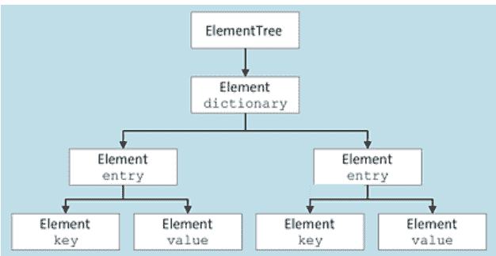

**图 32.1** 生成的元素树

## 读取 XML 文件

此时，我们将向您展示如何在简单示例的基础上使用 `ElementTree`。为此，让我们再次回顾我们的示例文件，其目的是表示一个 Python 字典的内容：

```xml
<?xml version="1.0" encoding="UTF-8"?>
<dictionary>
    <entry>
        <key type="str">Hello</key>
        <value type="int">0</value>
    </entry>
</dictionary>
```

该文件由一个名为 `dictionary` 的顶级标签组成，其下可以出现多个 `entry` 标签。每个 `entry` 标签包含两个名为 `key` 和 `value` 的子标签，它们共同表示字典的一个键值对。键或值的数据类型由 `type` 属性定义，该属性可以出现在 `key` 和 `value` 标签中。

使用 `ElementTree` 加载此格式 XML 文件的程序如下所示：

```python
import xml.etree.ElementTree as ElementTree
types = {
    "int" : int,
    "str" : str
    }
def read_element(element):
    type = element.get("type", "str")
    try:
        return types[type](element.text)
    except KeyError:
        return element.text
def load_dict(filename):
    d = {}
    tree = ElementTree.parse(filename)
    tag_dict = tree.getroot()
    for entry in tag_dict:
        tag_key = entry.find("key")
        tag_value = entry.find("value")
        d[read_element(tag_key)] = read_element(tag_value)
    return d
```

首先，实现了 `read_element` 函数，它从 `key` 或 `value` 标签的 `Element` 实例中读取 `type` 属性，并将相应标签内包含的文本转换为 `type` 指定的数据类型。然后，将标签的内容作为匹配数据类型的实例返回。

示例程序的主函数 `load_dict` 接收一个 XML 文件的文件名，并应将其中包含的数据处理成一个 Python 字典。为此，首先使用 `ElementTree` 模块的 `parse` 函数将 XML 文件准备成一棵树。此函数可以传递文件名或已打开的文件对象。之后，将 `tag_dict` 引用分配给树的根元素，以便继续对其进行操作。

以下循环遍历根元素的所有子元素——即遍历所有 `entry` 标签。在每个迭代步骤中，搜索具有 `key` 和 `value` 标签名的第一个子元素，并将其分配给 `tag_key` 和 `tag_value` 引用。在循环结束时，将相应 `key` 或 `value` 标签的 `Element` 实例传递给 `read_element` 函数，该函数将标签主体中包含的文本转换为正确数据类型的实例。生成的实例作为键或值添加到结果字典 `d` 中。最后，返回生成的字典 `d`。

使用 `load_dict` 从开头指定的 XML 文件读取的字典如下所示：

```python
>>> load_dict("dict.xml")
{'Hello': 0}
```

> **注意**
>
> 除了从文件读取 XML 数据外，还可以使用 `fromstring` 方法从字符串读取数据到元素树中：
>
> ```python
> >>> data = "<tag attr='value'/>"
> >>> ElementTree.fromstring(data)
> <Element 'tag' at 0x7f4762a31548>
> ```
>
> 请注意，在这种情况下返回的是 `Element` 实例，而不是 `ElementTree` 实例。

## 写入 XML 文件

在上一节中，我们描述了如何读取 XML 文件。当然，也必须处理相反的问题：在程序中创建的数据应以 XML 格式导出。

为此，必须首先创建一个元素树。这可以通过如前所述读取文件或字符串来完成。或者，也可以逐个元素地创建元素树：

```python
>>> dictionary = ElementTree.Element("dictionary")
>>> entry = ElementTree.SubElement(dictionary, "entry")
>>> key = ElementTree.SubElement(entry, "key", {"type":"str"})
>>> key.text = "Hello"
>>> value = ElementTree.SubElement(entry, "value", {"type":"int"})
>>> value.text = "0"
```

首先，创建一个具有 `dictionary` 标签名的 `Element` 实例，它充当树的根。然后，`SubElement` 函数允许您将元素插入树中。为此，必须传递所需的父元素和标签名。可以选择传递一个包含属性-值对的字典。

一旦构建了元素树，就可以使用 `tostring` 函数。此函数将 `Element` 实例及其所有子元素以 XML 格式写入字符串并返回：

```python
>>> ElementTree.tostring(dictionary)
b'<dictionary><entry><key type="str">Hello</key><value type="int">0</value></entry></dictionary>'
```

除了将数据导出为字符串外，也可以直接写入文件。为此，您可以使用 `write` 方法，该方法可以传递文件名或已打开的文件对象。但是，在这种情况下，必须预先创建一个 `ElementTree` 实例：

```python
>>> et = ElementTree.ElementTree(dictionary)
>>> et.write("file.xml")
```

`tostring` 和 `write` 方法的可选第二个参数可用于指定写入的编码。

## Element 类的属性

在上一节中，访问了创建的 `Element` 实例的 `text` 属性以指定它们包含的文本。总共有四个这样的属性，在 [表 32.1](Table 32.1) 中进行了简要说明。

| 属性 | 描述 |
| :--- | :--- |
| `attrib` | 引用一个字典，该字典包含元素的所有 XML 属性作为键值对。 |
| `tag` | 引用元素的标签名。 |
| `tail` | 引用 XML 文件中元素的结束标签与下一个开始或结束标签之间的文本。 |
| `text` | 引用 XML 文件中元素的开始标签与下一个开始或结束标签之间的文本。 |

**表 32.1** Element 类的属性

这些属性中的每一个都可以读取和写入。

## 写入和读取 XML 属性

`Element` 类定义了 `get` 和 `set` 方法来访问其 XML 属性：[ 157 ]

```python
>>> value.get("type")
'int'
>>> value.set("type", "str")
>>> value.get("type")
'str'
```

`get` 方法可以传递一个可选的默认值，如果元素没有请求名称的属性，则将返回该默认值。

## 遍历元素树

基本上，`Element` 类继承了列表的所有属性。因此，特别是可以通过索引访问子元素。为此

## 在树形元素中查找元素

`Element` 类提供了 `find`、`findall` 和 `findtext` 方法，用于根据特定条件搜索子元素。搜索条件由所谓的*路径*定义。为此，让我们查看以下 XML 文件：

```xml
<A>
    <B>
        <D>Hello</D>
    </B>
    <C>
        <E>
            <F>world</F>
        </E>
    </C>
</A>
```

我们将把这个 XML 文件加载到一个 `ElementTree` 实例中，然后对元素 `A` 执行一些搜索操作：

```python
>>> et = ElementTree.parse("test.xml")
>>> e = et.getroot()
```

首先，我们将使用通配符 `*` 和 `find` 方法搜索任何标签名。返回的第一个匹配元素是元素 `B`：

```python
>>> e.find("*")
<Element 'B' at 0x7f15ce584f10>
```

`find` 方法仅搜索调用它的元素的直接子元素。因此，搜索标签名 `E` 不会产生结果：

```python
>>> e.find("E")
>>>
```

要搜索位于 XML 层次结构更深层的元素，我们必须传递一个描述要搜索的元素的路径，该路径也可以包含通配符：

```python
>>> e.find("C/*/F")
<Element 'F' at 0x7f15ce58a050>
```

`findall` 和 `findtext` 方法的工作方式与 `find` 类似，不同之处在于 `findall` 返回所有匹配的 `Element` 实例的列表，而 `findtext` 返回匹配的 `Element` 实例中包含的文本。

## 插入和移除元素

如前所述，`Element` 实例可以被视为其子元素的列表，它甚至继承了列表的功能。这尤其涉及到扩展它的可能性。因此，可以使用 `append`、`extend`、`remove` 和 `clear` 方法向 `Element` 实例添加或移除子元素：

```python
>>> x = ElementTree.Element("x")
>>> x.append(ElementTree.Element("y"))
>>> x.append(ElementTree.Element("z"))
>>> ElementTree.tostring(x)
b'<x><y /><z /></x>'
```

## 32.1.2 XML 简单 API

与 `ElementTree` 不同，SAX 不会在内存中创建 XML 文件的完整表示。它持续读取文件，并通过调用适当的回调函数通知程序员，例如，已经读取了一个开始标签或结束标签。这种方法有一个优点：当加载非常大的 XML 文件时，即使文件尚未完全读取，也可以进一步处理已经读取的部分。

但是，使用 SAX 也有一些缺点。例如，与 `ElementTree` 相比，无法随机访问 XML 数据的各个元素。此外，SAX 没有提供任何方便的方法来修改或重新保存 XML 数据。

SAX 解析器（在 SAX 术语中也称为*读取器*）读取 XML 文件是*事件驱动*的。这意味着在创建读取器时，程序员必须设置各种*回调函数*并将它们与特定的*事件*关联起来。如果在读取 XML 文件时发生该事件，则会调用关联的回调函数，并执行程序员为此目的编写的代码。例如，一个事件可以是找到一个开始标签。

因此，SAX 读取器只提供了读取 XML 文件的基础设施。程序员自行决定是否以及以何种形式处理数据。

> **注意**
>
> 网页的 HTML 描述语言在很大程度上基于 XML，但它提供了更大的语法自由度。[ 158 ] 因此，并非每个 HTML 文档都可以用每个 XML 解析器读取。

特别是对于解析 HTML 文档，标准库中提供了 `html.parser` 模块。其中包含的 `HTMLParser` 类实现了一个用于 HTML 文档的 SAX 解析器。

## 示例

我们现在想用一个简单的例子来演示 SAX 的使用。为此，我们将使用已经熟悉的场景：一个 Python 字典已保存在 XML 文件中，程序将读取该文件并将其转换回字典。数据具有以下格式：

```xml
<?xml version="1.0" encoding="UTF-8"?>
<dictionary>
    <entry>
        <key type="str">Hello</key>
        <value type="int">0</value>
    </entry>
</dictionary>
```

以下使用 SAX 读取器的程序可以处理此文件：

```python
import xml.sax as sax

class DictHandler(sax.handler.ContentHandler):
    types = {
        "int" : int,
        "str" : str
    }
    def __init__(self):
        self.result = {}
        self.key = ""
        self.value = ""
        self.active = None
        self.type = None
    def startElement(self, name, attrs):
        if name == "entry":
            self.key = ""
            self.value = ""
        elif name in ("key", "value"):
            self.active = name
            try:
                self.type = self.types[attrs["type"]]
            except KeyError:
                self.type = str
    def endElement(self, name):
        if name == "entry":
            self.result[self.key] = self.type(self.value)
        elif name in ("key", "value"):
            self.active = None
    def characters(self, content):
        if self.active == "key":
            self.key += content
        elif self.active == "value":
            self.value += content
```

首先，我们创建 `DictHandler` 类，在其中将所有相关的回调函数（也称为*回调处理程序*）实现为方法。该类必须从 `sax.handler.ContentHandler` **基类**派生。

SAX 模型的一个缺点是，我们必须在每一步之后跟踪当前状态，以便下次调用回调函数时，能够清楚文本是在 `key` 还是 `value` 标签的上下文中读取的。因此，我们在类的构造函数中创建了一些属性：

- `self.result` 用于存储结果字典
- `self.key` 用于存储当前考虑的键的内容
- `self.value` 用于存储当前考虑的值的内容
- `self.active` 用于存储最后读取的标签的标签名
- `self.type` 用于存储 `key` 或 `value` 标签的 `type` 属性中的数据类型

首先，我们实现 `startElement` 方法，该方法在读取每个开始标签时被调用。该方法接收标签名和包含的属性作为参数。对于 `key` 或 `value` 标签，相应地修改 `self.active`，并读取标签的 `type` 属性。

`endElement` 方法在读取结束标签时被调用。它也接收标签名作为参数。对于结束的 `entry` 标签，我们将由 `self.key` 和 `self.value` 组成的当前键值对插入到 `self.result` 字典中。如果找到结束的 `key` 或 `value` 标签，则将 `self.active` 属性设置回 `None`，这样就不会再处理字符。

最后，如果读取的字符不属于任何标签，则会调用 `characters` 方法。SAX 读取器不保证 XML 文件中的连续文本也会导致对 `characters` 的单次调用。根据活动标签的名称，读取的字符被附加到 `self.key` 或 `self.value`。

最后，示例程序的主 `load_dict` 函数缺失，在其中创建并启动 SAX 解析器：

```python
def load_dict(filename):
    handler = DictHandler()
    parser = sax.make_parser()
    parser.setContentHandler(handler)
    parser.parse(filename)
    return handler.result
```

在函数体中，实例化 `DictHandler` 类，并通过 `xml.sax` 模块的 `make_parser` 函数创建一个 SAX 解析器。

然后调用解析器的 `setContentHandler` 方法，将 `DictHandler` 实例与包含的回调处理程序一起注册。最后，通过调用 `parse` 方法启动解析过程。

使用 `load_dict` 从开头指定的 XML 文件读取的字典如下所示：

```
>>> load_dict("dict.xml")
{'Hello': 0}
```

## ContentHandler 类

`ContentHandler` 类作为自定义 SAX 解析器的基类，并将所有 SAX 回调处理程序实现为方法。要能够使用 SAX 解析器，必须实现一个继承自 `ContentHandler` 并覆盖所需回调处理程序的自定义类。SAX 解析器的 `setContentHandler` 方法期望一个派生自 `ContentHandler` 的类的实例。表 32.2 列出了可以在派生自 `ContentHandler` 的类中覆盖的最重要的回调处理程序。

| 方法 | 描述 |
| :--- | :--- |
| `startDocument()` | 当 SAX 解析器开始读取 XML 文档时调用一次 |
| `endDocument()` | 当 SAX 解析器完全读取完 XML 文档时调用一次 |
| `startElement(name, attrs)` | 当读取到一个开始标签时调用 |
| `endElement(name)` | 当读取到一个名为 `name` 的结束标签时调用 |
| `characters(content)` | 当读取到一个文本部分时调用 |
| `ignorableWhitespace(whitespace)` | 当读取到空白字符时调用 |

**表 32.2** ContentHandler 类的方法

### 32.2 数据库

程序需要管理的数据越多，数据结构越复杂，用于数据的永久存储和管理所需的编程工作量就越大。此外，许多程序中需要的任务，如读取、写入或更新数据，必须一遍又一遍地实现。

这个问题的解决方案是在使用数据的程序和物理大容量存储之间插入一个抽象层，即所谓的 *数据库*。用户程序和数据库之间的通信通过统一的接口进行。

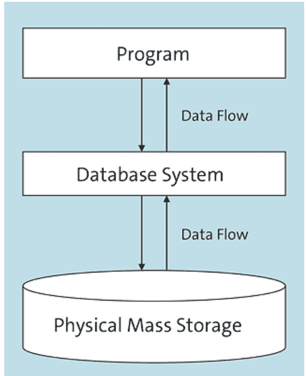

**图 32.2** 数据库接口

数据库系统接受查询并返回所有符合查询条件的记录。还有一些查询，例如，向数据库添加数据或更改数据库结构。

本章专门讨论 *关系数据库*，它将数据集组织成表。[159] 对关系数据库的查询通常用一种专用语言来表述：*结构化查询语言* (SQL)。SQL 太复杂，无法在本章中详尽描述。我们这里只介绍基本的 SQL 命令，这些命令对于说明数据库的基本原理及其在 Python 中的应用是必要的。

SQL 已经标准化，并且被大多数关系数据库系统支持。请注意，这些系统通常只实现该语言的子集，有时会对其进行轻微修改。因此，这里我们将向您介绍 SQLite 使用的 SQL 变体，它是 Python 中的默认数据库。

> **注意**

除了 SQL 查询语言，Python 中的数据库模块接口也是标准化的。这给程序员带来了一个令人愉快的副作用，即他们的代码只需进行最小的调整就可以在所有实现此标准的数据库系统上执行。这个所谓的 *Python 数据库 API 规范* 的确切定义可以在 PEP 249 中找到。

在我们深入探讨 SQL 本身之前，我们将创建一个小型示例数据库，并讨论可以对其进行哪些操作。然后，我们将使用 SQLite 和相应的 Python 模块 `sqlite3` 来实现这个示例，并涵盖部分 SQL 查询语言。

假设你必须管理一家计算机发货公司的仓库。你负责确保交付的部件存储在仓库的正确位置，并且对于每个组件，供应商、交货日期和隔间编号都应存储在数据库中。对于订购计算机的客户，相应的部件会被保留，然后其他客户就无法使用了。此外，还应提供公司所有客户和供应商的列表。

为了为此场景创建数据库模型，你首先创建一个名为 *warehouse* 的表，其中包含仓库中的所有组件。为简单起见，假设你的仓库被划分为连续编号的隔间。同时，每个隔间只能存储一个计算机部件。

然后，一个包含一些示例记录的仓库对应表可能如表 32.3 所示，其中还存储了供应商和保留状态。

| 隔间编号 | 序列号 | 组件 | 供应商 | 已保留 |
| :--- | :--- | :--- | :--- | :--- |
| 1 | 26071987 | 显卡类型 1 | FC | 0 |
| 2 | 19870109 | 处理器类型 13 | LPE | 57 |
| 10 | 06198823 | 电源类型 3 | FC | 0 |
| 25 | 11198703 | LED 风扇 | FC | 57 |
| 26 | 19880105 | 10 TB 硬盘 | LPE | 12 |

**表 32.3** 用于库存的仓库表

*供应商* 列包含供应公司的缩写，如果相关物品尚未被客户保留，则 *已保留* 列设置为 0。否则，该字段包含保留客户的客户编号。表中只存储已占用的隔间，以便所有没有条目的隔间都可以用新部件填充。

有关供应商和客户的详细信息存储在另外两个表中，分别称为 *suppliers*（见表 32.4）和 *customers*（见表 32.5）。

| 简称 | 名称 | 电话号码 |
|---|---|---|
| FC | FiboComputing Inc. | 011235813 |
| LPE | LettgenPetersErnesti | 026741337 |
| GC | Golden Computers | 016180339 |

**表 32.4** 供应商表

| 客户编号 | 名称 | 地址 |
|---|---|---|
| 12 | James Everett | Madison Ave New York, NY 10003 |
| 57 | Matt Aldwyn | 24 Sunset Dr, Los Angeles, CA 90048 |
| 64 | Steve Apple | 2 Podmac St San Jose, CA 95014 |

**表 32.5** 客户表

为了让你作为仓库经理能够从这个数据库中受益，你必须能够操作数据集。你需要函数，例如，添加新客户和供应商，如果他们搬家则更新他们的数据，或者如果你愿意，将他们从数据库中删除。你还需要向 *warehouse* 表添加新条目，并删除或调整旧条目。因此，为了保持数据库的最新状态，你需要 *添加* 和 *删除* 函数。

此外，只有当你能够根据某些标准查询数据库中包含的数据时，数据库才真正变得有用。在最简单的情况下，例如，你想请求所有客户或供应商的列表，或者找出哪些隔间当前被占用。然而，你也可能有兴趣知道名为 Matt Aldwyn 的客户是否保留了物品，如果是，这些物品是什么以及它们存储在哪里。或者你可能想知道你需要从电话号码为 011235813 的供应商那里重新订购哪些组件，因为这些物品不再可用或已被保留。这些操作总是根据某些标准 *选择* 记录，并将它们返回给调用的用户程序。

经过这个理论准备，我们现在将转向在 SQLite 数据库中实现这个示例。

### 32.2.1 Python 中的内置数据库：sqlite3

SQLite 是一个简单的数据库系统，与其他系统不同，它不需要单独的数据库服务器，并将整个数据库存储在单个文件中。尽管与其他数据库系统存在这种差异，但它提供了广泛的功能，并在许多用例中非常高效地运行。[160] 此外，SQLite 能够在不同的系统上运行，因此它非常适合 Python 的多平台生态系统。

在 Python 中，你首先需要导入 `sqlite3` 模块才能使用数据库。然后你可以通过调用连接到数据库文件`connect` 函数返回一个指向数据库的 `Connection` 对象：

```python
import sqlite3
con = sqlite3.connect("warehouse.db")
```

文件扩展名可以自由选择，对数据库的功能没有影响。前面的代码会读取并连接到位于程序所在目录下 *warehouse.db* 文件中的数据库，并将其关联到 `Connection` 对象。如果尚不存在名为 *warehouse.db* 的文件，则会以此名称创建一个空数据库。

通常，你可能只需要在程序运行期间使用数据库来管理或组织数据，而无需将其永久存储在硬盘上。为此，你可以选择通过向 `connect` 方法传递 `":memory:"` 字符串（而非文件名）来在内存中创建一个数据库：

```python
con = sqlite3.connect(":memory:")
```

要使用已连接的数据库，需要使用所谓的 *游标*。你可以将游标想象成数据库中的当前编辑位置，类似于文字处理器中闪烁的垂直线。这些游标使我们能够修改或查询记录。一个数据库连接可以有任意数量的游标。你可以使用 `Connection` 对象的 `cursor` 方法创建一个新的游标：

```python
cursor = con.cursor()
```

## 创建新表

现在我们可以向数据库发送第一条 SQL 语句来创建表。创建 *warehouse* 表的 SQL 语句如下所示：

```sql
CREATE TABLE warehouse (
    compartment_number INTEGER, serial_number INTEGER, component TEXT,
    supplier TEXT, reserved INTEGER
)
```

> **注意**

所有大写单词都是 SQL 语言的组成部分。然而，SQL 不区分大小写，因此我们也可以全部用小写书写。为了更好的可读性，我们将始终完全大写 SQL 关键字，并将我们分配的名称全部小写。

列名后的 `INTEGER` 和 `TEXT` 字符串指定了要存储在列中的数据类型。将 `compartment_number`、`serial_number` 和 `reserved` 列定义为整数，将 `component` 和 `supplier` 列定义为字符串是合理的。SQLite 为数据库的列定义了多种这样的数据类型。

默认情况下，当数据写入 SQLite 数据库时，Python 数据类型会自动转换为相应的 SQLite 数据类型。表 32.6 显示了 Python 到 SQLite 的数据类型转换方案。

| Python 数据类型（源类型） | SQLite 数据类型（目标类型） |
| :--- | :--- |
| `None` | `NULL` |
| `int` | `INTEGER` |
| `float` | `REAL` |
| `str` | `TEXT` |
| `bytes` | `BLOB` |

表 32.6 写入数据时的 SQLite 数据类型转换

如果定义了适当的转换函数，也可以在 SQLite 数据库中存储其他类型的数据。具体如何实现将在本章后面讨论适配器和转换器时描述。

现在我们使用 `cursor` 对象的 `execute` 方法将 SQL 语句发送到数据库：

```python
cursor.execute("""CREATE TABLE warehouse (
    compartment_number INTEGER, serial_number INTEGER,
    component TEXT, supplier TEXT, reserved INTEGER)""")
```

我们可以用同样的方式创建供应商和客户表：

```python
cursor.execute("""CREATE TABLE suppliers (
    short_name TEXT, name TEXT, phone_number TEXT)""")
```

```python
cursor.execute("""CREATE TABLE customers (
    customer_number INTEGER, name TEXT, address TEXT)""")
```

## 向表中输入数据

接下来，我们将用示例数据填充这些仍然为空的表。要向现有表中输入新记录，我们使用 `INSERT` 语句，其针对第一条示例记录的格式如下：

```sql
INSERT INTO warehouse VALUES (
    1, 26071987, 'Graphics card type 1', 'FC', 0
)
```

在 `VALUES` 后的括号内，每个列的值按照列本身定义的顺序给出。与所有其他数据库查询一样，我们可以使用 `execute` 方法提交该语句：

```python
cursor.execute("""INSERT INTO warehouse VALUES (
    1, 26071987, 'Graphics card type 1', 'FC', 0)""")
```

然而，在输入数据记录时，你必须记住，在执行 `INSERT` 语句后，新数据并不会立即写入数据库，而只是暂时存储在内存中。为了确保数据最终写入硬盘并因此被永久存储，你必须调用 `Connection` 对象的 `commit` 方法：

```python
con.commit()
```

`commit` 方法结束一个 *事务*。事务是必须完全执行才能维护数据库一致性的操作链。想象一下，在银行转账过程中，由于错误，钱从你的账户中扣除，但未贷记给收款人。可以使用 `rollback` 方法撤销当前事务的所有待处理操作，即自上次 `commit` 调用以来的所有操作。

为了确保数据库一致性，你可以使用 `try-except` 语句来保护关键的数据库操作，并在发生错误时通过 `rollback` 完全丢弃更改：

```python
try:
    cursor = con.cursor()
    cursor.execute("""INSERT INTO warehouse VALUES (
        1, 26071987, 'Graphics card type 1', 'FC', 0)""")

    # 此处可用于其他数据库操作

    con.commit()
except:
    print("发生问题 -> 回滚")
    con.rollback()
    raise # 将错误通知调用层
```

或者，你可以将 `Connection` 对象与 `with` 语句一起用作 *事务管理器* 来保护关键区域。在这里，`with` 语句会自动确保当 `with` 块中的所有语句成功执行时执行提交，并在发生异常时执行回滚。

但是，发生的异常会传递到下一个更高的级别，并必须在那里被捕获。前面的示例可以通过 `with` 实现如下：

```python
try:
    with con:
        cursor = con.cursor()
        cursor.execute("""INSERT INTO warehouse VALUES (
            1, 26071987, 'Graphics card type 1', 'FC', 0)""")

        # 此处可用于其他数据库操作
except:
    print("发生问题 -> 自动回滚")
    raise # 将错误通知调用层
```

你可以在第 22 章第 22.1 节中了解更多关于 `with` 语句的信息。

为了提高清晰度，我们将在示例中省略错误处理的主题。

## 安全的数据传输

通常，我们想要插入数据库的数据在程序运行前是未知的，因此不会作为字符串常量出现在源代码中。相反，它将是用户输入或计算结果，我们随后将其作为 Python 实例保存在内存中。乍一看，字符串的 `format` 方法似乎是此类情况的合适手段，最后一条 `INSERT` 语句也可以如下组装：

```python
>>> values = (1, 26071987, "Graphics card type 1", "FC", 0)
>>> "INSERT INTO warehouse VALUES ({}, {}, '{}', '{}', {})".format(*values)
"INSERT INTO warehouse VALUES (1, 26071987, 'Graphics card type 1', 'FC', 0)"
```

然而，这种乍看之下很优雅的方法，仔细检查后会发现是一个危险的漏洞。让我们考虑以下 `INSERT` 语句，它应该将一个新供应商插入到供应商表中：

```python
>>> values = ("DR", "Danger Electronics",
...          "666'); There may be malicious code here")
>>> "INSERT INTO suppliers VALUES ('{}', '{}', '{}')".format(*values)
"INSERT INTO suppliers VALUES ('DR', 'Danger Electronics', '666'); There may be malicious code here')"
```

如你所见，通过让电话号码的值包含 `'); ` 字符串，我们搞乱了 SQL 查询，导致尝试执行它时会产生错误，从而使程序崩溃。通过包含文本 `There may be malicious code here`，我们表明甚至可能以某种方式操纵查询，使其产生有效的 SQL 代码，但执行的是与预期不同的操作（例如，读取用户数据）。

> **注意**

出于安全原因，你永远不应使用字符串格式化来传递 SQL 查询中的参数！

要安全地传递参数，你必须在查询字符串中参数应出现的位置写一个问号，并将包含适当值的元组作为第二个参数传递给 `execute` 方法：

```python
values = ("DR", "Danger Electronics",
          "666'); There may be malicious code here")
sql = "INSERT INTO suppliers VALUES (?, ?, ?)"
cursor.execute(sql, values)
```

在这种情况下，SQLite 会确保传递的值被正确转换，并且不会因为恶意注入的参数而发生漏洞。

类似于字符串格式化，也可以为参数分配名称，并使用字典而不是 `tuple` 实例来传递它们的值。为此，你必须写一个冒号在查询字符串中，用参数的符号名称替代问号，并将相应的字典作为第二个参数传递给`execute`：

```
values = {"short": "DR", "name": "Danger Electronics",
          "phone": "123456"}
sql = "INSERT INTO suppliers VALUES (:short, :name, :phone)"
cursor.execute(sql, values)
```

掌握了这些知识，我们就能优雅且安全地向表中填充数据：

```
for row in ((1, "2607871987", "Graphics card type 1", "FC", 0),
            (2, "19870109", "Processor type 13", "LPE", 57),
            (10, "06198823", "Power supply type 3", "FC", 0),
            (25, "11198703", "LED fan", "FC", 57),
            (26, "19880105", "Hard drive 10 TB", "LPE", 12)):
    cursor.execute("INSERT INTO warehouse VALUES (?,?,?,?,?)", row)
con.commit()
```

像这里展示的`for`循环这样的结构，经常为不同的参数集执行相同的数据库操作，它们很常见，并且提供了优化的潜力。因此，`cursor`实例也包含`executemany`方法，该方法期望一个操作模板作为第一个参数。此外，必须将一个包含各个操作参数集的可迭代对象作为第二个参数传递。我们使用`executemany`来填充供应商和客户表：

```
suppliers = (("FC", "FiboComputing Inc.", "011235813"),
             ("LPE", "LettgenPetersErnesti", "026741337"),
             ("GC", "Golden Computers", "016180339"))
cursor.executemany("INSERT INTO suppliers VALUES (?,?,?)",
                   suppliers)

customers = ((12, "James Everett",
              "Madison Ave New York, NY 10003"),
             (57, "Matt Aldwyn",
              "24 Sunset Dr, Los Angeles, CA 90048"),
             (64, "Steve Apple",
              "2 Podmac Str, San Jose, CA 95014"))
cursor.executemany("INSERT INTO customers VALUES (?,?,?)", customers)
con.commit()
```

现在你已经学会了如何创建数据库和表，并用数据填充它们。在下一步中，我们将处理查询数据。

## 查询数据

要从数据库中检索数据，必须使用`SELECT`语句。`SELECT`期望的参数是你感兴趣的列和要查询的表名，用逗号分隔。默认情况下，将返回查询表的所有行。额外的`WHERE`子句使你能够通过指定选择条件来仅选择某些记录。一个简单的`SELECT`语句结构如下：

```
SELECT <columnlist> FROM <tablename> [WHERE <condition>]
```

如方括号所示，`WHERE`子句是可选的，可以省略。

例如，如果你想查询所有已占用隔间及其关联组件的编号，你应该制定以下查询：

```
SELECT compartment_number, component FROM warehouse
```

在我们能够从数据库查询记录之前，它必须已被加载。要执行以下示例，你可以继续使用我们在前面部分创建的内存中的数据库，或者加载存储在硬盘上的数据库：

```
>>> con = sqlite3.connect("warehouse.db")
>>> cursor = con.cursor()
```

要发出数据查询，你可以使用游标对象的`execute`方法。之后，你可以使用`cursor.fetchall`来检索查询返回的所有数据记录：

```
>>> cursor.execute("SELECT compartment_number, component FROM warehouse")
>>> cursor.fetchall()
[(1, 'Graphics card type 1'), (2, 'Processor type 13'),
(10, 'Power supply type 3'), (25, 'LED fan'),
(26, 'Hard drive 10 TB')]
```

`fetchall`的返回值是一个列表，其中包含一个元组，每个元组包含请求列的值。

通过合适的`WHERE`子句，你可以将选择限制为尚未保留的计算机部件：

```
>>> cursor.execute("""
...     SELECT compartment_number, component FROM warehouse WHERE reserved=0
... """)
>>> cursor.fetchall()
[(1, 'Graphics card type 1'), (10, 'Power supply type 3')]
```

你也可以使用逻辑运算符（如`AND`和`OR`）组合多个条件。这将帮助你确定，例如，由*FiboComputing Inc.*供应的哪些物品已被保留：

```
>>> cursor.execute("""
...     SELECT compartment_number, component FROM warehouse
...     WHERE reserved!=0 AND supplier='FC'
... """)
>>> cursor.fetchall()
[(25, 'LED fan')]
```

因为总是指定要选择的列名可能很烦人，并且你经常想对所有列执行查询，所以有一个简写表示法，其中列列表被星号替换：

```
>>> cursor.execute("SELECT * FROM customers")
>>> cursor.fetchall()
[(12, 'James Everett', 'Madison Ave New York, NY 10003'),
(57, 'Matt Aldwyn', '24 Sunset Dr, Los Angeles, CA 90048'),
(64, 'Steve Apple', '2 Podmac Str, San Jose, CA 95014')]
```

列值的顺序取决于表的列在`CREATE`中定义的顺序。

作为`SELECT`语句的最后补充，让我们看看对多个表的查询，即所谓的*连接*。例如，假设你想查询电话号码为011235813的供应商的哪些组件目前在仓库中，以及它们位于哪些隔间。

对多个表的查询与简单查询的不同之处在于，它不是指定简单的表名，而是指定一个逗号分隔的列表，其中包含查询中涉及的所有表。如果引用了列，例如在`WHERE`条件中，也必须指定相应的表名。这也适用于直接在`SELECT`之后选择的列。我们的示例查询涉及*warehouse*和*suppliers*表，可以表示为一个连接，如下所示：

```
SELECT warehouse.compartment_number, warehouse.component, suppliers.name
FROM warehouse, suppliers
WHERE suppliers.phone_number='011235813' AND
      warehouse.supplier=suppliers.short_name
```

你可以这样想象这种连接的处理：数据库将仓库表的每一行与供应商表的每一行连接成新的数据记录，并返回结果列表中`suppliers.phone_number`列的值为'011235813'且`warehouse.supplier`和`suppliers.short_name`列匹配的所有行。

如果你用SQLite运行这个查询，你会得到预期的输出：

```
>>> sql = """
...     SELECT warehouse.compartment_number, warehouse.component,
...            suppliers.name
...     FROM warehouse, suppliers
...     WHERE suppliers.phone_number='011235813' AND
...           warehouse.supplier=suppliers.short_name"""
>>> cursor.execute(sql)
>>> cursor.fetchall()
[(1, 'Graphics card type 1', 'FiboComputing Inc.'),
 (10, 'Power supply type 3', 'FiboComputing Inc.'),
 (25, 'LED fan', 'FiboComputing Inc.')]
```

到目前为止，使用`fetchall`你总是从数据库中一次加载查询的所有结果，然后集体输出它们。然而，这种方法只适用于相对较小的数据量——首先，因为程序必须等待数据库确定并返回所有结果；其次，因为整个结果列表要保存在内存中。对于像屏幕输出这样一次只需要单个数据记录的操作，当结果非常大时，这是一种内存浪费。因此，有可能逐行查询数据——即总是以小部分进行。此过程确保你不需要等待完整结果列表的计算，而可以在数据库仍在处理查询时就开始处理。此外，内存可以更有效地利用。

使用`cursor`类的`fetchone`方法，我们一次请求一个结果元组。如果上一次查询的所有记录都已读取，`fetchone`返回值`None`。这允许以内存高效的方式读取大量数据：

```
>>> cursor.execute("SELECT * FROM customers")
>>> while row := cursor.fetchone():
...     print(row)
(12, 'James Everett', 'Madison Ave New York, NY 10003')
(57, 'Matt Aldwyn', '24 Sunset Dr, Los Angeles, CA 90048')
(64, 'Steve Apple', '2 Podmac Str, San Jose, CA 95014')
```

或者，你可以使用`cursor`类的迭代器接口，它允许我们使用`for`遍历结果行，就像处理列表一样：

```
>>> cursor.execute("SELECT * FROM customers")
>>> for row in cursor:
...     print(row)
(12, 'James Everett', 'Madison Ave New York, NY 10003')
(57, 'Matt Aldwyn', '24 Sunset Dr, Los Angeles, CA 90048')
(64, 'Steve Apple', '2 Podmac Str, San Jose, CA 95014')
```

更倾向于哪种替代方案，这取决于个人喜好。然而，`:=` 运算符（参见[第5章，第5.4节](#)）是Python语言中一个相当新的特性。因此，如果你需要使用早于3.8版本的Python，就必须坚持使用迭代器变体。

## SQLite中的数据类型

从本节的介绍部分，你已经了解了SQLite在写入数据库时转换数据的方式。SQLite数据类型到Python数据类型的相应转换在[表32.7](#)中描述。

| SQLite数据类型（源类型） | Python数据类型（目标类型） |
| :--- | :--- |
| NULL | None |
| INTEGER | int |
| REAL | float |
| TEXT | str |
| BLOB | bytes |

**表32.7** 读取SQLite数据库时的类型转换

本质上，这个表格提出了两个问题：当只支持这些类型时，其他数据类型（如列表或自定义类）如何存储在数据库中？以及，当从数据库读取数据时，我们如何干预转换过程？

我们将首先回答第二个问题。

## Connection.text_factory

由`sqlite3.connect`创建的每个`Connection`实例都有一个`text_factory`属性，该属性指向一个函数，每当读取`TEXT`列时都会调用该函数。数据库查询的结果元组随后包含此函数的返回值。默认情况下，`text_factory`属性被设置为内置的`str`函数：

```
>>> con = sqlite3.connect("warehouse.db")
>>> con.text_factory
<class 'str'>
```

为了实现一个示例目标，即获取`TEXT`列中所有字母都大写的`str`实例，你可以指定一个自定义的`text_factory`函数。此函数必须接受一个参数并返回转换后的值。该参数是一个`bytes`字符串，包含来自数据库的原始数据，采用UTF-8编码。因此，在这种情况下，一个简单的函数就足够了，该函数首先将读取的值转换为字符串，然后使用`upper`方法将所有字母大写：

```
>>> def my_text_factory(value):
...     return value.decode("utf-8", "ignore").upper()
```

现在你所要做的就是将`Connection`对象的`text_factory`属性设置为你的新回调函数，并享受预期的结果：

```
>>> con.text_factory = my_text_factory
>>> cursor = con.cursor()
>>> cursor.execute("SELECT * FROM customers")
>>> cursor.fetchall()
[(12, 'JAMES EVERETT', 'MADISON AVE NEW YORK, NY 10003'),
 (57, 'MATT ALDWYN', '24 SUNSET DR, LOS ANGELES, CA 90048'),
 (64, 'STEVE APPLE', '2 PODMAC STR, SAN JOSE, CA 95014')]
```

要恢复原始的输出行为，只需将默认值`str`赋给`text_factory`：

```
>>> con.text_factory = str
```

## Connection.row_factory

另一个类似于`text_factory`用于`TEXT`列的属性也存在于整个数据记录中。`row_factory`属性可以存储一个函数的引用，该函数根据自定义需求转换行。默认情况下，使用`tuple`函数。例如，我们想实现一个函数，使我们能够通过各自列的名称来访问数据记录的列值。结果应如下所示：

```
>>> cursor.execute("SELECT * FROM customers")
>>> cursor.fetchall()
[{"customer_number": 12, "name": 'James Everett', "address": 'Madison Ave New York, NY 10003'},
{"customer_number": 57, "name": 'Matt Aldwyn', "address": '24 Sunset Dr, Los Angeles, CA 90048'},
{"customer_number": 64, "name": 'Steve Apple', "address": '2 Podmac Str, San Jose, CA 95014'}]
```

为了实现这一点，我们需要`cursor`类的`description`属性，它为我们提供有关查询所选列名的信息。`description`属性包含一个元组序列，每个列有七个元素，但我们只对第一个感兴趣——即列名：

```
>>> con = sqlite3.connect("warehouse.db")
>>> cursor = con.cursor()
>>> cursor.execute("SELECT * FROM customers")
>>> cursor.description
(('customer_number', None, None, None, None, None, None),
('name', None, None, None, None, None, None),
('address', None, None, None, None, None, None))
```

作为参数，`row_factory`函数接收用于查询的游标的引用和结果行（作为元组）。

基于这些知识，我们可以将名为`rows_dict`的`row_factory`函数实现如下：

```
def rows_dict(cursor, row):
    result = {}
    for columnno, column in enumerate(cursor.description):
        result[column[0]] = row[columnno]
    return result
```

> **注意**

提醒一下，`enumerate`创建一个迭代器，对于传递序列的每个元素，返回一个包含该元素在序列中的索引及其值的元组。更多信息，请参见[第17章，第17.14.13节](Chapter 17, Section 17.14.13)。

在实践中，`row_factory`的工作方式如下：

```
>>> con.row_factory = rows_dict
>>> cursor = con.cursor()
>>> cursor.execute("SELECT * FROM customers")
>>> cursor.fetchall()
[{'customer_number': 12, 'name': 'James Everett', 'address': 'Madison Ave New York, NY 10003'},
{'customer_number': 57, 'name': 'Matt Aldwyn', 'address': '24 Sunset Dr, Los Angeles, CA 90048'},
{'customer_number': 64, 'name': 'Steve Apple', 'address': '2 Podmac Str, San Jose, CA 95014'}]
```

Python的`sqlite3`模块已经提供了一个扩展的`row_factory`，名为`sqlite3.Row`，它以类似于我们的`rows_dict`函数的方式处理行。因为`sqlite3.Row`是高度优化的，并且可以通过各自的列名以不区分大小写的方式访问列值，所以你应该优先使用内置函数，而不是我们的示例，只有在你想实现不同的功能时才实现自己的`row_factory`。

在简短地介绍了工厂函数之后，让我们转向我们的第一个问题：我们如何在SQLite数据库中存储任何数据类型？

## 适配器和转换器

正如你已经知道的，SQLite只支持有限的数据类型集合。因此，我们需要将所有其他想要存储在数据库中的数据类型映射到现有的类型。由于其无限长度，`TEXT`列最适合存储任何类型的数据，因此在接下来的章节中，我们将仅限于它们。

在编码字符串时，我们使用`encode`方法将`str`实例转换为等效的`bytes`实例，并使用`decode`方法恢复原始的Unicode数据。同样，我们现在将考虑操作，首先将*任何*数据类型转换为字符串，然后从字符串中提取原始数据。我们想要做的是将生成的字符串存储在数据库中，并在稍后阶段再次读取它们。

将数据类型转换为字符串称为*适配*，而从该字符串恢复数据称为*转换*。[图32.3](#)以`Circle`类为例说明了这种关系，其属性是圆心坐标`Mx`和`My`以及半径长度`R`。

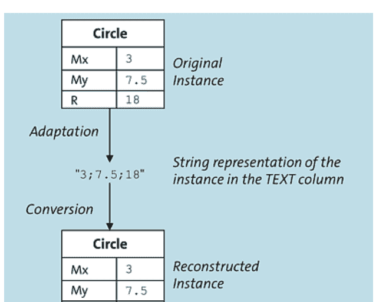

图32.3 适配和转换示意图

相应的`Circle`类可以定义如下：

```
class Circle:
    def __init__(self, mx, my, r):
        self.Mx = mx
        self.My = my
        self.R = r
```

现在我们需要创建一个适配器函数，将`Circle`实例转换为字符串。

我们将通过创建一个包含圆的三个属性、用分号分隔的字符串来执行转换：

```
def circle_adapter(k):
    return "{};{};{}".format(k.Mx, k.My, k.R)
```

为了让数据库知道我们想用这个函数适配`Circle`实例，我们需要注册`circle_adapter`并将其与`Circle`数据类型关联起来。这通过调用`sqlite3.register_adapter`方法来完成，该方法将要适配的数据类型作为第一个参数，适配器函数作为第二个参数：

```
>>> sqlite3.register_adapter(Circle, circle_adapter)
```

这些步骤允许我们将`Circle`实例存储在`TEXT`列中。然而，只有当在读取时自动生成`Circle`实例时，整个事情才真正变得有用。

因此，我们仍然需要定义`circle_adapter`的逆函数——转换器，它从字符串中恢复原始的`Circle`实例。在我们的例子中，这被证明非常简单：

```
def circle_converter(bytestring):
    mx, my, r = bytestring.split(b";")
    return Circle(float(mx), float(my), float(r))
```

与适配器类似，转换器函数也必须向 SQLite 注册，我们可以通过 `sqlite3.register_converter` 方法来实现：

```python
>>> sqlite3.register_converter("CIRCLE", circle_converter)
```

与 `register_adapter` 不同，`register_converter` 期望第一个参数是一个字符串，该字符串为要转换的数据类型分配一个名称。通过这样做，我们定义了一个名为 `CIRCLE` 的新 SQLite 数据类型，我们可以像使用内置类型一样将其用于表的列。但是，在连接到数据库时，我们需要告诉 SQLite 我们想要使用自定义类型。为此，我们将一个适当的值作为 `detect_types` 关键字参数传递给 `connect` 方法：

```python
>>> con = sqlite3.connect(":memory:",
...                     detect_types=sqlite3.PARSE_DECLTYPES)
```

在接下来的章节中，我们将在一个小型示例程序中演示我们新的 `Circle` 数据类型的定义和使用：

```python
import sqlite3

class Circle:
    def __init__(self, mx, my, r):
        self.Mx = mx
        self.My = my
        self.R = r
    def __str__(self):
        return "Circle({}, {}, {})".format(self.Mx, self.My, self.R)

def circle_adapter(k):
    return "{};{};{}".format(k.Mx, k.My, k.R)

def circle_converter(bytestring):
    mx, my, r = bytestring.split(b";")
    return Circle(float(mx), float(my), float(r))

# 注册适配器和转换器
sqlite3.register_adapter(Circle, circle_adapter)
sqlite3.register_converter("CIRCLE", circle_converter)

# 这里在内存中存储一个示例数据库，
# 其中定义了一个用于圆的单列表
con = sqlite3.connect(":memory:",
                      detect_types=sqlite3.PARSE_DECLTYPES)
cursor = con.cursor()
cursor.execute("CREATE TABLE circle_table(k CIRCLE)")

# 将圆写入数据库
circle = Circle(1, 2.5, 3)
cursor.execute("INSERT INTO circle_table VALUES (?)", (circle,))

# 再次读出圆
cursor.execute("SELECT * FROM circle_table")

read_circle = cursor.fetchall()[0][0]
print(type(read_circle))
print(read_circle)
```

该程序的输出如下，表明 `read_circle` 确实是 `Circle` 类的一个实例，并具有正确的属性：

```
<class '__main__.Circle'>
Circle(1.0, 2.5, 3.0)
```

## 局限性

与其他数据库相比，SQLite 数据库系统存在某些局限性。例如，在修改或添加记录时，数据库会锁定读取访问权限，这对于 Web 应用程序来说可能特别不实用。

### 32.3 压缩文件和归档

Python 的标准库提供了处理以各种方式压缩的文件的功能。例如，标准库的 `gzip` 模块允许你轻松读写与 zlib 库兼容的文件。[164] 由于你可以以与 `gzip` 类似的方式处理其他格式，我们将更详细的描述限制在 `gzip`，并在表 32.8 中列出了也支持哪些格式。

`gzip` 模块提供了 `open` 函数，其使用方式与内置的 `open` 函数类似。

### 32.3.1 gzip.open(filename, [mode, compresslevel])

`gzip.open` 函数返回一个对象，该对象可以像普通文件对象一样使用。

`filename` 和 `mode` 参数与内置 `open` 函数的参数等效。

最后一个参数 `compresslevel` 允许你指定将数据写入文件时的压缩程度。允许的整数范围是 0 到 9，其中 0 是最差的压缩级别，9 是最佳的。压缩级别越高，压缩数据所需的计算时间也越多。如果未指定 `compresslevel` 参数，`gzip` 默认使用最强压缩：

```python
>>> import gzip
>>> with gzip.open("testfile.gz", "wb") as f:
...     f.write(b"Hello world")
11
>>> with gzip.open("testfile.gz") as g:
...     g.read()
b'Hello world'
```

在这个例子中，我们向 testfile.gz 文件写入一个简单的 `bytes` 字符串，然后再次读出它。

### 32.3.2 用于访问压缩数据的其他模块

Python 的标准库中还有其他模块提供对压缩数据的访问。因为这些模块与刚刚介绍的 `gzip` 模块非常相似，我们在此不提供任何详细描述，而是建议你参考 Python 文档。

表 32.8 提供了所有管理压缩数据的模块概览。

| 模块 | 描述 |
| :--- | :--- |
| `bz2` | 提供对使用 *bzip2* 算法压缩的数据的便捷访问。通常，bzip2 的压缩在压缩比方面优于 zlib。 |
| `gzip` | 提供对使用 zlib 压缩的数据的便捷访问。 |
| `lzma` | 提供对 .xz 和 .lzma 格式的 *LZMA* 压缩文件的访问。LZMA 算法的特点是压缩率高且解压效率高。 |
| `zlib` | 一个低级库，提供对 zlib 函数的直接访问。通过它，除了其他功能外，还可以压缩或解压字符串。`gzip` 模块在内部使用 `zlib` 模块。 |
| `zipfile` | 提供对 *ZIP* 归档文件的访问，例如由著名的 WinZip 程序创建的归档文件。也可以操作和创建新的归档文件。 |
| `tarfile` | 实现读取或写入在 Unix 世界中广泛使用的 *TAR* 归档文件的函数和类。 |

**表 32.8** Python 压缩模块概览

### 32.4 序列化实例：pickle

`pickle` 模块提供了用于*序列化*对象的功能。序列化意味着创建一个 `bytes` 对象，该对象存储对象的所有信息，以便稍后可以通过称为*反序列化*的过程进行重建。

特别是对于将 Python 实例存储到文件中或通过网络连接等方式传输它们，`pickle` 非常适用。以下数据类型可以使用 `pickle` 进行序列化或反序列化：

- `None`, `True`, `False`
- 数值数据类型（`int`, `float`, `complex`, `bool`）
- `str`, `bytes`
- 序列数据类型（`tuple`, `list`）、集合（`set`, `frozenset`）和字典（`dict`），只要它们的所有元素也可以被 `pickle` 序列化
- 全局函数
- 内置函数
- 全局类
- 属性可以被序列化的类实例

关于类和函数，你必须注意，此类对象在序列化时仅按其名称存储。函数的代码或类的定义不会被存储。因此，例如，如果你想反序列化一个自定义类的实例，则该类必须在当前上下文中定义，就像序列化时一样。如果情况并非如此，将生成 `UnpicklingError`。

`pickle` 可以用六种格式存储其数据。每种格式都有一个标识号。表 32.9 列出了可用的协议以及从哪个 Python 版本开始可以使用每种格式。

| 版本 | 可用起始版本 | 备注 |
| :--- | :--- | :--- |
| 0 | — | ASCII 格式 |
| 1 | — | 二进制格式 |
| 2 | Python 2.3 | 二进制格式 |
| 3 | Python 3.0 | 二进制格式 |
| 4 | Python 3.4 | 二进制格式，标准协议 |
| 5 | Python 3.8 | 二进制格式 |

**表 32.9** Pickle 协议

`pickle` 模块通过两个接口提供其功能：通过 `dump` 和 `load` 函数的基于函数的接口，以及通过 `Pickler` 和 `Unpickler` 类的面向对象的接口。

要使用 `pickle`，首先必须导入该模块：

```python
>>> import pickle
```

### 32.4.1 函数式接口

**pickle.dump(obj, file, [protocol])**

`pickle.dump` 函数将 `obj` 的序列化写入传递的文件对象。为了能够做到这一点，传递的文件对象必须已为写访问打开。

`protocol` 参数允许你传递要使用的 `pickle` 协议版本。`protocol` 的默认值为 4。如果你指定二进制格式，则为 `file` 传递的文件对象必须以二进制写入模式打开：

```python
>>> with open("pickle-test.dat", "wb") as f:
...     pickle.dump([1, 2, 3], f)
...     pickle.dump({"hello": "world"}, f)
```

对于 `file`，除了真实的文件对象外，你还可以传递任何实现了带有 `string` 参数的 `write` 方法的对象，例如 `StringIO` 实例。

**pickle.load(file)**

`pickle.load` 函数从 `file` 文件对象的当前读取位置开始加载下一个序列化对象。在此过程中，`load` 会独立识别数据是以哪种格式保存的。

以下示例基于当前工作目录中存在一个名为 `pickle-test.dat` 的文件的假设，该文件包含一个序列化的列表和一个字典：

```python
>>> with open("pickle-test.dat", "rb") as f:
...     print(pickle.load(f))
...     print(pickle.load(f))
[1, 2, 3]
{'hello': 'world'}
```

同样，如果你使用除 0 以外的 `pickle` 协议，应确保以二进制模式打开文件。

**pickle.dumps(obj, [protocol])**

`pickle.dumps` 函数将 `obj` 的序列化表示作为 `bytes` 字符串返回，其中 `protocol` 参数指定`pickle` 协议版本。默认情况下，使用协议版本 4：

```
>>> pickle.dumps([1, 2, 3])
b'\x80\x04\x95\x0b\x00\x00\x00\x00\x00\x00\x00\x94(K\x01K\x02K\x03e.'
```

## pickle.loads(string)

`pickle.loads` 函数用于恢复在 `string` 中序列化的对象。它会自动检测所使用的协议，并忽略字符串末尾多余的字符：

```
>>> s = pickle.dumps([1, 2, 3])
>>> pickle.loads(s)
[1, 2, 3]
```

## 32.4.2 面向对象的接口

当需要将多个对象序列化到同一个文件时，每次调用 `dump` 都要指定文件对象和使用的协议，这很麻烦。使用 `Pickler` 和 `Unpickler` 类，你可以创建绑定到特定文件和 pickle 协议版本的实例，随后所有对 `dump` 或 `load` 方法的调用都会遵循该协议。此外，通过继承 `Pickler` 和 `Unpickler`，你可以扩展它们的功能，例如，透明地将数据存储到外部数据源（如数据库）或从中读取数据。

## pickle.Pickler(file, [protocol])

`file` 和 `protocol` 两个参数的含义与 `pickle.dump` 函数中的相同。生成的 `Pickler` 对象有一个名为 `dump` 的方法，该方法接受一个待序列化的对象作为参数。

所有发送给 `dump` 方法的对象都会被写入创建 `pickler` 实例时传入的文件对象：

```
>>> with open("a_file.dat", "wb") as f:
...     p = pickle.Pickler(f, protocol=2)
...     p.dump({"first_name" : "Donald", "last_name" : "Duck"})
...     p.dump([1, 2, 3, 4])
```

## pickle.Unpickler(file)

`Pickler` 的对应类是 `Unpickler`，它从传入的文件对象中恢复原始数据。`Unpickler` 实例有一个无参数的方法 `load`，每次调用时从文件中读取下一个对象。所使用的协议会自动确定。

以下示例基于一个假设：在 `Pickler` 类示例中生成的文件 `a_file.dat` 位于当前工作目录中：

```
>>> with open("a_file.dat", "rb") as f:
...     u = pickle.Unpickler(f)
...     print(u.load())
...     print(u.load())
{'first_name': 'Donald', 'last_name': 'Duck'}
[1, 2, 3, 4]
```

### 32.5 JSON 数据交换格式：json

*JavaScript 对象表示法*（JSON）数据格式最初是为 JavaScript 开发的，已成为简单数据交换的事实标准，在一定程度上与 XML 竞争。与 XML 标记语言不同，JSON 以有效的 JavaScript 代码形式存储数据。尽管如此，所有常见的编程语言——当然也包括 Python——都有 JSON 解析器。

JSON 表示的对象可以由 [表 32.10](#table-32-10) 中列出的数据类型组成，每种类型在 Python 中都有一个含义相同的对应类型。

| JSON 数据类型 | 表示法 | 对应的 Python 数据类型 |
| :--- | :--- | :--- |
| 对象 | `{}` | `dict` |
| 数组 | `[]` | `list` |
| 数字 | `12`<br>`12.34` | `int`<br>`float` |
| 字符串 | `""` | `str` |
| 值 | `true`<br>`false`<br>`null` | `bool`<br>`bool`<br>`NoneType` |

**表 32.10** JSON 中的数据类型及其在 Python 中的对应类型

与字典和列表类似，JSON 中的对象和数组可以包含进一步的实例——特别是，可以包含进一步的对象或数组。

标准库包含 `json` 模块，该模块可以将 Python 实例序列化为 JSON 格式，或从 JSON 格式创建它们。

为了说明这一点，我们首先创建一个数据记录，该记录将在后续示例中使用：

```
>>> entry = {
...     "first name": "Donald",
...     "last name": "Duck",
...     "address": [13, "Quack street", "Duckburg"],
...     "age": 81
... }
```

与 `pickle` 类似，`json` 模块提供了 `dump` 和 `dumps` 或 `load` 和 `loads` 函数，用于存储或加载数据。为了能够运行以下示例，必须首先导入 `json` 模块：

```
>>> import json
```

`dump` 函数接受一个 Python 实例（该实例可以由表 32.10 中列出的数据类型组成），并将其保存到为写入而打开的文件对象中：

```
>>> with open("entry.json", "w") as f:
...     json.dump(entry, f)
```

请注意，JSON 是一种人类可读的数据格式。因此，文件对象不必像使用 `pickle` 时那样以二进制模式打开。与 `dump` 类似，`dumps` 函数将实例的 JSON 表示形式作为字符串返回：

```
>>> s = json.dumps(entry)
>>> s
'{"first name": "Donald", "last name": "Duck", "address": [13, "Quack street",
"Duckburg"], "age": 81}'
```

现在可以使用相应的 `load` 和 `loads` 函数再次读取存储的数据，并将其转换回 Python 实例：

```
>>> with open("entry.json", "r") as f:
...     print(json.load(f))
{'first name': 'Donald', 'last name': 'Duck', 'address': [13, 'Quack street',
'Duckburg'], 'age': 81}
>>> json.loads(s)
{'first name': 'Donald', 'last name': 'Duck', 'address': [13, 'Quack street',
'Duckburg'], 'age': 81}
```

### 32.6 CSV 表格格式：csv

数据库和电子表格广泛使用的一种导入和导出格式是*逗号分隔值*（CSV）格式。CSV 文件是文本文件，其中数据记录存储在单独的行中。在数据记录内，各个值由分隔符（如逗号）分隔——因此得名。

例如，一个存储人员信息并使用逗号作为分隔符的 CSV 文件可能如下所示：

```
first name,last name,date of birth,place of residence,hair color
Howard,Hook,07/19/1980,Boston,Brown
Richard,Gold,09/19/1990,Detroit,Brown
Henry,Hawk,04/14/1959,Hartford,Dark blonde
Edith,Falcon,09/13/1987,Chicago,Black
Roger,Blackbird,03/25/1988,Miami,Light red
```

第一行包含列标题，所有后续行包含实际的数据记录。

不幸的是，CSV 文件没有标准，因此分隔符可能因不同的程序而异。这使得读取来自不同来源的 CSV 文件变得困难，因为必须始终考虑导出应用程序的特定格式。

为了能够处理各种格式的 CSV 文件，Python 提供了 `csv` 模块。`csv` 模块实现了 `reader` 和 `writer` 类，分别封装了对 CSV 数据的读写访问。借助所谓的*方言*，可以指定文件的格式。默认情况下，有为 Microsoft Excel 生成的 CSV 文件预定义的方言。该模块还提供了一个名为 `Sniffer` 的类，可以猜测文件的方言。

你可以通过 `csv.list_dialects` 查看所有已定义方言的列表：

```
>>> import csv
>>> csv.list_dialects()
['excel', 'excel-tab', 'unix']
```

### 32.6.1 使用 reader 对象从 CSV 文件读取数据

可以使用具有以下构造函数的 `reader` 对象读取 CSV 文件：

**csv.reader(csvfile, [dialect], {\*\*fmtparam})**

`csvfile` 参数必须是一个指向为读取访问而打开的文件对象的引用，数据将从该对象中读取。

通过 `dialect`，你可以指定要读取的文件是以哪种格式编写的。为此，你必须传递一个包含在 `csv.list_dialects` 返回的列表中的字符串。或者，你可以指定一个 `Dialect` 类的实例，我们将在 [第 32.6.2 节](https://example.com) 中描述它。默认情况下，`dialect` 使用值 "excel"，使用该方言编码的文件使用逗号作为分隔符。

你可以使用关键字参数而不是 `Dialect` 类的实例来指定自定义方言。一个我们以这种方式将分号设置为分隔符的示例如下所示：

```
with open("file.csv") as f_csv:
    reader = csv.reader(f_csv, delimiter=";")
```

有关方言和 `fmtparam` 可能值的概述，请参见 [第 32.6.2 节](https://example.com)。

`reader` 类实现了迭代器协议，因此其实例可以在 `for` 循环中方便地进行迭代。例如，在

在下面的示例中，我们将读取之前介绍的示例CSV文件：

```
>>> with open("names.csv") as f_csv:
...     reader = csv.reader(f_csv)
...     for line in reader:
...         print(line)
['first name', 'last name', 'date of birth', 'place of residence', 'hair color']
['Howard', 'Hook', '07/19/1980', 'Boston', 'Brown']
['Richard', 'Gold', '09/19/1990', 'Detroit', 'Brown']
['Henry', 'Hawk', '04/14/1959', 'Hartford', 'Dark blonde']
['Edith', 'Falcon', '09/13/1987', 'Chicago', 'Black']
['Roger', 'Blackbird', '03/25/1988', 'Miami', 'Light red']
```

如你所见，对于每一行，`reader`都会返回一个包含各列值的列表。重要的是，列值始终以字符串形式返回。

除了返回列表的标准`reader`之外，还有`DictReader`，它为每一行创建一个字典，将相应行的值分配给列标题。

```
>>> with open("names.csv") as f_csv:
...     reader = csv.DictReader(f_csv)
...     for line in reader:
...         print(line)
{'first_name': 'Howard', 'last_name': 'Hook', 'date_of_birth': '07/19/1980',
'place_of_residence': 'Boston', 'haircolor': 'Brown'}
{'first_name': 'Richard', 'last_name': 'Gold', 'date_of_birth': '09/19/1990',
'place_of_residence': 'Detroit', 'haircolor': 'Brown'}
[...]
```

## csv.writer(csvfile, [dialect], {**fmtparam})

`writer`类的构造函数与`reader`类的构造函数接受相同的参数，不同之处在于为`csvfile`传递的文件对象必须以写入模式打开。

生成的`writer`对象具有`writerow`和`writerows`两个方法，可用于将单行或多行数据一次性写入CSV文件：

```
>>> data = (
...     ["Volvo", "P245", "130"], ["Ford", "Ecosport", "90"],
...     ["Mercedes", "CLK", "250"], ["Audi", "A6", "350"],
... )
>>> with open("cars.csv", "w") as f_csv:
...     writer = csv.writer(f_csv)
...     writer.writerow(["brand", "model", "horsepower"])
...     writer.writerows(data)
```

在这个示例中，我们创建了一个名为`cars.csv`的新CSV文件。我们使用`writerow`方法将列标题写入新文件的第一行，然后使用`writerows`写入四条示例记录。

类似于`DictReader`类，也有一个`DictWriter`类，其创建方式与普通`writer`类几乎相同，不同之处在于除了文件对象外，还必须传递一个列标题列表。对于`writerow`和`writerows`方法，`DictWriter`实例期望字典作为参数，而`writeheader`方法用于将列标题写入CSV文件。以下示例创建了与前一个相同的CSV文件：

```
>>> data = ({"brand": "Volvo", "model": "P245", "horsepower": "130"},
...         {"brand": "Ford", "model": "Ecosport", "horsepower": "90"},
...         {"brand": "Mercedes", "model": "CLK", "horsepower": "250"},
...         {"brand": "Audi", "model": "A6", "horsepower": "350"})
>>> with open("cars.csv", "w") as f_csv:
...     writer = csv.DictWriter(f_csv, ["brand", "model", "horsepower"])
...     writer.writeheader()
...     writer.writerows(data)
```

## 32.6.2 使用自定义方言：方言对象

`csv.Dialect`类的实例用于描述CSV文件的结构。你不应该直接创建`Dialect`对象，而应使用`csv.register_dialect`函数。通过`register_dialect`，你可以创建一个新的方言并为其命名。这个名称随后可以作为参数传递给`reader`和`writer`类的构造函数。此外，每个注册的名称都包含在`csv.get_dialects`返回的列表中。

`register_dialect`函数具有前面描述的接口。

### csv.register_dialect(name, [dialect], {**fmtparam})

`name`参数必须是一个标识新方言的字符串。通过`dialect`，可以传递一个已存在的`Dialect`对象，该对象随后与相应的名称关联。

最重要的是，使用可选的关键字参数，你可以指定新的方言。表32.11中列出的关键字参数是允许的。

| 名称 | 含义 |
| :--- | :--- |
| `delimiter` | 列值之间的分隔符。默认值是逗号","。 |
| `quotechar` | 用于括起包含特殊字符（如分隔符或换行符）的字段的字符。默认值是双引号'"'。 |
| `doublequote` | 一个布尔值，指定如何在字段本身内屏蔽为`quotechar`指定的字符。如果`doublequote`的值为`True`，则`quotechar`将连续插入两次。如果`doublequote`的值为`False`，则改为在`quotechar`之前写入为`escapechar`指定的字符。默认情况下，`doublequote`的值为`True`。 |
| `escapechar` | 如果`quoting`的值为`QUOTE_NONE`，则用于在列值内编码分隔符的字符。当`doublequote`的值为`False`时，`escapechar`也用于编码`quotechar`。默认情况下，编码被禁用，`escapechar`的值为`None`。 |
| `lineterminator` | 用于分隔行的字符。默认设置为`"\r\n"`。请注意，此设置仅影响写入器。所有`reader`对象不受`lineterminator`设置的影响，始终使用`"\r"`、`"\n"`或两者的组合作为行分隔符。 |
| `quoting` | 指定是否以及何时应使用`quotechar`括起列值。有效值如下：<ul><li>`QUOTE_ALL` - 所有列值都被括起。</li><li>`QUOTE_MINIMAL` - 仅括起包含特殊字符（如换行符或列值分隔符）的字段。</li><li>`QUOTE_NONNUMERIC` - 写入时，所有非数字字段都由`quotechar`括起。读取时，所有未括起的字段都自动转换为`float`。</li><li>`QUOTE_NONE` - 不使用`quotechar`进行括起。</li></ul> 默认情况下，`quoting`设置为`QUOTE_MINIMAL`。 |
| `skipinitialspace` | 一个布尔值，指定如何处理列值中的前导空白。设置为`True`会导致忽略所有前导空白；值为`False`会导致读取并返回完整的列内容。默认值为`False`。 |

**表32.11** register_dialect的关键字参数

例如，让我们注册一个名为"`my_dialect`"的新方言，该方言使用制表符作为分隔符，并用引号括起所有字段：

```
>>> csv.register_dialect("my_dialect", delimiter="\t",
...                     quoting=csv.QUOTE_ALL)
```

我们现在可以将这个新方言传递给`reader`和`writer`类的构造函数，并以此方式编写和读取我们自己的CSV文件。

## 自动确定方言

`csv`模块提供了`Sniffer`类，可用于从样本中自动生成CSV文件的方言。在下面的示例中，我们使用`Sniffer`从前面示例中的`cars.csv`文件确定方言：

```
>>> with open("cars.csv") as f_csv:
...     sample = f_csv.read(1024)
>>> dialect = csv.Sniffer().sniff(sample)
>>> dialect.delimiter
','
```

示例程序已正确将分隔符识别为逗号。使用这样创建的方言，现在可以读取CSV文件：

```
>>> with open("cars.csv") as f_csv:
...     reader = csv.reader(f_csv, dialect)
...     for row in reader:
...         print(row)
['brand', 'model', 'horsepower']
['Volvo', 'P245', '130']
['Ford', 'Ecosport', '90']
['Mercedes', 'CLK', '250']
['Audi', 'A6', '350']
```

`Sniffer`类还包含一个`has_header`方法，用于确定文件的第一行是否包含列标题。在此示例中，它返回值`True`：

```
>>> csv.Sniffer().has_header(sample)
True
```

> **注意**

`Sniffer`类使用启发式方法来确定方言并检查文件第一行中的列标题。这些启发式方法可能会失败，因此你应该将返回值视为有根据的猜测，而不是确定的陈述。

## 33 网络通信

在详细讨论了不同格式文件或数据库中的数据存储之后，本章将聚焦于另一个重要的编程领域：网络通信。

基本上，网络通信的主题可以划分为若干所谓的*协议层*。图33.1展示了一个高度简化的*OSI模型*，它说明了各层之间的层次关系。


**图33.1** 网络协议

最基础的协议显示在图表的底部。这是数据以电信号形式传输的裸线。在此基础上，实现了诸如以太网和IP等更抽象的协议。通常，图33.1中显示在更高层级的协议，与较低层级的协议相比，更为抽象和专业化。对应用程序员真正有趣的部分始于IP协议之上——即TCP和UDP传输协议。我们将在下一节关于套接字的讨论中详细探讨这两种协议。

构建在TCP之上的协议是最抽象的，因此对我们来说尤为重要。在本书中，我们将涵盖表33.1中列出的协议。

| 协议 | 描述 | 模块 | 章节 |
| :--- | :--- | :--- | :--- |
| UDP | 基本的无连接网络协议 | `socket` | 第33.1.2节 |
| TCP | 基本的面向连接的网络协议 | `socket` | 第33.1.3节 |
| HTTP | 传输文本文件，如网页 | `urllib`<br>`requests` | 第34章，第34.4节 |
| FTP | 文件传输 | `ftplib` | 第34章，第34.5节 |
| SMTP | 发送电子邮件 | `smtplib` | 第35章，第35.1节 |
| POP3 | 接收电子邮件 | `poplib` | 第35章，第35.2节 |
| IMAP4 | 接收和管理电子邮件 | `imaplib` | 第35章，第35.3节 |

**表33.1** 网络协议

也有一些基于UDP的抽象协议，例如*网络文件系统*（NFS）。然而，本书将只涵盖基于TCP的协议，因为从应用程序员的角度来看，它们是最有趣的。

我们将在本章的第一节首先向您介绍底层的`socket`模块。值得一看这个模块，因为它提供了许多在更抽象的模块中无法实现的网络编程可能性。此外，一旦您熟悉了`socket`模块，您就会真正体会到抽象接口所提供的便利。

在描述了套接字API之后，我们将介绍更复杂的方法XML-RPC。

## 33.1 套接字API

标准库的`socket`模块提供了网络通信的基本功能。它实现了标准化的*套接字API*，该API在许多其他编程语言中也能找到类似的形式。

套接字API背后的理念是，希望通过网络接口发送或接收数据的程序向操作系统注册此请求，并从操作系统获得一个所谓的*套接字*。然后，程序可以使用这个套接字与另一个套接字建立网络连接。无论目标套接字是在同一台计算机上、本地网络上的计算机上，还是互联网上的计算机上，这都无关紧要。

让我们从一些关于计算机如何在复杂的网络世界中被寻址的思考开始。网络（包括互联网）上的每台计算机都有一个唯一的IP地址，通过它可以被寻址。IP地址是一个具有特定结构的字符串，例如*192.168.1.23*。四个数值中的每一个代表一个字节，因此可以在0到255之间。在这种情况下，这是一个本地网络的IP地址，由初始序列192.168表示。

但这还不是全部。一台计算机可以同时运行多个希望通过网络接口发送和接收数据的程序，因此，网络连接也绑定到一个所谓的*端口*。端口允许您寻址运行在具有特定IP地址的计算机上的特定程序。

端口是一个16位数字，因此基本上有65,535个不同的端口可用。然而，其中许多端口已注册用于特定协议和应用程序，不应自定义使用。例如，端口80和21分别注册用于HTTP和FTP服务器。通常，您可以放心地使用从49152开始的端口。

请注意，防火墙或路由器可能会阻止某些端口。因此，如果您想在计算机上运行一个服务器，让客户端可以通过特定端口连接，您可能需要使用相应的软件启用该端口。

### 33.1.1 客户端-服务器系统

网络通信的两个通信伙伴通常具有不同的任务。在常见的客户端-服务器系统中，一方是提供某些服务的*服务器*，另一方是使用这些服务的*客户端*。

服务器通过网络上的一个已知地址可访问，并被动运行；也就是说，它等待传入的连接。一旦来自客户端的连接请求到达，如果服务器接受该请求，就会创建一个新的套接字来与该特定客户端通信。让我们先看看*串行服务器*，这种服务器必须与前一个客户端的通信完成，才能接受新的连接。这与*并行服务器*和*多路复用服务器*的概念形成对比，我们将在后面描述。

客户端代表主动的通信伙伴。这意味着它向服务器发送连接请求，然后主动使用其服务。

串行服务器和客户端在通信之前、期间和之后所处的阶段由图33.2中的流程图说明。您可以将其视为串行服务器及其客户端的蓝图。

首先，在服务器程序中创建所谓的*连接套接字*。这是一个专门用于监听传入连接并在必要时接受它们的套接字。连接套接字不进行任何通信。通过调用`bind`和`listen`方法，连接套接字被绑定到一个网络地址，并被指示监听传入的连接请求。

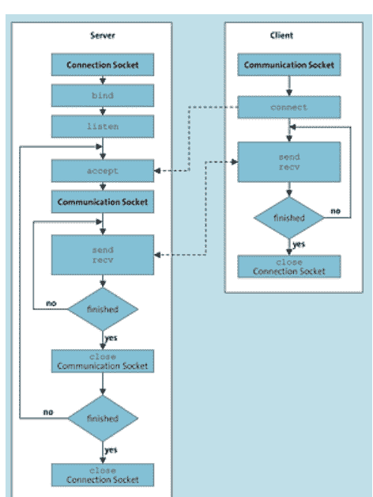

**图33.2** 客户端-服务器模型

在连接请求到达并通过`accept`接受后，会创建一个新的套接字，即所谓的*通信套接字*。这样的通信套接字用于通过`send`或`recv`等方法处理服务器和客户端之间的完整通信。一个通信套接字一次只负责一个已连接的客户端。

一旦通信完成，通信套接字就会关闭，并可能建立另一个连接。未立即接受的连接请求会在所谓的*队列*中缓冲，并可以一个接一个地处理。最后，连接套接字也会被关闭。

客户端的结构相对简单。例如，只有一个通信套接字，可以使用`connect`方法向特定服务器发送连接请求。之后，与服务器类似，通过`send`或`recv`等方法进行实际通信。通信结束后，连接套接字被关闭。

基本上，可以选择两种可用的网络协议在服务器和客户端之间进行数据传输：UDP和TCP。在接下来的两节中，我们将为这两种协议实现小型示例服务器和客户端。

请注意，此处介绍的流程图指的是面向连接且更常见的TCP协议。无连接的UDP协议的处理在某些关键点上与此不同，这将在下一节中描述。

### 33.1.2 UDP

用户数据报协议（UDP）网络协议于1977年开发，作为TCP传输人类语音的替代方案。其特点是UDP是*无连接*且*不可靠*的。这两个术语相辅相成，意味着通信伙伴之间没有建立明确的连接，并且UDP既不保证发送的数据包按发送顺序到达，也不保证它们一定能到达。然而，由于这些限制，使用UDP可以进行相对较快的传输，因为例如不需要重新请求或缓冲数据包。

这使得UDP特别适合多媒体应用，如VoIP、音频或视频流，其中快速的数据传输很重要，且可以容忍轻微的传输错误。

先前开发的示例项目包含一个服务器程序和一个客户端程序。客户端通过UDP向指定地址发送文本消息。运行在该地址的服务器程序接收并显示该消息。让我们先来看客户端的源代码：

```python
import socket
ip = input("IP address: ")
message = input("Message: ")
with socket.socket(socket.AF_INET, socket.SOCK_DGRAM) as s:
    s.sendto(message.encode(), (ip, 50000))
```

首先，调用`socket`函数会创建一个`socket`实例。可以传递两个参数：要使用的地址类型和要使用的网络协议。常量`AF_INET`和`SOCK_DGRAM`分别代表Internet/IPv4和UDP。

之后，程序会向用户请求两条信息：消息要发送到的IP地址，以及消息本身。

最后，使用`socket`的`sendto`方法将消息发送到指定的IP地址，这里使用端口`50000`。请注意，要发送的消息必须作为`bytes`字符串或`bytearray`实例传递给`sendto`。这一点尤其重要，因为它允许传输二进制数据。

只要另一端没有能够接收和利用该消息的匹配服务器程序，单独的客户端程序是无用的。请注意，UDP是无连接的，因此其实现与[第33.1.1节](Section 33.1.1)中的服务器流程图有所不同。服务器的源代码如下所示：

```python
import socket
with socket.socket(socket.AF_INET, socket.SOCK_DGRAM) as s:
    s.bind(("", 50000))
    while True:
        data, addr = s.recvfrom(1024)
        print("[{}] {}".format(addr[0], data.decode()))
```

同样，首先创建一个`socket`实例，然后通过调用`bind`方法将其绑定到一个地址。请注意，此方法接收一个*地址对象*作为参数。在套接字上下文中，当我们谈论地址对象时，指的是一个包含两个元素的元组：一个作为字符串的IP地址和一个作为整数的端口号。

将套接字绑定到地址决定了该套接字可以使用哪个内部接口来接收数据包。如果未指定IP地址，这意味着可以通过分配给服务器的所有地址（例如通过`127.0.0.1`或`localhost`）来接收数据包。

套接字绑定到地址后，就可以接收数据了。为此，在一个无限循环中调用`recvfrom`方法（意为*从...接收*）。该方法会等待直到收到一个数据包，并将读取的数据以及发送者信息作为元组返回。请注意，接收到的数据也是以`bytes`实例的形式返回的。

`recvfrom`的参数指定了缓冲区大小，应该是2的幂。缓冲区大小定义了单次调用`recvfrom`可以返回的最大数据量。如果要接收的消息超过缓冲区大小，你可以通过多次调用`recvfrom`并拼接结果来逐段获取它。

## 33.1.3 TCP

*传输控制协议（TCP）*并非UDP的竞争者，而是以其功能填补了UDP留下的空白。因此，TCP主要是面向连接且可靠的。*面向连接*意味着数据包不像UDP那样简单地发送到IP地址，而是预先建立一个连接，并基于此连接执行进一步操作。*可靠*意味着使用TCP时，不会出现像UDP那样的数据包丢失、错误到达或顺序错误的情况。此类情况会由TCP协议自动纠正——例如，通过重新请求不完整或错误的数据包。

因此，在网络通信中，TCP通常是首选。但是，请务必记住，每个需要重新请求的数据包都需要时间，这可能会增加连接的延迟。

在接下来的章节中，我们将基于一个小型示例项目来解释TCP的使用。其思路是创建一个基本的聊天程序，客户端向服务器发送消息，服务器可以回复。因此，通信应始终交替进行。服务器的源代码如下所示：

```python
import socket
with socket.create_server(("", 50000)) as s:
    s.listen(1)
    while True:
        comm, addr = s.accept()
        while data := comm.recv(1024):
            print("[{}] {}".format(addr[0], data.decode()))
            message = input("Response: ")
            comm.send(message.encode())
        comm.close()
```

为了为TCP服务器创建连接套接字，我们使用`create_server`函数，它结合了创建和绑定TCP套接字的操作。请注意，`create_server`期望一个地址对象作为参数，因此IP地址和端口规范被组合在一个元组中。通过指定空的IP地址，我们将套接字绑定到服务器的所有IP地址。

之后，通过调用`listen`方法将服务器切换到被动模式，并指示其监听连接请求。请注意，此方法尚未建立连接。传递的参数决定了要缓冲的最大连接尝试次数，应至少为1。

在随后的无限循环中，连接套接字调用的`accept`方法等待传入的连接请求并接受它。它返回一个元组，其第一个元素是可用于与连接客户端通信的通信套接字。元组的第二个元素是连接方的地址对象。

建立连接后，启动第二个无限循环。在每次迭代中，我们通过`comm.recv`从连接方读取一条消息并输出消息文本。如果`comm.recv`返回空字符串，则表示连接方已终止连接。在这种情况下，内部循环将被中止。当收到真实消息时，服务器允许用户输入回复并通过`comm.send`发送。我们使用赋值表达式`:=`（参见[第5章，第5.4节](#)）来实现此逻辑。

现在我们需要仔细查看客户端的源代码：

```python
import socket
ip = input("IP address: ")
with socket.create_connection((ip, 50000)) as s:
    while message := input("Message: "):
        s.send(message.encode())
        response = s.recv(1024)
        print("[{}] {}".format(ip, response.decode()))
```

在客户端，通过调用`create_connection`函数创建并连接TCP连接套接字`s`。服务器可以通过`accept`接受连接请求。如果连接被拒绝，将引发异常。

随后的无限循环与服务器的工作方式类似，不同之处在于首先输入并发送一条消息，然后等待服务器的响应。这使得客户端和服务器进入一种节奏：每当客户端输入一条消息时，服务器就等待，反之亦然。

考虑一下这个挑战：通过线程等方式将客户端和服务器扩展为一个可用的聊天程序。这可以表现为一个线程一次监听`s.recv`并显示传入的消息，而第二个线程允许用户通过`input`输入和发送消息。

## 33.1.4 阻塞与非阻塞套接字

当创建套接字时，默认处于所谓的*阻塞模式*。这意味着所有方法调用都会等待它们触发的操作执行完毕。因此，调用套接字的`recv`方法会阻塞整个程序，直到实际接收到数据并可以从套接字的内部缓冲区读取为止。

在许多情况下，这种行为是可取的，但在一个有许多已连接套接字的程序中，例如，你不希望其中一个套接字因为尚未接收到数据而用其`recv`方法阻塞整个程序，而另一个套接字却有数据可供读取。为了避免此类问题，可以将套接字设置为*非阻塞模式*。这会影响各种套接字操作，如下所示：

- 套接字对象的`recv`和`recvfrom`方法仅在数据已存在于套接字的内部缓冲区时才返回传入数据。一旦方法需要等待更多数据，它就会引发`OSError`异常，从而将控制流返回给程序。
- `send`和`sendto`方法仅在可以将指定数据直接写入套接字的输出缓冲区时才发送数据。偶尔会出现缓冲区已满，`send`或`sendto`必须等待缓冲区可以接受更多数据的情况。在这种情况下，在非阻塞模式下会引发`OSError`异常，从而将控制流返回给程序。

## 33.1.5 创建套接字

本节描述创建套接字的主要方式。除了前面示例中已经使用的 `socket` 类之外，还包括 `create_connection` 和 `create_server` 函数。

### socket([family, type])

此函数创建一个新的套接字。第一个参数 `family` 标识地址族，应为 `socket.AF_INET`（用于 IPv4 命名空间）或 `socket.AF_INET6`（用于 IPv6 命名空间）。

> **注意**
>
> *互联网协议第6版（IPv6）* 是广泛使用的 IPv4 协议的后继者，其地址空间现已几乎耗尽。
>
> Python 提供了 IPv6 支持，通常只需在 `socket` 实例化时传递常量 `AF_INET6` 而非 `AF_INET` 即可。`socket` 模块的某些函数与 IPv6 不兼容，我们将在讨论这些函数时提及。
>
> IPv6 必须由所使用的操作系统支持。你可以通过查看 `socket.has_ipv6` 布尔变量来确认是否支持。

第二个参数 `type` 标识要使用的网络协议，应为 `socket.SOCK_STREAM`（用于 TCP）或 `socket.SOCK_DGRAM`（用于 UDP）。

### create_connection(address, [timeout, source_address])

此函数通过 TCP 连接到由 `address` 对象标识的远程对等方，并返回用于建立连接的套接字对象。对于 `timeout` 参数，可以传递一个超时值，该值将在建立连接时被考虑。

如果为 `source_address` 参数传递了一个地址对象，则套接字对象将在建立连接之前绑定到此地址。以下调用：

```
s = socket.create_connection((ip1,port1), timeout, (ip2, port2))
```

因此等同于：

```
s = socket.socket(socket.AF_INET, socket.SOCK_STREAM)
s.settimeout(timeout)
s.bind((ip2, port2))
s.connect((ip1, port1))
```

`create_connection` 函数可以与 `with` 语句结合使用：

```
with socket.create_connection((ip, port)) as s:
    s.send(b"Hello world")
```

### create_server(address, {family})

此函数创建一个绑定到 `address` 的 TCP 服务器，并返回为其创建的连接套接字。

对于 `family` 参数，可以传递值 `socket.AF_INET` 或 `socket.AF_INET6`，具体取决于要通过 IPv4 还是 IPv6 实现连接。

## 33.1.6 套接字类

通过调用 `socket` 或 `create_connection` 函数创建套接字类的新实例后，它提供了连接到第二个套接字或向连接对等方传输数据的方法。表 33.2 包含了套接字类主要方法的描述。

请注意，这些方法在阻塞和非阻塞模式下的行为有所不同。更多详情，请参见第 33.1.4 节。

| 方法 | 描述 | 协议 |
| :--- | :--- | :--- |
| `accept()` | 等待传入的连接请求并接受它。 | TCP |
| `bind(address)` | 将套接字绑定到 `address`。 | – |
| `close()` | 关闭套接字。这意味着无法再通过它发送或接收数据。 | – |
| `connect(address)`<br>`connect_ex(address)` | 连接到 `address` 处的服务器。 | TCP |
| `getpeername()` | 返回已连接套接字的地址对象。地址对象是一个包含 IP 地址和端口号的元组。 | TCP |
| `getsockname()` | 返回套接字自身的地址对象。 | – |
| `listen()` | 使套接字监听连接请求。 | TCP |
| `recv(bufsize)` | 从套接字读取最多 `bufsize` 字节的接收数据，并将其作为字符串返回。 | TCP |
| `recv_into(buffer, [nbytes])` | 类似于 `recv`，但将读取的数据写入 `buffer` 而不是作为 `bytes` 字符串返回。例如，可以为 `buffer` 传递一个 `bytearray` 实例。 | TCP |
| `recvfrom(bufsize)` | 类似于 `recv`，但也返回连接伙伴的地址对象。 | UDP |
| `recvfrom_into(buffer, [nbytes])` | 类似于 `recvfrom`，但将读取的数据写入 `buffer` 而不是作为 `bytes` 字符串返回。例如，可以为 `buffer` 传递一个 `bytearray` 实例。 | UDP |
| `send(bytes)`<br>`sendall(bytes)` | 将 `bytes` 数据发送到已连接的套接字。 | TCP |
| `sendto(bytes, address)` | 将 `bytes` 数据发送到具有 `address` 地址对象的套接字。 | UDP |
| `setblocking(flag)` | 将套接字设置为阻塞或非阻塞模式。 | – |
| `getblocking()` | 指定套接字是处于阻塞还是非阻塞模式。 | – |
| `settimeout(value)`<br>`gettimeout()` | 写入或读取套接字的超时值。 | – |

表 33.2 套接字类的方法

### accept()

此方法等待传入的连接请求并接受它。套接字实例必须事先通过调用 `bind` 方法绑定到特定地址和端口，并且必须正在等待连接请求。后者通过调用 `listen` 方法完成。

`accept` 方法返回一个元组，其第一个元素是一个新的套接字实例，也称为 *连接对象*，可用于与连接对等方通信。元组的第二个元素是另一个元组，包含远程套接字的 IP 地址和端口。

### bind(address)

此方法将套接字绑定到 `address`。`address` 参数必须是 `accept` 返回的那种形式的元组。

套接字绑定到特定地址后，对于 TCP，可以切换到被动模式并等待连接请求；对于 UDP，则可以直接接收数据包。

### connect(address) 和 connect_ex(address)

这些方法连接到 `address` 处的服务器。请注意，必须在该处存在一个套接字在相同端口上等待连接请求，连接才能建立。对于 IPv4 协议，`address` 参数必须是由 IP 地址和端口号组成的元组。

`connect_ex` 方法与 `connect` 的唯一区别在于，在非阻塞模式下，如果连接未立即建立，则不会引发异常。连接状态通过整数返回值指示。返回值为 0 表示连接尝试成功。

请注意，对于尝试连接时发生的真实错误，仍然会引发异常——例如，如果无法到达目标套接字。

### listen(backlog)

此方法将服务器套接字置于所谓的 *监听模式*，这意味着套接字监听想要连接到它的远程套接字。调用此方法后，可以通过 `accept` 接受传入的连接请求。

`backlog` 参数设置缓冲连接请求的最大数量，应至少为 1。`backlog` 的最大可能值由操作系统定义；通常为 5。

### send(bytes) 和 sendall(bytes)

`send` 方法将数据 `bytes` 发送到已连接的套接字。数据必须以 `bytes` 字符串的形式提供，并返回发送的字节数。请注意，在某些情况下，数据可能未完全发送。在这种情况下，应用程序负责重新发送剩余数据。

相比之下，`sendall` 方法尝试发送数据，直到完整数据记录已发送或发生错误。在发生错误的情况下，会引发相应的异常。

### settimeout(value) 和 gettimeout()

`connect` 方法向目标套接字发送连接请求，而不等待该连接建立。通过多次调用 `connect`，可以确定操作是否仍在执行。如果调用 `connect` 且连接请求仍在运行，将引发 `OSError` 异常，错误消息为 "Operation now in progress."。或者，在非阻塞模式下，可以使用 `connect_ex` 方法进行连接请求。此方法不会引发 `OSError` 异常，而是通过返回值 `0` 表示连接成功。如果在连接过程中发生错误，`connect_ex` 也会引发相应的异常。

可以通过调用套接字的 `setblocking` 方法将其设置为非阻塞模式：

```
s.setblocking(False)
```

在这种情况下，套接字 `s` 的方法调用将如前所述那样表现。向 `setblocking` 传递 `True` 会将套接字恢复到其初始的阻塞模式。

套接字操作在阻塞模式下也称为 *同步操作*，在非阻塞模式下称为 *异步操作*。

> **注意**
>
> 即使在操作期间，也可以在阻塞和非阻塞模式之间切换套接字。例如，你可以在阻塞模式下使用 `connect` 方法，然后在非阻塞模式下使用 `read` 方法。

方法 `settimeout` 为套接字设置超时值。该值决定了在阻塞模式下等待数据到达或发送的时间长度。你可以将 `value` 参数以浮点数或 `None` 的形式传递秒数。

`gettimeout` 方法可用于读取超时值。

如果 `send` 或 `recv` 等调用超过了最大等待时间，则会引发 `socket.timeout` 异常。

## 33.1.7 网络字节序

像 TCP 或 UDP 这样的标准化协议的一个优点是，许多不同类型的计算机拥有一个共同的接口，通过这个接口它们可以相互通信。然而，这种共同点可能仅限于接口层面。例如，*字节序*在不同系统之间存在显著差异。这种字节序规定了那些内存表示需要多个字节的数字的存储顺序。

当传输二进制数据时，如果在两个具有不同字节序的系统之间交换数据而不进行转换，就会导致问题。然而，TCP 协议只保证字节按照发送时的顺序到达。

只要你在网络通信中仅限于使用纯 ASCII 字符串，就不会出现问题，因为单个 ASCII 字符永远不需要超过一个字节的内存。此外，两个相同硬件平台的计算机之间的连接是毫无问题的。例如，可以在两台 x86 PC 之间毫无问题地传输二进制数据。

但在网络连接中，你通常希望传输数据时无需担心远程计算机的平台。

为此，定义了所谓的*网络字节序*。这是你在网络上传输二进制数据时必须使用的字节序。为了以一种有用的方式实现这种网络字节序，`socket` 模块包含四个函数，它们要么将数据从主机字节序转换为网络字节序（*hton*），要么反之（*ntoh*）。

表 33.3 列出了这些函数并解释了它们的含义。

| 别名 | 含义 |
| :--- | :--- |
| `ntohl(x)` | 将一个 32 位数字从网络字节序转换为主机字节序 |
| `ntohs(x)` | 将一个 16 位数字从网络字节序转换为主机字节序 |
| `htonl(x)` | 将一个 32 位数字从主机字节序转换为网络字节序 |
| `htons(x)` | 将一个 16 位数字从主机字节序转换为网络字节序 |

**表 33.3** 二进制数据转换

如果相应的系统已经使用网络字节序，调用这些函数可能是多余的。[ 168 ]

## 33.1.8 多路复用服务器：selectors

在大多数情况下，服务器并非设计为一次只服务一个客户端，如前面的示例为了简化而假设的那样。通常，服务器必须管理一整套处于不同通信阶段的已连接客户端。问题随之而来：如何在单个进程中合理地完成这样的事情——也就是说，不使用线程。

当然，你可以将所有使用的套接字切换到非阻塞模式，并自行管理。但这只是一个表面上的解决方案，因为阻塞模式有一个无价的优势：阻塞套接字会使程序在网络操作上休眠，直到操作可以执行。通过这种方式，可以降低处理器负载。

相比之下，当使用非阻塞套接字时，我们不得不在一个循环中不断遍历所有已连接的套接字，并检查是否有任何事情发生——例如，是否有数据准备好被读取。这种方法也称为*忙等待*，它允许我们准并行地读取多个套接字，但程序会更多地利用处理器，因为它在整个期间都处于活动状态。

`selectors` 模块允许你在同一个进程中管理多个套接字，并等待到达这些套接字的事件。这样的服务器被称为*多路复用服务器*。该模块定义了 `DefaultSelector` 类，可以在其中注册套接字。

以下示例编写了一个服务器，用于接受和管理来自任意数量客户端的连接。这些客户端应该能够向服务器发送多条消息，然后服务器将在屏幕上显示这些消息。为了简单起见，我们这里不包含服务器响应选项：

```python
with socket.create_server(("", 50000)) as s:
    s.setblocking(False)
    s.listen(1)
    selector = selectors.DefaultSelector()
    selector.register(s, selectors.EVENT_READ, accept)
```

首先，我们将以通常的方式创建一个非阻塞的服务器套接字。然后，该套接字与一个事件一起注册到 `DefaultSelector` 实例中。可能的事件是 `EVENT_READ` 或 `EVENT_WRITE`，它们分别在数据准备好从套接字读取或套接字准备好被写入时发生。传递给 `register` 方法的第三个参数是一个回调处理程序，它将在事件发生时被调用。在这种情况下，我们将连接套接字上的 `READ` 事件与用于接受传入连接的 `accept` 处理函数关联起来：

```python
def accept(selector, sock):
    connection, addr = sock.accept()
    connection.setblocking(False)
    selector.register(connection, selectors.EVENT_READ, message)
```

`accept` 回调处理程序接收选择器和发生事件的套接字，在本例中是连接套接字。然后它接受连接，并将“在生成的客户端套接字上接收到数据”这一事件附加到 `message` 处理函数：

```python
def message(selector, client):
    message = client.recv(1024)
    ip = client.getpeername()[0]
    if message:
        print("[{}] {}".format(ip, message.decode()))
    else:
        print("+++ Connection to {} terminated".format(ip))
        selector.unregister(client)
        client.close()
```

`message` 处理函数同样接收选择器和相关的套接字——在本例中是客户端套接字。然后它读取接收到的数据并将其作为消息打印在屏幕上。同样，为了简单起见，我们不包含服务器响应选项。

如果连接被客户端终止，`recv` 会返回一个空字符串。在这种情况下，我们需要调用选择器的 `unregister` 方法来注销这个客户端套接字。之后，连接就可以关闭了。

最后，必须启动多路复用服务器。为此，我们在一个无限循环中调用选择器的 `select` 方法，该方法会阻塞，直到注册的事件之一发生：

```python
while True:
    for key, mask in selector.select():
        key.data(selector, key.fileobj)
```

如果发生事件，`select` 会返回一个元组：`(key, mask)`。使用 `key` 实例，我们可以访问与事件关联的数据——在本例中是相应的处理函数。此外，`key.fileobj` 可用于访问发生事件的套接字。`mask` 实例指定了具体发生了哪个事件。借助二进制与运算，可以在这里检查 `EVENT_READ` 和 `EVENT_WRITE` 事件类型。

为了完整起见，这里是与此服务器匹配的客户端源代码：

```python
import socket
ip = input("IP address: ")
with socket.create_connection((ip, 50000)) as s:
    while True:
        message = input("Message: ")
        s.send(message.encode())
```

这是纯粹的套接字编程，正如我们之前章节中已经介绍过的那样。除了可能的延迟外，客户端无法察觉它是由串行服务器还是多路复用服务器提供服务。

## 33.1.9 面向对象的服务器开发：socketserver

你可以想象，使用 `socket` 模块实现一个更复杂的服务器很快就会变得混乱和复杂。因此，Python 的标准库包含了 `socketserver` 模块，旨在使编写能够服务多个客户端的服务器变得更容易。

在以下示例中，将使用 `socketserver` 模块重新创建上一节中的聊天服务器。为此，需要首先必须创建所谓的*请求处理器*。这是一个从`socketserver.BaseRequestHandler`基类派生的类。本质上，在这个类中，必须重写`handle`方法，该方法应负责与客户端的通信：

```python
import socketserver

class ChatRequestHandler(socketserver.BaseRequestHandler):
    def handle(self):
        addr = self.client_address[0]
        print("[{}] Connection established".format(addr))
        while True:
            s = self.request.recv(1024)
            if s:
                print("[{}] {}".format(addr, s.decode()))
            else:
                print("[{}] Connection closed".format(addr))
                break
```

这里创建了`ChatRequestHandler`类，它继承自`BaseRequestHandler`。之后，每次建立连接时，`socketserver`实例都会创建这个类的一个新实例并调用`handle`方法。与已连接客户端的通信随后在此方法内进行。除了`handle`方法，还可以重写`setup`和`finish`方法，它们分别在`handle`调用之前或之后被调用。

除了提到的方法，`BaseRequestHandler`基类还定义了`request`属性，通过它可以访问有关客户端当前请求的信息。对于TCP服务器，`request`引用用于与客户端通信的`socket`实例。它可以用来发送或接收数据。当使用无连接的UDP协议时，`request`引用一个元组，其中包含客户端发送的数据以及可用于响应的通信套接字。

`client_address`属性引用一个地址元组，其中包含正在处理其请求的客户端的IP地址和端口号。

在示例中，在`handle`方法内，通过无限循环读取传入的数据。如果读取到空字符串，则表示通信对端关闭了连接。否则，输出读取到的字符串。

至此，请求处理器的工作就完成了。现在缺少的是接受传入连接并据此实例化请求处理器的服务器：

```python
server = socketserver.ThreadingTCPServer(("", 50000), ChatRequestHandler)
server.serve_forever()
```

为了创建实际的服务器，我们创建了`ThreadingTCPServer`类的一个实例。为此，我们将一个地址元组和我们刚刚创建的`ChatRequestHandler`请求处理器类传递给构造函数。通过调用`ThreadingTCPServer`实例的`serve_forever`方法，我们指示服务器从现在开始接受所有传入的连接请求。

除了`serve_forever`方法，服务器实例还提供了`handle_request`方法，该方法接受并处理恰好一个连接请求。还有一个`shutdown`方法用于关闭服务器。

除了`ThreadingTCPServer`类，还可以根据你希望服务器的行为方式实例化其他服务器类。所有构造函数的接口都是相同的。

## TCPServer 和 UDPServer

这些类实现了简单的TCP或UDP服务器。请注意，这些服务器一次只能处理一个连接。因此，`TCPServer`类不能用于我们的示例程序。

## ThreadingTCPServer 和 ThreadingUDPServer

这些类实现了TCP或UDP服务器，它们在单独的线程中处理来自客户端的每个请求，因此服务器可以同时与多个客户端通信。这使得`ThreadingTCPServer`类非常适合前面的示例。

> **注意**
>
> 程序员负责管理多线程共享的任何资源。这些资源可能需要由*临界区*来保护。

有关并行编程的更多细节，请参阅[第31章](#)。

## ForkingTCPServer 和 ForkingUDPServer

这些类实现了TCP或UDP服务器，它们在单独的进程中处理来自客户端的每个请求，因此服务器可以同时与多个客户端通信。`handler`请求的`handle`方法在其自己的进程中执行，因此它无法访问主进程的实例。

### 33.2 XML-RPC

*XML-RPC*标准[169]允许通过网络接口进行远程函数和方法调用。从程序员的角度来看，远程函数可以像属于本地程序一样被调用。函数调用的传输，特别是参数和返回值，完全由XML-RPC库处理，因此程序员只需要调用函数即可。

除了XML-RPC，还有其他或多或少标准化的远程函数调用方法。但由于XML-RPC基于两个现有标准（XML和HTTP），并且没有引入任何新的二进制协议，因此它相对容易实现，从而在许多编程语言中都可用。

由于XML-RPC是独立于任何特定编程语言开发的，因此可以用两种不同的语言编写客户端和服务器。因此，XML-RPC规范必须在某些编程语言的特性，特别是可用数据类型方面，就最低共同标准达成一致。你会注意到，在使用具有XML-RPC功能的接口时，必须考虑某些限制。

在接下来的章节中，我们将首先了解XML-RPC服务器如何使某些函数对外部可调用。然后我们将把注意力转向客户端，并阐明如何调用这些函数。

### 33.2.1 服务器

要设置XML-RPC服务器，需要`xmlrpc.server`模块。该模块主要包含`SimpleXMLRPCServer`类，该类设置相应的服务器并提供管理它的方法。该类的构造函数具有前面描述的接口。

### SimpleXMLRPCServer(addr, [requestHandler, logRequests, allow_none, encoding, bind_and_activate])

唯一的强制参数是`addr`；它指定服务器将绑定到的IP地址和端口。信息必须以`(ip, port)`形式的元组传递，其中IP地址是字符串，端口号是`0`到`65535`之间的整数。从技术上讲，该参数被传递给底层的`socket`实例。服务器只能绑定到分配给它的地址。如果在元组中为`ip`指定了空字符串，则服务器将绑定到分配给该PC的所有地址——例如，也绑定到`127.0.0.1`或`localhost`。

你可以通过可选的`requestHandler`参数指定后端。在大多数情况下，默认的`SimpleXMLRPCRequestHandler`处理器就足够了。该类的任务是将传入数据转换回函数调用。

你可以使用`logRequest`参数指定是否记录传入的函数调用。该参数默认为`True`。

第四个参数`allow_none`，如果在此处传递`True`，则允许在XML-RPC函数中使用`None`。通常，使用`None`会导致异常，因为XML-RPC标准中没有提供这种数据类型。但因为这是对标准的常见扩展，许多XML-RPC实现都支持`allow_none`。

第五个参数`encoding`可用于指定数据传输的编码。默认使用UTF-8。

最后一个可选参数`bind_and_activate`决定服务器是否应在实例化后立即绑定到地址并激活。如果你仍想在激活服务器实例之前对其进行操作，这很有用，但通常不需要。该参数默认为`True`。

通常，以下构造函数调用足以实例化一个本地XML-RPC服务器：

```python
>>> from xmlrpc.server import SimpleXMLRPCServer
>>> srv = SimpleXMLRPCServer(("127.0.0.1", 1337))
```

一旦创建了`SimpleXMLRPCServer`类的实例，它就具有使某些函数可远程调用的方法。`SimpleXMLRPCServer`实例的主要方法将在以下章节中解释。

### s.register_function(function, [name])

此方法将函数对象`function`注册用于RPC调用。这意味着连接到此服务器的XML-RPC客户端可以通过网络调用`function`。

可选地，可以为函数指定一个不同的名称，客户端可以通过该名称访问它。当你指定这样的名称时，它可以由任何Unicode字符组成，甚至包括那些实际上不允许在Python标识符中使用的字符，例如连字符或句点。

### s.register_instance(instance, [allow_dotted_names])

此方法为远程访问注册一个实例。当连接的客户端调用此实例的方法时，调用会通过特殊的 `_dispatch` 方法进行路由，该方法必须由实例按如下方式定义：

```python
def _dispatch(self, method, params):
    pass
```

每次远程调用方法时，都会调用 `_dispatch`。`method` 参数包含被调用方法的名称，`params` 则包含指定的参数。

`_dispatch` 方法的一个具体实现，它调用名为 `method` 的已注册实例的实际方法并传递参数，可能如下所示：

```python
def _dispatch(self, method, params):
    try:
        return getattr(self, method)(*params)
    except (AttributeError, TypeError):
        return None
```

此函数在没有名为 `method` 的方法，或者方法被调用时参数数量错误或类型不当时，都会返回 `None`。

> **注意**
>
> 如果为可选参数 `allow_dotted_names` 传递 `True`，则远程方法调用中可以使用点号。这也允许你通过网络调用属性的方法。请务必注意，这使得攻击者有可能访问程序的全局变量并可能执行恶意代码。你应仅在本地、受信任的网络中将 `allow_dotted_names` 设置为 `True`。

## s.register_introspection_functions()

此方法注册 `system.listMethods`、`system.methodHelp` 和 `system.methodSignature` 函数以供远程访问。这些函数允许连接的客户端获取所有可用函数的列表以及关于各个函数的详细信息。

有关使用 `system.listMethods`、`system.methodHelp` 和 `system.methodSignature` 函数的详细信息，请参阅[第 33.2.2 节](#section-33-2-2)。

## s.register_multicall_functions()

此方法注册 `system.multicall` 函数以供远程访问。通过调用 `system.multicall` 函数，客户端可以将多个方法调用捆绑在一起。方法调用的返回值也会以捆绑形式返回。

有关如何使用 `system.multicall` 函数的详细信息，请参阅[第 33.2.3 节](#section-33-2-3)。

## 示例

既然已经解释了 `SimpleXMLRPCServer` 类最重要的函数，我们现在将开发一个小型示例程序。该程序是一个 XML-RPC 服务器，提供两个数学函数（更准确地说，是计算整数的阶乘和平方的函数），连接的客户端可以调用它们：[170]

```python
from xmlrpc.server import SimpleXMLRPCServer as Server

def fac(n):
    # 计算整数 n 的阶乘。
    res = 1
    for i in range(2, n+1):
        res *= i
    return res

def square(n):
    # 计算数字 n 的平方。
    return n*n

with Server(("", 50000)) as srv:
    srv.register_function(fac)
    srv.register_function(square)
    srv.serve_forever()
```

首先，定义了两个计算函数 `fac` 和 `square`，分别用于计算数字的阶乘和平方。之后，创建了一个监听端口 50000 的 XML-RPC 服务器。然后注册刚刚创建的函数。最后，通过调用 `serve_forever` 方法启动服务器，现在服务器已准备好接收和处理传入的连接请求和方法调用。

这里展示的服务器当然只是示例程序的一半。在下一节中，我们将讨论 XML-RPC 客户端应该是什么样子。最后，在下一节的结尾，我们将开发一个可以与此服务器通信的客户端。

## 33.2.2 客户端

要编写 XML-RPC 客户端，使用标准库的 `xmlrpc.client` 模块。此模块主要包含 `ServerProxy` 类，用于与 XML-RPC 服务器通信。这里你可以先看到 `ServerProxy` 类构造函数的接口。

**ServerProxy(uri, [transport, encoding, verbose, allow_none, use_datetime])**

这会创建一个 `ServerProxy` 类的实例，该实例连接到由 `uri` 统一资源标识符（URI）描述的 XML-RPC 服务器。[171]

其次，与 `SimpleXMLRPCServer` 类一样，可以指定一个后端。用于 HTTP 协议的默认 `Transport` 类和用于 HTTPS 协议的 `SafeTransport` 类对于大多数用例应该足够了。

如果为第四个参数 `verbose` 传递值 `True`，则 `ServerProxy` 实例会在屏幕上输出所有传出和传入的 XML 数据包。这对于故障排除可能很有帮助。

如果为最后一个参数 `use_datetime` 传递值 `True`，则使用标准库的 `datetime` 类（[第 15 章，第 15.2 节](#)）而不是 `xmlrpc.client` 内部的 `DateTime` 类来表示日期和时间信息，前者具有更大的功能范围。

`encoding` 和 `allow_none` 参数与上一节开头讨论的 `SimpleXMLRPCServer` 类构造函数的同名参数含义相同。

实例化后，`ServerProxy` 类连接到一个 XML-RPC 服务器。这特别意味着你可以远程调用和使用所有在此服务器上注册的函数，就像它们是 `ServerProxy` 实例的方法一样。因此不需要进一步的特殊处理。

此外，`ServerProxy` 实例包含三个方法，提供有关可用远程函数的更多信息。但请注意，服务器必须明确允许调用这些方法。这可以通过调用 `SimpleXMLRPCServer` 实例的 `register_introspection_functions` 方法来实现。

在以下章节中，`s` 假定为 `ServerProxy` 类的一个实例。

## s.system.listMethods()

此方法以字符串列表的形式返回在 XML-RPC 服务器上注册的所有远程函数的名称。`listMethods`、`methodSignature` 和 `methodHelp` 系统方法不包含在此列表中。

## s.system.methodSignature(name)

此方法提供有关名为 `name` 的已注册函数的接口信息。接口描述是以下格式的字符串：

```
"string, int, int, int"
```

第一个规范对应于返回值的数据类型，其余所有规范对应于函数参数的数据类型。XML-RPC 标准允许两个不同的函数可以具有相同的名称，只要它们可以通过接口区分即可。[172] 因此，`system.methodSignature` 方法返回的是字符串列表而不是单个字符串。

请注意，`system.methodSignature` 方法只有在 XML-RPC 服务器是用函数参数各自绑定到数据类型的语言编写时才具有更深层的意义。此类语言包括 C、C++、C# 和 Java。如果你在用 Python 编写的 XML-RPC 服务器上调用 `system.methodSignature`，将返回字符串 "signatures not supported"。

## s.system.methodHelp(name)

此方法返回 `name` 远程函数的文档字符串（如果存在）。如果找不到文档字符串，则返回空字符串。

## 示例

以下代码描述了 `ServerProxy` 实例的使用。该示例实现了一个与上一节 XML-RPC 服务器匹配的客户端：

```python
from xmlrpc.client import ServerProxy

cli = ServerProxy("http://127.0.0.1:50000")
print(cli.fac(5))
print(cli.square(5))
```

你可以看到，连接到 XML-RPC 服务器并执行远程函数只需要几行代码，这使得它几乎与函数在客户端程序本身中定义一样简单。

## 33.2.3 多重调用

`xmlrpc.client` 模块包含一个名为 `MultiCall` 的类。此类允许将多个函数调用捆绑发送到服务器，并指示服务器也将返回值捆绑返回。这样，你可以最小化频繁函数调用的网络负载。

`MultiCall` 类的使用通过以下示例说明。该示例需要一个正在运行的服务器，该服务器提供 `fac` 和 `square` 函数以供远程访问——就像我们在[第 33.2.1 节](Section 33.2.1)中展示的那样。此外，服务器必须通过调用 `register_multicall_functions` 方法来允许多重调用的使用：

```python
from xmlrpc.client import ServerProxy, MultiCall

cli = ServerProxy("http://127.0.0.1:50000")
mc = MultiCall(cli)
for i in range(10):
    mc.fac(i)
    mc.square(i)
for result in mc():
    print(result)
```

首先，我们像往常一样连接到 XML-RPC 服务器。然后，我们创建一个 `MultiCall` 类的实例，并将之前创建的 `ServerProxy` 实例传递给构造函数。

从那时起，与服务器的捆绑通信就通过 `MultiCall` 实例进行。为此，`fac` 和 `square` 远程函数可以像调用 `MultiCall` 实例的本地方法一样被调用。但请注意，这些方法调用不会立即触发远程函数调用，因此此时不会返回值。

在示例中，`fac` 和 `square` 分别使用连续整数各调用了 10 次。

通过调用 `MultiCall` 实例 `mc`，所有缓冲的远程函数调用会一起发送到服务器。结果会返回一个迭代器，该迭代器按照各自函数调用的顺序遍历所有返回值。在示例程序中，我们在一个 `for` 循环中使用该迭代器，通过 `print` 输出结果。

特别是当返回值较少时，直接引用它们是有意义的：

```
value1, value2, value3 = mc()
```

这里假设之前已经进行了三次远程函数调用，因此有三个返回值。

## 33.2.4 局限性

XML-RPC 标准并非专门为 Python 设计，但在起草标准时，试图找到许多编程语言的最低公分母，以便例如服务器和客户端即使使用不同语言编写也能相互通信。

因此，使用 XML-RPC 在处理 Python 更复杂或特殊的数据类型时会有一些限制。例如，XML-RPC 标准中没有 `complex`、`set` 和 `frozenset` 数据类型的表示。此外，只有在实例化服务器或客户端类时明确指定了 `None`，才能使用它。当然，这仅意味着这些数据类型的实例无法通过 XML-RPC 接口发送。在程序内部，你仍然可以使用它们。例如，如果你尝试通过 XML-RPC 接口将 `complex` 数据类型的实例作为函数的返回值发送，将会引发 `xmlrpc.client.Fault` 异常。当然，仍然可以通过 XML-RPC 接口发送复数，方法是分别传输实部和虚部，每个部分作为整数发送。

表 33.4 列出了 XML-RPC 标准中提供的所有数据类型，并描述了如何在 Python 中使用它们。

| XML-RPC | Python | 备注 |
| :--- | :--- | :--- |
| 布尔值 | `bool` | – |
| 整数 | `int` | 可以使用范围从 -2147483648 到 2147483647 的 32 位整数。 |
| 浮点数 | `float` | – |
| 字符串 | `str` | – |
| 数组 | `list` | 列表中只能使用符合 XML-RPC 规范的实例作为元素。 |
| 结构体 | `dict` | 所有键必须是字符串。只能使用符合 XML-RPC 规范的实例作为值。 |
| 日期/时间 | `DateTime` | 使用特殊数据类型 `xmlrpc.client.DateTime`。* |
| 二进制数据 | `Binary` | 使用特殊数据类型 `xmlrpc.client.Binary`。 |
| None | `None` | 仅在客户端使用 `allow_none=True` 创建时才可能。 |
| 任意精度浮点数 | `decimal.Decimal` | — |

* 这不是标准库 `datetime` 模块中的 `datetime` 数据类型。但是，可以设置客户端自动将 `DateTime` 转换为 `datetime`，如第 33.2.2 节所述。

**表 33.4** XML-RPC 允许的数据类型

可以传输自创建类的实例。在这种情况下，实例会被转换为一个*字典*，这是一种结构，其中包含的属性名称表示为键，各自引用的实例表示为值。这是自动发生的。但请注意，到达对方的字典不会自动转换回原始类的实例。

我们尚未遇到表中列出的最后两个数据类型。这些是 `xmlrpc.client` 模块中包含的数据类型，专门为在 XML-RPC 上下文中使用而定制。前面将解释提到的两个 `DateTime` 和 `Binary` 数据类型。

## DateTime 数据类型

`xmlrpc.client` 模块的 `DateTime` 数据类型可用于通过 XML-RPC 接口发送日期和时间信息。如果在实例化 `ServerProxy` 实例时传递了相应的参数，也可以直接使用已知的 `datetime.date`、`datetime.time` 或 `datetime.datetime` 数据类型的实例来代替 `DateTime` 实例。

创建 `DateTime` 数据类型的实例时，可以传递 `datetime` 模块的数据类型之一或作为整数的 Unix 时间戳：

```
>>> import xmlrpc.client
>>> import datetime
>>> xmlrpc.client.DateTime(987654321)
<DateTime '20010419T06:25:21' at 0x7f91671fb7f0>
>>> xmlrpc.client.DateTime(datetime.datetime(1970, 1, 1))
<DateTime '19700101T00:00:00' at 0x7f1d72595278>
```

你可以安全地将 `DateTime` 数据类型的实例作为返回值或参数通过 XML-RPC 接口发送。

## Binary 数据类型

`xmlrpc.client` 模块的 `Binary` 数据类型用于通过 XML-RPC 接口发送二进制数据。实例化 `Binary` 数据类型时，传递一个包含二进制数据的 `bytes` 字符串。这些数据可以在对方通过 `data` 属性再次读取：

```
>>> import xmlrpc.client
>>> b = xmlrpc.client.Binary(b"\x00\x01\x02\x03")
>>> b.data
b'\x00\x01\x02\x03'
```

你可以安全地将 `Binary` 数据类型的实例作为返回值或参数通过 XML-RPC 接口发送。

## 34 访问互联网资源

在本章中，我们将探讨 Python 为访问互联网资源提供的解决方案。我们指的是，例如，通过 HTTP 从 Web 服务器下载 HTML 文档或其他文件，或连接到 FTP 服务器以交换文件。

但首先，我们想概述一下正在使用的协议和解决方案，然后再详细讨论一些可用的解决方案。

### 34.1 协议

互联网上存在两种主要的数据传输协议：HTTP 和 FTP。

### 34.1.1 超文本传输协议

*超文本传输协议 (HTTP)* 是浏览器和 Web 服务器相互通信以传输 Web 内容的协议。它是无状态的，与 HTML 和 URL 标准一起，构成了现代互联网的支柱。如今，该协议通常使用其加密变体 *超文本传输安全协议 (HTTPS)*。

HTTP 协议区分两种主要类型的请求，它们在数据是否以及如何从客户端传输到服务器方面有所不同：

- 最常见的方法 *GET* 用于从 Web 服务器检索资源。可以通过将其编码在 URL 中来向服务器发送附加信息。根据标准，GET 请求不应导致服务器资源被修改，例如文件上传的情况。
- 替代的 *POST* 方法适用于向 Web 服务器传输大量数据。数据不像 GET 那样编码在 URL 中，而是作为请求负载的一部分传输。POST 方法适用于例如在 Web 上传输表单数据或文件上传。

### 34.1.2 文件传输协议

*文件传输协议 (FTP)* 是互联网上文件传输的常用协议。与 HTTP 不同，它是*有状态的*：这意味着你首先与 FTP 服务器打开一个会话，然后可以在此会话上下文中执行目录更改、上传或下载等操作。

### 34.2 解决方案

在 Python 中，标准库和第三方供应商都提供了种类繁多的模块，用于访问互联网资源。

### 34.2.1 Python 2 的过时解决方案

首先，应该提到 Python 2 标准库中的 `urllib` 模块及其后继 `urllib2`，因为它们在互联网上仍然被反复提及。随着转向 Python 3，这两个模块已从标准库中移除，因此在现代语言版本中不再可用。

### 34.2.2 标准库中的解决方案

随着转向 Python 3，旧的 `urllib` 和 `urllib2` 模块经过了大幅修改，并合并到一个名为 `urllib` 的新模块中。名称冲突经常导致混淆，因此在谈论 `urllib` 模块时，始终要清楚指的是哪个语言版本。`urllib` 模块代表了 Python 3 下访问互联网资源的标准库参考解决方案。

此外，标准库中还提供了 `ftplib` 和 `http` 模块，它们适用于无需额外抽象层即可与 FTP 或 HTTP 服务器直接通信。

### 34.2.3 第三方解决方案

除了标准库的`urllib`模块，第三方模块`urllib3`和`requests`的开发初衷都是为了让访问互联网资源变得尽可能简单。在这方面，`requests`尤为突出：它基于`urllib3`构建，如今甚至在官方Python文档中被推荐为`urllib`的简易替代方案。请注意，`urllib3`和`requests`仅支持通过HTTP访问，而`urllib`还可以通过FTP下载文件。

在接下来的章节中，我们将首先介绍最简单的`requests`方法，然后再转向标准库的`urllib`模块。之后，我们将讨论在更复杂的用例中，使用标准库的`ftplib`模块与FTP服务器通信的另一种解决方案。

## 34.3 简便之道：requests

第三方`requests`模块使你能够通过HTTP访问互联网资源，并广受欢迎。它尤其以易用性著称，可通过conda和pip包管理器安装：

```
$ conda install requests
$ pip install requests
```

`requests`的在线文档可在`requests.readthedocs.io`找到。

### 34.3.1 通过GET和POST进行简单请求

导入模块后，它提供了`get`和`post`函数，可用于向Web服务器发送相应的HTTP请求：

```
>>> import requests
>>> r_get = requests.get("https://www.python-book.com")
>>> r_post = requests.post("https://www.python-book.com")
```

通过调用`get`或`post`直接执行请求，服务器返回的响应将作为响应对象返回。响应对象的`status_code`和`reason`属性允许我们首先确定请求是否成功：

```
>>> r_get.status_code, r_get.reason
(200, 'OK')
>>> r_post.status_code, r_post.reason
(403, 'FORBIDDEN')
```

在这种情况下，POST请求被服务器拒绝，而GET请求则毫无问题地得到了响应。我们通过响应对象的`content`和`text`属性访问传输的数据内容，其中`content`以`bytes`字符串形式包含数据，而`text`则使用服务器指示的编码将数据解码为文本：

```
>>> type(r_get.content)
<class 'bytes'>
>>> type(r_get.text)
<class 'str'>
>>> r_get.encoding
'utf-8'
```

对于下载二进制数据的请求，`text`属性也可访问，但用处不大。在这种情况下，应使用`content`。如果你想将下载的数据保存到本地文件系统的文件中，可以通过写入已打开的文件对象来完成，这与`requests`无关：

```
>>> with open("result.html", "wb") as f:
...     f.write(r_get.content)
```

> **注意**

除了GET和POST，`requests`还支持其他HTTP请求类型，如PUT、DELETE、HEAD和OPTIONS。然而，我们在此不再深入探讨。

### 34.3.2 Web API

你也可以通过`get`和`post`使用requests来访问Web API。在下面的示例中，我们使用维基百科的API搜索关于Python的文章：

```
>>> r_api = requests.get(
...     "https://en.wikipedia.org/w/api.php"
...     "?action=query&list=search&srsearch=Python&format=json"
... )
```

请注意，这里将URL换行是为了书籍排版的需要，在使用`requests`时完全没有必要这样做。如果Web服务器以JSON格式响应此类请求（Web API通常如此），响应对象提供了`json`方法来反序列化它：

```
>>> r_api.json()
```

对于GET或POST请求，可以向Web服务器发送额外数据。虽然POST支持将此类*负载*作为请求本身的一部分，但GET要求它们在URL中编码。我们在前面的示例中使用了URL中的参数编码来指定维基百科搜索的搜索词。

`get`函数还允许我们通过`params`参数指定要在URL中编码的数据，从而避免手动编码的麻烦：

```
>>> r_api = requests.get(
...     "https://en.wikipedia.org/w/api.php",
...     params={
...         "action": "query",
...         "list": "search",
...         "srsearch": "Python",
...         "format":"json"
...     }
... )
>>> r_api.url
'https://en.wikipedia.org/w/api.php?action=query&list=search&srsearch=Python&format=json'
```

建议通过`params`指定参数，因为此方法在编码时也会考虑特殊情况。例如，想想搜索词中的`&`字符。

对于通过POST的请求，除了`params`之外，还可以使用`data`参数以相同方式将负载放入消息内容中：

```
>>> r_api = requests.post(
...     "https://en.wikipedia.org/w/api.php",
...     data={
...         "action": "query",
...         "list": "search",
...         "srsearch": "Python",
...         "format":"json"
...     }
... )
>>> r_api.url
'https://en.wikipedia.org/w/api.php'
>>> r_api.request.body
'action=query&list=search&srsearch=Python&format=json'
```

在这种情况下，维基百科的Web API支持通过GET和POST的请求，以及在POST情况下通过URL编码和消息负载传输参数。这是API开发人员的设计决策，并非每个Web API都必须如此。

以上内容应足以作为`requests`模块的入门介绍。除了此处展示的选项，`requests`还提供了丰富的其他功能。这些功能包括发送和接收Cookie、验证SSL连接以及HTTP身份验证。这些主题在`requests`的详细在线文档`requests.readthedocs.io`中有介绍。

### 34.4 URL：urllib

*统一资源定位符（URL）*通过其位置和用于访问它的协议来指定资源——例如，在互联网上的资源。

`urllib`包提供了一个便捷的接口来处理互联网上的资源。为此，`urllib`包含以下模块（参见[表34.1](#)）。

| 模块 | 描述 | 章节 |
|---|---|---|
| `urllib.request` | 包含用于访问互联网资源的函数和类 | [第34.4.1节](#) |
| `urllib.response` | 包含`urllib`包中使用的数据类型 | – |
| `urllib.parse` | 包含用于便捷读取、处理和创建URL的函数 | [第34.4.2节](#) |
| `urllib.error` | 包含`urllib`包中使用的异常类 | – |
| `urllib.robotparser` | 包含一个解释网站*robots.txt*文件的类 | – |

* 自动爬取互联网的程序通常首先读取Web服务器根目录中一个名为*robots.txt*的文件。在那里，你可以定义网站的哪些部分可以被搜索。

**表34.1** urllib包的模块

以下章节将描述`urllib`包的`request`和`parse`模块。

### 34.4.1 访问远程资源：urllib.request

`urllib.request`模块中用于访问远程资源的核心函数是`urlopen`，它类似于内置的`open`函数，不同之处在于传递的是URL而不是文件名。此外，出于显而易见的原因，无法对生成的文件对象执行写操作。

在接下来的章节中，我们将更详细地描述`urllib.request`模块中包含的最重要的函数。要重现这些示例，你必须导入`urllib`包的`request`模块：

```
>>> import urllib.request
```

### urllib.request.urlopen(url, [data, timeout], {cafile, capath})

`urlopen`函数访问由`url`指定的网络资源，并返回该资源的已打开文件对象。因此，该函数使你能够，例如，下载网站的源代码并像读取本地文件一样读取它。

对于`url`，你可以指定一个字符串形式的URL或一个请求对象。你将在后面了解更多关于请求对象的信息。如果URL没有指定`http://`或`ftp://`等协议，则假定URL引用本地硬盘驱动器上的资源。对于访问本地硬盘驱动器，你也可以指定`file://`协议。

第三个可选参数`timeout`用于指定访问互联网资源时考虑的时间限制（以秒为单位）。如果如果未传递此参数，将使用操作系统的默认值。

可选的仅关键字参数`cafile`和`capath`允许您提供证书，`urlopen`函数使用这些证书向远程对端进行身份验证。对于`cafile`，可以指定一个包含*增强隐私邮件（PEM）*格式证书的文件路径。您可以使用`capath`参数指定证书文件所在的目录。

## 传递参数

如果使用的协议是`http`，`urlopen`函数的可选`data`参数用于向资源传递POST参数[173]。这些POST值必须使用`urllib.parse`模块的`urlencode`函数进行特殊准备：

```
>>> prm = urllib.parse.urlencode({"prm1": "value1", "prm2": "value2"})
>>> urllib.request.urlopen("http://www.python-book.com",
... prm.encode("ascii"))
<http.client.HTTPResponse object at 0x7fa3f74b4e48>
```

除了POST，还有另一种向网站传递参数的方法：GET。使用GET时，参数直接编码在URL中：

```
>>> urllib.request.urlopen("http://www.python-book.com?prm=value")
<http.client.HTTPResponse object at 0x7fa3f74b4860>
```

## 返回值

`urlopen`函数返回的文件对象是一个*类文件*对象，因为它只提供了真实文件对象功能的一个子集。[表34.2](Table 34.2)包含了类文件对象的主要可用方法及其简要描述。

| 方法 | 描述 |
| :--- | :--- |
| `read([size])` | 从资源中读取`size`字节，并将其作为`bytes`字符串返回。如果未指定`size`，则读取全部内容。 |
| `readline([size])` | 从资源中读取一行，并将其作为`bytes`字符串返回。如果指定了`size`，则最多读取`size`字节。 |
| `readlines([sizehint])` | 逐行读取资源，并将其作为`bytes`字符串列表返回。如果指定了`sizehint`，则只读取行，直到读取的行总大小超过`sizehint`。 |
| `close()` | 关闭已打开的对象。调用此方法后，无法再进行任何操作。 |
| `info()` | 返回一个类似字典的信息对象，其中包含下载页面的元信息。 |
| `geturl()` | 返回一个包含资源URL的字符串。 |

**表34.2** 返回的类文件对象的方法

## 信息对象

`urlopen`返回的类文件对象的`info`方法提供了一个实例，其中包含有关网络资源的各种信息。可以像访问字典一样访问此信息。让我们看下面的例子：

```
>>> f = urllib.request.urlopen("http://www.python-book.com")
>>> d = f.info()
>>> d.keys()
['Server', 'Date', 'Content-Type', 'Content-Length', 'Connection', 'Vary', 'Strict-Transport-Security', 'X-Frame-Options', 'X-Content-Type-Options', 'Referrer-Policy', 'X-Xss-Protection', 'Accept-Ranges']
```

在示例中，访问了互联网资源http://www.python-book.com，并通过调用`info`方法创建了包含网站信息的类似字典的对象。通过使用字典的`keys`方法，可以显示所有包含的键。包含哪些信息取决于所使用的协议。对于HTTP协议，info对象包含服务器发送的所有信息。例如，您可以使用"Content-Length"和"Server"键分别读取下载文件的大小（以字节为单位）和服务器软件的标识字符串：

```
>>> d["Content-Length"]
'223290'
>>> d["Server"]
'nginx'
```

## 请求对象

`urlopen`函数期望第一个参数是URL字符串或所谓的请求对象。后者是`Request`类的一个实例，允许您更详细地指定请求属性：

```
>>> req = urllib.request.Request("http://www.python-book.com")
>>> f = urllib.request.urlopen(req)
```

例如，可以使用请求对象修改随HTTP请求发送的标头。通过这种方式，例如，可以更改浏览器标识符：[174]

```
>>> req = urllib.request.Request("http://www.python-book.com")
>>> req.add_header("User-agent", "My browser")
>>> req.header_items()
[('User-agent', 'My browser')]
>>> f = urllib.request.urlopen(req)
```

## 安装打开器

访问远程资源时，除了到目前为止讨论的标准方法外，还有许多特殊情况。例如，许多服务器需要身份验证。另一个例子是使用代理服务器。

为了实现这种更复杂的请求，必须创建并使用一个单独的所谓*打开器*。打开器是`OpenerDirector`类的一个实例，负责访问URL描述的资源。有一个默认的打开器，我们在前面的示例中已经隐式使用过。

打开器有一个或多个*处理程序*，它从中选择适合请求的处理程序。每个处理程序都针对特定的用例设计：

```
>>> opener = urllib.request.OpenerDirector()
>>> opener.add_handler(urllib.request.HTTPHandler())
>>> opener.open("http://www.python-book.com")
<http.client.HTTPResponse object at 0x7f37b9334fd0>
```

在示例中，创建了一个只有默认HTTP处理程序的打开器。可以通过其`open`方法使用此打开器进行请求。或者，可以安装打开器，这将使`urlopen`函数也能使用它：

```
>>> urllib.request.install_opener(opener)
```

除了标准的HTTP处理程序外，还有许多其他处理程序可用。这些包括用于处理HTTP请求中的错误和重定向的`HTTPDefaultErrorHandler`和`HTTPRedirectHandler`，用于使用代理服务器的`ProxyHandler`和`ProxyBasicAuthHandler`，用于对HTTP服务器进行身份验证的`HTTPBasicAuthHandler`和`HTTPDigestAuthHandler`，以及分别用于HTTPS、FTP和本地文件协议的`HTTPSHandler`、`FTPHandler`和`FileHandler`。

## 34.4.2 读取和处理URL：urllib.parse

`urllib.parse`模块包含允许您将URL拆分为其组成部分或将这些组件重新组装成有效URL的函数。

要运行示例，您必须首先导入`urllib.parse`模块：

```
>>> import urllib.parse
```

### 转义序列

`quote`函数将URL中不允许出现的特殊字符替换为`%xx`形式的转义序列，因为它们在URL中是允许的。通过可选的`safe`参数（一个字符串），您可以指定不应转换为转义序列的字符：

```
>>> urllib.parse.quote("www.test.com/hello world.html")
'www.test.com/hello%20world.html'
```

`quote`的对应函数是`unquote`：

```
>>> urllib.parse.unquote("www.test.com/hello%20world.html")
'www.test.com/hello world.html'
```

除了用于`bytes`字符串的`quote_from_bytes`和`unquote_to_bytes`函数外，还有`quote_plus`和`unquote_plus`函数，它们的行为类似于`quote`和`unquote`，但会将URL中的空格替换为加号（+）。这在HTML表单的上下文中尤其重要。

### 拆分和重组URL

`urlparse`函数将URL拆分为几个部分。基本上，URL可以由六个部分组成：[175]

```
scheme://netloc/path;params?query#fragment
```

URL的`netloc`部分也分为四个额外的部分：

```
username:password@host:port
```

除了`netloc`部分中的主机规范外，所有规范都是可选的，可以省略。

URL的六个组件作为具有六个元素的类元组对象返回。这些最常用的URL部分可以通过索引0到5来访问，就像真正的元组一样。此外——这使返回的实例与元组区分开来——可以通过实例的属性访问URL的所有部分。您还可以使用属性访问`netloc`部分的四个部分，这些部分无法通过索引访问。

[表34.3](Table 34.3)列出了`urlparse`函数返回值的所有属性，并简要解释了每个属性。此外，如果关联的属性也可以通过索引访问，则给出了相应的索引。属性名称与前面显示的URL示例中使用的部分名称相匹配。

| 属性 | 索引 | 描述 |
| :--- | :--- | :--- |
| `scheme` | 0 | URL的协议，例如`http`或`file`。 |

| 属性 | 索引 | 描述 |
| :--- | :--- | :--- |
| `netloc` | 1 | 网络位置（netloc）通常由包含子域名和顶级域名的域名组成。* 可选地，用户名、密码和端口号也可以包含在 `netloc` 中。 |
| `path` | 2 | 路径规范，用于标识网络位置下的子文件夹。 |
| `params` | 3 | 路径最后一个元素的参数。 |
| `query` | 4 | 可以通过查询字符串将附加信息传递给服务器端脚本。 |
| `fragment` | 5 | 片段也称为*锚点*。锚点的一个常见例子是 HTML 文件内的跳转标记。 |
| `username` | — | URL 中指定的用户名（如果可用）。 |
| `password` | — | URL 中指定的密码（如果可用）。 |
| `hostname` | — | URL 的主机名。 |
| `port` | — | URL 中指定的端口号（如果可用）。 |
| * 顶级域名 | | |

表 34.3 URL 的组成部分

在下面的示例中，一个复杂的 URL 将被分解为其组成部分：

```
>>> url = "http://www.example.com/path/to/file.py?prm=abc"
>>> parts = urllib.parse.urlparse(url)
>>> parts.scheme
'http'
>>> parts.netloc
'www.example.com'
>>> parts.path
'/path/to/file.py'
>>> parts.params
''
>>> parts.query
'prm=abc'
>>> parts.fragment
''
>>> parts.hostname
'www.example.com'
```

作为 `urlparse` 的对应函数，`urlunparse` 函数可以从一个包含六个元素的可迭代对象生成一个 URL 字符串：

```
>>> url = ("http", "example.com", "/path/file.py", "", "", "")
>>> urllib.parse.urlunparse(url)
'http://example.com/path/file.py'
```

> **注意**

表达式

`urlunparse(urlparse(url)) == url`

并不总是计算为 `True`，因为在调用 `urlparse` 时，URL 末尾的空片段等多余信息会丢失。

## 分解和重组查询字符串

`parse_qs` 和 `parse_qsl` 函数允许你将 URL 的查询字符串分解为其组成部分。查询字符串中包含的键和值将作为字典（`parse_qs`）或列表（`parse_qsl`）返回：

```
>>> url = "http://www.example.com?hello=world&hello=blah&xyz=12"
>>> parts = urllib.parse.urlparse(url)
>>> urllib.parse.parse_qs(parts.query)
{'hello': ['world', 'blah'], 'xyz': ['12']}
>>> urllib.parse.parse_qsl(parts.query)
[('hello', 'world'), ('hello', 'blah'), ('xyz', '12')]
```

作为对应函数，`urlencode` 函数可以从 `query` 字典的键值对生成一个字符串：

```
>>> urllib.parse.urlencode({"abc" : 1, "def" : "ghi"})
'abc=1&def=ghi'
```

## 组合 URL

`urljoin` 函数将一个基础 URL 和一个相对路径规范组合起来：

```
>>> base = "http://www.test.com"
>>> relative = "path/to/file.py"
>>> urllib.parse.urljoin(base, relative)
'http://www.test.com/path/to/file.py'
>>> base = "http://www.test.com/hello/world.py"
>>> relative = "you.py"
>>> urllib.parse.urljoin(base, relative)
'http://www.test.com/hello/you.py'
```

你可以看到，`urljoin` 并不是简单地连接两个组成部分，而是截断基础 URL 末尾的文件名。

## 34.5 FTP: ftplib

`ftplib` 模块允许应用程序连接到 FTP 服务器并执行操作。*FTP（文件传输协议）*是为 TCP/IP 网络中的文件传输而开发的网络协议，在互联网上广泛使用。例如，向 Web 服务器的文件传输通常通过 FTP 完成。

FTP 协议非常简单，由一组人类可读的命令组成。因此，基本上你也可以直接与 FTP 服务器通信，而无需借助抽象库。表 34.4 列出了最重要的 FTP 命令并简要解释了它们的含义。你会看到 `ftplib` 使用的命名方案就是基于这些命令的。

| 命令 | 描述 |
| :--- | :--- |
| `OPEN` | 建立与 FTP 服务器的连接 |
| `USER` | 向 FTP 服务器发送用户名以进行登录 |
| `PASS` | 向 FTP 服务器发送密码以进行登录 |
| `CWD` | 更改 FTP 服务器上的当前工作目录（`CWD` 代表 *change working directory*） |
| `PWD` | 返回 FTP 服务器上的当前工作目录（`PWD` 代表 *print working directory*） |
| `DELE` | 删除 FTP 服务器上的文件（`DELE` 代表 *delete*） |
| `LIST`<br>`LS` | 传输工作目录中包含的所有文件和文件夹的列表 |
| `MKD` | 在 FTP 服务器上创建目录（`MKD` 代表 *make directory*） |
| `RMD` | 删除 FTP 服务器上的目录（`RMD` 代表 *remove directory*） |
| `RETR` | 从 FTP 服务器传输文件（`RETR` 代表 *retrieve*） |
| `STOR` | 将文件从客户端传输到 FTP 服务器（`STOR` 代表 *store*） |
| `QUIT` | 终止服务器和客户端之间的连接 |

**表 34.4** FTP 命令

与 FTP 服务器的通信在两个通道上运行：*控制通道*用于向服务器发送命令，*数据通道*用于接收数据。这种命令和传输级别的分离允许在正在进行的数据传输期间向服务器发送命令——例如，中止传输。

基本上，数据传输可以以两种模式进行：在*主动模式*下，客户端请求一个文件，同时打开一个端口，文件传输随后通过该端口进行。与之相对的是*被动模式*，在这种模式下，客户端指示服务器打开一个端口来执行数据传输。这样做的好处是，即使客户端无法被服务器直接寻址（例如，它们位于路由器或防火墙后面），数据传输也可以进行。

`ftplib` 模块提供了 `FTP` 类，该类允许应用程序连接到 FTP 服务器并执行那里支持的操作。因此，使用这个模块，你可以实现一个功能齐全的 FTP 客户端。

### 34.5.1 连接到 FTP 服务器

在实例化 `FTP` 类时，就可以建立与 FTP 服务器的连接。为此，至少必须将 FTP 服务器的地址作为字符串传递给构造函数。`FTP` 类的构造函数具有以下描述的接口。

`FTP([host, user, passwd, acct, timeout, source_address], {encoding})`

构造函数创建一个连接到 FTP 服务器 `host` 的 `FTP` 类实例。登录到此服务器时，使用用户名 `user` 和密码 `passwd`。可选的 `timeout` 参数用于设置连接请求的超时值（以秒为单位）。如果未指定 `timeout`，将使用系统默认值。

`acct` 参数（用于*账户信息*）可用于向 FTP 服务器发送更多信息，但通常不需要。使用 `source_address`，可以将连接中使用的源地址指定为格式为 `(ip, port)` 的元组。

或者，`FTP` 类可以在没有参数的情况下实例化。然后使用 `connect` 和 `login` 方法建立连接，这些方法必须分别传递连接和登录数据：

```
>>> import ftplib
>>> ftp = ftplib.FTP()
>>> ftp.connect("ftp.server.com")
'220 Server response'
>>> ftp.login("username", "password")
'230 Login successful.'
```

`connect` 方法还支持可选的 `port` 和 `timeout` 参数。

可以使用无参数的 `quit` 和 `close` 方法终止与 FTP 服务器的连接。这里，`quit` 通过向服务器发送 `QUIT` 命令并等待其响应来正确断开连接，而 `close` 则在不通知服务器的情况下断开连接。

> **注意**

`FTP` 类可以用作上下文管理器，例如，在 `with` 语句中：

```python
with ftplib.FTP() as f:
    f.connect("ftp.server.com")
    f.login("username", "password")
```

要运行以下各节中的示例，你必须导入 `ftplib` 模块并创建一个连接到你选择的 FTP 服务器的 `FTP` 实例 `ftp`。

### 34.5.2 执行 FTP 命令

`FTP` 类为最常见的 FTP 命令定义了方法，你将在以下各节中看到。此外，为了直接与 FTP 服务器通信，有一个名为 `sendcmd` 的方法，它将命令作为字符串发送到服务器，并将服务器的响应也作为字符串返回：

```
>>> ftp.sendcmd("PWD")
'257 "/" is the current directory.'
```

### 34.5.3 处理文件和目录

类似于开头描述的定义 FTP 协议的命令，`FTP` 类也有执行基本对文件和目录的操作。表 34.5 总结了现有方法并简要解释了它们的含义。

| 方法 | 含义 |
| :--- | :--- |
| `cwd(pathname)` | 将当前工作目录更改为 `pathname`。 |
| `delete(filename)` | 删除 `filename` 文件。 |
| `mkd(pathname)` | 创建 `pathname` 目录。 |
| `mlsd([path])` | 返回当前工作目录或 `path` 目录的内容。 |
| `pwd()` | 返回当前工作目录的路径。 |
| `rename(fromname, toname)` | 将文件 `fromname` 重命名为 `toname`。 |
| `rmd(dirname)` | 删除服务器目录 `dirname`。该目录必须存在且为空。 |
| `size(filename)` | 确定 `filename` 的文件大小。* |
| * 注意，此方法底层的 FTP 命令 `SIZE` 未标准化，因此并非所有 FTP 服务器都支持。 | |

**表 34.5** FTP 服务器上的文件和目录操作

`mlsd` 方法返回一个可迭代对象，其中包含作为参数传递的 FTP 服务器上 `path` 目录的文件和子目录：

```
>>> for x in ftp.mlsd():
...     print("{}: {}".format(x[0], x[1]["type"]))
...
image.png: file
hello.txt: file
folder1: dir
folder2: dir
```

目录中的每个元素由一个包含两个条目的元组表示，其中包含名称和一个包含附加属性的字典。在示例中，`type` 属性的值被输出在文件或文件夹名称旁边，用于指示它是文件还是目录。

## 35.4 传输文件

要与 FTP 服务器交换文件，必须做出两个基本决定：文件传输的*方向*——文件可以被发送或接收——以及*传输模式*。这些传输参数的四种可能组合中的每一种都由 `FTP` 类中的一个方法表示。这些方法分别称为 `retrbinary`、`retrlines`、`storbinary` 和 `storlines`，将在下文介绍。

`set_pasv` 方法根据传递的布尔参数将 FTP 实例设置为主动或被动模式。在主动状态下，客户端必须对服务器可访问；也就是说，它不能位于防火墙或路由器后面。

> **注意**

无参数的 `abort` 方法会中断正在进行的数据传输。根据服务器的不同，这种中断只能在特定时间执行。

### retrbinary(cmd, callback, [maxblocksize, rest])

此方法以二进制模式启动数据传输。为此，必须将相应的 FTP 命令作为第一个参数传递，服务器根据该命令通过数据通道启动数据传输。对于简单的文件传输，使用 `RETR filename` 命令。

第二个参数必须传递一个回调函数对象，该对象必须恰好接受一个参数。在每个成功传输的数据块之后，都会调用此函数。传输的二进制数据以 `bytes` 字符串的形式作为参数传递。

`maxblocksize` 参数设置文件在下载时将被分割成的数据块的最大大小。

第四个可选参数 `rest` 用于指定要传输的文件中的偏移量，服务器应从该偏移量开始发送文件内容。这很有用，例如，可以恢复中断的下载，而无需两次下载文件的部分内容。

关于 `retrbinary` 的使用，让我们看下面的例子：

```
>>> class Downloader:
...     def __init__(self):
...         self.data = bytes()
...     def __call__(self, data):
...         self.data += data
... image = Downloader()
... ftp.retrbinary("RETR image.png", image)
...
>>> len(image.data)
473831
```

示例程序从 FTP 服务器的当前工作目录下载 `image.png` 文件，并将二进制数据存储在 `bytes` 字符串 `image.data` 中。为了避免使用全局引用来存储数据，我们创建了一个 `Downloader` 类，该类可以使用 `__call__` 魔术方法像函数一样被调用。

或者，可以通过 `retrbinary` 发出 `LIST` 命令。目录内容也通过数据通道从服务器发送：

```
>>> def f(data):
...     print(data.decode())
...
>>> ftp.retrbinary("LIST", f)
drwxr-xr-x   3 peter   staff         96 Jul 17 09:27 folder1
drwxr-xr-x   3 peter   staff         96 Jul 17 09:28 folder2
-rw-r--r--   1 peter   staff         33 Jul 17 09:33 hello.txt
-rw-r--r--   1 peter   staff     684658 Jun 12  2020 image.png

'226 Transfer complete.'
```

### retrlines(command, [callback])

此方法以 ASCII 模式启动文件传输。为此，你必须将适当的 FTP 命令作为第一个参数传递。对于简单的文件传输，这将是 `RETR filename`。但是，也可以例如使用 `LIST` 命令传输工作目录的内容。

ASCII 模式的文件传输是逐行进行的。也就是说，在每个完全传输的行之后，都会调用提供的回调函数。它接收读取的行作为参数。请注意，终止换行符不会被传递。

如果你没有指定回调函数，传输的数据将被输出：

```
>>> class Downloader:
...     def __init__(self):
...         self.lines = []
...     def __call__(self, line):
...         self.lines.append(line)
...
>>> text = Downloader()
>>> ftp.retrlines("RETR hello.txt", text)
'226 Transfer complete.'
>>> print("\n".join(text.lines))
This is the content of hello.txt
```

此示例程序逐行下载 `text.txt` 文本文件，并将下载的行在 `text` 字符串中重新组装成完整的文本。同样，我们使用可调用的 `Downloader` 类来保存中间结果。

### storbinary(command, file, [blocksize, callback, rest])

此方法启动文件上传。必须将相应的 FTP 命令作为第一个参数传递。对于简单的文件上传，此命令是 `STOR filename`，其中 `filename` 是文件在 FTP 服务器上的目标名称。作为第二个参数，你必须传递一个以二进制模式打开的文件对象，其内容将被上传。

可选地，可以将文件上传时数据块的最大大小指定为第三个参数 `blocksize`。

如果为第四个参数 `callback` 传递了一个期望单个参数的函数对象，则在发送每个数据块后都会调用此函数。在此过程中，它接收发送的数据作为 `bytes` 字符串。最后一个参数 `rest` 与 `retrbinary` 中的含义相同。

以下示例程序执行二进制文件上传：

```
with open("hello.png", "rb") as f:
    ftp.storbinary("STOR image.png", f)
```

该文件在本地工作目录中名为 `hello.png`，但以 `image.png` 的名称上传。

### storlines(command, file, [callback])

此方法的行为类似于 `storbinary`，唯一的区别是文件以 ASCII 模式逐行上传。`command`、`file` 和 `callback` 参数的使用方式与 `storbinary` 相同。

请注意，与 `storbinary` 一样，你传递给 `file` 的文件对象也必须以二进制模式打开。

## 35 电子邮件

在本节中，我们将介绍标准库的模块，这些模块允许你与电子邮件服务器通信——即从服务器获取电子邮件或通过服务器发送电子邮件。

电子邮件通过所谓的 *SMTP 服务器* 发送，可以通过同名的协议与之通信。因此，在第一个小节中，我们将介绍标准库的 `smtplib` 模块，该模块实现了此通信协议。

下载已接收的电子邮件有两种常用方式：*POP3* 和 *IMAP4* 协议。两者都可以与各自的模块 `poplib` 或 `imaplib` 一起使用。

最后一节将描述标准库的 `email` 模块，该模块允许通过 MIME 编码将任何类型的文件（通常是图像或文档）随电子邮件一起发送。

### 35.1 SMTP：smtplib

*简单邮件传输协议*（SMTP）用于通过 SMTP 服务器发送电子邮件。SMTP 是一种基于文本的、人类可读的协议。最初，SMTP 没有提供验证登录用户的方法，例如通过用户名和密码。随着互联网的快速发展，这很快变得不可持续，因此 SMTP 协议被相应地扩展，创建了 *扩展 SMTP*（ESMTP）。表 35.1 列出并简要解释了最

## 35.1 SMTP

SMTP 会话中使用的重要 SMTP 命令及其顺序。

| 命令 | 描述 |
| :--- | :--- |
| `HELO` | 启动一个 SMTP 会话。 |
| `EHLO` | 启动一个 ESMTP 会话。 |
| `MAIL FROM` | 发起邮件发送。发件人地址会添加到此命令中。 |
| `RCPT TO` | 为邮件添加一个收件人。（`RCPT` 代表 *recipient*。） |
| `DATA` | 此命令用于指定邮件内容并最终发送邮件。 |
| `QUIT` | 结束 SMTP 或 ESMTP 会话。 |

**表 35.1** SMTP 命令

`smtplib` 模块主要包含一个名为 `SMTP` 的类。实例化此类后，与服务器的所有后续通信都将通过它进行。

### 35.1.1 SMTP([host, port, local_hostname, timeout, source_address])

实例化 `SMTP` 类时，可以选择性地传递与 SMTP 服务器的连接信息。只有当端口与 SMTP 默认端口 25 不同时，才需要显式指定。

本地主机的域名可以作为第三个参数传递。这将在发送的第一个命令中作为标识传输给 SMTP 服务器。如果未指定 `local_hostname` 参数，则会尝试自动确定本地主机名。

对于第四个参数，你可以传递一个以秒为单位的超时值，该值将在连接到 SMTP 服务器时被考虑。如果未指定 `timeout`，将使用默认值。

通过 `source_address`，可以将连接中使用的源地址指定为格式为 `(ip, port)` 的元组。要遵循以下各节中的示例，你必须首先导入 `smtplib` 模块，并且必须存在一个名为 `s` 的 `SMTP` 类实例：

```
>>> import smtplib
>>> s = smtplib.SMTP("smtp.server.com")
```

> **注意**

`SMTP` 类可以与 `with` 语句一起使用：

```python
with smtplib.SMTP("smtp.server.com") as s:
    s.login("username", "password")
```

### 35.1.2 建立和终止连接

建立 SMTP 连接通常分两步进行：实际连接和登录。在 `smtplib` 模块中，这两个步骤由 `connect` 和 `login` 函数表示：

```
>>> s.connect("smtp.server.com", 25)
(220, b'The Message from the Server')
>>> s.login("username", "password")
(235, b'Authentication successful.')
```

使用 `connect` 指定端口是可选的，如果使用的是 SMTP 默认端口 25，则可以省略。

要终止 SMTP 连接，必须调用 `quit` 函数。

### 35.1.3 发送邮件

要通过 SMTP 发送邮件，存在一个具有以下接口的 `sendmail` 函数：

```
sendmail(from_addr, to_addrs, msg, [mail_options, rcpt_options])
```

请注意，要使其工作，`SMTP` 实例必须已登录到 SMTP 服务器，并且在大多数情况下需要进行身份验证。

前两个参数分别包含发件人（`from_addr`）的电子邮件地址和收件人（`to_addrs`）的电子邮件地址列表。电子邮件地址是以下格式的字符串：

```
Firstname Lastname <em@il.addr>
```

或者，字符串中也可以只包含电子邮件地址。

作为第三个参数 `msg`，你传递邮件的文本。其他细节，如邮件的主题，也可以在此处定义。在 [第 35.4 节](https://example.com) 中，你将确切了解这是什么样子以及 Python 提供了哪些选项来方便地创建此标头。

`sendmail` 方法总是返回一个字典，其中包含被 SMTP 服务器拒绝的所有收件人作为键，以及相应的错误代码和错误描述作为值。当所有收件人都收到邮件时，返回的字典为空。

> **注意**

邮件的文本只能由 ASCII 字符组成。为了能够发送其他字符，特别是二进制数据，你可以使用所谓的 *MIME* 编码，我们将在 [第 35.4 节](Section 35.4) 中讨论。

可选的 `mail_options` 和 `rcpt_options` 参数可用于传递一个字符串列表，每个字符串包含来自 ESMTP 标准的选项。为 `mail_options` 传递的选项将附加到 `MAIL FROM` 命令，而为 `rcpt_options` 传递的选项将附加到 `RCPT TO` 命令。

### 35.1.4 示例

既然你已经了解了 `SMTP` 实例的主要方法，这里有一个连接到 SMTP 服务器向不同收件人发送两封邮件的小示例：

```
>>> smtp = smtplib.SMTP("smtp.server.com", 25)
>>> smtp.login("username", "password")
(235, b'Authentication successful.')
>>> smtp.sendmail(
...     "Peter Kaiser <kaiser@python-book.com>",
...     "Johannes Ernesti <ernesti@python-book.com>",
...     "This is the text")
{}
>>> smtp.sendmail(
...     "Peter Kaiser <kaiser@python-book.com>",
...     ["ernesti@python-book.com", "kaiser@python-book.com"],
...     "This is the text")
{}
>>> smtp.quit()
(221, b'See you later')
```

对于第一封邮件，提供了发件人和收件人的全名。第二个示例表明仅电子邮件地址就足够了，并演示了如何将邮件发送给多个收件人。

### 35.2 POP3：poplib

既然我们已经使用 `smtplib` 解释了如何通过 SMTP 服务器发送邮件，在本节中，我们将描述标准库的 `poplib` 模块。该模块实现了 *邮局协议版本 3 (POP3)* 协议。POP3 是一种用于查看和检索存储在 POP3 服务器上的邮件的协议。因此，POP3 协议与 IMAP4 竞争，其与 `imaplib` 的使用将在下一节中描述。

表 35.2 列出了最重要的 POP3 命令及其含义。命令的顺序与在通常的 POP3 会话中使用的顺序相同。

| 命令 | 描述 |
| :--- | :--- |
| USER | 传输用于在服务器上进行身份验证的用户名 |
| PASS | 传输用于在服务器上进行身份验证的密码 |
| STAT | 返回收件箱的状态，例如收到的新邮件数量 |
| LIST | 提供有关收件箱中特定邮件的信息 |
| RETR | 传输特定邮件 |
| DELE | 删除特定邮件 |
| RSET | 取消所有待处理的删除* |
| QUIT | 结束 POP3 会话 |
| * | 删除操作被缓冲，直到会话结束才执行。 |

**表 35.2** POP3 命令

与 `smtplib` 模块类似，`poplib` 模块主要包含 `POP3` 类，必须在对 POP3 服务器执行操作之前实例化它。构造函数的接口将在下一节中描述。

### 35.2.1 POP3(host, [port, timeout])

`POP3` 类的构造函数传递要连接的服务器的主机名。可选地，如果端口与预设的默认端口 110 不同，则可以指定端口。此外，可以指定以秒为单位的超时值，该值将在连接到服务器时被考虑。

为了能够执行以下各节中介绍的示例，必须导入 `poplib` 模块，并且必须存在一个名为 `pop` 的 `POP3` 类实例：

```
>>> import poplib
>>> pop = poplib.POP3("pop.server.com")
```

对于大多数示例，此实例还必须连接到 POP3 服务器并进行身份验证。

### 35.2.2 建立和终止连接

实例化 `POP3` 类（该类已连接到目标服务器）之后，通常会进行身份验证步骤。为此，必须调用 POP3 实例的 `user` 和 `pass_` 方法：

```
>>> pop.user("username")
b'+OK USER accepted, send PASS'
>>> pop.pass_("password")
b'+OK Authentication succeeded'
```

> **注意**

密码方法的首选名称 `pass` 在 Python 中已被分配为关键字。在这种情况下，通常会在已使用的名称后附加一个下划线。

密码被服务器接受后，就可以访问收件箱了。在调用 `quit` 之前，收件箱将保持阻止其他登录尝试的状态：

```
>>> pop.quit()
b'+OK '
```

### 35.2.3 列出现有邮件

与 POP3 服务器进行身份验证后，可以查看和删除存储在其中的邮件。为此，你可以使用 `stat` 和 `list` 方法获取现有邮件的概览。

`stat` 方法返回收件箱的状态。结果是一个包含两个整数的元组——包含的消息数量和收件箱的大小（以字节为单位）：

```
>>> pop.stat()
(1, 623)
```

在这种情况下，收件箱中有一封邮件，收件箱的总大小为 623 字节。

`list` 方法返回收件箱中邮件的列表。该方法的返回值是一个元组，格式如下：

```
(response, [b"mailID length", ...], datlen)
```

该元组包含服务器的响应字符串作为第一个元素，以及一个 `bytes` 字符串列表作为第二个元素，每个字符串代表收件箱中的一封邮件。该字符串包含两个规范：`mailID` 是邮件的序号，一种索引；`length` 是邮件的总大小（以字节为单位）。关于索引，你应该注意服务器上的所有邮件都是从 1 开始连续索引的：

```
>>> pop.list()
(b'+OK [...].', [b'1 623'], 7)
```

元组的第一个元素 (`response`) 不包含服务器的完整响应字符串，因为为元组第二个元素准备的信息已从 `response` 中移除。为了仍然能够计算服务器响应的完整长度，元组有第三个元素 `datlen`。此元素引用服务器响应中被跳过的信息的长度。这将使 `len(response) + datlen` 等于服务器实际发送的响应字符串的总大小。

可选地，你可以指定一封邮件的序号，以返回更详细的信息。在这种情况下，该方法返回一个格式为 `b"+OK mailID length"` 的 `bytes` 字符串：

```
>>> pop.list(1)
b'+OK 1 623'
```

## 35.2.4 检索和删除邮件

`retr` 方法可用于检索邮件。该方法返回邮件的内容，形式为一个元组，如下所示：

```
(response, lines, length)
```

元组的第一个元素对应服务器的响应字符串。第二个元素是一个 `bytes` 字符串列表，每个字符串包含邮件的一行，包括邮件头。元组的最后一个元素是邮件的大小（以字节为单位）。

在下面的示例中，从服务器检索序号为 1 的邮件：

```
>>> pop.retr(1)
(b'+OK 623 octets follow.', [...], 623)
```

省略号处将是一个包含完整邮件各行的字符串列表。

类似地，删除邮件通过 `dele` 方法实现：

```
>>> pop.dele(1)
b'+OK '
```

> **注意**

请注意，大多数服务器会缓冲删除命令，直到调用 `quit` 方法时才实际执行它们。

在这种情况下，可以调用 `rset` 方法来丢弃所有待处理的删除操作。

## 35.2.5 示例

以下示例程序使用 `poplib` 模块从 POP3 服务器检索所有邮件并显示在屏幕上：

```
import poplib
pop = poplib.POP3("pop.server.com")
pop.user("username")
pop.pass_("password")
for i in range(1, pop.stat()[0]+1):
    for line in pop.retr(i)[1]:
        print(line)
    print("****")
pop.quit()
```

首先，创建一个 `POP3` 类的实例，程序使用 `user` 和 `pass_` 方法登录到 POP3 服务器。`pop.stat()[0]` 表达式返回收件箱中的邮件数量。因此，在 `for` 循环中，遍历所有邮件索引。收件箱中邮件的索引从 `1` 开始。

在内部循环中，通过调用 `retr` 方法下载当前索引为 `i` 的邮件。该方法返回的元组的第二个元素（索引为 `1` 的那个）包含一个列表，其中包含邮件内容的所有行。在循环中遍历此列表，并在每次迭代时输出当前行。

> **注意**

为了清晰起见，示例程序不包含任何错误处理。在完整的程序中，你应该检查是否已建立与服务器的连接以及身份验证是否成功。

### 35.3 IMAP4：imaplib

`imaplib` 模块提供 `IMAP4` 类，用于连接和与 *Internet Message Access Protocol version 4* (IMAP4) 服务器通信。IMAP4 协议旨在管理邮件服务器上的电子邮件，类似于 POP3 协议。与 POP3 不同，使用 IMAP4 时，电子邮件大多保留在邮件服务器上，其优点是你可以从任何地方完全访问所有存档的电子邮件——例如，即使在度假时从不同的设备访问。如今，大多数电子邮件提供商都提供 POP3 和 IMAP4 访问。与 POP3 相比，IMAP4 支持用于在服务器上方便管理电子邮件的命令。例如，你可以创建子文件夹并将电子邮件分类到其中。

与以前的协议（如 FTP 或 POP3）不同，IMAP4 功能丰富，尽管该协议仍然基于可读的文本消息，但它过于复杂，无法用前几节的简短表格风格充分描述。

使用 IMAP4，可以将电子邮件分类到不同的邮箱中。在这里，你可以将 *邮箱* 视为一个可以包含电子邮件的目录，就像文件夹包含文件一样。所用示例服务器的邮箱结构如 [图 35.1](#figure-35-1) 所示。


**图 35.1** 示例服务器的邮箱结构

有一个名为 INBOX 的父邮箱和两个名为 INBOX.Ham 和 INBOX.Spam 的子邮箱。

### 35.3.1 IMAP4([host, port, timeout])

要连接到 IMAP4 服务器，必须创建 `IMAP4` 类的实例。此类的构造函数可以直接使用主机名 `host` 和端口 `port` 连接到 IMAP4 服务器。如果未指定 `port` 参数，则使用默认的 IMAP4 端口 143。此外，从 Python 3.9 开始，可以指定以秒为单位的超时时间，该时间在连接到服务器时会被考虑。

一旦创建了 `IMAP4` 类的实例，它就提供了各种方法来与连接的服务器通信。每个代表 IMAP4 命令的方法都返回一个以下形式的元组：

```
(status, [data, ...])
```

结果 `status` 元组包含 "OK" 或 "NO"，具体取决于操作是成功还是失败。元组的第二个元素是服务器响应数据的列表。这些数据可以是 `bytes` 字符串或元组。如果是元组，则每个元组有两个元素，都是 `bytes` 字符串：

```
(header, data)
```

以下各节中的示例大多基于 `IMAP4` 实例 `im` 已连接到 IMAP 服务器的假设：

```
>>> import imaplib
>>> im = imaplib.IMAP4("imap.server.com")
```

在大多数情况下，`IMAP4` 实例还必须向服务器进行身份验证，这将在下一节中介绍。

### 35.3.2 建立和终止连接

如果 `IMAP4` 实例在创建时尚未连接到服务器，可以使用 `open` 方法完成连接。此方法也具有 `host` 和 `port` 参数，类似于 `IMAP4` 构造函数的接口。

第二步，调用 `login` 方法在服务器上进行身份验证。此方法获取作为字符串传递的用户名和密码。你可以使用 `logout` 方法终止现有连接：

```
>>> im.login("username", "password")
('OK', [b'Logged in'])
>>> im.logout()
('OK', [b'Logged out'])
```

> **注意**

`IMAP4` 类是一个上下文管理器，可以在 `with` 语句中使用：

```
with imaplib.IMAP4("imap.server.com") as i:
    pass
```

当你退出上下文时，会自动执行注销。

### 35.3.3 查找和选择邮箱

连接到 IMAP4 服务器后，必须选择一个邮箱以访问其包含的电子邮件。`list` 方法返回与给定模式匹配的所有邮箱的名称。为此，它传递要搜索的基础文件夹和结果必须匹配的模式。传递的模式必须是一个字符串，通常包含邮箱名称的片段，包括通配符字符 (*)：

```
>>> im.list(".", "*Ham")
('OK', [b'(\HasNoChildren) "." "INBOX.Ham"'])
>>> im.list(".", "*am")
('OK', [b'(\HasNoChildren) "." "INBOX.Ham"',
        b'(\HasNoChildren) "." "INBOX.Spam"'])
>>> im.list(".", "*")
('OK', [b'(\HasNoChildren) "." "INBOX.Ham"',
        b'(\HasNoChildren) "." "INBOX.Spam"',
        b'(\Unmarked \HasChildren) "." "INBOX"'])
>>> im.list(".", "NotExistingMailbox")
('OK', [None])
```

如果未传递目录，则返回主文件夹的邮箱。如果未指定任何模式，则返回相应文件夹中包含的所有邮箱。

结果列表的每个条目都是一个 `bytes` 字符串，包含三条信息，每条信息之间用空格分隔：括号中的所谓邮箱标志、邮箱的目录以及用双引号括起来的邮箱名称。在此示例中，标志可用于查明邮箱是否包含子邮箱 (`\HasChildren`) 或不包含 (`\HasNoChildren`)。

找到合适的邮箱后，可以通过调用 `select` 方法来选中它，以便进行后续操作。你需要将要选择的邮箱名称作为第一个参数传递。`select` 方法会返回所选邮箱中包含的邮件数量：

```
>>> im.select("INBOX")
('OK', [b'2'])
```

如果请求的邮箱不存在，不会引发异常。相反，必须根据返回值来判断错误：

```
>>> im.select("INBOX.NonExistent")
('NO', [b'Mailbox does not exist, or must be subscribed to.'])
```

选中的邮箱可以使用 `close` 方法关闭。

## 35.3.4 邮箱操作

除了选择和关闭，还可以对邮箱执行其他操作，这些操作在表 35.3 中进行了简要总结。每种操作都可以通过已连接的 IMAP4 实例的相应方法执行，并传递一个或多个作为字符串或字符串列表的邮箱名称。

| 方法 | 描述 |
| :--- | :--- |
| `create(mailbox)` | 创建一个名为 `mailbox` 的新邮箱。 |
| `delete(mailbox)` | 删除名为 `mailbox` 的邮箱。 |
| `rename(oldmailbox, newmailbox)` | 将 `oldmailbox` 邮箱重命名为 `newmailbox`。 |

**表 35.3** 邮箱操作

## 35.3.5 搜索邮件

`search` 方法在选中的邮箱中搜索符合一个或多个指定条件的邮件。为此，该方法具有以下接口：

```
search(charset, [*criteria])
```

可以使用字符串 "ALL"（所有邮件都满足此条件）或格式为 "(FROM "Johannes")" 的字符串作为条件。第二个条件适用于所有由名为 Johannes 的人撰写的邮件。`charset` 参数指定条件字符串的编码。通常不需要此参数，传递 `None` 即可。

`search` 方法以列表形式返回结果邮件的 ID：

```
>>> im.search(None, '(FROM "Johannes")')
('OK', [b'1 2 3'])
>>> im.search(None, '(FROM "Johann")')
('OK', [b'1 2 3'])
>>> im.search(None, '(FROM "Johanninski")')
('OK', [b''])
```

## 35.3.6 检索邮件

要检索邮件，存在 `fetch` 方法，其接口如下：

```
fetch(message_set, message_parts)
```

`message_set` 参数必须是一个字符串，包含要下载的邮件的邮件 ID。这些 ID 可以在字符串中单独出现（"1"），作为范围出现（"1:4" 表示编号为 1 到 4 的邮件），作为范围列表出现（"1:4,7:9" 表示编号为 1 到 4 和 7 到 9 的邮件），或者作为具有未定义上限的范围出现（"3:*" 表示从邮件编号 3 开始的所有邮件）。

第二个参数 `message_parts` 指定应下载指定邮件的哪些部分。值为 "(RFC822)" 表示应下载整个邮件，包括邮件头。值为 "(BODY[TEXT])" 时仅下载文本，值为 "(BODY[HEADER])" 时仅下载邮件头：

```
>>> im.fetch("1", "(BODY[TEXT])")
('OK', [(b'1 (BODY[TEXT] {29}',
b'This is a test message\r\n'), b')'])
>>> im.fetch("1:2", "(BODY[TEXT])")
('OK', [(b'1 (BODY[TEXT] {29}',
b'This is a test message\r\n'), b')',
(b'2 (BODY[TEXT] {25}',
b'Another test message\r\n'), b')'])
```

如果邮件 ID 不存在，不会引发异常，而是返回空结果。如果 ID 无效，将返回相应的错误消息：

```
>>> im.fetch("100", "(BODY[TEXT])")
('OK', [None])
>>> im.fetch("NoID", "(BODY[TEXT])")
('NO', [b'Error in IMAP command received by server.'])
```

## 35.3.7 示例

在下面的示例程序中，使用 `imaplib` 模块连接到 IMAP4 服务器并显示特定邮箱中包含的所有邮件。在此，用户可以选择邮箱。示例程序的源代码如下所示：

```
import imaplib
with imaplib.IMAP4("imap.hostname.com") as im:
    im.login("username", "password" )
    print("Existing mailboxes:")
    for mb in im.list()[1]:
        name = mb.split(b'".")[-1]
        print(" - {}".format(name.decode().strip(' "')))
    mb = input("Which mailbox to display: ")
    im.select(mb)
    status, data = im.search(None, "ALL")
    for mailno in data[0].split():
        type, data = im.fetch(mailno, "(RFC822)")
        print("{}\n+++\n".format(data[0][1].decode()))
    im.close()
```

首先，创建 `IMAP4` 类的一个实例并连接到 IMAP4 服务器。然后，使用 `list` 方法遍历 IMAP4 账户主文件夹中包含的所有邮箱，并在屏幕上显示邮箱的名称。请注意，`list` 方法返回的邮箱名称带有附加信息。在显示邮箱名称之前，必须过滤掉这些信息。显示名称后，系统会提示用户选择一个指定的邮箱名称。

然后，用户选择的邮箱也会通过 `select` 方法在服务器上被选中。之后，我们将 "ALL" 字符串传递给调用的 `search` 方法，这会导致邮件服务器返回所选邮箱中所有邮件的数据。

接着，我们在 `for` 循环中遍历 `search` 返回的邮件 ID 列表，并使用 `fetch` 下载相应的完整邮件。下载的邮件将输出在屏幕上。

最后，我们通过 `close` 关闭选中的邮箱，并通过退出 `with` 上下文自动终止与服务器的连接。

此示例程序也没有执行错误处理。在完成的程序中，应检查连接请求、登录，尤其是用户输入。

### 35.4 创建复杂电子邮件：email

在前面的章节中，你学习了如何通过 SMTP 服务器发送电子邮件，以及如何从 POP3 或 IMAP4 服务器下载电子邮件。如你所知，发送和接收电子邮件基于纯 ASCII 协议。最重要的是，这意味着无法使用这些协议发送二进制数据。此外，不符合七位 ASCII 标准的特殊字符也会引起问题。

为了能够发送这些类型的字符或二进制数据，开发了 *多用途互联网邮件扩展 (MIME)* 标准。它对特殊字符和二进制数据进行编码，以便它们可以作为纯 ASCII 字符序列发送。此外，MIME 标准定义了不同的文件类型，并指定了一种语法，将文件附件与特定文件类型关联起来，以便在收件人端更容易处理文件。

Python 标准库中相应的 `email` 包功能非常强大，因此这里只能讨论其部分功能。首先，我们将看看如何使用 `email` 创建一个简单的 ASCII 电子邮件。在此基础上，我们将转向更复杂的 MIME 编码电子邮件。

### 35.4.1 创建简单电子邮件

`email.message` 模块的 `Message` 类用作新电子邮件的基类。以下示例程序展示了如何使用它：

```
from email.message import Message
msg = Message()
msg.set_payload("This is my self-created email.")
msg["Subject"] = "Hello world"
msg["From"] = "Donald Duck <don@ld.com>"
msg["To"] = "Daisy Duck <d@isy.com>"
print(msg.as_string())
```

示例程序的输出——生成的电子邮件——如下所示：

```
Subject: Hello world
From: Donald Duck <don@ld.com>
To: Daisy Duck <d@isy.com>

This is my self-created email.
```

首先，我们创建 `Message` 类的一个实例。该类的构造函数不接受任何参数。`set_payload` 方法向电子邮件添加文本。

现在缺少的是电子邮件头。要添加它，可以像访问字典一样访问 `message` 实例。通过这种方式，你可以添加头的各个组件。重要的元素是 "Subject" 表示主题，"From" 表示发件人，"To" 表示邮件的收件人。

最后但同样重要的是，生成的电子邮件通过 `as_string` 方法写入字符串并输出。[177]

### 35.4.2 创建带附件的电子邮件

早些时候我们宣布 `email` 包允许我们通过电子邮件发送二进制数据。`email.mime` 模块负责此功能。以下示例程序创建一封电子邮件，并将图像文件作为附件插入：

```
from email.mime.multipart import MIMEMultipart
from email.mime.image import MIMEImage
from email.mime.text import MIMEText
msg = MIMEMultipart()
msg["Subject"] = "Hello world"
msg["From"] = "Donald Duck <don@ld.com>"
msg["To"] = "Daisy Duck <d@isy.com>"
```

## 35.4.3 读取电子邮件

最后，我们想提供一个简短的例子，说明如何再次读取已保存的电子邮件并自动将其转换为 `Message` 实例。让我们看下面的例子：

```python
import email
mail = """Subject: Hello world
From: Donald Duck <don@ld.com>
To: Daisy Duck <d@isy.com>

Hello world
"""
msg = email.message_from_string(mail)
print(msg["From"])
```

在这个示例程序中，电子邮件以字符串形式存在，并由 `message_from_string` 函数读取。该函数返回一个 `Message` 实例，我们以此为例来访问发件人：

Donald Duck <don@ld.com>

或者，我们也可以使用 `message_from_file` 函数从文件中读取电子邮件。那样的话，我们就必须将一个已打开的文件对象传递给这个函数。

## 36 调试与质量保证

*调试*指的是检测和消除程序中的错误，即所谓的*缺陷*。为此，程序员通常会部署一个*调试器*，这是一种开发工具，允许你监控程序的流程并在特定点将其停止。当程序流程在调试器中停止时，可以分析当前的程序状态。通过这种方式，可以比仅仅在脑海中过一遍源代码或分析程序输出更快地找到错误。

本章涵盖的另一个方面是质量保证。软件的质量可以根据许多标准来评估，例如其无错误性或运行时效率。

在第一节中，我们将重点讨论调试的一般主题。之后，我们将处理通过自动化测试和运行时分析创建来进行质量保证。

### 36.1 调试器

Python 自带一个用于调试 Python 代码的程序，称为 *Python 调试器 (PDB)*。这个调试器在控制台窗口中运行，因此既不清晰也不直观。因此，我们决定不在这里讨论 PDB。如果你仍然对这个调试器感兴趣，也许是因为它基于命令行的用户界面，你可以在 Python 文档中找到更多关于它的信息。

许多现代的 Python 开发环境都包含一个功能齐全的内置调试器，具有图形用户界面，使得调试 Python 程序变得相当方便。IDLE 也提供了一个基本的图形调试器，如 [图 36.1](#figure-36-1) 所示。

要在 IDLE 中启用调试器，你必须从 Python shell 的菜单中选择 **Debug • Debugger**，然后通过 **Run • Run Module** 正常运行你想要检查错误的程序。除了编辑器窗口外，还会出现一个包含当前执行代码行的窗口。双击此行将在程序代码中突出显示它，这样你就能始终知道你在程序流程中的确切位置。

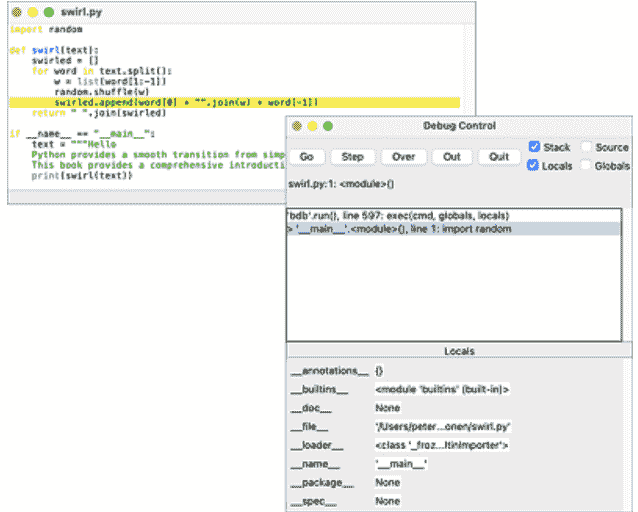

**图 36.1** IDLE 中的图形调试器

调试器的基本原理是允许程序员逐步运行程序，从而逐行准确地了解发生了哪些变化以及它们如何影响程序的进展。调试会话通常从程序员在程序中设置所谓的*断点*开始。当调试器启动时，程序正常执行，直到程序流程遇到第一个断点。此时，调试器停止程序流程并允许程序员进行干预。许多调试器也会在启动后立即停止在第一行程序代码，并等待程序员的进一步指令。

如果程序流程在源代码的某一行停止，程序员有几个选项来控制进一步的程序流程。这些选项，称为*命令*，通常在图形调试器的工具栏中占据突出位置，因为它们代表了调试器的基本功能：

- 通过使用 *step over* 命令，你可以让调试器跳到下一行源代码并再次在那里停止。
- *step into* 命令的行为类似于 *step over*，不同之处在于 step into 也会跳入函数或方法调用，而 step over 会跳过这些调用。
- *step out* 命令从当前函数或方法跳回到调用它的地方。因此，step out 可以看作是 step into 的一种逆向函数。
- *run* 命令继续执行程序，直到程序流程遇到下一个断点或程序结束。一些调试器允许类似的命令跳转到特定的源代码行或执行程序代码直到光标位置。

除了这些可用于控制程序运行的命令外，调试器还提供了一些工具，借助这些工具，程序员可以完全掌握已停止程序的状态。

这些工具中哪些可用以及它们的名称因调试器而异，但我们想在这里给你一个最常用工具的概述：

- 最基本的工具是所有局部和全局引用的列表，包括存在于当前程序上下文中的引用实例。通过这种方式，可以跟踪值的变化，并更容易地检测发生的错误。
- 除了局部和全局引用外，*调用栈*也很重要。它列出了当前的调用层次结构，以便可以准确跟踪哪个函数调用了哪个子函数。通过单击调用栈条目，可以跳转到程序源代码中的相应行。
- 特别是对于 Python 编程语言，一些调试器提供了一个交互式 shell，它驻留在已停止程序的上下文中，允许程序员方便地修改引用以干预程序流程。
- 所谓的*事后调试器*可以结合前一点来考虑。在这种模式下，调试器不会停止程序，直到发生未捕获的异常。在停止状态下，程序员再次拥有一个 shell，加上上述工具来追踪错误。这种调试形式被称为*事后调试*，因为它只在实际错误发生后才被激活——也就是说，在程序“死亡”之后。

基于对调试技术的介绍和一点实验，你应该能够轻松掌握你最喜欢的 IDE 的调试器。

除了调试器本身，Python 的标准库还包含一些模块，这些模块在上下文中特别重要

### 36.2 自动化测试

Python 的标准库提供了两个模块用于*测试驱动开发*，这是一种编程方式，其中程序的许多小部分（称为*单元*）通过自动化测试运行来检查错误。在测试驱动开发中，程序以小的、自包含的步骤进行开发，直到它通过所有先前的测试和所有新增的测试。这样，添加新代码就不会让错误悄悄潜入已经测试过的旧代码中。

在 Python 中，你可能熟悉的*单元测试*概念是在 `unittest` 模块中实现的。`doctest` 模块使得在文档字符串（例如，函数的文档字符串）中放置测试用例成为可能。在接下来的章节中，我们将首先处理 `doctest` 模块，然后转向 `unittest` 模块。

## 36.2.1 文档字符串中的测试用例：doctest

`doctest` 模块允许你在函数、方法、类或模块的文档字符串中创建测试用例。测试在调用 `doctest` 模块中包含的 `testmod` 函数时启动。文档字符串中的测试用例不是用特殊语言编写的，而是可以直接从交互模式的会话中复制到文档字符串中。

> **注意**

文档字符串也主要用于函数的文档记录。因此，你应该保持文档字符串中的测试用例尽可能简单和具有指导性，以便生成的文档字符串也可以用于程序的文档记录。

以下示例使用 `fac` 函数（该函数旨在计算并返回一个整数的阶乘）来解释 `doctest` 模块的使用：

```python
import doctest
def fac(n):
    """
    Calculates the factorial of an integer.

    >>> fac(5)
    120
    >>> fac(10)
    3628800
    >>> fac(20)
    2432902008176640000

    A positive integer must be passed.

    >>> fac(-1)
    Traceback (most recent call last):
        ...
    ValueError: No negative numbers!
    """
    res = 1
    for i in range(2, n+1):
        res *= i
    return res
if __name__ == "__main__":
    doctest.testmod()
```

`fac` 函数的文档字符串首先包含一段解释性文本。然后是——通过一个空行与之分隔——Python 交互模式的一个摘录，其中包含 `fac` 的函数调用及其返回值。这些测试用例在测试执行时被追踪，并被判定为真或假。

这些简单用例之后——每个都由一个空行引入——是另一段解释性文本和一个传递了负数的异常情况。请注意，你可以省略文档字符串中发生的回溯的堆栈跟踪。示例中写入的省略号字符也是可选的。

最后一个测试用例尚未在函数中考虑，因此它将在测试中失败。要启动测试，必须调用 `doctest` 模块的 `testmod` 函数。由于下面的 `if` 语句，每当直接执行程序文件时，都会调用此函数：

```python
if __name__ == "__main__":
    doctest.testmod()
```

另一方面，如果程序文件作为模块被另一个 Python 程序导入，则不会执行测试。在引发的错误情况下，测试结果如下：

```
***********************************************************
File "fac.py", line 17, in __main__.fac
Failed example:
    fac(-1)
Expected:
    Traceback (most recent call last):
        ...
    ValueError: No negative numbers!
Got:
    1
***********************************************************
1 items had failures:
   1 of    4 in __main__.fac
***Test Failed*** 1 failures.
```

现在我们将扩展 `fac` 函数，以便在参数为负数时引发所需的异常：

```python
def fac(n):
    """
        [...]
    """
    if n < 0:
        raise ValueError("No negative numbers!")
    res = 1
    for i in range(2, n+1):
        res *= i
    return res
```

此更改意味着再次运行测试时将不再显示错误。准确地说：根本不会显示任何内容。这是因为通常只有失败的测试用例才会输出到屏幕。如果你还坚持输出成功的测试用例，你应该使用 -v 选项（用于详细模式）启动程序文件。

使用 doctest 时，请注意文档字符串中写入的默认值与执行的测试用例的输出逐字符进行比较。你应该始终记住，某些数据类型的输出并不总是相同的。例如，集合的条目没有保证的顺序。此外，还有依赖于解释器或其他情况的信息；例如，实例的标识在内部对应于其内存地址，因此在程序重启时自然会改变。

另一个需要注意的特性是，函数预期输出中的空行必须用 `<BLANKLINE>` 字符串表示，因为空行充当测试用例和文档之间的分隔符：

```python
def f(a, b):
    """
    >>> f(3, 4)
    7
    <BLANKLINE>
    12
    """
    print(a + b)
    print()
    print(a * b)
```

为了使测试用例完全适应你的需求，你可以指定*标志*，即你可以启用或禁用的设置。标志作为注释写在文档字符串中测试用例之后。如果标志前面是加号 (+)，则启用；如果前面是减号 (-)，则禁用。在我们进入具体示例之前，我们将首先介绍三个最重要的标志（见表 36.1）。

| 标志 | 含义 |
| :--- | :--- |
| `ELLIPSIS` | 如果设置了此标志，则可以使用 . . . 规范来表示函数的任何输出。这样，在较大的输出中可以跳过可变信息，例如内存地址或类似信息。 |
| `NORMALIZE_WHITESPACES` | 如果设置了此标志，则结果比较中将不包含空白字符。如果你希望将长结果换行到多行，这尤其有用。 |
| `SKIP` | 此标志导致测试被跳过。例如，如果你在文档字符串中提供了一些示例用于文档记录目的，但只有少数几个要包含在测试运行中，这很有用。 |

**表 36.1** Doctest 标志

在一个简单的示例中，我们将扩展已知阶乘函数的 doctest，以计算一个相对较大的数字的阶乘。因为在 doctest 中指定结果的所有数字没有太大意义，所以该数字将在 `ELLIPSIS` 标志的帮助下以缩短形式指定：

```python
import doctest
def fac(n):
    """
    Calculates the factorial of an integer.

    >>> fac(1000) # doctest: +ELLIPSIS
    402387260077093773543702...000
    >>> fac("Blah") # doctest: +SKIP
    'BlahBlah'
    """
    res = 1
    for i in range(2, n+1):
        res *= i
    return res
if __name__ == "__main__":
    doctest.testmod()
```

标志的设置已用粗体突出显示。如你所见，示例包含第二个——显然会失败的——测试，但设置了 `SKIP` 标志。因此，测试运行不会在此处检测到任何错误。

请注意，`testmod` 函数特别提供了许多选项，用于在程序中使用测试结果或调整测试过程以适应你的需求。如果你对此感兴趣，Python 文档是一个很好的起点，因为它详细描述了该函数。

### 36.2.2 单元测试：unittest

用于测试驱动开发的第二个模块名为 `unittest`，也包含在标准库中。`unittest` 模块实现了 Java 中已知的 `JUnit` 模块的功能，该模块是 Java 中测试驱动开发的事实标准。

与 `doctest` 模块的区别在于，使用 `unittest` 时，测试用例是在实际程序代码之外的单独程序文件中作为常规 Python 代码定义的。这简化了测试的执行并保持了程序文档的整洁。然而，反过来，创建测试用例需要更多的工作。

要使用 `unittest` 创建新的测试用例，你必须创建一个派生自 `unittest.TestCase` 基类的类，其中各个测试用例作为方法实现。以下类实现了我们在上一节中使用 `doctest` 模块执行的相同测试用例。这里，要测试的 `fac` 函数必须在 `fac.py` 程序文件中实现，该文件被测试程序文件作为模块导入：

```python
import unittest
import fac

class MyTest(unittest.TestCase):
    def testCalculation(self):
        self.assertEqual(fac.fac(5), 120)
        self.assertEqual(fac.fac(10), 3628800)
        self.assertEqual(fac.fac(20), 2432902008176640000)

    def testExceptions(self):
        self.assertRaises(ValueError, fac.fac, -1)

if __name__ == "__main__":
    unittest.main()
```

创建了一个名为 `MyTest` 的类，它继承自 `unittest.TestCase` 基类。在 `MyTest` 类中实现了两个名为 `testCalculation` 和 `testExceptions` 的测试方法。请注意，此类测试方法的名称必须以 `test` 开头，以便它们在后续测试中能被实际发现和执行。

在测试方法内部，使用了 `assertEqual` 和 `assertRaises` 方法，如果两个指定值不相等或未引发指定的异常，这些方法会导致测试失败。

要开始测试运行，需要调用 `unittest.main` 函数。以下条件语句确保单元测试仅在程序文件被直接执行时进行，而明确地在程序文件作为模块导入到另一个 Python 程序中时不执行：

```python
if __name__ == "__main__":
    unittest.main()
```

要执行测试，`unittest.main` 函数会创建当前命名空间中所有继承自 `unittest.TestCase` 的类的实例。然后，调用这些实例中所有名称以 `test` 开头的方法。

成功时，示例的输出如下所示：

```
..
----------------------------------------------------------------------
Ran 2 tests in 0.000s

OK
```

开头的两个点代表两个成功执行的测试。失败的测试将用 `F` 表示。

出错时，将指定导致错误的确切条件：

```
.F
======================================================================
FAIL: testCalculation (__main__.MyTest)
----------------------------------------------------------------------
Traceback (most recent call last):
  File "test.py", line 7, in testCalculation
    self.assertEqual(fac.fac(5), 12)
AssertionError: 120 != 12

----------------------------------------------------------------------
Ran 2 tests in 0.001s

FAILED (failures=1)
```

`TestCase` 类还允许你重写无参数的 `setUp` 和 `tearDown` 方法，它们分别在调用各个测试方法之前和之后执行。因此，可以在这些方法中实现初始化和反初始化操作。在 `setUp` 或 `tearDown` 中引发的异常会导致当前测试失败。

## 基本测试方法

从前面的示例中，你已经了解了 `assertEqual` 和 `assertRaises` 方法，它们用于实现测试所基于的比较。`TestCase` 类定义了一整套此类方法，汇总在表 36.2 中。

所有这些方法都有一个可选的 `msg` 参数，可以指定错误描述，在测试失败时输出。为了清晰起见，表 36.2 中省略了此参数。

| 方法 | 测试内容 |
|---|---|
| `assertEqual(first, second)` | `first == second` |
| `assertNotEqual(first, second)` | `first != second` |
| `assertTrue(expr)` | `bool(expr) is True` |
| `assertFalse(expr)` | `bool(expr) is False` |
| `assertIs(first, second)` | `first is second` |
| `assertIsNot(first, second)` | `first is not second` |
| `assertIsNone(expr)` | `expr is None` |
| `assertIsNotNone(expr)` | `expr is not None` |
| `assertIn(first, second)` | `first in second` |
| `assertNotIn(first, second)` | `first not in second` |
| `assertIsInstance(obj, cls)` | `isinstance(obj, cls)` |
| `assertNotIsInstance(obj, cls)` | `not isinstance(obj, cls)` |
| `assertGreater(first, second)` | `first > second` |
| `assertGreaterEqual(first, second)` | `first >= second` |
| `assertLess(first, second)` | `first < second` |
| `assertLessEqual(first, second)` | `first <= second` |

**表 36.2** TestCase 类的方法

## 异常测试

`TestCase` 类包含 `assertRaises` 和 `assertWarns` 方法，可用于测试函数是否分别引发异常和警告。它们可以使用函数式接口：

```python
assertRaises(exc, fun, *args, **kwds)
```

这测试 `fun` 函数对象在使用 `args` 和 `kwargs` 参数执行时是否引发 `exc` 类型的异常。

或者，`assertRaises` 和 `assertWarns` 都可以创建一个上下文对象：

```python
with self.assertRaises(TypeError):
    pass
```

这种表示法的优点是，被测试的代码不必封装在函数中。

## 正则表达式测试

要检查字符串，可以使用 `assertRegex` 和 `assertNotRegex` 方法，它们接收 `text` 和 `regex` 参数。调用这些函数之一会检查 `text` 是否匹配或不匹配 `regex` 正则表达式。`regex` 正则表达式既可以作为字符串传递，也可以作为 RE 对象传递：

```python
self.assertRegex("Test", r"Te.t")
```

同样，有 `assertWarnsRegex` 和 `assertRaisesRegex` 方法，它们的工作方式类似于上一节中的对应方法，但会根据正则表达式检查引发的异常的文本：

```python
with self.assertRaises(TypeError, r"."):
    pass
```

### 36.3 分析运行时性能

优化程序可能需要大量时间。通常，第一步是创建一个满足所有需求的可执行程序，但不一定特别重视算法的优化。这主要是因为实际的瓶颈通常只有在程序完成后才被识别出来，这意味着在早期阶段可能已经投入了大量时间来优化非关键部分。

为了尽可能准确地捕获 Python 程序的运行时行为，标准库中包含了 `timeit`、`profile` 和 `cProfile` 三个模块。这些模块将在以下部分中描述。

### 36.3.1 运行时测量：timeit

标准库的 `timeit` 模块允许你精确测量 Python 程序执行所需的时间。通常，`timeit` 用于比较同一问题的两种不同算法的运行时间。

你肯定记得在第 17 章第 17.13 节关于函数的部分，给出了一个计算阶乘的递归算法。我们说过，运行时优化的迭代算法总是比其递归对应算法更高效。在本节中，我们要使用 `timeit` 模块来验证这一点，并额外测试迭代变体实际上可以快多少百分比。

要测试 Python 代码的运行时，必须实例化 `timeit` 模块中包含的 `Timer` 类。`Timer` 类的构造函数具有前面描述的接口。

### Timer([stmt, setup, globals])

这会创建一个 `Timer` 类的实例。要分析的 Python 代码可以作为 `stmt` 参数以字符串格式传递给构造函数。对于第二个参数 `setup`，也可以传递一个包含初始化 `stmt` 所需 Python 代码的字符串。因此，`setup` 也会在 `stmt` 之前执行。两个参数都是可选的，并预设为字符串 "pass"。可选的 `globals` 参数可用于传递一个字典作为命名空间，要分析的 Python 代码将在该命名空间上下文中执行。

一旦创建了 `Timer` 类的实例，它包含三个方法，这些方法将在前面描述。

### t.timeit([number])

此方法首先执行一次 `setup` 代码，然后重复构造函数中传递的 `stmt` 代码 `number` 次。如果未指定可选的 `number` 参数，则要测量的代码将执行 1,000,000 次。

该函数返回执行整个代码所花费的时间（即包括所有重复，但不包括设置代码）。该值以秒为单位作为浮点数返回。

> **注意**
> 为了使结果尽可能独立于外部因素，Python 解释器的垃圾回收

## t.repeat([repeat, number])

此方法调用 `timeit` 方法 `repeat` 次，并将结果作为浮点数列表返回。`number` 参数在每次调用时传递给 `timeit` 方法。

> **注意**

通常，将 `repeat` 返回的所有值取平均值并将其作为平均运行时间输出并不是一个好主意。系统上运行的其他进程会扭曲所有测量的结果。相反，你应该将返回列表中的最小值作为最小运行时间，因为这是系统活动最少的测量结果。

## t.print_exc([file])

如果在要分析的代码中引发异常，分析将立即中止并发出回溯信息。但是，此回溯的堆栈跟踪并不总是理想的，因为它并不引用实际执行的源代码。

要输出更有意义的堆栈跟踪，你可以捕获引发的异常并调用 `print_exc` 方法。此方法在屏幕上输出一个与正在分析的代码直接相关的回溯信息，使调试更容易。通过指定可选的 `file` 参数，你可以将输出重定向到文件对象。

## 示例

我们在开头提到，我们将使用 `timeit` 模块来检查迭代阶乘计算比递归计算快多少百分比。为此，我们将首先导入 `timeit` 模块并实现两个计算函数：

```
import timeit
def fac1(n):
    res = 1
    for i in range(2, n+1):
        res *= i
    return res
def fac2(n):
    if n > 0:
        return fac2(n-1)*n
    else:
        return 1
```

然后我们为每个函数创建一个 `Timer` 类的实例：

```
t1 = timeit.Timer("fac1(50)", globals={"fac1":fac1})
t2 = timeit.Timer("fac2(50)", globals={"fac2":fac2})
```

使用 `globals` 参数，我们首先定义被测程序的全局命名空间，以便可以访问 `fac1` 和 `fac2` 函数。此时，我们也可以使用内置的 `globals` 函数将调用程序的完整全局命名空间提供给被测程序：

```
t1 = timeit.Timer("fac1(50)", globals=globals())
```

在实际要分析的代码中，只使用各自的计算函数触发 50 的阶乘计算。

最后，以 1,000,000 次重复开始运行时间测量，并输出各自的结果：

```
print("Iterative: ", t1.timeit())
print("Recursive: ", t2.timeit())
```

因此，程序的输出为：

```
Iterative:  3.3135700230195653
Recursive:  9.360691823996603
```

这意味着迭代算法比递归算法快得多。但这个数据还不具有真正的代表性，因为递归函数的测试可能被系统中运行的进程拖慢了。因此，我们将开始另一个测试：

```
print("Iterative: ", min(t1.repeat(100, 10000)))
print("Recursive: ", min(t2.repeat(100, 10000)))
```

这次我们运行一个测试系列，该系列重复一个包含 10,000 次单独重复的测试 100 次，并输出结果中的最小值。结果与之前的测试大致一致：

```
Iterative:  0.031242681987350807
Recursive:  0.09040119699784555
```

绝对数值在很大程度上取决于所使用的系统。在更快的计算机上，它们相应地更小。

> **注意**

除了这里描述的面向对象接口外，`timeit` 模块还提供了一个简化的函数接口，允许在不先创建 `Timer` 实例的情况下调用 `timeit` 函数：

`timeit.timeit("fac1(50)", globals=globals(), number=1000)`

### 36.3.2 性能分析：cProfile

要对完整的 Python 程序进行运行时分析，你可以使用性能分析器。*性能分析器*监控整个程序运行，并在程序结束后详细列出运行时间的百分比花在了哪个函数上。通过这种方式，程序员可以识别程序的运行时瓶颈，并在合理的点开始优化程序。

一般规则是：在特定函数中花费的运行时间百分比越高，你就应该投入更多时间来优化该函数。

> **注意**

从 Python 2.5 版本开始，`cProfile` 性能分析器已包含在标准库中。此性能分析器实现了与 `profile` 性能分析器相同的接口，但它是用 C 而不是 Python 编写的。因此，`cProfile` 的开销更小，因此计时测量更好。我们将在这里讨论 `cProfile` 性能分析器。但由于它与 `profile` 具有相同的接口，因此描述对旧的性能分析器同样有效。

`cProfile` 性能分析器可能并非所有 Python 解释器都可用。另一方面，纯 Python 对应物 `profile` 可以在任何地方使用。

`cProfile` 模块中有两个重要函数，将在前面描述。

## run(command, [filename, sort])

此函数执行作为 `command` 传递的字符串，并在执行期间执行详细的运行时分析。通常，将较大程序的主函数的函数调用传递给 `command`。

第二个可选参数 `filename` 可用于指定一个文件路径，运行时分析的结果将写入该文件。如果未指定此参数，结果将显示在屏幕上。此分析结果是所有函数调用的表格列表。下一个示例演示了此表格的外观以及如何阅读它。

`sort` 参数控制结果表应按什么排序。表 36.3 中显示的值是可能的。

| 值 | 排序依据 |
| :--- | :--- |
| `"stdname"` | 程序文件和函数名——默认设置 |
| `"calls"` | 函数的调用次数 |
| `"time"` | 在函数中花费的总时间 |
| `"cumulative"` | 在函数及其子函数中花费的总时间 |

**表 36.3** 排序参数的可能值

## runctx(command, globals, locals, [filename])

此函数的行为类似于 `run`，不同之处在于 `globals` 和 `locals` 参数可用于指定执行 `command` 的全局和局部上下文。对于 `globals` 和 `locals` 参数，可以传递由内置 `globals` 和 `locals` 函数返回的字典。

## 示例

以下是一个小型示例程序的运行时分析。为此，我们将首先查看程序的源代码：

```
import math
def calc1(n):
    return n**2
def calc2(n):
    return math.sqrt(n)
def calc3(n):
    return math.log(n+1)
def program():
    for i in range(100):
        calc1(i)
        for j in range(100):
            calc2(j)
            for k in range(100):
                calc3(k)
program()
```

程序中有三个名为 `calc1`、`calc2` 和 `calc3` 的小函数，每个函数都接收一个整数作为参数，然后对该数字应用数学运算并返回结果。在主 `program` 函数中，有三个嵌套循环，每个循环遍历从 0 到 99 的所有整数，并调用三个计算函数之一。我们想借助性能分析器解决的问题是，程序的优化在何处特别值得，在何处是多余的。

性能分析器按如下方式集成到程序中：

```
import cProfile
# 示例程序
cProfile.run("program()")
```

这里，`# 示例程序` 代表前面示例程序的代码。示例程序的 `program()` 代码行现在是多余的。运行运行时分析提供以下结果：

```
2020104 function calls in 0.576 seconds
```

### 36.3.2 性能分析：cProfile

此表格的每一行都对应示例程序中的一个函数。表格的列标题可能不太清晰，我们来简要解释一下：

- `ncalls` 表示函数的调用次数。
- `tottime` 表示在该函数中花费的总时间（以秒为单位）。这不包括对子函数的调用。
- `percall` 表示 `tottime` 除以 `ncalls` 的商。
- `cumtime` 表示在该函数中花费的总时间（以秒为单位）。包括对子函数的调用。
- `percall` 表示 `cumtime` 除以 `ncalls` 的商。
- `filename:lineno(function)` 表示函数名，包括程序文件以及函数在源代码中的行号。

性能分析器显示的表格很好地概述了程序中时间关键函数的位置。在这个例子中，`calc3` 函数尤为突出，它被调用了总共 1,000,000 次，占据了运行时间的 70%。另一方面，`calc2` 函数被调用了 10,000 次，仅占总运行时间的 0.5%。剩余的运行时间花在了主 `program` 函数中，除了 `calc1` 中极小的一部分。

诚然，这个结果本可以从程序中估算出来。每个循环遍历 100 个数字，并在每个迭代步骤中调用相应的函数。因此，最内层的函数被调用了 100³ 即 1,000,000 次。`calc3` 和 `calc2` 函数的运行时间百分比也相差约 100 倍。任何波动都是由于执行了不同的计算所致。

尽管这个例子看起来有些人为设计，但这种方法可以应用于更大、对时间敏感的项目。在我们的例子中，重点将是优化 `calc3` 函数，因为它以 1,000,000 次调用和 70% 的运行时间份额占据主导地位。

> **注意**

在示例中，`cProfile` 性能分析器作为模块导入到 Python 程序中，并通过调用 `run` 函数来分析该程序的一部分。

通过 Python 解释器的 `-m` 命令行选项，也可以对整个 Python 程序运行性能分析器，而无需修改程序代码：

```bash
$ python -m cProfile program.py
```

## 36.3.3 追踪：trace

在上一节中，我们描述了 Python 如何使用性能分析器来检查程序。这在我们使用的特定示例中效果很好，但它也有一个主要缺点：性能分析器在函数级别工作。这意味着只有整个函数的运行时间会被测量。但通常情况下，即使在一个较大的函数内部，有些部分在运行时间上可以忽略不计，而有些部分则非常耗时。在这种情况下，我们可以使用另一个工具：追踪器。

*追踪器*，在 Python 中通过 `trace` 模块提供，它监控程序的运行，记录程序中每一行代码被执行的次数。执行这种*覆盖率分析*主要有两个原因：

- 借助覆盖率分析，可以识别出被特别频繁调用的代码行，因此可能特别耗时。然后可以对这些行进行针对性优化。但请注意，追踪器并不测量一行代码的实际运行时间，而只测量该行在程序流程中被执行的次数。
- 通常，对于安全相关的程序，必须提交覆盖率分析以证明在测试期间每一行代码都至少被执行过一次。通过这种方式，我们试图避免，例如，飞机的自动驾驶仪程序因为测试时未考虑到的情况而发生故障。

在本节中，我们将执行覆盖率分析以识别程序中的运行时间关键点。为此，我们将创建一个上一节示例程序的略微修改版本。这里的*修改*意味着代码是直接编写的，没有使用子函数：

```python
import math
def program():
    for i in range(100):
        i**2
        for j in range(100):
            math.sqrt(j)
            for k in range(100):
                math.log(k+1)
```

覆盖率分析使用 `trace` 模块执行。这需要以下额外代码：

```python
import trace
import sys
tracer = trace.Trace(ignoredirs=[sys.prefix, sys.exec_prefix], trace = 0)
tracer.run("program()")
r = tracer.results()
r.write_results(show_missing=True, coverdir="result")
```

首先，创建一个 `Tracer` 类的实例，并传入两个关键字参数。`ignoredirs` 参数用于传递一个目录列表，这些目录中包含的模块不包含在覆盖率分析中。在这个例子中，我们不想包含标准库中的任何模块，因此我们添加了相应的 `sys.prefix` 和 `sys.exec_prefix` 目录。我们将第二个参数 `trace` 设置为 0；否则，程序运行期间执行的每一行都会打印在屏幕上。

然后，与性能分析器类似，我们执行 `Trace` 实例的 `run` 方法，传入要执行的 Python 代码。追踪器完成后，可以通过 `trace` 实例的 `results` 方法获取*结果*。在这种情况下，我们不想进一步处理结果，因此使用 `write_results` 方法将它们保存到硬盘。这里我们使用 `coverdir` 参数指定存储结果的子目录。如果为 `show_missing` 参数传递值 `True`，则在程序运行期间从未执行过的代码行将用箭头标记。

结果保存在 `result` 子文件夹中，文件名为 `modulename.cover` 的文本文件，其中 `modulename` 替换为您测试的模块名称。

在示例中，结果如下所示：

```
import trace
>>>>>> import sys
>>>>>> import math
>>>>>> def program():
  101:     for i in range(100):
  100:         i**2
10100:         for j in range(100):
10000:             math.sqrt(j)
1010000:             for k in range(100):
1000000:                 math.log(k+1)
>>>>>> tracer = trace.Trace(
>>>>>>     ignoredirs = [sys.prefix, sys.exec_prefix],
>>>>>>     trace = 0)
>>>>>> tracer.run("program()")
>>>>>> r = tracer.results()
>>>>>> r.write_results(show_missing=True, coverdir="result")
```

您会看到结果被整理成一个易于阅读的文件。基本上，该文件分为两列：右侧是程序的源代码，而左侧指示每一行代码被调用的次数。左列中的箭头（>>>>>>）表示在监控的程序运行期间从未执行过的代码行。

> **注意**

起初，`for i in range(100):` 这一行总共执行了 101 次，尽管循环是从 0 计数到 99，这可能会让人困惑。这是由于在处理完第 100 次迭代后，控制流会再次访问 `for` 语句以检查循环是否已终止。在循环头部第 101 次运行后，控制流退出循环。

覆盖率分析第 7 行和第 9 行中的值 `10100` 和 `1010000` 可以用同样的方式解释。

## 37 文档

如果你将程序和模块分发给用户和其他开发者，良好的文档非常重要。没有合理的说明，即使是最好的程序也毫无价值，因为仅从源代码推断功能或通过试错来猜测功能工作量太大。

程序员通常觉得编写文档很麻烦，因为它花费相对较多的时间，却不会改进程序本身。因此，Python 世界中有许多模块和程序没有得到充分的文档记录。

然而，有一些工具和方法可以使编写文档变得尽可能简单。在本节中，我们将介绍 `pydoc`，它可以用于根据 Python 程序的源代码生成文档。`pydoc` 工具分析程序文本，并特别收集来自所谓 *docstrings* 的信息。收集到的信息经过处理并导出为 HTML 文件。

### 37.1 Docstrings

`help` 函数显示的帮助文本的基础是源代码中的特殊注释，也称为 *docstrings*（*documentation strings* 的缩写）。Docstrings 旨在描述函数、模块或类。这些描述可以被外部工具或我们之前提到的 `help` 函数读取和显示。通过这种方式，可以轻松地从注释生成文档。

以下两个示例展示了一个类和一个函数，每个都用 docstring 进行了文档记录。请注意，docstring 必须始终位于函数或类体的开头，才能被识别为 docstring。Docstring 也可以在其他地方使用，但那时它不能被分配给类或函数，因此只能作为块注释：

```python
class MyClass:
    """Example of docstrings.

    This class shows how docstrings are
    used.
    """
    pass

def MyFunction():
    """This function does nothing.

    Seriously, this function really does nothing.
    """
    pass
```

为了能够在程序内部使用 docstring，每个实例都有一个名为 `__doc__` 的属性，其中包含其 docstring。请注意，函数对象和导入的模块也是实例：

```python
>>> print(MyClass.__doc__)
Example of docstrings.

This class shows how docstrings are
used.
>>> print(MyFunction.__doc__)
This function does nothing.
    Seriously, this function really does nothing.
```

你也可以通过 docstring 为模块添加注释。模块的 docstring 必须位于相应程序文件的开头，并且也可以通过 `__doc__` 属性访问。例如，标准库的 `math` 模块的 docstring 可以如下读取：

```python
>>> import math
>>> print(math.__doc__)
This module provides access to the mathematical functions
defined by the C standard.
```

内置的 `help` 函数从对象中包含的 docstrings 生成帮助页面，并在交互模式下显示：

```python
>>> import math
>>> help(math)
```

图 37.1 显示了由前面示例生成的帮助页面。

一旦你开始用 Python 实现较大的程序，你应该为函数、方法、类和模块添加 docstrings。这不仅有助于编程本身，也有助于后续创建程序文档，这些文档可以部分地从现有的 docstrings 自动生成。

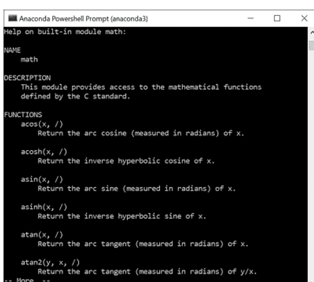

**图 37.1** 由 help 函数生成的帮助页面

### 37.2 自动生成的文档：pydoc

标准库的 `pydoc` 模块包含一个名为 `pydoc` 或 `pydoc3` 的脚本，用于自动生成程序文档。

> **注意**
>
> 在 Windows 上，`pydoc` 脚本可能未包含在可执行文件的系统路径中。在这种情况下，你会在 Python 安装目录的 *Tools* 子文件夹中找到它。

在最简单的情况下，你调用 `pydoc` 并将要文档化的模块作为参数传递。成功生成文档的前提是传递的模块可以被 Python 导入。因此，模块必须位于本地工作目录或 `sys.path` 中列出的某个目录中。作为示例，我们现在将生成标准库的 `time` 模块的文档：

```
$ pydoc time
```

此调用生成文档并在控制台中显示，类似于内置的 `help` 函数。[178]

或者，你可以指定要文档化的程序文件的路径：

```
$ pydoc /path/to/module.py
```

除了模块或程序，`pydoc` 还可以为程序的单个元素（如单个类、函数或方法）创建文档。为此，将相应的名称指定为参数：

```
$ pydoc time.sleep
```

直接在 shell 中显示生成的文档只是 `pydoc` 支持的可能显示格式之一。可以使用 `-w` 选项将文档保存为 HTML 格式：

```
$ pydoc -w time
```

生成的 `time.html` 文件可以在 Web 浏览器中查看。你也可以使用 `-b` 选项启动一个提供模块概览的 Web 服务器，而不是先将文档保存为 HTML 格式。在此概览中，你可以找到标准库的模块以及位于本地工作目录中的模块：

```
$ pydoc -b
```

Web 服务器提供的文档页面会自动在系统的默认浏览器中打开。此外，你可以使用 `-n` 和 `-p` 选项分别指定 Web 服务器应启动的主机名和端口：

```
$ pydoc -b -n localhost -p 3000
```

# 第五部分 高级主题

在本书的第五部分也是最后一部分，我们将详细介绍选定的主题，讨论标准库提供的解决方案以及需要时超越标准库的第三方解决方案。本部分涵盖的主题包括 Python 项目的分发、图形用户界面编程、使用 Python 进行科学计算以及 Python 与其他编程语言的接口。

在本部分的末尾，你会找到第 44 章，其中我们提供了关于那些对于单独成章来说太小或太不重要的模块的简短、信息丰富的章节。这些模块通常用于非常特定的目的，因此保持简单。最后一章是第 45 章，其中我们解释了 Python 2.x 和 3.x 版本之间的差异。

## 38 分发 Python 项目

在本书的学习过程中，你可能已经编写了一两个独立的 Python 程序。你甚至可能已经编写了一个对其他用户有用的 Python 程序或模块。这时，问题就出现了：如何恰当地发布一个 Python 程序或模块？理想情况下，应该以用户无需成为专家就能安装它的方式进行。

首先，我们将总结现有的分发 Python 包的方法，然后在第 38.2 节详细讨论第三方 `setuptools` 包。之后，我们在第 38.3 节讨论创建 EXE 文件，在第 38.4 节讨论包管理器 pip 和 conda。最后，在第 38.5 节，我们将强调创建分发包的另一个重要方面：程序的本地化。

### 38.1 Python 分发的历史

软件分发涉及以用户方便安装的 *分发包* 或 *包* 形式提供相关数据——例如库、可执行文件、源代码。我们基本上区分两种类型的分发包：

- *源码分发包* 不包含任何预编译数据，只包含所提供软件的源代码。此源代码必须在用户端编译。源码分发包的优点是分发包的优势在于它可以在所有支持的平台上直接使用，无需修改。

- *二进制分发包*包含软件的编译版本。因此，二进制分发包通常与平台相关，所以必须为许多目标平台创建定制的分发包。二进制分发包的优点是安装简便：只需将包含的文件复制到系统中的正确位置即可。特别是，无需执行构建步骤。

Python 世界充斥着令人眼花缭乱的各种生成分发包的方法。在接下来的章节中，我们将介绍其中最重要的几种方法。

## 38.1.1 经典方法：distutils

`distutils` 包是一个现已过时的解决方案，它曾被包含在 Python 3.10 之前的 Python 标准库中，并且长期以来一直是分发 Python 软件的标准。要创建分发包，需要创建一个名为 `setup.py` 的安装脚本，该脚本描述了分发包的属性。这包括例如作者或许可证等元数据，以及要包含在分发包中的文件列表。运行安装脚本可以创建源代码分发包或二进制分发包：

- 源代码分发包包含 `setup.py` 安装脚本，在这种情况下，该脚本可用于在目标系统上安装软件。
- 二进制分发包以 Windows 安装程序或某些 Linux 发行版的 RPM 包的形式创建。

`distutils` 包的主要缺点是无法考虑分发包之间的依赖关系。尤其是由于这个原因，它如今已被更全面的解决方案（如 `setuptools`）所取代，并且自 Python 3.10 起已不再是标准库的一部分。

## 38.1.2 新标准：setuptools

`setuptools` 第三方包基于 `distutils`，因此使用方式类似，并且与 `distutils` 安装脚本兼容。然而，它在几个重要方面超越了其前身的功能集，这使得它现在成为 Python 软件分发的新标准。

使用 `setuptools`，可以创建所谓的 *Python wheels*。这些是包含额外元数据的特殊分发包；特别是，可以描述对其他 wheels 的依赖关系。Python wheels 可以通过其 `.whl` 文件扩展名来识别。

> **注意**

除了 wheels，Python 开发者偶尔还会遇到 *Python eggs*。随着标准化 wheels 的引入，这种分发格式已经过时。

## 38.1.3 包索引：PyPI

Python 包索引 (PyPI) 是由 Python 软件基金会维护的 Python 包集合，可在 *pypi.python.org* 访问。注册后，你也可以将自己的包添加到 PyPI。

可以使用 pip 包管理器方便地下载和安装 PyPI 中列出的包。在此过程中，包管理器会根据需要安装或更新依赖项。在 [第 38.4.1 节](第 38.4.1 节) 中，我们将更详细地描述 pip 的工作原理。

## 38.2 创建分发包：setuptools

要使用 `setuptools` 包创建分发包，通常需要以下步骤：

- 编写你的模块或包[179]
- 编写 `setup.py` 安装脚本
- 创建源代码分发包或二进制分发包

这些步骤将在以下章节中详细描述。

> **注意**

通常，你可以使用 `setuptools` 创建不仅是模块或包的分发包，还可以创建扩展的分发包。这样的扩展以后可以像模块或包一样导入，但与普通模块或包不同，它们是用另一种编程语言编写的——通常是 C 或 C++。在 [第 40 章，第 40.3.3 节] 中，我们将描述 `setuptools` 与扩展相关的使用。

### 38.2.1 安装

因为 `setuptools` 是一个不包含在标准库中的第三方包，所以在构建和安装分发包之前必须先安装它。这可以通过 Anaconda 包管理器 `conda` 方便地完成：

```
$ conda install setuptools
```

或者，如果你不使用 Anaconda，可以通过 Python 包管理器 `pip` 安装 `setuptools` 包：

```
$ pip install setuptools
```

### 38.2.2 编写模块

请记住，模块和包之间是有区别的。*模块* 只由一个程序文件组成，而 *包* 是一个可以包含多个子模块或子包的文件夹。你可以通过包目录中的 `__init__.py` 程序文件来识别一个包。*模块* 和 *包* 这两个术语的区别将在我们创建安装脚本时发挥作用。

此时，让我们开发示例模块，它将构成本章所有描述的基础。这是一个非常简单的模块，演示了 `setuptools` 的基本功能。关于更复杂的分发包（例如包含包）的注释已在文本相应位置添加。

示例模块的目的是修改任何文本，使其读起来像下面这样：

> *根据剑桥大学的一项研究，单词中字母的顺序并不重要。*

> *唯一重要的方面是第一个和最后一个字母处于正确的位置。其余的可以完全错误，但仍然可以毫无问题地阅读。*

> *这是因为人脑不是逐个阅读每个字母，而是将单词作为一个整体来阅读。*

该模块提供了一个名为 `swirl_text` 的函数，它接收一个字符串并返回一个“打乱”的字符串，使得只有第一个和最后一个字母保持原位：

```python
import random
def swirl_text(text):
    list = []
    for word in text.split():
        w = list(word[1:-1])
        random.shuffle(w)
        list.append(word[0] + "".join(w) + word[-1])
    return " ".join(list)
```

该函数循环遍历传入字符串中包含的所有单词。在每次迭代中，从相应的单词中提取要打乱的子字符串。这确保了第一个和最后一个字母不会包含在此子字符串中。使用 `random` 模块的 `shuffle` 函数来打乱字母。最后，将打乱后的字符串、首字母和尾字母合并，并追加到生成的单词列表 `list` 中。最后，将这个单词列表组合成文本并返回。

为简单起见，该函数假设输入字符串是良性的。这特别意味着字符串不应包含任何标点符号。

我们现在想要创建 `swirl` 模块的分发包，以便其他 Python 程序员也能尽可能轻松地使用这个极其强大的工具。

### 38.2.3 安装脚本

分发自己模块的第一步是创建一个 *安装脚本*。这是一个名为 `setup.py` 的 Python 程序文件，稍后将用于创建分发包。此外，用户端安装源代码分发包也是通过调用此程序文件完成的。

在示例中，安装脚本中只需要调用 `setuptools` 模块的 `setup` 函数：

```python
from setuptools import setup
setup(
    name="swirl",
    version="1.0",
    author="Mickey Mouse",
    author_email="mickey@mouse.com",
    py_modules=["swirl"]
)
```

我们向此函数传递各种关键字参数，这些参数包含有关模块的信息。此外，通过 `py_modules` 参数传递所有应属于分发包的程序文件。这样，也可以在一个分发包中提供多个自编写的模块。

事实上，这就是全部内容。现在可以使用此程序文件在任何安装了 Python 的机器上安装模块，或者创建模块的分发包。我们稍后将详细解释其工作原理，但首先我们想看看 `setup` 函数。

## setuptools.setup({arguments})

`setuptools` 包的 `setup` 函数必须在 `setup.py` 程序文件中调用，并触发所需的安装过程。为此，你必须向函数传递各种关键字参数，这些参数提供有关模块或包的信息。[表 38.1](表 38.1) 列出了最重要的可能参数，并简要说明了它们的含义。

除非另有说明，各参数均为字符串。

| 参数名称 | 描述 |
|---|---|
| `author` | 作者的姓名。 |
| `author_email` | 作者的电子邮件地址。 |

| 参数名称 | 描述 |
|---|---|
| `data_files` | 一个元组列表，可用于在分发包中包含额外的文件。 |
| `description` | 分发包的简短描述。 |
| `download_url` | 可直接下载分发包的 URL。 |
| `ext_modules` | 一个 `setuptools.Extension` 实例列表，包含所有需要编译并包含在分发包中的 Python 扩展的名称。 |
| `license` | 分发包的许可证。 |
| `long_description` | 分发包的详细描述。 |
| `maintainer` | 包维护者的名称。 |
| `maintainer_email` | 包维护者的电子邮件地址。 |
| `name` | 分发包的名称。 |
| `package_data` | 一个字典，可用于将属于某个包的文件包含在分发包中。 |
| `package_dir` | 一个字典，可用于将子目录中的包包含在分发包中。 |
| `packages` | 一个字符串列表，包含所有需要包含在分发包中的包的名称。 |
| `py_modules` | 一个字符串列表，包含所有需要包含在分发包中的 Python 模块的名称。 |
| `script_name` | 分发包中要使用的安装脚本的名称。此参数默认为 `sys.argv[0]`，即当前正在运行的脚本的名称。 |
| `scripts` | 一个字符串列表，包含所有需要包含在分发包中的脚本文件的名称。 |
| `url` | 包含有关分发包更多信息的网站 URL。 |
| `version` | 分发包的版本号。 |

**表 38.1** `setup` 函数可能的关键字参数

## 分发包

如果你的项目由一个或多个包组成，而不是单个模块，你必须使用 `packages` 关键字参数指定所有需要包含在分发包中的包的名称：

```
from setuptools import setup
setup(
    [...]
    packages=["package1", "package2", "package1.subpackage1"]
)
```

在这种情况下，位于根目录下的 `package1` 和 `package2` 包将被包含在分发包中。此外，位于 `package1` 包内部的 `subpackage1` 包也将被包含。当然，你可以同时通过 `packages` 包含包，以及通过 `py_modules` 包含单个模块。

通常，除了安装脚本外，主文件夹中还有一个 **src** 或 **source** 文件夹，其中包含分发包的模块或包。为了在安装脚本中让这样的子文件夹被识别，你必须在调用 `setup` 时传递 `package_dir` 关键字参数：

```
from setuptools import setup
setup(
    [...]
    package_dir={"": "src"},
    packages=["package1", "package2", "package1.subpackage1"]
)
```

这将程序目录（""）映射到 `src` 目录。你也可以为单个包指定此映射。例如，你可以在此字典中使用另一个条目，键为 "`package3`"，值为 "`path/to/my/package/package3`"，以包含一个位于与 `package1` 和 `package2` 包不同目录的第三个包。之后，`package3` 就可以通过 `packages` 列表添加到分发包中。`package3` 的子包也无需再通过完整路径来指定。

或者，可以使用 `find_packages` 函数自动将包目录中的所有包添加进来：

```
from setuptools import setup, find_packages
setup(
    [...]
    packages=find_packages()
)
```

## 分发脚本文件

除了模块和包，其他文件也可能属于你的项目，因此也应该在分发包中占有一席之地。首先，这包括简单的脚本文件，例如，实现与你的包相关的工具。模块和脚本文件的区别在于，模块本身不执行任何 Python 代码，只提供函数或类，而脚本文件包含一个可执行程序。`distutils` 包会将脚本文件安装到一个可以在系统范围内执行的目录中。[ 180 ]

这样的脚本文件可以在调用 `setup` 时通过 `scripts` 关键字参数传递。对于 `scripts`，与其他参数一样，必须传递一个字符串列表，每个字符串包含一个文件名。

`setuptools` 包针对脚本文件提供的一项小服务是，它会自动调整 shebang 行以适应安装分发包的操作系统。

## 分发资源

下一类额外文件是特定包所需并包含在其中的资源。例如，`package1` 需要 *hello.txt* 和 *world.txt* 文件。在这种情况下，这些文件可以通过 `package_data` 关键字参数以字典形式传递：

```
setup(
    [...]
    packages=["package1", "package2", "package1.subpackage1"],
    package_data={"package1": ["hello.txt", "world.txt"]}
)
```

除了单独指定每个文件外，也可以使用通配符。因此，值 `["*.txt"]` 将包含位于 `package1` 包目录中的所有文本文件。

> **注意**

你应该始终使用单个斜杠 (/) 来分隔路径中的文件夹。`setuptools` 包会负责将路径正确“转换”为相应操作系统的格式。

## 依赖项

如果你的软件依赖于其他包，你可以使用 `install_requires` 关键字参数来指定它们：

```
setup(
    [...]
    install_requires=['package>=1.0']
)
```

在这种情况下，软件的安装需要安装版本不早于 1.0 的 `package` 包。如果使用 pip 或 Easy Install 等包管理器进行安装，并且该包在 PyPI 上可用，则 `package` 包可以从 PyPI 自动下载并安装。

如果需要依赖于未包含在包索引中的包，你可以使用 `dependency_links` 关键字参数指定一个 URL 列表，用于搜索未知的包。

### 38.2.4 创建源码分发包

编写好安装脚本后，你可以用它来创建软件的源码分发包。为此，你必须进入安装脚本所在的目录，并使用 `sdist` 参数运行它：

```
$ python setup.py sdist
```

此命令会根据命名方案 *ProjectName-Version.Format* 在 `dist` 子文件夹中创建源码分发包。你可以使用 `--formats` 选项指定归档文件的格式。也可以创建多种归档格式的分发包：

```
$ python setup.py sdist --formats=zip,gztar
```

可能的值有：`zip` 表示 ZIP 归档文件 (*.zip)，`gztar` 表示 gz 压缩的 TAR 归档文件 (*.tar.gz)，`bztar` 表示 bz2 压缩的 TAR 归档文件 (*.tar.bz2)，`xztar` 表示 xz 压缩的 TAR 归档文件 (*.tar.xz)，`ztar` 表示 z 压缩的 TAR 归档文件 (*.tar.Z)，以及 `tar` 表示未压缩的 TAR 归档文件 (*.tar)。如果未指定 `--formats` 选项，则在 Windows 上会创建 ZIP 归档文件，在 Unix 系统上会创建 gz 压缩的 TAR 归档文件。

所有在安装脚本中指定的文件都会包含在归档文件中。此外，如果与安装脚本位于同一文件夹中存在名为 *README* 或 *README.txt* 的文件，它也会自动包含在归档文件中。

生成的归档文件——源码分发包——随后可以发布和分发。下载此分发包的用户可以按照 [第 38.2.6 节](Section 38.2.6) 中的描述安装你的模块或包。

### 38.2.5 创建二进制分发包

除了源码分发包，创建二进制分发包尤其值得关注，因为它涉及的安装开销最低。然而，反过来说，这意味着你需要做更多的工作，因为可能需要为不同的操作系统创建不同格式的二进制分发包。其中最著名的是 Windows 安装程序，但也可以为基于 RPM 的 Linux 发行版[ 181 ]创建 RPM 包，以及创建 Python wheels。

请注意，除了二进制分发包外，你还应该始终发布项目的源码分发包，因为有些操作系统无法使用 RPM 包或 Windows 安装程序。

要创建二进制分发包，需要使用 [表 38.2](Table 38.2) 中列出的参数调用安装脚本。

| 参数 | 含义 |
| :--- | :--- |
| `bdist_rpm` | 为特定 Linux 系统创建 RPM 包 |
| `bdist_egg` | 创建一个 Python egg |

## 38.2.6 安装发行版

既然你已经掌握了创建二进制和源代码发行版的基本工具，接下来我们来讨论如何使用这些发行版本身。

关于二进制发行版，我们无需多言，因为其安装过程与相应操作系统上的常规安装流程相同。Wheel 文件可以使用 pip 等包管理器进行安装；参见[第 38.4.1 节](Section 38.4.1)。

要安装源代码发行版，你必须调用 `setup.py`：

```
$ python setup.py install
```

当使用 `install` 参数执行 `setup.py` 程序文件时，它会将发行版安装到系统中存在的 Python 环境中。请注意，根据系统不同，这可能需要管理员或 root 权限。

> **注意**

该发行版将被安装到系统的默认 Python 第三方库目录中。如果你不希望如此，可以通过 `--prefix` 选项指定目标目录：

```
$ python setup.py install --prefix="path/to/target_directory"
```

## 38.3 创建 EXE 文件：cx_Freeze

`setuptools` 包可用于从 Python 项目创建发行版，然后可以在现有 Python 环境的上下文中将其安装到目标系统上。特别是在 Windows 上，有时将程序作为简单的可执行文件交付会很有用，即使在没有安装 Python 环境的系统上也能运行，无需额外的先决条件。这样的发行版可以使用第三方 `cx_Freeze` 模块来创建。

### 38.3.1 安装

由于 `cx_Freeze` 是一个第三方包，你必须先安装它才能使用。这可以通过 Anaconda 包管理器 conda 来完成：

```
$ conda install -c conda-forge cx_Freeze
```

或者，如果你不使用 Anaconda，`cx_Freeze` 可以通过 Python 包管理器 pip 来安装：

```
$ pip install cx_Freeze
```

如果你使用 Linux，也可以通过你的 Linux 发行版的包管理器进行安装。

更多信息，请访问项目网站 https://cx-freeze.readthedocs.io/。

> **注意**
根据你的操作系统和使用的 Python 版本，`cx_Freeze` 可能通过 pip 作为源代码发行版安装，因此需要系统上安装兼容的 C++ 编译器。因此，我们建议通过 Anaconda 安装 `cx_Freeze`。

### 38.3.2 使用

在本节中，我们将使用 `cx_Freeze` 模块从一个小型示例程序创建一个可执行文件。这里你可以先看到示例程序的源代码：

```
import sys
if len(sys.argv) > 2:
    print("Result: {}".format(int(sys.argv[1]) + int(sys.argv[2])))
```

这是一个简单的程序，它将作为参数传递的两个数字相加并输出结果。

使用 `cx_Freeze` 模块有两种方式：通过 `cxfreeze` 脚本，必须将要处理的程序文件路径作为参数传递；或者与 `setuptools` 结合使用。为此，我们在前面所示的示例程序上下文中编写以下 `setup.py` 程序文件：

```
from cx_Freeze import setup, Executable
setup(
    [...]
    executables=[Executable("calc.py")]
)
```

通常，省略号 `[...]` 处会提供 `setup` 函数的其他参数，例如可用于指定程序名称或作者电子邮件地址（[第 38.2.3 节](https://example.com)）。要使用 `cx_Freeze` 创建可执行文件，必须指定 `executables` 关键字参数。为此，传递一个 `Executable` 实例列表，每个实例代表一个要创建的可执行文件。

安装脚本准备就绪后，就可以生成可执行文件了。为此，必须使用 `build` 参数调用 `setup.py` 安装脚本：

```
$ python setup.py build
```

然后，配置的可执行文件将自动创建。在此过程中，`cx_Freeze` 会为各自的操作系统生成原生格式。例如，无法在 Linux 上创建 Windows 可执行文件。

安装脚本完成后，你会在程序目录中找到 `dist` 子文件夹，其中包含你 Python 程序的完整发行版。这不仅包含可执行文件本身（在本例中为 `calc.exe`），还包含程序所需的其他文件。例如，Python 解释器存储在 `python311.dll` 动态链接库中，所需的标准库部分存储在 `library.zip` 归档文件中。

## 38.4 包管理器

*包管理器*是一种实用工具，可根据需要自动下载和安装软件组件。在此过程中，包管理器必须能够识别并解决软件包之间的依赖关系，以便用户能够尽可能顺利地安装它们。

包管理器总是与*包源*（通常称为*仓库*或*包索引*）结合使用，它从包源获取软件组件以及有关版本和依赖关系的信息。包管理器对用户和软件提供者都很有帮助：

- 用户可以通过简单且标准化的过程安装软件，而无需自己担心依赖关系。
- 供应商只需将软件包添加到包源中，而无需费心处理特定于系统或用户的安装解决方案。

对于安装 Python 包，你可以使用 pip 和 conda 包管理器，这将在以下部分中描述。

### 38.4.1 Python 包管理器：pip

在前面的章节中，PyPI 被频繁提及。这是一个包含数十万个 Python 包的存档，可以在 *pypi.python.org* 找到。为了能够充分利用这个庞大的 Python 软件存档，其中就有 *pip 包管理器*，它不仅可以从 PyPI 下载和安装单个包，还可以解决依赖关系。

pip 包管理器本身包含在 PyPI 中，可以通过 *pypi.python.org/pypi/pip* 下载并作为源代码发行版安装。

安装后，可以在 shell 中使用 `pip` 命令安装包：

```
$ pip install package
```

在这种情况下，会在 PyPI 中搜索名为 `package` 的包，如果存在则将其安装。对于 `package`，也可以指定本地 Python wheel 文件的路径。已安装的包可以同样轻松地移除：

```
$ pip uninstall package
```

`pip list` 命令可用于列出所有当前安装的包及其版本号。`pip show` 命令提供有关已安装包的信息：

```
$ pip show matplotlib
Name: matplotlib
Version: 3.1.1
Summary: Python plotting package
Home-page: https://matplotlib.org
Author: John D. Hunter, Michael Droettboom
[...]
```

使用 pip，你可以方便地安装 Python 软件，特别是在不提供自己的包管理器的系统上，例如 Microsoft Windows。

> **注意**

许多操作系统，包括大多数 Linux 发行版，都包含一个包管理器来处理安装和程序管理。为防止 pip 干扰此类包管理器，可使用 `--user` 选项：

```
$ pip install --user matplotlib
```

若指定此选项，pip 会将包安装到本地用户目录。

> **注意**

在 Windows 上使用 pip 安装包时，若出现权限错误提示（"permission denied"），应尝试以管理员权限启动命令提示符或 PowerShell 来运行 pip。

## 38.4.2 conda 包管理器

若使用 Anaconda Python 发行版，除 pip 外还可使用 conda 包管理器，它能便捷地安装 Python 包。conda 相较于 pip 及其他包管理器的优势在于：它不仅能管理 Python 包，还能安装和管理其他程序，并确保 conda 安装的包与程序版本相互兼容。

conda 包管理器提供丰富功能[185]，远超本书所需范围。它提供命令行版本和图形界面版本，此处我们重点介绍命令行版本的基础功能。

使用 conda 时，需通过 Windows **开始**菜单中的 **Anaconda Prompt** 或 Linux/macOS 的终端打开命令行。

> **Linux 或 macOS 用户注意**

若安装时未按[第2章](第2章)[2.2节](2.2节)所述将 Anaconda 的 Python 解释器设为默认 Python，需先执行以下命令：

```bash
$ export PATH=/home/your_user/anaconda3/bin:$PATH
```

其中 `/home/your_user/anaconda3` 是 Anaconda 的安装路径。

随后即可在命令行或终端中执行 conda 命令。例如，以下调用将显示当前安装的 conda 版本：

```
$ conda --version
```

典型的 `conda` 调用结构如下：

```
$ conda 命令 参数
```

与 pip 类似，conda 提供了安装和卸载 Python 包等命令。[表38.3](表38.3)列出了部分常用命令。

| 命令 | 描述 |
| :--- | :--- |
| `info` | 显示 conda 安装信息 |
| `help` | 输出 conda 使用说明 |
| `search` | 按名称搜索包 |
| `list` | 显示所有已安装包 |
| `install` | 安装包 |
| `remove` | 卸载包 |
| `update` | 更新包 |

**表38.3** conda 部分常用命令

以 `py-spy` 包为例，该包可用于分析程序运行时行为[186]。首先使用 conda 的搜索功能查找该包，无需输入完整包名，部分名称即可：

```
$ conda search py-s
Loading channels: done
No match found for: py-s. Search: *py-s*
# Name                    Version          Build  Channel
[...]
py-spy                    0.3.11      h55d743e_1  pkgs/main
[...]
```

输出显示 conda 找到了与查询相关的 `py-spy` 包。每个找到的包都会显示其版本与所需 Python 解释器版本的组合。

使用以下命令可为当前选定的 Python 解释器安装最新版 `py-spy`：

```
$ conda install py-spy
[...]
The following NEW packages will be INSTALLED:

  py-spy          pkgs/main/osx-64::py-spy-0.3.11-h55d743e_1
Proceed ([y]/n)?
```

安装前 conda 会列出待安装包及其依赖项并请求确认。按 `Enter` 确认安装后，若查看已安装包列表，`py-spy` 将包含在内：

```
$ conda list
[...]
py-spy                     0.3.11           h55d743e_1
[...]
```

要移除该包，可使用 `remove` 命令：

```
$ conda remove py-spy
```

某些场景下需要特定版本的包，可通过在包名后添加等号和版本号实现：

```
$ conda install py-spy=0.3.11
```

注意此方式仅能安装 conda 数据库中可用的版本。

> **注意**

实际使用中应始终采用软件的最新可用版本，除非有充分理由使用旧版本。

## conda-forge 仓库

默认情况下，conda 搜索 Anaconda 官方包源并安装其中可用的包版本。对于全新包或包版本，官方仓库可能尚未收录。此外，部分包因重要性不足未被纳入官方仓库。

社区组织的 *conda-forge* 项目[187]可解决此类问题，它为 conda 提供了大量额外包和版本。要从 conda-forge 安装包，可使用 conda 的 `channel` 参数。例如，本书出版时，[第42章](第42章)介绍的 `django` 包第4版尚未在官方 Anaconda 包源中提供，但已可通过 conda-forge 安装：

```
$ conda install --channel conda-forge django=4.0.6
```

conda-forge 提供的许多包质量较高，是获取最新软件的宝贵资源。但若在官方 Anaconda 包源中找到所需版本，我们仍建议优先使用官方源，因为除社区外还有企业把控质量。

## 38.5 程序本地化：gettext

标准库的 `gettext` 模块适用于 Python 程序的国际化与本地化。*国际化*指抽象程序用户界面，使其能轻松适应其他语言或文化环境的过程。*本地化*则是将程序适配特定国家或地区条件的过程。注意 `gettext` 模块仅限于字符串翻译，不涉及日期格式、货币符号等其他差异。

`gettext` 模块基于广泛应用于 GNU 项目的 *GNU gettext API*[188]，该 API 提供程序本地化工具。本模块提供与 GNU gettext API 类似的接口，同时提供比 GNU gettext API 更抽象的面向对象接口，本节将重点介绍后者。

首先简述程序本地化的工作原理：程序员编写程序时用户界面采用英文。为实现本地化，每个待输出字符串都通过所谓的*包装函数*处理。该函数接收未本地化的英文字符串作为参数，并返回相应翻译。

`gettext` 内部使用不同语言编译文件进行翻译。这些二进制文件包含程序针对特定语言的翻译，因扩展名 `.mo` 而被称为 MO 文件。这些文件的创建方法将在下一节介绍。

### 38.5.1 gettext 使用示例

当程序面向大量用户时，国际化始终至关重要。开源项目常见做法是先发布单语或双语版本，后续由用户创建更多翻译并提交给作者。为实现此目标，程序员应至少确保程序的可翻译性。

以下通过小型示例程序展示 `gettext` 的使用方法。示例程序源代码如下：

```python
import gettext
import random
trans = gettext.translation("myprogram", "locale", ["de"])
trans.install()
values = []
while True:
    w = input(_("Please enter a value: "))
    if not w:
        break
    values.append(w)
print(_("The random choice is {}") .format(random.choice(values)))
```

程序功能简单：持续读取用户输入的字符串，直到输入为空（即用户直接按 `Enter`）。随后程序随机选择并输出其中一个字符串。例如，该程序可用于随机指定周六夜出行的司机。虽然用户交互仅使用英文，但每个输出字符串都预先通过名为 `_` 的函数处理。

> **注意**

示例程序末尾的 `print` 输出中，`_` 函数在处理含占位符的字符串前被调用

> 占位符会被动态内容替换。这一点很重要，否则翻译将无法进行。

程序中真正有趣的部分是 `import` 语句之后的两行代码：

```
trans = gettext.translation("myprogram", "locale", ["de"])
trans.install()
```

这里创建了一个所谓的翻译对象。这是一个确保所有字符串被翻译成特定语言的实例。要创建这样的对象，需要调用 `gettext.translation` 函数。该函数的第一个参数是一个可自由选择的名称，即所谓的*域*。第二个参数是存放翻译文件的子目录，最后第三个参数是一个语言列表。在上面的例子中，我们使用 "de" 代表德语。[189] 翻译对象随后会将字符串翻译成列表中第一个找到对应语言编译文件的语言。

通过调用翻译对象的 `install` 方法，它会将其内部的翻译方法安装为本地命名空间中的 `_` 函数。这将把所有调用 `_` 函数的字符串翻译成翻译对象所代表的语言（如果翻译可用的话）。

> **注意**

可以创建多个翻译对象，并在程序运行期间安装不同的对象。字符串随后会使用当前安装的翻译对象进行翻译。

## 38.5.2 创建语言编译文件

要创建*语言编译文件*，你必须首先创建一个包含所有待翻译字符串的列表。这些字符串都是在输出前通过 `_` 函数传递的。由于手动创建这个列表工作量巨大，Python 包含一个名为 *pygettext.py*[190] 的程序，它正是为你完成这项工作。该程序会创建一个 *PO 文件*。这是 MO 文件格式的一种人类可读变体。然后，这个 PO 文件由翻译人员翻译成不同的语言。这可以手动完成，也可以使用为此目的提供的各种工具完成。为示例程序创建的 PO 文件如下所示：[191]

```
[ ... ]
#: main.py:9
msgid "Please enter a value: "
msgstr "Bitte geben Sie einen Wert ein: "
#: main.py:13
msgid "The random choice is {}"
msgstr "Die Zufallszahl ist {}"
```

省略号所在的位置，文件包含了诸如作者、使用的软件以及文件编码等信息。

翻译后的 PO 文件由 *msgfmt.py* 程序[192]（同样随 Python 附带）编译成二进制 MO 格式。完成的语言编译文件必须位于以下文件夹中，才能被 `gettext` 识别：

*程序目录/子目录/LC_MESSAGES/域.mo*

子目录的名称在调用 `gettext.translate` 函数时指定，在我们的例子中是 *locale*。此目录必须为每种现有语言包含另一个目录，而该目录又必须有一个 *LC_MESSAGES* 子目录。语言编译文件本身必须以程序中指定的域作为其名称。

因此，在我们的示例程序中，语言编译文件必须位于以下目录：

程序目录/locale/de/LC_MESSAGES/myprogram.mo

如果语言编译文件不存在，当调用 `gettext.translation` 函数时会引发相应的异常：

```
Traceback (most recent call last):
  [...]
FileNotFoundError: [Errno 2] No translation file found for domain: 'myprogram'
```

如果语言编译文件就位，当你运行程序时，你会注意到所有字符串都已被翻译成德语：

```
Bitte geben Sie einen Wert ein: Donald Duck
Bitte geben Sie einen Wert ein: Daisy Duck
Bitte geben Sie einen Wert ein: Scrooge McDuck
Bitte geben Sie einen Wert ein:
Die Zufallswahl ist Donald Duck
```

## 39 虚拟环境

pip 包管理器使得安装第三方 Python 模块及其依赖项变得容易。安装通常是为系统中安装的 Python 解释器进行的，之后安装的包对任何 Python 程序都可用。

假设我们将在同一系统上开发两个 Python 程序 *A* 和 *B*，每个程序的需求都非常不同。在这种（相当常见的）场景中，有多种可能的原因使得简单地、系统范围地安装 *A* 和 *B* 的所有依赖项可能会成为问题：

- *A* 和 *B* 的依赖项可能互斥——例如，通过不同的版本要求——使得同时安装变得不可能。
- 安装 *A* 所需的依赖项可能会以我们不希望的方式改变 *B* 的行为。
- *A* 的某个依赖项可能是实验性的或不安全的，因此我们不想将其提供给整个系统使用。
- 我们可能担心未来为 *B* 更新依赖包会破坏 *A* 的功能，而 *A* 对我们尤为重要。

对于此类用例，Python 提供了虚拟环境的概念。*虚拟环境*是一个包含其自己的 Python 解释器和 pip 包管理器的目录。Python 程序可以在此目录中运行，Python 包也可以安装在此目录中，而不会影响系统范围的 Python 安装。

这样，可以为前面提到的假想 Python 程序 *A* 和 *B* 分别设置一个虚拟环境，其中 *A* 和 *B* 的各自依赖项完全独立地以适当的版本安装。

> **注意**

我们首先将在[第 39.1 节](第 39.1 节)中查看 `venv` 模块，它允许你在 shell 中设置和使用虚拟环境。

特别是对于 Windows 用户，*Anaconda Navigator* 用于管理虚拟环境的图形用户界面要方便得多。像 *PyCharm*（参见附录中的 A.5.1 节）这样的开发环境也提供了这样的图形界面。

在[第 39.2 节](第 39.2 节)中，我们将简要回顾 Anaconda 中虚拟环境的管理。

### 39.1 使用虚拟环境：venv

可以使用标准库的 `venv` 模块创建一个名为 `test_environment` 的虚拟环境：

```
$ python -m venv test_environment
```

此命令创建一个 *test_environment* 目录，其中包含新的虚拟环境。在此目录内，*bin* 子文件夹包含与虚拟环境相关的可执行组件，包括 Python 解释器和 pip 包管理器。

### 39.1.1 激活虚拟环境

除了创建了虚拟环境之外，没有发生其他事情。此时，Python 程序仍将在系统范围的 Python 安装上下文中运行。要使用虚拟环境，必须先*激活*它。

要在 Windows 上激活虚拟环境，你必须运行虚拟环境 *Scripts* 子目录中的 activate 脚本：

```
$ test_environment\Scripts\activate
```

在 Linux 和 macOS 上，[193] 脚本可以在 *bin* 子目录中找到。通过额外的 `source` 命令，我们使脚本能够修改当前运行 shell 的环境变量：

```
$ source test_environment/bin/activate
```

### 39.1.2 在虚拟环境中工作

虚拟环境的 activate 脚本将当前 shell 的所有 Python 特定环境变量设置为指向虚拟环境的 Python 安装。这样，虚拟环境就可以在当前 shell 中使用，就像它是系统范围的 Python 安装一样。特别是，可以通过 pip 安装 Python 包：[194]

```
(test_environment) $ pip install setuptools
```

在大多数 shell 中，`(test_environment)` 注释用于在执行 activate 脚本后指示当前正在使用哪个虚拟环境。Python 程序也可以像往常一样在虚拟环境中执行：

```
(test_environment) $ python test.py
```

在这种情况下，执行发生在虚拟环境的上下文中——也就是说，特别是在那里安装的包的上下文中。

### 39.1.3 停用虚拟环境

你可以使用 `deactivate` 命令离开虚拟环境。这在 Windows 和 Linux 上都通过运行 shell 中的 `activate` 脚本普遍可用，因此只需简单执行即可：

```
(test_environment) $ deactivate
```

该命令将当前 shell 的所有 Python 特定环境变量改回指向系统范围的 Python 安装。要永久删除一个虚拟环境，只需删除其所在的目录即可。

> **注意**

除了用于使用虚拟环境的标准库 `venv` 模块外，第三方 `virtualenv` 模块也非常流行。有关 `virtualenv` 的更多信息，你可以访问 https://virtualenv.pypa.io。

## 39.2 Anaconda 中的虚拟环境

Anaconda 同样支持创建和管理虚拟环境。这可以通过图形化的 *Anaconda Navigator* 或在命令行中完成，其用法与 `venv` 类似。可以通过 `conda create` 命令创建一个 Anaconda 环境：

```
$ conda create --name test_environment2
```

此命令不会在本地工作目录中创建一个文件夹作为环境，而是将其创建在 Anaconda 组织的一个中央虚拟环境集合中。激活和停用环境涉及与使用 `venv` 相同的语义，分别通过 `conda activate` 和 `conda deactivate` 完成：

```
$ conda activate test_environment2
$ conda deactivate
```

Anaconda 的一个主要优势是，它还可以创建使用与系统安装版本不同的 Python 解释器的虚拟环境，届时所有必需的包都会自动从 Anaconda 包索引中下载：

```
$ conda create --name test_environment3 python=3.10
```

这些默认设置也可以在 Anaconda Navigator 的图形用户界面中配置虚拟环境时进行设置。特别是由于其更易于操作，我们推荐在 Windows 上使用 Anaconda。

> 注意

许多开发者使用 shebang 行（参见 [第 4 章，第 4.1.1 节](第 4 章，第 4.1.1 节)）使其 Python 程序在基于 Unix 的操作系统上直接可执行。如果你的程序需要在 Anaconda 环境 `test_environment` 的上下文中运行，可以相应地调整 shebang 行：

```
#!/usr/bin/env conda run -n test_environment python
```

此 shebang 行使程序在启用的 `test_environment` 环境中使用 Anaconda 运行。请注意，要使此功能正常工作，Anaconda 必须包含在系统路径中。

## 40 替代解释器和编译器

在前面的章节中，我们一直将 Python 语言及其解释器视为一个整体。我们隐含地指的是 Python 语言与其 *参考实现*，即 *CPython* 解释器的结合。这种细微差别仅在本章中变得重要，我们将讨论替代解释器和编译器。

除了 CPython 之外，还存在许多其他实现 Python 语言的解释器和编译器。有些方法仅限于语言范围的一个子集，而另一些则扩展了语言。

通常，开发替代解释器是出于对更高效程序执行的渴望，因为 CPython 参考实现侧重于简单性和可扩展性，这可能以牺牲效率为代价。

其他替代解释器和编译器则基于 Python 与其他编程语言之间互操作性的愿望。

在接下来的章节中，我们将描述一些最重要的替代解释器和编译器，并通过一些示例展示它们的优势。

### 40.1 即时编译：PyPy

在优化方面值得一提的 Python 解释器是 *PyPy*，[ 195 ] 与 CPython 不同，它包含一个 *即时（JIT）编译器*。这种 JIT 编译器将运行程序中特别频繁执行的部分翻译成机器码，以使其更高效。因为编译仅在运行时发生，因此可以在优化过程中考虑当前程序运行的信息，这在 *提前编译* 的情况下是无法实现的。JIT 编译对于 CPU 密集型程序特别有用。

#### 40.1.1 安装和使用

与 CPython 一样，PyPy 在免费的 MIT 许可证下授权，可以从项目网站 http://www.pypy.org 下载，您也可以在那里找到进一步的安装说明。

如果您使用 Linux，也可以通过 Linux 发行版的包管理器进行安装。

> **注意**

要从 shell 中使用 PyPy 启动 Python 程序，请使用 `pypy` 或 `pypy3` 命令，具体取决于您的安装类型：

```
$ pypy program.py
```

另请注意，PyPy 当前支持的语言版本不一定与参考实现 CPython 处于同一水平。因此，Anaconda 在安装期间也会在必要时降级环境中安装的 Python 解释器。

#### 40.1.2 示例

为了演示 PyPy 的优势，我们将使用以下简短的示例程序，该程序以交替符号对从 0 到 10000000 的数字求和：

```
result = 0
for n in range(10000000):
    result += (-1)**n * n
```

使用 PyPy 执行此示例程序的速度大约是 CPython 的四倍。

当然，运行时增益在很大程度上取决于所执行程序的类型。I/O 密集型程序——例如，主要执行磁盘访问的程序——几乎无法通过 JIT 编译加速。此外，大部分运行时间发生在高效实现的外部库中的程序，例如复杂的 NumPy 计算（参见 [第 43 章](https://example.com/chapter43)），可能从 PyPy 中获益甚少。

### 40.2 Numba

*Numba* 项目旨在为数值 Python 代码提供一个易于使用的 *JIT 编译器*。Numba 不像 PyPy 那样是一个独立的解释器，而是一个函数装饰器[ 196 ]，它将被装饰的函数完全或部分地翻译成 C 或 CUDA 编程语言，然后直接在 CPU 或 GPU 上执行。这使得 Numba 能够在某些情况下显著加快某些类型函数的执行速度。

Numba JIT 编译器最适合加速数值计算的执行。简而言之，这指的是由数学计算和循环结构组成的代码。更复杂的语言元素和 Numba 不直接支持的库仍然可以使用，但它们会减少预期的运行时增益，因为这些代码片段必须在没有 JIT 编译的 Python 解释器中执行。

对于数学计算，Numba 直接支持 NumPy 库（参见 [第 43 章](#)）的大部分功能，用于科学计算。

> **注意**

Numba 支持 JIT 编译的语言范围有限，特别是在异常处理方面。*numba.pydata.org* 上的在线文档概述了可以使用 Numba 编译和加速的语言结构。

#### 40.2.1 安装

如果您使用 Anaconda Python 发行版，可以通过 conda 包管理器安装 Numba：

```
$ conda install numba
```

或者，也可以通过 pip 包管理器从 Python 包索引安装：

```
$ pip install numba
```

如果您使用 Linux，也可以通过 Linux 发行版的包管理器进行安装。有关更多信息和替代安装选项，您应该访问项目的网站 numba.pydata.org。

> **注意**

如果与系统范围安装的组件存在冲突，通过 pip 安装 Numba 可能会失败。因此，我们建议通过 Anaconda 进行安装。

#### 40.2.2 示例

Numba 的突出特点是其易用性。要使用 Numba 编译并可能加速一个函数，只需导入 `numba` 模块并应用 `numba.jit` 函数装饰器即可。在下面的示例中，对一个名为 `approximate_pi` 的函数进行了此操作，该函数通过 Wallis 乘积确定 π 数：

```
[ 197 ]

import numba
@numba.jit
def approximate_pi(n):
    pi_half = 1
    numerator, denominator = 2.0, 1.0
    for i in range(n):
        pi_half *= numerator / denominator
        if i % 2:
            numerator += 2
        else:
            denominator += 2
    return 2 * pi_half
```

有关函数装饰器工作原理的更多详细信息，请参见 [第 23 章](第 23 章)。在示例中，使用 Numba 编译的 `approximate_pi` 函数的执行速度比没有 `numba.jit` 的纯 Python 对应函数快 60 多倍。

> **注意**

Numba 有可能大幅加速具有密集数值计算的函数。然而，JIT 编译本身也需要一些时间。因此，只有当相关函数被非常频繁地调用或计算时间很长时，使用 Numba 才是值得的。

要在使用 `timeit` 进行时间测量时排除 JIT 编译，可以在时间测量之前通过 `setup` 参数执行一次函数以进行编译：

```python
import timeit
timeit.timeit("approximate_pi(1000)",
    setup="approximate_pi(1000)", globals=globals())
```

示例中使用的 `numba.jit` 装饰器编译了函数中被 Numba 功能集覆盖的部分，对于函数的其他部分，或者在必要时对整个函数，它会自动回退到在 Python 解释器中执行。特别是，无法直接看出函数的哪些部分被编译了，哪些没有被编译。

### 40.3 连接C和C++：Cython

Cython并非一种替代解释器，而是一种独立的编程语言，它本质上与Python兼容，并被编译为C语言。通过这种方式，Python与C程序之间建立了一种便捷的互操作模式。

Cython的基本用例，一方面是编译并加速现有Python程序的执行，另一方面是轻松地将Python代码与用C或C++编写的外部代码结合。

> **注意**
>
> 请注意，理解本节内容需要具备C编程语言的基础知识。

### 40.3.1 安装

如果你使用Anaconda Python发行版，可以通过conda包管理器安装Cython：

```
$ conda install cython
```

或者，也可以通过pip包管理器从Python包索引进行安装：

```
$ pip install cython
```

如果你使用Linux，必要时也可以通过Linux发行版的包管理器安装Cython。有关更多信息和替代安装方式，你可以访问项目网站 *cython.org*。

> **注意**
>
> Cython要求你的系统上安装了C编译器，这在Linux和macOS上通常是默认情况。但如果在编译Cython代码时出现问题，必要时可以通过安装Anaconda为Linux或macOS提供的编译器来解决：
>
> ```
> $ conda install gxx_linux-64
> $ conda install clangxx_osx-64
> ```
>
> 在Windows上，你必须安装 *C++ Build Tools*，它可以作为 *Build Tools for Visual Studio* 的一部分从 *visualstudio.microsoft.com* 下载。

### 40.3.2 Cython的功能

如开头所述，Cython是一种独立的编程语言，几乎完全兼容Python。这意味着，除少数例外情况，任何有效的Python代码也是有效的Cython代码。

Cython编译器将Cython代码翻译成C编程语言，然后可以使用C编译器进一步翻译成机器码。生成的二进制文件可以通过 `import` 语句像模块一样导入，但它在目标系统上是原生执行的，因此有可能获得数倍的性能提升。这类模块也被称为 *扩展*。

Cython扩展了Python的语言范围，因为它允许在Python数据类型之外定义和使用C数据类型，并使其能够在语言的控制结构中使用。

总的来说，Cython为三种用例提供了解决方案：

- 由于Python和Cython之间的兼容性，未修改的Python代码可以被编译成一个在目标系统上原生运行的Cython扩展。这通常伴随着运行时效率的提升。
- 通过使用C和C++的数据类型，Cython提供了绕过Python鸭子类型并以静态类型方式进行开发的选项。例如，如果编译器知道函数接口中可以传递哪些数据类型，就可以生成更高效的代码。
- 使用C和C++数据类型的能力也允许你直接操作用C或C++编写的库。

在接下来的章节中，我们将为这三种用例各描述一个简短的示例。请注意，Cython语言非常广泛，我们无法提供完整的介绍。更多信息，请参阅 *cython.org* 上的在线文档。

### 40.3.3 编译Cython程序

作为第一个示例，我们希望使用Cython将现有的Python模块转换为编译后的扩展。为此，我们首先在Python中实现 *冒泡排序* 这种朴素的排序方法，并将其保存为 *sort_python.py*：

```
def sort(values):
    for i in range(len(values)):
        for j in range(i):
            if values[i] < values[j]:
                values[i], values[j] = values[j], values[i]
```

此外，我们将相同的代码作为Cython代码存储在一个名为 *sort_cython.pyx* 的Cython程序文件中。请注意，在此示例中，我们不需要对程序进行任何更改，因为任何有效的Python代码也是有效的Cython代码。

#### 设置脚本

接下来，我们将添加一个设置脚本，通过 `cythonize` 函数指定 *sort_cython.pyx* 的Cython代码应使用Cython编译器构建为扩展：

```
from setuptools import setup
from Cython.Build import cythonize
setup(
    ext_modules = cythonize("sort_cython.pyx", language_level=3)
)
```

有关设置脚本的更多详细信息，请参阅关于分发Python项目的[第38章](第38章)。通过使用 `build_ext` 参数调用设置脚本，可以构建扩展：

```
$ python setup.py build_ext --inplace
```

可选的 `--inplace` 参数确保扩展在本地工作目录中构建，并且可以直接从那里导入，这在本示例中很有帮助。

创建后，扩展在Linux和macOS上以 *sort_cython.so* 的形式存在于工作目录中，在Windows上则以 *sort_cython.pyd* 的形式存在。有时文件名中会包含额外信息，如系统架构或Python版本。

> **注意**
>
> 类似于通过 `build_ext` 构建，你可以使用 `bdist_wheel` 参数创建适合发布扩展的wheel分发包：
>
> ```
> $ python setup.py bdist_wheel
> ```

#### 导入Cython扩展

创建的扩展现在可以像普通Python模块一样导入和使用：

```
>>> import sort_cython
>>> values = [1, 7, 4, 2]
>>> sort_cython.sort(values)
>>> values
[1, 2, 4, 7]
```

在本书附带的示例程序中，你不仅会找到我们在此讨论的排序方法的Python和Cython实现，还会找到一个比较各个实现运行时间的程序。这样，你就可以根据你的硬件和软件配置评估Cython带来的运行时间收益。

我们还将实现一个使用外部函数 `qsort` 的变体。请记住，由于使用了效率显著更高的排序算法，`qsort` 的运行速度比我们的参考实现快得多。

### 40.3.4 使用静态类型的Cython程序

如果一种编程语言要求变量的数据类型必须在编译时就已确定，那么它就是 *静态类型* 的。静态类型具有更高的效率潜力，因为可以在编译时执行基于数据类型的优化，并且可以省略处理可能的数据类型替代方案的额外代码路径。

使用Cython，可以通过显式使用C数据类型，对Python程序的特定部分进行静态类型化。

`sort_cython.pyx` 的Cython代码可以扩展如下，以限制其仅用于32位整数值序列：

```
def sort(int[:] values):
    cdef int tmp
    for i in range(len(values)):
        for j in range(i):
            if values[i] < values[j]:
                values[i], values[j] = values[j], values[i]
```

与纯Python实现相比，更改是显而易见的：

- 在函数接口中，使用 `int[:]` 声明 `values` 传递的是一个32位整数值（C数据类型 `int`）的内存视图。这种内存视图可以从 `bytes`、`bytearray` 和 `array.array` Python数据类型以及NumPy数组（参见[第43章](#)）自动创建。
- 在第二行，我们使用Cython的 `cdef` 关键字显式地将中间变量 `tmp` 也声明为32位整数。

请注意，由于Cython语法，此代码现在不再是有效的Python代码。我们将修改后的扩展命名为 `sort_cython2.pyx`，它可以通过与之前Cython扩展同名的设置脚本生成。

从 `sort_cython2` 扩展调用 `sort` 函数时，我们必须确保传递兼容的数据类型。例如，我们可以通过使用同名模块中的顺序 `array` 数据类型来实现这一点，在实例化时通过 "i" 参数指定元素的数据类型：

```
>>> import array
>>> import random
>>> import sort_cython2
>>> values = array.array("i", range(10))
>>> random.shuffle(values)
```

## 40.3.5 使用 C 库

在最后一步，我们希望修改示例程序，使用 C 标准库中的 `qsort` 函数来替代我们自己实现的冒泡排序方法。这个例子展示了 Cython 如何实现与 C 库的简单连接：

```python
from libc.stdlib cimport qsort

cdef int compare(const void* a, const void* b) nogil:
    return (<int*>a)[0] - (<int*>b)[0]

def sort(int[:] values):
    qsort(&values[0], len(values), sizeof(int), compare)
```

该程序由三个主要部分组成：包含 C 标准库中的 `qsort` 函数、定义一个 `qsort` 用于比较两个元素的比较函数，以及定义一个之后可以从 Python 程序中调用的 `sort` 函数。我们将在接下来的章节中详细描述这三个部分。

### 从 C 标准库导入 qsort 函数

在 Cython 中，从 Cython 头文件[198]导入函数和数据类型是通过 `from/cimport` 语句完成的，其用法与 Python 的 `from/import` 语句类似。

这里需要注意的是，C 头文件不能自动转换为 Cython 头文件，并且 C 头文件不能直接包含在 Cython 程序中。在这种情况下，我们利用 Cython 已经为标准 C 和 C++ 库提供了现成声明的事实，因此只需一行代码即可导入 `qsort`：

```python
from libc.stdlib cimport qsort
```

如果没有这样的现成 Cython 头文件，那么要在 Cython 程序中使用的 C 头文件中的每个函数和数据类型都必须事先在 Cython 中声明。这是通过 `cdef extern from` 语句完成的，首先指定 C 头文件，然后在缩进一级的位置编写与 C 头文件匹配的 Cython 声明。

这里不需要在 Cython 中声明 C 头文件的全部内容；只需声明程序中实际要使用的函数和数据类型即可。对于排序示例，来自 `stdlib.h` C 头文件[199]的 `qsort` 函数的 Cython 声明可能如下所示：

```python
cdef extern from "<stdlib.h>" nogil:
    void qsort (void *array, size_t count, size_t size,
                int (*compare)(const void *, const void *))
```

`nogil` 关键字指定了在调用 `qsort` 函数时可以释放*全局解释器锁*（GIL）。这是参考解释器 CPython 中的一种同步机制，确保一次只有一个解释器线程被执行。

### 定义比较函数

`compare` 函数是一个回调函数，由 `qsort` 函数调用以比较两个元素。基于这些比较，`qsort` 对传入的数组进行排序。这允许 `compare` 函数用纯 C 实现，而无需包含 Python 数据类型。这样的函数可以在 Cython 中使用 `cdef` 关键字定义：

```python
cdef int compare(const void* a, const void* b) nogil:
    return (<int*>a)[0] - (<int*>b)[0]
```

由于 `qsort` 函数的接口，要比较的元素 `a` 和 `b` 作为 `void` 指针传递。这些指针首先使用 Cython 语法 `<int*>` 转换为 `int` 指针。然后通过 `[0]` 数组访问进行解引用。[200] `compare` 函数返回值 `a` 和 `b` 的差值，因此按照 `qsort` 函数所期望的方式，它作为一个简单的整数比较函数工作。

### 调用 qsort

最后，我们按照与前面示例类似的方式定义 `sort` 函数。这意味着根据其接口调用 `qsort` 函数：

```python
def sort(int[:] values):
    qsort(&values[0], len(values), sizeof(int), compare)
```

值得注意的是我们使用的 Cython 语法 `&values[0]`，它用于获取内存视图内容的指针。此外，C 语言中已知的 `sizeof` 运算符也可以在 Cython 中使用。

运行示例时，你会注意到运行时间与之前的实现相比再次显著减少。一方面，这是因为我们将算法外包给了一个外部优化的 C 库；另一方面，`qsort` 使用的排序过程比我们之前简单的方法高效得多。[201]

## 40.4 交互式 Python Shell：IPython

开源的 IPython 项目正在开发一个替代的 Python shell，它比经典的交互模式提供了几个优势。除了大量有助于与 Python 进行交互工作的有用工具外，IPython 的概念将 shell 与底层的 Python 解释器分离开来。这种分离使得有趣的应用成为可能，例如 Python 中交互式并行计算的架构（不过我们不会在这里讨论）。

### 40.4.1 安装

对于 Anaconda Python 发行版的用户，IPython 已经预装，或者如果需要，可以使用 conda 进行后装，如下所示：

```bash
$ conda install ipython
```

此外，IPython 包含在 PyPI 中，可以通过 pip 包管理器安装：

```bash
$ pip install ipython
```

如果你使用 Linux，也可以通过你的 Linux 发行版的包管理器进行安装。

有关 IPython 的更多信息，你应该访问项目网站 https://www.ipython.org。

### 40.4.2 交互式 Shell

IPython 可以通过 `ipython` 命令启动，然后它会呈现一个类似于 CPython 交互模式的交互式 shell：

```
Python 3.10.5 (main, Jun 23 2022, 17:15:25) [Clang 13.1.6 (clang-1316.0.21.2.5)]
Type 'copyright', 'credits' or 'license' for more information
IPython 8.4.0 -- An enhanced Interactive Python. Type '?' for help.
In [1]:
```

#### Tab 补全

IPython 交互式 shell 中引入的改进中，最方便的可能是 *tab 补全*。当按下 `Tab` 键时，IPython 会尝试补全当前输入，这对于方法和属性特别有效。如果补全不明确，IPython 会提供一个可能性列表：

```
In [2]: import sys
In [3]: sys.path<TAB>
sys.path                sys.path_hooks          sys.path_importer_cache
```

#### 关于实例的信息

通过附加一个问号，IPython 会输出关于实例的详细信息。这包含数据类型和可能的文档字符串等：

```
In [4]: x = "test"
In [5]: x?
Type:        str
String form: test
Length:      4
Docstring:
str(object='') -> str
str(bytes_or_buffer[, encoding[, errors]]) -> str
[...]
```

你可以通过附加第二个问号 `x??` 来获取关于实例的更详细信息。

#### 输入历史

与交互模式一样，IPython 保留一个输入历史，可以使用 `Up` 和 `Down` 箭头键滚动查看。与交互模式不同的是，每个输入都被分配一个索引，该索引写在提示符的方括号中：

```
In [6]:
```

在这种情况下，历史记录中的下一个条目将被分配索引 6。旧条目可以通过其索引再次执行。为此，使用了 `%rerun` 魔术函数：它可以重新运行单个索引，也可以重新运行整个输入历史范围。首先，我们将运行一些我们稍后想要重复的示例输入：

```
In [6]: x = "test"
In [7]: x *= 2
In [8]: x
Out[8]: 'testtest'
```

由于 `%rerun` 魔术函数，索引在 6 到 8 之间的输入可以再次执行，而无需第二次输入它们：

```
In [9]: %rerun 6-8
=== Executing: ===
x = "test"
x *= 2
x
=== Output: ===
Out[9]: 'testtest'
```

`%history` 魔术函数的工作方式类似于 `%rerun`，它显示输入历史的相关部分而不重新执行它们。

#### 魔术函数

如上一节所示，IPython shell 为用户提供了所谓的魔术函数，[202] 所有这些函数都以 `%` 字符开头。

百分号，以免它们干扰常规标识符。表 40.1 列出了主要的魔法函数并解释了其含义。

| 魔法函数 | 含义 |
| :--- | :--- |
| `%cd` | 切换当前工作目录 |
| `%debug` | 启动交互式 IPython 调试器 |
| `%edit` | 启动外部编辑器以输入代码 |
| `%history` | 显示输入历史记录 |
| `%load` | 将外部程序代码加载到当前环境中 |
| `%logstart` | 开始记录输入的命令 |
| `%logstop` | 停止记录输入的命令 |
| `%lsmagic` | 列出可用的魔法函数 |
| `%macro` | 从输入历史记录的部分内容创建宏 |
| `%matplotlib` | 确定如何处理 `matplotlib` 绘图 |
| `%pdef` | 输出可调用对象的接口 |
| `%pfile` | 输出定义对象的文件 |
| `%prun` | 在分析器中执行打印输出* |
| `%pwd` | 输出当前工作目录 |
| `%recall` | 再次执行先前的输入 |
| `%save` | 将输入的命令保存到文件 |
| `%time` | 执行表达式并测量其运行时间 |
| `%timeit` | 多次执行表达式并生成运行时间统计信息 |

* 有关 Python 中分析的更多详细信息，请参见第 36 章，第 36.3 节。

表 40.1 IPython 中的魔法函数

您还可以通过附加问号来显示魔法函数的帮助页面，该页面解释了它们的用法。

## 40.4.3 Jupyter Notebook

*Jupyter Notebook*，前身为 IPython Notebook，是一个用于在浏览器中交互式使用 Python 的 Web 应用程序。笔记本文档由一系列*单元格*组成。有四种基本类型的单元格：

- *代码单元格*包含 Python 代码，可以随时编辑和重新执行。
- *Markdown 单元格*包含用于描述的格式化文本。它们也可以包含 LaTeX 公式等。
- *原始单元格*包含未格式化的文本。
- *标题单元格*包含用于构建文档结构的标题。

## 安装

您可以通过 conda 和 pip 包管理器方便地安装 Jupyter Notebook：

```
$ conda install -c conda-forge notebook
$ pip install notebook
```

或者，可以安装基于 Jupyter Notebook 构建的更全面的 Web 开发环境 *JupyterLab*：

```
$ conda install -c conda-forge jupyterlab
$ pip install jupyterlab
```

更多信息，请访问项目网站 *https://jupyter.org*。

## Jupyter Notebook

您可以使用 `jupyter notebook` 命令启动运行 Jupyter Notebook 的 Web 服务器。这将自动启动一个带有笔记本的浏览器。然后可以在显示的列表中加载已保存的笔记本文档。或者，您可以使用 **New • Python 3** 菜单项为 Python 3 创建新的笔记本文档。

图 40.1 所示的文档包含三个代码单元格，其中定义了 `factorial` 函数并对其进行了两次求值。在代码单元格内，您可以像在编辑器中一样编写 Python 代码。按 `Shift` + `Enter` 将执行输入的全部代码。或者，您可以使用菜单中的 **Play** 按钮。

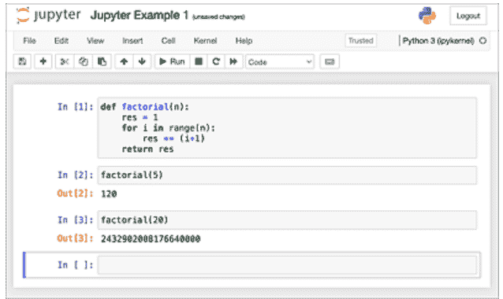

**图 40.1** Jupyter Notebook

之后可以毫无问题地更改阶乘函数。然后可以选择依赖于此的单元格，并通过按 `Shift` + `Enter` 再次执行。

在代码单元格之间，我们可以插入 Markdown 单元格来描述执行的代码。可以使用 **Insert** 菜单项插入新的代码单元格，然后可以通过菜单栏中的选择列表将其转换为 Markdown 单元格。

在 Markdown 单元格内，您可以使用 Markdown 格式化语言来格式化文本。例如，用双星号（`**text**`）括起来的文本以粗体显示。此外，还支持 LaTeX 数学环境：可以在一对单美元符号或双美元符号之间编写数学公式，然后以图形方式显示。图 40.2 所示公式的代码是 `$$\text{factorial}(n) = \prod_{i=1}^n i$$`。

特别有趣的是将 Jupyter Notebook 与 `matplotlib` 模块结合使用，您将在第 43 章中阅读到相关内容。如果通过 `%matplotlib` 魔法函数设置了内联模式，`matplotlib` 绘图也将集成到笔记本中（见图 40.3）。

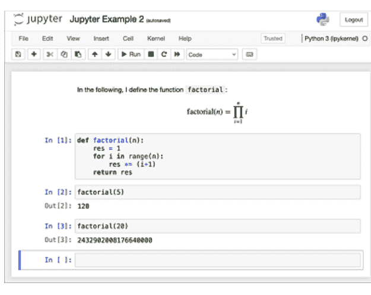

图 40.2 带有 Markdown 单元格的笔记本

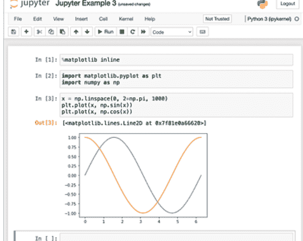

图 40.3 集成到笔记本文档中的绘图

## 41 图形用户界面

到目前为止，我们只处理了控制台应用程序——即与用户具有纯文本界面的程序——我们手指的刺痛感，也就是转向图形用户界面（GUI）的冲动，再也无法抑制。与控制台应用程序的面向文本的界面相比，具有图形界面的程序更直观易用、更具图形吸引力，并且通常被认为更现代。最重要的是，GUI 由*窗口*组成。在这些窗口内，您可以放置任何类型的控件。*控件*，通常称为*小部件*，是构成整个 GUI 的单个控制单元。例如，按钮或文本框就是一个控件。

GUI 的术语和实现都很大程度上取决于使用哪个库，也称为*工具包*。因此，我们将首先描述可以与 Python 一起使用的各种工具包；我们将在第二部分才开始实际的 GUI 编程。届时，我们将首先介绍 `tkinter` 模块，它使用 *Tk 工具包*并包含在标准库中。之后，我们将使用 *PySide6* 以项目为导向地介绍更全面和现代的 *Qt 框架*。

## 41.1 工具包

工具包是一个可用于创建具有 GUI 的程序的库。除了某些平台相关的工具包（如 Windows 的 Microsoft Foundation Classes (MFC) 或 Windows Forms）之外，平台无关的工具包（如 Qt、GTK 和 wxWidgets）在与 Python 结合使用时特别有用。这些工具包大多用 C（GTK）或 C++（Qt、wxWidgets）编写，但也可以通过所谓的*绑定*用 Python 访问。在接下来的几节中，我们将列出并简要介绍最重要的 GUI 工具包的 Python 绑定。

### 41.1.1 Tkinter (Tk)

**网站：** http://wiki.python.org/moin/TkInter

*Tk 工具包*最初是为 *Tool Command Language (Tcl)* 开发的，是唯一包含在 Python 标准库中的工具包。`tkinter` 模块（Tk 接口）允许您编写 Tk 应用程序，从而为较小的应用程序提供 GUI 提供了一个有趣的机会，用户以后不需要安装额外的库。Tk 程序的一个例子是 IDLE 开发环境，它包含在每个 Python 版本中。

在介绍了 Python 环境中最常见的工具包之后，我们将在第 41.2 节向您介绍使用 `tkinter` 编程 GUI。

### 41.1.2 PyGObject (GTK)

**网站：** https://pygobject.readthedocs.io

*GIMP 工具包* (GTK) 最初是为图形程序 GIMP 开发的，如今与 Qt 一起成为最广泛使用的跨平台工具包之一。工具包本身和 PyGObject Python 绑定都在 GNU 宽松通用公共许可证 (LGPL) 下发布，可以免费下载和使用。

GTK 是免费的 GNOME 桌面环境的基础，因此在 Linux 用户中尤其受欢迎。尽管它实际上是用 C 编写的，但 GTK 从一开始就是面向对象的，因此可以很好地与 Python 一起使用。

### 41.1.3 Qt for Python (Qt)

**网站：** https://www.qt.io/qt-for-python

Qt 是由 Qt 公司（从挪威的 Trolltech 公司发展而来）开发的一个全面的框架，它包括一个 GUI 工具包和非 GUI 功能。这个彻底面向对象的 C++ 框架是免费的 K 桌面环境 (KDE) 的基础，因此与 GTK 一样广泛和受欢迎。

Qt 公司以 Qt for Python 的名义开发该框架的官方 Python PySide6 绑定。以前，第三方提供商 Riverbank Computing[203] 的 PyQt 绑定非常流行。与 PyQt 不同，PySide6 得到 Qt 公司 Qt 开发者的官方支持，并在 LGPL 条款下提供。

PyQt 和 PySide6 高度兼容，因此通常只需修改 `import` 语句即可使 PyQt 程序可执行。

在PySide6下运行。然而，这种API兼容性并不完整，也无法保证未来会持续兼容。

Qt本身和Python PySide6绑定都采用双重许可系统发布。对于以GPL或LGPL发布的软件，Qt和PySide6也可以在通用公共许可证（GPL）和LGPL条款下使用。此外，还存在商业使用的许可模式。Qt被用于许多商业项目，例如Google Earth、Mathematica，以及Skype和Spotify的Linux版本。

## 41.1.4 wxPython (wxWidgets)

**网站：** http://www.wxpython.org

WxWidgets（前身为wxWindows）是一个免费的GUI工具包，其首个版本早在1992年就已发布。因此，该工具包已高度成熟，并适用于所有常见平台。特别是在Python领域，wxWidgets因其流行性和完善的文档而备受青睐。wxWidgets项目的目标之一是尽可能真实地反映该工具包可运行的各个平台的外观和感觉。这主要是通过wxWidgets不使用自己的控件，而是使用相应平台的例程来实现的。wxWidgets和wxPython都在持续积极开发中。

## 41.2 tkinter简介

在介绍了各种可用的Python绑定GUI工具包之后，让我们将注意力转向GUI编程。为此，标准库包含了`tkinter`模块，可用于使用Tk工具包编程图形界面。`tkinter`模块是唯一无需安装第三方库即可在Python中编写GUI的方式，因此值得深入了解`tkinter`及其功能。

> **注意**
>
> 如果你在Linux下的Anaconda环境中运行以下示例程序，可能会发生通常使用的系统字体不可用的情况，从而使用所谓的位图字体。这会导致对话框显示不美观且过小，尤其是在高分辨率显示器上。
>
> 由于此问题没有简单的解决方案，我们建议在这些情况下使用你的Python系统安装来运行示例程序，而不是使用Anaconda。

### 41.2.1 一个简单示例

为了开始使用`tkinter`，我们想先展示然后描述一个简单的示例程序。该程序在屏幕上显示一个对话框，提示用户输入他们的名字。此外，该程序还有一个按钮，用于反转输入的名字，使字母按相反顺序显示。另一个按钮用于结束对话框。[图41.1](Figure 41.1)中的图形展示了GUI最终的样子。左侧显示了点击**反转**按钮之前的GUI，右侧显示了点击之后的GUI。


**图41.1** 第一个GUI

这个示例程序基于以下源代码：

```python
import tkinter
class MyApp(tkinter.Frame):
    def __init__(self, master=None):
        super().__init__(master)
        self.pack()
        self.createWidgets()
    def createWidgets(self):
        self.nameEntry = tkinter.Entry(self)
        self.nameEntry.pack()
        self.name = tkinter.StringVar()
        self.name.set("Your name...")
        self.nameEntry["textvariable"] = self.name
        self.ok = tkinter.Button(self)
        self.ok["text"] = "Ok"
        self.ok["command"] = self.quit
        self.ok.pack(side="right")
        self.rev = tkinter.Button(self)
        self.rev["text"] = "Reverse"
        self.rev["command"] = self.onReverse
        self.rev.pack(side="right")
    def onReverse(self):
        self.name.set(self.name.get()[::-1])
```

首先，导入`tkinter`模块，并创建一个继承自`tkinter.Frame`的类。`Frame`基类代表一个*框架控件*。这是一个默认不可见且没有显著功能的控件；它代表自定义控件或对话框的起点。我们使用`Frame`控件作为对话框控件的容器。

在`MyApp`的构造函数中，调用了基类的构造函数和`pack`方法。此方法将调用该方法的控件注册到所谓的*打包器*。然后，打包器根据程序员的意愿在表面上排列已注册的控件。特别是，控件元素的位置通常不是通过固定坐标指定的，而是由打包器动态确定的。

`createWidgets`方法在构造函数中最后被调用，其任务是初始化我们对话框所需的控件。为此，我们首先创建一个`tkinter.Entry`类的实例，该类代表一个输入字段。然后通过`pack`将其应用到表面。之后，在`self.name`下创建一个`tkinter.StringVar`类的实例，我们稍后可以使用它来读取或修改在`self.nameEntry`输入字段中输入的文本。最初，我们将文本设置为`Your name...`，并将控制变量注册到`Entry`控件。这是通过设置`entry`实例的`textvariable`键来完成的，类似于字典。

在函数的后续过程中，我们以类似的方式创建对话框中要提供的两个按钮。对于按钮，可以像设置`entry`控件一样设置`text`（用于按钮标签）和`command`选项。`command`选项用于指定当用户点击按钮时将调用的函数。对于**确定**按钮，我们将`command`属性设置为`quit`方法。此方法来自`Frame`基类，并终止对话框。[204]

在示例程序中调用两个按钮的`pack`方法时，你可以看到一种告诉打包器控件所需位置的方法。因此，例如，你可以使用`side`关键字参数来指定控件应该是左对齐还是右对齐。当然，这不是唯一可能的指定方式。你将在本章中了解更多可能性。

最后，是`onReverse`函数的实现，当用户点击`self.rev`按钮时调用该函数。这里，通过`self.name`控制变量读取输入字段中输入的文本，将其反转，然后写回输入字段。

我们现在创建了一个代表对话框的类。还缺少的是实例化该类并显示对话框的代码。以下是操作方法：

```python
root = tkinter.Tk()
app = MyApp(root)
app.mainloop()
```

首先，创建一个`tkinter.Tk`类的实例来表示对话框框架。然后我们实例化`MyApp`应用程序类，将`Tk`实例作为父实例传递。在第三行调用`mainloop`会显示对话框。该方法会阻塞，直到对话框终止。

第一个介绍性的Tk程序就介绍到这里。在接下来的章节中，我们将探讨Tk的重要方面，例如控制变量和打包器的概念。之后，我们将描述最重要的控件。

### 41.2.2 控制变量

在介绍性示例中，我们使用控制变量来实现程序和用户界面之间的数据交换。*控制变量*绑定到控件的特定信息，例如输入字段的文本，并始终包含控件当前显示的值。反过来，控制变量可用于从程序内部更改控件的相应信息。

很明显，控制变量不一定是字符串；例如，考虑一个用于输入整数的控件。Python的基本数据类型不能用作控制变量的数据类型。这是因为与控制变量关联的控件需要在变量值更改时得到通知。这对于基本数据类型是不可能的。这里你必须使用`tkinter`模块的特殊数据类型。[表41.1](#table-411)列出了所有可用类型。

| 数据类型 | 对应的Python类型 |
| :--- | :--- |
| `tkinter.BooleanVar` | `bool` |
| `tkinter.DoubleVar` | `float` |
| `tkinter.IntVar` | `int` |
| `tkinter.StringVar` | `str` |

**表41.1** 控制变量的数据类型

所有这些数据类型都继承自`tkinter.Variable`基类，其构造函数具有下一节描述的接口。

### Variable([master, value, name])

可以通过`master`参数指定主控件。如果你同时使用多个`Tk`实例，这尤其有用。如果只存在一个`Tk`实例，它将自动用作主控件，无需指定`master`参数。

对于`value`参数，可以指定创建的实例应存储的值。此处传递的值将转换为控制变量的数据类型。请注意，转换失败直到调用`get`方法时才会显现。

实例化后，控制变量提供了`get`和`set`方法来访问其存储的值：

```
>>> t = tkinter.Tk()
>>> v = tkinter.StringVar(value="Hello world")
>>> v.get()
'Hello world'
>>> v.set("Blah Blah")
>>> v.get()
'Blah Blah'
```

请注意，仅当变量存储了无效值时调用`get`才会引发异常，而使用无效值调用`set`方法则会被静默忽略。

> **注意**

控制变量的一个有趣特性是它们可以同时被多个部件使用。通过这种方式，可以在部件的内容之间建立简单的连接。

因此，在入门示例程序中，`self.name`控制变量除了可以赋给`self.nameEntry`输入字段外，还可以赋给`self.rev`按钮：

```python
self.rev["textvariable"] = self.name
```

这样，输入字段中输入的名称会立即被采纳为按钮的标签。

## 41.2.3 布局管理器（Packer）

图形用户界面由一组在对话框中以有意义结构排列的部件组成。理论上，可以“手动”定义每个部件的位置。然而，这种方法会带来问题，因为程序员通常不关心部件的确切坐标，而是希望指定它们应排列的结构。此外，程序员必须自己处理对话框的调整大小等问题，例如根据需要移动或调整部件大小。

Tk提供了所谓的*布局管理器*，负责在对话框中排列部件的任务。程序员只需以部件对齐指令的形式为对话框指定一个结构。

在Tk中，对话框的部件是分层排列的，这与其他工具包类似。这意味着每个部件都有一个父部件。同时，每个部件可以包含任意数量的子部件。在Tk术语中，父部件称为*主部件*，子部件称为*从部件*。本章开头示例程序中的部件层次结构如[图41.2](#figure-41-2)所示。

部件的层次结构对于理解布局管理器的工作方式很重要。这是因为布局管理器在其父部件内排列子部件，然后又在其各自的父部件内排列父部件连同子部件。因此，将部件封装起来以便布局管理器可以将它们一起排列是有意义的。为此，程序员经常使用`Frame`部件。


**图41.2** 示例程序中的部件层次结构

如前所述，可以给布局管理器一个布局，它必须据此排列部件。在示例程序中，我们通过在调用两个按钮的`pack`方法时传递值为"right"的`side`关键字参数来实现这一点。布局管理器会将带有此布局语句的部件在图形用户界面中右对齐。在接下来的几节中，我们将以现在熟悉的示例程序为例，演示布局管理器的工作原理。

布局管理器总是在一个矩形窗口窗格（在以下图像中用黑色轮廓标出）中工作。最初，如果没有部件被“打包”，这就是整个窗口（参见[图41.3](#figure-41-3)）。


**图41.3** 布局管理器的工作模式：步骤1

首先，在不指定布局的情况下打包`Entry`部件。在这种情况下，布局管理器会垂直排列部件。因此，`Entry`部件被放置在最顶部，并跨越对话框的整个宽度（参见[图41.4](#figure-41-4)）。


**图41.4** 布局管理器的工作模式：步骤2

有趣的是工作区会发生什么变化：它的大小会减小，并且不再包含最后打包的部件。因此，一旦放置了一个部件，它就不会根据后续部件的布局规范来回移动。

接下来，按钮被插入到剩余的工作区中。这些按钮具有“右对齐”的布局语句，因此从对话框的右边缘水平放置。由于它们是水平放置的，它们占据了工作区的整个高度，在左侧留下了一个剩余工作区，布局管理器可以在此放置任何额外的部件（参见[图41.5](#)）。


**图41.5** 布局管理器的工作模式：步骤3

布局管理器的一般工作模式就介绍到这里。在[表41.2](#)中，您可以更仔细地了解在调用`pack`方法时可以以关键字参数形式提供给布局管理器的布局语句。

| 参数 | 可能的值 | 含义 |
| :--- | :--- | :--- |
| `after` | `Widget` | 该部件应打包在指定部件之后。 |
| `anchor` | "n", "ne", "e", "se", "s", "sw", "w", "nw", "center" | 如果分配给部件的区域大于部件，可以使用`anchor`指定部件在此区域内的方向。可能的值是罗盘方向和"center"。 |
| `before` | Widget | 该部件应打包在指定部件之前。 |
| `expand` | bool | 指定当主部件放大时是否应调整部件的位置（参见[图41.7](#)）。 |
| `fill` | "x", "y", "both", "none" | 当主部件放大时，部件的大小将被调整。大小可以水平调整、垂直调整、完全调整或根本不调整（参见[图41.7](#)）。 |
| `in` | Widget | 将部件插入指定的主部件中。 |
| `ipadx`<br>`ipady` | int | 水平或垂直内部填充的像素大小。 |
| `padx`<br>`pady` | int | 水平或垂直外部填充的像素大小。 |
| `side` | `"left"`, `"right"`, `"top"`, `"bottom"` | 部件将被插入的工作区的哪一侧。放置在左侧或右侧的部件占据整个高度，放置在顶部或底部的部件占据工作区的整个宽度。您可以使用`Frame`部件实现更精细的布局。 |

**表41.2** 布局语句

## 填充

您肯定已经注意到，我们在示例应用程序中创建的对话框看起来相当奇怪。这是因为部件被直接放置在彼此旁边，中间没有任何空间。使用所谓的*填充*，您可以定义此空间的大小，从而实现不那么拥挤的对话框外观。

基本上，有两种类型的填充：外部和内部。*外部填充*描述部件之间的距离。此值通过`padx`和`pady`关键字参数传递给`pack`方法。这里的值必须是对应于所需间距（以像素为单位）的整数。[图41.6](Figure 41.6)显示了每个部件都设置了五像素外部填充的对话框。


**图41.6** 使用中的填充

*内部填充*是部件内部的间距规范。包含在此部件中的从部件[ 205 ]会遵守此填充，并相应地放置在更靠内的位置。这种类型的填充对于`Frame`部件特别有用。内部填充可以通过与外部填充相同的方式，通过`ipadx`和`ipady`关键字参数来指定。

## 主部件放大时的行为

[图41.7](#figure-417)通过一个示例展示了`fill`和`expand`布局语句的效果。


**图41.7** Fill和Expand布局语句

左上角的图像显示了在没有进一步布局语句的情况下，窗口放大时对话框的行为。右上角使用了`fill="both"`布局语句，左下角使用了`expand=True`，最后右下角是`expand`和`fill`的组合。布局语句总是对所有`pack`调用（包括父`Frame`部件的`pack`调用）等同地传递。

## 41.2.4 事件

编写Tk应用程序时，在创建并实例化应用程序类后，通过调用`mainloop`方法将控制流传递给Tk框架。问题出现了：我们如何响应用户输入——例如，如果我们对程序和图形界面完全没有真正的控制。因此，在Tk中定义了许多*事件*。例如，事件是用户的按键或鼠标点击。使用部件的`bind`方法，我们可以将一个自定义方法绑定到一个事件。绑定到事件的方法在相应的事件发生时（例如用户按下特殊键时）由Tk框架调用。

### 绑定事件

部件的`bind(event, func, [add])`方法将`func`函数绑定到`event`事件。对于`func`，必须传递一个函数对象，该对象期望一个参数，即所谓的*事件对象*。此函数称为*事件处理程序*。如果为可选参数`add`传递值`True`，并且已经有其他函数绑定到`event`，它们不会被删除；`func`只会被添加到事件处理程序列表中。默认情况下，先前的绑定会被覆盖。

对于最重要的参数`event`，必须传入一个字符串，该字符串指定`func`要绑定到的事件。这种事件规范具有以下结构：

```
"<modifier-modifier-type-detail>"
```

事件规范中的两个`modifier`条目是可选的，例如，允许将按住`Shift`键的鼠标点击与普通鼠标点击区分开来。`type`条目标识事件类型，`detail`条目可用于更详细的规范，例如必须按下哪个鼠标按钮才能触发事件。

例如，以下`bind`调用会在用户按住`Shift`键在控件中左键单击时触发`f`函数的调用：

```
widget.bind("<Shift-ButtonPress-1>", f)
```

或者，可以为应用程序的所有控件一次性绑定一个事件。为此，使用`bind_all`方法，它与`bind`具有相同的接口：

```
widget.bind_all("<Shift-ButtonPress-1>", f)
```

`bind`和`bind_all`方法返回一个函数ID，可用于引用已建立的连接。如果要再次移除事件绑定，这一点尤其重要。这是通过`unbind`和`unbind_all`方法完成的。这两个函数都传递一个事件字符串，并取消与此事件存在的所有连接：

```
widget.unbind("<Shift-ButtonPress-1>")
widget.unbind_all("<Shift-ButtonPress-1>")
```

`unbind`方法也可以传递一个函数ID来解绑具体的事件。

在接下来的章节中，我们将更详细地介绍事件字符串的各个元素。

## 事件修饰符

让我们从事件规范中`modifier`条目可以使用的值开始。正如示例所示，这些是`type`事件必须发生的附加条件——例如，在按住`Ctrl`键的同时输入"a"。最重要的修饰符在表41.3中列出并解释。

| 属性 | 含义 |
| :--- | :--- |
| `Alt`、`Control`、`Shift`、`Lock` | 当事件发生时，必须按下指定的键（`Alt`、`Ctrl`、`Shift`或`Capslock`）。 |
| `Buttonx` `Bx` | 事件发生时必须按下鼠标按钮`x`。数字`x`指定是哪个按钮：`1`代表左键，`2`代表中键，*`3`代表右键。其他鼠标按钮按顺序编号。 |
| `Double` `Triple` | 事件必须在短时间内连续发生两次或三次，例如双击。 |
| * | 滚动轮被视为中键。如果没有滚动轮也没有真正的中键，同时点击左右鼠标按钮被视为点击中键。 |

**表41.3** 修饰符

## 事件类型

现在我们已经处理了修饰符，接下来讨论事件规范的`type`条目。可用的事件类型在表41.4中列出并解释。如果需要`detail`参数，也会在此提及。

请注意，控件可能需要具有输入焦点才能接收特定事件。

| 事件 | 含义 |
| :--- | :--- |
| `KeyPress`<br>`Key` | 用户按下了某个键。可以通过事件规范中的`detail`条目将事件限制为特定的键。* |
| `KeyRelease` | 用户释放了某个键。这里可以使用与`KeyPress`相同的`detail`规范。 |
| `ButtonPress` | 用户在控件上按下了鼠标按钮。**可以在事件规范的`detail`条目中指定鼠标按钮的编号来限制此事件。这里1对应左键，2对应中键，3对应右键。 |
| `ButtonRelease` | 用户释放了鼠标按钮。这里也可以使用事件规范中的`detail`条目来指定是哪个鼠标按钮。 |
| `Motion` | 用户在控件上移动了鼠标。可以使用`Buttonx`修饰符来指定在用户移动鼠标时应按住特定的鼠标按钮。 |
| `Enter`、`Leave` | 用户将鼠标指针移入或移出控件区域。 |
| `FocusIn`、<br>`FocusOut` | 控件获得或失去输入焦点。 |
| `Expose` | 控件被其他窗口完全或部分遮挡，然后被用户恢复。在这种情况下，可能需要重绘控件的部分区域。 |
| `Destroy` | 控件被销毁。 |
| `Configure` | 控件的大小或位置发生了变化。 |
| `MouseWheel` | 用户移动了鼠标滚轮。 |

* 这里可以使用以下大多是自解释的值：`Alt_L`、`Alt_R`、`BackSpace`、`Cancel`、`Caps_Lock`、`Control_L`、`Control_R`、`Delete`、`End`、`Escape`、`F1-F12`、`Home`（"Pos1"）、`Insert`、`Left`、`Up`、`Right`、`Down`、`Next`（"Page down"）、`Num_Lock`、`Pause`、`Print`、`Prior`（"Page up"）、`Return`、`Scroll_Lock`、`Shift_L`、`Shift_R`和`Tab`。此外，可以指定单个字符。
** 鼠标按钮被按下的控件可以说获得了鼠标事件的"订阅"。具体来说，这意味着即使鼠标随后移到另一个控件上，`release`和`motion`事件也会发送到此控件。只有释放按钮才会取消此"订阅"。

**表41.4** 事件

## 事件处理程序

事件触发后，将调用关联的事件处理程序。然后，该处理程序会接收一个事件对象——更准确地说，是一个`tkinter.event`实例——其中包含有关所发生事件的更详细信息。表41.5列出并解释了事件对象最重要的属性。请注意，根据触发的事件，只有部分属性是有用的。

| 属性 | 含义 |
| :--- | :--- |
| `char` | 包含输入的字符作为字符串。**适用于**`KeyPress`**和**`KeyRelease`。 |
| `delta` | 指示用户移动鼠标滚轮的距离。符号表示旋转方向。**适用于**`MouseWheel`。 |
| `focus` | 指示鼠标所在的控件是否具有输入焦点。**适用于**`Enter`**和**`Leave`。 |
| `height`、`width` | 包含控件的新高度或宽度（以像素为单位）。**适用于**`Configure`**和**`Expose`。 |
| `keycode`、`keysym` | 包含按键的键码或符号名称。**适用于**`KeyPress`**和**`KeyRelease`。 |
| `time` | 包含描述事件时间的整数时间戳。它是自系统启动以来经过的时间（以毫秒为单位）。 |
| `type` | 包含事件类型的整数标识符。 |
| `widget` | 引用事件发生的控件。 |
| `x`、`y` | 包含鼠标指针的X或Y坐标（以像素为单位）。此规范相对于控件的左上角。 |
| `x_root`、`y_root` | 包含鼠标指针的X或Y坐标，但这次是相对于屏幕的左上角。**适用于**`ButtonPress`、`ButtonRelease`、`KeyPress`、`KeyRelease`**和**`Motion`。 |

**表41.5** 事件对象的属性

## 示例

至此，主要事件类型的介绍结束。现在我们将展示一个示例程序，说明事件的使用。程序的图形界面包含一个标签（一个只显示文本的控件）、一个输入框和一个可用于关闭对话框的按钮。程序应该接收发送到输入框的某些事件，并通过标签中的相应消息确认事件的接收：

```python
import tkinter

class MyApp(tkinter.Frame):
    def __init__(self, master=None):
        super().__init__(master)
        self.pack()
        self.createWidgets()
        self.createBindings()

    def createWidgets(self):
        self.label = tkinter.Label(self)
        self.label.pack()
        self.label["text"] = "Please send an event"
        self.entry = tkinter.Entry(self)
        self.entry.pack()
        self.ok = tkinter.Button(self)
        self.ok.pack()
        self.ok["text"] = "Exit"
        self.ok["command"] = self.quit

    def createBindings(self):
        self.entry.bind("Duckburg", self.eventDuckburg)
        self.entry.bind("<ButtonPress-1>", self.eventMouseClick)
        self.entry.bind("<MouseWheel>", self.eventMouseWheel)

    def eventDuckburg(self, event):
        self.label["text"] = "You know the secret password!"

    def eventMouseClick(self, event):
        self.label["text"] = "Mouse click at position " \
                            "({}, {})".format(event.x, event.y)

    def eventMouseWheel(self, event):
        if event.delta < 0:
            self.label["text"] = "Please move the mouse wheel" \
                                " in the right direction."
        else:
            self.label["text"] = "Thank you very much."
```

首先，像往常一样，在构造函数调用的`createWidgets`方法中初始化应用程序的三个控件。之后，调用`createBindings`方法，该方法负责注册事件处理程序。此方法考虑了三种事件：输入 `Duckburg` 字符串、点击鼠标左键以及移动鼠标滚轮。请注意，所有三种事件都指向输入字段——即 `Entry` 小部件。例如，只有在此输入字段上方的鼠标点击才会被注册为事件。

接下来是 `eventDuckburg`、`eventMouseClick` 和 `eventMouseWheel` 事件处理方法。`eventMouseWheel` 方法得益于 `event.delta` 的符号指示了鼠标滚轮移动的方向。

我们尚未详细讨论 `label` 小部件的使用，但很明显，你可以设置 `"text"` 键来更改其显示的文本。关于此小部件的更详细讨论，请参见下一节。

> **注意**

在 Windows 上，鼠标滚轮的移动会触发此示例程序中关联的 `MouseWheel` 事件。在 Linux 上，鼠标滚轮的两个方向被解释为鼠标的备用按钮 4 和 5。此处移动鼠标滚轮会触发以下事件之一：`ButtonPress-4` 或 `ButtonPress-5`。

本书的在线资源（可在 *www.rheinwerk-computing.com/5566* 获取）包含一个可在 Windows 和 Linux 上运行的示例程序变体。

最后，显示对话框的代码仍然缺失。但与之前的示例程序相比，它没有变化：

```python
root = tkinter.Tk()
app = MyApp(root)
app.mainloop()
```

[图 41.8](Figure 41.8) 展示了该示例程序。


**图 41.8** 带有事件的示例程序

至此，我们结束了对事件世界的介绍。在接下来的章节中，我们将描述你可以在 `tkinter` 应用程序中使用的不同类型的小部件。

## 41.2.5 小部件

既然我们已经介绍了 Tk 的基础知识，你将了解可用的小部件以及如何使用它们。[表 41.6](Table 41.6) 列出了本章描述的所有 Tk 小部件。

| 小部件 | 含义 |
| :--- | :--- |
| `Widget` | 所有小部件的基类。 |
| `Button` | 一个按钮。 |
| `Canvas` | 用于绘图和图形的小部件。 |
| `Checkbutton` | 一个可以启用或禁用的小部件。 |
| `Entry` | 单行输入字段。 |
| `Label` | 用于标签的小部件。 |
| `LabelFrame` | 用于带标签框架的小部件。 |
| `Listbox` | 一个条目列表。 |
| `Menu` | 上下文菜单。 |
| `Menubutton` | 点击时显示上下文菜单的按钮。 |
| `OptionMenu` | 点击时显示选择列表的按钮。 |
| `Radiobutton` | 一个可以启用或禁用的小部件。在一个组内，只能激活一个单选按钮。 |
| `Scrollbar` | 允许用户滚动过大尺寸小部件的滚动条。 |
| `Spinbox` | 用于设置数值的小部件。 |
| `Text` | 多行输入字段。 |

**表 41.6** 小部件详解

> **注意**

为每个小部件提供的示例程序都经过了简化，以说明基本原理。本书的在线资源包含更详细和可执行的示例程序版本。

### 小部件基类

`tkinter.Widget` 类是所有小部件的基类，并提供基本功能。首先，这包括 `winfo` 方法（用于 *小部件信息*），你可以使用它们来查找有关小部件的信息，例如其位置。表 41.7 描述了主要的 `winfo` 方法。为此，我们假设 `w` 是一个小部件。

| 接口 | 含义 |
| :--- | :--- |
| `w.winfo_children()` | 返回 `w` 的子小部件列表 |
| `w.winfo_class()` | 以字符串形式返回 `w` 的小部件类名 |
| `w.winfo_geometry()` | 以 "BxH+X+Y" 格式的字符串返回 `w` 小部件相对于父小部件的位置和尺寸 |
| `w.winfo_height()`<br>`w.winfo_width()` | 以像素为单位返回 `w` 小部件的高度或宽度 |
| `w.winfo_pointerx()`<br>`w.winfo_pointery()`<br>`w.winfo_pointerxy()` | 返回鼠标指针相对于屏幕左上角的 X、Y 坐标或两个坐标的元组 |
| `w.winfo_rootx()`<br>`w.winfo_rooty()` | 返回 `w` 小部件相对于屏幕左上角的 X 或 Y 位置 |
| `w.winfo_screenheight()`<br>`w.winfo_screenwidth()` | 以像素为单位返回屏幕的高度或宽度 |
| `w.winfo_x()`<br>`w.winfo_y()` | 返回 `w` 小部件相对于父小部件的 X 或 Y 坐标 |

**表 41.7** winfo 的方法

正如你从之前的示例中已经知道的，你可以配置一个小部件。为此，你可以像访问字典一样访问配置键：

```python
w["width"] = 200
w["height"] = 100
```

或者，小部件可以在实例化时进行配置。为此，可以将所需的设置作为关键字参数传递给相应的构造函数：

```python
frame = tkinter.Frame(width=200, height=200)
```

许多小部件都有用于宽度和高度的 `width` 和 `height` 键；用于水平和垂直内边距的 `padx` 和 `pady`；用于小部件状态的 `state`；以及用于前景色和背景色的 `foreground` 和 `background`。

小部件提供的其他键取决于其类型，无法在本章中详尽涵盖。在接下来的章节中，你将了解 `tkinter` 中包含的主要小部件类型。

### 按钮

`tkinter.Button` 类的实例表示一个 *按钮小部件*，对应于图形用户界面中的一个按钮。你已经在示例程序中看到了如何使用按钮。在实例化 `button` 类后设置 `text` 和 `command` 选项非常重要；这些选项用于指定按钮的标签和处理函数。当用户点击按钮时，Tk 框架会调用处理函数：

```python
class MyApp(tkinter.Frame):
    def __init__(self, master=None):
        super().__init__(master)
        self.pack()
        self.ok = tkinter.Button(self)
        self.ok["text"] = "label"
        self.ok["command"] = self.handler
        self.ok.pack()
    def handler(self):
        print("Button pressed")
```

设置好 `ok` 按钮后，每当用户点击该按钮时，`handler` 方法就会被调用。

### 复选按钮

*复选按钮*，也称为 *复选框*，是与按钮相关的小部件。复选按钮由一个小方框和一个标签组成，可以处于两种状态之一：启用和禁用。用户可以通过点击小方框来更改状态。复选按钮的激活状态通过方框中的勾选标记或叉号表示（参见 [图 41.9](#)）。


**图 41.9** 使用中的复选按钮

创建和使用复选按钮非常简单，其工作方式与按钮类似。但是，此外，必须为复选按钮的当前状态创建一个控制变量：

```python
check = tkinter.Checkbutton(master)
check["text"] = "Hello world"
checked = tkinter.BooleanVar()
checked.set(True)
check["variable"] = checked
check.pack()
```

一旦复选按钮被实例化，就可以通过 `text` 选项指定标签。然后，使用 `variable` 选项，为复选按钮的状态分配一个控制变量。最后，通过调用 `pack` 方法将复选按钮添加到图形用户界面中。

与按钮一样，`command` 选项可用于指定一个处理函数，当用户更改复选按钮的状态时，Tk 框架会调用该函数。在此处理函数内，可以通过 `checked` 控制变量查询复选按钮的当前状态。

复选按钮通常不会单独出现，而是代表一组设置，其中的各个元素可以相互独立地激活或停用。以下更复杂的示例程序展示了如何创建多个复选按钮，并通过一个共同的处理函数处理它们的事件：

```python
class MyApp(tkinter.Frame):
    def __init__(self, master=None):
        super().__init__(master)
        self.pack()
        self.names = ("Donald Duck", "Scrooge McDuck", "Gladstone Gander")
        self.checks = []
        self.vars = []
        for name in self.names:
            var = tkinter.BooleanVar()
            var.set(False)
            check = tkinter.Checkbutton(self)
            check["text"] = name
            check["command"] = self.handler
            check["variable"] = var
            check.pack(anchor="w")
            self.checks.append(check)
            self.vars.append(var)
    def handler(self):
        x = " and ".join(
            [name for name, var in zip(self.names, self.vars) if var.get()]
        )
```

对于 `self.names` 元组中的每个条目，都会创建一个复选按钮和一个控制变量，并分别存储在 `self.checks` 和 `self.vars` 列表中。每个创建的复选按钮都分配了共同的 `handler` 处理函数。在此处理函数中，使用内置的 `zip` 函数遍历名称和相应控制变量的元组，以输出用户选中的复选框对应的名称。

### 单选按钮

与复选按钮一样，*单选按钮* 是一个可以通过用户点击激活或停用的小部件。单选按钮的特殊之处在于，你可以定义一组单选按钮，在该组内单选按钮组中始终只有一个按钮被激活。在这里，单选按钮构成一个共享相同控制变量的组。在下面的示例代码中，用户可以选择一个G7国家的首都：

```python
class MyApp(tkinter.Frame):
    def __init__(self, master=None):
        super().__init__(master)
        self.pack()
        self.selection = ["Berlin", "London", "Ottawa",
                         "Paris", "Rome", "Tokyo", "Washington DC"]
        self.city = tkinter.StringVar()
        self.city.set("Paris")
        for a in self.selection:
            b = tkinter.Radiobutton(self)
            b["text"] = a
            b["value"] = a
            b["variable"] = self.city
            b["command"] = self.handler
            b.pack(anchor="w")
    def handler(self):
        print(self.city.get())
```

首先，创建一个包含所有可供选择的城市的列表和一个控制变量。这个变量随后将始终包含用户当前选择的城市名称。初始时，巴黎被选中。

然后我们遍历所有城市，为每个城市创建一个单选按钮。在此例中，设置了以下选项：`text` 用于标签，`value` 用于单选按钮被选中时控制变量所取的值，`variable` 用于控制变量，`command` 用于处理函数。与复选框一样，每当用户修改选择时，都会调用此处理函数。

[图 41.10](Figure 41.10) 展示了此示例程序的图形用户界面。


**图 41.10** 大量单选按钮

## 输入框

*输入框控件*是一个单行输入字段，用户可以在其中输入任意文本。以下示例代码创建了一个 `Entry` 控件并向其中写入文本：

```python
class MyApp(tkinter.Frame):
    def __init__(self, master=None):
        super().__init__(master)
        self.pack()
        self.entryVar = tkinter.StringVar()
        self.entryVar.set("Hello world")
        self.entry = tkinter.Entry(self)
        self.entry["textvariable"] = self.entryVar
        self.entry.pack()
        self.entry.bind("<Return>", self.handler)
    def handler(self, event):
        print(self.entryVar.get())
```

实例化了一个 `Entry` 控件和一个控制变量。然后将控制变量设置为一个值，并将其链接到输入字段。一旦输入字段被传递给布局管理器，我们就将 `Return` 事件（当在输入字段中按下 `Enter` 键时触发）连接到一个处理函数，该函数输出输入字段的当前内容。此示例程序的图形用户界面如[图 41.11](#figure-41-11)所示。


**图 41.11** 输入框控件

## 标签

*标签控件*是一个非常简单的控件，其唯一任务是在图形用户界面中显示文本。以下示例程序展示了如何使用 `Label` 控件：

```python
class MyApp(tkinter.Frame):
    def __init__(self, master=None):
        super().__init__(master)
        self.pack()
        self.label = tkinter.Label(self)
        self.label["text"] = "Hello world"
        self.label.pack()
```

实例化 `tkinter.Label` 类后，使用 `text` 选项更改标签的标题，最后将标签传递给布局管理器。我们也可以在此处通过 `textvariable` 选项定义一个控制变量，并将所需的文本应用于它，而不是使用 `text` 选项。

此示例程序的图形用户界面并不十分壮观，但如[图 41.12](#figure-41-12)所示。


**图 41.12** 使用中的标签

## 标签框架

*标签框架控件*是 `Frame` 控件的一种特殊变体，用于对控件进行分组。`LabelFrame` 在其子控件周围绘制一个带标签的框架。在下面的示例程序中，为复选框示例添加了一个标签框架：

```python
class MyApp(tkinter.Frame):
    def __init__(self, master=None):
        super().__init__(master)
        self.pack()
        self.names = ("Donald Duck", "Scrooge McDuck", "Gladstone Gander")
        self.group = tkinter.LabelFrame(self)
        self.group["text"] = "Duckburg"
        self.group.pack()
        self.checks = []
        self.vars = []
        for name in self.names:
            var = tkinter.BooleanVar()
            var.set(False)
            check = tkinter.Checkbutton(self.group)
            check["text"] = name
            check["command"] = self.handler
            check["variable"] = var
            check.pack(anchor="w")
            self.checks.append(check)
            self.vars.append(var)
    def handler(self):
        print(" and ".join(
            [name for name, var in zip(self.names, self.vars) if var.get()]
        ))
```

使用 `LabelFrame` 控件仅限于实例化 `tkinter.LabelFrame` 类，为框架标签指定 `text` 选项，并创建子控件。此示例中创建的图形用户界面如[图 41.13](#figure-41-13)所示。


**图 41.13** 标签框架控件

## 列表框

*列表框*是一个表示条目列表的控件。根据应用程序的不同，用户可以选择或修改一个或多个条目。在最简单的情况下，可以按如下方式创建列表框：

```python
class MyApp(tkinter.Frame):
    def __init__(self, master=None):
        super().__init__(master)
        self.pack()
        self.entries = ["Berlin", "London", "Ottawa", "Paris",
                       "Rome", "Tokyo", "Washington DC"]
        self.lb = tkinter.Listbox(master)
        self.lb.insert("end", *self.entries)
        self.lb.pack()
```

首先我们创建 `self.entries` 列表，其中包含我们稍后要写入列表框的条目。然后创建 `tkinter.Listbox` 类的一个实例并进行布局。最后，对于每个所需的条目，我们调用列表框的 `insert` 方法，该方法将相应的条目追加到列表框的末尾。

此源代码生成的列表框如[图 41.14](#)所示。


**图 41.14** 列表框示例

列表框的条目从0开始连续编号。可以通过此索引访问条目。为此，`Listbox` 类定义了一组方法，汇总在[表 41.8](#)中。其中一些方法传递一个 `first` 索引和一个可选的 `last` 索引。如果指定了 `last`，则该方法适用于索引在 `first` 和 `last` 之间的所有条目。如果未指定 `last`，则仅指代具有 `first` 索引的元素。对于 `first` 和 `last`，也可以传递字符串 "end" 代替具体的索引。

| 方法 | 含义 |
| :--- | :--- |
| `curselection()` | 返回一个包含当前选中条目索引的列表。 |
| `delete(first, [last])` | 删除一个或多个条目。 |
| `get(first, [last])` | 以字符串形式返回一个或多个条目。 |
| `insert(index, [*elements])` | 在列表框的 `index` 位置插入由 `elements` 指定的一个或多个条目。 |
| `selection_clear(first, [last])` | 取消选择一个或多个条目。 |
| `selection_includes(index)` | 指示某个条目是否被选中。 |
| `selection_set(first, [last])` | 选择一个或多个元素。 |
| `size()` | 返回条目数量。 |

**表 41.8** 列表框的方法

前面描述的列表框示例程序是静态的。用户可以从列表框中选择一个条目，但没有任何反应。以下示例程序展示了如何响应用户选择的更改。为此，我们创建以下应用程序类：

```python
class MyApp(tkinter.Frame):
    def __init__(self, master=None):
        super().__init__(master)
        self.pack()
        self.entries = ["Berlin", "London", "Ottawa", "Paris",
                       "Rome", "Tokyo", "Washington DC"]
        self.lb = tkinter.Listbox(self)
        self.lb.pack(fill="both", expand="true")
        self.lb["selectmode"] = "extended"
        self.lb.insert("end", *self.entries)
        self.lb.bind("<<ListboxSelect>>", self.selectionChanged)
```

self.lb.selection_set(0)
self.label = tkinter.Label(self)
self.label.pack()
self.selectionChanged(None)

在构造函数中，首先创建一个列表框，并用已知的城市名称填充。用户应能选择任意一组城市。此行为对应于`selectmode`配置键的`extended`值。其他可能的值包括`single`、`browse`和`multiple`。

然后，我们将一个处理程序方法连接到所谓的虚拟事件`<<ListboxSelect>>`。虚拟事件是一种只能与特定小部件类型一起使用的特殊事件。每当用户更改列表框中的选择时，就会触发`<<ListboxSelect>>`事件。

接着，列表框的第一个元素被选中作为唯一选中项，并创建一个`label`小部件。最后，调用`selectionChanged`处理程序方法，向`label`小部件添加有意义的文本。`selectionChanged`方法如下所示：

```
def selectionChanged(self, event):
    self.label["text"] = "We are going to: " + ", ".join(
        (self.lb.get(i) for i in self.lb.curselection()))
```

每次用户更改列表框中的选择时，都会调用此方法。这里读取所选条目的索引，识别出相应的城市名称，并用逗号分隔写入标签。

此示例程序创建的GUI如[图 41.15](Figure 41.15)所示。


**图 41.15** 带有用户交互的列表框

## 菜单

在更复杂的GUI中，对话框标题栏下方通常有一个*菜单栏*，其中包含多个菜单。*菜单*是一个按钮，允许用户访问一系列附加命令。通常，例如在**文件**菜单中，可以找到**保存**和**另存为**命令。以下示例程序展示了如何为`tkinter`对话框配备菜单：

```
python
class MyApp(tkinter.Frame):
    def __init__(self, master):
        super().__init__(master)
        self.pack()
        self.menuBar = tkinter.Menu(master)
        master.config(menu=self.menuBar)
        self.fillMenuBar()
    def fillMenuBar(self):
        self.menuFile = tkinter.Menu(self.menuBar, tearoff=False)
        self.menuFile.add_command(label="Open", command=self.handler)
        self.menuFile.add_command(label="Save", command=self.handler)
        self.menuFile.add_command(label="Save as", command=self.handler)
        self.menuFile.add_separator()
        self.menuFile.add_command(label="Quit", command=self.quit)
        self.menuBar.add_cascade(label="File", menu=self.menuFile)
    def handler(self):
        print("Hello world!")
```

构成每个`tkinter`应用程序基础的`tkinter.Tk`实例包含一个`menu`选项，可用于设置菜单栏。这可以在`MyApp`类的构造函数中完成，其中可以通过`master`参数访问`tkinter.Tk`实例。在那里，菜单栏首先作为`tkinter.Menu`实例创建，最终通过`menu`选项作为菜单栏输入。

可以从构造函数调用的`fillMenuBar`方法负责填充新创建的菜单栏。为此，我们首先创建一个菜单，此后以`menuFile`名称可用。`tearoff`参数可用于控制是否应允许分离菜单。此行为在大多数桌面环境中是不合适的，因此未被允许。不过，你仍然可以尝试此设置。

然后通过`add_command`方法向菜单添加菜单项。这些菜单项被赋予一个`label`和一个处理函数（`command`），当用户选择相应的菜单项时，该处理函数将被调用，其方式与按钮的处理函数相同。在此示例中，调用了`handler`方法，通过输出文本来演示示例程序正常工作。只有**退出**菜单项将`self.quit`作为处理方法输入以终止应用程序。

`add_separator`方法可用于在菜单中插入分隔线，以便按类别对相关菜单项进行视觉分组。

最后，`add_cascade`方法将新菜单添加到菜单栏的**文件**标题下。

示例程序的GUI如[图 41.16](#figure-4116)所示。


**图 41.16** 菜单栏

这个简单的例子可以进一步扩展：除了用于添加简单菜单项的`add_command`方法和用于添加分隔符的`add_separator`方法外，`Menu`实例还具有`add_checkbutton`和`add_radiobutton`方法。这两种方法允许你在菜单中使用单选按钮和复选按钮。更详细地指定单选或复选按钮的选项作为关键字参数传递给这些方法（参见[图 41.17](#figure-4117)）。


**图 41.17** 更复杂的菜单栏

## 菜单按钮

*菜单按钮*是一种在用户点击时显示菜单的按钮。以下示例代码展示了如何使用这样的小部件：

```
class MyApp(tkinter.Frame):
    def __init__(self, master):
        super().__init__(master)
        self.pack()
        self.mb = tkinter.Menubutton(self, text="Hello world")
        self.menu = tkinter.Menu(self.mb, tearoff=False)
        self.menu.add_checkbutton(label="Donald Duck")
        self.menu.add_checkbutton(label="Scrooge McDuck")
        self.menu.add_checkbutton(label="Huey, Dewey, and Louie")
        self.mb["menu"] = self.menu
        self.mb.pack()
```

首先，创建一个`tkinter.Menubutton`类的实例。菜单按钮的标签由`text`选项定义。之后，我们创建点击菜单按钮时可以显示的菜单。这是一个`tkinter.Menu`实例，可以像上一节一样创建和使用。

最后，通过`menu`选项将菜单绑定到菜单按钮，并将菜单按钮传递给打包器。生成的GUI如[图 41.18](#figure-41-18)所示。

无论菜单中选择了哪个项目，菜单按钮标签都不会改变。


**图 41.18** 使用中的菜单按钮

## 选项菜单

在上一节描述的菜单按钮中，我们注意到当用户选择菜单项时，按钮的标签不会自动更改。然而，这种行为通常是必需的。具有这种行为的小部件通常被称为*下拉列表*。在Tk框架中，此小部件称为*选项菜单*。以下代码展示了如何使用`OptionMenu`小部件：

```
class MyApp(tkinter.Frame):
    def __init__(self, master):
        super().__init__(master)
        self.pack()
        self.lst = ["Linux", "macOS", "Windows"]
        self.var = tkinter.StringVar()
        self.var.set("Linux")
        self.op = tkinter.OptionMenu(self, self.var, *self.lst,
                                     command=self.handler)
        self.op.pack()
    def handler(self, text):
        print(text, self.var.get())
```

在创建下拉列表所需的项目列表和控制变量之后，我们实例化一个`tkinter.OptionMenu`实例，传递控制变量`var`和项目列表。注意，条目列表被解包，因为条目必须作为位置参数传递。

`command`关键字参数用于指定一个处理函数，该函数将在用户更改选择时被调用。与前面示例中的处理函数不同，在这种情况下，`handler`会接收到新选择的文本。在处理函数中，我们两次输出新选择的名称：一次通过传递参数，另一次通过读取控制变量。两种变体应始终提供相同的名称。

示例程序生成的GUI如[图 41.19](Figure 41.19)所示。

## 滚动条

小部件（如列表条目）的内容常常需要比小部件本身提供的空间更大的显示区域。针对这种情况，某些小部件类型允许包含所谓的`滚动条`。以下示例展示了如何在列表框中使用滚动条：

```python
class MyApp(tkinter.Frame):
    def __init__(self, master):
        super().__init__(master)
        self.pack()
        self.lb = tkinter.Listbox(self)
        self.lb.pack(side="left")
        self.sb = tkinter.Scrollbar(self)
        self.sb.pack(fill="y", side="left")
        self.lb.insert("end", *[i*i for i in range(50)])
        self.lb["yscrollcommand"] = self.sb.set
        self.sb["command"] = self.lb.yview
```

首先，创建一个列表框和一个滚动条，并在图形用户界面中排列，使滚动条出现在列表框的右侧。然后，用0到50之间数字的平方填充列表框。现在缺少的是滚动条与列表框之间的连接：目前我们只创建了两个相互独立的小部件。

要将滚动条绑定到列表框，我们首先将列表框的`yscrollcommand`选项设置为滚动条的`set`方法。这样，当使用方向键或鼠标滚轮滚动列表条目时，滚动条会自动调整。然后，将滚动条的`command`选项设置为列表框的`yview`方法。现在也可以使用滚动条来滚动列表框。

前面示例生成的图形用户界面如图41.20所示。

**图41.20** 附带滚动条的列表框

除了`yscrollcommand`选项和`yview`方法，我们也可以使用`xscrollcommand`选项和`xview`方法来实现水平滚动条。

这里演示的附加滚动条的功能不仅适用于`Listbox`小部件，也适用于`Canvas`、`Entry`、`Spinbox`和`Text`小部件。

## 微调框

*微调框*是一种用户可以输入整数的小部件。此外，用户还可以使用小部件边缘的两个按钮将输入的数字向上或向下调整。以下代码片段演示了微调框的使用：

```python
s = tkinter.Spinbox(master)
s["from"] = 0
s["to"] = 100
s.pack()
```

首先实例化微调框，然后使用`from`和`to`选项设置存储数字可移动的范围。在此示例中，不能输入大于100或小于0的数字。你可以在图41.21中看到示例中创建的微调框。

除了使用`from`和`to`选项指定两个限制值，你也可以具体指定允许的值。这通过`values`选项实现：

```python
s = tkinter.Spinbox(master)
s["values"] = (2,3,5,7,11,13,19)
s.pack()
```

在这种情况下，用户可以在微调框中选择2到19之间的一个质数。数字在微调框中出现的顺序由元组中值的顺序决定，与数字的实际排序无关。

如果具体指定了微调框可以接受的值，也可以使用`int`以外的数据类型：

```python
s["values"] = ("A", "B", "C")
```

在此示例中，用户可以使用微调框选择三个字母中的一个。

## 文本框

到目前为止，你只看到了通过`Entry`小部件获取单行文本输入的一种方式。`Text`小部件允许你显示或让用户输入多行、格式化的文本。

以下示例展示了如何使用`text`小部件显示格式化文本：

```python
class MyApp(tkinter.Frame):
    def __init__(self, master):
        super().__init__(master)
        self.pack()
        self.text = tkinter.Text(master)
        self.text.pack()
        self.text.tag_config("o", foreground="orange")
        self.text.tag_config("u", underline=True)
        self.text.insert("end", "Hello world\n")
        self.text.insert("end", "This is a long orange text\n", "o")
        self.text.insert("end", "And it is even underlined", "u")
```

首先，实例化`text`小部件并打包。之后，我们定义所谓的`标签`，这些标签后来允许我们格式化要显示的文本。在这种情况下，我们定义了`o`标签用于橙色文本，`u`标签用于带下划线的文本。然后，我们向小部件中包含的文本末尾添加三行文本。第一行文本应显示为无格式，第二行为橙色，第三行为带下划线。图41.22显示了文本的显示效果。

**图41.22** 文本框小部件

默认情况下，允许用户修改`text`小部件中显示的文本。以下示例展示了如何响应`text`小部件中的用户输入并读取输入的文本：

```python
class MyApp(tkinter.Frame):
    def __init__(self, master):
        super().__init__(master)
        self.pack()
        self.text = tkinter.Text(master)
        self.text.pack()
        self.text.bind("<KeyRelease>", self.textChanged)
    def textChanged(self, event):
        print("Text:", self.text.get("1.0", "end"))
```

与`entry`小部件不同，`text`小部件不允许你为其包含的文本设置控制变量。这是因为`text`小部件还需要用于显示文本的格式化指令。这些指令将不得不使用特殊的代码序列以繁琐的方式复制到字符串控制变量中。

`text`小部件提供了`get`方法来替代控制变量，该方法可用于读取小部件中显示的文本。这是纯文本；使用`get`读取时，任何格式化指令都会丢失。

在示例程序中，为`KeyRelease`事件设置了一个事件处理程序。每当用户在`text`小部件具有输入焦点时释放一个键，就会触发此事件。注意我们使用的是`KeyRelease`事件，而不是`KeyPress`。如果我们使用`KeyPress`事件，我们的事件处理程序将在用户输入的字符进入`text`小部件之前被调用。

在`textChanged`事件处理程序中，我们调用`text`小部件的`get`方法。此方法传递两个索引，指示要读取文本的哪一部分。在这种情况下，我们感兴趣的是小部件中包含的整个文本，并指定索引`1.0`和`end`。索引`1.0`读作“第一行，第零个字符”。注意行的索引从`1`开始，而列（字符）的索引从`0`开始。因此，索引`1.0`表示小部件中显示的文本的第一个字符。索引`end`当然表示小部件中包含的文本的最后一个字符。

可以将水平或垂直滚动条与`text`小部件连接。这与`listbox`小部件的方式相同，通过`xscrollcommand`和`yscrollcommand`选项实现。你可以在前面关于滚动条的讨论中找到一个例子。在第41.2.7节中，我们将描述`scrolledtext`模块，该模块提供了一个已经配备滚动条的`text`小部件。

### 41.2.6 绘图：画布小部件

`Canvas`小部件是一种显示任何类型图形的小部件。例如，你可以使用`Canvas`小部件绘制图表或显示图像。在以下示例程序中，`Canvas`小部件用于绘制一个圆和两条线：

```python
class MyApp(tkinter.Frame):
    def __init__(self, master):
        super().__init__(master)
        self.pack()
        self.cv = tkinter.Canvas(self, width=200, height=200)
        self.cv.pack()
        self.cv.create_oval(50, 50, 150, 150, fill="orange", width=3)
```

首先，我们创建一个边长为200像素的正方形`Canvas`控件。在这个画布中，我们可以使用控件的`create`方法绘制基本几何图形。本例中，我们分别使用`create_oval`和`create_line`方法来绘制一个圆和两条线。

```python
self.cv.create_oval(50, 100, 150, 200, width=3)
self.cv.create_line(50, 150, 150, 50, width=3)
self.cv.create_line(50, 50, 150, 150, width=3)
```

`create`方法的第一个参数都接收两对坐标。这些坐标指定了图形的绘制位置。坐标信息指的是`Canvas`控件的局部坐标系，其原点位于控件的左上角，如[图 41.23](#figure-41-23)所示。该坐标系的Y轴正方向向下。因此，坐标对(50, 100)表示位于控件左上角向右50像素、向下100像素的点。


**图 41.23** Tkinter坐标系

`create_oval`方法接收包围椭圆的矩形的左上角和右下角坐标。这样，椭圆的位置和形状就被完全确定了。`create_line`方法则接收线段的起点和终点坐标。

此外，`create`方法可以接收关键字参数作为选项，用于指定绘制图形的外观。本例中，设置了`fill`选项用于填充颜色，以及`width`选项用于设置画笔粗细。

此代码生成的绘图如[图 41.24](#figure-41-24)所示。


**图 41.24** 在Canvas控件中绘图

在接下来的章节中，我们将讨论`Canvas`控件提供的`create`方法，并在必要时为您展示示例。

## `create_arc(x1, y1, x2, y2, {**kw})`

`create_arc`方法将由坐标`x1`、`y1`、`x2`和`y2`定义的椭圆的一部分添加到`Canvas`控件中。选项可以作为关键字参数传递。这些选项决定了两个重要信息：要绘制的部分以及它应有的形状。

`style`选项可以设置为`"pieslice"`、`"chord"`或`"arc"`字符串，用于确定椭圆部分的外观。[图 41.25](#figure-41-25)展示了三次调用`create_arc`的结果，其中仅修改了`style`选项。


**图 41.25** 从左到右：pieslice、chord和arc

要指定要绘制的椭圆部分，需要使用`start`和`extent`选项。`start`选项可用于确定要绘制部分的起始角度。`extent`选项也是一个角度，表示该部分的范围。角度以度为单位，逆时针测量。`start`和`extent`选项的默认值分别为`0.0`和`90.0`。

`fill`和`outline`选项允许您指定椭圆的填充色或轮廓色。颜色以`"#RRGGBB"`格式的字符串指定，其中各个分量分别代表十六进制的红、绿、蓝分量。`width`选项设置画笔粗细。

## `create_image(x, y, {**kw})`

`create_image`方法允许您在`Canvas`控件中显示图像。我们将通过以下示例程序来解释其工作原理：

```python
class MyApp(tkinter.Frame):
    def __init__(self, master):
        super().__init__(master)
        self.pack()
        self.cv = tkinter.Canvas(self, width=800, height=600)
        self.cv.pack()
        self.img = tkinter.PhotoImage(file="coffee.png")
        self.cv.create_image(0, 0, image=self.img, anchor="nw")
```

首先，使用`tkinter.PhotoImage`类加载*coffee.png*图像。请注意，`PhotoImage`类仅支持PNG、GIF和PPM/PGM图形格式。[208] 之后，通过调用`create_image`方法，将加载的图像绘制到`Canvas`控件的(0,0)位置。我们使用`image`选项告诉`create_image`要绘制哪个图形。

第二个指定的选项`anchor`决定了传递的坐标对与绘制图形之间的关系。示例中传递的值"nw"意味着在`Canvas`控件的局部坐标系中，(x, y)位置应位于图像的左上角。`anchor`选项默认为"center"，因此如果我们没有指定它，图像的中心将位于点(x, y)。

示例程序生成的图形界面如[图 41.26](#)所示。


**图 41.26** Canvas控件中的图形

## `create_line([*coords], {**kw})`

`create_line`方法在`Canvas`控件中绘制折线。为此，它接收任意数量的坐标对作为位置参数。可用于定义折线属性的选项作为关键字参数传递。在下面的示例中，我们使用一次`create_line`方法调用来绘制*圣诞老人的房子*[209]：

```python
class MyApp(tkinter.Frame):
    def __init__(self, master):
        super().__init__(master)
        self.pack()
        self.cv = tkinter.Canvas(self, width=200, height=200)
        self.cv.pack()
        points = (10, 140,     90, 60,     10, 60,
                  50, 10,      90, 60,     90, 140,
                  10, 140,     10, 60,     90, 140)
        self.cv.create_line(*points, width=3)
```

此示例程序的结果如[图 41.27](#figure-41-27)所示。

请注意，使用`create_line`方法绘制的`polyline`不一定是闭合的，即使在本例中是闭合的。这是它与功能相似的`create_polygon`方法的一个区别特征。


**图 41.27** 圣诞老人的房子（德语：Das Haus vom Nikolaus）

## `create_oval(x1, y1, x2, y2, {**kw})`

`create_oval`方法绘制一个椭圆。椭圆的位置和形状由点`(x1, y1)`和`(x2, y2)`确定，这两个点表示包围椭圆的矩形的左上角和右下角。[图 41.28](Figure 41.28)展示了使用`create_oval`绘制的椭圆，包括包围矩形和两个角点的位置。


**图 41.28** Canvas控件中的椭圆

您可以向`create_oval`方法传递与`create_line`方法相同的选项。

## `create_polygon([*coords], {**kw})`

`create_polygon`方法在`canvas`控件中绘制一个多边形。多边形由其顶点定义，顶点以任意数量的坐标对形式传递。在下面的示例程序中，我们使用`create_polygon`方法绘制一个填充为橙色的三角形：

```python
class MyApp(tkinter.Frame):
    def __init__(self, master):
        super().__init__(master)
        self.pack()
        self.cv = tkinter.Canvas(self, width=200, height=200)
        self.cv.pack()

        points = (10, 10,
                  90, 50,
                  10, 90)
        self.cv.create_polygon(*points, width=3,
                               fill="orange", outline="black")
```

生成的多边形如[图 41.29](#figure-41-29)所示。


**图 41.29** 使用create_polygon方法制作的三角形

您可以看到传递的点被连接起来。此外，通过连接第一个点和最后一个点，表面被闭合，并且可以被填充。`create_polygon`方法还能够绘制和填充非凸多边形，[210] 如[图 41.30](#figure-4130)所示。


**图 41.30** 非凸多边形

本例中，上一个示例的点列表增加了点`(90, 90)`。

## create_rectangle(x1, y1, x2, y2, {**kw})

`create_rectangle` 方法在 `canvas` 控件中绘制一个矩形。该矩形由左上角 (x1, y1) 和右下角 (x2, y2) 定义。

与 `create_ellipse` 的唯一区别在于，它绘制的不是该矩形所包围的椭圆，而是矩形本身。其可用选项与 `create_ellipse` 方法的选项相对应。因此，无需再提供额外示例。

## create_text(x, y, {**kw})

`create_text` 方法允许你在 `canvas` 控件中写入任意文本。默认情况下，文本会以 x 和 y 确定的位置为中心进行书写。此行为可通过 `anchor` 选项进行更改。

以下示例程序演示了这一点：

```
class MyApp(tkinter.Frame):
    def __init__(self, master):
        super().__init__(master)
        self.pack()
        self.cv = tkinter.Canvas(self, width=200, height=200)
        self.cv.pack()
        self.font1 = ("Arial", 12, "italic")
        self.font2 = ("Courier New", 12, "bold italic")
        self.font3 = ("Comic Sans MS", 12, "bold")
        self.cv.create_text(55, 30, text="Python ", font=self.font1)
        self.cv.create_text(55, 50, text="Python ", font=self.font2)
        self.cv.create_text(55, 70, text="Python ", font=self.font3)
```

在创建 `canvas` 控件后，程序创建了三个元组，每个元组定义了一种字体类型。关于如何查找当前系统上可用字体的详细信息，请参阅 [第 41.2.7.3 节](Section 41.2.7.3) 中的 [第 41.2.7 节](Section 41.2.7)。在此，我们重点关注元组的结构：第一个元素包含字体名称，第二个元素是字体大小，第三个元素可以包含进一步的规格说明，如粗体或斜体。指定字体后，我们调用了三次 `create_text` 方法，每次使用不同的字体。要书写的文本通过 `text` 选项指定，字体类型则通过 `font` 选项指定。该示例程序生成的图形用户界面如 [图 41.31](#figure-41-31) 所示。


**图 41.31** Canvas 控件中的文本

## create_window(x, y, {**kw})

`create_window` 方法允许你在 `Canvas` 控件内部放置其他控件。该控件会被绘制到由 `x` 和 `y` 指定的位置，同时会考虑为 `anchor` 选项传递的任何值。控件本身必须预先实例化，并通过 `window` 选项进行指定。

以下示例程序结合了一个小图形和一个控件，创建了一个具有威胁性的图形用户界面：

```
class MyApp(tkinter.Frame):
    def __init__(self, master):
        super().__init__(master)
        self.pack()
        self.cv = tkinter.Canvas(self, width=200, height=200)
        self.cv.pack()
        self.cv.create_oval(10, 10, 190, 90, fill="red", width=3)
        self.b = tkinter.Button(None, text="Self Destruction")
        self.cv.create_window(100, 50, window=self.b)
```

源代码应该不言自明，它生成的图形用户界面如 [图 41.32](#) 所示。


**图 41.32** 嵌入在 Canvas 控件中的按钮

嗯，如果你不想，不必点击那个按钮……

## 41.2.7 其他模块

最后，我们想为你概述一下 `tkinter` 包中包含的其他模块，因为它们涵盖了一些相当有趣的领域，并且在某些方面简化了 Tk 框架的使用。在接下来的章节中，我们将描述 `scrolledtext`、`filedialog`、`font` 和 `messagebox` 模块。

### tkinter.scrolledtext

在关于 `Text` 控件的章节中，我们提到可以通过 `yscrollcommand` 选项为 `Text` 控件提供垂直滚动条。然而，由于这种垂直滚动条是常见需求，如果每次都需要编写代码来实例化和绑定滚动条，那将非常繁琐。

为此，`tkinter` 包中提供了 `scrolledtext` 模块，它提供了 `ScrolledText` 控件。该控件的行为类似于 `Text` 控件，但默认带有垂直滚动条，因此程序员无需再为此费心。


**图 41.33** ScrolledText 控件

在内部，`ScrolledText` 控件由一个 `Text` 控件、一个滚动条和一个包含前两者的 `Frame` 控件组成。你可以通过 `ScrolledText` 控件的 `vbar` 和 `frame` 属性来访问滚动条和 `Frame` 控件。

请注意，`ScrolledText` 控件默认不提供水平滚动条。你必须像使用 `Text` 控件一样，自己创建并链接它。

### tkinter.filedialog

在编写图形用户界面程序时，存在一些针对用户反复提出的特定问题的*标准对话框*。这类标准对话框对程序员的优势在于，无需自行设计对话框。对用户的优势在于，他们不会总是面对针对同一问题的不同图形用户界面，而是总能找到熟悉的对话框。在 Tk 框架中，也可以使用操作系统或桌面环境的标准对话框。

标准对话框的一个重要类别是文件对话框，它提示用户从硬盘中选择文件或文件夹，无论是将其加载到程序中还是将内容保存到其中。文件对话框是经常需要的。

`tkinter` 包的 `filedialog` 模块提供了现成的文件对话框。通常，只需一次函数调用即可将对话框集成到你自己的应用程序中。[表 41.9](#) 描述了 `filedialog` 模块提供的函数。

| 函数 | 标准对话框用途 |
| :--- | :--- |
| `askdirectory({**options})` | 选择目录 |
| `askopenfilename({**options})` | 选择要打开的文件 |
| `asksaveasfilename({**options})` | 选择要保存文件的位置 |

**表 41.9** tkinter.filedialog 模块中的标准对话框

### tkinter.font

在 [第 41.2.6 节](#) 关于 `Canvas` 控件的描述中，你学习了如何在 `Canvas` 控件中绘制任意文本。在此上下文中，你可以使用一个选项来指定用于书写文本的字体。当时，我们使用了一些在每个系统上都可用的标准字体。当时没有办法找出我们实际可用的字体。

`tkinter` 包的 `font` 模块通过 `families` 函数提供了解决此问题的方法。该函数返回一个元组，其中包含所有你可以使用的字体名称，例如，在调用 `canvas` 控件的 `create_text` 方法时与 `font` 选项一起使用。`families` 函数不需要你传递任何参数。

除了此函数外，`font` 模块还包含一个 `Font` 类，其描述将超出本入门的范围。你可以在 `tkinter.font` 的交互式帮助中找到更多相关信息。

### tkinter.messagebox

`tkinter` 包的 `messagebox` 模块允许你通过简单的函数调用显示所谓的消息框。*消息框*是一个包含给用户消息的小窗口。它可以用来通知用户错误或向用户提问。有几种类型的消息框——例如，一种在消息之外还显示相应错误图标的消息框，或者一种提供**是**和**否**按钮的消息框，用户可以用这些按钮来回答消息中提出的问题。

`messagebox` 模块提供了一组函数，通过这些函数可以创建和显示不同类型的消息框。这些函数都具有相同的接口，可以按以下示例使用：

```
import tkinter.messagebox
tkinter.messagebox.askokcancel("sample program",
    "The installation of 'virus.exe' is about to be started.")
```

此消息框可通过 **确定** 和 **取消** 按钮关闭。函数的返回值指示用户点击了哪个按钮。如果用户使用 **确定** 按钮关闭消息框，函数返回 `True`；如果用户点击 **取消**，则返回 `False`。


**图 41.34** 使用 askokcancel 创建的消息框

除了 `askokcancel`，表 41.10 中列出的函数也可用。

| 函数 | 按钮 | 返回值 |
| :--- | :--- | :--- |
| `askokcancel` | **确定**<br>**取消** | `True`<br>`False` |
| `askquestion` | **是**<br>**否** | "yes"<br>"no" |
| `askretrycancel` | **重试**<br>**取消** | `True`<br>`False` |
| `askyesno` | **是**<br>**否** | `True`<br>`False` |
| `askyesnocancel` | **是**<br>**否**<br>**取消** | `True`<br>`False`<br>`None` |
| `showerror` | **确定** | "ok" |
| `showinfo` | **确定** | "ok" |
| `showwarning` | **确定** | "ok" |

**表 41.10** tkinter.messagebox 模块中的消息框

## 41.3 PySide6 简介

在上一节中，我们描述了 `tkinter` 模块，它可用于在 Python 中编写 Tk GUI。`tkinter` 的最大优势在于它包含在标准库中，因此无需单独安装。然而，Tk 已不再是最新的，更适合编写原型或较小的 GUI 应用程序。作为 Tk 的对应部分，本节将为您提供一个面向项目的、对广泛 Qt 框架的介绍。

我们在第 41.2 节已经概述了构成 Qt[211] 框架的内容，因此也包括了 PySide6 Python 绑定。这个粗略的概述将在这里进行细化，我们将主要从技术角度审视 Qt 的概念和优势。

为此，在下一节中，我们将首先处理在哪里以及如何获取和安装 Qt 和 PySide6 的问题。之后，我们将为您提供 Qt 框架基本概念的概述。

### 41.3.1 安装

由于 PySide6 是一个第三方包，必须先安装才能使用。如果尚未默认安装，可以通过 Anaconda 包管理器 conda 方便地完成：

```
$ conda install -c conda-forge pyside6
```

或者，如果您不使用 Anaconda，可以通过 Python 包管理器 pip 安装 PySide6：

```
$ pip install pyside6
```

如果您是 Linux 用户，也可以通过 Linux 发行版的包管理器进行安装。

### 41.3.2 Qt 的基本概念

作为使用 Qt 或 PySide6 编程的入门，本节概述了 Qt 框架的主要概念和优势。

#### 许可证

Qt 和 PySide6 采用双重许可系统。您使用提供的免费版本 Qt 和 PySide6 开发的项目只能在同样免费的许可证下发布——例如 GPL。要发布商业程序，必须支付许可费用。

#### 范围

您可能已经注意到，在 Qt 的上下文中，我们指的是 *框架* 而非工具包。这是因为 Qt 框架中包含的大多数类与 GUI 编程无关，而是提供了其他方面的有用功能。例如，Qt 框架包含用于处理 XML 数据或网络通信的类。虽然其中许多类与 Python 标准库结合时实际上是冗余的，但它们在 C++ 等没有如此广泛标准库的编程语言中增加了显著价值。

#### 信号与槽

与其他 GUI 工具包最大的区别之一是 Qt 使用的信号与槽原理，它允许各个对象相互通信。Qt 对象中发生的每个事件，例如按钮被点击时，都会发送一个 *信号*，该信号可以被连接的 *槽* 接收。信号和槽比其他工具包中用于通信的方法重载更灵活。

有关信号与槽原理的更多详细信息，请参见第 41.4 节。

#### 布局

Qt 框架支持程序 GUI 中的 *布局*。使用布局，小部件可以自动相互定位。然后，这组小部件可以一起移动或调整大小，而不会失去它们的相对对齐方式。

有关布局的更多信息，请参见第 41.3.3 节。

#### 绘图功能

Qt 提供了在 GUI 中绘图的广泛功能。因此，Qt 允许使用各种填充类型或线条样式绘制各种形状。此外，Qt 提供了使用变换矩阵变换绘图的能力，这实现了惊人的效果，并使 Qt 与许多其他 GUI 工具包区分开来。同样，Qt 允许读取和写入许多图形格式，最重要的是包括 SVG 矢量格式。

有关使用 Qt 绘图的更多详细信息，请参见第 41.6 节。

#### 模型-视图概念

Qt 实现了 *模型-视图概念*，允许形式和内容的分离。因此，在 Qt 中，您可以将程序处理的数据存储在自己的类结构中，与显示数据的功能分开。通过这种方式，整体程序结构变得更加清晰，并且便于各个组件的独立进一步开发和重用。

有关模型-视图概念的更多详细信息，请参见第 41.7 节。

#### QML

通过 QML，Qt 包含一种基于 CSS 的脚本语言，它能够在抽象层面上实现 GUI 的设计和简单程序逻辑的创建。

#### 工具

Qt 下一个突出的领域集中在包含的工具上。Qt 安装通常包括 Qt Designer、Qt Assistant 和 Qt Linguist 程序。Qt Designer 是一个用于舒适设计 GUI 的程序。我们将在本章后面再次讨论这个程序。

同样包含的 Qt Assistant 和 Qt Linguist 程序不在本书中描述。这里仅需提及，Qt Assistant 是一个用于阅读 Qt 帮助的工具，而 Qt Linguist 是一个用于本地化 Qt 应用程序的工具。

#### 文档

最后要提到的是 Qt 框架的文档，它要么包含在您的 Qt 安装中，要么可以在互联网上找到，地址为 *https://doc.qt.io/qtforpython*。Qt 文档非常全面，包含大量示例。

### 41.3.3 开发过程

在本节中，我们将描述一个简单 Qt 应用程序的完整开发过程。当我们转向更复杂的应用程序时，我们将在此处获得的知识基础上进行构建。

我们在本节中开发的示例程序是一个从用户读取一些个人数据的表单。

#### 对话框

在此示例中，需要读取并保存用户的名字、姓氏、出生日期和地址。此外，用户应接受我们伪门户的一般条款和条件，并能够选择订购目录。

基于这些前提，我们可以在下一步创建一个 *对话框*。对话框是 GUI 的一个单独窗口，包含多个小部件。*小部件* 是 GUI 的单个控件或操作元素。一个小部件可以包含任意数量的子小部件，即所谓的子项。例如，在图 41.35 所示的对话框中，输入字段本身也是小部件，它们从属于 **个人数据** 分组小部件。

图 41.35 显示了我们第一个应用程序的主对话框，并解释了每个小部件的名称和含义。


**图 41.35** 主对话框的不同小部件

现在我们可以开始创建对话框了。Qt 为此提供了一个方便的开发工具——Qt Designer。借助 Qt Designer，即使是复杂的对话框也可以轻松编辑。

Qt Designer 可以从 shell 启动，或者在 Windows 上从 Anaconda 提示符使用 `designer` 命令启动：

```
$ designer
```

启动设计器后，您将获得加载模板的可能性。在这种情况下，我们决定使用 **无按钮对话框** 模板，它提供了一个完全空的对话框。之后，Qt Designer 将如图 41.36 所示呈现自身。

Qt Designer 工作区大致可分为三个区域：

- 中间是您的对话框模板，此时仍然是空的。
- 左侧是所有可用小部件的列表。要将其中一个小部件添加到对话框，您可以选择它并将其拖到对话框上。一旦小部件被添加到对话框，就可以根据您的需要进行定位或调整大小。

在右侧，您可以编辑当前所选控件的属性。


**图 41.36** Qt Designer

让我们首先在对话框中放置**确定**和**取消**按钮。为此，您必须从左侧列表中拖动两个按钮并将其放置在对话框中。按钮的标签可以通过双击当前文本来更改。要使**确定**按钮成为对话框的默认按钮，您必须在右侧列表中将该按钮的 `default` 属性更改为 `true`。然后，您应该将两个分组框拖到对话框上，并根据您的要求调整其大小和位置。您可以通过双击当前文本来调整分组框的标题（参见[图 41.37](#)）。

基本上，您现在可以通过将更多控件放置在这两个分组之一中来向对话框添加更多控件。这会自动使它们成为子控件，并在其各自的组中绝对定位。为了使子控件在主对话框调整大小时自动调整，我们将为它们创建一个布局。要创建布局，您必须选择所有应属于该布局的控件，然后从布局工具栏中选择一个按钮（参见[图 41.38](#)）。


**图 41.37** 带分组框的对话框


**图 41.38** 布局工具栏

单击第一个图标会将控件水平排列，单击第二个图标则垂直排列。接下来的两个图标会在控件之间创建一个分隔条，用户稍后可以移动它。另一个有趣的功能是第五个按钮，它将选定的控件排列成表格。单击最后一个图标会解散现有布局。

借助布局，之前显示的分组框或按钮的绝对排列可以转变为一个功能齐全的对话框，其元素会自动适应大小的变化。为此，两个按钮（包括左侧边缘的一个间隔器）被水平排列。然后，分组框和按钮布局在父布局中垂直排列（参见[图 41.39](#figure-41-39)）。

以类似的方式，可以插入计划对话框的其他控件并为其提供布局。要编辑 `label` 控件的文本，您必须双击当前文本，就像处理分组框一样。在设计器中，完成的对话框如图 41.40 所示。


**图 41.39** 基本布局


**图 41.40** 完成的布局

至此，对话框的外观设计完成，但还缺少一件重要的事情：每个控件都需要一个名称，以便在程序中稍后对其进行寻址。您可以在 Qt Designer 中定义此名称。要为控件赋予新名称，您需要选中它，右键单击打开相应的上下文菜单，然后选择 **Change objectName** 菜单项。

[表 41.11](Table 41.11) 列出了示例中为所有重要控件分配的名称。仅出于布局原因而存在的控件，如分组框和标签，不需要命名，因为稍后不会对它们执行任何操作。

| 控件 | 名称 |
| :--- | :--- |
| 对话框本身 | `Maindialog` |
| “名字”行编辑控件 | `first_name` |
| “姓氏”行编辑控件 | `last_name` |
| “出生日期”日期编辑控件 | `date_of_birth` |
| “地址”文本编辑控件 | `address` |
| “已阅读并接受条款和条件”复选框控件 | `tncs` |
| “订阅新闻通讯”复选框控件 | `newsletter` |
| “确定”按钮控件 | `buttonOK` |
| “取消”按钮控件 | `buttonCancel` |

**表 41.11** 重要控件的名称

一旦所有名称分配完毕，主对话框的布局就完成了，可以保存在项目目录中。对于这个示例程序，对话框将保存为文件名 *maindialog.ui*。

## 程序

存储在 *.ui* 文件中的对话框可以使用 PySide6 提供的 `pyside6-uic` 程序转换为 Python 类。然后，该类可以被程序导入和使用。`pyside6-uic` 程序将 *.ui* 文件的路径作为命令行参数传递，并默认将创建的 Python 类输出到屏幕。要将输出重定向到程序文件，您可以使用 `-o` 命令行选项：

```
$ pyside6-uic -o maindialog.py maindialog.ui
```

要使用准备好的对话框，我们创建 *program.py* 程序文件。最简单的程序（显示主对话框且不执行其他操作）首先导入 PySide6 和使用 `pyside6-uic` 创建的 `Ui_maindialog` 对话框类，该类来自本地工作目录中的 `maindialog.py` 程序文件：

```python
import sys
from PySide6 import QtWidgets
from maindialog import Ui_Maindialog
```

请注意，尽管 `Ui_maindialog` 类定义了在用户界面中显示对话框所需的所有控件，但它本身并不是 Qt 框架意义上的对话框。因此，我们创建自己的 `MyDialog` 类，该类派生自 `QDialog`，以表示实际的对话框：

```python
class MyDialog(QtWidgets.QDialog):
    def __init__(self, parent=None):
        super().__init__(parent)
        self.ui = Ui_Maindialog()
        self.ui.setupUi(self)
```

在 `MyDialog` 的构造函数中，首先调用基类的构造函数。然后我们实例化 `Ui_maindialog` 类，并通过调用 `setupUi` 方法让 `MyDialog` 实例进行设置，如 `Ui_maindialog` 所描述。特别是，在此过程中也会创建对话框的控件并对其进行定位：

```python
if __name__ == "__main__":
    app = QtWidgets.QApplication(sys.argv)
    dialog = MyDialog()
    dialog.show()
    sys.exit(app.exec())
```

要执行程序，需要创建 `QApplication` 类的一个实例，该实例提供具有 GUI 的应用程序框架。这包括，例如，应用程序的主循环。`sys.argv` 命令行参数传递给 `QApplication` 类的构造函数。每个 Qt 应用程序一次只能有一个 `QApplication` 实例，无论稍后要显示多少个对话框。

在为 Qt 应用程序创建框架之后，可以通过实例化 `MyDialog` 类来创建主对话框。从 `QDialog` 基类继承的 `show` 方法使对话框可见。最后但同样重要的是，必须通过 `QApplication` 实例的 `exec` 方法启动主事件循环。因为我们目前不想在用户关闭对话框后执行任何进一步的操作，所以我们直接将 `app.exec` 的返回值传递给 `sys.exit`，从而终止示例程序。程序在调用 `app.exec` 后会阻塞，直到用户关闭主对话框。

这个简单的示例程序将在以下部分中有用地扩展。例如，将读取用户输入的值并写入用户界面旁边的控制台窗口。通过向我们的示例程序添加必要的更改，我们接下来将解释 Qt 的信号与槽概念。

## 41.4 信号与槽

在编写具有 GUI 的程序时，您应用了事件驱动编程的原则。该原则不规定程序从上到下顺序处理，而是在发生某些事件时，执行程序员为该事件编写的代码段。在 GUI 的情况下，事件驱动编程的应用是必要的，因为在这里是用户控制程序，而不是像控制台应用程序那样反过来。用户通过他们的输入来控制程序，这些输入作为事件到达程序。用户何时以及以何种顺序进行输入不是由程序预先确定的。

在 Qt 中，可以找到两种事件驱动编程技术：一种是事件，另一种是信号与槽。您将在以下部分中了解这两种技术。

GUI 中的每个控件在程序内部都由相应 Qt 类的实例表示。这些类中的每一个都提供*事件处理程序*，程序员可以在派生类中重写这些方法，以便在发生特殊事件时执行自己的代码。事件处理程序仅用于少数事件，但它们经常发生。此类事件的一个例子是 `paintEvent`，每当需要重绘控件的内容时就会发生。控件通过执行其事件处理程序来响应事件。在某些情况下，这可能非常频繁地发生。有关实现事件处理程序的示例，请参见 Qt 绘图功能背景下的[第 41.6 节](Section 41.6)。

除了事件之外，Qt 框架还提供*信号与槽*来处理事件。这个用于 Qt 对象通信的核心概念这或许是Qt与其他GUI工具包之间最大的区别。

当某个事件（例如用户输入）发生时，一个*信号*会由控件发出。Qt中每个控件都为大多数用例预定义了信号。此外，也可以向自定义事件发送自己的信号。

要接收信号，必须设置一个*槽*。槽是一个函数或方法，每当特定信号被发送时就会被调用。为此，槽必须与信号连接。一个槽可以与多个信号连接，反之亦然。

在接下来的章节中，上一节的示例将被扩展为一个实用的应用程序。该应用程序旨在将用户在对话框中输入的数据输出到并行打开的控制台窗口，前提是用户通过点击**确定**按钮确认输入。当用户点击**取消**时，则不应输出任何数据：

```python
import sys
from PySide6 import QtWidgets, QtCore
from maindialog import Ui_Maindialog

class MyDialog(QtWidgets.QDialog):
    def __init__(self, parent=None):
        super().__init__(parent)
        self.ui = Ui_Maindialog()
        self.ui.setupUi(self)
        # Set up slots
        self.ui.buttonOK.clicked.connect(self.onOK)
        self.ui.buttonCancel.clicked.connect(self.onCancel)

    def onOK(self):
        # Read data
        print("First name: {}".format(self.ui.first_name.text()))
        print("Last name: {}".format(self.ui.last_name.text()))
        print("Address: {}".format(self.ui.address.toPlainText()))
        date = self.ui.date_of_birth.date().toString("MM.dd.yyyy")
        print("Date of birth: {}".format(date))
        if self.ui.tncs.checkState():
            print("T&Cs accepted")
        if self.ui.newsletter.checkState():
            print("Subscribed to newsletter")
        self.close()

    def onCancel(self):
        print("Too bad")
        self.close()
```

在`MyDialog`对话框类的构造函数中，**确定**和**取消**按钮的`clicked`信号被连接到为它们提供的槽`onOK`和`onCancel`。每当用户点击按钮时，`clicked`信号就会被触发。控件提供的信号作为属性包含在相应的控件实例中。要将信号连接到槽，需要调用信号的`connect`方法，并将槽作为参数传递。在示例程序中，`ui.buttonOK`和`ui.buttonCancel`按钮的`clicked`信号被连接到`onOK`和`onCancel`槽。从现在开始，每当用户点击相关按钮时，这些槽就会被调用。

> **注意**
>
> 在这种情况下，连接的信号是无参数的。存在更复杂的信号，它们会传递一个或多个参数。在这种情况下，连接的槽也必须期望相应数量的参数。

在`onOK`方法中，需要从主对话框的各种控件中读取用户的输入。这些控件中的每一个都由一个相应的Qt类的实例表示。我们之前在Qt Designer中设置了这些实例的名称。你可以在第41.3.3节的表41.11中查看哪个控件获得了哪个名称。

可以读取控件的内容。具体做法因控件而异。例如，`QLineEdit`控件的内容可以使用`text`方法访问。同样值得注意的是，`date_of_birth` `QDateEdit`实例的`date`方法返回的存储日期不是直接以字符串形式，而是以`QDate`实例的形式。这必须通过调用`toString`方法转换为字符串。最后，在所有数据被读取并输出后，通过调用`close`方法关闭对话框。

在第二个槽`onCancel`中，除了关闭对话框外，不需要进一步的操作：

```python
app = QtWidgets.QApplication(sys.argv)
dialog = MyDialog()
dialog.show()
sys.exit(app.exec())
```

实例化应用程序和对话框类并启动主事件循环的代码与上一个示例程序中完成工作的代码相同。

> **注意**
>
> 正如示例所示，即使在Windows上带有GUI的Python程序仍然会打开一个控制台窗口，可以使用`print`向其写入。
>
> 在某些情况下这可能是可取的，但如果要完全通过图形界面与用户进行通信，这通常会很干扰。如果你不希望打开控制台窗口，可以将Python程序文件扩展名从`.py`更改为`.pyw`。这样所有输出到控制台的内容都将被抑制，并且不会打开控制台窗口。

## 41.5 重要控件

既然我们已经基于一个小型示例程序开始使用Qt，本节将介绍Qt提供的主要控件类。在此背景下，我们将为每个控件提供简要介绍，以及列出最重要方法和信号的表格。

### 41.5.1 QCheckBox

`QCheckBox`类代表GUI中的复选框。*复选框*是一种可以由用户激活或停用的控件，其含义独立于其他复选框（见表41.12）。

| 方法 | 描述 |
| :--- | :--- |
| `checkState()` | 返回复选框的状态。有效状态为`QtCore.Qt.Checked`、`QtCore.Qt.Unchecked`或`QtCore.Qt.PartiallyChecked`。 |
| `setCheckState(state)` | 设置复选框的状态。这里可以设置`checkState`将返回的状态。 |
| **信号** | **描述** |
| `stateChanged(int)` | 当用户更改复选框状态时发送。新状态作为参数传递。 |

**表41.12** QCheckBox的重要方法和信号

### 41.5.2 QComboBox

`QComboBox`类代表GUI上的组合框，也称为下拉菜单（见表41.13）。

| 方法 | 描述 |
| :--- | :--- |
| `addItem([icon], text)` | 向组合框添加一个名为`text`的元素。可选地，可以传递一个`QIcon`实例以在名称旁边显示图标。 |
| `clear()` | 删除组合框的所有元素。 |
| `currentIndex()`<br>`currentText()` | 返回所选元素的索引或名称。 |
| `setModel(model)` | 设置`QAbstractItemModel`。* |
| `setView(itemView)` | 设置`QAbstractItemView`。 |
| **信号** | **描述** |
| `currentIndexChanged(int)` | 当所选元素更改时发送。该元素的索引作为参数传递。 |
| * 有关Qt模型-视图架构的更多详细信息，请参见第41.7节。 | |

**表41.13** QComboBox的重要方法和信号

### 41.5.3 QDateEdit、QTimeEdit和QDateTimeEdit

`QDateEdit`、`QTimeEdit`和`QDateTimeEdit`类代表从用户读取日期或时间的控件。会向用户显示一个日历用于输入。

表41.14中的方法涉及在`QDateEdit`和`QDateTimeEdit`控件中处理日期。`setMinimumTime`、`setMaximumTime`、`minimumTime`、`maximumTime`、`setTime`和`time`方法在`QDateTimeEdit`和`QTimeEdit`控件中处理时间规范的方式类似。

| 方法 | 描述 |
| :--- | :--- |
| `setMinimumDate(date)`<br>`setMaximumDate(date)` | 设置最小或最大可能日期。对于`date`，可以传递一个`QDate`或`datetime.date`实例。 |
| `minimumDate()`<br>`maximumDate()` | 以`QDate`实例的形式返回最小或最大可能日期。 |
| `setDate(date)` | 设置控件中显示的日期。 |
| `date()` | 以`QDate`实例的形式返回所选日期。 |
| **信号** | **描述** |
| `dateChanged(QDate)` | 当选择新日期时发送。 |
| `dateTimeChanged(QDateTime)` | 当选择新日期或时间时发送。 |
| `timeChanged(QTime)` | 当选择新时间时发送。 |

**表41.14** QDateEdit的重要方法和信号

### 41.5.4 QDialog

`QDialog`类代表GUI中的对话框。对话框可以像任何其他控件类一样使用，区别在于对话框无法嵌入其他控件中。

基本上，对话框有两种类型——模态对话框和非模态对话框：

- *模态对话框*是一种将自己置于应用程序前台并获取输入焦点的对话框。当模态对话框打开时，用户无法操作应用程序的其他对话框。因此，模态对话框可用于与用户进行重要的沟通，这对于程序的进一步运行至关重要。
- 与之相对的是*非模态对话框*。如果对话框不是以模态方式打开的，那么它可以与应用程序的其余部分并行操作。非模态对话框的一个著名例子是文字处理程序中的**查找和替换**对话框，用户必须能够在对话框打开时对主窗口进行更改。

要以模态方式显示对话框，必须调用 `exec` 方法。此方法会阻塞程序流程，直到用户关闭对话框。`exec` 的返回值指示对话框是以何种形式终止的。在此上下文中，会返回 `QtCore.Qt.Accepted` 和 `QtCore.Qt.Rejected` 两个常量之一，前者表示通过 **OK** 按钮退出对话框，后者表示通过 **Cancel** 按钮退出。在对话框类内部，可以调用 `accept` 和 `reject` 方法以相应的返回值退出对话框。

非模态对话框可以使用 `show` 方法显示。此方法会立即返回，而不会等待对话框结束，从而允许对话框和主应用程序并行处理。

## 41.5.5 QLineEdit

`QLineEdit` 类表示 GUI 中的单行输入字段。

| 方法 | 描述 |
|---|---|
| `setText(text)` | 设置输入字段的文本。 |
| `text()` | 返回输入字段的文本。 |
| **信号** | **描述** |
| `textChanged(QString)` | 当输入字段的文本发生更改时发送。 |

**表 41.15** QLineEdit 的重要方法和信号

## 41.5.6 QListWidget 和 QListView

`QListWidget` 和 `QListView` 类表示用于显示列表的控件。`QListWidget` 是一个经典控件，而 `QListView` 使用模型-视图架构。有关使用 `QListView` 控件进行模型-视图编程的概念介绍，请参阅[第 41.7 节](第 41.7 节)。每当为要显示的数据创建模型-视图架构需要不成比例的大量工作，并且不需要模型-视图架构提供的灵活性时，就会使用 `QListWidget`。

| 方法 | 描述 |
|---|---|
| `addItem(label)` | 将名为 `label` 的项目添加到列表末尾。 |
| `currentItem()` | 将当前选定的项目作为 `QListWidgetItem` 实例返回。您可以使用项目的 `text` 方法查找项目的名称。 |
| **信号** | **描述** |
| `currentItemChanged(QListWidgetItem, QListWidgetItem)` | 当选择新项目时发送。新选定的项目和先前选定的项目作为参数传递。 |

**表 41.16** QListWidget 的重要方法和信号

## 41.5.7 QProgressBar

`QProgressBar` 类表示 GUI 中的进度条。进度条显示长时间操作的进度。`QProgressBar` 控件不允许与用户进行任何交互。

| 方法 | 描述 |
| --- | --- |
| `setMinimum(minimum)`<br>`setMaximum(maximum)` | 设置值范围的下限或上限整数。 |
| `setValue(value)` | 设置要显示的当前值。传递的 `value` 必须是整数，并且必须在指定的限制范围内。 |
| `setOrientation(orientation)` | 设置进度条的方向。可能的值是 `QtCore.Qt.Horizontal` 和 `QtCore.Qt.Vertical`，分别表示水平和垂直方向。 |

**表 41.17** QProgressBar 的重要方法

## 41.5.8 QPushButton

`QPushButton` 类表示 GUI 中的按钮。按钮是一个带标签的控件，用户可以单击它来触发操作。

| 方法 | 描述 |
|---|---|
| `setText(text)` | 设置按钮的标签 |
| **信号** | **描述** |
| `clicked()` | 当用户单击按钮时发送 |

**表 41.18** QPushButton 的重要方法和信号

## 41.5.9 QRadioButton

`QRadioButton` 类表示 GUI 中的单选按钮。单选按钮用于让用户从几个给定的选项中进行选择。具有相同父控件的所有单选按钮属于一个组。在一个组中，一次只能激活一个单选按钮。如果用户激活另一个，则先前激活的那个将被停用。为了在同一对话框中容纳多组单选按钮，它们必须具有不同的父控件。为此，由 `QFrame` 类表示的框架控件是合适的，它对应于控件中的一个不可见框架。

| 方法 | 描述 |
|---|---|
| `isChecked()` | 返回单选按钮的状态 |
| **信号** | **描述** |
| `toggled()` | 当单选按钮被激活或停用时发送 |

**表 41.19** QRadioButton 的重要方法和信号

## 41.5.10 QSlider 和 QDial

`QSlider` 类表示 GUI 中的滑块，类似于滑动控件，例如您可能在混音台上见过的那种。基本上，滑块用于让用户选择一个必须在特定范围内的整数值。`QDial` 类的工作方式类似于 `QSlider`，但它对应于一个旋钮而不是滑块。

| 方法 | 描述 |
|---|---|
| `setMinimum(minimum)`<br>`setMaximum(maximum)` | 设置值范围的下限或上限整数。 |
| `setValue(value)` | 设置要显示的当前值。传递的 `value` 必须是整数，并且必须在指定的限制范围内。 |
| `value()` | 返回当前设置的值。 |
| `setOrientation(orientation)` | 设置滑块的方向。可能的值是 `QtCore.Qt.Horizontal` 和 `QtCore.Qt.Vertical`，分别表示水平和垂直方向。 |
| **信号** | **描述** |
| `valueChanged()` | 当滑块或旋钮的设置值发生更改时发送。 |

**表 41.20** QSlider 和 QDial 的重要方法和信号

## 41.5.11 QTextEdit

`QTextEdit` 类表示 GUI 中的多行输入字段。用户可以在此类输入字段中编写任何文本。

| 方法 | 描述 |
| :--- | :--- |
| `setPlainText(text)` | 设置输入字段的文本 |
| `toPlainText()` | 返回输入字段的文本 |
| **信号** | **描述** |
| `textChanged()` | 当输入字段的文本发生更改时发送 |

**表 41.21** QTextEdit 的重要方法和信号

## 41.5.12 QWidget

`QWidget` 类是所有控件的基类，并实现了许多跨控件的功能。通常，控件可以分为两种类型：

- 最常见的情况是子控件。*子控件*相对于其*父控件*定位，并且不能超出父控件的边缘。
- 没有父控件的控件是一个*窗口*。理论上，从 `QWidget` 派生的任何类的任何实例都可以用作窗口——例如，按钮或复选框。然而，实际上，这意义不大，只有更合适的类（如 `QDialog`）才用作窗口。

[表 41.22](表 41.22) 列出了在发生各种事件时调用的最重要的事件处理程序。要设置事件处理程序，您可以直接从 `QWidget` 或从另一个控件类派生一个类，并在那里实现相应的方法。

| 事件 | 描述 |
| :--- | :--- |
| `paintEvent(event)` | 当需要重绘控件时调用。该方法接收一个 `QPaintEvent` 实例。 |
| `resizeEvent(event)` | 当控件调整大小后调用。该方法接收一个 `QResizeEvent` 实例。 |
| `mousePressEvent(event)` | 当用户用鼠标单击控件时调用。该方法接收一个 `QMouseEvent` 实例。 |
| `mouseMoveEvent(event)` | 当用户按住鼠标按钮移动鼠标时调用。使用 `setMouseTracking` 方法，可以设置控件在用户不按住按钮移动鼠标时也调用该方法。 |
| `keyPressEvent(event)` | 当控件具有输入焦点且用户按下按键时调用。如果按键按住时间足够长，`keyPressEvent` 方法会被多次调用。接收一个 `QKeyEvent` 实例。 |

**表 41.22** 控件的事件

## 41.6 绘图功能

在前面的章节中，我们通过一个小型示例程序介绍了Qt框架，随后讨论了最重要的控件。本节将涵盖Qt中的绘图主题。Qt的最后一个章节主题将是模型-视图架构。

当你创建自己的控件——即定义一个继承自某个控件或直接继承自QWidget的类时，你可以选择在控件中自行绘制任何内容。当应用程序希望在控件中显示Qt框架中没有预构建类可用的内容时，这尤其有用。例如，这可以是图表或特定的图形。

在接下来的章节中，我们将首先了解Qt绘图的基础知识，然后将一些简单的形状，如圆形或矩形，呈现到屏幕上。

以下章节中介绍的示例类应在以下代码的上下文中考虑：

```python
from PySide6 import QtWidgets, QtGui
import sys

class MyWidget(QtWidgets.QWidget):
    def __init__(self, parent=None):
        super().__init__(parent)

if __name__ == "__main__":
    app = QtWidgets.QApplication(sys.argv)
    widget = MyWidget()
    widget.show()
    sys.exit(app.exec())
```

我们将在每个章节中只重新实现MyWidget类。要从这些示例创建一个可执行的Qt程序，必须将介绍的类插入此处所示的上下文中。

## 41.6.1 工具

为了能够在控件内绘图，必须实现`paintEvent`事件处理器。这是Qt框架在控件需要部分或完全重绘时调用的一个方法。例如，当应用程序窗口被部分隐藏或最小化，并被用户带到前台时，就会发生这种情况。`paintEvent`方法接收一个`QPaintEvent`类的实例，该实例包含需要重绘的控件区域等信息。[213]

在`paintEvent`方法内部，必须创建一个用于执行绘图操作的画笔。*画笔*是`QtGui.QPainter`类的一个实例。一个实现了绘图事件并创建画笔的基本控件如下所示：

```python
class MyWidget(QtWidgets.QWidget):
    def __init__(self, parent=None):
        super().__init__(parent)
    def paintEvent(self, event):
        painter = QtGui.QPainter(self)
```

对于绘图，Qt中除了画笔外，还有两个基本工具：画笔和画刷。

*画笔*是`QtGui.QPen`类的一个实例。如果你想使用画笔，必须通过`setPen`方法让画笔知道。基本上，画笔用于绘制线条，例如某些图形的轮廓。为此，画笔需要三个主要信息：线条颜色、线条粗细和线条样式。你可以如下创建一个画笔：

```python
pen = QtGui.QPen(QtGui.QColor(255,0,0))
```

画笔的构造函数接收一个`QColor`类的实例来指定画笔的颜色——在这种情况下是红色。[214] 一旦创建了画笔，就可以分别使用`setWidth`和`setStyle`方法设置其线宽和线条样式：

```python
pen.setWidth(7)
pen.setStyle(QtCore.Qt.DashLine)
```

传递给`setWidth`方法的整数对应于使用此画笔绘制的线条在屏幕上将具有的像素厚度。`setStyle`方法可以传递各种常量，每个常量定义一种特定的线条样式。这些常量的一部分如[表41.23](#)所示。

| 常量 | 描述 |
| :--- | :--- |
| `QtCore.Qt.SolidLine` | 实线。这是默认设置，不需要显式设置。 |
| `QtCore.Qt.DashLine` | 虚线。 |
| `QtCore.Qt.DotLine` | 点线。 |
| `QtCore.Qt.DashDotLine` | 点划线。 |

**表41.23** 画笔的线条样式

绘图的第二个重要工具是*画刷*，用于填充区域。与画笔一样，画刷首先指定填充颜色。类似于画笔，你可以如下创建一个画刷：

```python
brush = QtGui.QBrush(QtGui.QColor(0, 0, 255))
```

颜色值（在这种情况下是蓝色）也以`QColor`实例的形式传递给画刷的构造函数。一旦创建了画刷，也可以使用`setStyle`方法设置样式。例如，这里可以设置阴影线、颜色渐变或纹理——但我们不会在此更详细地讨论这些。

通常，画笔和画刷在使用前必须被选中。为此，使用相应的`QPen`或`QBrush`实例作为参数调用画笔的`setPen`或`setBrush`方法。随后使用选定的工具执行绘图操作。一次只能选择一个画刷和一个画笔。

## 41.6.2 坐标系

在我们开始绘图之前，我们需要考虑Qt中使用的坐标系。这基于其他GUI工具包，并如[图41.41](#)所示。


坐标系的原点位于控件的左上角，Y轴向下指，这与数学中使用的笛卡尔坐标系不同。坐标系的单位是像素。

每个控件都有自己的局部坐标系，其原点始终相对于控件在其左上角的位置。这有一个优点，即当控件在屏幕上或另一个控件内的位置发生变化时，绘图不需要调整。

## 41.6.3 简单形状

Qt框架提供了一组抽象的绘图操作，允许你绘制简单的几何形状，如矩形或椭圆。基本上，绘图操作是作为`QPainter`类的方法实现的。

让我们从绘制一个矩形开始。为此，我们使用画笔的`drawRect`方法。在绘制矩形之前，我们需要为矩形的边缘创建并选择一个画笔，为填充创建并选择一个画刷：

```python
class MyWidget(QtWidgets.QWidget):
    def __init__(self, parent=None):
        super().__init__(parent)
        self.pen = QtGui.QPen(QtGui.QColor(0,0,0))
        self.pen.setWidth(3)
        self.brush = QtGui.QBrush(QtGui.QColor(255,255,255))
    def paintEvent(self, event):
        painter = QtGui.QPainter(self)
        painter.setPen(self.pen)
        painter.setBrush(self.brush)
        painter.drawRect(10, 10, 130, 130)
```

在`MyWidget`类的构造函数中，创建了一个画笔和一个画刷，它们将用于绘制矩形。在这种情况下，它是一个厚度为三像素的黑色画笔和一个白色画刷。在`paintEvent`方法中，在创建画笔后选择了这两个工具。之后，使用`drawRect`在屏幕上绘制一个矩形。传递的参数依次表示左上角的X坐标、左上角的Y坐标、矩形的宽度和矩形的高度。所有值都以像素为单位指定。

在屏幕上，我们可以看到矩形——或者更准确地说，是一个正方形（参见[图41.42](#)）。

类似地，可以绘制其他形状，其形状通过指定一个外接矩形来描述。例如，你只需将`drawRect`方法名更改为绘制圆角矩形（`drawRoundRect`）或椭圆（`drawEllipse`）。


**图41.42** 使用drawRect绘制的正方形

要调整这些图形之一的大小以适应控件，可以使用控件类的无参数`rect`方法，该方法以`QRect`实例的形式返回控件的尺寸。[215] 这样，例如，就可以用形状填充整个控件。

除了这三种基本形状外，还存在许多其他用于绘制特殊形状的方法。[表41.24](#)概述了其中最重要的方法，本章不再进一步讨论。

| 方法 | 描述 |
| :--- | :--- |
| `drawArc(x, y, w, h, a, alen)` | 绘制一个开放的弧线，起始角为a，跨度角为alen。其他参数指定外接矩形。这里的*开放*意味着弧线的两端没有用线连接。 |
| `drawChord(x, y, w, h, a, alen)` | 绘制一个封闭的弧线。*封闭*意味着弧线的两端用线连接。 |
| `drawConvexPolygon(point, ...)` | 绘制一个凸多边形。可以传递一个QPolygon实例或任意数量的QPoint实例。 |
| `drawLine(x1, y1, x2, y2)` | 从(x1, y1)绘制一条线到(x2, y2)。 |
| `drawLines(line)` | 绘制一条折线。可以作为QPoint实例的列表传递。 |
| `drawPie(x, y, w, h, a, alen)` | 绘制椭圆的一个扇形，俗称*一块馅饼*。 |
| `drawPolygon(point, ...)` | 绘制任意多边形。此方法比`drawConvexPolygon`更通用。 |

* *多边形*是由有限数量的连接直线段围成的区域。如果表面上任意两点之间的连接线完全位于表面内，则该表面称为*凸*的。非凸多边形比凸多边形表示起来要复杂得多。

**表41.24** 画笔的方法

## 41.6.4 图像

除了绘制基本几何图形外，Qt 框架还允许通过 `QImage` 类从硬盘加载各种格式的图像，并使用绘图器进行显示。[216] 以下示例程序加载了 `coffee.png` 图像，并使用绘图器的 `drawImage` 方法将其显示出来：

```python
class MyWidget(QtWidgets.QWidget):
    def __init__(self, parent=None):
        super().__init__(parent)
        self.image = QtGui.QImage("coffee.png")
        self.target = QtCore.QRect(10, 10, 810, 610)
        self.source = QtCore.QRect(0, 0, self.image.width(),
                                   self.image.height())
    def paintEvent(self, event):
        painter = QtGui.QPainter(self)
        painter.drawImage(self.target, self.image, self.source)
```

在 `MyWidget` 控件类的构造函数中，首先通过指定要加载的图像路径创建了一个 `QImage` 类的实例。之后，创建了两个名为 `self.source` 和 `self.target` 的矩形。`self.target` 矩形指定了图像应绘制在控件中的哪个矩形区域。`self.source` 矩形对应于绘制过程中要使用的图像部分。在此例中，源矩形包含了整个图像。

使用此代码创建的控件如 [图 41.43](Figure 41.43) 所示。


**图 41.43** 控件中的图像

## 41.6.5 文本

既然你已经可以在控件中绘制几何图形和图像了，那么还缺少的就是绘制文本——例如，为图表添加标签。

要在控件中绘制文本，你可以使用绘图器的 `drawText` 方法。在下面的示例中，文本 `Hello World` 被居中放置在控件中：

```python
class MyWidget(QtWidgets.QWidget):
    def __init__(self, parent=None):
        super().__init__(parent)
        self.font = QtGui.QFont("Helvetica", 16)
        self.pen = QtGui.QPen(QtGui.QColor(0,0,255))
    def paintEvent(self, event):
        painter = QtGui.QPainter(self)
        painter.setPen(self.pen)
        painter.setFont(self.font)
        painter.drawText(self.rect(), QtCore.Qt.AlignCenter, "Hello World")
```

在 `MyWidget` 类的构造函数中，首先创建了一个 `QFont` 类的实例。该类表示特定大小的字体。此外，还创建了一个画笔，用于指定文本要书写的颜色。

和之前一样，我们必须首先在 `paintEvent` 方法中创建一个绘图器。然后，使用 `setFont` 和 `setPen` 来选择字体和画笔。接着，通过调用 `drawText` 方法来绘制文本。该方法的第一个参数是一个矩形，第二个参数是该矩形内的对齐方式说明符。要书写的文本作为第三个参数传递。为了在指定的矩形内定位文本，可以使用按位或运算符（`|`）组合多个常量。其中最重要的常量列在 [表 41.25](#) 中并进行了简要说明。

| 常量 | 对齐方式 |
| :--- | :--- |
| `QtCore.Qt.AlignLeft` | 左对齐 |
| `QtCore.Qt.AlignRight` | 右对齐 |
| `QtCore.Qt.AlignHCenter` | 水平居中 |
| `QtCore.Qt.AlignTop` | 顶部对齐 |
| `QtCore.Qt.AlignBottom` | 底部对齐 |
| `QtCore.Qt.AlignVCenter` | 垂直居中 |
| `QtCore.Qt.AlignCenter` | 水平和垂直居中 |

**表 41.25** 用于定位文本的常量

使用此代码创建的控件如 [图 41.44](#) 所示。


**图 41.44** 通过 drawText 绘制的文本

使用 `drawText` 还有第二种简化形式。在这种情况下，同样传递三个参数：文本要写入的 X 和 Y 坐标，以及包含文本的字符串。在前面显示的示例程序中，假设将 `drawText` 的调用替换为以下代码行：

```cpp
painter.drawText(0, 16, "Hello World")
```

那么文本将出现在窗口的左上角。请注意，在 `drawText` 的第二种形式中传递的坐标引用的是文本的左下角，因此文本不能写在 `0/0` 位置。作为 Y 坐标传递的 `16` 像素值对应于所选的字体大小，这就是为什么文本会直接出现在控件顶部边框下方。

## 41.6.6 视觉特效

在开头提到，Qt 框架在众多 GUI 工具包中脱颖而出，部分原因在于其绘图功能。诚然，到目前为止描述的在 Qt 控件中绘图的基础知识很重要，但它们也并非特别令人印象深刻。绘制基本几何图形、图像和文本的功能在许多其他工具包中也能以类似方式找到。因此，在本章中，我们希望将 Qt 绘图功能的某些方面推向前台，并将其作为“视觉特效”来展示。这里描述的 Qt 绘图方面旨在作为绘图功能的演示，并为你提供关键词，以便你日后可以深入研究 Qt 文档。

所示示例的可执行源代码可在本书的在线资源中找到。

### 渐变

除了纯色填充外，画笔还可以用更复杂的纹理填充区域。例如，矩形的内部可以用渐变填充，如 [图 41.45](Figure 41.45) 所示。


**图 41.45** 使用 QLinearGradient 的渐变

要创建一个用渐变填充区域的画笔，你必须首先创建一个 *渐变* 类的实例。这种类型的类包含绘制渐变所需的所有信息。有三种不同的渐变类，每种描述其自身的渐变类型（参见 [表 41.26](#table-41-26)）。

| 类 | 描述 |
| :--- | :--- |
| `QtGui.QConicalGradient` | 描述锥形颜色渐变。结果类似于圆锥的俯视图。 |
| `QtGui.QLinearGradient` | 描述线性颜色渐变。[图 41.45](#figure-41-45) 中的示例控件就使用了这种控件。 |
| `QtGui.QRadialGradient` | 描述圆形颜色渐变。 |

**表 41.26** 渐变类

创建包含所需渐变信息的渐变类实例后，可以将其作为参数传递给画笔的构造函数。以这种方式创建的画笔随后可用于用渐变填充区域。

### 透明度

Qt 框架支持画笔和画笔的 *Alpha 混合*。这指的是绘制部分透明的结构。[图 41.46](#) 显示了两个重叠的半透明圆形。


**图 41.46** Alpha 混合

要使用 Alpha 混合，只需在创建画笔或画笔时传递一个带有透明度值的 `QColor` 实例即可。此透明度值作为第四个参数传递给 `QColor` 构造函数。这里可以使用 `0`（完全透明）到 `255`（不透明）之间的整数值。

这些显示透明度的选项也可以与颜色渐变结合使用，以产生有趣的效果（参见 [图 41.47](#)）。


**图 41.47** 透明度效果

这个示例控件显示了一张图像，上面覆盖着一个矩形。这个矩形的内部是用渐变画笔绘制的。该渐变的目标颜色是完全透明的。

### 抗锯齿

如果你再次查看包含两个重叠、部分透明圆形的示例控件，你会注意到你可以看到构成圆形轮廓的单个像素。由于这一点，这些圆形看起来并不十分吸引人。在许多情况下，这些或类似的绘图应该看起来“干净”。为此，有一种称为 *抗锯齿* 的技术，你可能在计算机游戏中听说过它。抗锯齿可以平滑绘图的边缘，使单个像素不再可见。Qt 框架为抗锯齿绘图提供了基本支持。

你可以在 [图 41.48](#) 中看到启用了抗锯齿的透明度示例。

## 变换

Qt 提供的另一个有用功能是*变换*，它可以应用于任何待绘制的形状，通过变换矩阵实现。变换矩阵由 `QMatrix` 类表示。

在图 41.49 的示例中，首先创建了一个图形。由于这不是预制形状，该图形必须借助所谓的绘图路径（`QPainterPath` 类的一个实例）组装成一个整体。此示例的形状由两条线和一条贝塞尔曲线组成。[217]

一旦创建了作为 `QTransform` 实例的变换和绘图路径，就可以将变换应用于绘图器，最终绘制出变换后的绘图路径。在示例中，变换在五个迭代步骤中被反复更改，并在每一步绘制出相应的图形。

## 41.7 模型-视图架构

从第 4 版开始，*模型-视图架构*被引入 Qt 框架。这种编程类型的基本思想是将形式与内容分离。就 Qt 而言，这意味着包含数据的类应与显示该数据的类分离。因此，存在一个*模型类*，它为存储的数据提供已知的接口，以及一个*视图类*，它通过模型类访问数据并在图形用户界面中显示它。这里并不假设数据实际存储在模型类中，只假设模型类提供访问数据的方法。数据本身可以位于数据库或文件中。

将程序逻辑拆分为模型类和视图类的优点是使程序整体更简单、结构更好。此外，数据表示的更改不会导致需要调整显示类。反过来，模型类也不关心其提供的数据以何种形式显示在屏幕上。

模型类和视图类之间的关系如图 41.50 所示。

Qt 框架提供了一些类来帮助程序员创建模型-视图架构。其中包括模型类和视图类的基类。在接下来的章节中，我们将以一个基本的地址簿应用程序为例来描述模型-视图架构。

### 41.7.1 示例项目：地址簿

在本节中，我们将通过一个简单的示例程序，向您介绍如何动手编程实现模型-视图架构。为此，我们将使用一个图形地址簿，它在启动时从文本文件中读取多个地址记录，然后以图形方式显示在屏幕上。在内部，数据集由模型类读取和处理。然后，视图类负责显示数据。

第一步，我们专注于读取和显示数据。之后，将通过对示例程序的扩展来介绍 Qt 中模型-视图编程的其他方面。本节中开发的初步应用程序如图 41.51 所示。

地址数据将从以下格式的文件中读取：

```
Donald Duck
don@ld.com
1313 Webfoot Street
Duckburg
01234/313

Scrooge McDuck
scrooge.mcduck@aol.com
The Money Bin, Killmotor Hill
Duckburg
0190/123456
[...]
```

因此，地址数据逐行存储在文件中。地址簿中的两个条目在源文件中由空行分隔。除了条目所属人的姓名位于条目的第一行外，对数据格式没有其他要求。[218]

该地址簿是模型-视图架构的一个示例实现：

- *模型*类的任务是读取包含地址数据的源文件，并提供一个可以访问此数据的接口。
- *视图*类访问存储在模型类中的数据，然后以合适的形式在屏幕上呈现它。因为地址簿基本上是一个地址条目列表，所以我们可以在这里使用 Qt 框架的 `QListView` 基类，它提供了以列表结构显示模型数据的基本功能。如果数据结构不同，则可以使用 `QTreeView` 或 `QTableView` 基类，它们分别可视化数据的树状或表格结构。

图 41.52 以图形方式表示了程序结构。

模型类的源代码位于 *model.py* 程序文件中，如下所示：

```python
from PySide6 import QtCore
class Model(QtCore.QAbstractListModel):
    def __init__(self, filename, parent=None):
        super().__init__(parent)
        self.dataset = []
        # Load record
        with open(filename) as f:
            lst = []
            for line in f:
                if not line.strip():
                    self.dataset.append(lst)
                    lst = []
                else:
                    lst.append(line.strip())
            if lst:
                self.dataset.append(lst)
    def rowCount(self, parent=QtCore.QModelIndex()):
        return len(self.dataset)
    def data(self, index, role=QtCore.Qt.DisplayRole):
        return self.dataset[index.row()]
```

定义了 `Model` 类，它继承自 `QtCore.QAbstractListModel` 基类。该基类实现了具有列表结构的记录的模型类的基本功能。

在 `Model` 类的构造函数中，地址数据从之前描述的格式的文本文件中加载。为此，将该文件的文件名传递给构造函数。由于数据可用的文件格式非常简单，导入过程也相对简单，无需进一步详细说明。然而，重要的是，地址簿的各个条目在类内部存储在一个由 `self.dataset` 属性引用的列表中。该列表的每个条目又是一个字符串列表，对应于条目的各行。

在类定义的末尾，还定义了两个必须由每个模型类实现的方法。这些方法构成了视图类稍后可以访问存储在模型类中的数据的接口。

`rowCount` 方法必须返回一个整数，表示记录包含的元素数量。在此过程中传递的 `parent` 参数在此处无关紧要。

`data` 方法由视图类调用以访问数据集的特定元素。`index` 参数确定该元素。然而，`index` 不是一个整数，而是一个 `QModelIndex` 实例。可以通过该实例的 `row` 方法访问数字索引。

与模型类匹配的视图类包含在 *view.py* 程序文件中，如下所示：

```python
class View(QtWidgets.QListView):
    def __init__(self, model, parent=None):
        super().__init__(parent)
        self.delegate = ViewDelegate()
        self.setItemDelegate(self.delegate)
        self.setModel(model)
        self.setVerticalScrollMode(QtWidgets.QListView.ScrollPerPixel)
```

`View` 类派生自 `QListView` 基类。该基类提供了以图形方式显示类似列表的数据集所需的功能。或者，如果树状或表格结构更适合显示数据，则可以使用 `QTreeView` 或 `QTableView` 类作为基类。

`View` 类的构造函数接收刚刚定义的 `Model` 类的一个实例，其内容将以图形方式显示。然而，要实际显示数据，还需要另一个类，即所谓的*委托*。委托（我们将在视图类之后描述）通过 `setItemDelegate` 方法分配给视图类。委托类包含数据记录元素的绘制例程。

最后，使用 `setModel` 导入模型，并将滚动模式设置为*逐像素*，这更多是外观问题。在正常状态下，`QListView` 小部件在滚动时总是按整个条目移动内容，这对于大条目来说看起来不太好。

我们还需要描述的是负责绘制条目的委托类。为此，它可以通过模型类的接口访问数据集。在开头说明示例程序模型-视图架构的图中，为了简化起见，委托类被省略了。我们希望在此弥补这一点，并在图41.53中展示委托类如何融入模型-视图架构。

委托类将自身定位为视图类和模型类之间的辅助类。视图类为数据集中的每个条目调用委托类的`paint`方法，并将各个绘制结果组装成`ListView`小部件，显示在图形用户界面中。与视图类和模型类一样，Qt框架中有一个基类，自定义的委托类必须从中派生。

为了充分绘制一个条目，委托类可以通过模型类提供的接口访问数据记录。当然，视图类本身也可以通过这种方式从数据记录中读取数据。


**图41.53** 示例程序的模型-视图架构

在接下来的章节中，示例程序将通过添加目前缺失的委托类进行扩展。该类与视图类在同一个程序文件中定义。由于委托类相对庞大，我们将逐个方法进行描述：

```
from PySide6 import QtWidgets, QtGui, QtCore
class ViewDelegate(QtWidgets.QItemDelegate):
    def __init__(self, parent=None):
        super().__init__(parent)
        self.frame_pen = QtGui.QPen(QtGui.QColor(0,0,0))
        self.title_text_pen = QtGui.QPen(QtGui.QColor(255,255,255))
        self.title_color = QtGui.QBrush(QtGui.QColor(120,120,120))
        self.text_pen = QtGui.QPen(QtGui.QColor(0,0,0))
        self.title_font = QtGui.QFont("Helvetica", 10, QtGui.QFont.Bold)
        self.text_font = QtGui.QFont("Helvetica", 10)
        self.row_height = 15
        self.title_height = 20
        self.outer_padding = 4
        self.inner_padding = 2
        self.text_padding = 4
```

在`ViewDelegate`类的构造函数中，初始化了绘制地址条目所需的重要属性。这些属性一方面包括用于绘制地址条目的绘图工具，另一方面包括定义条目绘制参考值的常量。为了说明每个属性的用途，让我们再次可视化程序中条目的外观（见图41.54）。


**图41.54** 地址簿条目

表41.27列出了`ViewDelegate`类的所有属性及其含义的简要描述。

| 属性 | 描述 |
| :--- | :--- |
| `frame_pen` | 用于绘制条目周围细黑框的画笔 |
| `title_text_pen` | 用于书写标题的画笔 |
| `title_color` | 用于绘制标题下方灰色矩形的画刷 |
| `title_font` | 书写标题所用的字体 |
| `text_pen` | 用于书写地址数据的画笔 |
| `text_font` | 书写地址数据所用的字体 |
| `row_height` | 地址数据行的高度（像素） |
| `title_height` | 标题的高度（像素） |
| `outer_padding` | 条目与对话框边框及其他条目之间的距离（像素） |
| `inner_padding` | 标题下方灰色矩形与条目边框之间的距离（像素） |
| `text_padding` | 文本与条目左侧边框之间的距离（像素） |

**表41.27** ViewDelegate类的属性

构造函数部分到此结束。现在让我们转向每个委托类都必须实现的`sizeHint`方法：

```
def sizeHint(self, option, index):
    num = len(index.data())
    return QtCore.QSize(170, self.row_height*num + self.title_height)
```

该方法由视图类调用，以获取单个项目的高度和宽度。它接收两个参数：`option`和`index`。

对于`option`参数，传递的是`QStyleOptionViewItem`类的实例，其中可以包含关于项目应以何种样式绘制的各种说明。由于这些格式说明也可能影响条目的尺寸，因此它们也会传递给`sizeHint`函数。在我们的示例程序中，`option`参数不相关，将不做进一步解释。

第二个参数`index`指定了要返回其尺寸的元素。对于`index`，传递的是`QModelIndex`类的实例。最重要的是`QModelIndex`实例的`data`方法，可用于访问条目的数据。

`sizeHint`方法的实现计算条目的宽度和高度，并将值作为`QSize`实例返回。宽度是常量170像素。[219]

以下`paint`方法必须由委托类实现，并在需要重绘单个条目时被调用。每次`paint`调用只绘制一个条目：

```
def paint(self, painter, option, index):
    frame = option.rect.adjusted(self.outer_padding, self.outer_padding,
                                -self.outer_padding, -self.outer_padding)
    frame_title = frame.adjusted(self.inner_padding, self.inner_padding,
                                -self.inner_padding+1, 0)
    frame_title.setHeight(self.title_height)
    frame_title_text = frame_title.adjusted(self.text_padding, 0,
                                           self.text_padding, 0)
    dataset = index.data()
    painter.save()
    painter.setPen(self.frame_pen)
    painter.drawRect(frame)
    painter.fillRect(frame_title, self.title_color)
    # Write title
    painter.setPen(self.title_text_pen)
    painter.setFont(self.title_font)
    painter.drawText(
        frame_title_text, QtCore.Qt.AlignLeft | QtCore.Qt.AlignVCenter,
        dataset[0]
    )
    # Write address
    painter.setPen(self.text_pen)
    painter.setFont(self.text_font)
    for i, entry in enumerate(dataset[1:]):
        painter.drawText(
            frame_title.x() + self.text_padding,
            frame_title.bottom() + (i+1)*self.row_height,
            entry
        )
    painter.restore()
```

`paint`方法接收`painter`、`option`和`index`三个参数。对于`painter`参数，传递的是用于绘制的`QPainter`实例。`option`和`index`两个参数与`sizeHint`方法中的含义相同。

在`paint`方法中，首先计算一些矩形，然后用于绘制条目。请注意，`option.rect`以`QRect`实例的形式描述了条目的绘制区域。因此，所有绘制操作都应与此矩形对齐。创建的局部引用具有表41.28中列出的含义。

| 属性 | 描述 |
| :--- | :--- |
| `frame` | 绘制细黑框的矩形 |
| `frame_title` | 以灰色高亮显示的标题行矩形 |
| `frame_title_text` | 将在标题栏中书写文本的矩形 |

**表41.28** Paint方法中的局部引用

创建局部引用后，使用`save`保存绘图器的状态，以便在方法结束时使用`restore`恢复。作为参数传递的绘图器在执行绘制操作后应始终恢复到其初始状态；否则，可能会在高级函数中产生不必要的副作用。

然后，使用绘图器的`drawRect`和`fillRect`方法绘制条目周围的框架和灰色标题栏。现在只剩下标签了。为此，我们首先使用`setFont`和`setPen`选择合适的字体和所需的画笔。条目的标题行在`frame_title_text`矩形中书写，左对齐，垂直居中，使用粗体`title_font`字体和白色画笔。

绘图器的`drawText`方法可以以多种变体调用。例如，可以（如标题行）传递一个矩形和该矩形内的对齐说明符，或者（如条目地址行）直接指定要书写文本的坐标。

最后但同样重要的是，让我们看看位于*program.py*程序文件中的主程序：

```
from PySide6 import QtWidgets
import sys
import model
import view

if __name__ == "__main__":
    m = model.Model("addressbook.txt")
    app = QtWidgets.QApplication(sys.argv)
    list = view.View(m)
    list.resize(200, 500)
    list.show()
    sys.exit(app.exec())
```

导入本地`model`和`view`模块后，创建`Model`类的实例，该实例表示来自*addressbook.txt*文件的数据记录。

`View`类是应用程序中唯一的小部件，同时也用作窗口。在使用`show`显示小部件之前，我们设置其大小。通过调用`resize`方法将其调整为合理的值（宽200像素，高500像素）。

当主程序执行时，你会看到视图类的`QListView`基类实际上处理了诸如滚动条目或在调整大小时调整它们大小等细节（参见图41.55）。


**图41.55** 地址簿中的滚动

## 41.7.2 选择条目

地址数据显示为列表后，问题就出现了：用户交互可以以何种形式实现。在本节中，示例程序将被扩展，以允许用户从地址簿中选择一个条目。在下一节中，我们将描述如何编辑条目。

为此，示例程序的基本结构不需要做太大改变。严格来说，在上一个示例程序中选择功能已经存在，但我们目前只是将列表中的所有条目都绘制得一样。因此，仍然缺少的是对所选条目的图形化高亮显示。

带有选中条目的地址簿如图41.56所示。


**图41.56** 地址簿中选中的条目

选中的条目在标题栏颜色和背景色上与其他条目不同。对于选中的条目，这些区域不是灰色，而是绘制为蓝色。为此，我们首先在委托类的构造函数中创建一个新的画刷，使用所需色调的蓝色作为颜色：

```python
def __init__(self, parent=None):
    super().__init__(parent)
    [...]
    self.title_color_selected = QtGui.QBrush(QtGui.QColor(0,0,120))
    self.background_color_selected = QtGui.QBrush(QtGui.QColor(230,230,255))
    [...]
```

现在，只有在绘制条目时，在`paint`方法中，必须区分要绘制的条目是否是当前选中的。这可以通过在调用`paint`方法时传递给`option`参数的`QStyleOptionViewItem`实例的`state`属性来确定。

因此，我们将灰色标题矩形的绘制更改为以下代码：

```python
if option.state & QtWidgets.QStyle.State_Selected:
    painter.fillRect(frame, self.background_color_selected)
    painter.fillRect(frame_title, self.title_color_selected)
else:
    painter.fillRect(frame_title, self.title_color)
```

此代码必须放在绘制细黑框之前：

```python
painter.setPen(self.frame_pen)
painter.drawRect(frame)
```

以上就是允许用户选择地址簿条目所必需的步骤。

## 41.7.3 编辑条目

现在我们已经了解了如何在`QListView`小部件中显示地址数据，并扩展了示例程序以允许用户选择一个条目，一个显而易见的问题是，我们是否也可以允许用户编辑一条数据记录。虽然这不像上一节中允许选择那样简单，但Qt的模型-视图架构也提供了一个方便的接口来编辑条目。

在程序的后续部分，编辑条目将如图41.57所示。


**图41.57** 编辑地址条目

要启用条目的编辑功能，首先必须由模型类明确标记数据记录的各个条目为可编辑。为此，模型类必须实现`flags`方法：

```python
def flags(self, index):
    return (QtCore.Qt.ItemIsSelectable | QtCore.Qt.ItemIsEditable
            | QtCore.Qt.ItemIsEnabled)
```

每当`QListView`小部件想要获取有关`QModelIndex`实例`index`指定的条目的更详细信息时，就会调用此方法。在我们的例子中，无论条目的索引如何，都会返回`ItemIsSelectable`、`ItemIsEditable`和`ItemIsEnabled`标志，分别代表可选择、可编辑和已启用的条目。默认情况下——即如果未实现`flags`方法——每个项目都会收到`ItemIsSelectable`和`ItemIsEnabled`标志。

除了`flags`方法，模型类还应该实现`setData`方法，其任务是将用户更改的条目传输到数据记录：

```python
def setData(self, index, value, role=QtCore.Qt.EditRole):
    self.dataset[index.row()] = value
    self.layoutChanged.emit()
    return True
```

更改条目的索引和该条目的更改内容被传递给该方法。额外的`role`参数在此处不应引起我们进一步的兴趣。在方法体中，存储在模型类中的`self.dataset`中的旧条目被修改后的条目替换。之后，发送`layoutChanged`信号，这会导致视图类完全重建显示。这很有用，因为用户的更改可能改变了行数，从而改变了相应条目的高度。

这些都是必须对模型类进行的更改，以允许编辑条目。然而，委托类也必须实现一些额外的方法。这些是`createEditor`、`setEditorData`、`updateEditorGeometry`、`setModelData`和`eventFilter`，将在后面描述。

当用户双击条目进行编辑时，会调用`createEditor`方法。`createEditor`方法必须返回一个小部件，该小部件将显示在相应的编辑条目位置：

```python
def createEditor(self, parent, option, index):
    return QtWidgets.QTextEdit(parent)
```

该方法传递了已知的`option`和`index`参数，它们指定了要编辑的条目。此外，还传递了要作为编辑器小部件父小部件的小部件作为`parent`。在这种情况下，我们创建一个`QTextEdit`小部件，用户应在其中编辑条目。

`setEditorData`方法由`QListView`小部件调用，以用内容填充由`createEditor`创建的小部件：

```python
def setEditorData(self, editor, index):
    editor.setPlainText("\n".join(index.data()))
```

为此，该方法以`editor`参数的形式传递编辑器小部件，以及熟悉的`index`参数，该参数指定了要编辑的条目。在方法体中，读取要编辑的条目的数据，并使用`join`连接成单个字符串。然后通过调用`setPlainText`方法将此字符串写入`QTextEdit`小部件。

`updateEditorGeometry`方法由`QListView`小部件调用，以让其设置编辑器小部件的大小：

```python
def updateEditorGeometry(self, editor, option, index):
    frame = option.rect.adjusted(self.outer_padding, self.outer_padding,
                                -self.outer_padding, -self.outer_padding)
    editor.setGeometry(frame)
```

该方法传递了已知的`option`和`index`参数以及编辑器小部件的实例。在这种情况下，我们使用`setGeometry`赋予编辑器小部件与相应条目正常绘制时相同的大小。

当用户完成编辑时，会调用`setModelData`方法，从编辑器小部件读取更改的数据并将其传递给模型类：

```python
def setModelData(self, editor, model, index):
    model.setData(index, editor.toPlainText().split("\n"))
```

该方法以`editor`和`model`参数的形式传递了编辑器小部件和模型类。此外，还传递了一个`QModelIndex`实例，该实例指定了被编辑的条目。在该方法中，读取`QTextEdit`小部件的文本并将其分成单独的行。之后，调用之前创建的模型类的`setData`方法。

# 42 Python作为Web服务器端编程语言：Django简介

在当今的万维网中，技术与其起源相比已发生了巨大变化。纯粹由静态HTML页面组成的信息网络已经发展成为一个交互式交流平台，基于此平台几乎可以实现任何事情。你可以在网上购物、预订下一个假期、关注新闻、在聊天或社区网站上维护你的社交联系，或者帮助设计像维基百科这样的知识库。

互联网的所有这些新可能性本质上归功于那些动态生成包含所需数据的网页的程序。长期以来，Web编程主要是PHP脚本语言的领域，由于缺乏替代品，它在过去占据了主导地位。脚本语言通常特别适合编程Web应用程序，因为与低级编程语言相比，由于技术复杂性较低，开发时间通常大大缩短，因此可以快速实现新功能，并且实现相同功能所需的代码更少。此外，特别是对于Web上的程序，执行速度通常不那么重要，因为大部分时间通常花在通过服务器和客户端之间相对较慢的连接传输数据上。

如今，PHP不再是唯一满足这些标准的服务端编程语言。除了PHP，Perl、Java、Ruby，尤其是Python等语言也已加入这一行列。

为了满足动态网站开发中的特殊需求，人们使用了所谓的Web框架。这些框架的目的是将程序员从创建动态网页时产生的重复性任务中解放出来。

这些任务包括：

-   与Web服务器通信
-   通过模板系统生成HTML输出
-   访问数据库

理想情况下，开发者不再需要担心数据库和服务器的具体细节，而是可以专注于实现其应用程序的功能。

Python有许多可用的Web框架，它们各有优缺点。我们将在本书中介绍Django框架，它因其功能集、优雅性和广泛使用而脱颖而出。Django是一个成熟的框架，于2005年首次发布。它在BSD许可下免费提供，特别为开发复杂的数据库驱动应用程序而设计。

由于Django的范围很广，我们本章只能提供关于它的基础知识。但互联网上有很多关于Django的有用文档。特别鼓励你访问项目网站 http://djangoproject.com/，那里提供了详细的描述。

为了让你熟悉Django的基础知识，我们现在将实现一个可以管理新闻文章的小型Web应用程序。此外，网站的访问者将能够对单篇文章发表评论。

## 42.1 Django的概念与特性

Django基于模型-视图（Model-View）概念，该概念在[第41章](Chapter 41)关于Qt的[第41.6节](Section 41.6)中已介绍。一个典型的Django应用程序定义一个数据模型，该模型由Django在数据库中自动管理。最终用户的输出由所谓的视图处理，这些视图可以访问数据模型。

目前，Django支持MySQL、MariaDB、Oracle、SQLite3[221]和PostgreSQL数据库。Web开发者在处理数据模型时，完全可以不用关心SQL查询语言等任何技术细节。他们的工作只是告诉Django需要使用哪个数据库。数据库布局通过Python代码定义，而Django管理与数据库的通信。

作为给Web开发者的特别福利，Django会根据模型定义自动创建一个管理界面来管理模型的数据。

Django区分项目和应用程序。一个*项目*是一个完整的网站，例如可能包括一个新闻页面、一个论坛和一个留言簿。*应用程序*（也称为*应用*）负责实现项目的功能。因此，示例项目将有三个应用程序：一个新闻应用、一个论坛应用和一个留言簿应用。

Django基于*松耦合*原则构建Web应用程序的所有部分。这意味着尽可能多的部分可以独立开发，以便各个部分可以在其他站点上使用。特别是，应该能够轻松地在不同项目中使用应用程序，而无需大幅调整代码。

Django的另一个原则是*不要重复自己*（或DRY）。在实践中，实现这一原则确保了，例如，Django一方面使用数据对象的定义来管理数据库，另一方面提供管理界面。

### 42.2 安装Django

在本节中，我们将描述开发Django应用程序所需的`django`模块的安装。要了解如何在Web服务器上向公众提供现成的应用程序，请参阅Django文档 http://www.djangoproject.com 或联系你的托管服务。

Django处于活跃开发状态，并不断改进和扩展。在本书印刷时，Anaconda发行版中包含了Django 4.0版本，我们将在本章中引用该版本。

Anaconda Python发行版提供了一个Django包，你可以使用conda安装，如[第38章，第38.4.2节](http://www.example.com)所述：[222]

```
$ conda install django
```

要安装特定版本的Django，你可以按如下方式指定：[223]

```
$ conda install django=4.0.6
```

也可以通过pip安装，或者如果你使用Linux，通过你发行版的包管理器安装。无论如何，你应该注意安装了哪个版本的Django，因为由于密集的后续开发，无法保证示例在以后的Django版本中仍然有效。

成功完成安装后，你应该能够将`django`模块导入Python：

```
>>> import django
>>> django.get_version()
'4.0.6'
```

在本教程中，我们将使用Django提供的`django-admin`程序。因此，你还应该检查你的操作系统是否能找到该程序。为此，你必须在控制台中运行以下命令：

```
$ django-admin version
4.0.6
```

程序随后应打印Django版本号并退出。现在我们可以开始我们的第一个Django项目了。

### 42.3 创建新的Django项目

在开始使用Django之前，我们需要创建一个包含项目配置的项目文件夹。Django为此提供了`django-admin`工具。以下命令在命令行中创建项目结构：

```
$ django-admin startproject news_site
```

字符串`news_site`是新项目的所需名称。成功执行`django-admin`后，硬盘上会存在一个包含项目文件的新文件夹结构（参见[图42.1](#figure-42-1)）。


**图42.1** 全新Django项目的文件夹结构

如你所见，已创建了两个嵌套的目录，名称为项目名`news_site`。内部目录包含实际的项目，而外部目录用于管理。

[表42.1](#table-42-1)解释了各个文件的含义。

| 文件名 | 用途 |
| :--- | :--- |
| *news_site/\_\_init\_\_.py* | 该文件默认为空，仅为了项目可以作为Python模块导入而必需。每个Django项目都必须是一个有效的Python模块。 |
| *news_site/settings.py* | 此文件存储我们项目的所有设置。这尤其包括数据库的配置。 |
| *news_site/urls.py* | 在这里定义应使用哪些地址来访问我们项目的页面。 |
| *news_site/wsgi.py*<br>*news_site/asgi.py* | 这些文件用于将项目与WSGI或ASGI兼容的Web服务器一起使用。* |
| *manage.py* | *manage.py*程序用于管理项目。例如，它使你能够更新数据库或运行项目进行调试。 |
| * Web服务器网关接口（WSGI）和异步服务器网关接口（ASGI）是标准化Python程序与Web服务器通信的规范。 |

**表42.1** Django项目中文件的含义

现在我们可以开始处理项目了。

### 42.3.1 开发Web服务器

全新的项目结构在此状态下已经可以测试。为了方便Django应用程序开发，该框架提供了一个简单的Web服务器。此服务器会持续监控你对应用程序代码所做的更改，并自动重新加载程序的更改部分，而无需重启。

你可以通过传递`runserver`参数从`manage.py`管理程序启动开发Web服务器。在执行命令之前，你必须进入**news_site**项目目录。在Windows上，如果你已将`.py`文件与Python关联，则以下示例开头的`python`命令可以省略：[224]

```
$ cd news_site
$ python manage.py runserver
Watching for file changes with StatReloader
Performing system checks...

System check identified no issues (0 silenced).
[...]
Starting development server at http://127.0.0.1:8000/
Quit the server with CONTROL-C.
```

从输出中可以看出，开发服务器可以通过地址`http://127.0.0.1:8000/`访问。在浏览器中，页面如[图42.2](#figure-42-2)所示。


**图42.2** 浏览器中空项目的输出

> 注意

## 42.3.2 配置项目

在我们能够以有意义的方式使用项目之前，必须先对其进行配置。为此，我们在文本编辑器中打开 `settings.py` 文件。这是一个简单的 Python 模块，通过全局变量配置 Django。但它也包含一些我们在此不关心的非常具体的设置。

第一步，我们将专注于影响 Django 数据库的设置。在文件中，你会找到如下代码块：

```
DATABASES = {
    'default': {
        'ENGINE': 'django.db.backends.sqlite3',
        'NAME': BASE_DIR / 'db.sqlite3',
    }
}
```

`DATABASES` 字典定义了 Django 项目要使用的数据库。在此上下文中，每个数据库名称都对应一个包含数据库配置的另一个字典。在只使用一个数据库的项目中，只有必需的 `'default'` 条目。

`ENGINE` 键的值指定了所使用的数据库驱动。Django 提供了表 42.2 中列出的驱动。

| 数据库驱动 | 数据库 |
|---|---|
| `django.db.backends.sqlite3` | SQLite3 |
| `django.db.backends.mysql` | MariaDB（10.2 版起）和 MySQL（5.7 版起）；需要，例如，`mysqlclient` |
| `django.db.backends.postgresql` | PostgreSQL（9.5 版起）；需要 `psycopg2` |
| `django.db.backends.oracle` | Oracle 数据库服务器（19c 版起）；需要 `cx_Oracle` |

**表 42.2** Django 提供的数据库驱动。可能需要添加第三方模块。

其他规范定义了数据库的参数。对于示例中的 SQLite3，`NAME` 参数指定了数据库文件的路径。其他参数包括 `HOST`、`PORT`、`USER` 和 `PASSWORD`，可用于指定对数据库服务器的访问——例如，使用 MySQL 或 PostgreSQL。

由于 SQLite 默认随 Python 一起提供，因此在使用 SQLite 时无需安装额外模块，我们的示例项目将使用 SQLite 数据库。为此，我们将保持与 SQLite 相关的两个设置——`ENGINE` 和 `NAME`——与默认配置相同，该配置在与 `manage.py` 相同的目录中创建数据库文件。

你还应该检查 Django 的语言是否设置为美式英语。这可以通过 `LANGUAGE_CODE` 变量完成：

```
LANGUAGE_CODE = 'en-us'
```

为了简单起见，我们还将通过调整 `USE_TZ` 变量来禁用 Django 对时区的支持：

```
USE_TZ = False
```

完成这些后，基本设置就位，我们可以开始开发 Django 应用了。

### 42.4 创建应用

一个项目仅代表网站的框架。实际功能由集成到项目中的应用实现。与项目一样，Django 提供了一个工具来创建应用的基本框架。

为了创建一个新闻应用，我们将使用控制台进入包含 *manage.py* 文件的项目目录，并执行以下命令（在 Windows 上可以省略开头的 `python`）：

```
$ python manage.py startapp news
```

该程序在项目目录中创建一个名为 *news* 的新文件夹，其中包含另一个目录和几个文件（见图 42.3）。这里，`news` 是新应用的名称。

**图 42.3** 新 Django 应用的文件夹

对我们来说，首先关注的两个文件是 *models.py* 和 *views.py*，它们用于实现 Django 底层的模型-视图概念（见图 42.4）。

**图 42.4** 模型-视图概念

所谓的 *模型* 定义了数据库中数据的结构。模型还提供了访问存储数据的便捷接口。与数据库的实际通信如何发生对程序员来说并不重要。他们在处理数据时可以使用模型的接口，而无需关心 SQL 语句等技术细节。数据库本身对他们来说仍然是“隐藏”的，因为他们只是通过模型间接地“看到”它。特别是，所有必需的表都会根据模型定义自动在数据库中创建。

所谓的 *视图* 负责为用户准备数据。它可以访问模型并读取和修改其数据。视图不关心用户界面是什么样子。视图的任务只是确定用户请求的数据，处理它们，然后将它们传递给所谓的 *模板*，模板负责实际的显示。我们稍后会讨论模板。

### 42.4.1 将应用导入项目

我们还需要让 Django 知道我们新创建的应用应该被导入到 `news_site` 项目中。为此，我们将 `news` 应用添加到 *settings.py* 中的 `INSTALLED_APPS` 元组：

```
INSTALLED_APPS = [
    'django.contrib.admin',
    'django.contrib.auth',
    'django.contrib.contenttypes',
    'django.contrib.sessions',
    'django.contrib.messages',
    'django.contrib.staticfiles',
    'news',
]
```

`INSTALLED_APPS` 列表包含项目使用的所有应用的导入名称。你可能想知道为什么我们的空项目已经包含了一些应用。Django 默认导入这些应用，因为它们实际上在每个项目中都是必需的。

### 42.4.2 定义模型

接下来，我们为 `news` 应用定义一个数据模型。数据模型包含应用中每种数据记录类型的 Python 类。这些类必须派生自 `django.db` 包中的 `models.Model` 基类，并定义数据集的属性及其相互之间的链接。

新闻应用的示例模型为文章定义了一个模型类，为访客评论定义了一个模型类。我们将定义写在 `models.py` 文件中，该文件现在包含以下内容：

```
from django.db import models

class Article(models.Model):
    title = models.CharField(max_length=100)
    timestamp = models.DateTimeField()
    text = models.TextField('Article text')

class Comment(models.Model):
    article = models.ForeignKey(Article, on_delete=models.CASCADE)
    author = models.CharField(max_length=70)
    text = models.TextField('Comment text')
```

记录的属性通过类成员指定，其中每个属性必须是 Django 特殊字段类型的实例。属性的特性通过字段类型构造函数的参数指定。

`Article` 类有一个名为 `title` 的 `CharField`，最大长度为 `100` 个字符。`CharField` 字段类型用于存储有限长度的文本。`timestamp` 属性用于指定每篇文章的发布时间，使用用于时间规范的 `DateTimeField` 字段类型。最后，名为 `text` 的属性存储实际的文章文本。使用的 `TextField` 字段类型可以存储任意长度的文本。

`Comment` 类的两个属性 `author` 和 `text` 分别存储撰写评论的访客姓名和评论文本本身。

`article` 属性用于建立文章和评论之间的关系。

### 42.4.3 模型之间的关系

一篇文章可以有多条评论，每条评论都指向一篇文章。`ForeignKey` 字段类型指定 *一对多关系*，这意味着一条评论对应一篇文章。

实例化 `ForeignKey` 时需要指定的 `on_delete` 参数指定了当外键从数据库中删除时模型的行为。示例中选择的 `models.CASCADE` 行为确保当一篇文章被删除时，关联的评论也会被删除。

除了一对多关系，Django 还支持 *多对多关系* 和 *一对一关系*，我们在此不再赘述。

## 42.4.4 将模型转移到数据库

既然我们已经创建了应用程序，将其插入项目，并定义了其数据模型，现在就可以创建关联的数据库了。为此，让我们来看看 Django 用于同步数据库布局与数据模型的机制。

在使用 Django 进行开发时，你通过在 `models.py` 文件中定义的模型来间接指定数据库布局。因此，`models.py` 中的更改必须转移到数据库中，以使数据库布局与你的模型相匹配。特别是，当你更改模型而没有相应调整数据库时，就会出现不一致的情况。

在示例中，我们已经在 `models.py` 文件中创建了 `Article` 和 `Comment` 模型。然而，项目的数据库仍然是空的。现在让我们来消除这种不一致。

为了方便地将数据模型的更改转移到数据库中，Django 提供了迁移（migrations）功能。*迁移*是一个描述数据模型更改的 Python 程序。Django 提供了自动生成这些迁移的命令，因此作为程序员，你无需费心处理技术细节。我们将使用以下命令为 `news` 应用程序创建初始数据库布局的迁移，在 Windows 上请省略开头的 `python` 命令。

```
$ python manage.py makemigrations news
Migrations for 'news':
  news/migrations/0001_initial.py:
    - Create model Article
    - Create model Comment
```

现在，在 `news/migrations` 目录中有一个名为 `0001_initial.py` 的文件，它描述了示例应用程序的数据库布局。要将此布局写入数据库，我们使用 `migrate` 命令：

```
$ python manage.py migrate
```

该命令的冗长输出告诉我们哪些应用程序的哪些迁移已经执行。我们在此不关心细节。唯一重要的是，我们现在创建了一个与数据模型匹配的数据库。

> **注意**

迁移的概念非常强大，它允许你方便地在事后更改数据库布局，甚至撤销更改。

工作流程如下：
1. 你在 `models.py` 文件中修改数据模型。
2. 你使用 `$ python manage.py makemigrations` 命令创建一个迁移。
3. 你通过 `$ python manage.py migrate` 将更改转移到数据库。

你可以在 Django 文档中通过 *Migrations* 关键字找到更多相关信息。

示例项目现在已经初始化完毕，接下来让我们转向管理文章和评论。

## 42.4.5 模型 API

在本节中，你将了解模型 API，你可以使用它来访问模型的数据。`manage.py` 程序可以使用 `shell` 参数在 shell 模式下启动，在该模式下我们可以在交互式 Python shell 中使用模型。

### 创建数据记录

首先，我们想使用 shell 将一篇新闻文章写入数据库：

```
$ python manage.py shell
>>> from news.models import Article, Comment
>>> from datetime import datetime
>>> m = Article(title='Our First Article',
...            timestamp=datetime.today(),
...            text='Traditionally, the first article says "Hello World".')
>>> m.save()
```

通过这段简单的代码，一篇新文章被创建并存储在数据库中。因为项目和应用程序都是简单的 Python 模块，我们可以通过 `import` 语句导入它们。

要创建新记录，我们只需要实例化关联的模型类。模型类的构造函数期望数据集所有属性的关键字参数。同样重要的是要注意，对于每个列值，Django 期望一个与列定义匹配的数据类型的值。因此，必须导入 `datetime.datetime` 类型来处理日期。对于文本列，你可以使用字符串。

你可以以通常的方式访问模型实例的属性，也可以通过赋值修改它们：

```
>>> m.title
'Our First Article'
>>> m.title = "Hello World"
>>> m.save()
>>> m.id
1
```

通过最后的查询 `m.id`，我们访问了 Django 自动插入的模型的 `id` 列。由于 `m` 是第一个条目，`m.id` 的值为 `1`。

我们可以直接在相应文章上方添加评论。通过将 `Comment` 类绑定到文章，每个 `Article` 实例都会获得一个 `comment_set` 属性，该属性提供对文章评论的访问：

```
>>> m2 = Article(title='Django Survey',
...              timestamp=datetime.today(),
...              text='How do you like this framework?')
>>> m2.save()
>>> c1 = m2.comment_set.create(author='Jeff', text='Great!')
>>> c2 = m2.comment_set.create(author='Bill', text='Fantastic!')
>>> m2.comment_set.count()
2
>>> m2.save()
```

现在我们的新闻表中有了第二篇文章，它已经有两条评论了。第一个 `m2.save()` 是必需的，因为在保存之前，数据库不会生成 `id` 列值来将评论与数据记录关联起来。

我们的模型中还有一个不美观的特性需要解决。看看当我们打印一个 `Article` 实例时 Python 输出了什么：

```
>>> m2
<Article: Article object (2)>
```

这种表示形式不太有用，因为它没有提供关于对象内容的任何信息。你可以在每个类的 `models.py` 文件中指定 `__str__` 魔术方法，该方法应返回对象内容的有意义的表示。我们修改 `models.py` 文件，使 `Article` 和 `Comment` 类的 `__str__` 方法分别返回标识性的 `text` 属性：

```
class Article(models.Model):
    ...
    def __str__(self):
        return self.title

class Comment(models.Model):
    ...
    def __str__(self):
        return "{} says '{}'".format(self.author, self.text)
```

为了使更改在 Python shell 中生效，你必须通过 `python manage.py shell` 重启它。为此，只需使用 `exit()` 函数调用退出 Python 解释器，然后重新启动它。重启后不要忘记再次导入模型类和 `datetime`。

如果你现在在新的 shell 中生成一篇文章，你也可以让它以有意义的方式输出：

```
>>> m = Article(title='New: Nice Outputs',
...             timestamp=datetime.today(),
...             text='Finally, the outputs look really nice.')
>>> m
<Article: New: Nice Outputs>
>>> m.save()
```

如果可能，你应该为所有模型类配备一个 `__str__` 方法，因为 Django 经常使用它来输出数据记录的信息。

### 查询数据记录

到现在为止，你已经知道如何向 Django 项目的数据库添加新记录了。然而，与创建新记录同样重要的是从数据库中查询记录。为了访问数据库中已包含的数据记录，每个模型类都提供了一个名为 `objects` 的类属性，其方法允许方便地读取数据：

```
>>> Article.objects.all()
<QuerySet [<Article: Hello World>,
           <Article: Django Survey>,
           <Article: New: Nice Outputs>]>
```

`Article.objects` 的 `all` 方法允许我们返回一个包含数据库中所有文章的列表。`objects` 属性的 `get` 和 `filter` 方法特别有用，它们可用于确定满足特定条件的特定记录。所需的条件作为关键字参数传递给查询。如果指定了多个条件，Django 会自动用逻辑与（AND）将它们连接起来。

使用 `get`，你可以查询单个数据记录。如果所需的条件适用于多个记录，`get` 将引发 `MultipleObjectsReturned` 异常。如果未找到匹配的记录，`get` 会用 `DoesNotExist` 错误来确认这一点。我们使用 `get` 从数据库中读取调查文章：

```
>>> survey = Article.objects.get(title='Django Survey')
>>> survey.comment_set.all()
<QuerySet [<Comment: Jeff says 'Great!'>,
           <Comment: Bill says 'Fantastic!'>]>
```

如你所见，Django 不仅从数据库中读取相应的数据记录，还创建了关联 `Model` 类的匹配实例，然后可以像我们刚刚创建它一样使用它。

### 字段查找

我们也可以使用 `filter` 方法一次读取多条记录，只要它们匹配传递的条件：

```
>>> Comment.objects.filter(article__id=2)
<QuerySet [<Comment: Jeff says 'Great!'>,
           <Comment: Bill says 'Fantastic!'>]>
```

在此查询中，Django 返回了所有与 `id` 属性值为 `2` 的 `article` 相关联的 `Comment` 记录。这种查询之所以可能，是因为 Django 能够“跨越”多个表进行链接。双下划线被视为对象与子对象之间的分隔符，类似于 Python 语法中的点号。`get` 方法也支持这种条件传递。

除了查询不同模型类之间的链接外，双下划线还可用于细化普通条件。这可以通过在关键字参数后跟双下划线和特定名称来实现。例如，你可以使用以下 `filter` 调用来确定所有 `text` 属性以字符串 'Now' 开头的调查：

```
>>> Article.objects.filter(text__startswith='Finally')
<QuerySet [<Article: New: Nice Outputs>]>
```

这种细化查询在 Django 中被称为 *字段查找*。所有字段查找都以 `attribute__lookuptype=value` 的形式传递给 `filter` 方法。Django 定义了许多有时非常具体的字段查找类型，这就是为什么表 42.3 应仅被理解为粗略概述。

| 字段查找类型 | 说明 |
| :--- | :--- |
| `exact` | 检查 `attribute` 是否完全等于 `value`。如果未指定字段查找，这是默认行为。 |
| `contains` | 检查 `attribute` 是否包含 `value`。 |
| `gt` | 检查 `attribute` 是否大于 `value` (*gt: greater than*)。 |
| `gte` | 检查 `attribute` 是否大于或等于 `value` (*gte: greater than or equal*)。 |
| `lt` | 检查 `attribute` 是否小于 `value` (`lt`: *less than*)。 |
| `lte` | 检查 `attribute` 是否小于或等于 `value` (`lte`: *less than or equal*)。 |
| `in` | 检查 `attribute` 是否在传递给 `value` 的列表中——例如，`Article.objects.filter(id__in=[3, 2])`。 |
| `startswith` | 检查 `attribute` 的值是否以 `value` 开头。 |
| `endswith` | 检查 `attribute` 的值是否以 `value` 结尾。 |
| `range` | 检查 `attribute` 是否在由二元组 `value` 定义的范围内：`Article.objects.filter(id__range=(1, 3))`。 |
| `regex` | 检查 `attribute` 是否匹配正则表达式 `value`。 |
| `iexact`, `icontains`, `istartswith`, `iendswith`, `iregex` | 行为类似于不带前导 `i` 的相应字段查找类型。比较不区分大小写。 |

**表 42.3** 最重要的字段查找类型概述

## 对结果集的查询

`filter` 方法返回 `QuerySet` 数据类型的实例。`QuerySet` 数据类型的特殊之处在于，你可以对其实例执行数据库访问方法。通过这种方式，可以非常方便地生成查询结果的子集。

例如，我们首先确定所有关联文章标题包含单词 `survey` 的评论集合。然后，我们从该集合中提取文本为 'Great!' 的文章：

```
>>> c = Comment.objects.filter(article__title__regex='Django Survey')
>>> c
<QuerySet [<Comment: Jeff says 'Great!'>,
           <Comment: Bill says 'Fantastic!'>]>
>>> c.filter(text='Great!')
<QuerySet [<Comment: Jeff says 'Great!'>]>
```

当然，你也可以直接调用第一个结果的 `filter` 方法，而无需创建中间集合 `c`：

```
Comment.objects.filter(article__title__regex='.*survey.*').filter(
    text='Great!')
```

在继续阅读之前，你应该通过实际操作来熟悉模型 API。它是使用 Django 的关键组件。

## 42.4.6 项目初具雏形

现在，项目已经进展到创建了新闻故事和评论数据库的阶段。在本节中，我们将处理网站的“外观”——即我们希望网站访客看到的内容。

你可能还记得介绍 Django 部分中构建模型-视图架构的图表。


图 42.6 我们现在了解了左侧部分

形象地说，我们已经从左到右处理到了中心位置，因为我们已经处理了模型和数据库，但还没有处理视图和用户界面。所以现在我们将处理图表的右侧部分。

## 视图

*视图* 是一个简单的 Python 函数，它返回应该在访客浏览器中显示的内容。你可以自由选择要显示的具体数据。例如，视图可以返回 HTML 源代码，但纯文本甚至二进制文件（如图像或 PDF 文件）也是可能的。通常，你希望为网站上要显示的每个内容定义一个单独的视图。

我们的示例项目将有两个视图：一个用于显示文章概览，另一个用于显示单篇文章及其评论。文章概览的视图函数名为 `articles`，另一个将命名为 `articles_detail`。

因为本节我们将重点介绍视图的基本处理，所以我们将使用普通的文本输出。在下一节中，我们将展示如何也能方便地生成 HTML 源代码。

应用程序的视图通常存储在 `views.py` 文件中。一个包含用于文章文本输出的简单视图函数 `articles` 的 `views.py` 文件如下所示：

```
from django.shortcuts import render
from django.http import HttpResponse

from.models import Article, Comment

def articles(request):
    rows = []
    for m in Article.objects.all():
        rows.append("Article: '{}' from {}".format(
            m.title, m.timestamp.strftime('%d.%m.%Y at %H:%M')))
        rows.append('text: {}'.format(m.text))
        rows += ['', '-' * 30, '']
    response = HttpResponse('\n'.join(rows))
    response['Content-Type'] = 'text/plain'
    return response
```

首先，我们从项目的 `news` 应用程序导入两个模型类。然后，我们从 `django.http` 模块导入一个名为 `HttpResponse` 的类，我们在视图中使用它来返回结果。

Django 向 `articles` 视图函数传递一个名为 `request` 的参数，通过它我们可以访问有关查询的某些信息。我们只在下一节中需要 `request`。

在 `articles` 内部，我们管理一个名为 `rows` 的列表，它存储结果的所有文本行。在 `for` 循环中，我们遍历使用模型 API 读取的所有数据库文章，并为每篇文章在 `rows` 列表中插入五行。

最后，我们创建一个 `HttpResponse` 数据类型的实例，其构造函数将行的连接作为参数传递。重要的是，我们使用 `[]` 运算符将输出的“内容类型”设置为 'text/plain'（纯文本），否则浏览器中会出现显示问题。[230]

在我们可以在浏览器中查看此工作的结果之前，我们需要告诉 Django 视图应该在哪个地址可访问。

## 定义地址

如果你已经自己创建过网页，你可能习惯于能够通过服务器上的地址直接访问你的程序（如 *index.php*）和其他文件（如图像文件）。例如，如果一个 *index.php* 文件位于 Web 服务器根目录 *http://www.myserver.com* 的 *my_page/scripts/* 目录中，你可以使用地址 *http://www.myserver.com/my_site/scripts/index.php* 访问它。

Django 采取了不同的方法，完全抽象了服务器的文件夹结构。你不是使用服务器上真实文件的地址进行公共访问，而是可以自己指定页面某个部分应该通过哪个地址访问。每个视图都可以单独寻址，并可以链接到任何地址。

地址在名为 *urls.py* 的配置文件中使用所谓的 *路径* 进行配置。通常，项目本身和每个应用程序都有自己的 *urls.py* 文件。在这样的文件中，定义了一个名为 `urlpatterns` 的变量，它包含一个包含项目所有地址的列表。地址本身是包含两个元素的元组，其中第一个元素包含地址的正则表达式，第二个元素包含有关链接视图的信息。项目的 *news_site/urls.py* 文件，已经包含了 `articles` 视图的地址规范，如下所示：

```python
from django.urls import include, path
from django.contrib import admin

urlpatterns = [
    path('articles/', include(('news.urls', 'news'), namespace='news')),
    path('admin/', admin.site.urls),
]
```

此时，我们只关注以下这一行：

```python
path('articles/', include(('news.urls', 'news'), namespace='news'))
```

这里我们指定，服务器地址[231]之后以 `articles/` 开头的地址，应在 `news.urls` 模块中进一步处理。该模块位于 `news/urls.py` 文件中，我们为其填充以下内容：

```python
from django.urls import path
from . import views

urlpatterns = [
    path('', views.articles, name='articles'),
]
```

`''` 路径的规则指定，空地址应返回先前定义的 `articles` 函数的结果。

现在，如果我们在浏览器中调用地址 `http://127.0.0.1:8000/articles`，实际上会出现文章概览，如[图 42.7](https://example.com/figure42.7)所示。[232]


**图 42.7** 浏览器中的第一个 Django 示例页面

地址的解析遵循以下模式：Web 服务器被请求地址 `http://127.0.0.1:8000/articles/`，该地址由服务器地址 `http://127.0.0.1:8000/` 和服务器上的路径 `articles/` 组成。为了进行解析，会在项目目录的 `urls.py` 文件中搜索与 `articles/` 路径匹配的规则。在我们的例子中，这是以下行中的第一条规则：

```python
path('articles/', include(('news.urls', 'news'), namespace='news')),
```

然后，Django 会移除属于该规则的相对地址部分，并在 `news.urls` 模块中为剩余部分寻找匹配的规则。因为从相对地址中移除 `articles/` 后没有剩余内容，所以 `news/urls.py` 文件中使用 `''` 搜索空字符串的规则现在将匹配。

通过这种方式移除父地址部分，应用程序可以使用相对地址工作，而无需了解父结构。

> **注意**
>
> `namespace` 和 `name` 的参数值目前并不重要。它们将在后面与地址生成相关联时使用。

## 参数化地址

我们现在还想让用户能够访问每篇文章的详情页。为每篇文章定义一个单独的视图函数将非常不吸引人，因为一方面我们会膨胀程序代码，另一方面我们会将可能的文章数量限制在我们实现的视图函数数量上。

因此，更优雅的做法是定义一个可以显示任何文章的视图函数。具体请求哪篇文章由一个参数指定，该参数包含所需文章的 `id`。

Django 通过路径字符串内的自定义语法支持视图的参数传递，允许我们从字符串中提取部分并为其命名。此外，我们可以指定每个值应转换为何种数据类型。

为了使单篇文章可以通过 `http://www.myserver.com/articles/1/` 和 `http://www.myserver.com/articles/2/` 等地址访问，我们在 `news/urls.py` 文件中添加以下条目：

```python
path('<int:article_id>/', views.articles_detail, name='articles_detail'),
```

当网站的访问者现在访问地址 `http://www.myserver.com/articles/2/` 时，Django 首先在 `news_site/urls.py` 文件中找到匹配的条目 `'articles/'`。截断 `'articles/'` 的开头后，字符串 `'2/'` 保留下来，Django 然后在 `news/urls.py` 文件中为该字符串寻找合适的规则。这可以通过表达式 `'<int:article_id>/'` 找到，它将字符串 `'2'` 转换为整数并将其分配给名称 `article_id`。

现在 Django 调用视图函数 `news.views.articles_detail`，除了 `request` 参数外，还传递一个关键字参数 `article_id`，其值为 2。

一个 URL 规则完全可以包含多个这样的占位符，如下例所示：[233]

```python
path('<int:a>/<str:b>/<int:c>', views.view_fct, name='ex')
```

使用此规则请求地址 `http://www.server.com/articles/99/something/1337/` 会导致调用 `view.view_fct(request, a=99, b='something', c=1337)`。这里我们假设该规则位于 `news/urls.py` 文件中。

## articles_detail 视图函数

现在我们通过向 `views.py` 文件写入以下内容来实现 `articles_detail` 视图函数：

```python
from django.http import HttpResponse, Http404
from .models import Article, Comment

def articles(request):
    ...

def articles_detail(request, article_id):
    try:
        m = Article.objects.get(id=article_id)
    except Article.DoesNotExist:
        raise Http404

    rows = [
        "Title: '{}' from {}".format(
            m.title, m.timestamp.strftime('%d.%m.%Y at %H:%M')),
        'Text: {}'.format(m.text),
        '', '-' * 30,
        'Comments:', '']
    rows += ['{}: {}'.format(c.author, c.text)
             for c in m.comment_set.all()]
    response = HttpResponse('\n'.join(rows))
    response['Content-Type'] = 'text/plain'
    return response
```

我们还导入了 `Http404` 异常，以便在访问者浏览器调用不存在的文章时发送错误。在每次调用视图时，`article_id` 参数的值会按照地址中指定的方式传递。在 `try/except` 语句中，我们尝试输出相应的文章，如果不成功，则生成前面的 `Http404` 错误。

如果文章已成功从数据库中读取，我们将用户页面的文本行存储在 `rows` 列表中，并使用列表推导式为文章的所有评论生成输出。

最后，我们以通常的方式将其包装在 `HttpResponse` 实例中并返回结果。

`articles_detail` 生成的输出现在对于 URL `http://127.0.0.1:8000/articles/2/` 看起来如[图 42.8](#figure-42-8)所示。


**图 42.8** 文章详情页示例

## 快捷函数

如果您开发 Web 应用程序，您会经常在代码中发现类似的模式。例如，从数据库中检索记录，如果不存在则生成 `Http404` 错误，这是非常常见的。

为了避免每次都输入相同的代码从而人为地膨胀源代码，Django 提供了所谓的*快捷函数*，它们可以为您执行频繁需要的任务。快捷函数位于 `django.shortcuts` 模块中，可以通过 `import` 导入。

例如，要从数据库中检索记录并在失败时引发 `Http404` 异常，您可以使用快捷函数 `get_object_or_404`。此函数与模型 API 的 `get` 方法具有几乎相同的接口，唯一的例外是必须将正在搜索的数据记录的模型类作为第一个参数传递。

这将 `try/except` 语句变成了一行：

```python
from django.shortcuts import get_object_or_404
m = get_object_or_404(Article, id=article_id)
```

Django 定义了许多其他快捷函数，我们在此不作描述。有关所有可用快捷函数的详细描述，请参阅 Django 文档。

## 42.4.7 Django 的模板系统

到目前为止，我们实现的视图还远非理想：首先，它们在视觉上没有吸引力，因为只输出纯文本。其次，它们直接从视图函数中的字符串常量生成。特别是第二个方面需要改进，因为使项目的组件尽可能相互独立是 Django 的主要目标之一。理想情况下，视图函数只负责处理参数以及检索和格式化数据。为浏览器生成输出应委托给另一个真正只关心输出的系统。

这就是所谓的*模板*发挥作用的地方，它们专门用于从传输的数据生成吸引人的输出。基本上，模板是包含占位符的文件。如果使用占位符的特定值调用模板，占位符将被这些值替换，结果您将获得预期输出。除了简单的占位符替换外，Django的模板系统还支持控制结构，例如条件语句和循环。

在转向模板本身的定义之前，我们将首先描述在视图函数中导入模板。

Django将其模板系统封装在`django.template`子模块中。通过该模块的`loader`类，我们可以加载模板文件并从中创建一个新的`template`对象。模板中占位符的值通过所谓的*上下文*传递，该上下文可以使用`RequestContext`类创建。

## 在视图函数中导入模板

在Django中，模板由一个文件表示。该文件的存储位置很重要，以便Django的模板系统能够找到它。默认情况下，Django会在所有应用目录中名为*templates*的子目录中搜索。例如，`news`应用的模板应存储在*news_site/news/templates/news*目录中。

因此，我们将新闻应用概览页面的模板保存在路径*news_site/news/templates/news/articles.html*下。

在用内容填充模板之前，我们调整`articles`视图函数以使用新模板：

```python
from django.http import HttpResponse
from django.template import loader

from .models import Article, Comment

def articles(request):
    template = loader.get_template('news/articles.html')
    context = {'articles': Article.objects.all()}
    return HttpResponse(template.render(context))
```

这次调整本质上将`articles`视图函数缩减为三行。[234]

通过`loader`类的`get_template`方法，我们加载所需的模板。然后我们创建一个上下文，将所有文章的列表与'articles'占位符关联起来。我们使用`render`方法为生成的上下文生成模板的最终输出，并将所有内容作为参数传递给`HttpResponse`。无需将上下文类型更改为'text/plain'，因为模板现在将生成HTML代码。[235]

现在我们可以转向`articles.html`模板本身了。

> **注意**
>
> 你可能想知道为什么我们在`news/templates`目录内创建了另一个名为`news`的目录，而不是直接将模板存储在`news/templates`中。
>
> 这种目录结构可以防止在项目中使用多个具有同名模板的应用程序时出现歧义。假设项目中还有另一个名为`congestions`的应用程序，它提供有关当前交通状况的信息，并且也使用一个名为`articles.html`的模板文件。在这种情况下，名称'articles.html'不再唯一，而名称'news/articles.html'和'congestions/articles.html'仍然是唯一的。

## Django的模板语言

Django实现了自己的模板定义语言。它的设计方式使得只要能表示为文本，就可以生成任何输出数据类型。因此，你可以选择生成纯文本、HTML源代码、XML文档或其他基于文本的文件类型。

在示例中，*articles.html*模板包含以下模板代码：[236]

```html
<h1>News Overview</h1>


  <div class="container">
    <div class="headline">
      <div class="title">{{ m.title|escape }}</div>
      <div class="timestamp">
        {{ m.timestamp|date:'Y.m.d' }} at
        {{ m.timestamp|time:'H:i' }}
      </div>
      <div style="clear: both"></div>
    </div>
    <div class="text">
      {{ m.text|escape|linebreaksbr }}
      <div class="link_bottom">
        <a href="">Details</a>
      </div>
    </div>
  </div>

```

基本上，这里显示的模板是一个简单的HTML文件，辅以模板语言的特殊指令。在示例中，所有使用Django模板语言的地方都已用粗体标出。

现在让我们仔细看看标记的区域。

## 输出变量

使用上下文的元素的输出通过双花括号完成。例如，`{{ articles }}`输出上下文变量`articles`，而`{{ m.title }}`访问上下文变量`m`的`title`属性。如你所见，点号也可以在输出中用于访问上下文变量的属性。

然而，访问属性只是Django模板语言中点号运算符的一个特殊应用。当Django在处理模板时遇到类似`{{ variable.member }}`的规范时，它会按以下方式确定数据：

1.  首先，它尝试像字典一样通过`variable['member']`访问一个值。
2.  如果失败，则尝试通过`variable.member`读取值。
3.  如果再次失败，则尝试通过`variable[member]`读取值，将`member`解释为列表索引。（当然，这仅在`member`是整数时有效。）
4.  如果所有这些尝试都失败，Django将采用在`settings.py`的`TEMPLATES['OPTIONS']['string_if_invalid']`下设置的值。默认情况下，这是一个空字符串。

由于这个过程，例如，作为Python代码无效的表达式`{{ articles.0 }}`也被允许用于访问`articles`上下文变量的第一个元素。

如果根据此模式的评估结果是一个可调用实例，则会调用它并输出其返回值。例如，如果上下文变量有一个`something`方法，其返回值将通过模板中的`{{ variable.something }}`输出。

## 变量的过滤器

你可以使用过滤器自定义上下文变量的替换。*过滤器*是一个可以处理字符串的函数。要将过滤器应用于变量的值，请在变量名后添加一个竖线，后跟过滤器名称：

```
{{ variable|filter }}
```

也可以通过用竖线分隔来连续连接多个过滤器：

```
{{ variable|filter1|filter2|filter3 }}
```

在这行代码中，`filter1`首先应用于`variable`的值，结果传递给`filter2`，其返回值最终将由`filter3`处理。

一些过滤器也可以传递参数。为此，过滤器名称后跟一个冒号，然后是带有参数的字符串：

```
{{ variable|filter:'parameter' }}
```

这里，这被应用于调整时间戳的输出。[237]

Django实现了大量此类过滤器。表42.4解释了示例中使用的过滤器。

| 过滤器 | 含义 |
| :--- | :--- |
| `escape` | 将字符<、>、&、"和'替换为适当的HTML编码 |
| `linebreaksbr` | 将所有换行符替换为HTML标签`<br />`，该标签创建新行 |
| `date` | 使用传递参数指定的格式格式化日期 |
| `time` | 使用传递参数指定的格式格式化时间 |

**表42.4** Django中的一些过滤器

顺便说一句，你也可以定义自己的过滤器。有关此信息以及所有Django过滤器的详细概述，请参阅文档。

## 标签

Django的模板语言使用*标签*，允许你管理模板内的控制流。每个标签的结构为``，其中`tag_name`取决于各自的标签。

还有一些标签包围一个块。此类标签具有以下结构：

```

    标签内容

```

有些标签可用于映射控制结构，例如条件输出或重复输出一个块。

`if`块可用于仅在满足条件时输出模板的特定部分：

```

    欢迎并祝您生日快乐！

    欢迎来到我们的网站！

```

如果`visitor.has_birthday`的计算结果为`True`，则向页面访问者祝生日快乐。否则，他们将正常收到问候。当然，`else`分支也可以省略。

复杂的逻辑表达式也可以作为条件形成：

```

    condition1和condition2适用和/或condition3适用

```

除了条件语句，还有与Python循环等效的标签：`for`标签。`for`标签紧密基于Python语法，可以如下使用：

```

    {{ name }}是一个很棒的名字

```

当然，这个循环只有在上下文变量 `names` 指向一个可迭代对象时才有效。

如果 `name` 的值为 `['Colin', 'Luke', 'Cathy']`，那么前面展示的模板将产生以下输出：

```
Colin is a great name.
Luke is a great name.
Cathy is a great name.
```

## 创建地址

Django 能够为项目页面自动生成地址。这是通过使用 `url` 标签实现的，我们在示例中用它来创建指向文章详情页的链接：

```

```

`'news:articles_detail'` 这个规范根据 `<namespace>:<view-name>` 模式来标识要调用的页面。在[第 42.4.6 节](#)的“定义地址”部分，我们通过 `namespace='news'` 将 `news/urls.py` 文件中的所有规则链接到了 `news_site/urls.py` 文件中的 `'news'` 命名空间。这意味着 Django 会在此处查找名为 `'articles_detail'` 的规则。我们还定义了一个相应的规则，该规则期望一个用于文章 `id` 的参数。这使得 Django 能够使用 `m.id` 的值作为 `article_id` 参数来生成相应的地址。

如果你使用这种机制，就不需要在模板中显式指定项目子页面的地址，而是可以使用相应 URL 规则的名称。因此，要更改项目后续的地址设置，你可以在 `urls.py` 文件中集中调整规则，而无需编辑所有模板。

## 模板继承

Web 应用程序的许多页面具有相同的基本结构（例如页眉或导航）是很常见的情况。但如果每个页面都有自己的模板，那么这个基本框架就必须包含在所有模板中，从而导致不必要的代码重复。
为了解决这个问题，你可以在一个中心模板中定义页面的基本结构，然后从中派生出实际需要的模板。

假设 *base.html* 文件中的模板包含了网页的基本框架，那么可以使用 `extends` 标签从中派生出另一个模板：

```

```

这样，*base.html* 的全部内容将被插入到继承的模板中。为了使请求的模板能够确定最终页面的内容，模板可以通过 `block` 标签定义所谓的块。块是模板中一个被命名的区域，可以由继承的模板提供具体内容。

让我们看两个示例文件。首先是 *base.html*：

```
---------- Header ----------
default content
---------- Footer ----------
```

当你用 Django 输出这个模板时，`block` 标签将被忽略并替换为其内容：

```
---------- Header ----------
default content
---------- Footer ----------
```

有趣的是，当我们让另一个模板从 *base.html* 继承时。现在让我们看看 *inheriting_template.html*：

```

Hello, I have inherited!
```

*inheriting_template.html* 的输出如下所示：

```
---------- Header ----------
Hello, I have inherited!
---------- Footer ----------
```

当然，页面的基本框架并不是模板继承的唯一应用场景。只要多个模板基于一个共同的结构，你就可以使用继承。

了解了这一点，我们现在可以为 Web 项目创建一个吸引人的 HTML 模板结构。我们将页面的基本结构，包括*层叠样式表*（CSS），[238] 存储在一个 *base.html* 文件中。*base.html* 文件包含以下内容。为了清晰起见，省略了部分内容：

```
<!DOCTYPE html>
<html>
<head>
    <title>Our Django Page</title>
    <style type="text/css">
        /* This is where the CSS styles go */
    </style>
</head>
<body>
    <div id="content">
        <h2>Django Sample Page</h2>
        
        
    </div>
</body>
</html>
```

该模板定义了一个简单的 HTML 页面，其中有两个模板块：`title` 和 `content`。这些块现在将由用于文章概览和文章详情的继承模板填充内容。

在我们的示例中，我们假设 `news_site` Web 项目将由多个应用程序组成，它们都共享相同的基本框架。因此，将 *base.html* 模板文件存储在一个中心位置是合理的，这样所有应用程序都可以访问它。为此，我们在 *news_site/news_site* 目录中创建一个 *templates* 子目录。就像之前为 `news` 应用程序创建模板一样，我们在这个模板目录中创建一个名为 *main* 的子目录，用于存储项目的中心模板，例如 *base.html*。你可以在[图 42.9](#)中看到生成的目录结构。

现在我们必须确保 Django 能在中心模板目录中找到 *main/base.html* 模板。为此，我们调整 *settings.py* 文件中的 `TEMPLATES` 设置如下：

```
python
TEMPLATES = [
    {
        # Other settings
        'DIRS': [BASE_DIR / "news_site/templates"],
        # More other settings
    },
]
```


**图 42.9** 包含主模板的目录结构

现在我们将更改 `news` 应用程序的 `articles.html` 文件，使其从 `main/base.html` 继承，并填充 `title` 和 `content` 块：

```

News Overview

    
        <div class="container">
            <div class="headline">
                <div class="title">{{ m.title|escape }}</div>
                <div class="timestamp">
                    {{ m.timestamp|date:'Y.m.d' }} at
                    {{ m.timestamp|time:'H:i' }}
                </div>
                <div style="clear: both"></div>
            </div>
            <div class="text">
                {{ m.text|escape|linebreaksbr }}
                <div class="link_bottom">
                    <a href="">Details</a>
                </div>
            </div>
        </div>
    

```

保存文件后，你可以在浏览器中通过 URL `http://127.0.0.1:8000/articles/` 查看结果（参见[图 42.10](#figure-42-10)）。[ 239 ]


**图 42.10** 第一个示例模板的漂亮 HTML 输出

如果你点击 **Details** 链接，当然仍然会跳转到相应文章的纯文本视图。要更改这一点，我们还需要调整 `articles_detail` 视图函数：

```
from django.http import HttpResponse, Http404
from django.shortcuts import render, get_object_or_404
from django.template import RequestContext, loader

from.models import Article, Comment

def articles(request):
    ...

def articles_detail(request, article_id):
    template = loader.get_template('news/articles_detail.html')
    article = get_object_or_404(Article, id=article_id)
    return HttpResponse(template.render({'article' : article}))
```

注意新添加的 `get_object_or_404` 导入。

为了完成 HTML 输出，唯一缺少的是文章详情页的模板，我们将其放在与 *articles.html* 相同的目录下，命名为 *articles_detail.html*：

```


  News details for entry {{ article.id }}


  <div class="container">
    <div class="headline">
      <div class="title">{{ article.title|escape }}</div>
      <div class="timestamp">{{ article.timestamp }}</div>
      <div style="clear: both"></div>
    </div>
    <div class="text">
      {{ article.text|escape|linebreaksbr }}
    </div>
  </div>
  <div class="container">
    <div class="headline">Comments</div>
    
      <table>
        
          <tr class="comment_line">
            <td class="column_header">{{ c.author }}:</td>
            <td>{{ c.text|escape|linebreaksbr }}</td>
          </tr>
        
      </table>
    
      No comments
    
  </div>
  <div class="link_bottom">
```

## 42.4.8 处理表单数据

要使动态Web应用真正实现交互，用户除了能浏览页面外，还必须能够为页面内容做出贡献。这通常通过留言板、论坛或评论功能来实现。

从技术角度来看，这些功能需要一个接口，将数据从用户的浏览器传输到服务器应用程序。

为此，HTTP协议提供了两种方法来实现所谓的参数传递。这两种传输方法的区别在于：通过*GET*传输的数据会直接附加到相应页面的地址中，因此用户立即可见；而*POST*方法则在后台向用户不可见地传输数据。

这两种方法都使用命名占位符，这些占位符通常通过HTML表单与数据关联。

### 用于提交评论的表单

我们将在每个新闻条目的详情页上提供一个表单，访客可以在此输入对所显示新闻的新评论。该表单将包含两个文本字段：一个用于访客姓名，另一个用于评论内容本身。在浏览器中，它最终应如图42.12所示。


图42.12 评论表单

我们将选择POST作为输入数据的传输方法，以避免地址栏过于拥挤。保存新评论将由`articles_detail`视图函数处理，当表单提交时，会传递一个名为`save_comment`的POST参数给该函数。此外，表单应包含一个用于错误输出的字段，以防用户输入的信息过少。

表单定义的模板如下所示：

```html
<div class="container">
  <div class="headline">New comment</div>
  <span class="error">{{ error }}</span>
  <form method="post" action="">
    
    <input type="hidden" name="save_comment" value="1"/>
    <table>
      <tr class="comment line">
        <td class="column identifier">Your name:</td>
        <td><input type="text" name="visitor_name"
                   value="{{ visitor_name }}"/></td>
      </tr>
      <tr class="comment line">
        <td class="column identifier">Comment:</td>
        <td>
          <textarea name="comment_text">{{ comment_text }}</textarea>
        </td>
      </tr>
    </table>
    <input type="submit" value="Submit" />
  </form>
</div>
```

正如你在`<form method="post" action="">`行中看到的，当表单被发送时，会调用文章详情页本身。此外，`visitor_name`和`comment_text`文本字段的值会作为POST数据传递。

如果在保存评论时发生错误，视图函数可以通过`error`上下文变量设置一条消息。为了确保在这种情况下用户的输入不会丢失，可以通过视图的`username`和`comment`上下文变量为文本字段提供初始值。

### 在视图函数中访问POST和GET变量

如你所知，Django会向每个视图函数传递一个名为`request`的参数。该参数包含有关请求的信息，特别是GET和POST参数。为此，`request`有两个名为`GET`和`POST`的属性，可以像字典一样通过名称访问参数。

基于此信息，我们可以如下扩展`articles_detail`视图函数（代码清单中尚未了解的元素将在之后解释）：

```python
from django.http import HttpResponseRedirect

def articles_detail(request, article_id):
    article = get_object_or_404(Article, id=article_id)

    if 'save_comment' in request.POST:
        name = request.POST.get('visitor_name', '')
        text = request.POST.get('comment_text', '')

        if name and text:
            comment = article.comment_set.create(
                author=name, text=text)
            comment.save()
            return HttpResponseRedirect('.')

    else:
        return render(request, 'news/articles_detail.html',
            context={'article': article,
                     'error': 'Input your name and a comment.',
                     'visitor_name' : name, 'comment_text' : text})
```

在函数的开头，我们像以前一样从数据库中读取相关文章，或者返回一个`Http404`错误。然后我们使用`in`运算符检查`'save_comment'`是否已通过POST传递，以便在必要时保存新评论。如果`'save_comment'`未被传递，则跳过`if`块并显示详情页。

当需要保存新评论时，我们从`request.POST`中读取输入的姓名和评论文本。然后我们检查两个文本字段中是否都有输入。如果缺少输入，则在`else`分支中再次显示详情页，并输出相应的错误文本。通过将`visitor_name`和`comment_text`上下文变量设置为先前传递的值，用户的任何输入都不会丢失，而是会重新出现在文本字段中，如图42.13所示。


**图42.13** 输入不正确的表单

如果`name`和`text`这两个变量具有有效值，我们就在数据库中创建一个新的评论对象。然而，在这种情况下，我们使用`HttpResponseRedirect`类将访客重定向到详情页，而不是输出模板。原因很简单。如果访客发布了新评论并现在回到了详情页，他们可以使用浏览器的刷新功能重新加载页面。但当页面刷新时，GET和POST数据都会被重新传输。因此，每次页面重新加载时，相同的评论都会被再次保存。通过使用`HttpResponseRedirect`进行间接重定向，我们解决了这个问题：现在POST和GET变量被丢弃了。

你可以通过`import`从`django.http`模块导入`HttpResponseRedirect`。

这使得示例项目功能完整：可以浏览和评论文章。然而，它缺少一种让网站运营者方便管理文章的方法。因此，最后让我们看看Django自动生成Web应用程序管理界面的能力。

## 42.4.9 Django的管理控制面板

在创建Web应用程序时，一项耗时的任务是开发*管理界面*或*管理控制面板*（ACP）。ACP是允许网站运营者管理页面内容而无需修改程序代码或直接访问数据库的工具。

例如，ACP应该能够向新闻页面添加新文章，以及编辑或删除旧文章。同样，也应该能够管理评论。

基本上，ACP是一个独立的Web应用程序，可用于编辑被管理应用程序的所有数据。相应的开发工作量很大。

对于你作为Django新手开发者的好消息是，你不需要在项目中过多地费心编程ACP。Django几乎自动创建了一个舒适便捷的管理界面，因此你无需

## 创建管理员用户

由于管理界面并非面向公众访问，我们必须首先创建一个特权用户。为此，我们使用命令行导航到项目 *manage.py* 文件所在的目录。在示例中，这是外层的 *news_site* 目录。在那里，我们使用 `createsuperuser` 参数调用 `manage.py`（在 Windows 上，行首的 `python` 可以省略）：

```
$ python manage.py createsuperuser
Username (leave blank to use 'user'): admin
Email address: someone@myserver.com
Password:
Password (again):
Superuser created successfully.
```

程序将询问管理员所需的用户名和电子邮件地址。此外，必须分配一个密码，以便管理员稍后可以登录到 ACP。

## 使用 Django 的 ACP

现在我们可以启动 Django 的开发 Web 服务器，并在 *http://127.0.0.1:8000/admin/* 打开 ACP，它会以 [图 42.14](#figure-42-14) 所示的登录对话框迎接我们。

登录后，默认的 ACP 视图如 [图 42.15](#figure-42-15) 所示，Django 默认提供用户管理功能，我们在此不再赘述。


**图 42.14** Django 登录管理区域


**图 42.15** Django ACP 主页

为了使新闻文章和评论也可编辑，我们需要相应地配置 Django。为此，我们通过修改 `news/admin.py` 文件，将 `Article` 模型注册到管理页面：

```python
from django.contrib import admin
from .models import Article

admin.site.register(Article)
```

现在，当你在浏览器中重新加载 ACP 时，会出现一个新的 **Article** 条目，用于编辑文章条目（参见 [图 42.16](#figure-4216)）。


**图 42.16** 用于编辑文章的 ACP 条目

现在你可以修改任何文章、添加新文章和删除文章。如你所见，Django 使用 `Article` 模型的 `__str__` 方法来显示文章。

由于 ACP 的操作很直观，我们仅以修改一篇文章为例。通过点击 **Articles** 链接，我们可以进入所有文章的概览，如 [图 42.17](#figure-42-17) 所示。


**图 42.17** ACP 中所有文章的概览

例如，如果我们点击文本为 **Django Survey** 的文章，将进入编辑视图。在那里，为了演示，我们将标题更改为 "Django Framework Survey"（参见 [图 42.18](#figure-42-18)）。

点击右下角的 **Save** 按钮后，带有新文本的文章将保存在数据库中，我们将返回到文章概览。

作为一个有趣的功能，Django 会为每条数据记录存储其更改历史；也就是说，它会存储日期和时间，以及谁对数据做了什么更改。当许多用户有权访问管理页面，并且你希望跟踪所做的更改时，这个附加功能特别有用。可以使用 **History** 按钮检索特定数据记录的更改。

你应该记住 Django 提供的这项服务带来的巨大好处：基于一个简单的模型定义，整个数据库甚至相关的管理工具都会生成。否则，这项工作将花费你数小时。


**图 42.18** 编辑文章

## 自定义管理控制面板

在实践中，Django ACP 的标准布局通常不能理想地适应管理员的工作流程。例如，如果我们想在 ACP 中更改文章的评论，我们可以在 *news/admin.py* 文件中添加一行 `admin.site.register(comment)`，但那样我们就会得到一个所有评论的列表，就像文章一样，而没有考虑它们与各自文章的关联。更自然的做法是将评论与相关文章一起编辑。

幸运的是，Django 提供了广泛的选项，可以根据开发人员的要求自定义 ACP。描述的用于编辑评论的扩展可以通过修改 `news/admin.py` 文件来实现，如下所示：

```python
from django.contrib import admin
from .models import Article, Comment

class CommentInline(admin.TabularInline):
    model = Comment
    extra = 1

class ArticleAdmin(admin.ModelAdmin):
    inlines = [CommentInline]

admin.site.register(Article, ArticleAdmin)
```

在为 ACP 注册模型时，你还可以传递一个影响 ACP 页面外观的类。该类继承自 `admin.ModelAdmin` 类，并在示例中通过 `ArticleAdmin` 实现。在此类中，ACP 页面的布局现在通过类属性控制。在示例中，我们使用 `inlines` 属性将文章评论 *内联* 包含——即直接在页面上。`inlines` 的值是一个列表，包含所有要嵌入的所需元素。在示例中，它只有 `CommentInline` 条目。`CommentInline` 类继承自 `admin.TabularInline`，它将条目作为表格嵌入。`extra` 的值决定了在现有评论中应显示多少个用于创建新评论的空条目。因此在示例中，只显示一个空条目。

此自定义的结果如 [图 42.19](Figure 42.19) 所示。


**图 42.19** 用于编辑文章的自定义 ACP 页面

此示例仅应理解为初步了解。Django 为 ACP 提供了其他广泛的自定义选项，这超出了本入门章节的范围。

这也使我们示例应用程序的管理界面功能齐全。如果你想深入了解 Django 知识，包括更高级的技术，我们建议你参考 Django 网站 http://djangoproject.com 上的优秀在线文档。

## 43 科学计算与数据科学

近年来，Python 已成为数据科学领域的主导编程语言。这部分归功于许多常用且流行的第三方模块，用于科学计算和数据记录处理，我们将在本章中介绍。

这里介绍的 `numpy` 和 `scipy` 模块可用于求解方程和优化问题、计算积分以及执行统计计算或模拟。结果可以通过 `matplotlib` 模块进行可视化。其功能与 MATLAB 或 Scilab 等环境相当。最后，我们将描述 `pandas` 模块，作为分析、操作和可视化大型数据记录的综合解决方案。

计算由内部加速例程执行，因此使用这些模块可以编写高效的软件。

在本章中，我们不全面介绍 `numpy`、`scipy`、`matplotlib` 和 `pandas` 的多种功能，而是基于一个简单的示例介绍这些模块的基本用法。此外，在本章末尾，你将找到 `scipy` 结构设计的概述以及使用 `numpy.ndarray` 数据类型的更多示例。

本章的目标是提供一个概述，了解 `numpy`、`scipy`、`matplotlib` 和 `pandas` 是否对你的特定程序有用。

阅读本介绍后，你将能够具体使用在线文档。

[表 43.1](#) 包含这四个模块的简要描述。

| 模块 | 描述 |
|---|---|
| `numpy` | 提供灵活的 `ndarray` 数据类型，用于多维数组，可用于高效执行大量计算。 |
| `scipy` | 基于 `numpy` 实现各种数学运算。 |
| `matplotlib` | 以图形方式可视化数据。开发者的声明目标是生成可用于科学出版物的高质量图形。 |
| `pandas` | 支持高效处理大型数据集——例如，用于分析、操作或可视化。 |

**表 43.1** 用于数值计算和可视化的模块

这些模块不包含在标准 Python 库中，因此必须单独安装。你将在下一节中学习如何操作。

### 43.1 安装

因为 `numpy`、`scipy`、`matplotlib` 和 `pandas` 是第三方包，所以在使用前必须安装。这可以通过 Anaconda 包管理器完成：

```
$ conda install numpy scipy matplotlib pandas
```

如果你使用 Anaconda，这些包通常默认预装。或者，如果你不使用 Anaconda，这些包可以

### 43.2 模型程序

我们将使用一个简单的模型程序。对于函数 $f(x) = x^3 - 10 \sin(x) - 4$，该程序在区间 [-3,3] 内数值计算其导数和一个原函数，并以图形方式展示它们。

利用这个模型程序，我们将解释使用 `numpy`、`scipy` 和 `matplotlib` 的典型流程：

```python
import numpy as np
import scipy as sp
import matplotlib as mpl
import matplotlib.pyplot as plt
import scipy.misc
import scipy.integrate

def f(x):
    return x**3 - 10*np.sin(x) - 4

def df(x):
    return sp.misc.derivative(f, x)

@np.vectorize
def F(x):
    return sp.integrate.quad(f, 0, x)[0]

X = np.linspace(-3, 3, 200)
Y = f(X)
Y1 = df(X)
Y2 = F(X)

plt.plot(X, Y, linewidth=2, label="$f$")
plt.plot(X, Y1, linewidth=2, linestyle="dashed", label="$f'$")
plt.plot(X, Y2, linewidth=2, linestyle="dotted", label="$F$")
plt.legend()
plt.show()
```

图 43.1 展示了生成的图形。


**图 43.1** 函数 $f$ 及其导数 $f'$ 和原函数 $F$

这个简单的示例程序已经展示了使用 `numpy`、`scipy` 和 `matplotlib` 时应牢记的最重要特性。我们现在将描述程序的各个部分。

### 43.2.1 导入 numpy、scipy 和 matplotlib

在前四行中，我们导入了 `numpy`、`scipy` 和 `matplotlib` 模块，并为它们指定了简短的别名：

```python
import numpy as np
import scipy as sp
import matplotlib as mpl
import matplotlib.pyplot as plt
```

这种导入模块的方式在实践中被证明是有效的，因此被确立为一种约定。在本章使用的示例中，我们将始终假设模块是通过这种方式导入的，我们也建议您在自己的程序中遵循这一约定。

在基本的 `import` 语句之后，`scipy.misc` 和 `scipy.integrate` 模块也被加载了。由于 `scipy` 非常庞大，每个程序都一次性导入所有函数是没有意义的。因此，`scipy` 被划分为多个包，需要时再导入。在我们的示例中，我们使用 `scipy.misc` 包中的 `derivative` 函数来计算导数。我们使用 `scipy.integrate` 包中的 `quad` 函数来确定原函数。

`scipy` 的结构概览表可以在 [第 43.3.2 节](Section 43.3.2) 中找到。

### 43.2.2 向量化与 numpy.ndarray 数据类型

在 `import` 语句之后，定义了函数 `f`、`df` 和 `F`，它们分别计算函数 $f$、其导数 $f'$ 和一个原函数 $F$。

在使用 `numpy` 和 `scipy` 时，重要的是 `f`、`df` 和 `F` 函数不仅能处理单个数字，还能处理整个数字数组。*数组*是相似对象（通常是数字）的有序序列。在深入探讨数组与函数的交互之前，我们将简要描述数组的基本操作。

要创建一个数组，可以使用 `numpy.array` 函数，并向其传递一个包含所需数组元素的列表，例如：

```python
>>> a = np.array([0.5, 1, 2, 3])
>>> a
array([0.5, 1. , 2. , 3. ])
```

`numpy.ndarray` 数据类型实例的特殊之处在于，你可以像处理数字一样对它们进行计算。操作是逐元素执行的：

```python
>>> a+a
array([1., 2., 4., 6.])
>>> a*a
array([0.25, 1. , 4. , 9. ])
>>> a**3
array([ 0.125, 1. , 8. , 27. ])
>>> 4*a
array([ 2.,  4.,  8., 12.])
```

除了算术运算，函数也可以应用于数组，方法是将数组的每个元素代入函数，然后将结果组合成一个新数组。

例如，我们可以将示例程序中的 `f` 函数应用于数组 `a`：

```python
>>> f(a)
array([ -8.66925539, -11.41470985,  -5.09297427,  21.58879992])
```

这里计算了 $f(0.5)$、$f(1)$、$f(2)$ 和 $f(3)$ 的值，将它们存储在一个新数组中并返回。

这种将相同操作应用于整个数字数组的原理称为*向量化*。如果一个函数除了能处理数字外，还能处理数组，那么它也被称为*向量化函数*。

Python 标准库的 `math` 模块中的函数，如 `sin`、`cos`、`tan` 或 `exp`，不是向量化的，因此 `numpy` 和 `scipy` 提供了它们自己的向量化版本。因此，在示例中，我们使用 `numpy.sin` 函数而不是 `math.sin`，前者能够计算一个数字数组的正弦值。

基于这些关于数组和向量化的信息，你可以理解模型程序的下两行代码：

```python
X = np.linspace(-3, 3, 100)
Y = f(X)
```

首先，`numpy.linspace` 函数生成一个新的数组 `X`，随后 `f` 函数被逐元素地应用于该数组。计算出的函数值存储在 `Y` 数组中。

使用 `numpy.linspace`，你可以创建一个包含指定数量元素的数组，这些元素具有相同的间距。`numpy.linspace` 的前两个参数定义了数组的最大和最小元素。例如，以下调用创建了一个包含五个元素的数组，元素在区间 -1 到 1 内：

```python
>>> np.linspace(-1,1,5)
array([-1. , -0.5,  0. ,  0.5,  1. ])
```

因此，在模型程序中，我们创建了一个包含 100 个数字的数组，这些数字来自区间 -3 到 3，并为每个数字计算相应的 f 函数值。

接下来的行 `y1 = df(x)` 则确定了 f 在存储于 x 数组中的点处的导数。在定义 df 时，我们利用了 `scipy.misc.derivative` 函数是向量化的这一事实，因此它也能接受数组作为参数。

### 使用 numpy.vectorize 向量化非向量化函数

如果一个函数（如 f 或 df）仅由向量化操作组成，那么结果也会自动向量化，尽管也存在向量化不能自动保证的情况。但你不必自己思考向量化的最佳方式：`numpy` 提供了一个方便的工具。

作为一个例子，让我们考虑一个名为 `clip_positive` 的函数，它应该返回一个数字的值（如果它是正数），如果数字是负数则返回 0。这个函数的一种可能实现如下：

```python
>>> def clip_positive(x):
...     if x > 0: return x
...     else: return 0
>>> clip_positive(10)
10
>>> clip_positive(-5)
0
>>> clip_positive(2)
2
```

我们也希望将数组作为 $x$ 的值传递给这个函数，以便创建一个新数组，其中包含 $x$ 的正数项本身，而负数项的值为 0。然而，按照目前的实现方式，它不适用于数组，因为这种形式的条件判断不能应用于数组。

解决方案是使用 `numpy.vectorize` 函数装饰器，它调整一个函数，使其除了接受单个数字外，还能接受数组作为参数：

```python
>>> @np.vectorize
... def clip_positive(x):
...     if x > 0: return x
...     else: return 0
>>> clip_positive(10)
array(10)
>>> clip_positive(-5)
array(0)
>>> b = np.array([4, -3, 0.7, -10, 8])
>>> clip_positive(b)
array([4. , 0. , 0.7, 0. , 8. ])
```

如你所见，`clip_positive` 函数现在既可以处理单个数字，也可以处理整个数组作为参数。然而，即使传递给 $x$ 参数的是一个数字，现在也会创建一个数组。这不是问题，因为长度为 $1$ 的数组的行为类似于数字，因此可以在进一步的计算中像数字一样使用。

有了这些知识，我们就能理解模型程序中函数 $F$ 的实现。以下代码片段重复了程序中的定义：

```python
@np.vectorize
def F(x):
    return sp.integrate.quad(f, 0, x)[0]
```

`scipy.integrate.quad` 函数期望第一个参数是要积分的函数。接下来的两个参数用于指定积分限。`scipy.integrate.quad` 的返回值是一个包含两个元素的元组，其中第一个条目是积分的近似值，第二个条目是近似误差的上限：

```
>>> sp.integrate.quad(f, 0, 4)
(31.463563791363885, 7.668063971742951e-13)
```

因此，对于 x，F 函数返回 f 从 0 到 x 的积分，即：

$$F(x) = \int_{0}^{x} f(t)dt$$

因此，根据微积分基本定理，F 是 f 的一个原函数。`numpy.vectorize` 函数装饰器扩展了该函数，使其能够使用数组作为参数值。

模型程序中的 `Y2 = F(X)` 这一行确定了 f 的原函数在 x 数组中存储的位置处的值。

> **注意**

`numpy` 和 `scipy` 的向量化函数是通过硬件加速实现的，因此非常高效。如果你使用 `numpy.vectorize` 对函数进行向量化，这种速度优势将会丧失。

因此，对于运行时关键的函数，你应尽可能使用 `numpy` 和 `scipy` 的快速例程。

## 43.2.3 使用 matplotlib.pyplot 可视化数据

现在所需的数据已经计算完毕，让我们以图形方式显示它。我们将使用 `matplotlib.pyplot` 模块，它基于 MATLAB 的绘图接口。

你可以将此接口想象成一张白纸，通过调用 `matplotlib.pyplot` 模块的函数向其添加新的图形元素。绘图完成后，使用 `matplotlib.pyplot.show` 函数将结果显示在屏幕上。

最重要的函数是 `matplotlib.pyplot.plot`，它可用于可视化任何数据。在最简单的情况下，你将一个数字列表传递给 `plot` 函数：

```
>>> plt.plot([1, 3, 5, 2, 1, 4, 6, 7, 3])
[<matplotlib.lines.Line2D object at 0x7f3c5e0947f0>]
>>> plt.show()
```

这些数字现在被解释为函数值，其中列表的索引（如 0, 1, 2, ..., 8）被解释为 x 轴上的对应值。在指定的函数值之间执行线性插值，以便用直线连接各个数据点。[图 43.2](#) 展示了结果。


**图 43.2** 数字列表的简单绘图

窗口顶部的工具栏提供了许多修改图形的操作。此外，图形可以保存为不同的图形格式（例如 PNG、PS、EPS、PDF 或 SVG）。

通常，你希望显式指定属于函数值的 x 轴上的值，而不是通过索引自动确定它们。为此，你必须将两个列表或数组传递给 `plot` 函数，其中第一个参数包含 x 值，第二个参数包含对应的 y 值。

例如，要绘制正弦函数的一个周期，我们首先使用 `numpy.linspace` 创建一个包含区间 [0,2π] 内数据点的数组，然后对其应用 `numpy.sin` 函数。然后我们将结果传递给 `plot`：

```
>>> X = np.linspace(0, 2*np.pi, 200)
>>> Y = np.sin(X)
>>> plt.plot(X, Y)
[<matplotlib.lines.Line2D object at 0x7f3c5d495e80>]
>>> plt.show()
```

结果如[图 43.3](#figure-43-3) 所示。


**图 43.3** 正弦函数的绘图

如果你想在一个图形中显示多个函数，可以在使用 `show` 显示结果之前多次调用 `plot`，就像模型程序中所做的那样。

`plot` 函数的附加参数可用于调整图形的外观。以下代码片段展示了在模型程序中用于生成图形输出的命令。我们使用 `linewidth` 参数调整线条的粗细，并通过 `linestyle` 改变线条的外观。`label` 参数可用于为每个绘图分配一个字符串，该字符串显示在绘图图例中。调用 `legend` 函数使图例可见：

```
plt.plot(X, Y, linewidth=2, label="$f$")
plt.plot(X, Y1, linewidth=2, linestyle="dashed", label="$f'$")
plt.plot(X, Y2, linewidth=2, linestyle="dotted", label="$f''$")
plt.legend()
plt.show()
```

> **注意**

对于文本规范（如图例），可以使用 LaTeX 语法进行格式化输出。在此示例中，周围的美元符号表示数学公式。有关格式化输出的更多详细信息，请参阅 `matplotlib` 在线文档。

最终结果如[图 43.4](#figure-43-4) 所示。


**图 43.4** 模型程序的最终输出

`matplotlib` 模块能够生成和设计复杂的 2D 和 3D 可视化。特别是，它具有广泛的导出功能，例如可用于科学论文中的可视化。

可用的选项远不止此处介绍的内容。更多信息请参阅 http://www.matplotlib.org 的在线文档。

## 43.3 numpy 和 scipy 模块概述

本节提供关于使用 `numpy.ndarray` 数据类型进行实际工作的提示。我们还提供了 `scipy` 子模块的概览表。

### 43.3.1 numpy.ndarray 数据类型概述

`numpy` 和 `scipy` 的核心是 `numpy.ndarray` 数据类型，它可以管理多维数组。因此，我们将在本章中教你使用 `numpy.ndarray` 的基础知识。本介绍旨在作为入门，并未涵盖 `numpy.ndarray` 提供的所有选项。

更多信息，请参阅 `numpy` 的在线文档 https://www.numpy.org。

### 数组的形状和数据类型

*数组*是在单个单元中收集的多个相似元素的集合，其中元素可以通过整数索引访问。为了清晰起见，我们将在本章的示例中仅限于一维和二维数组。

每个数组都有一个*形状*和一个*数据类型*。这里，形状指定数组的维度，而数据类型指定数组的元素可以存储什么样的数据。形状和数据类型在创建数组时都必须指定，之后不能更改。

数组的结构类似于嵌套的 `list` 实例。然而，数组经过优化以高效处理大量相似的数据对象。另一方面，列表可以管理对任何数据对象的引用，这导致更多的开销，因此与数组相比性能降低。

[表 43.2](https://example.com) 列出了 `numpy.ndarray` 实例元素最重要的可用数据类型。[246]

| 名称 | 可能值的描述 |
| :--- | :--- |
| `numpy.bool` | 布尔值（`True` 或 `False`），每个在内部存储为一个字节 |
| `numpy.int` | 整数，根据平台使用 32 或 64 位进行存储 |
| `numpy.float` | 双精度浮点数，使用 64 位内存 |
| `numpy.complex` | 复数，其中实部和虚部都存储为 64 位浮点数 |

**表 43.2** NumPy 最重要数据类型概述

除了这些基本类型之外，还有许多其他类型，其行为与基本数据类型相同，但消耗的内存量不同。

例如，`int8` 表示一种可以存储适合一个字节（即八位）的整数的类型。有关这些类型的详细信息，请参阅 `numpy` 的在线文档。

创建数组时，应始终确保指定正确的类型；否则，如果所选数据类型无法表示你想要处理的值范围，可能会出现不准确的情况。

### 创建数组和基本属性

在上一节的模型程序中，使用 `numpy.array` 和 `numpy.linspace` 函数创建了一维数组，如下例所示：

```
>>> np.array([-1, 4, -5, 7])
array([-1,  4, -5,  7])
>>> np.linspace(0, 1, 11)
array([0. , 0.1, 0.2, 0.3, 0.4, 0.5, 0.6, 0.7, 0.8, 0.9, 1. ])
```

每个数组都有一个 `dtype` 属性，用于存储数组的数据类型：

```
>>> x = np.array([-1, 4, -5, 7])
>>> x.dtype
dtype('int64')
>>> y = np.array([-1, 4, -5.2, 7])
>>> y.dtype
dtype('float64')
```

如你所见，所选数据类型取决于传递给 `numpy.array` 函数的值。在此上下文中，`numpy` 总是选择尽可能简单且可以存储所有传递值的类型。如果数组要在创建后存储其他值，这可能是一个不希望的限制。例如，前面示例中的 `x` 数组无法存储浮点数。

要显式指定数组的数据类型，你可以将 `dtype` 关键字参数传递给大多数数组创建函数：

```
>>> x = np.array([-1,4,-5,7], dtype=np.float64)
>>> x
array([-1.,  4., -5.,  7.])
>>> x.dtype
dtype('float64')
```

形状作为数组的第二个基本属性存储在 `shape` 属性中：

```
>>> x.shape
(4,)
```

`shape` 属性存储一个元组，该元组又存储了数组每个维度的分量数量。在示例中，`x` 数组因此具有一个维度，包含四个分量。

要创建多维数组，可以将可迭代对象的嵌套结构传递给 `numpy.array` 函数。在最简单的情况下，这是一个包含其他列表的列表：

```
>>> b = np.array([[1,2], [3,4], [5,6]])
>>> b
array([[1, 2],
       [3, 4],
       [5, 6]])
>>> b.shape
(3, 2)
```

在此示例中，创建了一个具有两个维度的数组——一个*矩阵*，它逐行包含传递列表的元素。

有许多特殊函数可用于创建特定形状的数组。表 43.3 简要概述了其中一些函数。

| 名称 | 描述 |
| :--- | :--- |
| `array(object)` | 从 `object` 引用的数据创建一个数组。通常，`object` 是对嵌套列表的引用。 |
| `linspace(start, stop, num)` | 创建一个包含从 `start` 到 `stop`（均包含）的 `num` 个等距数据点的数组。 |
| `empty(shape)` | 创建一个具有 `shape` 维度的数组。`shape` 参数是一个元组，包含每个维度所需的分量数。<br>数组的值未初始化，因此可能包含任意数字。 |
| `eye(N, [M, k])` | 创建一个具有 N 行 M 列的二维数组，除主对角线外所有位置均为零。主对角线上的值设为 1。<br>k 参数可用于移动对角线。<br>如果未指定 M 参数，则创建一个具有 N 行 N 列的数组。 |
| `ones(shape)` | 创建一个形状为 shape 的数组，其所有元素的值均为 1。 |
| `zeros(shape)` | 创建一个形状为 shape 的数组，其所有元素的值均为 0。 |
| `diag(v, [k])` | 创建一个数组，其主对角线上具有 v 序列的值，其他元素填充为 0。<br>k 参数可用于移动对角线，该对角线应取 v 的值。 |

**表 43.3** 用于创建数组的部分函数

例如，假设我们想创建一个 9×9 的矩阵，其主对角线上有 1 到 9 的值，两条次对角线上有 5。所有其他值应设为 3：

```
>>> M = 3*(np.ones((9,9)) - np.eye(9,9))
>>> M += 2*(np.eye(9,9,1) + np.eye(9,9,-1))
>>> M += np.diag(range(1,10))
```

为此，我们首先使用 `np.ones` 和 `np.eye` 创建一个矩阵 M，除主对角线外所有位置的值均为 3。然后，我们使用 `np.eye` 将值 2 添加到两条次对角线上，以达到所需的 5。最后，使用 `np.diag`，我们创建一个对角矩阵，其主对角线上有 1 到 9 的值，并将它们添加到 M 中以获得最终结果：

```
>>> M
array([[1., 5., 3., 3., 3., 3., 3., 3., 3.],
       [5., 2., 5., 3., 3., 3., 3., 3., 3.],
       [3., 5., 3., 5., 3., 3., 3., 3., 3.],
       [3., 3., 5., 4., 5., 3., 3., 3., 3.],
       [3., 3., 3., 5., 5., 5., 3., 3., 3.],
       [3., 3., 3., 3., 5., 6., 5., 3., 3.],
       [3., 3., 3., 3., 3., 5., 7., 5., 3.],
       [3., 3., 3., 3., 3., 3., 5., 8., 5.],
       [3., 3., 3., 3., 3., 3., 3., 5., 9.]])
```

这种使用预制块组装更复杂数组的过程是使用 `numpy.ndarray` 的一个特点。

## 访问数组的元素

数组的各个元素可以通过索引访问，这与列表的情况类似。切片也适用于一维数组，类似于列表的切片：[247]

```
>>> a = np.array([-1,4,-5,7])
>>> a[2]
-5
>>> a[2:]
array([-5,  7])
```

因为 `numpy.ndarray` 是一种可变数据类型，所以数组的值即使在创建后也可以更改：

```
>>> a[2] = 1337
>>> a
array([  -1,    4, 1337,    7])
>>> a[0:2] = [-20, -20]
>>> a
array([ -20,  -20, 1337,    7])
```

如果数组具有多个维度，则各个元素的索引由多个数字组成：

```
>>> a = np.zeros((5,5))
>>> a[0,1] = 1
>>> a[3,2] = 2
>>> a[1,3] = 3
>>> a
array([[0., 1., 0., 0., 0.],
       [0., 0., 0., 3., 0.],
       [0., 0., 0., 0., 0.],
       [0., 0., 2., 0., 0.],
       [0., 0., 0., 0., 0.]])
```

切片也适用于多维数组，方法是为每个维度指定一个范围。通过这种方式，你可以选择性地更改矩阵的各个块：

```
>>> a[0:3,0:3] = 5*np.ones((3,3))
>>> a[3:,3:] = 11
>>> a
array([[ 5., 5., 5., 0., 0.],
       [ 5., 5., 5., 3., 0.],
       [ 5., 5., 5., 0., 0.],
       [ 0., 0., 2., 11., 11.],
       [ 0., 0., 0., 11., 11.]])
```

你可以将一个数字赋给整个块，如上例第二行所示。在这种情况下，相关块的每个条目都被赋值为 11。

同样，可以从现有矩阵中提取一部分：

```
>>> b = a[1:4,1:4]
>>> b
array([[ 5., 5., 3.],
       [ 5., 5., 0.],
       [ 0., 2., 11.]])
```

但是，这里必须注意：矩阵 a 和 b 共享相同的数据，因此对矩阵 b 的更改也会影响矩阵 a，反之亦然。要复制矩阵的一部分，可以使用 numpy.ndarray 数据类型的 copy() 方法。以下示例从 a 中提取与上例相同的范围，但这次数据被复制了：

```
>>> b = a[1:4,1:4].copy()
```

在表 43.4 中，我们概述了 numpy.ndarray 数据类型的部分属性和方法。其中，a 是 `numpy.ndarray` 的一个实例。

为了清晰起见，一些参数列表已简化。完整列表请参阅在线文档。

| 名称 | 描述 |
| :--- | :--- |
| **属性** | |
| `a.shape` | 将数组 `a` 的形状描述为一个元组。 |
| `a.ndim` | 指定数组 `a` 的维度数。 |
| `a.size` | 指定数组 `a` 的元素总数。 |
| `a.itemsize` | 指定数组 `a` 的每个单独元素在内存中消耗的字节数。 |
| `a.dtype` | 描述数组 `a` 元素的数据类型。 |
| `a.nbytes` | 指定 `a` 的元素总共消耗的内存（以字节为单位）。 |
| `a.real` | 返回一个数组，其中包含 `a` 元素的实部作为元素。 |
| `a.imag` | 返回一个数组，其中包含 `a` 元素的虚部作为元素。 |
| **通用方法** | |
| `a.tolist()` | 创建一个包含 `a` 元素的嵌套列表。 |
| `a.dump(file)` | 将 `a` 数组写入 `file` 文件对象，以便之后可以使用 `pickle` 模块再次读取。有关 `pickle` 模块的更多详细信息，请参阅[第 32 章，第 32.4 节](#)。 |
| `a.astype(dtype)` | 创建 `a` 数组的一个副本。结果数组的元素具有 `dtype` 数据类型。 |
| `a.copy()` | 创建 `a` 数组的一个副本。 |
| `a.fill(value)` | 将 `a` 的所有元素设置为 `value`。 |
| **调整大小的方法** | |
| `a.reshape(shape)` | 返回一个具有传递的 `shape` 的数组，其中包含与 `a` 相同的数据。返回的数组及其数据与 `a` 共享。 |
| `a.resize(new_shape)` | 就地将 `a` 的形状更改为 `new_shape`。 |
| `a.transpose()` | 返回一个数组，其中包含 `a` 的值在主对角线上镜像。这里，返回的数组和 `a` 共享相同的数据。 |
| `a.flatten()` | 通过连接多个维度的数据，将 `a` 数组的元素复制到一个一维数组中。 |
| `a.ravel()` | 类似于 `a.flatten`，但不创建副本，因此返回的数组与 `a` 共享数据。 |
| **计算方法** | |
| `a.argmax()` | 返回 `a` 中具有最大值的元素的索引。 |
| `a.max` | 返回 `a` 中的最大值。 |
| `a.argmin()` | 返回 `a` 中具有最小值的元素的索引。 |
| `a.min()` | 返回 `a` 中的最小值。 |
| `a.clip(min, max)` | 返回一个数组，其中 `a` 的值已被 `min` 和 `max` 限制。 |
| `a.conj()` | 通过对所有元素进行复共轭，从 `a` 数组创建一个新数组。 |
| `a.sum()` | 返回 `a` 所有元素的和。 |
| `a.mean()` | 返回 `a` 所有元素的平均值。 |
| `a.var()` | 计算 `a` 所有元素的方差。 |
| `a.std()` | 计算 `a` 所有元素的标准差。 |
| `a.prod()` | 返回 `a` 所有元素的乘积。 |
| `a.all()` | 如果 `a` 所有元素的真值均为 `True`，则返回 `True`。如果不是这种情况，则返回 `False`。 |
| `a.any()` | 如果 `a` 中存在一个元素的真值为 `True`，则返回 `True`。否则，返回 `False`。 |

**表 43.4** numpy.ndarray 数据类型的部分属性和方法

熟练处理 `numpy.ndarray` 数据类型需要一些练习。但一旦你习惯了向量化的特点，就可以用它编写非常紧凑和高效的程序。

## 43.3.2 scipy 概览

`scipy` 模块提供了多个用于特定类型计算的子模块。表 43.5 概述了可用的模块及其提供的功能。

有关这些模块的更详细信息，请参阅 `scipy` 的在线文档：http://www.scipy.org。

| 子模块 | 描述 |
| :--- | :--- |
| `cluster` | 提供聚类分析函数，用于对数据记录进行分类。 |
| `constants` | 提供数学和物理常数。 |
| `fftpack` | 提供离散傅里叶变换的函数（通过快速傅里叶变换实现）。还提供微分算子和卷积。 |
| `integrate` | 提供数值近似积分的函数。可以对函数对象和离散函数值列表进行积分。此外，还提供了可用于数值求解一维或多维常微分方程的函数。 |
| `interpolate` | 提供插值函数。除其他功能外，还支持多项式插值（拉格朗日和泰勒）以及一维和多维样条。 |
| `io` | 提供用于读写各种格式数据的便捷函数。支持 MATLAB 和 IDL 程序的数据，以及 Matrix Market 文件格式和 Arff 文件。它还可以读写 NetCDF 格式和 WAV 音频文件。 |
| `linalg` | 提供线性代数函数。这些函数包括求解线性方程、计算特征值和特征向量，以及矩阵的标准分解（例如 LU、Cholesky、SVD）。此外，还实现了矩阵函数（如矩阵指数函数）并提供了生成特殊矩阵（例如希尔伯特矩阵）的函数。 |
| `misc` | 提供不属于其他任何类别的通用函数。例如，包括计算阶乘或数值微分的函数。 |
| `ndimage` | 提供可用于处理图像数据的函数。包括滤波和插值函数，以及用于形态学和分析的函数。 |
| `odr` | 实现正交回归的例程，也可用于补偿自变量中的测量误差。 |
| `optimize` | 提供用于求解极值问题和寻找零点的函数。支持一维和多维问题，包括有约束和无约束问题。 |
| `signal` | 提供信号处理函数。例如，包括滤波和卷积函数，以及 B 样条和小波。 |
| `sparse` | 提供用于高效处理稀疏矩阵的函数。 |
| `spatial` | 提供用于回答范围查询（k-d 树）的函数。此外，还提供了用于 Delaunay 三角剖分的类。 |
| `special` | 提供一组特殊函数，例如伽马函数或正交多项式。 |
| `stats` | 提供多种统计函数和概率分布。 |
| `weave` | 允许将 C/C++ 代码嵌入 Python 程序。 |

**表 43.5** scipy 的子模块

除了 `scipy` 中包含的模块外，还有许多其他模块由于各种原因不属于标准 `scipy` 包。这些模块被归类在 *SciKits* 名下，可以从 *http://scikits.appspot.com* 下载。

## 43.4 使用 pandas 进行数据分析简介

在本节中，我们将介绍用于表示、分析、操作和可视化数据记录的 `pandas` 库。在任何需要处理结构化、表格化数据记录的地方，`pandas` 库都广受欢迎。尤其是由于 `pandas`，Python 及其生态系统已成为新兴数据科学领域的参考环境。与 NumPy 和 SciPy 一起，pandas 是 Python 在科学应用中广泛使用的关键库之一。

`pandas` 的安装可以通过 pip 或 conda 完成，具体描述见第 43.1 节。更多信息，请访问 pandas 网站：*https://pandas.pydata.org*。

`pandas` 库提供了两种主要数据类型，允许处理以表格形式组织的数据记录：

- `series` 是一个带索引的值序列。例如，表格化组织的数据记录的每一列或每一行都可以单独视为一个 `series` 实例。
- `DataFrame` 是一个具有行和列索引的二维数据结构，因此代表一个完整的表格数据记录。

基本上，你可以将使用 `pandas` 处理数据记录想象成使用 Excel 表格或关系数据库（如 SQLite）中的表（参见第 32 章，第 32.2.1 节）。特别是，我们可以可视化、分析、操作和组合大量数据。为此，我们将在以下章节中描述一些示例。

要使用 `pandas`，必须导入该库。与 NumPy 类似，其缩写 `pd` 已被普遍使用：

```
>>> import pandas as pd
```

在本节中，我们将基于一个简单的示例数据记录，提供一个纯粹基于项目的 `pandas` 入门介绍。然而，就其复杂性和范围而言，这个介绍无法完全展现 `pandas` 的全貌。因此，你应该将以下介绍视为第一个 `pandas` 示例项目，它解释了基础知识和术语，如果你有兴趣，可以在此基础上更深入地学习 `pandas`。

### 43.4.1 DataFrame 对象

作为第一个简单示例，我们将创建一个描述四个拥有数百万居民的美国城市的数据记录，该记录包含名称、州和人口属性（见表 43.6）。

| 名称 | 州 | 人口 |
| :--- | :--- | :--- |
| New York | New York | 8,253,213 |
| Los Angeles | California | 3,970,219 |
| Chicago | Illinois | 2,677,643 |
| Houston | Texas | 2,316,120 |

**表 43.6** 美国特大城市示例数据记录

为了能够在 `pandas` 中处理数据记录，必须将其表示为 `DataFrame` 实例。为此，我们实例化一个 `DataFrame` 并传递一个包含其内容的字典：

```
>>> df = pd.DataFrame({
...     "City": ["New York", "Los Angeles", "Chicago", "Houston"],
...     "State": ["New York", "California", "Illinois", "Texas"],
...     "Population": [8253213, 3970219, 2677643, 2316120],
... })
```

在创建 `DataFrame` 时描述数据记录的字典，将数据记录的列名映射为键，列内容映射为值。在交互模式下，可以随时输出 `DataFrame`，以便我们方便地概览其结构：

```
>>> df
        City       State  Population
0    New York    New York     8253213
1  Los Angeles  California     3970219
2      Chicago     Illinois     2677643
3      Houston        Texas     2316120
```

结果表明，`DataFrame` 反映了表 43.6 中数据记录的结构。此外，还自动分配了一个数字行索引。

除了输出数据记录本身，我们还通过内置的 `len` 函数请求存储的行数，通过 `dtypes` 属性请求各列的数据类型，以及通过 `columns` 属性请求列索引：

```
>>> len(df)
4
>>> df.dtypes
City            object
State           object
Population       int64
dtype: object
>>> df.columns
Index(['City', 'State', 'Population'], dtype='object')
```

数据记录的每一列都具有一致的数据类型。在示例中，我们可以从 `dtypes` 属性看到，“City”和“State”列具有用于通用字符串内容的 `object` 数据类型，而“Population”列由于其内容，已被自动分配了用于整数的 `int64` 数据类型。

## 43.4.2 选择性数据访问

在上一节中，我们创建了一个以 `DataFrame` 实例形式存在的示例数据记录，从而迈出了使用 `pandas` 的第一步。在本节中，我们将在此基础上，描述如何访问数据记录中的单个元素或整个子部分。请记住，为了清晰起见，我们使用的是一个非常小的数据记录。然而，所介绍的方法可以轻松应用于非常大的真实世界数据记录。

我们已经指出，当创建 `DataFrame` 实例时，会自动创建两个索引：

- *列索引*为数据记录的每一列分配一个唯一的标识符。默认情况下，我们直接使用列名。
- *行索引*为数据记录的每一行分配一个唯一的标识符。默认情况下，行从0开始连续编号。

## 通过列索引访问数据

使用列索引，我们可以访问数据记录的单个列。这种访问方式类似于字典：

```
>>> df["City"]
0    New York
1  Los Angeles
2     Chicago
3     Houston
Name: City, dtype: object
```

单个列不是表示为 `DataFrame` 实例，而是表示为 `Series` 实例：

```
>>> type(df["City"])
<class 'pandas.core.series.Series'>
```

如果列名满足Python标识符的条件，`pandas` 还允许通过 `DataFrame` 实例的属性以简短形式访问列：

```
>>> df.City
0        New York
1    Los Angeles
2        Chicago
3        Houston
Name: City, dtype: object
```

除了访问单个列，我们还可以从数据记录中“切出”一组列。为此，在访问列时，我们指定一个相关列名的列表，而不是单个列名：

```
>>> df[["City", "Population"]]
           City  Population
0      New York     8253213
1  Los Angeles     3970219
2      Chicago     2677643
3      Houston     2316120
```

在这种情况下，即使只切出了一列，结果也会作为 `DataFrame` 实例返回。

## 基于索引的行和列访问：loc

`DataFrame` 实例的 `loc` 属性提供了一种灵活的方式，可以选择性地访问数据记录的行和列内容，基本上使用关联的行或列索引。上一节中描述的通过列索引访问列的方法，可以理解为通过 `loc` 属性进行相应访问的简写。

要提取数据记录的一行，我们使用相应的行索引访问 `DataFrame` 实例的 `loc` 属性：

```
>>> df.loc[1]
City    Los Angeles
State           California
Population      3970219
Name: 1, dtype: object
>>> type(df.loc[1])
<class 'pandas.core.series.Series'>
```

当访问单行时，它作为 `Series` 实例返回。类似于列访问，我们也可以从数据记录中切出多行：

```
>>> df.loc[[1,3]]
          City       State  Population
1  Los Angeles  California     3970219
3      Houston       Texas     2316120
>>> type(df.loc[[1,3]])
<class 'pandas.core.frame.DataFrame'>
```

当我们切出多行时，结果作为 `DataFrame` 实例返回，类似于列访问。

`loc` 属性还支持切片（参见[第12章，第12.2.5节](#)），用于切出起始索引和结束索引之间的所有行。为此，我们使用与列表切片相同的语法：

```
>>> df.loc[1:3]
          City       State  Population
1  Los Angeles  California     3970219
2      Chicago    Illinois     2677643
3      Houston       Texas     2316120
```

> **注意**

请注意，通过 `loc` 进行切片时，`pandas` 会将最终索引行包含在结果中。这使得这里的切片与传统的列表切片（参见[第12章，第12.2.5节](#)）有细微差别。

除了简单的行访问，`loc` 还允许对行和列范围进行组合访问。特别是，可以以这种方式从数据记录中切出单个单元格或特定的单元格范围。对于组合的行和列访问，所需的行和列范围规范用逗号分隔书写：

```
>>> df.loc[3, "City"]
'Houston'
```

在这里，之前讨论的访问变体可以毫无问题地组合使用：

```
>>> df.loc[[1,3], "City"]
1    Los Angeles
3         Houston
Name: City, dtype: object
>>> df.loc[1:3, "City":"Population"]
          City       State  Population
1  Los Angeles  California     3970219
2      Chicago    Illinois     2677643
3      Houston       Texas     2316120
```

单个冒号可用于切出整行和整列：

```
>>> df.loc[3, :]
City          Houston
State            Texas
Population    2316120
Name: 3, dtype: object
>>> df.loc[:, "City"]
0        New York
1    Los Angeles
2        Chicago
3        Houston
Name: City, dtype: object
```

请注意，通过 `loc` 进行访问操作的结果可能具有不同的数据类型，具体取决于限制程度。当切出单个单元格时，单元格内容以其正确的数据类型返回。如果切出单个行或列范围，结果作为 `Series` 实例返回。对于跨越多行或多列的更复杂部分，我们获得的结果是 `DataFrame`：

```
>>> type(df.loc[1, "City"])
<class 'str'>
>>> type(df.loc[:, "City"])
<class 'pandas.core.series.Series'>
>>> type(df.loc[:, :])
<class 'pandas.core.frame.DataFrame'>
```

## 自定义行索引

在之前对 `df` 数据记录的行访问中，我们隐式地使用了 `pandas` 自动分配的连续数字行索引。在创建 `DataFrame` 实例时，我们也可以使用可选的 `index` 参数定义自己的行索引：

```
>>> df2 = pd.DataFrame({
...     "City": ["New York", "Los Angeles", "Chicago", "Houston"],
...     "State": ["New York", "California", "Illinois", "Texas"],
...     "Population": [8253213, 3970219, 2677643, 2316120],
... }, index=["i1", "i2", "i3", "i4"])
>>> df2
          City       State  Population
i1    New York    New York     8253213
i2  Los Angeles  California     3970219
i3      Chicago    Illinois     2677643
i4      Houston       Texas     2316120
```

我们之前讨论的元素访问示例也可以轻松应用于具有自定义索引的 `df2` 数据记录：

```
>>> df2["i2":"i4"]
          City       State  Population
i2  Los Angeles  California     3970219
i3      Chicago    Illinois     2677643
i4      Houston       Texas     2316120
```

或者，你也可以使用 `set_index` 方法将某一列确定为索引列：

```
>>> df2 = df2.set_index("City")
```

以这种方式修改后的记录允许通过城市名称进行行访问：

```
>>> df2
              State  Population
City
New York    New York     8253213
Los Angeles California     3970219
Chicago          Illinois     2677643
Houston              Texas     2316120
>>> df2["Los Angeles":"Houston"]
                State  Population
City
Los Angeles  California     3970219
Chicago          Illinois     2677643
Houston              Texas     2316120
```

多个列的组合也可以用作行索引。

索引的一个理想属性是*唯一性*——即数据记录的每一行都可以通过唯一的索引值来寻址。[ 248 ] 请注意，默认情况下 `pandas` 不会检查分配的行索引是否唯一。通过非唯一索引进行行访问可能会意外地返回多行的组合。

## 基于位置的行和列访问：iloc

在上一节中，我们介绍了 `loc` 属性，它提供了一种基于行和列索引访问数据记录部分的灵活方式。在本节中，我们将简要描述 `iloc` 属性，它提供了一种类似的访问方式，但纯粹是基于位置的：

```
>>> df.iloc[0, 1]
'New York'
>>> df.iloc[:, 1]
0     New York
1    California
2     Illinois
3        Texas
Name: State, dtype: object
```

对于通过 `iloc` 的访问，行和列从0开始连续编号，并且可以通过这个基于位置的索引来寻址。除了这个区别之外，通过 `iloc` 的访问工作方式其访问方式与通过`loc`访问相同，因此我们在此不再提供额外示例。

> **注意**
>
> 请注意，当在`iloc`中使用切片时，与`loc`中的切片不同，切片的最终索引不会包含在结果中。在此上下文中，`pandas`中的切片行为与列表中的切片完全一致（参见[第12章，第12.2.5节](#)）。

## 43.4.3 删除行和列

在介绍了如何访问数据记录的部分内容后，我们将描述如何从记录中删除整行或整列。

为此，我们使用记录的`drop`方法，该方法在默认参数下用于删除行。为此，您必须将要删除的行的索引或要删除的行的索引列表传递给该方法：

```
>>> df.drop(0)
          City       State  Population
1  Los Angeles  California     3970219
2      Chicago    Illinois     2677643
3      Houston       Texas     2316120
>>> df.drop([0, 2])
          City       State  Population
1  Los Angeles  California     3970219
3      Houston       Texas     2316120
```

`drop`方法不会从现有的`DataFrame`实例中删除元素，而是返回操作后的记录副本。

删除列也通过`drop`方法完成，但必须通过额外的`axis=1`参数告知该方法需要考虑数据记录的列：

```
>>> df.drop("State", axis=1)
        City  Population
0    New York     8253213
1  Los Angeles     3970219
2      Chicago     2677643
3      Houston     2316120
```

## 43.4.4 插入行和列

为了实验性地测试`pandas`数据记录的扩展，我们将首先创建第二个数据记录`df2`，其中包含四个额外的城市：

```
>>> df2 = pd.DataFrame({
...     "City": ["Phoenix", "Philadelphia", "San Antonio", "San Diego"],
...     "State": ["Arizona", "Pennsylvania", "Texas", "California"],
...     "Population": [1708127, 1578487, 1567118, 1422420],
... })
```

`concat`函数创建一个由传递给它的参数记录连接而成的记录。此外，我们使用`ignore_index`参数来指定新插入的内容也应分配新的行索引，而不是从源数据记录中获取：

```
>>> pd.concat([df, df2], ignore_index=True)
        City       State  Population
0    New York    New York     8253213
1  Los Angeles  California     3970219
2      Chicago    Illinois     2677643
3      Houston       Texas     2316120
4      Phoenix     Arizona     1708127
5  Philadelphia  Pennsylvania     1578487
6  San Antonio       Texas     1567118
7    San Diego  California     1422420
```

要连接多个记录的列，需要指定`axis=1`参数，其方式与上一节中的`drop`方法相同：

```
>>> pd.concat([df, df2], axis=1)
```

当然，在我们的示例上下文中，这种连接方式意义不大。

## 43.4.5 数据记录上的逻辑表达式

除了基于索引的访问方法外，`pandas`还提供了根据内容标准筛选记录行的选项，类似于访问关系数据库。为了能够构建更清晰的示例，我们使用之前描述的`append`方法来定义一个更丰富的数据记录`df3`：

```
>>> df3 = pd.concat([df, df2], ignore_index=True)
```

在下面的示例中，我们将使用`>`比较运算符来识别人口大于3,000,000的城市：

```
>>> df3["Population"] > 3000000
0     True
1     True
2    False
3    False
4    False
5    False
6    False
7    False
Name: Population, dtype: bool
```

这种逻辑表达式的结果是一个数据记录，其中包含每个被考虑单元格的逻辑表达式求值结果。在示例中，我们仅限于人口列，并将其中包含的值与3,000,000的限制进行比较。如您所见，结果包含两次`True`条目，对应于两个最大的城市纽约和洛杉矶，而所有其他城市的条件求值结果均为`False`。

类似于NumPy（参见[第38章，第38.3节](#)），我们可以在访问中再次使用应用于`pandas`数据记录的条件的布尔结果，从而筛选出符合该条件的数据记录行：

```
>>> df3[df3["Population"] > 3000000]
          City       State  Population
0    New York    New York     8253213
1  Los Angeles  California     3970219
```

通常用于按位与和按位或的`&`和`|`运算符可用于逻辑连接条件。通过这种方式，我们可以识别出那些人口超过两百万且不在德克萨斯州的城市：

```
>>> df[(df["Population"] > 2000000) & (df["State"] != "Texas")]
          City       State  Population
0    New York    New York     8253213
1  Los Angeles  California     3970219
2      Chicago    Illinois     2677643
```

请注意，由于运算符优先级，单个条件周围的括号是必要的。

## 43.4.6 操作数据记录

到目前为止，我们已经处理了对`DataFrame`实例的读取访问，特别是学习了`loc`和`iloc`属性。在本节中，我们将使用`pandas`来操作数据记录。在深入探讨操作主题之前，我们将创建`df3`数据记录的一个副本，以便我们可以根据需要进行编辑：

```
>>> df4 = df3.copy()
```

基本上，操作数据记录的方式是，我们首先将自己限制在要操作的记录区域，然后对该子区域应用操作。通过这种方式，例如，我们可以将每个城市的人口翻倍：

```
>>> df4["Population"] *= 2
>>> df4
```

```
City State Population
0 New York New York 16506426
1 Los Angeles California 7940438
2 Chicago Illinois 5355286
3 Houston Texas 4632240
4 Phoenix Arizona 3416254
5 Philadelphia Pennsylvania 3156974
6 San Antonio Texas 3134236
7 San Diego California 2844840
```

此外，其他算术运算以及许多NumPy函数也可以应用于pandas数据记录的整行或整列。在下面的示例中，我们将用相应的两个字母的州缩写替换州列中每个条目的内容：

```
>>> df4["State"] = ["NY", "CA", "IL", "TX", "AZ", "PA", "TX", "CA"]
>>> df4
City State Population
0 New York NY 16506426
1 Los Angeles CA 7940438
2 Chicago IL 5355286
3 Houston TX 4632240
4 Phoenix AZ 3416254
5 Philadelphia PA 3156974
6 San Antonio TX 3134236
7 San Diego CA 2844840
```

除了替换整列之外，我们还可以根据单元格的内容进行替换——例如，将TX重新输入为Texas：

```
>>> df4.loc[df4["State"] == "TX", "State"] = "Texas"
>>> df4
City State Population
0 New York NY 16506426
1 Los Angeles CA 7940438
2 Chicago IL 5355286
3 Houston Texas 4632240
4 Phoenix AZ 3416254
5 Philadelphia PA 3156974
6 San Antonio Texas 3134236
7 San Diego CA 2844840
```

通过这种行或列级别的替换操作，也可以通过考虑各自的索引来执行替换。在下面的示例中，我们将用Dallas替换New York，首先为Dallas创建一个`Series`实例，然后执行赋值：

```
>>> df4.loc[0] = pd.Series({
...     "City": "Dallas",
...     "State": "Texas",
...     "Population": 1343266
... })
>>> df4
          City State  Population
0      Dallas  Texas     1343266
1  Los Angeles    CA     7940438
2     Chicago    IL     5355286
3     Houston  Texas     4632240
4     Phoenix    AZ     3416254
5  Philadelphia    PA     3156974
6  San Antonio  Texas     3134236
7    San Diego    CA     2844840
```

如果在此类赋值期间缺少某个列，则相应的单元格将被赋值为`NaN`（表示*非数字*）。额外的现有列将被简单忽略。

## 43.4.7 输入和输出

使用数据记录的一个重要方面是能够从不同的数据格式读取数据记录，并在操作后再次保存数据。`DataFrame`实例可以非常容易地存储在不同的数据格式中，每种数据格式都有专门的方法：

```
>>> df3.to_html("cities.html")
>>> df3.to_csv("cities.csv")
>>> df3.to_json("cities.json")
>>> df3.to_excel("cities.xlsx")
```

> **注意**

为了将数据记录导出和导入为Microsoft Excel的XLSX格式，除了安装pandas外，还需要`openpyxl`包，该包可以通过conda和pip安装：

```
$ conda install openpyxl
$ pip install openpyxl
```

类似于将数据记录导出为不同的数据格式，也可以从多种格式读取现有的数据记录，并将其作为`DataFrame`实例提供：

```
>>> df5 = pd.read_html("cities.html")
>>> df5 = pd.read_csv("cities.csv")
>>> df5 = pd.read_json("cities.json")
>>> df5 = pd.read_excel("cities.xlsx")
```

在此处展示的示例中，数据分别从HTML表格、CSV文件（参见[第32章，第32.6节](#)）、JSON文件（参见[第32章，第32.5节](#)）以及Microsoft Excel的XLSX文件加载。此外，`pandas`支持大量其他文件格式的导入和导出，特别是常见的存储表格数据记录的文件格式，如HDF5。

## 43.4.8 可视化

这里需要强调`pandas`的一个优势，即它提供了便捷的数据记录可视化功能，从而可以快速概览数据。为此，你可以使用`DataFrame`实例的`plot`方法，根据参数设置的不同，该方法可以生成相当不同的图表。在接下来的章节中，我们以条形图的形式比较`df3`数据记录中城市的人口数据：

```
>>> df3.plot(x="City", y="Population", kind="barh")
```

> **注意**

如果你在交互式Python shell中运行示例，必须调用Matplotlib的`show`函数才能显示图表：

```python
>>> import matplotlib.pyplot as plt
>>> plt.show()
```

如果你在Jupyter Notebook中工作，可以通过在单元格中执行以下行来让`pandas`图表自动显示（另见[第40章，第40.4.3节](Chapter 40, Section 40.4.3)）：

```python
% matplotlib inline
```

在调用`plot`方法时，我们指定了数据记录的哪些列应用于可视化的两个轴（参数`x`和`y`），以及可视化应具有哪种类型（参数`kind`）。创建的可视化效果如[图43.5](Figure 43.5)所示。


**图43.5** 使用pandas创建的美国大城市人口数据汇编

如果我们没有为图表的x轴进行明确指定，`pandas`将使用索引列，因此以下指定新索引列并在不明确指定x轴的情况下进行可视化的组合，将产生与[图43.5](Figure 43.5)相同的结果：

```
>>> df3.set_index("City").plot(kind="barh")
```

我们可以通过`kind`参数创建各种类型的图表，包括折线图（`line`）、水平和垂直条形图（`barh`和`bar`）、直方图（`hist`）、箱线图（`box`）、饼图（`pie`）和散点图（`scatter`）。

作为条形图的替代方案，数据记录也可以可视化为饼图：

```
>>> df3.set_index("City").plot(y="Population", kind="pie", legend=False)
```

结果如[图43.6](#Figure_43.6)所示。请注意，`pandas`使用Matplotlib（[第43.2.3节](#Section_43.2.3)）创建可视化效果，并将指定的关键字参数传递给它。


**图43.6** 美国十大城市人口数据分布

至此，关于使用`pandas`库在Python中处理和可视化数据记录的可能性的介绍就结束了。请注意，本节只能被视为对`pandas`及其庞大功能集的入门介绍。鼓励你将此介绍作为深入学习`pandas`及相关Python数据科学生态系统的跳板。

## 44 内部知识

本章收集了主题独立、篇幅较小的模块，这些模块在你的日常编程工作中可能很有用。值得阅读以下章节，并记住所介绍的模块。

### 44.1 在默认浏览器中打开URL：webbrowser

`webbrowser`模块可用于在当前使用系统的默认浏览器中打开一个网站。该模块主要包含`open`函数，下文将对其进行解释。

`open(url, [new, autoraise])`函数在系统的默认浏览器中打开URL。对于`new`参数，可以传递一个0到2之间的整数。其中，值0表示应尽可能在现有浏览器窗口中打开URL；1表示应在新的浏览器窗口中打开URL；2表示应尽可能在现有浏览器窗口的新标签页中打开URL。该参数的默认设置为0。

如果为`autoraise`参数传递值`True`，则会尝试将包含打开URL的浏览器窗口带到前台。请注意，许多系统会自动执行此操作：

```
>>> import webbrowser
>>> webbrowser.open("https://www.python-book.com", 2)
True
```

### 44.2 解释二进制数据：struct

当以二进制模式读取文件时，文件内容以字节序列的形式到达程序。一个字节由八位组成，因此表示0到255之间的一个数字。不适合此数字空间的值由字节序列表示。

在[第6章](Chapter 6)，[第6.4.3节](Section 6.4.3)中，我们以二进制方式读取了位图文件格式的图形，以获取图像的高度、宽度和颜色深度。由于图像尺寸可能超过255像素，因此在位图格式中，图像的高度和宽度由四个字节的序列表示。

Python的标准库包含`struct`模块，它负责为我们解释字节序列。前面的示例可以使用`struct`模块编写如下：

```
from struct import unpack
with open("coffee.bmp", "rb") as f:
    f.seek(18)
    values = unpack("iiHH", f.read(12))
    print("Width:", values[0], "px")
    print("Height:", values[1], "px")
    print("Color depth:", values[3], "bpp")
```

首先，将读取位置设置为第18个字节。之后，我们一次性读取接下来的12个字节，并将它们与格式描述一起传递给`struct`模块的`unpack`函数。`unpack`函数根据格式描述分解字节序列并连接单个值。`unpack`返回的元组包含解释后的值。

[表44.1](Table 44.1)列出了最重要的格式规范及其大小以及它们转换成的Python数据类型。

| 规范 | 数据类型 | 大小 | 有符号 |
| :--- | :--- | :--- | :--- |
| c | bytes | 1 字节* | – |
| b | int | 1 字节 | 是 |
| B | int | 1 字节 | 否 |
| ? | bool | 1 字节 | – |
| h | int | 2 字节 | 是 |
| H | int | 2 字节 | 否 |
| i | int | 4 字节 | 是 |
| I | int | 4 字节 | 否 |
| l | int | 4 字节 | 是 |
| L | int | 4 字节 | 否 |
| q | int | 8 字节 | 是 |
| Q | int | 8 字节 | 否 |
| e | float | 2 字节 | 是 |
| f | float | 4 字节 | 是 |
| d | float | 8 字节 | 是 |
| s | bytes | – | – |

* `c`格式规范代表单个字符，而`s`代表任意长度的字符串。

**表44.1** 解包的格式规范

除了`unpack`函数外，`struct`模块还包含以下其他函数，我们将简要描述：

- **pack(fmt, [*values])**
  此函数是`unpack`的对应函数。它使用`fmt`格式规范将传递的值编码为字节序列：

  ```python
  >>> import struct
  >>> struct.pack("iif", 12, 34, 5.67)
  b'\x0c\x00\x00\x00"\x00\x00\x00\xa4p\xb5@'
  ```

- **pack_into(fmt, buffer, offset, [*values])**
  此函数的工作方式类似于`pack`，但将编码后的数据写入`bytearray`实例`buffer`的`offset`位置。

- **unpack_from(fmt, buffer, [offset])**
  此函数的工作方式类似于`unpack`，但它仅从`offset`位置读取字节序列的数据。借助`unpack_from`，可以在前面展示的位图示例中省略`seek`调用。

- **calcsize(fmt)**
  此函数返回使用`fmt`格式规范调用`pack`将产生的字节序列的大小。

### 44.3 隐藏密码输入

`getpass` 模块支持通过键盘便捷地输入密码。接下来将解释 `getpass` 模块中包含的函数。要运行示例，必须首先导入该模块：

```
>>> import getpass
```

### 44.3.1 getpass([prompt, stream])

`getpass` 函数与 `input` 类似，从用户处读取输入并将其作为字符串返回。与 `input` 的不同之处在于，`getpass` 专为输入密码而设计。这意味着使用 `getpass` 进行的用户输入是隐蔽的；即不会在控制台中显示。

可选的 `prompt` 参数可用于指定提示用户输入密码的文本。该参数预设为 "Password: "。对于第二个可选参数 `stream`，可以传入一个类文件对象，`prompt` 请求将写入其中。这仅在基于 Unix 的操作系统上有效；在 Windows 上，`prompt` 参数会被忽略：

```
>>> s = getpass.getpass("Your password please: ")
Your password please:
>>> print(s)
This is my password
```

### 44.3.2 getpass.getuser()

`getuser` 函数返回当前用户登录操作系统时使用的用户名：

```
>>> getpass.getuser()
'Username'
```

### 44.4 命令行解释器

`cmd` 模块为编写基于行的命令解释器——cmd——提供了一个简单且抽象的接口。基于行的命令解释器是一种交互式控制台，其中命令逐行输入，并在输入确认后立即解释。交互模式是此类命令解释器的一个著名示例。在单独的项目中，`cmd` 可用于管理员控制台等。

`cmd` 模块包含 `Cmd` 类，该类可用作自定义命令解释器的基类，并为此提供了一个粗略的框架。由于 `Cmd` 旨在作为基类，直接实例化该类没有意义。以下示例项目使用 `Cmd` 类创建一个基本的控制台。该控制台应总共支持四个命令——`date` 输出当前日期，`time` 输出当前时间，`timer` 初始化和读取秒表，`exit` 退出控制台：

```
import cmd
import time
class MyConsole(cmd.Cmd):
    def __init__(self):
        super().__init__()
        self.prompt = "==> "
    def do_date(self, prm):
        d = time.localtime()
        print("Today is {}-{:02}-{:02}".format(d[0],d[1],d[2]))
        return False
    def help_date(self):
        print("Outputs the current date")
    def do_time(self, prm):
        z = time.localtime()
        print("It is {:02}:{:02}:{:02}".format(z[3], z[4], z[5]))
        return False
    def do_timer(self, prm):
        if prm == "start":
            self.startTime = time.perf_counter()
        elif prm == "get":
            print("{} seconds have passed".format(
                int(time.perf_counter() - self.startTime)))

    def do_exit(self, prm):
        print("Goodbye")
        return True
```

在示例中，我们定义了 `MyConsole` 类，它派生自 `cmd.Cmd`。在类的构造函数中，我们初始化基类并设置 `self.prompt` 属性。该属性来自基类，引用应提示用户输入命令的字符串。

要在 `cmd.Cmd` 控制台中实现一个命令，我们只需创建一个 `do_command` 方法，将 `command` 替换为相关命令的名称。从这个意义上说，你会在 `MyConsole` 类中找到 `do_date`、`do_time`、`do_timer` 和 `do_exit` 方法，对应三个可用命令。当用户输入命令时，每个方法都会被调用，并将用户在命令后输入的字符串作为唯一参数传递。这些方法的示例实现非常简单，此处无需详细解释。

重要的是，命令方法使用返回值来指示控制台在此命令之后是否应接受其他命令。如果方法返回 `False`，则将接受进一步的命令。如果返回值为 `True`，则命令循环将终止。在前面的示例中，某些方法的返回值 `False` 是多余的，因为没有返回值的函数或方法隐式返回 `None`，而 `None` 的真值为 `False`。尽管如此，相应的 `return` 语句仍包含在源代码中以作演示。

除了命令方法外，还有一个 `help_date` 方法作为 `cmd.Cmd` 类提供的交互式帮助的示例实现。当用户输入问号或 `help` 命令后跟命令名称时，`help_command` 方法将被调用，并传入相应的命令名称。然后它输出该命令的简短说明文本。

要将前面的代码变成一个完整的程序，必须实例化该类，并通过调用 `cmdloop` 方法启动命令循环：

```
console = MyConsole()
console.cmdloop()
```

启动程序后，用户会看到 `==>` 提示输入命令。控制台中的示例会话如下所示：

```
==> date
Today is 2022-07-17
==> time
It is 7:26:50
==> time
It is 7:26:54
==> timer start
==> timer get
5 seconds have passed.
==> exit
Goodbye
```

命令的帮助文本可以如下显示：

```
==> help date
Outputs the current date
==> ? date
Outputs the current date
==> help
Documented commands (type help <topic>):
=========================================
date
Undocumented commands:
======================
exit  help  time
```

不带参数的 `help` 命令输出控制台所有已记录和未记录命令的列表。

此处提供的示例程序旨在作为使用 `Cmd` 类的一种简单方式。除了此处显示的功能外，该类还提供了更多选项，以便根据您的需求精确调整控制台的行为。

### 44.5 字符串的文件接口：io.StringIO

标准库的 `io` 模块包含 `StringIO` 类，该类提供文件对象的接口，但在内部操作字符串。

这很有用，例如，当一个函数期望一个打开的文件对象作为写入参数，但您更希望将写入的数据以字符串形式获取时。通常可以在此处传递一个 `StringIO` 实例，以便之后可以将写入的数据作为字符串重用：

```
>>> from io import StringIO
>>> pseudofile = StringIO()
```

构造函数可以选择性地传递一个包含文件初始内容的字符串。从现在开始，由 `pseudofile` 引用的返回实例可以像文件对象一样使用：

```
>>> pseudofile.write("Hello world")
11
>>> print(" Hello world", file=pseudofile)
```

除了文件对象的功能外，`StringIO` 类的实例还提供了一个名为 `getvalue` 的额外方法，通过它可以访问内部字符串：

```
>>> pseudofile.getvalue()
'Hello world Hello world\n'
```

就像文件对象一样，当不再需要 `StringIO` 实例时，可以通过调用 `close` 方法来关闭它：

```
>>> pseudofile.close()
```

> 注意

`StringIO` 类型的实例可以在 `with` 语句中用作上下文管理器，参见[第 22 章](第 22 章)：

```
>>> with StringIO() as pseudofile:
...     pseudofile.write("Hello world")
...     print(" Hello world", file=pseudofile)
...     pseudofile.getvalue()
11
'Hello world Hello world\n'
```

这是使 `StringIO` 类型成为文件对象的全功能替代品所必需的。然而，由于 `StringIO` 实例不处理打开的文件、连接或类似资源，`close` 方法仅释放内存。因此，确保为 `StringIO` 调用 `close` 不像为其他上下文管理器（例如文件对象）那样重要。

### 44.6 生成器作为消费者

在[第 21 章](第 21 章)，[第 21.1 节](第 21.1 节)中，您了解了生成器。生成器是特殊的函数，它们连续返回多个值，以便可以对它们进行迭代。

一个例子是下面的生成器，它生成前 n 个平方数：

```
def square_generator(n):
    for i in range(1,n+1):
        yield i*i
for q in square_generator(3):
    print(q)
```

这个示例程序在屏幕上输出数字 1、4 和 9。每个 `for` 循环都使用迭代器协议，因此示例中的第二个 `for` 循环在语义上等同于以下程序：

```
g = square_generator(3)
try:
    while True:
        v = next(g)
        print(v)
except StopIteration:
    pass
```

这里，首先创建一个生成器实例 `g`，然后使用 `next(g)` 读取下一个值，直到引发 `StopIteration` 异常——即直到没有更多值为止。在这种情况下，生成器向调用者提供值，而调用者无法向生成器传递任何信息；生成器充当生产者，调用者充当数据的消费者。

在 Python 中，有一种方法可以反转这种关系，使生成器能够从调用者接收数据，从而成为消费者。为此，生成器有一个 `send(value)` 方法将值发送给生成器实例。在生成器中，通过这种方式发送的值可以通过读取 `yield` 语句的返回值来接收。以下示例程序实现了一个消费生成器，它通过 `print` 输出所有接收到的值：

```python
def printer():
    while True:
        value = (yield)
        print(value)

p = printer()
next(p)

p.send(87)
p.send("Test")
p.send([4,3,2])
```

程序生成以下输出：

```
87
Test
[4, 3, 2]
```

定义 `printer` 生成器函数后，使用 `p = printer()` 创建了一个生成器实例，并且 `next(p)` 调用会将生成器实例运行到第一个 `yield`。这是必要的，因为只有当生成器实例在 `yield` 语句处等待时，才能向其发送数据。现在我们使用 `p.send(87)` 向生成器发送值 `87`，这会导致生成器从被 `yield` 中断的地方恢复工作——即在 `value = (yield)` 这一行。现在关键的是 `yield` 语句要接受发送的值，以便执行该行后，`value` 引用指向 `87`。然后输出发生，循环重新开始，导致生成器将控制权交还给调用层级并在 `yield` 处等待。

如果使用 `yield` 语句的返回值，则该语句必须用括号括起来。只有当 `yield` 语句是赋值右侧的唯一操作数时，才可以省略括号，但即使如此，使用括号也是良好的风格。有效的 `yield` 语句示例如下：

```python
def yield_can_only_be_inside_def_blocks():
    a = yield
    a = yield 5
    a = (yield) + 10
    print((yield))
    function(10, (yield 20))
```

以下示例展示了不允许的 `yield` 语句：

```python
def yield_can_only_be_inside_def_blocks():
    a = yield + 10
    print(yield)
    function(10, yield 20)
```

> **注意**
>
> 如果你使用 `yield from` 来使用子生成器，那么通过 `send` 发送的值会传递到最深层的嵌套子生成器。

## 44.6.1 用于消费生成器函数的装饰器

为了使消费生成器函数在生成时自动运行到第一个 `yield`，你可以使用以下 `consumer` 装饰器。如果在此示例中 `printer` 使用 `consumer` 进行装饰，那么显式的 `next(p)` 调用将被省略：

```python
def consumer(f):
    def h_f(*args, **kwargs):
        gen = f(*args, **kwargs)
        next(gen)
        return gen
    return h_f

@consumer
def printer():
    while True:
        value = (yield)
        print(value)
```

这个装饰器消除了在生成器创建后显式调用 `next(p)` 的需要。

## 44.6.2 在生成器中触发异常

从调用层级，可以通过将异常传递给生成器实例的 `throw` 方法来在生成器函数中引发异常。在生成器函数内部，异常随后会在生成器停止的 `yield` 语句处发生。

以下示例使用此选项，在发生错误时将生成器内部状态的信息包含在回溯中：

```python
def generator(n):
    for i in range(1,n+1):
        try:
            yield i*i
        except Exception as e:
            raise Exception("Error at index {}".format(i))

g = generator(100)
next(g)
next(g)
g.throw(ValueError)
```

该示例产生以下输出：

```
Traceback (most recent call last):
  File "gen.py", line 4, in generator
    yield i*i
ValueError

During handling of the above exception, another exception occurred:

Traceback (most recent call last):
  File "gen.py", line 11, in <module>
    g.throw(ValueError)
  File "gen.py", line 6, in generator
    raise Exception("Error at index {}".format(i))
Exception: Error at index 2
```

> **注意**
>
> 如果你使用 `yield from` 来使用子生成器，那么通过 `throw` 引发的异常会传递到最深层的嵌套子生成器。

## 44.6.3 作为消费生成器函数链的管道

消费生成器函数的一个应用领域是通过连接各个构建块来构建管道。例如，你可以考虑一个处理信号——即数值序列——的管道。有两种类型的构建块：

1.  过滤块，可以接收数字并将其传递给另一个块
2.  输出块，可以接收数字但不传递它们，而是例如将它们输出到屏幕上

在以下程序中，我们将实现两个过滤块 `filter_lift(stage, target)` 和 `filter_average(window, target)`：

```python
@consumer
def filter_lift(stage, target):
    while True:
        target.send(stage + (yield))

@consumer
def filter_mean(window, target):
    values = []
    while True:
        values.append((yield))
        if len(values) >= window:
            target.send(sum(values)/window)
            values.pop(0)

@consumer
def output():
    while True:
        print((yield))
```

```python
p = output()
f = filter_lift(10, p)
f = filter_mean(2, f)

for d in [1, 3, 2, 4, 2, 1]:
    f.send(d)
```

`filter_lift` 块将 `stage` 数字加到每个接收到的值上，并将结果发送给 `target` 消费者。在第二个块 `filter_mean` 中，最后在 `window` 中接收到的值的平均值被传递给 `target`。为此，最后的值存储在 `values` 列表中。

`output` 生成器函数是一个简单的输出块，它将每个接收到的值打印到屏幕上。

以下几行用于构建一个由三个块组成的信号处理管道：

```python
p = output()
f = filter_lift(10, p)
f = filter_mean(2, f)
```

如果现在在 `for` 循环中使用 `f.send(d)` 向管道发送一个值，它将首先由 `filter_mean` 处理。一旦 `filter_mean` 收集了足够的值（在此示例中为 2 个），它们的平均值就会被发送到 `filter_lift`，在那里增加 10 并发送到 `output`，在那里值最终被输出。

因此，示例程序生成以下输出：

```
12.0
12.5
13.0
13.0
11.5
```

你可以通过定义更多的过滤块或输出块，并以不同的顺序连接它们来扩展此示例，以形成管道。

### 44.7 复制实例：copy

你已经知道，在 Python 中，赋值只是创建一个指向同一实例的新引用，而不是创建实例的副本。

在以下示例中，`s` 和 `t` 引用同一个列表，正如使用 `is` 进行比较所揭示的：

```python
>>> s = [1, 2, 3]
>>> t = s
>>> t is s
True
```

这种方法并不总是按预期工作，因为对 `s` 引用的列表的更改也会由于副作用而影响 `t`，反之亦然。

例如，如果一个类的方法返回一个也在类内部使用的列表，那么该列表也可以通过返回的引用来修改，这通常不是我们想要的：

```python
class MyClass:
    def __init__(self):
        self.list = [1, 2, 3]
    def get_list(self):
        return self.list
    def show_list(self):
        print(self.list)
```

如果我们现在使用 `get_list` 方法返回对列表的引用，我们可以利用副作用来修改实例的 `list` 属性：

```python
>>> instance = MyClass()
>>> lst = instance.get_list()
>>> lst.append(1337)
>>> instance.show_list()
[1, 2, 3, 1337]
```

为了防止这种情况，`get_list` 方法应该返回内部管理的列表的副本，而不是列表本身。

这就是 `copy` 模块的用武之地，它旨在创建实例的真实副本。为此，`copy` 提供了两个函数：`copy.copy` 和 `copy.deepcopy`。这两个方法都期望将要复制的实例作为参数，并返回其副本的引用：[ 249 ]

```python
>>> import copy
>>> s = [1, 2, 3]
>>> t = copy.copy(s)
>>> t
[1, 2, 3]
>>> t is s
False
```

该示例表明，尽管 `t` 包含与 `s` 相同的元素，但它仍然不引用与 `s` 相同的实例，因此使用 `is` 进行比较的结果为假。

`copy.copy` 和 `copy.deepcopy` 之间的区别在于处理包含要复制的实例的引用的方式。`copy.copy` 函数创建一个新列表，但列表中的引用仍然指向相同的元素。而使用 `copy.deepcopy`，则会复制实例本身，然后递归地复制它引用的所有实例。

我们用一个包含另一个列表的列表来说明这种区别：

```python
>>> lst = [1, [2, 3]]
>>> lst2 = copy.copy(lst)
>>> lst2.append(4)
>>> lst2
[1, [2, 3], 4]
>>> lst
[1, [2, 3]]
```

正如预期的那样，将新元素 `4` 附加到 `lst2` 不会改变 `lst` 引用的实例。但如果我们更改 `[2, 3]` 内部列表，这将同时影响 `lst` 和 `lst2`：

```
>>> lst[1].append(1337)
>>> lst2
[1, [2, 3, 1337], 4]
>>> lst
[1, [2, 3, 1337]]
```

`is` 运算符揭示了这种行为的原因——`lst[1]` 和 `lst2[1]` 是同一个实例：

```
>>> lst[1] is lst2[1]
True
```

如果我们改用 `copy.deepcopy`，则列表连同其所有包含的元素都会被复制：

```
>>> lst = [1, [2, 3]]
>>> lst2 = copy.deepcopy(lst)
>>> lst2[1].append(4)
>>> lst2
[1, [2, 3, 4]]
>>> lst
[1, [2, 3]]
>>> lst[1] is lst2[1]
False
```

对 `lst2[1]` 的操作以及 `is` 运算符都表明，`lst2[1]` 和 `lst[1]` 是不同的实例。

现在，我们可以修改示例中的 `MyClass` 类，使 `get_list` 方法返回内部管理列表的一个副本：

```
class MyClass:
    def __init__(self):
        self.list = [1, 2, 3]
    def get_list(self):
        return copy.deepcopy(self.list)
    def show_list(self):
        print(self.list)
```

如果我们现在使用这个新类运行与之前相同的测试代码，不希望出现的副作用就消失了：

```
>>> instance = MyClass()
>>> lst = instance.get_list()
>>> lst.append(1337)
>>> instance.show_list()
[1, 2, 3]
```

我们在这里使用 `deepcopy`，是为了保护 `list` 属性免受副作用的影响，即使列表中存在可修改的元素也是如此。

> **注意**

有些数据类型实际上既不会被 `copy.copy` 复制，也不会被 `copy.deepcopy` 复制，而只是被多引用了一次。这些类型包括模块对象、方法、文件对象、`socket` 实例和 `traceback` 实例。

> **注意**

使用 `copy` 模块复制实例时，对象会在内存中被再次创建。这比简单的分配占用更多的内存和计算时间。因此，只有在确实需要真正的副本时才应使用 `copy`。

### 44.8 图像处理：Pillow

第三方 Pillow 库支持在 Python 中处理光栅图形。

Pillow 是针对 Python 2 的 *Python Imaging Library (PIL)* 的一个分支[ 250 ]，后者已不再进行大量开发。Pillow 的目标之一是尽可能保持与 PIL 的兼容性。

接下来，我们将通过一个示例介绍如何使用 Pillow。内容涵盖加载和保存图像文件、裁剪图像部分区域、几何变换以及应用和编写滤镜。

### 44.8.1 安装

由于 Pillow 是一个第三方包，必须先安装才能使用。可以通过 Anaconda 包管理器进行安装：

```
$ conda install pillow
```

或者，如果你不使用 Anaconda，可以通过 Python 包管理器安装 Pillow：

```
$ pip install pillow
```

如果你是 Linux 用户，也可以通过你的 Linux 发行版的包管理器进行安装。

更多信息，请访问项目网站 *https://python-pillow.org*。

### 44.8.2 加载和保存图像文件

图像处理库的基本功能是加载和保存图像文件。在 Pillow 中，这通过 `Image` 类的 `open` 方法实现：

```
>>> from PIL import Image
>>> coffee = Image.open("coffee.png")
```

加载图像的属性可通过生成的 `Image` 实例的属性访问：

```
>>> coffee.format
'PNG'
>>> coffee.size
(800, 600)
>>> coffee.mode
'RGB'
```

你可以通过 `show` 方法显示图像：

```
>>> coffee.show()
```

为此，Pillow 将图形保存到临时目录，并使用操作系统的方法来显示图像文件（参见 [图 44.1](#)）。


**图 44.1** Pillow 可以直接使用操作系统的工具显示加载的图像

与 `open` 类似，`save` 方法可用于保存加载的图像文件。文件格式根据指定的文件扩展名确定。在此例中，我们将打开的 PNG 图像保存为 GIF 文件：

```
>>> coffee.save("coffee.gif")
```

Pillow 支持 BMP、EPS、GIF、IM、JPEG、JPEG 2000、MSP、PCX、PNG、PPM、SPIDER、TIFF、WebP 和 XBM 格式。还部分支持许多其他格式，这些格式可以读取，但不能写入。

### 44.8.3 访问单个像素

打开的 `Image` 实例的 `load` 方法可用于访问图像底层的像素矩阵：

```
>>> px = coffee.load()
>>> px[100, 100]
(151, 163, 175)
>>> px[100, 100] = (255, 255, 255)
```

要访问特定像素，其坐标[ 251 ]写在 `px` 像素矩阵实例后的方括号中。在此例中，坐标为 (100, 100) 的像素的颜色值为 (151, 163, 175)。颜色值可以更改，这会影响底层的 `coffee` 图像。

### 44.8.4 操作图像

Pillow 提供了多种操作图像的选项。在接下来的章节中，我们将基于示例简要描述其中最重要的操作，包括预定义的变换或滤镜。

#### 裁剪图像部分

`Image` 实例提供了 `crop` 方法，可用于裁剪图像的部分区域：

```
>>> cup = coffee.crop((50, 275, 450, 575))
```

所需图像部分以包含四个值的元组形式指定。前两个值设置左上角的坐标，后两个值设置右下角的像素坐标。因此，此例中裁剪的部分从位置 (50, 275) 开始，宽度为 400 像素，高度为 300 像素。

`crop` 调用的结果作为 `Image` 实例返回，也可以使用 `show` 显示（参见 [图 44.2](#)）。


**图 44.2** 裁剪的图像部分

#### 合并图像

无论 `Image` 实例是从图像中裁剪出来的还是独立加载的，都可以粘贴到第二个 `Image` 实例中。在下面的示例中，我们将创建一个适当大小的新 `Image` 实例，然后使用 `paste` 方法将上一节裁剪出的 `cup` 部分粘贴两次：

```
>>> two_coffee = Image.new("RGBA", (800, 300))
>>> two_coffee.paste(cup, (0, 0, 400, 300))
>>> two_coffee.paste(cup, (400, 0, 800, 300))
>>> two_coffee.show()
```

`Image` 类的静态方法 `new` 创建一个指定大小的新图像——在此例中为 500 像素宽、250 像素高。图像的颜色空间也被指定——在此例中为 `RGBA`。[252] `paste` 操作的结果图像如 [图 44.3](#figure-44-3) 所示。


**图 44.3** 合并图像

#### 几何图像变换

Pillow 支持多种对 `Image` 实例进行几何变换的操作。例如，包括缩放图像：

```
>>> small_coffee = coffee.resize((400, 400))
```

在此例中，`coffee` 示例图像被调整为 400 × 400 像素，压缩后作为新的 `Image` 实例返回。

第二类图像变换涉及反射和 90 度整数倍的旋转。此类变换不改变图像几何形状，在 Pillow 中被称为 *转置*。可以使用 `Image` 实例的 `transpose` 方法执行转置：

```
>>> trans1 = small_coffee.transpose(Image.Transpose.FLIP_LEFT_RIGHT)
>>> trans2 = small_coffee.transpose(Image.Transpose.FLIP_TOP_BOTTOM)
>>> trans3 = small_coffee.transpose(Image.Transpose.ROTATE_90)
>>> trans4 = small_coffee.transpose(Image.Transpose.ROTATE_180)
>>> trans5 = small_coffee.transpose(Image.Transpose.ROTATE_270)
```

[图 44.4](Figure 44.4) 在合并图像中展示了各个转置操作的结果。


**图 44.4** 几何转置：垂直和水平镜像，以及 90 度、180 度和 270 度旋转

90 度整数倍的旋转很方便，因为它们不会改变图像几何形状。当然，你也可以使用 Pillow 随意旋转图像。为此，你可以使用 `rotate` 方法：

```
>>> coffee.rotate(30).show()
```

在此例中，图像的几何形状也得以保留。旋转产生的空白区域用图像的默认背景色填充——在此例中为黑色（参见 [图 44.5](#)）。

或者，可以在调用 `rotate` 时使用 `expand` 关键字参数来指定应调整图像尺寸以适应旋转后的图像：

```
>>> coffee.rotate(30, expand=True).show()
```


**图 44.5** 旋转 30 度

#### 预定义图像滤镜

`ImageFilter`模块包含一组预定义的滤镜函数，可通过`Image`实例的`filter`方法应用。例如，可以这样将`GaussianBlur`滤镜叠加到图像上：

```
>>> from PIL import ImageFilter
>>> coffee.filter(ImageFilter.GaussianBlur(10)).show()
```

此滤镜根据像素邻域内像素的颜色值计算每个像素的颜色值。模糊程度可通过环境大小调整；本例中环境大小为10像素。结果如[图44.6](Figure 44.6)所示。

除上述`GaussianBlur`滤镜外，`ImageFilter`模块还包含以下滤镜类：用于非锐化掩模的`UnsharpMask`、用于卷积运算的`Kernel`，以及基于邻域的简单滤镜`RankFilter`、`MedianFilter`、`MinFilter`和`MaxFilter`。

此外，`ImageFilter`还包含预配置且无需参数的`BLUR`、`CONTOUR`、`DETAIL`、`EDGE_ENHANCE`、`EDGE_ENHANCE_MORE`、`EMBOSS`、`FIND_EDGES`、`SMOOTH`、`SMOOTH_MORE`和`SHARPEN`滤镜，这些也可通过`filter`方法应用：

```
>>> coffee.filter(ImageFilter.FIND_EDGES).show()
```


**图44.6** GaussianBlur滤镜

## 自定义像素操作

如前节所述，Pillow包含多种预定义滤镜。使用图像实例的`point`方法，您可以编写简单的自定义滤镜函数。这些滤镜只能引用像素本身，不能引用其周围环境。`point`方法接收一个函数对象，该函数会对每个像素的每个颜色分量进行调用并修改其值：

```
>>> coffee.point(lambda i: 0 if i < 125 else 255).show()
```

本例应用了阈值滤镜，在全强度（值`255`）和无强度（值`0`）之间进行选择。此决策对每个颜色分量独立进行。结果对应最大对比度设置，具有艺术价值，如[图44.7](#)所示。


**图44.7** 自定义像素操作

## 图像增强

除`ImageFilter`模块中已提及的滤镜外，还有`ImageEnhance`模块，其中包含多个可改善图像各方面（如亮度或对比度）的类：

```
>>> from PIL import ImageEnhance
>>> enhancer = ImageEnhance.Contrast(coffee)
>>> enhancer.enhance(0.5).show()
```

首先，使用待处理图像创建`Contrast`类的实例。然后可使用该实例应用不同的对比度设置。为此，需使用对比度值调用增强器实例的`enhance`方法。小于1的值会降低输出图像的对比度，大于1的值则会增加对比度。

类似地，您可以使用以下增强滤镜：用于色彩平衡的`Color`、用于亮度的`Brightness`以及用于锐度的`Sharpness`。

## 绘图操作

Pillow支持基本绘图操作，可用于向图像添加简单几何形状，也可在图像中写入文本。这需要使用Pillow的`ImageDraw`和`ImageFont`模块：

```
>>> from PIL import ImageDraw
>>> draw = ImageDraw.Draw(coffee)
>>> draw.rectangle((50, 275, 450, 575), outline=(255,255,255,255))
>>> coffee.show()
```

首先必须创建`ImageDraw`类的实例，然后可用于在实例化时指定的图像中绘图——例如绘制白色矩形。除`rectangle`方法外，您还可以使用[表44.2](#table-44-2)中汇总的绘图方法。

| 方法 | 描述 |
|---|---|
| `arc` | 绘制开放弧线 |
| `chord` | 绘制封闭弧线 |
| `ellipse` | 绘制椭圆 |
| `line` | 绘制直线 |
| `pieslice` | 绘制扇形 |
| `point` | 绘制点或像素 |
| `polygon` | 绘制多边形 |
| `rectangle` | 绘制矩形 |
| `text` | 绘制文本 |

**表44.2** ImageDraw的绘图方法

`ImageFont`类可用于在打开的图像中写入文本。为此，必须通过`truetype`方法加载字体并实例化字体大小（本例为40磅）。之后，可使用`ImageDraw`实例的`text`方法将文本写入图像：

```
>>> from PIL import ImageFont
>>> font = ImageFont.truetype("Arial.ttf", 40)
>>> draw.text((175, 225), "delicious", font=font, fill=(255,255,255,255))
>>> coffee.show()
```

您可以在[图44.8](#figure-44-8)中看到前两个示例的组合结果。


**图44.8** Pillow中的绘图功能

## 44.8.5 互操作性

Pillow允许您便捷地编辑图像文件，编辑后可保存文件或使用操作系统方法显示图像。此外，Pillow可与各种GUI工具包交互，以在GUI中实现`Image`实例的最简表示。为此，您有用于与PySide2或PyQt互操作的`ImageQt`类：

```
>>> from PIL import ImageQt
>>> coffeeQt = ImageQt.ImageQt(coffee)
```

或用于与Tkinter互操作的`ImageTk`类：

```
>>> from PIL import ImageTk
>>> from tkinter import Tk
>>> root = Tk()
>>> coffeeTk = ImageTk.PhotoImage(coffee)
```

上述类分别继承自对应的`QtGui.QImage`和`tkinter.PhotoImage`，因此可直接在PySide2/PyQt和Tkinter环境中使用。

## 45 从Python 2到Python 3

Python编程语言持续发展，自1994年1月发布1.0版本以来经历了诸多变化。本章将描述Python语言的发展历程，从2000年发布的2.0版本开始。

随后将更详细地描述向3.0版本的重大跨越。由于Python 2至今仍在使用，您应了解其现有差异。

表45.1列出了从用户角度重要的各Python版本创新。此列表并不详尽，因为变化太多无法在此完整呈现。

有关Python版本所有变更的完整列表，请参阅在线文档中标题为“What's New in Python x.y”的章节，网址为https://docs.python.org。

| 版本 | 年份 | 主要创新 |
| :--- | :--- | :--- |
| 2.0 | 2000 | • 用于Unicode字符串的`unicode`数据类型。<br>• 列表推导式。<br>• 增强赋值。<br>• 循环引用的垃圾回收。 |
| 2.1 | 2001 | • `__future__`模块。<br>• 比较运算符可单独重载。<br>• `import`语句在Windows和macOS上也区分大小写。 |
| 2.2 | 2001 | • 嵌套命名空间。<br>• 新式类允许继承内置数据类型。<br>• 多重继承。<br>• 属性。<br>• 迭代器概念。<br>• 静态方法和类方法。<br>• `long`和`int`数据类型的自动转换。 |
| 2.3 | 2003 | • `set`数据类型（最初在`sets`模块中，从2.4起作为内置数据类型）。<br>• 生成器函数。<br>• `bool`数据类型。 |
| 2.4 | 2004 | • 生成器表达式。<br>• 函数和类装饰器。<br>• `decimal`模块。 |
| 2.5 | 2006 | • 条件表达式。<br>• 相对`import`语句。<br>• 统一`try-except-finally`语句。此前`except`和`finally`分支不能同时使用。 |
| 2.6 | 2008 | 版本2.6与3.0同步开发，包含3.0版本中不影响语言向后兼容性的新特性：<br>• `with`语句。<br>• `multiprocessing`包。<br>• 字符串格式化的新语法。<br>• `print`成为函数。<br>• 八进制和二进制数字的字面量。 |
| 2.7 | 2010 | 版本2.7是Python 2的最新版本，包含Python 3.1和3.2的部分新特性：<br>• 字典推导式和集合推导式。<br>• `argparse`模块。 |

| 版本 | 年份 | 主要创新点 |
| :--- | :--- | :--- |
| 3.0 | 2008 | 未包含在2.6版本中的变更：<br>• 许多内置函数和方法现在返回迭代器而非列表。<br>• `long` 数据类型被移除。<br>• 用于二进制数据的 `bytes` 数据类型。<br>• `str` 数据类型现在仅存储Unicode字符串。<br>• 字典推导式。<br>• 仅关键字参数。<br>• `nonlocal` 语句。<br>• `set` 数据类型的字面量表示。<br>• 标准库的许多模块被移除、重命名或修改。 |
| 3.1 | 2009 | • `collections` 模块中的 `OrderedDict` 数据类型。<br>• `int` 数据类型的 `bit_length` 方法。<br>• 字符串格式化中占位符的自动编号。<br>• `float` 值内部表示的新算法。 |
| 3.2 | 2011 | • `*.pyc` 编译文件现在收集在名为 `__pycache__` 的子目录中。<br>• 标准库的许多模块得到扩展。 |
| 3.3 | 2012 | • `yield from` 语法。<br>• 再次允许使用 `u "string"` 语法。<br>• 异常层次结构被修订。 |
| 3.4 | 2014 | • 全面集成 pip。<br>• `enum` 模块。 |
| 3.5 | 2015 | • 用于矩阵乘法的 `@` 运算符。<br>• 使用 `async` 和 `await` 的协程。 |
| 3.6 | 2016 | • 用于格式化字符串的 `f` 字面量。<br>• 变量注解的语法。<br>• 异步生成器和推导式。 |
| 3.7 | 2018 | • 内置函数 `breakpoint`。<br>• `time` 模块中具有纳秒精度的函数。 |
| 3.8 | 2019 | • 用于赋值表达式的 `:=` 运算符。<br>• 在函数和方法接口中支持仅位置参数。<br>• `f-strings` 中的自文档化表达式。 |
| 3.9 | 2020 | • 用于本地时区时间信息的 `zoneinfo` 模块。<br>• 用于字典的 `|` 合并运算符。<br>• CPython 的速度改进。 |
| 3.10 | 2021 | • `distutils` 包被归类为已弃用。<br>• 结构化模式匹配。 |
| 3.11 | 2022 | • CPython 的速度改进。<br>• 异常组和 `except*`。<br>• 包含更详细错误位置信息的回溯。 |

**表 45.1** Python 语言的演进

在接下来的章节中，我们将描述从 Python 2 到 Python 3 的巨大版本跳跃。3.0 版本的特别之处在于它不再向后兼容旧版本的 Python。这意味着为 Python 2 编写的程序很可能无法在 Python 3 下运行。这种与向后兼容性的决裂使得 Python 开发者能够从语言中移除长期存在的丑陋和不一致之处，发布了一个全面更新的 Python 版本。

总而言之，Python 3.0 引入的变化并不剧烈，但从 Python 2 切换到 Python 3 需要一些适应。因此，在本章中，我们将清晰地描述 Python 2 和 3 之间的主要差异。

Python 3 包含一个名为 `2to3` 的工具，它通过自动转换大部分源代码，可以轻松地将较大的项目从 Python 2 转换为 3。我们将在第二节中解释如何使用这个程序。

## 45.1 主要差异

本节解释了 Python 2 和 3 版本之间的主要差异。

> **注意**

Python 3 还引入了许多细微的变化——例如，标准库中许多模块的接口——由于显而易见的原因，这些变化无法在此全部解释。有关此类详细问题的答案可以在 Python 网站 http://www.python.org/ 上的在线文档中找到。

### 45.1.1 输入/输出

在输入/输出方面，有两个明显的变化可以快速解释。

Python 2 中的 `print` 关键字被同名的内置函数取代。通常，只需在要输出的表达式周围添加括号即可（参见表 45.2）。

| Python 2 | Python 3 |
| --- | --- |
| `>>> print "Hello world"`<br>Hello world | `>>> print("Hello world")`<br>Hello world |
| `>>> print "ABC", "DEF", 2+2`<br>`ABC DEF 4` | `>>> print("ABC", "DEF", 2+2)`<br>`ABC DEF 4` |
| `>>> print >>f, "files"` | `>>> print("files", file=f)` |
| `>>> for i in range(3):`<br>`...     print i,`<br>`...`<br>`0 1 2` | `>>> for i in range(3):`<br>`...     print(i, end=" ")`<br>`...`<br>`0 1 2` |

**表 45.2** print 现在是一个函数

有关更多信息，特别是关于内置 `print` 函数的关键字参数，请参阅[第 17 章，第 17.14 节](第 17 章，第 17.14 节)。

输入/输出的第二个明显变化涉及内置的 `input` 函数。Python 3 中的 `input` 函数对应于 Python 2 中的 `raw_input` 函数。Python 3 中没有与 Python 2 的 `input` 函数等效的内置函数，但可以使用 `eval` 来模拟其行为（参见[表 45.3](表 45.3)）。

| Python 2 | Python 3 |
| --- | --- |
| `>>> input("Your value: ")`<br>`Your value: 2**5`<br>`32` | `>>> eval(input("Your value: "))`<br>`Your value: 2**5`<br>`32` |
| `>>> raw_input("Your value: ")`<br>`Your value: 2**5`<br>`'2**5'` | `>>> input("Your value: ")`<br>`Your value: 2**5`<br>`'2**5'` |

**表 45.3** 比较 input 与 raw_input

这是在屏幕输出和键盘输入方面需要最多熟悉的两个变化。

### 45.1.2 迭代器

尽管 Python 2 已经支持迭代器概念，但许多常用于迭代元素集合的函数返回一个包含所有元素的 `list` 实例，例如著名的 `range` 函数。然而，通常这个 `list` 只是在 `for` 循环中迭代，因此在许多情况下将其整体构造是没有意义的。使用迭代器可以更优雅地完成此操作，并且内存消耗更少。

因此，在 Python 2 中返回列表的许多函数和方法，在 Python 3 中返回针对具体情况定制的迭代器。要将这些对象转换为列表，只需将它们传递给内置的 `list` 函数即可。

因此，例如，Python 3 中的 `range` 函数的行为与 Python 2 中的 `xrange` 函数完全相同。在 Python 3 中调用 `list(range())` 等同于 Python 2 中的 `range` 函数（参见表 45.4）。

| Python 2 | Python 3 |
| --- | --- |
| `>>> xrange(5)`<br>`xrange(5)` | `>>> range(5)`<br>`range(0, 5)` |
| `>>> range(5)`<br>`[0, 1, 2, 3, 4]` | `>>> list(range(5))`<br>`[0, 1, 2, 3, 4]` |

**表 45.4** range 现在返回一个迭代器

除了 `range`，内置的 `map`、`filter` 和 `zip` 函数也受到此更改的影响，现在返回迭代器。字典的 `keys`、`items` 和 `values` 方法现在返回一个 `view` 对象，它也是可迭代的。Python 2 中字典的 `iterkeys`、`iteritems` 和 `itervalues` 方法以及内置的 `xrange` 函数在 Python 3 中不再存在。

### 45.1.3 字符串

Python 3 中最根本的变化可能是对 `str` 数据类型的重新解释。在 Python 2 中，字符串有两种数据类型：`str` 和 `unicode`。前者可用于存储任何字节序列，而后者负责 Unicode 文本。

在 Python 3 中，`str` 数据类型专用于文本，相当于 Python 2 中的 `unicode` 数据类型。为了存储 `byte` 序列，Python 3 提供了 `bytes` 和 `bytearray` 数据类型，其中 `bytes` 是不可变数据类型，`bytearray` 是可变数据类型。在 Python 3 中，既不存在用于 Unicode 字符串的 `u` 字面量，也不存在 `unicode` 数据类型。

Python 3 中的 `bytes` 和 `str` 数据类型比 Python 2 中的 `str` 和 `unicode` 数据类型划分得更清晰。例如，在没有显式编码或解码的情况下，不再可能将字符串和 `bytes` 字符串连接起来。

[表 45.5](表 45.5) 列出了 Python 2 中的 `str` 和 Python 3 中的 `str` 之间的差异作为示例。

| Python 2 | Python 3 |
| --- | --- |
| `>>> u = u"I am Unicode"`<br>`>>> u`<br>`u'I am Unicode'`<br>`>>> u.encode("ascii")`<br>`'I am Unicode'` | `>>> u = "I am Unicode"`<br>`>>> u`<br>`'I am Unicode'`<br>`>>> u.encode("ascii")`<br>`b'I am Unicode'` |
| `>>> a = "I am ASCII"`<br>`>>> a.decode()`<br>`u'I am ASCII'` | `>>> a = b"I am ASCII"`<br>`>>> a.decode()`<br>`'I am ASCII'` |

## 45.1.4 整数

Python 2 提供了两种存储整数的数据类型：`int` 用于 32 位或 64 位范围内的数字，`long` 用于任意大小的数字。在 Python 3 中，只有一种这样的数据类型，称为 `int`，但其行为类似于 Python 2 中的 `long`。即使在 Python 2 中，`int` 和 `long` 之间的区别对程序员来说也基本无关紧要，因为这两种数据类型会自动相互转换。

关于整数除法也进行了第二次更改。在 Python 2 中，这种情况下执行的是整数除法，因此结果仍然是整数。在 Python 3 中，两个整数相除的结果是一个浮点数。这里，`//` 运算符用于整数除法（参见表 45.6）。

| Python 2 | Python 3 |
| --- | --- |
| >>> 10 / 4<br>2 | >>> 10 / 4<br>2.5 |
| >>> 10 // 4<br>2 | >>> 10 // 4<br>2 |
| >>> 10.0 / 4<br>2.5 | >>> 10.0 / 4<br>2.5 |

**表 45.6** Python 2 与 Python 3 中的整数除法

## 45.1.5 异常处理

关于引发和捕获异常，进行了细微的语法更改。表 45.7 通过一个示例对比了新旧语法。

| Python 2 | Python 3 |
| --- | --- |
| try:<br>&nbsp;&nbsp;&nbsp;&nbsp;raise SyntaxError, "Help"<br>except SyntaxError, e:<br>&nbsp;&nbsp;&nbsp;&nbsp;print e.args | try:<br>&nbsp;&nbsp;&nbsp;&nbsp;raise SyntaxError("Help")<br>except SyntaxError as e:<br>&nbsp;&nbsp;&nbsp;&nbsp;print(e.args) |

**表 45.7** Python 2 与 Python 3 中的异常处理

需要注意的是，示例中用于 Python 3 的引发异常的语法在 Python 2 中也有效。但是，Python 2 中指定的语法在 Python 3 中已被移除。

## 45.1.6 标准库

随着 Python 3 的发布，标准库也进行了彻底的清理。许多很少使用的模块被移除；其他模块被重命名或与其他模块合并为包。表 45.8 列出了在 Python 3 中重命名的最重要模块。

| Python 2 | Python 3 |
|---|---|
| ConfigParser | configparser |
| cPickle | _pickle |
| Queue | queue |
| SocketServer | socketserver |
| repr | reprlib |
| thread | _thread |

**表 45.8** 标准库中重命名的模块

这里列出的大多数模块在本书中不作介绍，因为它们非常特定。但是，你可以在 Python 的在线文档中找到有关它们的更多信息。

除了重命名的模块外，一些主题相关的模块已被合并为包。这些列在表 45.9 中。

| Python 3 中的包 | Python 2 中的模块 |
|---|---|
| html | HTMLParser, htmlentitydefs |
| http | httplib, BaseHTTPServer, CGIHTTPServer, SimpleHTTPServer, Cookie, cookielib |
| tkinter | 除了 turtle，所有与 Tkinter 相关的模块 |
| urllib | urllib, urllib2, urlparse, robotparse |
| xmlrpc | xmlrpclib, DocXMLRPCServer, SimpleXMLRPCServer |

**表 45.9** 标准库中合并的模块

### 45.2 自动转换

为了简化从 Python 2 到 Python 3 的迁移，即使是对于较大的项目，Python 3 发行版中有一个名为 `2to3` 的工具，我们将在本节中介绍。你可以在 Python 发行版的 *Tools/scripts* 子目录中找到 `2to3` 工具。

> **注意**

由于所使用的解析技术，`2to3` 模块从 Python 3.10 开始被视为已弃用，并且预计在 Python 3.13 中将不再可用。

基于 `2to3`，已经建立了广泛的第三方库，如 `modernize`、`future` 和 `six`，以协助代码库从 Python 2 到 Python 3 的平稳过渡。

这些库的共同方法是创建一个可以在 Python 2 和 Python 3 下执行的代码库，方法是尽可能自动地进行转换。这可以作为最终移植到 Python 3 的过渡版本，或者如果要同时支持 Python 2 和 Python 3，则可以作为永久基础。

以下 Python 2 示例程序演示了 `2to3` 的使用：

```
def get_input(n):
    lst = []
    for i in xrange(n):
        try:
            z = int(raw_input("Please enter a number: "))
        except Exception, e:
            raise ValueError("This is not a number!")
        lst.append(z)
    return lst
try:
    res = get_input(5)
    print res
except ValueError, e:
    print e.args[0]
```

这个程序使用 `get_input` 函数从用户读取五个数字，并输出一个填充了这些数字的列表。如果用户输入的不是数字，程序将退出并显示错误消息。你可以立即看出这个程序无法在 Python 3 下以这种方式执行。`xrange`、`raw_input` 的调用以及两个 `except` 语句阻止了这一点。

即使只有这里显示的 14 行源代码，手动使代码与 Python 3 兼容也是一件乏味的事情。想象一下为一个更大的项目做这项工作！但幸运的是，我们有 `2to3`。我们使用要转换的 Python 程序的名称作为唯一参数调用一次 `2to3`。结果如下所示：

```
--- test.py (original)
+++ test.py (refactored)
@@ -1,15 +1,15 @@
 def get_input(n):
     lst = []
-    for i in xrange(n):
+    for i in range(n):
         try:
-            z = int(raw_input("Please enter a number: "))
-        except ValueError, e:
+            z = int(input("Please enter a number: "))
+        except ValueError as e:
             raise ValueError("This is not a number!")
         lst.append(z)
     return lst
 try:
     res = get_input(5)
-    print res
-except ValueError, e:
-    print e.args[0]
+    print(res)
+except ValueError as e:
+    print(e.args[0])
```

默认情况下，转换程序不会修改你指定的源代码文件，而只是生成一个 `diff` 表达式。这是一种用于描述两段文本之间差异的特殊描述语言。例如，你可以使用 `patch` Unix 程序将此 `diff` 表达式包含在你的源文件中。或者，你可以使用 `-w` 命令开关，允许 `2to3` 脚本直接修改指定的源文件。原始的 Python 2 代码将保存为 `filename.py.bak`。当 `2to3` 使用 `-w` 开关并处理前面显示的示例源代码时，转换后的代码如下所示：

```
def get_input(n):
    lst = []
    for i in range(n):
        try:
            z = int(eval(input("Please enter a number: ")))
        except Exception as e:
            raise ValueError("This is not a number!")
        lst.append(z)
    return list
try:
    res = get_input(5)
    print(res)
except ValueError as e:
    print(e.args[0])
```

你会看到开头提到的问题区域已经更改，并且你会注意到翻译后的代码可以在 Python 3 下执行。

除了单个程序文件，你还可以将文件或文件夹列表传递给 `2to3` 脚本。如果你传递了一个文件夹，它包含的任何源文件或其子文件夹中的源文件都将被转换。

最后，我们想谈谈你可以用来根据需要自定义 `2to3` 行为的最重要命令行开关（参见表 45.10）。

| 开关 | 替代形式 | 描述 |
| :--- | :--- | :--- |

## A 附录

### A.1 保留字

表 A.1 包含了不能用作标识符的单词，因为它们对应于关键字。

| and | continue | finally | is | raise |
| --- | --- | --- | --- | --- |
| as | def | for | lambda | return |
| assert | del | from | None | True |
| async | elif | global | nonlocal | try |
| await | else | if | not | while |
| break | except | import | or | with |
| class | False | in | pass | yield |

表 A.1 保留字列表

### A.2 运算符优先级

表 A.2 指定了所有可以在有效 Python 表达式中出现的语法元素的优先级。此列表包括已在第 10 章第 10.2 节中定义的运算符优先级。

| 运算符 | 通常含义 |
| :--- | :--- |
| `(...)`<br>`[...]`, `{...}`<br>`[...], {...}` | 算术表达式中的括号<br>元组、列表、集合和字典的字面量<br>推导式 |
| `x[...]`<br>`x.`<br>`x(...)` | 访问序列的元素<br>访问属性和方法<br>函数和方法调用 |
| `await x` | 等待表达式 |
| `x ** y` | x 的 y 次幂 |
| `+x`<br>`-x`<br>`~x` | 正号<br>负号<br>x 的按位取反 |
| `x * y`<br>`x / y`<br>`x % y`<br>`x // y`<br>`x @ y` | x 和 y 的乘积<br>x 和 y 的商<br>x 除以 y 的整数除法余数<br>x 除以 y 的整数除法<br>x 和 y 的矩阵乘法 |
| `x + y`<br>`x - y` | x 和 y 的加法<br>x 和 y 的减法 |
| `x << n`<br>`x >> n` | 按位左移 n 位<br>按位右移 n 位 |
| `x & y` | x 和 y 的按位与 |
| `x ^ y` | x 和 y 的按位异或 |
| `x | y` | x 和 y 的按位或 |
| `x < y` | x 是否小于 y？ |
| `x <= y` | x 是否小于或等于 y？ |
| `x > y` | x 是否大于 y？ |
| `x >= y` | x 是否大于或等于 y？ |
| `x != y` | x 是否不等于 y？ |
| `x == y` | x 是否等于 y？ |
| `x is y` | x 和 y 是否相同？ |
| `x is not y` | x 和 y 是否不相同？ |
| `x in y` | x 是否位于 y 中？ |
| `x not in y` | x 是否不位于 y 中？ |
| `not x` | 逻辑非 |
| `x and y` | 逻辑与 |
| `x or y` | 逻辑或 |
| `... if ... else` | 条件表达式 |
| `lambda` | Lambda 表达式 |
| `x := y` | 赋值表达式 |

**表 A.2** 完整的运算符排名

### A.3 内置函数

Python 包含大量内置函数，出于教学原因，这些函数已在本书的各个部分进行了介绍。因此，到目前为止，我们尚未在书中提供所有内置函数的列表。表 A.3 列出了所有内置函数，以及简短的描述和关于本书中详细解释该函数的位置的说明。请注意，此表中的函数未指定参数签名。

| 内置函数 | 描述 | 章节 |
| :--- | :--- | :--- |
| `__import__` | 导入模块或包。 | 第 18 章，第 18.4 节 |
| `abs` | 计算数字的绝对值。 | 第 17 章，第 17.14.1 节 |
| `all` | 检查序列的所有元素是否都返回 `True`。 | 第 17 章，第 17.14.2 节 |
| `any` | 检查序列中是否至少有一个元素返回 `True`。 | 第 17 章，第 17.14.3 节 |
| `ascii` | 创建一个描述传递对象的可打印字符串。特殊字符被屏蔽，因此输出仅包含 ASCII 字符。 | 第 17 章，第 17.14.4 节 |
| `bin` | 返回一个字符串，表示传递的整数为二进制数。 | 第 17 章，第 17.14.5 节 |
| `bool` | 生成一个布尔值。 | 第 11 章，第 11.6 节；第 17 章，第 17.14.6 节 |
| `bytearray` | 创建一个新的 `bytearray` 实例。 | 第 12 章，第 12.5 节；第 17 章，第 17.14.7 节 |
| `bytes` | 创建一个新的 `bytes` 实例。 | 第 12 章，第 12.5 节；第 17 章，第 17.14.8 节 |
| `breakpoint` | 停止程序流，并在函数调用位置启动集成的 PDB 命令行调试器。 | – |
| `callable` | 指示实例是否可调用。 | – |
| `chr` | 返回具有给定 Unicode 码位的字符。 | 第 17 章，第 17.14.9 节 |
| `classmethod` | 创建一个类方法。 | 第 19 章，第 19.7 节 |
| `complex` | 生成一个复数。 | 第 11 章，第 11.7 节；第 17 章，第 17.14.10 节 |
| `delattr` | 删除实例的特定属性。 | 第 19 章，第 19.9.1 节 |
| `dict` | 创建一个字典。 | 第 17 章，第 17.14.11 节 |
| `dir` | 返回对象所有属性的列表。 | – |
| `divmod` | 返回一个包含整数除法结果和余数的元组。`divmod(a, b)` 等效于 `(a // b, a % b)`。 | 第 17 章，第 17.14.12 节 |
| `enumerate` | 返回传递序列的枚举迭代器。 | 第 17 章，第 17.14.13 节 |
| `eval` | 计算一个 Python 表达式。 | 第 17 章，第 17.14.14 节 |
| `exec` | 计算一个 Python 表达式。 | 第 17 章，第 17.14.15 节 |
| `filter` | 允许你过滤列表中的某些元素。 | 第 17 章，第 17.14.16 节 |
| `float` | 生成一个浮点数。 | 第 11 章，第 11.5 节；第 17 章，第 17.14.17 节 |
| `format` | 使用指定的格式规范格式化一个值。 | 第 17 章，第 17.14.18 节 |
| `frozenset` | 创建一个不可变集合。 | 第 13 章，第 13.2 节；第 17 章，第 17.14.19 节 |
| `getattr` | 返回实例的特定属性。 | 第 19 章，第 19.9.1 节 |
| `globals` | 返回一个包含全局命名空间所有引用的字典。 | 第 17 章，第 17.14.20 节 |
| `hasattr` | 检查实例是否具有某个属性。 | 第 19 章，第 19.9.1 节 |
| `hash` | 返回实例的哈希值。 | 第 17 章，第 17.14.21 节 |
| `help` | 启动 Python 的内置交互式帮助。 | 第 17 章，第 17.14.22 节 |
| `hex` | 将整数的十六进制值作为字符串返回。 | 第 17 章，第 17.14.23 节 |
| `id` | 返回实例的标识。 | 第 7 章，第 7.1.3 节；第 17 章，第 17.14.24 节 |
| `input` | 从键盘读取一个字符串。 | 第 17 章，第 17.14.25 节 |
| `int` | 生成一个整数。 | 第 11 章，第 11.4 节；第 17 章，第 17.14.26 节 |
| `isinstance` | 检查对象是否是特定类的实例。 | 第 19 章，第 19.9.2 节 |
| `issubclass` | 检查类是否继承自给定的基类。 | 第 19 章，第 19.9.2 节 |

| 内置函数 | 描述 | 章节 |
| :--- | :--- | :--- |
| `iter` | 创建一个迭代器对象。 | [第21章，第21.2.5节](Chapter 21, Section 21.2.5)，[第21章，第21.2.9节](Chapter 21, Section 21.2.9) |
| `len` | 返回给定实例的长度。 | [第17章，第17.14.27节](Chapter 17, Section 17.14.27) |
| `list` | 创建一个列表。 | [第17章，第17.14.28节](Chapter 17, Section 17.14.28) |
| `locals` | 返回一个包含本地命名空间所有引用的字典。 | [第17章，第17.14.29节](Chapter 17, Section 17.14.29) |
| `map` | 将一个函数应用于列表的每个元素。 | [第17章，第17.14.30节](Chapter 17, Section 17.14.30) |
| `max` | 返回序列中的最大元素。 | [第17章，第17.14.31节](Chapter 17, Section 17.14.31) |
| `min` | 返回序列中的最小元素。 | [第17章，第17.14.32节](Chapter 17, Section 17.14.32) |
| `next` | 返回传入迭代器的下一个元素。 | [第21章，第21.2.5节](Chapter 21, Section 21.2.5) |
| `oct` | 将整数的八进制值作为字符串返回。 | [第17章，第17.14.33节](Chapter 17, Section 17.14.33) |
| `open` | 创建一个文件对象。 | [第6章，第6.4.1节](Chapter 6, Section 6.4.1) |
| `ord` | 返回给定字符的Unicode码位。 | [第17章，第17.14.34节](Chapter 17, Section 17.14.34) |
| `pow` | 执行幂运算。 | [第17章，第17.14.35节](Chapter 17, Section 17.14.35) |
| `print` | 将传入的对象输出到屏幕或其他输出设备。 | [第17章，第17.14.36节](#) |
| `property` | 创建一个托管属性。 | [第19章，第19.5.2节](#) |
| `range` | 创建一个可用于计数的迭代器。 | [第17章，第17.14.37节](#)，[第21章，第21.2.5节](#) |
| `repr` | 返回实例的字符串表示形式。 | [第17章，第17.14.38节](#) |
| `reversed` | 创建一个反向遍历可迭代对象的迭代器。 | [第17章，第17.14.39节](#) |
| `round` | 对数字进行四舍五入。 | [第17章，第17.14.40节](#) |
| `set` | 创建一个集合。 | [第13章，第13.2节](#)，[第17章，第17.14.41节](#) |
| `setattr` | 将实例的特定属性设置为特定值。 | [第19章，第19.9.1节](#) |
| `sorted` | 对可迭代对象进行排序。 | [第17章，第17.14.42节](#) |
| `staticmethod` | 创建一个静态方法。 | [第19章，第19.6节](#) |
| `str` | 创建一个字符串。 | [第12章，第12.5节](Chapter 12, Section 12.5)，[第17章，第17.14.43节](Chapter 17, Section 17.14.43) |
| `sum` | 返回序列所有元素的总和。 | [第17章，第17.14.44节](Chapter 17, Section 17.14.44) |
| `tuple` | 创建一个元组。 | [第12章，第12.4节](Chapter 12, Section 12.4)，[第17章，第17.14.45节](Chapter 17, Section 17.14.45) |
| `type` | 返回实例的数据类型。 | [第7章，第7.1.1节](Chapter 7, Section 7.1.1)，[第17章，第17.14.46节](Chapter 17, Section 17.14.46) |
| `vars` | 如果传入实例 `x`，则返回 `x.__dict__` 字典。若无参数，`vars` 等同于 `locals`。 | – |
| `zip` | 将多个序列组合成元组——例如，用于通过 `for` 循环进行迭代。 | [第17章，第17.14.47节](Chapter 17, Section 17.14.47) |

**表 A.3** Python中的内置函数

## A.4 内置异常

Python还包含一组内置异常类型。这些异常由标准库的函数或解释器本身引发。它们是内置的，这意味着可以在源代码中随时使用。表A.4列出了内置异常类型及其发生的常见情况。继承层次结构通过类型名称的缩进深度来表示。

| 异常类型 | 出现场景 |
|---|---|
| BaseException | 所有内置异常类型的基类（参见第20章，第20.1.1节） |
| SystemExit | 通过 `sys.exit` 退出程序时。此异常不会导致回溯。 |
| KeyboardInterrupt | 通过组合键（通常是 Ctrl + C）退出程序时。 |
| GeneratorExit | 终止生成器时。 |
| Exception | 所有“常规”异常的基类。此外，所有自定义异常类型都应继承自 `Exception`。 |
| StopIteration | 调用迭代器的 `next` 方法时，如果不存在下一个元素。 |
| ArithmeticError | 算术运算错误的异常类型基类。 |
| FloatingPointError | 浮点运算失败时。 |
| OverflowError | 算术计算结果对于所使用的数据类型来说过大时。 |
| ZeroDivisionError | 除以零时。 |
| AssertionError | `assert` 语句失败时（参见[第20章，第20.2节](#)）。 |
| AttributeError | 访问不存在的属性时。 |
| BufferError | 对缓冲区数据类型的操作失败时。 |
| EOFError | 内置的 `input` 函数收到文件结束符（EOF）信号但无法先读取数据时。 |
| ImportError | `import` 语句失败时。 |
| ModuleNotFoundError | `import` 语句失败，因为不存在指定名称的模块时。 |
| LookupError | 键或索引访问错误的异常类型基类。 |
| IndexError | 使用无效索引访问序列时。 |
| KeyError | 使用无效键访问字典时。 |
| MemoryError | 没有足够内存执行操作时。 |
| NameError | 使用未知的局部或全局标识符时。 |
| UnboundLocalError | 在函数或方法中，在局部引用被赋值实例之前就使用了它（参见[第17章，第17.11.5节](#)）。 |
| OSError | 系统相关错误。 |
| BlockingIOError | 设置为非阻塞的操作（如访问套接字）将阻塞时。 |
| ChildProcessError | 对子进程的操作失败时。 |
| ConnectionError | 连接相关错误。 |
| BrokenPipeError | 写入另一端已关闭的管道时。 |
| ConnectionAbortedError | 远程方中止连接尝试时。 |
| ConnectionRefusedError | 远程方拒绝连接尝试时。 |
| ConnectionResetError | 远程方重置连接时。 |
| FileExistsError | 尝试创建已存在的文件时。 |
| FileNotFoundError | 尝试访问不存在的文件时。 |
| InterruptedError | 系统调用被信号中断时。 |
| IsADirectoryError | 尝试对目录执行文件操作时。 |
| NotADirectoryError | 尝试对文件执行目录操作时。 |
| PermissionError | 操作所需的访问权限不存在时。 |
| ProcessLookupError | 找不到进程时。 |
| TimeoutError | 系统操作超时时。 |
| ReferenceError | 访问已被垃圾回收释放的对象时。 |
| RuntimeError | 发生不属于任何其他异常类型的错误时。 |
| NotImplementedError | 基类从必须由派生类实现的方法中引发此异常。 |
| SyntaxError | 程序或传递给 `exec` 或 `eval` 的代码中存在语法错误时。 |
| IndentationError | 源代码缩进不正确导致的错误的异常类型基类。 |
| TabError | 制表符和空格混合缩进不正确时。 |
| SystemError | Python解释器内部错误时。 |
| TypeError | 对不适合该数据类型的实例执行操作时。 |

| 异常类型 | 出现场景 |
|---|---|
| ValueError | 当对一个类型合适但值不合适的实例进行操作时。 |
| UnicodeError | 当Unicode字符的编码或解码不正确时。 |
| UnicodeDecodeError | 当解码过程中出现Unicode特定错误时。 |
| UnicodeEncodeError | 当编码过程中出现Unicode特定错误时。 |
| UnicodeTranslateError | 当翻译过程中出现Unicode特定错误时。 |
| Warning | 警告类型的基类。 |
| DeprecationWarning | 当使用被归类为已弃用的功能时。 |
| PendingDeprecationWarning | 当使用未来将被归类为已弃用的功能时。 |
| RuntimeWarning | 在可能导致运行时错误的情况下，例如版本差异。 |
| SyntaxWarning | 当语法有问题但有效时。 |
| UserWarning | 自定义警告的基类。 |
| FutureWarning | 当使用在未来版本中将发生变化的功能时。 |
| ImportWarning | 当模块集成导致问题时。 |
| UnicodeWarning | 针对Unicode特定问题。 |
| `BytesWarning` | 针对`bytes`特定问题。 |
| `ResourceWarning` | 当资源使用出现问题时。 |

**表 A.4** 内置异常类型层次结构

## A.5 Python IDE

本书中的大多数示例程序范围有限，可以使用仅具有基本Python支持的简单文本编辑器轻松编写。对于较大的项目，建议使用功能全面的*IDE*。这样的开发环境通常提供便捷的功能，可以简化Python编程，例如代码补全、智能帮助功能以及图形化集成PDB Python调试器。所有Python IDE的最新概览及其优缺点可以在网页*https://wiki.python.org/moin/IntegratedDevelopmentEnvironments*上找到。在此，我们想简要介绍最有趣的IDE，以帮助您决定使用哪一个。

### A.5.1 PyCharm

**网站：** *http://www.jetbrains.com/pycharm*

**操作系统：** Windows、Linux、macOS

**许可证：** 开源（社区版）或商业（专业版）

*PyCharm*是由捷克公司*JetBrains*用Java编写的IDE。即使在免费的*社区版*中，它也提供了全面的IDE功能，如带有智能帮助的代码检查和图形调试器。此外，PyCharm支持便捷地管理虚拟环境，并集成了*Git*或*SVN*等版本控制系统。商业*专业版*还在数据库和Web开发领域提供了众多功能，支持各种Python框架，包括Django。

由于其功能丰富且使用便捷，PyCharm社区版非常适合从Python初学者到专业开发的各种需求。特别是，智能代码助手可以在程序执行前检测到许多错误。

### A.5.2 Visual Studio Code

**网站：** https://code.visualstudio.com/

**操作系统：** Windows、Linux、macOS

**许可证：** 开源

*Visual Studio Code*，通常简称为*VS Code*，是微软发布的一款轻量级、语言无关的代码编辑器，可以通过其独特的插件接口扩展以支持各种编程语言。要开发Python程序，需要*Microsoft Python Extensions*，当处理Python程序时，这些扩展会自动提供给开发者安装。

安装Python扩展后，Visual Studio Code可以作为功能完备的Python IDE使用，特别提供交互式调试器、智能代码助手、虚拟环境管理以及许多其他插件。

Visual Studio Code在开发者中非常受欢迎，尤其推荐给那些寻找轻量级IDE并希望根据个人需求进行定制的用户。

### A.5.3 PyDev

**网站：** http://www.pydev.org

**操作系统：** Windows、Linux、macOS

**许可证：** 开源

*Eclipse* IDE最初由IBM为Java开发，但可以通过插件扩展以支持多种编程语言。在众多可用的Eclipse插件中，*PyDev*是一个将Eclipse转变为Python IDE的Eclipse插件。

PyDev插件提供代码补全、语法检查以及许多其他便利功能。此外，PyDev包含一个功能强大的内置Python调试器，也能以有用的方式处理线程。作为名为*LiClipse*的商业项目的一部分，也提供了一个独立于Eclipse的PyDev版本。

### A.5.4 Spyder

**网站：** https://www.spyder-ide.org/

**操作系统：** Windows、Linux、macOS

**许可证：** 开源

*Spyder*开发环境专注于在科学计算中使用Python。类似于MATLAB或Jupyter Notebook（参见[第40章，第40.4.3节](#)），Spyder将代码划分为可以独立执行的单元格。集成的IPython控制台可以图形化显示绘图和公式，方便地使用`matplotlib`和`SymPy`等库进行工作。[253] 此外，Spyder提供了智能帮助功能，以及用于调试和分析Python应用程序的图形界面。

## B 作者


**Johannes Ernesti**和**Peter Kaiser**分别在卡尔斯鲁厄理工学院（KIT）获得了数学和计算机科学博士学位。他们从事Python软件的专业和私人开发已有20多年，目前是DeepL神经机器翻译研究团队的一员。本书是多家公司和大学培训的基础。自2015年以来，KIT每年都会基于本书开设一门Python课程。

## 索引

↓A ↓B ↓C ↓D ↓E ↓F ↓G ↓H ↓I ↓J ↓K ↓L ↓M ↓N ↓O ↓P ↓Q
↓R ↓S ↓T ↓U ↓V ↓W ↓X ↓Y ↓Z

+   $ [→ 第2.2节] [→ 第43.2节]
- [→ 第13.2节] [→ 第19.11节] [→ 第19.11节]
^ [→ 第11.4节] [→ 第13.2节] [→ 第19.11节] [→ 第19.11节]
_ [→ 第3.6节] [→ 第25.2节]
__abs__ [→ 第19.11节]
__add__ [→ 第19.11节] [→ 第19.11节]
__aenter__ [→ 第31.5节]
__aexit__ [→ 第31.5节]
__aiter__ [→ 第31.5节]
__and__ [→ 第19.11节]
__anext__ [→ 第31.5节]
__annotations__ [→ 第24.1节]
__bool__ [→ 第19.11节]
__builtins__ [→ 第18.2节]
__bytes__ [→ 第19.11节]
__call__ [→ 第19.11节] [→ 第19.11节] [→ 第23.1节]
__complex__ [→ 第19.11节] [→ 第19.11节]
__contains__ [→ 第19.11节]
__debug__ [→ 第20.2节]
__del__ [→ 第19.11节] [→ 第19.11节]
__delattr__ [→ 第19.11节]
__delitem__ [→ 第19.11节]
__dict__ [→ 第19.11节] [→ 第19.11节]
__divmod__ [→ 第19.11节]
__doc__ [→ 第37.1节]
__enter__ [→ 第19.11节] [→ 第22.1节] [→ 第31.5节]
__eq__ [→ 第19.11节]
__exit__ [→ 第19.11节] [→ 第22.1节] [→ 第31.5节]
__file__ [→ 第18.2节]
__float__ [→ 第19.11节] [→ 第19.11节]
__floordiv__ [→ 第19.11节]
__future__ [→ 第18.5节]
__ge__ [→ 第19.11节]
__getattr__ [→ 第19.11节]
__getattribute__ [→ 第19.11节] [→ 第19.11节]
__getitem__ [→ 第19.11节]
__gt__ [→ 第19.11节]
__hash__ [→ 第19.11节] [→ 第19.11节]
__iadd__ [→ 第19.11节] [→ 第19.11节]
__iand__ [→ 第19.11节]
__ifloordiv__ [→ 第19.11节]
__ilshift__ [→ 第19.11节]
__imatmul__ [→ 第19.11节]
__imod__ [→ 第19.11节]
__imul__ [→ 第19.11节] [→ 第19.11节]
__index__ [→ 第19.11节]
__init__ [→ 第19.11节] [→ 第19.11节]
__init__.py [→ 第18.3节] [→ 第18.3节] [→ 第38.2节]
__int__ [→ 第19.11节]
__invert__ [→ 第19.11节]
__ior__ [→ 第19.11节]
__ipow__ [→ 第19.11节]
__irshift__ [→ 第19.11节]
__isub__ [→ 第19.11节]
__iter__ [→ 第19.11节] [→ 第21.2节]
__itruediv__ [→ 第19.11节]

## A ↑

ABC [→ 第 24.2 节]

ABC（编程语言）[→ 第 2.1 节]

abs [→ 第 17.14 节]

抽象基类 [→ 第 24.2 节]

随机访问 [→ 第 32.1 节]

管理控制面板 [→ 第 42.4 节]

aiofiles [→ 第 31.5 节]

aiohttp [→ 第 31.5 节]

all [→ 第 17.14 节]

Alpha 混合 [→ 第 41.6 节]

Anaconda [→ 第 2.2 节]

Anaconda Navigator [→ 第 39.2 节]

Anaconda PowerShell [→ 第 2.2 节]

Anaconda Prompt [→ 第 2.2 节]

and [→ 第 3.7 节]

注解 [→ 第 24.1 节] [→ 第 24.1 节]

匿名函数 [→ 第 17.12 节]

抗锯齿（Qt）[→ 第 41.6 节]

any [→ 第 17.14 节]

API [→ 第 34.3 节]

反余弦 [→ 第 26.1 节]

归档 [→ 第 30.3 节]

- *BZ2* [→ 第 30.3 节]
- *TAR* [→ 第 30.3 节] [→ 第 30.3 节]
- *XZ* [→ 第 30.3 节]
- *ZIP* [→ 第 30.3 节] [→ 第 30.3 节]

反正弦 [→ 第 26.1 节]

反正切 [→ 第 26.1 节]

argparse [→ 第 29.3 节]

参数 [→ 第 8.1 节] [→ 第 17.1 节]

- *关键字* [→ 第 8.1 节] [→ 第 17.5 节]
- *仅关键字* [→ 第 8.1 节]
- *可选* [→ 第 8.1 节]
- *位置* [→ 第 8.1 节] [→ 第 17.5 节]

参数（命令）[→ 第 29.3 节]

算术表达式 [→ 第 10.2 节]

算术平均值 [→ 第 26.3 节]

算术运算符 [→ 第 11.1 节]

as [→ 第 18.1 节] [→ 第 20.1 节] [→ 第 25.2 节]

ASCII [→ 第 12.5 节] [→ 第 12.5 节] [→ 第 12.5 节]

ascii（函数）[→ 第 17.14 节]

ASGI [→ 第 42.3 节]

assert [→ 第 20.2 节]

赋值 [→ 第 3.6 节]

- 增强赋值 [→ 第 11.1 节] [→ 第 19.11 节]

赋值表达式 [→ 第 5.4 节]

async [→ 第 31.2 节] [→ 第 31.5 节] [→ 第 31.5 节] [→ 第 31.5 节]

async def [→ 第 31.5 节]

async for [→ 第 31.5 节] [→ 第 31.5 节]

async with [→ 第 31.5 节] [→ 第 31.5 节]

异步推导式 [→ 第 31.5 节]

异步生成器 [→ 第 31.5 节]

异步迭代器 [→ 第 31.5 节]

asyncio [→ 第 31.2 节] [→ 第 31.6 节]

- *魔法属性* [→ 第 19.11 节]
- *属性描述符* [→ 第 19.5 节]

增强赋值 [→ 第 11.1 节] [→ 第 19.11 节]

自动化测试 [→ 第 36.2 节]

平均值 [→ 第 26.3 节]

await [→ 第 31.2 节] [→ 第 31.5 节]

可等待对象 [→ 第 31.5 节]

## B ↑

反斜杠 [→ 第 4.2 节]

基类 [→ 第 19.3 节]

BaseException [→ 第 20.1 节]

基本数据类型

- *bool* [→ 第 11.6 节]
- *bytearray* [→ 第 12.5 节]
- *bytes* [→ 第 12.5 节]
- *complex* [→ 第 11.7 节]
- *dict* [→ 第 3.5 节] [→ 第 13.1 节] [→ 第 14.2 节] [→ 第 14.3 节]
- *float* [→ 第 3.2 节] [→ 第 11.5 节]
- *frozenset* [→ 第 13.1 节] [→ 第 13.2 节] [→ 第 13.2 节]
- *int* [→ 第 3.1 节] [→ 第 11.4 节]
- *list* [→ 第 3.4 节] [→ 第 12.3 节]
- *NoneType* [→ 第 10.1 节]
- *set* [→ 第 13.1 节] [→ 第 13.2 节] [→ 第 13.2 节]
- *str* [→ 第 3.3 节] [→ 第 12.5 节]
- *tuple* [→ 第 12.4 节]

开箱即用 [→ 第 1.3 节]

贝塞尔曲线（Qt）[→ 第 41.6 节]

大端序 [→ 第 29.2 节]

bin [→ 第 17.14 节]

二进制发行版 [→ 第 38.1 节] [→ 第 38.2 节]

二元运算符 [→ 第 19.11 节]

二进制系统 [→ 第 11.4 节]

位运算符 [→ 第 11.4 节]

- *位移* [→ 第 11.4 节]
- *按位与* [→ 第 11.4 节]
- *按位取反* [→ 第 11.4 节]
- *按位异或* [→ 第 11.4 节]
- *按位或* [→ 第 11.4 节]

位图 [→ 第 6.4 节]

块注释 [→ 第 4.4 节]

空标签（XML）[→ 第 32.1 节]

bool [→ 第 11.6 节] [→ 第 11.6 节] [→ 第 17.14 节]

布尔表达式 [→ 第 3.7 节] [→ 第 11.6 节]

布尔运算符 [→ 第 3.7 节]

布尔值 [→ 第 11.6 节]

break [→ 第 5.2 节]

断点 [→ 第 36.1 节]

breakpoint（函数）[→ 第 17.14 节]

画刷（Qt）[→ 第 41.6 节]

冒泡排序 [→ 第 40.3 节]

缺陷 [→ 第 36.1 节]

内置异常 [→ 第 20.1 节]

内置函数 [→ 第 3.8 节] [→ 第 8.1 节] [→ 第 17.14 节] [→ 第 17.14 节] [→ 附录 A.3]

- *abs* [→ 第 17.14 节]
- *all* [→ 第 17.14 节]
- *any* [→ 第 17.14 节]
- *ascii* [→ 第 17.14 节]
- *bin* [→ 第 17.14 节]
- *bool* [→ 第 11.6 节] [→ 第 17.14 节]
- *breakpoint* [→ 第 17.14 节]
- *bytearray* [→ 第 17.14 节]
- *bytes* [→ 第 17.14 节]
- *chr* [→ 第 12.5 节] [→ 第 17.14 节]
- *classmethod* [→ 第 19.7 节]
- *complex* [→ 第 17.14 节]
- *delattr* [→ 第 19.9 节]
- *dict* [→ 第 17.14 节]
- *divmod* [→ 第 17.14 节]
- *enumerate* [→ 第 17.14 节]
- *eval* [→ 第 17.14 节]
- *exec* [→ 第 17.14 节]
- *filter* [→ 第 12.3 节] [→ 第 17.14 节]
- *float* [→ 第 17.14 节]
- *format* [→ 第 17.14 节]
- *frozenset* [→ 第 17.14 节]
- *getattr* [→ 第 19.9 节]
- *globals* [→ 第 17.14 节]
- *hasattr* [→ 第 19.9 节]
- *hash* [→ 第 17.14 节]
- *help* [→ 第 9.1 节] [→ 第 17.14 节]
- *hex* [→ 第 17.14 节]
- *id* [→ 第 7.1 节] [→ 第 17.14 节]
- *input* [→ 第 17.14 节]
- *int* [→ 第 17.14 节]
- *isinstance* [→ 第 19.9 节]
- *issubclass* [→ 第 19.9 节]
- *iter* [→ 第 21.2 节]
- *len* [→ 第 12.2 节] [→ 第 13.1 节] [→ 第 13.2 节] [→ 第 17.14 节]
- *list* [→ 第 17.14 节]
- *locals* [→ 第 17.14 节]
- *map* [→ 第 12.3 节] [→ 第 17.14 节]
- *max* [→ 第 8.1 节] [→ 第 12.2 节] [→ 第 17.14 节]
- *min* [→ 第 12.2 节] [→ 第 17.14 节]
- *oct* [→ 第 17.14 节]
- *open* [→ 第 6.2 节] [→ 第 6.4 节] [→ 第 31.5 节]
- *ord* [→ 第 12.5 节] [→ 第 17.14 节]
- *pow* [→ 第 17.14 节]
- *print* [→ 第 3.9 节] [→ 第 17.14 节]
- *property* [→ 第 19.5 节]
- *range* [→ 第 5.2 节] [→ 第 17.1 节] [→ 第 17.14 节]
- *repr* [→ 第 17.14 节]
- *reversed* [→ 第 17.14 节]
- *round* [→ 第 17.14 节]
- *set* [→ 第 17.14 节]
- *setattr* [→ 第 19.9 节]
- *sorted* [→ 第 17.14 节]
- *staticmethod* [→ 第 19.6 节] [→ 第 23.1 节]
- *str* [→ 第 17.14 节]
- *sum* [→ 第 17.14 节]
- *tuple* [→ 第 17.14 节]
- *type* [→ 第 7.1 节] [→ 第 10.1 节] [→ 第 17.14 节]
- *zip* [→ 第 17.14 节]

内置模块 [→ 第 18.1 节]

忙等待 [→ 第 33.1 节]

按钮（tkinter）[→ 第 41.2 节]

- `__ixor__` [→ 第 19.11 节]
- `__le__` [→ 第 19.11 节]
- `__len__` [→ 第 19.11 节]
- `__lshift__` [→ 第 19.11 节]
- `__lt__` [→ 第 19.11 节]
- `__main__` [→ 第 18.2 节]
- `__match_args__` [→ 第 25.2 节]
- `__matmul__` [→ 第 19.11 节]
- `__mod__` [→ 第 19.11 节]
- `__mul__` [→ 第 19.11 节] [→ 第 19.11 节]
- `__name__` [→ 第 18.2 节]
- `__ne__` [→ 第 19.11 节]
- `__neg__` [→ 第 19.11 节]
- `__next__` [→ 第 21.2 节]
- `__or__` [→ 第 19.11 节]
- `__pos__` [→ 第 19.11 节]
- `__pow__` [→ 第 19.11 节]
- `__radd__` [→ 第 19.11 节] [→ 第 19.11 节]
- `__rand__` [→ 第 19.11 节]
- `__rdivmod__` [→ 第 19.11 节]
- `__repr__` [→ 第 19.11 节]
- `__rfloordiv__` [→ 第 19.11 节]
- `__rlshift__` [→ 第 19.11 节]
- `__rmatmul__` [→ 第 19.11 节]
- `__rmod__` [→ 第 19.11 节]
- `__rmul__` [→ 第 19.11 节] [→ 第 19.11 节]
- `__ror__` [→ 第 19.11 节]
- `__round__` [→ 第 19.11 节] [→ 第 19.11 节]
- `__rpow__` [→ 第 19.11 节]
- `__rrshift__` [→ 第 19.11 节]
- `__rshift__` [→ 第 19.11 节]
- `__rsub__` [→ 第 19.11 节]
- `__rtruediv__` [→ 第 19.11 节]
- `__rxor__` [→ 第 19.11 节]
- `__setattr__` [→ 第 19.11 节] [→ 第 19.11 节]
- `__setitem__` [→ 第 19.11 节]
- `__slots__` [→ 第 19.11 节] [→ 第 19.11 节]
- `__sub__` [→ 第 19.11 节]
- `__truediv__` [→ 第 19.11 节]
- `__xor__` [→ 第 19.11 节]
- `()` [→ 第 25.2 节]
- `[]` [→ 第 8.1 节] [→ 第 25.2 节]
- `[...]` [→ 第 8.1 节]
- `{}` [→ 第 8.1 节] [→ 第 25.2 节]
- `{...}` [→ 第 8.1 节]
- `@` [→ 第 19.11 节] [→ 第 19.11 节] [→ 第 19.11 节] [→ 脚注]
- `*` [→ 第 17.9 节] [→ 第 19.11 节] [→ 第 19.11 节]
- `**` [→ 第 11.1 节] [→ 第 17.9 节] [→ 第 19.11 节] [→ 第 19.11 节]
- `/` [→ 第 19.11 节] [→ 第 19.11 节]
- `//` [→ 第 3.1 节] [→ 第 11.1 节] [→ 第 19.11 节] [→ 第 19.11 节]
- `&` [→ 第 11.4 节] [→ 第 13.2 节] [→ 第 19.11 节] [→ 第 19.11 节]
- `%` [→ 第 11.1 节] [→ 第 12.5 节] [→ 第 19.11 节] [→ 第 19.11 节]
- `+` [→ 第 19.11 节] [→ 第 19.11 节]
- `<` [→ 第 13.2 节]
- `<<` [→ 第 19.11 节] [→ 第 19.11 节]
- `>` [→ 第 13.2 节]
- `>>` [→ 第 19.11 节] [→ 第 19.11 节]
- `|` [→ 第 11.4 节] [→ 第 13.1 节] [→ 第 13.2 节] [→ 第 19.11 节] [→ 第 19.11 节]
- `2to3` [→ 第 45.2 节]
- `...` [→ 第 25.2 节]
- `\` [→ 第 4.2 节] [→ 第 4.2 节]
- `:=` [→ 第 5.4 节] [→ 第 8.1 节] [→ 第 25.2 节]
- `\u` [→ 第 12.5 节]
- `\x` [→ 第 12.5 节]
- `~` [→ 第 11.4 节]

## C

- 字节码 [→ 第 2.1 节] [→ 第 4.1 节]
- 字节序 [→ 第 33.1 节]
- bytearray [→ 第 12.5 节] [→ 第 17.14 节]
- bytes [→ 第 12.5 节] [→ 第 17.14 节]
- BZ2 [→ 第 30.3 节]
- C/C++ [→ 第 40.2 节] [→ 第 40.3 节]
- 缓存 [→ 第 23.1 节]
- 缓存（用于函数） [→ 第 23.3 节]
- 按引用调用 [→ 第 17.10 节]
- 按共享调用 [→ 第 17.10 节]
- 按值调用 [→ 第 17.10 节]
- 调用栈 [→ 第 20.1 节]
- 画布 (tkinter) [→ 第 41.2 节]
- 捕获模式 [→ 第 25.2 节]
- 笛卡尔坐标 [→ 第 26.1 节] [→ 第 26.1 节]
- 笛卡尔积 [→ 第 21.3 节]
- case [→ 第 25.1 节]
- 大小写敏感 [→ 第 3.6 节]
- cdef [→ 第 40.3 节] [→ 第 40.3 节]
- ChainMap（字典） [→ 第 14.1 节]
- 字符类 [→ 第 28.1 节] [→ 第 28.1 节]
- 字符字面量 [→ 第 28.1 节]
- 字符集 [→ 第 12.5 节]
- 字符串 [→ 第 3.3 节]
- 复选框 (Qt) [→ 第 41.5 节]
- 复选按钮 (tkinter) [→ 第 41.2 节]
- 子节点 (DOM) [→ 第 32.1 节]
- chr [→ 第 12.5 节] [→ 第 17.14 节]
- cimport [→ 第 40.3 节]
- 类 [→ 第 19.2 节] [→ 第 19.2 节]
    - *属性* [→ 第 19.2 节]
    - *基类* [→ 第 19.3 节]
    - *构造函数* [→ 第 19.2 节]
    - *数据类* [→ 第 19.12 节]
    - *实例* [→ 第 19.2 节]
    - *方法* [→ 第 19.2 节]
- 类属性 [→ 第 19.7 节]
- 类装饰器 [→ 第 23.2 节]
- 类方法 [→ 第 19.7 节]
- classmethod（函数） [→ 第 19.7 节]
- 客户端 [→ 第 33.1 节] [→ 第 33.1 节]
- 客户端-服务器系统 [→ 第 33.1 节]
- cmath [→ 第 26.1 节]
- cmd [→ 第 44.4 节]
- 码位 [→ 第 12.5 节]
- 代码页 [→ 第 12.5 节]
- coding（文件头） [→ 第 12.5 节]
- collections [→ 第 14.1 节]
    - *ChainMap* [→ 第 14.1 节]
    - *counter* [→ 第 14.2 节] [→ 第 14.3 节]
    - *defaultdict* [→ 第 14.3 节]
    - *deque* [→ 第 14.4 节]
    - *namedtuple* [→ 第 14.5 节]
- 列索引 [→ 第 43.4 节] [→ 第 43.4 节]
- 组合 [→ 第 21.3 节]
- 组合框 (Qt) [→ 第 41.5 节]
- 命令行解释器 [→ 第 44.4 节]
- 命令行参数 [→ 第 29.2 节] [→ 第 29.3 节]
- 命令提示符 [→ 第 2.2 节] [→ 脚注] [→ 脚注] [→ 第 29.3 节]
- 注释 [→ 第 4.4 节]
- 通信套接字 [→ 第 33.1 节]
- 比较 [→ 第 3.7 节]
- 比较运算符 [→ 第 11.2 节] [→ 第 19.11 节]
- 编译器 [→ 第 2.1 节] [→ 第 4.1 节] [→ 第 40.3 节]
    - *即时* [→ 脚注]
- 补码 [→ 第 11.4 节]
- complex [→ 第 11.7 节] [→ 第 17.14 节]
- 复数 [→ 第 11.7 节] [→ 第 26.1 节]
    - *共轭* [→ 第 11.7 节]
    - *虚部* [→ 第 11.7 节]
    - *实部* [→ 第 11.7 节]
- 复平面 [→ 第 26.1 节]
- 推导式
    - *异步* [→ 第 31.5 节]
    - *字典* [→ 第 13.1 节] [→ 第 13.1 节]
    - *生成器表达式* [→ 第 21.1 节]
    - *列表* [→ 第 12.3 节]
- 连接（序列） [→ 第 12.2 节]
- concurrent.futures [→ 第 31.2 节] [→ 第 31.6 节]
- 条件 [→ 第 5.1 节] [→ 第 25.1 节]
- 条件表达式 [→ 第 5.1 节] [→ 第 5.1 节]
- 连接对象 [→ 第 33.1 节]
- 连接套接字 [→ 第 33.1 节]
- 控制台 [→ 第 29.3 节]
- 控制台应用程序 [→ 第 4.1 节]
- 构造函数 [→ 第 19.2 节]
    - *工厂函数* [→ 第 19.6 节]
- 消费者（生成器） [→ 第 44.6 节]
- 消费者（队列） [→ 第 31.5 节]
- 容器 [→ 第 14.1 节] [→ 第 19.11 节]
- 上下文管理器 [→ 第 19.11 节] [→ 第 22.1 节]
    - *异步* [→ 第 31.5 节] [→ 第 31.5 节]
- 上下文对象 [→ 第 22.1 节]
- contextlib [→ 第 22.2 节]
- continue [→ 第 5.2 节]
- 控件 (GUI) [→ 第 41.1 节]
- 控制字符 [→ 第 12.5 节]
- 控制结构 [→ 第 5.1 节]
    - *条件* [→ 第 5.1 节]
    - *条件表达式* [→ 第 5.1 节]
    - *循环* [→ 第 5.2 节]
    - *结构化模式匹配* [→ 第 25.1 节]
- 控制变量 (tkinter) [→ 第 41.2 节]
- 凸多边形 [→ 脚注]
- 协作式多任务 [→ 第 31.1 节] [→ 第 31.5 节] [→ 第 31.6 节]
- 坐标系 (Qt) [→ 第 41.6 节]
- 坐标系 (tkinter) [→ 第 41.2 节]
- 协调世界时 (UTC) [→ 第 15.1 节] [→ 第 15.3 节]
- copy [→ 第 44.7 节]
- 协程 [→ 第 31.5 节] [→ 第 31.5 节]
- 余弦 [→ 第 26.1 节]
- Counter [→ 第 14.2 节] [→ 第 14.3 节]
- 计数循环 [→ 第 5.2 节]
- 覆盖率分析 [→ 第 36.3 节]
- cProfile [→ 第 36.3 节]
- CPU [→ 第 29.1 节]
- CPython [→ 脚注] [→ 第 31.1 节] [→ 第 31.3 节] [→ 第 40.1 节] [→ 第 40.3 节]
- 临界区 [→ 第 31.4 节] [→ 第 33.1 节]
- CSV [→ 第 32.6 节] [→ 第 43.4 节]
    - *方言* [→ 第 32.6 节]
- CUDA [→ 第 40.2 节]
- cx_Freeze [→ 第 38.3 节]
- Cython [→ 第 40.3 节]

## D

- 数据类 [→ 第 19.12 节] [→ 第 23.2 节]
- 数据科学 [→ 第 43.4 节]
- 数据流 [→ 第 6.1 节]
- 数据类型 [→ 第 7.1 节] [→ 第 10.1 节]
    - *容器* [→ 第 14.1 节]
    - *转换* [→ 第 11.3 节]
    - *不可变* [→ 第 7.3 节] [→ 第 7.3 节] [→ 第 12.4 节]
    - *映射* [→ 第 13.1 节]
    - *可变* [→ 第 7.3 节]
    - *数值* [→ 第 11.1 节]
    - *序列* [→ 第 12.1 节]
    - *集合* [→ 第 13.1 节]
- 数据库 [→ 第 32.2 节]
    - *游标* [→ 第 32.2 节]
    - *连接* [→ 第 32.2 节]
    - *查询* [→ 第 32.2 节]
    - *事务* [→ 第 32.2 节]
- 日期 [→ 第 15.1 节]
- 日期编辑 (Qt) [→ 第 41.5 节]
- datetime [→ 第 15.2 节]
- 夏令时 (DST) [→ 第 15.3 节]
- 死锁 [→ 第 31.4 节]
- 调试 [→ 第 36.1 节]
    - *断点* [→ 第 36.1 节]
    - *事后分析* [→ 第 36.1 节]
- decimal（模块） [→ 第 26.4 节]
- 十进制系统 [→ 第 11.4 节]
- decode [→ 第 12.5 节]
- 装饰器 [→ 第 23.1 节]
    - *嵌套* [→ 第 23.1 节]
    - *类的* [→ 第 23.2 节]
    - *函数的* [→ 第 23.1 节] [→ 第 23.1 节]
    - *方法的* [→ 第 23.1 节]
- def [→ 第 17.1 节] [→ 第 31.5 节]
- 默认路径 [→ 第 29.2 节]
- defaultdict [→ 第 14.3 节]
- del [→ 第 7.2 节] [→ 第 12.3 节] [→ 第 13.1 节]
- delattr [→ 第 19.9 节]
- 委托 (Qt) [→ 第 41.7 节]
- DeprecationWarning [→ 第 20.3 节]
- deque（数据类型） [→ 第 14.4 节]
- 反序列化 [→ 第 32.4 节]
- 开发环境 (IDE) [→ 第 2.4 节] [→ 附录 A.5]
- 开发 Web 服务器 (Django) [→ 第 42.3 节]
- 对话框 (Qt) [→ 第 41.3 节] [→ 第 41.5 节]
    - *模态* [→ 第 41.5 节]
    - *非模态* [→ 第 41.5 节]
- dict [→ 第 3.5 节] [→ 第 13.1 节] [→ 第 17.14 节]
- 字典推导式 [→ 第 13.1 节] [→ 第 13.1 节]
- 字典 [→ 第 3.5 节] [→ 第 13.1 节] [→ 第 14.2 节] [→ 第 14.3 节]
    - *链式* [→ 第 14.1 节]
    - *差集* [→ 第 13.2 节]
    - *对称* [→ 第 13.2 节]
- 发行版 [→ 第 38.1 节]
- distutils [→ 第 38.1 节] [→ 第 38.2 节]
- divmod [→ 第 17.14 节] [→ 第 19.11 节] [→ 第 19.11 节]
- Django [→ 第 42.1 节]
    - *应用* [→ 第 42.1 节] [→ 第 42.4 节]
    - *字段查找* [→ 第 42.4 节]
    - *迁移* [→ 第 42.4 节]
    - *路径* [→ 第 42.4 节]
    - *项目* [→ 第 42.1 节]
    - *视图* [→ 第 42.4 节]
- 文档字符串 [→ 第 36.2 节] [→ 第 37.1 节]
- doctest [→ 第 36.2 节]
- 文档对象模型 (XML) --> DOM (XML) [→ 第 32.1 节]
- 文档 [→ 第 9.1 节] [→ 第 37.1 节]
- 美元符号 [→ 第 2.2 节] [→ 第 43.2 节]
- DOM (XML) [→ 第 32.1 节]
    - *子节点* [→ 第 32.1 节]
    - *子节点们* [→ 第 32.1 节]
    - *节点* [→ 第 32.1 节]
    - *根* [→ 第 32.1 节]
    - *兄弟节点* [→ 第 32.1 节]
- double [→ 第 11.5 节]
- 绘图 (Qt) [→ 第 41.6 节]
- 绘图 (tkinter) [→ 第 41.2 节]
- DRY 原则 (Django) [→ 第 42.1 节]
- 二进制系统 [→ 第 11.4 节] [→ 第 11.4 节] [→ 第 11.4 节]
- 鸭子类型 [→ 第 19.11 节] [→ 第 24.1 节] [→ 第 40.3 节]

## E

- Egg [→ 第 38.1 节]
- ElementTree (XML) [→ 第 32.1 节]
- elif [→ 第 5.1 节]
- 省略号 [→ 第 25.2 节]
- else [→ 第 5.1 节] [→ 第 5.1 节] [→ 第 5.2 节] [→ 第 20.1 节]
- 电子邮件 [→ 第 35.1 节]
    - *头部* [→ 第 35.4 节]
- email（模块） [→ 第 35.4 节]
- 表情符号 [→ 第 12.5 节]
- encode [→ 第 12.5 节]
- 编码 [→ 第 6.4 节]
- 编码声明 [→ 第 12.5 节]
- 文件结束符 (EOF) [→ 第 6.1 节]
- 输入框控件 (tkinter) [→ 第 41.2 节]
- Enum [→ 第 25.2 节]
- enum [→ 第 16.1 节] [→ 第 16.1 节]
- enumerate（函数） [→ 第 17.14 节]
- 枚举 [→ 第 16.1 节]
    - *别名* [→ 第 16.1 节]
    - *标志* [→ 第 16.2 节]
    - *整数* [→ 第 16.3 节]
- 转义序列 [→ 第 12.5 节] [→ 第 12.5 节] [→ 第 28.1 节]
    - *\N* [→ 第 12.5 节]
    - *\u* [→ 第 12.5 节]
    - *\x* [→ 第 12.5 节]
- eval [→ 第 17.14 节]
- 事件 (Qt) [→ 第 41.4 节]
- 事件 (tkinter) [→ 第 41.2 节]
- 事件处理器 (Qt) [→ 第 41.4 节]

## 事件处理器 (tkinter) [→ 第 41.2 节]

Excel [→ 第 43.4 节]

except [→ 第 20.1 节]

Exception [→ 第 20.1 节] [→ 第 45.1 节] [→ 附录 A.4]
- *BaseException* [→ 第 20.1 节]
- *内置* [→ 第 20.1 节]
- *链式* [→ 第 20.1 节]
- *处理* [→ 第 20.1 节]
- *引发* [→ 第 20.1 节]
- *重新引发* [→ 第 20.1 节]

exec [→ 第 17.14 节]

退出码 [→ 第 29.2 节]

指数 [→ 第 11.5 节] [→ 第 26.1 节]

指数函数 [→ 第 26.1 节]

指数表示法 [→ 第 11.5 节]

表达式
- *算术* [→ 第 10.2 节]
- *布尔* [→ 第 3.7 节] [→ 第 11.6 节]
- *逻辑* [→ 第 3.7 节] [→ 第 11.6 节]
- *自文档化* [→ 第 12.5 节]

扩展 [→ 第 38.2 节] [→ 第 40.3 节]

阶乘 [→ 第 5.2 节]

工厂函数 [→ 第 19.6 节]

False [→ 第 3.7 节] [→ 第 11.6 节]

斐波那契数列 [→ 第 21.2 节]

字段查找 (Django) [→ 第 42.4 节]

文件 [→ 第 6.2 节]
- *临时* [→ 第 30.4 节]

文件访问权限 [→ 第 30.1 节]

文件描述符 [→ 第 6.4 节]

文件对话框 (tkinter) [→ 第 41.2 节]

文件对象 [→ 第 6.2 节] [→ 第 6.4 节] [→ 第 34.4 节]

文件路径 [→ 第 30.2 节]

文件系统 [→ 第 30.1 节]

文件传输协议
- 参见 *FTP* [→ 第 34.5 节]

类文件对象 [→ 第 29.1 节]

filter [→ 第 12.3 节]

过滤器 (Django) [→ 第 42.4 节]

filter (函数) [→ 第 17.14 节]

finally [→ 第 20.1 节]

查找器 (importlib) [→ 第 18.4 节]

即发即忘 [→ 第 31.5 节]

先进先出 (FIFO) [→ 第 31.5 节]

标志 (enum) [→ 第 16.2 节]

标志 (RegExp) [→ 第 28.2 节]

float [→ 第 3.2 节] [→ 第 11.5 节] [→ 第 17.14 节]

字体 (tkinter) [→ 第 41.2 节]

for [→ 第 5.2 节] [→ 第 12.3 节] [→ 第 31.5 节]

format [→ 第 17.14 节]

频率分布 [→ 第 14.2 节]

from [→ 第 18.1 节] [→ 第 18.3 节]

from/cimport [→ 第 40.3 节]

frozenset [→ 第 13.1 节] [→ 第 13.2 节] [→ 第 17.14 节]

f-string [→ 第 12.5 节]

FTP [→ 第 34.1 节] [→ 第 34.5 节]
- *控制通道* [→ 第 34.5 节]
- *数据通道* [→ 第 34.5 节]
- *模式* [→ 第 34.5 节]

ftplib [→ 第 34.2 节] [→ 第 34.5 节]

函数 [→ 第 3.8 节] [→ 第 8.1 节] [→ 第 17.1 节]
- *匿名* [→ 第 17.12 节]
- *参数* [→ 第 17.1 节]
- *函数体* [→ 第 17.1 节]
- *内置* [→ 第 17.14 节]
- *调用* [→ 第 3.8 节] [→ 第 17.1 节]
- *定义* [→ 第 17.1 节]
- *双曲* [→ 第 26.1 节]
- *接口* [→ 第 17.1 节]
- *关键字参数* [→ 第 17.5 节]
- *仅关键字参数* [→ 第 17.7 节]
- *局部* [→ 第 17.11 节]
- *名称* [→ 第 17.1 节]
- *命名空间* [→ 第 17.11 节]
- *可选参数* [→ 第 17.4 节]
- *重载* [→ 第 23.3 节]
- *参数* [→ 第 17.1 节]
- *仅位置参数* [→ 第 17.8 节]
- *递归* [→ 第 17.13 节]
- *返回值* [→ 第 17.1 节]
- *三角* [→ 第 26.1 节]

函数注解 [→ 第 24.1 节]

函数调用 [→ 第 3.8 节] [→ 第 17.1 节]

函数装饰器 [→ 第 23.1 节]

函数迭代器 [→ 第 21.2 节]

函数名 [→ 第 17.1 节]

函数对象 [→ 第 17.3 节]

函数参数 [→ 第 3.8 节]

functools [→ 第 23.3 节]

Future 导入 [→ 第 18.5 节]

## G

垃圾回收 [→ 第 7.2 节]

高斯分布 [→ 第 26.2 节]

生成器 [→ 第 21.1 节] [→ 第 44.6 节]
- *异步* [→ 第 31.5 节]
- *消耗* [→ 第 44.6 节]
- *子生成器* [→ 第 21.1 节]

生成器表达式 [→ 第 21.1 节]

泛型 [→ 第 24.2 节]

几何平均数 [→ 第 26.3 节]

GET (HTTP) [→ 第 34.1 节] [→ 第 34.3 节] [→ 第 42.4 节]

getattr [→ 第 19.9 节]

getpass [→ 第 44.3 节]

获取方法 [→ 第 19.5 节]

gettext [→ 第 38.5 节]
- *语言编译* [→ 第 38.5 节]

GIL [→ 第 31.1 节] [→ 第 40.3 节]

Git [→ 附录 A.5]

全局
- *全局解释器锁* -> 参见 GIL [→ 第 31.1 节]
- *全局模块* [→ 第 18.1 节]
- *全局命名空间* [→ 第 17.11 节]
- *全局引用* [→ 第 17.11 节]
- *全局变量* [→ 第 31.1 节]
- *globals* [→ 第 17.14 节]
- *GNU gettext API* [→ 第 38.5 节]
- *黄金比例* [→ 脚注]
- *渐变 (Qt)* [→ 第 41.6 节]
- *图形用户界面* -> 参见 GUI [→ 第 41.1 节]
- *GTK* [→ 第 41.1 节]
- *GUI* [→ 第 41.1 节]
    - *绘图 (Qt)* [→ 第 41.6 节]
    - *绘图 (tkinter)* [→ 第 41.2 节]
    - *布局 (Qt)* [→ 第 41.3 节]
    - *布局 (tkinter)* [→ 第 41.2 节]
    - *模态对话框* [→ 第 41.5 节]
    - *非模态对话框* [→ 第 41.5 节]
    - *Qt (工具包)* [→ 第 41.3 节]
    - *Tkinter (工具包)* [→ 第 41.1 节]
- *gzip* [→ 第 32.3 节]

调和平均数 [→ 第 26.3 节]

hasattr [→ 第 19.9 节]

哈希 [→ 第 12.4 节]

hash (函数) [→ 第 17.14 节]

哈希冲突 [→ 第 26.5 节]

哈希函数 [→ 第 26.5 节]

哈希随机化 [→ 第 13.2 节]

哈希值 [→ 第 13.1 节] [→ 第 17.14 节] [→ 第 26.5 节]

可哈希 [→ 第 19.11 节]

hashlib [→ 第 26.5 节]

HDF5 [→ 第 43.4 节]

帮助 [→ 第 9.1 节]
- *交互式* [→ 第 9.1 节]

help (函数) [→ 第 9.1 节] [→ 第 17.14 节]

hex [→ 第 17.14 节]

十六进制系统 [→ 第 11.4 节]

历史函数 [→ 第 3.1 节]

钩子 (函数) [→ 第 29.2 节]

HTML [→ 第 28.3 节] [→ 第 43.4 节]

HTTP [→ 第 34.1 节]

HTTPS [→ 第 34.1 节]

- *双曲余弦* [→ 第 26.1 节]
- *双曲函数* [→ 第 26.1 节]
- *双曲正弦* [→ 第 26.1 节]
- *双曲正切* [→ 第 26.1 节]
- *斜边* [→ 第 26.1 节]

- *IANA 时区数据库* [→ 第 15.3 节]
- *id* [→ 第 7.1 节] [→ 第 17.14 节]
- *IDE* [→ 附录 A.5]
    - *LiClipse* [→ 附录 A.5]
    - *PyCharm* [→ 附录 A.5]
    - *PyDev* [→ 附录 A.5]
    - *Spyder* [→ 附录 A.5]
    - *Visual Studio Code* [→ 附录 A.5]
- *标识符* [→ 第 3.6 节]
- *标识 (实例的)* [→ 第 7.1 节]
- *标识比较 (实例的)* [→ 第 7.1 节]
- *IDLE* [→ 第 2.4 节] [→ 第 36.1 节]
- *IEEE-754* [→ 第 11.5 节]
- *if* [→ 第 5.1 节] [→ 第 12.3 节] [→ 第 25.2 节]
- *图像处理* [→ 第 44.8 节]

图像 (Qt) [→ 第 41.6 节]

虚部 [→ 第 11.7 节]

IMAP4 [→ 第 35.3 节]
- *邮箱* [→ 第 35.3 节]

imaplib [→ 第 35.3 节]

不可变 [→ 第 7.3 节] [→ 第 10.1 节] [→ 第 12.4 节]

不可变数据类型 [→ 第 7.3 节]

import [→ 第 18.3 节]

导入
- *绝对* [→ 第 18.3 节]
- *相对* [→ 第 18.3 节]

import 语句 [→ 第 3.10 节] [→ 第 18.1 节] [→ 第 18.5 节]

导入器 [→ 第 18.4 节]

importlib [→ 第 18.4 节]
- *查找器* [→ 第 18.4 节]
- *加载器* [→ 第 18.4 节]

in [→ 第 12.2 节] [→ 第 12.3 节] [→ 第 13.1 节] [→ 第 13.2 节]

就地 [→ 第 12.2 节]

缩进 [→ 第 4.2 节]

索引 (在序列中) [→ 第 12.2 节]

IndexError [→ 第 12.2 节]

inf [→ 第 11.5 节] [→ 第 26.1 节] [→ 第 26.4 节]

无穷大 [→ 第 11.5 节]

继承 [→ 第 19.3 节]
- *多重继承* [→ 第 19.4 节]

input [→ 第 17.14 节]

安装脚本 [→ 第 38.2 节]

实例 [→ 第 3.8 节] [→ 第 7.1 节] [→ 第 19.2 节]
- *数据类型* [→ 第 7.1 节]
- *标识* [→ 第 7.1 节]
- *值* [→ 第 7.1 节]

实例化 [→ 第 3.8 节] [→ 第 19.2 节]

int [→ 第 3.1 节] [→ 第 11.4 节] [→ 第 17.14 节]

整数 [→ 第 3.1 节] [→ 第 11.4 节] [→ 第 45.1 节]

整数除法 [→ 第 3.1 节]

集成开发环境 -> 参见 IDE [→ 附录 A.5]

IntEnum [→ 第 16.3 节]

交互式帮助 [→ 第 9.1 节]

交互模式 [→ 第 2.4 节] [→ 第 3.1 节]
- *历史函数* [→ 第 3.1 节]

接口 [→ 第 8.1 节] [→ 第 17.1 节] [→ 第 23.3 节]

国际化 [→ 第 38.5 节]

解释器 [→ 第 2.1 节] [→ 第 4.1 节]
- *CPython* [→ 脚注] [→ 第 31.1 节] [→ 第 31.3 节] [→ 第 40.1 节] [→ 第 40.3 节]
- *PyPy* [→ 第 40.1 节]

交集 (集合的) [→ 第 13.2 节]

反双曲余弦 [→ 第 26.1 节]

反双曲正弦 [→ 第 26.1 节]

反双曲正切 [→ 第 26.1 节]

io.StringIO [→ 第 44.5 节]

IP 地址 [→ 第 33.1 节]

IPv6 [→ 第 33.1 节]

IPython [→ 第 40.4 节]
- *Notebook* [→ 第 40.4 节]

is [→ 第 7.1 节] [→ 第 10.1 节]

isinstance [→ 第 19.9 节]

issubclass [→ 第 19.9 节]

iter [→ 第 21.2 节]

可迭代对象 [→ 第 5.2 节] [→ 第 21.2 节]
- *笛卡尔积* [→ 第 21.3 节]
- *链* [→ 第 21.3 节]
- *组合* [→ 第 21.3 节]
- *分组* [→ 第 21.3 节]
- *部分和* [→ 第 21.3 节]

*排列* [→ 第 21.3 节]
*重复* [→ 第 21.3 节]
迭代器 [→ 第 21.2 节] [→ 第 45.1 节]
*异步* [→ 第 31.5 节]
迭代器协议 [→ 脚注] [→ 第 21.2 节]
itertools [→ 第 21.3 节]

## J ↑

JIT --> 即时编译器 [→ 第 40.2 节]
连接 (SQL) [→ 第 32.2 节]
JSON [→ 第 32.5 节] [→ 第 34.3 节] [→ 第 43.4 节]
Jupyter Notebook [→ 第 40.4 节]
JupyterLab [→ 第 40.4 节]
即时编译器 [→ 脚注] [→ 第 40.2 节]
*Numba* [→ 第 40.2 节]
*PyPy* [→ 第 40.1 节]

## K ↑

Keras [→ 第 2.1 节]
键值对 [→ 第 13.1 节]
关键字 [→ 第 3.6 节] [→ 附录 A.1]
*and* [→ 第 3.7 节]
as [→ 第 18.1 节] [→ 第 25.2 节]
- *assert* [→ 第 20.2 节]
- *break* [→ 第 5.2 节]
- *case* [→ 第 25.1 节]
- *class* [→ 第 19.2 节]
- *continue* [→ 第 5.2 节]
- *def* [→ 第 17.1 节]
- *del* [→ 第 7.2 节] [→ 第 12.3 节] [→ 第 13.1 节]
- *elif* [→ 第 5.1 节]
- *else* [→ 第 5.1 节] [→ 第 5.1 节] [→ 第 5.2 节] [→ 第 20.1 节]
- *except* [→ 第 20.1 节]
- *False* [→ 第 3.7 节] [→ 第 11.6 节]
- *finally* [→ 第 20.1 节]
- *for* [→ 第 5.2 节] [→ 第 12.3 节]
- *from* [→ 第 18.1 节] [→ 第 18.3 节]
- *global* [→ 第 17.11 节]
- *if* [→ 第 5.1 节] [→ 第 5.1 节] [→ 第 12.3 节] [→ 第 25.2 节]
- *import* [→ 第 18.1 节] [→ 第 18.3 节] [→ 第 18.5 节]
- *in* [→ 第 12.2 节] [→ 第 12.3 节] [→ 第 13.1 节] [→ 第 13.2 节]
- *is* [→ 第 7.1 节] [→ 第 10.1 节]
- *lambda* [→ 第 17.12 节]
- *match* [→ 第 25.1 节]
- *None* [→ 第 10.1 节]
- *nonlocal* [→ 第 17.11 节]
- *not* [→ 第 3.7 节] [→ 第 11.6 节] [→ 第 13.1 节]
- *not in* [→ 第 12.2 节] [→ 第 13.2 节]
- *or* [→ 第 3.7 节]
- *pass* [→ 第 5.3 节]
- *raise* [→ 第 20.1 节]
- *return* [→ 第 17.2 节]
- *True* [→ 第 3.7 节] [→ 第 11.6 节]
- *try* [→ 第 20.1 节]
- *while* [→ 第 5.2 节]
- *with* [→ 第 22.1 节]
- *yield* [→ 第 21.1 节] [→ 第 44.6 节]
关键字参数 [→ 第 8.1 节] [→ 第 17.5 节]
仅关键字参数 [→ 第 8.1 节]

## L ↑

标签 (tkinter) [→ 第 41.2 节]
标签框架 (tkinter) [→ 第 41.2 节]
lambda [→ 第 17.12 节]
语言编译 [→ 第 38.5 节]
语言元素，计划中 [→ 第 18.5 节]
LaTeX [→ 第 43.2 节]
布局 (Qt) [→ 第 41.3 节]
布局 (tkinter) [→ 第 41.2 节]
惰性求值 [→ 第 5.1 节] [→ 第 11.6 节]
闰秒 [→ 第 15.1 节]
len [→ 第 12.2 节] [→ 第 13.1 节] [→ 第 13.2 节] [→ 第 17.14 节]
库 [→ 第 18.1 节]
LiClipse (IDE) [→ 附录 A.5]
轻量级进程 [→ 第 31.1 节]
行注释 [→ 第 4.4 节]
行编辑 (Qt) [→ 第 41.5 节]
列表 [→ 第 3.4 节]
    *双向链表* [→ 第 14.4 节]
    *副作用* [→ 第 12.3 节]
list (数据类型) [→ 第 3.4 节] [→ 第 12.3 节] [→ 第 17.14 节]
列表推导式 [→ 第 12.3 节]
列表框 (tkinter) [→ 第 41.2 节]
监听模式 [→ 第 33.1 节]
列表控件 (Qt) [→ 第 41.5 节]
字面量 [→ 第 3.1 节]
字面量模式 [→ 第 25.2 节]
小端序 [→ 第 29.2 节]
加载器 (importlib) [→ 第 18.4 节]
loc [→ 第 43.4 节]
局部函数 [→ 第 17.11 节]
局部模块 [→ 第 18.1 节] [→ 第 18.2 节]
局部命名空间 [→ 第 17.11 节]
局部引用 [→ 第 17.11 节]
本地时间 [→ 第 15.1 节]
本地化 [→ 第 38.5 节]
locals [→ 第 17.14 节]
锁对象 [→ 第 31.4 节]
日志文件 [→ 第 27.2 节]
对数函数 [→ 第 26.1 节]
日志记录 [→ 第 27.2 节]
日志处理器 [→ 第 27.2 节]
逻辑表达式 [→ 第 3.7 节] [→ 第 11.6 节]
逻辑运算符 [→ 第 11.6 节]
- *逻辑与* [→ 第 11.6 节]
- *逻辑非* [→ 第 11.6 节]
- *逻辑或* [→ 第 11.6 节]
long [→ 脚注]
循环 [→ 第 5.2 节]
- *异步* [→ 第 31.5 节]
- *循环体* [→ 第 5.2 节]
- *break* [→ 第 5.2 节]
- *continue* [→ 第 5.2 节]
- *计数循环* [→ 第 5.2 节]
- *else* [→ 第 5.2 节]
- *for* [→ 第 5.2 节]
- *while* [→ 第 5.2 节]
松耦合 (Django) [→ 第 42.1 节]
下中位数 [→ 第 26.3 节]

## M ↑

魔法属性 [→ 第 19.11 节]
- `__annotations__` [→ 第 24.1 节]
- `__dict__` [→ 第 19.11 节] [→ 第 19.11 节]
- `__doc__` [→ 第 37.1 节]
- `__match_args__` [→ 第 25.2 节]
- `__slots__` [→ 第 19.11 节] [→ 第 19.11 节]
魔法行 (程序头) [→ 第 4.1 节]
魔法方法 [→ 第 19.11 节]
- `__abs__` [→ 第 19.11 节]
- `__add__` [→ 第 19.11 节] [→ 第 19.11 节]
- `__and__` [→ 第 19.11 节]
- `__bytes__` [→ 第 19.11 节]
- `__call__` [→ 第 19.11 节] [→ 第 19.11 节] [→ 第 23.1 节]
- `__complex__` [→ 第 19.11 节] [→ 第 19.11 节]
- `__contains__` [→ 第 19.11 节]
- `__del__` [→ 第 19.11 节] [→ 第 19.11 节]
- `__delattr__` [→ 第 19.11 节]
- `__delitem__` [→ 第 19.11 节]
- `__div__` [→ 第 19.11 节]
- `__divmod__` [→ 第 19.11 节]
- `__enter__` [→ 第 19.11 节] [→ 第 22.1 节]
- `__eq__` [→ 第 19.11 节]
- `__exit__` [→ 第 19.11 节] [→ 第 22.1 节]
- `__float__` [→ 第 19.11 节] [→ 第 19.11 节]
- `__floordiv__` [→ 第 19.11 节]
- `__ge__` [→ 第 19.11 节]
- `__getattr__` [→ 第 19.11 节]
- `__getattribute__` [→ 第 19.11 节] [→ 第 19.11 节]
- `__getitem__` [→ 第 19.11 节] [→ 第 21.2 节]
- `__gt__` [→ 第 19.11 节]
- `__hash__` [→ 第 19.11 节] [→ 第 19.11 节]
- `__iadd__` [→ 第 19.11 节] [→ 第 19.11 节]
- `__iand__` [→ 第 19.11 节]
- `__idiv__` [→ 第 19.11 节]
- `__ifloordiv__` [→ 第 19.11 节]
- `__ilshift__` [→ 第 19.11 节]
- `__imatmul__` [→ 第 19.11 节]
- `__imod__` [→ 第 19.11 节]
- `__imul__` [→ 第 19.11 节] [→ 第 19.11 节]
- `__index__` [→ 第 19.11 节] [→ 第 19.11 节] [→ 第 19.11 节]
- `__init__` [→ 第 19.11 节] [→ 第 19.11 节]
- `__int__` [→ 第 19.11 节]
- `__invert__` [→ 第 19.11 节]
- `__ior__` [→ 第 19.11 节]
- `__ipow__` [→ 第 19.11 节]
- `__irshift__` [→ 第 19.11 节]
- `__isub__` [→ 第 19.11 节]
- `__iter__` [→ 第 19.11 节] [→ 第 21.2 节]
- `__ixor__` [→ 第 19.11 节]
- `__le__` [→ 第 19.11 节]
- `__len__` [→ 第 19.11 节]
- `__lshift__` [→ 第 19.11 节]
- `__lt__` [→ 第 19.11 节]
- `__matmul__` [→ 第 19.11 节]
- `__mod__` [→ 第 19.11 节]
- `__mul__` [→ 第 19.11 节] [→ 第 19.11 节]
- `__ne__` [→ 第 19.11 节]
- `__neg__` [→ 第 19.11 节]
- `__next__` [→ 第 21.2 节]
- `__nonzero__` [→ 第 19.11 节]
- `__or__` [→ 第 19.11 节]
- `__pos__` [→ 第 19.11 节]
- `__pow__` [→ 第 19.11 节]
- `__radd__` [→ 第 19.11 节] [→ 第 19.11 节]
- `__rand__` [→ 第 19.11 节]
- `__rdiv__` [→ 第 19.11 节]
- `__rdivmod__` [→ 第 19.11 节]
- `__repr__` [→ 第 19.11 节]
- `__rfloordiv__` [→ 第 19.11 节]
- `__rlshift__` [→ 第 19.11 节]
- `__rmatmul__` [→ 第 19.11 节]
- `__rmod__` [→ 第 19.11 节]
- `__rmul__` [→ 第 19.11 节] [→ 第 19.11 节]
- `__ror__` [→ 第 19.11 节]
- `__round__` [→ 第 19.11 节] [→ 第 19.11 节]
- `__rpow__` [→ 第 19.11 节]
- `__rrshift__` [→ 第 19.11 节]
- `__rshift__` [→ 第 19.11 节]
- `__rsub__` [→ 第 19.11 节]
- `__rxor__` [→ 第 19.11 节]
- `__setattr__` [→ 第 19.11 节] [→ 第 19.11 节]
- `__setitem__` [→ 第 19.11 节]
- `__str__` [→ 第 19.11 节]
- `__sub__` [→ 第 19.11 节]
- `__xor__` [→ 第 19.11 节]
邮箱 [→ 第 35.3 节]
主事件循环 (Qt) [→ 第 41.3 节]
尾数 [→ 第 11.5 节] [→ 第 26.1 节]
map (函数) [→ 第 12.3 节] [→ 第 17.14 节]
映射 [→ 第 13.1 节]
映射模式 [→ 第 25.2 节]
match [→ 第 25.1 节]
匹配对象 (RegExp) [→ 第 28.2 节]
匹配 (RegExp) [→ 第 28.1 节] [→ 第 28.2 节] [→ 第 28.4 节]
math [→ 第 26.1 节]
MATLAB [→ 第 43.1 节]
matplotlib [→ 第 2.1 节] [→ 第 43.1 节] [→ 第 43.2 节]
max [→ 第 8.1 节] [→ 第 12.2 节] [→ 第 17.14 节]
MD5 [→ 第 26.5 节]
中位数 [→ 第 26.3 节]
成员 [→ 第 19.1 节]
内存视图 [→ 第 40.3 节]
菜单 (tkinter) [→ 第 41.2 节]
菜单栏 (tkinter) [→ 第 41.2 节]
菜单按钮 (tkinter) [→ 第 41.2 节]
消息框 (tkinter) [→ 第 41.2 节]
元类 [→ 脚注] [→ 脚注]

## 方法

- *类方法* [→ 第 19.7 节]
- *定义* [→ 第 19.2 节]
- *getter 方法* [→ 第 19.5 节]
- *魔术方法* [→ 第 19.11 节]
- *重写* [→ 第 19.3 节]
- *setter 方法* [→ 第 19.5 节]
- *静态* [→ 第 19.6 节]

Microsoft Excel [→ 第 43.4 节]

迁移 (Django) [→ 第 42.4 节]

MIME [→ 第 35.4 节]

min [→ 第 12.2 节] [→ 第 17.14 节]

模态对话框 (Qt) [→ 第 41.5 节]

众数 (统计学) [→ 第 26.3 节]

模式

- *交互式* [→ 第 2.4 节] [→ 第 3.1 节]

模式 (统计学) [→ 第 26.3 节]

模型 (Django) [→ 第 42.1 节] [→ 第 42.4 节]

模型 API (Django) [→ 第 42.4 节]

模型类 (Qt) [→ 第 41.7 节]

模型-视图概念 (Django) [→ 第 42.1 节] [→ 第 42.4 节]

模型-视图概念 (Qt) [→ 第 41.3 节] [→ 第 41.7 节]

修饰符 (tkinter) [→ 第 41.2 节]

模块 [→ 第 3.10 节] [→ 第 18.1 节] [→ 第 38.2 节]

- *内置* [→ 第 18.1 节]
- *执行* [→ 第 18.2 节]
- *全局* [→ 第 18.1 节]
- *局部* [→ 第 18.1 节] [→ 第 18.2 节]
- *名称冲突* [→ 第 18.2 节]

ModuleNotFoundError [→ 第 18.2 节]

取模 [→ 第 26.1 节]

蒙提·派森 [→ 第 2.1 节]

多重调用 [→ 第 33.2 节]

多重继承 [→ 第 19.4 节]

多路复用服务器 [→ 第 33.1 节]

多进程 [→ 第 31.2 节] [→ 第 31.4 节] [→ 第 31.6 节]

多任务处理 [→ 第 31.1 节]

- *协作式* [→ 第 31.1 节] [→ 第 31.5 节] [→ 第 31.6 节]
- *抢占式* [→ 第 31.1 节]

可变 [→ 第 7.3 节] [→ 第 10.1 节]

可变数据类型 [→ 第 7.3 节]

mypy [→ 第 24.3 节]

# N

名称冲突 [→ 第 18.2 节]

命名表达式 [→ 第 5.4 节]

namedtuple [→ 第 14.5 节]

命名空间 [→ 第 17.11 节] [→ 第 18.1 节]

- *全局* [→ 第 17.11 节]
- *局部* [→ 第 17.11 节]

命名空间包 [→ 第 18.3 节]

NaN [→ 第 11.5 节] [→ 第 43.4 节]

nan [→ 第 11.5 节] [→ 第 26.1 节] [→ 第 26.4 节]

ndarray (NumPy) [→ 第 43.2 节] [→ 第 43.3 节]

网络字节序 [→ 第 33.1 节]

节点 (DOM) [→ 第 32.1 节]

nogil [→ 第 40.3 节]

非凸多边形 [→ 脚注]

None [→ 第 10.1 节]

NoneType [→ 第 10.1 节]

nonlocal [→ 第 17.11 节]

非模态对话框 (Qt) [→ 第 41.5 节]

正态分布 [→ 第 26.2 节]

not [→ 第 3.7 节] [→ 第 11.6 节]

非数字 (NaN) [→ 第 11.5 节]

not in [→ 第 12.2 节] [→ 第 13.1 节] [→ 第 13.2 节]

笔记本 [→ 第 40.4 节]

NotImplemented [→ 第 19.11 节]

Numba [→ 第 40.2 节]

数字

- *复数* [→ 第 11.7 节]
- *浮点数* [→ 第 3.2 节] [→ 第 11.5 节]
- *整数* [→ 第 3.1 节] [→ 第 11.4 节] [→ 第 45.1 节]

数制 [→ 第 11.4 节]

- *十进制* [→ 第 11.4 节]
- *二进制* [→ 第 11.4 节]
- *十六进制* [→ 第 11.4 节]
- *八进制* [→ 第 11.4 节]

数值数据类型 [→ 第 11.1 节]

NumPy [→ 第 2.1 节] [→ 第 11.5 节] [→ 第 40.2 节] [→ 第 43.1 节] [→ 第 43.4 节]

- *ndarray* [→ 第 43.2 节] [→ 第 43.3 节]

# O

对象 [→ 第 19.1 节]

- *可等待* [→ 第 31.5 节]
- *类文件* [→ 第 29.1 节]
- *可迭代* [→ 第 21.2 节]

oct [→ 第 17.14 节]

八进制 [→ 第 11.4 节]

反码 [→ 第 11.4 节]

一对多关系 [→ 第 42.4 节]

单向编码 [→ 第 26.5 节]

open [→ 第 6.2 节] [→ 第 6.4 节] [→ 第 31.5 节]

openpyxl [→ 第 43.4 节]

操作数 [→ 第 10.2 节]

操作系统 [→ 第 29.2 节]

运算符 [→ 第 3.1 节] [→ 第 10.2 节]

- *算术* [→ 第 11.1 节]
- *二元* [→ 第 19.11 节]
- *位运算符* [→ 第 11.4 节]
- *布尔* [→ 第 3.7 节]
- *比较运算符* [→ 第 11.2 节] [→ 第 19.11 节]
- *逻辑* [→ 第 11.6 节]
- *逻辑与* [→ 第 11.6 节]
- *逻辑非* [→ 第 11.6 节]
- *逻辑或* [→ 第 11.6 节]
- *重载* [→ 第 19.11 节]
- *关系运算符* [→ 第 3.7 节]
- *一元* [→ 第 19.11 节]

运算符优先级 [→ 第 10.2 节] [→ 附录 A.2]

- 选项 (命令) [→ 第 29.3 节]
- 可选参数 [→ 第 8.1 节] [→ 第 17.4 节]
- OptionMenu (tkinter) [→ 第 41.2 节]
- or [→ 第 3.7 节]
- ord [→ 第 12.5 节] [→ 第 17.14 节]
- 排序 [→ 第 23.3 节]
- os [→ 第 29.1 节] [→ 第 30.1 节]
- os.path [→ 第 30.2 节]
- OSI 模型 [→ 第 33.1 节]

# P

- 包 [→ 第 18.3 节] [→ 第 38.2 节]
    - `__init__.py` [→ 第 18.3 节]
    - `namespace package` [→ 第 18.3 节]
- 包管理器 [→ 第 38.4 节]
- Packer (tkinter) [→ 第 41.2 节]
- 打包 (序列) [→ 第 12.4 节]
- 内边距 (tkinter) [→ 第 41.2 节]
- 画笔 (Qt) [→ 第 41.6 节]
- 画笔路径 (Qt) [→ 第 41.6 节]
- pandas [→ 第 2.1 节] [→ 第 43.1 节] [→ 第 43.4 节]
- 并行服务器 [→ 第 33.1 节]

参数 [→ 第 3.8 节] [→ 第 8.1 节] [→ 第 17.1 节]

- *任意数量* [→ 第 17.6 节]
- *关键字* [→ 第 8.1 节] [→ 第 17.5 节]
- *仅关键字* [→ 第 8.1 节] [→ 第 17.7 节]
- *可选* [→ 第 8.1 节] [→ 第 17.4 节]
- *位置* [→ 第 8.1 节] [→ 第 17.5 节]
- *仅位置* [→ 第 17.8 节]
- *解包* [→ 第 17.9 节]

父节点 (DOM) [→ 第 32.1 节]

解析器 (XML) [→ 第 32.1 节]

部分和 [→ 第 21.3 节]

pass [→ 第 5.3 节]

密码 [→ 第 26.5 节] [→ 第 44.3 节]

路径 [→ 第 29.2 节] [→ 第 30.1 节] [→ 第 30.2 节]

模式

- *捕获模式* [→ 第 25.2 节]
- *字面量模式* [→ 第 25.2 节]
- *映射模式* [→ 第 25.2 节]
- *序列模式* [→ 第 25.2 节]
- *类型检查模式* [→ 第 25.2 节]

有效载荷 (HTTP) [→ 第 34.3 节]

PBKDF2 [→ 第 26.5 节]

- pd [→ 第 43.4 节]
- 画笔 (Qt) [→ 第 41.6 节]
- PEP [→ 第 9.3 节]
- PEP 8 (风格指南) [→ 第 9.3 节]
- PEP 249 [→ 第 32.2 节]
- PEP 257 (文档字符串) [→ 第 9.3 节]
- 排列 [→ 第 21.3 节]
- 博士论文 [→ 脚注]
- pickle [→ 第 32.4 节]
- PIL [→ 第 44.8 节]
- Pillow [→ 第 44.8 节]
- pip [→ 第 38.1 节] [→ 第 38.4 节]
- 管道 [→ 第 28.1 节]
- 计划中的语言元素 [→ 第 18.5 节]
- 平台无关性 [→ 第 2.1 节]
- 极坐标 [→ 第 26.1 节]
- 多边形 [→ 脚注] [→ 第 41.6 节]
    - 凸 [→ 脚注]
    - 非凸 [→ 脚注]
- POP3 [→ 第 35.2 节]
- poplib [→ 第 35.2 节]
- 端口 (网络) [→ 第 33.1 节]

位置参数 [→ 第 17.5 节]

位置参数 [→ 第 17.5 节]

仅位置参数 [→ 第 17.8 节]

POST (HTTP) [→ 第 34.1 节] [→ 第 34.3 节] [→ 第 42.4 节]

事后调试器 [→ 第 36.1 节]

pow [→ 第 17.14 节]

PowerShell [→ 脚注]

pprint [→ 第 3.10 节] [→ 第 27.1 节]

优先级 (运算符) [→ 第 10.2 节]

抢占式多任务处理 [→ 第 31.1 节]

素数 [→ 第 31.4 节]

print [→ 第 3.9 节] [→ 第 17.14 节] [→ 第 45.1 节]

过程 [→ 脚注]

进程 [→ 第 29.1 节] [→ 第 31.1 节] [→ 第 31.6 节]

处理器 [→ 第 29.1 节]

生产者 (队列) [→ 第 31.5 节]

分析器 [→ 第 36.3 节]

程序文件 [→ 第 4.1 节]

编程范式 [→ 第 2.1 节]

进度条 (Qt) [→ 第 41.5 节]

提示符 [→ 第 4.2 节]

真子集 [→ 第 13.2 节]

property (函数) [→ 第 19.5 节]

属性 [→ 第 19.5 节]

协议层 [→ 第 33.1 节]

伪随机数 [→ 第 26.2 节]

PSF (组织) [→ 第 2.1 节]

PSF 许可证 [→ 第 2.1 节]

按钮 (Qt) [→ 第 41.5 节]

PyCharm (IDE) [→ 第 24.1 节] [→ 附录 A.5]

PyDev (IDE) [→ 附录 A.5]

PyGObject [→ 第 41.1 节]

PyPI [→ 第 38.1 节] [→ 第 38.4 节]

pyplot (matplotlib) [→ 第 43.2 节]

PyPy [→ 脚注] [→ 第 40.1 节]

PyQt [→ 第 41.1 节]

PySide6 [→ 第 41.1 节] [→ 第 41.3 节]

Python 2 [→ 第 45.1 节]

- 转换 [→ 第 45.2 节]

Python API [→ 第 2.1 节]

Python 数据库 API 规范 [→ 第 32.2 节]

Python 调试器 (PDB) [→ 第 17.14 节] [→ 第 36.1 节]

## Q ↑

QML (Qt) [→ 第 41.3 节]

qsort [→ 第 40.3 节]

Qt [→ 第 41.1 节] [→ 第 41.3 节]
- alpha 混合 [→ 第 41.6 节]
- 抗锯齿 [→ 第 41.6 节]
- 贝塞尔曲线 [→ 第 41.6 节]
- 画刷 [→ 第 41.6 节]
- 复选框 [→ 第 41.5 节]
- 组合框 [→ 第 41.5 节]
- 坐标系 [→ 第 41.6 节]
- 日期编辑器 [→ 第 41.5 节]
- 委托 [→ 第 41.7 节]
- 对话框 [→ 第 41.3 节] [→ 第 41.5 节]
- 绘图 [→ 第 41.6 节]
- 绘制文本 [→ 第 41.6 节]
- 事件 [→ 第 41.4 节]
- 事件处理器 [→ 第 41.4 节]
- 渐变 [→ 第 41.6 节]
- 图像 [→ 第 41.6 节]
- 布局 [→ 第 41.3 节]
- 行编辑器 [→ 第 41.5 节]
- 列表控件 [→ 第 41.5 节]
- 主事件循环 [→ 第 41.3 节]
- 模态对话框 [→ 第 41.5 节]
- 模型类 [→ 第 41.7 节]
- 模型-视图概念 [→ 第 41.3 节] [→ 第 41.7 节]
- 非模态对话框 [→ 第 41.5 节]
- 画笔 [→ 第 41.6 节]
- 画笔路径 [→ 第 41.6 节]
- 画笔 [→ 第 41.6 节]
- 进度条 [→ 第 41.5 节]
- 按钮 [→ 第 41.5 节]
- QML [→ 第 41.3 节]
- 单选按钮 [→ 第 41.5 节]
- 信号 [→ 第 41.3 节] [→ 第 41.4 节]
- 滑块 [→ 第 41.5 节]
- 槽 [→ 第 41.3 节] [→ 第 41.4 节]
- 分割器 [→ 第 41.3 节]
- 文本编辑器 [→ 第 41.5 节]
- 变换 [→ 第 41.6 节]
- 透明度 [→ 第 41.6 节]
- 视图类 [→ 第 41.7 节]
- 控件 [→ 第 41.3 节] [→ 第 41.5 节] [→ 第 41.5 节]

Qt Designer [→ 第 41.3 节]

Qt for Python [→ 第 41.1 节]

量词 (RegExp) [→ 第 28.1 节]
- 非贪婪 [→ 第 28.1 节]

查询 (数据库) [→ 第 32.2 节]

队列 [→ 第 31.5 节]
- 消费者 [→ 第 31.5 节]
- 生产者 [→ 第 31.5 节]

队列 (网络) [→ 第 33.1 节]

## R ↑

单选按钮 (Qt) [→ 第 41.5 节]

单选按钮 (tkinter) [→ 第 41.2 节]

彩虹表 [→ 第 26.5 节]

raise [→ 第 20.1 节]

random [→ 第 26.2 节]

随机访问 [→ 第 32.1 节]

范围 [→ 第 5.2 节] [→ 第 17.1 节] [→ 第 17.14 节]

快速原型开发 [→ 第 2.1 节]

树莓派 [→ 第 2.1 节]

原始字符串 [→ 第 12.5 节]

raw_input [→ 第 45.1 节]

re [→ 第 28.1 节]

实部 [→ 第 11.7 节]

递归 [→ 第 17.13 节]
- 深度 [→ 第 17.13 节]

引用 [→ 第 7.1 节] [→ 第 7.1 节]
- 全局 [→ 第 17.11 节]
- 局部 [→ 第 17.11 节]

引用计数 [→ 第 7.2 节]

参考实现 [→ 第 40.1 节]

RegExp -> 参见 正则表达式 [→ 第 28.1 节]

正则表达式 [→ 第 28.1 节] [→ 第 28.1 节]
- 替代 [→ 第 28.1 节]
- 字符类 [→ 第 28.1 节] [→ 第 28.1 节]
- 字符字面量 [→ 第 28.1 节]
- 扩展 [→ 第 28.1 节]
- 分组 [→ 第 28.1 节]
- 匹配对象 [→ 第 28.2 节]
- 匹配 [→ 第 28.2 节] [→ 第 28.4 节]
- 量词 [→ 第 28.1 节] [→ 第 28.1 节]
- 搜索 [→ 第 28.3 节]
- 特殊字符 [→ 第 28.1 节]
- 语法 [→ 第 28.1 节]

关系数据库 [→ 第 32.2 节]

关系运算符 [→ 第 3.7 节]

repr [→ 第 17.14 节]

请求处理器 [→ 第 33.1 节]

requests [→ 第 34.2 节] [→ 第 34.3 节]

保留字 [→ 第 3.6 节] [→ 附录 A.1]

return [→ 第 17.2 节]

返回值 [→ 第 3.8 节] [→ 第 8.1 节] [→ 第 17.1 节] [→ 第 17.1 节]

reversed [→ 第 17.14 节]

根节点 (DOM) [→ 第 32.1 节]

round [→ 第 17.14 节]

行索引 [→ 第 43.4 节] [→ 第 43.4 节]

RPM [→ 第 38.2 节]

运行时测量 [→ 第 36.3 节]

运行时性能 [→ 第 36.3 节]

## S ↑

盐值 [→ 第 13.2 节] [→ 脚注]

SAX (XML) [→ 第 32.1 节]

scikit-learn [→ 第 2.1 节]

Scilab [→ 第 43.1 节]

SciPy [→ 第 2.1 节] [→ 第 43.1 节] [→ 第 43.3 节] [→ 第 43.4 节]

Scrapy [→ 第 31.5 节]

屏幕输出 [→ 第 3.9 节]

滚动条 (tkinter) [→ 第 41.2 节]

搜索 [→ 第 28.1 节] [→ 第 28.3 节]

select [→ 第 33.1 节]

self [→ 第 19.2 节]

自文档化表达式 [→ 第 12.5 节]

分号 [→ 第 4.2 节]

序列模式 [→ 第 25.2 节]

序列解包 [→ 第 12.4 节]

顺序数据类型 [→ 第 12.1 节]
- 连接 [→ 第 12.2 节]
- 索引 [→ 第 12.2 节] [→ 第 12.2 节]
- 长度 [→ 第 12.2 节]
- 最大值 [→ 第 12.2 节]
- 最小值 [→ 第 12.2 节]
- 切片 [→ 第 12.2 节]

串行服务器 [→ 第 33.1 节]

序列化 [→ 第 32.4 节]

服务器 [→ 第 33.1 节]
- 多路复用 [→ 第 33.1 节] [→ 第 33.1 节]
- 并行 [→ 第 33.1 节]
- 串行 [→ 第 33.1 节]

集合 [→ 第 13.1 节] [→ 第 13.2 节]

set [→ 第 13.1 节] [→ 第 13.2 节] [→ 第 13.2 节] [→ 第 17.14 节]
- 差集 [→ 第 13.2 节]
- 交集 [→ 第 13.2 节]
- 真子集 [→ 第 13.2 节]
- 子集 [→ 第 13.2 节]
- 对称差集 [→ 第 13.2 节]

setattr [→ 第 19.9 节]

设置方法 [→ 第 19.5 节]

setuptools [→ 第 38.1 节]

SHA [→ 第 26.5 节]

Shebang [→ 第 4.1 节] [→ 第 39.2 节]

Shell [→ 第 2.2 节] [→ 第 29.3 节]

快捷函数 [→ 第 42.4 节]

shutil [→ 第 30.3 节]

兄弟节点 (DOM) [→ 第 32.1 节]

副作用 [→ 第 7.3 节] [→ 第 12.3 节] [→ 第 17.10 节] [→ 第 44.7 节]

信号 (Qt) [→ 第 41.3 节] [→ 第 41.4 节]

简单 XML API -> 参见 SAX [→ 第 32.1 节]

正弦 [→ 第 26.1 节]

site-packages [→ 第 18.1 节]

休眠线程 [→ 第 31.1 节]

切片 [→ 第 12.2 节] [→ 第 43.4 节] [→ 第 43.4 节]

滑块 (Qt) [→ 第 41.5 节]

槽 (Qt) [→ 第 41.3 节] [→ 第 41.4 节]

SMTP [→ 第 35.1 节]

smtplib [→ 第 35.1 节]

套接字 [→ 第 33.1 节]
- 阻塞 [→ 第 33.1 节]
- 字节序 [→ 第 33.1 节]
- 通信套接字 [→ 第 33.1 节]
- 连接对象 [→ 第 33.1 节]
- 连接套接字 [→ 第 33.1 节]
- IPv6 [→ 第 33.1 节]
- 监听模式 [→ 第 33.1 节]
- 非阻塞 [→ 第 33.1 节]

socketserver [→ 第 33.1 节]

sorted [→ 第 17.14 节]

排序方法
- 稳定 [→ 第 12.3 节]

源代码 [→ 第 4.1 节]

源码分发 [→ 第 38.1 节] [→ 第 38.2 节]

信息来源 [→ 第 9.1 节]

特殊字符 [→ 第 12.5 节] [→ 第 28.1 节]

微调框 (tkinter) [→ 第 41.2 节]

分割器 (Qt) [→ 第 41.3 节]

Spyder (IDE) [→ 附录 A.5]

SQL [→ 第 32.2 节]

SQL 注入 [→ 脚注]

SQLite
- 适配 [→ 第 32.2 节]
- 转换 [→ 第 32.2 节]

sqlite3 [→ 第 32.2 节]

稳定排序方法 [→ 第 12.3 节]

标准差 [→ 第 26.3 节] [→ 第 26.3 节]

标准对话框 (tkinter) [→ 第 41.2 节]

标准库 [→ 第 2.1 节] [→ 第 3.10 节] [→ 第 45.1 节]

标准库 [→ 第 18.1 节]
- argparse [→ 第 29.3 节]
- asyncio [→ 第 31.2 节]
- cmath [→ 第 26.1 节]
- cmd [→ 第 44.4 节]
- collections [→ 第 14.1 节]
- concurrent.futures [→ 第 31.2 节] [→ 第 31.6 节]
- contextlib [→ 第 22.2 节]
- copy [→ 第 44.7 节]
- cProfile [→ 第 36.3 节]
- csv [→ 第 32.6 节]
- datetime [→ 第 15.2 节]
- decimal [→ 第 26.4 节]
- distutils [→ 第 38.1 节] [→ 第 38.2 节]
- doctest [→ 第 36.2 节]
- ElementTree (XML) [→ 第 32.1 节]
- email [→ 第 35.4 节]
- enum [→ 第 16.1 节]
- ftplib [→ 第 34.2 节] [→ 第 34.5 节]
- functools [→ 第 23.3 节]
- getpass [→ 第 44.3 节]
- gettext [→ 第 38.5 节]
- gzip [→ 第 32.3 节]
- hashlib [→ 第 26.5 节]
- http [→ 第 34.2 节]
- imaplib [→ 第 35.3 节]
- importlib [→ 第 18.4 节]
- io.StringIO [→ 第 44.5 节]
- itertools [→ 第 21.3 节]
- logging [→ 第 27.2 节]
- math [→ 第 26.1 节]
- multiprocessing [→ 第 31.2 节] [→ 第 31.4 节] [→ 第 31.6 节]
- os [→ 第 29.1 节] [→ 第 30.1 节]
- os.path [→ 第 30.2 节]
- pickle [→ 第 32.4 节]
- poplib [→ 第 35.2 节]
- pprint [→ 第 3.10 节] [→ 第 27.1 节]
- random [→ 第 26.2 节]
- select [→ 第 33.1 节]
- shutil [→ 第 30.3 节] [→ 第 30.3 节]
- smtplib [→ 第 35.1 节]
- socket [→ 第 33.1 节]
- socketserver [→ 第 33.1 节]
- sqlite3 [→ 第 32.2 节]
- statistics [→ 第 26.3 节]
- struct [→ 第 44.2 节]
- sys [→ 第 29.2 节]
- tempfile [→ 第 30.4 节]
- threading [→ 第 31.2 节] [→ 第 31.4 节] [→ 第 31.6 节]

*time* [→ 第 15.1 节]

*timeit* [→ 第 36.3 节]

*Tkinter* [→ 第 41.1 节]

*tkinter* [→ 第 41.2 节]

*trace* [→ 第 36.3 节]

*typing* [→ 第 24.1 节] [→ 第 24.1 节] [→ 第 24.2 节]

*unittest* [→ 第 36.2 节]

*urllib* [→ 第 34.2 节]

*urllib2* [→ 第 34.2 节]

*urllib.parse* [→ 第 34.4 节]

*urllib.request* [→ 第 34.4 节]

*venv* [→ 第 39.1 节]

*warnings* [→ 第 20.3 节]

*webbrowser* [→ 第 44.1 节]

*xml* [→ 第 32.1 节]

*xmlrpc* [→ 第 33.2 节]

*zoneinfo* [→ 第 15.3 节]

语句 [→ 第 4.2 节]

    *主体* [→ 第 4.2 节]

    *头部* [→ 第 4.2 节]

静态方法 [→ 第 19.6 节]

静态类型 [→ 第 40.3 节] [→ 第 40.3 节]

staticmethod [→ 第 23.1 节]

staticmethod (函数) [→ 第 19.6 节]

statistics [→ 第 26.3 节]

stderr [→ 第 29.2 节]

stdin [→ 第 6.1 节] [→ 第 29.2 节]

stdout [→ 第 6.1 节] [→ 第 29.2 节]

str [→ 第 3.3 节] [→ 第 12.5 节] [→ 第 17.14 节] [→ 第 45.1 节]

流 [→ 第 6.1 节]

字符串 [→ 第 3.3 节] [→ 第 12.5 节] [→ 第 45.1 节]

- *控制字符* [→ 第 12.5 节]
- *转义序列* [→ 第 12.5 节] [→ 第 12.5 节]
- *格式化* [→ 第 12.5 节]
- *换行符* [→ 第 12.5 节]
- *原始字符串* [→ 第 12.5 节]
- *特殊字符* [→ 第 12.5 节]
- *空白字符* [→ 第 12.5 节]

字符串格式化 [→ 第 12.5 节]

StringIO [→ 第 44.5 节]

struct [→ 第 44.2 节]

结构化模式匹配 [→ 第 25.1 节]

结构化查询语言 --> 参见 SQL [→ 第 32.2 节]

子生成器 [→ 第 21.1 节]

子集 [→ 第 13.2 节]

Subversion (SVN) [→ 附录 A.5]

sum [→ 第 17.14 节]

对称差集 [→ 第 13.2 节]

语法 [→ 第 4.2 节]

语法分析 [→ 第 32.1 节]

语法错误 [→ 第 4.2 节]

sys [→ 第 29.2 节]

# T ↑

标签 (Django) [→ 第 42.4 节]

标签 (XML) [→ 第 32.1 节]

- 无主体标签 [→ 第 32.1 节]

正切 [→ 第 26.1 节]

TAR [→ 第 30.3 节] [→ 第 30.3 节]

任务 [→ 第 31.5 节]

TCP [→ 第 33.1 节] [→ 第 33.1 节]

tempfile [→ 第 30.4 节]

模板 (Django) [→ 第 42.4 节]

模板继承 (Django) [→ 第 42.4 节]

临时文件 [→ 第 30.4 节]

TensorFlow [→ 第 2.1 节]

终止符 (迭代) [→ 第 21.2 节]

测试

- *自动化* [→ 第 36.2 节]

测试驱动开发 [→ 第 36.2 节]

测试

- *doctest* [→ 第 36.2 节]
- *unittest* [→ 第 36.2 节]

文本编辑 (Qt) [→ 第 41.5 节]

文本部件 (tkinter) [→ 第 41.2 节]

Qt 公司 [→ 第 41.1 节]

线程 [→ 第 31.1 节] [→ 第 31.6 节]

- *休眠* [→ 第 31.1 节]

threading [→ 第 31.2 节] [→ 第 31.4 节] [→ 第 31.6 节]

时间 [→ 第 15.1 节]

time (模块) [→ 第 15.1 节]

时间片 [→ 第 31.1 节]

时区 [→ 第 15.3 节]

timeit [→ 第 36.3 节]

时间戳 [→ 第 15.1 节]

Tk [→ 第 41.1 节]

Tkinter [→ 第 41.1 节]

tkinter [→ 第 41.2 节]

- *按钮* [→ 第 41.2 节]
- *画布* [→ 第 41.2 节]
- *复选按钮* [→ 第 41.2 节]
- *控制变量* [→ 第 41.2 节]
- *绘图* [→ 第 41.2 节]
- *输入框部件* [→ 第 41.2 节]
- *事件* [→ 第 41.2 节]
- *事件处理器* [→ 第 41.2 节]
- *字体* [→ 第 41.2 节] [→ 第 41.2 节]
- *标签* [→ 第 41.2 节]
- *标签框架* [→ 第 41.2 节]
- *列表框* [→ 第 41.2 节]
- *菜单* [→ 第 41.2 节]
- *菜单栏* [→ 第 41.2 节]
- *菜单按钮* [→ 第 41.2 节]
- *消息框* [→ 第 41.2 节]
- *修饰符* [→ 第 41.2 节]
- *OptionMenu* [→ 第 41.2 节]
- *打包器* [→ 第 41.2 节] [→ 第 41.2 节]
- *内边距* [→ 第 41.2 节]
- *单选按钮* [→ 第 41.2 节]
- *滚动条* [→ 第 41.2 节]
- *微调框* [→ 第 41.2 节]
- *标准对话框* [→ 第 41.2 节]
- *文本部件* [→ 第 41.2 节]
- *部件* [→ 第 41.2 节]

工具包 (GUI) [→ 第 41.1 节]

- *PyGObject* [→ 第 41.1 节]
- *Qt* [→ 第 41.1 节] [→ 第 41.3 节]
- *Tkinter* [→ 第 41.1 节]
- *wxPython* [→ 第 41.1 节]

trace [→ 第 36.3 节]

回溯 [→ 第 20.1 节] [→ 第 29.2 节]

回溯对象 [→ 第 22.1 节]

跟踪器 [→ 第 36.3 节]

事务 (数据库) [→ 第 32.2 节]

变换 (Qt) [→ 第 41.6 节]

传输控制协议 [→ 第 33.1 节]

透明度 (Qt) [→ 第 41.6 节]

三角函数 [→ 第 26.1 节]

Trolltech [→ 第 41.1 节]

True [→ 第 3.7 节] [→ 第 11.6 节]

真值 [→ 第 3.7 节] [→ 第 11.6 节]

try [→ 第 20.1 节]

元组 [→ 第 12.4 节] [→ 第 17.14 节]

元组

- *命名元组* [→ 第 14.5 节]
- *解包* [→ 第 12.4 节]

元组打包 [→ 第 12.4 节]

二进制补码 [→ 脚注]

type [→ 第 7.1 节] [→ 第 10.1 节] [→ 第 17.14 节]

类型别名 [→ 第 24.2 节]

类型检查模式 [→ 第 25.2 节]

类型注释 [→ 第 24.1 节]

类型提示 [→ 第 24.1 节] [→ 第 24.2 节]

类型联合 [→ 第 24.2 节]

类型变量 [→ 第 24.2 节]

typing [→ 第 24.1 节] [→ 第 24.1 节] [→ 第 24.2 节]

类型

- 静态 [→ 第 40.3 节]

tzdata [→ 第 15.3 节]

# U ↑

UDP [→ 第 33.1 节]

u-字面量 [→ 第 12.5 节]

一元运算符 [→ 第 19.11 节]

未绑定局部变量 [→ 第 17.11 节]

UnboundLocalError [→ 第 17.11 节]

下划线 [→ 第 3.6 节]

不可哈希 [→ 第 13.1 节] [→ 第 13.2 节]

Unicode [→ 第 12.5 节] [→ 第 12.5 节]

unicode (函数) [→ 第 45.1 节]

UnicodeDecodeError [→ 第 12.5 节]

均匀分布 [→ 第 26.2 节]

统一资源定位符 -> 参见 URL [→ 第 34.4 节]

单元测试 [→ 第 36.2 节]

unittest (模块) [→ 第 36.2 节]

Unix 纪元 [→ 脚注]

Unix 时间戳 [→ 第 15.1 节]

解包 [→ 第 12.4 节] [→ 第 13.1 节] [→ 第 13.2 节]

上中位数 [→ 第 26.3 节]

URL [→ 第 34.4 节] [→ 第 34.4 节] [→ 第 34.4 节] [→ 第 44.1 节] [→ 第 44.1 节]

urllib [→ 第 34.2 节]

urllib2 [→ 第 34.2 节]

urllib3 [→ 第 34.2 节]

urllib.parse [→ 第 34.4 节]

urllib.request [→ 第 34.4 节]

UTC [→ 第 15.1 节] [→ 第 15.1 节] [→ 第 15.3 节]

# V ↑

值 [→ 第 7.1 节]

- *布尔值* [→ 第 11.6 节] [→ 第 11.6 节]

值比较 [→ 第 7.1 节]

变量 [→ 第 3.6 节] [→ 第 3.6 节] [→ 第 7.1 节]

    - *全局* [→ 第 31.1 节]
    - *未绑定局部* [→ 第 17.11 节]

方差 [→ 第 26.3 节] [→ 第 26.3 节]

向量化 (numpy) [→ 第 43.2 节]

venv [→ 第 39.1 节]

视图 (Django) [→ 第 42.1 节] [→ 第 42.4 节] [→ 第 42.4 节]

视图类 (Qt) [→ 第 41.7 节]

虚拟环境 [→ 第 39.1 节] [→ 第 39.1 节]

虚拟机 [→ 第 4.1 节]

virtualenv [→ 第 39.1 节]

Visual Studio Code (IDE) [→ 附录 A.5]

# W ↑

沃利斯乘积 [→ 第 31.3 节] [→ 第 40.2 节]

海象运算符 [→ 第 5.4 节]

警告 [→ 第 20.3 节]

warnings (模块) [→ 第 20.3 节]

Web API [→ 第 34.3 节]

网络爬虫 [→ 第 31.5 节]

webbrowser [→ 第 44.1 节]

Wheel [→ 第 38.1 节] [→ 第 40.3 节]

while [→ 第 5.2 节]

空白字符 [→ 脚注] [→ 第 12.5 节] [→ 第 28.1 节]

whl [→ 第 38.1 节]

部件 (GUI) [→ 第 41.1 节]

部件 (Qt) [→ 第 41.3 节] [→ 第 41.5 节] [→ 第 41.5 节]

部件 (tkinter) [→ 第 41.2 节] [→ 第 41.2 节]

通配符 [→ 第 25.2 节] [→ 第 25.2 节]

窗口 (GUI) [→ 第 41.1 节]

冬令时 [→ 第 15.3 节]

with [→ 第 22.1 节]

- 异步 [→ 第 31.5 节] [→ 第 31.5 节]

工作目录 [→ 第 30.1 节]

包装函数 [→ 第 23.1 节] [→ 第 23.1 节]

WSGI [→ 第 42.3 节]

wxPython [→ 第 41.1 节]

# X ↑

XLSX [→ 第 43.4 节]

XML [→ 第 32.1 节]

- *属性* [→ 第 32.1 节]
- *无主体标签* [→ 第 32.1 节]
- *声明* [→ 第 32.1 节]
- *文档对象模型* [→ 第 32.1 节]
- *DOM* [→ 第 32.1 节]
- *元素* [→ 第 32.1 节]
- *解析器* [→ 第 32.1 节]
- *路径* [→ 第 32.1 节]
- *SAX* [→ 第 32.1 节]
- *标签* [→ 第 32.1 节]
- XML-RPC [→ 第 33.2 节]
  - *多调用* [→ 第 33.2 节]
- XZ [→ 第 30.3 节]

# Y ↑

- yield [→ 第 21.1 节] [→ 第 31.5 节] [→ 第 44.6 节]
- yield from [→ 第 21.1 节]

# Z ↑

- ZIP [→ 第 30.3 节] [→ 第 30.3 节]
- zip (函数) [→ 第 17.14 节]
- zlib [→ 第 32.3 节]
- zoneinfo [→ 第 15.3 节]

## 服务页面

以下部分包含关于如何联系我们的一些说明。此外，我们还为您的电子书屏幕布局自定义提供了进一步的建议。

## 赞扬与批评

我们希望您喜欢阅读本书。如果它达到了您的期望，请务必推荐它。如果您认为还有改进空间，请联系本书的编辑：*Rachel Gibson*。我们欢迎任何改进建议，当然也欢迎任何赞扬！您也可以通过 Twitter、Facebook 或电子邮件分享您的阅读体验。

## 补充资料

如果有补充资料可用（示例代码、练习材料、列表等），它们将提供在您的在线图书馆和本书的网页目录页面上。您可以直接使用以下链接导航到此页面：*https://www.rheinwerk-computing.com/5566*。如果我们发现改变含义的拼写错误或内容错误，我们也会在那里提供一份更正列表。

## 技术问题

如果您在 Rheinwerk Computing 的电子书或电子书账户遇到技术问题，请随时联系我们的读者服务：*support@rheinwerk-publishing.com*。

但请注意，关于书籍内容屏幕显示的问题通常不是由电子书文档中的错误引起的。因为几乎每个阅读设备（计算机、平板电脑、智能手机、电子书阅读器）对 EPUB 或 Mobi 文件格式的解释都不同，所以很遗憾，无法将电子书文档设置为满足所有用例的要求。

此外，并非所有阅读设备都提供相同的文本显示功能，也并非所有功能都能正常工作。最后，您作为用户也通过您的设置来定义书籍内容在屏幕上的显示方式。

EPUB 格式，正如设备制造商目前提供和处理的那样，实际上主要适用于纯文本文档的显示，例如小说。一旦技术文本包含图表、表格、脚注、边注或编程代码，就会出现困难。更多信息，请参阅 [屏幕显示说明](屏幕显示说明) 部分和以下部分。

如果推荐的设置都不能满足您的布局要求，我们建议您使用本书的 PDF 版本，该版本可在您的在线图书馆中下载。

## 屏幕显示和导航建议

我们建议使用无衬线**字体**，例如 Arial 或 Seravek，以及较小的字体大小，纵向格式约为 30-40%，横向格式约为 20-30%。背景不应太亮。

利用**连字**选项。如果它不能正常工作，请将文本左对齐。否则，请两端对齐文本。

要在电子书中执行**搜索**，本书的索引将可靠地引导您找到真正相关的页面。如果索引没有帮助，您可以使用阅读设备的搜索功能。

由于它以横向格式的双页展开形式提供，我们包含的**目录**可能比您阅读设备的相应功能更好地概述了本书的内容和结构。为了使您能够随时轻松打开目录，它已作为单独条目包含在设备生成的目录中。

如果您想**放大图表**，请**单击**相应的图表**一次**。再次单击，您将返回到上一个屏幕。如果您双击（在 iPad 上），图表将以原始大小显示，然后需要放大到所需的大小。如果您单击一次，图表将直接放大并以更高的分辨率显示。

对于包含**编程代码**的书籍，请注意，从某个字体大小开始，代码行可能会错误换行或显示不完整。如有疑问，请减小字体大小。

## 关于我们和我们的项目

网站 *https://www.rheinwerk-computing.com* 提供关于我们当前出版项目的详细和第一手信息。在这里，您也可以轻松订购我们所有的书籍和电子书。有关 Rheinwerk Publishing Inc. 的信息和其他联系方式也可以在 https://www.rheinwerk-computing.com 找到。

## 法律声明

本节包含本电子书的详细且具有法律约束力的使用条件。

### 版权声明

本出版物整体受版权保护。所有使用和开发权由作者和 Rheinwerk Publishing 保留；特别是复制权和发行权，无论是印刷形式还是电子形式。

**© 2022 Rheinwerk Publishing Inc., Boston (MA)**

### 您作为用户的权利

您仅有权将本电子书用于个人目的。特别是，您可以打印电子书供个人使用或复制它，只要您将此副本存储在您自己单独使用的设备上。您无权进行任何其他使用或开发。

特别是，不允许将电子或印刷副本转发给第三方。此外，不允许在互联网、内联网或任何其他方式分发电子书或将其提供给第三方。任何公开展示、其他出版或超出个人使用的任何复制电子书的行为均被明确禁止。上述规定不仅适用于整个电子书，也适用于其部分（例如，图表、图片、表格、文本部分）。

版权声明、商标和其他法律保留以及数字水印不得从电子书中移除。

### 数字水印

本电子书副本包含一个**数字水印**，一个指示哪个人可以使用此副本的签名。

如果您，亲爱的读者，不是这个人，您就侵犯了版权。因此，请不要使用本电子书，并告知我们此违规行为。发送一封简短的电子邮件至 *info@rheinwerk-publishing.com* 即可。谢谢！

### 商标

本出版物中使用的通用名称、商品名称、商品描述等，未经特别标识，可能是商标，并受法律规定的约束。

本书中提到的所有产品都是其各自公司的注册或未注册商标。

### 责任限制

无论在创建文本、图表和程序时采取了何种谨慎措施，出版商、作者、编辑或翻译者均不承担任何法律责任或对可能的错误及其后果的任何责任。

## 文档存档

文档存档包含所有图表、表格和脚注（如果有），以方便您使用。


**图 2.1** Python 基本概念概览


**图 2.2** Python 交互模式（Python Shell）


**图 2.3** Python IDLE


**图 4.1** 在 Windows 中运行 Python 程序


**图 4.2** 编译和解释程序文件

```
secret = 1337
attempt = -1
counter = 0
```

**初始化：**
定义变量
并赋值。

**循环头：**
在循环中，只要尚未猜中秘密数字，
就向用户请求输入数字。

```
while attempt != secret:
```

**循环体：**
循环体由其缩进定义。

```
    attempt = int(input("Guess: "))

    if attempt < secret:
        print("Too small")

    if attempt > secret:
        print("Too large")

    counter = counter + 1
```

**屏幕输出：**
使用函数 print，
可以在屏幕上输出字符串。

```
print("Great, you did it in", counter, "tries!")
```

**图 4.3** 猜数字：一个简单的例子


**图 6.1** 程序从传入流读取数据并写入传出流


**图 7.1** 引用-实例关系模式


**图 7.2** 两个引用指向同一实例


**图 7.3** 两个引用相互独立


**图 7.4** 一个实例及其三个属性


**图 7.5** 两个实例的值比较（在此例中为假）


**图 7.6** 三个引用，两个实例


**图 7.7** 两个实例的标识比较

| 代码 | 内部表示 |
| :--- | :--- |
| `a = "water"` | a → "water" |
| `b = a` | a → "water"<br>b → "water" |
| `a += " bottle"` | b → "water"<br>a → "water bottle" |

**图 7.8** `str` 实例的 `+=` 运算符

| 代码 | 内部表示 |
| :--- | :--- |
| a = [1,2] | a → [1,2] |
| b = a | a → [1,2] ← b |
| a += [3,4] | a → [1,2,3,4] ← b |

**图 7.9** `list` 实例的 `+=` 运算符


**图 11.1** 按位与


**图 11.2** 按位或（非排他）


**图 11.3** 按位异或


**图 11.4** 左移两位


**图 11.5** 右移两位


**图 12.1** 提取子序列


**图 12.2** 使用键进行排序


**图 12.3** 多个元素引用同一列表时的副作用


**图 12.4** 面向字节的通信通道中用于传输目的的字符串编码与解码


**图 12.5** 字符串的编码与解码


**图 13.1** 初始情况


**图 13.2** 集合 s 和 t 的并集


**图 13.3** 集合 s 和 t 的交集


**图 13.4** 集合 s 和 t 的差集


**图 13.5** 集合 s 和 t 的对称差集


**图 17.1** 使用示例区分局部命名空间与全局命名空间


**图 17.2** 内置 `map` 函数的工作模式


**图 18.1** 示例程序的包结构


**图 19.1** 食谱/蛋糕与类/对象的类比


**图 19.2** 账户示例的类层次结构


**图 19.3** 账户示例的扩展类层次结构


**图 19.4** 使用两栖车辆示例说明多重继承


# 图 20.1 完整的 Try/Except 语句


**图 21.1** 二叉树


**图 24.1** PyCharm IDE 基于注解显示上下文帮助

```
def repeat(s: str, n: int) -> str:
    return s*n

if __name__ == "__main__":
    print(repeat({"Hallo": 12}, 3))
```

图 24.2 PyCharm IDE 基于注解标记代码中的潜在错误


**图 26.1** 复数 3+4j 的笛卡尔坐标和极坐标表示


**图 30.1** 示例目录树


**图 30.2** 归档函数的示例数据


**图 31.1** 同时运行的多个进程


**图 31.2** 进程交替执行，而非同时运行


**图 31.3** 一个包含三个线程的进程

$$\frac{2}{1} \cdot \frac{2}{3} \cdot \frac{4}{3} \cdot \frac{4}{5} \cdot \frac{6}{5} \cdot \frac{6}{7} \cdot \frac{8}{7} \cdot \frac{8}{9} \cdot \cdots = \frac{\pi}{2}$$


**图 32.1** 生成的元素树


# 图 32.2 数据库接口


**图 32.3** 适配与转换模式


**图 33.1** 网络协议


# 图 33.2 客户端-服务器模型


**图 35.1** 示例服务器的邮箱结构

```
import random

def swirl(text):
    swirled = []
    for word in text.split():
        w = list(word[1:-1])
        random.shuffle(w)
        swirled.append(word[0] + "".join(w) + word[-1])
    return " ".join(swirled)

if __name__ == "__main__":
    text = """Hello
Python provides a smooth transition from simp
This book provides a comprehensive introducti
print(swirl(text))"""
```


# 图 36.1 IDLE 中的图形调试器

```
Help on built-in module math:

NAME
    math

DESCRIPTION
    This module provides access to the mathematical functions
    defined by the C standard.

FUNCTIONS
    acos(x, /)
        Return the arc cosine (measured in radians) of x.

    acosh(x, /)
        Return the inverse hyperbolic cosine of x.

    asin(x, /)
        Return the arc sine (measured in radians) of x.

    asinh(x, /)
        Return the inverse hyperbolic sine of x.

    atan(x, /)
        Return the arc tangent (measured in radians) of x.

    atan2(y, x, /)
        Return the arc tangent (measured in radians) of y/x.

-- More  --
```

图 37.1 由 `help` 函数生成的帮助页面


图 40.1 Jupyter Notebook

下面，我定义函数 `factorial`：

$$factorial(n) = \prod_{i=1}^{n} i$$

```
python
def factorial(n):
    res = 1
    for i in range(n):
        res *= (i+1)
    return res
```

```
python
factorial(5)
```

120

```
python
factorial(20)
```

2432902008176640000

**图 40.2** 包含 Markdown 单元格的 Notebook

```
%matplotlib inline
```

```
import matplotlib.pyplot as plt
import numpy as np
```

```
x = np.linspace(0, 2*np.pi, 1000)
plt.plot(x, np.sin(x))
plt.plot(x, np.cos(x))
```

[<matplotlib.lines.Line2D at 0x7f81e0a66620>]


图 40.3 集成到 Notebook 文档中的绘图


**图 41.1** 第一个图形用户界面


**图 41.2** 示例程序中的控件层次结构


**图 41.3** 打包器的工作模式：步骤 1


**图 41.4** 打包器的工作模式：步骤 2


**图 41.5** 打包器的工作模式：步骤 3


**图 41.6** 使用中的内边距


**图 41.7** 填充与扩展布局语句


**图 41.8** 带事件的示例程序


**图 41.9** 使用中的复选按钮


**图 41.10** 大量单选按钮


**图 41.11** 输入框控件


**图 41.12** 使用中的标签


**图 41.13** 标签框架控件


**图 41.14** 列表框示例


**图 41.15** 带用户交互的列表框


**图 41.16** 菜单栏


**图 41.17** 更复杂的菜单栏


**图 41.18** 使用中的菜单按钮


**图 41.19** 使用中的选项菜单控件


**图 41.20** 带滚动条的列表框


**图 41.21** 运行中的微调框


**图 41.22** 文本控件


**图 41.23** Tkinter 坐标系


**图 41.24** 在画布控件中绘图


**图 41.25** 从左到右：扇形、弦和弧


**图 41.26** 画布控件中的图形


**图 41.27** 圣诞老人的房子（德语：Das Haus vom Nikolaus）


**图 41.28** 画布控件中的椭圆


**图 41.29** 使用 create_polygon 方法绘制的三角形


**图 41.30** 非凸多边形


**图 41.31** 画布控件中的文本


**图 41.32** 嵌入在画布控件中的按钮


**图 41.33** ScrolledText 控件


**图 41.34** 使用 askokcancel 创建的消息框


## 图 41.35 主对话框中的不同控件


**图 41.36** Qt Designer

# 对话框 - [预览]

个人数据

附加信息

确定

取消

**图 41.37** 带分组框的对话框


**图 41.38** 布局工具栏


**图 41.39** 基础布局


**图 41.40** 完成的布局


**图 41.41** Qt 坐标系


**图 41.42** 使用 drawRect 绘制的正方形


**图 41.43** 控件中的图像


**图 41.44** 通过 drawText 绘制的文本


**图 41.45** 使用 QLinearGradient 的渐变


**图 41.46** Alpha 混合


**图 41.47** 透明效果


**图 41.48** 抗锯齿


**图 41.49** 矩阵变换


**图 41.50** 模型-视图架构


**图 41.51** 通讯录


**图 41.52** 示例程序的模型-视图架构


**图 41.53** 示例程序的模型-视图架构

| Scrooge McDuck |
|---|
| scrooge.mcduck@aol.com |
| The Money Bin, Killmotor Hill |
| Duckburg |
| 0190/123456 |

**图 41.54** 通讯录条目


**图 41.55** 通讯录中的滚动


**图 41.56** 通讯录中选中的条目


**图 41.57** 编辑地址条目


**图 42.1** 全新 Django 项目的文件夹结构


## 图 42.2 空项目在浏览器中的输出


**图 42.3** 新 Django 应用的文件夹


**图 42.4** 模型-视图概念


**图 42.5** 文章与评论的一对多关系


**图 42.6** 我们现在知道了左侧部分

```
Article: 'Hello World' on 12/06/2022 at 05:54 PM
Text: Traditionally, the first article says "Hello World".

-----------------------------------

Article: 'Django Survey' on 12/06/2022 at 05:55 PM
Text: How do you like this framework?

-----------------------------------

Article: 'New: Nice Outputs' on 12/06/2022 at 05:59 PM
Text: Finally, the outputs look really nice.

-----------------------------------
```

**图 42.7** 浏览器中的第一个 Django 示例页面

```
Title: 'Django Survey' on 12/06/2022 at 05:55 PM
Text: How do you like this framework?

-----------------------------------
Comments:

Jeff: Great!
Bill: Fantastic!
```

**图 42.8** 文章详情页示例

- news
  - __pycache__
  - migrations
  - templates
    - news
      - articles.html
  - __init__.py
  - admin.py
  - apps.py
  - models.py
  - tests.py
  - urls.py
  - views.py
- news_site
  - __pycache__
  - templates
    - main
      - base.html
  - __init__.py
  - asgi.py
  - settings.py
  - urls.py
  - wsgi.py

## 图 42.9 包含主模板的目录结构

## 图 42.10 第一个示例模板的精美 HTML 输出

## 文章 2 的详情

Django 调查
2022年6月12日，下午5:55

你觉得这个框架怎么样？

## 评论

- Jeff: 太棒了！
- Bill: 好极了！

返回

## 图 42.11 包含两条评论的文章详情页

## 图 42.12 评论表单

## 图 42.13 输入错误的表单

## 图 42.14 Django 管理区域的登录界面

## 图 42.15 Django ACP 首页

## 图 42.16 ACP 中编辑文章的条目

## 选择要更改的文章

添加文章 +

操作： --------- ▼ 前往 已选择 0 项，共 3 项

| 文章 |
|---|
| 新建：精美输出 |
| Django 调查 |
| Hello World |

3 篇文章

图 42.17 ACP 中所有文章概览

## 更改文章

Django 调查

标题：今日：Django 调查

时间戳：日期：2022-06-12 今天 | 时间：17:55:35 现在 | 注意：您比服务器时间快 1 小时。

文章正文：你觉得这个框架怎么样？

删除 保存并添加另一个 保存并继续编辑 保存

图 42.18 编辑文章

## 更改文章

Django 调查

标题：Django 调查

时间戳：日期：2022-06-12 今天 | 时间：17:55:35 现在 | 注意：您比服务器时间快 1 小时。

文章正文：你觉得这个框架怎么样？

| 作者 | 评论内容 | 删除？ |
|---|---|---|
| Jeff 说 '太棒了！' Jeff | 太棒了！ | ☐ |
| Bill 说 '好极了！' Bill | 好极了！ | ☐ |
| | | ⊗ |

+ 添加另一条评论

删除 保存并添加另一个 保存并继续编辑 保存

## 图 42.19 用于编辑文章的自定义 ACP 页面

## 图 43.1 函数 $f$ 及其导数 $f'$ 和原函数 $F$

$$F(x) = \int_{0}^{x} f(t)dt$$

## 图 43.2 数字列表的简单绘图

## 图 43.3 正弦函数的绘图

## 图 43.4 模型程序的最终输出

## 图 43.5 借助 pandas 创建的美国大城市人口数据汇编

## 图 43.6 美国十大城市人口数据分布

## 图 44.1 Pillow 可以使用操作系统工具直接显示加载的图像

## 图 44.2 图像的裁剪部分

## 图 44.3 合并图像

## 图 44.4 几何变换：垂直和水平镜像，以及 90 度、180 度和 270 度旋转

## 图 44.5 旋转 30 度

## 图 44.6 高斯模糊滤镜

## 图 44.7 自定义像素操作

## 图 44.8 Pillow 中的绘图功能

## 脚注

[ 1 ] 例如，TIOBE、RedMonk 或 PYPL。

[ 2 ] 许可协议可在 https://docs.python.org/3/license.html 找到。

[ 3 ] 区别在于 Anaconda 提示符在经典 Windows 命令提示符的上下文中运行，而 Anaconda PowerShell 提示符在现代 Windows PowerShell 的上下文中运行。在两种情况下使用 Python 的方式相同，因此使用哪一个取决于您的个人偏好。

[ 4 ] 通常，仅具有局部和短期意义的变量会被赋予一个简短的、通常是一个字母的名称。您应该注意，字母 o、O、I 和 l 在某些字体中看起来像数字，因此不适合作为变量名。

[ 5 ] 在编程中，*关键字* 是具有特定含义的词；例如，它控制程序流程。在 Python 中，例如，`if` 和 `for` 关键字可用于分别启动条件语句和循环。

[ 6 ] 当然，Python 也允许编程 GUI。这将在 [第 41 章](第 41 章) 中描述。

[ 7 ] 在较旧的 Windows 版本中，您可以通过 **开始 • 程序 • 附件 • 命令提示符** 找到控制台。在较新版本的 Windows 中，您必须启动 PowerShell。

[ 8 ] 如果解释器执行运行时优化（如 *即时编译*），则此语句不一定成立。CPython 的最新版本和替代解释器 *PyPy*（[第 38 章，第 38.1 节](https://example.com)）执行运行时优化以加速程序执行。

[ 9 ] 事实上，这种表示法不会生成块注释，而是多行字符串——但这样的字符串也适用于“注释掉”较大的源代码部分。

[ 10 ] 您可以在附录（[A.4 节](https://example.com)）中找到所有错误类型的概述。

[ 11 ] *语句* 是源代码中独立的语法元素。有单行语句，如赋值，但也有可以包含进一步语句的多行语句。多行语句的一个例子是这里提到的 `if` 语句。请注意，术语 *语句* 和 *表达式* 之间存在区别。与语句不同，表达式总是有一个值。

[ 12 ] 请注意，对于此示例和后续示例，变量 `x` 必须已经存在。如果不存在，您将得到一个 `NameError`。

[ 13 ] 术语 *elif* 是 *else if* 的缩写。

[ 14 ] 自然数 *n* 的阶乘 *n!* 是所有小于或等于 *n* 的自然数的乘积：*n! = 1 · 2 · ... · (n-1) · n*。

[ 15 ] *可迭代对象* 是实现迭代器协议的数据类型的实例。除了已知的列表和字符串等可迭代数据类型外，您还将了解许多其他可以通过 `for` 循环遍历的数据类型。有关可迭代对象的更多信息，请参阅 [第 21 章，第 21.2 节](https://example.com)。

[ 16 ] 在这个具体例子中，这并不太糟糕，因为列表的长度可以高效地确定。我们在这里将 `len` 视为更复杂计算的占位符。

[ 17 ] 我们将在 [第 12 章，第 12.5.4 节](第 12 章，第 12.5.4 节) 中详细讨论文本的编码和解码。

[ 18 ] 参见 [第 3 章，第 3.5 节](第 3 章，第 3.5 节)。

[ 19 ] *绝对路径* 从文件系统树的根目录开始标识文件。在 Windows 上，绝对路径可能如下所示：`C:\Program Files\TestProgram\dictionary.txt`。*相对路径* 指的是程序的当前工作目录。这里可以使用 ".." 快捷方式表示父目录。在示例中，我们使用相对路径，因此 *dictionary.txt* 文件必须与程序在同一目录中。

[ 20 ] *空白字符* 是通常不在屏幕上显示的字符。空白字符的例子包括空格、制表符和换行符。有关空白字符的更多信息，请参阅 [第 12 章，第 12.5.2 节](第 12 章，第 12.5.2 节)。

[ 21 ] 在本书中，我们使用方括号 [ ] 表示可选的位置参数。有关此表示法的更多详细信息，请参阅 [第 8 章，第 8.1 节](第 8 章，第 8.1 节)。

[ 22 ] Windows 位图文件格式（扩展名 .bmp）是一种广泛使用的光栅图形格式。

[ 23 ] 例如，可以在维基百科的 *https://en.wikipedia.org/wiki/BMP_file_format* 找到。

[ 24 ] 颜色深度以每像素位数 (BPP) 指定。

[ 25 ] 如果您得到负的高度，这不是程序中的错误，而是位图文件格式的一个特点。负的高度信息意味着图像数据是从上到下存储的，而不是通常的从下到上。

## 26
有经验的读者会感兴趣地了解到，`isinstance`（参见[第19章，第19.9节](#)）可以在面向对象编程的上下文中使用，以检查一个实例是否具有派生自给定数据类型。

## 27
更准确地说，这取决于数据类型的*魔术方法*`__eq__`的实现（参见[第19章，第19.11.2节](#)）。

## 28
垃圾回收是一个系统，它移除不再需要的数据对象并释放相应的内存空间。它在后台对程序员不可见地工作。

## 29
当然，这并不意味着程序员不能修改字符串和整数。但实际发生的是，每次操作不可变数据类型时，都会创建该数据类型的一个新实例，而不是修改旧实例。

## 30
本节中的解释和示例指的是方法，但它们也以类似的方式适用于函数。

## 31
参见 *python.org/dev/peps/pep-0008* 和 *python.org/dev/peps/pep-0257*。

## 32
更多细节，请参见[第7章](#)。

## 33
一个例外是除法运算符`/`，即使操作数是整数，其结果也是浮点数。

## 34
在Python 2中，整数仍然有两种数据类型：`int`用于有限的32位或64位数字空间，以及`long`具有无限的值范围。

## 35
如果你不知道什么是数制，你可以轻松地跳过本节。

## 36
这是有道理的，因为所谓的*二进制补码*用于在封闭的数字空间中表示负数。这是通过对一的补码加1得到的。所以：$-x$ = $x$的二进制补码 = $\sim x + 1$。由此得出：$\sim x = -x - 1$。

## 37
关于精度的进一步说明，请参见[第11.5.2节](Section 11.5.2)。

## 38
这里，`inf`代表*无穷大*。

## 39
`bool`这个名字可以追溯到英国数学家和逻辑学家乔治·布尔（1815–1864）。

## 40
请注意，指代布尔值的逻辑运算符和指代数字二进制表示的二进制运算符之间存在区别。

## 41
`x`和`y`之间的逻辑异或可以使用`(x or y) and not (x and y)`来建模。

## 42
参见[第17章](Chapter 17)，[第17.10节](Section 17.10)。

## 43
虚数单位的符号，在数学中实际上是常见的，是$i$。Python在这里遵循了电气工程的表示法。

## 44
此外，对于`not x in s`的解释，你需要知道两个运算符`not`和`in`的优先级。如果`not`运算符绑定更强，表达式将被计算为`(not x) in s`。如果`in`具有更高的优先级，表达式将被视为`not (x in s)`。事实上，`in`的绑定比`not`更强，使得后一种解释是正确的。

## 45
这里再次注意，字符串字符的索引从0开始。

## 46
当然，在现实生活中，你绝不应该简单地复制博士论文！

## 47
事实上，字母表仅代表了这种排序的一部分。我们将在[第12.5.4节](Section 12.5.4)中学习*编码*时了解到，每个字符，包括控制字符、标点符号、外语字符和其他符号，都有一个唯一的索引。

## 48
*警告*：如果参数在左列中用方括号括起来，这仍然意味着它们是可选参数。这些方括号与创建新列表无关。

## 49
这些特殊性基本上适用于所有可变数据类型。

## 50
副作用将在[第17章](Chapter 17)，[第17.10节](Section 17.10)的函数上下文中扮演重要角色。

## 51
因为`bytearray`是一个可变数据类型，与`str`和`bytes`不同，除了本章介绍的序列数据类型的基本操作集之外，它还支持`list`数据类型的许多方法。有关`bytearray`作为可变序列数据类型提供的方法列表，请参见[第19章](Chapter 19)，第19.11.13节。

## 52
你经常会遇到Python代码中描述类、函数或模块的字符串。对于这些文档字符串，通常使用带三个引号的字面量。有关文档字符串的更多信息，请参见[第37章](Chapter 37)，[第37.1节](Section 37.1)。

## 53
你可以在[第20章](Chapter 20)中找到对此更详细的描述。

## 54
有关此转换如何在内部工作以及如何影响它的更多细节，请参见[第19章](Chapter 19)，[第19.11节](Section 19.11)。

## 55
请注意，字典键没有用引号括起来，即使它们应该是字符串。这导致例如": -]"键不能在格式字符串中使用。

## 56
ASCII是美国信息交换标准代码的缩写。

## 57
确实，16位已经不足以编码书面语言的所有字符。

## 58
shebang行的含义在[第4章，第4.1.1节](Chapter 4, Section 4.1.1)中解释。

## 59
在[第19章，第19.11.1节](Chapter 19, Section 19.11.1)中，你将学习如何为自定义数据类型实现哈希计算。

## 60
这意味着键值对由`popitem`方法以依赖于实现的顺序返回。然而，这个顺序不是随机的；例如，最后插入的键值对可能总是被返回。

## 61
同样，由于需要计算哈希值。请参见[第19章，第19.11.1节](Chapter 19, Section 19.11.1)以了解如何为自定义数据类型实现哈希计算。

## 62
这样的频率分析可以用来，例如，破解凯撒加密方法。它利用了自然语言文本中字母分布不均匀的事实。例如，e是英语中最常见的字母。

## 63
比绝对频率分布更有趣的是相对频率，其中字母*y*非常重要。这个字母在德语中只占字符的0.04%，而在英语中占1.974%。基于这种差异，可以高度确定地区分这两种语言。

## 64
1970年1月1日0:00的时间被视为所谓的Unix纪元的开始。它是为了统一描述时间而引入的。

## 65
不，协调世界时的缩写UTC并非不正确。它源于试图在英语变体*Coordinated Universal Time*和法语名称*Temps Universel Coordonné*之间找到折衷方案。

## 66
这发生得比德国早一些。在考虑的时间，纽约实行东部夏令时（EDT），因此是当地的夏令时。

## 67
在Python中——与Pascal不同——不区分*函数*和*过程*这两个术语。过程是没有返回值的函数。

## 68
重要的是要意识到这种意义上的细微差别。然而，为了提高可读性，我们决定不对这些含义进行严格区分，并在本书中几乎同义地使用参数和实参这两个术语。

## 69
这意味着函数名必须由大写和小写字母、数字和下划线（_）组成，但不能以数字开头。你也可以使用不在英文字母表中的字母，但我们通常不建议这样做。

## 70
提醒一下：`range(n)`的函数调用返回的可迭代对象遍历从0到*n*-1的所有整数。因此，在示例中必须传递`101`而不是`100`。

## 71
请注意，这不适用于包含可变实例的不可变实例。因此，当向包含列表的元组传递参数时，可能会发生副作用。

## 72
你会记得，切片列表总是创建它的副本。在示例中，使用未指定起始和结束索引的切片来创建列表的完整副本。

[ 73 ] 任何递归函数都可以转换为迭代函数——有时需要付出很大努力。迭代函数不调用自身，而是仅通过控制结构（具体来说是循环）来解决问题。递归函数通常比其迭代对应物更优雅、更简短，但也通常更慢。

[ 74 ] 关于 `bytearray` 数据类型的更多细节，请参阅[第12章，第12.5节](Chapter 12, Section 12.5)。

[ 75 ] 参阅[第12章，第12.5节](Chapter 12, Section 12.5)。

[ 76 ] 参阅[第11章，第11.7节](Chapter 11, Section 11.7)。

[ 77 ] 参阅[第13章，第13.1节](Chapter 13, Section 13.1)。

[ 78 ] 参阅[第11章，第11.5节](Chapter 11, Section 11.5)。

[ 79 ] 参阅[第13章，第13.2节](Chapter 13, Section 13.2)。

[ 80 ] 参阅[第11章，第11.4节](Chapter 11, Section 11.4)。

[ 81 ] 参阅[第12章，第12.3节](Chapter 12, Section 12.3)。

[ 82 ] 参阅[第13章，第13.2节](Chapter 13, Section 13.2)。

[ 83 ] 参阅[第12章，第12.5节](Chapter 12, Section 12.5)。

[ 84 ] 参阅[第12章，第12.4节](Chapter 12, Section 12.4)。

[ 85 ] 为了清晰起见，通常建议在单独的行中导入每个模块。

[ 86 ] 在此上下文中，不包含 `__init__.py` 文件的命名空间包是一个例外。有关命名空间包的更多信息，请参阅[第18.3.2节](Section 18.3.2)。

[ 87 ] 我们在这里使用 `float` 实例来存储货币金额，以保持示例简单。使用这种数据类型，当涉及非常大的金额时，信息可能会丢失。因此，在银行应用程序中，您应该选择更合适的金额表示方式——例如，使用 `decimal.Decimal` 类型。请参阅[第26章，第26.3节](Chapter 26, Section 26.3)。

[ 88 ] 当然，代码尚不可执行，因为缺少账户对象的定义。我们将在接下来的部分中开发它。

[ 89 ] 严格来说，Python 中的类也是所谓的 *元类* 的实例。然而，这在这里不应该起作用。

[ 90 ] 单词 `init` 的左右两侧各有两个下划线 (`_`)。按照 `__WORD__` 模式构建的方法在 Python 中具有特殊含义。我们将在后面的[第19.11节](Section 19.11)中更详细地讨论这一点。

[ 91 ] 有少数特殊情况需要偏离此规则。作为规则，您应该在构造函数中创建类的所有属性。

[ 92 ] 这个 `NumberedAccountCustomerData` 类，就像 `CheckingAccountCustomerData` 类一样，没有在[图19.3](Figure 19.3)中列出，因为它没有继承自 `ManagedMoneyAmount`。

[ 93 ] `class_` 末尾的下划线是为了防止参数与用于定义类的 `class` 关键字冲突。

[ 94 ] 类实例的数据类型是所谓的 *元类*，本书不描述其用法。

[ 95 ] 我们假设列表的元素存在排序。如果您插入无法排序的元素，将导致错误。

[ 96 ] 另一方面，您也不能依赖于终结器在删除最后一个引用后 *不* 被立即调用，如示例所示。这是 Python 解释器的一个实现细节，可能会在未来的 Python 版本中更改。

[ 97 ] 1 周围的括号是必要的，因为紧跟在 1 后面的句点将被解释为小数点。

[ 98 ] 当然，比较运算符也是二元运算符。但是，为了清晰起见，我们单独描述了它们。

[ 99 ] 这里注意顺序的事实很重要，因为并非所有操作都不关心操作数的顺序。例如，计算 "x" + "y" 还是 "y" + "x" 会产生不同的结果。

[ 100 ] 元素应从 0 开始连续编号。

[ 101 ] 如果这里给出的描述对您来说不够详细，请回顾[第13章](Chapter 13)、[第13.1节](Section 13.1)。

[ 102 ] 我们将用字符串表示邮政编码，因为可能存在前导零。

[ 103 ] 有关装饰器的更多信息，请参阅[第23章](Chapter 23)。理解装饰器的工作原理对于数据类的介绍不是必需的，所以我们现在只使用 @ 语法，稍后再讨论它。

[ 104 ] 如果需要，您仍然可以实现类型检查。有关此主题的更多信息可以在[第24章](Chapter 24)中找到。

[ 105 ] 至少，只要它是马萨诸塞州的昆西，邮政编码是 02171。此时，想象一个更复杂的过程来将邮政编码映射到城市名称。

[ 106 ] 可能令人困惑的 `print([1,2,3][10])` 表示法等同于：

```
lst = [1,2,3]
print(lst[10]).
```

[ 107 ] 事实上，由于 *异常链*（参见[第20章，第20.1.6节](Chapter 20, Section 20.1.6)），回溯输出也包含有关原始异常的信息。然而，这在这一点上不应该引起我们进一步的兴趣。

[ 108 ] 这里的 *虚拟* 意味着这个序列不必在任何时候都完全存储在内存中，并且仍然可以迭代。

[ 109 ] 自然界中的许多过程，例如向日葵花中的种子数量，都可以用斐波那契数来描述。此外，对于较大的 *n* 值，连续元素的商收敛于黄金分割比（φ = 1.618...），这个比例通常与美相关联。

[ 110 ] 因此，每个 `Fibonacci` 类的实例只能有一个迭代器。您可以提前阅读更多关于此的内容——特别是在[第21章，第21.2.6节](Chapter 21, Section 21.2.6)中。

[ 111 ] 尝试使用[第21章，第21.2.4节](Chapter 21, Section 21.2.4)中的 `Fibonacci2` 类进行相同的示例。你能解释结果吗？

[ 112 ] 有关生成器的更多信息，请参阅[第21章，第21.1节](Chapter 21, Section 21.1)。

[ 113 ] 有关更多详细信息，请参阅[第19章，第19.11.1节](Chapter 19, Section 19.11.1)。

[ 114 ] 因为在函数调用中传递的参数用作内部缓存字典的键，所以只能传递可哈希数据类型的实例。

[ 115 ] 也可以指定位置参数和关键字参数的混合。

[ 116 ] 有关 Python 开发环境的概述，请参阅附录中的 A.5 节。

[ 117 ] 事实上，甚至任意赋值也可以用这种方式进行注解：

```
>>> lst = [1, 2, 3, 4]
>>> lst[1]: str = "test"
```

[ 118 ] 一个例外是局部变量的注解，它们从不被求值。我们在[第24.1.2节](Section 24.1.2)中讨论了这一点。

[ 119 ] 这已经通过 PEP-484 完成。

[ 120 ] 省略号字面量 `...` 用于创建对 `ellipsis` 数据类型唯一实例的引用。此数据类型是为 `numpy` 上下文中数组的特殊索引表示法而引入的，通常很少使用。我们在这里选择它是因为它对于这个特定示例非常有用。

[ 121 ] 包括 Windows、Linux 和 macOS。

[ 122 ] 这不是 Python 特有的问题，而是计算机中浮点表示的一个基本限制。

[ 123 ] 在实际软件中，正确处理用户数据（如密码）并非易事且容易出错。为了防止安全问题，您应该要么确切知道自己在做什么，要么使用成熟的标准化方法。

[ 124 ] 因为哈希函数是确定性的，攻击者仍然可以尝试可能的密码，并将哈希值与数据库中存储的哈希值进行比较。这种 *字典攻击* 通过 *盐*（在确定密码的哈希值之前附加到密码的随机数）变得更加困难。

[ 125 ] 此函数的名称来自 *基于密码的密钥派生函数 2*。

[ 126 ] 这里您可以看到正则表达式中的句点具有特殊含义。要描述实际的 `.` 字符，它在正则表达式中必须以前导反斜杠：`r"P\.thon"` 只匹配字符串 "P.thon"。这同样适用于在正则表达式中使用时具有特殊语义的其他字符，例如方括号。

[ 127 ] `ASCII` 标志提供了一个替代选项，可以在[第28.2.7节](Section 28.2.7)中找到。

[ 128 ] 有关转义序列的解释，请参阅[第12章](Chapter 12)、[第12.5.1节](Section 12.5.1)和[第12.5.4节](Section 12.5.4)。

[ 129 ] 有关匹配对象的更多信息，请参阅[第28.2.8节](Section 28.2.8)。

[ 130 ] *类文件对象* 提供与文件对象相同的接口。但是，数据不需要从文件中读取；它也可以位于内存中或通过网络连接读取。

[ 131 ] `dir` 命令的 `/B` 参数确保只生成文件和目录的列表，没有任何附加信息。

[ 132 ] 字节顺序指定占据多个字节的值的各个字节在内存中的存储顺序。当在不同平台之间交换二进制数据时，字节顺序是相关的。x86 PC 是一个小端系统。

[ 133 ] 这将非常不方便，因为我们在钩子本身中进行 `print` 输出。如果 `print` 输出再次调用钩子，我们将陷入无限递归。

[ 134 ] 在较新的 Windows 版本中，*PowerShell* 取代了命令提示符。

[ 135 ] 这类运算符也被称为*非结合*运算符。例如，对于减法，以下等式通常成立：`(a - b) - c != a - (b - c)`。

[ 136 ] 在接下来的章节中，术语*程序*和*进程*将被同义使用，指代一个正在运行的程序。

[ 137 ] 为避免错误，多线程中的此类访问必须使用*临界区*进行特殊保护。我们将在后面讨论使用锁对象保护临界区时，在[第 31.4.1 节](Section 31.4.1)中更详细地介绍这个主题。

[ 138 ] CPython 指的是 Python 的参考实现。有关其他 Python 解释器的概述，请参阅[第 40 章](Chapter 40)。

[ 139 ] 在此，我们想再次指出，在具有多个处理器或多个处理器核心的系统上，一定数量的线程和进程可以真正并行执行。

[ 140 ] `concurrent.futures` 模块是在 Python 3.2 中引入的。但是，Python 包索引中的 `futures` 模块使您也可以在旧版本的 Python 中使用此功能。

[ 141 ] 此要求源于子进程的初始化方式。有关更多详细信息，请参阅 Python 文档。

[ 142 ] 该乘积以英国数学家约翰·沃利斯（1616–1703）的名字命名，他于 1655 年发现了它。

[ 143 ] 内置 `map` 函数的描述可以在[第 17 章，第 17.14.30 节](Chapter 17, Section 17.14.30)中找到。

[ 144 ] 已经进行了多次尝试来改进 CPython 在这方面的表现。尽管在本书出版时尚未成功，但未来情况可能会改变。

[ 145 ] 质数是恰好有两个除数的自然数。因此，前六个质数是 2、3、5、7、11 和 13。

[ 146 ] 用于质数检查的算法非常原始，在此仅作为 CPU 密集型函数的一个示例。

[ 147 ] 并行编程的真正艺术在于避免这些陷阱。在并行程序中，跟踪进程通常很困难，这就是为什么错误很容易悄然出现。

[ 148 ] 为了清晰起见，我们在此仅指代线程。然而，当进程处理共享数据时，所描述的问题同样会影响它们。

[ 149 ] 我们已经在关于 `concurrent.futures` 的[第 31.3 节](Section 31.3)中讨论并以相同方式解决了这个问题。

[ 150 ] 根据其概念，*任务*可以与 `concurrent.futures()` 上下文中的 `Future` 对象相比较。

[ 151 ] 例如，这样的会话对象管理一个开放的 TCP 连接池，这些连接可以被新的请求重用。为每个请求创建单独的会话对象效率低下。

[ 152 ] 请注意，网页的附加方面（如 CSS 样式和图像）不会被下载，因此本地 HTML 文件的渲染将与网络上维基百科的渲染不匹配。

[ 153 ] 示例使用了缩略的文章列表进行打印；但是，请务必使用更大的文章集运行它们，以观察协作下载的效果。

[ 154 ] 这是一个可自由选择的参数。

[ 155 ] 但是，请注意写访问的保护，如[第 31.4.1 节](Section 31.4.1)所述。

[ 156 ] 更准确地说：在参考解释器 CPython 中。

[ 157 ] 您不应将其与 `Element` 类本身的属性混淆。

[ 158 ] 另一方面，较新的 XHTML 标准遵循更严格的 XML 规则。

[ 159 ] *关系*描述符源于数学中的关系概念。简单来说，*关系*是以表格形式在两个或多个集合的元素之间进行的映射。

[ 160 ] 例如，SQLite 被 Android、iOS 和所有主要浏览器（Firefox、Chrome、Safari）使用。更多用例请参阅 SQLite 网站，见 [https://www.sqlite.org/mostdeployed.html](https://www.sqlite.org/mostdeployed.html)。

[ 161 ] 这种针对有漏洞程序的攻击形式也被称为 *SQL 注入*。

[ 162 ] 请注意，数据库中仅表示已占用的隔间。

[ 163 ] 其他六个条目仅为兼容 Python DB API 而存在，并且始终被赋值为 `None`。

[ 164 ] zlib 库是一个开源压缩库，被 `gzip` Unix 程序等使用。有关更多信息，请访问该库的网站 [http://www.zlib.net/](http://www.zlib.net/)。

[ 165 ] OSI 模型由国际标准化组织（ISO）于 1983 年标准化，它还规定了各层协议必须做什么。

[ 166 ] 为简单起见，在大多数示例中，我们将自己限制在符合 IPv4 规范的地址。虽然格式与 IPv4 地址不同，但根据较新的 IPv6 标准的地址可以以类似方式使用。有关详细信息，请参阅 Python 的在线文档。

[ 167 ] 参见[第 31 章](Chapter 31)。

[ 168 ] 顺便说一句，常见的 x86 PC 不使用网络字节序。

[ 169 ] 指 *XML 远程过程调用*。

[ 170 ] 如果您想象服务器运行在特别适合这些数学运算的计算机上，那么这个场景就完全有意义了。然后客户端可以将这些计算委托给服务器。

[ 171 ] URI 是 URL 的泛化。

[ 172 ] 这也称为*函数重载*。

[ 173 ] HTTP 协议知道两种参数传递类型：使用 POST 时，数据在 HTTP 主体中对用户不可见地发送；而使用 GET 时，数据被编码在 URL 中。

[ 174 ] 一些网站使用此标识符来利用浏览器的特定功能或排除不受支持的浏览器。因此，通过 HTTP 头伪造已知浏览器可能会有所帮助。

[ 175 ] URL 的 `params` 部分很少使用。

[ 176 ] 响应字符串提到了“623 octets”。术语 *octets*（“八位组”）指的是字节。

[ 177 ] 使用 `smtplib` 模块，生成的电子邮件字符串或 `Message` 实例可以直接发送。

[ 178 ] 顺便说一句，内置的 `help` 函数在内部使用 `pydoc` 来生成显示的帮助文本。

[ 179 ] 实际上，这不是创建发行版的一个步骤；然而，它显然是一个不可或缺的要求。您也可以将多个模块和/或包打包到一个共同的发行版中。您将在本节中了解更多相关信息。

[ 180 ] 在 Windows 上，这是 Python 安装目录的 **Scripts** 子文件夹；在 Linux 上，它是 `/usr/bin` 目录。

[ 181 ] 这些包括 Red Hat、Fedora、SUSE 和 Mandriva。

[ 182 ] 在 Windows 和 macOS 上，您可以在 Python 安装目录的 *Scripts* 子目录中找到 `cxfreeze`。在 Linux 上，`cxfreeze` 通常安装在全局系统可执行文件目录中。

[ 183 ] 缩写 DLL 代表*动态链接库*。

[ 184 ] 名称 *pip* 可以被读作“pip installs packages”的递归首字母缩写。

[ 185 ] 例如，它提供了并行安装不同版本的 Python 和包的机制，并可以方便地在已安装的版本之间切换。有关更多信息，您应该参阅 conda 的文档 [https://docs.conda.io](https://docs.conda.io)。

[ 186 ] 我们在本书中不再进一步描述 `py-spy`。但是，您可能想更仔细地研究这个有用的工具。

[ 187 ] 参见 [http://conda-forge.org/](http://conda-forge.org/)。

[ 188 ] 参见 http://www.gnu.org/software/gettext/。

[ 189 ] *Deutsch* 在德语中意为德语。

[ 190 ] 在 Windows 上，您可以在 Python 安装目录的 *Tools/i18n* 子文件夹中找到 *pygettext.py* 程序。在基于 Unix 的操作系统（如 Linux）上，程序文件应在系统路径中并可直接执行。您的 Linux 发行版可能会将 Python 3 的 *pygettext.py* 程序安装为修改后的名称，例如 *pygettext3.py*，以允许 Python 2 和 3 的并行安装。

[ 191 ] 只有文件的德语内容是手动编写的。其余部分是使用 pygettext 自动生成的。

[ 192 ] 在 Windows 上，您可以在 Python 安装目录的 *Tools/i18n* 子文件夹中找到 *msgfmt.py* 程序。在基于 Unix 的操作系统（如 Linux）上，程序文件应位于系统路径中并可直接执行。这里，与 *pygettext.py* 相同的注意事项适用。

[ 193 ] 更准确地说，是在 Linux 和 macOS 上常见的 Bash 和 Zsh shell 中。

[ 194 ] 顺便说一句，在虚拟环境中不需要单独安装 `setuptools`，因为该包在创建环境时已经安装。

[ 195 ] 顺便说一句，PyPy 本身是用 Python 编写的。

[ 196 ] 有关函数装饰器的更多信息，请参阅[第 23 章](Chapter 23)。

[ 197 ] 另请参阅[第 31 章](Chapter 31)、[第 31.3.4 节](Section 31.3.4)。

[ 198 ] Cython 头文件具有 *.pxd* 文件扩展名。

[ 199 ] C头文件文件名周围的尖括号表示这是一个需要在系统目录中查找的头文件，而非本地工作目录中的头文件。

[ 200 ] 与C语言不同，Cython不支持用于解引用指针的显式语法。

[ 201 ] `qsort`这个名字来源于*快速排序*算法。然而，C标准并未规定具体的实现方式。

[ 202 ] 请勿与Python的魔术方法混淆（参见[第19章，第19.11节](https://example.com)）。

[ 203 ] 参见*https://riverbankcomputing.com*。

[ 204 ] 如果你在IDLE开发环境中运行示例，对话框可能不会关闭。此时，你应该尝试直接运行示例。

[ 205 ] *从属部件*是Tkinter中对子部件的术语。例如，在所示界面中，输入字段是父级`Frame`部件的一个从属部件。

[ 206 ] 宽度和高度分别以像素和字符宽度、行高为单位指定，具体取决于控件。

[ 207 ] 此处可能的值包括，例如，`"enabled"`、`"disabled"`和`"active"`。

[ 208 ] 如果你需要更多图形格式，你应该研究第三方Pillow库，它提供了一个与`PhotoImage`兼容的类，详见[第44章，第44.8节](https://example.com)。

[ 209 ] 在德国，*Das Haus vom Nikolaus*是一个著名的儿童游戏，挑战在于不抬笔且不重复画任何一条线的情况下画完整个草图。

[ 210 ] *非凸多边形*是指包含两个点，其连接线不完全位于多边形内部的多边形。非凸多边形通常被称为凹多边形，严格来说这是错误的：*凹多边形*是指其补集为凸多边形的多边形。

[ 211 ] Qt的发音类似于*cute*。

[ 212 ] 这种连接信号和槽的便捷过程在Qt C++框架中无法以这种方式实现。如果你已经熟悉Qt，你应该知道连接信号和槽的经典变体也适用于PySide6，但其缺点是必须指定信号的C++接口。

[ 213 ] 在我们的简单示例中，调用`paintEvent`方法时，我们总是会重绘整个图形。然而，图形越复杂、越精细，你就越应该只重绘`QPaintEvent`实例指定的区域。

[ 214 ] RGB颜色规范由三个介于0到255之间的独立值组成。第一个值指定红色，第二个指定绿色，第三个指定蓝色分量。

[ 215 ] `QRect`类描述一个矩形，包含无参数方法`x`、`y`、`width`和`height`，可用于访问左上角的坐标和矩形的尺寸。

[ 216 ] Qt可以处理BMP、GIF、JPG和PNG等文件格式。

[ 217 ] 贝塞尔曲线是由数学函数描述的曲线——对于三次贝塞尔曲线——有四个参数。贝塞尔曲线也可以在许多图形程序中绘制。

[ 218 ] 实际上，该文件格式对于所述目的相当不合适，因为例如，读取文件的程序没有有效的方法来分配条目的各个部分信息，例如，过滤出电子邮件地址。然而，由于其简单性，此处使用了该文件格式。

[ 219 ] 这是示例程序的简化版本。或者，可以使用最长行来计算条目的宽度。为此，请使用`QFontMetrics`实例的`width`方法。

[ 220 ] PHP是PHP: Hypertext Preprocessor的递归缩写，是一种设计用于嵌入HTML页面的脚本语言。PHP的语法基于C编程语言。如今几乎每个托管服务都提供对PHP脚本的支持。

[ 221 ] SQLite3作为模块包含在Python的标准库中，无需任何特殊配置即可立即使用。

[ 222 ] conda的官方软件包仓库可能尚未包含最新版本。在这种情况下，你可以求助于pip或*conda-forge*，参见[第38章](Chapter 38)，[第38.4.2节](Section 38.4.2)。

[ 223 ] 在撰写本书时，这是最新的Django版本。安装Django时，你应该查看网站以了解哪个版本是最新的。

[ 224 ] 此时你可以忽略关于未应用迁移的警告。

[ 225 ] 除了这些内置驱动程序外，还有其他供应商提供的驱动程序。有关更多信息，请访问[https://docs.djangoproject.com/en/4.0/ref/databases/#third-party-notes](https://docs.djangoproject.com/en/4.0/ref/databases/#third-party-notes)。

[ 226 ] 当然，如果Django的模型接口对于特定情况不够用，你也可以向数据库发送自己的SQL命令。然而，在实践中，你只会在特殊情况下才需要使用此功能。

[ 227 ] Django为许多用例提供了字段类型。在这里，我们将重点关注与示例项目相关的字段类型。

[ 228 ] 然而，明确的意图是，如果Django的自动化机制不足，程序员必须手动调整迁移。

[ 229 ] `all`的返回值不是`list`数据类型实例意义上的列表。实际上，返回的是Django自己的`QuerySet`数据类型的实例，但其行为在外部类似于`list`实例。

[ 230 ] `HttpResponse`实例的`[]`运算符可用于设置任何类型的HTTP头数据。

[ 231 ] 前导插入符号确保正则表达式必须位于字符串的开头才能匹配。

[ 232 ] 如果你还没有这样做，你需要使用`python manage.py runserver`启动Django开发Web服务器。

[ 233 ] 除了转换为整数值外，还支持其他变体，此处以str为例。详情可在Django文档中关键词*path converters*下找到。

[ 234 ] 你可以认为这种简单设计的视图函数是多余的。Django为此提供了所谓的通用视图。更多详情，请参阅Django文档。

[ 235 ] 当然，你也可以编写继续生成纯文本输出的模板。

[ 236 ] 请注意，为了清晰起见，这里故意省略了重要的HTML元素，这意味着HTML代码不再符合标准。当然，在你自己的程序中，你应该只生成有效的HTML文件。

[ 237 ] 日期和时间格式化的格式基于`date` PHP函数，因此与标准库`time`模块中`strftime`函数的格式不同。有关更多信息，请参阅Django文档。

[ 238 ] CSS是一种格式化语言，例如用于自定义HTML页面的输出。

[ 239 ] 包含所有CSS样式的完整`base.html`文件是本书在线资源的一部分（可在*www.rheinwerk-computing.com/5566*获取）。

[ 240 ] 此部分插入在`articles_detail.html`文件的底部。完整的模板文件可在本书的在线资源中找到。

[ 241 ] ``标签用于防范*跨站请求伪造*（CSRF），这是网站上常见的攻击。但我们在此不再深入讨论。你应该在所有表单中使用此标签。

[ 242 ] ACP的地址在`news_site/urls.py`文件中设置，与其他所有地址一样。Django默认插入了相应的条目，正如你在[第42.4.6节](Section 42.4.6)中看到的那样。

[ 243 ] 你将在[第43.3.1节](Section 43.3.1)中了解更多关于数组处理的内容。

[ 244 ] 如果A是一个二维数组，x是一个一维数组，A*x*不会*像线性代数中常见的那样导致矩阵-向量乘法。对于矩阵-向量乘法，你可以使用 `numpy.dot` 或 `ndarray.dot` 方法：分别为 `np.dot(A, x)` 或 `A.dot(x)`。此外，Python 3.5 引入了 `@` 运算符，因此在较新版本的 Python 中，可以写成 `A@x` 来代替 `np.dot(A, x)`。

有关使用函数装饰器的更多信息，请参阅。

这些数据类型与 Python 内置的数值数据类型同名，因为它们可以存储相似的值。然而，它们是用于 `numpy` 的特殊数据类型。

对于具有两个以上维度的数组，还有更高级的切片选项。详情请参阅 `numpy` 的在线文档。

考虑到这一点，我们还应该再次质疑示例中选择城市名称作为索引列的做法。例如，考虑数据可能包含肯塔基州的斯普林菲尔德和伊利诺伊州的斯普林菲尔德。

当然，列表也可以通过切片来复制。然而，`copy` 模块允许复制任何实例。

*分支* 是从另一个项目衍生出来的项目。

规范指的是局部图像坐标系，其原点位于图像的左上角。

这意味着像素的颜色值由其红色、绿色和蓝色分量组成。此外，还有一个 alpha 分量，用于指定像素的透明度值。除了 `RGBA`，Pillow 还支持许多其他颜色空间。

`SymPy` 是一个用于符号计算的 Python 库。更多信息，请访问 *http://www.sympy.org*。