# Python：一种实用的学习方法

T.S. Murugesh, Shriram K. Vasudevan, and Sini Raj Pulari

# PYTHON

Python 的简洁性和多功能性使其成为初学者和经验丰富的程序员的理想语言。其语法促进了平滑的学习曲线，使个人能够专注于掌握编程概念，而不是与复杂的语法规则作斗争。其广泛的标准库强化了其实用性，提供了预构建的模块和函数，减少了手动编码的工作量。Python 的多功能性在其应用中显而易见，涵盖 Web 开发、数据分析、机器学习和自动化。

该语言的交互性质支持实时代码实验，加速了学习过程并增强了理解。Python 丰富的在线资源进一步丰富了学习体验，培养了一个个人可以发展其编程技能的社区。

*Python：一种实用的学习方法* 通过大量示例展示了 Python 的简洁性和多功能性，确保了无缝的学习之旅。除了理论之外，该语言的实用性允许学习者在现实场景中积极应用他们的知识，确立了 Python 在教育中的宝贵资产地位。

Taylor & Francis
Taylor & Francis Group
http://taylorandfrancis.com

# PYTHON

# 一种实用的学习方法

T.S. Murugesh
Shriram K. Vasudevan
Sini Raj Pulari

CRC Press
Taylor & Francis Group
Boca Raton London New York

CRC Press 是
Taylor & Francis Group, an informa business 的一个印记

设计封面图片：© Shutterstock

第一版于 2025 年由 CRC Press 出版
地址：2385 NW Executive Center Drive, Suite 320, Boca Raton FL 33431
以及由 CRC Press 出版
地址：4 Park Square, Milton Park, Abingdon, Oxon, OX14 4RN

*CRC Press 是 Taylor & Francis Group, LLC 的一个印记*

© 2025 T.S. Murugesh, Shriram K. Vasudevan, and Sini Raj Pulari

我们已尽合理努力发布可靠的数据和信息，但作者和出版商无法对所有材料的有效性或其使用后果承担责任。作者和出版商已尝试追溯本出版物中所有复制材料的版权所有者，如果未获得以这种形式出版的许可，我们向版权所有者致歉。如果任何版权材料未被确认，请写信告知我们，以便我们在任何未来的重印中予以纠正。

除非美国版权法允许，否则本书的任何部分不得以任何形式通过任何电子、机械或其他方式（无论是现在已知的或今后发明的）进行重印、复制、传输或利用，包括影印、缩微拍摄和录制，或在任何信息存储或检索系统中，未经出版商书面许可。

要获得影印或以电子方式使用本作品材料的许可，请访问 www.copyright.com 或联系版权结算中心 (CCC)，地址：222 Rosewood Drive, Danvers, MA 01923, 978-750-8400。对于在 CCC 上不可用的作品，请联系 mpkbookspermissions@tandf.co.uk

*商标声明*：产品或公司名称可能是商标或注册商标，仅用于识别和解释，无意侵权。

*美国国会图书馆编目出版数据*
名称：Murugesh, T. S., author. | Vasudevan, Shriram K., author. | Pulari, Sini Raj, author.
标题：Python : a practical learning approach / T. S. Murugesh, Shriram K. Vasudevan, and Sini Raj Pulari.
描述：第一版。 | Boca Raton : CRC Press, 2025. |
包括参考文献和索引。
标识符：LCCN 2024006616 (print) | LCCN 2024006617 (ebook) |
ISBN 9781032712642 (hbk) | ISBN 9781032712666 (pbk) | ISBN 9781032712673 (ebk)
主题：LCSH: Python (Computer program language)
分类：LCC QA76.73.P98 M87 2025 (print) |
LCC QA76.73.P98 (ebook) | DDC 005.13/3--dc23/eng/20240422
LC 记录可在 https://lccn.loc.gov/2024006616 获取
LC 电子书记录可在 https://lccn.loc.gov/2024006617 获取

ISBN: 978-1-032-71264-2 (hbk)
ISBN: 978-1-032-71266-6 (pbk)
ISBN: 978-1-032-71267-3 (ebk)

DOI: 10.1201/9781032712673

由 SPi Technologies India Pvt Ltd (Straive) 使用 Caslon 排版

# 目录

- 前言
- 关于作者

# 第一章 引言性讨论

1.1 引言
1.2 什么是 Python？
1.3 让我们编写我们的第一个 Python 代码
1.4 学习基础——从数字开始
关键要点
延伸阅读

# 第二章 深入学习

2.1 引言
2.2 变量及更多关于变量的内容
2.3 Python 中的布尔运算
2.4 Python 的交互式编程
2.5 Python 中的关键字
2.5.1 让我们测试 'and'、'or' 和 'not'
2.5.2 Break 和 Continue
2.5.3 Python 中的全局作用域
2.5.4 Python 中的 'Is'
关键要点
延伸阅读

# 第三章 学习更上一层楼

3.1 引言
3.2 Python 中的元组
3.3 Python 中的列表
3.4 决策控制语句
关键要点
延伸阅读

# 第四章 函数——输入与输出

4.1 引言
4.2 Python 中的函数
4.3 Lambda 函数
关键要点
延伸阅读

# 第五章 Python 中的模块

5.1 引言
5.2 模块的使用和创建
5.3 数学模块
5.4 Python 中的命令行参数
关键要点
延伸阅读

# 第六章 Python 中的命名空间

6.1 引言
6.2 命名空间的类型
6.3 日历
6.4 是时候学习时间模块了
6.5 Python 中的 Getpass
6.6 Python 中的 Getuser
6.7 Python 中的函数重定义
关键要点
延伸阅读

# 第七章 字符串——奏响正确的和弦

7.1 引言
7.2 字符串遍历和其他字符串操作
7.3 内置字符串函数——快速入门
关键要点
延伸阅读

# 第八章 Python 与文件

8.1 引言
8.2 Python 中的文件
8.2.1 打开文件
关键要点
延伸阅读

# 第九章 Python 与目录

9.1 引言
9.2 目录创建
关键要点
延伸阅读

# 第十章 Python 中的数据结构

10.1 引言
10.1.1 为什么我们需要数据结构？
10.2 数组——基本数据结构
10.2.1 数组的声明
10.2.2 列表实现
10.2.3 操作
10.3 栈
10.3.1 工作原理
10.4 队列
10.4.1 单端队列
10.4.2 工作原理
10.4.3 优先队列
10.5 Zip、枚举和字典
关键要点
延伸阅读

# 第十一章 类和对象

11.1 引言
11.2 Python 中的类和对象
11.3 __init__ 和 __del__
11.4 Python 中的访问说明符
关键要点
延伸阅读

# 第十二章 趣味学习

12.1 引言
12.2 从 Python 访问 CSV
12.3 NumPy
12.4 SciPy
12.5 NumPy 和 SciPy 的区别
12.6 Intel Distribution for Python
关键要点
延伸阅读

# 第十三章 附录——Python 实时趣味练习

13.1 引言
13.2 练习——尝试这些
13.2.1 使用 Python 查找机器的 IP 地址
13.2.2 使用 Python 构建拼写检查器
13.2.3 使用 Python 检查互联网速度
13.2.4 使用 Python 播放音乐
13.2.5 URL 缩短器
13.2.6 二维码生成器
关键要点
延伸阅读

## 索引

# 前言

Python 以其简洁性和多功能性而闻名，特别适合实用的学习方法，使其成为初学者和经验丰富的程序员的理想语言。其可读性和简洁的语法促进了更平滑的学习曲线，使个人能够专注于理解编程概念，而不是与复杂的语法规则作斗争。Python 广泛的标准库通过提供丰富的预构建模块和函数，进一步强化了其实用性，减少了手动编码的需要，使开发人员能够用更少的代码行实现更多功能。这种实用性在 Python 跨不同领域的适用性中显而易见，从 Web 开发和数据分析到机器学习和自动化。

Python 的交互性质允许学习者实时试验代码，加强他们对概念的理解。这种方法不仅加速了学习过程，而且还培养了对编程原理更深入、更直观的理解。此外，Python 庞大的在线资源增强了整体学习体验，创造了一个个人可以成长和发展其编程技能的环境。

*Python：一种实用的学习方法* 以 Python 的简洁性、多功能性以及将其定位为一种典范语言为特点

对于那些希望进入编程世界或扩展技能集的人来说，本书提供了大量示例，以实现无缝的学习体验。这门语言的实用性超越了纯粹的理论理解，让学习者能够积极地将知识应用于现实世界场景，使Python成为教育领域的一项宝贵资产。读者可以向作者提出任何建设性的批评意见。

## 关于作者

**T. S. Murugesh 博士**在模拟与数字电子学、自动化与控制、物联网、系统设计、图像处理、人工智能、机器学习、仪器仪表和计算生物工程领域拥有近24年的学术经验。在印度泰米尔纳德邦安纳马莱大学工程技术学院电子与仪器工程系任职近19年后，他目前在印度泰米尔纳德邦蒂鲁吉拉帕利市斯里兰甘政府工程学院电子与通信工程系担任副教授。他在多个享有盛誉的国际会议上发表过多次演讲，并在包括Sastra大学、安纳马莱大学、喀拉拉邦圣雄甘地大学、蒂鲁吉拉帕利国家技术研究所等在内的多个机构进行了二十多次受邀讲座。他在Springer、Springer Nature、Elsevier、Wiley、Inderscience等期刊上发表了约50篇同行评审的索引论文。他组织了多个国家级的教师发展计划，并担任*IEEE*、*Inderscience*和许多其他同行评审期刊的审稿人。他与他人合著了五本由CRC Press Taylor & Francis Group（英国）出版的书籍，目前正在与Nova Science Publishers（美国）合著一本书，并与CRC Press合著另外两本书。

他曾担任印度政府2022年“智慧印度黑客马拉松”、2021年“Toycathon”的导师和主要评估员，担任“Toycathon 2021”总决赛的评委，以及由印度内政部（MHA）与印度政府教育部（MoE）创新单元合作组织的“The Kavach2023”网络安全黑客马拉松的评估员。他是一位黑客马拉松爱好者，他的团队在Google Cloud呈现的CloudFest Hackathon 2、DigitalGov Hack、2023年WSIS论坛黑客马拉松和沙特阿拉伯数字政府管理局的比赛中获得了一等奖。他的团队还赢得了MSME Idea Hackathon 2.0，并从印度政府微小中型企业部（MSME）创新计划获得了150万卢比的资金，以及在2022年IFG x TA Hub黑客马拉松中获得了二等奖。

Murugesh是英特尔oneAPI创新者认证获得者，是AICTE和印度国家技术教师培训与研究所的“国家技术教师培训计划”下的导师，也是微软教育学院专业认证获得者。他还是泰米尔纳德邦政府设计的2023年“Naan Mudhalvan计划”的主评估员，以及由印度泰米尔纳德邦安纳大学工程与技术泰米尔语发展中心协调的AICTE区域语言计划中B.E./B. Tech技术书籍的审稿人。华为因学术合作认可了他。他是国际应用科学与技术协会的会议委员会成员和出版委员会成员。他还是*美国嵌入式系统与应用期刊*编委会成员。他还曾担任由Springer赞助、Scopus索引的在印度沙尔达大学举行的国际会议的技术计划委员会成员，以及在阿曼苏丹国举行的国际会议的科学委员会成员，以及在印度喀拉拉邦圣雄甘地大学举行的国际混合会议的主席。他担任过各种学术职务，如安纳大学中央评估主席、安纳大学理论考试的首席主管，目前是他所在机构的考试单元协调员。他还拥有印度工程师学会的专业机构会员资格。

**Shriram K. Vasudevan 博士**在工业和学术界拥有超过17年的综合经验。他拥有嵌入式系统博士学位。他为Taylor & Francis、Oxford University Press和Wiley等多家出版社撰写/合著了45本书。迄今为止，他还获得了13项专利。Shriram是一位黑客马拉松爱好者，并获得了哈佛大学、AICITE、CII、Google、TDRA迪拜、沙特阿拉伯政府、印度政府等众多机构的奖项。他发表了150多篇研究文章。在加入英特尔之前，他曾就职于L&T Technology Services。Shriram Vasudevan运营着一个以他名字命名的YouTube频道，拥有超过4.3万名订阅者，并维护着涵盖各种主题的广泛播放列表。Shriram博士也是一位公共演讲者。他是英特尔oneAPI认证讲师、Google Cloud大使、Streamlit教育大使、AWS大使、ACM杰出演讲者和NASSCOM Prime大使。Shriram是IEI会士、IETE会士和IEEE高级会员。

**Sini Raj Pulari 女士**，教授兼导师，目前在巴林王国政府大学（巴林理工学院，EDICT学院）工作。她在印度多所知名大学和行业拥有16年的经验，致力于教学领域，并开展活动以维护和发展与计算机科学工程相关的研究和专业活动。她的研究兴趣包括自然语言处理、推荐系统、信息检索、深度学习和机器学习。她撰写了20多篇Scopus索引出版物，并合著了*《深度学习：综合指南》*（CRC Press/Taylor & Francis）。Sini开发并指导了40多个本科和研究生项目，并积极参与多所大学的课程发展委员会。她就各种新兴技术和研究进展的应用和趋势发表了40多场受邀讲座。她曾在“AI for ALL”和“理解深度学习算法——使用Python、Keras和Tensor Flow的卷积神经网络实时应用”研讨会上担任演讲者。Sini还参与了MENA黑客马拉松小组讨论，主题是“为医疗保健以及能源、环境和可持续发展领域的挑战创新基于技术的解决方案”，该讨论与Tamkeen合作，由Amazon Web Services (AWS)和Elijah Coaching and Consulting Services提供支持。她完成了多项知名认证，如Apple Certified Trainer、SCJP、Oracle Certified Associate和APQMR-Quality Matters。

Taylor & Francis
Taylor & Francis Group
http://taylorandfrancis.com

# 引言讨论

### 学习目标

阅读本章后，读者将学到以下内容：

- 什么是Python
- 为什么Python如此受欢迎
- 安装指南
- 用Python编写“Hello, world”
- 执行选项
- 数字和变量
- 数据类型
- 一些有趣的测验问题。

## 1.1 引言

让我们从一个问题开始：为什么有人应该首先学习Python？然后我们可以继续学习技术内容和相关内容。

近年来，Python发展迅猛，受到了广泛关注。为什么会这样？为什么有这么多人选择Python？在沿着学习曲线前进之前，我们需要先理解这一点。

原因列举如下：

a. **易于学习** – 这是需要讨论的一个非常重要的原因。Python简单易用。理解Python代码非常容易，没有复杂性。阅读Python代码就像阅读英语一样。

文档。即使你没有任何编程经验或学习背景，你也能轻松学习Python。

-   **开源** – Python是开源的，这是其快速增长和普及的一个非常重要的原因。使用Python不涉及任何费用，并且可用的Python资源数量使其成为一门非常酷的学习语言。

-   **多功能性** – Python被广泛认为是超级多功能的。是的，Python可用于构建各种应用程序，以满足不同领域/行业的需求。人们可以使用Python构建机器学习（ML）、深度学习（DL）、自然语言处理（NLP）、数据分析、大数据、自动化、嵌入式应用程序以及许多其他应用程序。因此，它是任何人学习的理想选择。

-   **社区存在感** – 如今，社区存在感对于任何语言或工具的增长和找到庞大的用户群非常重要。Python得到了庞大且活跃的开发者的出色支持。人们可以在网上找到大量关于Python的资源。有多个渠道教授Python。使用Python时可能出现的问题，可以借助我们为这门语言提供的支持轻松解决。

-   **工作与市场** – 在最近一段时间，Python一直是最受欢迎的技能组合之一。此外，它带来的多功能性使其成为开发者以及整个行业的首选。

-   **跨平台支持与兼容性** – Python可用于我们所知的所有操作系统和平台。它非常适合Windows、Linux和macOS。因此，它深受开发者青睐。

-   **机器学习与人工智能（AI）的发展** – 在人工智能（AI）领域近期的巨大发展之后，Python变得更加流行。许多库，如NumPy、SciPy、Scikit Learn、TensorFlow、Pytorch等，使Python成为最令人向往的语言。使用Python开发AI应用程序比使用其他编程语言更容易。

-   **可扩展性** – Python最适合小规模、中等规模和大规模的应用程序。因此，这也是为什么有人必须学习Python的一个重要方面。

考虑到以上所有事实，人们可以学习Python，这对学习者来说绝对是一个明智之举。学习Python是对光明未来的良好投资。

现在，在了解了学习Python的好处之后，我们可以学习Python的定义了。可以吗？

## 1.2 什么是Python？

正如我们在上一节所看到的，Python是一种编程语言。它是一种通用编程语言，非常易于学习和使用。它也被认为是一种解释型和高级编程语言，为用户提供了极大的灵活性和多功能性。Python由Guido van Rossum创建，于1991年首次发布，一直持续增长，现在是全球使用最广泛的编程语言之一。

读者可能会提出的下一个问题是：为什么Python被称为解释型语言？答案很简单：它使用解释器来执行代码。解释器读取程序，并逐行将其翻译成机器代码。然后就可以执行了。请注意，它是逐行发生的。

下面展示了一个典型的Python文件如何执行的简单工作流程：

1.  首先，应该编写代码并将文件保存为.py文件。这表明该文件包含Python代码。此文件应该是人类可读的，通常被称为高级语言。
2.  现在调用解释器，它负责读取代码并执行。
3.  接下来进行代码解析，解释器逐行读取代码。每一行都将被解释，并翻译成计算机可以理解的形式。这里发生了从人类可读格式到机器可读格式的翻译，而且是实时进行的。
4.  然后解释器逐行执行代码。

由于Python代码由解释器直接执行，因此不需要像你在C或C++中可能遇到的编译步骤。编译器需要先编译代码，然后才能执行。这是需要理解的一个主要区别。

解释型特性有其自身的优点和缺点。优点是它非常容易开发，并且不会遇到平台依赖性挑战。Python代码可以在不同的机器上运行，无需任何修改。另一方面，Python逐行处理代码。因此，它比编译器处理代码的方式要慢。

## 1.3 让我们编写我们的第一个Python代码

众所周知，学习始于“我们如何运行Python程序？”这很容易。是的，确实如此。
首先，必须下载Python。它是无害的，而且下载和安装也很容易。访问 www.python.org 获取适用于你机器的可执行文件。可以根据需要下载最新版本的Python。可以选择任何版本，建议读者选择最新版本。可以下载适用于Windows或Mac的Python。对于Linux，Python通常是预装的，如果需要升级，可以轻松完成。
可以看到Python的登陆页面，如下图1.1所示。还可以看到可供下载的最新Python版本是3.11.5。

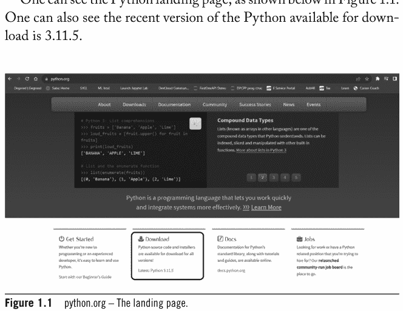

点击图1.1所示的下载按钮，将获得如图1.2所示的安装程序下载选项。用户必须根据操作系统和32/64位版本仔细选择安装程序。下载完成需要几秒钟。

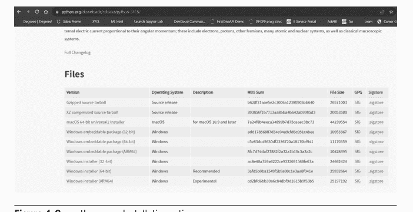

图1.2 python.org – 安装选项。

我们使用了Windows安装程序（64位），点击超链接后，安装程序下载如图1.3所示。

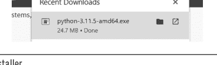

图1.3 安装程序。

如果用户已经安装了旧版本的Python，此安装程序将升级版本。安装完成可能需要几分钟。可以看到安装进度，如图1.4所示。

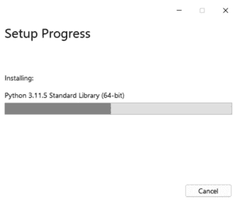

**图1.4** Python安装进度 – Windows。

安装应该完成，可以在屏幕上看到消息。就是这样。Python已安装，你可以开始学习了。可以通过在Windows的开始菜单中输入Python来确认安装是否正确，如下图1.5所示。这将显示Python图标，点击它将启动Python。

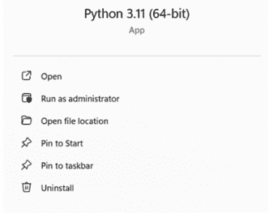

**图1.5** 安装完成。

强烈建议读者访问 https://www.python.org/about/ 以了解更多关于Python、社区倡议、Python的开源性质，并获取大量学习资源。可以看到 https://www.python.org/about/ 的截图，如图1.6所示。

# 引言讨论

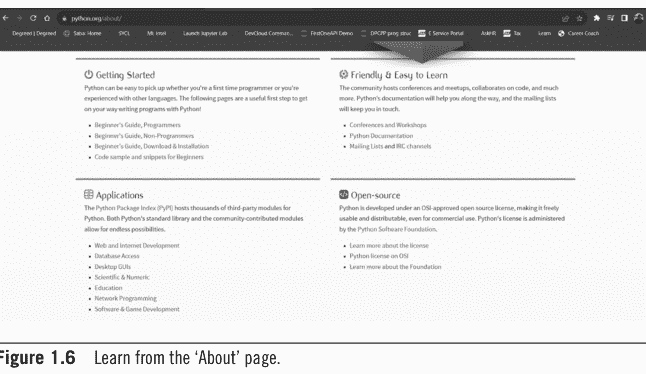

欢迎来到Python的世界！它既有趣又有回报。我们能让我们的第一个Python代码运行起来吗？
首先，学习如何创建Python文件？打开一个编辑器（类似notepad ++或记事本）。输入指令（代码，是的，可以是用于两个数字相加的）。将文件保存为filename.py作为扩展名。用解释器运行文件，就可以立即得到输出。可以看到输入并保存为1.py的代码，如图1.7所示。此代码将简单地打印Hello, World! 我们稍后将讨论更多关于编码的内容。

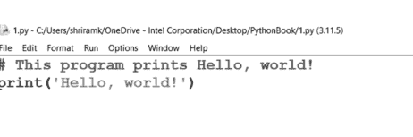

图1.8和图1.9分别展示了运行第一个代码并获得相关输出的步骤概览。

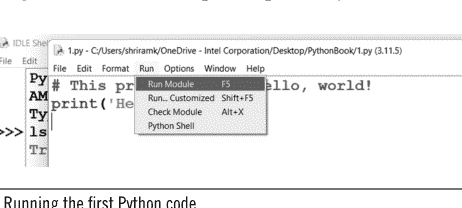

## 8 PYTHON

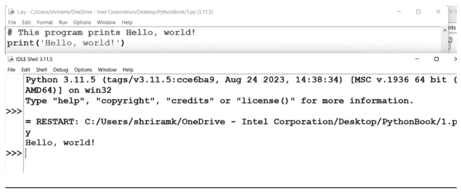

图 1.9 输出结果。

如果用户对图形用户界面（GUI）方式不感兴趣，也可以随时使用命令提示符。可以参考图 1.10 来理解相同的操作。

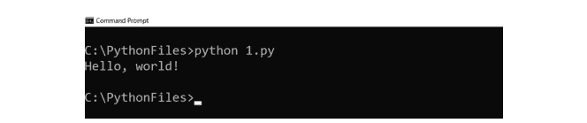

图 1.10 命令提示符执行方式。

在 Unix/Linux 中 – 使用 `chmod 777 filename.py` 来编译代码，使用 `./filename.py` 来运行代码。（或者，简单地，使用 `python filename.py`。）这里有一个注意事项。如果用户不想通过将指令存储到 Python 文件中来执行，是否有其他选项？是的，有其他选项。可以参考图 1.11 来理解如何直接通过 IDLE Shell 完成此操作。

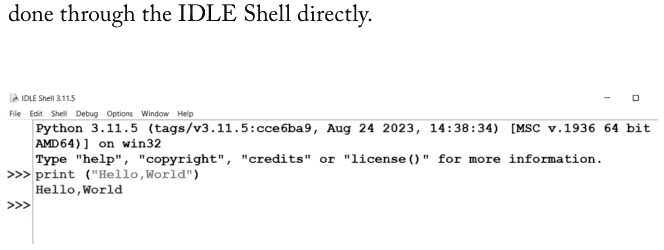

图 1.11 Shell 方式。

要退出 shell，应输入 `exit()`。如果你有很多行需要执行，上述方法可能不太方便。
是的，深呼吸一下。第一个文件已经执行完毕。

## 1.4 学习基础 – 用数字实践

Python 非常易于学习和使用。数字和运算符之间的空格不是强制性的！它只是为了增强可读性，别无他用。可以查看图 1.12 来理解所传达的要点。

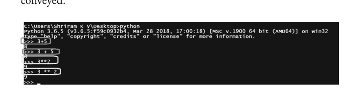

下一步，让我们尝试将一个数除以零。（这很有趣。）你听说过除以零的错误吗！现在就遇到了。10 除以 2 是正确的，结果显示在前面。但是，当 10 除以 0 时，就会出错。将会出现零除错误，这一点需要了解。可以参考图 1.13。

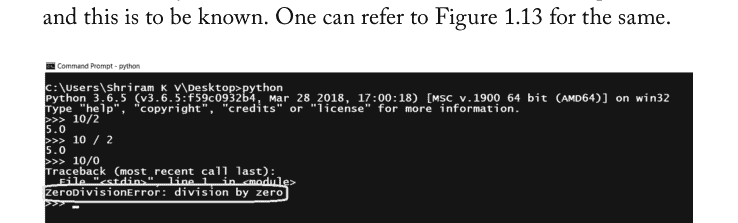

现在是时候进行简单的乘法和加法了。可以看到如图 1.14 所示的乘法和除法示例。
让我们继续再次进行除法，但这次是带商和余数的除法。应该使用 `//` 来获取商，使用 `%` 来获取余数。另外，需要注意的是，这适用于 `int` 和 `float` 类型（图 1.15）。

## 10 PYTHON

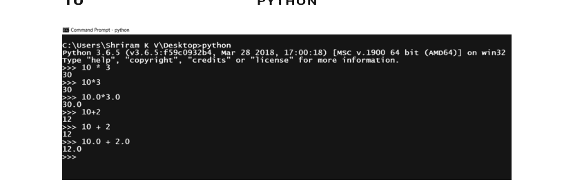

图 1.14 乘法和加法示例。

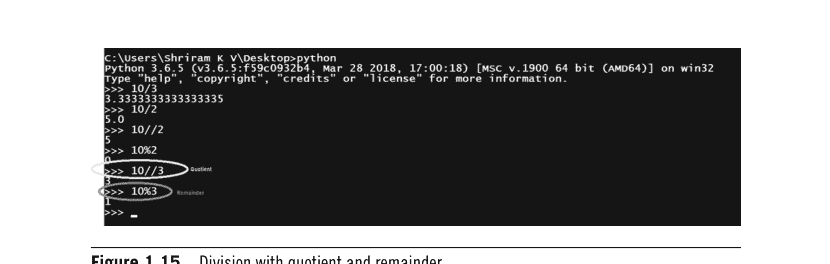

图 1.15 带商和余数的除法。

我们现在可以学习变量了吗？是的，学习这个对任何人都非常重要。这里一切都是自动的。这意味着一旦给变量赋值，内存分配就会立即发生。

- 变量名 = 要存储在变量中的值。

一个示例总是很方便的，如图 1.16 所示。代码现在有一个赋值为整数的值，接着是赋值为浮点数的 `miles` 和赋值为字符串的 `name`。这就是 Python 的美妙之处；它是自动的，你不需要指定数据类型。图 1.16 所示代码的输出如图 1.17 所示。

```
1 value = 99 # 看，赋值了一个整数。
2 miles = 999.9 # 赋值了一个浮点数。
3 name = "Shriram Vasudevan" # 一个字符串
4 print (value)
5 print (miles)
6 print (name)
```

图 1.16 Python 中的变量。

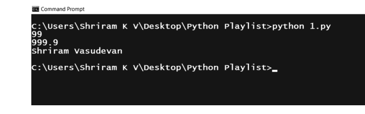

图 1.17 图 1.16 所示代码的输出。

快速回顾一下数据类型也很重要：

- 任何像 1,2,4,100 这样的数字都可以称为整数。
- 更大的数字，如 468364387643864，应该被尊重地称呼。意思是，它应该被称为长整数。长整数应该使用 `l` 或 `L` 作为后缀来表示！
- 任何像 3.25 或 1.258 这样的数字都应该被称为浮点数。
- 也支持复数。它们看起来像 `10 + 8i` 或 `–9 + 7i`。

让我们转向字符串。任何在单引号内的内容都可以被视为一个字符串。例如 `'Hello, World!'`，这是一个字符串。可以从图 1.18 了解字符串在 Python 中如何工作。

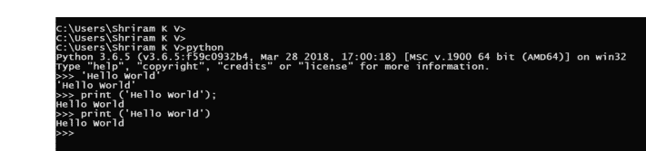

图 1.18 Python 中的单引号和字符串。

不仅单引号；双引号也适用于字符串。`"Hello, World!"` 与 `'Hello, World!'` 相同，可以参考下面图 1.19 中的截图，读者可以理解这种情况。不过，这里需要理解的一点是，不能将单引号和双引号混用，否则将无法工作。

## 12 PYTHON

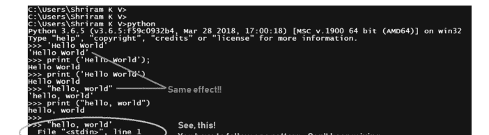

图 1.19 Python 中的双引号和字符串。

我们可以研究三引号作为选项吗？我们甚至有三引号吗？使用三引号可以包含尽可能多的行（语句）。可以参考图 1.20 来理解这个概念。

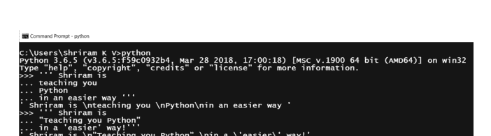

图 1.20 Python 中的三引号和字符串。

在 Python 中可以轻松地进行字符串连接。可以参考图 1.21 来理解字符串连接过程。还有一个错误，是故意制造的，同样呈现给读者审阅。可以看到故意制造的错误以及提供的解决方案来理解错误。

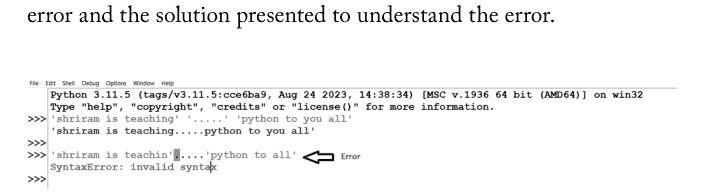

图 1.21 Python 中的字符串连接。

我们可以在 Python 中学习 unicode 吗？当你想将非 ASCII 字符或你的母语脚本作为程序的一部分包含时，必须使用 `u`。这意味着 unicode。一个示例总是很方便的，如下图 1.22 所示，接着是图 1.23 所示的输出。

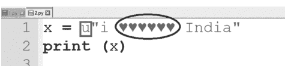

**图 1.22** Python 中的 Unicode。

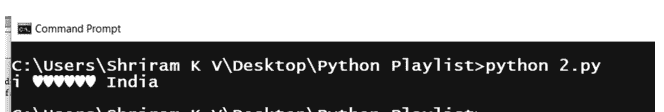

**图 1.23** 图 1.22 所示代码的输出。

然而，也应该查看图 1.24 所示的代码，它肯定会失败，结果如图 1.25 所示。

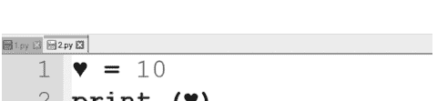

**图 1.24** Unicode 使用 – 失败场景。

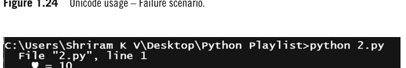

**图 1.25** 图 1.24 所示代码的执行结果。

接下来要讨论的是转义序列，示例代码如图 1.26 所示，其中包含了所有转义序列。结果如图 1.27 所示，可以参考以增强理解。

```
1 print ("\n")
2 tab_seq = "\t here you go with tab"
3 new_line = "India is \n my country"
4 back_space="Baa\bck space"
5 back_slash=""
6 form_feed="Hello \fworld"
7 single_quote="\'"
8 double_quote="""
9 bell_ring="\a bell rings"
10 print (tab_seq)
11 print (new_line)
12 print (back_space)
13 print (form_feed)
14 print (single_quote)
15 print (double_quote)
16 print (bell_ring)
17 print (back_slash)
```

**图 1.26** 转义序列。

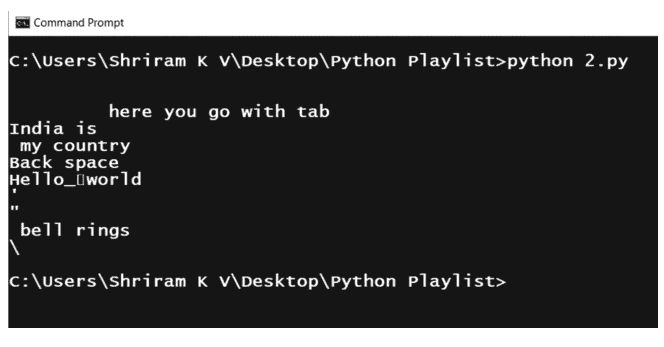

**图 1.27** 图 1.26 所示代码的执行结果。

好了，第一章完成了。读者应该实际尝试这些操作。此外，读者可以参考下面列出的视频链接以进一步理解。

Python 基础 – https://youtu.be/FgDWUV7_d2Q?si=v7UOltjhgSucfMPu
在 Linux 中执行代码/字符串操作 – https://youtu.be/ ZEWz2HFL1Lc?si=MI S3IziLMWzPZT51

## 需要记住的关键点

- Python 发展迅猛，受到了广泛关注。
- Python 简单易用。理解 Python 代码非常容易，没有复杂性。
- Python 是开源的，这是其快速增长和广泛使用的一个非常重要的原因。
- Python 可用于构建适用于不同领域/行业的各种应用程序。可以使用 Python 构建机器学习、深度学习、自然语言处理、数据分析、大数据、自动化、嵌入式应用程序等等。因此，它是任何人学习的理想选择。
- Python 得到了庞大且活跃的开发者社区的出色支持。在网上可以找到大量关于 Python 的资源。
- Python 适用于我们所知的所有已知操作系统和平台。它非常适合 Windows、Linux 和 macOS。
- Python 最适合小规模、中规模和大规模应用。
- Python 是一种通用编程语言，非常易于学习和使用。
- Python 也被视为一种解释型和高级编程语言，为用户提供了极大的灵活性和多功能性。
- Python 使用解释器来执行代码。解释器读取程序并逐行将其翻译成机器代码，然后才能执行。请注意，它是逐行发生的。

由于Python代码由解释器直接执行，因此不需要像C或C++那样进行编译步骤。
- 用户可以下载适用于Windows或Mac的Python。对于Linux系统，Python通常是预装的，如果需要升级，也可以轻松完成。

## 延伸阅读

Python官方网站 – https://www.python.org/
Awesome Python – https://github.com/vinta/awesome-python

# 2 深入学习

### 学习目标

阅读本章后，读者将学到：

- 关于变量和操作的更多细节
- 布尔运算与Python
- 如何使用Python进行交互式编程
- Python中的关键字
- Python中的断言、break和continue
- 作用域及相关信息
- 一些有趣的事实和需要记住的要点。

## 2.1 引言

在学习了第1章的基础知识后，是时候通过本章来丰富这些知识了。本章将讨论更多有趣的例子。在学习过程中，最好能同时动手实践这些内容。

## 2.2 变量及更多关于变量的知识

关于变量，我们有什么特别需要了解的吗？是的，有。以下是需要记住的重要点。

- 变量名必须以字母（字符）或下划线开头。（这意味着，不能以其他方式开头）。
- `value`和`Value`是不同的。`_value`和`_Value`也是不同的。

可以参考图2.1来理解上述要点。图2.1展示了代码片段和执行结果。可以看到变量‘value’在代码中的表示方式。`_value`、`_Value`、`Value`和`value`是不同的。

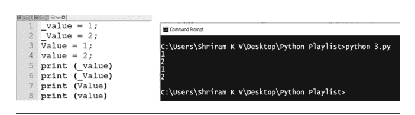

有趣的是，变量名中可以使用多个下划线（_）。此外，从开头连续使用下划线也是允许的。可以参考图2.2中的代码片段和结果来理解上述概念。

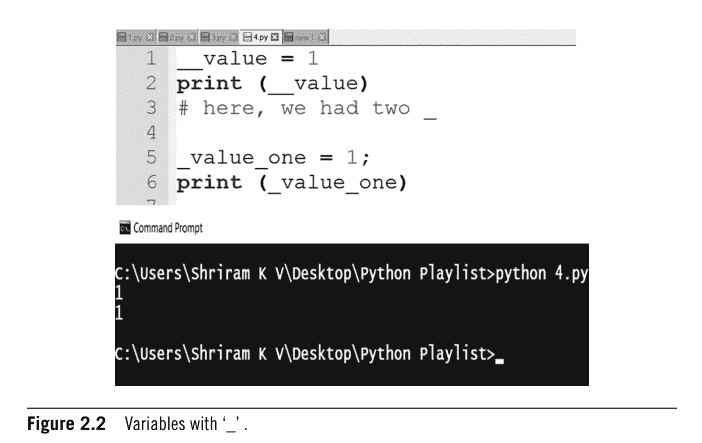

可以观察到，双下划线是可用的，并且不会出错。
记住，不允许在变量名中使用@、$和%。如果这样做，会出错，可以从图2.3中尝试时看到错误。

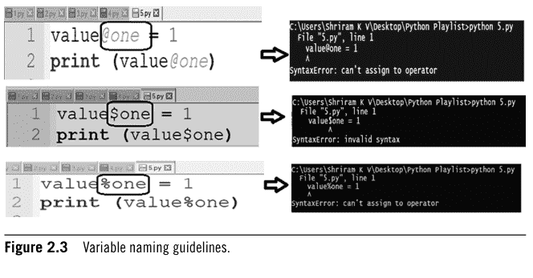

现在是时候尝试给变量赋值和重新赋值了。可以参考图2.4中的代码片段和结果来理解。

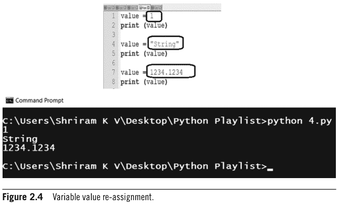

我们能再学一点吗？是的，Python非常方便。它允许你一次性将同一个值赋给多个变量。
我们能看看它是否有效吗？可以参考图2.5来理解上述场景。

```
1 value = 1;
2 value_1 = value_2 = value_3 = value
3 print (value)
4 print (value_1)
5 print (value_2)
6 print (value_3)
```

```
C:\Users\Shriram K V\Desktop\Python Playlist>python 5.py
1
1
1
1

C:\Users\Shriram K V\Desktop\Python Playlist>
```

图2.5 将同一个值赋给多个变量。

Python也支持在一行中进行多重赋值。可以参考图2.6中的示例代码和结果。

```
1 value, value_1, value_2 = 1, 1.234, "Hello, World"
2 print (value)
3 print (value_1)
4 print (value_2)
```

```
C:\Users\Shriram K V\Desktop\Python Playlist>python 5.py
1
1.234
Hello, World

C:\Users\Shriram K V\Desktop\Python Playlist>
```

图2.6 一行中的多重赋值。

可以删除变量吗？是的，可以，可以参考图2.7来了解删除过程，结果也已呈现以便更好地理解。

```
1 value, value_1, value_2 = 1, 1.234, "Hello, World"
2 print (value)
3 print (value_1)
4 print (value_2)
5 del value
6 del value_1
7 del value_2
8 print (value)
9 print (value_1)
10 print (value_2)
```

```
C:\Users\Shriram K V\Desktop\Python Playlist>python 5.py
1
1.234
Hello, World
Traceback (most recent call last):
  File "5.py", line 8, in <module>
    print (value)
NameError: name 'value' is not defined

C:\Users\Shriram K V\Desktop\Python Playlist>
```

图2.7 变量的删除。

好了，读者们是时候转向布尔运算了。

## 2.3 Python中的布尔运算

在深入探讨Python中的布尔运算之前，回答一个问题很重要。什么是布尔值？简单来说，它必须是True或False之一。创建布尔变量不需要特殊的指南。它与其他变量类型相同。可以参考图2.8中的代码来更好地理解这一点。

```
1 Boolean_Demo=True
2 print (Boolean_Demo)
3
4 Boolean_Demo=False
5 print (Boolean_Demo)
```

```
C:\Users\Shriram K V\Desktop\Python Playlist>python 4.py
True
False

C:\Users\Shriram K V\Desktop\Python Playlist>
```

图2.8 布尔运算。

可以通过参考图2.9来更好地理解布尔运算。可以看到尝试的方式和呈现的结果供读者审阅。

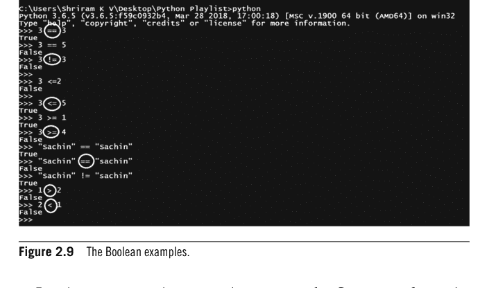

最好将所有内容都可视化为代码。可以参考图2.10中的代码来更好地理解这个概念。

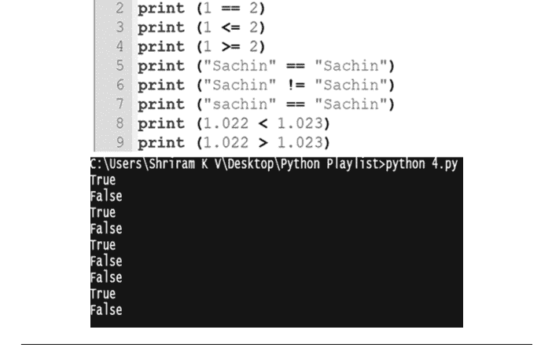

## 2.4 使用Python进行交互式编程

也可以使代码具有交互性。这意味着用户可以实时输入输入内容，并且可以进行处理。这将很有趣，最重要的是，这是一个值得赞赏的强大功能。可以参考下面图2.11中的代码，其中提示用户输入内容，这使其具有交互性。执行结果如图2.12所示。

```
1 print ("\n Hello, User! Welcome to the world of python")
2 print ("\n please enter your name")
3 name_user = input ("Enter your name")
4 print (name_user)
5 gender_user = input ("Can you please let me know your gender??")
6 print (gender_user)
7 print ("Hello, Mr." + name_user + " You are a " + gender_user )
```

图2.11 使用Python进行交互式编程。

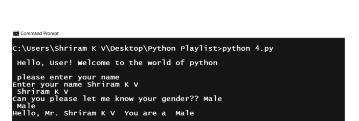

图2.12 图2.11所示代码的执行结果。

请记住，`input`函数总是将输入内容作为字符串接收。这意味着，即使你输入数字作为输入，它也会将其作为字符串处理。

## 2.5 Python中的关键字

Python使用称为关键字的保留术语来确定语言的语法和语法结构。因为它们在语言中是预定义的，所以这些关键字不能用作标识符（变量名、函数名等）。可以查看下面预定义的关键字列表。为了便于快速理解，也提供了简要说明：

- `False`：表示布尔值False。
- `None`：表示空值或未定义的值。
- `True`：表示布尔值True。
- `and`：用于逻辑与（&&）。
- `as`：用于在导入模块或创建上下文管理器时设置别名。
- `assert`：用于调试和测试目的，断言某个条件为真。
- `async`：表示函数或方法是异步的。
- `await`：在异步函数中使用，用于等待另一个异步操作完成。
- `break`：用于提前退出循环。
- `class`：用于定义一个类。
- `continue`：用于跳过循环的当前迭代，继续下一次迭代。
- `def`：用于定义一个函数或方法。
- `del`：用于删除变量、列表中的项或对象的属性。
- `elif`：是‘else if’的缩写，用于条件语句。
- `else`：在条件语句中，当条件不满足时使用。
- `except`：在异常处理中使用，用于捕获和处理异常。
- `finally`：在异常处理中使用，用于指定无论是否引发异常都始终执行的代码块。
- `for`：用于创建一个遍历序列（例如列表或范围）的循环。
- `from`：在import语句中使用，用于指定要导入哪个模块。
- `global`：用于在函数内声明一个全局变量。
- `if`：用于条件语句。
- `import`：用于导入模块或模块中的特定项。
- `in`：用于检查一个值是否存在于序列中。

- is：用于身份比较（检查两个对象是否相同）。
- lambda：用于创建匿名（无名）函数。
- nonlocal：用于声明一个既非当前函数局部变量也非全局变量的变量。
- not：用于逻辑取反（!）。
- or：用于逻辑或（||）。
- pass：用作不执行任何操作的代码占位符。
- raise：用于引发异常。
- return：用于从函数返回值。
- try：用于异常处理，开始一个监控异常的代码块。
- while：用于创建一个在条件为真时持续的循环。
- with：用于创建上下文管理器。
- yield：用于生成器函数中，向调用者生成一个值。

这些关键字中的大多数将在本书的各个地方使用，读者可以轻松理解其用法。然而，读者将在后续讨论中接触到其中一些关键字。

### 2.5.1 让我们测试‘and’、‘or’和‘not’

从图2.13可以看出，True and False 的结果是 False。类似地，True and True 的结果是 True。读者可以自己尝试一下。

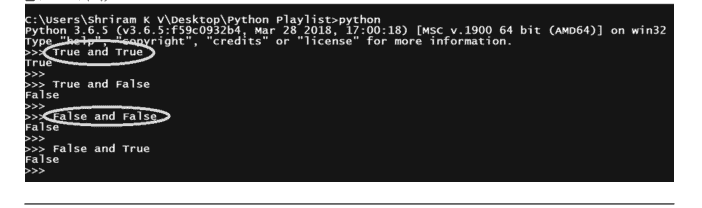

图2.13 Python中的‘and’。

类似地，可以尝试‘or’。读者可以参考图2.14来理解‘or’的工作原理。True or True 是 True，False or False 是 False。读者也可以自己尝试。

```
>>> 
>>> True or True
True
>>> False or True
True
>>> True or False
True
>>> False or False
False
>>> _
```

图2.14 Python中的‘or’。

队列中的下一个是 not。是的，它很容易理解。这是因为 not 是一个反转操作：True 的 not 是 False，反之亦然。可以查看下面的图2.15来更好地理解 not。

```
Command Prompt - python
C:\Users\shriram K V\Desktop\Python Playlist>python
Python 3.6.5 (v3.6.5:f59c0932b4, Mar 28 2018, 17:00:18) [MSC v.1900 64 bit (AMD64)] on win32
Type "help", "copyright", "credits" or "license" for more information.
>>> not (True)
False
>>> not (False)
True
>>> not (1)
False
>>> not (0)
True
>>> _
```

图2.15 Python中的‘not’。

### 2.5.2 ‘break’和Continue

与其他编程语言一样，Python也支持break和continue。Break和continue在‘for’和‘while’循环内部使用，以改变它们的正常行为。在Python中，break语句是一个控制流语句，用于提前退出循环。它通常在循环（如for循环和while循环）中使用，根据特定条件终止循环执行。

一个例子总是很方便，我们在图2.16中呈现了这个例子。可以通过参考给出的例子来理解break的工作方式。for和while循环将在稍后讨论。

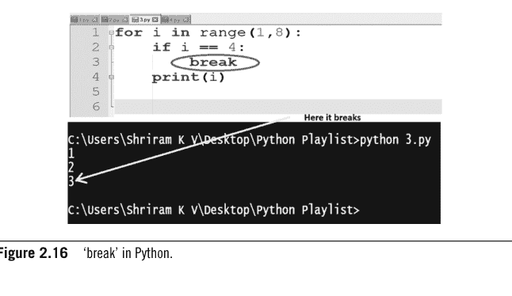

另一个例子将帮助读者更好地理解break的用法。可以参考图2.17查看break使用的另一个实例。

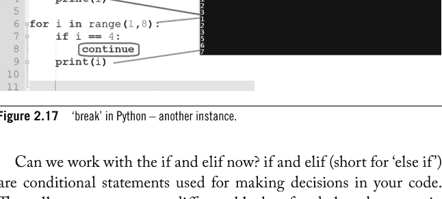

我们现在可以使用if和elif了吗？if和elif（‘else if’的缩写）是用于在代码中做决策的条件语句。它们允许你根据特定条件执行不同的代码块。可以查看图2.18，其中清晰地展示了if和elif的用法。

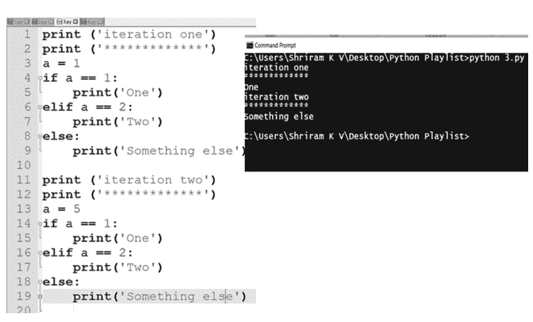

### 2.5.3 Python中的全局作用域

接下来要学习的重要内容是Python中的作用域。一如既往，一个例子会很方便，同样的例子在图2.19中呈现，读者可以理解作用域的概念。

```
global_variable=10
def fun1():
    print (global_variable)
def fun2():
    global_variable = 5
    print (global_variable)

fun1();
fun2();
fun1();
```

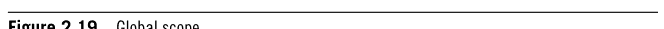

记住，如果你在函数内部给变量赋值，这被称为局部作用域。如果你在所有函数外部给变量赋值，这被称为全局作用域。
可以看到，global_variable在两个不同的函数fun1()和fun2()中被正确调用。可以看到图2.20中呈现的结果，其中可以清楚地理解全局作用域的工作方式。程序员可以根据需要自由地在函数内部重新定义global_variable。

```
Python 3.11.5 (tags/v3.11.5:cce6ba9, Aug 24 2023, 14:38:34) [MSC v.1936 64 bit (AMD64)] on win32
Type "help", "copyright", "credits" or "license()" for more information.

= RESTART: C:/Users/shriramk/AppData/Local/Programs/Python/Python311/test.py
10
5
10
|
```

**图2.20** 图2.19所示代码的执行结果。

### 2.5.4 Python中的‘is’

‘is’在Python中用于测试对象身份。可以查看下面的图2.21来理解‘is’的使用方式。

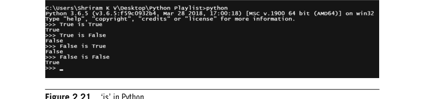

**图2.21** Python中的‘is’。

嗯，本章向读者介绍了更多的基础知识。后续章节还有更多学习内容，这将是一次有趣的旅程。

## 需要记住的关键点

- 可以一次性将相同的值赋给多个变量。
- Python也支持在单行中进行多重赋值。
- 可以删除变量吗？是的，可以。
- Python使用称为关键字的保留词来确定语言的语法和语法结构。
- Break和continue在‘for’和‘while’循环内部使用，以改变它们的正常行为。
- if和elif（‘else if’的缩写）是用于在代码中做决策的条件语句。
- 如果你在函数内部给变量赋值，这被称为局部作用域。如果你在所有函数外部给变量赋值，这被称为全局作用域。
- ‘is’在Python中用于测试对象身份。

## 延伸阅读

如需进一步学习，可以参考：

Python官方网站 – https://www.python.org/
Awesome Python – https://github.com/vinta/awesome-python

也可以观看以下视频以更好地理解：

Python中的命名约定、变量、多重赋值 – https://youtu.be/kvPYmN2HG8A
Python中的关键字及演示 – https://youtu.be/RRVeKstM0jk
Python中的关键字及演示 – https://youtu.be/QW2efyeN670

# 3 学习更上一层楼

### 学习目标

阅读本章后，读者将学到：

- Python中的元组
- Python中的列表
- 决策控制语句
- Python中的Pass
- 一些有趣的事实和需要记住的要点。

### 3.1 引言

读者已经通过示例代码接触了许多基本概念。我们建议读者实际尝试这些代码以获得更深入的理解。在本章中，读者将接触到元组、列表、决策控制语句，最后是pass。所有这些都很有趣且易于理解。我们将从元组开始。

### 3.2 Python中的元组

它简单而强大，就像Python中的列表一样工作（别担心，我们将在后续部分处理列表）。读者唯一需要记住的是，元组是一种只读数据类型，这意味着它是一次性写入的。此外，关于元组与数组存在一些混淆。元组不是数组。数组只允许一种数据类型的内容，而元组在这里是灵活的。可以通过图3.1中呈现的例子来理解元组的用法，结果也包含在内。从图3.1中可以看到元组的清晰用法。记住，元组是区分大小写的。

32 PYTHON

```
1 #Tup represents tuples in python! This is case sensitive, friends.
2 Tup = (1, 2, 3, 4)
3 print (Tup)
4 print (Tup [0])
5 print (Tup [1])
6 print (Tup [0:3])
```

```
Microsoft Windows [Version 10.0.17134.706]
(c) 2018 Microsoft Corporation. All rights reserved.

C:\Users\Shriram K V>cd Desktop

C:\Users\Shriram K V\Desktop>cd "Python Playlist"

C:\Users\Shriram K V\Desktop\Python Playlist>python 7.py
(1, 2, 3, 4)
1
2
(1, 2, 3)
```

**图3.1** Python中的元组。

另一个稍微复杂的例子在图3.2中呈现，包含结果。可以看到元组带来的多功能性。

```
1 #Tup represents tuples in python! This is case sensitive, friends.
2 Tup = (1, 2, 3, 4)
3 print (Tup)
4 print (Tup [0])
5 print (Tup [1])
6 print (Tup [0:3])
7 print ('***********')
8 Tup2 = ('a', 'b', 'c')
9 print (Tup2)
10 print (Tup2 [0])
11 print (Tup2 [1])
12 print (Tup2 [0:2])
```

```
C:\Users\Shriram K V\Desktop\Python Playlist>python 7.py
(1, 2, 3, 4)
1
2
(1, 2, 3)
***********
('a', 'b', 'c')
a
b
('a', 'b')
```

**图3.2** Python中的元组示例。

## 3.3 Python 中的列表

了解 Python 中列表和元组的区别非常重要。尽管它们看起来相似，但有一些关键区别需要理解。

首先，可变性。列表是可变的。理解“可变性”这个术语在这里很重要。可变性意味着列表创建后，可以更改其内容。相比之下，元组是不可变的；一旦创建元组，就不能更改其元素。不能在元组中添加、删除或修改元素。类似地，列表用方括号定义，而元组用圆括号定义。这里举一个例子可能会有所帮助。读者可以参考图 3.5 来理解这一点。

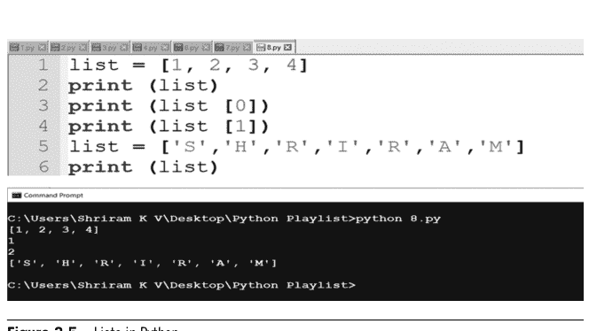

从上面的例子可以清楚地看到列表和元组之间的区别。接下来要学习的主题是 Python 中的决策控制语句。这当然非常有趣，也容易让读者理解。

## 3.4 决策控制语句

嗯，众所周知，决策控制语句用于根据满足要求将执行控制从一个位置转移到另一个位置。首先来看两个著名的语句。它们是：

- If 语句。
- If – else 语句。

让我们从 ‘if’ 语句开始，然后介绍 ‘if – else’。
‘if’ 语句的语法和流程如图 3.6 所示。

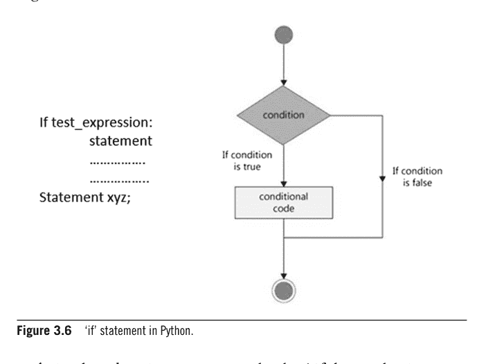

下面是一个简单的代码，如果数字大于 2，则将其增加 6，如图 3.7 所示，并附有结果。

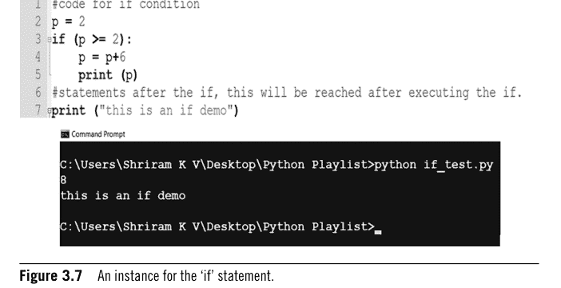

还提供了一个条件不满足的实例，如图 3.8 所示。
下面再举一个例子。

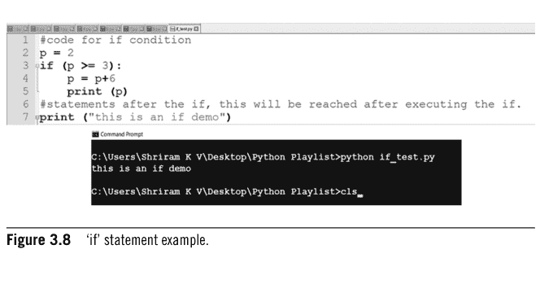

编写一个程序来识别用户输入的是字符还是整数。根据需要使用 input 函数。（请注意，我们在本例中使用了 isdigit 和 isalpha，如图 3.9 所示。）

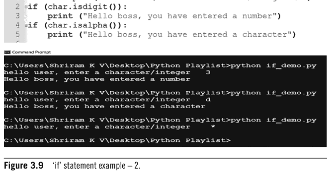

现在是学习 if – else 用法的时候了。

下面向读者展示语法以加深理解。

```
If (test_expression):
    statement 1
else
    statement 2
Statement xyz;
```

通过查看上面的语法，可以理解 if – else 的工作方式。如果测试表达式为真，则执行语句 1；否则，将转到 else 块。可以参考图 3.10 来理解 if – else 的功能。

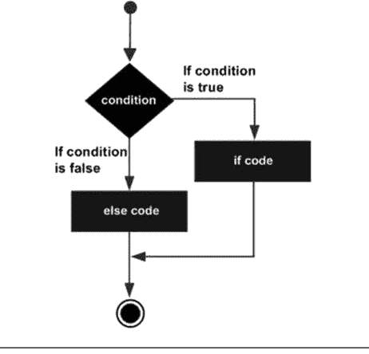

**图 3.10** 'if – else' 工作流程。

这里举一个例子会很有帮助。一个程序让用户输入一个数字，如果数字 <10，则告诉他 hello。否则，告诉他 hi，这是使用 if – else 结构编写的。代码和结果如图 3.11 所示。

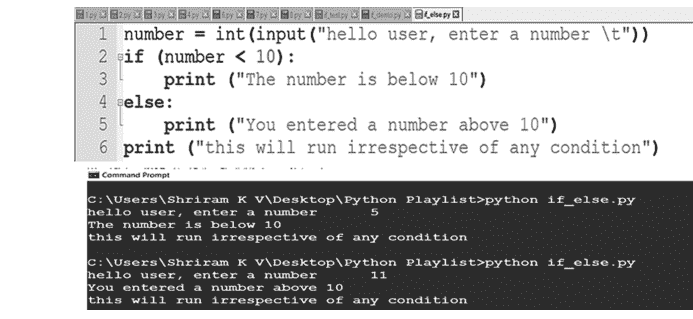

图 3.11 ‘if – else’ 示例–1。

下面再举一个例子来检查输入的数字是奇数还是偶数，如图 3.12 所示。

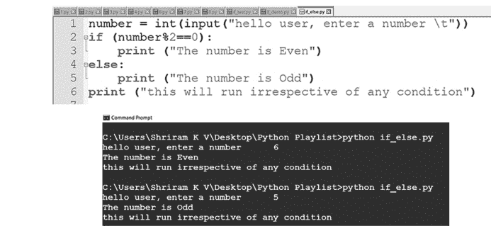

图 3.12 ‘if – else’ 示例–2。

从上面的两个例子中，可以理解 if – else 的用法。我们建议读者实际尝试这些例子，以获得更深入的知识。
读者到现在可能有一个疑问。if 语句可以嵌套使用吗？这样可行吗？答案是肯定的。可以参考图 3.13 来理解嵌套 if 的用法。为了便于理解，也提供了结果。

```
1  mark = int(input("Hello Student,Please enter your marks \t"))
2  if mark >= 50 and mark <= 100:
3      print ("Congrats, you have passed with P grade")
4  else:
5      if mark <=49:
6          print ("Am sorry, you failed")
7      else:
8          print ("Please enter correct input")
9  # Be Careful with the indentation!!
```

```
C:\Users\Shriram K V\Desktop\Python Playlist>python 10.py
Hello Student,Please enter your marks  105
Please enter correct input

C:\Users\Shriram K V\Desktop\Python Playlist>python 10.py
Hello Student,Please enter your marks  100
Congrats, you have passed with P grade

C:\Users\Shriram K V\Desktop\Python Playlist>_
```

图 3.13  嵌套 ‘if’。

理解 elif 的用法也很重要。elif 可以轻松实现多路选择。一个例子将有助于理解，如图 3.14 所示，包含代码和结果。

```
1  mark = int(input("Hello Student,Please enter your marks (0-100) \t"))
2  if mark >=80 and mark <=100:
3      print ("Congrats, Distinction")
4  elif mark >=70:
5      print ("Congrats, A grade")
6  elif mark >=60:
7      print ("Congrats, B grade")
8  elif mark >=50:
9      print ("Congrats, C grade")
10 else:
11     print ("Fail")
```

```
C:\Users\Shriram K V\Desktop\Python Playlist>python 11.py
Hello Student,Please enter your marks (0-100)  65
Congrats, B grade

C:\Users\Shriram K V\Desktop\Python Playlist>python 11.py
Hello Student,Please enter your marks (0-100)  76
Congrats, A grade

C:\Users\Shriram K V\Desktop\Python Playlist>python 11.py
Hello Student,Please enter your marks (0-100)  100
Congrats, Distinction

C:\Users\Shriram K V\Desktop\Python Playlist>python 11.py
Hello Student,Please enter your marks (0-100)  43
Fail
```

图 3.14  ‘elif’ – 一个示例。

现在是尝试一个简单练习的时候了。让我们计算一个月中的天数。用户必须输入月份编号（1 代表一月，2 代表二月，等等）。可以根据需要使用 if、else、elif。
免责声明：可以尝试不同的逻辑来完成此任务。这里向读者展示一种用于构建给定问题陈述解决方案的逻辑（图 3.15）。

```
1 month = int(input("Hello User, Enter the month you want to find the number of days in (1-12) \t"))
2 if month == 2:
3     print ("Welcome to Feb, 28 days for normal year, 29 for leap")
4 elif month in (1, 3, 5, 7, 8, 10, 12):
5     print ("You have 31 days!")
6 elif month in (4, 6, 9, 11):
7     print ("You have 30 days")
8 else:
9     print ("You have entered wrong values, Check")
```

```
C:\Users\Shriram K V\Desktop\Python Playlist>python 12.py
Hello User, Enter the month you want to find the number of days in (1-12) 45
You have entered wrong values, Check
C:\Users\Shriram K V\Desktop\Python Playlist>python 12.py
Hello User, Enter the month you want to find the number of days in (1-12) 12
You have 31 days!
C:\Users\Shriram K V\Desktop\Python Playlist>python 12.py
Hello User, Enter the month you want to find the number of days in (1-12) 1
You have 31 days!
C:\Users\Shriram K V\Desktop\Python Playlist>python 12.py
Hello User, Enter the month you want to find the number of days in (1-12) 2
Welcome to Feb, 28 days for normal year, 29 for leap
C:\Users\Shriram K V\Desktop\Python Playlist>python 12.py
Hello User, Enter the month you want to find the number of days in (1-12) 4
You have 30 days
```

图 3.15 Python 决策控制语句示例。

if 和 elif 就讲到这里。现在让我们学习一下 while。while 的语法和流程如图 3.16 所示。

```
1 while (condition):
2     statement x
3 statement y
```

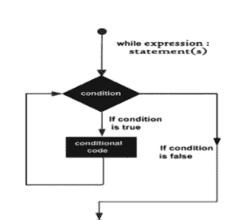

图 3.16 'while' – 语法和流程。

可以通过参考图3.16来理解`while`的工作方式。如果条件为真，则执行语句x；否则，执行语句y。

这里举一个例子会很有帮助。让我们用`while`来打印前15个整数！代码如图3.17所示，同时也展示了运行结果。

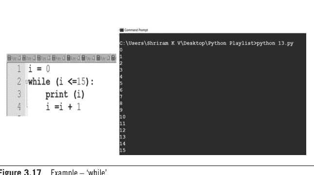

读者需要理解这一点——缩进至关重要，切不可忘记。

现在继续学习`for`循环很重要。读者可能已经熟悉其他编程语言中`for`的用法，但现在是时候学习Python中的`for`了。

其语法和工作流程如图3.18所示。

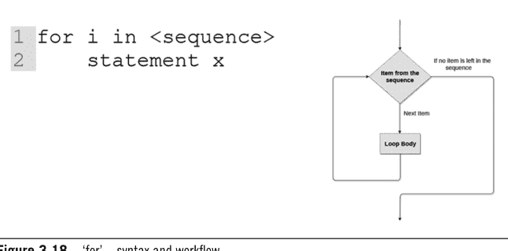

这里举一个实例会很有帮助。下面的代码片段（图3.19）展示了一个简单的`for`循环，并给出了运行结果供读者参考。

```
for i in [1, 2, 3, 4]:
    print (i)
    i = i + 2
    print (i)
print ("I am done")
```

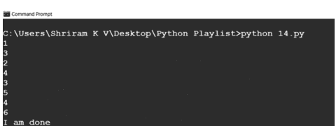

**图3.19** 一个使用`for`的实例。

了解`range()`函数的用法非常重要。下面的图3.20展示了一个实例。

```
for i in range(1, 5):
    print (i)
print ("I am done")
```


**图3.20** `range`的用法。

图3.21展示了另一个使用`range`的例子。

```
1 i = 0
2 sum = 0
3 for i in range(1, 11):
4     sum = sum + i
5     i = i + 1
6 print (sum)
```

```
C:\Users\Shriram K V\Desktop\Python Playlist>python 16.py
55

C:\Users\Shriram K V\Desktop\Python Playlist>
```

图3.21 `range`用法——另一个实例。

再次提醒读者，要实际动手尝试这些代码以加深理解。现在是时候学习Python中的`pass`了。
`pass`类似于微处理器中的NOP（空操作）。当代码中需要一条语句来满足语法要求，而不需要执行任何有意义的操作时，它就很有用。
下面的图3.22展示了一个简单的例子。

```
print ("hello")
pass #this is no operation folks!
print ("done")
```

```
Python 3.7.3 Shell
File Edit Shell Debug Options Window Help
Python 3.7.3 (v3.7.3:ef4ec6ed12, Mar 25 2019, 22:22:05) [MSC v.1916 64 bit (AMD64)] on win32
Type "help", "copyright", "credits" or "license()" for more information.
>>> 
========= RESTART: C:/Users/Saihari Shriram/Desktop/Python Files/1.py =========
hello
done
>>>|
```

图3.22 Python中的`pass`。

Python有一个有趣的特性。在其他编程语言如C或C++中，`else`不能与`while`/`for`一起使用。然而，在Python中这是可能的。图3.23展示了一个实例，其中`else`与`while`一起使用。


类似地，图3.24展示的例子中，`else`与`for`一起使用。


读者将在后续章节中学习函数。学习之旅将变得更加有趣和令人兴奋。

读者可以观看以下YouTube讲座以获得更多理解：
元组和列表 – https://youtu.be/0FJ2cfJrWLc?si=IvBcLkZ97YsYdfVd
If, elif, else – if, while, range – https://youtu.be/ucYzxhALs1Y?si=9qV4-4SV_0z_zifD
Python中的Pass – https://youtu.be/9ArlSaO_q6c?si=tTSz-vcPP2w66O76

## 需要记住的关键点

- 元组是一种只读数据类型，这意味着它是一次性写入的。
- 元组不是数组。数组只允许一种数据类型的内容，而元组的内容是灵活的。
- 列表是可变的。
- 元组是不可变的，这意味着一旦创建了元组，就不能更改其元素。不能在元组中添加、删除或修改元素。
- Python支持两种众所周知的语句：`if`语句和`if-else`语句。
- `while`和`for`也被支持，其美妙之处在于，在Python中，可以与`for`或`while`一起使用`else`。
- `pass`类似于微处理器中的NOP（空操作）。当代码中需要一条语句来满足语法要求，而不需要执行任何有意义的操作时，它就很有用。

## 延伸阅读

Python官方网站 – https://www.python.org/
Awesome Python – https://github.com/vinta/awesome-python

# 函数——输入与输出

### 学习目标

阅读本章后，读者将学到：

- 函数的必要性
- 函数的用法
- 嵌套函数和lambda函数
- 一些有趣的事实和需要记住的要点。

## 4.1 简介

函数是任何编程语言最重要的方面之一。函数非常重要，原因如下。函数提供：

- 模块化——当遵循基于函数的方法时，可以轻松地将复杂问题分解为更小的问题。这使程序员的生活轻松很多。
- 抽象——函数的另一个非常重要的方面是它抽象了特定操作的实现细节。当有人调用或使用该函数时，无需了解该函数是如何构建的。
- 可读性——编写良好的函数总是值得赞赏的。它增强了代码的可读性，使代码更具自解释性。
- 可重用性——函数还促进了代码的可重用性。无需重新发明轮子。一旦编写并测试了一个函数，就可以根据需要重复使用任意多次。这将节省时间和精力。
- 调试——函数有助于隔离和调试代码中的问题，使程序员能够更清晰地关注问题。
- 测试——函数使编写单元测试更容易，因为您可以单独测试每个函数。这使得测试既更有效又更高效。
- 可维护性——当需要对代码进行更改或改进时，可以轻松地一次专注于一个函数，而不会影响任何其他函数。
- 协作——在大型软件开发项目中，许多开发人员经常专注于代码库的不同领域。通过为不同的软件组件建立明确的边界和接口，函数促进了更大的协作。这是使用函数时可以引用的最大优势。
- 代码组织——函数有助于逻辑代码组织。通过将类似的功能分解为不同的函数，可以更容易地管理和理解程序的结构。

考虑到以上所有要点，读者应该已经理解了函数的重要性。Python支持函数，读者将在后续章节中获得所有详细信息。

## 4.2 Python中的函数

每当需要时，都可以调用函数（任意次数）。从函数退出后，它将返回到必须返回的位置（下一行代码）。Python有许多内置函数，但程序员也可以定义自己的函数。人们也称函数为子程序。一个程序中可以定义的函数数量没有限制。函数块应以`def`关键字开头。关键字后面是程序员选择的函数名，然后应跟一个括号。程序员定义的函数内部的代码由其负责。应确保代码块内的缩进也正确完成。

语法如下所示：

```
def fun_name (parameters ....):
    function_content
    ....
    ....
    next_line
```

任何函数都应该返回一个值，我们将在图4.1所示的示例中尝试这一点。可以看到函数`add`和`sub`是如何定义的。同时，应该观察函数是如何被调用的。


对于读者，下面的图4.2展示了一个非常简单的编程练习，可以打印一个名字十次。

# 函数——输入与输出

```python
def fun_print():
    i = 0
    while (i < 10):
        print("Sachin Tendulkar")
        i=i+1

fun_print()
```

```
Python 3.7.3 (v3.7.3:ef4ec6ed12, Mar 25 2019, 22:22:05) [MSC v.1916 64 bit (AMD64)] on win32
Type "help", "copyright", "credits" or "license()" for more information.
>>>
========= RESTART: C:/Users/Saihari Shriram/Desktop/Python Files/f2.py =========
Sachin Tendulkar
Sachin Tendulkar
Sachin Tendulkar
Sachin Tendulkar
Sachin Tendulkar
Sachin Tendulkar
Sachin Tendulkar
Sachin Tendulkar
Sachin Tendulkar
Sachin Tendulkar
>>>|
```

图 4.2 用于打印名称的函数。

接下来，读者将看到一个遵循“按值调用”方法的示例代码。可以参考图 4.3，其中展示了代码和结果。

```python
# here we go with the function definition first.
def add(a, b):
    return a + b
def sub(a, b):
    return a - b
x = 5
y = 4
# here, we call the function!
tot = add(x,y)
print(tot)
diff = sub(x, y)
print(diff)
```

```
Python 3.7.3 (v3.7.3:ef4ec6ed12, Mar 25 2019, 22:22:05) [MSC v.1916 64 bit (AMD64)] on win32
Type "help", "copyright", "credits" or "license()" for more information.
>>>
========= RESTART: C:/Users/Saihari Shriram/Desktop/Python Files/f1.py =========
9
1
>>>
```

图 4.3 采用按值调用方法的函数。

表达式可以传递给函数吗？是的，可以。可以查看图 4.4，其中将一个表达式传递给了函数。


图 4.4 传递给函数的表达式。

是时候让函数具有交互性了。让我们从用户那里获取两个整数作为输入。将输入值相互进行乘法、加法和除法运算。还可以在图 4.5 中看到实际参数与形式参数的突出显示。


图 4.5 交互式函数。

函数可以返回多个返回值吗？从技术上讲，在其他编程语言中可能无法实现。我们能在 Python 中尝试一下吗？结果会非常有趣，如图 4.6 所示。可以观察到该函数返回了 2 个值。

```python
def fun_demo (temp_week_data):
    return (max (temp_week_data), min (temp_week_data))
# the above is the function definition.
#lets get into the function call.
temp_data=[30, 32, 34, 34, 45, 53]
max= fun_demo(temp_data)
print (max)
```

```
Python 3.7.3 (v3.7.3:ef4ec6ed12, Mar 25 2019, 22:22:05) [MSC v.1916 64 bit (AMD64)] on win32
Type "help", "copyright", "credits" or "license()" for more information.
>>>
========= RESTART: C:/Users/Saihari Shriram/Desktop/Python Files/f5.py =========
(53, 30)
>>>|
```

图 4.6 返回多个值的函数。

应该了解 Python 中函数的默认赋值。如果在函数调用期间未分配值，这将提供一个默认值（可以将其与 C++ 中的默认构造函数概念联系起来）（图 4.7）。

```python
def fun_demo (age, country="India"):
    print (age)
    print (country)

fun_demo(age='15')
fun_demo(age='20', country='USA')
```

```
Python 3.11.5 (tags/v3.11.5:cce6ba9, Aug 24 2023, 14:38:34) [MSC v.1936 64 bit (AMD64)] on win32
Type "help", "copyright", "credits" or "license()" for more information.
>>>
========= RESTART: C:/Users/shriramk/AppData/Local/Programs/Python/Python311/2.py
15
India
20
USA
... |
```

图 4.7 默认值演示。

Python 中可以有可变长度参数吗？是的，这是可能的，图 4.8 展示了一个使用可变长度参数的实例。可以看到参数的数量分别为 3、2 和 5。

```python
def fun_demo (name, *Sportsperson):
    print ("\n", name, "likes the players")
    for subject in Sportsperson:
        print (subject)
fun_demo ("Sachin", "Dravid", "MSD")
fun_demo ("Sachin", "Lara")
fun_demo ("Gayle", "MSD", "Sachin", "Kumble", "Pandya")
```

```
Python 3.7.3 (v3.7.3:ef4ec6ed12, Mar 25 2019, 22:22:05) [MSC v.1916 64 bit (AMD64)] on win32
Type "help", "copyright", "credits" or "license()" for more information.
>>> 
========= RESTART: C:/Users/Saihari Shriram/Desktop/Python Files/f8.py =========

Sachin likes the players
Dravid
MSD

Sachin likes the players
Lara

Gayle likes the players
MSD
Sachin
Kumble
Pandya
```

图 4.8 可变长度参数。

是时候学习嵌套函数了。与其他编程语言一样，Python 中也可以有嵌套函数。图 4.9 展示了一个这样的例子及其结果。

```python
# This code is an example for the nested functions usage.
def function_demo_outer ():
    variable1=10
    print ("The variable inside the outer function", variable1)
    def function_demo_inner():
        variable1=20
        print ("The variable inside the inner function", variable1)
# let us call the inner function. See the names of the variable.
    function_demo_inner()
#lets call the outer function
function_demo_outer()
```

```
Python 3.7.3 (v3.7.3:ef4ec6ed12, Mar 25 2019, 21:26:53) [MSC v.1916 32 bit (Intel)] on win32
Type "help", "copyright", "credits" or "license()" for more information.
>>> 
========= RESTART: E:/Python Playlist/scope_3.py =========
The variable inside the outer function 10
The variable inside the inner function 20
>>> |
```

图 4.9 嵌套函数。

### 4.3 Lambda 函数

Lambda 函数是一种方便的技术，用于快速生成简短的匿名函数。它们通常被称为 lambda 表达式或匿名函数。当您不想使用 `def` 关键字定义整个函数时，可以使用 lambda 函数。可以看到下面的语法：

Lambda 参数: <表达式>

下面是一个示例代码（图 4.10）。读者可以观察 lambda 函数的使用方式。


我们能尝试将 lambda 函数与普通函数一起使用吗？这可能吗？答案是肯定的，这完全可能。可以从图 4.11 中展示的代码及其结果中看到这一点。

```python
# Usage of Lambda with the normal function.
# Let us go with a demo!
def function_demo_lambda (x):
    return (lambda a: a*a) (x)

k=10
i=function_demo_lambda (k)
print (i)

>>>
---------------- RESTART: E:/Python Playlist/lamba_fun1.py ----------------
100
>>>
```

图 4.11 Lambda 与普通函数结合使用。

好了，我们已经到达本章的末尾。下一章将向您介绍 Python 中模块的详细信息，那也将非常有趣。

读者可以观看以下 YouTube 讲座以获得更深入的理解。

Python – Python 中的函数、定义、默认参数等：https://youtu.be/yvNtFDqGlZ4?si=eeHXXA3GZ8IlBcl9

Python – 嵌套函数、作用域、全局语句、lambda 函数：https://youtu.be/d6ZHfRGuW4Q?si=gVPEthu5XEvhe9Kd

## 需要记住的关键点

- 函数是任何编程语言最重要的方面之一。
- 函数提供了模块化、抽象、可读性、可重用性、改进的调试等。
- Python 有许多内置函数，同时程序员也可以定义自己的函数。
- 程序中可以定义的函数数量没有限制。
- 函数块应以 `def` 关键字开头。
- 也可以编写具有交互性的函数。
- 函数可以返回多个返回值吗？在 Python 中，这是可能的。
- 默认赋值在函数调用期间未分配值时提供默认值。
- Python 中的函数可以有可变长度参数。
- 函数也可以嵌套，这意味着一个函数可以放置在另一个函数内部。
- Lambda 函数是一种方便的技术，用于快速生成简短的匿名函数。

## 延伸阅读

Python 函数 – https://cs.stanford.edu/people/nick/py/python-function.html

Python 官方网站 – https://www.python.org/

Awesome Python – https://github.com/vinta/awesome-python

# 5 Python中的模块

### 学习目标

阅读本章后，读者将了解到：

- Python中的模块
- 模块的重要性
- 数学模块
- From和import – 必须掌握
- From、import和as – “三剑客”
- 命令行参数
- 一些必须掌握的要点。

### 5.1 简介

我们在上一章讨论了函数，并强调了它为程序员提供的各种特性。模块优于函数，读者在完成本章后就能理解这一点。模块是已经可用的Python文件（.py文件），可以使用它们，它们可以以更简单的方式为程序员执行一些预定的任务。任务可以是数学或分析性的。模块是一个包含Python代码的文件。模块可以定义函数、类甚至变量。模块在将代码片段以更有逻辑的方式组合到一个文件中非常有帮助。

### 5.2 模块的使用和创建

一旦模块可用，就可以将其导入到Python文件中。可以使用‘import’选项导入模块，并开始运行代码。

一个例子将非常有助于读者理解如何导入和使用模块。图5.1展示了一个简单的例子，阐明了模块的使用方法及其结果。


现在是时候尝试一些非常有趣的事情了。我们能自己创建一个模块吗？是的，读者将看到一个创建和使用模块的实例（图5.2）。


图5.2 创建自己的模块。

### 5.3 数学模块

数学充满乐趣，Python有数学模块。它非常容易使用，下面图5.3展示了一个使用数学模块生成给定数字平方根的实例，其中包含了获得的结果。一行简单的`import math`将能够访问底层的C库函数，使生活更轻松。


图5.3 导入数学模块。

使用数学模块可以进行更多的数学运算。图5.4展示了一个使用数学模块支持更多数学运算的示例代码及其结果。读者可以看到使用模块实现数学运算有多么容易。

```
File Edit Format Run Options Window Help
# Can we do math?
# All math in one shot!
import math

# Square Root
n = math.sqrt (4)
print ("Sqrt is",n)

# Ceil returns the smallest integral value greater than number
n = math.ceil (4.87)
print ("ceil is",n)

# floor returns the greatest integral value smaller than number
n = math.floor (4.87)
print ("floored is",n)

#fabs - Returns the absolute value of the given number.
n = math.fabs (5)
print ("fab value is",n)
n = math.fabs (5.222)
print ("fab value is",n)

#factorial
n = math.factorial (4)
print ("factorial is",n)
```

```
File Edit Shell Debug Options Window Help
Python 3.7.3 (v3.7.3:ef4ec6ed12, Mar 25 2019, 21:26:53) [MSC v.1916 32 bit (l)] on win32
Type "help", "copyright", "credits" or "license()" for more information.
>>>
================ RESTART: E:/Python Playlist/module5.py ================
Sqrt is 2.0
ceil is 5
floored is 4
fab value is 5.0
fab value is 5.222
factorial is 24
>>> |
```

图5.4 使用Python数学模块轻松进行数学运算。

后续示例（图5.5）展示了更多数学运算。读者可以看到，使用数学模块可以无缝执行copysign和最大公约数（GCD）运算。通过这些例子，读者可以理解模块是多么有帮助且易于使用。
还有更多的数学函数；读者可以尝试使用数学模块进行更多此类选项。
可以同时使用`from`和`import`，这使得程序员更容易使用。当我们导入一个模块时，我们导入了它的一切。刚才已经展示了一些例子。有人可以从模块中导入选定的内容吗？是的，可以做到。下面展示了一个同时使用`from`和`import`的例子。我们从math中导入了factorial，如图5.6所示。

```
# Can we do math?
# All math in one shot!
import math

# copysign - well this is fun
# Function will return the number with value of a, but with the sign of b.
# An instance is helpful as ever.
a = -5
b = 3
# Here, as you see, a is negative, b is positive
print (math.copysign (a,b))

a = 5
b = -3
# Here, as you see, a is negative, b is positive
print (math.copysign (a,b))

# GCD - Let's have fun.
a = 5
b = 10
# Here, as you see, a is negative, b is positive
print (math.gcd (a,b))
```


图5.5 使用math进行copysign、GCD运算。

```
# Let us understand the usage of from and import.
from math import factorial
print (factorial (4))
```


图5.6 同时使用From和Import。

可以查看下面展示的另一个例子（图5.7），其中同时使用了`from`和`import`。这种编程方式对于适当地导入选定模块非常有用。


**图5.7** 同时使用From和Import – 另一个例子。

可以使用‘as’进行别名设置。下面展示了一个使用‘as’的实例（图5.8）及其结果。在该示例中，factorial通过别名被用作fact。


**图5.8** ‘as’与from和import一起使用。

### 5.4 Python中的命令行参数

这即使在C编程中也一直被视为最困难的主题之一。许多人发现它难以理解和教授。但事实并非如此困难。通过图5.9所示的简单例子，向读者介绍了Python中的命令行参数。


读者已经接触了更复杂的主题，我们建议读者实际尝试这些内容，以获得更多知识和理解。

读者可以观看以下YouTube讲座以获得更多理解：

- Python中的模块 – https://youtu.be/jcJ3Aq09_tM
- Python中的命令行参数 – https://youtu.be/kGb9czHzzPQ

### 关键要点

- 模块是已经可用的Python文件（.py文件），可以使用它们。它们可以以更简单的方式为程序员执行一些预定的任务。
- 模块在将代码片段以更有逻辑的方式组合到一个文件中非常有帮助。
- 可以使用‘import’选项导入模块并开始运行代码。
- 数学模块通过各种内置功能使程序员的生活更加轻松。
- 可以同时使用`from`和`import`函数，这使得程序员更容易使用。
- 可以在import旁边使用‘as’进行别名设置。

## 延伸阅读

Python官方网站 – https://www.python.org/
Awesome Python – https://github.com/vinta/awesome-python

# 6 Python中的命名空间

### 学习目标

阅读本章后，读者将了解以下内容：

- 什么是命名空间
- 局部、全局和内置命名空间
- 如何使用日历
- Python中的时间
- Getpass和getuser
- Python中的函数重定义
- 一些需要记住的关键点。

### 6.1 简介

Python中的命名空间是一个容器，用于存放标识符（如类名、变量名、函数名等）及其对应的对象（如值、函数或类）。为了避免命名冲突并提高代码的模块化和可维护性，命名空间用于安排和管理变量和其他对象的命名。

Python中的命名空间防止了命名歧义，并允许程序员随心所欲地使用名称。可以通过一个例子来理解命名空间的有用性。假设你创建了两个模块，Mod1和Mod2。这两个模块可能使用了相同的变量名。在这种情况下，导入两个模块时就会出现不请自来的麻烦。是的，这是一个痛点。

下面以图6.1为例，其中存在两个命名空间，但两个命名空间内使用了相同的变量名——res。由于命名空间的存在，这里没有歧义，也不会产生错误。


图6.1 命名空间示例。

## 6.2 命名空间的类型

Python中有几种类型的命名空间：

-   内置命名空间——所有内置Python对象、模块和函数的名称都包含在此命名空间中。无需显式导入这些名称，因为它们始终可用。
-   全局命名空间——在脚本或模块顶层指定的名称包含在此命名空间中。它在模块导入时形成，并持续存在直到Python应用程序结束。
-   局部命名空间——在特定函数或方法内部声明的所有名称都包含在此命名空间中。当函数被调用时形成，当函数结束时销毁。

可以通过图6.2中的代码来理解全局、局部和内置命名空间的用法，结果也一并呈现。


图6.2 Python中的全局、局部和内置命名空间。

现在是时候进行一些有趣的编码了。读者肯定会享受这部分学习内容。

## 6.3 日历

我们现在可以使用日历了吗？是的，这是有趣的学习，要使用日历，必须先导入日历模块。使用日历模块进行编码很容易，读者可以看到图6.3所示的代码，其中展示了日历模块的多种选项。

```
File Edit Format Run Options Window Help
# Let us learn the calendar functions here!
import calendar # here is where you import!

# Let us find, if the input year is Leap or not!
# If leap, True shall be returned, else, False.
print (calendar.isleap (2019))
print (calendar.isleap (2020))
print (" ******************* ")

# Let us find all the leap years between range (Returns the number)
print ("number of leapyears:",calendar.leapdays(2000, 2019))
print (" ******************* ")

# To get to know the day of the week. '0' refers to monday.
print ("Returns the day of the week, 0 for monday",calendar.weekday(2010, 12, 3))
print (" ******************* ")

#Returns weekday of first day of the month and number of days in month, for the specified
# year and month.
# 0 refers to Monday.
print (calendar.monthrange(2019, 5))
print (" ******************* ")

# To get the calendar printed - Each row represents a week;
print (calendar.monthcalendar(2019, 5))
print (calendar.month (2019, 5))
print (" ******************* ")

# This gets the complete calendar for a year.
print (calendar.prcal(2019))
print (calendar.calendar(2019))
```

图6.3 Python中的日历。

现在可以分别查看图6.4和图6.5中呈现的结果。

```
Python 3.7.3 (v3.7.3:ef4ec6ed12, Mar 25 2019, 22:22:05) [MSC v.1916 64 bit (AMD64)] on win32
Type "help", "copyright", "credits" or "license()" for more information.
>>> 
======= RESTART: C:\Users\Saihari Shriram\Desktop\Python Files\cal2.py =======
False
True
******************* 
number of leapyears: 5
******************* 
Returns the day of the week, 0 for monday 4
******************* 
(2, 31)
******************* 
[[0, 0, 1, 2, 3, 4, 5], [6, 7, 8, 9, 10, 11, 12], [13, 14, 15, 16, 17, 18, 19], [20, 21, 22, 23, 24, 25, 26], [27, 28, 29, 30, 31, 0, 0]]
     May 2019
Mo Tu We Th Fr Sa Su
       1  2  3  4  5
 6  7  8  9 10 11 12
13 14 15 16 17 18 19
20 21 22 23 24 25 26
27 28 29 30 31

******************* 
```

图6.4 日历——结果——第1部分。


图6.5 日历——结果——第2部分。

## 6.4 是时候学习时间模块了

时间模块提供与时间相关的函数，并且有许多内置选项。可以使用所有这些选项，这是一个非常易于使用的模块。读者可以看到一个示例代码，其中展示了带有`gmtime`和`localtime`选项的时间模块。为了更好地理解，结果也一并呈现（图6.6）。

```
File Edit Format Run Options Window Help
# Let us learn the time related functions here.
import time # here is where you import!

# time.asctime - Returns the current time.
time_now = time.asctime(time.localtime(time.time()))
print("the time", time_now)
time_now = time.asctime(time.gmtime(time.time()))
print("the time", time_now)
# gmtime() or localtime() can be used.

====== RESTART: C:\Users\Saihari Shriram\Desktop\Python Files\time.py :
the time Tue May 14 19:29:11 2019
the time Tue May 14 13:59:11 2019
>>>
```

图6.6 Python中的时间模块。

学习`getpass`很重要，接下来将进行解释。

## 6.5 Python中的Getpass

用户可以使用`getpass`模块安全地将密码和其他敏感数据输入到Python中，该模块不会在屏幕上显示输入内容。当您需要编写需要敏感数据输入或用户身份验证的脚本或命令行程序时，这会非常有用。隐藏用户输入的一种简单方法是利用`getpass`模块。请读者尝试下面这段代码，以了解`getpass`的工作原理（图6.7）。

```
4.py - C:/Users/Shriram/OneDrive - Intel Corporation/Desktop/PythonBook/4.py (3.11.5)
File Edit Format Run Options Window Help
# We are using the getpass module and should be imported first
import getpass
key = getpass.getpass(prompt='Enter the password')
if key == 'sachin':
    print("Python is fun")
else:
    print("You cant breach the password security")
```

图6.7 Python中的'getpass'。

## 6.6 Python中的Getuser

如果想知道用户名，使用`getuser`很容易知道。可以参考图6.8中呈现的代码和输出。


现在是时候理解Python中函数重定义的可能性了。

## 6.7 Python中的函数重定义

我们能否设想一个函数可以被重定义的场景？这是一个有趣的场景。Python能实现吗？是的，这是可能的，Python支持变量的重定义和函数的重定义。一个例子将使读者更容易掌握这个概念，如图6.9所示。

读者可以观看以下YouTube讲座以获得更多理解：

-   Python中的命名空间 – https://youtu.be/-sZI9t1FKhg?si=OTQkdDu_j-iGWil-
-   Python – getuser, getpass, calendar, time, 函数重定义 – https://youtu.be/qHWpLKCR4K8?si=GhUs0mcF2cE9qXrY

```
# Here, we go with the function and variable redefinition example.
# First Definition.
def fun_demo (x):
    x = x * 2
    print ("The number is",x)
fun_demo (3+3*2) # function call.
# Second Definition
def fun_demo (x):
    x = x - 2
    print ("The number is",x)
fun_demo (3+3+2) # function call.
# Redefining a variable
variable_1 = 10
print ("The initial assignment is", variable_1)
variable_1 = "Hello, World"
print ("Altered assignment is", variable_1)
```

```
Python 3.7.3 (v3.7.3:ef4ec6ed12, Mar 25 2019, 22:22:05) [MSC v.1916 64 bit (AMD64)] on win32
Type "help", "copyright", "credits" or "license()" for more information.
>>>
======= RESTART: C:/Users/Saihari Shriram/Desktop/Python Files/f10.py =======
The number is 18

The number is 6
The initial assignment is 10
Altered assignment is Hello, World
>>>
```

图6.9 函数和变量重定义示例及结果。

## 需要记住的要点

-   Python中的命名空间是标识符集合的容器。
-   为了避免命名冲突并提高代码的模块化和可维护性，命名空间用于安排和管理变量及其他对象的命名。
-   在内置命名空间中，所有内置Python对象、模块和函数的名称都包含在此命名空间中。无需显式导入这些名称，因为它们始终可用。
-   在全局命名空间中，在脚本或模块顶层指定的名称包含在此命名空间中。它在模块导入后形成，并持续存在直到Python应用程序结束。

-   当涉及局部命名空间时，特定函数或方法内部声明的所有名称都包含在此命名空间中。函数被调用时形成该命名空间，函数结束时则被销毁。
-   `calendar`模块提供了与日历相关的众多功能，可以导入并使用。
-   `time`模块提供了与时间相关的函数，并且有许多内置选项。
-   如果想了解用户名，使用`getuser`模块可以轻松获取。
-   用户可以使用`getpass`模块安全地在Python中输入密码和其他敏感数据，该模块不会在屏幕上显示输入内容。
-   Python允许重新定义变量和重新定义函数。

## 延伸阅读

Python官方网站 – https://www.python.org/
Awesome Python – https://github.com/vinta/awesome-python

# 7 字符串 – 奏响正确的和弦

### 学习目标

阅读本章后，读者将了解：

-   字符串的基础知识
-   字符串索引
-   字符串遍历操作
-   字符串连接
-   字符串追加操作
-   忽略转义序列
-   内置字符串函数
-   一些有趣的事实和需要记住的要点。

### 7.1 简介

Python的字符串处理能力使其成为处理文本数据的多功能语言，从基本的字符串操作到更高级的文本处理任务。在Python中，字符串是字符的序列，是用于表示和操作文本的基本数据类型之一。字符串用于存储和处理文本数据，例如单词、句子或任何字符组合。字符串可以用单引号（'）或双引号（"）括起来，也可以用三引号（"""或'''）括起来以包含多行文本。本章将向读者介绍所有可能的字符串操作。

### 7.2 字符串遍历和其他字符串操作

读者将看到一个简单的Python代码，其中执行了字符串遍历。可以看到字符串"Sachin_Tendulkar"是所选的字符串。代码和字符串遍历的结果如图7.1所示。字符串遍历，通常称为“遍历字符串”或“字符串迭代”，涉及系统地逐个处理字符串中的每个字符。在Python中，这通常使用循环（如`for`循环）来顺序访问和处理字符串中的每个字符。

```
# Here, We shall learn the string traversal!
# Remember, we need to have the index! Else, gone!

string = "Sachin_Tendulkar"
index = 0 # See, this is index!
print ("Here you go, the characters from the string")
for i in string: # here, we use for, it loops.
    print (i)
index = index + 1
```

```
Python 3.7.3 (v3.7.3:ef4ec6ed12, Mar 25 2019, 21:26:53) [MSC v.1916 32 bit (Intel)] on win32
Type "help", "copyright", "credits" or "license()" for more information.
>>> 
================ RESTART: F:/Python Playlist/Shriram/str1.py ================
Here you go, the characters from the string
S
a
c
h
i
n
_
T
e
n
d
u
l
k
a
r
>>>
```

图7.1 字符串遍历。

字符串连接是将两个或多个字符串组合（连接或合并）成一个更长的字符串的过程。在Python中，你可以轻松地连接字符串。字符串连接操作的代码和结果如图7.2所示。读者可以实际尝试一下。

```
# String Concatenation - A Quick View!!
String_Firsthalf = "Sachin"
String_Secondhalf = "Tendulkar"
String = String_Firsthalf + String_Secondhalf
print ("Here you go", String)
```

```
Python 3.7.3 (v3.7.3:ef4ec6ed12, Mar 25 2019, 21:26:53) [MSC v.1916 32 bit (Intel)] on win32
Type "help", "copyright", "credits" or "license()" for more information.
>>>
================ RESTART: F:/Python Playlist/Shriram/str2.py ================
Here you go SachinTendulkar
>>> |
```

**图7.2** 字符串连接。

向字符串追加更多内容非常容易。其中一个例子如图7.3所示，同时也展示了结果。可以观察到执行追加操作非常简单。

```
# Append String
String_First = "Sachin"
String_Append = print ("Enter the string to be appended")
String_First += "Tendulkar is the greatest of cricketers"
print (String_First)
```

```
Python 3.7.3 (v3.7.3:ef4ec6ed12, Mar 25 2019, 21:26:53) [MSC v.1916 32 bit (Intel)] on win32
Type "help", "copyright", "credits" or "license()" for more information.
>>>
================ RESTART: F:/Python Playlist/Shriram/str3.py ================
Enter the string to be appended
SachinTendulkar is the greatest of cricketers
```

**图7.3** 字符串追加操作。

我们能否轻松地多次打印一个字符串？是的，这是可能的，并且可以使用`*`运算符来完成此任务。可以仔细查看图7.4中展示的代码和结果。

```
# can we print a string multiple time - in one shot!
# Easy do it with * operator
string_example = "\n Sachin Tendulkar"
print(string_example * 4)

Python 3.7.3 (v3.7.3:ef4ec6ed12, Mar 25 2019, 21:26:53) [MSC v.1916 32 bit (Intel)] on win32
Type "help", "copyright", "credits" or "license()" for more information.
>>> 
================ RESTART: F:/Python Playlist/Shriram/str4.py ================

Sachin Tendulkar
Sachin Tendulkar
Sachin Tendulkar
Sachin Tendulkar
```

**图7.4** 多次打印字符串。

程序员能否忽略转义序列？是的，在Python中这是完全可能的，一个简单的代码及其结果如图7.5所示。从结果中可以看出，通过第二个`print`语句忽略了转义序列。

```
File Edit Format Run Options Window Help
# Let's ignore the escape sequence.
print ("\n Sachin Tendulkar")
print (r"\n Sachin Tendulkar")

================ RESTART: F:/Python Playlist/Shriram/str4.py ================

Sachin Tendulkar
\n Sachin Tendulkar
>>> |
```

**图7.5** 忽略转义序列。

### 7.3 内置字符串函数 – 快速入门

Python中提供了多种内置字符串函数。本节将通过示例解释这些内置字符串函数。

可以看到`capitalize`函数，它在图7.6所示的代码中使用。运行代码后，结果中第一个字符被大写。


Python中的`center()`方法是一个内置字符串方法，用于在指定宽度内居中对齐字符串。它通常用于格式化文本，以确保其在显示时居中。下面给出了一个例子，可以看到输出以更易读的格式呈现（图7.7）。


接下来要介绍的内置函数是`count`。要查找特定子字符串或元素在字符串、列表或其他可迭代对象中出现的次数，可以使用Python的内置`count()`函数，该函数也适用于列表和其他序列。这是一种处理基本计数任务的实用方法，无需创建独特的循环或手动迭代序列。图7.8展示了代码和结果，以便读者更好地理解。


图7.8 'count'方法。

Python中一个名为`endswith()`的内置字符串方法用于确定给定字符串是否以给定的后缀或子字符串结尾。如果字符串以指定的后缀结尾，则返回`True`；否则返回`False`。是的，这也是可能的，示例代码如图7.9所示。

# 字符串 – 奏响正确的和弦

```
# Inbuilt String Functions - A quick overview
# endswith checks if a string ends with a particular sequence!
str_demo = "Sachin Tendulkar"
test="kar"
print(str_demo.endswith(test,0,len(str_demo)))

str_demo = "Sachin Tendulkar"
test="kamb"
print(str_demo.endswith(test,0,len(str_demo)))
```

```
Python 3.7.3 (v3.7.3:ef4ec6ed12, Mar 25 2019, 21:26:53) [MSC v.1916 32 bit (Intel)] on win32
Type "help", "copyright", "credits" or "license()" for more information.
>>> 
================ RESTART: F:/Python Playlist/Shriram/str7.py ================
True
False
>>>
```

图7.9 ‘endswith’方法。

接下来，我们可以查找一个字符串是否存在于另一个字符串中！如果存在，将返回位置，即字符位置。如果不存在，则返回-1。`find`是用于完成此任务的方法。示例代码和结果如图7.10所示。

```
# Inbuilt String Functions - A quick overview
# find- checks if a string has another string!
str_demo = "Sachin Tendulkar"
test="kar"
print(str_demo.find(test,0,len(str_demo)))

str_demo = "Sachin Tendulkar"
test="kamb"
print(str_demo.find(test,0,len(str_demo)))
```

```
Python 3.7.3 (v3.7.3:ef4ec6ed12, Mar 25 2019, 21:26:53) [MSC v.1916 32 bit (Intel)] on win32
Type "help", "copyright", "credits" or "license()" for more information.
>>> 
================ RESTART: F:/Python Playlist/Shriram/str8.py ================
13
-1
>>> |
```

图7.10 ‘find’方法。

Python 中一个名为 `isalnum()` 的内置字符串方法可用于判断给定字符串中的每个字符是否都是字母数字字符。字母数字字符是指字母（a 到 z 或 A 到 Z）或数字（0 到 9）中的任意一种。如果字符串包含任何非字母数字字符，`isalnum()` 方法将返回 `False`。否则，如果字符串中的所有字符都是字母数字字符，则返回 `True`。图 7.11 展示了一段简单的代码及其结果，以帮助理解。


**图 7.11** `isalnum()` 方法。

当你需要确认一个字符串仅由字母字符组成时——例如一个单词或名字的字母——`isalpha()` 方法就非常有用。它可以应用于各种 Python 程序任务，包括过滤、输入检查和数据验证。图 7.12 展示了一段使用 `isalpha()` 方法的示例代码。

```
str_demo = "Sachin Tendulkar 200 Not out"
print (str_demo.isalpha())

str_demo = "SachinTendulkar200Notout"
print (str_demo.isalpha())

str_demo = "SachinTendulkarNotout"
print (str_demo.isalpha())
```


读者可以观看以下 YouTube 讲座以加深理解：

Python – 字符串操作 – 完整分析 – https://youtu.be/-1k7ROwQMws?si=bgHBVoc4a78TP1sH

## 需要记住的要点

- 在 Python 中，可以轻松完成字符串遍历、字符串连接和字符串追加操作。
- Python 提供了多种内置字符串函数。
- Python 中的 `center()` 方法是一个内置字符串方法，用于将字符串在指定宽度内居中对齐。
- 要查找特定子字符串或元素在字符串、列表或其他可迭代对象中出现的次数，可以使用 Python 的内置 `count()` 函数。
- Python 中一个名为 `endswith()` 的内置字符串方法用于判断给定字符串是否以给定的后缀或子字符串结尾。
- Python 中一个名为 `isalnum()` 的内置字符串方法可用于判断给定字符串中的每个字符是否都是字母数字字符。
- 当你需要确认一个字符串仅由字母字符组成时——例如一个单词或名字的字母——可以使用 `isalpha()` 方法。

## 延伸阅读

Python 官方网站 – https://www.python.org/
Awesome Python – https://github.com/vinta/awesome-python

# 8 PYTHON 与文件

### 学习目标

阅读本章后，读者将了解：

- 文件基础
- 如何打开文件
- 使用 `read`、`readline` 和 `readlines` 的方法
- 重命名文件
- 文件删除过程
- 一些非常重要的要点。

### 8.1 简介

你可以使用 Python 中的文件操作来处理计算机上的文件。你可以创建和删除文件、从文件读取、向文件写入，以及执行许多其他操作。本章通过示例介绍各种文件操作。鼓励读者实际尝试这些操作，以获得更好的理解。

### 8.2 Python 中的文件

文件是存储在计算机硬盘、固态硬盘或其他类型存储介质上的数据或信息的集合。文件中可以包含各种类型的数据，例如文本、图片、音频、视频、应用程序、配置设置等。文件是计算机系统的重要组成部分，用于以可访问和有序的方式存储和组织数据。

### 8.2.1 打开文件

Python 中的 `open()` 方法用于打开文件以进行读取、写入和向文件添加数据等操作。你可以利用 `open()` 函数返回的文件对象来执行与文件相关的任务。`open()` 方法的语法如下所示，其中包含一个使用 `wb` 模式打开文件的实例。

```
file = open(file_path, mode)
↓
fp = open("test.txt", "wb")
```

需要理解的是，`file_path` 是要打开的文件的路径。它可以是相对文件路径或绝对文件路径。
`mode` 指定你想要打开文件的模式。它可以是以下任意一种：

- ‘r’：读取模式，这是默认模式。
- ‘w’：写入模式，文件将被打开以进行写入操作。如果文件已存在，它将被截断（清空）。如果不存在，将创建一个新文件。
- ‘a’：追加模式，文件将被打开以进行写入，但数据将被追加到文件末尾，而不是覆盖其内容。如果文件不存在，此模式将创建一个新文件。
- ‘b’：二进制模式，通常与其他模式一起使用，以二进制模式打开文件（例如，‘rb’ 用于读取二进制文件，‘wb’ 用于写入二进制文件）。
- ‘t’：文本模式，用于以文本模式打开文件（例如，‘rt’ 用于读取文本文件，‘wt’ 用于写入文本文件）。

为了释放系统资源，在完成文件操作后使用 `close()` 方法关闭文件至关重要。然而，更推荐的策略是使用 `with` 语句，以便在离开代码块时自动关闭文件。
下面展示了一段示例代码（图 8.1），其中打开了一个文件并显示了结果。

```
# 以读取模式打开文件
with open("data_test.txt", "r") as file:
    # 读取文件内容。
    data = file.read()

# 现在打印它。
print(data)
```


图 8.1 Python 中的 `open()` 操作。

也可以使用 `readline()`、`readlines()` 和 `read()`。文件 `data_test.txt` 已经创建，其内容如图 8.2 所示。


图 8.2 文件 `data_test.txt` 的内容。

图 8.3 展示了使用 `read()`、`readline()`、`readlines()` 的代码及其结果。通过查看执行结果，可以轻松理解它们之间的区别。

我们可以通过 Python 代码重命名文件吗？是的，这是可能的。`rename` 方法可以轻松地重命名文件。它需要当前名称和建议的新名称作为输入。图 8.4 展示了一段代码片段及其执行结果。但必须记住，在尝试此重命名操作之前，必须导入 `os` 模块。在代码执行之前，文件名是 `old_file_name`；执行后，它被重命名为 `new_file_name`。这可以从图 8.4 中观察到。

```
# 这个 read 和 readline 有助于读取字符串！
# 让我们看一个例子来理解。
# 打开并从文件中读取一行：
fp = open("file_1.txt", "r")
print (fp.readline())
print (fp.readline())
print (fp.readline())
print ("**********")

# 打开并读取行列表：
fp = open("file_1.txt", "r")
print (fp.readlines())
print ("**********")

# 我们可以向文件写入一些内容吗？
fp = open("file_2.txt","w")
fp.write("Sachin_Tendulkar_is_Greatest")
fp.close()

# 写入内容后，我们应该读取它。
fp = open("file_2.txt", "r")
print (fp.readline())
print ("**********")
```

```
Python 3.6.5 (v3.6.5:f59c0932b4, Mar 28 2018, 17:00:18) [MSC v.1900 64 bit (AMD64)] on win32
Type "copyright", "credits" or "license()" for more information.
>>>
================ RESTART: F:/Python Playlist/Shriram/file2.py ================
Sachin_Tendulkar

Brian Lara

Kapil_Dev

**********
['Sachin_Tendulkar\n', 'Brian_Lara\n', 'Kapil_Dev \n', 'MS Dhoni \n', 'Rahul_Dravid \n', 'Sourav_Ganguly ']
**********
Sachin_Tendulkar_is_Greatest
**********
```

图 8.3 `read()`、`readline()`、`readlines()` 代码及结果。


```
# rename 方法可以轻松地重命名文件。
# 它需要当前名称和建议的新名称作为输入。
# 让我们看一个演示！
# 但是，记住，我们应该导入 OS 模块！！
import os
os.rename("old_file_name.txt", "new_file_name.txt")
```


图 8.4 重命名文件。

有人能通过Python代码删除文件吗？是的，可以做到。应该使用`remove`方法，需要指定要删除的文件的名称。执行后，文件将被删除。可以通过下面的代码以及图8.5所示的结果来理解这一点。但必须记住，在尝试删除文件之前，必须导入`os`模块。


可以观察到，文件`new_file_name`之前是存在的，执行后，它被永久删除了。

读者可以观看以下YouTube讲座以获得更多理解：

- Python – Python中的文件操作 – https://youtu.be/rwFbHVLCSYU?si=jRBLg711j-qvPar1

## 需要记住的关键点

- Python中的`open()`方法用于打开文件以进行读取、写入和向文件添加数据。
- 可以以不同的模式打开文件，例如读取模式、写入模式、追加模式、二进制模式和文本模式。
- 文件一旦打开，也应该关闭。
- `read()`、`readline()`、`readlines()`是Python支持的不同文件访问方法。
- `rename`方法可以使用户轻松重命名文件。
- `remove`方法可以使用户删除文件。
- 大多数文件访问方法需要使用导入模块。

## 延伸阅读

- Python官方网站 – https://www.python.org/
- Awesome Python – https://github.com/vinta/awesome-python

# PYTHON与目录

### 学习目标

阅读本章后，读者将了解：
- 使用代码完成目录操作。

## 9.1 简介

在计算机的文件系统中，目录被称为文件夹或目录。各种类型的文件，包括文本、图形和Python程序，都使用它们进行存储和排列。目录对于管理和安排项目中的文件和资源至关重要。Python中的`os`模块可用于处理目录（或者使用`pathlib`模块以获得更现代和面向对象的方法）。本章向读者介绍了可以使用目录进行的典型Python活动。

## 9.2 目录创建

我们也可以在Python中完成所有Linux命令能做的事情。我们可以先创建一个目录。为此，我们需要`mkdir`方法。要完成此任务，必须导入`os`模块。

向读者展示了一个简单的示例，以理解`mkdir`方法的用法。结果也作为图9.1呈现。可以看到，在使用`mkdir`方法执行文件后，新创建了目录`Shriram_Created_Dir`。

# 90 PYTHON – 实践学习方法


图9.1 Python中的‘mkdir’。

有人能用简单的Python代码检查当前工作目录吗？这类似于Linux中的`pwd`命令。可以在图9.2所示的代码中看到`getcwd`的使用方式，结果中显示了当前工作目录。


图9.2 Python中的‘getcwd’。

可以使用图9.3所示的代码片段检查目录是否存在。这将完成验证，并适当地呈现结果。


也可以列出特定目录的内容。下面作为图9.4展示了一个简单的例子。读者可以在实际环境中尝试并观察结果。目录的名称必须正确呈现，代码才能运行。


如果需要更改目录，可以使用下面作为图9.5展示的代码片段轻松完成。应正确提供目录的名称；否则代码可能无法按预期工作。


读者可以观看以下YouTube讲座以获得更多理解：

- Python目录操作 – https://youtu.be/SmjpZV-6BCY

## 需要记住的关键点

- 在计算机的文件系统中，目录被称为文件夹或目录。
- 各种类型的文件，包括文本、图形和Python程序，都使用它们进行存储和排列。
- 目录对于管理和安排项目中的文件和资源至关重要。
- Python中的`os`模块可用于处理目录。
- `mkdir`方法可用于创建新目录。
- `getcwd`方法有助于获取当前工作目录。
- 可以使用`chdir`方法轻松更改目录。
- 通过`exists`方法可以轻松测试目录是否存在。

## 延伸阅读

- Python官方网站 – https://www.python.org/
- Awesome Python – https://github.com/vinta/awesome-python

# 10 PYTHON中的数据结构

### 学习目标

阅读本章后，读者将能够理解以下内容：

- 数组和列表及其操作
- Python中的栈
- Python中的队列
- 枚举
- Zip和字典
- 一些需要记住的关键点。

## 10.1 简介

让我们问一个简单的问题。单词“structure”是什么意思？结构化意味着有组织的。那么，问题来了：什么是数据结构？答案很简单，结构化的数据，即有组织的数据。为了更清楚，可以说：“数据结构是一种以有组织的方式存储数据的格式。”读者甚至可能会惊讶地发现，他们已经熟悉数据结构了。如果读者熟悉数组、记录或文件等术语，那么数据结构也是熟悉的。

读者心中的下一个问题可能是：我们为什么要组织数据？或者为什么我们需要数据结构？这是一个合理的问题，以下是解释。假设你有一个书架，上面有很多涉及不同学科的书籍，如计算机科学、生物学和物理学。这些书没有组织，随意堆放。可以参考图10.1来理解所描绘的内容。


**图10.1** 一个未整理的书架。

很容易理解，从一个未整理的书架上找出一本特定主题的书是一项艰巨的任务，如果书架很大，书很多，那将是一场噩梦。接下来的场景，假设一个书架整理得井井有条，书籍被妥善分区，如图10.2所示。现在的问题是：从这个整理好的书架上找出一本书有多难？这不会花太多时间，应该非常容易。这是读者应该理解的区别。


**图10.2** 一个整理好的书架。

回到计算机科学，数据结构是关于组织数据、管理数据和存储数据的。这将实现高效的访问，并增加访问的便利性。让我们通过更多讨论来更好地理解。

### 10.1.1 为什么我们需要数据结构？

大多数面试、考试和讨论中肯定会有这个问题。是的，这是一个需要回答的重要问题。这种理解将培养读者对该学科和概念更深入学习的兴趣。数据结构是在计算设备中存储和组织信息的方法/技术。由于一切都是有组织且维护良好的，存储得到了妥善处理，所搜索的数据可以更容易、更快地检索，从而有效地提高生产力。读者将接触到的不是单一类型的数据结构。有许多分类类型，每种都是独特的。数据结构通常分为原始数据结构和非原始数据结构，可以根据需求和适用性选择合适的选项。

有经验的程序员会同意这一点：所选择和实现的数据结构的选择确实会在程序运行非常慢或非常快（最好在几秒钟内）之间产生很大差异。因此，数据结构对于组织数据以及确保在搜索数据时能够快速检索非常重要。

## 10.2 数组 – 基本数据结构

数组是内存位置的集合。它是所有编程语言中预定义的数据结构。这是最基本和首要的数据结构。考虑图10.3中的冰格。它有六个空位，所以可以容纳六个冰块。这些空位可以不用，但不能超过六个冰块。数组也是如此。内存位置不能彼此分离，所以如果有一些空位，它就浪费了。此外，数组不能

### 10.2.1 数组的声明

每个内存空间的位置由一个数字表示。这被称为索引或下标。第一个位置的内存地址单独存储在变量声明中，而其他地址则通过相对计算得出。假设‘a’是数组的名称。那么，a[3] = a[0]的地址 + 3。在声明时，a[0]的地址（即数组的起始地址）将与内部符号表中的变量名‘a’相关联。在C或C++中，数组也可以使用指针声明（在Python和Java中不行，因为它们没有指针）。这之所以可能，仅仅是因为数组总是连续的。因此，初始地址可以被一个指针引用，其余部分可以通过相对访问来使用。另一种方法是分配一块内存并将其赋给一个指针，这在C/C++中被称为动态内存分配。通过使用指针，可以消除对元素数量或数组大小的限制。数组以列表的形式定义。即使Python没有指针，列表默认也是以动态方式设计的，没有任何限制。

关于数组需要注意的一些要点包括：

- 它是一块连续的内存，包含大小相等的块。
- 下标总是从0开始，直到n–1，这也是连续的。
- 任何内存位置都可以使用其下标直接访问。
- 静态数组存在内存浪费和内存泄漏等问题，并且对大小有限制。这些问题可以通过使用动态数组或使用指针的动态内存分配来克服。
- 由于它是一块连续的内存，因此存在内部问题，如碎片化和内存泄漏。
- 这是基本且简单的数据结构。许多其他数据结构都是使用数组构建的。

Python列表具有与数组类似的属性，但声明时不需要指定大小。它们可以随着元素的添加而持续增长，因此是以动态方式设计的。因此，列表克服了数组的内存浪费和内存泄漏问题，因为只有所需的内存块与列表变量相关联。除了这些属性外，Python列表还有一个特殊属性。它们可以在同一个列表中包含任何类型的数据，这在其他编程语言的通用数组中是不可能的。因此，Python列表优于C/C++等编程语言中的基本数组实现。但Python列表的一个约束是，由于它是动态的，元素不一定存储在连续的位置。然而，传统上，数组是为连续内存位置设计的。

### 10.2.2 列表的实现

Python列表可以通过以下方式之一进行初始化。列表可以创建为空列表或包含元素。

```
a = [] //空列表
a = [1,2,3,4,5] //包含5个元素的列表
a = [] * (5) //大小为5的空列表。
```

一旦列表创建完成，就可以使用下标访问元素。要将值‘1’赋给上面创建的列表的第4个位置，可以使用a[3] = 1。这就是使用下标访问元素的方式。列表的一个额外属性是，列表可以包含任何类型的数据，这与数组不同。

### 10.2.3 操作

一旦使用上述任一方式声明了列表，它就准备就绪并安置在内存中。列表的基本操作包括：

- 插入
- 删除
- 合并

#### 10.2.3.1 插入

将新元素插入列表的唯一方法是将其赋给特定的下标。因此，要插入元素，除了元素本身，下标是必需的。例如，如果要将‘2’插入到‘a’的索引3处，我们必须用‘2’初始化a[3]，即‘a[3]=2’。现在‘2’被插入到列表‘a’的下标3处，但这可能有多种情况。

**情况1**

假设a[3]为空，那么插入‘2’将占用该位置，‘2’将占据内存空间‘a[3]’，如图10.4所示。

**情况2**

假设a[3]已被占用，那么插入‘2’将覆盖该位置的内容，‘2’将占据内存空间‘a[3]’，如图10.5所示。现在，该位置的旧数据将完全丢失。

这是数组中插入元素的唯一默认可用方式。为了在不丢失现有数据的情况下插入元素，设计并实现了以下算法。

从数组的倒数第二个元素（即索引n-2）开始。将每个元素向右移动1个位置，直到到达要插入新元素的索引。然后，将该位置赋值为新值。该索引之前的所有元素保持不变。

##### Python伪代码 10.1：插入元素

```
循环 i 从 length-1 到 index
    将 a[i] 赋值给 a[i+1]
将新元素赋值给 a[index]
```

使用Python列表的另一个优势是，像这样的函数是预定义的，可以直接调用使用。这个函数被称为‘list.insert(index, element)’。

#### 10.2.3.2 删除

删除元素的唯一方法是使用其下标。因此，要删除一个元素，其下标是必需的。如果不知道元素的下标，则需要在列表中搜索该元素，然后删除它。删除列表中间的元素会将所有后续元素向左移动，这在以下算法中进行了描述。

从要删除元素的下一个索引开始。将每个元素向左移动一个位置，直到列表末尾。最后，释放/删除最后一个元素，因为它将是重复的。特定索引之前的所有元素保持不变，如伪代码10.2所示。

##### Python伪代码 10.2：删除元素

```
def delete(a[ ], element)
    index = 0
    循环 i 在 a 中
        如果 a[i]=element
            那么，
                index = i
                中断
    循环 i 从 index+1 到 n-1
        将 a[i] 赋值给 a[i-1]
        删除 a[i-1]
    返回 element
```

就像插入一样，这个函数在Python中也是预定义的，名为remove，调用方式为‘list.remove(element)’。

#### 10.2.3.3 合并

列表的另一个显著操作是合并两个列表。这基本上是将列表的内容连接成一个新列表。此外，在合并列表时可以遵循一些模式，例如合并列表中奇数索引的所有元素来自list1，偶数索引的所有元素来自list2。这个操作很少使用。在普通合并中，是创建一个包含list1元素的新列表，并将list2元素附加在其后面。这个功能在Python中也预定义为‘list1+list2’。这是通过‘+’运算符的运算符重载实现的。这是一个实例，让我们感觉到列表在Python中实际上是作为类实现的。

#### 10.2.3.4 更多操作

还有许多其他为列表定义的实用函数。这些可以用于列表的基本读取、写入或修改功能。表10.1列出了可用的预定义函数、简要描述及其复杂度。

除了这些内置函数外，还有一些运算符被重载用于特殊用途。表10.2列出了所有可用的列表运算符。

是时候进入下一个数据结构——栈了！

**表 10.1 列表的预定义函数**

| 函数 | 描述 |
| :--- | :--- |
| List.append(element) | 将新元素附加到列表末尾 |
| List.count(element) | 返回给定元素在列表中出现的次数（如果存在） |
| List.extend(sequence) | 将序列的元素附加到列表中 |
| List.index(element) | 搜索列表中元素的第一个实例并返回索引 |
| List.pop( ) | 从列表中移除并返回最后一个元素。此函数也可以接受一个可选参数，即要移除并返回的元素的索引。 |
| List.reverse( ) | 反转给定的列表 |
| List.sort( ) | 将给定列表按升序排序。可以提供一个比较函数作为可选参数，列表将基于该函数进行排序。 |

## 10.2 列表可用的运算符

| 运算符 | 语法 | 描述 |
| :--- | :--- | :--- |
| 长度 | Len(list) | 返回列表的长度 |
| 连接 | List1 + list2 | 连接 list1 和 list2 并返回一个新列表。 |
| 重复 | [element] * number | 创建一个列表，其中指定元素重复指定次数。 |
| 成员关系 | x in ['x', 'y', 'z'] | 返回 'True' 或 'False'，表示给定元素是否存在于给定列表中。 |
| 迭代 | for i in list: print i | 遍历列表中的每个元素。 |

## 10.3 栈

栈是一种非基本数据结构。它是一种线性数据结构，仅设计为线性访问而非随机访问，数据存储在连续的内存位置中。考虑如图 10.6 所示的一堆书或一叠文件。由于书是一本叠在另一本上，数据将被可视化为一层叠在另一层之上。要从底部取一本书，必须将顶部的书移开并放在一边，这样堆才不会倒塌。一旦取出了所需的书，剩下的书可以重新放回堆顶。然而，为了便于访问，只有堆顶的书是可用的。栈数据结构的情况也是如此，因为要访问一个元素，我们必须遍历它上面的元素（在前面的内存位置中）。始终只有第一个单元格的内容是随时可用的。栈的可视化表示如图 10.7 所示。


如图 10.7 所示，栈的第一个元素由一个 ‘TOP’ 指针指示。这是访问栈中任何元素的唯一方式，从而强制线性访问。栈中数据的移动通常称为后进先出（LIFO）。先进入栈的元素被放置在底部，所有新元素将一个叠一个地放置。因此，现在先进入的元素始终存在于栈的底部。在移除元素时，最新的元素总是最先移出，因为它位于栈的顶部。所有元素将按照从新到旧的顺序移除，栈底部的元素将是最后一个被移除的。这被称为 LIFO，因为最后一个元素最先出来。

关于栈需要注意的一些要点是：

- 它将元素存储在连续的内存位置中。
- 只能使用 TOP 指针访问栈的顶部元素。
- 访问任何其他元素都是通过使用 TOP 指针进行线性遍历。
- 数据的移动是 LIFO，因此在读取数据时，其顺序与它们被放入栈中的顺序相反。

### 10.3.1 工作原理

由于栈存储在连续的内存中，它可能面临内存限制和碎片化问题。因此，在 Python 中使用列表来实现它。栈上只有三个值得注意的操作。它们是：

- 压入（Push）
- 弹出（Pop）
- 栈顶（Top）

#### 10.3.1.1 压入（Push）

压入是将元素添加到栈中的操作。之所以这样命名，是因为我们将数据推入栈顶。任何数据只能放置在栈顶，因此如果你希望栈保持特定顺序，请按该顺序重新排列元素并逐个压入。已知栈没有任何大小限制。因此，要压入一个元素，不需要其他参数。同样重要的是更新和维护 TOP 指针，因为丢失 TOP 指针或放错位置会导致数据丢失。数据丢失意味着数据存在于内存中，位置未知，仅仅是作为垃圾存在。

# Python 伪代码 10.3 用于压入操作

```
压入的伪代码
1 将新元素赋值给 a[size]
2 将 Top 指针更新为 a[size]
3 Size++
```

最初，size 将为 0，TOP 指向 null。
为了更好地理解，举个例子，假设我们将 2,3,1,4 压入初始为空的栈 ‘a’ 中。图 10.8 说明了将 2, 3, 1, 4 压入栈 ‘a’ 的过程。

#### 10.3.1.2 弹出（Pop）

弹出是从栈中移除元素的操作。在栈中，我们无法决定要移除哪个元素。弹出总是移除栈顶的数据。TOP 指针在指向栈顶元素方面起着作用。如果 TOP 指针没有持续维护，那么弹出可能无法按预期工作。同样，在移除顶部元素后，TOP 指针应更新为下一个元素，否则整个栈将丢失。当栈为空时，弹出不应工作。否则，它将导致内存异常。


# Python 伪代码 10.4 用于弹出操作

```
弹出的伪代码如下：
1 如果栈不为空
2 那么
3     Temp = Top 处的值
4     Stack[size - 1 ] = 0
5     Size--
6     将 Top 更新为 stack[size-1]
7     返回 Temp
8 否则
9     返回 0 或任何分隔符以表示栈为空
```

从包含 2,3,1,4 的栈 ‘a’ 中弹出的实例。图 10.9 说明了弹出操作。


**图 10.9** 弹出操作图示。

#### 10.3.1.3 栈顶（Top）

栈顶是栈中最简单的操作。它只是返回栈顶的元素，并保持栈不变。同样，当栈为空时，此操作不应工作，否则可能会产生一些内存异常。它完全依赖于 TOP 指针。如果在压入或弹出时维护 TOP 指针存在任何不一致，此函数将无法按预期工作。栈顶操作在某些流行实现中也称为窥视（peek）操作。

# Python 伪代码 10.5 用于栈顶操作

```
栈顶操作的伪代码如下：
1 如果栈不为空
2 那么
3 返回 Top 处的值
4 否则
5 返回 0 或任何分隔符以表示栈为空
```

从包含 2,3,1,4 的栈 ‘a’ 中查找栈顶的实例。


图 10.10 栈顶操作及其从示例栈中得到的结果。

图 10.10 说明了栈顶操作。
下面展示了一段简单的代码，其中使用 Python 进行了栈操作。可以观察到这是一种非常简单的方法（图 10.11）。
代码执行后，可以得到如图 10.12 所示的结果。
是时候转向队列了，它就在队列中等待着。

```
list_one = [1,2,3,4,5,6,7,8]
print ("Initial Stack", list_one)

print ("Can we push an element on to the stack??")
list_one.append(9)
print ("Post Push (grown stack)", list_one)

print ("can we do a pop from the stack? Means, 9 out")
list_one.pop()
print ("Post POP (shrinked stack)", list_one)

print ("can we do a  peep? Returning the last value from the stack")
index_for_top = len (list_one) -1
print ("Length of the stack is", len(list_one))
print ("Post Peep (Top of the stack)", list_one [index_for_top])
```

图 10.11 栈顶操作及其从示例栈中得到的结果。

```
================ RESTART: F:/Python Playlist/Shriram/DS4.py ================
Initial Stack [1, 2, 3, 4, 5, 6, 7, 8]
Can we push an element on to the stack??
Post Push (grown stack) [1, 2, 3, 4, 5, 6, 7, 8, 9]
can we do a pop from the stack? Means, 9 out
Post POP (shrinked stack) [1, 2, 3, 4, 5, 6, 7, 8]
can we do a  peep? Returning the last value from the stack
Length of the stack is 8
Post Peep (Top of the stack) 8
>>>
```

图 10.12 图 10.11 所示代码的执行结果。

## 10.4 队列

队列是一种非基本线性数据结构。它是一种设计为线性访问并限制随机访问的线性数据结构。它也将数据存储在连续的内存位置中。根据所有这些描述，它似乎与数组和栈相同。但事实并非如此。它在组织数据和访问数据方面有其独特性。这是我们在日常生活中最常见的数据结构。它是根据用于在拥挤区域组织人群的队列设计的。在图 10.13 所示的人群队列中；当一个新人进入时，他站在队列的末尾。当柜台开放时，第一个人移出。然后，第二个人移动，如此继续。因此，如果站在队列中间的人想出来，那么要么他前面的所有人都应该出来，要么他后面的所有人都应该出来。一旦当一个人离开后，其他人可以回到原来的位置。同样，在这种结构中，第一个数据总是可以轻松访问。队列的可视化表示如图10.13所示。

**图10.13** 柜台前排队的人群。

**图10.14** 队列的可视化表示。

如图10.14所示，队列的第一个元素由**front**指针指示，可以直接访问。而队列的末端则由**rear**指针维护。数据在该结构中的移动遵循“先进先出（FIFO）”的顺序。先进入的元素会先出去，因为它只进行直线运动。任何新进入队列的元素都放置在**rear**指针之后，然后更新**rear**指针。栈和队列的一个主要区别在于，队列中的元素按照它们进入的顺序被移除，而在栈中，数据则以相反的顺序被移除。关于队列需要注意以下几点：

- 它将元素存储在连续的内存位置。
- 只能使用‘FIRST’指针访问队列的第一个元素。
- 队列的末端由‘REAR’指针标记。
- 只能通过使用FIRST指针进行线性遍历来访问元素。
- 数据的移动是FIFO，因此读取数据时，其顺序与它们进入时相同。

队列有三种类型：

- 单端队列（普通队列）
- 双端队列（DEQue）
- 优先队列

### 10.4.1 单端队列

单端队列是单向队列。数据只能向前移动。元素从后端进入，从前端离开。考虑机场的登机队列。图10.15所示的队列就是这样一个例子。在这里，乘客可以进入队列，但不能返回。一旦他们的手续完成，他们将前往下一个柜台、休息室或飞机。但他们不能从队列中返回。这种数据结构的情况类似，元素只能从后端进入，只能从前端退出。（读者可以利用这些知识轻松探索双端队列。）

**图10.15** 单向队列。

如图10.16所示，入队操作基于**Rear**指针，出队操作基于**Front**指针。只有**Front**指针是可访问的，而**Rear**指针用于内部参考。

**图10.16** 单端队列的可视化。

### 10.4.2 工作原理

队列也将数据存储在连续的内存位置。因此，在Python中也使用列表来实现。该数据结构只支持三种基本操作。它们是：

- 入队
- 出队
- 查看队首

#### 10.4.2.1 入队

这是将元素添加到队列中的操作。任何数据都可以添加到队列的末尾。因此，如果你想让队列中的数据保持某种顺序，请按相同顺序排列数据，并将它们逐一入队到队列中。由于位置无法由我们确定，该函数不需要其他参数。在每次入队操作后，内部更新**Rear**指针并正确维护它始终很重要。如果**Rear**指针没有持续维护，数据可能会丢失，因为任何新数据都只基于此指针添加。**Rear**指针的不一致可能导致两种情况：数据覆盖——丢失一些旧数据，或者队列内不连续，这将导致整个结构崩溃。

# Python伪代码 10.6 入队操作

```
入队伪代码：
1 如果队列为空
2 那么，
3   将数据赋值给 queue[0]
4   Front->queue[0]
5   Rear->queue[1]
6   增加 size
7 否则，
8   将数据赋值给 Rear
9   增加 Rear
10  增加 size
```

最初，size将为0，Front和Rear将为NULL。
让我们将2,3,1,4入队到一个初始为空的队列‘a’中。整个场景如图10.17所示。

#### 10.4.2.2 出队

出队是入队的补充。它是将元素从队列中移除的过程。由于队列是单向的，元素只能从前端出来。如前所述，元素按照它们被送入的顺序出来。**Front**指针标记第一个元素，出队过程完全依赖于它。因此，在移除每个元素后，持续更新**Front**指针同样重要。未能更新将导致所有数据丢失。一个只有**Rear**指针而没有**Front**指针的队列是没有用的，数据将被视为垃圾。出队的伪代码如下所示。另一个需要注意的重要点是，当队列为空时，访问指针将导致内存异常。因此，在算法中添加一个检查队列不为空的基本情况。

# Python伪代码 10.7 出队操作

```
出队伪代码：
1 如果队列不为空
2 那么，
3 Temp = Front 处的值
4 增加 Front
5 减少 size
6 返回 Temp
7 否则，
8 返回 0 或一个分隔符以指定队列为空
```

我们能从包含2,3,1,4的队列‘a’中出队2次吗？是的，可以参考图10.18来理解整个过程。

# 解答

#### 10.4.2.3 查看队首

这类似于栈中的‘top’函数。它只是读取数据结构中的第一个元素是什么，而不干扰它。因此，它是数据结构中最简单的操作。这完全基于**Front**指针，该指针需要由出队操作正确维护。同样，当队列为空时，此操作不应工作，因为它可能导致内存异常。

# Python伪代码 10.8 查看队首操作

```
查看队首操作伪代码：
1 如果队列不为空
2 那么，
3 返回 front 处的值
4 否则，
5 返回 0 或一个分隔符以指定队列为空
```

让我们找出包含3, 1, 4的队列‘a’的队首。（图10.19）

**图10.19** 示例队列中的查看队首操作及结果。

## 10.4.3 优先队列

简而言之，优先队列是一个为每个元素分配优先级的普通队列。考虑图10.20中的场景，这是一个有座位的功能厅或剧院。但关键在于，只有第一排是皇家座位，而其他排是普通座位。皇家座位是为特殊或VIP访客准备的。普通座位是为普通人准备的。在这里，所有人都排队进入，但优先成员将排到前面，而普通人将排在所有其他优先成员之后。优先队列类似。优先队列为每个元素维护优先级。它作为一个应用了优先级的队列工作。

**图10.20** 剧院中的优先座位。

基本上，在优先队列中，数据不遵循FIFO顺序。数据出来的顺序是根据它们的优先级顺序。因此，数据进入队列，根据优先级重新排序，然后出来。通常，优先级顺序是从低到高，即优先级值为0的元素将首先出来。这可以根据设计进行更改。

下面展示了一段简单的代码，其中展示了一些队列操作，结果如图10.21和图10.22所示。

```
list_one = [1,2,3,4,5,6,7,8]
print ("Initial Queue", list_one)

print ("Can we Insert an element on to the queue??")
list_one.append(9)
print ("Post Insert (grown queue)", list_one)

print ("can we do a delete from the Queue? From the front")
list_one.pop(0)
print ("Post POP (shrinked queue)", list_one)

print ("can we do a peep? Returning the last value from the queue")
index_for_last_element = len (list_one) -1
print ("Length of the queue is", len(list_one))
print ("Post Peep (Last element of the queue)", list_one [index_for_last_element])

print ("can we print the first element of the queue?")
index = len (list_one)
index_for_first_element= len (list_one)-(index)
print ("The queue now", list_one)
print ("Post Peep (First element of the queue, Zeroth element technically)", list_one [index_for_first_element])
```

**图10.21** 使用Python的队列。

```
Python 3.7.3 (v3.7.3:ef4ec6ed12, Mar 25 2019, 21:26:53) [MSC v.1916 32 bit (Intel)] on win32
Type "help", "copyright", "credits" or "license()" for more information.
>>> 
============================= RESTART: F:/Python Playlist/Shriram/DS4.py =============================
Initial Queue [1, 2, 3, 4, 5, 6, 7, 8]
Can we Insert an element on to the queue??
Post Insert (grown queue) [1, 2, 3, 4, 5, 6, 7, 8, 9]
can we do a delete from the Queue? From the front
Post POP (shrinked queue) [2, 3, 4, 5, 6, 7, 8, 9]
can we do a  peep? Returning the last value from the queue
Length of the queue is 8
Post Peep (Last element of the queue) 9
can we print the first element of the queue?
The queue now [2, 3, 4, 5, 6, 7, 8, 9]
Post Peep (First element of the queue, Zeroth element technically) 2
>>> |
```

**图10.22** 图10.21所示代码的运行结果。

这里必须重申一个非常重要的观点。我们鼓励读者将这些知识付诸实践，以获得更好、更深刻的理解。
接下来我们可以学习下一个概念吗？那就是枚举。

## 10.5 Zip、枚举和字典

我们都知道 Zip，一直用它来压缩文件。我们能用 Python 进行 zip 操作吗？可以，但有些不同。我们可以用 zip 将两个列表或元组组合成一个。一个实例将帮助我们更容易理解。图 10.23 展示了使用 Python 进行 zip 操作的代码。结果随后在图 10.24 中呈现。

```python
List_One = [1,2,3,4,'a','b']
List_Two = ["Sachin", "Tendulkar"]
Tuple_One = (1,2,3,4,5,6,7)
print ("\n let's Zip everything together !!!" )
print(list(zip(List_One, List_Two, Tuple_One)))

List_One = [1,2,3,4,'a','b','c']
List_Two = ["Sachin", "Tendulkar","is","the","Greatest","of","all"]
Tuple_One = (1,2,3,4,5,6,7)
print ("\n let's Zip everything together !!!" )
print(list(zip(List_One, List_Two, Tuple_One)))

# Remember, it merges the lists and tuples together as a List!
```

图 10.23 Zip 操作的代码。

```
Python 3.7.3 (v3.7.3:ef4ec6ed12, Mar 25 2019, 21:26:53) [MSC v.1916 32 bit (Intel)] on win32
Type "help", "copyright", "credits" or "license()" for more information.
>>> 
================ RESTART: F:/Python Playlist/Shriram/DS5.py ================

let's Zip everything together !!!
[(1, 'Sachin', 1), (2, 'Tendulkar', 2)]

let's Zip everything together !!!
[(1, 'Sachin', 1), (2, 'Tendulkar', 2), (3, 'is', 3), (4, 'the', 4), ('a', 'Greatest', 5), ('b', 'of', 6), ('c', 'all', 7)]
>>>
```

图 10.24 图 10.23 所示代码的运行结果。

现在是学习枚举（Enumerate）的时候了（图 10.25）。枚举有助于跟踪迭代次数。（有时你必须这样做。）它提供了一种自动计数器。

```python
# Can we Learn Enumerate?
# It is Simple and Effective.
some_list = [1,2,3,4,5,6,7,8,9,10]
for counter, value in enumerate(some_list):
    print(counter, value)
# Here, you shall get the index position, with ease
```

```
Python 3.7.3 (v3.7.3:ef4ec6ed12, Mar 25 2019, 21:26:53) [MSC v.1916 32 bit (Intel)] on win32
Type "help", "copyright", "credits" or "license()" for more information.
>>> 
============================= RESTART: F:/Python Playlist/Shriram/DS6.py =============================
0 1
1 2
2 3
3 4
4 5
5 6
6 7
7 8
8 9
9 10
>>> |
```

图 10.25 枚举示例。

让我们来学习 Python 中的字典。
字典是一种内置的数据结构，用于存储键值对的集合。在其他编程语言中，它也被称为关联数组或哈希映射。字典对于根据关联的键快速查找值非常有用。图 10.26 展示了一个简单的例子，可以看到如何用 Python 创建字典。结果在同一图中呈现，这将有助于读者直观地了解字典的用法。

```python
# Dictionary Example
my_dictionary = {
    "brand": "HP",
    "model": "Laptop",
    "year": 2019
}
print(my_dictionary)
```

```
Python 3.7.3 (v3.7.3:ef4ec6ed12, Mar 25 2019, 21:26:53) [MSC v.1916 32 bit (Intel)] on win32
Type "help", "copyright", "credits" or "license()" for more information.
>>> 
================ RESTART: F:/Python Playlist/Shriram/Dictionary.py ================
{'brand': 'HP', 'model': 'Laptop', 'year': 2019}
>>> |
```

图 10.26 Python 中的字典。

有人能访问字典吗？是的，这是可能的，下面图 10.27 展示了一个实例，随后图 10.28 展示了结果。

```python
# Here you go! This is how we create dictionary.
# Key / Value pair
# Dictionary Example
my_dictionary = {
    "brand": "HP",
    "model": "Laptop",
    "year": 2019
}
print(my_dictionary)

# Here you go, this is how we can access the dictionary.
x = my_dictionary["model"]
print (x)

x = my_dictionary["year"]
print (x)

# Here you go, we can change the value for an element.
my_dictionary["year"] = 1983
my_dictionary["model"] = "DeskTop"
print(my_dictionary)

# To check if a particular key is present in the dictionary.
if "model" in my_dictionary:
    print("Yes, 'model' is one of the keys in the thisdict dictionary")

# Can we find length of a Dictionary
print(len(my_dictionary))
```

图 10.27 Python 中的字典访问。

```
Python 3.7.3 (v3.7.3:ef4ec6ed12, Mar 25 2019, 21:26:53) [MSC v.1916 32 bit (Intel)] on win32
Type "help", "copyright", "credits" or "license()" for more information.
>>> 
================ RESTART: F:\Python Playlist\Shriram\Dictionary.py ================
{'brand': 'HP', 'model': 'Laptop', 'year': 2019}
Laptop
2019
{'brand': 'HP', 'model': 'DeskTop', 'year': 1983}
Yes, 'model' is one of the keys in the thisdict dictionary
3
>>> |
```

**图 10.28** 字典访问。

可以轻松删除字典。如图 10.29 所示，可以使用 `del <dictionary_name>` 来删除字典。

```python
my_dictionary = {
    "brand": "HP",
    "model": "Laptop",
    "year": 2019
}
print(my_dictionary)
print ("Can we delete the entire dictionary? \n")

del my_dictionary
```

**图 10.29** 字典的删除。

嗯，这一章可能有点密集。但是，对于学习者来说，这是一个非常重要的章节。
读者可以观看以下 YouTube 讲座以获得更多理解：

- Python – Python 中的目录操作 – https://youtu.be/SmjpZV-6BCY
- Python – 数据结构 – Python 中的列表 – https://youtu.be/4bIqKeuyhu0
- 数据结构 – Python 中的栈（Push、Pop、Peep） – https://youtu.be/vmOmv_QApb0
- Python 中的队列实现 – 简单方法 – https://youtu.be/ke3U2kqVDa8
- 数据结构 – Python 中的字典、zip 和 enumerate – https://youtu.be/SlmuP8BsXuM

## 需要记住的关键点

- 数据结构是一种以有组织的方式存储数据的格式。
- 数据结构的核心在于学习如何以有效和高效的方式存储和检索数据。
- 最简单的数据结构是数组。
- 数据结构可以分为原始数据结构和非原始数据结构。
- 数组 – 基本的线性数据结构，在连续的内存位置存储相同类型的元素。
- Python 列表 – 列表是 Python 中的一个类，它被实现为一种数据结构，用于在连续/非连续的内存位置以顺序模式存储各种类型的元素集合。
- 向列表插入 – 向列表中添加新元素的操作。
- 从列表删除 – 移除元素的操作。
- 队列是非原始的线性数据结构，遵循数据的 FIFO（先进先出）移动方式。
- 队列允许在 REAR 指针处插入，在另一个指针处移除。
- 队列有三种类型 – 单端队列（单向运动）、双端队列（双向运动）和优先级队列（多级队列）。
- 我们可以用 zip 将两个列表或元组组合成一个。
- 字典是一种内置的数据结构，用于存储键值对的集合。

## 延伸阅读

如需进一步学习，可以参考：

- Python 官方网站 – https://www.python.org/
- Awesome Python – https://github.com/vinta/awesome-python

# 11 类和对象

### 学习目标

阅读本章后，读者将学到：

- 如何创建类
- 什么是对象
- 类方法和 self
- init – 一种构造性方法
- 析构函数 – 让我们销毁它
- 访问说明符
- 一些需要记住的关键点。

### 11.1 简介

Python 中的类是用于创建对象或其实例的示例或模板。它概述了类对象将具有的特征（数据）和操作（函数）。类提供了一种将代码组织和结构化为可重用、自包含单元的机制，对于面向对象编程（OOP）至关重要。

本节将详细介绍 Python 中的类和对象。记住，Python 是面向对象的。

### 11.2 Python 中的类和对象

读者可能之前已经通过 C++ 或 Java 学习了类和对象。现在是时候在 Python 中学习它们了。我们如何在 Python 中定义一个类？

## 11.3 `__init__` 和 `__del__`

读者可能知道什么是构造函数。如果不知道，可以把它想象成在盛食物之前清洗盘子。也就是说，我们需要进行初始化。构造函数是在创建对象时用于初始化对象的方法！这意味着它会被自动调用。

在 Python 中，`__init__`（两侧都有双下划线）是一个特殊方法，通常被称为构造函数，用于初始化从类创建的对象。当你创建一个类的新实例（对象）时，它会被自动调用。`__init__` 方法允许你为对象的属性设置初始值。

下面的示例代码如图 11.4 所示，读者可以参考其实现方式。

```python
class my_class:
    def __init__(self, value_init):  # See, first it is self, second is the argument
        print("\n I am inside the class method")
        self.value_init = value_init
        print("\n The Value is", value_init)

my_obj = my_class(16)
```

```
Python 3.7.3 (v3.7.3:ef4ec6ed12, Mar 25 2019, 21:26:53) [MSC v.1916 32 bit (Intel)] on win32
Type "help", "copyright", "credits" or "license()" for more information.
>>> 
================ RESTART: F:/Python Playlist/Shriram/class3.py ================

I am inside the class method

The Value is 16
>>> 
```

图 11.4 `__init__` 的用法。

讨论完构造函数，我们同样也应该讨论一下析构函数。

析构函数就像吃完饭后清洗盘子，以便其他人可以使用它。它与构造函数相反，意味着所有分配的资源都会被完全清除。为了实现这一点，Python 提供了 `__del__` 方法，一旦工作完成，就可以调用它。

它比 `__init__` 使用得少，并且在大多数 Python 程序中通常不需要。需要注意的是，使用 `__del__` 方法通常是不被推荐的，因为在某些情况下它可能导致不可预测的行为。Python 中的垃圾回收过程是自动管理的。

图 11.5 展示了一个示例，以便读者更容易理解 `__del__` 的调用。一旦删除发生，对象就无法再次访问。

```python
class my_class:
    def __init__(self, value_init):  # See, first it is self, second is the argument
        print("\n I am inside the class method")
        value = value_init
        print("\n The Value is", value)

my_obj = my_class(16)
print(my_obj)

print("\n Can we delete / destruct \n")
print(my_obj)
del my_obj
print(my_obj)
```

```
Python 3.7.3 (v3.7.3:ef4ec6ed12, Mar 25 2019, 21:26:53) [MSC v.1916 32 bit (Intel)] on win32
Type "help", "copyright", "credits" or "license()" for more information.
>>> 
================ RESTART: F:\Python Playlist\Shriram\class3.py ================

I am inside the class method

The Value is 16

Can we delete / destruct

<__main__.my_class object at 0x037FA370>
Traceback (most recent call last):
  File "F:\Python Playlist\Shriram\class3.py", line 10, in <module>
    print(my_obj)
NameError: name 'my_obj' is not defined
```

图 11.5 Python 中的 `__del__`。

## 11.4 Python 中的访问说明符

访问说明符在 Python 中不像在某些其他编程语言（如 Java 或 C++）中那样被严格强制执行。Python 遵循“我们都是成年人”的原则，这意味着可以信任用户遵守命名标准和方法/属性访问规则。尽管它们更像是约定而非严格的访问说明符，但 Python 确实提供了一些工具来管理属性和函数的访问。

公共成员可以从任何地方访问。应该记住，对于公共方式：
- 可以在类内部、类外部自由访问。
- 应使用 `.`（点）运算符。

私有成员只能从类内部访问。这是安全的。
- 可以通过（双下划线）进行访问。

下面的简单代码可以作为参考来理解其用法（图 11.6）。通过仔细阅读，可以观察到其中的限制。

```python
class my_class():
    def __init__(self, value1, value2):
        self.variable1 = value1          # Public
        self.__variable2 = value2        # Private (__ makes it private)

    def show(self):
        print("\n Can we access from class method, Value1", self.variable1)    # public.
        print("\n Can we access from class method, Value2", self.__variable2)  # Here, it is private.

my_obj = my_class(20, 40)
my_obj.show()
print("\n Can we access from main", my_obj.variable1)          # This is successful.
print("\n Can we access from main, Value2", my_obj.__variable2) # This is failure.
```

```
Python 3.7.3 (v3.7.3:ef4ec6ed12, Mar 25 2019, 21:26:53) [MSC v.1916 32 bit (Intel)] on win32
Type "help", "copyright", "credits" or "license()" for more information.
>>> 
================= RESTART: F:/Python Playlist/Shriram/class4.py =================

Can we access from class method, Value1 20

Can we access from class method, Value2 40

Can we access from main 20
Traceback (most recent call last):
  File "F:/Python Playlist/Shriram/class4.py", line 11, in <module>
    print("\n Can we access from main, Value2", my_obj.__variable2) # This is failure.
AttributeError: 'my_class' object has no attribute '__variable2'
>>>
```

图 11.6 Python 中的访问说明符。

人们也可以通过观看以下视频来更好地理解相关内容。

Python中的类与对象，Python中的`__init__` – https://youtu.be/HLj548WHRxU
Python中的析构函数与访问说明符 – https://youtu.be/XWGwudG1rjE

## 需要记住的关键点

- Python中的类是一个用于创建对象或其实例的示例或模板。它概述了该类对象将拥有的特征（数据）和操作（函数）。
- `__init__`（两侧带有双下划线）是一个特殊方法，通常被称为构造函数，用于初始化从类创建的对象。
- 需要注意的是，通常不鼓励使用`__del__`方法，因为在某些情况下它可能导致不可预测的行为。
- Python中的垃圾回收过程是自动管理的。
- Python中的访问说明符不像在某些其他编程语言（如Java或C++）中那样被严格强制执行。

## 延伸阅读

如需进一步学习，可以参考：

Python官方网站 – https://www.python.org/
Awesome Python – https://github.com/vinta/awesome-python

# 12
## 有趣的学习

### 学习目标
阅读本章后，读者将学到：
- 如何从Python访问CSV
- NumPy
- SciPy
- NumPy与SciPy的对比
- Intel为Python提供的发行版
- 一些需要记住的关键点。

### 12.1 引言

读者在学习过程中已经走了很长一段路，这几乎是本书的最后一部分。在本章中向读者呈现一些易于学习的内容是公平的。这也将是有趣和引人入胜的。

### 12.2 从Python访问CSV

CSV代表逗号分隔值，它是一种简单且广泛使用的文件格式，用于存储表格数据。在CSV文件中，数据被组织成一系列行，每行包含一个或多个由逗号（或其他分隔符，如分号或制表符）分隔的字段。人们可以使用Python轻松访问这些CSV文件，本章的这一部分将处理此内容。

我们创建了一个简单的CSV文件，其内容如图12.1所示。人们可以使用Microsoft Excel通过“另存为”选项来创建CSV文件。


执行代码的代码和结果如图12.2所示。导入CSV模块并适当使用相应的方法将为我们完成这项工作。


人们也可以使用下面的代码片段将CSV文件读入字典（图12.3）。


人们可以使用Python轻松地写入CSV文件。可以查看下面的代码片段，其中使用了将内容写入CSV文件的方法（图12.4）。


### 12.3 NumPy

“数值Python”或NumPy，是一个流行的开源Python库的名称，用于数学和数值运算。它支持大型多维数组和矩阵，并可以对这些数组执行各种复杂的数学运算。NumPy通常与其他用于科学计算和数据分析的库（包括SciPy、pandas和Matplotlib）结合使用，是Python生态系统中用于数据操作和分析的核心库。

NumPy的主要属性和功能包括：

- 多维数组：NumPy中的主要数据结构是ndarray，或n维数组。这种数据结构对于涉及向量、矩阵和张量的任务非常有用，因为它允许你处理不同维度的数组。
- NumPy提供了大量的数学函数，可用于对数组执行操作，例如逐元素的加法、减法、乘法和除法。还支持统计过程、线性代数等。
- 广播：NumPy使广播成为可能，这通常消除了对显式循环的需求，并允许以逻辑方式对不同大小和形状的数组执行操作。
- 与C和Fortran集成：NumPy提供了与C和Fortran库的接口，使得可以将低级Python代码与这些语言集成以提高效率。
- NumPy具有创建数据随机分布和随机数的函数，这两者在统计分析和模拟中都很有用。
- 互操作性：NumPy可以轻松地与其他数据分析库（包括用于数据可视化的Matplotlib和用于数据处理的pandas）结合使用。

由于其速度、庞大的依赖库生态系统以及高效的数组处理，NumPy是Python中与科学计算、机器学习和数据分析相关活动的重要工具。对于使用Python处理数值数据的科学家、工程师和数据分析师来说，它是一个无价的工具，因为它简化了复杂的数学运算和数据处理。

如何安装NumPy？（图12.5）


图12.5 NumPy安装。

安装NumPy的命令是：`python -m pip install numpy`

我们能先创建一个数组吗？我们可以使用`array`函数通过Python列表创建一个数组。数组的类型将根据内容自动确定。`a.dtype`将呈现数据的类型（图12.6）。


图12.6 使用NumPy创建数组。

再举一个例子，如图12.7所示。


图12.7 使用NumPy创建数组。

NumPy将序列的序列转换为二维数组，一个例子如图12.8所示。

```
import numpy as np
b = np.array([(1,2,3), (4,5,6), (7,8,9)])
print (b)
```

```
C:\Users\Shriram K V\Desktop\Python>python numpy3.py
[[1 2 3]
 [4 5 6]
 [7 8 9]]

C:\Users\Shriram K V\Desktop\Python>
```

**图12.8** NumPy – 转换为二维数组。

`zeros`是NumPy支持的一个函数。这可以作为占位符，非常有用。一个例子会很方便，如图12.9所示。

```
# Filling 0s and 1s are handy too!!
import numpy as np
b=np.zeros( (3,4) )
print (b)
c=np.ones( (3,4) )
print (c)
```

```
============ RESTART: C:/Users/Shriram
[[0. 0. 0. 0.]
 [0. 0. 0. 0.]
 [0. 0. 0. 0.]]
[[1. 1. 1. 1.]
 [1. 1. 1. 1.]
 [1. 1. 1. 1.]]
>>>
```

**图12.9** NumPy中的`zeros`。

这里再举一个非常有用的例子。我们还使用了`np.arange`以及`np.zeros`和`np.ones`（图12.10）。
使用NumPy，人们可以非常轻松地随时找到最小值、最大值和总和。人们可以参考下面图12.11所示的代码来理解其用法。

132 PYTHON

```
File Edit Format Run Options Window Help
# Filling 0s and 1s are handy too!!
import numpy as np
b=np.zeros( (3,4) ) # To fill with zeros
print (b)
c=np.ones( (3,4) ) # To fill with ones
print (c)
d=np.arange( 10, 50, 2 ) #create sequences of numbers,
print (d)
```

```
============ RESTART: C:\Users\Shriram K V\Desktop\Python\numpy5.py ============
[[0. 0. 0. 0.]
 [0. 0. 0. 0.]
 [0. 0. 0. 0.]]
[[1. 1. 1. 1.]
 [1. 1. 1. 1.]
 [1. 1. 1. 1.]]
[10 12 14 16 18 20 22 24 26 28 30 32 34 36 38 40 42 44 46 48]
```

图12.10 ‘np.arange’方法。

```
File Edit Format Run Options Window Help
import numpy as np
# We are going to find the sum, min and max.
a= np.array([1,2,3])
print(a.min())
print(a.max())
print(a.sum())
```

```
File Edit Shell Debug Options Window Help
Python 3.7.4 (tags/v3.7.4:e09359112e, Jul  8 2019, 20:34:20) [MSC v.1916 64 bit (AMD64)] on win32
Type "help", "copyright", "credits" or "license()" for more information.
>>> ============ RESTART: C:/Users/Shriram K V/Desktop/Python/numpy7.py ============
1
3
6
>>>
```

图12.11 NumPy中的‘min’、‘max’和‘sum’。

我们能学习SciPy吗？它也非常重要且易于学习。

### 12.4 SciPy

SciPy与NumPy一起，是Python科学计算生态系统的重要组成部分。它在物理学、生物学、工程学、经济学和数据科学等领域发挥着关键作用，并使困难

## 12.5 NumPy 与 SciPy 的区别

尽管联系紧密，NumPy 和 SciPy 是 Python 科学计算生态系统中两个至关重要的库，但它们的用途略有不同。以下是 SciPy 和 NumPy 之间的主要区别：

-   NumPy 主要关注支持基础数组操作和多维数组（ndarray）。它具备高效的数据操作和存储特性，是 Python 数值运算的基础。
-   SciPy 建立在 NumPy 之上，提供了广泛的高级函数和工具，适用于各种科学和技术计算应用。它包含线性代数、统计、信号处理、积分、插值、优化等模块。
-   NumPy 主要提供数学运算、数组操作和基础线性代数功能。
-   SciPy 是 NumPy 的扩展，提供了复杂的数值方法和算法，用于处理复杂的数学和科学问题，包括统计分析、插值、优化和积分。
-   NumPy 专注于数组和基础函数。包含基础数学函数和 ndarray 操作函数。
-   SciPy 由多个子包组成，例如 SciPy，每个子包都致力于特定的科学或技术领域。scipy.interpolate 用于插值，scipy.integrate 用于积分，optimize 用于优化，等等。
-   NumPy 适用于基础数学计算和数据预处理，因为它可以执行基础数据操作和数值运算。
-   SciPy 专为科学和技术应用而设计。它可用于信号处理、微分方程求解、数值优化和复杂统计分析等任务。
-   由于 SciPy 基于 NumPy，安装 SciPy 时会自动安装 NumPy 作为依赖项。
-   要使用 SciPy，必须首先安装 NumPy 作为前提条件。

了解了 NumPy 和 SciPy 之后，现在是时候了解 Python 的发行版了。Python 最著名的发行版是 Intel 发行版。

## 12.6 Intel Python 发行版

Intel Python 发行版提高了常用库和算法的速度，特别是数据分析方面，从而带来更好的性能。新的优化为 scikit-learn（一个免费的机器学习软件库）提供了显著的加速，尤其是在 NumPy（Numerical Python 的缩写）和 SciPy（Scientific Python）包中，这些包旨在对数据执行各种操作。它还利用了 Intel 数据分析加速库（Intel DAAL）。可以看到，对于几种 scikit-learn 算法，性能速度可以加速到大约惊人的 140 倍。Intel DAAL 是一个针对 Intel 架构处理器高度优化的软件开发库，为所有数据分析阶段（从数据准备到数据挖掘和机器学习）提供了构建模块。

Intel Python 发行版包含用于 NumPy、SciPy 和 SKLEARN 的加速包，这些包与其他类似的社区包兼容，可直接替换使用。由于这些加速包能最好地利用现有的 Intel 硬件，因此无需更改代码。

读者可以访问 https://intel.ly/33OWf5N 下载 Intel Python 发行版。

作为安装和使用 Intel Python 发行版的第一步，可以选择使用 Intel AI Analytics Toolkit 或通过 Anaconda。
我们将选择 Anaconda 选项，然后依次采取以下步骤。
如图 12.12 所示，必须点击 Anaconda 提示符。
接下来，应使用命令“conda update conda”更新 conda。正确执行后，会收到状态完成消息（图 12.13）。


图 12.12 Anaconda 提示符。


图 12.13 'conda' 更新。

下一步是添加 Intel 频道。告诉 conda 在可用时选择 Intel 包而不是默认包。应执行命令 conda config --add channels intel（图 12.14）。

```
(base) PS C:\Users\ShriramKV> conda config --add channels intel
```

图 12.14 添加 intel 频道。

下一步，通过 conda 安装 Intel Python 发行版*。建议在安装时创建一个新环境。要安装核心 python3 环境，请执行命令 conda create -n idp intelpython3_core python=3.x。可以参考截图了解该过程（图 12.15）。

```
(base) PS C:\Users\ShriramKV> conda create -n idp intelpython3_core python=3.9
WARNING: A conda environment already exists at 'C:\Users\ShriramKV\anaconda3\envs\idp'
Remove existing environment (y/[n])? y

Collecting package metadata (current_repodata.json): done
Solving environment: done
```

图 12.15 安装 Intel Python。

请注意，“python=3.x”中的“x”应表示您想要安装的 Python* 版本。
最后，激活 Conda 环境（图 12.16）。

```
(base) PS C:\Users\ShriramKV> conda activate idp
(idp) PS C:\Users\ShriramKV>
```

图 12.16 激活 conda。

我们如何验证安装是否成功？很简单。应参考图 12.17 了解如何操作。


下面是一段示例代码（图 12.18），考虑在原版 Python 和 Intel Python 发行版上运行。执行后，可以注意到两个 Python 版本执行所需的时间（图 12.19）。

```
import numpy as np
import time

start = time.time()

rd = np.random.RandomState(88)
a = rd.randint(1,1000,(1000,1000))
y = rd.randint(1,1000,(1000))
res = np.linalg.solve(a,y)

end = time.time()

print(res)
print('Time Consuming:',end-start)
```


为了理解英特尔发行版带来的差异，同一段代码已使用英特尔Python发行版执行。可以看到性能存在显著差异，英特尔发行版优于原生版本（图12.20）。


读者可以观看以下YouTube讲座以获得更深入的理解：

如何从Python访问CSV文件？（读取、写入CSV）- https://youtu.be/S5viJ5sBj44
Python中的NumPy - https://youtu.be/a8h7Eq-m9YA

## 需要记住的要点

- CSV代表逗号分隔值，是一种简单且广泛使用的表格数据存储文件格式。在CSV文件中，数据组织为一系列行，每行包含一个或多个由逗号分隔的字段。
- SciPy扩展了NumPy的功能，为各种技术和科学计算应用提供更多功能。
- 对于信号和图像处理、线性代数、插值、优化、积分、统计等任务，SciPy非常有用。
- "数值Python"或NumPy是一个广受欢迎的开源Python库，用于数学和数值运算。
- SciPy基于NumPy，安装SciPy时会自动安装NumPy作为依赖项。
- 要使用SciPy，必须首先安装NumPy作为前提条件。
- 英特尔Python发行版提高了常用库和算法的速度，特别是数据分析，以提供更好的性能。
- 英特尔Python发行版是优化的Python版本，当然比原生Python版本提供更好的结果。
- 安装英特尔Python发行版后，应验证安装是否有效，可以使用命令：python。

## 延伸阅读

Python官方网站 – https://www.python.org/
Awesome Python – https://github.com/vinta/awesome-python

# 13 附录 – Python实时趣味练习

> ### 学习目标

阅读本章并观看视频讲座后，读者将获得编写简单Python代码的知识，从而能够实现以下功能：

- 查找IP地址
- 拼写检查器
- 网速检查器
- 音乐播放器
- 使用Python的URL缩短器
- 二维码生成器。

此外，还提供了一些练习供您自行尝试，但附有视频教程链接。

## 13.1 引言

本章作为本书的最后一章是有原因的。读者应运用全书所学知识，用Python构建一些简单而有意义的解决方案。本章提供的每个问题陈述都非常有趣且易于尝试。为方便读者，还提供了演示视频链接。这将是一次有趣的旅程！

## 13.2 练习 – 试试这些

### 13.2.1 使用Python查找机器的IP地址

图13.1所示的以下代码片段可以完成此任务。用户必须导入socket并使用如图所示的gethostname方法。这就足够了，您特定机器的IP地址将如图13.2所示呈现。试试这个；这很有趣。


图13.1 查找IP地址的代码片段。


图13.2 输出 – 您获得了IP地址。

可以通过以下链接的视频观看演示：
https://www.youtube.com/watch?v=MvtDcQ_g5edw
希望您喜欢。让我们快速进入下一个。

### 13.2.2 使用Python构建拼写检查器

使用Textblob，可以用Python构建拼写检查器。必须如图13.3所示从Textblob导入textblob。然后，将要检查拼写的句子作为参数传递即可。然后调用correct()将纠正拼写错误。就是这样。运行代码，输出将没有拼写错误。可以通过图13.4所示的结果理解代码的工作方式。简单，试试这个。


图13.3 使用Python的拼写检查器。


图13.4 – 拼写检查器和更正后的拼写作为输出。

可以通过以下链接的视频观看演示：

https://www.youtube.com/watch?v=BnSXLcVY4TI

我们可以进入下一个吗？网速检查器。是的，您可以使用一段简单的代码检查互联网连接速度。

### 13.2.3 使用Python的网速检查器

嗯，下一个可能对我们所有人都非常有用。网速检查器。虽然有许多应用程序可以完成此任务，但对于技术人员来说，用自己的代码检查这类事情总是很棒的。

代码片段如下图13.5所示，非常简单。应导入speedtest库并使用如图所示的download()和upload()方法。就是这样。运行时，可以立即获得如图13.6所示的数据。


**图13.5** 使用Python的网速检查器。


**图13.6** 上传和下载速度。

可以通过以下链接的视频观看演示：

https://www.youtube.com/watch?v=iBv3YOVapgc

我们现在可以用Python构建音乐播放器吗？是的，是时候了。

### 13.2.4 使用Python播放音乐

是的，这是可能的。可以用Python播放音乐。我们有模块和库可用于用Python播放音乐。图13.7所示的以下代码片段可以完成此任务。有一个前提条件需要满足。用户必须已执行pip install pygame。此外，必须从pygame导入mixer。就是这样。音乐文件的路径必须包含在代码中，如下所示。然后，可以调用init()、load()和play()方法。执行代码将为您播放音乐，是音乐时间了！

```python
# Here you go, we can play music with python!
# Do the pip install pygame, please.
from pygame import mixer
music = 'E:\DeskTop\PPTYT\Python\house_lo.mp3'
mixer.init()
mixer.music.load(music)
mixer.music.play()
```

图13.7 使用Python播放音乐。

您将在屏幕上收到如图13.8所示的消息，然后音乐将播放。

```
Python 3.6.5 Shell
File Edit Shell Debug Options Window Help
Python 3.6.5 (v3.6.5:f59c0932b4, Mar 28 2018, 17:00:18) [MSC v.1900 64 bit (AMD64)] on win32
Type "copyright", "credits" or "license()" for more information.
>>>
================ RESTART: E:\DeskTop\PPTYT\Python\music.py ================
pygame 2.0.1 (SDL 2.0.14, Python 3.6.5)
Hello from the pygame community. https://www.pygame.org/contribute.html
>>> |
```

图13.8 使用pygame播放音乐。

可以通过以下链接的视频观看演示：
https://www.youtube.com/watch?v=zRMrvOnWZwA

希望读者通过上一个练习欣赏到了美妙的音乐。是时候进入下一个了。是的，我们可以通过Python开发URL缩短器。这很有趣。

### 13.2.5 URL缩短器

有许多网站可以帮助我们完成此任务。但是，开发一个怎么样？是的，这很容易，而且尝试起来很不错。可以参考图13.9所示的代码，并尝试检查其工作效果如何。结果如图13.9所示。如您所见，pip install pyshorteners是绝对的前提条件。然后应如代码片段所示导入shorteners。


图13.9 使用Python的URL缩短器。

之后，应将要缩短的网页链接作为输入提供给如下规定的方法。很简单，URL将被缩短。可以参考输出截图（图13.10）来理解该过程。


图13.10 缩短后的URL。

可以通过以下链接的视频观看演示：

https://www.youtube.com/watch?v=bSlbRkL5UoU

### 13.2.6 二维码生成器

是时候生成一些二维码了！是的，Python也可以帮助您。我们可以轻松生成二维码。前提是安装这些 – pip install pyqrcode, pip install png 以及 pypng。然后，如下图13.11所示导入pyqrcode, png。接着从pyqrcode导入QRCode。要转换为二维码的字符串必须如代码片段（图13.11）所示发送到方法。此外，提及您希望存储生成的二维码的位置。可以看到如图13.12所示的结果。

## 附录 – 实时趣味练习

```python
# Here you go! QR Code with Python!
# Do the pip install pyqrcode without fail.
# Do the pip install png / pip install pypng
import pyqrcode
import png
from pyqrcode import QRCode
inpStr = "www.kt.ac.in"
qrc = pyqrcode.create(inpStr)
qrc.png('E:\DeskTop\PPTYT\Python\QR.png', scale=6)
```

图 13.11 使用 Python 生成二维码。


好了，在看了一些有趣的练习之后，我们希望读者也能参考下面提供的视频教程，尝试一下接下来的内容。尝试这些内容肯定会很棒，我们相信这将是完成本书的一个好方法。

- 语音转文字 – https://www.youtube.com/watch?v=zEEAvOdTAqs
- 文字转语音 – https://www.youtube.com/watch?v=HocZeknJEvk
- 语言翻译器 – https://www.youtube.com/watch?v=hnkxe9-_afg
- YouTube 视频下载器 – https://www.youtube.com/watch?v=amHRwUEkCYQ
- 使用 Python 制作日历 – https://www.youtube.com/watch?v=PctQyJ5WbAg
- 随机数生成 – https://www.youtube.com/watch?v=5B9aZ1T7oHU
- 使用 Python 制作表情符号 – https://www.youtube.com/watch?v=fX53ie1AV2g

## 需要记住的要点

- 整个章节涉及大量实践练习，建议读者尝试一下。
- 如果确实出现错误，可能是因为导入库的问题，调试可以以此为起点。
- 学习这些库/模块对于构建项目将非常方便。

## 延伸阅读

- Python 官方网站 – https://www.python.org/
- Awesome Python – https://github.com/vinta/awesome-python

## 索引

*斜体*页码指代图表。

### A

- 从 Python 访问 CSV，126
- Python 中的访问说明符，123
- Python 中的 ‘and’，25，25
- 数组，95–96，96，97
- ‘as’ 与 from 和 import 连用，61
- Python 中的命令行参数，62，62
- 社区存在，2
- 计数，78，78
- 跨平台，2

### B

- 布尔运算，21
- Python 中的 ‘break’，27，27
- 使用 Python 构建拼写检查器，142
- 内置，76

### C

- 日历，67，67
- 首字母大写，77，77
- 居中，77，77
- chdir，91
- Python 中的类和对象，119

### D

- 数据结构，93
- 决策控制语句，34
- 默认值演示，51
- 变量的删除，21
- 目录，89
- 除以零，9，9
- 双引号，12

### E

- ‘else’ 与 ‘for’ 连用，44，44
- ‘else’ 与 ‘while’ 连用，44，44
- endswith，79
- 转义序列，14，*14*
- 表达式和函数，50，*50*

### F

- 文件操作，84
- 文件，83
- find，79，*79*
- 使用 Python 查找机器的 IP 地址，142，*142*
- for，41，*41*
- from 和 import，61，*61*
- 函数重定义，70
- 函数，46

### G

- getpass，69，*69*
- getuser，70，*70*
- 全局、局部和内置，66
- 全局作用域，28，*28*

### H

- Hello, world，7，*7–8*，11

### I

- IDLE，8
- ‘if’ 和 ‘elif’，28，39，*39*
- if–else 语句，35
- 导入模块，57，*57*
- __init__ 和 __del__，122，*122*
- Intel 的 Python 发行版，135
- 交互式函数，*50*
- 交互式编程，23，*23*
- 使用 Python 检查网速，143
- 解释器，3，7，15
- isalnum()，80，*80–81*
- Python 中的 ‘is’，29，*29*

### K

- Python 中的关键字，23，30

### L

- lambda 函数，53–55，*53*
- 列出目录内容，*91*
- 列表实现，97
- Python 中的列表，34，*34*

### M

- 数学模块，58，*58*
- Python 中的 ‘mkdir’，*90*
- 模块，56
- 多重赋值，20，*20*
- 乘法和加法，*10*

### N

- 命名空间，64，66，*66*
- 嵌套函数，52，*52*
- 嵌套 ‘if’，*39*
- Python 中的 ‘not’，26，*26*
- 数字和间距，*9*
- NumPy，129–135，139，140

### O

- open()，*85*
- 开源，2
- Python 中的 ‘or’，26，*26*

### P

- pass，43，*43*
- 使用 Python 播放音乐，144，145
- 多次打印字符串，76，*76*
- 优先队列，112，*112*
- Python 安装，4–5，5
- python.org，4，*4*

### Q

- 二维码生成器，146
- 队列，106
- 队列操作，109

### R

- range，42，42
- ‘read()’、‘readline()’、‘readlines()’，86
- 删除文件，87，87

### S

- 可扩展性，2
- SciPy，129，132–135，139，140
- 单引号，11，11
- 栈，101，101
- 栈操作，102
- 字符串追加操作，75，75
- 字符串连接，75，75
- 字符串连接，12，12
- 字符串函数，76
- 字符串，11，11
- 字符串遍历，74，74
- 支持和兼容性，2

### T

- time 模块，68，69
- 三引号，12，12
- 元组连接，33，33
- Python 中的元组，31
- 命名空间的类型，65

### U

- unicode，13，13
- URL 缩短器，145

### V

- 变量命名指南，19
- Python 中的变量，10
- 带有 ‘_’ 的变量，18
- 变量值重新赋值，19

### W

- 什么是 Python？，3
- while，40，40
- 为什么需要数据结构，95

### Z

- zip、enumerate 和字典，114，114