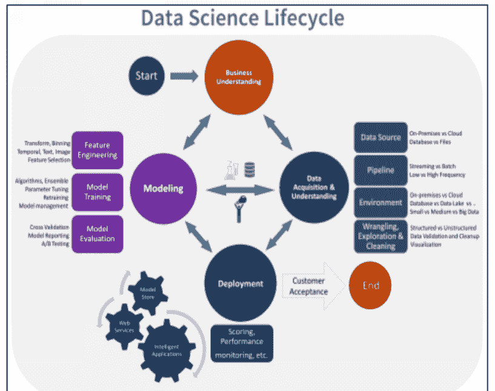

# PYTHON 算法

从零开始学习 Python，用于数据分析、机器学习和编程的完整指南

**PYTHON 编程**

**迈克尔 & 埃里克·斯克雷奇**

版权所有 2020 - 保留所有权利。

未经作者或出版商直接书面许可，不得复制、转载或传播本书所含内容。在任何情况下，出版商或作者均不对因本书所含信息直接或间接造成的任何损害、赔偿或金钱损失承担任何责任或法律责任。

**法律声明：**

本书受版权保护。本书仅供个人使用。未经作者或出版商同意，不得修改、分发、销售、使用、引用或转述本书的任何部分或内容。

**免责声明：**

请注意，本文档所含信息仅供教育和娱乐目的。已尽一切努力提供准确、最新、可靠和完整的信息。不声明或暗示任何类型的保证。读者承认作者不提供法律、金融、医疗或专业建议。本书内容源自各种来源。在尝试本书概述的任何技术之前，请咨询持证专业人士。

阅读本文档即表示读者同意，在任何情况下，作者均不对因使用本文档所含信息而造成的任何直接或间接损失负责，包括但不限于错误、遗漏或不准确之处。

## 目录

- **前言**
  - 什么是算法
  - 算法示例
  - 什么是好的算法
  - 算法编写作业
- **第 1 章. 概述**
  - PYTHON 约定
  - 数据结构
  - 机器学习
  - 模型验证
- **第 2 章. 性能指标**
  - 验证指标
  - 测试
  - 数据来源
  - 获取高质量数据
  - 拥有足够数据
- **第 3 章. 技术指标**
  - 算法
  - 复杂度分析
  - 排序算法
  - 插入排序 - 时间复杂度 O(N^2)
  - 搜索算法
  - 递归
  - 模型验证
  - 稳健的数据模型
  - 如何实现特征化
  - 重要注意事项
- **第 4 章. 模拟与优化**
  - 如何奠定基础
  - [探索数据](https://example.com)
  - [选择要使用的算法](https://example.com)
  - [团队数据科学流程的基本组成部分](https://example.com)
  - [此阶段需创建的交付成果](https://example.com)
  - [数据获取与理解](https://example.com)
  - [此阶段需创建的交付成果](https://example.com)
  - [建模](https://example.com)
  - [此阶段需创建的交付成果](https://example.com)
  - [部署](https://example.com)
  - [此阶段需创建的交付成果](https://example.com)
  - [客户验收](https://example.com)
  - [此阶段需创建的交付成果](https://example.com)
  - [数据类型](https://example.com)
  - [数据科学策略](https://example.com)
  - [数据科学与数据分析](https://example.com)
  - [网络安全中的数据科学](https://example.com)
  - [使用 Python 数据科学的实践示例](https://example.com)
  - [什么是云](https://example.com)
- **第 5 章. 替代数据**
  - [数据探索](https://example.com)
  - [创建新特征](https://example.com)
  - [降维](https://example.com)
  - [协方差矩阵](https://example.com)
  - [收集你的数据](https://example.com)
- **结论**

## 前言

在编写程序时，你可能有很多不同的选择，但它们都无法提供 Python 所能带来的多功能性和所有好处，而这正是我们将在本指南中讨论的内容。

在开始本指南之前，我们将探讨一些与 Python 相关且日益受到讨论的不同主题。

Python 是大学和企业首选的教学和使用的顶级编程语言之一。

Python 的魅力在于它在广泛领域中具有极其广泛的应用。

Python 非常易于阅读和学习。你可以轻松阅读其他程序员创建的不同程序的源代码。一开始，你可以直接将代码粘贴到编辑器中查看结果。在第二阶段，你可以对代码进行微小编辑并查看结果。在第三阶段，你将能够完全重塑一个程序，并查看它在 Python shell 中的运行情况。

借助本指南中的信息，即使作为初学者，你也能在 Python 的帮助下真正掌握所有这些内容。

当你准备好学习如何进行一些 Python 编程，以及它如何与机器学习、深度学习和人工智能协作时，请务必查阅本指南以帮助你入门！

### 什么是算法

简单来说，算法是指按步骤排列并涵盖每个重要细节的指令。算法的目标是，当你完成最后一条指令时，你已经解决了一个问题。算法中的指令应以合理的方式排列。这意味着它们应该是有逻辑的。你不能跳过指令中的任何一步。此外，你还应按指定顺序依次执行每一步。

你不能跳到第 5 步然后返回第 3 步。一步是其他步骤的前提。例如，你不能在告诉某人吃沙丁鱼之前不先把它们从罐头里拿出来，或者先切土豆再把它们从冰箱里拿出来。

正确排列这些指令的方法是先打开沙丁鱼罐头，然后才能吃它们，并把土豆从冰箱里拿出来，然后才能切它们。

### 将算法视为一种食谱

你需要严格按照食谱的要求去做，否则你得不到想要的结果。当你编写游戏程序（或任何其他应用程序或程序）时，情况也是如此。

你需要一步一步地遵循所有步骤。如果不这样做，最终会收到错误消息，或者得不到预期的结果。它可能不如应有的那样详细，因为你本应作为练习的一部分完成其余任务，但这些指令也是算法的另一个例子。

### 算法示例

通过一点练习，制作算法可以很容易。你甚至可以为你每天做的事情构思算法。在本节中，我们将介绍一个简单日常任务的算法——刷牙。我们将详细介绍该任务及其完成所需的步骤。之后，你将需要完成一项作业，概述另一个算法所需的逐步任务。

### 刷牙算法

这是一个简单的刷牙算法。

1.  一只手拿起一管牙膏，用另一只手打开盖子。
2.  用另一只手竖直握住牙刷，刷毛朝向你。
3.  将你另一只手拿着的牙膏管靠近牙刷的刷毛。
4.  将足够的牙膏挤到刷毛上。
5.  将牙膏管放在台面上，以便开始刷牙。
6.  张开嘴并微笑。
7.  将牙刷的刷毛按在你的门牙上——这会将牙膏涂在你的牙齿上。
8.  以上下移动的方式刷你的门牙。
9.  这样做 10 秒钟。
10. 将牙刷按在靠近左脸颊的下颌臼齿上。以进出移动（即前后移动）的方式刷这些牙齿。
11. 刷 10 秒钟。
12. 这次将牙刷按在靠近右脸颊的下颌臼齿上。以进出移动的方式刷牙。
13. 刷 10 秒钟。

## 第一章 概述

### Python 编程规范

### 编程命名规范

在项目开发中，可读性和一致性至关重要，尤其是当其他人需要阅读你的代码时。因此，你需要了解编程命名规范。程序员或数据分析师应该能够快速浏览你的代码并理解其含义。代码应当具有自解释性，通过直观的变量名让读者清楚其用途。

不要忽视编程的这一方面。某天你可能编写了一个程序，遇到瓶颈后暂时搁置，当你重新审视它时，由于变量名对你已毫无意义，代码将变得晦涩难懂。

话虽如此，以下是程序员和数据科学家最常用的命名规范：

### 帕斯卡命名法（Pascal Case）

每个单词的首字母大写，单词之间不使用空格或符号。使用帕斯卡命名法的变量名应类似这样：PascalCaseVariable、MyComplexPassword、CarManufacturer。

### 驼峰命名法（Camel Case）

这与帕斯卡命名法几乎相同，只是第一个单词以小写字母开头。使用驼峰命名法的变量名应类似这样：camelCaseVariable、myInterface、userPassword。

### 蛇形命名法（Snake Case）

这种命名规范通常通过下划线分隔每个单词来清晰展示多词变量。蛇形命名法可以与驼峰命名法或帕斯卡命名法结合使用。

它与其他命名法的唯一区别在于单词分隔方式。使用蛇形命名法的变量名应类似这样：my_snake_case_variable、This_is also_snake_case、my_account_password。使用这种命名规范，变量名可能看起来更易读。顺便提一下，蛇形命名法也非常适合用于命名项目文件夹和文件，且常被用于此目的。

请记住，不存在所谓的“最佳”命名规范。这完全取决于你的偏好；然而，在编写代码时应始终保持一致性。尽量不要混合使用不同的命名规范。选择一种风格并在整个项目中坚持使用。为变量赋予描述性名称，让读者理解其功能，然后使用上述命名规范之一进行编写。

## 数据结构

数据有多种形式，但从最高层次来看，主要分为三类：

### 结构化数据

这是在数据库、CSV 文件（以逗号分隔的值）或其他存储库中找到的高度组织化的数据。数据格式确保其适合使用 SQL 或其他结构化语言进行计算和查询。

### 半结构化数据

这类数据不遵循关系数据库等数据表关联时的数据模型结构，但具有标记和标签，用于区分语义元素并强制数据字段和记录的层次结构。

### 非结构化数据

所有没有真实结构的数据，例如自然语言文本或音频流。

显然，最有用的数据是结构化数据，因为它可立即进行处理。

通常，只有约 20% 的总数据是结构化数据，而其余 80% 是非结构化和半结构化数据的组合。

但请注意；我们所谓的非结构化数据大多具有某种结构。以一篇发布在互联网上的文章为例。

虽然它被归类为非结构化数据，但通过文章内容的标签和元数据，它确实具有某种结构。它被归类为非结构化数据，是因为内容本身没有可直接使用的真正结构。

## 机器学习

在机器学习阶段，会创建一个学习模型并进行验证。有时，模型本身就是产品，它将被部署在应用程序上下文中，提供某种能力，如预测或分类。其他时候，算法只是达到目的的手段，在这种情况下，学习算法不是产品；模型产生的数据才是产品。

流程的真正核心在于数据处理。在一个学习模型中，数据由算法处理，结果是一个全新的数据产品。然而，从生产的角度来看，模型实际上是产品，它被部署以增加价值或提供洞察力，例如，为保险市场部署的用于预测的神经网络。

机器学习有多种方法，稍后我们将探讨一些更流行的算法来说明

## 优秀算法的特质

在 Python 编程中，某些特质会使算法在解决特定问题时非常出色。当你开始编写游戏程序时，这些特质将至关重要。

请记住以下几点：

- 你编写的算法中的每一步都应该是明确的——这意味着你想要完成的任务应该非常清晰。
- 需要从用户获取的输入和应该在屏幕上显示的输出应该精确定义。
- 不要在算法中添加任何计算机代码，以便你可以应用或利用其他编程语言根据算法编写代码。

## 算法编写任务

### 任务一：绘制两条平行线

那么，开始吧。编写一个算法，指导一个人绘制两条平行线。

该人将使用的工具包括：

- 一支铅笔
- 一把尺子
- 一张纸

记住我们之前讨论过的技术和细节。你可以在指令中使用重复、子任务和有序的详细步骤。使用尽可能多的指令来完成算法。

### 任务二：拼写 Hello

这是你的第二个任务。

你将编写一个算法，详细说明如何水平然后垂直显示单词 Hello 的步骤。

之后，你将使用从上一章学到的 Python 编码知识，即关于使用 print 语句的内容。

请记住，你不仅需要编写算法，还需要编写一个实际的 Python 程序，该程序将单词 "Hello" 的字母打印在一行中，然后在每一行显示这些字母中的一个。

实际上，输出应类似于：

```
H e l l o
H
e
l
l
o
```

每个任务的答案将在下一页。

### 任务一答案

以下是解决任务一问题的算法。请注意，解决问题（即完成绘制两条平行线的任务）可能有不同的方法。

下面给出的解决方案/算法可能与你编写的略有不同。在数学或编程中都是如此。达到某个解决方案的方法有多种。

1.  拿一张纸、一把尺子和一支铅笔。
2.  将纸张纵向放置在桌子上。这意味着纸张应垂直放置，这是信件、书籍文本和备忘录的典型方式。换句话说，它应该看起来更高，而不是更宽。
3.  将尺子水平放置在纸张中间，将纸张平分为两半。
4.  用一只手按住尺子，确保它不会移动。
5.  用铅笔沿着尺子的上边缘在纸上画一条线。
6.  再画一条线，但这次沿着尺子的下边缘画。
7.  将尺子从纸上移开。现在你完成了。

请记住，你的算法可能与上面提供的略有不同。

### 任务二答案

以下是任务二的答案。同样请注意，你实际的解决方案或算法可能略有不同。

1.  启动 IDLE 程序编辑器。
2.  点击 File > New File
3.  在弹出的 "Untitled" 文件窗口中输入以下代码：
4.  在你输入 Python 代码的同一窗口中，转到 File > Save As

```python
print("Hello World!")
print("H")
print("e")
print("l")
print("l")
print("o")
```

5.  输入 "Print Hello World Horizontally and Vertically"，然后点击窗口底部的 "Save"。
6.  点击 Run > Run Module
7.  你将在 Python shell 窗口中看到输出。

## 示例算法：刷牙

14. 将牙刷从口中取出，用自来水冲洗。
15. 拿一杯水漱口。将水吐入水槽。
16. 刷牙完成。

从这个示例算法中可以看出，指令非常详细。刷牙过程中也涉及更小的任务或子任务，例如如何打开牙膏管、如何刷前牙以及如何刷口腔内部。还有一个关于漱口的子部分。我敢打赌，你还能想到其他可以添加细节的子任务。也许你想添加关于如何漱口的细节，或者如何取下牙刷盖/容器的细节。

你可能还注意到的另一个有趣细节是，有些任务或步骤是重复的。例如刷口腔内部。你重复相同的步骤来刷靠近左脸颊的牙齿，以及靠近右脸颊的牙齿。

*子任务、步骤重复以及详细有序的程序*都是你在创建游戏时可以使用的编程概念。在编写游戏代码之前，你首先要学习如何进行逻辑思考并设计算法。

机器学习所能提供的功能是何等丰富。

机器学习主要有三种类型：

## 监督学习

训练数据带有标签，数据集包含一个自变量或类别；算法通过训练来预测正确的类别，并在无法做出正确预测时调整模型。这个过程持续进行，直到达到一定的准确度，然后模型就可以被部署，用于对未见过的数据进行预测。

## 无监督学习

没有类别标签；算法观察数据，并根据数据中隐藏的结构将其分组。

## 强化学习

这是一种半监督算法，它基于奖励进行学习——当它做出令人满意的预测时，会得到奖励；当预测不佳时，则会受到惩罚。

## 模型验证

一旦机器学习模型训练完成，我们想知道它在投入生产后会如何表现。模型验证就是用于理解这种行为的一种方法。最常见的模型验证方法之一是保留一定比例的数据集作为测试数据，用于评估最终模型。训练数据（通常是可用数据的80%）用于训练模型。相比之下，测试数据（通常是20%）用于测试最终模型，以查看其在接收未见过的数据时的泛化能力如何。

从训练数据中构建测试数据集可能很复杂。你可以使用随机抽样，但这可能会导致问题。例如，随机样本可能对某个特定类别进行了过采样，或者可能无法充分覆盖所有潜在的数据特征或类别。当你使用数据类别分布进行随机抽样时，可以防止过拟合（训练过于贴近训练数据）或欠拟合（训练数据未被充分建模，导致模型无法泛化）。

## 操作

这指的是整个流程的最终目标，它可以仅仅是创建数据产品可视化来向你的受众讲述一个故事，也可以是回答在模型训练于数据集之前设定的某个具体问题。它甚至可以像将模型部署到生产环境中那样复杂，以便在未见过的数据上执行分类或预测操作。我们现在将探讨这两种情况。

## 模型部署

当机器学习产品是一个可以用于未来数据的模型时，该模型就被部署到生产环境中，用于处理新数据。这个模型可能是一个预测系统，以历史财务数据（如收入和月度销售数据）作为输入，来分类判断该公司是否是一个良好的收购目标。

在这种情况下，部署的模型不再进行学习；它接收数据并据此做出预测。避免在生产环境中进行学习有一些充分的理由。在深度学习的背景下，即具有深层结构的神经网络，已经出现了一些可以改变网络结果的对抗性攻击。例如，在用于图像处理的深度学习网络中，对图像施加扰动可以改变该图像的预测能力，使得网络看到的不是一辆坦克，而是一辆卡车。自深度学习被更广泛使用以来，这类对抗性攻击变得更加普遍，而活跃的研究领域也包含了新的攻击向量。

## 模型可视化

在数据科学规模较小的情况下，我们追求的是数据本身，而不是机器学习阶段产生的模型。这是流程中更常见的操作形式之一；模型为我们提供了一种手段，可以生成一个（数据）产品，该产品能够回答关于初始数据集的一个或多个问题。在数据可视化方面有许多选择，我们稍后在学习如何使用Matplotlib进行数据可视化时会了解更多。

# 第2章。

## 性能指标

### 验证指标

为了确定你离原始目标有多近；你必须使用评分函数。这些函数用于评估你的数据系统的性能，处理二元分类、回归或多标签分类问题。让我们讨论并研究其中一些函数，以了解如何在机器学习中使用它们。

#### 多标签分类

多标签分类问题是指我们需要准确预测多个标签的情况。天气怎么样？你打算走什么样的职业道路？这是什么鸟？这就是一个此类问题的例子。多标签分类经常遇到，因此有许多分类方法。让我们通过一个基本例子来更好地理解这个概念：

```
In: from sklearn import datasets

iris = datasets.load_iris()

from sklearn.cross_validation import train_test_split

X_train, X_test, Y_train, Y_test = train_test_split(iris.data,
iris.target, test_size=0.50, random_state=4)

from sklearn.tree import DecisionTreeClassifier

classifier = DecisionTreeClassifier(max_depth=2)

classifier.fit(X_train, Y_train)
```

```
Y_pred = classifier.predict(X_test)
iris.target_names
Out: array(['setosa', 'versicolor', 'virginica'],
          dtype='<U10')
```

现在我们有了这个例子，让我们看看对于这种分类可以采取哪些度量方法。

我们可以做的第一件事是识别每个类别的误分类情况。这可以通过*混淆矩阵*来完成，混淆矩阵是一个我们可以用于前述步骤的表格。假设分类是完美的，那么矩阵中不在对角线上的单元格将包含0值。让我们通过这个例子来检验一下：

```
In: from sklearn import metrics
from sklearn.metrics import confusion_matrix
cm = confusion_matrix(Y_test, Y_pred)
print (cm)
Out: [[30  0  0]
 [ 0 19  3]
 [ 0  2 21]]
```

```
In: import matplotlib.pyplot as plt
img = plt.matshow(cm, cmap=plt.cm.autumn)
plt.colorbar(img, fraction=0.045)
for x in range(cm.shape[0]):
    for y in range(cm.shape[1]):
        plt.text(x, y, "%0.2f" % cm[x,y],
        size=12, color='black', ha="center", va="center")
plt.show()
```

Out:

通过表格可视化，我们可以看到在我们的例子中，第一个类别“setosa”（类别0）没有被误分类。然而，类别1的“versicolor”被误分类为“virginica”类别两次。类别“virginica”（类别2）也被误分类为versicolor两次。

我们可以用来识别误分类的另一个度量是*准确率*。准确率简单地描述了标签分类的准确性。以下是代码示例：

```
In: print ("Accuracy:", metrics.accuracy_score(Y_test, Y_pred))
```

Accuracy: 0.93333333333333

另一个流行的度量是*精确率*。我们计算相关结果的数量，也就是正确标签的数量。然后，进行计算以确定所有标签的平均值。代码如下所示：

```
In: print ("Precision:", metrics.precision_score(Y_test,
Y_pred))
```

Precision: 0.93333333333333

第三个度量例子是*召回率*的概念。它确定我们有多少相关结果，并将其与相关标签进行比较。基本上，正确标签分类的数量除以标签总数。然后，这个计算的结果被平均，如下所示：

```
In: print ("Recall:", metrics.recall_score(Y_test, Y_pred))
```

Recall: 0.93333333333333

最后一个值得注意的度量是*F1分数*。然而，这个概念主要在我们拥有不平衡数据集时使用。其目的是确定我们的分类器相对于我们的类别是否表现良好。F1分数实际上是召回率和精确率的调和平均值。为了澄清，如果你不知道的话，调和平均值是速率的平均值。我们不会深入探讨这个计算的数学方面。你只需要对F1分数的概念有个了解即可。以下是它在代码中的使用方式：

```
In: print ("F1 score:", metrics.f1_score(Y_test, Y_pred))

F1 score: 0.933267359393
```

在多标签分类中，你还可以使用其他方法；然而，这些是你最常遇到的方法。在使用这些度量之后，你应该采取的另一个步骤是创建分类报告。以下是创建此报告并查看结果的方法：

```
In: from sklearn.metrics import classification_report

print (classification_report(Y_test, Y_pred,
    target_names=iris.target_names))

Out:
```

现在让我们再谈谈这些不同多标签分类度量的使用。值得注意的是，“精确率”和“召回率”在大多数场景中都会用到，尤其是与“准确率”相比。为什么？简单来说，因为在现实世界中，大多数数据集都是不平衡的。数据科学需要考虑这种不平衡，而精确率、召回率以及F1分数正是用来解决这个问题的。还要记住，如果你得到了完美的分类结果，那么可能在某处存在错误。在现实世界中，对于数据集问题，很少有完美的解决方案。“好得令人难以置信”这句格言在多标签分类中尤其适用。

## 二元分类

假设我们只有两个输出类别。例如，当你需要猜测性别时。你也可以使用前面提到的方法进行二元分类；不过，你需要额外执行一个步骤。这个步骤是对分类器性能的图形化表示，称为“受试者工作特征曲线”。它有时也被称为“曲线下面积”。这种图形化表达信息量很大，因为它展示了当某个参数改变时，结果如何变化。首先，它表达了真正例率的性能，然后是假正例率。真正例率（或命中率）代表正确的正向结果，而假正例率（或漏报率）代表错误的正向结果的比率。如果你搜索受试者工作特征的例子，你会注意到曲线下有一个面积，它表示分类器相对于随机分类器的表现。通常在这种图形化表示中，随机分类器用虚线表示，而更好的分类器用实线表示。

你可以使用以下函数通过Python构建受试者工作特征图：

```
sklearn.metrics.roc_auc_score().
```

## 测试

到目前为止，我们已经加载了数据，对其进行了预处理，创建了一些新特征，查找了任何异常值和不准确的数据点，查看了各种验证指标，现在我们终于准备好应用机器学习算法了。机器学习算法观察我们的样本，将它们与其结果分组，并提取可以泛化到未来样本的规则，通过猜测它们的正确结果。

例如，监督式机器学习应用多种学习算法来预测未来数据。问题是，我们如何应用学习过程，以便从类似数据中准确预测结果？

为了解释这一部分，让我们导入一个数据集，这样我们就可以直接通过一个例子来讲解。

```
In: from sklearn.datasets import load_numbers

numbers = load_numbers()

print(numbers.DESCR)

X = numbers.data

y = numbers.target
```

使用这个“数字”数据集，我们创建了一个场景，其中我们有一组包含从0到9的手写数字的图像。

我们的格式由一个矩阵组成，其中包含这些数字的8x8图像，这些图像存储为向量。将每个8x8图像展平后得到这个向量，该向量将有64个从0到16的数值。

基本上，这表达了图像中每个像素的灰度色调，如下所示：

```
In: X[0]

Out: array([0., 0., 5., 13., 9., 1., 0., 0., ...])
```

接下来，我们将加载三个已经设置好参数以进行学习的机器学习算法。这些算法也被称为机器学习假设。以下是此过程的一个示例：

```
In: from sklearn import svm

h1 = svm.LinearSVC(C=1.0)

h2 = svm.SVC(kernel='rbf', degree=3, gamma=0.001, C=1.0)

h3 = svm.SVC(kernel='poly', degree=3, C=1.0)
```

我们导入一个线性SVC，接着是一个径向基SVC和一个3次多项式SVC。SVC代表支持向量分类，你可以在Scikit-learn的网站上阅读文档：

https://scikit-learn.org/stable/modules/generated/sklearn.svm.SVC.html

请记住，本书的目的是向你介绍数据科学的世界，并教你如何开始使用Python。作为一名有抱负的数据科学家，进行必要的研究成为你任务的一部分。随着本书的进展，你将需要慢慢适应做越来越多的研究。我们将讨论概念、方法论和说明它们的例子；然而，作为一名学生，你必须自己扩展这些数据。

话虽如此，让我们首先将线性分类器拟合到我们的数据中，并验证结果：

```
In: h1.fit(X,y)

print(h1.score(X,y))

Out: 0.984974958264
```

第一个学习算法使用一个数组“x”来预测y向量指示的十个类别之一。然后，“score”方法分析指定的“x”数组的性能，作为基于“y”向量给出的真实值的平均准确率。正如你在示例中看到的，预测准确率大约为98%。

这个结果实际上是学习算法性能的一种表示。在某些情况下，我们将没有新的可用数据。在这种情况下，数据必须分为训练集和测试集。训练集将包含大约70%的数据，而测试集将包含其余部分。分割应该是随机的；然而，需要考虑不平衡的类别分布。让我们执行以下代码；在实践中查看这一点：

```
In: chosen_state = 1

X_train, X_test, y_train, y_test = validation.train_test(X, y,
test_size=0.30, random_state=chosen_state)
print("(X train shape %s, X test shape %s, \ny train shape %s, y test
shape %s" \n% (X_train.shape, X_test.shape, y_train.shape, y_test.shape))
h1.fit(X_train,y_train)
print(h1.score(X_test,y_test))
# 这将返回测试数据上的平均准确率
```

Out:
(X train shape (1257, 64), X test shape (540, 64),
y train shape (1257,), y test shape (540,)
0.953703703704

让我们讨论一下代码块，看看发生了什么。在这个例子中，我们如前所述将总数据随机分成两组。这是通过“validation.train_test”函数基于“test_size”参数完成的。顺便提一下，这个参数可以是一个整数，用于表示测试集有多少个样本，也可以是一个浮点数，表示应该用于测试的数据百分比。之后，数据分割由“random_state”控制，这保证了该过程可以在任何时间、任何计算机上重现。这个附加项还将确保我们可以在任何计算机上运行和重现该操作，无论运行的是哪个操作系统。在我们的例子中，我们有0.94的准确率。如果我们改变“chosen_state”参数的值，我们会看到准确率发生变化。这意味着什么？性能评估不是绝对的度量，我们应该谨慎使用。不同的测试样本会产生不同的结果。只要我们在选定的测试集上进行评估，性能结果应该看起来很好；然而，如果我们使用不同的测试集，相同的性能将不会重现。对此的结论是，我们需要在几个假设之间做出决定。这是数据科学中的一个常见过程。我们将每个假设拟合到训练数据上，并使用一个样本来比较性能。这就是我们使用验证集的时候。对于这个过程，建议将总数据分为60%用于训练，20%用于测试，20%用于验证。以下是我们如何调整前面的例子以考虑这种三路数据分割并测试我们拥有的三个算法：

```
In: chosen_state = 1

X_train, X_validation_test, y_train, y_validation_test =
validation.train_test(X, y, test_size=.40,
random_state=chosen_state)

X_validation, X_test, y_validation, y_test =
validation.train_test(X_validation_test,
y_validation_test, test_size=.50, random_state=chosen_state)

print("X train shape, %s, X validation shape %s, X test shape %s,
\ny train shape %s, y validation shape %s, y test shape %s\n" % \n(X_train.shape, X_validation.shape, X_test.shape, y_train.shape,
y_validation.shape, y_test.shape))

for hypothesis in [h1, h2, h3]:
    hypothesis.fit(X_train,y_train)
    print("%s -> validation mean accuracy = %0.3f" % (hypothesis,
    hypothesis.score(X_validation,y_validation)))

h2.fit(X_train,y_train)
print("\n%s -> test mean accuracy = %0.3f" % (h2,
h2.score(X_test,y_test)))
```

Out:

X train shape, (1078, 64), X validation shape (359, 64),
X test shape (360, 64),
y train shape (1078,), y validation shape (359,),
y test shape (360,)

```
LinearSVC(C=1.0, class_weight=None, dual=True, fit_intercept=True,
intercept_scaling=1, loss='squared_hinge', max_iter=1000,
multi_class='ovr', penalty='l2', random_state=None, tol=0.0001,
verbose=0) -> validation mean accuracy = 0.958
```

```
SVC(C=1.0, cache_size=200, class_weight=None, coef0=0.0,
decision_function_shape=None, degree=3, gamma=0.001, kernel='rbf',
max_iter=-1, probability=False, random_state=None, shrinking=True,
tol=0.001, verbose=False) -> validation mean accuracy = 0.992
```

```
SVC(C=1.0, cache_size=200, class_weight=None, coef0=0.0,
decision_function_shape=None, degree=3, gamma='auto',
kernel='poly', max_iter=-1, probability=False, random_state=None,
shrinking=True, tol=0.001, verbose=False) -> validation mean accuracy = 0.989
```

```
SVC(C=1.0, cache_size=200, class_weight=None, coef0=0.0,
decision_function_shape=None, degree=3, gamma=0.001, kernel='rbf',
max_iter=-1, probability=False, random_state=None, shrinking=True,
```

从输出中可以看到，我们如何将总案例按百分位数分配到训练集、测试集和验证集。首先，我们使用“validation.train_test”函数将数据分割成两个不同的部分。接着，我们取测试/验证集，再次使用相同函数进行划分。之后，我们在验证集上测试了每一种算法。从结果中可以看出，我们的准确率大约为0.99。这告诉我们，最佳算法是使用RBF核的SVC。接下来，我们决定在测试集上进一步使用该算法。这使我们获得了接近0.98的准确率。此时，我们必须反思自己是否使用了正确的算法。在这种情况下，我们在验证集和测试集上得到了两个不同的结果。接下来你应该做的是，至少运行这段代码40次，以避免任何可能干扰结果的统计噪声或错误。请记住，每次运行代码时都应更改“random_state”的值。这样，在这种场景下，你的结果将尽可能准确。

## 数据从何而来

我们在这里首先要处理的是如何收集数据。我们希望确保从一些良好的来源收集数据，并且数据质量高，能在需要时完成我们想要的工作。在收集数据时，我们可以使用多种方法，这些方法包括：

第一种选择是观察法。眼见为实。这包括我们直接观察周围发生的一些事情。

你会发现这种方法既有效又快速，只需少量介入就能帮助收集我们想要的数据。

这里的关键部分是确保我们有正确的机制来进行观察，并且我们已准备就绪。使用这种方法有几个优点，包括：

- 当你进行直接观察时，不会遇到研究对象不回应你的问题。
- 如果观察简单且不需要解释，这种模型不需要大量训练就能使其按预期工作。
- 对于简单的观察，准备时间和基础设施要求都是最低的。

然而，使用这些观察也可能带来一些缺点。例如，当观察更复杂时，它将需要更多的解释，并可能导致过程中出现一些偏差。而且，你所进行的分析可能严重依赖专家，他们需要知道观察什么以及在收集数据后如何解释观察结果。在某些情况下，由于与样本主体没有直接互动，可能会错过完整的情况。

我们能够使用的另一种选择是问卷调查。这是一种独立的工具，可以帮助我们收集数据，可以分发给样本主体。你可以通过在线方式、电话或邮件发送这些问卷。长期以来，这一直是数据收集技术中最受欢迎的方法之一，它确实能帮助我们取得良好的结果。使用这种方法有几个好处，包括：

- 这些可以帮助研究人员有机会仔细构建甚至制定数据收集计划，使其具有一定的精确性。
- 这些问卷的受访者能够在最方便他们需求的时间进行调查。他们甚至可以按照自己的节奏思考答案。
- 理论上，这种方法的覆盖范围是无限的。如果所使用的媒介允许，这些问卷可以到达世界上的任何地方。

这种方法也会带来一些缺点。首先，如果这些问卷是在没有人为干预的情况下完成的，它们可能相当被动，可能会错过一些细微之处，并且可能使一些回答容易产生解释上的分歧。这就是为什么将它们与焦点小组讨论和访谈结合起来会有所帮助。这些问卷的回复率也可能较低，因为很难鼓励参与者实际填写并发送结果。

接下来是访谈。进行这些访谈是帮助我们克服之前讨论过的两种数据收集技术的一些不足的好方法，因为它让你能够更好、更深入地理解受访者回答背后的想法。在使用访谈时，我们会看到几个好处，包括：

- 这些访谈将帮助研究人员揭示深刻而丰富的见解，并学习在其他情况下可能被遗漏的信息。
- 访谈者的存在将在受访者回答问题时给予他们额外的舒适感，并确保你以正确的方式理解问题。
- 一位坚持不懈、训练有素的访谈者的亲自参与，可以显著提高你获得的回复率。

当然，与其他一些选择一样，这种方法也会带来一些缺点。第一个问题是，联系所有受访者进行访谈将是一项庞大且耗时的工作，这将导致进行调查的成本大幅增加。为了确保整个过程尽可能有效，访谈者必须在必要的软技能和相关主题方面接受良好的培训。

我们要看的最后一种方法是焦点小组讨论。这些讨论将把访谈的一些互动优势提升到一个新的水平，因为你会将精心挑选的一组人聚集在一起，就他们正在研究的调查主题进行有主持的讨论。这种方法的好处包括：

多个相关人士同时在场，能够鼓励他们进行健康的讨论形式，并帮助研究人员发现他们可能在其他方法中未发现的新信息。

这些讨论还可以帮助研究人员即时核实事实，任何不准确的回答很可能会被焦点小组中的其他成员反驳。

这种方法将给研究人员一个机会，从两方面看待情况，并在处理手头问题时建立平衡的观点。

使用这些焦点小组时，你能发现的一个缺点是，找到你希望纳入这种方法的人会很困难。你想找到与你正在进行的调查相关的人，然后让他们同时聚在一起参加一次会议，这可能是一件难以完成的事情。而且，如果小组中有些成员过于大声，这会压制那些不太善于表达的人的意见。

另一个问题是，焦点小组的成员常常容易陷入群体思维的问题。这意味着，如果小组中有一个非常有说服力和影响力的人，他可能会掩盖本应出现的多样化意见。这次讨论的主持人必须防范这种事情。

正在发生。我们能够使用的其他来源包括社交媒体、我们向之前在我们这里购物过的客户发送的调查问卷等等。尽可能使用多种不同的来源非常重要，只要它们是高质量的，就能确保我们获得所需的良好数据，以便后续进行一些分析。但运用我们目前一直在讨论的方法，确实有助于实现这一目标。

## 获取高质量数据

我们需要花时间关注的另一件事是，我们将通过此过程收集的数据的质量。即使我们有大量数据可供使用，如果最终得到的是低质量数据，对我们也没有太大好处。我们能使用的数据质量越好，即使最终不得不接收的数据总量较少，总体上训练我们的算法和模型也会更容易。

通常，我们能做的最好的事情就是确保我们知道想要什么样的数据，以及如何挑选出能解决我们特定业务问题的数据。如果你只是随意地去搜索和收集数据，那么这可能会为你提供大量数据，但不一定能提供我们所需的数据。

这意味着我们需要确保选择的数据能够解决我们的业务问题。并且了解这个业务问题是什么，以及哪个是我们最重要、需要优先解决和处理的问题，你会发现这将帮助我们挑选出最适合你需求的选项。当你知道你想要关注哪个业务问题时，你会发现处理这个过程要容易得多，我们可以搜索我们拥有的一些数据和正确的来源来回答那个业务问题。

确保你选择的来源也能帮助你获得一些高质量的数据同样重要。你不想把时间浪费在获取那些并非来自你客户的数据上，或者来自一个会有很多偏见、从而干扰结果的来源上。你需要的是准确的数据、与你想要处理的主题相匹配的数据等等。

首先，我们需要确保挑选出准确的数据，并有助于尽可能保持我们的算法强大。如果你的数据不准确，它将从你的算法中给你一些糟糕的结果。你需要确保你计划在算法中使用的所有数据都尽可能准确，这样你才能训练算法并获得你所寻求的洞察力等。

然后我们需要花时间审视我们正在使用的来源，确保数据没有偏见或其他问题。如果你使用第三方调查和信息来帮助你，你需要运用一些批判性思维来辅助。我们需要确保其中没有任何偏见，确保没有任何问题，并且样本量足够大以帮助我们。

一个好的起点是弄清楚是谁做了这份报告，或者至少是谁资助了它。这有时可以为我们提供一些关于数据的好信息，并帮助我们判断这是否是我们可以依赖某些需求的数据。

我们还需要关注确保样本量足够大，并且它确实触及了你想要触及的人群。如果你的客户是25到35岁的人群，你肯定不想抽样调查45到55岁的人群。你可能会从中发现一些好的见解，但这些见解不会是你想要的，你也无法获得针对你目标人群的答案。

考虑到这一点，我们还必须确保我们正在挑选出样本中正确数量的人。如果我们有100,000名客户，而我们只抽样调查其中的10人，我们将无法很好地了解我们的客户对某事的感受。我们需要弄清楚原始个体的规模有多大，然后决定在需要关注此事时，我们希望与其中百分之多少的人交谈。这将确保我们使用的答案是准确的，并且实际上能在此过程中帮助我们。

## 拥有足够的数据

我们接下来要提出的问题是，我们的项目是否有足够的数据可供使用。这有点棘手，通常取决于你试图弄清楚什么以及你最初能够收集到多少数据。

在大多数情况下，数据越多越好，但你也不想无休止地收集数据，直到你能够创建一些你想要使用的算法。你必须有一个停止点，并知道它在哪里，这样你才能拥有足够的数据，并且仍然能在合理的时间内完成算法。

当你查看你的数据仓库，并且看到你有大量可供使用的数据时，你会发现是时候使用你想要使用的算法了。然后你可以将其拆分为你想要使用的测试集和训练集，并可以根据你的需求发送出去。此时你也可以继续收集信息，因为你可能需要多次进行训练和测试阶段。

然后，当你完成训练和测试后，你可能会发现你需要更多的数据，以便更容易地了解洞察力和模式，并做出一些所需的主要决策。当我们能够将所有这些整合起来以满足我们的需求时，你将能够在此过程中看到一些很棒的结果。

你所有这些工作的目标是确保你能够收集尽可能多的信息，但要设定一个你希望获取信息的截止时间。这将帮助你保持正轨，并确保你不会陷入一个无休止的数据收集过程，而从未将其用于做出你想要的一些主要决策。

在处理数据科学项目时，收集你想要使用的数据将非常重要。当你能够以正确的方式设置它，并且在开始时对你正在做的一些工作保持谨慎，然后你能够利用它来整体上学习更多。

# 第3章 技术指标

## 算法

算法是一组明确的步骤，在向其输入后应能提供问题的解决方案。算法主要有三个类别：贪心算法、分治算法和动态规划算法，如下所述。贪心算法试图在局部找到最优解，从而导致全局优化的解决方案。它们通过寻找当前的最佳解决方案而不考虑未来的最佳解决方案来实现这一点。不幸的是，在许多情况下，贪心算法并不能提供全局优化的解决方案。一些著名的贪心算法有：

- 旅行商问题
- 普里姆最小生成树算法
- 克鲁斯卡尔最小生成树算法
- 迪杰斯特拉最小生成树算法

分治算法涉及将给定问题分解为更小的问题，然后独立解决每个子问题。当问题无法进一步细分时，合并过程开始，将不同的子解决方案组合在一起以创建全局解决方案。一些著名的分治算法有：

- 归并排序
- 快速排序
- 克鲁斯卡尔最小生成树算法

## 二分查找

动态规划算法涉及将大问题分解为小问题，但与分治法不同，它并非独立地解决所有子问题。在解决一个子问题之前，动态规划算法会尝试检查之前已解决子问题的结果。动态规划算法旨在提供整体优化的解决方案，而非局部最优解。

一些著名的动态规划算法包括：

- 斐波那契数列
- 背包问题
- 汉诺塔问题

## 复杂度分析

## 算法分析

我们可以根据两个因素来衡量算法的性能：时间复杂度和空间复杂度，它们分别定义了算法在处理大小为 n 的输入数据时的运行时间和存储空间。

## 时间复杂度

这里，我们不精确测量运行时间，而是测量其数量级。诸如单次加法、乘法、赋值等操作并不重要，具有常数时间复杂度，对应于 O(1)。但诸如 for 和 while 循环等操作则是增加时间复杂度的因素。大 O 表示法用于衡量时间复杂度，其中 O(1) 是最低的。当我们在一个将重复 n 次的 for 循环（或 while 循环）中有一个或多个简单操作时，例如：

```
k = 0
for i in range(n):
    print(i)
    k = k + 1
```

那么我们将其时间复杂度记为 O(n)。如果我们有嵌套循环，则将它们的时间复杂度相乘：

```
k = 0
for i in range(n):
    for j in range(m):
        print(i)
        k = k + 1
```

或者

```
k = 0
for i in range(n):
    while j<m:
        print(i)
        j = j - 1
```

在这两种情况下，我们都有 O(n*m)。同样，如果在一个时间复杂度为 n 的循环中，我们调用一个时间复杂度为 m 的函数，情况也是如此。因此，在计算复杂度时，我们忽略常数：即，无论循环执行 10 * n 次还是更多次，我们的时间复杂度仍然等于 O(n)。在分析复杂度时，我们必须寻找程序处理起来会花费很长时间的特定、最坏情况的数据示例。以下是可能的时间复杂度：

线性时间 — O(n)

```
def linear(n, A):
    for i in range(n):
        if A[i] == 0:
            return 0
    return 1
```

二次时间 — O(n**2)

```
def quadratic(n):
    result = 0
    for i in range(n):
        for j in range(i, n):
            result += 1
    return result
```

线性时间 — O(n + m)

```
def linear2(n, m):
    result += i
    for j in range(m):
        result += j
    return result
```

## 指数时间与阶乘时间

值得注意的是，还有其他类型的时间复杂度，例如阶乘时间 O(n!) 和指数时间 O(2**n)。具有此类复杂度的算法只能解决 n 值非常小的问题，因为对于较大的 n 值，它们的执行时间会过长。

## 时间限制

在解决问题时，你可以通过问题描述来理解期望解的时间复杂度。请记住以下解法与时间复杂度的对应关系：

- n <= 1 000 000，期望的时间复杂度为 O(n) 或 O(n* log n)，
- n <= 10 000，期望的时间复杂度为 O(n**2)，
- n <= 500，期望的时间复杂度为 O(n**3)。

当然，这些限制并不精确。它们只是近似值，并且会根据具体任务而变化。下面你可以看到针对同一问题的不同解法，它们对应不同的时间复杂度。

*练习题*：给定一个整数 n。计算总和 1+2+ ... + n。

慢速解法 — 时间复杂度 O(n**2)

```
def slow_solution(n):
    result = 0
    for i in range(n):
        for j in range(i + 1):
            result += 1
    return result
```

快速解法 — 时间复杂度 O(n)

```
def fast_solution(n):
    result += (i + 1)
    return result
```

模型解法 — 时间复杂度 O(1)

```
def model_solution(n):
    result = n * (n + 1) // 2
    return result
```

## 空间复杂度

内存是有限的，因此拥有一个不占用过多空间的解决方案非常重要。通常，我们必须在时间复杂度和空间复杂度之间进行权衡，反之亦然。空间复杂度取决于你可以在程序中声明的变量数量。如果你有常数个变量，那么你就有常数空间复杂度：用大 O 表示法表示为 O(1)。如果你需要声明一个包含 n 个元素的数组，你就有了线性空间复杂度 — O(n)。在计算空间复杂度时要小心，注意存储某些数据和与问题规模无关的变量所需的空间。例如，使用的简单变量和常量、程序大小等对应于 O(1)，而大小取决于问题规模的变量所需的空间则对应于，例如，O(n)，其中 n 是数组的大小。下面你可以看到针对同一问题的不同解法，它们对应不同的空间复杂度。

*练习题*：给定一个整数 n。计算总和 1+2+ ... + n。

慢速解法 — 空间复杂度 O(1)

```
def slow_solution(n):
    result = 0
    for i in range(n):
        for j in range(i + 1):
            result += 1
    return result
```

快速解法 — 空间复杂度 O(1)

```
def fast_solution(n):
    result = 0
    for i in range(n):
        result += (i + 1)
    return result
```

模型解法 — 空间复杂度 O(1)

```
def model_solution(n):
    result = n * (n + 1) // 2
    return result
```

## 大 O 表示法的计算

O(c) -> O(c)，其中 c 是常数
O(c*n) -> O(n)，其中 c 是常数，n 是变量
O(c*n + c) -> O(n)，其中 c 是常数，n 是变量

O(n+ n**2 + n**3) -> O(n**3)，其中 n 是变量
O(c+n**2+c*n**3) -> O(n**3)，其中 c 是常数，n 是变量

O(k-m) -> O (k-m)，其中 k, m 是变量
O(k+m) -> O (k+m)，其中 k, m 是变量
O(k-c*m) -> O (k-c*m)，其中 k, m 是变量，c 是常数
O(c*k+m) -> O (c*k+m)，其中 k, m 是变量，c 是常数

## 排序算法

以下排序算法的描述如下：
https://www.tutorialspoint.com/python_data_structure/python_sorting_algorithms.htm

有多种算法可以按升序或降序对列表进行排序。我们可以根据元素的类型，按数值顺序或字典顺序对列表的元素进行排序。我们选择对列表进行排序是为了方便数据搜索并使我们的列表更具可读性。下面你可以看到三种排序算法，它们接收一个列表并返回其升序排列，它们在时间复杂度和空间复杂度之间进行了权衡。

- 冒泡排序
- 归并排序
- 插入排序

冒泡排序 - 时间复杂度 O(n^2)

```
def bubblesort(list):
    # 交换元素以按顺序排列
    for iter_num in range(len(list) - 1, 0, -1):
        for idx in range(iter_num):
            if list[idx] > list[idx + 1]:
                temp = list[idx]
                list[idx] = list[idx + 1]
                list[idx + 1] = temp
```

## 归并排序 - 时间复杂度 O(n(logn))

```
def merge_sort(unsorted_list):
    if len(unsorted_list) <= 1:
        return unsorted_list
    # 找到中点并分割
    middle = len(unsorted_list) // 2
    left_list = unsorted_list[:middle]
    right_list = unsorted_list[middle:]
    left_list = merge_sort(left_list)
    right_list = merge_sort(right_list)
    return list(merge(left_list, right_list))

# 合并已排序的两半
def merge(left_half, right_half):
    res = []
    while len(left_half) != 0 and len(right_half) != 0:
        if left_half[0] < right_half[0]:
            res.append(left_half[0])
            left_half.remove(left_half[0])
        else:
            res.append(right_half[0])
            right_half.remove(right_half[0])
    if len(left_half) == 0:
        res = res + right_half
    else:
        res = res + left_half
    return res
```

## 插入排序 - 时间复杂度 O(n^2)

```
def insertion_sort(InputList):
    for i in range(1, len(InputList)):
        j = i - 1
        nxt_element = InputList[i]

        # 将当前元素与下一个元素进行比较
        while (InputList[j] > nxt_element) and (j >= 0):
            InputList[j + 1] = InputList[j]
            j = j - 1

        InputList[j + 1] = nxt_element
```

注意：Python 内置的 .sort() 函数的时间复杂度为 O(nlogn)

## 搜索算法

在编程中，我们经常需要在数据结构中搜索一个值；时间复杂度最高的最简单方法是进行*线性搜索*（从头开始，逐一搜索数据结构中的元素，直到找到我们要找的内容）。

这里的一个替代方案是*插值搜索*，首先我们需要对数据结构进行排序，然后按照以下步骤开始搜索：

我们检查要查找的元素是否是列表中间的那个。如果是，我们返回其索引，搜索完成。如果不是：

1. 如果中间项大于该项，则在中间项右侧的子数组中再次计算可能的位置。否则，在中间项左侧的子数组中搜索该项。此过程在子数组上继续进行，直到子数组的大小减小到零。
2. 如果搜索结束但未找到该元素，则说明该元素不在列表中。

## 递归

当一个函数调用自身时，我们称其为递归工作。此时，相同的代码被用于不同的值。这能生成空间复杂度较低的简洁代码，但会显著增加时间复杂度。设定终止递归过程的条件至关重要。下面我们分别用递归和迭代方式求解斐波那契数列，该数列以0和1开始，后续每个元素都是前两个元素之和：0,1,1,2,3,5,8,13。对于 n > 2，第 n 个元素是第 n-1 和 n-2 个元素之和；当 n = 0 或 n = 1 时，分别为 0 或 1。

```python
# recursively
def fib(n):
    if n <= 1:
        return n
    return fib(n - 1) + fib(n - 2)

# iteratively
def Fib(n):
    f = (n + 1) * [0]
    f[0] = 0
    f[1] = 1
    for i in range(2, n + 1):
        f[i] = f[i - 1] + f[i - 2]
    return f[n]
```

## 模型验证

数据建模是数据科学的一个重要方面。它是数据科学学习者中最受关注、也最具回报的过程之一。然而，事情并非表面看起来那样简单，因为除了将函数应用于给定的类或包之外，还有很多工作要做。

数据科学的很大一部分是评估模型，以确保其强大可靠。此外，数据科学建模与构建信息特征集高度相关。它涉及不同的过程，以确保手头的数据以最佳方式被利用。

## 稳健的数据模型

稳健的数据模型对于生产至关重要。首先，它们必须根据不同的指标具有更好的性能。通常，单一指标可能会误导模型的性能表现，因为分类问题涉及多个方面。

敏感性分析描述了数据科学建模的另一个重要方面。这对于测试模型以确保其稳健性非常重要。敏感性指的是模型输出在输入发生微小变化时发生显著变化的情况。这是非常不可取的，必须进行检查，因为稳健的模型应该是稳定的。

最后，可解释性是一个基本方面，尽管并非总是可行。这通常与人们解释模型结果的难易程度有关。但大多数现代模型类似于黑匣子，这使得人们难以解释它们。除此之外，最好选择可解释的模型，因为你可能需要向他人证明输出的合理性。

## 如何实现特征化

为了使模型达到最佳效果，它必须需要具有丰富特征集的信息。后者通过不同的方式开发。无论哪种情况，数据清理都是必须的。这需要修复数据点的问题，在可能的情况下填充缺失值，并在某些情况下移除噪声元素。

在将变量用于模型之前，必须对其进行归一化。这通过线性变换实现，以确保变量值在给定范围内波动。

通常，一旦数据被清理，归一化就足以将变量转换为特征。

分箱是另一个促进特征化的过程。它涉及构建名义变量，这些变量可以进一步分解为应用于数据模型的不同二进制特征。

最后，一些降维方法对于构建特征集很重要。这涉及构建特征的线性组合，以更少的维度展示相同的信息。

## 重要考虑因素

除了数据科学建模的基本属性外，数据科学家还必须了解其他重要事项，才能创造出有价值的东西。例如，使用专门的抽样进行深入测试、敏感性分析以及模型性能的不同方面以改进特定性能，这些都属于数据科学建模的范畴。

# 第四章 模拟与优化

## 如何奠定基础

在我们尝试实施任何一种全新技术之前，都需要采取并经历几个步骤才能看到结果。不仅我们需要对想要使用的数据有扎实的把握（这应该在数据分析阶段完成），还需要理解另外三个重要事项，包括公司的需求、公司的目标以及公司的受众。在准备和组织所有数据并完成此类数据可视化之前，必须完成的一些事情包括：

首先理解我们需要可视化的数据。这意味着我们需要知道数据中存在多少基数，即列中将出现多少唯一值，并且需要知道数据的大小。我们将用于数据可视化的一些算法在处理非常大的数据集时效果不佳。确定你想要可视化的内容以及希望通过此传达的信息类型。这将使我们更容易确定在此过程中想要使用哪种类型的可视化。

了解我们面对的受众，并理解他们将如何处理你想要展示的视觉信息。管理层可能需要与团队不同的可视化。制造业的人员可能需要与创意角色人员不同的可视化。能够使可视化适应受众，以便他们能够实际利用信息，将是关键的一步。

使用能够以最佳且最简单的方式向受众传达信息的可视化。有很多很酷的可视化可供使用，它们提供了许多不同的方式来展示你的数据。但如果可视化太难理解，就不会让任何人满意。放下一些花哨的小工具，找到最适合向受众展示信息的方式。

一旦你能够回答所有关于数据类型的初步问题，并且知道什么样的受众将消费这些信息，就该为我们计划在此过程中处理的数据量做一些准备了。

请记住，大数据对许多企业来说是极好的，通常是数据科学工作所必需的。但它也会给我们的可视化带来一些新的挑战。大量的数据、变化的速度和不同的种类都需要考虑在内。

此外，数据生成的速度通常远快于其管理和分析的速度，因此我们必须找到处理此问题的最佳方法。

在此过程中，我们还需要考虑一些因素，包括我们想要处理的列的基数。我们必须意识到过程中是高基数还是低基数。如果处理的是高基数，这表明我们的数据中将有很多唯一值。一个很好的例子是银行账户号码，因为每个个人都有一个唯一的账户号码。然后，你的数据可能具有低基数。这意味着你正在处理的数据列将包含大量重复值。这可能是我们在系统中的性别列中注意到的情况。算法将以不同的方式处理基数的高低，因此我们在工作时必须始终考虑这一点。

## 探索数据

数据科学工作流的第一阶段是执行探索性分析。你需要更详细地了解你将要处理的数据。这意味着了解数据集的特征、元素的形状，并利用所有信息来形成你的假设，以便继续下一步。在本节中，我们将继续使用鸢尾花数据集，因为它非常适合初学者，而且你已经对它有些熟悉了。所以首先再次导入数据集，并像上一节一样创建一个新文件。完成此步骤后，我们可以开始探索，前往没有有抱负的数据科学家去过的地方。

玩笑归玩笑，我们将首先使用 `describe` 函数来进一步了解我们的数据集：

```python
In: iris.describe()
```

现在你应该可以访问各种特征，例如偏差、最小值和最大值等。我们需要获取这些基础数据并进行更深层次的分析，所以让我们从探索其图形表示开始。目前，我们将使用简单的“箱线图”函数来创建图表，暂时不使用 Matplotlib。

```python
In: boxes = iris.boxplot(return_type='axes')
```

请记住，你不必执行此步骤。可视化实际上是可选的，除非你必须向数学不太精通但更容易理解图表和图形的人展示你的发现。出于同样的原因，作为初学者，你应该可视化你的数据，以便将注意力转移到其他地方。现在，让我们观察我们的特征。在这一步，我们将使用一个类似这样的相似度矩阵：

```
In: pd.crosstab(iris['petal_length'] > 3.758667, iris['petal_width'] > 1.198667)
```

你会注意到，我们只是在计算当花瓣长度与花瓣宽度进行比较时出现的次数。我们使用交叉制表函数进行这种比较。如果你查看结果，你会看到这些特征彼此之间有很好的关联。通过创建一个像这样的散点图，你可以更清楚地观察到这一点：

```
In: scatterplot = iris.plot(kind='scatter', x='petal_width',
y='petal_length', s=64, c='blue', edgecolors='white')
```

散点图使得很容易看出花瓣宽度与长度是相关的。以这种方式探索数据时，你也可以使用另一种图形，即直方图。在我们的例子中，我们将使用一个直方图来查看值的分布情况。

```
In: distr = iris.petal_width.plot(kind='hist', alpha=0.5, bins=20)
```

在这个例子中，我们选择了二十个分箱。如果你不熟悉直方图，你应该知道分箱指的是变量的区间。这是通过确定观测值总数的平方根来计算的。该值代表分箱的总数。

## 新特征

不幸的是，我们很少能像在基本示例中那样幸运地发现某些特征之间的紧密联系。这时我们需要应用一系列转换。假设你正在试图确定一栋房子的价值。你唯一确定知道的是每个房间的大小。你可以利用这些信息创建一个代表建筑物体积的新特征。需要应用这种转换是因为我们无法直接观察到体积；然而，我们可以观察到长度、宽度和高度等特征，然后使用这些特征来计算体积。以下是所有这些如何用代码实现：

```
In: import numpy as np

from sklearn import datasets

from sklearn.cross_validation import train_test_split

from sklearn.metrics import mean_squared_error

cali = datasets.california_housing.fetch_california_housing()

X = cali['data']

Y = cali['target']

X_train, X_test, Y_train, Y_test = train_test_split(X, Y, train_size=0.8)
```

（来源：加利福尼亚住房数据集
https://scikit-learn.org/stable/modules/generated/sklearn.datasets.fetch_california_housing.html 检索于2019年10月）

这次我们导入了一个名为加利福尼亚住房的新数据集，其中包含大量关于加利福尼亚房地产市场的数据。在这个例子中，我们将实现一个回归器以及一个值为1.1575的平均绝对误差。如果代码难以理解，你不知道回归器是什么，现在不用担心；我们稍后会讨论这个。

你现在只需要理解我们正在讨论的概念。

```
In: from sklearn.neighbors import KNeighborsRegressor

regressor = KNeighborsRegressor()

regressor.fit(X_train, Y_train)

Y_est = regressor.predict(X_test)

print ("MAE=", mean_squared_error(Y_test, Y_est))

Out: MAE= 1.15752795578
```

现在我们需要尝试通过实现Z分数来降低平均绝对误差的值。这样我们就可以进行回归比较和特征归一化。这个过程也被称为Z归一化，因为它试图将所有原始特征映射到我们创建的新特征上。让我们继续：

```
In: from sklearn.preprocessing import StandardScaler

scaler = StandardScaler()

X_train_scaled = scaler.fit_transform(X_train)

X_test_scaled = scaler.transform(X_test)

regressor = KNeighborsRegressor()

regressor.fit(X_train_scaled, Y_train)

Y_est = regressor.predict(X_test_scaled)

print ("MAE=", mean_squared_error(Y_test, Y_est))

Out: MAE= 0.432334179429
```

平均绝对误差的值现在已从之前的约1.15降低到接近0.4，这是一个相当不错的结果。还有其他方法可以用来最小化这个值，然而，在现阶段所需的转换可能过于复杂而难以实现。

你应该从这个例子中获得的是，基本的转换可以轻松应用，并且它们可以使你的探索性分析更容易进行。

## 降维

在现实世界中，你经常会处理包含数万甚至数十万数据项的数据集。这样的数据集往往也包含大量的特征，这意味着其中一些是你不需要的。仅仅因为信息存在，并不意味着它有用。在某些情况下，特征根本不相关，它们只会增加噪声。噪声是降低分析准确性的因素之一，任何你能做的减少噪声的事情都会转化为准确性的提升。当噪声是由不相关的特征引起时，你最好的选择是使用降维方法。

顾名思义，降维就是减少无用的特征并减少处理数据所需的时间。在本节中，我们将讨论一些你可以用来消除不需要的特征的技术和算法。

## 协方差矩阵

如前所述，你需要比较你所有的特征或特征集合，以确定它们之间是否存在关系。你不想消除有用的特征。协方差矩阵是你将用来实现这一目标的技术之一。

降维意味着检测相关特征，并移除其余的特征。一旦你检测到那些贡献不大的特征，你就可以消除它们。为了演示这个概念，我们将再次导入鸢尾花数据集。请记住，这个数据集包含每个观测值的四个特征；因此，相关矩阵将产生一些有用的结果。

```
In: from sklearn import datasets
import numpy as np
iris = datasets.load_iris()
cov_data = np.corrcoef(iris.data.T)
print (iris.feature_names)
print (cov_data)
```

你的输出结果应该如下所示。

```
['sepal length (cm)', 'sepal width (cm)', 'petal length (cm)',
'petal width (cm)']
[[ 1. -0.10936925 0.87175416 0.81795363]
[-0.10936925 1. -0.4205161 -0.35654409]
[ 0.87175416 -0.4205161 1. 0.9627571 ]
[ 0.81795363 -0.35654409 0.9627571 1. ]]
```

有了协方差矩阵，让我们创建一个结果的可视化表示，以便更容易得出结论。作为初学者，你应该始终使用可视化方法，因为它们比纯数字更容易阅读。

这次我们将导入Matplotlib来为我们绘制图表：

```
In: import matplotlib.pyplot as plt

img = plt.matshow(cov_data, cmap=plt.cm.rainbow)
plt.colorbar(img, ticks=[-1, 0, 1], fraction=0.045)

for x in range(cov_data.shape[0]):
    for y in range(cov_data.shape[1]):
        plt.text(x, y, "%0.2f" % cov_data[x,y],
                 size=12, color='black', ha="center", va="center")

plt.show()
```

你会注意到这次我们没有使用散点图或直方图。实际上，我们创建了一个热力图。注意最重要的值，即1。每个特征的协方差都被归一化为1，以帮助我们看到多个特征之间的强大联系。

通过分析热力图，你会注意到特征一与特征三以及特征四有很强的关系。第三个特征也与第四个特征有很强的联系。最后，我们有特征二，它似乎与其他任何特征都没有关系。它是完全独立的。

现在你知道哪些特征是有用的，哪个是不相关的，你可以删除一些无用的信息。

## 主成分分析

下一步是使用像主成分分析这样的算法，从其父特征中定义更小的特征。然而，新的特征将是线性的。这意味着输出的第一个因子将包含大部分的方差。第二个向量将包含大部分剩余的方差，依此类推。信息将被聚合到一组新的向量中，这些向量是在应用主成分分析后形成的。

实现依赖于这样一个事实：向量包含来自输入的数据，而其他一切都是噪声。在这种情况下，你需要做的就是决定要保留多少个向量。然而，这个决定是基于方差做出的。让我们看看这个算法的实际应用方法：

```
In: from sklearn.decomposition import PCA

pca_2c = PCA(n_components=2)

X_pca_2c = pca_2c.fit_transform(iris.data)

X_pca_2c.shape
Out: (150, 2)

In: plt.scatter(X_pca_2c[:,0], X_pca_2c[:,1], c = iris.target,
alpha=0.8, s=60, marker='o', edgecolors='white')
plt.show()

pca_2c.explained_variance_ratio_.sum()
Out:
```

（改编自 https://educationalresearchtechniques.com/2018/10/24/factor-analysis-in-python/）

实现之后，你会看到我们的输出中只有两个特征。主成分分析对象由“n_components”对象表示，其值等于二，这正对应了我们刚才讨论的内容。

我们不会深入探讨主成分分析算法，因为那只会增加额外的困惑。目前，作为初学者，你应该理解降维的概念，而不是算法的内部工作原理。不过，如果你愿意，我们鼓励你进一步探索。现在，我们将继续讨论另一种降维技术，即潜在因子分析。

## 潜在因子分析

这个概念类似于主成分分析。这里的核心思想是，潜在因子总是存在于某处。

请注意，潜在因子只是一个变量，无法通过直接方法观察到。我们只能假设我们的特征受到一个潜在变量的影响。这类变量包含一种特定的噪声，称为任意波形发生器。

话虽如此，让我们看看这种方法是如何用于降维的。

```
In: from sklearn.decomposition import FactorAnalysis

fact_2c = FactorAnalysis(n_components=2)

X_factor = fact_2c.fit_transform(iris.data)

plt.scatter(X_factor[:,0], X_factor[:,1], c=iris.target,
            alpha=0.8, s=60, marker='o', edgecolors='white')
plt.show()
```

（改编自：https://educationalresearchtechniques.com/2018/10/24/factor-analysis-in-python/）

这种情况下的不同之处在于，我们建立了输出变量之间的协方差。

## 异常值检测

接下来的阶段是最重要的阶段之一。确定异常值很重要，因为如果我们的数据集中存在任何错误信息或部分不完整的数据，适应任何新数据将极其困难。反过来，这个问题可能导致算法处理错误数据并产生不准确的结果。

那么，在这种情况下，什么是异常值？当我们检测到一个数据点偏离其他数据点时，我们可以比较它们并确定它确实是一个异常值。让我们讨论几种不同的异常值情况，以便更好地理解如何检测和处理它们。

主要有三种情况，每种情况的处理方式都不同。首先，我们将假设异常值在我们处理的任何数据集中都是不常见的。在这种情况下，信息基于从中提取的另一组数据。这里我们有一个数据样本，包含一个因假设的稀有性而被标记为异常值的异常值。这类异常值通过基本的移除过程来处理。在第二个例子中，我们有一个频繁出现的异常值。在这种情况下，它频繁出现。每当你遇到类似的情况时，很有可能遇到影响数据样本生成的错误。这里的问题是，算法的优先级不是泛化；相反，它专注于学习非聚焦分布。异常值必须被消除。

第三种情况涉及一个数据点，很容易得出结论它确实是一个错误。数据集通常包含错误的数据条目，当你修改或操作值时，它们很容易导致数据不一致。在这种情况下，你只需要删除该值并指示模型假设它是随机损失。另一个选项是计算并使用平均值而不是错误值。这是一个更可取的解决方案；然而，如果你发现难以实施，那么只需删除异常值。

了解这些情况将帮助你理解你正在经历哪一种，从而让你更容易检测和移除异常值。第一阶段是确定每一个异常值并定位它。你可以使用两种技术来完成，尽管它们相似。你可以单独检查所有分离的变量，或者同时检查所有变量。这些技术称为单变量和多变量分析。

## 选择要使用的算法

我们在这里需要考虑的第一件事是我们将使用不同的算法中的哪一个。有许多算法我们能够处理。这将需要一些时间来真正确保我们根据我们想要处理的数据类型和信息类型选择正确的算法。

有许多算法我们能够处理，它们将属于机器学习的三种主要风格，这将是推动和运行我们算法的理念。这些将包括监督学习、无监督学习和强化学习。

我们将在下一章更详细地探讨这些。但我们现在也可以花点时间看看这些。首先，我们有监督学习。在这里，我们将向算法展示许多带有正确答案的示例。这有助于程序从这些示例中学习。然后我们能够在我们通过这个过程时测试它学到的知识。

然后是时候处理无监督学习了。这个有点不同，因为我们不会向算法展示我们使用的示例的结果。我们期望程序能够完全自主学习。相反，我们将花时间让程序自主学习。这需要程序更多的时间来学习并获得我们想要的正确准确性。但当它达到这一点时，你会发现无监督学习将非常强大，能够承担比我们能够选择的所有其他选项更多的选项和程序能力。然后我们可以继续强化学习。这个也将带我们到另一个层次，尽管一开始它看起来与我们上面讨论的无监督学习几乎相同。我们将看到的主要区别是，我们将以更多试错的方法来设置它。强化学习将基于试错工作，并能够学习当它做错事或得到错误答案时。它会记住所有这些并从那里开始工作以获得更高的准确性。它自主学习，但有一套奖励和惩罚来帮助加强我们试图进行的学习。

所有这些对于帮助我们处理我们想要用数据分析做的一些不同事情都很重要。由于它们都不同，我们需要确保我们正在选择能够帮助我们满足需求的算法。

在选择你想要使用的算法时要花时间。有大量的选项，所有这些都有好处和一些你需要处理的缺点。了解一些不同的类型以及它们如何工作将帮助我们真正处理我们的数据并找到我们想要的结果。

## 训练我们的数据

我们需要探索的下一件事是如何训练我们的数据。选择我们想要运行的算法，将数据投入其中，然后使用从中得出的结果，并知道它们从一开始就是准确的，这将是很好的。但事情实际上并不是这样运作的。我们需要花一些时间与该算法合作并训练它表现良好。

这就是我们需要将我们在上一章中找到并处理的所有数据分开的地方。我们这里至少需要两个类别。一个将用于我们的训练集，另一个将成为测试集的一部分。每个都有自己的角色要遵循，对于确保我们能够以正确的方式教导我们的算法行为非常重要。

首先，我们有训练数据集。这是我们将用于使算法更容易学习如何表现的数据集。我们将展示数据以及相应的正确答案。这需要是最高质量的数据集，以便我们确保算法能够在此过程中学习正确的信息。花时间推送数据，甚至可能多次执行，以便算法有更多实例能够在此过程中学习如何表现。

## 测试数据

在我们花了一些时间训练我们的算法，并且所有训练数据都通过了所选算法之后，是时候进行一些测试了。使用一组全新的数据（记住我们在开始时将数据分成两部分），我们将数据通过算法以查看我们可以得到的结果。

我们最终达到的准确度水平将告诉我们很多信息。例如，它将让我们知道算法是否能够在此过程中学习，学习得有多好，以及我们需要做多少工作才能使这个过程足够准确，以便我们能够在数据分析过程中依赖它。

当你进行测试部分时，你的目标是达到50%以上。你不需要达到90甚至100百分位，因为这将随着时间的推移而发生，并非仅通过一次训练和一次测试就能完成。即使你得到的数字较低，比如在60%出头，这也是一个好迹象。

进行此过程时的假设是，任何高于50%的准确率都表明算法能够学习。我们假设即使算法完全没有经过任何训练，我们直接进行测试，算法也应该能够给出一些正确的结果，至少有一半的时间是正确的。如果你能得到高于这个数字的准确率，那么这就是一个好迹象，表明你的训练进展顺利。你可能需要再进行几次以将准确率提高一点，但这仍然是一个好迹象。

然而，如果你这样做，而你的准确率最终低于50%，那么我们就遇到了问题。算法的准确率永远不应该低于这个水平，如果你得到这样的数字，那么很可能是你的训练出了问题。这些数字通常表明你的数据质量不佳，你没有获得应有的高质量数据。

遇到这类数字，你需要完全推倒重来。使用相同类型的数据再次进行过程对你或任何人都没有好处，而且确实可能对你通过此过程获得的结果造成一些损害。最好出去寻找一些更好的数据，质量更高的数据。至少，你应该花时间重新处理你的数据，确保它能以预期的方式运行。无论是意味着更好的组织、检查缺失值、进一步清理，还是选择不同的算法，当这种情况开始发生时，总有一些东西需要改变。

希望我们不会遇到最后一个问题，而是最终得到一个学到了东西的算法。它的准确率可能没有我们一开始希望的那么高，但它可以是一个好的开始。我们需要经历这个过程并将其提高，但如果你能得到任何高于50%的准确率，那么拍拍自己的肩膀吧，因为你已经在这个过程中迈出了正确的第一步。

## 重复此过程

不幸的是，这并不是全部的结束；获得60%的准确率并不能成为你放手不管、不再处理一些你想处理的工作的借口。这是一个好的开始，但我们需要重复此过程以将其提高。我们的目标不是达到100%。这需要很长时间，除非我们将这些算法投入我们期望的一些实际应用中，否则不会真正实现。然而，如果你打算用它来做出决策并更多地了解你的行业，你很可能希望算法一开始的准确率就高于60%。

那么，我们如何提高准确率呢？我们多次重复上面概述的相同步骤。当第一次测试完成后，我们进行另一组训练，确保我们依赖的数据是可靠的，并能提供我们想要的答案。然后，当那次训练全部完成后，我们进行另一次测试，并希望在这个过程中能够获得更高的准确率水平。

这是一个我们可能需要重复多次才能获得所需准确率的过程。然而，机器学习的酷之处在于，这些算法能够学习，并且它们会变得擅长它们所做的一些工作；你向它们输入的数据越多，它们就能从这些信息中学到越多。只要你的训练和测试数据质量更高且主题正确，你就会发现它将对你有利，准确率水平将会提高。

你需要经历这个过程的次数通常取决于你自己的目标以及你希望完成什么。

如果你希望在开始使用算法之前将准确率水平尽可能提高，那么你需要进行更多次的训练和测试迭代。

如果准确率稍低一些也没关系，因为你知道算法在运行过程中有足够的时间学习，那么你可能可以用更少的迭代来完成。这完全取决于我们首先正在开发的项目类型。

使用数据分析中存在的不同算法有点有趣，也是许多人一开始就很兴奋地想学习如何操作的过程的一部分。

当你到达这一部分时，我们终于要学习如何让算法按预期运行，以便你可以用它们为你的需求做出明智的业务决策。

虽然这部分令人兴奋，但重要的是不要过于超前。

你仍然需要采取一些预防措施并仔细思考，以确保你以正确的方式进行。如果你匆忙完成，准确率将无法保证，你将无法让算法等按你希望的方式运行。

然而，这将是数据分析过程中一些有趣的部分，你很快就会发现，当你研究这些算法时，这正是为什么我们需要花那么多时间来处理我们之前讨论过的数据组织和清理工作。

它将确保这一部分过程保持有趣，并且你确实可以获得一些在此处非常重要的准确结果。

## 团队数据科学流程的基本组件

### 数据科学生命周期的定义

TDSP生命周期的五个主要阶段概述了从开始到结束执行项目所需的交互步骤：“业务理解”、“数据获取与理解”、“建模”、“部署”和“客户验收”。请继续阅读，稍后将详细介绍！

### 标准化的项目结构

为了使团队成员能够无缝且轻松地访问项目文档，快速检索信息，使用模板和共享目录结构大有帮助；所有项目文档和项目代码都存储在“版本控制系统”中，例如“TFS”、“Git”或“Subversion”，以改善团队协作。业务需求和相关的任务与功能存储在敏捷项目跟踪系统中，如“JIRA”、“Rally”和“Azure DevOps”，以实现对每个功能代码的增强跟踪。这些工具有助于估算项目生命周期中涉及的资源和成本。为确保每个项目的有效管理、信息安全和团队协作，TDSP允许在版本控制系统中为每个项目创建单独的存储；在组织内所有项目中采用标准化结构有助于在整个组织内创建机构知识库。

TDSP生命周期为所有必需的文档以及集中位置的文件夹结构提供了标准模板。包含数据探索和功能提取编程代码的文件可以使用提供的文件夹结构进行组织，该结构也保存与模型迭代相关的记录。这些模板使团队成员能够轻松理解他人已完成的工作，并为给定项目无缝添加新团队成员。Markdown格式支持轻松访问以及编辑或更新文档模板。为确保项目目标和目的定义明确，并确保交付物的预期质量，这些模板为每个项目提供了包含重要问题的各种清单。例如，“项目章程”可用于记录项目范围和项目正在解决的业务问题；标准化的数据报告用于记录数据的“结构和统计数据”。

### 数据科学项目的基础设施和资源

为了有效存储基础设施并管理共享分析，TDSP建议使用诸如“机器学习服务”、数据库、“大数据集群”和基于云的系统等工具来存储数据集。用于存放原始以及经过处理或清洗的数据集的分析和存储基础设施可以是基于云的，也可以是本地部署的。这种分析和存储基础设施允许分析的可重复性，并防止数据的重复和冗余，从而避免产生不一致性和不必要的基础设施成本。提供工具来授予共享资源的特定权限并跟踪其活动，这反过来又允许团队的每个成员安全地访问这些资源。

## 项目执行的工具和实用程序

在大多数组织中，对现有流程引入任何变更往往相当具有挑战性。TDSP提供的一些工具可以被实施，以鼓励并提高采用这些变更的一致性。数据科学生命周期中的一些基本任务，包括“数据探索”和“基线建模”，可以使用TDSP提供的工具轻松实现自动化。为了允许团队的“共享代码库”中轻松贡献共享工具和实用程序，TDSP提供了一个定义良好的结构。这通过允许组织内的其他项目团队重用和重新利用这些共享工具和实用程序，从而节省了成本。

TDSP生命周期作为一个标准化模板，具有一套定义明确的工件，可用于在整个团队中促进有效的协作和沟通。该生命周期包含了来自“微软”的最佳实践和结构的精选，以促进预测分析解决方案和智能应用程序的成功交付。让我们详细了解一下TDSP生命周期的五个阶段，即“业务理解”、“数据获取与理解”、“建模”、“部署”和“客户验收”。



## 业务理解

此阶段的目标是收集并深入分析将用作模型目标的关键变量，与这些变量相关的指标最终将决定项目的整体成功。此阶段的另一个重要目标是确定公司已经拥有或可能需要采购的所需数据源。在此阶段，需要完成的两个主要任务是：“定义目标”和“识别数据源”。

### 定义目标

所有项目都必须从识别分析工具需要预测的关键业务变量开始。这些变量被称为“模型目标”，与这些模型目标相关的指标，例如销售预测和欺诈订单预测，被用作衡量项目成功的标准。必须定义项目目标和目的，与利益相关者和最终用户合作，并提出相关问题，这些问题可以非常具体甚至模糊。数据科学方法使用名称和数字来回答这些问题。主要用于数据科学或机器学习的五种问题类型涉及：“回归（多少？）、分类（什么类别？）、聚类（哪些组？）、异常检测（这是否异常？）、推荐（应采取哪个选项？）”。为你的项目确定正确的问题，并理解这些问题的答案将如何帮助你实现业务或项目目标，这一点非常重要。明确和协调项目团队中每个成员的角色和职责对于项目的成功至关重要。这可以通过包含重要里程碑的高级项目计划来实现，该计划可以根据项目进程进行修改。在此阶段应商定的另一个重要定义是所有关键绩效指标和指标。例如，一个预测客户流失率的项目要求在项目完成时达到“ABC”百分比的准确率，这可以帮助你理解必须满足的要求以达到项目的成功标准。因此，为了达到“ABC”百分比的准确率，公司可能会运行折扣优惠和促销活动。

用于开发指标的行业标准称为“SMART”，代表“具体的、可衡量的、可实现的、相关的、有时限的”。

### 识别数据源

必须识别并考虑可能包含定义阶段提出的五种问题的“已知示例”答案的数据源。你必须寻找与所提问题直接相关的数据，并评估你是否拥有与这些目标相关的可衡量目标和特征。

作为模型目标及其特征的准确衡量标准的数据对于确定项目的成功至关重要。例如，你可能会遇到现有系统无法收集和记录实现项目目标所需的数据类型的情况。这应立即提醒你需要开始寻找外部数据源或运行系统更新，以使现有系统能够收集额外的数据类型。

### 此阶段要创建的交付物

#### 章程文件

这是一份“活文件”，需要在项目过程中根据新的项目发现和不断变化的业务需求进行更新。TDSP“项目结构定义”中提供了一个标准模板。在项目过程中，通过添加更多细节来完善此文件，同时及时向利益相关者通报所有变更，这一点非常重要。

#### 数据源

在TDSP“项目数据报告文件夹”中，数据源可以在“数据定义报告”的“原始数据源”部分找到。“原始数据源”部分还指定了原始数据的初始和最终位置，并提供了额外的细节，如用于将数据移动到任何所需环境的“编码脚本”。

#### 数据字典

利益相关者提供的关于数据特征和特性的描述，例如“数据示意图”和可用的“实体关系图”，记录在数据字典中。

## 数据获取与理解

此阶段的目标是生成高质量的处理后数据集，该数据集与模型目标具有定义的关系，并位于所需的分析环境中。在此阶段，还必须开发数据管道的“解决方案架构”，这将允许对数据进行定期更新和评分。此阶段必须完成的三个主要任务是：“数据摄入、数据探索和数据管道设置”。

### 数据摄入

在此阶段应设置将数据从源位置传输到目标位置所需的过程。目标位置由允许你执行分析活动（如训练和预测）的环境决定。

## 数据探索

在将数据集用于训练数据模型之前，必须对其进行清理以消除任何差异和错误。为了检查数据质量和收集处理数据所需的信息（在建模之前），应使用数据汇总和可视化等工具。由于此过程会重复多次，可以使用TDSP提供的名为“IDEAR”的自动化实用程序进行数据可视化和创建数据汇总报告。随着处理后数据达到令人满意的质量，可以观察到固有的数据模式。这反过来有助于为目标选择和开发合适的“预测模型”。

现在你必须评估是否有足够的数据来开始建模过程，该过程本质上是迭代的，可能需要你识别新的数据源以实现更高的相关性和准确性。

### 设置数据管道

为了补充数据建模的迭代过程，必须通过设置“数据管道或工作流”来建立对新数据进行评分和刷新现有数据集的标准过程。

数据管道的解决方案架构必须在此阶段结束时开发完成。有三种类型的管道可以基于现有系统的业务需求和约束条件，可选择“基于批处理”、“实时或流式处理”或“混合”模式。

### 本阶段需创建的交付物

### 数据质量报告

该报告必须包含业务需求与其属性及变量排序之间的“数据摘要”关系等详细信息。TDSP附带的“IDEAR”工具能够针对关系型表、CSV文件或任何其他表格数据集生成数据质量报告。

### 解决方案架构

用于在模型构建完成后对新数据进行评分并生成预测的数据管道的描述或图表，可称为“解决方案架构”。该图表还可提供基于新数据“重新训练”模型所需的数据管道。

#### 检查点决策

在实际模型构建过程开始之前，必须重新评估项目，以确定通过推进项目是否能够实现预期价值。这也称为“继续或终止”决策。

## 建模

本阶段的目标是为机器学习模型寻找“最优数据特征”，这些特征需具备足够的信息量以准确预测目标变量，并能部署到生产环境中。本阶段必须完成的三个主要任务是：“特征工程、模型训练以及确定模型是否适合生产环境。”

### 特征工程

必须通过“包含、聚合和转换”流程从原始数据变量中创建数据特征。为了理解模型的功能，必须清晰理解这些数据特征之间以及它们与将使用这些特征的机器学习算法之间的关系。可以将数据探索阶段获得的见解与领域专业知识相结合，以实现创造性的特征工程。

确定并包含信息丰富的变量，同时确保不将大量无关变量纳入数据集的精细技艺，被称为特征工程。

过多的无关变量会为数据模型增加噪声，因此必须尝试添加尽可能多的信息变量以获得更好的结果。还必须为评分过程中收集的任何新数据生成特征。

### 模型训练

当今市场上有各种各样的建模算法。必须选择符合项目标准的算法。“模型训练”过程可分为四个步骤：

- 通过适当划分输入数据，创建“训练数据集”和“测试数据集”。
- 使用“训练数据集”开发模型。
- 通过运用各种机器学习算法以及相关的“调优参数”来评估训练和测试数据集，这些参数旨在帮助从现有数据集中回答前面讨论的五类问题。
- 使用关键绩效指标和度量标准比较所有可用方法，评估解决业务问题的最佳方案。

TDSP提供了一个“自动化建模和报告工具”，该工具能够运行多种算法和“参数扫描”，以开发“基线模型”以及“基线建模报告”，该报告可作为每个“模型和参数组合”的性能摘要。

### 本阶段需创建的交付物

#### 特征集

包含“数据定义报告的特征集部分”中描述的所有特征的文档。

程序员大量使用该文档来编写所需代码，并根据文档提供的描述开发特征。

#### 模型报告

该文档必须包含基于标准模板报告评估的每个模型的详细信息。

#### 检查点决策

必须根据不同模型的性能，做出关于将模型部署到生产环境的决策。

## 部署

本阶段的目标是将解决方案模型发布到较低的生产环境（如预生产环境和用户验收测试环境），最终将模型部署到生产环境中。本阶段要完成的主要任务是“模型的运营化”。

### 模型运营化

一旦获得一组具有预期性能水平的模型，这些模型就可以被运营化，供其他适用的应用程序使用。

根据业务需求，可以实时或基于批处理进行预测。为了部署模型，必须将它们与开放的“应用程序编程接口”（API）集成，以允许模型根据需要与所有其他应用程序及其组件进行交互。

### 本阶段需创建的交付物

需要创建以下内容：

- 仪表板报告；使用关键绩效指标和度量标准来评估系统的健康状况。
- 文档或运行手册，其中包含最终模型的部署计划详细信息。
- 创建包含最终模型解决方案架构的文档。

## 客户验收

本阶段的目标是确保项目的最终解决方案满足利益相关者的期望，并实现数据科学生命周期第一阶段收集的业务需求。本阶段必须完成的两个主要任务是：“系统验证和项目移交”。

### 系统验证

必须根据业务需求和数据管道评估将部署到生产环境中的最终解决方案，以确保满足利益相关者的需求。利益相关者必须验证系统是否满足其业务需求并解决了最初启动项目的问题。所有文档必须在本阶段结束前彻底审查并最终确定。

### 项目移交

在此阶段，项目必须从开发团队移交给生产后和维护团队。

例如，IT支持团队或利益相关者团队中的某人（如DAD）将为生产环境中的解决方案提供日常支持。

### 本阶段需创建的交付物

本阶段创建的最重要的文档是面向利益相关者的，称为“退出报告”。该文档包含项目的所有可用详细信息，这些信息对于理解系统的运行至关重要。TDSP为“退出报告”提供了一个标准化模板，可以轻松定制以满足特定利益相关者的需求。

## 数据类型

既然您已经了解了数据科学的重要性，让我们来看看不同类型的数据，以便您可以为需要处理的数据类型选择最合适的分析工具和算法。在非常高的层面上，数据类型可分为两类：定性和定量。

### 定性数据

任何无法测量、只能通过为主观对象添加定性特征来观察的数据，称为“定性数据”。它是使用不可测量的特征对对象进行分类的结果，从而产生定性数据。

例如，颜色、气味、质地和味道等属性。定性数据有三种类型：

#### 二元或二项数据

表示互斥事件的数据值，其中两个类别或选项中只有一个正确且适用。例如，真或假、是或否、正或负。考虑一盒混合茶包。

你尝试所有不同的口味，并将你喜欢的归类为“好”，不喜欢的归类为“坏”。在这种情况下，“好或坏”将被归类为“二项数据”类型。这种类型的数据广泛用于开发用于预测分析的统计模型。

#### 名义或无序数据

缺乏“隐含或自然价值”的数据特征可称为名义数据。考虑一盒M&M巧克力豆，你可以在工作表中记录盒中每颗M&M的颜色，这将作为名义数据。

这种类型的数据广泛用于评估数据集中的统计差异，使用“卡方分析”等技术，可以告诉你一盒中每种颜色M&M数量的“统计显著差异”。

#### 有序或顺序数据

这种数据类型的特征确实具有某些“隐含或自然价值”，例如小、中或大。例如，“Yelp”、“Amazon”和“Trip Advisor”等网站上的在线评论有一个从1到5的评分等级，意味着5星评级优于4星，4星优于3星，依此类推。

### 定量数据

任何可以客观测量的数据特征都称为“定量数据”。它是使用可测量的特征对对象进行分类并赋予其数值的结果，从而产生定量数据。

例如，产品价格、温度、尺寸（如长度）等。

定量数据有两种类型：

#### 连续数据

可以定义到更细级别的数据值，例如公里、米、厘米等计量单位。

等等，被称为连续数据类型。例如，你可以按重量购买一袋杏仁，比如500克或8盎司。这属于连续数据类型，主要用于测试和验证各种假设，例如评估杏仁包装袋上印刷重量的准确性。

#### 离散数据

无法被分割或还原到更高精度的数值数据值，例如一个人拥有的汽车数量，只能作为不可分割的数字进行计数（你不能拥有1.5或2.3辆汽车），被称为离散数据类型。例如，你可以按包装内冰淇淋条的数量购买另一袋冰淇淋条，比如四条或六条。

这属于离散数据类型，可以与连续数据类型结合使用，进行回归分析，以验证冰淇淋盒的总重量（连续数据）是否与内部冰淇淋条的数量（离散数据）相关。

## 数据科学策略

数据科学主要用于决策，通过使用“预测性因果分析”、“规范性分析”和机器学习来进行精确预测。

## 预测性因果分析

“预测性因果分析”可用于开发一个模型，该模型能够准确预测和预报未来特定事件发生的可能性。

例如，金融机构使用基于预测性因果分析的工具，通过生成一个能够分析客户在所有借款机构的还款历史的模型，来评估客户信用卡违约的可能性。

## 规范性分析

“规范性分析”广泛应用于开发“智能工具和应用程序”，这些工具能够根据动态参数进行修改和学习，并做出自己的“决策”。该工具不仅能预测未来事件的发生，还能就各种行动及其结果提供建议。例如，自动驾驶汽车在每次驾驶体验中收集与驾驶相关的数据，并利用这些数据训练自己做出更好的驾驶和操控决策。

## 机器学习用于预测

机器学习算法是开发模型的必要条件，这些模型能够根据公司获取的交易数据确定未来趋势。这被认为是“监督机器学习”，我们将在本书后面详细阐述。例如，欺诈检测系统使用机器学习算法处理与欺诈性购买相关的历史数据，以检测交易是否为欺诈。

## 机器学习用于模式发现

为了开发能够识别隐藏数据模式但缺乏必要参数进行未来预测的模型，需要采用“无监督机器学习算法”，例如“聚类”。

例如，电信公司经常使用“聚类”技术，通过识别目标区域内具有最佳信号强度的网络塔位置来扩展其网络。

## 数据科学与数据分析

数据科学和数据分析这两个术语经常被互换使用。然而，这些术语完全不同，并且对不同的企业具有不同的含义。数据科学包含多种科学模型和方法，可用于处理和分析结构化、半结构化和非结构化数据。可用于从高度复杂、无组织和原始数据集中获取洞察的工具和流程都属于数据科学的范畴。与旨在验证假设的数据分析不同，数据科学归结为连接数据点，以识别新的模式和洞察，这些模式和洞察可用于未来的业务规划。数据科学通过提供新的视角来审视其结构化和非结构化数据，识别出能够帮助企业提高效率、降低成本和识别新市场机会的模式，从而将业务从探究推向洞察。

数据科学作为技术、机器学习算法开发、统计分析和数据推断的多学科融合，为企业提供了增强的能力来解决其最复杂的业务问题。数据分析属于数据科学的范畴，更侧重于审查和分析历史数据，将其置于上下文中。与数据科学不同，数据分析的特点是较少使用人工智能、预测建模和机器学习算法，而是使用标准SQL查询命令从已处理和结构化的数据中收集洞察。数据分析和数据科学之间看似细微的差异实际上可能对组织产生重大影响。

## 数据科学在网络安全中的应用

使用机器学习算法分析和密切检查数据趋势和模式的能力，使得数据科学在网络安全领域得到了显著应用。通过使用数据科学，公司不仅能够识别发起网络攻击的特定网络终端，还能够预测未来可能对其系统发起的攻击，并采取必要措施从源头上防止攻击发生。使用“主动入侵检测系统”能够监控任何选定网络上的用户和设备，并标记任何异常活动，这成为对抗黑客和网络攻击者的强大武器。同时，“预测性入侵检测系统”能够使用机器学习算法处理历史数据以检测潜在的安全威胁，成为抵御网络掠夺者的强大盾牌。

网络攻击可能导致无价的数据和信息丢失，从而对组织造成极大损害。可以使用复杂的加密和复杂的签名来保护数据集并防止未经授权的访问。数据科学可以帮助开发此类坚不可摧的协议和算法。通过分析不同行业公司遭受的先前网络攻击的趋势和模式，数据科学可以帮助检测最常被攻击的数据集，甚至预测未来可能的网络攻击。公司严重依赖其客户生成和授权的数据，但鉴于网络攻击日益增多，客户对其个人信息被泄露极为警惕，并希望将业务转向那些能够通过实施先进的数据安全工具和技术来保证其数据安全和隐私的公司。这正是数据科学通过帮助公司加强网络安全措施而成为其救星的地方。

## 使用Python数据科学的实践示例

既然我们已经花了一些时间了解数据科学和Python语言，现在是时候通过一个示例来了解如何将所有这些结合起来，并着手我们自己的数据科学项目了。

在这个示例中，我们将致力于预测患者患糖尿病的情况，然后提前采取适当措施来帮助预防这个问题。在这个用例中，我们将利用本指南前面讨论过的整个生命周期来确定糖尿病的发生情况。我们需要处理的一些步骤如下：

首先，我们需要确保能够整理出患者病史中的数据。这将是创建和测试我们模型的研究，并且如果以后需要提交关于新患者的信息，它也能帮助我们。我们将使用下面提供的样本来帮助我们创建这种模型：

| npreg | glu | bp | skin | bmi | ped | age | income |
|---|---|---|---|---|---|---|---|
| 1 | 6 | 148 | 72 | 35 | 33.6 | 0.627 | 50 |
| 2 | 1 | 85 | 66 | 29 | 26.6 | 0.351 | 31 |
| 3 | 1 | 89 | 80 | 23 | 28.1 | 0.167 | 21 |
| 4 | 3 | 78 | 50 | 32 | 31 | 0.248 | 26 |
| 5 | 2 | 197 | 70 | 45 | 30.5 | 0.158 | 53 |
| 6 | 5 | 166 | 72 | 19 | 25.8 | 0.587 | 51 |
| 7 | 0 | 118 | 84 | 47 | 45.8 | 0.551 | 31 |
| 8 | 1 | 103 | 30 | 38 | 43.3 | 0.183 | 33 |
| 9 | 3 | 126 | 88 | 41 | 39.3 | 0.704 | 27 |
| 10 | 9 | 119 | 80 | 35 | 29 | 0.263 | 29 |
| 11 | 1 | 97 | 66 | 15 | 23.2 | 0.487 | 22 |
| 12 | 5 | 109 | 75 | 26 | 36 | 0.546 | 60 |
| 13 | 3 | 88 | 58 | 11 | 24.8 | 0.267 | 22 |
| 14 | 10 | 122 | 78 | 31 | 27.6 | 0.512 | 45 |
| 15 | 4 | 97 | 60 | 33 | 24 | 0.966 | 33 |
| 16 | 9 | 102 | 76 | 37 | 32.9 | 0.665 | 46 |
| 17 | 2 | 90 | 68 | 42 | 38.2 | 0.503 | 27 |
| 18 | 4 | 111 | 72 | 47 | 37.1 | 1.39 | 56 |
| 19 | 3 | 180 | 64 | 25 | 34 | 0.271 | 26 |
| 20 | 7 | 106 | 92 | 18 | 39 | 0.235 | 48 |
| 21 | 9 | 171 | 110 | 24 | 45.4 | 0.721 | 54 |

在上面的数据集中，我们需要处理很多属性。这些可能包括：

### Npreg

这是患者怀孕的次数。

### Glucose

这将包括血浆葡萄糖浓度。

### 血压

这是患者的血压。

### 皮肤

这将是肱三头肌皮褶厚度。

### 体质指数

这将包括患者的体质指数。

### 糖尿病家族史

这将是患者的糖尿病家族函数。

### 年龄

这将包括患者的年龄。

### 收入

这考察的是患者的收入。

## 什么是云

云可以被描述为一个全球服务器网络，每个服务器都具有不同的独特功能。理解网络是研究云的前提。网络可以是信息或数据的简单或复杂集群。

如前所述，网络可以是连接少量计算机的简单或小型集群，也可以是连接大量计算机的大型集群。最大的网络可以是互联网。小型集群可以是家庭本地网络，如Wi-Fi和局域网，它们仅限于特定的计算机或区域。存在共享网络，例如媒体、网页、应用服务器、数据存储以及打印机和扫描仪。网络有节点，其中计算机被称为节点。这些计算机之间的通信通过使用协议来建立。协议是为计算机设定的中介规则。像HTTP、TCP和IP这样的协议被大规模使用。所有信息都存储在计算机上，但每次在计算机上搜索信息变得困难。此类信息通常存储在数据中心。数据中心的设计方式使其配备了数据支持安全和保护。由于计算机和存储的成本大幅降低，多个组织选择使用多台协同工作的计算机，以便根据需要进行扩展。这与其他扩展解决方案（如购买其他计算设备）不同。其背后的目的是即使一台计算机发生故障，工作也能持续进行；其他计算机将继续操作。一些云应用程序也需要扩展，从更广泛的角度看，一些计算应用程序（如YouTube、Netflix和Facebook）需要进行扩展。我们很少遇到此类应用程序故障，因为它们已将其系统设置在云上。云中有一个网络集群，其中许多计算机连接到同一网络并执行类似任务。你可以将其称为单一信息源或单一计算机，它管理一切以提高性能、可扩展性和可用性。

## 云中的数据科学

数据科学的整个过程在本地机器上进行，即提供给数据科学家的计算机或笔记本电脑。计算机或笔记本电脑内置了编程语言和一些其他先决条件。这可以包括常见的编程语言和一些算法。

数据科学家随后必须根据其项目安装相关的软件和开发包。开发包可以使用Anaconda或类似管理器等管理器进行安装。你也可以选择手动安装。

一旦你安装并进入开发环境，那么你的第一步，即工作流程就开始了，此时你的伙伴只有数据。在不同的开发机器上执行与数据科学或大数据相关的任务并非强制性的。请查看其背后的原因：

- 在开发环境中执行任务所需的处理时间因处理能力不足而失败。
- 遇到无法容纳在开发环境系统内存中的大型数据集。
- 交付物必须被安排到生产环境中，并作为大型应用程序的一个组件被整合。
- 建议使用快速且功能强大的机器。

数据科学家在遇到此类问题时会探索多种选择；他们使用本地机器或在云上运行的虚拟机。使用虚拟机和自动扩展集群有多种好处，例如它们可以随时扩展和丢弃（如果需要的话）。虚拟机以满足个人计算能力和存储需求的方式进行定制。将信息部署到生产环境中以将其推入大型数据管道可能会遇到某些挑战。这些挑战需要由数据科学家来理解和分析。这可以通过了解软件架构和质量属性来理解。

## 软件架构和质量属性

基于云的软件系统由软件架构师开发。此类系统可能是依赖于计算系统的产品或服务。如果你正在构建软件，主要任务包括选择要编程的正确编程语言。系统的目的可能需要被质疑；因此，需要加以考虑。开发和使用软件架构必须由技术娴熟的人员完成。大多数组织已开始使用云计算实施有效且可靠的云环境。这些云环境部署在各种服务器、存储和网络资源上。由于其低成本和高投资回报率，它被广泛使用。对数据科学家或其团队的主要好处是，他们正在利用云中的巨大空间来探索更多数据并创建重要的用例。你可以发布一个功能，并在下一秒对其进行测试，检查它是否增加了价值，或者是否值得继续推进。所有这些即时操作都是由于云计算才成为可能。

## 在云中共享大数据

大数据在处理云时也起着至关重要的作用，因为它使跟踪和分析洞察变得更加容易。一旦建立，大数据就为用户创造了巨大的价值。

传统方法是处理有线数据。团队使用这种技术共享信息变得困难。通常的问题包括传输大量数据以及数据的协作。这就是云计算开始在竞争世界中播下种子的地方。所有这些问题都因云计算而消除，团队逐渐能够从不同地点甚至海外协同工作。因此，云计算在数据科学和大数据中都至关重要。大多数组织都在使用云。例如，使用云的公司有Swiggy、Uber、Airbnb等。他们使用云计算来共享信息和数据。

## 云和大数据治理

使用云是一种很好的体验，因为它降低了资源成本、时间和人力。但问题出现了：组织如何处理安全性、合规性和治理？对大多数公司来说，对此进行监管是一个挑战。

不仅限于大数据问题，使用云也存在与隐私和安全相关的问题。因此，需要在你的云解决方案中制定强大的治理策略。为了确保你的云解决方案可靠、稳健且可治理，你必须将其保持为开放架构。

## 需要数据云工具来提供高价值数据

这个时代对数据科学家的需求正在迅速增长。他们负责帮助大大小小的组织从提供的数据或数据集中开发有用的信息。大型组织拥有必须持续分析的海量数据。根据最近的报告，组织收到的近80%的非结构化数据以社交媒体、电子邮件（即Outlook、Gmail等）、视频、图像、*等等*的形式存在。随着云计算的快速发展，数据科学家处理来自物联网、人工智能、区块链、分析、*等等*管道的各种新工作负载。处理所有这些新工作负载需要一个跨所有团队的稳定、高效和集中的平台。除此之外，还需要管理和记录新数据以及遗留文档。一旦数据科学家被分配了任务，并且他/她有了要处理的数据集，他/她必须具备通过云技术分析不断增长的数据量的正确技能。他们需要将数据转化为有用的洞察，这些洞察将负责提升业务。数据科学家必须构建算法并编写程序。他们大部分时间（80%）用于收集信息、创建和修改数据、在需要时清理数据以及组织数据。剩下的20%用于通过有效的编程分析数据。这就要求拥有特定的云工具来帮助数据科学家减少搜索合适信息的时间。组织应该为其各自的数据科学家提供新的云服务和云工具，以便他们能够快速组织海量数据。因此，云工具对于数据科学家在更短的时间内分析大量数据非常重要。它将为公司节省时间，并有助于构建强大而稳健的数据模型。

## 训练、测试和重复

现在我们有机会花时间寻找我们想要使用的数据，并且有机会清理和组织我们所有的数据，是时候进入过程中更有趣的部分了。是时候让我们更多地关注有趣的部分了。我们将看看在算法方面我们能够做的一些有趣的事情，并确保它们能够为我们提供一些我们能够处理的准确结果。

实际上，在处理我们的算法时，我们需要做大量的工作。你不能只是将数据推过去，就假设它会提供我们想要的一些不同选项。这些算法不会一开始就设置好来提供准确的结果。我们需要能够深入研究，真正地进行算法的训练和测试，以帮助我们提高准确性。只有当准确性足够高时，我们才能真正看到算法带来的一些惊人结果。

考虑到这一点，让我们更仔细地看看我们需要采取的一些步骤，以完成这项工作，并确保我们能够长期让这些算法良好运行。

# 第五章 替代数据

## 数据探索

当你开始分析一个数据集时，你需要进行探索性数据分析，以便尽可能好地理解它。

这包括关注其特征、形状、验证你的假设，并将你的注意力集中在接下来的步骤上。

为了保持一致性，在这个阶段，我们将重用我们在前面章节中创建的鸢尾花数据集。所以让我们从导入它开始：

```
In: import pandas as pd

iris_filename = 'datasets-uci-iris.csv'

iris = pd.read_csv(iris_filename, header=None,
names= ['sepal_length', 'sepal_width',
'petal_length', 'petal_width', 'target'])

iris.head()

Out:
```

现在让我们开始探索！我们将首先使用“describe”方法，如下所示：

```
In: iris.describe()
```

你现在会看到许多数值特征，比如观测数量、平均值、偏差、最小/最大值等等。

让我们通过查看我们所拥有数据的图形表示来更好地了解这些数据。你可以借助“boxplot”方法来完成。

```
In: boxes = iris.boxplot(return_type='axes')
```

这一步并非绝对必要，但数据可视化会非常有帮助。接下来，我们可以使用相似性矩阵来查看特征之间的关联。你可以使用以下命令来完成：

```
In: pd.crosstab(iris['petal_length'] > 3.758667, iris['petal_width'] > 1.198667)
```

在这个例子中，我们计算“petal_length”出现次数超过“petal_width”相同计数平均值的次数。

这是通过“crosstab”方法完成的，结果应该显示这两个特征之间存在很强的关系。如果你愿意，你也可以使用以下代码行以图形方式查看结果：

```
In: scatterplot = iris.plot(kind='scatter', x='petal_width',
y='petal_length', s=64, c='blue', edgecolors='white')

Out:
```

这将向你展示x和y之间存在很强的关系。当你查看数据时，你会得出相同的结论；然而，正如之前所说，可视化更有帮助。

接下来，让我们使用直方图检查分布。输入以下代码：

```
In: distr = iris.petal_width.plot(kind='hist', alpha=0.5, bins=20)
```

为什么我们选择20个箱，它们是什么？在直方图中，箱只是变量的区间。一般的想法是计算观测数量的平方根，这将是你的箱数。

## 创建新特征

你并不总是会遇到特征之间存在紧密关系的情况，就像上面的例子一样。这就是为什么你需要学习如何应用能够提高准确性的转换。像往常一样，让我们通过一个例子来说明这个概念。想象一下，你正在计算某个房子在市场上的价值。你拥有每个房间的所有尺寸，从这些数据中，你想创建一个代表房子总体积的特征。尺寸特征（如高度和宽度）与体积特征之间的区别在于，尺寸是可观察的，而体积不是。然而，你可以根据现有特征确定房子的体积。

```
In: import numpy as np

from sklearn import datasets

from sklearn.cross_validation import train_test_split

from sklearn.metrics import mean_squared_error

cali = datasets.california_housing.fetch_california_housing()

X = cali['data']

Y = cali['target']

X_train, X_test, Y_train, Y_test = train_test_split(X, Y, train_size=0.8)
```

在这个例子中，我们导入了一个包含加州房地产市场价格的数据集。为了解决这个问题，我们需要使用一个回归器和一个大约1.15的平均绝对误差。如果你现在不完全理解代码，请不要担心。我们将在下一章讨论回归器和平均绝对误差。现在，你只需要理解这个概念的基础。

```
In: from sklearn.neighbors import KNeighborsRegressor

regressor = KNeighborsRegressor()

regressor.fit(X_train, Y_train)

Y_est = regressor.predict(X_test)

print ("MAE=", mean_squared_error(Y_test, Y_est))

Out: MAE= 1.15752795578
```

在这个例子中，我们的平均绝对误差接近1.16。我们希望尽可能降低这个值。这可以通过使用Z分数来规范化特征并进行回归比较来实现。这被称为Z规范化，它涉及将每个特征映射到新特征，但具有零均值和单位方差。代码如下所示：

```
In: from sklearn.preprocessing import StandardScaler

scaler = StandardScaler()

X_train_scaled = scaler.fit_transform(X_train)

X_test_scaled = scaler.transform(X_test)

regressor = KNeighborsRegressor()

regressor.fit(X_train_scaled, Y_train)

Y_est = regressor.predict(X_test_scaled)

print ("MAE=", mean_squared_error(Y_test, Y_est))

Out: MAE= 0.432334179429
```

正如你所看到的，我们显著地将误差降低到了0.5以下。

还有其他方法可以做到这一点，并将误差进一步降低。这个过程将涉及更复杂的转换，现在朝那个方向推进没有意义，因为这不是本节的目的。

你需要理解的是，应用转换对于探索性数据分析至关重要。

## 降维

当你有一个包含太多不必要特征的数据集时会发生什么？

有时特征不包含相关信息，它们基本上是噪声。减少这种噪声至关重要，因为它将使你的数据集更易于管理，并且你的数据将更准确、噪声更少。降维正是为此目的而设计的。它用于消除特征，从而提高处理过程所需的时间。

## 协方差矩阵

当你有几组特征时，你需要寻找它们之间的相关性。这就是协方差矩阵的用途。如前所述，降维的目的之一是了解哪些特征彼此之间有很强的关系。通过这样做，你将自动知道哪些特征用处不大或没有用处，并且你可以移除它们。

我们将坚持使用之前的“鸢尾花”数据集，其中每个观测值有四个特征。

在这样的例子中，我们将能够使用相关矩阵，并通过可视化图形查看结果。代码如下：

```
In: from sklearn import datasets

import numpy as np

iris = datasets.load_iris()

cov_data = np.corrcoef(iris.data.T)

print (iris.feature_names)

print (cov_data)

Out:

['sepal length (cm)', 'sepal width (cm)', 'petal length (cm)',
'petal width (cm)']
[[ 1. -0.10936925 0.87175416 0.81795363]
[-0.10936925 1. -0.4205161 -0.35654409]
[ 0.87175416 -0.4205161 1. 0.9627571 ]
[ 0.81795363 -0.35654409 0.9627571 1. ]]
```

现在我们有了协方差矩阵，让我们使用更多代码将其转换为图形表示。

```
In: import matplotlib.pyplot as plt

img = plt.matshow(cov_data, cmap=plt.cm.rainbow)
plt.colorbar(img, ticks=[-1, 0, 1], fraction=0.045)
for x in range(cov_data.shape[0]):
    for y in range(cov_data.shape[1]):
        plt.text(x, y, "%0.2f" % cov_data[x,y],
                 size=12, color='black', ha="center", va="center")
plt.show()

Out:
```

这段代码的结果是一个热力图，在其中我们可以看到主对角线的值是1。为什么？因为我们已经将每个特征的协方差规范化为1。你会注意到某些特征之间存在很强的相关性，即特征一和特征三、特征一和特征四，以及特征三和特征四。请注意，我们还有特征二，它似乎独立于其他特征，而其他特征之间存在某种彼此之间的关系。这些信息可用于压缩重复数据，将特征数量缩减至仅两个。

## 收集你的数据


首先我们需要了解的是，如何收集完成数据科学这类流程所需的数据。我们需要有机会审视数据，弄清楚有哪些可用数据等等。但确定数据来源、收集数量以及何种数据能帮助我们深入了解客户和行业，可能颇具挑战。

在数据选择方面，我们面临着过多的选项。必须确保挑选合适的数据类型，而非仅仅因为数据存在且看似可用就盲目收集。当我们能按需组织数据，并确保获得高质量数据时——即使初始数据不符合预期的组织结构——这一点也至关重要。

因此，我们将在此阶段投入时间，探索数据的潜在用途、如何满足需求，甚至寻找可获取理想数据的渠道。明确了这一点，让我们立即深入探讨！

## 明确你的核心业务问题


数据浩如烟海，若没有明确的计划或方向，稍加搜索便会陷入信息的迷宫。优质数据固然丰富，但若任其牵引而非遵循清晰路径，你将面临诸多问题，永远无法获得所需的决策支持。

若已收集数据，此阶段可直接推进。你可以聚焦最核心的业务问题——即你希望投入时间解决的关键问题，然后筛选数据，评估能做出哪些改变，以及海量数据中哪些能产生最大影响。不必畏惧暂时搁置部分数据，也无需因可能用不上某些数据而裹足不前。

此阶段我们应专注于获取最优信息，这是确保获得关键信息、推动业务向前发展的最佳方式。即使部分信息被暂时搁置也无妨，日后需要时可再调用。但只有最优质的数据才应输入算法，以产出最佳结果。

若尚未有时间收集数据，我们同样可以着手处理。明确待解决的问题并规划清晰路径，能帮助你过滤外界干扰，确保高效推进流程。你必须确保在正确的位置搜索，寻找对实现目标最关键的信息——这些信息在处理后续工作时将至关重要。

## 寻找数据的渠道


在收集和使用数据的过程中，另一个需要考虑的关键点是确定数据的获取渠道。实际上，我们有众多途径可以寻找所需数据，这正是现代数据系统的优势所在。

但需谨记，我们收集的大多数数据初始状态可能缺乏组织或结构。稍后我们将探讨数据整理的步骤，因此这并非难题。只需做好准备，你将需要额外步骤来确保数据按需组织，且长期来看可能无法始终保持理想状态。

数据获取渠道多种多样，通常取决于你期望从流程中获得什么。但应专注于获取尽可能高质量的数据，这将确保你找到所需数据，并使后续算法能提供推动业务前进的最佳结果和洞察。

你仍可通过多种渠道寻找数据：从网站提取数据（尤其适合网络爬虫）、从社交媒体平台获取、通过自有调查和焦点小组收集，或从其他公司获取他们已收集并用于协助他人的信息。

若能从更独特的来源获取数据，将使你在相关工作中更具优势。这将确保你拥有他人没有的数据，并提供新的模式和洞察——前提是确保数据质量高且真正符合需求。

## 存储数据


我们还需考虑数据的存储位置。在流程中你可能会收集大量数据，若随意存放或未置于安全位置，既无意义也存在风险。尤其当处理自有数据、调查数据等敏感信息时，更需谨慎。

存储数据有多种选择，具体取决于你的需求。若自有网络有足够存储空间，这是理想的起点——数据始终安全可控且易于访问。只需确保系统具备完善的安全措施，避免数据丢失或无法调用。

许多公司选择基于网络的存储区域（如云存储），这为信息提供了额外保护层，并确保需要时可随时访问。这类存储方案众多，无论存储需求大小，都能找到适合的解决方案。提前规划存储容量，将在处理数据时产生显著影响。

明确数据获取渠道对启动数据分析和数据科学项目至关重要，这将为后续工作定调，并决定项目的成功程度。请务必搜寻所需数据，关注数据量、获取位置等关键信息。

## 结论

Python 编程语言已成为编程初学者和高级软件开发人员的首选语言。本书旨在帮助你掌握 Python 算法的基本概念，以及如何利用你的编程技能分析海量数据，并从中发掘出那些在数据洪流中容易被忽略的宝贵信息。

当你已经花了一些时间学习 Python 语言，并准备好将你的技能提升到一个新的水平，开发出一些仅用几行代码就能实现强大功能的程序时，请务必通读这本指南，以帮助你顺利入门！

编程与语言学习有很多相似之处。当然，你可以通过最低限度的练习成为一个语言的扎实使用者。但只有全身心投入一门语言并沉浸其中，你才能在语言运用能力上与最优秀的人并驾齐驱。

本指南花了一些时间探讨了与此相关的许多不同主题。它旨在帮助我们理解如何使用 Python，Python 提供了哪些功能，以及更多内容。凭借这门语言附带的所有优秀库、扩展和功能，难怪在 Python 的帮助下，你能够做很多事情来创建自己的机器学习算法。

Python 的设计初衷是强调程序代码的可读性，其语法使程序员能够用更少的代码行来表达想法。Python 编程语言在提高运行速度的同时，也允许更高效地创建系统集成。编程语言在我们数字世界中的力量不容低估。人们越来越依赖智能技术的现代便利，这种趋势将持续很长时间。有了本书提供的所有指导，你现在已准备好开始开发自己的创新智能科技想法，并将其发展成为一家重要的科技初创公司，引领人类走向更智能的未来。