**轻松学习**


第3版

## Python®

全能宝典

傻瓜书®
Wiley品牌


John C. Shovic, PhD
Alan Simpson

## Python®

全能宝典


## Python

全能宝典

第3版

作者：John C. Shovic, PhD 和 Alan Simpson


## Python® 傻瓜书® 全能宝典，第3版

出版方：**John Wiley & Sons, Inc.**，地址：111 River Street, Hoboken, NJ 07030-5774，网址：www.wiley.com

版权所有 © 2024 John Wiley & Sons, Inc., Hoboken, New Jersey

媒体及软件汇编版权 © 2024 John Wiley & Sons, Inc. 保留所有权利。

加拿大同步出版

未经出版商事先书面许可，不得以任何形式或任何方式（电子、机械、影印、录音、扫描或其他方式）复制、存储于检索系统或传播本出版物的任何部分，除非符合1976年美国版权法第107条或第108条的规定。向出版商请求许可应致函 Permissions Department, John Wiley & Sons, Inc., 111 River Street, Hoboken, NJ 07030，电话：(201) 748-6011，传真：(201) 748-6008，或在线访问 http://www.wiley.com/go/permissions。

**商标：** Wiley、For Dummies、傻瓜人标志、Dummies.com、Making Everything Easier 以及相关商业外观是 John Wiley & Sons, Inc. 的商标或注册商标，未经书面许可不得使用。Python 是 Python Software Foundation Corporation 的注册商标。所有其他商标均为其各自所有者的财产。John Wiley & Sons, Inc. 与本书中提及的任何产品或供应商均无关联。

> 责任限制/免责声明：尽管出版商和作者已尽最大努力准备本书，但他们对本书内容的准确性或完整性不作任何陈述或保证，并明确否认所有保证，包括但不限于对适销性或特定用途适用性的任何默示保证。销售代表、书面销售材料或本作品的促销声明均不得创建或扩展任何保证。本书中提及任何组织、网站或产品作为引用和/或潜在信息来源，并不意味着出版商和作者认可该组织、网站或产品可能提供的信息或服务或其可能做出的推荐。本书销售时即理解出版商未提供专业服务。本书所含建议和策略可能不适用于您的具体情况。您应在适当时咨询专家。此外，读者应注意，本书中列出的网站在本书撰写至阅读期间可能已更改或消失。对于任何利润损失或任何其他商业损害，包括但不限于特殊、附带、后果性或其他损害，出版商和作者均不承担责任。

有关我们其他产品和服务的一般信息，请在美国境内致电 877-762-2974，美国境外致电 317-572-3993，或传真 317-572-4002 联系我们的客户服务部。如需技术支持，请访问 https://hub.wiley.com/community/support/dummies。

Wiley 以多种印刷和电子格式出版，并提供按需印刷。本书标准印刷版中包含的部分材料可能未包含在电子书或按需印刷版中。如果本书提及的媒体（如 CD 或 DVD）未包含在您购买的版本中，您可以在 http://booksupport.wiley.com 下载这些材料。有关 Wiley 产品的更多信息，请访问 www.wiley.com。

美国国会图书馆控制号：2024932423

ISBN 978-1-394-23615-2 (平装); ISBN 978-1-394-23617-6 (电子书); ISBN 978-1-394-23616-9 (电子书)

## 内容概览

引言 ........................................................................................................ 1

**第1册：入门** .................................................................................... 7

- 第1章：Python入门。........................................................................ 9
- 第2章：使用交互模式、获取帮助和编写应用程序 .............. 21
- 第3章：Python元素与语法 ........................................................... 37
- 第4章：构建你的第一个Python应用程序 ............................................ 45

**第2册：理解Python构建块** .............................................. 65

- 第1章：处理数字、文本和日期 ...................................... 67
- 第2章：控制操作 .................................................................... 109
- 第3章：使用列表和元组加速。........................................... 131
- 第4章：使用字典处理海量数据 ....................................... 155
- 第5章：处理更大的代码块。............................................... 181
- 第6章：使用类进行Python编程 ............................................................... 203
- 第7章：规避错误 ........................................................................ 239

**第3册：使用库** ........................................................................ 257

- 第1章：处理外部文件。.......................................................... 259
- 第2章：处理JSON数据 ........................................................................ 297
- 第3章：与互联网交互。.......................................................... 317
- 第4章：库、包和模块 .................................................. 335

**第4册：使用人工智能** ................................................................ 351

- 第1章：揭秘人工智能。................................................ 353
- 第2章：构建神经网络 ............................................................. 363
- 第3章：进行机器学习 ................................................................. 393
- 第4章：在卡片、木棒和云端玩转AI .......... 415

**第5册：数据科学实践** ............................................................................ 427

- 第1章：理解数据科学的五个领域 ............................. 429
- 第2章：探索大数据 .......................................................................... 437
- 第3章：使用来自Google Cloud的大数据 ................................................ 453

**第6册：与硬件对话**

- 第1章：物理计算简介
- 第2章：无需焊接！使用Grove连接器进行构建
- 第3章：感知世界
- 第4章：让事物动起来

**第7册：构建机器人**

- 第1章：机器人学简介
- 第2章：构建你的第一个Python机器人。
- 第3章：为你的机器人漫游车编程
- 第4章：在机器人学中使用人工智能。

# 索引

## 目录

引言 ........................................................................................................ 1

- 关于本书。........................................................................................................ 1
- 愚蠢的假设。.................................................................................................... 2
- 进行本书项目需要购买什么。................................................................ 3
- 本书使用的图标 ................................................................................................ 4
- 本书之外 ............................................................................................................ 5
- 接下来去哪里 .................................................................................................. 5

第1册：入门 ....................................................................................... 7

第1章：Python入门 ................................................................................ 9

- 为什么Python如此热门。...................................................................................................... 10
- 选择合适的Python。.......................................................................................... 11
- 成功的工具 ............................................................................................................ 13
  - 安装Python和VS Code。.................................................................................. 14
  - 安装Python扩展。.................................................................................. 15
  - 让AI编写你的Python代码。.............................................................................. 15
  - 使用GitHub Copilot。.................................................................................................. 16
- 使用Jupyter Notebook进行编码 .............................................................................. 18

第2章：使用交互模式、获取帮助和编写应用程序 ................................ 21

- 使用Python的交互模式。................................................................................ 21
  - 打开终端 ........................................................................................................ 22
  - 获取你的Python版本 ...................................................................................... 23
  - 进入Python解释器 .............................................................................. 24
  - 输入命令 ...................................................................................................... 24
  - 使用Python的内置帮助。...................................................................................... 25
  - 退出交互式帮助 ................................................................................................ 27
  - 在线搜索特定帮助主题 .................................................................... 28
  - 大量免费备忘单 ............................................................................................ 28
- 为你的Python代码创建文件夹 ...................................................................... 28
- 输入、编辑和调试Python代码 .............................................................. 29
  - 编写Python代码 .................................................................................................... 30
  - 保存你的代码 .......................................................................................................... 30
  - 在VS Code中运行Python ........................................................................................ 31
  - 学习简单的调试 .......................................................................................... 32
  - 关闭文件。.............................................................................................................. 33

## 在 Jupyter Notebook 中编写代码

在 Jupyter Notebook 中编写代码

### 应对更奇特的数字

应对更奇特的数字

### 统计列表中某项出现的次数

- 统计列表中某项出现的次数

## 从类创建实例

-   从类创建实例 . . . . . . . . . . . . . . . . . . . . . . . . . . . . . . . . . . . . . . . . . . . . . . . . . . . . . . . . . . . . . . . . . . . . . . . . . . . . . . . . . . . . . . . . . . . . . . . . . . . . . . . . . . . . . . . . . . . . . . . . . . . . . . . . . . . . . . . . . . . . . . . . . . . . . . . . . . . . . . . . . . . . . . . . . . . . . . . . . . . . . . . . . . . . . . . . . . . . . . . . . . . . . . . . . . . . . . . . . . . . . . . . . . . . . . . . . . . . . . . . . . . . . . . . . . . . . . . . . . . . . . . . . . . . . . . . . . . . . . . . . . . . . . . . . . . . . . . . . . . . . . . . . . . . . . . . . . . . . . . . . . . . . . . . . . . . . . . . . . . . . . . . . . . . . . . . . . . . . . . . . . . . . . . . . . . . . . . . . . . . . . . . . . . . . . . . . . . . . . . . . . . . . . . . . . . . . . . . . . . . . . . . . . . . . . . . . . . . . . . . . . . . . . . . . . . . . . . . . . . . . . . . . . . . . . . . . . . . . . . . . . . . . . . . . . . . . . . . . . . . . . . . . . . . . . . . . . . . . . . . . . . . . . . . . . . . . . . . . . . . . . . . . . . . . . . . . . . . . . . . . . . . . . . . . . . . . . . . . . . . . . . . . . . . . . . . . . . . . . . . . . . . . . . . . . . . . . . . . . . . . . . . . . . . . . . . . . . . . . . . . . . . . . . . . . . . . . . . . . . . . . . . . . . . . . . . . . . . . . . . . . . . . . . . . . . . . . . . . . . . . . . . . . . . . . . . . . . . . . . . . . . . . . . . . . . . . . . . . . . . . . . . . . . . . . . . . . . . . . . . . . . . . . . . . . . . . . . . . . . . . . . . . . . . . . . . . . . . . . . . . . . . . . . . . . . . . . . . . . . . . . . . . . . . . . . . . . . . . . . . . . . . . . . . . . . . . . . . . . . . . . . . . . . . . . . . . . . . . . . . . . . . . . . . . . . . . . . . . . . . . . . . . . . . . . . . . . . . . . . . . . . . . . . . . . . . . . . . . . . . . . . . . . . . . . . . . . . . . . . . . . . . . . . . . . . . . . . . . . . . . . . . . . . . . . . . . . . . . . . . . . . . . . . . . . . . . . . . . . . . . . . . . . . . . . . . . . . . . . . . . . . . . . . . . . . . . . . . . . . . . . . . . . . . . . . . . . . . . . . . . . . . . . . . . . . . . . . . . . . . . . . . . . . . . . . . . . . . . . . . . . . . . . . . . . . . . . . . . . . . . . . . . . . . . . . . . . . . . . . . . . . . . . . . . . . . . . . . . . . . . . . . . . . . . . . . . . . . . . . . . . . . . . . . . . . . . . . . . . . . . . . . . . . . . . . . . . . . . . . . . . . . . . . . . . . . . . . . . . . . . . . . . . . . . . . . . . . . . . . . . . . . . . . . . . . . . . . . . . . . . . . . . . . . . . . . . . . . . . . . . . . . . . . . . . . . . . . . . . . . . . . . . . . . . . . . . . . . . . . . . . . . . . . . . . . . . . . . . . . . . . . . . . . . . . . . . . . . . . . . . . . . . . . . . . . . . . . . . . . . . . . . . . . . . . . . . . . . . . . . . . . . . . . . . . . . . . . . . . . . . . . . . . . . . . . . . . . . . . . . . . . . . . . . . . . . . . . . . . . . . . . . . . . . . . . . . . . . . . . . . . . . . . . . . . . . . . . . . . . . . . . . . . . . . . . . . . . . . . . . . . . . . . . . . . . . . . . . . . . . . . . . . . . . . . . . . . . . . . . . . . . . . . . . . . . . . . . . . . . . . . . . . . . . . . . . . . . . . . . . . . . . . . . . . . . . . . . . . . . . . . . . . . . . . . . . . . . . . . . . . . . . . . . . . . . . . . . . . . . . . . . . . . . . . . . . . . . . . . . . . . . . . . . . . . . . . . . . . . . . . . . . . . . . . . . . . . . . . . . . . . . . . . . . . . . . . . . . . . . . . . . . . . . . . . . . . . . . . . . . . . . . . . . . . . . . . . . . . . . . . . . . . . . . . . . . . . . . . . . . . . . . . . . . . . . . . . . . . . . . . . . . . . . . . . . . . . . . . . . . . . . . . . . . . . . . . . . . . . . . . . . . . . . . . . . . . . . . . . . . . . . . . . . . . . . . . . . . . . . . . . . . . . . . . . . . . . . . . . . . . . . . . . . . . . . . . . . . . . . . . . . . . . . . . . . . . . . . . . . . . . . . . . . . . . . . . . . . . . . . . . . . . . . . . . . . . . . . . . . . . . . . . . . . . . . . . . . . . . . . . . . . . . . . . . . . . . . . . . . . . . . . . . . . . . . . . . . . . . . . . . . . . . . . . . . . . . . . . . . . . . . . . . . . . . . . . . . . . . . . . . . . . . . . . . . . . . . . . . . . . . . . . . . . . . . . . . . . . . . . . . . . . . . . . . . . . . . . . . . . . . . . . . . . . . . . . . . . . . . . . . . . . . . . . . . . . . . . . . . . . . . . . . . . . . . . . . . . . . . . . . . . . . . . . . . . . . . . . . . . . . . . . . . . . . . . . . . . . . . . . . . . . . . . . . . . . . . . . . . . . . . . . . . . . . . . . . . . . . . . . . . . . . . . . . . . . . . . . . . . . . . . . . . . . . . . . . . . . . . . . . . . . . . . . . . . . . . . . . . . . . . . . . . . . . . . . . . . . . . . . . . . . . . . . . . . . . . . . . . . . . . . . . . . . . . . . . . . . . . . . . . . . . . . . . . . . . . . . . . . . . . . . . . . . . . . . . . . . . . . . . . . . . . . . . . . . . . . . . . . . . . . . . . . . . . . . . . . . . . . . . . . . . . . . . . . . . . . . . . . . . . . . . . . . . . . . . . . . . . . . . . . . . . . . . . . . . . . . . . . . . . . . . . . . . . . . . . . . . . . . . . . . . . . . . . . . . . . . . . . . . . . . . . . . . . . . . . . . . . . . . . . . . . . . . . . . . . . . . . . . . . . . . . . . . . . . . . . . . . . . . . . . . . . . . . . . . . . . . . . . . . . . . . . . . . . . . . . . . . . . . . . . . . . . . . . . . . . . . . . . . . . . . . . . . . . . . . . . . . . . . . . . . . . . . . . . . . . . . . . . . . . . . . . . . . . . . . . . . . . . . . . . . . . . . . . . . . . . . . . . . . . . . . . . . . . . . . . . . . . . . . . . . . . . . . . . . . . . . . . . . . . . . . . . . . . . . . . . . . . . . . . . . . . . . . . . . . . . . . . . . . . . . . . . . . . . . . . . . . . . . . . . . . . . . . . . . . . . . . . . . . . . . . . . . . . . . . . . . . . . . . . . . . . . . . . . . . . . . . . . . . . . . . . . . . . . . . . . . . . . . . . . . . . . . . . . . . . . . . . . . . . . . . . . . . . . . . . . . . . . . . . . . . . . . . . . . . . . . . . . . . . . . . . . . . . . . . . . . . . . . . . . . . . . . . . . . . . . . . . . . . . . . . . . . . . . . . . . . . . . . . . . . . . . . . . . . . . . . . . . . . . . . . . . . . . . . . . . . . . . . . . . . . . . . . . . . . . . . . . . . . . . . . . . . . . . . . . . . . . . . . . . . . . . . . . . . . . . . . . . . . . . . . . . . . . . . . . . . . . . . . . . . . . . . . . . . . . . . . . . . . . . . . . . . . . . . . . . . . . . . . . . . . . . . . . . . . . . . . . . . . . . . . . . . . . . . . . . . . . . . . . . . . . . . . . . . . . . . . . . . . . . . . . . . . . . . . . . . . . . . . . . . . . . . . . . . . . . . . . . . . . . . . . . . . . . . . . . . . . . . . . . . . . . . . . . . . . . . . . . . . . . . . . . . . . . . . . . . . . . . . . . . . . . . . . . . . . . . . . . . . . . . . . . . . . . . . . . . . . . . . . . . . . . . . . . . . . . . . . . . . . . . . . . . . . . . . . . . . . . . . . . . . . . . . . . . . . . . . . . . . . . . . . . . . . . . . . . . . . . . . . . . . . . . . . . . . . . . . . . . . . . . . . . . . . . . . . . . . . . . . . . . . . . . . . . . . . . . . . . . . . . . . . . . . . . . . . . . . . . . . . . . . . . . . . . . . . . . . . . . . . . . . . . . . . . . . . . . . . . . . . . . . . . . . . . . . . . . . . . . . . . . . . . . . . . . . . . . . . . . . . . . . . . . . . . . . . . . . . . . . . . . . . . . . . . . . . . . . . . . . . . . . . . . . . . . . . . . . . . . . . . . . . . . . . . . . . . . . . . . . . . . . . . . . . . . . . . . . . . . . . . . . . . . . . . . . . . . . . . . . . . . . . . . . . . . . . . . . . . . . . . . . . . . . . . . . . . . . . . . . . . . . . . . . . . . . . . . . . . . . . . . . . . . . . . . . . . . . . . . . . . . . . . . . . . . . . . . . . . . . . . . . . . . . . . . . . . . . . . . . . . . . . . . . . . . . . . . . . . . . . . . . . . . . . . . . . . . . . . . . . . . . . . . . . . . . . . . . . . . . . . . . . . . . . . . . . . . . . . . . . . . . . . . . . . . . . . . . . . . . . . . . . . . . . . . . . . . . . . . . . . . . . . . . . . . . . . . . . . . . . . . . . . . . . . . . . . . . . . . . . . . . . . . . . . . . . . . . . . . . . . . . . . . . . . . . . . . . . . . . . . . . . . . . . . . . . . . . . . . . . . . . . . . . . . . . . . . . . . . . . . . . . . . . . . . . . . . . . . . . . . . . . . . . . . . . . . . . . . . . . . . . . . . . . . . . . . . . . . . . . . . . . . . . . . . . . . . . . . . . . . . . . . . . . . . . . . . . . . . . . . . . . . . . . . . . . . . . . . . . . . . . . . . . . . . . . . . . . . . . . . . . . . . . . . . . . . . . . . . . . . . . . . . . . . . . . . . . . . . . . . . . . . . . . . . . . . . . . . . . . . . . . . . . . . . . . . . . . . . . . . . . . . . . . . . . . . . . . . . . . . . . . . . . . . . . . . . . . . . . . . . . . . . . . . . . . . . . . . . . . . . . . . . . . . . . . . . . . . . . . . . . . . . . . . . . . . . . . . . . . . . . . . . . . . . . . . . . . . . . . . . . . . . . . . . . . . . . . . . . . . . . . . . . . . . . . . . . . . . . . . . . . . . . . . . . . . . . . . . . . . . . . . . . . . . . . . . . . . . . . . . . . . . . . . . . . . . . . . . . . . . . . . . . . . . . . . . . . . . . . . . . . . . . . . . . . . . . . . . . . . . . . . . . . . . . . . . . . . . . . . . . . . . . . . . . . . . . . . . . . . . . . . . . . . . . . . . . . . . . . . . . . . . . . . . . . . . . . . . . . . . . . . . . . . . . . . . . . . . . . . . . . . . . . . . . . . . . . . . . . . . . . . . . . . . . . . . . . . . . . . . . . . . . . . . . . . . . . . . . . . . . . . . . . . . . . . . . . . . . . . . . . . . . . . . . . . . . . . . . . . . . . . . . . . . . . . . . . . . . . . . . . . . . . . . . . . . . . . . . . . . . . . . . . . . . . . . . . . . . . . . . . . . . . . . . . . . . . . . . . . . . . . . . . . . . . . . . . . . . . . . . . . . . . . . . . . . . . . . . . . . . . . . . . . . . . . . . . . . . . . . . . . . . . . . . . . . . . . . . . . . . . . . . . . . . . . . . . . . . . . . . . . . . . . . . . . . . . . . . . . . . . . . . . . . . . . . . . . . . . . . . . . . . . . . . . . . . . . . . . . . . . . . . . . . . . . . . . . . . . . . . . . . . . . . . . . . . . . . . . . . . . . . . . . . . . . . . . . . . . . . . . . . . . . . . . . . . . . . . . . . . . . . . . . . . . . . . . . . . . . . . . . . . . . . . . . . . . . . . . . . . . . . . . . . . . . . . . . . . . . . . . . . . . . . . . . . . . . . . . . . . . . . . . . . . . . . . . . . . . . . . . . . . . . . . . . . . . . . . . . . . . . . . . . . . . . . . . . . . . . . . . . . . . . . . . . . . . . . . . . . . . . . . . . . . . . . . . . . . . . . . . . . . . . . . . . . . . . . . . . . . . . . . . . . . . . . . . . . . . . . . . . . . . . . . . . . . . . . . . . . . . . . . . . . . . . . . . . . . . . . . . . . . . . . . . . . . . . . . . . . . . . . . . . . . . . . . . . . . . . . . . . . . . . . . . . . . . . . . . . . . . . . . . . . . . . . . . . . . . . . . . . . . . . . . . . . . . . . . . . . . . . . . . . . . . . . . . . . . . . . . . . . . . . . . . . . . . . . . . . . . . . . . . . . . . . . . . . . . . . . . . . . . . . . . . . . . . . . . . . . . . . . . . . . . . . . . . . . . . . . . . . . . . . . . . . . . . . . . . . . . . . . . . . . . . . . . . . . . . . . . . . . . . . . . . . . . . . . . . . . . . . . . . . . . . . . . . . . . . . . . . . . . . . . . . . . . . . . . . . . . . . . . . . . . . . . . . . . . . . . . . . . . . . . . . . . . . . . . . . . . . . . . . . . . . . . . . . . . . . . . . . . . . . . . . . . . . . . . . . . . . . . . . . . . . . . . . . . . . . . . . . . . . . . . . . . . . . . . . . . . . . . . . . . . . . . . . . . . . . . . . . . . . . . . . . . . . . . . . . . . . . . . . . . . . . . . . . . . . . . . . . . . . . . . . . . . . . . . . . . . . . . . . . . . . . . . . . . . . . . . . . . . . . . . . . . . . . . . . . . . . . . . . . . . . . . . . . . . . . . . . . . . . . . . . . . . . . . . . . . . . . . . . . . . . . . . . . . . . . . . . . . . . . . . . . . . . . . . . . . . . . . . . . . . . . . . . . . . . . . . . . . . . . . . . . . . . . . . . . . . . . . . . . . . . . . . . . . . . . . . . . . . . . . . . . . . . . . . . . . . . . . . . . . . . . . . . . . . . . . . . . . . . . . . . . . . . . . . . . . . . . . . . . . . . . . . . . . . . . . . . . . . . . . . . . . . . . . . . . . . . . . . . . . . . . . . . . . . . . . . . . . . . . . . . . . . . . . . . . . . . . . . . . . . . . . . . . . . . . . . . . . . . . . . . . . . . . . . . . . . . . . . . . . . . . . . . . . . . . . . . . . . . . . . . . . . . . . . . . . . . . . . . . . . . . . . . . . . . . . . . . . . . . . . . . . . . . . . . . . . . . . . . . . . . . . . . . . . . . . . . . . . . . . . . . . . . . . . . . . . . . . . . . . . . . . . . . . . . . . . . . . . . . . . . . . . . . . . . . . . . . . . . . . . . . . . . . . . . . . . . . . . . . . . . . . . . . . . . . . . . . . . . . . . . . . . . . . . . . . . . . . . . . . . . . . . . . . . . . . . . . . . . . . . . . . . . . . . . . . . . . . . . . . . . . . . . . . . . . . . . . . . . . . . . . . . . . . . . . . . . . . . . . . . . . . . . . . . . . . . . . . . . . . . . . . . . . . . . . . . . . . . . . . . . . . . . . . . . . . . . . . . . . . . . . . . . . . . . . . . . . . . . . . . . . . . . . . . . . . . . . . . . . . . . . . . . . . . . . . . . . . . . . . . . . . . . . . . . . . . . . . . . . . . . . . . . . . . . . . . . . . . . . . . . . . . . . . . . . . . . . . . . . . . . . . . . . . . . . . . . . . . . . . . . . . . . . . . . . . . . . . . . . . . . . . . . . . . . . . . . . . . . . . . . . . . . . . . . . . . . . . . . . . . . . . . . . . . . . . . . . . . . . . . . . . . . . . . . . . . . . . . . . . . . . . . . . . . . . . . . . . . . . . . . . . . . . . . . . . . . . . . . . . . . . . . . . . . . . . . . . . . . . . . . . . . . . . . . . . . . . . . . . . . . . . . . . . . . . . . . . . . . . . . . . . . . . . . . . . . . . . . . . . . . . . . . . . . . . . . . . . . . . . . . . . . . . . . . . . . . . . . . . . . . . . . . . . . . . . . . . . . . . . . . . . . . . . . . . . . . . . . . . . . . . . . . . . . . . . . . . . . . . . . . . . . . . . . . . . . . . . . . . . . . . . . . . . . . . . . . . . . . . . . . . . . . . . . . . . . . . . . . . . . . . . . . . . . . . . . . . . . . . . . . . . . . . . . . . . . . . . . . . . . . . . . . . . . . . . . . . . . . . . . . . . . . . . . . . . . . . . . . . . . . . . . . . . . . . . . . . . . . . . . . . . . . . . . . . . . . . . . . . . . . . . . . . . . . . . . . . . . . . . . . . . . . . . . . . . . . . . . . . . . . . . . . . . . . . . . . . . . . . . . . . . . . . . . . . . . . . . . . . . . . . . . . . . . . . . . . . . . . . . . . . . . . . . . . . . . . . . . . . . . . . . . . . . . . . . . . . . . . . . . . . . . . . . . . . . . . . . . . . . . . . . . . . . . . . . . . . . . . . . . . . . . . . . . . . . . . . . . . . . . . . . . . . . . . . . . . . . . . . . . . . . . . . . . . . . . . . . . . . . . . . . . . . . . . . . . . . . . . . . . . . . . . . . . . . . . . . . . . . . . . . . . . . . . . . . . . . . . . . . . . . . . . . . . . . . . . . . . . . . . . . . . . . . . . . . . . . . . . . . . . . . . . . . . . . . . . . . . . . . . . . . . . . . . . . . . . . . . . . . . . . . . . . . . . . . . . . . . . . . . . . . . . . . . . . . . . . . . . . . . . . . . . . . . . . . . . . . . . . . . . . . . . . . . . . . . . . . . . . . . . . . . . . . . . . . . . . . . . . . . . . . . . . . . . . . . . . . . . . . . . . . . . . . . . . . . . . . . . . . . . . . . . . . . . . . . . . . . . . . . . . . . . . . . . . . . . . . . . . . . . . . . . . . . . . . . . . . . . . . . . . . . . . . . . . . . . . . . . . . . . . . . . . . . . . . . . . . . . . . . . . . . . . . . . . . . . . . . . . . . . . . . . . . . . . . . . . . . . . . . . . . . . . . . . . . . . . . . . . . . . . . . . . . . . . . . . . . . . . . . . . . . . . . . . . . . . . . . . . . . . . . . . . . . . . . . . . . . . . . . . . . . . . . . . . . . . . . . . . . . . . . . . . . . . . . . . . . . . . . . . . . . . . . . . . . . . . . . . . . . . . . . . . . . . . . . . . . . . . . . . . . . . . . . . . . . . . . . . . . . . . . . . . . . . . . . . . . . . . . . . . . . . . . . . . . . . . . . . . . . . . . . . . . . . . . . . . . . . . . . . . . . . . . . . . . . . . . . . . . . . . . . . . . . . . . . . . . . . . . . . . . . . . . . . . . . . . . . . . . . . . . . . . . . . . . . . . . . . . . . . . . . . . . . . . . . . . . . . . . . . . . . . . . . . . . . . . . . . . . . . . . . . . . . . . . . . . . . . . . . . . . . . . . . . . . . . . . . . . . . . . . . . . . . . . . . . . . . . . . . . . . . . . . . . . . . . . . . . . . . . . . . . . . . . . . . . . . . . . . . . . . . . . . . . . . . . . . . . . . . . . . . . . . . . . . . . . . . . . . . . . . . . . . . . . . . . . . . . . . . . . . . . . . . . . . . . . . . . . . . . . . . . . . . . . . . . . . . . . . . . . . . . . . . . . . . . . . . . . . . . . . . . . . . . . . . . . . . . . . . . . . . . . . . . . . . . . . . . . . . . . . . . . . . . . . . . . . . . . . . . . . . . . . . . . . . . . . . . . . . . . . . . . . . . . . . . . . . . . . . . . . . . . . . . . . . . . . . . . . . . . . . . . . . . . . . . . . . . . . . . . . . . . . . . . . . . . . . . . . . . . . . . . . . . . . . . . . . . . . . . . . . . . . . . . . . . . . . . . . . . . . . . . . . . . . . . . . . . . . . . . . . . . . . . . . . . . . . . . . . . . . . . . . . . . . . . . . . . . . . . . . . . . . . . . . . . . . . . . . . . . . . . . . . . . . . . . . . . . . . . . . . . . . . . . . . . . . . . . . . . . . . . . . . . . . . . . . . . . . . . . . . . . . . . . . . . . . . . . . . . . . . . . . . . . . . . . . . . . . . . . . . . . . . . . . . . . . . . . . . . . . . . . . . . . . . . . . . . . . . . . . . . . . . . . . . . . . . . . . . . . . . . . . . . . . . . . . . . . . . . . . . . . . . . . . . . . . . . . . . . . . . . . . . . . . . . . . . . . . . . . . . . . . . . . . . . . . . . . . . . . . . . . . . . . . . . . . . . . . . . . . . . . . . . . . . . . . . . . . . . . . . . . . . . . . . . . . . . . . . . . . . . . . . . . . . . . . . . . . . . . . . . . . . . . . . . . . . . . . . . . . . . . . . . . . . . . . . . . . . . . . . . . . . . . . . . . . . . . . . . . . . . . . . . . . . . . . . . . . . . . . . . . . . . . . . . . . . . . . . . . . . . . . . . . . . . . . . . . . . . . . . . . . . . . . . . . . . . . . . . . . . . . . . . . . . . . . . . . . . . . . . . . . . . . . . . . . . . . . . . . . . . . . . . . . . . . . . . . . . . . . . . . . . . . . . . . . . . . . . . . . . . . . . . . . . . . . . . . . . . . . . . . . . . . . . . . . . . . . . . . . . . . . . . . . . . . . . . . . . . . . . . . . . . . . . . . . . . . . . . . . . . . . . . . . . . . . . . . . . . . . . . . . . . . . . . . . . . . . . . . . . . . . . . . . . . . . . . . . . . . . . . . . . . . . . . . . . . . . . . . . . . . . . . . . . . . . . . . . . . . . . . . . . . . . . . . . . . . . . . . . . . . . . . . . . . . . . . . . . . . . . . . . . . . . . . . . . . . . . . . . . . . . . . . . . . . . . . . . . . . . . . . . . . . . . . . . . . . . . . . . . . . . . . . . . . . . . . . . . . . . . . . . . . . . . . . . . . . . . . . . . . . . . . . . . . . . . . . . . . . . . . . . . . . . . . . . . . . . . . . . . . . . . . . . . . . . . . . . . . . . . . . . . . . . . . . . . . . . . . . . . . . . . . . . . . . . . . . . . . . . . . . . . . . . . . . . . . . . . . . . . . . . . . . . . . . . . . . . . . . . . . . . . . . . . . . . . . . . . . . . . . . . . . . . . . . . . . . . . . . . . . . . . . . . . . . . . . . . . . . . . . . . . . . . . . . . . . . . . . . . . . . . . . . . . . . . . . . . . . . . . . . . . . . . . . . . . . . . . . . . . . . . . . . . . . . . . . . . . . . . . . . . . . . . . . . . . . . . . . . . . . . . . . . . . . . . . . . . . . . . . . . . . . . . . . . . . . . . . . . . . . . . . . . . . . . . . . . . . . . . . . . . . . . . . . . . . . . . . . . . . . . . . . . . . . . . . . . . . . . . . . . . . . . . . . . . . . . . . . . . . . . . . . . . . . . . . . . . . . . . . . . . . . . . . . . . . . . . . . . . . . . . . . . . . . . . . . . . . . . . . . . . . . . . . . . . . . . . . . . . . . . . . . . . . . . . . . . . . . . . . . . . . . . . . . . . . . . . . . . . . . . . . . . . . . . . . . . . . . . . . . . . . . . . . . . . . . . . . . . . . . . . . . . . . . . . . . . . . . . . . . . . . . . . . . . . . . . . . . . . . . . . . . . . . . . . . . . . . . . . . . . . . . . . . . . . . . . . . . . . . . . . . . . . . . . . . . . . . . . . . . . . . . . . . . . . . . . . . . . . . . . . . . . . . . . . . . . . . . . . . . . . . . . . . . . . . . . . . . . . . . . . . . . . . . . . . . . . . . . . . . . . . . . . . . . . . . . . . . . . . . . . . . . . . . . . . . . . . . . . . . . . . . . . . . . . . . . . . . . . . . . . . . . . . . . . . . . . . . . . . . . . . . . . . . . . . . . . . . . . . . . . . . . . . . . . . . . . . . . . . . . . . . . . . . . . . . . . . . . . . . . . . . . . . . . . . . . . . . . . . . . . . . . . . . . . . . . . . . . . . . . . . . . . . . . . . . . . . . . . . . . . . . . . . . . . . . . . . . . . . . . . . . . . . . . . . . . . . . . . . . . . . . . . . . . . . . . . . . . . . . . . . . . . . . . . . . . . . . . . . . . . . . . . . . . . . . . . . . . . . . . . . . . . . . . . . . . . . . . . . . . . . . . . . . . . . . . . . . . . . . . . . . . . . . . . . . . . . . . . . . . . . . . . . . . . . . . . . . . . . . . . . . . . . . . . . . . . . . . . . . . . . . . . . . . . . . . . . . . . . . . . . . . . . . . . . . . . . . . . . . . . . . . . . . . . . . . . . . . . . . . . . . . . . . . . . . . . . . . . . . . . . . . . . . . . . . . . . . . . . . . . . . . . . . . . . . . . . . . . . . . . . . . . . . . . . . . . . . . . . . . . . . . . . . . . . . . . . . . . . . . . . . . . . . . . . . . . . . . . . . . . . . . . . . . . . . . . . . . . . . . . . . . . . . . . . . . . . . . . . . . . . . . . . . . . . . . . . . . . . . . . . . . . . . . . . . . . . . . . . . . . . . . . . . . . . . . . . . . . . . . . . . . . . . . . . . . . . . . . . . . . . . . . . . . . . . . . . . . . . . . . . . . . . . . . . . . . . . . . . . . . . . . . . . . . . . . . . . . . . . . . . . . . . . . . . . . . . . . . . . . . . . . . . . . . . . . . . . . . . . . . . . . . . . . . . . . . . . . . . . . . . . . . . . . . . . . . . . . . . . . . . . . . . . . . . . . . . . . . . . . . . . . . . . . . . . . . . . . . . . . . . . . . . . . . . . . . . . . . . . . . . . . . . . . . . . . . . . . . . . . . . . . . . . . . . . . . . . . . . . . . . . . . . . . . . . . . . . . . . . . . . . . . . . . . . . . . . . . . . . . . . . . . . . . . . . . . . . . . . . . . . . . . . . . . . . . . . . . . . . . . . . . . . . . . . . . . . . . . . . . . . . . . . . . . . . . . . . . . . . . . . . . . . . . . . . . . . . . . . . . . . . . . . . . . . . . . . . . . . . . . . . . . . . . . . . . . . . . . . . . . . . . . . . . . . . . . . . . . . . . . . . . . . . . . . . . . . . . . . . . . . . . . . . . . . . . . . . . . . . . . . . . . . . . . . . . . . . . . . . . . . . . . . . . . . . . . . . . . . . . . . . . . . . . . . . . . . . . . . . . . . . . . . . . . . . . . . . . . . . . . . . . . . . . . . . . . . . . . . . . . . . . . . . . . . . . . . . . . . . . . . . . . . . . . . . . . . . . . . . . . . . . . . . . . . . . . . . . . . . . . . . . . . . . . . . . . . . . . . . . . . . . . . . . . . . . . . . . . . . . . . . . . . . . . . . . . . . . . . . . . . . . . . . . . . . . . . . . . . . . . . . . . . . . . . . . . . . . . . . . . . . . . . . . . . . . . . . . . . . . . . . . . . . . . . . . . . . . . . . . . . . . . . . . . . . . . . . . . . . . . . . . . . . . . . . . . . . . . . . . . . . . . . . . . . . . . . . . . . . . . . . . . . . . . . . . . . . . . . . . . . . . . . . . . . . . . . . . . . . . . . . . . . . . . . . . . . . . . . . . . . . . . . . . . . . . . . . . . . . . . . . . . . . . . . . . . . . . . . . . . . . . . . . . . . . . . . . . . . . . . . . . . . . . . . . . . . . . . . . . . . . . . . . . . . . . . . . . . . . . . . . . . . . . . . . . . . . . . . . . . . . . . . . . . . . . . . . . . . . . . . . . . . . . . . . . . . . . . . . . . . . . . . . . . . . . . . . . . . . . . . . . . . . . . . . . . . . . . . . . . . . . . . . . . . . . . . . . . . . . . . . . . . . . . . . . . . . . . . . . . . . . . . . . . . . . . . . . . . . . . . . . . . . . . . . . . . . . . . . . . . . . . . . . . . . . . . . . . . . . . . . . . . . . . . . . . . . . . . . . . . . . . . . . . . . . . . . . . . . . . . . . . . . . . . . . . . . . . . . . . . . . . . . . . . . . . . . . . . . . . . . . . . . . . . . . . . . . . . . . . . . . . . . . . . . . . . . . . . . . . . . . . . . . . . . . . . . . . . . . . . . . . . . . . . . . . . . . . . . . . . . . . . . . . . . . . . . . . . . . . . . . . . . . . . . . . . . . . . . . . . . . . . . . . . . . . . . . . . . . . . . . . . . . . . . . . . . . . . . . . . . . . . . . . . . . . . . . . . . . . . . . . . . . . . . . . . . . . . . . . . . . . . . . . . . . . . . . . . . . . . . . . . . . . . . . . . . . . . . . . . . . . . . . . . . . . . . . . . . . . . . . . . . . . . . . . . . . . . . . . . . . . . . . . . . . . . . . . . . . . . . . . . . . . . . . . . . . . . . . . . . . . . . . . . . . . . . . . . . . . . . . . . . . . . . . . . . . . . . . . . . . . . . . . . . . . . . . . . . . . . . . . . . . . . . . . . . . . . . . . . . . . . . . . . . . . . . . . . . . . . . . . . . . . . . . . . . . . . . . . . . . . . . . . . . . . . . . . . . . . . . . . . . . . . . . . . . . . . . . . . . . . . . . . . . . . . . . . . . . . . . . . . . . . . . . . . . . . . . . . . . . . . . . . . . . . . . . . . . . . . . . . . . . . . . . . . . . . . . . . . . . . . . . . . . . . . . . . . . . . . . . . . . . . . . . . . . . . . . . . . . . . . . . . . . . . . . . . . . . . . . . . . . . . . . . . . . . . . . . . . . . . . . . . . . . . . . . . . . . . . . . . . . . . . . . . . . . . . . . . . . . . . . . . . . . . . . . . . . . . . . . . . . . . . . . . . . . . . . . . . . . . . . . . . . . . . . . . . . . . . . . . . . . . . . . . . . . . . . . . . . . . . . . . . . . . . . . . . . . . . . . . . . . . . . . . . . . . . . . . . . . . . . . . . . . . . . . . . . . . . . . . . . . . . . . . . . . . . . . . . . . . . . . . . . . . . . . . . . . . . . . . . . . . . . . . . . . . . . . . . . . . . . . . . . . . . . . . . . . . . . . . . . . . . . . . . . . . . . . . . . . . . . . . . . . . . . . . . . . . . . . . . . . . . . . . . . . . . . . . . . . . . . . . . . . . . . . . . . . . . . . . . . . . . . . . . . . . . . . . . . . . . . . . . . . . . . . . . . . . . . . . . . . . . . . . . . . . . . . . . . . . . . . . . . . . . . . . . . . . . . . . . . . . . . . . . . . . . . . . . . . . . . . . . . . . . . . . . . . . . . . . . . . . . . . . . . . . . . . . . . . . . . . . . . . . . . . . . . . . . . . . . . . . . . . . . . . . . . . . . . . . . . . . . . . . . . . . . . . . . . . . . . . . . . . . . . . . . . . . . . . . . . . . . . . . . . . . . . . . . . . . . . . . . . . . . . . . . . . . . . . . . . . . . . . . . . . . . . . . . . . . . . . . . . . . . . . . . . . . . . . . . . . . . . . . . . . . . . . . . . . . . . . . . . . . . . . . . . . . . . . . . . . . . . . . . . . . . . . . . . . . . . . . . . . . . . . . . . . . . . . . . . . . . . . . . . . . . . . . . . . . . . . . . . . . . . . . . . . . . . . . . . . . . . . . . . . . . . . . . . . . . . . . . . . . . . . . . . . . . . . . . . . . . . . . . . . . . . . . . . . . . . . . . . . . . . . . . . . . . . . . . . . . . . . . . . . . . . . . . . . . . . . . . . . . . . . . . . . . . . . . . . . . . . . . . . . . . . . . . . . . . . . . . . . . . . . . . . . . . . . . . . . . . . . . . . . . . . . . . . . . . . . . . . . . . . . . . . . . . . . . . . . . . . . . . . . . . . . . . . . . . . . . . . . . . . . . . . . . . . . . . . . . . . . . . . . . . . . . . . . . . . . . . . . . . . . . . . . . . . . . . . . . . . . . . . . . . . . . . . . . . . . . . . . . . . . . . . . . . . . . . . . . . . . . . . . . . . . . . . . . . . . . . . . . . . . . . . . . . . . . . . . . . . . . . . . . . . . . . . . . . . . . . . . . . . . . . . . . . . . . . . . . . . . . . . . . . . . . . . . . . . . . . . . . . . . . . . . . . . . . . . . . . . . . . . . . . . . . . . . . . . . . . . . . . . . . . . . . . . . . . . . . . . . . . . . . . . . . . . . . . . . . . . . . . . . . . . . . . . . . . . . . . . . . . . . . . . . . . . . . . . . . . . . . . . . . . . . . . . . . . . . . . . . . . . . . . . . . . . . . . . . . . . . . . . . . . . . . . . . . . . . . . . . . . . . . . . . . . . . . . . . . . . . . . . . . . . . . . . . . . . . . . . . . . . . . . . . . . . . . . . . . . . . . . . . . . . . . . . . . . . . . . . . . . . . . . . . . . . . . . . . . . . . . . . . . . . . . . . . . . . . . . . . . . . . . . . . . . . . . . . . . . . . . . . . . . . . . . . . . . . . . . . . . . . . . . . . . . . . . . . . . . . . . . . . . . . . . . . . . . . . . . . . . . . . . . . . . . . . . . . . . . . . . . . . . . . . . . . . . . . . . . . . . . . . . . . . . . . . . . . . . . . . . . . . . . . . . . . . . . . . . . . . . . . . . . . . . . . . . . . . . . . . . . . . . . . . . . . . . . . . . . . . . . . . . . . . . . . . . . . . . . . . . . . . . . . . . . . . . . . . . . . . . . . . . . . . . . . . . . . . . . . . . . . . . . . . . . . . . . . . . . . . . . . . . . . . . . . . . . . . . . . . . . . . . . . . . . . . . . . . . . . . . . . . . . . . . . . . . . . . . . . . . . . . . . . . . . . . . . . . . . . . . . . . . . . . . . . . . . . . . . . . . . . . . . . . . . . . . . . . . . . . . . . . . . . . . . . . . . . . . . . . . . . . . . . . . . . . . . . . . . . . . . . . . . . . . . . . . . . . . . . . . . . . . . . . . . . . . . . . . . . . . . . . . . . . . . . . . . . . . . . . . . . . . . . . . . . . . . . . . . . . . . . . . . . . . . . . . . . . . . . . . . . . . . . . . . . . . . . . . . . . . . . . . . . . . . . . . . . . . . . . . . . . . . . . . . . . . . . . . . . . . . . . . . . . . . . . . . . . . . . . . . . . . . . . . . . . . . . . . . . . . . . . . . . . . . . . . . . . . . . . . . . . . . . . . . . . . . . . . . . . . . . . . . . . . . . . . . . . . . . . . . . . . . . . . . . . . . . . . . . . . . . . . . . . . . . . . . . . . . . . . . . . . . . . . . . . . . . . . . . . . . . . . . . . . . . . . . . . . . . . . . . . . . . . . . . . . . . . . . . . . . . . . . . . . . . . . . . . . . . . . . . . . . . . . . . . . . . . . . . . . . . . . . . . . . . . . . . . . . . . . . . . . . . . . . . . . . . . . . . . . . . . . . . . . . . . . . . . . . . . . . . . . . . . . . . . . . . . . . . . . . . . . . . . . . . . . . . . . . . . . . . . . . . . . . . . . . . . . . . . . . . . . . . . . . . . . . . . . . . . . . . . . . . . . . . . . . . . . . . . . . . . . . . . . . . . . . . . . . . . . . . . . . . . . . . . . . . . . . . . . . . . . . . . . . . . . . . . . . . . . . . . . . . . . . . . . . . . . . . . . . . . . . . . . . . . . . . . . . . . . . . . . . . . . . . . . . . . . . . . . . . . . . . . . . . . . . . . . . . . . . . . . . . . . . . . . . . . . . . . . . . . . . . . . . . . . . . . . . . . . . . . . . . . . . . . . . . . . . . . . . . . . . . . . . . . . . . . . . . . . . . . . . . . . . . . . . . . . . . . . . . . . . . . . . . . . . . . . . . . . . . . . . . . . . . . . . . . . . . . . . . . . . . . . . . . . . . . . . . . . . . . . . . . . . . . . . . . . . . . . . . . . . . . . . . . . . . . . . . . . . . . . . . . . . . . . . . . . . . . . . . . . . . . . . . . . . . . . . . . . . . . . . . . . . . . . . . . . . . . . . . . . . . . . . . . . . . . . . . . . . . . . . . . . . . . . . . . . . . . . . . . . . . . . . . . . . . . . . . . . . . . . . . . . . . . . . . . . . . . . . . . . . . . . . . . . . . . . . . . . . . . . . . . . . . . . . . . . . . . . . . . . . . . . . . . . . . . . . . . . . . . . . . . . . . . . . . . . . . . . . . . . . . . . . . . . . . . . . . . . . . . . . . . . . . . . . . . . . . . . . . . . . . . . . . . . . . . . . . . . . . . . . . . . . . . . . . . . . . . . . . . . . . . . . . . . . . . . . . . . . . . . . . . . . . . . . . . . . . . . . . . . . . . . . . . . . . . . . . . . . . . . . . . . . . . . . . . . . . . . . . . . . . . . . . . . . . . . . . . . . . . . . . . . . . . . . . . . . . . . . . . . . . . . . . . . . . . . . . . . . . . . . . . . . . . . . . . . . . . . . . . . . . . . . . . . . . . . . . . . . . . . . . . . . . . . . . . . . . . . . . . . . . . . . . . . . . . . . . . . . . . . . . . . . . . . . . . . . . . . . . . . . . . . . . . . . . . . . . . . . . . . . . . . . . . . . . . . . . . . . . . . . . . . . . . . . . . . . . . . . . . . . . . . . . . . . . . . . . . . . . . . . . . . . . . . . . . . . . . . . . . . . . . . . . . . . . . . . . . . . . . . . . . . . . . . . . . . . . . . . . . . . . . . . . . . . . . . . . . . . . . . . . . . . . . . . . . . . . . . . . . . . . . . . . . . . . . . . . . . . . . . . . . . . . . . . . . . . . . . . . . . . . . . . . . . . . . . . . . . . . . . . . . . . . . . . . . . . . . . . . . . . . . . . . . . . . . . . . . . . . . . . . . . . . . . . . . . . . . . . . . . . . . . . . . . . . . . . . . . . . . . . . . . . . . . . . . . . . . . . . . . . . . . . . . . . . . . . . . . . . . . . . . . . . . . . . . . . . . . . . . . . . . . . . . . . . . . . . . . . . . . . . . . . . . . . . . . . . . . . . . . . . . . . . . . . . . . . . . . . . . . . . . . . . . . . . . . . . . . . . . . . . . . . . . . . . . . . . . . . . . . . . . . . . . . . . . . . . . . . . . . . . . . . . . . . . . . . . . . . . . . . . . . . . . . . . . . . . . . . . . . . . . . . . . . . . . . . . . . . . . . . . . . . . . . . . . . . . . . . . . . . . . . . . . . . . . . . . . . . . . . . . . . . . . . . . . . . . . . . . . . . . . . . . . . . . . . . . . . . . . . . . . . . . . . . . . . . . . . . . . . . . . . . . . . . . . . . . . . . . . . . . . . . . . . . . . . . . . . . . . . . . . . . . . . . . . . . . . . . . . . . . . . . . . . . . . . . . . . . . . . . . . . . . . . . . . . . . . . . . . . . . . . . . . . . . . . . . . . . . . . . . . . . . . . . . . . . . . . . . . . . . . . . . . . . . . . . . . . . . . . . . . . . . . . . . . . . . . . . . . . . . . . . . . . . . . . . . . . . . . . . . . . . . . . . . . . . . . . . . . . . . . . . . . . . . . . . . . . . . . . . . . . . . . . . . . . . . . . . . . . . . . . . . . . . . . . . . . . . . . . . . . . . . . . . . . . . . . . . . . . . . . . . . . . . . . . . . . . . . . . . . . . . . . . . . . . . . . . . . . . . . . . . . . . . . . . . . . . . . . . . . . . . . . . . . . . . . . . . . . . . . . . . . . . . . . . . . . . . . . . . . . . . . . . . . . . . . . . . . . . . . . . . . . . . . . . . . . . . . . . . . . . . . . . . . . . . . . . . . . . . . . . . . . . . . . . . . . . . . . . . . . . . . . . . . . . . . . . . . . . . . . . . . . . . . . . . . . . . . . . . . . . . . . . . . . . . . . . . . . . . . . . . . . . . . . . . . . . . . . . . . . . . . . . . . . . . . . . . . . . . . . . . . . . . . . . . . . . . . . . . . . . . . . . . . . . . . . . . . . . . . . . . . . . . . . . . . . . . . . . . . . . . . . . . . . . . . . . . . . . . . . . . . . . . . . . . . . . . . . . . . . . . . . . . . . . . . . . . . . . . . . . . . . . . . . . . . . . . . . . . . . . . . . . . . . . . . . . . . . . . . . . . . . . . . . . . . . . . . . . . . . . . . . . . . . . . . . . . . . . . . . . . . . . . . . . . . . . . . . . . . . . . . . . . . . . . . . . . . . . . . . . . . . . . . . . . . . . . . . . . . . . . . . . . . . . . . . . . . . . . . . . . . . . . . . . . . . . . . . . . . . . . . . . . . . . . . . . . . . . . . . . . . . . . . . . . . . . . . . . . . . . . . . . . . . . . . . . . . . . . . . . . . . . . . . . . . . . . . . . . . . . . . . . . . . . . . . . . . . . . . . . . . . . . . . . . . . . . . . . . . . . . . . . . . . . . . . . . . . . . . . . . . . . . . . . . . . . . . . . . . . . . . . . . . . . . . . . . . . . . . . . . . . . . . . . . . . . . . . . . . . . . . . . . . . . . . . . . . . . . . . . . . . . . . . . . . . . . . . . . . . . . . . . . . . . . . . . . . . . . . . . . . . . . . . . . . . . . . . . . . . . . . . . . . . . . . . . . . . . . . . . . . . . . . . . . . . . . . . . . . . . . . . . . . . . . . . . . . . . . . . . . . . . . . . . . . . . . . . . . . . . . . . . . . . . . . . . . . . . . . . . . . . . . . . . . . . . . . . . . . . . . . . . . . . . . . . . . . . . . . . . . . . . . . . . . . . . . . . . . . . . . . . . . . . . . . . . . . . . . . . . . . . . . . . . . . . . . . . . . . . . . . . . . . . . . . . . . . . . . . . . . . . . . . . . . . . . . . . . . . . . . . . . . . . . . . . . . . . . . . . . . . . . . . . . . . . . . . . . . . . . . . . . . . . . . . . . . . . . . . . . . . . . . . . . . . . . . . . . . . . . . . . . . . . . . . . . . . . . . . . . . . . . . . . . . . . . . . . . . . . . . . . . . . . . . . . . . . . . . . . . . . . . . . . . . . . . . . . . . . . . . . . . . . . . . . . . . . . . . . . . . . . . . . . . . . . . . . . . . . . . . . . . . . . . . . . . . . . . . . . . . . . . . . . . . . . . . . . . . . . . . . . . . . . . . . . . . . . . . . . . . . . . . . . . . . . . . . . . . . . . . . . . . . . . . . . . . . . . . . . . . . . . . . . . . . . . . . . . . . . . . . . . . . . . . . . . . . . . . . . . . . . . . . . . . . . . . . . . . . . . . . . . . . . . . . . . . . . . . . . . . . . . . . . . . . . . . . . . . . . . . . . . . . . . . . . . . . . . . . . . . . . . . . . . . . . . . . . . . . . . . . . . . . . . . . . . . . . . . . . . . . . . . . . . . . . . . . . . . . . . . . . . . . . . . . . . . . . . . . . . . . . . . . . . . . . . . . . . . . . . . . . . . . . . . . . . . . . . . . . . . . . . . . . . . . . . . . . . . . . . . . . . . . . . . . . . . . . . . . . . . . . . . . . . . . . . . . . . . . . . . . . . . . . . . . . . . . . . . . . . . . . . . . . . . . . . . . . . . . . . . . . . . . . . . . . . . . . . . . . . . . . . . . . . . . . . . . . . . . . . . . . . . . . . . . . . . . . . . . . . . . . . . . . . . . . . . . . . . . . . . . . . . . . . . . . . . . . . . . . . . . . . . . . . . . . . . . . . . . . . . . . . . . . . . . . . . . . . . . . . . . . . . . . . . . . . . . . . . . . . . . . . . . . . . . . . . . . . . . . . . . . . . . . . . . . . . . . . . . . . . . . . . . . . . . . . . . . . . . . . . . . . . . . . . . . . . . . . . . . . . . . . . . . . . . . . . . . . . . . . . . . . . . . . . . . . . . . . . . . . . . . . . . . . . . . . . . . . . . . . . . . . . . . . . . . . . . . . . . . . . . . . . . . . . . . . . . . . . . . . . . . . . . . . . . . . . . . . . . . . . . . . . . . . . . . . . . . . . . . . . . . . . . . . . . . . . . . . . . . . . . . . . . . . . . . . . . . . . . . . . . . . . . . . . . . . . . . . . . . . . . . . . . . . . . . . . . . . . . . . . . . . . . . . . . . . . . . . . . . . . . . . . . . . . . . . . . . . . . . . . . . . . . . . . . . . . . . . . . . . . . . . . . . . . . . . . . . . . . . . . . . . . . . . . . . . . . . . . . . . . . . . . . . . . . . . . . . . . . . . . . . . . . . . . . . . . . . . . . . . . . . . . . . . . . . . . . . . . . . . . . . . . . . . . . . . . . . . . . . . . . . . . . . . . . . . . . . . . . . . . . . . . . . . . . . . . . . . . . . . . . . . . . . . . . . . . . . . . . . . . . . . . . . . . . . . . . . . . . . . . . . . . . . . . . . . . . . . . . . . . . . . . . . . . . . . . . . . . . . . . . . . . . . . . . . . . . . . . . . . . . . . . . . . . . . . . . . . . . . . . . . . . . . . . . . . . . . . . . . . . . . . . . . . . . . . . . . . . . . . . . . . . . . . . . . . . . . . . . . . . . . . . . . . . . . . . . . . . . . . . . . . . . . . . . . . . . . . . . . . . . . . . . . . . . . . . . . . . . . . . . . . . . . . . . . . . . . . . . . . . . . . . . . . . . . . . . . . . . . . . . . . . . . . . . . . . . . . . . . . . . . . . . . . . . . . . . . . . . . . . . . . . . . . . . . . . . . . . . . . . . . . . . . . . . . . . . . . . . . . . . . . . . . . . . . . . . . . . . . . . . . . . . . . . . . . . . . . . . . . . . . . . . . . . . . . . . . . . . . . . . . . . . . . . . . . . . . . . . . . . . . . . . . . . . . . . . . . . . . . . . . . . . . . . . . . . . . . . . . . . . . . . . . . . . . . . . . . . . . . . . . . . . . . . . . . . . . . . . . . . . . . . . . . . . . . . . . . . . . . . . . . . . . . . . . . . . . . . . . . . . . . . . . . . . . . . . . . . . . . . . . . . . . . . . . . . . . . . . . . . . . . . . . . . . . . . . . . . . . . . . . . . . . . . . . . . . . . . . . . . . . . . . . . . . . . . . . . . . . . . . . . . . . . . . . . . . . . . . . . . . . . . . . . . . . . . . . . . . . . . . . . . . . . . . . . . . . . . . . . . . . . . . . . . . . . . . . . . . . . . . . . . . . . . . . . . . . . . . . . . . . . . . . . . . . . . . . . . . . . . . . . . . . . . . . . . . . . . . . . . . . . . . . . . . . . . . . . . . . . . . . . . . . . . . . . . . . . . . . . . . . . . . . . . . . . . . . . . . . . . . . . . . . . . . . . . . . . . . . . . . . . . . . . . . . . . . . . . . . . . . . . . . . . . . . . . . . . . . . . . . . . . . . . . . . . . . . . . . . . . . . . . . . . . . . . . . . . . . . . . . . . . . . . . . . . . . . . . . . . . . . . . . . . . . . . . . . . . . . . . . . . . . . . . . . . . . . . . . . . . . . . . . . . . . . . . . . . . . . . . . . . . . . . . . . . . . . . . . . . . . . . . . . . . . . . . . . . . . . . . . . . . . . . . . . . . . . . . . . . . . . . . . . . . . . . . . . . . . . . . . . . . . . . . . . . . . . . . . . . . . . . . . . . . . . . . . . . . . . . . . . . . . . . . . . . . . . . . . . . . . . . . . . . . . . . . . . . . . . . . . . . . . . . . . . . . . . . . . . . . . . . . . . . . . . . . . . . . . . . . . . . . . . . . . . . . . . . . . . . . . . . . . . . . . . . . . . . . . . . . . . . . . . . . . . . . . . . . . . . . . . . . . . . . . . . . . . . . . . . . . . . . . . . . . . . . . . . . . . . . . . . . . . . . . . . . . . . . . . . . . . . . . . . . . . . . . . . . . . . . . . . . . . . . . . . . . . . . . . . . . . . . . . . . . . . . . . . . . . . . . . . . . . . . . . . . . . . . . . . . . . . . . . . . . . . . . . . . . . . . . . . . . . . . . . . . . . . . . . . . . . . . . . . . . . . . . . . . . . . . . . . . . . . . . . . . . . . . . . . . . . . . . . . . . . . . . . . . . . . . . . . . . . . . . . . . . . . . . . . . . . . . . . . . . . . . . . . . . . . . . . . . . . . . . . . . . . . . . . . . . . . . . . . . . . . . . . . . . . . . . . . . . . . . . . . . . . . . . . . . . . . . . . . . . . . . . . . . . . . . . . . . . . . . . . . . . . . . . . . . . . . . . . . . . . . . . . . . . . . . . . . . . . . . . . . . . . . . . . . . . . . . . . . . . . . . . . . . . . . . . . . . . . . . . . . . . . . . . . . . . . . . . . . . . . . . . . . . . . . . . . . . . . . . . . . . . . . . . . . . . . . . . . . . . . . . . . . . . . . . . . . . . . . . . . . . . . . . . . . . . . . . . . . . . . . . . . . . . . . . . . . . . . . . . . . . . . . . . . . . . . . . . . . . . . . . . . . . . . . . . . . . . . . . . . . . . . . . . . . . . . . . . . . . . . . . . . . . . . . . . . . . . . . . . . . . . . . . . . . . . . . . . . . . . . . . . . . . . . . . . . . . . . . . . . . . . . . . . . . . . . . . . . . . . . . . . . . . . . . . . . . . . . . . . . . . . . . . . . . . . . . . . . . . . . . . . . . . . . . . . . . . . . . . . . . . . . . . . . . . . . . . . . . . . . . . . . . . . . . . . . . . . . . . . . . . . . . . . . . . . . . . . . . . . . . . . . . . . . . . . . . . . . . . . . . . . . . . . . . . . . . . . . . . . . . . . . . . . . . . . . . . . . . . . . . . . . . . . . . . . . . . . . . . . . . . . . . . . . . . . . . . . . . . . . . . . . . . . . . . . . . . . . . . . . . . . . . . . . . . . . . . . . . . . . . . . . . . . . . . . . . . . . . . . . . . . . . . . . . . . . . . . . . . . . . . . . . . . . . . . . . . . . . . . . . . . . . . . . . . . . . . . . . . . . . . . . . . . . . . . . . . . . . . . . . . . . . . . . . . . . . . . . . . . . . . . . . . . . . . . . . . . . . . . . . . . . . . . . . . . . . . . . . . . . . . . . . . . . . . . . . . . . . . . . . . . . . . . . . . . . . . . . . . . . . . . . . . . . . . . . . . . . . . . . . . . . . . . . . . . . . . . . . . . . . . . . . . . . . . . . . . . . . . . . . . . . . . . . . . . . . . . . . . . . . . . . . . . . . . . . . . . . . . . . . . . . . . . . . . . . . . . . . . . . . . . . . . . . . . . . . . . . . . . . . . . . . . . . . . . . . . . . . . . . . . . . . . . . . . . . . . . . . . . . . . . . . . . . . . . . . . . . . . . . . . . . . . . . . . . . . . . . . . . . . . . . . . . . . . . . . . . . . . . . . . . . . . . . . . . . . . . . . . . . . . . . . . . . . . . . . . . . . . . . . . . . . . . . . . . . . . . . . . . . . . . . . . . . . . . . . . . . . . . . . . . . . . . . . . . . . . . . . . . . . . . . . . . . . . . . . . . . . . . . . . . . . . . . . . . . . . . . . . . . . . . . . . . . . . . . . . . . . . . . . . . . . . . . . . . . . . . . . . . . . . . . . . . . . . . . . . . . . . . . . . . . . . . . . . . . . . . . . . . . . . . . . . . . . . . . . . . . . . . . . . . . . . . . . . . . . . . . . . . . . . . . . . . . . . . . . . . . . . . . . . . . . . . . . . . . . . . . . . . . . . . . . . . . . . . . . . . . . . . . . . . . . . . . . . . . . . . . . . . . . . . . . . . . . . . . . . . . . . . . . . . . . . . . . . . . . . . . . . . . . . . . . . . . . . . . . . . . . . . . . . . . . . . . . . . . . . . . . . . . . . . . . . . . . . . . . . . . . . . . . . . . . . . . . . . . . . . . . . . . . . . . . . . . . . . . . . . . . . . . . . . . . . . . . . . . . . . . . . . . . . . . . . . . . . . . . . . . . . . . . . . . . . . . . . . . . . . . . . . . . . . . . . . . . . . . . . . . . . . . . . . . . . . . . . . . . . . . . . . . . . . . . . . . . . . . . . . . . . . . . . . . . . . . . . . . . . . . . . . . . . . . . . . . . . . . . . . . . . . . . . . . . . . . . . . . . . . . . . . . . . . . . . . . . . . . . . . . . . . . . . . . . . . . . . . . . . . . . . . . . . . . . . . . . . . . . . . . . . . . . . . . . . . . . . . . . . . . . . . . . . . . . . . . . . . . . . . . . . . . . . . . . . . . . . . . . . . . . . . . . . . . . . . . . . . . . . . . . . . . . . . . . . . . . . . . . . . . . . . . . . . . . . . . . . . . . . . . . . . . . . . . . . . . . . . . . . . . . . . . . . . . . . . . . . . . . . . . . . . . . . . . . . . . . . . . . . . . . . . . . . . . . . . . . . . . . . . . . . . . . . . . . . . . . . . . . . . . . . . . . . . . . . . . . . . . . . . . . . . . . . . . . . . . . . . . . . . . . . . . . . . . . . . . . . . . . . . . . . . . . . . . . . . . . . . . . . . . . . . . . . . . . . . . . . . . . . . . . . . . . . . . . . . . . . . . . . . . . . . . . . . . . . . . . . . . . . . . . . . . . . . . . . . . . . . . . . . . . . . . . . . . . . . . . . . . . . . . . . . . . . . . . . . . . . . . . . . . . . . . . . . . . . . . . . . . . . . . . . . . . . . . . . . . . . . . . . . . . . . . . . . . . . . . . . . . . . . . . . . . . . . . . . . . . . . . . . . . . . . . . . . . . . . . . . . . . . . . . . . . . . . . . . . . . . . . . . . . . . . . . . . . . . . . . . . . . . . . . . . . . . . . . . . . . . . . . . . . . . . . . . . . . . . . . . . . . . . . . . . . . . . . . . . . . . . . . . . . . . . . . . . . . . . . . . . . . . . . . . . . . . . . . . . . . . . . . . . . . . . . . . . . . . . . . . . . . . . . . . . . . . . . . . . . . . . . . . . . . . . . . . . . . . . . . . . . . . . . . . . . . . . . . . . . . . . . . . . . . . . . . . . . . . . . . . . . . . . . . . . . . . . . . . . . . . . . . . . . . . . . . . . . . . . . . . . . . . . . . . . . . . . . . . . . . . . . . . . . . . . . . . . . . . . . . . . . . . . . . . . . . . . . . . . . . . . . . . . . . . . . . . . . . . . . . . . . . . . . . . . . . . . . . . . . . . . . . . . . . . . . . . . . . . . . . . . . . . . . . . . . . . . . . . . . . . . . . . . . . . . . . . . . . . . . . . . . . . . . . . . . . . . . . . . . . . . . . . . . . . . . . . . . . . . . . . . . . . . . . . . . . . . . . . . . . . . . . . . . . . . . . . . . . . . . . . . . . . . . . . . . . . . . . . . . . . . . . . . . . . . . . . . . . . . . . . . . . . . . . . . . . . . . . . . . . . . . . . . . . . . . . . . . . . . . . . . . . . . . . . . . . . . . . . . . . . . . . . . . . . . . . . . . . . . . . . . . . . . . . . . . . . . . . . . . . . . . . . . . . . . . . . . . . . . . . . . . . . . . . . . . . . . . . . . . . . . . . . . . . . . . . . . . . . . . . . . . . . . . . . . . . . . . . . . . . . . . . . . . . . . . . . . . . . . . . . . . . . . . . . . . . . . . . . . . . . . . . . . . . . . . . . . . . . . . . . . . . . . . . . . . . . . . . . . . . . . . . . . . . . . . . . . . . . . . . . . . . . . . . . . . . . . . . . . . . . . . . . . . . . . . . . . . . . . . . . . . . . . . . . . . . . . . . . . . . . . . . . . . . . . . . . . . . . . . . . . . . . . . . . . . . . . . . . . . . . . . . . . . . . . . . . . . . . . . . . . . . . . . . . . . . . . . . . . . . . . . . . . . . . . . . . . . . . . . . . . . . . . . . . . . . . . . . . . . . . . . . . . . . . . . . . . . . . . . . . . . . . . . . . . . . . . . . . . . . . . . . . . . . . . . . . . . . . . . . . . . . . . . . . . . . . . . . . . . . . . . . . . . . . . . . . . . . . . . . . . . . . . . . . . . . . . . . . . . . . . . . . . . . . . . . . . . . . . . . . . . . . . . . . . . . . . . . . . . . . . . . . . . . . . . . . . . . . . . . . . . . . . . . . . . . . . . . . . . . . . . . . . . . . . . . . . . . . . . . . . . . . . . . . . . . . . . . . . . . . . . . . . . . . . . . . . . . . . . . . . . . . . . . . . . . . . . . . . . . . . . . . . . . . . . . . . . . . . . . . . . . . . . . . . . . . . . . . . . . . . . . . . . . . . . . . . . . . . . . . . . . . . . . . . . . . . . . . . . . . . . . . . . . . . . . . . . . . . . . . . . . . . . . . . . . . . . . . . . . . . . . . . . . . . . . . . . . . . . . . . . . . . . . . . . . . . . . . . . . . . . . . . . . . . . . . . . . . . . . . . . . . . . . . . . . . . . . . . . . . . . . . . . . . . . . . . . . . . . . . . . . . . . . . . . . . . . . . . . . . . . . . . . . . . . . . . . . . . . . . . . . . . . . . . . . . . . . . . . . . . . . . . . . . . . . . . . . . . . . . . . . . . . . . . . . . . . . . . . . . . . . . . . . . . . . . . . . . . . . . . . . . . . . . . . . . . . . . . . . . . . . . . . . . . . . . . . . . . . . . . . . . . . . . . . . . . . . . . . . . . . . . . . . . . . . . . . . . . . . . . . . . . . . . . . . . . . . . . . . . . . . . . . . . . . . . . . . . . . . . . . . . . . . . . . . . . . . . . . . . . . . . . . . . . . . . . . . . . . . . . . . . . . . . . . . . . . . . . . . . . . . . . . . . . . . . . . . . . . . . . . . . . . . . . . . . . . . . . . . . . . . . . . . . . . . . . . . . . . . . . . . . . . . . . . . . . . . . . . . . . . . . . . . . . . . . . . . . . . . . . . . . . . . . . . . . . . . . . . . . . . . . . . . . . . . . . . . . . . . . . . . . . . . . . . . . . . . . . . . . . . . . . . . . . . . . . . . . . . . . . . . . . . . . . . . . . . . . . . . . . . . . . . . . . . . . . . . . . . . . . . . . . . . . . . . . . . . . . . . . . . . . . . . . . . . . . . . . . . . . . . . . . . . . . . . . . . . . . . . . . . . . . . . . . . . . . . . . . . . . . . . . . . . . . . . . . . . . . . . . . . . . . . . . . . . . . . . . . . . . . . . . . . . . . . . . . . . . . . . . . . . . . . . . . . . . . . . . . . . . . . . . . . . . . . . . . . . . . . . . . . . . . . . . . . . . . . . . . . . . . . . . . . . . . . . . . . . . . . . . . . . . . . . . . . . . . . . . . . . . . . . . . . . . . . . . . . . . . . . . . . . . . . . . . . . . . . . . . . . . . . . . . . . . . . . . . . . . . . . . . . . . . . . . . . . . . . . . . . . . . . . . . . . . . . . . . . . . . . . . . . . . . . . . . . . . . . . . . . . . . . . . . . . . . . . . . . . . . . . . . . . . . . . . . . . . . . . . . . . . . . . . . . . . . . . . . . . . . . . . . . . . . . . . . . . . . . . . . . . . . . . . . . . . . . . . . . . . . . . . . . . . . . . . . . . . . . . . . . . . . . . . . . . . . . . . . . . . . . . . . . . . . . . . . . . . . . . . . . . . . . . . . . . . . . . . . . . . . . . . . . . . . . . . . . . . . . . . . . . . . . . . . . . . . . . . . . . . . . . . . . . . . . . . . . . . . . . . . . . . . . . . . . . . . . . . . . . . . . . . . . . . . . . . . . . . . . . . . . . . . . . . . . . . . . . . . . . . . . . . . . . . . . . . . . . . . . . . . . . . . . . . . . . . . . . . . . . . . . . . . . . . . . . . . . . . . . . . . . . . . . . . . . . . . . . . . . . . . . . . . . . . . . . . . . . . . . . . . . . . . . . . . . . . . . . . . . . . . . . . . . . . . . . . . . . . . . . . . . . . . . . . . . . . . . . . . . . . . . . . . . . . . . . . . . . . . . . . . . . . . . . . . . . . . . . . . . . . . . . . . . . . . . . . . . . . . . . . . . . . . . . . . . . . . . . . . . . . . . . . . . . . . . . . . . . . . . . . . . . . . . . . . . . . . . . . . . . . . . . . . . . . . . . . . . . . . . . . . . . . . . . . . . . . . . . . . . . . . . . . . . . . . . . . . . . . . . . . . . . . . . . . . . . . . . . . . . . . . . . . . . . . . . . . . . . . . . . . . . . . . . . . . . . . . . . . . . . . . . . . . . . . . . . . . . . . . . . . . . . . . . . . . . . . . . . . . . . . . . . . . . . . . . . . . . . . . . . . . . . . . . . . . . . . . . . . . . . . . . . . . . . . . . . . . . . . . . . . . . . . . . . . . . . . . . . . . . . . . . . . . . . . . . . . . . . . . . . . . . . . . . . . . . . . . . . . . . . . . . . . . . . . . . . . . . . . . . . . . . . . . . . . . . . . . . . . . . . . . . . . . . . . . . . . . . . . . . . . . . . . . . . . . . . . . . . . . . . . . . . . . . . . . . . . . . . . . . . . . . . . . . . . . . . . . . . . . . . . . . . . . . . . . . . . . . . . . . . . . . . . . . . . . . . . . . . . . . . . . . . . . . . . . . . . . . . . . . . . . . . . . . . . . . . . . . . . . . . . . . . . . . . . . . . . . . . . . . . . . . . . . . . . . . . . . . . . . . . . . . . . . . . . . . . . . . . . . . . . . . . . . . . . . . . . . . . . . . . . . . . . . . . . . . . . . . . . . . . . . . . . . . . . . . . . . . . . . . . . . . . . . . . . . . . . . . . . . . . . . . . . . . . . . . . . . . . . . . . . . . . . . . . . . . . . . . . . . . . . . . . . . . . . . . . . . . . . . . . . . . . . . . . . . . . . . . . . . . . . . . . . . . . . . . . . . . . . . . . . . . . . . . . . . . . . . . . . . . . . . . . . . . . . . . . . . . . . . . . . . . . . . . . . . . . . . . . . . . . . . . . . . . . . . . . . . . . . . . . . . . . . . . . . . . . . . . . . . . . . . . . . . . . . . . . . . . . . . . . . . . . . . . . . . . . . . . . . . . . . . . . . . . . . . . . . . . . . . . . . . . . . . . . . . . . . . . . . . . . . . . . . . . . . . . . . . . . . . . . . . . . . . . . . . . . . . . . . . . . . . . . . . . . . . . . . . . . . . . . . . . . . . . . . . . . . . . . . . . . . . . . . . . . . . . . . . . . . . . . . . . . . . . . . . . . . . . . . . . . . . . . . . . . . . . . . . . . . . . . . . . . . . . . . . . . . . . . . . . . . . . . . . . . . . . . . . . . . . . . . . . . . . . . . . . . . . . . . . . . . . . . . . . . . . . . . . . . . . . . . . . . . . . . . . . . . . . . . . . . . . . . . . . . . . . . . . . . . . . . . . . . . . . . . . . . . . . . . . . . . . . . . . . . . . . . . . . . . . . . . . . . . . . . . . . . . . . . . . . . . . . . . . . . . . . . . . . . . . . . . . . . . . . . . . . . . . . . . . . . . . . . . . . . . . . . . . . . . . . . . . . . . . . . . . . . . . . . . . . . . . . . . . . . . . . . . . . . . . . . . . . . . . . . . . . . . . . . . . . . . . . . . . . . . . . . . . . . . . . . . . . . . . . . . . . . . . . . . . . . . . . . . . . . . . . . . . . . . . . . . . . . . . . . . . . . . . . . . . . . . . . . . . . . . . . . . . . . . . . . . . . . . . . . . . . . . . . . . . . . . . . . . . . . . . . . . . . . . . . . . . . . . . . . . . . . . . . . . . . . . . . . . . . . . . . . . . . . . . . . . . . . . . . . . . . . . . . . . . . . . . . . . . . . . . . . . . . . . . . . . . . . . . . . . . . . . . . . . . . . . . . . . . . . . . . . . . . . . . . . . . . . . . . . . . . . . . . . . . . . . . . . . . . . . . . . . . . . . . . . . . . . . . . . . . . . . . . . . . . . . . . . . . . . . . . . . . . . . . . . . . . . . . . . . . . . . . . . . . . . . . . . . . . . . . . . . . . . . . . . . . . . . . . . . . . . . . . . . . . . . . . . . . . . . . . . . . . . . . . . . . . . . . . . . . . . . . . . . . . . . . . . . . . . . . . . . . . . . . . . . . . . . . . . . . . . . . . . . . . . . . . . . . . . . . . . . . . . . . . . . . . . . . . . . . . . . . . . . . . . . . . . . . . . . . . . . . . . . . . . . . . . . . . . . . . . . . . . . . . . . . . . . . . . . . . . . . . . . . . . . . . . . . . . . . . . . . . . . . . . . . . . . . . . . . . . . . . . . . . . . . . . . . . . . . . . . . . . . . . . . . . . . . . . . . . . . . . . . . . . . . . . . . . . . . . . . . . . . . . . . . . . . . . . . . . . . . . . . . . . . . . . . . . . . . . . . . . . . . . . . . . . . . . . . . . . . . . . . . . . . . . . . . . . . . . . . . . . . . . . . . . . . . . . . . . . . . . . . . . . . . . . . . . . . . . . . . . . . . . . . . . . . . . . . . . . . . . . . . . . . . . . . . . . . . . . . . . . . . . . . . . . . . . . . . . . . . . . . . . . . . . . . . . . . . . . . . . . . . . . . . . . . . . . . . . . . . . . . . . . . . . . . . . . . . . . . . . . . . . . . . . . . . . . . . . . . . . . . . . . . . . . . . . . . . . . . . . . . . . . . . . . . . . . . . . . . . . . . . . . . . . . . . . . . . . . . . . . . . . . . . . . . . . . . . . . . . . . . . . . . . . . . . . . . . . . . . . . . . . . . . . . . . . . . . . . . . . . . . . . . . . . . . . . . . . . . . . . . . . . . . . . . . . . . . . . . . . . . . . . . . . . . . . . . . . . . . . . . . . . . . . . . . . . . . . . . . . . . . . . . . . . . . . . . . . . . . . . . . . . . . . . . . . . . . . . . . . . . . . . . . . . . . . . . . . . . . . . . . . . . . . . . . . . . . . . . . . . . . . . . . . . . . . . . . . . . . . . . . . . . . . . . . . . . . . . . . . . . . . . . . . . . . . . . . . . . . . . . . . . . . . . . . . . . . . . . . . . . . . . . . . . . . . . . . . . . . . . . . . . . . . . . . . . . . . . . . . . . . . . . . . . . . . . . . . . . . . . . . . . . . . . . . . . . . . . . . . . . . . . . . . . . . . . . . . . . . . . . . . . . . . . . . . . . . . . . . . . . . . . . . . . . . . . . . . . . . . . . . . . . . . . . . . . . . . . . . . . . . . . . . . . . . . . . . . . . . . . . . . . . . . . . . . . . . . . . . . . . . . . . . . . . . . . . . . . . . . . . . . . . . . . . . . . . . . . . . . . . . . . . . . . . . . . . . . . . . . . . . . . . . . . . . . . . . . . . . . . . . . . . . . . . . . . . . . . . . . . . . . . . . . . . . . . . . . . . . . . . . . . . . . . . . . . . . . . . . . . . . . . . . . . . . . . . . . . . . . . . . . . . . . . . . . . . . . . . . . . . . . . . . . . . . . . . . . . . . . . . . . . . . . . . . . . . . . . . . . . . . . . . . . . . . . . . . . . . . . . . . . . . . . . . . . . . . . . . . . . . . . . . . . . . . . . . . . . . . . . . . . . . . . . . . . . . . . . . . . . . . . . . . . . . . . . . . . . . . . . . . . . . . . . . . . . . . . . . . . . . . . . . . . . . . . . . . . . . . . . . . . . . . . . . . . . . . . . . . . . . . . . . . . . . . . . . . . . . . . . . . . . . . . . . . . . . . . . . . . . . . . . . . . . . . . . . . . . . . . . . . . . . . . . . . . . . . . . . . . . . . . . . . . . . . . . . . . . . . . . . . . . . . . . . . . . . . . . . . . . . . . . . . . . . . . . . . . . . . . . . . . . . . . . . . . . . . . . . . . . . . . . . . . . . . . . . . . . . . . . . . . . . . . . . . . . . . . . . . . . . . . . . . . . . . . . . . . . . . . . . . . . . . . . . . . . . . . . . . . . . . . . . . . . . . . . . . . . . . . . . . . . . . . . . . . . . . . . . . . . . . . . . . . . . . . . . . . . . . . . . . . . . . . . . . . . . . . . . . . . . . . . . . . . . . . . . . . . . . . . . . . . . . . . . . . . . . . . . . . . . . . . . . . . . . . . . . . . . . . . . . . . . . . . . . . . . . . . . . . . . . . . . . . . . . . . . . . . . . . . . . . . . . . . . . . . . . . . . . . . . . . . . . . . . . . . . . . . . . . . . . . . . . . . . . . . . . . . . . . . . . . . . . . . . . . . . . . . . . . . . . . . . . . . . . . . . . . . . . . . . . . . . . . . . . . . . . . . . . . . . . . . . . . . . . . . . . . . . . . . . . . . . . . . . . . . . . . . . . . . . . . . . . . . . . . . . . . . . . . . . . . . . . . . . . . . . . . . . . . . . . . . . . . . . . . . . . . . . . . . . . . . . . . . . . . . . . . . . . . . . . . . . . . . . . . . . . . . . . . . . . . . . . . . . . . . . . . . . . . . . . . . . . . . . . . . . . . . . . . . . . . . . . . . . . . . . . . . . . . . . . . . . . . . . . . . . . . . . . . . . . . . . . . . . . . . . . . . . . . . . . . . . . . . . . . . . . . . . . . . . . . . . . . . . . . . . . . . . . . . . . . . . . . . . . . . . . . . . . . . . . . . . . . . . . . . . . . . . . . . . . . . . . . . . . . . . . . . . . . . . . . . . . . . . . . . . . . . . . . . . . . . . . . . . . . . . . . . . . . . . . . . . . . . . . . . . . . . . . . . . . . . . . . . . . . . . . . . . . . . . . . . . . . . . . . . . . . . . . . . . . . . . . . . . . . . . . . . . . . . . . . . . . . . . . . . . . . . . . . . . . . . . . . . . . . . . . . . . . . . . . . . . . . . . . . . . . . . . . . . . . . . . . . . . . . . . . . . . . . . . . . . . . . . . . . . . . . . . . . . . . . . . . . . . . . . . . . . . . . . . . . . . . . . . . . . . . . . . . . . . . . . . . . . . . . . . . . . . . . . . . . . . . . . . . . . . . . . . . . . . . . . . . . . . . . . . . . . . . . . . . . . . . . . . . . . . . . . . . . . . . . . . . . . . . . . . . . . . . . . . . . . . . . . . . . . . . . . . . . . . . . . . . . . . . . . . . . . . . . . . . . . . . . . . . . . . . . . . . . . . . . . . . . . . . . . . . . . . . . . . . . . . . . . . . . . . . . . . . . . . . . . . . . . . . . . . . . . . . . . . . . . . . . . . . . . . . . . . . . . . . . . . . . . . . . . . . . . . . . . . . . . . . . . . . . . . . . . . . . . . . . . . . . . . . . . . . . . . . . . . . . . . . . . . . . . . . . . . . . . . . . . . . . . . . . . . . . . . . . . . . . . . . . . . . . . . . . . . . . . . . . . . . . . . . . . . . . . . . . . . . . . . . . . . . . . . . . . . . . . . . . . . . . . . . . . . . . . . . . . . . . . . . . . . . . . . . . . . . . . . . . . . . . . . . . . . . . . . . . . . . . . . . . . . . . . . . . . . . . . . . . . . . . . . . . . . . . . . . . . . . . . . . . . . . . . . . . . . . . . . . . . . . . . . . . . . . . . . . . . . . . . . . . . . . . . . . . . . . . . . . . . . . . . . . . . . . . . . . . . . . . . . . . . . . . . . . . . . . . . . . . . . . . . . . . . . . . . . . . . . . . . . . . . . . . . . . . . . . . . . . . . . . . . . . . . . . . . . . . . . . . . . . . . . . . . . . . . . . . . . . . . . . . . . . . . . . . . . . . . . . . . . . . . . . . . . . . . . . . . . . . . . . . . . . . . . . . . . . . . . . . . . . . . . . . . . . . . . . . . . . . . . . . . . . . . . . . . . . . . . . . . . . . . . . . . . . . . . . . . . . . . . . . . . . . . . . . . . . . . . . . . . . . . . . . . . . . . . . . . . . . . . . . . . . . . . . . . . . . . . . . . . . . . . . . . . . . . . . . . . . . . . . . . . . . . . . . . . . . . . . . . . . . . . . . . . . . . . . . . . . . . . . . . . . . . . . . . . . . . . . . . . . . . . . . . . . . . . . . . . . . . . . . . . . . . . . . . . . . . . . . . . . . . . . . . . . . . . . . . . . . . . . . . . . . . . . . . . . . . . . . . . . . . . . . . . . . . . . . . . . . . . . . . . . . . . . . . . . . . . . . . . . . . . . . . . . . . . . . . . . . . . . . . . . . . . . . . . . . . . . . . . . . . . . . . . . . . . . . . . . . . . . . . . . . . . . . . . . . . . . . . . . . . . . . . . . . . . . . . . . . . . . . . . . . . . . . . . . . . . . . . . . . . . . . . . . . . . . . . . . . . . . . . . . . . . . . . . . . . . . . . . . . . . . . . . . . . . . . . . . . . . . . . . . . . . . . . . . . . . . . . . . . . . . . . . . . . . . . . . . . . . . . . . . . . . . . . . . . . . . . . . . . . . . . . . . . . . . . . . . . . . . . . . . . . . . . . . . . . . . . . . . . . . . . . . . . . . . . . . . . . . . . . . . . . . . . . . . . . . . . . . . . . . . . . . . . . . . . . . . . . . . . . . . . . . . . . . . . . . . . . . . . . . . . . . . . . . . . . . . . . . . . . . . . . . . . . . . . . . . . . . . . . . . . . . . . . . . . . . . . . . . . . . . . . . . . . . . . . . . . . . . . . . . . . . . . . . . . . . . . . . . . . . . . . . . . . . . . . . . . . . . . . . . . . . . . . . . . . . . . . . . . . . . . . . . . . . . . . . . . . . . . . . . . . . . . . . . . . . . . . . . . . . . . . . . . . . . . . . . . . . . . . . . . . . . . . . . . . . . . . . . . . . . . . . . . . . . . . . . . . . . . . . . . . . . . . . . . . . . . . . . . . . . . . . . . . . . . . . . . . . . . . . . . . . . . . . . . . . . . . . . . . . . . . . . . . . . . . . . . . . . . . . . . . . . . . . . . . . . . . . . . . . . . . . . . . . . . . . . . . . . . . . . . . . . . . . . . . . . . . . . . . . . . . . . . . . . . . . . . . . . . . . . . . . . . . . . . . . . . . . . . . . . . . . . . . . . . . . . . . . . . . . . . . . . . . . . . . . . . . . . . . . . . . . . . . . . . . . . . . . . . . . . . . . . . . . . . . . . . . . . . . . . . . . . . . . . . . . . . . . . . . . . . . . . . . . . . . . . . . . . . . . . . . . . . . . . . . . . . . . . . . . . . . . . . . . . . . . . . . . . . . . . . . . . . . . . . . . . . . . . . . . . . . . . . . . . . . . . . . . . . . . . . . . . . . . . . . . . . . . . . . . . . . . . . . . . . . . . . . . . . . . . . . . . . . . . . . . . . . . . . . . . . . . . . . . . . . . . . . . . . . . . . . . . . . . . . . . . . . . . . . . . . . . . . . . . . . . . . . . . . . . . . . . . . . . . . . . . . . . . . . . . . . . . . . . . . . . . . . . . . . . . . . . . . . . . . . . . . . . . . . . . . . . . . . . . . . . . . . . . . . . . . . . . . . . . . . . . . . . . . . . . . . . . . . . . . . . . . . . . . . . . . . . . . . . . . . . . . . . . . . . . . . . . . . . . . . . . . . . . . . . . . . . . . . . . . . . . . . . . . . . . . . . . . . . . . . . . . . . . . . . . . . . . . . . . . . . . . . . . . . . . . . . . . . . . . . . . . . . . . . . . . . . . . . . . . . . . . . . . . . . . . . . . . . . . . . . . . . . . . . . . . . . . . . . . . . . . . . . . . . . . . . . . . . . . . . . . . . . . . . . . . . . . . . . . . . . . . . . . . . . . . . . . . . . . . . . . . . . . . . . . . . . . . . . . . . . . . . . . . . . . . . . . . . . . . . . . . . . . . . . . . . . . . . . . . . . . . . . . . . . . . . . . . . . . . . . . . . . . . . . . . . . . . . . . . . . . . . . . . . . . . . . . . . . . . . . . . . . . . . . . . . . . . . . . . . . . . . . . . . . . . . . . . . . . . . . . . . . . . . . . . . . . . . . . . . . . . . . . . . . . . . . . . . . . . . . . . . . . . . . . . . . . . . . . . . . . . . . . . . . . . . . . . . . . . . . . . . . . . . . . . . . . . . . . . . . . . . . . . . . . . . . . . . . . . . . . . . . . . . . . . . . . . . . . . . . . . . . . . . . . . . . . . . . . . . . . . . . . . . . . . . . . . . . . . . . . . . . . . . . . . . . . . . . . . . . . . . . . . . . . . . . . . . . . . . . . . . . . . . . . . . . . . . . . . . . . . . . . . . . . . . . . . . . . . . . . . . . . . . . . . . . . . . . . . . . . . . . . . . . . . . . . . . . . . . . . . . . . . . . . . . . . . . . . . . . . . . . . . . . . . . . . . . . . . . . . . . . . . . . . . . . . . . . . . . . . . . . . . . . . . . . . . . . . . . . . . . . . . . . . . . . . . . . . . . . . . . . . . . . . . . . . . . . . . . . . . . . . . . . . . . . . . . . . . . . . . . . . . . . . . . . . . . . . . . . . . . . . . . . . . . . . . . . . . . . . . . . . . . . . . . . . . . . . . . . . . . . . . . . . . . . . . . . . . . . . . . . . . . . . . . . . . . . . . . . . . . . . . . . . . . . . . . . . . . . . . . . . . . . . . . . . . . . . . . . . . . . . . . . . . . . . . . . . . . . . . . . . . . . . . . . . . . . . . . . . . . . . . . . . . . . . . . . . . . . . . . . . . . . . . . . . . . . . . . . . . . . . . . . . . . . . . . . . . . . . . . . . . . . . . . . . . . . . . . . . . . . . . . . . . . . . . . . . . . . . . . . . . . . . . . . . . . . . . . . . . . . . . . . . . . . . . . . . . . . . . . . . . . . . . . . . . . . . . . . . . . . . . . . . . . . . . . . . . . . . . . . . . . . . . . . . . . . . . . . . . . . . . . . . . . . . . . . . . . . . . . . . . . . . . . . . . . . . . . . . . . . . . . . . . . . . . . . . . . . . . . . . . . . . . . . . . . . . . . . . . . . . . . . . . . . . . . . . . . . . . . . . . . . . . . . . . . . . . . . . . . . . . . . . . . . . . . . . . . . . . . . . . . . . . . . . . . . . . . . . . . . . . . . . . . . . . . . . . . . . . . . . . . . . . . . . . . . . . . . . . . . . . . . . . . . . . . . . . . . . . . . . . . . . . . . . . . . . . . . . . . . . . . . . . . . . . . . . . . . . . . . . . . . . . . . . . . . . . . . . . . . . . . . . . . . . . . . . . . . . . . . . . . . . . . . . . . . . . . . . . . . . . . .

## 转换为布尔值

转换为布尔值

### 第四卷：人工智能应用

#### 第一章：人工智能揭秘

- 人工智能是一系列技术的集合。
  - 神经网络
  - 机器学习
  - TensorFlow——一个深度学习框架。
- 人工智能的当前局限性

#### 第二章：构建神经网络

- 理解神经网络
  - 神经元层
  - 权重与偏置
  - 激活函数
  - 损失函数
- 用Python构建一个简单的神经网络
  - 神经网络的Python代码。
  - 使用TensorFlow实现相同的神经网络。
  - 安装TensorFlow Python库
- 在TensorFlow中构建Python神经网络
  - 加载数据
  - 定义你的神经网络模型和层
  - 编译模型
  - 拟合与训练模型。
  - 评估模型
  - 代码解析。
  - 检查结果
  - 在TensorFlow和Keras中更改为三层神经网络

#### 第三章：实践机器学习

- 通过在错误的地方寻找解决方案来学习。
- 创建一个用于检测服装类型的机器学习网络。
  - 设置软件环境。
  - 从Fashion-MNIST数据集获取数据。
  - 训练网络。
  - 测试网络。
  - 代码解析。
  - 检查训练和评估结果。
  - 测试单张测试图像
  - 在外部图片上测试
  - 结果，第一轮
  - CNN模型代码

### 第三章：使用来自 Google Cloud 的大数据

- 什么是大数据？

### 第三章：感知世界

- 理解I2C
- 在树莓派上启用I2C
- 读取温湿度的硬件
- 使用Python从I2C设备读取温湿度
- 程序分解
- 测量氧气和火焰
- 模数转换器（ADC）
- Grove氧气传感器
- 连接氧气实验
- 代码分解
- 结果解读
- 后续学习方向

### 第四章：让事物动起来

- 探索电动机
- 小型直流电机
- 舵机
- 步进电机
- 控制直流电机
- Grove I2C电机驱动器
- Python直流电机软件
- 运行舵机
- Python舵机软件
- 代码分解
- 让步进电机步进
- Python步进电机软件
- 代码分解

### 第七册：构建机器人

#### 第一章：机器人学简介

- 机器人并非总是像人
- 并非每个机器人都有手臂或轮子
- 威尔金森面包制作机器人
- 制作咖啡的机器人巴克斯特
- 格里芬蓝牙烤面包机
- 理解机器人的主要组成部分
- 计算机
- 电机和执行器
- 通信
- 传感器
- 机器人编程

#### 第二章：构建你的第一个Python机器人

- 介绍火星探测车PiCar-B
- 构建所需材料
- 理解机器人组件
- 组装机器人
- 测试你的机器人
- 校准你的舵机
- 准备用Python在你的探测车上运行测试
- 安装PiCar-B Python测试软件
- PiCar-B Python测试代码
- 树莓派摄像头视频测试

#### 第三章：编程你的机器人探测车

- 构建一个简单的高级Python接口
- motorForward()函数
- wheelsLeft函数()
- wheelsPercent函数()
- 使用Python进行单次移动
- RobotInterface类的功能
- 前置LED功能
- 像素条功能
- 超声波距离传感器功能
- 主电机功能
- 舵机功能
- 通用舵机功能
- Python机器人接口测试
- 用传感器协调电机运动
- 为我们的机器人制作Python大脑
- 包含的Adeept软件概述
- 后续学习方向？

#### 第四章：在机器人学中使用人工智能

- 本章项目：走向狗狗
- 设置第一个项目
- 使用TensorFlow进行机器学习
- 代码
- 代码工作原理
- 结果
- 测试训练好的网络
- 代码
- 代码工作原理
- 结果
- 将猫狗带到我们的机器人
- 代码
- 工作原理
- 结果
- 设置第二个项目
- FindAndChaseTheBall.py Python程序
- 程序结构
- 超声波线程
- 视频显示线程
- OpenCV帧分析器线程
- 主程序
- 程序配置
- 设置球的颜色
- 追逐球
- 程序说明
- 人工智能与机器人学的未来
- 索引

### 引言

Python的力量是真实的。Python语言正变得越来越受欢迎，根据IEEE Spectrum的数据，它在2017年成为世界上最受欢迎的语言。如今在2024年，Python仍然是世界上使用最广泛的语言之一，如果不是*最*广泛使用的话。这对于最现代的应用尤其如此，包括人工智能、数据科学和机器人学。

Python是排名第一的语言，因为它易于学习和使用，这部分归功于其简化的语法和自然语言般的流畅性，但也得益于令人惊叹的用户社区和广泛可用的应用程序。

### 关于本书

本书是一本参考手册，指导你学习Python的过程，以及如何将其应用于现代计算机应用，如数据科学、人工智能、物理计算和机器人学。如果你想对许多令人兴奋的事物有所了解，那么这本书就是为你准备的。它为你介绍了需要更深入探索的主题。

《Python全能入门指南（第3版）》引导你学习Python语言，然后带你参观一些围绕Python语言构建的酷炫库和技术（树莓派、机器人学、人工智能、数据科学等）。当你从事新项目和新技术时，Python以其多样化的库随时等待你使用。

这是一本实践性很强的书，其中包含示例和代码。你需要输入代码、运行它，然后修改它以实现你想要的功能。你不仅仅是购买一个机器人；你构建它，以便理解所有部件，并理解Python如何与机器人协同工作来控制其电机和传感器。人工智能很复杂，但Python帮助使其重要部分变得易于理解。数据科学很复杂，但Python帮助你更轻松地进行数据科学。机器人学很复杂，但Python为你提供了控制机器人的代码。Python甚至使你能够将这些部分结合起来，例如，在机器人学中使用人工智能。

在本书中，我们通过小而易于理解的步骤引导你学习Python语言的基础知识。在向你介绍这门语言之后，我们步入人工智能的世界，探索使用Python和TensorFlow进行机器学习和神经网络编程，并处理真实的问题和真实的软件，而不仅仅是玩具应用。

之后，我们进入激动人心的大数据和数据科学世界。我们研究大型公共数据集，如医疗和环境数据。

最后，你将体验我们称之为物理计算的魔力。使用廉价、小巧且极其流行的树莓派计算机，我们向你展示如何使用Python控制电机和读取传感器。这是为最后一本迷你书“构建机器人”做铺垫，在那里你构建一个机器人，并用Python和你自己的程序控制它，甚至使用人工智能。这可不是你妈妈的遥控车。

Python数据科学、机器人学、人工智能和乐趣尽在本书。

本书不会让你理解这些领域的所有内容，但它会为你提供一个很好的入门，了解术语以及Python在所有这些领域的强大功能。享受这本书，然后继续学习更多知识。

### 愚蠢的假设

我们假设你知道如何基本使用计算机。如果你能打开计算机并使用鼠标，你就准备好阅读本书了。我们假设你还不知道如何编程，尽管在本书结束时你将具备一些编程技能。如果我们错了，你已经知道Python（或其他计算机语言），请直接跳到第四册，深入学习新知识。我们的目的是引导你学习Python语言，然后学习一些使用Python的惊人技术和设备。我们提供完整的示例。如果你在某处卡住了，请在网上查找，阅读教程，然后再回来继续。

### 为完成本书项目需要购买什么

要完成第4至第7册中的项目，你需要一个树莓派3B+入门套件（可在 https://amzn.to/2WzYdoY 购买）或一个树莓派4B入门套件（可在 https://amzn.to/3nIH8W8 购买）。此外，你还需要本节中列出的物品，这些物品按小册子组织。

> 如果你想在第7册的机器人中使用树莓派4B，它将显著缩短电池续航时间，并且使用某些类型的电池时，机器人可能无法启动Pi 4B。

### 第6册

要构建第6册中的项目，你需要以下物品：

- Pi2Grover板，可在 https://shop.switchdoc.com 购买。（在shop.switchdoc.com结账时使用折扣码PI2DUMMIES，可享受5.00美元优惠。）
- Grove蓝色LED模块（包含一根Grove线缆），可在 www.seeedstudio.com 购买。
- 一包Grove公头跳线，具体为Grove-4-公头转Grove转换线，可在 https://mouser.com 或 www.seeedstudio.com 购买。
- 一包母头转Grove跳线，可在 mouser.com 或 www.seeedstudio.com 购买。
- Grove HDC1080 I2C温湿度传感器，可在 https://mouser.com、https://amazon.com 或 www.seeedstudio.com 购买。如果你在亚马逊上购买非Grove传感器，你需要一根母头转Grove跳线，如第6册第2章所述。你可以在 www.mouser.com 或 www.seeedstudio.com 购买母头转Grove跳线。
- Grove氧气传感器，可在 www.seeedstudio.com 或 https://amazon.com 购买。
- Pi2Grover树莓派转Grove转换器，可在 https://shop.switchdoc.com 购买。
- Grove四通道16位模数转换器，可在 https://shop.switchdoc.com 购买。
- Grove I2C电机驱动（带Grove线缆），可在 www.seeedstudio.com 或 https://amazon.com 购买。
- 两个小型直流电机，可在 www.adafruit.com/product/711 或 https://amazon.com 购买。
- SG90微型伺服电机，可在 www.ebay.com 或 https://amazon.com 购买。这些电机价格便宜，所以你最终可能需要购买两个或更多，总价低于10美元。
- 28BYJ-48 ULN2003 5V步进电机，可在 www.ebay.com 或 https://amzn.to/2BuNDV1 购买。这种电机价格便宜，所以你最终可能需要购买五个，总价12美元。确保你购买的是带驱动板的型号（例如亚马逊链接中的那种）。

### 第7册

要购买第7册中的机器人，请购买以下物品：

- Adeep树莓派PiCar-B。确保你购买的是PiCar-B，*而不是*PiCar-A。寻找“Adeep Mars Rover PiCar-B”。你可以在Amazon.com https://amzn.to/36dukPU、www.ebay.com 和 www.adeep.com 购买PiCar-B。
- 两节18650 3.7V锂聚合物电池，容量5000mAh，可在 https://amazon.com 和许多其他地方购买。

### 本书使用的图标

一本*Dummies*系列的书如果没有图标指引你找到真正有用的信息，那还叫什么书呢？这些信息无疑会加速你的学习进程。这里我们简要描述一下本书中使用的每个图标。


提示图标指出可能让你的工作更轻松的有用信息。


此图标标记一个通常有趣且有用的事实——你可能想记住以备后用。


警告图标突出潜在的危险。当我们使用此图标时，我们是在告诉你要注意并谨慎行事。

WARNING


当你看到这个图标时，你知道附近有技术性内容。如果你没有技术头脑，可以跳过这些信息。

TECHNICAL STUFF

### 本书之外

除了你正在阅读的印刷版或电子版中的材料外，本产品还附带一些可在网络上随时访问的额外内容。要获取这些材料，只需访问 www.dummies.com 并在搜索框中搜索“Python All-in-One For Dummies cheat sheet”。此外，我们还在 www.dummies.com/go/pythonaiofd3e 提供了本书的所有源代码。点击左侧栏的“Downloads”，你将看到按小册子组织的代码链接。

有两个可下载的镜像文件用于创建本书中使用的树莓派计算机的SD卡。它们也位于 www.dummies.com/go/pythonaiofd3e，如下所示：

- 2023-09-23-PAIOSDCardV2.zip：用于第4、5、6册和第7册的大部分内容
- 2023-09-23-BusterPAIOSDCardV1.zip：用于第7册的最后一部分

### 接下来从哪里开始

《Python All-in-One For Dummies, 3rd Edition》的设计允许你根据最感兴趣的主题，按任意顺序阅读章节或部分。接下来从哪里开始由你决定！

如果你以前从未使用过Python，第1册是一个很好的起点。了解基础知识和常用术语对于阅读后续章节会很有帮助，因为这些章节会经常使用这些术语和命令！

# 第1章
从Python开始

## 内容概览

- 第1章：从Python开始 ........................................ 9
- 第2章：使用交互模式、获取帮助和编写应用程序 ........................................ 21
- 第3章：Python元素和语法 ........................................ 37
- 第4章：构建你的第一个Python应用程序 .......... 45

本章内容

* 了解Python为何如此热门
* 找到成功的工具
* 在VS Code中编写Python
* 在Jupyter笔记本中编写Python

因为你正在阅读这一章，你可能已经意识到，如果你想在编程领域找到一份好工作，或者想将现有的编程技能扩展到激动人心的前沿技术，如人工智能（AI）、机器学习（ML）、数据科学或机器人技术，甚至只是构建通用应用程序，Python都是一门值得学习的优秀语言。所以我们不会试图向你推销Python。它自己就能推销自己。

我们的方法非常注重实践。许多编程教程的一个常见失败之处是，它们已经假设你是某种语言的专业程序员，并跳过了它们认为你已经知道的内容。

这本书的不同之处在于，我们*不*假设你已经在使用Python或其他语言编程。我们*确实*假设你会使用计算机，并理解文件和文件夹等基础知识。

我们还假设你不会满足于坐在壁炉前的舒适椅子上，一页又一页地阅读关于Python的理论内容，就像读一本无聊的小说。你没有那么多空闲时间可以浪费。所以我们将直接进入正题，专注于*动手实践*，因为这是我们大多数人学习的唯一方式。我们从未见过有人读了一本关于Python的书，然后坐在电脑前就能像专业人士一样编写Python。人脑不是这样工作的。我们通过实践和重复来学习，而这需要动手操作。

## 为什么Python如此热门

我们承诺不会花大量时间试图向你推销Python，这也不是我们的意图。但我们想简要谈谈*为什么*它如此热门。

Python之所以热门，主要是因为它具备了当今软件开发世界所驱动的那种软件开发所需的一切。机器学习、机器人技术、人工智能和数据科学是当今及可预见的未来的主要技术。Python之所以受欢迎，主要是因为它在这些领域已经具备了强大的能力，而许多较旧的语言在这些技术上则相对落后。

就像有不同品牌的牙膏、洗发水、汽车以及几乎所有你能买到的其他产品一样，也有不同品牌的编程语言，如Java、C、C++（发音为*C plus plus*）和C#（发音为*C sharp*）。它们都是编程语言，就像所有品牌的牙膏都是牙膏一样。Python当前受欢迎的主要原因包括：

- Python相对容易学习。
- 你需要学习（和使用）Python的一切都是免费的。
- Python为当前热门技术（如数据科学、机器学习、人工智能和机器人技术）提供了比大多数其他语言更多的现成工具。

## HTML、CSS和JavaScript

你可能听说过HTML、CSS和JavaScript等语言。这些不是用于开发应用程序或其他通用软件的传统编程语言。HTML和CSS专门用于开发网页。虽然JavaScript是一种编程语言，但它主要面向网站开发，与Python和Java等通用编程语言不完全属于同一类别。

如果你专门想设计和创建网站，无论你是否已经熟悉Python或其他编程语言，你都必须学习HTML、CSS和JavaScript。

## 选择合适的 Python

世界上存在着不同*版本*的 Python，这常常让许多初学者产生疑问，例如：

-   为什么会有不同的版本？
-   它们之间有什么不同？
-   我应该学习哪一个？

这些都是很好的问题，我们将从第一个开始解答。版本有点像汽车的年份。你可以去买一辆 1968 年的福特野马、一辆 1990 年的福特野马、一辆 2019 年的福特野马，或者一辆 2020 年的福特野马。它们都是福特野马。唯一的区别是，年份数字最大的那辆是最新款的福特野马。这款野马与旧款的不同之处在于，它基于早期车型的经验进行了一些改进，并且具备符合当前时代特征的功能。

编程语言（以及大多数其他软件产品）的工作原理也是一样的。但通常，我们不会给它们冠以年份数字，因为它们并非每年发布一次。它们在需要时发布。不过，原理是相同的：版本号最高的就是最新、最近的型号，它基于早期版本的经验进行了改进，并具备与当前时代相关的功能。

正如我们用小数点来区分美元和美分一样，我们也用小数点来表示版本号，以指示软件发生了多大的变化。当发生重大变化时，通常会更改整个版本号。较小的变化则用小数点后的数字表示。你可以从表 1-1 中看到版本号如何随着年份增加，该表展示了各个 Python 版本的发布日期。我们跳过了一些版本，因为了解或理解所有版本之间的差异意义不大。我们展示此表只是为了让你看到较新的版本具有更高的版本号；这才是最重要的。

如果你仔细观察，可能会注意到 3.0 版本始于 2008 年 12 月，但 2.7 版本却在 2010 年发布。那么，如果版本像汽车年份一样，为什么会有重叠呢？

### 表 1-1 Python 版本与发布日期示例

| 版本 | 发布时间 |
|---|---|
| Python 3.12 | 2023 年 10 月 |
| Python 3.11 | 2022 年 10 月 |
| Python 3.10 | 2021 年 10 月 |
| Python 3.9 | 2020 年 10 月 |
| Python 3.8 | 2019 年 10 月 |
| Python 3.7 | 2018 年 6 月 |
| Python 3.6 | 2016 年 12 月 |
| Python 3.5 | 2015 年 9 月 |
| Python 3.4 | 2014 年 3 月 |
| Python 3.3 | 2012 年 9 月 |
| Python 3.2 | 2011 年 2 月 |
| Python 3.1 | 2009 年 6 月 |
| Python 3.0 | 2008 年 12 月 |
| Python 2.7 | 2010 年 7 月 |
| Python 2.6 | 2008 年 10 月 |
| Python 2.0 | 2000 年 10 月 |
| Python 1.6 | 2000 年 9 月 |
| Python 1.5 | 1997 年 2 月 |
| Python 1.0 | 1994 年 1 月 |

汽车年份的类比只是表明数字越大，版本越新。但在 Python 中，年份指的是主版本号内最新的时间点。当第一个数字发生变化时，通常意味着变化非常重大，以至于用先前版本编写的软件可能无法在该版本中运行。如果你恰好是一家软件公司，市场上有一个用 Python 2 编写的产品，并且在该产品上投入了数百万美元，你可能不会太乐意为了使用当前版本而从头开始。因此，旧版本通常会继续得到支持，并且它们会独立于最新版本进行演进，以支持那些已经大量投资于旧版本的开发者和企业。

大多数初学者最关心的问题是“我应该学习哪个版本？”答案很简单：学习当前最新的版本。你会知道哪个是最新版本，因为当你访问 Python.org 网站下载 Python 时，它会告诉你最新的稳定构建版本（版本号）。那就是他们推荐的版本，也是你应该使用的版本。

学习像 2 版或 2.7 版或其他更旧版本的唯一原因，是你已经被雇佣去参与某个项目，而公司要求你学习和使用特定版本。这种情况比较少见，因为作为初学者，你不太可能已经拥有一份全职的程序员工作。但在复杂的现实世界中，一些公司已经大量投资于产品的早期版本，因此在招聘时，他们会寻找了解该版本的人。

在本书中，我们专注于 2023 年底的 Python 版本，即 Python 3.11 及更高版本。不要担心第一个和第二个数字之后的版本差异。版本 3.11.1 与版本 3.11.2 足够相似，版本差异并不重要，尤其是对初学者而言。Python 的大部分内容在所有近期版本中都是相同的。因此，你不必担心投入时间学习一个已经或即将过时的版本。

## 成功的工具

现在我们需要开始设置你的计算机，以便你能亲自动手学习和实践 Python。首先，你需要一个好的 Python 解释器和编辑器。*编辑器*让你输入代码，而*解释器*让你运行这些代码。当你运行（或执行）代码时，你是在告诉计算机“执行我的代码告诉你要做的一切”。


术语*代码*指的是用编程语言编写的任何内容，用于向计算机提供指令。术语*编码*通常用来描述编写代码的行为。代码编辑器是一个应用程序，让你输入代码，其方式与 Word 或 Pages 等应用程序帮助你输入常规的纯英文文本非常相似。

正如世界上有许多品牌的牙膏、肥皂和洗发水一样，也有许多品牌的代码编辑器可以很好地与 Python 配合使用。没有绝对正确或错误、好或坏、最佳或最差的选择。只有许多不同的产品，它们基本上做同样的事情，但在方法和编辑器创作者认为好的方面略有不同。

如果你已经开始学习 Python，并且对你一直在使用的工具感到满意，欢迎你继续使用它，忽略我们的建议。如果你刚刚开始接触这些东西，我们建议你使用 VS Code，因为它是一个优秀的、免费的学习环境。

## 安装 Python 和 VS Code

我们推荐并在本书中使用的编辑器，正式名称是 Visual Studio Code。但通常，它被口语化或书面化为 *VS Code*。它成为我们首选的主要原因如下：

-   它是学习编码的优秀编辑器。
-   它是编写专业代码的优秀编辑器，被数百万专业程序员和开发者使用。
-   它相对容易学习和使用。
-   它在 Windows、Mac 和 Linux 上的工作方式几乎相同。
-   它是免费的。
-   它与 GitHub Copilot 集成得非常好，因此你可以使用现代的生成式 AI 来加速学习和实际编码。

要使用 VS Code 作为你学习和实践 Python 的编辑器，你需要下载并安装 Python、VS Code 和一个 VS Code 扩展。幸运的是，你可能已经有一些使用应用程序的经验，所以这不会太难。你必须在过程中遵循屏幕上的说明。如果在过程中遇到任何你不确定的选择，你可以选择默认（建议）选项。以下是下载和安装 Python 和 VS Code 的步骤：

1.  使用任何网络浏览器访问 www.python.org。
2.  点击下载，如果要求选择版本，请选择建议的稳定版本。
3.  打开你下载 Python 的文件夹，双击你下载的文件的图标来安装 Python。在安装过程中，你只需遵循屏幕上的说明，并接受任何建议的默认设置。
4.  访问 https://code.visualstudio.com/ 并为你的操作系统下载当前版本的 VS Code。
5.  打开你下载 Visual Studio Code 的文件夹，双击下载文件的图标，并按照屏幕上的说明安装 VS Code。

VS Code 安装完成后，你应该能够像启动系统中的任何其他应用程序一样启动它。在 Windows 上，点击开始菜单，在开始菜单中查找 Visual Studio Code 图标。在 Mac 上，你应该能在你的*应用程序*文件夹或 Launchpad 中找到它。

## 安装 Python 扩展

要使用 VS Code 进行 Python 编程，你需要为 Python 安装 VS Code Python 扩展。当你打开 VS Code 时，会看到窗口左侧列出了一些图标。将鼠标光标悬停在任何图标上，会显示其名称。点击扩展图标（如图 1-1 所示），然后在扩展面板顶部的搜索框中输入 **Python**。点击来自 Microsoft 的 Python 扩展的安装按钮（参见图 1-1）。

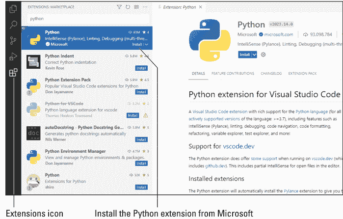

安装完 Python 扩展后，你可能会注意到 Python 和 Pylance 都作为扩展被添加到了 VS Code 中。别担心，这是正常的。Pylance 只是为你提供了一些额外的功能，使你在 VS Code 编辑器中学习和编写 Python 代码更加容易。为确保扩展已激活，请退出 VS Code，然后重新启动它。

## 让 AI 编写你的 Python 代码

现代生成式 AI 完全有能力为你编写 Python 代码。然而，这并不像命令它“写一个能让我成为亿万富翁的 Python 应用”那么简单。目前还做不到那样。不幸的是，你需要将任务分解成更小的部分，并且可能还需要使用准确的技术术语。换句话说，你仍然需要学习足够的 Python 知识，以便能够准确地编写你的 AI 提示词。几乎所有这些提示词——无论你使用哪种 AI 服务——都会以“为……编写 Python 代码”开头，因为 AI 能做很多事情。如果你不明确告诉它你想让它编写 Python 代码，你可能会得到没有代码、HTML、JavaScript 或其他任何东西的结果。所以首先请确保你理解这一点。

截至 2023 年底，生成式 AI 仍然相当新，并且发展迅速。我们无法对定价或可用性做出任何承诺。在未来的几年里，随着竞争企业争夺地位和市场份额，这些情况可能会经常变化。但就本文撰写时而言，你可以提示以下 AI 服务来编写 Python 代码。大多数服务目前是免费的，但同样，我们无法对未来做出任何承诺。

| 服务 | 网址 |
|---|---|
| ChatGPT | chat.openai.com |
| Claude | claude.ai |
| Bard | bard.google.com |
| Copilot | chat.bing.com |

## 使用 GitHub Copilot

GitHub Copilot 是另一个能够为你编写代码的 AI 工具。它基于 OpenAI 的 GPT-4，与 ChatGPT 类似。然而，它专门针对代码编写而设计，并直接集成到 VS Code 中。你当然不是*必须*使用 GitHub Copilot 来学习 Python 或使用本书，但你可能会发现它确实对你的学习过程有帮助。在我撰写本书时，GitHub 正在为学生免费提供 Copilot。它也提供一些付费计划，起价为每月 10 美元。要使用 Copilot，你需要注册 GitHub 并购买（或申请）Copilot 的访问权限。同样，这个工具太新了，我在这里给出的任何说明都可能发生变化。你可能需要在 Google 或 YouTube 上搜索 *在 VS Code 中使用 Copilot* 以找到最新的说明。基本上，以下是它的工作原理：

1. **如果你还没有 GitHub 账户，请前往 GitHub.com 创建一个账户。**

   确保你知道你的 GitHub 用户名和密码，因为你需要它们来设置你的账户。然后只需将 GitHub Copilot 扩展安装到 VS Code 中。它们可以只是普通的编号步骤：

2. **如果 VS Code 尚未打开，请打开它。**

3. 点击左侧栏中的扩展；然后在搜索框中输入 Copilot 以搜索 Copilot。

   会出现一个 Copilot 扩展列表。

4. 点击普通的 GitHub Copilot 扩展（不是“Copilot Labs”或出现的任何其他扩展）右侧的安装按钮，如图 1-2 所示。

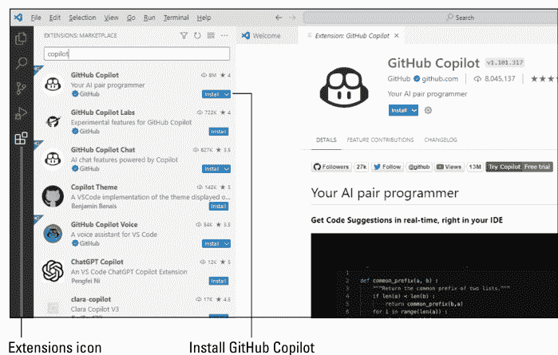

你会在右侧窗格上看到一些说明和提示。不过你现在不需要对它们做任何操作。在 VS Code 的左下角附近，你应该会看到一个账户的头像图标（参见图 1-3）。点击该图标，然后选择“使用 GitHub 登录以使用 GitHub Copilot”。按照屏幕上的说明登录你的 GitHub 账户并设置 Copilot。但请记住：设置 Copilot 账户不是必需的，只是一个选项。所以不要觉得你现在必须完成购买 Copilot 的流程。但如果你确实将 Copilot 添加为扩展，那么每当你在 VS Code 中查看扩展时，你应该能在已安装的扩展下看到它的名称。

另外，在屏幕的右下角附近，你会看到一个微小的 Copilot 图标（也在图 1-3 中显示）。如果你觉得它在学习过程中碍事，可以随时点击该图标来停用 Copilot。当你准备好时，再次点击它即可激活 Copilot。

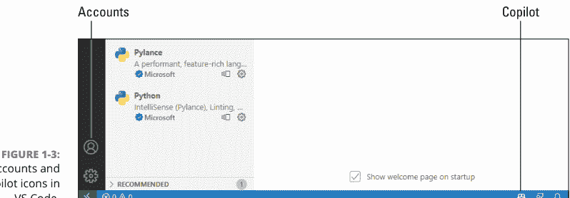

## 使用 Jupyter Notebook 进行编码

Jupyter Notebook 是另一个流行的编写 Python 代码的工具。*Jupyter* 这个名字源于它支持用三种流行语言编写代码：**Julia**、**Python** 和 **R**。Julia 和 R 在数据科学领域很流行。Python 是一种更通用的编程语言，恰好在数据科学领域也很流行，尽管 Python 适用于各种开发，而不仅仅是数据科学。名称中的 *Notebook* 部分源于你的代码被放置在类似于普通纸质笔记本的结构中。

你可以随时在 VS Code 内部使用 Jupyter Notebook。只需安装 Jupyter 扩展。以下是步骤：

1. **如果你已经关闭了 VS Code，现在请打开它。**

2. **点击左侧栏中的扩展图标，在搜索框中输入 Jupyter，然后点击安装按钮以安装来自 Microsoft 的 Jupyter 扩展，如图 1-4 所示。**

你会在右侧的欢迎页面上看到一些关于使用 Jupyter 的说明。但你现在不需要做任何操作。只需记住，任何时候你想创建一个新的 Jupyter Notebook，都可以按照以下步骤操作：

1. **从 VS Code 的菜单栏中选择“视图” ⌘ “命令面板”。**

2. **开始输入 jupy，然后点击“创建：新建 Jupyter Notebook”。**

我们将在下一章深入探讨编写 Python 代码的具体细节。现在，如果你已经完成了本章中安装扩展的所有步骤，VS Code 应该已经准备就绪。如果你在 VS Code 中点击扩展并查看左侧栏，你应该已经安装了 Python 和 Jupyter 扩展，如图 1-5 所示。不过请记住，GitHub Copilot 是可选的，所以不要觉得你现在必须购买它才能学习或使用 Python。

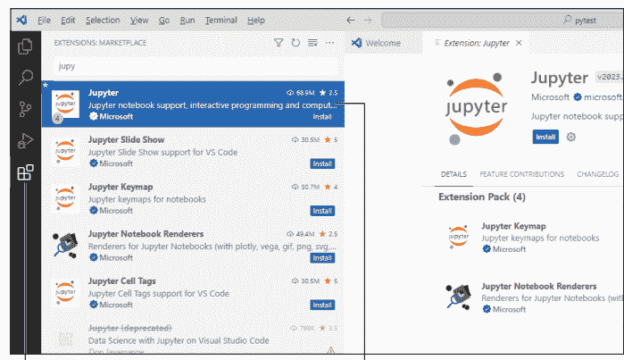

图 1-4：在 VS Code 中安装 Jupyter 扩展。

扩展图标

来自 Microsoft 的 Jupyter

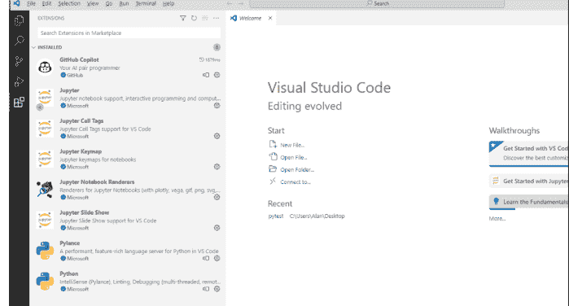

图 1-5：用于 Python 和 Jupyter 的 VS Code 扩展出现在左侧的“已安装”下。

你在本章完成的简单任务将在你的学习过程中，以及在你掌握基础知识后的专业编程中为你提供良好帮助。现在请翻到本迷你书的第 2 章，我们将更深入地探讨 Python 以及你现在计算机上可用的工具。

# 第 2 章

## 使用交互模式、获取帮助和编写应用程序

本章内容

- 使用交互模式
- 创建开发工作区
- 为你的代码创建文件夹
- 输入、编辑和调试代码
- 在 Jupyter Notebook 中编写代码

在你安装了 VS Code（本迷你书第一章涵盖的内容）之后，你就可以开始更深入地学习编写 Python 代码了。在本章中，我们将简要介绍 VS Code 和 Jupyter Notebook 的交互、帮助和代码编辑功能。你可能急于开始学习更高级的主题，如数据科学、人工智能、机器人技术等，但如果你能很好地理解可用的众多工具——以及使用它们的技能，学习这些主题会更容易。

## 使用 Python 的交互模式

获得使用 Python 的实际动手经验的一种方法是开始交互式地输入一些命令。VS Code 中的终端窗格是输入 Python 代码的好地方。所以在本章中，你将从这里开始。

## VS Code 中的颜色与图标

在本书中，我们将 VS Code 终端窗格显示为白底黑字。根据您的设置，您可能会看到其他颜色。不过，您可以使用任何喜欢的配色方案。如果您想切换到本书所示的黑底白字样式，请选择“文件”（Windows）或“Code”（Mac），然后选择“首选项 ⋮ 主题 ⋮ 颜色主题 ⋮ 浅色 (Visual Studio)”。

## 打开终端

要在 VS Code 中交互式地使用 Python，请按照以下步骤操作：

1.  打开 VS Code。
2.  从 VS Code 菜单栏中选择“视图 ⋮ 终端”。
3.  如果窗格顶部的 *Terminal* 一词没有高亮显示或带下划线，请单击“终端”（如图 2-1 中圈出所示）。


您看到的第一个提示符通常是您计算机操作系统的提示符，并且很可能显示您所使用账户的用户名。例如，在 Mac 上，它可能看起来像 `Alans-Air:~ alan$`，但会用您的计算机名称替换 `Alans-Air`。在 Windows 上，它可能显示为 `C:\Users\Alan>`，其中 `Alan` 会被您的用户名替换，并且可能显示与 `C:\Users` 不同的路径。

例如，在 Mac 上，我们看到这个提示符：

```
Alans-Air:~ alan$
```

在 Windows 上，我们看到这个：

```
C:\Users\Alan>
```

根据您的 Windows 版本和当前配置，您可能会看到以下提示符，其中 xxx 是您的用户名：

```
PS C:\Users\xxx>
```

这仅仅意味着您正在使用 PowerShell。您无需更改任何设置。

您会看到您的用户名替代了 Alan，并且可能显示与 C:\Users 不同的路径。

## 获取您的 Python 版本

在操作系统命令提示符下，键入以下内容并按 Enter 键，以查看您正在使用的 Python 版本。请注意第一个连字符前的空格，并且没有其他空格。

```
python --version
```

如果输入该命令后屏幕上显示错误消息，请暂时不要担心。我稍后会告诉您如何修复它。

如果您没有看到错误，您将看到类似 Python 3.x.x 的内容（其中 x 代表您正在使用的 Python 版本的数字）。如果您看到的是这个，那么您没有出错，可以跳过下一部分。

如果您在 Mac 上看到错误，例如“Command Not Found”，请尝试输入以下命令：

```
python3 --version
```

由于某些 Mac OS 版本最初附带的是旧版 Python，因此通常需要使用此命令。因此，在本书中，您需要记住在终端中输入 **python3** 而不是 **python** 作为命令。我会在需要时提醒您。

但是等等。如果您使用的是 Windows，也可能会收到错误消息。根据您的 Windows 版本，您也可能会收到错误消息。但对于这类消息，您可以输入 **py** 而不是 **python** 作为命令，如下所示：

```
py --version
```

## 进入 Python 解释器

无论哪个命令能让您看到 Python 版本，它也会带您进入 Python 解释器，您可以在其中直接输入 Python 代码。当您看到提示符变为三个大于号（>>>）时，您就知道自己进入了正确的位置。现在要进入命令提示符，请输入之前对您有效的 `python` 命令，但不带 `--version`。例如，只输入 **python**（或只输入 **python3**，或只输入 **py**），不要输入其他任何内容；然后按 Enter 键：

```
python
```

当我们或任何其他人说“输入命令”时，意思是您必须键入命令然后按 Enter 键。在按 Enter 键之前，什么都不会发生。因此，如果您只是键入命令然后等待发生什么，您将等待很长很长的时间。您应该会看到一些关于您正在使用的 Python 版本的信息以及 `>>>` 提示符，这代表 Python 解释器。

## 输入命令

在 Python 解释器中输入命令与在其他任何地方输入命令相同。您必须正确键入命令，然后按 Enter 键。如果在命令中拼写错误，您可能会看到错误消息，这只是解释器告诉您它不明白您的意思。但别担心；您不会弄坏任何东西。例如，假设您输入命令

```
howdy
```

按 Enter 键后，您会看到一些技术性的乱码，它试图告诉您解释器不知道“howdy”是什么意思，所以它什么也做不了。什么都没有坏。您只是回到了另一个 `>>>` 提示符，您可以再次尝试，如图 2-2 所示。

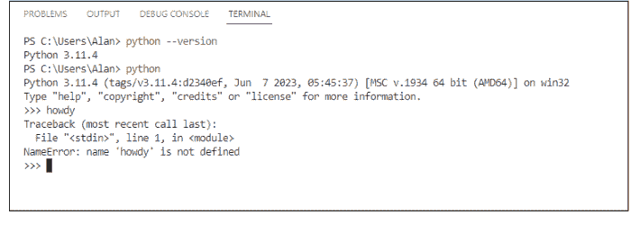

## 使用 Python 的内置帮助

图 2-2 中的一个提示提到，您可以在 Python 解释器中输入 **help** 作为命令。请注意，您不需要输入引号，只需输入 *help* 这个词（然后像往常一样按 Enter 键）。这次您会看到

```
Type help() for interactive help, or help(object) for help about object.
```

现在解释器告诉您输入 **help** 后跟一对空括号，或者输入 **help** 并在括号中指定一个特定的词（*object* 是给出的示例）。确保在键入命令后按 Enter 键。请继续输入以下内容：

```
help()
```

请注意，该行没有空格。按 Enter 键后，屏幕会提供一些关于使用 Python 交互式帮助的信息，类似于图 2-3 所示的示例。

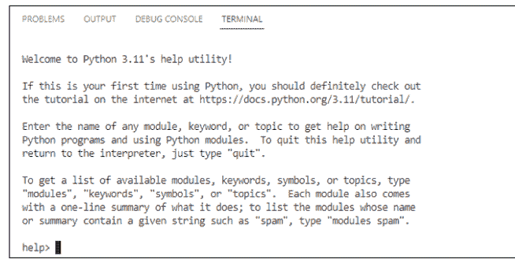

在窗口底部看到 **help>** 告诉您，您不再处于操作系统 shell 或 Python 解释器（始终显示 **>>>**）中，而是进入了一个提供帮助的新区域。如屏幕上所述，您可以输入任何模块、关键字或主题的名称来获取有关该术语的帮助。作为初学者，您可能暂时不需要具体细节的帮助。但知道有帮助可用是件好事。

例如，Python 使用某些在语言中具有特殊含义的关键字。要获取这些关键字的列表，只需在 help> 提示符下输入以下内容：

```
keywords
```

按 Enter 键后，您会看到一个关键字列表，如图 2-4 所示。

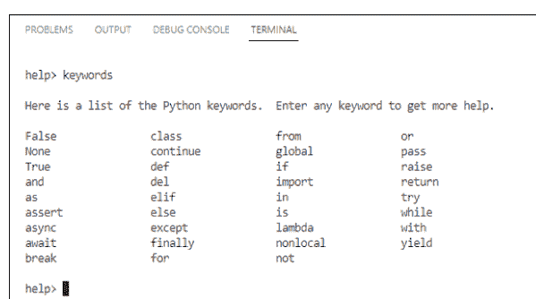

在关键字列表上方有一条消息，告诉您可以在 help> 提示符下输入任何关键字以获取有关该关键字的更多信息。例如，输入 class 关键字会提供有关 Python 类的信息，如图 2-5 所示。这些不是您在学校上的那种课；相反，它们是您在 Python 中创建的那种（在您学习了基础知识并准备进入更高级主题之后）。

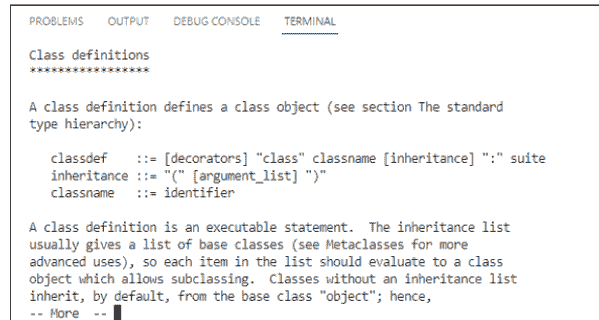

帮助文本中的所有技术术语会让普通初学者感到困惑。但当您学习 Python 中的新概念时，请意识到您可以根据需要使用交互式帮助来获取指导。

> 文本底部的 --- More --- 不是您输入命令的提示符。相反，它只是让您知道还有更多文本，可能有好几页。按空格键或 Enter 键查看。每次看到 --- More --- 时，您都可以按空格键或 Enter 键转到下一页。最终您会回到 help> 提示符。如果您想退出而不是继续滚动，请按 Q 键。

## 退出交互式帮助

要离开 Python 提示符并返回操作系统，请输入 **exit()** 并按 Enter 键。请注意，如果您犯了错误，例如忘记输入括号，您会在屏幕上得到一些帮助。例如，如果您输入 **exit** 并按 Enter 键，您会看到

```
Use exit() or Ctrl-Z plus Return to exit.
```

> 不要被按键组合的“Ctrl-Z”与“Ctrl+Z”搞混；它们的意思是一样的。

当您在终端窗格末尾看到操作系统提示符而不是 >>> 时，您就知道已经退出了 Python 解释器，如图 2-6 所示。

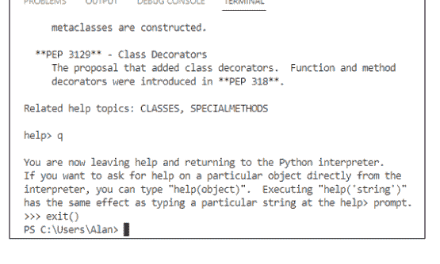

## 在线搜索特定帮助主题

当您确切知道要查找的术语和概念时，Python 的内置帮助非常有用。但这对于初学者来说通常很难。当您在线时，最好在网上搜索帮助。如果您在寻找视频，请从 www.youtube.com 开始；如果不是，https://stackoverflow.com 是一个提问和搜索帮助的好地方。当然，还有 Google、Bing 和其他搜索引擎。


无论您使用什么进行搜索，请记住以 *python* 这个词开始您的搜索。许多编程语言共享类似的概念和关键字，因此如果您在搜索请求中没有指定 Python 语言，您可能会得到各种各样的结果。

## 大量免费速查表

对学习者来说，另一个很好的资源是网上无数免费的速查表。每当您开始对像 Python 这样一门语言的所有可能性感到不知所措时，一张将内容总结在一页左右的速查表可以帮助将信息量减少到更易于管理（且不那么令人生畏）的程度。

当然，使用速查表并不算真正的作弊，除非您在应该凭记忆回答的考试中使用它。但在现实生活中编写代码与回答选择题有很大不同。因此，我们在技术领域常说的 *cheat sheet*（速查表）只是帮助人们学习的另一种工具。有许多类型的速查表可用；吸引您的类型取决于您的学习风格。要查看有哪些可用，请前往 Google、Bing 或您喜欢的任何搜索引擎，搜索 *free python cheat sheet*。大多数都是您可以下载、打印并在学习 Python 编码看似无限可能性时随时查阅的格式。

## 为您的 Python 代码创建文件夹

在本节中，您将创建一个文件夹来存储您在本书中编写的所有 Python 代码，以便将它们全部放在一个地方，并在需要时易于找到。您可以将此文件夹放在任何您喜欢的地方，并以任何您喜欢的名称命名。

在 Windows 中，您可以导航到将包含新文件夹的文件夹。（Alan 使用 OneDrive，但您可以使用桌面、文档或任何其他文件夹。）右键单击文件夹中的空白处，然后选择“新建文件夹”（Mac）或“新建文件夹”（Windows）。键入文件夹名称并按 Enter 键。要跟随本章中的示例操作，请将您的文件夹命名为 AIO Python。

## 输入、编辑与调试 Python 代码

你很可能会在编辑器中编写绝大部分代码。正如你可能知道的，*编辑器*允许你输入和编辑文本。代码就是文本。VS Code 中的编辑器是为输入和编辑代码而设置的，因此你可能会听到它被称为*代码编辑器*。

由于人们倾向于将代码组织到文件夹中（正如我们建议你为本章示例所做的那样），你的第一步是在编辑器中打开包含代码的文件夹。有几种方法可以做到这一点。如果是第一次操作，请按照以下步骤进行：

1.  在 Windows 上使用“开始”菜单或在 Mac 上使用“启动台”打开 VS Code。
2.  从 VS Code 的菜单栏中点击“文件” > “打开文件夹”，导航到文件夹的位置，点击要打开的文件夹名称，然后点击“选择文件夹”。

当前打开的文件夹名称会显示在 VS Code 窗口左侧的“资源管理器”窗格顶部附近（参见图 2-7）。

> 你创建的每个 Python 代码文件都将是一个带有 `.py` 文件扩展名的纯文本文件。我们建议你将为本书创建的所有文件保存在那个 AIO Python 文件夹中（如何创建该文件夹请参阅上一节）。只要 VS Code 和你的 Python 3 工作区处于打开状态，你应该随时都能看到你的 AIO Python 文件夹。

要随时创建 `.py` 文件，请按照以下步骤操作：

1.  如果尚未打开，请打开 VS Code 和你的 AIO Python 文件夹。
2.  如果“资源管理器”窗格未打开，请点击 VS Code 左上角附近的“资源管理器”图标。
3.  要在你的 AIO Python 文件夹中创建文件，请点击文件夹名称右侧的“新建文件”，如图 2-7 所示。
4.  输入带有 `.py` 扩展名的文件名（第一个文件可以是 `hello.py`），然后按 Enter 键。

新文件会打开，你可以在右侧的选项卡中看到它的名称。选项卡下方较大的区域是编辑器，你可以在其中输入 Python 代码。文件名也会出现在“资源管理器”窗格中 AIO Python 文件夹名称下方，因为文件就存储在那里。

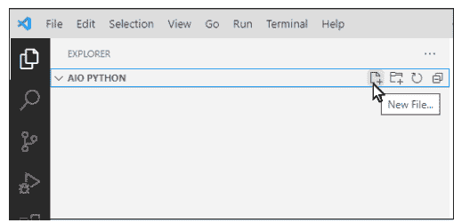

## 编写 Python 代码

现在你已经打开了一个 .py 文件，可以用它来编写一些 Python 代码了。就像学习一门新的编程语言时通常做的那样，你将从输入一个简单的 Hello World 程序开始。以下是步骤：

1.  在编辑区域中，点击第 1 行的右侧。
2.  输入以下内容：
    ```python
    print("Hello World")
    ```
    在输入时，你可能会注意到屏幕上出现了一些文本。这些文本是 *IntelliSense* 文本，它会检测你正在输入的内容，并显示有关该关键字的一些信息。你看到的信息量取决于你是否在使用 GitHub Copilot。但你不必对此做任何处理——只需继续输入即可。
3.  输入完该行后，按 Enter 键。

新的代码行会显示在屏幕上。你可能还会注意到一些其他变化，如图 2-8 所示：

*   “资源管理器”图标上出现了一个点，或者可能是一个带圈的 1，表示你当前有一个未保存的更改。
*   选项卡中的 hello.py 名称显示一个点，表示该文件有未保存的更改。

## 保存你的代码

你在 VS Code 中输入的代码不会自动保存。有两种处理方法。一种是尝试记住在每次做出值得保存的更改时都保存它。最简单的方法是从 VS Code 的菜单栏中选择“文件” > “保存”，或者在 Windows 上按 Ctrl+S，在 Mac 上按 ⌘+S。

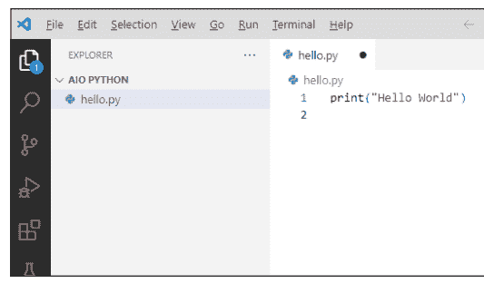

我们更喜欢第二种方法，即使用“自动保存”来自动保存我们所做的更改。要启用“自动保存”，请从 VS Code 的菜单栏中选择“文件” > “自动保存”。下次打开“文件”菜单时，你会在“自动保存”旁边看到一个复选标记，这表示“自动保存”已开启。要关闭“自动保存”，只需再次选择“文件” > “自动保存”。文件会在你进行更改时自动保存。

## 在 VS Code 中运行 Python

要在 VS Code 中测试你的 Python 代码，你需要运行它。最简单的运行方法是右键单击文件名（本例中为 `hello.py`），然后选择“在终端中运行 Python 文件”，如图 2-9 所示。

如果提示你选择 Python 解释器，只需选择你在 Book 1, Chapter 1 中下载并安装的那个。通常，它会被标记为“推荐”。如果遇到困难，请从 VS Code 的菜单栏中选择“视图” > “命令面板”。输入 **python**，然后点击“Python: 选择解释器”。选择“推荐”选项。然后按照上一段所述再次尝试运行 `hello.py`。

“终端”窗格会沿着 VS Code 窗口的底部打开。你会看到一个命令提示符，后面跟着一条注释，用于在 Python 解释器（`python.exe`）中运行代码。在那下面，你会看到程序的输出：在本例中是 *Hello World* 这几个词，然后是另一个提示符，如图 2-10 所示。这个应用程序并不是世界上最令人兴奋的，但至少现在你知道如何在 VS Code 中编写、保存和执行一个 Python 程序了，这是一项你在继续学习本书以及整个 Python 编程生涯中会经常用到的技能。

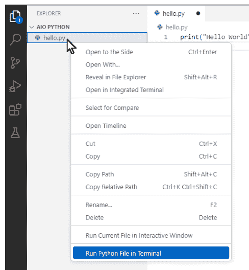

图 2-9：运行 hello.py。

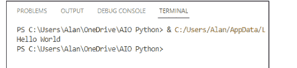

图 2-10：hello.py 的输出。

## 学习简单的调试

当你刚开始学习编写代码时，你肯定会犯很多错误。要明白错误没什么大不了的——你不会破坏或摧毁任何东西。代码只是无法按预期工作。

在你尝试运行代码之前，你可能会看到屏幕上显示的几个错误指示：

*   文件中的错误数量会以红色显示在屏幕左侧“资源管理器”窗格中的文件名旁边。
*   错误或警告的总数会显示在 VS Code 应用程序窗口的左下角附近。
*   错误的代码会有一条波浪形下划线。

在图 2-11 中，我们输入了全大写的 PRINT，这在 Python 中是不允许的。Python 区分大小写，正确的命令是全小写字母：`print`。请记住，当我们显示要输入的小写命令时，你也必须输入小写。

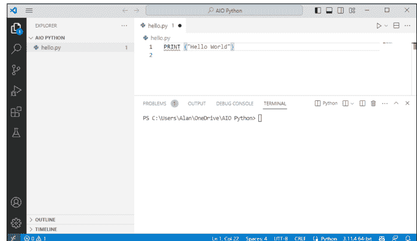

要在终端中运行文件，你必须修复错误。在图 2-11 所示的示例中，我们只需将 `PRINT` 替换为 `print`，然后保存更改（除非我们已经开启了“自动保存”）。然后我们可以右键单击并选择“在终端中运行 Python 文件”来运行更正后的代码。

## 关闭文件

当你在 VS Code 中完成对特定程序或文件的操作后，可以轻松地关闭它。只需点击其选项卡中文件名旁边的 X，或者选择“文件” > “关闭编辑器”。只要“资源管理器”窗格处于打开状态，文件名仍然会显示在 VS Code 窗口左侧的“资源管理器”窗格中。只需点击文件名，即可随时在编辑器中重新打开该文件。

## 在 Jupyter Notebook 中编写代码

在本小册的第 1 章中，你了解到可以在 Jupyter notebook 中编写和运行 Python 代码。在本节中，我们将向你展示如何创建、保存和打开一个 Jupyter notebook。在我们的示例中，我们在 AIO Python 文件夹内创建了一个名为 `Jupyter Notebooks` 的子文件夹。当然，你可以使用任何你想要的文件名，将你的 Jupyter notebook 保存在任何你想要的地方。

## 为 Jupyter Notebooks 创建文件夹

Jupyter Notebooks 文件夹与任何其他文件夹没有区别，因此你可以使用你在操作系统中通常使用的任何方法来创建它。我们将它放在我们创建的 AIO Python 文件夹中，再次只是为了将本书的所有文件保存在一个地方：

1.  在 Finder (Mac) 或资源管理器 (Windows) 中打开你的 AIO Python 文件夹（或你为处理本书文件而创建的任何文件夹）。
2.  右键单击该文件夹中的空白区域，然后选择“新建” > “文件夹” (Windows) 或“新建文件夹” (Mac)。
3.  输入 Jupyter Notebooks 作为文件夹名称，然后按 Enter 键。

现在你有了一个用于保存 Jupyter notebooks 的文件夹，接下来你可以创建一个 notebook 了。

## 创建并保存 Jupyter notebook

你可以在 Visual Studio 中创建 Jupyter notebooks，以及运行它们的代码。如果你在 AIO Python 文件夹中创建了 Jupyter Notebooks 文件夹（参见上一节），那么现在只要你在 VS Code 中打开了 AIO Python 文件夹，你应该就能在 VS Code 的“资源管理器”窗格中看到该文件夹名称。如果你确实创建了该文件夹但在 VS Code 中没有看到它，请尝试点击“资源管理器”窗格顶部 AIO PYTHON 文件夹名称（全部大写显示）右侧的“刷新资源管理器”图标（一个圆形箭头）。

要创建一个 Jupyter notebook 并将其保存在文件夹中，请按照以下步骤操作：

1.  打开 VS Code（如果尚未打开）。
2.  在“资源管理器”窗格中点击 Jupyter Notebooks 图标，点击其上方的“新建文件”加号 (+)，然后输入 01 Notebook.ipynb 作为文件名。

> 为了使文件被识别为 Jupyter Notebook，正确输入文件扩展名——.ipynb——非常重要。

输入文件名并按 Enter 键后，该文件将在右侧的编辑器中作为 Jupyter Notebook 打开，如图 2-12 所示。


## 在笔记本中输入和运行代码

当你的笔记本打开时，你至少会看到一个单元格。你可能还会注意到 + Code 和 + Markdown 选项。点击 Code 会打开一个全新的 *代码单元格*，这是一个可以执行 Python 代码的单元格。它的左上角附近总有一个指向右侧的三角形，你可以用它来运行放入该单元格的任何 Python 代码。现在，你应该能看到一个代码单元格，你可以用它来输入和运行一些 Python 代码。你可以按照以下步骤试用一下：

1.  **点击三角形右侧的代码单元格，并输入以下代码：**

    ```python
    print("Hello World")
    ```

    不要忘记单词 *print* 使用小写字母。

2.  **要运行代码，只需点击运行按钮（代码左侧指向右侧的三角形）或代码上方的“全部运行”按钮，如图 2-13 所示。**

假设你的代码没有错误，Python 程序的输出（单词 *Hello World*）应该会出现在 Jupyter 笔记本中代码的正下方。如果提示选择 Python 解释器，只需选择你上次下载的那个（通常显示为“推荐”选项），并安装它建议的任何所需扩展。

你创建的每个笔记本都将是它自己的文件。你可以像关闭 .py 文件一样关闭笔记本。点击笔记本文件名旁边选项卡上的 X，或从菜单栏中选择“文件” > “关闭编辑器”。要重新打开笔记本，请在资源管理器窗格中点击其文件名。

这应该足以让你准备好在计算机上学习和运行 Python。我不会在这里花太多时间介绍 VS Code 或 Jupyter Notebooks，因为它们本身并不是 Python。它们是许多语言的程序员使用的工具。YouTube 和其他地方有许多关于如何将 VS Code 和 Jupyter Notebooks 与 Python 一起使用的免费教程。因此，在学习 Python 语言的同时，你可以根据方便从这些其他资源中学习你能学到的东西。现在，让我们进入第 3 章，深入探讨它。

# 第 3 章
Python 元素和语法

许多编程语言关注的是计算机做什么以及如何做，而不是人类的思考和工作方式。这个简单的事实使得大多数编程语言对大多数人来说都很难学习。然而，Python 的理念是，编程语言应该更多地面向人类的思考、工作和交流方式，而不是计算机内部发生的事情。Python 之禅就是这种以人为本导向的完美例子，所以我们从这个主题开始本章。

## Python 之禅

*Python 之禅*，如图 3-1 所示，是 Python 语言设计的指导原则列表。这些原则隐藏在一个 *彩蛋* 中，彩蛋是指编程语言或应用程序中不容易发现的东西，对于那些已经学习了足够多的语言或应用程序知识从而能够找到彩蛋的人来说，它是一个内部笑话。要找到彩蛋，请按照以下步骤操作：

1.  以通常的方式在你的计算机上打开 VS Code（在 Mac 上通过 Launchpad，在 Windows 上通过“开始”菜单），然后打开你的 AIO Python 文件夹。
2.  如果终端窗格未打开，请从 VS Code 菜单栏中选择“视图” > “终端”。
3.  输入 `python` 并按 Enter 键以获取 Python 提示符 (>>>)。如果出现错误，在 Mac 上输入 `python3`，或在 Windows 上输入 `py`。
4.  在 >>> 提示符下，输入 `import this` 并按 Enter 键。

格言列表出现了。你可能需要上下滚动或使终端窗格更高才能看到全部内容。这些格言在哲学修辞上有些半开玩笑，但它们表达的总体思想是始终努力使代码更易于人类阅读，而不是机器阅读。

Python 之禅有时被称为 *PEP 20*，其中 *PEP* 是 *Python 增强提案* 的缩写。20 可能指的是 20 条 Python 之禅原则，其中只有 19 条被记录下来。我们都可以去思考或编造我们自己的最后一条原则。

还有许多其他的 PEP，你可以在 Python.org 网站 https://python.org/dev/peps 上找到它们。你最常听说的可能是 PEP 8，即 *Python 代码风格指南*。PEP 8 的指导原则是“可读性很重要”——即人类可读。诚然，当你刚开始学习 Python 代码时，大多数其他人的代码看起来就像外星人乱涂乱画的胡言乱语，你可能完全不知道它的意思或作用。但随着你对该语言经验的积累，风格的一致性将变得更加明显，你会发现阅读和理解其他人的代码越来越容易，这是学习编码的绝佳方式。

> 记住

我们将在整本书中向你介绍 Python 编码风格。在实践之前阅读它肯定会让你无聊到流泪。所以现在，每当你听到 PEP，尤其是 PEP 8 的提及时，请记住它指的是 Python.org 网站上的 Python 编码风格指南，你可以随时通过网络搜索 pep 8 来找到它。

## 面向对象编程简介

冒着过于技术化或计算机科学化的风险，我们应该提到设计语言有不同的方法。也许最成功和最广泛使用的模型是 *面向对象编程*，或 OOP，这是一种试图模仿现实世界的设计哲学，因为它由具有属性以及这些对象执行的方法（动作）的对象组成。

以汽车为例。任何一辆汽车都是一个对象。并非所有的汽车都完全相同。不同的汽车具有不同的属性，例如品牌、型号、年份、颜色和尺寸，这些使它们彼此不同。然而，它们都服务于相同的基本目的：将我们从 A 点带到 B 点，而无需步行或使用其他交通方式。

所有汽车都有某些共同的方法（它们能做的事情）。你可以驾驶它们、转向它们、加速、减速、控制内部温度等等，通过使用你可以用手操作的汽车内的控件。

面向对象编程语言中的 *对象* 不是像汽车这样的物理实体，因为它只存在于计算机内部。对象严格来说是软件实体。在 Python 中，你可以拥有一个 *类*（你可以将其视为对象创建者，例如汽车工厂），它可以为不同的目的（运动型、越野型、轿车）生产许多不同种类的对象（汽车）。所有这些对象都可以通过它们共同拥有的控件进行操作，就像所有汽车都通过方向盘、刹车、油门和换挡器等控件进行操作一样。

Python 是一种非常面向对象的语言。核心语言由控件（以单词形式）组成，允许你控制你自己和他人程序中的各种对象。然而，你需要先学习核心语言，这样当你准备好开始使用其他人的对象时，你就知道如何操作了。同样，在你知道如何驾驶一辆汽车后，你基本上就知道如何驾驶所有汽车了。你不必担心租了一辆车，结果发现油门在车顶上，方向盘在地板上，而且你必须使用语音命令而不是刹车来减速。驾驶的基本技能适用于所有汽车。

## 发现缩进为何如此重要

在编写代码的基本风格方面，真正使 Python 与许多其他语言不同的一个特点是它使用缩进而不是括号和花括号等来表示代码块或代码段。我们不假设你熟悉其他语言，所以如果这句话对你来说毫无意义，请不要担心。但如果你熟悉像 JavaScript 这样的语言，你就知道你必须费力地处理括号之类的东西来控制什么包含什么。

例如，这里有一些 JavaScript 代码。如果你熟悉神奇 8 球玩具，你可能对这个程序的功能有所了解。但这并不是重点。只需注意所有那些括号、花括号和分号：

```javascript
document.addEventListener("DOMContentLoaded", function () {
  var question = prompt("Ask magic 8 ball a question");
  var answer = Math.floor(Math.random() * 8) + 1;
  if (answer == 1) {
    alert("It is certain");
  } else if (answer == 2) {
    alert("Outlook good");
  } else if (answer == 3) {
    alert("You may rely on it");
  } else if (answer == 4) {
    alert("Ask again later");
  } else if (answer == 5) {
    alert("Concentrate and ask again");
  } else if (answer == 6) {
    alert("Reply hazy, try again");
  } else if (answer == 7) {
    alert("My reply is no");
  } else if (answer == 8) {
    alert("My sources say no");
  } else {
    alert("That's not a question");
  }
  alert("The end");
});
```

这段代码很乱，读起来不有趣。我们可以通过将其分成多行并缩进其中一些行来使阅读稍微容易一些。（注意，在 JavaScript 中这样做不是必需的。）以下是重新格式化的代码：

```javascript
document.addEventListener("DOMContentLoaded", function () {
    var question = prompt("Ask magic 8 ball a question");
    var answer = Math.floor(Math.random() * 8) + 1;
    if (answer == 1) {
        alert("It is certain");
    } else if (answer == 2) {
        alert("Outlook good");
    } else if (answer == 3) {
        alert("You may rely on it");
    } else if (answer == 4) {
        alert("Ask again later");
    } else if (answer == 5) {
        alert("Concentrate and ask again");
    } else if (answer == 6) {
        alert("Reply hazy, try again");
    } else if (answer == 7) {
        alert("My reply is no");
    } else if (answer == 8) {
        alert("My sources say no")
    } else {
        alert("That's not a question");
    }
    alert("The end");
})
```

在 JavaScript 中，圆括号和花括号是必需的，因为它们标识了代码块的开始和结束。为了可读性而添加的缩进则是可选的。

Python 的规则恰恰相反，因为它不使用花括号或任何其他特殊字符来标记代码块的开始和结束。缩进本身就起到了这个作用。因此，这些缩进不是可选的——它们是必需的，并且对代码的运行方式有相当大的影响。结果就是，当你阅读代码时（作为人类，而不是计算机），相对容易看出代码在做什么，而且你不会被大量额外的引号分散注意力。下面是用 Python 编写的那段 JavaScript 代码：

```python
import random
question = input("Ask magic 8 ball a question")
answer = random.randint(1, 8)
if answer == 1:
    print("It is certain")
elif answer == 2:
    print("Outlook good")
elif answer == 3:
    print("You may rely on it")
elif answer == 4:
    print("Ask again later")
elif answer == 5:
    print("Concentrate and ask again")
elif answer == 6:
    print("Reply hazy, try again")
elif answer == 7:
    print("My reply is no")
elif answer == 8:
    print("My sources say no")
else:
    print("That's not a question")
print("The end")
```

你可能已经注意到 Python 代码顶部以 `import` 开头的那一行。以 `import` 开头的行在 Python 中很常见，你将在下一节中了解原因。

## 使用 Python 模块

Python 成功的秘诀之一在于它由一个简单、清晰的核心语言组成。这是你需要首先学习的部分。除了这个核心语言之外，还有许多许多模块可供你免费获取并在自己的代码中使用。这些模块也是用核心语言编写的，但你不需要查看甚至知道这一点，因为你可以从基本的核心语言中访问模块的所有功能。

大多数模块都用于某些特定应用，例如科学、人工智能、处理日期和时间，或者……任何其他用途。使用模块的美妙之处在于，其他人已经花费了大量时间来创建、测试和微调该模块，这样你就不必自己做了。你只需将模块导入到自己的 Python 文件中，然后按照模块文档中的说明使用模块的功能。

上一节中的示例 Magic 8 Ball 程序以这一行开始：

```python
import random
```

Python 核心语言本身没有内置生成随机数的功能。虽然我们可以想办法制作一个随机数生成器，但我们不需要这样做，因为有人已经想出了如何做到这一点，并且使代码可以自由使用。以 `import random` 开始你的程序，告诉程序你想使用随机数模块的功能来生成一个随机数。然后，在程序的后面，你用这行代码生成一个 1 到 8 之间的随机数：

```python
answer = random.randint(1, 8)
```

## 理解导入模块的语法

如前所述，在你自己的 Python 代码中，你必须在访问模块功能之前导入该模块。这样做的语法是

```
import modulename [as alias]
```

以这种通用格式编写的代码，其中一些部分用斜体表示，一些部分用方括号括起来，有时被称为*语法图表*，因为它没有向你展示要输入的字面内容。相反，它展示了代码的语法（格式）。以下是此类语法图表中信息的呈现方式：

+   » 代码区分大小写，这意味着你必须使用全小写字母输入 **import** 和 **as**，如图所示。
» 任何斜体内容都是你应该在自己的代码中提供的信息的占位符。例如，在你的代码中，你会用你想导入的模块的名称替换 *modulename*。
» 任何方括号中的内容都是可选的，因此你可以输入带有或不带有方括号部分的命令。


你可以在任何输入 Python 代码的地方输入 `import` 行：在 Python 命令提示符 (>>>)、在 .py 文件中，或在 Jupyter notebook 中。在 .py 文件中，始终将 `import` 语句放在最前面，以便它们的功能可供代码的其余部分使用。

## 为模块使用别名

正如你刚刚看到的 `import` 命令的语法，你可以为导入的任何模块分配一个*别名*或昵称，只需在模块名称后跟一个空格、单词 `as` 和你自己选择的名称即可。


大多数人使用一个易于输入和记忆的短名称，这样他们就不必每次想访问模块功能时都输入一个长名称。

例如，你可以导入 `random` 模块并给它一个像 `rnd` 这样的昵称，这比 `random` 更短：

```python
import random as rnd
```

然后，在后续代码中，你不会使用全名 `random` 来引用该模块。相反，你会使用短名称 `rnd`：

```python
answer = rnd.randint(1, 8)
```

在这个简短的例子中，使用替代的短名称可能看起来没什么大不了的。但有些模块名称很长，你可能需要在代码的许多地方引用这些模块。

既然你已经学到了一些背景知识，是时候应用它们并开始亲自动手编写一些真正的 Python 代码了。下一章见。

## 本章内容
- 打开 Python 文件
- 使用 Python 注释
- 理解 Python 中的数据类型
- 使用 Python 运算符进行工作
- 创建变量
- 理解语法
- 组织代码

# 第 4 章
## 构建你的第一个 Python 应用程序

所以你想用 Python 构建一个应用程序？无论你是想编写一个网站、分析数据，还是创建一个脚本来自动化某些事情，本章都为你提供了开始旅程所需的基础知识。大多数人使用像 Python 这样的编程语言来创建*应用程序*，这些程序通常被称为*应用*、*apps* 或 *programs*。要创建应用，你需要知道如何在代码编辑器中编写代码。你还需要开始学习你将用来创建这些应用的语言（在本书中是 Python）。

像任何语言一样，你需要理解单个单词，以便开始构建句子，最后是使你的应用能够工作的代码块。首先，我们将引导你创建一个应用文件，你将在其中创建你的代码。然后你将学习各种数据类型、运算符和变量，这些是 Python 语言的单词，然后是 Python 语法。在此过程中，你将了解如何保存你的应用，以及如何为你的代码添加注释，以便你和其他人能够理解你是如何构建它的以及为什么这样构建。

你准备好了吗？

## 打开 Python 应用文件

在本书中，你将使用广受欢迎的 Visual Studio Code (VS Code) 编辑器来学习 Python 并创建 Python 应用。我们假设你已经按照本迷你书前面章节的描述设置好了学习和开发环境，并且知道如何打开 VS Code。要跟随本章操作，请从以下步骤开始：

1.  **在 Mac 上使用 Launchpad 或在 Windows 中使用“开始”菜单打开 VS Code，然后选择“文件” > “打开文件夹”或使用 VS Code 中的资源管理器窗格打开你在 Book 1, Chapter 1 中创建的 AIO Python 文件夹。**

    你可能会注意到你的其他文件中有一个名为 .vscode 的新文件夹。别担心；这只是 VS Code 使用的信息，你现在可以忽略它。

2.  **如果你已经按照 Book 1, Chapter 2 中的描述创建了 hello.py 文件，请单击它；否则，现在创建它，然后返回此处。**

3.  **选择第一行上的所有文本并将其删除，以便你可以从头开始。**

此时，hello.py 应该在编辑器中打开，如图 4-1 所示。如果打开了任何其他选项卡，请通过单击每个选项卡上的 X 将其关闭。

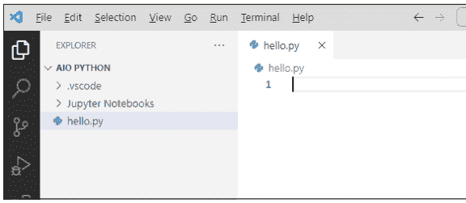

## 输入和使用 Python 注释

在输入任何代码之前，先从程序员的注释开始。*程序员注释*（通常简称为*注释*）是程序中不起任何作用的文本。这就引出了一个问题：“如果它不*做*任何事情，为什么还要输入它？”作为学习者，你可以在代码中使用注释作为给自己关于代码正在做什么的笔记。当你刚开始学习时，这些注释可以提供很大帮助。

然而，代码中的注释并非严格只针对初学者。在团队协作中，专业人士经常使用注释向团队成员解释他们的代码功能。开发者也会在代码中添加注释作为自己的备忘录，这样如果将来回顾代码时，他们可以参考自己的注释来提醒自己当初为何在代码中执行某些操作。由于注释不是代码，你的措辞可以随心所欲。但是，要被识别为注释，你必须执行以下操作之一：

-   以井号（#）开头
-   将文本用三重引号（""" 或 '''）括起来

如果注释很短（一行），开头的井号就足够了。通常你会看到井号后跟一个空格，如下面的例子所示，但空格是可选的：

```
### This is a Python comment
```

要在你自己的代码中输入Python注释：

1.  在VS Code中，点击hello.py标签页下数字1的旁边，然后输入以下内容：
    # This is a Python comment in my first Python app.
2.  按Enter键。

你输入的注释将出现在第1行，如图4-2所示。如果你使用的是默认颜色主题，注释文本将显示为绿色。


虽然你暂时还不会使用多行注释，但要知道在Python中可以通过将它们括在三重引号中来输入更长的注释。这些较大的注释有时被称为*文档字符串*，通常出现在Python模块、函数、类或方法定义的顶部，这些是你在第2册中会发现的应用构建块。现在不需要输入一个，但这里有一个在Python代码中可能的样子示例：

```
"""This is a multiline comment in Python
This type of comment is sometimes called a docstring.
A docstring starts with three double-quotation marks, and also ends with
three double quotation marks. """
```

在注释的开头和结尾，如果你愿意，可以使用三个单引号，而不是三个双引号。

在VS Code中，注释通常用与代码不同的颜色显示。以#开头的短注释是绿色的，文档字符串是棕色的，以帮助它们从你运行的Python代码中脱颖而出。

你的代码中可以有无限数量的注释。如果你在输入注释后等待某些事情发生……别等了。当你在像这样的编辑器中工作时，代码在运行之前不会做任何事情。而现在，我们只有一个注释，所以即使我们运行这段代码，也不会发生任何事情，因为注释是给人类读者看的，而不是给计算机看的。在你开始输入代码之前，你需要从最基础的内容开始，那就是……

## 理解Python数据类型

你一直在处理书面信息，可能没有考虑过数字和文本之间的区别。数字是数量，比如10或123.45。文本由字母和单词组成。对于计算机来说，最大的区别在于它们可以对数字进行算术运算（加、减、乘、除），但不能对字母和单词进行运算。

例如，每个人都知道1+1 = 2。同样的规则不适用于字母和单词。表达式A+A不一定等于B或AA或其他任何东西，因为与数字不同，字母和单词不是数量。你可以在商店买12个苹果，因为12是一个数量，一个数字。你不能买一个“浮潜”苹果，因为“浮潜”是一个东西——它不是一个数量、一个数字或一个标量值。

## 数字

Python中的数字必须以数字（0-9）、点（句点，即小数点）或连字符（-）开头，连字符用作负数的负号。一个数字只能包含一个小数点。它不应包含字母、空格、美元符号或任何不属于正常数字的部分。表4-1展示了正确和错误的Python数字示例。

### 表4-1 正确和错误的Python数字示例

| 数字 | 正确还是错误？ | 原因 |
|---|---|---|
| 1 | 正确 | 一个整数 |
| 1.1 | 正确 | 一个带小数点的数字 |
| 1234567.89 | 正确 | 一个带小数点且没有逗号的大数字 |
| -2 | 正确 | 一个负数，由开头的连字符表示 |
| .99 | 正确 | 一个以小数点开头的数字，因为它小于1 |
| $1.99 | 错误 | 包含一个$ |
| 12,345.67 | 错误 | 包含一个逗号 |
| 1101 3232 | 错误 | 包含一个空格 |
| 91740-3384 | 错误 | 包含一个连字符 |
| 123-45-6789 | 错误 | 包含两个连字符 |
| 123 Oak Tree Lane | 错误 | 包含空格和单词 |
| (267)555-1234 | 错误 | 包含括号和连字符 |
| 127.0.0.1 | 错误 | 只允许一个小数点 |

> 如果你担心数字规则会让你无法处理美元金额、邮政编码、地址或其他任何东西，别担心。你可以存储和处理*所有*类型的信息，你很快就会看到。

> 你使用的绝大多数数字可能都符合前四个正确数字示例中的一个。但是，如果你碰巧在查看用于更高级科学或数学应用的代码，你可能会偶尔看到包含字母*e*或字母*j*的数字。这是因为Python支持三种不同类型的数字，如后续章节所讨论。

## 整数

*整数*是任何正整数或负整数。它的大小没有限制。像0、-1和9999999999999999这样的数字都是完全有效的整数。从你的角度来看，整数就是任何不包含小数点的有效数字。

## 浮点数

*浮点数*，通常称为*浮点数*，是任何包含小数点的有效数字。同样，没有大小限制：1.1、-1.1和123456.789012345都是完全有效的浮点数。

如果你处理非常大的科学数字，你可以在数字中放入*e*来表示10的幂。例如，234e1000是一个有效的数字，即使没有小数点也会被视为浮点数。如果你熟悉科学计数法，你知道234e3是234,000（将e3替换为三个零）。如果你不熟悉科学计数法，别担心。如果你现在在日常工作中不使用它，那么在Python中你可能永远不需要它。

如果你不熟悉巨大的数字，**234e1000**表示**234 x 10<sup>1000</sup>**（字母*e*表示“指数”）。另外，输入大于999的数字时，永远不要包含逗号。例如，1000是正确的，但1,000不行。同样，100000可以表示一百万，但1,000,000会因为逗号而失败。

## 复数

几乎任何类型的数字都可以表示为整数或浮点数，因此熟悉这些对几乎所有人来说就足够了。不过请注意，Python也支持*复数*。这些奇特的小家伙总是以字母*j*结尾，这是数字的*虚部*。如果你完全不知道我们在说什么，你是正常的——只有深陷数学领域的人才会关心复数。如果你以前从未听说过它们，那么在你的计算机工作或Python编程中你可能不会用到它们。但如果你看到类似z = 2+3j这样的东西，3后面的*j*表示3被视为虚部。

## 单词（字符串）

字符串在某种程度上是数字的对立面。对于数字，你可以进行加、减、乘、除运算，因为数字代表数量。字符串则用于几乎所有其他内容。一个名字、地址或你每天看到的某种文本在Python（以及一般的计算机中）都是一个字符串。它被称为*字符串*，因为它是一串字符（字母、空格、标点符号，可能还有一些数字）。对我们来说，字符串通常有一些意义，比如一个人的名字或地址。但计算机没有眼睛去看，没有大脑去思考，也没有任何人类存在的意识，所以对计算机来说，如果一条信息不是它可以进行算术运算的东西，它就只是一串字符。

与数字不同，字符串必须始终用引号括起来。你可以使用双引号（" "）或单引号（' '）。以下所有都是有效的字符串：

```
"Hi there, I am a string"
'Hello world'
"123 Oak Tree Lane"
```

"(267)555-1234"
"18901-3384"

请注意，在字符串中使用数字字符（0-9）以及连字符和点（句点）是完全可以的。由于它们被引号包围，所以每个仍然是一个字符串。


需要提醒的是：如果字符串包含撇号（单引号），整个字符串应该用双引号括起来，像这样：

```
"Mary's dog said Woof"
```

使用双引号是必要的，以避免对字符串的起始和结束位置产生混淆。如果你改用单引号，像这样：

```
'Mary's dog said Woof'
```

计算机会笨到无法正确处理。它会将第一个单引号视为字符串的开始，下一个（在 Mary 之后）视为字符串的结束，然后它就不知道该如何处理剩下的内容，你的应用程序将无法正确运行。

同样，如果字符串包含双引号，请将整个内容用单引号括起来以避免混淆。例如：

```
'The dog of Mary said "Woof".'
```

第一个单引号开始字符串，第二个结束它，而双引号不会引起混淆，因为它们在字符串内部。

那么，如果你有一个同时包含单引号和双引号的字符串，像这样：

```
Mary's dog said "Woof".
```

这值得一个响亮的*嗯*。幸运的是，Python 的创建者意识到这种事情可能会发生，所以他们想出了一个转义方法。解决方案涉及一种叫做*转义字符*的东西，因为从某种意义上说，它们允许你转义（避免）字符的特殊含义，例如单引号或双引号。要转义一个字符，只需在其前面加上一个反斜杠（\）。确保你使用的是反斜杠（向后倾斜指向前面字符的那个，像这样 \），否则它将无法正常工作。

继续最后一个例子，你可以将整个内容用单引号括起来，然后通过在其前面加上反斜杠来转义撇号（这是同一个字符），像这样：

```
'Mary\'s dog said "Woof".'
```

或者你可以将整个内容用双引号括起来，并转义嵌入在字符串中的引号，像这样：

```
"Mary's dog said \"Woof\"."
```

反斜杠的另一个常见用途是使用它和 *n* (\n) 在用户查看的屏幕上添加换行符（也称为换行）。例如，这个字符串

```
"The old pond\nA frog jumped in, \nKerplunk!"
```

在向用户显示时会看起来像这样：

```
The old pond
A frog jumped in,
Kerplunk!
```

每个 \n 都被转换成了一个换行符。

## 布尔值

Python 中的第三种数据类型既不是数字也不是字符串。它被称为*布尔值*（以一位名叫乔治·布尔的数学家命名），它可以是两个值之一：`True` 或 `False`。

在 Python 代码中，人们使用类似于这样的格式将 `True` 和 `False` 值存储在*变量*（我们将在本章后面讨论的代码中的占位符）中：

```
x = True
```

或者可能是这样：

```
x = False
```


你知道这里的 `True` 和 `False` 是布尔值，因为它们没有用引号括起来（像字符串那样），也不是数字。此外，*首字母大写*是必需的。换句话说，布尔值 `True` 和 `False` 必须如所示那样书写。

## 使用 Python 运算符

正如我们在前面章节中讨论的，将信息视为以下数据类型之一有助于理解 Python 和计算机：数字、字符串或布尔值。你也使用计算机来*操作*这些信息，这意味着进行任何必要的数学运算、比较、搜索或其他任何操作，以帮助你找到信息并以对你有意义的方式组织它。

Python 提供了许多不同的*运算符*来处理和比较不同类型的信息。在这里，我们总结了所有运算符以供将来参考，但不会深入细节。你是否在自己的工作中使用运算符取决于你开发的应用程序类型。目前，只需知道它们可用就足够了。

### 算术运算符

*算术运算符*，顾名思义，用于进行算术运算：加法、减法、乘法、除法等。表 4-2 列出了 Python 的算术运算符。

**表 4-2 Python 的算术运算符**

| 运算符 | 描述 | 示例 |
| :--- | :--- | :--- |
| + | 加法 | 1 + 1 = 2 |
| - | 减法 | 10 - 1 = 9 |
| * | 乘法 | 3 * 5 = 15 |
| / | 除法 | 10 / 5 = 2.0 |
| % | 取模（除法后的余数） | 11 % 5 = 1 |
| ** | 指数 | 3**2 = 9 |
| // | 整数除法 | 11 // 5 = 2 |

表中的前四项与你在小学学到的相同。最后三项稍微高级一些，所以我们在这里解释它们：

> >> *取模*运算返回除法后的余数。所以，例如，11 % 5 是 1，因为如果你将 11 除以 5，你会得到 2 余 1。那个 1 是除法后的余数，是取模运算返回的值。

> » *指数*是 **，因为你无法在代码中输入一个小的上标数字。但它只是表示“的...次方”。例如，3**2 是 3²（或 3 的平方），即 3*3，或 9。再举一个例子，3**4 是 3*3*3*3，或 81。

» *整数除法*，用 // 表示，是整数除法，因为小数点后的任何内容都会被*截断*（切断），没有任何四舍五入。例如，在常规除法中，9/5 是 1.8。但 9//5 是 1，因为 .8 被直接切掉了——它没有被四舍五入到 2。

### 比较运算符

计算机可以在工作过程中做出决策。但这些决策不是判断性决策或任何类似人类的东西。这些决策基于基于比较的绝对事实。Python 提供的*比较运算符*可帮助你编写做出决策的代码，列于表 4-3 中。

**表 4-3 Python 比较运算符**

| 运算符 | 含义 |
| :--- | :--- |
| < | 小于 |
| <= | 小于或等于 |
| > | 大于 |
| >= | 大于或等于 |
| == | 等于 |
| != | 不等于 |
| is | 对象标识 |
| is not | 取反的对象标识 |

前几个是不言自明的，所以我们不详细讨论。最后两个很棘手，因为它们涉及 Python 对象，我们还没有讨论过。我们将在第 2 册第 6 章中讨论这些。目前，最好坚持基础知识。

### 布尔运算符

*布尔运算符*处理布尔值（True 或 False），用于确定一个或多个事物是 True 还是 False。表 4-4 总结了布尔运算符。

**表 4-4 Python 布尔运算符**

| 运算符 | 代码示例 | 确定什么 |
| :--- | :--- | :--- |
| or | x or y | x 或 y 为 True |
| and | x and y | x 和 y 都为 True |
| not | not x | x 不为 True |

Python 风格指南（PEP 8）建议始终在运算符周围放置空格。换句话说，你要在键盘上按空格键在运算符前放一个空格，输入运算符，然后在继续代码行之前再添加一个空格。这是一个有点简单的例子。我们知道你还不熟悉编码，所以不要太担心代码的含义。相反，请注意等号（=）和大于号（>）运算符周围的空格：

```
num = 10
if num > 0:
    print("Positive number")
else:
    print("Negative number")
```

第一行将数字 10 存储在名为 num 的变量中。这是因为 num = 10 使用赋值运算符（单个等号）将值 10 放入名为 num 的变量中。然后 if 检查 num 是否大于（>）0。如果是，程序打印 Positive number。否则，它打印 Negative number。所以，假设你将程序的第一行更改为：

```
num = -1
```

如果你做出这个更改并再次运行程序，它会打印 Negative number，因为 -1 是一个负数。

我们在这个例子中使用 num 作为示例变量名，以便我们可以向你展示一些周围有空格的运算符。当然，我们还没有告诉你变量是什么，所以例子的这一部分可能让你感到困惑。我们接下来会澄清这部分内容。

## 创建和使用变量

变量是 Python 和所有计算机编程语言的重要组成部分。变量只是可能变化（改变）的信息的占位符。例如，如果你访问一个有用户账户的网站，该网站可能会显示当你登录后，你的用户名会显示在其主页上。你的名字之所以出现在页面上，是因为在你设置账户时它就被存储了。然后，当你登录账户时，你的名字会被放入一个变量中，而该变量的内容（你的名字）就会显示在你的网页浏览器页面上。

在你的代码中，变量是由变量*名称*而非特定信息来表示的。这里换一种方式来理解。每当你购买一种或多种产品时，总价就是单价乘以你购买的数量。换句话说：

*总价 = 数量 * 单价*

你可以将数量和单价视为变量，因为无论你为数量和单价代入什么数字，你都能得到正确的总价。例如，如果你以每只1.00美元的价格购买三只斑鸠，你的总价是3.00美元（3 * 1.00）。如果你以每枝1.50美元的价格购买两打玫瑰，总价是36美元，因为1.5 * 24等于36。

## 创建有效的变量名

在我们对变量的解释中，我们使用了像数量和单价这样的名称，这对于一般示例来说是可以的。在Python中，你也可以自己创建变量名，但它们必须符合以下规则才能被识别为变量名：

- 变量名必须以字母或下划线（_）开头。
- 在第一个字符之后，你只能使用字母、数字或下划线。
- 变量名区分大小写，因此在你创建一个名称后，对该变量的任何引用都必须使用相同的大写和小写字母。
- 变量名不能被单引号或双引号括起来，也不能包含单引号或双引号。
- 变量名不能与Python关键字相同。
- PEP 8风格约定建议你在变量名中只使用小写字母，并使用下划线分隔多个单词。

> 我们在前面章节中提到的PEP 8是一个编写代码的风格指南，而不是必须严格遵守的规则。因此，你经常会看到不符合最后一条风格的变量名。*驼峰式*格式——即第一个字母小写，新单词首字母大写——很常见，即使在Python中也是如此；例如，你可能会看到像`extendedPrice`或`unitPrice`这样的东西。

经验丰富的Python纯粹主义者有时在你的代码中看到这样的名字时，会露出厌恶的表情。他们更希望你坚持PEP 8风格指南，该指南建议使用`extended_price`和`unit_price`作为你的变量名，理由是PEP 8语法对人类程序员来说更具可读性。

## 在代码中创建变量

要创建一个变量，你需要使用以下语法（元素的顺序）：

```
variablename = value
```

其中`variablename`是你自己起的名字。你可以使用`x`或`y`，就像人们在数学中经常做的那样，但在较大的程序中，最好给你的变量起更有意义的名字，比如`quantity`或`unit_price`或`sales_tax`或`user_name`，这样你就能记住你在变量中存储了什么。

`value`是你想要存储在变量中的任何东西。它可以是一个数字、一个字符串、一个布尔值`True`或`False`，或者一个计算结果。

`=`号是*赋值运算符*，之所以这样命名是因为它将值（右边）赋给变量（左边）。例如，在下面的代码中：

```
x = 10
```

我们正在将数字`10`存储在一个名为`x`的变量中。换句话说，我们正在将值`10`赋给变量`x`。

还有这里：

```
user_name = "Alan"
```

我们正在将字符串`Alan`放入一个名为`username`的变量中。

## 操作变量

计算机编程的大部分工作围绕着将值存储在变量中并使用运算符操作这些信息。以下是一些简单的例子，帮助你掌握要领。如果你仍然在VS Code中打开了那个显示注释的文件，请在VS Code编辑器中按照以下步骤操作：

1.  在写着`# This is a Python comment in my first Python app.`的行下面，输入这个注释并按回车键：

```
### This variable contains an integer
```

2.  输入以下内容（不要忘记在=号前后加空格）并按回车键：

```
quantity = 10
```

3.  输入以下内容并按回车键：

```
### This variable contains a float
```

4.  输入以下内容（不要输入美元符号！）并按回车键：

```
unit_price = 1.99
```

5.  输入以下内容并按回车键：

```
### This variable contains the result of multiplying quantity times unit_price
```

6.  输入以下内容（运算符前后要有空格）并按回车键：

```
extended_price = quantity * unit_price
```

7.  输入以下内容并按回车键：

```
### Show the results
```

8.  最后，输入这个并按回车键：

```
print(extended_price)
```

你的Python应用程序创建了一些变量，在其中存储了一些值，并根据`quantity`和`unit_price`变量的内容计算出一个新值`extended_price`。最后一行将`extended_price`变量的内容显示在屏幕上。记住，注释在程序运行时不起任何作用。注释只是你自己关于程序中正在发生什么的笔记。

如果你启用了GitHub Copilot，它可能会预测你将要输入的内容，并以柔和的灰色显示出来。要接受Copilot写的内容，只需按Tab键（无需重新输入）。

图4-3显示了现在的样子。如果你犯了任何错误，你可能会在错误附近或样式建议（如多余的空格或行尾遗漏的回车）附近看到一些波浪线。输入代码时，你必须准确。你不能输入看起来有点像你本该输入的东西。在给人类发短信时，你可以犯各种打字错误，而你的人类接收者通常可以根据消息的上下文推断出你的意思。但计算机没有眼睛、大脑或上下文的概念，所以如果你的代码有错误，它们通常就无法正常工作。

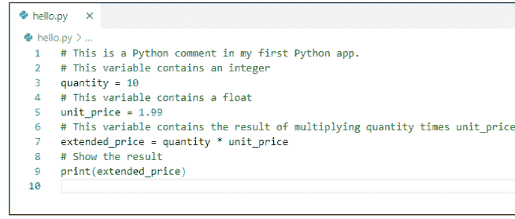

换句话说，如果代码是错误的，当你运行它时它将无法工作。就这么简单——没有例外。

## 保存你的工作

输入代码就像在电脑上输入其他文档一样。如果你不保存你的工作，下次你坐到电脑前寻找它时，可能就找不到了。所以，如果你还没有在“文件”菜单上启用自动保存（如本迷你书第2章所述），请选择“文件” ⌘ “存储”。

## 在VS Code中运行你的Python应用程序

现在你可以运行应用程序，看看它是否工作。一个简单的方法是在资源管理器窗格中右键单击`hello.py`文件名，然后选择“在终端中运行Python文件”，如图4-4所示。

如果你的代码输入正确，你应该在终端窗格中看到结果19.9，如图4-5所示。这个结果是代码中`print(extended_price)`的输出，它是19.9，因为数量（10）乘以单价（1.99）等于19.9。

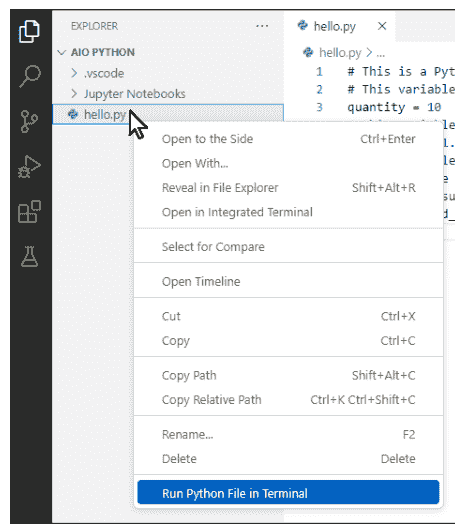

图4-4：右键单击.py文件并选择“在终端中运行Python文件”。

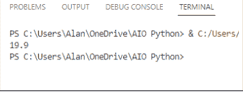

图4-5：19.9是代码中print (extended_price)的输出。

假设你的应用程序必须计算14件每件26.99美元的商品的总成本。你能想到如何实现吗？你当然不需要编写一个全新的应用程序。相反，在你现在正在处理的代码中，将quantity变量的值从10改为14。将unit_price变量的值改为26.99（记住，数字中不要有美元符号）。以下是更改后的代码：

```
### This is a Python comment in my first Python app.
### This variable contains an integer
quantity = 14
### This variable contains a float
unit_price = 26.99
### This variable contains the result of multiplying quantity times unit_price
extended_price = quantity * unit_price
### Show some results on the screen.
print(extended_price)
```

保存你的工作（除非你已经开启了自动保存）。然后，像第一次那样，通过右键单击并再次选择“在终端中运行Python文件”来运行应用程序。你应该能在VS Code窗口底部附近的终端窗格中看到正确答案，377.85999999999996。它没有四舍五入到分，看起来甚至不像一个美元金额。但你需要先学会爬，才能学会撑杆跳，所以现在只要你的应用程序能运行，就该感到高兴了。

## 理解语法是什么以及它为何重要

如果你在字典中查找*语法*，可能会找到一个定义：“在一种语言中，为构成合乎语法的句子而对单词和短语的排列。”在像Python这样的编程语言中，并不存在“合乎语法的句子”这种东西。但Python确实有“单词”的概念，即你需要在每个单词之间留一个空格，就像你输入普通文本时一样，而且这些单词的顺序很重要。

语法在人类语言中很重要，因为顺序对意义贡献很大。例如，比较以下三个短句：

- 玛丽吻了约翰。
- 约翰吻了玛丽。
- 吻了玛丽约翰。

这三个句子包含相同的单词，但意思不同。前两个句子清楚地表明了谁吻了谁，而最后一个句子则有点难以理解。

编程语言中正确的语法与人类语言中一样重要——在某些方面甚至更重要，因为当你在说话或写作中犯错时，对方通常能通过上下文理解你的意思。但计算机可没那么聪明。计算机没有大脑，无法根据上下文猜测你的真实意思，事实上，上下文的概念对计算机来说根本不存在。因此，语法在编程语言中比在人类语言中更为重要。

回顾本章最早的代码，注意大多数实际代码行（不是以#开头的注释）都遵循以下语法：

```
variablename = value
```

其中*variablename*是你编造的某个名称，*value*是你存储在该变量中的内容。它之所以有效，是因为它是正确的语法。如果你尝试这样做，它将不起作用：

```
value = variablename
```

例如，以下是在名为x的变量中存储值10的正确方式：

```
x = 10
```

看起来你也可以用以下方式，但在Python中它不会起作用：

```
10 = x
```

如果你在VS Code中这样输入，你会看到代码下方有一些波浪线，表明你没有遵循语法规则，你的代码无法按原样执行。你可以将鼠标指针悬停在任何显示波浪线的代码上，以查看有关错误的更多信息。

如果你运行包含该行的应用程序，不会发生什么可怕的事情——你不会破坏任何东西。但你会收到如下错误消息：

```
File ".../AIO Python/hello.py", line 10
10=x
^
SyntaxError: cannot assign to literal here
```

`SyntaxError`部分告诉你，Python不知道如何处理那行代码，因为你没有遵循正确的语法。要修复错误，只需将该行重写为

```
x = 10
```

现在来看单行代码。在Python中，一行代码以换行符或分号结束。例如，以下是三行Python代码：

```
first_name = "Alan"
last_name = "Simpson"
print(first_name, last_name)
```

如果你想在一行中放置多个语句，使用分号代替换行符也是可以接受的：

```
first_name = "Alan"; last_name = "Simpson"
print(first_name, last_name)
```

或者，如果你喜欢：

```
first_name = "Alan"; last_name = "Simpson"; print(first_name, last_name)
```

无论你以换行符还是分号结束每一行，代码的运行方式都是一样的。

注意变量名都是小写的，并且单词之间用下划线分隔：

```
first_name
last_name
```

在Python中，使用全小写字母作为变量名，单词之间用下划线分隔是一种*命名约定*。但请注意，*约定*与*语法规则*不同。你可以按如下方式命名变量，而不会违反任何语法规则：

```
FirstName
LastName
```

命名约定试图让程序员遵循基本的风格指南，使代码对其他程序员更具可读性，这在编程团队或小组中工作时尤为重要。

到目前为止，你已经了解了代码行。还有*代码块*，其中两行或多行代码协同工作。以下是一个示例：

```
x = 10
if x == 0:
    print("x is zero")
else:
    print("x is", x)
print("All done")
```

在Python中，==（两个等号）表示“等于”，用于比较值是否相等。这与仅使用=（一个等号）不同，后者是用于赋值的赋值运算符。

第一行，x = 10，只是一行代码。接下来，if x == 0测试变量x是否包含数字0。如果x*确实*包含0，则执行缩进行print("x is zero")，这就是你在屏幕上看到的内容。然而，如果x不包含0，则跳过该缩进行，并执行else:语句。else:下的缩进行print("x is",x)会执行，但*仅当*x不包含0时。最后一行，print("All done!")，无论如何都会执行，因为它没有缩进。


因此，如你所见，缩进在Python中非常重要。在前面的代码中，根据x的值，只会执行其中一个缩进行。随着本书的深入，你将学习在代码中使用缩进的具体细节。现在，只需记住语法和缩进在Python中很重要，因此在编写代码时必须仔细输入。

本章带你了解了如何输入、保存、运行和更改应用程序，再次保存并再次运行。这些任务定义了你使用任何语言进行任何软件开发时将要做的事情，因此你应该练习它们，直到它们成为第二天性。但别担心：你不必一遍又一遍地重复这一章才能掌握它。在本书中，你将从初学者成长为21世纪的Python高手，整个过程都会用到这些相同的技能。

# 2 理解Python构建块

## 内容概览

- **第1章：** 处理数字、文本和日期 ......... 67
- **第2章：** 控制动作 ........................... 109
- **第3章：** 使用列表和元组快速前进 ............ 131
- **第4章：** 使用字典处理海量数据 ........ 155
- **第5章：** 处理更大的代码块 ............... 181
- **第6章：** 使用类进行Python编程 ........................ 203
- **第7章：** 规避错误 ............................ 239

本章内容

- 掌握整数
- 处理带小数点的数字
- 简化字符串
- 征服布尔值True/False
- 处理日期和时间

# 第1章
处理数字、文本和日期

计算机语言，尤其是Python，处理信息的方式可能与你日常生活中的习惯不同。这个概念需要一些时间来适应。在计算机世界中，*数字*是可以进行加、减、乘、除运算的数字。Python还区分整数（整数）和包含小数点的数字（浮点数）。单词（文本信息，如姓名和地址）存储为字符串，即“一串字符”的简称。除了数字和字符串，还有布尔值，它们可以是`True`或`False`。

在现实生活中，我们还必须处理日期和时间，这是另一种类型的信息。Python没有内置的日期和时间数据类型，但值得庆幸的是，有一个免费的模块可以随时导入来处理此类信息。本章将全面介绍如何充分利用各种Python数据类型。

## 使用函数计算数字

Python中的*函数*类似于计算器上的函数，因为你将某些内容传递给函数，函数会返回某些内容。例如，大多数计算器和编程语言都有一个平方根函数：你提供一个数字，它们会告诉你该数字的平方根。

Python 函数通常具有以下语法：

```
variablename = function_name([param,param])
```

因为大多数函数会返回某个值，所以通常先定义一个变量来存储函数返回的内容。接着是等号 `=` 和函数名，然后是一对括号。在括号内，你可以向函数传递零个或多个值（称为 *参数*）。

例如，`abs()` 函数接受一个数字并返回该数字的绝对值。如果你不是数学爱好者，这仅仅意味着：如果你传递一个负数，它会返回同一个数字的正数形式；如果你传递一个正数，它会返回你传递的同一个数字。换句话说，`abs()` 函数只是将负数转换为正数。

举个例子，在图 1-1 中（你可以在 Jupyter notebook、Python 提示符或 VS Code 的 .py 文件中亲自尝试），我们创建了一个名为 `x` 的变量，并为其赋值 -4。然后，我们创建了一个名为 `y` 的变量，并使用 `abs()` 函数将其赋值为 `x` 的绝对值。打印 `x` 显示其值 -4，这没有改变。打印 `y` 显示 4，即 `abs()` 函数返回的 `x` 的绝对值。

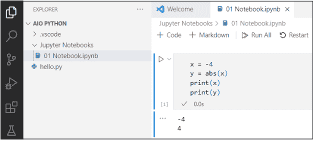

尽管一个函数总是返回一个值，但有些函数接受两个或更多值。例如，`round()` 函数将一个数字作为其第一个参数。第二个参数是你希望将该数字四舍五入到的小数位数，例如，2 表示两位小数。在图 1-2 的示例中，我们创建了一个变量 `x`，其小数点后有很多位数字。然后，我们创建了一个名为 `y` 的变量，用于返回将 `x` 四舍五入到两位小数后的结果。接着，我们打印了这两个结果。

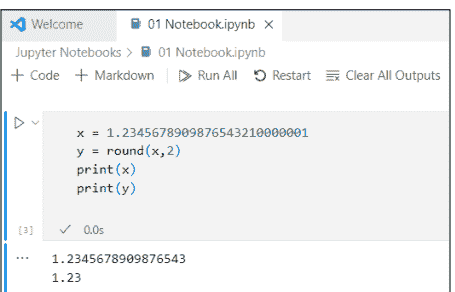

图 1-2：尝试 `round()` 函数。

Python 有许多用于处理数字的内置函数，如表 1-1 所示。如果你对数学不太感兴趣，其中一些可能对你意义不大，但不要因此而感到畏惧。如果你不理解某个函数的作用，很可能它与你所做的工作无关。但如果你好奇，你总可以在网上搜索 "python" 加上函数名来获取更多信息。要查看更全面的列表，请搜索 "python 3 built-in functions"。

### 表 1-1：一些用于数字的 Python 内置函数

| 内置函数 | 用途 |
|---|---|
| abs(x) | 返回数字 x 的绝对值（将负数转换为正数）。 |
| bin(x) | 返回一个字符串，表示 x 转换为二进制后的值。 |
| float(x) | 将字符串或数字 x 转换为浮点数据类型。 |
| format(x, y) | 返回根据 y 中指定的模式格式化的 x。这种旧语法在当前 Python 版本中已被 f-string 取代。 |
| hex(x) | 返回一个包含 x 转换为十六进制的字符串，并以 0x 为前缀。 |
| int(x) | 通过截断（而非四舍五入）小数部分及其后的所有数字，将 x 转换为整数数据类型。 |
| max(x, y, z, ...) | 接受任意数量的数值参数，并返回其中最大的一个。 |
| min(x, y, z, ...) | 接受任意数量的数值参数，并返回其中最小的一个。 |
| oct(x) | 将 x 转换为八进制数，并以 0o 为前缀表示八进制。 |
| round(x, y) | 将数字 x 四舍五入到 y 位小数。 |
| str(x) | 将数字 x 转换为字符串数据类型。 |
| type(x) | 返回一个表示 x 数据类型的字符串。 |

图 1-3 展示了使用内置数学函数的正确 Python 语法示例。

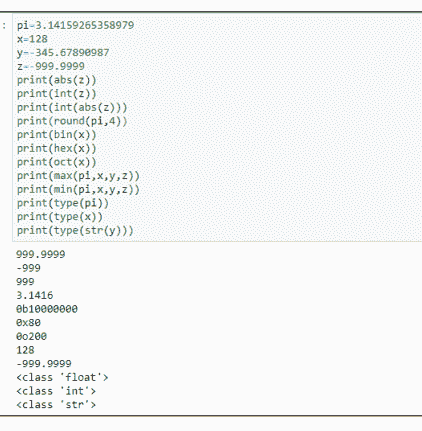

你还可以 *嵌套* 函数——这意味着你可以将函数放在函数内部。例如，当 `z = -999.9999` 时，表达式 `print(int(abs(z)))` 会打印 `z` 的绝对值的整数部分，即 999。原始数字被转换为正数，然后小数点及其右侧的所有内容都被截断。

## 更多数学函数

除了目前涵盖的内置函数外，你还可以从 `math` 模块导入其他函数。如果你在应用程序中需要它们，请在 `.py` 文件或 Jupyter 单元格的顶部附近放置 `import math`，以使这些函数对代码的其余部分可用。或者要在命令提示符下使用它们，首先输入 `import math` 命令。

`math` 模块中的一个函数是 `sqrt()` 函数，它获取一个数字的平方根。因为它是 `math` 模块的一部分，所以你必须先导入该模块才能使用它。例如，如果你输入以下内容，你会得到一个错误，因为 `sqrt()` 不是内置函数：

```
print(sqrt(81))
```

即使你像下面这样输入两个命令，你仍然会得到一个错误，因为你将 `sqrt()` 视为内置函数：

```
import math
print(sqrt(81))
```

要使用模块中的函数，你必须导入该模块 *并且* 在函数名前加上模块名和一个点。所以，假设你有一个值 `x`，你想要它的平方根。你必须导入 `math` 模块并使用 `math.sqrt(x)` 来获得正确答案，如图 1-4 所示。输入该命令会显示结果为 9.0，这确实是 81 的平方根。

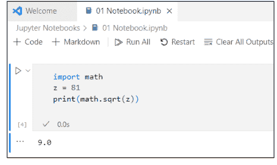

`math` 模块提供了许多三角函数和双曲函数、幂和对数、角度转换以及常量，如 `pi` 和 `e`。我们不会深入探讨所有这些，因为高等数学与大多数人无关。你可以随时通过搜索 "python 3 math module functions" 来查看它们。表 1-2 提供了一些可能在你自己的工作中有用的示例。

常量 `pi`、`e` 和 `tau` 不是你传递值的典型函数。这就是为什么括号是空的，如 `tau()`。每个都是一个常量，总是返回相同的值。你可以将任何常量返回的值分配给你选择的变量。图 1-5 展示了使用 `math` 模块中常量的一些示例。

### 表 1-2：Python Math 模块中的一些函数

| 内置函数 | 用途 |
|---|---|
| math.acos(x) | 返回 x 的反余弦值（以弧度表示） |
| math.atan(x) | 返回 x 的反正切值（以弧度表示） |
| math.atan2(y, x) | 返回 y 除以 x 的反正切值（以弧度表示） |
| math.ceil(x) | 返回 x 的上取整值，即大于或等于 x 的最小整数 |
| math.cos(x) | 返回 x 弧度的余弦值 |
| math.degrees(x) | 将角度 x 从弧度转换为度 |
| math.e | 返回数学常量 e (2.718281 ...) |
| math.exp(x) | 返回 e 的 x 次幂，其中 e 是自然对数的底数 |
| math.factorial(x) | 返回 x 的阶乘 |
| math.floor(x) | 返回 x 的下取整值，即小于或等于 x 的最大整数 |
| math.isnan(x) | 如果 x 不是数字则返回 True；否则返回 False。更具体地说，如果 x 包含 NaN（Python 中用于表示不包含数字的数值变量的特殊值），此函数返回 True。 |
| math.log(x, y) | 返回以 y 为底的 x 的对数 |
| math.log2(x) | 返回以 2 为底的 x 的对数 |
| math.pi | 返回数学常量 pi (3.141593 ...) |
| math.pow(x, y) | 返回 x 的 y 次幂 |
| math.radians(x) | 将角度 x 从度转换为弧度 |
| math.sin(x) | 返回 x 的正弦值（当 x 以弧度表示时） |
| math.sqrt(x) | 返回 x 的平方根 |
| math.tan(x) | 返回 x 弧度的正切值 |
| math.tau() | 返回数学常量 tau (6.283185 ...) |

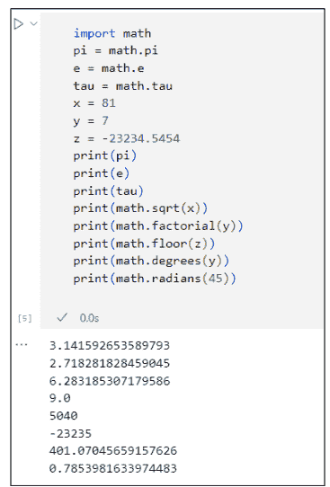

图 1-5：更多关于内置数学常量的尝试。

## 格式化数字

多年来，Python 提供了不同的方法来以我们人类熟悉的格式显示数字。例如，大多数人更愿意看到美元金额以 $1,234.56 的格式表示，而不是 1234.560065950695405695405959。从 Python 3.6 版本开始，在 Python 中格式化数字最简单的方法是使用 f-string。

#### 使用 f-string 进行格式化

格式化字符串，或称 f-string，是在 Python 中格式化数据的最简单方法。你只需要一个小写 f 或大写 F，后面紧跟着用引号括起来的一些文本或表达式。这里有一个例子：

```
f"Hello {username}"
```

第一个引号前的 `f` 告诉 Python 后面是一个格式化字符串。在引号内，称为字面量部分的文本会按原样显示（与 f-string 中输入的完全一致）。花括号中的任何内容都是 f-string 的表达式部分，是代码执行时将出现内容的占位符。

在花括号内，你可以放置一个*表达式*（用于执行某种计算的公式、变量名，或两者的组合）。以下是一个示例：

```
username = "Alan"
print(f"Hello {username}")
```

运行此代码时，`print` 函数会显示单词 `Hello`，后跟一个空格，再后跟 `username` 变量的内容，如图 1-6 所示。

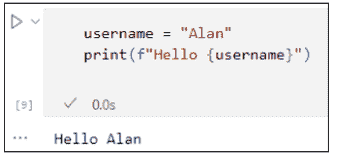

这是另一个表达式示例——花括号内的公式 `quantity times unit_price`：

```
unit_price = 49.99
quantity = 30
print(f"Subtotal: ${quantity * unit_price}")
```

执行后，输出如下：

```
Subtotal: $1499.7
```

那个 $1499.7 并不是显示美元金额的理想方式。通常，我们喜欢在千位使用逗号，并用两位数字表示分币，如下所示：

```
Subtotal: $1,499.70
```

幸运的是，f-string 为你提供了进行此格式化的方法，你将在接下来的内容中学习。

## 显示美元金额

为了在美元金额中显示逗号，并将分币显示为两位数字，你可以在 f-string 表达式的花括号内使用*格式字符串*。格式字符串以冒号开头，需要放在右花括号内，紧挨着变量名或显示的值。

要在千位显示逗号，请在格式字符串中冒号后使用逗号，如下所示：

```
:,
```

使用当前示例，你可以这样做：

```
print(f"Subtotal: ${quantity * unit_price:,}")
```

执行此语句会产生以下输出：

```
Subtotal: $1,499.7
```

要让分币显示为两位数字，请在逗号后添加

```
.2f
```

`.2f` 表示“两位小数，固定”（永远不会多于或少于两位小数）。以下代码将显示带有逗号和两位小数的数字：

```
print(f"Subtotal: ${quantity * unit_price:,.2f}")
```

代码执行时显示的内容如下：

```
Subtotal: $1,499.70
```

完美！这正是我们想要的格式。因此，任何时候你想显示一个数字，使其在千位有逗号，并且小数点后恰好有两位数字，请使用带有格式字符串 `.2f` 的 f-string。

## 国际化 Python

为了帮助实现国际化，Python 支持 POSIX，这允许你以本地格式显示货币金额。在代码顶部输入 **import locale** 以导入该模块。然后使用 `locale.setlocale()` 定义国家/地区。接着使用 `locale.currency()` 显示数字。你还可以将 grouping 设置为 True，以在支持该功能的语言中包含千位分隔符。例如，以下代码将一个数字存储在名为 `sample_amount` 的变量中。然后它为法国设置区域设置（`fr_FR`），并使用 `locale.currency()` 以法国货币格式显示该数字。

```
import locale
### Just some random number to work with
sample_amount = 1234.56
### Set the locale to france
locale.setlocale(locale.LC_ALL, "fr_FR")
### Use locale.currency() to show sample amount in locale format
print(locale.currency(sample_amount, grouping=True))
```

正如你可能想象的那样，locale 模块非常庞大，以涵盖所有不同的国家/地区。但只需在网上搜索 *Python internationalization*，你就能找到处理应用中文化格式化所需的信息。

## 格式化百分比数字

现在，假设你的应用应用销售税。应用需要知道销售税率，该税率应表示为小数。因此，如果销售税率为 6.5%，在代码中必须写为 0.065（或者 .065，如果你喜欢的话），如下所示：

```
sales_tax_rate = 0.065
```

无论是否有前导零，这个数字的值都是一样的，所以只需使用适合你的格式即可。

这种数字格式对 Python 来说是理想的，你不会想要弄乱它。但如果你想向人类显示该数字，简单地使用 `print()` 函数会完全按照 Python 存储的方式显示它：

```
sales_tax_rate = 0.065
print(f"Sales Tax Rate {sales_tax_rate}")
Sales Tax Rate 0.065
```

在向人们显示销售税率时，你可能希望使用更熟悉的 6.5% 格式，而不是 .065。你可以使用与固定数字（.2f）相同的想法。但是，你需要将固定数字的 f 替换为 %，如下所示：

```
print(f"Sales Tax Rate {sales_tax_rate:.2%}")
```

76 BOOK 2 Understanding Python Building Blocks

运行此代码会将销售税率乘以 100，并在其后跟一个百分号（%），如图 1-7 所示。

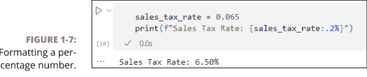

在前面的两个示例中，我们都使用了 2 作为数字位数，但当然你可以显示任意数量的数字，从零（无）到你需要的任何精度级别。例如，使用 .1%，如下所示：

```
print(f"Sales Tax Rate {sales_tax_rate:.1%}")
```

执行该行时显示以下输出：

```
Sales Tax Rate 6.5%
```

将 1 替换为 9，如下所示：

```
print(f"Sales Tax Rate {sales_tax_rate:.9%}")
```

显示小数点后九位数字的百分比：

```
Sales Tax Rate 6.500000000%
```

你不需要仅在 `print` 函数调用内使用 f-string。你也可以执行一个 f-string 并将结果保存在一个变量中，以便稍后显示。格式字符串本身就像任何其他字符串一样，必须用单引号、双引号或三引号括起来。使用三引号时，你可以使用三个单引号或三个双引号。格式字符串最外层使用哪种引号并不重要；输出是相同的，如图 1-8 所示。

> 
对于单引号和双引号，请使用相应的键盘按键。对于三引号，你可以使用三个单引号或三个双引号。确保你结束字符串时使用的字符与开始字符串时使用的字符完全相同。例如，图 1-8 中的所有字符串都是完全有效的代码，并且它们都将被同等对待。

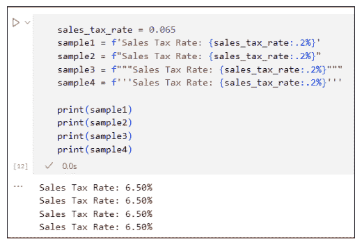

图 1-8：f-string 可以用单引号、双引号或三引号括起来。

## 制作多行格式字符串

如果你想获得多行输出，可以通过几种方式在格式字符串中添加换行符：

-   **使用 \n：** 你可以在单行格式字符串中任何需要换行的地方使用 \n。只需确保将 \n 放在格式字符串的字面部分，而不是花括号内。例如：

```
user1 = "Alberto"
user2 = "Babs"
user3 = "Carlos"
output = f"{user1}\n{user2}\n{user3}"
print(output)
```

执行时，此代码显示：

```
Alberto
Babs
Carlos
```

-   **使用三引号（单引号或双引号）：** 如果你在格式字符串周围使用三引号，则不需要使用 \n。你可以在格式字符串中任何希望输出换行的地方直接换行。例如，查看图 1-9 中的代码。格式字符串用三引号括起来，并包含多个换行符。运行代码的输出在相同位置有换行符。

如你所见，输出遵循了格式字符串中的换行符，甚至包括空格。不幸的是，它并不完美——在现实生活中，我们会右对齐数字，使小数点对齐。不过，一切并未失去，因为使用格式字符串，你还可以控制输出的宽度和对齐方式。

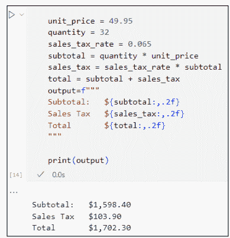

图 1-9：用三引号括起来的多行 f-string。

## 格式化宽度和对齐方式

你还可以通过在 f-string 的冒号后跟 <（左对齐）、^（居中对齐）或 >（右对齐）来控制输出的宽度（以及该宽度内内容的对齐方式）。将这些字符中的任何一个放在格式字符串中冒号的后面。例如，以下内容将使输出宽度为 20 个字符，内容右对齐：

```
:>20
```

在图 1-9 中，所有美元金额都是左对齐的，因为这是默认设置。要右对齐数字（这是我们通常看到美元金额的方式），你可以在 f-string 中使用 >。要使数字宽度相同，请在 > 字符后指定一个数字。例如，在图 1-10 中，每个 f-string 都包含 >9，这导致每个显示的数字右对齐且宽度为 9 个字符。输出（你可以在图底部看到）使所有数字右对齐，其美元符号整齐地左对齐。每个美元符号右侧的空格确保每个数字恰好为九个字符宽。

你可能会看着图 1-10 并想知道为什么美元符号是那样排列的。为什么它们没有紧挨着它们的数字对齐？美元符号是字面字符串的一部分，在花括号之外，因此它们不受花括号内 >9 的影响。

重新对齐美元符号可能比你想象的要复杂一些，因为你只能对数字使用 ,.2f 格式化。你不能在数字前面附加 $，除非你将数字转换为字符串——但那样它就不再是数字了，所以 .2f 就不起作用了。

但复杂并不意味着不可能；它只是意味着不方便。你可以将每个金额转换为当前格式的字符串，在该字符串前加上美元符号，然后在这个字符串上设置宽度和对齐方式。例如，以下代码创建了一个名为 `s_subtotal` 的变量，其中包含一个美元符号紧跟着金额，美元符号位于第一个数字的左侧，且美元符号后没有空格：

```
s_subtotal = "$" + f"{subtotal:,.2f}"
```

在此代码中，我们假设 `subtotal` 变量包含某个数字。假设这个数字是 1598.402，尽管它可以是任何数字。`f"{subtotal:,.2f}"` 将数字格式化为固定两位小数的格式，并在千位处添加逗号，如下所示：

```
1,598.40
```

输出是一个字符串而不是数字，因为 f-string 总是产生一个字符串。

代码的下一部分在前面附加（连接）了一个美元符号：

```
"$"+
```

所以现在的输出是 $1,598.40。这个最终格式化的字符串存储在一个名为 `s_subtotal` 的新变量中。（我们添加了前导 `s_` 是为了提醒我们这是小计数字的字符串等效形式，而不是原始数字。）

要显示该金额右对齐且宽度为九位数字，请在新的格式字符串中使用 >9 来显示 `s_subtotal` 变量，如下所示：

```
f"{s_subtotal:>9}"
```

任何时候你需要提醒关于复杂的 print f 内容，只需向 ChatGPT 或其他生成式 AI 请求提醒即可。例如，你可以要求它编写用于右对齐、两位小数的货币数字的 python print f，或者编写用于两位百分比值的 python print f。然后将 AI 生成的任何内容复制并粘贴到你自己的代码中，并根据你当前的需求进行调整。

图 1-11 展示了一个完整的示例，包括运行代码的输出。所有数字都右对齐，美元符号位于通常的位置。

## 处理更奇怪的数字

我们大多数人经常处理像数量和金额这样的简单数字。如果你的工作需要你处理非十进制或虚数，Python 拥有你需要完成工作的工具。但请记住，你不需要学习这些来使用 Python 或任何其他语言。你只会在实际工作（或可能是作业）需要时才使用这些。在下一节中，你将了解计算机科学中常用的一些数字类型：二进制、八进制和十六进制数字。

## 二进制、八进制和十六进制数字

如果你的工作需要处理二进制、八进制或十六进制数字，那么你很幸运，因为 Python 有用于编写这些数字的符号以及用于在它们之间转换的函数。表 1-3 展示了三种非十进制基数和每种基数使用的数字。

**表 1-3 用于二进制、八进制和十六进制数字的 Python**

| 系统 | 也称为 | 使用的数字 | 符号 | 函数 |
| :--- | :--- | :--- | :--- | :--- |
| 二进制 | Binary | 0,1 | 0b | bin() |
| 八进制 | Octal | 0,1,2,3,4,5,6,7 | 0o | oct() |
| 十六进制 | Hexadecimal 或 hex | 0,1,2,3,4,5,6,7,8,9,A,B,C,D,E,F | 0x | hex() |

大多数人永远不需要处理二进制、八进制或十六进制数字，所以如果这一切让你感到不安，别担心。如果你以前从未听说过它们，那么在你完成本节之后，你很可能再也不会听说它们了。

> 如果你想了解更多关于各种编号系统的信息，你可以使用你最喜欢的搜索引擎搜索 *二进制数字* 或 *八进制*、*十进制* 或 *十六进制*。

当然，你可以使用这些不同的函数来转换数字在 Python 提示符下的显示方式，以及在你创建的任何应用程序中。在提示符下，只需使用 `print()` 函数，将转换函数放在括号内，将要转换的数字放在最内层的括号内。例如，以下代码显示数字 255 的十六进制等效值：

```
print(hex(255))
```

结果是 `0xff`，其中 `0x` 表示后面的数字是以十六进制表示的，`ff` 是 255 的十六进制等效值。

要从二进制、八进制或十六进制转换为十进制，你不需要使用函数。只需使用 `print()` 并将要转换的数字放在括号内即可。例如，`print(0xff)` 显示 255，即十六进制 ff 的十进制等效值。图 1-12 展示了你可以在 Python 提示符下尝试的更多示例。

```
x = 255
### 将十进制转换为其他数字系统
print(bin(x))
print(oct(x))
print(hex(x))

### 以十进制数字系统显示数字（无需转换）
print(0b11111111)
print(0o377)
print(0xff)
```

```
0b11111111
0o377
0xff
255
255
255
```

**图 1-12：摆弄二进制、八进制和十六进制。**

## 复数

复数是另一种奇怪的数字类型，除非你碰巧从事电气工程、高等数学或使用它们的科学分支，否则你可能永远不需要处理。*复数* 是可以表示为 *a+bi* 的数字，其中 *a* 和 *b* 是实数，*i* 代表满足方程 *i²=-1* 的虚数。没有实数 *i* 的平方等于 -1，所以这就是为什么它被称为 *虚数*。

一些数学分支使用小写 *i* 来表示虚数。但 Python 使用 *j*（电气工程中也使用 *j*，因为 *i* 用于表示电流）。

无论如何，如果你的应用程序需要处理复数，你可以使用 `complex()` 函数来生成一个虚数，使用以下语法：

```
complex(real, imaginary)
```

将 *real* 替换为复数的实部，将 *imaginary* 替换为虚部。例如，在代码或命令提示符中，尝试这个：

```
z = complex(2,-3)
```

变量 z 获得虚数 2-3j。然后使用 `print()` 函数显示 z 的内容，如下所示：

```
print(z)
```

屏幕显示虚数 (2-3j)。

你可以在虚数后附加 `.real` 或 `.imag` 来获取实部或虚部。例如，以下代码产生 2.0，这是数字 z 的实部：

```
print(z.real)
```

而这个返回 -3.0，这是 z 的虚部：

```
print(z.imag)
```

再次强调，如果这一切对你来说都没有意义，别担心。学习或使用 Python 并不需要这些。Python 只是为那些碰巧需要它们的人提供了复数和这些函数。

如果你的工作需要处理复数，请在网上搜索 *python cmath* 以了解 Python 的 `cmath` 模块，该模块提供了用于复数的函数。

## 操作字符串

在 Python 和其他编程语言中，我们将单词和文本块称为 *字符串*，即 "a string of characters" 的缩写。字符串没有数值意义或价值。（我们在第 1 册第 4 章讨论了字符串的基础知识。）在本节中，你将学习用于处理字符串的 Python 编码技能。

## 连接字符串

你可以使用加号 (+) 来连接字符串。这个过程在极客世界中被称为 *字符串连接*。让初学者措手不及的一件事是，计算机无法区分单词和三明治。所以当你连接字符串时，计算机不会自动在你期望的地方添加空格。例如，在以下代码中，`full_name` 是前三个字符串的连接。

```
first_name = "Alan"
middle_init = "C"
last_name = "Simpson"
full_name = first_name + middle_init + last_name
print(full_name)
```

当你运行此代码以打印 `full_name` 变量的内容时，你可以看到 Python 确实将它们连接成了一个长字符串：

```
AlanCSimpson
```

这个输出本身并没有错，只是我们通常在单词和人名的各部分之间放置空格。

因为 Python 不会自动在你认为应该放置空格的地方添加空格，所以你必须自己添加。表示单个空格的最简单方法是使用一对引号，中间有一个空格，如下所示：

```
" "
```

如果你忘记在引号之间放置空格，如下所示，你的字符串中将不会得到空格，因为引号之间没有空格：

```
""
```

如果你想在输出中获得多个空格，可以在引号之间放置多个空格，但通常一个空格就足够了。在以下示例中，你在 `first_name` 和 `last_name` 之间放置了一个空格。你还在 `middle_init` 后附加了一个句点和空格：

```
first_name = "Alan"
middle_init = "C"
last_name = "Simpson"
full_name = first_name + " " + middle_init + ". " + last_name
print(full_name)
```

此代码的输出，即 `full_name` 变量的内容，看起来更像你习惯看到的那种名字：

```
Alan C. Simpson
```

当然，作为将所有组件和空格拼接成新字符串的替代方法，你可以简单地使用 f-string 以所需的格式显示名称，如以下代码所示。唯一的区别是，你的代码中没有一个名为 `full_name` 的变量可供使用。

```python
print(f"{first_name} {middle_init}. {last_name}")
```

## 获取字符串的长度

要确定字符串中有多少个字符，你需要使用内置的 `len()` 函数（*length* 的缩写）。长度包括空格，因为空格也是字符，每个空格的长度为一。一个空字符串——即一个没有任何内容，甚至没有空格的字符串——长度为零。

以下是一些示例。在第一行，你定义了一个名为 `s1` 的变量，并将一个空字符串放入其中（一对引号，中间没有任何内容）。`s2` 变量获得一个空格（一对引号，中间有一个空格）。`s3` 变量获得一个包含一些字母和空格的字符串。然后，三个 `print()` 函数分别显示每个字符串的长度：

```python
s1 = ""
s2 = " "
s3 = "A B C"
print(len(s1))
print(len(s2))
print(len(s3))
```

以下是该代码执行后的输出。当你理解 `len()` 是通过计算字符串中的字符数（包括空格）来测量字符串长度时，这个输出就完全合理了：

```
0
1
5
```

## 使用常见的字符串运算符

Python 提供了多种运算符来处理数据序列。Python（以及大多数其他编程语言）中字符串的一个奇怪之处在于，当你计算字符时，第一个字符计为 0，而不是 1。这对我们人类来说毫无意义，但计算机就是这样计算字符的，因为这是最有效的方法。因此，即使图 1–13 中的字符串长度为五个字符，该字符串中的最后一个字符是字母 E，因为第一个字符是编号 0。真是令人费解。

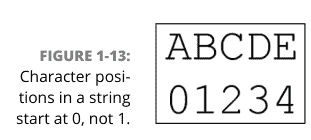

表 1–4 总结了 Python 3 中用于处理字符串的运算符。

### 表 1-4 适用于字符串的 Python 序列运算符

| 运算符 | 用途 |
| :--- | :--- |
| `x in s` | 如果字符串 x 存在于字符串 s 中的某处，则返回 True。 |
| `x not in s` | 如果 x 不包含在字符串 s 中，则返回 True。 |
| `s * n` 或 `n * s` | 将字符串 s 重复 n 次。 |
| `s[i]` | 字符串 s 中位置 i 处的字符。 |
| `s[i:j]` | 从字符串 x 中位置 i 开始到（但不包括）位置 j 的字符的切片。 |
| `s[i:j:k]` | 从 i 到 j，步长为 k 的 s 的切片，其中 k 是任意两个字符之间的距离。例如，将 k 设置为 2 会显示每隔一个字符。将 k 设置为 3 会返回每隔第三个字符，依此类推。 |
| `min(s)` | 字符串 s 中最小（最低）的字符。 |
| `max(s)` | 字符串 s 中最大（最高）的字符。 |

图 1–14 展示了在 Jupyter Notebook 中使用字符串运算符的示例。当 `print()` 函数的输出看起来不对时，请记住关于 Python 字符串的两个重要事实：

- 第一个字符始终是编号 0。
- 每个空格都算作一个字符，因此在计数时不要跳过空格。

你可能已经注意到 `min(s)` 返回一个空格，这意味着空格字符是该字符串中最低的字符。但究竟是什么使得空格比字母 A 或字母 a “更低”呢？简单的答案是字母的 ASCII 编号。你可以在键盘上输入的每个字符，以及许多额外的字符，都有一个由美国信息交换标准代码（ASCII）分配的编号。

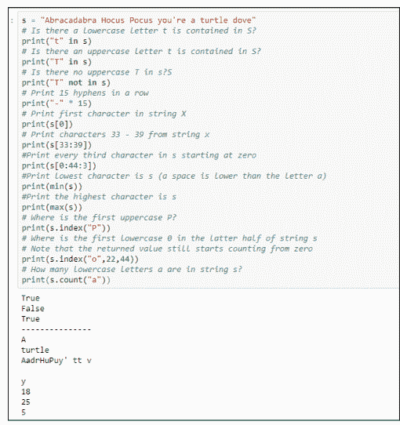

图 1–15 显示了一个包含许多常见字符 ASCII 编号的图表。空格和标点字符比大写字母 A “更低”，因为它们的 ASCII 编号更小。大写字母比小写字母“更低”，因为它们的 ASCII 编号更小。你是否想知道分配给编号 0–31 的字符是什么？这些编号也有字符，但它们是控制字符，本质上是不可打印和不可见的，例如当你按住 Ctrl 键并按下另一个键时。

Python 提供了两个用于处理 ASCII 的函数。`ord()` 函数接受一个字符作为输入，并返回该字符的 ASCII 编号。例如，`print(ord("A"))` 返回 65，因为在 ASCII 图表中，大写字母 A 是字符 65。`chr()` 函数则相反。你给它一个编号，它返回该编号对应的 ASCII 字符。例如，`print(chr(65))` 显示 A，因为在 ASCII 图表中，A 是字符 65。

我在这个示例中使用了 ASCII，因为该字符集中的字符相对较少。Unicode 是当今最流行的字符集。它包含与 ASCII 相同的所有字符，以及许多在大多数键盘上找不到的字符。例如，字符 00A3 是英镑符号。要在 Python 中打印 Unicode 字符，请将编号（前面加上 \u）放在引号中。例如，`print('\u00A3')` 告诉 Python 打印 Unicode 字符 00A3，即英镑符号。

| 编号 | 字符 | 编号 | 字符 | 编号 | 字符 |
|---|---|---|---|---|---|
| 32 | [空格] | 65 | A | 97 | a |
| 33 | ! | 66 | B | 98 | b |
| 34 | " | 67 | C | 99 | c |
| 35 | # | 68 | D | 100 | d |
| 36 | $ | 69 | E | 101 | e |
| 37 | % | 70 | F | 102 | f |
| 38 | & | 71 | G | 103 | g |
| 39 | ' | 72 | H | 104 | h |
| 40 | ( | 73 | I | 105 | i |
| 41 | ) | 74 | J | 106 | j |
| 42 | * | 75 | K | 107 | k |
| 43 | + | 76 | L | 108 | l |
| 44 | , | 77 | M | 109 | m |
| 45 | - | 78 | N | 110 | n |
| 46 | . | 79 | O | 111 | o |
| 47 | / | 80 | P | 112 | p |
| 48 | 0 | 81 | Q | 113 | q |
| 49 | 1 | 82 | R | 114 | r |
| 50 | 2 | 83 | S | 115 | s |
| 51 | 3 | 84 | T | 116 | t |
| 52 | 4 | 85 | U | 117 | u |
| 53 | 5 | 86 | V | 118 | v |
| 54 | 6 | 87 | W | 119 | w |
| 55 | 7 | 88 | X | 120 | x |
| 56 | 8 | 89 | Y | 121 | y |
| 57 | 9 | 90 | Z | 122 | z |
| 58 | : | 91 | [ | 123 | { |
| 59 | ; | 92 | \ | 124 | | |
| 60 | < | 93 | ] | 125 | } |
| 61 | = | 94 | ^ | 126 | ~ |
| 62 | > | 95 | _ | 127 | ⌂ |
| 63 | ? | 96 | ` | 128 | € |
| 64 | @ | | | | |

图 1-15：常见字符的 ASCII 编号。

## 使用方法操作字符串

Python 3 中的每个字符串都被视为一个 *str 对象*（发音为“string object”）。*str* 这个缩写词（*string* 的缩写）将 Python 3 与早期版本的 Python 区分开来，后者将字符串称为字符串对象（*string* 这个词是完整拼写的，而不是缩写）。这种命名约定是一个令人困惑的主要来源，尤其是对于初学者。只需记住，在 Python 3 中，*str* 是关于字符字符串的。

Python 提供了众多的 *str 方法*（也称为*字符串方法*）来帮助你处理 *str 对象*。*str* 对象方法的通用语法如下：

```python
string.methodname(params)
```

其中 *string* 是你正在分析的字符串，*methodname* 是表 1–5 中的方法名称，*params* 指的是你需要传递给方法的任何参数（如果需要的话）。表 1–5 第一列中的前导 *s* 表示“任何字符串”，无论是用引号括起来的字面字符串，还是包含字符串的变量名。

### 表 1-5 Python 3 字符串的内置方法

| 方法 | 用途 |
|---|---|
| s.capitalize() | 返回一个首字母大写，其余字母小写的字符串。 |
| s.count(x[, y[, z]]) | 返回字符串 x 在字符串 s 中出现的次数。可选地，你可以添加 y 作为起点，z 作为终点来搜索字符串的一部分。 |
| s.find(x[, y[, z]]) | 返回一个数字，表示字符串 x 在字符串 s 中首次出现的位置。可选的 y 和 z 参数允许你将搜索限制在字符串的一部分。如果未找到，则返回 -1。 |
| s.index(x[, y[, z]]) | 类似于 find，但如果字符串 x 在字符串 y 中找不到，则会引发“未找到子字符串”错误。 |
| s.isalpha() | 如果 s 至少有一个字符长，并且只包含字母（A-Z 或 a-z）和可打印的 Unicode 字符，则返回 True。 |
| s.isdecimal() | 如果 s 至少有一个字符长，并且只包含数字字符（0-9），则返回 True。 |
| s.islower() | 如果 s 包含字母，并且所有这些字母都是小写，则返回 True。 |
| s.isnumeric() | 如果 s 至少有一个字符长，并且只包含数字字符（0-9），则返回 True。 |
| s.isprintable() | 如果字符串 s 只包含可打印字符，则返回 True。空格被视为可打印，但换行符和制表符则不是。 |
| s.istitle() | 如果字符串 s 包含字母，并且每个单词的首字母大写，后跟小写字母，则返回 True。 |
| s.isupper() | 如果字符串中的所有字母都是大写，则返回 True。 |
| s.lower() | 返回 s，其中所有字母都转换为小写。 |
| s.lstrip() | 返回 s，其中任何前导空白（空格、制表符、换行符）都被移除。 |
| s.replace(x, y) | 返回字符串 s 的一个副本，其中字符串 x 被字符串 y 替换。 |
| s.rfind(x[, y[, z]]) | 类似于 s.find，但从字符串的开头向后搜索。如果提供了 y 和 z，则从位置 z 向后搜索到位置 y。如果未找到字符串 x，则返回 -1。 |
| s.rindex() | 与 s.find 相同，但如果未找到子字符串，则会引发错误。 |
| s.rstrip() | 返回字符串 s，其中任何尾随空白都被移除。 |
| s.strip() | 返回字符串 s，其中前导和尾随空白都被移除。 |
| s.swapcase() | 返回字符串 s，其中大写字母转换为小写，小写字母转换为大写。 |
| s.title() | 返回字符串 s，其中每个单词的首字母大写，所有其他字母小写。 |
| s.upper() | 返回字符串 s，其中所有字母都转换为大写。 |

你可以在 Jupyter notebook、Python 提示符或 .py 文件中尝试这些方法。图 1–16 展示了在 Jupyter notebook 中使用三个名为 s1、s2 和 s3 的字符串变量进行实验的一些示例。运行代码的结果显示在代码下方。

```python
s1 = "There is no such word as schmeedledorp"
s2 = " a b c "
s3 = "ABC"
### Capitalize first letter, the rest Lowercase
print(s3.capitalize())
### Count the number of spaces in s1
print(s1.count(" "))
### Find the dot in s1
print(s1.find("."))
### Is s2 all Lowercase Letters?
print(s2.islower())
### Convert s3 to all lowercase
print(s3.lower())
### Strip leading characters from s2
print(s2.lstrip())
### Strip leading and trailing characters from s2
print(s2.strip())
### Swap the case of Letters in s1
print(s1.swapcase())
### Show s1 in Title case (initial caps)
print(s1.title())
### Show s1 uppercase
print(s1.upper())
```

```
Abc
6
-1
True
abc
a b c
a b c
tHERE IS NO SUCH WORD AS SCHMEEDLEDORP
There Is No Such Word As Schmeedledorp
THERE IS NO SUCH WORD AS SCHMEEDLEDORP
```

图 1-16：尝试 Python 字符串函数。

> 不必费心去记忆甚至理解每一个字符串方法。记住，你随时可以要求生成式 AI 为你列出所有的字符串运算符和函数。或者在网上搜索 *python string methods* 来了解有哪些可用方法。

## 揭秘日期与时间

在计算机世界中，我们经常使用日期和时间来安排日程，或计算某事何时到期或已逾期多少天。我们有时使用*时间戳*来精确记录用户执行某操作或事件发生的时间。在 Python 中使用日期和时间有很多原因，但或许令人惊讶的是，没有像字符串和数字那样的内置数据类型来表示它们。

要处理日期和时间，你通常需要使用 `datetime` 模块。与任何模块一样，你必须先导入它才能使用。你可以使用 `import datetime` 来导入。并且与任何导入一样，如果你愿意，可以添加一个更容易输入的别名（昵称）。例如，`import datetime as dt` 也可以。你只需记住在调用该模块功能时，在代码中输入 `dt` 而不是 `datetime`。

datetime 模块提供了一种在 Python 中处理日期和时间的简便方法。它提供了三种存储日期、时间和时区信息的方式，包括：

- `datetime.date`：由月、日和年组成的日期（但不包含时间信息）。
- `datetime.time`：由小时、分钟、秒、微秒组成的时间，如果需要，还可以包含时区信息（但不包含日期）。
- `datetime.datetime`：由日期、时间以及可选的时区信息组成的单个数据项。

我们在前面的列表中为每种类型都加上了完整的 `datetime` 前缀，但如果你使用别名，例如 `dt`，你可以在代码中使用它来代替。我们将在接下来的部分中分别讨论这些数据类型。

## 处理日期

`datetime.date` 数据类型非常适合在不涉及时间的情况下处理日期。你可以通过两种方式创建日期对象。你可以使用 `today()` 方法从计算机的内部时钟获取今天的日期。或者你可以在括号内指定年、月、日（按此顺序）。

> 指定月份或日期时，切勿在 `datetime.date()` 中使用前导零。例如，2024年4月1日必须表示为 `2024,4,1` —— 如果你输入 `2024,04,01`，它将无法工作。

导入 datetime 模块后，你可以使用 `date.today()` 从计算机的内部时钟获取当前日期。或者使用 `date(year, month, day)` 语法为其他日期创建一个日期对象。以下代码展示了这两种方法：

```python
### Import the datetime module, nickname dt
import datetime as dt
### Store today's date in a variable named today.
today = dt.date.today()
### Store some other date in a variable called last_of_teens
last_of_teens = dt.date(2019, 12, 31)
```

## 你的计算机日期和时间

如果你的计算机连接到互联网，其内部日期和时间应该是准确的。这是因为它是从 NNTP（网络新闻传输协议）获取该信息的，这是一套用于计算机之间通过互联网通信以及将其时钟同步到协调世界时（UTC）的规则。

datetime 信息会根据你的时区进行调整，并考虑你所在位置的夏令时（如果适用）。因此，换句话说，计算机屏幕上显示的日期和时间应该与你墙上的日历和时钟一致。

尝试在 Jupyter notebook、Python 提示符或 .py 文件中输入代码。使用 `print()` 函数查看每个变量的内容，如图 1-17 所示。你的 `today` 变量不会与图中的相同；它将是你尝试此操作时的日期。

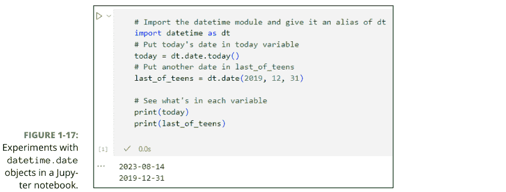

你可以使用 `.month`、`.day` 或 `.year` 来提取日期对象的任何部分。例如，在同一个 Jupyter 单元格或 Python 提示符中，执行以下代码：

```python
print(last_of_teens.month)
print(last_of_teens.day)
print(last_of_teens.year)
```

该日期的三个组成部分分别显示在单独的行中：

```
12
31
2019
```

正如你在图 1–17 的第一个打印输出中看到的，默认的日期显示格式是 *yyyy-mm-dd*，但你可以根据需要格式化日期和时间。使用 f-strings（我们将在本章前面讨论），以及表 1–6 中显示的指令，该表包括日期和时间的格式，我们将在本章后面讨论。对于显示本地日期和时间的指令，确切的格式将取决于你的位置。例如，使用 `%x` 在美国显示 2023年12月18日会显示为 12/18/23，但在更习惯先显示日期而非月份的国家/地区，则会显示为 18/12/2023。

### 表 1-6 日期和时间的格式化字符串

| 指令 | 描述 | 示例 |
| :--- | :--- | :--- |
| %a | 星期几，缩写 | Sun |
| %A | 星期几，全称 | Sunday |
| %w | 星期几编号 0–6，其中 0 是星期日 | 0 |
| %d | 月份中的日期编号 01–31 | 31 |
| %b | 月份名称缩写 | Jan |
| %B | 月份名称全称 | January |
| %m | 月份编号 01–12 | 01 |
| %y | 不含世纪的年份 | 19 |
| %Y | 含世纪的年份 | 2024 |
| %H | 小时 00–23 | 23 |
| %I | 小时 00–12 | 11 |
| %p | AM/PM | PM |
| %M | 分钟 00–59 | 01 |
| %S | 秒 00–59 | 01 |
| %f | 微秒 000000–999999 | 495846 |
| %z | UTC 偏移量 | -0500 |
| %Z | 时区 | EST |
| %j | 年中的日期编号 001–366 | 300 |
| %U | 年中的周数，星期日作为一周的第一天，00–53 | 50 |
| %W | 年中的周数，星期一作为一周的第一天，00–53 | 50 |
| %c | 日期和时间的本地版本 | Tue Dec 31 23:59:59 2024 |
| %x | 日期的本地版本 | 12/31/24 |
| %X | 时间的本地版本 | 23:59:59 |
| %% | 一个 % 字符 | % |

一些教程告诉你使用 `strftime` 而不是 f-strings 来格式化日期和时间，这当然是一种有效的方法。然而，我们在这里坚持使用较新的 f-strings，因为我们认为它们在未来会比 `strftime` 更受青睐。

使用格式化字符串时，请确保在指令之间放置空格、斜杠以及你希望在输出中出现的任何其他内容。例如，这行代码：

```python
print(f"{last_of_teens:%A, %B %d, %Y}")
```

执行时，会显示：

```
Tuesday, December 31, 2019
```

要以 mm/dd/yyyy 格式显示日期，请使用 `%m/%d/%Y`，如下所示：

```python
todays_date = f"{today:%m/%d/%Y}"
```

当你尝试时，输出将是当前日期，格式如下：

```
11/19/2024
```

表 1-7 展示了你可以用不同日期尝试的更多示例。

### 表 1-7 日期格式字符串示例

| 格式字符串 | 示例 |
| :--- | :--- |
| %a, %b %d %Y | Sat, Jun 01 2024 |
| %x | 06/01/24 |
| %m-%d-%y | 06-01-24 |
| This %A %B %d | This Saturday June 01 |
| %A %B %d is day number %j of %Y | Saturday June 01 is day number 152 of 2024 |

## 处理时间

如果你想严格处理时间数据，请使用 `datetime.time` 类。使用 `time` 类定义时间对象的基本语法如下：

```
variable = datetime.time([hour[, minute[, second[, microsecond]]]])
```

请注意所有参数都是可选的。例如，你可以不使用任何参数：

```
midnight = dt.time()
print(midnight)
```

此代码将时间存储为 00:00:00，即午夜。要验证它确实是一个时间对象，输入 `print(type(midnight))` 将显示以下内容：

```
<class 'datetime.time'>
```

这告诉你，午夜，即 00:00:00，是 `datetime` 类的一个 `time` 对象。

你可以传递给 `time()` 的第四个可选值是 `microseconds`（百万分之一秒）。例如，以下代码将一个比午夜早百万分之一秒的时间放入名为 `almost_midnight` 的变量中，然后使用 `print()` 函数在屏幕上显示该时间：

```
almost_midnight = dt.time(23, 59, 59, 999999)
print(almost_midnight)
23:59:59.999999
```

你可以使用格式字符串和表 1-6 中的时间指令来控制时间的格式。表 1-8 显示了一些使用 23:59:59:999999 作为示例时间的例子。

### 表 1-8 示例日期格式字符串

| 格式字符串 | 示例 |
|---|---|
| %I:%M %p | 11:59 PM |
| %H:%M:%S 和 %f 微秒 | 23:59:59 和 999999 微秒 |
| %X | 23:59:59 |

有时你只想处理日期，有时只想处理时间。通常，你想使用日期和时间来精确指定一个时刻。为此，请使用 `datetime` 模块的 `datetime` 类。此类支持一个 `now()` 方法，可以从计算机时钟获取当前日期和时间，如下所示：

```
import datetime as dt
right_now = dt.datetime.now()
print(right_now)
```

你在屏幕上看到的 `print()` 函数的输出取决于你执行此代码的时间。但 `datetime` 值的格式将如下所示：

```
2024-11-19 14:03:07.525975
```

这意味着 2024 年 11 月 19 日下午 2:03（加上 7.525975 秒）。

你也可以使用以下任何参数来定义一个 datetime。月份、日期和年份是必需的。其余参数是可选的，如果省略，时间部分将设置为 0。

```
datetime(year, month, day, hour[, minute[, second[, microsecond]]])
```

以下是使用 2024 年 12 月 31 日晚上 11:59 的示例：

```
import datetime as dt
new_years_eve = dt.datetime(2024, 12, 31, 23, 59)
print(new_years_eve)
```

以下是该 `print()` 语句在没有格式化时的输出：

```
2024-12-31 23:59:00
```

表 1-9 显示了使用先前表 1-6 中所示指令格式化 datetime 的示例。

## 计算时间跨度

有时仅仅知道日期或时间是不够的。你需要知道持续时间，或者在计算机领域通常称为 *时间跨度*。换句话说，不是日期，不是几点钟，而是以年、月、周、天、小时、分钟等为单位的“多长时间”。对于时间跨度，Python 的 `datetime` 模块包含 `datetime.timedelta` 类。

### 表 1-9 示例日期时间格式字符串

| 格式字符串 | 示例 |
|---|---|
| %A, %B %d at %I:%M%p | Tuesday, December 31 at 11:59PM |
| %m/%d/%y at %H:%M%p | 12/31/24 at 23:59PM |
| %I:%M %p on %b %d | 11:59 PM on Dec 31 |
| %x | 12/31/24 |
| %c | Tue Dec 31 23:59:00 2024 |
| %m/%d/%y at %I:%M %p | 12/31/24 at 11:59 PM |
| %I:%M %p on %m/%d/%y | 1:59 PM on 12/31/2024 |

当你从两个日期、时间或日期时间中减去一个以确定它们之间的持续时间时，会自动创建一个 `timedelta` 对象。例如，假设你创建几个变量来存储日期，一个用于元旦，另一个用于阵亡将士纪念日。然后你创建第三个名为 `days_between` 的变量，并将较晚日期减去较早日期得到的差值放入其中，如下所示：

```
import datetime as dt
new_years_day = dt.date(2024, 1, 1)
memorial_day = dt.date(2024, 5, 27)
days_between = memorial_day - new_years_day
print(days_between)
print(type(days_between))
```

那么，`days_between` 在数据类型方面到底是什么？如果你打印它的值，你会得到 `147 days, 0:00:00`。换句话说，这两个日期之间有 147 天；`0:00:00` 是时间，但因为我们没有在任何一个日期中指定一天中的时间，所以时间数字都设置为 0。如果你使用 Python 的 `type()` 函数来确定 `days_between` 的数据类型，你会看到它是 `datetime` 类的一个 `timedelta` 对象，如下所示：

```
147 days, 0:00:00
<class 'datetime.timedelta'>
```

当你从一个日期减去另一个日期以获得它们之间的时间时，`timedelta` 计算会自动发生。你也可以使用以下语法定义任何 `timedelta`（持续时间）：

```
datetime.timedelta(days, seconds, microseconds, milliseconds, minutes,
                  hours, weeks)
```

如果你提供参数名称，必须在等号后包含一个数字。如果你省略一个参数，其值将设置为 0。

为了理解时间差是如何计算的，请尝试以下代码。导入 `datetime` 模块后，使用 `.date()` 创建一个日期。然后使用 `.timedelta` 创建一个 `timedelta` 对象。如果你将一个日期和一个 `timedelta` 相加，你会得到一个新日期——在这种情况下，是 2024 年 1 月 1 日之后 147 天的日期：

```
import datetime as dt
new_years_day = dt.date(2024, 1, 1)
duration = dt.timedelta(days=147)
print(new_years_day + duration)
2024-05-27
```

当然，你也可以相减。例如，如果你从 2024 年 5 月 27 日开始减去 147 天，你会得到 2024 年 1 月 1 日，如下所示：

```
import datetime as dt
memorial_day = dt.date(2024, 5, 27)
duration = dt.timedelta(days=147)
print(memorial_day - duration)
2024-01-01
```

计算时间跨度（时间差）也适用于日期时间。如果你要找的持续时间少于一天，只需给两个日期时间相同的日期即可。例如，考虑以下代码和减法的结果：

```
import datetime as dt
start_time = dt.datetime(2024, 3, 31, 8, 0, 0)
finish_time = dt.datetime(2024, 3, 31, 14, 34, 45)
time_between = finish_time - start_time
print(time_between)
print(type(time_between))
```

```
6:34:45
<class 'datetime.timedelta'>
```

我们知道 6:34:45 是 6 小时 34 分钟 45 秒的时间持续时间，原因有二。第一，它是从一个时刻减去另一个时刻的结果。第二，打印该数据类型的 `type()` 告诉我们它是一个 `timedelta` 对象（一个持续时间），而不是一个钟点时间。

以下是另一个使用不同日期的日期时间的例子：一个是当前日期时间，另一个是精确到分钟的出生日期（1995 年 3 月 31 日上午 8:26）。要计算年龄，从当前时间减去出生日期：

```
import datetime as dt
now = dt.datetime.now()
birthdatetime = dt.datetime(1995, 3, 31, 8, 26)
age = now - birthdatetime
print(age)
print(type(age))
```

结果会有所不同，具体取决于你运行代码的确切时间。但格式将如下所示：

```
10362 days, 21:47:04.355252
<class 'datetime.timedelta'>
```

微小的秒数值源于 `datetime.now` 从计算机时钟获取日期和时间时精确到微秒。

你并不总是需要微秒甚至秒在你的 `timedelta` 对象中。例如，假设你试图确定某人的年龄。你可以从创建两个日期开始，一个名为 `today` 表示今天的日期，另一个名为 `birthdate` 包含出生日期。以下示例使用 2000 年 12 月 31 日作为出生日期：

```
import datetime as dt
today = dt.date.today()
birthdate = dt.date(2000, 12, 31)
delta_age = (today - birthdate)
print(delta_age)
```

在该示例中，我们使用 `today=dt.date.today()` 将名为 `today` 的变量设置为当前日期。这类似于我们之前使用的 `datetime.now`，但它只包含今天的日期，不包含时间。最后两行代码创建一个名为 `delta_age` 的变量并打印变量中的内容。如果你运行此代码，你会看到类似以下的输出（但不会完全相同，因为你的 `today` 日期将是运行应用程序时的当前日期）：

```
8261 days, 0:00:00
```

假设你真正想要的是以年为单位的年龄。你可以通过将 `.days` 附加到 `timedelta` 来将 `timedelta` 转换为天数。你可以将其放入另一个名为 `days_old` 的变量中。打印 `days_old` 及其类型会显示 `days_old` 是一个 `int`，一个你可以进行数学运算的普通整数。例如，在以下代码中，`days_old` 变量接收值 `delta_age.days`，这是上一行中的 `delta_age` 转换为天数：

## 处理时区

如你所知，当你所在的地方是正午时，这并不意味着世界各地都是正午。图1-19展示了所有时区的地图。如果你想仔细查看，只需在网上搜索*时区地图*。在任何特定时刻，根据你在地球上的位置不同，日期和时间都会不同。存在一种通用时间，称为协调世界时（UTC）。你可能听说过格林威治标准时间（GMT）或军方使用的祖鲁时间，它们是同一概念。所有这些时间都指的是地球本初子午线的时间，即经度0度，在图1-19的时区地图正中央。


图1-19：时区。

如今，大多数人依赖tz数据库（有时称为Olson数据库）作为时区信息的主要来源。它列出了所有当前的时区和位置。如果你对所有细节感兴趣，可以网上搜索*Olson数据库*或*tz数据库*。时区名称太多，无法在此一一列出，但表1-10展示了一些美国时区的示例。左列是数据库中的官方名称。第二列显示更常见的名称。最后两列显示了标准时间和夏令时与UTC的偏移量。

那么，我们为什么要告诉你这一切呢？因为Python允许你使用两种不同类型的日期时间：

- **朴素日期时间：** 任何不包含与其特定时区相关信息的日期时间
- **感知日期时间：** 包含时区信息的日期时间

表1-10 Olson数据库中的示例时区

| 时区 | 常用名称 | UTC偏移量 | UTC夏令时偏移量 |
| :--- | :--- | :--- | :--- |
| Etc/UTC | UTC | +00:00 | +00:00 |
| Etc/UTC | 世界标准时间 | +00:00 | +00:00 |
| America/Anchorage | 美国/阿拉斯加 | -09:00 | -08:00 |
| America/Adak | 美国/阿留申 | -10:00 | -09:00 |
| America/Phoenix | 美国/亚利桑那 | -07:00 | -07:00 |
| America/Chicago | 美国/中部 | -06:00 | -05:00 |
| America/New_York | 美国/东部 | -05:00 | -04:00 |
| America/Indiana/Indianapolis | 美国/东部-印第安纳 | -05:00 | -04:00 |
| America/Honolulu | 美国/夏威夷 | -10:00 | -10:00 |
| America/Indiana/Knox | 美国/印第安纳-诺克斯 | -06:00 | -05:00 |
| America/Detroit | 美国/密歇根 | -05:00 | -04:00 |
| America/Denver | 美国/山地 | -07:00 | -06:00 |
| America/Los_Angeles | 美国/太平洋 | -08:00 | -07:00 |
| Pacific/Pago_Pago | 美国/萨摩亚 | -11:00 | -11:00 |

你使用`.date()`定义的`timedelta`对象和日期始终是朴素的。你作为`time()`或`datetime()`对象创建的任何时间或日期时间，默认情况下也将是朴素的。但对于后两者，你可以选择包含时区信息，如果这在你的工作中有用的话，例如当你向多个时区的观众展示事件日期时。

## 处理时区

当你从计算机系统时钟获取时间时，它是你所在时区的时间，但你没有指示该时区是什么。但是，你可以通过比较你所在位置的`now()`和UTC时间的`utcnow()`，然后减去差值来区分你的时间和UTC时间，如图1-20所示。

当我们运行该代码时，当前时间是下午1:02，UTC时间是下午6:02。差值是5:00:00，这意味着五小时（没有分钟或秒）。我们的时间更早，所以我们所在的时区实际上是UTC - 5小时。

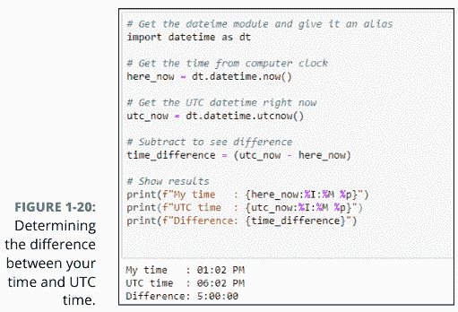

请注意，如果你用较晚的时间减去较早的时间，你会得到一个负数，这可能会产生误导，如下所示：

```
python
time_difference = (here_now - utc_now)
Difference: -1 day, 19:00:00
```

这实际上仍然是五小时，因为如果你从24小时（一天）中减去1天和19小时，你仍然得到-5小时。这是个棘手的问题。但请记住，时区地图的右侧是东方，太阳在每个时区的东方升起。所以当它在你所在的时区升起时，它已经在你右侧的时区升起了，而在你左侧的时区还没有升起。

如果你想直接使用时区名称，你需要从Python的`dateutils`包中导入一些日期工具。特别是，你需要从`dateutil`的`tz`类中导入`gettz`（`get timezone`的缩写）。因此，在你的代码中，就在`import datetime`行之后，使用`from dateutil.tz import gettz`，如下所示：

```
python
### import datetime and dateutil tz
import datetime as dt
from dateutil.tz import gettz
```

之后，你可以使用`gettz('name')`来获取任何时区的时区信息。将`name`替换为Olson数据库中的时区名称：例如，`America/New_York`表示美国东部时间，或`Etc/UTC`表示UTC时间。

图1-21展示了一个示例，我们使用`datetime.now()`获取五个不同时区的当前日期和时间——UTC和四个美国时区。

```
### import datetime, give it an alias
import datetime as dt
### import timezone helpers from dateutil
from dateutil.tz import gettz

### UTC time right now.
utc=dt.datetime.now(gettz('Etc/UTC'))
print(f"{utc:%A %D %I:%M %p %Z}")

### USA Eastern time.
est = dt.datetime.now(gettz('America/New_York'))
print(f"{est:%A %D %I:%M %p %Z}")

### USA Central time
cst=dt.datetime.now(gettz('America/Chicago'))
print(f"{cst:%A %D %I:%M %p %Z}")

### USA Mountain time
mst=dt.datetime.now(gettz('America/Boise'))
print(f"{mst:%A %D %I:%M %p %Z}")

pst=dt.datetime.now(gettz('America/Los_Angeles'))
print(f"{pst:%A %D %I:%M %p %Z}")
```

Friday 11/23/18 06:37 PM UTC
Friday 11/23/18 01:37 PM EST
Friday 11/23/18 12:37 PM CST
Friday 11/23/18 11:37 AM MST
Friday 11/23/18 10:37 AM PST

图1-21：五个不同时区的当前日期和时间。

所有美国时间都是标准时间，因为11月下旬美国没有人使用夏令时（DST）。看看如果我们安排一个在7月某个时间的事件会发生什么，那时美国又回到了夏令时。

在这段代码中（见图1-22），我们像前面的示例一样导入了`datetime`和`gettz`。但我们不关心当前时间。你关心的是一个安排在2020年7月4日晚上7:00的事件，时间是你所在的时区。所以我们使用以下方式定义它：

```
event = dt.datetime(2020,7,4,19,0,0)
```

我们在日期时间中没有提到任何关于时区的信息，所以时间将自动为我们所在的时区。该日期时间存储在`event`变量中。

以下代码行（在注释之后，注释以#开头）显示了日期和时间，同样是本地时间，因为我们没有提到任何关于时区的信息。我们在文本开头添加了"Local: "，并在末尾添加了换行符（\n），以便在输出中产生换行，并在视觉上将该单词与其余输出分开。

```
### Show local date and time
print(f"Local: {event:%D %I:%M %p %Z}\n")
```

当应用程序运行时，它会根据日期时间和我们的格式字符串显示以下输出：

```
Local: 07/04/20 07:00 PM
```

剩余的代码计算五个时区中每个时区的正确日期时间：

```
name = event.astimezone(gettz("tzname"))
```

第一个 *name* 只是我们编造的一个变量名。在 *event.astimezone()* 中，名称 *event* 指的是在前一行定义的初始事件时间。*astimezone()* 函数是一个内置的 *dateutil* 函数，使用以下语法：

```
astimezone(gettz("tzname"))
```

在计算时区日期和时间的每一行代码中，我们将 *tzname* 替换为 tz 数据库中的时区名称。正如你在输出中看到的（参考图 1-22），显示了五个不同时区的事件日期时间。请注意，美国时区是夏令时（例如 EDT）。因为我们恰好在东海岸，而事件发生在七月，所以正确的本地时区是美国东部夏令时间。当你查看日期的输出时，第一个与我们所在的时区匹配，这是理所当然的，其余日期的时间则根据不同时区进行了调整。

如果你在想“哎呀，真是个复杂的烂摊子”，我们完全同意你的看法。我们不认为这很直观、简单或有趣。但如果你急需为你的数据获取一些时区信息，你目前学到的编程技巧应该能帮你得到所需的信息。

如果你在网上研究 Python 时区，你可能会发现许多人推荐使用 `arrow` 模块而不是 `dateutil` 模块。我们这里不深入讨论所有这些，因为 `arrow` 不是你初始 Python 安装的一部分，而且这本书已经够厚了。（如果我们试图涵盖所有内容，你需要一辆手推车才能把书搬走。）

## 本章内容

- 使用 if 进行决策
- 使用 for 进行重复
- 使用 while 进行循环

# 第 2 章
控制操作

到目前为止，我们在本书中讨论了很多关于在计算机中存储信息的内容，主要是存储在 Python 和你的计算机可以处理的变量中。以计算机可以处理的形式保存信息对于让计算机做任何事情都至关重要。可以将此视为“拥有”部分——拥有一些可以处理的信息。

但现在我们需要将注意力转向“操作”部分——处理这些信息以创建有用或有趣的东西。在本章中，我们涵盖了让计算机执行操作最重要和最常用的操作。我们从计算机擅长、快速且经常做的事情开始：做决策。

## 控制操作的主要运算符

你通过做决策来控制你的程序（和计算机）做什么，这通常涉及进行比较。你使用运算符（如表 2-1 所示）进行比较。这些运算符通常被称为关系运算符或比较运算符，因为通过比较项目，计算机正在确定两个项目之间的关系。

Python 还提供三个逻辑运算符，也称为布尔运算符，使你能够在做出最终决策之前评估多个比较。这些运算符使用英语单词，基本上就是它们的含义，如表 2-2 所示。

### 表 2-1 用于决策的 Python 比较运算符

| 运算符 | 含义 |
| --- | --- |
| == | 等于 |
| != | 不等于 |
| < | 小于 |
| > | 大于 |
| <= | 小于或等于 |
| >= | 大于或等于 |

### 表 2-2 Python 逻辑运算符

| 运算符 | 含义 |
| --- | --- |
| and | 两者都为真 |
| or | 其中一个为真 |
| not | 不为真 |

如果你对 *布尔* 这个词感到好奇，它指的是一个名叫乔治·布尔的人，他在 19 世纪中叶帮助建立了逻辑代数，这为今天的计算机奠定了基础。你可以随意在网上搜索他的名字以了解更多信息。

所有这些运算符通常与 `if ... then ... else` 决策一起使用，以控制应用程序或程序的行为。要做出这样的决策，你使用 Python 的 `if` 语句。

## 使用 if 做决策

`if` 这个词在所有应用程序和计算机程序中经常用于做决策。`if` 的最简单语法如下：

```
if condition: do this
do this no matter what
```

因此，只有当条件为真时，才会执行第一个 `do this` 行。如果条件为假，则忽略第一个 `do this`。无论条件结果如何，接下来都会执行第二行。请注意，这两行都没有缩进。

缩进在 Python 中意义重大，你很快就会看到。但首先，考虑几个使用这种简单语法的简单示例。你可以在 Jupyter notebook 或 .py 文件中自己尝试。

图 2-1 显示了一个简单的示例，其中 `sun` 变量接收 `down` 字符串。然后一个 `if` 语句检查 `sun` 变量是否等于单词 `down`，如果等于，则打印 `Good night!` 消息。然后它只是正常继续打印 `I am here` 消息。

图 2-1：当条件为真时，简单 if 的结果。

```python
sun = "down"
if sun == "down": print("Good night!")
print("I am here")

### 输出：
### Good night!
### I am here
```

> 请确保始终使用两个等号且中间没有空格 (==) 来测试相等性。这个规则很容易忘记。如果你输入错误，代码将无法按预期工作。

如果你在 VS Code 中使用并激活 GitHub Copilot（有关 GitHub Copilot 的更多信息，请参见第 1 册第 1 章），它将尝试预测你的“if”语句，并可能以灰色文本输入建议。你可以通过按 Tab 键来接受建议的代码。你也可以在接受后修改建议的代码。

如果你运行相同的代码，但 `sun` 变量中包含除 `down` 以外的其他单词，则第一个 `print` 会被忽略。但下一行会正常执行，因为它不依赖于条件为真，如图 2-2 所示。

图 2-2：当条件为假时，简单 if 的结果。

```python
sun = "up"
if sun == "down": print("Good night!")
print("I am here")

### 输出：
### I am here
```

在第二个示例中，`sun` 变量等于 `down` 并不成立；因此该行的其余部分被忽略，只执行下一行。

在这两个示例中，当条件为真时要执行的代码与 `if` 在同一行。然而，通常当条件为真时，你想做的不止一件事。为此，你需要缩进每一行，这些行仅在条件为真时才执行。而 `if` 下方未缩进的代码，无论条件是否为真都会执行。建议缩进四个空格，但这不是硬性规定。你只需要记住每一行的缩进量必须相同。此外，即使只有一行代码需要在条件为真时执行，你也可以使用缩进语法。事实上，这是在 Python 中编写 if 的最常见方式，因为大多数人认为从人类的角度来看，它使代码更具可读性。所以实际上，语法是

```
if condition:
    do this
    ...
do this no matter what
```

因此，如果条件为真，则执行 `do this` 行，以及任何其他与该行缩进相同的行。`if` 下方的第一个未缩进行无论如何都会执行。所以你可以这样编写简单的 `sun` 示例：

```python
sun = "down"
if sun == "down":
    print("Good night!")
print("I am here")
```

如图 2-3 所示，此代码与将代码放在一行上的工作方式相同。如果 `sun` 是 down，则在执行第二个 `print` 之前会打印 `Good night!`。如果 `sun` 不等于 `down`，则跳过 `Good night!` 的 `print` 语句。

如果你想知道在 `if` 语句中使用单行还是多行更好，这取决于你所说的 *更好* 是什么意思。如果你指的是哪种方法执行得更快，答案是两者都不是。执行代码时，你将无法看到速度差异。如果你所说的 *更好* 是指对人类程序员来说更容易阅读，大多数人会更喜欢第二种方法，即代码缩进在 `if` 语句下面。

请记住，你可以在 `if` 语句下缩进任意多行，这些缩进的行仅在条件为真时执行。如果条件为假，则不会执行任何缩进的行。缩进行之后未缩进的代码总是会执行，因为它不依赖于该条件。以下是一个示例，其中四行代码仅在条件为真时执行：

```
total = 100
sales_tax_rate = 0.065
taxable = True
if taxable:
    print(f"Subtotal : ${total:.2f}")
    sales_tax = total * sales_tax_rate
    print(f"Sales Tax: ${sales_tax:.2f}")
    total = total + sales_tax
print(f"Total    : ${total:.2f}")
```

你必须将 `True` 和 `False` 拼写为首字母大写，其余字母小写。如果你以其他任何方式输入，Python 将不会将其识别为布尔值 `True` 或 `False`，你的代码将无法按预期运行。

请注意，在 `if` 语句中，我们使用了

```
if taxable:
```

这段代码完全没问题，因为我们已将 `taxable` 设为一个只能是 `True` 或 `False` 的布尔值。你可能会看到其他人将其输入为

```
if taxable == True:
```

这行代码也没问题，并且不会对代码产生任何负面影响。`== True` 只是多余的，因为 `taxable` 本身就已经是 `True` 或 `False`。

无论如何，如你所见，我们首先定义了一个 `total` 变量、一个 `sales_tax_rate` 变量和一个 `taxable` 变量。当 `taxable` 为 `True` 时，`if` 下的所有四行代码都会执行，最终得到如图 2-4 所示的输出。

当 `taxable` 设置为 `False` 时，所有缩进的行都会被跳过，显示的总计是未加销售税的原始总计，如图 2-5 所示。

图 2-4 和图 2-5 中的花括号和 `.2f` 等内容仅用于格式化，正如我们在第 2 册第 1 章中讨论的那样，与代码的 `if` 逻辑无关。

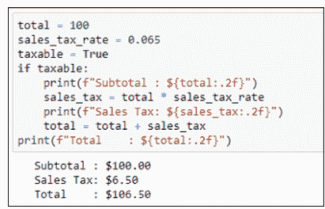

图 2-4：当 taxable 为 True 时，sales_tax 被加到总计中。

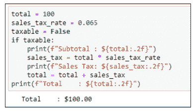

图 2-5：当 taxable 为 False 时，sales_tax 不会被加到总计中。

## 在你的 if 逻辑中添加 else

到目前为止，你已经看过了这样的代码示例：如果某个条件为真，则执行一些代码；如果条件为假，则忽略该代码。有时，你可能希望在条件为真时执行一段代码；否则（else），如果条件不为真，则希望执行另一段代码。在这种情况下，你可以在 `if` 后添加一个 `else:`。`else:` 下缩进的任何代码行仅在条件不为真时执行。以下是其逻辑和语法：

```
if condition:
    do indented lines here
    ...
else:
    do indented lines here
    ...
do remaining un-indented lines no matter what
```

图 2-6 展示了一个简单的例子，我们使用 `datetime.now()` 从计算机时钟获取当前时间。如果该时间的小时数小于 12，程序将显示“早上好”。否则，它将显示“下午好”。无论小时数是多少，它都会打印“希望你一切顺利！”。因此，如果你编写这样一个程序并在早上运行，你会得到相应的问候语，后面跟着“希望你一切顺利！”，如图 2-6 所示。

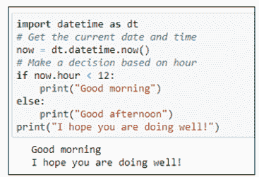

现在你可能会看着这个说：“哇，真了不起。但如果现在是晚上 11 点呢？你真的想说‘下午好’吗？”我们需要的是一个可以包含多个 else 语句的 `if ... else`。这就是接下来要描述的 `elif` 语句的用武之地。

## 使用 elif 处理多个 else 语句

当 `if ... else` 不足以处理所有可能性时，可以使用 `elif`（你可能已经猜到，这是一个由 else if 组合成的词）。一个 `if` 语句可以包含任意数量的 `elif` 条件。你可以包含或不包含一个最终的 `else` 语句，该语句仅在 `if` 和所有先前的 `elif` 都为假时执行。

最简单的形式是，不带 `else` 语句的 `if` 与 `elif` 的语法如下：

```
if condition:
    do these indented lines of code
    ...
elif condition:
    do these indented lines of code
    ...
do these un-indented lines of code no matter what
```

根据这种结构，有可能不会执行任何缩进的代码。看看这个例子：

```
light_color = "green"
if light_color == "green":
    print("Go")
elif light_color == "red":
    print("Stop")
print("This code executes no matter what")
```

执行该代码将得到以下结果：

```
Go
This code executes no matter what
```

如果你将灯的颜色改为红色，如下所示：

```
light_color = "red"
if light_color == "green":
    print("Go")
elif light_color == "red":
    print("Stop")
print("This code executes no matter what")
```

结果是

```
Stop
This code executes no matter what
```

假设你将灯的颜色改为红色或绿色以外的任何颜色，如下所示：

```
light_color = "yellow"
if light_color == "green":
    print("Go")
elif light_color == "red":
    print("Stop")
print("This code executes no matter what")
```

执行此代码将产生以下输出，因为 `color == "green"` 和 `color == "red"` 都不为真，所以没有执行任何缩进的代码：

```
This code executes no matter what
```

你可以添加一个 `else` 选项，它仅在之前的条件都为假时发生：

```
light_color = "yellow"
if light_color == "green":
    print("Go")
elif light_color == "red":
    print("Stop")
else:
    print("Proceed with caution")
print("This code executes no matter what")
```

输出是

```
Proceed with caution
This code executes no matter what
```

`light_color` 为黄色这一事实阻止了前两个 `if` 条件为真，因此只执行了 `else` 代码。对于你放入 `light_color` 变量的任何值（除了 "red" 或 "green"）都是如此，因为 `else` 并不寻找特定的条件。它只是在逻辑中扮演“如果所有其他条件都失败，则执行此操作”的角色。

这里是另一个代码示例，我们将一个名为 `age` 的变量设置为 31。然后我们使用 `if ... elif ... else` 来决定显示什么：

```
age = 31
if age < 21:
    beverage = "milk"
elif age >= 21 and age < 80:
    beverage = "beer"
else:
    beverage = "prune juice"
print("Have a " + beverage)
```

注释总是可选的。但向代码添加注释可以使其更容易理解，以备将来参考：

```
age = 31
if age < 21:
    # If under 21, no alcohol
    beverage = "milk"
elif age >= 21 and age < 80:
    # Ages 21 - 79, suggest beer
    beverage = "beer"
else:
    # If 80 or older, prune juice might be a good choice.
    beverage = "prune juice"
print("Have a " + beverage)
```


如果你忘记了 `if ... elif ... else` 的所有语法规则，你可以直接让 Copilot、ChatGPT、Claude.ai 或其他生成式 AI 为你*编写一个 python if elif else 语句*。你应该会得到一些具有正确语法的通用代码，以帮助你入门。

## 三元运算

`if ... then ... else` 操作非常常见，许多编程语言都提供了创建它们的简写语法。它们通常被称为*三元运算符*，但 Python 文档经常将其称为*条件表达式*。它们与 *if ... else* 的目的完全相同。因此，这里没有添加任何新内容。它只是一种使用较少词语的替代语法。基本蓝图是

```
value_if_true if condition else value_if_false
```

*条件*必须是一个产生 *True* 或 *False* 的表达式。如果条件为 *True*，则运算符返回表示为 *value_if_true* 的值。如果条件为 *False*，则表达式返回表示为 *value_if_false* 的值。

作为一个实际示例，请看以下代码。注意 *sales_tax_rate* 变量如何获得 0.065 或 0 的值。

```
product = "Plushie"
unit_price = 4.99
taxable = False

### Sales tax rate value depends on taxable status
sales_tax_rate = 0.065 if taxable else 0

print(sales_tax_rate)
```

设置销售税率的行会将税率设置为 0.065（如果当前项目应税，即 *taxable* 变量包含值 *True*）。否则，*sales_tax_rate* 被设置为 *False*。因此，在实践中，它与下面的代码完全相同。它只是使用了更少的词语，使代码更小一些。以下是使用 Python 中的 *if ... else* 实现的完全相同的逻辑

```
product = "Plushie"
unit_price = 4.99
taxable = False

### Sales tax rate value depends on taxable status
if taxable:
    sales_tax_rate = 0.065
else:
    sales_tax_rate = 0

print(sales_tax_rate)
```

## 使用 for 循环重复过程

决策是编写各类应用程序（游戏、人工智能、机器人……等等）的重要组成部分。但有时你需要计数或反复执行一项任务。在这些情况下，你可以使用 *for 循环*，它允许你根据需要重复一行或多行代码。

## 在数字范围内循环

如果你知道希望循环重复多少次，使用以下语法可能是最简单的：

```
for x in range(y):
    do this
    do this
    ...
un-indented code is executed after the loop
```

将 *x* 替换为你选择的任何变量名。将 *y* 替换为任何数字或数字范围。如果你指定一个数字，范围将从 0 到比该数字小 1 的数。例如，在 Jupyter notebook 或 .py 文件中运行此代码：

```
for x in range(7):
    print(x)
print("All done")
```

输出是每次循环执行 `print(x)` 的结果，其中 *x* 从 0 开始。最后一行没有缩进，在循环结束后执行。因此输出是

```
0
1
2
3
4
5
6
All done
```

你可能期望循环从 1 数到 7，而不是从 0 数到 6。然而，除非你另有指定，否则循环总是从 0 开始计数。如果你想从另一个数字开始计数，请在括号内指定起始数字和结束数字，用逗号分隔。当你指定两个数字时，第一个数字标识计数的起点。第二个数字比循环停止的位置大 1（这对可读性来说很不幸，但生活就是如此）。例如，这是一个在 range 中使用两个数字的 for 循环：

```
for x in range(1,10):
    print(x)
print("All done")
```

当你运行此代码时，计数器从 1 开始，并且如前所述，在最后一个数字之前停止：

```
1
2
3
4
5
6
7
8
9
All done
```

如果你想让循环从 1 数到 10，范围应该是 1, 11。这不会让你的脑细胞更快乐，但至少它能达到从 1 到 10 的预期目标，如图 2-7 所示。

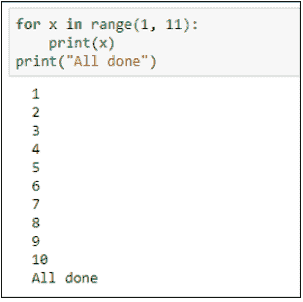

## 遍历字符串

在 for 循环中使用 range() 是可选的。你可以用字符串替换 range，循环将为字符串中的每个字符重复一次。变量 x（或你命名的任何变量）在每次循环中包含字符串中的一个字符，从左到右。这里的语法是

```
for x in string
    do this
    do this
    ...
do this when the loop is done
```

像往常一样，将 x 替换为你喜欢的任何变量名。字符串应该是用引号括起来的文本，或者应该是包含字符串的变量名。例如，将此代码输入 Jupyter notebook 或 .py 文件：

```
for x in "snorkel":
    print(x)
print("Done")
```

当你运行此代码时，你会得到以下输出。循环在每次循环中打印单词 snorkel 中的一个字母。当循环结束时，执行跳转到循环外的第一个未缩进行。

```
s
n
o
r
k
e
l
Done
```

字符串不必是字面字符串。它可以是任何包含字符串的变量名。例如，尝试此代码：

```
my_word = "snorkel"
for x in my_word:
    print(x)
print("Done")
```

结果是相同的。唯一的区别是我们在 for 循环中使用了变量名而不是字符串。但代码知道你的意思，因为它是 my_word 的内容，而不是字面字符串 my_word，因为 my_word 没有用引号括起来。

```
s
n
o
r
k
e
l
Done
```

## 遍历列表

在 Python 中，*列表*基本上是任何一组项目，用逗号分隔，放在方括号内。你可以使用 *for* 循环遍历这样的列表。在下面的示例中，要遍历的列表在第一行的方括号中指定：

```
for x in ["The", "rain", "in", "Spain"]:
    print(x)
print("Done")
```

这种循环为列表中的每个项目重复一次。变量 x 从列表中的一个项目获取其值，从左到右。因此，运行前面的代码会产生你在图 2-8 中看到的输出。

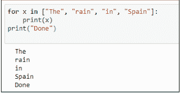

你也可以将列表赋值给一个变量，然后在 *for* 循环中使用变量名而不是列表。图 2-9 显示了一个示例，其中 *seven_dwarves* 变量被赋值为一个包含七个名字的列表。同样，请注意列表包含在方括号中。这些方括号使 Python 将该变量视为列表。然后 *for* 循环遍历列表，在每次循环中打印一个矮人（列表中的一个项目）的名字。我们使用了变量名 *dwarf* 而不是 x，但这个名字可以是任何你喜欢的有效名称。我们本可以使用 *x* 或 *little_person* 或 *name_of_fictional_entity* 或 *goober_wocky* 或任何其他名称，只要第一行中的名称与 *for* 循环中使用的名称匹配即可。

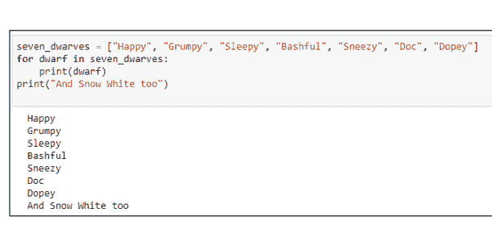

图 2-9：遍历列表。

## 提前退出循环

通常，你希望循环遍历整个列表或项目范围，但你也可以在满足某些条件时强制循环提前停止。在 `if` 语句中使用 `break` 语句来强制循环提前停止。语法是

```
for x in items:
    if condition:
        [do this ... ]
        break
    do this
```

此示例中的方括号不是代码的一部分。它们表示括号内的内容是可选的。假设某人完成了一项考试，我们想遍历答案。但我们有一条规定，如果答案为空，我们将其标记为“未完成”并忽略列表中的其余项目。在下面的示例中，所有项目都已回答（没有空白）：

```
answers = ["A", "C", "B", "D"]
for answer in answers:
    if answer == "":
        print("Incomplete")
        break
    print(answer)
print("Loop is done")
```

在结果中，所有四个答案都被打印出来：

```
A
C
B
D
Loop is done
```

这是相同的代码，但列表中的第三项是空白的，如 "" 所示，这是一个空字符串：

```
answers = ["A", "C", "", "D"]
for answer in answers:
    if answer == "":
        print("Incomplete")
        break
    print(answer)
print("Loop is done")
```

运行该代码的输出如下：

```
A
C
Incomplete
Loop is done
```

因此逻辑是，只要提供了某个答案，`if` 代码就不会执行，循环会运行到完成。但是，如果循环遇到空白答案，它会打印 `Incomplete` 并且“中断”循环，跳转到循环外的第一条语句（最后一条未缩进的语句），该语句打印 `Loop is done`。

## 使用 continue 循环

你也可以在循环中使用 `continue` 语句，它与 `break` 有点相反。`break` 使代码执行跳过循环末尾并停止循环，而 `continue` 使其跳回循环顶部并继续处理下一个项目（即触发 `continue` 的项目之后的项目）。因此，这是与前面示例相同的代码，但当执行遇到空白答案时，它不是执行 `break`，而是继续处理列表中的下一个项目：

```
answers = ["A", "C", "", "D"]
for answer in answers:
    if answer == "":
        print("Incomplete")
        continue
    print(answer)
print("Loop is done")
```

该代码的输出如下。它不打印空白答案，它打印 Incomplete，但然后它返回并继续遍历其余项目：

```
A
C
Incomplete
D
Loop is done
```

## 嵌套循环

嵌套循环是完全可以的——也就是说，将循环放在循环内部。只需确保你的缩进正确，因为缩进决定了代码行位于哪个循环内（如果有的话）。例如，在图 2–10 中，一个外层循环遍历单词 First、Second 和 Third。在每次循环中，它打印一个单词，然后打印数字 1–3（通过遍历一个范围并将每个范围值加 1）。

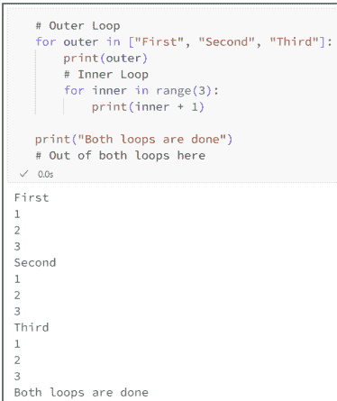

循环之所以有效，是因为外层列表中的每个单词后面都跟着数字 1–3。循环的结束是底部第一个未缩进的行，它在外部循环完成其过程之前不会打印。

## 使用 while 循环

作为 `for` 循环的替代方案，你可以使用 `while` 循环。两者的区别很微妙。使用 `for` 循环时，你通常会得到固定次数的循环，每次循环对应一个范围或列表中的项。而使用 `while` 循环时，循环会*只要*（while）某个条件为真就持续运行。以下是基本语法：

```
while condition:
    do this ...
    do this ...
do this when the loop is done
```

使用 `while` 循环时，你必须确保使循环停止的*条件*最终会发生。否则，你会得到一个无限循环，它会一直运行下去，直到某个错误导致其失败，或者直到你通过关闭应用程序、关闭计算机或执行其他强制操作来使其停止。

图 2-11 展示了一个示例，其中 `while` 条件由于三个原因而运行有限次数：

- 我们创建了一个名为 `counter` 的变量，并赋予其初始值（65）。
- 我们设定当 `counter` 小于 91 时运行循环。
- 在循环内部，我们将 `counter` 增加 1（`counter += 1`）。反复增加 1 最终会使 `counter` 大于 91，从而结束循环。

循环内部的 `chr()` 函数显示 `counter` 中数字对应的 ASCII 字符。从 65 到 90 足以打印出字母表中的所有大写字母，正如你在图 2-11 中看到的那样。

使用这类循环时，一个常见且容易犯的错误是忘记递增计数器，使其在每次循环中增长，并最终使 `while` 条件变为 `False` 从而停止循环。在图 2-12 中，我们故意移除了 `counter += 1` 以引发该错误。如你所见，循环不断打印 A。它会一直运行，直到你停止它，或者内存耗尽并自行停止。

如果在 Jupyter notebook 中遇到这种情况，不要惊慌。只需点击“运行”按钮右侧的方形“停止”按钮。（当鼠标指针悬停在“停止”按钮上时，它会显示“中断内核”，这是极客们对*停止*的称呼。）notebook 中的所有代码执行都将停止。要重新启动内核并回到初始状态，请点击“停止”按钮右侧的弯曲箭头。然后你就可以修复代码中的错误并重试。

```
counter = 65
while counter < 91:
    print(str(counter) + "=" + chr(counter))
    counter += 1
print("all done")
```

```
65=A
66=B
67=C
68=D
69=E
70=F
71=G
72=H
73=I
74=J
75=K
76=L
77=M
78=N
79=O
80=P
81=Q
82=R
83=S
84=T
85=U
86=V
87=W
88=X
89=Y
90=Z
all done
```

图 2-11：当 counter 小于 91 时进行循环。

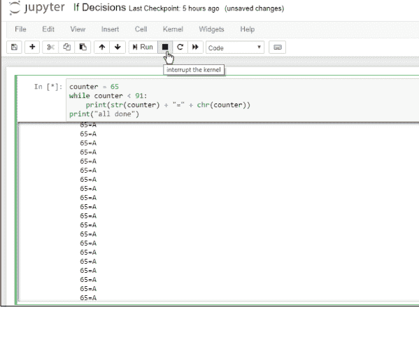

图 2-12：一个无限 while 循环。

如果你忘记了编写 Python 循环的语法并想要一个快速示例，只需让 Copilot 或其他生成式 AI 编写一个 python for 循环，或编写一个 python while 循环，或编写一个遍历字符串中每个字符的 python 循环。用最能描述你当前想编写的代码的词语即可。

## 使用 continue 重新开始 while 循环

你可以在 `while` 循环中使用 `if` 和 `continue` 来跳回循环顶部，就像在 `for` 循环中一样。请查看图 2-13 中的代码作为示例。

```
import random
print("Odd numbers")
counter = 0
while counter < 10:
    # Get a random number
    number = random.randint(1, 999)
    if int(number / 2) == number / 2:
        # If it's an even number, don't print it.
        continue
    #Otherwise, if it's odd, print it and increment the counter.
    print(number)
    # Increment the loop counter.
    counter += 1
print("Loop is done")
```

```
Odd numbers
697
449
91
567
949
333
591
699
895
837
Loop is done
```

图 2-13：一个带有 continue 的 while 循环。

一个 `while` 循环在名为 `counter` 的变量小于 10 时持续运行。在循环内部，名为 `number` 的变量被赋予一个 1 到 999 范围内的随机数。然后以下语句检查 `number` 是否为偶数：

```
if int(number / 2) == number / 2:
```

记住，`int()` 函数只返回数字的整数部分。假设生成的随机数是 5。将这个数除以 2 得到 2.5。然后 `int(number)` 是 2，因为数字的 `int()` 会丢弃小数点后的所有内容。因为 2 不等于 2.5，所以代码跳过 `continue`，打印该奇数，递增计数器，然后继续运行。

如果下一个随机数是，比如说，12，那么 12 除以 2 是 6，而 `int(6)` 确实等于 6（因为两个数都没有小数点）。这会导致 `continue` 执行，跳过 `print(number)` 语句和 `counter` 递增，因此它只是尝试另一个随机数并继续愉快地运行。最终，它会找到十个奇数，此时循环停止，最后一行代码显示 `Loop is done`。

## 使用 break 中断 while 循环

你也可以使用 `break` 来中断 `while` 循环，就像在 `for` 循环中一样。当你中断一个 `while` 循环时，你强制执行继续到循环下方和外部的第一行代码，从而停止循环但继续执行循环之后的其余操作。

另一种理解 `break` 的方式是，它允许你在 `while` 条件被证明为假之前停止 `while` 循环。因此，它允许你在循环结束之前真正地跳出循环。语法是

```
while condition1:
    do this
    ...
    if condition2:
        break
do this when the loop is done
```

基本上，有两种情况可以停止这个循环。要么 `condition1` 被证明为假，要么 `condition2` 被证明为真。无论发生哪种情况，代码执行都会在循环外的第一行代码处恢复，即示例代码中读取 `do this when the loop is done` 的那一行。

在下面的示例中，程序打印最多十个不能被 5 整除的数字。不过，它可能打印少于十个，因为当它遇到一个能被 5 整除的随机数时，它会退出循环。因此，关于这个示例，你唯一能预测的是它将打印零到十个不能被 5 整除的数字。你无法预测在任何给定运行中它会打印多少个，因为在它被允许的十次尝试中，无法判断它是否会或何时会得到一个能被 5 整除的随机数：

```
import random
print("Numbers that aren't evenly divisible by 5")
counter = 0
while counter < 10:
    # Get a random number
    number = random.randint(1,999)
    if int(number / 5) == number / 5:
        # If it's evenly divisible by 5, bail out.
        break
    # Otherwise, print it and keep going for a while.
    print(number)
    # Increment the loop counter.
    counter += 1
print("Loop is done")
```

第一次运行该程序时，你的输出可能类似于图 2-14。第二次运行时，你可能会得到类似图 2-15 的结果。根本无法预测结果，因为随机数确实是随机且不可预测的（这在许多游戏中是一个重要的概念）。

```
import random
print("Numbers that aren't evenly divisible by 5")
counter = 0
while counter < 10:
    # Get a random number
    number = random.randint(1, 999)
    if int(number / 5) == number / 5:
        # If it's evenly divisible by 5, bail out.
        break
    # Otherwise, print it and keep going for a while.
    print(number)
    # Increment the loop counter.
    counter += 1
print("Loop is done")
```

```
Numbers that aren't evenly divisible by 5
729
754
317
753
327
366
69
813
543
67
Loop is done
```

图 2-14：一个带有 break 的 while 循环。

```
import random
print("Numbers that aren't evenly divisible by 5")
counter = 0
while counter < 10:
    # Get a random number
    number = random.randint(1, 999)
    if int(number / 5) == number / 5:
        # If it's evenly divisible by 5, bail out.
        break
    # Otherwise, print it and keep going for a while.
    print(number)
    # Increment the loop counter.
    counter += 1
print("Loop is done")
```

```
Numbers that aren't evenly divisible by 5
866
377
197
Loop is done
```

图 2-15：与图 2-14 相同的代码在第二次运行时的结果。

130 第 2 册 理解 Python 构建块

## 本章内容
- 定义列表
- 使用列表
- 理解元组
- 探索集合

# 第3章
## 列表与元组的快速入门

有时在代码中，你一次只处理一个数据项，比如一个人的名字、单价或用户名。其他时候，你需要处理更大的数据集，比如一组人名列表或一组产品及其价格。在大多数编程语言中，这些数据集通常被称为*列表*或*数组*。

正如你将在本章中发现的，Python 提供了大量简单、快速且高效的方法来处理各种数据集合。一如既往，我们鼓励你在 Jupyter notebook 或 .py 文件中跟着动手实践。“动手做”的部分有助于“理解”的部分。

## 定义和使用列表

Python 中最简单的数据集合是列表。我们在前一章已经提供了示例。*列表*是方括号内用逗号分隔的任何数据项列表。通常，你会使用 `=` 字符为列表赋值，就像处理变量一样。如果列表包含数字，不要在它们周围使用引号。例如，这是一个考试成绩列表：

```
scores = [88, 92, 78, 90, 98, 84]
```

如果列表包含字符串，这些字符串应该像往常一样用单引号或双引号括起来，如本例所示：

```
students = ["Mark", "Amber", "Todd", "Anita", "Sandy"]
```

要在屏幕上显示列表的内容，你可以像打印任何常规变量一样打印它。例如，在定义该列表后，在代码中执行 `print(students)` 会在屏幕上显示以下内容：

```
['Mark', 'Amber', 'Todd', 'Anita', 'Sandy']
```

这个输出可能不是你想象中的样子。但别担心：Python 提供了多种显示列表的方式。

## 通过位置引用列表项

列表中的每个项目都有一个位置编号，从 0 开始，即使你看不到任何数字。你可以通过列表名称后跟方括号中的数字来引用列表中的任何项目。换句话说，使用以下语法：

```
listname[x]
```

## 真的、真的超长列表

本章中的所有列表都很短，以便示例易于理解和操作。然而，在现实生活中，你的列表可能包含数百甚至数千个频繁变化的项目。在代码中直接输入如此长的列表会使代码难以处理。相反，你会将这些列表存储在外部文件或外部数据库中，这样一切都更容易管理。

你在本章学到的所有技术都适用于存储在外部文件中的列表。唯一的区别是你必须先编写代码将数据拉入列表。但在开始处理大列表之前，你需要了解处理任何大小列表的所有技巧。因此，在继续管理外部数据之前，请先坚持学习本章内容。你会很高兴你这么做了。

将 *listname* 替换为你要访问的列表名称，将 *x* 替换为你想要的项目的位置编号。请记住，第一个项目始终是 0，而不是 1。例如，在下面的第一行中，我们定义了一个名为 *students* 的列表，然后打印该列表中的第 0 项。执行代码时，结果显示的是名字 Mark：

```
students = ["Mark", "Amber", "Todd", "Anita", "Sandy"]
print(students[0])
```


在朗读列表项时，专业人士会在数字前使用 *sub* 这个词。例如，*students[0]* 会读作“students sub zero”。

下一个示例显示了一个名为 *scores* 的列表。*print()* 函数打印 *scores[4]* 的值，在本例中是 84。请记住，第一个项目始终位于位置 0。所以 *scores[0]* 是 88，*scores[1]* 是 92，依此类推。

```
scores = [88, 92, 78, 90, 84]
print(scores[4])
84
```

如果你尝试访问一个不存在的列表项，你会得到一个 *list index out of range* 错误。*index* 部分指的是方括号内的数字。例如，图 3-1 显示了 Jupyter notebook 中的一个小实验，我们创建了一个分数列表，然后尝试打印 *scores[5]*。它失败了并生成了一个错误，因为列表中没有 *scores[5]*。它只有 *scores[0]*、*scores[1]*、*scores[2]*、*scores[3]* 和 *scores[4]*，因为计数总是从列表中的第一个项目 0 开始。

图 3-1：发生索引超出范围错误，因为 *scores[5]* 不存在。

```
### Define a list of numbers.
scores = [88, 92, 78, 90, 84]

print(scores[5])

---------------------------------------------------------------------------
IndexError                                Traceback (most recent call last)
<ipython-input-9-240d3b4f5443> in <module>()
      5 
      6 #Experiment with the lists
----> 7 print(scores[5])

IndexError: list index out of range
```

## 遍历列表

要访问列表中的每个项目，只需使用 `for` 循环，语法如下：

```
for x in list:
```

将 `x` 替换为你选择的变量名。将 `list` 替换为列表的名称。

使代码易于阅读的一个简单方法是始终使用复数作为列表名称（例如 `students`、`scores`）。然后你可以使用单数名称（`student`、`score`）作为变量名。使用这种方法，你也不需要使用下标数字（方括号中的数字）。例如，以下代码打印 `scores` 列表中的每个分数：

```
for score in scores:
    print(score)
```

请记住，始终缩进要在循环中执行的代码。图 3-2 显示了一个更完整的示例，你可以在其中看到在 Jupyter notebook 中运行代码的结果。

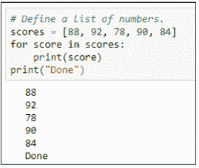

## 检查列表是否包含某个项目

如果你希望代码检查列表的内容以查看它是否已包含某个项目，请在 `if` 语句或变量赋值中使用 `in listname`。例如，图 3-3 中的代码创建了一个姓名列表。然后，两个变量存储了在列表中搜索名字 `Anita` 和 `Bob` 的结果。打印每个变量的内容会显示 `True`，表示名字 `Anita` 在列表中。测试 `Bob` 是否在列表中的结果证明是 `False`。

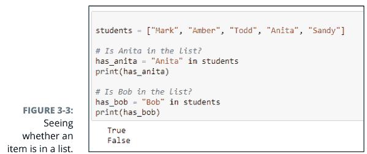

## 获取列表的长度

要确定列表中有多少个项目，请使用 `len()` 函数（*length* 的缩写）。将列表名称放在括号内。例如，在 Jupyter notebook 或 Python 提示符或其他地方输入以下代码：

```
students = ["Mark", "Amber", "Todd", "Anita", "Sandy"]
print(len(students))
```

运行该代码会产生以下输出：

```
5
```

该列表有五个项目，尽管最后一个项目的索引始终比列表的长度小 1，因为 Python 从 0 开始计数。所以最后一个项目 `Sandy` 存储在 `students[4]` 中，而不是 `students[5]` 中。

## 将项目添加到列表末尾

当你希望代码将项目添加到列表末尾时，请使用 `.append()` 方法，并将要添加的值放在括号内。你可以使用变量名或字面值。例如，在图 3-4 中，行 `students.append("Goober")` 将名字 Goober 添加到列表中。行 `students.append(new_student)` 将存储在 `new_student` 变量中的任何名字添加到列表中。`.append()` 方法始终添加到列表末尾。因此，当你打印列表时，这两个新名字位于末尾。

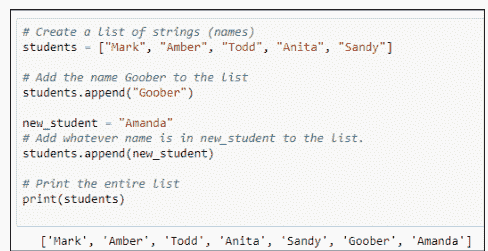

你可以使用测试来查看项目是否在列表中，然后仅在项目不在列表中时才追加它。例如，以下代码不会将名字 Amanda 添加到列表中，因为该名字已在列表中：

```
student_name = "Amanda"
### Add student_name but only if not already in the list.
if student_name in students:
    print(student_name + " already in the list")
else:
    students.append(student_name)
    print(student_name + " added to the list")
```

## 将项目插入列表

`append()` 方法将项目添加到列表末尾，而 `insert()` 方法将项目添加到列表中的任何位置。`insert()` 的语法是

```
listname.insert(position, item)
```

将 `listname` 替换为列表的名称，将 `position` 替换为你想要插入项目的位置（例如，0 表示使其成为第一个项目，1 表示使其成为第二个项目，依此类推）。将 `item` 替换为你想要放入列表的值，或包含该值的变量的名称。

例如，以下代码使 Lupe 成为列表中的第一个项目：

```
### Create a list of strings (names).
students = ["Mark", "Amber", "Todd", "Anita", "Sandy"]
student_name = "Lupe"
### Add student name to front of the list.
students.insert(0, student_name)
### Show me the new list.
print(students)
```

如果你运行代码，`print(students)` 将显示插入新名称后的列表，如下所示：

```
['Lupe', 'Mark', 'Amber', 'Todd', 'Anita', 'Sandy']
```

## 更改列表中的项目

你可以像使用变量一样，使用 `=` 赋值运算符来更改列表中的项目。请确保在方括号中包含索引号，以指明要更改的项目。语法如下：

```
listname[index] = newvalue
```

将 `listname` 替换为列表的名称；将 `index` 替换为要更改项目的下标（索引号）；并将 `newvalue` 替换为要放入列表项目的任何值。例如，看看这段代码：

```
### 创建一个字符串（名称）列表。
students = ["Mark", "Amber", "Todd", "Anita", "Sandy"]
students[3] = "Hobart"
print(students)
```

当你运行此代码时，输出如下，因为 Anita 已被更改为 Hobart：

```
['Mark', 'Amber', 'Todd', 'Hobart', 'Sandy']
```

## 合并列表

如果你有两个想要合并成一个列表的列表，请使用 `extend()` 函数，语法如下：

```
original_list.extend(additional_items_list)
```

在你的代码中，将 `original_list` 替换为要向其添加新列表项目的列表名称。将 `additional_items_list` 替换为包含要添加到第一个列表中的项目的列表名称。这是一个使用名为 `list1` 和 `list2` 的列表的简单示例。执行 `list1.extend(list2)` 后，第一个列表包含来自两个列表的项目，正如你在最后 `print()` 语句的输出中看到的那样。

```
### 创建两个名称列表。
list1 = ["Zara", "Lupe", "Hong", "Alberto", "Jake"]
list2 = ["Huey", "Dewey", "Louie", "Nader", "Bubba"]
### 将 list2 的名称添加到 list1。
list1.extend(list2)
### 打印 list 1。
print(list1)

['Zara', 'Lupe', 'Hong', 'Alberto', 'Jake', 'Huey', 'Dewey', 'Louie', 'Nader', 'Bubba']
```

很简单，对吧？

你也可以通过使用加号 (+) 连接列表来合并它们。例如，你可以使用 `newlist = list1 + list2` 这行代码来创建一个名为 `newlist` 的新列表，其中包含来自两个列表的所有项目。

## 删除列表项目

Python 提供了一个 `remove()` 方法，以便你可以从列表中删除任何值。如果该项目在列表中出现多次，则只会删除第一次出现的项目。例如，以下代码显示了一个字母列表，其中字母 C 重复了几次。然后代码使用 `letters.remove("C")` 从列表中删除字母 C：

```
### 创建一个字符串列表。
letters = ["A", "B", "C", "D", "C", "E", "C"]
### 从列表中删除 "C"。
letters.remove("C")
### 显示新列表。
print(letters)
```

当你执行此代码时，你会看到只有第一个字母 C 被删除了：

```
['A', 'B', 'D', 'C', 'E', 'C']
```

如果你需要删除某个项目的所有实例，可以使用 `while` 循环，只要该项目仍然存在于列表中，就重复执行 `.remove`。例如，将 `letter.remove("C")` 放在一个 `while` 循环中，该循环对 `letters` 字符串中的每个字母 C 执行一次，如下所示，将从列表中删除所有大写字母 C。

```
while "C" in letters:
    letters.remove("C")
```

如果你想根据项目在列表中的位置删除它，请使用带有索引号的 `pop()`，而不是带有值的 `remove()`。如果你想删除列表中的最后一个项目，请使用不带索引号的 `pop()`。例如，以下代码创建一个列表，删除第一个项目（0），然后删除最后一个项目（`pop()` 括号内无内容）。打印列表证明这两个项目已被删除：

```
### 创建一个字符串列表。
letters = ["A", "B", "C", "D", "E", "F", "G"]
### 删除第一个项目。
letters.pop(0)
### 删除最后一个项目。
letters.pop()
### 显示新列表。
print(letters)
```

运行代码显示，弹出第一个和最后一个项目确实有效：

```
['B', 'C', 'D', 'E', 'F']
```

当你从列表中 `pop()` 一个项目时，你可以将该值的副本存储在某个变量中。例如，图 3-5 显示了与前面相同的代码，但它将删除的内容的副本存储在名为 `first_removed` 和 `last_removed` 的变量中。最后，它打印列表并显示哪些字母被删除了。

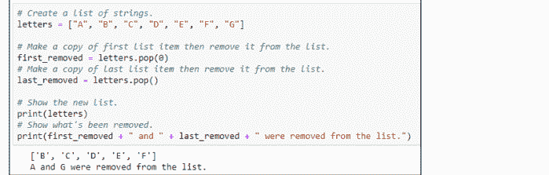

Python 还提供了一个 `del`（*delete* 的缩写）命令，可以根据索引号（位置）从列表中删除任何项目。但同样，你必须记住第一个项目位于位置 0。所以，假设你运行以下代码从列表中删除第 2 个项目：

```
### 创建一个字符串列表。
letters = ["A", "B", "C", "D", "E", "F", "G"]
### 删除下标为 2 的项目。
del letters[2]
print(letters)
```

运行该代码再次显示列表，如下所示：

```
['A', 'B', 'D', 'E', 'F', 'G']
```

字母 *C* 已被删除，这是正确的删除项目，因为字母编号为 0、1、2、3，依此类推。

你也可以使用 `del` 通过移除方括号和索引号来删除整个列表。例如，图 3-6 中的代码创建一个列表然后删除它。在删除后尝试打印列表会导致错误，因为在执行 `print()` 语句时列表已不存在。请注意，与 `pop` 返回你删除的项目不同，`del` 只是删除而不返回任何内容。

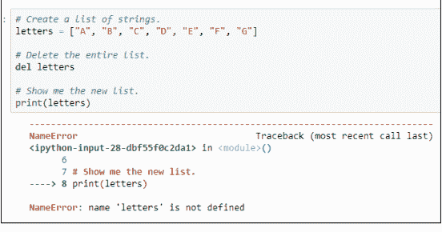

**图 3-6：** 删除列表然后尝试打印它会导致错误。

## 清空列表

如果你想删除列表的内容但不删除列表本身，请使用 `.clear()`。列表仍然存在，但不包含任何项目。换句话说，它是一个空列表。以下代码展示了如何测试这一点。运行代码最后显示 `[]`，让你知道列表是空的：

```
### 创建一个字符串列表。
letters = ["A", "B", "C", "D", "E", "F", "G"]
### 清空列表中的所有条目。
letters.clear()
### 显示新列表。
print(letters)

[]
```

## 计算项目在列表中出现的次数

你可以使用列表的 `count()` 方法来计算某个项目在列表中出现的次数。与其他列表方法一样，语法很简单：

```
listname.count(x)
```

将 `listname` 替换为你的列表名称，将 `x` 替换为你要查找的值（或包含该值的变量名）。

图 3-7 中的代码计算字母 B 在列表中出现的次数，使用 `.count()` 括号内的字面量 B，如下所示：

```
grades.count("B")
```

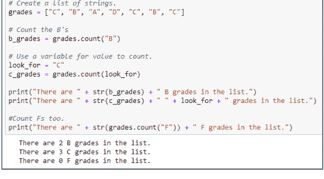

因为 B 在引号中，所以你知道它是一个字面量，而不是某个变量的名称。

此代码还计算了 C 等级的数量，但我们将其值存储在一个变量中，只是为了展示语法上的差异。两种计数都有效，正如你在程序底部的输出中看到的那样。

我们只是在显示消息的代码中直接计算了 F 的数量。没有 F 等级，所以 `grades.count("F")` 返回 0，正如你在输出中看到的。

如果你想知道为什么我们不计算其他等级，那是因为这个应用程序只是一个用来说明 Python 语法的示例。我们并不是要创建一个实际的产品来计算教室中所有的真实等级。

在尝试将数字和字符串组合成消息时，你必须使用 `str()` 函数将数字转换为字符串。否则，你会得到一个类似 `can only concatenate str (not "int") to str` 的错误。在该消息中，`int` 是 *integer*（整数）的缩写，`str` 是 *string*（字符串）的缩写。

## 查找列表项目的索引

Python 提供了一个 `.index()` 方法，该方法返回一个数字，表示项目在列表中的位置，基于索引号。语法如下：

```
listname.index(x)
```

一如既往，将 `listname` 替换为要搜索的列表名称。将 `x` 替换为你要查找的任何内容（可以是字面量或变量名）。当然，不能保证该项目在列表中或只在列表中出现一次。如果该项目不在列表中，则会发生错误。如果该项目在列表中出现多次，则只返回第一个匹配项目的索引。

图 3-8 显示了一个示例，其中程序在 `f_index = grades.index(look_for)` 这一行崩溃，因为列表中没有 `F`。

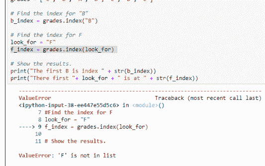

解决此问题的一个简单方法是在尝试获取其索引号之前，使用 `if` 语句检查项目是否在列表中。如果该项目不在列表中，则显示一条消息说明情况。否则，获取索引号并在消息中显示。该代码如下：

## 列表的字母排序与排序

Python 提供了 `sort()` 方法用于对列表进行排序。其最简单的形式是，如果列表中的元素是字符串，则按字母顺序排列；如果列表包含数字，则按从小到大的顺序排列。对于这样简单的排序，只需使用带空括号的 `sort()` 即可：

```
listname.sort()
```

将 *listname* 替换为你的列表名称。图 3-9 展示了一个使用字符串列表和数字列表的示例。接下来，我们只需使用 `.sort()` 对每个列表进行排序。然后代码会打印每个已排序列表的内容。

```
### 创建一个字符串列表。
names = ["Zara", "Lupe", "Hong", "Alberto", "Jake", "Tyler"]
### 创建一个数字列表
numbers = [14, 0, 56, -4, 99, 56, 11.23]

### 对 names 列表进行排序。
names.sort()
### 对 numbers 列表进行排序。
numbers.sort()

### 显示结果
print(names)
print(numbers)

['Alberto', 'Hong', 'Jake', 'Lupe', 'Tyler', 'Zara']
[-4, 0, 11.23, 14, 56, 56, 99]
```

图 3-9：对字符串和数字进行排序。

如果你的列表包含大小写字母混合的字符串，并且排序结果看起来不正确，可以尝试将 `.sort()` 替换为 `.sort(key=lambda s: s.lower())`，然后再次运行代码。如果你对细节感兴趣，请参阅第 2 册第 5 章。

日期的处理稍微复杂一些，因为你不能像输入字符串（如 12/31/2020）那样直接输入日期。它们必须是 `date` 数据类型才能正确排序。这意味着需要使用 `datetime` 模块和 `date()` 方法来定义每个日期。你可以像添加任何其他列表项一样将日期添加到列表中。例如，在下面的代码行中，代码创建了一个包含四个日期的列表：

```
import datetime as dt
dates = [dt.date(2020, 12, 31), dt.date(2019, 1, 31), dt.date(2018, 2, 28),
         dt.date(2020, 1, 1)]
```

计算机当然不会介意你以这种方式创建列表。但如果你想让代码对自己或其他开发者更具可读性，你可能希望逐个创建并追加每个日期。图 3-10 展示了一个示例，其中我们创建了一个名为 `datelist` 的空列表。

然后我们使用 `dt.date(year, month, day)` 语法逐个向列表中追加日期。

列表创建后，代码使用 `datelist.sort()` 将日期按时间顺序（从最早到最晚）排序。我们在那段代码中没有使用 `print(datelist)`，因为该方法显示的日期会包含数据类型信息，如下所示：

```
[datetime.date(2018, 2, 28), datetime.date(2019, 1, 31),
 datetime.date(2020, 1, 1), datetime.date(2020, 12, 31)]
```

这不是最容易阅读的列表。因此，我们没有使用一个 `print()` 语句打印整个列表，而是遍历列表中的每个日期，并使用 f-string `%m/%d/%Y` 格式化打印每个日期。这种技术以 mm/dd/yyyy 格式将每个日期显示在单独的行上，如图 3-10 底部所示。

如果你想按相反顺序排序，请在 `sort()` 括号内放入 `reverse=True`（并记住将 `True` 的首字母大写）。图 3-11 展示了使用 `reverse=True` 将所有三个列表按降序（反向）排序的示例。

```
### 日期需要此模块。
import datetime as dt

### 创建一个字符串列表。
names = ["Zara", "Lupe", "Hong", "Alberto", "Jake", "Tyler"]

### 创建一个数字列表。
numbers = [14, 0, 56, -4, 99, 56, 11.23]

### 创建一个日期列表，初始为空，因为代码较长。
datelist = []
datelist.append(dt.date(2020,12,31))
datelist.append(dt.date(2019,1,31))
datelist.append(dt.date(2018,2,28))
datelist.append(dt.date(2020,1,1))

### 按反向顺序（Z 到 A）对字符串排序并显示。
names.sort(reverse=True)
print(names)
print() # 这只是在输出中添加一个空行。

### 按反向顺序（最大到最小）对数字排序并显示。
numbers.sort(reverse=True)
print(numbers)
print() # 这只是在输出中添加一个空行。

### 按反向顺序（最晚到最早）对日期排序并格式化显示。
datelist.sort(reverse = True)
for date in datelist:
    print(f"{date:%m/%d/%Y}")
```

['Zara', 'Tyler', 'Lupe', 'Jake', 'Hong', 'Alberto']

[99, 56, 56, 14, 11.23, 0, -4]

12/31/2020
01/01/2020
01/31/2019
02/28/2018

图 3-11：按反向顺序对字符串、数字和日期进行排序。

## 反转列表

你也可以使用 `.reverse` 方法反转列表中项目的顺序。这与反向排序不同。当你进行反向排序时，你仍然在排序：字符串按 Z–A 排序，数字按从大到小排序，日期按从晚到早排序。当你反转列表时，你只是简单地反转列表中的项目，无论它们的顺序如何，而不尝试对它们进行排序。在下面的代码中，我们反转列表中名称的顺序，然后打印列表。

```
### 创建一个字符串列表。
names = ["Zara", "Lupe", "Hong", "Alberto", "Jake"]
### 反转列表。
names.reverse()
### 打印列表。
print(names)

['Jake', 'Alberto', 'Hong', 'Lupe', 'Zara']
```

## 复制列表

如果你需要使用列表的副本以避免更改原始列表，请使用 `.copy()` 方法。例如，下面的代码与前面的代码类似，不同之处在于我们不是反转原始列表的顺序，而是创建列表的副本并反转该副本。打印每个列表的内容显示第一个列表仍保持原始顺序，而第二个列表是反转的：

```
### 创建一个字符串列表。
names = ["Zara", "Lupe", "Hong", "Alberto", "Jake"]
### 列表的副本。
backward_names = names.copy()
### 反转副本。
backward_names.reverse()
### 打印列表。
print(names)
print(backward_names)

['Zara', 'Lupe', 'Hong', 'Alberto', 'Jake']
['Jake', 'Alberto', 'Hong', 'Lupe', 'Zara']
```

表 3-1 总结了你到目前为止在本章中学到的方法。正如你将在接下来的章节中看到的，这些方法适用于其他类型的可迭代对象（一个花哨的名称，指的是任何你可以逐个遍历的列表或类似列表的东西）。

## 使用列表推导式

当你使用 Python 时，你最终肯定会听到“列表推导式”这个术语。虽然它听起来可能很复杂，但列表推导式实际上只是处理列表的另一种语法。它主要用于从现有列表创建新列表。语法是

```
new_list = [expression for item in iterable if condition]
```

### 表 3-1 处理列表的方法

| 方法 | 功能 |
|---|---|
| append() | 将一个项目添加到列表末尾 |
| clear() | 从列表中移除所有项目，使其变为空 |
| copy() | 列表的副本 |
| count() | 计算一个元素在列表中出现的次数 |
| extend() | 将一个列表的项目追加到另一个列表的末尾 |
| index() | 返回元素在列表中的索引号（位置） |
| insert() | 在列表的特定位置插入一个项目 |
| pop() | 从列表中移除一个元素，并提供该项目的副本，你可以将其存储在变量中 |
| remove() | 从列表中移除一个项目 |
| reverse() | 反转列表中项目的顺序 |
| sort() | 按升序对列表进行排序 |
| sort(reverse=True) | 按降序对列表进行排序 |

在你自己的代码中，按如下方式替换语法中的斜体词：

-   *new_list*：你要创建的列表的名称。
-   *expression*：对于可迭代对象中的每个元素，将包含在新列表中的值。
-   *item*：你正在遍历的现有列表中的元素。
-   *iterable*：整个项目列表。
-   *condition*：过滤掉不符合某些标准的项目的表达式。

任何你可以用列表推导式完成的事情，你都可以使用我们已经讨论过的技术来完成。唯一的区别是，列表推导式允许你用一行代码完成很多事情。以下是一些示例，我们在代码之后进行解释：

```
### 简单的数字列表
numbers = [1, 2, 3, 4, 5, 6, 7, 8, 10]
```

## 相同的数字列表
same_numbers = [number for number in numbers]
print(same_numbers)

### 仅包含偶数的列表
even_numbers = [number for number in numbers if number % 2 == 0]
print(even_numbers)

### 仅包含奇数的列表
odd_numbers = [number for number in numbers if number % 2 != 0]
print(odd_numbers)

### 所有数字的平方
squared_numbers = [number ** 2 for number in numbers]
print(squared_numbers)

代码最初从一个名为 `numbers` 的列表开始，其中包含数字 1–10。剩余代码中的第一个示例创建了一个名为 `same_numbers` 的新列表，其中包含与原始列表完全相同的数字。新列表将与原始列表完全相同，因为我们在 *item* 或 *condition* 参数中没有做任何不同的操作。

下一行代码如下所示：

```
even_numbers = [number for number in numbers if number % 2 == 0]
```

末尾的条件 `if number % 2 == 0` 过滤了我们所有的奇数。这是因为 % 返回除法后的余数。当一个数除以二时，偶数的余数总是零。奇数的余数总是其他值。打印 `even_numbers` 的输出是 [2, 4, 6, 8, 10]。

接下来，看看这行代码：

```
odd_numbers = [number for number in numbers if number % 2 != 0]
```

在前面的代码行中，我们创建了另一个名为 `odd_numbers` 的新列表，其中仅包含原始列表中的奇数。我们使用条件 `if number % 2 != 0`（除以二的余数不等于零）过滤掉了偶数。

最后，这个示例在 *item* 中使用了一个表达式，在将原始值添加到新列表之前对其进行更改：

```
squared_numbers = [number ** 2 for number in numbers]
```

这里的 number ** 2 表示数字的平方。因此，每个数字在放入新列表之前都会被平方。没有进一步的条件来限制哪些数字可以进入新列表。所以当你打印新列表时，它包含每个数字的平方副本，如下所示：

```
[1, 4, 9, 16, 25, 36, 49, 64, 81, 100]
```

请记住，列表推导式只是从现有列表创建新列表的一种简写方式。任何你能用列表推导式完成的事情，不用它也能完成。所以，如果你一开始觉得理解 Python 推导式的极致简洁有点困难，不要担心。

## 什么是元组，谁在乎？

除了列表，Python 还支持一种称为元组的数据结构。有些人将其发音为“two-pull”。有些人将其发音与“couple”押韵。但它不是拼写为 *tupple* 或 *touple*，所以我们最好的猜测是它的发音是“two-pull”。（天知道，可能不止一种正确的发音方式，但这并不妨碍人们为此争论不休。）

总之，尽管名字古怪，*元组* 只是一个不可变的列表（这告诉你很多）。换句话说，元组是一个列表，但定义后你无法更改它。那么，为什么你想在应用程序中放入不可变、不可更改的数据呢？想想亚马逊。如果我们都能随意进入亚马逊更改东西，所有东西都会只卖一分钱，我们都会拥有一屋子只花一分钱的亚马逊商品，而不是一屋子花费超过一分钱的亚马逊商品。

创建元组的语法与创建列表的语法相同，只是不使用方括号。你必须使用圆括号，像这样：

```
prices = (29.95, 9.98, 4.95, 79.98, 2.95)
```

你在表 3-1 中学到的大多数用于使用列表的技术和方法 *不* 适用于元组，因为它们用于修改列表中的某些内容，而元组无法被修改。但是，你可以使用 *len* 获取元组的长度，像这样：

```
print(len(prices))
```

你可以使用 `.count()` 查看某个项目在元组中出现的次数。例如：

```
print(prices.count(4.95))
```

你可以使用 `in` 查看某个值是否存在于元组中，如以下示例代码所示：

```
print(4.95 in prices)
```

如果元组包含 4.95，则返回 `True`，否则返回 `False`。

如果某个项目存在于元组中，你可以获取其索引号。但是，如果项目不存在于元组中，你会得到一个错误。你可以先使用 `in` 查看项目是否存在，然后再检查其索引号，如果不存在则返回一些无意义的值，例如 -1，如以下代码所示：

```
look_for = 12345
if look_for in prices:
    position = prices.index(look_for)
else:
    position = -1
print(position)
```

你可以遍历元组中的项目，并使用格式字符串以任何你想要的格式显示它们。例如，此代码显示每个项目，前面带有美元符号，分币显示两位数字：

```
### 遍历并显示元组中的每个项目。
for price in prices:
    print(f"${price:.2f}")
```

使用示例元组运行此代码的输出如下：

```
$29.95
$9.98
$4.95
$79.98
$2.95
```

你不能使用这种语法更改元组中项目的值：

```
prices[1] = 234.56
```

你会收到一条错误消息，内容为 `TypeError: 'tuple' object does not support item assignment`。此消息告诉你，你不能使用赋值运算符 `=` 来更改元组中项目的值，因为元组是不可变的，意味着其内容无法更改。

任何修改或甚至只是复制列表中数据的方法，在尝试用于元组时都会导致错误。因此，列表方法 `.append()`、`.clear()`、`.copy()`、`.extend()`、`.insert()`、`.pop()`、`.remove()`、`.reverse()` 和 `.sort()` 在处理元组时都会失败。简而言之，如果你想向用户 *展示* 数据而不给他们任何 *更改* 信息的手段，元组是有意义的。

## 使用集合

Python 还提供 *集合* 作为组织数据的一种方式。集合和列表的一个区别是集合中的项目没有特定的顺序。即使你以特定顺序定义了集合，也没有任何项目获得索引号来标识其位置。

要定义一个集合，请使用花括号，就像列表使用方括号，元组使用圆括号一样。例如，这是一个包含一些数字的集合：

```
sample_set = {1.98, 98.9, 74.95, 2.5, 1, 16.3}
```

集合在几个方面类似于列表和元组。你可以使用 `len()` 确定集合中有多少个项目。使用 `in` 确定某个项目是否在集合中。

但你不能根据索引号获取集合中的项目。你也不能更改集合中已有的项目。你也不能更改集合中项目的顺序。因此，你不能使用 `.sort()` 对集合进行排序，也不能使用 `.reverse()` 反转其顺序。

你可以使用 `.add()` 向集合添加单个新项目，如以下示例所示：

```
sample_set.add(11.23)
```

请注意，与列表不同，集合永远不会包含一个值的多个实例。因此，即使你多次将 11.23 添加到集合中，集合仍然只包含一个 11.23 的副本。

你也可以使用 `.update()` 向集合添加多个项目。但你添加的项目应定义为方括号中的列表，如以下示例所示：

```
sample_set.update([88, 123.45, 2.98])
```

你可以复制一个集合。但是，由于集合没有定义的顺序，当你显示副本时，其项目可能与原始集合的顺序不同，如以下代码及其输出所示：

```
### 定义一个名为 sample_set 的集合。
sample_set = {1.98, 98.9, 74.95, 2.5, 1, 16.3}
### 显示整个集合
print(sample_set)
### 制作一个副本并显示副本。
ss2 = sample_set.copy()
print(ss2)

{1.98, 98.9, 2.5, 1, 74.95, 16.3}
{16.3, 1.98, 98.9, 2.5, 1, 74.95}
```

图 3-12 显示了一些示例代码及其输出。代码创建了一个名为 sample_set 的集合，然后使用各种 print() 语句输出信息。以下行在屏幕上显示整个集合：

```
print(sample_set)
```

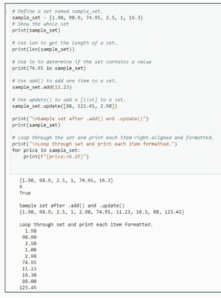

图 3-12：玩转 Python 集合。

这一行显示6，因为集合中有六个元素：

```
print(len(sample_set))
```

而下面一行显示True，因为数字74.95在`sample_set`中：

```
print(74.95 in sample_set)
```

代码中的注释描述了其余各行的功能。请注意代码末尾循环内的这个命令：

```
print(f"{price:>6.2f}")
```

每个数字都被整齐地格式化为两位小数，因为代码使用了f-string格式说明符`>6.2f`，它将每个数字右对齐，并保留小数点后两位数字。

列表和元组是Python中最常用的两种数据结构。集合似乎不像前两者那样受关注，但了解它们还是很有好处的。第四种——也是广泛使用的——Python数据结构是字典，你将在下一章学习它。

## 本章内容

- 创建字典
- 了解如何遍历字典
- 复制字典
- 删除字典中的条目
- 使用多键字典

# 第4章
用字典驾驭海量数据

字典，在某些语言中也称为关联数组，有点像我们在本小册第3章讨论的列表。但列表中的每个元素不是通过其在列表中的位置来标识，而是通过一个键来标识。你可以定义这个键，它通常是一个字符串或数字。关键在于，它对于字典中的每个元素必须是唯一的。

要理解为什么唯一性很重要，可以想想电话号码、电子邮件地址和社保号码。如果两个或更多的人拥有相同的电话号码，那么每当有人拨打这个号码时，所有这些人都会接到电话。如果两个或更多的人拥有相同的电子邮件地址，所有这些人都会收到相同的电子邮件。如果两个或更多的人拥有相同的社保号码，而其中一人拖欠了百万美元的税款，你最好希望你能说服税务人员你不是那个拖欠者，即使你的社保号码出现在了欠款单上。

在本章中，你将全面了解Python数据字典以及如何在自己的应用程序中使用它们。

## 理解数据字典

如前所述，*字典*类似于列表，不同之处在于列表中的每个元素都有一个唯一的键。与键关联的值可以是数字、字符串、列表、元组——几乎可以是任何东西。因此，你可以将字典想象成一个类似于表格的结构，其中第一列包含该条目独有的单个信息项，第二列（值）包含与该键相关且可能也唯一的信。在图4-1的示例中，左列包含每行唯一的键。第二列是分配给每个键的值。

| 键 | 值 |
|---|---|
| "htanaka" | "Haru Tanaka" |
| "ppatel" | "Priya Patel" |
| "bagarcia" | "Benjamin Alberto Garcia" |
| "zmin" | "Zhang Min" |
| "farooqi" | "Ayesha Farooqi" |
| "hajackson" | "Hanna Jackson" |
| "papatel" | "Pratyush Aarav Patel" |
| "hrjackson" | "Henry Jackson" |

图4-1：一个字典，左列为键，右列为值。

左列显示了一个人名的缩写。一些企业在为员工分配用户账户和电子邮件地址时会使用这样的名称。

与每个键对应的值不必是字符串或整数。它可以是Python中的任何数据类型，包括元组或列表。例如，在图4-2的字典中，每个键的值是一个列表，包含一个名字、一个年份（可能是雇佣年份或出生年份）、一个数字（例如，该人报税时申报的受抚养人数）以及一个布尔值`True`或`False`（可能表示，例如，该人是否拥有公司手机）。目前，每项数据代表什么并不重要。重要的是，对于每个键，你都有一个列表（用方括号括起来），其中包含关于该键的四条信息。

| 键 | 值 |
|---|---|
| "htanaka" | ["Haru Tanaka", 2000, 0, True] |
| "ppatel" | ["Priya Patel", 2015, 1, False] |
| "bagarcia" | ["Benjamin Alberto Garcia", 1999, 2, True] |
| "zmin" | ["Zhang Min", 2017, 0, False] |
| "farooqi" | ["Ayesha Farooqi", 2001, 1, True] |
| "hajackson" | ["Hanna Jackson", 1998, 0, False] |
| "papatel" | ["Pratyush Aarav Patel", 2011, 2, True] |
| "hrjackson" | ["Henry Jackson", 2016, 0, False] |

图4-2：一个以列表为值的字典。

字典的值也可以由几个不同的键组成，每个键代表一条数据。换句话说，值也可以是一个包含键的字典。例如，与其为每个条目设置一行并使用唯一的键，你可以让每个员工拥有自己的小字典。然后你可以为每个信息单元分配一个键名。那么，`htanaka`的字典可能如图4-3所示。

图4-3：一个员工的字典。

```
'htanaka' = 'full_name' = 'Haru Tanaka'
'year_hired' = 2000
'dependents' = 0
'has_company_cell' = True
```

另一个员工的字典可能拥有所有相同的键名：`full_name`、`year_hired`、`dependents`和`has_company_cell`，但每个键的值不同，如图4-4所示。

图4-4：另一个员工的字典。

```
'ppatel' = 'full_name' = 'Priya Patel'
'year_hired' = 2015
'dependents' = 1
'has_company_cell' = False
```

每个字典条目拥有多个键在Python中很常见，因为该语言使得使用方括号中的键（就像下标一样）来隔离你想要的特定数据项变得很容易，如下所示：

```
ppatel['full_name'] = 'Priya Patel'
ppatel['year_hired'] = 2015
ppatel['dependents'] = 1
ppatel['has_company_cell'] = True
```

键名比使用基于位置的索引更具描述性，正如你在下面的示例中看到的。

```
ppatel[0] = 'Priya Patel'
ppatel[1] = 2015
ppatel[2] = 1
ppatel[3] = True
```

## 创建字典

创建字典的代码遵循以下基本语法：

```
name = {key:value, key:value, key:value, key:value, ...}
```

*name*是你自己起的名字，通常描述*key:value*对指的是谁或什么。*key:value*对用花括号括起来。*key*通常是用引号括起来的字符串，但你也可以使用整数或元组。每个冒号（:）将键与其分配的值分开。*value*是你想为该键存储的任何内容，可以是数字、字符串、列表——几乎任何东西。省略号（...）只是表示你可以有任意多的*key:value*对。只需记住用逗号分隔*key:value*对，如语法示例所示。

为了使代码更具可读性，开发人员通常将每个*key:value*对放在单独的行上。但语法仍然相同。唯一的区别是每个逗号后面都有一个换行符，如下所示：

```
name = {
    key:value,
    key:value,
    key:value,
    key:value,
    ...
}
```

如果你想尝试一下，可以打开一个Jupyter notebook、一个.py文件或一个Python提示符，然后输入以下代码。请注意，我们创建了一个名为*people*的字典，其中包含多个*key:value*对，每个对之间用逗号分隔。键和值都是字符串，所以它们用引号括起来，每个键与其值之间用冒号分隔。保持所有这些格式正确很重要；否则代码将无法工作——是的，即使一个缺失、放错位置或拼写错误的引号、冒号、逗号或花括号也会搞砸一切：

```
people = {
    'htanaka': 'Haru Tanaka',
    'ppatel': 'Priya Patel',
    'bagarcia': 'Benjamin Alberto Garcia',
    'zmin': 'Zhang Min',
    'afarooqi': 'Ayesha Farooqi',
    'hajackson': 'Hanna Jackson',
    'papatel': 'Pratyush Aarav Patel',
    'hrjackson': 'Henry Jackson'
}
```

如果你忘记了编写字典的语法，只需向CoPilot、ChatGPT或类似的生成式AI请求为你创建一个通用示例。例如，提示*write a python dictionary with 10 numeric keys and 10 string values*应该能为你提供一些语法正确的通用代码来使用。

## 访问字典数据

添加数据后，你可以通过多种方式处理它。使用`print(people)`——即在`print()`函数的括号中放入字典的名称——你会得到整个字典的副本，如下所示：

```
print(people)

{'htanaka': 'Haru Tanaka', 'ppatel': 'Priya Patel',
'bagarcia': 'Benjamin Alberto Garcia', 'zmin': 'Zhang Min',
'afarooqi': 'Ayesha Farooqi', 'hajackson': 'Hanna Jackson',
'papatel': 'Pratyush Aarav Patel', 'hrjackson': 'Henry Jackson'}
```

通常这不是你想要的。更多时候，你是在寻找字典中的一个特定条目。在这种情况下，请使用以下语法：

```
dictionaryname[key]
```

其中*dictionaryname*是字典的名称，*key*是你正在搜索的键值。例如，如果你想知道`zmin`键的值，你可以输入

```
print(people['zmin'])
```

可以将这一行理解为“打印people子键zmin”，其中*sub*仅表示*特定的键*。当你这样做时，Python会返回该人的值——在本例中是`zmin`的全名。图4-5显示了在Jupyter notebook单元格中运行代码后的输出。

请注意，在代码中，`zmin`在引号中，因为它是一个字符串。你可以使用变量名代替，只要它包含一个字符串。例如，考虑以下两行代码。第一行创建一个名为`person`的变量，并将字符串'zmin'放入该变量。下一行不需要引号，因为`person`是一个变量名：

```
person = 'zmin'
print(people[person])
```

### 获取字典的长度

字典中的项目数量被视为其*长度*。与列表一样，你可以使用`len()`语句来确定字典的长度。语法如下：

```
len(dictionaryname)
```

一如既往，将*dictionaryname*替换为你正在检查的字典的名称。例如，以下代码创建一个字典，然后将其长度存储在`howmany`变量中：

```
people = {
    'htanaka': 'Haru Tanaka',
    'ppatel': 'Priya Patel',
    'bagarcia': 'Benjamin Alberto Garcia',
    'zmin': 'Zhang Min',
    'afarooqi': 'Ayesha Farooqi',
    'hajackson': 'Hanna Jackson',
    'papatel': 'Pratyush Aarav Patel',
    'hrjackson': 'Henry Jackson'
}
### 统计键值对的数量并存入变量。
howmany = len(people)
### 显示数量。
print(howmany)
```

执行时，`print`语句显示8，这是`howmany`变量的值，由字典中`key:value`对的数量决定。

> 正如你可能猜到的，一个不包含任何`key:value`对的空字典，其长度为0。创建字典的语法只是将字典名称赋值给空花括号，例如`my_dict = {}`。

## 检查键是否存在于字典中

你可以使用`in`关键字来检查一个键是否存在于字典内部。如果键存在，`in`返回`True`。如果键不存在，`in`返回`False`。图4-7展示了一个简单的例子，包含两个`print()`语句。第一个检查`hajackson`是否存在于字典中。第二个检查`schmeedledorp`是否存在于字典中。

如你所见，第一个`print()`语句显示`True`，因为`hajackson`在字典中。第二个`print()`语句显示`False`，因为`schmeedledorp`不在字典中。

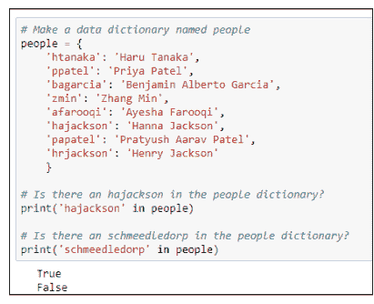

图4-7：检查键是否存在于字典中。

## 使用get()获取字典数据

当程序在字典中查找不存在的内容时崩溃并终止，这有点严厉。处理这种情况更优雅的方式是使用字典的.get()方法。语法如下：

```
dictionaryname.get(key)
```

将*dictionaryname*替换为你正在搜索的字典的名称。将*key*替换为你正在查找的内容。注意get()使用圆括号，而不是方括号。如果你查找的是字典中存在的内容，例如以下情况，你将得到与使用方括号相同的结果：

```
### 查找一个人。
person = 'bagarcia'
print(people.get(person))
```

.get()的不同之处在于，当你搜索一个不存在的名称时会发生什么。你不会得到错误，程序也不会崩溃并终止。相反，get()会优雅地返回值None，让你知道people字典中没有名为schmeedledorp的人，如图4-8所示。

你可以向get()传递两个值；第二个值是当get()未能找到你正在查找的内容时希望它返回的值。例如，在以下代码行中，我们再次搜索schmeedledorp。但这一次，如果代码没有找到那个人，它显示的不是None，而是更正式的消息“Unbeknownst to this dictionary”：

```
print(people.get('schmeedledorp', 'Unbeknownst to this dictionary'))
```

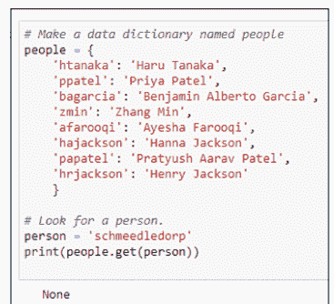

图4-8：Python更友好的方式表示没有schmeedledorp。

## 更改键的值

字典是*可变的*，这意味着你可以从代码中更改字典的内容（并不是说你可以让字典闭嘴）。语法很简单：

```
dictionaryname[key] = newvalue
```

将*dictionaryname*替换为字典的名称，*key*替换为标识项目的键，*newvalue*替换为你想要的新值。

例如，假设Hanna Jackson结婚了，将她的名字改为Hanna Jackson-Smith。你想保持相同的键但更改值。在图4-9中，读取`people['hajackson'] = "Hanna Jackson-Smith"`的行进行了更改。该行下方的`print()`语句显示执行该行代码后hajackson的值。如图4-9所示，名字确实已更改为Hanna Jackson-Smith。


图4-9：更改字典中与键关联的值。

使用字典处理海量数据


在现实生活中，字典中的数据可能也会存储在某种外部文件中，以便它是永久性的。需要额外的代码来将字典的更改保存到该外部文件。但在你深入所有这些之前，你需要先学习这些基础知识，所以我们现在就先继续学习字典。

## 添加或更改字典数据

你可以使用字典的`update()`方法向字典添加新项目或更改当前键的值。语法如下：

```
dictionaryname.update(key, value)
```

将`dictionaryname`替换为字典的名称。将`key`替换为你想要添加或更改的项目的键。如果你指定的键在字典中不存在，它将作为新项目添加，并使用你指定的`value`。如果你指定的键确实存在，则不会添加任何内容。该键的值将更改为任何你指定为`value`的内容。

例如，考虑以下Python代码，它创建一个名为`people`的字典并将两个人的名字放入其中：

```
### 创建一个名为people的数据字典。
people = {
    'papatel': 'Pratyush Aarav Patel',
    'hrjackson': 'Henry Jackson'
}
### 更改hrjackson键的值。
people.update({'hrjackson': 'Henrietta Jackson'})
### 使用新的键值对更新字典。
people.update({'wwiggins': 'Wanda Wiggins'})
```

第一个update行将`hrjackson`的值从Henry Jackson更改为Henrietta Jackson，因为`hrjackson`键已经存在于字典中：

```
people.update({'hrjackson': 'Henrietta Jackson'})
```

第二个`update()`如下：

```
people.update({'wwiggins': 'Wanda Wiggins'})
```

字典中没有wwiggins键，因此update()无法更改wwiggins的名称。相反，该行向字典添加了一个新的键值对，以wwiggins为键，Wanda Wiggins为值。

代码没有指定是更改还是添加值，因为决定是自动做出的。字典中的每个键必须是唯一的；你不能有两个或更多具有相同键的行。因此，当你执行update()时，代码首先检查键是否存在。如果存在，则只修改该键的值；不会添加任何新内容。如果键在字典中不存在，则没有可修改的内容，因此新的键值对将被添加到字典中。这个过程是自动的，关于执行哪个操作的决定很简单：

- 如果键已经存在于字典中，则其值被更新，因为字典中不允许两个项目具有相同的键。
- 如果键不存在，则添加键值对，因为字典中没有任何内容具有该键，所以唯一的选择是添加它。

运行代码后，字典包含三个项目：papatel、hrjackson（使用新名称）和wwiggins。将以下行添加到该代码的末尾，可以显示字典中的所有内容：

```
### 显示数据字典中现在的内容。
for person in people.keys():
    print(person + " = " + people[person])
```

如果你添加该代码并再次运行，你将得到以下输出，显示该程序结束时字典的完整内容：

```
papatel = Pratyush Aarav Patel
hrjackson = Henrietta Jackson
wwiggins = Wanda Wiggins
```

> 你也可以使用赋值运算符（=）而不是.update()来更改键的值。例如，以下语句将htanaka的dependents值设置为1，无论其原始值是什么。
htanaka['dependents'] = 1

正如你可能猜到的，你可以以与循环遍历列表、元组和集合非常相似的方式循环遍历字典。但你可以对字典做一些额外的事情，所以我们接下来将看看这些。

## 遍历字典

正如我们在上一节中提到的，你可以像遍历列表和元组一样遍历字典中的每个元素，但你有一些额外的选项。如果在 `for` 循环中只指定字典名称，你将获得所有的键，如下所示：

```
for person in people:
    print(person)

htanaka
ppatel
bagarcia
zmin
afarooqi
hajackson
papatel
hrjackson
```

如果你想查看每个元素的值，保持 `for` 循环不变，但打印 `dictionaryname[key]`，其中 `dictionaryname` 是字典的名称（在我们的示例中是 `people`），`key` 是你在循环中 `for` 之后使用的任何名称（在下面的示例中是 `person`）。

```
for person in people:
    print(people[person])
```

针对示例 `people` 字典运行此代码会列出所有姓名，如下所示：

```
Haru Tanaka
Priya Patel
Benjamin Alberto Garcia
Zhang Min
Ayesha Farooqi
Hanna Jackson
Pratyush Aarav Patel
Henry Jackson
```

你也可以通过在 `for` 循环中使用稍有不同的语法来获取所有姓名：在字典名称后添加 `.values()`，如下所示。然后你只需在循环内打印变量名（`person`）。输出将是每个人的全名，与前面的循环示例相同。

```
for person in people.values():
    print(person)
```

最后，你可以通过在 `for` 循环中的字典名称后使用 `.items()` 来同时遍历键和值。但你也需要在 `for` 之后使用两个变量，一个用于引用键，另一个用于引用值。如果你想让代码在遍历字典时显示这两个变量，你需要在 `print` 的括号内使用这些名称。

例如，图 4-10 中的循环使用了两个变量名 `key` 和 `value`（尽管它们可以是 `x` 和 `y` 或其他任何名称）来遍历 `people.items()`。`print` 语句在每次循环中都显示 `key` 和 `value`。`print()` 还有一个等号（用引号括起来）来分隔键和值。正如你在输出中看到的，你会得到一个所有键的列表，后跟一个等号和分配给该键的值。

```
### 创建一个名为 people 的数据字典
people = {
    'htanaka': 'Haru Tanaka',
    'ppatel': 'Priya Patel',
    'bgarcia': 'Benjamin Alberto Garcia',
    'zmin': 'Zhang Min',
    'afarooqi': 'Ayesha Farooqi',
    'hajackson': 'Hanna Jackson',
    'papatel': 'Pratyush Aarav Patel',
    'hrjackson': 'Henry Jackson'
}

### 遍历 .items 以获取键和值。
for key, value in people.items():
    # 显示键和值，中间用 = 分隔。
    print(key, "=", value)

htanaka = Haru Tanaka
ppatel = Priya Patel
bgarcia = Benjamin Alberto Garcia
zmin = Zhang Min
afarooqi = Ayesha Farooqi
hajackson = Hanna Jackson
papatel = Pratyush Aarav Patel
hrjackson = Henry Jackson
```

图 4-10：使用 `.items()` 和两个变量名遍历字典。

## 字典方法

如果你一直勤勉地逐章学习，你可能已经注意到数据字典的一些方法与列表、元组和集合的方法相似。所以现在可能是一个好时机，在表 4-1 中列出字典提供的所有方法。你已经在本章中看到其中一些方法的应用。我们稍后会介绍其他方法。

| 方法 | 功能 |
|---|---|
| clear() | 通过移除所有键和值来清空字典。 |
| copy() | 返回字典的副本。 |
| fromkeys() | 返回字典的新副本，但仅包含指定的键和值。 |
| get() | 返回指定键的值，如果不存在则返回 None。 |
| items() | 返回一个列表，其中每个键值对作为一个元组。 |
| keys() | 返回字典中所有键的列表。 |
| pop() | 从字典中移除由键指定的项，并返回其值。 |
| popitem() | 移除最后一个键值对。 |
| setdefault() | 返回指定键的值。如果键不存在，则插入具有指定值的键并返回它。 |
| update() | 更新现有键的值，或者如果指定的键不在字典中，则添加新的键值对。 |
| values() | 返回字典中所有值的列表。 |

## 复制字典

如果你需要复制一个字典以便操作，请使用以下语法：

```
newdictionaryname = dictionaryname.copy()
```

将 *newdictionaryname* 替换为你想要命名的新字典的名称。将 *dictionaryname* 替换为你想要复制的现有字典的名称。

图 4-11 展示了一个简单的例子，我们创建了一个名为 `people` 的字典，然后创建了一个名为 `peeps2` 的字典作为 `people` 字典的副本。打印每个字典的内容显示它们是相同的。


图 4-11：复制字典。

## 删除字典项

你可以通过多种方式从数据字典中删除数据。`del` 关键字（*delete* 的缩写）可以根据其键删除任何项。语法如下：

```
del dictionaryname[key]
```

例如，以下代码创建了一个名为 `people` 的字典。然后它使用 `del people["zmin"]` 来移除键为 `zmin` 的项：

```
### 定义一个名为 people 的字典。
people = {
    'htanaka': 'Haru Tanaka',
    'zmin': 'Zhang Min',
    'afarooqi': 'Ayesha Farooqi',
}
### 显示原始 people 字典。
print(people)
### 从字典中移除 zmin。
del people["zmin"]
### 显示现在 people 中的内容。
print(people)
```

打印字典的内容显示 `zmin` 不再在该字典中：

```
{'htanaka': 'Haru Tanaka', 'zmin': 'Zhang Min', 'afarooqi': 'Ayesha Farooqi'}
{'htanaka': 'Haru Tanaka', 'afarooqi': 'Ayesha Farooqi'}
```

如果你在使用 `del` 关键字时忘记包含特定的键，而只指定了字典名称，那么整个字典将被删除，甚至包括它的名称。例如，假设你在前面的代码中执行了 `del people` 而不是使用 `del people["zmin"]`。第二个 `print(people)` 的输出将是一个错误，如下所示，因为在 `people` 字典被删除后它不再存在，其内容无法显示：

```
{'htanaka': 'Haru Tanaka', 'zmin': 'Zhang Min', 'afarooqi': 'Ayesha Farooqi'}
---------------------------------------------------------------------------
NameError                                Traceback (most recent call last)
<ipython-input-32-24401f5e8cf0> in <module>()
     13 
     14 # Show what's in people now.
----> 15 print(people)

NameError: name 'people' is not defined
```

要从字典中移除所有 `key:value` 对而不删除整个字典，请使用 `clear` 方法，语法如下：

```
dictionaryname.clear()
```

以下代码创建了一个名为 `people` 的字典，向其中放入一些 `key:value` 对，然后打印字典以便你可以看到其内容。接着，`people.clear()` 清空了所有数据：

```
### 定义一个名为 people 的字典。
people = {
    'htanaka': 'Haru Tanaka',
    'zmin': 'Zhang Min',
    'afarooqi': 'Ayesha Farooqi',
}
### 显示原始 people 字典。
print(people)
### 从字典中移除所有数据。
people.clear()
### 显示现在 people 中的内容。
print(people)
```

运行此代码的输出显示 `people` 字典最初包含三个 `property:value` 对。使用 `people.clear()` 清空 `people` 字典后，打印它会显示 `{}`，这是 Python 告诉你字典为空的方式。

```
{'htanaka': 'Haru Tanaka', 'zmin': 'Zhang Min', 'afarooqi': 'Ayesha Farooqi'}
{}
```

`pop()` 方法提供了另一种从字典中删除数据的方式。`pop()` 方法实际上做了两件事：

> » 如果你将 pop() 方法的结果存储在一个变量中，该变量将获得被弹出键的值。
» 无论你是否将 pop() 方法的结果存储在变量中，指定的键都会从字典中移除。

图 4-12 展示了一个例子，首先在输出中显示整个字典。然后执行 `adios = people.pop("zmin")`，将 `zmin` 键的值放入名为 `adios` 的变量中。然后我们打印 `adios` 变量，以便我们可以看到它包含 Zhang Min，即 `zmin` 键的值。再次打印整个 `people` 字典证明 `zmin` 已从字典中移除。

```
### 定义一个名为 people 的字典。
people = {
    'htanaka': 'Haru Tanaka',
    'zmin': 'Zhang Min',
    'afarooqi': 'Ayesha Farooqi',
}
### 显示原始 people 字典。
print(people)

### 从字典中弹出 zmin，将其值存储在 adios 变量中。
adios = people.pop("zmin")

### 打印 adios 和 people 的内容。
print(adios)
print(people)

{'htanaka': 'Haru Tanaka', 'zmin': 'Zhang Min', 'afarooqi': 'Ayesha Farooqi'}
Zhang Min
{'htanaka': 'Haru Tanaka', 'afarooqi': 'Ayesha Farooqi'}
```

图 4-12：从字典中弹出一个项。

数据字典提供了一个 `pop()` 的变体，使用以下语法：

```
dictionaryname = popitem()
```

这个语法很棘手，因为在一些早期的 Python 版本中，它会随机移除一个项。这很奇怪，除非你正在编写游戏之类的东西并想随机移除东西。但从 Python 3.7 版本（本书使用的版本）开始，`popitem()` 总是移除最后一个键值对。

如果你将 `popitem` 的结果存储在一个变量中，你*不会*得到该项的值，这与 `pop()` 的工作方式不同。相反，你会得到键和它的值。字典不再包含该键值对。所以，换句话说，如果你在图 4-12 中将 `adios = people.pop("zmin")` 替换为 `adios = people.popitem()`，输出将如下所示：

```
{'htanaka': 'Haru Tanaka', 'zmin': 'Zhang Min', 'afarooqi': 'Ayesha Farooqi'}
('afarooqi', 'Ayesha Farooqi')
{'htanaka': 'Haru Tanaka', 'zmin': 'Zhang Min'}
```

## 玩转多键字典

到目前为止，你接触的字典都是每个键（一个人名的缩写）对应一个值（该人的全名）。但字典中一个数据项拥有多个键值对的情况也很常见。

例如，假设仅仅知道一个人的全名还不够，你还想了解他的入职年份、出生日期以及是否已领取公司笔记本电脑。那么，任何一个人的字典可能看起来像这样：

```
employee = {
    'name': 'Haru Tanaka',
    'year_hired': 2005,
    'dob': '11/23/1987',
    'has_laptop': False
}
```

或者，假设你需要一个销售产品的字典。对于每个产品，你想知道它的名称、单价、是否应税以及当前库存数量。字典可能看起来像这样（以一个产品为例）：

```
product = {
    'name': 'Ray-Ban Wayfarer Sunglasses',
    'unit_price': 112.99,
    'taxable': True,
    'in_stock': 10
}
```

请注意，在每个示例中，键名都用引号括起来。我们在示例代码中使用了单引号，但你也可以使用双引号。我们甚至将出生日期（dob）中的日期也用引号括了起来。如果不这样做，它可能会被当作一组数字处理，比如“11除以23除以1987”，这可不是有用的信息。布尔值要么是 `True` 要么是 `False`（首字母大写），不加引号。整数（2005, 10）和浮点数（112.99）也不用引号括起来。

记住，属性的值可以是列表、元组或集合；它不一定是一个单一的值。例如，对于太阳镜产品，也许你提供两种款式：黑色和玳瑁色。你可以添加一个 `colors` 或 `models` 键，并将这些项作为逗号分隔的列表放在方括号中，像这样：

```
product = {
    'name': 'Ray-Ban Wayfarer Sunglasses',
    'unit_price': 112.99,
    'taxable': True,
    'in_stock': 10,
    'models': ['Black', 'Tortoise']
}
```

接下来，看看如何显示字典数据。你可以使用简单的 `dictionaryname[key]` 语法来打印每个键的值。例如，使用上面最后一个产品示例，这段代码的输出：

```
print(product['name'])
print(product['unit_price'])
print(product['taxable'])
print(product['in_stock'])
print(product['models'])
```

将是：

```
Ray-Ban Wayfarer Sunglasses
112.99
True
10
['Black', 'Tortoise']
```

你可以通过在每个 `print` 语句中添加描述性文本，后跟逗号和代码，来让输出更美观。你也可以遍历列表，在单独的行上打印每个型号。你还可以使用 f-string 来格式化数据。例如，这是对前面 `print()` 语句的一个变体：

```
product = {
    'name' : 'Ray-Ban Wayfarer Sunglasses',
    'unit_price' : 112.99,
    'taxable' : True,
    'in_stock' : 10,
    'models' : ['Black', 'Tortoise']
}
print('Name: ', product['name'])
print('Price: ', f"${product['unit_price']:.2f}")
print('Taxable: ', product['taxable'])
print('In Stock:', product['in_stock'])
print('Models:')
for model in product['models']:
    print(" " * 10 + model)
```

这段代码的输出如下：

```
Name: Ray-Ban Wayfarer Sunglasses
Price: $112.99
Taxable: True
In Stock: 10
Models:
        Black
        Tortoise
```

代码最后一行的 `" " * 10` 意思是*打印一个空格（" "）十次*。换句话说，缩进十个空格。如果你在引号之间没有恰好放一个空格，你就不会得到十个空格。你会得到引号之间内容的十个副本，这也意味着如果你在引号之间什么都没放，你将什么也得不到。

## 使用神秘的 fromkeys 和 setdefault 方法

Python 中的数据字典提供了两个方法，名为 `fromkeys()` 和 `setdefault()`，它们常常让 Python 学习者感到困惑——这情有可原，因为要找到它们的实际应用场景并不容易。但我们会尝试一下，至少向你展示如果在代码中使用这些方法，可以期待什么。

`fromkeys()` 方法使用以下语法创建一个新字典，其键与现有字典相同：

```
newdictionaryname = dict.fromkeys(iterable[,value])
```

将 `newdictionary` 替换为你想给新字典起的名字。它不必是像 `product` 这样的通用名称。它可以是能唯一标识产品的名称，比如 UPC（通用产品代码）或你业务中特定的 SKU（库存单位）。

将 `iterable` 部分替换为任何可迭代对象——意思是代码可以循环遍历的东西；一个简单的列表就可以。`value` 部分是可选的。如果省略，字典中的每个键的值都将是 `None`，这仅仅是 Python 表示该键在此字典中尚未被赋值的方式。

在下面的例子中，我们创建了一个名为 `DWC001` 的字典（这是我们库存中一个产品的 SKU）。我们给它提供了一个键名列表，用方括号括起来并用逗号分隔，这使其成为 Python 中一个定义良好的列表。我们没有提供 *value*。然后代码打印新字典。如你所见，代码的最后一行打印了字典，其中包含指定的键名，每个键的值都是 *None*。

```
DWC001 = dict.fromkeys(['name', 'unit_price', 'taxable', 'in_stock',
    'models'])
print(DWC001)
{'name': None, 'unit_price': None, 'taxable': None, 'in_stock': None,
'models': None}
```

现在，假设你不想输入所有这些键名。你只想使用与其他字典相同的键。在这种情况下，你可以使用 *dictionary.keys()* 作为你的键名可迭代列表，只要 *dictionary* 指向程序中存在的另一个字典。

例如，在下面的代码中，我们创建了一个名为 `product` 的字典，它有一些键名，但没有具体的值。然后我们使用 `DWC001 = dict.fromkeys(product.keys())` 创建了一个名为 `DWC001` 的字典，它与通用的 `product` 字典具有相同的键。我们在 `dict.fromkeys(product.keys())` 行中没有指定任何值，因此新字典中的每个键的值都将被设置为 *None*。

```
### 创建一个名为 product 的通用产品字典。
product = {
    'name': '',
    'unit_price': 0,
    'taxable': True,
    'in_stock': 0,
    'models': []
}
### 创建一个名为 DWC001 的字典，其键与 product 相同。
DWC001 = dict.fromkeys(product.keys())
### 显示新字典中的内容。
print(DWC001)
```

最后的 `print()` 语句显示了新字典中的内容。你可以看到它拥有与 `product` 字典完全相同的键，每个值都设置为 *None*。

```
{'name': None, 'unit_price': None, 'taxable': None, 'in_stock': None,
'models': None}
```

`.setdefault()` 方法允许你向字典添加一个新键，并为其设置一个预定义的值。但是 `.setdefault()` 只添加新的键和值；它不会更改现有键的值，即使该键的值是 None。因此，如果你定义了其他字典，后来只想向那些还没有该属性的字典添加另一个属性:值对，它可能会派上用场。

图 4-13 展示了一个例子，我们使用与 `product` 字典相同的键创建了 `DWC001` 字典。字典创建后，`setdefault('taxable', True)` 添加了一个名为 `taxable` 的键，并将其值设置为 True——但前提是该字典还没有名为 `taxable` 的键。它还添加了一个名为 `reorder_point` 的键，并将其值设置为 10，但同样，前提是该键尚不存在。

```
### 创建一个名为 product 的通用产品字典。
product = {
    'name': '',
    'unit_price': 0,
    'taxable': True,
    'in_stock': 0,
    'models': []
}
### 为产品 SKU # DWC001 创建一个字典
DWC001 = dict.fromkeys(product.keys())
DWC001.setdefault('taxable',True)
DWC001.setdefault('models',[])
DWC001.setdefault('reorder_point',100)

### 显示新字典中的内容。
print("Dictionary after fromkeys() and setdefault()")
print(DWC001)

### 将 taxable 字段从 None 更改为 True
print("\nDictionary after fromkeys() and setdefault()")
DWC001['taxable']=True

### 打印将 taxable 更改为 True 后的字典
print(DWC001)

Dictionary after fromkeys() and setdefault()
{'name': None, 'unit_price': None, 'taxable': None, 'in_stock': None, 'models': None, 'reorder_point': 100}

Dictionary after fromkeys() and setdefault()
{'name': None, 'unit_price': None, 'taxable': True, 'in_stock': None, 'models': None, 'reorder_point': 100}
```

图 4-13：尝试使用 fromkeys 和 setdefault。

从代码的输出中你可以看到，在执行了 fromkeys 和 setdefault 操作后，新字典拥有与 `product` 字典相同的键，外加一个新的键值对 `reorder_point: 10`，这是由第二个 `setdefault` 添加的。然而，输出中的 `taxable` 键仍然是 `None`，因为 `setdefault` 不会更改现有键的值。它只会在字典没有该键时，添加一个带有默认值的新键。

那么，如果你确实想将 `taxable` 的默认值设置为 `True` 而不是 `None` 呢？简单的解决方案是使用标准语法 `dictionaryname[key] = newvalue` 将现有的 `taxable` 键的值从 `None` 更改为 `True`。图 4-13 中的第二个输出证明，以这种方式更改键的值确实有效。

## 嵌套字典

到现在，你可能已经意识到，你编写的任何程序都可能需要多个字典，每个字典都有一个唯一的名称。但如果你只是用名称定义了一堆字典，如何才能在不通过名称单独访问每个字典的情况下遍历所有字典呢？答案是，将每个字典作为某个包含字典中的一个`键:值`对，其中键是每个字典的唯一标识符（例如，每个产品的UPC或SKU）。每个键的值将是该字典所有`键:值`对的字典。因此，语法将是

```
containingdictionaryname = {
    key: {dictionary},
    key: {dictionary},
    key: {dictionary},
    ...
}
```

这只是字典的字典的语法。你必须按如下方式替换所有斜体占位符名称：

-   *containingdictionaryname*：这是分配给整个字典的名称。它可以是你喜欢的任何名称，但应该描述字典包含的内容。
-   *key*：每个键必须是唯一的，例如产品的UPC或SKU，或人的用户名，甚至只是一些顺序编号，只要它从不重复。
-   *{dictionary}*：将该字典项的所有`键:值`对用花括号括起来，如果后面还有另一个字典，则在其后跟一个逗号。

图4-14展示了一个示例，其中我们有一个名为`products`（复数，因为它包含多个产品）的字典。这个字典又包含四个单独的产品。每个产品都有一个唯一的键：`RB0011`、`DWC0317`等等，这些是企业用于管理自身库存的内部SKU编号。这四个产品中的每一个又都有`name`、`price`和`models`键。

```
### 创建一个通用的products字典来包含多个产品字典。
products = {
    'RB0011': {'name': 'Ray-Ban Sunglasses', 'price': 112.98, 'models': ['black', 'tortoise']},
    'DWC0317': {'name': 'Drone with Camera', 'price': 72.95, 'models': ['white', 'black']},
    'MTS0540': {'name': 'T-Shirt', 'price': 2.95, 'models': ['small', 'medium', 'large']},
    'ECD2989': {'name': 'Echo Dot', 'price': 29.99, 'models': []}
}
```

图4-14：包含在更大的products字典中的多个产品字典。

所有花括号、逗号和冒号的复杂语法使得难以看清发生了什么（也难以输入）。在Python之外，在文本文件、电子表格、数据库或你放置数据的任何地方，相同的数据可以存储在一个名为Products的简单表中，键名作为列标题，如表4-2所示。

#### 表4-2 产品表

| ID (key) | Name | Price | Models |
|---|---|---|---|
| RB0011 | Ray-Ban Sunglasses | 112.98 | black, tortoise |
| DWC0317 | Drone with Camera | 72.95 | white, black |
| MTS0540 | T-Shirt | 2.95 | small, medium, large |
| ECD2989 | Echo Dot | 29.99 | |

使用f-string和一些循环的组合，你可以让Python以整洁的表格格式显示数据字典中的数据。图4-15展示了Jupyter notebook中此类代码的一个示例，代码的输出就在其下方。

```
### 创建一个通用的products字典来包含多个产品字典。
products = {
    'RB0011': {'name': 'Ray-Ban Sunglasses', 'price': 112.98, 'models': ['black', 'tortoise']},
    'DWC0317': {'name': 'Drone with Camera', 'price': 72.95, 'models': ['white', 'black']},
    'MTS0540': {'name': 'T-Shirt', 'price': 2.95, 'models': ['small', 'medium', 'large']},
    'ECD2989': {'name': 'Echo Dot', 'price': 29.99, 'models': []}
}
### 此标题显示在输出上方。
print(f"{'ID':<6} {'Name':<17} {'Price':>8} {'Models'}")
print('-' * 60)  # 打印60个连字符。
### 遍历products字典中的每个字典
for oneproduct in products.keys():
    # 获取一个产品的ID。
    id = oneproduct
    # 获取一个产品的名称。
    name = products[oneproduct]['name']
    # 获取一个产品的价格并用$格式化
    unit_price = '$' + f"{products[oneproduct]['price']:.2f}"
    # 创建一个名为models的空字符串变量
    models = ''
    # 遍历models列表并将列表中的一个项目
    # 后跟一个逗号和一个空格附加到models上。
    for m in products[oneproduct]['models']:
        models += m + ', '
    # 如果models变量长度超过两个字符，
    # 删除最后两个字符（最后一个逗号和空格）。
    if len(models) > 2:
        models = models[:-2]
    else:
        # 否则，如果没有型号，显示<none>。
        models = '<none>'
    # 使用整洁的f-string打印所有变量。
    print(f"{id:<6} {name:<17} {unit_price:>8} {models}")
### 循环完成后，此处任何缩进的代码都会运行。

ID    Name              Price Models
------------------------------------------------------------
RB0011 Ray-Ban Sunglasses $112.98 black, tortoise
DWC0317 Drone with Camera  $72.95 white, black
MTS0540 T-Shirt            $2.95 small, medium, large
ECD2989 Echo Dot          $29.99 <none>
```

图4-15：将数据字典格式化为行和列进行打印。

## 从列表推导式创建字典

如果你有两个单独的列表，分别包含字典的值和键，你可以使用Python列表推导式语法和`zip()`函数将它们组合成一个字典。`zip()`函数将两个列表中的键和值配对，以便一切保持顺序。基本语法是

```
data_dict = {key: value for key, value in zip(keys_list, values_list)}
```

将`data_dict`替换为你想要命名的新字典的名称。将`keys_list`替换为包含键的列表的名称。将`values_list`替换为包含值的列表的名称。在下面的示例代码中，我将一个列表命名为“keys”，另一个列表命名为“values”，以简化命名：

```
### 简单列表
values = ["First", "Second", "Third", "Fourth", "Fifth"]
keys = [1, 2, 3, 4, 5]

### 使用列表推导式从列表创建字典
data_dict = {key: value for (key, value) in zip(keys, values)}
print(data_dict)
```

运行该代码将显示最终的字典，如下所示：

```
{1: 'First', 2: 'Second', 3: 'Third', 4: 'Fourth', 5: 'Fifth'}
```

到目前为止，在本书中，我们一直专注于Python最基本的核心构建块——世界上所有Python应用程序都是由这些构建块创建的。从构建块到实际的“建筑”（应用程序）需要更多的技能和知识，我们将在下一章中介绍。下一章见！

+   本章内容

-   创建你自己的函数
-   在函数中包含注释
-   了解如何向函数传递信息
-   从函数返回值
-   理解匿名函数

# 第5章
驾驭更大的代码块

在本章中，你将学习如何通过创建自己的函数来更好地管理较大的代码项目。函数提供了一种将代码分解为小任务的方法，这些任务可以从应用程序中的多个位置调用。例如，如果你需要在整个应用程序中访问某些东西需要十几行代码，那么你可能不想每次需要时都一遍又一遍地重复那段代码。这样做只会使代码变得比需要的更大。此外，如果你想更改某些内容，或者必须修复该代码中的错误，你不想在一堆不同的地方重复执行此操作。如果所有这些代码都包含在一个函数中，你只需要在一个位置更改或修复它。

要访问函数执行的任务，你需要从代码中*调用*该函数，就像调用内置函数（如`print`）一样。换句话说，你只需在代码中输入名称。你也可以自己编造函数名称。因此，将函数视为个性化Python语言的一种方式，使其命令适合你在应用程序中的需求。

## 创建函数

创建函数很简单。如果你想获得一些实践经验，可以跟着在 Jupyter notebook 单元格或 .py 文件中操作。

要创建一个函数，以 `def`（*definition* 的缩写）开头开始新行，后跟一个空格，然后是你自己选择的名称，再跟一对括号，括号前后及内部均无空格。然后在该行末尾放一个冒号。例如，要创建一个名为 `hello()` 的简单函数，请输入

```
def hello():
```

这是一个函数，但它什么都不做。要让函数执行某些操作，你必须在后续行中编写 Python 代码。为确保新代码位于函数“内部”，请对每一行进行缩进。


在 Python 中，缩进至关重要。没有标记函数结束的命令。`def` 行下方所有缩进的行都是该函数的一部分。第一个未缩进的行（与 `def` 行缩进程度相同）位于函数外部。

要让此函数执行某些操作，请在 `def` 下方放置一行缩进的代码。我们将从让函数打印 `hello` 开始。因此，在 `def` 行下方缩进输入 `print('Hello')`。现在你的代码如下所示：

```
def hello():
    print('Hello')
```

如果你现在运行代码，屏幕上不会发生任何明显的事情。这是因为函数内部的代码在函数被*调用*之前不会执行。你调用自定义函数的方式与调用内置函数相同：通过编写按名称调用函数的代码，包括末尾的括号。

例如，如果你正在跟着操作，按 Enter 添加一个空行，然后输入 `hello()`（其中没有空格），并确保它*没有*缩进。（你不希望此代码缩进，因为它是在*调用*函数以执行其代码；它不是函数的*一部分*。）所以它看起来像这样：

```
def hello():
    print('Hello')
hello()
```

如果你在 Jupyter 单元格或 .py 文件中，仍然什么都不会发生，因为你只是输入了代码。要让任何事情发生，你必须以通常的方式在 Jupyter 或 VS Code 中运行代码（如果你在 VS Code 中使用 .py 文件）。当代码执行时，你应该看到输出，即单词 Hello，如图 5-1 所示。


```
def hello():
    print('Hello')

hello()
Hello
```

## 为函数添加注释

代码中的注释始终是可选的。但习惯上将 `def` 语句下的第一行作为文档字符串（用三引号括起来的文本），描述函数的功能。在第一行括号的右侧放置一个以 `#` 号开头的注释也很常见。因为它们只是注释，所以对代码的功能没有任何影响。注释只是给你自己或编程团队成员的笔记，描述代码的内容。图 5-2 展示了在 VS Code 编辑器中为我们的小型 `hello()` 函数添加的几个注释示例。第一个注释 `#Practice function` 位于函数名旁边。下一个注释是用三引号括起来的文档字符串。


```python
def hello():  # Practice function
    """ A docstring describing the function """
    print("Hello, world!")
```

## 向函数传递信息

你可以向函数传递信息以供其处理。为此，请在 `def` 语句中为要传递给函数的每条信息输入一个参数名。你可以为参数使用任何名称，只要它以字母或下划线开头，后跟字母、下划线或数字。名称不应包含空格或标点符号。（参数名和变量名遵循相同的规则。）理想情况下，为了代码可读性，参数应描述传入的内容，但如果你愿意，也可以使用像 x 和 y 这样的通用名称。

你提供的任何作为参数的名称仅对该函数是局部的。例如，如果你在函数外部有一个名为 x 的变量，在函数内部有另一个名为 x 的变量，你在函数内部对 x 变量所做的任何更改都不会影响函数外部的 x 变量。

变量在函数内部工作的技术术语是*局部作用域*，这意味着变量存在和影响的范围保持在函数内部，不会进一步延伸。在函数内部创建和修改的变量在函数停止运行的那一刻就字面上停止存在，而在函数外部定义的任何变量不受函数内部发生的事情的影响。这是一件好事，因为当你编写函数时，你不必担心意外更改函数外部恰好同名的变量。


函数可以*返回*一个值，并且该返回值在函数外部可见。稍后将更详细地介绍此过程的工作原理。

假设你希望 `hello` 函数向使用该应用程序的任何人说 Hello（并且你可以在某个变量中访问该信息）。要将信息传递到函数并在其中使用它，你需要执行以下操作：

- 在函数的括号内放置一个参数名，作为传入信息的占位符。
- 在函数内部，使用该名称来处理传入的信息。

例如，假设你想将一个人的名字传递给 `hello` 函数，然后在 `print()` 语句中使用该名字。你可以为参数和函数使用任何通用名称，如下所示：

```
def hello(x): # Practice function
    """ A docstring describing the function """
    print('Hello ' + x)
```

在 `hello(x)` 的括号内，x 是一个参数，是传入内容的占位符。在函数内部，该 x 仅指传递给函数的值。函数外部任何名为 x 的变量与参数名和函数内部使用的 x 是分开的。

通用名称并不能真正帮助你理解代码。最好使用更具描述性的名称，例如 `name` 甚至 `user_name`，如下所示：

```
def hello(user_name): # Practice function
    """ A docstring describing the function """
    print('Hello ' + user_name)
```

在 `print()` 函数中，我们在 *Hello* 的 o 后面添加了一个空格，以便在输出中 `Hello` 和名字之间有一个空格。

当函数有参数时，你必须在调用它时传递一个值，否则它将无法工作。例如，如果你在 `def` 语句中添加了参数，但仍然尝试在没有参数的情况下调用函数，如下代码所示，运行代码将产生错误：

```
def hello(user_name): # Practice function
    """ A docstring describing the function """
    print('Hello ' + user_name)
hello()
```

错误信息将类似于以下内容：

```
hello() missing 1 required positional argument: 'user_name'
```

这是一种非常技术性的说法，意思是 `hello` 函数期望有内容传递给它。

对于这个特定的函数，需要传递一个字符串。我们知道这一点，因为我们连接（添加）传递给变量的任何内容到另一个字符串（单词 `hello` 后跟一个空格）。如果你尝试将一个数字连接到字符串，你会得到一个错误。

你传递的值可以是一个字面量（你想要传递的确切数据）或包含该信息的变量名。例如，当你运行此代码时：

```
def hello(user_name): # Practice function
    """ A docstring describing the function """
    print('Hello ' + user_name)
hello('Alan')
```

输出是 `Hello Alan`，因为当你使用以下代码行调用函数时，你将 `Alan` 作为字符串传递：

```
hello('Alan')
```

你也可以使用变量来传递数据。例如，在图 5-3 的代码中，我们将字符串 "Alan" 存储在名为 `this_person` 的变量中。然后我们使用该变量名调用函数。运行该代码会产生 `Hello Alan`，如图底部所示。

## 使用默认值定义可选参数

在上一节中，我们提到当你调用一个需要参数的函数却没有传递这些参数时，会得到一个错误。这其实有点误导。你*可以*编写一个函数，使传递参数成为可选操作，但你必须告诉函数在未传递参数时使用什么值。语法如下：

```python
def functionname(parametername=defaultvalue):
```

唯一真正不同的部分是参数名后面的 `= defaultvalue`。例如，你可以用默认值重写示例 `hello()` 函数，如下所示：

```python
def hello(user_name = 'nobody'):  # 练习函数
    """ 描述函数的文档字符串 """
    print('Hello ' + user_name)
```

图 5-4 显示了进行此更改后的函数，以及测试该函数的输出。

首先，代码调用该函数并传递值 Alan：

```python
hello('Alan')
```

因此输出为

```
Hello Alan
```

我们用来测试函数的第二行调用了该函数，但没有传递值。换句话说，它调用了函数，但括号内没有值，如下所示：

```python
hello()
```

因为这一行没有传递值，函数的 `user_name` 参数默认为 'nobody'，输出如图底部所示，为

```
Hello nobody
```

## 向函数传递多个值

到目前为止，在本章的所有示例中，我们只向函数传递了一个值。但你可以传递任意多个值。只需为每个值提供一个参数名，并用逗号分隔这些名称。

例如，假设你想将用户的名、姓以及可能的日期传递给函数。你可以这样定义这三个参数：

```python
def hello(fname, lname, datestring): # 练习函数
    """ 描述函数的文档字符串 """
    print('Hello ' + fname + ' ' + lname)
    print('The date is ' + datestring)
```

请注意，这些参数都不是可选的。因此，在调用函数时，你需要传递三个值，例如：

```python
hello('Alan', 'Simpson', '12/31/2024')
```

图 5-5 显示了执行带有接受三个参数的 `hello()` 函数的代码示例。

如果你想在多个参数中使用部分（但不是全部）可选参数，请确保可选参数是最后输入的。例如，考虑以下情况，这将*无法*工作：

```python
def hello(fname, lname='unknown', datestring):
```

如果你尝试以这种排列方式运行此代码，你会得到一个错误，内容大致如下

```
SyntaxError: non-default argument follows default argument.
```

此错误试图告诉你，如果你想在函数中同时列出必需参数和可选参数，你必须将所有必需参数放在前面（顺序任意）。然后，可选参数可以列在后面并带有等号（顺序任意）。因此，以下代码可以正常工作：

```python
def hello(fname, lname, datestring=''):
    msg = 'Hello ' + fname + ' ' + lname
    if len(datestring) > 0:
        msg += ' The date is ' + datestring
    print(msg)
```

从逻辑上讲，函数内部的代码执行以下操作：

- 创建一个名为 msg 的变量，并放入 Hello 以及名和姓。
- 如果传递的 datestring 长度大于 0，则将 "The date is " 和该 datestring 添加到 msg 变量中。
- 打印此时 msg 变量中的任何内容。

图 5-6 显示了调用此版本函数的两个示例。第一次调用传递了三个值，第二次调用只传递了两个值。两者都有效，因为第三个参数是可选的。第一次调用的输出是包含日期的完整输出，而第二次调用的输出省略了关于日期的部分。

> 如果你不记得编写函数的语法，只需让 GitHub Copilot、ChatGPT 或其他 AI 为你编写即可。如果你想让它接受参数，你也可以指定这些参数。例如，告诉它*编写一个名为 hello 的 python 函数，接受名为 firstname 和 lastname 的参数*，你将获得定义该函数所需的基本代码。

图 5-6：使用三个参数调用 hello() 函数，以及使用两个参数再次调用。

## 使用关键字参数 (kwargs)

如果你曾经查看过 Python.org 上的官方 Python 文档，你可能注意到他们经常使用 *kwargs* 这个术语。这是 *keyword arguments*（关键字参数）的缩写，是向函数传递数据的另一种方式。

术语 *argument*（实参）是“你传递给函数参数的值”的技术术语。到目前为止，我们严格使用位置参数。例如，考虑以下三个参数：

```python
def hello(fname, lname, datestring=''):
```

当你这样调用函数时：

```python
hello("Alan", "Simpson")
```

Python 假设 "Alan" 是名，因为它是传递的第一个实参，而 *fname* 是函数中的第一个参数。第二个实参 "Simpson" 被假定为 *lname*，因为 *lname* 是 *def* 语句中的第二个参数。*datestring* 被假定为空，因为 *datestring* 是 *def* 语句中的第三个参数，并且没有传递第三个实参。

作为仅依赖实参在代码中的位置来将其与参数名关联的替代方法，你可以通过在调用函数的代码中使用语法 *parameter = value* 来告诉函数哪个是哪个。例如，看看这个对 *hello* 的调用：

```python
hello(datestring='12/31/2019', lname='Simpson', fname='Alan')
```

当你运行此代码时，即使传递的实参顺序与 `def` 语句中的参数名顺序不匹配，它也能正常工作。但这里的顺序并不重要，因为每个实参对应的参数名都包含在调用中。显然，'Alan' 实参与 `fname` 参数对应，因为 `fname` 是 `def` 语句中的参数名。

同样的概念也适用于传递变量。同样，顺序无关紧要。在下面的示例中，要传递给函数的值首先被放入名为 `appt_date`、`last_name` 等的变量中。然后最后一行再次调用 `hello()` 函数，如前面的示例所示。但分配给每个参数名的值是一个变量的名称，而不是传递的字面值。

```python
appt_date = '12/30/2019'
last_name = 'Janda'
first_name = 'Kylie'
hello(datestring=appt_date, lname=last_name, fname=first_name)
```

图 5-7 显示了以两种方式运行代码的结果。如你所见，一切正常。由于在调用代码中指定了参数名，因此哪个实参与哪个参数对应没有歧义。

## 在列表中传递多个值

到目前为止，在本章中，我们一次传递一个数据。但你也可以向函数传递可迭代对象。请记住，*可迭代对象*是 Python 可以循环遍历以获取值的任何东西。列表是一个简单且可能是最常用的可迭代对象。

通常，对于函数，你可能希望它们返回一些有用的东西，而不改变最初传递给函数的任何内容。例如，你可能希望函数给你一个列表的副本，其中所有内容都按字母顺序排列，但不改变原始列表。这里的解决方案很简单。在函数内部，你制作原始列表的副本。然后使用 sort() 方法对复制的列表进行排序。或者，如果你想按降序排序，请使用 sort(reverse=True)。

例如，这里有一个名为 `alphabetize()` 的新函数，它接受一个名为 `names` 的实参。传递的参数名是 `original_list`。整个参数声明是 `original_list=[]`。方括号表示一个空列表作为默认值，以防没有传递任何参数。换句话说，我们使用 `=[]` 将默认输入定义为空列表。该函数可以按字母顺序排列任意数量的单词或名称的列表：

```python
def alphabetize(original_list=[]):
    """ 传递方括号中的任何列表，显示项目排序后的字符串 """
    # 在函数内部，制作传递列表的工作副本。
    sorted_list = original_list.copy()
    # 对工作副本进行排序。
    sorted_list.sort()
    # 创建一个新的空字符串用于输出
    final_list = ''
    # 遍历排序后的列表，并附加名称、逗号和空格。
    for name in sorted_list:
        final_list += name + ', '
    # 如果字符串不为空，则删除最后一个逗号空格
    final_list = final_list[:-2]
    # 打印按字母顺序排列的列表。
    print(final_list)
```

第一行定义了函数。请注意，我们为参数使用了 `original_list=[]`。默认值（`=[]`）是可选的，但我们将其放在那里，以便在你意外调用函数而没有传递列表时，函数不会崩溃。相反，它只是创建一个空列表。图 5-8 显示了在 VS Code 编辑器中输入的函数。我们在函数下方添加了一行未缩进的代码，以便在执行代码时调用该函数并传递一组名称。

让我们更仔细地看看这个函数。我们开始时假设我们不希望这个函数对原始列表进行排序，而是只给我们一个按字母顺序排列的原始列表副本，因为它说明了一些常见的 Python 技术。因此，函数首先在名为 `sorted_list` 的新列表中制作原始列表（传递的那个）的副本，使用这行代码：

```python
sorted_list = original_list.copy()
```

## 传递任意数量的参数

列表提供了一种将大量值传递给函数的方式。你也可以设计函数使其接受任意数量的参数。请注意，这种方法并不特别快或更好，因此请使用最简单或最合理的方法。要传递任意数量的参数，请使用 `*args` 作为参数名，如下所示：

```
def sorter(*args):
```

无论你传入什么，在函数内部都会变成一个名为 `args` 的元组。请记住，元组是一个不可变的列表（一个你无法更改的列表）。因此，如果你想更改内容，需要将元组复制到一个列表中，然后对该副本进行操作。下面是一个示例，代码使用了简单的语句 `newlist = list(args)`。你可以将其理解为 *名为 newlist 的变量是 args 元组中所有内容的列表*。下一行 `newlist.sort()` 对列表进行排序，`print` 显示列表的内容：

```
def sorter(*args):
    """ Pass in any number of arguments separated by commas
    Inside the function, they treated as a tuple named args. """
    # Create a list from the passed-in tuple.
    newlist = list(args)
    # Sort and show the list.
    newlist.sort()
    print(newlist)
```

图 5-9 展示了在 Jupyter 单元格中使用一系列数字作为参数运行此代码的示例。如你所见，生成的列表按预期顺序排列。


## 从函数返回值

到目前为止，我们大多数函数都在屏幕上显示输出，以便你可以确保函数正常工作。在现实生活中，函数更常见的是 *返回* 某个值并将其放入调用代码中指定的变量中。执行返回操作的行通常是函数的最后一行。该行以 `return` 一词开头，后跟一个空格和包含要返回的值的变量名（或某个表达式）。

这里是 `alphabetize` 函数的一个变体。它不包含 `print` 语句。相反，在最后，它只是返回函数创建的已按字母顺序排列的列表（`final_list`）：

```
def alphabetize(original_list=[]):
    """ Pass any list in square brackets, displays a string with items
    sorted """
    # Inside the function make a working copy of the list passed in.
    sorted_list = original_list.copy()
    # Sort the working copy.
    sorted_list.sort()
    # Make a new empty string for output
    final_list = ''
    # Loop through sorted list and append name and comma and space.
    for name in sorted_list:
        final_list += name + ', '
    # Knock off last comma space
    final_list = final_list[:-2]
    # Return the alphabetized list.
    return final_list
```

使用函数最常见的方法是将它们返回的任何内容存储在某个变量中。例如，在以下代码中，第一行定义了一个名为 `random_list` 的变量，它只是一个包含无特定顺序名称的列表，用方括号括起来（这告诉 Python 它是一个列表）。第二行通过将 `random_list` 传递给 `alphabetize()` 函数并存储该函数返回的任何内容，创建了一个名为 `alpha_list` 的新变量。最后的 `print` 语句显示 `alpha_list` 变量中的任何内容：

```
random_list = ['McMullen', 'Keaser', 'Maier', 'Wilson', 'Yudt',
    'Gallagher', 'Jacobs']
alpha_list = alphabetize(random_list)
print(alpha_list)
```

图 5-10 显示了在 Jupyter 单元格中运行整个代码块的结果。


图 5-10：
打印由
alphabetize()
函数返回的字符串。

## 揭秘匿名函数

Python 支持 *匿名函数* 的概念，也称为 *lambda 函数*。名称中的 *匿名* 部分基于该函数不需要有名称（但如果你想的话 *可以* 有一个）的事实。*lambda* 部分基于在 Python 中使用关键字 `lambda` 来定义匿名函数。换句话说，当你在 Python 代码中看到 `lambda` 一词时，该行代码正在定义一个匿名函数。

定义 lambda 表达式（无名称）的最小语法如下：

```
lambda *arguments* : *expression*
```

将 *arguments* 替换为传递给表达式的数据。将 *expression* 替换为定义你希望匿名函数返回什么的表达式。

使用此语法的一个常见示例是，当你尝试对文本字符串进行排序，而其中一些名称以大写字母开头，一些以小写字母开头时，例如这些名称：

```
Adams, Ma, diMeola, Zandusky
```

假设你编写以下代码将名称放入列表，对列表进行排序，然后打印它：

```
names = ['Adams', 'Ma', 'diMeola', 'Zandusky']
names.sort()
print(names)
```

输出如下：

```
['Adams', 'Ma', 'Zandusky', 'diMeola']
```

diMeola 出现在 Zandusky 之后对我们来说似乎是错误的，对你来说可能也是。但计算机并不总是以我们的方式看待事物。（实际上，它们什么也看不见，因为它们没有眼睛或大脑，但这不是重点。）diMeola 出现在 Zandusky 之后的原因是排序基于 Unicode，这是一个每个字符都由一个数字表示的系统。所有小写字母的数字都高于大写字母的数字。因此，在排序时，所有以小写字母开头的单词都出现在以大写字母开头的单词之后。如果不说别的，这至少值得一个轻微的 *嗯*。

为了帮助处理这些问题，Python 的 `sort()` 方法允许你在括号内包含一个 `key=` 表达式，在其中你可以告诉它如何排序。语法如下：

```
.sort(key = transform)
```

*transform* 部分允许你指定排序时要使用的函数。如果你幸运的话，内置函数之一如 `len`（用于 *长度*）可以工作，你可以用它来代替 *transform*，如下所示：

```
names.sort(key=len)
```

不幸的是，字符串的长度对字母排序没有帮助。因此，当你运行这行代码时，顺序是

```
['Ma', 'Adams', 'diMeola', 'Zandusky']
```

排序是从最短的字符串（字符最少的字符串）到最长的字符串。目前没有帮助。

你也不能写 `key=lower` 或 `key=upper` 来基于所有小写或所有大写字母进行排序，因为 `lower` 和 `upper` 不是内置函数（你可以通过快速搜索 *python 3 built-in functions* 来验证）。

如果没有内置函数，你可以使用通过 `def` 定义的自定义函数。例如，我们可以创建一个名为 `lowercaseof()` 的函数，它接受一个字符串并返回该字符串所有字母转换为小写后的结果。以下是该函数：

```python
def lowercaseof(anystring):
    """ Converts string to all lowercase """
    return anystring.lower()
```

我们虚构了 `lowercaseof` 这个名称，而 `anystring` 是一个占位符，代表将来传递给它的任何字符串。`return anystring.lower()` 这一行通过使用 `str`（字符串）对象的 `.lower()` 方法，返回转换为全小写的字符串。

假设你在 Jupyter 单元格或 `.py` 文件中编写了这个函数。然后你像这样调用该函数：`print(lowercaseof('Zandusky'))`。你得到的输出是转换为全小写的字符串，如图 5-11 所示。

**图 5-11：** 测试名为 `lowercaseof()` 的自定义函数。

```python
def lowercaseof(anystring):
    """ Converts string to all lowercase """
    return anystring.lower()

print(lowercaseof('Zandusky'))

### Output:
### zandusky
```

好的，现在我们有了一个将任何字符串转换为全小写字母的自定义函数。我们如何将其用作排序键呢？很简单。像以前一样使用 `key=transform`，但将 `transform` 替换为你的自定义函数名。我们的函数名为 `lowercaseof`，因此我们会使用 `.sort(key=lowercaseof)`，如下所示：

```python
def lowercaseof(anystring):
    """ Converts string to all lowercase """
    return anystring.lower()

names = ['Adams', 'Ma', 'diMeola', 'Zandusky']
names.sort(key=lowercaseof)
print(names)
```

运行此代码以显示姓名列表，会将它们按正确的顺序排列，因为排序是基于全小写字符串进行的。显示的姓名与之前相同，因为只有在后台进行的排序使用了小写字母。原始数据仍然保持其原始的大小写。

```
'Adams', 'diMeola', 'Ma', 'Zandusky'
```

如果你在阅读完所有这些内容后仍然保持清醒和意识，你可能会想：“好吧，你解决了排序问题。但我以为我们在这里讨论的是 lambda 函数。lambda 函数在哪里？”目前还没有 lambda 函数。但这是一个完美的例子，说明你*可以*使用 lambda 函数，因为你调用的函数 `lowercaseof()` 仅用一行代码就完成了所有工作：`return anystring.lower()`。

当你的函数可以用像这样简单的一行表达式完成其工作时，你可以跳过 `def` 和函数名，直接使用这种语法：

```
lambda parameters : expression
```

将 *parameters* 替换为你自己编造的一个或多个参数名称（在常规函数中 `def` 和函数名之后括号内的名称）。将 *expression* 替换为你希望函数返回的内容，但不要包含 `return` 这个词。因此，在这个例子中，使用 lambda 表达式的键将是

```
lambda anystring: anystring.lower()
```

现在你可以明白为什么它是一个匿名函数了。包含函数名 `lowercaseof()` 的整个第一行已被移除。因此，使用 lambda 表达式的优势在于，你甚至不需要外部的自定义函数。你只需要参数，后跟一个冒号和一个表达式来告诉它返回什么。

图 5-12 显示了完整的代码及其运行结果。你无需像 `lowercaseof()` 这样的自定义外部函数就能获得正确的排序顺序。你只需使用 `anystring: anystring.lower()`（在 `lambda` 之后）作为排序键。

**图 5-12：** 使用 lambda 表达式作为排序键。

```python
names = ['Adams', 'Ma', 'diMeola', 'Zandusky']
names.sort(key = lambda anystring : anystring.lower())
print(names)

['Adams', 'diMeola', 'Ma', 'Zandusky']
```

请注意，`anystring` 是一个比大多数 Python 开发者会使用的更长的参数名。Python 开发者喜欢短名称，甚至是单字母名称。例如，你可以将 `anystring` 替换为 `s`（或任何其他字母），如下所示，代码将同样工作：

```python
names = ['Adams', 'Ma', 'diMeola', 'Zandusky']
names.sort(key=lambda s: s.lower())
print(names)
```

在本节开头，我们提到 `lambda` 函数不必是匿名的。你可以给它们命名，并像调用其他函数一样调用它们。

例如，这里有一个名为 `currency` 的 `lambda` 函数，它接受任何数字并返回美国货币格式的字符串（即，带有前导美元符号、千位分隔符和两位小数表示分币）：

```python
currency = lambda n: f"${n:,.2f}"
```

这里有一个名为 `percent` 的函数，它将你发送给它的任何数字乘以 100，并显示为小数点后两位数字和末尾的百分号：

```python
percent = lambda n: f"{n:.2%}"
```

图 5-13 显示了在 Jupyter 单元格顶部定义的两个函数的示例。然后几个 `print` 语句通过名称调用这些函数，并向它们传递一些示例数据。每个 `print()` 语句都以所需的格式显示数字。

你可以将这两个函数定义为单行 lambda 表达式的原因是，你可以在一行内完成所有工作，第一个函数是 f"${n:,.2f}"，第二个是 f"{n:.2%}"。但仅仅因为你*可以*这样做，并不意味着你*必须*这样做。你也可以使用常规函数，如下所示：

```python
### Show number in currency format.
def currency(n):
    return f"${n:,.2f}"

### Show number in percent format.
def percent(n):
    return f"{n:.2%}"
```

使用这种更长的语法，你还可以传递更多信息。例如，你可能默认为在特定宽度（比如 15 个字符）内右对齐的格式，以便所有数字都右对齐到相同的宽度。图 5-14 显示了这两个函数的这种变体。

在图 5-14 中，第二个参数是可选的，如果省略则默认为 15。因此，如果你像这样调用 `currency()` 函数：

```python
print(currency(9999))
```

```python
### Show number in currency format, specify width.
def currency(n, w=15):
    """ Show in currency format, width = 15 or width of your choosing """
    s = f"${n:,.2f}"
    # Pad left of output with spaces to width of w.
    return s.rjust(w)

### Show number in percent format, specify width.
def percent(n, w=15):
    """ Show in percent format, width = 15 or width of your choosing """
    # Show number in percent format.
    s = f"{n:.1%}"
    # Pad left of output with spaces to width of w.
    return s.rjust(w)
```

**图 5-14：** 两个用于固定宽度数字格式化的函数。

你会得到 $9,999.00，左侧填充足够的空格使输出宽度为 15 个字符。如果你像这样调用 `currency()` 函数：

```python
print(currency(9999, 20))
```

你会得到 $9,999.00，左侧填充足够的空格使输出宽度为 20 个字符。

图 5-14 中使用的 `.rjust()` 方法是 Python 内置的字符串方法，它通过在字符串左侧填充足够的空格来右对齐内容，使其达到指定宽度。还有一个 `.ljust()` 方法，它通过填充右侧来左对齐输出。此外，你不仅限于添加空格。你可以添加任何你喜欢的字符来代替空格。

我们有时觉得 `.ljust()` 和 `.rjust()` 的整个操作令人困惑。如有疑问，只需在网上搜索 *python left justify* 或 *python right justify* 以获取详细信息。或者也许让 AI 为你编写代码。

所以，这就是了：在 Python 中创建自己的自定义函数的能力。在现实生活中，任何时候你发现需要在应用程序中反复使用同一段代码——相同的逻辑——不要简单地一遍又一遍地复制和粘贴那段代码。相反，将代码放入一个你可以按名称调用的函数中。这样，如果你决定更改代码，就不必在应用程序中四处查找所有需要更改的地方。只需在定义该代码的函数中更改它即可。

## 本章内容

- 理解类和对象
- 学习如何创建一个类
- 在类中初始化一个对象
- 填充对象的属性
- 探索如何为类添加方法
- 了解类的继承

# 第6章
使用类进行Python编程

在上一章中，我们讨论了函数，它允许你将执行特定任务的代码块进行封装。在本章中，你将学习类，它允许你将代码*和*数据一起封装。你将发现类和对象的所有奇妙、宏伟和美丽之处（好吧，也许我们有点夸大其词了）。但类已经成为现代面向对象编程语言（如Python）的一个决定性特征。

我们意识到在之前的章节中，我们向你抛出了大量的技术术语。别担心。在本章的剩余部分，我们将从假设开始——就像世界上99.9%的人一样——你分不清类、对象和熏肉三明治。

## 掌握类和对象

正如你可能知道的，Python是一种面向对象的编程语言。*面向对象编程*（OOP）几十年来一直是计算机领域的一个主要流行词。术语*对象*源于这样一个事实：该模型类似于现实世界中的物体，每个物体都是一个具有某些属性和特征使其独一无二的东西。例如，一把椅子是一个物体。存在许多不同的椅子，它们在大小、形状、颜色和材质上各不相同。但它们仍然都是椅子。

汽车呢？我们看到汽车时都能认出它。（嗯，通常如此。）尽管汽车并非完全相同，但它们都具有某些*属性*（年份、品牌、型号、颜色），使每辆车都独一无二。它们有一些共同的方法，其中*方法*是汽车可以执行的动作或事情。例如，汽车都有前进、停止和转弯的动作，你控制它们的方式大致相同。

图6-1展示了这样一个概念：所有汽车（尽管不完全相同）都具有某些共同的属性和方法。在这种情况下，你可以将类`Car`想象成一个生产所有汽车的工厂。每辆汽车被创建后，都是一个独立的对象。改变一辆汽车不会影响其他汽车或`Car`类。


如果工厂的想法对你不适用，可以将类想象成一种蓝图。例如，考虑狗。不，没有创建狗的物理蓝图，但有狗的DNA，它起着几乎相同的作用。狗的DNA可以被认为是一种蓝图（就像一个Python类），所有的狗都是从它创造出来的。狗在属性（如品种、颜色和大小）上各不相同，但它们共享某些行为（方法），如进食和睡觉。图6-2展示了一个名为`Dog`的动物类的例子，所有的狗都源于此类。

甚至人也可以用这种方式被视为对象。例如，也许你有一个俱乐部，并想跟踪其成员。每个成员当然是一个人。但在代码中，你可以创建一个`Member`类来存储每个成员的信息。每个成员将具有某些属性——用户名、全名等——并且是`Member`类的一个*实例*。每个实例也可以有方法，例如`.archive()`用于停用账户，`.restore()`用于重新激活账户。`.archive()`和`.restore()`方法是让你控制会员资格的行为，其方式与油门、刹车和方向盘让你控制汽车的方式非常相似。图6-3展示了这个概念。


图6-2：
Dog类创建了许多独特的狗。


图6-3：
Member类和对象。

要点是，类的每个实例都是一个独立的对象，你可以与之交互。改变类的一个实例不会影响该类或其他实例，就像将一辆汽车漆成不同的颜色不会影响汽车工厂或该工厂生产的任何其他汽车一样。

所以，回到最初的概念，所有这些类和实例的事情都源于一种称为*面向对象编程*（简称OOP）的编程类型。Python，像任何重要的、严肃的、现代的编程语言一样，是面向对象的。你需要熟悉的主要流行词就是我们在过去几段中反复强调的那些：

- **类：** 一段代码，你可以从中生成一个唯一的对象，其中每个对象都是该类的一个单独实例。将类想象成一个蓝图或工厂，你可以从中创建单个对象。
- **实例：** 由类生成的一个数据加代码单元，作为该类的一个实例。类的每个实例也称为一个*对象*，就像所有不同的汽车都是对象一样，它们都是由某个汽车工厂（类）创建的。
- **属性：** 对象的一个特征，包含有关对象的信息。也称为对象的*属性*。属性名前面有一个点，例如`member.user_name`，它可能包含一个俱乐部成员的用户名。
- **方法：** 与类关联的Python函数。方法定义了对象可以执行的动作。你通过在方法名前加一个点，后跟一对括号来调用方法。例如，`member.archive()`可能是一个归档（停用）成员资格的方法。

## 创建类

你可以创建自己的类。你可以自由地将类命名为任何你想要的名字，只要它是一个合法的名称，以字母或下划线开头，并且不包含空格或标点符号。习惯上，类名以大写字母开头，以帮助区分变量。要开始，你只需要`class`这个词，后跟一个空格，一个你选择的类名，以及一个冒号。例如，要创建一个名为Member的新类，使用`class Member:`。

为了让你的代码更具描述性，可以在类定义上方随意添加注释。你也可以在类行下方放置一个文档字符串，当你在VS Code中输入类名时，它会显示出来。例如，要为你的新Member类添加注释，你可以这样编写代码：

```
### 定义一个名为Member的新类。
class Member:
    """ 创建一个新成员。 """
```

定义一个新类就是这些。然而，在你指定你希望从这个类创建的每个对象从该类继承哪些属性之前，它并没有什么用。

#### 空类

如果你以`class name:`开始一个类，然后在完成类之前运行代码，你实际上会得到一个错误。为了解决这个问题，你可以告诉Python你还没有准备好完成类的编写，只需在定义下方放置关键字`pass`，如以下代码所示：

```
### 定义一个名为Member的新类。
class Member:
    pass
```

本质上，你是在告诉Python“嘿，我知道这个类还不起作用，但就让它通过吧，不要抛出错误消息告诉我。”

## 从类创建实例

为了更容易地为你创建实例（对象），你给类一个`init`方法。`init`这个词是`initialize`（初始化）的缩写。作为一个方法，它实际上只是一个在类内部定义的函数。但它必须具有特定的名称`__init__`（那是两个下划线，后跟`init`，再跟两个下划线）。

那个`__init__`有时被称为“dunder init”。`dunder`部分是`double underline`（双下划线）的缩写。

创建`init`方法的语法是

```
def __init__(self[, suppliedprop1, suppliedprop2, ...]):
```

在OOP术语中，`__init__`语句被称为`constructor`（构造函数），因为它创建（构造）对象。

`def`是`define`（定义）的缩写，`__init__`是内置Python方法的名称，该方法能够从类内部创建对象。`self`部分只是一个变量名，用于指代当前正在创建的对象。你可以使用你自己选择的名称来代替`self`。但`self`会被大多数人认为是最佳实践，因为它具有解释性且符合惯例。

如果你从简单开始，类的这些事情更容易学习和理解。因此，为了一个实际的例子，你将创建一个名为`Member`的类，每当你想创建一个成员时，你将向它传递一个用户名（`uname`）和全名（`fname`）。一如既往，你可以在代码前添加注释。你也可以在

## 为对象赋予属性

现在你有了一个全新的、空的 `Member` 对象，可以开始为其赋予属性并*填充*（存储值到）这些属性。例如，假设你希望每个成员都有一个 `.user_name` 属性，用于存储用户的用户名（可能用于登录）。你还需要第二个名为 `full_name` 的属性，用于存储成员的全名。要定义并填充这些属性，请使用以下代码：

```
self.user_name = uname
self.full_name = fname
```

第一行为新实例（`self`）创建了一个名为 `user_name` 的属性，并将传入 `uname` 参数的值存入其中。第二行为新的 `self` 对象创建了一个名为 `full_name` 的属性，并将作为 `fname` 变量传入的值存入其中。添加一些注释后，整个类看起来像这样：

```
### 定义一个名为 Member 的新类。
class Member:
    """ 创建一个新成员。 """
    def __init__(self, uname, fname):
        # 定义属性并赋值。
        self.user_name = uname
        self.full_name = fname
```

你明白发生了什么吗？`__init__` 这一行创建了一个名为 `self` 的新空对象。接着，`self.user_name = uname` 这一行向空对象添加了一个名为 `user_name` 的属性，并将作为 `uname` 传入的值存入该属性。然后，`self.full_name = fname` 这一行对 `full_name` 属性和传入的 `fname` 值做了同样的事情。

类中命名事物的惯例建议类名使用首字母大写。然而，属性应遵循变量的标准，即全部小写，并用下划线分隔名称中的单词。

> 如果你正挠头思考如何编写一个特定的类，可以请生成式 AI 帮忙。例如，告诉 Copilot、Claude.ai 或 ChatGPT 编写一个名为 Member 的 Python 类来管理会员数据。然后，使用它生成的代码作为编写自己类的起点。

## 从类创建实例

创建类后，你可以使用以下简单语法从中创建实例（对象）：

```
this_instance_name = Member('uname', 'fname')
```

将 `this_instance_name` 替换为你自己选择的名称（就像你可能会给一只狗命名，而它是 Dog 类的一个实例）。将 `uname` 和 `fname` 替换为你想要放入将要创建的对象中的用户名和全名。

确保不要缩进类外部的代码。否则，Python 会认为新代码仍然属于该类的代码。事实并非如此。这是用于测试类的新代码。

因此，举例来说，假设你想创建一个名为 `new_guy` 的成员，用户名为 Rambo，全名为 Rocco Moe。以下是相应的代码：

```
new_guy = Member('Rambo', 'Rocco Moe')
```

如果你运行此代码且没有收到任何错误消息，你就知道它至少运行了。但为了确保，你可以打印该对象或其属性。要查看 `new_guy` 这个 Member 实例中到底有什么，你可以整体打印它。你也可以只打印其属性 `new_guy.user_name` 和 `new_guy.full_name`。你还可以打印 `type(new_guy)` 来询问 Python `new_guy` 是什么类型。以下代码完成了所有这些操作：

```
print(new_guy)
print(new_guy.user_name)
print(new_guy.full_name)
print(type(new_guy))
```

图 6-4 显示了代码及其在 Jupyter 单元格中运行的结果。


在图中，你可以看到第一行输出是

```
<__main__.Member object at 0x000002175EA2E160>
```

此输出告诉你 `new_guy` 是一个从 `Member` 类创建的对象。末尾的数字是它在内存中的位置。不用担心；你现在不需要了解内存位置。

接下来的三行输出是

```
Rambo
Rocco Moe
<class '__main__.Member'>
```

第一行是 `new_guy` 的用户名（`new_guy.user_name`），第二行是 `new_guy` 的全名（`new_guy.full_name`）。最后一行是类型，告诉你 `new_guy` 是 `Member` 类的一个实例。

>  尽管我们不想在现在给你的脑细胞增加更多负担，但 *object*（对象）和 *property*（属性）这两个词与 *instance*（实例）和 *attribute*（属性）是同义的。`Member` 类的 `new_guy` 实例也可以称为对象，而 `new_guy` 的 `full_name` 和 `user_name` **属性**也可以称为该对象的属性。

诚然，要理解所有这些概念可能很困难，但请记住，对象只是封装关于某个项目信息的一种便捷方式，该项目与其他项目相似（就像所有的狗都是狗，所有的车都是车）。使该项目独特的是其属性，这些属性不一定与相同类型的其他对象的属性相同，这与并非所有的狗都是同一品种，也并非所有的车都是同一颜色是同样的道理。

我们有意使用 `uname` 和 `fname` 作为参数名，以区别于属性名 `user_name` 和 `full_name`。然而，这不是必须的。事实上，人们倾向于为参数使用与属性相同的名称。

你可以使用 `user_name` 代替 `uname` 作为参数名（即使它与属性名相同）。同样，你可以使用 `full_name` 代替 `fname`。这样做不会改变类的行为方式。你只需要记住，相同的名称被用于两种不同的方式：首先作为传入类的数据的占位符，然后作为从该传入值获取其值的属性名。它们是不同的，因为一个是 `user_name`，而另一个是 `self.user_name`。

图 6-5 显示了与图 6-4 相同的代码，但将 `uname` 替换为 `user_name`，将 `fname` 替换为 `full_name`。运行代码产生的输出与之前相同；为两个不同的事物使用相同的名称并没有让 Python 感到困扰。

```
### 定义一个名为 Member 的新类。
class Member:
    """ 创建一个新成员。 """
    def __init__(self, user_name, full_name):
        # 定义属性并赋值。
        self.user_name = user_name
        self.full_name = full_name

### 类在第一个未缩进的行结束。

### 创建一个名为 new_guy 的 Member 类实例。
new_guy = Member("Rambo", "Rocco Moe")

### 查看实例中的内容及其各个属性。
print(new_guy)
print(new_guy.user_name)
print(new_guy.full_name)
print(type(new_guy))

### 输出：
### <__main__.Member object at 0x0000015E9547FC90>
### Rambo
### Rocco Moe
### <class '__main__.Member'>
```

图 6-5：Member 类，参数和属性都使用 `user_name` 和 `full_name`。

在 VS Code 中输入类名和左括号后，其智能感知会显示参数的语法和代码中的第一个文档字符串，如图 6-6 所示。以有意义的方式命名事物并在类中包含描述性文档字符串，可以让你在未来更容易记住如何使用该类。


## 更改属性的值

使用元组时，你可以定义 *键:值* 对，就像你在这里看到的类实例的 *属性:值* 对一样。然而，有一个主要区别：元组是不可变的，这意味着在定义之后，你的代码无法更改它们的任何内容。对象则不是这样。创建对象后，你可以随时使用以下简单语法更改任何属性的值：

```
object_name.attribute_name = value
```

将 **object_name** 替换为对象的名称（你已经通过类创建了它）。将 *attribute_name* 替换为你想要更改其值的属性的名称。将 *value* 替换为新值。

图 6-7 显示了一个示例，其中在最初创建 `new_guy` 对象后，执行了以下代码行：

```
new_guy.user_name = "Princess"
```

其下的输出行显示 `new_guy` 的 `user_name` 确实已更改为 *Princess*。他的全名没有改变，因为你在代码中没有对它做任何操作。

## 定义具有默认值的属性

你不必为新对象传入每个属性的值。如果你总是打算在对象创建时为某个属性赋予某个默认值，你可以像以前一样使用 `self.attribute_name = value`，其中 *attribute_name* 是你自己选择的名称。而 *value* 可以是你设置的某个值，例如布尔值的 *True* 或 *False*，或今天的日期，或任何 Python 可以计算或确定而无需你提供值的东西。

## 为类添加方法

你定义的任何对象都可以拥有任意数量的属性，每个属性都可以赋予你喜欢的任何名称，用于存储*关于*对象的信息，例如狗的品种和颜色，或汽车的品牌和型号。你也可以为任何对象定义自己的方法，这些方法更像是对象的行为，而非事实。例如，狗可以吃、睡和叫。汽车可以行驶、停止和转弯。正如你在前一章所学，方法本质上就是一个函数。使其成为方法的关键在于，它与特定的类以及你从该类创建的每个具体对象相关联。

方法名与对象的属性名通过名称后的一对括号来区分。要定义类中的方法，请对每个方法使用以下语法：

```
def method_name(self[, param1, param2, ...]):
```

将 *method_name* 替换为你选择的名称（全小写，无空格）。保留 `self` 一词，作为对类正在操作的对象的引用。你也可以选择在 `self` 之后使用逗号传递参数，就像任何其他函数一样。

> 不要输入方括号（`[]`）。这里在语法中显示它们只是为了表明 `self` 之后的参数名是允许的，但不是必需的。

假设你想创建一个名为 `.show_date_joined()` 的方法，该方法返回一个格式化的字符串，显示用户的姓名和加入日期。你可以这样定义这个方法：

```
### 一个返回格式化字符串以显示加入日期的方法。
def show_date_joined(self):
    return f"{self.full_name} joined on {self.date_joined:%m/%d/%y}"
```

方法的名称是 `show_date_joined`。当调用此方法时，其任务是简单地组合一些格式良好的文本，包含成员的全名和加入日期。

要从代码中调用该方法，请使用以下语法：

```
object_name.method_name()
```

将 `object_name` 替换为你所引用的对象的名称。将 `method_name` 替换为你想要调用的方法的名称。包含括号（无空格）。如果类的 `__init__` 方法仅指定了 `self`，则无需传递任何内容。但是，如果 `__init__` 指定了 `self` 之外的其他参数，则需要为它们指定值。图 6-8 展示了完整的示例。

```
import datetime as dt

### 定义一个名为 Member 的新类。
class Member:
    """ 创建一个新成员。 """
    def __init__(self, user_name, full_name):
        # 定义属性并赋予它们值。
        self.user_name = user_name
        self.full_name = full_name
        # 默认的 date_joined 是今天的日期。
        self.date_joined = dt.date.today()
        # 初始设置 is_active 为 True。
        self.is_active = True

    # 一个返回格式化字符串以显示加入日期的方法。
    def show_date_joined(self):
        return f"{self.full_name} joined on {self.date_joined:%m-%d-%y}."

### 类在第一个未缩进的行结束。
### 创建一个名为 new_guy 的 Member 类实例。
new_guy = Member("Rambo", "Rocco Moe")

### 查看新成员加入的日期
print(new_guy.show_date_joined())
```

```
Rocco Moe joined on 12-19-23.
```

**图 6-8：** 更改对象属性的值。

注意图 6-8 中 `show_date_joined()` 方法是如何在类内部定义的。它的 `def` 缩进级别与第一个 `def` 相同。方法执行的代码缩进在其下方。在类外部，`new_guy = Member('Rambo', 'Rocco Moe')` 创建了一个名为 `new_guy` 的新成员。然后 `new_guy.show_date_joined()` 执行 `show_date_joined()` 方法，该方法继而显示 Rocco Moe joined 11/18/20，即我们运行代码的日期。

## 向方法传递参数

你可以像传递函数一样向方法传递数据：在括号内使用参数名。但是，请记住，`self` 始终是方法名后的第一个名称，你永远不要向 `self` 参数传递数据。例如，假设你想创建一个名为 `.set_active()` 的方法，该方法允许你将 `is_active` 属性设置为 True 或 False。你传入的任何内容都将被分配给 `.is_active` 属性。以下是如何在代码中定义该方法：

```
### 激活（True）或停用（False）账户的方法。
def set_active(self, yesno):
```

### 持久化数据更改

如果所有东西在程序结束的那一刻就停止存在，那么创建所有这些不同的类和对象有什么意义呢？如果你不能永远存储这些信息并用它来控制用户登录网站或其他任何事情，那么创建一个成员又意味着什么？

说实话，创建在程序结束时就停止存在的对象并不是全部故事。你使用类和对象创建和管理的所有数据都可以被*持久化*（无限期保留），并通过将这些数据存储在某种外部文件（通常是数据库）中，随时供你使用。

我们将在第 3 册中讨论持久化数据的业务。但你需要先学习 Python 的核心基础知识，才能理解更复杂的主题，如数据持久化。

### 定义一个名为 Member 的新类。
class Member:
    """ 创建一个新成员。 """
    def __init__(self, user_name, full_name):
        # 定义属性并赋予它们值。
        self.user_name = user_name
        self.full_name = full_name

### 类在第一个未缩进的行结束。

### 创建一个名为 new_guy 的 Member 类实例。
new_guy = Member("Rambo", "Rocco Moe")

### 查看实例中的内容及其各个属性。
print(new_guy.user_name)
print(new_guy.full_name)
print()  # 这只是打印一个空行。

### 更改新成员的用户名，然后再次打印两个属性。
new_guy.user_name = "Princess"
print(new_guy.user_name)
print(new_guy.full_name)
```

```
Rambo
Rocco Moe

Princess
Rocco Moe
```

例如，假设每当你创建一个新成员时，你都想在一个名为 `date_joined` 的属性中跟踪你创建该成员的日期。并且你希望能够激活和停用账户以控制用户登录。因此，你创建一个名为 `is_active` 的属性，并决定将新成员的该属性设置为 `True`。

如果你要处理任何与日期和时间相关的事情，你需要导入 `datetime` 模块，因此将其放在文件顶部，甚至在 `class Member:` 行之前。然后你可以在类内为属性赋值的其他行之前或之后添加以下行：

```
self.date_joined = dt.date.today()
self.is_active = True
```

以下是如何将 `import` 和这两个新属性添加到类中：

```
import datetime as dt

### 定义一个名为 Member 的新类。
class Member:
    """ 创建一个新成员。 """
    def __init__(self, user_name, full_name):
        # 定义属性并赋予它们值。
        self.user_name = user_name
        self.full_name = full_name

        # 默认的 date_joined 为今天的日期。
        self.date_joined = dt.date.today()
        # 初始设置 is_active 为 True。
        self.is_active = True
```

如果你忘记在代码顶部导入 `datetime`，运行代码时会收到一条错误消息，告诉你它不知道 `dt.date.today()` 是什么意思。只需在代码顶部添加 `import` 行，然后重试即可。

无需向类传递任何新数据来设置 `date_joined` 和 `is_active` 属性，因为这些属性从代码中获取默认值。

请注意，默认值就是默认值：它是在创建对象时自动分配的值。但你可以使用以下语法更改默认值，就像更改任何其他属性的值一样：

```
object_name.attribute_name = value
```

例如，假设你使用 `is_active` 属性来确定用户是否处于活动状态并可以登录你的网站。如果某个成员被证明是一个令人讨厌的喷子，你不想让该成员再登录，你可以像这样将 `is_active` 属性更改为 `False`：

```
new_member.is_active = False
```

""" 对于激活状态为真，设为非激活状态为假 """
self.is_active = yesno

文档字符串是可选的。不过，当你在 VS Code 中输入相关代码时，文档字符串会显示在屏幕上，因此它可以很好地提醒你可以传入哪些参数。执行此方法时，屏幕上不会显示任何内容；它只是将该成员的 `is_active` 属性更改为作为 `yesno` 参数传入的值。

理解方法本质上只是一个函数会很有帮助。方法与函数的区别在于，方法总是与某个类相关联。因此，方法不像函数那样通用。

图 6-9 展示了完整的类以及一些用于测试它的代码。`new_guy = Member('Rambo', 'Rocco Moe')` 这一行创建了一个名为 `new_guy` 的新成员对象。然后 `print(new_guy.is_active)` 显示 `is_active` 属性的值，该值为 `True`，因为这是所有新成员的默认值。

```python
import datetime as dt

### Define a new class named Member.
class Member:
    """ Create a new member. """
    def __init__(self, user_name, full_name):
        # Define attributes and give them values.
        self.user_name = user_name
        self.full_name = full_name
        # Default date_joined is today's date.
        self.date_joined = dt.date.today()
        # Set is_active to True initially.
        self.is_active = True

    # A method to return a formatted string showing date joined.
    def show_date_joined(self):
        return f"{self.full_name} joined on {self.date_joined:%m-%d-%y}."

    # Method to activate (True) or deactivate (False) a member.
    def set_is_active(self, yesno):
        self.is_active = yesno

### The class ends at the first un-indented line.
### Create an instance of the Member class named new_guy.
new_guy = Member("Rambo", "Rocco Moe")

### Is the new guy active?
print(new_guy.is_active)

### Try out the set_is_active method.
new_guy.set_is_active(False)

### Is the new guy active now?
print(new_guy.is_active)

True
False
```

**图 6-9：** 添加并测试 `.set_is_active()` 方法。

`new_guy.set_is_active(False)` 这一行调用了该对象的 `set_is_active()` 方法，并向其传递了一个布尔值 `False`。然后 `print(new_guy.is_active)` 证明，对激活方法的调用确实将 `new_guy` 的 `is_active` 属性从 `True` 更改为 `False`。

## 通过类名调用类方法

如你所见，你可以使用以下语法调用类的方法：

```python
specificobject.method()
```

另一种方法是使用具体的类名，这有助于使代码更易于人类理解：

```python
Classname.method(specificobject)
```

将 `Classname` 替换为类的名称（通常以大写字母开头定义），后跟方法名称，然后将具体对象（你可能已经创建）放在括号内。

例如，假设你使用 `Member` 类和以下代码创建了一个名为 `wilbur` 的新成员：

```python
wilbur = Member('wblomgren', 'Wilbur Blomgren')
```

这里，`wilbur` 是你从 `Member` 类创建的具体对象。你可以使用已经见过的语法在该对象上调用 `show_date_joined()` 方法：

```python
print(wilbur.show_date_joined())
```

另一种方法是调用 `Member` 类的 `show_date_joined()` 方法，并将该特定对象 `wilbur` 传递给它，如下所示：

```python
print(Member.show_date_joined(wilbur))
```

两种方法的输出是相同的（但日期是你运行代码的日期）：

```
Wilbur Blomgren joined on 11/18/24
```

后一种方法并不更快、更慢、更好、更差或类似。它只是你可以使用的另一种语法，有些人更喜欢它，因为以 `Member` 开头的行清楚地表明了 `show_date_joined()` 方法属于哪个类。这反过来可以使代码对其他程序员或一年后不记得你在应用程序中写的任何内容的你自己更具可读性。

## 使用类变量

到目前为止，你已经看到了属性的示例，这些属性有时被称为 *实例变量*，因为它们是包含从类的一个实例到另一个实例变化信息的占位符。例如，在 `Dog` 类中，`dog.breed` 对于一只狗可能是 `Poodle`，但对于另一只狗可能是 `Schnauzer`。

你可以与类一起使用的另一种类型的变量称为 *类变量*，它应用于整个类以及类的所有实例。类内部的类变量与 `self` 没有任何关联，因为 `self` 关键字始终指代当前正在操作的特定对象。要定义类变量，请将鼠标指针放在 `def __init__` 行上方，并使用标准语法定义变量：

```python
variablename = value
```

将 `variablename` 替换为你自己选择的名称，并将 `value` 替换为要分配给该变量的具体值。例如，假设你的代码包含一个 `free_days` 变量，该变量在注册时授予用户三个月（90天）的免费访问权限。你不确定是否要永远承诺这一点，因此与其将其硬编码到你的应用程序中（使其难以更改），你可以将其设为一个类变量，该变量会自动应用于所有新对象，如下所示：

```python
### Define a class named Member for making member objects.
class Member:
    """ Create a member object """
    free_days = 90

    def __init__(self, user_name, full_name):
```

因为你是在任何方法之外定义 `free_days` 变量的。

现在假设在代码的后面，你想存储免费试用到期的日期。你已经有一个名为 `date_joined` 的属性，表示成员加入的日期。你可以添加另一个名为 `free_expires` 的属性，表示用户免费会员资格到期的日期。你可以通过将免费天数添加到成员加入的日期来确定第二个日期。直观地看，似乎可以使用像这样的简单语法将 `free_days` 添加到日期中：

```python
self.free_expires = dt.date.today() + dt.timedelta(days=free_days)
```

但是，如果你尝试运行此代码，你会得到一个错误，说 Python 无法识别 `free_days` 变量名（即使它是在类的最顶部定义的）。相反，你必须在变量名前加上类名或 `self`。例如，这样可以工作：

```python
self.free_expires = dt.date.today() + dt.timedelta(days=Member.free_days)
```

图 6-10 展示了更大的图景。我们从原始类中删除了一些代码以精简它，使其更容易专注于新内容。顶部的 `free_days = 365` 行将 `free_days` 变量的值设置为 365。（我们在前面的示例中使用了 90 天，但这是一个新示例，我们想说明相同的代码如何与你在 `free_days` 变量中指定的任何天数一起工作。）然后，在代码的后面，`__init__` 方法使用 `Member.free_days` 将该天数添加到当前日期。通过创建一个名为 `wilbur` 的新成员并查看他的 `date_joined` 和 `free_expires` 属性来运行此代码，会显示当前日期（运行代码时）以及之后 365 天的日期。

```python
import datetime as dt

### Define a new class named Member.
class Member:

    # Default number of free days.
    free_days = 365

    """ Create a new member. """
    def __init__(self, user_name, full_name):
        # Set date_joined to today's date.
        self.date_joined = dt.date.today()
        # Set expiration date.
        self.free_expires = dt.date.today() + dt.timedelta(days=self.free_days)

### The class ends at the first un-indented line.

### Create an instance of the Member class named wilbur.
wilbur = Member('wblomgren', 'Wilbur Blomgren')

print(wilbur.date_joined)
print(wilbur.free_expires)

2023-12-19
2024-12-18
```

**图 6-10：** `free_days` 变量是 `Member` 类中的一个类变量。

如果你后来决定给用户90天的免费试用期就足够了，你可以直接在类中将365天的值改回90。因为这是一个变量，你可以随时在类外部这样修改：

```
### Set a default for free days.
Member.free_days = 90
```

当你运行这段代码时，你仍然会创建一个名为`wilbur`的用户，该用户具有`date_joined`和`free_days`变量。但这一次，`wilbur.free_expires`将是`date_joined`之后的90天，而不是365天。

## 使用类方法

回想一下，方法是与特定类相关联的函数。到目前为止，你使用过的方法，如`.show_date_joined()`和`.set_is_active()`，都是*实例方法*，因为你总是将它们与一个特定的对象——类的一个特定实例——一起使用。在Python中，你也可以创建类方法。

顾名思义，*类方法*是与整个类相关联的方法，而不是类的特定实例。换句话说，类方法在作用域上类似于类变量，因为它们适用于整个类，而不仅仅是类的单个实例。

与类变量一样，类方法不需要`self`关键字，因为该关键字总是指代当前正在操作的特定对象，而不是类创建的所有对象。所以首先，如果你想让一个方法对整个类执行某些操作，不要使用`def name(self)`，因为`self`会立即将该方法绑定到一个对象上。

如果创建类方法只需要省略`self`这个词就好了，但不幸的是，情况并非如此。要定义一个类方法，你首先需要在代码中输入：

```
@classmethod
```

开头的`@`将`classmethod`定义为一个装饰器——没错，又一个需要添加到你不断增长的极客术语列表中的词。*装饰器*通常是改变或扩展其应用对象功能的东西。

在该行下方，使用以下语法定义你的类方法：

```
def method_name(cls, x, ...):
```

将`method_name`替换为你想给方法起的名字。保留`cls`不变，因为它代表对整个类的引用（因为`@classmethod`装饰器在幕后将其定义为如此）。在`cls`之后，你可以有逗号和你想传递给方法的参数名称，就像使用常规实例方法一样。

例如，假设你想定义一个方法，在开始创建对象之前设置免费天数，以便所有对象获得相同的`free_days`数量。以下代码通过首先创建一个名为`free_days`的类变量来完成此任务。

在类的更下方是这个类方法：

```
### Class methods follow @classmethod decorator
### and refer to cls rather than to self.
@classmethod
def set_free_days(cls, days):
    cls.free_days = days
```

这段代码告诉Python，当有人在这个类上调用`set_free_days()`方法时，它应该将`cls.free_days`（这个类的`free_days`类变量）的值设置为传入的任何天数。图6-11显示了一个在Jupyter单元格中的完整示例（你可以自己输入并尝试），以及运行该代码的结果。

```
import datetime as dt

### Define a new class named Member.
class Member:
    # Default number of free days.
    free_days = 365

    """ Create a new member """
    def __init__(self, user_name, full_name):
        self.date_joined = dt.date.today()
        # Set an expiration date.
        self.free_expires = dt.date.today() + dt.timedelta(Member.free_days)

    @classmethod
    def set_free_days(cls, days):
        cls.free_days = days
```

图6-11：`set_free_days()`方法是`Member`类中的一个类方法。

很容易忘记在Python中大小写字母非常重要，尤其是因为你似乎99.9%的时间都在使用小写字母。但作为规则，类名以首字母大写开头，因此对类名的任何调用也必须以首字母大写开头。

## 使用静态方法

就在你可能终于要学完关于类的内容时，结果发现你还可以在Python类中创建另一种方法。它被称为静态方法，它以这个装饰器开头：`@staticmethod`。

所以这部分很简单。使静态方法与实例方法和类方法不同的是，*静态方法*不专门与对象的实例甚至整个类相关联。它是一个通用函数，将其定义为类的一部分的唯一原因是将该方法与类关联起来。

无论你想在哪里使用静态方法，你都输入`@staticmethod`这一行。在该行下方，你像定义任何其他方法一样定义静态方法，但你不使用`self`，也不使用`cls`，因为静态方法并不严格绑定到类或对象。这是一个静态方法的例子：

```
@staticmethod
def current_time():
    now = dt.datetime.now()
    return f"{now:%I:%M %p}"
```

所以我们有一个名为`current_time()`的方法，它不期望传入任何数据，也不关心你正在使用的对象或类。该方法只是使用`now = dt.datetime.now()`获取当前日期和时间，然后以漂亮的12:00 PM格式返回该信息。

图6-12显示了一个完整的示例，其中你可以看到静态方法正确缩进并输入在类的末尾附近。当类外部的代码调用`Member.current_time()`时，它会忠实地返回当前时间，而你无需提及该类的任何特定对象。

```
import datetime as dt

### Define a new class named Member.
class Member:
    # Default number of free days.
    free_days = 0

    """ Create a new member """
    def __init__(self, user_name, full_name):
        # Define properties and assign default values.
        self.date_joined = dt.date.today()
        self.free_expires = dt.date.today() + dt.timedelta(Member.free_days)

    @classmethod
    def set_free_days(cls, days):
        cls.free_days = days

    @staticmethod
    def current_time():
        now = dt.datetime.now()
        return f"{now:%I:%M %p}"

### Class definition ends at last indented line.

### Try out the static method (no object required).
print(Member.current_time())
```

图6-12：Member类现在有一个名为current_time()的静态方法。

## 理解类继承

热衷于面向对象编程的人喜欢谈论类继承和子类等等，这些东西对街上的普通人来说意义不大或毫无意义。然而，他们谈论的Python概念是你在现实生活中经常看到的。

如前所述，如果我们把狗的DNA看作一种工厂或Python类，我们可以把所有的狗归为一类，我们称之为狗类动物。尽管每只狗都是独一无二的，但所有的狗仍然是狗，因为它们是我们称之为Dog类的成员，我们可以用图6-13来说明这一事实。


图6-13：狗作为Dog类的对象。

所以每只狗都是独一无二的（尽管没有其他狗比你的更好），但使狗彼此相似的是它们从狗类*继承*的特征。

Python和其他面向对象语言提供的类和类继承的概念并非凭空出现，只是为了使学习这些东西变得更难、更烦人。世界上大部分信息最好通过使用类、子类和子子类，一直到个体，来存储、分类和理解。

例如，你可能注意到其他类似狗的生物在地球上漫游（尽管它们可能不是你想养在家里的宠物）。狼、郊狼和豺就是例子。它们与狗相似，因为它们都从一个我们可以称之为犬科的更高级类*继承*了它们的狗性，如图6-14所示。


使用我们的狗类比，我们当然不需要在向上分类时止步于犬科。我们可以在其上放置哺乳动物，因为所有的犬科都是哺乳动物。我们可以在其上放置动物，因为所有的哺乳动物都是动物。我们还可以在其上放置生物，因为所有的动物都是生物。所以基本上，使一只狗成为狗的所有特征都源于这样一个事实：每只狗都从许多先前的类或生物*继承*了某些特征。

对于生物学天才来说，是的，我们知道哺乳纲是一个类，犬属是一个属，其下是物种。所以你不需要为此给我们发邮件或消息。我们在这里使用*类*和*子类*术语只是为了将*概念*与Python中的类、子类和对象联系起来。

显然，这个概念不仅适用于狗。世界上也有很多不同的猫。有可爱的小布西，你会很乐意与它共享你的床；还有许多其他猫科动物，比如狮子、老虎和美洲豹，你大概就不愿意了。

> 如果你在网上搜索*生物层级*并点击图片，你会看到有多少种方式可以对所有生物进行分类，以及遗传如何从一般到具体的生物逐级传递。

甚至我们的汽车类比也能跟上这个思路。最顶层是交通工具。其下可能是船、飞机和汽车。在汽车之下，我们有轿车、卡车、货车等等，一直细分到任何一辆具体的汽车。所以类和子类并不是什么新鲜事。新鲜的只是思考如何将这些东西表示给我们称为计算机的无脑机器。所以请继续阅读，看看你会怎么做。

从编码的角度来看，实现继承最简单的方法是在一个类内部创建子类。该类定义适用于该类所有实例的内容。每个子类只定义与该子类相关的内容，而不会替换来自通用父类的任何内容。

## 创建基（主）类

子类继承某个更高级主类（或父类）的所有属性和方法，该父类通常被称为*基类*。这个类就是任何普通的类，与你到目前为止在本章中看到的没有什么不同。我们将再次使用一个 `Member` 类，但我们会将其精简到一些与子类无关的基本要素，这样你就不必费力去翻阅无关的代码。以下是基本类：

```python
### Class is used for all kinds of people.
import datetime as dt

### Base class is used for all kinds of Members.
class Member:
    """ The Member class attributes and methods are for everyone """
    # By default, a new account expires in one year (365 days)
    expiry_days = 365

    # Initialize a member object.
    def __init__(self, first_name, last_name):
        # Attributes (instance variables) for everybody.
        self.first_name = first_name
        self.last_name = last_name
        # Calculate expiry date from today's date.
        self.expiry_date = dt.date.today() + dt.timedelta(days=self.expiry_days)
```

默认情况下，新账户在一年后过期。因此，这个类首先设置一个名为 `expiry_days` 的类变量为 365，以便在后续代码中用于根据今天的日期计算过期日期。正如你稍后将看到的，我们使用类变量来定义 `expiry_days`，因为我们可以从子类中为其赋予新值。

为了保持代码示例简单明了，这个版本的 `Member` 类只接受两个参数：`first_name` 和 `last_name`。

图 6-15 展示了一个使用名为 Joe 的假设成员测试代码的示例。打印 Joe 的 `first_name`、`last_name` 和 `expiry_date` 显示了当你传递 `first_name` 为 Joe 和 `last_name` 为 Anybody 时，该类预期的行为。当你运行代码时，`expiry_date` 应该是你运行代码日期的一年后。

```python
import datetime as dt

### Base class is used for all kinds of Members.
class Member:
    """ The Member class attributes and methods are for everyone """
    # By default, a new account expires in one year (365 days)
    expiry_days = 365

    # Initialize a member object.
    def __init__(self, first_name, last_name):
        # Attributes (instance variables) for everybody.
        self.first_name = first_name
        self.last_name = last_name
        # Calculate expiry date from today's date.
        self.expiry_date = dt.date.today() + dt.timedelta(days=self.expiry_days)

### Outside the class now.
joe = Member('Joe', 'Anybody')
print(joe.first_name)
print(joe.last_name)
print(joe.expiry_date)
```

**图 6-15：** 一个简化的 Member 类。

```
Joe
Anybody
2024-12-19
```

现在假设你的真实意图是创建两种不同类型的用户：`Admins` 和 `Users`。这两种类型的用户都将拥有 `Member` 类提供的属性。因此，通过将这些类型的用户定义为 `Member` 的子类，你就自动赋予了它们相同的属性（以及方法，如果有的话）。

## 定义子类

要定义一个子类，请确保将光标放在基类下方并回到无缩进状态，因为子类不是基类的一部分，也不包含在基类中。定义子类使用以下语法：

```python
class subclass_name(baseclass_name):
```

将 `subclass_name` 替换为你想为这个子类命名的任何名称。将 `baseclass_name` 替换为基类的名称，该名称在基类顶部定义。例如，要创建一个名为 `Admin` 的 `Member` 子类，请使用以下代码：

```python
class Admin(Member):
```

要创建另一个名为 `User` 的子类，请添加此代码：

```python
class User(Member):
```

如果你让这些类保持为空，你将无法测试它们，因为你会收到一条错误消息，告诉你该类是空的。但你可以在每个类中放入 `pass` 作为第一条命令。这是你告诉 Python “是的，我知道这些类是空的，但让它通过，不要抛出错误消息”的方式。你可以在每个类上方添加注释，提醒你每个类的用途，如下所示：

```python
### Subclass for Admins.
class Admin(Member):
    pass

### Subclass for Users.
class User(Member):
    pass
```

当你使用子类时，你不必直接引用 `Member` 类。`Admins` 和 `Users` 都会自动继承所有 `Member` 的内容。因此，例如，要创建一个名为 `Annie` 的 `Admin`，你会使用以下语法：

```python
ann = Admin('Annie', 'Angst')
```

要创建一个 `User`，对 `User` 类做同样的事情并为用户命名。例如：

```python
uli = User('Uli', 'Ungula')
```

我们在图 6-16 的代码中添加了一些 `print` 语句，以便你可以看到创建这两个用户的结果。`Annie` 是一个 `Admin`，`Uli` 是一个 `User`，但两者都自动获得了分配给成员的所有属性。（`Member` 类直接位于图中所示代码的上方。我们将其省略是因为它没有改变。）

```python
### Subclass for Admins.
class Admin(Member):
    pass

### Subclass for Users.
class User(Member):
    pass

### Outside the class now.
ann = Admin('Annie','Angst')
print(ann.first_name)
print(ann.last_name)
print(ann.expiry_date)
print()
uli = User('Uli','Ungula')
print(uli.first_name)
print(uli.last_name)
print(uli.expiry_date)
```

```
✓ 0.0s

Annie
Angst
2024-12-18

Uli
Ungula
2024-12-18
```

**图 6-16：** 创建和测试 Admin 和 User 类。

所以你在这里学到的是，子类接受基类接受的所有不同参数，并将它们分配给属性，就像 `Person` 类一样。但到目前为止，`Admin` 和 `User` 只是成员。换句话说，每个都只是一个 `Member` 对象。在现实生活中，这两种类型的成员之间可能会有一些差异。在接下来的几节中，你将学习实现这些差异的方法。

## 从子类覆盖默认值

你可以用子类做的最简单的事情之一是给基类中具有默认值的属性赋予另一个值。例如，在 `Member` 类中，我们创建了一个名为 `expiry_days` 的变量，以便稍后在类中用于计算过期日期。但假设你希望 `Admin` 账户永不过期（或者在某个荒谬的持续时间后过期，这样仍然有一个日期存在）。

只需在 `Admin` 类中设置新的 `expiry_date`（你可以删除 `pass` 行，因为该类将不再为空）。以下是在你的 `Admin` 子类中这些更改可能的样子：

```python
### Subclass for Admins.
class Admin(Member):
    # Admin accounts don't expire for 100 years.
    expiry_days = 365.2422 * 100
```

无论你设置什么值，都将覆盖默认设置，并用于计算 `Admin` 的过期日期。因此，普通用户仍然获得 365 天，而 `Admin` 获得 100 年（365 天乘以 100）。

## 从子类添加额外参数

有时子类的成员具有其他成员没有的参数值。在这种情况下，你可能希望从子类设置一个基类中不存在的参数。这样做比仅仅更改默认值稍微复杂一些，但这是一个常见的技术，所以你应该了解它。以下段落将引导你完成一个示例。

首先，你的子类需要自己的 `def __init__` 行，其中包含基类 `__init__` 中的所有内容，加上你想要传递的任何额外内容。例如，假设管理员有一些秘密代码，你想从 `Admin` 子类设置该代码。你仍然需要设置名字和姓氏，因此你在 `Admin` 子类中的 `def __init__` 行将如下所示：

```python
def __init__(self, first_name, last_name, secret_code):
```

缩进级别将与其上方的行相同。

接下来，属于基类 `Member` 的任何参数都需要使用这种看起来相当奇怪的语法在那里设置：

```python
super().__init__(param1, param2, ...)
```

注意开头的单词 `super()`。这是对父类（也称为 `superclass`）的引用。它将当前对象视为由父类创建的对象，而不是由子类创建的对象，因此你可以调用超类的方法。

在你自己的代码中，将 *param1*、*param2* 等替换为你想要传递给基类的参数名称。你在参数中提供的信息应该包含 `Member` 参数中除 `self` 之外的所有内容。在这个例子中，`Member` 只需要 `first_name` 和 `last_name`，所以这个例子的代码是：

```
super().__init__(first_name, last_name)
```

对于你在第一组参数中没有提供的任何内容，你可以使用以下代码将其赋值给子类对象：

```
self.secret_code = parametername
```

将 *parametername* 替换为你没有传递给 `Member` 的参数名称。在这个例子中，那就是 `secret_code` 参数。所以代码应该是：

```
self.secret_code = secret_code
```

图 6-17 展示了一个例子，我们创建了一个名为 Annie 的管理员用户，并将 PRESTO 作为她的秘密代码传递。打印她的所有属性显示，她确实仍然拥有正确的过期日期以及一个秘密代码。如你所见，我们还创建了一个名为 Uli 的普通用户。Uli 的数据不受对 Admin 所做更改的影响。

在你当前的示例中，你还没有给普通用户分配秘密代码。如果你现在尝试打印一个普通用户，你会得到一个错误，因为 Python 代码还没有为没有秘密代码的用户编写相应的处理逻辑。

一个解决方案是记住普通用户没有秘密代码。因此在使用应用程序时，永远不要尝试打印普通用户的秘密代码。但更好的做法是让代码优雅地处理错误。为此，你需要确保每个用户的账户都关联一个秘密代码。对于普通用户，秘密代码将为空，这可以防止他们访问管理员信息。只有管理员才拥有有效的秘密代码。

如果一个成员最初以普通成员身份加入，后来成为管理员，Python 代码只需将空的 `secret_code` 更改为有效的 `secret_code` 即可。

如果你的类为所有用户（而不仅仅是管理员）分配了一个 `secret_code`，那么在打印普通用户的数据时就不会出错。相反，普通用户的秘密代码将显示为空字符串（`""`）。要为每个成员分配一个秘密代码（即使该秘密代码为空），请在主 `Member` 类构造函数中添加以下内容：

```
### 默认秘密代码为空
self.secret_code = ""
```

因此，即使你在 `User` 子类中没有对 `secret_code` 做任何处理，你也不必担心在尝试访问 `User` 的秘密代码时会抛出错误。`User` 将拥有一个秘密代码，但它只是一个空字符串。图 6-18 展示了包含两个子类的所有代码，以及尝试打印 `uli.secret_code` 的结果，它只是显示为空，而没有抛出错误消息。

我们将 `User` 子类保留为只有 `pass` 作为其唯一语句。在实际应用中，你可能会为其他子类设计更多的默认值或参数。但所有子类的语法和代码都是相同的。本节介绍的技巧将适用于你所有的类和子类。

```
import datetime as dt

### 基类用于所有类型的成员。
class Member:
    """Member 类的属性和方法适用于所有人"""
    # 默认情况下，新账户在一年（365天）后过期
    expiry_days = 365

    # 初始化一个成员对象。
    def __init__(self, first_name, last_name):
        # 每个人都有的属性（实例变量）。
        self.first_name = first_name
        self.last_name = last_name
        # 根据今天的日期计算过期日期。
        self.expiry_date = dt.date.today() + dt.timedelta(days=self.expiry_days)
        # 默认秘密代码为空
        self.secret_code = ""

### 管理员子类
class Admin(Member):
    # 管理员账户在100年内不过期。
    expiry_days = 365.2442 * 100

    # 子类参数
    def __init__(self, first_name, last_name, secret_code):
        # 将 Member 参数传递给 Member 类。
        super().__init__(first_name, last_name)
        # 将剩余参数分配给此 Admin 对象。
        self.secret_code = secret_code

### 普通用户子类
class User(Member):
    pass

### 现在在类外部。
ann = Admin("Annie", "Angst", "PRESTO")
print(ann.first_name, ann.last_name, ann.expiry_date, ann.secret_code)
print()
uli=User('Uli','Ungula')
print(uli.first_name, uli.last_name, uli.expiry_date, uli.secret_code)

Annie Angst 2123-12-20 PRESTO

Uli Ungula 2024-12-19
```

图 6-18：完整的 Admin 和 User 子类。

## 调用基类方法

基类中的方法在子类中的工作方式与在基类中相同。要尝试基类中的一个方法，请在基类底部添加一个名为 `show_expiry(self)` 的新方法，如下所示：

```
class Member:
    """ Member 类的属性和方法适用于所有人 """
    # 默认情况下，新账户在一年（365天）后过期
    expiry_days = 365

    # 初始化一个成员对象。
    def __init__(self, first_name, last_name):
        # 每个人都有的属性（实例变量）。
        self.first_name = first_name
        self.last_name = last_name
        # 根据今天的日期计算过期日期。
        self.expiry_date = dt.date.today() + dt.timedelta(days=self.expiry_days)
        # 默认秘密代码为空
        self.secret_code = ''

    # 基类中的方法。
    def show_expiry(self):
        return f"{self.first_name} {self.last_name} " + f"\nexpires on {self.expiry_date}"
```

`show_expiry()` 方法在被调用时，返回一个格式化的字符串，其中包含用户的名、姓和过期日期。保持子类不变，执行以下代码将显示 Annie 和 Uli 的姓名和过期日期：

```
ann = Admin('Annie', 'Angst', 'PRESTO')
print(ann.show_expiry())

uli = User('Uli', 'Ungula')
print(uli.show_expiry())
```

以下是输出结果，尽管你的日期会因运行代码的日期而异：

```
Annie Angst expires on 2124-12-04
Uli Ungula expires on 2024-12-04
```

## 重复使用相同名称

你可能想知道当你多次使用相同名称时会发生什么。Python 总是会选择最具体的那个，即与子类关联的那个。只有当子类中没有该方法名称时，它才会使用基类中更通用的方法。

为了说明这一点，这里有一些代码定义了一个 `Member` 类，只包含几个属性和方法，以排除任何不相关的代码。代码中的注释描述了代码中正在发生的事情：

```
class Member:
    """ Member 类的属性和方法 """

    # 初始化一个成员对象。
    def __init__(self, first_name, last_name):
        # 每个人都有的属性（实例变量）。
        self.first_name = first_name
        self.last_name = last_name

    # 基类中的方法
    def get_status(self):
        return f"{self.first_name} is a Member."

### 管理员子类
class Admin(Member):
    def get_status(self):
        return f"{self.first_name} is an Admin."

### 普通用户子类
class User(Member):
    def get_status(self):
        return f"{self.first_name} is a regular User."
```

`Member` 类以及 `Admin` 和 `User` 类都有一个名为 `get_status()` 的方法，该方法显示成员的名和状态。图 6-19 展示了使用管理员、普通用户以及既不是管理员也不是普通用户的 `Member` 运行该代码的结果。如你所见，在每种情况下调用的 `get_status` 都是与该人员的子类（或者对于既是 `Member` 但既不是 `Admin` 也不是 `User` 的人，则是基类）相关联的 `get_status()`。

Python 有一个内置的 `help()` 方法，你可以将其与任何类一起使用以获取有关该类的更多信息。例如，在图 6-19 的代码底部，添加这一行：

```
help(Admin)
```

当你再次运行代码时，你会看到一些关于该 `Admin` 类的信息，如图 6-20 所示。

你现在不需要担心图 6-20 中的所有细节。最重要的部分是标题为 "Method resolution order" 的部分，它看起来像这样：

```
Method resolution order:
    Admin
    Member
    builtins.object
```

# 第6章

```python
class Member:
    """ The Member class attributes and methods """
    # Initialize a member object
    def __init__(self, first_name, last_name):
        # Attributes (instance variables) for everybody.
        self.first_name = first_name
        self.last_name = last_name

    # Method in the base class
    def get_status(self):
        return  f"{self.first_name} is a Member."

### Subclass for Administrators
class Admin(Member):
    def get_status(self):
        return  f"{self.first_name} is an Admin."

### Subclass for regular Users
class User(Member):
    def get_status(self):
        return  f"{self.first_name} is a regular User."

### Outside the class now
### Create an Admin object.
ann=Admin("Ann", "Angst")
print(ann.get_status())

### Create a user object
uli=User("Uli", "Ungula")
print(uli.get_status())

### Create a member object (neither Admin nor User)
manny=Member("Mindy", "Memo")
print(manny.get_status())
```

```
Ann is an Admin.
Uli is a regular User.
Mindy is a Member.
```

图 6-19：三个同名方法，`get_status()`。

方法解析顺序告诉你，如果一个类（及其子类）都拥有同名方法（例如 `get_status`），那么从 `Admin` 用户调用 `get_status()` 会导致 Python 首先在 `Admin` 类中查找该方法，如果存在，则使用它。如果在 `Admin` 子类中没有定义 `get_status()` 方法，Python 会在 `Member` 类中查找，如果找到，则使用它。如果这两个类都没有 `get_status` 方法，它会在 `builtins.object` 中查找，这是对所有类和子类共享的某些内置方法的引用。

所以，关键在于，如果你确实将数据存储在类和子类的层次结构中，并且你在一个子类上调用一个方法，Python 会使用该子类的方法（如果存在）。如果不存在，Python 会使用基类的方法（如果存在）。如果那也不存在，它会尝试内置方法。如果所有这些都失败了，它将抛出一个错误，因为它找不到你的代码试图调用的方法。通常，这类错误的主要原因是你在代码中拼错了方法名，所以 Python 找不到它。

236 书籍 2 理解 Python 构建块


图 6-20：`help(Admin)` 的输出。

内置方法的一个例子是 `__dict__`。`dict` 是 *dictionary*（字典）的缩写，缩写两边是双下划线。参考图 6-20，执行以下命令：

```python
print(Admin.__dict__)
```

不会导致错误，即使我们从未定义过名为 `__dict__` 的方法。这是因为存在一个同名的内置方法，当使用 `print()` 调用时，它会显示该对象的方法字典（包括你定义的方法和内置方法）。在学习曲线的这个早期阶段，你不需要过多地参与方法解析顺序。只需知道，如果你尝试调用在三个层级中都不存在的方法，比如这样：

```python
print(Admin.snookums())
```

你会得到一个类似这样的错误：

```
---> print(Admin.snookums())
AttributeError: type object 'Admin' has no attribute 'snookums'
```

这个错误告诉你 Python 完全不知道 `snookums()` 是什么。如前所述，在现实生活中，这类错误通常是由代码中拼错方法名引起的。

类（在某种程度上，子类）在 Python 世界中被广泛使用，本章涵盖的内容应该能让你轻松编写自己的类，也能理解别人编写的类。在完成这本迷你书之前，你还需要了解一个核心的 Python 概念：Python 如何处理错误，以及你可以在自己的代码中做些什么来更好地处理错误。

+   本章内容

*   了解异常
*   学习如何优雅地处理错误
*   确保你的应用程序不会崩溃
*   探索 `try ... except ... else ... finally`
*   学习引发你自己的异常

# 第7章
规避错误

我们都希望我们的程序能一直完美运行。但有时，现实世界中的情况会阻止程序运行。问题不在于你或你的程序。通常，是使用程序的人做错了什么。错误处理就是关于预见这些问题、捕获错误，然后通知用户问题所在，以便他们可以修复它。

我们在这里描述的技术不是用来修复代码中的 bug 的。你必须自己修复那类错误。我们严格讨论的是程序运行环境中的错误，这些是你无法控制的。*处理错误* 只是用一条用简单英语告诉用户出了什么问题以及如何修复的消息，来替换 Python 通常显示的、对大多数人来说毫无意义的技术性错误信息。

再次强调，用户将修复的是 *程序运行的环境* ——他们不会修复你的代码。

## 理解异常

在 Python（以及所有其他编程语言）中，术语 *异常* 指的是你的代码中或代码运行环境中的错误——基本上是任何阻止程序正常运行的事情。要看到一个简单的例子，让你的 Python 应用程序打开一个文件。语法很简单：

```python
name = open(filename)
```

将 `name` 替换为你自己选择的名称。将 `filename` 替换为文件名。如果文件与代码在同一文件夹中，则不需要指定文件夹路径，因为默认是当前文件夹。

图 7-1 显示了一个例子。我们在这个例子中使用了 VS Code，这样你就可以看到我们工作的文件夹内容。该文件夹包含一个名为 `showfilecontents.py` 的文件，其中包含我们编写的 Python 代码。另一个文件名为 `people.csv`。


`showcontents.py` 文件包含代码。`people.csv` 文件包含数据（关于人员的信息）。图 7-2 显示了 `people.csv` 文件在 Excel 中的内容（上图），以便于你阅读，以及在文本编辑器中的内容（下图），这是 Python 和其他语言看到的样子。文件的内容现在并不重要；你在这里发现的内容适用于任何外部文件。

Python 代码只有两行（不包括注释），如下所示：

```python
### Open file that's in this same folder.
the_file = open('people.csv')
### Show the filename.
print(the_file.name)
```


第一行代码打开名为 `people.csv` 的文件。第二行代码在屏幕上显示文件名（`people.csv`）。运行这个简单的 `showfilecontents.py` 应用程序（通过在 VS Code 中右键单击其名称并选择“在终端中运行 Python 文件”）会在屏幕上显示 `people.csv`——假设文件夹中存在一个名为 `people.csv` 的文件可以打开。这个假设就是异常处理的切入点。

假设由于你无法控制的原因，`people.csv` 文件不在那里，因为某个人或自动化过程未能将其放置在那里。或者也许有人拼错了文件名。很容易意外地输入，例如，`.cvs` 而不是 `.csv` 作为文件名。有许多情况可能导致文件不可用。当文件不可用时运行应用程序会 *引发异常*（在英语中意思是“显示错误消息”），正如你在图 7-3 底部的终端窗格中看到的那样。异常内容如下：

```
Traceback (most recent call last):
  File "c:/Users/acsimpson/Desktop/exceptions/showfilecontents.py", line 2,
    in <module>
      the_file = open('people.csv')
FileNotFoundError: [Errno 2] No such file or directory: 'people.csv'
```

Traceback 指的是这样一个事实：如果有多个异常，它们都会被列出，最近的列在前面。更具体地说，如果有多个函数调用导致错误，`Traceback` 会向你显示这些调用的历史记录，最近的调用在前。在这种情况下，只有一个异常。`File` 部分告诉你异常发生的位置，在 `showfilecontents.py` 文件的第 2 行。以下部分显示了导致错误的代码行：

```python
the_file = open('people.csv')
```

最后，异常本身被描述为：

```
FileNotFoundError: [Errno 2] No such file or directory: 'people.csv'
```

这类错误的通用名称是 `FileNotFoundError`。许多异常还与一个数字相关联（本例中为 ERRNO 2）。但这个数字可能因操作系统环境而异，因此通常不用于错误处理。在这种情况下，主要错误是 `FileNotFoundError`，而它恰好是 ERRNO 2 这一点并不重要。

有些人使用 *抛出异常* 而不是 *引发异常* 这个短语。这两个短语的含义相同。

最后一部分*确切地*告诉你*出了什么问题*：`No such file or directory: 'people.csv'`。换句话说，Python 无法执行 `open('people.csv')` 操作，因为当前文件夹中没有名为 `people.csv` 的文件。

你可以通过修改代码来纠正这个问题，但 `.csv` 是包含逗号分隔值文件的常见扩展名。将 `people.cvs` 的名称改为 `people.csv` 会更合理，这样它就能与程序要查找的文件匹配，并且 `.csv` 扩展名广为人知。

## 优雅地处理错误

处理文件未找到错误的最佳方法是，用应用程序使用者更可能理解的内容替换 Python 通常显示的信息。为此，你可以使用以下基本语法编写一个 `try . . . except` 代码块：

```
try:
    你希望代码执行的操作
except Exception:
    如果无法执行你希望的操作，该怎么做
```

以下是如何重写 `showfilecontents.py` 代码以处理文件缺失（或拼写错误）错误的方法：

```
try:
    # 打开文件并显示其名称。
    the_file = open('people.csv')
    print(the_file.name)
except Exception:
    print("Sorry, I don't see a file named people.csv here")
```

因为应用程序要打开的文件可能缺失，所以你以 `try:` 开始，然后在下面尝试打开文件。如果文件成功打开，`print()` 语句将运行并显示文件名。但如果尝试打开文件引发异常，程序不会崩溃并显示通用错误消息。相反，它会显示普通计算机用户能理解的消息，如图 7-4 所示。

## 具体指定异常

我们之前的代码示例优雅地处理了文件未找到错误。但一个更大的应用程序可能有许多潜在出错的地方，而你希望对每个错误进行不同的处理。为此，你可以定义多个错误处理程序，正如我们接下来讨论的那样。

假设你手动修正了文件名，使其恢复为最初预期的 `people.csv`。如前所述，当运行代码且没有错误时，输出仅为文件名。在打印文件名的行下方，我们添加了另一行代码：

```
try:
    # 打开文件并显示其名称。
    the_file = open('people.csv')
    print(the_file.name)
    print(the_file.wookems())
except Exception:
    print("Sorry, I don't see a file named people.csv here")
```

当你运行此代码时，文件名不是问题，因此输出会如预期显示 `people.csv`。然而，下一行代码 `print(the_file.wookems())` 会引发错误，因为我们没有定义名为 `wookems()` 的方法。不幸的是，错误消息与之前相同，尽管错误原因是 Python 中没有名为 `.wookems()` 的方法：

```
people.csv
Sorry, I don't see a file named people.csv here
```

那么，为什么错误消息说找不到名为 `people.csv` 的文件，而我们知道它*确实*被找到了，并且是下一行代码导致了错误？问题出在 `except Exception:` 这一行，它表示“如果在此 `try` 代码块中引发*任何*异常，则执行 `except` 行下的代码。”

要解决这个问题，你需要将 `Exception:` 替换为你希望 Python 捕获的特定异常。但如何知道那个特定异常是什么？很简单。在没有异常处理的情况下引发的异常是：

```
FileNotFoundError: [Errno 2] No such file or directory: 'people.csv'
```

第一个单词就是你可以用来替代通用 `Exception` 名称的异常名称，如下所示：

```
try:
    # 打开文件并显示其名称。
    the_file = open('people.csv')
    print(the_file.name)
    print(the_file.wookems())
except FileNotFoundError:
    print("Sorry, I don't see a file named people.csv here")
```

诚然，隔离文件未找到错误对处理错误的方法名没有帮助。然而，错误的方法名不是异常；它是一个编程错误，需要通过将 .wookems() 替换为你想使用的方法名在代码中进行修正。至少你看到的错误消息不是误导性的 "Sorry, I don't see a file named people.csv here" 错误。代码正常运行，因此在指示时显示文件名。然后当它到达包含错误 .wookems() 方法的行时，它会引发错误——但不是与文件名未找到相关的错误。它显示此错误的正确错误消息：object has no attribute 'wookems'，如图 7-5 所示。

再次强调，如果你在考虑处理 .wookems 错误，那不是你需要为其编写异常处理程序的异常。异常发生在程序所依赖的*外部*事物不可用时。编程错误，例如不存在的方法名称，是程序内部的错误，必须由编写代码的程序员在那里进行修正。

> Github Copilot、ChatGPT、Claude.ai 和其他生成式 AI 产品可以为你编写 Python 异常处理程序。只需要求 AI *为文件未找到编写一个 Python 异常处理程序*。但将 *文件未找到* 这几个字替换为你试图处理的任何异常。

## 防止应用程序崩溃

你可以在一个 `try` 代码块中堆叠多个 `except:` 语句来处理不同的错误。只需注意，当异常发生时，它会从顶部开始查看每个处理程序。如果找到匹配异常的处理程序，它就会引发该处理程序。如果发生了你未处理的异常，你会得到标准的 Python 错误消息。但也有办法避免这种情况。

如果你想避免所有 Python 错误消息，可以在代码中将最后一个异常处理程序以 `except Exception:` 开始。这一行意味着“如果发生的错误尚未被前面的某个异常处理程序处理，则使用此异常处理程序。”换句话说，这个通用异常处理程序处理代码中尚未处理的任何异常。例如，这里我们有两个处理程序，一个用于文件未找到错误，另一个用于其他所有错误：

```
try:
    # 打开文件并显示其名称。
    the_file = open('people.csv')
    # 打印几行空行，然后打印文件的第一行。
    print('\n\n', the_file.readline())
    # 关闭文件。
    the_file.wookems()

except FileNotFoundError:
    print("Sorry, I don't see a file named people.csv here")
except Exception:
    print("Sorry, something else went wrong")
```

运行此代码会产生以下输出：

```
Username,FirstName,LastName,Role,DateJoined

Sorry, something else went wrong
```

第一行显示 `people.csv` 文件的第一行文本。第二行是第二个 `except:` 语句的输出，内容为 `Sorry, something else went wrong`。此消息含糊不清，无助于你找到问题。

在编写自己的异常处理程序时，请始终确保针对特定错误（如 `FileNotFoundError`）的代码位于针对通用错误（如 `Exception`）的处理程序之前。否则，通用异常将被捕获并停止程序执行，从而无法到达针对特定错误的错误处理程序。

与其仅为未知异常打印通用消息，不如将错误消息捕获到一个变量中，然后显示该变量的内容。

查看消息。和往常一样，你可以随意命名变量，不过很多人会使用 `e` 或 `err` 作为 `error` 的缩写。

例如，考虑以下对前面代码的重写。通用处理程序 `except Exception` 现在末尾有一个 `as e`，这意味着“无论捕获到什么异常，都将错误消息放入名为 `e` 的变量中。”然后下一行使用 `print(e)` 来显示 `e` 变量的内容：

```python
try:
    # Open file and show its name.
    the_file = open('people.csv')
    # Print a couple blank lines then the first line from the file.
    print('\n\n', the_file.readline())
    the_file.wookems()

except FileNotFoundError:
    print("Sorry, I don't see a file named people.csv here")
except Exception as e:
    print(e)
```

运行此代码会显示以下内容：

```
Username,FirstName,LastName,Role,DateJoined

'_io.TextIOWrapper' object has no attribute 'wookems'
```

第一行只是 `people.csv` 文件的第一行文本。代码中没有错误，文件也存在，所以一切顺利。第二行是

```
'_io.TextIOWrapper' object has no attribute 'wookems'
```

这不是纯英文，但比“出了其他问题”要好。至少 `object has no attribute 'wookems'` 这部分让你知道问题与 `wookems` 这个词有关。你优雅地处理了错误，应用程序没有崩溃。而且你至少获得了一些关于错误的信息，这对你应该有帮助，即使对于不了解其内部工作原理的用户来说可能没有帮助。

## 在混合中添加 else

在前面的例子中，我们使用一个错误处理程序来处理文件未找到错误，另一个处理程序来处理其他所有情况。但在现实生活中，你可能需要处理更多种类的错误。因此，可能会有针对各种错误的 `except:` 块。但如果你试图捕获的错误都没有发生呢？在这种情况下，你希望代码正常执行。你可以在代码中添加一个 `else:` 块来处理没有错误需要捕获的情况。

```
try:
    The thing that might cause an exception
catch a common exception:
    Explain the problem
catch Exception as e:
    Show the generic error message
else:
    Continue on here only if no exceptions raised
```

如果你将此代码转换为纯英文，流程的逻辑如下：

- 尝试打开文件。
- 如果文件不存在，告诉用户并停止。
- 如果有其他错误，显示通用错误消息并停止。
- 否则，继续执行其余代码。

通过将 `try:` 限制在最可能引发异常的一件事上，我们可以在代码尝试进一步执行之前将其停止。但如果没有引发异常，代码将继续正常执行，在 `else:` 下方，之前的异常处理程序不再重要。以下是所有代码及注释，解释正在发生的事情：

```python
try:
    # Open the file named people.csv
    the_file = open('people.csv')
### Watch for common error and stop program if it happens.
except FileNotFoundError:
    print("Sorry, I don't see a file named people.csv here")
### Catch any unexpected error.
except Exception as err:
    print(err)
### Otherwise, if nothing bad has happened by now, just keep going.
else:
    # File must be open by now if we got here.
    print('\n') # Print a blank line.
    # Print each line from the file.
    for one_line in the_file:
        print(one_line)
    the_file.close()
    print("Success!")
```

和往常一样，在 Python 中，缩进非常重要。确保你按照本章所示缩进自己的代码。否则，你的代码将无法正常工作。

图 7-6 也显示了所有代码以及在 VS Code 中运行该代码的结果。


**图 7-6：** 包含 try、异常处理程序和 else: 块（用于没有异常的情况）的代码。

## 使用 try . . . except . . . else . . . finally

如果你查看 Python 异常处理的完整语法，你会在末尾看到另一个选项，如下所示：

```
try:
    try to do this
except ErrorType as e:
    if ErrorType happens, execute this
except:
    if something else bad happens, execute this
else:
    if no exceptions, continue on normally here
finally:
    do this code no matter what happened above
```

`finally` 代码在 `try` 块结束时执行，*无论发生什么*。例如，如果你在一个函数内部，并且一个 `except` 块使用 `return` 退出函数，`finally` 代码*仍然*会执行。没有这种特性，`finally` 块就相当于将其代码放在 `try` 块之后和外部。

为了说明，接下来的代码将一个名为 `file_is_open` 的变量设置为 `False`。然后它尝试打开文件。如果文件无法打开，第一个 `except:` 块捕获错误，因此程序不会崩溃。`file_is_open` 变量保持设置为 `True`。

如果文件可以打开，`else:` 块执行，将 `file_is_open` 变量设置为 `True`，然后在屏幕上显示文件内容。

最后（在 `finally:` 块中），代码检查 `is_file_open` 是否为 `True`，如果是 `True`，则关闭文件。因此，无论情况如何，程序都将运行而不会崩溃，并且还会确保在进入下一段代码之前关闭文件。

```python
### A variable that starts out False.
file_is_open = False

try:
    # Open the file named people.csv
    the_file = open("people.csv")

### Watch for common error and stop program if it happens.
except FileNotFoundError:
    print("Sorry, I don't see a file named people.csv here")

### Otherwise, if nothing bad has happened by now, just keep going.
else:
    # File must be open by now. Set the open status to True.
    file_is_open = True
    # Show the file contents.
    for one_line in the_file:
        print(one_line)

finally:
    # This executes no matter what. So if the file is open, it's closed.
    if file_is_open:
        the_file.close()
    print("File is closed now")
```

如果你忘记了 Python `try ... catch` 块的语法，只需询问 Copilot、Claude.ai 或其他生成式 AI *为 try、except、else、finally 块编写 Python 代码*。这将为你提供一个示例中的基本语法。

这些例子说明，你可以精确控制程序中容易受到用户错误或其他外部异常影响的小部分代码的行为，同时允许其他代码正常运行。

## 引发你自己的异常

Python 有许多内置异常用于识别和识别错误，正如你在编写和测试代码时会看到的，尤其是在你刚开始学习时。然而，你并不局限于内置异常。如果你的应用程序有一个未被内置异常覆盖的漏洞，你可以发明自己的异常。

有关 Python 可以捕获的所有不同异常的详细列表，请查看 Python.org 文档中的 https://docs.python.org/3/library/exceptions.html。

引发你自己的错误的一般语法是

```
raise error
```

将 `error` 替换为你想要引发的已知错误的名称（例如 `FileNotFoundError`）。或者，如果错误未被内置错误覆盖，你可以直接使用 `raise Exception`，这将执行你代码中 `catch Exception:` 下的任何内容。

作为一个实际例子，假设你希望满足两个条件才能使程序成功运行：

- `people.csv` 文件必须存在，以便你可以打开它。
- `people.csv` 文件必须包含多于一行的数据。第一行包含列名，而不是数据，因此如果文件只有列标题，你将视其为空。

以下是你可能如何处理这种情况的异常处理部分的示例：

```python
### A variable that starts out False.
file_is_open = False

try:
    # Open the file named people.csv
    the_file = open("people.csv")
    # Count the number of lines in file.
    line_count = len(the_file.readlines())
    # If there are fewer than 2 lines, raise exception.
    if line_count < 2:
        raise Exception
### Handles missing file error.
except FileNotFoundError:
    print('\nThere is no people.csv file here')

### Handles all other exceptions
except Exception as e:
    print('\n\nAn unexpected error occurred.')

### Otherwise, if nothing bad has happened by now, just keep going.
else:
    # File must be open by now. Set the open status to True.
    file_is_open = True
    the_file.seek(0) # Reset the file pointer to the beginning of the file.
    for one_line in the_file:
        print(one_line)

finally:
    # This executes no matter what. So the file is closed if it was open.
    if file_is_open:
        the_file.close()
    print("File is closed now")
```

那么我们将逐步讲解代码。前几行尝试打开 people.csv 文件：

```python
try:
    # Open the file named people.csv.
    the_file = open('people.csv')
```

如果 people.csv 文件不存在，执行将跳转到以下异常处理程序，该程序告诉用户文件不存在：

```python
except FileNotFoundError:
    print('\nThere is no people.csv file here')
```

假设文件已找到且未抛出错误，文件现已打开，接下来的这行代码用于计算文件中的行数：

```
line_count = len(the_file.readlines())
```

如果文件为空，行数将为0。如果文件仅包含列标题，如下所示：

```
Username,FirstName,LastName,DateJoined
```

长度将为1。你希望代码的其余部分仅在文件长度为2或更多时运行。因此，如果行数小于2，代码将引发异常。没有为此预定义的内置异常。但你可以告诉应用程序使用 `raise Exception`（大写E）引发一个通用异常：

```
if line_count < 2:
    raise Exception
```

通用异常的异常处理程序如下所示：

```
### 处理所有其他异常
except Exception as e:
    print('\n\nAn unexpected error occurred.')
```

如果没有发生错误，文件将被打开，其内容将被显示。如果文件被打开，它将被关闭，如前面的代码示例所示。

Python中的所有异常都是对象，或者是继承自Python基类 `Exception` 的类的实例。要创建自己的异常，你需要使用 `Exception` 类作为基类（就像 `Member` 类是不同类型用户的基类一样）。然后，你将你的错误定义为该基类的子类。

在你的代码中，使用以下代码定义一个自定义异常类：

```
class CustomException(Exception):
    def __init__(self, message="A custom exception occurred"):
        self.message = message
        super().__init__(self.message)
```

`CustomException` 类继承自 `Exception` 类，这意味着它可以像任何预定义异常一样查看和运行，但使用你自己的措辞。

要显示自定义异常，请为该自定义异常添加一个 `except:` 块，并让它显示你发送给它的任何自定义消息。代码块应放置在最后一个 `except:` 块之上。代码应如下所示：

```
except CustomException as e:
    # 处理自定义异常
    print(f"Caught a custom exception: {e.message}")
```

现在你可以使用该代码来抛出自定义异常。回到我们之前的示例，如果我们希望在 `people.csv` 文件包含的行数过少时抛出异常，可以引发 `CustomException`，并传入你的自定义错误消息文本，如下所示：

```
### 如果行数少于2行，则引发异常。
if line_count < 2:
    raise CustomException("Not enough rows!")
```

图7-7显示了此示例的所有代码。

因此，当代码运行时，情况将如下发展。如果根本没有 `people.csv` 文件，将显示此错误：

```
There is no people.csv file here.
```

如果存在 `people.csv` 文件但为空或仅包含列标题，程序将显示

```
Not enough rows!
```

假设没有发生任何错误，`else:` 下的代码将运行并显示文件中的任何内容。

因此，如你所见，异常处理让你可以规划由代码漏洞引起的错误。我们指的不是代码中的错误或编码错误，而是程序正确运行所需的外部资源。

当外部资源缺失或不足时，你不必让程序崩溃并显示让用户困惑的极客风格错误消息。相反，你可以捕获异常并向用户显示一些文本，告诉他们具体出了什么问题，这将帮助他们解决问题并再次成功运行程序。这就是异常处理的全部意义。

```python
### 自定义异常处理程序继承自 Exception 类。
class CustomException(Exception):
    def __init__(self, message="A custom exception occurred"):
        self.message = message
        super().__init__(self.message)

### 一个初始值为 False 的变量。
file_is_open = False

try:
    # 打开名为 people.csv 的文件
    the_file = open("people.csv")
    # 计算文件中的行数。
    line_count = len(the_file.readlines())
    # 如果行数少于2行，则引发异常。
    if line_count < 2:
        raise CustomException("Not enough rows!")

### 处理文件未找到错误。
except FileNotFoundError:
    print('\nThere is no people.csv file here')

except CustomException as e:
    # 处理自定义异常并显示传入的内容。
    print(f"Caught custom exception: {e.message}.")
    # 处理所有其他异常

except Exception as e:
    print('\n\nAn unexpected error occurred.')

### 否则，如果到目前为止没有发生任何错误，则继续执行。
else:
    # 文件现在必须已打开。将打开状态设置为 True。
    file_is_open = True
    the_file.seek(0) # 将文件指针重置到文件开头。
    for one_line in the_file:
        print(one_line)

finally:
    # 无论发生什么，这都会执行。因此，如果文件已打开，则将其关闭。
    if file_is_open:
        the_file.close()
    print("File is closed now")
```

**图 7-7：** 为异常处理添加的自定义 EmptyFileError 异常。

# 3 使用库

## 内容概览

- **第1章：** 使用外部文件 ........................ 259
- **第2章：** 处理 JSON 数据 ........................................ 297
- **第3章：** 与互联网交互 .......................... 317
- **第4章：** 库、包和模块 ............... 335

## 本章内容

- 使用文本和二进制文件
- 打开、关闭和读取文件内容
- 循环遍历文件
- 读取和复制二进制文件
- 使用 CSV 文件
- 将 CSV 导入对象和字典

# 第1章
## 使用外部文件

你计算机中存储的几乎所有内容，无论是文档、程序、电影、照片等，都存储在文件中。大多数文件被组织成 *文件夹*（也称为 *目录*）。你可以使用 Finder（在 Mac 上）或文件资源管理器或 Windows 资源管理器（在 Windows 中）浏览文件夹和文件。

Python 提供了许多工具来创建、读取和写入许多不同类型的文件。在本章中，你将学习使用 Python 代码处理文件的最重要技能。

## 理解文本和二进制文件

基本上有两种类型的文件：

- **文本文件：** 包含纯文本字符。当你在文本编辑器中打开文本文件时，它会显示人类可读的内容。文本可能不是你认识或理解的语言，但你会看到大多数是你可以在任何键盘上输入的正常字符。

- **二进制文件：** 以字节形式存储信息，这些字节不太适合人类阅读。如果你在文本编辑器中打开二进制文件，你看到的内容可能类似于图 1-1。（我们不建议你这样做。）


**图 1-1：** 二进制文件在文本编辑程序中的样子。

如果你在文本编辑器中打开二进制文件并看到这些乱码，不要惊慌。只需关闭文件或程序，如果被问及是否保存，选择否。只要你不保存，文件就会没事。

图 1-2 列出了不同类型的文本和二进制文件的示例，其中一些你可能以前使用过。还有其他文件类型可用；这些是最广泛使用的类型。

**文本文件**
- 纯文本：.txt, .csv
- 源代码：.py, .html, .css, .js
- 数据：.json, .xml

**二进制文件**
- 可执行文件：.exe, .dmg, .bin
- 图像：.jpg, .png, .gif, .tiff, .ico
- 视频：.mp4, .m4v, .mp4, .mov
- 音频：.aif, .mp3, .mpa, .wav
- 压缩文件：.zip, .deb, .tar.gz
- 字体：.woff, .otf, .ttf
- 文档：.pdf, .docx, .xlsx

**图 1-2：** 常见的文本和二进制文件。

与任何 Python 代码一样，你可以使用 Jupyter notebook、VS Code 或几乎任何代码编辑器来编写 Python 代码。我们在本章中使用 VS Code，仅仅是因为它的资源管理器窗格（打开时在左侧）显示你当前正在处理的文件夹的内容。

## 打开和关闭文件

要从 Python 应用程序打开文件，请使用以下语法：

```
open(filename.ext[,mode])
```

将 *filename.ext* 替换为你要打开的文件的文件名。如果文件与 Python 代码不在同一目录中，你需要指定文件的路径。例如，如果你使用 Windows 并且想要打开桌面上的 foo.txt，并且你的用户帐户名称是 Alan，你将使用路径 C:/Users/Alan/Desktop/foo.txt，而不是更常见的带反斜杠的 Windows 语法（C:\Users\Alan\Desktop\foo.txt）。

*模式* 是可选的（如方括号所示）。使用它来指定你希望应用程序具有的访问类型，使用以下单字符缩写：

- **r: (读取)：** 打开文件但不允许 Python 进行任何更改。这是默认模式，如果你未指定模式，则使用此模式。如果文件不存在，Python 会引发 FileNotFoundError 异常。
- **r+: (读/写)：** 打开文件并允许 Python 读取和写入文件。
- **a: (追加)：** 打开文件并允许 Python 在文件末尾添加内容，但不能更改现有内容。如果文件不存在，此模式会创建文件。
- **w: (写入)：** 打开文件并覆盖其内容，如果文件不存在则创建文件。
- **x: (创建)：** 如果文件不存在则创建文件。如果文件已存在，它会引发 FileExistsError 异常。


有关异常的更多信息，请参见第2册第7章。

你还可以指定要打开或创建的文件类型。如果你已经指定了前面的某种模式，只需将此规范作为另一个字母添加即可。如果你只使用以下字母中的一个，文件将以只读模式打开：

- **t: (文本)：** 将文件作为文本文件打开，允许 Python 读写文本。
- **b: (二进制)：** 将文件作为二进制文件打开，允许 Python 读写字节。

你可以基本上以两种方式使用 `open` 方法。一种语法是，你将一个变量名赋给文件，然后在代码中使用此变量名来引用该文件：

```
var = open(filename.ext[,mode])
```

将 *var* 替换为你选择的名称（尽管在 Python 中通常只使用字母 *f* 作为名称）。

文件打开后，你可以通过几种方式访问其内容，我们将在本章稍后讨论。目前，我们只需将文件中的所有内容复制到名为 *filecontents* 的变量中，然后使用简单的 `print()` 函数显示此内容。因此，要打开 *quotes.txt*，读取其所有内容，并在屏幕上显示该内容，请使用以下代码：

```
f = open('quotes.txt')
filecontents = f.read()
print(filecontents)
```

使用此方法，文件将保持打开状态，直到你使用文件变量名和 `.close()` 方法专门关闭它，如下所示：

```
f.close()
```

> 确保你的应用程序关闭任何不再需要打开的文件。如果不这样做，会导致打开的文件句柄累积，最终可能导致应用程序抛出异常并崩溃，甚至可能在此过程中损坏一些打开的文件。

打开文件的第二种方法是使用上下文管理器或上下文编码。*上下文编码* 以 `with` 一词开头。你仍然分配一个变量名，但你在行尾附近这样做。行末是冒号，它标记 `with` 块的开始。其下方所有缩进的代码都被认为与打开文件的上下文相关（就像循环内缩进的代码一样）。在上下文编码结束时，你不需要关闭文件，因为 Python 会自动关闭它：

```
### ------------------- 上下文语法
with open('quotes.txt') as f:
    filecontents = f.read()
    print(filecontents)

### 下面未缩进的行在 with... 块之外；
print('File is closed: ', f.closed)
```

以下代码显示了一个打开 `quotes.txt`、读取并显示其内容，然后关闭文件的单一应用程序。使用第一种方法，你必须使用 `.close()` 来关闭文件。使用第二种方法，文件会自动关闭，因此不需要 `.close()`：

```
### - 打开、读取和显示文件内容的基本语法。
f = open('quotes.txt')
filecontents = f.read()
print(filecontents)
### 如果文件已关闭，则返回 True，否则返回 False。
print('File is closed: ', f.closed)

### 关闭文件。
f.close() # 关闭文件。
print() # 打印一个空行。

### ------------------- 上下文语法
with open('quotes.txt') as f:
    filecontents = f.read()
    print(filecontents)

### 下面未缩进的行在 with... 块之外；
print('File is closed: ', f.closed)
```

此应用程序的输出如下：

```
I've had a perfectly wonderful evening, but this wasn't it.
Groucho Marx
The difference between stupidity and genius is that genius has its limits.
Albert Einstein
We are all here on earth to help others; what on earth the others are here for, I have no idea.
W. H. Auden
Ending a sentence with a preposition is something up with which I will not put.
Winston Churchill

File is closed:  False
```

```
I've had a perfectly wonderful evening, but this wasn't it.
Groucho Marx
The difference between stupidity and genius is that genius has its limits.
Albert Einstein
We are all here on earth to help others; what on earth the others are here
for, I have no idea.
W. H. Auden
Ending a sentence with a preposition is something up with which I will not
put.
Winston Churchill

File is closed:  True
```

（我们无法保证这些名言确实是由所示人物所说。）
在第一个输出的末尾，`.closed` 是 `False`，因为它在 `close()` 关闭文件之前进行了测试。在第二个输出的末尾，`.closed` 是 `True`，而没有执行 `.close()`，因为将代码缩进在 `with:` 行下会自动关闭文件。

在本章的其余部分，我们将坚持使用上下文语法，因为它通常是首选和推荐的语法，也是从一开始就养成的好习惯。

前面的示例工作正常，因为 `quotes.txt` 是一个只包含 ASCII 字符的简单文本文件——即你可以从标准英语键盘输入的字母、数字和标点符号。现在考虑以下代码，它尝试打开一个 `.jpg` 文件，这是一个图形图像，而不是文本文件：

```
with open('happy_pickle.jpg') as f:
    filecontents = f.read()
    print(filecontents)
```

尝试运行该代码会导致以下错误：

```
UnicodeDecodeError: 'charmap' codec can't decode byte 0x90 in position 40:
character maps to <undefined>
```

这条消息并不是最有帮助的。假设我们尝试使用以下代码打开 `names.txt`，（人们会认为）这是一个像 `quotes.txt` 一样的文本文件：

```
with open('names.txt') as f:
    filecontents = f.read()
    print(filecontents)
```

运行此代码可能会产生另一个奇怪的错误消息，内容大致如下：

```
UnicodeDecodeError: 'charmap' codec can't decode byte 0x81 in position 45:
character maps to <undefined>
```

这到底是怎么回事？

第一个问题是由文件类型为 .jpg（图形图像）引起的，这意味着该文件是二进制文件，而不是文本文件。要打开 .jpg 文件，你需要在模式中使用 `b`。或者使用 `rb`，它表示读取二进制，如下所示：

```
with open('happy_pickle.jpg', 'rb') as f:
    filecontents = f.read()
    print(filecontents)
```

运行此代码不会产生错误。但它显示的内容看起来与实际图片完全不同：

```
\x07~}\xba\xe7\xd2\x8c\x00\x0e|\xbd\xa8\x121+\xca\xf7\xae\xa5\x9e^\x8d\x89
\x7f\xde\xb4f>\x98\xc7\xfc\xcf46d\xcf\x1c\xd0\xa6\x98m$\xb6(U\x8c\xa6\x83
\x19\x17\xa6>\xe6\x94\x96g\x4\xab\xdd\xb8\xc8=\xa9|\x8b\xcc`\x0e8\xa3
\xb0;\xc6\xe6\xbb(I.\xa3\xda\x91\xb8\xbd\xf2\x97\xdf\xc1\xf4\xefI\xcdy
\x97d\x1e`;\xf64\x94\xd7\x03
```

如果我们用图形应用程序或 VS Code 打开 happy_pickle.jpg，它看起来完全不像那些乱码。相反，它看起来像图 1-3。


那么，为什么这个文件在 Python 中看起来如此混乱？`print()` 函数显示构成文件的原始字节。显示原始字节不是问题或麻烦；只是目前处理 .jpg 文件的一种不好的方式。

`names.txt` 的问题则不同。该文件是一个文本文件（`.txt`），就像 `quotes.txt` 一样。但如果你打开它并查看其内容，如图 1-4 所示，你会看到它有很多不寻常的字符，这些字符通常在 ASCII（键盘上的数字、字母和标点符号）中看不到。


所有这些花哨的字符告诉你，`names.txt` 不是一个简单的 ASCII 文本文件。它更可能是一个 UTF-8 文件，这基本上是一个使用超出标准 ASCII 文本字符范围的文本文件。要打开此文件，你必须通过在 `open()` 语句中使用 `encoding='utf-8'` 来告诉 Python 期望 UTF-8 字符，如图 1-5 所示。输出与 `names.txt` 文件的内容匹配。


打开文件时，你需要了解三件事：

- 对于纯文本文件（ASCII），你可以使用 `r` 或不指定模式。
- 对于二进制文件，你必须在模式中指定 `b`。
- 对于包含特殊字符的文本文件，你很可能需要将其作为文本文件打开，并在 `open()` 语句中将编码设置为 `utf-8`。

## 什么是 UTF-8？

UTF-8 是 Unicode Transformation Format（Unicode 转换格式）8 位的缩写，是一种在计算机上表示字母和数字的标准化方式。最初的 ASCII 字符集主要包含大小写字母、数字和标点符号，在计算机发展的早期阶段运作良好。但当其他语言被引入时，这些字符就显得捉襟见肘了。多年来，人们提出并接受了多种处理其他语言的字符标准。其中，UTF-8 的使用率稳步增长，而其他大多数标准则逐渐式微。如今，UTF-8 几乎已成为所有互联网相关事物的标准，因此如果你需要为项目选择一种字符集，它是一个不错的选择。

如果你在尝试打开一个本应是 UTF-8 格式但无法正常打开的文件时遇到困难，可以搜索 `convert file to utf-8 encoding`。然后寻找一个适用于你操作系统的网页或应用程序来进行转换。

## 读取文件内容

在本章前面，你已经了解了如何使用 `.read()` 来读取已打开文件的内容。但这并不是读取文件的唯一方法。你有三种选择：

- `read([size])`：如果括号内留空，则读取整个文件。如果在括号内指定一个大小，则读取相应数量的字符（对于文本文件）或字节数（对于二进制文件）。
- `readline()`：从文本文件中读取一行内容——行在遇到换行符时结束。（换行符 `\n` 结束当前显示的行，并将光标移动到下一行。）
- `readlines()`：将文本文件的所有行读入一个列表。

人们不会手动输入二进制文件，因此二进制文件中的任何换行符都是任意的。因此，`readline()` 和 `readlines()` 仅对文本文件有用。

`read()` 和 `readline()` 方法都会同时读取整个文件。唯一的区别在于，`read` 将整个文件作为一个大数据块读入，而 `readlines()` 则逐行读取文件，并将每一行作为列表中的一个元素存储。例如，以下代码打开 `quotes.txt`，读取所有内容，然后显示它：

```python
with open('quotes.txt') as f:
    # Read in entire file
    content = f.read()
    print(content)
```

变量 `content` 存储了文本文件中所有内容的副本。我们打印该变量以显示其内容。文件中每行末尾的换行符在打印时会在屏幕上开始一个新行。

以下是使用 `readlines()` 而不是 `read()` 的相同代码：

```python
with open('quotes.txt') as f:
    content = f.readlines()
    print(content)
```

此代码的输出是

```
["I've had a perfectly wonderful evening, but this wasn't it.\n",
 'Groucho Marx\n', 'The difference between stupidity and genius is that
 genius has its limits.\n', 'Albert Einstein\n', 'We are all here on earth to
 help others; what on earth the others are here for, I have no idea.\n',
 'W. H. Auden\n', 'Ending a sentence with a preposition is something up with
 which I will not put.\n', 'Winston Churchill\n']
```

输出周围的方括号表明它是一个列表。列表中的每个元素都用引号括起来，并用逗号分隔。每个元素末尾的 `\n` 是文件中结束该行的换行符。

与 `readlines()`（复数形式）不同，`readline()` 只从文件中读取一行。该行从文件中的当前位置延伸到下一个换行符。再次执行 `readline()` 将读取文件中的下一行，依此类推。例如，假设你运行以下代码：

```python
with open('quotes.txt') as f:
    content = f.readline()
    print(content)
```

输出是

```
I've had a perfectly wonderful evening, but this wasn't it.
```

在此之后再次执行 `readline()` 将读取下一行。正如你可能猜到的，当涉及到 `readline()` 和 `readlines()` 时，你很可能希望使用循环来以一种能给你更多控制权的方式访问所有数据。

## 遍历文件

你可以使用 `readlines()` 或 `readline()` 来遍历文件。`readlines()` 方法总是将整个文件一次性读入。因此，如果文件非常大，在文件读取完成之前，你的计算机可能会耗尽内存（RAM）。但如果你知道文件的大小并且它相对较小（可能只有几千行或更少的数据），`readlines()` 是一种快速获取所有数据的方法。这些数据将存储在一个列表中，因此你将遍历列表而不是文件。你也可以遍历二进制文件，但它们不像文本文件那样有文本行。因此，二进制文件是分块读取的，正如你将在本节末尾看到的那样。

## 使用 readlines() 遍历

当你使用 `readlines()` 读取文件时，你是一次性将整个文件作为一个列表读入的。因此，你实际上并不是逐行遍历文件。相反，你遍历的是 `readlines()` 存储在内存中的元素列表。实现此操作的代码如下所示：

```python
with open('quotes.txt') as f:
    # Reads in all lines first, then loops through.
    for one_line in f.readlines():
        print(one_line)
```

如果你运行此代码，输出将是双倍行距的，因为每个列表元素都以换行符结尾，然后 `print` 在每次循环时通常会添加自己的换行符。如果你想保留单倍行距，请在 `print` 语句中添加 `end=''`（确保你使用两个单引号或双引号，并且在 `=` 后没有空格）。这是一个例子：

```python
with open('quotes.txt') as f:
    # Reads in all lines first, then loops through.
    for one_line in f.readlines():
        print(one_line, end='')
```

此代码的输出如下：

```
I've had a perfectly wonderful evening, but this wasn't it.
Groucho Marx
The difference between stupidity and genius is that genius has its limits.
Albert Einstein
We are all here on earth to help others; what on earth the others are here for, I have no idea.
W. H. Auden
Ending a sentence with a preposition is something up with which I will not put.
Winston Churchill
```

假设你对这个输出感到满意，但想稍微改进一下。你希望将每个引文下方的名字缩进几个空格，并在名字下方添加一个空行。你该怎么做呢？嗯，Python 有一个内置的 `enumerate()` 函数，当与列表一起使用时，它会计算循环的次数，从 0 开始计数。因此，你可以将前面示例中的 `for` 循环写成 `for one_line in enumerate(f.readlines()):`。在每次循环中，`one_line[0]` 包含该行的编号，`one_line[1]` 包含其内容（该行的文本），你可以使用取模运算符 `%`（返回除法后的余数）来查看计数器是否为偶数。因此，当你对偶数计算 `% 2`（模 2）时，结果总是 0。奇数除以 2 的余数总是 1。所以你可以这样编写代码：

```python
with open('quotes.txt') as f:
    # Reads in all lines first, then loops through.
    # Count each line starting at zero.
    for one_line in enumerate(f.readlines()):
        # If counter is even number, print with no extra newline
        if one_line[0] % 2 == 0:
            print(one_line[1], end='')
        # Otherwise print a couple spaces and an extra newline.
        else:
            print('  ' + one_line[1])
```

输出如下：

```
I've had a perfectly wonderful evening, but this wasn't it.
    Groucho Marx

The difference between stupidity and genius is that genius has its limits.
    Albert Einstein

We are all here on earth to help others; what on earth the others are here for, I have no idea.
    W. H. Auden

Ending a sentence with a preposition is something up with which I will not put.
    Winston Churchill
```

## 使用 readline() 遍历

如果你不太确定要读取的文件大小或运行你应用程序的计算机的 RAM 容量，使用 `readlines()` 读取整个文件可能是有风险的。如果没有足够的内存来容纳整个文件，应用程序在内存耗尽时会崩溃。为了安全起见，你可以逐行遍历文件，这样在任何给定时间，内存中只有一行文件内容。

要使用此方法，你需要打开文件，读取一行，并将其放入一个变量中。然后，*只要*（`while`）该变量不为空，就继续遍历文件。因为文件中的每一行都包含一些文本，所以在读取最后一行之前，变量不会为空。以下是这种遍历方法的代码：

```python
with open('quotes.txt') as f:
    one_line = f.readline()
    while one_line:
        print(one_line, end='')
        one_line = f.readline()
```

对于较大的文件，这种方法是可行的，因为你从未一次性读取整个文件。唯一潜在的问题是忘记在循环中包含 `.readline()` 以推进到下一行。如果你忘记了 `readline()`，你最终会陷入一个无限循环，一遍又一遍地打印第一行。如果你发现自己处于这种情况，请在运行代码的终端窗口中按 Ctrl+C 来停止循环。

你可以通过在 Python 中使用 `.readline()` 来实现相同的格式，即在每个引文下方缩进名字并添加空行。在你的代码中，从 1 开始设置一个计数器。创建一个循环，从文本文件中一次读取一行。在该循环中，每次循环时将计数器变量加 1。然后在偶数行进行缩进和额外的空格，如下所示：

```python
### Store a number to use as a loop counter.
counter = 1
### Open the file.
with open('quotes.txt') as f:
    # Read one line from the file.
    one_line = f.readline()
    # As long as there are lines to read...
    while one_line:
        # If the counter is an even number, print a couple spaces.
        if counter % 2 == 0:
            print('  ' + one_line)
        # Otherwise print with no newline at the end.
        else:
```

print(one_line, end='')
### 递增计数器
counter += 1
### 读取下一行。
one_line = f.readline()

此循环的输出与第二个 `readlines()` 循环相同，其中每个作者的名字都被缩进，并且由于使用 `print()` 时未指定 `end=''`，导致每个名字后都多了一个空行。

你可以使用生成式 AI 来编写打开和遍历文件的代码。例如，要求 Copilot 或 ChatGPT *编写 Python 代码，打开一个名为 whatever.txt 的文本文件并遍历其内容。包含文件未找到的异常处理程序。* 然后只需修改它生成的代码以满足你的需求。

## 追加与覆盖文件

在处理文件时，理解 *写入* 和 *追加* 的区别非常重要。如果一个文件包含信息，你以写入模式打开它并写入内容，你的新内容将覆盖（替换）文件中已有的内容。此操作无法撤销。因此，如果文件内容很重要，你需要确保不要犯这个错误。要向文件末尾添加内容，请以追加（a）模式打开文件，然后使用 `.write` 写入文件。

假设你想将名字 `Peña Calderón` 添加到本章前面使用的 `names.txt` 文件中。这个名字以及该文件中已有的名字都使用了英语字母表之外的特殊字符，因此你需要将编码设置为 UTF-8。另外，如果你想将文件中的每个名字显示在单独的行上，请在要添加的名字末尾添加 `\n`（换行符）。你的代码应如下所示：

```
### 要添加的新名字，用 
 标记行尾。
new_name = 'Peña Calderón\n'
### 以追加模式打开 names.txt 并指定编码。
with open('names.txt', 'a', encoding='utf-8') as f:
    f.write(new_name)
```

要验证操作是否成功，请启动一个新的代码块，不缩进，以便 `names.txt` 文件自动关闭。然后以读取（r）模式打开文件并打印其内容。图 1-6 显示了添加新名字的代码以及添加名字后显示 `names.txt` 文件的代码。


**图 1-6：** 一个新名字被追加到 names.txt 文件的末尾。

> 输入特殊字符（如 ñ 和 ó）通常需要按住 Alt 键并输入三或四位数字；例如，Alt+164 输入 ñ 或 Alt+0243 输入 ó。具体操作方式取决于你的操作系统和编辑器。你可以进行网络搜索，例如 *在 Windows 上输入带波浪线的 n* 或 *在 Mac 上输入带重音的 o* 以获取详细信息。

## 使用 tell() 确定指针位置

当你遍历文件时，其内容从上到下、从左到右被读取。Python 维护一个指针来跟踪其在文件中的位置。当你使用 `readline()` 读取文本文件时，指针始终是文件中下一行的字符位置。

如果你到目前为止只是打开了文件，字符位置将是 0，即文件的开头。每次执行 `readline()` 时，指针都会前进到下一行的开头。以下是一些代码及其输出来说明：

```
python
with open('names.txt', encoding='utf-8') as f:
    # 读取第一行以开始。
    print(f.tell())
    one_line = f.readline()
    # 一次读取一行，直到没有更多行为止。
    while one_line:
        print(one_line[:-1], f.tell())
        one_line = f.readline()
```

```
0
Björk Guðmundsdóttir 25
毛泽东 36
Борис Николаевич Ельцин 82
Nguyễn Tấn Dũng 104
Peña Calderón 121
```

第一个 0 是文件刚打开后指针的位置。下一行末尾的 25 是读取第一行后指针的位置。再下一行末尾的 36 是第二行结束时的指针位置，依此类推，直到最后的 121，此时指针位于文件末尾。

如果你尝试使用 `readlines()` 来执行此操作，你会得到不同的结果。以下是代码：

```
with open('names.txt', encoding='utf-8') as f:
    print(f.tell())
    # 首先读取所有行，然后遍历。
    for one_line in f.readlines():
        print(one_line[:-1], f.tell())
```

输出如下：

```
0
Björk Guðmundsdóttir 121
毛泽东 121
Борис Николаевич Ельцин 121
Nguyễn Tấn Dũng 121
Peña Calderón 121
```

指针从位置 0 开始，正如预期。但每行末尾都显示 121，因为 `readlines()` 执行时会读取整个文件，将指针留在末尾，位置 121。循环实际上是在遍历内存中的文件副本；它不再读取文件本身。

## 使用 seek() 移动指针

`tell()` 方法告诉你指针在外部文件中的位置，而 `seek()` 方法使你能够重新定位指针。语法是

```
file.seek(position[,whence])
```

将 *file* 替换为打开文件的变量名。将 *position* 替换为你希望放置指针的位置。例如，0 将指针移回文件顶部。*whence* 是可选的；你可以用它来指定在文件的哪个位置设置指针位置。你的选择是

- 0：相对于文件开头设置位置。
- 1：相对于当前指针位置设置位置。
- 2：相对于文件末尾设置位置。*position* 使用负数。

如果省略 *whence* 值，则默认为 0。

迄今为止，*seek* 最常见的用途只是将指针重置回文件顶部，以便再次遍历文件。其语法就是 `.seek(0)`。

## 读取和复制二进制文件

假设你有一个修改二进制文件的应用程序，并且你想始终使用原始文件的副本以确保安全。二进制文件可能很大，因此与其一次性打开它并冒着内存耗尽的风险，不如分块读取并分块写入。二进制文件没有人类可读的内容，也没有文本行。因此 `readline()` 和 `readlines()` 不是遍历二进制文件的好选择，但你可以使用指定大小的 `.read()`。

图 1-7 显示了 `binarycopy.py` 文件，它复制任何二进制文件。我们将逐步讲解该代码，以便你理解其工作原理。

第一步是指定要复制的文件。我们选择了 `happy_pickle.jpg`，如图所示，它与 `binarycopy.py` 文件在同一文件夹中：

```
### 指定要复制的文件。
file_to_copy = 'happy_pickle.jpg'
```


**图 1-7：** binarycopy.py 文件复制任何二进制文件。

要创建一个空文件用于复制，你需要为该文件指定一个文件名。以下代码处理了这个问题：

```
### 创建新文件名，在扩展名前添加 _copy。
name_parts = file_to_copy.split('.')
new_file = name_parts[0] + '_copy.' + name_parts[1]
```

复制后的第一行在点处将现有文件名分成两部分，因此 `name_parts[0]` 包含 `happy_pickle`，`name_parts[1]` 包含 `jpg`。然后 `new_file` 变量获得一个值，由名字的第一部分加上 `_copy` 和一个点，再加上名字的最后一部分组成。因此，在此行执行后，`new_file` 变量包含 `happy_pickle_copy.jpg`。

要进行复制，请以 `rb`（读取，二进制文件）模式打开原始文件。然后以 `wb` 模式（写入，二进制）打开要将原始文件复制到其中的文件。使用 `write` 时，如果文件不存在，Python 会创建一个具有此名称的文件。如果文件确实存在，Python 会打开它并将指针设置在 0，因此你写入文件的任何内容都将 *替换*（而不是 *添加到*）现有文件。

在代码中，你可以看到我们使用了 `original_file` 作为要复制的源文件变量名，使用 `copy_to` 作为要将数据复制到其中的文件变量名。缩进一如既往地至关重要：

```
### 以只读二进制模式打开原始文件。
with open(file_to_copy, 'rb') as original_file:
    # 创建或打开要复制到的文件。
    with open(new_file, 'wb') as copy_to:
```

如果你使用 `.read()` 来读取整个二进制文件，可能会因为文件过大而耗尽计算机内存，导致程序崩溃。为避免此问题，我们编写了这个程序，每次只读取适量的4KB（4,096字节）数据。这个4KB的数据块存储在名为 `chunk` 的变量中：

```
### Grab a chunk of original file (4KB).
chunk = original_file.read(4096)
```

下一行代码设置了一个循环，每次读取一个数据块。每次循环时，指针会自动定位到下一个数据块。最终，它会到达文件末尾，无法再读取。此时，`chunk` 将为空，即长度为0。因此，这个循环会持续读取文件直到末尾：

```
### Loop through until no more chunks.
while len(chunk) > 0:
```

在循环内，第一行代码将刚读取的数据块复制到 `copy_to` 文件中。第二行代码从原始文件中读取下一个4KB的数据块。如此循环，直到 `original_file` 中的所有内容都被复制到新文件中：

```
copy_to.write(chunk)
### Make sure you read in the next chunk in this loop.
chunk = original_file.read(4096)
```

此行之后，所有缩进结束。循环完成后，文件会自动关闭，最后一行显示 `Done!`，如下所示：

```
print('Done!')
```

图1-8展示了运行代码的结果。终端窗口仅显示 `Done!`。但如你所见，文件夹中现在有一个名为 `happy_pickle_copy.jpg` 的文件。打开此文件将证明它是原始文件的副本。


图1-8：运行 binarycopy.py 后，happy_pickle_copy.jpg 被添加到文件夹中。

## 攻克CSV文件

CSV（逗号分隔值）是一种广泛用于存储和传输表格数据的格式。*表格*意味着数据通常可以显示为由行和列组成的表格格式。在Microsoft Excel、Apple Numbers或Google Sheets等电子表格应用程序中，表格格式是显而易见的，如图1-9所示。


图1-9：Microsoft Excel中的CSV文件。

如果没有特殊程序的帮助来将文件中的数据显示为整齐的表格格式，每一行只是文件中的一行。每个唯一的值由逗号分隔。例如，在简单的文本编辑器（如Notepad或TextEdit）中打开图1-9所示的文件，会显示文件中实际存储的内容，如图1-10所示。


图1-10：文本编辑器中的CSV文件。

在文本编辑器中，第一行通常称为*表头*，包含列标题或*字段名*，这些标题出现在电子表格的第一行。如果你查看第二个示例（原始CSV文件）中的名称，你会看到它们被引号括起来，像这样：

```
"Angst, Annie"
```

引号表示*之间*的所有内容是一个整体。换句话说，姓和名之间的逗号是名称的一部分；它不是新列的开始。因此，这一行的前两列是

```
"Angst, Annie", 1982
```

而不是

```
Angst, Annie
```

所有其他行也是如此：用引号括起来的名称（包括逗号）只是一个名称，而不是两个独立的数据列。

如果字符串包含撇号（与单引号相同），你必须在字符串周围使用双引号。否则，如果你这样做：

```
'O'Henry, Harry'
```

字符串的第一部分是 'O'，然后Python不知道如何处理第二个单引号之后的文本。使用双引号可以避免任何混淆，因为名称中没有其他双引号：

```
"O'Henry, Harry"
```

图1-10还说明了创建CSV文件时的其他注意事项。例如，Bónañas, Barry 名称包含一些非ASCII字符。倒数第二行只包含一堆逗号。（在CSV文件中，如果单元格缺少数据，你会在单元格结束的逗号左边留空。）Balance列的数字中有美元符号和逗号，这与Python的 `float` 数据类型不兼容。我们将在后续章节中讨论如何处理所有这些问题。

虽然你可以仅用目前所学的知识来处理CSV文件，但如果你使用已经拥有的 `csv` 模块，任务会变得更快、更容易。要使用它，只需在程序顶部附近添加这行代码：

```
import csv
```

请记住，这行代码不会导入CSV文件。它导入的是预编写的代码，使你更容易在自己的Python代码中处理CSV文件。

### 打开CSV文件

打开CSV文件与打开任何其他文件没有区别。只需记住，如果文件包含特殊字符，你需要包含 `encoding='utf-8'` 以避免错误消息。可选地，在导入数据时，你可能不想读取每行末尾的换行符，因此可以在 `open()` 语句中添加 `newline=''`。以下是你可能如何注释和编写代码的方式，但你需要将 `sample.csv` 替换为你要打开的CSV文件的路径：

```
### Open CSV file with UTF-8 encoding, don't read in newline characters.
with open('sample.csv', encoding='utf-8', newline='') as f:
```

要遍历CSV文件，你可以使用内置的 `reader()` 函数，该函数返回一个可以迭代行的对象。语法很简单：

```
reader = csv.reader(f)
```

将 `f` 替换为你在 `open` 语句末尾使用的名称（不包括最后的冒号）。

可选地，你也可以在遍历时计数行数。只需将 `=` 右边的所有内容放入 `enumerate()` 中，如下所示（我们还在代码上方添加了注释）：

```
### Create a CSV row counter and row reader.
reader = enumerate(csv.reader(f))
```

接下来，你可以设置循环来一次读取一行。因为你在循环上添加了枚举器，所以可以在for循环中使用两个变量名。第一个变量（我们称为i）跟踪计数器（从0开始，每次循环增加1）。第二个变量row包含来自CSV文件的整行数据：

```
### Loop through one row at a time, i is counter, row is entire row.
for i, row in reader:
```

你可以使用print()函数在每次循环时打印i和row的值，像这样：

```
import csv
### Open CSV file with UTF-8 encoding, don't read in newline characters.
with open('sample.csv', encoding='utf-8', newline='') as f:
    # Create a CSV row counter and row reader.
    reader = enumerate(csv.reader(f))
    # Loop through one row at a time, i is counter, row is entire row.
    for i, row in reader:
        print(i, row)
print('Done')
```

使用前面描述的sample.csv文件作为输入，此代码的输出如下：

```
0 ['Full Name', 'Birth Year', 'Date Joined', 'Is Active', 'Balance']
1 ['Angst, Annie', '1982', '1/11/2011', 'TRUE', '$300.00']
2 ['Bóñañas, Barry', '1973', '2/11/2012', 'FALSE', '-$123.45']
3 ['Schadenfreude, Sandy', '2004', '3/3/2003', 'TRUE', '$0.00']
4 ['Weltschmerz, Wanda', '1995', '4/24/1994', 'FALSE', '$999,999.99']
5 ['Malaise, Mindy', '2006', '5/5/2005', 'TRUE', '$454.01']
6 ["O'Possum, Ollie", '1987', '7/27/1997', 'FALSE', '-$1,000.00']
7 ['', '', '', '', '']
8 ['Pusillanimity, Pamela', '1979', '8/8/2008', 'TRUE', '$12,345.67']
```

注意列名行是第0行。如果你碰巧在该行的Full Name之前看到一些奇怪的字符，如\ufeff，那叫做字节顺序标记（BOM），这只是Excel可能插入的内容。通常你不需要关心第一行的内容，因为真正的数据从第二行才开始。所以不要在意BOM；它对你没有价值，也没有任何害处。

如你所见，每行是一个由五个项目组成的列表，用逗号分隔。在你的代码中，你可以通过位置引用每一列。例如，row[0]是该行的第一列（人的姓名）。然后，row[1]是出生年份，row[2]是加入日期，row[3]是此人是否活跃，row[4]是余额。

CSV文件中的所有数据都由字符串组成——即使它们看起来不像字符串。但任何来自CSV文件的内容都是字符串，因为CSV文件是一种文本文件，而文本文件只包含字符串（文本）——没有整数、日期、布尔值或浮点数。

在你的应用程序中，你可能希望将传入的数据转换为Python数据类型，以便更有效地处理它们，甚至将它们传输到数据库。在接下来的章节中，我们将探讨如何为每种数据类型进行转换。

## 转换字符串

从技术上讲，你不需要将CSV文件中的任何内容转换为字符串。但你可能希望稍微处理一下文件，或者以某种方式处理空字符串。首先，如前所述，我们只关心数据，而不是第一行。因此，在循环内部，你可以从一个`if`语句开始，如果当前行是第0行，则不执行任何操作。像这样替换`print(i, row)`：

```
### 第0行只是列标题，忽略它。
if i > 0:
    full_name = row[0].split(',')
    last_name = full_name[0].strip()
    first_name = full_name[1].strip()
```

当`if`条件为`True`时，其下方的缩进行将执行。第一行创建一个名为`full_name`的列表，其中包含此人的姓氏（位于`full_name[0]`）和名字（位于`full_name[1]`）。然后，代码将此人的姓氏放入名为`last_name`的变量中，名字放入名为`first_name`的变量中。`.strip()`方法确保在将值存储到变量之前，删除任何前导或尾随空格。但如果你这样运行代码，它会出错，因为第7行没有姓名，而Python无法在逗号处分割空字符串（因为该空字符串不包含逗号）。

为了解决这个问题，你可以告诉Python尝试在逗号处分割姓名（如果可能的话）。但如果尝试时出错，只需在`full_name`、`last_name`和`first_name`变量中存储一个空字符串即可。以下是包含一些额外注释的代码，用于解释正在发生的事情。该代码打印名字和姓氏（对于信息缺失的行则不打印任何内容），而不是打印`i`和整行。输出显示在代码下方：

```
import csv
### 使用UTF-8编码打开CSV文件，不读入换行符。
with open('sample.csv', encoding='utf-8', newline='') as f:
    # 创建CSV行计数器和行读取器。
    reader = enumerate(csv.reader(f))
    # 一次循环一行，i是计数器，row是整行。
    for i, row in reader:
        # 第0行只是列标题，忽略它。
        if i > 0:
            # 整个姓名在逗号处分割成两部分。
            try:
                full_name = row[0].split(',')
                # 姓氏，去除多余空格。
                last_name = full_name[0].strip()
                # 名字，去除多余空格。
                first_name = full_name[1].strip()
            except IndexError:
                full_name = last_name = first_name = ""
        print(first_name, last_name)
print('Done!')
```

Annie Angst
Barry Bónañas
Sandy Schadenfreude
Wanda Weltschmerz
Mindy Malaise
Ollie O'Possum

Pamela Pusillanimity
Done!

## 转换为整数

每行的第二列`row[1]`是出生年份。只要字符串包含可以转换为数字的内容，你就可以使用简单的内置`int()`函数将其转换为整数。我们在第7行确实有一个问题，该行为空。Python不会自动将其转换为0；你需要稍微帮助它一下，如下所示：

```
### 出生年份整数，空字符串则为零。
birth_year = int(row[1] or 0)
```

这行代码看起来出奇地简单，但这正是Python的美妙之处：它出奇地简单。这行代码的意思是“创建一个名为`birth_year`的变量，并将第二列的值放入其中（如果可以的话），或者如果没有可转换为整数的内容，则放入一个零。”

## 转换为日期

我们CSV文件中的第三列`row[2]`是加入日期，并且每一行（除了数据缺失的那一行）似乎都有一个合理的日期。要将文本日期转换为Python日期，你需要通过在程序顶部附近添加`import datetime as dt`来导入`datetime`模块。然后简单的转换是：

```
date_joined = dt.datetime.strptime(row[2], "%m/%d/%Y").date()
```

这里发生了很多事情。首先，你创建一个名为`date_joined`的变量。`strptime`代码的意思是“用于日期时间的字符串解析”。`[row[2]`代码表示第三列（因为第一列始终是第0列）。`"%m/%d/%Y"`告诉`strptime`该字符串日期包含月份、斜杠、月份中的日期、斜杠，然后是四位数的年份（`%Y`）。末尾的`.date()`表示“只从日期时间中获取日期部分”。

一个小问题。当程序到达日期缺失的那一行时，它会出错。因此，我们再次使用`try`块来转换日期；如果无法得到日期，则放入值`None`，这是Python中表示空对象的词。

在Python中，`datetime`是一个类，因此你创建的任何日期和时间都是一个对象（`datetime`类型）。你使用`''`表示空字符串，但使用`None`表示空对象。

以下是当前代码，顶部包含`datetime`的`import`，以及用于将字符串日期转换为Python日期的`try ... except`：

```
import csv
import datetime as dt
### 使用UTF-8编码打开CSV文件，不读入换行符。
with open('sample.csv', encoding='utf-8', newline='') as f:
    # 创建CSV行计数器和行读取器。
    reader = enumerate(csv.reader(f))
    # 一次循环一行，i是计数器，row是整行。
    for i, row in reader:
        # 第0行只是列标题，忽略它。
        if i > 0:
            # 整个姓名在逗号处分割成两部分。
            try:
                full_name = row[0].split(',')
                # 姓氏，去除多余空格。
                last_name = full_name[0].strip()
                # 名字，去除多余空格。
                first_name = full_name[1].strip()
            except IndexError:
                full_name = last_name = first_name = ""
            # 出生年份整数，空字符串则为零。
            birth_year = int(row[1] or 0)
            # date_joined是一个日期。
            try:
                date_joined = dt.datetime.strptime(row[2], "%m/%d/%Y").date()
            except ValueError:
                date_joined = None
            print(first_name, last_name, birth_year, date_joined)
print('Done!')
```

以下是此代码的输出，现在每次遍历表格中的数据行时，都会打印`first_name`、`last_name`、`birth_year`和`date_joined`：

```
Annie Angst 1982 2011-01-11
Barry Bónañas 1973 2012-02-11
Sandy Schadenfreude 2004 2003-03-03
Wanda Weltschmerz 1995 1994-04-24
Mindy Malaise 2006 2005-05-05
Ollie O'Possum 1987 1997-07-27
0 None
Pamela Pusillanimity 1979 2008-08-08
Done!
```

## 转换为布尔值

每行的第四列`row[3]`包含`TRUE`或`FALSE`，或者可能什么都没有。Excel对`True`和`False`使用全大写字母，当在Excel中另存为CSV时，这些会自动带入CSV文件。要转换为布尔值，如果第四列包含`TRUE`，则将`is_active`设置为`True`。否则，将`is_active`设置为`False`。以下是你可添加的注释和代码以实现此目的：

```
### is_active是一个布尔值。将TRUE转换为True，其他任何值转换为False。
is_active = True if row[3] == 'TRUE' else False
```

因此，在代码行执行后，如果`row`包含`TRUE`，则Python `is_active`变量包含布尔值`True`。否则，如果该行包含`FALSE`或为空，则`is_active`被设置为`False`。

## 转换为浮点数

每行的第五列包含余额，这是一个美元金额。在Python中，你希望美元金额是一个实际的数值，以便进行数学运算。浮点数据类型很好，因为它可以包含表示美分的小数点。但有一个潜在的障碍。Python浮点数不能包含货币符号（如`$`）或千位分隔符（如`,`）。因此，你需要在转换之前从字符串中删除这些字符。你可以使用字符串的`.replace()`方法来完成此操作。例如，要删除`$`和`,`，你可以这样做：

```
balance = float(row[4].replace('$', '').replace(',', ''))
```

这行代码首先从字符串中删除`$`，然后删除`,`，最后将结果转换为浮点数。如果字符串为空或无法转换为数字，这将引发`ValueError`。因此，你可能需要将其包装在`try ... except`块中，就像处理日期一样。

以下是添加了余额转换的完整代码：

```
import csv
import datetime as dt
### 使用UTF-8编码打开CSV文件，不读入换行符。
with open('sample.csv', encoding='utf-8', newline='') as f:
    # 创建CSV行计数器和行读取器。
    reader = enumerate(csv.reader(f))
    # 一次循环一行，i是计数器，row是整行。
    for i, row in reader:
        # 第0行只是列标题，忽略它。
        if i > 0:
            # 整个姓名在逗号处分割成两部分。
            try:
                full_name = row[0].split(',')
                # 姓氏，去除多余空格。
                last_name = full_name[0].strip()
                # 名字，去除多余空格。
                first_name = full_name[1].strip()
            except IndexError:
                full_name = last_name = first_name = ""
            # 出生年份整数，空字符串则为零。
            birth_year = int(row[1] or 0)
            # date_joined是一个日期。
            try:
                date_joined = dt.datetime.strptime(row[2], "%m/%d/%Y").date()
            except ValueError:
                date_joined = None
            # is_active是一个布尔值。
            is_active = True if row[3] == 'TRUE' else False
            # 余额是一个浮点数。
            try:
                balance = float(row[4].replace('$', '').replace(',', ''))
            except ValueError:
                balance = 0.0
            print(first_name, last_name, birth_year, date_joined, is_active, balance)
print('Done!')
```

此代码现在将打印所有转换后的值。请注意，对于第7行（数据缺失），`birth_year`为0，`date_joined`为`None`，`is_active`为`False`，`balance`为0.0。

符号（$）或逗号（,），因此你必须从字符串中移除这些字符。作为一般经验法则，移除数字前后的空格也是一个好主意。你可以使用 `strip()` 方法轻松移除这些空格。以下代码行创建了一个名为 `str_balance` 的变量（它仍然是一个字符串），但已移除了美元符号、逗号以及任何前导或尾随空格：

```
### 移除 $、逗号、前导和尾随空格。
str_balance = (row[4].replace('$', '').replace(',', '')).strip()
```

你可以将这第二行理解为：“名为 `str_balance` 的新字符串由第五列的内容组成，但已移除货币符号、逗号和任何不必要的空格。”

这行代码创建了一个格式可靠的字符串，可以转换为数字。你可以使用 Python 的 `float()` 函数将该字符串转换为有效的浮点数。以下是确切的代码。“or 0”部分的意思是，如果字符串为空或包含无法转换为数字的内容，则将值设置为零。

```
balance = float(str_balance or 0)
```

## 在 Python 中使用正则表达式

尽管我们假设你不熟悉其他编程语言，但有些读者可能熟悉，并且可能想知道为什么我们没有使用正则表达式而不是 `replace()` 方法来从余额中移除美元符号和逗号。嗯，正则表达式不是 Python 内置的。因此，如果你想使用它们，需要在代码顶部附近添加 `from re import sub`。`re` 模块提供了对正则表达式的支持。该模块中的 `sub()` 函数允许你执行实际的替换操作。

```
from re import sub
```

在代码的后面，你可以将

```
str_balance = (row[4].replace('$', '').replace(',', '')).strip()
```

替换为

```
str_balance = (sub(r'[\s\$,]', '', row[4])).strip()
```

这行代码与原始代码行执行相同的操作。它从第五列的值中移除美元符号、逗号以及任何前导和尾随空格。

图 1-11 中的代码展示了所有内容就位的情况，包括一个 `print()` 行，该行在转换后显示所有五列的值。

```
1  import csv
2  import datetime as dt
3  
4  # 使用 UTF-8 编码打开 CSV 文件，不读入换行符。
5  with open("sample.csv", encoding="utf-8", newline="") as f:
6      # 创建一个 CVS 行计数器和行读取器。
7      reader = enumerate(csv.reader(f))
8      # 一次循环一行，i 是计数器，row 是整行。
9      for i, row in reader:
10         # 第 0 行只是列标题，忽略它。
11         if i > 0:
12             # 全名在逗号处分割成两部分。
13             try:
14                 full_name = row[0].split(",")
15                 # 姓氏，去除多余空格。
16                 last_name = full_name[0].strip()
17                 # 名字，去除多余空格。
18                 first_name = full_name[1].strip()
19             except IndexError:
20                 full_name = last_name = first_name = ""
21             # 出生年份整数，空字符串则为零。
22             birth_year = int(row[1] or 0)
23             # Date_joined 是一个日期。
24             try:
25                 date_joined = dt.datetime.strptime(row[2], "%m/%d/%Y").date()
26             except ValueError:
27                 date_joined = None
28             # is_active 是一个布尔值。将 TRUE 转换为 True，其他任何值转换为 False。
29             is_active = True if row[3] == "TRUE" else False
30             # Balance 是一个浮点数，空字符串则为零。
31             str_balance = row[4].replace("$", "").replace(",", "")
32             balance = float(str_balance or 0)
33             print(first_name, last_name, birth_year, date_joined, is_active, balance)
34 print("Done!")
```

图 1-11：读取 CSV 文件并将其转换为 Python 数据类型。

Sandy Schandenfreud 2004 2003-03-03 True 8.0
Wanda Weltshcmerz 1995 1994-04-24 False 999999.99
Mindy Malaise 2006 2005-05-05 True 454.01
Ollie O'Possum 1987 1997-07-27 False -1000.0
0 None False 0.0
Pamela Psillanimity 1979 2008-08-08 True 12345.67
Done!

## 从 CSV 转换为对象和字典

你已经了解了如何从 CSV 文件读取数据，以及如何将该数据从默认的字符串数据类型转换为适当的 Python 数据类型。除了所有这些，你可能还想将数据组织成由同一个类生成的一组对象，或者组织成一个大字典内的一组字典。

到目前为止你学到的所有代码都将很有用，因为完成这项工作是必要的。为了减少这些示例中的代码杂乱，我们将用于转换数据的各个代码片段放入了它们自己的函数中。这允许你仅使用函数名和括号中要转换的值来转换数据项，例如 `balance(row[4])`。

### 将 CSV 导入 Python 对象

如果你希望 CSV 文件中的数据被组织成一个对象列表，请按如下所示编写代码：

```
import datetime as dt
import csv
### 使用这些函数将任何字符串转换为适当的 Python 数据类型。

### 从全名中仅获取名字。
def fname(any):
    try:
        nm = any.split(',')
        return nm[1]
    except IndexError:
        return ''

### 从全名中仅获取姓氏。
def lname(any):
    try:
        nm = any.split(',')
        return nm[0]
    except IndexError:
        return ''

### 将字符串转换为整数，如果没有值则为零。
def integer(any):
    return int(any or 0)

### 将 mm/dd/yyyy 日期转换为日期，如果没有有效日期则为 None。
def date(any):
    try:
        return dt.datetime.strptime(any,"%m/%d/%Y").date()
    except ValueError:
        return None

### 将任何 TRUE 转换为 True，其他任何值转换为 False。
def boolean(any):
    return True if any == "TRUE" else False

### 将字符串转换为浮点数，如果没有值则为零。
def floatnum(any):
    s_float = any.replace("$", "").replace(",", "").strip()
    return float(s_float or 0)

### 创建一个空的人员列表。
people = []
### 定义一个类，其中每个人都是一个对象。
class Person:
    def __init__(self, id, first_name, last_name, birth_year, date_joined,
                 is_active, balance):
        self.id = id
        self.first_name = first_name
        self.last_name = last_name
        self.birth_year = birth_year
        self.date_joined = date_joined
        self.is_active = is_active
        self.balance = balance

### 使用 UTF-8 编码打开 CSV 文件，不读入换行符。
with open('sample.csv', encoding='utf-8', newline='') as f:
    # 设置一个带计数器的 csv 读取器。
    reader = enumerate(csv.reader(f))
    # 跳过第一行，即列名。
    f.readline()
    # 一次循环剩余的行，i 是计数器，row 是整行。
    for i, row in reader:
        # 从 CSV 文件中的每个数据行，创建一个具有唯一 id 和适当数据类型的 Person 对象，添加到 people 列表中。
        people.append(Person(i, fname(row[0]), lname(row[0]),
                             integer(row[1]), date(row[2]), boolean(row[3]),
                             floatnum(row[4])))

### 当上面的循环完成后，显示 people 列表中的所有对象。
for p in people:
    print(p.id, p.first_name, p.last_name, p.birth_year, p.date_joined,
          p.is_active, p.balance)
```

以下是代码的工作原理：前几行是必需的导入，接着是多个函数，用于将传入的字符串数据转换为 Python 数据类型。这段代码与本章前面的示例类似。我们只是将转换代码分离到单独的函数中，以便将所有内容稍微模块化一些：

```
import datetime as dt
import csv
### 使用这些函数将任何字符串转换为适当的 Python 数据类型。
### 从全名中仅获取名字。
def fname(any):
    try:
        nm = any.split(',')
        return nm[1]
    except IndexError:
        return ''

### 从全名中仅获取姓氏。
def lname(any):
    try:
        nm = any.split(',')
        return nm[0]
    except IndexError:
        return ''

### 将字符串转换为整数，如果没有值则为零。
def integer(any):
    return int(any or 0)

### 将 mm/dd/yyyy 日期转换为日期，如果没有有效日期则为 None。
def date(any):
    try:
        return dt.datetime.strptime(any,"%m/%d/%Y").date()
    except ValueError:
        return None

### 将任何 TRUE 转换为 True，其他任何值转换为 False。
def boolean(any):
    return True if any == "TRUE" else False

### 将字符串转换为浮点数，如果没有值则为零。
def floatnum(any):
    s_float = any.replace("$", "").replace(",", "").strip()
    return float(s_float or 0)
```

下一行创建了一个名为 `people` 的空列表，为程序将从 CSV 文件创建的对象提供存储位置：

```
### 创建一个空的人员列表。
people = []
```

接下来，代码定义了一个类，该类将用于从 CSV 文件生成每个 `Person` 对象：

```
### 定义一个类，其中每个人都是一个对象。
class Person:
    def __init__(self, id, first_name, last_name, birth_year, date_joined,
                 is_active, balance):
        self.id = id
        self.first_name = first_name
        self.last_name = last_name
        self.birth_year = birth_year
        self.date_joined = date_joined
        self.is_active = is_active
        self.balance = balance
```

`is_active`，`balance`）：
    self.id = id
    self.first_name = first_name
    self.last_name = last_name
    self.birth_year = birth_year
    self.date_joined = date_joined
    self.is_active = is_active
    self.balance = balance

CSV 文件的读取从下一行开始。代码以 UTF-8 编码打开 `sample.csv` 文件。`newline=''` 只是为了防止代码将每行末尾的换行符附加到每行数据的最后一个项目上。读取器使用一个枚举器在读取行时保持计数。`f.readline()` 读取第一行，即列标题，因此随后的 `for` 循环从第二行开始。`for` 循环中的变量 `i` 是递增的计数器，而 `row` 是来自 CSV 文件的整行数据：

```python
### Open CSV file with UTF-8 encoding, don't read in newline characters.
with open('sample.csv', encoding='utf-8', newline='') as f:
    # Set up a csv reader with a counter.
    reader = enumerate(csv.reader(f))
    # Skip the first row, which is column names.
    f.readline()
    # Loop through remaining rows one at a time,
    # i is counter, row is entire row.
    for i, row in reader:
```

在每次循环中，代码使用递增的计数器（`i`）和行中的数据创建一个 `Person` 对象。注意我们如何调用代码中先前定义的函数来进行数据类型转换。这使得代码更紧凑，也更易于阅读和使用：

```python
### From each data row in the CSV file, create a Person object with unique id
### and appropriate data types, add to people list.
people.append(Person(i, fname(row[0]), lname(row[0]), integer(row[1]),
                    date(row[2]), boolean(row[3]), floatnum(row[4])))
```

当循环完成后，接下来的代码只需在屏幕上显示每个对象，以验证代码是否正确运行：

```python
### When above loop is done, show all objects in the people list.
for p in people:
    print(p.id, p.first_name, p.last_name, p.birth_year, p.date_joined,
          p.is_active, p.balance)
```

图 1-12 显示了运行此程序的输出。当然，程序中的后续代码可以对每个对象执行任何你需要的操作；这里的打印是为了测试和验证程序是否正常工作。


## 将 CSV 导入 Python 字典

如果你更喜欢将 CSV 文件的每一行数据存储在自己的字典中，可以使用与前面创建对象类似的代码。你不需要类定义代码，因为这里不会创建对象。你可以创建一个空的 `people` 字典来保存所有单独的“person”字典，而不是创建一个 `people` 列表，如下所示：

```python
### Create an empty dictionary of people.
people = {}
```

至于循环，你同样可以使用枚举器（`i`）来计数行，也可以将这个唯一值用作你创建的每个新字典的键。以 `newdict=` 开头的行使用内置的 Python `dict()` 函数，从 CSV 文件的一行数据创建一个字典。下一行将 `i` 加 1 的值赋给每个新创建的字典（以便计数从 1 开始而不是从 0 开始）：

```python
### Loop through remaining rows one at a time, i is counter,
### row is entire row.
for i, row in reader:
    # From each data row in the CSV file, create a dictionary item with
    # unique id and appropriate data types, add to people list.
    newdict = dict({'first_name': fname(row[0]),
        'last_name': lname(row[0]), 'birth_year': integer(row[1]),
        'date_joined' : date(row[2]), 'is_active' : boolean(row[3]),
        'balance' : floatnum(row[4])})
    people[i + 1] = newdict
```

为了验证代码是否正确运行，你可以遍历 `people` 字典中的字典，并显示每行中每个数据项的键：值对。图 1-13 显示了在 VS Code 中运行该代码的结果：


图 1-13：将 CSV 文件读入字典的字典。

以下是将数据从 CSV 文件读入字典的所有代码：

```python
import datetime as dt
import csv
### Use these functions to convert any string to appropriate
### Python data type.
### Get just the first name from full name.
def fname(any):
    try:
        nm = any.split(',')
        return nm[1]
    except IndexError:
        return ''
### Get just the last name from full name.
def lname(any):
    try:
        nm = any.split(',')
        return nm[0]
    except IndexError:
        return ''
### Convert string to integer or zero if no value.
def integer(any):
    return int(any or 0)
### Convert mm/dd/yyyy date to date or None if no valid date.
def date(any):
    try:
        return dt.datetime.strptime(any, "%m/%d/%Y").date()
    except ValueError:
        return None
### Convert any TRUE to True, anything else to False.
def boolean(any):
    return True if any == "TRUE" else False
### Convert string to float, or to zero if no value.
def floatnum(any):
    s_float = (any.replace('$', '').replace(',', '')).strip()
    return float(s_float or 0)
### Create an empty dictionary of people.
people = {}
### Open CSV file with UTF-8 encoding, don't read in newline characters.
with open('sample.csv', encoding='utf-8', newline='') as f:
    # Set up a csv reader with a counter.
    reader = enumerate(csv.reader(f))
    # Skip the first row, which is column names.
    f.readline()
    # Loop through remaining rows one at a time, i is counter,
    # row is entire row.
    for i, row in reader:
        # From each data row in the CSV file, create a person with
        # unique id and appropriate data types, add to people dictionary.
        newdict = dict({'first_name': fname(row[0]),
                        'last_name': lname(row[0]), 'birth_year': integer(row[1]),
                        'date_joined' : date(row[2]), 'is_active' : boolean(row[3]),
                        'balance' : floatnum(row[4])})
        people[i + 1] = newdict

    # When above loop is done, show all objects in the people list.
    for person in people.keys():
        id = person
        print(id, people[person]['first_name'],
                    people[person]['last_name'],
                    people[person]['birth_year'],
                    people[person]['date_joined'],
                    people[person]['is_active'],
                    people[person]['balance'])
```

CSV 文件被广泛使用，因为很容易将电子表格和数据库表中的数据导出为这种格式。从这些文件中获取数据有时可能很棘手，但你会发现 Python 的 `csv` 模块非常有帮助。`csv` 模块处理了许多细节，使得一次循环遍历一行数据相对容易，并且你可以根据需要在 Python 应用程序中处理数据。

另一种以简单文本格式传输和存储数据的格式是 JSON，即 JavaScript 对象表示法。你将在下一章中全面了解 JSON。

+   本章内容

*   了解如何组织 JSON 数据
*   学习序列化
*   从 JSON 文件导入数据
*   将 Python 数据导出为 JSON

# 第 2 章
处理 JSON 数据

JSON（JavaScript 对象表示法）是面向对象数据的一种常见编组格式。*编组格式*通常指用于将数据从一台计算机发送到另一台计算机的格式。然而，一些数据库，例如 Google Firebase 的免费实时数据库，也以 JavaScript 对象表示法格式存储数据。名称中的 *JavaScript* 有时会让人困惑，特别是当你使用 Python 而不是 JavaScript 编写代码时。但不用担心。这种格式只是起源于 JavaScript 世界，现在已成为一种广为人知的通用格式，适用于各种计算机和编程语言。

在本章中，你将确切了解 JSON 是什么，以及如何将数据导出到 JSON 和从 JSON 导入数据。如果你发现围绕 JSON 的所有流行语让你感到不适，同样，别担心。我们首先会解释所有术语。正如你将看到的，JSON 数据的格式与 Python 数据字典几乎相同，因此没有太多新东西需要学习。此外，你已经拥有免费的 Python JSON 模块，这使得处理 JSON 数据变得更加容易。

## 组织 JSON 数据

JSON 数据大致相当于 Python 中的数据字典，这使得 JSON 文件相当容易处理。当与表格数据进行比较时，JSON 数据可能最容易理解。例如，图 2-1 显示了一些表格Excel工作表中的数据。图2-2展示了转换为JSON格式的相同数据。Excel表格中的每一行数据都已转换为JSON文件中的*键值对*字典。当然，其中也有大量的花括号来表示数据是一个对象。


**图2-1：**
Excel电子表格中的一些数据。


**图2-2：**
Excel电子表格数据转换为JSON格式。

## 将Excel转换为JSON

要将现有的Excel数据转换为JSON，请从Excel菜单中选择“文件”▸“导出”或“文件”▸“另存为”，然后导出为CSV（逗号分隔）格式。你可以使用类似的技术从Google Sheets和Apple的Numbers应用中导出CSV。获得CSV文件后，你可以使用convertcsv.com网站将其转换为JSON。在该网站上找到“将CSV转换为JSON”选项，并按照屏幕上的说明操作。

从Excel导出数据只是创建JSON文件的一种方式。你也可以创建*带键的JSON文件*，其中每个数据块都有一个唯一标识它的键。（同一文件中的其他字典不能有相同的键。）键可以是数字或文本；只要对每个项目都是唯一的，具体是哪种并不重要。当你下载别人创建的JSON文件时，文件带键是很常见的。例如，在Alan的个人网站上，他使用免费的Google Firebase实时数据库来统计每个页面的访问量和其他信息。实时数据库存储的数据如图2-3所示。那些像`-LAOqOxg6kmP4jhnjQXS`这样的奇怪字符串都是Firebase为每个数据项自动生成的键，以保证唯一性。每个键旁边的+号允许你展开和折叠每个键下的信息。


如图所示，Firebase还有一个“导出JSON”选项，可以将数据下载到你计算机上的JSON文件。图2-4显示了下载文件中的数据。你可以看出这是一个带键的JSON文件，因为每个数据块前面都有一个唯一的键，例如`-LAOqAyxHrPw6pGXBMZ`，后面跟着一个冒号。你可以在Python中处理带键和不带键的JSON文件。

一些读者可能已经注意到，JSON文件中的`lastvisit`字段看起来不像正常的`mm/dd/yyyy`日期。来自Firebase数据库的`lastvisit`字段是一个`datetime`，即使它看起来不像日期或时间。但不用担心。你将在本章后面学习如何将这种看起来奇怪的序列日期（它们被称为序列日期）转换为人类可读的格式。


**图2-4：**
Google Firebase实时数据库数据导出为带键的JSON文件。

## 理解序列化

当涉及到JSON时，你必须学习的第一个流行词是序列化。*序列化*是将对象（如Python字典）转换为字节流或字符流的过程，这些流可以跨网络发送、存储在文件或数据库中，或存储在内存中。主要目的是以一种可以在任何其他计算机上轻松检索的方式保存对象中的所有信息。将信息转换回对象的过程称为*反序列化*。为了简单起见，你可以只考虑使用以下定义：

> » **序列化：** 将对象转换为字符串。
» **反序列化：** 将字符串转换为对象。

Python标准库包含一个`json`模块，可以帮助你处理JSON文件。因为它是标准库的一部分，你只需在代码顶部附近放置`import json`即可访问其功能。用于序列化和反序列化`json`的四个主要方法总结在表2-1中。

JSON中的数据类型与Python中的数据类型相似但不完全相同。表2-2列出了在序列化和反序列化时两种语言之间数据类型的转换方式。

## 用于序列化和反序列化JSON数据的Python JSON方法

| 方法 | 用途 |
|---|---|
| json.dump() | 将Python数据写入（序列化）JSON文件（或流）。 |
| json.dumps() | 将Python对象写入（序列化）JSON字符串。 |
| json.load() | 从文件或类似对象加载（反序列化）JSON。 |
| json.loads() | 从字符串加载（反序列化）JSON数据。 |

## Python和JSON数据转换

| Python | JSON |
|---|---|
| 字典 | 对象 |
| 列表、元组 | 数组 |
| 字符串 | 字符串 |
| 整数和浮点数 | 数字 |
| True | True |
| False | False |
| None | Null |

## 从JSON文件加载数据

要从JSON文件加载数据，请确保在代码顶部附近导入`json`。然后你可以使用常规文件`open()`方法打开文件。与其他类型的文件一样，如果需要保留数据中的非ASCII字符，可以添加`encoding = "utf-8"`。你也可以使用`newline=""`来避免在每行末尾引入换行符。换行符实际上不是数据的一部分；它是一个隐藏字符，用于在屏幕上显示数据时结束该行。

在测试此代码时，切勿将你的应用程序命名为`json.py`。这将改变代码顶部附近`import json`的含义，并导致应用程序在尝试测试代码时显示奇怪的错误消息。

要将JSON数据加载到Python中，想一个变量名来保存数据（我们使用`people`）。然后使用`json.load()`将文件内容加载到变量中，如下所示：

```
import json
### 这是Excel数据（没有键）
filename = 'people_from_excel.json'
### 打开文件（标准文件打开操作）
with open(filename, 'r', encoding='utf-8', newline='') as f:
    # 将整个json文件加载到名为people的对象中
    people = json.load(f)
```

运行此代码不会在屏幕上显示任何内容。但是，你可以通过在最后一行下面使用非缩进的`print()`语句以多种方式探索`people`对象。例如，以下代码显示`people`变量中的所有内容：

```
print(people)
```

输出以方括号（`[]`）开始和结束，这告诉你`people`是一个列表。要验证它是一个列表，你可以运行这行代码：

```
print(type(people))
```

Python显示以下内容：

```
<class 'list'>
```

这行告诉你该对象是`list`类的一个实例。换句话说，它是一个`list`对象，尽管大多数人只会称它为列表。

因为该对象是一个列表，你可以遍历它。在循环中，你可以显示每个项目的类型，如下所示：

```
for p in people:
    print(type(p))
```

输出如下：

```
<class 'dict'>
<class 'dict'>
<class 'dict'>
<class 'dict'>
<class 'dict'>
<class 'dict'>
<class 'dict'>
```

这是有用的信息，因为它告诉你列表中的每个“人”（我们在代码中将其缩写为p）都是一个Python字典。因此，在循环中，你可以通过键来隔离每个值。例如，看看这段代码：

```
for p in people:
    print(p['Full Name'], p['Birth Year'], p['Date Joined'],
          p['Is Active'], p['Balance'])
```

运行此代码将显示JSON文件中的所有数据，如下所示。这些数据来自前面图2-1所示的Excel电子表格。

```
Angst, Annie 1982 40554 True 300
Bónañas, Barry 1973 40950 False -123.45
Schadenfreude, Sandy 2004 37683 True 0
Weltschmerz, Wanda 1995 34448 False 999999.99
Malaise, Mindy 2006 38477 True 454.01
O’Possum, Ollie 1987 35638 True -1000
Pusillanimity, Pamela 1979 39668 True 12345.67
```

> 如果打开和遍历JSON文件的所有编码都太复杂，请记住你总是可以向生成式AI寻求帮助。例如，你可以告诉Claude.ai或Copilot*编写Python代码来打开一个名为whatever.json的json文件，遍历其内容，并处理任何异常*。然后只需将它编写的代码调整为你的即时需求即可。

## 将Excel日期转换为JSON日期

你可能在想“嘿，等等……Date Joined列中的40554、40950、37683这些数字是怎么回事？”嗯，这些是序列日期，但你可以将它们转换为Python日期。你需要导入`xlrd`（Excel读取器）和`datetime`模块。你的第一步将是安装该模块，方法是在VS Code终端窗格中输入以下命令：

```
pip install xlrd
```

我们将在第4册中更多地讨论模块和`pip install`。但目前，前面的命令将帮助你开始使用此应用程序。在你的Python应用程序中，要将`p['Date Joined']`列中的整数转换为Python日期，请使用以下代码：

```
y, m, d, h, i, s = xlrd.xldate_as_tuple(p['Date Joined'],0)
joined = dt.date(y, m, d)
```

要以熟悉的格式显示此日期，可以使用f-string，如下所示：

```python
print(f"{joined:%m/%d/%Y}")
```

以下是所有代码，包括文件顶部必要的导入：

```python
import json, xlrd
import datetime as dt
### 这是Excel数据（无键）
filename = 'people_from_excel.json'
### 打开文件（标准文件打开操作）
with open(filename, 'r', encoding='utf-8', newline='') as f:
    # 将整个json文件加载到名为people的对象中
    people = json.load(f)

### 字典在列表中，循环遍历并显示每个字典。
for p in people:
    name = p['Full Name']
    byear = p['Birth Year']
    # Excel日期比较棘手，使用xlrd模块。
    y, m, d, h, i, s = xlrd.xldate_as_tuple(p['Date Joined'], 0)
    joined = dt.date(y, m, d)
    balance = '$' + f"{p['Balance']:,.2f}"
    print(f"{name:<22} {byear}  {joined:%m/%d/%Y} {balance:>12}")
```

以下是输出结果，格式整齐，看起来比JSON数据更像原始的Excel数据。如果需要以*dd/mm/yyyy*格式显示数据，请将代码最后一行的模式更改为`%d/%m/%Y`。

```
Angst, Annie          1982  01/11/2011    $300.00
Bóñañas, Barry        1973  02/11/2012   $-123.45
Schadenfreude, Sandy  2004  03/03/2003      $0.00
Weltschmerz, Wanda    1995  04/24/1994  $999,999.99
Malaise, Mindy        2006  05/05/2005    $454.01
O'Possum, Ollie       1987  07/27/1997  $-1,000.00
Pusillanimity, Pamela 1979  08/08/2008  $12,345.67
```

## 遍历带键的JSON文件

打开和加载带键的JSON文件与打开无键文件相同。但是，数据加载后，它是一个字典的字典，而不是字典的列表。例如，以下是打开和加载我们从Firebase导出的数据的代码（原始数据如图2-4所示）。此数据包含网站页面的点击次数，包括页面名称、迄今为止的点击次数、最后引荐来源（将某人发送到该页面的最后页面）以及最后访问的日期和时间。如您所见，打开和加载JSON数据的代码与之前基本相同。JSON数据加载到我们命名为`hits`的对象中：

```python
import json
import datetime as dt
### 这是Firebase JSON数据（带键）。
filename = 'firebase_hitcounts.json'
### 打开文件（标准文件打开操作）。
with open(filename, 'r', encoding='utf-8', newline='') as f:
    # 将整个json文件加载到名为people的对象中
    hits = json.load(f)

print(type(hits))
```

运行此代码时，最后一行显示`hits`对象的数据类型（JSON数据加载到其中）为`<class 'dict'>`。这告诉你`hits`对象是字典的字典，而不是单个字典的列表。你可以像处理无键JSON文件一样，使用简单的循环遍历此字典：

```python
for p in hits:
    print(p)
```

然而，结果是你看不到太多数据。你看到的只是`hits`字典中包含的每个子字典的键：

```
-LA0qAyxxHrPw6pGXBMZ
-LA0q0xg6kmP4jhnjQXS
-LA0rwciIQJZvuCAcyLO
-LA0s2nsVVxbjAwxUXxE
-LA0wqJsjfuoQx8WIS1X
-LAQ7ShbQPqOANbDmm3O
-LAQrS6av1v0PuJGNm6P
-LI0iPwZ7nu3IUgiQORH
-LI2DFNAxVnT-cxYzWR-
```

此输出不是错误或问题。这只是嵌套字典的工作方式。但别担心，很容易获取每个字典内部的数据。例如，你可以使用两个循环变量（我们称之为`k`（表示键）和`v`（表示值））来遍历`hits.items()`：

```python
for k, v in hits.items():
    print(k, v)
```

使用两个循环变量会给你一个不同的视图，其中你看到每个键，后跟该键的字典（用花括号括起来），如图2-5所示。（花括号告诉你内部的数据是字典格式。）


每个子字典的值都在此循环的`v`对象中。如果要访问单个数据项，请使用`v`后跟一对方括号，其中包含键名（用于字段）。例如，`v['count']`包含给定行中存储为计数的任何内容。看看这段代码，它显示数据但不显示键：

```python
for k, v in hits.items():
    # 将项目存储在变量中。
    key = k
    hits = v['count']
    last_visit = v['lastvisit']
    page = v['page']
    came_from = v['lastreferrer']
    print(f"{hits} {last_visit} {page:<28} {came_from}")
```

输出是每个字典的数据，格式化得更易于阅读，如图2-6所示。


你可能已经注意到，我们在`lastvisit`列中遇到了另一个奇怪的情况。日期显示为`545316328750`格式，而不是更熟悉的`mm/dd/yyyy`格式。这次我们不能怪Excel，因为这些日期从未在Excel中。你看到的是Firebase时间戳，表示数据项最后写入数据库的时间。此日期以UTC日期表示，包括精确到纳秒的时间，这就是数字如此之长的原因。显然，如果人们要理解这些日期，你应该将它们转换为Python日期，我们接下来讨论。

## 将Firebase时间戳转换为Python日期

与往常一样，在Python应用程序中处理日期和时间时，首先需要确保已导入`datetime`模块，我们通常通过使用代码`import datetime as dt`来实现，其中`dt`是可选的别名（比全名更容易输入的昵称）。

因为Firebase日期时间基于UTC，我们知道可以使用`datetime.utcfromtimestamp()`方法将该日期转换为Python时间。但有一个问题。如果你遵循文档，你会期望以下代码有效：

```python
last_visit = dt.datetime.utcfromtimestamp(v['lastvisit'])
```

然而，显然我们在上一节中提到的纳秒分辨率在Windows中有点过高，此代码会引发OS Error异常。幸运的是，存在一个简单的解决方法。将该`lastvisit`数字除以1,000会修剪最后几位数字，从而将数字降低到Windows可以接受的较低分辨率`datetime`。在此应用程序中，我们真正关心的只是最后访问的日期；我们不关心时间。因此，你可以只获取日期并避免错误，方法是编写如下代码：

```python
last_visit = dt.datetime.utcfromtimestamp(v['lastvisit'] / 1000).date()
```

最终在`last_visit`变量中得到一个简单的Python日期，因此你可以使用标准的f-string以任何你喜欢的方式格式化日期。例如，在f-string中使用以下内容显示`last_visit`日期：

```
{last_visit: %m/%d/%Y}
```

日期将以*mm/dd/yyyy*格式显示在输出中，如下所示：

```
12/20/2018
12/19/2018
12/17/2018
12/20/2018
11/30/2018
12/16/2018
12/20/2018
12/20/2018
12/19/2018
```

## 从Python字符串加载无键JSON

我们在前面示例中使用的`load()`方法从文件加载JSON数据。但是，由于JSON数据总是以文本文件形式提供，你可以将整个内容复制并粘贴到Python字符串中。通常，你给字符串一个变量名，并将其设置为等于某个三引号字符串（如Python文档字符串），该字符串以三个引号开始和结束。将所有JSON数据放在三引号内，如以下代码所示。为了保持代码简短，我们只包含了少数几个人的数据，但至少你可以看到数据的结构：

```python
import json
### 这里JSON数据在一个名为json_string的大字符串中。
### 它从第一个三引号开始，一直延伸到最后一个三引号。
json_string = """
{
"people": [
    {
        "Full Name": "Angst, Annie",
        "Birth Year": 1982,
        "Date Joined": "01/11/2011",
        "Is Active": true,
        "Balance": 300
    },
    {
        "Full Name": "Schadenfreude, Sandy",
        "Birth Year": 2004,
        "Date Joined": "03/03/2003",
        "Is Active": true,
        "Balance": 0
    }
}
```

## 从 Python 字符串加载带键的 JSON 数据

你不仅可以将无键数据，也可以将带键数据存储在 Python 字符串中。在下面的示例中，我们再次使用 `json_string` 作为变量名，但字符串内部的数据结构有所不同。第一个项目的键是 1，第二个项目的键是 2。但同样，代码使用 `json.loads(json_string)` 将此数据从字符串加载到 JSON 对象中：

```python
import json
### Here the JSON data is in a big string named json_string.
### It starts with the first triple quotation marks and extends
### down to the last triple quotation marks.
json_string = """
{
    "1": {
        "count": 9061,
        "lastreferrer": "https://difference-engine.com/Courses/tml-5-1118/",
        "lastvisit": "12/20/2018",
        "page": "/etg/downloadpdf.html"
    },
    "2": {
        "count": 3342,
        "lastreferrer": "https://alansimpson.me/",
        "lastvisit": "12/19/2018",
        "page": "/html_css/index.html"
    }
}
"""
### Load JSON data from the big json_string string.
hits_data = json.loads(json_string)

### Now you can loop through the hits_data collection.
for k, v in hits_data.items():
    print(f"{k}. {v['count']:>5} - {v['page']}")
```

末尾的循环使用两个名为 `k` 和 `v` 的变量来遍历 `hits_data.items()`，这是遍历字典的字典的标准语法。该循环打印每个项目的键、点击次数和页面名称，格式如下所示：

```
1. 9061 - /etg/downloadpdf.html
2. 3342 - /html_css/index.html
```

## 修改 JSON 数据

当你在数据字典中拥有 JSON 数据时，可以使用标准的字典操作（最初在第 2 册第 4 章中介绍）来操作字典中的数据。当你在数据字典中使用 `key:value` 变量进行循环时，可以使用以下相对简单的语法更改任何 `key:value` 对的值：

```
value['key'] = newdata
```

例如，假设你正在遍历一个从 Firebase 数据库创建的字典，其中包含一个显示为 UTC 时间戳数字的 `lastvisit` 字段。你希望将此时间戳更改为更熟悉的 Python 格式的字符串。按照以下代码设置一个循环，其中循环内的第一行创建一个名为 `pydate` 的新变量，该变量包含 Python 日期格式的日期。然后第二行将 `v['lastvisit']` 的内容替换为 `mm/dd/yy` 格式的此日期：

```python
for k, v in hits_data.items():
    # Convert the Firebase date to a Python date.
    pydate = dt.datetime.utcfromtimestamp(v['lastvisit'] / 1000).date()
    # In the dictionary, replace the Firebase date with Python date.
    v['lastvisit'] = f"{pydate:%m/%d/%Y}"
```

当此循环完成时，`lastvisit` 列中的所有值都将是 `mm/dd/yyyy` 格式的日期，而不是 Firebase 时间戳格式。

## 从字典中删除数据

要在遍历循环时从字典中删除数据，请使用以下语法：

```
pop('keyname', None)
```

将 `'keyname'` 替换为你想要删除的列的名称。例如，要从 Firebase 数据库 JSON 示例创建的字典中删除所有 `lastreferrer` 键名和数据，请在循环中添加以下内容：

```
v.pop('lastreferrer', None)
```

该代码中的 `None` 参数是可选的。包含它可以防止 Python 在你尝试删除一个不存在的键时抛出异常。

图 2-8 显示了一个示例，其中第 1-8 行将 Firebase 数据导入到名为 *hits_data* 的 Python 对象中。第 10 行开始一个循环，遍历字典中的每个键 (*k*) 和值 (*v*)。第 12 行将时间戳转换为名为 *pydate* 的 Python 日期。然后第 14 行将 *lastvisit* 列中的 *timestring* 替换为该 Python 日期的 *mm/dd/yyyy* 格式的字符串。第 16 行，*v.pop('lastreferrer', None)*，从每个字典中删除 *lastreferrer* 键值对。最后的循环显示了进行这些更改后字典中的内容。

请记住，你在 Python 中对字典所做的更改不会影响你从中加载 JSON 数据的文件或字符串。如果你想创建新的 JSON 字符串或文件，请使用接下来讨论的 `json.dumps()` 或 `json.dump()` 方法。

## 将 Python 数据转储为 JSON

到目前为止，我们已经讨论了如何将 JSON 数据从外部世界引入你的应用程序，以便 Python 可以使用其数据。有时，你可能希望朝相反的方向进行，将应用程序中已有的对象（如字典）中的数据导出为 JSON，以传递给另一个应用程序、公众或其他任何地方。这就是 `json.dump()` 和 `json.dumps()` 方法发挥作用的地方。

`dumps()` 方法创建数据的 JSON 字符串，该字符串仍在内存中，因此你可以使用 `print()` 来查看它。例如，前面的代码示例将 Firebase 数据库导入到 Python 字典中，然后遍历该字典，将所有时间戳更改为 `mm/dd/yyyy` 日期，并删除所有 `lastreferrer` `key:value` 对。因此，假设你想创建这个新字典的 JSON 字符串。你可以像下面这样使用 `dumps` 创建一个名为 `new_dict` 的字符串，你也可以将该字符串打印到控制台。循环外的最后两行代码将是

```python
### Looping is done, copy new dictionary to JSON string.
new_dict = json.dumps(hits)
print(new_dict)
```

`new_dict` 字符串将以其原始的、不太可读的格式显示，看起来会像这样：

```
{"-LAOqAyxxHrPw6pGXBMZ": {"count": 9061, "lastvisit": "12/20/2018)", "page": "/etg/downloadpdf.html"}, "-LAOq0xg6kmP4jhnjQXS": {"count": 3896, "lastvisit": "12/20/2018)", "page": "/"}, "-LAOrwciIQJZvuCAcyLO": {"count": 3342, "lastvisit": "12/20/2018)", "page": "/html_css/index.html"}, ... }}
```

我们用 ... 替换了一些数据，因为你不需要看到所有项目就能看出它看起来多么不可读。

幸运的是，`.dumps()` 方法支持 `indent=` 选项，你可以使用它来缩进 JSON 数据，使其更具可读性。两个空格通常就足够了。例如，在前面的代码中添加 `indent=2`：

```python
### Looping is done, copy new dictionary to JSON string.
new_dict = json.dumps(hits, indent=2)
print(new_dict)
```

输出以更易读的格式显示 JSON 数据：

```json
{
  "-LAOqAyxxHrPw6pGXBMZ": {
    "count": 9061,
    "lastvisit": "12/20/2018)",
    "page": "/etg/downloadpdf.html"
  },
  "-LAOq0xg6kmP4jhnjQXS": {
    "count": 3896,
    "lastvisit": "12/20/2018)",
    "page": "/"
  },
  ...
}
```

如果你在数据字典中使用非 ASCII 字符并希望保留它们，请在代码中添加 `ensure_ascii=False`，如下所示：

```python
new_dict = json.dumps(hits, indent=2, ensure_ascii=False)
```

在我们的示例中，每个字典中的键名已经按字母顺序排列（count, lastvisit, page）。但在你自己的代码中，如果你想确保每个字典中的键按字母顺序排列，请在 `.dumps` 方法中添加 `sort_keys=True`，如下所示：

```python
new_dict = json.dumps(hits, indent=2, ensure_ascii=False, sort_keys=True)
```

如果你想将 JSON 数据输出到文件，请使用 `json.dump()` 而不是 `json.dumps()`。你可以使用 `ensure_ascii=False` 来保留非 ASCII 字符，使用 `sort_keys=True` 来按字母顺序排列键名。你还可以包含一个 `indent=` 选项，这可以使文件更易于人类阅读。然而，很少使用 JSON 来创建人类可读的文件。JSON 主要是一种编组格式，用于在数据库和应用程序之间传输数据，以及在应用程序和数据库之间传输数据。

例如，假设你想创建一个名为 `hitcounts_new.json` 的文件（或者，如果它已经存在，则打开它以覆盖其内容）。你想保留你写入文件的任何非 ASCII 字符。这是相应的代码；'w' 是必需的，以确保文件以写入数据的方式打开：

```python
with open('hitcounts_new.json', 'w', encoding='utf-8') as out_file:
```

然后，要将名为 `hits` 的字典作为 JSON 数据复制到此文件中，请使用你在上一行代码末尾分配的名称。同样，为了保留任何非 ASCII 字符，并可选地按字母顺序排列每个字典中的键名，请在该行之后添加以下行，缩进使其包含在 `with` 块中：

```python
json.dump(hits, out_file, ensure_ascii=False, sort_keys=True)
```

图 2-9 显示了所有代码，从从 Firebase 导出的数据开始，遍历导入创建的字典，更改和删除一些内容，然后将新字典写入名为 `hitcounts_new.json` 的新 JSON 文件。

```python
import json
import datetime as dt
### 这是 Firebase 的 JSON 数据（带键值）。
filename = 'firebase_hitcounts.json'
### 打开文件（标准文件操作）。
with open(filename, 'r', encoding='utf-8', newline='') as f:
    # 将整个 json 文件加载到名为 hits 的对象中。
    hits = json.load(f)

### 遍历新的 hits 数据字典。
for k, v in hits.items():
    # 将 Firebase 日期转换为 Python 日期。
    pydate = dt.datetime.utcfromtimestamp(v['lastvisit']/1000).date()
    # 在字典中，将 Firebase 日期替换为 Python 日期的字符串。
    v['lastvisit'] = f"{pydate:%m/%d/%Y}"
    # 移除整个 last referrer 列。
    v.pop('lastreferrer', None)

### 将修改后的数据写入名为 hitcounts_new.json 的 JSON 文件。
with open('hitcounts_new.json', 'w', encoding='utf-8') as out_file:
    json.dump(hits, out_file, ensure_ascii=False, sort_keys=True)

print('Done')
```

图 2-10 展示了运行应用程序后 `hitcounts_new.json` 文件的内容。我们没有对 JSON 数据进行缩进，因为文件主要用于存储或共享，而不是用于查看，但你仍然可以看到 `lastvisit` 的值是 `mm/dd/yyyy` 格式，并且 `lastreferrer` 键值对不在其中，因为之前的代码已将其移除。


JSON 是一种广泛用于存储和共享数据的格式。幸运的是，Python 有许多内置工具用于访问和创建 JSON 数据。我们已经介绍了最重要的功能。但如果你想探索更多，不要害羞，可以搜索 `python json`。

+   本章内容

* 理解网络如何工作
* 从 Python 打开网页
* 使用 Python 向网络发布信息
* 使用 Python 进行网络抓取

# 第 3 章
与互联网交互

正如你可能知道的，互联网几乎是全世界知识的家园。我们大多数人经常使用网络来查找信息。我们使用网络浏览器来做到这一点，例如 Safari、Google Chrome、Firefox、Opera、Internet Explorer 或 Edge。要访问网站，你需要在浏览器的地址栏中输入统一资源定位符 (URL) 并按 Enter 键，或者点击一个链接，该链接会自动将你带到该页面。

作为使用网络浏览器浏览网页的替代方案，你可以*以编程方式*访问其内容。换句话说，你可以使用 Python 等编程语言向网络发布信息，以及访问网络信息。在某种意义上，你将网络变成了你的个人知识数据库，你的应用程序可以从中随意提取信息。在本章中，你将了解使用 Python 以编程方式访问网络的两个主要模块：`urllib` 和 `BeautifulSoup`。

## 了解网络如何工作

当你打开网络浏览器并输入 URL 或点击链接时，该操作会向互联网发送一个*请求*。互联网将你的请求定向到相应的 Web 服务器，该服务器随后向你的计算机发送一个*响应*。通常，该响应是一个网页，但它可以是几乎任何文件。或者，如果所请求的内容在该位置不再存在，它可能是一个错误消息。但重要的是，你，*用户*（一个人），和你的*用户代理*（你用来访问互联网的程序）处于*客户端*。*服务器*（只是一台计算机，不是人）发回其响应，如图 3-1 所示。


## 理解神秘的 URL

URL 是访问网页的关键部分，因为互联网就是通过它来找到你正在寻找的资源。在网络上，大多数资源使用超文本传输协议 (HTTP)，因此它们的 URL 以 `http://` 或 `https://` 开头。区别在于 `http://` 以原始形式通过网络传输数据，这使其容易受到黑客和其他可以“嗅探”流量的人的攻击。`https` 协议是*安全的*，因为数据是*加密的*，这意味着它已被转换为不易读取的密码。通常，任何你与之进行业务往来并向其传输敏感信息（如密码和信用卡号）的网站都使用 `https` 来保持该信息的机密性和安全性。

任何网站的 URL 都可以相对简单，例如 Alan 的 URL，即 `https://AlanSimpson.me`。或者它可以很复杂，以便向请求添加更多信息。图 3-2 显示了 URL 的各个部分，其中一些你可能以前注意过。


请注意顺序很重要。例如，URL 可能包含指向特定文件夹或页面的路径（在域名后以斜杠开头）。URL 也可以包含查询字符串，它总是位于最后，并且总是以问号 (?) 开头。问号之后是一个或多个*名称=值*对，基本上与你在数据字典和 JSON 中看到的语法相同。如果有多个*名称=值*对，它们用与号 (&) 分隔。

URL 末尾页面名称后的井号 (#) 后跟一个名称称为*片段*，它表示目标页面上的特定位置。在页面代码的幕后，通常有一个 `<a id="name"></a>` 标签，该标签指示浏览器在打开页面后应跳转到页面上的某个位置。

## 揭示 HTTP 头

当你使用网络时，你关心的只是屏幕上看到的内容。在更深、有些隐藏的层面，参与事务的两台计算机通过 *HTTP 头*相互通信。这些头通常对人眼不可见，但 Python、你的网络浏览器和其他程序可以访问它们。如果你想，可以选择查看这些头，在编写访问网络的代码时，这样做会很方便。

我们最常用来查看头的产品是 HTTP Headers，这是一个 Google Chrome 扩展程序。如果你有 Chrome 并想自己尝试 HTTP Headers，你可以从 Chrome 网上应用店 chromewebstore.google.com 下载并安装 HTTP Headers。按照屏幕上的说明将扩展程序安装到你的浏览器中。安装扩展程序后，要查看你刚刚访问过的网站所涉及的头，请单击 Chrome 工具栏中的 HTTP Headers 图标（它看起来像一个云），你将看到 HTTP 头信息（见图 3-3）。


HTTP 头中最重要的两个内容位于顶部，你会看到 GET 后跟一个 URL。这告诉你发送了一个 GET 请求，意味着该 URL 只是请求信息；没有内容上传到服务器。GET 之后的 URL 是请求的资源。另一种类型的响应是 POST，这意味着你正在向服务器发送一些信息，例如当你在 Facebook、X（前身为 Twitter）或任何其他接受你输入的网站上发布内容时。

GET 下方的行显示了请求的状态。第一部分指示使用的协议。在图 3-4 的示例中，协议是 HTTP1.1，这仅意味着网络请求遵循 HTTP 版本 1.1 的通信规则。200 是状态码，在这种情况下表示“好的，一切顺利”。表 3-1 列出了常见的状态码。

| GET https://alansimpson.me/datascience/cheatsheets/beginnerpy3/ |
| --- |
| 状态: HTTP/1.1 200 |
| **请求头** |
| Accept | text/html,application/xhtml+xml,application/xml;q=0.9,image/webp,image/apng,*/*;q=0.8 |
| Accept-Encoding | gzip, deflate, br |
| Accept-Language | en-US,en;q=0.9 |
| Referer | https://alansimpson.me/datascience/cheatsheets/ |
| Upgrade-Insecure-Requests | 1 |
| User-Agent | Mozilla/5.0 (Windows NT 10.0; Win64; x64) AppleWebKit/537.36 (KHTML, like Gecko) Ch... |
| **响应头** |

## 常见 HTTP 状态码

| 状态码 | 含义 | 原因 |
|---|---|---|
| 200 | 正常 | 没有问题。 |
| 400 | 错误请求 | 服务器可用，但无法理解你的请求，通常是因为你的 URL 有问题。 |
| 403 | 禁止访问 | 网站检测到你正在通过程序方式访问，这是不允许的。 |
| 404 | 未找到 | 要么 URL 错误，要么 URL 正确但内容已不存在。 |
| 406 | 不可接受 | 由于兼容性问题，请求无法被满足。此问题通常可以通过使用 `urllib.request.add_header()` 来解决。请在网上或通过 AI 搜索“修复 urllib 错误 406”以获取可能的解决方案。 |

我们在这里告诉你的所有内容都很重要，因为它与使用 Python 以编程方式访问网络有关，正如你接下来将看到的那样。

## 从 Python 打开 URL

要从 Python 程序访问网络，你需要使用 `urllib`（即 URL 库）包的某些方面。这个库由多个模块组成，每个模块都提供了对以编程方式访问互联网的不同方面有用的功能。表 3-2 总结了这些包。

### Python urllib 库中的包

| 包 | 用途 |
|---|---|
| `request` | 打开 URL |
| `response` | 处理到达的响应；你不需要直接操作它 |
| `error` | 处理请求异常 |
| `parse` | 将 URL 分解成更小的部分 |
| `robotparser` | 分析网站的 `robots.txt` 文件，该文件授予尝试以编程方式访问网站的机器人权限 |

大多数时候，你可能会使用 `request` 模块，因为它使你能够打开来自互联网的资源。从库中访问单个包的语法是

```
from library import module
```

其中 `library` 是较大库的名称，`module` 是模块的名称。要访问 `urllib` 的 `response` 模块的功能，请在代码顶部使用以下语法（注释行是可选的）：

```
### 从 urllib 库导入 request 模块。
from urllib import request
```

要打开一个网页，请使用此语法：

```
variablename = request.urlopen(url)
```

将 `variablename` 替换为你自己选择的变量名。将 `url` 替换为你想要访问的资源的 URL，并用单引号或双引号括起来（除非它已存储在变量中）。如果 URL 已经存储在变量中，只需使用不带引号的变量名即可。

运行代码时，结果将是一个 `HTTPResponse` 对象。

例如，你可以在 Jupyter notebook 或任何 `.py` 文件中运行以下代码，以访问 Alan 为此目的添加到其网站的示例 HTML 页面：

```
### 从 urllib 库导入 request 模块。
from urllib import request
### 所需页面的 URL（地址）。
sample_url = 'https://freeeasy.ai/sample.html'
### 请求页面并将其放入名为 the_page 的变量中。
the_page = request.urlopen(sample_url)
### 将响应代码放入名为 status 的变量中。
status = the_page.code
### 页面的数据类型是什么？
print(type(the_page))
### 状态码是什么？
print(status)
```

运行此代码将显示以下输出：

```
<class 'http.client.HTTPResponse'>
200
```

名为 `the_page` 的变量包含一个 `http.client.HTTPResponse` 对象，这是服务器为响应请求而发回的所有内容。`200` 是状态码，告诉你一切正常。

## 使用 Python 向网络发布数据

并非所有访问网络资源的尝试都会像前面的例子那样顺利。例如，在浏览器的地址栏中键入以下 URL，然后按 Enter 键：

```
https://www.google.com/search?q=python web scraping tutorial
```

Google 返回包含 *python web scraping tutorial* 这些词的许多页面和视频的搜索结果。如果你查看地址栏，可能会注意到你输入的 URL 略有变化。所有空格都已替换为 `%20`，如下面的代码行所示：

```
https://www.google.com/search?q=python%20web%20scraping%20tutorial
```

`%20` 是空格的十六进制 ASCII 码。熟悉网络的人可能会认出 `%20`，因为 HTTP 不支持在 URL 中使用字面空格。如果需要，传输完成后可以将 `%20` 转换回空格。

现在看看如果使用 Google URL 而不是原始 URL 运行相同的代码会发生什么。以下是该代码：

```
from urllib import request
### 所需页面的 URL（地址）。
sample_url = 'https://www.google.com/search?q=python%20web%20scraping%20tutorial'
### 请求页面并将其放入名为 the_page 的变量中。
the_page = request.urlopen(sample_url)
### 将响应代码放入名为 status 的变量中。
status = the_page.code
### 页面的数据类型是什么？
print(type(the_page))
### 状态码是什么？
print(status)
```

当你运行此代码时，事情进展得并不那么顺利。你可能会看到几条错误消息，但最重要的消息是

```
HTTPError: HTTP Error 403: Forbidden
```

错误不在于你的编码。相反，这是一个 HTTP 错误。具体来说，是错误号 403，表示禁止访问。URL 已发送给 Google，但它回复说“抱歉，你可以从浏览器搜索我们的网站，但不能从像这样的 Python 代码中搜索。”Google 和许多其他大型网站一样，拒绝以编程方式访问其内容的尝试，部分是为了保护其内容的权利，部分是为了对传入流量进行一些控制。

好消息是，不允许你直接使用 Python 或其他编程语言发布数据的网站通常*确实*允许你通过其 API（应用程序编程接口）发布内容。你仍然可以使用 Python 作为编程语言。你只需要遵守他们的规则。

了解一个网站是否有此类 API 的一个简单方法是直接在网上搜索或询问 AI。例如，使用 Google 搜索或询问 ChatGPT 类似 *使用 API 与 Facebook* 或 *使用 API 与 Twitter* 或 *使用 API 与 ChatGPT* 的内容，看看有什么可用。我们不打算在这里提供一个这样的例子，因为 Facebook 和其他网站往往会经常更改规则，所以到你读到本文时，我们所说的任何内容都可能已经过时。但网络搜索或 AI 应该能让你获得所需的信息。如果你得到很多结果，请关注最近发布的那些。

## 使用 Python 抓取网络数据

每当你从网络请求一个页面时，它通常以包含 HTML 和内容的网页形式交付给你。*HTML* 是一种标记代码，它与另一种称为 CSS 的语言一起，告诉浏览器如何在大小、位置、字体、图像以及所有其他此类视觉、样式方面显示内容。在网页浏览器中，你看不到该 HTML 或 CSS 代码。你只能看到内容，这些内容通常包含在页面上的 HTML 代码块中。

尽管你在网页上看到的大部分数据来自数据库，但你无权直接访问数据库。但是，你可以使用一种称为*网络抓取*的技术从网页中提取数据，以用于其他目的。Python 具有强大的网络抓取功能，这是大多数人想学习的热门话题。因此，我们将使用图 3-5 中的示例页面作为我们的工作示例，开始进行网络抓取。

告诉浏览器如何显示该页面内容的代码在浏览器中是不可见的，除非你查看*源代码*。在大多数浏览器中，你可以通过按 F12 键或右键单击页面上的空白点并选择“查看源代码”或“检查”或其他类似选项来执行此操作。在大多数网页上，真正的内容——你在浏览器中看到的内容——位于 `<body>` ... `</body>` 标签之间。在页面的主体内，可能有用于页眉、导航栏、页脚、可能还有广告等的部分。在那个特定的页面中，真正的核心内容内容位于 `<article>` ... `</article>` 标签之间。你在图 3-5 网页上看到的每个方块都称为一个 *卡片*，每个卡片都定义为 `<a>` ... `</a>` 标签中的一个链接。


图 3-6 展示了图 3-5 页面的部分 HTML 代码。我们只展示了页面中前两个链接的代码，但所有链接都遵循相同的结构，并且都包含在由一对 `<article>` ... `</article>` 标签标记的部分中。

```html
60 <body>
61     <h1>Python 3 Cheat Sheets</h1>
62     <article class="cards256">
63         <a href="http://www.sixthresearcher.com/python-3-reference-cheat-sheet-for-beginners/">
64             
65             <span>Basics</span>
66         </a>
67         <a href="https://alansimpson.me/datascience/python/beginner/">
68             
69             <span>Beginner</span>
70         </a>
71         <a href="https://alansimpson.me/datascience/python/justbasics/">
72             
73             <span>Just the Basics</span>
74         </a>
75         <a href="https://alansimpson.me/datascience/python/cheatography/">
76             
77             <span>Cheatography</span>
78         </a>
79         <a href="https://alansimpson.me/datascience/python/dataquest/">
80             
81             <span>Dataquest</span>
82         </a>
```

请注意，每个链接由多个标签组成，总结如下：

> » `<a>` ... `</a>`：a（锚点）标签定义了用户点击链接时浏览器应跳转到的位置。`<a>` 标签的 `href=` 部分是用户应被导向的页面的 URL。
>
> » ``：img 标签定义了每个链接显示的图像。标签中的 `src=` 属性定义了图像的来源——换句话说，就是该链接要显示的图像位置和文件名。
>
> » `<span>` ... `</span>`：链接底部是包含在 `<span>` ... `</span>` 标签中的文本。该文本作为白色文字显示在黑色背景上，出现在每个链接的底部。


术语 *屏幕抓取* 也用作 *网络抓取* 的同义词，尽管，正如你将看到的，你并不是从计算机屏幕上抓取内容。你是从发送到浏览器的文件中抓取内容，以便浏览器能在你的屏幕上显示信息。

在 Python 代码中，你需要三个模块。其中之一是来自 `urllib` 的 `request` 模块，它允许你向网络发送请求以获取资源，并读取网络返回的内容。这是 Python 自带的标准模块之一，因此你不需要为此安装任何新东西。

对于网络抓取，你还需要 `BeautifulSoup`（其名称来源于《爱丽丝梦游仙境》中的一首歌）。该模块提供了用于解析你检索到的网页的工具，以查找你感兴趣的特定数据项。Python 本身并不自带 `BeautifulSoup`，因此你必须使用 pip 安装它。在 VS Code 中，转到终端窗格。如果你使用的是 Windows，请输入以下命令：

```
pip install beautifulsoup4
```

如果你遇到错误并且使用的是 Mac，请改用以下命令：

```
pip3 install beautifulsoup4
```

你应该会在屏幕上看到一些反馈，表明 BeautifulSoup 已被找到并安装。或者，如果你之前已经安装过，你只会看到一条消息说要求已满足。无需担心。

你还需要一个 HTML5 解析器。你可以使用 `html5lib`，这是另一个你可以免费安装的模块。如果你使用的是 Windows，请在 VS Code 的终端窗格中输入以下命令：

```
pip install html5lib
```

如果你在 Mac 上遇到错误，请在 VS Code 的终端窗格中使用以下命令：

```
pip3 install html5lib
```

我们将在第 4 本书中更详细地讨论 pip 和 Python 模块。目前，这些将帮助你开始这个网络抓取示例。

要尝试代码，请打开一个 Jupyter notebook 或在 VS Code 中创建一个 .py 文件，并输入以下代码：

```python
### Get request module from url library.
from urllib import request
### This one has handy tools for scraping a web page.
from bs4 import BeautifulSoup
```

接下来，你需要告诉 Python 感兴趣的页面在互联网上的位置。在本例中，URL 是

```
https://freeeasy.ai/scrape_sample.html
```

要查看该页面，只需像往常一样将 URL 输入浏览器的地址栏。在浏览器中，该页面看起来像任何带有图片的普通网页。这是因为网络浏览器显示的是渲染后的页面，而不是原始的 HTML 和 CSS 代码。要抓取该页面，你需要将该 URL 放入你的 Python 代码中。你可以通过将其赋值给一个变量来给它一个简短的名称，比如 `page_url`：

```python
### Sample page for practice.
page_url = 'https://freeeasy.ai/scrape_sample.html'
```

要将该位置的网页获取到你的 Python 应用程序中，请创建另一个变量，我们称之为 `raw_page`，并使用 `request` 模块的 `urlopen` 方法来读取页面：

```python
### Open that page.
raw_page = request.urlopen(page_url)
```

为了在后续代码中相对容易地解析该页面，请将其复制到一个 BeautifulSoup 对象中。我们在代码中将该对象命名为 `soup`。你还需要告诉 BeautifulSoup 你希望如何解析该页面。你可以像这样使用 `html5lib`：

```python
### Make a BeautifulSoup object from the html page.
soup = BeautifulSoup(raw_page, 'html5lib')
```

生成式 AI 可以为你编写通用的网络抓取代码，因此你不必记住所有语法。只需要求 Copilot 或 Claude.ai *使用 beautifulsoup 编写 Python 代码来抓取网站*。这将为你提供抓取页面的基本代码。然后你需要指定一个 URL，并调整代码以从页面中检索你需要的任何内容。

## 解析页面的一部分

大多数网页包含大量用于页眉、页脚、侧边栏、广告以及页面中其他任何内容的代码。主要内容通常只在一个部分中。如果你能识别出那个部分，你的解析代码运行速度会更快。在这个我们自己创建网页的示例中，我们将所有主要内容放在一对 `<article>` ... `</article>` 标签之间。在下面的代码中，我们将该代码块赋值给一个名为 `content` 的变量。页面中的后续代码将只解析该部分页面，这可以提高速度和准确性。

```python
### Isolate the main content block.
content = soup.article
```

## 存储解析后的内容

抓取网页时，你的目标通常是收集感兴趣的具体数据。在本例中，我们只需要多个链接的 URL、图像源和文本。我们知道会有多行数据。存储这些数据的一个简单方法是将它们放入一个列表中，因此在下面的代码中，我们创建一个名为 `links_list` 的空列表：

```python
### Create an empty list to hold a dictionary for each item.
links_list = []
```

接下来，代码需要遍历页面内容中的每个链接标签。每个链接以 `<a>` 标签开始，以 `</a>` 标签结束。要告诉 Python 单独遍历每个链接，请在循环中使用 `BeautifulSoup` 的 `find_all` 方法。在下面的代码中，当我们遍历链接时，我们将当前链接赋值给一个名为 `link` 的变量：

```python
### Loop through all the links in the article.
for link in content.find_all('a'):
```

每个链接的代码看起来会像这样，尽管每个链接都有唯一的 URL、图像源和文本：

```html
<a href="https://alansimpson.me/datascience/python/lists/">
    
    <span>Lists</span>
</a>
```

我们想要的三个数据项如下：

- » 链接 URL，它包含在 `<a>` 标签中 `href=` 后的引号内
- » 图像源，它包含在 `` 标签中 `src=` 后的引号内
- » 链接文本，它包含在 `<span>` ... `</span>` 标签内

下面的代码通过使用 BeautifulSoup 的 `.get()` 方法来分离链接内部（即标记每个链接开始和结束的 `<a>` 和 `</a>` 标签之间）的某些内容，从而提取每个组件。以下代码获取链接的 URL 部分并将其放入名为 `url` 的变量中：

```python
url = link.get('href')
```

将该代码缩进到循环下，以便为每个链接执行。以下代码获取图像源并将其放入名为 `img` 的变量中：

```python
img = link.img.get('src')
```

文本位于链接底部附近的 `<span>` ... `</span>` 标签之间。要获取该文本并将其放入名为 `text` 的变量中，请添加以下代码行：

```python
text = link.span.text
```

你不必使用 `.get()` 来获取文本，因为文本不在 HTML 属性（如 `href=` 或 `src=`）中。它只是 `<span>` ... `</span>` 标签之间的文本。

最后，你需要在转到页面中的下一个链接之前保存所有这些内容。实现这一点的一个简单方法是使用以下代码将所有三个数据项附加到 `links_list` 中：

```python
links_list.append({'url': url, 'img': img, 'text': text})
```

这就是在每次循环中存储一个链接所有数据的全部内容。需要注意的是：网络浏览器对 HTML 代码中的错误很宽容，因此可能存在可能是输入错误或缺少代码，导致循环失败。通常，错误会以属性错误的形式出现，即Python找不到某个属性。

如果数据缺失，我们更希望Python直接跳过错误行继续执行，而不是崩溃并终止，导致我们一无所获。因此，我们应该将整个获取部分的代码放在一个`try:`块中，如果失败，Python就会跳过该链接并继续处理下一个：

```
### 尝试获取href、图片url和文本。
try:
    url = link.get('href')
    img = link.img.get('src')
    text = link.span.text
    links_list.append({'url': url, 'img': img, 'text': text})
### 如果该行缺少任何内容...
except AttributeError:
    #... 跳过它，不要崩溃。
    pass
```

图3-7展示了当前所有代码的完整状态。如果按所示方式运行，`link_list`将填充所有抓取的数据，但这对你没有太大用处。很可能，你想将这些数据保存到其他地方使用。你可以通过将数据保存到JSON文件、CSV文件或两者兼有来实现，哪种方式最方便就选哪种。在接下来的章节中，我们将向你展示这两种方法。


## 将抓取的数据保存到JSON文件

要将抓取的数据保存到JSON文件，首先在代码顶部附近导入`json`模块，如下所示：

```
### 如果你想将数据转储到json文件。
import json
```

然后，在循环下方（不缩进，因为你不想在每次循环中重复代码），首先使用以下代码打开一个文件用于写入。你可以将文件命名为任何你喜欢的名字。我们选择将其命名为`links.json`：

```
### 保存为JSON文件。
with open('links.json', 'w', encoding='utf-8') as links_file:
```

然后，在该行下方缩进，使用`json.dump()`将`links_list`的内容转储到JSON文件中。我们通常添加`ensure_ascii=False`以保留任何非ASCII字符，但这样做是可选的：

```
json.dump(links_list, links_file, ensure_ascii=False)
```

就是这样！运行代码后，你将得到一个名为`links.json`的文件，其中包含所有以JSON格式抓取的数据。如果你从VS Code打开该文件，它看起来会像一行很长的文本，因为我们没有添加换行符或空格进行缩进。但当你看到它是一行很长的文本时，可以将其复制并粘贴到像`jsonformatter.org`这样的网站，该网站会以更易读的格式显示数据而不改变其内容，如图3-8所示。


## 将抓取的数据保存到CSV文件

如果你更喜欢直接将抓取的数据保存到CSV文件，首先在代码顶部附近导入`csv`模块：

```
### 如果你想保存到CSV。
import csv
```

然后，在创建`links_list`的循环下方和外部，以写入模式打开一个文件，文件名由你选择。在以下代码中，我们将其命名为`links.csv`。我们还使用了`newline=''`以避免在每行末尾添加额外的换行符：

```
### 保存到CSV。
with open('links.csv', 'w', newline='') as csv_out:
```

在`open`下方缩进，创建一个`csv`写入器，该写入器基于你在`with`行末尾指定的名称指向文件：

```
csv_writer = csv.writer(csv_out)
```

CSV文件的第一行通常包含字段名称（也称为列标题）。因此，下一步是使用你想要应用于标题的任何名称将该行添加到表中：

```
### 创建标题行
csv_writer.writerow(['url', 'img', 'text'])
```

然后，你可以通过遍历`link_list`并将三个数据项以逗号分隔写入新行，将所有数据从`link_list`写入CSV文件：

```
for row in links_list:
    csv_writer.writerow([str(row['url']), str(row['img']), str(row['text'])])
```

运行代码会生成一个名为`links.csv`的文件。如果你在Excel或其他电子表格应用程序中打开该文件，你会看到数据被整齐地组织成一个表格，列标题分别为`url`、`img`和`text`，如图3-9所示。

图3-10展示了同时抓取到JSON和CSV的所有代码。按正确顺序查看所有代码应有助于你调试自己的代码（如果需要的话）。请注意，我们从代码顶部移除了一些注释，以便将其全部放入一个截图中。


图3-9：Excel中的网络抓取数据。


图3-10：用于抓取到CSV文件的完整爬虫.py程序。

通过编程方式访问网络为获取和组织知识开辟了新的可能性，事实上，这是数据科学这一研究领域的一部分。还有许多专业工具可用，你将在第5册中发现它们。

在深入探讨第4册及以后Python更高级和专业的应用之前，我们需要讨论另一个基本概念。在本迷你书的前三章中，你使用了许多种库和模块。但你还没有用到Python提供的所有功能。在下一章中，你将了解更多关于Python库、包和模块的知识，以及如何使用它们来实现你的目标。

+   本章内容

*   理解标准库
*   概览Python包
*   了解如何导入Python模块
*   创建你自己的Python模块

# 第4章
库、包和模块

在很大程度上，到目前为止的所有章节都集中在核心Python语言上，即无论你打算如何使用Python都需要的语言元素。但正如你所看到的，许多程序都是从导入一个或多个模块开始的。每个模块本质上都是一组预先编写的代码，你可以在自己的代码中使用，而无需重新发明轮子。所有这些预先编写的专业代码的鼻祖被称为Python标准库。

## 理解Python标准库

*Python标准库*基本上是你获得Python语言时得到的所有东西，包括所有Python数据类型，如字符串、整数、浮点数和布尔值。这些数据类型的每个实例都是标准库中定义的类的实例。因此，术语*类型*、*实例*和*对象*经常可以互换使用。整数是一个整数；它也是Python中的一种数据类型。但它之所以存在，是因为标准库包含一个整数类，你创建的每个整数都是该类的实例，因此是一个对象（因为类是称为对象的东西的模板）。

Python中的`type()`函数通常用于识别数据的类型。例如，在Python提示符、Jupyter笔记本或.py文件中运行以下两行代码：

```
x = 3
print(type(x))
```

输出是

```
<class 'int'>
```

输出告诉你`x`是一个整数，并且是标准库中`int`类的实例。运行此代码：

```
x = 'howdy'
print(type(x))
```

产生以下输出：

```
<class 'str'>
```

也就是说，`x`包含的数据是字符串数据类型，由Python的`str`类创建。`type()`函数适用于浮点数（带小数点的数值，如3.14）和布尔值（`True`或`False`）。

## 使用dir()函数

Python标准库提供了一个`dir()`方法，用于显示与某个类型相关的所有属性列表。例如，在前面的示例中，结果`<class 'str'>`告诉你数据是`str`数据类型。所以你知道这是一个类型，因此是一个名为`str`（*string*的缩写）的类的实例。如果你输入此命令：

```
dir(str)
```

会显示类似以下的内容：

```
['__add__', '__class__', '__contains__', '__delattr__', '__dir__',
'__doc__', '__eq__', '__format__', '__ge__', '__getattribute__',
'__getitem__', '__getnewargs__', '__gt__', '__hash__', '__init__',
'__init_subclass__', '__iter__', '__le__', '__len__', '__lt__',
'__mod__', '__mul__', '__ne__', '__new__', '__reduce__', '__reduce_ex__',
```

## 使用 help() 函数

Python 提示符还提供了一个 `help()` 函数，其语法如下：

```
help(object)
```

要使用它，请将 *object* 替换为你寻求帮助的对象类型。例如，要获取关于 `str` 对象（字符串，来自 `str` 类）的帮助，请在 Python 提示符下输入此命令：

```
help(str)
```

输出将提供关于括号中主题的更详细信息。例如，`dir(str)` 列出了该类型的属性名称，而 `help(dir)` 则提供了关于每个项目的更多细节。例如，`dir(str)` 告诉你 `str` 类中有一个名为 `capitalize` 的东西，但 `help(dir)` 会告诉你更多关于它的信息，如下所示：

```
capitalize(self, /)
    Return a capitalized version of the string.

    More specifically, make the first character have upper case and the rest
    lower case.
```

`self` 这个词只是意味着你传递给 `capitalize` 的任何单词都会被大写。末尾的 `/` 告诉你，斜杠前面列出的项目是仅限位置的，这意味着你不能对它们使用关键字参数。


当你查看完帮助后，不必滚动到末尾才能返回提示符。只需按 Ctrl+C 即可。

当你确实需要更多信息和示例时，互联网是你最好的选择。例如，你可以使用 Google、Bing 或任何搜索引擎，搜索 `python` 一词，后跟你感兴趣的主题或函数。例如，搜索

```
python capitalize
```

会提供许多不同资源的链接，用于学习 `str` 对象的 `capitalize` 函数，包括其使用示例。如果你使用 AI，无论是 Copilot、Bard、ChatGPT 还是其他，你都可以寻求帮助和示例。例如，尝试提示 *tell me about Python str.capitalize()* 或类似的内容。

一个很好的（尽管是技术性的）Python 标准库资源是标准库文档本身。这些信息通常可以在 https://docs.python.org/ 找到，通常在 Library Reference 链接下。但即使这个措辞也可能改变，所以如果有疑问，只需在网上搜索 *python standard library*。需要提前警告的是，该库非常庞大且技术性强，所以不要期望立即理解它。相反，随着你 Python 知识的发展，将其作为持续学习你感兴趣事物的资源。


出现在 https://docs.python.org/ 的文档通常是当前稳定版本的。页面左侧的链接可以访问旧版本以及你访问时可能正在开发的任何新版本。

## 探索内置函数

`dir()` 和 `help()` 都是 Python 内置函数的例子，这些函数在 Python 中始终可用，无论你正在创建什么应用程序，还是在 Python 命令提示符下。这些内置函数也是标准库的一部分。事实上，如果你在网上搜索 *Python built-in functions*，一些搜索结果会直接指向 Python 文档。点击其中一个结果将打开标准库文档的一个部分，并显示所有内置函数的表格，如图 4-1 所示。在该页面上，你可以点击任何函数的名称以了解更多信息。


## 探索 Python 包

Python 语言支持模块化编程，其中程序被分解为更小、更易于管理的组件或模块。其中一些组件可能已经由其他人创建，并且可以重用。

任何大型项目，无论你是独自工作还是作为团队成员，如果某些组件可以使用已经编写、测试、调试并被 Python 编程社区成员认为可靠的代码，都可以简化和精简。你听说过的与 Python 相关的 *包* 就是这种代码——已经开发和培育、值得信赖，并且足够通用，可以作为大型项目组件的代码。

有成千上万的包可用于 Python。寻找包的一个好资源是 *PyPi*，这是一个聪明、易记的名字，是 Python Package Index 的缩写。你可以在 https://pypi.org/ 查看它。

此外，一个名为 *pip*（Pip Installs Packages，另一个聪明的名字）的程序是一个 *包管理器*，你可以用它来探索、更新和从你的系统中删除现有的包。要使用 pip，你必须进入操作系统的命令提示符，在 Mac 上是 Terminal，在 Windows 上是 cmd.exe 或 PowerShell。如果你使用 VS Code，进入命令提示符的最简单方法是打开 VS Code 并选择 View > Terminal。

如果你已经有 pip，在命令提示符下输入此命令将告诉你当前安装的 pip 版本：

```
pip --version
```

如果你使用 Mac 并收到“command not found”错误，你需要在所有命令中使用 pip3 代替 pip。例如，使用

```
pip3 --version
```

结果可能看起来像这样（但使用你的版本号，以及 Python 的路径代替省略号 [...]）：

```
pip 23.1.2 from ...
```

要查看你已经安装了哪些包，请在操作系统命令提示符或 Windows 的 VS Code Terminal 窗格中输入以下内容：

```
pip list
```

或者在 Mac 上，如果使用 pip 出错，请使用 pip3 代替 pip：

```
pip3 list
```

## 导入 Python 模块

你会经常听到 *module* 这个词与 Python 一起使用。如果你把标准库想象成一个物理图书馆，把包想象成图书馆中的一本书，那么模块就是一本书中的一章。换句话说，一个包可能包含许多模块，而一个库可能包含许多包。模块是使 Python 成为模块化语言的重要组成部分，因为代码根据功能分组在一起。你不必导入所有东西，包括厨房水槽，才能使用 *一些* 代码。另一方面，如果你需要使用几个相关的东西，例如处理日期和时间的函数，你不必一个一个地导入它们。通常，导入整个模块就能满足你的需求。

你可以通过几种方式从模块导入功能。我们刚才提到的方式是最常见的：导入整个模块。为此，只需在 `import` 命令后跟上你要导入的模块名称。例如，以下命令导入整个 `math` 模块：

```
import math
```

导入模块后，`dir()` 和 `help()` 函数也适用于该模块。例如，如果你在 `import math` 之前尝试执行 `dir(math)` 或 `help(math)`，你会得到一个错误。这是因为 `math` 包不是标准库的一部分。但是，如果你先执行 `import math`，然后执行 `help(math)`，一切就正常了。

有时你可能不需要整个套件。在这些情况下，你可以使用以下语法只导入你需要的内容：

```
from math import pi
```

在这个例子中，你只导入了一个东西（`pi`），所以你没有引入不必要的东西。后一个例子，即你添加了“import `pi`”，也很方便，因为在你的代码中，你可以直接将 `pi` 称为 `pi`；你不必使用 `math.pi`。

要亲自验证，在 Python 提示符下，例如在 VS Code Terminal 窗格中，输入命令 `print(pi)` 并按 Enter。很可能你会得到一个错误，内容如下：

```
NameError: name 'pi' is not defined
```

换句话说，`pi` 不是标准库的一部分，而标准库始终对你的 Python 代码可用。要使用 `pi`，你必须导入 `math` 模块。你可以通过两种方式做到这一点。你可以在 Python 提示符下输入以下内容导入整个模块：

```
import math
```

但是，如果你这样做然后输入

```
print(pi)
```

你仍然会得到相同的错误，即使你已经导入了`math`包。当你导入整个模块并想使用其中一部分时，必须在你想使用的部分前面加上模块名称和一个点。例如，如果你输入这个命令：

```
print(math.pi)
```

你会得到正确的答案：

```
3.141592653589793
```

请注意，当你只导入模块的一部分时，整个模块的`help()`和`dir()`函数将无法工作。例如，如果你的代码中只执行了`from math import pi`，然后尝试执行`dir(math)`或`help(math)`函数，它将无法工作，因为Python只有`pi`可用，而不是整个模块。

你通常在Python提示符下使用`help()`和`dir()`进行快速查找，而不是在编写应用程序时使用。因此，使用`from`更高效，因为你只引入了需要的内容。

你也可以通过在`from`命令末尾列出名称（用逗号分隔）来从包中导入多个项目。例如，假设你的应用程序需要`pi`和平方根。你可以使用以下语法只导入这些内容：

```
from math import pi, sqrt
```

同样，因为你使用了`from`语法进行导入，你可以在代码中直接通过名称引用`pi`和`sqrt()`，而无需使用模块名前缀。例如，执行该`from`语句后，以下代码：

```
print(sqrt(pi))
```

将显示以下内容，你可能已经猜到，这是数字pi的平方根：

```
1.7724538509055159
```

你可能还会注意到人们这样导入模块：

```
from math import *
```

星号是“所有内容”的缩写。因此，本质上，该命令与`import math`相同，后者也导入整个`math`模块，但有一个细微差别。使用`from math import *`命令会自动将`math`模块中的常量和函数名称与该`math`模块关联起来。因此，你不必在后续代码中使用`math.`前缀。换句话说，在你执行以下操作后：

```
from math import *
```

你可以执行像`print(pi)`这样的命令，它会工作，即使不使用`print(math.pi)`。虽然这种方法看起来聪明方便，但许多程序员认为它不符合Python风格。如果你导入很多模块并使用每个模块的许多不同部分，在代码中避免使用模块名可能会使其他程序员更难阅读和理解代码。

## 创建自己的模块

尽管模块备受关注，但它其实很简单。它只是一个包含Python代码的`.py`扩展名文件。仅此而已。因此，任何时候你编写Python代码并将其保存在`.py`文件中，你就创建了一个模块。这并不意味着你必须始终将该代码用作模块；你可以将其视为独立的应用程序。但如果你想创建一个包含你自己工作中经常需要的代码的模块，你当然可以这样做。我们将在本节中解释这个过程。

模块名称与文件名相同，不包括其扩展名。

假设你想要三个函数来简化日期和货币值的格式化。你可以为每个函数起任何你喜欢的名字。在我们的工作示例中，我们使用以下三个名称：

- `to_date(any_str)`：传入任何字符串（`any_str`）格式为`mm/dd/yy`或`mm/dd/yyyy`的日期，该函数返回一个Python `datetime.date`对象，你可以用于日期计算。
- `mdy(any_date)`：传入任何Python日期或日期时间，该函数返回一个格式为`mm/dd/yyyy`的字符串日期，用于在屏幕上显示。
- `to_curr(any_num, len)`：传入任何Python浮点数或整数，该函数返回一个字符串，前面带有美元符号，千位有逗号，分币有两位数字。*len*是一个可选的长度数字。如果提供，返回值将在左侧用空格填充以匹配指定的长度。

以下是所有三个项目的全部代码：

```
### 包含用于日期和货币值的自定义函数。
import datetime as dt

def to_date(any_str):
    """ 将 mm/dd/yy 或 mm/dd/yyyy 字符串转换为 datetime.date，如果日期无效则返回 None。 """
    try:
        if len(any_str) == 10:
            the_date = dt.datetime.strptime(any_str,'%m/%d/%Y').date()
        else:
            the_date = dt.datetime.strptime(any_str,'%m/%d/%y').date()
    except (ValueError, TypeError):
        the_date = None
    return the_date

def mdy(any_date):
    """ 返回格式为 mm/dd/yyyy 的字符串日期。传入 Python 日期或格式为 mm/dd/yyyy 的字符串日期。 """
    if type(any_date) == str:
        any_date = to_date(any_date)
    # 确保传入的是 datetime 对象
    if isinstance(any_date,dt.date):
        s_date = f"{any_date:'%m/%d/%Y'}"
    else:
        s_date = "Invalid date"
    return s_date

def to_curr(anynum, len=0):
    """ 将数字返回为带有 $ 和逗号的字符串。长度是可选的。 """
    s = "Invalid amount"
    try:
        x = float(anynum)
    except ValueError:
        x = None
    if isinstance(x,float):
        s = '$' + f"{x:,.2f}"
        if len > 0:
            s = s.rjust(len)
    return s
```

如果你想跟着做，可以创建相同的文件并将其命名为`myfunc.py`。请注意，该文件只包含函数。因此，如果你运行它，屏幕上不会显示任何内容，因为没有代码调用任何函数。

要在你编写的Python应用程序或程序中使用这些函数，首先确保将`myfunc.py`文件复制到与你编写的其他Python代码相同的文件夹中。然后，当你创建一个新程序时，像导入其他人创建的任何其他模块一样导入`myfunc`模块：

```
import myfunc
```

你必须在调用该模块中的任何函数前使用模块名。因此，如果你想让代码更具可读性，可以改用：

```
import myfunc as my
```

有了这行开头，你就可以使用`my.`作为前缀来引用自定义模块中的任何函数。例如，使用`my.to_date()`调用`to_date`函数。这是一个导入模块然后使用该`my`语法测试所有三个函数的程序：

```
### 将 myfunc.py 中的所有代码导入为 my。
import myfunc as my

### 此代码中需要日期
from datetime import datetime as dt

### 一些简单的测试数据。

string_date = "12/31/2024"
### 将字符串日期转换为 datetime.date
print(my.to_date(string_date))

today = dt.today()
### 以 mm/dd/yyyy 格式显示今天的日期。
print(my.mdy(today))

dollar_amt = 12345.678
### 以货币格式显示这个大数字。
print(my.to_curr(dollar_amt))
```

当你运行代码时，输出应该如下所示：

```
2024-12-31
'12/27/2024'
$12,345.68
```

我们还提到，如果你按名称导入项目，可以跳过使用前缀。在这种情况下，这意味着你可以调用`to_date()`、`mdy()`和`to_curr()`而无需使用`my.`前缀。第一行代码需要是

```
from myfunc import to_date, mdy, to_curr
```

其余代码将与前面的示例相同，只是你可以省略`my.`前缀，如以下代码所示：

```
### 按名称从 myfunc.py 导入所有代码。
from myfunc import to_date, mdy, to_curr

### 此代码中需要日期
from datetime import datetime as dt

### 一些简单的测试数据。

string_date = "12/31/2024"
### 将字符串日期转换为 datetime.date
print(to_date(string_date))

today = dt.today()
### 以 mm/dd/yyyy 格式显示今天的日期。
print(mdy(today))

dollar_amt = 12345.678
### 以货币格式显示这个大数字。
print(to_curr(dollar_amt))
```

## 管理虚拟环境

在上一章中，你使用`pip install`安装了几个用于网络抓取的Python包。这些包是*全局*安装的，这意味着你现在可以在你创建的任何Python应用程序中使用它们，而无需再次安装。这很方便。然而，不同的应用程序可能使用不同的包。你可以想象，在一个包含数千个应用程序的世界里，每个应用程序都需要不同的包，事情很快就会变得非常复杂。

虚拟环境提供了一种将你的应用程序所需的所有包与该应用程序关联起来的方法。因此，如果你与一个开发团队合作，或者通过GitHub或其他服务共享你的代码，其他开发人员就知道你的代码运行需要哪些库。他们也可以在自己的系统上安装所有必需的包。这样做使他们的编程“环境”在某种意义上与你的相同，因为它们现在包含了运行你的代码所需的所有必要包。可以将虚拟环境想象成一个虚拟空间，它随着源代码从一个开发者传递到另一个开发者。

你创建的每个 Python 应用程序都应在你的系统上拥有自己的文件夹（目录）。该应用程序的虚拟环境随后就成为该应用程序的一个子文件夹。你可以将该子文件夹命名为任何你喜欢的名字。我通常将其命名为 `venv`，只是为了提醒自己该子文件夹中包含什么以及我是如何创建它的（使用 `venv` 模块）。在接下来的章节中，我们将在一个名为 `Example` 的新空文件夹中创建并激活一个名为 `venv` 的虚拟环境。

## 创建虚拟环境

要在 VS Code 中创建虚拟环境，首先确保你打开了 VS Code 以及你的应用程序文件夹（你将在此文件夹中存储自己编写的 Python 代码）。通过从 VS Code 的菜单栏中选择“视图：终端”来打开 VS Code 中的终端窗格。在 Windows 上，你应该可以使用以下命令创建虚拟环境：

```
python -m venv venv
```

如果你收到错误消息，请尝试输入以下命令：

```
py -m venv venv
```

在 Mac 上，你可能需要使用以下命令：

```
python3 -m venv venv
```

你可能会看到一个提示，询问你是否要将其选为你的工作区文件夹。VS Code 中的工作区是你可能为特定项目设置的一组配置和文件。但这完全是可选的，并且与 Python 没有直接关系。因此，在你有机会了解更多关于 VS Code 工作区的信息之前，请随意忽略任何关于 VS Code 工作区的建议。

如果你没有收到错误消息，该命令可能已成功执行。你现在应该在你的应用程序中看到一个名为 `venv` 的子文件夹，如图 4-2 所示。如果你的文件夹名称显示在一行上，例如 `EXAMPLE\venv`，那是因为一个可选的 VS Code 设置，你可以随时更改它。在 Windows 上，从菜单栏中选择“文件：首选项：设置”。在 Mac 上，选择“代码：代码：设置”。搜索单词 `folders`，然后取消选中“紧凑文件夹”（如果你希望像我的示例中那样在两行上看到文件夹名称）。或者，如果你熟悉 VS Code 中的 `settings.json`，你可以直接在该文件中添加一行 `"explorer.compact Folders": false`。


在前面所有三个命令中，单词 *venv* 的第一次出现（在 -m 之后）是 Python 将运行以设置环境的模块的名称。该行中的最后一个单词将是你的子文件夹的名称。在前面的示例中，子文件夹将被命名为 *venv*，如图 4-2 所示。如果你想将你的子文件夹命名为其他名称，请将前面相应命令中的最后一个单词替换为你想要给子文件夹的任何名称。

此时，虚拟环境已存在，它甚至包含一些文件（你不需要处理这些文件）。但是，虚拟环境尚未 *激活*，这意味着如果你现在开始向此应用程序安装包，它们将不会与此应用程序和虚拟环境关联。请确保在使用虚拟环境之前始终激活它，如下一节所述。

## 激活虚拟环境

在开始向新应用程序添加包之前，请确保激活其虚拟环境。你可以从 VS Code 的终端窗格中执行此操作。确切的语法取决于你的操作系统。如果你使用的是 Windows，请在终端窗格中输入以下命令。如果你没有将你的子文件夹命名为 *venv*，请将单词 *venv* 替换为你的子文件夹名称：

```
venv/scripts/activate
```

在 Mac 上，使用以下命令，但同样，如果你将你的子文件夹命名为其他名称，请将 *venv* 替换为你使用的任何子文件夹名称：

```
source venv/bin/activate
```

激活虚拟环境后，你将在终端窗格的命令提示符开头看到其名称（括在括号中）（参见图 4-3）。该名称是虚拟环境处于活动状态的唯一指示。

此时，你可以使用 `pip install`（或者在 Mac 上可能是 `pip3 install`）来安装你的应用程序所需的任何包。你不必立即安装所有包。此时，你甚至可能不确定需要哪些包。但不用担心。你可以随时安装任何需要的包。只需确保在为此应用程序安装任何新包之前激活虚拟环境。


活动虚拟环境的名称

## 创建 requirements.txt 文件

如果你打算与其他开发者共享你的应用程序，你可以通过创建一个 `requirements.txt` 文件来为他们提供便利。该文件列出了虚拟环境中安装的所有包，并且允许其他开发者一次性安装所有这些包。

要创建 `requirements.txt` 文件，请确保你位于你的应用程序文件夹中，并且你的虚拟环境处于活动状态。然后，在窗格中的命令提示符处，输入以下命令：

```
pip freeze > requirements.txt
```

同样，如果命令失败，请将单词 `pip` 替换为 `pip3` 并重试。如果命令成功，你将在 VS Code 的资源管理器窗口中看到一个名为 `requirements.txt` 的新文件，如图 4-4 所示。


任何获得你的应用程序的开发者都可以使用 `requirements.txt` 文件一次性安装所有必需的文件。他们只需在自己的终端窗格中输入以下命令：

```
pip install -r requirements.txt
```

该命令将所需包的副本存储在虚拟环境中，以便在你运行程序时可供程序使用。

## 停用虚拟环境

关闭 VS Code 的简单操作就会关闭你的虚拟环境。因此，当你重新打开应用程序时，请务必查看终端窗格中的命令提示符，以查看 venv 名称（或你为子文件夹命名的任何名称）。如果你在命令提示符中没有看到该名称，请确保在安装任何新包之前激活虚拟环境。

但是，如果你想要在不关闭整个应用程序的情况下停用虚拟环境怎么办？你可能永远不需要这样做，但以防万一，请知道你可以通过在终端窗格中的命令提示符处输入以下命令来停用当前虚拟环境：

```
deactivate
```

当前虚拟环境的名称将从命令提示符的左侧消失。如果你现在安装任何包，它们将被全局安装，而不是安装到当前应用程序的虚拟环境。

请记住，你不必一开始就记住管理虚拟环境的所有命令。如果你能记住基本术语，你可以搜索网络或向 Claude 或 ChatGPT 等生成式 AI 寻求提醒。例如，搜索 python venv virtual environments 将让你快速回忆起管理虚拟环境所需的所有命令。

以上就是关于 Python 库、包和模块的内容。这三者都代表了你被允许在编写的任何 Python 代码中使用的他人编写的代码。唯一的真正区别在于大小。一个库可能包含多个包，一个包可能包含多个模块，而模块通常包含函数、类或其他预编写的代码块，你可以自由使用。

在接下来的章节中，你将看到很多模块和类，因为它们使 Python 如此模块化，并适用于许多不同类型的工作和学习。但请记住，你在这前三本迷你书中学到的 Python 语言核心原则适用于所有地方，无论你是在做数据科学、人工智能还是机器人技术。你将使用该核心语言来处理他人在该特定领域编写的代码。

# 4 使用人工智能

## 目录概览

- **第1章：揭秘人工智能** .................... 353
- **第2章：构建神经网络** .............................. 363
- **第3章：实践机器学习** ................................. 393
- **第4章：在卡片、木棒和云端玩转AI** .............................. 415

## 本章内容

- 探索AI技术：神经网络与机器学习
- 了解TensorFlow
- 理解AI的局限性

# 第1章
## 揭秘人工智能

人工智能（AI）在过去几年里一直是一个被广泛误解的词汇。大众新闻媒体倾向于将AI的任何微小进展脱离上下文，并宣称“智能计算机已经到来！”例如，2017年，Facebook的工程师编写了两个程序，让它们对某些物体（如球、积木等）赋予更高的价值，然后通过一套规则和类似英语的语言，让这两个程序相互协商，以最大化获取它们所看重的物体。

这些程序没有语言语法检查器，而且由于程序学习沟通的方式，它们很快变成了语法错误的英语。（举个例子：当一个程序想要某样东西时，它会说“我想要”，而程序逻辑认为，如果一个“我想要”是好的，那么说很多次——“我想要我想要我想要”——应该更好。）新闻媒体将此报道为一种新语言。（其实不是。）后来，当实验结束程序被关闭时，一些专家却认为Facebook工程师是在程序即将产生意识之前关闭了它们。不用说，事实并非如此。

然后在2023年，我们开始受到关于ChatGPT和其他生成式AI的媒体炒作。这种情况有什么不同吗？嗯，有些不同。生成式AI是AI工具套件中的一个有用工具，而Facebook的程序只是无稽之谈。

本章将向您介绍AI的概念并描述其局限性。我们将探索不同的AI技术，然后提供一些历史背景，以便更好地理解当前的AI革命。

## AI是一系列技术的集合


本章的重点是揭秘AI，并描述新的AI技术可以多么有用和酷炫。请注意，我们说的是“AI技术”，而不仅仅是“AI”。通用AI，即机器人模仿人类意义上的AI，目前并不存在（甚至相差甚远），但我们确实拥有许多不同的算法、统计技术和工具，可以做一些令人印象深刻、类似人类的事情，例如学习和适应环境。

在本章中，我们将向您展示三种AI技术：

- 神经网络
- 机器学习
- 一个用Python编写的TensorFlow分类器程序

读完本书后，您将变得有意识。哦等等，您已经购买了本书，所以您已经跨过了那个门槛。在接下来的章节中，我们将简要介绍本小册子剩余三章中深入探讨的主要AI技术和程序。另外，请查看侧边栏“人工智能是未来的技术”，以了解AI领域的发展动态。

## 神经网络

仅从*神经网络*这个名字，您就知道我们将要谈论脑细胞。人类大脑有数十亿个神经元（据某些统计约800亿），并且大约有10倍于此的胶质细胞（它们帮助神经元沟通并在神经元定位中发挥作用）。理解大脑工作原理的一个关键是连接。每个神经元都与许多其他神经元有连接（大脑中某些神经元的连接多达20万个），因此，使人聪明的不仅仅是神经元的数量——而是它们的连接方式。AI中的神经网络在某种意义上是从生物神经元逆向工程而来的。

## 人工智能是未来的技术

> “是什么神奇的技巧让我们变得聪明？这个技巧就是没有技巧。智能的力量源于我们巨大的多样性，而不是任何单一、完美的原则。”

—马文·明斯基，《心智社会》（1987年）

合著者约翰·肖维奇：1983年，我有幸在爱达荷州波卡特洛与明斯基博士共进午餐并度过了一个下午。我当时在波卡特洛的美国微系统公司担任VLSI（超大规模集成电路）设计工程师，并刚开始在爱达荷大学兼职攻读博士学位。我已经完成了我的第一门AI课程，得知麻省理工学院AI实验室的马文·明斯基博士要来波卡特洛，我欣喜若狂。我打了几个电话，设法让他与我们两个上过AI课程的人共进午餐并开了一个下午的会。回想起来，我很惊讶他愿意为我们花这种时间，但他就是这样的人。

这就像我们是滚石乐队的粉丝，而米克·贾格尔要来镇上和我们共度时光一样。老实说，尽管我很想和米克·贾格尔共度一个下午，但我更愿意与明斯基博士会面。

我刚刚读完他的书《人工智能》，对他的工作充满了疑问。他对我们从爱达荷大学AI课程中学到的东西很感兴趣，并对AI课程的教授约翰·迪金森博士及其选择的主题大加赞赏。我对这个话题充满热情，并考虑将其作为职业。在我们谈论的所有事情中，我清楚地记得一件事。他说（大意如此）：“我大约20年前开始从事AI研究，当时我坚信20年后我们会拥有真正的AI。我现在认为我们距离真正的AI还有大约20年。”

嗯，我记得20年后，在2003年，我想起那天的话，意识到我们仍然没有达到那个目标。那时，我开始怀疑AI是否永远会是未来的技术。现在是2024年；又过了20年，我们仍然没有通用AI。但有一件事在这几年里发生了变化。我们现在拥有许多用于学习和高效搜索的AI技术，它们可以做一些令人印象深刻的事情，并可能有一天实现明斯基博士所谈论的通用AI。谁知道呢？甚至可能不需要20年！


大象拥有超过2700亿个神经元，但它们的连接密度远不及人类神经元。3Com的创始人、德克萨斯大学的创业教授罗伯特·梅特卡夫有句名言（指以太网）：“电信网络的价值与系统连接用户数量的平方成正比。”有了连接的平方值，我们通过更密集的连接弥补了缺失的1900亿个大象神经元。（然而，大象拥有良好的记忆力和复杂的社会系统，这有什么奇怪的吗？）

AI研究人员认为（并且是正确的），如果我们能够逆向工程神经元及其连接，我们就可以利用这些信息构建计算机模型，从而制造更智能的程序。然而，第一个流行模型（感知器）的局限性很快导致了普遍的失望和第一次AI寒冬（参见题为“AI寒冬”的侧边栏）。

然而，在过去的40年里，更多的研究投入到神经网络背后的结构和科学中，包括卷积神经网络和深度学习软件架构的研究。这些研究导致了能够立即应用于现实世界问题的软件包。

## AI寒冬

*AI寒冬*一词最早在1984年美国人工智能协会的会议上被讨论。我们另一个侧边栏的朋友马文·明斯基博士警告商界，1980年代对AI的热情已经失控，失望必将随之而来。他说这话三年后，价值数十亿美元的AI产业崩溃了。*AI寒冬*指的是投资和研究资金枯竭的时期。用经济学术语来说，这被称为泡沫，就像1999年的互联网泡沫、2007年破裂的房地产泡沫，以及1637年荷兰的郁金香球茎市场泡沫一样。过度炒作导致过高期望，进而导致不可避免的失望。

AI寒冬在2000年代再次发生（部分原因是互联网泡沫），研究人员竭尽全力避免在提案和论文中使用*AI*一词。在我们看来，我们似乎又在接近这样一个泡沫，但我们中没有人足够聪明，知道寒冬何时来临（请原谅，《权力的游戏》粉丝们）。一个很大的区别是，许多AI技术已经进入主流市场，例如亚马逊Alexa和谷歌Home，因此AI技术得到了更广泛的应用。当前对AI的一些狂热和投资是非理性的，但这一次我们最终得到了许多好工具，即使泡沫破裂，我们也可以继续使用。基于2023年关于ChatGPT的媒体炒作周期，我认为我们正处于另一个泡沫之中。

神经网络是模拟大脑学习和数据分类的优秀模型。鉴于此，神经网络出现在机器学习和其他人工智能技术中也就不足为奇了。神经网络由神经元组成，最重要的是，还有连接它们的线路。神经元及其连接构成了神经网络。

在定义神经网络时，你需要定义其架构和布局——创建一个任意的连接网络。机器改变网络架构的能力已经演变为我们称之为*进化计算*的另一个领域，正如侧边栏所述。自然，在某些情况下，这两种类型会混合使用。当你设置一个神经元网络时，你做出的最重要的选择之一是激活函数。当超过由激活函数确定的阈值时，神经元就会被激活。在下一章中，当你构建神经元的Python模型时，激活函数是你需要定义的关键要素之一。

## 进化计算

*进化计算*是一套受生物进化启发的计算算法和启发式方法（一个花哨的术语，指经验法则），用于全局优化。它源于机器学习技术，但不同之处在于，进化计算通常用于解决程序员事先不知道解决方案的问题。（机器学习程序是被教导去寻找什么的。）

通过使用进化计算算法，你可以在设计空间（也称为问题空间）中找到问题的引导性解决方案。进化计算已被用于创造各种各样的解决方案，从更好的航天器天线到改进的公交路线。该过程使用计算密集型算法在问题空间中搜索解决方案。进化计算是计算密集型的，因为你需要考察一个解决方案群体，看看哪个程序接近解决方案，然后选择新的程序进入下一代。适者生存！这些群体评估对计算机来说处理起来很困难，这就是为什么许多进化算法需要大规模并行计算。

John Shovic：我在爱达荷大学研究生高级机器人课程中的一名学生使用进化计算，使一个名为Baxter的机器人能够从一个盒子中挑选出红色或黄色的方块，并将它们移动到另一个盒子中（如第一张照片所示）。他使用了机器人臂摄像头拍摄的图片和进化计算，试图找到一种算法来识别和定位这些方块，以便Baxter能够找到它们。Baxter和这名学生都未能成功使用进化计算算法找到解决方案。为什么？使用进化计算技术来解决一个定义不清且无约束的问题，需要指数级增长的计算资源，而且即使这样也可能找不到解决方案。较小的、受约束的问题更适合进化技术。如今在2024年，我有一位博士后正在使用遗传算法和其他一些技术，在数百万的生产数据中寻找生产瓶颈和产品缺陷的原因，并取得了巨大的成功。真的，非常成功。


## 机器学习

*学习*是人类本质的经典例子。我们学习。我们适应。*机器学习*是一种人工智能技术，研究如何使用计算机算法和程序，这些程序通过使用和经验自动改进。

John Shovic：人类学习很快，并能将同样的学习应用到不同的情况中。在我写这篇文章时，我正看着我2岁的孙女Hazel吃她的第一个墨西哥夹饼。我看到她已经学会了在盘子里找到食物，告诉她妈妈她喜欢它，抓住食物，送到嘴边，然后吃掉它。我真希望我能教会我的机器人达到Hazel两岁时一半的聪明程度。现在我只需要清理笔记本电脑上的奶油奶酪。

如今，人工智能研究人员已经在特定任务中将准人类水平的学习能力赋予了计算机，例如图像识别和声音处理（“Alexa，给我找一部新的电视剧”），并且可能在其他任务中达到类似的学习水平，例如驾驶汽车。

机器学习并非完全自动化。你不能说，“计算机，读这本书”，然后期望它理解它在读什么。目前，使用机器学习技术需要大量人工分类和人工选择的数据、数据分析和训练。

机器学习中使用了许多不同的技术，例如以下几种：

- 统计分析
- 神经网络
- 决策树
- 进化算法

*机器学习*指的是使用这些学习技术来模拟甚至改进在20世纪80年代主导人工智能的专家系统的不同方式。在20世纪80年代末，John撰写了他的博士论文，内容是关于如何构建一台深度流水线机器来加速专家系统的评估。机器学习的硬件加速至今仍是一个活跃的研究领域。

在接下来的章节中，我们将向你展示如何使用Python构建能够执行机器学习所有重要任务的机器。

## 智能手机中的人工智能

当前的人工智能革命正在进入手持设备。三星和苹果都在竞相将这些功能添加到他们的手机中。截至本文撰写时，最新三星手机的处理并非在手机上进行，而是在云端。最新苹果智能手机中的A16仿生芯片具有六核CPU（中央处理单元）和四核GPU（图形处理单元——一种专门用于人工智能和图形技术的CPU）。A16处理器芯片专用于人工智能应用，例如面部ID识别软件，并拥有一个用于各种应用的专用神经网络。

智能手机中的人工智能程序和硬件每秒可以执行超过17万亿次运算。来吧，你短信里的动画表情。

## TensorFlow——一个深度学习框架

*深度学习*是人工智能中的一种方法，它教导计算机以受生物过程和人类大脑启发的方式处理数据。*TensorFlow*是一个开源的、多机器的API（应用程序编程接口）集合，用于构建、学习和进行深度学习研究。它隐藏了深度学习的许多复杂性，使这项技术更容易上手。

TensorFlow始于2011年，最初是Google Brain团队中的一个专有人工智能环境。它在Google内部被广泛使用，当它被开源发布时，立即受到了人工智能社区的欢迎。在超过95,000个使用TensorFlow的GitHub源代码仓库中，只有32个来自Google Research。（*GitHub*是一个流行的网站，人们将应用程序和项目的代码放置在那里，以便其他人可以使用和学习。）

TensorFlow的名字来源于数据的处理方式。*张量*是一个多维数据矩阵，它在通过每个TensorFlow层时都会被转换。大多数大学生首先在代数课程中学习矩阵数学。（如需速成课程，请查看Mary Jane Sterling所著的《线性代数入门》。）

> TensorFlow建立在矩阵之上。而矩阵的另一个名字是张量，这就是*TensorFlow*名字的由来。

TensorFlow对Python友好，你可以在许多不同的机器上使用它，也可以在云端使用。它易于理解且易于使用，因此你可以快速入门人工智能应用。

## 人工智能的当前局限性

所有人工智能的关键词是*理解*。例如，一个机器学习算法被教导如何驾驶汽车，但最终生成的程序并不理解如何驾驶汽车。人工智能的重点是进行数据分析，但控制数据的人类仍然需要解释数据，并查看数据是否符合问题。解释也远远超出了数据本身。人类通常能够判断数据或结论是真是假，即使他们无法准确描述他们是如何知道的。人工智能只是接受结论是正确的。最新的热潮ChatGPT也不例外。如果算法找到了显示解决方案的网页和数据，特别是如果一个人类用户告诉ChatGPT它是正确的，无论它是否正确，该程序都会输出不良内容。爱达荷大学计算机科学系主任Terry Soule博士在2023年8月通过告诉ChatGPT一个错误的解决方案是正确的来说明了这一事实，果然，当他问同样的问题时，他得到了他不正确的答案。

考虑到我们自己甚至都不理解许多人类行为和能力，不太可能有人会很快开发出这些行为的数学模型。而我们需要这些模型才能让人工智能程序开始实现接近人类思维过程的东西。

但尽管有其局限性，人工智能对于探索大型、复杂的程序以找到好的解决方案非常有用。

现在，前往下一章，开始在Python中使用人工智能吧！

# 第2章
构建神经网络

神经网络以及关于大脑运作方式的各种其他模型，自人们开始谈论人工智能以来就一直存在。本书第1章介绍的马文·明斯基博士，凭借其1969年关于感知器的开创性工作，开启了对神经元建模的主流兴趣。当时，人们对感知器将如何迅速使人工智能变得实用的普遍非理性狂热，吸引了大量风险投资涌入该领域。流行的东西，就能卖出去。但当许多此类创业公司失败后，对神经网络的投资便枯竭了。

从我1983年与明斯基博士的对话快进40年。如今，我们看到对神经网络的兴趣重新燃起。更好的模型已经被构建出来，但更重要的是，我们现在拥有了基于神经网络的实用且经济的应用。当前的市场状况会导致另一个泡沫吗？几乎可以肯定，但这一次对人工智能的兴趣应该会持续下去，因为相关应用领域已经发展起来。

本章将向你介绍神经网络的概念以及如何在Python中实现它们。要下载本章的代码，请访问 www.dummies.com/go/pythonaiofd3e，向下滚动到“Downloads”链接，然后点击“Book 4 code”的链接。

有许多不同类型的计算机可以用来运行TensorFlow。如果你想使用个人电脑，当然可以（无论是众多Linux版本还是Windows版本中的任何一个）——它们都有自己的特点，需要研究安装方法。在这些章节中，我们使用的是配备8GB内存的树莓派4B。你可以通过访问 www.dummies.com/go/pythonaiofd3e，向下滚动到“Downloads”链接，并下载2023-09-23-PAIOSDCardV2.zip文件，为你的Bullseye 64位镜像树莓派4B SD卡下载一个完整的镜像（TensorFlow 2.10）。

请使用高质量的32GB SD卡！默认用户名是“pi”，默认密码是“3.14”。

我们提供了一个预装TensorFlow的完整镜像。如果你想自己安装，网上有许多关于如何安装的教程。但请注意：许多教程是错误的，或者无法与所有版本的TensorFlow兼容。安装TensorFlow后，请运行本章代码中的testTF.py和testML.py文件进行测试！如果它们在没有异常的情况下完成（忽略警告），那就没问题了。

## 理解神经网络

神经网络具有以下六个属性：

-   一个连接外部世界的输入神经元层
-   一定数量的隐藏神经元层
-   一个连接外部世界的输出神经元层
-   每个神经元层之间的一组权重和偏置
-   每个隐藏神经元层的激活函数选择
-   一个用于减少网络过训练的损失函数选择

图2-1展示了一个两层神经网络的架构。请注意这个两层神经网络中的三个层：在计算神经网络的层数时，输入层通常被排除在外。

在人工智能中使用的“*神经元*”一词，指的是一个神经系统细胞的软件模型，其行为或多或少类似于大脑神经元。该模型使用数字来使一个或另一个神经元对结果更重要。这些数字被称为“*权重*”。


通过观察此图，你可以看到每一层的神经元都与下一层的*所有*神经元相连。每条神经元间的连接线都被赋予了权重。

## 神经元层

图2-1展示了输入层、隐藏层（之所以称为隐藏层，是因为它不直接与外部世界连接）和输出层。这是一个简单的网络；真实的网络可以复杂得多，拥有更多的层。深度学习之所以得名，是因为当你拥有多个隐藏层时，你就增加了神经网络的深度。

请注意，这些层从左到右过滤和处理信息。这种神经网络被称为“*前馈网络*”，因为数据只朝一个方向流动。

既然我们有了一个网络，它是如何学习的呢？神经网络接收一个示例，并猜测答案（使用它开始时的任何默认权重和偏置）。如果答案错误，它会回溯并修改神经元中的权重和偏置，以努力修正错误。这个过程被称为“*反向传播*”，它模拟了人们在使用迭代试错法执行任务时所做的过程。参见图2-2。


在多次经历这个过程后，神经网络开始变得更好（学习），并在每次迭代或“*周期*”中提供更好的答案。对于复杂的任务，这个过程可能需要数天或数周以及大量的计算能力。

尽管训练一个神经网络可能需要数天或数周，但一旦训练完成，只需复制训练好的网络的拓扑结构、权重和偏置，就可以轻松地复制它。当你拥有一个训练好的神经网络时，你可以轻松地反复使用它（同时不会消耗太多计算能力），直到你需要不同的东西。因此，工程师可以低成本地将神经网络部署到产品中。训练是昂贵的，但使用训练好的网络则不然。

神经网络确实模拟了某些类型的人类学习，但人类拥有显著更复杂的方法来轻松地对物体进行层次化分类（例如将马和猪归类为动物）。神经网络（以及深度学习领域）不擅长在不重新训练的情况下，将知识和结果从一种情况转移到另一种情况。

## 反向传播

在人类大脑中，学习的发生是因为新连接（称为突触）的增加以及基于外部刺激对这些连接的修改。

在人工智能研究中，用于从结果传播到前几层（也称为*反馈*）的方法多年来一直在变化。一些专家认为，最近人工智能应用的激增以及走出上一次人工智能寒冬（关于人工智能寒冬的更多信息，请参见第4册第1章），归功于现在用于反向传播的算法和技术。

反向传播是一个数学上复杂的主题。有关数学及其应用的更详细描述，请查阅约翰·保罗·穆勒和卢卡·马萨罗尼所著的《机器学习入门》。

## 权重和偏置

在图2-1中，每个圆圈都是神经元，它们之间的线是突触（连接）。每个神经元都有一个权重和偏置，神经元将其应用于各自的输出。你可以将权重视为每个神经元的重要性，将偏置视为神经元用来修改其输出激活值的东西。观察图2-1中的网络，你可以看到这个神经网络的完整输出仅取决于连接的权重和神经元本身的“*偏置*”（调整神经元阈值的高低）。虽然权重会影响激活函数曲线的陡峭程度（稍后会详细介绍），但偏置会将整个曲线向右或向左移动。程序对权重和偏置的修改决定了单个神经元预测的强度。训练神经网络涉及使用输入数据来微调权重和偏置。

## 激活函数

在构建你的第一个神经网络时，一个重要的主题是激活函数。“*激活函数*”是决定信息是通过（从而激活神经元）还是被单个神经元阻止（从而停用神经元）的数学函数。然而，你不仅将该函数用作门（开或关），还以某种有用的方式将输入信号转换给神经元。

有许多类型的激活函数可用。对于本章中的简单神经网络，我们使用最受欢迎的函数之一——Sigmoid函数。Sigmoid函数具有特征性的S形曲线，如图2-3所示。

正如你可能记得的，我们在本章前面讨论过神经元偏置。如果在图2-3的曲线上应用1.0的偏置值，曲线会向右移动，使(0,0.5)点移动到(1,0.5)。偏置会使激活函数在激活函数上左右移动。

## 损失函数

损失函数是需要解释的最后一个关键部分。*损失函数*将我们神经网络的结果与期望结果进行比较。换句话说，损失函数告诉我们当前结果的好坏。使用损失函数是避免网络*过训练*的好方法，过训练会导致网络最终只能在训练数据上运行。

除了使用损失函数来减少过训练，我们还将损失函数的结果传输到反向传播通道，以改进我们的神经网络。

在我们的示例网络中，我们将使用一个函数来找到损失函数的导数，该导数显示了我们结果的质量（曲线的斜率是第一导数，微积分爱好者们），以确定如何处理我们的神经元权重。从损失函数计算中改变偏置和权重是网络学习活动的主要部分。

你已经了解了我们神经网络的所有部分，所以是时候构建一个示例了。

## 在Python中构建一个简单的神经网络

在构建神经网络之前，你需要决定它要学习什么。对于我们的示例，我们选择一个简单的目标：实现一个三输入XNOR门（异或非门），输入为X1、X2和X3，结果为Y1。XNOR门是一种执行*逻辑相等*的数字逻辑门，这意味着XNOR门的输出仅在所有输入都为真（1）或所有输入都为假（0）时才为真（1）。表2-1以表格形式显示了我们想要实现的XNOR函数，展示了图2-1中神经网络的输入和期望输出。请注意，异或（XOR）函数仅在所有输入均为0或均为1时返回1。

### 表2-1 神经网络的真值表（三输入XNOR门）

| X1 | X2 | X3 | Y1 |
|---|---|---|---|
| 0 | 0 | 0 | 1 |
| 0 | 0 | 1 | 0 |
| 0 | 1 | 0 | 0 |
| 0 | 1 | 1 | 0 |
| 1 | 0 | 0 | 0 |
| 1 | 0 | 1 | 0 |
| 1 | 1 | 0 | 0 |
| 1 | 1 | 1 | 1 |

### 神经网络的Python代码

为了构建我们的神经网络，我们使用名为NumPy的Python库，它提供了一组强大的函数来帮助我们组织神经网络并简化计算。

虽然NumPy旨在简化线性代数中矩阵数学（矩阵也称为*张量*）的代码编写，但它也包含许多在各种AI中有用的高级数学函数。NumPy现在是用于矩阵操作（即AI！）的首选库，也是SciPy和Matplotlib的一部分，这两个是用于数据分析和可视化的常用科学包。

## XNOR函数的应用

XNOR门在许多应用中都有使用，包括软件和硬件。你可以将XNOR门用作一位加法器的一部分，该加法器将一位加到另一位（并提供进位位输出，允许你将它们串联起来制作大型加法器），或者将这些位串联起来构建伪随机数生成器。

我们听说过的最酷的XNOR门应用涉及编码算法和Reed-Solomon纠错算法。Reed-Solomon算法使用XNOR门和一些额外数据（冗余数据）来混合你的数据，从而产生更健壮的数据以进行长距离传输（例如从我们以前的第九大行星冥王星）。长距离传输可能会发生各种事件，导致数据中的噪声，损坏位和字节。

当你接收到数据时，你再次使用XNOR门来重建原始数据，纠正任何错误（在一定程度上），以便你获得良好的数据。由于Reed-Solomon码使传输更具容错性，你可以用更少的功率传输更远的数据。

我们为什么知道这些？John在1980年代在爱达荷大学与一个团队为NASA研究Reed-Solomon码的芯片。我们的芯片及其衍生产品最终用于哈勃太空望远镜等项目，以及John个人最喜欢的“新视野”号太空探测器，该探测器访问了冥王星和奥尔特云中的终极遥远天体。来自这些太空探测器的令人难以置信的图片都经过了所有这些小的XNOR门。

以下是使用NumPy的两层神经网络的Python代码（参考图2-2）。使用nano（或你最喜欢的文本编辑器）创建一个名为“2LayerNeuralNetwork.py”的文件，并输入以下代码：

```python
### 2 Layer Neural Network in NumPy
import numpy as np

### X = input of our 3 input XOR gate
### set up the inputs of the neural network (right from the table)
X = np.array(([0,0,0], [0,0,1], [0,1,0],
    [0,1,1], [1,0,0], [1,0,1], [1,1,0], [1,1,1]), dtype=float)
### y = our output of our neural network
y = np.array(([1], [0], [0], [0], [0],
    [0], [0], [1]), dtype=float)

### what value we want to predict
xPredicted = np.array(([0,0,1]), dtype=float)

X = X / np.amax(X, axis=0) # maximum of X input array
### maximum of xPredicted (our input data for the prediction)
xPredicted = xPredicted / np.amax(xPredicted, axis=0)

### set up our Loss file for graphing
lossFile = open("SumSquaredLossList.csv", "w")

class Neural_Network (object):
    def __init__(self):
        # parameters
        self.inputLayerSize = 3  # X1,X2,X3
        self.outputLayerSize = 1 # Y1
        self.hiddenLayerSize = 4 # Size of the hidden layer

        # build weights of each layer
        # set to random values
        # look at the interconnection diagram to make sense of this
        # 3x4 matrix for input to hidden
        self.W1 = np.random.randn(self.inputLayerSize, self.hiddenLayerSize)
        # 4x1 matrix for hidden layer to output
        self.W2 = np.random.randn(self.hiddenLayerSize, self.outputLayerSize)

    def feedForward(self, X):
        # feedForward propagation through our network
        # dot product of X (input) and first set of 3x4  weights
        self.z = np.dot(X, self.W1)

        # the activationSigmoid activation function - neural magic
        self.z2 = self.activationSigmoid(self.z)

        # dot product of hidden layer (z2) and second set of 4x1 weights
        self.z3 = np.dot(self.z2, self.W2)

        # final activation function - more neural magic
        o = self.activationSigmoid(self.z3)
        return o

    def backwardPropagate(self, X, y, o):
        # backward propagate through the network
        # calculate the error in output
        self.o_error = y - o

        # apply derivative of activationSigmoid to error
        self.o_delta = self.o_error*self.activationSigmoidPrime(o)

        # z2 error: how much our hidden layer weights contributed to output
        # error
        self.z2_error = self.o_delta.dot(self.W2.T)

        # applying derivative of activationSigmoid to z2 error
        self.z2_delta = self.z2_error * self.activationSigmoidPrime(self.z2)

        # adjusting first set (inputLayer --> hiddenLayer) weights
        self.W1 += X.T.dot(self.z2_delta)
        # adjusting second set (hiddenLayer --> outputLayer) weights
        self.W2 += self.z2.T.dot(self.o_delta)

    def trainNetwork(self, X, y):
        # feed forward the loop
        o = self.feedForward(X)
        # and then back propagate the values (feedback)
        self.backwardPropagate(X, y, o)

    def activationSigmoid(self, s):
        # activation function
        # simple activationSigmoid curve as in the AIO Python book
        return 1 / (1 + np.exp(-s))

    def activationSigmoidPrime(self, s):
        # First derivative of activationSigmoid
        # calculus time!
        return s * (1 - s)

    def saveSumSquaredLossList(self,i,error):
        lossFile.write(str(i) +"," + str(error.tolist()) + '\n')

    def saveWeights(self):
        # save this in order to reproduce our cool network
        np.savetxt("weightsLayer1.txt", self.W1, fmt="%s")
        np.savetxt("weightsLayer2.txt", self.W2, fmt="%s")

    def predictOutput(self):
        print ("Predicted XOR output data based on trained weights: ")
        print ("Expected (X1-X3): \n" + str(xPredicted))
        print ("Output (Y1): \n" + str(self.feedForward(xPredicted)))

myNeuralNetwork = Neural_Network()
trainingEpochs = 1000
#trainingEpochs = 100000

for i in range(trainingEpochs): # train myNeuralNetwork 1,000 times
    print ("Epoch # " + str(i) + "\n")
    print ("Network Input : \n" + str(X))
```

## 代码解析

以下部分代码初次阅读可能显得晦涩难懂，因此本节将提供一些解释：

```python
### 2 Layer Neural Network in NumPy
import numpy as np
```

如果运行上述代码时出现导入错误，请安装NumPy Python库。在树莓派（或Ubuntu系统）上，可在终端窗口中输入以下命令：

```bash
sudo apt-get install python3-numpy
```

接下来，我们根据表2-1定义X1–X3输入和Y1输出的所有八种可能性：

```python
### X = input of our 3 input XNOR gate
### set up the inputs of the neural network (right from the table)
X = np.array(([0,0,0], [0,0,1], [0,1,0],
    [0,1,1], [1,0,0], [1,0,1], [1,1,0], [1,1,1]), dtype=float)
### y = our output of our neural network
y = np.array(([1], [0], [0], [0],
    [0], [0], [1]), dtype=float))
```

现在我们选择一个值进行预测。我们将预测所有值，但存储在xPredicted中的值将是我们最终想要的答案：

```python
### what value we want to predict
xPredicted = np.array(([0,0,1]), dtype=float)

X = X / np.amax(X, axis=0) # maximum of X input array
### maximum of xPredicted (our input data for the prediction)
xPredicted = xPredicted / np.amax(xPredicted, axis=0)
```

将平方和损失结果按训练周期保存到文件中（供Excel进一步使用）：

```python
### set up our Loss file for graphing
lossFile = open("SumSquaredLossList.csv", "w")
```

接下来，我们为问题构建Neural_Network类。（我们正在实现图2-2所示的神经网络。）你可以看到代码中每一层都由单行表示：

```python
class Neural_Network (object):
    def __init__(self):
        # parameters
        self.inputLayerSize = 3 # X1,X2,X3
        self.outputLayerSize = 1 # Y1
        self.hiddenLayerSize = 4 # Size of the hidden layer
```

初始时将所有网络权重设置为随机值：

```python
        # build weights of each layer
        # set to random values
        # look at the interconnection diagram to make sense of this
        # 3x4 matrix for input to hidden
        self.W1 = np.random.randn(self.inputLayerSize, self.hiddenLayerSize)
        # 4x1 matrix for hidden layer to output
        self.W2 = np.random.randn(self.hiddenLayerSize, self.outputLayerSize)
```

rand函数生成一个介于0和1之间的随机数数组。我们的feedforward()函数实现了神经网络中的前向传播路径。feedforward()函数将包含每层神经元权重的矩阵与下一层相乘，然后应用sigmoid激活函数来判断神经元是否“激活”：

```python
    def feedForward(self, X):
        # feedForward propagation through our network
        # dot product of X (input) and first set of 3x4  weights
        self.z = np.dot(X, self.W1)

        # the activationSigmoid activation function - neural magic
        self.z2 = self.activationSigmoid(self.z)

        # dot product of hidden layer (z2) and second set of 4x1 weights
        self.z3 = np.dot(self.z2, self.W2)

        # final activation function - more neural magic
        o = self.activationSigmoid(self.z3)
        return o
```

现在我们添加`backwardPropagate()`函数，它实现了神经网络所使用的真正的试错学习：

```python
    def backwardPropagate(self, X, y, o):
        # backward propagate through the network
        # calculate the error in output
        self.o_error = y - o

        # apply derivative of activationSigmoid to error
        self.o_delta = self.o_error * self.activationSigmoidPrime(o)

        # z2 error: how much our hidden layer weights contributed to output
        # error
        self.z2_error = self.o_delta.dot(self.W2.T)

        # applying derivative of activationSigmoid to z2 error
        self.z2_delta = self.z2_error * self.activationSigmoidPrime(self.z2)

        # adjusting first set (inputLayer --> hiddenLayer) weights
        self.W1 += X.T.dot(self.z2_delta)
        # adjusting second set (hiddenLayer --> outputLayer) weights
        self.W2 += self.z2.T.dot(self.o_delta)
```

为了训练网络进行特定的*训练周期*（指所有输入训练数据都通过网络运行一次），我们在每次训练网络时调用`backwardPropagate()`函数和`feedforward()`函数：

```python
    def trainNetwork(self, X, y):
        # feed forward the loop
        o = self.feedForward(X)
        # and then back propagate the values (feedback)
        self.backwardPropagate(X, y, o)
```

以下是sigmoid激活函数及其一阶导数。请注意，在此激活函数中看不到“偏置”参数。在此代码中，假设其为“0”：

```python
    def activationSigmoid(self, s):
        # activation function
        # simple activationSigmoid curve as in the book
        return 1 / (1 + np.exp(-s))

    def activationSigmoidPrime(self, s):
        # First derivative of activationSigmoid
        # calculus time!
        return s * (1 - s)
```

然后我们将损失函数的训练周期值保存到文件中（供Excel使用），并保存神经网络权重：

```python
    def saveSumSquaredLossList(self,i,error):
        lossFile.write(str(i) +"," + str(error.tolist()) +'\n')

    def saveWeights(self):
        # save this in order to reproduce our cool network
        np.savetxt("weightsLayer1.txt", self.W1, fmt="%s")
        np.savetxt("weightsLayer2.txt", self.W2, fmt="%s")
```

接下来，我们运行神经网络，根据当前训练好的权重预测输出：

```python
    def predictOutput(self):
        print ("Predicted XOR output data based on trained weights: ")
        print ("Expected (X1-X3): \n" + str(xPredicted))
        print ("Output (Y1): \n" + str(self.feedForward(xPredicted)))

myNeuralNetwork = Neural_Network()
trainingEpochs = 1000
#trainingEpochs = 100000
```

以下是遍历所有请求训练周期的主训练循环。更改上述代码片段中的trainingEpochs变量，可以改变你希望训练网络的周期数：

```python
for i in range(trainingEpochs): # train myNeuralNetwork 1,000 times
    print ("Epoch # " + str(i) + "\n")
    print ("Network Input : \n" + str(X))
    print ("Expected Output of XOR Gate Neural Network: \n" + str(y))
    print ("Actual Output from XOR Gate Neural Network: \n" +
           str(myNeuralNetwork.feedForward(X)))
    # mean sum squared loss
    Loss = np.mean(np.square(y - myNeuralNetwork.feedForward(X)))
    myNeuralNetwork.saveSumSquaredLossList(i,Loss)
    print ("Sum Squared Loss: \n" + str(Loss))
    print ("\n")
    myNeuralNetwork.trainNetwork(X, y)
```

最后，保存训练结果以供重用，并预测我们请求值的输出：

```python
myNeuralNetwork.saveWeights()
myNeuralNetwork.predictOutput()
```

## 运行神经网络代码

代码准备就绪后，是时候训练我们的神经网络并检查结果了。在命令提示符下，输入以下命令：

```bash
python3 2LayerNeuralNetworkCode.py
```

程序开始逐步执行1,000个训练周期，打印每个周期的结果，然后显示最终的输入和输出。它还会创建以下相关文件：

-   weightsLayer1.txt：此文件包含输入层到隐藏层连接的最终训练权重（一个4x3矩阵）。
-   weightsLayer2.txt：此文件包含隐藏层到输出层连接的最终训练权重（一个1x4矩阵）。
-   SumSquaredLossList.csv：此逗号分隔文件包含训练周期编号和每个周期结束时的损失因子。我们用它来绘制所有周期的结果图。

以下是程序最后一个训练周期（即第999个，因为我们从0开始）的最终输出：

```
Epoch # 999

Network Input :
[[0. 0. 0.]
 [0. 0. 1.]
 [0. 1. 0.]
 [0. 1. 1.]
 [1. 0. 0.]
 [1. 0. 1.]
 [1. 1. 0.]
 [1. 1. 1.]]
Expected Output of XOR Gate Neural Network:
[[1.]
 [0.]
 [0.]
 [0.]]
```

## 使用TensorFlow构建相同神经网络

TensorFlow是一个Python包，支持基于矩阵和流图的神经网络，类似于NumPy。然而，与NumPy不同，TensorFlow专为机器学习和人工智能应用设计，因此拥有专门针对这些应用的库和函数。

*张量*是一个多维数据矩阵，在它经过的每个TensorFlow层中都会被转换。TensorFlow对Python友好，可在多种不同机器上运行，也可在云端使用。能够在不同机器和架构上运行的能力，使TensorFlow成为通用使用的绝佳选择。由于矩阵就是张量，数据在它们之间流动，你就能明白TensorFlow这个名字的由来。神经网络程序中充满了矩阵。

TensorFlow是支持最广泛的应用框架之一，提供了适用于Python、C++、Haskell、Java、Go、Rust的API（应用程序编程接口），以及一个用于R的第三方包。

## 安装TensorFlow Python库

要在Windows、Linux或树莓派上安装TensorFlow软件，请查看官方TensorFlow链接 `www.tensorflow.org/install/pip`。你也可以尝试Colab和Jupyter Notebook。

你可以选择多种不同类型的计算机来运行TensorFlow。在本章中，我们使用的是配备8GB内存的树莓派4B。你可以从这里下载适用于你的Bullseye 64位镜像（TensorFlow 2.10）树莓派4B SD卡的完整镜像：

https://www.dropbox.com/scl/fi/yos68mmr8y8m9a89b69xl/2023-09-16-PAIOSDcardV1.zip?rlkey=vok9qw36ulwisz1q1jqx090f1&dl=0

## 介绍张量

正如本小册第1章所述，张量是多维数据矩阵。但对张量术语进行额外讨论会很有帮助。

- 标量可以看作单个数据点。标量只关联一个数据点。例如，5米或5米/秒的值就是标量的例子，45华氏度或21摄氏度也是。你可以把标量想象成线上的一点。
- 向量与标量不同，因为它包含至少两个信息。向量的一个例子是向东5米——这描述了距离和方向。向量是一维矩阵（例如2x1）。你可以把向量想象成平面上的一个箭头。平面向量是张量最简单的形式。一个3x1向量给出了三维空间的坐标：x、y和z。
- 张量是一个可以用大小和多个方向来表征的矩阵。标量可以被识别为单个数字，向量是有序的数字集合，张量则是单维或多维的数字数组。向量是张量的一个特例。关于张量的精彩非数学介绍，请访问 www.youtube.com/watch?v=f5liqUk0ZTw。

请使用高质量的32GB SD卡！默认用户名是“pi”，默认密码是“3.14”。

TensorFlow是Python 3使用的典型模块和API（应用程序编程接口）。安装TensorFlow时，许多依赖项（依赖项是TensorFlow“依赖”的程序）也会被安装。

## 在TensorFlow中构建Python神经网络

对于使用TensorFlow的神经网络示例，我们将使用一个比之前用于NumPy的两层神经网络（参见图2-1）稍大的网络，该网络实现了一个XNOR门。图2-5展示了新的三层神经网络。使用更深的神经网络将比之前的网络给我们带来更好的结果。两个网络的真值表请参考表2-1。

Keras是一个开源神经网络库，能够快速进行神经网络、深度学习和机器学习的实验。Keras是TensorFlow不可或缺的一部分。2017年，Google决定将Keras作为TensorFlow的首选接口进行原生支持。Keras提供了优秀且直观的抽象和函数集，而TensorFlow则提供了高效的底层实现。NumPy在TensorFlow模块中实现了必要的矩阵数学运算。

在Keras中使用TensorFlow实现神经网络的五个步骤如下：

1. 加载并格式化你的数据。
2. 定义你的神经网络模型和层。
3. 编译模型。
4. 拟合和训练你的模型。
5. 评估模型。

## 加载你的数据

第一步，加载数据，在我们的模型中很简单，但通常是构建整个程序中最复杂和困难的部分。你必须检查你的数据（例如，一个XOR门或一个影响糖尿病心脏病患者的因素数据库），并弄清楚如何映射数据和结果，以获得你想要的信息和预测。

## 定义你的神经网络模型和层

在第二步，定义你的网络时，你可以看到Keras相对于其他框架的主要优势之一。你基本上只需要构建一个你希望数据流经的神经层堆栈。记住，TensorFlow只是流经神经网络堆栈的数据矩阵。在这一步，你选择神经层的配置和激活函数。

## 编译你的模型

在第三步，你编译模型，这会将你的Keras层模型与底层的特定于机器的软件（后端）连接起来，以便在你的硬件上运行。你还要选择你想用作损失函数的东西。

## 拟合和训练你的模型

训练网络的真正工作发生在第四步。你确定程序要运行多少个周期（epochs）。你还积累了所有周期中发生情况的历史记录，并使用这些信息来创建你的图表。

## 评估模型

训练完模型后，你必须对其进行评估。评估是指在其他数据上运行你训练好的机器学习模型，以查看模型在未包含在训练集中的数据上的表现如何。由于我们将所有可能的值（3位的组合）都作为训练集的一部分，所以我们这里不进行评估。

以下是使用TensorFlow、NumPy和Keras构建两层神经网络的Python代码（参见图2-1）。我们首先构建一个两层网络，然后在下一个示例中升级到三层。使用nano（或你喜欢的文本编辑器）打开一个名为`TensorFlowKeras.py`的文件，并输入以下代码：

```
import os
os.environ["PROTOCOL_BUFFERS_PYTHON_IMPLEMENTATION"]="python"
import tensorflow as tf

from tensorflow.keras import layers
```

from tensorflow.keras.layers import Activation, Dense

import numpy as np

### X = 我们3输入异或门的输入
### 设置神经网络的输入（直接来自真值表）
X = np.array(([0,0,0], [0,0,1], [0,1,0],
    [0,1,1], [1,0,0], [1,0,1], [1,1,0], [1,1,1]), dtype=float)
### y = 我们神经网络的输出
y = np.array(([1], [0], [0], [0],
    [0], [0], [0], [1]), dtype=float)

model = tf.keras.Sequential()

model.add(Dense(4, input_dim=3, activation='relu',
    use_bias=True))
#model.add(Dense(4, activation='relu', use_bias=True))
model.add(Dense(1, activation='sigmoid', use_bias=True))

model.compile(loss='mean_squared_error',
    optimizer='adam',
    metrics=['binary_accuracy'])

print (model.get_weights())

history = model.fit(X, y, epochs=2000,
    validation_data = (X, y))

model.summary()

### 输出到文件
loss_history = history.history["loss"]
numpy_loss_history = np.array(loss_history)
np.savetxt("loss_history.txt", numpy_loss_history,
    delimiter="\n")

binary_accuracy_history = history.history["binary_accuracy"]
numpy_binary_accuracy = np.array(binary_accuracy_history)
np.savetxt("binary_accuracy.txt", numpy_binary_accuracy, delimiter="\n")

print(np.mean(history.history["binary_accuracy"]))

result = model.predict(X ).round()

print (result)

查看代码后，我们运行神经网络，然后评估模型和结果。

## 代码分解

关于我们的TensorFlow和Keras代码，首先要注意的是，它比本章前面用NumPy编写的两层模型要简单得多，也更容易理解。

以下`os.environ`语句修复了TensorFlow某些版本中与protobuf库的不兼容性。protobuf库用于序列化深埋在TensorFlow库中的类型化结构化数据。这种在某些系统上的不兼容性说明了在某些平台上安装TensorFlow的复杂性。根据你安装TensorFlow的方式，你的计算机可能不需要这样做。接下来，你导入运行示例两层模型所需的所有库。请注意，TensorFlow默认包含Keras。我们再次看到我们的朋友NumPy是处理矩阵的首选方式：

```
import os
os.environ["PROTOCOL_BUFFERS_PYTHON_IMPLEMENTATION"]="python"
import tensorflow as tf

from tensorflow.keras import layers

from tensorflow.keras.layers import Activation, Dense

import numpy as np
```

## 步骤1：加载和格式化数据

在这种情况下，你只需用NumPy数组设置异或门的真值表。当你有大型、多样化、相互关联的数据源时，加载和格式化数据可能会变得复杂得多：

```
### X = 我们3输入异或门的输入
### 设置神经网络的输入（直接来自真值表）
X = np.array(([0,0,0], [0,0,1], [0,1,0],
    [0,1,1], [1,0,0], [1,0,1], [1,1,0], [1,1,1]), dtype=float)
### y = 我们神经网络的输出
y = np.array(([1], [0], [0], [0], [0],
    [0], [0], [1]), dtype=float)
```

## 步骤2：定义你的神经网络模型和层

这一步是Keras威力的体现。添加更多神经层以及改变它们的大小和激活函数都是简单的任务。我们使用`relu`，这是一个简单、通用的线性激活函数。我们还为激活函数（在这种情况下是`relu`，对于最终输出层，我们使用我们的朋友`sigmoid`函数）应用了偏置（这将移动激活曲线），这在我们上面的纯Python实现中没有做。修正线性单元激活函数，或称ReLU，是一个分段线性函数，如果输入为正，则直接输出输入，否则输出零。它被用于许多类型的网络中，因为它通常能取得更好的性能。

接下来，看看后面注释掉的`model.add`语句。当我们进入下一个三层神经网络示例时，我们取消注释那一行，为我们的神经网络添加一个额外的层。

```
model = tf.keras.Sequential()

model.add(Dense(4, input_dim=3, activation='relu',
    use_bias=True))
#model.add(Dense(4, activation='relu', use_bias=True))
model.add(Dense(1, activation='sigmoid', use_bias=True))
```

## 步骤3：编译你的模型

我们使用与纯Python实现中相同的损失函数`mean_squared_error`。新的是优化器ADAM，它是一种随机优化方法。*随机优化*指的是在程序中存在随机性时，用于最小化或最大化一组值的方法。

现在我们转向我们希望从程序中获得的输出指标。`binary_accuracy`将我们网络的输出与1或0进行比较。你会看到像0.75这样的值，这意味着八个中有六个是正确的（因为我们有八个可能的输出）。`binary_accuracy`的含义正如你从名字中所期望的那样：

```
model.compile(loss='mean_squared_error',
    optimizer='adam',
    metrics=['binary_accuracy'])
```

接下来，我们打印模型的初始权重。默认情况下，网络初始化步骤使用随机方法分配权重。你可以为该方法设置种子，以便每次运行使用相同的起始权重并获得相同的结果，或者你可以完全更改用于生成权重的方法。

```
print (model.get_weights())
```

## 步骤4：拟合和训练你的模型

我们选择的epoch数量将使我们大多数时候能够达到1.0的二元准确率。在这里，我们加载包含输入（X）和预期输出（y）的NumPy数组。`validation_data`参数在每个epoch比较训练后网络的输出，然后生成`val_acc`和`val_loss`并将其存储在`history`变量中：

```
history = model.fit(X, y, epochs=2000,
    validation_data = (X, y))
```

然后我们打印模型的摘要，以便我们可以确保它是按照我们预期的方式构建的：

```
model.summary()
```

接下来，我们打印`history`变量中的值，然后我们将绘制这些值：

```
### 输出到文件
loss_history = history.history["loss"]
numpy_loss_history = np.array(loss_history)
np.savetxt("loss_history.txt", numpy_loss_history,
    delimiter="\n")

binary_accuracy_history = history.history["binary_accuracy"]
numpy_binary_accuracy = np.array(binary_accuracy_history)
np.savetxt("binary_accuracy.txt", numpy_binary_accuracy, delimiter="\n")
```

## 步骤5：评估模型

我们运行模型来预测所有X输入的输出，使用`round`函数使输出为0或1。请注意，`round`函数取代了我们在纯Python模型中使用的标准，即<0.1 = "0"和>0.9 = "1"。我们还计算所有epoch的`binary_accuracy`值的平均值，但这个数字没有用——除了向我们展示越接近1.0，模型成功所需的epoch就越少：

```
print(np.mean(history.history["binary_accuracy"]))

result = model.predict(X ).round()

print (result)
```

现在是时候看看一些结果了。

## 检查结果

要运行两层模型，请在终端窗格中输入`python3 TensorFlowKeras.py`。在看着epoch不断推进（你可以通过在`model.fit`命令中设置`Verbose`参数来改变输出量，`Verbose=0`表示静默）之后，我们得到了以下结果：

```
...
Epoch 1999/2000
1/1 [==============================] - 0s 115ms/step - loss: 0.0382 - binary_accuracy: 1.0000 - val_loss: 0.0381 - val_binary_accuracy: 1.0000
Epoch 2000/2000
1/1 [==============================] - 0s 113ms/step - loss: 0.0381 - binary_accuracy: 1.0000 - val_loss: 0.0381 - val_binary_accuracy: 1.0000
Model: "sequential"
_________________________________________________________________
 Layer (type)                Output Shape              Param #   
=================================================================
 dense (Dense)               (None, 4)                 16        
 dense_1 (Dense)             (None, 1)                 5         
=================================================================
Total params: 21
Trainable params: 21
Non-trainable params: 0
_________________________________________________________________
0.8128125
1/1 [==============================] - 0s 436ms/step
[[1.]
 [0.]
 [0.]
 [0.]
 [0.]
 [0.]
 [0.]
 [1.]]
```

到第2000个epoch时，我们如愿以偿地达到了1.0的二元准确率，并且程序末尾`model.predict`函数调用的结果与我们的真值表相符。图2-6显示了训练过程中损失函数和二元准确率值随epoch编号绘制的图表。

新网络的损失函数（如图2-6所示）比之前网络的损失函数（参见图2-4）平滑得多。这种更平滑的损失函数与激活函数的选择（`relu`）和优化器函数（ADAM）有关。ADAM（自适应矩估计）使用随机算法（使用随机数）来改进损失函数的结果。另外，请记住，由于随机数，每次你都会得到略有不同的曲线

初始值设置在各个神经元的权重中。你可以为随机数生成器设置种子，使其每次运行程序时都产生相同的随机数。这有助于优化你的性能表现。


图 2-6：两层网络训练结果。

在本章的第一个神经网络中，我们重点讨论了反向传播及其作为神经网络基础部分的重要性。然而，Keras 会自动处理反向传播。如果你想修改 Keras 进行反向传播的方式，可以在 `module.compile` 命令中更改优化参数（我们使用了 ADAM），但这个过程需要相当多的工作。当你运行网络训练时，你就是在使用反向传播算法，并根据编译模型时指定的优化算法和损失函数对其进行优化。

请注意，当二元准确率达到 1.00（在示例运行中，是在第 1556 个周期时），你的网络在此情况下就已完全训练完成。

## 为什么使用图形用户界面来运行 TensorFlow？

你将花费大量时间在文本编辑器中编写代码来构建模型。为了简便起见，我们将数据导出到 Excel 以生成本章中的图表。大多数时候，我们使用终端窗口，但使用计算机的完整图形用户界面桌面来打开终端窗口进行编辑有一个很大的优势。这个巨大的优势叫做 TensorBoard。*TensorBoard* 是 TensorFlow 的一部分，你可以在浏览器（如 Chrome 或 Firefox）中使用它。你将 TensorBoard（在浏览器中运行）指向你的工作目录，就可以轻松地对你的神经网络实验进行各种可视化分析。

## 在 TensorFlow 和 Keras 中切换到三层神经网络

在本节中，我们为神经网络添加另一层。请参考图 2-5 了解新网络结构；图 2-7 显示了结果。在你喜欢的编辑器中打开 TensorFlowKeras.py 文件。我们将对以下代码进行微小的更改：

```
model.add(Dense(4, input_dim=3, activation='relu',
    use_bias=True))
#model.add(Dense(4, activation='relu', use_bias=True))
model.add(Dense(1, activation='sigmoid', use_bias=True))
```


图 2-7：三层网络训练结果。

如果我们移除中间层前面的注释字符，我们将得到一个每层有四个神经元的三层神经网络（不与输入或输出连接的中间层称为隐藏层）。就这么简单。以下是代码现在的样子：

```
model.add(Dense(4, input_dim=3, activation='relu',
    use_bias=True))
model.add(Dense(4, activation='relu', use_bias=True))
model.add(Dense(1, activation='sigmoid', use_bias=True))
```

当我们运行程序时，我们得到了来自三层神经网络的结果，看起来像这样：

```
8/8 [==============================] - 0s 2ms/step - loss: 0.0153 -
binary_accuracy: 1.0000 - val_loss: 0.0153 - val_binary_accuracy: 1.0000
Epoch 2000/2000
8/8 [==============================] - 0s 2ms/step - loss: 0.0153 -
binary_accuracy: 1.0000 - val_loss: 0.0153 - val_binary_accuracy: 1.0000
=================================================================
Layer (type)                Output Shape              Param #
=================================================================
dense (Dense)               (None, 4)                 16
-----------------------------------------------------------------
dense_1 (Dense)             (None, 4)                 20
-----------------------------------------------------------------
dense_2 (Dense)             (None, 1)                 5
=================================================================
Total params: 41
Trainable params: 41
Non-trainable params: 0
-----------------------------------------------------------------
0.930375
[[1.]
 [0.]
 [0.]
 [0.]
 [0.]
 [0.]
 [0.]
 [1.]]
```

你可以看到神经网络中有三层。能够快速高效地更改神经网络是 TensorFlow/Keras 软件如此强大的原因之一。调整参数和进行更改很容易。

三层运行在大约第 1170 个周期时收敛到二元准确率 1.00，比两层运行的第 1520 个周期快得多。此外，损失函数比两层示例的斜率略大（参考图 2-6）。

为了好玩，我们再次运行了这个程序，并将每个隐藏层的神经元数量更改为 100。正如预期的那样，程序收敛到二元准确率 1.00 的速度比之前的运行快得多（第 65 个周期 vs 第 416 个周期）。运行你自己的实验，感受结果如何随不同参数、层数和神经元数量而变化。

信不信由你，你现在对神经网络和机器学习的工作原理有了很多了解。去训练那些神经元吧！

+   本章内容

*   了解机器学习的基础知识
*   使用 TensorFlow 进行机器学习
*   使用 Matplotlib

# 第 3 章
进行机器学习

学习某样东西意味着什么？学习的一个定义是获取并掌握某事物的当前知识和含义。另一个定义是，由于经验而导致一个人的知识或行为发生可能永久性的改变。

第二个定义最符合人工智能的现状。世界的工程和科学文化已经开发出算法和程序，可以从数据和感官输入中学习，并将这些知识应用于新的情况。但机器并不理解它们所学到的东西。它们只是积累了关于其输入的数据，并将这些输入转换为某种输出，我们希望这些输出对观察的人类有意义。

然而，尽管机器不理解它们所学的内容，但你可以使用本章描述的机器学习技术来解决一些令人印象深刻的问题。也许现在正在开发的技术将为未来更令人印象深刻的事物铺平道路。

机器学习某样东西意味着什么？在本书中，我们使用以下粗略定义：如果一台机器能够接收输入并将其转换为有用的输出，那么这台机器就学到了一些东西。例如，如果你编写一个简单的程序来将两个数字相加，你就教会了这台机器一些东西——如何将两个数字相加。

在本章中，我们专注于机器学习以及使用算法和统计模型来逐步提高其在特定任务上的性能。如果这听起来像我们在本小册第 2 章中的神经网络实验，那么你是对的。机器学习不仅涉及神经网络，还涉及其他复杂的数据分析和统计技术。要下载本章的代码，请访问 www.dummies.com/go/pythonaiofd3e。

## 在错误的地方寻找解决方案

机器学习和人工智能普遍存在的问题之一是弄清楚算法如何找到最佳解决方案。关键词是*最佳*。你怎么知道给定的解决方案是最佳的？你设定具体目标并实现它们。（解决方案可能只是足够好，而不是最优的。）

有些人将寻找最佳解决方案的问题比作在雾天试图找到一个区域内的最高峰。你到达一座山顶并宣布：“我在最高的山上。”嗯，你在你能看到的最高的山上。但如果你将目标定义为到达海拔 1000 英尺以上的山顶，而你所在的位置是 1250 英尺，那么你就达到了你的目标。达到像高于 1000 英尺这样的目标被称为*局部最大值*，它可能是也可能不是可用的最佳最大值。

为你的机器学习项目定义目标是构建和使用机器学习程序整个过程中的关键一步。

在本章中，你将看到如何使用已知的问题解决方案来完成大部分目标设定（训练机器）。首先你训练你的机器，然后你将训练应用于新的、类似的问题示例。

机器学习算法的三种主要类型如下：

- **监督学习：** 这种类型的算法构建一个包含输入和输出的数据模型。这些数据被称为*训练数据*。我们在本章中展示这种类型的机器学习。
- **无监督学习：** 对于这种类型的算法，数据只包含输入，算法在数据中寻找结构和模式。这些算法通常具有复杂的统计和数学目标，而不是像寻找高于 1000 米的山这样的简单目标。

## 创建用于检测服装类型的机器学习网络

我们使用TensorFlow和Keras，以及名为Fashion-MNIST（修改版国家标准与技术研究院）的免费训练数据库来构建一些机器学习示例并查看其结果。（关于TensorFlow和Keras的更多信息，请参阅本迷你书的第2章。）该数据库包含来自十个类别的60,000件时尚产品。它包含28x28像素格式的数据，每个类别有6,000个项目，如图3-1所示。

Fashion-MNIST使用MNIST格式（一组分辨率为28 x 28像素的灰度图像）的时尚数据库，包含60,000张图像，分为十种服装类型：

- 0: T恤/上衣
- 1: 裤子
- 2: 套头衫
- 3: 连衣裙
- 4: 外套
- 5: 凉鞋
- 6: 衬衫
- 7: 运动鞋
- 8: 包
- 9: 短靴


图3-1：Fashion-MNIST数据库的一小部分。

我们使用与本迷你书第2章中使用Keras构建分层网络相同的五步方法。

1. 加载并格式化数据。
2. 定义神经网络模型和层。
3. 编译模型。
4. 拟合和训练模型。
5. 评估模型。

## 设置软件环境

本章的大部分操作通常在命令行中进行，因为你仍然需要输入代码并运行软件。但是，我们将在屏幕上显示一些图形，并使用Matplotlib来评估机器学习程序正在做什么，因此如果尚未启动，请启动GUI（图形用户界面）。

如果你使用的是无头Raspberry Pi，请添加键盘、鼠标和显示器，或者启动VNC（虚拟网络计算机），将你的计算机显示器用作第二台计算机（本例中为Raspberry Pi）的显示屏。网络上有许多链接描述了如何执行此操作以及如何在主计算机上启动GUI。有关设置软件和连接Raspberry Pi的优秀教程资源，请访问www.raspberrypi.org。你可以通过访问www.dummies.com/go/pythonaiofd3e，向下滚动到“下载”链接并下载此文件来下载运行Bullseye且已安装所有软件的Raspberry Pi 4B的SD卡映像：

2023-09-23-PAIOSDCardV2.zip

本章我们在无头Raspberry Pi上使用VNC。图3-2显示了在Raspberry Pi上运行的GUI（实际上是运行VNC，但从这张图片中无法分辨）。


图3-2：Raspberry Pi上的完整GUI。

> 如果你缺少本示例中使用的任何Python库，请在网上搜索有关在你的机器上安装它们的说明。每个设置都略有不同。例如，如果你缺少seaborn，请搜索*在[你的机器名称]上安装seaborn python库*。如果你搜索*seaborn for the Raspberry Pi*，你会找到“sudo pip3 install seaborn”。顺便说一句，我（John）使用ChatGPT获取了一套安装说明，但答案过于笼统，甚至在说明底部免责声明了准确性。有趣。

## 从Fashion-MNIST数据集获取数据

获取数据很容易，尽管首次在计算机上加载数据需要一些时间。数据从代码中的语句加载到你的计算机，如稍后所示。首次运行程序后，它将使用已复制到计算机的Fashion-MNIST数据。

## 训练网络

你将使用所有60,000张服装图像来训练你的机器学习神经网络：十个类别中每个类别6,000张图像。

## 测试网络

你训练好的网络将用三组不同的数据进行测试：

- 来自Fashion_MNIST数据集的10,000张测试照片（未分类，即不在训练数据中）
- 从Fashion_MNIST数据集中选择的一张图像
- 一张女性连衣裙的照片

程序的第一个版本将对Fashion_MNIST数据库中的10,000个未分类文件进行测试。

以下是使用TensorFlow、NumPy和Keras对Fashion_MNIST网络执行分析的Python代码。使用nano（或你最喜欢的文本编辑器）打开FMTensorFlowStart.py文件并输入以下代码：

```python
#import libraries
import os
os.environ["PROTOCOL_BUFFERS_PYTHON_IMPLEMENTATION"]="python"
import numpy as np
import matplotlib.pyplot as plt
import matplotlib.image as mpimg
import seaborn as sns
import tensorflow as tf
from tensorflow.python.framework import ops
from PIL import Image

### Import Fashion MNIST
fashion_mnist = tf.keras.datasets.fashion_mnist

(train_images, train_labels), (test_images, test_labels) \
    = fashion_mnist.load_data()

class_names = ['T-shirt/top', 'Trouser',
    'Pullover', 'Dress', 'Coat',
    'Sandal', 'Shirt', 'Sneaker', 'Bag', 'Ankle boot']

train_images = train_images / 255.0

test_images = test_images / 255.0

model = tf.keras.Sequential()

model.add(tf.keras.layers.Flatten(input_shape=(28,28)))
model.add(tf.keras.layers.Dense(128, activation='relu' ))
model.add(tf.keras.layers.Dense(10, activation='softmax' ))

model.compile(optimizer= tf.optimizers.Adam(),
    loss='sparse_categorical_crossentropy',
    metrics=['accuracy'])

model.fit(train_images, train_labels, epochs=5)

### test with 10,000 images
test_loss, test_acc = model.evaluate(test_images, test_labels)

print('10,000 image Test accuracy:', test_acc)
```

## 代码分解

如果你阅读了本迷你书第2章中关于TensorFlow和Keras程序的描述，这段代码应该看起来很熟悉。在本节中，我们将代码分解为我们熟悉的五步Keras流程。

以下`os.environ`语句修复了某些版本TensorFlow中protobuf库的不兼容性。根据你安装TensorFlow的方式，你的计算机可能不需要此操作。接下来，我们导入运行示例两层模型所需的所有库。请注意，TensorFlow默认包含Keras。而且我们的朋友NumPy再次成为处理矩阵的首选方式：

```python
#import libraries
import os
os.environ["PROTOCOL_BUFFERS_PYTHON_IMPLEMENTATION"]="python"
import numpy as np
import matplotlib.pyplot as plt
import matplotlib.image as mpimg
import seaborn as sns
import tensorflow as tf
from tensorflow.python.framework import ops
from PIL import Image
```

## 步骤1：加载并格式化数据

与本迷你书第2章中的示例相比，这次我们使用内置的数据集读取功能。程序知道这些数据是什么，因为前面代码中的`tensorflow.examples.tutorials.mnist`导入语句：

```python
### Import Fashion MNIST
fashion_mnist = tf.keras.datasets.fashion_mnist

(train_images, train_labels), (test_images, test_labels) \
    = fashion_mnist.load_data()
```

接下来，我们为`Fashion_MNIST`数据中的十个类别提供一些描述性名称：

```python
class_names = ['T-shirt/top', 'Trouser',
    'Pullover', 'Dress', 'Coat',
    'Sandal', 'Shirt', 'Sneaker', 'Bag', 'Ankle boot']
```

然后我们将每个图像像素的灰度值从0–255更改为0.0–1.0，以便网络可以处理0到1之间的值：

```python
train_images = train_images / 255.0

test_images = test_images / 255.0
```

## 步骤2：定义神经网络模型和层

Keras使得添加神经层并更改其大小和激活函数变得非常容易。在我们的示例中，我们还对激活函数（`relu`）应用了偏置，在这种情况下，对于最终输出层使用`softmax`：

```python
model = tf.keras.Sequential()

model.add(tf.keras.layers.Flatten(input_shape=(28,28)))
```

## 步骤 3：编译模型

当为每个服装类别分配一个单独的整数时（正如本例所示），会使用损失函数 `sparse_categorical_crossentropy`。ADAM（一种随机优化方法，在第 4 本书第 2 章中描述）是一个很好的默认优化器，因为它非常适合数据量大、参数多或两者兼有的问题。

```python
model.compile(optimizer=tf.train.AdamOptimizer(),
              loss='sparse_categorical_crossentropy',
              metrics=['accuracy'])
```


`sparse_categorical_crossentropy` 损失函数衡量的是整个数据集中类别之间的误差。*Categorical*（分类）指的是数据集中有超过两个类别（二元）的情况。*Sparse*（稀疏）指的是使用单个整数来表示类别（在我们的例子中是 0–9）。*Entropy*（熵，一种无序度的度量）指的是数据在不同类别之间的混合程度。

## 步骤 4：拟合和训练模型

我们选择五个训练周期（epoch），是因为运行我们的示例需要计算机时间。你可以随意增加训练周期的数量。这里我们加载用于网络输入的 NumPy 数组（数据库 `train_images`）。

```python
model.fit(train_images, train_labels, epochs=5)
```

## 步骤 5：评估模型

`model.evaluate()` 函数用于比较你训练好的网络在每个周期的输出，它会为每个周期生成 `test_acc` 和 `test_loss` 结果，并存储在 history 变量中。

```python
### 用 10,000 张图片进行测试
test_loss, test_acc = model.evaluate(test_images, test_labels)

print('10,000 image Test accuracy:', test_acc)
```

## 检查训练和评估结果

我们在树莓派 3B+ 上运行了我们的程序。（树莓派 4B 至少需要大约 90 秒。而我们全新的树莓派 5 应该能将时间缩短到大约 30 秒。对于一台 50 美元的电脑来说，相当不错！）此时，你可以安全地忽略代码不匹配警告和未来的弃用公告。

以下是程序的运行结果：

```
Epoch 1/5
60000/60000 [==============================] - 44s 726us/step - loss: 0.5009 - acc: 0.8244
Epoch 2/5
60000/60000 [==============================] - 42s 703us/step - loss: 0.3751 - acc: 0.8652
Epoch 3/5
60000/60000 [==============================] - 42s 703us/step - loss: 0.3359 - acc: 0.8767
Epoch 4/5
60000/60000 [==============================] - 42s 701us/step - loss: 0.3124 - acc: 0.8839
Epoch 5/5
60000/60000 [==============================] - 42s 703us/step - loss: 0.2960 - acc: 0.8915
10000/10000 [==============================] - 4s 404us/step
10,000 image Test accuracy: 0.873
```

从根本上说，测试结果表明，使用我们的两层神经机器学习网络，我们正确分类了 10,000 张图像测试数据库中 87% 的图像。当我们把训练周期增加到 50 时，准确率仅提高到 88.7%——因此，大量的额外计算时间只带来了很小的准确率提升。

## 测试单张测试图像

在回顾了网络的训练和评估结果之后，最好从 Fashion_MNIST 数据库中测试一张单独的图像，如图 3-3 所示。这将使你对结果更有信心。将以下代码添加到程序的末尾并重新运行软件：

```python
### 从 Fashion_MNIST 数据中运行测试图像

img = test_images[15]
img = (np.expand_dims(img, 0))

singlePrediction = model.predict(img,steps=1)
print ("Prediction Output")
print(singlePrediction)
print()
NumberElement = singlePrediction.argmax()
Element = np.amax(singlePrediction)

print ("Our Network has concluded that the image number '15' is a "
       +class_names[NumberElement])
print (str(int(Element*100)) + "% Confidence Level")
```


图 3-3：来自 Fashion-MNIST 测试数据库的图像 15。

以下是五次训练周期运行的结果：

```
Prediction Output
[[1.2835168e-05 9.9964070e-01 6.2637120e-08 3.4126092e-04 4.4297972e-06
  7.8450663e-10 6.2759432e-07 9.8717527e-12 1.2729484e-08 1.1002166e-09]]

Our Network has concluded that the image number '15' is a Trouser
99% Confidence Level
```

哇哦！成功了。它正确地将图片识别为裤子。然而，请记住，测试数据的整体准确率只有 87%，所以我们知道这张图片与训练好的神经网络匹配得很好。这些百分比数字可能会产生误导，正如你稍后将看到的，当网络未能正确匹配一件连衣裙时，它们仍然会显示很高的置信度。欢迎来到机器学习的奇妙世界。

## 在外部图片上测试

测试程序的另一种方法是使用你自己的图片。我们的测试图片如图 3-4 所示，是用 iPhone 拍摄的。


在 Mac 上使用“预览”功能，我们将图片的分辨率从 3024x3024 像素转换为 28x28 像素，如图 3-5 所示。虽然 28x28 像素的图片并不清晰，但图 3-5 中的照片在清晰度上与图 3-1 中来自 Fashion-MNIST 数据库的图片相当，但尺寸更大。


以下大部分代码用于处理原始 JPG 图片的数据，以适应 TensorFlow 所需的图片格式。你应该能够使用这段代码轻松添加你自己的图片进行更多实验：

```python
### 读取测试连衣裙图片
imageName = "Dress28x28.JPG"

testImg = Image.open(imageName)
testImg.load()
data = np.asarray( testImg, dtype="float" )

data = tf.image.rgb_to_grayscale(data)
data = data/255.0

data = tf.transpose(data, perm=[2,0,1])

singlePrediction = model.predict(data,steps=1)
print ("Prediction Output")
print(singlePrediction)
print()
NumberElement = singlePrediction.argmax()
Element = np.amax(singlePrediction)

print ("Our Network has concluded that the file '"
       +imageName+"' is a "+class_names[NumberElement])
print (str(int(Element*100)) +"% Confidence Level")
```

## 结果，第一轮

结果并不如我们所愿，你很快就会看到。我们将 Dress28x28.JPG 文件放在与程序相同的目录中，并运行了五次训练周期。以下是结果：

```
Prediction Output
[[1.2717753e-06 1.3373902e-08 1.0487850e-06 3.3525557e-11 8.8031484e-09
  7.1847245e-10 1.1177938e-04 8.8322977e-12 9.9988592e-01 3.2957085e-12]]

Our Network has concluded that the file 'Dress28x28.JPG' is a Bag
99% Confidence Level
```

我们的神经网络机器学习程序，在对 60,000 张图片（其中 6,000 张是连衣裙图片）进行分类后，以 99% 的置信度得出结论……*请等待……* Dress28x28.JPG 照片是一个包。我们通常不会嘲笑软件结果，但当我们读到这个结果时，我们确实笑了。

于是我们将训练周期增加到 50 并重新运行了程序。以下是那次运行的结果：

```
Prediction Output
[[3.4407502e-33 0.0000000e+00 2.5598763e-33 0.0000000e+00 0.0000000e+00
 0.0000000e+00 2.9322060e-17 0.0000000e+00 1.0000000e+00 1.5202169e-39]]
Our Network has concluded that the file 'Dress28x28.JPG' is a Bag
100% Confidence Level
```

连衣裙仍然是一个包，但现在我们的程序以 100% 的置信度认为连衣裙是一个包。嗯。这说明了机器学习的一个问题。100% 确定一张连衣裙的图片是一张包的图片，仍然是 100% 的错误。

这里真正的问题是什么？神经网络的配置可能不够好，无法区分连衣裙和包。增加训练周期似乎并没有提高准确率。问题出在哪里？嗯，是多种因素的结合。可能是网络规模，也可能是测试图像的光照条件（我在机器视觉应用中经常看到这个问题）。我们的技术编辑 Rod Stephens 建议，可能是图片的背景问题。问题是所有 NIST 图像都有深色背景，而这张图片没有。当 Rod 将背景改为黑色后，经过五个训练周期的训练，他得到了大约 50% 的置信度认为是衬衫或连衣裙（取决于运行结果），而经过 50 个训练周期后，他得到了 91% 的置信度认为是连衣裙。这是一个显著的改进。

这种情况引出了关于机器学习的一个非常好的观点。网络的好坏始终取决于训练数据。你想要背景更灵活？你需要更多的训练数据。顺便说一句，这并不意味着你必须拍摄更多的照片。在这种情况下，如果你编辑训练数据使其具有较浅的背景，并将新数据包含在训练中，你会得到更好的结果。这被称为数据增强，可能非常有帮助。

接下来，我们更改了程序中的模型层，使用了一个四级卷积层模型。我们喜欢在使用 Keras 和 TensorFlow 时能够显著改变神经网络的方式。

卷积神经网络（CNN）的工作原理是扫描图像并逐块分析图像中的像素，例如，使用一个 5x5 像素的窗口，每次移动两个像素的步长，直到覆盖整个图像。这就像使用显微镜观察图像；你在任何时候只能看到图像的一小部分，但经过来回移动后，最终你会看到整个图像。在树莓派上使用 CNN 网络将单个训练周期的时间从 10 秒增加到 1.5 小时，性能下降了 540 倍。CNN 需要大量的计算能力。

你还可以尝试哪些方法来提高这个机器学习程序的准确性？你可以使用数据增强（通过旋转、平移和缩放图片来增加训练样本）以及许多其他超出本机器学习入门介绍范围的技术。

## CNN 模型代码

以下代码的整体结构与上一个程序相同。唯一显著的变化是为 CNN 网络添加了新的层（FMTensorFlow.py）：

```python
#import libraries
import os
os.environ["PROTOCOL_BUFFERS_PYTHON_IMPLEMENTATION"]="python"
import numpy as np
import matplotlib.pyplot as plt
import matplotlib.image as mpimg
import seaborn as sns
import tensorflow as tf
from tensorflow.python.framework import ops
from PIL import Image

### Import Fashion MNIST
fashion_mnist = tf.keras.datasets.fashion_mnist

(train_images, train_labels), (test_images, test_labels) = fashion_mnist.load_data()

class_names = ['T-shirt/top', 'Trouser',
    'Pullover', 'Dress', 'Coat',
    'Sandal', 'Shirt', 'Sneaker', 'Bag', 'Ankle boot']

train_images = train_images / 255.0

test_images = test_images / 255.0

### Prepare the training images
train_images = train_images.reshape(train_images.shape[0], 28, 28, 1)

### Prepare the test images
test_images = test_images.reshape(test_images.shape[0], 28, 28, 1)

model = tf.keras.Sequential()

input_shape = (28, 28, 1)
model.add(tf.keras.layers.Conv2D(32, kernel_size=(3, 3), activation='relu',
    input_shape=input_shape))

model.add(tf.keras.layers.BatchNormalization())

model.add(tf.keras.layers.Conv2D(32, kernel_size=(3, 3), activation='relu'))
model.add(tf.keras.layers.BatchNormalization())
model.add(tf.keras.layers.MaxPooling2D(pool_size=(2, 2)))
model.add(tf.keras.layers.Dropout(0.25))

model.add(tf.keras.layers.Conv2D(64, kernel_size=(3, 3), activation='relu'))
model.add(tf.keras.layers.BatchNormalization())
model.add(tf.keras.layers.Dropout(0.25))

model.add(tf.keras.layers.Conv2D(128, kernel_size=(3, 3), activation='relu'))
model.add(tf.keras.layers.BatchNormalization())
model.add(tf.keras.layers.MaxPooling2D(pool_size=(2, 2)))
model.add(tf.keras.layers.Dropout(0.25))

model.add(tf.keras.layers.Flatten())

model.add(tf.keras.layers.Dense(512, activation='relu'))
model.add(tf.keras.layers.BatchNormalization())
model.add(tf.keras.layers.Dropout(0.5))

model.add(tf.keras.layers.Dense(128, activation='relu'))
model.add(tf.keras.layers.BatchNormalization())
model.add(tf.keras.layers.Dropout(0.5))

model.add(tf.keras.layers.Dense(10, activation='softmax'))

model.compile(optimizer=tf.optimizers.Adam(),
              loss='sparse_categorical_crossentropy',
              metrics=['accuracy'])

model.fit(train_images, train_labels, epochs=5)

### test with 10,000 images
test_loss, test_acc = model.evaluate(test_images, test_labels)

print('10,000 image Test accuracy:', test_acc)

#run test image from Fashion_MNIST data

img = test_images[15]
img = (np.expand_dims(img,0))
singlePrediction = model.predict(img,steps=1)
print ("Prediction Output")
print(singlePrediction)
print()
NumberElement = singlePrediction.argmax()
Element = np.amax(singlePrediction)

print ("Our Network has concluded that the image number '15' is a "
       +class_names[NumberElement])
print (str(int(Element*100)) + "% Confidence Level")
```

## 结果，第二轮

在树莓派 3B+ 上运行大约需要七小时，在树莓派 4B+ 上大约需要 1.5 小时。在树莓派 5 上大约需要 40 分钟。结果如下：

```
10,000 image Test accuracy: 0.8601
Prediction Output
[[5.9128129e-06 9.9997270e-01 1.5681641e-06 8.1393973e-06 1.5611777e-06
  7.0504888e-07 5.5174642e-06 2.2484977e-07 3.0045830e-06 5.6888598e-07]]

Our Network has concluded that the image number '15' is a Trouser
```

这里的关键数字是 10,000 张图像的测试准确率，86% 的准确率低于我们之前更简单的机器学习神经网络（87%）。为什么会这样？

我最初认为这可能是*过拟合*训练数据的常见问题。较低的准确率可能是由于*过拟合*训练数据，即训练后的网络能更好地识别训练集，但失去了识别新测试数据的能力。这类问题再次凸显了使用机器学习程序既是一门艺术也是一门科学。我决定使用 20 个 epoch（在我的树莓派 4B+ 上大约需要四小时）再运行一次测试，准确率提高到了 93.5%，所以它在 5 个 epoch 时并没有过拟合。


选择使用哪种机器学习神经网络来处理你的数据，是你在设计过程中需要做出的主要决策之一。然而，理解激活函数、丢弃率管理和损失函数也会深刻影响你的机器学习程序的性能。丢弃层在管理过拟合和过训练方面尤其重要。丢弃层会随机“丢弃”节点，从而暂时创建一个不同的网络。同时优化所有这些参数是一项艰巨的任务，需要研究和经验。其中一些内容确实是尖端科学！

## 使用 Matplotlib 进行可视化

既然我们已经转向基于 GUI 的开发环境，我们将再次运行基础代码，并使用 Matplotlib 分析运行结果。我们使用树莓派进行这些实验，但你也可以使用 Mac、PC 或其他 Linux 系统。如果你的计算机系统能安装 TensorFlow、Matplotlib 和 Python，你就可以进行这些实验。

要在你的树莓派上安装 Matplotlib，请输入 `pip3 install matplotlib`。

我们将 `history` 变量添加到 `model.fit` 的输出中以收集数据。接下来，我们添加 Matplotlib 命令来绘制我们 epoch 的损失和准确率图，然后为我们的两个单独图像测试添加图形显示。

使用 nano（或你喜欢的文本编辑器）创建 `FashionMLPlot.py` 文件，并输入以下代码：

```python
#import libraries
import os
os.environ["PROTOCOL_BUFFERS_PYTHON_IMPLEMENTATION"]="python"
import numpy as np
import matplotlib.pyplot as plt
import matplotlib.image as mpimg
import seaborn as sns
import tensorflow as tf
from tensorflow.python.framework import ops

from PIL import Image

### Import Fashion MNIST

fashion_mnist = tf.keras.datasets.fashion_mnist

(train_images, train_labels), (test_images, test_labels) = fashion_mnist.load_data()

class_names = ['T-shirt/top', 'Trouser', 'Pullover', 'Dress', 'Coat',
               'Sandal', 'Shirt', 'Sneaker', 'Bag', 'Ankle boot']

train_images = train_images / 255.0

test_images = test_images / 255.0

model = tf.keras.Sequential()

model.add(tf.keras.layers.Flatten(input_shape=(28,28)))
model.add(tf.keras.layers.Dense(128, activation='relu' ))
model.add(tf.keras.layers.Dense(10, activation='softmax' ))

model.compile(optimizer=tf.optimizers.Adam(),
    loss='sparse_categorical_crossentropy',
    metrics=['accuracy'])

history = model.fit(train_images, train_labels, epochs=2)

### Get training and test loss histories
training_loss = history.history['loss']
accuracy = history.history['accuracy']
### Create count of the number of epochs
epoch_count = range(1, len(training_loss) + 1)

### Visualize loss history
plt.figure(0)
plt.plot(epoch_count, training_loss, 'r--')
plt.plot(epoch_count, accuracy, 'b--')
plt.legend(['Training Loss', 'Accuracy'])
plt.xlabel('Epoch')
plt.ylabel('History')
plt.show(block=False);
plt.pause(0.001)

test_loss, test_acc = model.evaluate(test_images, test_labels)

#run test image from Fashion_MNIST data

img = test_images[15]

plt.figure(1)
plt.imshow(img)
plt.show(block=False)
plt.pause(0.001)

img = (np.expand_dims(img,0))
singlePrediction = model.predict(img,steps=1)

print ("Prediction Output")

print(singlePrediction)

print()

NumberElement = singlePrediction.argmax()

Element = np.amax(singlePrediction)
```

print ("我们的网络已得出结论，图像编号 '15' 是 "
+class_names[NumberElement])

print (str(int(Element*100)) + "% 置信度")

print('测试准确率：', test_acc)

### 读取测试连衣裙图像
imageName = "Dress28x28.JPG"

testImg = Image.open(imageName)

plt.figure(2)
plt.imshow(testImg)
plt.show(block=False)
plt.pause(0.001)
testImg.load()
data = np.asarray( testImg, dtype="float" )

data = tf.image.rgb_to_grayscale(data)
data = data/255.0

data = tf.transpose(data, perm=[2,0,1])

singlePrediction = model.predict(data,steps=1)

NumberElement = singlePrediction.argmax()
Element = np.amax(singlePrediction)
print(NumberElement)
print(Element)
print(singlePrediction)

print ("我们的网络已得出结论，文件 ''"+imageName+
"' 是 "+class_names[NumberElement])
print (str(int(Element*100)) + "% 置信度")

plt.show()

程序运行的结果如图 3-6 所示。标记为 Figure 0 的窗口显示了机器学习训练五个周期的准确率数据。你可以看到准确率随着每个周期缓慢增加。标记为 Figure 1 的窗口显示了第一次识别测试的测试图片。（程序发现了一条裤子，这是正确的。）最后，标记为 Figure 2 的窗口显示了连衣裙图片，它仍然被错误地识别为包。唉。对于黑色背景的连衣裙图片，我们得到了大约 44% 的置信度认为是衬衫，五个周期后是 39% 的 T 恤/上衣，十个周期后是 39% 的衬衫。结果并不完美，但比包要好。


## 深入了解机器学习

你已经构建并尝试了机器学习和神经网络，并看到了 Python 的强大和有用之处。下一步是什么？我们建议你阅读 John Paul Mueller 和 Luca Massaron 所著的《*Machine Learning For Dummies*》第二版，以及 François Chollet 所著的《*Deep Learning with Python*》第二版（Manning Publications 出版）。要全面了解 AI 领域的入门知识，请阅读 John Paul Mueller 和 Luca Massaron 所著的《*Artificial Intelligence For Dummies*》第二版。

在下一章中，你将探索如何将 Python 与其他一些 AI 应用程序结合使用。

+   本章内容
* 了解 AI 在树莓派上的局限性
* 使用云端进行 AI 处理
* 在显卡上使用 AI

# 第 4 章
在显卡、计算棒和云端体验 AI

如果你已经阅读了前三章，你已经学到了不少关于使用人工智能基础知识的知识，特别是神经网络和机器学习。然而，AI 所涵盖的内容远不止这两个主题。如果篇幅允许，我们可以探讨高级搜索（不是 Google 那种搜索，而是针对大型问题空间并尝试使用 AI 找出解决方案的搜索）。我们还可以探讨自主机器人问题（我们在第 7 册中确实有所涉及），但这个话题很复杂。

相反，在本章中，我们将讨论在树莓派之外使用 AI 软件的其他方式。还记得我们花了七个小时在大型神经网络上运行五个周期的训练吗？听起来我们可以使用更强大的工具，在更短的时间内完成更多训练。这就是本章的内容。要下载本章的代码，请访问 www.dummies.com/go/pythonaiofd3e 并点击下载链接，找到每个迷你书的代码。

## 了解树莓派和 AI 的局限性

树莓派是一种价格低廉、功能齐全的计算设备。我们在本书其余部分使用的树莓派 4 具有以下主要规格：

+   >> CPU：博通四核 64 位处理器 @ 1.8GHz
>> GPU：博通 Videocore-VI
>> 内存：8GB SDRAM
>> 网络：千兆以太网，802.11b/g/n/ac Wi-Fi
>> 存储：SD 卡

这些规格对于一台 70 美元的电脑来说非常出色，但对于专用的 AI 计算机来说就不那么突出了。树莓派没有足够的内存或复杂的 GPU（图形处理单元）。图 4-1 显示了树莓派 3B+ 的处理芯片，它与树莓派 4B 类似。新款树莓派 4B 配备 8GB 内存，售价约 75 美元，内存是原来的八倍多，在大多数应用中运行速度通常快两倍左右。树莓派中的 GPU（Videocore-IV）有四个 GPU 核心，可用于加速机器学习应用。


图 4-1：包含 Videocore-IV 的树莓派 3B+ 处理芯片。

## 树莓派 4 上的博通 VIDEOCORE-IV

Videocore-VI 是一款低功耗移动图形处理器。它本质上是一个二维 DSP（数字信号处理器），被配置为一个四 GPU 核心单元。这些 GPU 核心单元被称为 *slices*，可以大致与 AMD 和 Nvidia 等公司使用的 GPU 计算单元相比较（这些单元可以有 256、512 或更多独立的 GPU 单元，远超 Videocore 4 单元），用于驱动他们的 GPU 卡，这些卡在 AI 研究人员和爱好者中很受欢迎。例如，合著者 John 的研究中心刚刚获得的一台新 AI 计算机拥有 21,000 个 GPU。哦，那是两台新计算机，总共 42,000 个 GPU！

VideocoreVI 处理器设计用于视频编码和解码应用，不太适合 AI 使用。然而，一些研究人员已经利用这四个 slices 来加速树莓派上的神经网络处理，实现了比单独使用四核主处理器高出约三倍的性能。

在树莓派上将 Videocore 用于 AI 应用的主要障碍之一是，其规格、开发工具和产品细节仅在 NDA（保密协议）下可用，这与开源开发不相容。但是，现在你可以在非限制性 BSD 许可下获得树莓派 4B 图形堆栈的完整文档和源代码，这应该提供了一条前进的道路。

有两个缓解因素使树莓派在 AI 实验方面仍有一席之地。第一，你可以购买一个 AI 加速器，它可以插入树莓派的 USB 端口。第二，你可以使用树莓派来控制位于云端的处理器和 AI 硬件。


你可能还记得本迷你书的第 3 章，构建机器学习 AI 系统的大部分计算机时间用于训练，而当训练完成后，对未分类图像进行特征描述并不需要太多处理能力。因此，你可以在一台大型机器上进行训练，然后在基于你的 AI 软件的实际产品中，部署在像树莓派这样更便宜的计算机上。这种方法并非总是有效（特别是如果你希望程序在运行时持续学习，例如在强化学习中），但当它有效时，它允许你在更简单、更便宜的硬件上部署复杂的机器学习程序。顺便说一句，这种使用更小、更便宜的计算机来运行训练好的网络的技术被称为 *边缘计算*，并且越来越受欢迎。

在连接到网络的小型计算机上执行 AI 分析或训练被称为 *边缘计算* 或在网络边缘进行计算。

## 为树莓派添加硬件 AI

许多公司已经开始构建专门的 AI *计算棒*，这些是 USB 加密狗，其内部有处理器而不仅仅是存储器。其中许多计算棒可以在树莓派上使用。通常，Python 库，尤其是 TensorFlow Python 库，支持使用这些计算棒。以下是最有趣的两个计算棒：

+   » **英特尔神经计算棒 (NCS)：** NCS 计算棒插入树莓派或其他计算机的 USB 端口，为基于深度学习的分析提供硬件支持（参考本迷你书的第 1-3 章）。

例如，从你的小型树莓派计算机系统，你可以使用亚马逊云来执行图像分析、处理和分类，从而将计算密集型任务从你的树莓派转移到云端。然而，使用 NCS 计算棒通过你训练好的深度学习神经网络进行分析，可能允许你完全断开设备与互联网的连接。NCS 计算棒执行图像分析的速度比在树莓派上进行相同分析快约 60 倍，成本不到 100 美元。图 4-2 显示了英特尔神经计算棒 2。

你可以使用这个 NCS 计算棒进行人脸识别、文本分析、监控和维护。非常酷！

请注意，NCS 计算棒执行分析和对数据进行推理，*但它不用于训练模型！* 你仍然需要构建和训练模型。它与 Keras 和 TensorFlow 有良好的接口，因此训练可以以合理的方式进行。

将 NCS 计算棒视为训练完成后用于最终项目的加速器。


+   » **谷歌 Edge TPU 加速器：** 谷歌 Edge TPU（张量处理单元）有一个 USB Type-C 插座，你可以将其插入基于 Linux 的系统，以提供加速的机器学习分析和推理。（这就是为什么他们称 TPU 为加速器。）*张量* 这个词听起来熟悉吗？张量就是矩阵，就像我们在本迷你书第 2 章和第 3 章的神经网络示例中一样。图 4-3 显示了谷歌 Edge TPU 加速器。

与英特尔 NCS 计算棒非常相似，该设备专注于执行训练好的机器学习模型。你仍然使用其他更强大的计算机来训练机器学习网络，然后在计算棒上执行模型。同样，这被称为 *边缘计算*。


未来几年，用于运行机器学习模型的专用硬件将迎来爆发式增长。你将看到来自谷歌、英特尔、英伟达、AMD、高通以及全球众多其他小型公司的多种不同架构和解决方案。所有人都开始加入AI加速器的浪潮。

## 探索云端AI的实现方式

科技行业人士喜欢使用诸如*云*之类的流行术语。这类语言的使用往往导致术语随意且模糊，让消费者（甚至资深技术人员）都不确定其含义。当你的数据或程序在云端运行时，它们实际上只是在数据中心的计算机上运行。

有些人将云定义为在互联网上运行而非在本地机器上运行的软件或服务。这在一定程度上是正确的，但实际上没有什么东西是直接在互联网上运行的；它运行在*连接*到互联网的机器上。理解云端软件运行在服务器上，而不仅仅是“漂浮在空中”，就能迅速揭开云及其功能的神秘面纱。

如果你有两台联网的计算机，并使用其中一台作为数据服务器，那么你就拥有了自己的云。西部数据和戴尔等公司帮助消费者构建自己的基于云的计算系统。最近在西部数据工作的比尔·瓦克斯穆特表示：“云计算是数据存储的一个巨大增长市场。我们可以利用现有的驱动器，修改控制软件，并重新包装相同的硬件，以支持云计算和存储。”

通过使用云，你可以使用本地网络无法提供的服务和存储，并且（作为云计算最重要的变革之一）你可以根据计算需求动态地增减使用量。

使用云需要互联网接入，但并非必须100%的时间都在线。（你可以启动一个云进程，注销，然后在不需要持续数据流的情况下稍后返回。）如果像某些应用那样，要求你持续连接到互联网，这将限制云在自动驾驶汽车等应用中的使用，因为这些应用无法保证始终有良好的互联网接入。这种“即发即忘”模式对于希望节省功耗的物联网设备（例如电池供电设备）非常有用。一个不需要持续互联网连接的物联网设备示例是远程气象站，它通过昂贵的蜂窝互联网连接进行通信。在这种情况下，你希望大部分时间都处于断开状态。

那么，如何使用云呢？答案取决于服务和供应商，但在机器学习应用中，最常见的方式是在一台计算机上设置Python，该计算机调用基于云的函数和应用程序。所有云供应商都提供示例。

消费者使用云的绝佳示例是亚马逊Echo和Alexa。它们倾听你的声音，压缩语音数据，将其发送到亚马逊网络服务（AWS）云，翻译和解释你的数据，然后通过语音响应或命令（例如，打开你的灯）将其发回。所有这些处理都在云端进行。当你的互联网连接中断时，这些设备除了说“我连接互联网时遇到问题”外，几乎无能为力。

目前存在许多提供存储和服务的云供应商。截至本文撰写时，AI领域的四大顶级云供应商如下：

- 谷歌云
- 亚马逊网络服务
- IBM云
- 微软Azure

## 谷歌云

谷歌云可能是最专注于AI的云供应商。你可以在云端访问TPU（张量处理单元），它与之前描述的谷歌TPU棒类似，可以加速你的AI应用。谷歌云的许多功能反映了公司的核心技能——搜索。与主要用于执行训练后网络的谷歌棒不同，谷歌云可以同时进行训练和执行训练后的模型。

例如，Cloud Vision API可以检测图像中的物体、标志和地标。爱达荷大学的一些优秀学生构建了一个名为ParkMyRide的“智慧城市”应用程序，该程序使用基于树莓派的太阳能摄像头拍摄街道照片，并使用谷歌云视觉API确定街道停车可用性。该软件将街道照片发送给谷歌，并返回找到的汽车数量及其在照片中的位置。然后，他们将此信息提供给一个智能手机应用程序，该应用程序以图形方式显示信息。非常巧妙。“智慧城市”指的是希望使大小城镇更加互联，并提供更好的服务和停车实时信息。

谷歌云的其他特色服务包括视频内容搜索应用程序和语音转文本/文本转语音包（想想类似于亚马逊Alexa的谷歌Home）。与亚马逊和微软一样，谷歌也在使用自己的AI驱动应用程序为客户创建服务。

## 亚马逊网络服务

亚马逊网络服务（AWS）专注于为企业提供亚马逊的消费级AI专业知识。许多这些云服务是基于消费产品版本构建的。因此，例如，随着Alexa的改进，云服务也会改进。从某种意义上说，数百万的Alexa消费者正在训练Alexa成为一个更好的产品。

亚马逊不仅提供文本和自然语言服务，还提供机器学习可视化和创建工具、视觉识别和分析。

## IBM云

IBM云因难以使用而名声不佳。曾经，人们在众多不同平台上遇到如此多的选项，以至于几乎无法确定从何处入手。然而，在过去几年中，IBM云有所改进。IBM将其三大部门（IBM BlueMix云服务、SoftLayer数据服务和Watson AI团队）合并到Watson品牌下。目前提供超过170种服务，因此最初设置应用程序和程序仍然困难，但你对过程的控制要好得多，并且在所有程序中更加一致。

Watson Studio是IBM的机器学习环境，用于在一个集成环境中构建和训练AI模型。IBM还提供庞大的可搜索知识目录，并拥有较好的物联网（IoT）管理平台之一。

Watson Studio中的一项酷炫服务是Watson Personality Insights，它通过书面文本预测人格特征、需求和价值观。Watson Personality会如何评价本书的作者呢？我们应该将本书的文本输入Watson，看看诊断结果。

## 微软Azure

微软Azure强调开发者。与亚马逊和谷歌类似，微软的AI应用程序是基于他们生产的消费产品构建的。他们将AI产品分为三类：

- AI服务
- AI工具和框架
- AI基础设施

Azure还支持专用的FPGA（现场可编程门阵列——想想可以通过编程随时更改的硬件），并已构建基础设施以支持各种加速器。微软是英特尔神经网络芯片的最大客户之一。

微软Azure拥有用于机器学习、物联网工具包和管理服务的产品，以及一套完整丰富的数据服务，包括数据库、对GPU和定制硅AI基础设施的支持，以及可以将你的内部应用程序转变为云应用的容器服务。

微软Azure是值得关注的创新亮点。请记住，ChatGPT运行在Azure上。记住微软曾经拥有手机市场是值得的，因此早期的成功并不意味着持久力。

## 显卡上的AI

显卡，如图4-4中的英伟达图形芯片，几十年来一直是PC体验不可或缺的一部分。人们经常寻找最新最好的显卡，以使他们的PC成为更好的游戏机。虽然CPU速度很重要，但显卡的质量和架构影响更大。为什么？计算高分辨率图形在计算上非常昂贵，而解决计算速度问题的方法是使用专为图形设计的计算机来构建显卡。因此诞生了GPU（图形处理单元），一种专为处理图形而设计的专用计算机核心。这些高质量的显卡也可以非常高效地评估机器学习神经网络，因此诞生了AI显卡运动。


图4-4：英伟达256核GPU芯片。

英伟达公司

英伟达等公司开始制造包含多个GPU的显卡，这显著提高了游戏中的视频分辨率和帧率。需要记住的一点是，图形算法是使用称为矩阵（或张量）的数据结构构建的，这些数据结构在流水线中处理。

等等。张量？矩阵？这听起来非常像AI和机器学习中使用的那种数据结构。机器学习和深度学习算法在图形处理方面的相似性使得GPU变得有用且有效，因为它们可以快速求解矩阵方程，而矩阵方程正是用于训练神经网络的计算类型。

无论使用何种类型的神经网络，所有编程技术和模块都依赖于执行复杂的统计运算。在训练（学习）过程中，大量图像或数据点被输入网络，然后使用正确的分类或正确答案进行训练。你必须评估数百万个张量（矩阵）和张量元素，才能构建一个能够得出正确结果的训练好的网络。

为了加速训练，这些操作可以并行执行，这恰好能充分利用显卡上众多的并行GPU。

单个GPU核心比CPU核心简单得多，因为GPU核心是为特定目的而非通用目的设计的。这种简单性使得构建多核GPU芯片比构建多核CPU芯片成本更低。

拥有众多GPU核心的显卡的普及，使得这些显卡非常适合机器学习应用。强大的多核CPU与众多GPU的结合，可以显著加速机器学习程序。特别是TensorFlow，其软件版本专门设计用于与GPU板配合使用，大大简化了使用这些板的复杂性。

为了直观理解这种处理能力，Raspberry Pi 3B+拥有4个处理器核心，并且在某种意义上拥有4个GPU核心。而Nvidia最新的GPU板之一拥有3,584个核心。通过使用核心数量众多的GPU板，你可以快速进行大量机器学习网络的训练和评估，但无法加速数据库访问或通用计算任务等操作。执行这些任务需要更复杂的CPU核心，并且还受到大容量存储访问速度的限制。你甚至可以使用名为Cuda的语言和API为这些GPU单元编写自己的代码。了解更多关于Cuda的信息，可以访问 https://www.turing.com/kb/understanding-nvidia-cuda。

基于GPU的板卡并非支持AI应用的专用计算机和硬件演进的最后一步。我们正在见证更加专用的芯片。据最新统计，已有超过50家公司正在研发加速AI功能的芯片。

前面关于Microsoft Azure云服务的部分提到，Microsoft已经构建了支持云端AI加速硬件的基础设施。这一发展是关注Microsoft动向的重要原因之一。

未来在于越来越专用的硬件，尤其是当这些硬件从用户软件层面变得越来越容易处理时。

## 在Python中探索更多AI乐趣

如果你有兴趣进一步提升在机器学习和AI方面的知识和能力，请查看以下资源获取项目灵感：

- "圣诞老人是真的吗？" Varun Vohra, https://towardsdatascience.com/is-santa-claus-real-9b7b9839776c
- "Keras与树莓派上的深度学习," Adrian Rosebrock, www.pyimagesearch.com/2017/12/18/keras-deep-learning-raspberry-pi/
- "MouseAir – 在树莓派上使用AI娱乐你的猫," John Shovic, www.switchdoc.com/2019/11/mouseair-raspberry-pi-cat-toy/
- "如何在树莓派上轻松使用深度学习检测物体," Sarthak Jain, https://medium.com/nanonets/how-to-easily-detect-objects-with-deep-learning-on-raspberrypi-225f29635c74
- "使用ChatGPT的机器人AI熊," M. LeBlanc-Williams, https://learn.adafruit.com/robotic-ai-bear-using-chatgpt/raspberry-pi-setup
- "在树莓派上使用ChatGPT API," https://pimylifeup.com/raspberry-pi-chatgpt/

秉承《...傻瓜书》的传统，你将通过不仅阅读，而且构建程序和修改他人程序来加速学习这些重要技术。

# 5 进行数据科学

## 内容概览

- 第1章：**理解数据科学的五个领域** ........................................ 429
- 第2章：**探索大数据** .................................................... 437
- 第3章：**使用来自Google Cloud的大数据** ................................. 453

## 本章内容

- 理解数据科学
- 理解大数据
- 发现数据科学的五个步骤

# 第1章
理解数据科学的五个领域

数据科学以超出你想象的方式影响着我们的生活。当你使用Google、Bing、DuckDuckGo甚至ChatGPT时，你就在使用数据科学的复杂应用。当你输入时出现的其他搜索建议？它们来自数据科学。医学诊断以及对图像和症状的解读是数据科学的例子。如今，医生越来越依赖数据科学的解读。

与本书的大多数主题一样，数据科学对初学者来说可能显得令人生畏。推断、数据图表和统计，哦天哪！然而，就像之前关于人工智能的章节一样，如果你深入研究并查看一些例子，你就能掌握数据科学是什么以及不是什么。

在本章中，我们将向你介绍Python在数据科学中的应用，并讲解足够的理论让你入门。至少，我们希望让你理解数据科学的过程，并让你更好地了解新闻中吹嘘的一些大数据分析结果背后是什么。例如，一项研究说咖啡对你有害，而另一项研究却持相反观点——有时这些研究基于相同的数据！数据科学和统计学最难的部分是确定结果意味着什么，超越简单的解读——这个话题本身就值得写一本书。在我们的数据科学之旅结束时，你将对分析结果所涉及的过程有更多了解。

数据科学和大数据可能显得神秘，但只要掌握一点知识和一点Python，你就能揭开面纱，进行真正的数据分析。

Python及其众多的工具和库可以使数据科学对非计算机科学家来说更加易于理解。需要记住的一点是，大多数科学家（包括数据科学家）不一定是计算机科学专家。他们喜欢使用能简化编码、使他们能够专注于获取答案和执行数据分析的工具。

## 处理海量数据

媒体喜欢抛出“大数据”的概念，以及人们如何从中洞察消费者（和你的）行为。*大数据*指的是过于庞大，以至于传统数据处理软件（数据库、电子表格和传统统计软件包如SPSS Statistics）无法处理的复杂数据集。业界使用三个概念来讨论大数据，称为“三个V”：容量、多样性和速度。

### 容量

*容量*指的是数据集的大小。容量可能非常、非常大——几乎难以置信的大。例如，Facebook的用户数量超过了中国的人口。Facebook上有超过5000亿张图片（甚至可能超过一万亿）和2.5万亿条帖子。而且用户每天还在发布超过十亿条新内容。这是大量的数据。

那么即将到来的物联网（IoT）世界呢？全球领先的分析公司之一Gartner估计，到2025年将有300亿台设备。那是300亿台设备，每台产生数千条数据。想象一下，你每分钟对厨房温度采样一次，持续一年——那就有超过50万个数据点。再加上湿度测量，现在你有100万个数据点。再乘以五个房间和一个车库，所有房间都有温度和湿度测量，那么你的房子仅通过每个房间一个物联网设备就产生了600万条数据。生成的数据量很快就会变得非常庞大。

看看你的智能手机。想象一下它一天产生多少条数据。位置、使用情况、电量水平和手机连接状态不断从你的手机输出到数据库、你的应用和应用程序仪表板中。

数据科学就是你如何利用所有这些数据。

## 多样性

照片和图像与温度、湿度或位置信息是不同的数据类型。从某种意义上说，信息集中在，比如温度中，而在图像中则更为分散。照片是复杂的数据结构，难以解读，机器更难正确分类。正如我们在第7册中所展示的，计算机有可能区分猫和狗，但试着把一个尤达宝宝放进画面中，计算机就没有上下文来知道尤达宝宝是什么。计算机只有上下文（或者换句话说，训练）来区分猫或狗。计算机视觉和解释是棘手的问题。


考虑一下语音。亚马逊的Alexa非常擅长将语音转换为文本，但在赋予文本意义方面则不那么擅长。一个原因是缺乏上下文（环境因素，如社交线索、语气和肢体语言），但另一个原因是人们请求事物、发表评论等的方式多种多样。Alexa（以及亚马逊）正在跟踪所有查询，然后对它们进行数据科学分析，以找出人们请求的事物类型以及他们请求这些事物的各种方式。所有这些信息收集可能是出于恶意原因，但也可能是为了构建一个更好地服务消费者的系统。

当语音被转换为文本时，数据科学识别模式的机会要大得多，因为文本比音频更容易搜索和分析。然而，在这种转换过程中，关于语气、重音等的大量信息会丢失。

## 速度

*速度*指的是数据变化的速度以及添加到数据堆的速度。Facebook用户每天上传约10亿张图片，因此在未来几年内，Facebook将拥有超过1万亿张图片。Facebook是一个高速度的数据集。低速度的数据集（变化缓慢）可能是你家过去五年的温度和湿度读数集合。不用说，高速度的数据集需要与低速度的数据集不同的技术。

## 管理容量、多样性和速度

容量、多样性和速度的管理是一个复杂的话题。数据科学家已经开发了许多处理数据的方法。这三个“V”描述了数据集，并让你了解数据参数。从数据中获取洞察的过程称为*数据分析*。在这本迷你书的后续章节中，我们专注于获取关于分析的知识，并学习如何使用Python来提出数据分析问题。在从事数据科学几年后，你将*非常*擅长管理这个过程。

## 使用燃气烹饪：数据科学的五步流程

我们通常可以将对数据（尤其是大数据）进行科学处理的过程分解为五个步骤：

1.  捕获数据。
2.  处理数据。
3.  分析数据。
4.  传达结果。
5.  维护数据。

我们通过讨论这些步骤中的每一步来结束这个介绍性章节，以便你能掌握数据科学流程的脉络，并感受任务的复杂性。

## 捕获数据

为了有东西可以进行分析，你必须捕获数据。在任何现实世界的情况下，你可能有许多潜在的数据来源，例如公司记录、公共数据库或你自己收集的数据。你清点它们，并决定在你的项目中包含哪些内容。但在你知道要包含什么之前，你必须仔细定义你的业务问题和目标。有了明确的目标，就更容易知道你是否实现了它们。

如果可以，你会合并你的数据源，这样就很容易找到你需要的信息来获取洞察，并构建所有那些你迫不及待想向管理层展示的漂亮报告。

## 处理数据

处理数据是数据科学中本应简单但几乎从未如此的部分。一些数据科学家花费数月时间处理和操作他们的数据，以便他们可以处理并信任它。你需要识别异常值和离群值，消除重复项，删除缺少条目的记录（或填入合理的值），并确定哪些数据不一致。你需要仔细清理和处理你的数据，这样你就不会移除对即将到来的分析工作重要的数据，或者引入偏见，这会破坏你将来做出良好推断或获得好答案的能力。而你做这一切时不能破坏数据的质量。数据科学仍然是一门艺术。


还有一个数据处理问题需要担心：根据2015年《营销周刊》的报道，60%的消费者在在线提交数据时会故意提供不正确的信息。（我们谦卑地承认，我们一直对在线营销表格甚至政治民意调查者这样做，尤其是当我们感觉到问题中存在政治议程时。我们是坏孩子。）

即使是优秀的数据科学家也被指责在清理数据时为了支持某个假设而挑选数据。你在处理数据时必须小心，以保持分析的完整性和有效性。预计这一步会花费大量时间。

要明白，只需要少量的错误信息就能大大降低数据库的价值。更多值得思考的东西。


我们经常听说ChatGPT和无数其他被归类为“生成式AI”的程序。这些程序能够通过学习其输入训练数据的模式和结构来生成文本、图像或其他媒体。这些算法是我们AI工具箱的又一个伟大补充。从数据科学的角度对ChatGPT有两点评论：

-   ChatGPT使用网络和互联网作为训练数据。有大量错误和不正确的信息被输入到训练集中。这些错误信息的长期影响尚不清楚。
-   我们想到，随着ChatGPT和其他AI程序开始在网络上生成大量内容，而这些内容又被用来生成更多的AI内容，我们难道不是在走向一个充斥着垃圾信息的更加平庸的网络吗？AI阅读更多AI生成的数据也会导致ChatGPT生成式AI模型变得更加平庸。

## 分析数据

当你已经付出了所有精力，到了查看数据以发现你能找到什么的时候，你会认为提出问题会相对简单。但事实并非如此。分析大型数据集以获取洞察和推断，或提出复杂问题，需要数据科学中最多的人类直觉。有些问题，比如“2020年在麦片上的平均花费是多少？”，可以很容易地定义和计算，即使在大量数据上也是如此。但有用的问题，比如“我怎样才能让更多人购买糖霜麦片？”，则是价值64,000美元的问题。

这样的问题有着层层叠叠的复杂性。你需要一个基线，了解你的客户目前购买了多少糖霜麦片。这个答案应该很容易得到。然后你必须定义你所说的*更多人*是什么意思。你是指*更多人*还是*更多收入*？把价格降到每盒0.01美元，你就会有更多的人购买糖霜麦片。你真正想要的是更多收入，或者更具体地说，更多利润（利润 = 价格 - 成本）。但这个问题的难点在于，你如何激励人们购买更多的糖霜麦片？答案是否在你收集的数据中？


分析的难点在于确保我们以正确的方式向正确类型的数据提出正确的问题。

分析数据需要统计技术方面的技能和经验，例如线性和逻辑回归，以及通过使用各种概率算法和公式（如朴素贝叶斯——很酷的名字！）来发现不同数据类型之间的相关性。虽然对这些技术的全面讨论超出了本书的范围，但我们将在本迷你书的后面部分介绍一些例子。

## 数据科学与数据分析

目前，*数据科学*作为一个技术过程，指的是从非结构化数据的大型数据集中找出洞察的过程。数据科学使用预测分析、统计和机器学习来处理大量数据。*数据分析*侧重于使用和创建统计分析来处理现有数据集，以实现对该数据的洞察。

有了这些模糊的描述，以及越来越多的技术被开发出来用于大数据分析（毫不奇怪地被称为*大数据分析*），你可以看到这两个领域正变得越来越接近。冒着被同行学者嘲笑的风险，我们肯定会将数据分析的第3-5步——分析数据、传达结果和维护数据——称为数据科学数据的一个子集。

## 传达结果

在你将数据处理并转换成所需格式，然后分析数据以回答问题之后，你需要向管理层或客户展示结果。大多数人以图形格式而非纯文本形式查看信息时，能更好、更快地理解和消化信息。

数据科学从业者使用两个主要的Python包来传达结果：R语言和MatPlotLib。我们使用MatPlotLib来展示大数据图形，如果你读过第4本书，你已经亲身体验过MatPlotLib了。

## 维护数据

维护数据是数据科学中常被忽视的一步。在提出第一轮问题并获得第一轮答案后，许多专业人士基本上就转向下一个项目了。然而，很有可能在未来的某个时候，他们需要对同一数据提出更多问题。


务必归档并记录以下信息，以便你可以快速重启项目，或者更可能的是，将项目的部分用于新项目：

- 数据和来源
- 用于修改数据的模型（包括任何异常数据和“数据丢弃标准”）
- 查询和结果

在许多企业，尤其是在医疗和金融服务领域，出于法律原因，需要保留数据以及得出结论所使用的方法。

## 本章内容

- 使用NumPy进行数据科学
- 使用pandas进行快速数据分析
- 从你的第一个数据科学项目中学习
- 在Python中使用Matplotlib进行可视化

# 第2章
探索大数据

在本章中，你将了解数据科学家用于格式化、处理和查询数据的一些工具和流程。

有许多基于Python的工具和库以及像R这样的语言可用于处理大数据，但我们决定使用NumPy，原因有三。首先，它是Python中数据科学最流行的两个工具之一（第二受欢迎的是Keras）。其次，许多面向AI的项目使用NumPy。第三，非常有用的Python数据科学包pandas是建立在NumPy之上的。

pandas正成为数据科学中的一个重要包。它以更抽象的方式封装数据，使得操作、记录和理解你在基础数据集上所做的转换变得更加容易。

Matplotlib是一个很好的以Python为中心的包，用于可视化大数据分析的结果，但学习曲线陡峭。然而，通过新的Python附加包，如seaborn和Plotly，这种情况在一定程度上得到了改善。

你将使用这三个包（NumPy、seaborn和Plotly）作为你数据科学的入门。要下载本章的代码，请访问www.dummies.com/go/pythonaiofd3e，向下滚动到“下载”链接，然后点击第5本书代码的链接。

有许多不同类型的计算机可用于运行数据科学程序。在这些章节中，我们使用了配备8GB内存的Raspberry Pi 4B。你可以通过访问www.dummies.com/go/pythonaiofd3e，向下滚动到“下载”链接，并下载2023-09-23-PAIOSDCardV2.zip文件，为你的Bullseye 64位镜像Raspberry Pi 4B SD卡下载完整镜像（包括NumPy、pandas和Matplotlib）。

请使用高质量的32GB SD卡！默认用户名是“pi”，默认密码是“3.14”。

## 介绍NumPy、pandas和Matplotlib

无论何时你查看科学计算和数据科学社区，三个关键的Python包总会被提及：NumPy、pandas和Matplotlib。我们将在本节中讨论这三个包。

## NumPy

NumPy为Python添加了大数据处理工具，例如大型数组操作函数和高级数学函数。NumPy最擅长处理基本的数值计算，如均值和平均值。它还擅长创建和操作被称为张量或多维数组的矩阵。在第4本书中，你广泛使用NumPy来操作神经网络和机器学习中的数据和张量。它是人工智能应用的卓越工具。

你可以在网上找到许多关于使用和安装NumPy的优秀教程。以下是一些不错的分步教程：

- **Python Numpy — ndarray简介 [第1部分]** (www.machinelearningplus.com/python/numpy-tutorial-part1-array-python-examples/)：很好地介绍了矩阵（也称为张量）以及它们如何融入NumPy。
- **NumPy教程** (www.tutorialspoint.com/numpy)：对NumPy的很好概述，包括它的起源和使用方法。
- **NumPy教程：通过示例学习** (www.guru99.com/numpy-tutorial.html)：理论较少，但提供了大量优秀的示例，以填补查看前两个教程后的实践空白。

这是一个简单的NumPy程序示例。该程序构建一个2x2矩阵，然后对该矩阵执行各种面向矩阵的操作：

```python
import numpy as np

x = np.array([[1,2], [3,4]])
print(np.sum(x))  # 计算所有元素的和；打印 "10"
print(np.sum(x, axis=0))  # 计算每列的和；打印 "[4 6]"
print(np.sum(x, axis=1))  # 计算每行的和；打印 "[3 7]"
```

如果你在Raspberry Pi上安装NumPy，请先使用此命令：

```bash
sudo apt-get install python3-numpy
```

## pandas

Python非常适合处理和准备数据，但在数据分析和建模方面则不那么出色。pandas填补了这一空白。

pandas提供了快速、灵活且富有表现力的数据结构，使处理关系型或带标签的数据更加直观。我们认为它是使用Python进行实际数据分析的基础构建块。pandas在处理表格类型的数据（如SQL表或Excel电子表格）方面表现出色，并且非常擅长处理时间序列数据（如每小时记录的温度）。pandas是使用Python库使问题解决更容易的又一个例子。

你可能还记得我们在本小册第1章中关于数据处理方法的讨论，涉及处理缺失或错误数据。数据处理是pandas旨在设计并擅长的事情之一。它还允许复杂的分层数据结构，可以使用pandas函数以直观的方式访问。你可以合并和连接数据集，也可以将许多类型的数据转换为无处不在的pandas数据类型——DataFrame。

pandas基于NumPy，并共享该Python库的速度，与纯Python代码相比，尤其是在循环遍历数据的代码中，实现了速度的大幅提升。

pandas DataFrame是一种以矩形网格存储数据的方式，便于检查。DataFrame可以包含其他DataFrame、一维数据系列、NumPy张量（一个数组——这里我们又看到了与第4本书中神经网络和机器学习的相似之处），以及用于张量和矩阵的字典。

除了为DataFrame指定数据外，你还可以指定索引和列名，这使得代码在数据分析和操作中更易于理解。当你引入更多结构并将更多相关数据连接到DataFrame结构中时，你可以访问、删除和重命名DataFrame的组件。

## Matplotlib

Matplotlib是一个为Python添加数据可视化功能的库。Matplotlib补充了NumPy在数据分析和科学程序中的使用。它提供了一个Python面向对象的API（应用程序编程接口），用于通过通用GUI程序将嵌入式图表插入应用程序。

使用Matplotlib，你可以制作精美且专业的图表。你甚至可以构建在应用程序运行时更新的实时图表。这个功能在机器学习应用和数据分析应用中非常方便，因为可以看到系统朝着某个目标取得进展。通过实时显示，你还可以看到结果何时足够好，或者进一步的训练何时提供的收益很小。

## 进行你的第一个数据科学项目

是时候让我们将NumPy和pandas应用于一个简单的数据科学项目了。我们将使用来自Kaggle网站（www.kaggle.com）的数据。Kaggle是一个由Google拥有的数据科学家和用户的在线社区。Kaggle允许用户查找数据集、下载数据，并在大多数情况下使用非常开放的许可证使用数据。Kaggle还支持一系列强大的竞赛来解决机器学习问题，这些竞赛通常由真正需要解决方案的公司发布。Kaggle拥有良好的讨论社区，对初学者很有帮助（www.kaggle.com/discussions）。

## 钻石是数据科学家最好的朋友

对于第一个问题，我们选择了钻石数据库，因为它结构相当简单，只有大约54,000个元素——我们的Raspberry Pi计算机很容易处理。你可以在https://www.kaggle.com/datasets/shivam2503/diamonds下载它。使用Kaggle是免费的，但你必须注册并登录。

*元数据*（描述数据的数据）由十个变量组成，你也可以将它们视为列标题。参见表2-1。

### 表2-1 钻石数据库中的列

| 列标题 | 数据类型 | 描述 |
|---|---|---|
| 索引计数器 | 数值型 | 记录的特定索引 |
| carat | 数值型 | 钻石的克拉重量 |
| cut | 文本型 | 钻石的切割质量，按从差到好的顺序排列：一般、好、非常好、优质、理想 |
| color | 文本型 | 钻石的颜色，D为最佳，J为最差 |
| clarity | 文本型 | 钻石内含物的明显程度，从最佳到最差排列，其中FL代表无瑕，I3代表3级内含物：FL, IF, VVS1, VVS2, VS1, VS2, SI1, SI2, I1, I2, I3 |
| depth | 数值型 | 深度百分比：钻石的高度，从底尖（切割钻石的底部尖端）到台面（切割钻石顶部的平坦刻面）测量，除以其平均腰围直径 |
| table | 数值型 | 台面百分比：钻石台面的宽度，以其平均直径的百分比表示 |
| price | 数值型 | 钻石的价格 |
| x | 数值型 | 长度（毫米） |
| y | 数值型 | 宽度（毫米） |
| z | 数值型 | 深度（毫米） |

如果你要将数据用作机器学习程序的训练集，你将使用NumPy和TensorFlow创建一个类似于第4册第2章中的程序。在本章中，我们创建了一组基于pandas的简单数据分析程序来读取数据并提出一些问题。

我们使用DataFrame（一种二维带标签的数据结构，其列可以是不同类型），因为它使可视化二维数据变得更容易。

如果你要在树莓派上安装NumPy和pandas，请输入以下命令（其他计算机的命令类似）：

```
sudo apt-get install python3-numpy
sudo apt-get install python3-pandas
```

现在，使用nano（树莓派上的标准文本编辑器，但你也可以使用许多其他编辑器；合著者John个人偏好vi！），打开一个名为FirstDiamonds.py的文件，并输入以下代码：

```
### Diamonds are a Data Scientist's Best Friend

### import the pandas and numpy libraries
import numpy as np
import pandas as pd

### read the diamonds CSV file
### build a DataFrame from the data
df = pd.read_csv('diamonds.csv')

print (df.head(10))
print()

### calculate the total value of the diamonds
sum = df.price.sum()
print ("Total $ Value of Diamonds: ${:0,.2f}".format( sum))

### calculate the mean price of the diamonds

mean = df.price.mean()
print ("Mean $ Value of Diamonds: ${:0,.2f}".format(mean))

### summarize the data
descrip = df.carat.describe()
print()
print (descrip)

descrip = df.describe(include='object')
print()
print (descrip)
```

确保你的目录中有diamonds.csv文件，然后运行以下命令：

```
python3 FirstDiamonds.py
```

你应该会看到以下结果：

| Unnamed: 0 | carat | cut | color | clarity | depth | table | price | x | y | z |
|---|---|---|---|---|---|---|---|---|---|---|
| 0 | 1 | 0.23 | Ideal | E | SI2 | 61.5 | 55.0 | 326 | 3.95 | 3.98 | 2.43 |
| 1 | 2 | 0.21 | Premium | E | SI1 | 59.8 | 61.0 | 326 | 3.89 | 3.84 | 2.31 |
| 2 | 3 | 0.23 | Good | E | VS1 | 56.9 | 65.0 | 327 | 4.05 | 4.07 | 2.31 |
| 3 | 4 | 0.29 | Premium | I | VS2 | 62.4 | 58.0 | 334 | 4.20 | 4.23 | 2.63 |
| 4 | 5 | 0.31 | Good | J | SI2 | 63.3 | 58.0 | 335 | 4.34 | 4.35 | 2.75 |
| 5 | 6 | 0.24 | Very Good | J | VVS2 | 62.8 | 57.0 | 336 | 3.94 | 3.96 | 2.48 |
| 6 | 7 | 0.24 | Very Good | I | VVS1 | 62.3 | 57.0 | 336 | 3.95 | 3.98 | 2.47 |
| 7 | 8 | 0.26 | Very Good | H | SI1 | 61.9 | 55.0 | 337 | 4.07 | 4.11 | 2.53 |
| 8 | 9 | 0.22 | Fair | E | VS2 | 65.1 | 61.0 | 337 | 3.87 | 3.78 | 2.49 |
| 9 | 10 | 0.23 | Very Good | H | VS1 | 59.4 | 61.0 | 338 | 4.00 | 4.05 | 2.39 |

钻石总价值：$212,135,217.00
钻石平均价值：$3,932.80

count 53940.000000
mean 0.797940
std 0.474011
min 0.200000
25% 0.400000
50% 0.700000
75% 1.040000
max 5.010000
Name: carat, dtype: float64

cut color clarity
count 53940 53940 53940
unique 5 7 8
top Ideal G SI1
freq 21551 11292 13065

对于一段简短的代码来说，这数据量可真不小！

## 代码分解

现在我们逐步分析我们的数据科学代码，看看所有代码元素是如何协同工作的：

```
### Diamonds are a Data Scientist's Best Friend
```

首先，我们导入所有需要的库：

```
### import the pandas and numpy libraries
import numpy as np
import pandas as pd
```

接下来，我们将`diamonds`文件读入一个pandas DataFrame。注意，我们不必格式化和操作此文件中的数据。在真实的数据科学中，直接使用原始文件中的数据并不常见。将数据整理成你想要的样子通常需要大量的时间——有时甚至与项目其余部分所花的时间一样多：

```
### read the diamonds CSV file
### build a DataFrame from the data
df = pd.read_csv('diamonds.csv')
```

为了进行健全性检查，我们打印DataFrame的前10行：

```
print (df.head(10))
print()
```

然后我们从名为price的列计算几个值。注意，我们可以将实际的列名作为DataFrame对象的一部分来使用。在Python中可以这样做真是太棒了！

```
### calculate the total value of the diamonds
sum = df.price.sum()
print ("Total $ Value of Diamonds: ${:0,.2f}".format( sum))

### calculate the mean price of the diamonds

mean = df.price.mean()
print ("Mean $ Value of Diamonds: ${:0,.2f}".format(mean))
```

接下来，我们运行内置的`describe`函数来描述和总结关于`carat` DataFrame元素的数据：

```
### summarize the data
descrip = df.carat.describe()
print()
print (descrip)
```

下一条语句打印DataFrame中所有非数字列的描述，具体来说，是cut、color和clarity列：

```
descrip = df.describe(include='object')
print()
print (descrip)
```

## 使用Matplotlib可视化数据

现在你可以继续使用Matplotlib进行数据可视化。在第4册中，我们使用Matplotlib绘制了一些与机器学习程序在训练期间如何提高其准确性相关的图表。在这里，我们使用Matplotlib来展示关于数据集的一些有趣内容。

要在你的树莓派上安装Matplotlib，请输入**sudo pip3 install matplotlib**。

当你的程序使用Matplotlib时，你需要在树莓派GUI内的终端窗格中运行该程序。如果你以无头模式（即没有显示器、GUI或外围设备）运行树莓派，可以使用VNC来获取GUI。

pandas和Matplotlib的一个有用特性是，NumPy和DataFrame类型与常见的图形格式（如.jpg和.gif图像）兼容，因此你可以处理图像数据。

## 钻石净度与克拉大小

我们的第一个图是一个散点图，显示钻石净度与钻石克拉大小的关系。使用nano（或你最喜欢的文本编辑器），打开一个名为Plot_ClarityVSCarat.py的文件，并输入以下代码：

```
### Looking at the Shiny Diamonds

### import the pandas and numpy libraries
import numpy as np
import pandas as pd
import matplotlib.pyplot as plt

### read the diamonds CSV file
### build a DataFrame from the data
df = pd.read_csv('diamonds.csv')

import matplotlib.pyplot as plt

carat = df.carat
clarity = df.clarity
plt.scatter(clarity, carat)
plt.show()  # or plt.savefig("name.png")
```

运行你的程序。结果如图2-1所示。现在，绘图如此简单，感觉如何？pandas和Matplotlib是相辅相成的。


请记住，钻石净度是根据钻石内含物的明显程度来衡量的，从最佳（FL，无瑕）到最差（I3，3级内含物）：FL, IF, VVS1, VVS2, VS1, VS2, SI1, SI2, I1, I2, I3。请注意，我们的钻石数据库中没有无瑕钻石。

关于值顺序和列顺序的一点说明。该图按数据集中出现的顺序呈现值。第一条记录的净度是SI2，下一条是SI1，然后是VS1，依此类推。如果你执行以下代码，可以看到这一点：

```
for i in range(20):
    print(df.iloc[i].clarity)
```

你可以按clarity列对数据进行排序，但那样你会得到名称的字母顺序，因为该列不是数字型的，而且净度名称在值方面不是按字母顺序排列的。可能真正的解决方案是处理数据，将净度值转换为数值。这是数据预处理可能比分析更困难的一个例子。

你可能会忍不住说最大的钻石被评为I1。然而，请记住，你不知道这些数据是如何收集的，所以你不能得出这样笼统的结论。你只能说“在这个数据集中，净度为I1的钻石最大”。

## 每种净度类型的钻石数量

现在我们将展示一个图表，向您展示每种净度类型的钻石分布情况。使用 nano（或您喜欢的文本编辑器），打开一个名为 `Plot_CountClarity.py` 的文件，并输入以下代码：

```python
### Looking at the Shiny Diamonds

### import the pandas and numpy libraries
import numpy as np
import pandas as pd
import matplotlib.pyplot as plt

### read the diamonds CSV file
### build a DataFrame from the data
df = pd.read_csv('diamonds.csv')

import matplotlib.pyplot as plt

### count the number of each textual type of clarity

clarityindexes = df['clarity'].value_counts().index.tolist()
claritycount= df['clarity'].value_counts().values.tolist()

print(clarityindexes)
print(claritycount)

plt.bar(clarityindexes, claritycount)
plt.show() # or plt.savefig("name.png")
```

当您运行 `Plot_CountClarity.py` 程序时，您将看到如图 2-2 所示的结果。


再次提醒，钻石净度是根据钻石内部包裹体的明显程度来衡量的：FL、IF、VVS1、VVS2、VS1、VS2、SI1、SI2、I1、I2、I3（按从好到差的顺序排列：FL = 无瑕；I3 = 3级包裹体）。请注意，我们的钻石数据库中没有无瑕级钻石。

该图显示，中等质量的钻石 SI1、VS2 和 SI2 在我们的钻石数据集中占比最高。

## 每种颜色类型的钻石数量

我们已经查看了净度与尺寸的关系，现在我们将查看颜色类型与钻石堆中每种净度类型的钻石数量之间的关系。使用 nano（或其他文本编辑器），打开一个名为 `Plot_CountColor.py` 的文件，并输入以下代码：

```python
### Looking at the Shiny Diamonds

### import the pandas and numpy libraries
import numpy as np
import pandas as pd
import matplotlib.pyplot as plt

### read the diamonds CSV file
### build a DataFrame from the data
df = pd.read_csv('diamonds.csv')

import matplotlib.pyplot as plt

### count the number of each textual type of color
colorindexes = df['color'].value_counts().index.tolist()
colorcount= df['color'].value_counts().values.tolist()

print(colorindexes)
print(colorcount)

plt.bar(colorindexes, colorcount)
plt.show()  # or plt.savefig("name.png")
```

运行您的程序。结果如图 2-3 所示。

几乎无色的 G 色钻石约占我们样本大小的 20%。一般规则是颜色越少，价格越高。例外情况是粉色和蓝色，它们超出了此颜色映射和样本范围。


图 2-3：每种类型的钻石颜色计数。

## 使用 pandas 热力图查找相关性

我们的最后一个图表是热力图，它显示了数据库中数值之间的相关性。我们获取所有数值并创建一个矩阵，以显示它们之间的相关程度。为了快速轻松地生成此图，我们使用另一个基于 Matplotlib 的 Python 库 seaborn，它提供了一个与 pandas DataFrames 集成的 API。这种集成使 seaborn 非常适合数据科学。

使用 nano（或其他文本编辑器），创建一个名为 `Plot_Heat.py` 的文件，并输入以下代码：

```python
### Looking at the Shiny Diamonds

### import the pandas and numpy library
import numpy as np
import pandas as pd

import matplotlib.pyplot as plt
import seaborn as sns

### read the diamonds CSV file
### build a DataFrame from the data
df = pd.read_csv('diamonds.csv')

### drop the index columns and text
df = df.drop('Unnamed: 0', axis=1)
df = df.drop('cut', axis=1)
df = df.drop('color', axis=1)
df = df.drop('clarity', axis=1)

f, ax = plt.subplots(figsize=(10, 8))
corr = df.corr()
print (corr)
#cmap = sns.cubehelix_palette(50, hue=0.05, rot=0, light=0.95, dark=0.05,
### as_cmap=True)
sns.heatmap(corr, mask=np.zeros_like(corr, dtype=bool),
    cmap=cmap,
    square=True, ax=ax)

plt.show()
```

运行示例 Python 程序 `Plot_Heat.py`，以查看您的 Raspberry Pi 上是否安装了 seaborn。如果没有 seaborn，您将收到 Python 的导入错误。如果不存在 seaborn，请输入以下命令：

```
sudo apt-get install python3-seaborn
```

运行程序，尽情欣赏一些真实的数据可视化，如图 2-4 所示。


首先要注意的是，颜色越深，两个变量之间的相关性越高。从左上角到右下角的对角线条纹显示克拉与克拉的相关性为 100%。这并不奇怪。x、y 和 z 变量彼此相关，这表明数据库中的钻石在一个维度上增加时，在其他两个维度上也会增加。

那么价格呢？随着克拉和尺寸的增加，价格也随之上涨。这很有道理。有趣的是，*深度*——钻石的高度，从底尖（底部尖端）到台面（顶部的平坦刻面）测量，除以其平均腰围直径——与价格没有很强的相关性，并且呈一定的负相关。

令人惊讶的是，您可以从这种地图中推断出如此多的信息。热力图非常适合发现数据中的一般交叉相关性。

查看颜色、净度和价格之间的相关性会很有趣。但此相关性未包含在图表中，因为颜色和净度列是文本，您只能对数值进行相关性分析。

您可以通过为每个颜色字母替换一个数字代码（例如 1-8），然后重新生成热图来修复相关性的缺失。同样的技术可用于钻石净度。再次强调，数据预处理是数据科学中耗时且有时困难的部分。

+   本章内容

* 访问超大数据
* 使用 Google Cloud BigQuery
* 构建您的第一个查询
* 使用 Matplotlib 可视化结果

# 第 3 章
使用来自 Google Cloud 的大数据

到目前为止，您一直在处理相对较小的数据集。在本章中，您将使用来自 Medicare 数据库的大数据，然后使用来自 NOAA（美国国家海洋和大气管理局）的超大数据，这些数据每小时都在变化！

即使您有权访问足够强大的计算机来下载这样的大型数据集，也不是每个大型数据集都可以下载。有些数据集在法律上无法下载。而对于 NOAA 的空气质量数据库，您必须每小时下载一个新版本。在这种情况下，最好将数据留在原处并使用云。此外，当您让云进行数据库和分析工作时，您的计算机不必非常大或非常快。

要下载本章的代码，请访问 www.dummies.com/go/pythonaiofd3e，向下滚动到“下载”链接，然后单击“Book 5 代码”的链接。

## 什么是大数据？

*大数据*是指由于规模过大或过于复杂而无法使用传统数据处理技术处理的数据集。具有大量案例和行的数据提供了更高级的统计技术的可访问性，并且通常导致更小的错误发现率。*错误发现率*是您错误地拒绝假设（换句话说，您收到了假阳性）的预期错误比例。

正如本小册第 1 章所提到的，随着计算机和传感器的普及并以不断加快的速度创建更多数据，大数据在我们的社会中变得越来越普遍。在本章中，我们将讨论使用云来访问这些大型数据库（使用 Python 和 Pandas），然后在 Raspberry Pi 上可视化结果。

## 了解 Google Cloud 和 BigQuery

在第一个程序中，您使用 Google Cloud 访问数据，并使用 Google BigQuery 操作和分析数据。重要的是要理解，您不仅在使用云中的数据，还在使用云中的数据分析工具。基本上，您是在使用您的计算机来告诉云中的计算机如何处理数据以及如何分析它。您的本地计算机上没有发生太多事情。

### Google Cloud Platform

Google Cloud Platform 是一套云计算服务，运行在与 Google 终端用户产品（如 Google Search 和 YouTube）相同的基础设施上。这种云策略已在 Amazon 和 Microsoft 成功使用。Google 使用其自己的内部数据服务和产品来构建云产品。通过这种方法，用户和公司都可以从产品和云的进步和改进中受益。

Google Cloud Platform 拥有超过 100 个不同的 API（应用程序编程接口）和数据服务产品，可用于数据科学和人工智能。我们在本章中使用的主要服务是名为 BigQuery 的 Google API。

### 来自 Google 的 BigQuery

*表述性状态转移（REST）*软件系统定义了一组用于创建 Web 服务的通信结构，通常使用 http 和

## 云端计算机安全

如果我们不稍微谈谈在使用云端时如何保持良好的计算机安全，那将是我们的失职。Google 通过在其所有云服务中使用 IAM（身份和访问管理）范式来提供计算机安全。IAM 允许账户所有者（即管理员）授权谁可以对特定资源采取何种操作，从而为所有者提供对简单项目的完全控制和可见性，以及跨整个企业的细粒度访问权限。

我们将在后续章节中向您展示如何设置 IAM 身份验证。

## MEDICARE 公共数据库

Medicare 是美国由医疗保险和医疗补助服务中心（CMS）管理的国家健康保险计划（单一支付方）。Medicare 为 65 岁及以上的美国人以及患有某些残疾和疾病的年轻人提供健康保险。2023 年，它为超过 6500 万人提供了健康保险。

由于系统中有如此多的人，Medicare 每年都会产生大量的数据。Google 和 CMS 合作，将大量此类数据放在 BigQuery 公共数据库中，以便您无需尝试将其加载到本地机器上即可查看和分析数据。

## 注册 BigQuery

访问 https://cloud.google.com 并注册您的免费试用。虽然 Google 需要信用卡来证明您不是机器人，但即使试用期结束，除非您手动切换到付费账户，否则它不会向您收费。如果您在试用期间超过 300 美元（您可能不会），Google 会通知您但不会向您收费。300 美元的限额应该足够在 BigQuery 云平台上进行大量查询和学习。

您还需要通过键入以下命令安装 Google Cloud for BigQuery 和 db-types：

```
sudo pip install google-cloud-bigquery
sudo pip install db-dtypes
```

## 读取 Medicare 大数据

在本节中，为了开始使用您自己的 Python 程序使用 BigQuery，您需要设置一个项目并下载您的身份验证 .json 文件，该文件包含允许您访问您的账户和数据的密钥。Medicare 数据库是世界上最大的易于访问的医疗数据集。我们向该数据库提出一些特定的医疗查询。

## 设置您的项目和身份验证

要访问 Google 云，您需要设置一个项目，然后从 Google 获取您的身份验证凭据。

> 警告
请务必仔细遵循这些说明，以便第一次就正确完成 Google 身份验证。下载身份验证文件后，请勿丢失或删除它。您无法第二次下载它。相反，您必须再次完成身份验证过程。

如果您没有 Google 帐户，请创建一个。

以下步骤将向您展示如何设置项目并获取身份验证凭据：

1.  转到 https://console.developers.google.com/ 并使用您的帐户名和密码登录。单击右上角的 StartFree 并提供您的信用卡信息。返回 https://console.developers.google.com/。
2.  单击屏幕左上角的 My First Project 按钮。

出现如图 3-1 所示的屏幕。


图 3-1：Google Cloud 开发者控制台页面。

3.  在弹出的屏幕上，单击右上角的 New Project 按钮。
4.  对于项目名称，键入 MedicareProject，然后单击 Create。
    您将返回到图 3-1 所示的屏幕。
5.  在左上角的下拉菜单中，选择 MedicareProject（而不是 MyFirstProject）。
    确保将选择更改为 MedicareProject，不要将默认值保留为 My First Project。否则，您将为错误的项目设置 API 和身份验证。这个错误非常常见。
6.  单击 +Enable APIs and Services 按钮（在顶部附近）以启用 BigQuery API。
    出现 API 选择屏幕。如果您没有看到 Enable 按钮，请查看您的 API 是否已启用（绿色复选标记）。
7.  在搜索框中，搜索 BigQuery，然后选择 BigQuery API。然后单击 Manage。
    现在获取您的身份验证凭据。
8.  单击 Credentials 选项卡；然后，在屏幕右上角，选择 Create Credentials。选择 Service Account。
    出现如图 3-2 所示的屏幕。
9.  在 Service Account Name 框中，键入 MedicareProject，然后单击 Create and Continue。
10. 在下一个屏幕中，在 Role 下拉菜单中，选择 Owner，然后单击 Done。
    您会看到一个列出您的服务帐户的屏幕。
11. 单击您新创建的服务帐户，单击 KEYS 选项卡，然后单击 ADD KEY 并选择 JSON。
    出现一条消息，说明服务帐户和密钥已创建。一个名为 MedicareProject-1223xxxxx413.json 的文件将下载到您的计算机。
    请勿丢失此文件！它包含您的身份验证信息。您无法再次下载此文件。您必须设置一个新的服务帐户。
12. 将下载的文件复制到您将构建 Python 程序文件的目录中。


现在我们进入第一个示例。


图 3-2：第一个凭据屏幕。

## 第一个大数据代码

`MedicareQuery1.py` 程序读取几十个公共数据 Medicare 数据集之一，并获取一些数据进行分析。在本示例中，我们使用 `inpatient_charges_2015` 数据集和 SQL 查询来选择我们想要查看和分析的数据集中的信息。（如果您还不熟悉这种无处不在的查询语言，请查看附近的侧边栏“学习 SQL”以获取更多关于 SQL 的信息。）

表 3-1 显示了 `inpatient_charges_2015` 数据集中的所有列。

### 表 3-1 inpatient_charges_2015 数据集的列、数据类型和描述

| 列名 | 数据类型 | 描述 |
|---|---|---|
| provider_id | STRING | 提供门诊医院服务的供应商的 CMS 认证编号（CCN）。 |
| provider_name | STRING | 供应商的名称。 |
| provider_street_address | STRING | 供应商实际所在的街道地址。 |
| provider_city | STRING | 供应商实际所在的城市。 |
| provider_state | STRING | 供应商实际所在的州。 |
| provider_zipcode | INTEGER | 供应商实际所在的邮政编码。 |
| drg_definition | STRING | 标识 MS-DRG 的代码和描述。MS-DRG 是一种分类系统，它将相似的临床状况（诊断）以及医院在住院期间提供的手术进行分组。 |
| hospital_referral_region_description | STRING | 供应商实际所在的医院转诊区域（HRR）。 |
| total_discharges | INTEGER | 供应商为住院医院服务开具账单的出院人数。 |
| average_covered_charges | FLOAT | 供应商对 MS-DRG 中所有出院患者由 Medicare 覆盖服务的平均收费。由于医院收费结构的差异，这些费用因医院而异。 |
| average_total_payments | FLOAT | 所有供应商针对该 MS-DRG 的平均总支付额，包括所有病例的 MS-DRG 金额、教学、不成比例份额、资本和异常支付。平均总支付额还包括患者负责的共付额和免赔额，以及任何用于协调福利的额外第三方支付。 |
| average_medicare_payments | FLOAT | Medicare 就其承担的 MS-DRG 份额支付给供应商的平均金额。平均 Medicare 支付金额包括所有病例的 MS-DRG 金额、教学、不成比例份额、资本和异常支付。Medicare 支付不包括受益人的共付额和免赔额，也不包括任何用于协调福利的第三方额外支付。 |

## 学习 SQL

SQL（结构化查询语言）是一种面向查询的语言，用于与数据库交互并从这些数据库中提取信息。虽然它是为关系数据库的访问和管理而设计的，但它已经扩展到许多其他类型的数据库，包括 BigQuery 和 Google Cloud 访问的数据。

以下是一些优秀的教程，可以帮助你理解如何使用 SQL 访问数据：

- www.w3schools.com/sql
- www.sql-tutorial.net
- *SQL For Dummies*，第 9 版，Allen G. Taylor
- *SQL All In One For Dummies*，第 3 版，Allen G. Taylor
- *SQL in 10 Minutes*，第 4 版（Sams Publishing），Ben Forta

使用 nano（或其他文本编辑器），输入以下代码，然后将其保存为 MedicareQuery1.py：

```
import pandas as pd
from google.cloud import bigquery

### set up the query
QUERY = """
    SELECT provider_city, provider_state, drg_definition,
    average_total_payments, average_medicare_payments
    FROM `bigquery-public-data.cms_medicare.inpatient_charges_2015`
    WHERE provider_city = "GREAT FALLS" AND provider_state = "MT"
    ORDER BY provider_city ASC
    LIMIT 1000
"""

client = bigquery.Client.from_service_account_json(
    'MedicareProject2-122xxxxxf413.json')

query_job = client.query(QUERY)
df = query_job.to_dataframe()

print ("Records Returned: ", df.shape )
print ()
print ("First 3 Records")
print (df.head(3))
```

创建此文件后，请将代码中的 `MedicareProject2-122xxxxxf413.json` 替换为你自己的身份验证文件（你之前已将其复制到程序目录中）。


当你运行 `MedicareQuery1.py` 程序时，如果未安装 google.cloud 库，你会收到导入错误。如果发生这种情况，请在计算机的终端窗格中输入以下命令：

```
sudo pip3 install google-cloud-bigquery
```

在树莓派上运行这些程序时，如果看到“db-dtypes 库未安装”的错误，请尝试以下操作：

```
sudo pip install db-dtypes
```

## 代码分解

首先，我们导入库。注意 **google.cloud** 库和 **bigquery** 导入：

```
import pandas as pd
from google.cloud import bigquery
```

接下来，我们设置一个 SQL 查询，将数据获取到 pandas DataFrame 中进行分析：

```
### set up the query
QUERY = """
    SELECT provider_city, provider_state, drg_definition,
    average_total_payments, average_medicare_payments
    FROM `bigquery-public-data.cms_medicare.inpatient_charges_2015`
    WHERE provider_city = "GREAT FALLS" AND provider_state = "MT"
    ORDER BY provider_city ASC
    LIMIT 1000
"""
```

看到 SQL 查询的结构了吗？我们 **SELECT** 我们想要的列（如表 3-1 所列），**FROM** `bigquery-public-data.cms_medicare.inpatient_charges_2015` 数据库，仅 **WHERE** `provider_city` 是 GREAT FALLS 且 `provider_state` 是 MT。最后，我们告诉系统按 `provider_city` 的升序、字母数字顺序对结果进行排序。

记得将以下 `json` 文件名替换为*你的*身份验证文件：

```
client = bigquery.Client.from_service_account_json(
    'MedicareProject2-122xxxxxef413.json')
```

现在我们向 BigQuery 发送查询：

```
query_job = client.query(QUERY)
```

并将结果转换为我们的好朋友 pandas DataFrame：

```
df = query_job.to_dataframe()
```

现在只需几行代码来显示我们从 BigQuery 返回的内容：

```
print ("Records Returned: ", df.shape )
print ()
print ("First 3 Records")
print (df.head(3))
```

运行你的程序 `MedicareQuery1.py`，你应该会看到查询结果，如下所示。如果收到身份验证错误，请确保将正确的身份验证文件放入你的目录中。如有必要，请生成另一个身份验证文件，特别注意项目名称的选择。

```
Records Returned:  (112, 5)

First 3 Records
    provider_city provider_state  ... average_total_payments
    average_medicare_payments
0   GREAT FALLS            MT  ...                 6820.0
                          5709.0
1   GREAT FALLS            MT  ...                 7141.0
                          6145.0
2   GREAT FALLS            MT  ...                 5059.0
                          3976.0
```

我们从 Great Falls 找到了 112 条记录。你可以返回并更改程序中的查询，以选择你自己的城市和州。

## ICD 代码

ICD10 是用于医疗专业诊断编码以进行计费和分析的成熟方法。ICD-10 的最新版本于 2015 年强制实施，导致整个医学界极度焦虑。它包含超过 155,000 个代码，从 M79.603 — 手臂疼痛，未特指 到 S92.4 — 大脚趾骨折。这些代码被合并到我们在此处检查的 Medicare 数据库中使用的 MS_DRG 代码中。当合著者 John Shovic 经营一家医疗软件初创公司时，他对 ICD 10 代码产生了爱恨交加的关系。他最喜欢的代码如下：

- V97.33XD：被吸入喷气发动机，后续就诊。
- Z63.1：与姻亲关系问题。
- V95.43XS：航天器碰撞伤害乘员，后遗症。
- R46.1：奇异的个人外表。
- Y93.D1 活动，编织和钩针编织。

## 进行一些分析

此时，我们（以及如果你一直跟着做的你）已经建立了一个大数据数据库的连接。现在我们将设置另一个查询。我们将搜索整个 `inpatient_charges_2015` 数据集，寻找 MS_DRG 代码为 554 的患者，该代码与无重大并发症或合并症的骨病和关节病相关（换句话说，它适用于骨骼有问题但目前没有严重外部表现的人）。我们通过世界上最神秘和复杂的编码系统之一：ICD-10 来找到这样的诊断，它将几乎任何诊断状况映射到一个单一代码。

使用 nano 或你最喜欢的文本编辑器创建一个名为 `MedicareQuery2.py` 的文件，然后将以下代码复制到文件中：

```
import pandas as pd
from google.cloud import bigquery

### set up the query
QUERY = """
    SELECT provider_city, provider_state, drg_definition,
    average_total_payments, average_medicare_payments
    FROM `bigquery-public-data.cms_medicare.inpatient_charges_2015`
    WHERE drg_definition LIKE '554 %'
"""
```

```python
QUERY = """
    SELECT provider_city, provider_state, drg_definition,
    average_total_payments, average_medicare_payments
    FROM `bigquery-public-data.cms_medicare.inpatient_charges_2015`
    WHERE drg_definition LIKE '554 %'
    ORDER BY provider_city ASC
    LIMIT 1000
"""

client = bigquery.Client.from_service_account_json(
    'MedicareProject2-122xxxxxf413.json')

query_job = client.query(QUERY)
df = query_job.to_dataframe()

print ("Records Returned: ", df.shape )
print ()
print ("First 3 Records")
pd.set_option('display.max_columns', None)
print (df.head(3))
```

这个程序与我们之前的程序唯一不同之处在于，我们添加了 `LIKE '554 %'`，它匹配所有以554开头的DRG。

当我们运行程序时，得到了以下结果：

```
Records Returned:  (286, 5)

First 3 Records
  provider_city provider_state                          drg_definition  \n0     ABINGTON            PA  554 - BONE DISEASES & ARTHROPATHIES W/O MCC   
1        AKRON            OH  554 - BONE DISEASES & ARTHROPATHIES W/O MCC   
2       ALBANY            NY  554 - BONE DISEASES & ARTHROPATHIES W/O MCC   

   average_total_payments  average_medicare_payments  
0                  5444.0                     3993.0  
1                  5581.0                     4292.0  
2                  4985.0                     3834.0
```

现在我们有了一些有趣的数据，可以进行一些分析。对于这种病症，Medicare支付了总费用的百分之多少？剩余部分通常由患者支付。我们这里没有考虑第三方计费。

使用nano或你喜欢的文本编辑器创建一个名为 `MedicareQuery3.py` 的文件，并将以下代码复制到文件中：

```python
import pandas as pd
from google.cloud import bigquery

### set up the query
QUERY = """
    SELECT provider_city, provider_state, drg_definition,
    average_total_payments, average_medicare_payments
    FROM `bigquery-public-data.cms_medicare.inpatient_charges_2015`
    WHERE drg_definition LIKE '554 %'
    ORDER BY provider_city ASC
    LIMIT 1000
"""

client = bigquery.Client.from_service_account_json(
    'MedicareProject2-122xxxxxf413.json')

query_job = client.query(QUERY)
df = query_job.to_dataframe()

print ("Records Returned: ", df.shape )
print ()

total_payment = df.average_total_payments.sum()
medicare_payment = df.average_medicare_payments.sum()

percent_paid = ((medicare_payment/total_payment)) * 100
print ("Medicare pays {:4.2f}% of Total for 554 DRG".format(percent_paid))
print ("Patient pays {:4.2f}% of Total for 554 DRG".format(100-percent_paid))
```

结果如下：

```
Records Returned: (286, 5)
Medicare pays 77.06% of Total for 554 DRG
Patient pays 22.94% of Total for 554 DRG
```

## 按州划分的支付百分比

继续上一节开始的分析，接下来我们从数据库中选择每个单独的州（并非所有州都有数据），并计算对于以554开头的DRG，Medicare按州支付的百分比。将此文件命名为 `MedicareQuery4.py`：

```python
import pandas as pd
from google.cloud import bigquery

### set up the query
QUERY = """
    SELECT provider_city, provider_state, drg_definition,
    average_total_payments, average_medicare_payments
    FROM `bigquery-public-data.cms_medicare.inpatient_charges_2015`
    WHERE drg_definition LIKE '554 %'
    ORDER BY provider_city ASC
    LIMIT 1000
"""

client = bigquery.Client.from_service_account_json(
    'MedicareProject2-122xxxxxf413.json')

query_job = client.query(QUERY)
df = query_job.to_dataframe()

print ("Records Returned: ", df.shape )
print ()

### find the unique state values
states = df.provider_state.unique()
states.sort()

total_payment = df.average_total_payments.sum()
medicare_payment = df.average_medicare_payments.sum()

percent_paid = ((medicare_payment/total_payment))*100
print("Overall:")
print ("Medicare pays {:4.2f}% of Total for 554 DRG".format(percent_paid))
print ("Patient pays {:4.2f}% of Total for 554 DRG".format(100-percent_paid))

print ("Per State:")

### now iterate over states
print(df.head(5))
state_percent = []
for current_state in states:
    state_df = df[df.provider_state == current_state]
    state_total_payment = state_df.average_total_payments.sum()
    state_medicare_payment = state_df.average_medicare_payments.sum()
    state_percent_paid = ((state_medicare_payment/state_total_payment))*100
    state_percent.append(state_percent_paid)

    print ("{:s} Medicare pays {:4.2f}% of Total for 554 DRG".format
        (current_state,state_percent_paid))
```

## 现在进行一些可视化

在本章的最后一个实验中，我们使用Matplotlib将 `MedicareQuery4.py` 程序生成的按州数据可视化为图表。

你的树莓派上已经安装了seaborn吗？（如果你安装了Matplotlib，很可能已经安装了。）要确认这一点，请运行 `MedicareQuery4.py` 示例Python程序。如果seaborn未安装，你会看到导入错误，然后应运行以下命令：

```
sudo apt-get install python3-seaborn
```

转到我们的VNC程序，以便在树莓派上拥有图形用户界面，我们在前面的 `MedicareQuery4.py` 代码末尾添加以下代码：

```python
### We could graph this using Matplotlib with the two lists,
### but we want to use DataFrames for this example

data_array = {'State': states, 'Percent': state_percent}

df_states = pd.DataFrame.from_dict(data_array)

### Now back in dataframe land
import matplotlib.pyplot as plt
import seaborn as sb

print (df_states)

df_states.plot(kind='bar', x='State', y= 'Percent')
plt.show()
```

图3-3显示了运行 `MedicareQuery4.py` 程序后生成的图表。


## 按小时查找世界上污染最严重的城市

在本节中，我们再提供一个处理大数据的快速示例。BigQuery上另一个名为OpenAQ的公共数据库包含了来自全球47个国家的空气质量测量数据。该数据库的更新似乎在2022年底停止了。

以下是一些代码，用于根据空气质量找出世界上污染最严重的三个城市：

```python
import pandas as pd
from google.cloud import bigquery

### sample query from:
QUERY = """
    SELECT location, city, country, value, timestamp
    FROM `bigquery-public-data.openaq.global_air_quality`
    WHERE pollutant = "pm10" AND timestamp > "2017-04-01"
    ORDER BY value DESC
    LIMIT 1000
"""

client = bigquery.Client.from_service_account_json(
    'MedicareProject2-122xxxxxf413.json')
query_job = client.query(QUERY)
df = query_job.to_dataframe()

print (df.head(3))
```

将此代码复制到名为 `PollutedCity.py` 的文件中并运行程序。以下是运行代码的当前结果（截至撰写本文时）：

| | location | city | country | value | timestamp |
|---|---|---|---|---|---|
| 0 | Albury | South-west Slopes | AU | 26647612.40 | 2022-04-17 23:00:00+00:00 |
| 1 | Gölcük-MTHM | Kocaeli | TR | 65984.84 | 2022-04-13 05:00:00+00:00 |
| 2 | Mono Shore | MONO | US | 25301.00 | 2022-05-07 02:00:00+00:00 |

澳大利亚西南坡的Albury现在似乎不是一个健康的地方。然而，快速搜索Albury发现空气质量良好。听起来数据库有些问题！第二名，土耳其的Gölcük，似乎更准确。它位于土耳其被称为“有毒山谷”的地区。

# 6 与硬件交互

## 内容概览

- 第1章：**物理计算入门** ........................ 473
- 第2章：**无需焊接！使用Grove连接器进行构建** ........................ 489
- 第3章：**感知世界** ........................ 503
- 第4章：**让事物动起来** ........................ 525

## 本章内容

- 了解如何使用小型计算机
- 使用树莓派感知你周围的环境
- 让你的计算机执行物理操作

# 第1章
物理计算入门

我们认为学习软件（Python）比学习硬件更难，这就是为什么在本书的前几百页中，我们专注于向你展示如何用Python编程。但现在是时候让你了解如何用Python让你的计算机*做*一些事情了。让你的计算机执行机械操作——并与你周围的世界互动——被称为*物理计算*！

要下载本章的代码，请访问 www.dummies.com/go/pythonaiofd3e。


在本章中，我们将各种传感器和电机连接到树莓派计算机上，让计算机控制并读取环境信息，例如打开LED灯或读取温度，所有这些都使用Python。虽然我们使用的电压——3.3V和5V——对人类来说并不特别危险，但错误连接可能会烧毁计算机或传感器。因此，请严格遵守以下两条规则：

- **规则1：** 在连接或更改任何电线之前，请关闭*所有*电源。
- **规则2：** 仔细检查你的连接，特别是电源连接，即电源和地线。要了解为什么这些是最重要的检查线路，请参阅下一章！

## 物理计算很有趣

我们希望你学习物理计算的一个原因是，执行物理操作的小型计算机（通常称为*嵌入式系统*）无处不在。我们说的是*无处不在*。看看你的厨房。你的冰箱里有一台计算机——如果它有显示屏，可能还有两台或三台。你的搅拌机里有计算机。你的烤箱里有计算机。你的微波炉里有计算机。如果你家里使用飞利浦Hue灯，你的灯泡里也有计算机。你的汽车里有多达20台计算机。

再举一个例子。那个不起眼的烤面包机呢？如果你的烤面包机有一个“贝果”按钮或显示屏，那里面就有一台计算机。为什么你家里有这么多计算机？因为用计算机控制小工具比用专用硬件便宜得多。（你可以批量购买计算机，每台大约15美分！）

这些计算机中的大多数比你的普通PC简单得多、慢得多，并且内存（随机存取存储器）也少得多。一台PC可能有4GB到128GB的RAM（1GB大约等于10亿字节），但运行你烤面包机的计算机可能只有大约100字节的RAM。

所有这些小型计算机都在进行物理计算，同时感知并与环境交互。冰箱计算机检查其温度，然后在必要时启动冷却机械，以最小化其用电量。炉灶更新其前面板上的显示屏，监控按钮和旋钮，并控制温度，以便你晚餐能吃到美味的千层面。

## 什么是树莓派？

这些非常小的计算机的功能过于有限，无法用于本书中的示例，因此我们折中使用了树莓派，这是一款价格在35至70美元之间的计算机，拥有大量可用的硬件和软件（尤其是Python）。它比烤面包机复杂，但比你电视里的计算机简单得多。

树莓派是一款流行的SBC（单板计算机），自2012年以来就已存在。它由树莓派基金会创建，旨在向世界各地的学校教授基础科学和工程。结果它大受欢迎，已售出超过3000万台。还有许多其他树莓派型号可供选择，从树莓派Zero（5美元）到新的树莓派4B（约70美元）。我们在本书的项目中使用树莓派4B，但你也可以使用3B+。

为了揭开我们日常处理的一些技术的神秘面纱，以下是树莓派4B计算机上的主要硬件模块，如图1-1所示：

- **GPIO连接器：** 通用输入输出引脚连接器。我们在本书第6册的其余部分会经常使用这个连接器。
- **CPU/GPU：** 中央处理器/图形处理器（用于屏幕）。这个模块是设备的大脑，告诉其他一切该做什么。你的Python程序由这个模块运行。
- **USB端口：** 这些是标准的通用串行总线（USB）端口，与你在大型计算机上找到的接口相同。有许多设备可以连接到USB端口，就像在你的PC上一样。你将把鼠标和键盘插入这些端口。
- **以太网端口：** 就像你计算机上的以太网接口。通过有线连接到网络。
- **Wi-Fi：** 这个模块在图中没有显示，因为它位于CPU芯片内部。如果你选择使用Wi-Fi连接，就不必为了与互联网通信而到处拖着以太网线。
- **HDMI 0输出：** 你将主显示器或电视插入这个迷你HDMI端口。
- **HDMI 1输出：** 你将副显示器或电视插入这个迷你HDMI端口。
- **复合视频和音频插孔：** 这个插孔可以提供声音或复合视频。
- **micro SD卡插槽：** 你将装有操作系统的micro SD卡插入这个插槽。
- **状态PWR LED：** 红色LED显示电源状态。（注意它不会一直亮着。）
- **状态ACT LED：** 当树莓派访问SD卡时，黄色LED会闪烁。
- **其他端口：**
  - **通用串行总线C型（USB-C）：** 你将5V电源插入C型USB连接器。
  - **摄像头串行接口（CSI）：** 你可以将树莓派摄像头插入这个排线连接器。
  - **显示串行接口（DSI）：** 此连接器用于高速连接各种自定义显示屏，这个主题远超我们本书的范围。


要让你的计算机执行机械动作并感知环境（除了计算机屏幕和键盘），你需要一台计算机和另外两个设备——一个传感器和一个执行器。*传感器*是一种小型电子设备，可以检测环境中的某些东西（如温度或湿度），而*执行器*是电机或缆线的花哨说法，用于在现实世界中执行操作。

在本章的剩余部分，你将发现第一个物理计算项目所需的必要组件，该项目用于开关LED。这个第一个项目是我们学习软件时都会做的“Hello World”的物理计算版本。闪烁的LED，我们来了！

> 购买一个树莓派入门套件（附带电源、操作系统和外壳）并在继续之前设置好它。我们建议初学者也购买鼠标、键盘和显示器来进行设置。更高级的用户可能想使用软件SSH（安全外壳）进行无头设置。了解如何开始的最佳地点是访问www.raspberrypi.org上的教程。连接到树莓派的另一种方法是使用虚拟网络计算机（VNC）应用程序，以便你可以从另一台计算机访问树莓派屏幕。

## 构建移动和感知环境的项目

在本章开头，我们谈到了厨房里的计算机。所有这些计算机都感知环境（例如烤箱温度），并且大多数都在做某些事情来影响环境（例如你的搅拌机为制作美味的玛格丽特酒而切碎冰块）。你将能够构建和设计自己的项目（相信我们，在你熟悉硬件之后，你将能够设计出精彩的东西）。你只需要投入进去，完成你的第一个项目。

然后，在后续章节中，你将构建更复杂的东西，这将成为你自己项目的起点，所有这些都用Python编程！

## 还有哪些其他小型计算机可用？

有数百种不同类型的小型计算机和开发板可用于项目构建。我们选择树莓派是因为它对Python语言的全面支持、数百个Python库的可用性，以及众多网站（如出色的www.raspberrypi.org）用于学习如何设置和使用计算机。

初学者可以接触到两类通用的小型计算机系统：基于Linux操作系统的计算机（树莓派上的软件Raspbian是Linux的一种形式）和具有更小或没有操作系统的计算机。这两种版本的计算机和操作系统在不同的应用中都很有用。

Linux是一个多任务、复杂的操作系统，可以在多个CPU核心上运行。它在树莓派上支持类似Windows的GUI，使其易于操作。

Arduino是拥有小型计算机和有限RAM的小型计算机。尽管它们比树莓派小得多、简单得多，但开发板的价格大致相同。然而，如果你批量购买Arduino芯片，Arduino类型的计算机比树莓派便宜得多。Arduino比树莓派有更多的输入/输出引脚，并且具有板载ADC（模数转换器），而树莓派缺乏这一点。在后面的章节中，我们将向你展示如何使用外部ADC和树莓派创建一个项目。这个项目涉及火焰。你知道那会很有趣。

另一类类似于Arduino的小型计算机是SAMD21、ESP8266和ESP32开发板。这些开发板可以使用Arduino设备使用的相同IDE（集成开发环境）进行编程。它们的RAM比树莓派少得多，但像树莓派一样，它们内置了Wi-Fi（有时还有蓝牙）接口，这使得它们在构建你想要连接到互联网的项目（如物联网项目）时非常有用。所有这些计算机都很好玩，但树莓派拥有更好的Python开发和学习环境。

## 使用树莓派感知环境

到现在，你已经设置好了树莓派计算机，并在你的显示器、键盘和鼠标上运行。如果没有，现在就设置好（记住我们的朋友www.raspberrypi.org）。如果你有一台树莓派计算机可以使用，接下来的几段会有趣得多！

树莓派是使用Python进行物理计算的完美平台，因为它具有多屏幕环境、大量的RAM和存储可供使用，以及构建你想要的项目所需的工具。

## GPIO引脚

树莓派的一个强大功能是顶部的一排通用输入/输出（GPIO）引脚。在这个40针接头中，你可以插入大量的传感器和控制器，以完成令人惊叹的事情来扩展树莓派。

使用Python软件，GPIO引脚可以被指定为输入引脚或输出引脚，并用于多种目的。两个5V电源引脚、两个3.3V电源引脚和一些接地引脚具有固定用途。（有关电压的描述，请参阅下一章。）图1-2显示了每个GPIO引脚的功能。所有树莓派的单板计算机（SBC）版本都共享这个40针GPIO连接器。

GPIO引脚从计算机向引脚输出1或0。有关此输出如何实现及其含义的更多信息，请参阅下一章。基本上，1是3.3V，0是0V，但你可以将它们仅仅视为1和0。

478 第6册 与硬件对话

## GPIO 库

有许多 GPIO Python 库可用于构建项目。我们在本书其余部分使用的是 gpiozero 库，该库已预装在所有 Raspberry Pi 桌面软件版本中。库的文档和安装说明（如需要）位于 https://gpiozero.readthedocs.io/en/stable/。

现在，让我们用 Raspberry Pi 开始“Hello World”物理计算项目。

## 购买和组装“Hello World”的硬件

要完成此项目，你需要两件 Grove 硬件：

- **Pi2Grover 板：** 如图 1-3 所示，此板将 Raspberry Pi 的 GPIO 排针转换为 Grove 连接器。Grove 连接器易于使用，且电源引脚不会插反！你可以在 Amazon 上以约 20 美元的价格购买 Pi2Grover，或在 Tindie (https://www.tindie.com/products/31862/) 上购买。关于此板的更多信息将在下一章介绍。
- **Grove 蓝色（或白色）LED 模块：** 此模块包含一根 Grove 线缆。你可以在 seedstudio.com 上以 3 美元的价格购买。（参见图 1-4。）LED 模块允许你使用 Raspberry Pi 来开关 LED。你可能拥有白色或紫色 LED 而非蓝色。别担心；它们的工作原理相同。

有关 Grove 连接器的更多信息，请参阅下一章。

如果这是你第一次组装基于物理计算机的项目，请按照以下步骤操作，使过程更简单：

1. 将 Pi2Grover 板与 Raspberry Pi 上的 40 针 GPIO 连接器对齐（参见图 1-5）。
2. **轻轻将 Pi2Grover 板推到 Raspberry Pi GPIO 引脚上，确保引脚对齐（参见图 1-6）。**

    两端都不应露出引脚。确保 Raspberry Pi 上和 Pi2Grover 板顶部的引脚没有弯曲。

3. **将 Grove 线缆的一端插入 Grove LED 板（参见图 1-7）。**
4. 如有必要，将 LED 插入 Grove LED 板，使 LED 的平边与板上轮廓的平边对齐（参见图 1-8）。

    LED 的平边

    板上轮廓的平边

5. 将 Grove 线缆的另一端插入 Pi2Grover 板上标记为 D12/D13 的插槽（参见图 1-9）。

你已完成硬件组装。现在是时候创建 Python 软件了。

## 用 Python 控制 LED

现在硬件已连接，你可以为 Raspberry Pi 通电。如果一切正常，Grove LED 和 Pi2Grover 板上的蓝色电源 LED 将亮起，Raspberry Pi 上的黄色 LED 将闪烁（启动期间），Raspberry Pi 上的红色 LED 将亮起（但随后可能会熄灭，具体取决于你的电源）。

当你打开 Raspberry Pi 电源时，Grove LED 会亮起，因为 Raspberry Pi 上的 GPIO 引脚在启动时被配置为输入。由于 GPIO 引脚是输入且没有设备驱动它（Grove LED 需要输出而非输入来控制 LED），GPIO 引脚会处于不确定的电压——它处于*三态*（既不是 1 也不是 0，而是介于两者之间）。由于 Pi2Grover 板上的电路，输入会向 1 浮动，因此 LED 会亮起。当你在代码中将 GPIO 引脚设置为输出时，LED 会熄灭。

要开始，请按照以下步骤操作：

1. **使用键盘打开终端窗口。**
    如果你不知道如何在 Raspberry Pi 上打开和使用终端窗口及命令行，请访问 https://maker.pro/linux/tutorial/how-to-use-linux-shell-terminal-for-raspberry-pi 获取优秀教程。
2. 使用 nano 文本编辑器（或你选择的编辑器）将以下 Python 代码输入文件。将其保存为 HelloWorld.py 文件。

    ```python
    from gpiozero import LED
    from time import sleep

    blue = LED(12)

    while True:
        blue.on()
        print("LED On")
        sleep(1)
        blue.off()
        print("LED Off")
        sleep(1)
    ```

3. 现在是关键时刻。通过在终端窗口的命令行中运行以下命令来启动你的程序：

    ```
    sudo python3 HelloWorld.py
    ```

    LED 每秒闪烁一次，终端窗口的屏幕上将显示以下内容：

    ```
    LED On
    LED Off
    LED On
    LED Off
    LED On
    LED Off
    LED On
    LED Off
    LED On
    LED Off
    LED On
    ```

    要停止程序，请按 Ctrl+C（用极客术语说是 ^C）。

关键字 sudo 代表超级用户执行。我们在 python3 命令前使用 sudo，因为某些版本的 Raspberry Pi 操作系统会限制普通用户对某些引脚和功能的访问。通过使用 sudo，我们以超级用户身份运行此命令，这意味着它将无条件运行。在较新版本的 Raspberry Pi OS 中，你只需输入 python3 HelloWorld.py。如果程序不起作用，请在命令中添加“sudo”，如下所示：**sudo python3 HelloWorld.py**。

以下语句从 Python gpiozero 库导入 `LED` 函数：

```python
from gpiozero import LED
```

然后你从 Python time 库导入 `sleep` 函数：

```python
from time import sleep
```

接下来，你将 GPIO 12 上的 LED 赋值（还记得上一章第 5 步中 Pi2Grover 板上的 D12/D13 吗？）：

```python
blue = LED(12)
```

现在你开始一个将永远运行的循环：

```python
while True:
```

打开 LED：

```python
blue.on()
print( "LED On")
```

等待一秒钟过去：

```python
sleep(1)
```

关闭 LED：

```python
blue.off()
print( "LED Off")
sleep(1)
```

然后程序将永远循环——直到你停止它。

哇，你现在进入了物理计算的世界。等到下一小册，你将用 Python 控制机器人。

## 但是等等，还有更多

因为你已经设置了所有这些硬件，我们将带你完成另一个项目。这次，你将使用脉宽调制（PWM）来改变 LED 的亮度。

脉宽调制是一种技术，你通过改变信号处于 1 与处于 0 的时间量来实现。我们的 LED 在 1 时亮起，在 0 时熄灭，因此如果我们改变 LED 处于 1 与处于 0 的时间，我们就可以控制人眼感知的亮度。这个比率称为占空比，如图 1-10 所示。占空比为 100% 时，LED 100% 的时间亮着；占空比为 0% 时，它一直熄灭。改变信号开启的时间会改变 LED 的表观亮度。LED 以默认频率每秒 100 次（Hz）开关，但你可以更改频率。

在 nano 中输入以下 Python 代码并将其保存为 `HelloWorld2.py`。注意 `PWMLED(12)` 函数，它将 GPIO 引脚 12 上的 LED 连接到 PWM 软件：

```python
from gpiozero import PWMLED
from time import sleep

led = PWMLED(12)

while True:
    led.value = 0  # off
    sleep(1)
    led.value = 0.5  # half brightness
    sleep(1)
    led.value = 1  # full brightness
    sleep(1)
```

运行代码，亮度将每秒变化一次：

```
sudo python3 HelloWorld2.py
```

并使用以下代码查看 LED 平滑连续的明暗变化：

```python
from gpiozero import PWMLED
from signal import pause
led = PWMLED(12)
led.pulse()
pause()
```

天哪，你在这一章完成了这么多。你现在开始看到物理计算的可能性了。而且你有了一个全新的 LED！

## 为什么 LED 似乎在闪烁？

当你运行 Python 程序时，它并不是 Raspberry Pi 上唯一运行的程序。在终端窗口的命令行提示符下输入 **ps xaf**，你会看到有几十个程序正在运行。

因为 Raspberry Pi 上的操作系统是*多任务*的（一次运行多个任务），有时你的 PWM 任务（当它在软件中运行时）并不能完全在它想要的时候获得 CPU。因此，你会看到 LED 有一点抖动。Raspberry Pi 有两个硬件 PWM GPIO 引脚，如果你不使用 Raspberry Pi 的音频输出，也可以用来驱动 LED。在 Raspberry Pi 3B+ 上，除非 Raspberry Pi 被其他程序大量占用，否则闪烁几乎难以察觉。

# 第2章
无需焊接！使用Grove连接器进行构建

Grove是一个模块化、标准化的连接器原型系统。它采用积木式方法来组装电子元件。与跳线或焊接系统相比，Grove更易于连接、实验和构建，并简化了学习过程。然而，Grove确实需要一些学习和专业知识。

在本章中，你将了解什么是Grove连接以及存在哪些类型的Grove连接，并查看每种连接类型的Grove模块示例。

## 使用Grove系统

Grove系统由一个基础单元和各种带有标准化连接器的模块组成。基础单元可以轻松连接到单板计算机（SBC），例如树莓派或Arduino。每个Grove模块通常实现单一功能，从按钮到监测心率的传感器。

## 选择Grove基础单元

*Grove基础单元*是一个控制器或扩展板（*扩展板*是插在树莓派顶部的电路板的另一种说法），你将Grove模块连接到它上面。基础单元提供处理能力，而模块则提供系统的输入传感器和输出执行器。

请注意，你不需要基础单元来连接Grove模块。相反，你可以使用电缆（Grove转排针转换器）将树莓派或Arduino上的引脚连接到Grove连接器。（我们将在“使用Grove电缆连接”部分向你展示如何操作。）然而，使用排针更复杂且容易出错。

### Arduino基础单元

本书主要讨论树莓派，但如前一章所述，还有许多其他计算机，例如流行的Arduino。有几种适用于Arduino的优秀基础单元扩展板，它们提供了大量的Grove连接器。图2-1展示了设计用于插入Arduino Uno的基础单元。也有适用于Arduino Mega、Due等型号的基础单元。


一些Arduino板，例如Mini Pro LP（见图2-2），直接在板上内置了Grove连接器，因此你甚至不需要基础单元。


图2-2：带有Grove的Arduino Mini Pro LB板。

### 树莓派基础单元

在树莓派方面，选择要少得多。大多数基础单元设备都“过于智能”，将你与树莓派的硬件和软件隔离开来。当你想使用Python连接硬件时，这个额外的硬件层就成了问题。我们更倾向于一种更接近树莓派硬件的方案，以利于学习和灵活性。

我们使用Pi2Grover树莓派基础单元，如图2-3所示。它基本上只是一个电压电平转换器（将树莓派的3.3V转换为所有Grove传感器所需的5V），并且不会妨碍用Python编写驱动程序。


图2-3：Pi2Grover板在树莓派上工作。

Amazon.com, Inc.

## 使用Grove连接器进行防错

*Grove连接器*是一种四针标准尺寸的连接器，你将其插入基础单元和Grove模块。这些标准化连接器带有键位，因此你无法反向插入。四种类型的连接器设计使得即使你将错误类型的设备插入错误类型的基础单元，也不会有问题。它们不会被损坏；只是无法工作。这是一件非常好的事情。

通常，如果你反向插入或错误连接电路板，可能会损坏或毁坏电路板。然而，Grove系统中的标准化连接器使你能够在连接电路板时，无需担心电源和地线接错的风险。

> **注意：** 一个例外：如果你将一个不耐5V的3.3V I2C Grove模块插入5V I2C Grove连接器，可能会烧毁设备。在本书中，我们通过确保所有操作都是5V来避免这种情况！

有四种类型的Grove连接器可用。图2-4展示了公头Grove连接器。

所有Grove电缆在物理上都是相同的，可以互换。它们的不同之处在于提供的信号类型。如前所述，将Grove电缆插入错误的Grove连接器不会导致电源和地线短路。


所有Grove连接器的接线方式相同。第一个引脚是信号1，第二个引脚是信号2，第三个引脚是电源，第四个引脚是地线。

Grove电缆上的线缆颜色始终相同，如图2-5所示：

- **黄色：** 连接到引脚1。
- **白色：** 连接到引脚2。
- **红色：** 所有Grove连接器上的电源。连接到引脚3。
- **黑色：** 所有Grove连接器上的地线。连接到引脚4。


## 什么是电压？

嗯。3.3V和5V有什么区别？*V*指的是*电压*，类似于管道中的水压。压力越大，流出的水就越多。电压越高，从管道中流出的电流就越大。如果水压过高，可能会损坏管道。同样，如果电压过高，你可能会损坏树莓派的输入线路（其接受3.3V）。我们喜欢使用Pi2Grover板，因为它将所有与树莓派通信的线路从3.3V转换并缓冲到5V。

电压总是相对于某个参考点来测量的，通常是*地线*。公共地线很重要，这样所有电压都以相同的方式作为参考。系统中没有公共地线（从而混淆电压！）会导致行为不稳定。地线的重要性引出了Shovic第二定律：“你永远可以相信你的母亲，但永远不能相信你的地线。”（Shovic第一定律是：“插上电它就能工作得更好！”）

## Grove连接器

现在是时候诗意地描述一下我们在讨论传感器和设备时使用的四种Grove连接器了。使用错误的连接器不会烧毁你的电路板，但你的项目将无法正常工作！

### Grove数字接口——关于那些1和0

计算机通常使用数字位彼此通信以及与外部设备通信。我们可以通过两种方式从位中获取信息。一种是值（1或0），另一种是时间，例如位保持值为1的时间长度。对时间的思考引出了我们将在本章后面讨论的串行Grove端口。


许多传感器只需要一个或两个位。*位*是所有数字计算机硬件的基础，可以是1或0。尽管位用电平表示，但从根本上我们将其视为只有1或0的值。

*数字Grove连接器*由进入Grove连接器的标准四条线组成。两条信号线（引脚1和2）通常称为D0和D1。大多数模块只使用D0，但有些（如LED条Grove显示器）使用两者。通常基础单元将第一个连接器称为D0，第二个称为D1，它们的接线方式为D0/D1（D0在引脚1，D1在引脚2），然后是D1/D2（D1在引脚1，D2在引脚2），依此类推。有关数字Grove连接器每个引脚的描述，请参见表2-1。

### 表2-1 Grove数字连接器

| 引脚 | 名称 | 描述 |
|---|---|---|
| 1（黄色） | D0 | 主数字输入/输出 |
| 2（白色） | D1 | 次数字输入/输出 |
| 3（红色） | VCC | Grove模块电源（5V或3.3V） |
| 4（黑色） | GND | 地线 |

Grove数字模块的一些示例包括开关模块、风扇模块和LED模块。图2-6展示了上一章中Grove LED模块原理图上的Grove连接器外观。这些数字模块从简单到非常复杂不等。


### Grove模拟接口：当1和0不够用时

Grove模拟连接器由进入Grove连接器的标准四条线组成。两条信号线通常称为A0和A1。大多数模块只使用A0。通常基础单元将第一个连接器称为A0，第二个称为A1，它们的接线方式为A0/A1，然后是A1/A2，依此类推。这个简单的分压器（将5V分压到较低的电压，例如2.5V），如图2-7所示，将根据开关的位置和左侧绿色连接器上的电压，为你提供不同的模拟电压读数。有关每个引脚的描述，请参见表2-2。

Grove模拟模块的一些示例包括电位器、分压器和Grove空气质量传感器。

## Grove 模拟连接器

| 引脚 | 名称 | 描述 |
|---|---|---|
| 1 (黄色) | A0 | 主模拟输入 |
| 2 (白色) | A1 | 次模拟输入 |
| 3 (红色) | VCC | Grove 模块电源 (5V 或 3.3V) |
| 4 (黑色) | GND | 接地 |

## Grove UART（或串行）—— 逐位传输

在本章前面的部分，我们讨论了数字信号以及如何不仅通过信号电平（1 或 0）来传递信息，还可以通过信号保持在 1 或 0 的时间长短（时序）来传递信息。这种时序信息是发送串行信号的基础。例如，以特定速度发送的 8 个单独比特（如 01000001）可以代表字母 A。比特发送的速度称为其波特率。（波特一词源自埃米尔·博多，他是一位发明家和科学家，在 19 世纪末期在电报领域取得了巨大进展。）

Grove 通用异步收发器（UART）模块是 Grove 数字模块的一个专用版本，它使用数字电平（1 或 0）和信号时序来接收和传输数据。它使用引脚 1 和引脚 2 分别用于串行输入和传输。Grove UART（也称为串行接口）连接器的标注是从基础单元的角度出发的。换句话说，引脚 1 是 RX 线（基础单元用于接收数据，因此是输入），引脚 2 是 TX 线（基础单元用于向 Grove 模块传输数据）。表 2-3 列出了 UART Grove 连接器上每个引脚的描述。

## Grove UART 串行连接器

| 引脚 | 名称 | 描述 |
| :--- | :--- | :--- |
| 1 (黄色) | RX | 串行接收（从基础单元的角度，而非 Grove 板的角度） |
| 2 (白色) | TX | 串行传输（从基础单元的角度，而非 Grove 板的角度） |
| 3 (红色) | VCC | Grove 模块电源 (5V 或 3.3V) |
| 4 (黑色) | GND | 接地 |

Grove UART 模块的示例包括 XBee 无线插座和 125KHz RFID 读卡器，如图 2-8 所示。

## Grove I2C —— 使用 I2C 理解世界

我们最喜欢插入小型计算机的设备是 I2C（集成电路间）传感器。市场上有数百种廉价的 I2C 传感器。而且许多类型的 I2C Grove 传感器都可以即插即用！

## 模拟与数字：争论仍在继续

模拟信号和数字信号之间的差异既简单又令人困惑。数字信号的值为 1 或 0。仅此而已。模拟电压可以具有任何电压值，例如 1.2V、3.14198V 或任何其他浮点值。因此，使用模拟信号，你可以拥有许多不同的电压。现在来看更复杂的部分。我们在这里讨论的设备上，将 1 表示为 5V 信号，将 0 表示为 0V 信号。情况甚至比这更复杂。通常，任何高于约 2.5V 的信号都可以被视为 1，而任何低于 0.7V 的信号如果被数字端口读取，则可以被视为 0。对于本书，我们只将信号视为数字或模拟，仅此而已。

当需要知道信号输入或输出处的电压值时，会使用模拟信号。例如，假设来自湿度传感器的值为 1.420V 表示植物干燥，而电压为 3.342V 表示植物水分充足。由于 1.420V 和 3.342V 之间的值表示植物的干燥程度，因此了解实际的电压值非常重要。稍后，我们将讨论如何通过使用模数转换器（ADC）将模拟电压转换为数字，从而将模拟电压读入数字计算机。然后我们的计算机就可以判断植物是否干燥了！

图 2-9 所示的传感器是 SI1145 阳光 I2C 传感器。它不仅测量可见光强度，还测量红外（IR）和紫外（UV）成分。这款廉价的传感器可以告诉你是否会晒伤，以及你的植物是否快乐！（传感器是标有 U1 的小彩色芯片；它有一个透明的顶部以让光线通过。）

图 2-9：Grove I2C 阳光传感器。

你不得不爱上如今用计算机能做的这些事情。

大多数 I2C 传感器都可以与 3.3V 和 5V 基础单元一起使用，但少数传感器只能用于 3.3V 或只能用于 5.0V。你需要检查规格。如果你将 3.3V I2C 传感器连接到你的 5V Grove 连接器，你很可能会损坏设备。有关 Grove 连接器的引脚描述，请参见表 2-4。

## Grove I2C 连接器

| 引脚 | 名称 | 描述 |
|---|---|---|
| 1 (黄色) | SCL | I2C 时钟 |
| 2 (白色) | SDA | I2C 数据 |
| 3 (红色) | VCC | Grove 模块电源 (5V 或 3.3V) |
| 4 (黑色) | GND | 接地 |

Grove I2C 连接器具有标准布局。引脚 1 是 I2C 串行时钟（SCL）信号，引脚 2 是 I2C 串行数据（SDA）信号。电源和接地与其他连接器相同。通常，控制器（如 ESP8266、Raspberry Pi 或 Arduino）上的 I2C 总线仅使用数字 I/O 引脚来实现 I2C 总线。然而，Raspberry Pi 和 Arduino 上的引脚具有对 I2C 总线的硬件支持。ESP8266 具有纯软件 I2C 接口，1990 年代的孩子们称之为“位操作”。

## 使用 Grove 电缆连接

有多种长度的 Grove 电缆可供选择，从 5cm 到 50cm 不等。（见图 2-10。）它们两端都有一个 Grove 连接器，如图 2-10 所示，并且可以互换。你使用这些将传感器插入 Raspberry Pi。

如果你想使用没有 Grove 连接器的设备或传感器，你可以使用 Grove 转接电缆。Grove 转接或适配器电缆将排针转换为 Grove 连接器。有两种类型的 Grove 适配器电缆。第一种是 Grove 连接器转母头排针电缆，如图 2-11 所示。

## 无需焊接！使用 Grove 连接器进行构建

图 2-10：20cm Grove 电缆。

图 2-11：Grove 母头排针电缆。

第二种是 Grove 连接器转公头排针电缆，如图 2-12 所示。作为对比，图 2-10 显示了普通的 Grove 连接器。

> 转接电缆的强大之处在于你可以连接非 Grove 传感器。

图 2-12：Grove 公头排针电缆。

> 要使用转接电缆，你必须弄清楚哪个引脚连接到哪里，这取决于传感器的类型和接口。Grove 连接器支持四种接口，正如我们本章前面所讨论的。请小心，并确保在通电前检查两遍！

## Adafruit Ultimate GPS

一个 Grove 转接电缆连接的示例是使用串行接口的 GPS 模块。Adafruit Ultimate GPS 通过串行接口（UART）连接到 Raspberry Pi 或 Arduino。要使用 Grove 连接器，我们按以下方式连接电缆：

- 引脚 1 – 黄色 (TX)
- 引脚 2 – 白色 (RX)
- 引脚 3 – 红色 (VIN)
- 引脚 4 – 黑色 (GND)

> 请注意，串行连接器有点特殊，你需要将 Grove 连接器上的 RX 连接到传感器上的 TX，将 Grove 连接器上的 TX 连接到传感器上的 RX。（见图 2-13。）接反这些线路是连接串行接口时最常见的错误。

图 2-13：Adafruit GPS 与 Grove 转接电缆的特写。

从这个例子中，你可以看到将非 Grove 板连接到 Raspberry Pi 是多么容易！通过这个简单的转接和前面提到的 Adafruit 板，你的 Raspberry Pi 可以与 GPS 系统通信，并实际找出你的计算机所在的位置！这只是众多可以连接到 Grove 转接电缆的传感器和板中的一个。

现在你已经了解了如何连接 Grove 模块、电缆和连接器，是时候在下一章开始构建更复杂的项目了。

# 第三章
感知世界

适用于树莓派和其他小型计算机的传感器数以千计。从使用被动红外（PIR）传感器检测电脑前的人，到检测各种环境条件（温度、湿度、空气质量等），你的计算机可以通过多种经济实惠的方式监控物理世界。在本章中，你将学习如何编程让计算机与这些传感器通信。

要下载本章的代码，请访问 www.dummies.com/go/pythonaiofd3e，向下滚动到“下载”链接，然后点击“Book 6 代码”的链接。

## 理解 I2C

计算机要与传感器通信，需要一个接口。*接口*由*硬件接口*（包含引脚、类型和电压电平）和*软件接口*（通常称为驱动程序或应用程序编程接口，即 API）组成。在本书中，软件接口是一个 Python 模块。

你通过四种主要方式从外部传感器获取数据到计算机：

- **数字输入：** 编程为输入线路的 GPIO 引脚。
- **模拟输入：** 经过模数转换器（ADC）后由计算机读取的模拟值。
- **数字 I2C：** 一种用于与传感器通信的通用接口。I2C 读作“I squared C”，代表*集成电路总线*。
- **数字 SPI：** 一种使用 1 和 0 以及时序来产生*串行外设接口*的接口。

在本书中，我们处理使用数字输入、模拟输入和数字 I2C 接口的传感器。SPI 是一种类似于 I2C 的接口，许多传感器都支持。为什么本书不使用 SPI？I2C 更简单。大多数 SPI 部件在芯片上也有一个 I2C 接口。

要理解 I2C 接口，了解什么是 I2C 总线会有所帮助。I2C 总线通常用于与同一电路板上或物理上靠近 CPU 的芯片或传感器通信。I2C 由飞利浦（现为恩智浦半导体）开发。为了规避硬件许可问题（这些问题已基本消失），该总线通常被称为 TWI（双线接口）。由英特尔开发的 SMBus 是 I2C 的一个子集，它更严格地定义了协议。Arduino 和树莓派都支持 I2C 总线。

I2C 总线上的每个传感器都有一个地址。例如，我们在本章中使用的 HDC1080 温湿度传感器的地址是 0x40。0x 表示后面的数字是十六进制表示法——基数为 16，而不是我们常用的十进制（基数为 10）。

I2C 为偶尔需要寻址的慢速、近距离外围设备提供了良好的支持。例如，温度测量设备通常变化非常慢，因此它是 I2C 接口的良好候选者，而相机则不然，因为它会快速生成大量数据且可能经常变化。

I2C 仅使用两条双向开漏线路：串行时钟线（SCL）和串行数据线（SDA），类似于两条相邻的串行数据线。*开漏*意味着设备可以将电平拉低到地（0），但不能将线路拉高到 Vdd（1）。因此，I2C 总线的一个要求是两条线路都通过电阻上拉到 Vdd。没有正确上拉线路是人们初次使用 I2C 总线时犯的第一个也是最常见的错误。我们在本书中使用的 Pi2Grover 板包含 10K 欧姆上拉电阻，因此你不必担心将上拉电阻连接到 SDA 和 SCL 信号。

你可以将两种类型的设备连接到 I2C 总线：控制设备和工作设备。通常，你有一个控制设备（在我们的例子中是树莓派）和多个工作传感器，每个传感器都有一个独立的 7 位地址，如图 3-1 所示。


图 3-1：I2C 总线。

公共 I2C 总线上的多个设备

协议定义了总线的行为和使用方式。I2C 协议使用三种类型的消息：

- 控制器向工作设备写入数据的数字单消息
- 控制器从工作设备读取数据的数字单消息
- 数字组合消息，控制器向一个或多个工作设备发出至少两次读取或写入操作，或两者兼有

幸运的是，处理 I2C 总线的几乎所有复杂性都被 Python 驱动程序和库隐藏了。

## 在树莓派上启用 I2C

要在树莓派上使用 I2C 总线，你需要确保它在操作系统中已启用。这里有一个来自 Adafruit 的优秀教程，教你如何操作：https://learn.adafruit.com/adafruits-raspberry-pi-lesson-4-gpio-setup/configuring-i2c。

你是否正确启用了 I2C？简单的检查方法是在终端窗格中输入以下命令：

```
sudo i2cdetect -y 1
```

如果返回以下内容：

```
-bash: i2cdetect: command not found
```

说明你尚未启用 I2C 总线。请重复教程以解决此问题。

另一方面，如果返回以下内容：

```
     0  1  2  3  4  5  6  7  8  9  a  b  c  d  e  f
00:          -- -- -- -- -- -- -- -- -- -- -- -- -- --
10: -- -- -- -- -- -- -- -- -- -- -- -- -- -- -- --
20: -- -- -- -- -- -- -- -- -- -- -- -- -- -- -- --
30: -- -- -- -- -- -- -- -- -- -- -- -- -- -- -- --
40: -- -- -- -- -- -- -- -- -- -- -- -- -- -- -- --
50: -- -- -- -- -- -- -- -- -- -- -- -- -- -- -- --
60: -- -- -- -- -- -- -- -- -- -- -- -- -- -- -- --
70: -- -- -- -- -- -- -- -- -- -- -- -- -- -- -- --
```

说明你已成功！破折号表示 I2C 总线上没有传感器。

## 读取温度和湿度的硬件

要与 I2C 设备通信，你需要在总线上有一个设备。我们从 HDC1080 温湿度传感器开始，如图 3-2 所示。你可以通过 Amazon.com（https://amzn.to/3SSsolv）购买这种价格低廉的传感器。请记住，传感器工作只需连接电源（VCC 或 VDD）、地线（GND）、时钟（SCL）和数据（SDA）。你可能需要焊接一些引脚。你可以在网上找到很多关于如何焊接的教程。这比你想象的要容易得多。


### HDC1080 温湿度传感器

考虑到 HDC1080 温湿度传感器价格约为 9 美元，它是一个了不起的设备。HDC1080 位于 I2C 地址 0x40。

Grove 温湿度传感器（HDC1080）采用德州仪器的 HDC1080 传感器芯片，以极低的功耗提供出色的测量精度。该传感器基于一种新型电容式传感器测量湿度。湿度和温度传感器在出厂时经过校准。创新的 WLCSP（晶圆级芯片级封装）通过使用超紧凑封装简化了电路板设计。HDC1080 在完整的 –40°C 至 +125°C 温度范围和 0–100% 相对湿度范围内均可工作。芯片的精度为相对湿度 +/- 3%，温度 +/- 0.2°C。

**注意：** 如果你在亚马逊上购买非 Grove 传感器，你需要一根母头转 Grove 的跳线电缆，如本小册子第 2 章所述。

无论哪种情况，你都需要 Pi2Grover 树莓派转 Grove 转换器，这在本小册子的第 1 章和第 2 章中有描述，也可在 https://shop.switchdoc.com 购买。

现在你可以将 HDC1080 I2C 传感器安装到你的树莓派上。请按照以下步骤操作：

1. **通过在命令行输入 `sudo halt`（或从 GUI 菜单中选择“关机”）来关闭你的树莓派。然后，当黄色 LED 停止闪烁时，拔掉树莓派的电源。**

   `sudo halt` 命令会为树莓派上的 SD 卡关机做准备。直接拔掉树莓派的电源可能并不总是会损坏卡，但如果损坏了，修复卡将是一个漫长、技术性强且令人恼火的过程。

   在插入或拔出任何东西之前，请务必关闭树莓派。USB 端口、音频线和以太网线除外，它们设计为支持热插拔。

2. **将 Grove 电缆插入 HDC1080，如图 3-3 所示。**

   我们使用的是 SwitchDoc Labs 的 HDC1080。如果你使用的是亚马逊上的非 Grove 设备，你需要使用 Grove 跳线电缆，如本小册子第 2 章所述。

## 使用Python从I2C设备读取温度和湿度

熟练使用Python库是高效编写Python应用程序的关键。我们使用的是SDL_Pi_HDC1080_Python3库，该库可在github.com上获取，地址为 https://github.com/switchdoclabs/SDL_Pi_HDC1080_Python3。

要读取温度和湿度，请遵循以下步骤：

- 1. 首先，在你的主目录中创建一个目录：

```
cd
mkdir I2CTemperature
cd I2CTemperature
```

现在你已进入I2CTemperature目录。

- 2. 在树莓派上克隆SDL_Pi_HDC1080_Python3库。

在终端窗格中使用以下命令：

```
git clone https://github.com/switchdoclabs/SDL_Pi_HDC1080_Python3.git
```

这里的 `git clone` 会克隆git仓库并将其复制到你的树莓派上。
如果你在终端窗格中输入 `ls`，你会看到以下输出：

```
pi@RPi3-60:~/I2CTemperature $ ls
SDL_Pi_HDC1080_Python3
pi@RPi3-60:~/I2CTemperature $
```

- 3. 使用nano（或你最喜欢的文本编辑器）创建一个文件，命名为temperatureTest.py，并输入以下代码：

```
import sys

sys.path.append('./SDL_Pi_HDC1080_Python3')

import time
import SDL_Pi_HDC1080

### Main Program
print
print ("")
print ("Read Temperature and Humidity from HDC1080 using I2C bus ")
print ("")

hdc1080 = SDL_Pi_HDC1080.SDL_Pi_HDC1080()

while True:
    print ("-------------------")
    print ("Temperature = %3.1f C" % hdc1080.readTemperature())
    print ("Humidity = %3.1f %%" % hdc1080.readHumidity())
    print ("-------------------")

    time.sleep(3.0)
```

- 4. 输入以下命令运行代码：

```
sudo python3 temperatureTest.py
```

你应该会看到以下输出，每三秒更新一次温度和湿度读数：

```
Read Temperature and Humidity from HDC1080 using I2C bus
-------------------
Temperature = 24.2 C
Humidity = 32.9 %
------------------
------------------
Temperature = 24.2 C
Humidity = 32.9 %
------------------
------------------
Temperature = 24.2 C
Humidity = 32.9 %
------------------
```

现在你正在从一个I2C设备读取环境数据。你的树莓派已与真实世界连接。保存这个项目。你将在本章后面再次用到它。

尝试这个实验。对着HDC1080传感器板吹气，观察湿度上升！你会看到类似这样的结果：

```
------------------
Temperature = 24.2 C
Humidity = 32.9 %
------------------
------------------
Temperature = 24.1 C
Humidity = 33.6 %
------------------
------------------
Temperature = 24.1 C
Humidity = 33.9 %
------------------
------------------
Temperature = 24.1 C
Humidity = 36.3 %
------------------
------------------
Temperature = 24.1 C
Humidity = 36.5 %
------------------
------------------
```

## GITHUB，一个汇聚美好事物的仓库

GitHub.com是一个基于Web的托管服务，用于使用Git进行版本控制。Git是一个广为人知的系统，为软件提供源代码管理。Git主要用于计算机代码，提供访问控制和协作功能，如错误跟踪、功能请求和任务管理。

2018年，GitHub被微软公司收购，微软承诺允许github.com作为一个独立部门运营。到目前为止，一切顺利。

截至2023年9月，GitHub报告拥有超过1亿用户和3亿个仓库，使其成为世界上最大的源代码托管平台。

## 分解程序

现在你可以查看温度和湿度程序，了解它的工作原理。第一行导入了Python的sys库：

```
import sys
```

下一行告诉Python在当前目录中搜索SDL_Pi_HDC1080_Python3目录（该目录由你在上一节步骤2中的克隆命令创建），以便程序能够找到该库：

```
sys.path.append('./SDL_Pi_HDC1080_Python3')
```

更多的导入：

```
import time
import SDL_Pi_HDC1080
```

接下来的几条语句为程序的输出打印一个标题：

```
### Main Program
print
print ("")
print ("Read Temperature and Humidity from HDC1080 using I2C bus ")
print ("")
```

下一条语句定义了hdc1080对象并对其进行初始化：

```
hdc1080 = SDL_Pi_HDC1080.SDL_Pi_HDC1080()
```

这些语句读取温度和湿度，并将它们打印到终端窗格。注意使用HDC1080库如何隐藏了使用I2C设备的复杂性：

```
while True:
    print ("-------------------")
    print ("Temperature = %3.1f C" % hdc1080.readTemperature())
    print ("Humidity = %3.1f %%" % hdc1080.readHumidity())
```

休眠三秒，然后重复：

```
print ("-------------------")
time.sleep(3.0)
```

你可以为这个程序添加各种不同的功能，例如，如果温度过高则点亮红色LED，或者如果温度过低则点亮蓝色LED。

## I2C驱动程序的内部原理

I2C设备不仅有一个地址（例如0x40，我们HDC1080的地址），还有寄存器。你可以将寄存器视为一个编号的地址，用于写入命令和读取数据。HDC1080有八个不同的寄存器，如下图所示。

| 指针 | 名称 | 复位值 | 描述 |
| :--- | :--- | :--- | :--- |
| 0x00 | 温度 | 0x0000 | 温度测量输出 |
| 0x01 | 湿度 | 0x0000 | 相对湿度测量输出 |
| 0x02 | 配置 | 0x1000 | HDC1080配置和状态 |
| 0xFB | 序列号 | 设备相关 | 部件序列号的前2个字节 |
| 0xFC | 序列号 | 设备相关 | 部件序列号的中间2个字节 |
| 0xFD | 序列号 | 设备相关 | 部件序列号的最后1个字节 |
| 0xFE | 制造商ID | 0x5449 | 德州仪器的ID |
| 0xFF | 设备ID | 0x1050 | 设备的ID |

I2C驱动程序基本上从这些地址读取并向这些地址写入，以控制HDC1080并读取温度和湿度数据。下图显示了位于指针地址0x00的温度寄存器的格式。

| 名称 | 位 | 描述 |
| :--- | :--- | :--- |
| TEMPERATURE | [15:02] 温度 | 温度测量（只读） |
| | [01:00] 保留 | 保留位，始终为0（只读） |

在SDL_Pi_HDC1080 Python库中，查看读取该I2C寄存器的Python代码：

```
def readTemperature(self):
    s = [HDC1080_TEMPERATURE_REGISTER] # temp
    s2 = bytearray( s )
    HDC1080_fw.write( s2 )
    time.sleep(0.0625)  # From the data sheet

    #read 2 byte temperature data
    data = HDC1080_fr.read(2)

    buf = array.array('B', data)

    # Convert the data
    temp = (buf[0] * 256) + buf[1]
    cTemp = (temp / 65536.0) * 165.0 - 40
    return cTemp
```

这看起来令人生畏，但并没有看起来那么复杂。分解来看，我们首先定义函数：

```
def readTemperature(self):
```

然后我们将指针地址（本例中为0x00）格式化为字节数组：

```
s = [HDC1080_TEMPERATURE_REGISTER] # temp
s2 = bytearray( s )
```

我们首先写入寄存器地址：

```
HDC1080_fw.write( s2 )
```

我们按照数据手册的要求延迟62.5毫秒。（你可以通过在www.ti.com上搜索HDC1080找到数据手册。）

```
time.sleep(0.0625)  # From the data sheet
```

我们读取两个字节：

```
### read 2 byte temperature data
data = HDC1080_fr.read(2)
```

并将这两个字节放入一个字节数组：

```
buf = array.array('B', data)
```

### 转换数据
temp = (buf[0] * 256) + buf[1]
cTemp = (temp / 65536.0) * 165.0 - 40

return cTemp

你可以在树莓派上找到许多读写I2C设备的底层驱动和程序。这个驱动是最常见的之一。其他驱动包括Adafruit_i2c、SMBUS、PyComms和Quick2Wire。你通常会使用SMBUS库，但偶尔会遇到需要一些非SMBUS功能的设备。

## 测量氧气和火焰

下一个实验比本章之前的实验更复杂。你将取一个Grove氧气传感器，将其放在一个部分密封的玻璃罐下，罐内点燃一支蜡烛，然后测量玻璃罐内的氧气，并观察随着蜡烛消耗氧气，氧气水平下降。快速的网络搜索显示，在火焰熄灭前，氧气浓度应从21%下降约30%，降至约14.7%。你可以在运行于树莓派的浏览器窗口中查看数据。

我们将信息存储在CSV文件（逗号分隔文件）中，稍后将使用Excel绘制图表。

进行此实验你需要以下物品：

- **模数转换器：** 将氧气传感器的模拟输出转换为树莓派可读的数字数据。
- **Grove氧气传感器：** 测量空气中的氧气百分比，并将其转换为模拟值（0V–5V）。
- **蜡烛：** 消耗碗中的氧气。只要能放入碗下，任何蜡烛都可以使用。
- **大玻璃碗：** 覆盖并密封蜡烛，以便测量氧气。

## 模数转换器（ADC）

模数转换器接收模拟信号并将其转换为数字信号（本例中为16位），供计算机读取。（关于模拟信号和数字信号的区别，请参阅本迷你书的第2章。）

当数字进入计算机后，你可以通过将数字乘以5.0/32768.0将其转换回电压，得到一个表示电压的浮点数。32768是2的15次方，代表15位，第16位表示符号。这些数字源于我们使用的是16位ADC，工作电压为5.0V，因此5.0V被分成了32768个微小部分。

本实验中使用的Grove模数转换器如图3-5所示，是一个Grove四通道、16位模数转换器，可在https://tindie.com (www.tindie.com/products/31863/)购买。也有其他Grove ADC模块可用，但我们希望使用16位ADC转换器以获得更高的精度。


## Grove氧气传感器

Grove气体传感器（O₂）如图3-6所示，用于测试空气中的氧气浓度。它检测当前的氧气浓度，并输出与氧气浓度成比例的电压值。这将是一个在温室中使用的有趣传感器。什么？又一个项目？

你可以在www.seeedstudio.com/Grove-Oxygen-Sensor-MIX8410-p-4697.html或mouser.com https://www.seeedstudio.com/Grove-Oxygen-Sensor-MIX8410-p-4697.html或mouser.com（搜索grove oxygen sensor）以约40美元的价格购买Grove氧气传感器。


图3-6：Grove氧气传感器。

传感器值仅反映在允许误差范围内氧气浓度的近似趋势。Grove气体传感器需要约30分钟的预热时间。要读取更精确的氧气量，需要更精确且昂贵的仪器。

## 连接氧气实验

到现在，你已经积累了相当多的将Grove设备连接到树莓派的经验。请按照以下步骤设置氧气传感器：

1.  在命令行输入`sudo halt`（或从GUI菜单中选择关机）关闭树莓派。然后，当黄色LED停止闪烁时，拔掉树莓派的电源。
2.  将Grove电缆的一端插入Grove氧气传感器，另一端插入Grove四通道、16位ADC板上标记为A1的Grove连接器。
3.  将另一根Grove电缆插入Grove四通道、16位ADC板上标记为I2C的Grove连接器。将Grove电缆的另一端插入插入树莓派的Pi2Grover板上标记为I2C的连接器之一，如图3-7所示。


图3-7：完整的树莓派/ADC/氧气传感器连接。

4.  给树莓派通电。
5.  在终端窗口中运行命令`i2cdetect -y 1`。

你应该看到以下输出：

```
     0  1  2  3  4  5  6  7  8  9  a  b  c  d  e  f
00:          -- -- -- -- -- -- -- -- -- -- -- -- -- 
10: -- -- -- -- -- -- -- -- -- -- -- -- -- -- -- -- 
20: -- -- -- -- -- -- -- -- -- -- -- -- -- -- -- -- 
30: -- -- -- -- -- -- -- -- -- -- -- -- -- -- -- -- 
40: -- -- -- -- -- -- -- -- 48 -- -- -- -- -- -- -- 
50: -- -- -- -- -- -- -- -- -- -- -- -- -- -- -- -- 
60: -- -- -- -- -- -- -- -- -- -- -- -- -- -- -- -- 
70: -- -- -- -- -- -- -- --
```

地址0x48是Grove四通道、16位ADC板。如果你没有看到此输出，请返回检查接线。

现在你可以通过运行一个简单的Python程序来测试设置。首先为程序创建一个新目录：

```
cd
mkdir oxygenProject
cd oxygenProject
git clone https://github.com/switchdoclabs/SDL_Pi_Grove4Ch16BitADC
```

然后在终端窗口中使用nano将以下代码输入到名为senseOxygen.py的文件中：

```python
import time, sys

sys.path.append('./SDL_Pi_Grove4Ch16BitADC/SDL_Adafruit_ADS1x15')

import SDL_Adafruit_ADS1x15

ADS1115 = 0x01    # 16-bit ADC

### Select the gain
gain = 6144  # +/- 6.144V

### Select the sample rate
sps = 250  # 250 samples per second

### Initialize the ADC using the default mode (use default I2C address)
adc = SDL_Adafruit_ADS1x15.ADS1x15(ic=ADS1115)
dataFile = open("oxygenData.csv",'w')

totalSeconds = 0
while (1):
    # Read oxygen channel  in single-ended mode using the settings above
    print ("------------------------")
    voltsCh1 = adc.readADCSingleEnded(1, gain, sps) / 1000
    rawCh1 = adc.readRaw(1, gain, sps)

    # O2 Sensor
    sensorVoltage = voltsCh1 * (5.0/6.144)
    AMP = 121
    K_O2 = 7.43
    sensorVoltage = sensorVoltage / AMP*10000.0
    Value_O2 = sensorVoltage / K_O2 - 1.05

    print ("Channel 1 =%.6fV raw=0x%4X O2 Percent=%.2f" % (voltsCh1,
        rawCh1, Value_O2 ))
    print ("------------------------")

    dataFile.write("%d,%.2f\n" % (totalSeconds, Value_O2))
    totalSeconds = totalSeconds + 1
    dataFile.flush()
    time.sleep(1.0)
```

使用完氧气传感器后，请确保将其放回附带的带盖容器中并密封顶部。否则，湿气会随着时间的推移损坏传感器。（我们过去曾因未密封而损坏过这些传感器。）

当我们运行程序时，得到了以下结果：

```
------------------------
Channel 1 =2.436375V raw=0x32C2 O2 Percent= 22.05
------------------------
------------------------
Channel 1 =2.436375V raw=0x32C2 O2 Percent= 22.05
------------------------
------------------------
Channel 1 =2.436375V raw=0x32C1 O2 Percent= 22.05
------------------------
------------------------
Channel 1 =2.436375V raw=0x32C2 O2 Percent= 22.05
------------------------
------------------------
Channel 1 =2.436187V raw=0x32C1 O2 Percent= 22.05
------------------------
```

## 代码解析

本节将分析上一节中氧气实验的代码。在这些语句中，我们为ADC模块设置参数：

```python
import time, sys

sys.path.append('./SDL_Pi_Grove4Ch16BitADC/SDL_Adafruit_ADS1x15')

import SDL_Adafruit_ADS1x15
```

首先，我们有初始的Python库导入和ADC库的特殊导入。注意路径指向项目目录中的子目录。

```python
ADS1115 = 0x01       # 16-bit ADC

### Select the gain
gain = 6144  # +/- 6.144V

### Select the sample rate
sps = 250  # 250 samples per second
```

## 解读结果

现在你已经构建好了软件，可以将蜡烛放在装有氧气传感器的碗下，启动程序，然后点燃蜡烛。参见图3-8。过一会儿，火焰会熄灭。按 Ctrl+C 停止程序。

```python
### Initialize the ADC using the default mode (use default I2C address)
adc = SDL_Adafruit_ADS1x15.ADS1x15(ic=ADS1115)

dataFile = open("oxygenData.csv",'w')
```

从 ADC 读取数据。你也可以看到用于计算电压的原始数据：

```python
totalSeconds = 0
while (1):
    # Read oxygen channel in single-ended mode using the settings above

    print ("---------------------")
    voltsCh1 = adc.readADCSingleEnded(1, gain, sps) / 1000
    rawCh1 = adc.readRaw(1, gain, sps)
```

voltsCh1 公式来自 O2 传感器的规格说明 (www.seeedstudio.com/Grove-Oxygen-Sensor-ME2-O2-f20.html)。该公式允许你根据 ADC 的 16 位数据计算 O2 百分比：

```python
### O2 Sensor
sensorVoltage = voltsCh1 *(5.0/6.144)
AMP = 121
K_O2 = 7.43
sensorVoltage = sensorVoltage / AMP*10000.0
Value_O2 = sensorVoltage / K_O2 - 1.05
```

这里你将数据写入文件：

```python
print ("Channel 1 =%.6fV raw=0x%4X O2 Percent=%.2f" % (voltsCh1,
    rawCh1, Value_O2 ))
print ("---------------------")

dataFile.write("%d,%.2f\n" % (totalSeconds, Value_O2))
```

你刷新文件以确保最后一个值被写入文件。最终通过按 Ctrl+C 终止此程序：

```python
totalSeconds = totalSeconds + 1
dataFile.flush()
```

```python
time.sleep(1.0)
```


数据位于包含你程序的目录中，文件名为 `oxygenData.csv`。使用 Excel 绘制你的数据图表。如果你需要这方面的教程，请访问 www.workzone.com/blog/how-to-make-a-graph-in-excel/。

观察图3-9中的数字，我们确定起始氧气含量约为21%，蜡烛在氧气含量约为15.8%时熄灭，从开始到结束减少了约25%。15.8%的结束值高于预期的30%氧气水平降低（14.7%的结束值）。我们怀疑差异是由于传感器精度和蜡烛类型造成的。还要注意蜡烛熄灭后的图表。氧气开始缓慢上升，表明密封并不完美。

要查看实验视频，请访问 https://youtu.be/3amRqlYoVzo。


图3-9：我们 O2 实验的数据图表。

平均 O2 19.29 %
2017-01-09 10:03:08.092499

## 接下来做什么

本章向你展示了如何在树莓派上连接物理世界的很多知识。为了巩固你的新技能，我们建议你对项目进行以下一些修改：

- 向你的树莓派添加更多 I2C 传感器。你可以从数百种中选择。
- 向你的树莓派添加一个数字传感器，例如 PIR 探测器，用于检测树莓派前方的温热物体（如人类）。
- 向你的树莓派添加一个 I2C 指南针和加速度计。
- 构建更大、更复杂的仪表板，并通过与朋友分享你的认证代码来展示你的项目。
- 添加一个电机使物体移动。哦，等等！你将在下一章中做到这一点！

# 第4章
让物体移动

用 Python 让物体移动无疑是件很酷的事情。有了电机，物理计算进入了一个全新的层次。

机器人、微波炉、冰箱和电动汽车都使用电动机来移动、吹风、泵送冷却剂，并以每小时60英里的速度将你带到任何你想去的地方。电动机无处不在——它们消耗了美国生产的一半以上的电能。

最简单的电动机是一种将电能转化为机械能的机器。在本章中，我们讨论直流（DC）电机。直流电机是单一的固定电压，例如9V、5V或3.3V。另一方面，交流电（AC）是你从家用插座中获得的电力。

要下载本章的代码，请访问 www.dummies.com/go/pythonaiofd3e，向下滚动到“下载”链接，然后单击“Book 6 代码”的链接。

## 探索电动机

所有电机都使用磁铁来产生运动。所有磁铁都有北极和南极。北极与北极、南极与南极相互排斥，而北极和南极相互吸引。聪明的人已经想出了如何利用这一事实来创造运动。我们都熟悉永磁体，比如你用来把东西挂在冰箱前面的那种。然而，你也可以通过让电流绕着线圈流动来制造磁铁（具体来说是磁场）。通过周期性地反转这个电磁铁中的电流，你可以产生力，然后转化为运动。制造电机的方法有很多种，但电磁铁是所有电机的基本原理。

在本章中，我们描述了小型项目和机器人中使用的三种常见电机类型：

- 小型直流电机
- 舵机
- 步进电机

## 小型直流电机

*直流电机*有两根线：电源线和地线。（见图4-1。）当你提供电源（例如，在电源线上施加5V电压）时，电机将开始旋转。反转电源线和地线，电机将向相反方向旋转。


图4-1：小型机器人上的直流电机。

你通过使用脉冲宽度调制（PWM）来控制直流电机的速度，这是你在本小册子第1章中看到的用于控制LED亮度的技术。如果电源以50%的周期循环（一半开/一半关），电机将以一半的速度旋转。这些直流电机价格便宜，非常适合驱动车轮。有时我们在电机轴上安装编码器，以便我们可以读取轴转动的距离，为计算机提供一些有用的反馈。

当你想让某物以特定的每分钟转数（RPM）旋转时，例如风扇或汽车车轮，请使用直流电机。

## 舵机

*舵机*通常是三样东西的组合：一个直流电机、一个简单的控制电路和一组齿轮。有时舵机包括一个电位器（可变电阻），它将提供位置反馈，就像前面讨论的直流电机中的编码器一样。

舵机再次使用我们的朋友PWM来命令其移动到特定位置（有关PWM的更多信息，请参见本小册子第1章）。然而，在这种情况下，特定的脉冲波将电机保持在特定位置，并抵抗试图移动电机的负载或力。舵机可以施加的最大力以抵抗外部力或负载称为*扭矩额定值*。舵机持续供电，通常只有大约180度的运动范围。

你会在遥控（RC）模型飞机的襟翼、遥控船的方向舵控制以及某些类型的机械臂中找到舵机。当你想移动一个物体并将其保持在特定位置时，舵机通常是答案。

## 步进电机

*步进电机*类似于舵机，但使用不同的方法来移动轴。见图4-2。舵机使用直流电机，而步进电机使用围绕中心带齿轴的多个带齿电磁铁。在此视频中查看步进电机的工作原理：https://youtu.be/0Xw-peDFp1w。

步进电机使用外部控制器（你将使用树莓派）来对围绕中心轴的电磁铁进行排序，使其逐步转动，因此得名步进电机。与舵机不同，步进电机即使在未通电时也能提供稳定的保持扭矩，并且它不需要反馈系统来确定其位置。只要负载在舵机扭矩的限制范围内，就不会出现位置误差。

## 控制直流电机

你可以通过多种不同的方式用树莓派驱动直流电机。数十种机器人控制器和电机控制板都适用于本项目。我们使用的是I2C控制板（与我们上一章的项目相关联），它可以控制两个电机，分别控制它们的方向和速度。非常酷。

以下是零件清单：

- **Pi2Grover Grove接口板：** 在"https://shop.switchdoc.com"购买
- **Grove I2C电机驱动器：** 可在 www.seeedstudio.com/Grove-I2C-Motor-Driver-L298P-p-4534.html 购买（附带Grove线缆）
- **两个小型直流电机：** 前往 www.adafruit.com/product/711

关于Pi2Grover板的更多信息，请参考本迷你书的第1-3章。下一节将花一些时间介绍Grove I2C电机驱动器，因为它有一种独特的电机控制方式。

## Grove I2C电机驱动器

如图4-3所示的Grove I2C电机驱动器可以同时驱动两个电机，全部由树莓派的I2C总线控制。I2C电机驱动器处理了控制直流电机的所有复杂性，同时提供了一种通过Python程序控制电机的简单方式。

安培（通常缩写为A）是衡量电线中电流大小的单位（电流也称为电流）。Grove I2C驱动器每个电机最多可驱动2A，但我们使用的电机比这小得多。它可以选择处理6V到15V的电机，但同样，我们使用的是小电机，所以我们只使用树莓派的电源。如果你使用更大的电机或想使用外部电源，你仍然可以使用这个板。

图4-4显示了I2C电机驱动器板上的组件。请注意，板上还有另一个小型计算机，一个Atmega 8L，它模拟I2C接口，处理来自树莓派的命令，然后控制电机——所有这些同时进行。这是另一个例子，说明即使是小型计算机的板子上也有小型计算机。计算机无处不在！

你可以在板的左侧看到两个电机连接。板上的LED显示板当前正在控制和供电的内容。图4-5显示了Adafruit直流电机。

图4-4：I2C电机驱动器板的注释图。

图4-5：Adafruit直流电机。

是时候连接电机和电机控制器并启动我们的引擎了！在执行以下步骤之前，请关闭树莓派的电源：

1.  松开I2C电机控制器板末端的两个螺丝端子，将电机电线的裸露端（见图4-6）插入孔中。

请注意，对于直流电机，哪种颜色的电线插入哪个螺丝孔并不重要。如果你交换电线，电机只会向相反方向旋转。在连接两个电机时，只需将颜色匹配到每一侧。我们增加了一些电线长度，但这是可选的。图4-7显示了安装在Grove I2C电机驱动器板上的电机。

图4-6：I2C电机驱动器螺丝端子中的电线。

图4-7：安装在电机驱动器上的电机。

2.  **检查板上的跳线是否就位（参考图4-4）。**

跳线在图中被称为*外部MCS选择器的输出*。它在包装中就是这样，但无论如何请确保。如果跳线未安装，板将无法按接线工作。

3.  **将Grove线缆的一端插入Grove I2C电机驱动器板上的Grove连接器，另一端插入Pi2Grover板上的I2C Grove连接器。**

现在，启动树莓派，以便你可以开始编写一些Python！启动后，Grove I2C电机驱动器板上的所有五个LED都应该亮起。如果没有，请再次关闭树莓派并检查你的接线。

## Python直流电机软件

直流电机通常用于机器人轮子，因此*前进*和*后退*这些词应该开始让你对本书后面构建机器人车有一些想法。

如果你读过本迷你书的第2章和第3章，用于Python直流电机实验的软件将会很熟悉，因为它类似于我们在那些章节中处理的I2C项目软件。

Python库的使用是编写Python应用程序高效的关键。我们使用`SDL_Pi_GroveI2CMotorDrive`，可在 https://github.com/switchdoclabs 获取。

> 如果你的I2C电机驱动器板和电机在连接后没有响应，请尝试按下I2C电机驱动器板上的重置按钮。（按钮在图4-4的右下角。）图4-8显示了组装好的电机和I2C电机驱动器板。

要设置软件，请按照以下步骤操作：

1.  **通过输入以下内容在主目录中创建一个目录：**

```
cd
mkdir dcMotor
cd dcMotor
```

现在你在dcMotor目录中。

2.  **使用以下命令在终端窗格中克隆库，在树莓派上安装SDL_Pi_GroveI2CMotorDrive Python3库：**

```
git clone https://github.com/switchdoclabs/SDL_Pi_GroveI2CMotorDrive.git
```

git clone命令克隆位于该地址的git仓库并将其复制到你的树莓派。如果你在终端窗格中输入ls，你将看到以下输出：

```
pi@RPi3-60:~/dcMotor $ ls
SDL_Pi_GroveI2CMotorDrive
```

3.  **使用nano（或你最喜欢的文本编辑器）创建一个名为dcmotorTest.py的文件，并输入以下代码：**

```python
import sys
sys.path.append("./SDL_Pi_GroveI2CMotorDrive")

import SDL_Pi_GroveI2CMotorDrive
import time

#"0b1010"定义输出极性
#"10"表示M+为"正"，而M-为"负"

MOTOR_FORWARD = 0b1010
MOTOR_BACKWARD = 0b0101

try:
    m= SDL_Pi_GroveI2CMotorDrive.motor_drive()

    #前进
    print("Forward")
    #定义电机1和电机2的速度；)
    m.MotorSpeedSetAB(100,100)
    m.MotorDirectionSet(MOTOR_FORWARD)
    time.sleep(2)

    #后退
    print("Back")
    m.MotorSpeedSetAB(100,100)
    #0b0101 向相反方向旋转
    m.MotorDirectionSet(MOTOR_BACKWARD)
    time.sleep(2)

    #停止
    print("Stop")
    m.MotorSpeedSetAB(0,0)
    time.sleep(1)

    #增加速度
    for i in range (100):
        print("Speed:",i)
        m.MotorSpeedSetAB(i,i)
        time.sleep(.02)
    print("Stop")
    m.MotorSpeedSetAB(0,0)

except IOError:
    print("Unable to find the I2C motor drive")
    print("Hit Reset Button on I2C Motor Drive and Try Again")
```

这个程序让两个电机以全速（100）前进，以全速后退，停止电机，以慢速后退并逐渐加速到全速，然后停止电机。

这个软件的关键方面是对SDL_Pi_GroveI2CMotorDrive库的调用。该库支持以下函数：

- **MotorSpeedSetAB(MotorSpeedA, MotorSpeedB)：** 此函数设置A电机（M1）和B电机（M2）的速度。电机速度范围为0-100。
- **MotorDirectionSet(Direction)：** 此函数通过使用程序中设置的常量（MOTOR_FORWARD = 0b1010 和 MOTOR_BACKWARD = 0b0101）来控制电机是前进还是后退。

SDL_Pi_GroveI2CMotorDrive库使用smbus库，这是众多可用的I2C Python库之一。例如，在smbus库中，你将命令作为块写入发送到I2C板，包括I2C地址、命令字节，然后是参数。以下是设置电机方向的I2C smbus调用：

```python
#设置电机方向
def MotorDirectionSet(self,Direction):
    bus.write_i2c_block_data(self.I2CMotorDriveAdd, self.DirectionSet,
                            [Direction,0])
    time.sleep(.02)
```

是时候运行直流电机了。在你的终端窗格中输入：

```
sudo python3 testMotor.py
```

你将看到LED变化和电机按照你在Python中编程的顺序运行，这将给你带来回报。你应该能够从这个例子中轻松创建自己的顺序。

所有这些电机在运行时都从树莓派获取电源，因此在准备进入下一节时，请关闭树莓派，然后断开直流电机的连接。

## 运行伺服电机

伺服电机与直流电机不同。伺服电机内部有一个直流电机，但它还有一个控制电路，允许你将直流电机移动并保持在特定位置。伺服电机非常适合机器人手臂，你希望手臂移动到特定位置，但不太适合需要圆周运动的应用，例如机器人上的轮子。你可以比步进电机（尤其是廉价的步进电机）快得多的速度旋转直流电机。

你通过使用脉宽调制（PWM）来控制伺服电机。虽然你可以购买在计算机控制下执行PWM（并支持更大的伺服电机！）的板，但对于这个小型伺服电机，我们使用树莓派通用输入/输出（GPIO）引脚的内置PWM功能。

以下是零件清单：

- **Pi2Grover Grove接口板：** 在Tindie.com购买 (https://www.tindie.com/products/switchdoc/pi2grover-raspberry-pi-to-grove-connector/)。

## SG90 微型伺服电机

可以尝试在 www.ebay.com 或 Amazon.com 上购买。这些电机价格便宜，你可能花不到10美元就能买到两个或更多。

## 一包 Grove 公头跳线连接线

你需要的是 Grove-4-公头转 Grove 转换线，可在 https://www.seeedstudio.com/Grove-4-pin-Male-Jumper-to-Grove-4-pin-Conversion-Cable-5-PCs-per-Pack.html 购买。

我们在本小册的第1、2、3章中描述了 Pi2Grover。

如图4-9所示的 SG90 微型伺服电机是一种小型、廉价的伺服电机，可从多种渠道购买。它可以向每个方向转动约90度，总共180度。其工作电压为3.0V至7.0V，最大电流消耗约为40mA（40毫安；毫安是安培的千分之一），因此树莓派上的5V电源可以轻松驱动这个伺服电机。


大多数伺服电机，包括 SG90，都有三根控制线：

- 黄色：PWM 控制信号
- 红色：电源（在我们这里是5V）
- 棕色：地线

## 树莓派的5V引脚能提供多少电流？

你是否想知道树莓派4B的5V引脚能提供多少电流？遗憾的是，这个问题没有简单的答案，因为它取决于连接到树莓派4B的设备以及你使用的USB电源类型。作为一般规则，250mA是一个不错的参考值，但如果你有一个强劲的5V USB电源（比如2.5A），你可以使用高得多的电流，最高可达1000mA或更多。树莓派4B的5V电源上有一个2.5A的保险丝。这个保险丝是可复位的，所以如果它熔断了，只需让它冷却下来，它就会再次工作。

你使用如图4-10所示的 Grove 公头转 Grove 连接器跳线，将伺服电机上的三个引脚连接到 Grove 连接器。然后你可以将电缆的 Grove 端插入你的树莓派 Pi2Grover 板。


图4-10：Grove 公头转 Grove 连接器跳线。

现在你可以连接电线，让伺服电机动起来了！

1.  关闭你的树莓派并断开电源。
2.  按照即将出现的表4-1中的接线图，将 Grove 跳线的一端插入你的 SG90 伺服电机（见图4-11）。
3.  将 Grove 跳线的另一端插入 Pi2Grover Grove 连接器上标记为 D4/D5 的接口。

> 仔细检查你的接线。如果接反了这些线，可能会损坏你的树莓派和电机。


图4-11：正确连接到跳线的伺服电机。

4.  用一块电工胶带或蓝色胶带盖住 Grove 跳线上未使用的白色裸露引脚，以防止它与其他东西短路。
5.  将一个提供的摇臂安装到伺服电机的齿轮上，这样你就可以更容易地看到它的运动范围，如图4-12所示。

现在你可以看看 Python 软件了。

### 伺服电机到跳线的接线

| SG90 伺服电机 | Grove 跳线 | 功能 |
| :--- | :--- | :--- |
| 黄色线 | 黄色线 | PWM 信号 |
| 红色线 | 红色线 | 电源 |
| 棕色线 | 黑色线 | 地线 |

表4-1


图4-12：完全连接好的树莓派和伺服电机。

## Python 伺服软件

为了控制伺服电机，我们没有使用更高级的伺服库（树莓派的 Python 中有很多可用的）。相反，我们使用 GPIO 和 RPi GPIO 内置库的 PWM 功能。好吧，好吧。我们*确实*使用了一个库（RPi.GPIO），但我们没有像通常那样添加多层应用程序编程接口（API）调用。我们直接操作 GPIO 引脚。请按照以下步骤操作：

1.  在你的主目录中创建一个目录，输入以下命令：

```
cd
mkdir Servo
cd Servo
```

2.  使用 nano（或其他文本编辑器）创建一个名为 `servoTest.py` 的文件，并输入以下 Python 代码：

```
import RPi.GPIO as GPIO
import time

GPIO.setmode(GPIO.BCM)
ServoPin = 4

GPIO.setup(ServoPin, GPIO.OUT)

p = GPIO.PWM(ServoPin, 50)
p.start(7.5)

try:
    while True:
        p.ChangeDutyCycle(7.5)  # turn towards 90 degree
        print ("90 degrees")
        time.sleep(1) # sleep 1 second
        print ("0 degrees")
        p.ChangeDutyCycle(2.5)  # turn towards 0 degree
        time.sleep(1) # sleep 1 second
        print ("180 degrees")
        p.ChangeDutyCycle(12.5) # turn towards 180 degree
        time.sleep(1) # sleep 1 second

except KeyboardInterrupt:
    p.stop()
    GPIO.cleanup()
```

## 代码解析

本节将逐行解析代码，以帮助你理解其功能。以下代码将引脚号设置为 Pi2Grover 板上的 D4/5 Grove 连接器：

```
import RPi.GPIO as GPIO
import time

GPIO.setmode(GPIO.BCM)
ServoPin = 4
```

接下来，我们使用 `GPIO.OUT` 将 GPIO 引脚设置为输出：

```
GPIO.setup(ServoPin, GPIO.OUT)
```

此命令将一个对象 `p` 设置为 `ServoPin`（4），频率为50Hz：

```
p = GPIO.PWM(ServoPin, 50)
```

不同的 PWM 值会将电机从其运动范围的一端移动到另一端。对于我们的电机，我们通过实验发现，2.5%的占空比将电机移动到0度的起始位置，7.5%将电机定位在90度，12.5%将电机移动到180度的极限位置。这些值对于大多数小型伺服电机来说是相似的。关于伺服电机的优秀入门教程，请访问 www.raspberrypi.com/news/how-to-use-a-servo-motor-with-raspberry-pi/。

```
p.start(7.5)
```

我们在以下代码中用来移动伺服电机的数字取决于伺服电机的类型。对于我们的伺服电机，我们使用值7.5、2.5和12.5：

```
while True:
    p.ChangeDutyCycle(7.5)  # turn towards 90 degree
    print ("90 degrees")
    time.sleep(1) # sleep 1 second
    print ("0 degrees")
    p.ChangeDutyCycle(2.5)  # turn towards 0 degree
    time.sleep(1) # sleep 1 second
    print ("180 degrees")
    p.ChangeDutyCycle(12.5) # turn towards 180 degree
    time.sleep(1) # sleep 1 second
```

注意我们如何将整个程序体放在一个 `try: except:` 子句中？现在，当你按 Ctrl+C 退出程序时，它将关闭伺服电机并将 GPIO 引脚释放回操作系统。当你直接处理 GPIO 引脚时，这种引脚清理是一件好事。

```
except KeyboardInterrupt:
    p.stop()
    GPIO.cleanup()
```

现在是运行程序的时候了。在终端窗口中输入以下内容：

```
sudo python3 servoTest.py
```

屏幕将打印以下几行，你的伺服电机将愉快地执行你编程的指令：

```
90 degrees
0 degrees
180 degrees
90 degrees
0 degrees
180 degrees
90 degrees
0 degrees
```

通过更改代码和 p.ChangeDutyCycle 函数中的常量，尝试不同的角度和序列。你不会损坏伺服电机。

现在你应该有一个在树莓派上工作的伺服电机了。你可以明白为什么我们使用直流电机来驱动轮子，而使用伺服电机来执行非旋转任务。在第7册中，你将看到一辆使用直流电机驱动后轮并转向的机器人车。还记得本章开头我们告诉你的伺服电机可以移动机械臂、遥控飞机上的襟翼或遥控船上的舵吗？看着伺服电机执行其编程序列，应该能激发你对伺服电机其他用途的想法。

动手实验，构建你自己的神奇项目吧！接下来，我们将直接进入我们的最后一个主要电机——步进电机。

## 让步进电机步进

步进电机与直流电机或伺服电机不同。步进电机可以通过数字接口精确地定位物品。你也可以用伺服电机精确地定位物品，但这项任务需要更多的电子设备和位置反馈。

步进电机通过在软件命令下从一步精确地移动到另一步，来克服伺服电机的位置不精确问题。步进电机通过向两个电磁线圈发送特定的序列来使电机前进一步。参见图4-13。你在控制步进电机的 Python 软件中实现这个步进序列。


图4-13：步进电机示意图。

步进电机通常有两个线圈，用于将电机从一步移动到另一步。

表4-2和表4-3分别显示了步进电机向前和向后步进一步的序列。这种步进模式在你的 Python 软件中将显而易见。

### 步进电机向前步进

| Coil_A_1 (引脚 12) | Coil_A_2 (引脚 20) | Coil_B_1 (引脚 13) | Coil_B_2 (引脚 21) |
| :---: | :---: | :---: | :---: |
| 1 | 0 | 1 | 0 |
| 0 | 1 | 1 | 0 |
| 0 | 1 | 0 | 1 |
| 1 | 0 | 0 | 1 |

### 步进电机向后步进

| Coil_A_1 (引脚 12) | Coil_A_2 (引脚 20) | Coil_B_1 (引脚 13) | Coil_B_2 (引脚 21) |
| :---: | :---: | :---: | :---: |
| 1 | 0 | 0 | 1 |
| 0 | 1 | 0 | 1 |
| 0 | 1 | 1 | 0 |
| 1 | 0 | 1 | 0 |

在图4-14中，这个数字序列通过连接到用于驱动步进电机的树莓派GPIO引脚的逻辑分析仪进行了图形化展示。


图4-14：逻辑分析仪显示电机步进序列。

## 反馈：多么有用的东西！

反馈发生在你将系统的输出作为循环路由回其输入时。听起来很复杂？可能是，但基础很简单。假设你发表了一篇文章并征求评论。人们提供评论（希望是好的），你根据其中一些评论修改文章。这就是反馈！

例如，你在电路中使用反馈来实现伺服电机更精确的定位。通过读取伺服电机轴上的编码器（编码器提供与轴位置成比例的电信号），你的软件可以利用该反馈来调整PWM占空比，以获得更精确的位置。

反馈有两种类型：负反馈和正反馈。关于我们文章的好评和建设性批评是正反馈的例子，而仅仅说文章不好的评论则是负反馈的例子。

然而，在电子学中，你通常倾向于喜欢负反馈而不喜欢正反馈。我们使用负反馈来使轴更接近所需位置。正反馈往往使差异变大。你是否曾听到当麦克风离扬声器太近时扬声器发出的尖叫声？那就是正反馈。

好了，现在你已经了解了构建第一个项目所需的所有关于步进电机的知识。以下是零件清单：

- **Pi2Grover Grove接口板：** 在shop.switchdoc.com购买。我们在本迷你书的第1、2和3章中描述了Pi2Grover。
- **28BYJ-48 ULN2003 5V步进电机：** 尝试www.ebay.com或https://amzn.to/4aLFonW。这种类型的电机价格便宜，所以你最终可能需要购买不止一个。确保你购买的是带有驱动板的型号（例如Amazon.com链接中的那些）。
- **一包Grove母头跳线，具体是Grove连接器转母头引脚：** 可在https://www.seeedstudio.com/Grove-4-pin-Female-Jumper-to-Grove-4-pin-Conversion-Cable-5-PCs-per-PAck.html或mouser.com上找到（搜索Grove female patch cables）。

如图4-15所示的28BYJ-48是一款5V步进电机，每步为5.625 x 1/64度（约0.088度/步）。该电机带有一个驱动板，板上有一个ULN2003电机驱动芯片，最重要的是，有四个LED指示你的程序如何改变连接到电机的GPIO引脚。


图4-15：28BYJ-48步进电机和UNL2003驱动板。

如图4-16所示的Grove母头跳线将步进电机驱动板连接到树莓派。


是时候构建你的步进电机项目了！只需按照以下步骤操作：

1.  **关闭你的树莓派并断开电源。**
2.  **根据表4-4中的接线图，将一根Grove母头跳线连接到UNL2003驱动板。**

请注意，我们在电缆上系了一个扎带以保持整洁。仔细检查Grove跳线上的红色和黑色电线，确保其正确插入，如图4-17所示。

### 表4-4 第一根Grove母头跳线连接到UNL2003驱动板

| Grove跳线 | UNL2003驱动板 | 功能 |
| :--- | :--- | :--- |
| 黄线 | IN1 | 线圈 A_1 |
| 白线 | IN2 | 线圈 B_1 |
| 红线 | + | 电源 |
| 黑线 | – | 接地 |


图4-17：UNL2003驱动板电源连接特写。

3.  将第二根Grove母头跳线连接到UNL2003驱动板，如表4-5中的接线图所示。

使用扎带或胶带将未使用的红色和黑色电线固定好，如图4-18所示。

### 表4-5 第二根Grove母头跳线连接到UNL2003驱动板

| Grove跳线 | UNL2003驱动板 | 功能 |
| :--- | :--- | :--- |
| 黄线 | IN3 | 线圈 A_2 |
| 白线 | IN4 | 线圈 B_3 |
| 红线 | 未连接 | |
| 黑线 | 未连接 | |


图4-18：已连接第二根Grove跳线。

4.  再次检查所有连接，确保它们看起来像图4-19中的样子。


图4-19：所有跳线已安装在UNL2003驱动板上。

5.  将28BYJ-48步进电机电缆插入UNL2003驱动板连接器，如图4-20所示。

电缆有防呆设计，只能以一种方式插入。


图4-20：步进电机和驱动板已连接。

6.  将第一根Grove跳线（连接到UNL2003驱动板所有四根电线的那根）插入Pi2Grover Grove连接器，标记为D12/13。
7.  将第二根Grove跳线（连接了黄色和白色电线的那根）插入Pi2Grove Grove连接器，标记为D20/21。
8.  在你的步进电机轴上放一个纸板箭头，以便更容易看到它的移动，如图4-22所示。

接线现在完成。完全接线的系统如图4-21所示。

## Python步进软件

与我们使用伺服电机类似，在这个项目中我们不使用更高级的步进库。相反，我们直接使用GPIO引脚控制步进电机。只需按照以下步骤操作：

1.  通过输入以下命令在主目录中创建一个目录：

```
cd
mkdir Stepper
cd Stepper
```


图4-21：完全接线的树莓派和步进电机项目。


图4-22：步进电机，准备步进。

2.  使用nano（或其他文本编辑器）创建一个名为**stepperTest.py**的文件，并输入以下Python代码：

```python
import sys

import RPi.GPIO as GPIO
import time

GPIO.setmode(GPIO.BCM)
GPIO.setwarnings(False)
coil_A_1_pin = 12
coil_B_1_pin = 13
coil_A_2_pin = 20
coil_B_2_pin = 21

GPIO.setup(coil_A_1_pin, GPIO.OUT)
GPIO.setup(coil_A_2_pin, GPIO.OUT)
GPIO.setup(coil_B_1_pin, GPIO.OUT)
GPIO.setup(coil_B_2_pin, GPIO.OUT)

def forward(delay, steps):
    for i in range(0, steps):
        setStep(1, 0, 1, 0)
        time.sleep(delay)
        setStep(0, 1, 1, 0)
        time.sleep(delay)
        setStep(0, 1, 0, 1)
        time.sleep(delay)
        setStep(1, 0, 0, 1)
        time.sleep(delay)
def backwards(delay, steps):
    for i in range(0, steps):
        setStep(1, 0, 0, 1)
        time.sleep(delay)
        setStep(0, 1, 0, 1)
        time.sleep(delay)
        setStep(0, 1, 1, 0)
        time.sleep(delay)
        setStep(1, 0, 1, 0)
        time.sleep(delay)

def setStep(w1, w2, w3, w4):
    GPIO.output(coil_A_1_pin, w1)
    GPIO.output(coil_A_2_pin, w2)
    GPIO.output(coil_B_1_pin, w3)
    GPIO.output(coil_B_2_pin, w4)

while True:
    try:
        # Delay between steps (milliseconds)
        delay = 10
        # How many Steps forward
        steps = 50
        forward(int(delay) / 1000.0, int(steps))
        # How many Steps backwards
        steps = 50
        backwards(int(delay) / 1000.0, int(steps))

    except KeyboardInterrupt:
        # shut off all coils
        setStep(0,0,0,0)
        sys.exit()
```

程序末尾的`try: except:`子句在你按Ctrl+C停止程序时，会关闭所有GPIO引脚输出，并将它们返回给操作系统以供将来使用。

## 代码分解

你已经编写了你的第一个步进电机控制软件，现在是时候看看它是如何工作的了。`stepperTest.py`代码非常简单。你根据表4-2和4-3所示的步进电机序列，将GPIO输出设置为1和0。你可以在`forward()`和`backwards()`函数的代码中看到确切的序列。

现在让我们运行代码并开始步进。启动你的Pi并打开一个终端窗口。请注意，当你启动时，所有四个LED都会亮起，如图4-23所示，但当你运行Python程序时，它们会闪烁。

步进电机向左转动50步，然后向右转动50步。尝试更改程序中的这些变量，使步进电机移动到其他位置。你是否看到这些电机如何在3D打印机和机器人中用于精确定位打印头、床高和机械臂？

凭借你在本迷你书中所学的一切，你已经准备好构建一个可以用Python控制的机器人了。

# 7 构建机器人

## 内容概览

- 第1章：**机器人技术简介** ........................................ 555
- 第2章：**构建你的第一个Python机器人** ..................... 563
- 第3章：**为你的机器人漫游车编程** ....................... 583
- 第4章：**在机器人技术中使用人工智能** ............. 611

## 本章内容

- 理解什么是机器人
- 识别不同类型的机器人
- 了解机器人的组成部分

# 第1章
机器人技术简介

机器人。这个名字已经被谈论了一百年。它源自捷克语单词 *robota*，意为“非自愿劳动”。它首次出现在卡雷尔·恰佩克1920年的戏剧《R.U.R. – 罗萨姆的万能机器人》中，但实际上是卡雷尔的兄弟约瑟夫创造了这个词。你知道在1907年弗兰克·鲍姆的《绿野仙踪》里就有一个机器人吗？鲍姆没有称它为机器人，但它绝对是一个机器人。

在当今的现代世界中，机器人无处不在。你的房子里就充满了它们。这怎么可能呢？要理解我们在谈论什么，你需要从计算机科学的角度，而不是好莱坞的角度，来理解*机器人*的定义。

## 机器人并不总是像人一样

关于机器人，有两点需要了解：

- 机器人至少只有两个特征：一台计算机和一个执行器。
- 机器人是愚蠢的。我们称之为规则 #1。机器人不是人。

机器人拥有某种计算机；可以把它想象成机器的大脑。这些大脑可以从IBM的Watson到只有几千字节RAM的小型8位处理器不等。（你会在制作咖啡的机器人Baxter身上看到这一点，它内部有16台计算机。但稍后会详细介绍。）

计算机甚至不必在机器人本身内部。你可以通过网络连接到控制机器人的计算机。有趣的是，大多数时候，当你通过网络连接到计算机时，你实际上是在使用机器人内部的另一台计算机。其中一些计算机运行伺服电机或关节，而另一些则将关节作为一个组来控制。我们可以将控制计算机视为机器人的大脑。这种组关节动作类似于我们关节反射的工作方式，而无需大脑参与。

那么，什么是执行器？它是物理上影响外部世界的东西。根据这个定义，一个连接到传感器和数据库的复杂物联网（IoT）设备并不是真正的机器人，而一个控制烤面包机执行器弹出烤面包的计算机则是一个机器人。与任何定义一样，你可以整天争论边缘情况。但这是一个很好的工作定义，它展示了机器人的身体形态可以有多么多样化。

## 并非每个机器人都有手臂或轮子

机器人的经典概念往往至少看起来有点像人。例如，帮助工厂组装汽车的惊人机器人拥有巨大的手臂，可以拾起车门、焊接金属、放置挡风玻璃以及执行许多其他装配线任务。遍布世界各地的生产线上的较小手臂也有助于生产小型和大型产品。

机器人中一个相对较新的类别被称为*cobot*（协作机器人）。这种机器人被设计为在生产线上与人类紧密协作。汽车生产线上的机器人如果你挡路会伤害你，但协作机器人在遇到你时会停下来。协作机器人执行任务以提高人的效率。制作咖啡的机器人Baxter就是协作机器人的一个例子。

机器人并不总是有手臂（还记得烤面包机吗？）。机器人可以看起来像微波炉。它们可以看起来像汽车（是的，自动驾驶汽车，但也像你现在的汽车）。现代汽车充满了执行机器人任务的计算机。例如，一台计算机测量你踩油门踏板的力度，并相应地调整油气混合物。一个传感器读取油门踏板的位置，并将该信号传输给计算机，然后计算机控制发动机。没有电缆物理连接你的踏板到机械燃油泵或阀门。例如，在2019年的宝马X3中，你可以按下一个按钮从舒适模式切换到运动模式再到节能模式，这会改变方向盘的感觉（以及你从路面获得的反馈）、油门踏板的响应方式，甚至悬挂系统对路况的反应。（见图1-1。）在现代汽车中，超过20台计算机执行各种任务并不断相互通信。


图1-1：宝马机器人驾驶系统的输入。

Team-BHP.com

当你提到机器人时，人们通常会想到装配线上的巨大手臂或波士顿动力公司制造的那些奇妙的机器狗。然而，正如你在以下部分中发现的，还存在许多其他类型的机器人。

## 威尔金森面包制作机器人

位于华盛顿州瓦拉瓦拉的威尔金森烘焙公司（www.wilkinsonbaking.com）发明了一种机器人面包制作系统（见图1-2），这可能会让面包烘焙回归到本地商店，远离大型面包厂。顺便说一句，他们声称他们的面包只需要将产品送达消费者所需化石燃料的六分之一。

这种颠覆以前就发生过。还记得你把胶卷送到大工厂冲洗的时候吗？然后突然间，机器（是的，机器人）被制造出来，让夫妻店能够重新进入胶卷冲洗和照片打印业务。是的，数码相机的普及几乎夺走了所有这些业务，但你可以明白这一点。

## Baxter，制作咖啡的机器人

Baxter是Rethink Robotics在2011年制造的通用协作机器人（见图1-3）。虽然他是一个相当老的协作机器人，但他拥有一套出色的传感器和摄像头（每只手臂一个！），并且每只手臂都有不同的附件（左边是夹持器，右边是吸盘）。这种设置允许学生构建一些复杂的项目。


图1-2：一个正在制作面包的机器人。


图1-3：Baxter正在制作咖啡。

Baxter内部有超过16台不同的计算机：一台主计算机（信不信由你，是一台戴尔台式机PC）固定在他的躯干上，以及单独的计算机控制两只手臂的关节、摄像头和传感器。Baxter制作咖啡程序的大脑（全部用Python编写）位于房间的另一端，并通过网络连接与Baxter相连。大脑计算机中的主程序使用分布式ROS（机器人操作系统），让一台单独的计算机控制机器人，并向用户和控制计算机提供信息和图像。请查看视频 https://youtu.be/zVL8760H768。

爱达荷大学机器人系统工程专业的三名学生被要求在他们的高年级机器人课程中教Baxter制作咖啡，经过三个月和数千行代码，他们成功了。该团队使用机器视觉技术来识别咖啡何时完成，将Baxter连接到亚马逊AWS云，以便他们可以使用Alexa（“Alexa，告诉机器人Baxter制作咖啡”），并编写了各种拾取和放置代码来选择Keurig咖啡杯并将一杯完整的咖啡送到顾客的桌子上。

既然Baxter可以完成所有这些任务，他看起来聪明多了，但规则 #1仍然适用（“机器人是愚蠢的”）。他可以制作咖啡，但他还不能制作烤面包片……目前还不能。下学期吧。

顺便说一句，我们都知道软件错误是什么。机器人项目中的错误可能很有趣，因为机器人可能会做一些与你预期完全不同的事情。机器人程序中的软件错误可能导致物理后果。在这种情况下，就是洒出的咖啡。

## Griffin蓝牙烤面包机

你真的以为我们会在不使用烤面包机的情况下结束这些机器人的例子，对吧？Griffin蓝牙烤面包机在CES（国际消费电子展）上作为一套联网厨房电器的一部分展出。它允许你（通过应用程序）编程你想要的烤面包酥脆程度，并且可以在你的吐司烤好时向你的手机发送通知。此外，它看起来从未投入生产，这对约翰来说是一个巨大的失望，因为他想要一个联网的烤面包机。真的，非常想要一个。这里是烤面包机的YouTube视频链接：www.youtube.com/watch?v=Z7h8-f-k8C8。

在2024年的今天，现在有了售价400美元的Revolution InstaGLO R270烤面包机！太棒了！出色的触摸屏，数百种设置，但遗憾的是，它不能将你最喜欢的人的照片烧到面包上，也没有连接到互联网。我的梦想进展甚微。

例子够多了。我们现在继续探讨机器人的构成以及如何用Python为它们编程！

## 了解机器人的主要组成部分

正如我们之前所说，机器人所需的最基本部件是一台计算机和一个执行器。工业中使用的实际机器人则包含更多组件。典型的机器人通常包含四种通用类型的组件：

-   计算机
-   电机和执行器
-   通信模块
-   传感器

在本节中，我们将依次介绍每个组件。

## 计算机

计算机在机器人技术中无处不在。计算机控制摄像头和电机，解读来自摄像头的图像，并读取监测机器人周围环境的传感器数据。

这些计算机大多是被称为*嵌入式系统*的小型计算机。它们可能只具有单一的专用功能（例如，监测特定电机的电流消耗），或者它们可能协调机械臂中的整套电机，并向其他计算机发出指令。

系统中的更高级计算机用于规划和接收来自其他机器人（或，比如说，装配线本身）以及人员的指令。其中许多更高级的计算机是用 Python 编程的。

## 电机和执行器

添加电机和执行器使机器人不仅仅是一台计算机（例如你的笔记本电脑）。电机用于移动物体，有各种类型和尺寸。（关于电机的介绍，请参阅第 6 册。）*执行器*这个术语的定义比*电机*更宽泛一些。电机是一种执行器，记忆金属线也是一种执行器。记忆金属线是一种金属，加热后会使金属线移动和膨胀。之后，当金属线冷却时，它会恢复到原来的大小和位置。这种金属线膨胀和收缩的方式类似于肌肉纤维，在机器人行业中有许多用途。人们使用记忆金属线来打开通风口以及改变麦克风和传感器的方向。在第 6 册中，你将使用 Python 来控制电机运动。

## 通信

机器人需要通信。不仅是口头或屏幕上的通信，还需要以其他计算机和机器人能够理解的数字格式进行通信，以协调行动并响应环境。机器人还使用通信将复杂任务（例如计算机视觉解读）卸载到其他计算机，有时甚至是在云端。许多此类通信类型（蓝牙、TCP/IP 网络、Wi-Fi）使用通信设备内部的计算机来完成机器人组件与环境之间的信息传输。

## 传感器

我们承认：我们热爱传感器，并且总是在寻找最新、最好的传感器。电流传感器、温湿度传感器、电子陀螺仪、压力和触摸传感器、人体传感器、摄像头以及图像处理传感器正变得越来越便宜和普及。其中许多传感器和功能都是使用 Python 进行数据处理和硬件驱动编程的。

在现代机器人技术和嵌入式系统中，这些组件最终都混合在一起。机器人中的一个电机将包含计算机、通信模块和传感器，所有这些都集成在一块电路板或一个封闭的盒子中。

## 机器人编程

机器人使用多种不同类型的编程语言进行编程。有些机器人可以通过人们将机械臂移动到特定位置集合来进行编程（从某种意义上说，是在“教导”机器人）。其他机器人则通过使用更传统的计算机科学语言中的过程式语句来编程，使其从一个位置移动到另一个位置。

世界上用于高级机器人编程（在电机驱动程序和底层程序之上，这些通常用 C++ 语言完成）的最流行编程语言之一，毫无疑问是 Python。Baxter 机器人通过为 Python 提供的应用程序编程接口（API）进行编程。程序员使用 Python 调用许多机器人功能和图像处理，以及提供运动规划和机器人之间的协调。虽然许多机器人制造商有自己的专有软件，但几乎所有制造商都提供了通过库和模块与 Python 协作的方法。

深入了解 Python 与机器人关系的最佳方式是构建一个机器人，然后编写 Python 代码来读取传感器、理解环境，并决定移动位置和要完成的任务。在本迷你书结束时，你将更好地理解所有这些部件——电机、传感器和软件——如何协同工作使你的机器人动起来！

**本章内容**

-   构建机器人
-   了解组件
-   学习为组件编程

# 第 2 章：构建你的第一个 Python 机器人

在本章中，我们首先构建一个机器人，然后向你展示如何使用 Python 与所有部件进行通信。为什么要构建机器人？有两个原因：首先，与购买预组装机器人相比，购买套件式机器人可以省钱。其次，通过构建机器人，你可以了解所有部件如何组合在一起并协同工作，以及如何使用 Python 来控制那些电机和传感器。

我们选择了一个基于我们的朋友——Raspberry Pi 单板计算机的机器人。你可以找到基于许多其他类型计算机的机器人，包括 Arduino，但使用那些较小的计算机，你无法进行在 Raspberry Pi 上可以实现的那种处理或人工智能应用。

毕竟，这是*Python 全能手册*。难道你不想能够使用本书前面描述的一些复杂的 Python 工具吗？

Arduino 和 ESP32 也有 Python 程序可用（例如 Circuit Python），但 Arduino 上的小型处理器和内存是限制因素。Raspberry Pi 更适合用于机器人上的高级 AI 应用。

## 介绍火星车 PiCar-B

当我们决定在本书中构建哪种机器人时，我们组装了四款不同的小型机器人车。它们价格相似，各有缺点。经过仔细考虑，我们选择使用 Adeept PiCar-B（如图 2-1 所示），原因如下：

-   组装手册清晰，包含大量图片和图表。
-   提供的软件兼容 Python 3（以及 Raspberry Pi 操作系统的 Stretch 版本）。
-   PiCar-B 无需焊接。
-   PiCar-B 价格合理且货源充足。


图 2-1：组装好的 PiCar-B 机器人。

## 构建所需物品

除了基本工具（尽管套件中包含内六角扳手和螺丝刀）以及一些用于组装后捆扎电线的塑料扎带外，构建本章中使用的机器人还需要三样东西：

-   **Raspberry Pi 4B：** 是的，你可以使用更小的 Raspberry Pi（例如 Raspberry Pi Zero 或 Pi 3B+），但我们建议你使用 4B，以便在机器人上进行更快、更复杂的处理。然而，更快的 Pi 在功耗和电池寿命方面需要付出代价。就我们的目的而言，这是一个很好的权衡。

    如果你想在此机器人中使用 Raspberry Pi 4B，它将显著缩短电池寿命，并且使用某些类型的电池时，机器人可能无法启动 Pi 4B。（有关启动电流的更多信息，请查看 John 博客上关于在 3B+ 和 4B 上测量它们的文章：https://switc hdoc.com/2019/10/raspberry-pi-3b-4b-startup-currents-examined/。）

    你可以在 Amazon.com、Newark.com 和 Adafruit.com 等地方购买 Raspberry Pi 3B+ 或 4B。

-   **Adept Raspberry Pi PiCar-B：** Adept Raspberry Pi PiCar-B 的货源不如 Raspberry Pi 充足。购买时，请确保你购买的是 PiCar-B，*而不是* PiCar-A。他们在产品目录中将 *Mars Rover*（火星车）添加到了此产品的名称中，因此请寻找 “Adept Mars Rover PiCar-B”。

    你可以在 Amazon.com (https://amzn.to/36dukPU)、eBay.com 和 Adept.com 购买 PiCar-B。

-   **18650 锂聚合物电池：** PiCar-B 需要两节 18650 3.7V 5000mAh 锂聚合物电池。你也可以通过关闭电源开关（或取出电池）并从 micro USB 插头为 Raspberry Pi 供电来为机器人供电，这样可以同时为机器人和 Raspberry Pi 供电。

    我们选择的套装包含两组电池和一个壁式充电器。你可以在 Amazon.com 以及许多许多其他地方购买这种类型的电池。

## 了解机器人组件

现在是时候看看 PiCar-B 中的组件了。我们不关注机器人构建的机械结构，而是关注每个有源组件，例如传感器和电机。我们还将讨论在本章后面的 Python 系统测试软件中以及在本迷你书第 3 章我们自己的机器人软件中，用于与这些组件通信的 Python 软件。

我们提供 Python 代码片段，向你展示如何控制每个传感器和电机。有关更完整的代码和详细描述，请参阅本章后面的“准备在你的火星车上运行 Python 测试”部分。

## 电机控制板

电机控制板旨在将树莓派与 PiCar-B 上的传感器和电机连接起来。（参见图 2-2。）板上的两个主要芯片是 PCA9685 和 L289P。PCA9685 是一个 I2C 设备，可控制多达 16 个伺服电机（其中使用了 3 个，因此有很大的扩展空间）。L289P 则为主驱动电机提供动力。板上的其余部分将树莓派的 GPIO（通用输入输出）引脚连接到各种传感器和设备。电机控制板还有一个 5.0V 电源，通过 LiPo 电池为树莓派和电机供电。


## 伺服电机

伺服电机通常由三部分组成：直流电机、简单的控制电路和齿轮组。有时它们还包括一个电位器（可变电阻），用于提供位置反馈。关于反馈及其用途的描述，请参见第 6 册第 4 章。

你通过使用脉宽调制（PWM）来控制位置，这是一种我们在第 6 册第 1 章中描述的用于控制 LED 亮度的技术。

机器人附带的 SG90 微型伺服电机是一种小型、廉价的伺服电机。（参见图 2-3。）其工作电压为 3V-7V，最大电流约为 40mA（40 毫安；*毫安*是安培的千分之一），因此树莓派上的 5V 电压足以驱动此伺服电机。它可以前后转动约 90 度，总共 180 度。


**图 2-3：** SG90 微型伺服电机。

大多数伺服电机有三根控制线，SG90 也不例外。这三根线分别是：

- **黄色：** PWM 控制信号
- **红色：** 电源（在我们这里是 5V）
- **棕色：** 地线

伺服电机持续供电，通常只有大约 180-270 度的运动范围。本机器人使用的所有三个伺服电机都是 SC-90 9g 微型伺服电机。

这些伺服电机由 PCA9685 I2C 芯片控制，因此它们不使用树莓派的任何 GPIO 线。PCA9685 位于树莓派的 I2C 总线上。（有关 I2C 总线的更多信息，请参见第 6 册第 3 章。）

要控制伺服电机，你只需在 PCA9685 上相应的 PWM 线上设置 PWM 值到你希望伺服电机移动到的位置：

```
print ("-----------------------")
print ("Servo Test - Head Left")
print ("-----------------------")
pwm.set_pwm(HEAD_TURN_SERVO, 0, calValues.look_left_max)
time.sleep(1.0)
```

传递给伺服电机的位置值（calValues.look_left_max）是本章后面通过经验确定的，通过在你命令伺服电机向左和向右移动时观察其范围来设置。请参见本章后面的“校准你的伺服电机”。

## 驱动电机

主驱动电机是一个直流电机，有两根线：电源和地线。（参见图 2-4。）当你提供电源（例如在电源线上施加 5V）时，电机就会开始旋转。交换电源和地线，电机就会向相反方向旋转。


你通过使用脉宽调制（PWM）来控制直流电机的速度，这种技术也可用于控制 LED 的亮度（参见第 6 册第 1 章）和伺服电机。如果电源以 50% 的占空比（一半开/一半关）循环，电机将以最大速度的一半旋转。有时你会在电机轴上安装一个编码器，这允许你读取轴转动的距离，为计算机提供一些有用的反馈。

这个电机使用树莓派的六个 GPIO 线来控制速度和方向。

控制这个电机的复杂性对用户是隐藏的。以下是让小车前进的 Python 代码：

```
motor.motor_left(MOTOR_START, forward,left_spd *spd_ad)
motor.motor_right(MOTOR_START,backward,right_spd *spd_ad)
```

> 为什么当 PiCar-B 中只有一个驱动电机时，我们要同时打开左右两个电机？原因是你无法确定你的电机是如何接线的；它可能是一种方向接线，也可能是反向的。（我们的就是反向的。）控制板上有两个电机插头。如果前进命令导致机器人向后移动，你只需将电机移动到另一个电机连接处，一切就正常了。编写前面的代码（使用两个电机控制器）允许软件适用于任何一种电机。

## RGB LED

机器人前端有两个独立的 RGB LED，每侧一个。（参见图 2-5。）每个大 LED 内部有三个更小的 LED。这些更小的 LED 是红色、蓝色和绿色，由树莓派的 GPIO 线单独控制（运行软件 PWM 代码，允许你混合 R、G 和 B LED）。


**图 2-5：** 一个独立的 RGB LED。

```
print ()
print ("-----------------------")
print ("Left Front LED Test - Red ")
print ("-------------------")
led.side_on(led.left_R)
time.sleep(1.0)
led.side_off(led.left_R)
```

你单独打开 LED，并使用本书后面的其他软件，你可以设置每个 LED 的亮度。

## RGB 可编程 LED

机器人有十二个可编程 RGB LED，串联连接，两组三个位于机器人底部，两组三个指向后方。（参见图 2-6。）这十二个 LED 串联连接，就像圣诞灯一样。而且像一些圣诞灯一样，如果一个灯熄灭，整串灯都会熄灭。这是因为树莓派通过向它们发送单个串行数据流来控制 LED。这个串行流是精确定时的，这需要树莓派上的一些特殊代码才能使其工作。


这串 12 个 RGB LED 使用来自树莓派的单个 GPIO 引脚：

```
print ()
print ("-------------------")
print ("12 RGB LED Test - On ")
print ("-------------------")
rainbowCycle(strip, wait_ms=20, iterations=3)
```

### 树莓派上的可编程 RGB 灯串

树莓派有一个基于 Linux 的复杂、多方面的操作系统。它是一个多任务抢占式操作系统，这意味着几乎任何任务（以及所有用户任务）都可以被中断（停止）。因此，我们发送给可编程 RGB LED 的串行流可能会被延迟和损坏。这种损坏会出现在 LED 灯串上，表现为一些单个 LED 没有被设置为正确的颜色。

我们使用的库通过使用树莓派处理器上的 PWM 和 DMA 硬件来解决这个实时损坏问题。脉宽调制（PWM）模块可以生成具有特定占空比的信号，例如，驱动伺服电机或调暗 LED。DMA（直接内存访问）模块可以在处理器的不同部分之间传输内存字节，而无需使用 CPU。通过使用 DMA 向 PWM 模块发送特定的字节序列，可以在不被树莓派操作系统中断的情况下生成 LED 数据信号。DMA 的使用允许数据在没有树莓派操作系统参与的情况下发送到 LED，因此不会损坏。

由于 Arduino 类型的处理器没有真正的操作系统，与树莓派相比，在 Arduino 上生成这些信号相当容易。像 ESP8266 和 ESP32 这样的处理器确实在后台运行任务（例如 Wi-Fi），因此需要特殊的驱动程序来补偿这一点，以避免数据损坏和闪烁。请注意，虽然 DMA 技术在树莓派 3B+ 和 4B 上运行良好，但 LED 在较旧和较小的树莓派型号（A+、3B、Pi Zero 或 Pi Zero W）上并不总是工作良好。

此命令在机器人背面和底部的所有 12 个 LED 上循环彩虹色。RGB 灯串的驱动程序很复杂，但我们为你提供了轻松控制 LED 的代码——并且我们为你提供了一些如何将其用于其他目的的示例。我们真的很喜欢这些 LED，并在许多项目中使用它们。

## Pi 摄像头

PiCar-B 附带的摄像头是经典的树莓派摄像头，版本 2.1，如图 2-7 所示。它有一个索尼 800 万像素传感器，可以支持高达 3280x2464 分辨率、每秒 15 帧的图片。（最新树莓派基金会型号中的最新摄像头具有 1230 万像素和镜头支架，但对于我们的小型机器人小车来说太大了。）

## 树莓派摄像头

该摄像头具有良好的色彩响应，并且在Python和OpenCV（我们将在本小册第4章中使用的开源计算机视觉包）中得到良好支持。Pi摄像头通过连接到树莓派主板的并行数据排线与树莓派通信。

以下代码在树莓派的图形用户界面（GUI）上打开一个小窗口，等待20秒，移动窗口并调整其大小，等待2秒，再次移动它，然后关闭窗口：

```python
print ()
print ("-----------------------")
print ("Open Video Window")
print ("-----------------------")
camera.resolution = (1024, 768)
camera.start_preview(fullscreen=False,window=(100,100,256,192))
time.sleep(20)
camera.preview.window=(200,200,256,192)
time.sleep(2)
camera.preview.window=(0,0,512,384)
time.sleep(2)
camera.close()
```

要查看本章中机器人的视频，请启动GUI（图形用户界面）（如果尚未启动）。如果你在无显示器的树莓派上运行，请连接键盘、鼠标和显示器，或者现在停止并启动虚拟网络计算（VNC）。可以将你的计算机显示器视为第二台计算机（本例中为树莓派）的显示屏。网络上有许多链接描述了如何执行此操作以及如何在主计算机上启动GUI。树莓派基金会的官方教程位于 https://www.raspberrypi.com/documentation/computers/remote-access.html。

本章我们使用的是无显示器树莓派上的VNC。如果你愿意，可以将鼠标、键盘和显示器直接连接到树莓派，但使用VNC会更好，因为你的机器人将是可移动的。如果你使用VNC查看树莓派的GUI（正如我们正在做的那样），你需要执行以下操作。右键单击VNC服务器图标，然后单击“选项”。将出现“VNC服务器 - 选项”对话框。单击左侧边栏中的“故障排除”，然后选中“启用直接捕获模式”复选框。更多详情请参阅本章后面的“组装机器人”部分。

## 超声波传感器

PiCar-B中使用的超声波探测器是一种非接触式距离测量模块，工作频率为40KHz。（见图2-8。）

当通过信号引脚提供长于10uS的脉冲触发信号时，该单元会发出8个周期的40kHz周期电平并检测回波。回波信号的脉冲宽度与测量距离成正比。简单而有效。

使用的公式为：距离 = 回波信号高电平时间 * 声速（340M/S）/2。

在以下代码中，对 `ultra.checkdist()` 的调用会调用设置发射GPIO位并等待返回回波的软件，标记接收时间。然后它计算传输时间并报告以米为单位的距离，我们将其转换为厘米：

```python
print ()
print ("-----------------------")
print ("Ultrasonic Distance Test")
print ("-----------------------")
average_dist = 0.0
for i in range(0,10):
    distance = ultra.checkdist()
    average_dist = average_distance + distance
    print ("Distance = {:6.3f}cm ".format( distance*100))
time.sleep(1.0)
average_distance = average_distance / 10
print ("average_dist={:6.3f}cm".format(average_dist*100))
```

## 组装机器人

PiCar-B附带一本组装手册，其中包含各部件如何组合的图片。（见图2-9。）

我们花了大约四个小时组装机器人，并达到可以开始测试的状态。

请勿超出PiCar-B组装手册的第2章。第3章开始在树莓派上安装所有Adeep软件，你将希望使用本书中的软件测试机器人，以便在继续之前更好地了解机器人的各个部分。

因此，请先阅读以下有用的提示，然后去组装你的机器人；回到这里开始测试。校准你的舵机是测试的第一步！然后我们运行完整的系统测试。图2-10显示了组装好的机器人。

3. 在A01上固定四个M3*30铜柱。
组装以下组件

组装后的效果图

图2-9：组装手册图表示例。

图2-10：组装好的PiCar-B，显示接线。

## 正确关闭树莓派

与大多数其他计算机不同，树莓派没有开/关机开关。然而，与许多其他计算机一样，直接拔掉树莓派的电源可能会带来严重后果，在这种情况下，会损坏树莓派用于程序和数据存储的SD卡。在关闭树莓派之前，请在终端窗口中输入 `sudo halt`。

当你运行此命令后，过一会儿，ACT灯（绿色的那个）将闪烁10次（间隔0.5秒），然后熄灭。此时，你可以安全地移除电源或拔掉插头。

只要树莓派接通电源，红色电源LED灯就会保持亮起。

以下是在组装机器人时的一些有用提示：

- 电机驱动板左侧（从机器人正面看）有一个电源开关。它切断电池的电源。（手册中未提及电源开关。）
- 确保使用两根提供的排线中较长的那根连接Pi摄像头。短的那根不够长。
- 按照图2-10所示布线，以免电机卡住。使用一些塑料扎带固定部件，为舵机和外壳转动留出足够空间。套件中包含一个线束外壳，可以容纳你套件中的一些电线。
- 组装过程中请密切注意塑料部件和舵机的方向。几乎所有部件都有不对称的顶部和底部，需要正确放置才能组装。
- 不要掉落小螺丝。它们很难找到！

## 测试你的机器人

完成机器人组装后，是时候校准机器人并测试每个传感器、电机和LED了。

### 校准你的舵机

当你准备好开始测试机器人时，你的首要任务是校准舵机。为什么它们需要校准？尽管说明要求你在组装过程中将舵机保持在其运动范围的中心，但这些电机不一定处于正确的位置（也可能在组装过程中被移动）。

`calibrateServo.py` 程序将三个舵机中的每一个从运动的一端运行到另一端。通过观察电机转动时的情况，你可以记下终端窗口显示中列出的每个舵机的最大值、最小值和中心值。然后你将这些值放入 `calValues.py` 程序中，供其余程序访问。`calValues.py` 中的值对我们的机器人是正确的，对你的机器人可能也相当接近，但你应该运行程序以确保。

`calibrateServo` 代码如下：

```python
#!/usr/bin/python3
### calibrate servos
import time

import Adafruit_PCA9685

import calValues

#import the settings for servos

pwm = Adafruit_PCA9685.PCA9685()
pwm.set_pwm_freq(60)

#servo mapping
### pmw 0 head tilt
HEAD_TILT_SERVO = 0
### pwm 1 head turn
HEAD_TURN_SERVO = 1
### pwm 2 wheels turn
WHEELS_TURN_SERVO = 2

if __name__ == '__main__':
    print("-----------------------")
    print("calibrate wheel turn")
    print("-----------------------")

    for i in range(calValues.turn_right_max,
                   calValues.turn_left_max,10):
        pwm.set_pwm(WHEELS_TURN_SERVO,0, i)
        print("servoValue = ", i)
        time.sleep(0.5)

    print("---------------------")
    print("calibrate head turn")
    print("---------------------")

    for i in range(calValues.look_right_max,
            calValues.look_left_max,10):
        pwm.set_pwm(HEAD_TURN_SERVO,0, i)
        print("servoValue = ", i)
        time.sleep(0.5)

    print("---------------------")
    print("calibrate head up/down")
    print("---------------------")

    for i in range(calValues.look_down_max,
            calValues.look_up_max,-10):
        pwm.set_pwm(HEAD_TILT_SERVO,0, i)
        print("servoValue = ", i)
        time.sleep(0.5)
```

代码非常直接，但舵机程序循环需要稍作解释：

```python
for i in range(calValues.turn_right_max,
        calValues.turn_left_max,10):
    pwm.set_pwm(WHEELS_TURN_SERVO,0, i)
    print("servoValue = ", i)
    time.sleep(0.5)
```

此循环按照 `calValues.py` 中给出的舵机范围，从右到左以10为步长移动。这让你能很好地了解右、左和中心应该在哪里（也要考虑机器人框架！），然后你可以将这些值添加到 `calValues.py` 中。

`calValues.py` 文件保存舵机的校准值。你需要用从 `calibrateServos.py` 获得的你自己的值替换此程序中的值：

```python
### Servo calibration values
### head
look_up_max = 150
look_down_max = 420
look_tilt_middle = 330
```

## 头部转向
look_right_max = 200
look_left_max = 450
look_turn_middle = 310

## 车轮
turn_right_max = 180
turn_left_max = 460
turn_middle = 320

## 转向速度
look_turn_speed = 5

## 电机速度
left_spd = 100 #小车速度
right_spd = 100 #小车速度

## 准备在你的漫游车上运行Python测试

既然你已经组装好了PiCar-B并校准了舵机，是时候运行一些测试了。我们之前告诉过你不要安装Adeept软件，但如果你太激动已经安装了，你需要禁用其软件的自动启动。为此，请打开 `~/.config/autostart/car.desktop` 文件，并将以下行：

```
Exec=sudo python3 /home/Adeept_PiCar-B/server/server.py
```

修改为：

```
#Exec=sudo python3 /home/Adeept_PiCar-B/server/server.py
```

然后通过输入 **sudo reboot** 重启你的树莓派。

## 安装用于PiCar-B Python测试的软件

现在你想下载并运行所有PiCar-B机器人功能的Python测试。这里有一个视频展示了以下Python测试软件在PiCar-B机器人上的效果：https://youtu.be/UvxRBJ-tFw8。

要下载第7册第2章的软件，请访问 www.dummies.com/go/pythonaiofd3e 并点击第7册代码的下载链接。

进入第7册测试目录，然后按照以下说明操作，这些步骤对于让12个可编程RGB LED在树莓派上工作是必要的：

1.  **在终端窗口中，输入以下内容：**

    ```bash
    sudo apt-get install build-essential python3-dev git scons swig
    ```

    此命令安装了几个开发库，这些库将允许你编译可编程RGB驱动软件。

2.  **使用clone命令从GitHub下载可编程RGB驱动代码，该命令会将所有源代码复制到你的本地计算机：**

    ```bash
    git clone https://github.com/jgarff/rpi_ws281x.git
    ```

3.  **进入rpi_ws281x目录并运行scons来编译软件：**

    ```bash
    cd rpi_ws281x
    scons
    ```

4.  **安装Python 3库文件：**

    ```bash
    sudo pip install rpi_ws281x
    ```

5.  **安装PCA9685库：**

    ```bash
    sudo pip install adafruit-pca9685
    ```

## PiCar-B Python测试代码

Python测试文件大约有370行，因此我们不在这里提供完整列表。文件的重要部分已在本章前面的各个组件和传感器部分中讨论过。测试目录中还有许多其他库和文件。

通过输入以下命令运行测试软件（`PiCar-B-Test.py`）：

```
sudo python3 PiCar-B-Test.py
```

你应该会立即看到你的小车开始执行测试序列，如 https://youtu.be/UvxRBJ-tFw8 所示。

## 树莓派摄像头视频测试

接下来你需要测试机器人上的树莓派摄像头。为此测试做准备，你必须在树莓派的图形用户界面（GUI）中运行，或者使用VNC。

树莓派摄像头测试软件（PiCar-B-Video-Test.py）位于测试目录中，内容如下：

```python
#!/usr/bin/python3
DEBUG = True
VIDEOTEST = True

### runs through a video tests for the PiCar-B

import RPi.GPIO as GPIO
import motor
import ultra
import socket
import time
import threading

import led
import os
from picamera2 import Picamera2, Preview
#from Picamera2.array import PiRGBArray
import cv2

import calValues

if __name__ == '__main__':
    camera = Picamera2()          #Camera initialization
    camera.configure(camera.create_preview_configuration(
        main={"format": 'XRGB8888', "size": (640, 480)}))
    camera.framerate = 7

    try:
        print ("-----------------------")
        print ("-----------------------")
        print (" PiCar2- Video Test")
        print (" Must be run from a GUI")
        print ("-----------------------")
        print ("-----------------------")
        print ()
        print ()

        if (VIDEOTEST):
            print ()
            print ("-----------------------")
            print ("Open Video Window")
            print ("---------------------")

            camera.preview_configuration.main.size = (640,480)
            camera.preview_configuration.main.format = "RGB888"
            camera.preview_configuration.align()
            camera.configure("preview")
            camera.start()

            t_end = time.time() + 20
            while time.time() < t_end:
                im= camera.capture_array()
                cv2.imshow("Video Test", im)
                if cv2.waitKey(1)==ord('q'):
                    break

            cv2.destroyAllWindows()

            camera.close()
    except KeyboardInterrupt:
        print("done")

    destroy()
```

使用以下命令运行上述软件：

```
python3 PiCar-B-Video-Test.py
```

如果你在运行此代码时遇到权限问题，请在前面的命令前加上 `sudo`，你可能会看到错误消息 `QStandardPaths: XDG_RUNTIME_DIR not set`，你可以安全地忽略它。

此代码会在树莓派的图形用户界面（或如果你使用VNC，则在你的笔记本电脑上）打开一个包含摄像头图像的小窗口，等待20秒，然后关闭窗口。

现在你已经完成了机器人的构建和测试。在下一章中，你将赋予机器人一个Python大脑，并开始享受一些乐趣。

## 本章内容
- 移动和感知你的机器人
- 理解自动驾驶汽车

# 第3章
编程你的机器人漫游车

本迷你书的前两章让你对机器人以及（更重要的是）机器人的主要组件有了基本的了解。它们向你展示了Python可以控制这些组件，使它们能够协同工作以完成机器人任务。这包含了很多信息。

在本章中，你将看到如何将这些组件和软件串联起来，构建一个简单的机器人大脑，让你的机器人漫游车能够自主移动。这个漫游车不会是一个功能齐全的自动驾驶汽车，但在完成本章后，你将对那些大型自动驾驶汽车的编程方式有所了解。

## 构建一个简单的高级Python接口

在本节中，你将创建一个简短的Python模块，该模块允许你构建更复杂的程序，同时隐藏处理机器人硬件的复杂性。

我们的高级机器人接口是一个名为 `RobotInterface.py` 的Python类文件。代码长度超出了我们希望在书中列出的范围，但它可以在 www.dummies.com/go/pythonaiofd3e 获取。我们将描述几个函数，然后向你展示如何使用模块的其余部分。

## motorForward() 函数

`motorForward()` 函数是位于 `RobotInterface` 类中的电机函数的典型代表：

```python
def motorForward(self, speed, delay):
    motor.motor_left(self.MOTOR_START, self.forward,speed)
    motor.motor_right(self.MOTOR_START, self.backward,speed)
    time.sleep(delay)
    motor.motor_left(self.MOTOR_STOP, self.forward,speed)
    motor.motor_right(self.MOTOR_STOP, self.backward,speed)
```

此函数驱动机器人向前移动，持续时间由 `delay` 参数传入的秒数决定。调用此函数时，必须在 `delay` 参数中使用秒数（例如2.3）——而不是毫秒。

`motorForward()` 函数基本上是启动电机向前运行，等待 `delay` 指定的时间，然后关闭电机。

注意，我们有两个命令来运行电机。（实际上，两个命令用于启动电机，两个用于停止电机。）如上一章所述，控制板有两个电机控制器，即使你在组装时将电机接线反了，此代码也能工作。

## wheelsLeft() 函数

此函数将使前轮完全向左转，并延迟50毫秒：

```python
def wheelsLeft(self):
    pwm.set_pwm(self.WHEELS_TURN_SERVO, 0, calValues.turn_left_max)
    time.sleep(0.05)
```

`wheelsLeft()` 函数将 `WHEELS_TURN_SERVO` 设置为车轮的最左位置，然后延迟50毫秒。为什么要延迟？你会在 `RobotInterface` 类文件中看到这些延迟。它们防止多个连续的舵机命令超过电源的电流容量。通过将下一个舵机命令延迟50毫秒，移动第一个舵机引起的高电流瞬变有机会在执行下一个舵机命令之前消退。

## wheelsPercent 函数()

`wheelsPercent()` 函数允许用户将舵机设置为舵机电机总行程的某个百分比。对于车轮，功能值从完全左转（0）到完全右转（100）；50 大约在中间位置。如果您的舵机运动范围不对称，中间值可能会有所偏差。如果是这种情况，请使用 `wheelsMiddle()` 函数来使车轮居中。

以下代码计算舵机电机的总行程，然后乘以请求的百分比。接着，它将舵机电机设置到请求的行程：

```
def wheelsPercent(self,percent):
    adder = calValues.turn_left_max + (calValues.turn_left_max -
        calValues.turn_right_max)*(percent/100.0)
    pwm.set_pwm(self.WHEELS_TURN_SERVO, 0,int(calValues.turn_right_max +
        adder))
    time.sleep(0.05)
```

## 使用 Python 进行单次移动

在本节中，您将串联上一节描述的函数，让机器人移动起来。首先，访问本书的支持页面 www.dummies.com/go/pythonaiofd3e 并下载第 7 卷第 3 章的软件。

以下代码使用 `motorForward` 命令让机器人向前移动一小段距离，然后使用 `motorBackward()` 命令返回原位。我们希望您开始领略这种为各种机器人活动构建高级 Python 函数的方法的魔力。

以下是让机器人前进然后后退的 Python 代码：

```
#!/usr/bin/python3
### Robot Interface Test

import RobotInterface
import time
RI = RobotInterface.RobotInterface()

print ("Short Move Test")

RI.wheelsMiddle()

RI.motorForward(100,1.0)
time.sleep(1.0)
RI.motorBackward(100,1.0)
```

首先，您导入 `RobotInterface` 类库以及用于 `sleep()` 的 `time` 库。注意所需的代码行数非常少。底层机器人接口库的复杂性通过使用 `RobotInterface` 模块被隐藏了。

```
import RobotInterface
import time
```

然后，您初始化 `RobotInterface` 模块并将该模块赋值给 `RI` 对象变量：

```
RI = RobotInterface.RobotInterface()
print ("Short Move Test")
```

接下来，您使用 `wheelsMiddle()` 函数使车轮居中：

```
RI.wheelsMiddle()
```

现在是精彩的部分。您让机器人前进一秒钟，暂停一秒，然后让它后退一秒钟，回到原始位置：

```
RI.motorForward(100,1.0)
time.sleep(1.0)
RI.motorBackward(100,1.0)
```

很简单，对吧？将文件命名为 `singleMove.py`。使用 `sudo` 运行本章中的所有机器人代码（例如，`sudo python3 singleMove.py`）。您需要 `sudo` 的原因是可编程 LED 的接口使用了 Linux 内存设备 "/dev/mem"，该设备仅限特殊用户访问，需要使用 `sudo` 才能访问。

要查看在终端窗格中运行此代码时应看到的视频，请访问 https://youtu.be/UT0PG7z2ccE。

我们的工作什么时候才算完成？哦，是的，直到文档完成。现在去记录 `RobotInterface` 类函数。

## RobotInterface 类的函数

在本节中，我们记录 `RobotInterface` 类的函数。我们向您展示机器人接口测试程序，然后就可以开始构建机器人软件了！`RobotInterface` 类源自合著者 John 的原始软件和 Adeept。我们在本章的代码中包含了所有必要的软件，因此您无需安装 Adeept 软件。

### 前置 LED 函数

以下函数控制机器人前部的两个 LED。

### set_Front_LED_On()

`set_Front_LED_On()` 函数将前置 LED 设置为开启状态：

```
set_Front_LED_On(colorLED)
```

请记住，这两个前置 LED 是三色的，包含红色、绿色和蓝色独立 LED，每个 LED 都可以单独控制。`colorLED` 参数控制机器人侧面和要开启的颜色。您使用 `RobotInterface` 类中的以下常量来设置颜色和选择侧面：

```
RobotInterface.left_R
RobotInterface.left_G
RobotInterface.left_B
RobotInterface.right_R
RobotInterface.right_G
RobotInterface.right_B
```

例如，`RobotInterface.left_R` 会开启机器人左侧（从机器人后方观看时）的红色 LED。您可以多次调用此程序来开启所有三个 LED。开启已经开启的 LED 不会造成任何问题，会被忽略。

我们可以为 LED 编写更复杂的驱动程序，使用脉宽调制（PWM）来驱动 LED 的 GPIO，从而实现更精细的混色。

请注意，除非您使用的是树莓派上的硬件 PWM 引脚，否则由于树莓派的多任务操作系统，使用此技术时 LED 会闪烁。有关 PWM 过程以及为何会出现闪烁的更详细描述，请参见第 6 卷第 1 章。但是，您可以通过使用 PCA9685 舵机驱动板上的 PWM 硬件来编写 Python 驱动程序，以解决闪烁问题。

### set_Front_LED_Off()

`set_Front_LED_Off()` 函数将前置 LED 设置为关闭状态：

```
set_Front_LED_Off(colorLED)
```

如前一节所述，这两个前置 LED 是三色的，包含红色、绿色和蓝色 LED，每个 LED 都可以单独控制。

`colorLED` 参数控制机器人侧面和要关闭的 LED 颜色。您使用 `RobotInterface` 类中的以下常量来设置颜色和选择侧面：

```
RobotInterface.left_R
RobotInterface.left_G
RobotInterface.left_B
RobotInterface.right_R
RobotInterface.right_G
RobotInterface.right_B
```

例如，`set_Front_LED_Off(RobotInterface.left_R)` 会关闭机器人左侧（从机器人后方观看时）的红色 LED。您可以多次调用此程序来关闭所有三个 LED。关闭已经关闭的 LED 不会造成任何问题，会被忽略。

### 像素条函数

机器人在四个位置有 12 个可编程 RGB LED。这些可编程 RGB LED 由一条贯穿它们的串行线控制。（有关更多信息，请参见“什么是可编程 RGB”侧边栏。）它们通过来自树莓派的相当复杂且敏感的、精确计时的脉冲串行序列进行编程。由于树莓派操作系统的原因，使用 Python 和 GPIO 信号无法足够精确地生成这些脉冲。然而，一位名为 jgarff 的热心人创建了一个复杂的驱动程序，该驱动程序使用树莓派上的 DMA（直接内存访问）接口。（该库名为 rpi_ws281x，包含在 www.dummies.com/go/pythonaiofd3e 的下载中——编码非常巧妙。）我们使用该驱动程序来生成这些脉冲。我们的机器人接口软件将所有这些复杂性对用户隐藏了。

### 什么是 RGB？

RGB 代表红绿蓝，RGB LED 使用三个 LED（红色、绿色和蓝色）来产生多种颜色。RGB 是一种加色模型，其中每种颜色以各种方式相加以再现一系列颜色。例如，如果您想要红色，您将红色 LED 设置为 100%，绿色和蓝色 LED 设置为 0%。如果您想要白色，您将所有三个 LED 设置为 100%。大多数情况下，100% 开启由 255 表示，0% 由 0 表示。例如，浅粉色是 (R=255, G=204, B=229)。一个选择 RGB 颜色的好网站是 https://www.w3schools.com/colors/colors_rgb.asp。

### rainbowCycle()

`rainbowCycle()` 调用启动一个彩虹循环，使用所有 12 个可编程 LED 并运行多种颜色。尽管每个单元上只有 RGB LED，但驱动程序通过单独改变每个 LED 的亮度来创建许多不同的颜色：

```
rainbowCycle(wait_ms = 20, iterations = 3)
```

`wait_ms` 参数设置每次颜色变化之间的延迟（以毫秒为单位）。默认为 20 毫秒延迟。`iterations` 参数设置在返回前执行的完整颜色循环次数（每个颜色循环有 256 种不同的颜色）；默认为 3 个循环。

### colorWipe()

`colorWipe()` 函数将所有 12 个可编程 LED 设置为相同的颜色或关闭：

```
colorWipe(color)
```

例如，`colorWipe(color(0,0,0))` 将所有 LED 设置为关闭。`color` 参数指定 `colorWipe()` 函数要使用的 RGB 值。（请参见本章后面的 `color()` 函数。）

### theaterChaseRainbow()

`theaterChaseRainbow()` 函数在所有 12 个 LED 上启动一个 40 秒的“追逐 LED”模式：

```
theaterChaseRainbow(wait_ms = 50)
```

`wait_ms` 参数设置每次移动之间的延迟（以毫秒为单位）。默认为 50 毫秒。

### setPixelColor()

`setPixelColor()` 函数用于设置单个可编程 RGB LED（编号从 0 到 11）为特定颜色：

```
setPixelColor(pixel, color, brightness)
```

`color` 参数通过 `color()` 函数指定要设置的颜色，例如 `color(255,255,32)`。

`brightness` 参数设置整个可编程 RGB 灯带的亮度（0–255）。您选择的颜色会根据所选的最大亮度进行缩放。

### color()

`color()` 函数是一个辅助函数，它将 R、G 和 B 值转换为内部可编程 RGB 驱动程序使用的单个 24 位整数：

```
color(red, green, blue, white = 0)
```

`red`、`green` 和 `blue` 参数是整数，范围从 0（关闭）到 255（全亮）。`white=0` 参数用于 RGB 可编程 LED。

### allLEDSOff()

`allLEDSOff()` 函数关闭机器人上的所有 LED，包括前部的两个 LED 和 12 个 LED 灯带：

```
allLEDSOff()
```

## 超声波距离传感器函数

超声波距离传感器的工作原理是发送一束高频声波脉冲，然后计算它反射回接收器所需的时间。由于我们知道声速，因此可以计算传感器前方的距离。这种方法并不完美（我们更愿意使用激光！），但它是一个很好的入门级距离传感器。超声波传感器比激光传感器慢，且聚焦精度较低（聚焦指光束的扩散），这会导致在某些复杂物体上读数不准确。

### fetchUltraDistance()

`fetchUltraDistance()` 函数从机器人头部的超声波距离传感器执行一次测量，并返回以厘米（cm）为单位的距离：

```
fetchUltraDistance()
```

## 主电机函数

我们机器人上的主电机驱动后轮并移动机器人。电机函数用于控制主电机的运行速度和时长。

### motorForward()

`motorForward()` 函数以 `speed` 速度驱动机器人前进 `delay` 秒，然后关闭电机：

```
motorForward(speed, delay)
```

`speed` 参数设置驱动电机接口的 PWM GPIO 引脚的占空比。范围从 0（关闭）到 100（快速）。

`delay` 参数告诉驱动程序电机运行多长时间，单位为秒。

### motorBackward()

`motorBackward()` 函数以 `speed` 速度驱动机器人后退 `delay` 秒，然后关闭电机：

```
motorBackward(speed, delay)
```

`speed` 参数设置驱动电机接口的 PWM GPIO 引脚的占空比。范围从 0（关闭）到 100（快速）。

`delay` 参数告诉驱动程序电机运行多长时间，单位为秒。

### stopMotor()

`stopMotor()` 函数立即停止主电机：

```
stopMotor()
```

此函数仅在您于另一个线程中驱动电机时才有用。您可以将 *线程* 视为与主程序同时运行的另一个完整程序。在本迷你书的第 4 章中，我们将向您展示如何为机器人构建一个多线程程序。这种复杂的编程技术对编写机器人代码有一些显著的好处，我们将在该章中探讨。

## 舵机函数

舵机函数控制机器人上的三个舵机：头部转向、头部俯仰和前轮舵机。


所有以下舵机函数常量，例如“完全向左”，都在 `calValues.py` 文件中定义。有关校准值以及如何使用 `calibrateServos.py` 程序设置它们的信息，请参阅本迷你书的第 2 章。

### headTurnLeft()

`headTurnLeft()` 函数将机器人的头部完全转向左侧：

```
headTurnLeft()
```

### headTurnRight()

`headTurnRight()` 函数将机器人的头部完全转向右侧：

```
headTurnRight()
```

### headTurnMiddle()

`headTurnMiddle()` 函数将机器人头部转向机器人正前方的中间位置：

```
headTurnMiddle()
```

### headTurnPercent()

`headTurnPercent()` 函数将头部从 0（完全向左）转动到 100（完全向右）：

```
headTurnPercent(percent)
```

`headTurnPercent()` 函数对于更精确地瞄准头部非常有用。同样，“完全向左”和“完全向右”在 `calValues.py` 文件中定义。有关校准值以及如何使用 `calibrateServos.py` 程序设置它们的信息，请参阅本迷你书的第 2 章。

`percent` 参数的值从 0 到 100，代表从左到右的线性百分比。请注意，值 50 可能并不完全在中间，因为您的舵机可能并未精确设置在其范围的中间。

### headTiltDown()

`headTiltDown()` 函数将机器人头部完全向下倾斜：

```
headTiltDown()
```

### headTiltUp()

`headTiltUp()` 函数将机器人头部完全向上倾斜：

```
headTiltUp()
```

### headTiltMiddle()

`headTiltMiddle()` 函数将机器人头部倾斜，使其直接从机器人正前方指出：

```
headTiltMiddle()
```

### headTiltPercent()

`headTiltPercent()` 函数将头部从 0（完全向下）转动到 100（完全向上）：

```
headTiltPercent(percent)
```

此函数对于更精确地瞄准头部非常有用。同样，“完全向下”和“完全向上”在 `calValues.py` 文件中定义。有关校准值以及如何使用 `calibrateServos.py` 程序设置它们的信息，请参阅本迷你书的第 2 章。

`percent` 参数的值从 0 到 100，代表从下到上的线性百分比。请注意，值 50 可能并不完全在中间，因为您的舵机可能并未精确设置在其范围的中间（由舵机校准过程设置），并且也取决于您的机器人的构建方式。

### wheelsLeft()

`wheelsLeft()` 函数将机器人的前轮完全转向左侧：

```
wheelsLeft()
```

### wheelsRight()

`wheelsRight()` 函数将机器人的前轮完全转向右侧：

```
wheelsRight()
```

### wheelsMiddle()

`wheelsMiddle()` 函数将机器人的前轮转向中间：

```
wheelsMiddle()
```

### wheelsPercent()

`wheelsPercent()` 函数将车轮从 0（完全向左）转动到 100（完全向右）：

```
wheelsPercent(percent)
```

此函数对于更精确地设置机器人前轮的方向非常有用。同样，“完全向左”和“完全向右”在 `calValues.py` 文件中定义。有关校准值以及如何使用 `calibrateServos.py` 程序设置它们的信息，请参阅本迷你书的第 2 章。

`percent` 参数的值从 0 到 100，代表从左到右的线性百分比。请注意，值 50 可能并不完全在中间，因为您的舵机可能并未精确设置在其范围的中间（由舵机校准过程设置），并且也取决于您的机器人的构建方式。

## 通用舵机函数

我们包含了一个通用函数来一次控制所有舵机。调用此函数会将所有舵机移动到中心位置。

### centerAllServos()

`centerAllServos()` 函数将所有舵机置于其范围的中心，如 `calValues.py` 文件中所定义：

```
centerAllServos()
```

## Python 机器人接口测试

既然您已经定义了机器人 API（应用程序编程接口），您就可以使用 `RobotInterface` Python 类运行系统测试了。这个程序很有用，原因有二。首先，它测试了 `RobotInterface` 类中的所有函数。其次，它展示了如何在 Python 程序中使用每个函数。接下来的程序 `RITest.py` 旨在测试由 `RobotInterface` 类控制的所有机器人功能。

`RITest.py` 的代码如下：

```
#!/usr/bin/python3
### Robot Interface Test

import RobotInterface
import time

RI = RobotInterface.RobotInterface()

print ("Robot Interface Test")
print ("LED tests")
RI.set_Front_LED_On(RI.left_R)
time.sleep(0.1)
RI.set_Front_LED_On(RI.left_G)
time.sleep(0.1)
RI.set_Front_LED_On(RI.left_B)
time.sleep(1.0)
RI.set_Front_LED_On(RI.right_R)
time.sleep(0.1)
RI.set_Front_LED_On(RI.right_G)
time.sleep(0.1)
RI.set_Front_LED_On(RI.right_B)
time.sleep(1.0)

RI.set_Front_LED_Off(RI.left_R)
time.sleep(0.1)
RI.set_Front_LED_Off(RI.left_G)
time.sleep(0.1)
RI.set_Front_LED_Off(RI.left_B)
time.sleep(1.0)
RI.set_Front_LED_Off(RI.right_R)
time.sleep(0.1)
RI.set_Front_LED_Off(RI.right_G)
time.sleep(0.1)
RI.set_Front_LED_Off(RI.right_B)
```

time.sleep(1.0)
RI.rainbowCycle(20, 1)
time.sleep(0.5)

### 运行40秒
RI.theaterChaseRainbow(50)
time.sleep(0.5)

print("RI.Color(0,0,0)=", RI.Color(0,0,0))
RI.colorWipe(RI.Color(0,0,0))
time.sleep(1.0)
for pixel in range(0, 12):
    RI.setPixelColor(pixel, RI.Color(100, 200, 50), 50)
    time.sleep(0.5)

print("舵机测试")
RI.headTurnLeft()
time.sleep(1.0)
RI.headTurnRight()
time.sleep(1.0)
RI.headTurnMiddle()
time.sleep(1.0)

RI.headTiltDown()
time.sleep(1.0)
RI.headTiltUp()
time.sleep(1.0)
RI.headTiltMiddle()
time.sleep(1.0)

RI.wheelsLeft()
time.sleep(1.0)
RI.wheelsRight()
time.sleep(1.0)
RI.wheelsMiddle()
time.sleep(1.0)

print("舵机扫描测试")
for percent in range(0, 100):
    RI.headTurnPercent(percent)
for percent in range(0, 100):
    RI.headTiltPercent(percent)
for percent in range(0, 100):
    RI.wheelsPercent(percent)

print("电机测试")
RI.motorForward(100, 1.0)
time.sleep(1.0)
RI.motorBackward(100, 1.0)

print("超声波测试")
print("距离（厘米）=", RI.fetchUltraDistance())

print("通用功能测试")
RI.allLEDSOff()
RI.centerAllServos()

在终端窗口中输入 `sudo python3 RITest.py` 来运行程序。请注意，你*必须*使用 `sudo`，因为LED需要root权限（由 `sudo` 授予）才能正确运行。当你的程序运行时，你会在终端屏幕上看到以下输出：

```
Robot Interface Test
LED tests
RI.Color(0,0,0)= 0
Servo Tests
servo scan tests
motor test
ultrasonic test
distance in cm= 16.87312126159668
general function test
```

这里是 `RobotInterface` 类测试的视频链接：https://youtu.be/1vi-UGao0oI。

## ROS：机器人操作系统

我们为PiCar-B机器人编写了一个相当简单的接口类。`RobotInterface` 模块允许你从Python程序控制机器人。如果本书有更多篇幅，我们会向你展示如何将你的机器人连接到机器人操作系统（ROS，发音为“Ross”）。（实际上，可以写一整本关于如何将ROS用于此类机器人的书。）ROS旨在用于在分布式系统中控制机器人。尽管它被称为*机器人操作系统*，但它实际上并不是一个操作系统。

ROS是*中间件*，是设计用于管理在复杂和异构环境（意味着它包含许多不同类型的机器人和传感器）中编写软件的复杂性的软件。ROS允许我们以类似的方式对待不同的机器人。

ROS使用发布-订阅系统，类似于报纸。报纸发布故事，但只有订阅报纸的人才能看到这些故事。订阅者可能只想订阅漫画或头版。像我们这样的机器人可能会发布超声波传感器的当前值或当前摄像头图像（甚至视频流），网络上的其他计算机或机器人可以订阅视频流并查看你的机器人所看到的内容。而你的机器人可以订阅其他传感器（例如房间中央的温度传感器），甚至查看其他机器人所看到的内容。

这项技术的强大之处在于，现在你可以让你的机器人成为由计算机、传感器甚至利用你的数据并为你的机器人提供信息的人组成的生态系统的一部分。

我们可以在我们的机器人上构建一个ROS接口，然后远程控制它并将传感器数据馈送到其他计算机。为了让你了解这个软件的可扩展性，你可以控制机器人车以及一个巨大的工业机器人，甚至协调这两个机器人一起工作。

在许多方面，ROS（以及现在的ROS2）都很棒。在 https://www.ros.org 了解更多关于ROS的信息。John Shovic站在他巨大的、工业级的、由ROS控制的机器人旁边，照片就在这个侧边栏中。关于这个大型机器人运动的节日主题示例，请查看这个YouTube视频：https://youtu.be/uU5KEzhE7ps。John不在照片中，但他帮助编写了让机器人跳舞的ROS代码。


## 协调电机运动与传感器

修改和协调电机运动与传感器运动的能力是在环境中移动的关键。传感器提供要处理的信息以及我们运动的反馈。想想用手套接棒球的动作。你的传感器？眼睛和触觉。你的眼睛看到球，然后移动你的手和手臂去拦截球。你正在将你的运动与传感器（即你的眼睛）协调起来。反馈？通过球击中你戴手套的手的感觉，以及来自你视觉的反馈，知道你大约何时会合上手，从而知道你已经接住了球。你还在更新你的内部学习系统，以变得更好地接球。

PiCar-B有两个传感器从外部世界读取信息，以便机器人可以分析它所看到的内容。超声波传感器检测机器人前方的物体，摄像头拍摄世界。然而，编程机器人视觉是困难的。

第4章讨论了使用人工智能让机器人理解摄像头所看到的内容，我们构建了一个使用机器学习来实现这一点的示例。我们还在这本迷你书的第4章中介绍了使用摄像头图像进行分析。

对于我们的下一个示例，我们专注于更简单的传感器——超声波距离传感器。以下Python代码 `simpleFeedback.py` 根据机器人与前方物体的距离来移动机器人前进或后退：

```python
#!/usr/bin/python3
### Robot Interface Test

import RobotInterface
import time

DEBUG = True

RI = RobotInterface.RobotInterface()

print("Simple Feedback Test")

RI.centerAllServos()
RI.allLEDSOff()

### Ignore distances greater than one meter
DISTANCE_TO_IGNORE = 1000.0
### Close to 10cm with short moves
DISTANCE_TO_MOVE_TO = 10.0
### How many times before the robot gives up
REPEAT_MOVE = 10

def bothFrontLEDSOn(color):
    RI.allLEDSOff()
    if (color == "RED"):
        RI.set_Front_LED_On(RI.right_R)
        RI.set_Front_LED_On(RI.left_R)
        return
    if (color == "GREEN"):
        RI.set_Front_LED_On(RI.right_G)
        RI.set_Front_LED_On(RI.left_G)
        return
    if (color == "BLUE"):
        RI.set_Front_LED_On(RI.right_B)
        RI.set_Front_LED_On(RI.left_B)
        return

try:
    Quit = False
    moveCount = 0
    bothFrontLEDSOn("BLUE")
    while (Quit == False):
        current_distance = RI.fetchUltraDistance()
        if (current_distance >= DISTANCE_TO_IGNORE):
            bothFrontLEDSOn("BLUE")
            if (DEBUG):
                print("distance too far ={:6.2f}cm"
                      .format(current_distance))
        elif (current_distance <= 10.0):
            # reset moveCount
            # the Robot is close enough
            bothFrontLEDSOn("GREEN")
            moveCount = 0
            if (DEBUG):
                print("distance close enough ={:6.2f}cm"
                      .format(current_distance))

            time.sleep(5.0)
            # back up and do it again
            RI.motorBackward(100, 1.0)
        else:
            if (DEBUG):
                print("moving forward ={:6.2f}cm"
                      .format(current_distance))
            # Short step forward
            bothFrontLEDsOn("RED")
            RI.motorForward(90, 0.50)
            moveCount = moveCount + 1

            # Now check for stopping our program
            time.sleep(1.0)
            if (moveCount > REPEAT_MOVE):
                Quit = True

except KeyboardInterrupt:
    print("program interrupted")

print("program finished")
```

simpleFeedback.py程序是机器人技术中使用反馈的一个很好的例子。机器人首先检查它是否距离墙壁小于1米（1000厘米）。如果是，它就开始缓慢地以短步向墙壁前进。当它距离墙壁小于10厘米时，它会停止，等待五秒钟，然后后退大约一米（距离取决于你的地板和电池剩余电量）以重复该过程：

```python
if (moveCount > REPEAT_MOVE):
    Quit = True
```

如果它需要超过10次移动才能到达墙壁，或者它不知何故移动到距离墙壁超过1000厘米的地方，或者用户按下了Ctrl+C来中断程序，它也会放弃。

注意我们如何使用LED向周围的人提供关于机器人正在做什么的反馈。这种视觉反馈是使人类与机器人交互更高效、更易理解和更安全的重要组成部分。

程序的主要结构在一个Python while循环中。只要我们没有中断程序（或者没有满足其他退出条件之一），我们的小机器人就会一直工作直到电池耗尽。

将代码复制到simpleFeedback.py中，并在Book 7, Chapter 3目录中输入 `sudo python3 simpleFeedback.py` 来尝试该程序。以下是打印结果：

```
Simple Feedback Test
moving forward = 55.67cm
moving forward = 44.48cm
moving forward = 34.22cm
moving forward = 26.50cm
```

向前移动 = 17.53cm
距离足够近 = 9.67cm
向前移动 = 66.64cm
向前移动 = 54.25cm
向前移动 = 43.55cm
向前移动 = 36.27cm
向前移动 = 28.44cm
向前移动 = 21.08cm
向前移动 = 13.55cm
距离足够近 = 6.30cm
向前移动 = 64.51cm
向前移动 = 52.89cm
向前移动 = 43.75cm
向前移动 = 33.95cm
向前移动 = 26.79cm
^C程序中断
程序完成

你可以在 https://youtu.be/mzZIMxch5k4 查看反馈视频。

玩转这段代码。尝试其他想法和不同的常量，看看你会得到什么不同的结果。例如，如果你增加电机的速度或将最小距离从10cm改为5cm，会发生什么？

## 为我们的机器人打造一个Python大脑

现在你将创建一个简单的自动驾驶汽车。从某种意义上说，你将应用 simpleFeedback.py 程序的结果来创建一个自主车辆，它虽然不太智能，但展示了反馈在决策中的应用。

你正在编写的Python大脑不过是感知墙壁的代码（来自本章前面部分）和基于从超声波传感器获得的信息生成随机行走的代码的组合。在我们测试代码一段时间后，机器人会卡住，所以我们添加了代码来检测机器人何时卡住，并在这种情况下退出。

注意：在运行此代码之前，请确保电池已充满电。当电池电量略有下降时，你的电机速度会显著降低。解决此问题的另一种方法是使用更大的电池。

以下是机器人大脑的代码：

```python
#!/usr/bin/python3
### Robot Brain

import RobotInterface
import time

from random import randint

DEBUG = True

RI = RobotInterface.RobotInterface()

print ("Simple Robot Brain")

RI.centerAllServos()
RI.allLEDsOff()

### Close to 20cm
CLOSE_DISTANCE = 20.0
### How many times before the robot gives up
REPEAT_TURN = 10

def bothFrontLEDsOn(color):
    RI.allLEDsOff()
    if (color == "RED"):
        RI.set_Front_LED_On(RI.right_R)
        RI.set_Front_LED_On(RI.left_R)
        return
    if (color == "GREEN"):
        RI.set_Front_LED_On(RI.right_G)
        RI.set_Front_LED_On(RI.left_G)
        return
    if (color == "BLUE"):
        RI.set_Front_LED_On(RI.right_B)
        RI.set_Front_LED_On(RI.left_B)
        return

STUCKBAND = 2.0
### check for stuck car by distance not changing
def checkForStuckCar(cd,p1,p2):
    if (abs(p1-cd) < STUCKBAND):
        if (abs(p2-cd) < STUCKBAND):
            return True
    return False
try:
    Quit = False
    turnCount = 0
    bothFrontLEDsOn("BLUE")

    previous2distance = 0
    previous1distance = 0

    while (Quit == False):
        current_distance = RI.fetchUltraDistance()
        if (current_distance >= CLOSE_DISTANCE ):
            bothFrontLEDsOn("BLUE")
            if (DEBUG):
                print("Continue straight ={:6.2f}cm"
                    .format(current_distance))
            if (current_distance > 300):
                # verify distance
                current_distance = RI.fetchUltraDistance()
                if (current_distance > 300):
                    # move faster
                    RI.motorForward(90,1.0)
            else:
                RI.motorForward(90,0.50)
            turnCount = 0

        else:
            if (DEBUG):
                print("distance close enough so turn ={:6.2f}cm"
                    .format(current_distance))
            bothFrontLEDsOn("RED")
            # now determine which way to turn
            # turn = 0 turn left
            # turn = 1 turn right
            turn = randint(0,1)

            if (turn == 0): # turn left
                # we turn the wheels right since
                # we are backing up
                RI.wheelsRight()
            else:
                # turn right

                # we turn the wheels left since
                # we are backing up
                RI.wheelsLeft()

            time.sleep(0.5)
            RI.motorBackward(100,1.00)
            time.sleep(0.5)
            RI.wheelsMiddle()
            turnCount = turnCount+1
            print("Turn Count =", turnCount)

            # check for stuck car
            if (checkForStuckCar(current_distance,
                previous1distance, previous2distance)):
                # we are stuck.  Try back up and try Random turn
                bothFrontLEDsOn("RED")
                if (DEBUG):
                    print("Stuck - Recovering ={:6.2f}cm"
                          .format(current_distance))
                RI.wheelsMiddle()
                RI.motorBackward(100,1.00)

                # now determine which way to turn
                # turn = 0 turn left
                # turn = 1 turn right
                turn = randint(0,1)

                if (turn == 0): # turn left
                    # we turn the wheels right since
                    # we are backing up
                    RI.wheelsRight()
                else:
                    # turn right

                    # we turn the wheels left since
                    # we are backing up
                    RI.wheelsLeft()
                time.sleep(0.5)
                RI.motorBackward(100,2.00)
                time.sleep(0.5)
                RI.wheelsMiddle()

            # load state for distances
            previous2distance = previous1distance
            previous1distance = current_distance

            # Now check for stopping our program
            time.sleep(0.1)
            if (turnCount > REPEAT_TURN-1):
                bothFrontLEDsOn("RED")
                if (DEBUG):
                    print("too many turns in a row")
                Quit = True

except KeyboardInterrupt:
    print("program interrupted")

print ("program finished")
```

这个程序看起来比我们本章前面介绍的超声波传感器程序更复杂，但并没有难多少。我们采用了相同的程序结构（while循环），并添加了几个功能。

首先，我们添加了一个子句，当远离障碍物（超过300cm）时加速汽车。我们还重新读取距离，以确保我们仍然在300cm之外，以防情况发生变化：

```python
if (current_distance >= CLOSE_DISTANCE ):
    bothFrontLEDsOn("BLUE")
    if (DEBUG):
        print("Continue straight ={:6.2f}cm"
              .format(current_distance))
    if (current_distance > 300):
        # verify distance
        current_distance = RI.fetchUltraDistance()
        if (current_distance > 300):
            # move faster
            RI.motorForward(90,1.0)
    else:
        RI.motorForward(90,0.50)
    turnCount = 0
```

机器人继续以短促的小跳跃移动，以更接近墙壁。当机器人距离墙壁约10cm以内时，程序决定将前轮转向随机方向，并倒车以尝试新的方向进行探索：

```python
if (DEBUG):
    print("distance close enough so turn ={:6.2f}cm"
          .format(current_distance))
bothFrontLEDsOn("RED")
### now determine which way to turn
### turn = 0 turn left
### turn = 1 turn right
turn = randint(0,1)
if (turn == 0): # turn left
    # we turn the wheels right since
    # we are backing up
    RI.wheelsRight()
else:
    # turn right
    # we turn the wheels left since
    # we are backing up
    RI.wheelsLeft()
time.sleep(0.5)
RI.motorBackward(100,1.00)
time.sleep(0.5)
RI.wheelsMiddle()
turnCount = turnCount+1
print("Turn Count =", turnCount)
```

我们仅用这个逻辑运行了机器人很长时间，但如果机器人的一部分被阻挡，即使超声波传感器仍然检测到大于10cm的距离，机器人也会卡住。

为了解决这个问题，我们添加了过去两次超声波距离读数的运行记录。如果我们有三次读数在 +/- 2.0cm 范围内，机器人就会判定自己卡住了，然后倒车，随机转向，并再次开始漫游。效果非常好：

```python
if (checkForStuckCar(current_distance,
                    previous1distance, previous2distance)):
    # we are stuck. Try back up and try Random turn
    bothFrontLEDsOn("RED")
    if (DEBUG):
        print("Stuck - Recovering ={:6.2f}cm"
              .format(current_distance))
    RI.wheelsMiddle()
    RI.motorBackward(100,1.00)

    # now determine which way to turn
    # turn = 0 turn left
    # turn = 1 turn right
    turn = randint(0,1)

    if (turn == 0): # turn left
        # we turn the wheels right since
        # we are backing up
        RI.wheelsRight()
    else:
        # turn right

        # we turn the wheels left since
        # we are backing up
        RI.wheelsLeft()
    time.sleep(0.5)
    RI.motorBackward(100,2.00)
    time.sleep(0.5)
    RI.wheelsMiddle()
```

我们将机器人放在一个有家具和复杂墙壁的房间里，并在终端窗口中输入 **sudo python3 robotBrain.py** 来释放它。以下是控制台的结果：

```
Simple Robot Brain
```

继续直行 = 115.44厘米
继续直行 = 108.21厘米
继续直行 = 101.67厘米
继续直行 = 95.67厘米
继续直行 = 88.13厘米
继续直行 = 79.85厘米
继续直行 = 70.58厘米
继续直行 = 63.89厘米
继续直行 = 54.36厘米
继续直行 = 44.65厘米
继续直行 = 36.88厘米
继续直行 = 28.32厘米
继续直行 = 21.10厘米
距离足够近，因此转弯 = 11.33厘米
转弯次数 = 1
继续直行 = 33.75厘米
继续直行 = 25.12厘米
距离足够近，因此转弯 = 18.20厘米
转弯次数 = 1
继续直行 = 40.51厘米
继续直行 = 33.45厘米
继续直行 = 24.73厘米
距离足够近，因此转弯 = 14.83厘米
转弯次数 = 1
继续直行 = 35.72厘米
继续直行 = 26.13厘米
距离足够近，因此转弯 = 18.56厘米
转弯次数 = 1
继续直行 = 43.63厘米
继续直行 = 37.74厘米
继续直行 = 27.33厘米
继续直行 = 84.01厘米

在视频 https://youtu.be/U7_FJzRbsRw 中，你可以看到机器人驶向一堵墙，多次转弯寻找出路，然后继续前进。

## 更好的机器人大脑架构

如果你从软件架构的角度审视 `robotBrain.py` 软件，有一点会立刻显现出来。程序的主体是一个单独的 `while` 循环，它轮询超声波传感器，然后一次执行一个动作（移动、转弯等等）；接着再次轮询。这种轮询然后移动的方式导致了机器人行为有些生硬（移动一点，感知，再移动一点，再感知，等等）。尽管这种架构是我们示例中最简单的，但还有更好（尽管更复杂）的方式来执行这些动作，这超出了本项目的范围。为了改进这种程序行为，我们再次会转向线程。

你可以将 *线程* 视为同时运行并相互通信的独立程序。因为多个线程同时运行，你必须小心它们如何通信和交换信息。一个线程可能会向另一个线程提供旧信息，或者更改另一个线程正在使用的数据。你还必须确保两个线程不会同时与硬件通信。如果你遵循规则，线程之间的通信并不复杂。关于线程的更多信息，请参阅本迷你书的第4章。

一个更好的机器人大脑架构应该是这样的：

- **电机线程：** 该线程控制电机。它根据指令使电机运行和停止。
- **传感器线程：** 该线程定期读取超声波传感器（以及你可能拥有的任何其他传感器），以便你始终拥有当前的距离信息。
- **头部线程：** 该线程使用来自命令线程（下文描述）的指令来控制头部舵机。
- **命令线程：** 该线程是软件的大脑。它从传感器线程获取当前信息，并向各自电机线程中的电机发送指令。

这种架构使得机器人的运行更加平滑。你可以在读取传感器值和发送指令的同时让电机运行。这种架构用于 Adept 软件的 `server.py` 文件中，并包含在 PiCar-B 中。

## 附带的 Adept 软件概述

机器人附带的 Adept 软件（见图 3-1）主要是一个客户端/服务器模型，其中客户端是另一台计算机上的控制面板，服务器运行在 PiCar-B 的树莓派上。控制面板允许你远程控制机器人，并具有许多有趣的功能，例如使用 OpenCV 进行物体跟踪和类似雷达的超声波测绘能力。你还可以查看来自机器人的视频，并使用它进行手动导航。我们建议不要安装 Adept 软件，因为它会干扰你运行自己的 Python 软件。


图 3-1：
Adept 远程控制软件。

如果你决定安装 Adept 软件，软件安装过程很复杂，因此请仔细遵循说明。

该软件使用起来很有趣，但它不需要任何实际的编程。该软件是开源的，所以你可以查看其内部，了解 Adept 是如何工作的。务必查看 Server 目录下的 `server.py`，并研究线程的使用方式，以实现机器人的平滑运动和感知。

## 接下来该做什么？

如果你已经完成了本章的项目，你现在拥有一个小型机器人，它可以根据内置的超声波传感器展示复杂的行为。你可以通过向树莓派添加传感器来增强这个机器人。（激光测距仪怎么样？保险杠传感器？光照条件？）添加一些你在第6册中使用的电机。

天空才是极限！

本章内容

- 理解人工智能在机器人技术中的应用
- 了解人工智能如何助力机器人技术
- 在我们的机器人中使用机器学习

# 第4章
在机器人技术中使用人工智能

Dictionary.com 声称“人工智能（AI）是能够执行通常需要人类智能才能完成的任务的计算机系统的理论和发展，例如视觉感知、语音识别、决策以及语言之间的翻译。”那么，人工智能是要取代人类吗？嗯，其实不是。现代人工智能旨在增强机器在通常由人类执行的某些任务上的智能。甚至说“机器智能”在某种程度上也是用词不当，因为很难声称机器拥有智能，至少不像我们理解的人类智能那样。

在本章中，我们不进行哲学辩论，而是专注于本章的项目，该项目使用机器学习人工智能。我们将神经网络技术应用于我们机器人小车的机器视觉。通过这种方式，机器人可以利用树莓派摄像头来理解其环境的某些方面。

> 提示
让机器人看见很容易，但让它们理解所见的内容却异常困难。如果你想了解更多关于使用 Python 进行计算机视觉的知识，请查看 Matthew Rever 所著的《Computer Vision Projects with OpenCV and Python 3》（Packt 出版社）。

> 记住
为了更好地理解本章中的 AI 技术，请阅读第4册的第1章和第2章。

## 本章项目：走向“狗”类

在本章中，我们将向你展示如何构建一个机器学习神经网络，并训练它识别猫和狗。（这是所有机器人都应该具备的技能。）为了训练网络，我们使用 TensorFlow 和来自 Kaggle 猫狗数据库中 25,000 张猫狗图像的 1,000 张图像子集（500 张猫和 500 张狗）。（有关 Kaggle 的更多详细信息，请参阅第5册第2章。）

*TensorFlow* 是一个支持基于矩阵和流图的神经网络和机器学习的 Python 包。TensorFlow 类似于 NumPy（一个支持大型多维数组和大量操作这些数组的数学函数的 Python 库），但有一个例外：TensorFlow 专为机器学习和 AI 应用而设计，因此它拥有为这些特定应用设计的库和函数。

本章的第二个项目使用机器视觉，使你的机器人能够寻找一个球，然后像一只缓慢而——愚蠢的——狗一样向它移动。但这仍然是一个很好的例子，展示了你可以用 Python 机器视觉做什么。

> 有关在 Python 和树莓派上使用 TensorFlow 的示例和信息，请参阅第4册。

## 设置第一个项目

对于树莓派，请访问 `www.tensorflow.org/install/pip`，下载 TensorFlow 并按照说明进行安装。

> 有许多不同类型的计算机可以用来运行 TensorFlow。在本章中，我们使用配备 8GB 内存的树莓派 4B。你可以通过访问 `www.dummies.com/go/pythonaiofd3e`，向下滚动到“下载”链接，并下载 `2023-09-23-PAIOSDCardV2.zip` 文件，为你的 Bullseye 64 位镜像树莓派 4B SD 卡下载完整镜像（TensorFlow 2.10）。

使用一张高质量的 32GB SD 卡！默认用户名是“pi”，默认密码是“3.14”。

安装 TensorFlow 后，运行第4册第2章代码中的 `testTF.py` 和 `testML.py` 文件进行测试！如果它们没有异常完成（忽略警告），那么你就准备好了。

之后，如果你想用机器学习软件做更多实验，可以从 www.kaggle.com/c/dogs-vs-cats-redux-kernels-edition/data 下载完整的猫狗数据集。完整数据的另一个来源是 https://www.microsoft.com/en-us/download/details.aspx?id=54765。

猫狗数据集的截断列表位于 https://github.com/switchdoclabs/CatsAndDogsTruncatedData。该列表大约 65MB，已包含在我们的软件中，可从 www.dummies.com/go/pythonaiofd3e 获取。

为确保你的数据结构符合示例程序的要求，请在程序目录中运行以下命令，以在正确的目录结构中下载所有截断数据：

```
Production: The link in the following line should not be live.git clone https://github.com/switchdoclabs/CatsAndDogsTruncatedData.git
```

执行此命令后，如果你查看 CatsAndDogsTruncatedData 目录，会看到两个目录。train 目录包含用于训练神经网络的猫狗图像。validation 目录包含未分类的图像，用于在训练后测试你的神经网络。

现在数据已准备就绪，你可以开始训练网络了。

## 使用 TensorFlow 进行机器学习

本节的目标是在猫狗差异上完全训练你的机器学习神经网络，验证测试数据，然后保存训练好的神经网络，以便在你的机器人上使用。然后，真正的乐趣就开始了！

运行以下程序时，如果看到 ImportError: No module named 'seaborn'，请输入 sudo pip3 install seaborn。

创建此示例时，我们首先使用了一个简单的两层神经网络作为猫狗机器学习网络。还有许多更复杂的网络可用，可能会给出更好的结果，但我们希望这足以满足我们的需求。有关神经网络和 TensorFlow 的信息，请查看第 4 册第 2 章。

## 卷积神经网络

卷积神经网络（CNN）通过扫描图像并逐块分析它们来工作，使用一个 5x5 像素的窗口，每次移动两个像素的长度，直到覆盖整个图像。这就像用显微镜观察图像；一次只能看到图像的一小部分，但最终你会扫描整个图像。然后，你继续处理数据集中的下一张图像。每次遍历所有数据时，你就完成了一个 *epoch*。

在树莓派上使用 CNN 神经网络将单个 epoch 时间增加到 1000 秒，而简单的两层网络只需 10 秒，慢了 100 倍。分析程序的 CPU 利用率为 352%，这意味着它在树莓派上使用了 3.5 个核心，而该机器只有 4 个核心。（你可以将每个核心视为一台较小的计算机。）这相当于树莓派 4B 的 CPU 利用率非常高。运行我们的神经网络时，小小的树莓派功耗几乎达到 3.8W，而正常情况下约为 1.5W。

在猫狗数据集上使用简单的两层神经网络效果不佳；我们达到了约 51% 的检测率，而 50% 相当于随机猜测。我们需要一个更复杂的神经网络，以便在复杂图像上表现更好，因此我们决定改用标准的六层 CNN（卷积神经网络）。然后，我们将程序中的模型层更改为使用六层卷积层模型。你不得不惊叹 Keras 和 TensorFlow 让神经网络的大幅修改变得如此简单。（有关 Keras 的更多信息，请翻回第 4 册第 2 章中关于在 TensorFlow 中构建 Python 神经网络的部分。）

通过查看 `model.summary()` 结果，你可以看到我们新网络的复杂性：

```
----------------------------------------------------------------
Layer (type)                 Output Shape              Param #   
================================================================
conv2d (Conv2D)              (None, 150, 150, 32)      896       
----------------------------------------------------------------
max_pooling2d (MaxPooling2D) (None, 75, 75, 32)        0         
----------------------------------------------------------------
conv2d_1 (Conv2D)            (None, 75, 75, 32)        9248      
----------------------------------------------------------------
max_pooling2d_1 (MaxPooling2D) (None, 37, 37, 32)      0         
----------------------------------------------------------------
conv2d_2 (Conv2D)            (None, 37, 37, 64)        18496     
----------------------------------------------------------------
max_pooling2d_2 (MaxPooling2D) (None, 18, 18, 64)      0         
----------------------------------------------------------------
dropout (Dropout)            (None, 18, 18, 64)        0         
----------------------------------------------------------------
flatten (Flatten)            (None, 20736)             0         
----------------------------------------------------------------
dense (Dense)                (None, 64)                1327168   
----------------------------------------------------------------
dropout_1 (Dropout)          (None, 64)                0         
----------------------------------------------------------------
dense_1 (Dense)              (None, 2)                 130       
================================================================
Total params: 1,355,938
Trainable params: 1,355,938
Non-trainable params: 0
```

最后几行最有趣。我们的 CNN 有超过 130 万个可训练参数。这些参数中的每一个都将通过你的训练进行修改，以生成你训练好的机器学习程序。

## 代码

实现此 TensorFlow 训练程序的代码很简洁。再次，你可以看到 Python 库在隐藏神经网络参数计算复杂性方面的强大功能：

```
#import libraries
import os
os.environ["PROTOCOL_BUFFERS_PYTHON_IMPLEMENTATION"]="python"

import numpy as np
import matplotlib.pyplot as plt
import matplotlib.image as mpimg
import seaborn as sns
import tensorflow as tf
from tensorflow.python.framework import ops
from PIL import Image
from tensorflow.keras.preprocessing.image import ImageDataGenerator

from tensorflow.keras.layers import *

### load data
img_width = 150
img_height = 150
train_data_dir = 'data/train'
valid_data_dir = 'data/validation'

datagen = ImageDataGenerator(rescale = 1./255)

train_generator = datagen.flow_from_directory(
    directory=train_data_dir,
    target_size=(img_width,img_height),
    classes=['dogs','cats'],
    class_mode='binary',
    batch_size=16)

validation_generator = datagen.flow_from_directory(
    directory=valid_data_dir,
    target_size=(img_width,img_height),
    classes=['dogs','cats'],
    class_mode='binary',
    batch_size=32)

### build model
model = tf.keras.Sequential()

model.add(Conv2D(32, (3, 3), input_shape=(150, 150, 3), padding='same',
    activation='relu'))
model.add(MaxPooling2D(pool_size=(2, 2)))

model.add(Conv2D(32, (3, 3), padding='same', activation='relu'))
model.add(MaxPooling2D(pool_size=(2, 2)))

model.add(Conv2D(64, (3, 3), activation='relu', padding='same'))
model.add(MaxPooling2D(pool_size=(2, 2)))

model.add(Dropout(0.25))
model.add(Flatten())
model.add(Dense(64, activation='relu'))
model.add(Dropout(0.5))
model.add(Dense(2, activation='softmax'))

model.compile(optimizer='adam',
    loss='sparse_categorical_crossentropy',
    metrics=['accuracy'])

print (model.summary())

### train model
print('starting training....')
history = model.fit_generator(generator=train_generator,
    steps_per_epoch=2048 // 16,epochs=20,
    validation_data=validation_generator,validation_steps=832//16)

print('training finished!!!')

### save coefficients
model.save("CatsVersusDogs.trained")

### Get training and test loss histories
training_loss = history.history['loss']
accuracy = history.history['acc']
### Create count of the number of epochs
epoch_count = range(1, len(training_loss) + 1)

### Visualize loss history
plt.figure(0)
plt.plot(epoch_count, training_loss, 'r--')
plt.plot(epoch_count, accuracy, 'b--')
plt.legend(['Training Loss', 'Accuracy'])
plt.xlabel('Epoch')
plt.ylabel('History')
plt.grid(True)
plt.show(block=True);
```

将代码保存到名为 CatsVersusDogsTrain.py 的文件中。

## 代码如何工作

CatsVersusDogsTrain.py 代码有 93 行，令人惊讶的是，如此少的代码行数能实现这么多功能。我们依次检查 CatsVersusDogsTrain.py 程序中的每个主要代码块。

首先，你导入所有库：

```
#import libraries
import os
os.environ["PROTOCOL_BUFFERS_PYTHON_IMPLEMENTATION"]="python"
import numpy as np
import matplotlib.pyplot as plt
import matplotlib.image as mpimg
import seaborn as sns
import tensorflow as tf
from tensorflow.python.framework import ops
from PIL import Image
from tensorflow.keras.preprocessing.image import ImageDataGenerator

from tensorflow.keras.layers import *
```

接下来，你需要将数据处理成张量（矩阵），以便通过神经网络进行训练。猫和狗的图像分别存储在`data`目录下的不同子目录中。你需要将图像转换为150x150像素的格式，然后按照神经网络所需的格式将图像数据加载到训练生成器中：

```python
### load data
img_width = 150
img_height = 150
train_data_dir = 'data/train'
valid_data_dir = 'data/validation'

datagen = ImageDataGenerator(rescale = 1./255)

train_generator = datagen.flow_from_directory(
    directory=train_data_dir,
    target_size=(img_width,img_height),
    classes=['dogs','cats'],
    class_mode='binary',
    batch_size=16)

validation_generator = datagen.flow_from_directory(directory=valid_data_dir,
    target_size=(img_width,img_height),
    classes=['dogs','cats'],
    class_mode='binary',
    batch_size=32)
```

现在，你需要构建一个六层神经网络，作为机器学习模型的基础：

```python
### build model
model = tf.keras.Sequential()
```

第一层是一个二维卷积神经网络，它开始从照片中提取特征。我们使用ReLU（修正线性单元）作为神经元的激活函数。ReLU会修改神经元输入总和的输出，然后将其呈现给神经元。要轻松理解ReLU以及一般的激活函数，请查看 https://machinelearningmastery.com/rectified-linear-activation-function-for-deep-learning-neural-networks/。

```python
model.add(Conv2D(32, (3, 3), input_shape=(150, 150, 3), padding='same',
    activation='relu'))
```

我们CNN的下一层是MaxPooling2D，它将上一层找到的输出进行合并：

```python
model.add(MaxPooling2D(pool_size=(2, 2)))
```

接下来，你再添加两层卷积神经网络，每层后面都跟着一个池化层。*池化层*通过以某种方式汇总信息，降低了特定特征（例如猫的鼻子）的位置敏感性，从而增强了神经网络在图像其他位置识别相同特征的能力：

```python
model.add(Conv2D(32, (3, 3), padding='same', activation='relu'))
model.add(MaxPooling2D(pool_size=(2, 2)))
model.add(Conv2D(64, (3, 3), activation='relu', padding='same'))
model.add(MaxPooling2D(pool_size=(2, 2)))
```

神经网络的问题之一是*过拟合*，即机器与数据匹配得过于紧密，以至于网络无法匹配任何新的、略有不同的图片。Dropout层通过随机将一些数据设置为0来帮助解决这个问题。在这一层中，你移除了25%的数据：

```python
model.add(Dropout(0.25))
```

现在，你将数据展平成一维数组，以便同时呈现给网络中的64个神经元，然后使用一个最终的、包含64个神经元的全连接层：

```python
model.add(Flatten())
model.add(Dense(64, activation='relu'))
```

接下来，再丢弃50%的输入单元以帮助解决过拟合问题。同样，这看起来有悖直觉——在训练后移除50%的数据，但它有助于网络识别不在训练集中的图片并正确分类它们：

```python
model.add(Dropout(0.5))
```

输出层（猫或狗，即代码中最后一个`model.add`）有两个输出。如果CNN识别出猫，第一个输出将是1，第二个输出将是0。如果CNN识别出狗，第一个输出将是0，第二个输出将是1：

```python
model.add(Dense(2, activation='softmax'))
model.compile(optimizer='adam',
              loss='sparse_categorical_crossentropy',
              metrics=['accuracy'])
print (model.summary())
```

在树莓派4B上，对1000张猫狗图片进行神经网络训练大约需要一个小时（而在树莓派3B+上则需要超过五个小时）：

```python
### train model
print('starting training...')
history = model.fit_generator(generator=train_generator,
    steps_per_epoch=2048 // 16,epochs=20,
    validation_data=validation_generator,validation_steps=832//16)
print('training finished!!')
```

接下来的这行代码保存了训练好的神经网络模型以供后续使用，每次运行可节省五个小时！保存训练结果是机器学习系统的常规操作。训练需要大量时间，但运行模型对新图像进行分类则很快。

```python
### save coefficients
model.save("CatsVersusDogs.trained")
```

我们使用Matplotlib生成一个图表，显示准确率如何随着每个训练周期（epoch）而提高：

```python
### Get training and test loss histories
training_loss = history.history['loss']
accuracy = history.history['acc']
### Create count of the number of epochs
epoch_count = range(1, len(training_loss) + 1)
### Visualize loss history
plt.figure(0)
plt.plot(epoch_count, training_loss, 'r--')
plt.plot(epoch_count, accuracy, 'b--')
plt.legend(['Training Loss', 'Accuracy'])
plt.xlabel('Epoch')
plt.ylabel('History')
plt.grid(True)
plt.show(block=True);
```

## 结果

经过所有这些神经网络训练后，你可以查看运行完全训练好的网络的结果了。

展示时间！在终端窗格中运行以下命令：

```bash
python3 CatsVersusDogsTrain.py
```

在树莓派4B上，生成20个训练周期并将结果保存到`CatsVersusDogs.training`目录大约需要一个小时（而在树莓派3B+上则需要超过五个小时）。最后一个训练周期的快照如下：

```
Epoch 20/20
128/128 [==============================] - 894s 7s/step - loss: 0.0996 - acc: 0.9609 - val_loss: 1.1069 - val_acc: 0.7356
training finished!!
```

你可以安全地忽略来自TensorFlow的这些警告，例如：

```
UserWarning: `Model.fit_generator` is deprecated and will be removed in a future version. Please use `Model.fit`, which supports generators.

history = model.fit_generator(generator=train_generator,

WARNING:abs:Found untraced functions such as _jit_compiled_convolution_op, _jit_compiled_convolution_op, _jit_compiled_convolution_op while saving (showing 3 of 3). These functions will not be directly callable after loading.
```

这些警告将在即将发布的版本中得到修复。

在我们的示例中，经过一小时的训练，我们达到了96%的准确率！相当不错。图4-1显示了训练过程中准确率的提升情况。还记得那些未用于训练的测试目录图片吗？你使用这些未使用但已知的图片来测试你的模型表现如何。


准确率曲线的形状告诉我们，通过运行更多周期（可能需要几个小时），我们或许能略微提高准确率，但这对于我们的示例来说已经足够好了。*训练损失*是神经网络在训练过程中犯了多少错误的一个指标。仅仅运行更多周期可能不会提高你的准确率。最终，网络可能会变得过拟合，准确率数字会开始下降。这只是另一个例子，说明为什么机器学习仍然是一门艺术，而不是一门完全可预测的科学。

## 测试训练好的网络

是时候对一张不在你的训练集或验证集中的猫/狗图片进行测试了。你将使用神经网络训练会话中得到的训练数据，对神经网络从未见过的新图片进行几次“猫还是狗？”的判定。

我们选择图4-2所示的猫图片，因为它是一张低对比度、低质量的图片，应该更难分类；而图4-3所示的狗图片则是一张高质量的图片。


图4-2：Panther猫在吃三文鱼。


图4-3：Winston狗。

## 代码

使用训练好的神经网络对图片进行分类的代码比训练网络的代码更简单。创建一个名为`singleTestImage.py`的文件，并插入以下代码：

```python
#import libraries
import os
os.environ["PROTOCOL_BUFFERS_PYTHON_IMPLEMENTATION"]="python"
import numpy as np
import tensorflow as tf
from tensorflow.python.framework import ops
from PIL import Image

print("import complete")
### load model

img_width = 150
img_height = 150

class_names = ["Dog", "Cat"]

model = tf.keras.models.load_model("CatsVersusDogs.trained",compile=True)
print (model.summary())

### do cat single image
#imageName = "Cat150x150.jpeg"
```

```python
imageName = "Dress150x150.JPG"
testImg = Image.open(imageName)
testImg.load()
data = np.asarray( testImg, dtype="float" )

data = np.expand_dims(data, axis=0)
singlePrediction = model.predict(data, steps=1)

NumberElement = singlePrediction.argmax()
Element = np.amax(singlePrediction)
print(NumberElement)
print(Element)
print(singlePrediction)

print ("Our Network has concluded that the file '"
    +imageName+"' is a "+class_names[NumberElement])
print (str(int(Element*100)) + "% Confidence Level")

### do dog single image
imageName = "Dog150x150.JPG"
testImg = Image.open(imageName)
testImg.load()
data = np.asarray( testImg, dtype="float" )

data = np.expand_dims(data, axis=0)
singlePrediction = model.predict(data, steps=1)

NumberElement = singlePrediction.argmax()
Element = np.amax(singlePrediction)
print(NumberElement)
print(Element)
print(singlePrediction)

print ("Our Network has concluded that the file '"
    +imageName+"' is a "+class_names[NumberElement])
print (str(int(Element*100)) + "% Confidence Level")
```

## 代码工作原理

`singleTestImage.py` 代码使用了你在本章前面通过猫狗数据集进行一小时训练后生成的已训练神经网络。

首先，你需要导入库，就像在 `CatsVersusDogsTrain.py` 程序中一样：

```python
#import libraries
import os
os.environ["PROTOCOL_BUFFERS_PYTHON_IMPLEMENTATION"]="python"
import numpy as np
import tensorflow as tf
from tensorflow.python.framework import ops
from PIL import Image

print("import complete")
### load model
img_width = 150
img_height = 150
```

然后，你设置类名数组，以便为图像提供分类名称：

```python
class_names = ["Dog", "Cat"]
```

在下面的代码中，你加载之前为神经网络机器学习模型生成的训练数据，其中包含了你在训练中使用的所有神经网络层：

```python
model = tf.keras.models.load_model(
    "CatsVersusDogs.trained",compile=True)
print (model.summary())
```

现在，你测试一张单独的猫的图片：

```python
### do cat single image
imageName = "Cat150x150.jpeg"
testImg = Image.open(imageName)
testImg.load()
```

然后，你将测试图像转换为 NumPy 数组以进行分析：

```python
data = np.asarray( testImg, dtype="float" )
```

接下来，你扩展数组的维度，因为 `predict` 函数需要一个图像数组（尽管你只提供了一张图像给程序处理）：

```python
data = np.expand_dims(data, axis=0)
```

现在，你根据图像预测它是猫还是狗：

```python
singlePrediction = model.predict(data, steps=1)
```

你打印出原始数据：

```python
NumberElement = singlePrediction.argmax()
Element = np.amax(singlePrediction)
print(NumberElement)
print(Element)
```

```python
print(singlePrediction)
```

然后，你解释预测结果：

```python
print ("Our Network has concluded that the file '"
    +imageName+"' is a "+class_names[NumberElement])
print (str(int(Element*100)) + "% Confidence Level")
```

接下来，你对一张单独的狗的图片执行相同的操作：

```python
### do dog single image
imageName = "Dog150x150.JPG"
testImg = Image.open(imageName)
testImg.load()
data = np.asarray( testImg, dtype="float" )
data = np.expand_dims(data, axis=0)
singlePrediction = model.predict(data, steps=1)
NumberElement = singlePrediction.argmax()
Element = np.amax(singlePrediction)
print(NumberElement)
print(Element)
print(singlePrediction)
print ("Our Network has concluded that the file '"
    +imageName+"' is a "+class_names[NumberElement])
print (str(int(Element*100)) + "% Confidence Level")
```

## 运行结果

将代码保存到 `singleTestImage.py`，然后运行它：

```bash
sudo python3 singleTestImage.py.
```

以下是运行结果：

```
import complete
WARNING:tensorflow:No training configuration found in save file: the model
was *not* compiled. Compile it manually.
```

既然你已经训练好了模型，并用一些不在训练集或验证集中的示例图像进行了测试，现在是时候将这个网络部署到你的机器人上，并使用树莓派摄像头来探究猫和狗了。

> 我们构建这个神经网络的方式有一个局限性，那就是它只查看猫和狗的图像，并判断图像是猫还是狗。这个网络将*所有东西*都分类为猫或狗。如果我们想构建一个更全面的网络，就必须训练它区分三种类型的事物（例如，在猫、狗和连衣裙之间进行区分）。（参见图4-4。）我们使用了第4册中那张备受争议的连衣裙图片，对网络进行了又一次测试。


正如预期的那样，网络判断错误了，因为我们没有教它理解什么是连衣裙：

```
Our Network has concluded that the file 'Dress150x150.JPG' is a Cat

100% Confidence Level
```

请注意，程序报告了100%的置信度。它可能只有99.99%左右的把握，但由于训练是基于猫或狗的性质，所以图像只会被归入其中一个类别，因此此时的置信度意义不大。在教授机器进行通用学习方面，还有很多实践工作要做。

> 如果你在运行程序时遇到类似 `undefined symbol: cblas_sgemm` 的错误，请尝试使用 `sudo python3 singleTestImage.py` 来运行你的程序。

## 将猫和狗带到我们的机器人

是时候为上一章的机器人添加新体验了。你将把训练好的猫狗神经网络安装到PiCar-B机器人上，并使用板载LED灯来显示板载树莓派摄像头看到的是猫还是狗。本章这部分的软件位于第7册第4章软件目录的Robot子目录下。很聪明，对吧？我们从robotVision.py程序开始。

如前所述，这个神经网络将所有东西都分类为猫或狗。当超声波传感器检测到变化时（即当一只狗或猫走到机器人前面时），你将对摄像头图像运行神经网络分类。

合著者约翰的猫不配合，所以我们不得不使用各种猫和狗的PowerPoint演示文稿，如图4-5所示。机器人正盯着屏幕，这触发了超声波传感器。


图4-5：机器人视觉神经网络测试设置。

## 代码

在robotVision.py程序中，每次超声波传感器检测到机器人前面有东西（我们希望是猫或狗）时，我们都会运行训练好的神经网络：

```python
#!/usr/bin/python3
#using a neural network with the Robot

#import libraries
import os
os.environ["PROTOCOL_BUFFERS_PYTHON_IMPLEMENTATION"]="python"
import numpy as np
import tensorflow as tf
from tensorflow.python.framework import ops
from PIL import Image

import RobotInterface
import time
from picamera2 import Picamera2, Preview

print("import complete")
RI = RobotInterface.RobotInterface()

### load neural network model
img_width = 150
img_height = 150

class_names = ["Dog", "Cat"]
model = tf.keras.models.load_model("CatsVersusDogs.trained",compile=True)

RI.centerAllServos()
RI.allLEDSOff()

### Ignore distances greater than one meter
DISTANCE_TO_IGNORE = 1000.0
### How many times before the robot gives up
DETECT_DISTANCE = 60

def bothFrontLEDSOn(color):
    RI.allLEDSOff()
    if (color == "RED"):
        RI.set_Front_LED_On(RI.right_R)
        RI.set_Front_LED_On(RI.left_R)
        return
    if (color == "GREEN"):
        RI.set_Front_LED_On(RI.right_G)
        RI.set_Front_LED_On(RI.left_G)
        return
    if (color == "BLUE"):
        RI.set_Front_LED_On(RI.right_B)
        RI.set_Front_LED_On(RI.left_B)
        return

def checkImageForCat(testImg):
    # check dog single image
    data = np.asarray( testImg, dtype="float" )

    data = np.expand_dims(data, axis=0)
    singlePrediction = model.predict(data, steps=1)

    print ("single Prediction =", singlePrediction)
    NumberElement = singlePrediction.argmax()
    Element = np.amax(singlePrediction)

    print ("Our Network has concluded that the file '"
           +imageName+"' is a "+class_names[NumberElement])

    return class_names[NumberElement]

try:
    print("starting sensing")
    Quit = False
    trigger_count = 0
    bothFrontLEDSOn("RED")

    #RI.headTiltPercent(70)

    camera = Picamera2()
    camera.configure(camera.create_preview_configuration(main={
        "format": 'XRGB8888', "size": (1024, 1024)}))

    camera.start_preview(Preview.QTGL, x=150, y=150, width=100, height=100)
    camera.start()
    # Camera warm-up time
    time.sleep(2)

    while (Quit == False):
        current_distance = RI.fetchUltraDistance()
        print ("current_distance =", current_distance)
        if (current_distance < DETECT_DISTANCE):
            trigger_count = trigger_count + 1
            print("classifying image")

            camera.capture_file('FrontView.jpg')
            imageName = "FrontView.jpg"
            testImg = Image.open(imageName)
            new_image = testImg.resize((150, 150))
            new_image.save("FrontView150x150.jpg")

            if (checkImageForCat(new_image) == "Cat"):
                bothFrontLEDSOn("GREEN")
            else:
                bothFrontLEDSOn("BLUE")

            time.sleep(2.0)
            bothFrontLEDSOn("RED")
            time.sleep(7.0)

except KeyboardInterrupt:
    print("program interrupted")

print ("program finished")
```

## 工作原理

前面的大部分代码都很直接，与本章前面介绍的机器人脑软件类似。然而，值得一提的是分类器函数 `checkImageForCat`，如下所示：

```python
def checkImageForCat(testImg):
    # check dog single image
    data = np.asarray( testImg, dtype="float" )

    data = np.expand_dims(data, axis=0)
    singlePrediction = model.predict(data, steps=1)

    print ("single Prediction =", singlePrediction)
    NumberElement = singlePrediction.argmax()
    Element = np.amax(singlePrediction)

    print ("Our Network has concluded that the file '"
           +imageName+"' is a "+class_names[NumberElement])

    return class_names[NumberElement]
```

`checkImageForCat` 函数接收传入的测试视觉图像（由树莓派摄像头拍摄，然后调整为150x150像素的图像——这是该神经网络所需的格式）。参见图4-5。

## 结果

将程序保存为名为 `robotVision.py` 的文件。然后，要让你的机器开始寻找猫，请输入以下命令运行程序：

```
sudo python3 robotVision.py
```

你应该在树莓派图形界面（使用显示器或VNC）上运行此程序，以便在屏幕上看到小型摄像头预览。看到机器人所看到的内容会更有趣。

以下是我们测试设置的一些结果（参考图4-5）：

```
current_distance = 20.05481719970703
classifying image
single Prediction = [[ 0. 1.]]
Our Network has concluded that the file 'FrontView.jpg' is a Cat
100.00% Confidence Level
current_distance = 20.038604736328125
classifying image
single Prediction = [[ 1. 0.]]
Our Network has concluded that the file 'FrontView.jpg' is a Dog
100.00% Confidence Level
current_distance = 19.977807998657227
```

总的来说，结果相当不错。我们发现由于光照原因，识别存在差异，这并不太令人意外。光照始终是个问题。然而，网络持续将一张实际上是猫的图片识别为狗，如图4-6所示。


图4-6：这只猫显然被当成了狗。

我们怀疑神经网络被折叠的耳朵迷惑了，但我们的神经网络有130万个参数，我们无法确切指出它在哪个具体地方出错了。它是一个巨大的统计模型。过一段时间后，你会对机器学习中什么有效、什么无效有所感觉，但要想确切知道这个网络到底哪里出错了，你就无能为力了。

我们这里有一个针对该神经网络变体的“邪恶计划”。我们使用这个神经网络构建了一个套件，用于一个新项目——基于树莓派的MouseAir，当摄像头发现猫时发射玩具老鼠，但发现狗时不发射。你可以在图4-7的右上角看到树莓派摄像头。


这个项目非常有趣，包含了伺服电机、树莓派摄像头和旋转直流电机，如第6册所述。查看这三个YouTube视频，了解MouseAir系统的工作情况：

- https://youtu.be/zZQLyIe2vAY
- https://youtu.be/7Y6aKJuAlDc
- https://youtu.be/hFZIE97heko

这里没有空间描述项目的细节，但有超过40位客户构建了这个套件，并且他们获得了相当好的结果。我们的测试猫Panther拒绝做任何事情，只是坐在发射器前面；除非被击中，否则它甚至不会对老鼠做出反应。

## 设置第二个项目

本章的第二个项目将使用OpenCV和RobotInterface Python库来构建一个新的机器人大脑程序，该程序会寻找特定颜色的球，然后尝试向球移动，直到距离球大约20厘米为止。就像一只不太聪明的狗。

> 如果你的机器人突然卡住并开始发出噪音，请运行 `sudo python3 calibrateServo.py` 将一切恢复正常。

在最后一个项目中，我们需要使用OpenCV进行系统的图像处理。使用OpenCV、Bullseye 64位操作系统版本和TensorFlow的问题在于它们彼此不兼容。但是，如果你运行的是Raspberry Pi OS的Buster版本，你就可以让这个项目正常工作。

为此，我们为你提供了一个32GB的SD卡镜像，适用于32位Raspberry Pi操作系统Buster版本。Buster与我们需要的所有软件都能很好地配合使用。请使用高质量的32GB SD卡，不要使用廉价的仿冒品。此镜像的用户名是“pi”，密码是“raspberry”。你可以访问www.dummies.com/go/pythonaiofd3e，向下滚动到“Downloads”链接来获取2023-09-23-BusterPAIOSDcardV1.zip文件。

如果你已经在运行32位Buster版本的Raspberry Pi OS（我们怀疑你没有），你可以在终端窗口中输入以下命令在你的Raspberry Pi上安装OpenCV：

```
sudo pip install imutils
sudo pip install opencv-python
sudo pip install zmq
sudo apt-get install libhdf5-dev libhdf5-serial-dev libhdf5-100
sudo apt-get install libqtgui4 libqtwebkit4 libqt4-test python3-pyqt5
sudo apt-get install libatlas-base-dev
sudo apt-get install libjasper-dev
wget https://bootstrap.pypa.io/get-pip.py
sudo python3 get-pip.py
sudo pip install opencv
sudo pip install opencv-contrib-python==4.1.0.25
```

> 使用Raspberry Pi OS的Bullseye 64位版本将无法与此项目配合工作！你必须使用32位Buster版本的Raspberry Pi OS。

现在你已经准备就绪了！

## FindAndChaseTheBall.py Python程序

在很多方面，`FindAndChaseTheBall`程序是本书中最复杂的程序。我们使用了一种称为多线程的复杂编程技术，以实现多个任务同时进行。

*线程*是程序中可以同时运行的多个部分。在任何主要操作系统（如Raspberry Pi OS）中，都有数十个线程（也称为*进程*）同时运行，执行操作系统功能，如运行显示、管理磁盘和处理内存。当你想让一组程序代码（组织在一个Python函数中）与其他函数同时运行时，你就编写一个线程。使用线程可以使程序结构比试图将所有必要的代码交织在一个单一的顺序代码块中简单得多。

对于我们的机器人，我们希望同时处理单个视频帧、控制机器人转向、在Raspberry Pi GUI屏幕上显示信息以及读取距离。我们建议你花几分钟时间阅读这篇关于Python线程的精彩介绍：www.tutorialspoint.com/python3/python_multithreading.htm。

线程与主程序之间的通信是构建线程最困难的部分之一。当多个线程同时执行时，可能会发生线程之间的竞争，导致意外行为。由于所有线程都以自己的速度运行，复杂线程之间存在许多潜在的竞争，这些可以通过称为信号量和队列的编程结构来解决，但讨论这些超出了本书的范围。但请记住，这些潜在问题的解决方案是存在的！

## 程序结构

`FindAndChaseTheBall.py`文件大约有320行，因此我们不在这里提供完整清单。请访问www.dummies.com/go/pythonaiofd3e，向下滚动到“Downloads”链接，下载Book 7的代码。

`FindAndChaseTheBall.py`程序的概要如下：

1.  启动线程。
2.  显示视频结果。
3.  读取超声波距离。
4.  寻找蓝色球。
5.  计算如何向球移动。
6.  移动到球附近，直到距离为20厘米（±2厘米）。
7.  将当前状态报告到屏幕。
8.  保持在球附近。

我们有一个主程序（基本上是步骤1），它做的工作很少。程序的工作在三个线程中完成：超声波线程；视频显示线程；以及OpenCV帧分析线程。接下来我们将讨论每个线程。

## 超声波线程

超声波线程 `dis_scan_thread()` 是目前程序中最简单的线程：

```
def dis_scan_thread():    #Get Ultrasonic scan distance
    global dis_data, dis_scan
    while 1:
        while dis_scan:
            dis_data = RI.fetchUltraDistance()
            #print("dis_data=", dis_data)
            time.sleep(0.2)
        time.sleep(0.2)
```

请注意，这个线程永远不会结束。这不是线程的必要条件（一些工作线程完成任务后会退出），但线程永不完成是典型情况。

该线程使用RobotInterface库（RI）从机器人前部的超声波传感器读取一个样本。看到顶部的两个全局变量了吗？`dis_data`变量是当前距离，`dis_scan`允许其他程序开启和关闭扫描。

`time.sleep(0.2)` 这一行告诉操作系统暂停此线程200毫秒，然后继续执行其他任务。没有`sleep`语句，线程将消耗整个单个CPU核心（Raspberry 4B总共有四个CPU核心），并浪费大量处理能力（和电力）以比我们程序所需更快的速度获取样本。我们的机器人在200毫秒内移动的距离不远，因此在我们的机器人应用中，以快于200毫秒的速度获取距离样本是没有意义的。

## 视频显示线程

视频显示线程 `video_thread()` 是另一个相当简单的线程。它在本线程和OpenCV线程之间有一个套接字或管道。*套接字*是一种在不同线程之间通信的方法，甚至可以跨网络通信。当你使用浏览器时，你正在通过可以跨越多个网络的套接字与服务器通信。套接字（端口5555）在代码的前四行中建立：

```
def video_thread():
    context = zmq.Context()
    my_footage_socket = context.socket(zmq.SUB)
    my_footage_socket.bind('tcp://127.0.0.1:5555')
    my_footage_socket.setsockopt_string(zmq.SUBSCRIBE, np.unicode(''))
    while True:
        newframe = my_footage_socket.recv_string()
        img = base64.b64decode(newframe)
        npimg = np.frombuffer(img, dtype=np.uint8)
        source = cv2.imdecode(npimg, 1)
        cv2.imshow("Stream", source)
        cv2.waitKey(1)
```

我们使用`zmq`库将来自OpenCV线程的数据打包成一个包含jpeg图像文件的数据包。线程的其余部分在屏幕上显示来自OpenCV线程的传入视频帧，然后等待直到获取另一帧。注意`While True:`语句，这意味着线程永远不会结束，因为`While`循环永远不会终止。

## OpenCV帧分析线程

OpenCV帧分析线程 `opencv_thread()` 承担了程序的大部分工作。它查看来自Pi摄像头的每一帧（顺便说一下，每秒只有7帧——使用更快的计算机如Raspberry Pi 4B可以处理更多帧）。该线程对来自摄像头的每个视频帧执行以下操作：

1.  寻找蓝色球。
2.  计算如何向球移动。
3.  移动到球附近，直到距离为20厘米（±2厘米）。
4.  将当前状态报告到屏幕。
5.  保持在球附近。

哇！这涵盖了程序的大部分工作。这个函数很长，所以我们只看一些最有趣的部分。

## OpenCV帧分析

OpenCV帧线程正在查看来自摄像头的每个新视频帧，并对视频帧中的图像进行分析，以寻找那个讨厌的蓝色球：

```
for frame in camera.capture_continuous(rawCapture, format="bgr",
    use_video_port=True):
    image = frame.array
    cv2.line(image,(300,240),(340,240),(128,255,128),1)
    cv2.line(image,(320,220),(320,260),(128,255,128),1)

    if True:
        hsv = cv2.cvtColor(image, cv2.COLOR_BGR2HSV)
        mask = cv2.inRange(hsv, colorLower, colorUpper)
        mask = cv2.erode(mask, None, iterations=2)
        mask = cv2.dilate(mask, None, iterations=2)
        cv2.imshow("OpenCV Mask", mask)

        cnts = cv2.findContours(mask.copy(), cv2.RETR_EXTERNAL,
            cv2.CHAIN_APPROX_SIMPLE)[-2]
```

for循环从Pi摄像头读取帧。请注意，只要摄像头在运行，循环就永远不会结束。cv2.line语句首先在帧上绘制一个十字准线。这个过程称为*叠加*，你在这个线程中多次使用它来在屏幕上放置文本和信息（见图4-8），以及在目标（我们希望是球）上放置边界框。


接下来，你需要创建一个掩膜（参见图4-9）来寻找球体。OpenCV语句——`cv2.cvtColor()`、`cv2.inRange()`、`cv2.erode()`和`cv2.dilate()`——会寻找球体颜色范围内的颜色（在我们的示例中是蓝色），去除一些明显的噪声以改善掩膜，然后将掩膜显示在屏幕上供用户查看。掩膜代表了OpenCV在适当颜色范围内检测到的内容，随后由`findContours()`函数使用，以寻找一些类似球体的对象进行观察。你检查找到的最大的蓝色球体，确定其在视频帧中的位置，并将机器人向其移动。


图4-9：OpenCV掩膜帧。

## 移动机器人

既然你已经在屏幕上找到了一个球（假设你找到了——否则你需要继续扫描），你计算出屏幕上球的X、Y坐标（图片的左上角是0,0，右下角是640x480），然后控制头部朝向球体。如果超声波距离读数大于20厘米，你就朝计算出的球体方向稍微移动一点，然后移动到下一个视频帧进行分析。

听起来很简单？确实如此，但这仍然是一段糟糕的代码，因为你同时在左右上下移动头部、转动轮子并四处移动。

```
if radius > 10:
    cv2.rectangle(image,(int(x-radius),int(y+radius)),(int(x+radius),
        int(y-radius)),(255,255,255),1)
```

```
if X < 310:
    mu1 = int((320-X)/3)
    # scale mu1 to 50 (50 is the middle)
    mu1 = int((mu1/320.0)*50.0)
    hoz_mid_orig-=mu1
    if hoz_mid_orig < look_left_max:
        pass
    else:
        hoz_mid_orig = look_left_max
    #print("mu1 = ", mu1)
    #print("hoz_mid_orig=", hoz_mid_orig)
    RI.headTurnPercent(hoz_mid_orig)
```

前面的代码段检查球体在屏幕上的半径是否大于10像素。如果是，它会将头部部分转向球体。你通过OpenCV函数`cv2.minEnclosingCircle()`和`cv2.moments()`知道球体的X坐标。掩膜图像的中心称为图像的矩。矩这个术语借自那些讨厌的机械工程师，在某种意义上代表了掩膜图像的重心。（如果图像是一个完美的圆，矩就在圆的中心。）

## 环顾四周寻找球体

你将要检查的最后一段代码涉及如果机器人没有发现任何看起来像你的蓝色球体目标时会发生什么。你想进行一些搜索，看看那个蓝色球体是否潜伏在你看不到的某个地方。我们使用的简单算法在我们的示例中效果足够好（尽管我们可以做得更好）：

```
### this is the scan for target section of code
#print("scanning for target")
RI.stopMotor()
#motor.motorStop()
### we have nothing so start scanning
RI.headTurnPercent(random.randint(0,100))
RI.headTiltPercent(50)
RI.wheelsPercent(100)
### move back periodically to look around
if (random.randint(0,3) == 1):
    RI.motorBackward(motor_speed,scan_motor_duration)
```

如果你没有蓝色球体目标，头部会通过移动机器人头部进行随机扫描，并且每扫描三次，就后退并选择不同的视野。观察机器人运行并尝试找出更好的搜索策略来在代码中实现是很有趣的。让你的机器人更聪明！

## 主程序

`FindAndChaseTheBall.py`程序的主部分初始化摄像头，启动线程，并设置配置变量（稍后描述）。它还通过将所有舵机和轮子归零，使机器人处于已知状态。

### 程序的配置

主程序的以下部分设置了定义机器人行为的常量：

```
#####################################
### configuration variables
#####################################

distance_stay = 20 #stay away from target (cm)
distance_range = 2 # accept this error in distance_stay (cm)
dis_data = 0 # current ultrasonic range (cm)

### head turn (hoz) and tilt middles (vtr) - In percent
vtr_mid = 50
hoz_mid = 50

### where they start (head turn and tilt)
hoz_mid_orig= 50
vtr_mid_orig = 50

### sets the max and minimum numbers (in percent) for head tilt and head turn
look_up_max = 100
look_down_max = 0
look_right_max = 0
look_left_max = 100

#motor speed variables - these may have to be tweaked depending
### on the kind of floor on which you are operating your robot.
motor_speed = 100
motor_duration = 0.40 # normal approach target duration
turn_motor_duration = 0.50 # during turn duration (needs to be a little longer)
scan_motor_duration = 0.50 # how long to back up during scan
### for target operations
```

首先设置距离参数。`distance_stay`变量设置为20厘米，`distance_range`变量允许+/- 2厘米的误差。2厘米的误差范围很重要，因为你的机器人驱动不是很精确，可能会超过或不足20厘米的保持距离。

`hoz_mid_orig`和`vtr_mid_orig`设置舵机的中间值（50%），所有值都以百分比给出，因为你使用的是`RobotInterface`库中的百分比驱动舵机函数。

`motor_speed`和`motor_duration`的值会根据地面类型和电池电量而变化。这些数值适用于普通、非绒毛的地毯。如果你在非地毯区域使用机器人，请使用较低的电机持续时间值。

### 设置球体的颜色

要告诉OpenCV球体的颜色，你使用HSV（色相、饱和度、明度）颜色空间。（另一种看待颜色的方式是使用RGB。）你设置两个值：`colorLower`和`colorUpper`。这些值反映了球体颜色周围的一个颜色带（想想蓝色或稍微不那么蓝）：

```
colorLower = (65, 66, 97)    #The HSV color that OpenCV will look for
colorUpper = (131, 255, 255)  #bounds for the OpenCV search
```

正确设置这些HSV值需要一些实验，并且取决于你的球体颜色和当地的光照条件。光照条件是每个机器人机器视觉项目的克星；使你的光照一致且足够明亮是困难的。人类很容易适应不同的光照条件，但机器人不行。

要正确设置你的球体颜色，将球体放在机器人前面，并启动以下程序（包含在软件下载的`Robot`目录中）：

```
sudo python3 testColor.py
```

屏幕上会出现图4-10所示的界面。注意左侧的掩膜屏幕，中间是Pi摄像头的视频帧，右侧是应用于Pi摄像头视频帧的掩膜。

调整上方的两个滑块（代表颜色的下限），直到你的对象出现，然后将上限调整为131,255,255。进行实验，直到你得到一个漂亮的圆形掩膜。如果你在你的光照环境中看到机器人后，不得不重新进行这个过程，不要感到惊讶。

是时候进行一些追球了。


图4-10：蓝色球体颜色配置屏幕。

### 追逐球体

将球体放在机器人前方约1米处，如图4-11所示。然后在终端窗口中输入以下命令启动追球程序：

```
sudo python3 FindAndChaseTheBall.py
```

机器人开始环顾四周，试图找到球体。几秒钟后，你会在Pi屏幕上看到两个窗口。一个窗口显示Pi摄像头的视频帧，另一个显示为寻找你的球体而生成的OpenCV掩膜。

你会惊讶于这个程序看起来多么复杂——直到它开始做蠢事。我们将继续调整这个程序，并在https://github.com/switchdoclabs/Python-All-In-One-3rd-Edition/tree/main的Python All-in-One档案中发布更新。

要查看我们其中一个测试的视频，请访问https://youtu.be/Copeil-qT6U。

## 程序说明

以下是我们想传达的几点程序说明：

-   蓝色球可能并非所有环境中球体的最佳选择。我们的机器人能捡起蓝色球，但它也会走向窗帘透出蓝色光线的窗户、SwitchDoc Labs实验室的门（门上反射着树莓派智能花园系统生长灯的蓝色光），甚至头顶的灯光。这可不是世界上最聪明的机器狗。根据你的环境，亮绿色或黄色的球可能是最佳选择。我们怀疑黄色球在我们的测试环境中会表现得很好。
-   寻找球的扫描算法还很初级。一个好得多的球搜索算法应该能检测到机器人撞到东西无法前进的情况。
-   一个能判断机器人是否专注于非球体物体（如窗户）的方法会很有帮助。图4-12说明了这个问题。你可以通过进行更多的几何分析和尺寸/形状过滤来拒绝非球状物体，从而生成更好的图像。

## 机器人的其他任务

作为PiCar-B上更复杂的Python大脑的一部分，你可以使用神经网络和其他AI技术做很多事情。这里有几个例子：

-   **只关注猫：** 重新训练猫狗网络，使其只关注猫，将其他所有东西归入“非猫”类别。你可以使用本章前面训练的神经网络，因为猫狗训练图像集倾向于将任何看起来不像猫的东西分类为狗。
-   **检查圣诞老人是否来了：** 不时从树莓派的流视频中抓取一帧，并使用在圣诞老人图像上训练的神经网络进行检查，以确定圣诞老人是否来过圣诞节。不可能！不，等等。这已经在https://www.pyimagesearch.com/2017/12/18/keras-deep-learning-raspberry-pi/上的一系列很酷的文章中实现了。
-   **使用Alexa控制你的机器人：** 利用亚马逊Alexa程序的强大功能来指挥你的机器人。如果你想了解如何将你的树莓派连接到Alexa来做这类项目，请查看John Shovic的电子书*Voice Time: Connecting Your Raspberry Pi to the Amazon Alexa*。

让机器人检测球并朝它移动很有趣。机器人不擅长这项任务的事实向你展示了处理真实环境和机器视觉系统的复杂性。通过大量的工作以及更多的传感器、摄像头甚至激光雷达（LIDAR），机器人和程序可以得到改进，但这会使程序变得复杂得多。

我们的机器人现在已被编程为追逐球，这是结束我们机器狗传奇的好方式。汪！

## 人工智能与机器人技术的未来

我们认为人工智能是机器人技术的未来。随着硬件成本降低和软件技术变得更容易使用，机器人的用途将越来越多，不仅在制造业，而且在家庭和道路上。

我们预计未来几年将在许多新的消费产品中看到新的人工智能。我们唯一的问题是“我的烤面包机里什么时候能有人工智能？”当它们上市时，我们会买一个。

# 索引

## 符号和数字

a (追加), 261
+ (加法) 运算符, 53, 337
/ (反斜杠), 51–52
: (冒号), 74–75, 158
, (逗号), 74–75
{} (花括号), 40–41, 74, 113, 306
/ (除法) 运算符, 53, 101
""" (双引号), 48, 50–51, 52, 77, 279
__ (双下划线), 337
== (等于) 运算符, 54, 55, 63, 110
= (赋值) 符号, 68
** (指数) 运算符, 53, 54
// (整除) 运算符, 53, 54, 101
> (大于) 运算符, 54, 55, 110
>= (大于等于) 运算符, 54, 110
# (井号), 319
- (连字符), 48, 51
< (小于) 运算符, 54, 110
<= (小于等于) 运算符, 54, 110
% (取模) 运算符, 53
* (乘法) 运算符, 53
!= (不等于) 运算符, 54, 110
? (问号), 319
; (分号), 40–41, 62–63
' (单引号), 48, 50–51, 52, 77
[] (方括号), 43, 215, 302
- (减法) 运算符, 53
''' (三引号), 47–48, 77, 78

3Com, 356
28BYJ-48 ULN2003 5V 步进电机, 4, 544
18650 3.7V 锂聚合物 5000mAh 电池, 4, 565

## A

<a>...</a> 标签, 326, 328
abs() 函数, 68, 69
绝对值, 68
访问数据，在数据字典中, 159–160
动作
关于, 109
决策
elif, 115–117
else if, 114–115
if, 110–114
三元运算, 118
for 循环
break 语句, 123–124
continue 语句, 124–125
列表, 122–123
嵌套, 125
范围, 119–120
字符串, 120–122
控制的主要运算符, 109–110
while 循环
关于, 126–128
break 语句, 129–130
continue 语句, 128–129
激活虚拟环境, 348–349
激活函数, 367–368
执行器
作为机器人的组件, 560
定义, 476
Adafruit Ultimate GPS, 501–502
自适应矩估计 (ADAM), 388–389
模数转换器 (ADC), 516
添加
数据到数据字典, 164–165
来自子类的额外参数, 230–233
硬件AI到树莓派, 418–419
项目到列表, 135–136
加法 (+) 运算符, 53, 337
Adeept 树莓派 PiCar-B, 4, 564, 565
Adeept 软件, 609–610
AI 寒冬, 356
AIO Python 文件夹, 34–35
Alexa (亚马逊), 431
别名，与模块一起使用, 43–44
对齐，格式化, 79–81
allLEDSOff() 函数, 590
字母排序函数, 195
字母排序列表, 143–145
亚马逊网络服务 (AWS), 421
亚马逊的 Alexa, 431
美国人工智能协会, 356
美国信息交换标准代码 (ASCII), 87–89, 266, 267
模拟 Grove 连接器, 495–496, 498
模拟输入, 503
模数转换器 (ADC), 516
分析数据, 434
锚点标签, 326
and 运算符, 55, 110

匿名函数，解密, 196–202
撇号, 51, 52
追加 (a), 261
append() 方法, 135–136, 147, 151
追加，与覆盖文件相比, 272–273
苹果, 360
应用程序
关于, 45
构建, 45–64
创建变量
关于, 55–56
在代码中, 57
操作变量, 57–59
在 VS Code 中运行, 59–61
保存你的工作, 59
使用有效名称, 56–57
打开 Python 应用文件, 46
Python 数据类型
关于, 48
布尔值, 52
数字, 48–50
单词（字符串）, 50–52
Python 运算符
关于, 53
算术, 53–54
布尔, 54–55
比较, 54
语法, 61–64
输入 Python 注释, 46–48
任意数字，参数传递, 193–195
archive() 方法, 204
Arduino, 477
参数，传递任意数量的, 193–195
算术运算符, 53–54
<article> 标签, 328
人工智能 (AI)
关于, 353–354, 415
添加硬件AI到树莓派, 418–419
AI 寒冬, 356
Broadcom VideocoreVI 处理器, 417
在云端
关于, 419–420
亚马逊网络服务, 421
谷歌云, 421
IBM 云, 421–422
微软 Azure, 422
在显卡上, 423–424
局限性, 361, 416–417
资源, 425
在智能手机中, 360
技术
关于, 354
进化计算, 357–358
机器学习, 359
神经网络, 354–357
TensorFlow, 360
作为未来的技术, 355
在机器人技术中使用, 611–647
用它编写 Python 代码, 15–16
*Artificial Intelligence* (Minsky), 355
*Artificial Intelligence For Dummies*, 第2版 (Mueller and Massaron), 413
ASCII (美国信息交换标准代码), 87–89, 266, 267
赋值 (=) 运算符, 57, 137
astimezone() 函数, 106
属性
关于, 206
更改值, 212
定义, 204
使用默认值定义, 212–214
赋予对象
关于, 208–209
更改属性值, 212
从类创建实例, 209–212
使用默认值定义属性, 212–214
身份验证，设置, 457–459
自动保存，启用, 31, 59
头像图标, 17
感知日期时间, 102
AWS (亚马逊网络服务), 421

## B

b (二进制), 262
反向传播, 365–366, 367
反斜杠 (\), 51–52
backwardPropagate() 函数, 375
backwards() 函数, 551
基（主）类，创建, 226–227
基类方法，调用, 233–234
波特率, 496
Baudot, Emile (科学家), 496
Baxter 机器人, 557–559
偏置和权重, 367
大数据
关于, 430, 437–438, 454
钻石是数据科学家最好的朋友
关于, 440–443
分解代码, 443–445
使用 Matplotlib 可视化数据, 445–451
按小时查找世界上污染最严重的城市, 469

大数据 *（续）*
Matplotlib, 440
Medicare
概述, 456
分析, 464–466
代码分解, 462–463
首个大数据代码, 459–462
ICD 代码, 464
按州划分的支付百分比, 466–467
项目设置与身份验证, 457–459
可视化, 467–468
NumPy, 438–439
pandas, 439–440
使用 Google Cloud
概述, 453
Google 的 BigQuery, 454–455
云端计算机安全, 455
Google Cloud Platform, 454
注册 BigQuery, 456
多样性, 431–432
速度, 431–432
体量, 430, 431–432
大数据分析, 434
Google 的 BigQuery, 454–455, 456
bin() 函数, 69, 82
二进制 (b), 262
二进制文件, 259–261, 275–278
二进制数, 82–83
布尔, 乔治 (数学家), 52, 110
布尔运算符, 54–55, 109
布尔值
转换为, 285
作为数据类型, 52
波士顿动力, 557
为机器人创建大脑, 602–609

break 语句, 123–124, 129–130
分解
代码, 385–387, 443–445, 462–463, 520–521, 540–541, 551–552
程序, 512–513
博通 VideoCore-VI 处理器, 417
气泡, 356
构建
应用程序, 45–64
机器人接口
概述, 583–584
motorForward() 函数, 584
wheelsLeft() 函数, 584
wheelsPercent() 函数, 585
神经网络
概述, 363–364
激活函数, 367–368
反向传播, 367
损失函数, 368
张量, 381
权重与偏置, 367
Python 中的神经网络
概述, 369
安装 TensorFlow Python 库, 380–381
神经网络 Python 代码, 369–380
使用 TensorFlow, 380
XNOR 函数, 370
TensorFlow 中的神经网络
概述, 381–382
代码分解, 385–387
在 TensorFlow 和 Keras 中更改为三层神经网络, 390–391
检查结果, 388–389
编译模型, 383
定义神经网络模型与层, 383
评估模型, 383–384
拟合与训练模型, 383
图形用户界面, 389
加载数据, 382
机器人, 574–576
内置函数, 69, 339
内置帮助
退出, 27
使用, 25–27

ChatGPT, 16, 324, 350, 353, 361, 433
速查表, 5, 28
检查
结果, 388–389
训练与评估结果, 402
肖莱, 弗朗索瓦 (作者)
*《Python 深度学习》*, 第 2 版, 413
chr() 函数, 88
类方法
通过类名调用, 218–219
使用, 221–223
类名，通过类名调用类方法, 218–219
类变量，使用, 219–221
类
概述, 203, 206
创建, 206
从中创建实例, 207–208
空类, 207
为对象赋予属性
概述, 208–209
更改属性值, 212
从类创建实例, 209–212
定义带默认值的属性, 212–214
赋予方法
概述, 215–216
通过类名调用类方法, 218–219
向方法传递参数, 216–218
使用类方法, 221–223
使用类变量, 219–221
使用静态方法, 223–224
继承
概述, 224–226
从子类添加额外参数, 230–233
调用基类方法, 233–234
创建基（主）类, 226–227
定义子类, 228–229
覆盖子类的默认值, 229–230
两次使用相同名称, 234–238
对象与类, 203–206
持久化数据更改, 214
Claude, 350
clear() 方法, 140, 147, 151, 168
清空列表, 140
客户端, 318
close() 方法, 263–264
关闭
外部文件, 261–266
文件, 33
云端
云端 AI
概述, 419–420
Amazon Web Services (AWS), 421
Google Cloud, 421
IBM Cloud, 421–422
Microsoft Azure, 422
云端计算机安全, 455
CNN 模型代码, 407–409
CNN（卷积神经网络）, 406, 614
协作机器人, 556
代码
概述, 181
分解, 385–387, 399–401, 443–445, 462–463, 520–521, 540–541, 551–552
CNN 模型, 407–409
注释函数, 183
创建
文件夹, 28
函数, 182–183
变量, 57
调试, 29–33
定义, 13
编辑, 29–33
ICD, 464
神经网络 Python 代码, 369–380
向函数传递信息
概述, 183–186
定义带默认值的可选参数, 186–187
传递任意数量的参数, 193–194
在列表中传递多个值, 190–193
向函数传递多个值, 187–189
使用关键字参数 (kwargs), 189–190
从函数返回值, 194–196
在 Jupyter Notebooks 中运行, 35–36
保存, 30–31
输入
概述, 29–33
在 Jupyter Notebooks 中, 35–36
揭示匿名函数, 196–202
编写
概述, 30
使用人工智能 (AI), 15–16
在 Jupyter Notebook 中, 33–36
代码块, 63
代码编辑器, 13, 29
编码
定义, 13
使用 Jupyter Notebook 进行, 18–19
冒号 (:), 74–75, 158
color() 函数, 590
颜色
在 VS Code 中, 22
注释的颜色, 48
colorWipe() 函数, 589
合并列表, 137–138
输入命令, 24
逗号 (,), 74–75
注释函数, 183
输入注释, 46–48
通信
作为机器人的组件, 561
结果的通信, 435
比较运算符, 54, 109, 110
编译模型, 383
complex() 函数, 83
复数, 50, 83–84
复合视频和音频插孔, 475
列表推导式, 146–149
计算棒, 418
计算机安全，云端, 455
计算机，作为机器人的组件, 560
计算。参见物理计算
连接字符串, 84–86
置信区间, 617
连接器。参见 Grove 连接器
构造函数, 207
上下文编码, 262
continue 语句, 124–125, 128–129
转换
为布尔值, 285
为日期, 284–285
Excel 日期为 JSON 日期, 303–304
Excel 数据为 JSON 数据, 298
外部文件从 CSV 到对象和字典
概述, 287–288
将 CSV 导入 Python 字典, 292–295
将 CSV 导入 Python 对象, 288–292
Firebase 时间戳为 Python 日期, 307–308
为浮点数, 285–287
为整数, 283
字符串, 282–283
卷积神经网络 (CNN), 406, 614
协调世界时 (UTC), 93, 102
用传感器协调电机运动, 599–602
Copilot 图标, 17–18
copy() 方法, 146, 147, 151, 168
复制
二进制文件, 275–278
数据字典, 168–169
列表, 146
使用 pandas 热图查找相关性, 449–451
count() 方法, 141–142, 147, 150
统计列表项频率, 141–142
CPU（中央处理器）, 475
创建 (x), 261
创建
基（主）类, 226–227
类, 206
数据字典
概述, 158–159
访问数据, 159–160
添加数据, 164–165
更改数据, 164–165
更改键值, 163–164
查找键, 161–162
查找长度, 161
get() 方法, 162–163
从列表推导式创建, 179
文件夹
概述, 28
Jupyter Notebooks, 34
函数, 182–183
从类创建实例, 207–208, 209–212
Jupyter Notebooks, 34–35
用于检测服装类型的机器学习网络
概述, 395–396
代码分解, 399–401
检查训练与评估结果, 402
CNN 模型代码, 407–409
从 Fashion-MNIST 数据集获取数据, 398
结果, 405–407, 409
设置软件环境, 396–397
测试网络, 398–399
在外部图片上测试, 404–405
测试单张测试图片, 402–403
训练网络, 398
模块, 343–346
多行格式字符串, 78–79
机器人的 Python 大脑, 602–609
requirements.txt 文件, 349–350
变量
概述, 55–56
代码中的变量, 57
操作变量, 57–59
在 VS Code 中运行, 59–61
保存工作, 59
使用有效名称, 56–57
虚拟环境, 347–348
CSI（摄像头串行接口）, 475
CSS, 10, 324
.csv 文件扩展名, 242
CSV 文件
概述, 278–280
转换
为布尔值, 285
为日期, 284–285
为浮点数, 285–287
为整数, 283
字符串, 282–283
将外部文件从 CSV 转换为对象和字典
概述, 287–288
将 CSV 导入 Python 字典, 292–295
将 CSV 导入 Python 对象, 288–292
打开, 280–282
将抓取的数据保存到, 332–334
Cuda, 424
花括号 ({}), 40–41, 74, 113, 306
currency() 函数, 201
电流, 537
current_time() 方法, 223–224

# D

数据
分析, 434
捕获, 432
从 Fashion-MNIST 数据集获取, 398
加载, 382

## 从JSON文件加载
- 关于，301–303
- 更改JSON数据，311
- 将Excel日期转换为JSON日期，303–304
- 将Firebase时间戳转换为Python日期，307–308
- 从Python字符串加载带键的JSON数据，310
- 从Python字符串加载不带键的JSON，308–309
- 遍历带键的JSON文件，304–307
- 从字典中删除数据，311–312
- 维护，435
- 持久化更改，214
- 处理，433
- 使用Matplotlib可视化，445–451

## 数据分析，与数据科学比较，434

## 数据字典
- 关于，155–157
- 复制，168–169
- 创建
  - 关于，158–159
  - 访问数据，159–160
  - 添加数据，164–165
  - 更改数据，164–165
  - 更改键的值，163–164
  - 查找键，161–162
  - 查找长度，161
  - get()方法，162–163
- 从中删除项目，169–171
- 遍历，166–167
- 方法，167–168

### 多键
- 关于，172–174
- 从列表推导式创建，179
- fromkeys()方法，174–176
- 嵌套，177–178
- setdefault()方法，174–176

## 数据科学
- 关于，429–430

### 大数据
- 关于，430
- 多样性，431–432
- 速度，431–432
- 体量，430, 431–432

### 数据分析比较，434

### 五步流程
- 关于，432
- 分析数据，434
- 捕获数据，432
- 沟通结果，435
- 维护数据，435
- 处理数据，433

## 数据类型
- 关于，48
- 布尔值，52
- 数字，48–50
- 单词（字符串），50–52

## 数据框，439–440

## 日期，转换为，284–285

## date()方法，103, 144, 284

## 日期
- 关于，67, 91–95
- 计算机，93
- datetime模块，92, 97–99
- dateutil函数，106–107
- 夏令时（DST），105

## 直流电机
- 关于，4
- 控制
  - 关于，528
  - Grove I2C电机驱动器，529–532
  - Python直流电机软件，532–535

## 停用虚拟环境，350

## 调试代码，29–33

## 小数点，48, 51

## 决策
- elif，115–117
- else if，114–115
- if，110–114
- 三元运算，118

## 装饰器，221, 223

## 默认值，使用默认值定义可选参数，186–187

## 深度学习，360

### *《Python深度学习》（第2版）*（Chollet），413

## 默认值，从子类覆盖，229–230

## 定义
- 具有默认值的属性，212–214
- 神经网络模型和层，383
- 使用默认值的可选参数，186–187
- 子类，228–229

## 从数据字典中删除项目，169–171

## 戴尔，420

## describe函数，444

## 反序列化，300

## 迪金森，约翰（医生），355

## dict()函数，292

## 字典，从中删除数据，311–312

## 数字Grove连接器，494–495, 498

## 数字I2C，504

## 数字输入，503

## 数字SPI，504

## dir()函数，336–337, 341–342

## 显示串行接口（DSI），475

## dis_scan_thread()，637

## 除法（/）运算符，53, 101

## 文档字符串，47–48, 183

## 美元金额，显示，74–75

## 点（句点），48, 51

## 互联网泡沫，356

## 双引号（""），48, 50–51, 52, 77, 279

## 双下划线（__），337

## 驱动电机，作为机器人的组件，568–569

## 驱动器，I2C，513–515

## 丢弃，409

## DSI（显示串行接口），475

## DST（夏令时），105

## 将Python数据转储为JSON数据，312–315

## dumps()方法，313, 314

## 双下划线命名项，337

## 荷兰郁金香球茎市场泡沫，356

## 占空比，486

# E

## 彩蛋，37

## 东部夏令时（EDT），106–107

## 边缘计算，417, 418

## 编辑代码，29–33

## EDT（东部夏令时），106–107

## 18650 3.7V 锂聚合物 5000mAh 电池，4

## 电动机
- 关于，525–526
- 伺服电机，527
- 小型直流电机，526–527
- 步进电机，527–528

## elif，115–117

## 省略号（...），在数据字典中，158

## else，247–251

## else if，114–115

## 嵌入式系统，474, 560

## 空类，207

## 空字符串（""），232

## 启用
- 自动保存，31, 59
- 在树莓派上启用I2C，505–506

## 输入命令，24

## 熵，401

## 环境
- 构建感知环境的项目，477
- 使用树莓派感知环境，478–483

## 等号（=），68

## 等于（==）运算符，54, 55, 63, 110

## 设备，项目所需，3–4

## 错误包，321

## 防错，使用Grove连接器，492–493

## 错误
- 关于，239
- else，247–251
- 异常，240–242
- 处理，242–243
- 防止应用崩溃，246–247
- 抛出异常，251–255
- 特异性与，243–245
- try，249–251

## 转义字符，51, 52

## 以太网，356

## 以太网端口，475

## 评估模型，383–384

## 进化计算，357–358

## Excel，转换为JSON数据，298

## Excel日期，转换为JSON日期，303–304

## 异常
- 关于，240–242
- 抛出，251–255

## 退出内置帮助，27

## 资源管理器图标，30

## 指数（**）运算符，53, 54

## 表达式，74

## 表达式部分，73

## extend()函数，137–138, 147, 151

## 扩展名，Python，15

## 扩展图标，15

## 外部文件
- 关于，259
- 二进制文件，259–261, 275–278
- 关闭，261–266
- 从CSV转换为对象和字典
  - 关于，287–288
  - 将CSV导入Python字典，292–295
  - 将CSV导入Python对象，288–292
- 复制二进制文件，275–278
- CSV
  - 关于，278–280
  - 转换字符串，282–283
  - 转换为布尔值，285
  - 转换为日期，284–285
  - 转换为浮点数，285–287
  - 转换为整数，283
  - 打开，280–282
- 遍历
  - 追加与覆盖文件比较，272–273
  - 使用tell()确定指针位置，273–274
  - 使用seek()移动指针，274–275
  - 使用readline()，271–272
  - 使用readlines()，269–270
- 打开，261–266
- 读取
  - 二进制文件，275–278
  - 内容，267–268
- 正则表达式，286
- 文本文件，259–261
- UTF-8，267
- 从外部文件转换为对象和字典，287–295
- 打开，280–282
- 将抓取的数据保存到，332–334
- 外部
  - 关于，259
  - 二进制文件，259–261, 275–278
  - 关闭，261–266
  - 从CSV转换为对象和字典，287–295
  - 复制二进制文件，275–278
  - 遍历，271–275
  - 打开，261–266
  - 读取二进制文件，275–278
  - 读取内容，267–268
  - 正则表达式，286
  - 文本文件，259–261
  - UTF-8，267

## 外部图片，测试，404–405

# F

## Facebook，353, 430

## 错误发现率，454

## Fashion-MNIST数据集，获取数据，398

## 反馈，543

## feedforward()函数，374

## 前馈网络，365–366

## 母对Grove补丁电缆，3

## fetchUltraDistance()函数，591

## 字段名，279

## 现场可编程门阵列（FPGA），422

## 文件
- 关闭，33
- CSV
  - 关于，278–280
  - 转换，282–287
- hello.py，30, 31, 32
- .jpg，264–265
- requirements.txt，349–350
- 文本，259–261

## FindAndChaseTheBall.py程序，636–645

## findContours()函数，640

## 查找
- 数据字典中的键，161–162
- 长度
  - 数据字典的，161
  - 字符串的，86
- 列表项的索引，142–143

## “即发即忘”模式，420

## Firebase时间戳，转换为Python日期，307–308

## 拟合和训练模型，383

## 浮点数（浮点数），49–50

## float()函数，69, 286

## 浮点数，转换为，285–287

## 整除（//）运算符，53, 54, 101

## 文件夹
- 为代码创建，28
- 为Jupyter Notebooks创建，34

## for循环
- 关于，166
- break语句，123–124
- continue语句，124–125
- 列表，122–123
- 嵌套，125
- 范围，119–120
- 字符串，120–122

## format()函数，69

## 格式字符串，74

## 格式化数字
- 关于，73
- 对齐，79–81
- 创建多行格式字符串，78–79
- 使用f字符串（格式字符串），73–74
- 国际化，75–76
- 百分比，76–78
- 显示美元金额，74–75
- 宽度，79–81

## 福尔塔，本（作者）
- *《10分钟学会SQL》（第4版）*，461

## forward()函数，551

## FPGA（现场可编程门阵列），422

## fromkeys()方法，168, 174–176

## 前置LED功能
- set_Front_LED_Off()函数，588
- set_Front_LED_On()函数，587–588

## f字符串（格式字符串），格式化数字，73–74

## 函数
- abs()，68, 69
- 激活，367–368
- allLEDSOff()，590
- 字母顺序，195
- 匿名，196–202
- astimezone()，106
- backwardPropagate()，375
- backwards()，551
- bin()，69, 82
- 内置，69, 339
- 使用函数计算数字，67–70
- centerAllServos()，594
- chr()，88
- color()，590
- colorWipe()，589
- 注释，183
- complex()，83
- 创建，182–183
- currency()，201
- dateutil，106–107
- describe，444
- dict()，292
- dir()，336–337, 341–342
- extend()，137–138, 147, 151
- feedforward()，374
- fetchUltraDistance()，591
- findContours()，640
- float()，69, 286
- format()，69
- forward()，551
- 前置LED，587–588
- 通用伺服，594
- headTiltDown()，593
- headTiltMiddle()，593
- headTiltPercent()，593

函数（续）
headTiltUp(), 593
headTurnLeft(), 592
headTurnMiddle(), 592
headTurnPercent(), 592-593
headTurnRight(), 592
hello(), 182, 183
help(), 235, 337-339, 341-342
hex(), 69, 82
int(), 69, 128, 283
len(), 86, 135, 151, 161
ljust(), 202
损失, 368
lowercaseof(), 198-199
主电机, 591-592
数学, 70-73
max(), 69
mdy(), 343, 346
min(), 69
model.evaluate(), 401
motorBackward(), 591
motorForward(), 584, 591
嵌套, 70
oct(), 69, 82
ord(), 88
向函数传递信息
    关于, 183-186
    定义带默认值的可选参数, 186-187
    传递任意数量的参数, 193-195
    在列表中传递多个值, 190-193
    向函数传递多个值, 187-189
    使用关键字参数 (kwargs), 189-190

向函数传递值, 187-189
像素条, 588-590
print(), 74, 76-77, 82-84, 86-88, 93, 96, 97, 133, 137-138, 140, 144-145, 152, 159, 161, 163, 167, 173, 175, 200, 237, 262, 265, 272, 281, 287, 302, 313, 341, 343
rainbowCycle(), 589
从函数返回值, 194-196
rjust(), 202
ofRobotInterface 类
    前置 LED, 587-588
    通用舵机, 594
    主电机, 591-592
    像素条, 588-590
    舵机, 592-594
    超声波距离传感器, 590-591
round(), 68-69
舵机, 592-594
set_Front_LED_Off(), 588
set_Front_LED_On(), 587-588
setPixelColor(), 590
sleep(), 586
sort(), 70-71, 143-145, 147, 151, 197
sqrt(), 71, 342
stopMotor(), 591-592
str(), 69, 142
sub(), 286
Python 语法, 68
tau(), 71
theaterChaseRainbow(), 589
to_curr(), 344, 346
to_date(), 343, 346
type(), 69, 98, 336
超声波距离传感器, 590-591
values(), 166, 168
wheelsLeft(), 584, 594
wheelsMiddle(), 594
wheelsPercent(), 585, 594
wheelsRight(), 594
异或非, 370

GPT-4 (OpenAI), 16
GPU (图形处理单元), 475
显卡上的 AI, 423–424
图形处理单元 (GPU), 475
大于 (>) 运算符, 54, 55, 110
大于等于 (>=) 运算符, 54, 110

## G

Gartner, 430
通用舵机函数, 594
通用输入/输出 (GPIO) 引脚, 478–479
生成式 AI, 101
get() 方法, 162–163, 168, 329
GET 请求, 320
get_status() 方法, 235, 236
GitHub, 360
GitHub Pilot, 16–18
GitHub 仓库, 512
格林威治标准时间 (GMT), 102
Google Brain, 360
Google Chrome, 319
Google Cloud
    关于, 421
    使用其大数据
        关于, 453
        Google BigQuery, 454–455
        云上的计算机安全, 455
        Google Cloud Platform, 454
        注册 BigQuery, 456
Google Cloud Platform, 454
Google Edge TPU 加速器, 418, 419
Google Firebase 实时数据库, 299
Google Research, 360
GPIO 连接器, 475
GPIO 库, 479
GPIO (通用输入/输出) 引脚, 478–479

格林威治标准时间 (GMT), 102
Griffin 蓝牙烤面包机机器人, 559
接地, 494
Grove I2C 电机驱动器, 4
Grove 基础单元, 选择, 490–492
Grove 蓝色（或白色）LED 模块, 3, 479, 480–483
Grove 线缆
    关于, 499–501
    Adafruit Ultimate GPS, 501–502
Grove 连接器
    模拟, 495–496, 498
    数字, 494–495, 498
Grove 线缆
    关于, 499–501
    Adafruit Ultimate GPS, 501–502
Grove 系统
    关于, 489
    使用 Grove 连接器进行防错, 492–493
    选择 Grove 基础单元, 490–492
    I2C 传感器, 497–499
    UART 模块, 496–497
    电压, 494
Grove 四通道 16 位模数转换器, 3
Grove HDC 1080 I2C 温湿度传感器, 3

索引 663

Grove I2C 电机驱动器, 528, 529–532
Grove 公头跳线, 3
Grove 氧气传感器, 3, 516–517
Grove 系统
    关于, 489
    使用 Grove 连接器进行防错, 492–493
    选择 Grove 基础单元, 490–492
图形用户界面 (GUI), 389

“如何在树莓派上使用深度学习轻松检测物体” (Jain), 425
HTML, 10, 324
HTTP (超文本传输协议), 318, 321
HTTP 头, 319–321
https 协议, 318–319
超文本传输协议 (HTTP), 318, 321
连字符 (-), 48, 51

## H

## I

硬件，用于读取温湿度, 506–509
硬件 AI，添加到树莓派, 418–419
井号 (#), 319
HDC1080 温湿度传感器, 506–511
HDMI 0 输出, 475
HDMI 1 输出, 475
headTiltDown() 函数, 593
headTiltMiddle() 函数, 593
headTiltPercent() 函数, 593
headTiltUp() 函数, 593
headTurnLeft() 函数, 592
headTurnMiddle() 函数, 592
headTurnPercent() 函数, 592–593
headTurnRight() 函数, 592
hello() 函数, 182, 183
hello.py 文件, 30, 31, 32
帮助
    内置, 25–27
    在线, 28
help() 函数, 235, 337–339, 341–342
hex() 函数, 69, 82
十六进制数, 82–83
连接氧气实验, 517–520

IAM (身份和访问管理), 455
IBM Cloud, 421–422
ICD 代码, 464
图标
    在 VS Code 中, 22
    说明, 4–5
身份和访问管理 (IAM), 455
if, 110–114
图像，测试单个测试, 402–403
虚数, 50, 83–84
 标签, 326
import 语句, 43, 400
导入
    CSV
        到 Python 字典, 292–295
        到 Python 对象, 288–292
    模块, 43, 341–343
缩进的重要性, 40–42
index() 方法, 142–143, 147
继承
    关于, 224–226
    从子类添加额外参数, 230–233
    调用基类方法, 233–234
    创建基（主）类, 226–227
    定义子类, 228–229
    覆盖子类的默认值, 229–230
    两次使用相同名称, 234–238
init 方法, 207, 215–216, 220
insert() 方法, 136–137, 147, 151
向列表插入项目, 136–137
安装
    VS Code, 14
    Python, 14
    Python 扩展, 15
    PiCar-B Python 测试软件, 579–580
    TensorFlow Python 库, 380–381
实例
    关于, 206
    从类创建, 207–208, 209–212
int() 函数, 69, 128, 283
整数
    关于, 49
    转换为, 283
Intel Neural Compute Stick (NCS), 418, 419
IntelliSense 文本, 30
交互模式
    关于, 21
    速查表, 28
    输入命令, 24
    退出帮助, 27
    获取版本, 23
    打开终端, 22–23
    Python 解释器, 24
    在线搜索帮助主题, 28
    使用内置帮助, 25–27
I2C 传感器
    关于, 497–499, 503–505
    分解程序, 512–513
    驱动程序, 513–515
    在树莓派上启用, 505–506
    用于读取温湿度的硬件, 506–509
    使用 Python 从设备读取温湿度, 509–511
国际化，数字的, 75–76
互联网
    关于, 317
    工作原理
        关于, 318
        HTTP 头, 319–321
        从 Python 打开 URL, 321–323
        解析页面部分, 328
        使用 Python 发布, 323–324
        将抓取的数据保存到 CSV 文件, 332–334
        将抓取的数据保存到 JSON 文件, 331
        使用 Python 抓取, 324–328
        存储解析的内容, 328–330
        URL, 318–319
解释器，Python, 24
解释结果, 522–523
“圣诞老人是真的吗？” (Vohra), 425
斜体, 43
items() 方法, 168

## J

Jain, Sarthak (作者)
    “如何在树莓派上使用深度学习轻松检测物体,” 425
JavaScript, 10
JavaScript 对象表示法 (JSON) 数据
    关于, 297
    更改, 311
    将 Excel 日期转换为 JSON 日期, 303–304
    将 Excel 转换为, 298
    将 Python 数据转储到, 312–315
    从 JSON 文件加载数据
        关于, 301–303
        更改 JSON 数据, 311
        将 Excel 日期转换为 JSON 日期, 303–304
        将 Firebase 时间戳转换为 Python 日期, 307–308
        从 Python 字符串加载带键的 JSON 数据, 310
        从 Python 字符串加载不带键的 JSON, 308–309
        遍历带键的 JSON 文件, 304–307
        从字典中删除数据, 311–312
    组织, 297–300
    将抓取的数据保存到 JSON 文件, 331
    序列化, 300–301

.jpg 文件, 264–265

JSON (JavaScript 对象表示法) 数据
    关于, 297
    更改, 311
    将 Excel 日期转换为 JSON 日期, 303–304
    将 Excel 转换为, 298
    将 Python 数据转储到, 312–315
    从 JSON 文件加载数据
        关于, 301–303
        更改 JSON 数据, 311
        将 Excel 日期转换为 JSON 日期, 303–304

Jupyter Notebooks
    创建, 34–35
    为其创建文件夹, 34
    在其中运行代码, 35–36
    保存, 34–35
    在其中输入代码, 35–36
    用于编码, 18–19
    在其中编写代码, 33–36

## K

Kaggle, 440
Keras，更改为三层神经网络, 390–391
“树莓派上的 Keras 和深度学习” (Rosebrock), 425
带键的 JSON 数据，从 Python 字符串加载, 310
带键的 JSON 文件，遍历, 304–307
keys() 方法, 168
键值对, 212
关键字参数 (kwargs), 189–190

## L

- 学习
  - 关于，359
  - 机器学习，413
  - 强化学习，395
  - 监督学习，394
  - 无监督学习，394

LeBlanc-Williams, M. (作者)
"使用ChatGPT的机器人AI熊，" 425

LED，使用Python控制，483–485

len() 函数，86, 135, 151, 161

- 长度
  - 列表的长度，132, 135
  - 字符串的长度，86

小于 (<) 运算符，54, 110

小于或等于 (<=) 运算符，54, 110

- 库
  - 关于，335
  - Python标准库
    - 关于，335–336
    - 内置函数，339
    - dir() 函数，336–337
    - help() 函数，337–339

- 局限性
  - 人工智能 (AI) 的局限性，361
  - 树莓派和AI的局限性，416–417

Linux，477

- 列表
  - 关于，122–123, 131–132
  - 向末尾添加项目，135–136
  - 按字母顺序排序，143–145
  - 更改项目，137
  - 检查项目是否存在，134–135
  - 清空列表，140
  - 合并列表，137–138
  - 列表推导式，146–149
  - 复制列表，146
  - 统计项目出现频率，141–142
  - 查找项目索引，142–143
  - 查找长度，135
  - 插入项目，136–137
  - 长度，132
  - 遍历列表，134
  - 传递值，190–193
  - 按位置引用项目，132–133
  - 移除项目，138–140
  - 反转列表，145–146
  - 排序列表，143–145

字面量部分，73

ljust() 函数，202

load() 方法，308–309

- 加载
  - 数据，382
  - 从JSON文件加载数据
    - 关于，301–303
    - 更改JSON数据，311
    - 将Excel日期转换为JSON日期，303–304
    - 将Firebase时间戳转换为Python日期，307–308
    - 从Python字符串加载带键的JSON数据，310
    - 从Python字符串加载不带键的JSON，308–309
    - 遍历带键的JSON文件，304–307
    - 从字典中移除数据，311–312
    - 从Python字符串加载带键的JSON数据，310
    - 从Python字符串加载不带键的JSON，308–309

- 局部最大值，394

逻辑相等，369

逻辑运算符，109, 110

- 循环
  - 遍历数据字典，166–167
  - 遍历外部文件
    - 追加与覆盖文件，272–273
    - 使用tell()确定指针位置，273–274
    - 使用seek()移动指针，274–275
    - 使用readline()，271–272
    - 使用readlines()，269–270
  - 遍历带键的JSON文件，304–307
  - 遍历列表，134

损失函数，368

lower() 方法，198–199

lowercaseof() 函数，198–199

## M

- 机器学习
  - 关于，359, 393–394
  - 创建用于检测服装类型的机器学习网络
    - 关于，395–396
    - 分解代码，399–401
    - 检查训练和评估结果，402
    - CNN模型代码，407–409
    - 从Fashion-MNIST数据集获取数据，398
    - 结果，405–407, 409
    - 设置软件环境，396–397
    - 测试网络，398–399
    - 在外部图片上测试，404–405
    - 测试单个测试图像，402–403
  - 训练网络，398
  - 学习，413
  - 寻找解决方案，394–395
  - 使用TensorFlow，613–622
  - 使用Matplotlib可视化，410–413

《机器学习入门》第2版 (Mueller and Massaron)，413

- Mac电脑
  - 获取版本，23
  - 打开终端，22
  - 保存代码，30

魔法方法，337

主要电机功能，591–592

维护数据，435

- 管理
  - 直流电机
    - 关于，528
    - Grove I2C电机驱动器，529–532
    - Python直流电机软件，532–535
  - 错误，242–243
  - 使用Python管理LED，483–485
  - 虚拟环境
    - 关于，346–347
    - 激活，348–349
    - 创建，347–348
    - 创建requirements.txt文件，349–350
    - 停用，350

- 操作
  - 字符串，84–91
  - 变量，57–59

火星探测车PiCar-B，564–574

Massaron, Luca (作者)
《人工智能入门》第2版，413
《机器学习入门》第2版，413

数学函数，70–73

- Matplotlib
  - 关于，369, 440
  - 使用Matplotlib可视化数据，445–451
  - 使用Matplotlib可视化，410–413

max() 函数，69

mdy() 函数，343, 346

- 测量氧气和火焰
  - 关于，515
  - 模数转换器 (ADC)，516
  - 分解代码，520–521
  - Grove氧气传感器，516–517
  - 连接氧气实验，517–520
  - 解释结果，522–523

医疗保险大数据，456–468

元数据，441

Metcalf, Robert (3Com创始人)，356

- 方法
  - 关于，206
  - append()，135–136, 147, 151
  - archive()，204
  - 基类方法，233–234
  - 类方法，218–219, 221–223
  - clear()，140, 147, 151, 168
  - close()，263–264
  - copy()，146, 147, 151, 168
  - count()，141–142, 147, 150
  - current_time()，223–224
  - 数据字典方法，167–168
  - date()，103, 144, 284
  - 定义，204
  - dumps()，313, 314
  - fromkeys()，168, 174–176
  - get()，162–163, 168, 329
  - get_status()，235, 236
  - 为类提供方法
    - 关于，215–216
    - 通过类名调用类方法，218–219
    - 向方法传递参数，216–218
    - 使用类方法，221–223
    - 使用类变量，219–221
    - 使用静态方法，223–224
  - index()，142–143, 147
  - init，207, 215–216, 220
  - insert()，136–137, 147, 151
  - items()，168
  - JSON方法，301
  - keys()，168
  - load()，308–309
  - lower()，198–199
  - 魔法方法，337
  - 使用方法操作字符串，89–91
  - now()，97, 103
  - open()，266, 280, 301
  - 向方法传递参数，216–218
  - pop()，139, 147, 151, 168, 170–171
  - popitem()，168
  - remove()，138–140, 147, 151
  - replace()，286
  - restore()，204
  - reverse()，145–146, 147, 151
  - seek()，274–275
  - set_active()，216–218
  - setdefault()，168, 174–176
  - show_date_joined()，218–219, 221
  - show_expiry()，233–234
  - 静态方法，223–224
  - strip()，282, 286
  - super()，230
  - time()，96, 103
  - today()，92
  - utcnow()，103
  - 用于处理列表的方法，147

micro SD卡插槽，475

Microsoft Azure，422

min() 函数，69

Minsky, Marvin (作者)，355, 356

model.evaluate() 函数，401

- 模型
  - 编译模型，383
  - 评估模型，383–384
  - 拟合和训练模型，383

美国国家标准与技术研究院 (NIST)，395

- 模块
  - 关于，42–43, 335, 340–341
  - 创建模块，343–346
  - 导入模块，341–343
  - 导入语法，43
  - 使用别名，43–44

取模 (%) 运算符，53

moment，641

电机控制板，作为机器人的组件，566

motorBackward() 函数，591

motorForward() 函数，584, 591

- 电机
  - 关于，525
  - 作为机器人的组件，560
  - 控制直流电机
    - 关于，528
    - Grove I2C电机驱动器，529–532
    - Python直流电机软件，532–535
  - 协调电机与传感器的运动，599–602
  - 电动机
    - 关于，525–526
    - 舵机，527
    - 小型直流电机，526–527
    - 步进电机，527–528
  - 运行舵机
    - 关于，535–538
    - 分解代码，540–541
    - Python舵机软件，539
  - 步进电机
    - 关于，541–548
    - 分解代码，551–552
    - Python步进电机软件，548–551

"MouseAir - 在树莓派上使用AI娱乐你的猫" (Shovic)，425

移动机器人，585–586

Mueller, John Paul (作者)
- *《人工智能入门》第2版*，413
- *《机器学习入门》第2版*，413

- 多键数据字典
  - 关于，172–174
  - 从列表推导式创建，179
  - fromkeys() 方法，174–176
  - 嵌套，177–178
  - setdefault() 方法，174–176

创建多行格式字符串，78–79

乘法 (*) 运算符，53

## N

/n，78

朴素日期时间，102

- 名称
  - 使用有效名称创建变量，56–57
  - 两次使用相同名称，234–238

命名约定，63

神经计算棒 (NCS)，418, 419

否定对象标识 (is not) 运算符，54

嵌套，125

嵌套数据字典，177–178

嵌套函数，70

网络新闻传输协议 (NNTP)，93

测试网络，398–399

神经计算棒 (NCS)，418, 419

- 神经网络
  - 关于，354–357, 364–365
  - 构建
    - 关于，363–364
    - 激活函数，367–368
    - 反向传播，367
    - 损失函数，368
    - 张量，381
    - 权重和偏置，367
  - 在Python中构建
    - 关于，369
    - 安装TensorFlow Python库，380–381
    - 神经网络Python代码，369–380
    - 使用TensorFlow，380
    - XNOR函数，370
  - 在TensorFlow中构建
    - 关于，381–382
    - 分解代码，385–387
    - 更改为TensorFlow和Keras中的三层神经网络，390–391
    - 检查结果，388–389
    - 编译模型，383
    - 定义神经网络模型和层，383
    - 评估模型，383–384
    - 拟合和训练模型，383
    - 图形用户界面，389
    - 加载数据，382
  - 卷积神经网络，614
  - 神经元层，365–366
  - 神经网络Python代码，369–380
  - 定义神经网络模型和层，383
  - 神经元层，365–366

新建文件图标，30

换行符 (/n)，105

NNTP (网络新闻传输协议)，93

不等于 (!=) 运算符，54, 110

not 运算符，55, 110

now() 方法，97, 103

- 数字
  - 关于，67, 81–82
  - 二进制，82–83
  - 使用函数计算，67–70
  - 复数，83–84
  - 作为数据类型，48–50
  - 格式化
    - 关于，73
    - 对齐，79–81
    - 创建多行格式字符串，78–79
    - 使用f字符串（格式字符串），73–74
    - 国际化，75–76
    - 百分比，76–78
    - 显示美元金额，74–75
    - 宽度，79–81
  - 十六进制，82–83
  - 数学函数，70–73
  - 八进制，82–83

NumPy，369–370, 438–439

NumPy教程，438

NumPy教程：通过示例学习，438

## O

对象标识（is）运算符，54

面向对象编程（OOP），39–40，205–206

对象

- 类与对象，203–206
- 为对象赋予属性
  - 关于，208–209
  - 更改属性值，212
  - 从类创建实例，209–212
  - 定义具有默认值的属性，212–214

`oct()` 函数，69，82

八进制数，82–83

Olson 数据库，102–103

18650 锂聚合物电池，565

在线帮助，28

OOP（面向对象编程），39–40，205–206

`open()` 方法，266，280，301

OpenAQ，469

OpenCV，635，638

OpenCV 帧分析器线程，638–641

`opencv_thread()`，638–641

开漏，504

打开

- 外部文件，261–266，280–282
- Python 应用文件，46
- 终端，22–23
- 从 Python 打开 URL，321–323

三元运算，118

运算符

- 关于，53
- 算术运算符，53–54
- 布尔运算符，54–55，109
- 比较运算符，54，109，110
- 用于控制操作的运算符，109–110
- 逻辑运算符，109，110
- 关系运算符，109
- 字符串运算符，86–89

使用默认值定义可选参数，186–187

`or` 运算符，55，110

`ord()` 函数，88

组织 JSON 数据，297–300

过拟合，619

过度炒作，356

叠加，639

从子类覆盖默认值，229–230

过度训练，368

覆写文件与追加比较，272–273

## P

包管理器，340

包，335，339–340

pandas，439–440，449–451

参数

- 关于，68
- 从子类添加额外参数，230–233
- 向方法传递参数，216–218

括号，40–41，68

`parse` 包，321

存储解析后的内容，328–330

解析页面部分，328

传递

- 任意数量的参数，193–195
- 信息给函数
  - 关于，183–186
  - 使用默认值定义可选参数，186–187
  - 传递任意数量的参数，193–195
  - 在列表中传递多个值，190–193
  - 向函数传递多个值，187–189
  - 使用关键字参数（kwargs），189–190
- 在列表中传递多个值，190–193
- 向函数传递多个值，187–189
- 向方法传递参数，216–218

跳线，499–501，536–538，544–548

PEP（Python 增强提案），38–39

PEP 8（Python 代码风格指南），38–39

百分比格式化，76–78

物理计算

- 关于，473
- 优势，474
- 构建感知环境的项目
  - 关于，477
  - 使用树莓派，478–483
  - 使用 Python 控制 LED，483–485
  - 脉冲宽度调制，486–487
- 树莓派，474–476

Pi 摄像头，作为机器人的组件，571–573

Pi 摄像头视频测试，581–582

Pi2Grover 板，3，479，480–483

Pi2Grover Grove 接口板，528，535，544

Pi2Grover 树莓派转 Grove 转换器，3

PiCar-B Python 测试，安装软件，579–580

PiCar-B Python 测试代码，580

`pip`（Pip Installs Packages），340

`pip install`，348–349

像素条函数，588–590

纯文本文件（.py），29

指针

- 使用 `tell()` 确定位置，273–274
- 使用 `seek()` 移动，274–275

`pop()` 方法，139，147，151，168，170–171

`popitem()` 方法，168

填充，208

端口，475

通过位置引用列表项，132–133

POSIX，75–76

POST 请求，320

使用 Python 向 Web 发布，323–324

井号（#），在注释中，47

准备在漫游车上运行测试，579

防止应用崩溃，246–247

`print()` 函数，74，76–77，82–83，84，86–87，88，93，96，97，133，137–138，140，144–145，152，159，161，163，167，173，175，200，237，262，265，272，281，287，302，313，341，343

进程

- 关于，636
- 数据科学流程
  - 关于，432
  - 分析数据，434
  - 捕获数据，432
  - 沟通结果，435
  - 维护数据，435
  - 处理数据，433

处理数据，433

可编程 RGB 灯带，571

机器人编程，561–562

项目

- 所需设备，3–4
- 设置项目，457–459，611–613

协议，505

脉冲宽度调制（PWM），486–487，527

.py（纯文本文件），29

PyPi，340

Python

- 关于，9
- 应用文件，46
- 人工智能（AI）与 Python，15–16
- 使用 Python 控制 LED，483–485
- 将 Firebase 时间戳转换为日期，307–308
- 将数据转储为 JSON 数据，312–315
- GitHub Pilot，16–18
- 导入
  - 将 CSV 导入为字典，292–295
  - 将 CSV 导入为对象，288–292
- 安装 Python，14–15
- 从 Python 打开 URL，321–323
- Python 的流行度，10
- 使用 Python 向 Web 发布，323–324
- 标准库
  - 关于，335–336
  - 内置函数，339
  - `dir()` 函数，336–337
  - `help()` 函数，337–339
- 字符串
  - 从 Python 加载带键的 JSON 数据，310
  - 从 Python 加载不带键的 JSON 数据，308–309
- 工具，13–18
- 使用 Jupyter Notebook 进行编码，18–19
- 版本，11–13
- 使用 Python 进行 Web 抓取，324–328

Python 直流电机软件，532–535

Python 增强提案（PEP），38–39

安装 Python 扩展，15

Python Numpy - ndarray 简介，438

Python 风格指南（PEP 8），55，56，57

## Q

问号（?），319

引号，47–48，50–51，52，77，78，85，279

## R

r（读取），261

r+（读/写），261

`rainbowCycle()` 函数，589

`range()`，120–121

范围，119–120

树莓派

- 关于，396，474–476
- 为树莓派添加硬件 AI，418–419
- 在树莓派上启用 I2C，505–506
- AI 的局限性与树莓派，416–417
- 树莓派上的可编程 RGB 灯带，571
- 使用树莓派感知环境，478–483
- 关闭树莓派，576

树莓派 3B+/4B 入门套件，3

树莓派 4B，565

树莓派基础单元，491–492

树莓派基金会教程，573

树莓派入门套件，476

Raspbian，477

`read()`，267

读取

- 二进制文件，275–278
- 外部文件内容，267–268
- 使用 Python 从设备读取温度和湿度，509–511

`readline()`

- 关于，267–268
- 使用 `readline()` 循环，271–272

`readlines()`

- 关于，267–268
- 使用 `readlines()` 循环，269–270

房地产泡沫，356

修正线性单元（ReLU），618

红绿蓝（RGB），589

里德-所罗门纠错算法，370

通过位置引用列表项，132–133

正则表达式，286

强化学习，395

关系运算符，109

ReLU（修正线性单元），618

“记住”图标，4

`remove()` 方法，138–140，147，151

移除

- 从字典中移除数据，311–312
- 移除列表项，138–140

`replace()` 方法，286

表述性状态转移（REST）软件系统，454–455

`request` 包，321–322

创建 `requirements.txt` 文件，349–350

AI 资源，425

`response` 包，321

REST（表述性状态转移）软件系统，454–455

`restore()` 方法，204

结果

- 沟通结果，435
- 解释结果，522–523

从函数返回值，194–196

`reverse()` 方法，145–146，147，151

反转列表，145–146

RGB（红绿蓝），589

RGB LED，569–570，588–589

RGB 可编程 LED，570–571

RGB 灯带，可编程，571

`rjust()` 函数，202

机器人操作系统（ROS），558–559，597–598

“使用 ChatGPT 的机器人 AI 熊”（LeBlanc-Williams），425

机器人学

- 关于，555–557，563
- 组装机器人，574–576
- Baxter 机器人，557–559
- 机器人的组件，560–561
- Griffin 机器人，559
- 火星漫游车 PiCar-B，564–574
- 编程，561–562
- 测试机器人
  - 校准舵机，577–579
  - 为 PiCar-B Python 测试安装软件，579–580
  - Pi 摄像头视频测试，581–582
  - PiCar-B Python 测试代码，580
  - 准备运行测试，579
- 在机器人学中使用 AI，611–647
- Wilkinson 烘焙机器人，557，558

`RobotInterface` 类的功能

- 前置 LED，587–588
- 通用舵机，594
- 主电机，591–592
- 像素条，588–590
- 舵机，592–594
- 超声波距离传感器，590–591

运行

- 在 Jupyter Notebook 中运行代码，35–36
- 在 VS Code 中运行 Python，31–32
- 运行舵机电机
  - 关于，535–538
  - 分解代码，540–541
  - Python 舵机软件，539
- 在 VS Code 中运行变量，59–61

`robotparser` 包，321

机器人

- 关于，583
- Adeept 软件，609–610
- 构建接口
  - 关于，583–584
  - `motorForward()` 函数，584
  - `wheelsLeft()` 函数，584
  - `wheelsPercent()` 函数，585
- 协调电机运动与传感器，599–602
- 为机器人创建 Python 大脑，602–609
- `RobotInterface` 类的功能
  - 前置 LED，587–588
  - 通用舵机，594
  - 主电机，591–592
  - 像素条，588–590
  - 舵机，592–594
  - 超声波距离传感器，590–591
- 移动机器人，585–586
- 机器人操作系统（ROS），597–598
- `RobotInterface` 测试，595–597
- ROS（机器人操作系统），558–559，597–598

## S

三星，360

保存

- 代码，30–31
- Jupyter Notebook，34–35
- 抓取的数据
  - 保存为 CSV 文件，332–334
  - 保存为 JSON 文件，331
- 你的工作，59

SBC（单板计算机），474，478

标量，381

SciPy，369

SCL（串行时钟线），504

屏幕抓取。参见 Web 抓取

SDA（串行数据线），504

SD 卡，5

搜索在线帮助，28

`seek()` 方法，274–275

选择

- Grove 基础单元，490–492
- 版本，11–13

分号（;），40–41，62–63

传感器

- 关于，503
- 作为机器人的组件，561

Rosebrock, Adrian（作者）

- “在树莓派上使用 Keras 和深度学习”，425

`round()` 函数，68–69

协调电机运动，599–602
定义，476
GitHub 仓库，512
I2C
    关于，503–505
    分解程序，512–513
    驱动程序，513–515
    在树莓派上启用，505–506
    读取温湿度的硬件，506–509
    使用 Python 从设备读取温湿度，509–511
测量氧气和火焰
    关于，515
    模数转换器 (ADC)，516
    分解代码，520–521
    Grove 氧气传感器，516–517
    连接氧气实验，517–520
    解释结果，522–523
串行时钟线 (SCL)，504
串行数据线 (SDA)，504
串行接口，496
串行外设接口 (SPI)，504
序列化，300–301
舵机功能，592–594
舵机
    关于，527
    作为机器人的组件，566–568
    运行
        关于，535–538
        分解代码，540–541
        Python 舵机软件，539
校准舵机，577–579
set_active() 方法，216–218
setdefault() 方法，168, 174–176
set_Front_LED_Off() 函数，588
set_Front_LED_On() 函数，587–588
setPixelColor() 函数，590
集合，151–153
设置
    身份验证，457–459
    项目设置，457–459, 611–613
    软件环境设置，396–397
SG90 微型舵机，4, 536
扩展板，490
Shovic, John (作者)
    关于，355, 357–358, 359
    关于 ICD 代码，464
“MouseAir - 在树莓派上使用 AI 娱乐你的猫”，425
show_date_joined() 方法，218–219, 221
show_expiry() 方法，233–234
注册 BigQuery，456
单板计算机 (SBC)，474, 478
单引号 (')，48, 50–51, 52, 77
sleep() 函数，586
小型直流电机，526–527
智能手机中的人工智能 (AI)，360
SMBus，504
套接字，638
软件
    Adeept，609–610
    为 PiCar-B Python 测试安装软件，579–580
    Python 舵机软件，539
    Python 步进电机软件，548–551
软件环境设置，396–397
寻找解决方案，394–395
sort() 函数，70–71, 143–145, 147, 151, 197
列表排序，143–145
源代码，324
<span> 标签，326, 329
稀疏，401
特殊变量，337
特异性，异常和，243–245
SPI (串行外设接口)，504
SQL (结构化查询语言)，461
SQL All-in-One For Dummies, 第三版 (Taylor)，461
SQL For Dummies, 第九版 (Taylor)，461
SQL in 10 Minutes, 第四版 (Forta)，461
sqrt() 函数，71, 342
方括号 ([])，43, 215, 302
Visual Studio Code 图标的开始菜单，14
语句
    break，123–124, 129–130
    continue，124–125, 128–129
    import，43, 400
使用静态方法，223–224
Status ACT LED，475
状态码 (HTTP)，321
Status PWR LED，475
Stephens, Rod (技术编辑)，406
步进电机
    关于，527–528, 541–548
    分解代码，551–552
    Python 步进电机软件，548–551
随机优化，386
stopMotor() 函数，591–592
存储解析的内容，328–330
str() 函数，69, 142
str 方法，89
字符串。参见 words (strings)
strip() 方法，282, 286
结构化查询语言 (SQL)，461
sub() 函数，286
子类
    从中添加额外参数，230–233
    定义，228–229
    覆盖来自的默认值，229–230
减法 (-) 运算符，53
super() 方法，230
监督学习，394
语法
    导入模块的语法，43
    Python 语法，61–64
    Python 函数的语法，68
语法图，43
语法规则，63

## T

t (文本)，262
表格数据，278
tau() 函数，71
Taylor, Allen G. (作者)
    SQL All-in-One For Dummies, 第三版，461
    SQL For Dummies, 第九版，461
“技术细节”图标，5
人工智能 (AI) 技术
    关于，354
    进化计算，357–358
    机器学习，359
    神经网络，354–357
    TensorFlow，360
tell()，使用确定指针位置，273–274
张量，381
TensorBoard，389
TensorFlow
    关于，360
    在其中更改为三层神经网络，390–391
    使用 TensorFlow 进行机器学习，613–622
    使用，380
安装 TensorFlow Python 库，380–381
张量，380, 381
打开终端，22–23
三元运算，118
测试
    在外部图片上测试，404–405
    网络测试，398–399
    Python 机器人接口测试，595–597
    机器人测试
        校准舵机，577–579
        为 PiCar-B Python 测试安装软件，579–580
        Pi 摄像头视频测试，581–582
        PiCar-B Python 测试代码，580
        准备在漫游车上运行测试，579
    单个测试图像，402–403
    测试训练好的网络，622–629
文本。参见 words (strings)
文本 (t)，262
文本文件，259–261
theaterChaseRainbow() 函数，589
线程，636
3Com，356
time() 方法，96, 103
时区，102–107
timedelta 对象，98–100, 103
时间
    关于，91–92
    计算时间跨度，97–101
    计算机时间，93
    时区，102–107
    处理时间，96–97
计算时间跨度，97–101
“提示”图标，4
to_curr() 函数，344, 346
to_date() 函数，343, 346
today() 方法，92
工具，13–18
测试训练好的网络，622–629
训练
    检查训练结果，402
    网络训练，398
训练损失，622
三重引号 (""")，47–48, 77, 78
截断，54
try，249–251
元组，149–151
关闭树莓派，576
SQL 教程，461
28BYJ-48 ULN2003 5V 步进电机，4, 544
双线接口 (TWI)，504
.txt 文件，266
type() 函数，69, 98, 336
输入
    代码，29–33
    在 Jupyter Notebooks 中输入代码，35–36
    Python 注释，46–48

## U

超声波距离传感器功能，590–591
超声波传感器，作为机器人的组件，573–574
超声波线程，637
Unicode，88
通用异步收发器 (UART) 模块，496–497
通用串行总线 C 型 (USB-C)，475
从 Python 字符串加载无键 JSON，308–309
揭示匿名函数，196–202
无监督学习，394
update() 方法，151, 164–165, 168
URL 库 (urllib) 包，321–323
URL
    关于，318–319
    从 Python 打开，321–323
USB 端口，475
用户代理，318
“在树莓派上使用 ChatGPT API”，425
UTC (协调世界时)，93, 102
utcnow() 方法，103
UTF-8，266, 267

## V

值
    在列表中传递，190–193
    传递给函数，187–189
    从函数返回，194–196
values() 函数，166, 168
变量
    类变量，219–221
    创建
        关于，55–56
        在代码中创建，57
        操作变量，57–59
        在 VS Code 中运行，59–61
        保存你的工作，59
        使用有效名称，56–57
    定义，52
大数据的多样性，431–432
向量，381
大数据的速度，431–432
版本
    选择，11–13
    获取，23
视频显示线程，638
video_thread()，638
管理虚拟环境
    关于，346–347
    激活，348–349
    创建，347–348
    创建 requirements.txt 文件，349–350
    停用，350
虚拟网络计算机 (VNC)，396
可视化
    关于，467–468
    使用 Matplotlib 可视化数据，445–451
    使用 Matplotlib，410–413
Vohra, Varun (作者)
    “圣诞老人是真的吗？”，425
电压，494
大数据的体量，430, 431–432

## W

VS Code
    颜色，22
    图标，22
    安装，14
    运行
        在其中运行 Python，31–32
        在其中运行变量，59–61
w (写入)，261
“警告”图标，5
Watson Personality Insights，422
Watson Studio，422
使用 Python 进行网页抓取，324–328
网站
    Adept Raspberry Pi PiCar-B，4
    速查表，5
    Cuda，424
    直流电机，4
    18650 3.7V LiPo 5000mAh 电池，4
    母对 Grove 补丁电缆，3
    Grove I2C 电机驱动，4
    Grove 蓝色 LED 模块，3
    Grove 四通道 16 位模数转换器，3
    Grove HDC 1080 I2C 温湿度传感器，3
    Grove I2C 电机驱动器，528
    Grove 公头跳线补丁电缆，3
    Grove 氧气传感器，3
    “如何在树莓派上使用深度学习轻松检测物体” (Jain)，425
    “圣诞老人是真的吗？” (Vohra)，425
    Kaggle，440
    “树莓派上的 Keras 和深度学习” (Rosebrock)，425
    “MouseAir - 在树莓派上使用 AI 娱乐你的猫” (Shovic)，425
    NumPy 教程，438
    NumPy 教程：通过示例学习，438
    Pi2Grover 板，3, 479
    Pi2Grover Grove 接口板，528, 535, 544
    Pi2Grover 树莓派转 Grove 转换器，3
    PyPi，340
    Python Numpy - ndarray 简介，438
    树莓派，396
    树莓派 3B+/4B 入门套件，3
    树莓派基金会教程，573
    “使用 ChatGPT 的机器人 AI 熊” (LeBlanc-Williams)，425
    SG90 微型舵机，4, 536
    SQL 教程，461
    28BYJ-48 ULN2003 5V 步进电机，4, 544
    “在树莓派上使用 ChatGPT API”，425
    Wilkinson Baking 面包制作机器人，557
权重和偏置，367
Western Digital，420
wheelsLeft() 函数，584, 594
wheelsMiddle() 函数，594
wheelsPercent() 函数，585, 594
wheelsRight() 函数，594
while 循环
    关于，126–128
    break 语句，129–130
    continue 语句，128–129
宽度，格式化，79–81
Wi-Fi，475

## 关于作者

**约翰·希科维奇**自1973年整个夏天说服高中让他使用IBM 1130计算机以来，便一直从事软件工作。这开启了他与软件的终身情缘。希科维奇博士创立了多家公司：Advance Hardware Architectures；TriGeo Network Security；Blue Water Technologies；InstiComm, LLC；SwitchDoc Labs；以及bankCDA。希科维奇博士发表了80多场特邀演讲，并发表了50多篇论文，主题涵盖人工智能、制造自动化、Arduino、树莓派、iBeacons、HIPAA、GLB、计算机安全、计算机取证、嵌入式系统等多个领域。2019年，他被任命为智能工业机器人研究中心研究小组的主任。目前，约翰自豪地担任爱达荷大学科达伦分校的计算机科学教职员工，专注于机器人和人工智能领域，并与一群对技术和计算机充满热情的学生共事。

**艾伦·辛普森**是100多本关于数据库、编程和网络开发的计算机书籍的作者。他的书籍已在全球以十几种语言出版，销量达数百万册。艾伦几年前离开了写作界，走出象牙塔，进入现实工作世界成为一名开发者。在其漫长的职业生涯中，艾伦被誉为“沟通大师”，他的在线课程和YouTube视频持续获得众多学生和粉丝的热烈好评。

## 作者致谢

**约翰·希科维奇：** 我要感谢Wiley的优秀员工，并完全归功于我的合著者艾伦。我们的技术审稿人罗德·斯蒂芬斯做得非常出色且彻底。感谢我的文学经纪人卡罗尔·杰伦鼓励我撰写这本书。我要特别感谢爱达荷大学的支持和建议，尤其是鲍勃·林克博士和玛丽·埃弗里特博士。优秀的人，优秀的大学。此外，没有我的优秀学生亨特、尼古拉、加勒特、莱西和道格的激励，这本书就不会完整，他们每天都激励着我。

**艾伦·辛普森：** 非常感谢伊丽莎白·斯蒂尔韦尔、苏珊·克里斯托弗森以及Wiley的每一位成员，为我提供了这个绝佳的机会。感谢我的文学经纪人卡罗尔·杰伦和Waterside Productions的玛戈·马利·哈钦森。还要感谢我的妻子苏珊，在我疯狂工作时给予的耐心。

## 献词

**约翰·希科维奇：** 献给我的妻子劳里。她在许多方面支持我，包括确保我早上穿的袜子相配，并让我的博士榕树保持活力。谢谢你！

**艾伦·辛普森：** 献给苏珊、阿什利和亚历克。

## 出版商致谢

**策划编辑：** 伊丽莎白·斯蒂尔韦尔
**项目编辑：** 苏珊·克里斯托弗森
**文字编辑：** 苏珊·克里斯托弗森
**技术编辑：** 罗德·斯蒂芬斯

**制作编辑：** 赛卡西克·库马拉萨米
**封面图片：** © Damian Sobczyk/Adobe Stock Photos

## WILEY 最终用户许可协议

访问 www.wiley.com/go/eula 获取Wiley电子书EULA。