# PYTHON 与 JAVASCRIPT 编程基础

### 初学者分步指南

JAKE BOND

- [Python 简介](Python Introduction)
- [Python 特性](Features of Python)
- [Python 设置指南与安装](Python Setup guide and installation)
- [Python 关键字](Python Keywords)
- [Python 运算符](Python Operators)
- [Python 注释](Python Comments)
- [Python if 语句](Python if statement)
- [Python elif](Python elif)
- [Python for 循环](Python for loop)
- [Python while 循环](Python while loop)
- [Python 列表](Python List)
- [Python 元组方法](Python Tuple Methods)
- [Python 字典](Python Dictionary)
- [Python 函数](Python Function)
- [Python 文件处理](Python File Handling)
- [Javascript 简介](Javascript Introduction)
- [Javascript 示例](Javascript Example)
- [Javascript 注释](Javascript comment)
- [Javascript 变量](Javascript Variable)
- [Javascript 数据类型](Javascript Data Types)
- [Javascript 运算符](Javascript Operators)
- [逻辑运算符](Logical Operators)
- [Javascript If Else](Javascript If Else)
- [Javascript Switch 语句](Javascript Switch Statement)
- [Javascript 循环](Javascript loop)
- [do while 循环](do while loop)
- [JavaScript 函数](JavaScript Function)
- [带参数的函数](Function with arguments)
- [Javascript 对象](Javascript Object)
- [Javascript 数组](Javascript array)
- [Javascript 字符串](Javascript String)

# PYTHON 编程基础

### 初学者分步指南

JAKE BOND

# Python 简介

Python 教程是一门常用的编程语言，它使初学者和专家都能快速掌握 Python 编程的基础知识。

Python 是一种高级、简洁、解释型、通用且动态的编程语言。它鼓励使用面向对象编程技术。它易于上手，其优雅的语法使程序员能够用比 C、C++ 或 Java 等其他语言更少的代码行来表达概念。

它拥有出色的数据结构，使其成为跨多种平台进行脚本编写和应用程序开发的独特语言。

# Python 简史

荷兰国家数学与计算机科学研究所的创始人之一 Guido van Rossum 于 1980 年代末开始开发 Python。第一个版本于 1991 年 2 月 20 日发布。

Python 编程语言借鉴了 ABC 编程语言的思想。ABC 是一种通用编程语言，其最显著的成就是影响了 Python 的创建。

ABC 编程语言是 Python 编程语言的前身。ABC 可以处理异常并与 Amoeba 操作系统通信。

> **关于命名的事实：** Guido van Rossum 是 BBC 标志性电视节目《蒙提·派森的飞行马戏团》的忠实粉丝，因此该名称的灵感来源于此。Python 是他为自己的发明想出的名字，因为他想要一个简短、有趣且有点神秘的名字。

- Python 1.0 版本于 1994 年发布，它包含了 map、filter 和 reduce 等新功能。
- 2000 年 10 月，Python 2.0 发布，带来了列表推导式和垃圾回收系统等新特性。
- 2018 年 12 月 3 日，Python 3.0（也称为“Py3k”）发布，带来了新功能。例如，在 Python 2.x 中，“print”是一个语句。在 3.x 中，“print()”是一个函数。

# Python 的用途

Python 是一种被许多程序员在各种领域使用的编程语言。它通常用于以比其他编程语言更直接的方式执行任何复杂任务。

安装 Python 时，它会创建许多强大的库，其中包含各种函数。

互联网上有几个库可以更轻松地完成复杂的任务。

正是这些标准库使其成为一种强大的编程语言。Python 在以下领域被广泛使用：

- Web 开发，
- 软件开发，
- 机器学习，
- 基于 GUI 的应用程序，
- 网络编程，
- 游戏开发，
- 数学
- 人工智能
- 数据科学

# 为什么选择 Python？

以下是 Python 现在成为最常用编程语言的一些原因：

# Python 提供丰富的库：

Python 拥有大量的标准库，涵盖了机器学习、代数、Web 服务器软件、操作系统接口和协议等主题。

# Python 是开源语言：

Python 可以从其官方网站 (www.python.org) 免费下载。任何人都可以从其官方网站下载 Python。

以下是 Python 如今成为最受欢迎语言的一些原因：

# 易于使用：

Python 是一种易于学习和使用的语言。它是一种易于理解的语言。与其他语言相比，它只需要几行代码就能表达。

例如，如果你想在 Java 中打印“Hello world”，代码将如下所示：

```
public class HelloWorld {
    public static void main(String[] args){
        // Prints “Hello, World” to the terminal window.
        System.out.println(“Hello World”);
    }
}
```

在 Python 中，你只需一行代码即可完成。

```
print(“Hello World”)
```

两种代码产生相同的结果，但 Python 只需要一行。

# 框架和库

Python 拥有多种用于不同类型生产的框架。以下是一些常见的框架：

- 服务器端 Web 开发：Django 是最常见的 Python Web 开发平台。还包括 Flask、Pyramid、CherryPy 等建模工具。
- Tk、PyGTK、PyQt、PyJs 等基于 GUI 的应用程序
- TensorFlow、PyTorch、Scikit-learn、Matplotlib 等机器学习框架
- 数学：Numpy、Pandas 等。

# 面向对象方法

Python 支持面向对象编程方法。OOPs 原则侧重于创建可重用代码，并通过在面向对象编程中创建对象来解决编程问题。DRY（不要重复自己）是这些原则的另一个名称。

Python 中的 OOPs 定义如下：

- **类**
- **对象**
- **继承**
- **多态**
- **封装**

这些主题将在 Python OOPs 教程中介绍。

# 可扩展

Python 是可扩展的，允许你使用 C 和 C++ 库，以及结合 JAVA 和 .NET 模块。

# 可移植性

Python 是一种可以在任何地方使用的语言。如果我们有一个用于 Windows 的 Python 程序，并想在 Mac、Unix 或 Linux 等其他平台上运行它，我们不必修改代码；我们可以在任何平台上运行它。在本教程中，我们介绍了 Python 的基本介绍。Python 是一种非常常见的语言，可以说它是未来的语言。

# Python 特性

Python 是一种高效且易于学习的通用编程语言。其数据结构高效，优雅的语法使其成为一种用户友好的语言。
以下是 Python 最重要的一些特性：

1. **Python 很简单**
   a) **易于编码**
   与 Java 和 C++ 等其他编程语言相比，Python 使编码变得轻而易举。
   Python 语法不需要很长时间学习；任何人都可以在几个小时或几天内学会它，使其成为一种对程序员友好的语言。
   如果你有很强的逻辑能力，即使你不知道如何编码，你也可以轻松学习这门语言。
   b) **易于阅读**
   Python 代码有点类似于英语，因为它是一种高级编程语言。不使用花括号；而是使用缩进来描述代码块，代码易于阅读。

2. **高级语言**
   Python 是一种具有高度抽象的编程语言。它更关注编程逻辑，而不是内存寻址和寄存器使用等关键硬件组件。
   其代码是自包含的，不需要任何关于系统架构的先验知识。我们也不必担心内存管理。

3. **解释型**

在C或C++等编程语言中，执行代码有两个步骤：先编译，然后运行，而Python不需要编译。在内部，源代码被转换为字节码，这是一种快速的格式。Python是一种解释型语言，这意味着它逐行并完整地执行代码。因此，调试代码要简单得多。由于解释器的存在，它比JAVA稍慢，但这不是大问题，因为它比其他语言更好。Python比编译语言具有更大的灵活性。它会自动为你管理内存。

## 4. 面向对象

Python是一种面向对象的编程语言，支持对象、类、封装、继承等概念。它是面向对象的，并集成了数据和函数。在面向对象编程中，现实世界的实体通过对象来定义，而类是对象的蓝图。它也适用于过程式语言。函数是过程式语言编程的核心，这使得代码可重用。面向对象编程是最自然和实用的方法。面向对象编程的原则允许你将程序分解成更小的问题，然后逐一解决。

## 5. 动态类型

Python是一种动态类型语言，这意味着在声明变量时，数据类型不会被指定。值的类型是在运行时确定的，而不是预先确定的。当我们用一个值声明一个变量时，该值被保存在内存中，并将变量附加到内存容器。例如，我们可以将字符串值x=“Hello world”分配给一个字符串变量。动态内存分配的优点是它可以防止内存浪费。因为当我们使用静态内存分配时，并非所有分配的内存都能被使用，所以会损失大量内存。

## 6. 大型标准库

当你安装Python时，会提示你输入密码。它附带了一个大型库，你可以使用它，而无需在代码中为每个变量编写代码。有用于正则表达式、线程、数据库、图像处理、单元测试、Web浏览器、CGI等的库。Python库是函数和方法的集合。它帮助你执行各种任务，而无需编写代码。

## 7. 可扩展

Python是可扩展的，这意味着你可以用Python以外的语言（如Java、C和C++）编写Python代码。因此，Python是一种可扩展的语言。它不会以任何方式扩展Python（语法、构造等），但它允许你与用其他语言编写的库进行交互。（主要是C或C++，但你可以使用C作为桥梁来调用具有C接口的其他语言。）

## 8. 可移植

Python是平台无关的，这意味着它可以在任何设备上运行。Python代码可以在多种平台上运行，包括Mac、Linux和Windows。假设你在Windows计算机上编写了代码。如果你想在Linux上运行它，现在不需要对它进行任何改进。没有必要为每个平台编写不同的代码。

## 9. 免费和开源

Python可以在其官方网站（[www.python.org](http://www.python.org)）免费获取。任何人都可以下载和安装它。你也可以获得一个Python IDE（集成开发环境），如Pycharm、Jupiter、Visual Studio等。Python也是一种开源语言，这确保了其源代码可以自由访问且不受限制。任何人都可以下载它、使用它，并用它构建新的模块或函数，然后他们可以与Python社区分享。

## 10. GUI编程

GUI是“图形用户界面”的缩写。使用Python Tkinter或PyQt，我们可以构建一个简单的桌面程序。

## 11. 表达力强

Python是一种允许你表达自己的语言。这意味着一行Python代码可能比用另一种编程语言编写的一行代码更具表现力。使用更具表现力的语言的主要好处是，你编写的代码行数越少，就越容易完成项目。它更容易调试和保持代码更新。

## Python设置指南和安装

Python是一种常用的高级编程语言。Python的第一个版本于1991年发布。自那时起，Python的受欢迎程度不断提高。它被广泛认为是最用户友好和适应性最强的服务器端编程语言之一。

在开始使用Python之前，必须安装Python解释器。与其他Linux发行版不同，Windows没有将Python作为标准功能。但是，在Windows服务器或本地计算机上安装Python是一个简单的过程。有几种流行的方法可以实现这一点：

- Python可以在www.python.org免费获取，该网站由Python软件基金会运营。在大多数情况下，这涉及为你的操作系统安装并运行合适的安装程序。
- 安装Homebrew（macOS的包管理器）是安装Python的最快方法。
- 它附带了一个可用于安装Python的Linux包管理器。
- 可以为移动操作系统（如Android和iOS）下载具有Python编程环境的应用程序。
- 许多网站提供Python编程环境。这些网站允许你练习编码，而无需安装Python。

## 在Windows上安装Python

你必须首先选择一个Python版本。如果你想学习最新版本的Python，必须安装Python 3.7。此版本可以与2.7并行安装，但它在工业中已不再使用。

在Windows上安装Python只需几个步骤。以下是需要采取的步骤：

### 步骤1：设置下载

1. 打开浏览器并访问www.python.org，这是Python的官方网站。它将带你到网站的主页。

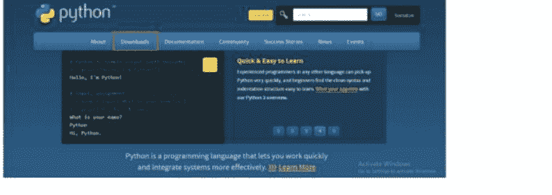

- 转到“下载”部分，从下拉菜单中选择Windows。查找你喜欢的Python版本。Python 3已更新到版本3.7.4，而Python 2已更新到版本2.7.16。请参考以下插图：

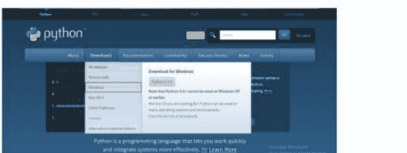

### 步骤2：选择安装程序

要为64位操作系统下载Python，请选择window x86-64可执行安装程序或window x86可执行安装程序。

请注意，你可以安装32位或64位版本的Windows。在大多数情况下，任一安装程序都可以在64位机器上运行。根据操作系统，32位版本使用更少的内存，但64位版本对于需要密集计算的应用程序效果更好。

如果你不确定选择哪个版本，请选择64位。但是，如果你做出了“错误”的决定并选择升级到不同版本的Python，你可以轻松卸载Python并重新安装另一个安装程序。

### 步骤3：运行安装程序

下载后运行安装程序。

1. 选中“将Python 3.7添加到路径”复选框，并为所有用户安装启动器。“将Python添加到路径”复选框在旧版本的Python中不可用。
2. 选择“立即安装”选项，这是推荐的安装方法。

请注意，此类功能在旧版本的Python中可能不可用。但是，在所有最新版本的Python中，Pip和IDLE是推荐的安装选择（集成开发和学习环境）。

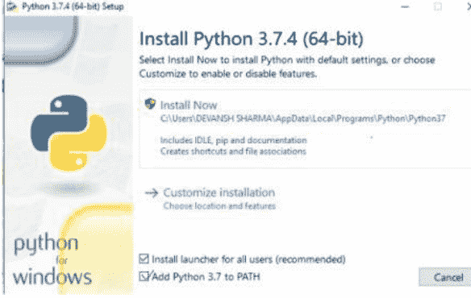

- 下一个对话框显示“安装成功”。你可以通过选择“禁用路径长度限制”来允许Python使用长路径名。

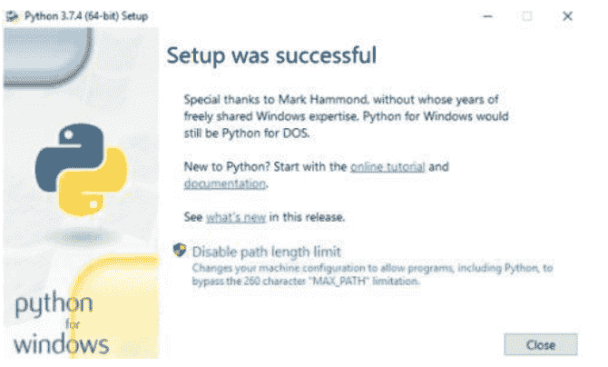

### 步骤4：检查Python是否已加载

1. 转到计算机上安装Python的目录。在我们的框架中，它是C:UsersUsernameAppDataLocalProgramsPythonPython37。我们已经安装了最新版本的Python。
2. 双击“python.exe”（Python可执行文件）文件。
3. 你也可以使用命令提示符通过输入“python —version”来验证它。它将向你显示Python版本。如果Python成功启用，将出现以下输出。

### 步骤5：检查Pip是否已安装

Pip是一个强大的Python软件包管理系统。如果你安装的是旧版本的Python，Pip可能没有预装。

### 第六步 设置环境变量

如果您没有勾选“Add Python to PATH”复选框，或者您的Python安装程序版本不包含该选项，请按照以下步骤操作：
使用“开始”菜单，选择 +R。

1.  打开命令提示符并输入 `sysdm.cpl`。系统属性窗口将会出现。
2.  转到“高级”选项卡，并从下拉菜单中选择“环境变量”。

如果您没有勾选“Add Python to PATH”复选框，或者您的Python安装程序版本不包含该选项，请按照以下步骤操作：
使用“开始”菜单，选择 +R。

1.  打开命令提示符并输入 `sysdm.cpl`。系统属性窗口将会出现。
2.  转到“高级”选项卡，并从下拉菜单中选择“环境变量”。
-   在“系统变量”下找到并选择 `Path` 变量，然后点击“编辑”。
-   转到“变量值”字段并选中它。在 `python.exe` 文件的路径前添加一个分号（;）。

## Python 关键字

关键字是为编译器保留的、具有特定含义的词语。它们不允许用作变量名。关键字是语法的一部分，例如：

```
return (a+b)
```

这里使用了关键字 `return`，而变量 `a` 和 `b` 是变量。
以下是所有 Python 关键字的列表：

- and-else-lambda
- or-except-None
- assert-finally-nonlocal
- break-try-pass
- continue-raise-global
- class-from-return
- def-import-False
- del-in-True
- if-is-for
- elif-not-while
- with-yield-

## 部分 Python 关键字描述

### if

Python 中的 `if` 语句是最基本的条件语句。它用于决定是否执行一个语句块。

```
a = 20

if (a>15):
    print("I am bigger than 15")
```

## 输出

I am bigger than 15

### else

有 `if` 语句，就有 `else` 语句。如果 `if` 语句的条件为假，则执行 `else` 代码块。以下示例说明了这一点：

```
a = 20
b = 30

if (a> b):
    print('a is greater than b')
else:
    print('b is greater than a')
```

## 输出

b is greater than a

### elif

`elif` 是 `else-if` 的缩写。它用于验证多个条件，意味着如果前一个条件不正确，则检查下一个条件。考虑以下场景：

```
a=10
b=10

if (a>b):
    print('a is smaller than b')
elif (a == b):
    print('a is equal to b')
else:
    print('a is greater than b')
```

## 输出

a is equal to b

### True

布尔值 `true` 由关键字 `True` 定义。如果给定的语句为真，解释器返回 `True`。考虑以下场景：

```
print(1==1)
```

## 输出

True

### False

布尔值 `false` 由关键字 `False` 表示。如果给定的语句为假，解释器返回 `False`。例如：

```
print(1>1)
```

## 输出

False

### assert

`assert` 关键字用作一种调试方法。它有助于代码的高效运行。它使我们更容易定位错误。
断言本质上是程序员已知并通常希望为真的假设。因此，它们被编码为：如果断言失败，代码将不再继续执行。

```
a = 10
b = 0
print('a is dividing by Zero')
assert b != 0
print(a / b)
```

## 输出

a is dividing by Zero

### 运行时异常：

```
Traceback (most recent call last):
File "/home/40545678b342ce3b70beb1224bed345f.py", line 4, in
assert b != 0, "Divide by 0 error"
AssertionError: Divide by 0 error
```

### and

Python 中的逻辑运算符有 `and`、`or` 和 `not`。在 `and` 运算符中，如果所有操作数都有效，则条件为真：
例如：

```
a=100
if (a>90) and (a<101):
    print('Both conditions are true.a is ',a)
```

## 输出

Both conditions are true. a is 100

## Python 运算符

作用于一个或多个操作数的符号称为运算符。操作数是执行操作的值或向量。考虑示例 `6+9`。操作数是 `6` 和 `9`，运算符是 `+`。Python 有多种运算符，如下所列：

- 算术运算符
- 赋值运算符
- 比较运算符
- 逻辑运算符
- 成员运算符
- 位运算符
- 身份运算符

### 算术运算符

Python 算术运算符用于执行基本的数学运算。以下是算术运算符的列表。假设 `x` 和 `y` 是两个变量，值分别为 `30` 和 `10`，以下是运算结果：

| 运算符 | 描述 | 示例 |
| :--- | :--- | :--- |
| + (加法) | 用于将两个操作数相加。 | x + y = 40 |
| – (减法) | 用于将两个操作数相减。如果第一个操作数小于第二个操作数，则返回负值。 | x – y = 20 或 y – x = -20 |
| * (乘法) | 用于将运算符两侧的值相乘。 | x * y = 300 |
| / (除法) | 将第一个操作数除以第二个操作数并返回商。 | x/y = 3.0 |
| // (整除) | 用于除法并返回商的整数值。 | x//y=3 或 x=30 y=7 则 x//y=4 |
| % (取模) | 返回除法后的余数。 | x%y = 0 |
| ** (幂) | 用于计算第一个操作数的幂。 | x = 5, y = 2 则 x ** 2 = 25 |

### 赋值运算符

赋值运算符用于将右侧操作数的值赋给左侧操作数。以下是赋值运算符的列表。如果我们设定 `x = 20` 和 `y = 10`，得到以下结果：

| 运算符 | 描述 | 示例 |
| :--- | :--- | :--- |
| = | 将右侧表达式的值赋给左侧操作数。 | x = 20 |
| += | 用于将两侧的值相加，并将表达式赋值给左侧。结果赋给右侧操作数。 | x+=y 等同于 x=x + y 因此 x = 30 |
| -= | 用于将两侧的值相减，并将表达式赋值给左侧。结果赋给右侧操作数。 | x-=y 等同于 x=x - y 因此 x = 10 |
| *= | 将操作数相乘，并修改赋给右侧操作数的值。 | x*=y 等同于 x = x*y 因此 x = 200 |
| /= | 将操作数相除，并修改赋给右侧操作数的值。 | x/=y 等同于 x = x/y 因此 x = 2.0 |
| %= | 计算两侧值的模。并将结果赋给左侧表达式。 | x%=y 等同于 x = x% y 因此 x = 0 |
| **= | 对运算符进行指数（幂）计算，并将值赋给左侧操作数。 | x=20,y=2 x**=2 等同于 x=x**y 因此 x=400 |
| //= | 对运算符执行整除，并将值赋给左侧操作数。 | x//=y 等同于 x = x//y 因此 x = 2 |

### 比较运算符

Python 有多种比较运算符，通常用于比较两个操作数的值。当这些值被比较时，结果是一个布尔值 `true` 或 `false`。运算符列于下表中。已分配 `x=10` 和 `y=15`。

| 运算符 | 描述 | 示例 |
| :--- | :--- | :--- |
| == | 如果两个操作数的值相等，则返回 `true`。 | x==y 为 False |
| != | 如果两个操作数的值不相等，则返回 `false`。 | x!=y 为 True |
| <= | 如果左侧操作数小于或等于右侧操作数，则计算结果为 `True`。 | x<=y 为 True |
| >= | 如果左侧操作数大于或等于右侧操作数，则计算结果为 `True`。 | x>=y 为 False |
| <> | 此运算符类似于 `!=`（不等于）。 | x<>y 为 True |

### 逻辑运算符

在条件语句中，使用了三种逻辑运算符：与、或、非。

| 运算符 | 描述 | 示例 |
|---|---|---|
| and | 如果两个表达式都为真，则条件变为真。 | True and False= False |
| or | 如果任一表达式为真，则条件变为真。 | True or False= True |
| not | 如果表达式 x 为真，则 not(x) 将为假，反之亦然。 | not(True)= False |

### 成员运算符

成员运算符用于判断给定元素是否属于序列，如字符串、列表或元组。下表列出了两个成员运算符：

| 运算符 | 描述 | 示例 |
|---|---|---|
| in | 如果左侧元素存在于给定的右侧序列中，则评估为真。 | 3 in [1,3,4]=True |
| not in | 如果左侧元素存在于给定的右侧序列中，则评估为假。 | 3 not in [1,3,5]=False |

### 位运算符

位运算符对操作数执行逐位二进制运算。考虑以下场景：变量 a 被赋值为 5，变量 b 被赋值为 6。

a = 5

b = 6

binary (a) = 0101

binary (b) = 0110

因此 a&b = 0100 等同于 4

a|b=0111

| 运算符 | 描述 | 示例 |
| :--- | :--- | :--- |
| ~(按位取反) | 此运算符将数字转换为二进制数并返回其一的补码或翻转位。~x 等同于 -x-1。 | a=~5 的结果为 -6 |
| &(按位与) | 如果相同位置的两个位都为 1，则结果为 1，否则结果为 0。 | a=0101, b=0110 a&b =0100 |
| \|(按位或) | 如果相同位置的两个位都为 0，则结果为 1，否则结果为 0。 | a=0101, b=0110 a\|b =0111 |

| 运算符 | 描述 | 示例 |
| :--- | :--- | :--- |
| ^(按位异或) | 如果两个位不同，则结果为 1，否则结果为 0。 | a= 0101, b=0110 a^b=0011 |
| <<(左移) | 左操作数的值按右操作数指定的位数向左移位。 | a<<2 = 0010100 |
| >>(右移) | 左操作数的值按右操作数指定的位数向右移位。 | a>>2=0001 |

### 身份运算符

| 运算符 | 描述 | 示例 |
| :--- | :--- | :--- |
| is | 如果两个运算符引用同一个对象，则评估为真。 | a = 5, b=5 a is b =True |
| is not | 如果两个运算符引用同一个对象，则评估为假。 | a = [1,2,3], b =[1,2,3] a is not b =True |

### 运算符优先级

了解运算符的优先级很重要。

| 运算符优先级（递减顺序） | 描述 |
| :--- | :--- |
| ** | 指数运算具有最高优先级 |
| ~ + - | 按位取反、一元加和减 |
| * / % // | 乘、除、取模和整除 |
| + - | 加法和减法 |
| >> << | 按位右移和左移 |
| & | 按位‘与’ |
| ^ | 按位‘异或’和常规‘或’ |
| <= < > >= | 比较运算符 |
| <> == != | 相等运算符 |
| = %= /= //= -= += *= **= | 赋值运算符 |
| is is not | 身份运算符 |
| in not in | 成员运算符 |
| not or and | 逻辑运算符 |

## Python 注释

在任何编程语言中，注释都是必需的。
它使我们的程序更具可读性，Python 解释器会忽略被注释的代码。
在 Python 代码中，有两种使用注释的方法。在代码中练习使用注释是个好主意，这样更容易理解。
没有注释的代码可能会令人困惑。
如果我们想说明一段代码语句而不执行它，我们可以通过注释它来实现。
虽然注释不是代码的一部分，但它提高了可读性。

### 单行注释

在行首使用 #（井号）字符来创建单行注释。在行尾，它会立即终止。例如：

## 示例 1

```
#This is a single-line comment in Python
print(“Welcome to tutorialandexample”)
```

## 输出

Welcome to tutorialandexample

### 多行注释

在三引号内，可以创建多行语句。例如：

```
print(“Welcome to tutorialexample”)
”“”This is the example of
multiline comment
using the triple quotes.
Use in your code"""
```

## Python if 语句

任何编程语言都必须具备决策能力。决策能力的核心是条件测试。Python 中有许多决策语句，包括：

- If 语句
- If-else 语句
- elif 语句

### if 语句

if 条件语句是最直接的。它用于检查是否存在某个条件。如果条件有效，将执行一个代码块（if 语句块）。

### 语法：

```
if expression:
    statement
```

**if 语句的流程图：** if 语句的流程图如下

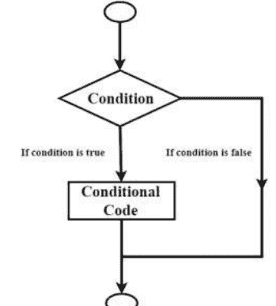

在上面的流程图中，首先检查条件是否有效，然后执行条件代码（if 语句）。如果条件不正确，将运行‘if’断言之后的第一组代码。

在 Python 编程语言中，任何非零和非空值都被假定为 TRUE。如果为零，则假定值为 FALSE。

### Python 中的缩进

代码块使用缩进来声明。
块中的所有语句都应在同一级别缩进。
块级 Python 代码中不允许使用花括号和圆括号。
Python 的缩进使编程变得快速而简单。

**示例：** 以下是 if 语句的一个示例。

1.  **编写一个程序来检查数字是否为偶数**

```
n = int(input(“Enter the number:”))

if(n%2==0):
    print(“The number is even”)

print(“The number is odd”)
```

## 输出

Enter the number: 10
The number is even

2.  **创建一个程序来检查乘客的行李重量。**

```
weight = float(input(“How many Kilograms(kg) does your luggage?: “))
if (weight <30):
    print(“You have charged  ₹300 for heavy luggage .”)
print(“Thank you for your business.”)
```

## 输出

How many Kilograms does your suitcase weigh?: 35
There is a 250 charge for heavy luggage.
Thank you for your business

3.  **创建一个程序，打印三个数字中的最大值。**

```
a = int(input(“Enter the First number:”))
b = int(input(“Enter the Second number:”))
c = int(input(“Enter the Third number:”))

if(a>b) and (a>c):
    print(a, ‘is largest number’ )

if(b>a) and (b>c):
    print(b, ‘is largest number’)

if (c>a) and (c>b):
    print(c, “c is largest”);
```

## 输出

Enter the First number: 100
Enter the Second number: 145
Enter the Third number: 200
200 is largest

4.  **创建一个程序来确定给定的数字是正数还是负数。**

```
num = 3

if num >0:
    print(num, “is a positive number.”)
    print(“This is always printed.”)

num = -1

if num >0:
    print(num, “is a positive number.”)
    print(“This is also always printed.”)
```

## 输出

3 is a positive number.
This is always printed.
This is also always printed.

## Python elif

**Python elif**
elif 语句用于验证多个条件，并根据哪个条件有效来执行特定的语句块。

**语法**

```
if expression1:
    statement

elif expression2:
    statement

elif expression3:
    statement

else:
    statement
```

Elif 语句，如 else，可以是可选的。如果 if 表达式评估为真，则打印表达式 1 的声明；否则，控制权转移到 elif 表达式；如果 elif 条件评估为假，控制权将转移到下一个 elif。
它将遍历所有 elif 表达式，直到找到一个为真的表达式。
与其他编程语言不同，Python 没有 switch 或 case 语句。

## Python for 循环

在 Python 中，for 循环根据给定的序列重复执行一段代码块，重复次数由序列长度决定。Python 的 for 循环不同于 C 或 Pascal 等其他编程语言。它遍历 Python 的数据结构，如列表、字典和元组。

### 语法

```
for iterating_var in sequence:
    statements
```

首先计算序列中的表达式列表。然后，迭代变量 `iterating_var` 被赋值为序列中的第一个元素。之后，执行语句块。

语句块会一直执行，直到整个序列遍历完毕；列表中的每个元素都会被分配给 `iterating_var`。

### 流程图

在上面的流程图中，for 循环遍历序列。它使用序列的第一个元素执行语句块。然后继续处理序列中的下一个元素，直到序列中没有剩余元素。

### for 循环示例

1.  **创建一个程序，打印数字列表中两个数字的平方。**

```
list = [1,2,3,4,5]
for e in list:
    print(e**2)
```

**输出**

```
1
4
9
16
25
```

2.  **编写一个程序，从字符串中生成字符。**

```
str = 'Python'
for e in str:
    print(e)
```

**输出**

```
P
y
t
h
o
n
```

3.  **编写一个程序，计算给定列表中所有项目的总和。**

```
list = [25,42,32,12,33]
sum = 0
for e in list:
    sum = sum+e
print("The sum is:",sum)
```

**输出**

```
The sum is: 144
```

### 通过序列索引进行迭代

我们可以通过元素的索引来遍历序列。让我们先从基本了解 `range` 函数开始。

### range() 函数：

要遍历给定的数字序列，可以使用 `range()` 函数。

在大多数情况下，需要三个参数（`stop` 和 `step` 是可选的）。

Python 让我们能够自由定义满足需求的 `range` 函数。考虑以下场景：

- `range(n)` – 生成从起始值到 n-1 的数字。`range(5)` 将生成 0,1,2,3,4。
- `range(start, stop)` - 生成从 `start` 到 `stop-1` 的一组数字。`range(1,10)` 将生成 0,1,2,3,4,5,6,7,8,9。
- `range(start, stop, step)` - 我们可以生成具有给定步长差值的数字。`range(3,20,3)` 将生成 3,6,9,12,15,18。

### 使用 range() 的 for 循环示例

编写一个程序，计算前 n 个自然数的和。

```
n=int(input('Enter the number'))
# Define a variable to stored number for specific range
sum=0
for i in range(1,n+1):
    #As we know range(n) will generate n-1 that's why we assign n+1
    #it will generate n+1-1 or n numbers
    sum=sum+i
    # Sum of numbers stored in sum variable
print(sum)
```

编写一个程序，判断给定的数字是否为质数。

```
n = 12
# If given number n is greater than 1
if n>1:
    # Iterate from 2 to n // 2
    for i in range(2, n // 2):
        # If n is divisible by any number between 2 and n // 2, it is not prime
        if (n % i) == 0:
            print(n,"is not a prime number")
            break
    else:
        print(n, "is a prime number")
else:
    print(n, "is not a prime number")
```

### Python 嵌套 for 循环

“嵌套 for 循环”指的是一个 for 循环嵌套在另一个 for 循环内部。在模式编程中，最好使用嵌套 for 循环。例如：

1.  **创建一个程序，打印三角形星号。**

```
n = int(input("Enter the number of lines"))
# Take input for number of lines
for i in range(n):
    #first for loop is using for print number of lines
    for j in range(i):
        #second for loop is using for print star(*)
        print("*",end="")
    print()
```

2.  **创建一个程序，在给定范围内查找质数。**

```
start = int(input("Enter the start range"))
stop = int(input("Enter the stop range"))
for n in range(start,stop+1):
    # If given number n is greater than 1
    if n>1:
        # Iterate from 2 to n // 2
        for i in range(2,n//2):
            # If n is divisible by any number between 2 and n //2, it is not prime
            if(n%i==0):
                break
        else:
            print(n)
    else:
        print("the number is not greater than 1")
```

### 在 for 循环中使用 else 语句

`else` 子句是 Python 中 for 循环的一个可选部分。只有当循环完成所有迭代后，`else` 语句才会执行。考虑以下场景：

```
for i in range(6):
    print(i)
else:
    print("Iteration is completed")
```

## Python while 循环

循环在 Python 和任何其他编程语言中都至关重要，因为它们允许你重复执行一段代码块。

通常，你需要重复使用一段代码，但又不想每次都写相同的代码行，所以你会想使用循环。

循环语句用于重复执行多个代码或语句，直到循环中指定的条件求值为假。

在 Python 中，主要有两种循环语句：

1.  while 循环
2.  for 循环

本主题将解释 while 循环。

**while 循环：**
while 循环用于持续执行一个语句，直到循环的条件变为假。当我们事先不知道会有多少次迭代时，就会使用它。

**语法：**
```
while expression:
    statement
```

### 流程图

在上面的流程图中，Python 逐一测试每个表达式（即条件），如果找到为真的条件，则执行该表达式下的语句块。

如果找到为假的条件，则执行 `else` 条件下的语句块。

在下面的例子中，我们使用了 `if`、一系列 `elif` 和 `else` 来判断变量的类型。

1.  **创建一个程序来检查学生的成绩。**

```
marks = int(input("Enter the marks "))
if marks >85 and marks <= 100:
    print("Congrats ! you scored grade A ")
elif marks >60 and marks <= 85:
    print("You scored grade B + ")
elif marks >40 and marks <= 60:
    print("You scored grade B ")
elif marks >30 and marks <= 40:
    print("You scored grade C ")
else:
    print("You are fail ")
```

**输出**

```
Enter the marks 60
You scored grade B
```

2.  **编写一个程序，判断是早上、中午还是晚上。**

```
time= int(input("Enter the time"))
if time >= 6 and time <12:
    print("Good Morning")
elif time == 12:
    print("Good Noon")
elif time >12 and time <= 17:
    print("Good Afternoon")
elif time >17 and time <= 20:
    print("Good Evening")
elif (time >20 and time <=24) or (time >= 0 and time <=6):
    print("Good Night")
else:
    print("Invalid time!")
```

**输出**

```
Enter the time12
Good Noon
```

3.  **创建一个基本的计算器程序。**

```
a=int(input("Enter the first number"))
b=int(input("Enter the second number"))
print("1. Add")
print("2. Sub")
print("3. Mul")
print("4. Div")
choice=input("Enter your choice")
if(choice=='1'):
    print("The addition is:",a+b)
elif(choice=='2'):
    print("The subtraction is:",a-b)
elif(choice=='3'):
    print("The multiplication is:",a*b)
elif(choice=='4'):
    print("The divide is:",a/b)
else:
    print("Enter the valid choice")
```

**输出**

```
Enter the first number:30
Enter the second number:20
1. Add
2. Sub
3. Mul
4. Div
Enter your choice:3
The multiplication is: 600
```

4.  **创建一个程序来判断三角形类型。**

```
a=int(input("Enter the first angle:"))
b=int(input("Enter the second angle:"))
c=int(input("Enter the third angle:"))
if a<b+c or b<a+c or c<a+b:
    print("The triangle does not exist")
elif a==b and a==c:
    #An equilateral triangle has three angles of 60°, and three equal sides.
    print("Equilateral triangle")
elif a==b or b==c or c==a:
    # An isosceles triangle has two angles that are equal, and two equal sides.
    print("Isosceles triangle")
else:
    # An obtuse triangle has one and only one obtuse angle.
    print("Obtuse triangle")
```

**输出**

```
Enter the first angle: 60
Enter the second angle:60
Enter the third angle:45
Isosceles triangle
```

## while 循环示例：

以下是一些 while 循环的示例：

我们在循环中使用递增操作来提升给定变量的值。

由于 while 循环必须包含递增或递减操作，这是一个关键阶段。否则，循环将永远重复自身。

### 1. 创建一个打印特定数字乘法表的程序。

```python
num = int(input("Enter the number"))
# define a variable for user input
i = 0
while i < 10:
    # while loop will iterate as long as the value of i is less than 10
    i = i + 1
    # Increment operation in i
    c = num * i
    # Multiply resultant stored in another variable c
    print(num, '*', i, '=', c)
```

**输出：**

```
Enter the number 12
12 * 1 = 12
12 * 2 = 24
12 * 3 = 36
12 * 4 = 48
12 * 5 = 60
12 * 6 = 72
12 * 7 = 84
12 * 8 = 96
12 * 9 = 108
12 * 10 = 120
```

### 2. 编写一个程序，多次打印短语“hello world”。

```python
num = 1
# there is a variable num in which we store an integer 1.
while num <= 5:
    # we print the hello world fives times until condition evaluates false
    print("Hello world")
    num = num + 1
# we print out “Hello world” and increase the value of number with one.
```

**输出：**

```
Hello world
Hello world
Hello world
Hello world
Hello world
```

### 3. 编写一个程序，计算指定序列中有多少个偶数或奇数。

```python
number = 1
count_odd = 0
count_even = 0
while number < 10:
    number = number + 1
    if number % 2 == 0:
        count_even = count_even + 1
    else:
        count_odd = count_odd + 1
print('The count of even number:', count_even)
print('The count of odd number:', count_odd)
```

**输出：**

```
The count of even number: 5
The count of odd number: 4
```

## 无限 while 循环

如果 while 循环中的给定条件永远不会变为假，循环将变为无限循环，永远不会自行结束。while 循环中的任何非零值通常表示真状态。

考虑以下场景：

```python
num = 0
while num < 5:
    print("hello")
```

## while 循环中的 else 语句

使用 while 循环时，Python 允许你使用 else 表达式。如果给定条件变为假，else 断言将被执行。使用 while 循环时，else 语句是一个可选项。

例如：

```python
num = 1
while num < 6:
    print(num)
    num = num + 1
else:
    print("Loop is finished")
```

**输出：**

```
1
2
3
4
5
Loop is finished
```

## Python 列表

列表是 Python 最灵活和可变的数据结构之一。它可以存储各种数据类型和异构数据。

在方括号内，列表包含以逗号分隔的值（项）。在 Python 中，创建列表就像这样简单：

```python
list1 = ['Abhay', 'Arjun', 'Himanshu', 'Anubhav']
list2 = [1, 2, 3, 4, 5, 6]
list3 = ['Himanshu', 20, 54.6, 'Abhay', 'a', 'b']
```

## 列表中的索引和切片

### 列表索引：

列表索引可以使用 [] 运算符完成。

```python
list = ['P', 'Y', 'T', 'H', 'O', 'N']
```

列表的索引位置可用于查看列表的值。索引从 0 到 n-1 使用。

第 0 个索引用于存储第一个元素，第一个索引用于存储第二个元素，依此类推。

最右边的索引位置是 -1，最左边的索引位置是 -2，依此类推。例如：

```
list[0]=P          list[-6]=P
list[1]=Y          list[-5]=Y
list[2]=T          list[-4]=T
list[3]=H          list[-3]=H
list[4]=O          list[-2]=O
list[5]=N          list[-1]=N
```

### 列表切片

Python 有一个功能，允许你获取列表的子列表。当我们只需要列表中的一小部分数据时，切片就派上用场了。

语法是：`list_variable[start: end: step]`

- **start** 指列表元素的起始位置。
- **stop** 指我们应该**停止**的元素的索引，就在切片结束之前。
- **step** 允许你在 **start:stop** 范围内获取每个第 n 个元素。

让我们通过下面的例子来理解这个概念：

**示例-1：**

```python
list = [10, 20, 30, 40, 50, 60, 70, 80, 90]
print(list[2:6])
```

**输出：**

```
[30, 40, 50, 60]
```

由于 start 等于 2，在上面的例子中，切片从第二个位置开始。索引 2 的值为 30。

stop 的值表示列表的最后部分，即 60。因此，它将在 stop 索引之前停止。使用 steps 可以在 start:stop 范围内获取每个第 n 个元素。

我们可以省略 start 索引，它将从 0 开始返回。例如：

```python
list = [10, 20, 30, 40, 50, 60, 70, 80, 90]
print(list[:4])
```

**输出：**

```
[10, 20, 30, 40]
```

所以，`list[:4]` 与 `list[0:4]` 相同。这是获取前 n 个元素的快捷方式。

我们也可以省略 stop 索引。它将返回指定列表的最后 n 个元素。例如：

```python
list = [10, 20, 30, 40, 50, 60, 70, 80, 90]
print(list[4:])
```

**输出：**

```
[50, 60, 70, 80, 90]
```

在上面的例子中，我们省略了 stop 索引，这意味着它从列表的开头取元素直到末尾。

**示例-2：**

```python
list = [10, 20, 30, 40, 50, 60, 70, 80, 90]
print(list[::])
# By default step-size is 1. There is no need to specify it
print(list[::2])
# Here step-size is two
print(list[1::3])
print(list[2:7:2])
```

**输出：**

```
[10, 20, 30, 40, 50, 60, 70, 80, 90]
[10, 30, 50, 70, 90]
[20, 50, 80]
[30, 50, 70]
```

在上面的程序中，我们可以省略 start 和 stop 参数，只使用 move 参数。我们可以通过提供 move 来跳过一些元素。

### 使用负索引访问列表元素

```python
list = [10, 20, 30, 40, 50, 60, 70, 80, 90]
print(list[-3:])
# The index position is count from backward. start is -3 and it will proceed to last index of list
print(list[1:-1])
print(list[-5:-2])
# Here step-size is two
print(list[-3:])
print(list[1:-3:2])
print(list[:7:-2])
print(list[::-1])
# step-size is -1. it will reverse entire list
```

**输出：**

```
[70, 80, 90]
[20, 30, 40, 50, 60, 70, 80]
[50, 60, 70]
[70, 80, 90]
[20, 40, 60]
[90]
[90, 80, 70, 60, 50, 40, 30, 20, 10]
```

## 列表的修改（更新）

列表是可变的，这意味着我们可以使用切片和赋值运算符来更改列表的元素。要向列表添加值，请使用列表的 append() 函数。

```python
list = [10, 21, 30, 45, 50, 63, 78, 80, 90]
list[0] = 1
print(list)
list[1:4] = [2, 3, 4]
print(list)
list[2] = 'Himanshu'
print(list)
list[3:5] = 'abc'
print(list)
```

**输出：**

```
[1, 21, 30, 45, 50, 63, 78, 80, 90]
[1, 2, 3, 4, 50, 63, 78, 80, 90]
[1, 2, 'Himanshu', 4, 50, 63, 78, 80, 90]
[1, 2, 'Himanshu', 'a', 'b', 'c', 63, 78, 80, 90]
```

## 列表的删除

del 关键字用于删除列表特性。当我们确切知道需要删除哪个方面时，我们使用它。也可以使用 remove() 或 pop() 方法删除元素。

例如：

```python
list = [10, 21, 30, 45, 50, 63, 78, 80, 90]
del list[0]
print(list)
del list[1:4]
print(list)
del list[::2]
print(list)
```

**输出：**

```
[21, 30, 45, 50, 63, 78, 80, 90]
[21, 63, 78, 80, 90]
[63, 80]
```

## 列表的基本操作

以下是不同操作的列表。

- **重复**

重复运算符 (*) 用于重复列表元素。

```python
list1 = [1, 2, 3, 4, 5]
print(list1 * 2)
```

**输出：**

```
[1, 2, 3, 4, 5, 1, 2, 3, 4, 5]
```

- **连接**

连接两个或多个列表使用连接运算符 (+)。

```python
list1 = [1, 2, 3, 4, 5]
list2 = [6, 7, 8, 9, 10]
print(list1 + list2)
```

**输出：**

```
[1, 2, 3, 4, 5, 6, 7, 8, 9, 10]
```

- **迭代**

列表可以使用 **for** 循环进行迭代。

```python
list1 = [1, 2, 3, 4]
for i in list1:
    print(i)
```

**输出：**

```
1
2
3
4
```

- **成员关系**

如果对象存在于列表中，则返回 true；否则，返回 false。

```python
list1 = [1, 2, 3, 4]
```

print(3 in list1)

## 输出

True

## 列表中的内置函数

| 序号 | 函数 | 描述 |
| :--- | :--- | :--- |
| 1. | len(list) | 用于计算列表的长度 |
| 2. | cmp(list1, list2) | 比较两个列表的元素。 |
| 3. | max(list) | 返回列表中的最大元素。 |
| 4. | min(list) | 返回列表中的最小元素。 |
| 5. | list(seq) | 将任何序列转换为列表。 |

## Python 元组方法

Python 通过两个内置方法来处理元组。这两个方法如下：

| 方法 | 描述 |
|---|---|
| count() | Python 中的 tuple.count() 方法返回指定值在元组中出现的次数。 |
| index() | Python 中的 tuple.index() 方法返回指定元素在元组中的最小索引。 |

## 示例 1

```
# 解释元组方法的 Python 程序
# 初始化元组值
tupleVal = (1, 2, 3, 4, 5, 7, 8, 7, 5, 5, 6, 4, 4)
print("Tuple:", tupleVal)
# 计算给定元组中 4 出现的次数
occurrences = tupleVal.count(4)
# 打印返回的值
print("The item '4' occured", occurrences, "times")
```

## 输出

Tuple: (1, 2, 3, 4, 5, 7, 8, 7, 5, 5, 6, 4, 4)
The item '4' occured 3 times

# 示例 2

```
# 解释元组方法的 Python 程序
# 初始化元组值
tupleVal = ("e", "i", "o", "u", "a", "a")
print("Tuple:", tupleVal)
# tuple.index() 方法
# 查找指定值的第一次出现并返回其索引
Index = tupleVal.index("a")
# 打印返回的值
print("The index value of 'a' is", Index)
```

## 输出

Tuple: ('e', 'i', 'o', 'u', 'a', 'a')
The index value of 'a' is 4

## Python 字典

Python 字典是一个可变的数据列表，其中包含无特定顺序的键值对。它同时跟踪键和值，允许通过键来访问其对应的值。

Python 字典是一组字典项，可以通过其键快速检索。

在字典内部，键必须是唯一的。字典的值可以是任何数据类型，但键必须是不可变的数据类型，如数字、字符串或元组。

## 创建字典

在花括号内，Python 字典以键值对的形式存储数据，键和值用冒号(:)分隔。例如：

```
student = {'name': 'Himanshu', 'age': 11, 'class': 'Fifth', 'Roll_no': 17}
print(type(student))
print(student)
```

## 输出

```
<class 'dict'>
{'name': 'Himanshu', 'age': 11, 'class': 'Fifth', 'Roll_no': 17}
```

空字典通过空的花括号 {} 声明。

```
student = {}
print(type(student))
```

## 字典操作

## 从字典中访问值

索引运算符 [] 用于从字典中访问值，键在方括号内使用。Python 中的 get() 方法也可用于访问值。例如。

```
student = {'name': 'Himanshu', 'age': 11, 'class': 'Fifth', 'Roll_no': 17}
# 使用键访问元素
print(student['name'])
print(student['age'])
print(student['Roll_no'])
# 使用 get() 访问值
print(student.get('class'))
```

## 输出

Himanshu
11
17
Fifth

如果我们尝试访问指定字典中不存在的值，会得到一个错误。

```
student = {'name': 'Himanshu', 'age': 11, 'class': 'Fifth', 'Roll_no': 17}
print(student['subject'])
```

## 输出

```
line 2, in <module>
    print(student['subject'])
KeyError: 'subject'
```

## 字典的修改（更新）

可以通过引入新的键值对来更新字典。由于字典是可变的数据形式，其内容可以使用特定的键进行修改或删除。例如：

```
student = {'Name': 'Himanshu', 'Age': 11, 'Class': 'Fifth', 'Roll_no': 17}
student['School'] = 'Dps School'  # 添加新键及其值
student['Age'] = 12  # 更新现有值
print(student)
```

## 输出

```
{'Name': 'Himanshu', 'Age': 12, 'Class': 'Fifth', 'Roll_no': 17, 'School': 'Dps School'}
```

## 字典的删除

使用 del 关键字，可以删除字典的一个特性。我们可以选择删除单个元素或清空整个字典。

```
student = {'Name': 'Himanshu', 'Age': 11, 'Class': 'Fifth', 'Roll_no': 17}
del student['Class']  # 删除 Class 键
print(student)
print(student['Class'])
```

## 输出

```
{'Name': 'Himanshu', 'Age': 11, 'Roll_no': 17}
line 9, in <module>
    print(student['Class'])
KeyError: 'Class'
```

要清空字典的所有元素，Python 提供了 clear() 方法。它返回一个空字典。

```
student = {'Name': 'Himanshu', 'Age': 11, 'Class': 'Fifth', 'Roll_no': 17}
student.clear()  # 删除字典的所有元素
print("The empty string is:", student)
```

## 输出

The empty string is: {}

## 字典键的属性

使用字典键时，有几点需要注意。

- 1. 字典中不允许重复的键，这意味着我们不能为同一个键使用不同的值。如果我们为多个值声明了相同的键，将存储最后赋的值。考虑以下示例。

```
student = {'Name': 'Himanshu', 'Age': 11, 'Class': 'Fifth', 'Roll_no': 17, 'Name': 'Dev'}
# 我们多次为 Name 键赋值，那么它将
# 考虑最后赋的值
print("Last assign name is:", student['Name'])
```

## 输出

Last assign name is: Dev

我们可以使用数字、字符串或元组作为字典键，因为它们必须是不可变的。但是，像 ['key'] 这样的可变类型是不允许的。例如：

```
student = {['Name']: 'Himanshu', 'Age': 11, 'Class': 'Fifth'}
print(student)
```

## 输出

```
line 2, in <module>
    student = {['Name']: 'Himanshu', 'Age': 11, 'Class': 'Fifth'}
TypeError: unhashable type: 'list'
```

## 内置字典函数

| 序号 | 函数 | 描述 |
| :--- | :--- | :--- |
| 1. | len(dict) | 用于计算字典的长度 |
| 2. | cmp(dict1, dict2) | 比较两个字典的元素。 |
| 3. | str(dict) | 将字典转换为可打印的字符串表示形式。 |
| 4. | type(variable) | 用于打印传递变量的类型。 |

## Python 函数

Python 函数是一个可重用、组织良好的代码块，用于执行特定任务。函数是将大型程序分解为可管理部分的好方法。它还允许我们的程序被重用。该特性可用于重用代码块。

Python 比其他编程语言更通用，因为所有函数都被视为对象。

Python 中有两种类型的函数：

- **内置函数** – Python 库和包中包含这些特性。
- **用户定义函数** – 这些函数由用户根据其需求指定。在本教程中，我们将学习用户定义的特性。

## 创建函数

创建用户定义特性的基本步骤如下所述。

- 要描述一个函数，使用 def 关键字，后跟函数名。
- 参数应写在函数的开括号和闭括号内，语句应以冒号结尾。
- 在函数体内，编写要执行的程序语句。
- return 语句不是必需的。它必须出现在特性的末尾。

语法如下：

```
def function_name(argument list):
    The function body
    ....................
    ....................
    return
```

参数列表中可以有零个或多个参数。参数是形参的另一个名称。特性的主体包括缩进的语句。当函数被调用时，函数体被执行。参数可以是可选的或必需的。

## 调用函数

函数必须在声明后通过使用函数名后跟括号和相关参数来命名。

注意：函数必须在调用之前定义；否则，可能会发生错误。

考虑以下场景：

## 示例-1

```
def hello():
    print('Hello')
hello()
```

## 输出

Hello

## 示例-2

```
def sum(a, b):
    # 定义一个带有两个参数的函数 sum
    c = a + b
    return c
## 将值返回给调用函数
```

## 输出

总和为：30

## 参数传递

向函数传递参数可以通过以下两种方式之一完成。

- **按值调用**

此技术用于C、C++和Java，但不用于Python。在按值调用中，实际参数的值被复制到函数的形式参数中，并且两种类型的参数存储在不同的内存位置。因此，我们对形式参数所做的任何调整都不会反映在调用函数的实际参数中。

- **按引用调用**

在Python中，函数是按引用命名的，这意味着在函数内部所做的任何更改都会反映在实际参数中。请看以下示例：

## 示例 1：

```python
def mul(m,n):
    c=m*n
    return c
a=int(input("Enter the number:"))
b=int(input("Enter the number:"))
z=mul(a,b)
print("The multiply is:",z)
```

## 输出

Enter the number: 60

Enter the number: 50

The multiply is: 3000

上述程序中指定的函数是`mul(m,n)`，其中`m`和`n`是形式参数，调用函数是`mul(a,b)`，其中`a`和`b`是实际参数。

## 示例-2

创建一个程序，该程序接受一个列表并返回一个具有唯一特征的列表。

```python
def dup_list(list):
    list1=[]
    for i in list:
        if i not in list1:
            list1.append(i)
    return list1
list = [1,1,2,1,3,3,4,4,5,6,5,7]
print('The duplicate list is:',list)
z=dup_list(list)
print('The unique list is:',z)
```

## 输出

The duplicate list is: [1, 1, 2, 1, 3, 3, 4, 4, 5, 6, 5, 7]

The unique list is: [1, 2, 3, 4, 5, 6, 7]

## 参数类型

有几种不同类型的参数，如下所述。

1. 必需参数
2. 默认参数
3. 关键字参数
4. 可变长度参数

## 必需参数

必需参数是调用函数时必须传递的参数，并且必须完全符合它们在函数调用和函数描述中的位置。如果在函数调用中未给出参数或参数位置已更改，Python解释器将显示错误。

## 示例 1

```python
def sqr_list(list):
    emp_list= []
    for i in list:
        emp_list.append(i**2)
    print(emp_list)

sqr_list([1,2,3,4,5,6,7,8,9,10])
```

## 输出

[1, 4, 9, 16, 25, 36, 49, 64, 81, 100]

## 示例-2

```python
def sum(a,b):
    c=a+b
    return c

print(sum(20)) #There is only one argument is passed.
```

## 输出

```
line 4, in <module>
    print(sum(20))
TypeError: sum() missing 1 required positional argument: 'b'
```

## 默认参数

默认参数是在函数描述时为其分配了值的参数。如果在函数调用时未定义该参数，则将其设置为规范中指定的值。

例如

## 示例 1

```python
def student(name,age=21):
    print('My name is:',name)
    print('My age is',age)
student('Dev') #Here argument age is not passed default value is provided in definition
student('Himanshu',25) # The value of age is overwritten
```

## 输出

My name is: Dev
My age is 21
My name is: Himanshu
My age is 25

## 关键字参数

关键字参数的优点是我们可以按任何顺序传递它们，因此传递的顺序无关紧要。任何语句都被视为关键字。

它将匹配函数描述和调用中的参数名称。

## 示例-1

```python
def employee(id,name,age):
    print('Employee Id:',id,'\nEmployee Name:',name,'\nEmployee Age:',age)

employee(age=30,id=1,name='Sushant')
```

## 输出

Employee Id: 1
Employee Name: Sushant
Employee Age: 30

我们在上述程序的函数调用中以不同的顺序传递了参数。参数的名称必须与函数定义的名称匹配；否则，将出现错误。

- 关键字参数和必需参数可以一起传递。例如：

```python
def employee(name,amount,message):
    print(message,name,'amount credited',amount)

employee('Robert',message='Hello',amount=20000)
```

## 输出

Hello Robert amount credited 20000

在上述程序中，必需参数在前，后面跟着两个关键字参数。

需要注意的是，必需参数不能出现在关键字参数之后；否则，将显示错误。

- **可变长度参数**

当我们不确定可以传递给函数的参数数量时，使用可变长度参数。

在一个函数中，有两种类型的可变长度参数：

- *args（非关键字参数）
- *kwargs（关键字参数）

## 变量的作用域

变量的作用域由其声明的位置决定。变量有两种作用域。

- **全局变量**

由于全局变量在函数外部指定，因此可以在软件中的任何位置访问它们。

- **局部变量**

由于局部变量在函数内部指定，因此只能在函数内部访问它们。

请看以下示例：

**示例-1 全局变量**

```python
sum = 0

# variable defined outside the function
def add(a,b):
    sum = a+b # the variable sum accessed inside the function
    print(sum)
add(54,65)
print('The value of sum outside the function:',sum)
```

## 输出

The sum is: 119
The value of sum outside the function: 0

## 示例 - 2 局部变量

```python
def mul(a,b):
    c = a*b # The variable c is defined inside the function
    print('The multiply is:',c)
mul(20,30)
print(c) # The variable c is a function-specific variable that cannot be accessed outside of the function.
```

## 输出

The multiply is: 600
line 6, in <module>
NameError: name 'c' is not defined

## Python文件处理

### 什么是文件？

文件是包含一组数据的单个单元。它用于在非易失性存储器（如硬盘驱动器）中存储数据。

RAM（随机存取存储器）是一种易失性存储器，大多数计算机程序都在其中运行。当程序终止时，所有数据都会丢失，因此我们必须将其保存到永久存储或本地文件中。

因此，在Python中，文件处理可以按以下顺序完成：

- 打开文件
- 读取或写入（执行操作）
- 关闭文件

### 打开文件

Python中的内置函数`open()`用于打开文件。此函数将返回一个文件对象。为了返回文件对象，`open()`函数与两个参数结合使用。第一个参数接受文件名，第二个参数接受文件模式。

语法如下：

```python
fs = open(filename, access mode)
```

**filename-** 此参数包含我们要打开的文件的名称。

**access_mode** – 此参数指定文件的打开模式，例如读取、写入、追加等。此参数不是必需的；如果未给出，文件将以默认的**r**读取模式打开。

请看以下示例：

```python
fs = open('newfile.txt', 'w')
if fs:
    print('file opened successfully')
```

## 输出

file opened successfully

### 关闭文件

完成文件处理后，我们必须正确关闭文件。要关闭文件，Python提供了`close()`过程。
`close()`函数释放之前绑定到文件的资源。虽然Python有垃圾收集器，但使用`close()`正确关闭文件是一个好习惯。

```python
fs = open('myfile.txt', 'w')
#perform file operation
fs.close()
```

### 如何写入文件

`write()`是一个Python函数，允许您写入文件。它必须以写入模式（w或a）打开。请看以下说明：

```python
# In write mode, open the file myfile.txt. If no such file exists, it creates one.
fs = open('myfile.txt', 'w')
#writing the content to the file
fs.write("We are writing this line into the file")
fs.write("Python is the most popular programming language")
#closing the opened file
fs.close()
```

### myfile.txt

我们正在将这一行写入文件。Python 是最流行的编程语言。

## 如何读取文件

`Read()` 是一个用于读取文件内容的 Python 函数。`read()` 方法从文件中读取一个字符串并返回它。以下是其语法：

**Fileobj.read(count)**

`count` 语句接受一个正数，并计算字符串中的字符数。例如：

```
fs = open('myfile.txt', 'r')
z = fs.read(10)
y = type(z)
print(z)
```

Python 中的 `readline()` 函数逐行读取文件。它会读取文件直到遇到换行符。

```
fs = open('myfile.txt', 'r+')
z = fs.readline()
print(z)
```

# JAVASCRIPT

## 编程基础

### 初学者分步指南

JAKE BOND

## Javascript 简介

这节 JavaScript 课程让初学者和专家都能轻松学习 JavaScript。
什么是 JavaScript，它是如何工作的？
JavaScript 是一种面向计算机的动态编程语言。它是一种轻量级、跨平台的基于对象的脚本语言。
借助 JavaScript，我们可以让网站更具活力和吸引力。
它由 Netscape 员工 Brendan Eich 于 1995 年设计。
它是一种用于创建交互式网站的编程语言。它最常用于：

- 客户端验证。
- 其下拉菜单是动态的。
- 显示当前日期和时间。
- 在将数据传输到服务器之前，验证 HTML 表单中的用户输入。
- 创建响应用户输入而无需连接到服务器的表单。
- 安装新窗口或框架并关闭它们。
- 使用弹出窗口和对话框显示信息。
- 创建小巧但完整的客户端程序。
- 时钟和其他计时器
- 移动设备的游戏和应用程序开发。

（例如，警告对话框、确认对话框或提示对话框）

## Javascript 的特性

- JavaScript 是一种基于对象的脚本语言。
- 该语言区分大小写。
- 它很轻量。
- 在 JavaScript 中，每个语句后面都必须跟一个分号（;）。

## Javascript 的优势

- JavaScript 是一种解释型脚本语言。由于没有编译过程，因此不需要编译器。JavaScript 由浏览器作为 HTML 标签进行解释。
- JavaScript 是一种简单的编程语言。任何人都很容易学习。它用于创建动态且吸引人的网站。
- 因为 JavaScript 在客户端运行，所以它降低了网站服务器的负载。
- 它包括条件检查、循环和分支功能，可用于网页。
- 对于最终用户来说，JavaScript 相对较快。他们不必等待页面重新加载以查看是否遗漏了什么。
- 网页现在具有更多功能。为了给网站访问者提供更多功能，我们可以使用 JavaScript 来包含拖放组件和滑块。

## JavaScript 示例

```
<h2>Welcome to JavaScript</h2>
<script>
document.write("Hello JavaScript by TutorialandExample");
</script>
```

## 输出

Welcome to JavaScript

Hello JavaScript by TutorialandExample

## Javascript 示例

```
<!DOCTYPE html>
<html>
<body>
<h2>Welcome to JavaScript</h2>
<script>
document.write("Hello Friends");
</script>
</body>
</html>
```

## 输出

**Welcome to JavaScript**
Hello Friends

可以通过在代码中包含 JavaScript 语句来实现 JavaScript。

```
<script>…</script>.
<!DOCTYPE html>
<html>
<body>
<script type="text/javascript">
document.write("Hello World");
</script>
</body>
</html>
```

## 输出

## Hello World

**在 JavaScript 中，代码可以写在三个地方。**

1. 在 HTML 的 `<body>......</body>` 标签之间。
2. 在 HTML 的 `<head>......</head>` 标签之间。
3. 在 .js 文件中（外部 JavaScript）。

**例如（代码在 body 标签之间）**

**在下面的示例中，body 标签包含 JavaScript 代码。**

```
<!DOCTYPE html>
<html>
<body>
<script type="text/javascript">
alert("Hello world");
</script>
</body>
</html>
```

## 示例2

**（在 head 标签之间，代码）**

我们将在下面的示例中创建函数 `msg`。在 JavaScript 中，你必须在函数名中编写 `function` 来定义一个函数。要调用一个函数，我们必须首先创建一个事件。在这个例子中，我们使用单击事件来调用 `msg()` 函数。

```
<!DOCTYPE html>
<html>
<head>
<script type="text/javascript">
function msg(){
alert("Hello world");
}
</script>
</head>
<body>
<p>Welcome to Javascript</p>
<form>
<input type="button" value="click" onclick="msg()"/>
</form>
</body>
</html>
```

## 外部 JavaScript 文件

我们可以创建一个 JavaScript 文件，然后将其包含在 HTML 文件中。
因为单个 JavaScript 文件可以在多个 HTML 页面中使用，所以它允许代码重用。
它提高了网页的性能。
该文件必须具有 .js 扩展名。

### 示例

```
<!DOCTYPE html>
<html>
<head>
<script type="text/javascript" src="message.js"></script>
</head>
<body>
<p>Hello world</p>
<form>
<input type="button" value="click" onclick="msg()"/>
</form>
</body>
</html>
```

## Javascript 注释

JavaScript 中的注释用于描述代码。它用于包含与代码相关的信息，例如警告或建议，以便最终用户能够理解。

### JavaScript 注释类型

1. 单行注释
2. 多行注释

### 单行注释

双斜杠（//）用于表示单行注释。在程序运行时，双斜杠（//）和行尾之间的任何文本都将被忽略。

**例如：在语句前添加注释。**

```
<!DOCTYPE html>
<html>
<body>
<script>
// single-line comment //
document.write("hello world");
</script>
</body>
</html>
```

**例如：在语句后添加注释。**

```
<!DOCTYPE html>
<html>
<body>
<script>
var a=10;
var b=20;
var c=a+b; //It add values of a and b variable
document.write(c); // print sum of 10 and 20
</script>
</body>
</html>
```

## 输出

30

### 多行注释

多行注释既可以用于单行注释，也可以用于多行注释。跨多行的注释以 `/*` 开头，以 `*/` 结尾。JavaScript 将忽略它们之间的文本。

/* 在此编写注释 */

### 示例

```
<!DOCTYPE html>
<html>
<body>
<script>
/* It is multi-line comment.
It will not be displayed */
document.write("Example of JavaScript multi line comment");
</script>
</body>
</html>
```

## Javascript 变量

变量用于存储值（name=”Ram”）和表达式（Sum=x+y）。

在使用变量之前，我们必须先声明它。要声明一个变量，我们使用 `var` 这个词，如下所示：
`var name;`

变量有 2 种类型：

1. 局部变量
2. 全局变量

**局部变量** – 它在函数或块内声明。

**示例**

```
<script>
function abc(){
var x=10; //local variable
}
</script>
```

**全局变量** - 它具有全局作用域，这意味着它可以在 JavaScript 代码中的任何地方定义。
在函数外部声明一个变量。

**示例**

```
<!DOCTYPE html>
<html>
<body>
<script>
var data = 200; //global variable
function a(){
document.writeln(data);
}
function b(){
document.writeln(data);
}
a();//calling javascript function
b();
</script>
</body>
</html>
```

## 在 JavaScript 中，在函数内声明全局变量

要在函数内声明一个 JavaScript 全局变量，我们必须使用 `window` 对象。

### 示例

```
window.value=90;
```

现在可以在任何函数内声明它，并从任何函数内访问它。

### 示例

```
<!DOCTYPE html>
<html>
<body>
<script>
function a(){
window.value=50; //declare global variable by use of window object
}
function b(){
document.writeln(data);
}
a();//calling javascript function
b();
alert(window.value);//access global variable from other function
</script>
</body>
</html>
```

## Javascript 数据类型

Javascript 拥有多种数据类型来存储各种类型的值。
在 Javascript 中，数据类型分为两种。

- 1. 原始数据类型。
- 2. 非原始数据类型。

由于 JavaScript 是动态类型语言，我们不需要定义变量的类型，因为 JavaScript 引擎会动态使用它。在这种情况下，数据类型使用 `var` 指定。它可以存储任何类型的值，包括数字、字符串和对象。

### 示例

```
var a=Ram; //String

var b=20; //Number

var x= {FirstName:”Ram”, lastName:”Doe”}; //Object
```

## JavaScript - 原始数据类型

在 JavaScript 中，有五种不同的原始数据类型。

| 数据类型 | 描述 |
| --- | --- |
| String | 表示字符序列，例如 “Hello” |
| Number | 表示数值，例如 1,2,3,4,5,6。 |
| Boolean | 表示布尔值，即真或假。 |
| Undefined | 表示未定义的值。 |
| Null | 表示**完全没有值**。 |

## JavaScript 非原始数据类型

有 3 种非原始数据类型，如下所示：

| 数据类型 | 描述 |
| --- | --- |
| Object | 表示实例，通过它可以访问成员。 |
| Array | 表示一组相似的值。 |
| RegExp | 表示正则表达式。 |

## Javascript 运算符

运算符是 JavaScript 中用于对操作数执行操作的符号。简单来说，3+2 等于 5。这里的操作数是 3 和 2，运算符是 +。
JavaScript 运算符如下：

- 1. 算术运算符。
- 2. 比较（关系）运算符。
- 3. 位运算符。
- 4. 逻辑运算符。
- 5. 赋值运算符。
- 6. 特殊运算符。

### 算术运算符

我们在算术运算符中对操作数进行算术运算。

| 运算符 | 描述 |
| :--- | :--- |
| +(加法) | 将两个操作数相加 示例：A+B |
| -(减法) | 从一个操作数减去另一个操作数 示例：A-B |
| *(乘法) | 将两个操作数相乘 示例：A*B |
| /(除法) | 将分子除以分母 示例：B/A |
| %(取模) | 整数除法的余数为 0 示例：B%A 将得到 0 |
| ++(自增) | 将整数值增加一 示例：如果值 A 是 9，那么 A++ 将得到 11 |
| --(自减) | 将整数值减少一 示例：如果值 A 是 11，那么 A-- 将得到 7 |

### 比较运算符

在比较运算符中，比较两个操作数 A 和 B。

| 运算符 | 描述 |
|---|---|
| ==(等于) | 检查两个操作数的值是否相等，如果相等，则条件为真。例如：A=1, B=2。(A==B) 条件不为真 |
| !=(不等于) | 检查两个操作数的值是否相等，如果值不相等，则条件为真。例如：A=1, B=2。(A!=B) 为真。 |
| >(大于) | 检查两个操作数中哪个值更大，如果条件成立，则显示 true。例如：(A>B) 不为真。 |
| <(小于) | 检查两个操作数中哪个值更小，如果条件成立，则显示 true。例如：(A<B) 为真。 |
| >=(大于或等于) | 检查第一个操作数的值是否大于或等于第二个操作数的值，如果条件成立，则显示 true。例如：(A>=B) 不为真。 |

### 赋值运算符

JavaScript 支持以下赋值运算符。

| 运算符 | 描述 |
| :--- | :--- |
| =(简单赋值) | 用于将值赋给变量。例如：var x = 10; |
| +=(加法赋值) | 用于将右操作数的值加到变量上，并将结果赋给变量。例如：运算符：x+=y 含义：x = x + y |
| – =(减法赋值) | 用于从变量中减去右操作数的值，并将结果赋给变量。例如：运算符：x – = y 含义：x = x – y |
| * = (乘法赋值) | 用于将变量乘以右操作数的值，并将结果赋给变量。例如：运算符：x * = y 含义：x = x * y |
| / = (除法赋值) | 用于将变量除以右操作数的值，并将结果赋给变量。例如：运算符：x / = y 含义：x = x / y |

### 位运算符

JavaScript 支持以下位运算符：

| 运算符 | 描述 |
| :--- | :--- |
| & (按位与) | 对每一对位执行与操作。例如：(A & B) 是 2。 |
| | (按位或) | 对每一对位执行或操作。例如：(A | B) 是 3。 |
| ^ (按位异或) | 对每一对位执行异或操作。例如：(A ^ B) 是 1。 |
| ~ (按位非) | 对每一对位执行非操作。例如：(~B) 是 -4。 |
| << (左移) | 此运算符将第一个操作数向左移动指定的位数。例如：(A << 1) 是 4。 |
| >> (右移) | 左操作数的值向右移动右操作数指定的位数。例如：(A >>1) 是 1。 |
| >>> (零填充右移) | 此运算符类似于 >> (右移运算符)，只是向左移入的位始终为零。例如：(A >>>1) 是 1。 |

### 逻辑运算符

布尔值通常与逻辑运算符一起使用。

以下是逻辑运算符：

| 运算符 | 描述 |
| :--- | :--- |
| &&(逻辑与) | 如果两个操作数都非零，则条件为真。例如：(A && B) 为真。 |
| || (逻辑或) | 如果两个操作数中任意一个非零，则条件为真。例如：(A || B) 为真。 |
| ! (逻辑非) | 反转其操作数的逻辑状态。如果条件为真，则逻辑非运算符会使其变为假。例如：! (A && B) 为假。 |

## Javascript If Else

JavaScript 中的条件语句用于根据条件执行不同的操作。
在 JavaScript 中，有三种类型的语句。

- 1. if 语句。
- 2. if else 语句。
- 3. if else if 语句。

### if 语句

在 JavaScript 中，if 语句用于在条件为真或假时执行函数。

```
if (condition) { //

    //要评估的内容

}
```

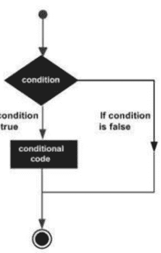

示例：

```
<!DOCTYPE html>
<html>
<body>
<script>
var x=50;
if(x>30){
document.write("value of x is greater than 30");
}
</script>
</body>
</html>
```

## 输出

Value of x is greater than 30

### if else 语句

当条件为真或假时，使用 if else 语句。

### 语法

```
if(condition)
{
// 语句集
}
else
{
// 语句集
}
```

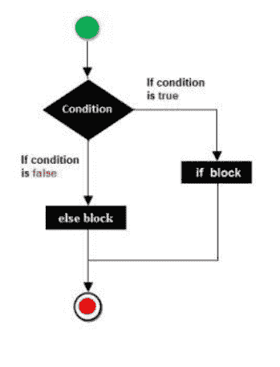

### 示例

```
<!DOCTYPE html>
<html>
<body>
<script>
var x=20;
if(x%2==0){
document.write("x is even number");
}
else{
document.write("a is odd number")
}
</script>
</body>
</html>
```

## 输出

X is even number

### If else if

它仅检查内容以查看表达式在多个表达式中是否为真。if else if 是 if else 语句的更复杂版本。

### 语法

```
If (condition1)
{
如果条件 1 为真则执行的语句
}
else if (condition 2)
{
如果条件 2 为真则执行的语句
}
else if (condition 3)
{
如果条件 3 为真则执行的语句
}
else
{
如果没有条件为真则执行的语句
}
```

### 示例

```
<!DOCTYPE html>
<html>
<body>
<script>
var x=50;
if (x===10){
document.write(“x is equal to 10”);
}
else if(x===50){
document.write(“x is equal to 50”);
}
else if(x===30){
document.write(“x is equal to 30”);
}
else{
document.write(“a is not equal to 10, 50 or 30”);
}
</script>
</body>
</html>
```

## 输出

x is equal to 50

## Javascript Switch 语句

在 JavaScript 中，switch 语句用于在多个条件下执行单个代码块。它与 else if 语句相同，但比 if..else..if 语句更容易记忆。

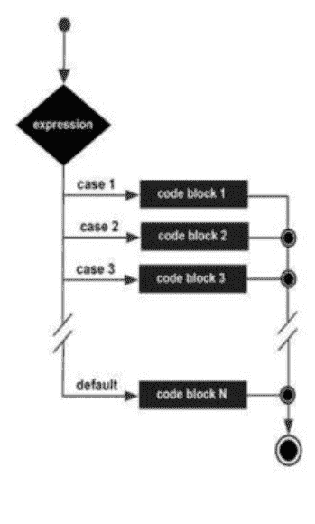

### 语法

```
switch (expression)
{
    case 1: statement(s)
    break;

    case 2: statement(s)
    break;
}
```

### Javascript switch-case 语句

```
case n: statement(s)
break;
default: statements(s)
}
```

**注意：** 在 switch-case 语句中，break 语句非常重要。

### 示例

```
<!DOCTYPE html>
<html>
<body>
<script>
var grade='B';
var result;
switch(grade){
case 'A':
result="A Grade";
break;
case 'B':
result="B Grade";
break;
case 'C':
result="C Grade";
break;
default:
result="No Grade";
}
document.write(result);
</script>
</body>
</html>
```

## 输出

B Grade

## Javascript 循环

由于重复的形式形成一个循环，因此重复语句被称为循环。我们使用循环语句在某些情况下减少代码行数。它最常见于数组中。

在 JavaScript 中，有三种不同形式的循环。

- 1. while 循环
- 2. for 循环
- 3. do-while 循环

### while 循环

在 while 循环中，代码会一直执行，直到表达式为真。如果迭代次数未知，则应使用此循环。

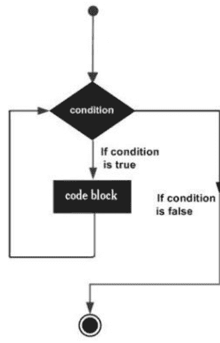

### 语法

```
while (condition){
    statement(s) executed if expression is true
}
```

### 示例

```
<!DOCTYPE html>
<html>
<body>
<script>
var i=1;
while (i<=10)
{
document.write(i+ "<br/>");
i++;
}
</script>
</body>
</html>
```

## 输出

1
2
3
4
5
6
7
8
9
10

### For 循环

在 for 循环中，它初始化变量，检查条件，然后递增或递减值。
它运行固定次数。

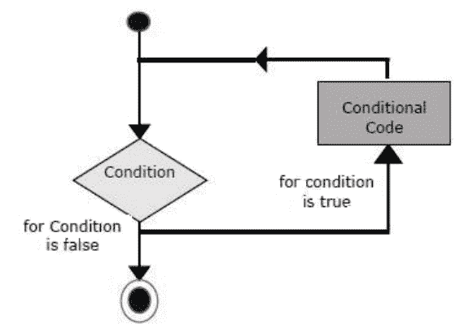

### 语法

```
for (initialization; condition; increment)
{
    code to be executed
}
```

### 示例

```
<!DOCTYPE html>
<html>
<body>
<script>
for (i=1; i<=12; i++)
{
document.write(i + "<br/>")
}
</script>
</body>
</html>
```

## 输出

1
2
3
4
5
6
7
8
9
10
11
12

### do while 循环

while 循环会无限次执行项目，而 do while 循环无论条件是否为真，都只执行一次代码。当我们需要至少执行一次语句块时，我们使用 do-while。

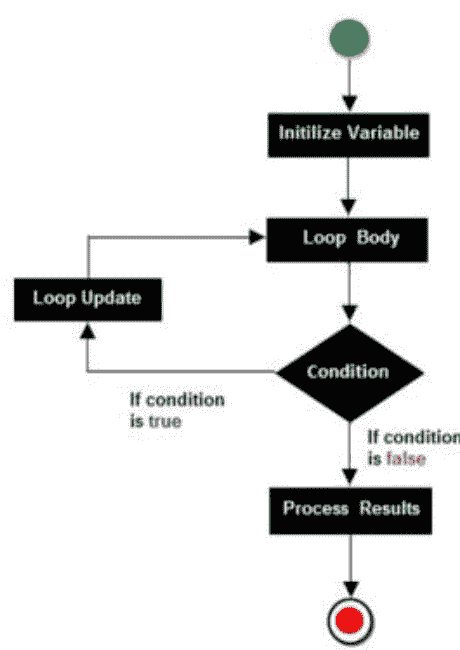

### 语法

```
do {
    code to be executed
    increment/decrement
}
while (condition);
```

### 示例

```
<!DOCTYPE html>
<html>
<body>
<script>
var i=11;
do {
document.write(i + "<br/>");
i++;
} while (i<=15);
</script>
</body>
</html>
```

## 输出

11
12
13
14
15

## JavaScript 函数

在 `<script>` 标签内定义新函数的能力是 JavaScript 的一个重要特性。在 JavaScript 中，使用 function 关键字来声明函数。

为了重用代码，我们多次调用 JavaScript 方法。

**JavaScript 函数的优点**

- 1. 代码可重用性：我们多次使用相同的方法来节省时间和代码。
- 2. 代码更少：因此我们的应用程序被压缩了。当我们执行常规任务时，我们不需要编写大量代码。

**语法**

```
function functionName(parameter or not)
{
    statements
}
```

**示例**

```
<!DOCTYPE html>
<html>
<body>
<script>
function msg()
{
    alert("Hello world!");
}
msg();
</script>
</body>
</html>
```

```
{
alert("Hello! world");
}
</script>
<input type="button" onclick="msg()" value="click here"/>
</body>
</html>
```

## 输出

Hello world!

## 带参数的函数

通过传递参数来调用函数。

```
<!DOCTYPE html>
<html>
<body>
<script>
function getcube(number)
{
alert(number* number* number);
}
</script>
<form>
<input type="button" value="click" onclick="getcube(3)"/>
</form>
</body>
</html>
```

## 输出

27

### 示例

```
<!DOCTYPE html>
<html>
<body>
<script>
function getname()
{
name=prompt("Enter the Name");
alert("Welcome Mr/Mrs " + name);
}
</script>
</body>
<form>
<input type="button" value="Click" onclick="getname()"/>
</form>
</html>
```

## 带返回值的函数

调用返回值并在程序中使用它的函数。

```
<!DOCTYPE html>
<html>
<body>
<script>
function getInfo()
{
return "Hello Raj! How are you?";
}
</script>
<script>
document.write(getInfo());
</script>
</body>
</html>
```

## 输出

Hello Raj! How are you?

## Function() 构造函数

函数语句不仅用于定义新函数；它也可以与 Function() 构造函数和 new 运算符一起用于动态定义函数。

### 语法

```
<script>
    var variablename = new Function(Arg1, Arg2…, "Function Body" );
</script>
```

### 示例

```
<!DOCTYPE html>
<html>
<head>
<script>
var func = new Function("a", "b", "return a+b;");
function secondFunction(){
var result;
result = func(50,50);
document.write ( result );
}
</script>
</head>
<body>
<p>Click button to call the function</p>
<form>
<input type="button" onclick="secondFunction()" value="Call Function">
</form>
<p>Use different parameters inside the function and try yourself...</p>
</body>
</html>
```

## 函数字面量

JavaScript 1.2 引入了函数字面量的概念，这是构造函数的另一种方式。它是一个定义没有名称的函数的表达式。
函数字面量的语法与函数语句类似，不同之处在于它用作表达式而不是语句，并且不需要函数名。

### 语法

```
<script>
var variablename = function (Argument List){
    Function Body
};
</script>
```

### 示例

```
<!DOCTYPE html>
<html>
<head>
<script>
var func = function(a,b){ return a+b };
function secondFunction(){
var result;
result = func(10,20);
document.write ( result );
}
</script>
</head>
<body>
<p>Click the button to call the function</p>
<form>
<input type="button" onclick="secondFunction()" value="Call Function">
</form>
<p>Use different parameters inside the function and try yourself...</p>
</body>
</html>
```

## Javascript 对象

对象是一个具有状态和行为的实体。JavaScript 是一种以对象为中心的脚本语言。虽然 JavaScript 是基于模板而不是基于类的，但它允许我们直接创建对象。

### 语法 - 添加属性 - 添加对象

```
objectName.objectProperty = propertyValue;
```

我们使用 **write()** 方法将对象写入文档，以在文档上写入任何内容。

```
Document.write("Hello world")
```

### 示例

以下示例展示了如何创建一个对象。

```
<!DOCTYPE html>
<html>
<head>
<title>User-defined objects</title>
<script type="text/javascript">
var book = new Object();  // Object created
book.subject = "5 points someone"; // Properties assign to the object
book.author = "ChetanBhagat";
</script>
</head>
<body>
<script type="text/javascript">
document.write("Book Name is : " + book.subject + "<br>");
document.write("Book Author is : " + book.author + "<br>");
</script>
</body>
</html>
```

## 输出

Book Name is : 5 points someone
Book Author is : ChetanBhagat

## 对象的方法

### 示例

```
<!DOCTYPE html>
<html>
<head>
<title>User-defined objects</title>
<script type="text/javascript">// Define a function which will work as a method
function addPrice(amount){
this.price = amount;
}
function book(title, author){
this.title = title;
this.author = author;
this.addPrice = addPrice; // Assign that method as property.
}
</script>
</head>
<body>
<script type="text/javascript">
var myBook = new book("5 Points Someone", "ChetanBhagat");
myBook.addPrice(150);
document.write("Book Title is : " + myBook.title + "<br>");
document.write("Book Author is : " + myBook.author + "<br>");
document.write("Book Price is : " + myBook.price + "<br>");
</script>
</body>
</html>
```

## 输出

Book Title is: 5 Points Someone
Book Author is : ChetanBhagat
Book Price is : 150

## Javascript 数组

数组用于在单个单元或内存区域中表示一组元素。

进入数组的每个元素都将存储在数组中，并带有一个从零开始的唯一索引。我们可以借助索引来存储数据。

在 JavaScript 中，我们必须使用 new 关键字来声明数组。我们使用 new Array 来构造一个数组 (n)。

数组中的槽数量由 n 表示。

### 语法

```
myarray = new array(n);
```

**注意：** 当我们在 JavaScript 中构建数组而不指定大小时，我们总是构建零大小的数组对象。

### 示例

```
<!DOCTYPE html>
<html>
<body>
<script>
var i;
var emp = new Array();
emp[0] = "Ajay";
emp[1] = "Abhay";
emp[2] = "Arun";
```

## Javascript 数组

```
emp[3] = "Shipra";

for (i=0; i<emp.length; i++)
{
    document.write(emp[i] + "<br>");
}

</script>
</body>
</html>
```

## 输出

Ajay
Abhay
Arun
Shipra

### 示例

```
<!DOCTYPE html>

<html>

<head>

<script type="text/javascript">

function array()
{
    num = new Array(5)
    num[0] = 10
    num[1] = 20
    num[2] = 30
    num[3] = 40
    num[4] = 50
    sum = 0;
    for (i=0; i<num.length; i++)
    {
        sum = sum + num[i];
    }
    alert(sum)
}
</script>
</head>
<body>
<input type="button" onclick="array()" value="click here">
</body>
</html>
```

# 数组中使用的函数

| 函数 | 描述 |
| :--- | :--- |
| concat() | 将一个数组的元素连接到另一个数组的末尾，并返回数组。 |
| sort() | 对数组的所有元素进行排序。 |
| reverse() | 反转所有元素。 |
| slice() | 从指定索引开始提取指定数量的元素，而不从数组中删除它们。 |
| splice() | 从指定索引开始提取指定数量的元素，并从数组中删除它们。 |
| push() | 将所有元素推入数组顶部。 |
| pop() | 从数组顶部弹出元素。 |

## Javascript 字符串

String 对象用于处理字符串。它是存储和操作文本的工具。
在 JavaScript 中，有两种创建字符串的方法：

1.  字符串字面量。
2.  使用 new 关键字。

### 字符串字面量

字符串字面量通过使用双引号创建。

### 语法

```
var stringname="string value";
```

### 示例

```
<!DOCTYPE html>
<html>
<body>
<script>
var str="Hello String Literal";
document.write(str);
</script>
</body>
</html>
```

## 输出

Hello String Literal

### 使用 new 关键字

**语法**
var stringname=new String("new keyword")

**示例**

```
<!DOCTYPE html>
<html>
<body>
<script>
var stringname=new String("Hello String");
document.write(stringname);
</script>
</body>
</html>
```

**输出**
Hello String

### 字符串属性

以下是字符串对象属性及其描述的列表。

1.  constructor。
2.  length。
3.  prototype。

**Constructor** – 它为你提供对最初创建该对象的字符串函数的引用。

**语法**
string.constructor

**Length** - 返回字符串中的字符数。

### 语法

```
string.length
```

**Prototype** – 它允许任何对象添加属性和方法。（Number、Boolean、string 和 data 等）。

这是一个大多数对象都可以访问的全局属性。

### 语法

```
object.prototype.name = value
```

JavaScript 字符串中也有可用的方法：

| 方法 | 描述 |
|---|---|
| charAt(index) | 返回给定索引处的字符。 |
| concat(str) | 合并两个字符串的文本并返回新字符串。 |
| indexOf(str) | 返回给定字符串的索引位置。 |
| lastIndexOf(str) | 返回给定字符串的最后一个索引位置。 |
| match() | 用于将正则表达式与字符串进行匹配。 |
| toLowerCase() | 用于返回转换为小写的给定字符串值。 |
| toUpperCase() | 用于返回转换为大写的给定字符串值。 |
| valueOf() | 返回指定对象的原始值。 |

### charAt()

这是一个从给定索引获取字符的方法。

```
<!DOCTYPE html>

<html>

<body>
<script>
var str = new String( "Hello" );
document.writeln("str.charAt(0) is: " + str.charAt(0));
document.writeln("<br />str.charAt(1) is: " + str.charAt(1));
document.writeln("<br />str.charAt(2) is: " + str.charAt(2));
document.writeln("<br />str.charAt(3) is: " + str.charAt(3));
document.writeln("<br />str.charAt(4) is: " + str.charAt(4));
</script>
</body>
</html>
```

### concat(str)

此方法在添加两个或多个字符串后返回一个新字符串。

```
<!DOCTYPE html>
<html>
<body>
<script>
var x="Hello";
var y="World";
var z=x+y;
document.write(z);
</script>
</body>
</html>
```

这是 concat(str) 的另一个示例

```
<!DOCTYPE html>
<html>
<body>
<script>
var a = new String( "Hello" );
var b = new String( "Friends" );
var c = a.concat( b );
document.write("Concatenated String : " + c);
</script>
</body>
</html>
```

### indexOf(str)

indexOf(str) 方法返回给定字符串的索引位置。

```
<!DOCTYPE html>
<html>
<body>
<script>
var x="Tutorial provide by tutorialandexample";
var y=x.indexOf("by");
document.write(y);
</script>
</body>
</html>
```

### lastIndexOf(str)

字符串 lastIndexOf(str) 方法返回字符串的最后一个索引点。

```
<!DOCTYPE html>
<html>
<body>
<script>
var x="Tutorial provide by tutorialExample";
var y=x.lastIndexOf("by");
document.write(y);
</script>
</body>
</html>
```

### match()

```
<!DOCTYPE html>
<html>
<body>
<script>
var str = "To more detail, see Chapter 2.5.4.1";
var re = /(chapter \d+(\.\d)*)/i;
var find = str.match( re );
document.write(find );
</script>
</body>
</html>
```

### toLowerCase()

指定的字符串以小写字母形式返回。

```
<!DOCTYPE html>
<html>
<body>
<script>
var x="HELLO WORLD";
var y=x.toLowerCase();
document.write(y);
</script>
</body>
</html>
```

### toUpperCase()

指定的字符串以大写字符形式返回。

```
<!DOCTYPE html>
<html>
<body>
<script>
var x="hello world";
var y=x.toUpperCase();
document.write(y);
</script>
</body>
</html>
```

### valueOf()

它返回字符串对象的原始值。

```
<!DOCTYPE html>
<html>
<body>
<script>
var str = new String("Hello world");
document.write(str.valueOf( ));
</script>
</body>
</html>
```