# 面向初学者的Python与MySQL

FATIMAH RAHMAT
MOHAMAD IQBAL HAKIM CHE OMAR
NURUL SHAKIRAH MOHD ZAWAWI

第一版 2023

# 版权所有 ©2023

保留所有权利。未经出版商事先书面许可，不得以任何形式或任何方式（包括影印、录制或其他电子或机械方法）复制、分发或传播本出版物的任何部分，但版权法允许的简短引述用于评论和某些其他非商业用途的情况除外。如需获取许可，请写信至出版商，地址注明“收件人：许可协调员”，地址如下。

Politeknik Mersing
Jalan Nitar,
86800 Mersing
Johor Darul Ta’zim
电话：07-7980001
传真：07-7980002
网站：https://pmj.mypolycc.edu.my/

马来西亚印刷
2023年第一次印刷
电子书号：978-967-2904-57-1

作者：
Fatimah Rahmat
Mohamad Iqbal Hakim Che Omar
Nurul Shakirah Mohd Zawawi

# 前言

分享关于Python编程语言如何对学习过程产生积极影响的知识和经验的需求，促成了本书的创作。本书重点介绍了安装过程、使用MySQL进行数据库连接以及Python语言的基本概念。

本书提供了有用的资源、建议和示例，特别适合学生和任何其他有兴趣学习Python编程语言的人。

本书的示例还演示了使用Python脚本和MySQL的应用程序的创建、读取、更新和删除（CRUD）组件。

本书旨在帮助读者实现他们的目标。

# 目录

## I. 引言

- 什么是Python编程？ ........................................ 2
- Python的基本原则 .............................................. 3

## II. 要求

- 需要什么？ ........................................................... 5
- Visual Studio Code 与 PyCharm 与 IDLE ........ 6
- 最低要求：
  - Visual Studio Code (VS Code) 安装 ............. 8
  - PyCharm 安装 ................................................ 8
  - IDLE 安装 ...................................................... 9
- Laragon .................................................................... 10

## III. 安装

- 安装Python和IDE环境设置 .. 12

## IV. 第一个项目活动

- 设置本地Web服务器 Laragon .............................. 17
- 选择你喜欢的IDE，PyCharm或VSCode .. 19
- 活动
  - 创建 insertData.py .............................................. 25
  - 创建 deleteData.py .............................................. 26
  - 创建 displayData.py ............................................ 27
  - 创建 updateData.py ............................................ 28
  - 在 main.py 中导入模块 ...................................... 29
  - 在 main.py 中创建数据库函数 .................... 29
  - 在 main.py 中删除数据库函数 ...................... 30
  - 在 main.py 中创建表函数 .......................... 30
  - 在 main.py 中删除表函数 ............................ 31
  - 显示所有数据库函数 .............................. 31
  - 完成整个程序 ...................................... 32

- 参考文献 ................................................................ 33

> “PYTHON是一种对初学者来说易于使用的语言，但对专家来说又足够强大。” - KENNETH REITZ -

# 第一章：引言

## 什么是Python编程？

> Python是一种**高级编程语言**，于1991年由**Guido van Rossum**首次发布。该语言的设计易于读写，**注重代码可读性**。Python的设计哲学强调代码可读性，其语法允许程序员用比C++或Java等语言更少的行数来表达概念。

## Python的基本原则

### 基本核心语言

Python的设计使得在基本语言中确实没有太多需要学习的内容。例如，条件编程（if/else/elif）只有一种基本结构，两种循环命令（while和for），以及一种适用于所有Python程序的一致错误处理方法（try/except）。

### 模块

自包含的程序，定义了各种函数和数据类型，你可以通过使用`import`命令来调用它们，以执行超出基本核心语言范围的任务。

### 面向对象编程

面向对象编程的一个基本概念是封装，即定义一个对象的能力，该对象包含你的数据以及程序操作该数据所需的所有信息。这样，当你调用一个函数（在面向对象术语中称为方法）时，你不需要指定关于数据的很多细节，因为你的数据对象“知道”关于它自己的一切。此外，对象可以从其他对象继承，所以如果你或其他人设计了一个与你感兴趣的对象非常接近的对象，你只需要构建那些与现有对象不同的方法，从而节省大量工作。

### 命名空间和变量作用域

相同的变量名可以在程序的不同部分使用，而不用担心破坏你不关心的变量的值。

### 异常处理

当你执行一个可能导致错误的操作时，你可以用一个`try`循环将其包围，并提供一个异常子句来告诉Python当特定错误发生时该怎么做。

一些最受欢迎的Python**库和框架**包括：

- NumPy，一个用于数值计算的库
- pandas，一个用于数据操作和分析的库
- scikit-learn，一个机器学习库
- TensorFlow，一个用于深度学习的库
- Django，一个Web框架
- Flask，一个微Web框架

# 第二章：要求

IDE（集成开发环境）

- Visual Studio Code (VS Code)
- PyCharm
- IDLE

Web服务器

- Laragon
- XAMPP

## 表1：Visual Studio Code 与 PyCharm 与 IDLE

| 标准 | VS Code | PyCharm | IDLE |
| :--- | :--- | :--- | :--- |
| 环境 | 一个IDE（集成开发环境）。 | 通过扩展提供类似IDE体验的代码编辑器。 | 一个IDLE集成开发和学习环境 |
| 性能 | 轻量级，因为它不需要太多空间。 | 消耗大量资源，因为它需要大量内存和较大的存储空间。 | 使用100%纯Python编码，使用tkinter GUI工具包 |
| 平台 | 免费且兼容所有平台：Windows、Linux和Mac | 跨平台IDE。更强大，并有商业版本。 | 跨平台：在Windows、Unix和macOS上工作方式基本相同 |
| 功能 | 潜在错误会自动以红色突出显示，便于查找和修复错误。它更进一步添加了“问题”选项卡，将所有潜在错误列在一个地方，便于审查。要在VS Code中使用Python，你需要安装Python格式化程序和代码检查工具。 | 主要功能是“随处搜索”，允许你在项目外进行搜索。即使文件、类、符号和用户界面元素不在当前项目中，也能找到它们。PyCharm的代码补全功能更好。它将函数签名作为自动完成选择列表的一部分显示。具有一些附加功能，如按名称排序、快速文档和快速定义。快速文档显示函数的签名和返回类型，以及函数的注释，而快速定义显示功能代码，非常方便。 | Python shell窗口（交互式解释器），对代码输入、输出和错误消息进行着色。多窗口文本编辑器，具有多次撤销、着色、智能缩进、调用提示、自动完成功能和其他功能。在任何窗口内搜索，在编辑器窗口内替换，以及搜索多个文件（grep）。具有持久断点、单步执行以及查看全局和本地命名空间的调试器。配置、浏览器和其他对话框 |

## 面向初学者的 Python 与 MySQL

| 标准 | VS Code | PyCharm | IDLE |
| :--- | :--- | :--- | :--- |
| 扩展 | 需要一些扩展才能将你的代码编辑器变成一个适合 Python 的 IDE。它能检测你正在处理的项目类型，然后建议并嵌入该项目所需的必要扩展。 | 专为 Python 设计，可用的扩展旨在改进 PyCharm。有超过 3000 个 JetBrains 插件可用，并且兼容所有这些插件。 | 可以通过使用 Python 的包管理器 `pip` 来扩展额外的库和工具。 |
| 数据库集成 | VS Code 通过名为 SQLTools 的扩展提供数据库集成。初学者可能会发现它难以使用或导航，并且可能容易出现错误。 | 使用名为 Database Navigator 的插件，允许在应用程序内连接到 MySQL、Oracle、PostgreSQL 等数据库。除此之外，你还可以创建数据库连接、向数据库发送查询、接收数据库对象等。但是，这仅在专业版中可用，必须购买。 | 需要为你正在使用的特定数据库安装数据库驱动程序（例如，用于 PostgreSQL 的 `psycopg2` 或用于 MySQL 的 `mysql-connector-python`）。安装驱动程序后，你可以使用相应的库连接到数据库并执行查询和更新数据等操作。你也可以使用 ORM（对象关系映射）库，如 SQLAlchemy，来简化与数据库交互的过程。 |

## Visual Studio Code (VS Code) 安装的最低要求


要**安装并运行** Visual Studio Code (VS Code) 进行 Python 开发，**你的系统应满足以下最低要求**：
1. 操作系统：Windows 7 或更高版本，macOS 10.10 或更高版本，或 Linux（64 位）
2. 处理器：1.6GHz 或更快，2 核
3. 内存：2 GB 或更多
4. 硬盘空间：至少 1 GB 可用空间
5. 显示器：1024x768 分辨率或更高
6. 互联网连接：安装和更新需要
7. 管理员权限：在 Windows 和 macOS 上安装 VS Code 需要管理员权限。
8. Python：要使用 VS Code 进行 Python 开发，你需要在系统上安装 Python。你可以从官方网站下载最新版本的 Python。
9. Visual Studio Code 的 Python 扩展：为了使用 VS Code 进行 Python 开发，你需要为 VS Code 安装 Python 扩展。此扩展为 Python 开发提供丰富的支持，包括智能感知、调试和代码检查。
10. Python 环境：Python 可以与 Anaconda、venv、virtualenv 和 pipenv 等虚拟环境一起使用。

## PyCharm 安装的最低要求


PyCharm 是 JetBrains 开发的一款流行且广泛使用的 Python 开发集成开发环境 (IDE)。要**安装并运行 PyCharm**，**你的系统应满足以下最低要求**：
1. 操作系统：Windows、macOS 或 Linux
2. 处理器：2 GHz 或更快
3. 内存：2 GB RAM 或更多
4. 硬盘空间：至少 1 GB 可用空间
5. 显示器：1024x768 分辨率或更高
6. 互联网连接：安装和更新需要
7. 管理员权限：在 Windows 和 macOS 上安装 PyCharm 需要管理员权限。
8. Python：PyCharm 是一个 Python IDE，因此你需要在系统上安装 Python。你可以从官方网站下载最新版本的 Python。
9. Java：PyCharm 需要在系统上安装 Java。可以从官方网站下载最新版本的 Java。
10. Python 环境：PyCharm 可以与 Anaconda、venv、virtualenv 和 pipenv 等虚拟环境一起使用。

> 根据你计划进行的具体 Python 开发任务，你可能需要额外的工具或库。请务必检查你计划使用的任何库或框架的文档，以确保你的系统满足其要求。

## IDLE 安装的最低要求


IDLE（集成开发和学习环境）是 Python 自带的默认内置开发环境。**安装和运行** IDLE 的**要求**如下：

1. 操作系统：Windows、macOS 或 Linux
2. Python：IDLE 内置于 Python 中，因此你需要在系统上安装 Python。你可以从官方网站下载最新版本的 Python。
3. 内存：IDLE 是一个轻量级的开发环境，因此运行不需要大量内存。
4. 显示器：IDLE 要求最低分辨率为 1024x768 或更高。
5. 互联网连接：IDLE 安装不需要互联网连接，因为它随 Python 安装本身一起提供。
6. 管理员权限：IDLE 安装或运行不需要管理员权限。
7. Python 环境：IDLE 可以与 Anaconda、venv、virtualenv 和 pipenv 等虚拟环境一起使用。

由于 IDLE 已包含在 Python 安装中，因此无需单独安装。你只需打开终端或命令提示符，然后输入 `python -m idlelib` 即可打开 IDLE。

请注意，IDLE 是一个基本的文本编辑器，不具备 PyCharm、Visual Studio Code 等高级 IDE 的某些功能。它最适合初学者或小型项目。


## Laragon

Laragon 的第一个版本于 2016 年发布，主要专注于提供一个简单轻量的软件包，用于搭建本地 Web 开发环境。

提供了一种快速简便的方法来启动一个隔离的 Windows 开发环境（类似于虚拟机，它不会影响你的操作系统）。用户可以将其作为软件安装，启动它，进行编程，完成后直接退出。该平台预装了许多流行的应用程序，如 Node。

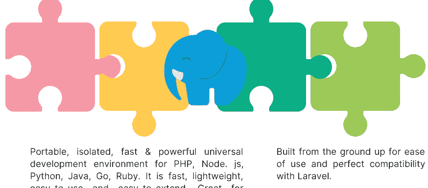

便携、隔离、快速且强大的通用开发环境，适用于 PHP、Node.js、Python、Java、Go、Ruby。它快速、轻量、易于使用且易于扩展。非常适合构建和管理现代 Web 应用程序。

从零开始构建，易于使用，并与 Laravel 完美兼容。


**在安装 Laragon 之前**，有几件事你应该了解：
1. **系统要求**：Laragon 需要 Windows 7 或更高版本，以及至少 1 GB 的 RAM。
2. **磁盘空间**：确保你有足够的磁盘空间来安装 Laragon 以及你计划处理的任何项目。
3. **防火墙**：如果你启用了防火墙，你可能需要配置它以允许 Laragon 访问互联网并连接到其他服务。
4. **防病毒软件**：某些防病毒软件可能会干扰 Laragon 的安装或运行。请确保在安装 Laragon 之前暂时禁用防病毒软件，并在需要时为其添加例外。
5. **现有安装**：如果你已有 Web 服务器、PHP 或 MySQL 安装，你可能需要在安装 Laragon 之前将其移除或重新配置。
6. **备份**：在对系统进行任何更改之前，最好备份所有重要文件或数据，以防安装过程中出现问题。
7. **熟悉工具**：为了充分利用 Laragon，最好熟悉它包含的工具，如 Apache、PHP 和 MySQL，以便根据需要配置和排除故障。

遵循这些步骤，应该会使 Laragon 的安装过程更加顺利，并避免任何潜在问题。

# 第 3 章
安装 Python
及
IDE 环境设置


## 第三章：安装Python与IDE环境配置

Python安装。请访问图1（https://www.python.org/）并下载最新版本的Python。扫描二维码按照说明操作。

安装完成后，您可以在搜索窗口中输入IDLE并按回车键来运行Python解释器（图2）。此时将出现IDLE Shell界面。您可以在此处输入代码（图3）。


来源：YouTube

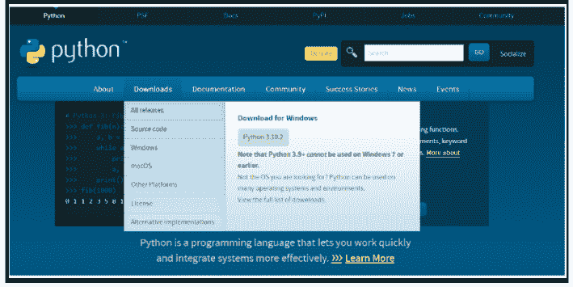

图1：Python.org

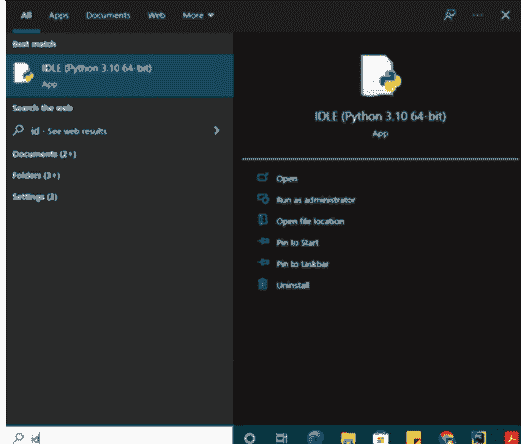

图2：搜索IDLE

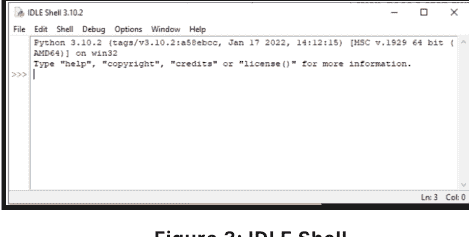

图3：IDLE Shell

## 02

Visual Studio Code的IDE安装。请访问图4（https://code.visualstudio.com/Download）并下载适合您操作系统的版本。扫描二维码，按照《如何在Windows 10/11上安装Visual Studio Code [2022年更新] 完全指南》中的说明操作。

图5为VSCode界面。您可以在此处开始编码。


来源：YouTube

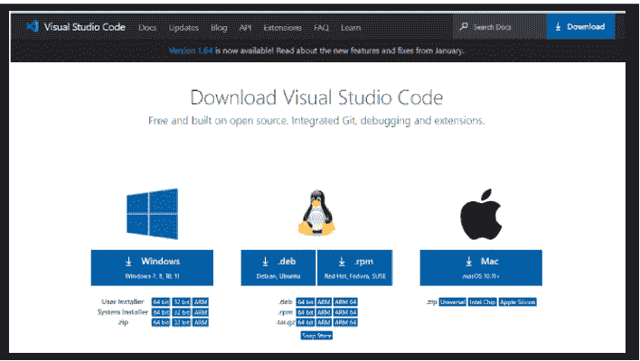

图4：下载Visual Studio Code - Mac, Linux, Windows

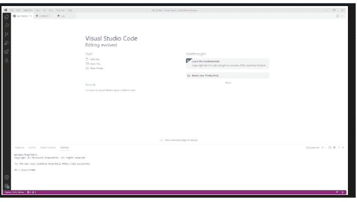

图5：VSCode界面

## 03

PyCharm的IDE安装。请访问图6（https://www.jetbrains.com/pycharm/download/#section=windows）并下载社区版。扫描二维码，按照《在Windows 10上安装Python 3.10和PyCharm》的说明操作。

图7为PyCharm界面。您可以在此处开始编码。对于PyCharm用户，如果模块涉及不同的项目，则每次都需要进行模块安装。


来源：YouTube


图6：下载PyCharm：JetBrains为专业开发者打造的Python IDE

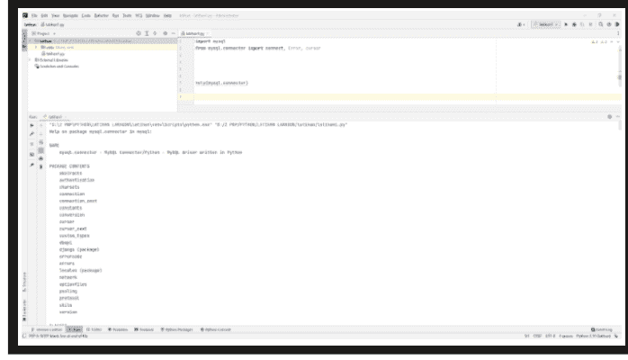

图7：PyCharm界面

## 04

命令提示符应用程序的使用需求。

在Windows操作系统上检查Python版本的三个步骤。

1.  打开命令提示符应用程序：按Windows键打开开始屏幕。在搜索框中输入“command”。如图8所示，点击命令提示符应用程序。
2.  执行命令：输入`python --version`并按回车键。
3.  Python版本将显示在您输入命令的下一行。

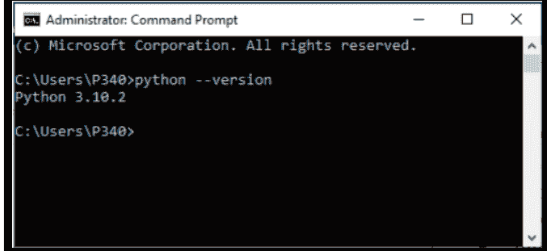

## 05

Laragon的Web服务器安装。请访问图9（https://laragon.org/download/），下载Laragon - Full (173 MB)。按照说明完成安装。

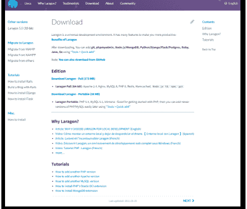

# 第四章：首个项目活动


## 设置本地Web服务器Laragon

右键点击“开始”菜单 > 点击MySQL > 点击MySQL（图10）

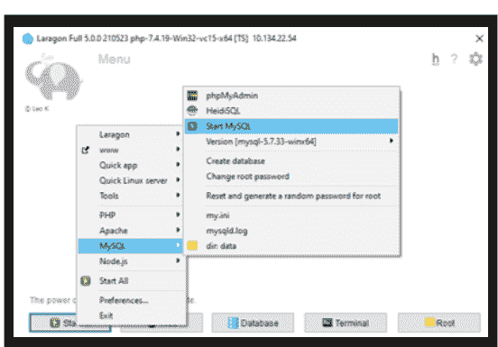

如图11所示，点击“数据库”。

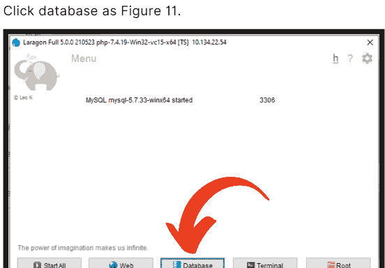

会话管理器窗口将出现。点击“新建”。*请确保端口正确，用户（通常是root）和密码（通常为空）*，然后点击“打开”（图12）。

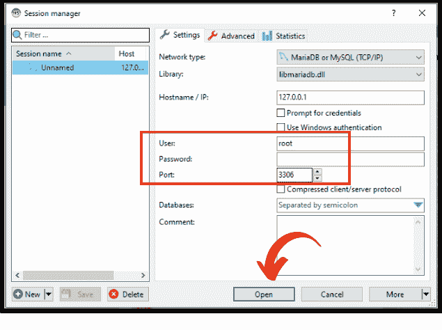

**图12：会话管理器**

屏幕将如图13所示。db1（数据库名）和table1（表名）。如果您想重命名 -> 右键点击数据库或表名 > 重命名。按F5刷新表或数据库。如果用户想查看表的数据，需要点击选中的表 > 点击“数据”。

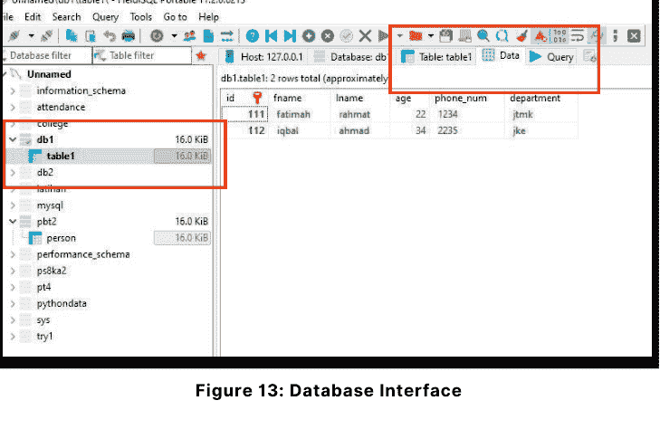

**图13：数据库界面**

## 选择您喜欢的IDE，PyCharm或VSCode。

这些IDE使用不同的数据库配置。

### PyCharm用户配置数据库

创建一个名为PythonAndMysql的新项目。

点击设置图标 > 选择“设置”或使用快捷键Ctrl+ Alt + S（图14）。

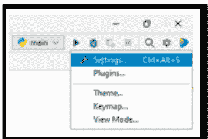

将出现一个弹出窗口。

展开“项目：PythonAndMysql”并选择“Python解释器”（图15）。

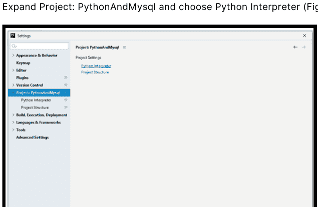

将显示Python解释器界面。在这里，我们将安装一个特定的模块：`mysql.connector`。可以通过点击加号图标（+）或使用快捷键Alt + Insert来完成此操作（图16）。

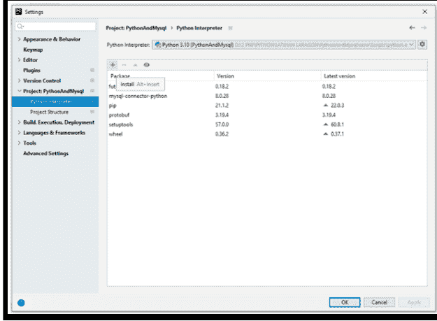

在搜索字段中搜索`mysql-connector-python`，然后点击“安装包”。请确保您有互联网连接，因为您正在从云端安装包。（图17）

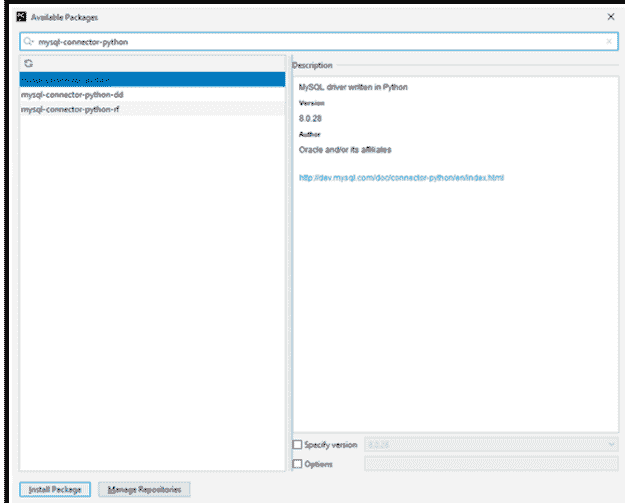

如果安装成功，将出现一个绿色条，显示安装成功的信息。如果未成功，请重试。关闭Python解释器弹出窗口，进入代码编辑器界面。（图18）。

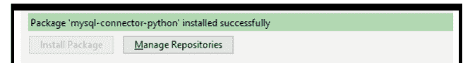

文件名`main.py`是PyCharm将运行的默认文件（图19）。


### VSCode用户配置数据库

1.  打开命令提示符应用程序：按Windows键打开开始屏幕。在搜索框中输入“command”。点击命令提示符应用程序。
2.  执行命令：输入`pip install mysql-connector-python`并按回车键。
3.  使用VSCode的优势在于，用户只需安装一次，该模块即可被任何Python项目使用。

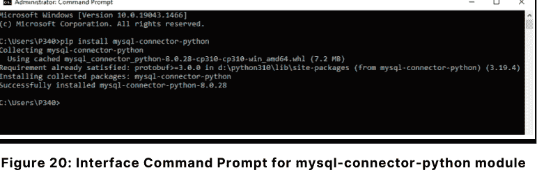

## 数据库所需的mysql.connector安装要求。

MySQL是一个关系数据库管理系统（RDBMS），而结构化查询语言（SQL）是用于处理RDBMS的语言，例如创建、插入、更新和删除数据库中的数据。SQL命令不区分大小写，即`CREATE`和`create`表示相同的命令。

MySQL Connector/Python使Python程序能够访问MySQL数据库，使用符合Python数据库API规范v2.0（PEP 249）的API。它用纯Python编写，除了Python标准库外没有任何依赖项。

## 您需要了解的基本Python关键字。

**connect：** 用于建立与数据库的连接，需要指定所有凭据，如用户名、服务器名称、服务器密码和数据库名称。


**error：** 这是异常处理，如果出现任何问题，将包含在此错误中。

**cursor：** 用于帮助我们的程序执行SQL命令/操作（可以使用“as”方法重命名）。

## 在本次活动中：

-   您将构建一个使用创建、读取、更新、删除（**CRUD**）方法的程序。
-   您的程序将显示**10个菜单**（图21）。
-   每个菜单都有其特定的任务。即使没有创建数据库，用户也可以选择任何菜单。
-   您将创建自己的特定模块和子模块。
-   您将从头开始构建自己的函数来填充所选菜单。
-   使用条件结构来显示菜单。
-   编写代码并观察每个菜单的输出。

```
***********POLYTECHNIC MERSING DATABASE***********
1. CREATE DATABASE
2. DROP DATABASE
3. CREATE TABLE
4. DROP TABLE
5. INSERT
6. UPDATE
7. DELETE
8. DISPLAY
9. SHOW DATABASE
10. EXIT

Enter your choice :
```

图21：程序菜单


## 让我们尝试这个活动

**创建模块**

在您的目录中创建您自己的模块，命名为**moduleDB**，并包含**四个(4)个子模块**（图22）：

-   `deleteData.py`
-   `displayData.py`
-   `insertData.py`
-   `updateData.py`

您的**主程序**是**main.py**。

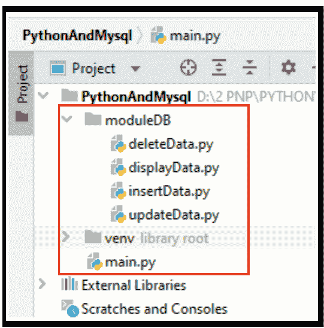

图22：PythonAndMysql目录中的文件列表

Python 与 MySQL 入门

## 现在，转到 ModuleDb 目录来完成我们的子模块

### 1 创建 insertData.py

```python
import mysql.connector

# insert data into table
def insert(host, username, password, database, table_name):
    try:
        db = mysql.connector.connect(
            host=host,
            user=username,
            password=password,
            database=database
        )

        # A display to insert data
        id = input("Enter Lecturer Id : ")
        fname = input("Enter Lecturer First Name : ")
        lname = input("Enter Lecturer Last Name : ")
        age = input("Enter Age : ")
        phone_num = input("Enter Phone Number : ")
        department = input("Enter Department : ")

        cursor = db.cursor()
        sql = "insert into " + table_name + "(id, fname, lname, age, phone_num, department) values(%s, %s, %s, %s, %s, %s)"
        print(sql)

        val = (id, fname, lname, age, phone_num, department)
        cursor.execute(sql, val)
        db.commit()
        # For a connection obtained from a connection pool,
        # close() does not actually close it but returns it to the pool
        # and makes it available for subsequent connection requests.
        db.close()
        print('One record inserted into ' + table_name)

    except:
        # .rollback method sends a ROLLBACK statement to the MySQL server,
        # undoing all data changes from the current transaction.
        # By default, Connector/Python does not autocommit,
        # so it is possible to cancel transactions when using
        # transactional storage engines such as InnoDB.
        db.rollback()
```

### 2 创建 deleteData.py

```python
import mysql.connector

# delete data in table
def delete(host, username, password, database, table_name):
    print("")

    # The connect() constructor creates a connection to the MySQL
    # server and returns a MySQLConnection object
    db = mysql.connector.connect(
        host=host,
        user=username,
        password=password,
        database=database
    )

    # .cursor method returns a MySQLCursor() object, or a subclass of
    # it depending on the passed arguments.
    # The returned object is a cursor.
    cursor = db.cursor()
    sql_Delete_query = "Delete from "+table_name+" where id = %s"
    Id = input('Enter lecturer id : ')
    # .execute method executes the given database operation (query or
    # command)
    cursor.execute(sql_Delete_query, (Id,))

    # This method sends a COMMIT statement to the MySQL server,
    # committing the current transaction.
    # Since by default Connector/Python does not autocmmit,
    # it is important to call this method after every transaction
    # that modifies data for tables that use transactional storage
    # engines.
    # https://dev.mysql.com/doc/connector-python/en/connector-python-
    # api-mysqlconnection-commit.html
    db.commit()
    print("One row(s) deleted from "+table_name)
```

### 3 创建 displayData.py

```python
import mysql.connector

# display data
def displayTableInfomation(host, username, password, database, table_name):

    # The connect() constructor creates a connection to the MySQL server and
    # returns a MySQLConnection object
    db = mysql.connector.connect(
        host=host,
        user=username,
        password=password,
        database=database
    )

    # .cursor method returns a MySQLCursor() object, or a subclass of it
    # depending on the passed arguments.
    # The returned object is a cursor.
    cursor = db.cursor()

    # Reports whether the connection to MySQL Server is available.
    if db.is_connected():

        # .execute method executes the given database operation (query or
        # command)
        cursor.execute("SELECT * FROM "+table_name)

        # row is just a variable.
        # this variable will print every column for each row of data.
        for row in cursor:
            print("\nLecturer ID : ", row[0])
            print("First Name : ", row[1])
            print("Last Name : ", row[2])
            print("Age : ", row[3])
            print("Phone Number : ", row[4])
            print("Department : ", row[5])
```

### 4 创建 updateData.py

```python
import mysql.connector

# update data into table
def update(host, username, password, database, table_name):
    db = mysql.connector.connect(
        host=host,
        user=username,
        password=password,
        database=database
    )
    id = input("Enter Lecturer Id : ")
    fname = input("Enter Lecturer First Name : ")
    lname = input("Enter Lecturer Last Name : ")
    age = input("Enter Age : ")
    phone_num = input("Enter Phone Number : ")
    department = input("Enter Department : ")

    cursor = db.cursor()
    try:
        sqlFormula = "UPDATE "+table_name+" SET fname = %s WHERE id = %s"
        cursor.execute(sqlFormula, (fname, id))

        sqlFormula = "UPDATE "+table_name+" SET lname = %s WHERE id = %s"
        cursor.execute(sqlFormula, (lname, id))

        sqlFormula = "UPDATE "+table_name+" SET age = %s WHERE id = %s"
        cursor.execute(sqlFormula, (age, id))

        sqlFormula = "UPDATE "+table_name+" SET phone_num = %s WHERE id = %s"
        cursor.execute(sqlFormula, (phone_num, id))

        sqlFormula = "UPDATE "+table_name+" SET department = %s WHERE id = %s"
        cursor.execute(sqlFormula, (department, id))

        db.commit()

        print("entries updated in " + table_name)

    except:
        db.rollback()
```

### 5 运行并观察输出。

## 01 在 main.py 中导入模块

```python
# import mysql.connector with specified submodule to be use: connect,
# Error and cursor
from mysql.connector import connect, Error, cursor

# import our own module moduleDB and specified submodule insertData,
# updateData, deleteData and displayData
# The "as" keyword is used to create an alias
from moduleDB import insertData as insert, updateData as update,
deleteData as delete, displayData as display
```

## 02 在 main.py 中创建数据库函数

```python
# function 1: create new database
def create_db(username, password):
    try: # try block lets you test a block of code for errors
        with connect(
            # "host" is server name / targeted server to be connected
            host=glbHost,
            user=username,
            password=password
        ) as connection:
            dbname = input("What is DB name you want to create? ")
            create_db_query = "CREATE DATABASE "+dbname
            print(create_db_query)
            with connection.cursor() as cursor:
                cursor.execute(create_db_query)
            print("Database "+dbname+" is created!")
    # except block lets you handle the error
    except Error as e:
        print("Opss, something is wrong", e)
    # NameError raised when a variable is not found in local or global
    # scope.
    except NameError:
        print("NameError is raised when the identifier being accessed is
        not defined in the local or global scope.")
```

## 03 在 main.py 中删除数据库函数

```python
# function 2: delete database
def drop_db(username, password):
    try:
        # database connection
        # set all database credential (host,user, password)
        with connect(
            host=glbHost,
            user=username,
            password=password
        ) as connection:
            dbname = input("What is DB name you want to drop?: ")
            drop_db_query = "DROP DATABASE %s" % dbname
            with connection.cursor() as cursor:
                cursor.execute(drop_db_query)
                print('Database ', dbname, ' has been dropped.')

    except Error as e:
        print(format(e))
```

## 04 在 main.py 中创建表函数

```python
# function 3: create new table
def create_table(username, password):
    dbName = input('Enter database name first: ')
    try:
        # database connection
        # set all database credential (host,user, password, database)
        with connect(
            host=glbHost,
            user=username,
            password=password,
            database=dbName
        ) as connection:
            table_name = input('insert table name you want to crete: ')
            create_table_query = "CREATE TABLE "+table_name+" (id INT AUTO_INCREMENT PRIMARY KEY, fname VARCHAR(50), " \
            "lname VARCHAR(50), age INT, phone_num VARCHAR(100), " \
            "department VARCHAR(100)) "
            print(create_table_query)
            with connection.cursor() as cursor:
                cursor.execute(create_table_query)

                for x in cursor:
                    print(x)
    except Error as e:
        print(format(e))
```

## 05 main.py 中的删除表功能

```python
# 函数 4：删除表
def drop_table(username, password):
    dbName = input('From which database you want to delete the table?: ')
    try:
        # 数据库连接
        # 设置所有数据库凭证（主机、用户、密码、数据库）
        with connect(
            host=glbHost,
            user=username,
            password=password,
            database=dbName
        ) as connection:
            dbtable = input('Enter table name : ')
            drop_table_query = "DROP TABLE " + dbtable
            print(drop_table_query)
            with connection.cursor() as cursor:
                cursor.execute(drop_table_query)
                print('Table', dbtable, 'has been dropped.')
    except Error as e:
        print(format(e))
```

## 06 显示所有数据库功能

```python
# 函数 5：显示所有已存在的数据库
def show_database(username, password):
    try:
        # 数据库连接
        # 设置所有数据库凭证（主机、用户、密码）
        with connect(
            host=glbHost,
            user=username,
            password=password
        ) as connection:
            cursor = connection.cursor()
            databases = ("show databases")
            cursor.execute(databases)
            i = 0
            for (databases) in cursor:
                i = i+1
                print("Database ",i ,"is :", databases[0])
    except Error as e:
        print("Opss, something is wrong", e)
    except NameError:
        print("NameError is raised when the identifier being accessed is not defined in the local or global scope.")
```

## 07 完成整个程序

```python
# 显示文本
print("***********POLYTECHNIC MERSING DATABASE***********")
print("1. CREATE DATABASE \n2. DROP DATABASE \n3. CREATE TABLE "
      "\n4. DROP TABLE \n5. INSERT \n6. UPDATE \n7. DELETE "
      "\n8. DISPLAY \n9. SHOW DATABASE \n10. EXIT\n")

while True:
    choice = input("Enter your choice :")
    if choice in ('1', '2', '3', '4', '5', '6', '7', '8', '9'):

        # glbHost 是一个全局变量，代表 "localhost"
        # "localhost" 是要连接的目标服务器
        glbHost = "localhost"
        u = input("Enter Mysql Username: ")
        p = input("Enter Mysql Password: ")
        i = 0

        if choice == '1':
            # 调用 create_db 函数
            create_db(u, p)

        elif choice == '2':
            # 调用 drop_db 函数
            drop_db(u, p)

        elif choice == '3':
            # 调用 create_table 函数
            create_table(u, p)

        elif choice == '4':
            # 调用 drop_table 函数
            drop_table(u, p)

        elif choice == '5':
            database = input("Enter database name: ")
            table_name = input("Enter table name: ")
            # 调用 moduleDB insertData.py
            insert.insert(glbHost, u, p, database, table_name)

        elif choice == '6':
            database = input("Enter database name: ")
            table_name = input("Enter table name: ")
            # 调用 moduleDB updateData.py
            update.update(glbHost, u, p, database, table_name)

        elif choice == '7':
            database = input("Enter database name: ")
            table_name = input("Enter table name: ")
            # 调用 moduleDB deleteData.py
            delete.delete(glbHost, u, p, database, table_name)

        elif choice == '8':
            database = input("Enter database name: ")
            table_name = input("Enter table name: ")
            # 调用 moduleDB deleteData.py
            display.displayTableInfromation(glbHost, u, p, database, table_name)

        elif choice == '9':
            # 调用 show_database 函数
            show_database(u, p)

        elif choice == '10':
            exit()
    else:
        print("Invalid Input ")
```

Python 和 MySQL 入门

## 参考文献

Akhter, M. (2022, January 11). How to install Visual Studio Code on Windows 10/11 [2022 Update] Complete Guide [Video]. YouTube. https://www.youtube.com/watch?v=JPZsB_6yHVo

Ansgar, B. (n.d.). HeidiSQL. Retrieved from https://www.heidisql.com/

Computer Science. (2021, November 13). Install Python 3.10 and PyCharm on Windows 10 [Video]. YouTube. https://www.youtube.com/watch?v=WJynvGY-2wk

Downey, A. (n.d.). Introduction to GUI programming. Python Textbook. Retrieved from https://python-textbok.readthedocs.io/en/1.0/Introduction_to_GUI_Programming.html

GeeksforGeeks. (n.d.). MySQL-Connector-Python module in Python. Retrieved from https://www.geeksforgeeks.org/mysql-connector-python-module-in-python/

JetBrains. (n.d.). PyCharm download. Retrieved from https://www.jetbrains.com/pycharm/download/#section=windows

Laragon. (n.d.). Laragon - portable, isolated, fast & powerful universal development environment for PHP, Node.js, Python, Java, Go, Ruby. Retrieved from https://laragon.org/download/

Microsoft. (n.d.). Visual Studio Code download. Retrieved from https://code.visualstudio.com/Download

Ngo, J. (2021, February 3). PyCharm vs. VS Code: Which is the better code editor? [Blog post]. LogRocket. https://blog.logrocket.com/pycharm-vs-vscode/#:~:text=PyCharm%20and%20VS%20Code%20are,to%20an%20IDE%20through%20extensions.

Oracle Corporation. (n.d.). MySQL Connector/Python Developer Guide. Retrieved from https://dev.mysql.com/doc/connector-python/en/

Python Software Foundation. (n.d.). IDLE. Python 3 documentation. Retrieved from https://docs.python.org/3/library/idle.html

Python Software Foundation. (n.d.). Python. Retrieved from https://www.python.org/

Santos, A. (2021, November 5). How to Install Python 3.10.2 on Windows 10 [Video]. YouTube. https://www.youtube.com/watch?v=uKHVNKd3f20

Sid Martin Biotechnology Institute. (n.d.). What is Laragon used for? Retrieved from https://www.sidmartinbio.org/what-is-laragon-used-for/

Srinivasan, S. (2019, December 3). PyCharm vs VS Code. Tangent Technologies. https://tangenttechnologies.ca/blog/pycharm-vs-vscode/

POLITEKNIK MERSING
Jalan Nitar,
86800 Mersing
Johor Darul Ta'zim
电话：07-7980001
传真：07-7980002
网站：https://pmj.mypolycc.edu.my/

e ISBN 978-967-2904-57-1

