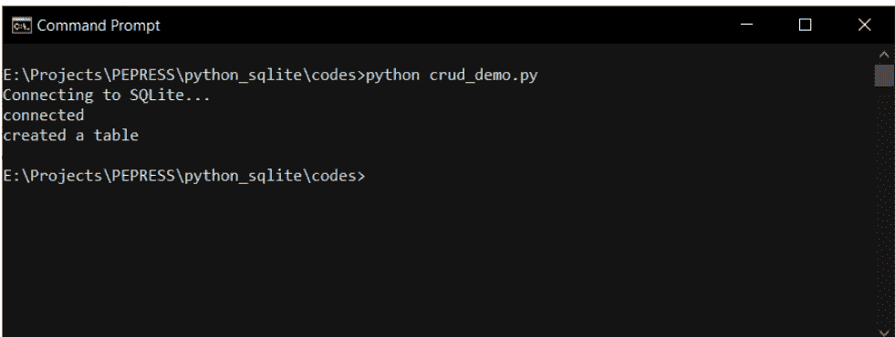
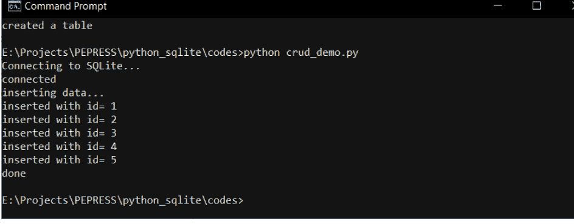
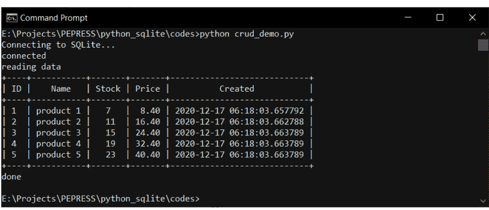
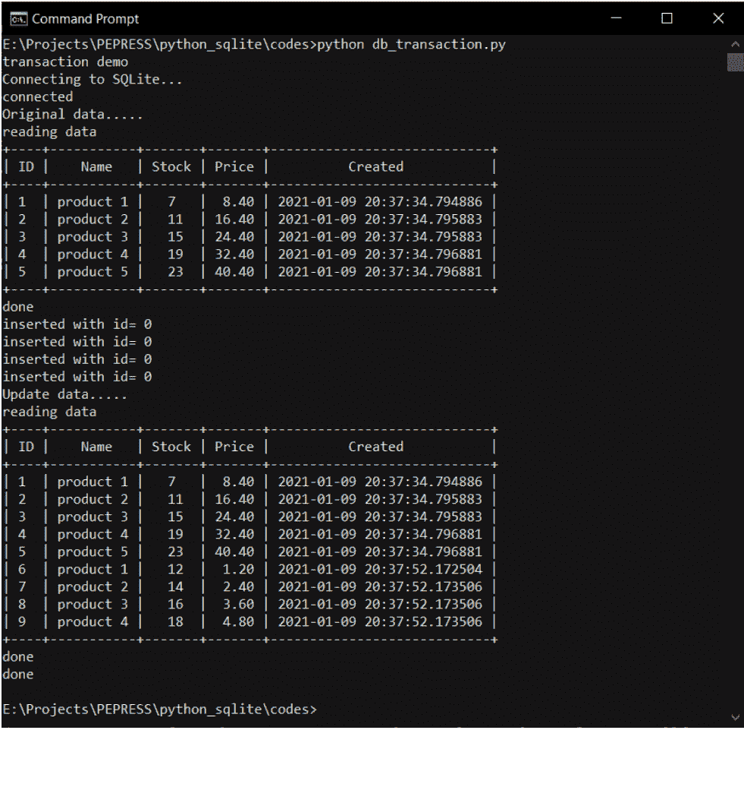
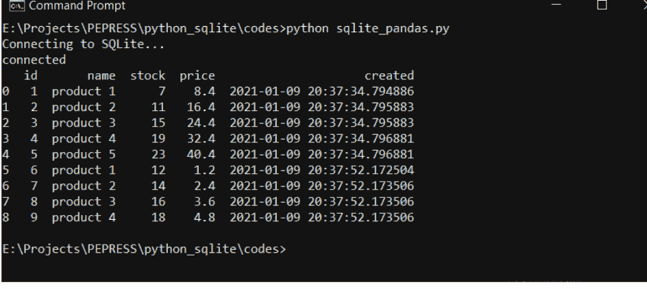

# Python与SQLite开发

Agus Kurniawan

# Python与SQLite开发

Python与SQLite开发

Agus Kurniawan

第一版，2021年

版权所有 © 2021 Agus Kurniawan

ISBN: 978-1-716-24602-9

# 目录

- [Python与SQLite开发](#)
- [前言](#)
- [1. 搭建开发环境](#)
  - [1.1 Python](#)
  - [1.2 SQLite数据库](#)
  - [1.3 Python的SQLite驱动](#)
  - [1.4 开发工具](#)
  - [1.5 Python编程](#)
- [2. 入门 - Python与SQLite](#)
  - [2.1 SQLite Shell](#)
  - [2.2 连接到SQLite](#)
  - [2.3 创建Python程序](#)
  - [2.3 运行](#)
- [3. CRUD操作](#)
  - [3.1 CRUD操作](#)
  - [3.2 创建数据](#)
  - [3.3 读取数据](#)
  - [3.4 更新数据](#)
  - [3.5 删除数据](#)
- [4. 处理图像和Blob数据](#)
  - [4.1 图像和Blob数据](#)
  - [4.2 插入图像文件](#)
  - [4.3 读取和保存图像文件](#)
- [5. 事务](#)
  - [5.1 Python与SQLite事务](#)
  - [5.2 演示](#)
- [6. Python、SQLite与Pandas](#)
  - [6.1 演示](#)

源代码

联系方式

# 前言

本书提供了一种使用SQLite数据库构建Python应用程序的替代方法。本书描述了如何使用Python和SQLite，并通过代码示例说明了它们的用法。

Agus Kurniawan

德波，2021年1月

# 1. 搭建开发环境

## 1.1 Python

Python是一种解释型、面向对象、具有动态语义的高级编程语言。在本书中，我们专注于学习如何开发Python程序来访问SQLite数据库。

要安装Python，您可以从您的平台下载。本书涵盖Windows、Mac和Linux。

安装Python后，您可以通过打开终端或Windows的命令提示符来验证它。输入此命令。

```
$ python --version
$ pip --version
```

您应该在终端上看到python和pip版本。

对于Windows用户，在运行python命令时可能会遇到错误。您可以从控制面板将Python路径配置到Path环境变量中。您可以在下图中看到我的Python路径配置。

您可能安装的是Python 3.x，因此您的pip可能是pip3。您可以输入此命令

```
$ python3 --version
$ pip3 --version
```

您应该在终端中获得Python版本。您可以在Windows中看到我的Python版本。

```
E:\Projects\PEPRESS\python_sqlite\codes>python --version
Python 3.9.0

E:\Projects\PEPRESS\python_sqlite\codes>pip --version
pip 20.3.1 from C:\Users\agus\AppData\Roaming\Python\Python39\site-packages\pip (python 3.9)

E:\Projects\PEPRESS\python_sqlite\codes>
```

## 1.2 SQLite数据库

我使用SQLite 3进行演示。SQLite提供了一个shell，您可以执行数据操作。您可以在此站点上根据您的平台下载SQLite 3 shell。对于Windows，您可以下载sqlite-tools，如下图所示。

下载并解压ZIP文件。然后，您可以看到3个文件，如下图所示。

对于Linux，例如Debian/Ubuntu，我们可以在终端上使用这些命令下载和安装。

```
$ sudo apt-get update
$ sudo apt-get install sqlite3 libsqlite3-dev
```

如果您使用的是macOS，您可以通过brew安装SQLite3。您可以在终端上输入此命令。

```
$ brew install sqlite
```

现在您的平台已准备好使用SQLite数据库，包括SQLite shell。

## 1.3 Python的SQLite驱动

要从Python访问SQLite，我们需要Python的SQLite驱动。幸运的是，Python的SQLite驱动已经包含在Python标准库中，因此我们不需要安装它。

接下来，我们开始为SQLite开发Python程序。

## 1.4 开发工具

从技术上讲，您可以使用任何编辑器来开发Python。在演示中，我使用Visual Studio Code编写Python脚本。此工具是免费的。您可以为Windows、macOS和Linux下载它。下载它。

以下是Visual Studio Code的示例。

## 1.5 Python编程

本书不涵盖基础Python编程。您可以从在线资源学习Python编程。此外，我还写了一本关于Python编程示例的书。

您可以在以下在线商店购买此书：

- Amazon
- Google Play

# 2. 入门 - Python与SQLite

本章解释了如何通过Python的SQLite驱动连接SQLite数据库。

## 2.1 SQLite Shell

SQLite有一个在终端上运行的shell。我们可以使用SQLite shell创建数据库和表。您可以为您的平台下载SQLite shell。

设置好SQLite shell后，您可以使用sqlite3命令运行此shell。您可以输入此命令。

```
$ sqlite3 --version
```

您应该在终端上看到SQLite shell版本。您可以在下图中看到我的SQLite shell版本（macOS版本）。

如果您在Windows上工作，可以打开命令提示符。然后，导航到提取SQLite shell文件的文件夹。然后，输入sqlite3 --version，以便您可以在命令提示符上看到SQLite版本。

```
$ sqlite3 --version
```

接下来，我们来玩转SQLite shell。我们可以在SQLite中使用内存数据库。这意味着我们可以创建一些表，然后插入数据，但当我们退出SQLite shell后，数据将会丢失。

您可以在终端上输入sqlite3，然后您可以看到SQLite内存数据库。

```
$ sqlite3
```

现在我们可以创建一个名为tbl的表。您可以在SQLite shell上输入此命令。

```
> create table tbl(id int, name char(10));
```

之后，我们可以将数据插入到tbl表中。在SQLite shell上输入这些命令。

```
> insert into tbl(id,name) values(1,'data 1');
> insert into tbl(id,name) values(2,'data 2');
> insert into tbl(id,name) values(3,'data 3');
```

插入数据后，我们使用select语句显示数据。您可以输入此shell命令。

```
> select * from tbl;
```

您可以在下图中看到我从SQLite shell的程序输出。

要退出SQLite shell，我们可以输入.exit命令。

```
> .exit
```

接下来，我们可以连接到SQLite数据库并执行数据操作。

## 2.2 连接到SQLite

我们可以使用Python的SQLite驱动连接到SQLite数据库，传递我们的数据库配置，例如SQLite数据库文件。众所周知，SQLite没有像SQL Server、Oracle和MySQL那样的数据库引擎，因此我们可以直接通过数据库文件访问SQLite数据库。

接下来，我们创建Python程序来访问SQLite数据库。

## 2.3 创建Python程序

在本节中，我们创建一个Python文件。目标是通过Python的SQLite驱动连接SQLite数据库。

首先，我们加载Python的SQLite驱动库，然后定义数据库文件，名为pydb.db。我们使用**pydb**数据库进行演示。

```
import sqlite3

db = 'pydb.db'

conn = sqlite3.connect(db)
print('connected')
print(conn)

conn.close()
```

然后我们使用**sqlite3.connect()**连接到SQLite，传递数据库文件。我们应该传递带有完整路径的数据库文件。如果数据库文件不存在，SQLite驱动将创建一个数据库文件。

在代码末尾，我们使用**close()**函数关闭连接。

保存所有代码。接下来，我们运行此程序。

## 2.3 运行

我们可以在Visual Studio Code中运行我们的Python程序。在Visual Studio Code上打开终端（菜单视图 -> 终端）。您也可以直接在终端上运行此程序。

```
$ python db_connect.py
```

以下是运行Python应用程序的示例。

# 3. CRUD 操作

本章将讲解如何使用 Python 操作 SQLite 数据库中的数据。

## 3.1 CRUD 操作

CRUD（创建、读取、更新、删除）操作是数据库的基本数据操作。在本章中，我们将开发一个 Python 应用来执行 CRUD 操作。首先，我们创建一个名为 `pydb` 的数据库，然后创建一个名为 `product` 的表。在上一章中，我们已经创建了 `pydb` 数据库。以下是 **product** 表的结构：

-   数据类型：整数；主键（PK）且非空（NN）
-   数据类型：字符(30)；非空（NN）
-   数据类型：整数
-   数据类型：浮点数
-   数据类型：日期时间

你也可以在 Python 中使用此查询来生成 Product 表。为了演示 CRUD，我们首先创建一个 Python 文件 `crud_demo.py`。我们创建 **open_database()** 函数来连接 SQLite 数据库文件。以下是 `open_database()` 函数的代码实现。你可以更改数据库文件名。我使用的是 `pydb.db` 文件。连接到 SQLite 数据库文件后，我们返回 `conn` 对象。

```python
import sqlite3
from datetime import datetime
from prettytable import PrettyTable

def open_database():
    db = 'pydb.db'

    print('Connecting to SQLite...')
    conn = sqlite3.connect(db)
    print('connected')

    return conn
```

**open_database()** 函数将返回一个 `conn` 对象，该对象将用于 CRUD 操作。

我们创建 `create_table()` 函数来创建 Product 表。`create_table()` 函数需要 SQLite 连接。我们在 `sql` 变量中定义创建表的查询。首先，我们通过调用 `conn.cursor()` 获取游标。然后，我们使用 `cursor.execute()` 执行查询。执行后，你应该调用 `conn.commit()` 来提交所有数据更改。

```python
def create_table(conn):
    cursor = conn.cursor()
    sql = ''' create table if not exists product(
        id integer primary key autoincrement,
        name char(30) not null,
        stock integer,
        price float,
        created datetime
    )'''

    cursor.execute(sql)
    conn.commit()
    print('created a table')
```

我们使用 PrettyTable 库在终端中显示表格。关于 PrettyTable 库的更多信息，你可以阅读其文档。你可以使用 pip 安装此库。

```
$ pip install PrettyTable
```

现在我们可以调用 `open_database()` 函数来连接 SQLite 数据库文件。然后，通过调用 `create_table()` 来创建一个表。

```python
# open data
conn = open_database()

# creating table demo
create_table(conn)

# close data
conn.close()
```

保存代码并尝试运行 `crud_demo.py` 文件。

```
$ python crud_demo.py
```

以下是终端中的示例运行测试。



下一步是创建用于 CRUD 实现的函数。我们将在下一节中添加一些函数来执行 CRUD 操作。

## 3.2 创建数据

在这个场景中，我们创建一个新产品并尝试检索插入的 ID。我们可以使用 `cursor.lastrowid` 来检索插入的 id。我们将使用 SQL 语句插入数据，但使用参数来防止 SQL 注入。在代码末尾，不要忘记使用 **close()** 释放我们使用的资源并关闭连接。

现在我们添加 **create_data()** 函数来创建新产品。编写以下代码。

```python
def create_data(conn):
    cursor = conn.cursor()
    print('inserting data...')
    for i in range(1,6):
        insert_sql = ("INSERT INTO product "
                     "(name, stock, price, created) "
                     "VALUES(?, ?, ?, ?)")

        params = ("product " + str(i), 3+i*4,
                  0.4+i*8, datetime.now())
        cursor.execute(insert_sql, params)
        product_id = cursor.lastrowid
        print('inserted with id=', product_id)

    conn.commit()
    cursor.close()
    print('done')
```

保存此代码。

要测试这个函数，我们调用 **create_data()** 函数。之后，我们尝试插入 5 条数据。

```python
# open data
conn = open_database()

# creating data demo
create_data(conn)

# close data
conn.close()
```

保存代码并尝试运行 `crud_demo.py` 文件。

```
$ python crud_demo.py
```

以下是终端中的示例运行测试。



## 3.3 读取数据

插入数据后，我们来读取数据。以下是读取数据的步骤列表：

-   通过调用 **open_database()** 函数打开连接
-   获取游标对象以执行查询
-   使用 SELECT 语句创建查询
-   使用 **execute()** 执行查询
-   通过循环游标对象获取所有数据
-   打印数据
-   使用 **close()** 关闭连接

现在我们来实现我们的示例。创建一个名为 `read_data()` 的函数，编写以下代码：

```python
def read_data(conn):
    print('reading data')
    cursor = conn.cursor()

    cursor.execute("select id, name, stock, price, created from product")
    t = PrettyTable(['ID','Name', 'Stock', 'Price', 'Created'])
    for (id, name, stock, price, created) in cursor:
        t.add_row([id, name, stock, format(price,'.2f'), created])

    print(t)
    cursor.close()
    print('done')
```

保存此代码。

现在我们测试 `read_data()` 函数。编写以下代码：

```python
# open data
conn = open_database()

# reading data demo
read_data(conn)

# close data
conn.close()
```

保存此代码。

你可以执行 **crud_demo.py** 文件。以下是程序输出的示例。



## 3.4 更新数据

在本节中，我们将通过特定 ID 更新数据。我们使用 UPDATE 语句并传递更新后的数据。

现在我们来实现我们的场景。创建一个名为 **update_data()** 的函数并编写此函数。

```python
def update_data(conn,id,product_name,stock,price):
    print('updating data for product id=' + str(id))
    update_sql = ("UPDATE product SET name=?, stock=?, price=? "
                  "WHERE id=?")
    cursor = conn.cursor()

    params = (product_name,stock,price,id,)
    cursor.execute(update_sql, params)
    print(cursor.rowcount, ' products updated')

    conn.commit()
    cursor.close()
    print('done')
```

保存此代码。

现在我们在 `crud_demo.py` 文件中进行测试。在此测试中，我们更新 ID 为 3 的产品。你可以根据你的数据库更改产品 ID。更新数据后，我们在终端上显示所有数据。

```python
# open data
conn = open_database()

# updating data demo
print('updating data demo')
id = 3
product_name = 'updated name'
stock = 10
price = 0.9
update_data(conn,id, product_name, stock, price)
read_data(conn)

# close data
conn.close()
```

保存此代码。运行文件：

```
E:\Projects\PEPRESS\python_sqlite\codes>python crud_demo.py
Connecting to SQLite...
connected
updating data demo
updating data for product id=3
1  products updated
done
reading data
+----+---------------+-------+-------+-----------------------------+
| ID | Name          | Stock | Price | Created                     |
+----+---------------+-------+-------+-----------------------------+
| 1  | product 1     | 7     | 8.40  | 2020-12-17 06:18:03.657792  |
| 2  | product 2     | 11    | 16.40 | 2020-12-17 06:18:03.662788  |
| 3  | updated name  | 10    | 0.90  | 2020-12-17 06:18:03.663789  |
| 4  | product 4     | 19    | 32.40 | 2020-12-17 06:18:03.663789  |
| 5  | product 5     | 23    | 40.40 | 2020-12-17 06:18:03.663789  |
+----+---------------+-------+-------+-----------------------------+
done

E:\Projects\PEPRESS\python_sqlite\codes>
```

## 3.5 删除数据

要删除数据，我们使用 DELETE 的 SQL 语句并传递一个产品 ID。

我们首先创建一个名为 **delete_data()** 的函数并编写以下代码。

```python
def delete_data(conn,id):
    print('deleting data with id=' + str(id))
    cursor = conn.cursor()

    params = (id,)
    cursor.execute("delete from product where id=?", params)
    print(cursor.rowcount, ' product deleted')

    conn.commit()
    cursor.close()
    print('done')
```

保存此代码。

现在我们在 `crud_demo.py` 文件中测试此函数。首先，我们打开并读取现有数据。然后，我们删除 ID = 3 的数据。你可以根据你的数据库更改此 ID。之后，我们显示更改后的数据列表。

```python
# open data
conn = open_database()

# deleting data demo
print('deleting data demo')
read_data(conn)
id = 3
```

# 4. 处理图像和 Blob 数据

本章介绍如何在 SQLite 数据库中处理图像和 Blob 数据，并使用 Python 进行操作。

## 4.1 图像和 Blob 数据

SQLite 数据库为文本和 Blob 数据提供了相应的数据类型。图像数据类型可以存储图像文件，而二进制数据类型可用于存储任何文件。

在本章中，我们将处理 SQLite 数据库中的图像文件。以下是表结构，称为

以下是表结构：

- 数据类型：整数；主键且自增；非空
- 数据类型：char(30)；非空
- 数据类型：char(15)；非空
- 数据类型：文本
- 数据类型：日期时间

**imagetype** 是上传文件的图像类型。这在我们想要在网页上显示图像时非常重要。首先，我们创建一个 Python 文件，称为。我们设置数据库文件配置并创建 **open_database()** 函数来打开 SQLite 数据库。在这个演示中，我们创建 pydb.db SQLite 数据库文件。你可能会更改这个数据库文件。

```python
import sqlite3
from datetime import datetime
from prettytable import PrettyTable
```

```python
def open_database():
    db = 'pydb.db'

    print('Connecting to SQLite...')
    conn = sqlite3.connect(db)
    print('connected')

    return conn
```

接下来，我们创建 **create_table()** 函数，使用 SQLite 查询创建 ImageFiles 表。你可以输入这些脚本。

```python
def create_table(conn):
    cursor = conn.cursor()
    sql = ''' create table if not exists imagefiles(
        id integer primary key autoincrement,
        filename char(30) not null,
        imagetype char(30) not null,
        imgfile blob,
        created datetime
    )'''

    cursor.execute(sql)
    conn.commit()
    print('created a table')
```

现在我们可以调用 **open_database()**，然后调用 **create_table()** 函数来创建数据库和表。输入这些脚本。

```python
# open database
conn = open_database()

# creating data demo
create_table(conn)

# close database
conn.close()
```

你可以在下图中看到我的程序输出。

接下来的操作是创建两个函数，用于上传图像和列出/保存图像数据。

## 4.2 插入图像文件

在本节中，我们将一个图像文件插入 SQLite 数据库。首先，我们创建 **insert_image_data()** 函数。对于二进制数据，我们使用 **open()** 和 **read()** 函数打开并读取图像文件。然后，我们将所有参数传递给 SQLite 查询。编写这些代码以实现功能。

```python
def insert_image_data(conn, full_file_path, file_name, file_type):
    print('inserting image data')
    cursor = conn.cursor()

    with open(full_file_path, 'rb') as f:
        imagedata = f.read()

    params = (file_name, file_type, imagedata, datetime.now())
    query = ("insert into imagefiles(filename, imagetype, imgfile, created) "
             "values(?, ?, ?, ?)")

    cursor.execute(query, params)
    img_id = cursor.lastrowid
    print('inserted with id=', img_id)

    conn.commit()
    cursor.close()
```

保存此程序。

现在我们使用以下图像文件 image1.png，将其插入 SQLite 数据库。

我们测试我们的函数 **insert_image_data()**。我们使用与 **db_image_demo.py** 程序在同一目录下的 **image1.png**。

```python
# open database
conn = open_database()

# inserting image data demo
print('inserting image data demo')
full_file_path = './image1.png'
file_name = 'image1.png'
file_type = 'image/png'
insert_image_data(conn, full_file_path, file_name, file_type)
print('done')
```

保存此程序。你可以运行此文件。

```
$ python db_image_demo.py
```

你可以在下图中看到程序输出。

```
Command Prompt
Connecting to SQLite...
connected
created a table

E:\Projects\PEPRESS\python_sqlite\codes>python db_image_demo.py
Connecting to SQLite...
connected
inserting image data demo
inserting image data
inserted with id= 1
done

E:\Projects\PEPRESS\python_sqlite\codes>
```

你可以尝试使用此程序上传另一个图像文件。

## 4.3 读取和保存图像文件

现在我们构建一个函数来显示图像数据。我们使用 **open()** 和 **write()** 函数将图像数据保存到文件中。我们还使用 PrettyTable 库打印数据库数据。

编写这些代码以实现 **read_image_data()**。

```python
def read_image_data(conn, id, save_as_file):
    print('reading data id=', id)
    cursor = conn.cursor()
    try:
        params = (id,)
        query = ("select filename, imagetype, imgfile, created "
                 "from imagefiles where id=?")
        cursor.execute(query, params)
        t = PrettyTable(['ID', 'File Name', 'Image Type', 'Created'])
        for (filename, imagetype, imgfile, created) in cursor:
            t.add_row([id, filename, imagetype, created])
            with open(save_as_file, 'wb') as f:
                f.write(imgfile)
            f.close()
            print('Save image data as ', save_as_file)
        print(t)
    except Exception as e:
        print(e)
    finally:
        cursor.close()
        pass
```

保存代码。

我们调用 **read_image_data()** 函数，传递文件名 **image1-read.png** 和图像 ID，这样我们的图像数据将保存为 image1-read.png。例如，我有一个 ID 为 1 的图像。我读取此图像数据并保存到本地文件夹。

```python
# open database
conn = open_database()

# reading image data demo
print('reading image data demo')
save_as_file = './image1-read.png'
id = 1
read_image_data(conn, id, save_as_file)
print('done')
```

现在打开 image1-read.png 文件。你应该能看到图像文件。如果你无法打开文件，可能是在保存和读取图像文件时遇到了问题。以下是程序输出的示例。

# 5. 事务

本章介绍如何使用 Python 在 SQLite 中处理事务。

## 5.1 Python 和 SQLite 事务

SQLite 驱动程序提供事务操作。要在 SQLite 中实现事务，我们可以执行以下步骤：

- 打开与 SQLite 的连接
- 设置连接 `conn.isolation_level = None`
- 如果你使用游标，可以调用 `cursor.execute("BEGIN")`
- `commit()` 用于提交所有查询操作
- `rollback()` 和 `cursor.execute("ROLLBACK")` 用于取消所有查询操作

接下来，我们构建一个 Python 程序来展示如何在 SQLite 中处理事务。

## 5.2 演示

为了说明事务演示，我们创建一个简单的 Python 应用程序。我们向数据库插入 5 条数据。如果其中一条失败，我们将调用回滚事务。如果成功，我们调用 **commit()** 来存储所有数据。否则，我们调用 **rollback()** 来执行回滚操作。

对于演示，我们使用之前的数据库 pydb.db SQLite 文件。让我们开始构建。创建一个 Python 文件，称为，并编写以下代码：

```python
import sqlite3
from datetime import datetime
from prettytable import PrettyTable

def open_database():
    db = 'pydb.db'

    print('Connecting to SQLite...')
    conn = sqlite3.connect(db)
    print('connected')

    return conn

def read_data(conn):
    print('reading data')
    cursor = conn.cursor()

    cursor.execute("select id, name, stock, price, created from product")
    t = PrettyTable(['ID', 'Name', 'Stock', 'Price', 'Created'])
    for (id, name, stock, price, created) in cursor:
        t.add_row([id, name, stock, format(price, '.2f'), created])

    print(t)
    cursor.close()
```

```python
print('done')

# creating data demo
print('transaction demo')

conn = open_database()
print('Original data.....')
read_data(conn)

# set manual transaction
conn.isolation_level = None

try:
    cursor = conn.cursor()
    cursor.execute("BEGIN")
    for index in range(1, 5):
        product_name = 'product ' + str(index)
        price = 1.2 * index
        stock = 10 + 2 * index

        insert_sql = ("INSERT INTO product "
                      "(name, stock, price, created) "
                      "VALUES(?, ?, ?, ?)")

        # demo error
        # if index == 3:
        #     insert_sql = insert_sql.replace('INSERT', 'INSERT1') # wrong statement

        params = (product_name, stock, price, datetime.now())
        conn.execute(insert_sql, params)
        product_id = cursor.lastrowid
        print('inserted with id=', product_id)

    conn.commit()
    cursor.close()

except Exception as e:
    cursor.execute("ROLLBACK")
    conn.rollback()
    print('error in inserting data')
    print(e)

print('Update data.....')
read_data(conn)
```

conn.close()
print('done')

保存此程序。现在你可以运行这个文件。

```
$ python db_transaction.py
```

如果成功，你将看到如下响应。



对于回滚演示，我们在索引=3时插入数据时制造错误。
我们只制造无效查询。我们修改代码（取消注释代码）。

```python
import sqlite3
from datetime import datetime
from prettytable import PrettyTable

def open_database():
    db = 'pydb.db'

    print('Connecting to SQLite...')
    conn = sqlite3.connect(db)
    print('connected')

    return conn

def read_data(conn):
    print('reading data')
    cursor = conn.cursor()

    cursor.execute("select id, name, stock, price, created from product")
    t = PrettyTable(['ID', 'Name', 'Stock', 'Price', 'Created'])
    for (id, name, stock, price, created) in cursor:
        t.add_row([id, name, stock, format(price, '.2f'), created])

    print(t)
    cursor.close()
    print('done')

# creating data demo
print('transaction demo')

conn = open_database()
print('Original data.....')
read_data(conn)

# set manual transaction
conn.isolation_level = None

try:
    cursor = conn.cursor()
    cursor.execute("BEGIN")
    for index in range(1,5):
        product_name = 'product ' + str(index)
        price = 1.2 * index
        stock = 10 + 2*index

        insert_sql = ("INSERT INTO product "
                      "(name, stock, price, created) "
                      "VALUES(?, ?, ?, ?)")

        # demo error
        if index == 3:
            insert_sql = insert_sql.replace('INSERT','INSERT1') # wrong statement

        params = (product_name, stock, price,
                  datetime.now())
        conn.execute(insert_sql, params)
        product_id = cursor.lastrowid
        print('inserted with id=', product_id)

    conn.commit()
    cursor.close()

except Exception as e:
    cursor.execute("ROLLBACK")
    conn.rollback()
    print('error in inserting data')
    print(e)


print('Update data.....')
read_data(conn)

conn.close()
print('done')
```

保存并运行此程序。

由于我们的程序执行了回滚操作，我们不会在数据库中看到我们插入的数据。

以下是程序输出。

```
E:\Projects\PEPRESS\python_sqlite\codes>python db_transaction.py
transaction demo
Connecting to SQLite...
connected
Original data.....
reading data
+----+-----------+-------+--------+---------------------------+
| ID | Name      | Stock | Price  | Created                   |
+----+-----------+-------+--------+---------------------------+
| 1  | product 1 | 7     | 8.40   | 2021-01-09 20:37:34.794886 |
| 2  | product 2 | 11    | 16.40  | 2021-01-09 20:37:34.795883 |
| 3  | product 3 | 15    | 24.40  | 2021-01-09 20:37:34.795883 |
| 4  | product 4 | 19    | 32.40  | 2021-01-09 20:37:34.796881 |
| 5  | product 5 | 23    | 40.40  | 2021-01-09 20:37:34.796881 |
| 6  | product 1 | 12    | 1.20   | 2021-01-09 20:37:52.172504 |
| 7  | product 2 | 14    | 2.40   | 2021-01-09 20:37:52.173506 |
| 8  | product 3 | 16    | 3.60   | 2021-01-09 20:37:52.173506 |
| 9  | product 4 | 18    | 4.80   | 2021-01-09 20:37:52.173506 |
+----+-----------+-------+--------+---------------------------+
done
inserted with id= 0
inserted with id= 0
error in inserting data
near "INSERT1": syntax error
Update data.....
reading data
+----+-----------+-------+--------+---------------------------+
| ID | Name      | Stock | Price  | Created                   |
+----+-----------+-------+--------+---------------------------+
| 1  | product 1 | 7     | 8.40   | 2021-01-09 20:37:34.794886 |
| 2  | product 2 | 11    | 16.40  | 2021-01-09 20:37:34.795883 |
| 3  | product 3 | 15    | 24.40  | 2021-01-09 20:37:34.795883 |
| 4  | product 4 | 19    | 32.40  | 2021-01-09 20:37:34.796881 |
| 5  | product 5 | 23    | 40.40  | 2021-01-09 20:37:34.796881 |
| 6  | product 1 | 12    | 1.20   | 2021-01-09 20:37:52.172504 |
| 7  | product 2 | 14    | 2.40   | 2021-01-09 20:37:52.173506 |
| 8  | product 3 | 16    | 3.60   | 2021-01-09 20:37:52.173506 |
| 9  | product 4 | 18    | 4.80   | 2021-01-09 20:37:52.173506 |
+----+-----------+-------+--------+---------------------------+
done
done

E:\Projects\PEPRESS\python_sqlite\codes>
```

# 6. Python、SQLite 和 Pandas

本章介绍如何使用 Pandas 和 SQLite。

### 6.1 演示

在本节中，我们将学习如何使用 Pandas 访问 SQLite。众所周知，Pandas 是一个 Python 库，我们可以用它进行数据处理。在使用 Pandas 库之前，我们应该使用 pip 命令在本地计算机上安装 Pandas 和 Numpy 库。你可以输入以下命令

```
$ pip install numpy pandas
```

为了测试，我们之前有一个数据库文件，称为我们打开一个数据库文件，然后将数据库对象传递给 Pandas 对象。之后，我们通过调用 read_sql_query() 函数执行查询。你可以为我们的演示编写以下完整代码。

```python
import sqlite3
from datetime import datetime
from prettytable import PrettyTable
import pandas as pd

def open_database():
    db = 'pydb.db'

    print('Connecting to SQLite...')
    conn = sqlite3.connect(db)
    print('connected')

    return conn

conn = open_database()
df = pd.read_sql_query("select * from product", conn)
print(df)

conn.close()
```

保存此文件。你可以执行文件

```
$ python sqlite_pandas.py
```

以下是程序输出的示例。



# 源代码

你可以在 http://www.makers.id/ak/pypostgres12195.zip 下载本书的源代码。

# 联系方式

如果你有关于本书的问题，请通过 aguskur@hotmail.com 联系我。我的博客：[http://blog.aguskurniawan.net](http://blog.aguskurniawan.net)。

