# Python 入门

## 快速开始 Python 编程

第二版

© 2022 Jesse Chou

## 目录

- 前言
- 第1章 计算机与编程简介
    - 硬件/软件
    - 数据存储与操作
    - 编程语言 - 机器语言/汇编语言/第三代语言/第四代语言
    - 编译器/解释器
    - 一些常见误解
    - 练习：
- 第2章 设置 Python 编程与调试环境
    - 下载/安装
    - 启动 Python 解释器（交互模式/脚本模式）– 使用 IDLE/IDE
    - Python（或任何解释型语言）的交互模式与脚本模式
    - 编程与调试
    - 适用于 Python 编程的流行 IDE
    - 用于“编译”的 Python 特定扩展
    - 练习：
- 第3章 运算符与语句
    - 运算符与操作数
        - 算术运算符：
        - 赋值运算符：
        - 比较运算符：
        - 逻辑运算符：
    - 变量
    - 赋值、语句、表达式、求值
        - 布尔表达式
    - 逻辑运算符
    - 优先级与结合性
    - 顺序执行
    - 注释 #
    - 文档字符串
    - 练习：
- 第4章 数据类型与结构
    - Python 数据类型
    - 动态类型
    - 字面量
    - 字符串的独特性
    - 丰富的字符串方法
    - 单引号与双引号
    - 列表
    - 数组（非内置）
    - 练习：
- 第5章 输入/输出
    - 从键盘输入
    - 输出到控制台显示器
        - 非格式化控制台输出
        - 格式化字符串字面量
        - 使用转换说明符进行格式化输出
    - 练习：
- 第6章 如果这样，那么那样 - 决策与分支
    - 使用 if 的条件语句
    - 使用 if 与 else 的替代分支条件语句（if-then-else）
    - 多个 if-else 链式连接
    - 嵌套 if-else
    - 练习：
- 第7章 重复/循环
    - while 循环
    - for 循环
    - break 语句
    - continue 语句
    - 无限循环
    - 搜索
    - 计数
    - 最大值/最小值
    - 练习：
- 第8章 函数
    - 定义和使用函数
    - 参数/实参
    - 按值传递/按引用传递？
    - 作用域
    - 局部/全局变量
    - 函数求值
    - 内置函数
    - 导入库/模块/包
    - 函数作为构建块
    - 无返回值函数（与数学函数的区别）
    - 调用栈
    - 练习：
- 第9章 递归
    - 递归的概念
    - 阶乘计算
    - 斐波那契数列计算
    - 汉诺塔
    - 递归与循环迭代
    - 练习：
- 第10章 类与对象
    - 从过程式编程到面向对象编程的演进
    - 对象与类
    - 类与对象
    - 实例作为实例化的对象
    - 面向对象编程解决大问题
    - 对象是可变的
    - 复制以避免问题
    - 过程式编程与面向对象编程（与函数式编程）
        - 面向对象编程范式：
        - 过程式编程范式：
        - 函数式编程范式：（由于其使用相对较少，为完整起见，我们将仅简要介绍）
    - 练习：
- 第11章 文件
    - 持久化存储
    - 输入/输出 - 读/写
        - 打开文件
        - 文件名与路径
        - 写入文件
        - 从文件读取
        - 追加到文件
    - 练习：
- 第12章 异常
    - 可能出错的情况（异常）
    - try 块
    - 捕获所有异常
    - 传递异常错误信息
    - 练习：

## 前言

我打算写一本 Python 入门书籍，让初次接触编程的人能够轻松上手，不会感到畏惧；同时也让经验丰富的程序员能够快速掌握 Python。因此，本书仅包含八章，只涵盖基础知识。虽然我已在大学任教一段时间，但本书并未包含课后作业。由于我整个职业生涯都在科技行业，深知要快速掌握某项技能（或至少知道如何入门），通常没有太多时间。因此，本书的编写方式不仅涵盖文本内容，也包含编程示例。如果读者理解了本书的文本和示例，我期望这足以让你开始 Python 编程。我也希望以这样的方式编写本书，让你在后续学习中能明显感受到 Python 的一些优势，鉴于当前该领域的发展趋势。因此，本书对数据结构进行了一些讲解，希望这对你处理数据科学问题时能有所帮助。这些目标有些宏大，甚至可能相互冲突。但我已尽力而为。就像大多数计算机科学书籍一样，我不想等待漫长的修订周期再出版。计算机科学在不断快速演进。因此，我宁愿现在就出版，让这本书能对一些人有所帮助。我希望我能持续打磨这本书，在过程中带来有意义的更新。再次请注意，本书绝非完整无缺，在许多方面反映了我在软件行业和教育领域的经验，旨在让读者快速掌握基础。我衷心希望这本书对你有用。

Jesse Chou jesse@HigherChallenge.com

2021年7月11日于加利福尼亚

我偶尔更新的个人资料：

[https://www.LinkedIn.com/in/JesseChou](https://www.LinkedIn.com/in/JesseChou)

随机分享 – 通常是技术内容：

[https://www.higherchallenge.com/#randomshare](https://www.higherchallenge.com/#randomshare)

## 第1章 计算机与编程简介

尽管本书是关于 Python 编程的，但让我们先对计算机有一个基本的理解，作为编程世界的基础。如果你已有相关背景知识，可以跳到下一章开始 Python 编程。不过，快速复习一下基础知识可能会有所帮助；你或许也会喜欢。

### 硬件/软件

自几十年前第一台计算机发明以来（关于其发明有多种观点 – 你当然可以在线搜索了解），科技行业从支撑计算设备硬件的半导体，迅速发展到计算机的多种形态（大型机、小型机、工作站、个人电脑、笔记本电脑、平板电脑、手机等），再到使这些设备运行的操作系统（从而进入软件领域），以及其上的众多系统（如 Web 服务器、应用服务器等），最后到我们如今所称的应用程序（例如人力资源管理、地图等）。

计算范式适应了计算机使用量的不断增长。从集中式的大型机模型开始，大型机器放置在玻璃机房中，为可能位于终端室的多个终端提供服务；随后发展出客户端-服务器模型，客户端设备变得“更智能”，内置了更多计算能力（硬件）和逻辑（软件），以分担服务器的部分工作；接着在服务器和客户端之间插入了中间层；从那里，层级结构从2到3层的架构演进到n层架构，在最终服务器和客户端之间存在多个服务；计算网格由此形成，客户端与服务器之间的界限变得模糊；许多服务器（有时称为节点/站点或类似名称）可以通过公开的接口（API – 应用程序接口）为其他实体提供服务，特定的服务可以利用已有的不同网络服务组合在一起，为特定场景形成新的应用程序。于是，一个新的概念被提出，即云计算，因为网格就是云，并且为客户端提供了许多不同的服务，这些客户端可以是消费者或消费应用程序，正如我们在所谓的现代计算网络2.0时代所习惯的那样。

### 数据存储与操作

随着计算服务（通过网络提供，因此得名网络服务）的激增，以及处理过程迁移到云端，客户端计算能力的瓶颈得以缓解，处理变得更便宜、更可用，随之而来的是数据量的爆炸式增长。

因此，数据存储在应对爆炸式数据量的同时，面临着进一步的挑战，而数据生成速率的增加仍在加速。数据存储并非新问题；它自计算时代伊始就已存在。一方面，随着计算能力的演进，应用程序总是消耗输入数据并生成输出数据；另一方面，数据量的快速增长开始带来越来越多且不同的挑战。

云计算再次提供了帮助。随着计算能力的普及，云存储服务可用于在线存储海量数据，并随时可供客户端/应用程序使用。

在较高的抽象层面上，计算组织的架构惊人地保持了与1945年[约翰·冯·诺依曼](https://en.wikipedia.org/wiki/John_von_Neumann)在其题为[《EDVAC报告第一份草案》](https://en.wikipedia.org/wiki/First_Draft_of_a_Report_on_the_EDVAC)的报告中首次描述的相同结构——如下图所示（来自维基百科）

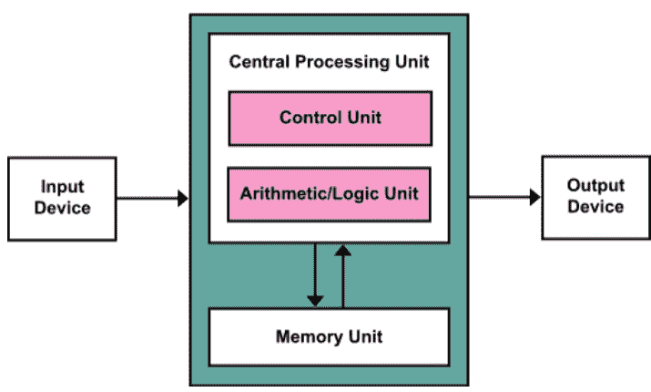

*作者：Kapooh - 自己的作品，CC BY-SA 3.0，https://commons.wikimedia.org/w/index.php?curid=25789639*

简而言之，计算设备有一个大脑，即其中央处理器（CPU）——如图所示，它包含控制单元和算术/逻辑单元（ALU）；一个用于存储数据的存储器单元；以及输入/输出（I/O）机制。I/O机制包括键盘、鼠标、触摸屏以及其他一些用于输入的交互设备；以及显示器或屏幕，以及扬声器和硬盘等其他用于输出的设备。

### 编程语言 - 机器语言/汇编语言/第三代语言/第四代语言

既然我们已经了解了基础设施层面的计算基础，我们如何利用计算能力？我们如何不仅与计算机交互，还能让计算机根据我们的指令完成惊人的事情？因此，许多语言被开发出来，正是为了实现这一点，以便我们能够与计算机沟通并命令它做我们想做的事情。

由于计算机只理解0和1（称为比特——二进制数字的缩写，它可以存储0或1的值，对应于单个电容器的底层电气值OFF或ON——电容器可以有2个充电级别；充电量高于或低于某个级别0F0F[1]），因此它自然使用0和1的组合来构建其语言，这种语言称为机器语言，被归类为第二代语言（2GL）。在早期，我们几乎逐字节（在大多数计算机上是8位）地将机器语言翻译成更友好的人类语言，这就是汇编语言。随着计算机科学的发展，出现了更高级的语言，如C、C++、Java、Python、JavaScript，使人类编程变得更容易。这些高级语言被称为第三代语言（3GL）。

但这对于非程序员来说仍然不够容易，于是我们发明了类似英语的语言，如结构化查询语言（SQL），这些被称为第四代语言或4GL，并且有越来越多的3GL附加组件使编程更容易。当然还有第五代语言（5GL），旨在将程序员从问题解决中解放出来，但它尚未取得实质性突破（或者也许如今内置于我们手机中的移动电话个人助手已经非常接近了，希望如此。）

对于我们程序员来说，3GL仍然是最突出的，并且令人惊讶的是，它的使用范围越来越广，越来越受欢迎。在数据爆炸中脱颖而出的语言之一是Python。在本书中，我们将专门探讨Python。你可能会问为什么选择Python。首先，Python非常流行。它已经历了两次重大修订，我们现在使用的是Python 3——具体来说是3.9.1，因为本书是在2020年底撰写的。此时，Python也被评为仅次于C和Java的第三大最受欢迎的语言。Python在人工智能和机器学习项目中也被广泛使用，因此随着世界向这个方向发展，Python肯定有望获得更多的普及，并且应该成为未来在数据科学等新兴领域非常有用的语言。

### 编译器/解释器

那么计算机语言是如何工作的呢？一旦用某种高级语言编写了一段代码，它就会经过一些转换，使其成为可以在计算机上执行的语言。也就是说，它被转换为目标机器能够理解的某种机器语言。

这里有两种不同的方法。一种方法是将整个程序转换生成一个可执行文件，然后执行该文件以（希望）产生预期的结果。这称为编译（编译本身是一个相当复杂的过程。）在某个平台（无论是Windows、Mac、Linux还是其他平台）上编译此类代码后，会为该平台生成合适的机器代码。因此，这里的含义很清楚，由于硬件的性质，机器代码是特定于平台的，因此机器代码不兼容，不可在不同平台之间移植。

另一种方法或类别是，每一行代码在被接收和处理时就被解释和执行。这使得过程更具交互性，并为编码者提供更即时的反馈。因此，这些语言被称为解释型语言。

尽管这种解释方法对开发者/编码者更友好，但程序最终是作为一个整体来执行的，因此上述编译过程通常被大多数应用程序调用，以便编译后的可执行文件可以分发给用户，用于其预期目的，而不仅仅是为了开发者的便利。

关于这两个阵营的优缺点有很多可以说的，除此之外，还有新的发明使事情复杂化，模糊了界限——因为计算机行业当然不满足于被限制而停滞不前，所以有许多演进混合了两者之间的区别。例如，Python最初是一种解释型语言，但有许多扩展可以为用Python编写的程序生成编译后的可执行文件。深入探讨这一点绝对超出了本书的范围，但在这个领域有许多实现，例如CPython、Jython、IronPython和PyPy——仅举几例。因此，如果你对更多细节感兴趣，现在你有了一些名称列表，可以开始你的研究。

现在，让我们简要地以非常概括的方式对比一下编译型语言和解释型语言这两个阵营：

编译型语言的优点：

- 性能更快，因为本机机器代码在目标机器上执行
- 在编译过程中进行大量优化——这要归功于编译器技术的进步

解释型语言的优点：

- 解释器比编译器容易编写得多
- 代码可以立即执行，无需经过编译过程

这里有一些关于现代技术的脚注，例如虚拟机和字节码：这些是模糊两个阵营界限并使事情更有趣的发明的一部分。因此，目标不是编译到真实的机器，而是一个虚拟机，它隐藏了我们运行的硬件的一些细节。例如，Java语言有JVM JIT（Java虚拟机即时）编译器，如果你对这个技术领域感兴趣的话。

在Java世界中，每个硬件平台/架构都有一个专门为该目标硬件编写的Java字节码解释器。它解释Java字节码以执行程序。通过这种方式，Java实现了其**一次编写，到处运行**（WORA），或有时称为**一次编写，无处不运行**（WORE）的目标，即一旦编码完成，几乎不需要或只需极少的移植工作即可在不同平台上运行。

但是，由解释器执行的额外Java字节码层，通常会使执行速度慢于将相同代码编译为本地机器代码的情况。这个问题在一定程度上通过[即时（JIT）编译器](https://en.wikipedia.org/wiki/Just-in-time_compilation)得到了缓解——JIT编译器可以在执行程序时将常用的Java字节码部分转换为本地机器代码，从而使代码执行速度大大加快。

具体到Python，由于它是一种解释型语言，其性能存在固有的缓慢问题。就在几年前，人们努力将Python代码转换为字节码，这些字节码是解释器可以执行的低级指令（与前面描述的Java情况非常相似，或许也受到了其启发）。因此，代码不是直接执行，而是在虚拟机中执行字节码，这个虚拟机本质上就是后台运行的特定Python解释器。通过这种性能增强，避免了转换为CPython或类似工具的麻烦，从而消除了其笨重性。然而，只要Python字节码和虚拟机是相同版本/兼容的，源代码就可以在任何地方执行（无论是Windows、MacOS等），从而实现了轻松的可移植性。

### 解释与编译示意图

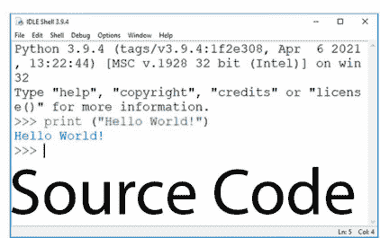

### 源代码


### Python解释器


### 输出

解释过程——读取一行代码并执行，然后是下一行，再下一行...

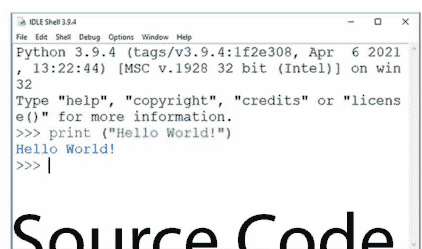

### 源代码

### GCC/G++

### 某些编译器


### 可执行文件

### 机器代码


### 硬件/CPU


### 输出

编译过程——将整个源代码翻译成我们所在硬件的机器代码，然后执行它以产生输出

### 一些常见误解

机器代码和汇编代码之间似乎存在一些混淆，所以让我们在这里澄清一下。汇编代码不是机器代码。

汇编代码需要通过汇编器（类似于高级语言的编译器）汇编成机器代码，这是计算机唯一理解并知道如何执行的东西。

### 练习：

- 1.1 编译器和解释器有什么区别？
- 1.2 机器代码和汇编代码有什么区别？
- 1.3 列举一些第三代编程语言（3GLs）

## 第2章 设置Python编码和调试环境

### 下载/安装

现在我们准备好开始行动了。首先让我们下载Python。因为无论你使用什么系统，通常都不会预装Python。开源版本的下载是免费的，而且实际上非常简单——只需访问 [https://www.python.org/downloads](https://www.python.org/downloads)，你就能找到活跃的Python版本——截至本文撰写时，最新版本是3.9.4，下载大小不到30兆字节。

### 启动Python解释器（交互/脚本模式）——使用IDLE/IDE

下载完成后，只需点击文件（文件名可能类似于python-3.9.4.exe），它应该会在几分钟内安装好Python。如果你使用的是Windows 10，从开始菜单你会看到类似以下的内容

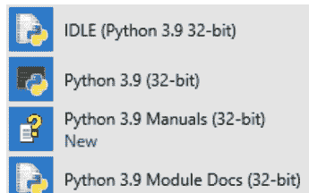

如果你点击顶部的菜单项IDLE，那么你将启动IDLE，如下图所示

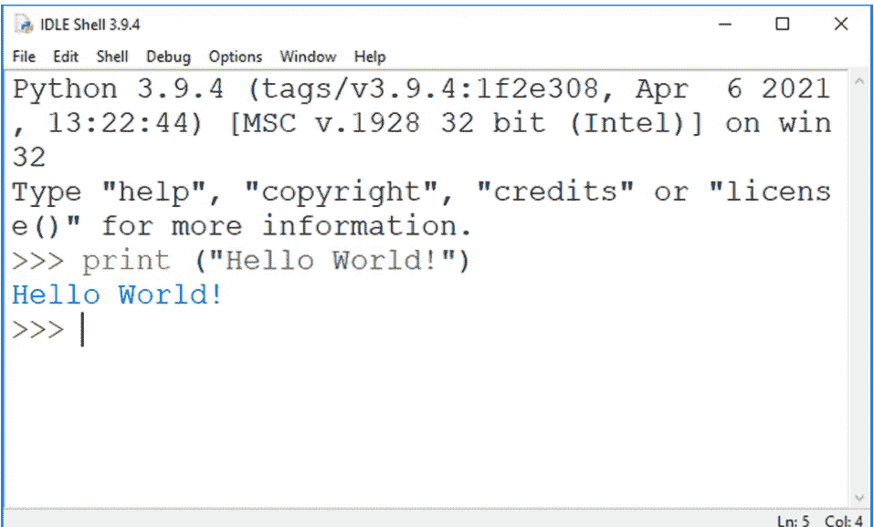

其中我有一个print命令来显示通常的“Hello World!”消息（以一种不太Python的方式，你将在下一章看到原因）。

你可能想知道IDLE是什么。好吧，让我们先简要介绍一下集成开发环境（IDE）——它是一个打包的系统，本质上可以作为一个帮助你编码的工具。IDE通常提供一些编码语法检查和语法提示，以便编码人员更容易地完成工作。在Python世界中，IDLE（集成开发与学习环境）是随语言捆绑的包，因此是首选的IDE（至少python.org是这样推荐的），正如你下载并安装Python后可能已经发现的那样（如前图所示）。

你也可以通过点击以下内容直接在窗口中使用Python.exe命令


然后你将有一个运行Python的命令窗口，如下图所示：

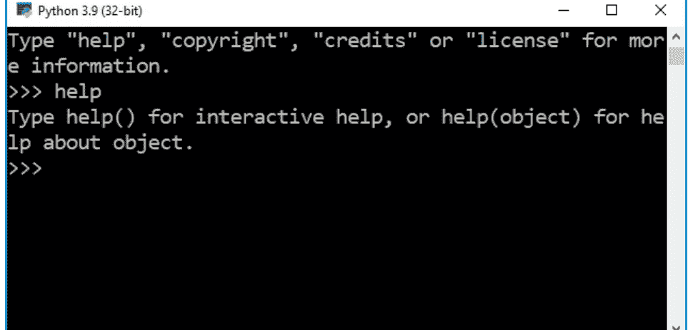

或者，如果你愿意，你可以转到Python安装的目录，并在Windows命令shell中直接调用python.exe（从某种意义上说，shell就像命令/控制台窗口），如下所示：

```
C:\Users\jesse>cd AppData\Local\Programs\Python\Python39-32

C:\Users\jesse\AppData\Local\Programs\Python\Python39-32>python.exe

Python 3.9.4 (tags/v3.9.4:1f2e308, Apr  6 2021, 13:22:44) [MSC v.1928 32 bit (Intel)] on win32
Type "help", "copyright", "credits" or "license" for more information.
>>> print("Hello World!")
Hello World!
>>> ^Z

C:\Users\jesse\AppData\Local\Programs\Python\Python39-32>dir
 Volume in drive C is Local Disk
 Volume Serial Number is A41E-60DA

 Directory of C:\Users\jesse\AppData\Local\Programs\Python\Python39-32

04/24/2021  10:01 AM    <DIR>          .
04/24/2021  10:01 AM    <DIR>          ..
04/24/2021  10:00 AM    <DIR>          DLLs
04/24/2021  09:59 AM    <DIR>          Doc
04/24/2021  09:56 AM    <DIR>          include
04/24/2021  10:00 AM    <DIR>          Lib
04/24/2021  10:00 AM    <DIR>          libs
04/06/2021  02:14 PM            32,628 LICENSE.txt
02/21/2021  11:15 AM                23 my.py
04/06/2021  02:15 PM         1,054,193 NEWS.txt
04/06/2021  02:14 PM            98,992 python.exe
04/06/2021  02:14 PM            59,568 python3.dll
04/06/2021  02:14 PM         4,454,064 python39.dll
04/06/2021  02:14 PM            97,456 pythonw.exe
04/24/2021  10:01 AM    <DIR>          Scripts
04/24/2021  10:00 AM    <DIR>          tcl
04/24/2021  09:59 AM    <DIR>          Tools
04/06/2021  02:14 PM            76,176 vcruntime140.dll
               8 File(s)      5,873,100 bytes
              10 Dir(s)   5,765,525,504 bytes free

C:\Users\jesse\AppData\Local\Programs\Python\Python39-32>
```

在这个Python解释器中，完成后，你可以点击ctrl-z（同时按下control键和z键），然后按回车键退出回到Windows命令shell。

如果你使用的是某种Linux发行版，安装后非常简单——你只需输入python，你应该会看到类似以下的内容：

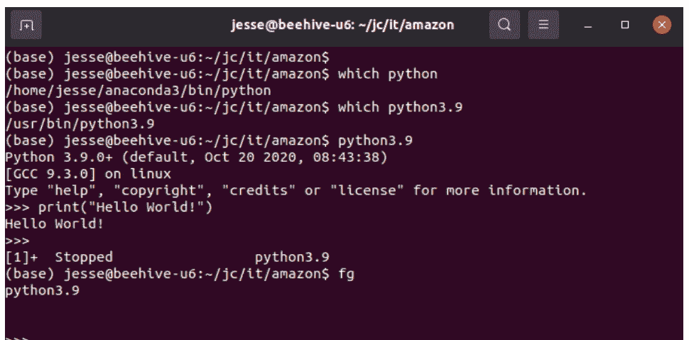

在这个Linux shell中，由于我有多个Python版本（你可以从“which python”命令看到），所以我使用python3.9来调用最新的Python解释器。一旦进入Python，我可以使用通常的ctrl-z将其挂起到后台，并使用fg（前台）命令将其调回。或者，如果我使用ctrl-d，那么我将退出Python解释器并返回到Linux shell。

如果你使用的是Mac，由于MacOS属于Unix操作系统家族，因此它与上述Linux情况不会有太大差异。至于本书的其余部分，由于我恰好使用Windows 10虚拟机来编写本书，因此所有示例的截图都将来自Windows 10。但一旦你进入Python shell/解释器，无论你使用的是哪个底层操作系统，过程都应该是一样的。

### Python（或任何解释型语言）的交互模式与脚本模式

现在我们来了解一下如何使用下载的包进行Python编码。

使用已安装的包有两种模式——交互模式和脚本模式：

1. 交互模式
   a. 正如你在IDLE示例中看到的，一种方法是使用Python IDLE Shell（同样，shell类似于命令/控制台窗口）并在其中编码。
   b. 或者你可以使用命令窗口（在Windows 10上），并如前所述调用Python。然后你可以在这个shell中开始Python编码，就像你在IDLE Shell中所做的那样。
2. 至于脚本模式，你需要创建一个文件（脚本文件），然后按照下图所示执行该文件（代码和运行结果）：

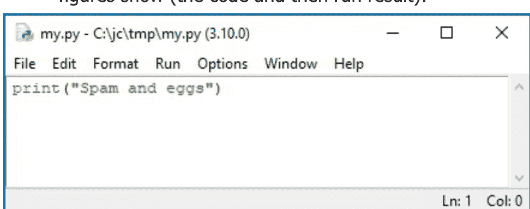

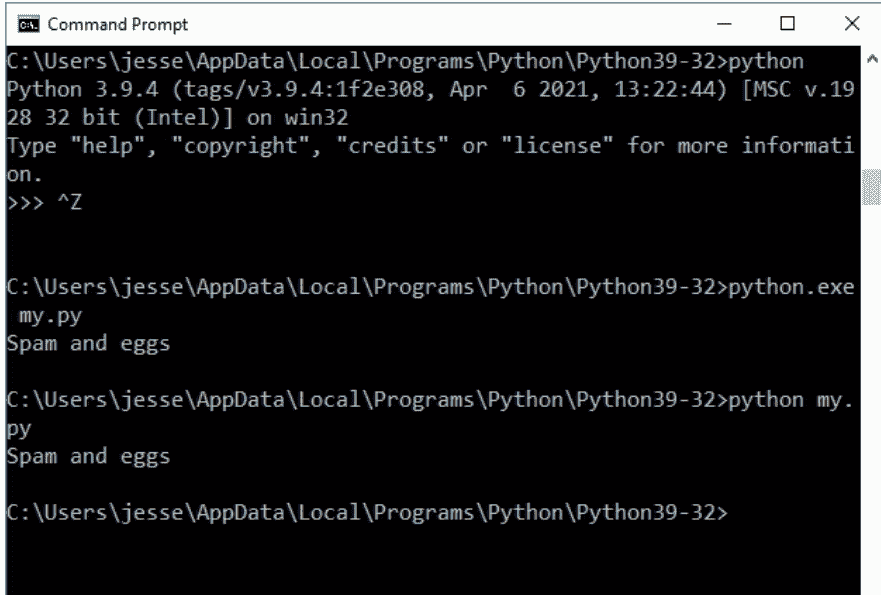

所以你看，我们有一个名为my.py的脚本文件（.py扩展名告诉我们它是一个Python脚本）。要执行这个脚本，我们调用命令python.exe（你也可以看到我把自己放在了Python安装目录中，这样我就可以访问这个命令——你不必这样做，因为你可以设置你的操作系统平台通过一个名为PATH的设置来搜索这个目录中的命令，如果你好奇的话——这可以通过编辑Windows 10上的系统环境变量Path轻松完成。）（你可能还注意到我们打印的是“Spam and eggs”而不是之前的“Hello World”，以便更符合Python的精神。）

现在让我们对这两种模式进行一些比较：

1. 在交互模式下，你直接在shell中编码，具有以下优点：
   a. 当你有一个简短的脚本并希望立即看到结果时。
   b. 与解释器直接交互，因此只需输入一些Python代码/命令，按回车键，即可获得结果，工作更快。
   c. 对于初学者开始练习Python来说是一个很好的方式。
   d. 要退出shell，如前面的快照所示，你可以点击CTRL-z（同时按Control键和z键），然后点击回车。

然而，权衡之处在于：
   a. 有时如果你需要使用之前的命令，可能会更困难（你可能不得不使用一些繁琐的方法来编辑，或者你将不得不重新输入整行。）
   b. 运行一些较长的代码会变得乏味。

2. 脚本模式，你在脚本文件中编辑整个代码，因此具有以下优点：
   a. 你可以看到编辑整个代码的“大局”。
   b. 根据你选择的编辑器，你通常会有更轻松的代码编辑体验。

而权衡之处显然是交互模式优点的反面。所以当代码很短，只有几行时，你宁愿使用交互模式，以避免创建单独的.py脚本文件。

### 编码与调试

我们都知道编码是什么：用某种特定的计算机语言编写指令，然后这些指令可以被翻译成机器能够理解的语言，从而执行你想要它做的事情。

但为什么这里要提到调试呢？嗯，调试实际上是编码中非常重要的一部分。事实上，对于一个编码者来说，花在调试上的时间可能比编码更多——实际上要多得多。

现在让我们看看在编码过程中可能遇到的一些错误。有语法错误和运行时错误；而在运行时错误中，有致命错误和非致命错误。

所以我们在不同场合都可能遇到语法错误。如果我们使用某个IDE（例如IDLE），它检测到语法错误（通常会给我们一些修复提示；虽然这些提示通常很有用，但有时可能不准确，因此需要更详细的人工干预。）

有一些常见的语法错误，错误信息有时可能有点棘手，难以排查，如下例所示：

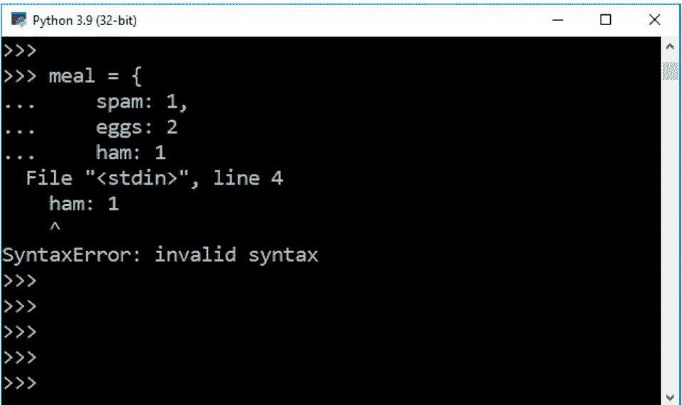

上面的例子显示在“eggs...”行末尾缺少一个逗号，但错误信息却显示下一行有SyntaxError。这是预期的，因为解释器在处理该行时并不受缺少逗号的影响，直到读取并处理下一行“ham...”时才会发现。所以一般来说，你可以从SyntaxError指出的行开始，向前检查。通常是紧邻的前一行，但有时可能是代码中更早的位置。

这里是另一个例子：

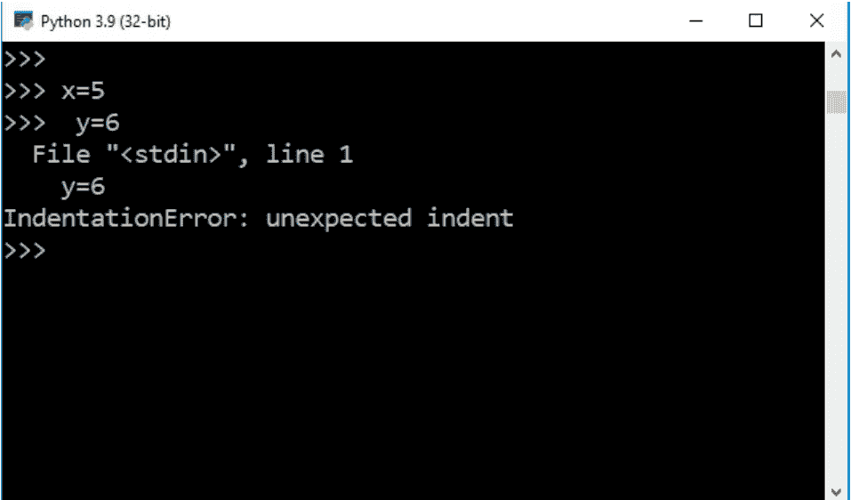

在上面的例子中，“y=...”前面有一个意外的空格（缩进），错误被正确地指出了，但伴随它的信息可能有点令人困惑。所以“line 1”指的是行号，但错误明显在第2行。所以错误可能在前一行或后几行，但好消息是它通常应该相当接近IDE指出的行号。

一般来说，错误信息显示的是解释器发现问题的位置，而不一定是导致问题的原因。但无论如何，它通常能给你一个关于如何排查代码的很好的思路。尽管有时，我们可能仍然需要插入“调试行”，例如打印某些变量的值，以确保代码逻辑确实按照我们设计的方式进行。正如《Linux用户指南》的Larry Greenfield所说，“Linus早期的项目之一是一个在打印AAAA和BBBB之间切换的程序。这后来演变成了Linux。”

这里的一个关键要点是，调试就像学习走路，你会绊倒很多次，但正是因为实践中的重复，你的调试能力会变得更强，这样你不仅能更快地编码和调试，而且间接地，通过在这个编码和调试周期中的丰富经验，你将能够编写出更好的代码。

### 非常适合Python编码的流行IDE

现在让我们看看除了IDLE之外，用于Python编码的一些IDE。没错，我们并不局限于使用IDLE，尽管它是随Python一起提供的。如果你要获得更多不同编程语言的经验，也许将来对某些人来说，你很可能会对某些IDE产生偏好。

一个流行的免费IDE实际上来自微软，叫做Visual Studio。Visual Studio有几个不同的版本，但社区版是免费的，你可以在https://visualstudio.microsoft.com/downloads/获取。

还有其他几个流行的IDE。一个是Eclipse（https://www.eclipse.org/ide/），另一个是NetBeans（https://netbeans.org/）。

事实上，在这个云计算世界里，也有一些流行的在线IDE。一个叫做OnlineGDB（https://www.onlinegdb.com/），另一个叫做CodingGround，网址是https://www.tutorialspoint.com/codingground.htm。两者都可以通过网络浏览器直接访问（无需下载和安装。）

我相信还有许多其他可能和这里提到的任何IDE一样好的IDE。随着时间的推移，我希望你在享受编码（可能用Python）的过程中，能对某些IDE发展出更多的专业知识。

### 用于“编译”的Python特定扩展

不深入细节，虽然Python是一门很棒的语言，但它不如C或Java快——另外两种流行的语言。有许多努力在改变这一点。由于这是一个超出本书范围的话题，我将只是简单提及，以便我们对这些努力有所了解。

在众多努力中，有两个主要领域致力于加速Python执行：一个是进行一些代码优化，使其运行更快；另一个是使用不同于我们一直使用的运行时（来自Python.org的解释器）来使Python可执行文件运行更快。

在优化Python运行时方面，不像第1章提到的CPython，PyPy使用了像Java一样的即时（JIT）技术来提高性能——正如第1章所解释的。

还有其他扩展，例如Cython（Python的C扩展），如果你感兴趣可以搜索一下。

但一个流行的扩展是Numba，它利用了上述两个领域的优化。它使用JIT编译和优化的库（如NumPy）来加速执行。

在你读完本书并感到自如之后，你当然可以自由探索这些扩展。事实上，将来如果你进入更高级的Python编码，鼓励你利用这些扩展来实现Python编程的更多好处。

### 练习：

2.1 使用你的Python IDE作为小费计算器，如果一餐的账单总额是32.87美元，15%的小费是多少？最终总额是多少？

2.2 使用Python print()交互式地打印“Hello World!”。然后编写一个Python脚本来打印“CS102 Intro to Python”

## 第三章 运算符与语句

既然我们已经在系统中安装了Python，那就来运行第一个程序吧——“Hello World!”程序，很多人可能在过去某个时候都听说过，这是进入编程世界的起点。以下是Python版本的“Hello World!”：

```
print("Hello, world!")
```

就这么简单——一行代码。试试看！许多计算机语言都用这个程序作为编程入门，关于它的起源有各种不同的说法。不过，与之相关的可能更有趣的是动画科幻电影《你好，世界》，毕竟计算机发展与科幻题材一直有着不解之缘——半开玩笑地说。

好了，我们已经完成了第一个程序，它会打印/显示这句介绍性语句。希望它不会让你感到畏惧。

既然我们已经完成了第一个程序，现在让我们深入Python编程。首先，让我们用Python的方式进入编程世界，介绍另一个替代的入门程序：

```
print ("Spam, ham, and eggs.")
```

这就是有时充满趣味的Python文化。

现在，让我们来了解一些基本运算符。但在开始之前，我们先介绍一些术语。第一个术语是变量。什么是变量？你可以把它想象成一个身份标识（ID）。它基本上是一个命名的对象，在运行时可以占据某个内存位置。因此，变量可以包含值。值可以有多种类型。从简单的类型如数字（可以是整数——类型为int，或者可以有小数点，称为浮点类型float），到字符串（类型为str——字符的组合），再到我们将在本书后面讨论的更复杂的基本类型聚合。现在，让我们先使用一些基本的内置数据类型（如下表所列）来学习Python。

| 文本类型： | str |
| 数字类型： | int, float, complex |
| 序列类型： | list, tuple, range |
| 映射类型： | dict |
| 集合类型： | set, frozenset |
| 布尔类型： | bool |
| 二进制类型： | bytes, bytearray, memoryview |

这里提供了一个完整的内置类型参考表（根据维基百科）：

| 类型 | 描述 | 语法示例 |
| --- | --- | --- |
| bool | 布尔值 | True<br>False |
| bytearray | 字节序列 | bytearray(b'Some ASCII')<br>bytearray(b"Some ASCII")<br>bytearray([119, 105, 107, 105]) |
| bytes | 字节序列 | b'Some ASCII'<br>b"Some ASCII"<br>bytes([119, 105, 107, 105]) |
| complex | 包含实部和虚部的复数 | 3+2.7j |
| dict | 键值对的关联数组（或字典）；可以包含混合类型（键和值），键必须是可哈希类型 | {'key1': 1.0, 3: False} {} |
| ellipsis | 省略号占位符，用于NumPy数组中的索引 | ... Ellipsis |
| float | 双精度浮点数。精度取决于机器，但实践中通常实现为64位IEEE 754数字，具有53位精度。[95] | 1.414 |
| frozenset | 无序集合，不包含重复项；如果可哈希，可以包含混合类型 | frozenset([4.0, 'string', True]) |
| int | 任意精度的整数[96] | 42 |
| list | 列表，可以包含混合类型 | [4.0, 'string', True] [] |
| NoneType | 表示值缺失的对象，在其他语言中通常称为null | None |
| NotImplementedType | 一个占位符，可以从重载运算符返回，表示不支持的操作数类型。 | NotImplemented |
| range | 数字序列，通常用于for循环中循环特定次数[97] | range(1, 10) range(10, -5, -2) |
| set | 无序集合，不包含重复项；如果可哈希，可以包含混合类型 | {4.0, 'string', True} set() |
| str | 字符串：Unicode码点的序列 | 'Wikipedia' "Wikipedia" """Spanning multiple lines""" |
| tuple | 可以包含混合类型 | (4.0, 'string', True) ('single element',) () |

现在我们可以使用一些变量来保存值。我们怎么做呢？我们通过赋值语句将值赋给变量。以下是一些示例：

```
PageNumber = 8
Pi = 3.1416
MyString = "In Python, Spam and Eggs are used for fun in place of Foo and Bar"
```

如你所见，我们尝试使用一些有意义的变量名，这被认为是一种良好的实践，因为它构成了代码内文档的一部分，使读者（包括我们自己，比如说三个月后）能更好地理解我们试图做什么。我们将在本章后面讨论更详细的文档注释。

从这里开始，让我们过渡到以下部分涉及的更多细节。

### 运算符与操作数

首先，让我们通过以下四个表格了解一些运算符（我们在上一节已经见过一些），这应该足够我们进行大多数编码。

（Python有这7类运算符：算术运算符、赋值运算符、比较运算符、逻辑运算符、身份运算符、成员运算符、位运算符——我们现在只看前4种。）

#### 算术运算符：

| 运算符 | 名称/描述 | 示例 |
| :--- | :--- | :--- |
| + | 加法 | x + y |
| - | 减法 | x - y |
| * | 乘法 | x * y |
| / | 除法 | x / y |
| % | 取模 | x % y |
| ** | 幂运算 | x ** y |
| // | 整除 | x // y |

#### 赋值运算符：

| 运算符 | 等同于 | 示例 |
| --- | --- | --- |
| = | x = 5 | x = 5 |
| += | x = x + 3 | x += 3 |
| -= | x = x - 3 | x -= 3 |
| *= | x = x * 3 | x *= 3 |
| /= | x = x / 3 | x /= 3 |
| %= | x = x % 3 | x %= 3 |
| //= | x = x // 3 | x //= 3 |
| **= | x = x ** 3 | x **= 3 |

#### 比较运算符：

| 运算符 | 名称/描述 | 示例 |
| --- | --- | --- |
| == | 等于 | x == y |
| != | 不等于 | x != y |
| > | 大于 | x > y |
| < | 小于 | x < y |
| >= | 大于或等于 | x >= y |
| <= | 小于或等于 | x <= y |

#### 逻辑运算符：

| 运算符 | 描述 | 示例 |
| --- | --- | --- |
| and | 如果两个语句都为真，则返回True | x < 5 and x < 10 |
| or | 如果其中一个语句为真，则返回True | x < 5 or x < 4 |
| not | 反转结果，如果结果为真，则返回False | not(x < 5 and x < 10) |

大多数运算符是二元运算符——意味着它们接受两个操作数。例如，x + y，其中运算符+接受两个操作数x和y。也有一元运算符，如-，这在上述运算符表中没有描述。但一个例子是，运算符“-”可以简单地应用于变量前面，如-x，以获得x的负值，就像-3得到负3一样。

### 变量

关于变量，我们已经知道它有一个名称，比如x，这是它的标识。标识有一个标识符，那就是它的名称。在Python中，名称可以是任何东西，只要它不是保留关键字，并且遵循以下规则：你可以使用任何字母、数字和一些符号（例如标点符号）的组合，只要第一个字符不是数字。

以下是Python关键字列表：

- False
- None
- True
- __peg_parser__
- and
- as
- assert
- async
- await
- break
- class
- continue
- def
- del
- elif
- else
- except
- finally
- for
- from
- global
- if
- import
- in
- is
- lambda
- nonlocal
- not
- or
- pass
- raise
- return
- try
- while
- with
- yield

事实上，你可以在Python解释器中输入命令help("keywords")，它会给你一个关键字列表，就像我们刚刚展示的列表一样。在这里，help也像一个函数一样工作——就像我们已经使用过几次的print()函数，我们很快会进一步扩展关于函数print()的内容。

不同Python版本的关键字略有不同，但这个列表是全面的，无论我使用哪个Python版本，我都会避免使用其中任何一个。

此外，在基本层面上，变量实际上是对内存位置的引用，变量的值就存储在那里。

### 赋值、语句、表达式、求值

现在我们知道变量是什么，以及它们可以保存值，让我们来处理如何将值赋给变量，然后进行修改或更改它们的值。

我们已经见过一些将值赋给变量的例子，比如当我们编写x=5时。本质上，这与我们从小到大经历过的数学方程没有太大区别。

而如果我们讨论赋值，那么我们也必须处理语句、语句中的表达式，以及它们值的求值。

那么什么是语句呢？让我们先来看几个我们已经用过的例子：

```
print ("Spam, ham, and eggs.")
```

```
MyString = "In Python, Spam and Eggs are used for fun in place of Foo and Bar"
```

它们都是语句，但显然有些许不同。第一条是执行后可以在输出中显示内容的语句。第二条是将某个值赋给变量 `MyString`。

所以这里有一个关键概念：语句是可由解释器执行的代码。但如果我们剖析第二条语句，我们会看到右侧的值，即一个值为 "In Python, Spam and Eggs are used for fun in place of Foo and Bar" 的字符串字面量，被赋给了左侧的变量 `MyString`。因此我们说，对右侧进行求值得到了字符串字面量的值，然后该值被赋给左侧的变量。事实上，如果我们看第一条 `print` 语句，括号内的值是 "Spam, ham, and eggs."，它首先被求值，然后求值得到的值被传递给 `print` 命令，从而该值被打印出来。在这个 `print` 语句的情况中，我们对表达式进行了求值，该表达式是一个值为 "Spam, ham, and eggs." 的字符串字面量。同样的概念也适用于 `MyString` 语句。

正如你从示例中看到的，我们可以在表达式之上叠加表达式，从而形成更长、更复杂的语句。随着本书的深入，将会有更多从简单语句/表达式组合成更长语句/表达式的例子。

现在，让我们看看函数求值。这里我们将稍微超前一点，假设我们已经导入了 `math` 库（这是一个预打包的数学函数库/模块）。因此，我们将使用 `gcd` 函数来求最大公约数，如下面的语句所示：

```
print (math.gcd(3, 6))
```

在这个语句中，`print()` 作为一个函数，需要接受具有某个值的参数。我们传递给 `print()` 的值是 `math.gcd()` 函数的值，因此我们说 `print()` 函数参数的求值结果就是 `math.gcd()` 函数的值。这与数学世界中函数的使用方式非常相似，即函数被求值以产生某个值。

### 布尔表达式

现在我们想稍微谈谈布尔表达式。什么是布尔表达式？它基本上是一个表达式，当被求值时，会给出一个 `True` 或 `False` 值。一些基本的例子，比如“3 等于 3 吗？”答案是 `True`。“3 等于 6 吗？”答案显然是 `False`。因此，使用我们之前列出的比较运算符，我们说 `3 == 3` 是 `True`，而 `3 == 6` 是 `False`。`True` 和 `False` 是布尔值的保留关键字，它们属于之前数据类型表中列出的 `bool` 类型。你可以输入 `type(True)` 或 `type(False)`，Python 解释器会告诉你它们是 `bool` 类型。请注意，我们大写了 `True` 和 `False` 的首字母 `T` 和 `F`，因为小写的 `true` 和 `false` 不是我们这里用于布尔值的关键字。

### 逻辑运算符

既然我们已经使用比较运算符之一（即 `==`）处理了布尔（`bool`）类型，现在是时候讨论逻辑运算符以及带有逻辑运算符的表达式如何被求值为 `True` 或 `False` 了。那么这个表达式的值是多少呢？

```
(3 == 3) and (3 == 6)
```

我们已经知道 `3 == 3` 得到 `True`，`3 == 6` 得到 `False`，所以从逻辑运算符 `and`（通过它我们将得到 `True` 或 `False` 的结果）来看，这个表达式被求值为 `False`——就像我们小时候见过的数学逻辑一样。其他逻辑运算符 `or` 和 `not` 也是同样的道理。

因此，我们有以下代码片段来展示这些逻辑运算符的一些工作方式：

```
>>> x = 3
>>> y = 3
>>> z = 6
>>> x == y
True
>>> x == z
False
>>> not x
False
>>> x = 0
>>> not x
True
>>> not (x == x)
False
>>> not x == x
False
>>>
```

上面代码片段中倒数第二行 `not (x == x)` 实际上是按以下顺序求值的：

`x == x` 是 `True`
然后 `not (True)` 得到 `False`
事实上，最后一行给出了相同的结果，因为运算符 `==` 在运算符 `not` 之前应用（我们稍后会讨论运算符优先级）。

所以现在你看到我们可以用许多不同的方式组合这些表达式，并且实际上可能会变得复杂得多（但当然，除非应用情况迫使我们编写如此复杂的代码，否则通常建议让你的代码更简单以提高可读性——不仅是为了其他编码者阅读，也是为了你自己在一段时间后——因为如果复杂度太高，你可能无法理解几个月前编写的代码。）

### 优先级与结合性

现在我们已经看到了一些运算符在工作，并且我们已经讨论了更复杂的语句，那么当涉及多个运算符时，我们如何求值表达式呢？答案再次与我们在数学世界中学到的非常相似。有一个称为优先级的运算顺序。我们小时候就学过乘法/除法优先于加法/减法。同样的规则也适用于计算机世界。我们有一个优先级表来指导我们如何按正确的顺序进行这些求值：（这是一个完整的列表，因此表中有一些我们尚未涵盖的运算符，尽管我们将在本书中涵盖相当多的运算符）

| 运算符 | 描述 |
|---|---|
| () | 圆括号（分组） |
| f(args...) | 函数调用 |
| x[index:index] | 切片 |
| x[index] | 下标 |
| x.attribute | 属性引用 |
| ** | 幂运算 |
| ~x | 按位取反 |
| +x, -x | 正号、负号 |
| *, /, % | 乘法、除法、取余 |
| +, - | 加法、减法 |
| <<, >> | 按位移位 |
| & | 按位与 |
| ^ | 按位异或 |
| \| | 按位或 |
| in, not in, is, is not, <, <=, >, >=, <>, !=, == | 比较、成员、身份 |
| not x | 布尔非 |
| and | 布尔与 |
| or | 布尔或 |
| lambda | Lambda 表达式 |

在这个优先级表中，优先级从上到下递减——因此最高优先级在顶部，反之亦然。

至于结合性，几乎所有运算符都具有从左到右的结合性。因此，当语句/表达式中出现多个相同优先级的运算符时，求值从左到右进行，因此最左边的运算符首先被求值，然后是第二个，依此类推，只要它们都处于相同的优先级水平。

这里有一个简单的例子来让这一点更清楚一些，因为这可能听起来令人困惑，但实际上并没有那么复杂：
表达式 `100/10*10` 是如何求值的？由于运算符 `/` 和 `*` 具有相同的优先级，因此我们查看结合性来确定执行顺序。由于两个运算符都具有从左到右的结合性，因此这个表达式的执行就像我们有括号化的 `100/10` 一样，也就是说，它就像这个表达式 `(100/10)*10`。由于 `()` 具有最高优先级，因此我们知道 `/` 在 `*` 之前执行，就像在 `100/10*10` 中由于结合性一样。

如前所述，大多数运算符具有从左到右的结合性；所以这实际上并不像它看起来那么复杂。

现在，认识到表达式中运算符的优先级和结合性后，我们将在下一节中继续总结顺序执行。

### 顺序执行

Python 中的语句是顺序执行的，就像许多其他编程语言一样。当然，当有函数调用时，这种顺序会被打断，我们将在后面有一章专门处理函数调用。但通常语句是一个接一个执行的。对于复杂的语句，我们不仅需要处理运算符的优先级，还需要注意运算符的结合性。

### 注释

现在让我们来谈谈注释。注释实际上是编程中非常重要的东西。它是对代码功能的解释，有时还包括设计、架构、考虑因素，以及软件工程师/编码者认为适合让代码更具可读性的任何内容——无论是给其他人看，还是给编码者自己在一段时间后看，尤其是当软件变得更复杂时——它们通常会变得复杂。在我所在的软件工程组织中，通常要求在注释中包含编码者的姓名、更改时间以及大量其他信息——通常既在代码更改旁边，也在文件开头。

Python 注释以 “#” 开头，使解释器忽略该行的其余部分。因此注释实际上是给代码的人类读者看的。你当然可以在一行中的任何位置开始注释，很多时候编码者会在代码后面加上 `#` 然后是解释，以使代码逻辑对读者更清晰。

以下代码片段包含与之前稍早显示的代码片段相同的语句，但现在添加了相当多的注释

## 第三章

```python
>>> x = 3 #将3赋值给变量x
>>> y = 3 #将3赋值给y
>>> z = 6 #将6赋值给z
>>> x == y #比较x和y
True
>>> x == z #比较x和z
False
>>> not x #因此，如果x不为0，那么not x将为0，即False
False
>>> x = 0 #现在将x设为0
>>> not x #而x的取反使其为True
True
>>> not (x == x) #由于x等于x，所以比较结果为True
False
>>> #而上一行的取反结果为False
>>> not x == x #与上一条语句逻辑相同
False
>>> #当然，在Python中True和False首字母大写
>>>
```

你可以看到，注释可以从行中的任何位置开始，但一旦插入了`#`，该行的其余部分就被视为注释。

### 文档字符串

与许多其他语言相反，Python没有多行注释符号。因此，如果你需要在文件开头为文件中的某些代码编写描述，即你想要一个注释块，唯一的方法就是为注释块所需的每一行都以`#`号开头。

一些误解将多行注释与`"""三引号"""`混淆了。这是错误的，但不幸的是，你在很多地方都能看到这种错误的教法。Python只有一种注释方式，那就是使用`#`符号。

所以，如果你见过三引号的实际使用，你可能会想知道这是怎么回事，特别是它们似乎被用作多行注释。嗯，三引号用于一个特殊的目的，称为文档字符串。它们就像普通字符串一样处理（我们在`print`命令的"Hello World"中已经见过一点）。但三引号与注释的不同之处在于它们可以跨越多行，尽管目的不同——正如我们在Python.org的以下规范中看到的：

> “文档字符串是一个字符串字面量，它作为模块、函数、类或方法定义中的第一条语句出现。这样的文档字符串成为该对象的`__doc__`特殊属性。

所有模块通常都应该有文档字符串，模块导出的所有函数和类也应该有文档字符串。公共方法（包括`__init__`构造函数）也应该有文档字符串。包可以在包目录中的`__init__.py`文件的模块文档字符串中进行文档化。

Python代码中其他地方出现的字符串字面量也可以充当文档。它们不被Python字节码编译器识别，也不作为运行时对象属性可访问（即不被赋值给`__doc__`）……”

所以，正如其名所示，文档字符串主要用于文档目的，即用于手册、规范等。它实际上不是我们想要在代码中使用的注释，也不应该被这样使用。事实上，有工具可以从代码中提取这些文档字符串用于手册等。正是由于这个原因，文档字符串的三引号不应该用于其他代码内注释，这是为了编码员的利益，这些注释确实不应该包含在手册等中。因此，对于编码注释，我们应该坚持使用以`#`开头的注释行作为我们的代码内文档。

### 练习

3.1 如果执行Python语句`print(32 / 6)`，结果会是什么？

3.2 如果执行Python语句`print(32.0 // 6)`，结果会是什么？

3.3 如果执行Python语句`print(32 % 6)`，结果会是什么？

3.4 如果执行以下语句，`x`的值会是多少？

```python
x = 32
x //= 6
```

3.5 使用Python IDE计算`7 ** 3`

3.6 使用Python IDE计算`0 % 9`

3.7 使用Python IDE计算表达式`3 + 4 * 5`

3.8 使用Python IDE展示如何添加括号将结果从23改为35

3.9 假设变量`a = 2`，`b = 4`，`c = 6`。判断以下每个条件的值是True还是False。

```python
4 > a or b == 6
b < 4 and a > 3
c != 2 or c != 3
not (c > 2)
```

3.10 使用Python求解

```python
- 28 / 4
18 + 14 * 3 - 5
8 * (2 + 3) * 3
18 / (12 - 3)
7 + 15 * (17 - 3)
```

## 第四章 数据类型与结构

在Python（或大多数编程语言）中，如上一章所述，变量只是一个名称，它引用内存中的一块数据（如果数据尚未在内存中，它将被加载到内存中）。这是一种机制，使你作为程序员能够轻松地存储和检索数据。在内部，Python解释器会跟踪你创建的变量名以及这些变量名所引用的数据块。任何时候你需要检索其中一块数据，你只需使用引用它的变量名。

Python中的变量可以引用任何类型的项。在变量被赋值为一个类型的项之后，它可以被重新赋值为另一个不同类型的项。（这称为动态类型，我们将在后面的“动态类型”部分有更多解释。）

所以我们在上一章已经看到了一些基本类型。如果你还不熟悉基本类型，请回头参考。现在，让我们看看Python有哪些不同的数据类型，然后在本章后面，我们将对一种特定的、有趣的类型——字符串——进行一些探讨。

### Python数据类型

Python有以下内置数据类型：

| 类型 | 语法 |
|---|---|
| 文本 | str |
| 数值 | int, float, complex |
| 序列 | list, tuple, range |
| 映射 | dict |
| 集合 | set, frozenset |
| 布尔 | bool |
| 二进制 | bytes, bytearray, memoryview |

有些我们已经遇到过，有些我们希望将来会遇到，也许是在更高级的Python编码材料中，如果本书没有涵盖的话。

现在我们已经大致了解了不同的数据类型，让我们来谈谈Python的动态类型特性。

### 动态类型

有许多计算机编程语言使用静态类型，即变量类型在编译时确定——换句话说，它们的类型在编码时就固定了，并且保持不变。对于静态类型语言，程序员在声明变量时必须指定类型。

然而，还有其他计算机语言，如Python，其变量类型直到运行时才确定，因此程序员不需要在代码中使用变量之前声明它们。这就是所谓的动态类型。

因此，在Python中，当变量在代码中第一次被赋值时，它就被创建了。换句话说，变量在使用之前需要被赋值。如果一个变量在没有已赋值的情况下被引用，将会发生错误。

那么让我们看看这是如何工作的。首先，我们已经提到变量有一个名称/标识，我们使用名称来引用它。在内部，当一个变量被赋予某个值时，会根据该值确定一个类型，创建一个对象来保存该值，从而获得与之关联的类型。注意，类型是与对象关联的，而不是与变量关联。变量仅仅是对象的引用，对象存储在特定的内存位置并保存该值。

换句话说，变量没有类型，因为类型是与对象关联的。所以你可以将不同类型的对象赋值给同一个变量名，因为变量只是对象的引用。你可以想象一条从变量到它所引用的对象的链接。在某种程度上，这条链接是一个指向对象所在特定内存位置的指针。你可以轻松地将这个指针指向存储不同类型对象的不同内存位置。这就是为什么在Python中我们可以使用并重用同一个变量名来引用不同时期不同类型的不同对象。

好的，听起来动态类型很灵活，这当然是它的优点。但有优点也有缺点。由于动态类型，一些在静态类型语言（如C或Java）中可以在编译时完成的检查/验证，对于Python来说无法进行。因此，动态类型的灵活性提高了开发者的生产力，但代价是某些错误只能在运行时被发现，这当然不是理想的。

因此，在Python中使用同一个变量名引用不同类型的对象时，编码员需要极其小心。例如，如果一个被引用的对象是字符串类型，但由于同一个变量名也被用来引用数值类型对象，并且对字符串对象使用了某些数值函数，就可能发生运行时错误。

### 字面量

Python支持多种不同类型的字面量：字符串、布尔值和许多数值字面量——整数、浮点数等。我们更习惯于数值字面量，可能还有布尔值。但在Python中，字符串也是字面量。

对字面量的求值会给我们一个给定类型（字符串、整数、浮点数、复数等）和给定值的对象。该值可能是近似的，例如浮点数的情况。

所有字面量都属于不可变（不可修改）的数据类型，因此我们关注的是它们的值。对具有相同值的字面量进行多次求值（无论是程序文本中的同一出现位置还是不同位置）可能得到同一个对象，也可能得到值相同但不同的对象，因此我们不应对此做出假设。同样，对象本身不如其具有的值重要。

### 字符串有所不同

如果你接触过 C/C++ 或 Java 语言，你会发现 Python 中对字符串的处理方式大不相同。在 Python 中，`str` 用于表示字符串类型。同样，由于 Python 具有前面提到的动态类型特性，它并不太关心字符串由哪些单个字符组成——因为单个组件的类型通常直到后期才确定——这被称为延迟绑定，因此编译器不知道它是什么类型——但这是未来需要讨论的不同主题。目前，只需知道 Python 中的字符串与许多其他语言有很大不同。

要访问字符串的单个字符，使用 `[]` 运算符。假设我们有一个字符串

```
>>>myString = 'Spam and eggs'
```

我们可以访问字符，如下图所示：

```
>>>
>>> myString='Spam and eggs'
>>> print( myString[0] )
S
>>> letter=myString[12]
>>> print(letter)
s
>>>
```

因此我使用了语法的轻微变体，即 `print` 和左括号 `(` 之间有或没有空格（` `）——这通常是个人偏好，或者如果你在某个开发团队工作，则可能由某些本地编码准则规定。

字符串是不可变的——意味着它们不能被修改。你可能想使用我们刚学的 `[]` 运算符来引用单个字符，并将其放在赋值语句的左侧，认为字符串中的字符可以被更改。按照我们之前的例子，让我们检查一下

```
>>>
>>> myString
'Spam and eggs'
>>> myString[0]='s'
Traceback (most recent call last):
  File "<stdin>", line 1, in <module>
TypeError: 'str' object does not support item assignment
>>>
```

所以你看，我们试图通过将 's' 赋值给它来使字符串的第一个字母小写，但这是不允许的，因为字符串是不可变的。当然，你可以使用赋值语句替换整个字符串值，如下例所示：

```
>>>
>>> myString
'Spam and eggs'
>>> myString='spam and eggs'
>>> myString
'spam and eggs'
>>>
```

现在首字母 'S' 变成了小写，这是我们试图达到的效果；但我们实际上替换了整个字符串——尽管我们使用了相同的变量名 `myString`。但请记住，变量只是对内存中某个东西的引用，在我们新的情况下，有一个新的内存位置保存着新字符串，变量名现在指向新位置（即拥有新位置的新内存地址）。

### 如此多的字符串方法

Python 有许多可用于字符串的内置方法。如上所述，所有这些方法都不会更改原始字符串，而是创建一个从方法调用返回的新字符串。

例如，要将字符串中的所有字符转换为大写，我们调用 `upper()` 方法：

```
>>>
>>> myString
'spam and eggs'
>>> myString2=myString.upper()
>>> print(myString2)
SPAM AND EGGS
>>>
```

下表列出了 Python 中可用的字符串方法。如你所见，我们可以对字符串做很多事情：

| 方法 | 描述 |
|---|---|
| capitalize() | 将第一个字符转换为大写 |
| casefold() | 将字符串转换为小写 |
| center() | 返回一个居中的字符串 |
| count() | 返回指定值在字符串中出现的次数 |
| encode() | 返回字符串的编码版本 |
| endswith() | 如果字符串以指定值结尾则返回 true |
| expandtabs() | 设置字符串的制表符大小 |
| find() | 在字符串中搜索指定值并返回找到的位置 |
| format() | 格式化字符串中的指定值 |
| format_map() | 格式化字符串中的指定值 |
| index() | 在字符串中搜索指定值并返回找到的位置 |
| isalnum() | 如果字符串中的所有字符都是字母数字则返回 True |
| isalpha() | 如果字符串中的所有字符都是字母则返回 True |
| isdecimal() | 如果字符串中的所有字符都是十进制数则返回 True |
| isdigit() | 如果字符串中的所有字符都是数字则返回 True |
| isidentifier() | 如果字符串是标识符则返回 True |
| islower() | 如果字符串中的所有字符都是小写则返回 True |
| isnumeric() | 如果字符串中的所有字符都是数字则返回 True |
| isprintable() | 如果字符串中的所有字符都是可打印的则返回 True |
| isspace() | 如果字符串中的所有字符都是空白字符则返回 True |
| istitle() | 如果字符串遵循标题规则则返回 True |
| isupper() | 如果字符串中的所有字符都是大写则返回 True |
| join() | 将可迭代对象的元素连接到字符串末尾 |
| ljust() | 返回字符串的左对齐版本 |
| lower() | 将字符串转换为小写 |
| lstrip() | 返回字符串的左修剪版本 |
| maketrans() | 返回用于翻译的转换表 |
| partition() | 返回一个元组，其中字符串被分成三部分 |
| replace() | 返回一个字符串，其中指定值被替换为指定值 |
| rfind() | 在字符串中搜索指定值并返回找到的最后一个位置 |
| rindex() | 在字符串中搜索指定值并返回找到的最后一个位置 |
| rjust() | 返回字符串的右对齐版本 |
| rpartition() | 返回一个元组，其中字符串被分成三部分 |
| rsplit() | 在指定分隔符处分割字符串，并返回一个列表 |
| rstrip() | 返回字符串的右修剪版本 |
| split() | 在指定分隔符处分割字符串，并返回一个列表 |
| splitlines() | 在换行符处分割字符串，并返回一个列表 |
| startswith() | 如果字符串以指定值开头则返回 true |
| strip() | 返回字符串的修剪版本 |
| swapcase() | 交换大小写，小写变为大写，反之亦然 |
| title() | 将每个单词的第一个字符转换为大写 |
| translate() | 返回翻译后的字符串 |
| upper() | 将字符串转换为大写 |
| zfill() | 在字符串开头填充指定数量的 0 值 |

根据 W3Schools

### 单引号和双引号

Python 字符串函数使用非常频繁。从上表可以看出，有很多事情可以做。

我们还想在这里指出，在 Python 中有两种表示字符串的方式。你可以使用单引号或双引号。这为我们提供了一种在字符串中包含引号的方法：因此，如果我们的字符串中有一个单引号，我们可以使用双引号来括起字符串，反之亦然，例如以下示例：

```
>>>
>>> print("Python's fun!")
Python's fun!
>>>
>>> print('Coding in "Python"')
Coding in "Python"
>>>
>>> print('Python's fun!')
  File "<stdin>", line 1
    print('Python's fun!')
          ^
SyntaxError: invalid syntax
>>>
```

你可以看到，在第一个示例中，我们使用双引号括起字符串以容纳内部的单引号。对于第二个示例，则相反，单引号包围了字符串。最后一个示例是

### 列表

既然我们已经掌握了字符串，接下来我们来探讨一些Python的数据结构。首先让我们谈谈列表，它可以被用作数组，这在许多其他语言中你可能已经见过。我们稍后会讨论列表和数组之间的区别，因为Python没有内置的数组支持，所以我们需要依赖一些库导入，你很快就会看到。

现在回到列表，和字符串一样，列表是一个值的序列。在字符串中，值是字符；在列表中，值可以是任何类型。列表中的值被称为元素，有时也称为项。创建列表的一种简单方法是使用方括号，如下例所示：

```
>>>
>>> myList=['spam', 'egg']
>>> print(myList)
['spam', 'egg']
>>>
>>>
```

我们如何访问列表的元素呢？你猜对了——使用与字符串相同的`[]`运算符。事实上，列表可以用来索引字符串的字符（注意，在Python中，字符实际上被视为大小为1的字符串。）然而，这里需要指出的一个区别是，列表中的元素是可变的，意味着元素可以被修改；而字符串中的字符则不能被修改（如前所述，是不可变的。）

以下是一些示例，展示如何访问列表元素，使用我们刚刚创建的列表：

```
>>>
>>> print(myList[0])
spam
>>> idx=1
>>> print(myList[idx])
egg
>>> print(myList[-1])
egg
>>> print(myList[2])
Traceback (most recent call last):
  File "<stdin>", line 1, in <module>
IndexError: list index out of range
>>>
```

如你所见，我们首先使用了索引0，然后使用了一个变量`idx`作为索引的值。接着我们还使用了一个负索引，它会从列表末尾开始倒数。最后我们使用了一个索引2，它太大了，因此导致了`IndexError`——因为只有索引位置0和1处有2个元素。

### 数组（非内置）

以上就是列表。有一种与列表类似的东西，至少在某些方面相似，你可能在其他语言中见过，它被称为数组。Python实际上并不支持内置的数组。与你可能在某些地方看到的关于Python数组的解释相反，它们实际上就是我们刚刚看到的列表。但是Python确实有一个库可以导入来支持数组。就像下面的例子所示：

```
>>> import array as arr
>>> myArray = arr.array('i', [1, 2, 3])
>>> print(myArray)
array('i', [1, 2, 3])
>>> myArray[1]=0
>>> print(myArray)
array('i', [1, 0, 3])
>>> len(myArray)
3
>>>
```

如你所见，我们导入了`array`库（你当然也可以导入其他支持数组数据类型的库。）然后我们使用库中的`array()`方法创建了一个变量`myArray`，并将3个元素赋值给它。在这个例子中，我们还修改了数组的第二个元素并再次打印出来。最后，我们使用了`len()`方法来告诉我们数组的长度——在这个例子中，`myArray`的长度是3，意味着在索引位置0、1和2处有3个元素。

Python有一组内置方法，可以用于列表/数组。

| 方法 | 描述 |
| :--- | :--- |
| append() | 在列表末尾添加一个元素 |
| clear() | 移除列表中的所有元素 |
| copy() | 返回列表的一个副本 |
| count() | 返回具有指定值的元素数量 |
| extend() | 将列表（或任何可迭代对象）的元素添加到当前列表的末尾 |
| index() | 返回具有指定值的第一个元素的索引 |
| insert() | 在指定位置添加一个元素 |
| pop() | 移除指定位置的元素 |
| remove() | 移除第一个具有指定值的项 |
| reverse() | 反转列表的顺序 |
| sort() | 对列表进行排序 |

所以现在你可能想知道为什么我们同时有列表和数组——它们看起来非常相似，如果不是完全相同的话。观察得很好。事实上，它们非常相似但并不相同。区别有点复杂。它们都可以用来保存一系列项。然而，正如我们刚刚看到的例子，在创建`myArray`时，我们指定了类型必须是整数——由参数`'i'`指示，而在列表中，我们从未提及任何关于类型的事情。所以是的，你可能猜到了，类型对列表元素来说并不重要，正如你从下面的例子中看到的

```
>>> myList = [1, 'a', 2, 'here should be character b']
>>> print(myList)
[1, 'a', 2, 'here should be character b']
>>> myList[3] = 'b'
>>> print(myList)
[1, 'a', 2, 'b']
>>> print(myArray)
array('i', [1, 0, 3])
>>> myArray[1]='a'
Traceback (most recent call last):
  File "<stdin>", line 1, in <module>
TypeError: an integer is required (got type str)
>>>
```

在这里，我们有一个包含整数和字符（甚至在修改前是一个字符串）的混合类型元素的列表。但是当我们尝试将数组的一个整数元素修改为字符时，我们得到了一个错误消息，指示`TypeError`。

这里的一个主要困惑可能是，如果我不使用`myList`作为变量名，而是使用`myFakeArray`作为变量名，然后混合不同的元素类型，从而错误地得出结论认为它是一个包含混合类型元素的数组，正如你在许多地方可能看到的那样。这显然是一个误解，既然你已经读了这本书，你就更清楚了。

以下是来自Python软件基金会@Python.org的数组类型代码表

| 类型代码 | C类型 | Python类型 | 最小字节数 | 备注 |
| :--- | :--- | :--- | :--- | :--- |
| 'b' | signed char | int | 1 | |
| 'B' | unsigned char | int | 1 | |
| 'u' | wchar_t | Unicode字符 | 2 | (1) |
| 'h' | signed short | int | 2 | |
| 'H' | unsigned short | int | 2 | |
| 'i' | signed int | int | 2 | |
| 'I' | unsigned int | int | 2 | |
| 'l' | signed long | int | 4 | |
| 'L' | unsigned long | int | 4 | |
| 'q' | signed long long | int | 8 | |
| 'Q' | unsigned long long | int | 8 | |
| 'f' | float | float | 4 | |
| 'd' | double | float | 8 | |

备注：1. 根据平台不同，可以是16位或32位。

你可能仍然想知道为什么我们同时有列表和数组，正如前面提到的，许多编码者/作者简单地使用列表来代替数组。但是，如果你的意图是像我们之前的例子那样，让数组中的所有元素都是整数，那么使用列表会带来性能损失——在这种情况下，如果你使用列表，Python实际上并不知道所有元素都是相同类型，因此会导致一些额外的工作，而使用高效的数组本可以避免这些。数组还将所有元素存储在连续的内存位置，这通常也使得访问元素更高效。（我们将在本书的后续《高级Python入门》中更详细地讨论数组效率，届时我们将学习更多关于其他数据集合类型的知识。因为Python中还有其他序列数据类型，如集合和元组等，它们在数据科学中很有用，但本书未涵盖。）

### 练习：

选择题：

4.1 这是列表中的第一个索引。

- -1000
- –1
- 0
- 1

4.2 这是列表中的最后一个索引。

- -1
- 0
- 1000
- 列表大小减一

4.3 当使用列表后跟`*`运算符和一个整数时，这个`*`运算符做什么？

- 乘法
- 重复
- 求幂
- 无操作

4.4 这个列表方法将一个项添加到现有列表的末尾。

- add
- add_to
- follow
- append

4.5 哪个方法用于移除列表中特定索引处的项？

- remove
- delete
- del
- pop

4.6 这个术语指的是列表中的单个项。

- 成员
- 单元格
- 元素
- 槽位

4.7 这是一个标识列表中项的数字。

- 标识符
- 元素
- 索引
- 指针

4.8 哪个函数返回列表的长度？

- Length()

- Len()
- Size()
- Numberofitems()

4.9 根据以下 myList 的定义：
myList = []
你会如何将字符串 `spam, ham, egg` 添加到列表的索引 0 处？

- myList[0] = 'spam, ham, egg'
- myList.insert('spam, ham, egg')
- myList.insert(1, 'spam, ham, egg')
- myList.append('spam, ham, egg')

4.10 如果使用超出列表范围的索引会发生什么？

- 无任何反应
- 抛出 ValueError 异常
- 抛出 IndexError 异常
- 抛出 RangeError 异常

## 第5章 输入/输出

在本章中，我们将探讨如何从用户（在许多编码环境/IDE中是控制台——实际上，更准确地说，输入来自键盘——我们之所以在控制台显示器上看到输入，仅仅是因为我们所有的按键操作都会在显示器上“回显”）获取输入；以及如何将输出发送到显示器（即控制台窗口所在的监视器），这构成了输入和输出。

### 从键盘输入

那么，让我们来看一下下面代码片段中这段非常简单的代码：

```
>>>
>>> i = input()
3
>>> print(i)
3
>>>
```

如你所见，我们要求用户从控制台输入一个整数。用户输入了 3，然后按下回车键以确认输入。接着，我们通过语句 `i = input()` 将输入赋值给变量，然后打印了该变量。

所以非常直接。让我们再详细说明一下。看看下面的代码：

```
>>>
>>> type(i)
<class 'str'>
>>>
>>> print(10+i)
Traceback (most recent call last):
  File "<stdin>", line 1, in <module>
TypeError: unsupported operand type(s) for +: 'int' and 'str'
>>>
```

首先，我们检查了变量 `i` 的类型（记住 Python 是动态类型的，所以我们没有指定变量类型）。然而，使用 `type()` 我们发现有点意外，`i` 的类型是字符串（`str`），而不是我们试图获取的整数。嗯，Python 对所有用户输入都是这样处理的——本质上将数据输入视为字符串。这就是为什么在上面的代码中，当我们尝试 `print(10+i)` 时得到了错误——因为我们不能将字符串与数字（整数字面量 10）相加。

进一步扩展，那么我们能做些什么来纠正这个错误呢？

```
>>>
>>> print( 10 + int(i) )
13
>>> type(i)
<class 'str'>
>>> type( int(i) )
<class 'int'>
>>>
```

正如你在上面的例子中看到的，我们使用函数 `int()` 将输入从字符串类型转换为整数类型。如代码所示，在 `int()` 转换之后，`type()` 现在显示它是 `int` 类型/类。因此，我们能够将整数 `i` 的值与 10 相加，然后如果我们再次使用 `print()`，我们应该会得到结果 13 并显示出来，如上面的例子所示。

我们还可以添加一个提示，作为 `input()` 函数的参数，让用户知道期望输入什么：

```
>>>
>>> input("Give me an integer, please: ")
Give me an integer, please: 3
'3'
>>> myInt = input("Give me an integer, please: ")
Give me an integer, please: 3
>>> type(myInt)
<class 'str'>
>>>
```

现在我们有了提示，所以用户知道该做什么。我们将输入赋值给变量 `myInt`。`myInt` 的类型当然是字符串，但现在我们知道如何使用转换函数 `int()` 来处理它了。

### 输出到控制台显示器

现在我们知道如何从用户获取输入，让我们探讨如何向用户显示输出。我们实际上已经看到了用于此目的的主要函数 `print()`。

### 非格式化控制台输出

到目前为止，我们所做的只是将想要显示的内容传递给 `print()` 函数。事实上，我们只传递了一个参数。但 `print()` 的功能远不止于此。我们可以传递多个参数/对象给 `print()`，用逗号分隔它们，如下面的例子所示：

```
>>> foodItem1 = "spam"
>>> foodItem2 = "egg"
>>> foodItem3 = "ham"
>>> print(foodItem1, foodItem2, foodItem3)
spam egg ham
>>>
```

我们看到有 3 个参数传递给了 `print()`，然后 `print()` 在显示它们时，在前两个参数后加了一个空格，最后在末尾加了一个换行符。

这里让我指出两点。首先，我之前提到了参数/对象，因为在面向对象编程中，许多东西（几乎所有，但并非全部，随着你在这段编码旅程中不断深入，你会越来越体会到这一点）都被视为对象。其次，任何对象都可以传递给 `print()`，`print()` 会将其转换为某种字符串表示形式进行显示。如下面的例子所示：

```
>>> myList = [1, 'a', 2, 'b']
>>> myArray = ('i', [1, 2, 3])
>>> print( myList, myArray )
[1, 'a', 2, 'b'] ('i', [1, 2, 3])
>>> print( myList, myArray, len )
[1, 'a', 2, 'b'] ('i', [1, 2, 3]) <built-in function len>
>>> print( myList, myArray, len, print )
[1, 'a', 2, 'b'] ('i', [1, 2, 3]) <built-in function len> <built-in function print>
>>> print( myList, myArray, len, print (len ) )
<built-in function len>
[1, 'a', 2, 'b'] ('i', [1, 2, 3]) <built-in function len> None
```

所以现在你看到 `print()` 是一个具有可变数量参数的方法，我们可以放入任意多的参数，`print()` 会忠实地按顺序显示所有参数——形式上表示为 `print( <obj>, <obj>, ..., <obj> )`。

正如你所见，`print()` 适用于各种对象：当我们尝试打印函数 `len()` 时，它显示这是一个内置函数，当我们尝试打印函数 `print()` 时也是如此。

从上面最后一个例子中观察到一件有趣的事情：当我们尝试 `print()` 对象 `print(len)` 时——由于 `print()` 是一个函数，所以我们打印的是函数的返回值对象（如果有的话）——它给了我们 `None`。所以这告诉我们 `print(len)` 没有返回值，因为函数 `print()` 的求值结果是 `void`，这是该函数的定义方式。换句话说，`print(len)` 告诉我们 `len` 是一个内置函数并如此显示，但 `print` 函数本身不返回任何东西。如果你观察敏锐，你可能已经发现最后一个例子的最终打印行上面有一行，显示 `<built-in function len>`。这一行实际上是 `print( myList, myArray, len, print( len ) )` 命令内部的 `print( len )` 的打印结果。所以我们看到内部的 `print( len )` 被执行并显示，然后外部的 `print()` 才被执行。

那么，如果我们想让输出显示得更优雅一些呢？想多一点控制呢？

`print()` 实际上接受关键字作为参数，在调用时采用 `<keyword>=<value>` 的形式，如下面的例子所示：

```
>>>
>>> print('spam', 'egg', 'ham')
spam egg ham
>>>
>>> print('spam', 'egg', 'ham', sep='|')
spam|egg|ham
>>>
>>> print('spam', 'egg', 'ham', sep='|', end='!!!')
spam|egg|ham!!!>>>
>>>
>>> print('spam', 'egg', 'ham', sep='|', end='!!!\n')
spam|egg|ham!!!
>>>
```

所以如你所见，我们首先只是打印了三个对象 'spam', 'egg', 'ham'；然后我们添加了一个分隔符 '|' 来在显示时分隔对象；接着我们添加了一个结束符 '!!!' 到显示中。但你注意到 '>>>'（通常出现在行首的 Python shell 提示符）不在下一行的开头，而是紧跟在显示的行后面。为什么？因为通常在 `print()` 显示的末尾会自动添加一个换行符。但因为我们指定了结束符，所以没有自动添加换行符。因此，在上面截图的下一个例子中，我们在行末添加了特殊字符 '\n' 来实现换行效果，看起来更优雅一些。

到目前为止，我们只使用了标准输出——我们的控制台窗口。与文件的输入/输出留待将来讨论。但现在让我们看看在输出到显示器时，我们如何能更多地控制格式。

### 格式化字符串字面量

要格式化字符串字面量，只需在字符串引号前使用 `f`（或 `F`），然后使用 `{}` 来包含变量或字面值的替换，如下面的例子所示：

```
>>>
>>> thisYear = 2021
>>> bookTitle = 'Python Anyone'
>>> f'The book {bookTitle} is written in year {thisYear}'
'The book Python Anyone is written in year 2021'
>>>
>>> f'The book "{bookTitle}" is written in year {thisYear}'
'The book "Python Anyone" is written in year 2021'
>>>
```

所以我们显示了一个简单的句子，然后使用单引号/双引号在显示的消息中引用了书名——这是之前提到过的一种技巧。

另一种方法是使用 `str.format()`。这里我们使用了面向对象编程的常见做法。我们将字符串视为一个对象（尽管是一个字面量），然后附加到它的 `format` 方法来控制输出显示，在某种程度上类似于我们刚刚在字符串前使用 `f` 或 `F` 所做的，如下面的例子所示：如你所见，我们在格式字符串中使用 `f` 表示浮点数，并使用 `4` 表示我们只想要小数点后 4 位数字，最终得到了如图所示的预期结果。

我们也可以在 `print()` 中使用带有格式字段的格式字符串，如下所示：

```
>>> print(f'A formated string for math value pi {pi:.2f}.')
A formated string for math value pi 3.14.
```

以下是更多可供尝试的示例。当然，进行这些格式化的方式多种多样，所以请随意尝试。

```
>>> print('{:10s} {:10s} {}'.format('spam', 'egg', 'ham'))
spam       egg        ham
>>> print('{1} and {0}'.format('spam', 'egg'))
egg and spam
```

你可能见过一些较旧的字符串格式化方法，所以我们在此仅作提及。有一个运算符 `%`（取模），通常用于取模计算（返回除法中的余数）。这个 `%` 可以用于字符串格式化，形式为 `string` % <values>，字符串中的 `%s` 会被相应的值替换，如以下示例所示：

```
>>> print('The math value pi is %5.3f.' % pi)
The math value pi is 3.142.
>>> print('%d %s, %d %s, and %d %s will cost %.2f' % (1, 'spam', 2, 'eggs', 1, 'ham', 4.36))
1 spam, 2 eggs, and 1 ham will cost 4.36
```

### 使用转换说明符进行格式化输出

那么，让我们深入了解一下这些转换说明符——即嵌入在这些格式字符串中的 `%x`（`%` 后跟一个字符）。

这些转换说明符采用以下形式：
%[<flags>][<width>][.<precision>]<type> % values

`%` 和 `<type>` 是必需的。方括号中的其他说明符是可选的。

下表列出了每个转换说明符的作用：

| 说明符 | 作用 |
|---|---|
| % | 转换说明符的开始 |
| <flags> | 表示一个或多个标志，用于对格式化进行更精细的控制 |
| <width> | 指定格式化结果的最小宽度 |
| .<precision> | 指定浮点数/字符串输出的长度/精度 |
| <type> | 指示要转换成的数据类型 |

### 转换类型

转换类型 `<type>` 位于转换说明符的末尾，是必需的。它指示要替换到格式字符串中的值的数据类型。
以下是转换类型的表格：

| <type> | 转换为 |
|---|---|
| d, i, u | 十进制整数 |
| x, X | 十六进制整数 |
| o | 八进制整数 |
| f, F | 浮点数 |
| e, E | 科学计数法 / 指数形式 |
| g, G | 浮点数或指数形式 |
| c | 单个字符 |
| s, a, r | 字符串 |
| % | 单个字符 '%' |

#### 整数转换类型

现在让我们看一些整数转换的示例：

```
>>> '1st integer using %d, 2nd using %i, 3rd using %u' % (1, 2, 3)
'1st integer using 1, 2nd using 2, 3rd using 3'
>>> 'lowercase %x, uppercase %X' % (255, 255)
'lowercase ff, uppercase FF'
>>> 'only lowercase %o' % 15
'only lowercase 17'
>>> 'another lowercase %o' % 9
'another lowercase 11'
```

所以，`d`、`i` 和 `u` 这三种类型都是将相应的参数转换为十进制整数的字符串表示：（注意，Python 保留了 `%d` 和 `%i` 是为了与 C 兼容；而 `%u` 已过时，其处理方式与 `%d` 相同——这里包含它是因为你可能仍然会在许多地方看到它）

至于 `x` 和 `X`，相应的参数被转换为十六进制整数值的字符串表示；而 `o` 将相应的参数转换为八进制整数值的字符串表示——如上面最后两个示例所示（如果你不熟悉八进制和/或十六进制数字，这里简要解释一下 255 如何转换为 ff/FF——因为八进制数字从 0 到 7，当遇到 8 时，我们向左进位，所以八进制中的 8 表示为 10，其中数字 1 是进位；类似地，十六进制数字从 0 到 15，表示为 0 到 9，然后 A 是 10，B 是 11，C 是 12，D 是 13，E 是 14，F 是 15；所以 FF 或 ff 可以通过将左边的 F 乘以 16 得到 240，然后加上右边的 F 的 15，得到 255，从而转换回十进制数。）

类型 `x` 给出小写输出，`X` 用于大写。（并且应该可以理解，没有大写的 O，因为当我们只处理 0 到 7 时，没有必要。）

#### 浮点数转换类型

至于浮点数，我们使用转换类型 `f` 和 `F` 转换为浮点数的字符串表示；我们使用转换类型 `e` 和 `E` 转换为科学指数格式的字符串表示——如以下示例所示：

```
>>> 'lowercase %f, and uppercase %F give the same conversion' % (3.14159, 3.14159)
'lowercase 3.141590, and uppercase 3.141590 give the same conversion'
>>> 'lowercase %e gives a lowercase e, and uppercase %E gives an uppercase E in the outcome of the conversion' % (100, 100)
'lowercase 1.000000e+02 gives a lowercase e, and uppercase 1.000000E+02 gives an uppercase E in the outcome of the conversion'
```

如上所述和示例所示，`%e` 在转换后的字符串中产生小写 e，而 `%E` 产生大写 E。

至于类型 `g` 或 `G`，它计算的是总位数，而不仅仅是小数点后的位数，如以下示例所示：

```
>>> myFloat = 1.23456
>>> '%.2g' % 1.2345
'1.2'
>>> '%.2G' % myFloat
'1.2'
>>> '%.2g' % 1.23456
'1.2'
```

#### 字符转换类型

现在，我们来看看字符转换。类型 `c` 用于单个字符，如以下示例所示：

```
>>> 'first use outright character %c, then use the ASCII value of %c' % ('a', 97)
'first use outright character a, then use the ASCII value of a'
```

如上所示，相应的参数可以是直接的单个字符，也可以是该字符的 ASCII 值的整数。

我们知道，在 Python 中，字符被视为单个字符的字符串。现在让我们看看字符串的类型，即 `s`、`a` 和 `r`，如以下示例所示：

```
>>> 'Here we have 3 strings %s, %a, and %r' % ('spam', 'egg', 'ham')
"Here we have 3 strings spam, 'egg', and 'ham'"
```

请注意，所有三种类型（`s`、`a` 和 `r`）都给出相同的字符串结果，但如果你好奇这三种特定字符 `s`、`a` 和 `r` 的不同之处，它们使用了不同的内置函数 `str()`、`ascii()` 和 `repr()`。（这 3 个不同函数的详细信息留待你将来在高级 Python 中进行实验和研究。）

#### 插入 '%' 字符

你可能想知道，既然字符 `%` 用于插入格式字符串类型，那么如果我们实际上想在字符串中包含字符 `%` 怎么办？事实证明，有一种方法可以“转义”`%` 字符的特殊含义——就是在格式字符串中连续使用两个 `%` 字符（这是许多计算机编程语言中的常用技巧）。如以下示例所示：

```
>>> 'how do we get to %d%%?' % (100)
'how do we get to 100%?'
>>> 'how do we insert the %s%% character?' % ('')
'how do we insert the % character?'
>>> 'how do we insert the %% character?' % ()
'how do we insert the % character?'
```

在上面的第一个示例中，`%d%%` 表示一个十进制整数转换类型后跟一个字面量的 `%` 字符。在第二个示例中，它只是在我们的句子中获得 `%` 字符的一种方式——但我们必须在 `%%` 之前使用一个“空”字符串才能使其工作——试一试你就会明白。或者你可以按照第三个示例来获得相同的结果。无论哪种方式，我们使用的“技巧”都达到了我们的目的。

现在让我们处理转换说明符中的可选部分：
%[<flags>][<width>][.<precision>]<type> % values

### 转换标志

首先让我们看看标志。可选的转换 `<flags>` 被指定为转换说明符中起始 `%` 之后的第一个说明符。它们为某些转换类型提供进一步的控制。下表显示了可用作标志的字符：

| 标志 | 格式控制 |
| :--- | :--- |
| # | 显示整数和浮点数的基数或小数点 |
| 0 | 如果值短于指定宽度，则用零填充 |
| - | 对短于指定字段宽度的值进行左对齐 |
| + | 为数值显示前导 + 号 |

现在让我们看一些示例来检查使用细节：

#### # 标志

在下面的快照中，你将看到 `#` 标志如何用于整数的 `d`、`o` 和 `x` 类型；然后如何用于浮点数的 `f` 类型，以及指数形式：

#### 0 标志

当我们需要显示一个数值，但其长度短于指定的字段宽度时，默认情况下会用空格填充。我们可以使用 0 标志来用 0 进行填充。如以下示例所示：

```
>>> myInt
17
>>> '%05d' % myInt
'00017'
>>> myFloat
1.234
>>> '%07.4f' % myFloat
'01.2340'
>>> '%06.4f' % myFloat
'1.2340'
>>> '%05.4f' % myFloat
'1.2340'
```

值得指出的是，在上面的示例中，填充的前导 0 非常明显；但在最后一个示例中，我们不仅不需要填充，实际上字符数还超过了指定的宽度，因此结果与它上面的示例相同——总共有 6 个字符（5 位数字和 1 个小数点）。在最后一个示例中，我们只指定了 5 个字符，比实际总字符数少 1，因此被忽略了。

#### - 标志

这个 - 标志用于对齐。因此，如果我们有一个数值短于指定宽度，它通常显示为右对齐。我们可以使用 - 标志使其改为左对齐，如以下示例所示：

```
>>> myInt
17
>>> '%5d' % myInt
'   17'
>>> '%-5d' % myInt
'17   '
>>> myFloat
1.234
>>> '%10.5f' % myFloat
'   1.23400'
>>> '%-10.5f' % myFloat
'1.23400   '
```

#### + 标志

+ 标志用于在数值前添加一个前导 + 号，因为我们通常不会在正数前显示 + 号，如以下示例所示：

```
>>> myInt
17
>>> '%d' % myInt
'17'
>>> '%+d' % myInt
'+17'
```

使用这些标志会产生一些有趣的结果，如下所示。因此，有时可能会变得混乱，我们需要始终警惕地验证结果。

```
>>> myInt
17
>>> myNegativeInt = -5
>>> '% d' % myInt
' 17'
>>> '% d' % myNegativeInt
'-5'
```

如你所见，我们在类型 d 前有一个空格，因此对于值为 17 的 myInt，我们在值前显示了一个空格；但当值为负数时，如 myNegativeInt，结果显示值 -5 前没有空格。

好了，标志就讲到这里，现在让我们处理下一个格式说明符。

### 宽度说明符

下一个可选说明符是宽度，我们实际上已经使用过一些了，尽管只是用于数值，但它们也可以用于字符串。

```
%[<flags>][<width>][.<precision>]<type> % values
```

那么，让我们直接看一些示例：

```
>>> myInt
17
>>> '%5d' % myInt
'   17'
>>> '%5s' % 'egg'
'  egg'
>>> '%-5s' % 'egg'
'egg  '
>>> '%-5s' % 'spam, egg, and ham'
'spam, egg, and ham'
```

同样，如上面最后一个示例所示，你不能使用宽度说明符来“截断”值的显示，因此尽管指定的宽度只有 5，整个字符串 'spam, egg, and ham' 仍然被显示了。

### 精度说明符

你可能已经猜到了，这个精度说明符专门用于浮点值，但它也控制指数表示，而且，令人惊讶的是，它还控制字符串。

对于数值，精度决定了小数点后的位数，如以下示例所示：

```
>>> myFloat
1.234
>>> '%.2f' % myFloat
'1.23'
>>> '%.2e' % myFloat
'1.23e+00'
```

至于字符串，它非常直接，值将被截断或填充到指定的精度，如以下示例所示：

```
>>> myString = 'spam, egg, and ham'
>>> '%s' % myString
'spam, egg, and ham'
>>> '%.4s' % myString
'spam'
>>> '%8.4s' % myString
'    spam'
>>> '%25.25s' % myString
'         spam, egg, and ham'
```

好了，这种旧式的格式化就讲到这里，尽管它仍然很有用，因为它仍然被广泛使用。

### 练习：

5.1 编写 Python 代码来输入学生数据，每行一个学生，其中学生姓名是每行的第一个项目，后面是学生的考试分数。将所有数据存储在变量中，以便在同一个 IDE 会话中用于下一个练习。

- Bill 95 83 89
- Steve 88 85 98
- Karen 99 79 82
- Jane 65 98 98

5.2 现在继续上一个练习，编写 Python 代码在单行上仅显示学生姓名。

- Bill 95 83 89
- Steve 88 85 98
- Karen 99 79 82
- Jane 65 98 98

5.3 编写 Python 代码来输入学校数据，每行一个学校，其中学校缩写是每行的第一个项目，后面是学校的全称。将所有数据存储在变量中，以便在同一个 IDE 会话中用于下一个练习。

- SBVC San Bernardino Valley College
- CSULA Cal State University Los Angeles
- CCC Contra Costa College
- UCB University of California Berkeley

5.4 现在继续上一个练习，编写 Python 代码在单行上仅显示学校缩写。

- SBVC San Bernardino Valley College
- CSULA Cal State University Los Angeles
- CCC Contra Costa College
- UCB University of California Berkeley

## 第 6 章 如果这样，那么那样——决策与分支

现在我们已经掌握了 Python 的基础知识，让我们继续学习编码逻辑。别担心——编码中的逻辑与我们日常生活中的逻辑非常相似——我们都在使用，大多数时候甚至没有意识到，也很少关注它们。例如，“如果下雨”，“我会带把伞。”这就是逻辑，其正式等价形式是如果“这样”，那么“那样”。我们在数学中学过一点这种正式形式；通常它被更正式地描述为如果 A 那么 B，或者如果 A -> B（或者简单地写成 A-> B，其中 if 对 A 是隐含的）。

### 使用 if 的条件语句

在编码逻辑中，逻辑本身没有区别；只是一些语法上的差异。所以一旦你掌握了逻辑，在所有其他编程语言中都是一样的。在 Python 中，我们有以下语法结构：

```
if condition A is met :
    Do something
```

遵循我们之前日常生活中的例子：

```
if it rains:
    I will bring an umbrella with me
```

这可以很容易地转换为符合 Python 语法的形式：

```
if isRaining == True :
    bringUmbrella = True
```

关键字 if 后面的条件首先被求值，如果求值结果为 True，则属于此（if 分支）的语句被执行——即，通过上面显示的赋值语句将 bringUmbrella 设置为 True。在日常生活中，如前所述，这通常被描述为如果这样，那么那样。这是一种基于条件是否为真的决策类型。通常会涉及一些逻辑运算符来给我们真或假的评估，正如早期关于逻辑运算符的章节所见。

这是编码中的一项基本能力。我们在编程中几乎总是需要根据某些条件执行一些任务。因此，我们有了 if 语句的最基本形式，其中在待求值的条件末尾有一个冒号 :，如果条件为真，则要执行的语句是 if 语句后缩进的语句。

如果你熟悉其他语言，通常会有某种分隔符来界定要执行的语句（例如，{ 在语句前，} 来关闭块。）在 Python 中，使用缩进代替，因此此 if 语句要执行的所有语句都在 if 语句后缩进一级。

现在让我们看下面的一些示例：

```
>>> isRaining=True
>>> bringUmbrella=True
>>> if isRaining :
...     bringUmbrella=True
...
>>> bringUmbrella
True
>>> bringUmbrella=False
>>> isRaining=False
>>> if isRaining :
...     bringUmbrella=True
...
>>> bringUmbrella
False
```

如你所见，第一个示例使用了我们之前介绍 if 语句时开始的内容，其中检查 isRaining 是 True 还是 False，如果是 True，则将 True 赋值给 bringUmbrella。

### 使用 if 的条件语句与使用 else 的替代分支（if-then-else）

现在让我们看看带有替代分支的条件语句。语法的第一部分是相同的，我们有 `if` 关键字，并以 `:` 字符结束该行，然后我们有另一个关键字 `else`，后跟 `:` 字符。

```
if condition A is met :
    Do something
else :
    Do something else
```

再次让我们使用之前日常生活中的例子：

```
if it rains :
    I will bring an umbrella with me
else :
    I will not bring an umbrella with me
```

再次转换为 Python 语法：

```
if isRaining == True :
    bringUmbrella = True
else :
    bringUmbrella = False
```

这样，当 `if` 语句中的条件被评估为 `False` 时，我们有一个替代分支可以执行。

以下是一些示例，看看它是如何工作的。它们基本上遵循“如果这样，那么那样，否则其他事情”或 if-then-else 模式。

```
>>> x = 1
>>> y = 2
>>> if x > y :
...     print('x > y')
... else :
...     print('x < y')
...
x < y
>>> isRaining = True
>>> bringUmbrella = False
>>> if isRaining :
...     bringUmbrella = True
... else :
...     bringUmbrella = False
...
>>> isRaining
True
>>> bringUmbrella
True
>>> isRaining = False
>>> bringUmbrella = False
>>> if isRaining :
...     bringUmbrella = True
... else :
...     bringUmbrella = False
...
>>> isRaining
False
>>> bringUmbrella
False
>>>
```

所以从这些例子中，你可以看到 if-then-else 语句是如何工作的。请注意，在任何 if-then-else 语句之前，我们总是初始化两个变量 `isRaining` 和 `bringUmbrella`；因此我们可以通过再次显示这两个变量的值来观察 if-then-else 语句的结果。当然，当你在编码解决某些特定问题时，你可以根据需要想出许多不同的变体。以下是流程图。

需要注意的一点是，在 Python 中编码时，由于变量在使用前不需要声明，变量名中的拼写错误可能会产生一些非常不理想和奇怪的效果。例如，如果在上面的代码中，if-then-else 语句中的变量名 `bringUmbrella` 被错误地输入，例如 `bringumbrella`，只是将大写的 `U` 错误地输入为小写，代码将正常执行，但结果将是正确的变量 `bringUmbrella` 在必要时未被正确修改，并且代码逻辑受到不利影响，导致代码产生的结果不正确——所以这是需要记住并小心的事情。

### 多个 if-else 链接在一起

有时有多个替代方案，因此我们需要超过两个分支。在这些情况下，我们可以将多个 if-else 语句链接在一起。例如：

```
>>>
>>> x = 1
>>> y = 2
>>>
>>> if x < y :
...     print('x < y')
... else :
...     if x == y :
...         print('x == y')
...     else :
...         if x > y :
...             print('x > y')
...
x < y
>>>
```

在这个例子中，我们看到 `x` 和 `y` 使用不同的逻辑运算符进行比较，并且有 3 种不同的替代方案：要么 `x < y`，要么 `x == y`，要么 `x > y`。

然而，你看它们链接的方式，如果有更多的分支，由于一个接一个的缩进，我们很容易会缩进到屏幕的右侧，因此随着我们接近屏幕的右侧，每行代码的空间非常小，输入/编码变得非常不方便和笨拙。对于这种情况，我们有一种方法来缓解这种尴尬，即将 `else` 和 `if` 结合起来变成 `elif`，如以下示例所示：

```
>>>
>>> x = 1
>>> y = 2
>>>
>>> if x < y :
...     print('x < y')
... elif x == y :
...     print('x == y')
... elif x > y :
...     print('x > y')
...
x < y
>>>
>>> if x < y :
...     print('x < y')
... elif x == y :
...     print('x == y')
... else :
...     print('x > y')
...
x < y
>>>
```

所以你可以看到，在第一个例子中，对于第二种和第三种情况有两个 `elif` 分支，并且没有 `else` 分支，这在 Python 语法中是允许的，并且这些分支没有缩进，这样我们就不会有一个接一个的缩进将我们带到每行新代码的行尾。在第二个例子中，第三个分支只是在 `else` 分支中编码——这里没有使用逻辑运算符来检查条件，因为只剩下一种可能性。第二个例子给出了与第一个例子完全相同的结果。这里需要知道几件事：在这些链接的 if-elif-else 语句中，你可以根据需要有任意多个 `elif` 分支，并且不需要有 `else` 分支；但如果你确实想要有 `else` 分支，它必须是链接语句中的最后一个分支——如示例所示。

以下是第一个例子的流程图。

我们还有第二个例子的流程图。

### 嵌套 if-else

然而，有些情况不仅需要链接的 if-else，我们还可能需要将它们一个嵌套在另一个内部。让我们看看在以下示例中是如何编码的：

```
>>>
>>> x = 1
>>> y = 2
>>> z = 3
>>>
>>> # 让我们找出 x, y, z 中最大的
>>> # 我们假设它们是不同的
>>> # 所以不需要考虑 == 的情况
>>>
>>> if x > y :
...     if x > z : ### 现在 x > y 和 z
...         print('x is the largest')
...     else : ### x > y 但 x < z 所以 z > x > y
...         print('z is the largest')
... else : ### x < y
...     if y < z : ### 现在我们有 x < y 和 y < z
...         print('z is the largest')
...     else : ### 现在我们知道 x < y 和 z < y
...         print('y is the largest')
...
z is the largest
>>>
```

我们已经在链接的 if-else 中看到了一些逻辑思考，但现在通过这个例子，可以清楚地看到如何在许多不同的方式中进行一些多功能的嵌套。

所以，这就是编码中的分支机制，虽然在本书中用 Python 演示，但这本质上是编码世界中几乎所有高级语言的相同机制，尽管语法不同，但高级逻辑基本相同。

那么现在我们已经学会了如何声明变量，并在赋值等语句中使用它们来给变量赋值；再加上这种分支技术作为高级语言中需要掌握的少数基本技术之一，我们的编码技能现在又向前迈进了一大步，因为在接下来的两章中，我们只需要再学习两种基本机制，之后我们就能用Python编写代码来解决任何抛给我们的问题了。

### 练习：

6.1 以下代码将分数转换为等级。然而，由于代码块的缩进没有正确维护，它将无法运行。重写（调试）使其能够工作：

```
if score >= scoreOfA:
    print('Your grade is A.')
else:
    if score >= scoreOfB:
        print('Your grade is B.')
    else:
        if score >= scoreOfC:
            print('Your grade is C.')
        else:
            if score >= scoreOfD:
                print('Your grade is D.')
            else:
                print('Your grade is F.')
```

6.2 编写包含3个变量x, y, z的Python代码。获取3个值的输入，并将最小的赋值给x，最大的赋值给z。

6.3 编写Python代码获取两个输入x和y。检查两者是否都为正数。如果是，则显示两者中较大的那个。

6.4 获取速度和限速的输入，然后使用if-else语句，如果速度变量低于或等于限速，则显示“未超速”，否则显示“超速”。

6.5 编写用于测试分数数据输入验证的代码，接收分数，并在输入的分数不在0到100范围内时显示“有效分数”或“无效分数”。

6.6 编写代码要求用户输入数字分数（0-100）。然后根据下表显示字母等级：

| 分数 | 等级 |
|---|---|
| >= 90 | A |
| >= 80 到 < 90 | B |
| >= 70 到 < 80 | C |
| >= 60 到 < 70 | D |
| < 60 | F |

6.7 编写一个函数，接收一个年份作为输入，并判断它是否是闰年。（如果一个年份能被4整除，则是闰年；但是，如果该年份能被100整除，则不是闰年，除非该年份也能被400整除，那么它才是闰年。）

6.8 当这些表达式被求值时，它们的值是什么？

```
7 == 7
7 != 7
7 >= 17
not (7 < 17)
```

6.9 定义一个数字列表。对于每个数字，如果是偶数，则在新列表的相同位置插入“偶数”；否则，插入“奇数”。显示两个列表。如果可以，请对齐显示列表元素，以便轻松看出哪个数字对应其位置的偶数/奇数。

6.10 编写一个函数，接收一个文本输入，并判断它是否是回文。（回文是一个字符串，其第一个字符与最后一个字符相同，第二个字符与倒数第二个字符相同，依此类推，因此文本字符串正向和反向读起来是一样的，例如，madam。）

## 第7章 重复/循环

既然我们已经学习了条件分支，我们现在要学习另一个帮助我们构建编码逻辑的重要基础技术，那就是循环。它重复执行同一组语句多次。在每次迭代中，通常会检查并修改某个计数器，以确保我们控制重复的次数；有时我们不使用计数器，而是检查某个退出条件，以确定是否继续留在循环中。

那么首先让我们看一些非常简单的例子：

```
>>>
>>> counter = 5
>>> while counter > 0 :
...     print(counter)
...     counter = counter - 1
...
5
4
3
2
1
>>>
```

如你所见，我们有一个初始值为5的计数器，然后我们有一个while循环，它检查计数器是否大于0；如果为真，我们将打印计数器并将计数器减一（使用 counter = counter – 1）。这段代码产生了接下来的5行打印输出，显示从5递减到1的值，每次递减1。

### while 循环

我们很早就学习了字符串。现在让我们使用一些字符串来演示如何执行重复操作。假设我们有一个字符串，我们想从开头开始，一次处理一个字符。当我们遇到每个字符时，我们想进行一些处理，每个字符的处理被视为一次迭代/循环。一旦我们到达字符串的末尾并处理完最后一个字符，我们就完成了字符串的处理，因此退出循环。

例如，我们想遍历字符串以打印每个字符，每行一个字符，如下例所示：

```
>>>
>>> myString = 'Python Anyone?'
>>> myStringLength = len(myString)
>>>
>>> myStringLength
14
>>>
>>> stringIndex = 0
>>> while stringIndex < myStringLength :
...     print(myString[stringIndex])
...     stringIndex = stringIndex + 1
...
P
y
t
h
o
n

A
n
y
o
n
e
?
>>>
```

以下是while循环的流程图：

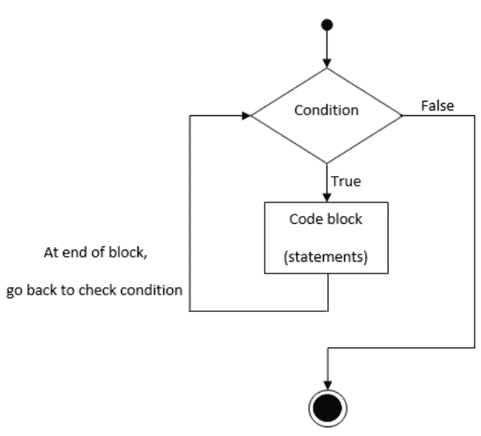

在许多其他语言中，while循环还有一个轻微的变体，即do ... while循环，其中代码块至少执行一次（第一次迭代），然后检查条件（换句话说，你先做一些事情，然后检查while循环条件以确定是否继续以及还要循环多少次。）然而，Python没有do...while循环。但你当然可以通过组合不同的初始化和语句来尝试模拟这种行为，这留给你自己作为练习去想象。如果你到此时仍然觉得这个练习有挑战性，也许你可以阅读下面的for循环部分，然后再回来完成这个练习。随着对各种循环机制的更多经验积累，到那时希望这个练习对你来说只是小菜一碟。

### for 循环

Python确实有一个for循环，可以像while循环一样用于代码逻辑中的重复。有些情况下一个比另一个更合适，但个人偏好也起着作用。随着你获得更多的编码经验，你可能会在不同的情况下形成自己偏好使用其中一个的习惯。

那么for循环：首先，明显的区别在于语法。通过检查下面的流程图应该会变得清晰：

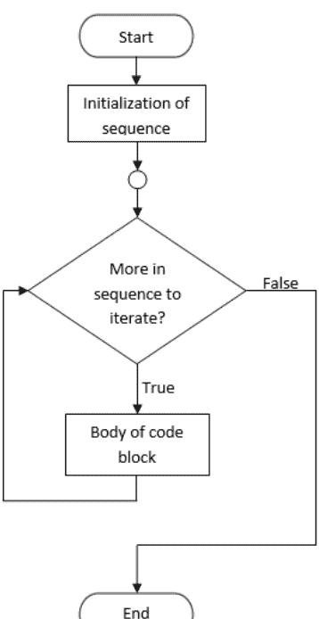

所以你会发现语法是不同的，正如我们将在下面的例子中看到的那样。但Python的for循环也不同于许多其他语言，因为我们的流程图中没有循环计数器。因为Python的for循环更像面向对象编程语言中的迭代器，它遍历某个序列，例如我们之前使用的字符串和列表。让我们看一些for循环的例子来更清楚地理解：

```
>>> myString = 'spam and egg'
>>> for c in myString :
...     print(c)
...
s
p
a
m

a
n
d

e
g
g
>>> myList = ['spam', 'egg', 'ham']
>>> for ob in myList :
...     print(ob)
...
spam
egg
ham
>>>
```

如你所见，在第一个例子中，for循环遍历字符串的字符；而在第二个例子中，它遍历一个项目/对象的列表。我们下面还有一个例子，演示如何使用for循环来计算字符串中的字符数，并得到与使用函数len()获取字符串长度相同的结果：

```
>>> myString = 'spam'
>>> len(myString)
4
>>> count = 0
>>> for letter in myString :
...     count = count + 1
...
>>> count
4
>>>
```

所以现在你知道len()在Python中可能是如何实现的了。让我们继续看看Python（以及许多其他语言）中处理循环流程的一些特定命令。

### break 语句

break语句用于退出循环，如下例所示：

```
>>> while True :
...     inputLine = input()
...     if inputLine == 'exit' :
...         break
...     print(inputLine)
...
This is to test break statement
This is to test break statement
Here comes another line of input
Here comes another line of input
Although the while True gives us an infinite loop
Although the while True gives us an infinite loop
We use break to end the loop
We use break to end the loop
exit
>>>
```

所以在这个例子中，我们有一个使用while True的无限循环，留在循环中的条件总是True。那么我们如何结束这个循环呢？我们检查用户输入是否为“exit”，如果是这种情况，我们执行break来跳出循环。如上例所示，每一行输入都被print()语句重复，直到我们输入“exit”。

### continue 语句

我们现在已经看到了break语句及其工作原理。另一方面，我们有一个continue语句，它也会改变重复的流程。当遇到continue语句时，执行流程将跳转到当前迭代的末尾，这可能是也可能不是循环的最后一次迭代。让我们看下面的例子，continue语句的用法就会变得清晰：

### 无限循环

如你所见，当输入行以 `#` 号开头时，我们使用 `continue` 语句“跳”到当前迭代的末尾，从而跳过 `print()` 语句。否则，根据代码逻辑，每一行输入都会被重复打印出来。

```python
>>> while True :
...     inputLine = input()
...     if inputLine == 'exit' :
...         break
...     if inputLine[0] == '#' :
...         continue
...     print(inputLine)
...
So here we have added another if statement
So here we have added another if statement
to check if the inputLine starts with the # sign
to check if the inputLine starts with the # sign
to signify that this line is a comment
to signify that this line is a comment
# thus we will not print this line
but all others are printed
but all others are printed
exit
>>>
```

我们已经看过一些涉及无限循环的例子，比如使用 `while True` 的那些。在其中，由于 `while` 循环的条件始终为 `True`（`True` 当然总是被求值为 `True`），它就是一个无限循环；我们还看到了如何使用 `break` 语句来结束循环。然而，在编码实践中，有时会犯一些逻辑错误，导致无意的无限循环，从而在运行时产生不停执行的情况。请看下面的例子：

```python
>>> 
>>> counter = 0
>>> while counter != 5 :
...     counter = counter + 2
...
Traceback (most recent call last):
  File "<stdin>", line 2, in <module>
KeyboardInterrupt
>>> 
>>> counter = 10
>>> while counter > 0 :
...     counter = counter + 1
...
Traceback (most recent call last):
  File "<stdin>", line 2, in <module>
KeyboardInterrupt
>>> 
```

在第一个例子中，我们有一些不良的编码实践。我们在 `while` 条件中使用了 `!=`，并且计数器在每次迭代中增加 2。因此，计数器永远不会等于 5。事实上，计数器从 0 变到 2、4，然后是 6、8……所以这是一个永远不会结束的无限循环。为了退出，我们必须使用 `Ctrl-c`（同时按住 Control 键并按下 c 键），从而显示 `Traceback` 消息，表明发生了键盘中断。

在第二个例子中，我们使用了 `>` 运算符，但存在一些编码逻辑错误：我们在每次迭代中将计数器增加 1，但循环的条件是“`counter > 0`”；因此计数器将始终大于 0，从而再次形成无限循环。

所以你可以从这些例子中看到，每次我们都需要使用 `CTRL-c` 键盘中断来跳出循环，否则循环显然会永远进行下去。这些只是许多可能形成无意无限循环的情况中的几个例子，因此在运行时它会成为一个挂起的进程，因为它只是永远循环。

### 搜索

好了，关于无限循环就讲到这里，现在让我们看看我们使用循环的目的。一个常见的应用是搜索。例如，我们可能想要搜索一个字符串并找出某个特定字符出现的次数。我们可能还想要遍历一个列表并找到特定的项目，或者多个项目，如下例所示：

```python
>>>
>>> myString = 'spam, egg, and ham'
>>> strLen = len(myString)
>>> strLen
18
>>> i = 0 # index into myString
>>> charCount = 0 # counter of a specific character occurrence
>>>
>>> while i < strLen :
...     if myString[i] == 'a' :
...         charCount += 1
...     i += 1
...
>>> charCount
3
>>>
>>> myList = ['spam', 'egg', 'ham', 'pasta', 'ramen', 'noodles']
>>> len(myList)
6
>>> for item in myList :
...     if item == 'spam' or item == 'egg' :
...         print(item)
...
spam
egg
>>>
```

在第一个例子中，我们使用 `while` 循环在字符串中搜索字符 ‘a’ 并计算其出现次数。

在第二个例子中，我们通过 `for` 循环遍历一个列表，搜索 ‘spam’ 和 ‘egg’，并在找到时打印出来。这里有一个小细节：我们使用了 `+=` 运算符（我们在前一章见过），例如在 `charCount += 1` 语句中，而不是使用经典的 `charCount = charCount + 1`。（随着你编码越来越熟练，你可能更倾向于使用这些简写形式。但两种方式都可以。）

### 计数

在前面搜索字符串中字符的例子中，我们也计算了出现次数，因此展示了如何使用 `while` 循环进行计数。我们也可以遍历一个列表并计算项目数量，如下例所示：

```python
>>>
>>> myList = ['spam', 'egg', 'ham', 'pasta', 'ramen', 'noodle']
>>> len(myList)
6
>>> count = 0
>>> for item in myList :
...     count += 1
...
>>> count
6
>>>
```

在这个例子中，我们展示了列表项目的计数是 6，就像函数 `len(myList)` 所显示的那样。

### 最大值/最小值

我们还想演示使用循环遍历数字列表以找到最大值/最小值，如下例所示：

```python
>>> import math
>>> listOfNumbers = [2, 10, 31, 5, -4, -18, 9, 25]
>>> maxNumber = -math.inf # make max the very smallest
>>>                     # as negative infinity
>>> for numberItem in listOfNumbers :
...     if numberItem > maxNumber :
...         maxNumber = numberItem
...
>>> maxNumber
31
>>> minNumber = math.inf # make min the very largest
>>>                     # as infinity
>>> for numberItem in listOfNumbers :
...     if numberItem < minNumber :
...         minNumber = numberItem
...
>>> minNumber
-18
>>>
```

从这两个例子（一个用于找到数字列表中的最大数，另一个用于找到最小数）中，我们使用了数学库的无穷大，即 `math.inf`，来为我们提供可能的最大数字，而 `-math.inf` 用于可能的最小数字。逻辑非常简单：首先将绝对最小的数字赋值给 `maxNumber`，然后在遍历数字列表时，如果某个数字项大于当前的 `maxNumber`，就用它替换 `maxNumber`；至于最小值，我们首先将绝对最大的数字赋值给 `minNumber`，然后在遍历列表时用更小的数字项替换它。结果显示结果符合预期。

### 练习：

7.1 编写一个程序，提示用户输入数字，直到用户输入“done”。用户完成后，显示数字的个数、总和以及平均值。

7.2 如果你使用了 `while` 循环，现在尝试使用 `for` 循环来解决与第 1 题相同的问题；但如果你使用了 `for` 循环，现在尝试切换到 `while` 循环。

7.3 编写一个程序，提示用户输入并将它们放入一个列表。一旦用户输入“done”，显示这些数字的最大值和最小值。

7.4 如果你使用了 `while` 循环，现在尝试使用 `for` 循环来解决与第 3 题相同的问题；但如果你使用了 `for` 循环，现在尝试切换到 `while` 循环。

7.5 定义一个包含 12 个月份作为元素的列表，即 `myList = ["January" , "February", ...]`，遍历该列表并使用索引和元素显示以下内容：

- January is the #1 month in a year
- February is the #2 month in a year
- ...

7.6 假设你有一个包含同学姓名的列表 `['Jesse', 'Adam', 'Alice', 'Bob', 'Cindy', 'Frank', 'George']`。现在

- a. 编写一个循环，将每个姓名单独打印在一行上
- b. 编写一个循环，为每个姓名添加问候语，如“Hi Jesse, how are you doing today?”

7.7 天气监测站全天每小时获得以下温度读数，并将信息发送给用户：

57, 57, 56, 56, 55, 56, 57, 57, 57, 58, 58, 59, 61, 63, 66, 67, 68, 68, 68, 67, 64, 61, 59, 58

编写一个循环，从凌晨 1 点开始显示每小时的小时和温度，并在最后显示当天的平均温度。

7.8 编写一个 `for` 循环，列出英文字母表的 26 个字母，用逗号分隔，但在同一行上。

7.9 编写一个函数，使得有两个列表。第一个列表包含从 1 到 26 的数字，第二个列表包含英文字母。然后遍历两个列表，将它们在各自列表中的元素一一配对，并将这些配对插入第三个列表（即 `[[1, 'a'], [2, 'b'], [3, 'c']...]`）并显示。

7.10 遍历列表 `['spam', 'egg', 'ham', 'spam and egg', 'spam and egg and ham']`，并将每个元素的长度插入另一个列表以显示。

7.11 编写一个计算器，执行用户输入的涉及 `+` 和 `–` 的简单算术运算。例如 `4+7` 或 `1+8-6` ...

注意，从用户输入是作为字符串获取的，你需要遍历字符串的所有字符以获取数字以及运算符（`+` 或 `-`），以便执行计算。

7.12 编写一个程序，向列表中的每位学生打印问候语。最后还要显示被问候的学生总数。

```python
Students = ["Jane", "Jesse", "Judy", "Julian", "James", "Jack", "Jacob"]
```

## 第8章 函数

### 定义和使用函数

函数在许多编程语言中都有使用。在不同的语言中，它可能被称为子程序、过程或其他名称，但其作用大同小异。函数执行特定的任务，并且可能会也可能不会向调用它的代码返回一个值。因此，在编程时，我们可能需要某些功能，而这些功能可能已经存在于某个库（模块）中，或者Python已经为我们内置了，比如我们已经多次使用的`len()`函数调用；又或者，某些功能需要在代码的多个地方使用，与其一遍又一遍地重复相同的语句组，我们不如将其编写为一个函数，这样就可以多次调用它。

这种编码方式是计算机编程语言的基础。其概念是将这些“构建块”编码，这与建筑施工非常相似，以便我们可以用它们来构建更复杂的结构。在计算机科学中，这种技术源于“分而治之”，即简单的任务在不同的函数中完成，然后可以在更复杂的函数代码中调用它们——这几乎是一种分层的方法，逐步构建软件的复杂性。但在每个这样的函数中，一旦构建完成，我们就不需要关心其实现细节。我们只需将其视为可以在更大架构中使用的组件。

那么我们如何定义函数呢？它以关键字`def`开头，后跟函数名。函数名在某种程度上就像任何变量名，因为函数和变量一样，可以被求值为某个值，我们稍后会看到。同样像变量名一样，我们不应该使用保留关键字作为函数名（Python会允许你使用它们，但你将不得不处理意想不到且通常不希望的结果——所以最好安全起见，避免使用它们。）当然，为了让代码对读者（包括你自己）清晰明了，每个名称都应该是唯一的，并且尽可能有意义，从而实现自文档化。

在关键字`def`和函数名之后，我们有一对括号`()`。括号内可以有一个或多个参数，这些参数是我们传递给函数以在函数体语句中使用的值。所有这些构成了函数的头部，并以冒号`:`结尾。在下一行，通过缩进，开始函数体，我们在其中真正定义函数应如何执行。

让我们看一些例子：

```
>>>
>>> import math
>>>
>>> def myMax ( inList ) :
...     maxItem = -math.inf
...     for item in inList :
...         if item > maxItem :
...             maxItem = item
...     return maxItem
...
>>>
>>> myMax ( [2, 10, 31, 5, -4, -18, 9, 25] )
31
>>>
>>> def myMin ( inList ) :
...     minItem = math.inf
...     for item in inList :
...         if item < minItem :
...             minItem = item
...     return minItem
...
>>> myMin ( [2, 10, 31, 5, -4, -18, 9, 25] )
-18
>>>
```

如你所见，我们首先导入了`math`模块——如果你在同一个Python会话中，并且之前已经导入了`math`模块，那么你就不需要再次这样做。我们这样做只是为了明确，即使我们在同一个会话中之前已经导入过，Python也不会报错。

因此，在示例中，我们定义了`myMax()`函数来查找列表中的最大项。这与我们之前所做的非常相似，只是现在我们将其编码为一个函数，函数的返回值就是我们从作为参数传入函数的列表中得到的最大项。类似地，`myMin()`返回传入列表中的最小项。结果当然与我们在前面示例中得到的结果完全相同。

### 参数/实参

在我们刚刚创建的两个函数中，我们接收一个项目列表来进行处理。让我们用`myMax()`来说明：在函数头部，变量`inList`是这个单参数函数的参数；而当我们后来用语句`myMax ( [2, 10, 31, 5, -4, -18, 9, 25] )`调用该函数时，整个项目列表被视为函数调用的实参。看到这两个术语互换使用可能会引起混淆，但区别实际上基于你从哪个角度看待这个变量：如果你从函数的角度看，它是一个单参数函数，参数名为`inList`；而如果你从调用语句的角度看，它是用项目列表作为函数的实参来调用函数`myMax()`。

### 按值传递/按引用传递？

现在我们看到了如何将实参作为参数传递给函数，我们想更详细地了解它们是如何传递的。

在许多编程语言中，当调用函数时，有两种不同的传递实参的方式：按值传递，或按引用传递（有时称为按值调用，或按引用调用。）它们之间有什么区别？在按值调用中，实参的值被复制到函数的参数中——因此对参数所做的任何操作都不会影响调用者中变量的值。而在按引用调用的情况下，调用者的实参值可能会在被调用者（被调用的函数）中被修改，因为被调用函数拥有实参的直接引用（句柄）。（本段描述了多种编程语言的函数调用复杂性，与下一段描述Python中使用的非常不同的机制形成对比。）

在Python世界中，调用函数被称为按对象引用调用。因此，如果实参是数字、字符串或不可变的东西，那么对象的值就不能被修改（所以在某种意义上类似于按值调用，因为实参对象的值没有改变。）然而，如果实参是可修改（可变）对象，那么效果就像按引用调用，因为调用者函数中的实参值可以在被调用者函数中被修改。

所以让我们看两个例子来演示Python如何处理按值调用与按引用调用，或者更准确地说，Python的按对象引用调用是如何工作的：

```
>>> # 按值调用效果演示
>>> myString = 'spam, egg'
>>> def passString (inString) :
...     inString = 'spam, egg, ham'
...     print( '在函数调用中: ', inString )
...
>>> # 调用 passString()
>>> passString(myString)
在函数调用中:  spam, egg, ham
>>>
>>> # myString 的值未改变
>>> myString
'spam, egg'
>>>
>>> # 按引用调用效果演示
>>> myList = ['spam', 'egg']
>>> def passList (inList) :
...     inList.append('ham')
...     print( '在函数调用中: ', inList )
...
>>> # 调用 passList()
>>> passList(myList)
在函数调用中:  ['spam', 'egg', 'ham']
>>>
>>> # myList 的值被修改了
>>> myList
['spam', 'egg', 'ham']
>>>
```

所以我们看到，在第一个例子中，使用了一个字符串字面量作为实参。由于字符串字面量是不可变的，因此当它被传递给函数`passString()`时，它的值被复制（用面向对象的术语来说，创建了一个新实例），并在函数内部被修改（这里我们只打印了修改后的值——但作为练习，你当然可以在修改前添加一个`print`语句来查看传入的值。）但原始的实参值没有改变（因为它不可变，所以无法修改。）而在第二个例子中，使用了一个列表作为实参。列表在Python中是可变的，因此当它作为对象引用传递给函数`passList()`时，原始副本被用于`append()`操作，因此值如所见被修改了。

所以就是这样。我们刚刚研究了将变量从调用者传递给被调用者的细节。但在我们刚刚涵盖的内容中，涉及了一个有趣的概念——在被调用的函数内部创建了字符串字面量对象的一个副本。并且函数`passString()`中的局部变量`inString`在`print()`语句中被使用。所以现在让我们深入探讨变量作用域，然后是局部变量与全局变量。

### 作用域

变量的作用域是什么？变量的作用域是变量可以被访问或有效的地方。就像在前面的例子中，字符串字面量不可修改，因此创建了一个局部副本，然后被修改。因此，这个局部副本的作用域仅限于函数`passString()`内部。另一方面，当我们修改`myList`的值时，虽然我们使用了变量`inList`，但它是变量`myList`的一个对象引用，因此我们能够访问这个位于函数`passList()`局部作用域之外的变量。有了这个区别，我们准备在下一节中进一步探讨局部变量与全局变量。

### 局部/全局变量

什么是局部变量？如上一节所示，局部变量的作用域仅限于定义它的函数内部——尽管在前面的例子中，它并没有真正显式声明，但我们现在将看一些显式使用局部变量与全局变量的例子：

### 函数的求值

既然我们已经对函数有了基本的了解，现在让我们看看当函数在表达式中被使用（调用）时是如何求值的，例如下面这个例子：

```python
>>> import math
>>> def myMax ( inList ) :
...     maxItem = -math.inf
...     for item in inList :
...         if item > maxItem :
...             maxItem = item
...     return maxItem
...
>>> largest = myMax ( [2, 10, 31, 5, -4, -18, 9, 25] )
>>> largest
31
>>> myMax ( [2, 10, 31, 5, -4, -18, 9, 25] )
31
>>>
```

我们之前用这个例子来说明，在这个调用中，`myMax()` 会返回最大的项 31，正如最后所示。我们也在赋值语句 `largest = myMax ( [2, 10, 31, 4, -4, -18, 9, 25] )` 中使用了这个 `myMax()` 调用——在其中，当使用 `myMax()` 时，它通过调用函数来求值，函数的返回值被用作求值结果。然后，如示例所示，求值结果 31 被赋值给变量 `largest`。

这种方式与函数在数学世界中的使用方式非常相似，我们对此都非常习惯。不过稍后，我们将展示另一种类型的函数，称为无返回值函数（void functions），它们不返回任何东西。

### 内置函数

Python 有一系列内置函数。其中一些我们已经见过，例如我们使用过几次的 `len()` 函数。还有 `max()` 和 `min()` 函数——如下例所示：

```python
>>> max([2, 10, 31, 5, -4, -18, 9, 25])
31
>>> listOfNumbers = [2, 10, 31, 5, -4, -18, 9, 25]
>>> max(listOfNumbers)
31
>>> min(listOfNumbers)
-18
>>>
```

在这些例子中，我们使用 `max()` 和 `min()` 实现了与之前使用循环机制遍历数字列表相同的结果。（事实上，这些内置函数很可能比我们的循环代码性能更好，因为 Python 可以对它们进行更好的优化，毕竟它们是内置的。至少，它们让我们的编码更快、更简单——因此，在适当的时候，没有必要重新发明轮子。）

### 导入库/模块/包

Python 中还有许多现成的库/模块/包可供我们使用。我们之前已经看到一些使用 `math` 模块的例子。现在，让我们使用它的一些函数：

```python
>>> import math
>>> math
<module 'math' (built-in)>
>>> math.pi
3.141592653589793
>>> math.pow(4,2)
16.0
>>> math.pow(4,4)
256.0
>>> math.sqrt(256)
16.0
>>> math.sqrt(16)
4.0
>>>
```

所以你看，我们首先导入了 `math` 模块（有时也称为库——基本上是包含相关函数的文件或文件集合），然后为了展示它是什么，我们显示了 `math` 是什么，以及 `math.pi` 是什么。接着我们调用了两次 `pow()` 函数，将调用中的第一个参数提升到第二个参数的幂，然后调用 `sqrt()` 函数来获取平方根。

同时你看到这些数学函数是在浮点数世界中运行的。你可能希望看到它们作为整数；为此，我们可以调用类型转换函数 `int()`，如下例所示：

```python
>>> math.pow(4,2)
16.0
>>> int(math.pow(4,2))
16
>>> myInt = int(math.pow(4,2))
>>> myInt
16
>>>
```

所以在上面的例子中，我们展示了 `math.pow()` 返回浮点数结果。然后我们使用 `int()` 将结果转换（强制转换）为整数，当我们把结果赋值给变量时，它当然显示的是整数值。

事实上，我们在输入/输出章节中已经使用过强制转换函数 `int()`。Python 中还有许多其他类型转换函数可用。所以它们已经是内置的（当然，它们大部分是用 Python 编写的），就像我们可以用 Python 代码构建的许多函数一样。

### 函数作为构建块

函数在某种程度上是一种分支技术，因为它将代码执行从正常流程中带出，“跳转”到函数定义的代码段。但函数还有另一个好处（双关语），即将其功能封装在一个代码块中，以便以后使用——通常是在多个场合。这些场合可能只是代码中一个简单的函数调用，也可能是由其他函数调用——毕竟，你可以将整个应用程序的代码视为最高级别的函数，并且可能存在多层函数形成抽象层次结构，这样在层次结构的每一层，编码者只需要关心当前正在处理的函数，而无需担心任何其他底层函数的细节——本质上将所有其他函数视为某种黑盒。

这是一个非常重要的设计哲学，即将一个复杂的任务分解成更小的块，有时是小得多的块，这些块在编码过程中以及后来阅读代码的读者看来都更简单、更易于管理。

此外，在许多方面，编程语言中的函数与我们之前提到的数学世界中的函数非常相似。这些函数中的每一个，当被调用时，都会被执行，如果有返回值，返回值就是函数求值的结果——就像在数学世界中一样。以下是一些更多的例子来说明这一点：

```python
>>> x = 1 #全局变量
>>> def referToLocal() :
...     x = 11
...     print('在 referToLocal() 中时局部 x 的值: ', x)
...     x+=1
...     print('在本地修改后局部 x 的值: ', x)
...
>>> referToLocal()
在 referToLocal() 中时局部 x 的值:  11
在本地修改后局部 x 的值:  12
>>> #检查全局 x，看其值是否改变
>>> x
1
>>> def referToGlobal() :
...     global x
...     print('在 referToGlobal() 中时全局 x 的值: ', x)
...     x+=1
...     print('修改后全局 x 的值: ', x)
...
>>> referToGlobal()
在 referToGlobal() 中时全局 x 的值:  1
修改后全局 x 的值:  2
>>> #现在看到全局 x 的值改变了
>>> x
2
>>>
```

所以在例子中，我们看到全局 `x` 被初始化为 1。然后我们有函数 `referToLocal()`，其中有一个局部变量 `x` 被初始化为 11。然后我们修改了局部变量 `x` 的值，并显示该值已更改。在这个对 `referToLocal()` 的函数调用之后，我们显示全局变量 `x` 保持在相同的值 1。然后我们看到在 Python 中，我们如何在函数 `referToGlobal()` 的局部作用域内引用全局变量 `x`，通过使用关键字 `global` 并声明当我们引用它时，我们的意图是使用全局变量 `x`。接着我们对 `x` 进行了修改，并显示该值在函数内部已更改。但当我们退出函数后，我们显示全局变量 `x` 的值确实如我们所料地改变了。所以在 Python 中，我们引用全局变量的方式是显式的，具有不产生歧义的优点，因为当我们在局部作用域内时，必须明确声明使用全局变量的意图——这与 C++ 或 Java 等语言非常不同。

还有一些有趣（或令人困惑）的作用域情况，正如你在以下示例中看到的：

```python
>>> x = 1
>>> def foo() :
...     x = 2
...     print('在 foo() 内部，使用局部 x: ', x)
...
>>> foo()
在 foo() 内部，使用局部 x:  2
>>> def foo() :
...     print('在 foo() 内部，但使用全局 x: ', x)
...
>>> foo()
在 foo() 内部，但使用全局 x:  1
>>> # 到目前为止如预期，尽管我们在上面第二个例子中引用了全局 x
>>> # 但 Python 能够让它工作
>>> # 现在我们将展示 Python 报错
>>> # 因为 x 的作用域混淆了
>>> x = 1 # 只是再次这样做，
>>>     # 尽管在此会话中不需要
>>> def foo() :
...     print('在 foo() 内部，但我们使用的是哪个 x？ ',x)
...     x = 2 # 这里 Python 看到声明了一个局部变量 x
...         # 但 x 已经在前面一行使用了
...         # 那是全局 x 吗？
...         # Python 并不喜欢这样
...
>>> foo()
Traceback (most recent call last):
  File "<stdin>", line 1, in <module>
  File "<stdin>", line 2, in foo
UnboundLocalError: local variable 'x' referenced before assignment
```

```python
>>> # 所以如预期，Python 报错了
>>> # 我们现在回到之前使用的技术
>>> # - 表明我们想使用全局 x
>>>
>>> def foo() :
...     global x
...     print('在 foo() 内部，这次明确使用全局 x: ', x)
...     x += 1
...
>>> foo()
在 foo() 内部，这次明确使用全局 x:  1
>>> x
2
>>> # 全局 x 也增加了 1
>>> # - 通过 foo() 内部的最后一条语句
>>>
```

正如示例注释中所指出的，当引用的是全局变量，但又声明了一个同名的局部变量时，Python 不喜欢这样——正如上面调用 `foo()` 时显示的错误。

因此，一个避免这类混淆的好做法——因为这常常会导致编程错误——是使用不同的变量名，这样就没有空间让这些问题潜入。此外，如果可以的话，在结构化的软件工程世界中，全局变量可能不是最好的选择，因此如果你发现需要使用一些全局变量，也许是时候思考你的软件架构，看看是否可以改进结构，使其更好地组件化（意味着可以构建到某个组件/函数中）并在未来重用。可能存在全局变量合理的情况，你可能不得不接受它；但不要过早放弃——花些努力尝试避免它们。

### 空函数（与数学函数的差异）

然而，正如本节标题所示，在包括 Python 在内的许多编程语言中，存在一个名为“空函数”的概念。这些函数不返回值，因此如果需要求值，它们求值结果为空，被称为“空函数”，因为其返回值被认为是“空”的，而 Python 有一个特殊的对象 `None` 来表示这一点，如下图所示：

```python
>>> def myPy() :
...     print('Spam and eggs')
...
>>> myPy()
Spam and eggs
>>> print(myPy())
Spam and eggs
None
```

所以你看，我们将 `my.py` 脚本重新封装成了一个函数 `myPy()`，它只显示一行文本，没有任何返回值。然后我们执行了该函数。最后，我们使用 `print(myPy())` 来显示 `myPy()` 的值。结果是 `print()` 调用后的两行。首先，当 `myPy()` 执行时显示了 'Spam and eggs' 这一行，然后显示了 `None` 作为 `myPy()` 的值，这表明 `myPy()` 没有值，因为它不返回任何值，或者它返回 `None`。

既然我们已经了解了函数调用的用法，让我们更深入地探讨一下函数调用是如何构建和实现的——作为我们进入更多编码世界的进阶知识——尽管本书面向的是刚开始探索编码的读者，但为将来深入编程和软件工程领域多做一点准备也无妨。

### 调用栈

所以在本节中，我们的标题是“调用栈”。它是什么？为什么我们需要它并想讨论它？所以，以防你还没有开始思考，当一个函数调用被发起并执行时，处理流程会被改变以运行被调用函数中的语句。但是当函数执行完成后，我们需要返回到调用者。然而，计算机如何知道返回到哪里以及这是如何实现的呢？如果这听起来不太复杂，那么如果我们有一系列函数调用呢？例如，假设在 `main()` 中我们调用了 `spam()`，然后 `spam()` 调用了 `egg()`，接着 `egg()` 调用了 `ham()`？

事实证明，在计算机科学领域，我们有某种叫做“调用栈”的东西来管理这个。我们有以下图表来展示它的工作原理：（左侧是代码；右侧是调用栈）

```python
def ham():
    print('in ham()-beginning')
    print('in ham()-ending')

def egg():
    print('in egg()-beginning')
    print('in egg()-ending')

def spam():
    print('in spam()-beginning')
    egg()
    ham()
    print('in spam()-ending')

def main(): # not the required way to start in Python
    #although it is required in many other languages
    print('in main()-beginning')
    spam()
    print('in main()-ending')

main()
```

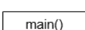

所以一开始，执行从 `main()` 开始，调用栈只有一个栈帧，其中包含 `main()`，如上图所示。这样，当执行流程因函数调用 `spam()` 而改变，并在 `spam()` 完成后返回时，我们可以恢复 `main()` 的上下文——例如，我们知道要返回到 `main()` 中的哪个位置——在这种情况下，是在 `spam()` 行之后，但在 `print('in main()-ending')` 语句之前。（调用栈还处理其他事情，但我们将留到你 Python 学习之旅中更高级的阶段。）所以在 `main()` 中的第一个 `print()` 语句之后，我们要调用 `spam()`，因此我们需要一个对应的 `spam()` 栈帧——如下所示：（在此图中，我们忽略了 `print`，尽管它也是一个函数调用）

```python
def ham():
    print('in ham()-beginning')
    print('in ham()-ending')

def egg():
    print('in egg()-beginning')
    print('in egg()-ending')

def spam():
    print('in spam()-beginning')
    egg()
    ham()
    print('in spam()-ending')

def main(): # not the required way to start in Python
    # although it is required in many other languages
    print('in main()-beginning')
    spam()
    print('in main()-ending')

main()
```

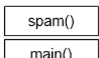

然后在 `spam()` 中，我们要调用 `egg()`，所以我们需要一个 `egg()` 的栈帧，如下所示：

```python
def ham():
    print('in ham()-beginning')
    print('in ham()-ending')

def egg():
    print('in egg()-beginning')
    print('in egg()-ending')

def spam():
    print('in spam()-beginning')
    egg()
    ham()
    print('in spam()-ending')

def main(): # not the required way to start in Python
    # although it is required in many other languages
    print('in main()-beginning')
    spam()
    print('in main()-ending')

main()
```

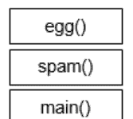

`egg()` 完成并返回到 `spam()` 后，`egg()` 栈帧从调用栈顶部移除。然后我们继续调用 `ham()`，因此一个 `ham()` 栈帧被压入调用栈顶部，如下图所示：

```python
def ham():
    print('in ham()-beginning')
    print('in ham()-ending')

def egg():
    print('in egg()-beginning')
    print('in egg()-ending')

def spam():
    print('in spam()-beginning')
    egg()
    ham()
    print('in spam()-ending')

def main() : # not the required way to start in Python
    # although it is required in many other languages
    print('in main()-beginning')
    spam()
    print('in main()-ending')

main()
```

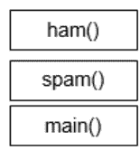

然后在 `ham()` 完成后，它的栈帧从调用栈中弹出，执行流程返回到 `spam()` 中 `print('in spam()-ending')` 语句之前的位置。

此后，函数 `spam()` 完成，我们返回到 `main()` 中调用 `spam()` 之后的位置，如下所示：

```python
def ham() :
    print('in ham()-beginning')
    print('in ham()-ending')

def egg() :
    print('in egg()-beginning')
    print('in egg()-ending')

def spam() :
    print('in spam()-beginning')
    egg()
    ham()
    print('in spam()-ending')

def main() : # not the required way to start in Python
    # although it is required in many other languages
    print('in main()-beginning')
    spam()
    print('in main()-ending')

main()
```


从这里开始，它继续完成整个代码。

所以，简而言之，这就是调用栈如何用于管理函数调用执行流程，以及（在本书范围之外没有太多细节）管理调用上下文的。这里超越调用栈实现的重要概念是，在计算机编码中，我们使用分而治之的技术将复杂任务分解成更小的部分（如果需要，还可以分解成更多层的这些小部分）。函数是利用这种分而治之技术构建抽象层的基石，通过分而治之，将复杂任务分解成更小、更易于管理的代码块，从而使编码更容易，有时甚至成为可能，并产生更高质量、更健壮的软件应用程序。

### 练习：

- 8.1 编写一个函数，该函数接受一个字符串作为参数，并返回反转（倒序）后的字符串。
- 8.2 编写一个函数，该函数接受一个整数，并返回该整数各位数字组成的列表。
- 8.3 编写 `myLen()` 函数来模拟字符串的 `len()` 函数功能。因此 `myLen()` 将接受一个字符串对象作为参数，遍历字符串以计算其中的字符数，然后返回计数值。
- 8.4 编写一个函数，该函数接受一个字符串和一个字符作为参数。遍历字符串以找到给定字符并返回该字符出现的次数。
- 8.5 编写一个小费计算器，该计算器接受账单金额和小费百分比作为输入，例如 `tipCalc( 35.66, 0.15)` 表示总金额为 35.66，小费为 15%。该函数将返回最终支付金额。

### 8.6 编写一个成绩转换函数，该函数接收分数并根据下表返回对应的字母等级

| 分数 | 等级 |
|---|---|
| >= 90 | A |
| >= 80 到 < 90 | B |
| >= 70 到 < 80 | C |
| >= 60 到 < 70 | D |
| < 60 | F |

### 8.7 编写一个函数，给定一个字符串，将其中的某个字符（例如 x）替换为新字符（例如 y）。例如：replaceLetter (myString, 'x', 'y')

### 8.8 实现一个用于两个整数相加的函数。该函数将接收两个整数参数并返回它们的和。

### 8.9 编写一个函数 myMin()，接收一个整数列表并返回列表中的最小整数。

### 8.10 编写一个函数 reverseList，接收一个列表并返回反转后的列表。

### 8.11 编写一个函数 appendList，将一个项目追加到列表末尾。该函数的两个参数是列表和要追加的项目。

### 8.12 编写一个函数 insertList，将一个项目插入列表中。该函数的三个参数是列表、要插入的项目以及插入位置。

## 第9章 递归

在前面的章节中，我们学习了重复/循环（也常被称为迭代）以及函数（调用）。现在，我们将探讨一个非常有趣的概念——递归，作为迭代的一种替代技术。这是在编码特定解决方案时，算法设计中非常有用的一项技术。这里我们也引入了“算法”这个术语。什么是算法？它是使用特定解决方案来解决特定问题的设计。它规定了一组用于解决问题的指令。当我们在算法中使用迭代时，我们总是可以使用循环，因此递归并非必需。但在某些情况下，使用递归会容易得多。我们稍后将在示例中看到这一点。

### 递归的概念

但首先，让我们了解一下递归的概念。首先，一个递归函数会直接或间接地调用自身。例如，在函数 myFunc() 内部，可能会有一个对 myFunc() 的函数调用；或者可能有另一个函数 myFuncToo() 在 myFunc() 内部被调用，然后在 myFuncToo() 中又有一个对 myFunc() 的调用。因此，从某种意义上说，函数调用以某种方式形成了一个循环，无论是通过调用自身还是通过某些中间函数。为了说明递归，我们将只关注函数调用自身的情况。其思想是，如果在递归调用过程中，问题可以通过每次迭代被“缩减”或“分解”为一个更小的问题，并且最终问题被缩减到一个基本情况，此时答案非常明显，因此不再需要额外的递归调用，那么这个问题就可以用递归来解决。这个描述可能有点令人困惑，但让我们看看下面的例子，应该会变得更清楚。这些例子也让我们能够比较循环解决方案与递归解决方案。

假设我们只想打印出数字的倒计时。那么一个使用循环迭代的函数 loopingCountDown( x ) 将打印出数字 x, x-1, ... , 1；而一个使用递归迭代的函数 recursiveCountDown( x ) 将打印出相同的数字序列，如下所示：

```
>>> 
>>> counter = 5
>>> def loopingCountDown ( counter ) :
...     while( counter > 0 ) :
...         print( counter )
...         counter -= 1
...
>>> 
>>> loopingCountDown( 5 )
5
4
3
2
1
>>>
```

```
>>> def recursiveCountDown ( counter ) :
...     if counter > 0 :
...         print( counter )
...         counter -= 1
...         recursiveCountDown ( counter )
...
>>> recursiveCountDown( 5 )
5
4
3
2
1
>>>
```

这说明了使用循环迭代与递归迭代的概念。现在我们准备探讨一些使用递归可能更容易解决的问题。

### 阶乘计算

我们将分别介绍使用循环代码和递归来解决阶乘计算。我们知道，阶乘基本上是将我们手头的数字与它下面的所有数字相乘，直到1。因此，factorial(x) 是 x 乘以 x-1，然后乘以 x-2，一直乘到1的结果——即 x! = x*(x-1)*(x-2)...3*2*1（x! 是 x 阶乘的数学符号）。

这里一个有趣的观察是，factorial(x) 就是 x*factorial(x-1)，这构成了我们递归迭代的基础，其基本情况是 factorial(1)，结果就是1。

以下是使用循环与递归两种方式的代码示例：

```
>>> x = 5
>>> def loopingFactorial( x ) :
...     fac = 1
...     while( x > 0 ) :
...         fac = fac * x
...         x -= 1
...     return fac
...
>>> res = loopingFactorial(5)
>>> res
120
>>>
```

```
>>> def recursiveFactorial( x ) :
...     if(x == 1) :
...         return 1
...     else :
...         return x * recursiveFactorial(x - 1)
...
>>> res = recursiveFactorial(5)
>>> res
120
>>>
```

以上就是用两种方式实现的阶乘计算。如你所见，一旦认识到基本情况是1，并且每次递归调用都将问题缩减1（即每次迭代从 x 变为 x-1），可以说编写递归解决方案更简单。

现在，如果我们更深入地分析递归阶乘计算函数，根据阶乘的定义，我们知道 0! 是1，1! 也是1。因此，在每次递归迭代中，我们首先检查 x 是否为1，因为如果达到1，我们知道 1! 是1，所以我们直接返回1；否则，执行 else 分支，返回 x 乘以 (x-1) 的阶乘值。请注意，return 语句的执行不会立即结束。因为返回值是 x 与 (x-1)! 的乘积，所以我们调用 recursiveFactorial(x-1)，只有当这个调用返回时我们才能得到其值，也只有在那时这个语句的执行才完成，从而 recursiveFactorial(x) 函数调用才返回。

### 斐波那契数列计算

现在让我们看看另一个问题——斐波那契数列。它基本上是通过将前两个数字相加来计算的。所以从0开始，然后是1，然后是0+1得到1，然后是1+1得到2，然后是1+2得到3，依此类推。

因此该数列是：0, 1, 1, 2, 3, 5, 8, 13, 21, 34, 55, 89, 144, ...

如果我们用某种公式表示：
Fib(0) = 0
Fib(1) = 1
Fib(2) = Fib(0) + Fib(1)
Fib(3) = Fib(1) + Fib(2)
...
Fib(n-1) = Fib(n-3) + Fib(n-2)
Fib(n) = Fib(n-2) + Fib(n-1)

如果我们用循环和递归两种方式编码，将得到以下解决方案：

```
>>> def loopingFib( x ) :
...     a = 0
...     b = 1
...
...     if x < 0 :
...             print("Has to be positive number")
...     elif x == 0 :
...             return 0
...     elif x == 1 :
...             return b
...     else :
...             for i in range(1, x) :
...                     c = a + b
...                     a = b
...                     b = c
...             return b
...
>>> print( loopingFib( 12 ) )
144
>>>
```

```
>>> def recursiveFib( x ) :
...     if x < 0 :
...             print("Has to be positive number")
...     elif x == 0 :
...             return 0
...     elif x == 1 or x == 2 :
...             return 1
...     else :
...             return recursiveFib(x-1) + recursiveFib(x-2)
...
>>> print( recursiveFib( 12 ) )
144
>>>
```

现在我们对为什么递归可能是一种更容易的编码练习来得到解决方案有了一些认识。接下来我们探讨一个经典的计算机科学问题，递归解决方案的易用性将更加明显。

### 汉诺塔

汉诺塔（TOH）是一个著名的数学谜题，常在编码中用于说明递归技术。该谜题由法国数学家爱德华·卢卡斯于1883年提出。传说在印度的一座寺庙里有一个大房间，里面有三根柱子。还有64个大小不同的金盘堆叠在一根柱子上，从底部最大的盘子到顶部最小的盘子。僧侣们移动这些盘子，目标是根据一些严格的规则将整个堆叠移动到另一根柱子上：

- 每次只能移动一个盘子。
- 每次移动包括将一个柱子上某个堆叠的顶部盘子移动到另一个柱子的另一个堆叠顶部，或者移动到一个没有盘子的柱子上。
- 任何盘子都不能放在比它小的盘子上面。

根据传说，当僧侣们完成移动时，世界将会终结。但如果僧侣们能够每秒移动一个盘子，使用最少的移动次数将需要 2^64 – 1 秒，大约5850亿年才能完成目标。这大约是当前宇宙年龄的42倍。所以可能在相当长一段时间内都不必担心。

为了进一步探讨这个汉诺塔谜题，我们仅用5个盘子来演示递归代码。以下是该谜题的简单示意图：

### 递归与循环迭代

我们已经看过了许多循环和递归的例子。现在让我们对它们进行比较和对比，以获得更深入的理解：

- 循环和递归都处理迭代，并能实现重复操作
- 循环使用循环语句；递归使用选择/分支语句
- 循环在循环条件测试为假时终止；递归在达到基本情况时终止
- 两者都通过每次迭代稍微减小问题规模来接近解决方案——这是分治技术的应用
- 两种情况都可能发生无限循环：在循环中，循环条件可能始终为真；在递归中，基本情况可能永远无法达到
- 有时可能不容易想出循环解决方案；而递归解决方案可能更容易编码，但（递归）函数调用产生的开销可能巨大，有时由于遇到机器限制可能无法执行

因此，随着我们更深入地进行编码，我们肯定会遇到需要一种技术而非另一种技术的情况。有了这些见解，希望我们能更好地辨别使用哪种技术，并在开发周期中更早地做出正确决策，从而在一定程度上减轻后续的维护工作。

### 练习：

9.1 实现一个函数，该函数接受一个整数参数 n，并递归地打印从 1 到 n 的数字。

9.2 我们知道乘法可以通过重复加法来实现。例如 6 * 3 = 6 + 6 + 6。编写一个递归函数，该函数接受两个参数 x 和 y，并返回 x 乘以 y 的值。

9.3 我们之前已经实现了迭代方式的列表最大值函数。现在实现一个函数，该函数接受一个列表并递归地找到最大项。

9.4 编写一个递归函数，返回整数列表的总和。

9.5 递归地实现一个指数函数，计算 x 的 y 次方的值。

9.6 使用迭代而不是递归重写阶乘函数

9.7 使用迭代而不是递归重写斐波那契数列计算

9.8 使用迭代而不是递归重写汉诺塔解决方案

9.9 修改汉诺塔解决方案，以便查看磁盘如何从一个杆移动到另一个杆，总共 5 个编号为 1 到 5 的磁盘，并显示哪个磁盘在哪个杆上以及顺序如何。

9.10 给定被除数 x 和除数 y，递归计算最大公约数（GCD）。计算 GCD 的算法：如果 y 为 0，则 gcd(x, y) 为 x；否则 gcd(x, y) 为 gcd(y, x % y) - % 是取模运算符。

## 第 10 章 类与对象

在本章中，我们将探讨一种现代编码范式——面向对象编程。

什么是面向对象编程（OOP）？或者面向对象分析（OOA）、面向对象设计（OOD）？你可能听说过其中一些术语。我们将深入了解更多相关信息。

### 从过程式编程到面向对象编程的演进

面向对象编程相对于过程式编程是编码领域的一个重大突破。这并不是说过程式编程没有用武之地，否则我们就不会花费如此多的精力来学习它，但对象概念是一个非常有用的概念，特别是在编码许多大型应用程序时。

所以让我们先来了解一下 OOP。

### 对象与类

在过程式编程中，一切都围绕着动作。我们有一系列执行特定动作的代码，有时是针对特定数据。因此，动作和数据是分离的。

但在面向对象编程中，中心是对象。每个对象都有自己的数据和自己的方法（代码序列），以便在需要时对其数据进行操作。

你可能已经猜到了，是的，每个对象都有其类型，称为类。我们可以定义类的全部内容，包括称为属性的数据成员，以及由我们编码/实现的方法（函数/过程）定义的行为。因此，类就像一个用户定义的自定义类型，但不仅仅包含其成员属性（如变量）的数据，因为它还定义了该类对象的行为。

### 类与对象

为了更清楚地区分类和对象之间的区别和关系，我们使用了类型类比，尽管存在一些细微差别，类是抽象的，而特定类的对象就像特定类型的变量，但同样存在一些细微但实质性的差异。

重要的区别在于，在 OOP 世界中，中心是围绕特定类的对象，对象封装了成员数据属性的细节以及属于该特定类的成员方法的实现。

### 实例化对象

当一个对象被创建（定义）为特定类时，我们说该对象被实例化，因此该对象是特定类的实例。从这个意义上说，类是抽象的，只是定义了成员属性以及成员方法。

我们用一个例子来说明这一点。假设我们有一个某门课程的成绩簿：

| GradeBook |
|---|
| - courseName : string<br>- studentsList : list |
| + setCourseName( name : string )<br>+ getCourseName() : string<br>+ setStudentsList( students : list )<br>+ getStudentsList() : list |

我们看到类名是 GradeBook，其中有两个数据成员（属性），分别称为 courseName 和 studentsList，类型分别为 string 和 list。请注意，成员属性也可以是其他类，因此存在许多可能性和变化。此外，这个类中还有四个成员方法（函数），分别命名为 setCourseName()、getCourseName()、setStudentsList() 和 getStudentsList()。

成员方法的实现实际上是在类中定义的，这完成了几件重要的事情。首先，这些方法由类的所有对象共享，因此，关于拥有巨大可执行文件大小的误解是不正确的，因为每个方法对于类的所有对象只有一个副本。拥有类方法的另一个重要好处是数据的安全性。如果编码正确，对象的数据应该只能通过类方法访问。因此，任何数据修改都可以由类方法检查和验证。从而确保了数据完整性。不仅如此，由于方法实现被封装，维护工作与类外部隔离——这意味着，只要类方法的访问接口保持不变，方法如何实现并不重要，也不应该成为使用方法的顾虑——这是面向对象编程的一个关键优势。

### 面向对象编码解决大问题

因此，我们已经涵盖了编码序列和一些数据结构来解决特定问题的基础知识。但随着问题变得更大，必要的编码工作呈指数级复杂增长，有时甚至达到数百万行代码。我们如何处理这样的问题？

首先，跟踪数百万行代码是不可能的。但我们仍然需要一个可靠的解决方案。我们一次又一次使用的一种技术是分治原则。我们将巨大的问题分解成更小的问题。而这问题的分解可能需要经过多次迭代，以便最终每个待解决的问题都足够小，易于管理。同样重要的是，要认识到这些可管理问题的解决方案，由于其规模较小，很可能更容易理解。这一点在大型编程任务（如软件工程所要求的）中至关重要，不仅是为了未来的维护（例如添加某些功能或修复某些错误），也是为了当前正在进行的开发工作，因为解决方案正在构建中。由于开发工作可能在众多编码人员之间持续相当长的时间，并且每个人时不时都需要快速浏览一些已完成的代码以理解其功能。

因此，当我们深入面向对象编程时，它对于解决更大规模的问题和构建更大规模的解决方案能产生奇效。我们将继续使用成绩簿的例子来说明如何使用OOP及其潜在的好处。

所以，如果成绩簿是一个对象，它由两个成员组成：courseName和studentsList。稍加分析，我们看到courseName是一个字符串，它本身就是一个对象（Python将一切都视为对象）。我们之前已经展示了许多字符串方法。另一个数据成员studentsList是一个列表，同样有许多之前展示过的列表方法。

以下是简单的GradeBook类定义：

```python
>>> class GradeBook :
...     def __init__(self, courseName, studentsList) :
...         self.courseName = courseName
...         self.studentsList = studentsList
...
...     def getCourseName(self) :
...         return self.courseName
...     def setCourseName(self, courseName) :
...         self.courseName = courseName
...
...     def getStudentsList(self) :
...         return self.studentsList
...     def setStudentsList(self, studentsList) :
...         self.studentsList = studentsList
...
>>>
```

一些使用此类的示例：

```python
>>> myGradeBook = GradeBook("Python Anyone", [])
>>> myGradeBook.getCourseName()
'Python Anyone'
>>> myGradeBook.getStudentsList()
[]
>>> myGradeBook.setCourseName("Python Anyone, 2nd Edition")
>>> myGradeBook.getCourseName()
'Python Anyone, 2nd Edition'
>>>
```

如果我们查看GradeBook类，会发现存在成员方法setCourseName()和setStudentsList()，它们“控制”着对courseName和studentsList这两个数据成员的修改。我们可以在这些方法中添加代码逻辑来验证修改，这样就不会有错误的数据进入，并且存储在数据成员中的值就是我们期望的值。

但我们在下面的例子中看到了一个意外情况，即对数据成员的修改并未通过成员方法进行：

```python
>>> myGradeBook.setCourseName("Python Anyone, 2nd Edition - by Jesse Chou")
>>> myGradeBook.getCourseName()
'Python Anyone, 2nd Edition - by Jesse Chou'
>>>
```

那么，我们应该如何编码来保护数据完整性呢？事实证明，在Python中，指定（但仅仅是指定，稍后会变得清晰）数据成员为受保护或私有的具体方式是在数据成员标识符前添加一个下划线（_）或两个下划线（__），分别使其成为受保护或私有成员。如下代码所示：

```python
>>> class GradeBook :
...     def __init__(self, courseName, studentsList) :
...             self._courseName = courseName
...             self._studentsList = studentsList
...
...     def getCourseName(self) :
...             return self._courseName
...     def setCourseName(self, courseName) :
...             self._courseName = courseName
...
...     def getStudentsList(self) :
...             return self._studentsList
...     def setStudentsList(self, studentsList) :
...             self._studentsList = studentsList
...
>>>
```

然而，我们再次感到惊讶，因为保护并未真正强制执行：

```python
>>> myGradeBook._courseName = "Python Anyone, 2nd Edition - by Jesse Chou 2022"
>>> myGradeBook.getCourseName()
'Python Anyone, 2nd Edition - by Jesse Chou'
>>> myGradeBook.courseName = "Python Anyone, 2nd Edition - by Jesse Chou 2022"
>>> myGradeBook.getCourseName()
'Python Anyone, 2nd Edition - by Jesse Chou 2022'
>>> myGradeBook.setCourseName("Python Anyone, 2nd Edition - by Jesse Chou @2022")
>>> myGradeBook.getCourseName()
'Python Anyone, 2nd Edition - by Jesse Chou @2022'
>>>
```

正如你从这个例子的中间部分所看到的，我们能够直接为myGradeBook.courseName赋新值。围绕这些访问修饰符的行为可能会变得相当混乱。

那么，这是怎么回事呢？事实证明，Python并不像其他一些编程语言那样真正拥有public、protected或private的访问修饰符/说明符。它使用下划线（_）和双下划线（__）来指定受保护和私有的数据成员，而当它是公共的时，数据成员标识符前不会添加任何前缀，如下例所示，其中_courseName是受保护成员，而__studentsList是私有成员。

```python
>>> class GradeBook :
...     def __init__(self, courseName, studentsList) :
...             self._courseName = courseName
...             self.__studentsList = studentsList
...
...     def getCourseName(self) :
...             return self._courseName
...     def setCourseName(self, courseName) :
...             self._courseName = courseName
...
...     def getStudentsList(self) :
...             return self.__studentsList
...     def setStudentsList(self, studentsList) :
...             self.__studentsList = studentsList
...
>>>
```

然而，Python并不真正强制执行这一点，而是依赖程序员遵循实践并尊重访问限制。网上有很多例子可能会让你相信存在像C++等其他语言那样的访问说明符，但实际上它们并不相同。事实上，使用这个GradeBook类，你可以尝试直接访问这些数据成员，并产生一些混乱的结果，如下所示：

```python
>>> myGradeBook = GradeBook("Python Anyone", ["John", "Ting", "Rose"])
>>> myGradeBook.getCourseName()
'Python Anyone'
>>> myGradeBook.getStudentsList()
['John', 'Ting', 'Rose']
>>> myGradeBook._courseName = "Python Anyone, 2nd edition"
>>> myGradeBook.__studentsList = ["Joan", "Tom"]
>>> myGradeBook.getCourseName()
'Python Anyone, 2nd edition'
>>> myGradeBook.getStudentsList()
['John', 'Ting', 'Rose']
>>> myGradeBook._GradeBook__studentsList = ["Joan", "Tom"]
>>> myGradeBook.getStudentsList()
['Joan', 'Tom']
>>>
```

正如你所看到的，_courseName应该是受保护的，而__studentsList是私有的。首先创建了myGradeBook对象，两个数据成员具有实例化时预期的数据。但当我们尝试修改受保护的_courseName时，它确实被修改了。更混乱的情况出现在私有__studentsList上。当尝试修改私有数据成员时，修改并未实际生效。但当我们尝试使用Python对私有变量进行名称修饰（其形式为objectName._ClassName__variableName）后的名称时，我们能够修改它，从而改变了studentsList。

所以Python的理念是，它是一种不同的编程语言（不同于C++等语言），编码人员应该是负责任的成年人，尊重访问说明符。此外，由于Python不是编译语言，因此没有编译器来检查受保护或私有数据成员的使用是否遵循访问规则。因此，这完全取决于我们编码人员来确保规则得到遵守。

### 对象是可变的

对象是可变的，但要遵守一些规则，例如我们刚刚看到的关于公共、受保护和私有数据成员的规则，尽管有时会很混乱，但修改对象（或者更准确地说，在大多数情况下是修改其数据成员的值）有时是不可避免的。此外，我们不要忘记Python几乎将一切都视为对象（甚至函数也被视为对象，但这是另一个话题）。因此，完全可以想象对象是可变的。为了不使问题复杂化，我们将在接下来的例子中只使用一些简单的对象，因为我们已经见过用户定义的类对象了。

```python
PageNumber = 8
MyString = "In Python, Spam and Eggs are used for fun in place of Foo and Bar"
```

这两个对象是整数和字符串。我们可以轻松地修改它们：

```python
PageNumber = 132
MyString = "Python Anyone 2nd edition is dealing with more topics beyond just the fundamentals to get started in Python coding"
```

### 复制以避免问题

我们也可以复制对象。复制对象的好处之一是，这样我们就不会对同一个对象有太多引用，从而使代码混乱并容易出错。

在下面的例子中，我们演示了对同一对象的第二个引用，然后你可以想象错误是如何悄然产生的：>>> myGradeBook.getCourseName()
'Python Anyone, 2nd edition'
>>> myGradeBook2 = myGradeBook
>>> myGradeBook2.getCourseName()
'Python Anyone, 2nd edition'
>>>
>>> myGradeBook2.setCourseName("Python Anyone by Jesse Chou")
>>> myGradeBook2.getCourseName()
'Python Anyone by Jesse Chou'
>>> myGradeBook.getCourseName()
'Python Anyone by Jesse Chou'
>>>

如你所见，`myGradeBook` 的课程名称是 “Python Anyone, 2nd edition”。接着我们执行了将 `myGradeBook` 赋值给 `myGradeBook2` 的语句。但这并没有创建一个新对象，而基本上只是创建了一个指向同一对象的引用，这通常被称为别名。然后我们检查了 `myGradeBook2` 的数据成员 `courseName`。不出所料，其值是 “Python Anyone, 2nd edition”。

接着我们修改了 `myGradeBook2` 的 `courseName`，使其变为 “Python Anyone by Jesse Chou”，并使用 `myGradeBook2` 的成员方法 `getCourseName` 验证了这一点。然而，令人惊讶的是，`myGradeBook` 中的 `courseName` 数据成员的值也被改变了——这向我们表明它们实际上是同一个对象。

那么，我们该如何进行复制呢？原来有一个名为 `copy` 的 Python 模块可以实现此功能。如下所示：

>>> import copy
>>> myGradeBookTwo = copy.copy(myGradeBook)
>>> myGradeBook.getCourseName()
'Python Anyone by Jesse Chou'
>>> myGradeBookTwo.getCourseName()
'Python Anyone by Jesse Chou'
>>>

因此，在这个例子中，我们导入了 `copy` 模块以使用 `copy` 函数，该函数可以复制任何对象，包括自定义类型或用户定义的类对象。如我们所见，我们将 `myGradeBook` 复制到了 `myGradeBookTwo`，并检查了两个对象的 `courseName` 是相同的。

但它们真的是两个独立的对象吗？我们有以下代码来证明：

>>> myGradeBookTwo.setCourseName("Python Anyone, 2nd edition, by Jesse Chou")
>>> myGradeBookTwo.getCourseName()
'Python Anyone, 2nd edition, by Jesse Chou'
>>> myGradeBook.getCourseName()
'Python Anyone by Jesse Chou'
>>>

因此，我们修改了副本 `myGradeBookTwo` 中的 `courseName`，并使用 `getCourseName` 方法进行了验证。然后我们对 `myGradeBook` 使用了相同的方法，观察到它保持原样，未被修改。因此很明显，它们是两个独立的对象。我们确实创建了一个新对象的副本，而不是简单地为同一对象创建一个引用别名。

### 过程式编程 vs. 面向对象编程（vs. 函数式编程）

现在，让我们深入探讨一些比较：存在不同的编程范式，我们主要关注传统的过程式编程与面向对象编程。但既然我们已经讲到这里，我们也会稍微涉及一点函数式编程。

传统上，过程式编程很流行，至少在软件变得如此庞大以至于越来越难以管理之前是这样。如今，数百万行代码已经非常普遍，很多时候甚至达到数亿行。很明显，没有普通人能够记住并很好地组织一个庞大的、单一的代码块。因此，许多技术被开发出来以应对这种规模，并更好地组织代码，以便大型编码团队能够协作，因为如此规模的项目显然需要一个团队，单靠个人努力是无法应对的。

让我们更详细地了解它们。过程式编程源于结构化编程，其中任务被分解为更小的过程（函数、例程、子程序），这些过程由一系列指令（语句）执行。因此它非常以任务为导向。

我们已经介绍了函数的返回值，当它被求值时，作为其求值的结果。由此我们看到函数式编程与过程式编程非常相似，但其重点在于将函数作为构建计算机程序的元素。并且函数的求值方式与数学函数非常相似。我们提到与数学的偏差在于我们有不返回任何内容的 `void` 函数。

正如我们迄今为止所详述的，面向对象编程以对象为中心，对象包含数据以及称为方法的函数，这些方法执行操作或任务。

因此，在比较这三种不同的范式时，我们看到过程式编程采用自顶向下的方法，即将大任务分解为更小的部分——有时这种分解可能经过多次迭代，使得子任务足够小以便编码，并且这些单独的过程可以在解决方案的（许多）不同地方用作构建块，从而实现重用的结果，这是面向对象范式中强调的一个概念和优势，即最小化相同代码块的重复。

函数式编程将函数几乎与数据同等对待。函数在语句中使用。函数的值是语句被求值时函数的返回值。同样，与数学函数非常相似。

如前所述，面向对象编程通过数据成员和成员方法分别将数据和行为封装在对象中。在这种范式中，对象相互交互，并协作完成正在构建的解决方案中的任务。

没有单一的最佳范式。这真的取决于手头的问题。因为所有这些不同的范式都有其优缺点。我们在此列出其中一些：

### 面向对象编程范式：

**优点：**

-   继承：OOP 的标志，我们将来会详细介绍。它基本上允许通过扩展现有类（父类）来定义一个新类（子类），从而大大减少和简化编码量。
-   可重用性：借助类和对象的结构以及继承，大量代码可以被重用，从而大大消除重复或冗余。
-   安全性：封装隐藏并保护了信息的完整性。
-   可维护性：易于隔离局部于某些类的更改，从而不影响其他类。

**缺点：**

-   面向对象编码需要更多前期设计来表示涉及的实体，而不是快速投入编码。
-   需要将思维逻辑从动作任务重新聚焦到对象上，因此在编码人员习惯这种范式之前，有时会感觉不自然。
-   代码库可能更大。

**一些流行语言：**

-   C++
-   Java
-   Python
-   JavaScript
-   C#

### 过程式编程范式：

**优点：**

-   自然契合，直接明了，尤其适合新编码人员。
-   编译器和解释器更容易编写。
-   通常，由于它遵循自顶向下的执行顺序，因此非常适合许多问题解决方案。
-   更容易跟踪代码流程，因此有时更容易理解和调试。

**缺点：**

-   由于自顶向下的顺序编码实践，它更难扩展到更大的应用程序。
-   代码重用并非内置于该范式中，因此存在更多相同代码块的冗余/重复。
-   数据可以自由访问，因此安全性较低。

**一些流行语言：**

-   C
-   Fortran
-   Basic

### 函数式编程范式：（由于其使用相对较少，为完整起见，我们将简要介绍）

**优点：**

-   由于函数是基础结构，因此输入到函数的参数和作为函数返回值的输出更容易追踪调试。
-   同样由于数据/变量的不可变性，它更健壮。

**缺点：**

-   没有循环，因此使用递归进行迭代。因此，与递归相关的一些问题，如我们之前介绍的资源使用和性能问题，会被放大。

**一些流行语言：**

-   Scala
-   Mathematica

好了，关于面向对象编程及其类和对象的内容就到这里。但既然我们更了解了前面提到的一些优点，面向对象编程

### 练习：

- 10.1 创建一个包含3个数据成员（month、day和year，均为整数）的Date类。实现3个get函数和3个set函数，分别用于获取和设置month、day、year。
- 10.2 编写一个测试程序，测试上一练习中Date类的功能。
- 10.3 为Date类添加构造函数。
- 10.4 使用Date类，输入两个生日，计算它们之间相差的年数、月数和天数。
- 10.5 创建一个Grades类，包含数据成员studentName（字符串）、score1、score2、score3，以及这些数据成员的get和set函数。仅为所有3个分数实现1个get函数和1个set函数。同时实现构造函数。
- 10.6 使用Grades类，为5个学生创建5个对象及其分数。将它们放入一个列表中，并遍历该列表计算每个学生的平均分并显示。
- 10.7 创建一个GradeBook类，包含数据成员courseName、instructorName，以及用于获取或设置数据成员值的get和set函数。还包括一个构造函数来指定这两个数据成员，以及一个welcomeMessage方法来显示包含课程名称和讲师姓名的欢迎消息。
- 10.8 创建一个Account类，可供银行用于客户账户。包含一个用于保存账户余额值的数据成员，实现一个构造函数来初始化账户名称和初始余额。该构造函数还会验证初始余额不为负数，如果传入负数余额，则简单地将账户余额设置为0，并显示一条错误消息，表明余额不能为负数，因此设置为0余额。还包括用于获取账户名称、账户余额以及设置账户名称和账户余额的成员方法。还包括用于存款和取款的方法，这些方法将向账户余额添加或从中减去金额，并显示一条指示新余额的消息——如果取款金额大于当前余额，则不允许取款，只显示一条错误消息和当前余额。

## 第11章 文件

到目前为止，我们已经使用Python解释器进行了大量的Python编码。它基本上是交互式的，输入/输出分别通过键盘和显示处理。现在是时候学习如何从文件获取输入以及将输出存储到文件中了。

### 持久存储

对于持久存储，与仅存在于内存中并在计算机系统关闭时消失的临时数据不同，一种常见的方法是使用文件。文件包含数据，由于它们存储在非易失性介质上，因此不受断电影响。各种操作系统上有几种流行的文件系统，但这是一个完全不同的主题，超出了本书的范围。幸运的是，对于支持Python的操作系统，我们可以直接使用Python调用来与文件系统交互，而无需深入底层（系统级）细节。

### 输入/输出 - 读/写

现在我们知道文件实际上是由操作系统管理的。有原始数据文件（或二进制文件），以及文本文件。通常，我们只处理文本文件。文件可以随机访问，意味着我们可以随机访问文件的任何部分；或者文件是顺序访问的，即我们从文件开头开始并按顺序向前移动。很多时候，顺序访问是我们在编程语言中所做的。使用顺序文件来学习文件读写也更容易，这就是我们在这里要做的。

所以在Python中，有一些函数可以作为接口来调用操作系统的系统调用以打开文件。让我们看看在Python中如何进行文件输入/输出（i/o）或文件读/写。

### 打开文件

要处理文件，我们首先需要打开文件。我们调用一个函数`open()`来完成这个操作。那么我们如何调用`open()`呢？我们以不同的模式打开文件。我们在下表中列出了三种常用模式：

| 模式 | 描述 |
| :--- | :--- |
| 'r' | 默认值。以只读模式打开文件。文件完全不能被修改。如果文件不存在，将会出错。 |
| 'w' | 以写入模式打开文件。如果文件已存在，它将被覆盖。如果不存在，它将被创建。 |
| 'a' | 以写入/追加模式打开文件。所有写入文件的内容都将追加到末尾。如果文件不存在，它将被创建。 |
| 'x' | 创建指定的文件。如果文件已存在，将会出错。 |

### 文件名和路径

此外，当我们打开文件时，我们需要向`open()`函数提供文件名和可选的路径。文件名可以是字符串字面量，也可以是包含字符串字面量的变量。而可选的路径，如果未提供，将使用启动Python解释器的当前目录，因为这是我们在此演示中工作的应用程序。否则，它将是我们指定的路径。

关于文件名及其路径信息，当路径从文件系统的根目录开始时，称为绝对路径；但如果从当前目录开始，则是相对路径。随着我们通过以下示例，这一点将变得更加清晰：

```
>>> myFileRef = open("myPythonFile.txt")
Traceback (most recent call last):
  File "<stdin>", line 1, in <module>
FileNotFoundError: [Errno 2] No such file or directory: 'myPythonFile.txt'
>>> myFileRef = open("myPythonFile.txt", 'w')
>>> myFileRef = open("myPythonFile.txt")
>>> myFileRef.close()
>>>
```

你看，我们首先尝试打开文件"myPythonFile.txt"，没有提供模式，所以默认为'r'用于读取。然后我们收到一条错误消息，因为该文件不存在。然后我们尝试以'w'模式打开它进行写入，我们知道如果文件不存在，它将被创建。所以第二次`open()`调用成功，文件被创建并打开以供写入。

此外，当文件被打开时，`open()`调用会返回一个文件句柄或引用，以便我们稍后在代码中使用此引用来访问文件。我们将返回值赋给`myFileRef`。然后我们再次使用`open()`调用，不提供模式，因此使用默认的读取模式，现在调用成功，因为文件已经创建，因此存在。然后我们使用文件句柄通过执行`myFileRef.close()`来关闭文件。

现在让我们检查并查看我们引用的文件在文件系统中的位置。我们看到它是在我们启动Python解释器的同一目录中创建的，如下图所示，文本文件被高亮显示：

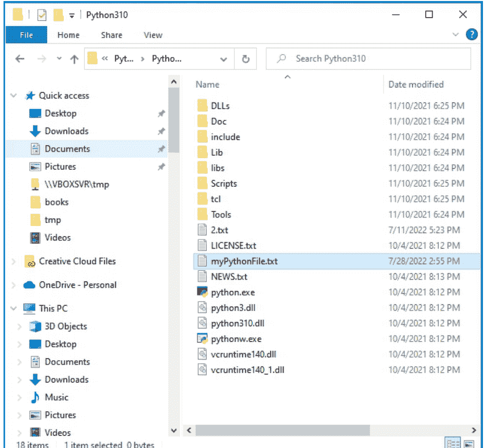

现在让我们尝试在文件系统的特定位置创建一个文件。我们知道为此，我们需要在调用`open()`时提供文件的绝对路径，如下所示：

```
>>> myFileRef = open(r"C:\jc\tmp\pythonReadWriteTest.txt", 'x')
Traceback (most recent call last):
  File "<stdin>", line 1, in <module>
FileExistsError: [Errno 17] File exists: 'C:\jc\tmp\pythonReadWriteTest.txt'
>>>
>>> myFilePath = "C:\jc\tmp\pythonReadWriteTest2.txt"
>>> myFileRef2 = open(myFilePath)
Traceback (most recent call last):
  File "<stdin>", line 1, in <module>
OSError: [Errno 22] Invalid argument: 'C:\jc\tmp\pythonReadWriteTest2.txt'
>>>
>>> myFilePath = r"C:\jc\tmp\pythonReadWriteTest2.txt"
>>> myFileRef2 = open(myFilePath)
Traceback (most recent call last):
  File "<stdin>", line 1, in <module>
FileNotFoundError: [Errno 2] No such file or directory: 'C:\jc\tmp\pythonReadWriteTest2.txt'
>>> myFileRef2 = open(myFilePath, 'w')
>>>
```

所以你看，我们首先尝试使用模式'x'创建一个绝对路径为"C:\jc\tmp\pythonReadWriteTest.txt"的文件。但我们收到一个错误，表明该文件已存在。我们检查文件资源管理器，确实如此（我们稍后会有一张图片显示这一点。）另外请注意，我们在路径前放了一个字符`r`，表示这个字符串字面量应该被视为原始数据——这样Python解释器就不会尝试将反斜杠'\'视为转义字符，而是将整个字符串原样处理。

然后我们使用了不同的文件名pythonReadWriteTest2.txt作为文件路径，并将其赋给变量`myFilePath`。但我们没有在前面加上字符'r'来使用原始字符串。所以当我们接下来尝试打开文件时，我们得到了一个错误。你可以清楚地看到路径信息被搞乱了，变成了'C:\jc\tmp\pythonReadWriteTest2.txt'。

所以我们再次尝试使用原始字符串。然后我们使用默认模式'r'进行读取调用`open()`。但我们又得到了另一个错误。

### 写入文件

既然我们已经了解了如何以不同的访问模式和在不同的位置打开文件，现在让我们尝试向文件写入一些内容。由于我们已经有了指向 `pythonReadWriteTest2.txt` 的文件引用，并且该文件是以写模式打开的，我们将在下面演示如何操作：

```
>>> myFileRef2 = open(myFilePath, 'w')
>>> myFileRef2.write("Python spam and eggs\n")
21
>>> myFileRef2.write("The previous line's write has 21 characters including the new line '\n' which is counted as one character\n")
105
>>> myFileRef2.write("The write call returns the number of characters written\n")
56
>>>
```

因此，为了与前面的示例衔接，我们在开头包含了 `open()` 调用。我们知道这个文件已经打开，并且我们准备好向其中写入内容。所以我们进行了 3 次 `write()` 调用，写入了 3 行文本。请注意，我们每行都以特殊字符 `'\n'` 结尾，这是一个表示换行的转义序列，因此文本被分隔成 3 个不同的行。此外，在每次 `write()` 调用之后，Python 解释器都会返回并显示写入的字符数，如上所示。

### 从文件读取

既然我们已经完成了一些写入操作，现在让我们来读取刚刚写入的这个文件。如下所示：

```
>>> textLines = myFileRef2.read()
Traceback (most recent call last):
  File "<stdin>", line 1, in <module>
io.UnsupportedOperation: not readable
>>> myFileRef2 = open(myFilePath)
>>> textLines = myFileRef2.read()
>>>
>>> textLines
"Python spam and eggs\nThe previous line's write has 21 characters including the new line '\n' which is counted as one character\nThe write call returns the number of characters written\n"
>>>
```

我们看到第一次读取返回了一个错误信息。因为文件是以写模式打开的，而不是读模式。所以我们使用一个不同的文件句柄 `myFileRef2` 来接收以默认读模式调用 `open()` 返回的文件引用。你可能会在一些代码中看到文件引用被命名为表示输入或输出的名称，例如 `fin` 或 `fout`。这实际上是一种个人偏好，但代码中内置的自解释性无疑是好的。因此，在这个读取示例中，我们以读模式打开文件后，调用 `read()` 来读取文件内容，并将值赋给 `textLines`。然后我们展示了 `textLines` 的值。它实际上是一个很长的字符串，包含了所有 3 行，一行接一行，由 `'\n'` 换行符分隔。

然而，如果我们用记事本等应用程序打开这个文件，我们会看到它们出现在 3 个不同的行上，如下所示：（尽管由于我们在写入时包含了 `'\n'`，并且这个存储的字符被记事本解释为换行，所以看起来好像多了一行）

事实上，如果我们使用 Python 的 `print()` 调用，我们也会看到 3 行，如下所示：（原因与之前相同，由于存储的换行符被 Python 解释器解释为形成额外的一行，所以看起来多了一行）

```
>>> print(textLines)
Python spam and eggs
The previous line's write has 21 characters including the new line '\n' which is counted as one character
The write call returns the number of characters written
>>>
```

并且由于我们在每行末尾添加了 `'\n'`，所以在第 3 行之后产生了一个额外的“空”行效果。

我们不仅可以像刚才那样一次性读取整个文件，还可以通过使用 `readline()` 而不是 `read()` 来一次读取一行输入。我们在下面展示一些关于读取输入的见解：

```
>>> print(textLines)
Python spam and eggs
The previous line's write has 21 characters including the new line '\n' which is counted as one character
The write call returns the number of characters written

>>>
>>> line1 = myFileRef2.readline()
>>> line1
''
>>>
>>> myFileRef2.close()
>>> myFileRef2 = open(myFilePath)
>>>
>>> line1 = myFileRef2.readline()
>>> line1
'Python spam and eggs\n'
>>> line2 = myFileRef2.readline()
>>> line2
"The previous line's write has 21 characters including the new line '\n'"
>>> line3 = myFileRef2.readline()
>>> line3
"' which is counted as one character\n"
>>> line4 = myFileRef2.readline()
>>> line4
'The write call returns the number of characters written\n'
>>>
```

在这个示例中，我们在顶部 `print()` 了整个文件内容，以便于比较。然后我们调用 `readline()` 并将其赋值给 `line1`。但当我们显示 `line1` 时，它只显示了单引号，里面什么都没有。这实际上是由于我们之前进行的读取操作，我们已经到达了文件末尾（记住我们的文件是顺序访问的，如前所述）。因此，为了正确演示 `readline()`，我们 `close()` 文件，然后再次 `open()`。接着我们调用了 3 次 `readline()`，并将每一行文本分别赋值给 `line1`、`line2` 和 `line3`，如上所示。这里有点混乱的是，由于文件中存储了一个换行符，而 `readline()` 将其视为单独的一行，因此我们最终需要额外调用一次 `readline()` 来将最后一行读入 `line4`，以便到达文件末尾。

还有一个细微之处，即每行都有一个尾随的 `'\n'` 字符。如果我们 `print()` 它们，看起来会有一个额外的“空”行：

```
>>> print(line1)
Python spam and eggs

>>> print(line2)
The previous line's write has 21 characters including the new line '\n'

>>> print(line3)
' which is counted as one character

>>> print(line4)
The write call returns the number of characters written

>>>
```

所以，如果你还记得字符串的众多方法，我们可以使用 `rstrip()` 来修剪右侧的尾随字符，即 `'\n'`，如下所示：

```
>>> print(line1.rstrip())
Python spam and eggs
>>> print(line2.rstrip())
The previous line's write has 21 characters including the new line '\n'

>>> print(line3.rstrip())
' which is counted as one character
>>> print(line4.rstrip())
The write call returns the number of characters written
>>>
```

如果我们能够查看文件内部，当文件刚打开时，当前的读取位置位于文件的开头，因此指向文本行 "Python spam and eggs\n" 的 'P'。在第一次 `readline()` 之后，读取位置指向下一个文本行的开头，即 "The previous line's write has 21 characters including the new line\n" 这一行的 'T'。当然，在第 3 次 `readline()` 之后，读取位置正好在最后一个 `'\n'` 之后，因此位于文件末尾。

### 追加到文件

现在我们通过使用模式 'a' 来总结文件的追加打开方式。如下所示，我们将在文件 "pythonReadWriteTest2.txt" 中添加第 4 行：

```
>>> myFileRef2.close()
>>> fileRefAppend = open(r"C:\jc\tmp\pythonReadWriteTest2.txt", 'a')
>>> fileRefAppend.write("We now add the 5th line without trailing newline")
48
>>> fileRefAppend.close()
>>> fileRefRead = open(r"C:\jc\tmp\pythonReadWriteTest2.txt", 'r')
>>> fileRefRead
<_io.TextIOWrapper name='C:\jc\tmp\pythonReadWriteTest2.txt' mode='r' encoding='cp1252'>
>>> fileContent = fileRefRead.read()
>>> fileContent
"Python spam and eggs\nThe previous line's write has 21 characters including the new line '\n' which is counted as one character\nThe write call returns the number of characters written\nWe now add the 5th line without trailing newline"
>>> print(fileContent)
Python spam and eggs
The previous line's write has 21 characters including the new line '\n' which is counted as one character
The write call returns the number of characters written
We now add the 5th line without trailing newline
>>>
```

因此，我们首先关闭了之前以读模式打开的文件。然后我们以追加模式打开同一个文件，以便我们可以在文件末尾追加第 4 行。只是这一次我们在这第4行文本的末尾没有换行符。然后我们关闭文件，以便以读取模式重新打开它（在调用`open()`时实际上使用了'r'）。接着我们实际上也展示了文件句柄`fileRefRead`的值，它向我们显示了文件路径，以及打开模式，毫无意外地是'r'。然后我们将文件内容读入`fileContent`并展示了其值。之后我们使用`print()`打印了所有4行。这一次末尾没有“空白”行。

### 练习：

11.1 创建一个包含多个整数的文件。编写一个程序来读取文件内容并显示它。

11.2 使用与上一题相同的文件，将整数相加并显示总和。

11.3 创建一个包含多行文本的文件。编写一个程序来显示文件的内容。

11.4 编写一个程序来显示上一题中的文件内容，但还要在每行前面显示文本的行号（行数），后跟一个冒号。

11.5 创建一个包含学生姓名的文件（每行一个姓名）。编写一个程序来统计文件中的学生人数。

11.6 使用与上一题相同的文件，编写一个程序来读取学生姓名，并将学生姓名写入另一个文件，但每个姓名前要加上学生计数，后跟一个冒号。

11.7 使用以下数据创建一个文件，每个学生一行——以学生姓名开头，后跟不同数量的测试分数：

```
joe 10 15 20 25 30 35 40
jane 11 22 33
john 12 24 26 35 44
jim 33 35 38 35 45
jesse 18 22 12 22
```

11.8 使用上一题的文件，编写一个程序来显示学生姓名和测试分数。

11.9 使用相同的文件，找出有5个或更多测试分数的学生，显示他们的姓名和祝贺他们取得好成绩的信息。对于其他学生，显示他们的姓名和一些鼓励他们继续努力的信息。

11.10 编写一个程序，提示用户输入要打开的文件名，然后打开文件，读取内容，并显示内容。

## 第12章 异常

在上一章中，我们看到当尝试打开一个不存在的文件时，我们得到了一个错误信息，这被称为异常。但是，如果在某些应用程序中，我们不想因为错误信息而终止，而是想继续运行应用程序，但以某种方式处理这种情况呢？这就叫做异常处理。

那么让我们深入探讨一下。什么是异常？本质上，如果程序运行时出了问题，导致执行中断并崩溃，我们就说发生了异常。而程序员编写一些代码逻辑来解决这种不希望的崩溃，使程序能够继续运行——这就叫做异常处理。所以你可以看到，拥有这些代码逻辑是很重要的。处理异常的代码逻辑依赖于编程语言提供的机制。许多现代编程语言都提供这种能力。Python也不例外（无意双关）。

### 可能出错的情况（异常）

现在让我们看一些异常和不希望的崩溃，如下图所示：

```
>>>
>>> open("mytestfile.txt")
Traceback (most recent call last):
  File "<stdin>", line 1, in <module>
FileNotFoundError: [Errno 2] No such file or directory: 'mytestfile.txt'
>>>
```

所以如你所见，我们得到了一个`FileNotFoundError`。在处理文件时，这很可能是一个可能的情况。虽然我们是在交互式IDE会话中显示这个错误，但你可以看到，如果我们将代码放在脚本中，脚本执行就会崩溃。此外，还有许多其他异常可能发生，我们将在下面的场景中展示另一个。但这次使用一个脚本来计算除法。

脚本如下：

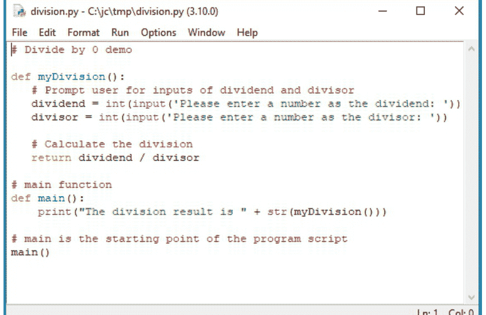

从下图可以看出，我们能够进行除法运算，直到我们提供0作为除数。此时，程序因除以零错误而崩溃：

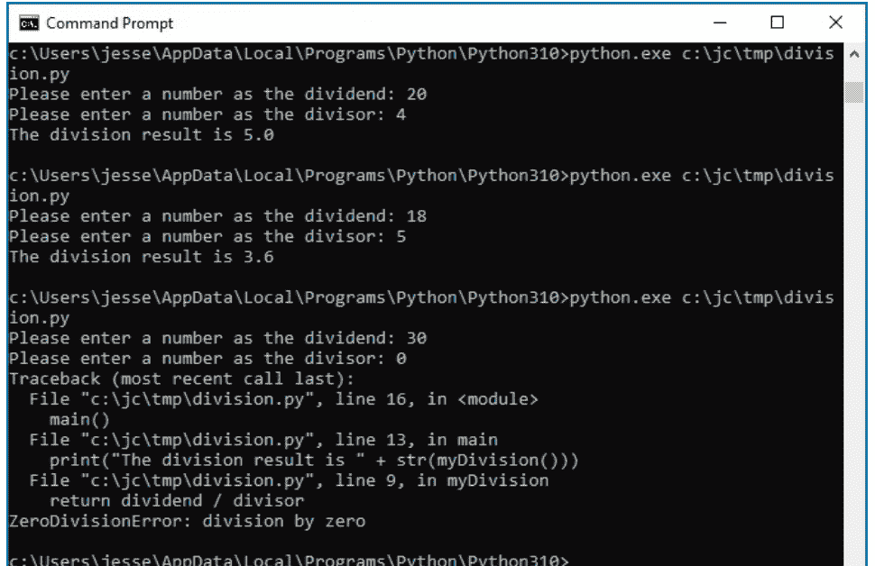

崩溃当然不是一个理想的结果。我们打算让程序尽可能长时间地运行，只要用户想使用它（如果我们将代码放在一个循环中，为简单起见这里没有显示）。崩溃是一个除以零异常。所以如果我们能在代码中处理这个异常，我们就可以避免崩溃。

### Try块

为了进行异常处理，Python有一个`try`块，带有`except`、`else`和`finally`子句，我们可以使用。一般语法如下所示：

```
try:
    # Try block Code ...
except [exceptionName]:
    # Optional block(s)
    # Handling of exception (one exception per block) ...
except:
    ...
else:
    # Code to execute if no exception ...
finally:
    # Code always executed ...
```

现在让我们看一些例子：

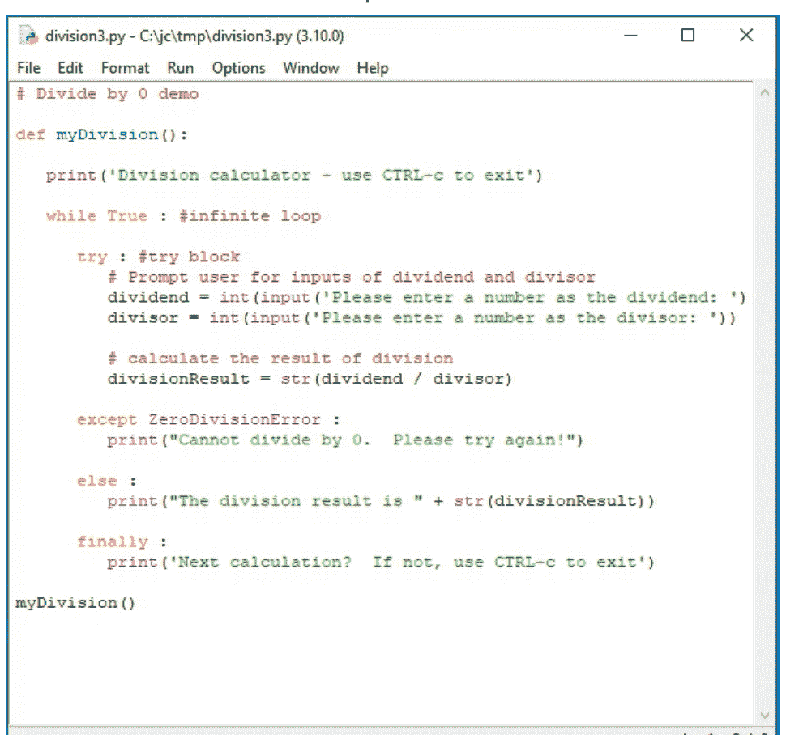

我们实际上修改了之前的代码，之前的代码在除以0时崩溃了。之前的代码也有一个`main()`函数，但我们展示了没有`main()`的替代方案也可以工作（正如我们过去提到的）。

在这个修改后的代码中，我们有一个`try`块，其中在`except`子句中处理了`ZeroDivisionError`异常。我们将其他所有内容都留给了`else`子句，并以`finally`子句结束，如图所示。经过修改，我们尝试了一些计算，包括除以0，以查看异常处理。我们最后还得到了另一个错误，如下图所示：

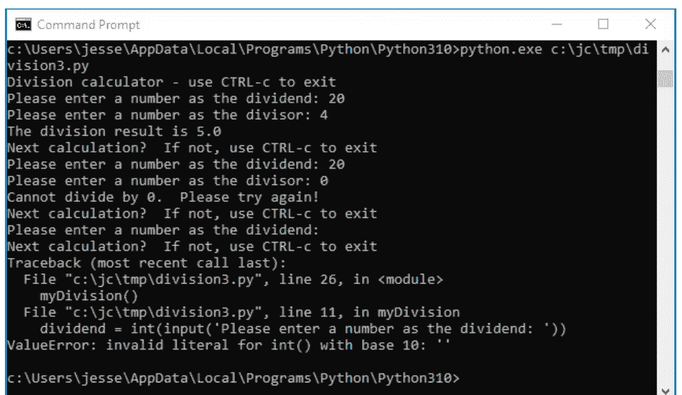

所以我们计算了20 / 4，然后尝试了20 / 0。我们能够优雅地处理这个异常。但是，我们没有使用CTRL-c退出，而是直接按了回车键，得到了一个不同的`ValueError`异常。所以发生的情况是我们没有输入任何内容，而我们的代码将其作为输入并尝试将其转换为整数，从而导致了错误。所以我们还有一个异常需要处理，如下所示的修改后的代码：

```python
# Divide by 0 demo

def myDivision():
    print('Division calculator - use CTRL-c to exit')
    while True: #infinite loop
        try: #try block
            # Prompt user for inputs of dividend and divisor
            dividend = int(input('Please enter a number as the dividend: '))
            divisor = int(input('Please enter a number as the divisor: '))
            # calculate the result of division
            divisionResult = str(dividend / divisor)
        except ZeroDivisionError:
            print("Cannot divide by 0. Please try again!")
        except ValueError:
            print("Please only enter integer for calculation. Please try again!")
        else:
            print("The division result is " + str(divisionResult))
        finally:
            print('Next calculation? If not, use CTRL-c to exit')

myDivision()
```

现在你可以看到我们添加了另一个`except`子句来处理`ValueError`。运行结果如下：

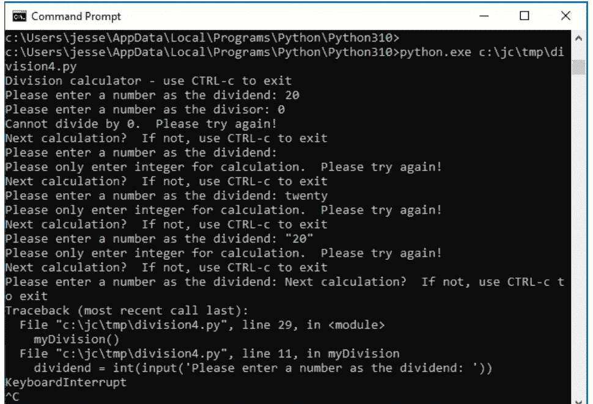

在这个演示中，我们首先处理了除以0的情况，然后是几个`ValueError`。所以我们对测试感到满意，并按CTRL-c结束了程序。

但后来我们想到可能还有其他我们尚未处理的异常。事实上，如果你查阅Python文档，你会发现更多，所以我们有以下常见异常表：

| 异常 | 错误原因 |
|---|---|
| AssertionError | 当assert语句失败时引发。 |
| AttributeError | 当属性赋值或引用失败时引发。 |
| EOFError | 当input()函数遇到文件结束条件时引发。 |
| FloatingPointError | 当浮点运算失败时引发。 |
| GeneratorExit | 当生成器的close()方法被调用时引发。 |
| ImportError | 当找不到导入的模块时引发。 |
| IndexError | 当序列的索引超出范围时引发。 |
| KeyError | 当在字典中找不到键时引发。 |
| KeyboardInterrupt | 当用户按下中断键（Ctrl+C或Delete）时引发。 |
| MemoryError | 当操作耗尽内存时引发。 |
| NameError | 当在局部或全局作用域中找不到变量时引发。 |
| NotImplementedError | 由抽象方法引发。 |
| OSError | 当系统操作导致系统相关错误时引发。 |
| OverflowError | 当算术运算的结果太大而无法表示时引发。 |
| ReferenceError | 当使用弱引用代理访问已被垃圾回收的引用对象时引发。 |
| RuntimeError | 当错误不属于任何其他类别时引发。 |

| 异常 | 描述 |
|---|---|
| StopIteration | 由 `next()` 函数引发，表示迭代器没有更多项可返回。 |
| SyntaxError | 解析器遇到语法错误时引发。 |
| IndentationError | 缩进不正确时引发。 |
| TabError | 缩进中包含不一致的制表符和空格时引发。 |
| SystemError | 解释器检测到内部错误时引发。 |
| SystemExit | 由 `sys.exit()` 函数引发。 |
| TypeError | 将函数或操作应用于类型不正确的对象时引发。 |
| UnboundLocalError | 在函数或方法中引用局部变量，但该变量尚未绑定任何值时引发。 |
| UnicodeError | 发生与 Unicode 相关的编码或解码错误时引发。 |
| UnicodeEncodeError | 编码过程中发生与 Unicode 相关的错误时引发。 |
| UnicodeDecodeError | 解码过程中发生与 Unicode 相关的错误时引发。 |
| UnicodeTranslateError | 翻译过程中发生与 Unicode 相关的错误时引发。 |
| ValueError | 函数接收到类型正确但值不合适的参数时引发。 |
| ZeroDivisionError | 除法或取模运算的第二个操作数为零时引发。 |

### 全捕获

因此，我们不想有这么多 `except` 子句——我们能做什么呢？事实证明，有一种方法可以实现全捕获，只需使用不带任何异常名称的 `except`，但有一个注意事项，如下所示的脚本所示：

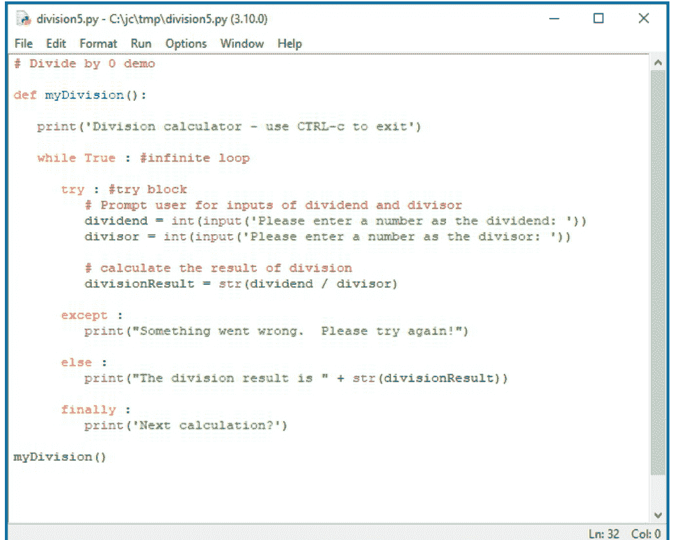

当我们运行脚本时，得到以下结果：

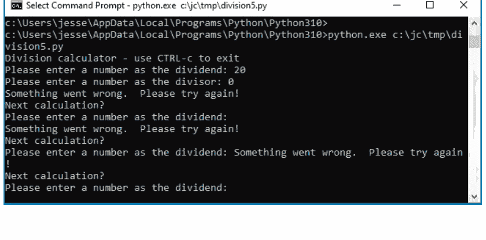

这种“全捕获”方法有几个后果。首先，不再有单独的异常处理，因为我们没有为每个异常设置单独的子句。其次，由于所有异常都被捕获，当我们按 CTRL-c 试图退出无限循环时，我们无法做到。正如你从结果中观察到的：我们首先遇到了除以 0 的异常，然后像之前一样按了回车键；但第 3 次输入实际上是 CTRL-c，因此输出有点混乱——具体来说，“出了点问题……”文本没有在新行开始。然而，我们无法跳出无限循环，因为 CTRL-c “异常”被捕获了。唯一的退出方式是关闭这个命令窗口。因此，这种“全捕获”处理可能很诱人，但不一定是最佳实践。

既然我们学会了如何捕获异常，我们可以将其用于 `FileNotFoundError` 异常，这是我们在尝试打开文件时之前遇到的。如下例所示：

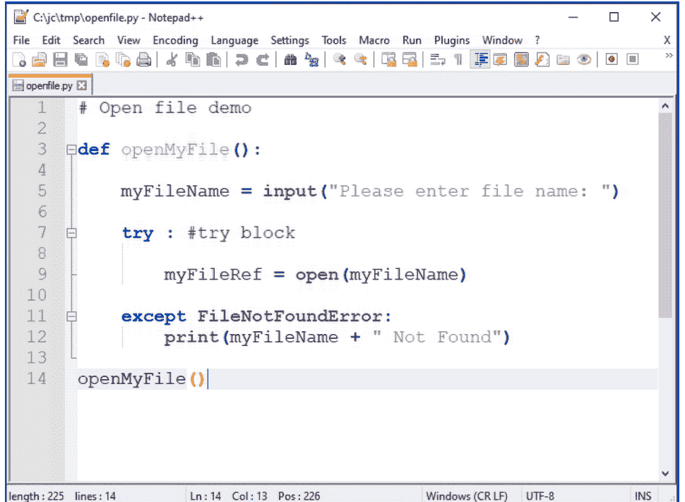

运行结果：

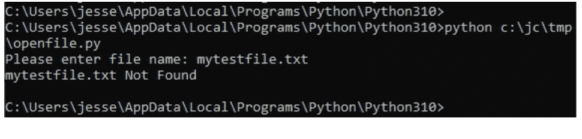

### 传递异常错误消息

因此，我们能够捕获错误异常。现在我们将进一步使用一个循环来提示输入文件名，以便我们实际上可以无异常地打开它。此外，还要忠实地传递异常生成的错误消息，而不是我们自己的消息。这可能很有用，特别是当我们捕获调用我们的函数的某些异常时。因为调用函数可能希望通过错误消息了解异常，以便决定采取什么行动。我们有如下图所示的代码：

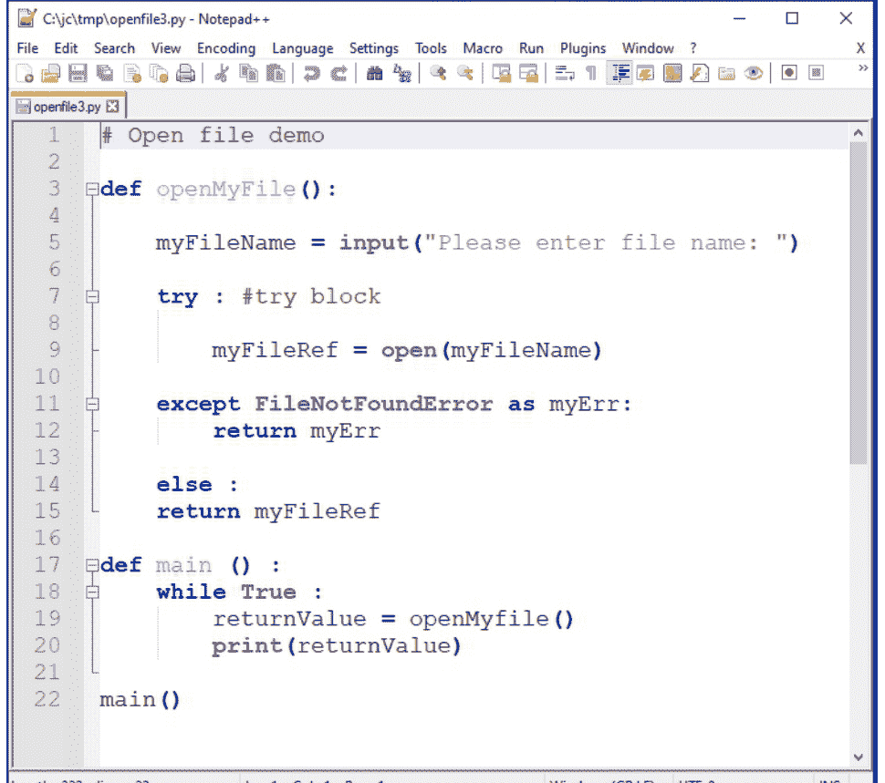

运行结果：

```
C:\Users\jesse\AppData\Local\Programs\Python\Python310>
C:\Users\jesse\AppData\Local\Programs\Python\Python310>python c:\jc\tmp\openfile3.py
Please enter file name: mytestfile.txt
[Errno 2] No such file or directory: 'mytestfile.txt'
Please enter file name: LICENSE.txt
<_io.TextIOWrapper name='LICENSE.txt' mode='r' encoding='cp1252'>
Please enter file name:
```

如你所见，我们尝试打开一个不存在的文件“mytestfile.txt”，并在 `openMyFile()` 函数中遇到了 `FileNotFoundError` 异常，异常错误消息 `myErr` 被返回到 `main()` 函数的无限循环中并被打印出来。然后我们尝试了一个存在的文件“LICENSE.txt”，因此文件被无异常地打开。文件引用被返回，并通过 `print(returnValue)` 显示了文件句柄。

### 练习：

12.1 编写一个程序，提示用户输入要打开的文件名，然后打开文件，读取内容，并显示内容。如果用户输入的文件不存在，还要添加异常处理。

12.2 编写一个程序，提示用户输入数字，直到用户输入“done”。用户完成后，显示数字的计数、总和和平均值。如果用户输入的不是整数也不是“done”，还要添加异常处理。

## 后记

最后，在大约一年左右的写作工作后，我来到了第 8 章的结尾，并认为这将作为 Python 编程的基础，或者任何开始计算机编程的人的基础。从而实现了本书的两个目标：首先是为初次编程者提供介绍；其次是让有经验的程序员快速开始使用 Python。因此，除了用于解释和/或展示编码如何完成的编码示例，本书实际上不包含额外的问题或练习。这样做是因为随着互联网的出现，有足够的在线编码练习供人们在 Python 编程之旅中随时投入。

显然，有许多更高级的主题未包含在本书中。因为我相信，凭借本文涵盖的基础知识，足以让任何编码者解决任何（或至少几乎所有）可以使用 Python 解决方案解决的问题。未来，我希望能发布关于高级 Python 编程的书籍；但我真诚地（另一种）希望，到那时，本书的读者已经足够高级，以至于不需要一本书来谈论高级 Python——从而实现了让我们的读者在尽可能短的时间内开始使用 Python 的“隐藏”目标。

随着大规模开放在线课程（MOOC）的普及，我打算将本书电子化，以利用技术进步为计算机素养做出贡献。作为一名教育者，在我工程职业生涯中对软件有着无法抑制的热情，我理解有不同的学习方式，每个人都需要选择适合自己的方式。然而，自从我成为父亲以来，我尝试越来越少地使用纸张，希望能多拯救一棵树，为子孙后代留下一个更好的世界。这希望不会阻碍《Python Anyone》的潜在读者——正如书名所示，本书确实试图为任何想学习 Python 的人提供一些有用的帮助。而且我将来很可能会被说服发布纸质版，以确保我没有对那些使用纸质版学习效果更好的人造成不利影响。

此外，如前所述，我可能在不久的将来发布一些关于更高级 Python 的后续作品。因此，如果你感兴趣，特别是在你读完本书之后，非常欢迎你注册兴趣列表 @ https://www.higherchllenge.com/form/morepython，以获取其可用性的最早通知以及一些不错的折扣。

最后，我要向那些在这段旅程中激励、鼓励、帮助和/或为我加油的人表示感谢。永远，我感激你们；并且对我们的读者的利益做出了重大贡献。

Jesse Chou jesse@HigherChallenge.com
2021年7月11日于加利福尼亚
我偶尔更新的个人资料：
https://www.LinkedIn.com/in/JesseChou
随机分享——通常是技术内容：
https://www.higherchallenge.com/#randomshare

### 关于第二版的说明

本版有一些更正和一些练习，此外还有新章节，不仅用于学习和快速开始编码 Python，还为一些令人兴奋的领域（如数据科学和机器学习）做准备。更多内容即将到来。-Jesse
2022年7月29日

[1] 如今，随着量子计算机的出现，我们有 2 个状态可以给我们 3 个不同的值——第一个状态或第二个状态，或者两者兼有。这就是被称为量子比特，未来你可能会越来越多地听到这个术语。