# 在 Visual Studio Code 上开发 Python 应用

开发应用并充分利用 Visual Studio Code 的真正潜力


Swapnil Saurav

[www.bpbonline.com](http://www.bpbonline.com)

2024年第一版

版权所有 © BPB Publications, India

ISBN: 978-93-55519-504

保留所有权利。未经出版商事先书面许可，不得以任何形式或任何方式复制、分发或传播本出版物的任何部分，也不得将其存储在数据库或检索系统中，但程序清单除外，这些清单可以在计算机系统中输入、存储和执行，但不能通过出版、影印、录音或任何电子和机械手段进行复制。

## 责任限制与免责声明

本书所含信息在作者和出版商所知范围内是真实准确的。作者已尽一切努力确保这些出版物的准确性，但出版商对因本书中任何信息引起的任何损失或损害不承担责任。

本书中提及的所有商标均被确认为其各自所有者的财产，但 BPB Publications 无法保证这些信息的准确性。

查看完整
BPB Publications 目录
请扫描二维码：


[www.bpbonline.com](http://www.bpbonline.com)

谨以此书献给

我挚爱的妻子：

Rupali

&

我的儿子 Ojass

## 关于作者

Swapnil Saurav 是一位成就卓著且多才多艺的专业人士，在包括快速消费品和零售在内的多个行业拥有超过20年的经验。热衷于理解客户挑战并在竞争激烈的市场中推动业务增长。擅长流程咨询、市场分析、销售与市场营销支持、产品开发、客户服务和项目管理。以敏锐的问题解决能力著称，拥有运用数据分析技能解决大规模问题的独特能力。其职业发展轨迹包括产品开发、销售周期中的价值交付以及 IT 运营等角色。拥有强大的教育背景，包括 S. P. Jain Institute of Management & Research 的工商管理硕士学位和 BITS, Pilani 的软件系统理学硕士学位。

Swapnil 是一位以结果为导向的领导者，在推动组织成功方面拥有良好记录。他具备有效管理大型团队并激励员工充分发挥潜力的公认能力。他擅长创造积极协作的工作环境，培养持续改进和创新的文化。

## 致谢

首先，我要向我的家人和朋友表达最深切的感谢，感谢他们在本书写作过程中坚定不移的支持和鼓励，特别是我的妻子 Rupali、我的儿子 Ojass 和我的妹妹 Smriti，没有你们无尽的支持，我无法实现这一里程碑。

我要向我的出版商表示衷心的感谢，他们相信这份手稿的潜力，并给了我与世界分享我想法的机会。他们坚定不移的支持、富有洞察力的反馈和细致的编辑，对于将本书塑造成最终形式起到了至关重要的作用。我由衷地感谢他们的专业知识和专业精神。

感谢我的朋友和同事们，感谢你们宝贵的贡献和启发。你们富有洞察力的对话、明智的建议和建设性的批评，在塑造我的想法和提高本书质量方面发挥了至关重要的作用。

我还要向审稿团队表示感谢，感谢他们提供了宝贵的反馈，感谢你们在提出建设性建议上所投入的时间和奉献。

最后，我要感谢读者对本书的兴趣。你们的支持和热情持续激发着我的写作热情，对此我深表感激。我希望书中的文字能与你们产生共鸣，激励你们，并为你们的技术职业生涯带来积极的改变。

没有这些杰出人士的支持和贡献，本书是不可能完成的。我深深感谢你们每一位在创作这部作品中所扮演的角色。愿本书成为我们对知识、奉献和团结力量共同信念的见证。

## 前言

欢迎来到 Visual Studio 上的 Python 应用世界。在本书中，我们旨在为您提供一份关于使用 Visual Studio Code 编辑器构建 Python 应用程序的全面指南。近年来，Python 因其简单性、多功能性和不断壮大的开发者社区而获得了巨大的普及。因此，对专门满足 Python 开发需求的工具和编辑器的需求激增。

Visual Studio Code，通常被称为 VS Code，已成为 Python 开发者最青睐的代码编辑器之一。其轻量级特性、广泛的自定义选项和强大的功能，使其成为任何希望编写 Python 应用程序的人的理想选择。无论您是初学者还是经验丰富的 Python 开发者，本书都提供了使用 Visual Studio Code 进行 Python 开发的分步方法。我们将涵盖基本概念、技术和最佳实践，使您能够高效地构建健壮的 Python 应用程序。

在本书中，读者将把他们的基本编程技能提升到更高效、能交付卓越成果和完全功能化的应用程序的水平，使用丰富的工具 VS Code。本书帮助“懒惰”的程序员跳过漫长的学习时间，开始作为聪明的 Python 开发者变得高效和有效。

在本书中，作者涵盖了实践教学，如何使用 Python 开发桌面 GUI 应用程序、网站和 Web 应用程序。您将探索 VS Code 及其功能。您还将了解 VS Code 中所有流行且高性能的扩展。此外，您将学习使用各种高性能的 Python 库，如 Flask、NumPy、Pandas 等。您将了解如何编码数据结构和实现算法，如何配置 Web 服务器，如何为应用程序添加身份验证，以及各种用于增强 Python 应用程序功能的工具。

在整本书中，我们努力提供实际示例、代码片段和提示，以帮助您掌握概念并将其应用到您自己的项目中。我们相信，在本书结束时，您不仅将对 Visual Studio Code 上的 Python 开发有扎实的理解，还将具备构建复杂 Python 应用程序的必要技能。

我们希望本书能成为您在成为熟练 Python 开发者道路上的宝贵资源。

编码愉快！

- [第 1 章：VS Code 简介](Chapter 1: Introduction to VS Code) - 本章涵盖使用 Visual Studio Code（一个流行且多功能的代码编辑器）的基础知识。涵盖了其功能和特性，如创建和管理项目、编写代码、调试以及与其他工具和扩展集成。我们还学习各种技巧和窍门，以提高使用 Visual Studio Code 进行编码和开发任务时的生产力和效率。

- [第 2 章：设置环境](Chapter 2: Setting up the Environment) - 涵盖 VS Code 环境的细节并构建第一个 Python 程序。本章涵盖 Python 和 VS Code 的安装、使用 Python 扩展设置 Python 环境、安装默认扩展以及了解编辑设置。

- [第 3 章：VS Code 中用于 Python 的顶级扩展](https://example.com) - 本章涵盖全球开发者使用的前 10 个流行扩展及其强大功能。此外，您将学习如何配置这些 Python 扩展以及可以在 VS Code 中编辑的 Python 特定设置。本章还涵盖 Python 中包的安装。Python，并专注于如何为应用程序开发创建函数、模块和包。

- [第 4 章：在 VS Code 中开发可视化 Python 应用](https://example.com) - 在本章中，我们将涵盖 Python 概念，如 Numpy、Scipy、Pandas 和 Matplotlib，并进行数据分析。本章还介绍基本的统计概念，并专注于如何使用 Matplotlib 绘图。然后，本章通过分析示例数据集来解释数据分析的实践。本章还提供清晰的解释和示例，以帮助读者理解这些概念并在实践中应用它们。在本章末尾，作者将指导读者如何将 GitHub 与 VS Code 一起使用。

- [第 5 章：使用数据库开发桌面应用程序](https://example.com) - 在本章中，作者讨论了如何使用 Python 应用程序来创建和管理用于各种目的的数据库。Python 全面的面向对象库及其与流行数据库系统交互的能力，使其成为快速开发数据库应用程序的理想选择。本章强调了学习使用 Python 进行数据库应用程序开发的重要性，这是数据分析和处理的高效工具。在最后一部分

## 第六章：高级算法设计

本章重点学习和运用不同的算法。涵盖的算法包括：分治法、回溯法、二叉树、堆、哈希表以及图算法。本章还讨论了大O表示法的概念，这是一种衡量算法复杂度的方法。

## 第七章：构建多线程应用程序

本章概述了线程的概念，以及如何利用线程来优化多个任务的并行执行。本章讨论了Python中的线程模块及其各种组件，例如线程、锁和信号量。它解释了如何创建和管理线程，以及如何实现同步机制以防止数据损坏和竞态条件。本章还探讨了不同的线程技术，包括线程池和线程间通信。

## 第八章：使用Jupyter Notebook构建交互式仪表板

本章介绍了在Visual Studio Code上使用Jupyter Notebooks开发仪表板的过程。本章解释了如何设置必要的环境和依赖项，包括安装Jupyter扩展。本章还提供了在VS Code中创建新的Jupyter Notebook文件以及导入Pandas和Matplotlib等库进行数据操作和可视化的分步说明。本章最后通过一个分析和显示CSV文件数据的简单仪表板示例进行总结。

## 第九章：编辑和调试Jupyter Notebook

本章提供了使用VS Code有效编辑和调试Jupyter Notebooks的全面指南。通过阅读本章，你将了解VS Code为编辑Jupyter Notebooks提供的各种功能和特性，例如单元格操作、代码执行和Markdown格式化。本章还涵盖了调试技术，包括设置断点、检查变量以及使用VS Code内置的调试器。

## 第十章：使用VS Code掌握Tkinter GUI功能

本章全面概述了Tkinter的GUI功能，并演示了如何使用Visual Studio Code有效地利用它们。本章首先介绍了Tkinter库及其特性，然后深入探讨了在Visual Studio Code中使用Tkinter构建图形用户界面的过程。涵盖的主题包括创建窗口和框架、添加按钮和标签、使用各种小部件和布局管理器，以及处理事件。

## 第十一章：开发基于Flask的Web应用程序

在本章中，我们学习了如何使用Python提供的Flask框架构建Web应用程序。本章涵盖了广泛的主题，从设置开发环境和创建基本的Flask应用程序，到实现身份验证和授权、处理表单以及数据库交互。本章还提供了清晰的解释、分步说明和实际示例，使其成为初学者和经验丰富的开发者构建自己的基于Flask的Web应用程序的宝贵资源。

## 第十二章：在Azure中使用容器

本章详细介绍了使用Python从Visual Studio Code在Azure中处理容器的必要步骤。通过使用合适的工具和一些知识，开发者可以轻松地将其代码容器化到Azure中。本章还涵盖了在Azure上部署第11章开发的Flask应用程序。

# 代码包和彩色图片

请通过以下链接下载本书的代码包和彩色图片：

[https://rebrand.ly/98a8d0](https://rebrand.ly/98a8d0)

本书的代码包也托管在GitHub上，地址为

如果代码有任何更新，它将在现有的GitHub仓库中更新。

我们拥有丰富的书籍和视频目录，其中的代码包可在以下地址获取。请查看它们！

# 勘误

我们在BPB Publications为自己的工作感到无比自豪，并遵循最佳实践以确保内容的准确性，为我们的订阅者提供沉浸式的阅读体验。我们的读者是我们的镜子，我们利用他们的反馈来反思并改进在出版过程中可能出现的任何人为错误。为了让我们保持质量并帮助我们联系到可能因任何不可预见的错误而遇到困难的读者，请写信给我们：

[errata@bpbonline.com](mailto:errata@bpbonline.com)

BPB Publications大家庭非常感谢您的支持、建议和反馈。

您知道BPB提供每本出版书籍的电子书版本，有PDF和ePub文件可供选择吗？您可以在[www.bpbonline.com](http://www.bpbonline.com)升级到电子书版本，作为印刷书客户，您有权获得电子书副本的折扣。请联系我们：

[business@bpbonline.com](mailto:business@bpbonline.com) 了解更多信息。

在您还可以阅读一系列免费技术文章，注册各种免费通讯，并获得BPB书籍和电子书的独家折扣和优惠。

# 盗版

如果您在互联网上以任何形式发现我们作品的非法副本，如果您能向我们提供位置地址或网站名称，我们将不胜感激。请通过[business@bpbonline.com](mailto:business@bpbonline.com)联系我们，并附上相关材料的链接。

如果您有兴趣成为作者

如果您在某个主题上拥有专业知识，并且有兴趣撰写或参与一本书的写作，请访问我们与成千上万的开发者和技术专业人士合作过，就像您一样，帮助他们与全球技术社区分享他们的见解。您可以提交一般申请，申请我们正在招募作者的特定热门主题，或提交您自己的想法。

# 评论

请留下评论。一旦您阅读并使用了本书，为什么不在您购买它的网站上留下评论呢？潜在的读者可以看到并利用您公正的意见来做出购买决定。我们BPB可以了解您对我们产品的看法，我们的作者也可以看到您对他们书籍的反馈。谢谢！

有关BPB的更多信息，请访问

加入我们书籍的Discord空间

加入书籍的Discord工作区，获取最新更新、优惠、全球科技动态、新书发布以及与作者的交流会：

https://discord.bpbonline.com


# 目录

1. [VS Code简介](#)
    - [简介](#)
    - [结构](#)
    - [为什么使用VS Code？](#)
    - [什么是VS Code？](#)
    - [VS Code：上下文视图](#)
    - [VS Code：开发视图](#)
    - [标准化](#)
    - [技术债务](#)
    - [VS Code：功能视图](#)
    - [功能](#)
    - [外部接口](#)
    - [性能和可扩展性](#)
    - [期望的质量](#)
    - [适用性](#)
    - [关注点](#)
    - [策略](#)
    - [VS Code与Visual Studio](#)
    - [结论](#)
2. [设置环境](#)
    - [简介](#)
    - [结构](#)
    - [目标](#)
    - [设置工作开发环境](#)
    - [设置Python环境](#)
    - [设置VS Code环境](#)

## 顶级 VS Code 扩展

- Pylance
- Auto-imports
- 语义高亮
- 类型检查
- Code Runner
- 缩进彩虹
- 路径智能感知
- Tabnine AI 自动补全
- Jupyter
- 错误透镜
- 更好的注释
- Lightrun
- Python 测试资源管理器

## Python 特定设置

## 安装和使用 Python 包

## Python 中的函数、模块和包

## 函数

## 类

## 方法

## 关于类和对象的更多信息

## 继承

## 多态

## 数据抽象

## 封装

## 模块

## 包

## 结论

## 4. 在 VS Code 中开发可视化 Python 应用程序

## 简介

## 结构

## 虚拟环境概念

## Python 主题

- Numpy
- Scipy
- 示例 4.1
- Pandas
- 示例 4.2
- MatPlotLib
- Seaborn
- 学习统计学基础

- 离散数据
- 连续数据
- 区间数据
- 比率数据
- 分类数据（或定性数据）
- 名义数据
- 顺序数据

- 用于数据分析的可视化
- 数据分析与业务成果
- 使用 GitHub
- 如何设置代码仓库？
- 结论

## 5. 使用数据库开发桌面应用程序

## 简介

## 结构

### 数据库介绍和关系数据库管理系统

## 问题陈述：开发一个应用程序

## 开发解决方案

- 数据库设计
- 创建表和添加约束
- 使用 MYSQL
- 学生类
- 书籍类
- 执行项目：执行 CRUD 操作
- 在 VS Code 中调试
- 结论

## 6. 高级算法设计

## 简介

## 结构

## 目标

## 算法分析简介

- 分治法
- 回溯法
- 二叉树
- 堆
- 哈希表
- 图算法
- 大 O 表示法：分析算法的方法论
- 结论

## 7. 构建多线程应用程序

## 简介

## 结构

## 目标

### 多线程概念简介

- 启动新线程
- 线程同步
- Python 中的线程间通信
- 使用 Python 进行线程池管理
- 多线程优先队列
- 优化 Python 线程以提升性能
- 贪吃蛇游戏：使用多线程和 turtle 库
- 结论

## 8. 使用 Jupyter Notebook 构建交互式仪表板

## 简介

## 结构

## 目标

## Jupyter Notebook 简介

## 在 VS Code 上设置 Jupyter Notebook 环境

### 在 Jupyter Notebook 中使用控件和可视化

### 使用控件和可视化开发示例程序

- 问题陈述
- 解释
- Matplotlib 库
- 项目：Covid-19 交互式仪表板
- 使用 Panel 的交互式仪表板
- 使用 Voila 的交互式仪表板
- 结论

## 9. 编辑和调试 Jupyter Notebook

## 简介

## 结构

## 目标

### Jupyter Notebook 中的调试简介

- 逐行调试程序
- 完整调试选项
- 错误类型
- 检查代码语法
- 验证输出
- 结论

## 10. 使用 VS Code 掌握 Tkinter GUI 功能

## 简介

## 结构

## 目标

## Tkinter 简介

- 理解 Tkinter 控件
- 处理 Tkinter 事件
- bind() 方法
- bind_all() 方法
- event_generate() 方法
- 使用 Tkinter 创建菜单和工具栏
- 使用 Tkinter 创建工具栏
- 自定义菜单和工具栏
- 开发应用程序：测验游戏
- 问题陈述
- 目标
- 要求
- 解决方案
- 设计
- 驱动代码
- 实现
- 未来增强
- 结论

## 11. 开发基于 Flask 的 Web 应用程序

## 简介

## 结构

## 目标

## 设置并创建基本应用程序

# 开发个人资料应用程序

### 模板和静态内容

- 设置数据库 (SQLite3)
- 集成 Flask-Login
- 测试数据库
- 完成应用程序
- 结论

## 12. 在 Azure 中使用容器

## 简介

## 结构

## 目标

- 将 FlaskApp 数据库从 SQLite 移植到 Postgres
- 在 Azure 上部署 Flask 应用程序
- 结论

## 索引

## 第 1 章

## VS Code 简介

> 人们买的不是你做的东西，而是你为什么做。
— 西蒙·斯涅克

## 简介

欢迎来到本书的第一章，Visual Studio 上的 Python 应用。你现在可能已经猜对了，我们将在本书中构建许多 Python 应用程序。但为什么选择 Visual Studio Code 或 VS Code？学习任何编程语言的第一步都是选择一个代码编辑器，并学习其技巧和诀窍，以充分利用你的代码编辑器。你会遇到许多用于 Python 编程的代码编辑器，但最受欢迎、也是我最喜欢的，是 VS Code。不要将 VS Code 与 Visual Studio 混淆。VS Code 是一个免费、开源的平台，你将在本章中了解更多关于这个编辑器的信息。

十多年前，西蒙·斯涅克在他的 TED 演讲中说过：“人们买的不是你做的东西，而是你为什么做。”这句话至今仍萦绕在我脑海中。因此，我们将讨论的第一件事是为什么我们应该使用 VS Code 进行 Python 开发。接下来，我们将讨论什么是 VS Code 以及如何使用它。

Visual Studio Code 是一个开源的代码编辑器，免费使用，并完全支持 Python 编程语言的开发。它具有有用的功能，例如与世界各地的其他程序员进行实时协作。本章旨在介绍 VS Code，以帮助你了解其开发过程及其不同的组成部分。本章面向那些尚未听说过 VS Code 并想知道为什么应该考虑将其用于开发工作的读者。本章将提供有关 VS Code 的信息；我们将讨论为什么它可能是最受欢迎的代码编辑器，查看其功能，并讨论 VS Code 的不同组成部分。我们将研究 VS Code 的架构，以了解为什么它是满足软件开发需求的完美工具，以及开发人员如何快速执行代码构建调试循环，并将更复杂的工作流程留给功能更全面的 IDE，例如 Pycharm 或 Visual Studio IDE。

## 结构

我们将在本章中探讨以下主题：

- 为什么使用 VS Code？
- 什么是 VS Code？
- VS Code：上下文视图
- VS Code：开发视图
- VS Code：功能视图
- 性能和可扩展性
- VS Code 与 Visual Studio

现在，让我们深入了解每个主题。

## 为什么使用 VS Code？

Visual Studio Code，或称 VS Code，迄今为止是最好的代码编辑器，原因有很多。根据官方文档，VS Code 提供了令人愉悦的无摩擦编辑-构建-调试循环，这意味着你花在环境配置上的时间更少，而执行想法的时间更多。就用户数量而言，VS Code 拥有最大的用户群（2021 年 12 月，来源：JetBrains/Python Software Foundation）。JetBrains 与 Python Software Foundation 一起进行了一项 Python 开发者调查，其中受访者被问到一个问题：“你当前 Python 开发主要使用什么编辑器？”超过 23,000 名 Python 开发者回答了调查。大约 35% 的人回答是 VS Code，使其排名第一，领先于 PyCharm。一个有趣的发现是，Web 开发者几乎同样偏爱 PyCharm 和 VS Code（约 39%），但数据科学家更喜欢 VS Code 作为他们的主要编辑器。结果如图所示

## 主流 IDE/编辑器 100+

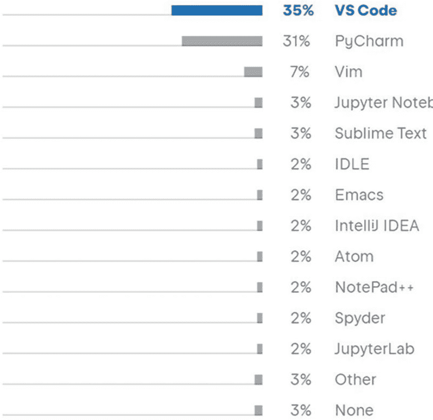

图 主流 IDE/编辑器（来源：JetBrains/Python 软件基金会）

根据 Visual Studio Magazine（2022年7月）发布的一份报告，Visual Studio Code 的 Python 扩展安装量已超过 6000 万次，这无疑是目前最高的安装量。Jupyter（4080 万次）、Pylance（3350 万次）和 Jupyter Keymap（2340 万次）这些（同样与 Python 相关的）扩展分别占据了第二、第三和第五位。但是，这并非一蹴而就。Visual Studio Code 与 GitHub、Codespaces 和 Azure Machine Learning 一起，一直在大力投资工具和平台，以让 Python 数据科学家的生活更轻松（来源：EuroPython show 2021）。令人欣喜的是，我们将在本书的后续章节中涵盖所有这些内容，因此请放心，你将学到当今可用的最佳工具。

让我们来看看它的一些特性，以及它为何成为程序员最喜爱的代码编辑器：

- 它是一个免费的开源（基于 MIT 许可证）跨平台应用程序。
- 它易于使用。
- 它是一个轻量级、快速但功能强大的源代码编辑器。
- 它可以与脚本工具集成，并执行诸如开发日常工作流等常见任务。
- 它内置了对 IntelliSense 代码补全、代码重构、参数提示、多光标编辑和丰富的语义代码理解等工具的支持，将编程提升到了一个新的水平。例如，如果用户在程序中使用某个变量之前忘记声明它，IntelliSense 会声明该变量。示例截图如图所示。

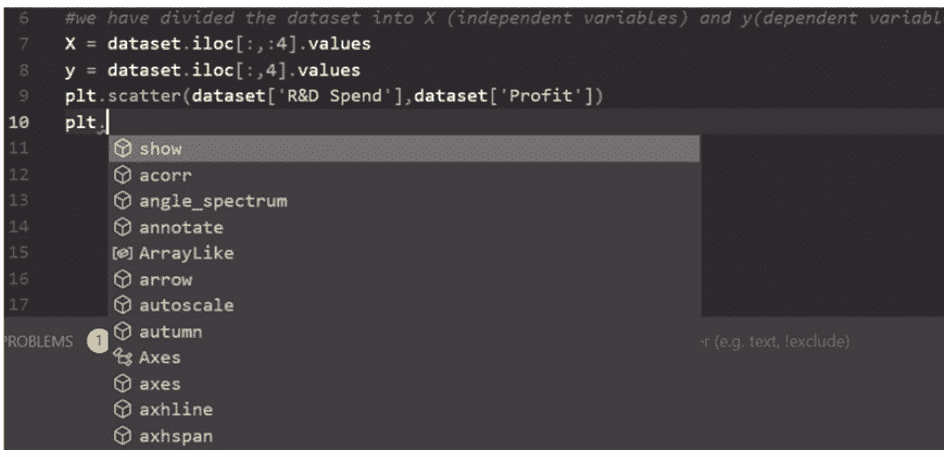

图 在 VS Code 中使用 IntelliSense 进行自动补全

- 它具有集成的交互式调试器，可帮助逐步执行代码、检查变量值和查看调用堆栈。它还可以在控制台中执行命令。图 1.3 显示了集成交互式调试器在图像上标记的各种选项：

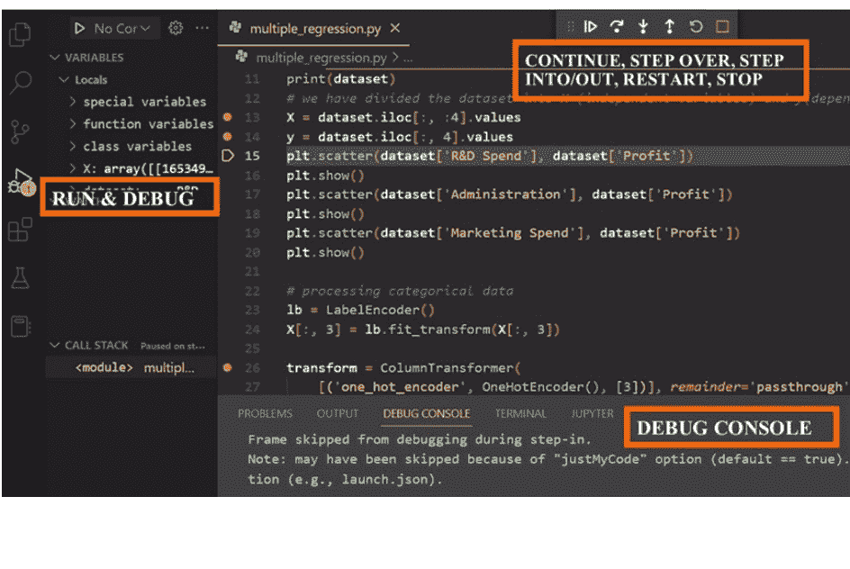

## 图 在 VS Code 中调试

- 它在桌面运行，适用于 Windows、macOS 和 Linux。以前，编辑器通常只支持 Windows、Linux 或 Mac 中的一种操作系统。但 VS Code 是跨平台的，因此它可以轻松地在所有三个平台上工作。
- 它完全可定制，以适应任何开发者的偏好和项目需求。
- 它拥有社区的大力支持和大量的扩展。因此，如果程序员找不到对某种特定编程语言的支持，他们可以轻松下载扩展并继续工作。
- 它内置了对 JavaScript、TypeScript 和 Node.js 等 Web 编程语言的支持。它还拥有一个针对多种其他语言和运行时的扩展生态系统，例如 C++、C#、Java、Python、PHP、Go 和 .NET。这只是支持的 30 多种语言中的一部分。这里还有另一个优势；VS Code 可以轻松检测跨语言引用中是否存在任何错误。
- 可以通过其各种设置（语言、用户和工作区）配置为任何人的喜好。VS Code 提供了多个设置范围，使我们能够修改 Code 编辑器、用户界面和功能行为的几乎每个部分。
- 它为计算机程序员提供了全面的设施，通过语法高亮、括号匹配、自动缩进、框选、代码片段等众多功能，使其能够立即投入工作。
- 它支持 Git，这意味着程序员无需离开编辑器即可使用源代码管理，甚至可以查看待处理的更改差异。
- 它支持多个项目。可以同时打开包含多个文件/文件夹的项目并进行工作。这些项目或文件夹甚至可以彼此无关。
- 它提供内置终端/控制台，因此用户无需在 VS Code 和命令提示符或终端之间切换。
- 它受到前端和后端开发者的喜爱，因为它支持多种语言。除此之外，还提供了常见的放大、缩小、亮度和主题选择功能。
- 它每月更新，包含新功能和错误修复。

## 什么是 VS Code？

现在，让我们理解为什么 VS Code 可能是当前所有可用代码编辑器中更好的选择。首先，它是免费使用的，并且具有全功能 IDE 通常才有的非常有用的功能。它使程序员能够编写代码、调试、自动补全或纠正代码。代码编辑器很难拥有这样的功能，但由于 VS Code 集成了 IntelliSense，这使得它成为可能。在本节中，我们将了解 VS Code 编辑器是什么，以及 VS Code 如何集成如此强大的功能。图 1.4 显示了在 VS Code 编辑器上运行的示例程序：

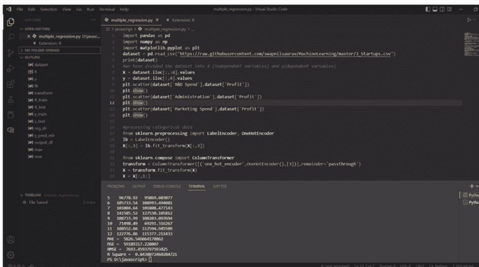

VS Code 使用 Electron 框架开发，并由 Microsoft 开源，旨在创建一个轻量级的替代方案，以替代 Microsoft 的 Visual Studio（一个复杂的、全功能的集成开发环境）。IDE 和代码编辑器之间存在差异。IDE 是健壮且自包含的软件，旨在使编程更容易。IDE 的所有工具都是集成的。另一方面，代码编辑器是一个文本编辑器，具有强大的内置功能。IDE 也内置了代码编辑器，开发者在其中编写代码。VS Code 的源代码在 MIT 许可证下，并在 GitHub 的 VS Code 仓库中维护。尽管 VS Code 以标准的 Microsoft 产品许可证发布，但它是免费使用的。商业许可证被附加是因为它包含一小部分 Microsoft 特定的定制。由于它是开源的，开发者可以通过在 GitHub 位置添加问题或发起拉取请求来为改进 VS Code 做出贡献。Electron 的开源框架由 GitHub 维护，旨在使用 HTML、Javascript 和 CSS 等 Web 技术开发基于桌面的应用程序。

## VS Code：上下文视图

在本节中，我们将查看 VS Code 的上下文图。系统上下文图是一个块或工程图，它定义了系统及其环境的边界，并表示与系统交互的所有外部实体。这提供了对系统的高层次理解。创建和理解系统上下文图的目标是理解并关注在开发整个系统时考虑的外部组件和事件。图 1.5 显示了上下文视图图；我们识别不同的实体，并查看它们如何连接到 Visual Studio Code：


图 Visual Studio Code 的上下文图

前面的图 1.5 显示了与 VS Code 的开发、维护和使用相关的多个利益相关者和外部流程。VS Code 项目使用 Electron 框架构建。该框架使用 HTML、Javascript、CSS 和 TypeScript 等编程语言，并为不同的操作系统构建安装程序。VS Code 网站随后分发这三个操作系统的安装程序。VS Code 网站还提供文档（Docs）、新版本更新（Updates）、VS Code 社区讨论（Blog）、与 API 相关的文档（API）以及可用扩展列表（Extensions）。扩展的使用也有助于个性化 VS Code 编辑器，例如，为编辑器选择自己的字体类型和大小。

GitHub 提供了一个基于云的 Git 仓库，提供软件开发和版本控制服务。VS Code 的代码和问题/错误由 GitHub 上的开发者管理和跟踪，并通过社区的贡献来解决。Wiki 包含诸如项目结构、如何为代码做贡献以及指向各种资源的链接等信息。

上下文图中的下一个主要利益相关者。Microsoft 开发了 VS Code。开发者为添加新功能或修复社区发现的错误做出贡献。Atom、Vim、Emacs 和 Sublime Text 被确定为竞争对手，因为它们也是用于开发应用程序的轻量级文本编辑器。我们不将 Visual Studio、Pycharm 或 IntelliJ 等 IDE 视为竞争对手，因为它们比代码编辑器更复杂。

## VS Code：开发视图

开发或实现视图从程序员的角度展示软件系统，涉及软件管理。在本节中，我们将探讨架构和软件开发流程、代码结构以及设计和测试的执行方式。

VS Code 拥有分层和模块化的核心（文件夹位置在 GitHub：这些可以通过扩展进行扩展。扩展在名为扩展宿主的独立进程中运行，并通过扩展 API 实现。内置扩展位于扩展文件夹中。六个核心层协同工作，使 VS Code 成为一个强大的编辑器。这些层如图所示

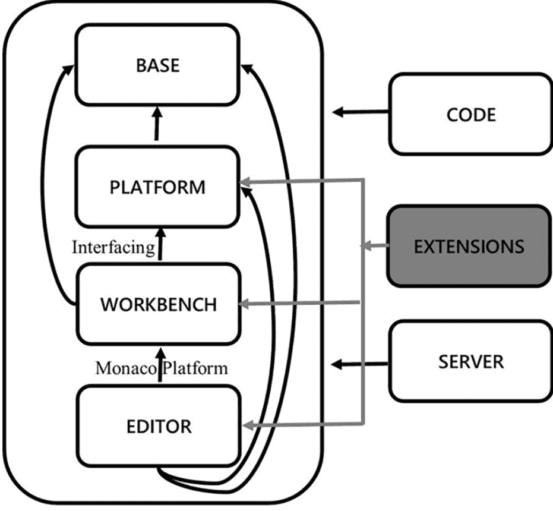

图 VS Code 模块图

现在让我们了解这些层的用途：

此文件夹包含用户界面构建块和通用工具，任何其他层都可以使用。这种通用环境方法提供了，除其他外，处理错误、处理事件以及执行其他 Web 相关任务的结构。在通用环境中，代码范围广泛，从简单的函数以减少代码重复（例如为对象返回哈希值），到处理异步过程的复杂代码。它还具有其他功能，例如：

- 读取配置文件，
- 处理加密的校验和，
- 字符编码和解码，
- 用于目录和文件操作的操作系统功能，以及
- 用于与 Web 交互的网络处理。

此层定义了服务注入支持和 VS Code 的基础服务，这些服务跨层共享，并排除了编辑器或工作台特定的代码或服务。VS Code 项目围绕的大多数服务都在平台层中定义。平台层建立在基础层之上，创建实例并为几乎所有内容注册服务。扩展全部通过平台层实例化和注册。工作台层建立在平台层之上，初始化了更多细节，例如 CSS，这些细节不由平台处理。

到目前为止，我们知道 VS Code 拥有高生产力的代码编辑器，它提供了 IDE 的强大功能和文本编辑器的效率。现在，让我们看看这一切是如何可能的！VS Code 编辑器背后的强大功能是 Monaco 编辑器。Monaco 最初是微软瑞士实验室的一个项目，是构建在线开发工具计划的一部分。它使用 TypeScript 构建，并于 2013 年推出。Monaco 编辑器的第一个工作是作为 Azure 的网站编辑工具，它也被用作 Office 365 扩展开发站点的编辑器。编辑器层处理从不同语言的语法高亮到用户输入（如复制、粘贴和选择文本）的所有内容。编辑器层中定义的服务可供控制器用来获取某些数据。其中一项服务是 TextMate，它解释用于文本高亮的语法文件。编辑器层的最后一部分是贡献。贡献扩展了诸如隐藏和取消隐藏（阻止）注释、代码缩进以及链接使用等功能。

它包含 Monaco 编辑器和代码笔记本。它还为资源管理器、状态栏或菜单栏等面板提供框架。它利用 Electron 框架来实现 VS Code 桌面应用程序和用于 Web 的 VS Code 的浏览器 API。工作台的实际 GUI 是使用 electron-browser 环境实现的。当主组件启动工作台时，首先调用 shell 组件。shell 组件有五个组件构成实际的工作台：

- 它在崩溃时处理工作台。
- 它保存工作台的设置。
- 它处理可在工作台中使用的不同键绑定。
- 它处理安装在工作台中的不同扩展。
- 它处理可在工作台中执行的各种操作，例如放大/缩小、切换窗口和打开新窗口。

它将 Electron 主文件、共享进程和 CLI 组合在一起，形成桌面应用程序的入口点。

这构成了用于远程开发的服务器应用程序的入口点。

扩展使用扩展 API 并在名为扩展宿主的独立进程中运行。在每一层内部，VS Code 按目标运行时环境组织，以确保仅使用特定于运行时的 API。VS Code 项目具有以下目标环境：

- 仅需要基本 JavaScript API 并在所有其他目标环境中运行的源代码
- 需要浏览器 API 的源代码
- 需要 Nodejs API 的源代码
- 需要 Electron 渲染器进程 API 的源代码
- 需要 Electron 主进程 API 的源代码

这种分层方法有其优势。将服务注入 VS Code 变得容易。

## 标准化

VS Code 拥有一个庞大而活跃的开发者社区，帮助发现和解决软件缺陷。如果不遵循编码和测试的标准流程，管理代码库将变得一团糟。在本节中，我们将简要了解贡献者如何建议新功能、提交缺陷详情、构建扩展、评论新想法或提交拉取请求。

但在您作为贡献者继续之前，您需要很好地理解标准。VS Code 有一个维基，开发者可以在其中找到有关代码库的信息以及如何使用源代码的说明。维基上列出了您可以如何贡献的详细说明和编码准则。它定义了应如何编写代码以保持每个文件的可读性和可维护性。

Visual Studio Code 使用称为 linter 的工具来强制执行编码准则。这些工具具有配置文件，并在 VS Code 的 Git 根目录中设置。通过在 Visual Studio Code 中将这些 linter 安装为扩展，开发者会在编辑器中收到可视化的错误和其他类型的消息通知。

Visual Studio Code 使用 JavaScript 测试框架 Mocha 进行测试。在每次发布之前都会执行冒烟测试。执行此冒烟测试是为了确保所有主要功能按预期工作。VS Code 使用 Travis CI 和 Appveyor 在 GitHub 上进行持续集成。Travis CI 用于测试 Linux 和 Mac OS 构建，而 AppVeyor 在 Windows 上运行构建测试。

## 技术债务

技术债务，在软件工程领域也称为设计债务或代码债务，是一个概念，它显示并反映了由于软件开发人员选择有限或简单的开发工作来解决问题，而不是使用可能耗时更长并可能延迟发布的更好方法而导致的额外开发工作。技术债务也可能源于实现不良的编程语法，导致代码可读性差以及后续维护代码困难。术语“技术债务”由软件开发者 Ward Cunningham 创造，他是创建第一个维基的 17 位敏捷宣言作者之一。他首次使用技术债务隐喻向 WyCash 的非技术利益相关者解释为什么他们应该投资资源进行代码重构以改进现有代码并添加新功能。

VS Code 有多个扩展可供用户使用，以捕获不良代码，并管理和减少技术债务。这些扩展可以按需安装。一些有助于实现更好和更高效代码的扩展是 Stepsize、TODO Highlight、SonarLint 和 Code Runner。Linter（或简称 Lint）的名称源自最初用于管理 C 语言源代码的 Unix 工具，它是一个静态代码分析工具。Linter 突出显示编程错误、错误、编码标准错误和可能的构造错误。在 linter 中，命名约定、类型转换和代码样式的规则被编写，以确保贡献者不会增加技术债务。如果开发者将代码推送到 VS Code GitHub 时未安装 linter，那么他们会收到预提交检查的相同通知。如果这些预提交检查失败，在能够提交并推送期望的贡献之前，必须先修复一些技术债务。

## VS Code：功能视图

VS Code 的功能视图定义了构成其功能的架构元素。它阐述了 VS Code 能做什么和不能做什么。在本节中，我们将探讨关键功能和外部接口。

## 功能

功能列表如下表所示：

| Visual Studio Code 核心功能列表 |
| --- |
| table: table: table: table: table: table: table: table: table: table: table: |
| table: table: table: table: table: table: table: table: table: table: table: |
| table: table: table: table: table: table: table: table: table: table: table: table: table: |
| table: table: table: table: table: table: table: table: table: table: table: table: table: |
| table: table: table: table: table: table: |
| table: table: table: table: table: table: table: table: table: table: table: |
| table: table: table: |

## 外部接口

VS Code 连接了多个外部接口。此处仅列出其中一部分：

| them: |
| --- |
| them: them: them: them: them: them: them: them: them: them: them: them: them: them: them: them: them: them: them: them: them: them: them: them: them: them: them: them: them: them: them: them: them: them: them: them: them: them: them: them: them: them: them: them: them: them: them: them: them: them: them: them: them: them: them: them: them: them: them: them: them: them: them: them: them: them: them: them: them: them: them: them: them: them: them: them: them: them: them: them: them: them: them: them: them: them: them: them: them: them: them: them: them: them: them: them: them: them: them: them: them: them: them: them: them: them: them: them: them: them: them: them: them: them: them: them: them: them: them: them: them: them: them: them: them: them: them: them: them: them: them: them: them: them: them: them: them: them: them: them: them: them: them: them: them: them: them: them: them: them: them: them: them: them: them: them: them: them: them: them: them: them: them: them: them: them: them: them: them: them: them: them: them: them: them: them: them: them: them: them: them: them: them: them: them: them: them: them: them: them: them: them: them: them: them: them: them: them: them: them: them: them: them: them: them: them: them: them: them: them: them: them: them: them: them: them: them: them: them: them: them: them: them: them: them: them: them: them: them: them: them: them: them: them: them: them: them: them: them: them: them: them: them: them: them: them: them: them: them: them: them: them: them: them: them: them: them: them: them: them: them: them: them: them: them: them: them: them: them: them: them: them: them: them: them: them: them: them: them: them: them: them: them: them: them: them: them: them: them: them: them: them: them: them: them: them: them: them: them: them: them: them: them: them: them: them: them: them: them: them: them: them: them: them: them: them: them: them: them: them: them: them: them: them: them: them: them: them: them: them: them: them: them: them: them: them: them: them: them: them: them: them: them: them: them: them: them: them: them: them: them: them: them: them: them: them: them: them: them: them: them: them: them: them: them: them: them: them: them: them: them: them: them: them: them: them: them: them: them: them: them: them: them: them: them: them: them: them: them: them: them: them: them: them: them: them: them: them: them: them: them: them: them: them: them: them: them: them: them: them: them: them: them: them: them: them: them: them: them: them: them: them: them: them: them: them: them: them: them: them: them: them: them: them: them: them: them: them: them: them: them: them: them: them: them: them: them: them: them: them: them: them: them: them: them: them: them: them: them: them: them: them: them: them: them: them: them: them: them: them: them: them: them: them: them: them: them: them: them: them: them: them: them: them: them: them: them: them: them: them: them: them: them: them: them: them: them: them: them: them: them: them: them: them: them: them: them: them: them: them: them: them: them: them: them: them: them: them: them: them: them: them: them: them: them: them: them: them: them: them: them: them: them: them: them: them: them: them: them: them: them: them: them: them: them: them: them: them: them: them: them: them: them: them: them: them: them: them: them: them: them: them: them: them: them: them: them: them: them: them: them: them: them: them: them: them: them: them: them: them: them: them: them: them: them: them: them: them: them: them: them: them: them: them: them: them: them: them: them: them: them: them: them: them: them: them: them: them: them: them: them: them: them: them: them: them: them: them: them: them: them: them: them: them: them: them: them: them: them: them: them: them: them: them: them: them: them: them: them: them: them: them: them: them: them: them: them: them: them: them: them: them: them: them: them: them: them: them: them: them: them: them: them: them: them: them: them: them: them: them: them: them: them: them: them: them: them: them: them: them: them: them: them: them: them: them: them: them: them: them: them: them: them: them: them: them: them: them: them: them: them: them: them: them: them: them: them: them: them: them: them: them: them: them: them: them: them: them: them: them: them: them: them: them: them: them: them: them: them: them: them: them: them: them: them: them: them: them: them: them: them: them: them: them: them: them: them: them: them: them: them: them: them: them: them: them: them: them: them: them: them: them: them: them: them: them: them: them: them: them: them: them: them: them: them: them: them: them: them: them: them: them: them: them: them: them: them: them: them: them: them: them: them: them: them: them: them: them: them: them: them: them: them: them: them: them: them: them: them: them: them: them: them: them: them: them: them: them: them: them: them: them: them: them: them: them: them: them: them: them: them: them: them: them: them: them: them: them: them: them: them: them: them: them: them: them: them: them: them: them: them: them: them: them: them: them: them: them: them: them: them: them: them: them: them: them: them: them: them: them: them: them: them: them: them: them: them: them: them: them: them: them: them: them: them: them: them: them: them: them: them: them: them: them: them: them: them: them: them: them: them: them: them: them: them: them: them: them: them: them: them: them: them: them: them: them: them: them: them: them: them: them: them: them: them: them: them: them: them: them: them: them: them: them: them: them: them: them: them: them: them: them: them: them: them: them: them: them: them: them: them: them: them: them: them: them: them: them: them: them: them: them: them: them: them: them: them: them: them: them: them: them: them: them: them: them: them: them: them: them: them: them: them: them: them: them: them: them: them: them: them: them: them: them: them: them: them: them: them: them: them: them: them: them: them: them: them: them: them: them: them: them: them: them: them: them: them: them: them: them: them: them: them: them: them: them: them: them: them: them: them: them: them: them: them: them: them: them: them: them: them: them: them: them: them: them: them: them: them: them: them: them: them: them: them: them: them: them: them: them: them: them: them: them: them: them: them: them: them: them: them: them: them: them: them: them: them: them: them: them: them: them: them: them: them: them: them: them: them: them: them: them: them: them: them: them: them: them: them: them: them: them: them: them: them: them: them: them: them: them: them: them: them: them: them: them: them: them: them: them: them: them: them: them: them: them: them: them: them: them: them: them: them: them: them: them: them: them: them: them: them: them: them: them: them: them: them: them: them: them: them: them: them: them: them: them: them: them: them: them: them: them: them: them: them: them: them: them: them: them: them: them: them: them: them: them: them: them: them: them: them: them: them: them: them: them: them: them: them: them: them: them: them: them: them: them: them: them: them: them: them: them: them: them: them: them: them: them: them: them: them: them: them: them: them: them: them: them: them: them: them: them: them: them: them: them: them: them: them: them: them: them: them: them: them: them: them: them: them: them: them: them: them: them: them: them: them: them: them: them: them: them: them: them: them: them: them: them: them: them: them: them: them: them: them: them: them: them: them: them: them: them: them: them: them: them: them: them: them: them: them: them: them: them: them: them: them: them: them: them: them: them: them: them: them: them: them: them: them: them: them: them: them: them: them: them: them: them: them: them: them: them: them: them: them: them: them: them: them: them: them: them: them: them: them: them: them: them: them: them: them: them: them: them: them: them: them: them: them: them: them: them: them: them: them: them: them: them: them: them: them: them: them: them: them: them: them: them: them: them: them: them: them: them: them: them: them: them: them: them: them: them: them: them: them: them: them: them: them: them: them: them: them: them: them: them: them: them: them: them: them: them: them: them: them: them: them: them: them: them: them: them: them: them: them: them: them: them: them: them: them: them: them: them: them: them: them: them: them: them: them: them: them: them: them: them: them: them: them: them: them: them: them: them: them: them: them: them: them: them: them: them: them: them: them: them: them: them: them: them: them: them: them: them: them: them: them: them: them: them: them: them: them: them: them: them: them: them: them: them: them: them: them: them: them: them: them: them: them: them: them: them: them: them: them: them: them: them: them: them: them: them: them: them: them: them: them: them: them: them: them: them: them: them: them: them: them: them: them: them: them: them: them: them: them: them: them: them: them: them: them: them: them: them: them: them: them: them: them: them: them: them: them: them: them: them: them: them: them: them: them: them: them: them: them: them: them: them: them: them: them: them: them: them: them: them: them: them: them: them: them: them: them: them: them: them: them: them: them: them: them: them: them: them: them: them: them: them: them: them: them: them: them: them: them: them: them: them: them: them: them: them: them: them: them: them: them: them: them: them: them: them: them: them: them: them: them: them: them: them: them: them: them: them: them: them: them: them: them: them: them: them: them: them: them: them: them: them: them: them: them: them: them: them: them: them: them: them: them: them: them: them: them: them: them: them: them: them: them: them: them: them: them: them: them: them: them: them: them: them: them: them: them: them: them: them: them: them: them: them: them: them: them: them: them: them: them: them: them: them: them: them: them: them: them: them: them: them: them: them: them: them: them: them: them: them: them: them: them: them: them: them: them: them: them: them: them: them: them: them: them: them: them: them: them: them: them: them: them: them: them: them: them: them: them: them: them: them: them: them: them: them: them: them: them: them: them: them: them: them: them: them: them: them: them: them: them: them: them: them: them: them: them: them: them: them: them: them: them: them: them: them: them: them: them: them: them: them: them: them: them: them: them: them: them: them: them: them: them: them: them: them: them: them: them: them: them: them: them: them: them: them: them: them: them: them: them: them: them: them: them: them: them: them: them: them: them: them: them: them: them: them: them: them: them: them: them: them: them: them: them: them: them: them: them: them: them: them: them: them: them: them: them: them: them: them: them: them: them: them: them: them: them: them: them: them: them: them: them: them: them: them: them: them: them: them: them: them: them: them: them: them: them: them: them: them: them: them: them: them: them: them: them: them: them: them: them: them: them: them: them: them: them: them: them: them: them: them: them: them: them: them: them: them: them: them: them: them: them: them: them: them: them: them: them: them: them: them: them: them: them: them: them: them: them: them: them: them: them: them: them: them: them: them: them: them: them: them: them: them: them: them: them: them: them: them: them: them: them: them: them: them: them: them: them: them: them: them: them: them: them: them: them: them: them: them: them: them: them: them: them: them: them: them: them: them: them: them: them: them: them: them: them: them: them: them: them: them: them: them: them: them: them: them: them: them: them: them: them: them: them: them: them: them: them: them: them: them: them: them: them: them: them: them: them: them: them: them: them: them: them: them: them: them: them: them: them: them: them: them: them: them: them: them: them: them: them: them: them: them: them: them: them: them: them: them: them: them: them: them: them: them: them: them: them: them: them: them: them: them: them: them: them: them: them: them: them: them: them: them: them: them: them: them: them: them: them: them: them: them: them: them: them: them: them: them: them: them: them: them: them: them: them: them: them: them: them: them: them: them: them: them: them: them: them: them: them: them: them: them: them: them: them: them: them: them: them: them: them: them: them: them: them: them: them: them: them: them: them: them: them: them: them: them: them: them: them: them: them: them: them: them: them: them: them: them: them: them: them: them: them: them: them: them: them: them: them: them: them: them: them: them: them: them: them: them: them: them: them: them: them: them: them: them: them: them: them: them: them: them: them: them: them: them: them: them: them: them: them: them: them: them: them: them: them: them: them: them: them: them: them: them: them: them: them: them: them: them: them: them: them: them: them: them: them: them: them: them: them: them: them: them: them: them: them: them: them: them: them: them: them: them: them: them: them: them: them: them: them: them: them: them: them: them: them: them: them: them: them: them: them: them: them: them: them: them: them: them: them: them: them: them: them: them: them: them: them: them: them: them: them: them: them: them: them: them: them: them: them: them: them: them: them: them: them: them: them: them: them: them: them: them: them: them: them: them: them: them: them: them: them: them: them: them: them: them: them: them: them: them: them: them: them: them: them: them: them: them: them: them: them: them: them: them: them: them: them: them: them: them: them: them: them: them: them: them: them: them: them: them: them: them: them: them: them: them: them: them: them: them: them: them: them: them: them: them: them: them: them: them: them: them: them: them: them: them: them: them: them: them: them: them: them: them: them: them: them: them: them: them: them: them: them: them: them: them: them: them: them: them: them: them: them: them: them: them: them: them: them: them: them: them: them: them: them: them: them: them: them: them: them: them: them: them: them: them: them: them: them: them: them: them: them: them: them: them: them: them: them: them: them: them: them: them: them: them: them: them: them: them: them: them: them: them: them: them: them: them: them: them: them: them: them: them: them: them: them: them: them: them: them: them: them: them: them: them: them: them: them: them: them: them: them: them: them: them: them: them: them: them: them: them: them: them: them: them: them: them: them: them: them: them: them: them: them: them: them: them: them: them: them: them: them: them: them: them: them: them: them: them: them: them: them: them: them: them: them: them: them: them: them: them: them: them: them: them: them: them: them: them: them: them: them: them: them: them: them: them: them: them: them: them: them: them: them: them: them: them: them: them: them: them: them: them: them: them: them: them: them: them: them: them: them: them: them: them: them: them: them: them: them: them: them: them: them: them: them: them: them: them: them: them: them: them: them: them: them: them: them: them: them: them: them: them: them: them: them: them: them: them: them: them: them: them: them: them: them: them: them: them: them: them: them: them: them: them: them: them: them: them: them: them: them: them: them: them: them: them: them: them: them: them: them: them: them: them: them: them: them: them: them: them: them: them: them: them: them: them: them: them: them: them: them: them: them: them: them: them: them: them: them: them: them: them: them: them: them: them: them: them: them: them: them: them: them: them: them: them: them: them: them: them: them: them: them: them: them: them: them: them: them: them: them: them: them: them: them: them: them: them: them: them: them: them: them: them: them: them: them: them: them: them: them: them: them: them: them: them: them: them: them: them: them: them: them: them: them: them: them: them: them: them: them: them: them: them: them: them: them: them: them: them: them: them: them: them: them: them: them: them: them: them: them: them: them: them: them: them: them: them: them: them: them: them: them: them: them: them: them: them: them: them: them: them: them: them: them: them: them: them: them: them: them: them: them: them: them: them: them: them: them: them: them: them: them: them: them: them: them: them: them: them: them: them: them: them: them: them: them: them: them: them: them: them: them: them: them: them: them: them: them: them: them: them: them: them: them: them: them: them: them: them: them: them: them: them: them: them: them: them: them: them: them: them: them: them: them: them: them: them: them: them: them: them: them: them: them: them: them: them: them: them: them: them: them: them: them: them: them: them: them: them: them: them: them: them: them: them: them: them: them: them: them: them: them: them: them: them: them: them: them: them: them: them: them: them: them: them: them: them: them: them: them: them: them: them: them: them: them: them: them: them: them: them: them: them: them: them: them: them: them: them: them: them: them: them: them: them: them: them: them: them: them: them: them: them: them: them: them: them: them: them: them: them: them: them: them: them: them: them: them: them: them: them: them: them: them: them: them: them: them: them: them: them: them: them: them: them: them: them: them: them: them: them: them: them: them: them: them: them: them: them: them: them: them: them: them: them: them: them: them: them: them: them: them: them: them: them: them: them: them: them: them: them: them: them: them: them: them: them: them: them: them: them: them: them: them: them: them: them: them: them: them: them: them: them: them: them: them: them: them: them: them: them: them: them: them: them: them: them: them: them: them: them: them: them: them: them: them: them: them: them: them: them: them: them: them: them: them: them: them: them: them: them: them: them: them: them: them: them: them: them: them: them: them: them: them: them: them: them: them: them: them: them: them: them: them: them: them: them: them: them: them: them: them: them: them: them: them: them: them: them: them: them: them: them: them: them: them: them: them: them: them: them: them: them: them: them: them: them: them: them: them: them: them: them: them: them: them: them: them: them: them: them: them: them: them: them: them: them: them: them: them: them: them: them: them: them: them: them: them: them: them: them: them: them: them: them: them: them: them: them: them: them: them: them: them: them: them: them: them: them: them: them: them: them: them: them: them: them: them: them: them: them: them: them: them: them: them: them: them: them: them: them: them: them: them: them: them: them: them: them: them: them: them: them: them: them: them: them: them: them: them: them: them: them: them: them: them: them: them: them: them: them: them: them: them: them: them: them: them: them: them: them: them: them: them: them: them: them: them: them: them: them: them: them: them: them: them: them: them: them: them: them: them: them: them: them: them: them: them: them: them: them: them: them: them: them: them: them: them: them: them: them: them: them: them: them: them: them: them: them: them: them: them: them: them: them: them: them: them: them: them: them: them: them: them: them: them: them: them: them: them: them: them: them: them: them: them: them: them: them: them: them: them: them: them: them: them: them: them: them: them: them: them: them: them: them: them: them: them: them: them: them: them: them: them: them: them: them: them: them: them: them: them: them: them: them: them: them: them: them: them: them: them: them: them: them: them: them: them: them: them: them: them: them: them: them: them: them: them: them: them: them: them: them: them: them: them: them: them: them: them: them: them: them: them: them: them: them: them: them: them: them: them: them: them: them: them: them: them: them: them: them: them: them: them: them: them: them: them: them: them: them: them: them: them: them: them: them: them: them: them: them: them: them: them: them: them: them: them: them: them: them: them: them: them: them: them: them: them: them: them: them: them: them: them: them: them: them: them: them: them: them: them: them: them: them: them: them: them: them: them: them: them: them: them: them: them: them: them: them: them: them: them: them: them: them: them: them: them: them: them: them: them: them: them: them: them: them: them: them: them: them: them: them: them: them: them: them: them: them: them: them: them: them: them: them: them: them: them: them: them: them: them: them: them: them: them: them: them: them: them: them: them: them: them: them: them: them: them: them: them: them: them: them: them: them: them: them: them: them: them: them: them: them: them: them: them: them: them: them: them: them: them: them: them: them: them: them: them: them: them: them: them: them: them: them: them: them: them: them: them: them: them: them: them: them: them: them: them: them: them: them: them: them: them: them: them: them: them: them: them: them: them: them: them: them: them: them: them: them: them: them: them: them: them: them: them: them: them: them: them: them: them: them: them: them: them: them: them: them: them: them: them: them: them: them: them: them: them: them: them: them: them: them: them: them: them: them: them: them: them: them: them: them: them: them: them: them: them: them: them: them: them: them: them: them: them: them: them: them: them: them: them: them: them: them: them: them: them: them: them: them: them: them: them: them: them: them: them: them: them: them: them: them: them: them: them: them: them: them: them: them: them: them: them: them: them: them: them: them: them: them: them: them: them: them: them: them: them: them: them: them: them: them: them: them: them: them: them: them: them: them: them: them: them: them: them: them: them: them: them: them: them: them: them: them: them: them: them: them: them: them: them: them: them: them: them: them: them: them: them: them: them: them: them: them: them: them: them: them: them: them: them: them: them: them: them: them: them: them: them: them: them: them: them: them: them: them: them: them: them: them: them: them: them: them: them: them: them: them: them: them: them: them: them: them: them: them: them: them: them: them: them: them: them: them: them: them: them: them: them: them: them: them: them: them: them: them: them: them: them: them: them: them: them: them: them: them: them: them: them: them: them: them: them: them: them: them: them: them: them: them: them: them: them: them: them: them: them: them: them: them: them: them: them: them: them: them: them: them: them: them: them: them: them: them: them: them: them: them: them: them: them: them: them: them: them: them: them: them: them: them: them: them: them: them: them: them: them: them: them: them: them: them: them: them: them: them: them: them: them: them: them: them: them: them: them: them: them: them: them: them: them: them: them: them: them: them: them: them: them: them: them: them: them: them: them: them: them: them: them: them: them: them: them: them: them: them: them: them: them: them: them: them: them: them: them: them: them: them: them: them: them: them: them: them: them: them: them: them: them: them: them: them: them: them: them: them: them: them: them: them: them: them: them: them: them: them: them: them: them: them: them: them: them: them: them: them: them: them: them: them: them: them: them: them: them: them: them: them: them: them: them: them: them: them: them: them: them: them: them: them: them: them: them: them: them: them: them: them: them: them: them: them: them: them: them: them: them: them: them: them: them: them: them: them: them: them: them: them: them: them: them: them: them: them: them: them: them: them: them: them: them: them: them: them: them: them: them: them: them: them: them: them: them: them: them: them: them: them: them: them: them: them: them: them: them: them: them: them: them: them: them: them: them: them: them: them: them: them: them: them: them: them: them: them: them: them: them: them: them: them: them: them: them: them: them: them: them: them: them: them: them: them: them: them: them: them: them: them: them: them: them: them: them: them: them: them: them: them: them: them: them: them: them: them: them: them: them: them: them: them: them: them: them: them: them: them: them: them: them: them: them: them: them: them: them: them: them: them: them: them: them: them: them: them: them: them: them: them: them: them: them: them: them: them: them: them: them: them: them: them: them: them: them: them: them: them: them: them: them: them: them: them: them: them: them: them: them: them: them: them: them: them: them: them: them: them: them: them: them: them: them: them: them: them: them: them: them: them: them: them: them: them: them: them: them: them: them: them: them: them: them: them: them: them: them: them: them: them: them: them: them: them: them: them: them: them: them: them: them: them: them: them: them: them: them: them: them: them: them: them: them: them: them: them: them: them: them: them: them: them: them: them: them: them: them: them: them: them: them: them: them: them: them: them: them: them: them: them: them: them: them: them: them: them: them: them: them: them: them: them: them: them: them: them: them: them: them: them: them: them: them: them: them: them: them: them: them: them: them: them: them: them: them: them: them: them: them: them: them: them: them: them: them: them: them: them: them: them: them: them: them: them: them: them: them: them: them: them: them: them: them: them: them: them: them: them: them: them: them: them: them: them: them: them: them: them: them: them: them: them: them: them: them: them: them: them: them: them: them: them: them: them: them: them: them: them: them: them: them: them: them: them: them: them: them: them: them: them: them: them: them: them: them: them: them: them: them: them: them: them: them: them: them: them: them: them: them: them: them: them: them: them: them: them: them: them: them: them: them: them: them: them: them: them: them: them: them: them: them: them: them: them: them: them: them: them: them: them: them: them: them: them: them: them: them: them: them: them: them: them: them: them: them: them: them: them: them: them: them: them: them: them: them: them: them: them: them: them: them: them: them: them: them: them: them: them: them: them: them: them: them: them: them: them: them: them: them: them: them: them: them: them: them: them: them: them: them: them: them: them: them: them: them: them: them: them: them: them: them: them: them: them: them: them: them: them: them: them: them: them: them: them: them: them: them: them: them: them: them: them: them: them: them: them: them: them: them: them: them: them: them: them: them: them: them: them: them: them: them: them: them: them: them: them: them: them: them: them: them: them: them: them: them: them: them: them: them: them: them: them: them: them: them: them: them: them: them: them: them: them: them: them: them: them: them: them: them: them: them: them: them: them: them: them: them: them: them: them: them: them: them: them: them: them: them: them: them: them: them: them: them: them: them: them: them: them: them: them: them: them: them: them: them: them: them: them: them: them: them: them: them: them: them: them: them: them: them: them: them: them: them: them: them: them: them: them: them: them: them: them: them: them: them: them: them: them: them: them: them: them: them: them: them: them: them: them: them: them: them: them: them: them: them: them: them: them: them: them: them: them: them: them: them: them: them: them: them: them: them: them: them: them: them: them: them: them: them: them: them: them: them: them: them: them: them: them: them: them: them: them: them: them: them: them: them: them: them: them: them: them: them: them: them: them: them: them: them: them: them: them: them: them: them: them: them: them: them: them: them: them: them: them: them: them: them: them: them: them: them: them: them: them: them: them: them: them: them: them: them: them: them: them: them: them: them: them: them: them: them: them: them: them: them: them: them: them: them: them: them: them: them: them: them: them: them: them: them: them: them: them: them: them: them: them: them: them: them: them: them: them: them: them: them: them: them: them: them: them: them: them: them: them: them: them: them: them: them: them: them: them: them: them: them: them: them: them: them: them: them: them: them: them: them: them: them: them: them: them: them: them: them: them: them: them: them: them: them: them: them: them: them: them: them: them: them: them: them: them: them: them: them: them: them: them: them: them: them: them: them: them: them: them: them: them: them: them: them: them: them: them: them: them: them: them: them: them: them: them: them: them: them: them: them: them: them: them: them: them: them: them: them: them: them: them: them: them: them: them: them: them: them: them: them: them: them: them: them: them: them: them: them: them: them: them: them: them: them: them: them: them: them: them: them: them: them: them: them: them: them: them: them: them: them: them: them: them: them: them: them: them: them: them: them: them: them: them: them: them: them: them: them: them: them: them: them: them: them: them: them: them: them: them: them: them: them: them: them: them: them: them: them: them: them: them: them: them: them: them: them: them: them: them: them: them: them: them: them: them: them: them: them: them: them: them: them: them: them: them: them: them: them: them: them: them: them: them: them: them: them: them: them: them: them: them: them: them: them: them: them: them: them: them: them: them: them: them: them: them: them: them: them: them: them: them: them: them: them: them: them: them: them: them: them: them: them: them: them: them: them: them: them: them: them: them: them: them: them: them: them: them: them: them: them: them: them: them: them: them: them: them: them: them: them: them: them: them: them: them: them: them: them: them: them: them: them: them: them: them: them: them: them: them: them: them: them: them: them: them: them: them: them: them: them: them: them: them: them: them: them: them: them: them: them: them: them: them: them: them: them: them: them: them: them: them: them: them: them: them: them: them: them: them: them: them: them: them: them: them: them: them: them: them: them: them: them: them: them: them: them: them: them: them: them: them: them: them: them: them: them: them: them: them: them: them: them: them: them: them: them: them: them: them: them: them: them: them: them: them: them: them: them: them: them: them: them: them: them: them: them: them: them: them: them: them: them: them: them: them: them: them: them: them: them: them: them: them: them: them: them: them: them: them: them: them: them: them: them: them: them: them: them: them: them: them: them: them: them: them: them: them: them: them: them: them: them: them: them: them: them: them: them: them: them: them: them: them: them: them: them: them: them: them: them: them: them: them: them: them: them: them: them: them: them: them: them: them: them: them: them: them: them: them: them: them: them: them: them: them: them: them: them: them: them: them: them: them: them: them: them: them: them: them: them: them: them: them: them: them: them: them: them: them: them: them: them: them: them: them: them: them: them: them: them: them: them: them: them: them: them: them: them: them: them: them: them: them: them: them: them: them: them: them: them: them: them: them: them: them: them: them: them: them: them: them: them: them: them: them: them: them: them: them: them: them: them: them: them: them: them: them: them: them: them: them: them: them: them: them: them: them: them: them: them: them: them: them: them: them: them: them: them: them: them: them: them: them: them: them: them: them: them: them: them: them: them: them: them: them: them: them: them: them: them: them: them: them: them: them: them: them: them: them: them: them: them: them: them: them: them: them: them: them: them: them: them: them: them: them: them: them: them: them: them: them: them: them: them: them: them: them: them: them: them: them: them: them: them: them: them: them: them: them: them: them: them: them: them: them: them: them: them: them: them: them: them: them: them: them: them: them: them: them: them: them: them: them: them: them: them: them: them: them: them: them: them: them: them: them: them: them: them: them: them: them: them: them: them: them: them: them: them: them: them: them: them: them: them: them: them: them: them: them: them: them: them: them: them: them: them: them: them: them: them: them: them: them: them: them: them: them: them: them: them: them: them: them: them: them: them: them: them: them: them: them: them: them: them: them: them: them: them: them: them: them: them: them: them: them: them: them: them: them: them: them: them: them: them: them: them: them: them: them: them: them: them: them: them: them: them: them: them: them: them: them: them: them: them: them: them: them: them: them: them: them: them: them: them: them: them: them: them: them: them: them: them: them: them: them: them: them: them: them: them: them: them: them: them: them: them: them: them: them: them: them: them: them: them: them: them: them: them: them: them: them: them: them: them: them: them: them: them: them: them: them: them: them: them: them: them: them: them: them: them: them: them: them: them: them: them: them: them: them: them: them: them: them: them: them: them: them: them: them: them: them: them: them: them: them: them: them: them: them: them: them: them: them: them: them: them: them: them: them: them: them: them: them: them: them: them: them: them: them: them: them: them: them: them: them: them: them: them: them: them: them: them: them: them: them: them: them: them: them: them: them: them: them: them: them: them: them: them: them: them: them: them: them: them: them: them: them: them: them: them: them: them: them: them: them: them: them: them: them: them: them: them: them: them: them: them: them: them: them: them: them: them: them: them: them: them: them: them: them: them: them: them: them: them: them: them: them: them: them: them: them: them: them: them: them: them: them: them: them: them: them: them: them: them: them: them: them: them: them: them: them: them: them: them: them: them: them: them: them: them: them: them: them: them: them: them: them: them: them: them: them: them: them: them: them: them: them: them: them: them: them: them: them: them: them: them: them: them: them: them: them: them: them: them: them: them: them: them: them: them: them: them: them: them: them: them: them: them: them: them: them: them: them: them: them: them: them: them: them: them: them: them: them: them: them: them: them: them: them: them: them: them: them: them: them: them: them: them: them: them: them: them: them: them: them: them: them: them: them: them: them: them: them: them: them: them: them: them: them: them: them: them: them: them: them: them: them: them: them: them: them: them: them: them: them: them: them: them: them: them: them: them: them: them: them: them: them: them: them: them: them: them: them: them: them: them: them: them: them: them: them: them: them: them: them: them: them: them: them: them: them: them: them: them: them: them: them: them: them: them: them: them: them: them: them: them: them: them: them: them: them: them: them: them: them: them: them: them: them: them: them: them: them: them: them: them: them: them: them: them: them: them: them: them: them: them: them: them: them: them: them: them: them: them: them: them: them: them: them: them: them: them: them: them: them: them: them: them: them: them: them: them: them: them: them: them: them: them: them: them: them: them: them: them: them: them: them: them: them: them: them: them: them: them: them: them: them: them: them: them: them: them: them: them: them: them: them: them: them: them: them: them: them: them: them: them: them: them: them: them: them: them: them: them: them: them: them: them: them: them: them: them: them: them: them: them: them: them: them: them: them: them: them: them: them: them: them: them: them: them: them: them: them: them: them: them: them: them: them: them: them: them: them: them: them: them: them: them: them: them: them: them: them: them: them: them: them: them: them: them: them: them: them: them: them: them: them: them: them: them: them: them: them: them: them: them: them: them: them: them: them: them: them: them: them: them: them: them: them: them: them: them: them: them: them: them: them: them: them: them: them: them: them: them: them: them: them: them: them: them: them: them: them: them: them: them: them: them: them: them: them: them: them: them: them: them: them: them: them: them: them: them: them: them: them: them: them: them: them: them: them: them: them: them: them: them: them: them: them: them: them: them: them: them: them: them: them: them: them: them: them: them: them: them: them: them: them: them: them: them: them: them: them: them: them: them: them: them: them: them: them: them: them: them: them: them: them: them: them: them: them: them: them: them: them: them: them: them: them: them: them: them: them: them: them: them: them: them: them: them: them: them: them: them: them: them: them: them: them: them: them: them: them: them: them: them: them: them: them: them: them: them: them: them: them: them: them: them: them: them: them: them: them: them: them: them: them: them: them: them: them: them: them: them: them: them: them: them: them: them: them: them: them: them: them: them: them: them: them: them: them: them: them: them: them: them: them: them: them: them: them: them: them: them: them: them: them: them: them: them: them: them: them: them: them: them: them: them: them: them: them: them: them: them: them: them: them: them: them: them: them: them: them: them: them: them: them: them: them: them: them: them: them: them: them: them: them: them: them: them: them: them: them: them: them: them: them: them: them: them: them: them: them: them: them: them: them: them: them: them: them: them: them: them: them: them: them: them: them: them: them: them: them: them: them: them: them: them: them: them: them: them: them: them: them: them: them: them: them: them: them: them: them: them: them: them: them: them: them: them: them: them: them: them: them: them: them: them: them: them: them: them: them: them: them: them: them: them: them: them: them: them: them: them: them: them: them: them: them: them: them: them: them: them: them: them: them: them: them: them: them: them: them: them: them: them: them: them: them: them: them: them: them: them: them: them: them: them: them: them: them: them: them: them: them: them: them: them: them: them: them: them: them: them: them: them: them: them: them: them: them: them: them: them: them: them: them: them: them: them: them: them: them: them: them: them: them: them: them: them: them: them: them: them: them: them: them: them: them: them: them: them: them: them: them: them: them: them: them: them: them: them: them: them: them: them: them: them: them: them: them: them: them: them: them: them: them: them: them: them: them: them: them: them: them: them: them: them: them: them: them: them: them: them: them: them: them: them: them: them: them: them: them: them: them: them: them: them: them: them: them: them: them: them: them: them: them: them: them: them: them: them: them: them: them: them: them: them: them: them: them: them: them: them: them: them: them: them: them: them: them: them: them: them: them: them: them: them: them: them: them: them: them: them: them: them: them: them: them: them: them: them: them: them: them: them: them: them: them: them: them: them: them: them: them: them: them: them: them: them: them: them: them: them: them: them: them: them: them: them: them: them: them: them: them: them: them: them: them: them: them: them: them: them: them: them: them: them: them: them: them: them: them: them: them: them: them: them: them: them: them: them: them: them: them: them: them: them: them: them: them: them: them: them: them: them: them: them: them: them: them: them: them: them: them: them: them: them: them: them: them: them: them: them: them: them: them: them: them: them: them: them: them: them: them: them: them: them: them: them: them: them: them: them: them: them: them: them: them: them: them: them: them: them: them: them: them: them: them: them: them: them: them: them: them: them: them: them: them: them: them: them: them: them: them: them: them: them: them: them: them: them: them: them: them: them: them: them: them: them: them: them: them: them: them: them: them: them: them: them: them: them: them: them: them: them: them: them: them: them: them: them: them: them: them: them: them: them: them: them: them: them: them: them: them: them: them: them: them: them: them: them: them: them: them: them: them: them: them: them: them: them: them: them: them: them: them: them: them: them: them: them: them: them: them: them: them: them: them: them: them: them: them: them: them: them: them: them: them: them: them: them: them: them: them: them: them: them: them: them: them: them: them: them: them: them: them: them: them: them: them: them: them: them: them: them: them: them: them: them: them: them: them: them: them: them: them: them: them: them: them: them: them: them: them: them: them: them: them: them: them: them: them: them: them: them: them: them: them: them: them: them: them: them: them: them: them: them: them: them: them: them: them: them: them: them: them: them: them: them: them: them: them: them: them: them: them: them: them: them: them: them: them: them: them: them: them: them: them: them: them: them: them: them: them: them: them: them: them: them: them: them: them: them: them: them: them: them: them: them: them: them: them: them: them: them: them: them: them: them: them: them: them: them: them: them: them: them: them: them: them: them: them: them: them: them: them: them: them: them: them: them: them: them: them: them: them: them: them: them: them: them: them: them: them: them: them: them: them: them: them: them: them: them: them: them: them: them: them: them: them: them: them: them: them: them: them: them: them: them: them: them: them: them: them: them: them: them: them: them: them: them: them: them: them: them: them: them: them: them: them: them: them: them: them: them: them: them: them: them: them: them: them: them: them: them: them: them: them: them: them: them: them: them: them: them: them: them: them: them: them: them: them: them: them: them: them: them: them: them: them: them: them: them: them: them: them: them: them: them: them: them: them: them: them: them: them: them: them: them: them: them: them: them: them: them: them: them: them: them: them: them: them: them: them: them: them: them: them: them: them: them: them: them: them: them: them: them: them: them: them: them: them: them: them: them: them: them: them: them: them: them: them: them: them: them: them: them: them: them: them: them: them: them: them: them: them: them: them: them: them: them: them: them: them: them: them: them: them: them: them: them: them: them: them: them: them: them: them: them: them: them: them: them: them: them: them: them: them: them: them: them: them: them: them: them: them: them: them: them: them: them: them: them: them: them: them: them: them: them: them: them: them: them: them: them: them: them: them: them: them: them: them: them: them: them: them: them: them: them: them: them: them: them: them: them: them: them: them: them: them: them: them: them: them: them: them: them: them: them: them: them: them: them: them: them: them: them: them: them: them: them: them: them: them: them: them: them: them: them: them: them: them: them: them: them: them: them: them: them: them: them: them: them: them: them: them: them: them: them: them: them: them: them: them: them: them: them: them: them: them: them: them: them: them: them: them: them: them: them: them: them: them: them: them: them: them: them: them: them: them: them: them: them: them: them: them: them: them: them: them: them: them: them: them: them: them: them: them: them: them: them: them: them: them: them: them: them: them: them: them: them: them: them: them: them: them: them: them: them: them: them: them: them: them: them: them: them: them: them: them: them: them: them: them: them: them: them: them: them: them: them: them: them: them: them: them: them: them: them: them: them: them: them: them: them: them: them: them: them: them: them: them: them: them: them: them: them: them: them: them: them: them: them: them: them: them: them: them: them: them: them: them: them: them: them: them: them: them: them: them: them: them: them: them: them: them: them: them: them: them: them: them: them: them: them: them: them: them: them: them: them: them: them: them: them: them: them: them: them: them: them: them: them: them: them: them: them: them: them: them: them: them: them: them: them: them: them: them: them: them: them: them: them: them: them: them: them: them: them: them: them: them: them: them: them: them: them: them: them: them: them: them: them: them: them: them: them: them: them: them: them: them: them: them: them: them: them: them: them: them: them: them: them: them: them: them: them: them: them: them: them: them: them: them: them: them: them: them: them: them: them: them: them: them: them: them: them: them: them: them: them: them: them: them: them: them: them: them: them: them: them: them: them: them: them: them: them: them: them: them: them: them: them: them: them: them: them: them: them: them: them: them: them: them: them: them: them: them: them: them: them: them: them: them: them: them: them: them: them: them: them: them: them: them: them: them: them: them: them: them: them: them: them: them: them: them: them: them: them: them: them: them: them: them: them: them: them: them: them: them: them: them: them: them: them: them: them: them: them: them: them: them: them: them: them: them: them: them: them: them: them: them: them: them: them: them: them: them: them: them: them: them: them: them: them: them: them: them: them: them: them: them: them: them: them: them: them: them: them: them: them: them: them: them: them: them: them: them: them: them: them: them: them: them: them: them: them: them: them: them: them: them: them: them: them: them: them: them: them: them: them: them: them: them: them: them: them: them: them: them: them: them: them: them: them: them: them: them: them: them: them: them: them: them: them: them: them: them: them: them: them: them: them: them: them: them: them: them: them: them: them: them: them: them: them: them: them: them: them: them: them: them: them: them: them: them: them: them: them: them: them: them: them: them: them: them: them: them: them: them: them: them: them: them: them: them: them: them: them: them: them: them: them: them: them: them: them: them: them: them: them: them: them: them: them: them: them: them: them: them: them: them: them: them: them: them: them: them: them: them: them: them: them: them: them: them: them: them: them: them: them: them: them: them: them: them: them: them: them: them: them: them: them: them: them: them: them: them: them: them: them: them: them: them: them: them: them: them: them: them: them: them: them: them: them: them: them: them: them: them: them: them: them: them: them: them: them: them: them: them: them: them: them: them: them: them: them: them: them: them: them: them: them: them: them: them: them: them: them: them: them: them: them: them: them: them: them: them: them: them: them: them: them: them: them: them: them: them: them: them: them: them: them: them: them: them: them: them: them: them: them: them: them: them: them: them: them: them: them: them: them: them: them: them: them: them: them: them: them: them: them: them: them: them: them: them: them: them: them: them: them: them: them: them: them: them: them: them: them: them: them: them: them: them: them: them: them: them: them: them: them: them: them: them: them: them: them: them: them: them: them: them: them: them: them: them: them: them: them: them: them: them: them: them: them: them: them: them: them: them: them: them: them: them: them: them: them: them: them: them: them: them: them: them: them: them: them: them: them: them: them: them: them: them: them: them: them: them: them: them: them: them: them: them: them: them: them: them: them: them: them: them: them: them: them: them: them: them: them: them: them: them: them: them: them: them: them: them: them: them: them: them: them: them: them: them: them: them: them: them: them: them: them: them: them: them: them: them: them: them: them: them: them: them: them: them: them: them: them: them: them: them: them: them: them: them: them: them: them: them: them: them: them: them: them: them: them: them: them: them: them: them: them: them: them: them: them: them: them: them: them: them: them: them: them: them: them: them: them: them: them: them: them: them: them: them: them: them: them: them: them: them: them: them: them: them: them: them: them: them: them: them: them: them: them: them: them: them: them: them: them: them: them: them: them: them: them: them: them: them: them: them: them: them: them: them: them: them: them: them: them: them: them: them: them: them: them: them: them: them: them: them: them: them: them: them: them: them: them: them: them: them: them: them: them: them: them: them: them: them: them: them: them: them: them: them: them: them: them: them: them: them: them: them: them: them: them: them: them: them: them: them: them: them: them: them: them: them: them: them: them: them: them: them: them: them: them: them: them: them: them: them: them: them: them: them: them: them: them: them: them: them: them: them: them: them: them: them: them: them: them: them: them: them: them: them: them: them: them: them: them: them: them: them: them: them: them: them: them: them: them: them: them: them: them: them: them: them: them: them: them: them: them: them: them: them: them: them: them: them: them: them: them: them: them: them: them: them: them: them: them: them: them: them: them: them: them: them: them: them: them: them: them: them: them: them: them: them: them: them: them: them: them: them: them: them: them: them: them: them: them: them: them: them: them: them: them: them: them: them: them: them: them: them: them: them: them: them: them: them: them: them: them: them: them: them: them: them: them: them: them: them: them: them: them: them: them: them: them: them: them: them: them: them: them: them: them: them: them: them: them: them: them: them: them: them: them: them: them: them: them: them: them: them: them: them: them: them: them: them: them: them: them: them: them: them: them: them: them: them: them: them: them: them: them: them: them: them: them: them: them: them: them: them: them: them: them: them: them: them: them: them: them: them: them: them: them: them: them: them: them: them: them: them: them: them: them: them: them: them: them: them: them: them: them: them: them: them: them: them: them: them: them: them: them: them: them: them: them: them: them: them: them: them: them: them: them: them: them: them: them: them: them: them: them: them: them: them: them: them: them: them: them: them: them: them: them: them: them: them: them: them: them: them: them: them: them: them: them: them: them: them: them: them: them: them: them: them: them: them: them: them: them: them: them: them: them: them: them: them: them: them: them: them: them: them: them: them: them: them: them: them: them: them: them: them: them: them: them: them: them: them: them: them: them: them: them: them: them: them: them: them: them: them: them: them: them: them: them: them: them: them: them: them: them: them: them: them: them: them: them: them: them: them: them: them: them: them: them: them: them: them: them: them: them: them: them: them: them: them: them: them: them: them: them: them: them: them: them: them: them: them: them: them: them: them: them: them: them: them: them: them: them: them: them: them: them: them: them: them: them: them: them: them: them: them: them: them: them: them: them: them: them: them: them: them: them: them: them: them: them: them: them: them: them: them: them: them: them: them: them: them: them: them: them: them: them: them: them: them: them: them: them: them: them: them: them: them: them: them: them: them: them: them: them: them: them: them: them: them: them: them: them: them: them: them: them: them: them: them: them: them: them: them: them: them: them: them: them: them: them: them: them: them: them: them: them: them: them: them: them: them: them: them: them: them: them: them: them: them: them: them: them: them: them: them: them: them: them: them: them: them: them: them: them: them: them: them: them: them: them: them: them: them: them: them: them: them: them: them: them: them: them: them: them: them: them: them: them: them: them: them: them: them: them: them: them: them: them: them: them: them: them: them: them: them: them: them: them: them: them: them: them: them: them: them: them: them: them: them: them: them: them: them: them: them: them: them: them: them: them: them: them: them: them: them: them: them: them: them: them: them: them: them: them: them: them: them: them: them: them: them: them: them: them: them: them: them: them: them: them: them: them: them: them: them: them: them: them: them: them: them: them: them: them: them: them: them: them: them: them: them: them: them: them: them: them: them: them: them: them: them: them: them: them: them: them: them: them: them: them: them: them: them: them: them: them: them: them: them: them: them: them: them: them: them: them: them: them: them: them: them: them: them: them: them: them: them: them: them: them: them: them: them: them: them: them: them: them: them: them: them: them: them: them: them: them: them: them: them: them: them: them: them: them: them: them: them: them: them: them: them: them: them: them: them: them: them: them: them: them: them: them: them: them: them: them: them: them: them: them: them: them: them: them: them: them: them: them: them: them: them: them: them: them: them: them: them: them: them: them: them: them: them: them: them: them: them: them: them: them: them: them: them: them: them: them: them: them: them: them: them: them: them: them: them: them: them: them: them: them: them: them: them: them: them: them: them: them: them: them: them: them: them: them: them: them: them: them: them: them: them: them: them: them: them: them: them: them: them: them: them: them: them: them: them: them: them: them: them: them: them: them: them: them: them: them: them: them: them: them: them: them: them: them: them: them: them: them: them: them: them: them: them: them: them: them: them: them: them: them: them: them: them: them: them: them: them: them: them: them: them: them: them: them: them: them: them: them: them: them: them: them: them: them: them: them: them: them: them: them: them: them: them: them: them: them: them: them: them: them: them: them: them: them: them: them: them: them: them: them: them: them: them: them: them: them: them: them: them: them: them: them: them: them: them: them: them: them: them: them: them: them: them: them: them: them: them: them: them: them: them: them: them: them: them: them: them: them: them: them: them: them: them: them: them: them: them: them: them: them: them: them: them: them: them: them: them: them: them: them: them: them: them: them: them: them: them: them: them: them: them: them: them: them: them: them: them: them: them: them: them: them: them: them: them: them: them: them: them: them: them: them: them: them: them: them: them: them: them: them: them: them: them: them: them: them: them: them: them: them: them: them: them: them: them: them: them: them: them: them: them: them: them: them: them: them: them: them: them: them: them: them: them: them: them: them: them: them: them: them: them: them: them: them: them: them: them: them: them: them: them: them: them: them: them: them: them: them: them: them: them: them: them: them: them: them: them: them: them: them: them: them: them: them: them: them: them: them: them: them: them: them: them: them: them: them: them: them: them: them: them: them: them: them: them: them: them: them: them: them: them: them: them: them: them: them: them: them: them: them: them: them: them: them: them: them: them: them: them: them: them: them: them: them: them: them: them: them: them: them: them: them: them: them: them: them: them: them: them: them: them: them: them: them: them: them: them: them: them: them: them: them: them: them: them: them: them: them: them: them: them: them: them: them: them: them: them: them: them: them: them: them: them: them: them: them: them: them: them: them: them: them: them: them: them: them: them: them: them: them: them: them: them: them: them: them: them: them: them: them: them: them: them: them: them: them: them: them: them: them: them: them: them: them: them: them: them: them: them: them: them: them: them: them: them: them: them: them: them: them: them: them: them: them: them: them: them: them: them: them: them: them: them: them: them: them: them: them: them: them: them: them: them: them: them: them: them: them: them: them: them: them: them: them: them: them: them: them: them: them: them: them: them: them: them: them: them: them: them: them: them: them: them: them: them: them: them: them: them: them: them: them: them: them: them: them: them: them: them: them: them: them: them: them: them: them: them: them: them: them: them: them: them: them: them: them: them: them: them: them: them: them: them: them: them: them: them: them: them: them: them: them: them: them: them: them: them: them: them: them: them: them: them: them: them: them: them: them: them: them: them: them: them: them: them: them: them: them: them: them: them: them: them: them: them: them: them: them: them: them: them: them: them: them: them: them: them: them: them: them: them: them: them: them: them: them: them: them: them: them: them: them: them: them: them: them: them: them: them: them: them: them: them: them: them: them: them: them: them: them: them: them: them: them: them: them: them: them: them: them: them: them: them: them: them: them: them: them: them: them: them: them: them: them: them: them: them: them: them: them: them: them: them: them: them: them: them: them: them: them: them: them: them: them: them: them: them: them: them: them: them: them: them: them: them: them: them: them: them: them: them: them: them: them: them: them: them: them: them: them: them: them: them: them: them: them: them: them: them: them: them: them: them: them: them: them: them: them: them: them: them: them: them: them: them: them: them: them: them: them: them: them: them: them: them: them: them: them: them: them: them: them: them: them: them: them: them: them: them: them: them: them: them: them: them: them: them: them: them: them: them: them: them: them: them: them: them: them: them: them: them: them: them: them: them: them: them: them: them: them: them: them: them: them: them: them: them: them: them: them: them: them: them: them: them: them: them: them: them: them: them: them: them: them: them: them: them: them: them: them: them: them: them: them: them: them: them: them: them: them: them: them: them: them: them: them: them: them: them: them: them: them: them: them: them: them: them: them: them: them: them: them: them: them: them: them: them: them: them: them: them: them: them: them: them: them: them: them: them: them: them: them: them: them: them: them: them: them: them: them: them: them: them: them: them: them: them: them: them: them: them: them: them: them: them: them: them: them: them: them: them: them: them: them: them: them: them: them: them: them: them: them: them: them: them: them: them: them: them: them: them: them: them: them: them: them: them: them: them: them: them: them: them: them: them: them: them: them: them: them: them: them: them: them: them: them: them: them: them: them: them: them: them: them: them: them: them: them: them: them: them: them: them: them: them: them: them: them: them: them: them: them: them: them: them: them: them: them: them: them: them: them: them: them: them: them: them: them: them: them: them: them: them: them: them: them: them: them: them: them: them: them: them: them: them: them: them: them: them: them: them: them: them: them: them: them: them: them: them: them: them: them: them: them: them: them: them: them: them: them: them: them: them: them: them: them: them: them: them: them: them: them: them: them: them: them: them: them: them: them: them: them: them: them: them: them: them: them: them: them: them: them: them: them: them: them: them: them: them: them: them: them: them: them: them: them: them: them: them: them: them: them: them: them: them: them: them: them: them: them: them: them: them: them: them: them: them: them: them: them: them: them: them: them: them: them: them: them: them: them: them: them: them: them: them: them: them: them: them: them: them: them: them: them: them: them: them: them: them: them: them: them: them: them: them: them: them: them: them: them: them: them: them: them: them: them: them: them: them: them: them: them: them: them: them: them: them: them: them: them: them: them: them: them: them: them: them: them: them: them: them: them: them: them: them: them: them: them: them: them: them: them: them: them: them: them: them: them: them: them: them: them: them: them: them: them: them: them: them: them: them: them: them: them: them: them: them: them: them: them: them: them: them: them: them: them: them: them: them: them: them: them: them: them: them: them: them: them: them: them: them: them: them: them: them: them: them: them: them: them: them: them: them: them: them: them: them: them: them: them: them: them: them: them: them: them: them: them: them: them: them: them: them: them: them: them: them: them: them: them: them: them: them: them: them: them: them: them: them: them: them: them: them: them: them: them: them: them: them: them: them: them: them: them: them: them: them: them: them: them: them: them: them: them: them: them: them: them: them: them: them: them: them: them: them: them: them: them: them: them: them: them: them: them: them: them: them: them: them: them: them: them: them: them: them: them: them: them: them: them: them: them: them: them: them: them: them: them: them: them: them: them: them: them: them: them: them: them: them: them: them: them: them: them: them: them: them: them: them: them: them: them: them: them: them: them: them: them: them: them: them: them: them: them: them: them: them: them: them: them: them: them: them: them: them: them: them: them: them: them: them: them: them: them: them: them: them: them: them: them: them: them: them: them: them: them: them: them: them: them: them: them: them: them: them: them: them: them: them: them: them: them: them: them: them: them: them: them: them: them: them: them: them: them: them: them: them: them: them: them: them: them: them: them: them: them: them: them: them: them: them: them: them: them: them: them: them: them: them: them: them: them: them: them: them: them: them: them: them: them: them: them: them: them: them: them: them: them: them: them: them: them: them: them: them: them: them: them: them: them: them: them: them: them: them: them: them: them: them: them: them: them: them: them: them: them: them: them: them: them: them: them: them: them: them: them: them: them: them: them: them: them: them: them: them: them: them: them: them: them: them: them: them: them: them: them: them: them: them: them: them: them: them: them: them: them: them: them: them: them: them: them: them: them: them: them: them: them: them: them: them: them: them: them: them: them: them: them: them: them: them: them: them: them: them: them: them: them: them: them: them: them: them: them: them: them: them: them: them: them: them: them: them: them: them: them: them: them: them: them: them: them: them: them: them: them: them: them: them: them: them: them: them: them: them: them: them: them: them: them: them: them: them: them: them: them: them: them: them: them: them: them: them: them: them: them: them: them: them: them: them: them: them: them: them: them: them: them: them: them: them: them: them: them: them: them: them: them: them: them: them: them: them: them: them: them: them: them: them: them: them: them: them: them: them: them: them: them: them: them: them: them: them: them: them: them: them: them: them: them: them: them: them: them: them: them: them: them: them: them: them: them: them: them: them: them: them: them: them: them: them: them: them: them: them: them: them: them: them: them: them: them: them: them: them: them: them: them: them: them: them: them: them: them: them: them: them: them: them: them: them: them: them: them: them: them: them: them: them: them: them: them: them: them: them: them: them: them: them: them: them: them: them: them: them: them: them: them: them: them: them: them: them: them: them: them: them: them: them: them: them: them: them: them: them: them: them: them: them: them: them: them: them: them: them: them: them: them: them: them: them: them: them: them: them: them: them: them: them: them: them: them: them: them: them: them: them: them: them: them: them: them: them: them: them: them: them: them: them: them: them: them: them: them: them: them: them: them: them: them: them: them: them: them: them: them: them: them: them: them: them: them: them: them: them: them: them: them: them: them: them: them: them: them: them: them: them: them: them: them: them: them: them: them: them: them: them: them: them: them: them: them: them: them: them: them: them: them: them: them: them: them: them: them: them: them: them: them: them: them: them: them: them: them: them: them: them: them: them: them: them: them: them: them: them: them: them: them: them: them: them: them: them: them: them: them: them: them: them: them: them: them: them: them: them: them: them: them: them: them: them: them: them: them: them: them: them: them: them: them: them: them: them: them: them: them: them: them: them: them: them: them: them: them: them: them: them: them: them: them: them: them: them: them: them: them: them: them: them: them: them: them: them: them: them: them: them: them: them: them: them: them: them: them: them: them: them: them: them: them: them: them: them: them: them: them: them: them: them: them: them: them: them: them: them: them: them: them: them: them: them: them: them: them: them: them: them: them: them: them: them: them: them: them: them: them: them: them: them: them: them: them: them: them: them: them: them: them: them: them: them: them: them: them: them: them: them: them: them: them: them: them: them: them: them: them: them: them: them: them: them: them: them: them: them: them: them: them: them: them: them: them: them: them: them: them: them: them: them: them: them: them: them: them: them: them: them: them: them: them: them: them: them: them: them: them: them: them: them: them: them: them: them: them: them: them: them: them: them: them: them: them: them: them: them: them: them: them: them: them: them: them: them: them: them: them: them: them: them: them: them: them: them: them: them: them: them: them: them: them: them: them: them: them: them: them: them: them: them: them: them: them: them: them: them: them: them: them: them: them: them: them: them: them: them: them: them: them: them: them: them: them: them: them: them: them: them: them: them: them: them: them: them: them: them: them: them: them: them: them: them: them: them: them: them: them: them: them: them: them: them: them: them: them: them: them: them: them: them: them: them: them: them: them: them: them: them: them: them: them: them: them: them: them: them: them: them: them: them: them: them: them: them: them: them: them: them: them: them: them: them: them: them: them: them: them: them: them: them: them: them: them: them: them: them: them: them: them: them: them: them: them: them: them: them: them: them: them: them: them: them: them: them: them: them: them: them: them: them: them: them: them: them: them: them: them: them: them: them: them: them: them: them: them: them: them: them: them: them: them: them: them: them: them: them: them: them: them: them: them: them: them: them: them: them: them: them: them: them: them: them: them: them: them: them: them: them: them: them: them: them: them: them: them: them: them: them: them: them: them: them: them: them: them: them: them: them: them: them: them: them: them: them: them: them: them: them: them: them: them: them: them: them: them: them: them: them: them: them: them: them: them: them: them: them: them: them: them: them: them: them: them: them: them: them: them: them: them: them: them: them: them: them: them: them: them: them: them: them: them: them: them: them: them: them: them: them: them: them: them: them: them: them: them: them: them: them: them: them: them: them: them: them: them: them: them: them: them: them: them: them: them: them: them: them: them: them: them: them: them: them: them: them: them: them: them: them: them: them: them: them: them: them: them: them: them: them: them: them: them: them: them: them: them: them: them: them: them: them: them: them: them: them: them: them: them: them: them: them: them: them: them: them: them: them: them: them: them: them: them: them: them: them: them: them: them: them: them: them: them: them: them: them: them: them: them: them: them: them: them: them: them: them: them: them: them: them: them: them: them: them: them: them: them: them: them: them: them: them: them: them: them: them: them: them: them: them: them: them: them: them: them: them: them: them: them: them: them: them: them: them: them: them: them: them: them: them: them: them: them: them: them: them: them: them: them: them: them: them: them: them: them: them: them: them: them: them: them: them: them: them: them: them: them: them: them: them: them: them: them: them: them: them: them: them: them: them: them: them: them: them: them: them: them: them: them: them: them: them: them: them: them: them: them: them: them: them: them: them: them: them: them: them: them: them: them: them: them: them: them: them: them: them: them: them: them: them: them: them: them: them: them: them: them: them: them: them: them: them: them: them: them: them: them: them: them: them: them: them: them: them: them: them: them: them: them: them: them: them: them: them: them: them: them: them: them: them: them: them: them: them: them: them: them: them: them: them: them: them: them: them: them: them: them: them: them: them: them: them: them: them: them: them: them: them: them: them: them: them: them: them: them: them: them: them: them: them: them: them: them: them: them: them: them: them: them: them: them: them: them: them: them: them: them: them: them: them: them: them: them: them: them: them: them: them: them: them: them: them: them: them: them: them: them: them: them: them: them: them: them: them: them: them: them: them: them: them: them: them: them: them: them: them: them: them: them: them: them: them: them: them: them: them: them: them: them: them: them: them: them: them: them: them: them: them: them: them: them: them: them: them: them: them: them: them: them: them: them: them: them: them: them: them: them: them: them: them: them: them: them: them: them: them: them: them: them: them: them: them: them: them: them: them: them: them: them: them: them: them: them: them: them: them: them: them: them: them: them: them: them: them: them: them: them: them: them: them: them: them: them: them: them: them: them: them: them: them: them: them: them: them: them: them: them: them: them: them: them: them: them: them: them: them: them: them: them: them: them: them: them: them: them: them: them: them: them: them: them: them: them: them: them: them: them: them: them: them: them: them: them: them: them: them: them: them: them: them: them: them: them: them: them: them: them: them: them: them: them: them: them: them: them: them: them: them: them: them: them: them: them: them: them: them: them: them: them: them: them: them: them: them: them: them: them: them: them: them: them: them: them: them: them: them: them: them: them: them: them: them: them: them: them: them: them: them: them: them: them: them: them: them: them: them: them: them: them: them: them: them: them: them: them: them: them: them: them: them: them: them: them: them: them: them: them: them: them: them: them: them: them: them: them: them: them: them: them: them: them: them: them: them: them: them: them: them: them: them: them: them: them: them: them: them: them: them: them: them: them: them: them: them: them: them: them: them: them: them: them: them: them: them: them: them: them: them: them: them: them: them: them: them: them: them: them: them: them: them: them: them: them: them: them: them: them: them: them: them: them: them: them: them: them: them: them: them: them: them: them: them: them: them: them: them: them: them: them: them: them: them: them: them: them: them: them: them: them: them: them: them: them: them: them: them: them: them: them: them: them: them: them: them: them: them: them: them: them: them: them: them: them: them: them: them: them: them: them: them: them: them: them: them: them: them: them: them: them: them: them: them: them: them: them: them: them: them: them: them: them: them: them: them: them: them: them: them: them: them: them: them: them: them: them: them: them: them: them: them: them: them: them: them: them: them: them: them: them: them: them: them: them: them: them: them: them: them: them: them: them: them: them: them: them: them: them: them: them: them: them: them: them: them: them: them: them: them: them: them: them: them: them: them: them: them: them: them: them: them: them: them: them: them: them: them: them: them: them: them: them: them: them: them: them: them: them: them: them: them: them: them: them: them: them: them: them: them: them: them: them: them: them: them: them: them: them: them: them: them: them: them: them: them: them: them: them: them: them: them: them: them: them: them: them: them: them: them: them: them: them: them: them: them: them: them: them: them: them: them: them: them: them: them: them: them: them: them: them: them: them: them: them: them: them: them: them: them: them: them: them: them: them: them: them: them: them: them: them: them: them: them: them: them: them: them: them: them: them: them: them: them: them: them: them: them: them: them: them: them: them: them: them: them: them: them: them: them: them: them: them: them: them: them: them: them: them: them: them: them: them: them: them: them: them: them: them: them: them: them: them: them: them: them: them: them: them: them: them: them: them: them: them: them: them: them: them: them: them: them: them: them: them: them: them: them: them: them: them: them: them: them: them: them: them: them: them: them: them: them: them: them: them: them: them: them: them: them: them: them: them: them: them: them: them: them: them: them: them: them: them: them: them: them: them: them: them: them: them: them: them: them: them: them: them: them: them: them: them: them: them: them: them: them: them: them: them: them: them: them: them: them: them: them: them: them: them: them: them: them: them: them: them: them: them: them: them: them: them: them: them: them: them: them: them: them: them: them: them: them: them: them: them: them: them: them: them: them: them: them: them: them: them: them: them: them: them: them: them: them: them: them: them: them: them: them: them: them: them: them: them: them: them: them: them: them: them: them: them: them: them: them: them: them: them: them: them: them: them: them: them: them: them: them: them: them: them: them: them: them: them: them: them: them: them: them: them: them: them: them: them: them: them: them: them: them: them: them: them: them: them: them: them: them: them: them: them: them: them: them: them: them: them: them: them: them: them: them: them: them: them: them: them: them: them: them: them: them: them: them: them: them: them: them: them: them: them: them: them: them: them: them: them: them: them: them: them: them: them: them: them: them: them: them: them: them: them: them: them: them: them: them: them: them: them: them: them: them: them: them: them: them: them: them: them: them: them: them: them: them: them: them: them: them: them: them: them: them: them: them: them: them: them: them: them: them: them: them: them: them: them: them: them: them: them: them: them: them: them: them: them: them: them: them: them: them: them: them: them: them: them: them: them: them: them: them: them: them: them: them: them: them: them: them: them: them: them: them: them: them: them: them: them: them: them: them: them: them: them: them: them: them: them: them: them: them: them: them: them: them: them: them: them: them: them: them: them: them: them: them: them: them: them: them: them: them: them: them: them: them: them: them: them: them: them: them: them: them: them: them: them: them: them: them: them: them: them: them: them: them: them: them: them: them: them: them: them: them: them: them: them: them: them: them: them: them: them: them: them: them: them: them: them: them: them: them: them: them: them: them: them: them: them: them: them: them: them: them: them: them: them: them: them: them: them: them: them: them: them: them: them: them: them: them: them: them: them: them: them: them: them: them: them: them: them: them: them: them: them: them: them: them: them: them: them: them: them: them: them: them: them: them: them: them: them: them: them: them: them: them: them: them: them: them: them: them: them: them: them: them: them: them: them: them: them: them: them: them: them: them: them: them: them: them: them: them: them: them: them: them: them: them: them: them: them: them: them: them: them: them: them: them: them: them: them: them: them: them: them: them: them: them: them: them: them: them: them: them: them: them: them: them: them: them: them: them: them: them: them: them: them: them: them: them: them: them: them: them: them: them: them: them: them: them: them: them: them: them: them: them: them: them: them: them: them: them: them: them: them: them: them: them: them: them: them: them: them: them: them: them: them: them: them: them: them: them: them: them: them: them: them: them: them: them: them: them: them: them: them: them: them: them: them: them: them: them: them: them: them: them: them: them: them: them: them: them: them: them: them: them: them: them: them: them: them: them: them: them: them: them: them: them: them: them: them: them: them: them: them: them: them: them: them: them: them: them: them: them: them: them: them: them: them: them: them: them: them: them: them: them: them: them: them: them: them: them: them: them: them: them: them: them: them: them: them: them: them: them: them: them: them: them: them: them: them: them: them: them: them: them: them: them: them: them: them: them: them: them: them: them: them: them: them: them: them: them: them: them: them: them: them: them: them: them: them: them: them: them: them: them: them: them: them: them: them: them: them: them: them: them: them: them: them: them: them: them: them: them: them: them: them: them: them: them: them: them: them: them: them: them: them: them: them: them: them: them: them: them: them: them: them: them: them: them: them: them: them: them: them: them: them: them: them: them: them: them: them: them: them: them: them: them: them: them: them: them: them: them: them: them: them: them: them: them: them: them: them: them: them: them: them: them: them: them: them: them: them: them: them: them: them: them: them: them: them: them: them: them: them: them: them: them: them: them: them: them: them: them: them: them: them: them: them: them: them: them: them: them: them: them: them: them: them: them: them: them: them: them: them: them: them: them: them: them: them: them: them: them: them: them: them: them: them: them: them: them: them: them: them: them: them: them: them: them: them: them: them: them: them: them: them: them: them: them: them: them: them: them: them: them: them: them: them: them: them: them: them: them: them: them: them: them: them: them: them: them: them: them: them: them: them: them: them: them: them: them: them: them: them: them: them: them: them: them: them: them: them: them: them: them: them: them: them: them: them: them: them: them: them: them: them: them: them: them: them: them: them: them: them: them: them: them: them: them: them: them: them: them: them: them: them: them: them: them: them: them: them: them: them: them: them: them: them: them: them: them: them: them: them: them: them: them: them: them: them: them: them: them: them: them: them: them: them: them: them: them: them: them: them: them: them: them: them: them: them: them: them: them: them: them: them: them: them: them: them: them: them: them: them: them: them: them: them: them: them: them: them: them: them: them: them: them: them: them: them: them: them: them: them: them: them: them: them: them: them: them: them: them: them: them: them: them: them: them: them: them: them: them: them: them: them: them: them: them: them: them: them: them: them: them: them: them: them: them: them: them: them: them: them: them: them: them: them: them: them: them: them: them: them: them: them: them: them: them: them: them: them: them: them: them: them: them: them: them: them: them: them: them: them: them: them: them: them: them: them: them: them: them: them: them: them: them: them: them: them: them: them: them: them: them: them: them: them: them: them: them: them: them: them: them: them: them: them: them: them: them: them: them: them: them: them: them: them: them: them: them: them: them: them: them: them: them: them: them: them: them: them: them: them: them: them: them: them: them: them: them: them: them: them: them: them: them: them: them: them: them: them: them: them: them: them: them: them: them: them: them: them: them: them: them: them: them: them: them: them: them: them: them: them: them: them: them: them: them: them: them: them: them: them: them: them: them: them: them: them: them: them: them: them: them: them: them: them: them: them: them: them: them: them: them: them: them: them: them: them: them: them: them: them: them: them: them: them: them: them: them: them: them: them: them: them: them: them: them: them: them: them: them: them: them: them: them: them: them: them: them: them: them: them: them: them: them: them: them: them: them: them: them: them: them: them: them: them: them: them: them: them: them: them: them: them: them: them: them: them: them: them: them: them: them: them: them: them: them: them: them: them: them: them: them: them: them: them: them: them: them: them: them: them: them: them: them: them: them: them: them: them: them: them: them: them: them: them: them: them: them: them: them: them: them: them: them: them: them: them: them: them: them: them: them: them: them: them: them: them: them: them: them: them: them: them: them: them: them: them: them: them: them: them: them: them: them: them: them: them: them: them: them: them: them: them: them: them: them: them: them: them: them: them: them: them: them: them: them: them: them: them: them: them: them: them: them: them: them: them: them: them: them: them: them: them: them: them: them: them: them: them: them: them: them: them: them: them: them: them: them: them: them: them: them: them: them: them: them: them: them: them: them: them: them: them: them: them: them: them: them: them: them: them: them: them: them: them: them: them: them: them: them: them: them: them: them: them: them: them: them: them: them: them: them: them: them: them: them: them: them: them: them: them: them: them: them: them: them: them: them: them: them: them: them: them: them: them: them: them: them: them: them: them: them: them: them: them: them: them: them: them: them: them: them: them: them: them: them: them: them: them: them: them: them: them: them: them: them: them: them: them: them: them: them: them: them: them: them: them: them: them: them: them: them: them: them: them: them: them: them: them: them: them: them: them: them: them: them: them: them: them: them: them: them: them: them: them: them: them: them: them: them: them: them: them: them: them: them: them: them: them: them: them: them: them: them: them: them: them: them: them: them: them: them: them: them: them: them: them: them: them: them: them: them: them: them: them: them: them: them: them: them: them: them: them: them: them: them: them: them: them: them: them: them: them: them: them: them: them: them: them: them: them: them: them: them: them: them: them: them: them: them: them: them: them: them: them: them: them: them: them: them: them: them: them: them: them: them: them: them: them: them: them: them: them: them: them: them: them: them: them: them: them: them: them: them: them: them: them: them: them: them: them: them: them: them: them: them: them: them: them: them: them: them: them: them: them: them: them: them: them: them: them: them: them: them: them: them: them: them: them: them: them: them: them: them: them: them: them: them: them: them: them: them: them: them: them: them: them: them: them: them: them: them: them: them: them: them: them: them: them: them: them: them: them: them: them: them: them: them: them: them: them: them: them: them: them: them: them: them: them: them: them: them: them: them: them: them: them: them: them: them: them: them: them: them: them: them: them: them: them: them: them: them: them: them: them: them: them: them: them: them: them: them: them: them: them: them: them: them: them: them: them: them: them: them: them: them: them: them: them: them: them: them: them: them: them: them: them: them: them: them: them: them: them: them: them: them: them: them: them: them: them: them: them: them: them: them: them: them: them: them: them: them: them: them: them: them: them: them: them: them: them: them: them: them: them: them: them: them: them: them: them: them: them: them: them: them: them: them: them: them: them: them: them: them: them: them: them: them: them: them: them: them: them: them: them: them: them: them: them: them: them: them: them: them: them: them: them: them: them: them: them: them: them: them: them: them: them: them: them: them: them: them: them: them: them: them: them: them: them: them: them: them: them: them: them: them: them: them: them: them: them: them: them: them: them: them: them: them: them: them: them: them: them: them: them: them: them: them: them: them: them: them: them: them: them: them: them: them: them: them: them: them: them: them: them: them: them: them: them: them: them: them: them: them: them: them: them: them: them: them: them: them: them: them: them: them: them: them: them: them: them: them: them: them: them: them: them: them: them: them: them: them: them: them: them: them: them: them: them: them: them: them: them: them: them: them: them: them: them: them: them: them: them: them: them: them: them: them: them: them: them: them: them: them: them: them: them: them: them: them: them: them: them: them: them: them: them: them: them: them: them: them: them: them: them: them: them: them: them: them: them: them: them: them: them: them: them: them: them: them: them: them: them: them: them: them: them: them: them: them: them: them: them: them: them: them: them: them: them: them: them: them: them: them: them: them: them: them: them: them: them: them: them: them: them: them: them: them: them: them: them: them: them: them: them: them: them: them: them: them: them: them: them: them: them: them: them: them: them: them: them: them: them: them: them: them: them: them: them: them: them: them: them: them: them: them: them: them: them: them: them: them: them: them: them: them: them: them: them: them: them: them: them: them: them: them: them: them: them: them: them: them: them: them: them: them: them: them: them: them: them: them: them: them: them: them: them: them: them: them: them: them: them: them: them: them: them: them: them: them: them: them: them: them: them: them: them: them: them: them: them: them: them: them: them: them: them: them: them: them: them: them: them: them: them: them: them: them: them: them: them: them: them: them: them: them: them: them: them: them: them: them: them: them: them: them: them: them: them: them: them: them: them: them: them: them: them: them: them: them: them: them: them: them: them: them: them: them: them: them: them: them: them: them: them: them: them: them: them: them: them: them: them: them: them: them: them: them: them: them: them: them: them: them: them: them: them: them: them: them: them: them: them: them: them: them: them: them: them: them: them: them: them: them: them: them: them: them: them: them: them: them: them: them: them: them: them: them: them: them: them: them: them: them: them: them: them: them: them: them: them: them: them: them: them: them: them: them: them: them: them: them: them: them: them: them: them: them: them: them: them: them: them: them: them: them: them: them: them: them: them: them: them: them: them: them: them: them: them: them: them: them: them: them: them: them: them: them: them: them: them: them: them: them: them: them: them: them: them: them: them: them: them: them: them: them: them: them: them: them: them: them: them: them: them: them: them: them: them: them: them: them: them: them: them: them: them: them: them: them: them: them: them: them: them: them: them: them: them: them: them: them: them: them: them: them: them: them: them: them: them: them: them: them: them: them: them: them: them: them: them: them: them: them: them: them: them: them: them: them: them: them: them: them: them: them: them: them: them: them: them: them: them: them: them: them: them: them: them: them: them: them: them: them: them: them: them: them: them: them: them: them: them: them: them: them: them: them: them: them: them: them: them: them: them: them: them: them: them: them: them: them: them: them: them: them: them: them: them: them: them: them: them: them: them: them: them: them: them: them: them: them: them: them: them: them: them: them: them: them: them: them: them: them: them: them: them: them: them: them: them: them: them: them: them: them: them: them: them: them: them: them: them: them: them: them: them: them: them: them: them: them: them: them: them: them: them: them: them: them: them: them: them: them: them: them: them: them: them: them: them: them: them: them: them: them: them: them: them: them: them: them: them: them: them: them: them: them: them: them: them: them: them: them: them: them: them: them: them: them: them: them: them: them: them: them: them: them: them: them: them: them: them: them: them: them: them: them: them: them: them: them: them: them: them: them: them: them: them: them: them: them: them: them: them: them: them: them: them: them: them: them: them: them: them: them: them: them: them: them: them: them: them: them: them: them: them: them: them: them: them: them: them: them: them: them: them: them: them: them: them: them: them: them: them: them: them: them: them: them: them: them: them: them: them: them: them: them: them: them: them: them: them: them: them: them: them: them: them: them: them: them: them: them: them: them: them: them: them: them: them: them: them: them: them: them: them: them: them: them: them: them: them: them: them: them: them: them: them: them: them: them: them: them: them: them: them: them: them: them: them: them: them: them: them: them: them: them: them: them: them: them: them: them: them: them: them: them: them: them: them: them: them: them: them: them: them: them: them: them: them: them: them: them: them: them: them: them: them: them: them: them: them: them: them: them: them: them: them: them: them: them: them: them: them: them: them: them: them: them: them: them: them: them: them: them: them: them: them: them: them: them: them: them: them: them: them: them: them: them: them: them: them: them: them: them: them: them: them: them: them: them: them: them: them: them: them: them: them: them: them: them: them: them: them: them: them: them: them: them: them: them: them: them: them: them: them: them: them: them: them: them: them: them: them: them: them: them: them: them: them: them: them: them: them: them: them: them: them: them: them: them: them: them: them: them: them: them: them: them: them: them: them: them: them: them: them: them: them: them: them: them: them: them: them: them: them: them: them: them: them: them: them: them: them: them: them: them: them: them: them: them: them: them: them: them: them: them: them: them: them: them: them: them: them: them: them: them: them: them: them: them: them: them: them: them: them: them: them: them: them: them: them: them: them: them: them: them: them: them: them: them: them: them: them: them: them: them: them: them: them: them: them: them: them: them: them: them: them: them: them: them: them: them: them: them: them: them: them: them: them: them: them: them: them: them: them: them: them: them: them: them: them: them: them: them: them: them: them: them: them: them: them: them: them: them: them: them: them: them: them: them: them: them: them: them: them: them: them: them: them: them: them: them: them: them: them: them: them: them: them: them: them: them: them: them: them: them: them: them: them: them: them: them: them: them: them: them: them: them: them: them: them: them: them: them: them: them: them: them: them: them: them: them: them: them: them: them: them: them: them: them: them: them: them: them: them: them: them: them: them: them: them: them: them: them: them: them: them: them: them: them: them: them: them: them: them: them: them: them: them: them: them: them: them: them: them: them: them: them: them: them: them: them: them: them: them: them: them: them: them: them: them: them: them: them: them: them: them: them: them: them: them: them: them: them: them: them: them: them: them: them: them: them: them: them: them: them: them: them: them: them: them: them: them: them: them: them: them: them: them: them: them: them: them: them: them: them: them: them: them: them: them: them: them: them: them: them: them: them: them: them: them: them: them: them: them: them: them: them: them: them: them: them: them: them: them: them: them: them: them: them: them: them: them: them: them: them: them: them: them: them: them: them: them: them: them: them: them: them: them: them: them: them: them: them: them: them: them: them: them: them: them: them: them: them: them: them: them: them: them: them: them: them: them: them: them: them: them: them: them: them: them: them: them: them: them: them: them: them: them: them: them: them: them: them: them: them: them: them: them: them: them: them: them: them: them: them: them: them: them: them: them: them: them: them: them: them: them: them: them: them: them: them: them: them: them: them: them: them: them: them: them: them: them: them: them: them: them: them: them: them: them: them: them: them: them: them: them: them: them: them: them: them: them: them: them: them: them: them: them: them: them: them: them: them: them: them: them: them: them: them: them: them: them: them: them: them: them: them: them: them: them: them: them: them: them: them: them: them: them: them: them: them: them: them: them: them: them: them: them: them: them: them: them: them: them: them: them: them: them: them: them: them: them: them: them: them: them: them: them: them: them: them: them: them: them: them: them: them: them: them: them: them: them: them: them: them: them: them: them: them: them: them: them: them: them: them: them: them: them: them: them: them: them: them: them: them: them: them: them: them: them: them: them: them: them: them: them: them: them: them: them: them: them: them: them: them: them: them: them: them: them: them: them: them: them: them: them: them: them: them: them: them: them: them: them: them: them: them: them: them: them: them: them: them: them: them: them: them: them: them: them: them: them: them: them: them: them: them: them: them: them: them: them: them: them: them: them: them: them: them: them: them: them: them: them: them: them: them: them: them: them: them: them: them: them: them: them: them: them: them: them: them: them: them: them: them: them: them: them: them: them: them: them: them: them: them: them: them: them: them: them: them: them: them: them: them: them: them: them: them: them: them: them: them: them: them: them: them: them: them: them: them: them: them: them: them: them: them: them: them: them: them: them: them: them: them: them: them: them: them: them: them: them: them: them: them: them: them: them: them: them: them: them: them: them: them: them: them: them: them: them: them: them: them: them: them: them: them: them: them: them: them: them: them: them: them: them: them: them: them: them: them: them: them: them: them: them: them: them: them: them: them: them: them: them: them: them: them: them: them: them: them: them: them: them: them: them: them: them: them: them: them: them: them: them: them: them: them: them: them: them: them: them: them: them: them: them: them: them: them: them: them: them: them: them: them: them: them: them: them: them: them: them: them: them: them: them: them: them: them: them: them: them: them: them: them: them: them: them: them: them: them: them: them: them: them: them: them: them: them: them: them: them: them: them: them: them: them: them: them: them: them: them: them: them: them: them: them: them: them: them: them: them: them: them: them: them: them: them: them: them: them: them: them: them: them: them: them: them: them: them: them: them: them: them: them: them: them: them: them: them: them: them: them: them: them: them: them: them: them: them: them: them: them: them: them: them: them: them: them: them: them: them: them: them: them: them: them: them: them: them: them: them: them: them: them: them: them: them: them: them: them: them: them: them: them: them: them: them: them: them: them: them: them: them: them: them: them: them: them: them: them: them: them: them: them: them: them: them: them: them: them: them: them: them: them: them: them: them: them: them: them: them: them: them: them: them: them: them: them: them: them: them: them: them: them: them: them: them: them: them: them: them: them: them: them: them: them: them: them: them: them: them: them: them: them: them: them: them: them: them: them: them: them: them: them: them: them: them: them: them: them: them: them: them: them: them: them: them: them: them: them: them: them: them: them: them: them: them: them: them: them: them: them: them: them: them: them: them: them: them: them: them: them: them: them: them: them: them: them: them: them: them: them: them: them: them: them: them: them: them: them: them: them: them: them: them: them: them: them: them: them: them: them: them: them: them: them: them: them: them: them: them: them: them: them: them: them: them: them: them: them: them: them: them: them: them: them: them: them: them: them: them: them: them: them: them: them: them: them: them: them: them: them: them: them: them: them: them: them: them: them: them: them: them: them: them: them: them: them: them: them: them: them: them: them: them: them: them: them: them: them: them: them: them: them: them: them: them: them: them: them: them: them: them: them: them: them: them: them: them: them: them: them: them: them: them: them: them: them: them: them: them: them: them: them: them: them: them: them: them: them: them: them: them: them: them: them: them: them: them: them: them: them: them: them: them: them: them: them: them: them: them: them: them: them: them: them: them: them: them: them: them: them: them: them: them: them: them: them: them: them: them: them: them: them: them: them: them: them: them: them: them: them: them: them: them: them: them: them: them: them: them: them: them: them: them: them: them: them: them: them: them: them: them: them: them: them: them: them: them: them: them: them: them: them: them: them: them: them: them: them: them: them: them: them: them: them: them: them: them: them: them: them: them: them: them: them: them: them: them: them: them: them: them: them: them: them: them: them: them: them: them: them: them: them: them: them: them: them: them: them: them: them: them: them: them: them: them: them: them: them: them: them: them: them: them: them: them: them: them: them: them: them: them: them: them: them: them: them: them: them: them: them: them: them: them: them: them: them: them: them: them: them: them: them: them: them: them: them: them: them: them: them: them: them: them: them: them: them: them: them: them: them: them: them: them: them: them: them: them: them: them: them: them: them: them: them: them: them: them: them: them: them: them: them: them: them: them: them: them: them: them: them: them: them: them: them: them: them: them: them: them: them: them: them: them: them: them: them: them: them: them: them: them: them: them: them: them: them: them: them: them: them: them: them: them: them: them: them: them: them: them: them: them: them: them: them: them: them: them: them: them: them: them: them: them: them: them: them: them: them: them: them: them: them: them: them: them: them: them: them: them: them: them: them: them: them: them: them: them: them: them: them: them: them: them: them: them: them: them: them: them: them: them: them: them: them: them: them: them: them: them: them: them: them: them: them: them: them: them: them: them: them: them: them: them: them: them: them: them: them: them: them: them: them: them: them: them: them: them: them: them: them: them: them: them: them: them: them: them: them: them: them: them: them: them: them: them: them: them: them: them: them: them: them: them: them: them: them: them: them: them: them: them: them: them: them: them: them: them: them: them: them: them: them: them: them: them: them: them: them: them: them: them: them: them: them: them: them: them: them: them: them: them: them: them: them: them: them: them: them: them: them: them: them: them: them: them: them: them: them: them: them: them: them: them: them: them: them: them: them: them: them: them: them: them: them: them: them: them: them: them: them: them: them: them: them: them: them: them: them: them: them: them: them: them: them: them: them: them: them: them: them: them: them: them: them: them: them: them: them: them: them: them: them: them: them: them: them: them: them: them: them: them: them: them: them: them: them: them: them: them: them: them: them: them: them: them: them: them: them: them: them: them: them: them: them: them: them: them: them: them: them: them: them: them: them: them: them: them: them: them: them: them: them: them: them: them: them: them: them: them: them: them: them: them: them: them: them: them: them: them: them: them: them: them: them: them: them: them: them: them: them: them: them: them: them: them: them: them: them: them: them: them: them: them: them: them: them: them: them: them: them: them: them: them: them: them: them: them: them: them: them: them: them: them: them: them: them: them: them: them: them: them: them: them: them: them: them: them: them: them: them: them: them: them: them: them: them: them: them: them: them: them: them: them: them: them: them: them: them: them: them: them: them: them: them: them: them: them: them: them: them: them: them: them: them: them: them: them: them: them: them: them: them: them: them: them: them: them: them: them: them: them: them: them: them: them: them: them: them: them: them: them: them: them: them: them: them: them: them: them: them: them: them: them: them: them

## 性能与可扩展性

任何软件的源代码都可能变得非常庞大和复杂。代码编辑器的性能和可扩展性已成为开发团队非常重要的考量因素。性能是指系统在给定时间间隔内执行任何操作的响应能力，而可扩展性则是指系统在不影响性能的情况下处理负载增加的能力，或增加可用资源的能力。让我们看看在选择 VS Code 而非其他编辑器时考虑的几个因素。

## 期望质量

Visual Studio Code 的期望质量是成为一个轻量级的代码编辑器，同时支持多种编程语言。语言支持将包括调试、实现和结果显示，无论应用程序类型如何。

## 适用性

建议使用 1.6GHz 或更快的处理器以及至少 1 GB 的 RAM。虽然 Visual Studio Code 本身的性能经过测试且已知，但存在一些性能未知的元素，例如扩展。这是因为市场上可用的扩展由第三方开发者开发，他们不一定在各种平台和不同条件下进行测试。

## 关注点

Visual Studio Code 最大的关注点之一是响应时间。用户不必等待很长时间来打开文件非常重要，因为这减少了他们可以花在软件开发等生产性任务上的时间。这个响应时间可以与打开大文件时的峰值负载行为相结合。这引发了第三方行为方面的担忧，因为整个文件需要一次性加载。为了减少这些担忧，Visual Studio Code 试图通过每月提供稳定版本来解决可预测性问题。

## 策略

Visual Studio Code 中的策略是指一套可用于在使用代码编辑器时提高生产力和效率的策略或技术。Visual Studio Code 试图通过在发布后花费整整一周时间来测试和优化实现来优化处理。代码的某些部分可能为了随版本发布而仓促完成。由于 Visual Studio Code 依赖于某些框架（如 IntelliSense），这可能使大文件难以处理。在这种情况下，代码的优先级变得很重要。模块被划分为不同的层（基础层和公共层），以最小化共享资源的使用。Visual Studio Code 使用异步处理形式的工作进程。工作进程可用于在后台运行所需进程，而不会影响 Visual Studio Code 当前页面的性能。策略，连同 Visual Studio Code 中可用的各种扩展和自定义选项，可以显著增强您的编码体验和生产力。

## VS Code 与 Visual Studio

Visual Studio Code 和 Visual Studio 是微软制造的产品，名称听起来相似，但仅此而已。它们具有不同的功能和用途。我们已经看到 Visual Studio 是一个功能齐全的集成开发环境，拥有全球数百万开发者喜爱的许多功能。但 VS Code 正被证明是 Visual Studio 的强劲竞争对手。让我们深入了解细节，以理解何时使用 VS Code，何时使用 Visual Studio。

Visual Studio 帮助开发桌面应用程序、Web 应用程序、Web 服务和移动应用程序，借助微软的软件开发平台，即 Windows API、Windows Presentation Foundation、Windows Forms、Microsoft Silverlight 和 Windows Store。它们帮助生成和管理代码。VS Code 用于在单个编辑器中编写、编辑和调试代码，无需任何 Web 支持。所需的一切都是内置的。

使用 Visual Studio 开发程序，开发者无需安装任何特殊软件。VS Code 功能非常强大，但您需要知道在实现其优势之前安装正确的工具。

从许可成本来看，VS Code 胜出。VS Code 是免费的，而 Visual Studio 每月可能花费您约 45 美元。您可以参考 Visual Studio 网站了解详细定价。

Visual Studio 适用于 Windows 和 macOS，但不适用于 Linux 平台，而 VS Code 适用于所有三个平台。

让我们看看可以使用 Visual Studio 的几种情况：

- 由于 Visual Studio 功能丰富，开发者无需安装扩展或插件。因此，当您不想一直寻找合适的插件时，这是您选择的 IDE。
- Visual Studio 提供了正确的协作平台，整个团队可以一起调试代码；协作非常顺畅。
- 对于繁重的代码分析，Visual Studio 无与伦比。它拥有令人难以置信的调试和性能分析选项。
- 游戏开发、增强现实/虚拟现实行业更喜欢 Visual Studio，因为他们可以轻松构建跨平台应用程序。UNITY，一个多平台环境，与 Visual Studio 集成。

现在，让我们看看应该优先选择 Visual Studio Code 的几种情况：

- VS Code 是一个轻量级应用程序，不需要大量的计算能力或硬盘空间。
- 与 Visual Studio 相比，VS Code 运行更快。
- VS Code 生成的代码非常灵活，可以轻松移动到另一个平台。
- Visual Studio Code 是 Web 开发的首选。

## 结论

新技术每天都在涌现，新的框架被开发出来，以便高效有效地利用这些技术为我们的工作服务。随着当今软件开发者的关注点，以及云计算的蓬勃发展，重点已转向更快、更安全地开发应用程序。彻底学习这个新框架以充分利用它是一件肯定的事情；这就是 VS Code 优于其他代码编辑器的地方。

本章向读者介绍了开源项目 Visual Studio Code，并帮助他们理解其架构。我们讨论了为什么 VS Code 是程序员开发不同类型应用程序的首选工具。我们探讨了 VS Code 的不同层次，这使其功能强大，同时保持其轻量级特性。我们还从不同的角度审视了 VS Code，如上下文视图、开发视图、性能和可扩展性以及技术债务。

另一件我们可以肯定的事情是，随着未来新框架的开发，这些框架将通过扩展提供给 VS Code。这将带来各种各样的代码效率，并帮助程序员、测试人员和数据管理员——无论是经验丰富的还是新手——更快地编写更好、更有效的代码。社区驱动着 Visual Studio Code 的开发，功能的优先级来自问题跟踪，内部开发团队每周都会实现和优化一个功能。

在下一章中，我们将看到如何安装 VS Code 和 Python 扩展，并设置路径，以便我们准备好编写应用程序代码。

## 加入本书的 Discord 空间

加入本书的 Discord 工作区，获取最新更新、优惠、全球科技动态、新书发布以及与作者的交流会：

https://discord.bpbonline.com


## 第 2 章
设置环境

> 我会做好准备，总有一天我的机会会到来。
— 亚伯拉罕·林肯

## 引言

第一章旨在向您介绍 VS Code，本章是关于入门。您一定很兴奋能在 VS Code 上用 Python 编写第一个程序。这也将帮助我们更好地理解不同的概念。本章将使用简单的编程概念来复习基本的 Python 程序和 VS Code 功能，如任务运行、编辑默认设置、了解键盘快捷键以及运行 Python 程序。我们必须做的第一件事是设置一个工作开发环境。我们将从 Python 安装和 VS Code 安装开始，然后设置 Python 环境。本章的第二部分是关于理解全局环境和虚拟环境的“是什么”和“如何做”。您一定很兴奋能构建和调试我们的第一个 Python 程序。让我们开始吧！

## 结构

本章将讨论以下主题：

-   搭建可用的开发环境
-   安装 Python 扩展
-   项目实践：设计一个简单的战舰游戏
-   设置和配置编辑器
-   键盘参数

## 目标

本章的目标是介绍简单的编程概念，以复习基础的 Python 程序，但在此之前，我们需要熟悉 VS Code 的功能。你将了解诸如调试、任务运行和版本控制等任务，仅举几例。我们将借助程序来演示这些概念。

## 搭建可用的开发环境

本节重点介绍下载和安装 VS Code、设置 VS Code 环境、设置 Python 环境以及编写我们的第一个程序。

## 设置 Python 环境

首先，需要安装 Python 解释器。我们必须访问 python.org，并根据你的操作系统选择正确的安装程序。在 Windows 设备上，也可以从 Microsoft Store 获取 Python。如果你使用的是 Linux，可能已经安装了 Python3。你可以通过在终端中输入 `python3 --version` 来验证计算机上是否已安装 Python。如果出现错误，则表示你需要安装它。

请按照以下步骤安装软件：

打开你常用的浏览器，输入“下载 Python”，然后点击搜索结果中出现的第一个链接——它应该会带你到 Python 网站。或者，你可以直接在浏览器中输入以下地址：https://www.python.org/downloads/

Python 解释器适用于所有主要平台，包括 Windows、macOS 和 Linux。请参考下图：

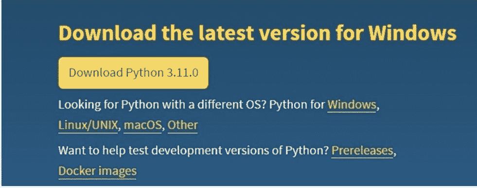

图：Python 下载网页截图

## 在 Windows 上安装

你可以直接点击“下载 Python 3.11.0”，或者导航到“Windows 版 Python 发布”部分，点击下载链接以获取最新的 Python 3 版本。截至今天，最新版本是 Python 3.11.0。选择适用于 32 位或 64 位的 Python 安装程序可执行文件，然后点击下载。下载完成后，进入下一步。

双击下载的安装程序文件以运行它。将出现一个类似于图 2.2 所示的对话框：

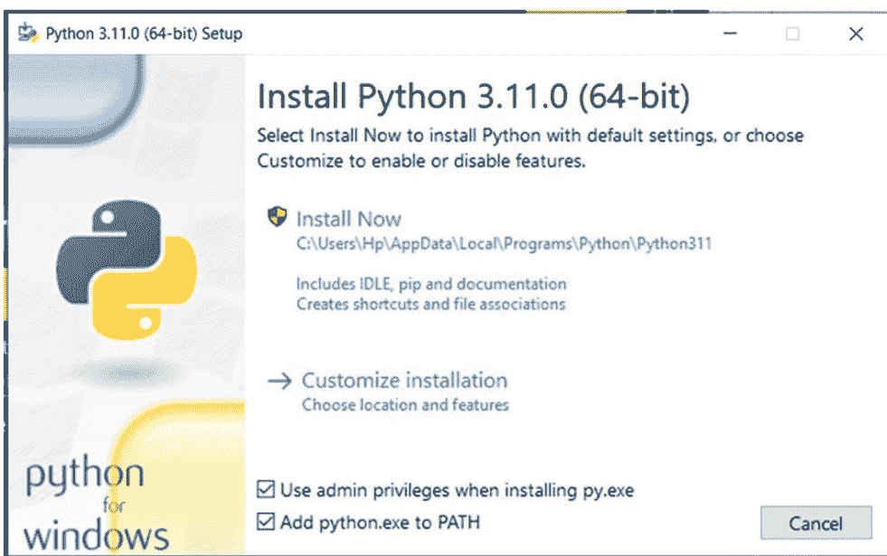

图：Python 解释器安装程序

在点击“立即安装”以继续之前，有几件事需要了解：

“立即安装”显示了 Python 的安装位置和运行位置。

“自定义安装”选项可自定义位置和附加安装功能。我们也可以稍后使用 `pip` 命令来管理这些。

对话框中的“为所有用户安装启动器（推荐）”框默认是选中的。可以取消选中以限制其他用户启动 Python。

“将 Python.exe 添加到 PATH”（默认未选中）。Python 允许在单台机器上安装多个版本，不同的项目可以连接到不同版本的 Python。这是通过创建多个虚拟环境来实现的。我们也可以通过将 Python.exe 添加到 PATH（在环境变量下）来创建全局环境。如果是首次安装，建议选中此选项。

根据你的需求进行自定义，然后点击“安装”。等待安装完成。请参考下图：

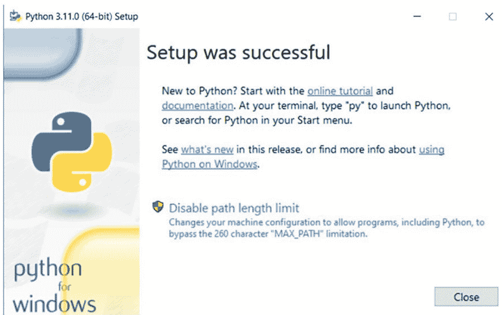

图：安装成功

现在你的机器上已经安装了 Python。我们准备好编写 Python 代码了！

## 在 macOS 上安装

旧版本的 macOS（直到 macOS Catalina）自带 Python 2（一个旧的、已淘汰的版本）。新的 Mac 机器需要安装 Python。从 www.python.org（官方网站）安装 Python 是最可靠的方法。

你可以导航到“macOS 版 Python 发布”部分，点击最新 Python 3 版本的下载链接。截至今天，最新版本是 Python 3.11.0。点击下载。下载完成后，进入下一步。

双击下载的文件以运行 macOS 安装程序。在同意屏幕上显示的软件许可协议之前，你必须点击几次“继续”按钮。接受协议后，将弹出一个窗口，其中包含诸如安装目标位置和所需空间等详细信息，以及其他选项。你可以使用默认位置，然后点击“安装”继续。安装程序将完成文件复制；当你看到“关闭”选项时，就知道完成了。点击“关闭”以关闭安装程序窗口。恭喜！Python 3 现在已安装在你的 macOS 计算机上。

你可以参考在线教程在 Linux/UNIX 机器上安装 Python 解释器。

## 设置 VS Code 环境

让我们将重点转移到安装和设置 VS Code 环境上。首先，我们将了解如何下载和安装 VS Code。让我们一步一步来：

打开你常用的浏览器，输入“下载 visual studio code”。你将看到的第一个链接是 https://code.visualstudio.com/

访问该链接，并根据操作系统选择安装程序，如第 1 章“VS Code 简介”中所述。VS Code 适用于 Windows、macOS 和 Linux。根据操作系统和机器类型点击下载。请参考下图：

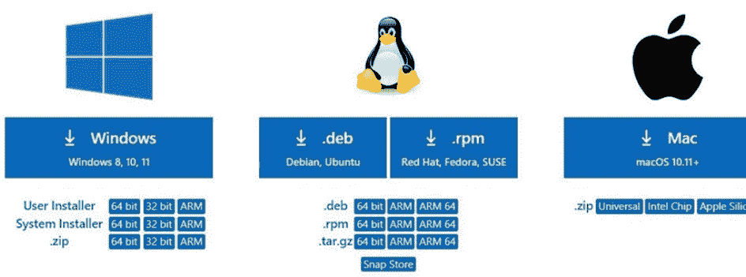

下载完成后，像安装任何其他应用程序一样安装它。它很轻量；Windows 和 Linux 机器的文件大小小于 100 MB，Mac 文件可能约为 200 MB。安装速度极快。请参考下图：

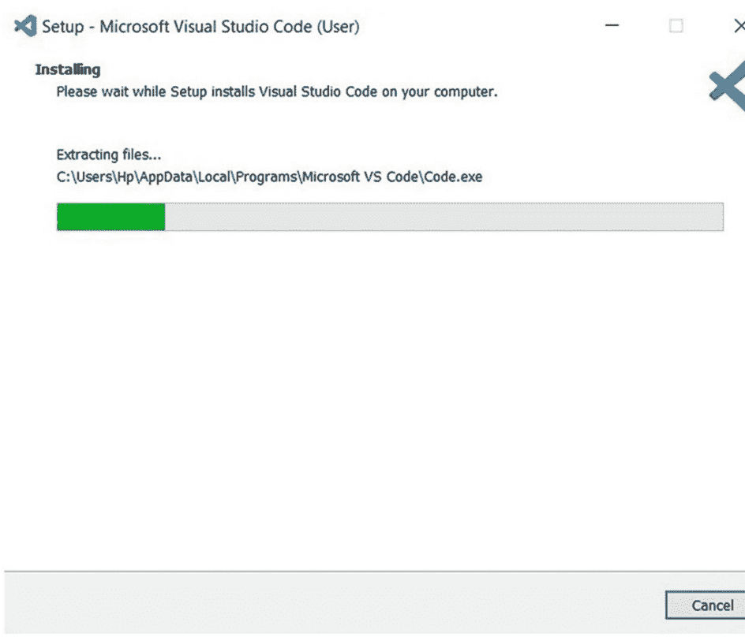

图 2.5：在 Windows 10 上安装

VS Code 现在已安装在你的计算机上。现在你已准备好进行编程。

如果你计划用 HTML 编程，那么你已经准备就绪，但我们需要安装 Python 扩展来开发 Python 应用程序。

## 安装 Python 扩展

我们将安装 Python 扩展，这是从 VS Code 运行 Python 程序所必需的。Python 扩展很有用；它正是将轻量级的 VS Code 编辑器转变为强大编辑器的关键。它不仅支持 Python 语言（支持所有当前受支持的版本：>=3.7），还包括诸如 IntelliSense（Pylance）、代码检查、调试、代码导航、代码格式化、重构、变量资源管理器和测试资源管理器等功能。我们在第 1 章“Visual Studio Code 简介”中讨论了这些功能，因此如果你错过了并想知道它们的含义，可以回顾上一章。

你可以借助 Python 解释器的帮助，忽略 VS Code 的功能，从 VS Code 运行 Python 文件。打开你的 VS Code 编辑器，从“文件”菜单中选择“新建文件”。在编辑器中输入以下代码：

```python
print("Hello from VS Code")
```

现在，将此文件保存到你的桌面，因为 Python 文件的扩展名是 `.py`，所以请以此格式保存。

接下来，点击 VS Code 中的“终端”菜单，你将看到终端窗口在屏幕底部打开，类似于你在图 2.6 中看到的。

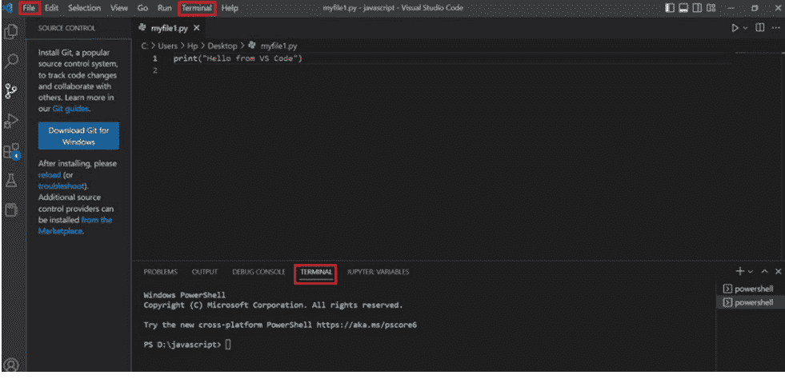

图：带有 Python 代码和打开的终端的 VS Code 屏幕

在终端窗口中，浏览到桌面，因为我们的程序保存在那里。然后，输入以下内容：

```bash
py myfile1.py
```

你将看到以下输出打印在屏幕上：

```
Hello from VS Code
```

这在图 2.7 中显示。

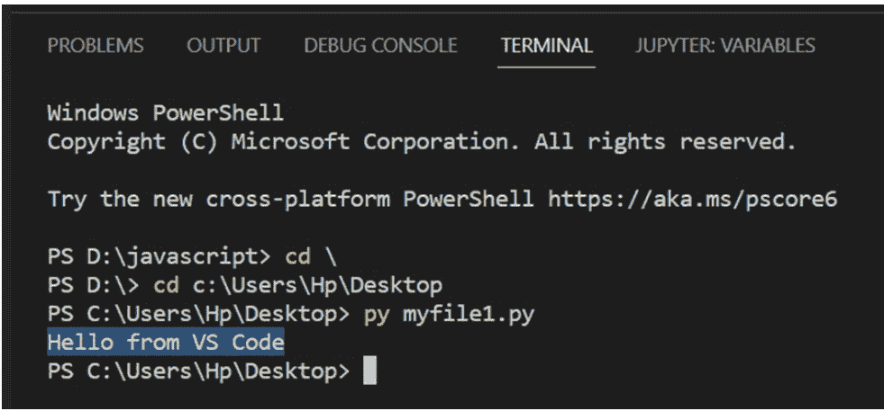

图 2.7：运行 Python 程序的终端截图

在这个例子中，我们将 VS Code 用作一个简单的编辑器来编写代码，并通过调用 Python 解释器在终端上执行它。使用记事本编辑器也可以实现这一点。在接下来的几节中，我们将了解如何在 VS Code 上安装 Python 扩展，并使用其功能来提高我们的代码效率。

转到扩展选项卡（在屏幕左侧）并搜索 Python 扩展。如图 2.8 所示的第一个结果就是我们需要安装的。点击扩展旁边显示的“安装”选项。一旦你这样做，Python 扩展就会被安装。

## Code Runner 扩展

第3章“VS Code 顶级扩展”专门介绍了扩展的安装，但在运行任何程序之前，我们将安装两个重要的扩展：Code Runner 扩展和 Pylint 扩展。Code Runner 是必要的，可以避免反复进入终端来运行 Python 程序。它旨在支持所有最广泛使用的编程语言，如 Javascript、HTML、C、C++、Java 和 Python；这些是它支持的25种语言中的一部分。它还可以支持其他语言。在扩展搜索框中搜索 Code Runner 并安装它。在撰写本章时，它的安装量已接近1600万次。图2.9展示了 VS Code 中的 CodeRunner 扩展预览：

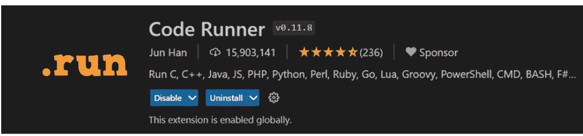

图 CodeRunner 扩展安装

成功安装 Code Runner 后，你的 VS Code 编辑器右上角会出现一个播放按钮（ ）。此按钮可用于运行代码。

第二个重要的扩展是 Pylint（预览图见图 Pylint 是一个用于 Python 的代码检查工具，可帮助开发人员快速轻松地识别和修复代码问题。VS Code 中的 Pylint 扩展为 VS Code 中的 Python 提供了出色的代码检查体验，使你能够快速查看代码中的问题并采取纠正措施。该扩展提供了增强的代码检查功能，例如检查代码是否符合 PEP8 标准以及快速识别问题。它还包括从命令行运行 Pylint 的支持。通过此扩展，你可以高效地编写更好的 Python 代码，节省时间并提高生产力。

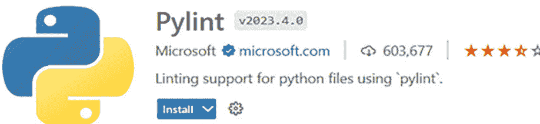

图 2.10：Pylint 扩展预览

代码检查工具是编程工具，有助于确保程序的代码符合编码标准并正确格式化。它可以检测并标记潜在的编程错误，例如未定义的变量、不一致的格式、逻辑错误和未关闭的循环。代码检查工具通常用于在代码编译和运行之前检测和消除编程错误。

## 项目实践：设计一个简单的战舰游戏

让我们看看以下问题描述，并使用 VS Code 中的 Python 来解决：

设计一个简单的战舰游戏。让我们开发一个简单的人机策略猜谜游戏。程序创建一个5*5的棋盘，计算机将其战舰隐藏在一行和一列中（使用随机数生成）。人类用户通过猜测计算机隐藏战舰的位置来呼叫射击。如果猜对了，计算机的舰队就被摧毁，用户获胜。图2.11展示了示例输出：

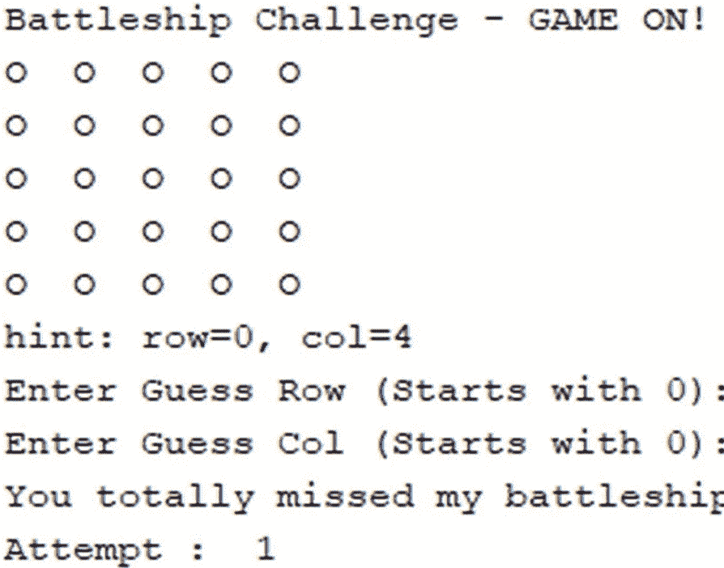

图 2.11：示例输出

## random 模块

我们需要使用 random 模块来开发这个简单的战舰应用程序。这是一个内置模块，可以帮助创建随机数。其一些常用方法列于表2.1：

| 方法 | 描述 |
|---|---|
| `random()` | 返回一个介于 0.0 和 1.0 之间的随机浮点数 |
| `randint(a, b)` | 返回一个介于 a 和 b 之间（包含 a 和 b）的随机整数 |
| `choice(seq)` | 从非空序列 seq 中返回一个随机元素 |
| `shuffle(seq)` | 就地打乱（随机化）序列 seq |
| `sample(population, k)` | 从总体序列中返回一个长度为 k 的唯一元素列表 |

表 2.1：random 模块常用方法列表

让我们看看完整的代码：

```python
import random

battle_pattern = []

for i in range(5):
    battle_pattern.append(['O '] * 5)

def display(pattern):
    for p in pattern:
        print(" ".join(p))

print("Battleship Challenge - GAME ON!")
display(battle_pattern)

def get_random_row(pattern):
    return random.randint(0, len(pattern) - 1)

def get_random_col(pattern):
    return random.randint(0, len(pattern[0]) - 1)

ship_row = get_random_row(battle_pattern)
ship_col = get_random_col(battle_pattern)

print(f"hint: row={ship_row}, col={ship_col}")

for option in range(4):
    input_row = int(input("Enter Guess Row (Starts with 0):"))
    input_col = int(input("Enter Guess Col (Starts with 0):"))

    if input_row == ship_row and input_col == ship_col:
        print("You Win! You sunk my battleship!")
        break
    else:
        if option == 3:
            battle_pattern[input_row][input_col] = "X "
            display(battle_pattern)
            print("Sorry Player... Game Over!")
            print("\nShip is here: [" + str(ship_row) + "]["+ str(ship_col) + "]")
        else:
            if (input_row < 0 or input_row > 4) or (input_col <0 or input_col > 4):
                print("Where did you fire ? Over the ocean.")
            elif (battle_pattern[input_row][input_col] == "X"):
                print("You have already got that wrong.")
            else:
                print("You totally missed my battleship!")
                battle_pattern[input_row][input_col] = "X "
            print("Attempt : ",option + 1)
            display(battle_pattern)
```

以下是如何在 VS Code 编辑器中执行上述程序：

点击文件，然后点击新建文件。

输入一个不含空格的文件名，并给它 py 扩展名，例如，

现在，按回车键。它将打开文件浏览器以选择保存文件的位置。浏览到一个文件夹位置并将文件保存在那里。

新的代码编辑器将打开。在编辑器中输入上述程序。注意缩进。缩进对于编写 Python 程序至关重要。

现在，点击播放按钮开始执行程序。输出可以在编辑器下方的终端屏幕上看到。程序代码的快照如图2.12所示：

```python
import random

battle_pattern = []

for i in range(5):
    battle_pattern.append(['O '] * 5)

def display(pattern):
    for p in pattern:
        print(" ".join(p))

print("Battleship Challenge - GAME ON!")
display(battle_pattern)
```

图 2.12：代码和高亮播放按钮的截图

上述代码生成多个 O 形战舰图案，如图所示

```
Battleship Challenge - GAME ON!
0 0 0 0 0
0 0 0 0 0
0 0 0 0 0
0 0 0 0 0
0 0 0 0 0
hint: row=0, col=0
Enter Guess Row (Starts with 0):3
Enter Guess Col (Starts with 0):3
You totally missed my battleship!
Attempt : 1
0 0 0 0 0
0 0 0 0 0
0 0 0 0 0
0 0 0 X 0
0 0 0 0 0
Enter Guess Row (Starts with 0):1
Enter Guess Col (Starts with 0):1
You totally missed my battleship!
Attempt : 2
```

## 图 屏幕下方输出的截图

自动完成扩展通过根据输入的字符建议完整的代码并允许程序员选择建议的代码来帮助提高编码速度。IntelliSense Python 扩展支持基于当前解释器版本的代码补全。代码检查扩展分析完成的 Python 代码并查找潜在错误。这使得在代码行中导航变得容易，并有助于纠正不同的问题。我们已经成功执行了我们的第一个程序。让我们理解一下我们在这个程序中使用的几个 Python 组件。除了使用 random 模块外，我们还做了以下工作：

- 使用列表 battle_board 存储位置
- 使用 for 循环和 if-elif-else 构建逻辑
- 声明和使用用户定义的函数：get_random_row 和 get_random_col
- 用于决策的条件语句（if – elif - else）：

假设代码需要根据一天中的时间向应用程序的用户问好。例如，如果是早上（从午夜到中午之前），就说早上好；从中午到午夜，就说晚上好。代码中同时存在“晚上好”和“早上好”两个选项，但根据特定条件，代码在给定时间只需要打印其中一个。使用条件语句可以实现这一点。

If语句块是用于控制程序流程的逻辑语句。它们用于测试条件，并根据测试结果执行不同的代码。一个if语句块由一个if语句、一个或多个可选的elif（else if）语句以及一个可选的else语句组成。

通常，Python中if语句块的语法如下：

```
if condition1:
    statement1
elif condition2:
    statement2
    ...
else:
    statementN
```

if语句包含一个条件（condition1）。如果该条件求值为True，则执行关联的语句（statement1）。

如果条件求值为False，则不执行该语句，转而测试elif或else语句。如果elif语句中的条件求值为True，则执行关联的语句（statement2）。此过程会重复进行，直到找到一个求值为True的条件或到达else语句。

else语句是可选的，用于在没有其他条件求值为True时执行代码。如果没有条件被发现为True，则执行else块中的代码。

一个if语句块可以包含任何有效的Python语句，包括循环、函数调用和变量赋值。也可以嵌套if语句块，以实现更复杂的逻辑。

要检查单个条件，只需使用if语句；elif和else用于处理多个条件。

让我们看一个例子，找出三个数中的最大值。该算法通过代码中添加的注释进行解释：

```
#在3个变量中找出最大值
a,b,c = 55,44,33
if a >= b:
    if a >= c:
        #A等于或大于所有给定值
        print("A变量是最大的！")
    else:
        #C更大，因此C是最大的
        print("C变量是最大的！")
else:
    #意味着B大于A
    if b >= c:
        #B是最大的
        print("B变量是最大的！")
    else:
        #C大于B
        print("C变量是最大的！")
print("感谢使用我们的程序")
```

在前面的例子中，我们使用了嵌套IF条件。嵌套if语句是指作为另一个if语句目标的if语句。当你想同时检查多个条件时，它们非常有用。嵌套if条件是一段常用的代码，其中在对另一个条件做出决策之前，必须先对一个条件进行求值。换句话说，当某个条件需要在某个动作发生之前被满足时，就会使用嵌套if条件。

以下是如何逐步处理嵌套if条件的方法：

首先，创建一个If-Else语句，并确定你将要评估的条件。

接下来，在If-Else语句的主体内，包含一个额外的If-Else语句。这个嵌套的If-Else语句应包含你需要评估的第二个条件，该条件取决于第一个If-Else语句的结果。

然后，添加当条件1和条件2都满足时将执行的代码。

接下来，为条件1和条件2包含必要的Else语句，这些语句将在条件1或条件2不满足时执行。

最后，结束嵌套的If-Else语句，并用一个结束语句结束包含它的代码块。

完成这些步骤后，嵌套的if条件应该已完全功能正常并正确设置，代码块应该能正确执行。

## 使用循环进行迭代

在开发逻辑时，可能会遇到需要多次迭代一段代码序列的情况。这在编程术语和Python中称为循环，它通过关键字WHILE和FOR实现。while循环语句用于我们不知道语句需要重复多少次，但有一个条件需要执行相同代码块的情况。while语句有时可以有一个else子句，但这不是必需的。

当需要重复的语句次数已知时，我们更倾向于使用for..in语句。range()函数可用于生成要重复的序列。Range(5)将生成值：0,1,2,3,4（未提及起始值时默认为0，默认增量值为1，结束值始终不包括给定的数字）。

For和While都有定义好的方式在工作完成时停止迭代，但有时我们必须在达到指定值之前停止循环。这就是break语句发挥作用的地方。当遇到break语句时，即使while循环条件尚未变为False或for循环尚未完成对序列的迭代，循环也会停止执行。

continue语句用于需要通知Python跳过执行当前循环中剩余语句并返回循环开头的情况。

程序遇到exit函数时将退出，不再继续执行。

让我们练习一个使用while循环检查输入文本大小的程序：

```
while True:
    #直接使用True而不是条件语句
    #将使其成为一个无限运行的循环
    s = input('请输入内容： ')
    if s.lower() == 'quit':
        #lower()会将s的内容转换为小写
        break
    print("给定文本的长度是 ", len(s))
print("再见")
```

前面的程序将继续打印输入文本的大小，直到遇到quit语句。lower函数会将输入变量转换为小写，无论用户输入了什么。

## 用户定义函数（UDF）

函数编写一次但可在多个地方使用，因此我们称它们为可重用的程序片段。首先，必须定义函数并为其命名一个语句块。def关键字放在函数名称之前，后跟一个标识符名称。标识符后跟一对括号，括号内可以包含一些变量名（可选），并以冒号结束。接下来是属于该函数的语句块。仅定义并不能使函数工作；我们需要通过名称调用函数来运行该语句块。我们已经看到了许多内置函数的工作原理，例如print()和input()。在战舰程序中，我们创建了get_random_row()和get_random_col()用户定义函数来从用户那里获取值。让我们看一个例子：

```
#定义函数
def greet(name):
    print("你好，" + name + "。祝你有美好的一天！")

#调用函数
greet("Sachin Tendulkar")
```

前面的函数用于问候一个人。该函数问候作为参数传递给greet()函数的人。

## 在Python中使用列表

列表是一种数据结构，用于保存项目的有序集合，即你可以在列表中存储一系列项目。值用逗号分隔，并包含在一对方括号内。考虑这个例子：

```
var1 = [5,10,15,20] #列表
```

一些流行的列表方法列在下表中：

| 方法 | 描述 |
| --- | --- |
| append() | 在列表末尾添加一个元素 |
| clear() | 从列表中移除所有元素 |
| copy() | 返回列表的副本 |
| count() | 返回具有指定值的元素数量 |
| extend() | 将一个列表（或任何可迭代对象）的元素添加到当前列表的末尾 |
| index() | 返回具有指定值的第一个元素的索引 |
| insert() | 在指定位置添加一个元素 |
| pop() | 移除指定位置的元素 |
| remove() | 移除第一个具有指定值的项目 |
| reverse() | 反转列表的顺序 |
| sort() | 对列表进行排序 |

表2.2：列表数据结构的重要方法

让我们编写一个程序来理解列表的概念：

```
months = [
    'January', 'February','March',
    'April','May','June',
    'July','August','September',
    'October','November','December'
]
endings = ['st', 'nd', 'rd'] + 17 * ['th'] + ['st', 'nd', 'rd'] + 7 * ['th'] + ['st']
year = input("请输入年份： ")
month = int(input("请输入月份： "))
day = int(input("请输入日期： "))
month_no = months[month - 1]
days = str(day) + endings[day - 1]
print("您输入的日期是 ", days, " ", month_no, " ", year)
```

前面的程序以年、月、日格式读取日期，然后以组合格式返回，其中月份数字被转换为单词。

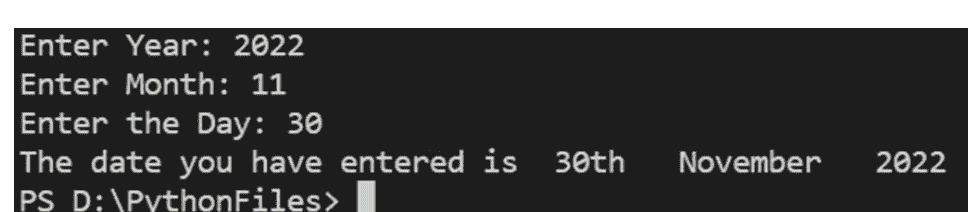

由于本书并未详细涵盖基础编程概念，建议读者参考基础编程教材来理解这些概念。我们推荐Swapnil所著的《*学习与实践Python*》，但您也可以选择其他任何教材。

## 设置与配置编辑器

VS Code可以进行深度定制。它允许通过各种设置选项，将用户界面的几乎所有组件和功能行为都按照程序员的偏好进行自定义。当打开工作区时，有两个重要的设置值得注意：

- **用户设置**：关注用户偏好，全局应用于同一用户打开的任何VS Code实例。
- **工作区设置**：特定于某个工作区，存储在工作区内部，在打开工作区时应用。

让我们看看如何自定义这些设置。

## 用户设置

用户设置通过编辑设置编辑器进行自定义。以下是打开设置编辑器的步骤：

- Windows/Linux：转到 文件 | 首选项 | 设置
- macOS：转到 代码 | 首选项 | 设置

将打开一个类似于图2.15的屏幕：

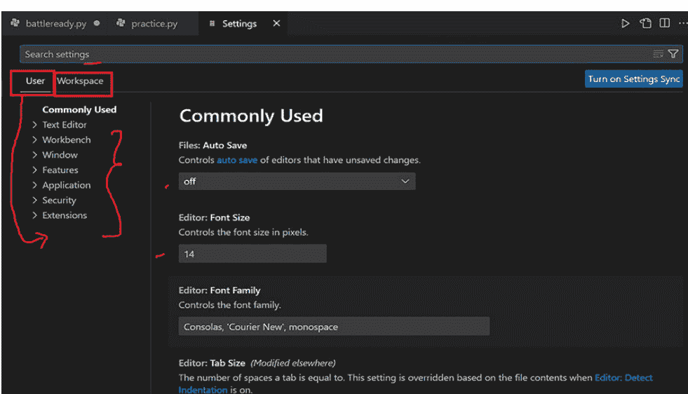

图2.15：用户设置截图

也可以使用键盘快捷键打开设置编辑器：在Windows中输入 `Ctrl + ,`（逗号），在Mac中输入 `Command + ,`（逗号）。

在搜索栏中，可以查找所需的设置。在栏中搜索时，会注意到它不仅会显示并高亮匹配条件的设置，还会应用过滤器移除不匹配的设置。这使得搜索快速且易于使用。

所有与编辑器相关的设置，如设置组、搜索和过滤，在用户设置和工作区设置中的行为方式相同。对于给定的项目工作区，与编辑器相关的设置优先于用户设置。但是，某些与应用程序相关的设置，如更新和安全，无法被工作区设置覆盖。因此，甚至无法在工作区设置中访问这些设置，但它们在用户设置中非常可用。可以通过点击用户和工作区对应的选项卡来查看可用设置列表，如图所示。

图2.16显示了字体搜索结果的所有选项。在此处进行更改后，会立即应用到VS Code。还可以看到所有已修改的设置，因为它们用蓝色方框标出。

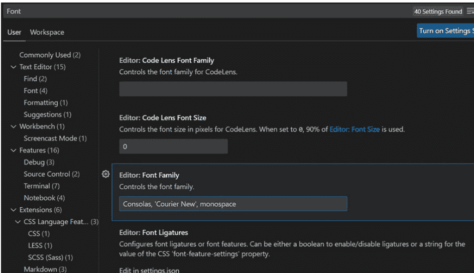

图2.16：用户设置中字体的搜索结果

点击齿轮图标将打开一个上下文菜单，其中包含将设置重置为默认值的选项。这将撤销对设置所做的所有更改。这也可以用于复制设置ID或JSON键值对。

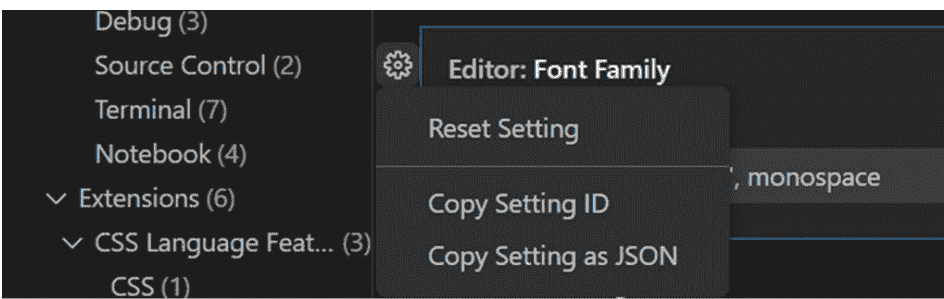

图 齿轮图标提供重置设置为默认值和其他选项

设置通常有三个选项，可以使用它们进行编辑。可以通过从复选框或下拉列表中选择给定值，甚至使用输入框输入值来编辑设置，以更改到所需的设置。相关设置被分组添加在一起，并以树状视图呈现，以便于查找和导航。显示流行自定义设置的组通常位于顶部。在搜索栏的右侧，可以看到漏斗和过滤器按钮。用户可以向搜索栏添加多个过滤器，以便更轻松地管理设置，如图所示。

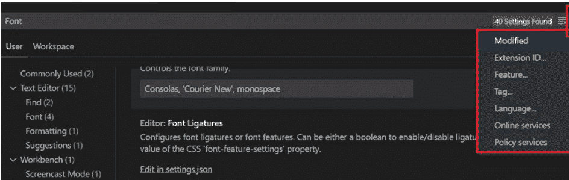

图2.18：添加到搜索栏的不同过滤器选项

`@modified` 过滤器添加在搜索栏中，显示已配置的设置。如果编辑器行为不符合预期，开发人员想检查这是否是由于自定义或错误配置造成的，此过滤器很有用。

以下是其他VS Code过滤器的列表：

- 编辑特定于任何扩展的设置
- 编辑特定于功能子组的设置，例如，文件资源管理器
- 基于设置ID查找设置，例如，`@id:workbench.activityBar.visible`
- 应用语言过滤器。图2.19显示了搜索栏中的过滤器：

- `@ext:`
- `@feature:comments`
- `@feature:debug`
- `@feature:explorer`
- `@feature:extensions`
- `@feature:notebook`
- `@feature:output`
- `@feature:problems`
- `@feature:remote`
- `@feature:scm`
- `@feature:search`
- `@feature:task`

图2.19：搜索栏中包含的过滤器

VS Code扩展也可以使用自定义设置进行编辑。这些设置在扩展部分下可见。也可以查看扩展的设置。这可以通过扩展视图完成，选择扩展并点击查看功能贡献选项卡。

到目前为止，我们一直在尝试在UI中编辑设置，但有一个设置文件，我们可以直接编辑其中的值。该文件称为 `settings.json`。要打开 `settings.json` 文件，请在命令面板（`Ctrl+Shift+P`）中转到“首选项：打开设置（JSON）”命令。如图所示。

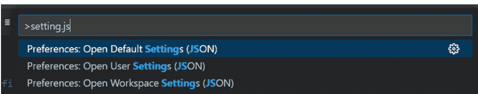

图 如何在命令面板（`Ctrl+Shift+P`）中打开JSON设置

可以查看和编辑此文件。图2.21显示了一个示例 `settings.json` 文件：

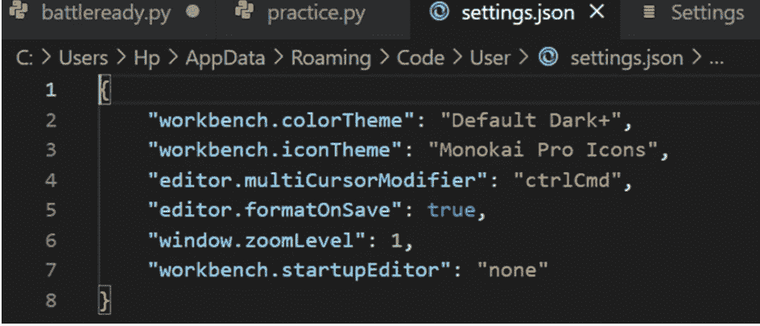

图 示例设置（JSON）文件

一旦文件在编辑器中打开，就可以用JSON格式编写设置。JSON格式包含设置ID及其对应的值。例如，图2.20显示了应用的主题。可以编辑/删除/添加新的ID和对应的值到设置中。当删除两个花括号 `{}` 之间的所有内容并保存文件时，VS Code可以恢复到默认设置。与代码编辑器一样，`settings.json` 文件也具有完整的IntelliSense和智能补全设置。如果由于不正确的JSON样式导致任何错误出现，代码部分也会被高亮显示，就像Python代码一样。某些设置，例如 `Workbench: Color Customization`，只能在 `settings.json` 中编辑。在图中，`colorCustomization` 已设置为 `#4000ff`，使行号显示为蓝色（十六进制等效颜色代码）。

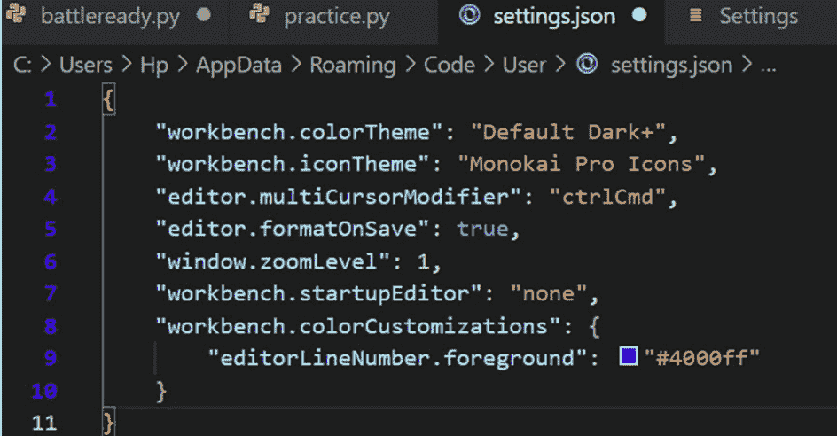

图2.22：设置（JSON）文件中的 `colorCustomizations`

之前，我们讨论过“首选项：打开设置”将打开设置编辑器UI，但那些更喜欢始终直接使用 `settings.json` 文件的人可以设置 `workbench.settings.editor: json` 选项，这样“首选项 | 设置”和快捷键 `Ctrl+,` 将始终带您到 `settings.json` 文件。

您可以在以下位置查找用户设置文件：

- 在Windows平台：`%APPDATA%\Code\User\settings.json`
- 在macOS平台：`$HOME/Library/Application\ Support/Code/User/settings.json`
- 在Linux平台：`$HOME/.config/Code/User/settings.json`

## 工作区设置

工作区设置与用户设置不同，它们不是全局的；它们特定于某个项目。这允许在从事同一项目的开发人员之间共享设置。工作区设置始终设计为覆盖用户设置。您可以通过设置编辑器的“工作区”选项卡进行编辑，或直接使用“首选项：打开工作区设置”命令打开该选项卡。

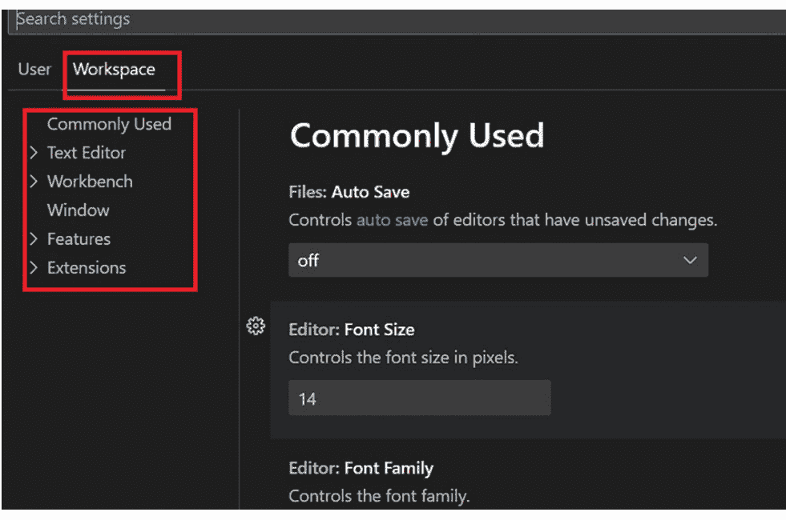

图 工作区设置

工作区设置存储在 `settings.json` 文件中，就像用户设置一样。这可以通过“首选项：打开工作区设置（JSON）”命令直接编辑。如果您正在寻找工作区设置文件，可以在根目录的 `.vscode` 文件夹中找到它。当工作区设置 `settings.json` 文件被添加到项目或源代码管理中时，该项目的设置将与该项目的所有用户共享。

我们一直在谈论工作区，但它是什么？VS Code中的工作区通常只是您的项目根文件夹。所有工作区设置和配置，如调试和任务配置，也存储在根目录本身的 `.vscode` 文件夹中。通过称为多根工作区的功能，可以在VS Code工作区中拥有多个根文件夹。

现在让我们将讨论转向特定于语言的编辑器设置。有两种不同的方法可以打开特定于语言的编辑器设置并自定义它们：

- 第一种方法是打开设置编辑器，点击“过滤器”按钮，然后选择语言选项以基于编程语言添加语言过滤器。
- 第二种可用选项是直接在搜索小部件选项中输入 `@lang:languageId` 形式的语言过滤器。

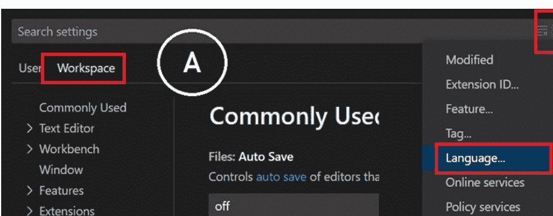

## 图 2.24：打开语言特定设置

语言特定设置将仅显示该特定语言的可配置选项。我们将在第 3 章《VS Code 中的顶级扩展》中查看 Python 特定设置。

## 设置与安全

某些设置允许指定一个可执行的 VS Code，以便运行来执行某些操作。该设置允许选择集成终端将使用的 shell。可以理解的是，出于各种安全原因，此类设置只能在用户设置中定义，而不能在多个用户可以使用的工作区范围中定义。其他一些设置在工作区范围中也不可用，例如和。

## 键盘参数

直观的键盘快捷键、易于自定义以及社区贡献的键盘快捷键映射，让你可以轻松地浏览代码。VS Code 提供了丰富、可定制且易于编辑的键盘快捷键。显示选项后，可以使用可用操作轻松更改、删除和重置其键绑定。显示键绑定列表也很容易；可以使用顶部的搜索框完成。搜索框有助于查找命令或键绑定并直接导航到它们。在 Windows 平台上使用 VS Code 的用户可以通过直接转到“首选项”|“键盘”菜单来打开此编辑器（macOS 用户可以通过转到“键盘”来完成）。

键映射扩展是一项很棒的功能，它将帮助其他编辑器的用户快速开始使用 VS Code 编辑器。任何想查看流行键映射扩展列表的人都可以转到“从...迁移键盘快捷键”。这将显示流行键映射扩展的列表。这些扩展修改了 VS Code 快捷键以匹配其他编辑器的快捷键，因此在切换到 VS Code 时，你不需要学习新的键盘快捷键。

@recommended:keymaps

- **Vim** ⬇ 4.2M ⭐ 4
  Visual Studio Code 的 Vim 模拟...
  vscodevim
  [安装]

- **Sublime Text 键映射...** ⬇ 1.7M ⭐ 5
  导入 Sublime Text 设置和...
  Microsoft
  [安装]

- **IntelliJ IDEA 键绑定...** ⬇ 1.2M ⭐ 5
  IntelliJ IDEA 键绑定的移植，i...
  Keisuke Kato
  [安装]

- **Notepad++ 键映射** ⬇ 1M ⭐ 4.5
  流行的 Notepad++ 键绑定 f...
  Microsoft
  [安装]

- **Atom 键映射** ⬇ 899K ⭐ 5
  流行的 Atom 键绑定，用于 Vis...
  Microsoft
  [安装]

- **Eclipse 键映射** ⬇ 575K ⭐ 5
  Eclipse 键绑定，用于 Visual Stu...
  Alphabot Security
  [安装]

图 支持从其迁移键盘快捷键的部分编辑器列表

键盘快捷键的可打印版本可以从“键盘快捷键参考”下载（参考图）。它提供了一个针对你所使用平台生成的精简 PDF 文档。此文档可以打印并贴在显示器附近，以便于参考。

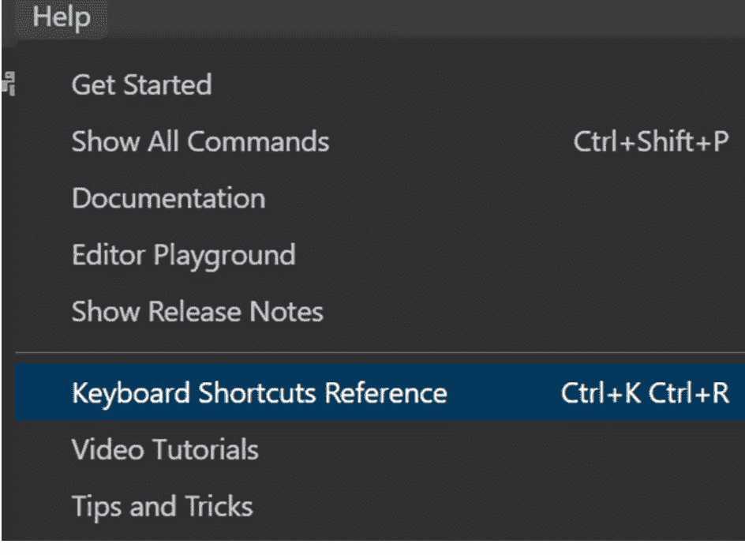

图 帮助|键盘快捷键参考：获取精简的 PDF 键盘快捷键列表

## 结论

我们已经到了本章的结尾，并且在编写和构建我们的第一个 Python 程序方面做得很好。每当我们进入一个新环境时，花一些时间尝试了解环境的细节总是有意义的；这就是我们本章的目标。我们已经成功安装了 Python 和 VS Code，使用 Python 扩展设置了 Python 环境，安装了默认扩展，并了解了编辑设置。花更多时间处理设置，根据你的喜好编辑字体，并选择你喜欢的主题，这样你就会喜欢使用这个编辑器。

现在，是时候进入下一章了。在下一章中，我们将学习更多有用的 Python 扩展并编辑 Python 相关设置。

# 第 3 章

## VS Code 中用于 Python 的顶级扩展

> 技术本身并不重要。重要的是你对人有信心，他们基本上是善良和聪明的，如果你给他们工具，他们会用它们做出美妙的事情。

— 史蒂夫·乔布斯

## 引言

VS Code 编辑器的扩展是无价的。它们有助于提高代码质量并加速开发工作。我们将看一些必备的通用扩展。Python 编程使用的两个主要领域是数据科学和网络开发。我们还将看一些适用于数据科学家和网络开发人员的流行扩展。在本章中，我们将解释流行扩展的功能以及如何在 VS Code 市场中找到它们，并且我们将安装和管理这些扩展。毫无疑问，这些扩展使 VS Code 成为最受欢迎的 IDE，因此我们添加了这一章以使所有人受益。除此之外，我们将讨论 Python 中的函数、模块和包。这些概念帮助我们轻松高效地管理冗长的代码。

## 结构

我们将在本章中涵盖以下主题：

- 顶级 VS Code 扩展
- Python 特定设置
- 安装和使用 Python 包
- Python 中的函数、模块和包

现在，让我们深入探讨这些主题。

## 目标

本章的目标是概述 Visual Studio Code 中用于 Python 编程的顶级扩展，并解释如何安装和使用这些扩展。我们还将讨论它们的目的和特点。扩展为 VS Code 添加了更多 Python 功能，例如代码检查、调试和代码格式化。此外，许多流行扩展提供 IntelliSense，它基于变量类型、函数定义和导入的模块提供更智能的代码补全。这使得编写和理解代码变得更容易、更快。我们还将学习函数、类和模块，并了解这些概念在 Python 中的实现。

## 顶级 VS Code 扩展

所以，你现在已经安装了 VS Code，如果你按照我们的章节操作，可能甚至已经创建了你的第一个程序。有一些扩展会简单地增强你的 VS Code 的功能。使用 VS Code 扩展，你可以添加不同的语言支持（我们在第 2 章《设置调试器》中做了这件事）、调试器以及各种其他工具，以改善你的开发体验。通过创建扩展，开发人员利用了 VS Code 丰富的可扩展性，这允许他们将扩展直接插入 VS Code UI，使其对 VS Code 用户可用。要开始使用扩展，请按照以下步骤下载任何扩展：

步骤 1：浏览扩展

第一步是在市场中找到这些扩展。可以轻松地从 VS Code 本身浏览和安装扩展。单击活动栏中的扩展图标或键入扩展命令将打开扩展视图，其外观如图所示。


图 扩展图标

你可以使用屏幕左上角的筛选选项来筛选搜索结果，如图所示。

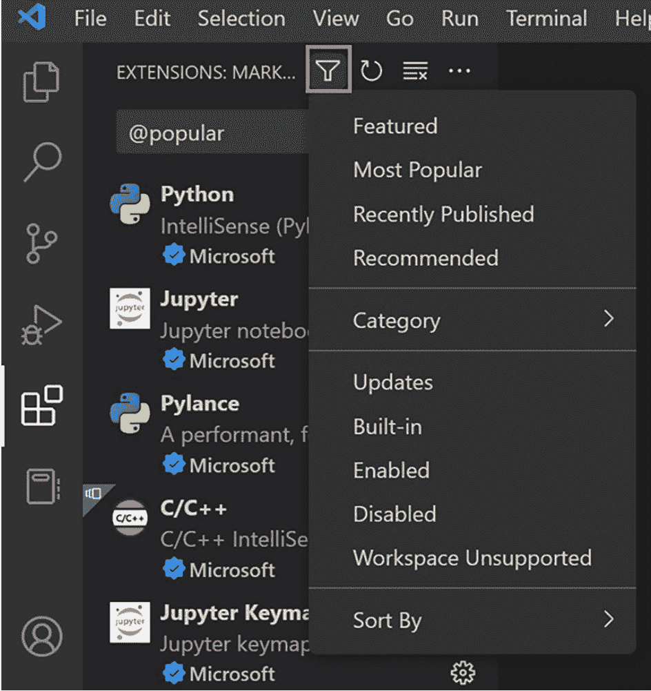

图 带有筛选选项的扩展搜索结果

流行的扩展列表如图所示。

文件 编辑 选择 视图 转到 运行

扩展：MARK...

@popular

| 扩展 | 描述 | 发布者 |
| :--- | :--- | :--- |
| Python | IntelliSense (Pylance), Linting, ... | Microsoft |
| Jupyter | Jupyter notebook support, inte... | Microsoft |
| Pylance | A performant, feature-rich lang... | Microsoft |
| C/C++ | C/C++ IntelliSense, debugging,... | Microsoft |
| Jupyter Keymap | Jupyter keymaps for notebooks | Microsoft |
| Jupyter Notebook Renderers | Renderers for Jupyter Noteboo... | |

## 图 3.3：流行扩展列表

列表中的每个结果都将包括扩展的简要描述、该扩展的发布者、总下载量以及 5 星制的评分。选择扩展后，将显示扩展的详细信息页面，用户可以在其中了解更多信息。

## 步骤 2：搜索扩展

可以通过在扩展视图顶部的搜索框中键入扩展名称来搜索扩展。清除任何现有文本，然后键入你要查找的扩展名称的全部或部分。因此，如果你键入 Python，它将显示 Python 语言扩展的列表。如果存在许多名称相似的扩展，知道扩展 ID 会有所帮助。例如，wayou.vscode-todo-highlight 是 TODO Highlight 扩展的 ID。也可以直接在搜索框中键入 ID。

## 步骤 3：安装扩展

要安装你选择的扩展，请单击安装按钮。安装完成后，它将转换为管理齿轮按钮。在图中，Python 扩展有一个齿轮箱，表示它已安装在本地计算机上，而 C/C++ 选项有安装选项，表示它尚未安装。单击安装按钮将安装 C/C++ 扩展，以便在 VS Code 上运行 C/C++ 程序。

## 步骤 4：管理扩展

在 VS Code 中管理扩展非常简单。用户可以通过扩展视图、命令面板或命令行开关来安装/启用/禁用/更新或卸载扩展。在命令面板中，相关命令均以 `Extensions:` 为前缀。

## 如何列出已安装的扩展

当用户启动 VS Code 时，默认情况下，扩展视图会显示当前已安装并启用的扩展、所有推荐的扩展，以及用户禁用的扩展的折叠视图。

## 如何卸载扩展

用户可以选择某个扩展的管理齿轮按钮，然后从下拉菜单中选择卸载选项来卸载现有扩展。此操作还会提示用户重新加载 VS Code。

## 如何禁用扩展

卸载会永久移除扩展，但如果用户想临时移除扩展，可以选择齿轮按钮中的禁用选项。用户可以选择全局禁用扩展或仅对当前工作区禁用，如图所示。禁用扩展也会提示重新加载 VS Code。在命令面板下拉菜单的“更多操作”中，还有一个名为“禁用所有已安装扩展”的命令可用。

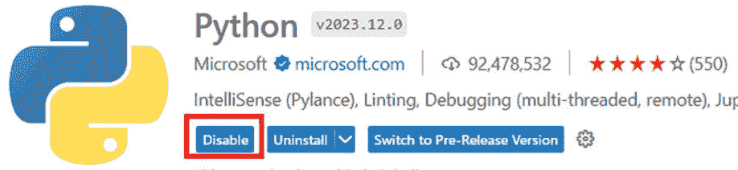

图 每个扩展中的禁用选项

## 启用扩展

所有被禁用的扩展将保持禁用状态，直到用户选择启用它们。用户可以使用下拉菜单中可用的“启用”或“启用（工作区）”命令重新启用扩展。要启用所有扩展，您可以从命令面板或提供下拉菜单的“更多操作”中选择相应选项。这是启用所有扩展的最快方式。

## 扩展自动更新

VS Code 会持续检查扩展更新，并在自动更新选项被勾选时自动安装更新。如果有任何扩展被更新，系统会提示用户重新加载 VS Code。有些用户更喜欢手动更新扩展，在这种情况下，他们需要使用“禁用自动更新扩展”命令来禁用自动更新选项，该命令会将 `extensions.autoUpdate` 设置为 `false`。自动更新如图所示。

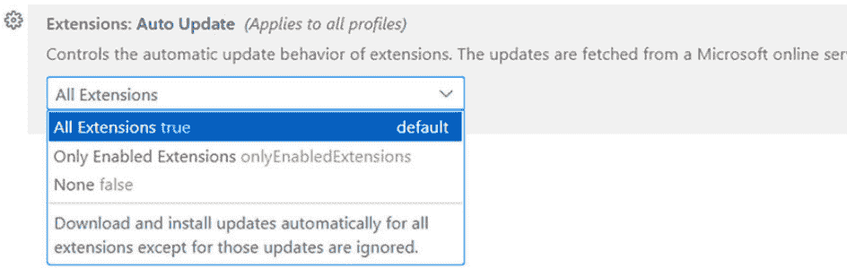

图 扩展的自动更新选项

## 手动更新扩展

用户可以使用“显示过时扩展”命令（该命令使用 `outdated` 过滤器）来查找有可用更新的扩展。然后，通过点击过时扩展的更新按钮，即可安装更新。“更新所有扩展”命令可用于同时更新所有过时的扩展。

## 推荐扩展

用户默认也会看到一个推荐扩展列表，或者可以通过设置 `recommended` 过滤器为活动状态来查找推荐扩展。推荐可能基于以下因素：

- 工作区：基于工作区的其他用户
- 其他：基于最近打开的文件

用户可以从命令行列出、安装和卸载扩展，这有助于实现自动化。需要注意的是，要查找扩展，必须提供其全名，例如：

以下是一个示例：

设置扩展的根路径：

```
code --extensions-dir
```

列出已安装的扩展：

```
code –list-extensions
```

要查看已安装扩展的版本，请使用：

```
--list-extension
```

显示版本：

```
code --show-versions
```

安装扩展：

```
code --install-extension ( | )
```

卸载扩展：

```
code --uninstall-extension ( | )
```

为扩展启用提议的 API 功能：

```
code --enable-proposed-api ()
```

现在，我们将转向一些有助于 Python 编程的重要扩展列表。

## Pylance

微软的 Pylance 可以极大地提高您的生产力。Pylance 是一个 Python 语言服务器，它增强了 IntelliSense、语法高亮以及许多其他功能，为 Python 开发者提供了出色的开发体验。IntelliSense 更像是各种代码编辑功能的通用名称，包括代码补全、参数信息、快速信息和成员列表。IntelliSense 功能也被称为代码补全、内容辅助和代码提示。IntelliSense 会在您输入时快速显示您可能想要使用的方法、类成员和文档。您可以随时使用 `Ctrl+Space` 触发补全。Pylance 增强了 IntelliSense 提供的帮助。Pylance 提供的一些功能如下：

- 文档字符串
- 签名帮助和类型信息
- 参数建议
- 代码补全
- 自动导入（添加和移除导入）
- 输入时报告代码错误和警告
- 代码大纲
- 代码导航
- 类型检查模式
- 原生多根工作区支持
- IntelliCode 兼容性
- Jupyter notebooks 兼容性
- 语义高亮

让我们在下一节中看看最受欢迎的三大功能。

## 自动导入

Pylance 扩展有一个功能，当在环境中引用依赖项时，它会自动将导入添加到 Python 文件的顶部。它不会安装依赖项，但如果依赖项已经安装并在 Python 环境中可用，它就会添加它。同时，如果程序中不再使用该引用，它会将其移除。根据场景，您可以看到一个灯泡图标，其中包含添加或移除导入的建议。

## 语义高亮

语义高亮会突出显示（即着色）类、函数、属性和其他 Python 对象类型，使其更具可读性。

## 类型检查

有一个新概念叫做类型提示，即为变量、函数甚至类指定预期数据类型的做法。类型提示对 Python 来说是新的，尽管 Python 不强制执行它，但大多数程序员认为这是一种最佳实践。如果启用了类型检查设置，Pylance 可以帮助开发者了解他们的代码是否违反了任何已记录的类型提示。

必须进行所需的设置更改才能启用此功能。图 3.6 显示了编辑设置的步骤：

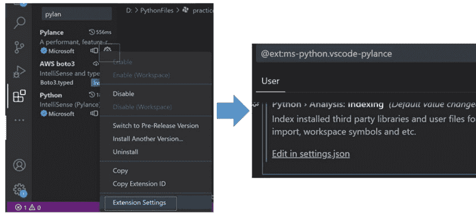

可以将以下文本添加到 `settings.json` 以启用类型提示：

```json
{
    "python.analysis.typeCheckingMode": "basic"
}
```

类型检查模式可以是 `basic` 或 `strict`：

- `basic`：检查基本数据类型
- `strict`：最高错误严重性，所有类型检查规则

目前建议使用 `basic` 设置。

图 3.7 显示了实现。查看错误消息，它说“表达式的类型是...”，并且它也引用了 Pylance 扩展。

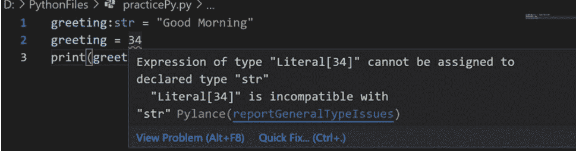

图 尝试将整数值赋给字符串变量时的类型错误

## Code Runner

根据我们的推荐，第二个必备扩展是 Code Runner。它可以即时运行代码并支持多种编程语言。Code Runner 扩展的视图如图所示。

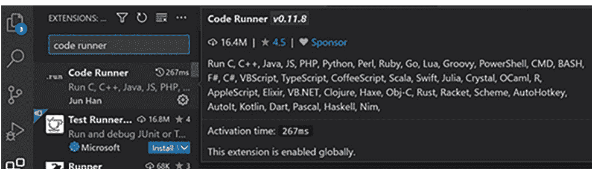

图 安装 Code Runner 扩展

Code Runner 默认设置为使用其面板显示 Python 脚本的结果。建议将其设置为显示集成终端的结果。请按照以下步骤更改设置，以便在终端中显示结果：

- 按 `ctrl+` 或点击屏幕左下角的齿轮图标打开设置面板。
- 要打开设置，请在搜索栏中输入 `code runner terminal`。
- 现在您将看到一个选项 `Code-runner: Run In Terminal`。
- 勾选该选项以启用它，设置完成。这看起来非常像图中所示的选项。

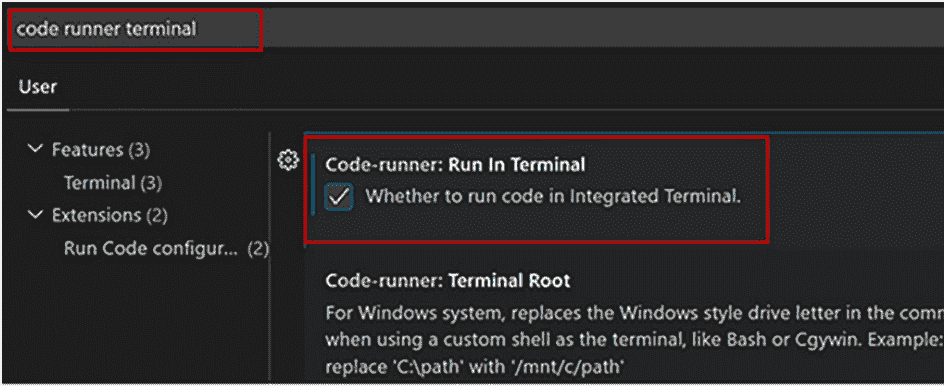

图 更改 Code Runner 的设置，以便在终端中显示结果

让我们运行一个程序并在终端中查看输出，如图所示。

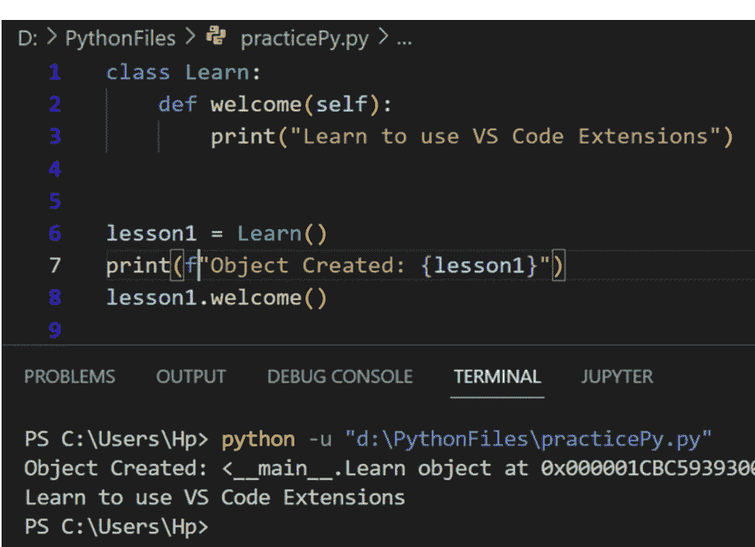

## 缩进彩虹

缩进彩虹是一个简单而强大的扩展，它为每个制表符空格着色，使程序员的缩进更加清晰易读。该扩展的图像如图所示

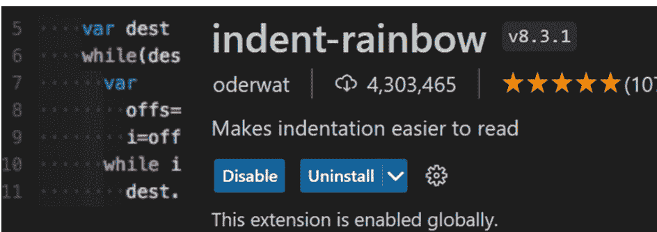

图 缩进彩虹扩展

缩进彩虹通过用不同颜色显示不同的缩进级别，帮助使代码更具可读性。它帮助你发现缩进错误并可视化代码结构，如图所示

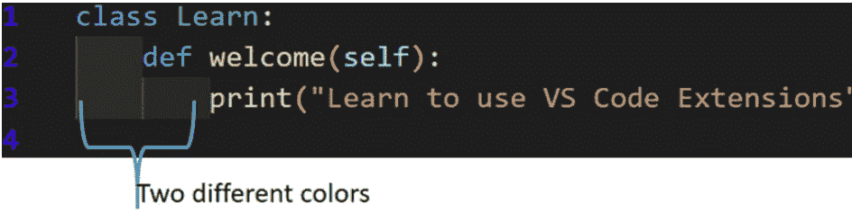

图 在终端中运行的程序

默认情况下，缩进彩虹使用 VIBGYOR 颜色，因此得名彩虹；但我们总是可以通过编辑用户设置来更改默认设置。以下代码示例展示了如何编辑缩进彩虹的颜色设置：

```
"indentRainbow.colors": [

"rgba(245, 40, 145,0.1)",

"rgba(245, 40, 145,0.3)",

"rgba(245, 40, 145,0.6)",

"rgba(245, 40, 145,0.8)",

"rgba(245, 40, 145,0.2)"

]
```

你可以从这里选择你的颜色：

https://rgbacolorpicker.com/

## 路径智能提示

路径智能提示是一个 Visual Studio Code 扩展，当你在输入文件路径时，它会自动补全文件名。图 3.13 展示了该扩展的视图。它通过提供快速查找、打开和插入项目中正确文件的能力，帮助你节省时间并提高生产力。它还提供了一种简便的方法来快速向项目中添加新文件。

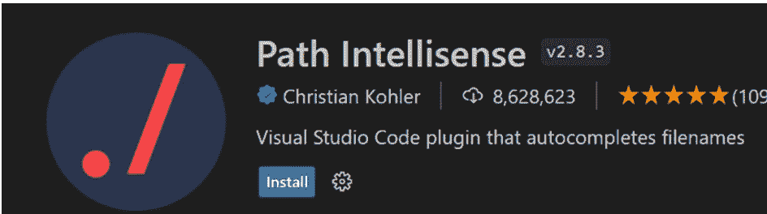

图 路径智能提示扩展

路径智能提示是 VS Code 的自动补全文件名的插件。图 3.14 展示了当我们选择一个文件夹时，路径智能提示给出的建议：

```
D: > PythonFiles > practicePy.py > ...
1  # A Python program to read a text file and displays
2  # first 300 characters on the screen
3  # Opening a file "Poem1.txt"
4  file1 = open("Poems/")
5  
6  print("Reading first
7  print(file1.read(300))
8  print()
9  # Closing the file
10 file1.close()
11
```

图 路径智能提示扩展显示的建议

VS Code 支持相对路径和绝对路径。绝对路径是完整的路径，包括驱动器名称。相对路径从终端中提到的位置开始。以下是终端可能的样子示例：

C:\Users\hp

## Tabnine AI 自动补全

VSCode 中的 Tabnine AI 自动补全是一个由人工智能驱动的强大代码自动补全工具。此扩展使用机器学习算法来理解代码使用的上下文，并建议最佳的代码补全选项。它与 Visual Studio Code 无缝集成，可以帮助开发者快速完成代码并减少错误。该扩展的外观如图所示

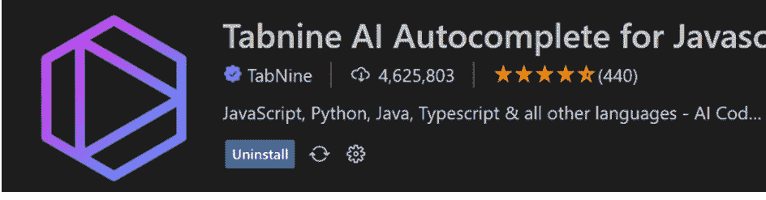

图 3.15：Tabnine AI 自动补全扩展

Tabnine 优于大多数其他自动补全扩展，因为它可以根据上下文和语法预测并补全整行代码，还能建议你的下一行代码。图 3.16 展示了使用和不使用 Tabnine 时建议的差异：

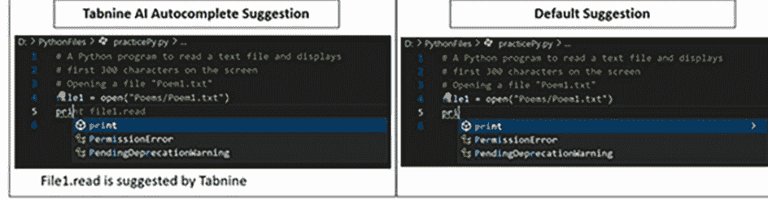

图 Tabnine AI 自动补全甚至添加了 file1.read

## Python 缩进

VSCode 中的 Python 缩进是一个设置，允许你设置用于缩进代码块的空格数。这对于保持代码整洁有序以及使其更易于阅读非常有用。该扩展的外观如图所示

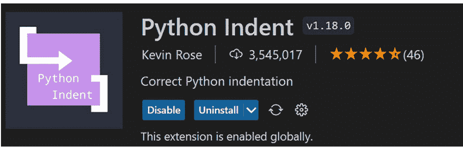

图 Python 缩进扩展

在默认设置中，每次在 Python 代码中按 Enter 键时，光标都会移动到下一行的开头。Python 缩进扩展会解析 Python 文件直到光标的位置。如图所示，此扩展可以精确确定下一行应该缩进多少，以及其他行应该取消缩进多少。

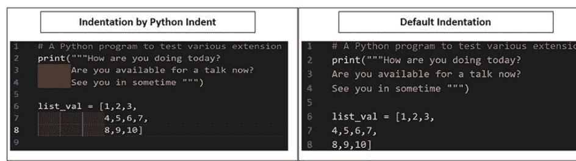

图 Python 缩进扩展比默认设置缩进得更好

## Jupyter

VS Code 中的 Jupyter 扩展是一个允许你直接在 VS Code 编辑器中编写和执行 Jupyter 笔记本的扩展。它包括对调试、嵌入式 Git 控制、语法高亮、智能代码补全、代码片段和代码重构的支持。该扩展还允许你轻松地在 Python 和 R 编程语言之间切换，以及其他语言如 Julia、C++ 和 Go。图 3.19 是 Jupyter 扩展的截图：

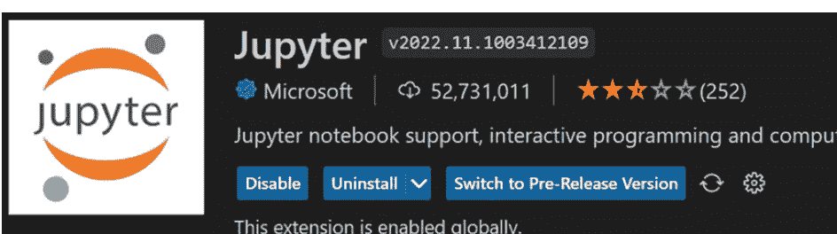

图 Jupyter 扩展

Jupyter，以前称为 IPython Notebook，是一个开源项目，帮助我们将 Markdown 文本和可执行的 Python 代码组合到一个称为笔记本的单一平台上。Jupyter 扩展在 VS Code 中可用，使用它我们可以在笔记本中运行程序。要使用 Jupyter，必须安装 Jupyter 扩展，然后要打开或创建笔记本，必须打开命令面板并选择“创建：新建 Jupyter”，如图所示

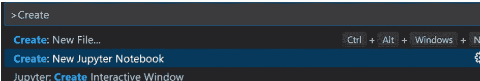

图 在 Jupyter 中创建新文件

执行 Jupyter Notebook 程序：

在编辑器中输入你的程序代码。通过点击代码单元格左侧的运行图标或使用快捷键来运行你的程序。输出直接显示在代码单元格下方。

可以通过点击“全部运行”选项来运行多个单元格。甚至可以选择“运行上方所有”或“运行所有”

使用“导出”选项，Python 代码可以导出为 PDF 或 HTML 格式。导出选项如图所示

要保存你的 Jupyter 笔记本，请点击文件选项，然后选择保存选项或使用快捷键

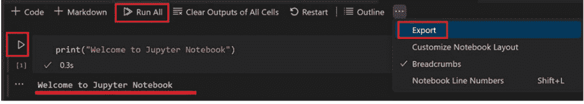

图 Jupyter Notebook 中可用的各种选项

## 错误透镜

VS Code 中的错误透镜扩展在编辑器的“问题”区域和编辑器边栏中显示错误和警告。它有助于快速轻松地识别和修复错误。它可以用于导航到问题的根源。图 3.22 是错误透镜扩展的截图：


图 错误透镜扩展

错误透镜扩展在代码行本身中显示错误、警告和诊断消息。它消除了开发者需要悬停或点击任何其他选项或执行代码才能看到错误的需要。此扩展还用不同的颜色突出显示代码行，以提供更好的错误可视化，轻松区分错误和警告。我们可以在图中看到差异

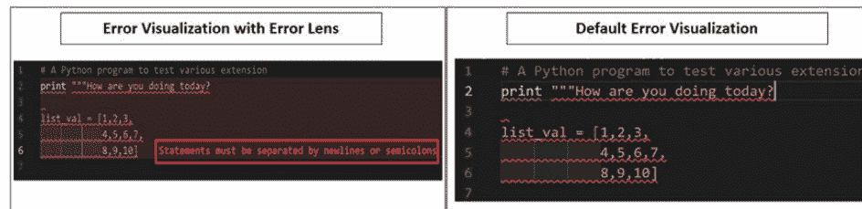

图 使用错误透镜时错误消息与代码一起出现

## 更好的注释

Visual Studio Code 最好的注释扩展是“更好的注释”扩展。此扩展提供多种注释类型，例如警报、查询、待办事项和高亮。它还允许你轻松调整这些注释类型的颜色，使其更容易区分。图 3.24 是更好的注释扩展的截图：

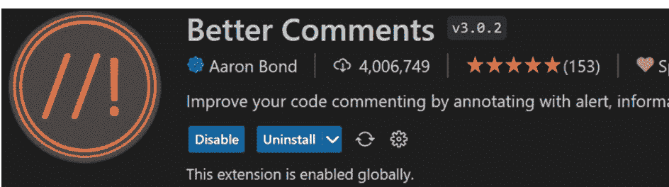

图 更好的注释扩展

顾名思义，它通过提供为注释自定义不同颜色的能力来改进注释。注释可以使用以下属性进行分类：

- ! 用于警报/重要注释
- ? 用于问题
- TODO 用于任务

更好的注释扩展的上述属性如图所示

```
1  #This is default way of Commenting
2  #ToDo: For task related comment
3  #?: Ask questions to this way
4  #! IMPORTANT NOTE: Do not delete this comment
5  
6  """
7  ! Important Note in multi line comment
8  ? Question test in multi line comment
9  TODO: Task in multi line comment
10 """
11 
```

图 更好的注释扩展

## Lightrun

[Lightrun](https://lightrun.com) 是一个开源的 Visual Studio Code 扩展，它提供了一种简便的方式，让你可以在文本编辑器内运行和调试程序。Lightrun 支持其他编程语言，如 Python、Java、C、C++ 和 Rust。借助 Light Runner，你可以快速测试和调试代码，无需离开编辑器或手动设置断点。图 3.26 是 Lightrun 扩展的截图：

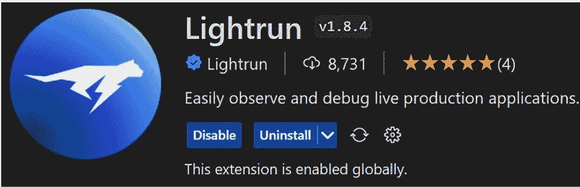

图 Lightrun 扩展

我们正在介绍一个实时调试平台：Lightrun。它除了 Python 之外，还支持多种语言。它之所以受欢迎，是因为它为开发者提供了一个直观的界面，可以在生产环境中添加日志、跟踪和指标，以实时调试代码。通过实时按需添加 Lightrun 快照，可以探索堆栈跟踪和变量来进行调试。它也支持多实例。Lightrun 的社区版是免费使用的，但其专业版则需要付费，以获取其提供的额外功能。

## Python Test Explorer

VS Code 中的 Python Test Explorer 扩展是一个插件，使开发者能够快速、轻松地在 Python 项目中运行单元测试、检查代码覆盖率并调试测试失败。借助此扩展，开发者可以快速评估代码质量，识别需要改进的领域，并确保代码在推送到生产环境之前没有错误。图 3.27 是 Python Test Explorer 扩展的截图：

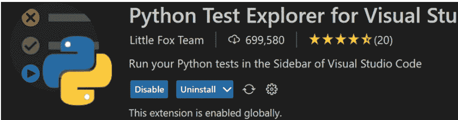

图 Python Test Explorer 扩展

VS Code 的 Python Test Explorer 扩展提供了各种用户友好的功能，例如运行 Unittest、Pytest 或 Testplan 测试的能力。扩展的侧边栏显示了测试和测试套件及其状态的完整视图，这有助于开发者专注于失败的测试。

## Python 特定设置

执行 Python 代码所需的 Python 扩展是一个高度可配置的扩展，为用户提供了自定义整个设置选项的能力。总体而言，在撰写本书时可用的版本中，有 79 个可用设置。我们将在表中查看重要的设置。

| | |
|---|---|
| | |
| | |

| | |
|---|---|
| | |
| | |

表 Python 扩展设置值

## 安装和使用 Python 包

Python 编程语言如此流行的主要原因之一是它支持各种包，这些包可以从 PyPI 下载。现在让我们编写一个程序，该程序将使用 matplotlib 和 numpy 包来创建一个图表。Matplotlib 是 Python 中用于创建静态、动画或交互式可视化的标准库。图 3.28 展示了如何导入包或模块，以及如果这些库未安装时会出现的错误：

```
1 import matplotlib.pyplot as plt    Import "matplotlib.pyplot" could not be resolved
2 import numpy as np    Import "numpy" could not be resolved
3 from matplotlib import colors    Import "matplotlib" could not be resolved
4 from matplotlib.ticker import PercentFormatter    Import "matplotlib.ticker" could not be resolved
```

图 未安装库时的错误

除非你之前安装了 matplotlib 包，否则你会收到消息 "No module named matplotlib"，如图所示。此错误消息表明所需的包在系统中不可用。要安装 matplotlib 包，请使用命令面板运行终端：创建新终端。此命令会为你的选定解释器打开一个命令提示符。

不建议在全局解释器环境中避免使用包。应该使用特定于项目的虚拟环境，因为它有助于将已安装的包与其他环境隔离，并创建特定于版本的冲突。可以使用以下命令创建虚拟环境，然后安装所需的包：

Windows：

```
py -m venv .venv
```

```
.venv\scripts\activate
```

MacOS/Linux：

```
python3 -m venv .venv
```

```
source .venv/bin/activate
```

当创建新的虚拟环境时，VS Code 会提示你将其设置为当前工作区文件夹的默认环境。使用命令面板中的 "Python: Select interpreter" 命令选择你的新环境，如图所示。

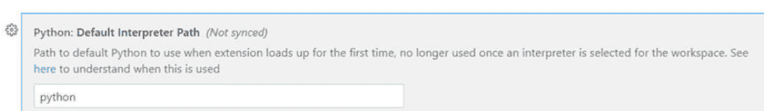

图 选择解释器路径

以下是在各种操作系统上安装包的方法：

### MacOS

```
python3 -m pip install matplotlib
```

### Windows

```
python -m pip install matplotlib
```

### Linux (Debian)

```
apt-get install python3-tk
```

```
python3 -m pip install matplotlib
```

现在重新运行程序，错误将会解决。

## Python 中的函数、模块和包

首先，我们需要理解包是模块的集合，而模块包含函数和类。如图所示，我们可以说函数是模块的子集，而模块是包的子集。

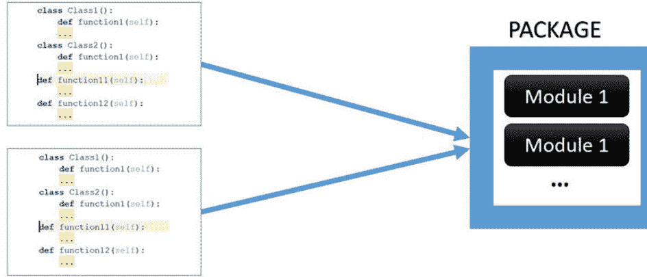

图 函数、模块和包

## 函数

函数是放在一个名称下的一块代码，它只在被调用时运行。可以将数据（称为参数）传递给函数，函数可以将数据返回到调用它的地方。

图 3.31 展示了我们在 Python 中遇到的函数类型：

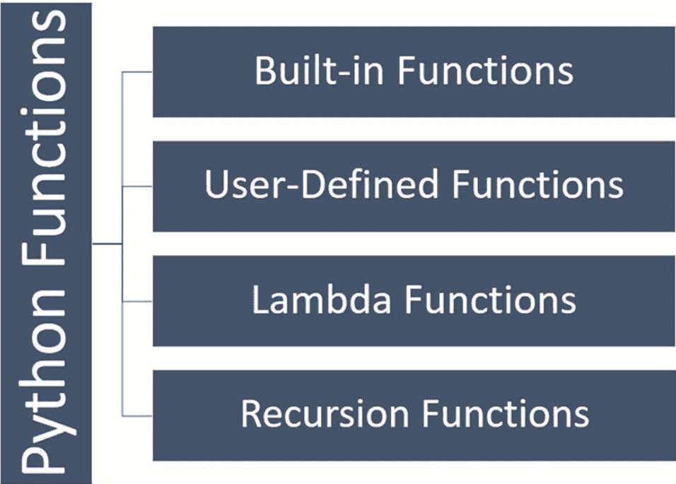

图 Python 函数类型

函数有两种类型：一种是已经内置并可供使用的，称为内置函数；另一种是用户必须从头开始编写函数代码的，称为用户定义函数。让我们更好地理解它们：

内置函数：Python 中有几个内置函数可供直接使用。这里列出其中一些：

```
them: them: them: them: them: them: them: them: them: them: them:
them: them: them: them: them: them: them: them: them: them: them:
them: them: them: them: them: them: them: them: them: them: them:
them: them: them: them: them: them: them: them: them: them: them:
them: them: them: them: them: them: them: them: them: them: them:
them: them: them: them: them: them: them: them: them: them: them:
```

Python 中的 `dir(builtins)` 返回内置模块中所有名称的列表。`builtins` 模块包含 Python 中内置的函数和变量，无需导入即可使用。`dir()` 函数通常返回指定命名空间中名称的排序列表。以下代码可以帮助你查看列表：

```
import builtins
print(dir(builtins))
```

让我们执行其中一些函数；鼓励读者运行它们并查看结果：

- 在屏幕上打印：

```
print("Welcome to Python World")
```

- 打印 eval 结果：

```
print(eval("4+5*2"))
bin(50)
a=input("Enter Your Name: ")
abs(-789)
```

用户定义函数：我们自己创建的用于执行特定任务的函数称为用户定义函数。Python 中的函数使用 `def` 关键字定义，后跟函数名和一对括号。括号内可以包含变量名，行末有一个冒号；缩进下方是为此函数添加的语句块。当函数被调用时，值作为参数传递；同样，我们定义参数。

现在让我们构建我们的第一个用户定义函数。我们将函数命名为 `func`。

注意：函数定义中给出的名称称为参数，而提供给函数调用的值称为实参。

代码将类似于以下内容：

```
#Function definition

def func(x):

is
```

```
output = "Changed X locally to " + + " in the function"

return output

result = func(x)

is still
```

在前面的程序示例中，我们定义了一个名为 `func` 的函数，它接受一个参数 `x` 并返回一个变量 `output`。在此示例中，如果在调用时未提供参数 `x` 的值，将导致错误，因此 `x` 是必需参数。

在以下示例中，我们为参数指定默认参数值。默认值通过在函数定义中将赋值运算符附加到参数名称后，再跟上默认值来添加，如下例所示：

以下是函数定义：

```
def displayinfo(name, city="Delhi"):
    # Printing a passed info in this function
    print("Name: ",name, "\nCity ", city)
    return
```

现在你可以调用 `printinfo` 函数：

displayinfo(city="Mumbai", name="Sachin")
displayinfo(name="Virat")

在前面的示例中，调用时如果未提供 `city` 的值，它将使用默认值。在第一次函数调用中，我们提供了 `city` 的值，因此函数将采用该值。此示例还演示了关键字参数在函数调用中如何工作。调用函数通过参数名来识别参数，在本例中，即 `city = "Mumbai"` 和 `name = "Sachin"`。关键字参数有助于跳过参数或以非顺序方式放置它们。Python 解释器使用传递的关键字将值与参数匹配。除了不必担心参数顺序外，一个优点是只有那些我们需要的参数才会被赋予值。这仅在其他参数具有默认参数值时才成立。

有时，我们可能不知道调用者会传递多少个参数；在这种情况下，我们可以选择使用可变长度参数，这通过 `*`（星号）实现。当我们声明一个单星号参数，如 `*args` 时，从该点到末尾的所有参数都将以元组格式收集，称为 `args`。而当你声明一个双星号参数，如 `**kwargs` 时，从该点到末尾的所有关键字参数都将以字典格式收集，称为 `kwargs`。

让我们实现一个函数 `total`，它接受可变数量的参数，既可以是元组也可以是字典。这是一个简单的示例，它接受参数并在函数体中打印它们：

```
def total(initial=5, *numbers, **keywords):
    count = initial
    for num in numbers:
        count += num
    for key in keywords:
        count += keywords[key]
    return count
```

函数具有处理文档的内置机制。这个概念称为文档字符串（DocString）。它们是 Python 语言的重要组成部分，用于使代码更具可读性、可维护性和可重用性。

## 文档字符串

文档字符串是一个字符串值，作为函数、类、方法或模块定义中的第一条语句出现。当模块、函数、类或方法被调用时，解释器会扫描定义以查找文档字符串，如果找到，它将作为第一个参数传递给函数。文档字符串用于记录函数功能的简要说明，虽然它是可选的，但总是推荐使用。文档字符串是紧接在函数头下方添加的注释。通常使用三引号，以便描述可以扩展到多行。文档字符串作为函数的 `__doc__` 属性对我们可用。让我们在程序中实现文档字符串。在下面的函数 `greet` 中，三引号（`"""`）中给出的第一行就是文档字符串：

```
def greet(name):
    """ This function is used to greet a person.
    This function greets to the person passed in as
    a parameter """
    print("Hello, " + name + ". Have a good day!")
```

你可以在任何时候显示任何函数的文档字符串内容。编写代码来检查我们上面创建的函数 `greet()` 的文档字符串：

```
print(greet.__doc__)
```

现在，让我们检查内置函数 `print()` 的文档字符串：

```
print(print.__doc__)
```

文档字符串用于记录函数、方法、类或模块的目的，并提供使用示例和其他有用信息。

Python 还有第三种类型的函数，称为单行函数或 Lambda 函数。对于整个逻辑可以用一行构建的情况，为了使代码简短简单，更倾向于使用它：

### Lambda

Lambda 运算符或 Lambda 函数用于在 Python 中创建小型、一次性、匿名的函数对象。其基本语法如下：

```
lambda arguments : expression
```

Lambda 运算符可以接受任意数量的参数，但它只能有一个表达式。它不能包含任何语句，并返回一个可以赋值给任何变量的函数对象；例如，在下面的示例中，`add` 代表 Lambda 函数。

这是一个演示使用 Lambda 运算符的函数的程序：

```
add = lambda x, y: x ** y
a = add(2, 3)
print(a)
```

通常，前面的程序会写成如下形式：

```
def power(x, y):
    return x ** y
```

调用函数：

```
a = power(2, 3)
print(a)
```

现在，让我们看看如何在 Python 中实现递归函数：

### 递归函数

Python 中的递归函数是调用自身的函数。它是一种调用自身的算法，使用其自身输入的更新版本，直到达到解决方案。这种类型的函数对于解决可以分解为更小部分的复杂问题非常强大。递归函数可用于遍历数据结构、实现数学算法，甚至解决游戏。递归是一种编码方式，其中函数在其主体中一次或多次调用自身，通常作为函数调用的返回值，该函数称为递归函数。

如果问题的解决方案缩小并朝着基本情况移动，递归函数就会终止。基本情况是指可以在没有进一步递归的情况下解决问题的情况。如果在调用中未满足基本情况，递归可能会导致无限循环。

让我们考虑一个递归最适合的情况：计算一个数的阶乘。4 的阶乘将是 1 到 4 之间所有数字的乘积。例如：

4! = 4 * 3 * 2 * 1

或者，我们可以这样写：

4! = 4 * 3!
3! = 3 * 2!
2! = 2 * 1

这是使用递归概念的经典场景。终止条件将是我们尝试计算 1 或更小值的阶乘时，这被称为基本情况。

让我们编写一个程序，使用递归实现一个数的阶乘。可以通过在前面的函数定义中添加两个 `print()` 函数来跟踪中间步骤：

```
def factorial(n):
    print("factorial has been called with n = " + str(n))
    if n == 1:
        return 1
    else:
        res = n * factorial(n-1)
        print("track " + str(n) + " * factorial(" + str(n-1) + "): " + str(res))
        return res
```

现在，测试该函数：

```
print(factorial(5))
```

输出如图所示。

```
factorial has been called with n = 5
factorial has been called with n = 4
factorial has been called with n = 3
factorial has been called with n = 2
factorial has been called with n = 1
track  2  * factorial( 1 ):  2
track  3  * factorial( 2 ):  6
track  4  * factorial( 3 ):  24
track  5  * factorial( 4 ):  120
120
```

图：阶乘递归程序的输出

## 类

类是 Python 中面向对象编程（OOP）的构建块。OOP 是一种使用类和对象来创建现实世界对象及其交互模型的编程范式。它是一种组织和构建代码的方式，使其更具可读性、可维护性和可重用性。Python 中的 OOP 包括类定义、继承、封装、抽象和多态。它允许开发人员创建具有特定属性和行为的对象，然后可以使用这些对象来创建应用程序和程序。

现在，让我们检查在讨论 OOP 时会遇到的术语：

- **对象**：对象是具有状态和行为的实体。它可以是物理的或逻辑的。例如，鼠标、键盘、椅子、桌子、笔等。Python 中的一切都是对象，几乎所有东西都有属性和方法。
- **类**：类可以定义为对象的集合。它是一个具有特定属性和方法的逻辑实体。例如，如果你有一个学生类，那么它应该包含属性和方法，即电子邮件 ID、姓名、年龄、学号等。

类创建一个新的数据类型，其中对象是该类的实例。对象被定义为与问题域相关的现实世界实体，具有清晰定义的边界。对象封装了属性（在 Python 中称为字段）和行为或服务（在 Python 中称为方法）。

图 3.33 显示了一个类的成员。Python 中类的成员包括属性、方法（服务）和类变量。属性用于定义类的属性，例如其数据和行为。方法是与特定类相关联的函数，可用于操作该类的数据和行为。最后，类变量是在类的所有实例之间共享的变量，可用于存储适用于所有实例的信息。

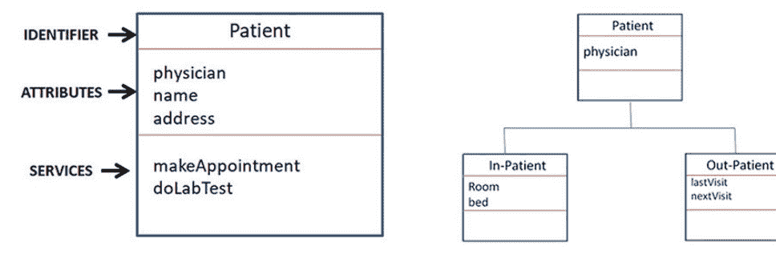

图：类示例

如图所示，`patient` 是一个类，它有自己的一组成员。患者可以是住院患者或门诊患者。

## 方法

方法是与对象关联的函数。在 Python 中，方法并非类实例所独有。任何对象类型都可以拥有方法。对象可以使用属于它们的变量（也称为字段）来存储数据。对象也可以通过使用方法来获得功能。方法是在类中定义的函数。从定义上看，函数和方法是相似的，区别在于函数是独立的，而方法属于一个类或对象。类是使用 `class` 关键字创建的。类的字段和方法列在一个缩进的代码块中。

让我们在 Python 中创建一个示例类，并了解其工作原理：

这是一个声明类的示例：

```python
class Book:
    """Represents a Book class example"""
    # declaring a class variable:
    book_count = 0

    def __init__(self, title):
        """Initialize the data"""
        self.title = title
        # When a book is created, it should increase the total book count by 1
        Book.book_count += 1  # Since its a class variable, Class name.variable is used

    def say_hi(self):
        """Hello from the book class"""
        print(f"Hello from Class Book, I am being called by {self.title}")

    def remove(self):
        """Removing book from the list"""
        print(f"{self.title} is being removed from the shelf")
        Book.book_count -= 1
        if Book.book_count <= 0:
            print("That was the last book in the shelf. You don't have any more books.")
        else:
            print(f"There are still {Book.book_count} books in the shelf.")

    @classmethod
    def print_book_count(cls):
        """Prints current number of books available"""
        print(f"There are {cls.book_count} books in the shelf.")

# Below code is used to create object of the class Book
# Creating objects and initializing the title using __init__
# Automatically called while creating objects
book1 = Book("A to Z of Retail")
book2 = Book("Python and Practice")
book3 = Book("Learn Python")

# calling class variable using classname
Book.print_book_count()

# Calling functions
book1.say_hi()
book2.remove()

# calling class variable using object
book1.print_book_count()
```

我们在前面的示例中使用了 `__init__()` 方法来初始化变量。让我们理解这个方法的重要性。

## init 方法

在 Python 类中，有一些方法具有特殊意义，包括 init 方法。`__init__`（双下划线 init 双下划线）方法在类的对象被实例化时立即执行。由于该方法是自动调用的，因此它用于初始化对象。

注意：双下划线位于 init 的开头和结尾。

## 关于类和对象的更多信息

类变量（由类拥有）是共享的，可以被该类的所有实例访问。类变量只有一个副本，这与对象变量不同，对象变量为每个对象复制一份。当任何一个对象对类变量进行更改时，由于只有一个副本，所有其他实例都会看到该更改。

对象变量属于类的每个对象/实例。每个对象都有自己的字段副本，即它们不共享，并且与不同实例中同名的字段没有任何关系。

`classmethod()` 是 Python 中的一个内置函数，它将方法的所有权建立给给定的类。类方法可以被类和对象调用。

在前面的示例中，`book_count` 属于 Book 类，因此是一个类变量。`title` 变量属于对象，并使用 `self.title` 赋值。类变量被引用为 `Book.book_count`，而不是 `self.book_count`。对象变量名在对象的方法中使用 `self.title` 表示法引用。除了 `self.title`，它也可以被引用为 `self.__class__.title`，因为每个对象都可以通过 `self.__class__` 属性引用其类。

`__init__` 方法用于用名称初始化书籍实例，并且由于添加了一本书，我们将 `book_count` 增加 1。在 `remove()` 方法中，我们简单地将 `Book.book_count` 减少 1。所有类成员都是公共的，这意味着它们可以从任何类甚至从主程序访问。如果数据成员的名称以双下划线为前缀，例如 `__variable`，Python 使用名称修饰来有效地使其成为私有变量。任何仅应在类或对象内部使用的变量，其名称应以下划线开头，所有其他名称都是公共的，可以被其他类/对象使用。这只是一个约定，并非由 Python 强制执行（双下划线前缀除外，它是为了使成员私有）。

类和对象有四个重要支柱：

- 继承
- 多态
- 数据抽象
- 封装

## 继承

继承是一个过程，通过这个过程，一个类的对象获取另一个类的对象的属性。继承提供了代码重用性，使创建和维护应用程序变得更容易。在本节中，我们将介绍继承的基础知识。

### 什么是 Python 中的继承？

继承是从现有类（称为父类）创建新类（称为子类）的一种方式。子类将具有与父类相同的属性和行为，但它也可以拥有自己独特的属性和行为。继承提供了一种重用父类代码并扩展它的方法。

### 继承的语法

在 Python 中，继承使用以下语法指定：

```python
class ChildClass(ParentClass):
    # code
```

这里，`ChildClass` 是子类的名称，`ParentClass` 是父类的名称。

### 继承在 Python 中是如何工作的？

继承通过允许子类继承父类的属性和行为来工作。当子类继承父类时，它会自动继承父类的方法和属性。这意味着子类可以使用继承的方法和属性，而无需再次定义它们。

例如，假设我们有一个名为 `Animal` 的类，它有一个名为 `name` 的属性和一个名为 `speak` 的方法。我们可以创建一个名为 `Dog` 的新类，它继承自 `Animal`。

```python
# Example of Inheritance in Python

class Animal:
    def __init__(self, name):
        self.name = name

    def speak(self):
        print("%s says 'hello!'" % self.name)

class Dog(Animal):
    def bark(self):
        print("%s barks 'woof!'" % self.name)

# Create an instance of the Dog class
d = Dog("Fido")

# Call the speak() method
d.speak()
# Output
# Fido says 'hello!'

# Call the bark() method
d.bark()
# Output
# Fido barks 'woof!'
```

在这个例子中，我们定义了一个名为 `Animal` 的类，它有一个名为 `name` 的属性和一个名为 `speak` 的方法。然后我们创建了一个名为 `Dog` 的类，它继承自 `Animal`。这意味着 `Dog` 类自动获得了 `Animal` 类的方法和属性。

当我们创建 `Dog` 类的实例时，我们可以调用从 `Animal` 类继承的 `speak()` 方法，以及在 `Dog` 类中定义的 `bark()` 方法。这就是继承在 Python 中的工作方式。

继承提供了许多优势，包括以下几点：

- **代码重用性**：继承允许我们重用现有代码，而不必从头开始编写。这节省了时间，并使代码更易于维护。
- **可扩展性**：继承使得扩展现有代码变得更容易，而不必重写它。这使代码更简单，更容易理解。
- **可维护性**：继承使得在不修改任何现有代码的情况下向现有类添加新功能成为可能。这使得根据需要扩展应用程序变得更容易。

## 多态

多态允许程序在不同的上下文中执行不同的行为；例如，考虑以下代码：

```python
class Animal:
    def make_sound(self):
        print("This animal makes a sound!")

class Dog(Animal):
    def make_sound(self):
        print("Woof!")

class Cat(Animal):
    def make_sound(self):
        print("Meow!")

dog = Dog()
cat = Cat()
```

## 数据抽象

数据抽象是向用户隐藏实现细节，仅向用户提供功能的过程。在Python中，数据抽象通过抽象类和接口来提供。抽象类包含一个或多个抽象方法。抽象方法必须由任何非抽象子类实现。接口类仅包含抽象方法。

让我们通过一个例子来理解数据抽象。我们有一个名为`Shape`的类，它是一个抽象类。它包含三个方法：`get_area()`、`get_perimeter()`和`draw()`。`get_area()`和`get_perimeter()`方法是抽象方法，因为它们在`Shape`类中没有实现。`draw()`方法是一个具体方法，因为它在`Shape`类中已经实现：

```python
class Shape:

    def get_area(self):
        pass

    def get_perimeter(self):
        pass

    def draw(self):
        print("Drawing a shape")
```

现在，让我们创建一个`Shape`的子类，名为`Square`。它实现了`Shape`类的抽象方法`get_area()`和`get_perimeter()`：

```python
class Square(Shape):

    def __init__(self, side):
        self.side = side

    def get_area(self):
        return self.side * self.side

    def get_perimeter(self):
        return 4 * self.side
```

在这个例子中，`Square`类实现了`Shape`类的抽象方法。`Square`类的用户只会知道它是一个形状，而不会知道它是如何实现的。这就是数据抽象。

## 封装

封装是将数据和操作这些数据的函数包装在单个单元中的机制。这允许程序员保护数据免受外部干扰和误用，并轻松重用代码。

例如，假设我们想创建一个表示车辆的类。我们可以创建一个名为`Vehicle`的类，并向其添加两个数据成员：一个用于车辆的品牌，一个用于车辆的型号。我们还可以向该类添加一个方法来计算车辆的总成本：

```python
class Vehicle:

    def __init__(self, make, model):
        self.make = make
        self.model = model

    def calculate_total_cost(self):
        # 在此处计算总成本
        return 100
```

现在我们有了类，就可以创建`Vehicle`类的一个实例，并用它来表示一个特定的车辆：

```python
my_car = Vehicle("Honda", "Civic")
total_cost = my_car.calculate_total_cost()
```

在这个例子中，我们将数据（品牌和型号）和方法封装在`Vehicle`类内部。这使我们能够轻松重用代码并保护数据免受外部干扰。封装是面向对象编程的一个重要特性，因为它允许程序员创建结构良好、易于维护的程序。它还允许程序员轻松重用代码并保护数据免受外部干扰。

## 模块

模块是一个Python文件，包含执行一组相关任务的代码。一个Python模块可以包含变量、函数、类等。假设你的朋友编写了一些出色的函数和类，你想使用他们的代码。你可以向他们索要`.py`文件，并将其放在与你的文件相同的文件夹中。你只需将其导入到你的代码中即可开始使用。

让我们通过在一个名为`aboutme.py`的文件中编写以下代码，来创建一个虚拟但可工作的模块：

```python
# 定义一个类 AboutMe
class AboutMe:
    # 定义 __init__ 方法
    def __init__(self, name, city):
        self.name = name
        self.city = city

    # 定义 getCity 方法
    def getCity(self):
        return self.name + " lives in the city " + self.city

    # 定义函数 hello
    def hobbies(self):
        return "I love playing badminton and have my interest in " \
               "Creative arts, including writing and painting."

# 创建一个变量
work = 'I am a Technoculturist'

if __name__ == "__main__":
    print("This module is being invoked directly")
    # 调用函数 hobbies()
    hobbies()
    # 创建对象 captain
    captain = AboutMe("Captain", "Mumbai")
    # 调用对象的 getCity() 方法
    captain.getCity()
    # 打印 aboutme.py 中存在的变量 work
    print(work)
```

当你执行`aboutme.py`文件时，`if`条件内的内容将被执行。`__name__ == "__main__"`的结果将为真，因为Python解释器在执行前会读取源文件并定义一些特殊变量。其中一个变量是`__name__`，对于直接调用的文件，它被设置为值`__main__`。当我们执行时，条件变为真，但当同一个文件被另一个Python文件引用时，`__name__`将被设置为模块的名称。模块的名称作为值提供给`__name__`全局变量。

现在，让我们将其用作模块，并从不同的文件调用其成员。创建另一个文件（尽管在这种情况下名称无关紧要）。输入以下代码以从`aboutme.py`文件调用成员：

```python
# 导入模块 aboutme.py
# 类、函数和变量现在都已导入
import aboutme

# 从 aboutme.py 调用函数 hobbies()
aboutme.hobbies()

# 创建类 AboutMe 的对象 captain
captain = aboutme.AboutMe("Captain", "Mumbai")

# 调用对象的 getCity() 方法
captain.getCity()

# 打印 aboutme.py 中存在的变量 work
print(aboutme.work)
```

显示的输出如图所示。

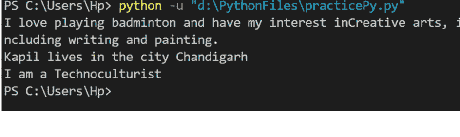

我们已经了解了如何向模块添加类、变量和函数。现在，让我们看看如何将模块添加到包中。

## 包

我们都会在某个时候处理大型项目，这意味着要处理大量的代码。将所有内容写在一个文件中会使我们的代码变得复杂且难以处理。推荐的方法是将代码分离到多个文件中，将相关代码保留在包中，并在项目需要时使用该包。这是重用代码的好方法。

在开发游戏时，包和模块的一种可能组织方式如图所示。

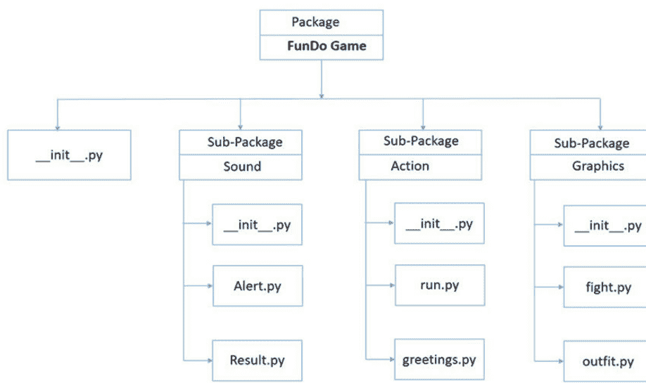

FunDo游戏目录中有一个名为`__init__.py`的文件，这是Python将其视为包所必需的。开发者可以选择将此文件留空，但通常，他们会在`__init__.py`文件中放置给定包的初始化代码。

可以使用点运算符从包中导入模块。例如，如果我们想导入前面示例中的`outfit`模块，可以这样做：

```python
import FunDo.Graphics.outfit
```

现在，如果此模块包含一个名为`change_shoes`的函数，我们必须使用全名来引用它。

```python
FunDo.Graphics.outfit.change_shoes("blues")
```

有另一种方法可以调用函数而无需给出冗长的名称。这次，我们给导入的包一个别名，如下所示：

```python
import FunDo.Graphics.outfit as fgo
```

我们现在可以这样引用它：

```python
fgo.change_shoes("blues")
```

我们也可以用不同于我们命名的方式来调用它们，这样在引用时就不必给出完整的包名，如下所示：

```python
from FunDo.Graphics import outfit
```

我们现在可以简单地调用该函数：

```python
outfit.change_shoes("blues")
```

另一种导入方式是从模块中调用所需的函数，如下所示：

```python
from FunDo.Graphics.outfit import change_shoes
```

现在我们可以直接调用此函数：

```python
change_shoes("blues")
```

尽管这看起来更容易，但不推荐这样做。使用完整的命名空间可以避免混淆，并防止两个相同的标识符名称发生冲突。

## 结论

正是这些特性使得 VS Code 在 Python 编程中如此高效。我们已经了解了全球开发者最常用的十大热门扩展及其强大功能。VS Code 的 Python 扩展具有高度可配置性，因此对其进行合理配置以简化应用程序开发是很有意义的。为此，我们探讨了一些可在 VS Code 中编辑的 Python 特定设置。我们学习了如何安装 Python 包索引（Python Package Index）中的软件包，这是 Python 软件包的官方第三方仓库。在本章的最后一节，我们重点了解了如何为应用程序开发创建函数、模块和包。我们正越来越接近开发出令人惊叹的应用程序。

在下一章中，我们将运用所有基础知识构建我们的第一个 Python 应用程序，但在此之前，我们将学习如何使用 numpy 处理二维数据、使用 scipy 进行科学计算，以及使用 pandas 处理表格结构。我们还将通过数据可视化来解决一个业务问题；在最后一节，我们将学习如何使用

## 第 4 章

## 在 VS Code 中开发可视化 Python 应用

> 如果我无法想象它，我就无法理解它。
— 阿尔伯特·爱因斯坦

## 引言

人们喜欢视觉化呈现，也深知其重要性，因为它有助于我们将简单和复杂的概念可视化，与呈现的数据进行互动，并让所有人无论专业水平如何都能达成共识。每个行业都将数据和分析用作竞争武器、运营加速器和创新催化剂。数据驱动决策是指利用事实、指标和数据来制定与组织目标、宗旨和举措相一致的战略业务决策。基于历史和当前数据，企业使用预测分析、统计和建模来确定潜在结果和未来表现。但与此同时，要理解每天产生的数万亿行数据正变得越来越困难。这正是可视化发挥日益关键作用的地方。专家们利用数据可视化来讲述组织中每个人都能理解的故事。他们通过将数据整理成易于理解的形式，突出趋势和异常值来实现这一点。在本章中，我们将看几个可视化示例，它们通过从数据中去除噪音并突出有用信息来讲述一个故事，然后展示这如何能帮助企业做出决策。

本章假设读者对 Python 主题（如 Numpy、Scipy、Pandas、Matplotlib 和 Seaborn）有一定了解。我们将在本章对这些主题进行概述，因此即使你没有实际操作经验，应该也没问题。

我们还将探讨在 Visual Studio Code 中使用 Git 版本控制的基础知识。我们将了解集成的 Git 支持，并理解如何与远程仓库协作。最后，我们将学习如何调试应用程序来结束本章。

请参考 GitHub 位置以获取数据集。

## 结构

在本章中，我们将涵盖以下主题：

- 虚拟环境概念
- Python 主题：
  - 学习统计学基础
  - 用于数据分析的可视化
- 使用 GitHub

现在，让我们深入探讨这些主题。

## 虚拟环境概念

在我们进入 Python 主题之前，让我们先理解虚拟环境的概念。现在正是讨论它的合适时机。创建虚拟环境是保持你的 Python 项目井然有序且相互独立的好方法。它允许你安装特定于项目的库和依赖项，而不会影响你的全局 Python 安装。以下是如何创建虚拟环境并在其中安装库的方法：

1.  打开你的命令行或终端。
2.  如果尚未安装 virtualenv 包，请安装它。你可以通过运行 `pip install virtualenv` 命令来完成。
3.  安装 virtualenv 后，导航到你想要创建虚拟环境的目录。
4.  运行命令创建一个名为 `myenv` 的新虚拟环境。你可以选择任何喜欢的名称。此命令会在当前目录下创建一个与你的虚拟环境同名的新目录。
5.  通过运行适合你操作系统的命令来激活虚拟环境：
    - 在 Windows 上：`myenv\Scripts\activate`
    - 在 macOS/Linux 上：`source myenv/bin/activate`

一旦虚拟环境被激活，你的命令行提示符将会改变，以表明你现在正在虚拟环境中工作。

现在你可以将库安装到你的虚拟环境中。例如，要安装 `numpy` 库，请运行 `pip install numpy` 命令。这将下载库并将其安装到你的虚拟环境中。

你可以通过运行额外的 `pip install` 命令来安装多个库。

你可以通过运行 `pip list` 命令来检查虚拟环境中已安装的库。

当你在虚拟环境中完成工作后，可以通过运行 `deactivate` 命令来停用它。这将恢复你的全局 Python 环境。

通过创建和使用虚拟环境，你可以轻松管理你的 Python 项目及其依赖项，同时最大限度地减少它们之间的冲突或干扰。

## Python 主题

Numpy、Scipy、Pandas、Matplotlib 和 Seaborn 是用于数据分析和操作的流行 Python 库：

- Numpy 用于科学计算、数组操作和线性代数。
- Scipy 用于科学和技术计算、统计等。
- Pandas 用于数据操作和分析、数据清洗和数据整理。
- Matplotlib 用于数据可视化和绘图。
- Seaborn 用于统计数据可视化和绘图。

这些库之所以重要，是因为它们使得操作、分析和可视化数据变得更加容易，这对于数据科学和机器学习应用至关重要。让我们详细了解一下它们。

## Numpy

Numerical Python 用于在 Python 中处理数组。它包含用于线性代数、傅里叶变换等的函数。NumPy 数组在内存中连续存储，因此进程可以高效地访问和操作它们。Numpy 在 Python 编程中使用，需要在 Python 应用程序中安装并导入 numpy 库。Numpy 可以使用 pip 命令安装，并使用 import 关键字导入程序。在下面的示例中，我们导入了 Numpy，并在导入时创建了一个别名 np：

```python
import numpy as np
```

前面的语句将导入 NumPy 并使其准备就绪。在下一行，我们将看到如何将列表创建为 Numpy 数组：

```python
array1 = numpy.array([10, 20, 30, 40, 50])
print(array1)
```

ndarray 是 NumPy 中用于处理数组的数组对象。NumPy ndarray 对象使用 array() 函数创建。考虑这个例子：

```python
import numpy as np
array1 = np.array([2, 4, 6, 8, 10])
print(array1)
print(type(array1))
```

在下面的示例中，让我们创建一个包含两个数组的二维数组：

```python
import numpy as np
array1 = np.array([[1, 3, 5], [4, 5, 6]])
print(array1)
```

NumPy 数组提供了 ndim 属性，用于指示数组有多少个维度。看看这个例子：

```python
import numpy as np
array1 = np.array([[[1, 3, 5], [2, 4, 6]], [[3, 2, 1], [1, 2, 3]]])
print(array1.ndim)
```

让我们在表格中查看 ndarray 对象的一些重要属性。

| 属性 | 描述 |
|---|---|
| | |
| | |
| | |

表：ndarray 的属性

让我们使用 Numpy 来解一个线性方程组：

2x + 5y + 2z = -38
3x – 2y + 4z = 17
-6x + y - 7z = -12

以下是使用 Numpy 求解的方法：

```python
import numpy as np
# A: 系数矩阵
A = np.array(A)
# print(type(A))
# B: 基于解的常数矩阵
b = np.array(b)
# print(type(B))
detA = np.linalg.det(A)
if detA != 0:
    InvA = np.linalg.inv(A)
    C = np.matmul(InvA, b)
    x, y, z = C
```

前面代码的输出如图所示。

## Scipy

Scipy库用于科学计算，是免费且开源的。要在Python中使用Scipy库，请遵循以下步骤：

安装 在终端或命令提示符中运行以下命令：

```
pip install scipy
```

从以下位置导入必要的函数/类：

```
from scipy import function/class
```

将function/class替换为你想从Scipy中使用的具体函数或类。Scipy中重要的子包列于表中

| | |
|---|---|
| | |
| | |
| | |
| | |
| | |
| | |
| | |
| | |
| | |
| | |
| | |
| | |
| | |
| | |
| | |
| | |
| | |
| | |

表 4.2：Scipy下的子包

## 示例 4.1

让我们看看如何使用Scipy解决一个组合问题。

假设我们有一个由4名女生和6名男生组成的小组；需要选出4名孩子来主持一个学院委员会。在所有可能性中，至少有一名男生的情况下，我们有多少种方式来选择这个小组？

我们有四种选择：

- 选择全部4名男生：6C4
- 选择3名男生和1名女生：6C3 × 4C1
- 选择2名男生和2名女生：6C2 × 4C2
- 选择1名男生和3名女生：6C1 × 4C3

可以使用Scipy.special.comb包解决，如下所示：

```
from scipy.special import comb

#使用comb(N, k)查找5, 2值的组合
#选择4名男生：6C4
com = exact = 
sum+=com
#选择3名男生和1名女生：6C3 × 4C1
com = *
sum+=com
#选择2名男生和2名女生：6C2 × 4C2
com = *
sum+=com
#选择1名男生和3名女生：6C1 × 4C3
com = *
sum+=com
可能的组合数：
```

前面的代码将生成总组合数，输出如图所示

```
PS C:\Users\Hp> python -u "d:\PythonFiles\practicePy.py"
Total combination possible:  209.0
```

图 4.2：组合问题的输出

## Pandas

Pandas包用于数据提取和准备。Pandas是一个非常流行的库，提供高级数据结构，这些结构简单易用且直观。它提供像数据框这样的数据结构来处理表格数据，以及一系列用于数据操作的函数。

以下是使用Python中Pandas的基本指南：

安装 如果尚未安装，请使用pip或conda安装Pandas。打开终端或命令提示符并运行以下命令：

```
pip install pandas
```

或

```
conda install pandas
```

导入 使用以下代码行在Python脚本或笔记本中导入Pandas库：

```
import pandas as pd
```

读取 Pandas可以从多种文件格式读取数据，例如CSV、Excel和SQL数据库。使用适当的函数，如`read_csv()`或`read_sql()`将数据读入数据框。考虑这个例子：

```
df = pd.read_csv('data.csv')
```

Pandas有许多内置方法用于分组、合并数据和过滤，以及执行时间序列分析。Pandas可以轻松地从不同来源（如SQL数据库、CSV、Excel和JSON文件）获取数据，并操作数据以执行操作。

## 示例 4.2

让我们看看一个从GitHub读取三个数据集并合并它们的演示：

- 包含用户的月度移动使用统计
- 包含个人“使用”系统的详细信息，包括日期和来自设备的数据
- 包含设备和制造商数据的数据集，列出所有Android设备及其型号代码

读取 在以下代码中，我们将使用Pandas提供的方法直接从GitHub位置读取CSV文件：

```
import pandas as pd
#读取3个csv文件
d1 =
# 月度移动使用统计
d2 =
#检查每个用户的设备和操作系统版本
d3 =
#包含所有Android设备的详细信息，包括型号和制造商
```

让我们看看这些数据集之间的链接属性。我们看到`use_id`是`user_usage`和`user_device`数据框中的公共列。`devices`的`Model`列和`user_device`数据集的`device`列包含公共代码。现在，让我们形成一个单一的数据框，包含用户使用数据（如每月通话次数、短信次数等）和设备信息等列。在执行分析之前，让我们将我们的示例数据集合并（或连接）成一个单一的数据集。

让我们使用Pandas的`merge`命令将`device`和`platform`列添加到`user_usage`数据框中：

```
#将device和platform列添加到user_usage
result = pd.merge(d1,
```

合并需要参数，如左侧数据集、右侧数据集和用于合并的公共列。默认情况下，执行内连接操作。让我们开始分析并检查输入和输出的大小或形状：

```
#分析数据框的维度
维度：
维度：

维度：
```

前面的代码将给出如图所示的输出。它显示最终行数为159，列数为6：

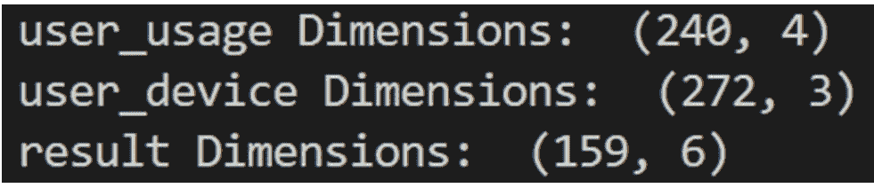

## 图 组合数据集的输出

我们从`user_usage`中的240行和`user_device`中的272行开始，但结果数据框只有159行，如图所示。为什么我们看到结果的大小与原始数据框不同？

内连接/连接仅保留结果左侧和右侧数据框中的公共值。在此示例中，仅包含`user_usage`和`user_device`之间公共`use_id`值的行保留在结果数据集中。让我们通过查看左右数据集之间有多少公共值来验证我们刚才所说的。以下代码将显示公共行，不匹配将返回`False`

```
#有多少值是公共的
```

前面代码的输出如图所示。我们看到只有159行是公共的：

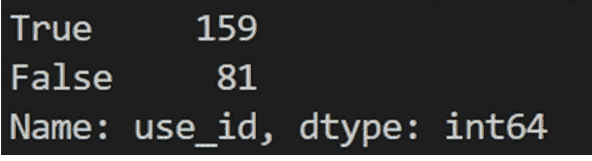

图 True表示公共数据点的数量

## 其他合并类型

除了内连接/连接，其他类型的连接如下：

左连接 / 左外连接 保留左侧数据框中的每一行，即使对应的值在右侧数据集中。对于右侧数据框中`on`变量的缺失值，添加NaN/空值。

右连接 / 右外连接 保留右侧数据框中的每一行，并在输出中为左侧数据框中的任何缺失值添加空值/NaN。

外连接 / 全外连接 外连接或全外连接返回左侧和右侧数据框中的所有行，并在可能的情况下匹配行，其他位置填充NaN。

我们可以通过`merge`命令中的`how`参数将连接更改为左连接，如下所示：

```
#使用"how"参数将连接更改为左连接
result = pd.merge(d1,
indicator
result.head()
维度：
维度：
在{result['device'].isnull().sum()}中缺少值
```

让我们看看如何使用`left_on`和`right_on`来合并不同的列。

现在，让我们添加第三个数据框。我们将重新进行第一次合并以回到内连接，然后合并`devices`数据框。代码如下：

```
# 将platform和device添加到用户使用情况
result = pd.merge(d1,
```

```
# 在result的"device"列上合并
# 匹配devices (d3)中的"Model"列
result = pd.merge(result,
```

## MatPlotLib

Matplotlib是Python编程的基础绘图库。它也是数值NumPy的扩展。它提供了一个面向对象的API，用于使用通用GUI工具包（如Tkinter）将绘图嵌入应用程序。

## Seaborn

Seaborn库在底层使用Matplotlib来绘制图形。Matplotlib更适合基础绘图，而Seaborn用于更高级的统计绘图，并提供更具吸引力的默认调色板。

我们将在构建应用程序时看到MatPlotLib和Seaborn的实际应用。

## 学习统计学基础

我们总是需要为解决业务问题而争取正确且有用的数据集。让我们理解数据集的组成部分。数据集是来自研究或实验的一组数据。实例是单行数据，共享公共属性的实例集合称为数据集。数据可以有多种形式，但本章的分析将依赖于两种主要数据类型：数值型和分类型。数值型或定量数据是任何可测量的数据，例如身高、体重或电话账单费用。你应该能够执行算术运算，如乘法、平均值等。数值数据可以分为两种类型：离散型和连续型。

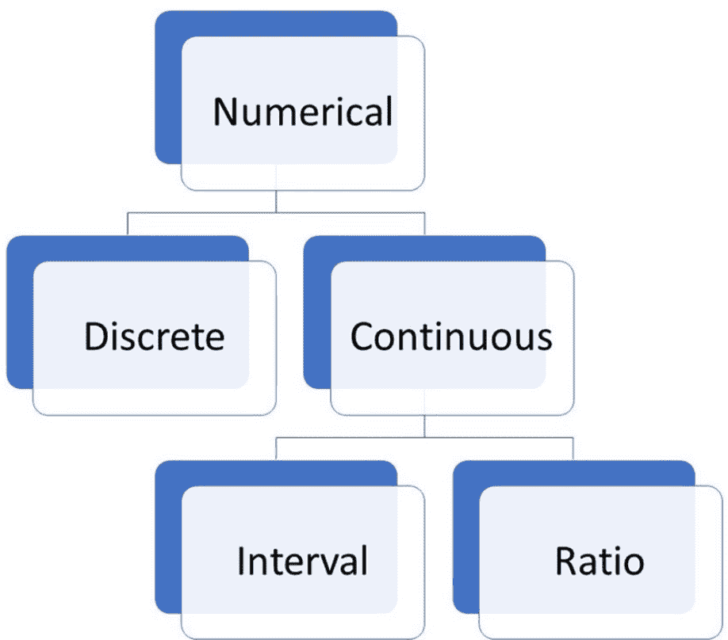

## 图 4.5：数值数据的类型

## 离散数据

离散数据是被分解为更小单元或离散变量的信息。每个变量只能取某些特定的值（例如，0、1、2、3、4、5）。一个更实际的例子是计算清空一桶水所需的杯数。

数据可以使用各种图表来表示。下面是一个例子，其中堆叠条形图展示了5个城市GST的季度平均征收情况。让我们学习如何绘制这样的图表。请参考图4.6，看看堆叠条形图是什么样子：

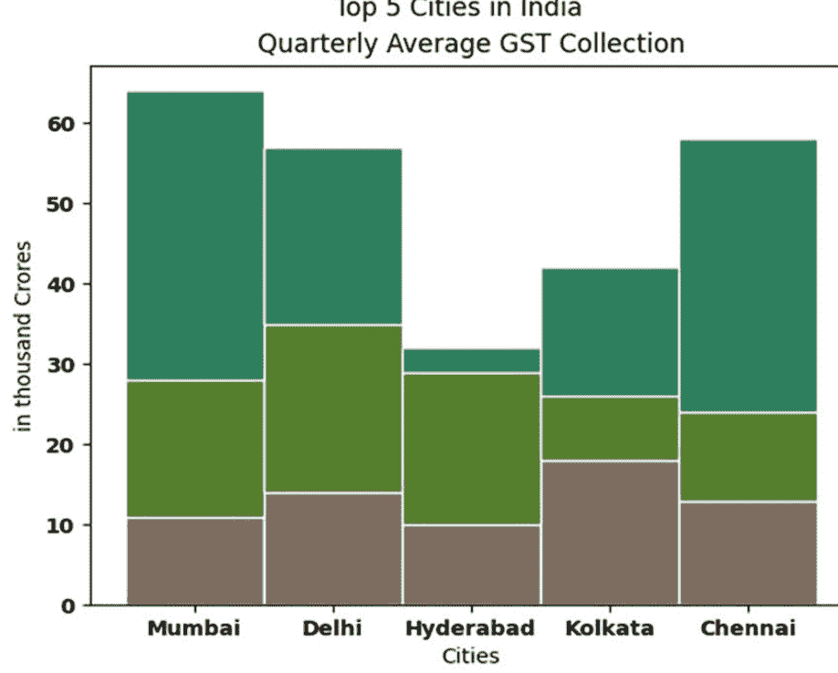

## 图 4.6：堆叠条形图示例

以下是生成图4.6所示图表的Python代码：

```python
import matplotlib.pyplot as plt
from matplotlib import rc

import numpy as np
import pandas as pd

# put y-axis in bold
# Values of each group
Y22Q1 =
Y22Q2 =
Y22Q3 =
# Heights of bars1 + bars2
bars = np.add(Y22Q1, Y22Q2).tolist()
# Creating 5 positions for the bars on x-axis
r =
# Names of group and bar width
names =
barWidth = 1
# Create brown bars
plt.bar(r, Y22Q1,
# Creating green bars (middle), on top of the first bar
plt.bar(r, Y22Q2,
# Create green bars (top)
plt.bar(r, Y22Q3,
# Custom X axis
plt.xticks(r, names,
thousand
# Show graphic
plt.show()
```

## 连续数据

连续数据可以在一个范围内取任何值。连续数据的例子包括体重、温度、时间和速度。它们是测量而非计数的，通常用连续的折线图表示。一个例子是5分制评分系统中的累积平均绩点（CGPA），该系统将一等学生定义为CGPA在4.5 - 5.0之间的学生，二等上为3.50 - 4.49，二等下为2.50 - 3.49，三等为1.5 - 2.49，及格为1.00 - 1.49，不及格为0.00 - 0.9。连续数据是不可数的有限数据。

连续数据可以细分为两种类型：区间数据和比率数据。

## 区间数据

区间数据是连续的定量数据，其中两个值之间的差异具有意义。这种数据类型是在等距尺度上测量的，这意味着数据集中每组值之间的差异是恒定相等的。区间数据的例子包括温度、身高和时间。区间数据是只能进行加法和减法运算的数值。

例如，以摄氏度（或华氏度）测量的温度被认为是区间数据，并且这种温度没有零点。

对区间数据的趋势分析是通过使用相同问题的区间尺度调查来捕获数据进行的。它是通过展示一段时间内的数据来绘制趋势和洞察的最受欢迎的分析技术之一。在图4.7中，让我们看看Infosys 5年的收入（以美元计）百分比趋势：


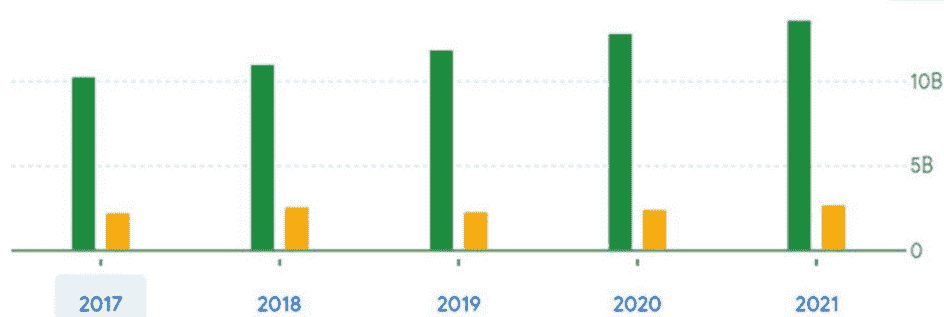

| | 2017 | 2018 | 2019 | 2020 | 2021 |
|---|---|---|---|---|---|
| 收入 | $10.2B | $10.9B | $11.8B | $12.8B | $13.6 B |
| 收入增长率 % | 100% 基准年 | 107% | 108% | 108% | 106% |
| 净利润 | $2.1B | $2.5B | $2.2B | $2.3B | $2.6B |
| 净利润增长率 % | 100% 基准年 | 116% | 88% | 106% | 112% |

图 4.7：5年趋势示例

## 比率数据

比率数据是具有零点的连续数据，例如，以开尔文为单位测量的温度。假设我们测量两个物体的温度分别为10°C和20°C；这并不意味着第二个物体的温度是第一个的两倍，因为0°C并不意味着没有温度。

交叉表分析技术可以是理解多个变量之间关系的一种方法。列联表（或交叉表）用于以表格格式建立多个比率数据变量之间的相关性。图4.8显示了一个交叉表的例子。交叉表可用于任何数据水平：有序或名义；并且它将所有数据视为名义数据（名义数据不是测量而是分类的）。例如，你可以分析两个分类变量之间的关系，如年龄和购买行为。

图4.8显示了基于两个问题的交叉表分析：

受访者的年龄是多少？

他们未来1个月内可能购买哪些电子产品？

| 年龄 | 笔记本电脑 | 手机 | 平板电脑 | 数码相机 |
|---|---|---|---|---|
| 20-25 | 38% | 29% | 31% | 12% |
| 25-30 | 19% | 15% | 24% | 17% |
| 30-35 | 23% | 19% | 11% | 27% |
| 35-40 | 19% | 12% | 9% | 30% |
| 40岁以上 | 12% | 17% | 5% | 31% |

## 图 4.8：交叉表示例

数值数据的一般特征/特性：

- 数值数据本质上是定量的。
- 你可以执行算术运算，如加法和乘法。
- 它们既可以是估计的，也可以是精确的。
- 数值数据尺度上每个间隔之间的差异是相等的。
- 数值数据可以根据散点图、点图、堆叠点图、直方图等以不同的方式可视化。

## 分类数据（或定性数据）

分类数据可以被分类为不同的类别或组，例如，性别、社会阶层、种族和家乡。它是非定量的，非常适合将具有相似属性的个体或想法分组，帮助机器学习模型简化数据分析。

这可以进一步分为名义数据和有序数据。

## 名义数据

名义数据代表可以按任何顺序排列的值（或类别）。它只代表单个类别或名称，只代表质量，而不代表差异大小的信息。值没有特定的顺序，可以按任何顺序书写。此类数据的示例如下：

- {男性，女性}
- {北区，南区，东区，西区}
- {马鲁蒂，塔塔汽车，马恒达，丰田，福特}

## 有序数据

有序数据是分类数据，其中值遵循某种顺序，我们可以确定变量差异的方向，但不能确定差异的大小。顺序是有意义的，比如“非常好”会大于“好”，但这些是分类数据，因为我们不知道“非常好”比“好”大多少倍。

例如，请参考此处提到的各种选项：

表 4.4：学生成绩

表 4.5：偏好

我们知道有序数据中的顺序是这样的：

优秀 > 良好

无论我们分配什么值，顺序都保持不变。分类数据可以总结在一个表格中，列出各个类别及其各自的频率计数，例如，频率分布。

也可以使用相对频率分布，列出类别及其出现的比例。图4.9描述了一所商学院就业数据的频率和相对频率。例如，它表明有73名学生被安排在会计岗位，占学生总数的28.9%。

### 示例：学生就业

| 领域 | 频率 | 相对频率 |
| :--- | :--- | :--- |
| 会计 | 73 | 28.9% |
| 金融 | 52 | 20.6% |
| 综合管理 | 36 | 14.2% |
| 市场营销/销售 | 64 | 25.3% |
| 其他 | 28 | 11.1% |
| **总计** | **253** | **100%** |

图 4.9：频率分布表

频率和相对频率分布也可以分别总结为条形图和饼图。请参考图4.10进行可视化：

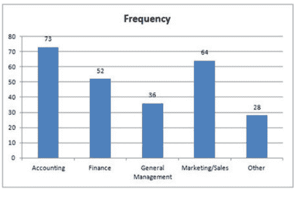

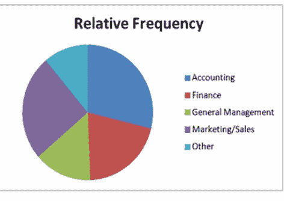

图 4.10：来自频率分布表的条形图和饼图

## 数据分析可视化

在本节中，我们将学习使用Matplotlib和Seaborn来可视化数据。我们将讨论的第一个图是散点图。散点图显示了在X轴和Y轴上表示的两个数据集之间的关系。它们可用于显示数据点云（尤其是非常大的数据点云）中的趋势、聚类、模式和关系。

问题：是什么导致软件行业经理的工作压力？

软件工程师经历着心理社会工作压力，随着时间的推移，这可能会对身心健康产生负面影响。一位研究人员想要研究各种因素对软件行业经理工作压力的影响。他们确定了三个可能影响压力水平的因素：家庭支持、工作-家庭冲突和睡眠。他们与3683名受访者合作，并将发现记录在案。他们想检查这些因素是否可以帮助我们预测软件工程师的压力水平。让我们使用Python分析数据。请参考以下步骤：

定义问题

这里展示了一些问题陈述的示例。你可以基于以下问题来制定你自己的问题陈述：

- 哪些因素有助于影响软件行业经理的压力水平？
- 我们能否基于家庭支持、工作-家庭冲突和睡眠作为因素来预测软件行业经理的压力水平？

### 获取数据

我们将使用 JobStressData.csv 文件。您可以从给定的 GitHub 位置下载该文件。首先，让我们了解需要使用哪些库。如果您尚未安装，可以使用 pip 命令进行安装。更多详情请参阅第 3 章《VS Code 中 Python 的顶级扩展》。

以下代码展示了绘图所需的库，包括 matplotlib 和

```
import numpy as np
import pandas as pd
```

```
from scipy import stats
import matplotlib.pyplot as plt
import seaborn as sns
```

```
from scipy.stats import pearsonr
```

让我们将数据读入 Pandas dataframe：

```
data =
# 显示行数、列数
```

JobStressData.csv 数据集可在 GitHub 上下载。

## 数据清洗

下一步是清洗并读取相关数据。给定的数据集包含管理者和非管理者的数据，因此让我们筛选出仅与管理者相关的数据。

让我们汇总数据以了解我们拥有的数据类型。如果 DataFrame 包含数值数据，`describe` 方法会为每列提供以下信息：

- 非空值的数量
- 平均值（均值）
- 标准差
- 最小值
- 25% 分位数*
- 50% 分位数*
- 75% 分位数*
- 最大值

以下代码将在根据角色值筛选后汇总数据：

```
summary = data.describe()

# 筛选工作角色为 MANAGER 的数据
manager_df = ===

manager_df =
```

图 4.11 显示了所有列之间的相关系数。这是上述代码的输出：

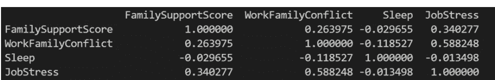

图 4.11：各因素之间的相关系数

最后一行打印了所有列之间的相关系数。相关系数是一种统计指标，用于衡量两个变量之间线性关系的强度。系数值范围在 -1 到 1 之间。当相关系数为 -1 时，表示完全负相关（反向关系），即一个序列中的值上升时，另一个序列中的值下降，反之亦然。系数为 1 表示完全正相关（直接关系），系数值为 0 则表示不存在线性关系。

在我们拥有的数据集中，大多数值介于 -0.5 和 +0.5 之间，表明这些因素之间没有或只有非常微弱的相关性。

## 分析数据

我们可以使用热力图来表示上述数据。热力图是一种以二维颜色显示现象强度的图表。颜色变化可以是色调或强度。以下代码展示了如何使用 seaborn 库绘制热力图。

```
# 绘制相关性的热力图
ax = sns.heatmap(manager_df.corr(),
plt.show()
```

上述代码生成的热力图绘制在图

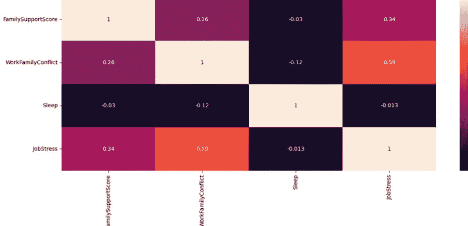

图 4.12：相关性值的热力图

在散点图中，自变量绘制在 x 轴上，因变量绘制在 y 轴上。散点图显示了属性之间是否存在相关性及其程度。让我们使用以下代码进行绘图：

```
# 散点图
ax =
压力 vs. 工作-家庭
plt.show()
```

上述代码生成的散点图如图所示

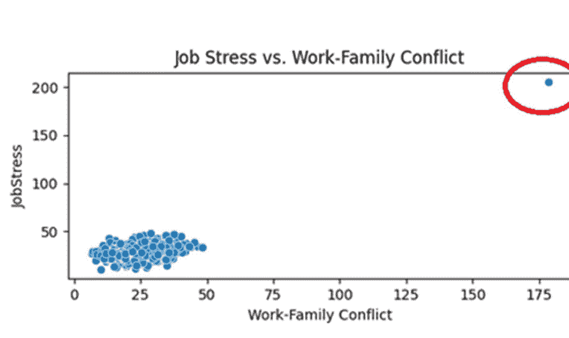

图 4.13：工作压力与工作家庭冲突的散点图

在图中，我们可以看到有一个非常高的值，它影响了我们对整个数据的观察。这是一个异常值。让我们移除这个值并重新绘制。这将对相关性值产生影响；我们将在本节后面看到：

```
# 让我们使用 .loc 来限制显示的 'WorkFamilyConflict' 值

manager_df =
```

```
ax =
压力 vs. 工作-家庭
plt.show()
```

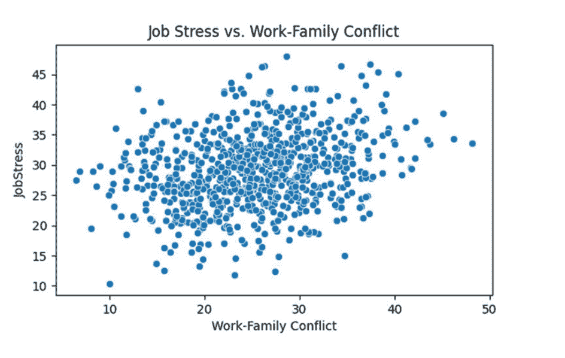

图 4.14：移除异常值后的工作压力与工作家庭冲突散点图

图 4.14 显示了更新后的散点图。我们可以看到一个轻微的正向趋势，但不足以得出存在高度正相关值的结论。稍后，我们将计算皮尔逊相关常数来检查该值，如图所示。在此之前，我们还将学习绘制最佳拟合线并观察趋势。

## 数据可视化

如前所述，散点图可视化了相关性的概念。让我们看看散点图可能显示的相关性类型。请参阅图 4.15 了解相关性的行为：


图 4.15：散点图显示的相关性类型

最佳拟合线基于所有散点图点给出一个趋势。让我们看看下面绘制散点图及其最佳拟合线的 Python 代码：

```
# 添加最佳拟合线
data=manager_df)
压力 vs. 工作-家庭
plt.show()
```

图 4.16 显示了带有最佳拟合线的散点图：

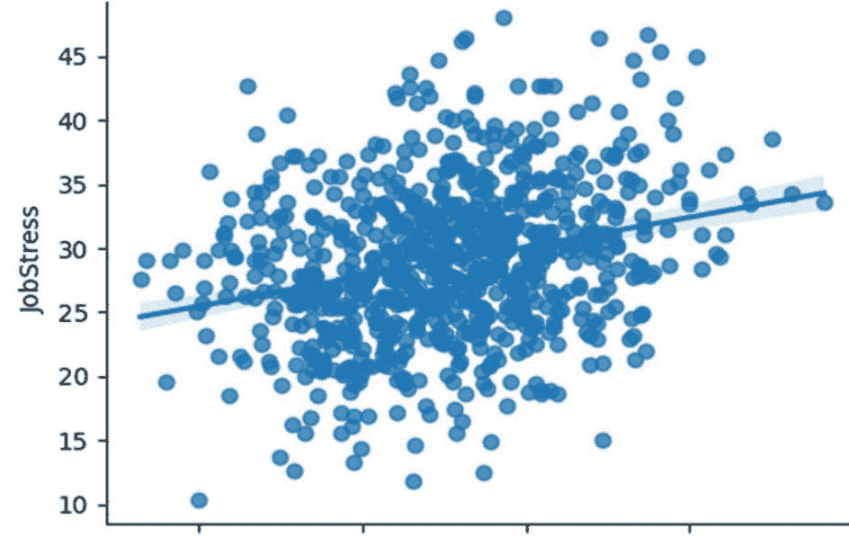

图 4.16：WorkFamilyConflict 与 JobStress 的散点图及最佳拟合线

在图 4.16 的散点图中，最佳拟合线显示出一个微小的正向趋势。让我们将第三个维度作为色调（Hue）添加到散点图中。色调用于将相似的属性分组并用相同的颜色表示。以下代码使用色调概念，通过此 Python 代码对相似值进行分组：

```
# 将 FamilySupportScore 作为第三维度添加
压力 vs. 工作-家庭
plt.show()
```

上述代码将生成如图 4.17 所示的散点图，并带有色调值：

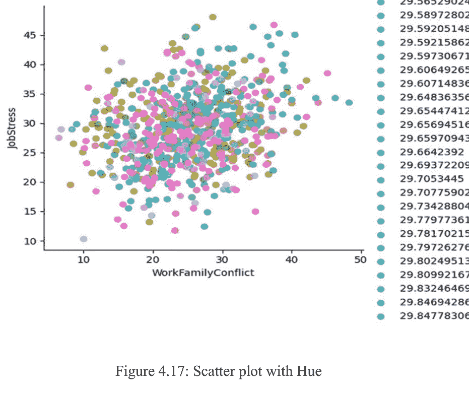

图 4.17：带有色调的散点图

## 总结结果

皮尔逊相关系数也称为皮尔逊 r。它是衡量两个给定变量之间线性相关性的指标。它计算为两个变量的协方差与其标准差乘积的比率，本质上是协方差的归一化度量。结果值始终在 -1 和 1 之间。让我们计算我们数据集的皮尔逊相关系数：

```
# 相关系数
from scipy.stats import pearsonr
```

```
corr, _ =
相关性: %.3f % corr)
```

图 4.18 显示相关性值约为 0.265：


图 4.18：WorkFamilyConflict 与 JobStress 的相关性值

之前绘制热力图时，该值为 0.588，但移除那个异常值后，相关性值降低到 0.265。如此低的值（小于 0.5）表明工作压力和工作家庭冲突之间存在极其微弱的相关性，因此无法根据工作家庭冲突来预测工作压力。

## 数据分析与业务结果

在前面的例子中，我们使用散点图创建并分析了一个问题。数据分析中广泛使用的另一种图表是直方图。我们讨论了频率分布，并在图中的示例中看到了一个小演示。让我们模拟一个业务问题，我们将使用直方图来解决它：

假设您是一家大型电话服务提供商的营销经理。您想分析客户的国际通话费用，因此随机选择了 200 名客户并记录了他们的月账单金额。您希望提取有意义的数据，以帮助您为公司制定战略决策。让我们通过 Python 代码读取数据，然后分析我的分析方法。

### 获取数据

数据集已上传到前面提到的 GitHub 位置。数字单位为美元。让我们使用 Python 代码将数据集读取为 Pandas dataframe：

```
import numpy as np
arr =
```

图 4.19 显示了数据集的一部分：

```
[ 42.19  38.45  29.23  89.35 118.04 110.46   0.   72.88  83.05  95.73
 103.15  94.52  26.84  93.93  90.26  72.78 101.36 104.8   74.01  56.01
  39.21  48.54  93.31 104.88  30.61  22.57  63.7  104.84   6.45  16.47
  89.5   13.36  44.16  92.97  99.56  92.62  78.89  87.71  93.57   0.
   8.37   7.18  11.07   1.47  26.4   13.26  21.13  95.03  29.04   5.42
  77.21  72.47   0.     5.64   6.48   6.95  19.6    8.11   9.01  84.77
  75.71  88.62  99.5   85.     0.     8.41   3.2    1.62  91.1   10.88]
```

图 4.19：数据集样本

### 探索性数据分析

仅通过阅读 200 个观测值，我们能获得的信息非常有限。您可能会注意到最高值是 $119.63，最低值是 0.0，但这不足以做出任何有意义的决策。您可以构建一个频率分布，然后从中绘制直方图。让我们看看构建直方图的代码：

```
import matplotlib.pyplot as plt
# 创建分箱
bin = * i for i in
# 绘制直方图
plt.hist(arr, bin)
plt.show()
```

请参阅图 4.20 了解我们拥有的数据绘制出的直方图是什么样子：

## 观察

直方图清晰地展示了观测值的分布情况。让我们将客户分为三组：i) 小额消费——账单低于30美元的客户，ii) 中等消费——账单在30至90美元之间的客户，iii) 大额消费——账单高于90美元的客户。请参考图4.21，查看我们划分的不同组别：

图4.21：直方图绘制的数据点观测

## 解读

解读此类结果需要领域知识。假设一家零售店的营销经理正在分析相同的数据；当得知只有30%的客户进行大额消费时，他们会感到失望。他们会制定诸如“买一赠一”之类的计划，鼓励客户从小额消费转向中等消费，乃至高价值消费。但鉴于本例讨论的是电话服务提供商，他们的关注点将是这些大额消费客户。这些高付费客户很容易成为竞争对手的目标，后者可能通过提供更便宜的套餐来抢夺他们。因此，对于电信运营商而言，首要任务是将这些高账单支付者转移到中等消费组，以将他们保留在业务中。这正是你会注意到公司推出如此多套餐的原因；目标是为每个人提供合适的选择。

## 使用 GitHub

GitHub 是一个基于云的应用程序，为程序员提供存储和共享源代码的服务。将 Visual Studio Code (VS Code) 与 GitHub 结合使用，可以直接在编辑器内共享和协作处理源代码。可以通过多种方式与 GitHub 交互，例如通过其网站 github.com 或 Git 命令行界面。但通过使用 GitHub Pull Requests and Issues 扩展，可以直接在编辑器中操作 GitHub。在本节中，我们将学习以下内容：

- 如何将现有的 VS Code 项目添加到 git 和 GitHub
- 如何在发生更改时进行提交和推送
- 如何将现有的 GitHub 项目克隆到 VS Code
- 如何将项目从 git 中移除

让我们开始吧：

## 安装 Git

VS Code 依赖于本地安装的 Git，因此用户在执行任何操作前需要先安装 Git。最低要求是至少拥有 Git 2.0.0 版本。我们将使用 git 命令行界面，可以从以下地址下载：

https://git-scm.com/book/en/v2/Getting-Started-Installing-Git

按照说明在你的 Mac 或 PC 上下载并安装它。你可以使用以下命令检查 Git 的版本。任何高于 2.0.0 的版本都适合我们继续：

```
C:\Users\Hp>git --version
git version 2.39.0.windows.1
```

图4.22：检查 Git 版本

## 创建 GitHub 账户

访问 github.com，如果你还没有账户，请注册一个：

图4.23：在 Github 上创建新账户

## 在 GitHub 上创建仓库

现在我们为项目创建一个仓库。在左上角，你会看到 New 按钮；点击它。你也可以通过点击右上角的 + 号，然后点击 New 来完成相同操作。

图4.24：显示创建新仓库的两种选项

这将打开一个表单，用于填写创建仓库所需的值，如图4.25所示。

## 创建新仓库

一个仓库包含所有项目文件，包括修订历史记录。在其他地方已有项目仓库？[导入仓库。](https://github.com/import)

**所有者** * / **仓库名称** *
swapnilsaurav / [输入框]
好的仓库名称简短且易于记忆。需要灵感？**crispy-train** 怎么样？

**描述**（可选）
[输入框]

- [x] **公开**
  互联网上的任何人都可以看到此仓库。你可以选择谁可以提交。
- [ ] **私有**
  你可以选择谁可以查看和提交到此仓库。

**使用以下方式初始化此仓库：**
如果你正在导入现有仓库，请跳过此步骤。
- [ ] **添加 README 文件**
  你可以在此处为项目编写详细描述。[了解更多。](https://docs.github.com/en/repositories/working-with-files/using-files/creating-a-new-repository#adding-a-readme-file)

图4.25：添加详细信息以创建新仓库

为你的仓库命名；描述是可选的。选择默认的“公开”选项，以便与所有人共享。我们的示例创建了 BookPythonAppsOnVSCode。使用 README 文件初始化项目始终是一个好习惯。

安装 GitHub Pull Requests and Issues 扩展：

使用 GitHub Pull Requests and Issues 扩展，无需离开 VS Code 即可更轻松地访问 GitHub。

图4.26：Github Pull Requests and Issues 扩展

我们在前一章已经讨论了如何安装扩展。请按照我们在第3章“VS Code 顶级扩展”中讨论的相同步骤，为你的 VS Code 编辑器安装 GitHub Pull Requests and Issues 扩展。

首先，必须登录 GitHub Pull Requests and Issues 扩展。你可以按照提示在浏览器中进行 GitHub 身份验证，然后返回 VS Code 来登录。也可以通过手动添加授权令牌来完成身份验证。授权令牌可以在浏览器窗口中；复制此令牌并切换回 VS Code。在状态栏中选择“登录 github.com”，粘贴令牌，然后按回车键。

## 如何设置仓库？

用户可以通过使用命令面板中的 Git: Clone 命令，从 GitHub 搜索并克隆仓库来设置仓库。也可以通过在源代码管理视图中点击“克隆仓库”按钮来完成。源代码管理视图仅在未打开任何文件夹时显示。请参考图4.27。

图4.27：连接到 Github 仓库

从 GitHub 仓库下拉菜单中筛选并选择本地克隆的仓库，或直接输入路径。如果你之前未从 VS Code 登录 GitHub，系统会提示你在继续之前使用 GitHub 账户进行身份验证。你可以直接提供仓库 URL，或在文本框中输入以搜索你想要的 GitHub 仓库。图4.28 指示了你需要添加仓库位置的地方：

图4.28：输入 Github 仓库位置

一旦你选择了仓库或进行了拉取请求，VS Code 窗口将重新加载该仓库。你将在文件资源管理器中看到仓库内容。现在，你可以打开文件（具有完整的语法高亮和括号匹配），根据需要进行编辑，并提交更改，就像在本地仓库克隆上工作一样。请参考下图：

图4.29：直接将程序保存到 Github 远程仓库

然而，这里有一个区别你会注意到。当在安装了 GitHub 仓库扩展的 VS Code 中提交更改时，更改会直接推送到远程仓库，类似于在 GitHub 网页界面中工作。GitHub 仓库扩展的另一个特点是，每次你打开一个仓库或分支时，都会呈现来自 GitHub 的最新源代码。这消除了像使用本地仓库那样需要记住执行拉取操作来刷新的需要。请参考图4.30。

图4.30：Github 分支指示

VS Code 提供了另一个优势：我们可以通过点击状态栏上的分支指示器轻松地在分支之间切换，而无需暂存未提交的更改。扩展会记住更改，并在你切换分支时重新应用它们。

有时你会希望切换到支持本地文件系统以及完整语言和开发工具的开发环境中处理仓库。GitHub 仓库扩展使你能够轻松执行以下操作：

- 将仓库克隆到本地

## 第5章

## 使用数据库开发桌面应用程序

使用不充分数据所犯的错误远少于完全不使用数据所犯的错误。

> —— 查尔斯·巴贝奇

## 简介

本章将指导我们如何运用数据库技能开发应用程序。数据库是任何应用程序的重要组成部分，它提供了一种高效、安全地存储和管理数据的方式。本章将探讨数据库应用程序的基础知识。

数据库设计是创建数据库详细数据模型的过程。它定义了数据库的逻辑结构，并决定数据将如何被存储、组织和访问。数据库设计涉及对数据进行分类以及识别数据项之间的关系。数据库设计的目标是生成一个能够正确表示数据，并且灵活、高效、易于维护的模型。

我们将了解不同类型的数据库、使用Python访问它们的不同方式，以及Python提供的用于管理数据库的工具。我们还将研究设计和实现数据库应用程序的基础知识。最后，我们将讨论测试和维护数据库应用程序的重要性。

## 结构

在本章中，我们将讨论以下主题：

- 数据库简介与关系数据库管理系统
- 问题陈述：开发一个应用程序
- 使用MYSQL
- 执行项目：执行CRUD操作
- 在VS Code中调试

## 数据库简介与关系数据库管理系统

数据库是为了便于存储、访问和操作而组织的数据集合。它通常由数据库管理系统管理，该系统为用户提供了一种系统化的方式来创建、检索、更新和管理数据。数据库中的数据通常被组织成表、字段和记录。

目前有不同类型的数据库在使用；其中一些如下：

关系型 这种类型的数据库将数据存储在具有行和列的结构化表中。它遵循预定义的模式，并使用结构化查询语言来查询和管理数据。示例包括Oracle、MySQL和SQL Server。

面向对象 这种类型的数据库将数据存储在对象中，对象可以包含数据和行为。它适用于存储复杂的、相互关联的数据结构，并支持继承和多态。示例包括MongoDB和Couchbase。

层次型 这种类型的数据库将数据组织成树状结构，数据元素之间存在父子关系。它主要用于存储层次数据，例如文件系统。示例包括IBM的信息管理系统和Windows注册表。

网络型 这种类型的数据库使用网络数据模型存储具有复杂关系的数据。它类似于层次数据库，但允许数据元素之间建立更灵活的关系。示例包括集成数据存储和集成定义语言。

NoSQL 这个术语指的是不遵循严格表格结构（如关系数据库中那样）的一类数据库。NoSQL数据库旨在实现可扩展性、高性能，并处理非结构化和半结构化数据。一些流行的NoSQL数据库类型包括文档数据库（例如MongoDB）、键值存储（例如Redis）、列族数据库（例如Cassandra）和图数据库（例如Neo4j）。

时序型 这种类型的数据库针对处理时序数据进行了优化，时序数据是带有时间戳记录的数据。它通常用于金融服务、物联网和日志分析等领域，以高效地存储和分析大量带时间戳的数据。示例包括InfluxDB和TimescaleDB。

图 这种类型的数据库旨在存储和分析高度互联的数据，例如社交网络、推荐引擎和欺诈检测系统。它将数据存储为节点（实体）和边（关系），允许高效地遍历和查询复杂关系。示例包括Neo4j和Amazon Neptune。

空间 这种类型的数据库专门用于存储和查询空间或地理数据。它支持对2D和3D数据类型（如点、线、多边形和空间关系）进行索引和分析。示例包括PostGIS和Oracle Spatial。

内存型 这种类型的数据库将数据完全存储在内存中，而不是磁盘上，以实现更快的访问和处理。它用于速度至关重要的情况，例如实时分析和高速交易。示例包括SAP HANA和VoltDB。

云 这个术语指的是通过云计算平台托管并作为服务提供的数据库。这些数据库具有可扩展性、高可用性，并且可以通过互联网从任何地方访问。流行的示例包括Amazon Web Services RDS、Microsoft Azure Cosmos DB和Google Cloud Firestore。

在本章中，我们将使用关系数据库管理系统开发一个应用程序。关系数据库管理系统用于在结构化表中存储和管理数据。它们之所以流行，是因为它们提供了轻松查询数据、连接多个表中的数据以及强制数据完整性的能力。它们还提供事务、数据安全性和可扩展性等功能。关系数据库用于许多应用程序，例如金融系统、客户关系管理系统和电子商务网站。

一些流行的关系数据库管理系统如下：

- Oracle
- MySQL
- Microsoft SQL Server
- PostgreSQL
- IBM DB2
- MariaDB
- Sybase
- Informix
- Firebird
- Apache Derby

在本章中，我们将使用MYSQL数据库作为后端开发一个可运行的图书馆管理系统。MySQL是一个开源的关系数据库管理系统，它使用结构化查询语言来添加、访问和管理数据。它是世界上最流行的数据库之一，广泛应用于从小型Web应用程序到大型企业应用程序的各种场景。许多流行的网站，包括Facebook、Google、Twitter和YouTube，也使用MySQL。

## 问题陈述：开发一个应用程序

在我们开始构建应用程序之前，让我们先了解需求。图书馆管理系统是一种用于跟踪图书馆馆藏项目的软件，例如书籍、期刊、视听资料和电子文档。它提供了一个集中式系统，用于编目、组织和跟踪图书馆资料，并管理图书馆资料向读者的流通。图书馆管理系统使图书馆活动和流程自动化，例如资料编目和流通。在这个示例中，我们将开发一个具有以下选项的迷你LMS系统：

- 图书借出
- 图书归还
- 管理菜单
- 创建学生记录
- 显示所有学生记录
- 显示特定学生记录
- 修改学生记录
- 删除学生记录

## 开发解决方案

我们已创建一个文件，它将作为我们的主文件。让我们先构建，然后将不同的函数和方法连接到它们。我们将使用无限循环的概念，直到用户希望继续运行菜单：

```
def adminmenu():
    the Option from
    1. CREATE
    2. DISPLAY ALL
    3. DISPLAY SPECIFIC
    4. MODIFY STUDENT
    5. DELETE STUDENT
    6. CREATE
    7. DISPLAY ALL
    8. DISPLAY SPECIFIC
    9. MODIFY BOOK
    10. DELETE BOOK
    11. TAKE BACK TO THE MAIN
    adminchoice = your choice from the above:
    if adminchoice ==
        return True
    elif adminchoice ==
        return True
    elif adminchoice ==
        return True

    elif adminchoice ==
```

```
return True
elif adminchoice ==
return True
elif adminchoice ==
return True
elif adminchoice ==
return True
elif adminchoice ==
return True
elif adminchoice ==
return True
elif adminchoice ==
return True
elif adminchoice ==
return False
Choice. Try
return True
def menu():
LIBRARY MANAGEMENT
the Option from
1. BOOK
2. BOOK
3. ADMIN
4. DISPLAY OUT
5.
mainchoice = your choice from the above:
if mainchoice ==

return True
elif mainchoice ==
return True
elif mainchoice ==
```

```
adm_cont = True
while adm_cont:
    adm_cont = adminmenu()
# Admin menu exited but still in main menu
menu()
elif mainchoice ==
return True
elif mainchoice ==
return False
Option Try
return True

# calling mainmenu
cont = True
while cont:
    cont = menu()
```

## 数据库设计

数据库设计包括根据业务需求组织数据。数据库设计者确定必须存储哪些数据以及这些元素如何相互关联。数据库设计中广泛使用的工具之一是实体关系图。实体关系图使用标准化符号和连接器直观地表示不同的数据。它说明了实体之间的关系，这些关系用于描述数据库的结构。ERD 用于建模和设计关系数据库，这些数据库将数据组织成可以通过关系链接的表。

以下是创建 ERD 的方法：

-   识别实体及其关系。首先通过头脑风暴列出问题域中涉及的所有主要实体。这些可能包括人员、地点、组织或其他事物。对于每个实体，识别相关实体及其关系。
-   确定实体的属性。对于每个实体，确定描述它的属性以及需要存储的数据。
-   创建图表。一旦识别了实体及其关系，就使用 Microsoft Visio 等工具绘制图表。
-   验证图表。检查它以确保它准确反映了已识别的实体、属性和关系。
-   完善图表。根据利益相关者或其他领域专家的反馈对图表进行任何更改。

让我们为我们的示例构建 ERD：

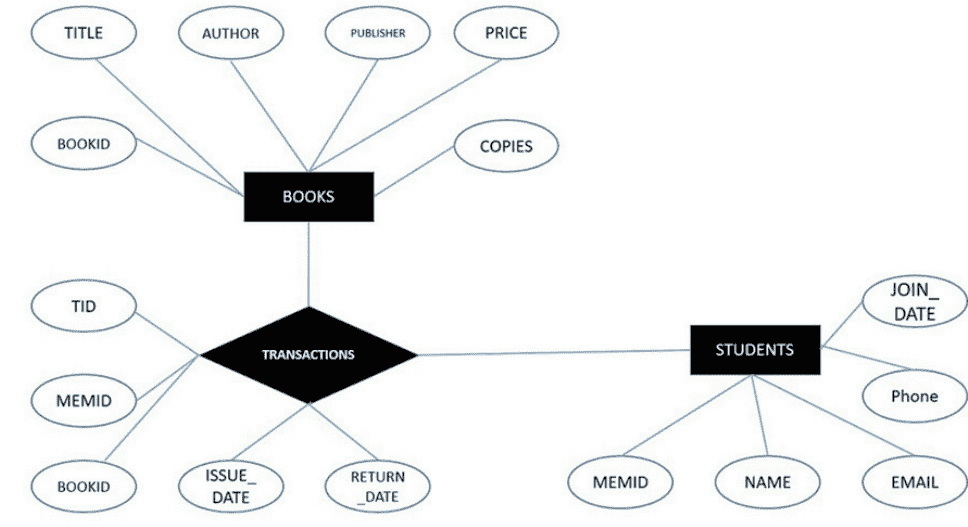

图 5.1：简单图书馆管理系统的 ER 图

## 创建表并添加约束

现在，按照以下步骤将 ER 图转换为表对象：

-   识别图中的实体

我们需要创建三个表：

-   一个存储书籍信息的表
-   一个存储学生信息的表
-   一个存储交易详情的表，用于记录谁借阅或归还了书籍以及何时借阅或归还

为每个实体创建一个表，并为列分配适当的数据类型。

让我们创建三个表，如下所示：

| here: |
| --- |
| here: here: here: here: here: here: here: here: here: here: here: here: here: here: here: here: |

表 5.1：表及其列的列表

这些是有效设计数据库所需的最小列集。

-   识别图中的关系。

表 BOOKS 和 STUDENTS 在这里可能没有直接关系，但 TRANSACTIONS 表需要连接到 BOOKS 和 STUDENTS，以确保只有相关信息被保存为交易。

-   在适当的表中创建外键以表示关系。

在此示例中，只有 TRANSACTIONS 表将具有外键。BOOKID 应链接到 BOOKS.BOOKID，MEMBERID 应链接到 STUDENTS.MEMBERID。

-   使用适当的 SQL 命令在数据库中生成表对象。

表 1：存储学生信息。

名称：STUDENTS

列：MemberID、Name、Email、Phone、JOIN_DATE（默认为今天）

创建表的 SQL 查询

```
CREATE TABLE STUDENTS(MEMID INTEGER PRIMARY KEY,
NAME VARCHAR2(30),
EMAIL VARCHAR2(25),
PHONE VARCHAR2(12),
JOIN_DATE DATE DEFAULT (CURRENT_DATE))
```

-   如果有初始数据集，则添加。

让我们向 STUDENTS 和 BOOKS 表中添加一些数据，以便我们有一些数据可以开始处理：

```
INSERT INTO STUDENTS(NAME,EMAIL,PHONE)
VALUES('Sachin','sachin@email.com','346377');
```

```
INSERT INTO STUDENTS(NAME,EMAIL,PHONE)
VALUES('Virat','virat@email.com','544343466');
```

```
INSERT INTO STUDENTS(NAME,EMAIL,PHONE)
VALUES('Dhoni','dhoni@email.com','5645654');
```

```
INSERT INTO STUDENTS(NAME,EMAIL,PHONE)
VALUES('Kapil','kapil@email.com','4576457');
```

```
INSERT INTO BOOKS(TITLE,AUTHOR,COPIES) VALUES('Learn and Practice Python','Swapnil Saurav',3);
```

```
INSERT INTO BOOKS(TITLE,AUTHOR,COPIES) VALUES('Learn and Practice SQL','Swapnil Saurav',3);
```

```
INSERT INTO BOOKS(TITLE,AUTHOR,COPIES) VALUES('Learn and Practice Data Visualization','Swapnil Saurav',3);
```

```
INSERT INTO BOOKS(TITLE,AUTHOR,COPIES) VALUES('Learn and Practice Machine Learning','Swapnil Saurav',3);
```

## 使用 MYSQL

MySQL 是一个关系数据库管理系统，用于访问和管理数据库中的记录。在本节中，我们将了解如何在 VS Code 中安装 MYSQL，如何使用 Python 从 VS Code 连接到 MySQL，以及如何运行我们在上一节中创建的表和插入查询。

让我们看看在运行 Microsoft 的本地计算机上下载和安装 MySQL 服务器的步骤：

-   从 https://dev.mysql.com/downloads/installer/ 下载 MySQL 安装程序并执行它。
-   为您的系统选择适当的安装类型。通常，您将选择“Developer Default”来安装 MySQL 服务器和其他与 MySQL 开发相关的 MySQL 工具，例如 MySQL workbench 等有用的工具。
-   按照说明完成安装过程。这将安装多个 MySQL 产品并启动 MySQL 服务器。

获取更多详细信息

以下是我们使用的详细信息：

服务器名称：MySQLServer 8.0.17

用户名：root

## MySQL Workbench

密码：learnSQL

MYSQL Workbench 是对我们非常有帮助的工具之一。图 5.2 展示了 MYSQL workbench 的界面：

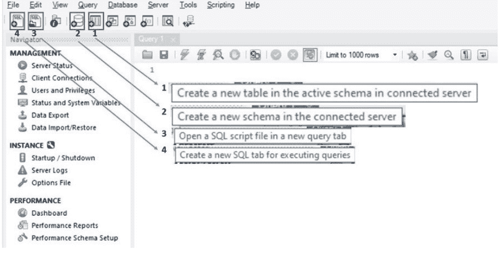

图 5.2：MySQL Workbench 中的重要选项

让我们创建一个名为的 Schema，我们将在其中创建所有的数据库对象。这可以通过点击连接服务器中的“创建新 Schema”选项来完成，如图所示

MYSQL 服务器已安装，数据库 Schema 也已创建，因此 MYSQL 方面的准备工作已全部就绪。现在，让我们专注于 VS Code。请参考以下步骤，使用 VSCode 连接到 MySQL Server：

在 VS Code 中，转到扩展并搜索 MySQL 扩展。打开名为 MySQL Management Tool 的扩展并安装它，如下图所示：

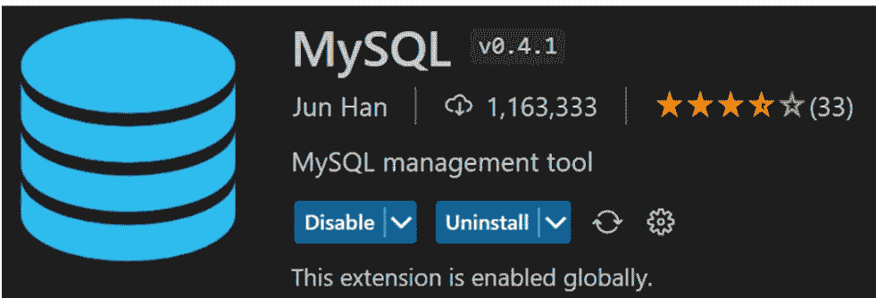

图 5.3：MySQL Management tool

MYSQL 现在已添加到资源管理器中。你可以通过点击资源管理器选项（VS Code 屏幕左侧的第一个选项，或按 Ctrl + Shift + E）来检查。现在，导航到 MYSQL 部分并点击 + 号。它会要求你输入以下详细信息：

-   主机：localhost
-   用户：root
-   密码：learnSQL
-   端口：3306
-   证书文件路径：留空

所有信息现已保存，并将如图 5.4 所示显示。

# 资源管理器

-   打开的编辑器 1 个未保存
-   BOOKPYTHONAPPSONVSCODE
-   大纲
-   时间线
-   MYSQL
    -   localhost
        -   information_schema
        -   libraryms
        -   mysql
        -   performance_schema
        -   school
        -   sys

## 图 5.4：MySQL 连接到 VS Code

展开后，我们可以在列表中看到 libraryms Schema；它就是我们在上一节中创建的同一个 Schema。MySQL 中的 Schema 是数据库对象（如表、视图、存储过程和触发器）的逻辑集合。一个 Schema 与单个数据库相关联，并包含该特定数据库的所有表和其他对象。MySQL 允许多个用户拥有自己的 Schema，并且每个用户都可以拥有一个与其他 Schema 完全隔离的 Schema。作为 root 用户，我们可以访问所有数据库。

你可以直接以 root 用户身份管理 MYSQL，但我们打算使用 Python 代码执行 SQL 命令。我们将创建另一个名为 sql.py 的文件，并从这里执行所有与数据库相关的查询。

我们需要安装并导入 pymysql 库。PyMySQL 是一个纯 Python MySQL 客户端库，为我们提供了连接数据库的函数。此外，我们将声明一个全局变量，其值为数据库名称

要在 Python 中使用 pymysql 库，你需要遵循以下步骤：

使用 pip 安装 pymysql 库：

```
$ pip install pymysql
```

在你的 Python 脚本中导入 pymysql 模块：

```
import pymysql
```

通过指定主机、用户、密码和数据库来建立与 MySQL 数据库的连接：

```
connection = pymysql.connect(host='localhost', user='root',
password='password', database='mydatabase')
```

将 localhost 替换为你的 MySQL 服务器的主机名，root 替换为 MySQL 用户名，password 替换为 MySQL 密码，mydatabase 替换为你的数据库名称。

创建一个游标对象来执行 SQL 查询：

```
cursor = connection.cursor()
```

使用游标对象执行 SQL 查询：

```
cursor.execute("SELECT * FROM mytable")
```

在 SELECT 的情况下获取查询结果：

```
results = cursor.fetchall()
```

你可以使用 results 变量访问查询结果的行。

关闭游标和连接：

```
cursor.close()
connection.close()
```

关闭游标和连接以释放资源非常重要。现在，让我们看看与我们相关的代码：

```
import pymysql
```

```
db_name = "libraryms"
```

我们将向此文件添加第一个函数。此函数还将从所有其他文件调用数据库交互。此文件将接受数据库名称、查询和值，这些值将以元组格式保存动态查询值。SQL 中的动态查询是一种在运行时根据程序变量或用户输入生成的查询类型。它能够动态生成不同的 SQL 语句，而不是在代码中预定义。这使得构建能够响应变化需求或用户输入的应用程序变得更加容易。让我们看一个动态查询在 MYSQL 中如何实现的例子：

```
sql = "SELECT 'id', 'password' FROM 'users' WHERE 'email'=%s and id=%d"
```

```
cursor.execute(sql, ('contact@mysite.com',121))
```

在前面的查询中，将显示 id 和 password，其值对应于动态的 id 和 email。由于 email 是字符串类型，我们说 email = %s，而 id=%d 是因为它是整数类型。元组中的值随后作为单独的参数传递给 execute 方法。

以下是的完整代码

```
from datetime import datetime
import pymysql
```

```
def perform_db_actions(db_name, query):
    """此函数将被所有其他文件调用，用于任何类型的数据库交互。
    @db_name: 数据库名称
    @query: 要执行的查询
    @values: 以元组格式表示的动态查询值
    返回：Select 查询将返回记录集，其他查询将返回 none
    """
    connect =

    cursorobj = connect.cursor()
    data = []
    data = cursorobj.execute(query)
    data = cursorobj.fetchall()
    connect.commit()
    cursorobj.close()
    return data
```

现在，我们创建另一个函数，该函数将执行我们在数据库设计期间创建的 CREATE table 和 INSERT 命令：

```
from datetime import datetime
def create_db(db_name):
    """一次性创建数据库查询"""
    # 创建表 1 学生
    t1 = """Create table STUDENTS(
    MEMID INTEGER PRIMARY KEY AUTO_INCREMENT,
    NAME VARCHAR(30),
    EMAIL VARCHAR(15),
    PHONE VARCHAR(12),
    JOIN_DATE DATE DEFAULT (CURRENT_DATE))"""
    # 调用数据库操作
    perform_db_actions(db_name, t1)
    t2 = """Create table BOOKS(
    BOOKID INTEGER PRIMARY KEY AUTO_INCREMENT,
    TITLE VARCHAR(30),
    AUTHOR VARCHAR(15),
    PUBLISHER VARCHAR(15),
    PRICE REAL,
    COPIES SMALLINT)"""
    perform_db_actions(db_name, t2)

    t3 = """Create table TRANSACTIONS(
    TID INTEGER PRIMARY KEY AUTO_INCREMENT,
    BOOKID INTEGER REFERENCES BOOKS(BOOKID),
    MEMID INTEGER REFERENCES STUDENTS(MEMID),
    ISSUE_DATE DATE,
    RETURN_DATE DATE)"""
    perform_db_actions(db_name, t3)

    add_students = ["""INSERT INTO STUDENTS(NAME,EMAIL,PHONE)
    VALUES('Sachin','sachin@em.com','346377')""",
    """INSERT INTO STUDENTS(NAME,EMAIL,PHONE)
    VALUES('Virat','virat@em.com','544343466')""",
    "INSERT INTO STUDENTS(NAME,EMAIL,PHONE)
    VALUES('Dhoni','dhoni@ema.com','5645654')",
    "INSERT INTO STUDENTS(NAME,EMAIL,PHONE)
    VALUES('Kapil','kapil@ema.com','4576457')"]
    for q in add_students:
        perform_db_actions(db_name, q)
    add_books = ["INSERT INTO BOOKS(TITLE,AUTHOR,COPIES)
    VALUES('Practice Python','Swapnil Saurav',3)",
    "INSERT INTO BOOKS(TITLE,AUTHOR,COPIES) VALUES('Practice
    SQL','Swapnil Saurav',3)",
    "INSERT INTO BOOKS(TITLE,AUTHOR,COPIES) VALUES('Practice
    Data Visualization','Swapnil Saurav',3)",
    "INSERT INTO BOOKS(TITLE,AUTHOR,COPIES) VALUES('Practice
    Machine Learning','Swapnil Saurav',3)"]

    for q in add_books:
        perform_db_actions(db_name, q)

    print("Your data has been created successfully!")

if __name__ == "__main__":
    create_db("libraryms") #一次性
```

我们稍后会回到这里，为 ISSUE_BOOKS 和 RETURN_BOOKS 添加主菜单函数。现在，我们将转到创建 Students 和 Books 类。

## Students 类

让我们创建另一个名为的 Python 文件，我们将实现特定于 Students 的方法，如添加、显示学生、显示特定学生、更新学生记录和删除学生

在 create_student 方法中，我们将从用户那里获取所有信息，形成一个动态查询，并将其传递给 perform_db_actions() 以创建新的学生记录。这就是为什么我们需要导入

Display_all() 和 Display_specific() 函数将显示关于学生的所有数据。唯一的区别是 display_specific() 会在执行 select 命令之前要求输入成员 ID。

Modify_student() 有点棘手，因为我们事先不知道要更改哪一列的值，所以它的实现方式是逐一显示所有值，然后用户可以选择要更改的特定列并提供新值。

Delete_student() 是另一个简单的函数，它从 Students 表中删除给定的记录。

以下是完整的代码供你参考：

```
""" Students Example"""
import sql
import datetime as dt
```

## 书籍类

让我们创建另一个名为 `Books` 的 Python 文件，我们将实现特定于书籍的方法，如添加书籍、显示书籍、显示特定书籍、更新书籍和删除书籍。

在 `create_book` 方法中，我们将从用户那里获取所有信息，形成一个动态查询，并将其传递给 `perform_db_actions()` 以创建记录。这就是为什么我们需要导入 `sql` 模块。

`Display_all()` 和 `Display_specific()` 函数将显示所有关于书籍的数据。唯一的区别是 `display_specific()` 会在执行 `select` 命令之前要求提供书籍 ID。

`Modify_book()` 有点棘手，因为我们事先不知道要更改哪个列的值，所以它的实现方式是逐一显示所有值，然后用户可以选择要更改的特定列并提供新值。

`Delete_book()` 是另一个简单的函数，它从书籍表中删除给定的记录。

以下是完整的代码供您参考：

```python
""" Books Example"""
import sql

class Books:
    """ Books Class"""
    def __init__(self, dbname):
        """ Initialize books class"""
        self.dbname = dbname

    def create_book(self):
        """ Create a new book record """
        title = input("the Title of the Book: ")
        author = input("the Author name of the Book: ")
        publisher = input("the Publisher of the Book: ")
        price = input("the Price id of the Book: ")
        copies = input("the Copies of the Book: ")
        query = f"INSERT INTO BOOKS(title, author, publisher, price, copies) VALUES('{title}', '{author}', '{publisher}', {price}, {copies})"
        perform_db_actions(self.dbname, query)
        print("added book record to the database")

    def display_all(self):
        """ Display all the books in the database """
        query = "SELECT * FROM BOOKS"
        rows = perform_db_actions(self.dbname, query)
        print("available in the Library")
        for book in rows:
            print(book)

    def display_specific(self):
        """ Display a specific book record """
        book_id = input("the ID of the Book: ")
        query = f"SELECT * FROM BOOKS WHERE bookid = {book_id}"
        rows = perform_db_actions(self.dbname, query)
        for book in rows:
            print(book)

    def modify_book(self):
        """Modify the details of a specific book record"""
        bid = input("the ID of the book record to be updated: ")
        query = f'SELECT title, author, publisher, price, copies FROM BOOKS WHERE bookid = {bid}'
        rows = perform_db_actions(self.dbname, query)

        if rows:
            cols = ['title', 'author', 'publisher', 'price', 'copies']
            update_query = "UPDATE BOOKS SET"

            for col, value in zip(cols, rows[0]):
                print(f"Current {col}: {value}")
                ch = input("y to modify: ")
                if ch.lower() == 'y':
                    if col in ['title', 'author', 'publisher']: # string values
                        inp = input("the new value: ")
                        update_query += f" {col} = '{inp}',"
                    elif col in ['price', 'copies']: # numeric values
                        inp = input("the new value: ")
                        update_query += f" {col} = {inp},"
            update_query = update_query[:-1] + f" WHERE bookid = {bid}"
            perform_db_actions(self.dbname, update_query)
            print("has been updated")
        else:
            print("no such data")

    def delete_book(self):
        """ Delete a specific book record"""
        book_id = input("the ID of the Book record to be deleted: ")
        query = f"SELECT bookid FROM BOOKS WHERE bookid = {book_id}"
        rows = perform_db_actions(self.dbname, query)
        if not rows:
            print("no such data")
        else:
            query = f"DELETE FROM BOOKS WHERE bookid = {book_id}"
            perform_db_actions(self.dbname, query)
            print("deleted")
```

## 执行项目：执行 CRUD 操作

CRUD 代表创建、读取、更新和删除。它是一组在数据库管理系统中常用于操作数据的操作。CRUD 操作是数据库系统中使用的基本操作：

创建操作使用户能够在数据库中创建新记录。此操作可用于向现有表添加新数据或创建新表。为了成功创建记录，用户必须了解数据库结构，并且必须具有添加新记录的适当权限。

读取操作使用户能够从数据库中检索现有记录。此操作用于访问现有数据，可用于搜索特定记录或显示表中的所有记录。

更新操作使用户能够修改数据库中的现有记录。此操作可用于修改现有数据或向现有记录添加新数据。为了成功更新记录，用户必须了解数据库结构，并且必须具有修改现有记录的适当权限。

删除操作使用户能够从数据库中删除现有记录。此操作可用于删除现有数据或从表中移除记录。为了成功删除记录，用户必须了解数据库结构，并且必须具有删除现有记录的适当权限。

CRUD 操作对于数据库系统至关重要，因为它们使用户能够创建、读取、更新和删除数据。这些操作是数据库操作的基本构建块，被开发人员和管理员用于管理数据。

在我们执行之前，让我们向 SQL 模块添加三个更多函数，我们将使用它们来执行 CRUD 操作。

`check_outbooks()` 函数将检查数据库中的 `transactions` 表，并找出那些没有归还日期的记录，然后显示它们。返回值 `null` 表示该书尚未归还给图书馆。现在让我们实现 `check_outbooks()` 函数：

```python
def check_outbooks(db_name):
    """list of books checked out"""
    heading = 'Member ID\tBook ID\tIssue Date'
    q1 = """Select tid,memid,bookid,issue_date from transactions where return_date is null"""
    rows = perform_db_actions(db_name, q1)
    if not rows:
        print("no books is pending for return")
    for r1 in rows:
        print(r1)
```

`issue_book()` 函数将接受 `MemberID` 和 `BookID`，如果图书馆中该书的剩余副本足够，它将更新 `Transaction` 表以表明该书已借给学生。这将使总副本数减少一：

```python
def issue_book(db_name):
    memid = input("the Member ID: ")
    bookid = input("the Book ID: ")
    book_count = 0

    # checking if MEMID in the database
    q1 = """Select MEMID from Students where MEMID = %d""" % (memid)
    row1 = perform_db_actions(db_name, q1)

    # checking if BOOKID in the database and if yes then get the count
    q1 = """Select Copies from Books where bookid = %d""" % (bookid)
    row2 = perform_db_actions(db_name, q1)
    if not row1 or not row2:
        print("Either BookID or Membership ID is missing, please check and re-try")
    elif row2[0][0] < 1:
        print("There are no more copies left in the library")

    #print(" ============ ", datetime.now().strftime('%d-%m-%Y'))
    book_count = row2[0][0]
    q2 = """INSERT INTO TRANSACTIONS(MEMID,BOOKID,ISSUE_DATE) VALUES(%d,%d,'%s')""" % (memid, bookid, datetime.now().strftime('%d-%m-%Y'))
    perform_db_actions(db_name, q2)

    # update the copies
    q2 = """Update Books Set Copies = %d where BookID=%d""" % (book_count - 1, bookid)
    perform_db_actions(db_name, q2)
    print("issued the book")
```

`return_book()` 函数将在书籍归还时更新数据库。它将向数据库添加归还日期并更新 `books` 表中的副本数量：

```python
def return_book(db_name):
    check_outbooks(db_name)
    given_id = input("are the list of transactions for borrowed book. Enter the transaction id alone or Membership ID,Book ID: ")
    val1 = 0
    tid = 0
    bookid = 0
    if ',' in given_id:
        # ID and Books ID
        val1 = 1
        memid, bookid = given_id.split(',')
        memid = int(memid)
        bookid = int(bookid)

    q1 = """Select tid from Transactions where memid=%d and bookid= %d and return_date is null """ % (memid, bookid)
    rows = perform_db_actions(db_name, q1)

    if rows:
        tid = rows[0][0]

    bookid = bookid
```

无法找到给定的 ID
val1 =
q1 = "Select tid, bookid from Transactions where return_date is null and tid=%d" % (val1)
rows = perform_db_actions(db_name, q1)
if >=
tid = val1
bookid =
无法找到给定的
except
数据未找到/发生错误！请尝试
# 增加副本数量
q1 = "Select Copies from Books where bookid=%d" % (bookid)
rows = perform_db_actions(db_name, q1)
q1 = "Update Books Set Copies =%d where Bookid=%d" % (bookid)
perform_db_actions(db_name, q1)

# 更新事务
q1 = ""Update Transactions Set return_date = '%s' where tid =%d"" % tid)
rows = perform_db_actions(db_name, q1)
记录

让我们转到主文件 MyLMS.py，并使用函数和方法名称更新代码。MyLMS.py 文件将如下所示：

```python
import ClassStudents
import ClassBooks
import sql
DB_NAME = "libraryms"

def adminmenu():
    print("\n\nADMIN MENU")
    print("Select the Option from below:")
    print("\n\tAdmin 1. CREATE STUDENT")
    print("\tAdmin 2. DISPLAY ALL STUDENTS")
    print("\tAdmin 3. DISPLAY SPECIFIC STUDENT")
    print("\tAdmin 4. MODIFY STUDENT RECORD")
    print("\tAdmin 5. DELETE STUDENT RECORD")
    print("\n\tAdmin 6. CREATE BOOK")
    print("\tAdmin 7. DISPLAY ALL BOOKS")
    print("\tAdmin 8. DISPLAY SPECIFIC BOOK")
    print("\tAdmin 9. MODIFY BOOK RECORD")
    print("\tAdmin 10. DELETE BOOK RECORD")
    print("\tAdmin 11. TAKE BACK TO THE MAIN MENU")
    adminchoice = input("Enter your choice from the above: ")
    if adminchoice == "1":
        s1.create_student()
        return True

    elif adminchoice == "2":
        s1.display_all()
        return True
    elif adminchoice == "3":
        s1.display_specific()
        return True
    elif adminchoice == "4":
        s1.modify_student()
        return True
    elif adminchoice == "5":
        s1.delete_student()
        return True
    elif adminchoice == "6":
        b1.create_book()
        return True
    elif adminchoice == "7":
        b1.display_all()
        return True
    elif adminchoice == "8":
        b1.display_specific()
        return True
    elif adminchoice == "9":
        b1.modify_book()
        return True
    elif adminchoice == "10":
        b1.delete_book()
        return True
    elif adminchoice == "11":
        return False

    else:
        print("Invalid Choice. Try again!")
        return True

def menu():
    print("\n\n\n LIBRARY MANAGEMENT SYSTEM")
    print("Select the Option from below:")
    print("\n\tOption 1. BOOK ISSUE")
    print("\tOption 2. BOOK DEPOSIT")
    print("\tOption 3. ADMIN MENU")
    print("\tOption 4. DISPLAY OUT BOOKS")
    print("\tOption 5. EXIT")
    mainchoice = input("Enter your choice from the above: ")
    if mainchoice == "1":
        sql.issue_book(DB_NAME)
        return True
    elif mainchoice == "2":
        sql.return_book(DB_NAME)
        return True
    elif mainchoice == "3":
        adm_cont = True
        while adm_cont:
            adm_cont = adminmenu()
        # 管理员菜单已退出，但仍在主菜单中
        menu()
    elif mainchoice == "4":
        sql.check_outbooks(DB_NAME)
        return True
    elif mainchoice == "5":
        return False

    else:
        print("Invalid Option Try Again!")
        return True

# 创建对象
# 创建 ClassStudents 的对象
s1 = ClassStudents.Students(DB_NAME)
# 创建 ClassBooks 的对象
b1 = ClassBooks.Books(DB_NAME)

# 调用主菜单
cont = True
while cont:
    cont = menu()
```

我们已经成功使用 MYSQL 数据库实现了一个迷你图书馆应用程序——这是我们掌握的另一个主题。

## 在 VS Code 中调试

调试是编程的重要组成部分，因为它有助于识别和消除代码中的任何错误或缺陷。这有助于确保代码按预期运行，没有意外行为或错误。我们在编程中通常会遇到三种类型的错误：

### 语法错误
这是所有错误中最容易识别的。这是因为 Python 设计得非常好，错误消息注释得非常详细，这有助于我们知道在语法方面哪里出了问题以及出了什么问题。

### 运行时错误
运行时错误是在程序执行过程中发生的错误，可能导致程序崩溃或产生不正确的结果。例如，尝试将包含字母的文本转换为整数，或将数字除以零。

### 逻辑错误
这些是程序源代码中的错误，导致程序行为不正确或出乎意料。这些错误是由程序员对程序环境的错误假设或误解，或程序逻辑中的错误引起的。

逻辑错误和运行时错误通常比语法错误更难检测和修复，因为程序在语法上可能看起来是正确的，尽管逻辑不正确。这就是程序员需要使用他们的调试技能来找出负责这些错误的代码片段的地方。VS Code 为我们提供了调试代码的选项。

以下是如何在 VS Code 中调试 Python 代码：

1. 在 VS Code 中打开 Python 文件。
2. 在 VS Code 窗口的左侧，单击活动栏中可用的“运行和调试”图标（键盘快捷键）。
3. 从下拉菜单中选择 Python 文件选项，如图 5.5 所示。选择 Python 文件将在编辑器视图中打开一个 launch.json 文件。如果 launch.json 文件尚未创建，它将提示您创建一个。如果出现创建提示，请单击“创建”，如图所示。

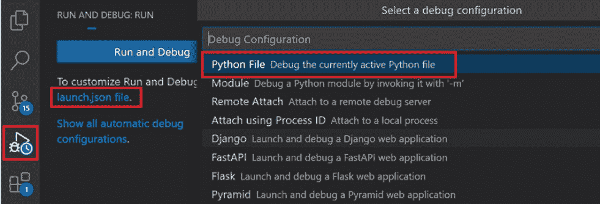

以下是为 Python 调试生成的启动配置：

```json
{
    // 使用 IntelliSense 了解可能的属性。
    // 悬停以查看现有属性的描述。
    // 有关更多信息，请访问：
    [
        {
            "Python: Current"
        }
    ]
}
```

图 5.6 显示了处于调试模式并带有断点的程序。在右上角，我们有调试工具栏，它执行表中列出的操作。

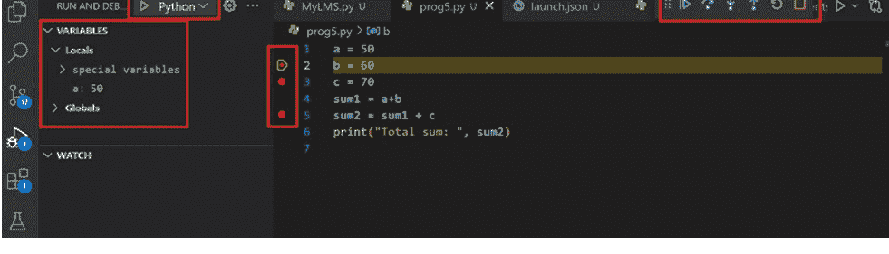

| 调试 |
| --- |
| 调试 调试 调试 调试 调试 调试 调试 调试 调试 调试 调试 调试 调试 调试 调试 调试 调试 调试 调试 调试 调试 调试 调试 调试 调试 调试 调试 调试 调试 调试 调试 调试 调试 调试 调试 调试 调试 调试 调试 调试 调试 调试 调试 调试 调试 调试 调试 调试 调试 调试 调试 调试 调试 调试 调试 调试 调试 调试 调试 调试 调试 调试 调试 调试 调试 调试 调试 调试 调试 调试 调试 调试 调试 调试 调试 调试 调试 调试 调试 调试 调试 调试 调试 调试 调试 调试 调试 调试 调试 调试 调试 调试 调试 调试 调试 调试 调试 调试 调试 调试 调试 调试 调试 调试 调试 调试 调试 调试 调试 调试 调试 调试 调试 调试 调试 调试 调试 调试 调试 调试 调试 调试 调试 调试 调试 调试 调试 调试 调试 调试 调试 调试 调试 调试 调试 调试 调试 调试 调试 调试 调试 调试 调试 调试 调试 调试 调试 调试 调试 调试 调试 调试 调试 调试 调试 调试 调试 调试 调试 调试 调试 调试 调试 调试 调试 调试 调试 调试 调试 调试 调试 调试 调试 调试 调试 调试 调试 调试 调试 调试 调试 调试 调试 调试 调试 调试 调试 调试 调试 调试 调试 调试 调试 调试 调试 调试 调试 调试 调试 调试 调试 调试 调试 调试 调试 调试 调试 调试 调试 调试 调试 调试 调试 调试 调试 调试 调试 调试 调试 调试 调试 调试 调试 调试 调试 调试 调试 调试 调试 调试 调试 调试 调试 调试 调试 调试 调试 调试 调试 调试 调试 调试 调试 调试 调试 调试 调试 调试 调试 调试 调试 调试 调试 调试 调试 调试 调试 调试 调试 调试 调试 调试 调试 调试 调试 调试 调试 调试 调试 调试 调试 调试 调试 调试 调试 调试 调试 调试 调试 调试 调试 调试 调试 调试 调试 调试 调试 调试 调试 调试 调试 调试 调试 调试 调试 调试 调试 调试 调试 调试 调试 调试 调试 调试 调试 调试 调试 调试 调试 调试 调试 调试 调试 调试 调试 调试 调试 调试 调试 调试 调试 调试 调试 调试 调试 调试 调试 调试 调试 调试 调试 调试 调试 调试 调试 调试 调试 调试 调试 调试 调试 调试 调试 调试 调试 调试 调试 调试 调试 调试 调试 调试 调试 调试 调试 调试 调试 调试 调试 调试 调试 调试 调试 调试 调试 调试 调试 调试 调试 调试 调试 调试 调试 调试 调试 调试 调试 调试 调试 调试 调试 调试 调试 调试 调试 调试 调试 调试 调试 调试 调试 调试 调试 调试 调试 调试 调试 调试 调试 调试 调试 调试 调试 调试 调试 调试 调试 调试 调试 调试 调试 调试 调试 调试 调试 调试 调试 调试 调试 调试 调试 调试 调试 调试 调试 调试 调试 调试 调试 调试 调试 调试 调试 调试 调试 调试 调试 调试 调试 调试 调试 调试 调试 调试 调试 调试 调试 调试 调试 调试 调试 调试 调试 调试 调试 调试 调试 调试 调试 调试 调试 调试 调试 调试 调试 调试 调试 调试 调试 调试 调试 调试 调试 调试 调试 调试 调试 调试 调试 调试 调试 调试 调试 调试 调试 调试 调试 调试 调试 调试 调试 调试 调试 调试 调试 调试 调试 调试 调试 调试 调试 调试 调试 调试 调试 调试 调试 调试 调试 调试 调试 调试 调试 调试 调试 调试 调试 调试 调试 调试 调试 调试 调试 调试 调试 调试 调试 调试 调试 调试 调试 调试 调试 调试 调试 调试 调试 调试 调试 调试 调试 调试 调试 调试 调试 调试 调试 调试 调试 调试 调试 调试 调试 调试 调试 调试 调试 调试 调试 调试 调试 调试 调试 调试 调试 调试 调试 调试 调试 调试 调试 调试 调试 调试 调试 调试 调试 调试 调试 调试 调试 调试 调试 调试 调试 调试 调试 调试 调试 调试 调试 调试 调试 调试 调试 调试 调试 调试 调试 调试 调试 调试 调试 调试 调试 调试 调试 调试 调试 调试 调试 调试 调试 调试 调试 调试 调试 调试 调试 调试 调试 调试 调试 调试 调试 调试 调试 调试 调试 调试 调试 调试 调试 调试 调试 调试 调试 调试 调试 调试 调试 调试 调试 调试 调试 调试 调试 调试 调试 调试 调试 调试 调试 调试 调试 调试 调试 调试 调试 调试 调试 调试 调试 调试 调试 调试 调试 调试 调试 调试 调试 调试 调试 调试 调试 调试 调试 调试 调试 调试 调试 调试 调试 调试 调试 调试 调试 调试 调试 调试 调试 调试 调试 调试 调试 调试 调试 调试 调试 调试 调试 调试 调试 调试 调试 调试 调试 调试 调试 调试 调试 调试 调试 调试 调试 调试 调试 调试 调试 调试 调试 调试 调试 调试 调试 调试 调试 调试 调试 调试 调试 调试 调试 调试 调试 调试 调试 调试 调试 调试 调试 调试 调试 调试 调试 调试 调试 调试 调试 调试 调试 调试 调试 调试 调试 调试 调试 调试 调试 调试 调试 调试 调试 调试 调试 调试 调试 调试 调试 调试 调试 调试 调试 调试 调试 调试 调试 调试 调试 调试 调试 调试 调试 调试 调试 调试 调试 调试 调试 调试 调试 调试 调试 调试 调试 调试 调试 调试 调试 调试 调试 调试 调试 调试 调试 调试 调试 调试 调试 调试 调试 调试 调试 调试 调试 调试 调试 调试 调试 调试 调试 调试 调试 调试 调试 调试 调试 调试 调试 调试 调试 调试 调试 调试 调试 调试 调试 调试 调试 调试 调试 调试 调试 调试 调试 调试 调试 调试 调试 调试 调试 调试 调试 调试 调试 调试 调试 调试 调试 调试 调试 调试 调试 调试 调试 调试 调试 调试 调试 调试 调试 调试 调试 调试 调试 调试 调试 调试 调试 调试 调试 调试 调试 调试 调试 调试 调试 调试 调试 调试 调试 调试 调试 调试 调试 调试 调试 调试 调试 调试 调试 调试 调试 调试 调试 调试 调试 调试 调试 调试 调试 调试 调试 调试 调试 调试 调试 调试 调试 调试 调试 调试 调试 调试 调试 调试 调试 调试 调试 调试 调试 调试 调试 调试 调试 调试 调试 调试 调试 调试 调试 调试 调试 调试 调试 调试 调试 调试 调试 调试 调试 调试 调试 调试 调试 调试 调试 调试 调试 调试 调试 调试 调试 调试 调试 调试 调试 调试 调试 调试 调试 调试 调试 调试 调试 调试 调试 调试 调试 调试 调试 调试 调试 调试 调试 调试 调试 调试 调试 调试 调试 调试 调试 调试 调试 调试 调试 调试 调试 调试 调试 调试 调试 调试 调试 调试 调试 调试 调试 调试 调试 调试 调试 调试 调试 调试 调试 调试 调试 调试 调试 调试 调试 调试 调试 调试 调试 调试 调试 调试 调试 调试 调试 调试 调试 调试 调试 调试 调试 调试 调试 调试 调试 调试 调试 调试 调试 调试 调试 调试 调试 调试 调试 调试 调试 调试 调试 调试 调试 调试 调试 调试 调试 调试 调试 调试 调试 调试 调试 调试 调试 调试 调试 调试 调试 调试 调试 调试 调试 调试 调试 调试 调试 调试 调试 调试 调试 调试 调试 调试 调试 调试 调试 调试 调试 调试 调试 调试 调试 调试 调试 调试 调试 调试 调试 调试 调试 调试 调试 调试 调试 调试 调试 调试 调试 调试 调试 调试 调试 调试 调试 调试 调试 调试 调试 调试 调试 调试 调试 调试 调试 调试 调试 调试 调试 调试 调试 调试 调试 调试 调试 调试 调试 调试 调试 调试 调试 调试 调试 调试 调试 调试 调试 调试 调试 调试 调试 调试 调试 调试 调试 调试 调试 调试 调试 调试 调试 调试 调试 调试 调试 调试 调试 调试 调试 调试 调试 调试 调试 调试 调试 调试 调试 调试 调试 调试 调试 调试 调试 调试 调试 调试 调试 调试 调试 调试 调试 调试 调试 调试 调试 调试 调试 调试 调试 调试 调试 调试 调试 调试 调试 调试 调试 调试 调试 调试 调试 调试 调试 调试 调试 调试 调试 调试 调试 调试 调试 调试 调试 调试 调试 调试 调试 调试 调试 调试 调试 调试 调试 调试 调试 调试 调试 调试 调试 调试 调试 调试 调试 调试 调试 调试 调试 调试 调试 调试 调试 调试 调试 调试 调试 调试 调试 调试 调试 调试 调试 调试 调试 调试 调试 调试 调试 调试 调试 调试 调试 调试 调试 调试 调试 调试 调试 调试 调试 调试 调试 调试 调试 调试 调试 调试 调试 调试 调试 调试 调试 调试 调试 调试 调试 调试 调试 调试 调试 调试 调试 调试 调试 调试 调试 调试 调试 调试 调试 调试 调试 调试 调试 调试 调试 调试 调试 调试 调试 调试 调试 调试 调试 调试 调试 调试 调试 调试 调试 调试 调试 调试 调试 调试 调试 调试 调试 调试 调试 调试 调试 调试 调试 调试 调试 调试 调试 调试 调试 调试 调试 调试 调试 调试 调试 调试 调试 调试 调试 调试 调试 调试 调试 调试 调试 调试 调试 调试 调试 调试 调试 调试 调试 调试 调试 调试 调试 调试 调试 调试 调试 调试 调试 调试 调试 调试 调试 调试 调试 调试 调试 调试 调试 调试 调试 调试 调试 调试 调试 调试 调试 调试 调试 调试 调试 调试 调试 调试 调试 调试 调试 调试 调试 调试 调试 调试 调试 调试 调试 调试 调试 调试 调试 调试 调试 调试 调试 调试 调试 调试 调试 调试 调试 调试 调试 调试 调试 调试 调试 调试 调试 调试 调试 调试 调试 调试 调试 调试 调试 调试 调试 调试 调试 调试 调试 调试 调试 调试 调试 调试 调试 调试 调试 调试 调试 调试 调试 调试 调试 调试 调试 调试 调试 调试 调试 调试 调试 调试 调试 调试 调试 调试 调试 调试 调试 调试 调试 调试 调试 调试 调试 调试 调试 调试 调试 调试 调试 调试 调试 调试 调试 调试 调试 调试 调试 调试 调试 调试 调试 调试 调试 调试 调试 调试 调试 调试 调试 调试 调试 调试 调试 调试 调试 调试 调试 调试 调试 调试 调试 调试 调试 调试 调试 调试 调试 调试 调试 调试 调试 调试 调试 调试 调试 调试 调试 调试 调试 调试 调试 调试 调试 调试 调试 调试 调试 调试 调试 调试 调试 调试 调试 调试 调试 调试 调试 调试 调试 调试 调试 调试 调试 调试 调试 调试 调试 调试 调试 调试 调试 调试 调试 调试 调试 调试 调试 调试 调试 调试 调试 调试 调试 调试 调试 调试 调试 调试 调试 调试 调试 调试 调试 调试 调试 调试 调试 调试 调试 调试 调试 调试 调试 调试 调试 调试 调试 调试 调试 调试 调试 调试 调试 调试 调试 调试 调试 调试 调试 调试 调试 调试 调试 调试 调试 调试 调试 调试 调试 调试 调试 调试 调试 调试 调试 调试 调试 调试 调试 调试 调试 调试 调试 调试 调试 调试 调试 调试 调试 调试 调试 调试 调试 调试 调试 调试 调试 调试 调试 调试 调试 调试 调试 调试 调试 调试 调试 调试 调试 调试 调试 调试 调试 调试 调试 调试 调试 调试 调试 调试 调试 调试 调试 调试 调试 调试 调试 调试 调试 调试 调试 调试 调试 调试 调试 调试 调试 调试 调试 调试 调试 调试 调试 调试 调试 调试 调试 调试 调试 调试 调试 调试 调试 调试 调试 调试 调试 调试 调试 调试 调试 调试 调试 调试 调试 调试 调试 调试 调试 调试 调试 调试 调试 调试 调试 调试 调试 调试 调试 调试 调试 调试 调试 调试 调试 调试 调试 调试 调试 调试 调试 调试 调试 调试 调试 调试 调试 调试 调试 调试 调试 调试 调试 调试 调试 调试 调试 调试 调试 调试 调试 调试 调试 调试 调试 调试 调试 调试 调试 调试 调试 调试 调试 调试 调试 调试 调试 调试 调试 调试 调试 调试 调试 调试 调试 调试 调试 调试 调试 调试 调试 调试 调试 调试 调试 调试 调试 调试 调试 调试 调试 调试 调试 调试 调试 调试 调试 调试 调试 调试 调试 调试 调试 调试 调试 调试 调试 调试 调试 调试 调试 调试 调试 调试 调试 调试 调试 调试 调试 调试 调试 调试 调试 调试 调试 调试 调试 调试 调试 调试 调试 调试 调试 调试 调试 调试 调试 调试 调试 调试 调试 调试 调试 调试 调试 调试 调试 调试 调试 调试 调试 调试 调试 调试 调试 调试 调试 调试 调试 调试 调试 调试 调试 调试 调试 调试 调试 调试 调试 调试 调试 调试 调试 调试 调试 调试 调试 调试 调试 调试 调试 调试 调试 调试 调试 调试 调试 调试 调试 调试 调试 调试 调试 调试 调试 调试 调试 调试 调试 调试 调试 调试 调试 调试 调试 调试 调试 调试 调试 调试 调试 调试 调试 调试 调试 调试 调试 调试 调试 调试 调试 调试 调试 调试 调试 调试 调试 调试 调试 调试 调试 调试 调试 调试 调试 调试 调试 调试 调试 调试 调试 调试 调试 调试 调试 调试 调试 调试 调试 调试 调试 调试 调试 调试 调试 调试 调试 调试 调试 调试 调试 调试 调试 调试 调试 调试 调试 调试 调试 调试 调试 调试 调试 调试 调试 调试 调试 调试 调试 调试 调试 调试 调试 调试 调试 调试 调试 调试 调试 调试 调试 调试 调试 调试 调试 调试 调试 调试 调试 调试 调试 调试 调试 调试 调试 调试 调试 调试 调试 调试 调试 调试 调试 调试 调试 调试 调试 调试 调试 调试 调试 调试 调试 调试 调试 调试 调试 调试 调试 调试 调试 调试 调试 调试 调试 调试 调试 调试 调试 调试 调试 调试 调试 调试 调试 调试 调试 调试 调试 调试 调试 调试 调试 调试 调试 调试 调试 调试 调试 调试 调试 调试 调试 调试 调试 调试 调试 调试 调试 调试 调试 调试 调试 调试 调试 调试 调试 调试 调试 调试 调试 调试 调试 调试 调试 调试 调试 调试 调试 调试 调试 调试 调试 调试 调试 调试 调试 调试 调试 调试 调试 调试 调试 调试 调试 调试 调试 调试 调试 调试 调试 调试 调试 调试 调试 调试 调试 调试 调试 调试 调试 调试 调试 调试 调试 调试 调试 调试 调试 调试 调试 调试 调试 调试 调试 调试 调试 调试 调试 调试 调试 调试 调试 调试 调试 调试 调试 调试 调试 调试 调试 调试 调试 调试 调试 调试 调试 调试 调试 调试 调试 调试 调试 调试 调试 调试 调试 调试 调试 调试 调试 调试 调试 调试 调试 调试 调试 调试 调试 调试 调试 调试 调试 调试 调试 调试 调试 调试 调试 调试 调试 调试 调试 调试 调试 调试 调试 调试 调试 调试 调试 调试 调试 调试 调试 调试 调试 调试 调试 调试 调试 调试 调试 调试 调试 调试 调试 调试 调试 调试 调试 调试 调试 调试 调试 调试 调试 调试 调试 调试 调试 调试 调试 调试 调试 调试 调试 调试 调试 调试 调试 调试 调试 调试 调试 调试 调试 调试 调试 调试 调试 调试 调试 调试 调试 调试 调试 调试 调试 调试 调试 调试 调试 调试 调试 调试 调试 调试 调试 调试 调试 调试 调试 调试 调试 调试 调试 调试 调试 调试 调试 调试 调试 调试 调试 调试 调试 调试 调试 调试 调试 调试 调试 调试 调试 调试 调试 调试 调试 调试 调试 调试 调试 调试 调试 调试 调试 调试 调试 调试 调试 调试 调试 调试 调试 调试 调试 调试 调试 调试 调试 调试 调试 调试 调试 调试 调试 调试 调试 调试 调试 调试 调试 调试 调试 调试 调试 调试 调试 调试 调试 调试 调试 调试 调试 调试 调试 调试 调试 调试 调试 调试 调试 调试 调试 调试 调试 调试 调试 调试 调试 调试 调试 调试 调试 调试 调试 调试 调试 调试 调试 调试 调试 调试 调试 调试 调试 调试 调试 调试 调试 调试 调试 调试 调试 调试 调试 调试 调试 调试 调试 调试 调试 调试 调试 调试 调试 调试 调试 调试 调试 调试 调试 调试 调试 调试 调试 调试 调试 调试 调试 调试 调试 调试 调试 调试 调试 调试 调试 调试 调试 调试 调试 调试 调试 调试 调试 调试 调试 调试 调试 调试 调试 调试 调试 调试 调试 调试 调试 调试 调试 调试 调试 调试 调试 调试 调试 调试 调试 调试 调试 调试 调试 调试 调试 调试 调试 调试 调试 调试 调试 调试 调试 调试 调试 调试 调试 调试 调试 调试 调试 调试 调试 调试 调试 调试 调试 调试 调试 调试 调试 调试 调试 调试 调试 调试 调试 调试 调试 调试 调试 调试 调试 调试 调试 调试 调试 调试 调试 调试 调试 调试 调试 调试 调试 调试 调试 调试 调试 调试 调试 调试 调试 调试 调试 调试 调试 调试 调试 调试 调试 调试 调试 调试 调试 调试 调试 调试 调试 调试 调试 调试 调试 调试 调试 调试 调试 调试 调试 调试 调试 调试 调试 调试 调试 调试 调试 调试 调试 调试 调试 调试 调试 调试 调试 调试 调试 调试 调试 调试 调试 调试 调试 调试 调试 调试 调试 调试 调试 调试 调试 调试 调试 调试 调试 调试 调试 调试 调试 调试 调试 调试 调试 调试 调试 调试 调试 调试 调试 调试 调试 调试 调试 调试 调试 调试 调试 调试 调试 调试 调试 调试 调试 调试 调试 调试 调试 调试 调试 调试 调试 调试 调试 调试 调试 调试 调试 调试 调试 调试 调试 调试 调试 调试 调试 调试 调试 调试 调试 调试 调试 调试 调试 调试 调试 调试 调试 调试 调试 调试 调试 调试 调试 调试 调试 调试 调试 调试 调试 调试 调试 调试 调试 调试 调试 调试 调试 调试 调试 调试 调试 调试 调试 调试 调试 调试 调试 调试 调试 调试 调试 调试 调试 调试 调试 调试 调试 调试 调试 调试 调试 调试 调试 调试 调试 调试 调试 调试 调试 调试 调试 调试 调试 调试 调试 调试 调试 调试 调试 调试 调试 调试 调试 调试 调试 调试 调试 调试 调试 调试 调试 调试 调试 调试 调试 调试 调试 调试 调试 调试 调试 调试 调试 调试 调试 调试 调试 调试 调试 调试 调试 调试 调试 调试 调试 调试 调试 调试 调试 调试 调试 调试 调试 调试 调试 调试 调试 调试 调试 调试 调试 调试 调试 调试 调试 调试 调试 调试 调试 调试 调试 调试 调试 调试 调试 调试 调试 调试 调试 调试 调试 调试 调试 调试 调试 调试 调试 调试 调试 调试 调试 调试 调试 调试 调试 调试 调试 调试 调试 调试 调试 调试 调试 调试 调试 调试 调试 调试 调试 调试 调试 调试 调试 调试 调试 调试 调试 调试 调试 调试 调试 调试 调试 调试 调试 调试 调试 调试 调试 调试 调试 调试 调试 调试 调试 调试 调试 调试 调试 调试 调试 调试 调试 调试 调试 调试 调试 调试 调试 调试 调试 调试 调试 调试 调试 调试 调试 调试 调试 调试 调试 调试 调试 调试 调试 调试 调试 调试 调试 调试 调试 调试 调试 调试 调试 调试 调试 调试 调试 调试 调试 调试 调试 调试 调试 调试 调试 调试 调试 调试 调试 调试 调试 调试 调试 调试 调试 调试 调试 调试 调试 调试 调试 调试 调试 调试 调试 调试 调试 调试 调试 调试 调试 调试 调试 调试 调试 调试 调试 调试 调试 调试 调试 调试 调试 调试 调试 调试 调试 调试 调试 调试 调试 调试 调试 调试 调试 调试 调试 调试 调试 调试 调试 调试 调试 调试 调试 调试 调试 调试 调试 调试 调试 调试 调试 调试 调试 调试 调试 调试 调试 调试 调试 调试 调试 调试 调试 调试 调试 调试 调试 调试 调试 调试 调试 调试 调试 调试 调试 调试 调试 调试 调试 调试 调试 调试 调试 调试 调试 调试 调试 调试 调试 调试 调试 调试 调试 调试 调试 调试 调试 调试 调试 调试 调试 调试 调试 调试 调试 调试 调试 调试 调试 调试 调试 调试 调试 调试 调试 调试 调试 调试 调试 调试 调试 调试 调试 调试 调试 调试 调试 调试 调试 调试 调试 调试 调试 调试 调试 调试 调试 调试 调试 调试 调试 调试 调试 调试 调试 调试 调试 调试 调试 调试 调试 调试 调试 调试 调试 调试 调试 调试 调试 调试 调试 调试 调试 调试 调试 调试 调试 调试 调试 调试 调试 调试 调试 调试 调试 调试 调试 调试 调试 调试 调试 调试 调试 调试 调试 调试 调试 调试 调试 调试 调试 调试 调试 调试 调试 调试 调试 调试 调试 调试 调试 调试 调试 调试 调试 调试 调试 调试 调试 调试 调试 调试 调试 调试 调试 调试 调试 调试 调试 调试 调试 调试 调试 调试 调试 调试 调试 调试 调试 调试 调试 调试 调试 调试 调试 调试 调试 调试 调试 调试 调试 调试 调试 调试 调试 调试 调试 调试 调试 调试 调试 调试 调试 调试 调试 调试 调试 调试 调试 调试 调试 调试 调试 调试 调试 调试 调试 调试 调试 调试 调试 调试 调试 调试 调试 调试 调试 调试 调试 调试 调试 调试 调试 调试 调试 调试 调试 调试 调试 调试 调试 调试 调试 调试 调试 调试 调试 调试 调试 调试 调试 调试 调试 调试 调试 调试 调试 调试 调试 调试 调试 调试 调试 调试 调试 调试 调试 调试 调试 调试 调试 调试 调试 调试 调试 调试 调试 调试 调试 调试 调试 调试 调试 调试 调试 调试 调试 调试 调试 调试 调试 调试 调试 调试 调试 调试 调试 调试 调试 调试 调试 调试 调试 调试 调试 调试 调试 调试 调试 调试 调试 调试 调试 调试 调试 调试 调试 调试 调试 调试 调试 调试 调试 调试 调试 调试 调试 调试 调试 调试 调试 调试 调试 调试 调试 调试 调试 调试 调试 调试 调试 调试 调试 调试 调试 调试 调试 调试 调试 调试 调试 调试 调试 调试 调试 调试 调试 调试 调试 调试 调试 调试 调试 调试 调试 调试 调试 调试 调试 调试 调试 调试 调试 调试 调试 调试 调试 调试 调试 调试 调试 调试 调试 调试 调试 调试 调试 调试 调试 调试 调试 调试 调试 调试 调试 调试 调试 调试 调试 调试 调试 调试 调试 调试 调试 调试 调试 调试 调试 调试 调试 调试 调试 调试 调试 调试 调试 调试 调试 调试 调试 调试 调试 调试 调试 调试 调试 调试 调试 调试 调试 调试 调试 调试 调试 调试 调试 调试 调试 调试 调试 调试 调试 调试 调试 调试 调试 调试 调试 调试 调试 调试 调试 调试 调试 调试 调试 调试 调试 调试 调试 调试 调试 调试 调试 调试 调试 调试 调试 调试 调试 调试 调试 调试 调试 调试 调试 调试 调试 调试 调试 调试 调试 调试 调试 调试 调试 调试 调试 调试 调试 调试 调试 调试 调试 调试 调试 调试 调试 调试 调试 调试 调试 调试 调试 调试 调试 调试 调试 调试 调试 调试 调试 调试 调试 调试 调试 调试 调试 调试 调试 调试 调试 调试 调试 调试 调试 调试 调试 调试 调试 调试 调试 调试 调试 调试 调试 调试 调试 调试 调试 调试 调试 调试 调试 调试 调试 调试 调试 调试 调试 调试 调试 调试 调试 调试 调试 调试 调试 调试 调试 调试 调试 调试 调试 调试 调试 调试 调试 调试 调试 调试 调试 调试 调试 调试 调试 调试 调试 调试 调试 调试 调试 调试 调试 调试 调试 调试 调试 调试 调试 调试 调试 调试 调试 调试 调试 调试 调试 调试 调试 调试 调试 调试 调试 调试 调试 调试 调试 调试 调试 调试 调试 调试 调试 调试 调试 调试 调试 调试 调试 调试 调试 调试 调试 调试 调试 调试 调试 调试 调试 调试 调试 调试 调试 调试 调试 调试 调试 调试 调试 调试 调试 调试 调试 调试 调试 调试 调试 调试 调试 调试 调试 调试 调试 调试 调试 调试 调试 调试 调试 调试 调试 调试 调试 调试 调试 调试 调试 调试 调试 调试 调试 调试 调试 调试 调试 调试 调试 调试 调试 调试 调试 调试 调试 调试 调试 调试 调试 调试 调试 调试 调试 调试 调试 调试 调试 调试 调试 调试 调试 调试 调试 调试 调试 调试 调试 调试 调试 调试 调试 调试 调试 调试 调试 调试 调试 调试 调试 调试 调试 调试 调试 调试 调试 调试 调试 调试 调试 调试 调试 调试 调试 调试 调试 调试 调试 调试 调试 调试 调试 调试 调试 调试 调试 调试 调试 调试 调试 调试 调试 调试 调试 调试 调试 调试 调试 调试 调试 调试 调试 调试 调试 调试 调试 调试 调试 调试 调试 调试 调试 调试 调试 调试 调试 调试 调试 调试 调试 调试 调试 调试 调试 调试 调试 调试 调试 调试 调试 调试 调试 调试 调试 调试 调试 调试 调试 调试 调试 调试 调试 调试 调试 调试 调试 调试 调试 调试 调试 调试 调试 调试 调试 调试 调试 调试 调试 调试 调试 调试 调试 调试 调试 调试 调试 调试 调试 调试 调试 调试 调试 调试 调试 调试 调试 调试 调试 调试 调试 调试 调试 调试 调试 调试 调试 调试 调试 调试 调试 调试 调试 调试 调试 调试 调试 调试 调试 调试 调试 调试 调试 调试 调试 调试 调试 调试 调试 调试 调试 调试 调试 调试 调试 调试 调试 调试 调试 调试 调试 调试 调试 调试 调试 调试 调试 调试 调试 调试 调试 调试 调试 调试 调试 调试 调试 调试 调试 调试 调试 调试 调试 调试 调试 调试 调试 调试 调试 调试 调试 调试 调试 调试 调试 调试 调试 调试 调试 调试 调试 调试 调试 调试 调试 调试 调试 调试 调试 调试 调试 调试 调试 调试 调试 调试 调试 调试 调试 调试 调试 调试 调试 调试 调试 调试 调试 调试 调试 调试 调试 调试 调试 调试 调试 调试 调试 调试 调试 调试 调试 调试 调试 调试 调试 调试 调试 调试 调试 调试 调试 调试 调试 调试 调试 调试 调试 调试 调试 调试 调试 调试 调试 调试 调试 调试 调试 调试 调试 调试 调试 调试 调试 调试 调试 调试 调试 调试 调试 调试 调试 调试 调试 调试 调试 调试 调试 调试 调试 调试 调试 调试 调试 调试 调试 调试 调试 调试 调试 调试 调试 调试 调试 调试 调试 调试 调试 调试 调试 调试 调试 调试 调试 调试 调试 调试 调试 调试 调试 调试 调试 调试 调试 调试 调试 调试 调试 调试 调试 调试 调试 调试 调试 调试 调试 调试 调试 调试 调试 调试 调试 调试 调试 调试 调试 调试 调试 调试 调试 调试 调试 调试 调试 调试 调试 调试 调试 调试 调试 调试 调试 调试 调试 调试 调试 调试 调试 调试 调试 调试 调试 调试 调试 调试 调试 调试 调试 调试 调试 调试 调试 调试 调试 调试 调试 调试 调试 调试 调试 调试 调试 调试 调试 调试 调试 调试 调试 调试 调试 调试 调试 调试 调试 调试 调试 调试 调试 调试 调试 调试 调试 调试 调试 调试 调试 调试 调试 调试 调试 调试 调试 调试 调试 调试 调试 调试 调试 调试 调试 调试 调试 调试 调试 调试 调试 调试 调试 调试 调试 调试 调试 调试 调试 调试 调试 调试 调试 调试 调试 调试 调试 调试 调试 调试 调试 调试 调试 调试 调试 调试 调试 调试 调试 调试 调试 调试 调试 调试 调试 调试 调试 调试 调试 调试 调试 调试 调试 调试 调试 调试 调试 调试 调试 调试 调试 调试 调试 调试 调试 调试 调试 调试 调试 调试 调试 调试 调试 调试 调试 调试 调试 调试 调试 调试 调试 调试 调试 调试 调试 调试 调试 调试 调试 调试 调试 调试 调试 调试 调试 调试 调试 调试 调试 调试 调试 调试 调试 调试 调试 调试 调试 调试 调试 调试 调试 调试 调试 调试 调试 调试 调试 调试 调试 调试 调试 调试 调试 调试 调试 调试 调试 调试 调试 调试 调试 调试 调试 调试 调试 调试 调试 调试 调试 调试 调试 调试 调试 调试 调试 调试 调试 调试 调试 调试 调试 调试 调试 调试 调试 调试 调试 调试 调试 调试 调试 调试 调试 调试 调试 调试 调试 调试 调试 调试 调试 调试 调试 调试 调试 调试 调试 调试 调试 调试 调试 调试 调试 调试 调试 调试 调试 调试 调试 调试 调试 调试 调试 调试 调试 调试 调试 调试 调试 调试 调试 调试 调试 调试 调试 调试 调试 调试 调试 调试 调试 调试 调试 调试 调试 调试 调试 调试 调试 调试 调试 调试 调试 调试 调试 调试 调试 调试 调试 调试 调试 调试 调试 调试 调试 调试 调试 调试 调试 调试 调试 调试 调试 调试 调试 调试 调试 调试 调试 调试 调试 调试 调试 调试 调试 调试 调试 调试 调试 调试 调试 调试 调试 调试 调试 调试 调试 调试 调试 调试 调试 调试 调试 调试 调试 调试 调试 调试 调试 调试 调试 调试 调试 调试 调试 调试 调试 调试 调试 调试 调试 调试 调试 调试 调试 调试 调试 调试 调试 调试 调试 调试 调试 调试 调试 调试 调试 调试 调试 调试 调试 调试 调试 调试 调试 调试 调试 调试 调试 调试 调试 调试 调试 调试 调试 调试 调试 调试 调试 调试 调试 调试 调试 调试 调试 调试 调试 调试 调试 调试 调试 调试 调试 调试 调试 调试 调试 调试 调试 调试 调试 调试 调试 调试 调试 调试 调试 调试 调试 调试 调试 调试 调试 调试 调试 调试 调试 调试 调试 调试 调试 调试 调试 调试 调试 调试 调试 调试 调试 调试 调试 调试 调试 调试 调试 调试 调试 调试 调试 调试 调试 调试 调试 调试 调试 调试 调试 调试 调试 调试 调试 调试 调试 调试 调试 调试 调试 调试 调试 调试 调试 调试 调试 调试 调试 调试 调试 调试 调试 调试 调试 调试 调试 调试 调试 调试 调试 调试 调试 调试 调试 调试 调试 调试 调试 调试 调试 调试 调试 调试 调试 调试 调试 调试 调试 调试 调试 调试 调试 调试 调试 调试 调试 调试 调试 调试 调试 调试 调试 调试 调试 调试 调试 调试 调试 调试 调试 调试 调试 调试 调试 调试 调试 调试 调试 调试 调试 调试 调试 调试 调试 调试 调试 调试 调试 调试 调试 调试 调试 调试 调试 调试 调试 调试 调试 调试 调试 调试 调试 调试 调试 调试 调试 调试 调试 调试 调试 调试 调试 调试 调试 调试 调试 调试 调试 调试 调试 调试 调试 调试 调试 调试 调试 调试 调试 调试 调试 调试 调试 调试 调试 调试 调试 调试 调试 调试 调试 调试 调试 调试 调试 调试 调试 调试 调试 调试 调试 调试 调试 调试 调试 调试 调试 调试 调试 调试 调试 调试 调试 调试 调试 调试 调试 调试 调试 调试 调试 调试 调试 调试 调试 调试 调试 调试 调试 调试 调试 调试 调试 调试 调试 调试 调试 调试 调试 调试 调试 调试 调试 调试 调试 调试 调试 调试 调试 调试 调试 调试 调试 调试 调试 调试 调试 调试 调试 调试 调试 调试 调试 调试 调试 调试 调试 调试 调试 调试 调试 调试 调试 调试 调试 调试 调试 调试 调试 调试 调试 调试 调试 调试 调试 调试 调试 调试 调试 调试 调试 调试 调试 调试 调试 调试 调试 调试 调试 调试 调试 调试 调试 调试 调试 调试 调试 调试 调试 调试 调试 调试 调试 调试 调试 调试 调试 调试 调试 调试 调试 调试 调试 调试 调试 调试 调试 调试 调试 调试 调试 调试 调试 调试 调试 调试 调试 调试 调试 调试 调试 调试 调试 调试 调试 调试 调试 调试 调试 调试 调试 调试 调试 调试 调试 调试 调试 调试 调试 调试 调试 调试 调试 调试 调试 调试 调试 调试 调试 调试 调试 调试 调试 调试 调试 调试 调试 调试 调试 调试 调试 调试 调试 调试 调试 调试 调试 调试 调试 调试 调试 调试 调试 调试 调试 调试 调试 调试 调试 调试 调试 调试 调试 调试 调试 调试 调试 调试 调试 调试 调试 调试 调试 调试 调试 调试 调试 调试 调试 调试 调试 调试 调试 调试 调试 调试 调试 调试 调试 调试 调试 调试 调试 调试 调试 调试 调试 调试 调试 调试 调试 调试 调试 调试 调试 调试 调试 调试 调试 调试 调试 调试 调试 调试 调试 调试 调试 调试 调试 调试 调试 调试 调试 调试 调试 调试 调试 调试 调试 调试 调试 调试 调试 调试 调试 调试 调试 调试 调试 调试 调试 调试 调试 调试 调试 调试 调试 调试 调试 调试 调试 调试 调试 调试 调试 调试 调试 调试 调试 调试 调试 调试 调试 调试 调试 调试 调试 调试 调试 调试 调试 调试 调试 调试 调试 调试 调试 调试 调试 调试 调试 调试 调试 调试 调试 调试 调试 调试 调试 调试 调试 调试 调试 调试 调试 调试 调试 调试 调试 调试 调试 调试 调试 调试 调试 调试 调试 调试 调试 调试 调试 调试 调试 调试 调试 调试 调试 调试 调试 调试 调试 调试 调试 调试 调试 调试 调试 调试 调试 调试 调试 调试 调试 调试 调试 调试 调试 调试 调试 调试 调试 调试 调试 调试 调试 调试 调试 调试 调试 调试 调试 调试 调试 调试 调试 调试 调试 调试 调试 调试 调试 调试 调试 调试 调试 调试 调试 调试 调试 调试 调试 调试 调试 调试 调试 调试 调试 调试 调试 调试 调试 调试 调试 调试 调试 调试 调试 调试 调试 调试 调试 调试 调试 调试 调试 调试 调试 调试 调试 调试 调试 调试 调试 调试 调试 调试 调试 调试 调试 调试 调试 调试 调试 调试 调试 调试 调试 调试 调试 调试 调试 调试 调试 调试 调试 调试 调试 调试 调试 调试 调试 调试 调试 调试 调试 调试 调试 调试 调试 调试 调试 调试 调试 调试 调试 调试 调试 调试 调试 调试 调试 调试 调试 调试 调试 调试 调试 调试 调试 调试 调试 调试 调试 调试 调试 调试 调试 调试 调试 调试 调试 调试 调试 调试 调试 调试 调试 调试 调试 调试 调试 调试 调试 调试 调试 调试 调试 调试 调试 调试 调试 调试 调试 调试 调试 调试 调试 调试 调试 调试 调试 调试 调试 调试 调试 调试 调试 调试 调试 调试 调试 调试 调试 调试 调试 调试 调试 调试 调试 调试 调试 调试 调试 调试 调试 调试 调试 调试 调试 调试 调试 调试 调试 调试 调试 调试 调试 调试 调试 调试 调试 调试 调试 调试 调试 调试 调试 调试 调试 调试 调试 调试 调试 调试 调试 调试 调试 调试 调试 调试 调试 调试 调试 调试 调试 调试 调试 调试 调试 调试 调试 调试 调试 调试 调试 调试 调试 调试 调试 调试 调试 调试 调试 调试 调试 调试 调试 调试 调试 调试 调试 调试 调试 调试 调试 调试 调试 调试 调试 调试 调试 调试 调试 调试 调试 调试 调试 调试 调试 调试 调试 调试 调试 调试 调试 调试 调试 调试 调试 调试 调试 调试 调试 调试 调试 调试 调试 调试 调试 调试 调试 调试 调试 调试 调试 调试 调试 调试 调试 调试 调试 调试 调试 调试 调试 调试 调试 调试 调试 调试 调试 调试 调试 调试 调试 调试 调试 调试 调试 调试 调试 调试 调试 调试 调试 调试 调试 调试 调试 调试 调试 调试 调试 调试 调试 调试 调试 调试 调试 调试 调试 调试 调试 调试 调试 调试 调试 调试 调试 调试 调试 调试 调试 调试 调试 调试 调试 调试 调试 调试 调试 调试 调试 调试 调试 调试 调试 调试 调试 调试 调试 调试 调试 调试 调试 调试 调试 调试 调试 调试 调试 调试 调试 调试 调试 调试 调试 调试 调试 调试 调试 调试 调试 调试 调试 调试 调试 调试 调试 调试 调试 调试 调试 调试 调试 调试 调试 调试 调试 调试 调试 调试 调试 调试 调试 调试 调试 调试 调试 调试 调试 调试 调试 调试 调试 调试 调试 调试 调试 调试 调试 调试 调试 调试 调试 调试 调试 调试 调试 调试 调试 调试 调试 调试 调试 调试 调试 调试 调试 调试 调试 调试 调试 调试 调试 调试 调试 调试 调试 调试 调试 调试 调试 调试 调试 调试 调试 调试 调试 调试 调试 调试 调试 调试 调试 调试 调试 调试 调试 调试 调试 调试 调试 调试 调试 调试 调试 调试 调试 调试 调试 调试 调试 调试 调试 调试 调试 调试 调试 调试 调试 调试 调试 调试 调试 调试 调试 调试 调试 调试 调试 调试 调试 调试 调试 调试 调试 调试 调试 调试 调试 调试 调试 调试 调试 调试 调试 调试 调试 调试 调试 调试 调试 调试 调试 调试 调试 调试 调试 调试 调试 调试 调试 调试 调试 调试 调试 调试 调试 调试 调试 调试 调试 调试 调试 调试 调试 调试 调试 调试 调试 调试 调试 调试 调试 调试 调试 调试 调试 调试 调试 调试 调试 调试 调试 调试 调试 调试 调试 调试 调试 调试 调试 调试 调试 调试 调试 调试 调试 调试 调试 调试 调试 调试 调试 调试 调试 调试 调试 调试 调试 调试 调试 调试 调试 调试 调试 调试 调试 调试 调试 调试 调试 调试 调试 调试 调试 调试 调试 调试 调试 调试 调试 调试 调试 调试 调试 调试 调试 调试 调试 调试 调试 调试 调试 调试 调试 调试 调试 调试 调试 调试 调试 调试 调试 调试 调试 调试 调试 调试 调试 调试 调试 调试 调试 调试 调试 调试 调试 调试 调试 调试 调试 调试 调试 调试 调试 调试 调试 调试 调试 调试 调试 调试 调试 调试 调试 调试 调试 调试 调试 调试 调试 调试 调试 调试 调试 调试 调试 调试 调试 调试 调试 调试 调试 调试 调试 调试 调试 调试 调试 调试 调试 调试 调试 调试 调试 调试 调试 调试 调试 调试 调试 调试 调试 调试 调试 调试 调试 调试 调试 调试 调试 调试 调试 调试 调试 调试 调试 调试 调试 调试 调试 调试 调试 调试 调试 调试 调试 调试 调试 调试 调试 调试 调试 调试 调试 调试 调试 调试 调试 调试 调试 调试 调试 调试 调试 调试 调试 调试 调试 调试 调试 调试 调试 调试 调试 调试 调试 调试 调试 调试 调试 调试 调试 调试 调试 调试 调试 调试 调试 调试 调试 调试 调试 调试 调试 调试 调试 调试 调试 调试 调试 调试 调试 调试 调试 调试 调试 调试 调试 调试 调试 调试 调试 调试 调试 调试 调试 调试 调试 调试 调试 调试 调试 调试 调试 调试 调试 调试 调试 调试 调试 调试 调试 调试 调试 调试 调试 调试 调试 调试 调试 调试 调试 调试 调试 调试 调试 调试 调试 调试 调试 调试 调试 调试 调试 调试 调试 调试 调试 调试 调试 调试 调试 调试 调试 调试 调试 调试 调试 调试 调试 调试 调试 调试 调试 调试 调试 调试 调试 调试 调试 调试 调试 调试 调试 调试 调试 调试 调试 调试 调试 调试 调试 调试 调试 调试 调试 调试 调试 调试 调试 调试 调试 调试 调试 调试 调试 调试 调试 调试 调试 调试 调试 调试 调试 调试 调试 调试 调试 调试 调试 调试 调试 调试 调试 调试 调试 调试 调试 调试 调试 调试 调试 调试 调试 调试 调试 调试 调试 调试 调试 调试 调试 调试 调试 调试 调试 调试 调试 调试 调试 调试 调试 调试 调试 调试 调试 调试 调试 调试 调试 调试 调试 调试 调试 调试 调试 调试 调试 调试 调试 调试 调试 调试 调试 调试 调试 调试 调试 调试 调试 调试 调试 调试 调试 调试 调试 调试 调试 调试 调试 调试 调试 调试 调试 调试 调试 调试 调试 调试 调试 调试 调试 调试 调试 调试 调试 调试 调试 调试 调试 调试 调试 调试 调试 调试 调试 调试 调试 调试 调试 调试 调试 调试 调试 调试 调试 调试 调试 调试 调试 调试 调试 调试 调试 调试 调试 调试 调试 调试 调试 调试 调试 调试 调试 调试 调试 调试 调试 调试 调试 调试 调试 调试 调试 调试 调试 调试 调试 调试 调试 调试 调试 调试 调试 调试 调试 调试 调试 调试 调试 调试 调试 调试 调试 调试 调试 调试 调试 调试 调试 调试 调试 调试 调试 调试 调试 调试 调试 调试 调试 调试 调试 调试 调试 调试 调试 调试 调试 调试 调试 调试 调试 调试 调试 调试 调试 调试 调试 调试 调试 调试 调试 调试 调试 调试 调试 调试 调试 调试 调试 调试 调试 调试 调试 调试 调试 调试 调试 调试 调试 调试 调试 调试 调试 调试 调试 调试 调试 调试 调试 调试 调试 调试 调试 调试 调试 调试 调试 调试 调试 调试 调试 调试 调试 调试 调试 调试 调试 调试 调试 调试 调试 调试 调试 调试 调试 调试 调试 调试 调试 调试 调试 调试 调试 调试 调试 调试 调试 调试 调试 调试 调试 调试 调试 调试 调试 调试 调试 调试 调试 调试 调试 调试 调试 调试 调试 调试 调试 调试 调试 调试 调试 调试 调试 调试 调试 调试 调试 调试 调试 调试 调试 调试 调试 调试 调试 调试 调试 调试 调试 调试 调试 调试 调试 调试 调试 调试 调试 调试 调试 调试 调试 调试 调试 调试 调试 调试 调试 调试 调试 调试 调试 调试 调试 调试 调试 调试 调试 调试 调试 调试 调试 调试 调试 调试 调试 调试 调试 调试 调试 调试 调试 调试 调试 调试 调试 调试 调试 调试 调试 调试 调试 调试 调试 调试 调试 调试 调试 调试 调试 调试 调试 调试 调试 调试 调试 调试 调试 调试 调试 调试 调试 调试 调试 调试 调试 调试 调试 调试 调试 调试 调试 调试 调试 调试 调试 调试 调试 调试 调试 调试 调试 调试 调试 调试 调试 调试 调试 调试 调试 调试 调试 调试 调试 调试 调试 调试 调试 调试 调试 调试 调试 调试 调试 调试 调试 调试 调试 调试 调试 调试 调试 调试 调试 调试 调试 调试 调试 调试 调试 调试 调试 调试 调试 调试 调试 调试 调试 调试 调试 调试 调试 调试 调试 调试 调试 调试 调试 调试 调试 调试 调试 调试 调试 调试 调试 调试 调试 调试 调试 调试 调试 调试 调试 调试 调试 调试 调试 调试 调试 调试 调试 调试 调试 调试 调试 调试 调试 调试 调试 调试 调试 调试 调试 调试 调试 调试 调试 调试 调试 调试 调试 调试 调试 调试 调试 调试 调试 调试 调试 调试 调试 调试 调试 调试 调试 调试 调试 调试 调试 调试 调试 调试 调试 调试 调试 调试 调试 调试 调试 调试 调试 调试 调试 调试 调试 调试 调试 调试 调试 调试 调试 调试 调试 调试 调试 调试 调试 调试 调试 调试 调试 调试 调试 调试 调试 调试 调试 调试 调试 调试 调试 调试 调试 调试 调试 调试 调试 调试 调试 调试 调试 调试 调试 调试 调试 调试 调试 调试 调试 调试 调试 调试 调试 调试 调试 调试 调试 调试 调试 调试 调试 调试 调试 调试 调试 调试 调试 调试 调试 调试 调试 调试 调试 调试 调试 调试 调试 调试 调试 调试 调试 调试 调试 调试 调试 调试 调试 调试 调试 调试 调试 调试 调试 调试 调试 调试 调试 调试 调试 调试 调试 调试 调试 调试 调试 调试 调试 调试 调试 调试 调试 调试 调试 调试 调试 调试 调试 调试 调试 调试 调试 调试 调试 调试 调试 调试 调试 调试 调试 调试 调试 调试 调试 调试 调试 调试 调试 调试 调试 调试 调试 调试 调试 调试 调试 调试 调试 调试 调试 调试 调试 调试 调试 调试 调试 调试 调试 调试 调试 调试 调试 调试 调试 调试 调试 调试 调试 调试 调试 调试 调试 调试 调试 调试 调试 调试 调试 调试 调试 调试 调试 调试 调试 调试 调试 调试 调试 调试 调试 调试 调试 调试 调试 调试 调试 调试 调试 调试 调试 调试 调试 调试 调试 调试 调试 调试 调试 调试 调试 调试 调试 调试 调试 调试 调试 调试 调试 调试 调试 调试 调试 调试 调试 调试 调试 调试 调试 调试 调试 调试 调试 调试 调试 调试 调试 调试 调试 调试 调试 调试 调试 调试 调试 调试 调试 调试 调试 调试 调试 调试 调试 调试 调试 调试 调试 调试 调试 调试 调试 调试 调试 调试 调试 调试 调试 调试 调试 调试 调试 调试 调试 调试 调试 调试 调试 调试 调试 调试 调试 调试 调试 调试 调试 调试 调试 调试 调试 调试 调试 调试 调试 调试 调试 调试 调试 调试 调试 调试 调试 调试 调试 调试 调试 调试 调试 调试 调试 调试 调试 调试 调试 调试 调试 调试 调试 调试 调试 调试 调试 调试 调试 调试 调试 调试 调试 调试 调试 调试 调试 调试 调试 调试 调试 调试 调试 调试 调试 调试 调试 调试 调试 调试 调试 调试 调试 调试 调试 调试 调试 调试 调试 调试 调试 调试 调试 调试 调试 调试 调试 调试 调试 调试 调试 调试 调试 调试 调试 调试 调试 调试 调试 调试 调试 调试 调试 调试 调试 调试 调试 调试 调试 调试 调试 调试 调试 调试 调试 调试 调试 调试 调试 调试 调试 调试 调试 调试 调试 调试 调试 调试 调试 调试 调试 调试 调试 调试 调试 调试 调试 调试 调试 调试 调试 调试 调试 调试 调试 调试 调试 调试 调试 调试 调试 调试 调试 调试 调试 调试 调试 调试 调试 调试 调试 调试 调试 调试 调试 调试 调试 调试 调试 调试 调试 调试 调试 调试 调试 调试 调试 调试 调试 调试 调试 调试 调试 调试 调试 调试 调试 调试 调试 调试 调试 调试 调试 调试 调试 调试 调试 调试 调试 调试 调试 调试 调试 调试 调试 调试 调试 调试 调试 调试 调试 调试 调试 调试 调试 调试 调试 调试 调试 调试 调试 调试 调试 调试 调试 调试 调试 调试 调试 调试 调试 调试 调试 调试 调试 调试 调试 调试 调试 调试 调试 调试 调试 调试 调试 调试 调试 调试 调试 调试 调试 调试 调试 调试 调试 调试 调试 调试 调试 调试 调试 调试 调试 调试 调试 调试 调试 调试 调试 调试 调试 调试 调试 调试 调试 调试 调试 调试 调试 调试 调试 调试 调试 调试 调试 调试 调试 调试 调试 调试 调试 调试 调试 调试 调试 调试 调试 调试 调试 调试 调试 调试 调试 调试 调试 调试 调试 调试 调试 调试 调试 调试 调试 调试 调试 调试 调试 调试 调试 调试 调试 调试 调试 调试 调试 调试 调试 调试 调试 调试 调试 调试 调试 调试 调试 调试 调试 调试 调试 调试 调试 调试 调试 调试 调试 调试 调试 调试 调试 调试 调试 调试 调试 调试 调试 调试 调试 调试 调试 调试 调试 调试 调试 调试 调试 调试 调试 调试 调试 调试 调试 调试 调试 调试 调试 调试 调试 调试 调试 调试 调试 调试 调试 调试 调试 调试 调试 调试 调试 调试 调试 调试 调试 调试 调试 调试 调试 调试 调试 调试 调试 调试 调试 调试 调试 调试 调试 调试 调试 调试 调试 调试 调试 调试 调试 调试 调试 调试 调试 调试 调试 调试 调试 调试 调试 调试 调试 调试 调试 调试 调试 调试 调试 调试 调试 调试 调试 调试 调试 调试 调试 调试 调试 调试 调试 调试 调试 调试 调试 调试 调试 调试 调试 调试 调试 调试 调试 调试 调试 调试 调试 调试 调试 调试 调试 调试 调试 调试 调试 调试 调试 调试 调试 调试 调试 调试 调试 调试 调试 调试 调试 调试 调试 调试 调试 调试 调试 调试 调试 调试 调试 调试 调试 调试 调试 调试 调试 调试 调试 调试 调试 调试 调试 调试 调试 调试 调试 调试 调试 调试 调试 调试 调试 调试 调试 调试 调试 调试 调试 调试 调试 调试 调试 调试 调试 调试 调试 调试 调试 调试 调试 调试 调试 调试 调试 调试 调试 调试 调试 调试 调试 调试 调试 调试 调试 调试 调试 调试 调试 调试 调试 调试 调试 调试 调试 调试 调试 调试 调试 调试 调试 调试 调试 调试 调试 调试 调试 调试 调试 调试 调试 调试 调试 调试 调试 调试 调试 调试 调试 调试 调试 调试 调试 调试 调试 调试 调试 调试 调试 调试 调试 调试 调试 调试 调试 调试 调试 调试 调试 调试 调试 调试 调试 调试 调试 调试 调试 调试 调试 调试 调试 调试 调试 调试 调试 调试 调试 调试 调试 调试 调试 调试 调试 调试 调试 调试 调试 调试 调试 调试 调试 调试 调试 调试 调试 调试 调试 调试 调试 调试 调试 调试 调试 调试 调试 调试 调试 调试 调试 调试 调试 调试 调试 调试 调试 调试 调试 调试 调试 调试 调试 调试 调试 调试 调试 调试 调试 调试 调试 调试 调试 调试 调试 调试 调试 调试 调试 调试 调试 调试 调试 调试 调试 调试 调试 调试 调试 调试 调试 调试 调试 调试 调试 调试 调试 调试 调试 调试 调试 调试 调试 调试 调试 调试 调试 调试 调试 调试 调试 调试 调试 调试 调试 调试 调试 调试 调试 调试 调试 调试 调试 调试 调试 调试 调试 调试 调试 调试 调试 调试 调试 调试 调试 调试 调试 调试 调试 调试 调试 调试 调试 调试 调试 调试 调试 调试 调试 调试 调试 调试 调试 调试 调试 调试 调试 调试 调试 调试 调试 调试 调试 调试 调试 调试 调试 调试 调试 调试 调试 调试 调试 调试 调试 调试 调试 调试 调试 调试 调试 调试 调试 调试 调试 调试 调试 调试 调试 调试 调试 调试 调试 调试 调试 调试 调试 调试 调试 调试 调试 调试 调试 调试 调试 调试 调试 调试 调试 调试 调试 调试 调试 调试 调试 调试 调试 调试 调试 调试 调试 调试 调试 调试 调试 调试 调试 调试 调试 调试 调试 调试 调试 调试 调试 调试 调试 调试 调试 调试 调试 调试 调试 调试 调试 调试 调试 调试 调试 调试 调试 调试 调试 调试 调试 调试 调试 调试 调试 调试 调试 调试 调试 调试 调试 调试 调试 调试 调试 调试 调试 调试 调试 调试 调试 调试 调试 调试 调试 调试 调试 调试 调试 调试 调试 调试 调试 调试 调试 调试 调试 调试 调试 调试 调试 调试 调试 调试 调试 调试 调试 调试 调试 调试 调试 调试 调试 调试 调试 调试 调试 调试 调试 调试 调试 调试 调试 调试 调试 调试 调试 调试 调试 调试 调试 调试 调试 调试 调试 调试 调试 调试 调试 调试 调试 调试 调试 调试 调试 调试 调试 调试 调试 调试 调试 调试 调试 调试 调试 调试 调试 调试 调试 调试 调试 调试 调试 调试 调试 调试 调试 调试 调试 调试 调试 调试 调试 调试 调试 调试 调试 调试 调试 调试 调试 调试 调试 调试 调试 调试 调试 调试 调试 调试 调试 调试 调试 调试 调试 调试 调试 调试 调试 调试 调试 调试 调试 调试 调试 调试 调试 调试 调试 调试 调试 调试 调试 调试 调试 调试 调试 调试 调试 调试 调试 调试 调试 调试 调试 调试 调试 调试 调试 调试 调试 调试 调试 调试 调试 调试 调试 调试 调试 调试 调试 调试 调试 调试 调试 调试 调试 调试 调试 调试 调试 调试 调试 调试 调试 调试 调试 调试 调试 调试 调试 调试 调试 调试 调试 调试 调试 调试 调试 调试 调试 调试 调试 调试 调试 调试 调试 调试 调试 调试 调试 调试 调试 调试 调试 调试 调试 调试 调试 调试 调试 调试 调试 调试 调试 调试 调试 调试 调试 调试 调试 调试 调试 调试 调试 调试 调试 调试 调试 调试 调试 调试 调试 调试 调试 调试 调试 调试 调试 调试 调试 调试 调试 调试 调试 调试 调试 调试 调试 调试 调试 调试 调试 调试 调试 调试 调试 调试 调试 调试 调试 调试 调试 调试 调试 调试 调试 调试 调试 调试 调试 调试 调试 调试 调试 调试 调试 调试 调试 调试 调试 调试 调试 调试 调试 调试 调试 调试 调试 调试 调试 调试 调试 调试 调试 调试 调试 调试 调试 调试 调试 调试 调试 调试 调试 调试 调试 调试 调试 调试 调试 调试 调试 调试 调试 调试 调试 调试 调试 调试 调试 调试 调试 调试 调试 调试 调试 调试 调试 调试 调试 调试 调试 调试 调试 调试 调试 调试 调试 调试 调试 调试 调试 调试 调试 调试 调试 调试 调试 调试 调试 调试 调试 调试 调试 调试 调试 调试 调试 调试 调试 调试 调试 调试 调试 调试 调试 调试 调试 调试 调试 调试 调试 调试 调试 调试 调试 调试 调试 调试 调试 调试 调试 调试 调试 调试 调试 调试 调试 调试 调试 调试 调试 调试 调试 调试 调试 调试 调试 调试 调试 调试 调试 调试 调试 调试 调试 调试 调试 调试 调试 调试 调试 调试 调试 调试 调试 调试 调试 调试 调试 调试 调试 调试 调试 调试 调试 调试 调试 调试 调试 调试 调试 调试 调试 调试 调试 调试 调试 调试 调试 调试 调试 调试 调试 调试 调试 调试 调试 调试 调试 调试 调试 调试 调试 调试 调试 调试 调试 调试 调试 调试 调试 调试 调试 调试 调试 调试 调试 调试 调试 调试 调试 调试 调试 调试 调试 调试 调试 调试 调试 调试 调试 调试 调试 调试 调试 调试 调试 调试 调试 调试 调试 调试 调试 调试 调试 调试 调试 调试 调试 调试 调试 调试 调试 调试 调试 调试 调试 调试 调试 调试 调试 调试 调试 调试 调试 调试 调试 调试 调试 调试 调试 调试 调试 调试 调试 调试 调试 调试 调试 调试 调试 调试 调试 调试 调试 调试 调试 调试 调试 调试 调试 调试 调试 调试 调试 调试 调试 调试 调试 调试 调试 调试 调试 调试 调试 调试 调试 调试 调试 调试 调试 调试 调试 调试 调试 调试 调试 调试 调试 调试 调试 调试 调试 调试 调试 调试 调试 调试 调试 调试 调试 调试 调试 调试 调试 调试 调试 调试 调试 调试 调试 调试 调试 调试 调试 调试 调试 调试 调试 调试 调试 调试 调试 调试 调试 调试 调试 调试 调试 调试 调试 调试 调试 调试 调试 调试 调试 调试 调试 调试 调试 调试 调试 调试 调试 调试 调试 调试 调试 调试 调试 调试 调试 调试 调试 调试 调试 调试 调试 调试 调试 调试 调试 调试 调试 调试 调试 调试 调试 调试 调试 调试 调试 调试 调试 调试 调试 调试 调试 调试 调试 调试 调试 调试 调试 调试 调试 调试 调试 调试 调试 调试 调试 调试 调试 调试 调试 调试 调试 调试 调试 调试 调试 调试 调试 调试 调试 调试 调试 调试 调试 调试 调试 调试 调试 调试 调试 调试 调试 调试 调试 调试 调试 调试 调试 调试 调试 调试 调试 调试 调试 调试 调试 调试 调试 调试 调试 调试 调试 调试 调试 调试 调试 调试 调试 调试 调试 调试 调试 调试 调试 调试 调试 调试 调试 调试 调试 调试 调试 调试 调试 调试 调试 调试 调试 调试 调试 调试 调试 �调试 调试 调试 调试 调试 调试 调试 调试 调试 调试 调试 调试 调试 调试 调试 调试 调试 调试 调试 调试 调试 调试 调试 调试 调试 调试 调试 调试 调试 调试 调试 调试 调试 调试 调试 调试 调试 调试 调试 调试 调试 调试 调试 调试 调试 调试 调试 调试 调试 调试 调试 调试 调试 调试 调试 调试 调试 调试 调试 调试 调试 调试 调试 调试 调试 调试 调试 调试 调试 调试 调试 调试 调试 调试 调试 调试 调试 调试 调试 调试 调试 调试 调试 调试 调试 调试 调试 调试 调试 调试 调试 调试 调试 调试 调试 调试 调试 调试 调试 调试 调试 调试 调试 调试 调试 调试 调试 调试 调试 调试 调试 调试 调试 调试 调试 调试 调试 调试 调试 调试 调试 调试 调试 调试 调试 调试 调试 调试 调试 调试 调试 调试 调试 调试 调试 调试 调试 调试 调试 调试 调试 调试 调试 调试 调试 调试 调试 调试 调试 调试 调试 调试 调试 调试 调试 调试 调试 调试 调试 调试 调试 调试 调试 调试 调试 调试 调试 调试 调试 调试 调试 调试 调试 调试 调试 调试 调试 调试 调试 调试 调试 调试 调试 调试 调试 调试 调试 调试 调试 调试 调试 调试 调试 调试 调试 调试 调试 调试 调试 调试 调试 调试 调试 调试 调试 调试 调试 调试 调试 调试 调试 调试 调试 调试 调试 调试 调试 调试 调试 调试 调试 调试 调试 调试 调试 调试 调试 调试 调试 调试 调试 调试 调试 调试 调试 调试 调试 调试 调试 调试 调试 调试 调试 调试 调试 调试 调试 调试 调试 调试 调试 调试 调试 调试 调试 调试 调试 调试 调试 调试 调试 调试 调试 调试 调试 调试 调试 调试 调试 调试 调试 调试 调试 调试 调试 调试 调试 调试 调试 调试 调试 调试 调试 调试 调试 调试 调试 调试 调试 调试 调试 调试 调试 调试 调试 调试 调试 调试 调试 调试 调试 调试 调试 调试 调试 调试 调试 调试 调试 调试 调试 调试 调试 调试 调试 调试 调试 调试 调试 调试 调试 调试 调试 调试 调试 调试 调试 调试 调试 调试 调试 调试 调试 调试 调试 调试 调试 调试 调试 调试 调试 调试 调试 调试 调试 调试 调试 调试 调试 调试 调试 调试 调试 调试 调试 调试 调试 调试 调试 调试 调试 调试 调试 调试 调试 调试 调试 调试 调试 调试 调试 调试 调试 调试 调试 调试 调试 调试 调试 调试 调试 调试 调试 调试 调试 调试 调试 调试 调试 调试 调试 调试 调试 调试 调试 调试 调试 调试 调试 调试 调试 调试 调试 调试 调试 调试 调试 调试 调试 调试 调试 调试 调试 调试 调试 调试 调试 调试 调试 调试 调试 调试 调试 调试 调试 调试 调试 调试 调试 调试 调试 调试 调试 调试 调试 调试 调试 调试 调试 调试 调试 调试 调试 调试 调试 调试 调试 调试 调试 调试 调试 调试 调试 调试 调试 调试 调试 调试 调试 调试 调试 调试 调试 调试 调试 调试 调试 调试 调试 调试 调试 调试 调试 调试 调试 调试 调试 调试 调试 调试 调试 调试 调试 调试 调试 调试 调试 调试 调试 调试 调试 调试 调试 调试 调试 调试 调试 调试 调试 调试 调试 调试 调试 调试 调试 调试 调试 调试 调试 调试 调试 调试 调试 调试 调试 调试 调试 调试 调试 调试 调试 调试 调试 调试 调试 调试 调试 调试 调试 调试 调试 调试 调试 调试 调试 调试 调试 调试 调试 调试 调试 调试 调试 调试 调试 调试 调试 调试 调试 调试 调试 调试 调试 调试 调试 调试 调试 调试 调试 调试 调试 调试 调试 调试 调试 调试 调试 调试 调试 调试 调试 调试 调试 调试 调试 调试 调试 调试 调试 调试 调试 调试 调试 调试 调试 调试 调试 调试 调试 调试 调试 调试 调试 调试 调试 调试 调试 调试 调试 调试 调试 调试 调试 调试 调试 调试 调试 调试 调试 调试 调试 调试 调试 调试 调试 调试 调试 调试 调试 调试 调试 调试 调试 调试 调试 调试 调试 调试 调试 调试 调试 调试 调试 调试 调试 调试 调试 调试 调试 调试 调试 调试 调试 调试 调试 调试 调试 调试 调试 调试 调试 调试 调试 调试 调试 调试 调试 调试 调试 调试 调试 调试 调试 调试 调试 调试 调试 调试 调试 调试 调试 调试 调试 调试 调试 调试 调试 调试 调试 调试 调试 调试 调试 调试 调试 调试 调试 调试 调试 调试 调试 调试 调试 调试 调试 调试 调试 调试 调试 调试 调试 调试 调试 调试 调试 调试 调试 调试 调试 调试 调试 调试 调试 调试 调试 调试 调试 调试 调试 调试 调试 调试 调试 调试 调试 调试 调试 调试 调试 调试 调试 调试 调试 调试 调试 调试 调试 调试 调试 调试 调试 调试 调试 调试 调试 调试 调试 调试 调试 调试 调试 调试 调试 调试 调试 调试 调试 调试 调试 调试 调试 调试 调试 调试 调试 调试 调试 调试 调试 调试 调试 调试 调试 调试 调试 调试 调试 调试 调试 调试 调试 调试 调试 调试 调试 调试 调试 调试 调试 调试 调试 调试 调试 调试 调试 调试 调试 调试 调试 调试 调试 调试 调试 调试 调试 调试 调试 调试 调试 调试 调试 调试 调试 调试 调试 调试 调试 调试 调试 调试 调试 调试 调试 调试 调试 调试 调试 调试 调试 调试 调试 调试 调试 调试 调试 调试 调试 调试 调试 调试 调试 调试 调试 调试 调试 调试 调试 调试 调试 调试 调试 调试 调试 调试 调试 调试 调试 调试 调试 调试 调试 调试 调试 调试 调试 调试 调试 调试 调试 调试 调试 调试 调试 调试 调试 调试 调试 调试 调试 调试 调试 调试 调试 调试 调试 调试 调试 调试 调试 调试 调试 调试 调试 调试 调试 调试 调试 调试 调试 调试 调试 调试 调试 调试 调试 调试 调试 调试 调试 调试 调试 调试 调试 调试 调试 调试 调试 调试 调试 调试 调试 调试 调试 调试 调试 调试 调试 调试 调试 调试 调试 调试 调试 调试 调试 调试 调试 调试 调试 调试 调试 调试 调试 调试 调试 调试 调试 调试 调试 调试 调试 调试 调试 调试 调试 调试 调试 调试 调试 调试 调试 调试 调试 调试 调试 调试 调试 调试 调试 调试 调试 调试 调试 调试 调试 调试 调试 调试 调试 调试 调试 调试 调试 调试 调试 调试 调试 调试 调试 调试 调试 调试 调试 调试 调试 调试 调试 调试 调试 调试 调试 调试 调试 调试 调试 调试 调试 调试 调试 调试 调试 调试 调试 调试 调试 调试 调试 调试 调试 调试 调试 调试 调试 调试 调试 调试 调试 调试 调试 调试 调试 调试 调试 调试 调试 调试 调试 调试 调试 调试 调试 调试 调试 调试 调试 调试 调试 调试 调试 调试 调试 调试 调试 调试 调试 调试 调试 调试 调试 调试 调试 调试 调试 调试 调试 调试 调试 调试 调试 调试 调试 调试 调试 调试 调试 调试 调试 调试 调试 调试 调试 调试 调试 调试 调试 调试 调试 调试 调试 调试 调试 调试 调试 调试 调试 调试 调试 调试 调试 调试 调试 调试 调试 调试 调试 调试 调试 调试 调试 调试 调试 调试 调试 调试 调试 调试 调试 调试 调试 调试 调试 调试 调试 调试 调试 调试 调试 调试 调试 调试 调试 调试 调试 调试 调试 调试 调试 调试 调试 调试 调试 调试 调试 调试 调试 调试 调试 调试 调试 调试 调试 调试 调试 调试 调试 调试 调试 调试 调试 调试 调试 调试 调试 调试 调试 调试 调试 调试 调试 调试 调试 调试 调试 调试 调试 调试 调试 调试 调试 调试 调试 调试 调试 调试 调试 调试 调试 调试 调试 调试 调试 调试 调试 调试 调试 调试 调试 调试 调试 调试 调试 调试 调试 调试 调试 调试 调试 调试 调试 调试 调试 调试 调试 调试 调试 调试 调试 调试 调试 调试 调试 调试 调试 调试 调试 调试 调试 调试 调试 调试 调试 调试 调试 调试 调试 调试 调试 调试 调试 调试 调试 调试 调试 调试 调试 调试 调试 调试 调试 调试 调试 调试 调试 调试 调试 调试 调试 调试 调试 调试 调试 调试 调试 调试 调试 调试 调试 调试 调试 调试 调试 调试 调试 调试 调试 调试 调试 调试 调试 调试 调试 调试 调试 调试 调试 调试 调试 调试 调试 调试 调试 调试 调试 调试 调试 调试 调试 调试 调试 调试 调试 调试 调试 调试 调试 调试 调试 调试 调试 调试 调试 调试 调试 调试 调试 调试 调试 调试 调试 调试 调试 调试 调试 调试 调试 调试 调试 调试 调试 调试 调试 调试 调试 调试 调试 调试 调试 调试 调试 调试 调试 调试 调试 调试 调试 调试 调试 调试 调试 调试 调试 调试 调试 调试 调试 调试 调试 调试 调试 调试 调试 调试 调试 调试 调试 调试 调试 调试 调试 调试 调试 调试 调试 调试 调试 调试 调试 调试 调试 调试 调试 调试 调试 调试 调试 调试 调试 调试 调试 调试 调试 调试 调试 调试 调试 调试 调试 调试 调试 调试 调试 调试 调试 调试 调试 调试 调试 调试 调试 调试 调试 调试 调试 调试 调试 调试 调试 调试 调试 调试 调试 调试 调试 调试 调试 调试 调试 调试 调试 调试 调试 调试 调试 调试 调试 调试 调试 调试 调试 调试 调试 调试 调试 调试 调试 调试 调试 调试 调试 调试 调试 调试 调试 调试 调试 调试 调试 调试 调试 调试 调试 调试 调试 调试 调试 调试 调试 调试 调试 调试 调试 调试 调试 调试 调试 调试 调试 调试 调试 调试 调试 调试 调试 调试 调试 调试 调试 调试 调试 调试 调试 调试 调试 调试 调试 调试 调试 调试 调试 调试 调试 调试 调试 调试 调试 调试 调试 调试 调试 调试 调试 调试 调试 调试 调试 调试 调试 调试 调试 调试 调试 调试 调试 调试 调试 调试 调试 调试 调试 调试 调试 调试 调试 调试 调试 调试 调试 调试 调试 调试 调试 调试 调试 调试 调试 调试 调试 调试 调试 调试 调试 调试 调试 调试 调试 调试 调试 调试 调试 调试 调试 调试 调试 调试 调试 调试 调试 调试 调试 调试 调试 调试 调试 调试 调试 调试 调试 调试 调试 调试 调试 调试 调试 调试 调试 调试 调试 调试 调试 调试 调试 调试 调试 调试 调试 调试 调试 调试 调试 调试 调试 调试 调试 调试 调试 调试 调试 调试 调试 调试 调试 调试 调试 调试 调试 调试 调试 调试 调试 调试 调试 调试 调试 调试 调试 调试 调试 调试 调试 调试 调试 调试 调试 调试 调试 调试 调试 调试 调试 调试 调试 调试 调试 调试 调试 调试 调试 调试 调试 调试 调试 调试 调试 调试 调试 调试 调试 调试 调试 调试 调试 调试 调试 调试 调试 调试 调试 调试 调试 调试 调试 调试 调试 调试 调试 调试 调试 调试 调试 调试 调试 调试 调试 调试 调试 调试 调试 调试 调试 调试 调试 调试 调试 调试 调试 调试 调试 调试 调试 调试 调试 调试 调试 调试 调试 调试 调试 调试 调试 调试 调试 调试 调试 调试 调试 调试 调试 调试 调试 调试 调试 调试 调试 调试 调试 调试 调试 调试 调试 调试 调试 调试 调试 调试 调试 调试 调试 调试 调试 调试 调试 调试 调试 调试 调试 调试 调试 调试 调试 调试 调试 调试 调试 调试 调试 调试 调试 调试 调试 调试 调试 调试 调试 调试 调试 调试 调试 调试 调试 调试 调试 调试 调试 调试 调试 调试 调试 调试 调试 调试 调试 调试 调试 调试 调试 调试 调试 调试 调试 调试 调试 调试 调试 调试 调试 调试 调试 调试 调试 调试 调试 调试 调试 调试 调试 调试 调试 调试 调试 调试 调试 调试 调试 调试 调试 调试 调试 调试 调试 调试 调试 调试 调试 调试 调试 调试 调试 调试 调试 调试 调试 调试 调试 调试 调试 调试 调试 调试 调试 调试 调试 调试 调试 调试 调试 调试 调试 调试 调试 调试 调试 调试 调试 调试 调试 调试 调试 调试 调试 调试 调试 调试 调试 调试 调试 调试 调试 调试 调试 调试 调试 调试 调试 调试 调试 调试 调试 调试 调试 调试 调试 调试 调试 调试 调试 调试 调试 调试 调试 调试 调试 调试 调试 调试 调试 调试 调试 调试 调试 调试 调试 调试 调试 调试 调试 调试 调试 调试 调试 调试 调试 调试 调试 调试 调试 调试 调试 调试 调试 调试 调试 调试 调试 调试 调试 调试 调试 调试 调试 调试 调试 调试 调试 调试 调试 调试 调试 调试 调试 调试 调试 调试 调试 调试 调试 调试 调试 调试 调试 调试 调试 调试 调试 调试 调试 调试 调试 调试 调试 调试 调试 调试 调试 调试 调试 调试 调试 调试 调试 调试 调试 调试 调试 调试 调试 调试 调试 调试 调试 调试 调试 调试 调试 调试 调试 调试 调试 调试 调试 调试 调试 调试 调试 调试 调试 调试 调试 调试 调试 调试 调试 调试 调试 调试 调试 调试 调试 调试 调试 调试 调试 调试 调试 调试 调试 调试 调试 调试 调试 调试 调试 调试 调试 调试 调试 调试 调试 调试 调试 调试 调试 调试 调试 调试 调试 调试 调试 调试 调试 调试 调试 调试 调试 调试 调试 调试 调试 调试 调试 调试 调试 调试 调试 调试 调试 调试 调试 调试 调试 调试 调试 调试 调试 调试 调试 调试 调试 调试 调试 调试 调试 调试 调试 调试 调试 调试 调试 调试 调试 调试 调试 调试 调试 调试 调试 调试 调试 调试 调试 调试 调试 调试 调试 调试 调试 调试 调试 调试 调试 调试 调试 调试 调试 调试 调试 调试 调试 调试 调试 调试 调试 调试 调试 调试 调试 调试 调试 调试 调试 调试 调试 调试 调试 调试 调试 调试 调试 调试 调试 调试 调试 调试 调试 调试 调试 调试 调试 调试 调试 调试 调试 调试 调试 调试 调试 调试 调试 调试 调试 调试 调试 调试 调试 调试 调试 调试 调试 调试 调试 调试 调试 调试 调试 调试 调试 调试 调试 调试 调试 调试 调试 调试 调试 调试 调试 调试 调试 调试 调试 调试 调试 调试 调试 调试 调试 调试 调试 调试 调试 调试 调试 调试 调试 调试 调试 调试 调试 调试 调试 调试 调试 调试 调试 调试 调试 调试 调试 调试 调试 调试 调试 调试 调试 调试 调试 调试 调试 调试 调试 调试 调试 调试 调试 调试 调试 调试 调试 调试 调试 调试 调试 调试 调试 调试 调试 调试 调试 调试 调试 调试 调试 调试 调试 调试 调试 调试 调试 调试 调试 调试 调试 调试 调试 调试 调试 调试 调试 调试 调试 调试 调试 调试 调试 调试 调试 调试 调试 调试 调试 调试 调试 调试 调试 调试 调试 调试 调试 调试 调试 调试 调试 调试 调试 调试 调试 调试 调试 调试 调试 调试 调试 调试 调试 调试 调试 调试 调试 调试 调试 调试 调试 调试 调试 调试 调试 调试 调试 调试 调试 调试 调试 调试 调试 调试 调试 调试 调试 调试 调试 调试 调试 调试 调试 调试 调试 调试 调试 调试 调试 调试 调试 调试 调试 调试 调试 调试 调试 调试 调试 调试 调试 调试 调试 调试 调试 调试 调试 调试 调试 调试 调试 调试 调试 调试 调试 调试 调试 调试 调试 调试 调试 调试 调试 调试 调试 调试 调试 调试 调试 调试 调试 调试 调试 调试 调试 调试 调试 调试 调试 调试 调试 调试 调试 调试 调试 调试 调试 调试 调试 调试 调试 调试 调试 调试 调试 调试 调试 调试 调试 调试 调试 调试 调试 调试 调试 调试 调试 调试 调试 调试 调试 调试 调试 调试 调试 调试 调试 调试 调试 调试 调试 调试 调试 调试 调试 调试 调试 调试 调试 调试 调试 调试 调试 调试 调试 调试 调试 调试 调试 调试 调试 调试 调试 调试 调试 调试 调试 调试 调试 调试 调试 调试 调试 调试 调试 调试 调试 调试 调试 调试 调试 调试 调试 调试 调试 调试 调试 调试 调试 调试 调试 调试 调试 调试 调试 调试 调试 调试 调试 调试 调试 调试 调试 调试 调试 调试 调试 调试 调试 调试 调试 调试 调试 调试 调试 调试 调试 调试 调试 调试 调试 调试 调试 调试 调试 调试 调试 调试 调试 调试 调试 调试 调试 调试 调试 调试 调试 调试 调试 调试 调试 调试 调试 调试 调试 调试 调试 调试 调试 调试 调试 调试 调试 调试 调试 调试 调试 调试 调试 调试 调试 调试 调试 调试 调试 调试 调试 调试 调试 调试 调试 调试 调试 调试 调试 调试 调试 调试 调试 调试 调试 调试 调试 调试 调试 调试 调试 调试 调试 调试 调试 调试 调试 调试 调试 调试 调试 调试 调试 调试 调试 调试 调试 调试 调试 调试 调试 调试 调试 调试 调试 调试 调试 调试 调试 调试 调试 调试 调试 调试 调试 调试 调试 调试 调试 调试 调试 调试 调试 调试 调试 调试 调试 调试 调试 调试 调试 调试 调试 调试 调试 调试 调试 调试 调试 调试 调试 调试 调试 调试 调试 调试 调试 调试 调试 调试 调试 调试 调试 调试 调试 调试 调试 调试 调试 调试 调试 调试 调试 调试 调试 调试 调试 调试 调试 调试 调试 调试 调试 调试 调试 调试 调试 调试 调试 调试 调试 调试 调试 调试 调试 调试 调试 调试 调试 调试 调试 调试 调试 调试 调试 调试 调试 调试 调试 调试 调试 调试 调试 调试 调试 调试 调试 调试 调试 调试 调试 调试 调试 调试 调试 调试 调试 调试 调试 调试 调试 调试 调试 调试 调试 调试 调试 调试 调试 调试 调试 调试 调试 调试 调试 调试 调试 调试 调试 调试 调试 调试 调试 调试 调试 调试 调试 调试 调试 调试 调试 调试 调试 调试 调试 调试 调试 调试 调试 调试 调试 调试 调试 调试 调试 调试 调试 调试 调试 调试 调试 调试 调试 调试 调试 调试 调试 调试 调试 调试 调试 调试 调试 调试 调试 调试 调试 调试 调试 调试 调试 调试 调试 调试 调试 调试 调试 调试 调试 调试 调试 调试 调试 调试 调试 调试 调试 调试 调试 调试 调试 调试 调试 调试 调试 调试 调试 调试 调试 调试 调试 调试 调试 调试 调试 调试 调试 调试 调试 调试 调试 调试 调试 调试 调试 调试 调试 调试 调试 调试 调试 调试 调试 调试 调试 调试 调试 调试 调试 调试 调试 调试 调试 调试 调试 调试 调试 调试 调试 调试 调试 调试 调试 调试 调试 调试 调试 调试 调试 调试 调试 调试 调试 调试 调试 调试 调试 调试 调试 调试 调试 调试 调试 调试 调试 调试 调试 调试 调试 调试 调试 调试 调试 调试 调试 调试 调试 调试 调试 调试 调试 调试 调试 调试 调试 调试 调试 调试 调试 调试 调试 调试 调试 调试 调试 调试 调试 调试 调试 调试 调试 调试 调试 调试 调试 调试 调试 调试 调试 调试 调试 调试 调试 调试 调试 调试 调试 调试 调试 调试 调试 调试 调试 调试 调试 调试 调试 调试 调试 调试 调试 调试 调试 调试 调试 调试 调试 调试 调试 调试 调试 调试 调试 调试 调试 调试 调试 调试 调试 调试 调试 调试 调试 调试 调试 调试 调试 调试 调试 调试 调试 调试 调试 调试 调试 调试 调试 调试 调试 调试 调试 调试 调试 调试 调试 调试 调试 调试 调试 调试 调试 调试 调试 调试 调试 调试 调试 调试 调试 调试 调试 调试 调试 调试 调试 调试 调试 调试 调试 调试 调试 调试 调试 调试 调试 调试 调试 调试 调试 调试 调试 调试 调试 调试 调试 调试 调试 调试 调试 调试 调试 调试 调试 调试 调试 调试 调试 调试 调试 调试 调试 调试 调试 调试 调试 调试 调试 调试 调试 调试 调试 调试 调试 调试 调试 调试 调试 调试 调试 调试 调试 调试 调试 调试 调试 调试 调试 调试 调试 调试 调试 调试 调试 调试 调试 调试 调试 调试 调试 调试 调试 调试 调试 调试 调试 调试 调试 调试 调试 调试 调试 调试 调试 调试 调试 调试 调试 调试 调试 调试 调试 调试 调试 调试 调试 调试 调试 调试 调试 调试 调试 调试 调试 调试 调试 调试 调试 调试 调试 调试 调试 调试 调试 调试 调试 调试 调试 调试 调试 调试 调试 调试 调试 调试 调试 调试 调试 调试 调试 调试 调试 调试 调试 调试 调试 调试 调试 调试 调试 调试 调试 调试 调试 调试 调试 调试 调试 调试 调试 调试 调试 调试 调试 调试 调试 调试 调试 调试 调试 调试 调试 调试 调试 调试 调试 调试 调试 调试 调试 调试 调试 调试 调试 调试 调试 调试 调试 调试 调试 调试 调试 调试 调试 调试 调试 调试 调试 调试 调试 调试 调试 调试 调试 调试 调试 调试 调试 调试 调试 调试 调试 调试 调试 调试 调试 调试 调试 调试 调试 调试 调试 调试 调试 调试 调试 调试 调试 调试 调试 调试 调试 调试 调试 调试 调试 调试 调试 调试 调试 调试 调试 调试 调试 调试 调试 调试 调试 调试 调试 调试 调试 调试 调试 调试 调试 调试 调试 调试 调试 调试 调试 调试 调试 调试 调试 调试 调试 调试 调试 调试 调试 调试 调试 调试 调试 调试 调试 调试 调试 调试 调试 调试 调试 调试 调试 调试 调试 调试 调试 调试 调试 调试 调试 调试 调试 调试 调试 调试 调试 调试 调试 调试 调试 调试 调试 调试 调试 调试 调试 调试 调试 调试 调试 调试 调试 调试 调试 调试 调试 调试 调试 调试 调试 调试 调试 调试 调试 调试 调试 调试 调试 调试 调试 调试 调试 调试 调试 调试 调试 调试 调试 调试 调试 调试 调试 调试 调试 调试 调试 调试 调试 调试 调试 调试 调试 调试 调试 调试 调试 调试 调试 调试 调试 调试 调试 调试 调试 调试 调试 调试 调试 调试 调试 调试 调试 调试 调试 调试 调试 调试 调试 调试 调试 调试 调试 调试 调试 调试 调试 调试 调试 调试 调试 调试 调试 调试 调试 调试 调试 调试 调试 调试 调试 调试 调试 调试 调试 调试 调试 调试 调试 调试 调试 调试 调试 调试 调试 调试 调试 调试 调试 调试 调试 调试 调试 调试 调试 调试 调试 调试 调试 调试 调试 调试 调试 调试 调试 调试 调试 调试 调试 调试 调试 调试 调试 调试 调试 调试 调试 调试 调试 调试 调试 调试 调试 调试 调试 调试 调试 调试 调试 调试 调试 调试 调试 调试 调试 调试 调试 调试 调试 调试 调试 调试 调试 调试 调试 调试 调试 调试 调试 调试 调试 调试 调试 调试 调试 调试 调试 调试 调试 调试 调试 调试 调试 调试 调试 调试 调试 调试 调试 调试 调试 调试 调试 调试 调试 调试 调试 调试 调试 调试 调试 调试 调试 调试 调试 调试 调试 调试 调试 调试 调试 调试 调试 调试 调试 调试 调试 调试 调试 调试 调试 调试 调试 调试 调试 调试 调试 调试 调试 调试 调试 调试 调试 调试 调试 调试 调试 调试 调试 调试 调试 调试 调试 调试 调试 调试 调试 调试 调试 调试 调试 调试 调试 调试 调试 调试 调试 调试 调试 调试 调试 调试 调试 调试 调试 调试 调试 调试 调试 调试 调试 调试 调试 调试 调试 调试 调试 调试 调试 调试 调试 调试 调试 调试 调试 调试 调试 调试 调试 调试 调试 调试 调试 调试 调试 调试 调试 调试 调试 调试 调试 调试 调试 调试 调试 调试 调试 调试 调试 调试 调试 调试 调试 调试 调试 调试 调试 调试 调试 调试 调试 调试 调试 调试 调试 调试 调试 调试 调试 调试 调试 调试 调试 调试 调试 调试 调试 调试 调试 调试 调试 调试 调试 调试 调试 调试 调试 调试 调试 调试 调试 调试 调试 调试 调试 调试 调试 调试 调试 调试 调试 调试 调试 调试 调试 调试 调试 调试 调试 调试 调试 调试 调试 调试 调试 调试 调试 调试 调试 调试 调试 调试 调试 调试 调试 调试 调试 调试 调试 调试 调试 调试 调试 调试 调试 调试 调试 调试 调试 调试 调试 调试 调试 调试 调试 调试 调试 调试 调试 调试 调试 调试 调试 调试 调试 调试 调试 调试 调试 调试 调试 调试 调试 调试 调试 调试 调试 调试 调试 调试 调试 调试 调试 调试 调试 调试 调试 调试 调试 调试 调试 调试 调试 调试 调试 调试 调试 调试 调试 调试 调试 调试 调试 调试 调试 调试 调试 调试 调试 调试 调试 调试 调试 调试 调试 调试 调试 调试 调试 调试 调试 调试 调试 调试 调试 调试 调试 调试 调试 调试 调试 调试 调试 调试 调试 调试 调试 调试 调试 调试 调试 调试 调试 调试 调试 调试 调试 调试 调试 调试 调试 调试 调试 调试 调试 调试 调试 调试 调试 调试 调试 调试 调试 调试 调试 调试 调试 调试 调试 调试 调试 调试 调试 调试 调试 调试 调试 调试 调试 调试 调试 调试 调试 调试 调试 调试 调试 调试 调试 调试 调试 调试 调试 调试 调试 调试 调试 调试 调试 调试 调试 调试 调试 调试 调试 调试 调试 调试 调试 调试 调试 调试 调试 调试 调试 调试 调试 调试 调试 调试 调试 调试 调试 调试 调试 调试 调试 调试 调试 调试 调试 调试 调试 调试 调试 调试 调试 调试 调试 调试 调试 调试 调试 调试 调试 调试 调试 调试 调试 调试 调试 调试 调试 调试 调试 调试 调试 调试 调试 调试 调试 调试 调试 调试 调试 调试 调试 调试 调试 调试 调试 调试 调试 调试 调试 调试 调试 调试 调试 调试 调试 调试 调试 调试 调试 调试 调试 调试 调试 调试 调试 调试 调试 调试 调试 调试 调试 调试 调试 调试 调试 调试 调试 调试 调试 调试 调试 调试 调试 调试 调试 调试 调试 调试 调试 调试 调试 调试 调试 调试 调试 调试 调试 调试 调试 调试 调试 调试 调试 调试 调试 调试 调试 调试 调试 调试 调试 调试 调试 调试 调试 调试 调试 调试 调试 调试 调试 调试 调试 调试 调试 调试 调试 调试 调试 调试 调试 调试 调试 调试 调试 调试 调试 调试 调试 调试 调试 调试 调试 调试 调试 调试 调试 调试 调试 调试 调试 调试 调试 调试 调试 调试 调试 调试 调试 调试 调试 调试 调试 调试 调试 调试 调试 调试 调试 调试 调试 调试 调试 调试 调试 调试 调试 调试 调试 调试 调试 调试 调试 调试 调试 调试 调试 调试 调试 调试 调试 调试 调试 调试 调试 调试 调试 调试 调试 调试 调试 调试 调试 调试 调试 调试 调试 调试 调试 调试 调试 调试 调试 调试 调试 调试 调试 调试 调试 调试 调试 调试 调试 调试 调试 调试 调试 调试 调试 调试 调试 调试 调试 调试 调试 调试 调试 调试 调试 调试 调试 调试 调试 调试 调试 调试 调试 调试 调试 调试 调试 调试 调试 调试 调试 调试 调试 调试 调试 调试 调试 调试 调试 调试 调试 调试 调试 调试 调试 调试 调试 调试 调试 调试 调试 调试 调试 调试 调试 调试 调试 调试 调试 调试 调试 调试 调试 调试 调试 调试 调试 调试 调试 调试 调试 调试 调试 调试 调试 调试 调试 调试 调试 调试 调试 调试 调试 调试 调试 调试 调试 调试 调试 调试 调试 调试 调试 调试 调试 调试 调试 调试 调试 调试 调试 调试 调试 调试 调试 调试 调试 调试 调试 调试 调试 调试 调试 调试 调试 调试 调试 调试 调试 调试 调试 调试 调试 调试 调试 调试 调试 调试 调试 调试 调试 调试 调试 调试 调试 调试 调试 调试 调试 调试 调试 调试 调试 调试 调试 调试 调试 调试 调试 调试 调试 调试 调试 调试 调试 调试 调试 调试 调试 调试 调试 调试 调试 调试 调试 调试 调试 调试 调试 调试 调试 调试 调试 调试 调试 调试 调试 调试 调试 调试 调试 调试 调试 调试 调试 调试 调试 调试 调试 调试 调试 调试 调试 调试 调试 调试 调试 调试 调试 调试 调试 调试 调试 调试 调试 调试 调试 调试 调试 调试 调试 调试 调试 调试 调试 调试 调试 调试 调试 调试 调试 调试 调试 调试 调试 调试 调试 调试 调试 调试 调试 调试 调试 调试 调试 调试 调试 调试 调试 调试 调试 调试 调试 调试 调试 调试 调试 调试 调试 调试 调试 调试 调试 调试 调试 调试 调试 调试 调试 调试 调试 调试 调试 调试 调试 调试 调试 调试 调试 调试 调试 调试 调试 调试 调试 调试 调试 调试 调试 调试 调试 调试 调试 调试 调试 调试 调试 调试 调试 调试 调试 调试 调试 调试 调试 调试 调试 调试 调试 调试 调试 调试 调试 调试 调试 调试 调试 调试 调试 调试 调试 调试 调试 调试 调试 调试 调试 调试 调试 调试 调试 调试 调试 调试 调试 调试 调试 调试 调试 调试 调试 调试 调试 调试 调试 调试 调试 调试 调试 调试 调试 调试 调试 调试 调试 调试 调试 调试 调试 调试 调试 调试 调试 调试 调试 调试 调试 调试 调试 调试 调试 调试 调试 调试 调试 调试 调试 调试 调试 调试 调试 调试 调试 调试 调试 调试 调试 调试 调试 调试 调试 调试 调试 调试 调试 调试 调试 调试 调试 调试 调试 调试 调试 调试 调试 调试 调试 调试 调试 调试 调试 调试 调试 调试 调试 调试 调试 调试 调试 调试 调试 调试 调试 调试 调试 调试 调试 调试 调试 调试 调试 调试 调试 调试 调试 调试 调试 调试 调试 调试 调试 调试 调试 调试 调试 调试 调试 调试 调试 调试 调试 调试 调试 调试 调试 调试 调试 调试 调试 调试 调试 调试 调试 调试 调试 调试 调试 调试 调试 调试 调试 调试 调试 调试 调试 调试 调试 调试 调试 调试 调试 调试 调试 调试 调试 调试 调试 调试 调试 调试 调试 调试 调试 调试 调试 调试 调试 调试 调试 调试 调试 调试 调试 调试 调试 调试 调试 调试 调试 调试 调试 调试 调试 调试 调试 调试 调试 调试 调试 调试 调试 调试 调试 调试 调试 调试 调试 调试 调试 调试 调试 调试 调试 调试 调试 调试 调试 调试 调试 调试 调试 调试 调试 调试 调试 调试 调试 调试 调试 调试 调试 调试 调试 调试 调试 调试 调试 调试 调试 调试 调试 调试 调试 调试 调试 调试 调试 调试 调试 调试 调试 调试 调试 调试 调试 调试 调试 调试 调试 调试 调试 调试 调试 调试 调试 调试 调试 调试 调试 调试 调试 调试 调试 调试 调试 调试 调试 调试 调试 调试 调试 调试 调试 调试 调试 调试 调试 调试 调试 调试 调试 调试 调试 调试 调试 调试 调试 调试 调试 调试 调试 调试 调试 调试 调试 调试 调试 调试 调试 调试 调试 调试 调试 调试 调试 调试 调试 调试 调试 调试 调试 调试 调试 调试 调试 调试 调试 调试 调试 调试 调试 调试 调试 调试 调试 调试 调试 调试 调试 调试 调试 调试 调试 调试 调试 调试 调试 调试 调试 调试 调试 调试 调试 调试 调试 调试 调试 调试 调试 调试 调试 调试 调试 调试 调试 调试 调试 调试 调试 调试 调试 调试 调试 调试 调试 调试 调试 调试 调试 调试 调试 调试 调试 调试 调试 调试 调试 调试 调试 调试 调试 调试 调试 调试 调试 调试 调试 调试 调试 调试 调试 调试 调试 调试 调试 调试 调试 调试 调试 调试 调试 调试 调试 调试 调试 调试 调试 调试 调试 调试 调试 调试 调试 调试 调试 调试 调试 调试 调试 调试 调试 调试 调试 调试 调试 调试 调试 调试 调试 调试 调试 调试 调试 调试 调试 调试 调试 调试 调试 调试 调试 调试 调试 调试 调试 调试 调试 调试 调试 调试 调试 调试 调试 调试 调试 调试 调试 调试 调试 调试 调试 调试 调试 调试 调试 调试 调试 调试 调试 调试 调试 调试 调试 调试 调试 调试 调试 调试 调试 调试 调试 调试 调试 调试 调试 调试 调试 调试 调试 调试 调试 调试 调试 调试 调试 调试 调试 调试 调试 调试 调试 调试 调试 调试 调试 调试 调试 调试 调试 调试 调试 调试 调试 调试 调试 调试 调试 调试 调试 调试 调试 调试 调试 调试 调试 调试 调试 调试 调试 调试 调试 调试 调试 调试 调试 调试 调试 调试 调试 调试 调试 调试 调试 调试 调试 调试 调试 调试 调试 调试 调试 调试 调试 调试 调试 调试 调试 调试 调试 调试 调试 调试 调试 调试 调试 调试 调试 调试 调试 调试 调试 调试 调试 调试 调试 调试 调试 调试 调试 调试 调试 调试 调试 调试 调试 调试 调试 调试 调试 调试 调试 调试 调试 调试 调试 调试 调试 调试 调试 调试 调试 调试 调试 调试 调试 调试 调试 调试 调试 调试 调试 调试 调试 调试 调试 调试 调试 调试 调试 调试 调试 调试 调试 调试 调试 调试 调试 调试 调试 调试 调试 调试 调试 调试 调试 调试 调试 调试 调试 调试 调试 调试 调试 调试 调试 调试 调试 调试 调试 调试 调试 调试 调试 调试 调试 调试 调试 调试 调试 调试 调试 调试 调试 调试 调试 调试 调试 调试 调试 调试 调试 调试 调试 调试 调试 调试 调试 调试 调试 调试 调试 调试 调试 调试 调试 调试 调试 调试 调试 调试 调试 调试 调试 调试 调试 调试 调试 调试 调试 调试 调试 调试 调试 调试 调试 调试 调试 调试 调试 调试 调试 调试 调试 调试 调试 调试 调试 调试 调试 调试 调试 调试 调试 调试 调试 调试 调试 调试 调试 调试 调试 调试 调试 调试 调试 调试 调试 调试 调试 调试 调试 调试 调试 调试 调试 调试 调试 调试 调试 调试 调试 调试 调试 调试 调试 调试 调试 调试 调试 调试 调试 调试 调试 调试 调试 调试 调试 调试 调试 调试 调试 调试 调试 调试 调试 调试 调试 调试 调试 调试 调试 调试 调试 调试 调试 调试 调试 调试 调试 调试 调试 调试 调试 调试 调试 调试 调试 调试 调试 调试 调试 调试 调试 调试 调试 调试 调试 调试 调试 调试 调试 调试 调试 调试 调试 调试 调试 调试 调试 调试 调试 调试 调试 调试 调试 调试 调试 调试 调试 调试 调试 调试 调试 调试 调试 调试 调试 调试 调试 调试 调试 调试 调试 调试 调试 调试 调试 调试 调试 调试 调试 调试 调试 调试 调试 调试 调试 调试 调试 调试 调试 调试 调试 调试 调试 调试 调试 调试 调试 调试 调试 调试 调试 调试 调试 调试 调试 调试 调试 调试 调试 调试 调试 调试 调试 调试 调试 调试 调试 调试 调试 调试 调试 调试 调试 调试 调试 调试 调试 调试 调试 调试 调试 调试 调试 调试 调试 调试 调试 调试 调试 调试 调试 调试 调试 调试 调试 调试 调试 调试 调试 调试 调试 调试 调试 调试 调试 调试 调试 调试 调试 调试 调试 调试 调试 调试 调试 调试 调试 调试 调试 调试 调试 调试 调试 调试 调试 调试 调试 调试 调试 调试 调试 调试 调试 调试 调试 调试 调试 调试 调试 调试 调试 调试 调试 调试 调试 调试 调试 调试 调试 调试 调试 调试 调试 调试 调试 调试 调试 调试 调试 调试 调试 调试 调试 调试 调试 调试 调试 调试 调试 调试 调试 调试 调试 调试 调试 调试 调试 调试 调试 调试 调试 调试 调试 调试 调试 调试 调试 调试 调试 调试 调试 调试 调试 调试 调试 调试 调试 调试 调试 调试 调试 调试 调试 调试 调试 调试 调试 调试 调试 调试 调试 调试 调试 调试 调试 调试 调试 调试 调试 调试 调试 调试 调试 调试 调试 调试 调试 调试 调试 调试 调试 调试 调试 调试 调试 调试 调试 调试 调试 调试 调试 调试 调试 调试 调试 调试 调试 调试 调试 调试 调试 调试 调试 调试 调试 调试 调试 调试 调试 调试 调试 调试 调试 调试 调试 调试 调试 调试 调试 调试 调试 调试 调试 调试 调试 调试 调试 调试 调试 调试 调试 调试 调试 调试 调试 调试 调试 调试 调试 调试 调试 调试 调试 调试 调试 调试 调试 调试 调试 调试 调试 调试 调试 调试 调试 调试 调试 调试 调试 调试 调试 调试 调试 调试 调试 调试 调试 调试 调试 调试 调试 调试 调试 调试 调试 调试 调试 调试 调试 调试 调试 调试 调试 调试 调试 调试 调试 调试 调试 调试 调试 调试 调试 调试 调试 调试 调试 调试 调试 调试 调试 调试 调试 调试 调试 调试 调试 调试 调试 调试 调试 调试 调试 调试 调试 调试 调试 调试 调试 调试 调试 调试 调试 调试 调试 调试 调试 调试 调试 调试 调试 调试 调试 调试 调试 调试 调试 调试 调试 调试 调试 调试 调试 调试 调试 调试 调试 调试 调试 调试 调试 调试 调试 调试 调试 调试 调试 调试 调试 调试 调试 调试 调试 调试 调试 调试 调试 调试 调试 调试 调试 调试 调试 调试 调试 调试 调试 调试 调试 调试 调试 调试 调试 调试 调试 调试 调试 调试 调试 调试 调试 调试 调试 调试 调试 调试 调试 调试 调试 调试 调试 调试 调试 调试 调试 调试 调试 调试 调试 调试 调试 调试 调试 调试 调试 调试 调试 调试 调试 调试 调试 调试 调试 调试 调试 调试 调试 调试 调试 调试 调试 调试 调试 调试 调试 调试 调试 调试 调试 调试 调试 调试 调试 调试 调试 调试 调试 调试 调试 调试 调试 调试 调试 调试 调试 调试 调试 调试 调试 调试 调试 调试 调试 调试 调试 调试 调试 调试 调试 调试 调试 调试 调试 调试 调试 调试 调试 调试 调试 调试 调试 调试 调试 调试 调试 调试 调试 调试 调试 调试 调试 调试 调试 调试 调试 调试 调试 调试 调试 调试 调试 调试 调试 调试 调试 调试 调试 调试 调试 调试 调试 调试 调试 调试 调试 调试 调试 调试 调试 调试 调试 调试 调试 调试 调试 调试 调试 调试 调试 调试 调试 调试 调试 调试 调试 调试 调试 调试 调试 调试 调试 调试 调试 调试 调试 调试 调试 调试 调试 调试 调试 调试 调试 调试 调试 调试 调试 调试 调试 调试 调试 调试 调试 调试 调试 调试 调试 调试 调试 调试 调试 调试 调试 调试 调试 调试 调试 调试 调试 调试 调试 调试 调试 调试 调试 调试 调试 调试 调试 调试 调试 调试 调试 调试 调试 调试 调试 调试 调试 调试 调试 调试 调试 调试 调试 调试 调试 调试 调试 调试 调试 调试 调试 调试 调试 调试 调试 调试 调试 调试 调试 调试 调试 调试 调试 调试 调试 调试 调试 调试 调试 调试 调试 调试 调试 调试 调试 调试 调试 调试 调试 调试 调试 调试 调试 调试 调试 调试 调试 调试 调试 调试 调试 调试 调试 调试 调试 调试 调试 调试 调试 调试 调试 调试 调试 调试 调试 调试 调试 调试 调试 调试 调试 调试 调试 调试 调试 调试 调试 调试 调试 调试 调试 调试 调试 调试 调试 调试 调试 调试 调试 调试 调试 调试 调试 调试 调试 调试 调试 调试 调试 调试 调试 调试 调试 调试 调试 调试 调试 调试 调试 调试 调试 调试 调试 调试 调试 调试 调试 调试 调试 调试 调试 调试 调试 调试 调试 调试 调试 调试 调试 调试 调试 调试 调试 调试 调试 调试 调试 调试 调试 调试 调试 调试 调试 调试 调试 调试 调试 调试 调试 调试 调试 调试 调试 调试 调试 调试 调试 调试 调试 调试 调试 调试 调试 调试 调试 调试 调试 调试 调试 调试 调试 调试 调试 调试 调试 调试 调试 调试 调试 调试 调试 调试 调试 调试 调试 调试 调试 调试 调试 调试 调试 调试 调试 调试 调试 调试 调试 调试 调试 调试 调试 调试 调试 调试 调试 调试 调试 调试 调试 调试 调试 调试 调试 调试 调试 调试 调试 调试 调试 调试 调试 调试 调试 调试 调试 调试 调试 调试 调试 调试 调试 调试 调试 调试 调试 调试 调试 调试 调试 调试 调试 调试 调试 调试 调试 调试 调试 调试 调试 调试 调试 调试 调试 调试 调试 调试 调试 调试 调试 调试 调试 调试 调试 调试 调试 调试 调试 调试 调试 调试 调试 调试 调试 调试 调试 调试 调试 调试 调试 调试 调试 调试 调试 调试 调试 调试 调试 调试 调试 调试 调试 调试 调试 调试 调试 调试 调试 调试 调试 调试 调试 调试 调试 调试 调试 调试 调试 调试 调试 调试 调试 调试 调试 调试 调试 调试 调试 调试 调试 调试 调试 调试 调试 调试 调试 调试 调试 调试 调试 调试 调试 调试 调试 调试 调试 调试 调试 调试 调试 调试 调试 调试 调试 调试 调试 调试 调试 调试 调试 调试 调试 调试 调试 调试 调试 调试 调试 调试 调试 调试 调试 调试 调试 调试 调试 调试 调试 调试 调试 调试 调试 调试 调试 调试 调试 调试 调试 调试 调试 调试 调试 调试 调试 调试 调试 调试 调试 调试 调试 调试 调试 调试 调试 调试 调试 调试 调试 调试 调试 调试 调试 调试 调试 调试 调试 调试 调试 调试 调试 调试 调试 调试 调试 调试 调试 调试 调试 调试 调试 调试 调试 调试 调试 调试 调试 调试 调试 调试 调试 调试 调试 调试 调试 调试 调试 调试 调试 调试 调试 调试 调试 调试 调试 调试 调试 调试 调试 调试 调试 调试 调试 调试 调试 调试 调试 调试 调试 调试 调试 调试 调试 调试 调试 调试 调试 调试 调试 调试 调试 调试 调试 调试 调试 调试 调试 调试 调试 调试 调试 调试 调试 调试 调试 调试 调试 调试 调试 调试 调试 调试 调试 调试 调试 调试 调试 调试 调试 调试 调试 调试 调试 调试 调试 调试 调试 调试 调试 调试 调试 调试 调试 调试 调试 调试 调试 调试 调试 调试 调试 调试 调试 调试 调试 调试 调试 调试 调试 调试 调试 调试 调试 调试 调试 调试 调试 调试 调试 调试 调试 调试 调试 调试 调试 调试 调试 调试 调试 调试 调试 调试 调试 调试 调试 调试 调试 调试 调试 调试 调试 调试 调试 调试 调试 调试 调试 调试 调试 调试 调试 调试 调试 调试 调试 调试 调试 调试 调试 调试 调试 调试 调试 调试 调试 调试 调试 调试 调试 调试 调试 调试 调试 调试 调试 调试 调试 调试 调试 调试 调试 调试 调试 调试 调试 调试 调试 调试 调试 调试 调试 调试 调试 调试 调试 调试 调试 调试 调试 调试 调试 调试 调试 调试 调试 调试 调试 调试 调试 调试 调试 调试 调试 调试 调试 调试 调试 调试 调试 调试 调试 调试 调试 调试 调试 调试 调试 调试 调试 调试 调试 调试 调试 调试 调试 调试 调试 调试 调试 调试 调试 调试 调试 调试 调试 调试 调试 调试 调试 调试 调试 调试 调试 调试 调试 调试 调试 调试 调试 调试 调试 调试 调试 调试 调试 调试 调试 调试 调试 调试 调试 调试 调试 调试 调试 调试 调试 调试 调试 调试 调试 调试 调试 调试 调试 调试 调试 调试 调试 调试 调试 调试 调试 调试 调试 调试 调试 调试 调试 调试 调试 调试 调试 调试 调试 调试 调试 调试 调试 调试 调试 调试 调试 调试 调试 调试 调试 调试 调试 调试 调试 调试 调试 调试 调试 调试 调试 调试 调试 调试 调试 调试 调试 调试 调试 调试 调试 调试 调试 调试 调试 调试 调试 调试 调试 调试 调试 调试 调试 调试 调试 调试 调试 调试 调试 调试 调试 调试 调试 调试 调试 调试 调试 调试 调试 调试 调试 调试 调试 调试 调试 调试 调试 调试 调试 调试 调试 调试 调试 调试 调试 调试 调试 调试 调试 调试 调试 调试 调试 调试 调试 调试 调试 调试 调试 调试 调试 调试 调试 调试 调试 调试 调试 调试 调试 调试 调试 调试 调试 调试 调试 调试 调试 调试 调试 调试 调试 调试 调试 调试 调试 调试 调试 调试 调试 调试 调试 调试 调试 调试 调试 调试 调试 调试 调试 调试 调试 调试 调试 调试 调试 调试 调试 调试 调试 调试 调试 调试 调试 调试 调试 调试 调试 调试 调试 调试 调试 调试 调试 调试 调试 调试 调试 调试 调试 调试 调试 调试 调试 调试 调试 调试 调试 调试 调试 调试 调试 调试 调试 调试 调试 调试 调试 调试 调试 调试 调试 调试 调试 调试 调试 调试 调试 调试 调试 调试 调试 调试 调试 调试 调试 调试 调试 调试 调试 调试 调试 调试 调试 调试 调试 调试 调试 调试 调试 调试 调试 调试 调试 调试 调试 调试 调试 调试 调试 调试 调试 调试 调试 调试 调试 调试 调试 调试 调试 调试 调试 调试 调试 调试 调试 调试 调试 调试 调试 调试 调试 调试 调试 调试 调试 调试 调试 调试 调试 调试 调试 调试 调试 调试 调试 调试 调试 调试 调试 调试 调试 调试 调试 调试 调试 调试 调试 调试 调试 调试 调试 调试 调试 调试 调试 调试 调试 调试 调试 调试 调试 调试 调试 调试 调试 调试 调试 调试 调试 调试 调试 调试 调试 调试 调试 调试 调试 调试 调试 调试 调试 调试 调试 调试 调试 调试 调试 调试 调试 调试 调试 调试 调试 调试 调试 调试 调试 调试 调试 调试 调试 调试 调试 调试 调试 调试 调试 调试 调试 调试 调试 调试 调试 调试 调试 调试 调试 调试 调试 调试 调试 调试 调试 调试 调试 调试 调试 调试 调试 调试 调试 调试 调试 调试 调试 调试 调试 调试 调试 调试 调试 调试 调试 调试 调试 调试 调试 调试 调试 调试 调试 调试 调试 调试 调试 调试 调试 调试 调试 调试 调试 调试 调试 调试 调试 调试 调试 调试 调试 调试 调试 调试 调试 调试 调试 调试 调试 调试 调试 调试 调试 调试 调试 调试 调试 调试 调试 调试 调试 调试 调试 调试 调试 调试 调试 调试 调试 调试 调试 调试 调试 调试 调试 调试 调试 调试 调试 调试 调试 调试 调试 调试 调试 调试 调试 调试 调试 调试 调试 调试 调试 调试 调试 调试 调试 调试 调试 调试 调试 调试 调试 调试 调试 调试 调试 调试 调试 调试 调试 调试 调试 调试 调试 调试 调试 调试 调试 调试 调试 调试 调试 调试 调试 调试 调试 调试 调试 调试 调试 调试 调试 调试 调试 调试 调试 调试 调试 调试 调试 调试 调试 调试 调试 调试 调试 调试 调试 调试 调试 调试 调试 调试 调试 调试 调试 调试 调试 调试 调试 调试 调试 调试 调试 调试 调试 调试 调试 调试 调试 调试 调试 调试 调试 调试 调试 调试 调试 调试 调试 调试 调试 调试 调试 调试 调试 调试 调试 调试 调试 调试 调试 调试 调试 调试 调试 调试 调试 调试 调试 调试 调试 调试 调试 调试 调试 调试 调试 调试 调试 调试 调试 调试 调试 调试 调试 调试 调试 调试 调试 调试 调试 调试 调试 调试 调试 调试 调试 调试 调试 调试 调试 调试 调试 调试 调试 调试 调试 调试 调试 调试 调试 调试 调试 调试 调试 调试 调试 调试 调试 调试 调试 调试 调试 调试 调试 调试 调试 调试 调试 调试 调试 调试 调试 调试 调试 调试 调试 调试 调试 调试 调试 调试 调试 调试 调试 调试 调试 调试 调试 调试 调试 调试 调试 调试 调试 调试 调试 调试 调试 调试 调试 调试 调试 调试 调试 调试 调试 调试 调试 调试 调试 调试 调试 调试 调试 调试 调试 调试 调试 调试 调试 调试 调试 调试 调试 调试 调试 调试 调试 调试 调试 调试 调试 调试 调试 调试 调试 调试 调试 调试 调试 调试 调试 调试 调试 调试 调试 调试 调试 调试 调试 调试 调试 调试 调试 调试 调试 调试 调试 调试 调试 调试 调试 调试 调试 调试 调试 调试 调试 调试 调试 调试 调试 调试 调试 调试 调试 调试 调试 调试 调试 调试 调试 调试 调试 调试 调试 调试 调试 调试 调试 调试 调试 调试 调试 调试 调试 调试 调试 调试 调试 调试 调试 调试 调试 调试 调试 调试 调试 调试 调试 调试 调试 调试 调试 调试 调试 调试 调试 调试 调试 调试 调试 调试 调试 调试 调试 调试 调试 调试 调试 调试 调试 调试 调试 调试 调试 调试 调试 调试 调试 调试 调试 调试 调试 调试 调试 调试 调试 调试 调试 调试 调试 调试 调试 调试 调试 调试 调试 调试 调试 调试 调试 调试 调试 调试 调试 调试 调试 调试 调试 调试 调试 调试 调试 调试 调试 调试 调试 调试 调试 调试 调试 调试 调试 调试 调试 调试 调试 调试 调试 调试 调试 调试 调试 调试 调试 调试 调试 调试 调试 调试 调试 调试 调试 调试 调试 调试 调试 调试 调试 调试 调试 调试 调试 调试 调试 调试 调试 调试 调试 调试 调试 调试 调试 调试 调试 调试 调试 调试 调试 调试 调试 调试 调试 调试 调试 调试 调试 调试 调试 调试 调试 调试 调试 调试 调试 调试 调试 调试 调试 调试 调试 调试 调试 调试 调试 调试 调试 调试 调试 调试 调试 调试 调试 调试 调试 调试 调试 调试 调试 调试 调试 调试 调试 调试 调试 调试 调试 调试 调试 调试 调试 调试 调试 调试 调试 调试 调试 调试 调试 调试 调试 调试 调试 调试 调试 调试 调试 调试 调试 调试 调试 调试 调试 调试 调试 调试 调试 调试 调试 调试 调试 调试 调试 调试 调试 调试 调试 调试 调试 调试 调试 调试 调试 调试 调试 调试 调试 调试 调试 调试 调试 调试 调试 调试 调试 调试 调试 调试 调试 调试 调试 调试 调试 调试 调试 调试 调试 调试 调试 调试 调试 调试 调试 调试 调试 调试 调试 调试 调试 调试 调试 调试 调试 调试 调试 调试 调试 调试 调试 调试 调试 调试 调试 调试 调试 调试 调试 调试 调试 调试 调试 调试 调试 调试 调试 调试 调试 调试 调试 调试 调试 调试 调试 调试 调试 调试 调试 调试 调试 调试 调试 调试 调试 调试 调试 调试 调试 调试 调试 调试 调试 调试 调试 调试 调试 调试 调试 调试 调试 调试 调试 调试 调试 调试 调试 调试 调试 调试 调试 调试 调试 调试 调试 调试 调试 调试 调试 调试 调试 调试 调试 调试 调试 调试 调试 调试 调试 调试 调试 调试 调试 调试 调试 调试 调试 调试 调试 调试 调试 调试 调试 调试 调试 调试 调试 调试 调试 调试 调试 调试 调试 调试 调试 调试 调试 调试 调试 调试 调试 调试 调试 调试 调试 调试 调试 调试 调试 调试 调试 调试 调试 调试 调试 调试 调试 调试 调试 调试 调试 调试 调试 调试 调试 调试 调试 调试 调试 调试 调试 调试 调试 调试 调试 调试 调试 调试 调试 调试 调试 调试 调试 调试 调试 调试 调试 调试 调试 调试 调试 调试 调试 调试 调试 调试 调试 调试 调试 调试 调试 调试 调试 调试 调试 调试 调试 调试 调试 调试 调试 调试 调试 调试 调试 调试 调试 调试 调试 调试 调试 调试 调试 调试 调试 调试 调试 调试 调试 调试 调试 调试 调试 调试 调试 调试 调试 调试 调试 调试 调试 调试 调试 调试 调试 调试 调试 调试 调试 调试 调试 调试 调试 调试 调试 调试 调试 调试 调试 调试 调试 调试 调试 调试 调试 调试 调试 调试 调试 调试 调试 调试 调试 调试 调试 调试 调试 调试 调试 调试 调试 调试 调试 调试 调试 调试 调试 调试 调试 调试 调试 调试 调试 调试 调试 调试 调试 调试 调试 调试 调试 调试 调试 调试 调试 调试 调试 调试 调试 调试 调试 调试 调试 调试 调试 调试 调试 调试 调试 调试 调试 调试 调试 调试 调试 调试 调试 调试 调试 调试 调试 调试 调试 调试 调试 调试 调试 调试 调试 调试 调试 调试 调试 调试 调试 调试 调试 调试 调试 调试 调试 调试 调试 调试 调试 调试 调试 调试 调试 调试 调试 调试 调试 调试 调试 调试 调试 调试 调试 调试 调试 调试 调试 调试 调试 调试 调试 调试 调试 调试 调试 调试 调试 调试 调试 调试 调试 调试 调试 调试 调试 调试 调试 调试 调试 调试 调试 调试 调试 调试 调试 调试 调试 调试 调试 调试 调试 调试 调试 调试 调试 调试 调试 调试 调试 调试 调试 调试 调试 调试 调试 调试 调试 调试 调试 调试 调试 调试 调试 调试 调试 调试 调试 调试 调试 调试 调试 调试 调试 调试 调试 调试 调试 调试 调试 调试 调试 调试 调试 调试 调试 调试 调试 调试 调试 调试 调试 调试 调试 调试 调试 调试 调试 调试 调试 调试 调试 调试 调试 调试 调试 调试 调试 调试 调试 调试 调试 调试 调试 调试 调试 调试 调试 调试 调试 调试 调试 调试 调试 调试 调试 调试 调试 调试 调试 调试 调试 调试 调试 调试 调试 调试 调试 调试 调试 调试 调试 调试 调试 调试 调试 调试 调试 调试 调试 调试 调试 调试 调试 调试 调试 调试 调试 调试 调试 调试 调试 调试 调试 调试 调试 调试 调试 调试 调试 调试 调试 调试 调试 调试 调试 调试 调试 调试 调试 调试 调试 调试 调试 调试 调试 调试 调试 调试 调试 调试 调试 调试 调试 调试 调试 调试 调试 调试 调试 调试 调试 调试 调试 调试 调试 调试 调试 调试 调试 调试 调试 调试 调试 调试 调试 调试 调试 调试 调试 调试 调试 调试 调试 调试 调试 调试 调试 调试 调试 调试 调试 调试 调试 调试 调试 调试 调试 调试 调试 调试 调试 调试 调试 调试 调试 调试 调试 调试 调试 调试 调试 调试 调试 调试 调试 调试 调试 调试 调试 调试 调试 调试 调试 调试 调试 调试 调试 调试 调试 调试 调试 调试 调试 调试 调试 调试 调试 调试 调试 调试 调试 调试 调试 调试 调试 调试 调试 调试 调试 调试 调试 调试 调试 调试 调试 调试 调试 调试 调试 调试 调试 调试 调试 调试 调试 调试 调试 调试 调试 调试 调试 调试 调试 调试 调试 调试 调试 调试 调试 调试 调试 调试 调试 调试 调试 调试 调试 调试 调试 调试 调试 调试 调试 调试 调试 调试 调试 调试 调试 调试 调试 调试 调试 调试 调试 调试 调试 调试 调试 调试 调试 调试 调试 调试 调试 调试 调试 调试 调试 调试 调试 调试 调试 调试 调试 调试 调试 调试 调试 调试 调试 调试 调试 调试 调试 调试 调试 调试 调试 调试 调试 调试 调试 调试 调试 调试 调试 调试 调试 调试 调试 调试 调试 调试 调试 调试 调试 调试 调试 调试 调试 调试 调试 调试 调试 调试 调试 调试 调试 调试 调试 调试 调试 调试 调试 调试 调试 调试 调试 调试 调试 调试 调试 调试 调试 调试 调试 调试 调试 调试 调试 调试 调试 调试 调试 调试 调试 调试 调试 调试 调试 调试 调试 调试 调试 调试 调试 调试 调试 调试 调试 调试 调试 调试 调试 调试 调试 调试 调试 调试 调试 调试 调试 调试 调试 调试 调试 调试 调试 调试 调试 调试 调试 调试 调试 调试 调试 调试 调试 调试 调试 调试 调试 调试 调试 调试 调试 调试 调试 调试 调试 调试 调试 调试 调试 调试 调试 调试 调试 调试 调试 调试 调试 调试 调试 调试 调试 调试 调试 调试 调试 调试 调试 调试 调试 调试 调试 调试 调试 调试 调试 调试 调试 调试 调试 调试 调试 调试 调试 调试 调试 调试 调试 调试 调试 调试 调试 调试 调试 调试 调试 调试 调试 调试 调试 调试 调试 调试 调试 调试 调试 调试 调试 调试 调试 调试 调试 调试 调试 调试 调试 调试 调试 调试 调试 调试 调试 调试 调试 调试 调试 调试 调试 调试 调试 调试 调试 调试 调试 调试 调试 调试 调试 调试 调试 调试 调试 调试 调试 调试 调试 调试 调试 调试 调试 调试 调试 调试 调试 调试 调试 调试 调试 调试 调试 调试 调试 调试 调试 调试 调试 调试 调试 调试 调试 调试 调试 调试 调试 调试 调试 调试 调试 调试 调试 调试 调试 调试 调试 调试 调试 调试 调试 调试 调试 调试 调试 调试 调试 调试 调试 调试 调试 调试 调试 调试 调试 调试 调试 调试 调试 调试 调试 调试 调试 调试 调试 调试 调试 调试 调试 调试 调试 调试 调试 调试 调试 调试 调试 调试 调试 调试 调试 调试 调试 调试 调试 调试 调试 调试 调试 调试 调试 调试 调试 调试 调试 调试 调试 调试 调试 调试 调试 调试 调试 调试 调试 调试 调试 调试 调试 调试 调试 调试 调试 调试 调试 调试 调试 调试 调试 调试 调试 调试 调试 调试 调试 调试 调试 调试 调试 调试 调试 调试 调试 调试 调试 调试 调试 调试 调试 调试 调试 调试 调试 调试 调试 调试 调试 调试 调试 调试 调试 调试 调试 调试 调试 调试 调试 调试 调试 调试 调试 调试 调试 调试 调试 调试 调试 调试 调试 调试 调试 调试 调试 调试 调试 调试 调试 调试 调试 调试 调试 调试 调试 调试 调试 调试

## 结论

Python 应用程序可以创建和管理用于各种目的存储数据的数据库。由于其全面的面向对象库以及与许多流行数据库系统交互的能力，Python 能够快速开发数据库应用程序。在本章涵盖的示例中，我们了解了如何通过连接 MySQL 数据库来创建图书馆管理系统。Python 对数据库开发的支持还提供了可扩展性、可移植性和可维护性等优势。Python 使得创建安全、高效且经济的数据库应用程序变得容易。它还可以分析数据，使企业能够快速轻松地从数据中获得有价值的见解。Python 是数据分析和处理的高效工具，因此学习如何使用 Python 操作数据库变得非常重要。我们的示例使用了 Python 来连接数据库、创建数据结构、执行计算和分析数据。

在本章的最后一部分，我们学习了在 VS Code 中进行调试。调试有助于通过识别潜在的性能问题来改进代码，使代码优化变得更容易。此外，调试允许开发者更好地理解代码，并能帮助他们更好地理解代码的工作原理以及特定错误发生的原因。

下一章是关于高级算法设计。我们将介绍为给定问题设计、开发和实现算法的过程。它涉及使用数据结构、问题解决技术和软件工程原则等技术来创建高效且有效的算法。算法设计是计算机科学的重要组成部分，广泛应用于许多领域，如 Web 开发、人工智能和数据分析。

## 第 6 章

## 高级算法设计

算法就像一个食谱。

> — 穆罕默德·瓦西姆

## 引言

算法是解决问题的一系列步骤或程序。算法设计指的是开发一种逐步解决问题的方法。在计算中，算法处理数据、改进搜索结果、优化网页等。算法设计是计算机科学不可或缺的一部分，它使我们能够高效地解决复杂问题。它涉及找到数据结构、编程语言构造和问题解决技术的正确组合，以高效地解决问题。它还涉及创建易于理解和实现的算法。

算法用于解决各种问题，从对数据排序到为送货卡车寻找最短路线。使用算法解决的典型问题包括为送货卡车寻找最佳路线、对数据排序、在数据中搜索模式、求解数学方程以及优化资源。它们也应用于人工智能、数据挖掘、自然语言处理和机器人技术。

要学习计算中的算法设计，必须理解计算机科学的基础知识，包括数据结构和算法、编程语言以及问题解决基础。此外，算法设计和分析课程可以帮助加深对这一主题的理解。练习编写和实现算法也至关重要。这正是我们本章将要关注的重点。我们将通过实践来学习设计，并涵盖算法设计学习中的一些重要主题。

## 结构

在本章中，我们将讨论以下主题：

- 算法分析简介
- 分治法
- 回溯法
- 二叉树
- 堆
- 哈希表
- 图算法
- 大 O 表示法：分析算法的方法论

现在，让我们深入探讨这些主题。

## 目标

学习算法设计的目标是培养如何设计、分析和实现解决复杂问题的算法的理解。这包括理解算法的基本原理、分析算法的复杂度以及实现高效的数据结构。这正是本章的核心内容。此外，读者将理解算法设计的不同方法以及用于实现算法的不同技术。最后，读者将学习如何将算法设计中学到的知识应用于解决现实世界的问题。

## 算法分析简介

在深入探讨算法分析之前，让我们先理解解决问题应采取的方法：

理解你试图解决的问题。算法用于解决各种问题，因此理解使用算法的最终目标至关重要。假设问题陈述是“改善客户与公司互动时的客户体验”。我们希望确定如何使客户体验更高效、更有效、更愉快。我们需要找到提高客户满意度和忠诚度、减少客户流失以及提升客户体验价值的方法。我们还需要找到改善客户旅程并使客户更容易看到他们所需内容的方法。然后，我们需要开发我们的算法来支持解决方案的高效设计。

识别最适合该问题的数据结构和算法。一些流行的数据结构如下：

链表：它们是存储称为节点的数据元素集合的数据结构，其中每个节点包含对序列中下一个节点的引用。链表在算法设计中很常用，因为它们允许高效的元素插入和删除以及快速的列表遍历。

二叉树：它们是分层存储数据的数据结构，树中的每个节点最多有两个子节点。二叉树在算法设计中很常用，因为它们允许高效的数据搜索和排序。

图：它们是一种将数据存储为由边连接的节点的数据结构。它们在算法设计中经常使用，因为它们允许高效地表示数据点之间的关系，并可用于解决复杂问题，例如找到两点之间的最短路径。

哈希表：使用哈希函数为每个数据项生成索引的数据结构。它们在算法设计中很常用，因为它们允许快速访问数据，并可用于高效地存储大量数据。

分析算法的时间和空间复杂度。其时间复杂度将取决于它执行的操作以及其实现方式。时间复杂度是计算机科学中用于确定算法效率的一种分析技术。它衡量算法运行时间作为输入大小的函数。算法的时间复杂度有助于理解算法性能如何随输入规模增大而变化。它用于比较不同的算法，并确定哪个在时间上更高效。常见的时间复杂度表示法包括 O(1) 表示常数时间，O(n) 表示线性时间，O(n^2) 表示二次时间，O(log n) 表示对数时间，以及 O(2^n) 表示指数时间。

空间复杂度是计算机科学中用于确定算法所需内存量作为输入大小的函数的另一种分析技术。常见的空间复杂度表示法包括 O(1) 表示常数空间，O(n) 表示线性空间，O(n^2) 表示二次空间，O(log n) 表示对数空间，以及 O(2^n) 表示指数空间。值得注意的是，空间复杂度可能取决于多种因素，例如使用的数据结构、递归深度以及算法执行期间创建的临时变量。因此，在分析算法的空间复杂度时，考虑具体的实现细节非常重要。

设计解决问题的分步过程。即使是复杂的问题，也有特定的步骤可以分解：

- 识别问题
- 将问题分解为更小、更易于管理的部分
- 设计解决每个问题部分的算法
- 测试算法以确保其正常工作
- 分析算法的时间复杂度、内存使用情况和其他因素
- 必要时优化算法
- 用编程语言实现算法。将算法转换为 Python 代码并运行它。
- 测试算法以确保其产生预期结果。创建具有已知输入和已知输出的测试用例，并检查程序生成的输出是否与我们已知的输出匹配。
- 记录算法和程序。
- 部署程序并使用它来解决实时问题。

让我们按照上述步骤来解决一个问题：

## 问题

编写一个程序，在给定字符串中找到包含另一个字符串所有字符的最小窗口。

## 理解问题

当用户提供两个字符串，即主字符串和模式字符串时，任务是找到主字符串中包含模式字符串所有字符的最小子串。我们需要读取给定字符串的所有字符，并生成所有包含模式字符的子串。然后，我们需要打印出包含模式所有字符的最小子串。

## 示例

我正在进行海鲜饮食。我看到食物就吃。

模式：**fast**

窗口：seafood diet

窗口的最小长度为12。

所有正确的组合如图所示。给定字符串中具有该模式的最小子串是 seafood diet：


图：所有正确的组合，其中长度最小的已高亮显示。

## 所需数据结构

我们将使用一个列表来处理数据，该列表将像一个映射一样工作，表示模式中可能输入的所有256个字符。索引将是字符，值将是计数。图6.2展示了该映射：

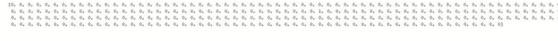

图：表示256个字符的映射。

## 算法

这个问题看起来可能很简单。你会想到创建所有可能的子数组（长度可变），然后逐一检查它们，与模式进行比较。然后，在所有匹配的方式中，你会寻找长度，长度最小的那个就是我们的答案。然而，这将花费大量时间。就时间复杂度而言，创建不同的子数组需要 O(N*N) 的时间。然后，搜索模式还需要 O(N) 的时间。时间复杂度是算法完成其任务所需的时间。大O表示法是衡量算法时间复杂度的一种方式。它表示为 O(f(n))，其中 n 是完成算法所需的操作数。

在后面的章节中，我们将看到如何使用大O表示法来比较两个算法的相对性能：第一个是我们刚才讨论的算法，另一个是滑动窗口技术。滑动窗口算法在这种情况下是首选算法，因为它 O(N) 的时间复杂度优于 O(N*N)。

滑动窗口技术是一种算法设计技术，用于解决涉及序列的问题，例如字符串匹配，它将序列分解成小块，并每次移动一定数量的元素。滑动窗口算法听起来很复杂，但它是在你的数据部分上形成的一个窗口或段，在我们的例子中，数据是一个字符串。我们以增量方式在数据上移动这个窗口以执行一些计算，即找到最小窗口子串。这种技术有助于在大型数据集中找到模式，并解决有时间约束的问题。

窗口或段是一个可变长度的组，它从第一个值匹配的位置开始增加，一直增加到最后一个匹配点。我们每次将窗口大小增加一个元素。如图所示，当在主字符串中找到第一个字符匹配时，我们开始形成窗口，并一直增加到最后一个字符匹配。这里，当在索引2处找到 'a' 时，发现了第一个匹配。一个窗口开始形成并增加，直到找到 't'。这是一个子数组，也是一个可能的解决方案。接下来，我们开始缩小这个窗口，从后面移除元素，直到找到下一个匹配。这次，我们得到了另一个从索引12到21的子数组。这是另一个子数组，并且它比第一个是更好的解决方案，因为这个子数组的大小是我们目前得到的最小值。我们继续构建窗口并改变它们的大小，直到所有元素都被考虑。

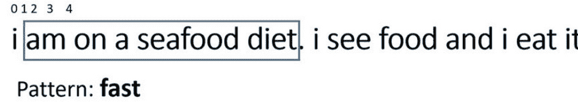

图：滑动窗口的工作原理。

让我们使用我们的字符串和模式，逐步演练该算法：

让我们创建一个映射，以便在遍历主字符串时生成模式中所有字符的计数；我们将知道已经看到了多少个字符。我们得到 F=1, A=1, S=1, T=1。

我们需要使用几个不同的变量：

首先，我们将声明 i 和 j 指针，指向索引 = 0。

变量 count 将初始化为模式中唯一字符的数量，我们可以从映射中获取。所以，我们设置 count = 4（对应 FAST）。

初始化一个 left 和 right 变量，用于在遍历字符串时跟踪我们遇到的最小子串位置。

minlength 变量用于跟踪 right 和 left 指针之间的差值，这将给我们字符串中的子串。最初，我们将它设置为比字符串长度大1，因为这表示一个非高效的解决方案。该步骤如图所示。

STRING: i am on a seafood diet. i see food and i eat it.

PATTERN: **fast**

**Count** = 4

**i,j** = 0,0

minLength = 14

| Character | Count |
|---|---|
| F | 1 |
| A | 1 |
| S | 1 |
| T | 1 |

**MAP**

图：所有变量已初始化。

j 指针将从主字符串的索引0开始，当与映射中的变量匹配时停止。在我们的例子中，当 j 到达索引2时，有一个匹配（找到字符 A）。我们需要将映射中该字符的值减1。如果该值达到零，我们也将 count 减1，现在等于3。我们得到 A = 0 和 count = 3。我们需要继续寻找 T (=1) 以找到成功的最小窗口。

我们继续移动 j 指针，寻找映射中的其他字符。j 将继续移动，直到索引21。当 j 到达索引8时，有另一个匹配；将 A 的计数减1，所以现在是 -1。count 值在这里不受影响，因为它只在映射中的值达到0时才减少，而不是其他任何数字（在这种情况下是 -1）。

现在 j 移动到10，再次匹配。这次，S 的值变为0，所以 count 减1，现在是2。

j 移动到12，映射中 A 的值变为 -2。

现在，j 移动到13，再次匹配。这次，F 的值变为零，所以 count 减1，现在变为1。

现在 j 继续移动，直到索引21；T 变为0，count 也变为0。这意味着我们找到了一个子数组。

由于 i 小于21，它移动直到找到第一个匹配（在索引2处）。现在，映射中匹配字符 A 的计数增加1（现在为 -1）。计算 minlength 作为潜在解决方案。由于 A 是负数，表明还有另一个 A 值将具有更短的子数组。i 移动到10（A=0, count=0），现在 i 到达12，即映射中 A 值变为1且 count 设置为1时。这是第一个潜在解决方案（当 count 变为正数时）。计算 minlength 为 21-12 = 9（j=21, i=12），子数组是 "seafood diet"。

此后，j 继续执行，重复相同的步骤，找到所有可能的子数组及其对应的长度。如果找到的下一个子数组长度小于前一个子数组，那么当前子数组成为潜在解决方案；否则，我们坚持之前的结果。当 j 到达字符串末尾时，算法结束。

这就是滑动窗口算法如何在单个循环内找到解决方案；因此，时间复杂度是 O(N)。

现在，让我们使用 Python 代码实现上述逻辑：

```python
total_chars = 256
#total 256 all possible characters

def smallestWindow(mainstr, pattern):
    n = len(mainstr)
    if n < len(pattern):
        return ""
    mp = [0] * total_chars

    # Starting index of ans
    start = 0

    # Length of ans
    ans = n + 1
    cnt = 0

    # creating map
    for i in pattern:
        mp[ord(i)] += 1
        if mp[ord(i)] == 1:
            cnt += 1

    # References of Window: j will move by each character
    #i will be used to remove the duplicate entry
    i, j = 0, 0

    # Traversing the window
    while j < n:
        # Calculating
        mp[ord(mainstr[j])] -= 1
        if mp[ord(mainstr[j])] == 0:
            cnt -= 1

        # Condition matching
        if cnt == 0:
            while i <= j and cnt == 0:
                if j - i + 1 < ans:
                    ans = j - i + 1
                    start = i
                mp[ord(mainstr[i])] += 1
                if mp[ord(mainstr[i])] > 0:
                    cnt += 1
                i += 1
        j += 1

    if ans > n:
        return ""
    return mainstr[start:start+ans]
```

## 分治法

贪心算法、动态规划和分治法等算法是基础技术，具有广泛的应用。在本节中，我们将使用分治技术来解决示例。该技术背后的核心思想是将问题分解为更易于解决的子问题来求解。

例如，归并排序算法就是一种分治算法。它的工作原理是将一个数字列表拆分为两半，直到列表只包含一个数字。然后，它对这两半进行排序，并按正确的顺序将它们合并在一起。这个过程会重复进行，直到整个列表排序完成。

二分查找是分治算法的另一个经典例子。它的工作原理是将一个已排序的数组分成两半，然后将目标值与数组中间的值进行比较。如果目标值小于中间值，则算法搜索数组的左侧。如果目标值大于中间值，则搜索数组的右侧。这个过程会重复进行，直到找到目标值或没有更多元素可供搜索。

快速排序是分治算法的另一个例子。它的工作原理是从列表中选择一个基准元素，然后根据基准将列表分成两半。小于基准的元素被放置在列表的一侧，大于基准的元素被放置在另一侧。这个过程会在每个分区上重复进行，直到所有元素都已排序。

### 使用分治法解决指数问题

传统上，这是通过一个循环来解决的，该循环执行 x * x * x ... * x 等操作。该算法以 n 的线性顺序运行，如下所示的代码：

```python
exp = 1
for i in range(n):
    exp *= x
print(f"12 to the power of {n} = {exp}")
```

前面的程序运行一个 for 循环来计算 12 的 5 次方。该算法的时间复杂度为 O(n)。我们希望使用分治法来改进算法的运行时间。在分治方法中，x^n 的指数是通过创建大小为 n/2 的子问题来实现的。这在图 9.1 中进行了演示。

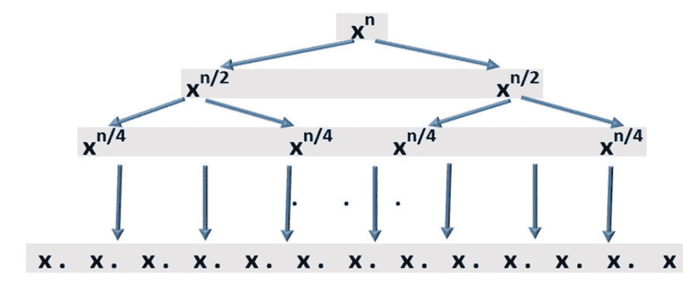

指数计算如图 9.2 所示。

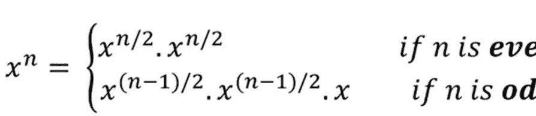

现在，让我们看看使用 Python 代码实现上述逻辑：

```python
def calc_pow(x, n):
    """
    Exponential value calculation using Divide and Conquer technique
    :param x: number
    :param n: power
    :return: multiplication of x and n
    """
    if n == 0:
        return 1
    elif n % 2 == 0:
        return calc_pow(x, n // 2) * calc_pow(x, n // 2)
    else:
        return x * calc_pow(x, n // 2) * calc_pow(x, n // 2)

exp_val = calc_pow(12, 5)
print(f"12 to the power of 5 = {exp_val}")
```

指数值的计算是通过将逻辑分解为更小、更易于管理的部分来完成的。它的工作原理是将问题分解为更小的子问题，递归地解决每个子问题，然后将子问题的解组合起来形成最终解。在这个例子中，分治法可用于降低计算的时间复杂度。该算法的工作原理是将问题分解为更小的部分，计算每个部分的指数值，然后将结果组合起来形成整体答案。每个子问题的大小可以根据所需的结果精度来选择。通过将问题分解为更小的部分，计算时间可以显著减少到 O(log n)。

## 回溯法

回溯法是一种尝试不同解决方案直到找到正确方案的算法。它是一种系统性的、循序渐进的方法，逐步构建解决方案的候选方案。它通过探索所有可能的路径来寻找问题的所有可能解。它的工作原理是反复做出选择，当选择导致死胡同时进行回溯，并跟踪迄今为止找到的最佳解决方案。这个过程会重复进行，直到找到解决方案或穷尽所有可能性。

这些算法可以应用于不同类型的问题。例如，回溯算法可用于解决迷宫问题，通过尝试不同的路径直到到达终点。它也可以用于解决数独谜题，通过在每个空单元格中测试每个可能的数字。尽管这可能是一个繁琐的过程，但它提供了一种解决复杂问题的有效方法。

为了说明回溯法的工作原理，请考虑以下示例：

我们有一个数字数组，我们想要找到一个数字子集，其和等于给定的总和。假设我们有数组 [1, 3, 7, 5, 9, 11]，我们想要找到一个和为 12 的子集。

要使用回溯算法解决这个问题，我们首先查看数组中的第一个数字：1。我们将 1 加到我们的累计总和中，然后继续到第二个数字：3。我们将 3 加到我们的累计总和中，然后继续到第三个数字：5。我们将 5 加到我们的累计总和中，现在总和为 9。由于 9 小于 12，我们继续到下一个数字：7。我们将 7 加到我们的累计总和中，现在总和为 16。由于 16 大于 12，我们回溯到前一个数字 5，并将其从我们的累计总和中移除。我们现在总和为 4。我们继续这个过程，直到找到一个和为 12 的数字子集。在这个例子中，和为 12 的数字子集是 [1, 11]、[3, 9] 和 [7, 5]。

让我们看看上述问题的 Python 实现：

```python
class find_subset_sum:
    """
    Class to implement a method to find
    whether or not there exists any subset
    of array that sum up to targetSum
    """
    def __init__(self):
        self.count = 0  # to count the total possibilities
        self.subsets = []  # to store the valid values for subset

    # BACKTRACKING ALGORITHM
    def backtrack(self, st_idx, current_sum, target, list_val):
        if target == current_sum:
            self.count += 1
            self.subsets.append(list_val[:st_idx])
            return

        if st_idx >= len(list_val) or current_sum > target:
            return

        # generate nodes
        for i in range(st_idx, len(list_val)):
            # store to find sum
            current_sum += list_val[i]
            self.backtrack(i + 1, current_sum, target, list_val)
            # remove as now longer valid
            current_sum -= list_val[i]

# Driving code
c1 = find_subset_sum()
c1.backtrack(0, 0, 10, [1, 2, 7, 3, 5])
print(f"Subset => {c1.subsets}")
print(f"Result: {c1.count}")

c2 = find_subset_sum()
c2.backtrack(0, 0, 12, [1, 3, 7, 5, 9, 11])
print(f"Subset => {c2.subsets}")
print(f"Result: {c2.count}")
```

输出

Subset => [[1, 2, 7], [3, 5, 2], [3, 7]]
Result: 3

Subset => [[1, 11], [3, 9], [7, 5]]
Result: 3

回溯算法的一些应用如下：

- **解决需要决策的问题**：它被广泛用于解决需要决策的问题。例子包括著名的八皇后问题、哈密顿回路问题、背包问题和数独谜题。

## 回溯法

寻找所有可能的解：该算法可用于寻找一个问题的所有可能解。例如，它可以用来生成一个字符串的所有可能排列。

优化：它用于解决优化问题，例如，可以用来寻找图中两点之间的最短路径。

解析：它被用于许多解析算法中，例如编译器中使用的算法。

人工智能：回溯法是解决人工智能问题的强大工具，例如游戏博弈。

回溯算法也可用于解决各种现实世界的问题，例如以下情况：

- 解决迷宫问题（找到从起点到终点的路径）
- 寻找集合中物品的所有可能组合（一组配料的所有可能组合）
- 生成给定字符串的所有可能排列
- 寻找图中两个节点之间的最短路径
- 解决数独谜题
- 生成给定元素集合的所有可能子集

我们现在来解决皇后问题。N皇后问题是在一个N×N的棋盘上放置n个皇后，使得任何一个皇后都不能在一步之内攻击到另一个皇后。我们需要检查是否存在这样的n个皇后排列，如果存在，则打印出该排列。注意，国际象棋中的皇后可以在八个方向上攻击，即左/右、上/下、左上/右下、右上/左下对角线方向。图6.7展示了一个4x4棋盘的解法示例。


算法首先在第一行放置一个皇后，然后尝试在后续的行中逐个放置剩余的皇后。对于每一行，算法会遍历该行中皇后所有可能的位置，并检查在该位置放置皇后是否安全。如果安全，则放置皇后，并递归调用自身以在后续行中放置剩余的皇后。如果不安全，算法会回溯并尝试下一个可能的位置。一旦所有皇后都放置完毕，算法返回true，表示找到了一个解。如果找不到解，算法返回false。图6.8将我们刚才讨论的步骤描绘为算法步骤：

```
**算法1：解决N皇后问题的回溯算法**

**数据：** $Q[n]$：一个包含n个皇后位置的数组；$k$：第一个空行的索引

**结果：** $n$个互不攻击的皇后在棋盘上的所有可能放置

**过程** $NQueen(Q[n], k)$
    if $k == n + 1$ then
        return $Q$;
    end
    for $j = 1$ to $n$ do
        $valid = True$;
        for $i = 1$ to $k-1$ do
            if $(Q[i]=j)$ or $(Q[i]=j+k-i)$ or $(Q[i]=j-k+i)$ then
                $valid = False$;
            end
            if $valid = True$ then
                $Q[k] = j$;
                $NQueen(Q[n], k+1)$;
            end
        end
    end
end
```

图6.8：使用回溯技术解决n皇后问题的伪代码

Python代码实现如下：

```python
queenscnt = 0

def IsSafe (board, row, col) :
    # Check if there is a queen 'Q' on the left of col in same row.
    for c in range(col) :
        if (board[row][c] == 'Q') :
            return False

    # Check if there is a queen 'Q' on the upper-left of col in same row.
    for r, c in zip(range(row-1, -1, -1), range(col-1, -1, -1)) :
        if (board[r][c] == 'Q') :
            return False

    # Check if there is a queen 'Q' on the lower left of col in same row.
    for r, c in zip(range(row+1, len(board), 1), range(col-1, -1, -1)) :
        if (board[r][c] == 'Q') :
            return False

    return True

def PlaceAll (board) :
    for row in board :
        for val in row:
            print(val,end=" ")
        print()

def NQueensSolution (chessboard, col) :
    # If all the columns have a queen 'Q', solution has been found.
    global queenscnt

    if (col >= len(chessboard)) :
        queenscnt += 1
        print("\nBoard " + str(queenscnt)+" :")
        print("----"*col)
        PlaceAll(chessboard)
        print("===="*col)
    else :
        #Placing the queen in each row of the column and verify if its safe
        for row in range(len(chessboard)) :
            chessboard[row][col] = 'Q'
            if (IsSafe(chessboard, row, col) == True) :
                # Placing Queen safe hence, trying to place Q in the next column.
                NQueensSolution(chessboard, col + 1)
            # restore empty space as previously placed queen is not valid
            chessboard[row][col] = '.'

#Driver code
board = []
NSize = int(input("Enter chessboard size : "))
for i in range(NSize) :
    row = ["."] * NSize
    board.append(row)

# place the queen 'Q' from the 0'th column.
NQueensSolution(board, 0)
```

图6.9展示了输出结果：

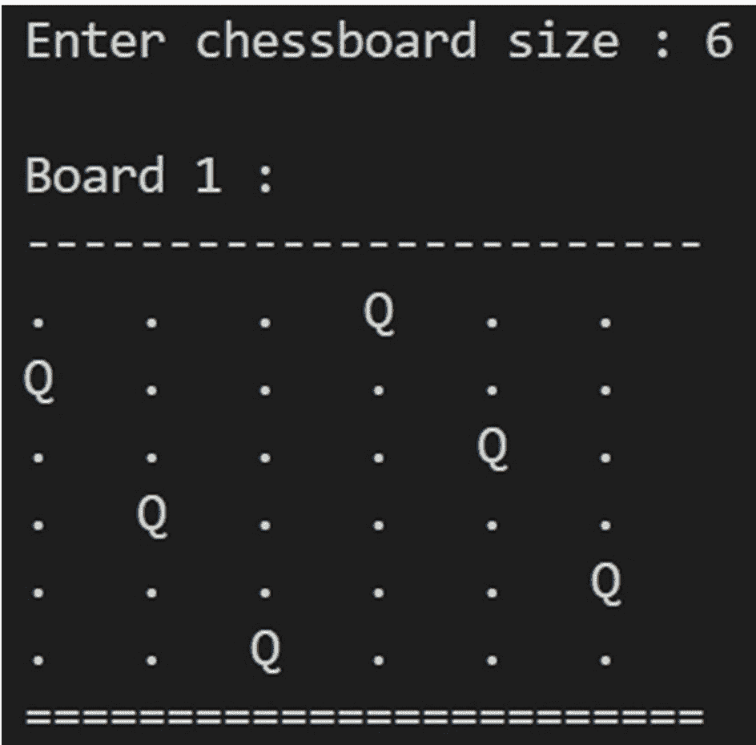

第一个解可以占据任意位置，第二个解将在剩余位置中选择，依此类推。时间复杂度为 O (N) * (N - 1) * (N - 2) * ... 这导致时间复杂度为 O ( N! )。

## 二叉树

二叉树是一种在算法设计中使用的数据结构，用于将数据组织成树状结构，其中每个节点最多有两个子节点。它通常用于搜索算法、排序算法以及各种其他类型算法的设计。二叉树由节点组成，每个节点包含一个值，并且每个节点最多有两个子节点，称为左节点和右节点。根节点是树中最顶层的节点，每个节点都有一条从根节点出发的唯一路径。二叉树的优势在于某些操作效率很高，例如插入、检索和删除数据，因为其结构允许快速访问树中的任何节点。它的一些应用如下：

- **二叉搜索树**：用于按排序顺序存储和搜索项目。
- **优先队列**：用于实现优先队列，优先队列在调度算法（如Dijkstra算法）中使用。
- **霍夫曼编码**：一种数据压缩形式，使用二叉树高效地存储和编码数据。
- **表达式树**：用于表示数学表达式，在编译器和解释器中使用。
- **B树**：一种自平衡树，用于高效地在磁盘上存储数据。

在我们查看BST的实现之前，让我们先理解为什么BST很重要以及何时优先使用它们。

二叉搜索树可以管理数据库索引，以高效地从数据库中存储和检索数据。它是一种二叉树数据结构，其中每个节点的值都大于或等于其左子树中节点的值，并且小于或等于其右子树中节点的值。左子树和右子树中的节点也必须遵循此属性，即左侧节点的值小于或等于该节点，右侧节点的值大于或等于该节点。数据库可以利用二叉搜索树快速遍历索引以定位所需数据。这是因为二叉搜索树存储数据的方式使其可以在对数时间内被访问。这意味着即使数据库有数百万条记录，二叉搜索树也能在几分之一秒内定位到所需的记录。此外，它还可以用于以排序方式存储数据，这在管理大型数据库时非常有益。

让我们看看如何向BST添加成员，以及如何删除和遍历它：

要向二叉搜索树插入一个新节点，我们首先需要找到新节点的正确位置。我们通过从根节点开始，然后将新节点的值与根节点的值进行比较来实现。如果新节点的值小于根节点的值，我们移动到左子树。如果更大，我们移动到右子树。我们重复这个过程，直到找到一个可以插入新节点的空位。

要从二叉搜索树中删除一个节点，我们首先需要找到该节点。我们通过从根节点开始，然后将要删除的节点的值与根节点的值进行比较来实现。如果要删除的节点的值小于根节点的值，我们移动到其左子树。如果更大，我们移动到其右子树。我们重复这个过程，直到找到要删除的节点。一旦找到节点，我们通过将其替换为其右子树中的最小节点（如果存在）或其左子树中的最大节点（如果存在）来删除它。

要在二叉搜索树中搜索一个节点，我们从根节点开始，然后将要查找的节点的值与根节点的值进行比较。如果要搜索的节点的值小于根节点的值，我们移动到其左子树。如果更大，我们移动到其右子树。我们重复这个过程，直到找到节点或到达一个空子树。

让我们看看代码的Python实现：

```python
COUNT = #spaces away from previous layer

# Binary Search Tree
class BSTree:
    # Function to insert a new node with given data
    def root, val):
        # check for empty tree
        if root is
            return newNode(val)
        # If given val is less than root val, then find in left subtree
        if val < root.val:
            root.left = val)
        # If given val is more than root val, then find in right subtree
```

## 在二叉搜索树中查找给定值
def root, val):
    # 基本情况
    if root is None or root.val == val:
        return root
    # 如果给定值小于根节点的值，则它位于左子树中
    if root.val > val:
        return val)
    # 如果给定值大于根节点的值，则它位于右子树中
    return val)

## 从二叉搜索树中删除节点
def root, val):
    # 基本情况
    if root is
        return root
    # 如果给定值小于根节点的值，则它位于左子树中
    if val < root.val:
        root.left = val)
    # 如果给定值大于根节点的值，则它位于右子树中
    elif val > root.val:
        root.right = val)
    # 如果当前节点是要删除的节点
    # 只有一个子节点或没有子节点的节点
    if root.left is
        temp = root.right
        root = None
        return temp
    elif root.right is
        temp = root.left
        root = None
        return temp
    # 有两个子节点的节点
    # 获取中序后继（右子树中的最小值）
    temp =
    # 将中序后继的内容复制到此节点
    root.val = temp.val
    # 删除中序后继
    root.right = temp.val)
    return root

# 辅助函数：在给定树中查找最小节点
def node):
    current = node
    # 循环向下查找最左侧的叶子节点
    while (current.left is not
        current = current.left
    return current

# 二叉树节点：创建一个新节点
class newNode:
    # __init__ 函数用于创建一个新节点
    def key):
        = key
        = None
        = None

# 以二维形式打印二叉树的函数
# 它执行反向中序遍历
def printTreeUtil(root, space):
    # 基本情况
    if (root ==

    return

    # 增加层级之间的距离
    space +=

    # 首先处理右子节点
    printTreeUtil(root.right, space)

    # 在空格计数后打印当前节点
    for i in space):

    # 处理左子节点
    printTreeUtil(root.left, space)

# print2DUtil() 的包装函数
def printTree(root):
    # 初始空格计数传递为 0
    printTreeUtil(root,

# 驱动代码
if __name__ ==
    bst = BSTree()
    root = None
    root = bst.insert(root,
    root = bst.insert(root,
    root = bst.insert(root,
    root = bst.insert(root,
    root = bst.insert(root,
    root = bst.insert(root,
    root = bst.insert(root,
    root = bst.insert(root,
    root = bst.delete(root,
    printTree(root)

树的最终结构如图所示

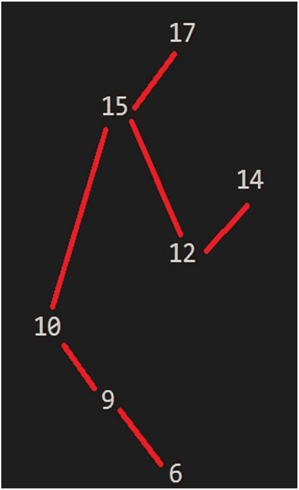

图 读取二叉搜索树算法的输出

## 堆

堆是一种使用称为堆的数据结构的排序算法。它效率很高，用于将数组中的元素重新排列成堆。堆是一种特殊类型的二叉树，其性质是每个节点都大于或等于其每个子节点。这使我们能够快速识别数组中的最大元素。该算法通过反复将堆中的根元素与最后一个元素交换，然后调整它以维持堆属性来工作。这个过程持续进行，直到堆被排序。它以完全二叉树的形式管理，因此新值总是插入到最后一个层级最左侧的空位。

堆算法可用于创建两点之间最短可能路径的图，同时考虑地形、交通和天气等因素。该算法将检查所有可能的路径，并确定满足条件的最短路径。这可用于帮助规划送货司机的路线，或为寻找最快路线到达目的地的旅行者规划路线。该算法可用于实现优先队列，例如，医院可以使用优先队列来管理患者接受医生诊治的顺序。病情最紧急的患者将被赋予最高优先级并置于队列的前面。堆算法可用于确保最高优先级的患者始终位于队列顶部。

让我们实现一个从堆中插入和删除的示例。根节点必须始终高于其左子节点和右子节点。对于每次插入和删除，树都必须重新调整以维持前面讨论的属性。让我们看看下面堆算法的实现：

class Heap:
    def
    # 初始化堆数组
    = []

    def
    # 以一维数组格式显示内容

    def i):
    # 获取父节点的公式
    return (i - // 2

    def k):
    i = - 1
    # 如果需要则向上移动
    # 显示
    def i):
    p =
    # 如果父节点的值低于子节点的值，则交换
    while p >= 0 and <
    =
    i = p
    p =

    def i):
    """
    堆化子树以管理删除
    :param i: 带有节点 i 的根
    """
    left = 2 * i + 1 # 访问左子节点
    right = 2 * i + 2 # 访问右子节点
    largest = i
    # 如果左子节点大于根节点
    if left < and >
    largest = left
    # 如果右子节点大于当前最大值
    if right < and >
    largest = right
    # 如果最大值不是根节点
    if largest != i:
    =

    def i):
    # 删除第 i 个位置的元素
    n =
    if n ==
    return None
    - = -
    del -

    # 显示
    # 测试上述代码
    h1=Heap()
    # 运行 1: [50]
    # 运行 2: [50, 10]
    # 运行 3: [50, 10, 30]
    # 运行 4: [50, 30]
    # 运行 5: [50, 30, 20]
    # 运行 6: [80, 50, 20, 30]
    # 运行 7: [80, 50, 30]
    # 运行 8: [80, 70, 30, 50]

树中值的变化如图所示

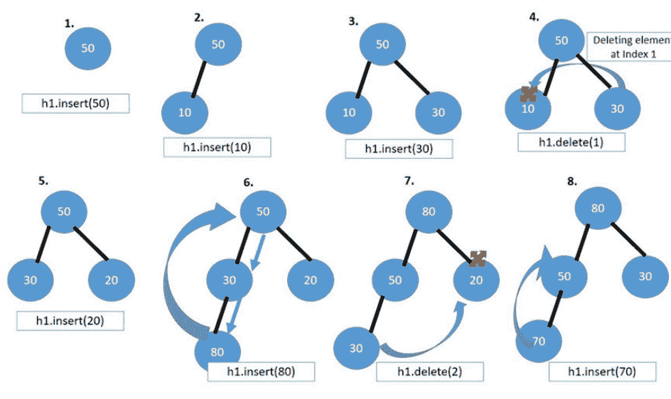

图 堆树随插入和删除操作而变化

时间复杂度 O(log(n))（其中 n 是堆中的元素数量）

## 哈希表

哈希表是一种用于存储键值对的数据结构，通常作为算法设计的一部分，通过减少搜索、插入和删除操作的时间复杂度来优化算法性能。哈希表使用哈希函数将键映射到数组中的索引，从而允许快速查找和插入。键值对可以存储在任何数据结构中，如数组、链表或树，具体取决于算法设计。Python 中熟悉的字典数据结构就是哈希表的一种实现。字典用于以键值对的形式存储数据。每个元素都使用一个键来访问。这些键必须是唯一的、不可变的对象，通常是字符串或数字。值可以是任何类型的对象。字典中提供的一些方法列于表中

| | |
|---|---|
| | |
| | |
| | |
| | |
| | |
| | |
| | |
| | |
| | |

表 字典类提供的内置方法

让我们看一个实现字典的简单程序：

my_dict = {
"UK"
}
# 访问字典项

# 添加一个项
= "Male"

# 删除一个项
del

# 遍历字典
for key, value in my_dict.items():
+ ": " + value)

我们将编写另一个程序，使用字典生成一个 8 个字符长的随机密码，该密码由小写字母、大写字母、数字和特殊字符的组合构成：

import string
import random

# 创建一个包含所有可能字符的字典
possible_characters = {
'lowercase_letters': string.ascii_lowercase,
'uppercase_letters': string.ascii_uppercase,
'numbers': string.digits,
'special_characters': string.punctuation
}

# 创建一个空列表来存储密码
password = []

# 循环 8 次，从每个字典中随机选择一个字符
for i in range(8):
    # 随机选择 4 种字符类型中的一种
    character_type = random.choice(list(possible_characters.keys()))
    # 从选定的字符类型中随机选择一个字符
    character = random.choice(possible_characters[character_type])
    # 将字符添加到密码列表中
    password.append(character)

# 将密码列表中的字符连接在一起
password = "".join(password)

# 打印密码
print("Your new random password is:", password)

存在不同类型的字典，它们被创建用于执行特定任务：

它是一种特殊类型的字典，用于跟踪特定项目出现的次数。它是一个无序的对象集合，可以存储任何类型的数据，通常用于计算项目在列表或其他数据集合中出现的次数。

它是一个字典子类，它记住其内容被添加的顺序。当你想要保持一致的顺序时，它特别有用字典的输出顺序，或当你想确保字典按特定顺序处理时。

它是Python中一个类似字典的对象，提供了一种处理缺失键的方法。它是内置`dict`类的子类。唯一的区别是，当找不到键时，不会引发`KeyError`，而是创建一个新条目。这个新条目的类型由`defaultdict`构造函数的参数给出。

它是Python中一种数据结构，用于在单个映射中存储多个字典。它允许你创建多个映射的单一、统一视图，这使得同时查找和操作存储在多个字典中的值变得更加容易。

## 图算法

它是解决图论问题的一种方法。它通过探索图并寻找从一个节点到另一个节点的路径来解决问题。该算法基于图是无向且无环的假设。图算法以图数据结构作为输入，并提供特定问题的解决方案。它用于解决各种问题，包括找到两个节点之间的最短路径、确定图是否为二分图、找到两个节点之间的最低成本路径以及找到两个节点之间的最大流。

最常见的图算法是找到两个节点之间的最短路径。该算法使用广度优先搜索算法遍历图。它从一个节点开始，在移动到下一个节点之前探索其邻居。重复此过程，直到到达目标节点。从起始节点到目标节点的边数决定了两个节点之间的最短路径。

另一个标准的图算法是最小生成树算法。它使用克鲁斯卡尔算法来找到图的最小生成树。该算法从所有边的集合开始，然后选择权重最小的边。重复此过程，直到所有边都包含在最小生成树中。

最大流算法是另一种常见的图算法。它找到两个节点之间的最大流，并使用福特-富尔克森算法来找到两个节点之间的最大流。它首先为每条边分配一个流量值，然后迭代更新流量值，直到找到最大流。

最后，图着色算法用于给图着色。它使用韦尔什-鲍威尔算法为每个顶点分配一种颜色，然后迭代更新颜色，直到没有两个相邻顶点具有相同的颜色。当没有两个相邻顶点具有相同的颜色时，算法完成。

让我们看看Dijkstra算法的Python实现，找到从源到所有节点的最短路径。

## 算法

步骤 将从源节点到所有其他节点的距离设置为无穷大，除了源节点本身设置为0。

步骤 将距离最短的未访问节点设置为当前节点。

步骤 计算每个未访问节点到当前节点的距离。

步骤 将距离最短的未访问节点设置为新的当前节点，并将其标记为已访问。

步骤 重复步骤3和4，直到所有节点都被访问。

步骤 返回从源节点到所有其他节点的最短距离。

图6.12显示了源（O）到其他顶点的距离：

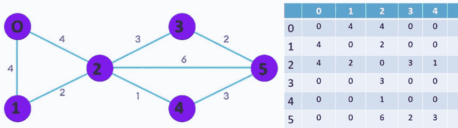

图 问题陈述，显示从O到其他顶点的距离

以下是Python代码：

```python
import numpy as np

class GenGraph():
    def vertx():
        = vertx
        = for col in

    for row in

    def dist):
        from
        for node in
        node, dist[node])
        # Find the vertex with minimum distance value
        # from the set of vertices not yet in shortest path
        def dist, spSet):
            min = np.inf # default max distance
            min_idx = 1
            # look for not nearest vertex not in shortest path
            for v in
            if dist[v] < min and not spSet[v]:
                min = dist[v]
                min_idx = v
            return min_idx

# Implementing Dijkstra's shortest path algorithm
# using graph using adjacency matrix representation
def source):
    dist = [np.inf] *
    dist[source] = 0
    spSet = *

    for cout in
        # Pick the minimum distance vertex
        # x is always equal to src in first iteration
        x = spSet)

        # Put the min distance in the shortest path
        spSet[x] = True

        # Update dist value if distance is greater than new distance
        # and the vertex in not in the shortest path tree
        for y in
            if > 0 and spSet[y] == False and \
                dist[y] > dist[x] +
                dist[y] = dist[x] +

    if __name__ ==
        prb1 =
        prb1.plot_graph
```

最终解决方案如图所示

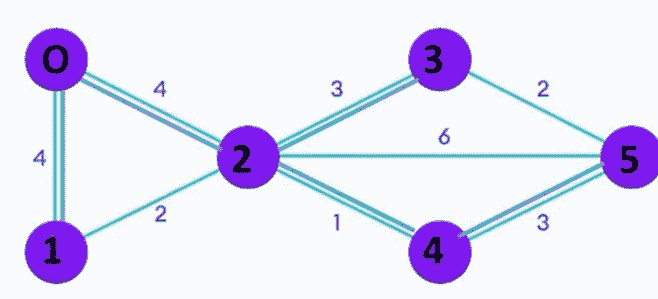

| 源 | 顶点 | 距离 |
| :--- | :--- | :--- |
| 0 | 0 | 0 |
| 0 | 1 | 4 |
| 0 | 2 | 4 |
| 0 | 3 | 7 |
| 0 | 4 | 5 |
| 0 | 5 | 8 |

图 从O到其他顶点距离的最终解决方案

## 大O表示法：分析算法的方法论

大O表示法是衡量算法复杂度的一种方法。它通常用于表示算法的最坏情况，即完成任务所需的时间或内存量。大O表示法是一个数学表达式，描述了算法运行时间或空间复杂度的上界。它表示为O(f(n))，其中f(n)是算法相对于输入大小的复杂度，通常表示为n。这意味着算法完成任务所需的时间或内存不会超过f(n)。它用于表示算法复杂度的上界。

例如，如果一个算法的复杂度是O(n²)，那么它完成任务所需的步骤不会超过n*n步。这种表示法很有用，因为它允许我们快速比较不同算法的相对复杂度，而无需实际测量每个算法所需的确切时间或内存。

大O表示法对于分析算法的性能和可扩展性非常有用。它通常用于比较不同的算法并确定最有效的一个。图6.14显示了不同大O值的复杂度图表：

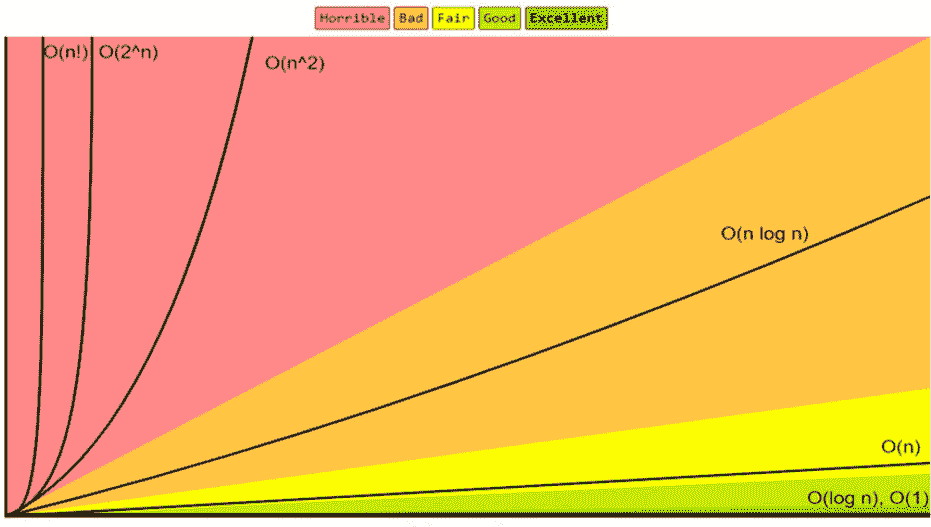

图 大O复杂度图表
（图片来源：bigocheatsheet.com）

让我们看看一些广泛使用的算法及其在图中的时间和空间复杂度

| 数据结构 | 时间复杂度（平均） | 时间复杂度（最坏） | 空间复杂度（最坏） |
| :--- | :--- | :--- | :--- |
| | 访问 | 搜索 | 插入 | 删除 | 访问 | 搜索 | 插入 | 删除 | |
| 数组 | Θ(1) | Θ(n) | Θ(n) | Θ(n) | O(1) | O(n) | O(n) | O(n) | O(n) |
| 栈 | Θ(n) | Θ(n) | Θ(1) | Θ(1) | O(n) | O(n) | O(1) | O(1) | O(n) |
| 队列 | Θ(n) | Θ(n) | Θ(1) | Θ(1) | O(n) | O(n) | O(1) | O(1) | O(n) |
| 单链表 | Θ(n) | Θ(n) | Θ(1) | Θ(1) | O(n) | O(n) | O(1) | O(1) | O(n) |
| 双链表 | Θ(n) | Θ(n) | Θ(1) | Θ(1) | O(n) | O(n) | O(1) | O(1) | O(n) |
| 跳表 | Θ(log(n)) | Θ(log(n)) | Θ(log(n)) | Θ(log(n)) | O(n) | O(n) | O(n) | O(n) | O(n log(n)) |
| 哈希表 | N/A | Θ(1) | Θ(1) | Θ(1) | N/A | O(n) | O(n) | O(n) | O(n) |
| 二叉搜索树 | Θ(log(n)) | Θ(log(n)) | Θ(log(n)) | Θ(log(n)) | O(n) | O(n) | O(n) | O(n) | O(n) |
| 笛卡尔树 | N/A | Θ(log(n)) | Θ(log(n)) | Θ(log(n)) | N/A | O(n) | O(n) | O(n) | O(n) |
| B树 | Θ(log(n)) | Θ(log(n)) | Θ(log(n)) | Θ(log(n)) | O(log(n)) | O(log(n)) | O(log(n)) | O(log(n)) | O(n) |
| 红黑树 | Θ(log(n)) | Θ(log(n)) | Θ(log(n)) | Θ(log(n)) | O(log(n)) | O(log(n)) | O(log(n)) | O(log(n)) | O(n) |
| 伸展树 | N/A | Θ(log(n)) | Θ(log(n)) | Θ(log(n)) | N/A | O(log(n)) | O(log(n)) | O(log(n)) | O(n) |
| AVL树 | Θ(log(n)) | Θ(log(n)) | Θ(log(n)) | Θ(log(n)) | O(log(n)) | O(log(n)) | O(log(n)) | O(log(n)) | O(n) |
| KD树 | Θ(log(n)) | Θ(log(n)) | Θ(log(n)) | Θ(log(n)) | O(n) | O(n) | O(n) | O(n) | O(n) |

## 结论

算法就像工具；它们帮助我们更高效、更有效地完成任务，也帮助我们提高生产力。它们可以帮助我们执行那些仅靠人力难以或无法完成的任务。你可以使用专用工具或通用工具来完成工作。它们被设计用来执行一项特定任务或一组相关任务。它们往往为效率而设计，以便能够快速、准确地完成工作。然而，当用于非其设计意图的任务时，它们往往价格昂贵或完全不适用。通用工具被设计用来执行广泛的任务。它们通常比专用工具更经济实惠，并且通常更通用，因为它们可以用于各种任务。然而，它们可能不如专用工具高效。我们在本章中讨论了这两种类型的算法。我们研究了像滑动窗口这样的专用算法，以及像分治法这样的通用基础算法。我们还研究了树型数据结构和图型数据结构。掌握这些概念只有一个方法，那就是通过实践。尽可能多地练习这些概念。

在下一章中，我们将学习构建多线程应用程序。多线程是一个允许单个进程拥有多个并发运行的执行线程的过程。这意味着多个代码段可以在单个进程内同时运行，从而实现更高效的资源利用和更快的任务完成。多线程还允许更好的响应性和可扩展性，因为可以使用多个线程来处理更多的并发请求。此外，它可以提供更好的容错性，因为如果一个线程失败，另一个线程可以接管其工作。

加入我们书籍的Discord空间

加入书籍的Discord工作区，获取最新更新、优惠、全球科技动态、新书发布以及与作者的交流会：

https://discord.bpbonline.com


## 第7章

## 构建多线程应用程序

> 每个学习并发的人都认为自己理解了它，最终却发现了他们认为不可能发生的神秘竞争条件，并发现他们实际上仍然没有真正理解它。

— Herb Sutter，ISO C++标准委员会主席，微软

## 引言

多线程是一种编程技术，允许程序并发执行多个线程（或任务）。每个线程独立运行，可以在与其他线程共享同一程序资源的同时处理自己的任务。它在许多应用程序中以不同的方式使用。它可以用来提高性能和可扩展性，提供更好的用户体验，或者使编程更容易。例如，Web服务器可以使用多个线程同时处理多个请求。这提高了Web服务器的性能，因为它可以同时处理多个请求。

本章将探讨多线程的概念及其在Python中的实现。我们将涵盖诸如多线程与多处理之间的区别、`threading`模块的使用、同步技术以及利用处理器多核的策略等主题。它还将解释诸如线程池和并行处理之类的技术，并提供它们的使用示例。并行处理是一种技术，其中多个线程并发执行以提高程序的速度和性能。这些线程可以独立、并行地运行，并共享内存和处理器等资源。最后，它将讨论在Python中使用线程进行编程的最佳实践，例如以安全有效的方式处理线程错误。

Python中的多线程可用于提高程序的性能。例如，它可以用来同时处理多个数据流、同时运行多个任务或并发执行多个代码段。这可以通过使用`threading`模块来实现，该模块提供了创建和运行线程的基本功能。

Python线程还可以使用共享内存相互通信。这种通信称为线程间通信，允许线程交换数据并同步其执行。这可以用来协调任务并实现更高的效率。

它还可以使程序更具响应性，因为线程可以在其他线程在后台运行时处理用户输入。这有助于减少延迟并改善用户体验。

总的来说，Python中的多线程可以在程序中实现更高的性能和响应性。

## 结构

在本章中，我们将讨论以下主题：

- 多线程概念介绍
- 线程同步
- Python中的线程间通信
- Python中的线程池
- 多线程优先级队列
- 优化Python线程以提高性能
- 贪吃蛇游戏：使用多线程和`turtle`

现在，让我们深入探讨这些主题。

## 目标

本章学习多线程的主要目标是使开发人员能够编写能够提高性能、通过将任务分散到多个线程来减少延迟、提高可靠性并确保更轻松的程序维护的代码。此处涵盖的主题符合这一目标。

## 多线程概念介绍

多线程是同时运行多个线程的过程。它是一种通过同时运行多个任务来提高应用程序性能的方法。线程是轻量级进程，共享相同的内存空间，因此可以轻松地相互通信。

多线程通过允许多个线程并发运行来实现。这是通过将程序代码划分为多个小任务或进程来完成的。每个进程被分配自己的线程，每个线程可以执行自己的指令。通过这样做，程序可以使用单台计算机中的多个处理器或核心。让我们看一个例子。

## 启动新线程

默认情况下，每个程序都会有一个主线程在运行。如果你想生成第二个线程，可以通过调用`threading`模块中可用的`Thread()`方法来实现：

```
threading.Thread(target=function).start()
```

`start()`方法将开始执行线程。然后还有另一个方法，它等待线程/进程终止。这将使主线程等待直到它完成执行。要看到区别，请运行以下程序，然后取消注释`join()`方法后再运行一次：

```
import threading

def thread_action():
    for x in range(5):
        print("Hello from child thread")

thread1 = threading.Thread(target=thread_action)
thread1.start()
#thread1.join()
print("Hello from main thread")
```

注意：如果你使用的是具有高RAM的强大计算机，你可能看不到区别。

在前面的程序中，我们看到在第一次运行时，子线程和主线程几乎同时运行，但当我们调用`join()`方法时，主线程会等待子线程完成执行。

多线程可以通过让程序利用额外的计算能力来帮助提高程序的效率。这是因为每个线程可以被分配到不同的处理器或核心，从而允许同时完成更多任务。它还允许程序更有效地使用资源，因为无需等待单个进程完成就可以启动另一个进程。让我们看另一个Python程序，如下所示：

```
import time
import threading as th

def cal_square(list_num):
    print("SQUARE OF NUMBERS:")
    for i in list_num:
        time.sleep(1)
        print(f"Square: {i*i}")

def cal_cube(list_num):
    print("CUBE OF NUMBERS:")
    for i in list_num:
        time.sleep(1)
        print(f"Cube: {i*i*i}")

#Main calling
num = [1, 2, 3, 4]
thread1 = th.Thread(target=cal_square, args=(num,))
thread2 = th.Thread(target=cal_cube, args=(num,))
```

## 线程同步

它指的是确保多个执行线程以协调方式执行操作的过程。这通常用于确保代码的关键部分在任何时候都不能被多个线程访问，从而防止竞态条件并确保数据完整性。关键部分是多线程应用程序中访问共享资源的一部分，必须以线程安全的方式执行。同步对象（如互斥锁、信号量或自旋锁）通常保护关键部分。关键部分一次只允许一个线程进入，确保共享资源不会因多个线程同时访问而损坏。图7.1展示了线程A、B和C访问关键区域的示意图：

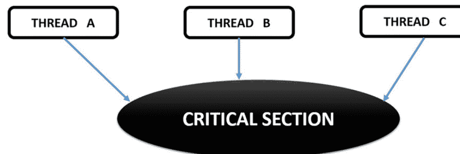

图 三个关键部分：线程同时访问共享资源

当两个或多个线程或进程竞争共享资源（如代码的关键部分、数据项、硬件设备或网络连接），并且程序或系统的行为取决于线程或进程执行时发生的事件时序时，就会发生竞态条件。换句话说，程序的结果可能因线程或进程访问共享资源的顺序不同而有所变化。竞态条件可能导致程序出现意外或错误的结果，例如死锁或数据损坏。读取数据不会造成任何危害，但写入/编辑可能会产生意外结果。读者-写者问题是多线程同步问题的一个经典例子。它描述了多个线程试图访问共享资源的情况。问题在于，读者或写者可以访问资源，但不能同时访问。这通常导致一种情况，即写者需要等待读者完成才能写入，或者读者必须等待写者完成才能读取。这导致一种类型的线程在资源被另一种类型的线程锁定或阻塞时访问资源。让我们在这里举一个读者-写者问题的简单实现。考虑以下Python程序，它允许读者和写者执行他们的任务。当我们多次运行以下代码时，会得到不同的输出：

```python
import threading as thread
import time

global val #Shared value
val = 0

def Reader():
    global val
    print(f"is Reading Shared Value: {val}")

def Writer():
    global val
    print(f"is increasing value of val by")
    val += 1 #Write on the shared value
    print(f"done: {val}")

#Driver code
if __name__ == "__main__":
    for i in range(2):
        ThreadA = thread.Thread(target=Reader)
        ThreadA.start()
        ThreadB = thread.Thread(target=Writer)
        ThreadB.start()

        ThreadA.join()
        ThreadB.join()
```

现在，我们将重写相同的代码，将代码的读取和写入部分视为关键部分。下一个程序是一个简单的例子，我们不使用线程间通信。写者任务在竞争，读者也在竞争读取部分。在之前的进程完成之前，数据不会被另一个写者进程写入。同样的逻辑也适用于读者块。

```python
import threading as thread
import time

global val #Shared value
val = 0
lock = thread.Lock() #Lock for synchronising access

def Reader():
    global val
    lock.acquire() # Acquire lock before Reading
    print(f"is Reading Shared Value: {val}")
    lock.release() # Release the lock before Reading

def Writer():
    global val
    lock.acquire() # Acquire the lock before Writing
    print(f"is increasing value of val by")
    val += 1 #Write on the shared value
    print(f"done: {val}")
    lock.release() # Release the lock after Writing

#Driver code
if __name__ == "__main__":
    for i in range(2):
        ThreadA = thread.Thread(target=Reader)
        ThreadA.start()
        ThreadB = thread.Thread(target=Writer)
        ThreadB.start()

        ThreadA.join()
        ThreadB.join()
```

Python中的线程同步是通过锁、信号量、事件和条件来实现的。锁是一种同步原语，它确保一次只有一个线程执行一段代码。信号量也用于控制对共享资源的访问，而事件和条件用于同步线程。锁、信号量和事件由Python的threading模块提供，而条件由threading.Condition类提供。让我们理解线程同步的组成部分：

- **锁**：它们是线程同步的基本形式。在任何给定时间，锁只允许一个线程进入受保护的代码部分。其他线程被阻塞，直到锁被释放。锁通过调用lock.acquire()方法获取，并通过调用lock.release()方法释放。

- **信号量**：它用于控制对关键或共享资源的访问。信号量维护一个计数器，表示可用资源的数量。信号量有一个内部计数器，初始化为给定值。当线程想要访问共享资源时，它获取信号量。当信号量的计数器大于0时，线程可以访问资源，计数器递减。如果计数器为0，线程被阻塞，直到信号量被另一个线程释放。信号量通过调用release()方法释放。

- **事件**：这些是另一种同步形式，用于发出线程状态变化的信号。事件通过调用threading.Event()函数创建。然后可以使用set()和clear()方法设置或清除事件。wait()方法会阻塞线程，直到事件被设置。

- **条件**：它是一种类似于事件的同步原语，但增加了等待多个条件的能力。我们将在下一节详细讨论这一点。

## Python中的线程间通信

线程间通信是进程中两个或多个线程之间的通信方法。它是同步多个线程执行的一种方式，允许它们交换信息、共享资源并协调它们的操作。Python中的这种通信可以通过队列、事件、信号量或条件来实现。

- **队列**：队列是一种线程安全的数据结构，用于存储可以被多个线程访问的数据。它们允许这些线程将数据放入队列并从队列中取出数据，确保没有数据丢失，并且没有线程被阻止访问队列。

- **条件**：它是一种类似于事件的同步原语，但增加了等待多个条件的能力。条件通过调用threading.Condition()函数创建。然后可以使用acquire()和release()方法设置或清除条件。线程可以通过调用wait()方法等待条件被设置。wait()方法会阻塞线程，直到条件被设置。

使用threading的condition()方法比使用事件对象进行线程间通信更好。条件表示线程之间的某种状态变化，例如发送通知或收到通知。这里使用的方法如下：

- **release()**：此方法将条件对象从其任务中释放，并释放线程获得的内部锁。
- **acquire()**：强制的acquire()用于获取内部锁系统。
- **notify() / notifyAll()**：notify()用于向恰好一个正在等待的线程发送通知；notifyAll()用于向所有等待的线程发送通知。
- **wait()**：这可用于使线程等待直到收到通知；换句话说，此线程将等待直到notify()方法执行完成。

让我们看一个例子，我们将实现两个线程之间的通信：

```python
from threading import Condition, Thread
import random

patients = ["Alice", "Bob", "Charlie"]
doctors = ["Dr. Smith", "Dr. Jones"]

class BookAppointment:
    def __init__(self):
        self.condition_obj = Condition()

    def patient(self):
        self.condition_obj.acquire()
        print(f"{random.choice(patients)} is waiting for the doctor")
        self.condition_obj.wait() # Thread enters wait state
        print("Successfully booked!")
        self.condition_obj.release()

    def doctor(self):
        self.condition_obj.acquire()
        print(f"{random.choice(doctors)} is checking time for appointment")
        time.sleep(1)
        print(f"Booked for {random.choice(patients)}")
        self.condition_obj.notify()
        self.condition_obj.release()
```

## 使用Python进行线程池管理

线程池是在单个应用程序中同时执行多个线程的一种方式。它涉及创建一个可重复使用的线程池来执行各种任务。这对于需要同时处理大量任务的应用程序（如Web服务器）非常有用。线程池的主要优势在于，通过避免创建和管理大量线程所带来的开销，它能够高效地利用系统资源（如CPU和内存）。

线程池管理固定数量的线程，并控制线程的创建时机（例如在需要时即时创建）。线程池还决定线程在未使用时的行为，例如让它们等待而不消耗计算资源。

池中的线程称为工作线程。每个工作线程对执行的任务类型是无关的。它们被设计为在任务完成后可重复使用。它提供了针对任务意外失败（如引发异常）的保护，而不会影响工作线程本身。与手动启动、管理和关闭线程的过程相比，使用线程池效率要高得多，尤其是在有大量任务时。

Python通过`ThreadPool`和`ThreadPoolExecutor`类提供线程池。两者的主要区别在于，`ThreadPool`是Python标准库中的一个模块，而`ThreadPoolExecutor`是`concurrent.futures`模块中的一个类，该模块是Python 3.2+标准库的一部分。`ThreadPool`是一个高级接口，抽象了创建和管理线程的过程，使其更易于使用。它提供了一个可用于执行任务的线程池。线程数量在类实例化时创建。

`ThreadPoolExecutor`是一个更底层的接口。它提供了一个可用于管理线程的执行器。它允许对线程池进行更多控制，例如设置最大线程数、最小线程数以及可以排队的最大任务数。它还提供了提交任务和检索结果的方法。

`ThreadPoolExecutor`类有三个主要方法：

-   它接受一个要执行的任务。
-   它按元素（可迭代对象）执行任务。
-   它关闭执行器。

`ThreadPool`有许多方法。本质上，它们在四个阶段工作：创建、提交、等待和关闭。

让我们实现一个简单的任务来检查给定的维基百科页面是否存在。首先，我们将在不使用线程的情况下进行检查，然后我们将同时运行`ThreadPool`和`ThreadPoolExecutor`。我们还将记录执行程序所需的时间。

以下是我们需要的库：

```python
from multiprocessing.pool import ThreadPool
from concurrent.futures import ThreadPoolExecutor, as_completed
import time
import requests
```

让我们先编写函数（任务），它看起来像下面这样。Python列表`url_list`包含统一资源定位符（URL）列表，我们将验证这些URL对应的页面是否存在。

```python
url_list = [...]
```

```python
def is_wiki_page_exist(url):
    response = requests.get(url)
    page_status = "unknown"
    if response.status_code == 200:
        page_status = "Exists"
    elif response.status_code == 404:
        page_status = "Can not find"
    return url + " - " + page_status
```

现在，我们将在不创建线程的情况下执行程序：

```python
# 1: 不使用线程运行
method1_start = time.time()
for url in url_list:
    print(is_wiki_page_exist(url))
method1_end = time.time()
print("不使用线程耗时:", method1_end - method1_start)
```

让我们看看如何使用`ThreadPoolExecutor`管理线程池：

```python
# 2: 使用ThreadPoolExecutor
method2_start = time.time()
with ThreadPoolExecutor() as executor:
    futures = []
    for url in url_list:
        urls = url_list
        futures.append(executor.submit(is_wiki_page_exist, url))
    for future in as_completed(futures):
        print(future.result())
method2_end = time.time()
print("使用ThreadPoolExecutor耗时:", method2_end - method2_start)
```

让我们看看如何使用`ThreadPool`管理线程池：

```python
# 3: 使用ThreadPool
method3_start = time.time()
# 创建线程池：计算存在数量
with ThreadPool() as pool:
    # 创建参数
    urls = []
    for url in url_list:
        args = [(url,) for url in urls]
    # 分派所有任务
    results = pool.starmap(is_wiki_page_exist, args)
    # 按顺序报告结果
    for result in results:
        print(result)
method3_end = time.time()
print("使用ThreadPool耗时:", method3_end - method3_start)
```

使用线程使程序速度显著提升。即使对于检查八个页面的小程序，我们也能看到如此大的改进。代码的输出将采用图中所示的格式。

```
不使用线程耗时: 2.8822784423828125
使用ThreadPoolExecutor耗时: 0.6651451587677002
使用ThreadPool耗时: 0.7278456687927246
```

图：程序在无线程管理和使用ThreadPool时执行所需的时间。

## 多线程优先级队列

它是Python中优先级队列的线程安全实现，允许多个线程访问和操作队列而不会产生任何干扰或竞态条件。线程中的优先级队列用于确保优先级较高的项目先被处理。例如，在Web服务器中，优先级较高的请求可以先被处理，而优先级较低的请求可以等待，直到优先级较高的请求被服务。线程中的优先级队列还提供了一种在多线程应用程序中存储和检索数据的高效方式。

Python中的多线程优先级队列可以使用Python标准库中的`queue`类来实现。我们将看一个例子，其中我们在`producer()`函数中创建随机值和随机优先级。在这个例子中，`consumer()`函数将首先消费具有最高优先级的值（即优先级数字最低的那个）。让我们用一个例子来实现它；解释将随代码一起给出。与任何Python程序一样，步骤1是导入所需的库。

### 步骤1：导入所需的库

```python
from queue import PriorityQueue
from random import random, randint
from threading import Thread
from time import sleep
```

### 步骤2：创建`producer()`以生成随机值和优先级

这里的任务是在`for`循环中迭代10次，每次迭代将生成一个新的随机值（使用`random()`）和优先级（一个随机整数，使用`randint(0, 10)`创建）。值和优先级配对成一个元组并传递给优先级队列。任务完成后，`join()`函数会阻塞在队列上，直到所有项目都被处理并被消费者标记为完成。这被称为哨兵值，是线程通过队列进行通信以发出重要事件（如关闭）信号的常见方式。重要的是，我们在所有项目处理完毕后发送此信号，因为它将无法与我们的元组进行比较，从而导致异常。现在，让我们看看实现：

```python
# 生成随机数
def producer(pqueue):
    # 方法正在运行
    # 生成值
    for i in range(10):
        # 创建工作：生成一个随机数
        value = random()
        # 生成优先级
        priority = randint(0, 10)
        print(f"值: {value} : 优先级 = {priority}")
        # 创建包含优先级和值的元组
        item = (priority, value)
        # 添加到优先级队列
        pqueue.put(item)
    # 等待所有项目被处理
    pqueue.join()
    # 发送哨兵值
    pqueue.put(None)
```

## 步骤 3：创建 consumer() 函数以按优先级消耗值

`consumer()` 函数以队列实例作为参数。在每次迭代中，它从队列中获取一个项目，如果没有可用项目则阻塞。当从队列中检索到的项目值为 `none` 时，任务将中断循环并终止线程。实现如下：

```python
# consume the work generated by producer
def consumer(pqueue):
    # consuming the work
    while True:
        # get a unit of work
        item = pqueue.get()
        # check for stop
        if item is None:
            break
        # block
        # report
        print(f'==> Consuming: {item}')
        # mark it as processed
        pqueue.task_done()
    # all done
    print('Consumer is done')
```

## 步骤 4：执行程序

我们现在已配置生产者线程的启动以生成任务。这些任务被添加到优先队列中，供消费者访问。主线程等待（阻塞），直到生产者和消费者线程终止；然后，主线程自行终止。让我们看看这段代码：

```python
# create the shared queue
pq = PriorityQueue()
# start the producer
producer = threading.Thread(target=producer, args=(pq,))
producer.start()
# start the consumer
consumer = threading.Thread(target=consumer, args=(pq,))
consumer.start()
producer.join()
consumer.join()
```

当你运行前面的程序时，你会看到优先级数字较低的任务总是优先于其数字较高的对应任务被消耗。这就是多线程优先队列的实现方式。

## 优化 Python 线程以提升性能

使用线程的程序应该比循环执行得更好，但如果你在自己的电脑上尝试，可能看不到差异；事实上，你可能会看到循环比多线程程序执行得更好。这是因为 Python 中的线程受全局解释器锁（GIL）的限制。

GIL 是 Python 中使用的一种机制，用于确保在任何给定时间只能有一个线程执行。这个锁是必要的，因为 Python 解释器不是线程安全的，所以如果多个线程同时执行 Python 代码，可能会导致意外行为。GIL 的实现方式是在执行任何 Python 字节码之前获取锁，并在执行完成后释放锁。这确保了在任何给定时间只能有一个线程执行，防止任何并发问题。GIL 只允许运行一些 X 条 Python 指令，然后才将 GIL 释放给另一个线程。这就是为什么对于简单操作，创建线程、加锁和上下文切换的成本远大于简单计算的成本。然而，如果你的程序中有大量计算，它就能很好地工作。

## 贪吃蛇游戏：使用多线程和 turtle

在本节中，我们将学习构建经典的贪吃蛇游戏。这款游戏最初于 1997 年在诺基亚手机上发布。它预装在许多诺基亚手机上，现在仍然可以在一些诺基亚手机上下载。游戏本身很简单。控制一个类似蛇的生物在屏幕上移动，吃掉小点，并避免撞到墙壁或自己。让我们来构建它。游戏的开始屏幕看起来会像图

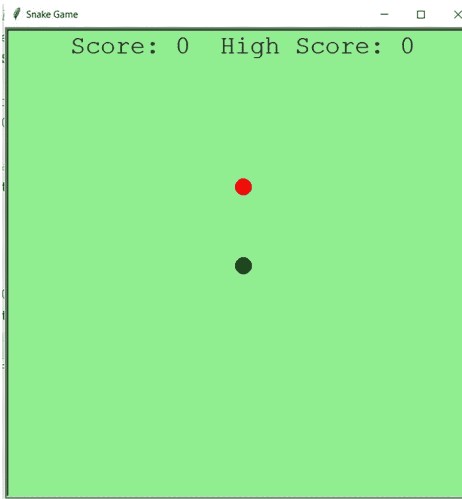

图 开始屏幕

让我们编程看看这个游戏是如何实现的。我们将在这里简要描述我们的方法：

### 步骤 1：导入库

```python
import turtle
import time
import random
import threading
```

### 步骤 2：设置初始值

```python
delay = 0.1
final = 0
# Score
flag = 0
score = 0
high_score = 0
a, b, n, m = 0, 0, 0, 0
z, i, t, eat = 0, 0, 0, 0
```

### 步骤 3：设置屏幕

```python
ts = turtle.Screen()
wid, hgt = 600, 600
# Turns off the screen updates
ts.tracer(0)
```

### 步骤 4：创建蛇头

```python
head = turtle.Turtle()
head.penup()
head.shape("square")
head.color("white")
head.direction = "stop"
st = 1
```

### 步骤 5：创建蛇的食物（圆球）

```python
food_1 = turtle.Turtle()
food_1.penup()
food_1.shape("circle")
food_1.color("red")
a1 = food_1.xcor()
b1 = food_1.ycor()

ff = 0
food_2 = turtle.Turtle()
food_2.penup()
food_2.shape("circle")
food_2.color("blue")
segments = []
```

### 步骤 6：创建欢迎屏幕

```python
# Pen
load = turtle.Turtle()
load.penup()
load.hideturtle()
load.speed(0)
load.color("white")
load.write("Welcome to Snake Game!\nPress any key to start.", align="center", font=("Courier", 24, "normal"))

draw = turtle.Turtle()
draw.penup()
draw.hideturtle()
draw.speed(0)
draw.color("white")
draw.write("Welcome to my world!! \n New Game", align="center", font=("Courier", 18, "normal"))

draw.clear()
draw.write("0 High Score: New", align="center", font=("Courier", 18, "normal"))
```

### 步骤 7：编写控制方向的函数

```python
def go_up():
    if head.direction != "down":
        head.direction = "up"

def go_down():
    if head.direction != "up":
        head.direction = "down"

def go_left():
    if head.direction != "right":
        head.direction = "left"

def go_right():
    if head.direction != "left":
        head.direction = "right"

def move():
    if head.direction == "up":
        y = head.ycor()
        head.sety(y + 20)
    if head.direction == "down":
        y = head.ycor()
        head.sety(y - 20)
    if head.direction == "left":
        x = head.xcor()
        head.setx(x - 20)
    if head.direction == "right":
        x = head.xcor()
        head.setx(x + 20)

def coll_border():
    global score, delay, head, z, final
    if head.xcor() > 280 or head.xcor() < -280 or head.ycor() > 260 or head.ycor() < -260:
        z = 1
        final = score
        score = 0
        # Reset the delay
        delay = 0.1

def coll_food():
    global delay, score, high_score, food_1, head, a, b, flag, i, m, n, t, eat, a1, b1

    for j in segments:
        if j.distance(a1, b1) < 20:
            pass

    if head.distance(food_1) < 50 or head.distance(food_2) < 50:
        if head.distance(food_1) < 20:
            # Move the food to a random spot
            a1 = food_1.xcor()
            b1 = food_1.ycor()
            a = random.randint(-280, 280)
            b = random.randint(-260, 260)
            food_1.goto(a, b)

            # Shorten the delay
            delay -= 0.001

            # Increase the score
            score += 10

            if score > high_score:
                high_score = score

            if flag != 1:
                ran = random.randint(1, 10)

            if i % ran == 0 and i % 70 == 0 and i != 0 and head.xcor() != 0:
                while True:
                    m = random.randint(-280, 280)
                    n = random.randint(-260, 260)
                    if m != food_1.xcor() and n != food_1.ycor():
                        t = 1
                        flag = 1
                        break

            if flag == 1:
                if head.distance(food_2) < 20:
                    # Move the food to a random spot
                    flag = 0
                    t = 0
                    eat = 1
                    # Shorten the delay
                    delay -= 0.001

                    # Increase the score
                    score += 20

                    if score > high_score:
                        high_score = score

def coll_body():
    global z, score, delay, segments, final
    for segment in segments:
        if segment.distance(head) < 20:
            z = 1
            # Reset the score
            final = score
            score = 0
            # Reset the delay
            delay = 0.1

def do1():
    global z
    head.direction = "stop"
    # time.sleep(1)

    for i in segments:
        i.goto(1000, 1000)
    segments.clear()

    draw.clear()
    ts.update()

    draw.write("Game Over!! \n New Game", align="center", font=("Courier", 18, "normal"))

    # score = 0
    draw.clear()
    draw.write("Score: {} High Score: {}".format(score, high_score), align="center", font=("Courier", 18, "normal"))
    draw.write("New Game", align="center", font=("Courier", 18, "normal"))
    z = 0

def do2():
    global a, b, a1, b1

    # last.goto(a1, b1)
    food_1.goto(a, b)

    # Add a segment
    new_segment = turtle.Turtle()
    new_segment.penup()
    new_segment.shape("square")
    new_segment.color("grey")
    segments.append(new_segment)
    draw.clear()
    draw.write("Score: {} High Score: {}".format(score, high_score), align="center", font=("Courier", 18, "normal"))
    draw.write("New Game", align="center", font=("Courier", 18, "normal"))
    a, b = 0, 0

    # Keyboard bindings
    ts.listen()
    ts.onkeypress(go_up, "w")
    ts.onkeypress(go_down, "s")
    ts.onkeypress(go_left, "a")
    ts.onkeypress(go_right, "d")

if __name__ == "__main__":
    while True:
        ts.update()

    t1 = threading.Thread(target=coll_border)
    t2 = threading.Thread(target=coll_food)
    t3 = threading.Thread(target=coll_body)
    t1.start()
    t2.start()
    t3.start()
    t1.join()
    t2.join()
    t3.join()
    if z == 1:
        do1()

    if a < wid:
        do2()

    if flag == 1:
        if m < hgt:
            food_2.goto(m, n)
            m = 1000
            n = 1000
            t = t + 1

    if t > 100:
        flag = 0
        t = 0

    draw.clear()
    draw.write("Score: {} High Score: {}".format(score, high_score), align="center", font=("Courier", 18, "normal"))
    draw.write("New Game", align="center", font=("Courier", 18, "normal"))

    if eat == 1:
        draw.clear()
        draw.write("Score: {} High Score: {}".format(score, high_score), align="center", font=("Courier", 18, "normal"))
        draw.write("New Game", align="center", font=("Courier", 18, "normal"))
        eat = 0

    if t != 0:
        draw.clear()
        if t:
            if ff == 0:
                if st == 1:
                    st = 2
                elif st == 2:
                    st = 3
                    ff = 1
            if st == 3:
                st = 2
            elif st == 2:
                st = 1
                ff = 0

        draw.write("HighScore:{} Score:{} Time:{}".format(high_score, score, 40 - t), align="center", font=("Courier", 18, "normal"))
        draw.write("New Game", align="center", font=("Courier", 18, "normal"))

    for index in range(len(segments) - 1, 0, -1):
        x = segments[index - 1].xcor()
        y = segments[index - 1].ycor()
        segments[index].goto(x, y)
    # Move segment 0 to where the head is
    if len(segments) > 0:
        x = head.xcor()
        y = head.ycor()
        segments[0].goto(x, y)

    if head.distance(food_1) < 20 or head.distance(food_2) < 20:
        pass

    move()
    i = i + 1
    time.sleep(delay)

    ts.mainloop()
```

我们的程序到此结束。开发这个简单而强大的游戏，实现线程概念，很有趣，不是吗？

## 结论

Python 中的线程用于同时运行多个线程（任务、函数调用）。这并不意味着它们在不同的 CPU 上执行。如果程序已经使用了 100% 的 CPU 时间，Python 线程不会让你的程序变得更快。在这种情况下，你可能需要研究并行编程。

Python 线程用于任务执行涉及某些等待的情况。一个例子是与托管在另一台计算机上的服务进行交互，例如 Web 服务器。线程允许 Python 在等待时执行其他代码；这可以使用 sleep 函数轻松模拟。

运行多个线程类似于同时运行多个不同的程序，但具有以下优势：

- 进程内的多个线程与主线程共享相同的数据空间，因此可以比独立进程更容易地共享信息或相互通信。
- 线程有时被称为轻量级进程，不需要太多的内存开销；它们比进程更经济。
- 线程有一个开始、一个执行序列和一个结束。它有一个指令指针，用于跟踪其上下文内当前正在运行的位置。
- 它可以被抢占（中断）。
- 它可以在其他线程运行时暂时挂起（也称为休眠）；这被称为让出。

总之，多线程是通过同时运行多个任务来提高应用程序性能的有用方法。它可以在硬件和软件层面实现，并有助于提高程序的效率。

现在，是时候为我们的工作增添一些色彩了。在下一章中，我们将介绍构建交互式仪表板。交互式仪表板很重要，因为它允许用户快速高效地洞察其数据。通过仪表板，用户可以快速以简单易读的图形可视化其数据。这使他们能够快速发现趋势、异常值或任何其他可能无法仅通过查看原始数据表格或列表明显看出的模式。

加入我们书籍的 Discord 空间

加入书籍的 Discord 工作区，获取最新更新、优惠、全球科技动态、新书发布以及与作者的交流会：

https://discord.bponline.com


## 第 8 章

## 使用 Jupyter Notebook 构建交互式仪表板

数据驱动的仪表板是释放强大洞察力的关键，这些洞察力可以推动成功。

> —— 萨提亚·纳德拉，微软首席执行官

## 简介

仪表板是分析业务数据的最佳方式，因为它们以易于理解的视觉格式提供全面的概述。仪表板以易于消化的方式呈现数据，并可以提供在查看原始数据时可能不明显的洞察。仪表板还提供了一个交互式平台，允许用户深入查看数据，查看更详细的信息或创建报告。仪表板可以自定义以显示与业务最相关的数据，使用户能够快速识别问题并做出明智的决策。它们还提供了一种跟踪随时间变化的绩效的方式，使企业能够快速识别趋势变化或绩效差距。

Jupyter Notebook 与 VS Code 的结合是创建交互式仪表板的强大组合。使用 Jupyter Notebook，你可以轻松创建和共享包含实时代码、方程式、可视化和解释性文本的文档。

## 结构

在本章中，我们将讨论以下主题：

- Jupyter Notebook 简介
- 在 VS Code 上设置 Jupyter Notebook 环境
- 在 Jupyter Notebook 中使用小部件和可视化
- 使用小部件和可视化开发示例程序
- 项目：Covid-19 交互式仪表板

## 目标

本章的目标是向你介绍 VS Code 上的 Jupyter Notebook，并使用小部件创建交互式仪表板。在本章中，我们将学习创建一个 COVID-19 仪表板，该仪表板可以帮助我们快速轻松地访问、理解和分享有关冠状病毒大流行的信息。在此过程中，我们将了解 Matplotlib、Seaborn 等库以及 Panel 和 Voila 等仪表板框架。我们还将学习连接数据源、在使用前清理数据，并执行探索性数据分析以更深入地了解数据。

## Jupyter Notebook 简介

Jupyter Notebook 是一个基于 Web 的开源工具，允许你创建和共享包含实时代码、方程式、可视化和叙述性文本的文档。它支持多种编程语言，包括 Python、R、Julia 和 Scala，广泛应用于数据科学、科学计算和机器学习。它被一些世界领先的公司用于支持其数据科学和机器学习工作流程。Jupyter Notebook 提供了一个交互式环境，具有多种功能，包括以下内容：

- 代码执行：你可以直接在浏览器中执行代码并实时查看结果。
- 可视化：支持丰富的图形输出，包括交互式图表和地图。
- 协作：Jupyter Notebook 支持协作，允许多个用户在同一个笔记本上工作。
- 笔记本共享：你可以通过网络或电子邮件与他人共享你的笔记本。
- 文档：你可以直接在笔记本中编写叙述性文本、方程式和其他信息，使记录和共享你的工作更容易。

总的来说，Jupyter Notebook 是数据科学、科学计算和机器学习的强大工具。它易于使用，允许协作，并能快速原型设计和测试想法。

## 在 VS Code 上设置 Jupyter Notebook 环境

你可以在 Visual Studio Code 中使用 Jupyter Notebook。Visual Studio Code 有一个用于 Jupyter Notebooks 的扩展，允许你轻松创建和编辑 Jupyter Notebooks。此扩展允许你直接从 Visual Studio Code 轻松访问 Jupyter Notebook 环境，使处理大型笔记本和复杂代码变得更容易。

以下是在 VS Code 中安装 Jupyter Notebook 的步骤：

1. 打开 Visual Studio Code。
2. 导航到左侧边栏的“扩展”选项卡（或按 Ctrl + Shift + X）。
3. 在搜索栏中搜索 Jupyter。
4. 从结果列表中选择 Jupyter 扩展，然后单击“安装”。
5. 安装完成后，单击“重新加载”以激活扩展。
6. 按 Ctrl + Shift + P 打开命令面板。
7. 在命令面板中，输入 Jupyter 并选择“Jupyter：启动笔记本”选项。
8. 选择一个目录来保存笔记本，为其命名，然后单击“创建”。
9. 将打开一个新选项卡，其中包含 Jupyter Notebook，如图 8.1 所示。

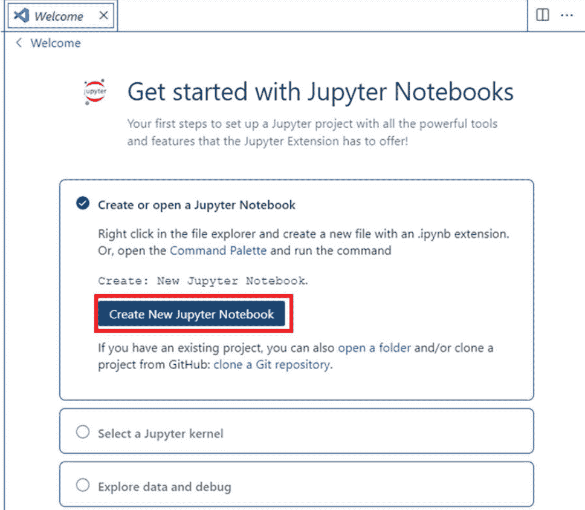

图 8.1：在 VS Code 上启动 Jupyter notebook

你将看到一个创建新 Jupyter notebook 的选项，如图 8.1 所示。单击“创建新的 Jupyter Notebook”以创建一个新文件并将其保存为 .ipynb 文件。

然后，在新创建的 Jupyter Notebook 的单元格中编写程序代码。

要执行程序，请按笔记本顶部的“运行”按钮。

程序将被执行，你将能够在输出单元格中看到输出。示例程序和输出如图 8.2 所示。

保存笔记本。

运行的程序将如下图所示：

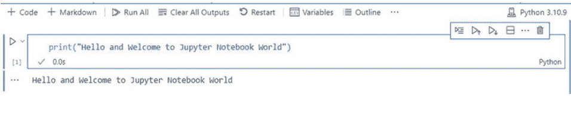

图 8.2：在 VS Code 上的 Jupyter notebook 中运行的示例程序

现在我们已经准备好在 VS Code 中使用 Jupyter Notebook。

注意：如果你使用的是 macOS，提到的安装步骤可能会略有不同。在 macOS 上，创建一个虚拟环境（venv），然后安装 Jupyter 包。成功安装后，你就可以执行 Jupyter Notebook 了。

## 在 Jupyter Notebook 中使用小部件和可视化

小部件是 Jupyter Notebooks 中的交互式元素，允许用户实时操作和可视化数据。通过使用小部件，用户可以与可视化、图表和图像交互；过滤和排序数据；甚至控制代码的执行。小部件是 ipywidgets 库的一部分，当你安装 Jupyter Notebook 时会自动安装。它们易于使用，只需很少的代码即可快速构建交互式应用程序。此外，小部件可以与 matplotlib、pandas 和 scikit-learn 等其他库一起使用。它们允许用户控制其代码的行为和正在处理的数据的可视化，使探索和理解数据变得更容易。

你需要导入 ipywidgets 才能在程序中使用这些小部件。如果在运行小部件程序时遇到模块未找到错误，你将需要安装 ipywidgets 库。请按照以下步骤安装该库：

1. 安装：在 VS Code 中打开集成终端（终端 > 新建终端或 Ctrl + `）并运行以下命令：

```
pip install ipywidgets
```

2. 启用：在终端中，运行此命令：

```
jupyter nbextension enable --py --sys-prefix widgetsnbextension
```

3. 重启内核：最后，你需要重启内核以确保扩展正确加载。在笔记本中，打开“内核”菜单并选择“重启”。

## 使用小部件和可视化开发示例程序

在本节中，我们将开发一个连接小部件和可视化的示例程序。

## 问题陈述

我们需要显示该国五个主要城市征收的市政税总额。征收的税款比例为……为了柱状图，我们将添加一个滑块，以便根据滑块上选择的多个值更新图表。让我们看看代码：

```python
import ipywidgets as widgets
import matplotlib.pyplot as plt

# Define data
x_data = ['City 1', 'City 2', 'City 3', 'City 4', 'City 5']
y_data = [100, 200, 300, 400, 500]  # initial value

# Define a slider widget
slider_wid = widgets.IntSlider(min=1, max=10, step=1, value=1)

# Define a function to update the graph when slider value changes
def update_graph(change):
    val = change['new']
    plt.clf()
    plt.bar(x_data, [element * val for element in y_data])
    plt.title('Tax Collection (Rs)')
    plt.show()

# Call the function when the slider value changes
slider_wid.observe(update_graph, names='value')

# Display the slider
display(slider_wid)
```

## 解释

前面的代码创建了一个包含五个数据点的柱状图，并将其与一个滑块 ipywidget 链接以控制柱状图。首先，导入必要的库，例如 matplotlib 和 ipywidgets。其次，创建 x 轴和 y 轴数据集。第三步是使用 IntSlider 函数创建滑块小部件。此函数接收滑块的最小值和最大值、步长、读出格式和其他参数。在第四步中，我们有 update_graph() 函数来绘制柱状图。最后，使用小部件的 observe() 方法将图表链接到滑块。observe() 方法接收 update_graph 函数名称和来自滑块的值作为参数，并调用 update_graph 函数来绘制柱状图，该函数接收滑块的值。图 8.5 通过柱状图说明了解释：

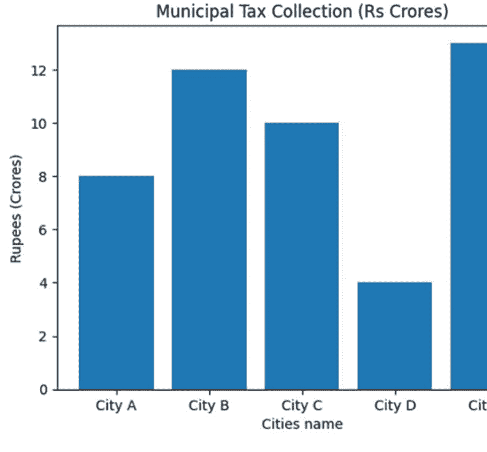

图 8.5：与 ipywidget 链接的数据可视化示例

## Matplotlib 库

Matplotlib 是一个用于在 Python 中创建静态、动画和交互式可视化的综合库。它提供了大量不同的绘图功能，例如折线图、条形图、直方图和散点图。它还能够创建 3D 图和伪彩色图。Matplotlib 被设计为一个灵活而强大的工具，用于创建各种可视化。它具有高度可定制性，并提供了许多选项来控制图表的外观和感觉。例如，它允许用户选择颜色、线宽、字体属性，甚至图表的布局。

除了基本的绘图功能外，Matplotlib 还提供了许多其他功能。这些功能包括使用注释和标签自定义图表的能力，以及以各种格式（如 PDF、SVG 和 EPS）导出图表的能力。它还支持对数和半对数图，并提供了创建等高线图的几种选项。Matplotlib 还提供了用于创建统计图的各种函数，例如箱线图、小提琴图和核密度估计图。它还能够创建动画和交互式图表，并可用于生成交互式 Web 应用程序。

在下一节中，我们将获取公共数据并创建一个用于跟踪 Covid-19 病例的仪表板。

## 项目：Covid-19 交互式仪表板

在本节中，我们将构建 Covid-19 仪表板，以全面概述 Covid-19 大流行。该仪表板将提供从 CSV 文件中获取的最新大流行数据的可视化表示，使用户能够轻松快速地分析和跟踪病毒的传播。仪表板将显示一系列指标，包括全球范围内与病毒相关的确诊病例数、活跃病例数、康复病例数和死亡病例数。该仪表板的设计既易于使用又信息丰富，为用户提供对抗病毒当前状况的详细概述。对于任何希望了解全球大流行最新信息的人来说，这个仪表板都可以成为宝贵的资源。

让我们一步一步地构建仪表板。

## 使用 Panel 构建交互式仪表板

Panel 是一个开源 Python 库，允许你在 Jupyter Notebooks 中创建交互式仪表板和数据可视化。它是数据探索和分析的强大工具。Jupyter notebook 提供了一种简单而强大的方式来创建交互式仪表板以及其他数据驱动应用程序。虽然 Panel 相对较新，但它已经被用于创建一些令人印象深刻的仪表板和应用程序。它是在 Jupyter notebooks 中创建交互式、数据驱动仪表板的绝佳工具。请按照以下步骤使用 Panel 创建仪表板：

导入所需的库

如果尚未安装，现在是时候安装了。在导入以下库之前，我们需要使用 pip 命令安装以下库：seaborn 和……例如，要安装……，你可以使用以下命令：

```
pip install matplotlib
```

现在，你可以开始导入它们，如下所示：

```python
import pandas as pd
import numpy as np
import panel as pn
import matplotlib.pyplot as plt
import seaborn as sns
import plotly.graph_objs as go
import plotly.express as px
from numerize import numerize
pn.extension('tabulator')
import hvplot.pandas
import geopandas as gpd
```

读取数据集（Covid 和疫苗）

```python
# cache data to improve dashboard performance
if 'data' not in pn.state.cache.keys():
    df = pd.read_csv('WHO-COVID-19-global-table-data.csv')
    pn.state.cache['data'] = df.copy()
else:
    df = pn.state.cache['data']

df_vaccination = pd.read_csv('vaccination-data.csv')
df_vaccination.shape
```

使 DataFrame 管道交互化

```python
idf = df.interactive()
```

理解数据和内容

WHO-Covid 19 数据：

```python
df.describe()
```

疫苗数据：

```python
df_vaccination.shape
df_vaccination.describe()
```

执行数据清洗

WHO-Covid 19 数据：

```python
# Check null values in each column in percentage
```

## 此热力图展示了WHO Covid 19数据中的空值列

```python
sns.heatmap(df.isnull(),
```

上述代码的输出如图所示

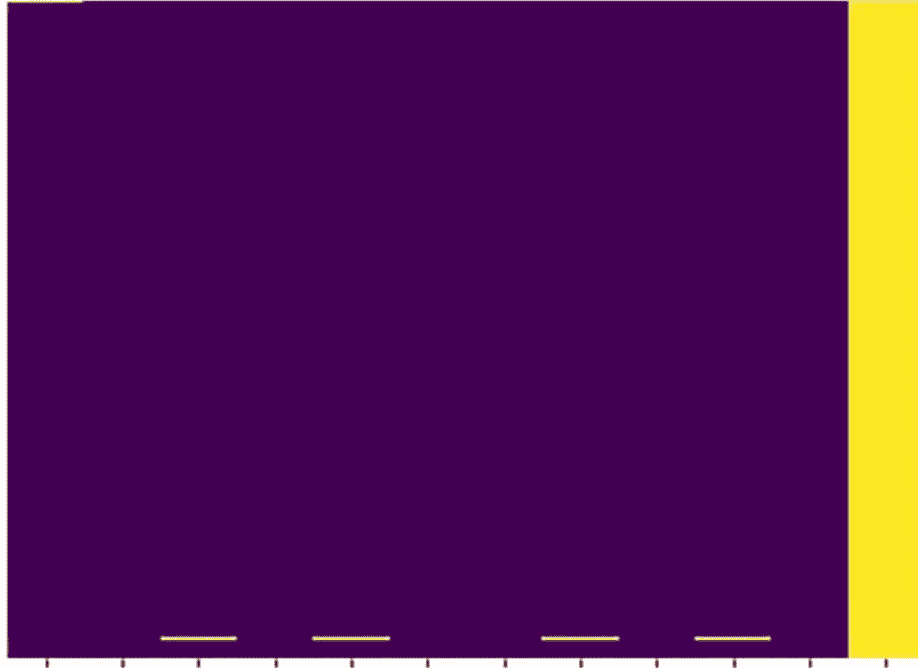

- 名称
- WHO区域
- 病例 - 累计总数
- 病例 - 每10万人口累计总数
- 病例 - 过去7天新增报告
- 病例 - 过去7天每10万人口新增报告
- 病例 - 过去24小时新增报告
- 死亡 - 累计总数
- 死亡 - 每10万人口累计总数
- 死亡 - 过去7天新增报告
- 死亡 - 过去7天每10万人口新增报告
- 死亡 - 过去24小时新增报告

图 8.6：显示WHO Covid 19数据集中缺失列的热力图

删除几乎为空值的列：

```python
df.drop(columns=['newly reported in last 24 inplace = True
```

现在，让我们删除具有空值的行：

```python
# 以百分比检查每列中的空值
df.isnull().sum() / len(df) * 100
```

现在所有列都已清除空值，你将得到如图所示的输出

```
Name                                        0.0
WHO Region                                  0.0
Cases - cumulative total                    0.0
Cases - cumulative total per 100000 population 0.0
Cases - newly reported in last 7 days       0.0
Cases - newly reported in last 7 days per 100000 population 0.0
Cases - newly reported in last 24 hours     0.0
Deaths - cumulative total                   0.0
Deaths - cumulative total per 100000 population 0.0
Deaths - newly reported in last 7 days      0.0
Deaths - newly reported in last 7 days per 100000 population 0.0
dtype: float64
```

图 8.7：清理WHO Covid 19数据集后每列中的空值

获取区域名称的唯一列表：

```python
country_list = df['Name'].unique()
```

```python
country_list
```

现在查看列：

```python
df.columns
```

对已导入的疫苗数据进行数据清洗：

```python
# 以百分比检查每列中的空值
df_vaccination.isnull().sum() / len(df_vaccination) * 100
```

```python
# 此热力图展示了空值列
sns.heatmap(df_vaccination.isnull(),
```

图 8.8 显示了热力图输出：

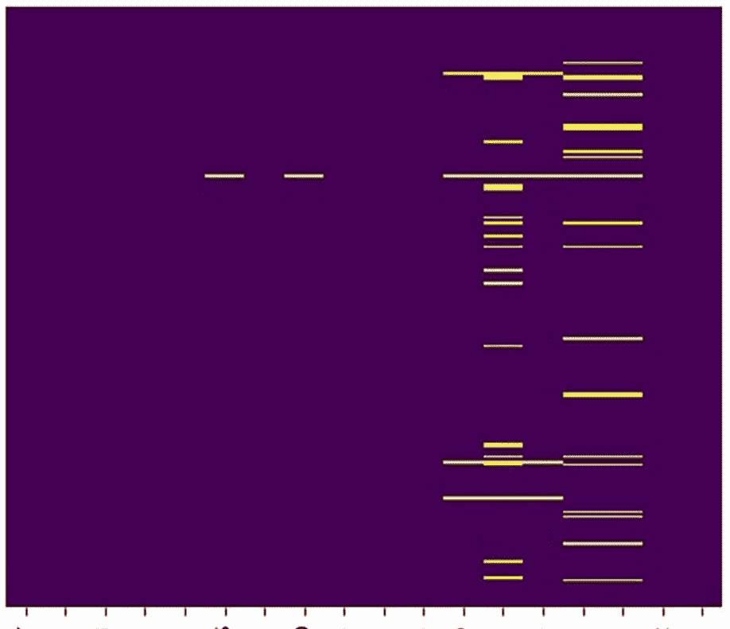

- 国家
- ISO3代码
- WHO区域
- 数据来源
- 更新日期
- 总接种量
- 接种1剂以上人数
- 每100人总接种量
- 每100人接种1剂以上人数
- 完全接种人数
- 每100人完全接种人数
- 使用的疫苗
- 首次接种日期
- 使用的疫苗类型数量
- 加强针接种人数
- 每100人加强针接种人数
- 纬度
- 经度

图 8.8：显示疫苗数据集中缺失列的热力图

删除所有具有空值的行：

```python
df_vaccination.dropna(inplace=True)
```

```python
vacinated_country_list = df_vaccination['COUNTRY'].unique()
```

```python
df_vaccination.columns
```

执行数据可视化

第一个可视化：

```python
# 在Hvplot中创建条形图
colors = {
    'Western': '#1f77b4',
    'Eastern': '#ff7f0e',
    'South-East': '#ff595e'
}

def get_color(region):
    return colors.get(region, 'gray')

rot = 45

# 各区域的病例情况
plot_bars_1()
```

图 8.9 显示了我们得到的第一个可视化：

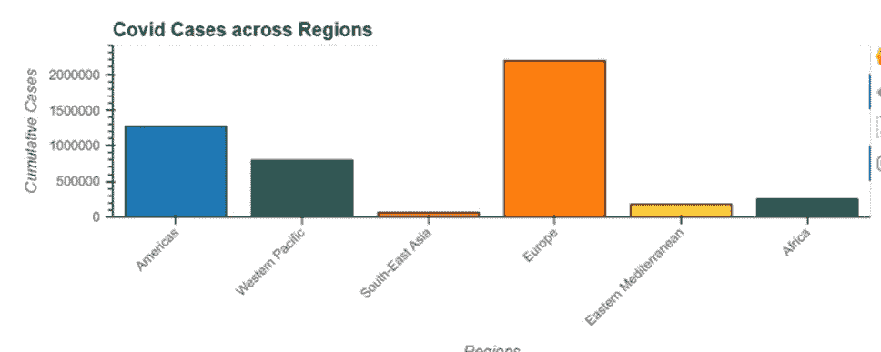

图 8.9：第一个可视化，即显示各区域累计病例的条形图

第二个可视化：

```python
# 在Hvplot中创建条形图
colors = {
    'Western': '#1f77b4',
    'Eastern': '#ff7f0e',
    'South-East': '#ff595e'
}

def get_color(region):
    return colors.get(region, 'gray')

rot = 45

# 各区域的死亡病例
plot_bars_2()
```

下图将是我们得到的第二个可视化：

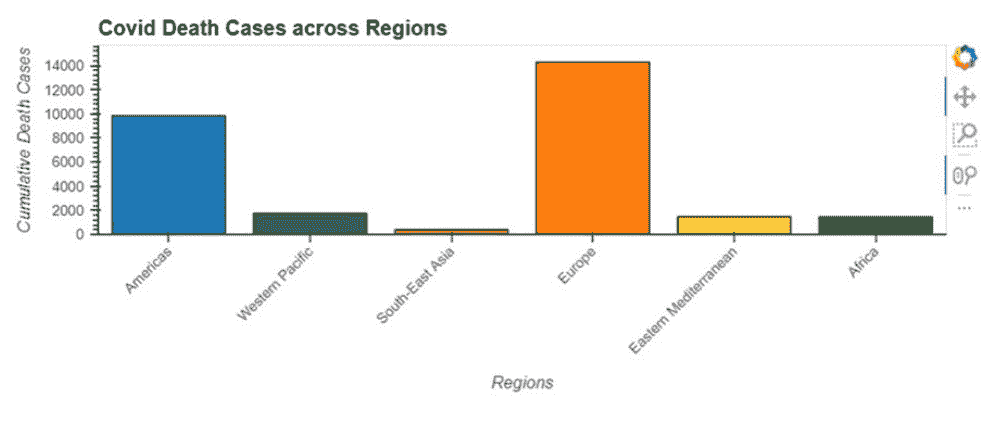

图 8.10：第二个可视化，即显示各区域累计死亡病例的条形图

第三个可视化：

```python
columns = list(df.columns[1:-1])
x = pn.widgets.Select(value='Cases - cumulative total', options=columns, name='x')
y = pn.widgets.Select(value='Deaths - cumulative total', options=columns, name='y')
scatter_plot = pn.Row(pn.Column('## Covid Scatter Plot', x, y),
    pn.bind(df.hvplot.scatter, x, y, by='Name', width=1190, height=500))
scatter_plot.show()
```

第三个可视化是使用Panel小部件创建的，它将在Web浏览器中显示；因此，上述代码将打开一个Web浏览器，如下所示：

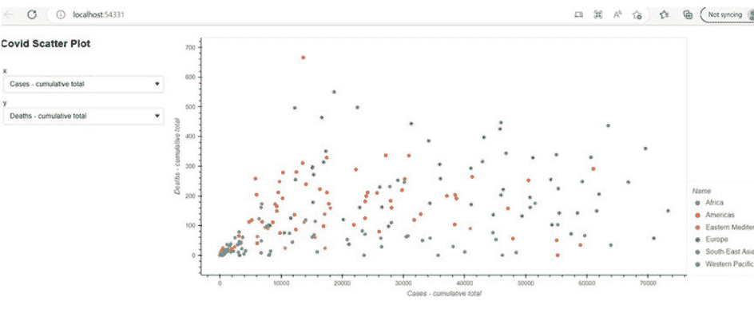

图 8.11：第三个可视化，即显示各区域病例与死亡关系的散点图

准备使用Panel创建仪表板

```python
# 卡片1 - 总接种人数
TOTAL_VACCINATION = df_vaccination.TOTAL_VACCINATIONS.sum()

# 卡片2 - 完全接种人数
FULLY_VACCINATED_PEOPLE = df_vaccination.PERSONS_FULLY_VACCINATED.sum()

# 卡片3 - 总加强针接种人数
TOTAL_BOOSTER_DOSE = df_vaccination.PERSONS_BOOSTER_ADD_DOSE.sum()

# 卡片4 - 总康复人数
TOTAL_PEOPLE_RECOVERED = df.TOTAL_PEOPLE_RECOVERED.sum()

TOTAL_VACCINATION = numerize.numerize(TOTAL_VACCINATION)
FULLY_VACCINATED_PEOPLE = numerize.numerize(FULLY_VACCINATED_PEOPLE)
TOTAL_BOOSTER_DOSE = numerize.numerize(TOTAL_BOOSTER_DOSE)
TOTAL_PEOPLE_RECOVERED = numerize.numerize(TOTAL_PEOPLE_RECOVERED)

table = pd.DataFrame({
    '指标': ['总接种完成量', '完全接种人数', '总加强针完成量', '总康复人口'],
    '值': [TOTAL_VACCINATION, FULLY_VACCINATED_PEOPLE, TOTAL_BOOSTER_DOSE, TOTAL_PEOPLE_RECOVERED]
})

vaccination_vs_country_bar = df_vaccination.hvplot.bar(x='COUNTRY', y='TOTAL_VACCINATIONS', height=400, rot=45)
```

使用Panel创建仪表板

```python
# 使用模板进行布局
from panel.template import DarkTheme

template = pn.template.MaterialTemplate(title='Covid-19 仪表板', theme=DarkTheme)

template.sidebar.extend([
    pn.pane.Markdown("总接种完成量 : " + TOTAL_VACCINATION),
    pn.pane.Markdown("完全接种人数 : " + FULLY_VACCINATED_PEOPLE),
    pn.pane.Markdown("总加强针完成量 : " + TOTAL_BOOSTER_DOSE),
    pn.pane.Markdown("总康复人口 : " + TOTAL_PEOPLE_RECOVERED),
])

template.main.extend([
    pn.Row(plot_bars_1(), plot_bars_2()),
    pn.Row(vaccination_vs_country_bar),
    pn.Row(scatter_plot),
])

template.servable()
```

这将启动服务器，你将收到一条类似以下的消息：

在 http://localhost:65185 启动服务器

点击该URL将启动如图所示的仪表板

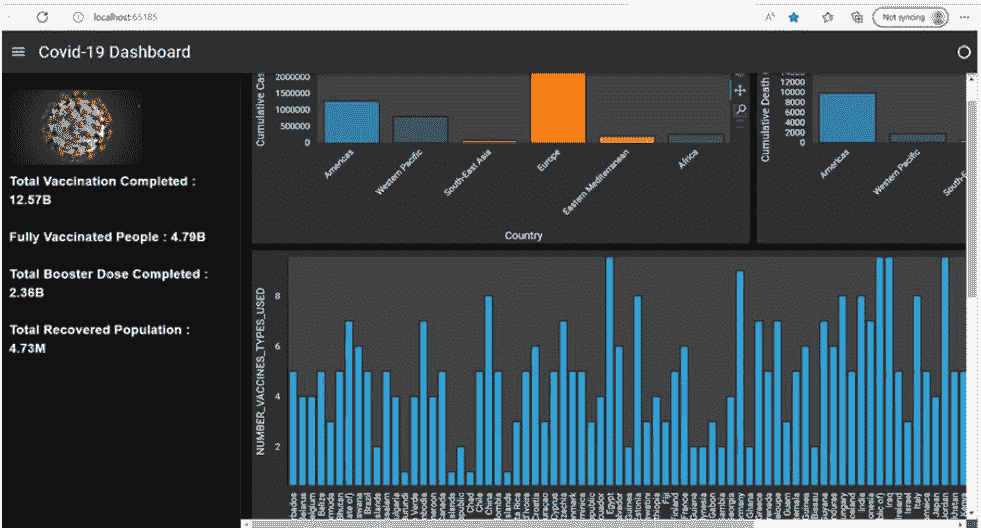

图 8.12：仪表板视图

## 使用Voila的交互式仪表板

在Jupyter Notebook中创建仪表板时，Voila是首选，因为它提供了一个交互式环境，用于在Jupyter Notebook中构建和共享交互式仪表板。Voila允许用户利用Jupyter Notebook的强大功能，将他们的数据、代码和叙述结合成单一的交互式体验。它还提供了对交互式小部件的广泛支持，这使得创建交互式仪表板变得容易，无需编写任何代码。最后，Voila具有高度可扩展性，允许用户自定义其仪表板的外观和感觉。

在本节中，我们将使用小部件和地图构建另一个仪表板，并使用Voila显示。首先，在继续以下代码之前，需要安装folium库：

导入库

```python
import folium
from ipywidgets import Layout
import ipywidgets as widgets
import matplotlib.pyplot as plt
from folium import plugins
from ipywidgets import Layout
import pandas as pd
import seaborn as sns
import numpy as np
```

Folium库将提供对folium地图的访问，我们将使用疫苗数据中给出的纬度和经度值来绘制这些地图

检查数据集

```python
df_vaccination = pd.read_csv('vaccination_data.csv')
df_vaccination.shape
df_vaccination.describe()
```

执行与上一节相同的分析集。

执行数据清洗

检查并删除数据集中的空值：

```python
# 以百分比检查每列中的空值
df_vaccination.isnull().sum() / len(df_vaccination) * 100
```

```python
# 此热力图展示了空值列
sns.heatmap(df_vaccination.isnull())
```

```python
country = widgets.SelectMultiple(
    options=unique_country.tolist(),
    value=[],
    layout=Layout(width='50%', height='200px')
)

category = widgets.SelectMultiple(
    options=unique_region.tolist(),
    value=[],
    layout=Layout(width='50%', height='200px')
)
```

## 创建 Update() 函数

添加更新函数以读取控件中的更改并更新仪表板：

```python
def update_map(country, category):
    # Filter the dataframe based on the selected country and category
    df_filtered = df_vaccination[
        (df_vaccination['COUNTRY'] == country) &
        (df_vaccination['CATEGORY'] == category)
    ]

    # Get unique values for the widgets
    latitude = 60
    longitude = 20
    df_country = df_filtered['COUNTRY'].unique()
    df_category = df_filtered['CATEGORY'].unique()
    cat_unique = df_filtered['WHO_REGION'].unique()
    country_unique = df_filtered['COUNTRY'].unique()

    # Create the figure and axes
    fig, (ax1, ax2) = plt.subplots(1, 2, figsize=(15, 6))

    # Create map and display it
    country_map = folium.Map(location=[latitude, longitude], zoom_start=2)
    country_count = plugins.MarkerCluster().add_to(country_map)

    # Loop through the dataframe and add each data point to the mark cluster
    for lat, lng, label in zip(df_filtered['LATITUDE'], df_filtered['LONGITUDE'], df_filtered['COUNTRY']):
        folium.Marker(
            location=[lat, lng],
            popup=label
        ).add_to(country_count)

    # Show map
    display(country_map)

    # Bar graph to show Fully Vaccinated Person per 100
    ax2.bar(country_unique, df_filtered['DOSES_ADMINISTERED_PER100'])
    ax2.set_title('Vaccinated Person per 100')
    ax2.set_xlabel('Country')
    ax2.set_ylabel('Vaccinated Person per 100')
    plt.xticks(rotation=45)
    plt.tight_layout()
    plt.show()
```

执行仪表板

使用 `ipywidgets` 的 `interactive()` 函数显示仪表板：

```python
widgets.interactive(update_map, country=country_unique, category=cat_unique)
```

仪表板将如下图所示。图 8.13 显示了选择控件。图 8.14 显示了世界 folium 地图，图 8.15 显示了与选择控件关联的条形图：

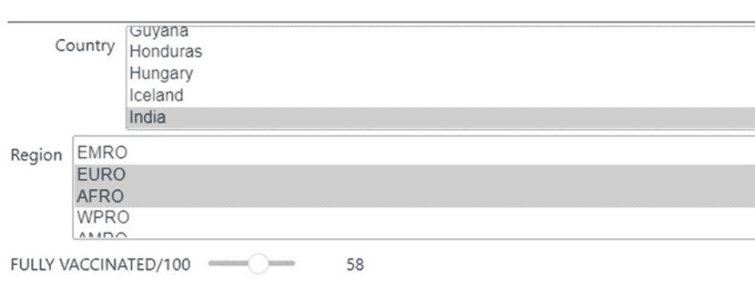

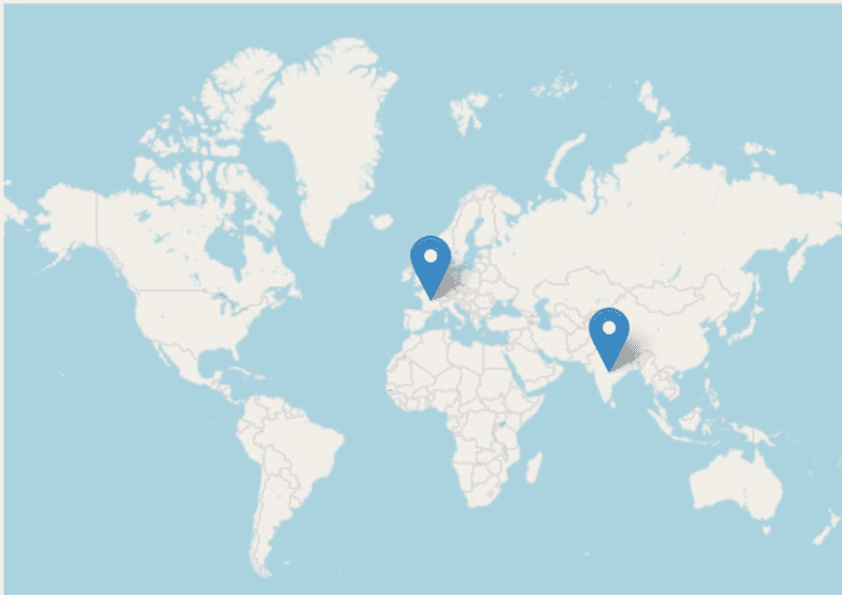

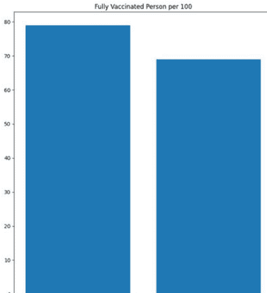

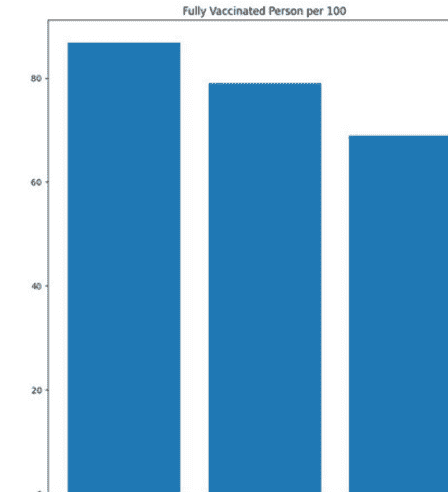

使用 Voila 展示仪表板

如果您尚未安装 `voila` 库，则必须在导出仪表板之前安装它。

安装库：在终端中，输入以下命令：

```bash
pip install voila
```

然后，在终端中运行以下命令以在 Web 浏览器中启动仪表板：

```bash
voila path/to/your/notebookfilename.ipynb
```

除了我们之前使用的 Panel 和 Voila，Python 中还有两个流行的仪表板框架：Streamlit 和 Plotly Dash。鼓励读者也练习这两个框架。以下是简要描述，以帮助理解这些框架：

- **Streamlit**：它将 Python 脚本转换为交互式仪表板应用程序，这些应用程序也可以共享。
- **Dash**：Dash 构建在一个用于创建交互式、基于 Web 的数据可视化的 JavaScript 库之上。使用 Dash，用户可以创建交互式、数据驱动的仪表板和数据可视化，这些内容具有响应性，并且在任何设备上看起来都很棒。Dash 还提供了广泛的用户友好功能，例如拖放式 GUI、内置用户身份验证以及一系列强大的数据处理和绘图工具。
- **Voilà**：它将 Jupyter Notebook 转换为独立的交互式基于 Web 的仪表板应用程序，并包含探索性数据分析阶段。
- **Panel**：它是一个灵活的仪表板框架，在 Python 脚本文件和 Jupyter Notebook 中的工作方式相同。

## 结论

在本章中，我们学习了如何使用 Jupyter Notebook 并创建交互式且可共享的仪表板。仪表板使我们能够快速识别病例高度集中的区域、比较国家并跟踪干预措施的影响。创建 COVID-19 仪表板并非易事；它需要仔细的规划、数据收集和分析。确保仪表板中包含的数据和信息准确且最新非常重要。此外，确保仪表板用户友好且易于理解也很重要，因为它应该面向广泛的受众。

总的来说，这个仪表板为用户提供了关于 COVID-19 全球传播的交互式和详细视图。它是了解当前情况和跟踪病毒进展的有用工具。

在下一章中，您将学习如何使用 VS Code 界面在 Jupyter Notebook 中进行编辑和调试。这将包括设置断点、检查变量以及创建和管理启动配置。

加入我们书籍的 Discord 空间

加入书籍的 Discord 工作区，获取最新更新、优惠、全球科技动态、新书发布以及与作者的交流会：

https://discord.bpbonline.com


## 第 9 章：编辑和调试 Jupyter Notebook

> 程序测试可以用来显示错误的存在，但永远不能用来显示错误的不存在。
>
> — Edsger W. Dijkstra，计算机科学家

## 简介

编辑和调试是编写计算机代码时需要完成的两项重要任务。编辑是纠正代码中的错误并使其更具可读性，而调试是查找和修复代码中错误的过程。在第 8 章《Jupyter Covid-19 交互式仪表板》中，我们使用 Jupyter Notebook 构建了一个应用程序，现在我们将学习如何在 Visual Studio Code (VS Code) 中调试 Jupyter Notebook 程序。

本章介绍了在 VS Code 中调试 Jupyter Notebook 文件的过程。调试是任何软件专业人员必备的技能，而 Jupyter Notebook 是一个流行的开源工具，用于交互式计算、数据分析和科学计算。VS Code 是一个流行的源代码编辑器，具有广泛的功能和扩展，使其成为调试 Jupyter Notebook 文件的绝佳选择。

本章涵盖了在 VS Code 中调试 Jupyter Notebook 文件的基础知识。首先，我们将讨论为调试配置 VS Code 的基础知识。这包括设置断点、检查变量以及创建和管理启动配置。然后，我们将讨论如何在 VS Code 中调试 Jupyter Notebook 文件。我们还将介绍 Python 交互式窗口和调试控制台的作用，并探讨调试技巧和最佳实践。最后，我们将讨论如何在不使用 VS Code 的情况下调试 Jupyter Notebook 文件。

## 结构

在本章中，我们将讨论以下主题：

- Jupyter Notebook 调试简介
- 错误类型
- 检查代码语法
- 验证输出

## 目标

延续上一章的交互式仪表板应用程序，在本章中，您将学习如何使用 VS Code 界面在 Jupyter Notebook 中进行编辑和调试。您将学习如何编辑和排列单元格。在 Notebook 环境中，您将了解代码补全、定义、声明和格式化等编辑功能。在本章结束时，您应该对如何在 VS Code 中调试 Jupyter Notebook 文件有扎实的理解。

## Jupyter Notebook 调试简介

一个很好的调试练习程序是经典的 FizzBuzz。它打印从 1 到 100 的数字，将任何能被 3 整除的数字替换为单词 Fizz，将任何能被 5 整除的数字替换为单词 Buzz。任何能同时被 3 和 5 整除的数字都应替换为 FizzBuzz。

这个程序足够简单易懂，又足够复杂需要调试。编写代码并进行调试将为您提供成为更好程序员所需的实践。

程序如下所示：

```python
class MyFizzBuzz:
    def __init__(self, start, end):
        self.start = start
        self.end = end

    def run(self):
        for value in range(self.start, self.end + 1):
            if value % 3 == 0 and value % 5 == 0:
                print("FizzBuzz")
            elif value % 3 == 0:
                print("Fizz")
            elif value % 5 == 0:
                print("Buzz")
            else:
                print(value)

fb = MyFizzBuzz(1, 100)
fb.run()
```

预期输出如下：

```
1
2
Fizz
4
Buzz
Fizz
...
```

**图 9.1：程序输出**

有两种方法可以调试 Jupyter Notebook：

- 逐行运行 - 一种更简单的模式
- 完整调试模式

要在任何一种模式下进行调试，请确保您满足以下条件：

- 需要安装：环境中的 ipykernel 6+
- 需要基于 Python 3.7+ 的内核
- VS Code 版本应为 v1.60+
- Jupyter 扩展版本应为 v2021.9+

按照以下步骤安装 ipykernel：

1. 打开终端并激活 Notebook 环境。
2. 运行：`pip install -U ipykernel`
3. 关闭并重新打开 VS Code。现在，当您打开 Jupyter notebook 文件时，您应该能够从内核选择器中选择刚刚安装的内核。

下拉菜单（位于笔记本界面的右上角）。如果遇到任何问题，请执行“开发者：重新加载窗口”命令并重新加载。

注意：如果您使用的是 macOS，此安装过程可能看起来有所不同。

## 逐行调试程序

“逐行运行”允许您一次执行单元格中的一行代码，而不会被其他 VS Code 调试功能分散注意力。

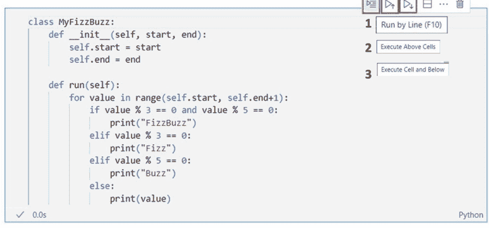

图 9.2：逐行运行选项

请按照以下步骤在 Jupyter notebook 中逐行调试程序：

首先，点击单元格工具栏中的“逐行运行”按钮。这将打开调试控制，使您能够逐行单步执行代码。

您还可以在不离开单元格的情况下设置断点、检查变量等。您可以使用相同的“逐行运行”按钮前进到代码中的下一个语句。要在单元格结束前停止，请点击“停止”按钮。要继续运行到单元格末尾，请点击工具栏中的“继续”。

通过点击“逐行运行”选项或按

启动调试器后，您会注意到另一个可用选项，即“继续执行”或使用快捷键选项

原始选项如图 9.2 所示，进行中的选项如图所示

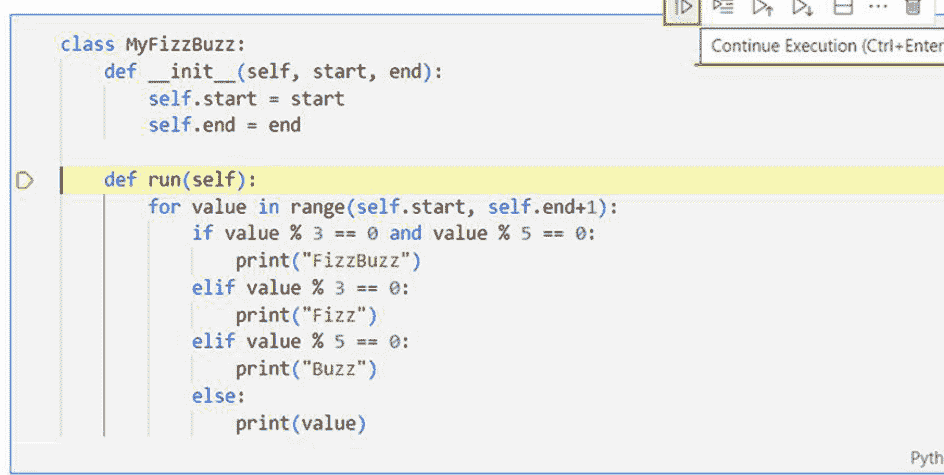

图 9.3：逐行调试进行中

请按照以下简单步骤进行调试：

按下“运行单元格”按钮运行程序。

如果程序未产生预期输出，请返回并检查程序每一行的逻辑。

如果发现任何逻辑错误，请更正它们，然后再次运行程序。

如果程序产生了预期输出，请返回并检查输入值以确保它们正确。

如果输入值不正确，请更正它们，然后再次运行程序。

如果程序仍然没有产生预期输出，请使用 `print()` 语句打印程序每一步的中间结果。这将帮助您识别错误。

一旦识别出错误，请更正它，然后再次运行程序。

如果程序产生了预期输出，您可以确信该程序已成功调试。

## 完整调试选项

可以使用 VS Code 支持的全套调试功能。此处可用的一些功能包括断点、单步进入其他单元格的能力以及单步进入导入模块的能力。

请按照以下步骤彻底调试程序：

打开 VSCode 和包含您要调试的代码的 Python 文件。

点击窗口顶部的“调试”选项卡，如图所示

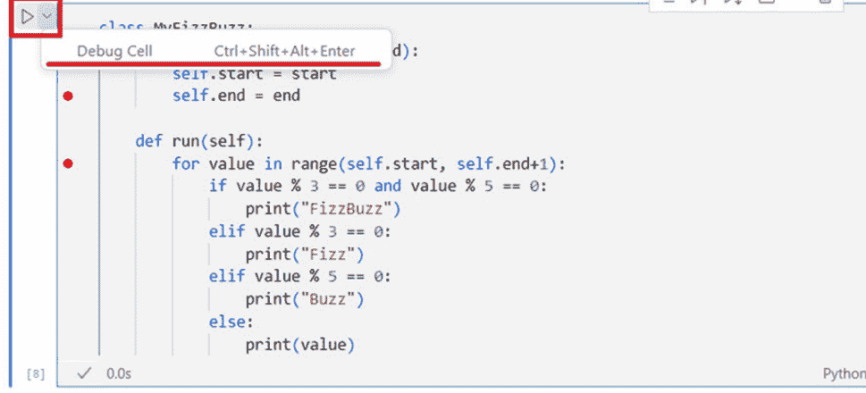

图 9.4：启动完整调试的选项

在“调试”选项卡上，从下拉列表中选择“Python：附加到 Jupyter 内核”。

点击绿色播放按钮启动调试器。

通过点击代码编辑器的左侧边栏在代码中设置断点。

在 Jupyter 中运行代码，调试器将在遇到断点时暂停。

如果您是 VS Code 新手，您会在这里看到许多新内容，如图所示

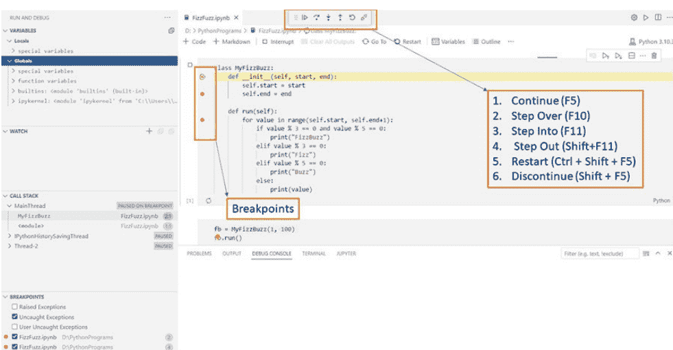

图 9.5：完整调试选项运行中

让我们理解它们以明确其用途。

变量窗格：您可以轻松检查调试进行过程中创建的变量。您可以看到存储了当前值的所有变量列表。您还可以看到全局变量和局部变量之间的区别。局部变量是作用域有限的变量，例如函数中的变量。

监视：此窗格类似于变量窗格的子集，仅显示您感兴趣的变量，而不是整个列表。当我们将鼠标悬停在窗格上时，可以通过点击 + 图标将您感兴趣的变量添加到监视窗格。监视窗格是仅监视和监控那些似乎不工作的变量的好方法。

调用堆栈：考虑这样一种情况：您有多个内部方法需要调试，以精确到达抛出错误或未按预期工作的代码行。调用堆栈窗格在此类情况下有助于导航到存储函数输出的堆栈数据结构深处，并通过精确识别错误来源区域来提供帮助。

我们之前也讨论过，断点是调试中一个非常重要的概念。在正常执行中，您不会定义或指定任何断点，因为您希望程序无任何停顿地运行并给我们期望的结果。但是当出现错误时，执行会在导致错误的行停止。然而，在调试时，您可能希望更早地控制程序的执行，并在特定点监视变量的状态，以了解可能导致错误的原因。因此，您只需点击编辑器中行号的左侧即可设置断点。创建的断点将由一个红点指示，类似于我们在图中看到的。使用断点运行脚本的优点是它会在断点处停止，并观察程序发生了什么。

使用调试器控件逐行单步执行代码、检查变量和计算表达式。此处可用的其他选项如下所列：

-   它执行当前函数中的下一行代码。如果没有下一行代码，执行将跳转到当前函数之外的下一个语句。
-   单步进入：它执行当前函数中的下一行代码。如果遇到函数或方法调用，调试器将进入该函数或方法的代码。
-   单步跳过：它执行当前函数中的下一行代码。如果遇到函数或方法调用，调试器将执行该行代码而不进入该函数或方法的代码。
-   单步退出：它退出当前函数并执行函数之外的下一行代码。
-   设置断点：它在指定的代码行设置一个断点。调试器将在到达断点时暂停程序的执行。
-   清除断点：它从指定的代码行移除断点。调试器在到达断点时将不再暂停程序的执行。

完成后，点击红色停止按钮结束调试会话。

您可以像在 VS Code 中通常那样使用调试工具栏中的“调试”和其他选项。

我们学习了添加断点并使用它们来检查程序状态。重要的是要知道 VS Code 有三种不同类型的断点，每种都有不同的用途。要选择其中一种，首先需要创建一个普通断点，然后右键单击它并选择“编辑”，如图所示

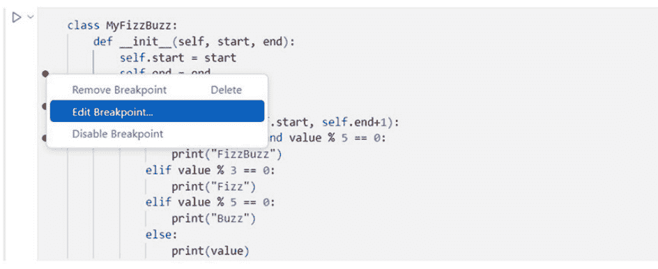

图 创建断点后可用的断点选项

现在，让我们理解不同类型断点的目的和特点：

-   表达式：这是普通断点，当条件满足时触发并停止代码执行。条件可以在监视窗格或变量窗格中看到。您可以设置代码在满足给定条件时停止执行。此外，这种类型的断点的特点是在断点红点中有“=”。表达式断点允许您基于表达式设置断点。此表达式可以是变量、对象或函数。当表达式计算结果为真时，断点将被触发。表达式断点可以在调试器中设置，并与其他类型的断点结合使用。图 9.7 展示了如何添加表达式断点：

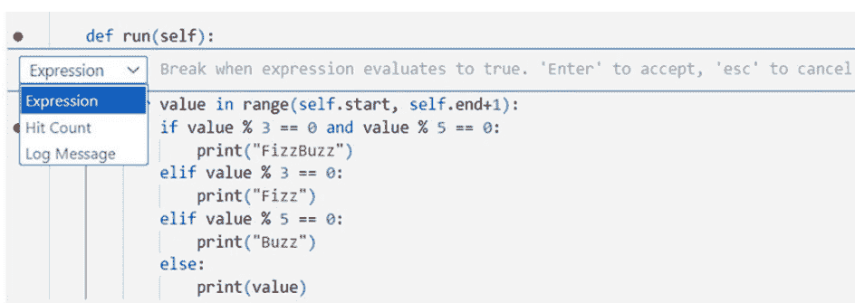

图 9.7：可供选择的断点类型选项

-   命中次数：命中次数断点允许您设置一个断点，该断点将在某行代码执行一定次数后触发。此断点对于调试包含循环或执行固定次数的代码很有帮助。

-   日志消息：日志消息断点允许您设置一个断点，该断点将在控制台记录特定消息时触发。这种类型的断点有助于监控程序进度或调试与特定消息相关的问题。日志消息断点可以在调试器中设置，并与其他类型的断点结合使用。此断点不会停止执行；相反，它用于在调试控制台中打印一些消息到日志。

可以通过右键单击断点并选择“禁用”来禁用断点

这些是在 VS Code 中调试 Jupyter Python 程序的不同可用选项。

## 错误类型

Python程序中的错误发生在程序遇到超出其处理能力的意外情况时。这些错误可能源于语法问题、运行时问题或逻辑缺陷。程序员和开发者通常会犯三种类型的错误：

语法错误是最基本的错误类型，当程序员未能遵循语言的正确语法时就会发生。这类错误在代码运行时会产生语法错误异常。语法错误的例子包括缺少括号、缩进不正确以及关键字拼写错误。

运行时错误发生在代码语法正确但无法正确执行时。这些错误通常发生在代码尝试执行其无法完成的操作时，例如除以零。这些错误在代码运行时会产生运行时错误异常。

逻辑错误发生在代码语法正确且执行时未产生任何运行时错误，但结果并非预期的情况。这些错误通常是由代码中的逻辑不正确或对数据的错误假设引起的。这类错误通常难以追踪和修复。

现在，我们已经了解了可能发生的错误类型，接下来让我们看看如何在Python中进行调试。

## 检查代码语法

在调试Python程序时，你可以采取一些基本步骤来检查代码语法并识别任何错误。

检查缩进：Python依赖缩进来表示代码块和函数的范围。因此，确保所有缩进正确非常重要。如果缩进有任何错误，你的程序可能无法按预期运行。

检查变量名：确保所有变量名正确并与正确的对象匹配非常重要。这有助于避免尝试为不存在的变量赋值等错误。

检查语法：确保程序中的所有语法正确。这包括确保所有标点符号、括号和引号都在正确的位置。

检查逻辑：确保程序的逻辑合理。这包括确保循环正确运行且条件被正确检查。

检查函数：确保所有函数都被正确调用并返回预期的结果。

Jupyter通过突出显示代码中的错误来帮助修复大多数这些问题。

## 验证输出

始终通过提供已知值来测试程序的输出，并验证其是否正常工作。在测试时，请确保牢记以下技术：

功能测试：功能测试通常通过手动执行应用程序并验证是否产生预期结果来进行。功能测试通常涉及手动和自动化测试的组合，例如测试脚本，以确保系统的各个方面都经过测试。

算法测试：算法测试用于评估一个人逻辑思考和解决复杂问题的能力。检查逻辑是否已正确且高效地实现。

正向测试：正向测试是一种软件测试形式，旨在验证系统或应用程序的功能是否符合其预定规范。它涉及使用有效输入测试系统，以查看是否产生预期输出。正向测试，也称为确认测试，用于确保系统按预期工作。

负向测试：负向测试是一种软件测试类型，涉及通过提供无效或意外输入来测试系统，以确保系统正确处理输入。这种测试有助于确保系统能够检测无效输入并做出相应响应。负向测试通常用于识别边界条件、输入验证中的错误以及意外的系统行为。

边界测试：边界测试（或边缘案例测试）验证当输入处于有效输入范围的边界时程序或系统的行为。这些测试旨在检查当给定略超出正常输入范围的值时系统的行为。

调试可能是一个复杂的过程，但通过实践会变得更容易。我们建议一些简单的技巧，以便轻松调试你的程序：

- 使用打印语句：打印语句是Python调试中最有用的工具之一。通过在代码中添加打印语句，你可以查看正在发生的事情并确定错误发生的位置。
- 使用调试器：调试器是一种允许你逐行执行代码的工具，这有助于你准确识别错误发生的位置。
- 检查拼写错误：拼写错误通常是错误的原因。在运行代码之前，请务必仔细检查是否有任何拼写错误。
- 简化代码：如果你难以找到错误，请尝试简化代码。这意味着删除任何不必要的代码，并使代码尽可能简单。

有了这些技巧，你可以快速高效地调试代码！

## 结论

在本章中，我们了解了在VS Code中运行的Jupyter Notebook中调试的基础知识。调试是查找和修复程序中错误的过程。编程中编辑和调试的目的是确保代码无错误并遵循语言的语法。编辑还使代码更具可读性，让其他人更容易理解。使用VS Code调试Jupyter Notebook文件是查找和修复代码中错误的好方法。VS Code提供了一个交互式调试环境，你可以在其中设置断点、检查变量、查看堆栈跟踪并逐步执行代码。它还与Jupyter Notebook集成，允许你也在Jupyter Notebook中调试代码。

通过使用VS Code进行调试，你可以快速轻松地查找和修复Jupyter Notebook文件中的错误。

在下一章中，我们将使用Tkinter构建图形用户界面应用程序。Tkinter是一个用于构建GUI的Python库。它提供了一组用于创建窗口、按钮、菜单、对话框等的工具和小部件。Tkinter包含在标准Python发行版中，易于学习和使用，使其成为Python中GUI开发的热门选择。

## 第10章

## 使用VS Code掌握Tkinter GUI功能

图形用户界面是人与计算机之间的接触点，其设计应让人们能够充分利用他们的机器。

> — 约翰·前田，一位受欢迎的当代美国平面设计师，同时也是一位著名的作家和计算机科学家。

## 简介

Tkinter是一个Python库，允许Python应用程序创建图形用户界面。它是Tcl/Tk之上的一个轻量级面向对象层。Tcl/Tk是一个开源、跨平台的GUI工具包，提供强大的GUI元素，如按钮、标签、框架和菜单。它通常用于创建图形用户界面、快速原型设计和脚本编写。Tkinter提供各种控件，如按钮、标签和文本框，用于图形用户界面中与用户交互。它是Python中最受欢迎且易于使用的GUI库，使其成为开发桌面应用程序的绝佳选择。

Tkinter提供各种小部件，如标签、按钮、框架、复选框、单选按钮、列表框和滚动条。这些小部件用作构建图形用户界面的构建块。它们可用于创建具有图形界面的交互式应用程序。小部件可以使用各种布局管理器（如pack、grid和place）在窗口中排列。Tkinter还提供了一种将事件绑定到用户界面元素的机制，例如鼠标点击、按键和其他事件。

Tkinter因其简单易用而成为Python中开发GUI应用程序的热门选择。它也作为标准Python发行版的一部分提供，使得在Python中创建图形用户界面变得容易。它还得到了广泛的第三方库和资源的良好支持。

## 结构

本章我们将讨论以下主题：

-   Tkinter 简介
-   理解 Tkinter 控件
-   处理 Tkinter 事件
-   使用 Tkinter 创建菜单和工具栏
-   开发一个应用程序：一个测验游戏

## 目标

学习 Python 中 Tkinter 的目标是理解如何使用 Tkinter 包开发图形用户界面和控件。通过学习 Tkinter，你将能够创建更具交互性和用户友好的程序以满足你的需求。此外，你将理解面向对象编程的基本原理，这对于创建图形用户界面至关重要。

## Tkinter 简介

窗口是 Tkinter 的基础元素。Tkinter 窗口的一些特性如下所列：

Tkinter 中的窗口是一个包含图形窗口的对象。

它是主窗口对象，并提供对所有其他窗口对象和控件的访问。

它提供了创建和操作所有类型控件的方法，例如按钮、标签、菜单和框架。

它允许创建复杂的图形用户界面。

控件是用于创建图形用户界面的组件，例如按钮、标签和文本框。控件用于与用户交互、显示信息以及管理图形用户界面的布局。

让我们用一个窗口和几个控件来构建我们的第一个图形用户界面程序。但在此之前，我们需要导入 Tkinter。

### 步骤 1：导入 Tkinter 模块

你可以在 Visual Studio Code (VS Code) 中通过在终端中进入项目目录并输入以下命令来导入 Tkinter 模块：

```
pip install tkinter
```

这将在你的项目目录中安装 Tkinter 模块。然后，你可以在 Python 文件的顶部输入以下内容来导入该模块：

```
import tkinter
```

### 步骤 2：创建第一个图形用户界面程序

创建你的 Python 文件；代码的第一行应如下所示：

```
import tkinter as tk
```

接下来，你需要创建一个窗口，它是 Tkinter 的 Tk 类的一个实例。使用以下代码，你可以创建一个新窗口并将其赋值给变量 `my_window`，并添加标签和按钮控件：

```
import tkinter

#Create the main window
my_window = tkinter.Tk()

#set window size
#widthxheight

#Set window title
TKinter GUI capabilities using VS

#Create a label
label = tkinter.Label(my_window, is a sample
```

```
label.pack()

#Create a button
button = tkinter.Button(my_window, Here to
button.pack()

#Start the mainloop
my_window.mainloop()
```

在前面的代码中，你可以看到我们使用 `geometry()` 方法将窗口大小设置为 300 x 300 像素。`title()` 方法用于设置出现在顶部的窗口标题。这在输出中可以看到，如图所示。程序的最后一行是为了运行 Tkinter 事件循环。此方法无限运行，并监听可能触发的任何事件，例如按钮点击。你在图 10.1 中看到的窗口出现在 Windows 机器上。外观会根据操作系统而变化。

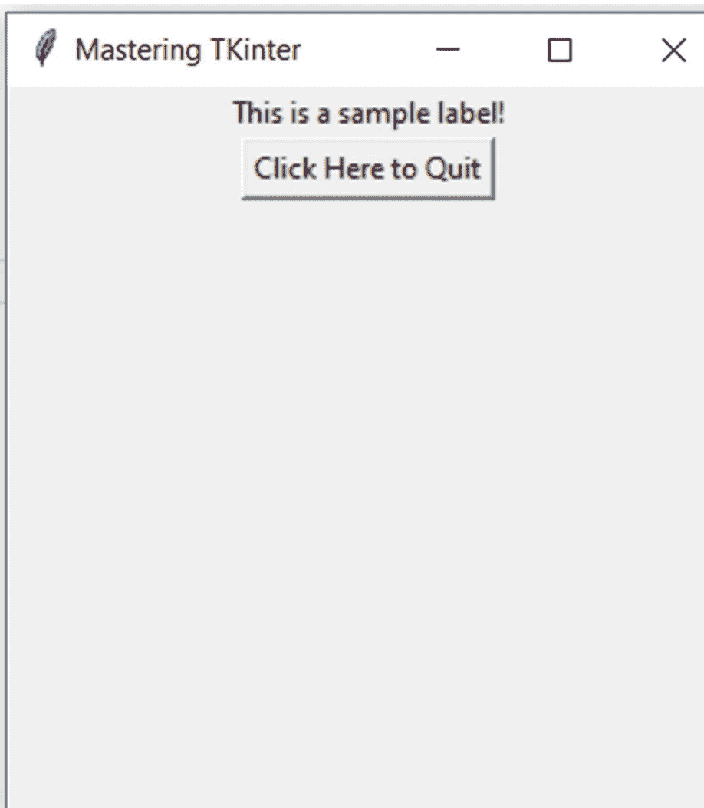

图 10.1：Tkinter 窗口（在 Windows 上）

我们在这个例子中添加了基本控件。在下一节中，我们将学习更多关于控件的知识。

## 理解 Tkinter 控件

Tkinter 提供了多种多样的控件，可用于构建图形用户界面。这些控件用于在 Python 中创建交互式应用程序。要创建控件，你必须首先使用 `Tk()` 函数创建一个窗口，然后使用其构造函数创建控件。最后，你可以将控件添加到窗口并将其绑定到一个函数。一些常用的 Tkinter 控件如下：

-   Button：用于创建按钮的控件，可用于执行命令或执行操作。
-   Label：用于显示静态文本或图像的控件。
-   Checkbutton：用于创建复选框的控件，可用于选择或取消选择一个选项。
-   Entry：用于创建单行文本输入字段的控件。
-   Listbox：用于创建项目列表的控件，用户可以从中选择一个或多个给定选项。
-   Menu：用于创建带有下拉菜单的菜单栏的控件。
-   Message：用于显示多行文本消息的控件。
-   Radiobutton：用于创建单选按钮的控件，可用于从一组选项中选择一个选项。
-   Scale：用于创建滑块的控件，可用于在刻度上设置一个值。
-   Scrollbar：用于创建滚动条的控件，可用于滚动浏览项目列表。
-   Text：用于创建多行文本输入字段的控件。

一旦窗口创建完成，你就可以使用控件的构造函数创建一个 Tkinter 控件。例如，要创建一个按钮控件，你可以使用以下代码：

```
button = tkinter.Button(root, text="Click Me!")
```

构造函数的第一个参数是父窗口（在本例中是根窗口），第二个参数是配置控件的选项字典。控件创建完成后，你可以使用 `grid()` 或 `pack()` 方法将其添加到窗口。看看这个例子：

```
button.grid(row=0, column=0)
```

这将把按钮添加到窗口的指定行和列。下一步是添加功能。我们将在下一节“处理 Tkinter 事件”中讨论这一点。

让我们构建一个迷你示例，我们将添加不同的控件。在下一节讨论事件时，我们将为此示例添加事件，同样，在讨论菜单和工具栏时，我们将添加一个菜单栏。

我们将首先导入所需的包：

```
import tkinter
import tkinter.messagebox as msgbox
```

现在，我们将添加包含控件的驱动代码：

```
if __name__
root = tkinter.Tk()
and Analysis
createmenu(root) #we will add the tool bar in this function later

root_label0 = tkinter.Label(root, Database Alpha

root_label1 = tkinter.Label(root, Username:
root_e1 = tkinter.Entry(root, # Display in text form

root_label2 = tkinter.Label(root, Password:
root_e2 = tkinter.Entry(root, # Display in ciphertext form

root_label3 = tkinter.Label(root, Digit Access Key:
root_e3 = tkinter.Entry(root, # Display in text form

root_label02 = tkinter.Label(root, Database Beta

root_label12 = tkinter.Label(root, Username:
root_e12 = tkinter.Entry(root, # Display in text form

root_label22 = tkinter.Label(root, Password:
```

```
root_e22 = tkinter.Entry(root, # Display in ciphertext form
```

```
#Check button
chkbutton_Var1 = tkinter.IntVar()
chkbutton_Var2 = tkinter.IntVar()
```

```
ChkBttn = = "Select
```

```
ChkBttn2 = tkinter.Checkbutton(root, text = "Select
```

```
#Radio button
radiobutton_Var1 = tkinter.StringVar()
RBttn = tkinter.Radiobutton(root, Step
RBttn2 = tkinter.Radiobutton(root, Step
```

```
#Scale implementation
scale_label1 = tkinter.Label(root, your rating (1-10):
scale_var1 = tkinter.DoubleVar()
scale = tkinter.Scale(root,
```

```
#Scrollbar linked to a Listbox
scrollbar = tkinter.Scrollbar(root)
```

```
mylist = tkinter.Listbox(root,
for line in
mylist.insert(tkinter.END, "This is line number " +
```

```
#Save info
root_button1 = tkinter.Button(root, my info for this
```

```
root.mainloop()
```

前面的代码将显示一个窗口，其中添加了所有控件，如图所示。

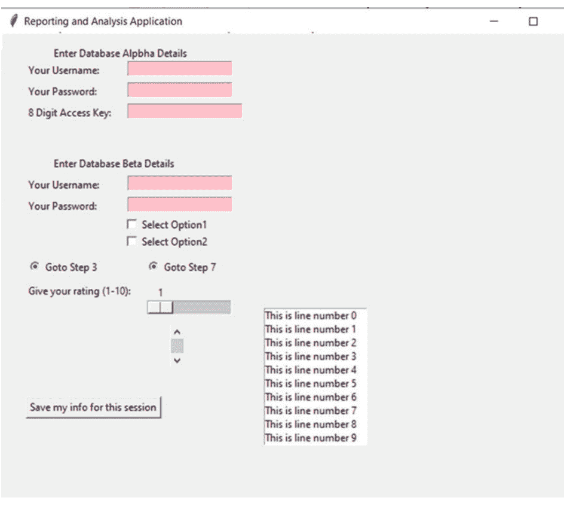

图 10.2：添加到窗口的多个 Tkinter 控件

在前面的示例中，我们添加了标签、文本框、按钮、复选框、单选按钮、列表框、滑块和滚动条。在最后一行，你会看到按钮调用了一个函数，我们将在“处理 Tkinter 事件”部分实现该函数。

注意：如果你使用的是 macOS，此应用程序的外观可能有所不同。

## 处理 Tkinter 事件

事件是任何图形用户界面应用程序的重要组成部分，因为它们允许用户与应用程序交互。在本节中，我们将学习如何使用 Tkinter 事件来创建交互式应用程序。事件是用户或系统可以生成的用户操作。用户事件的示例包括鼠标点击、鼠标移动和键盘按键。系统事件，例如计时器事件或窗口大小更改，由系统生成。事件可以触发应用程序中的更改，例如更新显示或更改应用程序的状态。

Tkinter 提供了多种处理事件的方法。`bind()` 方法用于将事件绑定到一个函数或方法，以便在事件发生时执行。`bind_all()` 方法用于将事件绑定到应用程序中的所有控件。`event_generate()` 方法用于以编程方式生成事件。

## bind() 方法

`bind()` 方法用于将事件绑定到特定控件。其语法如下：

```
widget.bind(event, handler)
```

在前面的示例中，`widget` 是要绑定事件的控件，`event` 变量接收事件名称，而 `handler` 是在事件发生时要执行的函数或方法。事件名称是一个表示事件类型的字符串，例如表示鼠标点击或回车键。

让我们看一个示例，用于捕获键盘上的任何按键。在这个示例中，我们创建了一个按钮控件，然后使用 `bind(,button_function)` 来检测键盘上的任何按键：

```
import tkinter
import random

#Create the main window
my_window = tkinter.Tk()
#set window size
#Create button
button = tkinter.Button(my_window, Any Key on
def
score is:

button_function)
```

```
#Start the mainloop
my_window.mainloop()
```

## bind_all() 方法

`bind_all()` 方法用于将事件绑定到应用程序中的所有控件。其语法如下：

```
root.bind_all(event, handler)
```

这里，`root` 是应用程序的根窗口，`event` 是事件名称，`handler` 是在事件发生时要执行的函数或方法。

## event_generate() 方法

`event_generate()` 方法用于以编程方式生成事件。其语法如下：

```
widget.event_generate(event, **options)
```

在前面的示例中，给定的 `widget` 是要生成事件的控件，`event` 变量接收事件名称，而 `options` 是可选的关键字参数。

让我们看一个如何使用 Tkinter 事件的示例。我们将创建一个简单的应用程序，当用户点击窗口时打印鼠标的坐标：

```
import tkinter as tk
#First, let's create the window and set the title:
root = tk.Tk()

#Next, we will define a function to handle the mouse click event:
def
# Get the coordinates of the mouse click
x = event.x
y = event.y
at x, y)

#Finally, we will bind the mouse click event to the window and start the main loop:
on_click)
root.mainloop()
```

输出：

Clicked at 138 53

Clicked at 125 69

Clicked at 54 105

Clicked at 58 50

当用户点击窗口时，鼠标点击的坐标将打印在控制台中。

现在，让我们回到我们在上一节开始构建的小项目。首先，添加一个虚拟事件，我们将把它链接到所有控件，以表明我们仍在添加代码。随着我们的进展，我们将用相应事件的代码替换这个虚拟事件代码。

```
def
a sample function to handle all the
```

现在让我们完成由主程序调用的函数：

```
def
alphausername = root_e1.get()
alphapassword = root_e2.get()
alphakey = root_e3.get()
betausername = root_e12.get()
```

```
betapassword = root_e22.get()
text_disp = ""
if>
text_disp += "Beta Username:
if>
text_disp += ", Beta Password:

if>
text_disp += ", Alpha Username:
if>
text_disp += ", Alpha Password:
if>

text_disp += " and Alpha Key:

if chkbutton_Var1.get() ==
text_disp += ", \n Option 1 selected"
if chkbutton_Var2.get() ==
text_disp += ", \n Option 2 selected"

if
text_disp += ", Goto step 3 selected"
if
text_disp += ", Goto step 7 selected"

if
text_disp += ", Rating given:
#get list of selected items:
for i in mylist.curselection():
text_disp += ",

if<
```

```
text_disp = "NONE"
```

```
"Following information have been saved for the current session only: + text_disp)
```

前面的代码将在点击“保存所有信息”按钮时被调用。此函数演示了我们如何从不同的控件读取值。这将打开一个消息框，其中的信息看起来像图

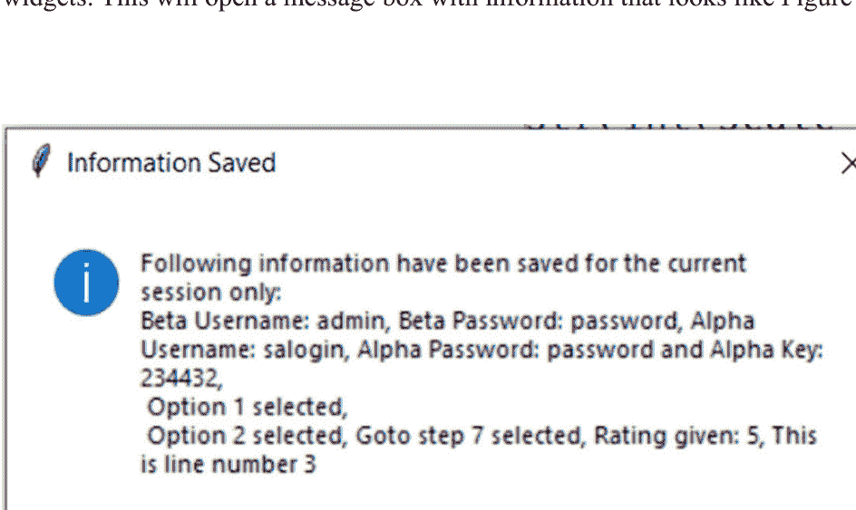

图 10.3：使用事件从控件捕获值

现在让我们继续下一节，添加工具栏。

## 使用 Tkinter 创建菜单和工具栏

菜单和工具栏是任何 GUI 的基本组成部分。它们为用户提供了一种导航程序、访问重要功能和执行任务的方式。本节将教我们如何使用 Tkinter（标准的 Python GUI 工具包）创建菜单和工具栏。我们将介绍创建菜单和工具栏的基础知识，并学习如何添加项目和自定义外观。在本教程结束时，你应该能更好地理解如何使用 Tkinter 创建和自定义菜单和工具栏。

一旦我们使用 `Tk()` 函数创建了一个窗口对象，我们将使用这个窗口对象来创建我们的菜单。要创建菜单，我们必须首先创建一个 `Menu` 对象。这可以使用以下代码行完成：

```
menu = Menu(window)
```

`Menu` 对象接受一个参数，即我们之前创建的窗口对象。一旦创建了 `Menu` 对象，我们就可以使用 `add_command()` 方法添加项目。此方法接受两个参数：一个 `label`，这是将在菜单上显示的字符串；以及一个 `command`，这是在选择项目时将调用的函数。例如，要创建一个带有“打开”标签和 `open_file()` 命令的项目，我们将使用以下代码行：

```
menu.add_command(label="Open", command=open_file)
```

我们还可以使用 `add_separator()` 方法向菜单添加分隔符。此方法不接受任何参数。一旦所有项目都已添加到菜单中，我们就可以使用窗口对象的 `configure()` 方法来显示它。此方法接受一个参数，即我们之前创建的菜单对象。

例如，要在窗口上显示菜单，我们将使用以下代码行：

```
window.configure(menu=menu)
```

## 使用 Tkinter 创建工具栏

使用 Tkinter 创建工具栏就像创建菜单一样。要创建工具栏，我们必须首先创建一个 `Toolbar` 对象。这可以使用以下代码行完成：

```
toolbar = Toolbar(window)
```

`Toolbar` 对象接受一个参数，即我们之前创建的窗口对象。一旦创建了 `Toolbar` 对象，我们就可以使用 `add_button()` 方法添加按钮。此方法接受三个参数：一个 `image`，这是用作按钮图标的位图图像；一个 `command`，这是在点击按钮时将调用的函数；以及一个 `tooltip`，这是当用户将鼠标悬停在按钮上时将显示的字符串。

例如，要创建一个带有图像 `icon.gif`、命令 `open_file` 和工具提示“打开文件”的按钮，我们将使用以下代码行：

```
toolbar.add_button(image="icon.gif", command=open_file, tooltip="Open File")
```

一旦所有按钮都已添加到工具栏中，我们就可以使用窗口对象的 `configure()` 方法来显示所有这些按钮。此方法接受一个参数，即我们之前创建的工具栏对象。例如，要在窗口上显示工具栏，我们将使用以下代码行：

```
window.configure(toolbar=toolbar)
```

## 自定义菜单和工具栏

一旦创建了菜单和工具栏，就可以使用 `configure()` 方法根据用户需求进行自定义。此方法接受两个参数：一个 `option`，这是指定要配置的选项的字符串；以及一个 `value`，这是要为该选项设置的值。例如，要将菜单的字体大小设置为 12，我们将使用以下代码行：

```
menu.configure(fontsize=12)
```

现在，让我们将注意力转向我们在过去两节中一直在构建的小项目，并添加创建工具栏的函数：

```
#Create UI Design
def
menubar = tkinter.Menu(root)
himenu = tkinter.Menu(menubar,
Demo
dcmenu = tkinter.Menu(menubar,
Demo
etmenu = tkinter.Menu(menubar,
file_new)
etmenu = tkinter.Menu(menubar,
command = run_sample)
```

```
etmenu = tkinter.Menu(menubar,
1: Bi-weekly
2: Failed
3:
4:
```

现在，让我们为“文件 -> 新建”菜单添加一个事件：

```
def
clean_ui(root) #remove the existing widgets
file_new_design() # add new set of widgets
```

`clean_ui()` 函数将如下所示：

```
#Clean UI Design
def
for widgets in root.winfo_children():
if widgets.winfo_class() !=
widgets.destroy()
```

`file_new_design()` 将添加一组新的控件：

```
def
root_label0 = tkinter.Label(root, Database Alpbha

root_label1 = tkinter.Label(root, Username:
root_e1 = tkinter.Entry(root, # Display in text form
```

## 开发应用程序：问答游戏

通过开发应用程序来学习编程是获取实践经验并培养问题解决能力的有效方式。通过编写代码和创建应用程序，你可以学会逻辑思考并开发算法来解决问题。这个过程可以帮助你理解编程的核心原理，例如变量、函数、循环和类。让我们开始吧。

## 问题陈述

本项目旨在开发一个图形用户界面问答应用程序，允许用户回答多项选择题并立即获得答案反馈。该应用程序还应为用户提供其表现的分数摘要，并允许他们轻松地在问题之间导航。此外，应用程序应提供某种动画效果，使其看起来更有趣。因此，我们将为此添加一些来自“Zango搭塔游戏”的概念。每答对一题，塔上就会增加一个方块。玩家最多有三条生命来玩游戏。

## 目标

目标是在问答节目中尽可能多地收集方块，同时避免答错问题。每答对一题，就会放置一个方块，表示玩家获得1分。除此之外，游戏还将添加以下功能：

-   接受玩家姓名作为输入。
-   跟踪得分。同时，保存最高得分及玩家姓名。
-   提供三个难度级别的题目。
-   在构建应用程序时充分利用Tkinter的最大功能。

使用Python中的Tkinter创建问答游戏节目是吸引用户并更多了解他们的好方法。只需几个简单的步骤，你就可以创建一个高度互动和引人入胜的问答游戏节目体验。

## 要求

根据给定的问题陈述和目标，以下是要求：

-   开发一个基于GUI的Tkinter问答游戏，允许用户回答问题并获得表现反馈。
-   监控表现，玩家有3条生命，每次答错生命值减少。
-   创建一个用户友好的界面，允许用户以互动方式回答多项选择题。
-   创建一个实时记分牌来显示分数。每答对一题得一分正分，答错不扣分。
-   设计游戏，使其直观易懂，适合所有年龄段的用户。
-   使用文本文件保存玩家姓名和历史最高得分者的分数详情。

## 解决方案

开发此游戏遵循的基本步骤如下：

-   定义问答游戏的问题和答案。
-   使用Tkinter库创建一个窗口并设置窗口标题。
-   创建一个Tkinter框架来容纳问答游戏的所有元素：
    -   创建一个标签来容纳问题和答案选项。
    -   创建按钮来显示选项；用户可以点击按钮选择答案。
    -   创建一个标签来显示玩家姓名、最高得分者、剩余生命数和当前记分卡。
    -   在一侧，随着分数增加，将方块堆叠显示。
-   使用MsgBox显示特定消息以宣布结果。
-   创建一个函数，从题库中随机选择问题，同时确保问题不重复。
-   在菜单栏上创建一个“退出”菜单以退出问答游戏。

## 设计

我们将创建两个屏幕：第一个用于接受姓名，第二个包含解决方案中提到的所有组件。这看起来会像图10.5。

对于这个项目，我们将创建四个文件：

`Databank.py`将包含所有问题和答案。该文件将包含三个列表，每个难度级别一个。列表的每个成员将是一个字典，用于存储问题和响应。列表看起来会像这样：

```python
level1_questions = [
    {
        'question': 'What is 5+3 equal to?',
        'choices': ['6', '7', '8', '9'],
        'answer': '8'
    },
    {
        'question': 'Sachin Tendulkar played which sport?',
        'choices': ['Cricket', 'Football', 'Tennis', 'Hockey'],
        'answer': 'Cricket'
    },
    ...
]
```

列表的每个成员有三个键：问题、4个选项的选择，以及正确答案的引用。类似地，构建`level2_questions`和`level3_questions`列表。

`MyQuizGame.py`：这是所有操作将发生的主要文件。我们将在此文件中有不同的部分，如下所示：

-   **导入模块和库：**
    我们当然会导入`tkinter`、`messagebox`，以及用于处理图像的`pillow`（PIL）和用于从题库中随机选择问题的`random`模块。还将导入`Databank`以列表形式访问题库。

-   **全局变量：**
    声明重要的全局变量，如当前分数、最高分数、生命数和玩家姓名，这些变量将可由文件的所有函数访问。

-   **变量初始化：**
    读取`MyQuizGameScore.txt`的内容，并将此内容分配给全局变量。同时，从`Databank`读取第1级问题。

-   **声明函数：**
    我们将使用以下函数：

    -   `main()`：这个主函数将使游戏持续进行。它将跟踪分数，并根据分数从第1、2或3级列表中获取问题。它不接受任何输入或返回任何值。每次运行时都会更新问题内容。此函数必须运行以使游戏持续到最后。

    -   `a_response()`、`b_response()`、`c_response()`、`d_response()`：这些函数处理选项A、B、C和D的响应（按钮点击）。每个按钮都有一个不同的关联函数，并打印答案是否正确。

    -   `check_life()`：此函数检查可用的生命数，如果生命确实大于1，则继续主逻辑；如果答案正确，则在特定位置建造塔。如果生命变为零，则游戏退出，但在此之前，它会检查当前玩家是否打破了最高分。如果是，则使用玩家姓名和分数更新`MyQuizGameScore.txt`。

    -   `gameover()`：当所有生命都失去时，调用`gameover()`函数以关闭游戏。

    -   `verify_name()`：它验证在欢迎屏幕上输入的姓名。

    -   `exit_game()`：当用户想要时，它用于结束程序。

-   **驱动代码：**
    创建两个窗口：接受姓名的主欢迎屏幕和用于玩游戏的第二个窗口。

    欢迎屏幕如图10.6所示。

    让我们为主屏幕添加一个菜单栏。在这种情况下，我们将只实现“退出”选项，但会添加一个标签以开始新游戏并保存现有游戏以供将来实现。菜单将如图10.7所示出现。

    主屏幕包含所有组件，看起来像图10.8。

    完整代码已添加在实现部分供你参考。

`MyQuizGameScore.txt`：此文件将存储最高分数信息以及姓名。最初，文件内容将如图10.9所示。每当有人得分高于之前的最高分时，此文件将自行更新。

## 实现

你已经了解了 Databank.py 的内容，本节将提供主文件的完整代码供你参考。注释中也包含了代码的详细说明。

以下是供你练习的完整代码：

在下一节中，我们将导入所需的库：

```python
from tkinter import *
import tkinter.messagebox as msgbox
from PIL import ImageTk, Image
from Databank import level1_questions, level2_questions, level3_questions
import random
import time
```

现在，让我们声明并为后续将使用的变量分配默认值，例如正确答案数量（answer）、分数追踪（score）、剩余总生命值（life）、玩家姓名、当前最高分、最高分持有者姓名等。

```python
answer = 0
score = 0
life = 3
player_name = ""
highest_score = 0
highest_name = ""
tower_height = 27
timer_text = 30
```

我们需要保存最高分详情，以便每次游戏启动时都能获取。我们将把它保存在 MyQuizGameScore.txt 文件中。如果此文件不存在，我们将创建它。

```python
try:
    with open("MyQuizGameScore.txt", "r") as hs:
        if hs.read():
            data = hs.read().split()
            highest_name = data[0]
            highest_score = int(data[1])
except:
    pass

r = random.choice(level1_questions)  # 默认第1关
```

在下一节中，我们将开发一个名为 fetching_questions() 的函数，用于追踪分数并根据分数从第1关、第2关或第3关的列表中获取问题。它不接受任何输入，也不返回任何值。每次运行此函数时，问题内容都会更新。此函数必须运行以保持游戏持续进行直到结束。fetching_questions() 函数的代码如下：

```python
def fetching_questions():
    global r, level1_questions, level2_questions, level3_questions, level2, level3

    if level1_questions.remove(r):
        if level1_questions:
            r = random.choice(level1_questions)
        else:
            "抱歉，我们的问题已用完。"
    elif score >= 5:  # 第2关
        if level2_questions:
            r = random.choice(level2_questions)
            level2_questions.remove(r)
        else:
            "抱歉，我们的问题已用完。"
    elif score >= 10:  # 第3关
        if level3_questions:
            r = random.choice(level3_questions)
            level3_questions.remove(r)
        else:
            "你已完成游戏。干得好！"
```

现在，我们将专注于编写处理答案的函数。由于我们向用户提供四个选项，因此我们将有四个函数：分别对应选项 A、B、C 和 D：

```python
def option_a():
    """处理答案响应 A，判断答案是否正确"""
    global answer
    answer = 1
    check_answer()

def option_b():
    """处理答案响应 B，判断答案是否正确"""
    global answer
    answer = 2
    check_answer()

def option_c():
    """处理答案响应 C，判断答案是否正确"""
    global answer
    answer = 3
    check_answer()

def option_d():
    """处理答案响应 D，判断答案是否正确"""
    global answer
    answer = 4
    check_answer()
```

接下来我们要编写的函数将检查可用的生命值，并确定玩家是否至少还有一条命。如果生命值变为零，则游戏结束，但在此之前它会检查当前玩家是否打破了最高分。如果是，则 MyQuizGameScore.txt 将更新玩家的姓名和分数。check_answer() 函数的代码如下：

```python
def check_answer():
    """检查可用的生命值，如果生命值确实大于1，
    则继续主逻辑；如果答案正确，则在特定位置建造塔楼。
    """
    global score, answer, life, r, current_score
    if life > 0:
        if answer == correct_answer:
            score = score + 1
            loc = score * tower_height
            canvas_tower.move(660 - loc, "正确！你的塔楼现在又高了一块。")
        else:
            "回答不正确。你失去了一条命。"
            life = life - 1
        # 继续游戏
        fetching_questions()
        canvas.itemconfig(ques, text=r["question"])
        canvas1.itemconfig(rem_life, text=f"生命值: {life}")
        current_score_canvas.itemconfig(score_current, text=f"当前分数: {score}")

        if score >= highest_score:
            with open("MyQuizGameScore.txt", "w") as f:
                f.write(f"{player_name} {score}")
```

## 生活的喜悦与挣扎

"你现在是评分最高的玩家，同时也是你游戏的终点。"

现在我们将开发两个基本函数：一个用于处理游戏结束，另一个用于启动游戏。当剩余生命值达到零时，我们通过调用 `game_over()` 来停止游戏。

对于启动游戏，我们在启动游戏前会验证玩家的姓名。

```python
def game_over():
    """当所有生命值都失去时的游戏结束函数"""
    "你也失去了第三条命。游戏结束了。"

def start_game():
    """验证欢迎屏幕上输入的姓名"""
    global player_name
    if name.get():
        player_name = name.get()
        first.destroy()
    else:
        "请输入你的姓名。"
```

现在让我们定义一个计时器函数：

```python
# 定义一个计时器。
def timer():
    p = 30.00
    t = time.time()
    n = 0
    # 当秒数小于 "p" 中定义的整数时循环
    while n - t < p:
        n = time.time()
        if n == t + p:
            timer_text = "时间到！"
            timer_text = str(n - t)
```

接下来是一个在退出前检查确认的函数：

```python
def quit_game():
    """在用户想要时结束程序"""
    choice = msgbox.askyesno(root, "你真的要退出吗？")
    if choice:
        root.destroy()
```

在下一节中，我们将编写驱动代码，该代码将调用前面的函数：

```python
if __name__ == "__main__":
    first = Tk()
    # 蓝色的十六进制代码
    # 用于显示游戏标题的栏
    cs = Canvas(first, bg="yellow")
    cs.create_text(200, 50, text="问答游戏")
    # 第二个栏用于消息和接受输入
    cs1 = Canvas(first)
    cs1.create_text(200, 100, text="你的姓名:")
    # 在文本框中接受姓名
    name = Entry(first)
```

```python
# 添加按钮及其上的文本
sub = Button(first, text="提交", command=start_game)
first.mainloop()
```

```python
# 第二个窗口的开始
if player_name:
    root = Tk()
```

```python
# 创建菜单
menubar = Menu(root)
file = Menu(menubar, tearoff=0)
```

```python
# 指标和问题块
welcome = Canvas(root)
welcome.create_text(200, 50, text="欢迎")
```

```python
canvas2 = Canvas(root)
curr_score = canvas2.create_text(200, 50, text="分数 : 0")
canvas2.create_text(200, 100, text="塔楼建造者")
```

```python
canvas1 = Canvas(root)
rem_life = canvas1.create_text(200, 50, text="生命值 : 3")
# 问题板
canvas = Canvas(root)
```

```python
ques = canvas.create_text(200, 200, text="")
```

```python
# 放置选项按钮
b1 = Button(root, text="A", command=option_a)
b2 = Button(root, text="B", command=option_b)
b3 = Button(root, text="C", command=option_c)
b4 = Button(root, text="D", command=option_d)
```

```python
# 塔楼代码
canvas_tower = Canvas(root)
img2 = Image.open("tower.png")
resized_image2 = img2.resize((100, tower_height), Image.LANCZOS)
new_image2 = ImageTk.PhotoImage(resized_image2)
```

```python
# 分数标签位置
current_score_canvas = Canvas(root)
```

```python
score_current = current_score_canvas.create_text(200, 50, text="当前分数 : 0")
```

```python
# 在记分卡下方显示方块
canvas_always = Canvas(root)
img1 = Image.open("block.png")
resized_image1 = img1.resize((100, 100), Image.LANCZOS)
new_image1 = ImageTk.PhotoImage(resized_image1)
```

```python
root.mainloop()
```

## 未来增强

到目前为止，我们已经开发了这个应用程序，但如果你有兴趣继续推进，你可以扩展此应用程序并添加一些其他功能，例如此处列出的：

- 提供一种机制来保存游戏并在用户需要时重新加载；一次只能保存一个最近的游戏。
- 确保问答游戏包含一个计时器来跟踪用户进度，并在游戏结束时提供反馈。
- 在游戏结束时，通过一些可视化方式向用户提供其表现摘要，包括总分、所用时间以及正确和错误答案的数量。
- 利用数据库存储用户数据，并使用户能够跟踪其随时间推移的进度。
- 通过附加功能进行增强，例如显示图像和播放音频片段。

在本节中，我们开发了一个问答游戏。希望这让你有机会练习大多数 Tkinter 功能。添加此示例的目的是帮助你理解不同的程序组件如何相互交互，以及如何调试和优化代码以获得更好的性能。

## 结论

在本章中，我们了解到 Tkinter 库提供了一种简便的方式来创建和操作 GUI 元素，如按钮、菜单和各种输入字段，并将它们在窗口中进行布局。它被设计用于 Python 脚本，并且是标准 Python 发行版的一部分。它使用 Python 编写，并使用 Tcl/Tk 工具包来实现 GUI。它易于学习和使用，并且在所有平台上广泛可用。使用 Tkinter，我们只需几行代码就能创建出美观且功能强大的图形用户界面应用程序。

Python 自带多种 GUI 框架，但 Tkinter 框架是 Python 标准库中唯一的一部分。Tkinter 提供了许多优势，例如其跨平台兼容性以及依赖于原生操作系统元素来渲染视觉效果。这使得使用 Tkinter 构建的应用程序看起来就像是运行平台上的原生应用。与其他框架相比，它轻量级且相对易于使用，使其成为在 Python 中构建 GUI 应用程序的一个有吸引力的选择，特别是当主要目标是快速创建功能良好且兼容各种平台的应用程序时。

现在，我们将专注于使用 Flask 框架开发令人惊叹的交互式网站。

在第 11 章《开发基于 Flask 的 Web 应用》中，我们将使用 Flask 开发一个网站。Flask 是一个用 Python 编写的轻量级 Web 应用框架。它提供了工具、库和技术，允许开发者构建 Web 应用程序。它是一个由活跃的开发者社区维护的开源项目。

## 加入本书的 Discord 空间

加入本书的 Discord 工作区，获取最新更新、优惠、全球科技动态、新书发布以及与作者的交流会：

https://discord.bpbonline.com


## 第 11 章

## 开发基于 Flask 的 Web 应用

网络是有史以来最民主的应用平台。

> —— 蒂姆·伯纳斯-李，计算机科学家

## 简介

Flask 是一个强大的 Python Web 开发框架，旨在使 Web 应用程序的开发更加容易。它是一个轻量级的 Web 应用框架，提供了一套广泛的功能和工具，帮助开发者创建功能强大的 Web 应用程序。Flask 由 Armin Ronacher 于 2010 年创建，并在 BSD 许可证下发布。Flask 基于 Werkzeug WSGI 工具包和 Jinja2 模板引擎。该框架的主要目标是帮助开发者构建坚实的 Web 应用基础并简化开发过程。Flask 被设计为轻量级、模块化和可扩展的。它通常被称为微框架，因为它不需要特定的工具或库。

Flask 已被用于许多项目，包括 Pinterest，并且非常适合创建 API、简单的 Web 应用程序和更大的 Web 应用程序。它经常与其他框架（如 Django）一起使用。

Flask 利用了多项特性，使其成为开发 Web 应用程序的理想框架。它为创建 Web 应用程序和服务提供了灵活而强大的架构。它还使用面向对象编程，使开发者能够轻松构建和维护复杂的 Web 应用程序。

Flask 在可以使用的组件和功能方面提供了极大的灵活性。它提供了几个核心组件，可用于快速构建 Web 应用程序。这些组件包括基本的 Web 服务器和请求/响应处理、URL 路由以及模板支持。此外，Flask 还提供了广泛的扩展和模块，可用于为 Web 应用程序添加新功能和能力。

Flask 还使用各种开发工具和平台，使开发过程更轻松、更高效。这些工具包括集成开发环境、调试器和持续集成服务器。CI 服务器是一种软件工具，可自动化构建、测试和部署软件更改的过程。它帮助团队将多个开发者的代码更改持续集成到共享存储库中，并确保它们没有错误。此外，Flask 还提供了多个库和框架，可用于为 Web 应用程序添加功能。

## 结构

在本章中，我们将讨论以下主题：

-   设置并创建基本应用程序
-   开发个人资料应用程序
-   模板和静态内容
-   设置数据库（SQLite3）
-   集成 Flask-Login
-   测试数据库

## 目标

本章的目标是学习 Flask，因为它是 Python 中一个流行的 Web 框架。它提供了一个轻量级的抽象层，允许开发者快速轻松地创建 Web 应用程序，而无需担心设置 Web 服务器的细节。Flask 还比许多其他 Web 框架提供了更大的灵活性和可定制性，使其成为希望创建独特、定制 Web 应用程序的开发者的首选。我们还将了解如何使用现有的 Python 库和框架来创建强大的 Web 应用程序。我们将努力使用 Flask 的功能创建一个个人网站。

## 设置并创建基本应用程序

需要安装 Flask。为此，你不需要安装服务器来运行 Flask 应用程序。Flask 是一个用 Python 编写的 Web 框架。它提供了一个开发服务器和一个调试器，允许你在本地运行你的应用程序。

我们假设你已经在 VS Code 中使用 Python，现在我们需要安装 Flask 扩展。创建一个文件夹，我们所有的代码都将放在这个文件夹中。按照以下步骤在你的本地机器上运行 Flask 应用程序：

使用 virtualenv 包创建虚拟环境：使用 virtualenv 包创建虚拟环境的第一步是安装该包。为此，打开一个命令行窗口并输入 `pip install`，如图所示：

```
PS X:\FlaskApp> pip install virtualenv
Collecting virtualenv
  Downloading virtualenv-20.23.0-py3-none-any.whl (3.3 MB)
     ━━━━━━━━━━━━━━━━━━━━━━━━━━━━━━━━━━━━━━━━ 3.3/3.3 MB 7.2 MB/s eta 0:00:00
Requirement already satisfied: platformdirs<4,>=3.2 in c:\users\hp\appdata\roaming\python\python310\site-packages (from virtualenv) (3.2.0)
Collecting distlib<1,>=0.3.6
  Downloading distlib-0.3.6-py2.py3-none-any.whl (468 kB)
     ━━━━━━━━━━━━━━━━━━━━━━━━━━━━━━━━━━━━━━━━ 468.5/468.5 KB 9.8 MB/s eta 0:00:00
```

图 11.1：安装虚拟环境

这将安装 virtualenv 包。在 Python 中创建虚拟环境的主要目的是为每个项目创建独立、隔离的 Python 环境。这有助于保持项目特定的依赖项和库井然有序，并与其他项目分开。它还有助于避免不同项目依赖项之间的冲突。

安装 virtualenv 包后，你可以创建一个新的虚拟环境。为此，打开一个命令行窗口并输入以下内容：

```
virtualenv env
```

如图所示，一个名为 `env` 的虚拟环境已被创建：

```
PS X:\FlaskApp> virtualenv env
created virtual environment CPython3.10.3.final.0-64 in 9996ms
  creator CPython3Windows(dest=X:\FlaskApp\env, clear=False, no_vcs_ignore=False, global=False)
  seeder FromAppData(download=False, pip=bundle, setuptools=bundle, wheel=bundle, via=copy, app_data_dir=C:\Users\HP\AppData\Local\pypa\virtualenv)
    added seed packages: pip==23.1.2, setuptools==67.7.2, wheel==0.40.0
  activators BashActivator,BatchActivator,FishActivator,NushellActivator,PowerShellActivator,PythonActivator
```

图 11.2：创建虚拟环境

此命令将创建一个新的虚拟环境并将其放置在当前目录中。

激活虚拟环境：创建虚拟环境后，你需要激活它。为此，打开一个命令行窗口并输入以下内容：

```
Mac OS/Linux: source env/bin/activate
```

```
Windows: env\Scripts\activate
```

确保将 `env` 替换为你创建的环境名称。这将激活虚拟环境，你会在命令提示符旁边看到环境名称。在我们的例子中，它将是：

## Mac OS/Linux: source env/bin/activate

Windows: env\Scripts\activate

图 11.3 展示了如何运行前面的脚本：

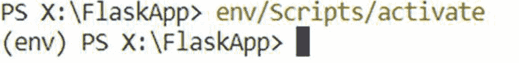

图 11.3：激活虚拟环境

注意：在 Windows 上尝试运行前面的命令时，你可能会遇到以下错误：activate.ps1 cannot be loaded because running scripts is disabled on this system. For more information, see about_Execution_Policies at https://go.microsoft.com/fwlink/?LinkID=135170。

此错误发生的原因是，activate 脚本命令试图运行 Activate.ps1 PowerShell 脚本（.ps1 是 PowerShell 脚本的扩展名）。Windows 10 系统默认将执行策略设置为受限，因此 PowerShell 无法执行任何脚本。我们需要将 PowerShell 执行策略更改为 remotesigned 来修复此错误。

在 Windows 上打开“开始”菜单，搜索 Powershell，然后右键单击它。点击“以管理员身份运行”。在 PowerShell 管理员窗口中键入以下命令以更改执行策略：

```
> set-executionpolicy remotesigned
```

系统将提示你接受更改，键入 A（全部同意），然后按键盘上的 Enter 键以允许更改。关闭 PowerShell 管理员窗口，返回并运行 activate 命令。

在 Visual Studio Code 中安装 Flask 扩展：现在虚拟环境已激活，你可以将包安装到其中。为此，请打开命令行窗口并键入以下内容：

```
pip install name>
```

请确保将 name> 替换为你希望安装的包的名称。这将把包安装到虚拟环境中。我们现在要安装的包是一个 Flask 扩展，它简化了将 SQLAlchemy 集成到 Flask 应用程序的过程，提供了有用的工具和方法来与数据库交互。图 11.4 展示了如何安装

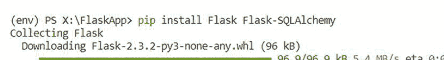

图 11.4：安装 Flask-SQLAlchemy 包

你还需要安装 flask_migrate 和 flask_login 以实现未来的功能。

Flask-Migrate 是一个扩展，它使用 Alembic 处理 Flask 应用程序的 SQLAlchemy 数据库迁移。这使得在应用程序扩展时，更改数据库结构并将其与 Flask 集成变得容易。Flask-Login 为 Flask 提供用户会话管理。它处理登录、注销以及在较长时间内记住用户会话的常见任务。安装这些库后，让我们在程序中导入它们：

```
pip install flask_migrate
```

```
pip install flask_login
```

```
pip install flask_wtf
```

```
pip install email_validator
```

```
pip install pillow
```

我们还需要安装 Flask-WTF，它是一个 Flask 扩展，提供了与 WTForms 库的集成。它有助于简化使用最少代码创建安全表单的过程。该扩展提供了多种功能，例如表单生成、验证以及使用数据库中的数据自动填充字段。Flask-WTF 使得在基于 Flask 的 Web 应用程序上创建安全、多功能的 Web 表单变得更加容易。

email_validator 模块是一个 Python 包，用于检查电子邮件地址的语法和结构。它是一个用于验证电子邮件的 API，可用于防止用户提交无效的电子邮件。此库可以阻止无效的电子邮件地址注册，从而减少系统上的垃圾邮件。

Python Imaging Library 是一个免费的 Python 编程语言库，增加了对打开、操作和保存多种不同图像文件格式的支持。它被 Web 开发人员和专业图像编辑应用程序使用。我们将导入 pillow 来管理注册用户的个人资料图片。

创建一个新的项目文件夹并在 Visual Studio Code 中打开它：现在虚拟环境已经创建并激活，你可以打开 VS Code 并开始工作。为此，请打开 VS Code 并选择 File > Open。这将打开一个文件浏览器窗口。导航到你创建虚拟环境的目录并选择该文件夹。文件夹结构将类似于图 VS Code 现在将打开虚拟环境，你可以开始在其中工作。


图 11.5：文件夹结构

创建一个名为 app.py 的文件，它将作为你的 Flask 应用程序的主文件：在我们刚刚创建的文件夹（FlaskApp）中创建一个名为 app.py 的新文件。现在，让我们创建一个基本的 Flask 应用程序。它将为我们未来的应用程序代码提供一个结构。我们将在 app.py 文件中编写以下代码：

```
#FlaskApp/app.py
```

```
#Import libraries

from flask import Flask

#Set application, referencing this file

app = Flask(__name__)

#Set URL route

def hello_world():

return 'Hello, Flask Application is running'

if __name__ ==
```

App.py 是 Flask 应用程序中的一个 Python 脚本文件，包含应用程序的代码。它是应用程序的主入口点，包含设置应用程序及其路由的代码。前面讨论的 app.py 代码通常包含以下内容：

导入 Flask 第一步是导入 Flask 模块以及应用程序可能需要的其他模块。这通常在文件的开头完成。

创建 Flask 这是通过调用 Flask() 构造函数完成的。

配置 Flask 应用程序：这包括设置基础 URL、调试标志、密钥、模板文件夹和其他配置选项。我们在此示例中尚未设置任何这些，但将在下一个示例中进行设置。

创建路由 这是使用 app.route() 装饰器完成的。此装饰器用于定义应用程序将使用的每个视图函数的 URL。

创建视图 这是通过创建用于处理请求的函数来完成的。视图函数通常接收请求的参数并返回响应。

在 Visual Studio Code 中打开终端并运行应用程序：最后一步是运行应用程序。这是通过调用 app.run() 方法完成的。这将启动应用程序并使其能够处理请求。在终端上，键入以下命令：

```
python app.py
```

这将启动服务器，输出将如图所示。请记住，我们现在启动的是开发服务器。当我们完成工作并准备部署时，我们将切换到生产版本。

```
(env) PS X:\FlaskApp> python app.py
* Serving Flask app 'app'
* Debug mode: on
WARNING: This is a development server. Do not use it in a production deployment. Use a production WSGI server instead.
* Running on http://127.0.0.1:5000
Press CTRL+C to quit
* Restarting with stat
* Debugger is active!
* Debugger PIN: 104-509-225
127.0.0.1 - - [11/Jun/2023 19:36:08] "GET / HTTP/1.1" 200 -
127.0.0.1 - - [11/Jun/2023 19:36:08] "GET /favicon.ico HTTP/1.1" 404 -
```

图 11.6：执行 app.py 的 Python 代码和服务器的启动

如图所示，服务器正在运行。打开任何浏览器并打开。你将看到 Flask 正在运行，如图所示。


图 11.7：在浏览器中运行的 Flask 应用程序

# 开发个人资料应用程序

我们将通过开发一个应用程序来学习 Flask 应用程序的概念。让我们将此应用程序称为“我的个人资料应用程序”，并描述其需求：

该网站将包含以下网页：主页、教育背景、专业技能、项目和推荐信。

主页将是一个静态页面，而教育背景、专业技能、项目和推荐信将显示来自数据库的详细信息。

该网站应有一个用户登录页面，使用用户名/密码认证进行访问。

只有管理员用户才能向数据库添加教育背景、专业技能和项目的内容；任何注册用户都应能向页面添加推荐信。

管理员还应能从后端控制推荐信页面。

Flask 应用程序有视图。视图是 Flask 应用程序控制器中的函数，负责处理用户请求并向用户返回响应数据。视图负责与模型通信，以从数据库中检索、编辑、创建和删除数据，并将这些数据格式化为对用户的响应。视图通常编写为 Python 函数，接受一个 HTTP 请求对象和一个可选的参数数组作为参数。图 11.8 描绘了我们将为此网站创建并添加的视图或函数：

## 模板与静态内容

在开发 Flask 应用程序时，我们首先处理的内容是模板和静态文件。让我们在 `myprofile` 文件夹下创建 `static` 和 `templates` 文件夹。`Static` 和 `Templates` 具有特殊含义，因此 Flask 知道这些文件夹中应包含什么内容。

Flask 应用程序中的模板是用于渲染 HTML 的前端文件。它们以 HTML 编写，并使用特殊语法来添加动态内容。Flask 使用 Jinja2 模板引擎来渲染模板，并从后端提供数据。

在 Flask 中，静态文件指的是保持不变的文件，例如图像文件、CSS、JavaScript 以及其他 Web 应用程序或网站正常渲染所需的文件。这些文件通常存储在 `static` 文件夹中，该文件夹与 Python 应用程序和模板文件分开。Flask 提供了一种通过其 `static` 目录引用这些静态文件的便捷方式。Flask 提供了一项功能，允许在应用程序包目录之外的文件夹中定义这些文件，以便于维护。该文件夹可以被调用，并且在应用程序运行时，其中的所有文件都将被加载。

本项目中 `static` 文件夹的主要内容将是样式表和图像。`profile.css` 文件用作样式表，其代码如下所示：

```
* {
    padding: 0;
    margin: 0;
    font-family: sans-serif;
}

header {
    background-color: #333;
    color: white;
    height: 60px;
    padding: 0 20px;
}

.resume_title {
    text-align: center;
}

.skills {
    display: flex;
    justify-content: space-around;
}

.skill_title {
    background-color: #333;
    color: white;
    border-radius: 5px;
    padding: 10px;
    font-size: 18px;
}

.exp_title, .org_name, .org_date, .exp ul {
    margin: 5px 0;
}

.exp_title, .org_name, .org_date {
    color: #333;
}

li {
    font-size: 16px;
}

.projects {
    display: flex;
    justify-content: space-around;
}

.project_details {
    margin-right: 20px;
}

.projects ul {
    margin: 0;
}

footer {
    background-color: black;
    color: white;
    padding: 20px;
}

.top_foot {
    display: flex;
    justify-content: space-between;
    align-items: center;
}

.foot-left {
    width: 50%;
    padding: 10px;
    border-right: 1px solid white;
}

.foot-right {
    display: flex;
    justify-content: space-around;
    width: 50%;
}

.foot-right li {
    list-style: none;
    padding: 5px;
}

.foot-right li a {
    text-decoration: none;
    color: white;
}

.foot-right li a:hover {
    color: red;
    transition: 0.3s;
}

.about {
    margin-top: 20px;
    padding: 0;
}

.testimonial_card {
    margin: 10px;
}

.testimonials {
    margin: 20px;
}

.logo h1 {
    font-size: 24px;
}

/* Media Query */
@media screen and (max-width: 768px) {
    .skills, .exp, .education {
        flex-direction: column;
        padding: 10px;
    }
}

@media screen and (max-width: 768px) {
    .projects {
        flex-direction: column;
        padding: 0;
    }
}

.expert, .project_details {
    margin: 0 0 10px 0;
}

@media screen and (max-width: 768px) {
    .about_image {
        width: 100%;
    }
}

.image img {
    width: 100%;
}

.about_image p {
    width: 100%;
}

@media screen and (max-width: 768px) {
    .image img {
        width: 100%;
    }
}

@media screen and (max-width: 768px) {
    .testimonial_card {
        margin: 10px 0;
    }
}

@media screen and (max-width: 768px) {
    .title {
        font-size: 18px;
    }
}

.image img {
    margin-left: 0;
}

@media screen and (max-width: 768px) {
    .image img {
        margin-left: 0;
    }
}

@media screen and (max-width: 768px) {
    .foot-left {
        border: none;
    }
}

.top_foot {
    flex-direction: column;
}

.foot-left {
    width: 100%;
    text-align: center;
}

@media screen and (max-width: 768px) {
    .foot-right {
        flex-direction: column;
        text-align: center;
    }
}

h1 {
    text-align: center;
}

table, th, td {
    border: 1px solid blue;
    border-radius: 5px;
    border-style: ridge;
}

th, td {
    border-color: #333;
}
```

将所有必需的图像放入 `image` 文件夹。`static` 文件夹内的结构应如图 11.10 所示。

## 图 11.10：static 文件夹结构

现在，我们将注意力转向 `templates` 文件夹。该文件夹将包含所有动态 HTML 内容。当用户访问网站但尚未登录时，他们应该看到以下选项：

-   首页
-   个人资料
-   课外活动
-   未来目标
-   推荐信
-   登录
-   注册

网页视图如图 11.11 所示。

## 图 11.11：访客首页菜单截图

已登录用户应在网页上看到以下选项：

-   首页
-   个人资料
-   课外活动
-   未来目标
-   推荐信
-   退出登录
-   账户
-   更新

上述选项应具有指向以下视图的导航链接，我们将在下一节中创建这些视图：

-   课外活动
-   未来目标
-   退出登录

现在，我们了解了哪个文件夹将包含特定视图。到目前为止，我们只在 `core` 中创建了视图并添加了首页。

`index.html` 文件是 Flask 应用程序的主页。在 `index.html` 文件中，用户通常会找到一个包含指向应用程序其他视图或页面链接的页面。它还可以包含文本、图形和其他内容。可以编辑该文件以自定义应用程序主页的设计。在我们创建 `index.html` 文件之前，建议先创建一个 `base.html` 文件，该文件将包含所有主要页面共有的页眉和页脚内容。在 Flask 中创建 `base.html` 模板有助于确保您的 Web 应用程序具有一致的外观。这对于维护 Web 应用程序的视觉风格非常有益，可以在进行设计更改时加快开发速度。此外，通过使用它，您可以轻松添加页眉、页脚和导航菜单等元素，这些元素会出现在 Web 应用程序中的每个页面上。

`base.html` 文件（位于 `templates` 文件夹下）将如下所示：

第一部分：任何 HTML 文件的第一部分当然是 `<head>` 部分。我们这里不添加 `<head>` 部分的代码。您可以参考完整代码，但也可以自由设计自己的版本。

第二部分：现在我们来看 `<body>` 部分。首先，将页眉内容添加到 HTML 代码中。代码中使用了 Jinja 模板语言使其更具动态性。Jinja 是 Flask 使用的基于 Python 的模板引擎，允许您动态生成 HTML 代码。HTML 文件中最常见的变量代码用法是将 Python 代码中的值输出到渲染的模板中。这可以使用双花括号 `{{ }}` 来完成。例如，如果您的 Flask 路由中有一个名为 `name` 的变量，您可以在 HTML 模板中将其输出为 `{{ name }}`。当 Flask 渲染此模板时，它会将 `{{ name }}` 替换为从路由传递的 `name` 变量的实际值。除了输出变量值外，Jinja 还提供了控制结构（如循环和条件语句）的功能，允许您根据 Flask 提供的数据动态更改 HTML 的结构和内容。

```
<nav class="navbar navbar-expand-lg navbar-dark text-bg-dark">
    <div class="container-fluid">
        <a class="navbar-brand" href="#">My Profile</a>
        <button class="navbar-toggler" type="button" data-bs-toggle="collapse" data-bs-target="#navbarNav" aria-controls="navbarNav" aria-expanded="false" aria-label="Toggle navigation">
            <span class="navbar-toggler-icon"></span>
        </button>
        <div class="collapse navbar-collapse flex-wrap align-items-center justify-content-center" id="navbarNav">
            <ul class="navbar-nav align-items-center mb-2 mb-lg-0 text-white">
                <li class="nav-item">
                    <a class="nav-link active" aria-current="page" href="{{ url_for('core.index') }}">Home</a>
                </li>
                <li class="nav-item">
                    <a class="nav-link" href="{{ url_for('core.profile') }}">Profile</a>
                </li>
                <li class="nav-item">
                    <a class="nav-link" href="{{ url_for('core.activities') }}">Extra Curriculars</a>
                </li>
                <li class="nav-item">
                    <a class="nav-link" href="{{ url_for('core.goals') }}">Future Goals</a>
                </li>
                <li class="nav-item">
                    <a class="nav-link" href="{{ url_for('core.alltestimonials') }}">Testimonials</a>
                </li>
                
                <li class="nav-item">
                    <a class="nav-link" href="{{ url_for('users.logout') }}">Log Out</a>
                </li>
                <li class="nav-item">
                    <a class="nav-link" href="{{ url_for('users.account') }}">Account</a>
                </li>
                
                <li class="nav-item">
                    <a class="nav-link" href="{{ url_for('users.login') }}">Login</a>
                </li>
                <li class="nav-item">
                    <a class="nav-link" href="{{ url_for('users.register') }}">Register</a>
                </li>
                
            </ul>
        </div>
    </div>
</nav>
```

## 数字作品集





部分 添加页脚部分将适用于我们将创建的所有页面。

## SACHIN KOHLI

一位热衷于创建前沿应用的软件工程师。我致力于创造高质量的解决方案，以确保用户获得最佳体验。



- url_for('users.logout') }}">登出
- url_for('users.account')


- url_for('users.login') }}">登录
- url_for('users.register')


## SACHIN KOHLI 联系方式：

部分 这涉及添加汉堡菜单代码。汉堡菜单是网站和移动应用界面中常用的设计元素。它由三条水平线堆叠而成，形似汉堡，因此得名。当点击或轻触时，汉堡菜单会展开，显示一个隐藏的导航菜单或附加选项，提供了一种节省空间且直观的方式来访问次要内容或功能。它常用于响应式设计中，通过将菜单项整合到一个图标中，来优化小屏幕上的用户体验。

offcanvas-start"

- url_for('core.index') }}" px-2
- url_for('core.profile') }}" px-2
- url_for('core.activities') }}" px-2 课外活动
- url_for('core.goals') }}" px-2 目标
- url_for('core.alltestimonials') }}" px-2



- url_for('users.logout') }}" px-2 退出
- url_for('users.account') }}" px-2
- url_for('testimonials.create_post') }}" px-2


- url_for('users.login') }}" px-2 登录
- url_for('users.register') }}" px-2
