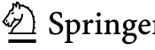

大数据研究 153

Vincenzo Manca

## Python 算术

数字的信息本质


## 大数据研究

第 153 卷

**丛书编辑**
Janusz Kacprzyk，波兰科学院，华沙，波兰

“大数据研究”（SBD）丛书旨在快速、高质量地发布大数据各个领域的新进展和发展。其目的是涵盖嵌入在工程、计算机科学、物理学、经济学和生命科学领域的大数据理论、研究、开发和应用。本丛书的书籍涉及对来自传感器或其他物理仪器以及模拟、众包、社交网络或其他互联网交易（如电子邮件或视频点击流等）的最新数字源生成的大型、复杂和/或分布式数据集的分析和理解。本丛书包含大数据领域的专著、讲义和编辑卷，涵盖计算智能领域，包括神经网络、进化计算、软计算、模糊系统，以及人工智能、数据挖掘、现代统计学和运筹学，以及自组织系统。对贡献者和读者都特别有价值的是其短暂的出版周期和全球发行，这使得研究成果能够广泛而迅速地传播。

本丛书的书籍经过单盲同行评审流程。

由 SCOPUS、EI Compendex、SCIMAGO 和 zbMATH 索引。

本系列出版的所有书籍均提交至 Web of Science 进行评审。

Vincenzo Manca

## Python 算术

数字的信息本质



Vincenzo Manca
计算机科学系
维罗纳大学
维罗纳，意大利

ISSN 2197-6503
大数据研究
ISBN 978-3-031-66544-8
https://doi.org/10.1007/978-3-031-66545-5

ISSN 2197-6511 (电子版)
ISBN 978-3-031-66545-5 (电子书)

© 编者（如适用）和作者，根据与 Springer Nature Switzerland AG 2024 签订的独家许可协议

本作品受版权保护。所有权利均由出版商独家许可，无论涉及材料的全部还是部分，特别是翻译、重印、插图重用、朗诵、广播、在微缩胶片或任何其他物理方式上复制，以及信息存储和检索、电子改编、计算机软件，或通过现在已知或未来开发的类似或不同方法进行传输的权利。
在本出版物中使用通用描述性名称、注册名称、商标、服务标志等，即使没有具体声明，也并不意味着这些名称不受相关保护性法律法规的约束，因此可以自由使用。
出版商、作者和编辑有理由相信，本书中的建议和信息在出版之日是真实和准确的。无论是出版商还是作者或编辑，对于本文所含材料或可能存在的任何错误或遗漏，均不提供任何明示或暗示的保证。出版商对已出版地图中的管辖权主张和机构隶属关系保持中立。

本 Springer 印记由注册公司 Springer Nature Switzerland AG 出版
注册公司地址为：Gewerbestrasse 11, 6330 Cham, Switzerland

如果处置本产品，请回收纸张。

本书献给我的祖父母和孙辈。

## 前言

本书旨在从最熟悉的初等算术算法入手介绍 Python 编程语言，同时揭示数字的一些深层方面，这些方面在学习之初就已存在，例如整个算术所基于的计数过程。例如，简单的 Python 程序揭示了与叙拉古的阿基米德所阐述的数制直接相关的计数过程，与我们的十进制系统和零的概念密切相关。

Python 与算术的联系与数学的算术化有关，这是一个漫长的过程，从莱昂纳多·斐波那契在欧洲引入十进制表示法，到数学逻辑，可计算性理论正是从数学逻辑中产生的。Python 是沿此过程发展的数学符号的综合。这就是它在表达基本算术算法方面具有天然适应性的原因。Python 所基于的函数概念本质上归功于莱昂纳多·欧拉，后来在 1930 年代由阿隆佐·邱奇形式化。

总之，“Python 算术”是对编程、算术和逻辑之间深层联系的思考。

本书提供了具体的例子，表明数学传统对于深刻理解最现代信息技术背后的主要思想的重要性。

维罗纳，意大利

Vincenzo Manca

**致谢** 我向 2002 年至 2019 年间维罗纳大学计算机科学系的学生和同事们表示感谢。

## 目录

- 1 数字时代的起源
  - 1.1 数字、算术与控制论
  - 参考文献
- 2 数学符号与 Python
  - 2.1 从分析术到 Python 表达式
  - 2.2 Python 基础
  - 2.3 Python 数据结构
    - 2.3.1 列表
    - 2.3.2 面向对象编程
    - 2.3.3 元组、集合和字典
  - 参考文献
- 3 Python 中的计数算法
  - 3.1 十进制计数算法
  - 3.2 周期性计数
  - 3.3 X-计数算法
  - 3.4 字典序计数算法
  - 3.5 周期性计数原理
  - 参考文献
- 4 算术运算
  - 4.1 加法和减法
  - 4.2 乘法和除法
  - 4.3 表运算
  - 4.4 运算连接
- 5 平方根算法
  - 5.1 简单平方根算法
  - 5.2 邦贝利的平方根算法
  - 5.3 牛顿和插值算法
  - 5.4 平方根算法与 π
  - 5.5 平方根与对数
  - 参考文献
- 6 素性、方程、同余
  - 6.1 素数
    - 6.1.1 渐近分析与素数分布
    - 6.1.2 2Log 随机信息测试
  - 6.2 丢番图方程
  - 6.3 同余与算术编码
  - 6.4 算术与逻辑
  - 参考文献
- 7 符号计算
  - 7.1 图灵机
  - 7.2 波斯特系统
  - 7.3 Python 迭代器
  - 7.4 算术、可计算性与逻辑
  - 参考文献
- 索引

## 第一章
数字时代的起源

核心陈述

> 本书的视角由此展开：数字不能脱离数符而存在，反之，数符也预设了数字。然而，这两个概念是不同的，这一事实对于深刻理解算术的重要方面至关重要。这种情况类似于数据与信息之间的区别。从某种意义上说，数字是纯粹的信息，而数位则是表示信息的数据。

### 1.1 数位、算术与控制论

本书通过算术温和地引入Python，反之亦然，并从历史视角出发，将编程语言置于数学符号发展的更广阔进程中。对作为基础数学知识核心的典型算法的重新审视，有助于把握其本质，并澄清一些常被视为理所当然但实则非常深刻且具有普遍性的假设。

自20世纪中叶以来，我们的时代可以被描述为“数字时代”，而“数字”这一属性常常表达了符号表示和信息处理的新视角。然而，十进制数符出现在公元六世纪，是在莱昂纳多·皮萨诺（Leonardo Pisano，1202年）的著作《算盘书》（Liber Abaci）在欧洲出版之后。数位在数字表示中的作用与其在表示任何类型信息中的普遍应用之间存在着密切联系。算术是连接这两个划时代成就的桥梁，这两个成就可以明确地认定为“斐波那契算盘”（数字符号算法）和冯·诺依曼的EDVAC（电子离散变量自动计算机）[1]。这是本书背后主要的哲学和历史论点，其内容正是支持这一论点的方式。

数位在算术概念中引入了一种新的算法，儿童在小学学习的基本方法就是通过处理数字的数位表示来处理数字的例子。算术是希腊数学的核心主题，但数字直接与线段的长度相关。当确定一个单位长度的线段时，数字1、2、3……就是与该单位长度线段成整数比的线段。希腊人称这些数字为“arithmoi”，它们不同于表示分数的数字（称为“meroi”），也不同于表示无法用整数或分数表示的比例的数字（这些数字大约在公元前五世纪的毕达哥拉斯学派中被发现，称为“logoi”）。在希腊算术中，数字的计算与其名称（在各种希腊字母符号系统中）之间没有关系。

印度-阿拉伯数符大约在公元五、六世纪出现在一个广泛的文化区域，受到印度、伊朗和阿拉伯文化的相互影响，尽管来自大数学家阿基米德（来自大希腊的叙拉古）的重要希腊建议无疑为基于零的现代十进制数字系统的定义提供了动力和预见[2]。

数符为所有类型的希腊数字提供了自然的统一，并促进了现代数学的新趋势，其中算术成为数学的核心。这一趋势通常被称为“数学的算术化”，它将催生笛卡尔解析几何的发现，与希腊数学相比，这是一场真正的革命。解析几何通过数字、变量和方程来表达点和空间概念。这场革命之后又发生了其他革命（对数、无穷小、概率、函数）。数字视角是通过代数的发展实现的，从方程到一般结构，这些结构表现为对抽象实体进行运算所给出的形式。这种抽象视角在19世纪下半叶导致了向基础和逻辑基础的转变，旨在寻找一般概念，以此为基础为整个数学构建健全的理论。在这种背景下，算术的核心作用变得比过去更加关键，而皮亚诺算术是一种可以在特定的数学逻辑系统中形式化表示的公理化理论，可计算性理论正是从这里迈出了第一步，以回答算术的健全性、完备性和可判定性问题。在数学逻辑中，理论本身成为了研究的对象。

“程序”一词被理解为“表达算法的公式”，由自动机执行；对称地，自动机是一种能够执行由程序表达的算法的设备。

Python是编写程序的最新语言之一，因此从目前简要勾勒的历史中可以清楚地看到程序与数字之间的深刻联系。但还有两个理由支持编程与算术之间存在内在互补性的观点。

第一个是教学上的。确实，算术是每个具有基本文化的人首先尝试（尽管是非正式且常常是隐含地）进行数字四则运算算法的自然环境。

第二个动机也是历史性的，因为Python在某种意义上是数学的语言，是一种沿着从十进制数位、运算、变量、括号、方程、序列、集合和函数，到通过条件、循环和递归来组织计算的典型形式的过程所定义的基本语言的符号表示。

最后，上述核心陈述中陈述的主要动机是我们进一步讨论的起点。数字需要表达式来表示它们。表达式并非内在的，因为其他表达式可以替代它们，但它们是必要的。当这些表达式构建在有限的符号集（数位）之上时，在第一个数字序列之后，这些符号（而非其他符号）会在后续数字中不断重复。

第一位定义系统化数字生成体系的数学家是公元前三世纪的叙拉古的阿基米德。阿基米德体系在一本拉丁名为《数沙者》（Arenarius）的书中定义，并非旨在定义所有数字，而只是非常大的数字[2–4]。然而，它可以被视为第一个具有计数系统三个主要特征的系统，这些特征对于完全的算术充分性具有最重要的属性：创造性、无限性和递归性。创造性意味着每个数符对于其前面的数符来说都是新的；无限性意味着在任何数符之后总是存在另一个数符；递归性意味着在与系统数位一致的初始数符序列之后，数位在所有后续数符中规律地重复。由于数符是数位的有限表达式，它们的长度随着生成过程而增加。撰写本书的一个强烈动机来自一个简单的Python程序，该程序给出了一个直接从阿基米德体系推导出的枚举。正如第3章将展示的，将这种枚举翻译成更可读的形式，是解释现代位置数制植根于阿基米德在《数沙者》中引入的周期性方法的最佳方式[2, 4]。

总之，自阿基米德以来，从数位、算术化、代数，到数理逻辑和可计算性（编程语言由此衍生）的趋势，是一种**信息趋势**，这是本书的核心论点，由副标题“数字的信息本质”所强调。

第二章简要介绍了Python，将这种语言与标准数学符号联系起来，后者在漫长的过程中形成了当前的形式，这个过程从十进制数符的引入一直延伸到18世纪，特别是在欧拉的符号和概念框架内。

接下来的章节通过提供所有概念和算法的Python表示来介绍算术的核心。Python与算术之间的互补性是这些章节的共同主题。数字算法的本质完全由几行Python语句表达，而这些语句在Python构造中变得非常自然和简单，这些构造在大量应用中具有非常广泛的用途。

最后一章给出了第一种编程语言——图灵机的解释器，并将Python迭代器的一般概念与第二章给出的符号计算和计数算法联系起来。

在所有章节中，我们始终采取历史视角，因为这是认识思想发展深层原因及其内在逻辑的必要途径[5–8]。缺乏这种视角往往导致肤浅化，阻碍对文化现象的真正理解。例如，机器学习看似是信息技术领域近期的万能解药和新奇事物，但深入分析会发现，其本质与高斯和勒让德的最小二乘法（以及广义的优化方法）精神一脉相承。这意味着伟大的思想常以新形式重现，在不同语境中实现普遍原则。恢复这些联系使我们能够把握事物本质，从而深刻理解其功能与可能性。

本书假定读者具备基本数学概念知识。然而，我们将在后续章节中，随着讨论的推进，对这些概念进行回顾。

## 参考文献

1.  von Neumann, J.: First Draft of a Report on the EDVAC. Moore School of Electrical Engineering University of Pennsylvania (1945)
2.  Manca, V.: The Archimedean origin of modern positional number systems. Algorithms (2024)
3.  Heath, W.: The Works of Archimedes. Dover Publications (2002)
4.  Manca, V.: Lezioni Archimede. Biblioteca Alagoniana, Quad. N. 6, Siracusa (2020)
5.  Cajori, F: A History of Mathematical Notation. Dover Publications (1993)
6.  Kline, M.: Mathematical Thought from Ancient to Modern Times, 3 Vol. Oxford University Press (1990)
7.  Manca, V.: Il Paradiso di Cantor. Edizioni Nuova Cultura (2022)
8.  Manca, V.: Arithmoi. VillaHermosa Publishing (2023)

## 第2章
## 数学符号与Python

**核心陈述**

> Python是一种将经典数学符号凝练为算法符号核心风格的语言。然而，Python所依据的术语和概念拥有八个世纪的历史，本质上介于两位著名的“莱昂纳多”之间：莱昂纳多·斐波那契（又称比萨的莱昂纳多）和莱昂纳德·欧拉，后者为基本数学符号奠定了近乎最终的框架。

### 2.1 从分析术到Python表达式

《算盘书》于1202年出版。这本书对数学思维的影响巨大。其核心信息是，我们可以通过操作数字的表示形式来处理数字。使用数字的数字表示称为“数词”，因此数字计算简化为数词计算。这一观点是全新的，无疑对在意大利中北部地区蓬勃发展的代数学派的新代数趋势起到了催化作用（西皮奥内·德尔·费罗、安东尼奥·玛丽亚·德尔·菲奥雷、费德里科·丰塔纳（又称塔尔塔利亚）、杰罗拉莫·卡尔达诺和洛多维科·费拉里是最著名的名字），该学派研究了求解三次和四次代数方程的方法，这些方法在拉斐尔·邦贝利1572年出版的《代数学》一书中有所描述（戈特弗里德·莱布尼茨肯定研究过此书）。特别是，意大利代数学家发现的公式引入了一个新数字，后来被莱昂纳德·欧拉指定为“i”，代表-1的虚数平方根（i² = -1）。法国数学家弗朗索瓦·韦达[1]于1591年出版的著作《分析术导论》应在此背景下理解。他在其中发展了他的分析术或符号术，将数字操作扩展到包含字母的符号形式，这些字母指代通用数字，即没有特定值或*不定*的数字。这个术语是**变量**的新术语，尽管在阿拉伯数学中可以找到类似术语的历史痕迹，用于表示代数方程的未知值（几何单位的变量在希腊数学中很常见）。一次和二次方程（其中未知值以一次或二次幂出现）自巴比伦数学以来就已为人所知，但在阿拉伯数学中，这些方程得到了系统研究。在方程或解析表达式的语境中，诸如$2a$这样的项代表任何乘以2的数字，即任何偶数，其中2是系数，$a$是文字部分。在这种情况下，$2a$和$3a$是通用数字，但它们可以相加得到$5a$，也可以相乘得到$6a^2$。因此，文字表达式是更广义上的数字，这一段落蕴含了代数视角的萌芽，在接下来的几个世纪里，它将引领现代代数的抽象结构，直至20世纪发展出的最普遍和抽象的概念。

在邦贝利的代数学中，我们还发现了括号，它们构成了数学表达式的基础，但其引入可追溯至尼科洛·塔尔塔利亚1556年的《数字与度量通论》[2]。

1585年，佛兰芒数学家西蒙·斯特文出版了另一本基础著作，题为《论十分之一》，英文意为“The Tenth”。在这本书中，我们使用的十进制系统在所有重要方面都得到了定义：为十进制表示法呈现了四则算术运算的算法，并引入了与我们小数点（或逗号）对应的符号，使得为整数给出的算法可以扩展到分数[3]。这种符号使得统一希腊人的三种不同数字类型（数、部分、比例）成为可能。部分是小数点后有有限位数字的数字，或者是无限但周期有限的数字，而比例的小数点后数字是无限且非周期的。

在18世纪中叶，我们拥有了：十进制系统、括号、变量、算术运算（及其相关计算算法），以及由拉斐尔·邦贝利提出的计算平方根的算法，该算法与斯特文的十进制符号结合，给出了无限非周期数字。任何非完全平方数（4, 9, 16, 25, ...）的平方根都有一个无限非周期的数字序列。

等号由威尔士数学家罗伯特·雷科德于1557年引入，但方程是古代数学中的一个古老主题，在斐波那契的《算盘书》中得到了广泛讨论。总之，Python的大部分符号体系已经具备，但缺少一些重要方面，因此需要我们历史之旅的其他关键步骤来完成其构建。

1614年，约翰·纳皮尔引入了对数[4]。值$\lg(n)$是使得$e^{\lg(n)} = n$的指数。然而，这并非纳皮尔的原始定义。这种形式归功于莱昂纳德·欧拉，他发现纳皮尔的对数对应于特殊数字$e$的指数。数字“e”被定义为无穷序列$(1 + \frac{1}{n})^n$的极限，该序列由戈特弗里德·威廉·冯·莱布尼茨在无穷小分析的背景下引入。对数在计算和许多理论进步中是一场伟大的革命，扩展了数学函数的概念。1637年，勒内·笛卡尔引入了坐标，将点简化为数字，将几何关系简化为代数方程。解析几何，其名称与韦达的*分析术*相关联，是数学算术化进程中的划时代一步。

莱昂纳德·欧拉朝着基于变量的函数一般概念迈出了关键一步[5]。这一概念将在接下来的两个世纪中进一步扩展，但对于其在编程中的使用（函数在其中至关重要），欧拉的概念是完全足够的。函数通过由数字、变量和运算构成的数学表达式来确定。正是这一思想在1920年左右，由阿隆佐·邱奇在数学逻辑的背景下进一步阐述，他引入了lambda表达式，本质上是数学表达式，其中给定表达式中出现的特定变量在其定义中变得无关紧要（用其他变量一致地替换它们不会改变所指的函数）。

欧拉引入的函数符号的一个重要方面是“应用”。函数$f$应用于参数并产生结果，因此$f(a)$是$f$应用于参数$a$时的结果。在这种情况下，括号括起参数，函数符号放在左括号的左侧。这是一种使用括号的新方式，不同于之前通过定义运算应用顺序来聚合符号的用法。应用和聚合是Python中使用括号的两种方式。正如我们将展示的，方括号和花括号是其他类型的符号聚合和选择。下表总结了上述讨论中考虑的主要数学概念（表2.1）。

至此，我们已具备下一节介绍Python所需的一切。以下表格列出了一些基础数学著作以及数学符号列表，包括其引入日期和作者。一些著作或符号在上述讨论中未提及，但肯定与算术和编程关系的一般背景相关（表2.2和表2.3）。

**表2.1 基本数学表示体系**

| | |
|---|---|
| 数字 | |
| 数词 | |
| 运算 | |
| 括号 | |
| 变量 | |
| 方程 | |
| 函数 | |

### 2.2 Python 基础

Python 由 Guido van Rossum 于 1991 年创建。Python 编程语言的名称源自一个名为 Monty Python's Flying Circus 的古老 BBC 电视喜剧小品系列。

它是一种广泛使用的、高级的、通用的编程语言。其起源可追溯至 20 世纪 80 年代末，当时 van Rossum 在荷兰的 Centrum Wiskunde & Informatica (CWI) 首次构思了其设计。

正如编程语言中常见的情况，许多先前的编程语言影响了其设计原则，其中包括 ABC、SETL、MODULA、LISP 和 JAVA。许多版本和子版本被开发出来，其中版本 3 是最新的。Python 是一种开源语言，它通过成千上万的程序员、测试员和用户的持续工作而传播到世界各地。Python 由非营利会员组织“Python 软件基金会”维护、改进和扩展。书籍 [6–11] 提供了 Python 的入门介绍和综合手册。

总的来说，即使编程语言是人工语言，它们也不是数学逻辑意义上的形式语言。这意味着它们与自然语言一样，具有在社区内产生的产品的特性，持续受到在网络中互动的个体的影响，处于使用、兴趣、应用和品味的历史背景中，并涉及社会和经济因素。

编程语言总是相对于一组在多个层次和许多不同软件和硬件平台上运行的程序而言的，这些程序可以通过产生可观察的行为使机器“理解”给定的语言。这些程序根据不同的策略，在不同层次的翻译、解码和编码中扮演解释、编译、汇编的角色。在此范围内，发展出了概念、术语、算法、工具、规范和符号，构成了一个复杂的元语言网络，自 20 世纪中叶以来，编程语言的理论和实践在此基础上发展，最初的编程语言如 Fortran、Algol 和 Cobol，在持续适应不断演进的理论和技术的压力下发展。

编程语言用于向机器发出命令；用于描述由机器实现的算法；用于组织存储在机器中的数据，以便在保持内部一致性的情况下进行访问、扩展和修改；用于通过连接网络在机器之间传输数据；用于根据对进一步处理有用的功能格式从外部源获取数据。

最早的编程语言是过程式的，即基于将值赋给变量，通过由条件和迭代控制的赋值串联，能够在计算结束时将某些变量的值作为结果提供出来。然后出现了函数式范式，其中程序被构想为函数的组合，以输入参数并给出所需的结果。接着，逻辑范式基于关系和逻辑连接词，从一些基本陈述出发，根据逻辑性质的推理机制推导出复杂的关系。当最终关系被满足时，就获得了给定问题的所需结果。与此同时，由函数式和逻辑范式提出的抽象数据结构概念，结合更抽象的变量概念，产生了对象的概念，作为任何数据处理过程的核心，这是面向对象编程的震中。

这是导致编程语言发展的主要思想的非常简化的重构。许多不同的分类、参数以及设计和分析原则被阐述出来，由于方面的内在异质性、视角的多样性以及应用背景的不同，很难将其置于一个简单、统一和系统的图式中。抽象机、抽象语法、抽象数据类型、操作语义、指称语义、动作语义、类型检查器、多态性、动态类型、异常处理、垃圾收集器、静态分析、过程分析、规范和脚本、并行性和并发性……是编程的典型术语。我们以随意的顺序提及了它们，而没有解释它们，只是为了暗示编程语言必须被定位的过程的复杂性。

最后，任何用户都必须记住，正确使用语言必须参考与给定语言相关的计算资源。这意味着一个程序在预期的语义内可能是形式上正确的，但它可能产生不正确的行为或错误消息。这取决于语句

#### 表 2.2 从“算术化”视角看数学领域的基础著作

| 作者 | 著作 |
| :--- | :--- |
| Leonardo Fibonacci | Liber Abaci, 1202 |
| Rafael Bombelli | L’Algebra, 1572 |
| Simon Stevin | De Thiende, 1585 |
| Francoise Viète | Isagoge in artem analyticem, 1591 |
| John Napier | Mirifici Logarithmorum Canonis Descriptio, 1614 |
| René Descartes | La Geometrie, 1637 |
| Gotfried Leibniz | Mathesis Universalis, 1694 |
| Leonard Euler | Introductio in Analysin Infinitorum, 1748 |
| Friedrich Gauss | Disquisitiones Arithmeticae, 1798 |
| George Boole | The Mathematical Analysis of Logic, 1847 |
| Gottlob Frege | Die Grundlagen der Arithmetik, 1884 |
| Georg Cantor | 集合论基础 (德文), 1874–1897 |
| Giuseppe Peano | Formulario Mathematico (拉丁语无屈折形式), 1889 |
| David Hilbert | Über das Unendliche (论无限), 1926 |
| Kurt Gödel | 皮亚诺算术的不完备性 (德文), 1931 |
| Alonzo Church | An unsolvable problem of elementary number theory, 1936 |
| Alan Turing | On computable numbers with an application ..., 1936 |

#### 表 2.3 数学符号 (来自维基百科)

| 符号 | 名称 | 最早使用日期 | 首位使用者 |
| :--- | :--- | :--- | :--- |
| +, − | 加号，除号横线 | 1360 | Nicole Oresme |
| − | 减号 | 1489 | Johannes Widmann |
| (...) | 括号 (用于优先级分组) | 1544 | Michael Stifel |
| (...) | 括号 (用于优先级分组) | 1556 | Niccolò Tartaglia |
| = | 等号 | 1557 | Robert Recorde |
| . | 小数点 | 1593 | Christopher Clavius |
| × | 乘号 | 1618 | William Oughtred |
| √ | 根号 (用于 n 次方根) | 1629 | Albert Girard |
| <, > | 严格不等号 (小于，大于) | 1631 | Thomas Harriot |
| x | 字母 x 表示变量或未知值 | 1637 | René Descartes |
| x^y | 上标表示法 (用于指数运算) | 1637 | René Descartes |
| √ | 根号 (用于平方根) | 1637 | René Descartes |
| ∞ | 无穷大符号 | 1655 | John Wallis |
| ≤, ≥ | 非严格不等号 | 1670 | John Wallis |
| d, ∫ | 微分、积分符号 | 1675 | Gottfried Leibniz |
| : | 冒号 (用于除法) | 1684 | Gottfried Leibniz |
| · | 中点 (用于乘法) | 1698 | Gottfried Leibniz |
| / | 除法斜线 (Abu Bakr al-Hassar, 12世纪) | 1718 | Thomas Twining |
| Σ | 求和符号 | 1755 | Leonhard Euler |
| ≡ | 恒等符号 (用于同余关系) | 1801 | Carl Friedrich Gauss |
| Π | 连乘符号 | 1812 | Carl Friedrich Gauss |
| [x] | 整数部分 | 1808 | Carl Friedrich Gauss |
| |...| | 绝对值表示法 | 1841 | Karl Weierstrass |
| ∩, ∪ | 交集、并集 | 1888 | Giuseppe Peano |
| ⊂, ⊃ | 集合包含符号 (子集，超集) | 1890 | Ernst Schröder |
| ∈ | 属于符号 (是...的元素) | 1894 | Giuseppe Peano |
| ℕ | 黑板粗体大写 N (表示自然数集) | 1895 | Giuseppe Peano |
| ℚ | 黑板粗体大写 Q (表示有理数集) | 1895 | Giuseppe Peano |
| {...} | 花括号 (用于集合表示法) | 1895 | Georg Cantor |
| ∨ | 逻辑析取 | 1906 | Bertrand Russell |
| λ | 函数抽象 | 1920 | Alonzo Church |
| ℤ | 黑板粗体大写 Z (表示整数集) | 1930 | Edmund Landau |

程序的各个部分在运行程序的机器中经过多层翻译处理。换句话说，用特定语言正确编程意味着学习正确表达计算过程的方法，以获得预期结果。因此，编程是一门艺术，正如唐纳德·克努特在其基础著作[12]中完美阐述的那样。当然，这是一门基于20世纪诞生的计算理论这一极其复杂背景的艺术。

本书中展示的程序是在IDLE中实现和测试的，IDLE是Python的“集成开发与学习环境”（版本3.8.1，运行在Mac Book Pro，Apple M1，Pro 16 GB，2021上）。

Python代码是一种可以通过改变执行机器状态来执行的文本。这一陈述引入了几个值得进一步解释的概念。在此上下文中，机器是一种能够接收编码了一系列动作的文本并实现这些动作的设备。动作是机器从一个状态到另一个状态的转变。反过来，状态可以通过将值与变量列表相关联来表示。让我们将状态表示为一系列赋值，每个赋值将一个值与一个变量关联。变量放在等号左边，赋值放在等号右边：

$x_1 = v_1, x_2 = v_2, \dots, x_n = v_n$

当考虑多层变量并且值被组织成从基本类型构建的复杂结构时，这个简单的模式会变得更加复杂。我们现在不深入探讨进一步的复杂性，可以依赖这个示意图来对建立我们直觉的基本模型有一个初步认识。

命令是对动作的请求，而指令是命令的编码，可以是遵循构造语法规则组织的语句文本的一部分。最简单的命令是赋值，形式为“变量 = 表达式”，意味着在当前状态下，表达式被求值，其值被赋给变量。

Python指令主要组织成三种结构：条件、循环或迭代，以及函数定义。控制赋值的条件具有以下形式。

```
if x == 0:
    y = 1
```

其中相等性由两个等号表示（用于区分条件和赋值），并且可以考虑其他关系代替相等性。

以下文本表达了一个迭代，其中条件是属于“range(10)”，即从0到10（不包括10）的值：

```
for i in range(10):
    n = n + 1
```

执行此代码对应于将$n$增加十个单位（代码注释写在#之后）。

```
dividend = 3273
divisor = 131
quotient = 0
while dividend >= divisor:
    dividend = dividend - divisor
    quotient = quotient + 1
print(quotient)
print(dividend) # while循环结束时的dividend等于余数
```

此代码的执行最终会打印出3273除以131的结果及其余数，因为当while条件不成立时，dividend的值对应于余数，而quotient的值给出了131在3273中包含的次数。

现在，我们可以用以下代码定义一个函数：

```
def division(dividend, divisor):
    quotient = 0
    while dividend >= divisor:
        dividend = dividend - divisor
        quotient = quotient + 1
    return quotient, dividend
result = division(3273, 131)
print(result[0])
print(result[1])
```

当给出此定义时，表达式$division(3273, 131)$表示当值3273和131分别赋给变量$dividend$和$divisor$时，执行上述代码。因此，赋值$result = division(3273, 131)$将“return”后列出的变量的值与变量“result”关联，其中$result[0]$选择第一个值，而$result[1]$选择第二个值。

前面讨论的一些要点需要澄清。首先，Python文本写在从不同水平位置（列号）开始的行中。这是Python用来表示**块**的一种方式。块是指派了相同执行级别的一组指令列表。这意味着这些指令需要按照它们书写的顺序执行，将该序列视为一条指令，将执行机器在第一条指令执行前的状态转换为最后一条指令执行后获得的状态。由条件控制的$i$级（$i$也可以由指令开始前的空格字符数标识）指令块在条件成立时必须完全执行。如果在块中间出现“break”指令，则此规则不适用，因为在那种情况下，当遇到它时，会立即退出块。

其次，在编码文本中，有些词是**关键字：“if, for, while, range, in, def, return, …”**。所有不同于关键字的字母序列都是可以在赋值或函数定义中使用的变量。如果一个函数“fun”没有参数，那么它必须定义为“fun()”。数字和数字序列表示数字（十进制表示法）。当一个字符被视为没有数值意义或没有变量功能的纯符号时，它必须被引用。例如，“a”本身是我们字母表中的第一个字母，而“alpha”是字符“a”、“l”、“p”、“h”、“a”连接成一个单词的字符串。连接操作将字母放入有限序列中，也称为**字符串**，因此：

“a” + “l” + “p” + “h” + “a” = “alpha”

以及：

“alpha” + “beta” = “alphabeta”

在字符串上还定义了子字符串的选择，例如：

“alpha”[2] = “p”

以及：

“alpha”[2 : 4] = “ph”

即选择位置2的字母（位置从0编号到len(“alpha”)-1，len(“alpha”)是“alpha”的位置数）。在数字上，定义了操作+、*、-、/、%（加法、乘法、减法、除法、整数余数）。当一个具有整数值的变量n需要被视为字符串时，“str(n)”表示表示n值的数字字符串。相反，“int(w)”是由字符串w表示的整数。

指令**if**可以有多个（可选的）替代方案：

```
if condition₁:
    instruction₁
elif condition₂:
    instruction₂
else:
    instruction₃
```

具有零个或多个“elif”或“else”行，表示对第一个if条件的替代方案（当所有先前替代方案的情况都失败时，else适用）。

For指令也称为**确定迭代**，而while指令也称为**不确定迭代**。由应用于某些参数的函数组成的表达式称为**函数调用**。

Python的原始值是整数、字符串、浮点数（整数加上小于1的小数部分）、字节以及真值或布尔值（True和False是表示真值的常量）。条件给出一个真值作为结果，当其真值为True时成立。None表示未定义的值。例如，如果我们忘记在函数定义中包含return指令，当我们调用它时，我们会得到None。

在Python中，bytes和bool类型以及相关的编码函数与语言处理数据和信息表示的方式密切相关：bytes是Python中的一种不可变数据类型，表示一个字节序列。一个比特是一个二进制数字（0或1），字节是8位数据单元，可以表示从0到255的值。bytes对象使用语法b'...'或bytes()函数创建。二进制数据使用0b前缀后跟二进制数字序列（0和1）表示。

ASCII（美国信息交换标准代码）是一组字符及其对应的数字表示，用于计算中的字符编码。字符的ASCII表示使用“ord()”函数获得，反之使用“chr()”函数。数据类型之间的转换由适当的转换函数给出。例如，我们可以使用“encode()”将字符串转换为字节，或使用“decode()”将字节转换为字符串。Python还使用UNICODE（主要是UTF8标准），它扩展了ASCII用于数据的内部表示。当我们说字符时，我们指的是可打印字符，在屏幕或纸上用一组称为字形的图形元素表示，尽管图形实现的确切细节将取决于所使用的字体。大多数Python代码不需要担心字形；找出要显示的正确字形通常是GUI工具包或终端字体渲染器的工作。“码点”是根据特定编码的字符的内部表示。为完整起见，我们还提到不可打印字符，它们不对应于字形，但可能与其他字符组合，在执行的某个层面上，当它们在出现的特定上下文中被解码时，对应于某种动作。

命令是在适当上下文中直接产生动作的文本，而指令是在程序的更大文本中对应于动作的文本，当它被解释（或在更一般的情况下被编译）时。一些文本可以是命令或指令，取决于它们的使用上下文。

“print”是一个命令或指令，将给定的值输出到交互设备（例如，屏幕的一行），而“input(x)”意味着将输入设备上的值赋给变量x（输入由例如屏幕上显示的键盘字符给出）。

本书中给出的程序是由Python 3.8.1（Mac OS Monterey）在IDLE环境（集成开发语言环境）中开发的。程序组织在扩展名为“.py”的称为模块的文件中。当模块在窗口中打开时，RUN命令（在IDLE的上栏中）打开一个交互窗口，其中显示输入和输出，以及在执行错误时的错误消息。编写程序，如.py文件，有IDLE在线帮助以避免基本语法错误和不准确之处。

### 2.3 Python 数据结构

表 2.4 Python 基本关键字

| |
|---|
| if, elif, else |
| for |
| while |
| break |
| pass |
| in |
| range |
| def |
| return |
| print |
| input |
| int, str |
| True, False |
| not, and, or |

表 2.5 Python 基本类型

| |
|---|
| int |
| string |
| float |
| complex |
| bytes |
| bool |

简单的 Python 程序由解释器执行，解释器会执行与指令相关的基本操作。然而，特别是在递归调用的情况下，执行流程并不容易追踪，因此，编程经验有助于发现程序中的错误。在某些情况下，定义在逻辑上可能是正确的，但它不符合解释过程，因此经验告诉我们如何根据可用 Python 解释器的动态特性来正确、连贯地表达语句（表 2.4 和表 2.5）。

编程语言的主要组成部分是（1）控制结构，和（2）数据结构。前者在前一节中已经讨论过。它涉及如何组织指令以定义算法执行所需的动作序列。这些动作本质上执行数据转换。然而，数据从一些基本类型（整数、浮点数、字符串、字节、布尔值）开始，被聚合成表达各部分之间关系的结构。在 Python 中，数据主要组织在五种结构中：列表、元组、集合、字典和文件。在本节中，我们将简要概述这些结构的主要属性（表 2.6）。

表 2.6 Python 操作、关系、等式

| +, *, -, /, %, **, sum | 求和、乘积、差、除法、整数余数、幂、欧拉向量求和 |
| --- | --- |
| +, * | 字符串或列表连接、字符串迭代 |
| —, &, -, ^ | 集合的并集、交集、差集、对称差集 |
| not, and, or | 布尔运算 not, and, or |
| int, str, list, set, dict | 类型转换或构造函数 |
| =, ==, != | 赋值相等、条件相等、不等 |
| <, >, <=, >=, in | 排序、属于区间或结构 |

#### 2.3.1 列表

列表是由元素和方括号构成的表达式，可能处于不同的聚合层级，并且对聚合元素的类型没有限制。以下是列表的示例：

```
[1, 2, “a”, “b”, 3, 4, “x”, “y”]
[[[0, 1], “a”], [[0, 2], “b”], True, 0.5]
```

列表可以通过 `+` 操作进行连接。例如：

```
[1, 2, “a”, “b”, 3, 4, “x”, “y”] = [1, 2, “a”, “b”] + [3, 4, “x”, “y”]
```

此外，可以通过索引访问其元素和部分。例如，给定以下赋值：

```
w = [1, 2, “a”, “b”, 3, 4, “x”, “y”]
w[2] = “a”, w[2 : 5] = [“a”, “b”, 3]
```

`len(w) = 8`，最后一个元素的索引是 `-1`，即 `w[−1] = y`。符号 `w[: i]` 表示从 `w` 的第一个位置到位置 `i − 1` 的部分。类似地，`w[i :]` 表示从位置 `i` 到其最后一个位置的部分。此外，列表的一个特殊功能是赋值可以更改结构的部分。例如，以下赋值：

`w[: 1] = [“prefix”, “code”]`

将 `w` 转换为：

`w = [“prefix”, “code”, 1, 2, “a”, “b”, 3, 4, “x”, “y”]`

给定赋值：

`s = [[[0, 1], “a”], [[0, 2], “b”], True, 0.5]`

那么后续赋值：

`s[1][1] = “xxx”`

将把 `s` 转换为：

`[[[0, 1], “a”], [[0, 2], “xxx”], True, 0.5]`。

列表是“可迭代的”，这意味着给定一个列表 `XX`，像 `for i in XX :` 这样的指令可以作为语句的头部，其中后续的主体将按照 `XX` 中出现的顺序，为其所有值进行迭代。

给定一个字符串 `"alpha"`，`list` 操作会提供其字符的以下列表：

`[“a”, “l”, “p”, “h”, “a”]`

要从列表获取字符串，我们进行以下赋值：

`w = [“a”, “l”, “p”, “h”, “a”]`

`w = “”.join(w)`

得到 `"alpha"`。符号 `"".join()` 与目前考虑的操作不同。事实上，它不是一个操作，而是一个“方法”，一种特殊类型的操作，基于“对象”的概念。

#### 2.3.2 面向对象编程

对象的概念出现在编程的背景下，作为变量概念的演进。在编程中，自然会出现一个编程层次结构，从直接与执行程序的机器相关的语言，到直接与用数学符号表达的算法相关的语言，或与给定感兴趣领域的数据相关的语言。面向机器的语言都是低级语言，而面向算法的语言是高级语言。

一个比较可以帮助理解这种差异。如果我们想描述一个体育运动，我们可以选择在宏观层面描述运动中涉及的关节和肌肉，它们的主要参数和类型（旋转收缩、屈曲……）、强度、持续时间、方向、协调和同步等等。在这个背景下，我们可以参考涉及的解剖实体列表及其在特定范围和特定参数内的可能变化。然而，我们可以采用完全不同的方法，在细胞和组织层面描述与肌肉变化相关的代谢过程、涉及的蛋白质以及在纤维和组织组件层面发生的反应。当然，同一现象在两个层面上是完全不同的，即使它们指的是同一个过程。从代谢的低级层面到宏观层面是一个非常复杂的任务，存在许多中间层级，它们对应于将低级翻译成高级。类似的情况也发生在编程中，其中低级对应于硬件，高级对应于软件。最早的编程语言接近机器，编程的一个持续趋势是推动向更接近人类语言的层级发展。在这个趋势中，主导力量是抽象。在给定的抽象层级上，一些实现细节被忽略，并委托给一个翻译程序，其中采用一些特定的实现选择来生成高级抽象实体的低级对应物。例如，像这样的赋值：

```
w = [1, 2, 3]
```

在机器层面，可能对应一个非常复杂的过程，我们可以简要地表达为：分配机器内存的一部分并将其与标识符 `w` 关联，另外三部分与整数值关联，并且必须激活一些由内存地址表示的链接来表达内存部分之间的连接，最后，这些部分中包含的数据需要与列表中的数值一致地对应。换句话说，赋值是一个过程的抽象描述，这个过程可以通过多种可能的方式实现。

变量的概念是关于内存位置的一个强大抽象，内存位置是一个能够“包含”给定类型数据的物理设备。在编程中，变量的概念出现在多个层级，利用“容器”隐喻，即使出现容器包含容器，或者容器包含另一个容器的地址（在可寻址的内存模型中）。一个基于变量的更强大的隐喻是“对象”，被视为“一个变量系统”。

变量系统的想法本身在哲学上是有趣的。让我们考虑一些可以被识别为“客观数据源”的东西。在纯粹的观察层面，它可以通过某些变量在时间上取的值来完全表征，这些变量在每个时刻定义系统的状态。也就是说，我们已经看到“状态”是由一系列变量取的值序列给出的。因此，一个对象，在广义上，是在其“生命”期间取状态的东西，但保持一个始终不变的身份，即它的

#### 2.3.3 元组、集合与字典

元组是将元素分组置于圆括号内并用逗号分隔的序列。这是一种非常基础的数据结构。它是静态的，意味着其组成部分和大小无法更改。元组的元素可以通过位置进行选择，类似于字符串和列表。

集合是由花括号括起来并用逗号分隔的元素构成的表达式（可以存在于多个层级）。它们与列表有两个主要区别：元素的顺序无关紧要，元素的出现次数也不重要。事实上，给定一个列表如 $[a, a, a, b, b]$，与之关联的集合（记作“$set([a, a, a, b, b])$”）是 $\{a, b\}$。空集是 $\{\}$ 或 “$set()$”。类似地，$set(a, b, \dots, p, q, r)$ 是 $\{a, b, c, \dots, p, q, r\}$。对结构 $S$（列表、元组、字符串）应用操作 $set()$，我们将得到该结构的元素集合（对于字符串，则是字符串中出现的字符）。操作 $add$ 用于向给定集合添加元素。此外，集合上可用的常规集合论操作包括并集、交集、差集和对称差集（并集减去交集），分别用 $|$、$\&$、$-$ 和 $\wedge$ 表示。元素属于集合的成员关系用“in”表示，返回一个布尔值作为结果。

字典是有限函数，即关联值与特定给定参数的对。“$dict()$”是空字典，通过诸如“$dict(value) = imagine$”这样的等式，可以向字典添加新的关联。例如，以下等式将定义一个字典。

```
dict() = chapters
chapters("ch1") = 22
chapters("ch2") = 12
chapters("ch3") = 30
chapters("ch4") = 15
```

与变量“chapters”关联的值如下：

```
{"ch1" : 22, "ch2" : 12, "ch3" : 30, "ch4" : 15}.
```

作为字典参数的值称为键。属性“.keys()”提供字典的键集合，而“$haskey()$”是一个方法，应用于字典时返回一个布尔值（如果键存在于字典中则为True）。任何不可变对象都可以是字典的值，而任何东西都可以是键的映像。不可变对象是指其任何可访问的组成部分都不能通过任何操作更改的对象。数字、字符串和元组是不可变的，而列表、集合和字典是可变的。

我们通过指出任何Python对象都有一个类型来结束这个关于Python的简短介绍。类型的概念类似于类，但它专注于为对象定义的操作和关系。整数、浮点数、复数、字符串、字节和布尔值是原始类型，而列表、元组、集合、字典和文件是基于原始类型构建的结构类型。Python的一个重要方面是变量在使用时无需声明其类型，类型由语言解释器从变量使用的上下文中推断出来。这在构建Python语句（组成程序的基本文本）时提供了灵活性和简单性的巨大优势。

对本章做一个总结性的提醒是合理的。这些关于Python的介绍性页面并非编程语言手册。它们本质上是介绍我们在后续章节中使用的Python的各个方面。从某种意义上说，它们可以被视为对Python的邀请，这种邀请在接下来的章节中继续，将Python应用于算术。同时，Python也被视为对算术基本算法方面的邀请。读者可以在[6–11]中找到更系统和完整的Python介绍。

然而，这个介绍的一个重要视角（在许多方面是原创的）在于解释任何编程语言（在我们这里是Python）都必须在数学语言的广阔背景下考虑，数学语言有着千年的历史，是人类文明符号活动的重要组成部分。

## 参考文献

1.  Viète, F.: The Analytic Art (Translated by Witmer, T. R.). Dover Publication, Inc. (2006)
2.  Cajori, F.: A History of Mathematical Notation. Dover Publications (1993)
3.  Swetz, F.J.: The Principal Works of Simon Stevin C. V. Swets & Zeitlinger, Amsterdam (1958)
4.  Swetz, F.J.: Mathematical Treasure: John Napier’s Mirifici Logarithmorum. American Mathematical Association (2013)
5.  Dunham, W: Euler: The Master of Us All. The Mathematical Association of America (1999)
6.  Zelle, J., van Rossum, G.: Python Programming. Beedle & Associates Inc., Franklin (2016)
7.  Lutz, M.: Learning Python. O’reilly & Associates Inc. (2013)
8.  Watters, A., Van Rossum, G., Ahlstrom, J. C.: Internet Programming With Python. M & T Books (1996)
9.  Müller, A.C., Guido, S.: Introduction to Machine Learning with Python: A Guide for Data Scientists. O’reilly & Associates Inc. (2016)
10. Downey, A.B.: Think Python. O’Reilly Media Inc. (2012)
11. Manca, V., Bonnici, V.: Infogenomics: The Informational Analysis of Genomes. Springer (2023)
12. Knuth, D.: The Art of Computer Programming, 3 Voll: Fundamental Algorithms. Addison-Wesley (1997)

## 第三章
Python 中的计数算法

关键陈述

计数算法是通过一个名为“succ”的函数实现的，该函数作用于一个数字符号，并给出下一个数的数字符号。如果我们对一个初始元素（记为[]）应用 succ，就得到了数字一的数字符号；然后再次对其应用“succ”，就得到了数字二的数字符号，依此类推。因此，对最后得到的数字符号应用 1000 次“succ”，将提供前 1000 个数字的数字符号。我们将探讨计数算法的本质及其差异，这将阐明数字的许多通常被视为理所当然的重要方面。

### 3.1 十进制计数算法

让我们考虑通常的十进制表示法中的数字。当我们学习计数时，我们能够说出任何表示为十进制数字序列的数字的后继是什么。给定数字 3245698，我们说它的后继是 3245699，而 3245699 的后继是 3245700。我们应用的规则是什么？它很简单，但包含了数字最重要的方面之一。换句话说，规则如下：如果数字的最后一位小于 9，那么我们只需将其替换为数字通常顺序（0, 1, 2, 3, 4, 5, 6, 7, 8, 9）中的下一位数字。如果最后一位是 9，那么我们将 9 替换为 0，并对由除最后一位外所有数字组成的数字符号应用后继函数。用形式化的术语来说，我们应用以下等式，其中 αx 是一个以 x 作为最后一位（在右边）的数字符号，x' 是 x 之后的数字

```
succ(αx) = αx' 如果 x ≠ 9
succ(α9) = succ(α)0
```

第二个是递归等式，因为函数 succ 是通过在右边调用 succ 来定义的，但调用的值是指在 αx 之前生成的数字符号。这意味着当我们知道单位数数字符号的 succ 时，我们就可以定义两位数数字符号的 succ；同样，从对两位数数字符号的 succ 的认识，我们可以将 succ 扩展到三位数数字符号，对于更长的数字符号也是如此。换句话说，递归允许我们将对 succ 的有限情况的认识，扩展到所有数字符号的无限序列中。在这种可能性中，蕴含着用有限的数字集合来支配数字无限性的能力。数字和递归使我们能够表示无限的数字。这是这些概念的主要力量。

下表是第一个表达定义十进制数字 succ 函数的等式的算术 Python 程序。在其中，数字由数字列表表示。程序 count 将 succ 应用给定的次数，并通过方法 "".join() 将数字符号作为数字字符串提供，符合通常的用法。

在小学，当孩子们学习计数时，他们内化了表 3.1 程序中表达的逻辑。换句话说，这个程序浓缩了一个能够计数的智能体所获得的所有知识。这一事实清楚地表明了数字在通过有限符号支配数字无限性方面的关键作用。

让我们用文字描述这个程序，以熟悉 Python 语句。函数 "succ" 被定义为接受一个数字符号 n 作为参数，n 是一个数字字符串。如果 x 是与 n 关联的列表且等于空列表，那么下一个数字符号是 1；如果 x 的最后一位不是 9，则将其替换为与后继数字关联的数字（第 6 行）；否则，x 被替换为对 x[:-1]（即移除最后一位的 x）应用 succ 的结果，并将其与 "0" 连接（第 8 行）。在所有考虑的情况下定义的值 x 作为函数 "succ" 的结果给出。

程序 "count" 接受一个数字 n 作为输入，从 [] 开始，对属于从 0 到 n 范围内的所有值调用函数 succ。所有后继数在将所有字符连接成字符串后打印出来。我们注意到 "count" 中用于 "input" 和 "print" 指令的格式。实际上，在 "print" 中，(end = " ") 部分意味着在打印输出后要插入一个空格（而不是在新行中给出任何输出）；在 "input" 中，指定了一个消息字符串，该字符串在要求用户输入时显示在交互窗口中。

当给出 RUN 命令并输入 1000 时，输出如下（中间省略了一些数字符号）。

1 2 3 4 5 6 7 8 9 10 11 12 13 14 15 16 17 18 19 20 21 22 23 24 25 26 27 28 29 30 31
32 33 34 35 36 37 38 39 40 41 42 43 44 45 46 47 48 49 50 51 52 53 54 55 56 57 58
59 60 61 62 63 64 65 66 67 68 69 70 71 72 73 74 75 76 77 78 79 80 81 82 83 84 85
86 87 88 89 90 91 92 93 94 95 96 97 98 99 100 101 102 103 104 105 106 107 108
109 110 111 112 113 114 115 116 117 118 119 120 121 122 123 124 125 126 127
128 129 130 131 132 133 134 135 136 137 138 139 140 141 142 143 144 145 146
147 148 149 150 151 152 153 154 155 156 157 158 159 160 161 162 163 164 165
166 167 168 169 170 171 172 173 174 175 176 177 178 179 180 181 182 183 184
185 186 187 188 189 190 191 192 193 194 195 196 197 198 199 200 201 ... ... ...
800 801 802 803 804 805 806 807 808 809 810 811 812 813 814 815 816 817 818
819 820 821 822 823 824 825 826 827 828 829 830 831 832 833 834 835 836 837
838 839 840 841 842 843 844 845 846 847 848 849 850 851 852 853 854 855 856
857 858 859 860 861 862 863 864 865 866 867 868 869 870 871 872 873 874 875
876 877 878 879 880 881 882 883 884 885 886 887 888 889 890 891 892 893 894
895 896 897 898 899 900 901 902 903 904 905 906 907 908 909 910 911 912 913
914 915 916 917 918 919 920 921 922 923 924 925 926 927 928 929 930 931 932
933 934 935 936 937 938 939 940 941 942 943 944 945 946 947 948 949 950 951
952 953 954 955 956 957 958 959 960 961 962 963 964 965 966 967 968 969 970
971 972 973 974 975 976 977 978 979 980 981 982 983 984 985 986 987 988 989
990 991 992 993 994 995 996 997 998 999 1000

使用数字 {0, I, V, Y, 4, ¥, J, f, B, D} 的十进制计数对应的数字符号：

I V Y 4 ¥ J f B D II II IV IY I4 I¥ IJ If IB ID V0 VI VV VY V4 V¥ VJ Vf VB
VD Y0 YI YV YY Y4 Y¥ YJ Yf YB YD 40 4I 4V 4Y 44 4¥ 4J 4f 4B 4D ¥0 ¥I
¥V ¥Y ¥4 ¥5 ¥6 ¥7 ¥8 ¥9 ¥B ¥D J0 JI JV JY J4 J¥ JJ Jf JB JD f0 f1 fV fY f4 f¥
fJ ff fB fD B0 BI BV BY B4 B¥ BJ fB BB BD D0 DI DV DY D4 D¥ DJ Df DB
DD I00 I0I I0V I0Y I04 I0¥ I0I I0f I0B I0D II0 III IIV IIY II4 II¥ III IIf IIIB IID
IV0 IVI IVV IVY IV4 IV¥ IVJ IVf IVB IVD IY0 IYI IYV IYY IY4 IY¥ IYJ IYf
IYB IYD I40 I4I I4V I4Y I44 I4¥ I4J I4f I4B I4D I¥0 I¥I I¥V I¥Y I¥4 I¥¥
I¥J I¥f I¥B I¥D IJ0 IJI IJV IJY IJ4 I¥¥ IJJ IJf IJB IJD If0 IfI IfV IfY If4 If¥
IfJ IfJ IfB IfD IB0 IB1 IBV IBY IB4 IB¥ IBJ IBf IBB IBD ID0 IDI IDV IDY ID4 ID¥ IDJ IfD IDB IDD V00 V0I ... ... ... B00 B01 B0V B0Y B04 B0¥ B0J B0f B0B B0D B10 BII BIV BIY BI4 BI¥ BIJ BIf BIB BID BV0 BVI BVV BVY BV4 BV¥ BVJ BVf BVB BVD BY0 BYI BYV BYY BY4 BY¥ BYJ BYf BYB BYD B40 B4I B4V B4Y B44 B4¥ B4J B4f B4B B4D B¥0 B¥I B¥V B¥Y B¥4 B¥¥ B¥J B¥f B¥B B¥D BJ0 BJI BJV BJY BJ4 BJ¥ BJJ BJf BJB BJD Bf0 BfI BfV BfY Bf4 B¥f BfJ BfB BfD BB0 BBI BBV BBY BB4 BB¥ BBf BBD BD0 BDI BDV BDY BD4 BD¥ BDJ BDf BDB BDD D00 D0I D0V D0Y D04 D0¥ D0J D0f D0B D0D DI0 DII DIV DIY DI4 DI¥ DIJ DIf DIB DID DV0 DVI DVV DVY DV4 DV¥ DVJ DVf DVB DVD DY0 DYI DVV DYY DY4 DY¥ DYJ DYf DYB DYD D40 D4I D4V D4Y D44 D4¥ D4J D4f D4B D4D D¥0 D¥I D¥V D¥Y D¥4 D¥¥ D¥J D¥f D¥B D¥D DJ0 DJI DJV DJY DJ4 DJ¥ DJJ DJf DJB DJD Df0 DfI DfV DfY Df4 D¥f DfJ DfB DfD DB0 DBI DBV DBY DB4 DB¥ DBJ DBf DBB DBD DD0 DDI DDV DDY DD4 DD¥ DDJ DDf DDB DDD I000

现在，让我们表达计数算法的一般方面。在接下来的章节中，我们将看到相同的原理也适用于其他系统，而在其他计数算法中识别这些一般原理将有助于理解数字符号和数字的本质。

计数算法一个接一个地生成每个数字的数字符号。重要的不是数字符号的形式，而是三个关键属性：

- (1) 创造性：任何数字符号必须与之前生成的数字符号不同。
- (2) 无限性：任何数字符号之后总有一个数字符号；
- (3) 递归性：在与数字重合的数字符号之后，在后续的数字符号中，数字总是周期性地出现，并且只出现数字。

任何具有上述三个属性的表达式系统都适合表示数字。在相对计数过程的相同生成步骤中出现的两个不同计数算法的数字符号是等价的，因为它们表示相同的数字。

数字的定义如下。
由给定数字符号表示的数字是给定数字符号之前的所有数字符号所表示的数字的集合。

我们再次在这个定义中发现了递归，即某物由自身来定义。这看起来可能是同义反复，但事实并非如此。

这个定义对应于约翰·冯·诺依曼和朱塞佩·皮亚诺分别提出的两个数字特征。

根据冯·诺依曼的观点，一个数字等同于小于它的数字的集合。这样，零的概念自然地产生了，因为在第一个数字之前，当然不存在任何数字。因此，空集等同于 0，包含零作为唯一元素的集合是 1，包含零和 1 作为元素的集合是 2。

0 = ∅

### 3.1 十进制计数算法

1 = {0}

2 = {0, 1}

3 = {0, 1, 2}

依此类推，这与我们使用计数算法给出的定义相对应。从某种意义上说，皮亚诺的方法是冯·诺依曼方法的反面。也就是说，自然数集 $\mathbb{N}$ 的皮亚诺公理指出 [1]：

(1) $0 \in \mathbb{N}$（零）

(2) $x \in \mathbb{N} \rightarrow succ(x) \in \mathbb{N}$（后继）

(3) $x \neq y \rightarrow succ(x) \neq succ(y)$（后继单射性）

(4) $x \neq 0 \rightarrow \exists y \in \mathbb{N}(x = succ(y))$（在 $\mathbb{N} - \{0\}$ 中的后继满射性）

(5) $(S \subseteq \mathbb{N} \wedge 0 \in S \wedge (x \in S \rightarrow succ(x) \in S)) \rightarrow S = \mathbb{N}$（归纳原理）

单射性和满射性是函数的一般性质。一个从参数集 $A$ 到像集 $B$ 的函数是单射的，当不同的参数有不同的像；而它是满射的，当 $B$ 中的所有元素都是 $A$ 中元素的像。归纳原理本质上说明，零和后继提供了所有的数，并且不存在无法通过从零开始应用 succ 函数得到的数。从通常的算术到格奥尔格·康托尔引入的超限算术的过渡，是通过扩展归纳原理实现的 [2]。这种过渡在集合论的背景下非常自然，因为数就是集合，在这种情况下，所有自然数的集合（记为 $\omega$）是第一个超限数，在其之后可以生成一个新的无限序数序列，上升到许多无穷层次。然而，对康托尔集合论的这一简要提及旨在说明，算术与类的概念相关联，进而与集合论相关联，而集合论被证明是任何其他数学理论都可以在其中表达的通用理论。

这一直觉可以追溯到戈特洛布·弗雷格 [3]，他将一个数定义为所有可以彼此建立一一对应关系的类的类。这个定义被伯特兰·罗素在1901年证明并非完全可靠，因为他发现了弗雷格非正式类概念中的一个悖论。为了修正这一缺陷，公理化集合论得以发展。然而，弗雷格的直觉非常重要，并且它与冯·诺依曼的思想相关，后者通过使用弗雷格直觉的递归版本，摆脱了弗雷格定义的局限性。弗雷格的其他重要贡献包括谓词演算（这是数理逻辑的基础）以及对欧拉关于实体函数思想的推广，这些实体可以不同于数。函数概念的进一步推广归功于彼得·古斯塔夫·勒热纳·狄利克雷，他通过对欧几里得关于素数无限性定理的推广，对算术做出了关键贡献。也就是说，狄利克雷使用复数上的分析方法证明，任何形如 $a_n = bn + c$（其中 $b, c$ 互质）的等差数列 $(a_n|n \in \mathbb{N})$ 都包含无限多个素数（但不仅仅是素数）。

狄利克雷的函数推广是在集合论框架内恰当陈述的，因为从集合 $A$ 到集合 $B$ 的函数 $f$，在其最一般的形式下，是一组对 $(x, y)$ 的集合，其中 $x \in A$ 且 $y \in B$，并且对于任何 $x \in A$，存在唯一的 $y \in B$ 使得 $(x, y) \in f$。但函数与集合之间的联系甚至更深，因为康托尔形成其抽象集合或点集概念的最初想法，是在他研究通过正弦和余弦的无穷级数（三角级数）定义的函数的某些特定方面时形成的。集合的抽象概念也是抽象空间概念（定义在集合上）以及抽象代数系统的起点。这意味着将几何归结为代数的笛卡尔革命，扩展到了更高抽象层次的空间，这些空间具有许多（可能是无限的）维度，并且在这些空间中可以发展出连续性、距离、角度和其他空间概念的一般概念，从而扩大了数学表示的视野。

在数理逻辑的背景下，阿隆佐·邱奇在1920年代引入了 lambda 抽象，它为欧拉关于函数的思想（即赋予某些变量的值与包含这些变量的数学表达式所取的相应值之间的关系）提供了一种严格的符号表示 [4]。事实上，给定一组常数值、在某些集合（包括由常数表示的元素）中变化的变量，以及在这些集合上定义的某些运算，如果 $E(x, y, \ldots, z)$ 是由这些常数、变量和运算构建的代数表达式，那么

$$\lambda x, y, \ldots z.E(x, y, \ldots, z)$$

表示与表达式 $E(x, y, \ldots, z)$ 相关联的函数，其中点左侧的 lambda 部分旨在抽象出 $E(x, y, \ldots, z)$ 中出现的特定变量。如果 $u, v, \ldots w$ 是与变量 $x, y, \ldots, z$ 分别具有相同变化范围的其他变量，并且 $a, b, \ldots c$ 是表示变量范围中元素的常数，那么以下等式（邱奇称之为 $\alpha$ 和 $\beta$ 规则）表达了 lambda 抽象的含义：

$$\lambda x, y, \ldots z.E(x, y, \ldots, z) = \lambda u, v, \ldots w.E(u, v, \ldots, w)$$

$$(\lambda x, y, \ldots z.E(x, y, \ldots, z))(a, b, \ldots) = E(a, b, \ldots, c).$$

对我们讨论而言重要的是，数可以被定义为由 lambda 表达式定义的特殊函数，而且任何对数的计算都可以完全由一个合适的 lambda 表达式来表达。换句话说，Python 以及任何其他编程语言都是 lambda 表达式的形式，当然更具可读性。特别是，邱奇在1936年证明，任何图灵机（本质上是一种非常基础的编程语言的程序）都与一个 lambda 表达式完全等价，并且反之亦然。这一离题旨在强调函数的关键性，函数是 Python 语言的核心。

### 3.2 周期性计数

十进制计数算法属于一类基于周期概念的计数算法。我们将证明十进制计数是一种特殊的周期性计数，并且可以定义没有任何零表示的周期性计数算法。此外，从我们给出的算法可以清楚地看出，零是周期性计数的自然结果。

通过周期性过程生成数字符号的第一个系统方法归功于公元前三世纪叙拉古的阿基米德。阿基米德概述的方法旨在定义表示非常大的数且没有上限的数字符号，但在他的原始表述中，该系统并不完整，因为某些数没有对应的数字符号。然而，考虑阿基米德方法生成的数字符号，并根据它们的顺序将它们视为表示任何自然数，这是非常简单的。下面，我们将介绍这种枚举，而不深入原始系统的细节，该系统旨在以包含的沙粒数量来评估宇宙的大小（阿基米德解释其方法的书的拉丁文标题是“Arenarius”，指的是沙子的拉丁名称）。

阿基米德的周期性计数不考虑零，并且基于阶和周期。Python 列表表示法对于表示阿基米德数字符号将非常有用。第一阶是一些初始符号，我们用 1, 2, 3, 4, 5, 6, 7, 8, 9 表示它们。在 9 之后，我们可以说我们完成了第一阶，并通过放置 [1] 作为第一阶的结束来表示这一点，因此第一阶由以下给出：

1, 2, 3, 4, 5, 6, 7, 8, 9, [1]

在第一阶之后，我们可以继续其他 9 个后续阶：

```
1, 2, 3, 4, 5, 6, 7, 8, 9, [1]
[1]1, [1]2, [1]3, [1]4, [1]5, [1]6, [1]7, [1]8, [1]9, [2]
[2]1, [2]2, [2]3, [2]4, [2]5, [2]6, [2]7, [2]8, [2]9, [3]
...........
[9]1, [9]2, [9]3, [9]4, [9]5, [9]6, [9]7, [9]8, [9]9, [[1]]
```

这 10 个阶提供了第一个周期，以表示 100 的数字符号 [[1]] 结束。在数字符号 [[1]] 之后，阿基米德生成了第二个周期，该周期由 10 个类似于上述第一个周期的周期组成，其中所有数字符号都以 [[1]] 为前缀，

#### 阿基米德计数法

```python
def succ(n):
    if n == []:
        return 1
    for i in range(9):
        if n == i:
            return i+1
    if n == 9:
        return [1]
    if len(n) > 1 and n[1] < 9:
        n[1] = n[1]+1
        return n
    if len(n) > 1 and n[1] == 9:
        n[0] = [succ(n[0][0])]
        return n[0]
    if not n in range(10) and len(n) == 1:
        n = [n, 1]
        return n

def count(ll):
    c = []
    for i in range(ll):
        c = succ(c)
        print(c , end = " ")
ll = int(input("Limit: "))
count(ll)
```

[[2]], ...[[9]]，依此类推，直到[[9]][[9]]，之后得到一千的最后一个数字[[[1]]]。

这个枚举背后的后继函数是什么？表3.2展示了给出阿基米德后继函数的Python程序。该程序的关键语句在第14行，读者可以识别出类似于表3.1中十进制后继程序的递归。

阿基米德计数法的前1000个数字如下（中间省略了一些数字）。

1 2 3 4 5 6 7 8 9 [1] [[1], 1] [[1], 2] [[1], 3] [[1], 4] [[1], 5] [[1], 6] [[1], 7] [[1], 8] [[1], 9] [[2] [[2], 1] [[2], 2] [[2], 3] [[2], 4] [[2], 5] [[2], 6] [[2], 7] [[2], 8] [[2], 9] [[3] [[3], 1] [[3], 2] [[3], 3] [[3], 4] [[3], 5] [[3], 6] [[3], 7] [[3], 8] [[3], 9] [[4] [[4], 1] [[4], 2] [[4], 3] [[4], 4] [[4], 5] [[4], 6] [[4], 7] [[4], 8] [[4], 9] [[5] [[5], 1] [[5], 2] [[5], 3] [[5], 4] [[5], 5] [[5], 6] [[5], 7] [[5], 8] [[5], 9] [[6] [[6], 1] [[6], 2] [[6], 3] [[6], 4] [[6], 5] [[6], 6] [[6], 7] [[6], 8] [[6], 9] [[7] [[7], 1] [[7], 2] [[7], 3] [[7], 4] [[7], 5] [[7], 6] [[7], 7] [[7], 8] [[7], 9] [[8] [[8], 1] [[8], 2] [[8], 3] [[8], 4] [[8], 5] [[8], 6] [[8], 7] [[8], 8] [[8], 9] [[9] [[9], 1] [[9], 2] [[9], 3] [[9], 4] [[9], 5] [[9], 6] [[9], 7] [[9], 8] [[9], 9] [[[1]] [[[1]], 1] [[[1]], 2] [[[1]], 3] [[[1]], 4] [[[1]], 5] [[[1]], 6] [[[1]], 7] [[[1]], 8] [[[1]], 9] [[[1], 1] [[[1], 1]], 1] [[[1], 1]], 2] [[[1], 1]], 3] [[[1], 1]], 4] [[[1], 1]], 5] [[[1], 1]], 6] [[[1], 1]], 7] [[[1], 1]], 8] [[[1], 1]], 9] [[[1], 2]] [[[1], 2]], 1 [[[1], 2]], 2 [[[1], 2]], 3 [[[1], 2]], 4 [[[1], 2]], 5 [[[1], 2]], 6 [[[1], 2]], 7 [[[1], 2]], 8 [[[1], 2]], 9 [[[1], 3]] [[[1], 3]], 1 [[[1], 3]], 2 [[[1], 3]], 3 [[[1], 3]], 4 [[[1], 3]], 5 [[[1], 3]], 6 [[[1], 3]], 7 [[[1], 3]], 8 [[[1], 3]], 9 [[[1], 4]] [[[1], 4]], 1 [[[1], 4]], 2 [[[1], 4]], 3 [[[1], 4]], 4 [[[1], 4]], 5 [[[1], 4]], 6 [[[1], 4]], 7 [[[1], 4]], 8 [[[1], 4]], 9 [[[1], 5]] [[[1], 5]], 1 [[[1], 5]], 2 [[[1], 5]], 3 [[[1], 5]], 4 [[[1], 5]], 5 [[[1], 5]], 6 [[[1], 5]], 7 [[[1], 5]], 8 [[[1], 5]], 9 [[[1], 6]] [[[1], 6]], 1 [[[1], 6]], 2 [[[1], 6]], 3 [[[1], 6]], 4 [[[1], 6]], 5 [[[1], 6]], 6 [[[1], 6]], 7 [[[1], 6]], 8 [[[1], 6]], 9 [[[1], 7]] [[[1], 7]], 1 [[[1], 7]], 2 [[[1], 7]], 3 [[[1], 7]], 4 [[[1], 7]], 5 [[[1], 7]], 6 [[[1], 7]], 7 [[[1], 7]], 8 [[[1], 7]], 9 [[[1], 8]] [[[1], 8]], 1 [[[1], 8]], 2 [[[1], 8]], 3 [[[1], 8]], 4 [[[1], 8]], 5 [[[1], 8]], 6 [[[1], 8]], 7 [[[1], 8]], 8 [[[1], 8]], 9 [[[1], 9]] [[[1], 9]], 1 [[[1], 9]], 2 [[[1], 9]], 3 [[[1], 9]], 4 [[[1], 9]], 5 [[[1], 9]], 6 [[[1], 9]], 7 [[[1], 9]], 8 [[[1], 9]], 9 [[[2]] [[[2]], 1 ... ... ... [[[8]] [[[8]], 1 [[[8]], 2 [[[8]], 3 [[[8]], 4 [[[8]], 5 [[[8]], 6 [[[8]], 7 [[[8]], 8 [[[8]], 9 [[[8], 1]] [[[8], 1]], 1 [[[8], 1]], 2 [[[8], 1]], 3 [[[8], 1]], 4 [[[8], 1]], 5 [[[8], 1]], 6 [[[8], 1]], 7 [[[8], 1]], 8 [[[8], 1]], 9 [[[8], 2]] [[[8], 2]], 1 [[[8], 2]], 2 [[[8], 2]], 3 [[[8], 2]], 4 [[[8], 2]], 5 [[[8], 2]], 6 [[[8], 2]], 7 [[[8], 2]], 8 [[[8], 2]], 9 [[[8], 3]] [[[8], 3]], 1 [[[8], 3]], 2 [[[8], 3]], 3 [[[8], 3]], 4 [[[8], 3]], 5 [[[8], 3]], 6 [[[8], 3]], 7 [[[8], 3]], 8 [[[8], 3]], 9 [[[8], 4]] [[[8], 4]], 1 [[[8], 4]], 2 [[[8], 4]], 3 [[[8], 4]], 4 [[[8], 4]], 5 [[[8], 4]], 6 [[[8], 4]], 7 [[[8], 4]], 8 [[[8], 4]], 9 [[[8], 5]] [[[8], 5]], 1 [[[8], 5]], 2 [[[8], 5]], 3 [[[8], 5]], 4 [[[8], 5]], 5 [[[8], 5]], 6 [[[8], 5]], 7 [[[8], 5]], 8 [[[8], 5]], 9 [[[8], 6]] [[[8], 6]], 1 [[[8], 6]], 2 [[[8], 6]], 3 [[[8], 6]], 4 [[[8], 6]], 5 [[[8], 6]], 6 [[[8], 6]], 7 [[[8], 6]], 8 [[[8], 6]], 9 [[[8], 7]] [[[8], 7]], 1 [[[8], 7]], 2 [[[8], 7]], 3 [[[8], 7]], 4 [[[8], 7]], 5 [[[8], 7]], 6 [[[8], 7]], 7 [[[8], 7]], 8 [[[8], 7]], 9 [[[8], 8]] [[[8], 8]], 1 [[[8], 8]], 2 [[[8], 8]], 3 [[[8], 8]], 4 [[[8], 8]], 5 [[[8], 8]], 6 [[[8], 8]], 7 [[[8], 8]], 8 [[[8], 8]], 9 [[[8], 9]] [[[8], 9]], 1 [[[8], 9]], 2 [[[8], 9]], 3 [[[8], 9]], 4 [[[8], 9]], 5 [[[8], 9]], 6 [[[8], 9]], 7 [[[8], 9]], 8 [[[8], 9]], 9 [[[9]] [[[9]], 1 [[[9]], 2 [[[9]], 3 [[[9]], 4 [[[9]], 5 [[[9]], 6 [[[9]], 7 [[[9]], 8 [[[9]], 9 [[[9], 1]] [[[9], 1]], 1 [[[9], 1]], 2 [[[9], 1]], 3 [[[9], 1]], 4 [[[9], 1]], 5 [[[9], 1]], 6 [[[9], 1]], 7 [[[9], 1]], 8 [[[9], 1]], 9 [[[9], 2]] [[[9], 2]], 1 [[[9], 2]], 2 [[[9], 2]], 3 [[[9], 2]], 4 [[[9], 2]], 5 [[[9], 2]], 6 [[[9], 2]], 7 [[[9], 2]], 8 [[[9], 2]], 9 [[[9], 3]] [[[9], 3]], 1 [[[9], 3]], 2 [[[9], 3]], 3 [[[9], 3]], 4 [[[9], 3]], 5 [[[9], 3]], 6 [[[9], 3]], 7 [[[9], 3]], 8 [[[9], 3]], 9 [[[9], 4]] [[[9], 4]], 1 [[[9], 4]], 2 [[[9], 4]], 3 [[[9], 4]], 4 [[[9], 4]], 5 [[[9], 4]], 6 [[[9], 4]], 7 [[[9], 4]], 8 [[[9], 4]], 9 [[[9], 5]] [[[9], 5]], 1 [[[9], 5]], 2 [[[9], 5]], 3 [[[9], 5]], 4 [[[9], 5]], 5 [[[9], 5]], 6 [[[9], 5]], 7 [[[9], 5]], 8 [[[9], 5]], 9 [[[9], 6]] [[[9], 6]], 1 [[[9], 6]], 2 [[[9], 6]], 3 [[[9], 6]], 4 [[[9], 6]], 5 [[[9], 6]], 6 [[[9], 6]], 7 [[[9], 6]], 8 [[[9], 6]], 9 [[[9], 7]] [[[9], 7]], 1 [[[9], 7]], 2 [[[9], 7]], 3 [[[9], 7]], 4 [[[9], 7]], 5 [[[9], 7]], 6 [[[9], 7]], 7 [[[9], 7]], 8 [[[9], 7]], 9 [[[9], 8]] [[[9], 8]], 1 [[[9], 8]], 2 [[[9], 8]], 3 [[[9], 8]], 4 [[[9], 8]], 5 [[[9], 8]], 6 [[[9], 8]], 7 [[[9], 8]], 8 [[[9], 8]], 9 [[[9], 9]] [[[9], 9]]

9]], 1 [[[[9, 9]], 2 [[[[9, 9]], 3 [[[[9, 9]], 4 [[[[9, 9]], 5 [[[[9, 9]], 6 [[[[9, 9]], 7 [[[[9, 9]], 8 [[[[9, 9]], 9 [[[1]]]

然而，列表表示法中的枚举难以阅读。因此，我们提供了一种基于圆圈表示法的翻译，它以非常自然的方式表达了阿基米德计数法的循环（阶和周期）。以下是前述枚举的圆圈翻译。

1 2 3 4 5 6 7 8 9 1° 1°1 1°2 1°3 1°4 1°5 1°6 1°7 1°8 1°9 2° 2°1 2°2 2°3 2°4 2°5 2°6 2°7 2°8 2°9 3° 3°1 3°2 3°3 3°4 3°5 3°6 3°7 3°8 3°9 4° 4°1 4°2 4°3 4°4 4°5 4°6 4°7 4°8 4°9 5° 5°1 5°2 5°3 5°4 5°5 5°6 5°7 5°8 5°9 6° 6°1 6°2 6°3 6°4 6°5 6°6 6°7 6°8 6°9 7° 7°1 7°2 7°3 7°4 7°5 7°6 7°7 7°8 7°9 8° 8°1 8°2 8°3 8°4 8°5 8°6 8°7 8°8 8°9 9° 9°1 9°2 9°3 9°4 9°5 9°6 9°7 9°8 9°9 1°° 1°°1 1°°2 1°°3 1°°4 1°°5 1°°6 1°°7 1°°8 1°°9 2°° 2°°1 2°°2 2°°3 2°°4 2°°5 2°°6 2°°7 2°°8 2°°9 3°° 3°°1 3°°2 3°°3 3°°4 3°°5 3°°6 3°°7 3°°8 3°°9 4°° 4°°1 4°°2 4°°3 4°°4 4°°5 4°°6 4°°7 4°°8 4°°9 5°° 5°°1 5°°2 5°°3 5°°4 5°°5 5°°6 5°°7 5°°8 5°°9 6°° 6°°1 6°°2 6°°3 6°°4 6°°5 6°°6 6°°7 6°°8 6°°9 7°° 7°°1 7°°2 7°°3 7°°4 7°°5 7°°6 7°°7 7°°8 7°°9 8°° 8°°1 8°°2 8°°3 8°°4 8°°5 8°°6 8°°7 8°°8 8°°9 9°° 9°°1 9°°2 9°°3 9°°4 9°°5 9°°6 9°°7 9°°8 9°°9 1°°° 1°°°1 1°°°2 1°°°3 1°°°4 1°°°5 1°°°6 1°°°7 1°°°8 1°°°9 2°°° 2°°°1 2°°°2 2°°°3 2°°°4 2°°°5 2°°°6 2°°°7 2°°°8 2°°°9 3°°° 3°°°1 3°°°2 3°°°3 3°°°4 3°°°5 3°°°6 3°°°7 3°°°8 3°°°9 4°°° 4°°°1 4°°°2 4°°°3 4°°°4 4°°°5 4°°°6 4°°°7 4°°°8 4°°°9 5°°° 5°°°1 5°°°2 5°°°3 5°°°4 5°°°5 5°°°6 5°°°7 5°°°8 5°°°9 6°°° 6°°°1 6°°°2 6°°°3 6°°°4 6°°°5 6°°°6 6°°°7 6°°°8 6°°°9 7°°° 7°°°1 7°°°2 7°°°3 7°°°4 7°°°5 7°°°6 7°°°7 7°°°8 7°°°9 8°°° 8°°°1 8°°°2 8°°°3 8°°°4 8°°°5 8°°°6 8°°°7 8°°°8 8°°°9 9°°° 9°°°1 9°°°2 9°°°3 9°°°4 9°°°5 9°°°6 9°°°7 9°°°8 9°°°9 1°°°° 1°°°°1 1°°°°2 1°°°°3 1°°°°4 1°°°°5 1°°°°6 1°°°°7 1°°°°8 1°°°°9 2°°°° 2°°°°1 2°°°°2 2°°°°3 2°°°°4 2°°°°5 2°°°°6 2°°°°7 2°°°°8 2°°°°9 3°°°° 3°°°°1 3°°°°2 3°°°°3 3°°°°4 3°°°°5 3°°°°6 3°°°°7 3°°°°8 3°°°°9 4°°°° 4°°°°1 4°°°°2 4°°°°3 4°°°°4 4°°°°5 4°°°°6 4°°°°7 4°°°°8 4°°°°9 5°°°° 5°°°°1 5°°°°2 5°°°°3 5°°°°4 5°°°°5 5°°°°6 5°°°°7 5°°°°8 5°°°°9 6°°°° 6°°°°1 6°°°°2 6°°°°3 6°°°°4 6°°°°5 6°°°°6 6°°°°7 6°°°°8 6°°°°9 7°°°° 7°°°°1 7°°°°2 7°°°°3 7°°°°4 7°°°°5 7°°°°6 7°°°°7 7°°°°8 7°°°°9 8°°°° 8°°°°1 8°°°°2 8°°°°3 8°°°°4 8°°°°5 8°°°°6 8°°°°7 8°°°°8 8°°°°9 9°°°° 9°°°°1 9°°°°2 9°°°°3 9°°°°4 9°°°°5 9°°°°6 9°°°°7 9°°°°8 9°°°°9 1°°°°° 1°°°°°1 1°°°°°2 1°°°°°3 1°°°°°4 1°°°°°5 1°°°°°6 1°°°°°7 1°°°°°8 1°°°°°9 2°°°°° 2°°°°°1 2°°°°°2 2°°°°°3 2°°°°°4 2°°°°°5 2°°°°°6 2°°°°°7 2°°°°°8 2°°°°°9 3°°°°° 3°°°°°1 3°°°°°2 3°°°°°3 3°°°°°4 3°°°°°5 3°°°°°6 3°°°°°7 3°°°°°8 3°°°°°9 4°°°°° 4°°°°°1 4°°°°°2 4°°°°°3 4°°°°°4 4°°°°°5 4°°°°°6 4°°°°°7 4°°°°°8 4°°°°°9 5°°°°° 5°°°°°1 5°°°°°2 5°°°°°3 5°°°°°4 5°°°°°5 5°°°°°6 5°°°°°7 5°°°°°8 5°°°°°9 6°°°°° 6°°°°°1 6°°°°°2 6°°°°°3 6°°°°°4 6°°°°°5 6°°°°°6 6°°°°°7 6°°°°°8 6°°°°°9 7°°°°° 7°°°°°1 7°°°°°2 7°°°°°3 7°°°°°4 7°°°°°5 7°°°°°6 7°°°°°7 7°°°°°8 7°°°°°9 8°°°°° 8°°°°°1 8°°°°°2 8°°°°°3 8°°°°°4 8°°°°°5 8°°°°°6 8°°°°°7 8°°°°°8 8°°°°°9 9°°°°° 9°°°°°1 9°°°°°2 9°°°°°3 9°°°°°4 9°°°°°5 9°°°°°6 9°°°°°7 9°°°°°8 9°°°°°9 1°°°°°° 1°°°°°°1 1°°°°°°2 1°°°°°°3 1°°°°°°4 1°°°°°°5 1°°°°°°6 1°°°°°°7 1°°°°°°8 1°°°°°°9 2°°°°°° 2°°°°°°1 2°°°°°°2 2°°°°°°3 2°°°°°°4 2°°°°°°5 2°°°°°°6 2°°°°°°7 2°°°°°°8 2°°°°°°9 3°°°°°° 3°°°°°°1 3°°°°°°2 3°°°°°°3 3°°°°°°4 3°°°°°°5 3°°°°°°6 3°°°°°°7 3°°°°°°8 3°°°°°°9 4°°°°°° 4°°°°°°1 4°°°°°°2 4°°°°°°3 4°°°°°°4 4°°°°°°5 4°°°°°°6 4°°°°°°7 4°°°°°°8 4°°°°°°9 5°°°°°° 5°°°°°°1 5°°°°°°2 5°°°°°°3 5°°°°°°4 5°°°°°°5 5°°°°°°6 5°°°°°°7 5°°°°°°8 5°°°°°°9 6°°°°°° 6°°°°°°1 6°°°°°°2 6°°°°°°3 6°°°°°°4 6°°°°°°5 6°°°°°°6 6°°°°°°7 6°°°°°°8 6°°°°°°9 7°°°°°° 7°°°°°°1 7°°°°°°2 7°°°°°°3 7°°°°°°4 7°°°°°°5 7°°°°°°6 7°°°°°°7 7°°°°°°8 7°°°°°°9 8°°°°°° 8°°°°°°1 8°°°°°°2 8°°°°°°3 8°°°°°°4 8°°°°°°5 8°°°°°°6 8°°°°°°7 8°°°°°°8 8°°°°°°9 9°°°°°° 9°°°°°°1 9°°°°°°2 9°°°°°°3 9°°°°°°4 9°°°°°°5 9°°°°°°6 9°°°°°°7 9°°°°°°8 9°°°°°°9 1°°°°°°° 1°°°°°°°1 1°°°°°°°2 1°°°°°°°3 1°°°°°°°4 1°°°°°°°5 1°°°°°°°6 1°°°°°°°7 1°°°°°°°8 1°°°°°°°9 2°°°°°°° 2°°°°°°°1 2°°°°°°°2 2°°°°°°°3 2°°°°°°°4 2°°°°°°°5 2°°°°°°°6 2°°°°°°°7 2°°°°°°°8 2°°°°°°°9 3°°°°°°° 3°°°°°°°1 3°°°°°°°2 3°°°°°°°3 3°°°°°°°4 3°°°°°°°5 3°°°°°°°6 3°°°°°°°7 3°°°°°°°8 3°°°°°°°9 4°°°°°°° 4°°°°°°°1 4°°°°°°°2 4°°°°°°°3 4°°°°°°°4 4°°°°°°°5 4°°°°°°°6 4°°°°°°°7 4°°°°°°°8 4°°°°°°°9 5°°°°°°° 5°°°°°°°1 5°°°°°°°2 5°°°°°°°3 5°°°°°°°4 5°°°°°°°5 5°°°°°°°6 5°°°°°°°7 5°°°°°°°8 5°°°°°°°9 6°°°°°°° 6°°°°°°°1 6°°°°°°°2 6°°°°°°°3 6°°°°°°°4 6°°°°°°°5 6°°°°°°°6 6°°°°°°°7 6°°°°°°°8 6°°°°°°°9 7°°°°°°° 7°°°°°°°1 7°°°°°°°2 7°°°°°°°3 7°°°°°°°4 7°°°°°°°5 7°°°°°°°6 7°°°°°°°7 7°°°°°°°8 7°°°°°°°9 8°°°°°°° 8°°°°°°°1 8°°°°°°°2 8°°°°°°°3 8°°°°°°°4 8°°°°°°°5 8°°°°°°°6 8°°°°°°°7 8°°°°°°°8 8°°°°°°°9 9°°°°°°° 9°°°°°°°1 9°°°°°°°2 9°°°°°°°3 9°°°°°°°4 9°°°°°°°5 9°°°°°°°6 9°°°°°°°7 9°°°°°°°8 9°°°°°°°9 1°°°°°°°° 1°°°°°°°°1 1°°°°°°°°2 1°°°°°°°°3 1°°°°°°°°4 1°°°°°°°°5 1°°°°°°°°6 1°°°°°°°°7 1°°°°°°°°8 1°°°°°°°°9 2°°°°°°°° 2°°°°°°°°1 2°°°°°°°°2 2°°°°°°°°3 2°°°°°°°°4 2°°°°°°°°5 2°°°°°°°°6 2°°°°°°°°7 2°°°°°°°°8 2°°°°°°°°9 3°°°°°°°° 3°°°°°°°°1 3°°°°°°°°2 3°°°°°°°°3 3°°°°°°°°4 3°°°°°°°°5 3°°°°°°°°6 3°°°°°°°°7 3°°°°°°°°8 3°°°°°°°°9 4°°°°°°°° 4°°°°°°°°1 4°°°°°°°°2 4°°°°°°°°3 4°°°°°°°°4 4°°°°°°°°5 4°°°°°°°°6 4°°°°°°°°7 4°°°°°°°°8 4°°°°°°°°9 5°°°°°°°° 5°°°°°°°°1 5°°°°°°°°2 5°°°°°°°°3 5°°°°°°°°4 5°°°°°°°°5 5°°°°°°°°6 5°°°°°°°°7 5°°°°°°°°8 5°°°°°°°°9 6°°°°°°°° 6°°°°°°°°1 6°°°°°°°°2 6°°°°°°°°3 6°°°°°°°°4 6°°°°°°°°5 6°°°°°°°°6 6°°°°°°°°7 6°°°°°°°°8 6°°°°°°°°9 7°°°°°°°° 7°°°°°°°°1 7°°°°°°°°2 7°°°°°°°°3 7°°°°°°°°4 7°°°°°°°°5 7°°°°°°°°6 7°°°°°°°°7 7°°°°°°°°8 7°°°°°°°°9 8°°°°°°°° 8°°°°°°°°1 8°°°°°°°°2 8°°°°°°°°3 8°°°°°°°°4 8°°°°°°°°5 8°°°°°°°°6 8°°°°°°°°7 8°°°°°°°°8 8°°°°°°°°9 9°°°°°°°° 9°°°°°°°°1 9°°°°°°°°2 9°°°°°°°°3 9°°°°°°°°4 9°°°°°°°°5 9°°°°°°°°6 9°°°°°°°°7 9°°°°°°°°8 9°°°°°°°°9 1°°°°°°°°° 1°°°°°°°°°1 1°°°°°°°°°2 1°°°°°°°°°3 1°°°°°°°°°4 1°°°°°°°°°5 1°°°°°°°°°6 1°°°°°°°°°7 1°°°°°°°°°8 1°°°°°°°°°9 2°°°°°°°°° 2°°°°°°°°°1 2°°°°°°°°°2 2°°°°°°°°°3 2°°°°°°°°°4 2°°°°°°°°°5 2°°°°°°°°°6 2°°°°°°°°°7 2°°°°°°°°°8 2°°°°°°°°°9 3°°°°°°°°° 3°°°°°°°°°1 3°°°°°°°°°2 3°°°°°°°°°3 3°°°°°°°°°4 3°°°°°°°°°5 3°°°°°°°°°6 3°°°°°°°°°7 3°°°°°°°°°8 3°°°°°°°°°9 4°°°°°°°°° 4°°°°°°°°°1 4°°°°°°°°°2 4°°°°°°°°°3 4°°°°°°°°°4 4°°°°°°°°°5 4°°°°°°°°°6 4°°°°°°°°°7 4°°°°°°°°°8 4°°°°°°°°°9 5°°°°°°°°° 5°°°°°°°°°1 5°°°°°°°°°2 5°°°°°°°°°3 5°°°°°°°°°4 5°°°°°°°°°5 5°°°°°°°°°6 5°°°°°°°°°7 5°°°°°°°°°8 5°°°°°°°°°9 6°°°°°°°°° 6°°°°°°°°°1 6°°°°°°°°°2 6°°°°°°°°°3 6°°°°°°°°°4 6°°°°°°°°°5 6°°°°°°°°°6 6°°°°°°°°°7 6°°°°°°°°°8 6°°°°°°°°°9 7°°°°°°°°° 7°°°°°°°°°1 7°°°°°°°°°2 7°°°°°°°°°3 7°°°°°°°°°4 7°°°°°°°°°5 7°°°°°°°°°6 7°°°°°°°°°7 7°°°°°°°°°8 7°°°°°°°°°9 8°°°°°°°°° 8°°°°°°°°°1 8°°°°°°°°°2 8°°°°°°°°°3 8°°°°°°°°°4 8°°°°°°°°°5 8°°°°°°°°°6 8°°°°°°°°°7 8°°°°°°°°°8 8°°°°°°°°°9 9°°°°°°°°° 9°°°°°°°°°1 9°°°°°°°°°2 9°°°°°°°°°3 9°°°°°°°°°4 9°°°°°°°°°5 9°°°°°°°°°6 9°°°°°°°°°7 9°°°°°°°°°8 9°°°°°°°°°9 1°°°°°°°°°° 1°°°°°°°°°°1 1°°°°°°°°°°2 1°°°°°°°°°°3 1°°°°°°°°°°4 1°°°°°°°°°°5 1°°°°°°°°°°6 1°°°°°°°°°°7 1°°°°°°°°°°8 1°°°°°°°°°°9 2°°°°°°°°°° 2°°°°°°°°°°1 2°°°°°°°°°°2 2°°°°°°°°°°3 2°°°°°°°°°°4 2°°°°°°°°°°5 2°°°°°°°°°°6 2°°°°°°°°°°7 2°°°°°°°°°°8 2°°°°°°°°°°9 3°°°°°°°°°° 3°°°°°°°°°°1 3°°°°°°°°°°2 3°°°°°°°°°°3 3°°°°°°°°°°4 3°°°°°°°°°°5 3°°°°°°°°°°6 3°°°°°°°°°°7 3°°°°°°°°°°8 3°°°°°°°°°°9 4°°°°°°°°°° 4°°°°°°°°°°1 4°°°°°°°°°°2 4°°°°°°°°°°3 4°°°°°°°°°°4 4°°°°°°°°°°5 4°°°°°°°°°°6 4°°°°°°°°°°7 4°°°°°°°°°°8 4°°°°°°°°°°9 5°°°°°°°°°° 5°°°°°°°°°°1 5°°°°°°°°°°2 5°°°°°°°°°°3 5°°°°°°°°°°4 5°°°°°°°°°°5 5°°°°°°°°°°6 5°°°°°°°°°°7 5°°°°°°°°°°8 5°°°°°°°°°°9 6°°°°°°°°°° 6°°°°°°°°°°1 6°°°°°°°°°°2 6°°°°°°°°°°3 6°°°°°°°°°°4 6°°°°°°°°°°5 6°°°°°°°°°°6 6°°°°°°°°°°7 6°°°°°°°°°°8 6°°°°°°°°°°9 7°°°°°°°°°° 7°°°°°°°°°°1 7°°°°°°°°°°2 7°°°°°°°°°°3 7°°°°°°°°°°4 7°°°°°°°°°°5 7°°°°°°°°°°6 7°°°°°°°°°°7 7°°°°°°°°°°8 7°°°°°°°°°°9 8°°°°°°°°°° 8°°°°°°°°°°1 8°°°°°°°°°°2 8°°°°°°°°°°3 8°°°°°°°°°°4 8°°°°°°°°°°5 8°°°°°°°°°°6 8°°°°°°°°°°7 8°°°°°°°°°°8 8°°°°°°°°°°9 9°°°°°°°°°° 9°°°°°°°°°°1 9°°°°°°°°°°2 9°°°°°°°°°°3 9°°°°°°°°°°4 9°°°°°°°°°°5 9°°°°°°°°°°6 9°°°°°°°°°°7 9°°°°°°°°°°8 9°°°°°°°°°°9 1°°°°°°°°°°° 1°°°°°°°°°°°1 1°°°°°°°°°°°2 1°°°°°°°°°°°3 1°°°°°°°°°°°4 1°°°°°°°°°°°5 1°°°°°°°°°°°6 1°°°°°°°°°°°7 1°°°°°°°°°°°8 1°°°°°°°°°°°9 2°°°°°°°°°°° 2°°°°°°°°°°°1 2°°°°°°°°°°°2 2°°°°°°°°°°°3 2°°°°°°°°°°°4 2°°°°°°°°°°°5 2°°°°°°°°°°°6 2°°°°°°°°°°°7 2°°°°°°°°°°°8 2°°°°°°°°°°°9 3°°°°°°°°°°° 3°°°°°°°°°°°1 3°°°°°°°°°°°2 3°°°°°°°°°°°3 3°°°°°°°°°°°4 3°°°°°°°°°°°5 3°°°°°°°°°°°6 3°°°°°°°°°°°7 3°°°°°°°°°°°8 3°°°°°°°°°°°9 4°°°°°°°°°°° 4°°°°°°°°°°°1 4°°°°°°°°°°°2 4°°°°°°°°°°°3 4°°°°°°°°°°°4 4°°°°°°°°°°°5 4°°°°°°°°°°°6 4°°°°°°°°°°°7 4°°°°°°°°°°°8 4°°°°°°°°°°°9 5°°°°°°°°°°° 5°°°°°°°°°°°1 5°°°°°°°°°°°2 5°°°°°°°°°°°3 5°°°°°°°°°°°4 5°°°°°°°°°°°5 5°°°°°°°°°°°6 5°°°°°°°°°°°7 5°°°°°°°°°°°8 5°°°°°°°°°°°9 6°°°°°°°°°°° 6°°°°°°°°°°°1 6°°°°°°°°°°°2 6°°°°°°°°°°°3 6°°°°°°°°°°°4 6°°°°°°°°°°°5 6°°°°°°°°°°°6 6°°°°°°°°°°°7 6°°°°°°°°°°°8 6°°°°°°°°°°°9 7°°°°°°°°°°° 7°°°°°°°°°°°1 7°°°°°°°°°°°2 7°°°°°°°°°°°3 7°°°°°°°°°°°4 7°°°°°°°°°°°5 7°°°°°°°°°°°6 7°°°°°°°°°°°7 7°°°°°°°°°°°8 7°°°°°°°°°°°9 8°°°°°°°°°°° 8°°°°°°°°°°°1 8°°°°°°°°°°°2 8°°°°°°°°°°°3 8°°°°°°°°°°°4 8°°°°°°°°°°°5 8°°°°°°°°°°°6 8°°°°°°°°°°°7 8°°°°°°°°°°°8 8°°°°°°°°°°°9 9°°°°°°°°°°° 9°°°°°°°°°°°1 9°°°°°°°°°°°2 9°°°°°°°°°°°3 9°°°°°°°°°°°4 9°°°°°°°°°°°5 9°°°°°°°°°°°6 9°°°°°°°°°°°7 9°°°°°°°°°°°8 9°°°°°°°°°°°9 1°°°°°°°°°°°° 1°°°°°°°°°°°°1 1°°°°°°°°°°°°2 1°°°°°°°°°°°°3 1°°°°°°°°°°°°4 1°°°°°°°°°°°°5 1°°°°°°°°°°°°6 1°°°°°°°°°°°°7 1°°°°°°°°°°°°8 1°°°°°°°°°°°°9 2°°°°°°°°°°°° 2°°°°°°°°°°°°1 2°°°°°°°°°°°°2 2°°°°°°°°°°°°3 2°°°°°°°°°°°°4 2°°°°°°°°°°°°5 2°°°°°°°°°°°°6 2°°°°°°°°°°°°7 2°°°°°°°°°°°°8 2°°°°°°°°°°°°9 3°°°°°°°°°°°° 3°°°°°°°°°°°°1 3°°°°°°°°°°°°2 3°°°°°°°°°°°°3 3°°°°°°°°°°°°4 3°°°°°°°°°°°°5 3°°°°°°°°°°°°6 3°°°°°°°°°°°°7 3°°°°°°°°°°°°8 3°°°°°°°°°°°°9 4°°°°°°°°°°°° 4°°°°°°°°°°°°1 4°°°°°°°°°°°°2 4°°°°°°°°°°°°3 4°°°°°°°°°°°°4 4°°°°°°°°°°°°5 4°°°°°°°°°°°°6 4°°°°°°°°°°°°7 4°°°°°°°°°°°°8 4°°°°°°°°°°°°9 5°°°°°°°°°°°° 5°°°°°°°°°°°°1 5°°°°°°°°°°°°2 5°°°°°°°°°°°°3 5°°°°°°°°°°°°4 5°°°°°°°°°°°°5 5°°°°°°°°°°°°6 5°°°°°°°°°°°°7 5°°°°°°°°°°°°8 5°°°°°°°°°°°°9 6°°°°°°°°°°°° 6°°°°°°°°°°°°1 6°°°°°°°°°°°°2 6°°°°°°°°°°°°3 6°°°°°°°°°°°°4 6°°°°°°°°°°°°5 6°°°°°°°°°°°°6 6°°°°°°°°°°°°7 6°°°°°°°°°°°°8 6°°°°°°°°°°°°9 7°°°°°°°°°°°° 7°°°°°°°°°°°°1 7°°°°°°°°°°°°2 7°°°°°°°°°°°°3 7°°°°°°°°°°°°4 7°°°°°°°°°°°°5 7°°°°°°°°°°°°6 7°°°°°°°°°°°°7 7°°°°°°°°°°°°8 7°°°°°°°°°°°°9 8°°°°°°°°°°°° 8°°°°°°°°°°°°1 8°°°°°°°°°°°°2 8°°°°°°°°°°°°3 8°°°°°°°°°°°°4 8°°°°°°°°°°°°5 8°°°°°°°°°°°°6 8°°°°°°°°°°°°7 8°°°°°°°°°°°°8 8°°°°°°°°°°°°9 9°°°°°°°°°°°° 9°°°°°°°°°°°°1 9°°°°°°°°°°°°2 9°°°°°°°°°°°°3 9°°°°°°°°°°°°4 9°°°°°°°°°°°°5 9°°°°°°°°°°°°6 9°°°°°°°°°°°°7 9°°°°°°°°°°°°8 9°°°°°°°°°°°°9 1°°°°°°°°°°°°° 1°°°°°°°°°°°°°1 1°°°°°°°°°°°°°2 1°°°°°°°°°°°°°3 1°°°°°°°°°°°°°4 1°°°°°°°°°°°°°5 1°°°°°°°°°°°°°6 1°°°°°°°°°°°°°7 1°°°°°°°°°°°°°8 1°°°°°°°°°°°°°9 2°°°°°°°°°°°°° 2°°°°°°°°°°°°°1 2°°°°°°°°°°°°°2 2°°°°°°°°°°°°°3 2°°°°°°°°°°°°°4 2°°°°°°°°°°°°°5 2°°°°°°°°°°°°°6 2°°°°°°°°°°°°°7 2°°°°°°°°°°°°°8 2°°°°°°°°°°°°°9 3°°°°°°°°°°°°° 3°°°°°°°°°°°°°1 3°°°°°°°°°°°°°2 3°°°°°°°°°°°°°3 3°°°°°°°°°°°°°4 3°°°°°°°°°°°°°5 3°°°°°°°°°°°°°6 3°°°°°°°°°°°°°7 3°°°°°°°°°°°°°8 3°°°°°°°°°°°°°9 4°°°°°°°°°°°°° 4°°°°°°°°°°°°°1 4°°°°°°°°°°°°°2 4°°°°°°°°°°°°°3 4°°°°°°°°°°°°°4 4°°°°°°°°°°°°°5 4°°°°°°°°°°°°°6 4°°°°°°°°°°°°°7 4°°°°°°°°°°°°°8 4°°°°°°°°°°°°°9 5°°°°°°°°°°°°° 5°°°°°°°°°°°°°1 5°°°°°°°°°°°°°2 5°°°°°°°°°°°°°3 5°°°°°°°°°°°°°4 5°°°°°°°°°°°°°5 5°°°°°°°°°°°°°6 5°°°°°°°°°°°°°7 5°°°°°°°°°°°°°8 5°°°°°°°°°°°°°9 6°°°°°°°°°°°°° 6°°°°°°°°°°°°°1 6°°°°°°°°°°°°°2 6°°°°°°°°°°°°°3 6°°°°°°°°°°°°°4 6°°°°°°°°°°°°°5 6°°°°°°°°°°°°°6 6°°°°°°°°°°°°°7 6°°°°°°°°°°°°°8 6°°°°°°°°°°°°°9 7°°°°°°°°°°°°° 7°°°°°°°°°°°°°1 7°°°°°°°°°°°°°2 7°°°°°°°°°°°°°3 7°°°°°°°°°°°°°4 7°°°°°°°°°°°°°5 7°°°°°°°°°°°°°6 7°°°°°°°°°°°°°7 7°°°°°°°°°°°°°8 7°°°°°°°°°°°°°9 8°°°°°°°°°°°°° 8°°°°°°°°°°°°°1 8°°°°°°°°°°°°°2 8°°°°°°°°°°°°°3 8°°°°°°°°°°°°°4 8°°°°°°°°°°°°°5 8°°°°°°°°°°°°°6 8°°°°°°°°°°°°°7 8°°°°°°°°°°°°°8 8°°°°°°°°°°°°°9 9°°°°°°°°°°°°° 9°°°°°°°°°°°°°1 9°°°°°°°°°°°°°2 9°°°°°°°°°°°°°3 9°°°°°°°°°°°°°4 9°°°°°°°°°°°°°5 9°°°°°°°°°°°°°6 9°°°°°°°°°°°°°7 9°°°°°°°°°°°°°8 9°°°°°°°°°°°°°9 1°°°°°°°°°°°°°° 1°°°°°°°°°°°°°°1 1°°°°°°°°°°°°°°2 1°°°°°°°°°°°°°°3 1°°°°°°°°°°°°°°4 1°°°°°°°°°°°°°°5 1°°°°°°°°°°°°°°6 1°°°°°°°°°°°°°°7 1°°°°°°°°°°°°°°8 1°°°°°°°°°°°°°°9 2°°°°°°°°°°°°°° 2°°°°°°°°°°°°°°1 2°°°°°°°°°°°°°°2 2°°°°°°°°°°°°°°3 2°°°°°°°°°°°°°°4 2°°°°°°°°°°°°°°5 2°°°°°°°°°°°°°°6 2°°°°°°°°°°°°°°7 2°°°°°°°°°°°°°°8 2°°°°°°°°°°°°°°9 3°°°°°°°°°°°°°° 3°°°°°°°°°°°°°°1 3°°°°°°°°°°°°°°2 3°°°°°°°°°°°°°°3 3°°°°°°°°°°°°°°4 3°°°°°°°°°°°°°°5 3°°°°°°°°°°°°°°6 3°°°°°°°°°°°°°°7 3°°°°°°°°°°°°°°8 3°°°°°°°°°°°°°°9 4°°°°°°°°°°°°°° 4°°°°°°°°°°°°°°1 4°°°°°°°°°°°°°°2 4°°°°°°°°°°°°°°3 4°°°°°°°°°°°°°°4 4°°°°°°°°°°°°°°5 4°°°°°°°°°°°°°°6 4°°°°°°°°°°°°°°7 4°°°°°°°°°°°°°°8 4°°°°°°°°°°°°°°9 5°°°°°°°°°°°°°° 5°°°°°°°°°°°°°°1 5°°°°°°°°°°°°°°2 5°°°°°°°°°°°°°°3 5°°°°°°°°°°°°°°4 5°°°°°°°°°°°°°°5 5°°°°°°°°°°°°°°6 5°°°°°°°°°°°°°°7 5°°°°°°°°°°°°°°8 5°°°°°°°°°°°°°°9 6°°°°°°°°°°°°°° 6°°°°°°°°°°°°°°1 6°°°°°°°°°°°°°°2 6°°°°°°°°°°°°°°3 6°°°°°°°°°°°°°°4 6°°°°°°°°°°°°°°5 6°°°°°°°°°°°°°°6 6°°°°°°°°°°°°°°7 6°°°°°°°°°°°°°°8 6°°°°°°°°°°°°°°9 7°°°°°°°°°°°°°° 7°°°°°°°°°°°°°°1 7°°°°°°°°°°°°°°2 7°°°°°°°°°°°°°°3 7°°°°°°°°°°°°°°4 7°°°°°°°°°°°°°°5 7°°°°°°°°°°°°°°6 7°°°°°°°°°°°°°°7 7°°°°°°°°°°°°°°8 7°°°°°°°°°°°°°°9 8°°°°°°°°°°°°°° 8°°°°°°°°°°°°°°1 8°°°°°°°°°°°°°°2 8°°°°°°°°°°°°°°3 8°°°°°°°°°°°°°°4 8°°°°°°°°°°°°°°5 8°°°°°°°°°°°°°°6 8°°°°°°°°°°°°°°7 8°°°°°°°°°°°°°°8 8°°°°°°°°°°°°°°9 9°°°°°°°°°°°°°° 9°°°°°°°°°°°°°°1 9°°°°°°°°°°°°°°2 9°°°°°°°°°°°°°°3 9°°°°°°°°°°°°°°4 9°°°°°°°°°°°°°°5 9°°°°°°°°°°°°°°6 9°°°°°°°°°°°°°°7 9°°°°°°°°°°°°°°8 9°°°°°°°°°°°°°°9 1°°°°°°°°°°°°°°° 1°°°°°°°°°°°°°°°1 1°°°°°°°°°°°°°°°2 1°°°°°°°°°°°°°°°3 1°°°°°°°°°°°°°°°4 1°°°°°°°°°°°°°°°5 1°°°°°°°°°°°°°°°6 1°°°°°°°°°°°°°°°7 1°°°°°°°°°°°°°°°8 1°°°°°°°°°°°°°°°9 2°°°°°°°°°°°°°°° 2°°°°°°°°°°°°°°°1 2°°°°°°°°°°°°°°°2 2°°°°°°°°°°°°°°°3 2°°°°°°°°°°°°°°°4 2°°°°°°°°°°°°°°°5 2°°°°°°°°°°°°°°°6 2°°°°°°°°°°°°°°°7 2°°°°°°°°°°°°°°°8 2°°°°°°°°°°°°°°°9 3°°°°°°°°°°°°°°° 3°°°°°°°°°°°°°°°1 3°°°°°°°°°°°°°°°2 3°°°°°°°°°°°°°°°3 3°°°°°°°°°°°°°°°4 3°°°°°°°°°°°°°°°5 3°°°°°°°°°°°°°°°6 3°°°°°°°°°°°°°°°7 3°°°°°°°°°°°°°°°8 3°°°°°°°°°°°°°°°9 4°°°°°°°°°°°°°°° 4°°°°°°°°°°°°°°°1 4°°°°°°°°°°°°°°°2 4°°°°°°°°°°°°°°°3 4°°°°°°°°°°°°°°°4 4°°°°°°°°°°°°°°°5 4°°°°°°°°°°°°°°°6 4°°°°°°°°°°°°°°°7 4°°°°°°°°°°°°°°°8 4°°°°°°°°°°°°°°°9 5°°°°°°°°°°°°°°° 5°°°°°°°°°°°°°°°1 5°°°°°°°°°°°°°°°2 5°°°°°°°°°°°°°°°3 5°°°°°°°°°°°°°°°4 5°°°°°°°°°°°°°°°5 5°°°°°°°°°°°°°°°6 5°°°°°°°°°°°°°°°7 5°°°°°°°°°°°°°°°8 5°°°°°°°°°°°°°°°9 6°°°°°°°°°°°°°°° 6°°°°°°°°°°°°°°°1 6°°°°°°°°°°°°°°°2 6°°°°°°°°°°°°°°°3 6°°°°°°°°°°°°°°°4 6°°°°°°°°°°°°°°°5 6°°°°°°°°°°°°°°°6 6°°°°°°°°°°°°°°°7 6°°°°°°°°°°°°°°°8 6°°°°°°°°°°°°°°°9 7°°°°°°°°°°°°°°° 7°°°°°°°°°°°°°°°1 7°°°°°°°°°°°°°°°2 7°°°°°°°°°°°°°°°3 7°°°°°°°°°°°°°°°4 7°°°°°°°°°°°°°°°5 7°°°°°°°°°°°°°°°6 7°°°°°°°°°°°°°°°7 7°°°°°°°°°°°°°°°8 7°°°°°°°°°°°°°°°9 8°°°°°°°°°°°°°°° 8°°°°°°°°°°°°°°°1 8°°°°°°°°°°°°°°°2 8°°°°°°°°°°°°°°°3 8°°°°°°°°°°°°°°°4 8°°°°°°°°°°°°°°°5 8°°°°°°°°°°°°°°°6 8°°°°°°°°°°°°°°°7 8°°°°°°°°°°°°°°°8 8°°°°°°°°°°°°°°°9 9°°°°°°°°°°°°°°° 9°°°°°°°°°°°°°°°1 9°°°°°°°°°°°°°°°2 9°°°°°°°°°°°°°°°3 9°°°°°°°°°°°°°°°4 9°°°°°°°°°°°°°°°5 9°°°°°°°°°°°°°°°6 9°°°°°°°°°°°°°°°7 9°°°°°°°°°°°°°°°8 9°°°°°°°°°°°°°°°9 1°°°°°°°°°°°°°°°° 1°°°°°°°°°°°°°°°°1 1°°°°°°°°°°°°°°°°2 1°°°°°°°°°°°°°°°°3 1°°°°°°°°°°°°°°°°4 1°°°°°°°°°°°°°°°°5 1°°°°°°°°°°°°°°°°6 1°°°°°°°°°°°°°°°°7 1°°°°°°°°°°°°°°°°8 1°°°°°°°°°°°°°°°°9 2°°°°°°°°°°°°°°°° 2°°°°°°°°°°°°°°°°1 2°°°°°°°°°°°°°°°°2 2°°°°°°°°°°°°°°°°3 2°°°°°°°°°°°°°°°°4 2°°°°°°°°°°°°°°°°5 2°°°°°°°°°°°°°°°°6 2°°°°°°°°°°°°°°°°7 2°°°°°°°°°°°°°°°°8 2°°°°°°°°°°°°°°°°9 3°°°°°°°°°°°°°°°° 3°°°°°°°°°°°°°°°°1 3°°°°°°°°°°°°°°°°2 3°°°°°°°°°°°°°°°°3 3°°°°°°°°°°°°°°°°4 3°°°°°°°°°°°°°°°°5 3°°°°°°°°°°°°°°°°6 3°°°°°°°°°°°°°°°°7 3°°°°°°°°°°°°°°°°8 3°°°°°°°°°°°°°°°°9 4°°°°°°°°°°°°°°°° 4°°°°°°°°°°°°°°°°1 4°°°°°°°°°°°°°°°°2 4°°°°°°°°°°°°°°°°3 4°°°°°°°°°°°°°°°°4 4°°°°°°°°°°°°°°°°5 4°°°°°°°°°°°°°°°°6 4°°°°°°°°°°°°°°°°7 4°°°°°°°°°°°°°°°°8 4°°°°°°°°°°°°°°°°9 5°°°°°°°°°°°°°°°° 5°°°°°°°°°°°°°°°°1 5°°°°°°°°°°°°°°°°2 5°°°°°°°°°°°°°°°°3 5°°°°°°°°°°°°°°°°4 5°°°°°°°°°°°°°°°°5 5°°°°°°°°°°°°°°°°6 5°°°°°°°°°°°°°°°°7 5°°°°°°°°°°°°°°°°8 5°°°°°°°°°°°°°°°°9 6°°°°°°°°°°°°°°°° 6°°°°°°°°°°°°°°°°1 6°°°°°°°°°°°°°°°°2 6°°°°°°°°°°°°°°°°3 6°°°°°°°°°°°°°°°°4 6°°°°°°°°°°°°°°°°5 6°°°°°°°°°°°°°°°°6 6°°°°°°°°°°°°°°°°7 6°°°°°°°°°°°°°°°°8 6°°°°°°°°°°°°°°°°9 7°°°°°°°°°°°°°°°° 7°°°°°°°°°°°°°°°°1 7°°°°°°°°°°°°°°°°2 7°°°°°°°°°°°°°°°°3 7°°°°°°°°°°°°°°°°4 7°°°°°°°°°°°°°°°°5 7°°°°°°°°°°°°°°°°6 7°°°°°°°°°°°°°°°°7 7°°°°°°°°°°°°°°°°8 7°°°°°°°°°°°°°°°°9 8°°°°°°°°°°°°°°°° 8°°°°°°°°°°°°°°°°1 8°°°°°°°°°°°°°°°°2 8°°°°°°°°°°°°°°°°3 8°°°°°°°°°°°°°°°°4 8°°°°°°°°°°°°°°°°5 8°°°°°°°°°°°°°°°°6 8°°°°°°°°°°°°°°°°7 8°°°°°°°°°°°°°°°°8 8°°°°°°°°°°°°°°°°9 9°°°°°°°°°°°°°°°° 9°°°°°°°°°°°°°°°°1 9°°°°°°°°°°°°°°°°2 9°°°°°°°°°°°°°°°°3 9°°°°°°°°°°°°°°°°4 9°°°°°°°°°°°°°°°°5 9°°°°°°°°°°°°°°°°6 9°°°°°°°°°°°°°°°°7 9°°°°°°°°°°°°°°°°8 9°°°°°°°°°°°°°°°°9 1°°°°°°°°°°°°°°°°° 1°°°°°°°°°°°°°°°°°1 1°°°°°°°°°°°°°°°°°2 1°°°°°°°°°°°°°°°°°3 1°°°°°°°°°°°°°°°°°4 1°°°°°°°°°°°°°°°°°5 1°°°°°°°°°°°°°°°°°6 1°°°°°°°°°°°°°°°°°7 1°°°°°°°°°°°°°°°°°8 1°°°°°°°°°°°°°°°°°9 2°°°°°°°°°°°°°°°°° 2°°°°°°°°°°°°°°°°°1 2°°°°°°°°°°°°°°°°°2 2°°°°°°°°°°°°°°°°°3 2°°°°°°°°°°°°°°°°°4 2°°°°°°°°°°°°°°°°°5 2°°°°°°°°°°°°°°°°°6 2°°°°°°°°°°°°°°°°°7 2°°°°°°°°°°°°°°°°°8 2°°°°°°°°°°°°°°°°°9 3°°°°°°°°°°°°°°°°° 3°°°°°°°°°°°°°°°°°1 3°°°°°°°°°°°°°°°°°2 3°°°°°°°°°°°°°°°°°3 3°°°°°°°°°°°°°°°°°4 3°°°°°°°°°°°°°°°°°5 3°°°°°°°°°°°°°°°°°6 3°°°°°°°°°°°°°°°°°7 3°°°°°°°°°°°°°°°°°8 3°°°°°°°°°°°°°°°°°9 4°°°°°°°°°°°°°°°°° 4°°°°°°°°°°°°°°°°°1 4°°°°°°°°°°°°°°°°°2 4°°°°°°°°°°°°°°°°°3 4°°°°°°°°°°°°°°°°°4 4°°°°°°°°°°°°°°°°°5 4°°°°°°°°°°°°°°°°°6 4°°°°°°°°°°°°°°°°°7 4°°°°°°°°°°°°°°°°°8 4°°°°°°°°°°°°°°°°°9 5°°°°°°°°°°°°°°°°° 5°°°°°°°°°°°°°°°°°1 5°°°°°°°°°°°°°°°°°2 5°°°°°°°°°°°°°°°°°3 5°°°°°°°°°°°°°°°°°4 5°°°°°°°°°°°°°°°°°5 5°°°°°°°°°°°°°°°°°6 5°°°°°°°°°°°°°°°°°7 5°°°°°°°°°°°°°°°°°8 5°°°°°°°°°°°°°°°°°9 6°°°°°°°°°°°°°°°°° 6°°°°°°°°°°°°°°°°°1 6°°°°°°°°°°°°°°°°°2 6°°°°°°°°°°°°°°°°°3 6°°°°°°°°°°°°°°°°°4 6°°°°°°°°°°°°°°°°°5 6°°°°°°°°°°°°°°°°°6 6°°°°°°°°°°°°°°°°°7 6°°°°°°°°°°°°°°°°°8 6°°°°°°°°°°°°°°°°°9 7°°°°°°°°°°°°°°°°° 7°°°°°°°°°°°°°°°°°1 7°°°°°°°°°°°°°°°°°2 7°°°°°°°°°°°°°°°°°3 7°°°°°°°°°°°°°°°°°4 7°°°°°°°°°°°°°°°°°5 7°°°°°°°°°°°°°°°°°6 7°°°°°°°°°°°°°°°°°7 7°°°°°°°°°°°°°°°°°8 7°°°°°°°°°°°°°°°°°9 8°°°°°°°°°°°°°°°°° 8°°°°°°°°°°°°°°°°°1 8°°°°°°°°°°°°°°°°°2 8°°°°°°°°°°°°°°°°°3 8°°°°°°°°°°°°°°°°°4 8°°°°°°°°°°°°°°°°°5 8°°°°°°°°°°°°°°°°°6 8°°°°°°°°°°°°°°°°°7 8°°°°°°°°°°°°°°°°°8 8°°°°°°°°°°°°°°°°°9 9°°°°°°°°°°°°°°°°° 9°°°°°°°°°°°°°°°°°1 9°°°°°°°°°°°°°°°°°2 9°°°°°°°°°°°°°°°°°3 9°°°°°°°°°°°°°°°°°4 9°°°°°°°°°°°°°°°°°5 9°°°°°°°°°°°°°°°°°6 9°°°°°°°°°°°°°°°°°7 9°°°°°°°°°°°°°°°°°8 9°°°°°°°°°°°°°°°°°9 1°°°°°°°°°°°°°°°°°° 1°°°°°°°°°°°°°°°°°°1 1°°°°°°°°°°°°°°°°°°2 1°°°°°°°°°°°°°°°°°°3 1°°°°°°°°°°°°°°°°°°4 1°°°°°°°°°°°°°°°°°°5 1°°°°°°°°°°°°°°°°°°6 1°°°°°°°°°°°°°°°°°°7 1°°°°°°°°°°°°°°°°°°8 1°°°°°°°°°°°°°°°°°°9 2°°°°°°°°°°°°°°°°°° 2°°°°°°°°°°°°°°°°°°1 2°°°°°°°°°°°°°°°°°°2 2°°°°°°°°°°°°°°°°°°3 2°°°°°°°°°°°°°°°°°°4 2°°°°°°°°°°°°°°°°°°5 2°°°°°°°°°°°°°°°°°°6 2°°°°°°°°°°°°°°°°°°7 2°°°°°°°°°°°°°°°°°°8 2°°°°°°°°°°°°°°°°°°9 3°°°°°°°°°°°°°°°°°° 3°°°°°°°°°°°°°°°°°°1 3°°°°°°°°°°°°°°°°°°2 3°°°°°°°°°°°°°°°°°°3 3°°°°°°°°°°°°°°°°°°4 3°°°°°°°°°°°°°°°°°°5 3°°°°°°°°°°°°°°°°°°6 3°°°°°°°°°°°°°°°°°°7 3°°°°°°°°°°°°°°°°°°8 3°°°°°°°°°°°°°°°°°°9 4°°°°°°°°°°°°°°°°°° 4°°°°°°°°°°°°°°°°°°1 4°°°°°°°°°°°°°°°°°°2 4°°°°°°°°°°°°°°°°°°3 4°°°°°°°°°°°°°°°°°°4 4°°°°°°°°°°°°°°°°°°5 4°°°°°°°°°°°°°°°°°°6 4°°°°°°°°°°°°°°°°°°7 4°°°°°°°°°°°°°°°°°°8 4°°°°°°°°°°°°°°°°°°9 5°°°°°°°°°°°°°°°°°° 5°°°°°°°°°°°°°°°°°°1 5°°°°°°°°°°°°°°°°°°2 5°°°°°°°°°°°°°°°°°°3 5°°°°°°°°°°°°°°°°°°4 5°°°°°°°°°°°°°°°°°°5 5°°°°°°°°°°°°°°°°°°6 5°°°°°°°°°°°°°°°°°°7 5°°°°°°°°°°°°°°°°°°8 5°°°°°°°°°°°°°°°°°°9 6°°°°°°°°°°°°°°°°°° 6°°°°°°°°°°°°°°°°°°1 6°°°°°°°°°°°°°°°°°°2 6°°°°°°°°°°°°°°°°°°3 6°°°°°°°°°°°°°°°°°°4 6°°°°°°°°°°°°°°°°°°5 6°°°°°°°°°°°°°°°°°°6 6°°°°°°°°°°°°°°°°°°7 6°°°°°°°°°°°°°°°°°°8 6°°°°°°°°°°°°°°°°°°9 7°°°°°°°°°°°°°°°°°° 7°°°°°°°°°°°°°°°°°°1 7°°°°°°°°°°°°°°°°°°2 7°°°°°°°°°°°°°°°°°°3 7°°°°°°°°°°°°°°°°°°4 7°°°°°°°°°°°°°°°°°°5 7°°°°°°°°°°°°°°°°°°6 7°°°°°°°°°°°°°°°°°°7 7°°°°°°°°°°°°°°°°°°8 7°°°°°°°°°°°°°°°°°°9 8°°°°°°°°°°°°°°°°°° 8°°°°°°°°°°°°°°°°°°1 8°°°°°°°°°°°°°°°°°°2 8°°°°°°°°°°°°°°°°°°3 8°°°°°°°°°°°°°°°°°°4 8°°°°°°°°°°°°°°°°°°5 8°°°°°°°°°°°°°°°°°°6 8°°°°°°°°°°°°°°°°°°7 8°°°°°°°°°°°°°°°°°°8 8°°°°°°°°°°°°°°°°°°9 9°°°°°°°°°°°°°°°°°° 9°°°°°°°°°°°°°°°°°°1 9°°°°°°°°°°°°°°°°°°2 9°°°°°°°°°°°°°°°°°°3 9°°°°°°°°°°°°°°°°°°4 9°°°°°°°°°°°°°°°°°°5 9°°°°°°°°°°°°°°°°°°6 9°°°°°°°°°°°°°°°°°°7 9°°°°°°°°°°°°°°°°°°8 9°°°°°°°°°°°°°°°°°°9 1°°°°°°°°°°°°°°°°°°° 1°°°°°°°°°°°°°°°°°°°1 1°°°°°°°°°°°°°°°°°°°2 1°°°°°°°°°°°°°°°°°°°3 1°°°°°°°°°°°°°°°°°°°4 1°°°°°°°°°°°°°°°°°°°5 1°°°°°°°°°°°°°°°°°°°6 1°°°°°°°°°°°°°°°°°°°7 1°°°°°°°°°°°°°°°°°°°8 1°°°°°°°°°°°°°°°°°°°9 2°°°°°°°°°°°°°°°°°°° 2°°°°°°°°°°°°°°°°°°°1 2°°°°°°°°°°°°°°°°°°°2 2°°°°°°°°°°°°°°°°°°°3 2°°°°°°°°°°°°°°°°°°°4 2°°°°°°°°°°°°°°°°°°°5 2°°°°°°°°°°°°°°°°°°°6 2°°°°°°°°°°°°°°°°°°°7 2°°°°°°°°°°°°°°°°°°°8 2°°°°°°°°°°°°°°°°°°°9 3°°°°°°°°°°°°°°°°°°° 3°°°°°°°°°°°°°°°°°°°1 3°°°°°°°°°°°°°°°°°°°2 3°°°°°°°°°°°°°°°°°°°3 3°°°°°°°°°°°°°°°°°°°4 3°°°°°°°°°°°°°°°°°°°5 3°°°°°°°°°°°°°°°°°°°6 3°°°°°°°°°°°°°°°°°°°7 3°°°°°°°°°°°°°°°°°°°8 3°°°°°°°°°°°°°°°°°°°9 4°°°°°°°°°°°°°°°°°°° 4°°°°°°°°°°°°°°°°°°°1 4°°°°°°°°°°°°°°°°°°°2 4°°°°°°°°°°°°°°°°°°°3 4°°°°°°°°°°°°°°°°°°°4 4°°°°°°°°°°°°°°°°°°°5 4°°°°°°°°°°°°°°°°°°°6 4°°°°°°°°°°°°°°°°°°°7 4°°°°°°°°°°°°°°°°°°°8 4°°°°°°°°°°°°°°°°°°°9 5°°°°°°°°°°°°°°°°°°° 5°°°°°°°°°°°°°°°°°°°1 5°°°°°°°°°°°°°°°°°°°2 5°°°°°°°°°°°°°°°°°°°3 5°°°°°°°°°°°°°°°°°°°4 5°°°°°°°°°°°°°°°°°°°5 5°°°°°°°°°°°°°°°°°°°6 5°°°°°°°°°°°°°°°°°°°7 5°°°°°°°°°°°°°°°°°°°8 5°°°°°°°°°°°°°°°°°°°9 6°°°°°°°°°°°°°°°°°°° 6°°°°°°°°°°°°°°°°°°°1 6°°°°°°°°°°°°°°°°°°°2 6°°°°°°°°°°°°°°°°°°°3 6°°°°°°°°°°°°°°°°°°°4 6°°°°°°°°°°°°°°°°°°°5 6°°°°°°°°°°°°°°°°°°°6 6°°°°°°°°°°°°°°°°°°°7 6°°°°°°°°°°°°°°°°°°°8 6°°°°°°°°°°°°°°°°°°°9 7°°°°°°°°°°°°°°°°°°° 7°°°°°°°°°°°°°°°°°°°1 7°°°°°°°°°°°°°°°°°°°2 7°°°°°°°°°°°°°°°°°°°3 7°°°°°°°°°°°°°°°°°°°4 7°°°°°°°°°°°°°°°°°°°5 7°°°°°°°°°°°°°°°°°°°6 7°°°°°°°°°°°°°°°°°°°7 7°°°°°°°°°°°°°°°°°°°8 7°°°°°°°°°°°°°°°°°°°9 8°°°°°°°°°°°°°°°°°°° 8°°°°°°°°°°°°°°°°°°°1 8°°°°°°°°°°°°°°°°°°°2 8°°°°°°°°°°°°°°°°°°°3 8°°°°°°°°°°°°°°°°°°°4 8°°°°°°°°°°°°°°°°°°°5 8°°°°°°°°°°°°°°°°°°°6 8°°°°°°°°°°°°°°°°°°°7 8°°°°°°°°°°°°°°°°°°°8 8°°°°°°°°°°°°°°°°°°°9 9°°°°°°°°°°°°°°°°°°° 9°°°°°°°°°°°°°°°°°°°1 9°°°°°°°°°°°°°°°°°°°2 9°°°°°°°°°°°°°°°°°°°3 9°°°°°°°°°°°°°°°°°°°4 9°°°°°°°°°°°°°°°°°°°5 9°°°°°°°°°°°°°°°°°°°6 9°°°°°°°°°°°°°°°°°°°7 9°°°°°°°°°°°°°°°°°°°8 9°°°°°°°°°°°°°°°°°°°9 1°°°°°°°°°°°°°°°°°°°° 1°°°°°°°°°°°°°°°°°°°°1 1°°°°°°°°°°°°°°°°°°°°2 1°°°°°°°°°°°°°°°°°°°°3 1°°°°°°°°°°°°°°°°°°°°4 1°°°°°°°°°°°°°°°°°°°°5 1°°°°°°°°°°°°°°°°°°°°6 1°°°°°°°°°°°°°°°°°°°°7 1°°°°°°°°°°°°°°°°°°°°8 1°°°°°°°°°°°°°°°°°°°°9 2°°°°°°°°°°°°°°°°°°°° 2°°°°°°°°°°°°°°°°°°°°1 2°°°°°°°°°°°°°°°°°°°°2 2°°°°°°°°°°°°°°°°°°°°3 2°°°°°°°°°°°°°°°°°°°°4 2°°°°°°°°°°°°°°°°°°°°5 2°°°°°°°°°°°°°°°°°°°°6 2°°°°°°°°°°°°°°°°°°°°7 2°°°°°°°°°°°°°°°°°°°°8 2°°°°°°°°°°°°°°°°°°°°9 3°°°°°°°°°°°°°°°°°°°° 3°°°°°°°°°°°°°°°°°°°°1 3°°°°°°°°°°°°°°°°°°°°2 3°°°°°°°°°°°°°°°°°°°°3 3°°°°°°°°°°°°°°°°°°°°4 3°°°°°°°°°°°°°°°°°°°°5 3°°°°°°°°°°°°°°°°°°°°6 3°°°°°°°°°°°°°°°°°°°°7 3°°°°°°°°°°°°°°°°°°°°8 3°°°°°°°°°°°°°°°°°°°°9 4°°°°°°°°°°°°°°°°°°°° 4°°°°°°°°°°°°°°°°°°°°1 4°°°°°°°°°°°°°°°°°°°°2 4°°°°°°°°°°°°°°°°°°°°3 4°°°°°°°°°°°°°°°°°°°°4 4°°°°°°°°°°°°°°°°°°°°5 4°°°°°°°°°°°°°°°°°°°°6 4°°°°°°°°°°°°°°°°°°°°7 4°°°°°°°°°°°°°°°°°°°°8 4°°°°°°°°°°°°°°°°°°°°9 5°°°°°°°°°°°°°°°°°°°° 5°°°°°°°°°°°°°°°°°°°°1 5°°°°°°°°°°°°°°°°°°°°2 5°°°°°°°°°°°°°°°°°°°°3 5°°°°°°°°°°°°°°°°°°°°4 5°°°°°°°°°°°°°°°°°°°°5 5°°°°°°°°°°°°°°°°°°°°6 5°°°°°°°°°°°°°°°°°°°°7 5°°°°°°°°°°°°°°°°°°°°8 5°°°°°°°°°°°°°°°°°°°°9 6°°°°°°°°°°°°°°°°°°°° 6°°°°°°°°°°°°°°°°°°°°1 6°°°°°°°°°°°°°°°°°°°°2 6°°°°°°°°°°°°°°°°°°°°3 6°°°°°°°°°°°°°°°°°°°°4 6°°°°°°°°°°°°°°°°°°°°5 6°°°°°°°°°°°°°°°°°°°°6 6°°°°°°°°°°°°°°°°°°°°7 6°°°°°°°°°°°°°°°°°°°°8 6°°°°°°°°°°°°°°°°°°°°9 7°°°°°°°°°°°°°°°°°°°° 7°°°°°°°°°°°°°°°°°°°°1 7°°°°°°°°°°°°°°°°°°°°2 7°°°°°°°°°°°°°°°°°°°°3 7°°°°°°°°°°°°°°°°°°°°4 7°°°°°°°°°°°°°°°°°°°°5 7°°°°°°°°°°°°°°°°°°°°6 7°°°°°°°°°°°°°°°°°°°°7 7°°°°°°°°°°°°°°°°°°°°8 7°°°°°°°°°°°°°°°°°°°°9 8°°°°°°°°°°°°°°°°°°°° 8°°°°°°°°°°°°°°°°°°°°1 8°°°°°°°°°°°°°°°°°°°°2 8°°°°°°°°°°°°°°°°°°°°3 8°°°°°°°°°°°°°°°°°°°°4 8°°°°°°°°°°°°°°°°°°°°5 8°°°°°°°°°°°°°°°°°°°°6 8°°°°°°°°°°°°°°°°°°°°7 8°°°°°°°°°°°°°°°°°°°°8 8°°°°°°°°°°°°°°°°°°°°9 9°°°°°°°°°°°°°°°°°°°° 9°°°°°°°°°°°°°°°°°°°°1 9°°°°°°°°°°°°°°°°°°°°2 9°°°°°°°°°°°°°°°°°°°°3 9°°°°°°°°°°°°°°°°°°°°4 9°°°°°°°°°°°°°°°°°°°°5 9°°°°°°°°°°°°°°°°°°°°6 9°°°°°°°°°°°°°°°°°°°°7 9°°°°°°°°°°°°°°°°°°°°8 9°°°°°°°°°°°°°°°°°°°°9 1°°°°°°°°°°°°°°°°°°°°° 1°°°°°°°°°°°°°°°°°°°°°1 1°°°°°°°°°°°°°°°°°°°°°2 1°°°°°°°°°°°°°°°°°°°°°3 1°°°°°°°°°°°°°°°°°°°°°4 1°°°°°°°°°°°°°°°°°°°°°5 1°°°°°°°°°°°°°°°°°°°°°6 1°°°°°°°°°°°°°°°°°°°°°7 1°°°°°°°°°°°°°°°°°°°°°8 1°°°°°°°°°°°°°°°°°°°°°9 2°°°°°°°°°°°°°°°°°°°°° 2°°°°°°°°°°°°°°°°°°°°°1 2°°°°°°°°°°°°°°°°°°°°°2 2°°°°°°°°°°°°°°°°°°°°°3 2°°°°°°°°°°°°°°°°°°°°°4 2°°°°°°°°°°°°°°°°°°°°°5 2°°°°°°°°°°°°°°°°°°°°°6 2°°°°°°°°°°°°°°°°°°°°°7 2°°°°°°°°°°°°°°°°°°°°°8 2°°°°°°°°°°°°°°°°°°°°°9 3°°°°°°°°°°°°°°°°°°°°° 3°°°°°°°°°°°°°°°°°°°°°1 3°°°°°°°°°°°°°°°°°°°°°2 3°°°°°°°°°°°°°°°°°°°°°3 3°°°°°°°°°°°°°°°°°°°°°4 3°°°°°°°°°°°°°°°°°°°°°5 3°°°°°°°°°°°°°°°°°°°°°6 3°°°°°°°°°°°°°°°°°°°°°7 3°°°°°°°°°°°°°°°°°°°°°8 3°°°°°°°°°°°°°°°°°°°°°9 4°°°°°°°°°°°°°°°°°°°°° 4°°°°°°°°°°°°°°°°°°°°°1 4°°°°°°°°°°°°°°°°°°°°°2 4°°°°°°°°°°°°°°°°°°°°°3 4°°°°°°°°°°°°°°°°°°°°°4 4°°°°°°°°°°°°°°°°°°°°°5 4°°°°°°°°°°°°°°°°°°°°°6 4°°°°°°°°°°°°°°°°°°°°°7 4°°°°°°°°°°°°°°°°°°°°°8 4°°°°°°°°°°°°°°°°°°°°°9 5°°°°°°°°°°°°°°°°°°°°° 5°°°°°°°°°°°°°°°°°°°°°1 5°°°°°°°°°°°°°°°°°°°°°2 5°°°°°°°°°°°°°°°°°°°°°3 5°°°°°°°°°°°°°°°°°°°°°4 5°°°°°°°°°°°°°°°°°°°°°5 5°°°°°°°°°°°°°°°°°°°°°6 5°°°°°°°°°°°°°°°°°°°°°7 5°°°°°°°°°°°°°°°°°°°°°8 5°°°°°°°°°°°°°°°°°°°°°9 6°°°°°°°°°°°°°°°°°°°°° 6°°°°°°°°°°°°°°°°°°°°°1 6°°°°°°°°°°°°°°°°°°°°°2 6°°°°°°°°°°°°°°°°°°°°°3 6°°°°°°°°°°°°°°°°°°°°°4 6°°°°°°°°°°°°°°°°°°°°°5 6°°°°°°°°°°°°°°°°°°°°°6 6°°°°°°°°°°°°°°°°°°°°°7 6°°°°°°°°°°°°°°°°°°°°°8 6°°°°°°°°°°°°°°°°°°°°°9 7°°°°°°°°°°°°°°°°°°°°° 7°°°°°°°°°°°°°°°°°°°°°1 7°°°°°°°°°°°°°°°°°°°°°2 7°°°°°°°°°°°°°°°°°°°°°3 7°°°°°°°°°°°°°°°°°°°°°4 7°°°°°°°°°°°°°°°°°°°°°5 7°°°°°°°°°°°°°°°°°°°°°6 7°°°°°°°°°°°°°°°°°°°°°7 7°°°°°°°°°°°°°°°°°°°°°8 7°°°°°°°°°°°°°°°°°°°°°9 8°°°°°°°°°°°°°°°°°°°°° 8°°°°°°°°°°°°°°°°°°°°°1 8°°°°°°°°°°°°°°°°°°°°°2 8°°°°°°°°°°°°°°°°°°°°°3 8°°°°°°°°°°°°°°°°°°°°°4 8°°°°°°°°°°°°°°°°°°°°°5 8°°°°°°°°°°°°°°°°°°°°°6 8°°°°°°°°°°°°°°°°°°°°°7 8°°°°°°°°°°°°°°°°°°°°°8 8°°°°°°°°°°°°°°°°°°°°°9 9°°°°°°°°°°°°°°°°°°°°° 9°°°°°°°°°°°°°°°°°°°°°1 9°°°°°°°°°°°°°°°°°°°°°2 9°°°°°°°°°°°°°°°°°°°°°3 9°°°°°°°°°°°°°°°°°°°°°4 9°°°°°°°°°°°°°°°°°°°°°5 9°°°°°°°°°°°°°°°°°°°°°6 9°°°°°°°°°°°°°°°°°°°°°7 9°°°°°°°°°°°°°°°°°°°°°8 9°°°°°°°°°°°°°°°°°°°°°9 1°°°°°°°°°°°°°°°°°°°°°° 1°°°°°°°°°°°°°°°°°°°°°°1 1°°°°°°°°°°°°°°°°°°°°°°2 1°°°°°°°°°°°°°°°°°°°°°°3 1°°°°°°°°°°°°°°°°°°°°°°4 1°°°°°°°°°°°°°°°°°°°°°°5 1°°°°°°°°°°°°°°°°°°°°°°6 1°°°°°°°°°°°°°°°°°°°°°°7 1°°°°°°°°°°°°°°°°°°°°°°8 1°°°°°°°°°°°°°°°°°°°°°°9 2°°°°°°°°°°°°°°°°°°°°°° 2°°°°°°°°°°°°°°°°°°°°°°1 2°°°°°°°°°°°°°°°°°°°°°°2 2°°°°°°°°°°°°°°°°°°°°°°3 2°°°°°°°°°°°°°°°°°°°°°°4 2°°°°°°°°°°°°°°°°°°°°°°5 2°°°°°°°°°°°°°°°°°°°°°°6 2°°°°°°°°°°°°°°°°°°°°°°7 2°°°°°°°°°°°°°°°°°°°°°°8 2°°°°°°°°°°°°°°°°°°°°°°9 3°°°°°°°°°°°°°°°°°°°°°° 3°°°°°°°°°°°°°°°°°°°°°°1 3°°°°°°°°°°°°°°°°°°°°°°2 3°°°°°°°°°°°°°°°°°°°°°°3 3°°°°°°°°°°°°°°°°°°°°°°4 3°°°°°°°°°°°°°°°°°°°°°°5 3°°°°°°°°°°°°°°°°°°°°°°6 3°°°°°°°°°°°°°°°°°°°°°°7 3°°°°°°°°°°°°°°°°°°°°°°8 3°°°°°°°°°°°°°°°°°°°°°°9 4°°°°°°°°°°°°°°°°°°°°°° 4°°°°°°°°°°°°°°°°°°°°°°1 4°°°°°°°°°°°°°°°°°°°°°°2 4°°°°°°°°°°°°°°°°°°°°°°3 4°°°°°°°°°°°°°°°°°°°°°°4 4°°°°°°°°°°°°°°°°°°°°°°5 4°°°°°°°°°°°°°°°°°°°°°°6 4°°°°°°°°°°°°°°°°°°°°°°7 4°°°°°°°°°°°°°°°°°°°°°°8 4°°°°°°°°°°°°°°°°°°°°°°9 5°°°°°°°°°°°°°°°°°°°°°° 5°°°°°°°°°°°°°°°°°°°°°°1 5°°°°°°°°°°°°°°°°°°°°°°2 5°°°°°°°°°°°°°°°°°°°°°°3 5°°°°°°°°°°°°°°°°°°°°°°4 5°°°°°°°°°°°°°°°°°°°°°°5 5°°°°°°°°°°°°°°°°°°°°°°6 5°°°°°°°°°°°°°°°°°°°°°°7 5°°°°°°°°°°°°°°°°°°°°°°8 5°°°°°°°°°°°°°°°°°°°°°°9 6°°°°°°°°°°°°°°°°°°°°°° 6°°°°°°°°°°°°°°°°°°°°°°1 6°°°°°°°°°°°°°°°°°°°°°°2 6°°°°°°°°°°°°°°°°°°°°°°3 6°°°°°°°°°°°°°°°°°°°°°°4 6°°°°°°°°°°°°°°°°°°°°°°5 6°°°°°°°°°°°°°°°°°°°°°°6 6°°°°°°°°°°°°°°°°°°°°°°7 6°°°°°°°°°°°°°°°°°°°°°°8 6°°°°°°°°°°°°°°°°°°°°°°9 7°°°°°°°°°°°°°°°°°°°°°° 7°°°°°°°°°°°°°°°°°°°°°°1 7°°°°°°°°°°°°°°°°°°°°°°2 7°°°°°°°°°°°°°°°°°°°°°°3 7°°°°°°°°°°°°°°°°°°°°°°4 7°°°°°°°°°°°°°°°°°°°°°°5 7°°°°°°°°°°°°°°°°°°°°°°6 7°°°°°°°°°°°°°°°°°°°°°°7 7°°°°°°°°°°°°°°°°°°°°°°8 7°°°°°°°°°°°°°°°°°°°°°°9 8°°°°°°°°°°°°°°°°°°°°°° 8°°°°°°°°°°°°°°°°°°°°°°1 8°°°°°°°°°°°°°°°°°°°°°°2 8°°°°°°°°°°°°°°°°°°°°°°3 8°°°°°°°°°°°°°°°°°°°°°°4 8°°°°°°°°°°°°°°°°°°°°°°5 8°°°°°°°°°°°°°°°°°°°°°°6 8°°°°°°°°°°°°°°°°°°°°°°7 8°°°°°°°°°°°°°°°°°°°°°°8 8°°°°°°°°°°°°°°°°°°°°°°9 9°°°°°°°°°°°°°°°°°°°°°° 9°°°°°°°°°°°°°°°°°°°°°°1 9°°°°°°°°°°°°°°°°°°°°°°2 9°°°°°°°°°°°°°°°°°°°°°°3 9°°°°°°°°°°°°°°°°°°°°°°4 9°°°°°°°°°°°°°°°°°°°°°°5 9°°°°°°°°°°°°°°°°°°°°°°6 9°°°°°°°°°°°°°°°°°°°°°°7 9°°°°°°°°°°°°°°°°°°°°°°8 9°°°°°°°°°°°°°°°°°°°°°°9 1°°°°°°°°°°°°°°°°°°°°°°° 1°°°°°°°°°°°°°°°°°°°°°°°1 1°°°°°°°°°°°°°°°°°°°°°°°2 1°°°°°°°°°°°°°°°°°°°°°°°3 1°°°°°°°°°°°°°°°°°°°°°°°4 1°°°°°°°°°°°°°°°°°°°°°°°5 1°°°°°°°°°°°°°°°°°°°°°°°6 1°°°°°°°°°°°°°°°°°°°°°°°7 1°°°°°°°°°°°°°°°°°°°°°°°8 1°°°°°°°°°°°°°°°°°°°°°°°9 2°°°°°°°°°°°°°°°°°°°°°°° 2°°°°°°°°°°°°°°°°°°°°°°°1 2°°°°°°°°°°°°°°°°°°°°°°°2 2°°°°°°°°°°°°°°°°°°°°°°°3 2°°°°°°°°°°°°°°°°°°°°°°°4 2°°°°°°°°°°°°°°°°°°°°°°°5 2°°°°°°°°°°°°°°°°°°°°°°°6 2°°°°°°°°°°°°°°°°°°°°°°°7 2°°°°°°°°°°°°°°°°°°°°°°°8 2°°°°°°°°°°°°°°°°°°°°°°°9 3°°°°°°°°°°°°°°°°°°°°°°° 3°°°°°°°°°°°°°°°°°°°°°°°1 3°°°°°°°°°°°°°°°°°°°°°°°2 3°°°°°°°°°°°°°°°°°°°°°°°3 3°°°°°°°°°°°°°°°°°°°°°°°4 3°°°°°°°°°°°°°°°°°°°°°°°5 3°°°°°°°°°°°°°°°°°°°°°°°6 3°°°°°°°°°°°°°°°°°°°°°°°7 3°°°°°°°°°°°°°°°°°°°°°°°8 3°°°°°°°°°°°°°°°°°°°°°°°9 4°°°°°°°°°°°°°°°°°°°°°°° 4°°°°°°°°°°°°°°°°°°°°°°°1 4°°°°°°°°°°°°°°°°°°°°°°°2 4°°°°°°°°°°°°°°°°°°°°°°°3 4°°°°°°°°°°°°°°°°°°°°°°°4 4°°°°°°°°°°°°°°°°°°°°°°°5 4°°°°°°°°°°°°°°°°°°°°°°°6 4°°°°°°°°°°°°°°°°°°°°°°°7 4°°°°°°°°°°°°°°°°°°°°°°°8 4°°°°°°°°°°°°°°°°°°°°°°°9 5°°°°°°°°°°°°°°°°°°°°°°° 5°°°°°°°°°°°°°°°°°°°°°°°1 5°°°°°°°°°°°°°°°°°°°°°°°2 5°°°°°°°°°°°°°°°°°°°°°°°3 5°°°°°°°°°°°°°°°°°°°°°°°4 5°°°°°°°°°°°°°°°°°°°°°°°5 5°°°°°°°°°°°°°°°°°°°°°°°6 5°°°°°°°°°°°°°°°°°°°°°°°7 5°°°°°°°°°°°°°°°°°°°°°°°8 5°°°°°°°°°°°°°°°°°°°°°°°9 6°°°°°°°°°°°°°°°°°°°°°°° 6°°°°°°°°°°°°°°°°°°°°°°°1 6°°°°°°°°°°°°°°°°°°°°°°°2 6°°°°°°°°°°°°°°°°°°°°°°°3 6°°°°°°°°°°°°°°°°°°°°°°°4 6°°°°°°°°°°°°°°°°°°°°°°°5 6°°°°°°°°°°°°°°°°°°°°°°°6 6°°°°°°°°°°°°°°°°°°°°°°°7 6°°°°°°°°°°°°°°°°°°°°°°°8 6°°°°°°°°°°°°°°°°°°°°°°°9 7°°°°°°°°°°°°°°°°°°°°°°° 7°°°°°°°°°°°°°°°°°°°°°°°1 7°°°°°°°°°°°°°°°°°°°°°°°2 7°°°°°°°°°°°°°°°°°°°°°°°3 7°°°°°°°°°°°°°°°°°°°°°°°4 7°°°°°°°°°°°°°°°°°°°°°°°5 7°°°°°°°°°°°°°°°°°°°°°°°6 7°°°°°°°°°°°°°°°°°°°°°°°7 7°°°°°°°°°°°°°°°°°°°°°°°8 7°°°°°°°°°°°°°°°°°°°°°°°9 8°°°°°°°°°°°°°°°°°°°°°°° 8°°°°°°°°°°°°°°°°°°°°°°°1 8°°°°°°°°°°°°°°°°°°°°°°°2 8°°°°°°°°°°°°°°°°°°°°°°°3 8°°°°°°°°°°°°°°°°°°°°°°°4 8°°°°°°°°°°°°°°°°°°°°°°°5 8°°°°°°°°°°°°°°°°°°°°°°°6 8°°°°°°°°°°°°°°°°°°°°°°°7 8°°°°°°°°°°°°°°°°°°°°°°°8 8°°°°°°°°°°°°°°°°°°°°°°°9 9°°°°°°°°°°°°°°°°°°°°°°° 9°°°°°°°°°°°°°°°°°°°°°°°1 9°°°°°°°°°°°°°°°°°°°°°°°2 9°°°°°°°°°°°°°°°°°°°°°°°3 9°°°°°°°°°°°°°°°°°°°°°°°4 9°°°°°°°°°°°°°°°°°°°°°°°5 9°°°°°°°°°°°°°°°°°°°°°°°6 9°°°°°°°°°°°°°°°°°°°°°°°7 9°°°°°°°°°°°°°°°°°°°°°°°8 9°°°°°°°°°°°°°°°°°°°°°°°9 1°°°°°°°°°°°°°°°°°°°°°°°° 1°°°°°°°°°°°°°°°°°°°°°°°°1 1°°°°°°°°°°°°°°°°°°°°°°°°2 1°°°°°°°°°°°°°°°°°°°°°°°°3 1°°°°°°°°°°°°°°°°°°°°°°°°4 1°°°°°°°°°°°°°°°°°°°°°°°°5 1°°°°°°°°°°°°°°°°°°°°°°°°6 1°°°°°°°°°°°°°°°°°°°°°°°°7 1°°°°°°°°°°°°°°°°°°°°°°°°8 1°°°°°°°°°°°°°°°°°°°°°°°°9 2°°°°°°°°°°°°°°°°°°°°°°°° 2°°°°°°°°°°°°°°°°°°°°°°°°1 2°°°°°°°°°°°°°°°°°°°°°°°°2 2°°°°°°°°°°°°°°°°°°°°°°°°3 2°°°°°°°°°°°°°°°°°°°°°°°°4 2°°°°°°°°°°°°°°°°°°°°°°°°5 2°°°°°°°°°°°°°°°°°°°°°°°°6 2°°°°°°°°°°°°°°°°°°°°°°°°7 2°°°°°°°°°°°°°°°°°°°°°°°°8 2°°°°°°°°°°°°°°°°°°°°°°°°9 3°°°°°°°°°°°°°°°°°°°°°°°° 3°°°°°°°°°°°°°°°°°°°°°°°°1 3°°°°°°°°°°°°°°°°°°°°°°°°2 3°°°°°°°°°°°°°°°°°°°°°°°°3 3°°°°°°°°°°°°°°°°°°°°°°°°4 3°°°°°°°°°°°°°°°°°°°°°°°°5 3°°°°°°°°°°°°°°°°°°°°°°°°6 3°°°°°°°°°°°°°°°°°°°°°°°°7 3°°°°°°°°°°°°°°°°°°°°°°°°8 3°°°°°°°°°°°°°°°°°°°°°°°°9 4°°°°°°°°°°°°°°°°°°°°°°°° 4°°°°°°°°°°°°°°°°°°°°°°°°1 4°°°°°°°°°°°°°°°°°°°°°°°°2 4°°°°°°°°°°°°°°°°°°°°°°°°3 4°°°°°°°°°°°°°°°°°°°°°°°°4 4°

第二周期，依此类推）与数字相关联。例如，3°°4°5是第二周期的数字，位于第三子周期的素数位置，是该序数中第五位的第四序数。在这种情况下，该数字是周期完整的，因为它包含了所有层级的周期。这意味着，通过隐式地将任何数字与从它到最右边数字的位数相等的多个圆圈相关联，可以避免使用圆圈。然而，如果一个数字，例如3°°5，由于缺少一个带一个圆圈的数字而是周期不完整的，那么零的概念通过保持数字位置与圆圈数量之间的对应关系来解决这种不足。零是一个符号，明确表示某个位置/周期层级上数字的缺失。这样，数字3°°5就变成了305，并且周期层级可以始终正确地分配给数字的任何一位。

表3.3是提供带圈枚举的程序，而表3.4提供了其文字翻译。

带圈枚举，作为阿基米德计数的直接翻译，值得我们反思Python在理解计数机制中的作用。表3.2和表3.3中展示的Python程序是撰写本书的真正动机。也就是说，这些程序有力地证明了阿基米德计数系统[5]的历史重要性。程序表3.2中使用的数字列表表示法直接源于阿基米德关于序数和周期的思想。我们从一个包含$p$个数字的初始序数开始，然后$p$个序数构成第一个周期（为第一个序数的每个数字生成$p$个不同的数字）。第二个周期有$p$个第一周期作为子周期。通常，一个$i+1$级的周期为$i$级的每个数字提供$p$个序数。Python程序表3.2表达了对应于这种序数和周期模式的计数机制。

以下的翻译程序用圆圈作为数字指数的循环表示法来表示该机制，本质上是根据通常的十进制表示法，表达了许多语言中数字的语言形式。这是阿基米德系统与现代带零位值系统之间共同基础的直接证明。也就是说，正如我们已经注意到的，从圆圈作为指数到数字零的过渡非常直观。因此，阿基米德提前了许多世纪预见到了一个划时代的发现，而位值系统的本质在于其周期性[5]，正如下一节的定理将要展示的那样。因此，通过两个简单的Python程序生成带圈枚举，比任何理论和历史分析都更有说服力。

### 3.3 X-计数算法

阿基米德计数与没有零但有一个表示十的符号X的计数密切相关。表3.5是X-计数算法的后继函数的Python程序。

X-计数的前1000个数字如下所示。

#### 表3.3 将列表表示的阿基米德数字翻译为基于圆圈枚举的Python程序

```python
#### Archimedes' Counting
def succ(n):
    if n == []:
        return 1
    for i in range(9):
        if n == i:
            return i+1
    if n == 9:
        return [1]
    if len(n) > 1 and n[1] < 9:
        n[1] = n[1]+1
        return n
    if len(n) > 1 and n[1] == 9:
        n[0] = [succ(n[0][0])]
        return n[0]
    if not n in range(10) and len(n) == 1:
        n = [n, 1]
        return n

def translate(n):
    if n == [1]:
        return "1°"
    if n == [2]:
        return "2°"
    if n == [3]:
        return "3°"
    if n == [4]:
        return "4°"
    if n == [5]:
        return "5°"
    if n == [6]:
        return "6°"
    if n == [7]:
        return "7°"
    if n == [8]:
        return "8°"
    if n == [9]:
        return "9°"
    if len(n) > 1 and n[1] in range(10):
        m = translate(n[0]) + str(n[1])
        return m
    if len(n) == 1 and len(n[0]) > 1:
        m = translate(n[0][0])+"°" + translate([n[0][1]])
        return m
    if len(n) == 1 and len(n[0]) == 1:
        return translate(n[0])+"°"

def count(ll):
    for i in range(1,10):
        print(i, end = " ")
    print("1°",  end = " ")
    c = [1]
    for i in range(11,ll+1):
        c = succ(c)
        cc = translate(c)
        print(cc , end = " ")
ll = int(input("Limit: "))
count(ll)
```

##### 表3.4 将基于圆圈的枚举翻译为程式化文字的Python程序（2ten代表二十，3ten代表三十，... 2hundred代表二百，依此类推）

```python
def succ(n):
    if n == []:
        return 1
    for i in range(9):
        if n == [i]:
            return i+1
    if n == [9]:
        return [1]
    if len(n) > 1 and n[1] < 9:
        n[1] = n[1]+1
        return n
    if len(n) > 1 and n[1] == 9:
        n[0] = [succ(n[0][0])]
        return n[0]
    if not n in range(10) and len(n) == 1:
        n = [n, 1]
        return n
```

```python
def translate(n):
    if n == [1]:
        return "1^"
    if n == [2]:
        return "2^"
    if n == [3]:
        return "3^"
    if n == [4]:
        return "4^"
    if n == [5]:
        return "5^"
    if n == [6]:
        return "6^"
    if n == [7]:
        return "7^"
    if n == [8]:
        return "8^"
    if n == [9]:
        return "9^"
    if len(n) > 1 and n[1] in range(10):
        m = translate(n[0]) + str(n[1])
        return m
    if len(n) == 1 and len(n[0]) > 1:
        m = translate(n[0][0])+"^" + translate([n[0][1]])
        return m
    if len(n) == 1 and len(n[0]) == 1:
        return translate(n[0])+"^"
```

```python
def word(n):
    m = "zero"
    m = m.replace("^^^^", "-thousand")
    m = m.replace("^^", "-hundred")
    m = m.replace("^", "-ten")
    return m
```

```python
def count(ll):
    for i in range(1,10):
        print(i, end = " ")
    print("1^",  end = " ")
    c = [1]
    for i in range(11,ll+1):
        c = succ(c)
        cc = translate(c)
        ccc = word(cc)
        print(ccc , end = " ")
ll = int(input("Limit: "))
count(ll)
```

##### 表3.5 X-计数算法的后继函数Python程序

```python
def succ(m):
    n = str(m)

    if n == "9":
        return "1X"
    if n == "X":
        return n[:-1]+"X1"

    for i in range(9):
        if n == str(i):
            return  str(int(i+1))

    if len(n) > 1:
        for i in range(9):
            if n[-1] == str(i):
                return n[:-1]+ str(int(i+1))
        if n[-1] == "X":
            return n+"1"
        if n[-1] == "9":
            n = succ(n[:-2])+"X"
    return n


def count(ll):
    c =  "1"
    for i in range(ll):
        c = succ(c)
        print(c , end = " ")
ll = int(input("Limit: "))
count(ll)
```

1 2 3 4 5 6 7 8 9 1X 1X1 1X2 1X3 1X4 1X5 1X6 1X7 1X8 1X9 2X 2X1 2X2 2X3 2X4 2X5 2X6 2X7 2X8 2X9 3X 3X1 3X2 3X3 3X4 3X5 3X6 3X7 3X8 3X9 4X 4X1 4X2 4X3 4X4 4X5 4X6 4X7 4X8 4X9 5X 5X1 5X2 5X3 5X4 5X5 5X6 5X7 5X8 5X9 6X 6X1 6X2 6X3 6X4 6X5 6X6 6X7 6X8 6X9 7X 7X1 7X2 7X3 7X4 7X5 7X6 7X7 7X8 7X9 8X 8X1 8X2 8X3 8X4 8X5 8X6 8X7 8X8 8X9 9X 9X1 9X2 9X3 9X4 9X5 9X6 9X7 9X8 9X9 1XX 1XX1 1XX2 1XX3 1XX4 1XX5 1XX6 1XX7 1XX8 1XX9 1X1X 1X1X1 1X1X2 1X1X3 1X1X4 1X1X5 1X1X6 1X1X7 1X1X8 1X1X9 1X2X 1X2X1 1X2X2 1X2X3 1X2X4 1X2X5 1X2X6 1X2X7 1X2X8 1X2X9 1X3X 1X3X1 1X3X2 1X3X3 1X3X4 1X3X5 1X3X6 1X3X7 1X3X8 1X3X9 1X4X 1X4X1 1X4X2 1X4X3 1X4X4 1X4X5 1X4X6 1X4X7 1X4X8 1X4X9 1X5X 1X5X1 1X5X2 1X5X3 1X5X4 1X5X5 1X5X6 1X5X7 1X5X8 1X5X9 1X6X 1X6X1 1X6X2 1X6X3 1X6X4 1X6X5 1X6X6 1X6X7 1X6X8 1X6X9 1X7X 1X7X1 1X7X2 1X7X3 1X7X4 1X7X5 1X7X6 1X7X7 1X7X8 1X7X9 1X8X 1X8X1 1X8X2 1X8X3 1X8X4 1X8X5 1X8X6 1X8X7 1X8X8 1X8X9 1X9X 1X9X1 1X9X2 1X9X3 1X9X4 1X9X5 1X9X6 1X9X7 1X9X8 1X9X9 2XX 2XX1 ... ... ... 8XX 8XX1 8XX2 8XX3 8XX4 8XX5 8XX6 8XX7 8XX8 8XX9 8X1X 8X1X1 8X1X2 8X1X3 8X1X4 8X1X5 8X1X6 8X1X7 8X1X8 8X1X9 8X2X 8X2X1 8X2X2 8X2X3 8X2X4 8X2X5 8X2X6 8X2X7 8X2X8 8X2X9 8X3X 8X3X1 8X3X2 8X3X3 8X3X4 8X3X5 8X3X6 8X3X7 8X3X8 8X3X9 8X4X 8X4X1 8X4X2 8X4X3 8X4X4 8X4X5 8X4X6 8X4X7 8X4X8 8X4X9 8X5X 8X5X1 8X5X2 8X5X3 8X5X4 8X5X5 8X5X6 8X5X7 8X5X8 8X5X9 8X6X 8X6X1 8X6X2 8X6X3 8X6X4 8X6X5 8X6X6 8X6X7 8X6X8 8X6X9 8X7X 8X7X1 8X7X2 8X7X3 8X7X4 8X7X5 8X7X6 8X7X7 8X7X8 8X7X9 8X8X 8X8X1 8X8X2 8X8X3 8X8X4 8X8X5 8X8X6 8X8X7 8X8X8 8X8X9 8X9X 8X9X1 8X9X2 8X9X3 8X9X4 8X9X5 8X9X6 8X9X7 8X9X8 8X9X9 9XX 9XX1 9XX2 9XX3 9XX4 9XX5 9XX6 9XX7 9XX8 9XX9 9X1X 9X1X1 9X1X2 9X1X3 9X1X4 9X1X5 9X1X6 9X1X7 9X1X8 9X1X9 9X2X 9X2X1 9X2X2 9X2X3 9X2X4 9X2X5 9X2X6 9X2X7 9X2X8 9X2X9 9X3X 9X3X1 9X3X2 9X3X3 9X3X4 9X3X5 9X3X6 9X3X7 9X3X8 9X3X9 9X4X 9X4X1 9X4X2 9X4X3 9X4X4 9X4X5 9X4X6 9X4X7 9X4X8 9X4X9 9X5X 9X5X1 9X5X2 9X5X3 9X5X4 9X5X5 9X5X6 9X5X7 9X5X8 9X5X9 9X6X 9X6X1 9X6X2 9X6X3 9X6X4 9X6X5 9X6X6 9X6X7 9X6X8 9X6X9 9X7X 9X7X1 9X7X2 9X7X3 9X7X4 9X7X5 9X7X6 9X7X7 9X7X8 9X7X9 9X8X 9X8X1 9X8X2 9X8X3 9X8X4 9X8X5 9X8X6 9X8X7 9X8X8 9X8X9 9X9X 9X9X1 9X9X2 9X9X3 9X9X4 9X9X5 9X9X6 9X9X7 9X9X8 9X9X9 1XXX

很容易验证X-计数算法等同于阿基米德计数算法。事实上，在X-数字中，一个数字的周期层级对应于其右侧出现的X的数量。即使在这种情况下，“succ”函数也是通过递归定义的（表3.5的第14-21行）。

### 3.4 字典序计数算法

我们考虑的最后一种计数是基于给定字母表上字符串的字典序枚举。在这种情况下，数字就是字符串，一个数字的后继函数是根据以下排序规则紧随其后的字符串：较短的字符串排在任何较长字符串之前，当字符串长度相同时，比较它们第一个不同的符号（符号按给定顺序考虑），具有较小符号的字符串排在另一个字符串之前。

表3.6中的程序展示了计算字典序计数后继函数的Python程序。我们注意到这种计数的后继函数与X-计数的类似。

数字{1, 2, 3, 4, 5, 6, 7, 8, 9, X}上的前500个字符串按字典序排列如下。这种计数是最经济的。事实上，在1000步中，它使用了所有长度小于3的可能字符串的一个真分数，而X-计数甚至十进制计数要给出1000个数字，则需要使用长度为4的字符串。

1 2 3 4 5 6 7 8 9 X 11 12 13 14 15 16 17 18 19 1X 21 22 23 24 25 26 27 28 29 2X 31 32 33 34 35 36 37 38 39 3X 41 42 43 44 45 46 47 48 49 4X 51 52 53 54 55 56 57 58 59 5X 61 62 63 64 65 66 67 68 69 6X 71 72 73 74 75 76 77 78 79 7X 81 82 83 84 85 86 87 88 89 8X 91 92 93 94 95 96 97 98 99 9X X1 X2 X3 X4 X5 X6 X7

### 3.4 字典序计数算法

表 3.6 十进制符号字典序计数的后继函数 Python 程序

```python
def succ(m):
    N = ["1", "2", "3", "4", "5", "6", "7", "8", "9", "X"]
    n = str(m)
    if n == "X":
        return "11"
    for j in range(9):
        if n[-1] == N[j]:
            n = n[:-1] + N[j+1]
            return n
    if n[-1] == "X":
        n = succ(n[:-1]) + "1"
        return n
```

```python
def count(ll):
    c = "1"
    for i in range(ll):
        c = succ(c)
        #cc = "".join(c)
        print(c, end = " ")
ll = int(input("Limit: "))
count(ll)
```

X8 X9 XX 111 112 113 114 115 116 117 118 119 11X 121 122 123 124 125 126 127 128 129 12X 131 132 133 134 135 136 137 138 139 13X 141 142 143 144 145 146 147 148 149 14X 151 152 153 154 155 156 157 158 159 15X 161 162 163 164 165 166 167 168 169 16X 171 172 173 174 175 176 177 178 179 17X 181 182 183 184 185 186 187 188 189 18X 191 192 193 194 195 196 197 198 199 19X 1X1 1X2 1X3 1X4 1X5 1X6 1X7 1X8 1X9 1XX 211 212 213 214 215 216 217 218 219 21X 221 222 223 224 225 226 227 228 229 22X 231 232 233 234 235 236 237 238 239 23X 241 242 243 244 245 246 247 248 249 24X 251 252 253 254 255 256 257 258 259 25X 261 262 263 264 265 266 267 268 269 26X 271 272 273 274 275 276 277 278 279 27X 281 282 283 284 285 286 287 288 289 28X 291 292 293 294 295 296 297 298 299 29X 2X1 2X2 2X3 2X4 2X5 2X6 2X7 2X8 2X9 2XX 311 312 313 314 315 316 317 318 319 31X 321 322 323 324 325 326 327 328 329 32X 331 332 333 334 335 336 337 338 339 33X 341 342 343 344 345 346 347 348 349 34X 351 352 353 354 355 356 357 358 359 35X 361 362 363 364 365 366 367 368 369 36X 371 372 373 374 375 376 377 378 379 37X 381 382 383 384 385 386 387 388 389 38X 391 392 393 394 395 396 397 398 399 39X 3X1 3X2 3X3 3X4 3X5 3X6 3X7 3X8 3X9 3XX 411 412 413 414 415 416 417 418 419 41X 421 422 423 424 425 426 427 428 429 42X 431 432 433 434 435 436 437 438 439 43X 441 442 443 444 445 446 447 448 449 44X 451 452 453 454 455 456 457 458 459 45X 461 462 463 464 465 466 467 468 469 46X 471 472 473 474 475 476 477 478 479 47X 481 482 483 484 485 486 487 488 489 48X 491 492 493 494 495 496 497 498 499 49X

表 3.7 十进制符号字典序跳过计数的后继函数 Python 程序

```python
def succ(m):
    N = ["1", "2", "3", "4", "5", "6", "7", "8", "9", "X"]
    n = str(m)
    if n == "X":
        return "11"
    if n.rfind("X") != -1 and n.rfind("X") != 0:
        pp = n.rfind("X")
        n = succ(n[:pp]) + "1" + n[pp+1:]
        return n
    else:
        for j in range(9):
            if n[-1] == N[j]:
                n = n[:-1] + N[j+1]
                return n

def count(ll):
    c = "1"
    for i in range(ll):
        c = succ(c)
        print(c, end=" ")
ll = int(input("Limit: "))
count(ll)
```

466 467 468 469 46X 471 472 473 474 475 476 477 478 479 47X 481 482 483 484 485 486 487 488 489 48X 491 492 493 494 495 496 497 498 499 49X

表 3.7 展示了一个与字典序计数部分相似的计数程序。这种计数与字典序计数类似，但在某些情况下，它会跳过字典序计数中的一些数字（例如，succ(1X1) = 211，而在字典序计数中 succ(1X1) = 1X2（后面跟着 1X3, . . . 1X9, 211）。这是一种在密码学方面可能有趣的现象。事实上，基于这种计数，如果后继函数保持秘密，特别是如果添加更多条件，我们可以开发出非常难以理解的算术。然而，这个后继函数也是基于一个递推方程（第 8 行）。“字典序跳过计数”的后继函数会查找给定字符串中符号 X 出现的最右边位置，如果它出现在非第一个位置，则对该位置左侧的字符串应用后继函数，并将 X 替换为 1。否则，字符串的最后一位数字将被替换为数字顺序中的下一个数字。方法“rfind”给出 X 的最右边位置，当 X 不在数字中出现时返回 -1。

表 3.7 展示了字典序“跳过”后继函数的程序；这种计数的一些步骤也如下所示。

跳过字典序计数的一些步骤。

1 2 3 4 5 6 7 8 9 X 11 12 13 14 15 16 17 18 19 1X 21 22 23 24 25 26 27 28 29 2X 31 32 33 34 35 36 37 38 39 3X 41 42 43 44 45 46 47 48 49 4X 51 52 53 54 55 56 57 58 59 5X 61 62 63 64 65 66 67 68 69 6X 71 72 73 74 75 76 77 78 79 7X 81 82 83 84 85 86 87 88 89 8X 91 92 93 94 95 96 97 98 99 9X X1 X2 X3 X4 X5 X6 X7 X8 X9 XX 111 112 113 114 115 116 117 118 119 11X 121 122 123 124 125 126 127 128 129 12X 131 132 133 134 135 136 137 138 139 13X 141 142 143 144 145 146 147 148 149 14X 151 152 153 154 155 156 157 158 159 15X 161 162 163 164 165 166 167 168 169 16X 171 172 173 174 175 176 177 178 179 17X 181 182 183 184 185 186 187 188 189 18X 191 192 193 194 195 196 197 198 199 19X 1X1 211 212 213 214 215 216 217 218 219 21X 221 222 223 224 225 226 227 228 229 22X 231 232 233 234 235 236 237 238 239 23X 241 242 243 244 245 246 247 248 249 24X 251 252 253 254 255 256 257 258 259 25X 261 262 263 264 265 266 267 268 269 26X 271 272 273 274 275 276 277 278 279 27X 281 282 283 284 285 286 287 288 289 28X 291 292 293 294 295 296 297 298 299 29X 2X1 311 312 313 314 315 316 317 318 319 31X 321 322 323 324 325 326 327 328 329 32X 331 332 333 334 335 336 337 338 339 33X 341 342 343 344 345 346 347 348 349 34X 351 352 353 354 355 356 357 358 359 35X 361 362 363 364 365 366 367 368 369 36X 371 372 373 374 375 376 377 378 379 37X 381 382 383 384 385 386 387 388 389 38X 391 392 393 394 395 396 397 398 399 39X 3X1 411 412 413 414 415 416 417 418 419 41X 421 422 423 424 425 426 427 428 429 42X 431 432 433 434 435 436 437 438 439 43X 441 442 443 444 445 446 447 448 449 44X 451 452 453 454 455 456 457 458 459 45X 461 462 463 464 465 466 467 468 469 46X 471 472 473 474 475 476 477 478 479 47X 481 482 483 484 485 486 487 488 489 48X 491 492 493 494 495 496 497 498 499 49X 4X1 511

### 3.5 周期性计数原理

本章介绍的所有计数算法都具有共同的结构。它们是周期性的，并且基于具有相似递推模式的后继函数“succ”：(i) 一个初始条件，根据该条件，第一个数字与数字字母表的第一个数字一致；(ii) 一个中间循环条件，根据该条件，如果一个数字以非最后一个数字结尾，则“succ”将其替换为字母表中的下一个数字；最后 (iii) 一个结束循环条件，根据该条件，“succ”对数字的适当部分调用“succ”，并根据特定计数特有的特定机制转换数字的剩余部分。然而，在任何情况下，递推都在计数过程中确定了一个新的循环。

所有计数算法都是创造性的、无限的和递推的。这些条件共同意味着，在生成数字的过程中，随着计数的进行，数字必须增加其长度。

在下一章中，我们将展示计数完全决定了数字上的所有运算。此外，在几乎所有运算中（除了字典序跳过计数），通常的十进制 Stevin 算法可以完全扩展到它们 [6]。

位置系统中基数表示定理提供了一个通用公式，用于给出由给定位置表示所表示的数字。这个结果的本质是周期性的结果，如下定理所示。

如果一个周期性计数算法的非数字数字可以由两部分表示：(i) 一个末尾数字 $x$，和 (ii) 一个阶分量 $\alpha$，它是一个较小的数字，表示给定数字之前的阶数，我们写作 $(\alpha, x)$，则该算法是**单调的**。

由 Python 程序给出的计数算法都是单调周期性计数（除了跳过字典序计数）。在所有这些算法中，succ 函数的结构都基于数字的两部分。如果一个数字不是字母表的最后一个，则 succ 将其替换为下一个数字；如果是最后一个，则将其替换为第一个数字，并且 succ 应用于数字的阶部分，因为在计数中完成了一个新的阶。

以下定理是单调周期性计数中数字结构的简单推论。只需考虑双括号给出与其所包围的数字相关的数字，并且如果 $p$ 是数字的个数，则每个阶包含 $p$ 个数字。因此，以下定理成立。

**定理 3.1** *(周期性计数定理)* 给定一个在 $p$ 个数字上的周期性单调计数算法，以下等式成立：

$[[\alpha x]] = [[\alpha]]p + [[x]].$ (3.1)

如果我们迭代地应用上述定理的递推方程，我们得到基数为 $b$ 的位置系统的基数表示的经典公式，其中 $[[d]]_\alpha$ 是数字 $d$ 在数字 $\alpha$ 中的值 $[[d]] \times b^i$（$i$ 是 $\alpha$ 中 $d$ 右侧的数字个数）。

$[[\alpha]] = \sum_{d \in \alpha} [[d_\alpha]]$

或者，更明确地说，如果 $\alpha = d_n d_{n-1} \dots d_0$：

$[[\alpha]] = \sum_{i=0}^{n} [[d_i]] \times b^i.$

## 参考文献

1. Peano, G.: Formulario Mathematico. Edizioni Cremonese (1960)
2. Cantor, G.: Contributions to the Founding of the Theory of Transfinite Numbers. Dover Publications (1915)
3. Heijnoort, van J.: From Frege to Gödel. A Source Book in Mathematical Logic (1979–1931). Harvard University Press (1967)
4. Church, A.: Introduction to Mathematical Logic. Princeton University Press (1956)
5. Manca, V.: The Archimedean origin of modern positional number systems. Algorithms (2024)
6. Manca, V.: On the Lexicographic Representation of Numbers. Cornell University Library ArXiv.org, pp. 1–15 (2015)

## 第四章
算术运算

关键陈述

> 所有算术运算都可以通过后继函数以一种非常自然的方式计算出来。非零数字 $n$ 的前驱是满足 $\text{succ}(m) = n$ 的数字 $m$。后继和前驱提供了加法和减法。这两种运算又提供了乘法和除法。计算所有这些运算的更高效方法基于运算表，这些表仅给出用数字表示的数字的运算结果。除法提供了任何有理数的十进制表示。

### 4.1 加法与减法

表 4.1 给出了前驱函数的 Python 程序。为了清晰起见，我们在此也报告了表 4.2 中计算后继函数的算法。

两个数字 $n, m$ 的加法或求和运算，包括对数字 $n$ 的后继进行 $m$ 次计数。此运算用 $+$ 表示，并且是可交换的，即 $n + m = m + n$。这意味着从两个给定数字中较大的那个开始计数后继会更高效。为了正确计数后继的应用次数，使用前驱函数很有用。这样，当对 $n$ 应用后继时，对 $m$ 应用前驱，并将 $m$ 更新为 $m - 1$。当 $m$ 变为零时，计算停止。此算法由表 4.3 中所示的 Python 程序表示。

减法运算，用减号 $-$ 表示，给定两个数字 $n, m$ 且 $n \geq m$，可以通过对 $n$ 应用 $m$ 次前驱来得到 $n - m$。因此，如果在对 $n$ 应用前驱时也对 $m$ 应用前驱，并且在每次应用时都更新两个参数的值，那么当 $m$ 变为零时，$n$ 就具有减法 $n - m$ 的值。减法的 Python 程序如表 4.4 所示。

表 4.1 前驱函数的 Python 程序

```python
def pred(n):
    pp = ["9", "0", "1", "2", "3", "4", "5", "6", "7", "8"]
    x = list(n)
    m = []
    if x == ["0"]:
        return "Undefined"
    if x[-1] != "0":
        m = x[:-1]
        m.append(pp[int(x[-1])])
    else:
        m = pred(x[:-1])
        m.append("9")
        if m[0] == "0":
            del m[0]
    return m
n = input("Number: ")
z = pred(n)
w = "".join(z)
print("Predecessor: ", w)
```

### 4.2 乘法与除法

两个数字 $n \times m$ 的乘法运算，由 $m$ 个等于 $n$ 的数字相加给出：第一个与第二个相加，然后结果与第三个相加，依此类推，当所有 $m$ 个 $n$ 的副本都相加后得到一个最终数字。表 4.5 显示了计算乘法的 Python 程序。

两个数字 $n : m$ 的除法运算，由 $m$ 可以从 $n$ 中减去的次数给出。这意味着计算 $n - m$，然后将 $n$ 更新为 $n - m$。如果更新后的 $n$ 值大于 $m$，则继续此过程。表 4.6 显示了计算除法的 Python 程序。表 4.7、4.8、4.9、4.10、4.11、4.12、4.13 和 4.14 是根据不同算法（包括小学通常教授的算法）计算算术运算的 Python 程序。

上述四种运算的算法非常简单，但效率不高。它们执行的步骤数等于两个参数中较小的那个。一个步骤可以是后继、前驱、加法或减法中的一个运算的应用。然而，重要的是要指出，这些算法所需的所有知识都基于后继函数的知识。此外，计算后继函数所需的所有知识都在于对数字的后继知识以及将后继函数的知识扩展到所有数字的递归模式。

表 4.2 后继函数的 Python 程序

```python
def succ(n):
    ss = ["1", "2", "3", "4", "5", "6", "7", "8", "9", "0"]
    x = list(n)
    m = []
    if x == []:
        m = ["1"]
    elif int(x[-1]) < 9:
        m = x[:-1]
        m.append(ss[int(x[-1])])
    else:
        m = succ(x[:-1])
        m.append("0")
    return m
n = input("Numero: ")
z = succ(n)
w = "".join(z)
print("Successore: ", w)
```

```python
def count(ll):
    c = "1"
    for i in range(ll):
        c = succ(c)
        print(c, end = " ")
ll = int(input("Limit: "))
count(ll)
```

### 4.3 基于表的运算

现在我们展示，如果引入运算表，即对用数字表示的数字进行运算的知识，我们可以获得计算算术运算的更高效算法。例如，如果我们知道 $(d + d')$ 的值，其中 $d, d'$ 是用任意两个数字表示的数字，那么我们可以使用由两个参数中最长数字的长度给出的许多简单步骤来计算总和。容易证明，周期性表示中数字的长度与 $[\log_k(n)]$ 成正比，其中 $n$ 是所表示的数字，$k$ 是枚举的周期大小，$[m]$ 表示大于 $m$ 的第一个自然数。这意味着对于基数为 10 的情况，10000 到 100000 之间的数字相加的成本小于单步计算成本（两个数字相加）的 5 倍。

基于表的算法独立于生成给定数字表示的数字的计数算法的特定基数或周期。这意味着它们可以以明显的方式配置为计算涉及任何周期性表示的运算。这些算法本质上在 Stevin 的著作 **De Thiende** 中给出，用于十进制表示，并且是初等算术的基础。Stevin 著作的另一个关键方面，如前所述，是引入了分数的十进制表示。这种表示，如将要展示的，直接遵循 Stevin 的除法算法。这种表示法是数字统一的第一步，因为整数和有理数共享相同的表示类型，不同之处在于有理数在小数点后包含一个小数部分。然而，这两个部分基于已经看到的基本表示定理具有相同的语义。小数点右侧数字 $d$ 的含义是数字 $d \times 10^{-j}$，其中 $j$ 是 $d$ 距离小数点的距离。这意味着一个数字是 10 的幂的倍数的和，小数点右侧数字的幂是负数，即 1/10 的幂。

Stevin 的除法对于理解分数的十进制表示法至关重要。以下定理解释了这一事实。它基于组合学的一个一般原则：“鸽巢原理”（原理 4.1）。

表 4.3 加法的 Python 程序

```python
def succ(n):
    ss = ["1", "2", "3", "4", "5", "6", "7", "8", "9", "0"]
    x = list(n)
    m = []
    if x == []:
        m = ["1"]
    elif int(x[-1]) < 9:
        m = x[:-1]
        m.append(ss[int(x[-1])])
    else:
        m = succ(x[:-1])
        m.append("0")
    return m

def pred(n):
    pp = ["9", "0", "1", "2", "3", "4", "5", "6", "7", "8"]
    x = list(n)
    m = []
    if x == ["0"]:
        return "Undefined"
    if x[-1] != "0":
        m = x[:-1]
        m.append(pp[int(x[-1])])
    else:
        m = pred(x[:-1])
        m.append("9")
        if m[0] == "0":
            del m[0]
    return m

def sum_succ(n, m):
    if m == ["0"]:
        r = n
    else:
        while m != ["0"]:
            n = succ(n)
            m = pred(m)
    return n
n = input("Addend 1: ")
m = input("Addend 2: ")
z = sum_succ(n, m)
w = "".join(z)
print("Sum: ", w)
```

表 4.4 减法的 Python 程序

```python
def pred(n):
    pp = ["9", "0", "1", "2", "3", "4", "5", "6", "7", "8"]
    x = list(n)
    m = []
    if x == ["0"]:
        return "Undefined"
    if x[-1] != "0":
        m = x[:-1]
        m.append(pp[int(x[-1])])
    else:
        m = pred(x[:-1])
        m.append("9")
        if m[0] == "0":
            del m[0]
    return m

def sub_pred(n, m):
    if m == "0":
        r = n
    else:
        while m != ["0"]:
            n = pred(n)
            m = pred(m)
            if n == "Undefined":
                return "Undefined"
    return n
n = input("Minuend: ")
m = input("Subtrahend: ")
z = sub_pred(n, m)
w = "".join(z)
print("Difference ", w)
```

#### 表 4.5 一个用于乘法的 Python 程序

```python
def succ(n):
    ss = ["1", "2", "3", "4", "5", "6", "7", "8", "9", "0"]
    x = list(n)
    m = []
    if x == []:
        m = ["1"]
    elif int(x[-1]) < 9:
        m = x[:-1]
        m.append(ss[int(x[-1])])
    else:
        m = succ(x[:-1])
        m.append("0")
    return m

def pred(n):
    pp = ["9", "0", "1", "2", "3", "4", "5", "6", "7", "8"]
    x = list(n)
    m = []
    if x == ["0"]:
        return "Undefined"
    if x[-1] != "0":
        m = x[:-1]
        m.append(pp[int(x[-1])])
    else:
        m = pred(x[:-1])
        m.append("9")
        if m[0] == "0":
            del m[0]
    return m

def sum_succ(n, m):
    if m == "0":
        r = n
    else:
        while m != ["0"]:
            n = succ(n)
            m = pred(m)
    return n
n = input("Addend 1: ")
m = input("Addend 2: ")
z = sum_succ(n, m)
w = "".join(z)
print("Sum: ", w)

def mult_succ(n, m):
    if m == "0":
        return "0"
    if n == "0":
        return "0"
    else:
        r = n
        while m != ["1"]:
            r = sum_succ(r, n)
            m = pred(m)
    return r
n = input("Factor 1: ")
m = input("Factor 2: ")
z = mult_succ(n, m)
w = "".join(z)
print("Product: ", w)
```

## 4.3 通过表格进行运算

#### 表 4.6 一个用于除法的 Python 程序

```python
def pred(n):
    pp = ["9", "0", "1", "2", "3", "4", "5", "6", "7", "8"]
    x = list(n)
    m = []
    if x == ["0"]:
        return "Undefined"
    if x[-1] != "0":
        m = x[:-1]
        m.append(pp[int(x[-1])])
    else:
        m = pred(x[:-1])
        m.append("9")
        if m[0] == "0":
            del m[0]
    return m

def sub_pred(n, m):
    if m == "0":
        r = n
    else:
        while m != ["0"]:
            n = pred(n)
            m = pred(m)
            if n == "Undefined":
                return "Undefined"
    return n
n = input("Minuend: ")
m = input("Subtrahend: ")
z = sub_pred(n, m)
w = "".join(z)
print("Difference ", w)

def div_pred(n, m):
    if n == "0":
        r = 0
    else:
        q = "0"
        while sub_pred(n,m) != "Undefined":
            n = sub_pred(n, m)
            q = succ(q)
    return q,n
n = input("Dividend: ")
m = input("Divisor: ")
z = div_pred(n, m)
w = "".join(z[0])
ww = "".join(z[1])
print("Quotient: ", w)
print("Remainder: ", ww)
```

> **原理 4.1**（鸽巢原理）*给定 n 个对象和 m 个单元格，且 n ≥ m，如果将这些对象放入单元格中，那么必定存在一个单元格包含不止一个对象。*

该原理的断言看起来完全显而易见，然而，利用这个原理可以推导出其他绝不显而易见的命题（定理 4.2）。

#### 表 4.7 一个用于带进位的十进制加法的 Python 程序

```python
def sum_table(n,m):
    ss = [[0,1,2,3,4,5,6,7,8,9],[1,2,3,4,5,6,7,8,9,10],
    [2,3,4,5,6,7,8,9,10,11],[3,4,5,6,7,8,9,10,11,12],
    [4,5,6,7,8,9,10,11,12,13],[5,6,7,8,9,10,11,12,13,14],
    [6,7,8,9,10,11,12,13,14,15],[7,8,9,10,11,12,13,14,15,16],
    [8,9,10,11,12,13,14,15,16,17],[9,10,11,12,13,14,15,16,17,18]]
    sss = ss[n][m]
    return sss

def sumpropagation(AA):
    for i in range(len(AA) - 1, 0, -1):
        if AA[i] >= 10:
            AA[i]= AA[i]%10
            AA[i - 1] = AA[i - 1]+1
    return AA

def thirdsum(A1, A2):
    if len(A1) >= len(A2):
        ll = len(A1)
    if len(A2) >= len(A1):
        ll = len(A2)
    while len(A1) < ll:
        A1[:1] = [0, A2[0]]
    while len(A2) < ll:
        A2[:1] = [0, A2[0]]
    res = [sum_table(int(A1[i]), int(A2[i])) for i in range(0,ll)]
    add = sumpropagation(res)
    return add
A1 = input("Addend1: ")
A2 = input("Addend2: ")
print(A1)
print(A2)
A1 = list(A1)
A2 = list(A2)
result = thirdsum(A1, A2)
nn = [str(x) for x in result]
nn = "".join(nn)
print(nn)
```

定理 4.2（除法定理）在任何除法中，可能发生两种情况：要么在某一步余数为零，要么余数永远不为零。在第二种情况下，必定存在某一步，其中出现了一个在前面步骤中已经得到的余数，并且从该余数第一次出现到其第二次出现之前的那一步所得到的商的所有数字将永远重复。无限重复的数字序列称为“循环节”，分数被除数/除数完全由商的形式 $\alpha.\beta[\gamma]$ 确定，其中 $\alpha$ 是小数点前的数字序列，$\beta$ 是小数点后、循环节前的数字序列，也称为非循环部分，而 $[\gamma]$ 表示无限重复的数字序列，其中 $\gamma$ 与自身无限连接。

**证明** 该定理的证明直接源于任何余数都必须小于除数这一事实。这意味着对于除数为 $d$ 的除法，其结果余数最多有 $d - 1$ 种情况。因此，当步骤最多为 $d$ 步时，根据鸽巢原理（其中余数是对象，步骤是单元格），必定会出现一个已经得到的余数。当一个已经得到的余数再次出现时，这两个出现之间的步骤必然重复，并且在这些步骤中得到的商数字就是除法的循环节。当循环节长度为 $d - 1$ 时，我们称该循环节是最大的（表 4.11）。

#### 表 4.8 一个用于常规十进制加法的 Python 程序

```python
def st(n,m):
    ss = [[0,1,2,3,4,5,6,7,8,9],[1,2,3,4,5,6,7,8,9,10],
          [2,3,4,5,6,7,8,9,10,11],[3,4,5,6,7,8,9,10,11,12],
          [4,5,6,7,8,9,10,11,12,13],[5,6,7,8,9,10,11,12,13,14],
          [6,7,8,9,10,11,12,13,14,15],[7,8,9,10,11,12,13,14,15,16],
          [8,9,10,11,12,13,14,15,16,17],[9,10,11,12,13,14,15,16,17,18]]
    sss = ss[int(n)][int(m)]
    s = str(sss)
    return s

def succ(n):
    ss = ["1", "2", "3", "4", "5", "6", "7", "8", "9", "0"]
    x = list(n)
    m = []
    if x == []:
        m = ["1"]
    elif int(x[-1]) < 9:
        m = x[:-1]
        m.append(ss[int(x[-1])])
    else:
        m = succ(x[:-1])
        m.append("0")
    return m

def secondsum(A1, A2):
    ll=0
    if len(A1) <= len(A2):
        ll = len(A2)
    if len(A2) <= len(A1):
        ll = len(A1)
    ll = ll+1
    while len(A1) < ll:
        A1[:1] = ["0", A1[0]]
    while len(A2) < ll:
        A2[:1] = ["0", A2[0]]
    print(A1)
    print(A2)
    res = A1
    for i in range(ll-1, -1, -1):
        ss = st(A1[i],A2[i])
        if len(ss) == 1:
            res[i] = ss
        if len(ss) == 2:
            res[i] = ss[1]
            A1[:i] = succ(A1[:i])
    red = "".join(res)
    return red
A1 = input("Addend1: ")
A2 = input("Addend2: ")
A1 = list(str(A1))
A2 = list(str(A2))
result = secondsum(A1, A2)
print(result)
```

#### 表 4.9 一个用于常规十进制减法的 Python 程序

```python
def df(n,m):
    dd = [[0,-9,-8,-7,-6,-5,-4,-3,-2,-1],[1,0,-9,-8,-7,-6,-5,-4,-3,-2],
    [2,1,0,-9,-8,-7,-6,-5,-4,-3],[3,2,1,0,-9,-8,-7,-6,-5,-4],
    [4,3,2,1,0,-9,-8,-7,-6,-5],[5,4,3,2,1,0,-9,-8,-7,-6],
    [6,5,4,3,2,1,0,-9,-8,-7],[7,6,5,4,3,2,1,0,-9,-8],[8,7,6,5,4,3,2,1,0,-9],
    [9,8,7,6,5,4,3,2,1,0]]
    return str(dd[int(n)][int(m)])

def dec(x):
    decval = ['9', '0', '1', '2', '3', '4', '5', '6', '7', '8']
    return decval[int(x)]

def decc(v):
    if v == []:
        return []
    if v[-1] != "0":
        v[-1] = dec(v[-1])
        return v
    if v[-1] == "0":
        v[-1] = "9"
        v[:-1]= decc(v[:-1])
        return v

def sub(A1, A2):
    l1= len(A1)
    while len(A2) < len(A1):
        A2[:1] = ["0", A2[0]]
    print(A1)
    print(A2)
    res = A2
    w = [x for x in range(l1)]
    w.reverse()
    for i in w:
        dd = df(A1[i],A2[i])
        if len(dd) == 1:
            res[i] = dd
        if len(dd) == 2:
            res[i] = dd[1]
            A1[:i] = decc(A1[:i])
    rr= "".join(res)
    return rr

A1 = input("Minuend: ")
A2 = input("Subtrahend: ")
A1 = list(A1)
A2 = list(A2)
result = sub(A1, A2)
print(result)
```

#### 表 4.10 一个用于常规十进制乘法的 Python 程序

```python
def sumpropagation(AA):
    for i in range(len(AA) - 1, 0, -1):
        if AA[i] > 9:
            R = int(AA[i]/10)
            AA[i] = AA[i]%10
            AA[i - 1] = AA[i - 1] + R
    return AA

def digitmult(n,d):
    vv = list(str(n))
    vvv = [d*int(gg) for gg in vv]
    w=sumpropagation(vvv)
    ww = [str(x) for x in w]
    www = "".join(ww)
    z = int(www)
    return z

def multiply(n,m):
    a2 = list(str(m))
    aa2 = [int(x) for x in a2]
    aa2.reverse()
    mm = [digitmult(n,aa2[i])*(10**i) for i in range(len(aa2))]
    print(mm)
    mmm = sum(mm)
    return mmm
n = int(input("Factor1: "))
m = int(input("Factor2: "))
res = multiply(n,m)
print("Product: ", res)
```

定理 4.3（十进制循环节的分数表示）给定一个循环小数表示 $\alpha.\beta\{\gamma\}$，除法 $n : q$ 的结果恰好是 $\alpha.\beta\{\gamma\}$，如果 $n$ 是由 $\alpha\beta\gamma - \alpha\beta$ 表示的数（$-$ 是十进制减法），且 $q = (10^p - 1)10^m$，其中 $p$ 是序列 $\gamma$ 的长度，$m$ 是 $\beta$ 的长度。

**证明** 这是几何级数 $(q^n | n \in \mathbb{N})$ 无穷和求值的简单推论，其中 $q = 1/10^p$。该几何级数的和为 $S = \frac{1}{1-q}$，由此容易得出上述方程。让我们举一个例子：

#### 表 4.11 一个用于十进制除法的 Python 程序

```python
def integer_division(d, k):
    quotient = ""
    if d < k:
        quotient = 0
        remainder = d
    else:
        digits = list(str(d))
        length = len(str(k))
        div = int("".join(digits[:length]))
        digits = digits[length:]
        if div < k:
            div = int(str(div)+digits[0])
            digits = digits[1:]
        qotient_digit = int(div/k)
        remainder = div - k*qotient_digit
        quotient = quotient + " " + str(qotient_digit)
        while digits != []:
            div = int(str(remainder)+digits[0])
            digits = digits[1:]
            qotient_digit = int(div/k)
            quotient = quotient + str(qotient_digit)
            remainder = div - k*qotient_digit
    return quotient,remainder
d = int(input("Input a dividend d: "))
k = int(input("Input a divisor k: "))
res = integer_division(d, k)
print("Quotient: " , res[0])
print("Remainder: " , res[1])
```

$$2,3[54] = \frac{23}{10} \sum(\frac{54}{100}^n | n \in \mathbb{N}) =$$

$$2,3[54] = \frac{23}{10} + \frac{54}{1000} \sum(\frac{1}{100}^n | n \in \mathbb{N}) =$$

$$2,3[54] = \frac{23}{10} + \frac{54}{1000} \times \frac{100}{99} = \frac{23 \times 99 + 54}{990} = \frac{2300 - 23 + 54}{990} = \frac{2354 - 23}{990}.$$

求值 $S = \frac{1}{1-q}$ 是通过考虑 $S - Sq = 1$ 得到的，因为将级数的所有项乘以 $q$ 后，我们得到一个级数，其中只有第一项 1 缺失，而所有其他项都是负的，即 $Sq = S - 1$，由此可得 $S - Sq = 1$，但同时 $S - Sq = S(1 - q)$，因此 $S = 1/(1 - q)$。

### 4.4 运算连接

考虑一个具有百万位数字参数的算术运算。我们如何计算结果？上面介绍的算法运行在合适的机器上，即那些能够托管 Python 语言解释器的机器。因此，考虑到任何设备的物理限制，我们的程序可以管理的结构大小存在限制，即使数据可以存储在机器处理单元外部的文件上，这些结构的大小也不能超过某些限制。当然，技术总是在提高这些限制，但在任何时刻都存在一些限制。在这种情况下，定义一些条件是有趣的，这些条件允许我们将运算的参数分割成小部分，并对它们应用通常的算法，这样通过连接在片段上获得的结果，我们就能精确地得到运算在整个参数上应该返回的结果。这些条件在加法和减法的情况下很容易满足，因此我们将它们的详细表述留给读者。

以下定理是 Stevin 算法（表 4.14 和 4.15）的简单推论。

> 定理 4.4（除法连接）设 $\beta\gamma$ 是一个被除数，它是数字 $\beta$ 和 $\gamma$ 的连接。除法 $\beta\gamma : \delta$ 可以通过首先进行除法 $\beta : \delta$ 来计算。然后，设 $\theta$ 和 $\rho$ 分别是该除法的商和余数（显然，$len(\rho) \le len(\delta)$）。那么，如果除法 $\rho\gamma : \delta$ 给出商 $\eta$ 和余数 $\zeta$，则除法 $\beta\gamma : \delta$ 将产生商 $\theta\eta$ 和余数 $\zeta$。（结果是两个部分除法结果的“连接”）。

#### 表 4.12 一个用于并行十进制乘法的 Python 程序（阿基米德使用的算法）

```python
def multiply(n,m):
    a1 = list(str(n))
    a2 = list(str(m))
    aa2 = [int(x) for x in a2]
    aa1 = [int(x) for x in a1]
    aa1.reverse()
    aa2.reverse()
    ss = []
    for i in range(len(aa2)):
        for j in range(len(aa1)):
            pp=aa2[i]*aa1[j]*(10**(i+j))
            ss.append(pp)
    sss= sum(ss)
    return sss
n = int(input("Factor1: "))
m = int(input("Factor1: "))
res = multiply(n,m)
print("Product: ", res)
```

#### 表 4.13 一个用于 Stevin 十进制除法的 Python 程序

```python
def integer_division(d, k):
    if d < k:
        quotient = "0"
        remainder = d
    else:
        quotient = ""
        digits = list(str(d))
        length = len(str(k))
        div = int("".join(digits[:length]))
        digits = digits[length:]
        if div < k:
            div = int(str(div)+digits[0])
            digits = digits[1:]
        qotient_digit = int(div/k)
        remainder = div - k*qotient_digit
        quotient = quotient + " " + str(qotient_digit)
        while digits != []:
            div = int(str(remainder)+digits[0])
            digits = digits[1:]
            qotient_digit = int(div/k)
            quotient = quotient + str(qotient_digit)
            remainder = div - k*qotient_digit
    return quotient,remainder

def stevin_division(m, p):  # m dividend , p divisor m < p
    quotients = []
    remainders = []
    rem = m
    while not rem in remainders:
        remainders.append(rem)
        div = rem*10
        q = int(div/p)
        rem = div % p
        quotients.append(str(q))
        if rem == 0:
            res = "".join(quotients)
            return len(res),0,remainders,"0."+res
    first = remainders.index(rem)
    per = "("+"".join(quotients[first:])+")"
    res = "." + "".join(quotients[:first])+per
    steps = len(remainders)
    return steps,per,remainders,res
d = int(input("Input a dividend d: "))
k = int(input("Input a divisor k: "))
integer_out = integer_division(d, k)
stevin_out = stevin_division(integer_out[1], k)
complete_quotient = integer_out[0] + stevin_out[3]
print("Quotient: " , complete_quotient)
print("Remainders: " , stevin_out[2])
```

**定理 4.5**（乘法连接）设 $\beta, \gamma$ 是数字，则 $\beta\gamma \times \delta = \eta\theta\zeta$，其中 $\eta$ 是 $\beta \times \delta$ 的前缀，$\zeta$ 是 $\gamma \times \delta$ 的后缀，$\theta$ 是 $\beta \times \delta$ 的剩余后缀与 $\gamma \times \delta$ 的剩余前缀之和（结果是两个部分乘法结果的“连接”）。

#### 表 4.14 一个输入为 997 的一元十进制除法的 Python 程序。结果 = 0.(0010030090270812437311935807422266800401203610832497492477432296890672016048144433299899699097291875626880641925777331995987963891675025075225677031093279839518555667)

```python
def unitary_division(p):
    results = []
    remainders = []
    d = 1
    q = 0
    r = 1
    while r not in remainders:
        results.append(str(q))
        remainders.append(r)
        d = r*10
        q = int(d/p)
        r =  d%p
    remainders.append(r)
    results.append(str(q))
    res = "".join(results)
    first = remainders.index(r)
    pp = "("+"".join(results[first+1:])+")"
    steps = len(results[first:])-1
    res = "0."+"".join(results[:first])+pp
    return steps,pp,remainders,res
p = int(input("Input a natural number p: "))
period = unitary_division(p)
print("Period Length: " , period[0])
print("Period: " , period[1])
print("Remainders: " , period[2])
print("Quozient: " , period[3])
```

#### 表 4.15 证明 1/997 的十进制循环节是正确的

左栏在连续的行中给出了 1/997 的循环节 $d$ 的块。在第二栏的每个等式中，最后三位数字加到下方数字的前三位数字上得到 999；因此，根据乘法连接，上面的等式证明了 $0, d \times 997 = 0, 9^{217}$。因此，由于 $9^{217}$ 是一个循环节，可以得出 $0, [9^{217}] = 0, [9] = 1$

| | |
|---|---|
| 00100300902 × 997 = 999 − 9^8 − 294 | |
| 7081243731 × 997 = 705 − 9^7 − 807 | |
| 1935807422 × 997 = 192 − 9^7 − 734 | |
| 266800401 × 997 = 265 − 9^6 − 797 | |
| 2036108324 × 997 = 202 − 9^7 − 028 | |
| 97492477432 × 997 = 971 − 9^8 − 704 | |
| 29689067201 × 997 = 295 − 9^8 − 397 | |
| 60481444332 × 997 = 602 − 9^8 − 004 | |
| 99899699097 × 997 = 995 − 9^8 − 709 | |
| 2918756268 × 997 = 290 − 9^7 − 196 | |
| 8064192577 × 997 = 803 − 9^7 − 269 | |
| 7331995987 × 997 = 730 − 9^7 − 039 | |
| 96389167502 × 997 = 960 − 9^8 − 494 | |
| 507522567703 × 997 = 505 − 9^9 − 891 | |
| 10932798395 × 997 = 108 − 9^8 − 815 | |
| 18555667 × 997 = 184 − 9^8 − 999 | |

## 第5章
平方根算法

**关键陈述**

平方根算法从多个角度来看都非常重要。它们提供了无理数的首批实例。斯蒂文除法给出了十进制表示法中所有可能的有理数。非平方数的平方根总是无理数，而√2是第一个已知的无理数，由毕达哥拉斯学派的一位学者（公元前5世纪）发现。平方根是阿基米德估算π值的关键，最后，亨利·布里格斯计算常用对数也是基于平方根。

### 5.1 简单平方根算法

让我们从两个非常直观的算法开始，它们基于这样一个事实：一个数的平方根可以用不超过该数的最大数的平方来近似。表5.1展示了一个Python程序，它使用逆幂的简单思想来计算任意次幂的根。
表5.2展示了一个基于以下公式的Python程序来计算平方根。

$$n^2 = \sum_{1}^{n} (2n + 1)$$

该公式直接由 $(n + 1)^2 = n^2 + n + 1$ 得出。

表5.1 一个将平方根作为幂的逆运算的Python程序

```python
def inverse_root(n,k):
    remainder = n
    for j in range(n):
        cc = j**k
        if cc >= n:
            remainder = n - ((j-1)**k)
            break
    return j-1, remainder
n = int(input("Number: "))
k = int(input("Power: "))
res = inverse_root(n,k)
print("Root: ", res[0])
print("Remainder: ", res[1])
```

表5.2 一个基于奇数和的平方根Python程序

```python
def figurate_root(n):
    remainder = n
    for j in range(n):
        q = sum([(2*i)+1 for i in range(j)])
        if q >= n:
            remainder = n - ((j-1)**2)
            break
    return j-1, remainder
n = int(input("Number: "))
res = figurate_root(n)
print("Square root: ", res[0])
print("Remainder: ", res[1])
```

### 5.2 邦贝利的平方根算法

邦贝利的平方根算法于1572年发表在他的《代数》一书中，该著作总结了意大利学派的代数发现，是通往后几个世纪新数学的起点。

该算法基于两个辅助函数。第一个函数计算一位或两位小数的平方根，第二个函数从右向左将被开方数（要求根的数）的数字每两位一组进行分组（最后一位可能只有一位数字）。

该算法很简单，但并不直观，因为关键步骤在于将已获得结果的数字位数加倍，并找出一个数字，表示这个数字在由前一步的余数与从给定被开方数中连接下来的下一对数字中的一个数字所组成的数字中包含多少次。这个包含数字被添加到结果中，并与已确定的加倍数字连接并相乘，得到要从“当前值”中减去的值。当前值由余数与从被开方数数字中降下的一对数字（每一步降下一对）连接而成（表5.3）。

表5.3 一个由拉斐尔·邦贝利提出的平方根Python程序

```python
def rsquare(k):
    for i in range(10):
        if i**2 < k and (i+1)**2 >= k:
            return i

def int_paired(n):
    m = str(n)
    if len(m)%2 == 0:
        pairs = []
    if len(m)%2 == 1:
        pairs = [int(m[0])]
        m = m[1:]
    ll = int(len(m)/2)
    for i in range(ll):
        pairs.append(m[:2])
        m = m[2:]
    return pairs

def bombelli_root(n):
    q = int_paired(n)
    print(q)
    temp_root = rsquare(int(q[0]))
    remainder = int(q[0])-temp_root**2
    q = q[1:]
    while q != []:
        current = int(str(remainder)+q[0])
        dividend = int(current/10)
        d = int(dividend/(2*temp_root))
        subdividend = int(str(2*temp_root)+str(d))*d
        while subdividend > current:
            d = d-1
            subdividend = int(str(2*temp_root)+str(d))*d
        temp_root = int(str(temp_root)+str(d))
        remainder = current - subdividend
        rest = n- temp_root**2
        q = q[1:]
    return temp_root,rest
n = int(input("Number: "))
res = bombelli_root(n)
print("Square Root: ", res[0])
print("Rest: ", res[1])
```

#### 定理 5.1（邦贝利算法的正确性）
*邦贝利算法是正确的，也就是说，如果 $N$ 是作为输入的参数，$q$ 是结果，$r$ 是余数，那么：*

$$N - r = q^2$$

**证明** 正确性依赖于公式 $(a + b)^2 = a^2 + b^2 + 2ab$。事实上，在给定步骤中，如果部分结果是 $a$，则数字 $b$ 被确定为使得 $N - a^2 = b^2 + 2ab$，实际上该等式的右边可以表示为乘积 $2ab \times b$，这正是算法用于寻找数字 $b$ 的条件。$\square$

邦贝利算法可以很容易地扩展到有理数，当所有数字都降下后，我们想寻找小数点后的数字时，只需添加零对即可。表5.4展示了邦贝利算法扩展后找到的 $\sqrt{2}$ 的值，小数点后有300位小数。

1.4142135623730950488016887242096980785696718753769480731766797379907
32478462107038850387534327641572735013846230912297024924836055850737
21264412149709993583141322266592750559275579995050115278206057147010
95599716059702745345968620147285174186408891986095523292304843087143
21450839762603627995251407989

### 5.3 牛顿与插值算法

让我们考虑一个非完全平方数。通过以下简单方法很容易得到其平方根的近似值。从最右边的数字开始，我们将给定数字的数字从左到右分解成连续的对，直到最左边，那里可能只有一个数字。例如，如果数字是3452189，我们得到：3 45 21 89，对应的平方根是：1 6 4 9。当我们将这些数字连接起来时，我们得到3452189的近似平方根值为1649。现在我们考虑除法3452189: 1649，得到2093（忽略余数）。牛顿方法包括通过考虑两个值的平均值 $(1649 + 2093)/2 = 1821$ 来获得更好的近似值。这个值是一个更好的评估，因为它的平方是3316041，与前两个值的平方相比，更接近3452189。然而，我们可以通过重复该过程继续进行，除法3452189: 1821 = 1895，其平方为3591025。该方法持续进行，直到获得低于给定阈值的误差。表5.5展示了该方法的Python程序，给出的近似值为1858.0067276519749，精确到小数点后15位。

表5.4 一个扩展了拉斐尔·邦贝利平方根算法并处理小数点的Python程序

```python
def rsquare(k):
    for i in range(10):
        if i**2 < k and (i+1)**2 >= k:
            return i

def int_paired(n):
    m = str(n)
    if len(m)%2 == 0:
        pairs = []
    if len(m)%2 == 1:
        pairs = [int(m[0])]
        m = m[1:]
    ll = int(len(m)/2)
    for i in range(ll):
        pairs.append(m[:2])
        m = m[2:]
    return pairs

def bombelli_root(n, decimal):
    q = int_paired(n)
    temp_root = rsquare(int(q[0]))
    remainder = int(q[0])-temp_root**2
    q = q[1:]
    while q != []:
        current = int(str(remainder)+q[0])
        dividend = int(current/10)
        d = int(dividend/(2*temp_root))
        supdividend = int(str(2*temp_root)+str(d))*d
        while supdividend > current:
            d = d-1
            supdividend = int(str(2*temp_root)+str(d))*d
        temp_root = int(str(temp_root)+str(d))
        remainder = current - supdividend
        rest = n- temp_root**2
        q = q[1:]
    il = len(str(temp_root))
    for i in range(decimal):
        current = int(str(remainder)+"00")
        dividend = int(current/10)
        d = int(dividend/(2*temp_root))
        supdividend = int(str(2*temp_root)+str(d))*d
        while supdividend > current:
            d = d-1
            supdividend = int(str(2*temp_root)+str(d))*d
        temp_root = int(str(temp_root)+str(d))
        remainder = current - supdividend
        root = str(temp_root)[:il]+"."+str(temp_root)[il:]
    return root,remainder
n = int(input("Number: "))
decimal = int(input("Digits after decimal dot : "))
res = bombelli_root(n,decimal)
print("Square Root: ", res[0])
print("Remainder: ", res[1])
```

### 5.4 平方根算法与圆周率π

在著作《圆的度量》（拉丁文标题为“Dimensio circuli”）中，阿基米德给出了圆周率π（圆与其直径之比）的近似值。阿基米德的方法是几何的。他首先在半径为1的圆内接一个正六边形，然后给出了一种将六边形边长减半的方法，从而得到12边形，接着是24边形，依此类推，遵循边数为6 × 2ⁿ的多边形规则。这样，多边形的周长逐渐逼近圆的周长，其与直径的比值也就逼近π。同样的方法也应用于外切于圆的六边形。沿着这条思路，阿基米德建立了著名的不等式：3 + 10/71 < π < 3 + 1/7。如果我们将阿基米德的几何论证转化为现代代数语言，那么减半六边形边长的方法会给出以下递推方程。有几个重要事实值得注意。首先，平方根在阿基米德方法中的关键作用显现出来；其次，数字6在圆分割中的重要性显而易见。当两条半径形成60度角时，对应弧的弦长等于半径，因为由两条半径和相应弦构成的三角形有三个60度角；第三，以下规则给出了前一个角的一半的弦长。这是三角学的基础，而三角学将在许多世纪后由印度和阿拉伯数学家发展起来。一个角α的正弦值将等于角2α弦长的一半；最后，增加多边形边数的方法是递推的，而π的计算是一种无限逼近方法[1]（表5.6、5.7、5.8和5.9）。

对于外切六边形，给出了类似的递推方程。

### 5.5 平方根与对数

笛卡尔坐标、纳皮尔对数、牛顿和莱布尼茨的无穷小量是17世纪的三大数学革命。所有这些关键概念都与算术概念相关。笛卡尔平面基于两条直线——x轴和y轴，它们有一个公共点（平面的原点），以及一个单位线段，在两条轴上给出两个无限的整数值序列，在整数端点之间的区间内包含有理数和无理数点（正负号取决于赋予轴的方向）。

纳皮尔对数通过两个数列获得：一个覆盖给定线段的等差数列，以及一个公比非常接近1的等比数列，使得两个数列能够以良好的近似度同步，其优势在于等差数列上数字的乘法对应于等比数列相应元素的加法。

无穷小量是由自然数索引的无限数列，随着索引值的增加，数列中数字的绝对值减小并趋近于零。当通常的算术运算扩展到这些数列时，它们可以被视为数字。为了正确扩展，必须有一个重要的警告。一个定义在无限数列元素上的性质，如果存在一个索引$n_0$，使得对于所有索引大于$n_0$的元素该性质始终成立，那么该性质在该数列上就是确定的。因此，无穷小量要么确定地等于零，要么确定地不等于零。这个条件确保了“零积”规则，即两个数的乘积为零当且仅当其中一个因子为零。事实上，这样，如果零由任何确定为零的数列来表示，那么之前的零积规则就可以安全地扩展到无穷小量。

纳皮尔于1614年引入了对数，也在1619年由与纳皮尔合作的亨利·布里格斯编辑出版的一部遗作中再次引入。1624年，布里格斯出版了《对数算术》一书，其中给出了第一张以10为底的十进制对数表，精确到小数点后第14位。他用于获得对数表的第一种方法是重复开平方法。布里格斯的想法如下。考虑一个数$x$。然后我们考虑$\sqrt{10}$，接着是$\sqrt{\sqrt{10}}$，依此类推，得到一个非常接近1的数。通过这种方法，他发现经过54步后，$\log_{10}(1.000000000000001) = 0.00000, 00000, 00000, 04342, 94481, 90325$。接近1的数的对数可以通过乘以$\log_{10}(1.000000000000001)$来获得。然后，通过对给定数$x$应用重复开平方，可以得到一个合适的数的以10为底的对数。

表5.5 一个根据牛顿法计算平方根的Python程序

```python
def square(k):
    for i in range(10):
        if i**2 < k and (i+1)**2 >= k:
            return i

def int_root_square(n):
    m = str(n)
    if len(m)%2 == 0:
        pairs = []
    if len(m)%2 == 1:
        pairs = [int(m[0])]
        m = m[1:]
    ll = int(len(m)/2)
    for i in range(ll):
        pairs.append(m[:2])
        m = m[2:]
    roots = []
    for i in range(len(pairs)):
        el = square(int(pairs[i]))
        roots.append(str(el))
    root = int("".join(roots))
    return root

def newton_root(n, error):
    q = int_root_square(n)
    while abs(q**2 - n) >= error:
        m = n/q
        q = (q+m)/2
    return q,abs(q**2 - n)
n = int(input("Number: "))
error = float(input("Error: "))
res = newton_root(n, error)
print("Square Root: ", res[0])
print("Final Error: ", res[1])
```

插值法很直接。它与牛顿法的起始方式相同，但通过增加小数位来获得近似值，从而使误差减小。这个想法非常通用，可以通过测试相对于给定方程的误差来应用于近似一大类函数。在平方根的情况下，需要满足的方程是二次方程$x^2 = N$，其中$N$是我们要找平方根的数，$x$是当前测试误差的值，误差需低于给定阈值。

表5.6 一个通过插值法计算平方根的Python程序

```python
def square(k):
    for i in range(10):
        if i**2 < k and (i+1)**2 >= k:
            return i

def int_root_square(n):
    m = str(n)
    if len(m)%2 == 0:
        pairs = []
    if len(m)%2 == 1:
        pairs = [int(m[0])]
        m = m[1:]
    ll = int(len(m)/2)
    for i in range(ll):
        pairs.append(m[:2])
        m = m[2:]
    roots = []
    for i in range(len(pairs)):
        el = square(int(pairs[i]))
        roots.append(str(el))
    root = int("".join(roots))
    return root

def root(n, error):
    rq = float(int_root_square(n))
    print(rq)
    d = 1.0
    while n  > rq**2 and  abs(float(n) - rq**2)  >= error:
        rq = rq + d
        print(rq)
        print(rq**2 - float(n))
        if rq**2 == n:
            return rq
        if rq**2 > n:
            rq = rq-d
            d = d*0.1
    while n  < rq**2 and  abs(float(n) - rq**2)  >= error:
        rq = rq - d
        print(rq)
        print(rq**2 - float(n))
        if rq**2 == n:
            return rq
        if rq**2 < n:
            rq = rq+d
            d = d*0.1
    return rq,float(n) - rq**2
n = int(input("Numero: "))
error = float(input("Error: "))
res = root(n, error)
print("Square Root: ", res[0])
print("Final Error: ",res[1])
```

表5.7 阿基米德通过内接多边形计算π的方法

$L_0 := 1$

$L_{n+1} = L_n / \sqrt{2 + \sqrt{4 - L_n^2}}$

$\pi = \lim_{n \to \infty} 3 \times 2^n L_n$

表5.8 阿基米德通过外切多边形计算π的方法

$L_0 = 1$

$L_{n+1} = \sqrt{3} L_n / (\sqrt{L_n^2 + 3} + \sqrt{3})$

$\pi = \lim_{n \to \infty} 3 \times 2^n L_n$

表5.9 一个根据阿基米德内接多边形法计算$\pi = 3.1415926535897922$（100步内）的Python程序

```python
def archimedes_pi(steps):
    side = 1
    for i in range(steps):
        side = side / (2 + (4 - (side**2))**.5)**.5
    ratio = side * 3 * (2**steps)
    return ratio
n = int(input("Steps: "))
res = archimedes_pi(n)
print(res)
```

## 第六章
素数、方程与同余

## 核心陈述

数论是算术的高级分支，专门研究素数、同余、丢番图方程、连分数、算术编码等具体问题——这些只是该理论中最著名的几个章节。其主题是整个数学中最深奥、最困难的部分，充满了未解之谜和智力挑战。数论也是最古老的数学学科之一，因为毕达哥拉斯、欧几里得、阿基米德和埃拉托斯特尼都曾被这些领域的探索所吸引。然而，古代最著名的数论学家无疑是亚历山大的丢番图（公元二世纪），而现代数论正是从斐波那契、帕乔利、邦贝利、韦达和费马研究的丢番图著作中迈出第一步的，费马可被视为现代数论的奠基人。长期以来，数论一直被视为纯粹的理论学科，直到19世纪末，它才被公认为密码学及其在信息传输相关应用中的强大工具。沿着费马、梅森、笛卡尔、沃利斯、牛顿、莱布尼茨、欧拉、拉格朗日、勒让德、高斯、雅可比、狄利克雷、黎曼、阿达马、拉马努金、图埃（此处并未穷尽所有）的足迹，众多伟大的数学家活跃在数论领域。在狄利克雷的一项基本发现之后，人们认识到该理论与数学所有最重要的分支密切相关，特别是复数分析揭示了本质的数论性质。本章将从Python算法的角度探讨该理论的一些基本概念，这些算法常常以非常简洁高效的方式表达重要事实。（[1–7]是专门或部分致力于数论的优秀著作）。

### 6.1 素数

自然数在加法和乘法（减法和除法分别是加法和乘法的逆运算）下满足交换律、结合律以及乘法对加法的分配律。这些性质同样适用于有理数、实数和复数。因此，从自然数 $\mathbb{N}$ 扩展到整数 $\mathbb{Z}$、有理数 $\mathbb{Q}$、实数 $\mathbb{R}$ 和复数 $\mathbb{C}$ 时，相同的基本代数框架依然成立。例如，为什么两个负整数的乘积是正数？这一规则源于分配律的保持，因为很容易证明这是确保 $n - (n + k) * m = -k * m$ 成立的唯一方式。类似地，为什么数不能被0整除，或者为什么两个数的乘积为零当且仅当其中一个因子为零？同样，我们可以证明这些事实是正确扩展上述代数结构的结果，对于实数或复数，这种结构甚至具有更丰富、更完整的代数一致性（在实数情况下，是连续且完备的有序域结构）。自然数是线性有序的，即任何两个数 $n, m$ 在数的生成过程中，要么 $m$ 跟随 $n$，要么 $n$ 跟随 $m$。序关系用符号 $<$ 和 $>$ 表示，其中顶点所在一侧的数较小。符号 $\le$ 和 $\ge$ 分别表示“小于等于”和“大于等于”关系。

幂运算和指数运算基于函数 $x^y$，该函数可以自然地扩展到所有类型的数。通常，在幂运算中，指数的值是固定的，底数的值是可变的，此时逆运算是开方（对于任意指数）；而指数运算中，底数是固定的，指数是可变的，此时逆运算是对数（对于任意底数）。圆函数（正弦、余弦、正切、余切、反正弦、反余弦、反正切……）与指数函数在复数系统内的联系是欧拉的一项成就，极大地拓展了数学的视野。

自然数之间的基本关系是整除性。如果除法 $n : m$ 的余数为零，则数 $n$ 可被 $m$ 整除，或者说 $m$ 是 $n$ 的因子。在Python中，整除性很容易用条件表示：

```
n%m == 0
```

给定两个数 $n, m$，它们的最大公约数（MCD）是能同时整除它们的最大数。表6.1展示了一个Python程序，实现了欧几里得算法，用于计算两个给定数的最大公约数。

在自然数集合中，素数在整个数系中扮演着关键角色。如果一个数不是两个不同于1的数的乘积，则该数是素数。如果一个数是若干数的乘积，那么其中不同于1或该数本身的那些数被称为该数的真因子（任何数都是自身的因子）。素数没有真因子，而非素数必然有真因子（小于其自身）。如果两个数中任何一个都不是另一个的真因子，则称这两个数互质。素数有无穷多个。这一事实为欧几里得所知，并有许多证明方法。最简单的是反证法。如果素数是有限集，且 $P$ 是它们的乘积，那么 $P + 1$ 不能被任何素数整除（任何这样的除法都会余1），因此 $P + 1$ 也必须是素数，但这不可能，因为它不同于最初假设的有限素数集中的任何元素（这些元素的乘积是 $P$）。

素数很容易通过递归定义，因为2是素数，并且如果给定一个素数列表 $L$，其中 $p_m$ 是最大元素，那么一个大于 $p_m$ 的数 $q$ 可以被添加到 $L$ 中（作为新的最大素数），前提是 $L$ 中没有任何元素是 $q$ 的因子。此外，有一个更简单的条件成立，因为要添加 $q$，只需验证 $L$ 中所有满足 $p \le \sqrt{q}$ 的素数 $p$ 都不是 $q$ 的因子。如果 $q = p \times p'$，那么两个因子 $p, p'$ 中至少有一个小于或等于 $\sqrt{q}$，否则 $p \times p' > q$，即 $p$ 和 $p'$ 不可能是 $q$ 的因子。

表6.1 一个计算最大公约数的欧几里得算法的Python程序

```
def euclid_mcd(n,m):
    while n%m !=0:
        r = n%m
        n = m
        m = r
    return m
n = int(input("First number: "))
m = int(input("Second number "))
res = euclid_mcd(n, m)
print("MCD: " ,res)
```

表6.2 一个生成素数的Python程序，本质上基于埃拉托斯特尼筛法

```
def erathostene(n, ll):
    pp = []
    qq = []
    for k in ll:
        if n % k == 0:
            pp.append(False)
        else: pp.append(True)
        qq.append(True)
    if pp == qq:
        return True
    else:
        return False

def primlist(n):
    if n == 1:
        return []
    if n == 2:
        return [2]
    else:
        pp = primlist(n-1)
        if erathostene(n, pp):
            pp.append(n)
        return pp
n = int(input("Numero: "))
res = primlist(n)
print("Primi: ", res)
```

表6.2展示了一个程序，用于生成小于或等于给定数 $n$ 的素数。然而，这个程序效率不高，因为当 $n$ 非常大时，递归调用在计算上变得难以承受。通过添加表6.3中的程序，素数列表可以轻松扩展到100000。

1000以下的素数如下。

[2, 3, 5, 7, 11, 13, 17, 19, 23, 29, 31, 37, 41, 43, 47, 53, 59, 61, 67, 71, 73, 79, 83, 89, 97, 101, 103, 107, 109, 113, 127, 131, 137, 139, 149, 151, 157, 163, 167, 173, 179, 181, 191, 193, 197, 199, 211, 223, 227, 229, 233, 239, 241, 251, 257, 263, 269, 271, 277, 281, 283, 293, 307, 311, 313, 317, 331, 337, 347, 349, 353, 359, 367, 373, 379, 383, 389, 397, 401, 409, 419, 421, 431, 433, 439, 443, 449, 457, 461, 463, 467, 479, 487, 491, 499, 503, 509, 521, 523, 541, 547, 557, 563, 569, 571, 577, 587, 593, 599, 601, 607, 613, 617, 619, 631, 641, 643, 647, 653, 659, 661, 673, 677, 683, 691, 701, 709, 719, 727, 733, 739, 743, 751, 757, 761, 769, 773, 787, 797, 809, 811, 821, 823, 827, 829, 839, 853, 857, 859, 863, 877, 881, 883, 887, 907, 911, 919, 929, 937, 941, 947, 953, 967, 971, 977, 983, 991, 997]

一百万以下的素数由表6.3中的程序获得（在Mac OS上运行4小时，芯片M1 Pro，文件7713行，616966个字符）。

表6.4展示了一个更高效的程序，其中在测试候选数与列表中已有素数的互质性时，考虑了平方根条件，依据公式 $\sum_0^n 2i + 1 = n^2$。在这种生成方式中，素数以“差值”表示，即一个素数由它与前一个素数的差给出。我们生成一百万以下的素数用时不到一小时，且文件大小与前一种生成方式的文件相比非常小（3240行，278567个字符）。

小于1000的素数以差值形式表示如下。

[2, 1, 2, 2, 4, 2, 4, 2, 4, 6, 2, 6, 4, 2, 4, 6, 6, 2, 6, 4, 2, 6, 4, 6, 8, 4, 2, 4, 2, 4, 14, 4, 6, 2, 10, 2, 6, 6, 4, 6, 6, 2, 10, 2, 4, 2, 12, 12, 4, 2, 4, 6, 2, 10, 6, 6, 6, 2, 6, 4, 2, 10, 14, 4, 2, 4, 14, 6, 10, 2, 4, 6, 8, 6, 6, 4, 6, 8, 4, 8, 10, 2, 10, 2, 6, 4, 6, 8, 4, 2, 4, 12, 8, 4, 8, 4, 6, 12, 2, 18, 6, 10, 6, 6, 2, 6, 10, 6, 6, 2, 6, 6, 4, 2, 12, 10, 2, 4, 6, 2, 12, 4, 6, 8, 10, 8, 10, 8, 6, 4, 8, 6, 4, 8, 4, 14, 10, 12, 2, 10, 2, 4, 2, 10, 14, 4, 2, 4, 14, 4, 2, 4, 20, 4, 8, 10, 8, 4, 6, 6, 14, 4, 6, 6, 8, 6]

一个简单的命令可以立即恢复对应的显式素数列表（上述列表的长度为169）：

```
[sum(dd[: i]) for i in range(1, 169)]
```

## 参考文献

- 1. Manca, V.: Lezioni Archimede. Biblioteca Alagoniana, Quad. N. 6, Siracusa (2020)

### 6.1 素数

表 6.3 一个将素数生成扩展到 1000000 的 Python 程序

```python
def erathostene(n, ll):
    pp = []
    qq = []
    for k in ll:
        if n % k == 0:
            pp.append(False)
        else: pp.append(True)
        qq.append(True)
    if pp == qq:
        return True
    else:
        return False

def primlist(n):
    if n == 1:
        return []
    if n == 2:
        return [2]
    else:
        pp = primlist(n-1)
        if erathostene(n, pp):
            pp.append(n)
        return pp
n = int(input("Numero: "))
res = primlist(n)
print("Primi: ", res)

def primlist2():
    pp = primlist(1000)
    qq = pp
    for j in range(1001, 100000):
        if erathostene(j, pp):
            qq.append(j)
    return qq
res = primlist2()
print("Primi: ", res)
```

下面给出了 1000 以内素数的差分表示。值得注意的是，2、4、6 和 8 的出现频率很高（更长的素数列表也证实了这一点）。在 100000 以内的列表中，最大差值为 60。这一事实解释了这种表示法相比常规表示法在信息压缩方面的优势。

[2, 1, 2, 2, 4, 2, 2, 2, 4, 6, 2, 6, 4, 2, 4, 6, 6, 2, 6, 4, 2, 6, 4, 6, 8, 4, 2, 4, 2, 4, 14, 4, 6, 2, 10, 2, 6, 6, 4, 6, 6, 2, 10, 2, 4, 2, 12, 12, 4, 2, 4, 6, 2, 10, 6, 6, 6, 2, 6, 4, 2, 10, 14, 4, 2, 4, 14, 6, 10, 2, 4, 6, 8, 6, 6, 4, 6, 8, 4, 8, 10, 2, 10, 2, 6, 4, 6, 8, 4, 2, 4, 12, 8, 4, 8, 4, 6, 12, 2, 18, 6, 10, 6, 6, 2, 6, 10, 6, 6, 2, 6, 6, 4, 2, 12, 10, 2, 4, 6, 6, 2, 12, 4, 6, 8, 10, 8, 10, 8, 6, 6, 4, 8, 6, 4, 8, 4, 14, 10, 12, 2, 10, 2, 4, 2, 10, 14, 4, 2, 4, 14, 4, 2, 4, 20, 4, 8, 10, 8, 4, 6, 6, 14, 4, 6, 6, 8, 6, 12, 4, 6, 2, 10, 2, 6, 10, 2, 10, 2, 6, 18, 4, 2, 4, 6, 6, 8, 6, 6, 22, 2, 10, 8, 10, 6, 6, 8, 12, 4, 6, 6, 2, 6, 12, 10, 18, 2, 4, 6, 2, 6, 4, 2, 4, 12, 2, 6, 34, 6, 6, 8, 18, 10, 14, 4, 2, 4, 6, 8, 4, 2, 6, 12, 10, 2, 4, 2, 4, 6, 12, 12, 8, 12, 6, 4, 6, 8, 4, 8, 4, 14, 4, 6, 2, 4, 6, 2, 6, 10, 20, 6, 4, 2, 24, 4, 2, 10, 12, 2, 10, 8, 6, 6, 6, 18, 6, 4, 2, 12, 10, 12, 8, 16, 14, 6, 4, 2, 4, 2, 10, 12, 6, 6, 18, 2, 16, 2, 22, 6, 8, 6, 4, 2, 4, 8, 6, 10, 2, 10, 14, 10, 6, 12, 2, 4, 2, 10, 12, 2, 16, 2, 6, 4, 2, 10, 8, 18, 24, 4, 6, 8, 16, 2, 4, 8, 16, 2, 4, 8, 6, 6, 4, 12, 2, 22, 6, 2, 6, 4, 6, 14, 6, 4, 2, 6, 4, 6, 12, 6, 6, 14, 4, 6, 12, 8, 6, 4, 26, 18, 10, 8, 4, 6, 2, 6, 22, 12, 2, 16, 8, 4, 12, 14, 10, 2, 4, 8, 6, 6, 4, 2, 4, 6, 8, 4, 2, 6, 10, 2, 10, 8, 4, 14, 10, 12, 2, 6, 4, 2, 16, 14, 4, 6, 8, 6, 4, 18, 8, 10, 6, 6, 8, 10, 12, 14, 4, 6, 6, 2, 28, 2, 10, 8, 4, 14, 4, 8, 12, 6, 12, 4, 6, 20, 10, 2, 16, 26, 4, 2, 12, 6, 4, 12, 6, 8, 4, 8, 22, 2, 4, 2, 12, 28, 2, 6, 6, 6, 4, 6, 2, 12, 4, 12, 2, 10, 2, 16, 2, 16, 6, 20, 16, 8, 4, 2, 4, 2, 22, 8, 12, 6, 10, 2, 4, 6, 2, 6, 10, 2, 12, 10, 2, 10, 14, 6, 4, 6, 8, 6, 6, 16, 12, 2, 4, 14, 6, 4, 8, 10, 8, 6, 6, 22, 6, 2, 10, 14, 4, 6, 18, 2, 10, 14, 4, 2, 10, 14, 4, 8, 18, 4, 6, 2, 4, 6, 2, 12, 4, 20, 22, 12, 2, 4, 6, 6, 2, 6, 22, 2, 6, 16, 6, 12, 2, 6, 12, 16, 2, 4, 6, 14, 4, 2, 18, 24, 10, 6, 2, 10, 2, 10, 2, 10, 6, 2, 10, 2, 10, 6, 8, 30, 10, 2, 10, 8, 6, 10, 18, 6, 12, 12, 2, 18, 6, 4, 6, 6, 18, 2, 10, 14, 6, 4, 2, 4, 24, 2, 12, 6, 16, 8, 6, 6, 18, 16, 2, 4, 6, 2, 6, 6, 10, 6, 12, 12, 18, 2, 6, 4, 18, 8, 24, 4, 2, 4, 6, 2, 12, 4, 14, 30, 10, 6, 12, 14, 6, 10, 12, 2, 4, 6, 8, 6, 10, 2, 4, 14, 6, 6, 4, 6, 2, 10, 2, 16, 12, 8, 18, 4, 6, 12, 2, 6, 6, 28, 6, 14, 4, 8, 10, 8, 12, 18, 4, 2, 4, 24, 12, 6, 2, 16, 6, 6, 14, 10, 14, 4, 30, 6, 6, 6, 8, 6, 4, 2, 12, 6, 4, 2, 6, 22, 6, 2, 4, 18, 2, 4, 12, 2, 6, 4, 26, 6, 6, 4, 8, 10, 32, 16, 2, 6, 4, 2, 4, 2, 10, 14, 6, 4, 8, 10, 6, 20, 4, 2, 6, 30, 4, 8, 10, 6, 6, 8, 6, 12, 4, 6, 2, 6, 4, 6, 2, 10, 2, 16, 6, 20, 4, 12, 14, 28, 6, 20, 4, 18, 8, 6, 4, 6, 14, 6, 6, 10, 2, 10, 12, 8, 10, 2, 10, 8, 12, 10, 24, 2, 4, 8, 6, 4, 8, 18, 10, 6, 6, 2, 6, 10, 12, 2, 10, 6, 6, 8, 6, 10, 6, 2, 6, 6, 6, 10, 8, 24, 6, 22, 2, 18, 4, 8, 10, 30, 8, 18, 4, 2, 10, 6, 2, 6, 4, 18, 8, 12, 18, 16, 6, 2, 12, 6, 10, 2, 10, 6, 2, 10, 14, 4, 24, 2, 16, 2, 10, 2, 10, 20, 4, 2, 4, 8, 16, 6, 6, 2, 12, 16, 8, 4, 6, 30, 2, 10, 2, 6, 4, 6, 6, 8, 6, 4, 12, 6, 8, 12, 4, 14, 12, 10, 24, 6, 12, 6, 2, 22, 8, 18, 10, 6, 14, 4, 2, 6, 10, 8, 6, 4, 6, 30, 14, 10, 2, 12, 10, 2, 16, 2, 18, 24, 18, 6, 16, 18, 6, 2, 18, 4, 6, 2, 10, 8, 10, 6, 8, 4, 6, 2, 10, 2, 12, 4, 6, 6, 2, 12, 4, 14, 18, 4, 6, 20, 4, 8, 6, 4, 8, 4, 14, 6, 4, 14, 12, 4, 30, 4, 2, 24, 6, 6, 12, 12, 14, 6, 4, 2, 4, 18, 6, 12, 8, 6, 4, 12, 2, 12, 30, 16, 2, 6, 22, 14, 6, 10, 12, 6, 2, 4, 8, 10, 6, 6, 24, 14, 6, 4, 8, 12, 18, 10, 2, 10, 2, 4, 6, 20, 6, 4, 14, 4, 2, 4, 14, 6, 12, 24, 10, 6, 8, 10, 2, 30, 4, 6, 2, 12, 4, 14, 6, 34, 12, 8, 6, 10, 2, 4, 20, 10, 8, 16, 2, 10, 14, 4, 2, 12, 6, 16, 6, 8, 4, 8, 4, 6, 8, 6, 6, 12, 6, 4, 6, 6, 8, 18, 4, 20, 4, 12, 2, 10, 6, 2, 10, 12, 2, 4, 20, 6, 30, 6, 4, 8, 10, 12, 6, 2, 28, 2, 6, 4, 2, 16, 12, 2, 6, 10, 8, 24, 12, 6, 18, 6, 4, 14, 6, 4, 12, 8, 6, 12, 4, 6, 12, 6, 2, 16, 20, 4, 2, 10, 18, 8, 4, 14, 4, 2, 6, 22, 6, 14, 6, 6, 10, 6, 2, 10, 2, 4, 2, 22, 2, 4, 6, 6, 12, 6, 14, 10, 12, 6, 8, 4, 36, 14, 12, 6, 4, 6, 2, 12, 6, 12, 16, 2, 10, 8, 22, 2, 12, 6, 4, 6, 18, 2, 12, 6, 4, 12, 8, 6, 12, 4, 6, 12, 6, 2, 12, 12, 4, 14, 6, 16, 6, 2, 10, 8, 18, 6]

表 6.4 一个基于平方根条件和素数差分表示的素数生成 Python 程序

```python
def prim(n, ll):
    pp = []
    qq = []
    for k in ll:
        if n % k == 0:
            pp.append(False)
        else: pp.append(True)
        qq.append(True)
    if pp == qq:
        return True
    else:
        return False

def primgen(steps):
    ll = [2,3,5,7,11]
    pp = []
    qq = []
    rad = 1
    cc = 0
    dd = [2,1,2,2,4]
    for n in range(13, steps):
        if prim(n, ll[:rad+1]):
            ll.append(n)
            cc = cc+1
            dd.append(int(n)-int(ll[-2]))
        if cc == 2*rad +1:
            rad = rad +1
    return ll,dd
m = int(input("Steps: "))
res = primgen(m)
print("Primi: ", res[0])
print("D-Primi: ", res[1])
```

算术基本定理指出，任何自然数都可以唯一地表示为一组素数的乘积。特别地，1 是空素数集的乘积。这个定理由勒让德证明。有许多证明方法，但没有一个是简单的。这些证明中使用的一个关键性质是：如果 $n = p \times q$，那么 $k$ 整除 $n$ 当且仅当它整除 $p$ 或 $q$。

#### 6.1.1 渐近分析与素数分布

让我们回顾一些关于无限（长度）序列的“渐近”概念，这些概念指的是当索引值趋近无穷时序列的性质 [8]。定义在数上的性质 $P$ 自然地扩展到数列。如果一个性质对序列的所有元素都成立，那么它对有限序列成立。对于无限序列 $(a_n|n \in \mathbb{N})$，定义性质 $P$ 在序列上“最终”成立是有用的。当存在一个索引 $n_0$，使得 $P$ 对所有 $n > n_0$ 的 $a_n$ 都成立时，就发生了这种情况。

一个数列是（大小上）无限的，当对于每个数 $L$，该序列都“最终”大于 $L$。类似地，一个序列是（大小上）无穷小的，当它“最终”小于任何固定数。在下文中，序列总是假定长度无限，而无限序列指的是大小上无限。

当一个序列是（大小上）无限的，那么该序列肯定最终大于零，那么非零元素序列 $(a_n|n \in \mathbb{N})$ 的倒数序列就是无穷小的。无限和无穷小序列可以根据它们的增加或减少速度进行比较。比较是通过它们各自元素的比率来确定的，简而言之，如果 $\{a_n\}$ 和 $\{b_n\}$ 是两个无限序列，那么如果 $\{a_n/b_n\}$ 是无限的，或者等价地，如果 $\{b_n/a_n\}$ 是无穷小的，那么 $\{a_n\}$ 具有比 $\{b_n\}$ 更大的（渐近）无限阶。

对称地，当两个无穷小序列的比率是无穷小时，那么分子序列具有比分母序列更大的无穷小阶。在这种情况下，我们说 $\{b_n\}$ 是 $\{a_n\}$ 的一个零点，并使用小“o”符号，写作 $\{b_n\} = o(\{a_n\})$。使用这种符号，无穷小对应于 $o(1)$ 序列。

序列以及更一般函数的渐近分析表明，无穷不是一个简单的概念，可以考虑多种无穷（和无穷小）。从某种意义上说，这种分析从不同的角度揭示了康托尔关于无穷集合已经发现的内容，即引入了超限序数和基数。由数学家保罗·巴赫曼和埃德蒙·兰道引入的渐近分析，指的是无穷的动力学方面，而不是康托尔考虑的排序和数量方面。这种分析在算法分析中非常有用。数学家和计算机科学家唐纳德·克努特成功地将渐近分析应用于算法复杂度的评估 [9]。

一个非常有趣的现象，由中世纪数学家尼科尔·奥雷姆发现，即一个序列 $\{a_n\}$ 可以是无穷小的，但它的部分和 $\{\sum_{j=1}^n a_j\}$ 可以提供一个无限序列。也就是说，表现出这种现象的一个序列是调和序列 $\{\frac{1}{n}\}$。

当我们考虑序列和中的渐近性质时，那些具有较小（较小无限，或较小无穷小）阶的项可以被丢弃，而不影响序列的渐近性质。当两个序列的比率是 $1 + o(1)$ 时，它们是渐近等价的。

素数最被研究的方面之一是它们在数中的分布。勒让德和高斯猜想，当 $n$ 趋近无穷时，以下比率成立，其中 $\pi_n$ 是 $n$ 以内的素数个数（lg 是自然对数）：

$$\pi_n = \frac{n}{\lg n}$$

1859年，伯纳德·黎曼引入了复数上的 $\zeta$ 函数，表明分布的更好估计与一个关于零点的猜想有关

这个复杂的函数基于欧拉发现的著名方程，其中指数被视为复数：

$$\sum_{n=1}^{\infty} \frac{1}{n^x} = \prod_{p} \frac{1}{1 - p^{-x}}$$

黎曼猜想迄今为止仍是数学界最伟大的挑战之一。高斯猜想的正确性在1896年由数学家阿达马和德·拉·瓦莱·普桑证明。他们定理的证明基于复分析。1949年，保罗·埃尔德什和阿特勒·塞尔伯格通过避免复分析并使用组合论证证明了该定理。

$\pi_n$ 的评估可以通过使用函数 $p_n$ 来表述，该函数表示自然素数序列中第 $n$ 个素数。事实上，

$$\pi_{p_n} = n$$

因此我们有：

$$n = \frac{p_n}{\lg p_n}$$

即：

$$p_n = n \lg p_n$$

并在右侧将 $p_n$ 替换为 $n \lg p_n$，我们得到：

$$p_n = n \lg(n \lg p_n) = n(\lg n + \lg(\lg p_n)) = n \lg n$$

其中 $\lg(\lg p_n)$ 被移除，因为渐近地，当与 $\log n$ 相加时可以忽略不计。从这个方程可以得出，两个连续素数之间的差接近 $\lg n$，这就是为什么当素数用差表示时我们能得到良好压缩的原因。

给定一个有限元素序列，我们可以问：这个序列是随机的吗？换句话说，它是否与通过随机抽取序列中任何位置出现的符号生成的序列无法区分？随机抽取应被视为一个伯努利过程，其中在每一步，从一个包含相等数量元素的集合中选择一个元素，该集合对应于序列中可能出现的所有可能符号。

#### 6.1.2 2Log 随机信息测试

我们现在描述一种纯粹信息性质的测试，称为 2Log 随机测试，用于区分给定长度的符号集上的随机序列与相同长度的非随机序列。该测试由作者在基因组序列的背景下引入，但可以应用于任何类型的序列 [10–13]。无理数通过 2Log 随机测试，而用差表示的素数序列则未通过测试。

该测试可以通过 Python 程序轻松实现，并且它本身就很有趣，与任何算术应用无关。该测试基于字符串的重复和 hapax 的概念。字符串的重复是字符串中出现多次的子字符串，而 hapax（来自文学分析的术语）是字符串中只出现一次的子字符串。我们说字符串的 Hapax 界限 $HB$ 是这样一个长度：所有长度等于或大于 $HB$ 且在字符串中出现的子字符串都是 hapaxes。

该测试声称，在随机字符串中，$HB$ 接近 $2 \log_m(n)$，其中 $m$ 是字符串中出现的不同符号的数量，$n$ 是字符串的长度。随机性不是 0/1 属性，因此字符串的随机程度由其接近随机字符串所需的 $2 \log_m(n)$ 值的程度（以某种方式衡量）给出。该测试在许多情况下得到了验证，并且在 de Bruijn 图方面给出了理论依据，de Bruijn 图在基因组序列分析中是非常重要的结构。

这里我们不深入探讨测试的动机和验证，而是描述实现该测试的算法和计算该算法的 Python 程序。

实现 2Log 随机测试的算法基于后缀数组的数据结构。给定字符串的后缀数组是该字符串所有后缀的列表，按弱词典顺序排列，并带有后缀在字符串中开始的位置。弱词典顺序意味着字符串根据它们不一致的最左侧符号进行比较，不一致符号在符号字母表顺序中先于另一个字符串的相应符号的字符串排在前面。在 Python 中，函数“sorted”实现了字符串列表元素的这种排序。

给定字符串的任何子字符串都是某个后缀的前缀。这个简单的观察是该方法的关键。事实上，当后缀按词典顺序排列时，如果长度为 $k$ 的子字符串出现多次，我们会在后缀数组中有两个连续位置具有相同的长度为 $k$ 的前缀。如果发生这种情况，则 $k$ 不能是字符串的 $HB$。因此，该测试通过搜索第一个 $k$ 值来实现，使得在后缀数组中，没有连续序列具有相同的前缀 $k$。这正是表 6.5 中给出的 Python 程序所实现的。

关于 2Log 测试，让我们讨论一些奇怪的事情，这表明需要进一步研究随机性的真正概念。正如我们已经提到的，$\sqrt{2}$ 的前 300 位数字字符串根据 2Log 测试是随机的。然而，考虑方程：$\sqrt{2} = 1 + x$，其中肯定 $x < 1$。由此我们有：

$$\sqrt{2} = 1 + \frac{1}{\frac{1}{x}}$$

和：

$$\sqrt{2} - 1 = x$$

因此：

$$\sqrt{2} = 1 + \frac{1}{\frac{1}{\sqrt{2}-1}}$$

但是：

$$\frac{1}{\sqrt{2}-1} = \sqrt{2} + 1$$

因此：

$$\sqrt{2} = 1 + \frac{1}{1 + \sqrt{2}}$$

并且，通过将右侧的 $\sqrt{2}$ 替换为上述方程的左侧：

$$\sqrt{2} = 1 + \frac{1}{1 + 1 + \frac{1}{1+\sqrt{2}}}$$

即：

$$\sqrt{2} = 1 + \frac{1}{2 + \frac{1}{1+\sqrt{2}}}$$

这个过程无限继续，提供了所谓的无限“连分数”：

$$\sqrt{2} = 1 + \frac{1}{2 + \frac{1}{2+ ...}}$$

在每一步将最内部分母的项 1 转换为 2，将项 $\sqrt{2}$ 转换为 $\frac{1}{1+\sqrt{2}}$，这可以更简洁地表示为：

$$\sqrt{2} = [1 + \frac{1}{2+} + \frac{1}{2+} + \dots]$$

现在，一般性评论在于比较 $\sqrt{2}$ 的 300 位小数数字，这些数字不表达任何潜在规则，也给出了正的 2Log 随机测试，以及 $\sqrt{2}$ 作为连分数的如此完美对称和规则的形式。换句话说，同一件事根据考虑的角度显得随机或完全有规律。这表明随机性是一个需要参考一个理论的概念，在该理论中给定对象被表示，在这个意义上，它是一个信息概念，通过发现信息、表示和知识之间的新联系，可以获得对随机性的进一步理解。伪随机性，即通过确定性算法生成的随机对象，是上个世纪出现的一个新概念，通常的随机性测试（包括 2Log）不区分随机或伪随机对象。那么，有理由想知道真正的随机现象是否“真的”与伪随机现象不同，或者它是否只是一个伪随机现象，而我们的知识状态没有可用的任何能够生成它的潜在算法。

### 6.2 丢番图方程

在严格的算术背景下，方程一词指的是丢番图方程，以公元二世纪的希腊数学家丢番图命名，他研究了整数系数的整数方程的几种类型。这个主题是算术中最核心的主题之一，如果考虑到在丢番图和现代数论学家之后，丢番图方程的可解性是1900年大卫·希尔伯特在巴黎国际数学会议上提出的23个问题列表中的第十个问题，那么它可能是最古老也是最年轻的问题。这个问题是将算术与计算机科学起源的可计算性理论新视角联系起来的主导主题。

关于丢番图方程的问题涉及判断给定方程是否可解的可能性。该问题在1971年由尤里·弗拉基米罗维奇·马蒂亚谢维奇解决，基于朱莉娅·罗宾逊、马丁·戴维斯和希拉里·普特南先前的结果，回答是不可解的。读者可能会对这种呈现结果的方式感到困惑，这似乎自相矛盾，因为它的解决方案肯定了问题没有解决方案。然而，尽管对该问题给出了否定的答案，但该结果对算术具有非常强的积极意义，因为丢番图方程等价于图灵给出的可计算性表征，我们将在下一章更详细地讨论。任何使用图灵机定义的集合或函数都是丢番图的，即它对应于某个变量在解集中取的值

#### 表 6.5 计算 2Log 信息随机性测试的 Python 程序

```python
def randomseq(DD, k):
    suffixes = []
    for i in range(len(DD)):
        suffixes.append(DD[i:])
    Suff = sorted(suffixes)
    indeq = []
    for i in range(len(Suff)-k):
        if Suff[i][:k] == Suff[i+1][:k]:
            indeq.append(i)
    if indeq != []:
        test = "k is a repeat length"
    else:
        test = "k is a hapax length"
    return(test)
DD = input("String: ")
k = int(input("Length: "))
t = randomseq(DD, k)
print(t)
```

……是丢番图方程的解。换句话说，最古老的数学理论中最古老的主题之一，与现代计算机科学基础的数学理论有着密切的联系。本书将算术与现代编程语言联系起来的意义，正是植根于这种联系。算术处理数字和数字计算，而可计算性则处理最广义上的信息处理，即对符号结构进行计算。这两者并非不同，而是同一枚硬币的两面。下一章将讨论符号计算，现在我们回到丢番图方程。

任何丢番图方程都可以表示为以下形式：

$$P(x, y, z \dots) = 0$$

其中 $P(x, y, z \dots)$ 是变量 $x, y, z \dots$ 的多项式，具有整数系数（有时也考虑有理系数）。

任何丢番图方程都确定了对于 $P$ 的任意变量 $x$ 的一个集合：

$$\{x \in \mathbb{Z} \mid \exists y, \dots z \in \mathbb{Z} \ P(x, y, z \dots) = 0\}$$

该集合被称为丢番图集。有时，考虑多项式 $P$ 在其变量取整数值（在 $\mathbb{Z}$ 中，甚至在 $\mathbb{Z}$ 的子集中）时所取值的集合会更好：$\{P(x, y, z \dots) \mid x, y \dots z \in \mathbb{Z}\}$。在这种情况下，我们更精确地说该集合是 $P$ 的多项式丢番图集，而在前一种情况下，它是 $P$ 及其变量 $x$ 的丢番图集（这个概念自然地扩展到任何变量组，通过考虑整数有限序列的集合）。简而言之，我们可以说一个集合是丢番图集有两种不同的方式，“按变量”或“按值”。

以下定理表明，定义丢番图集的两种方式是等价的。

> **定理 6.1**（丢番图集定理）*一个整数集 $D$ 对于多项式 $P$ 是丢番图集，当且仅当它对于多项式 $P - v$ 和变量 $v$ 是丢番图集，其中 $v$ 不是 $P$ 的变量。反之亦然。如果 $D$ 对于多项式 $P$ 和 $P$ 的变量 $x$ 是丢番图集，那么它对于多项式 $P + x$ 也是丢番图集。*

> *证明* 显然，当 $P$ 取值 $a$ 时，$P - v = 0$ 对于 $v = a$ 有解。反之，如果当 $x = a$ 且 $P$ 的其他变量取某些值时 $P = 0$，那么当 $P = 0$ 时，$P + x$ 取值 $a$。总之，丢番图集的两种概念是一致的。$\square$

许多算术性质都可以用丢番图方程来表述。其中最著名的是与毕达哥拉斯定理相关的毕达哥拉斯方程：

$$x^2 + y^2 = z^2$$

自古代文明以来，人们就知道 3, 4, 5 是这个方程的一个解。当然，如果 $a, b, c$ 是一个解，那么对于任何整数 $k$，$ka, kb, kc$ 也是一个解，因此毕达哥拉斯方程有无穷多个解。

表 6.6 一个计算毕达哥拉斯方程解的 Python 程序

```python
def pythagoras_tern(n):
    for i in range(1,n):
        for j in range(1,n):
            for k in range(1,n):
                if i**2 + j**2 == k**2:
                    print([i,j,k], end = ", ")
n= int(input("Limit: "))
pythagoras_tern(n)
```

然而，如果我们把毕达哥拉斯方程推广到 $n > 2$：

$x^n + y^n = z^n$

除了基于 0 和 1 的平凡解外，该方程没有其他解。这个事实几个世纪以来一直是一个悬而未决的问题。费马断言这个方程无解，但他没有给出证明。安德鲁·约翰·怀尔斯在 1994 年使用代数几何的复杂技术证明了费马猜想。这个故事说明了即使一个算术问题的表述非常简单，它也可能非常困难。

以下是使用表 6.6 所示的 Python 程序得到的、分量小于 50 的毕达哥拉斯三元组列表。

[3, 4, 5]; [5, 12, 13]; [6, 8, 10]; [7, 24, 25]; [8, 15, 17]; [9, 12, 15]; [9, 40, 41]; [10, 24, 26]; [12, 16, 20]; [12, 35, 37]; [15, 20, 25]; [15, 36, 39]; [16, 30, 34]; [18, 24, 30]; [20, 21, 29]; [21, 28, 35]; [24, 32, 40]; [27, 36, 45]

需要强调的是，虽然根据费马猜想，$x^3 + y^3 = z^3$ 无解，但方程：

$x^3 + y^3 + z^3 = w^3$

肯定有解（甚至有无穷多个解，通过将解的元素乘以同一个常数得到）。以下列表给出了小于 50 的解（表 6.7）。

[1, 6, 8, 9]; [2, 12, 16, 18]; [2, 17, 40, 41]; [3, 4, 5, 6]; [3, 10, 18, 19]; [3, 18, 24, 27]; [3, 36, 37, 46]; [4, 17, 22, 25]; [4, 24, 32, 36]; [5, 30, 40, 45]; [6, 8, 10, 12]; [6, 20, 36, 38]; [6, 32, 33, 41]; [7, 14, 17, 20]; [9, 12, 15, 18]; [11, 15, 27, 29]; [12, 16, 20, 24]; [14, 28, 34, 40]; [15, 20, 25, 30]; [16, 23, 41, 44]; [18, 19, 21, 28]; [18, 24, 30, 36]; [21, 28, 35, 42]; [24, 32, 40, 48]; [27, 30, 37, 46];

这个事实表明，费马方程的不可解性与维度方面有关。因此，人们可以合理地提出一个**费马广义猜想 GFC**，即对于任何 $n > 2$，任何 $n$ 次幂都不能等于 $m$ 个 $n$ 次幂之和，如果 $m < n$，也就是说，以下丢番图方程在 $m < n$ 时无解：

$x_1^n + x_2^n + \dots + x_m^n = x_0^n$

一个与毕达哥拉斯方程类似的丢番图方程是“佩尔方程”，之所以这样称呼，是因为错误地归因于 17 世纪的数学家约翰·佩尔，他从未研究过这个方程：

$x^2 - Dy^2 = m$

1768 年，拉格朗日证明了这个方程有解。可以证明，这些解可以用 $\sqrt{D}$ 的连分数表示来表征。

费马发现形如 $4n + 1$ 的素数是两个平方数之和。然而，存在不是两个平方数之和的数，也存在不是三个平方数之和的数。

1772 年，拉格朗日还证明了丢番图方程：

$x^2 + y^2 + z^2 + w^2 = m$

对于任何 $m$ 都是可解的。这意味着任何数都是四个平方数之和。然而，四平方表示不是唯一的。数字 143 的以下解是由一个类似于毕达哥拉斯三元组的 Python 程序计算出来的。

[1, 5, 6, 9]; [2, 3, 3, 11]; [2, 3, 7, 9]; [3, 3, 5, 10]; [3, 6, 7, 7];

让我们通过将丢番图方程与一些关于素数的问题联系起来来结束本节。

以下是将素数与丢番图方程联系起来的一些自然问题。

Q1：是否存在能提供无穷多个素数的丢番图多项式？

问题 Q1 在 1837 年由狄利克雷给出了一个漂亮的解答，他使用解析方法（关于复数）提供了数论中最精彩的证明之一。此外，这个解特别简单而优雅。以下定理成立。

**定理 6.2**（狄利克雷定理）*任何算术级数 $an + b$，其中 $a, b$ 互质，都会给出无穷多个素数值。*

根据上述定理，单变量线性多项式可以提供无穷多个素数，但不仅如此。更令人印象深刻的是，如果我们考虑与 $a$ 互质的不同 $b$ 值，根据狄利克雷的证明结果，所有素数在相对于与 $a$ 互质的不同 $b$ 值的不同线性多项式中是均匀分布的。

Q2：是否存在能提供所有素数的丢番图多项式？

问题 Q2 有一个肯定的答案，由马蒂亚谢维奇的证明给出。这个前面提到的定理的多项式（25 次，26 个变量）生成的整数值中，那些带正号的值就是所有素数。然而，到目前为止，没有已知的多项式能给出所有且仅给出素数。

另外两个被广泛研究且目前仍未解决的问题可以用方程来表达，即使不是严格意义上的丢番图方程。第一个是著名的哥德巴赫猜想，由当时的一位数学家向欧拉提出。该猜想断言，对于任何 $n > 1$，存在 $i, j \in \mathbb{N}$ 使得：

$$2n = p_i + p_j$$

其中 $\{p_i\}$ 是素数序列。另一个问题是“孪生素数”问题，断言以下方程对于无穷多个 $i \in \mathbb{N}$ 成立：

$$p_{i+1} = p_i + 2$$

这两个问题仍然是关于素数的未解之谜。

### 6.3 同余与算术编码

同余的概念在数论中至关重要。两个数 $n, m$ 在模 $k$ 下同余，当它们除以 $k$ 时余数相同。根据高斯的记法，表示这种关系的通常符号如下：

$$n \equiv m \pmod{k}$$

用文字来说，我们称 $n$ 与 $m$ 模 $k$ 同余。在 Python 中，这个条件变为：

```python
n%k == m%k
```

数字的许多重要性质都与同余有关。皮埃尔·德·费马提出的一个定理断言：对于每个素数 $p$，如果 $a$ 与 $p$ 不同余于 0，则

$$a^p \equiv a \pmod{p}$$

或者等价地：

#### **定理 6.3**（费马同余定理）

$$a^{p-1} \equiv 1 \pmod{p}$$

费马并未给出此事实的任何证明，但欧拉证明了它，并用他引入的函数 $\varphi$ 进行了推广，其中 $\varphi(n)$ 是集合 $\{k | MCD(n, k) = 1\}$（与 $n$ 互质的数的集合）的元素个数。欧拉对费马定理的推广如下。

#### **定理 6.4**（欧拉定理）*对于任何与 $m$ 互质的 $a$：*

$$a^{\varphi(m)} \equiv 1 \pmod{m}$$

这推广了费马的结果，因为当 $p$ 是素数时，显然 $\varphi(p) = p - 1$。莱布尼茨使用牛顿二项式公式证明了它。

同余可以看作是余数函数之间的等式，正如 Python 符号所表明的那样。此外，它们也可以被视为“循环方程”。当模数 $m$ 被视为圆上的一个点，而值 $1, 2, \dots, m - 1$（也称为 $m$-同余的剩余）被视为圆上等距的点时，它们将圆周角划分为 $m$ 个相等的角，每个角为 $2\pi/m$。事实上，对于任何整数 $k$：

$$km \equiv 0, \quad km + 1 \equiv 1 \dots km + (m - 1) \equiv m - 1 \pmod{m}$$

在圆的表示中，当两个数在角度为 $2\pi/m$ 的圆排列中位于圆上的同一点时，它们是 $m$-同余的。换句话说，同余对应于“循环计数”。

代数同余由一个条件给出：

$$P(x, y, \dots) \equiv 0 \pmod{m}$$

线性同余是关于一次多项式的代数同余，由一个条件给出：

$$a * x \equiv b \pmod{m}$$

二项式同余是关于单项式与常数的代数同余（不失一般性，可以假设单项式系数为 1），由一个条件给出：

$$x^n \equiv b \pmod{m}$$

二次同余是二次的二项式同余。高斯发展了一套优美的二次同余理论。

一个数 $a$ 对于素数模 $p$ 的阶是满足以下条件的指数 $n$ 的最小值：

$$a^n \equiv 1 \pmod{p}$$

研究表明，对于任何数 $a$，这样的值都存在，并且它必须是 $p - 1$ 的约数。这一事实源于费马定理。

当 $a$ 的阶恰好等于 $p - 1$ 时，$a$ 被称为 $p$ 的原根。勒让德证明，对于任何与 $p$ 不同余于 0 的数，原根总是存在的。给定模 $p$ 的一个原根 $a$，幂 $a, a^2, a^2, \dots, a^{p-1}$ 必然提供 $p$-同余的所有剩余，因为任何小于 $p - 1$ 的幂都不可能与 1 同余（根据原根的定义）。在这种情况下，与剩余相关联的指数被称为其指数，通过使用指数，剩余的乘积可以通过将它们的相对指数相加来获得（一种类似于对数的性质）。

在表 6.8 和 6.9 中，给出了用于计算简单线性同余和代数同余的 Python 程序。

伪随机数生成器的一个重要类别，LCG，基于线性同余，其递推公式类型为：

$$A_{n+1} = bA_n + c \equiv (m)$$

并且为 LCG 生成器确定了一些适当的条件：$m$ 和 $c$ 需要互质；$m$ 非常大（如 $2^{32}$），且 $b - 1$ 必须能被 $n$ 的所有素因子整除，如果 4 是 $m$ 的因子，则 $b - 1$ 必须能被 4 整除 [14]。

在某些情况下，需要找到一个满足同余方程组的数。例如：

$$x \equiv 1 \pmod{2} \quad x \equiv 2 \pmod{3} \quad x \equiv 4 \pmod{5}$$

对于 $x = 29$ 成立。可以使用欧拉 $\varphi$ 函数获得通解，其中 $\varphi(n)$ 是满足 $MCD(n, m) = 1$ 的 $m$ 的个数。容易证明（$\prod$ 是一系列因子的乘积）：

$$\varphi(n) = n \prod_{p|n} \left(1 - \frac{1}{p}\right)$$

“中国剩余定理”确保了这类同余方程解的存在性 [7]。

## **定理 6.5**（中国剩余定理）*对于任何互质的模数序列 $m_1, m_2, \dots m_k$，对于任何数序列 $a_1, a_2, \dots a_k$，以及任何数 $a$，存在一个值 $x$，满足 $a < x < a + m_1 m_2 \dots m_k$，使得：$a_i \equiv (m_i)$，对于 $i = 1, 2, \dots k$。*

这个定理是库尔特·哥德尔在 1930 年定义的著名算术编码的基础，该编码基于 $\beta$ 函数。更多细节请参考文献 [7]。

表 6.10 显示了一个解决上述同余方程组的 Python 程序。

表 6.10 中显示的程序提供了 180 个解的列表。很明显，所有解都是 $29 + 30k$ 的形式，其中 $k \ge 0$（30 是模数的最小公倍数）。通过基于欧拉 $\varphi$ 的通法获得的解是 5399。下面列出了一些解。

[29, 59, 89, 119, 149, 179, 209, 239, 269, 299, 329, 359, 389, 419, 449, 479, 509, 539, 569, 599, 629, 659, 689, 719, 749, 779, 809, 839, 869, 899, 929, 959, 989]

哥德尔引入的另一种编码方案基于算术基本定理。事实上，任何 $k$ 个数的序列 $a_1, a_2, \dots a_k$ 作为前 $k$ 个素数 $p_1, p_2, \dots p_k$ 的指数，提供了数字：

$$p_1^{a_1} p_2^{a_2} \dots p_k^{a_k}$$

该数字与序列是唯一对应的。序列的任何语法性质都以这种方式被转化为适当的算术性质。换句话说，算术编码了任何语言的语法，特别是表达算术的语言的语法。这一特性是哥德尔在其 1931 年著名论文中提出的不完备性定理的基础。算术的反射性是任何公理化算术理论不完备性的主要原因（无法有效地推导出公理的所有推论）。这种反射性基于素性。

基于同余和素数的编码在理论上非常重要，但当序列和组件的大小超过某些值时，它在计算上变得不可行。一类序列的算术编码基于枚举。这种方法由康托尔在证明有理数与自然数一一对应时引入。根据这种编码，通过一种计数算法获得了数对与数之间的一一对应，其中每个数对都被计数一次，并且所有数对都被计数。这个想法可以通过多种方式实现，但其本质是将任何数对与一个正整数度量 $\mu$ 相关联，例如分量的和，然后首先计数满足 $\mu(i, j) \le m_1$ 的数对 $(i, j)$，然后计数满足 $m_1 < \mu(i, j) \le m_2$ 的数对，接着是满足 $m_2 < \mu(i, j) \le m_3$ 的数对，依此类推，其中 $0 < m_1 < m_2 < m_3 \dots$（在每个类别的数对内，采用特定的内部顺序）。然后，一个数对的编码就是它被生成的步骤。通常，这类方法基于将需要编码的无限集划分为有限类。它可以应用于任何类型的有限结构，特别是数字的有限序列的无限集。

康托尔的原始编码基于将数对排列在一个（无限的）正方形上，从正方形最左上角的数对开始计数，通过沿着长度递增的对角线进行计数。

##### **表 6.8** 计算线性同余解的 Python 程序

```python
def congr_lin(k,a,b):
    for i in range(k):
        if (a*i)%k == b%k:
            print(i, (a*i)%k)
k = int(input("Module: "))
a = int(input("Coefficient: "))
b = int(input("Constant: "))
congr_lin(k,a,b)
```

##### **表 6.9** 计算代数同余解的 Python 程序

```python
def poly_congr(n,k):
    P = lambda x : sum([a[i]*(x**(i)) for i in range(n+1)])
    for b in range(k):
        if P(b)%k == 0:
            print(b, P(b))
n = int(input("Degree: "))
a = []
for i in range(n+1):
    a.append(int(input("Coefficient: ")))
k = int(input("Module: "))
poly_congr(n, k)
```

##### **表 6.10** 解决上述同余方程组的 Python 程序

```python
def chinese_remainder(n1,n2,n3,m1,m2,m3,n):
    ll = []
    for x in range(n):
        if x%m1 == n1 and x%m2 == n2 and x%m3 == n3:
            ll.append(x)
    return(ll)
n = int(input("Lower Bound: "))
m1 = int(input("Modulus1: "))
m2 = int(input("Modulus2: "))
m3 = int(input("Modulus3: "))
n1 = int(input("Number1: "))
n2 = int(input("Number2: "))
n3 = int(input("Number3: "))
chinese_remainder(n1,n2,n3,m1,m2,m3,n)
res = chinese_remainder(n1,n2,n3,m1,m2,m3,n)
print(res)
```

对于三元组 $(x, y, z)$，它们也可以表示为 $(x, (y, z))$，因此通过组合两个配对编码，我们得到了三元组的编码，类似地，对于任意长度的序列也是如此（表 6.11）。

康托尔配对枚举的初始步骤：

0 [0, 0]: 1 [0, 1]: 2 [1, 0]: 3 [0, 2]: 4 [1, 1]: 5 [2, 0]: 6 [0, 3]: 7 [1, 2]: 8 [2, 1]: 9 [3, 0]: 10 [0, 4]: 11 [1, 3]: 12 [2, 2]: 13 [3, 1]: 14 [4, 0]: 15 [0, 5]: 16 [1, 4]: 17 [2, 3]: 18 [3, 2]: 19 [4, 1]: 20 [5, 0]: 21 [0, 6]: 22 [1, 5]: 23 [2, 4]: 24 [3, 3]: 25 [4, 2]:

表 6.12 展示了一个配对枚举的 Python 程序，其中配对的度量是其分量的最大值。

对称配对枚举的初始步骤。

0 [0, 0]:

1 [0, 1]: 2 [1, 0]: 3 [1, 1]:

4 [0, 2]: 5 [2, 0]: 6 [1, 2]: 7 [2, 1]: 8 [2, 2]:

9 [0, 3]: 10 [3, 0]: 11 [1, 3]: 12 [3, 1]: 13 [2, 3]: 14 [3, 2]: 15 [3, 3]:

16 [0, 4]: 17 [4, 0]: 18 [1, 4]: 19 [4, 1]: 20 [2, 4]: 21 [4, 2]: 22 [3, 4]: 23 [4, 3]:

24 [4, 4]:

表 6.13 展示了一个 Python 程序，用于枚举康托尔排列中递增大小正方形的配对。

正方形配对枚举的初始步骤（正方形边长 8）。

0 [0, 0]: 1 [1, 0]: 2 [2, 0]: 3 [3, 0]: 4 [4, 0]: 5 [5, 0]: 6 [6, 0]: 7 [7, 0]: 8 [8, 0]:
9 [0, 1]: 10 [1, 1]: 11 [2, 1]: 12 [3, 1]: 13 [4, 1]: 14 [5, 1]: 15 [6, 1]: 16 [7, 1]: 17 [8, 1]:
18 [0, 2]: 19 [1, 2]: 20 [2, 2]: 21 [3, 2]: 22 [4, 2]: 23 [5, 2]: 24 [6, 2]: 25 [7, 2]: 26 [8, 2]:

**表 6.11** 一个用于康托尔配对枚举的 Python 程序

```python
def cantor_pairing(n):
    step = 0
    for d in range(n):
        for i in range(d+1):
            print(step, [i,d-i], end = ": ")
            step = step + 1
n = int(input("Diags: "))
cantor_pairing(n)
```

**表 6.12** 一个按分量最大值分组枚举配对的 Python 程序

```python
def symmetric_pairing(n):
    step = 0
    while step in range(n):
        for i in range(n):
            for j in range(i+1):
                if j == 0:
                    print("\n")
                print(step, [j,i], end = ": ")
                step = step +1
                if i != j:
                    print(step, [i,j], end = ": ")
                    step = step + 1
n = int(input("Steps: "))
symmetric_pairing(n)
```

**表 6.13** 一个用于康托尔排列中正方形配对枚举的 Python 程序

```python
def square_pairing(n):
    step = 0
    edge = 0
    for i in range(n):
        for j in range(n):
            if i+j <= edge:
                print(step, [j,i], end = ": ")
                if j == 0:
                    print("\n")
                step = step + 1
                edge = edge +1
n = int(input("Steps: "))
square_pairing(n)
```

可以证明，康托尔配对枚举是唯一具有简单代数公式的配对枚举（除了其对称版本，即交换索引 $i, j$），该公式可以很容易地通过高斯三角数公式（前 $n$ 个数的和为 $n(n + 1)/2$）推导出来：

$$cantor(i, j) = \frac{(i + j + 1)(i + j)}{2} + i$$

### 6.4 算术与逻辑

皮亚诺算术 PA 是一个公理系统，一般逻辑概念在此基础上得以表述，它催生了一种新的数学视角，即数学理论本身也成为数学研究的对象。一个形式化的数学理论由以下部分定义：i) 一个根据明确语法规则书写的形式化公式语言；ii) 一组表达理论公理的初始公式；iii) 一个有限的演绎规则集，利用这些规则可以从公理出发生成理论的定理。如果一个理论中没有两个定理分别表达一个命题及其否定，则该理论是协调的或一致的。如果所有作为公理逻辑推论的命题也都是该理论的定理，则该理论是完备的。

一阶谓词逻辑 FOL 是表达 PA 的语言 [15, 16]。这种语言由戈特洛布·弗雷格在 19 世纪末的一部基础性著作中设计 [17]。FOL 的基本概念是谓词和个体，谓词在个体上表达关系：$P(a, b)$ 是一个原子公式，表示由常量 $a, b$ 指称的两个个体之间存在由 $P$ 指称的关系。通过这种方式，可以表达任意有限个体序列上的属性和关系（属性由只有一个参数的谓词表达）。

$P(a, b)$ 的**否定**：

$\neg\mathbf{P(a, b)}$

表示 $P(a, b)$ 的反面，即其不成立。**析取**是一个命题：

$\mathbf{P(a, b)} \vee \mathbf{P(b, a)}$

表示由 $\vee$ 连接的两个命题中至少有一个为真，而**合取**：

$\mathbf{P(a, b)} \wedge \mathbf{P(b, a)}$

表示由 $\wedge$ 连接的两个命题都为真。

$\mathbf{P(a, b)} \rightarrow \mathbf{P(b, a)}$

是**蕴含**，读作“如果 P(a, b)，那么 P(b, a)”，等价于：

$\neg\mathbf{P(a, b)} \vee \mathbf{P(b, a)}$

最后：

$\mathbf{P(a, b)} \leftrightarrow \mathbf{P(b, a)}$

是逻辑**等价**，等于 $(\mathbf{P(a, b)} \rightarrow \mathbf{P(b, a)}) \wedge (\mathbf{P(b, a)} \rightarrow \mathbf{P(a, b)})$。

符号 $\neg, \vee, \wedge, \rightarrow, \leftrightarrow$ 称为**联结词**（否定、析取、合取、蕴含、等价）。符号 $\forall$ 和 $\exists$ 称为**量词**（全称量词、存在量词）。

如果我们考虑一个个体变量 $x$（取值范围为个体），那么：

$\forall x P(x, b)$

断言对于 $x$ 所取的每一个值 $a$，$P(a, b)$ 都成立，而

$\exists x P(x, b)$

断言存在一个 $x$ 的值 $a$，使得 $P(a, b)$ 成立。

基于弗雷格系统的 FOL 逻辑演算被确定为能够以非常接近算术计算的方式推导出 PA 的定理。通过为谓词、个体常量和变量在指定的对象域上赋予含义（我们不深入细节），给出了 FOL 中给定理论的解释和模型的数学概念。然后，通过断言一个公式 $\varphi$ 是公式集 $\Phi$ 的逻辑推论，当且仅当 $\Phi$ 中所有公式的任何模型也是 $\varphi$ 的模型时，给出了逻辑推论的形式化定义。

1930 年，库尔特·哥德尔证明了 FOL 是完备的，其意义在于，所有作为 FOL 中给定公理的逻辑推论的定理都是定理。FOL 的完备性强烈依赖于 FOL 的一个重要性质，称为紧致性。即，一个 FOL 理论有模型，也就是说其公理在对其符号的某种解释下为真，当且仅当其所有有限公理子集都有模型（不一定所有子集共享同一个模型）。

然而，1931 年哥德尔证明了皮亚诺算术 PA 的不完全性，因为存在一些真实的算术命题无法作为 PA 的定理被推导出来 [17]。这意味着 PA 并未完全表达算术。这种不完全性的薄弱环节在于归纳原理，它需要强大的逻辑才能被完全形式化地表达。

尽管 PA 是不完全的，但托拉尔夫·斯科伦在 1920 年发现了 FOL 与算术之间非常强的联系（尽管勒文海姆和塔斯基已经获得了部分结果）。任何一致的 FOL 理论都有一个模型。这个结果源于 FOL 模型的数学定义。斯科伦在假设 FOL 的谓词、个体常量和变量具有有限或可数符号的前提下，证明了以下定理。

> **定理 6.6**（斯科伦定理）*如果一个 FOL 理论有一个模型，那么它有一个算术模型，即一个个体是自然数且谓词被解释为数上关系的模型。*

斯科伦定理具有深刻的算术意义，并提出了许多在逻辑的许多应用中非常重要的问题。其中之一是所谓的斯科伦悖论 [16]。让我们考虑一个实数的 FOL 理论，它描述了实数上的运算性质、它们的序关系以及连续性（一个有序连续域的公理）。不深入这些公理的细节，根据斯科伦定理，这些公理有一个算术模型。这似乎很荒谬，因为我们知道实数集无法与自然数建立一一对应关系。但这一现象为我们概念的数学意义投射了新的光芒，例如，它使得将实数扩展为超实数成为可能，超实数通过引入无穷大和无穷小数扩展了实数。

这次对逻辑的快速探索当然过于浓缩，无法完全理解其全部含义，但旨在勾勒出其表达能力以及算术的重要性。下一章的最后一节将探讨算术与逻辑交界处的主题，展示算术在计算理论中的根本作用。

## 参考文献

1.  Courant, R., Robbins, H.: 《什么是数学》，第二版。牛津大学出版社 (1996)
2.  Davenport, H.: 《高等算术》，第六版。H. Davenport 遗产委员会 (1992)
3.  Ore, O.: 《数论》。Dover Publications (2005)
4.  Conway, J.H., Guy, R.K.: 《数之书》。Copernicus (1995)
5.  Kaplan, R., Kaplan, E.: 《无限的艺术》。牛津大学出版社 (2003)
6.  Vinogradov, L.M.: 《数论》。Dover Publications (1954)
7.  Smoryński, C.: 《逻辑数论 I》。Springer-Verlag (1991)
8.  Stroyan, K.D., Luxemburg, W.A.J.: 《无穷小理论导论》。Academic Press, New York, San Francisco, London (1976)
9.  Knuth, D.: 《计算机程序设计艺术》，第3卷：基本算法。Addison-Wesley (1997)
10. Bonnici, V., Manca, V.: 基因组结构的信息定律。Sci. Rep. 6, 28840 (2016)
11. Bonnici, V., Manca, V.: 随机有限字符串的信息测试。Entropy 20(12), 934–945 (2018)
12. Bonnici, V., Manca, V.: 作者更正：基因组结构的信息定律。Sci. Rep. 13, 3422 (2023)
13. Manca, V., Bonnici, V.: 《信息基因组学：基因组的信息分析》。Springer (2023)
14. L’Ecuyer, P.: 均匀随机数生成的历史。见：2017年冬季仿真会议论文集，第202–230页。美国内华达州拉斯维加斯 (2017)
15. Church, A.: 《数理逻辑导论》。普林斯顿大学出版社 (1956)
16. Manca, V.: 形式逻辑。见：Webster, J.G. (编)，《电气与电子工程百科全书》，第7卷，第675–687页。John Wiley & Sons (1999)
17. Heijnoort, van J.: 《从弗雷格到哥德尔：数理逻辑原始资料集 (1879–1931)》。哈佛大学出版社 (1967)

## 第7章
### 符号计算

**核心陈述**

> 数字是计算的基础，但计算是通过数字符号实现的，而数字符号是符号结构。对没有任何算术解释的符号结构进行计算是可计算性理论的主题。本章给出了这些系统的Python程序。

### 7.1 图灵机

图灵机是由艾伦·麦席森·图灵在1936年一篇著名论文中定义的符号计算模型，该论文是可计算性理论的起源。图灵最初的意图是定义可计算实数，即由有限规则操作符号生成的无限十进制数字序列。在同一篇论文中，图灵展示了任何完备的可计算函数类（即包含任何可能的可计算函数（在给定符号集上））的许多关键方面。图灵的模型因其简单性和自然的通用性（即能够表达在数学逻辑的许多不同背景下同时期定义的其他计算模型（递归函数、Lambda演算、丢番图多项式、波斯特系统、组合逻辑、寄存器机、马尔可夫算法……）[1–4]）而成为任何其他计算模型的主要参考。在图灵论文发表的同一年，阿隆佐·邱奇在一篇展示图灵机与Lambda演算等价性的论文中，提出了一个被称为邱奇-图灵论题的论题，表达了图灵模型的通用性，该论题可以概括地表述为以下陈述。

**论题 7.1 (邱奇-图灵)** 任何可计算函数都是图灵可计算的。

当然，一个函数 $f$ 是图灵可计算的，如果存在一个图灵机，它从输入 $x$（在函数的定义域内）的表示开始，经过有限步骤后，输出 $f(x)$ 的表示。

图灵论文的主要结果如下。

1.  图灵可计算函数必然包含部分函数，即对于某些值不提供任何结果的函数。
2.  图灵机可以用其程序的字符串表示（见后文）。存在一个生成所有图灵机程序的图灵机。
3.  没有任何图灵机能在有限步骤内确定一个给定的图灵可计算函数是否对给定的参数提供结果。
4.  由图灵机生成的集合称为递归可枚举集。一个集合 $A$ 是递归的，如果它的（总是确定的）特征函数（$f_A(x) = 1$，如果 $x \in A$，$f_A(x) = 0$ 如果 $x \notin A$）是图灵可计算的。存在递归可枚举但非递归的集合。此外，一个函数是图灵可计算的，当且仅当它的图像是一个递归可枚举集（图像是所有对 $(x, f(x))$ 的集合，其中 $x$ 在 $f$ 的定义域内变化）。

最后一个结果是一个“不可判定性”结果。可以证明，图灵的不可判定性可以完全解释库尔特·哥德尔关于算术发现的局限性结果。

图灵机由一个单元格带定义，输入被放置在带上并在计算过程中被转换。放在带上的符号属于一个有限字母表，包括一个称为空白符号的符号 $B$，它存在于任何没有字母表中其他符号的单元格中。输入被假定在带的一个有限部分的连续单元格上（每个单元格一个符号），在此之外不能出现不同于空白的符号。因此，带的一个有限部分总是位于两个不同于空白的极端符号之间。如果带上没有出现不同于空白的符号，则带是空的，或者等价地，空字符串在带上。

图灵机在任何时刻都处于一个属于有限状态集的内部状态，并正在读取带的一个单元格中的符号。在任何计算开始时，机器处于其初始状态，并正在读取带中最左边的包含不同于空白符号的单元格。

图灵机的程序是一个指令列表。任何指令都是一个五元组 $qabq'Y$，它告诉机器如果处于状态 $q$ 并读取符号 $a$，则将符号 $a$ 替换为 $b$，假定状态 $q'$ 并执行移动 $Y$，其中 $Y$ 可以是 $R$ 或 $L$，分别表示机器移动到读取执行指令前所在单元格的右侧或左侧的单元格。当机器处于状态 $q$ 并读取符号 $a$，但没有指令以 $qa$ 开头时，则程序的任何指令都不适用，机器停止计算。在这种情况下，输出由机器停止时带的内容给出。

表7.1展示了一个Python程序，用于计算给定图灵机（机器的程序存储在文件中）对于给定输入和给定初始状态的计算。

**表7.1 计算图灵机的Python程序**

```python
def turing(program, state, tape):
    no_termination = True
    pos = 0
    while no_termination:
        print(state, pos, tape[:pos] + " $ " + tape[pos:])
        length = len(program)
        done = False
        for i in range(length):
            if state == program[i][0] and tape[pos] == program[i][1]:
                state = program[i][3]
                tape = tape[:pos]+program[i][2]+tape[pos+1:]
                if program[i][4] == "R":
                    pos = pos + 1
                    if pos == len(tape):
                        tape = tape+"B"
                done = True
                break
                if program[i][4] == "L":
                    if pos == 0:
                        tape = "B"+tape
                        pos = 0
                    else: pos = pos -1
                done = True
                break
            continue
        no_termination = done
    print("Output: " , tape)
program = []
pp = str(input("Input a program: "))
f = open(f"./{pp}", "r")
for l in f:
    program.append(l.split(" ")[:5])
f.close()
tape = str(input("Input Tape: "))
state = str(input("Initial state: "))
turing(program, state, tape)
```

### 7.2 波斯特系统

在1940年代初，美国数学家埃米尔·波斯特写了几篇论文，他在其中引入了一类符号系统，旨在表达数学逻辑演绎系统的本质。这些系统在数学中非常常见，它们定义理论，表示对某类对象成立的断言。一个理论

## 7.2 Post 系统

Post 系统本质上是一组定理。这些定理是某些初始断言（称为公理）的推论。欧几里得几何和皮亚诺算术是公理化理论的著名例子。定理是通过应用演绎规则从公理中获得的，这些规则基于特定的逻辑推理机制。从某种意义上说，我们可以在公理化理论的模式中识别出计数算法的基本模式，其中零对应于公理集，后继函数对应于应用于扩大在给定步骤获得的定理集的演绎规则（公理是第 0 步的定理）。

在给定的符号字母表上，Post 系统由字母表上的字符串的初始集 $L_0$ 和一个有限的推理规则集给出，这些规则生成一个语言 $L \supset L_0$。任何规则都有一些模式，称为规则的前提，以及一个结论。前提和结论是系统字母表上的字符串，以及一些在字母表字符串上取值的变量，其中结论的变量必须出现在某个前提中。这些规则以以下方式生成 $L$ 中的字符串。为前提的变量赋值，如果生成的字符串在 $L$ 中，则当结论的变量与前提具有相同的值时，通过结论获得的字符串就在 $L$ 中生成。

例如，字母表为 $\{a, b, c\}$ 的 Post 系统，只有一个公理 $abc$ 和以下规则（前提作为分子，结论作为分母），变量为 $x, y$：

$$\frac{xby}{axbbyc}$$

生成具有形式 $a^n b^n c^n$ 的字符串集，其中 $n \in \mathbb{N}$（$s^n$ 表示符号 $s$ 的 $n$ 次连接出现）。

Post 系统等价于图灵机，因为以下定理成立。

**定理 7.2**（Post-图灵等价性）*一个集合是递归可枚举的，当且仅当它由一个 Post 系统生成。*

该定理的证明很容易通过将图灵机程序的指令翻译成 Post 规则来完成，这些规则转换磁带的内容（一个向右移动指令 $qabq'R$ 变成 $xqay/xbqy$）。

值得注意的是，诺姆·乔姆斯基后来引入的乔姆斯基文法是 Post 系统的一个特例，它在形式语言 [4] 和编程语言的语法中发挥了重要作用。

表 7.2 显示了一个生成上述 Post 系统语言的 Python 程序。

**表 7.2** 生成 $a^n b^n c^n$ 语言的 Python 程序

```python
def post(steps):
    language = ["abc"]
    for i in range(steps):
        xxx = language[-1]
        j = xxx.index("b")
        yyy = "a"+xxx[:j]+"b"+xxx[j:]+"c"
        language.append(yyy)
        print(yyy)
n = int(input("Steps: "))
post(n)
```

### 7.3 Python 迭代器

在我们论述的开始，我们介绍了基于数字表示系统的计数算法。现在，作为结论，我们在形式系统和语言生成的概念中发现了相同的概念。这个共同且通用的模式背后的通用计算机制，在 Python 中由迭代器的概念表示。它是一个对象，假设一个初始状态，并通过一个将当前状态转换为下一个状态的函数进行演化。表 7.3 以迭代器的形式表达了第 2 章中给出的阿基米德计数算法。我们不深入程序的单个语句的细节，这些细节与 Python 类和对象定义的具体实现和描述机制有关，但很明显，该程序表达了迭代的通用模式，该模式可以应用于任何结构（在特定情况下是列表）。在演绎系统的情况下，从初始公理集开始，每次迭代都会生成定理；在形式语言的情况下，从初始短语开始，生成新的表达式。一个轮子转动并从先前的结构产生新结构的相同心理图像，仍然是这个适用于任何生成过程的通用模式的不变性。

**表 7.3** 阿基米德计数算法的 Python 迭代器

```python
def succ(n):
    if n == []:
        return 1
    for i in range(9):
        if n == i:
            return i+1
    if n == 9:
        return [1]
    if len(n) > 1 and n[1] < 9:
        n[1] = n[1]+1
        return n
    if len(n) > 1 and n[1] == 9:
        n[0] = [succ(n[0][0])]
        return n[0]
    if not n in range(10) and len(n) == 1:
        n = [n, 1]
        return n
```

```python
class ArchimedesIterator:
    def __iter__(self):
        self.current = []
        return self
    def __next__(self):
        self.current = succ(self.current)
```

```python
iterator = ArchimedesIterator()
iterator = iter(iterator)
for c in range(100):
    x = next(iterator)
    print(x, end=' ')
print()
```

### 7.4 算术、可计算性与逻辑

在上一章的最后一节，我们概述了算术与逻辑之间的联系。在这里，我们将试图解释，在数字与公式（表达命题）之间的关系中，计算的本质以其完全的普遍性出现。任何表示系统都涉及两种实体：系统旨在谈论的对象，以及断言所表示对象之间关系的命题。这种任何表示的内在二元性，非正式地涉及事物及其事实，意味着两个现实层次之间的一种镜像效应。换句话说，信息可以在两个不同但相关的层次上进行阐述，即对象层次和关于对象的命题层次，而这些命题本身也是对象。这种二元性与逻辑的演绎系统和形式系统之间是相同的，后者将公式作为纯粹的符号形式进行阐述，在计算过程中忽略预期的含义，完全专注于它们的符号结构。也就是说，这正是图灵机等计算模型定义背后的视角。

任何计算模型的一个基本现象是，通过它定义的可计算函数必须是部分函数。证明这一点的非正式论证是康托尔关于自然数与实数（由无限数字序列表示）之间不可能存在一一对应关系的论证的转置。也就是说，假设可计算函数是处处定义的函数。它们是可枚举的，因为它们由程序表达，而程序是字符串，可以被枚举。设 $f_i$ 是第 $i$ 个函数，$ord(x)$ 是字符串 $x$ 的序号，而 $succ(x)$ 是字符串 $x$ 的后继。然后，让我们考虑（对角线）函数 $D$，使得

$$D(x) = succ(f_{ord(x)}(x))$$

根据定义，函数 $D$ 在参数 $x$ 上与任何函数 $f_i$ 不同，其中 $ord(x) = i$（与函数 $f_i$ 具有相同的序号）。术语“对角线”来自于函数图像（按参数顺序）在无限行上的排列。也就是说，$D$ 是这个平面排列的对角线的改变。当然，$D$ 是一个可计算函数，因为它是通过可计算函数构造的，但与列表中的任何函数都不同。换句话说，当所有可计算函数都是全函数时，任何可计算函数列表中都缺少一个可计算函数。这证明了以下定理。

**定理 7.3**（部分可计算性）*如果一个可计算函数类包含任何可计算函数（是完备的），那么它也必须包含部分函数。*

上述定理所断言的部分性是内在的，也就是说，通常我们无法确定一个函数在给定参数上是否定义。也就是说，如果我们能做到这一点，任何函数都可以很容易地转换为全函数。这意味着部分性是不可判定的，而部分性是可计算性中不可判定性的真正起源。

总之，可计算函数的综合定义必须包含部分函数，这些函数缺乏定义值，无法以可计算的通用方式确定在给定参数上给定函数是否会提供确定的结果。这正是图灵在他 1936 年的著名论文中发现的，图灵机的“停机问题”的不可判定性，为皮亚诺算术的哥德尔不完备性提供了最终原因。

因此，可计算性的一般概念深刻理解了逻辑形式系统在描述足够丰富以表达算术的理论方面的局限性。

正如已经注意到的，部分可计算性定理的证明论证非常普遍。它本质上与证明集合与其幂集之间不可能存在一一对应关系（康托尔）相同，并且出现在逻辑（罗素悖论）、算术（哥德尔定理）和可计算性的许多背景中。在对角线论证的基础中，存在一种反身性机制，即在同一层次上拥有对象及其表示的可能性。当自我表示成为可能时，那么为了逃避矛盾，就必须付出不完备性的代价，而这种现象在逻辑自指、算术编码和计算的递归模式中是共同的。也许，它属于涉及生命、心灵和意识的更普遍情况。

## 参考文献

1.  Davis, M.: 《可计算性与不可解性》. Dover Publications (1982)
2.  Minsky, M.: 《计算：有限与无限机器》. Prentice-Hall (1967)
3.  Smoryński, C.: 《逻辑数论 I》. Springer-Verlag (1991)
4.  Salomaa, A.: 《形式语言》. Academic Press (1973)

## 索引

**A**
阿基米德，3, 65
《沙堆计算》，3
渐近分析，76
渐近阶，76

**B**
保罗·巴赫曼，76
拉斐尔·邦贝利，5, 60
邦贝利正确性定理，62
亨利·布里格斯，67
尼古拉斯·戈弗特·德布鲁因，78

**C**
格奥尔格·康托尔，27
康托尔配对编码，88
康托尔配对枚举，89
中国剩余定理，87
阿隆佐·邱奇，28

**D**
勒内·笛卡尔，6
丢番图集合定理，81
亚历山大的丢番图，80
彼得·古斯塔夫·勒热纳·狄利克雷，28
狄利克雷定理，84
除法定理，50

**E**
埃拉托斯特尼筛法，71
欧几里得，28
欧拉同余定理，85
莱昂哈德·欧拉，3, 7, 28

**F**
费马猜想，82
皮埃尔·德·费马，82, 83, 85
费马定理，85
莱昂纳多·斐波那契，1
分数小数表示定理，53
戈特洛布·弗雷格，27

**G**
卡尔·弗里德里希·高斯，76, 77, 84, 85
哥德尔不完备定理，92
库尔特·哥德尔，92
哥德巴赫猜想，84

**H**
停机问题，101
大卫·希尔伯特，80

**L**
拉格朗日四平方和表示，83
约瑟夫-路易·拉格朗日，83
λ演算，95
埃德蒙·兰道，76
阿德里安-马里·勒让德，76
戈特弗里德·莱布尼茨，6
字典序，37
对数，65

**M**
马尔可夫算法，95
尤里·弗拉基米罗维奇·马季亚谢维奇，80

**N**
约翰·纳皮尔，6, 65
冯·诺依曼，26
艾萨克·牛顿，62

**O**
连接运算，55
运算表，45

**P**
部分可计算性定理，101
皮亚诺算术，101
皮亚诺公理，27
朱塞佩·皮亚诺，2
佩尔方程，83
周期计数，40
周期计数定理，41
鸽巢原理，47
波斯特系统，98
波斯特-图灵等价定理，98
素数分布，75
素数，70
Python 迭代器，98

**R**
随机字符串，78
随机 2Log 信息测试，77
罗伯特·雷科德，6
递归函数，95
伯恩哈德·黎曼，76
吉多·范·罗苏姆，8

**S**
斯科伦悖论，92
斯科伦定理，92
西蒙·斯特文，6
后缀数组，78

**T**
尼科洛·塔尔塔利亚，6
艾伦·麦席森·图灵，95
图灵-邱奇论题，95
图灵机，95, 101
图灵对“停机问题”的不可判定性，101
孪生素数猜想，84

**V**
弗朗索瓦·韦达，5

© 编者（如适用）与作者，根据 Springer Nature Switzerland AG 2024 的独家许可
V. Manca, *Python 算术*, 大数据研究 153, https://doi.org/10.1007/978-3-031-66545-5