# Python® 自动化

**傻瓜书**®
Wiley 品牌

- 创建简化工作的自动化流程
- 缩短处理日常任务的时间
- 从互联网挖掘数据与洞察

**艾伦·辛普森**
*Python 全合一傻瓜书* 合著者

# Python® 自动化傻瓜书®

出版方：**约翰威立父子出版公司**，地址：新泽西州霍博肯市河街111号，邮编07030-5774，网址：www.wiley.com

版权所有 © 2026 约翰威立父子出版公司。保留所有权利，包括文本和数据挖掘以及人工智能技术或类似技术训练的权利。

媒体和软件汇编版权 © 2026 约翰威立父子出版公司。保留所有权利，包括文本和数据挖掘以及人工智能技术或类似技术训练的权利。

未经出版商事先书面许可，或未通过向版权结算中心公司支付适当费用获得授权，不得以任何形式或任何方式（电子、机械、影印、录音、扫描或其他方式）复制、存储在检索系统中或传输本出版物的任何部分，除非符合1976年美国版权法第107条或第108条的允许。版权结算中心公司地址：马萨诸塞州丹弗斯市罗斯伍德大道222号，邮编01923，电话：(978) 750-8400，传真：(978) 750-4470，或访问网站：www.copyright.com。向出版商请求许可应致函：约翰威立父子出版公司许可部，地址：新泽西州霍博肯市河街111号，邮编07030，电话：(201) 748-6011，传真：(201) 748-6008，或在线访问：http://www.wiley.com/go/permissions。

根据欧盟通用产品安全条例，制造商的授权代表是 Wiley-VCH GmbH，地址：德国魏恩海姆市博世街12号，邮编69469，电子邮件：Product_Safety@wiley.com。

**商标：** Wiley、For Dummies、傻瓜人标志、Dummies.com、Making Everything Easier 以及相关商业外观是约翰威立父子出版公司的商标或注册商标，未经书面许可不得使用。Python 是 Python Software Foundation 在美国的商标或注册商标。所有其他商标均为其各自所有者的财产。约翰威立父子出版公司与本书中提及的任何产品或供应商无关。

> 责任限制/免责声明：出版商和作者对本作品内容的准确性或完整性不作任何陈述或保证，并明确否认所有保证，包括但不限于对特定用途适用性的保证。本作品的创作中使用了某些人工智能系统。销售或宣传材料不得创建或扩展任何保证。本文所含的建议和策略可能不适用于所有情况。本作品的销售基于出版商不提供法律、会计或其他专业服务的理解。如需专业协助，应寻求合格专业人士的服务。出版商和作者均不对由此产生的损害负责。本作品中提及任何组织或网站作为引用和/或潜在信息来源，并不意味着作者或出版商认可该组织或网站可能提供的信息或其可能提出的建议。此外，读者应注意，本作品中列出的互联网网站在作品撰写至阅读期间可能已更改或消失。

有关我们其他产品和服务的通用信息，请在美国境内致电 877-762-2974 联系我们的客户服务部，在美国境外致电 317-572-3993，或传真至 317-572-4002。如需技术支持，请访问 https://hub.wiley.com/community/support/dummies。

Wiley 以多种印刷和电子格式出版，并提供按需印刷。本书标准印刷版本中包含的部分材料可能未包含在电子书或按需印刷版本中。如果本书提及的媒体未包含在您购买的版本中，您可以在 http://booksupport.wiley.com 下载此材料。有关 Wiley 产品的更多信息，请访问 www.wiley.com。

美国国会图书馆控制号可向出版商索取。

ISBN 978-1-394-37142-6（平装）；ISBN 978-1-394-37144-0（电子书）；ISBN 978-1-394-37143-3（电子书）

# 目录

## 引言
- 关于本书
- 愚蠢的假设
- 本书使用的图标
- 本书之外
- 从这里开始

## 第一部分：Python 自动化入门

## 第一章：使用 Python 进行自动化
- 选择编程语言
- 理解 Python 语法
- 获取 Python
    - 确定硬件要求
    - 安装 Python

### 第二章：选择代码编辑器
- 安装 VS Code
- 安装 Python 扩展
- 为新项目创建文件夹
    - 在 VS Code 中打开项目文件夹
    - 选择您的 Python 版本
    - 在 VS Code 中打开终端
    - 检查您的 Python 版本
- 使用虚拟环境
    - 创建虚拟环境
    - 激活虚拟环境
- 安装模块
- 编写和运行 Python 脚本
    - 编写 Python 脚本
    - 运行 Python 脚本

### 第三章：自动化 Python 基础
- 理解 Python 注释
- 掌握变量和数据类型
    - 处理数字
    - 处理文本（字符串）
    - 用布尔值判断真假
    - 使用列表
    - 用元组创建不可变列表

#### 在字典中定义键值对

- 在字典中定义键值对

#### 备份文件

备份文件是防止数据丢失的关键实践。备份是您重要数据的副本，当原始文件丢失、损坏或意外删除时，您可以恢复这些数据。

备份文件有几种常见方法：

-   **复制到外部驱动器：** 这涉及将文件手动复制到USB闪存驱动器、外部硬盘驱动器或其他可移动存储介质。
-   **使用云存储服务：** 像Google Drive、Dropbox或OneDrive这样的服务允许您将文件上传到远程服务器，使其可以从任何有互联网连接的设备访问。
-   **使用备份软件：** 许多操作系统包含内置的备份工具（如Windows备份或macOS的时间机器），可以自动化创建和管理备份的过程。
-   **创建系统映像：** 这是您整个系统的完整快照，包括操作系统、应用程序和所有文件。它可用于将计算机恢复到特定时间点。

创建备份时，遵循**3-2-1规则**非常重要：

-   至少保留**3**份数据副本。
-   将副本存储在**2**种不同类型的介质上（例如，外部硬盘驱动器和云服务）。
-   保留**1**份异地副本（例如，在云端或不同的物理位置）。

定期通过执行测试恢复来测试您的备份也至关重要，以确保它们正常工作，并且您可以在需要时恢复数据。

## 按下快捷键

按下快捷键是高效与软件和操作系统交互的基本方式。通过按下特定的按键组合，你可以执行命令、导航界面并执行操作，而无需使用鼠标。这种方法通常更快，并且一旦你熟悉了相关的快捷键，就能显著提高工作效率。

常见的快捷键组合包括：
- **Ctrl + C** 用于复制选中的文本或文件。
- **Ctrl + V** 用于粘贴复制的内容。
- **Ctrl + Z** 用于撤销上一步操作。
- **Ctrl + S** 用于保存当前文档或文件。
- **Alt + Tab** 用于在 Windows 上切换已打开的应用程序。
- **Cmd + Space** 用于在 macOS 上打开聚焦搜索。

学习和使用快捷键可以简化你的工作流程，并使你与技术的交互更加直观和强大。

## 填写多个文本框

填写多个文本框

## 第四部分：自动化更高级的任务

### 第14章：调度任务

- 使用 Schedule 模块
  - 理解 schedule 模块的工作原理
  - 按间隔调度任务
- 使用 APScheduler 模块
  - 使用 APScheduler 按间隔调度
  - 使用 APScheduler 按日期和时间调度
- 自动化 Python 脚本
  - 作为子进程运行脚本
  - 作为导入运行脚本

### 第15章：与人工智能集成

- 通过 API 访问免费 AI
- 本地聊天机器人入门
  - 安装并运行 Ollama
  - 使用 Ollama 下载 AI 模型
  - 构建一个简单的本地聊天机器人
- 创建对话式聊天机器人
- 开发 AI 图像生成器
  - 在屏幕上显示生成的图像
  - 访问 Hugging Face

## 第五部分：十大精选

### 第16章：Python 之禅十大准则

- 优美胜于丑陋
- 明确胜于隐晦
  - 使用类型提示
  - 使用注释
  - 处理错误
- 简洁胜于复杂
- 复杂胜于繁复
- 扁平胜于嵌套
  - 扁平化嵌套条件
  - 使用列表推导式
- 稀疏胜于密集
- 可读性很重要
- 特殊情况不足以打破规则
- 实用性胜于纯粹性
- 错误不应被默默忽略

### 第17章：十大 Python 错误信息

- 命令未找到
- NameError：名称 'x' 未定义
- SyntaxError：语法无效
- TypeError：'int' 对象不可下标
- IndexError：列表索引超出范围
- KeyError：'key'
- AttributeError：'module' 对象没有属性 'x'
- ImportError：无法导入名称 'x'
- ValueError：解包的值过多
- RecursionError：超出最大递归深度

## 引言

欢迎阅读*《Python自动化编程入门》*，本书旨在帮助你全面了解Python，以及如何利用Python自动化处理那些繁琐、重复且耗时的计算机任务。

### 关于本书

你无需从头到尾通读本书也能获益。相反，你可以将其视为一本参考手册，根据需要构建Python自动化脚本和应用程序——只需翻到书中任意示例，并使用该部分提供的代码即可。当然，我总会解释代码，以便你理解其运作原理。这些知识反过来会不断增长，帮助你为自动化任务及其他应用提出自己的创意解决方案。

本书并非Python语言的教科书。我并不试图教你Python语言的每一个角落和细节。市面上有很多相关书籍可供选择，包括我与John Shovic合著的*《Python全能入门》*和*《Python核心编程入门》*（均由Wiley出版社出版）。

为方便起见，你将经常使用的任务类型和代码已总结在本书的第一部分。当你需要快速回顾某个基础任务（例如从零开始创建一个新应用）时，可以在那里找到所有步骤。常见的错误信息等则涵盖在第17章，以便你能迅速获得解释和建议。

当Python的某些内容让你感到困惑时，可以将本书作为参考，通过目录或索引翻阅到相关信息所在的位置。

在本书中，你可能会注意到一些网址在文本中被分成了两行。如果你正在阅读纸质版并想访问其中一个网页，只需完全按照文本中显示的方式输入网址，忽略换行符即可。如果你阅读的是电子版，那就更简单了——只需点击网址即可直接跳转到该网页。

### 愚蠢的假设

本书并不假设你已经是一位拥有多年Python代码编写经验的资深软件工程师。但我确实假设你具备足够的技术素养，能够理解常见的技术术语，例如*文件*、*文件夹*、*图标*、*复制*、*粘贴*、*千兆字节*等等。

如果我假设得太多，你有很多资源可以填补空白。人工智能（AI）通常是获取快速定义和技术问题答案的最佳选择。任何免费的AI都可以。在Windows上，你可以使用Copilot。在Mac上，你可以使用Apple Intelligence。或者你可以使用任何提供免费套餐的AI，例如ChatGPT（网址：https://chatgpt.com）。

### 本书使用的图标

在整本书中，我在页边使用图标来指出相对于正文主流可能有些偏离的内容。以下是每种图标所代表的内容类型：

- **提示**：提示图标会提醒你一些能让计算机使用更轻松的实用信息——例如，一个值得记住的省时技巧或快捷方式。
- **记住**：不要忘记记住这些要点，因为你很可能经常需要这些信息。这些通常是容易忘记但非常值得记住的内容。
- **警告**：当某个操作可能带来难以挽回的不良后果时，警告图标会提醒你注意危险并告诉你如何避免。请务必注意此图标。
- **技术细节**：当我深入探讨某个特定主题时，我会使用技术细节图标。你可以忽略任何标有此图标的内容，而不会错过要点。

### 本书之外

除了你正在阅读的纸质或电子书中的内容外，本产品还附带一份可随时随地访问的免费速查表，涵盖Python数据类型和关键字、算术和字符串运算符、赋值运算符等。要获取此速查表，只需访问www.dummies.com并在搜索框中输入**Python Automation For Dummies Cheat Sheet**。

此外，我在www.dummies.com/go/pythonautomationfd提供了本书的所有源代码。最后，在同一网址，你会发现一个名为“管理和加速大型任务”的额外章节。

### 接下来从哪里开始

接下来从哪里开始由你决定！如果你需要一个特定的自动化脚本，请转到描述该脚本的部分，查看该脚本的*全部*代码——而不是关于如何编写该脚本的冗长教程。如果你是Python新手，没有太多编写Python代码的经验，第1章是一个很好的起点。

### 1 Python自动化入门

**本部分内容...**

- 将Python安装到你的计算机上。
- 下载一个免费的编辑器来编写Python代码。
- 运行你的Python代码。
- 掌握Python自动化的主要组件。

**本章内容**

- 选择编程语言
- 掌握Python语言基础
- Python快速入门

#### 第1章
使用Python自动化

欢迎来到Python自动化！在本章中，你将探索为什么Python是自动化处理那些重复、耗时的计算机任务的理想语言。如果你曾发现自己陷入一遍又一遍做同样无聊的计算机杂务的困境——比如重命名海量文件、整理电子表格或从网上下载东西——Python可能很快就会成为你新的好朋友。它是一种易于上手的编程语言，即使你不是技术专家也很容易掌握，而且它非常适合自动化那些消耗你时间的、令人麻木的任务。把Python想象成一个可靠的机器人助手：你用简单明了的语言（嗯，代码）告诉它该做什么，它就能立刻完成你的工作。

Python之所以如此适合自动化，是因为它对每个人都有用。Python内置了处理各种日常任务的工具——比如管理文件、处理数据、控制你的计算机——而且还有大量免费的附加组件（称为*库*），可以完成更高级的事情，比如抓取网站或发送电子邮件。你不需要成为编程天才才能开始——只需几行Python代码就能为你节省数小时的点击和输入时间。所以，无论你是整理音乐收藏还是管理混乱的收件箱，Python都能为你提供支持，通过几个友好的命令让生活变得轻松许多。

#### 像软件工程师一样思考：让人工智能为你工作

编写Python自动化需要编写计算机代码。本书并非Python语言初学者教程的替代品。相反，它是一系列Python自动化脚本的集合，旨在自动化和简化那些重复、耗时的计算机任务。

如今，大多数软件工程师（以编写计算机代码为生的人）都使用人工智能（AI）来辅助编写代码。当然，你会听到许多软件工程师抱怨AI写的代码不如他们自己写得好，但这种情绪可能源于感到受到威胁。

除了编写代码，AI还可以轻松回答你在使用本书过程中遇到的任何问题。如果我抛出一些让你挠头的术语，可以请AI解释。如果某些代码让你困惑，可以把代码展示给AI，让它为你解释。

你甚至可以告诉AI为你编写一个完整的脚本，完全实现本书中某个脚本的功能。但不要惊讶，如果你从AI得到的代码看起来与本书中的不同。Python提供了许多工具和技术来完成任何任务。无法确切知道AI将如何生成代码来执行某个功能。如果AI给你的脚本与本书中的脚本看起来完全不同，并不意味着一个对而另一个错——你可能只是得到了两个以不同方式完成相同任务的脚本。这并不罕见。俗话说，条条大路通罗马。同样，编写脚本完成某个任务也有不止一种方法。

#### 选择编程语言

世界上有许多编程语言。它们的名字有C#、Go、Java、JavaScript、Python和TypeScript等等。TIOBE指数（www.tiobe.com/tiobe-index）一直将Python列为当今最受欢迎的语言。

JavaScript非常适合创建Web应用程序，但它很少用于其他用途。Python在人工智能和自动化方面表现出色。事实上，Python拥有如此多专为自动化设计的现成模块，以至于在本书将要介绍的这类自动化脚本中使用Python*以外*的任何语言都可能是不明智的。

Python有很多优点——除了自动化之外，学习Python还有很多理由。首先，许多人认为Python是初学者最容易上手的语言。Python的语法简洁明了——读起来几乎就像英语。

使用Python，你永远不会因为找不到信息而束手无策。有无数的教程、论坛和免费的*库*（你可以借用的预制代码）可以帮助你。几乎每个现代AI聊天机器人都能完美地为你编写Python代码，并回答你脑海中浮现的任何关于Python的问题。

Python让你能够编写简短而强大的代码。在其他语言中可能需要20行才能完成的任务，在Python中往往只需要几行。这意味着更少的输入和更少的需要费力排查的错误。此外，现代AI可以像为你编写代码一样轻松地调试你现有的代码。

让我们聚焦于自动化——本书的主题。在自动化方面，Python是超级明星。无论你使用Linux、macOS还是Windows，Python都能完美运行。只需编写一次自动化脚本，它就能在任何地方运行。无需为不同的系统重复造轮子。

使用Python，你可以在几分钟内编写一个快速脚本来处理许多任务。虽然下面的代码现在对你来说可能意义不大，但它展示了如何用几行代码来完成一项艰巨的任务，比如重命名文件夹中的数百个文件：

```
import os
for filename in os.listdir("."):
    os.rename(filename, filename.replace("old", "new"))
```

像这样的小段代码就能处理大型自动化任务。

除了文件任务，Python还能与应用程序编程接口（API；此处定义）、数据库、Microsoft Excel文件和AI良好协作。如果你正在自动化类似“检查我的电子邮件，获取附件并更新电子表格”的任务，Python可以将它们无缝地整合在一起。

API允许Python与AI和其他强大的在线功能进行交互，而无需你自己重新发明轮子或在自己的计算机上托管大型文件。API是现代计算的标志，你绝对希望使用一种让API访问变得简单的编程语言。

学习Python就像赋予自己一种超能力。Python易于上手，用途无穷，而在自动化方面更是无与伦比。你将节省时间，给你的朋友（或老板）留下深刻印象，甚至可能在这个过程中获得一些乐趣。也许最棒的是，Python是完全免费的。

我说服你选择Python了吗？

#### 理解Python语法

每种语言都有特定的语法规则，规定了你必须如何排列词语才能让它们有意义。比如，“泰迪，跳三下！”如果你说得乱七八糟，或者漏掉词语，比如“跳泰迪三下”，泰迪可能会感到困惑，不知道该怎么做。在编程中，语法是同样的道理——你需要排列词语，以便计算机理解你的意图。语法就是将词语和符号按正确顺序排列的规则。

除了词语之外，一些编程语言还需要大量的标点符号作为其语法的一部分。这会让人感到厌烦，并使学习变得更加困难。我给你一个简单的例子——一段检查数字是偶数还是奇数并打印消息的代码——分别用JavaScript和Python编写。

JavaScript看起来非常“繁忙”，有圆括号、花括号和分号：

```
function checkEvenOrOdd(number) {
    if (number % 2 === 0) {
        console.log("The number " + number + " is even!");
    } else {
        console.log("The number " + number + " is odd!");
    }
}

checkEvenOrOdd(7);
```

这段代码看起来像是外星人写的。但这就是JavaScript的要求。你需要：

- 花括号 {} 来包裹函数和 if...else 块。
- 圆括号 () 用于函数定义和 if 条件。
- 每行末尾的分号 (;)（JavaScript喜欢分号）。

现在，用Python实现同样的功能：

```
def check_even_or_odd(number):
    if number % 2 == 0:
        print(f"The number {number} is even!")
    else:
        print(f"The number {number} is odd!")

check_even_or_odd(7)
```

诚然，它仍然不是纯英语。但它要干净、简单得多。Python的特别之处在于：

- 没有花括号！Python使用*缩进*（行首的空格）来识别函数或 if...else 块内部的内容。这就像代码在呼吸——看起来通透而整洁。
- 更少的圆括号——仅在函数定义时需要，if 条件不需要。
- 没有分号——Python不需要它们，所以代码更简洁。

> 作为一名教授过数千名软件开发者的经验丰富的讲师，我可以向你保证，所有的花括号和分号是初学者最难适应的东西——它们是阻碍人们学习编程的主要因素之一。先学习Python可以让你避开这个障碍。

#### 获取Python

Python非常轻量级，对硬件要求不高，这是它如此受欢迎的原因之一。可以将此视为你的计算机运行Python并开始编码或自动化所需的“最低配置”。

##### 识别硬件要求

你可以在几乎任何现代计算机上运行Python。这不包括手机和平板电脑等移动设备，但包括大多数台式机和笔记本电脑。以下是最低要求：

- Python可在Linux、macOS、Windows（7、8、10或11）甚至一些移动系统上运行。基本上，如果是过去10到15年内的计算机，你都没问题！
- 任何现代处理器，包括Apple M系列，甚至像Intel或AMD这样的基本处理器都可以。即使是1千兆赫（GHz）的单核中央处理器（CPU）也能处理，但对于大型项目可能会感觉慢。
- 在随机存取存储器（RAM）方面，512兆字节（MB）足以运行Python本身，但如果你要做任何实际工作（比如自动化或同时运行其他程序），2GB或更多会更好。大多数现代计算机有8GB或更多的RAM，所以你可能已经满足要求。
- Python的安装程序很小——下载和安装大约需要30MB到50MB。你至少需要100MB到200MB的可用空间来安装Python、其库和你自己的代码文件。如果你要添加大型库（比如用于数据科学），最好有几GB的可用空间。
- 不需要特殊的显卡或图形处理单元（GPU）。Python在文本窗口中运行，所以任何基本的屏幕都可以。

要在Windows中获取系统规格，请按Windows+I打开设置，然后选择“系统”>“关于”。在Mac上，点击屏幕左上角的Apple菜单，然后选择“关于本机”。

如果你正在处理繁重的自动化任务——比如用selenium控制网页浏览器或处理大量文件——你会需要更多的RAM（可能8GB）和更快的CPU。但对于大多数学习Python的人来说，以及对于日常自动化（比如重命名文件或发送电子邮件），即使是便宜的笔记本电脑可能也足够了，只要它不是Chromebook或类似使用移动操作系统的设备。

##### 安装Python

要使用Python，你可能首先需要在计算机上安装它。一些Mac电脑预装了Python 2版本。但现在，你真的需要使用Python 3，所以计划自己安装Python。它是免费的，很容易，我可以给你步骤。然而，我*无法*确切地告诉你当你浏览Python网站时会看到什么，因为网站经常变化。如果你使用的是Mac或Windows PC，请按照以下步骤操作（如果你使用的是Linux，请参阅附近的侧边栏）：

1.  **访问 www.python.org。**
2.  **点击“Downloads”，然后点击“Mac”或“Windows”。**
    从技术上讲，你不需要点击“Mac”或“Windows”——网站会检测你使用的操作系统，当你将鼠标悬停在“Downloads”上时（如我在图1-1中所做的那样），你会看到下载正确版本的选项。

###### 在 Windows 上安装 Python

如图所示，我使用的是 Windows 系统，因此网站自动提供了相应选项。

3.  点击显示当前版本号的按钮。
    在图 1-1 中，版本是 3.13.2，但你看到的数字可能不同。
4.  打开你下载 Python 的文件夹。
    这通常是你的“下载”文件夹。
5.  双击下载文件的图标。
6.  按照屏幕上的说明进行安装（如果出现“立即升级”选项，也可以选择它）。

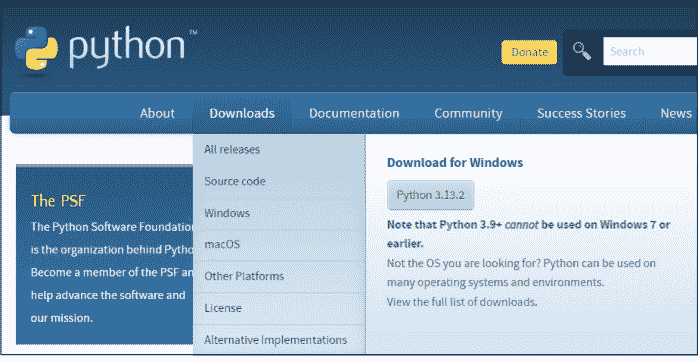

###### 在 Linux 上安装 Python

大多数 Linux 发行版都预装了 Python（通常是 Python 3）。Linux 有许多不同的发行版（或称 distro），包括 Arch、Debian、Fedora 和 Ubuntu。我无法为每一个提供分步说明。但一个好的起点可能是确定你是否已经安装了 Linux，如果是，是哪个版本。你应该可以通过以下步骤来完成：

1.  按 Ctrl+Alt+T 打开终端。
2.  输入以下内容并按回车键：
    ```
    python3 --version
    ```
    如果命令返回类似 Python 3.12.2 的信息，则表示 Python 已安装。如果出现错误，请尝试以下命令：
    ```
    python --version
    ```
    如果两次尝试都出现错误信息，或者你想要更新版本的 Python，你仍然可以从 Python 网站安装。下载并安装 Gzipped 源代码 tarball 或 XZ 压缩源代码 tarball 文件。或者查阅你特定 Linux 发行版的文档以获取建议。你也可以选择向任何 AI 询问与你特定 Linux 发行版相关的建议。

#### 本章内容

-   选择和安装代码编辑器
-   创建和使用虚拟环境
-   开始一个新项目
-   使用 Python 脚本

#### 第 2 章
#### 选择代码编辑器

要编写 Python 代码，你需要一个代码编辑器。如果你已经使用 Python 编程一段时间，并且已经有了偏好的编辑器，欢迎继续使用它。如果你刚开始学习 Python，我推荐 Visual Studio Code（简称 VS Code），这也是我在本书中使用的编辑器。VS Code 是世界上使用最广泛的代码编辑器，非常适合 Python 编程。

就个人而言，我也使用 VS Code 来编写层叠样式表（CSS）、超文本标记语言（HTML）和 JavaScript 代码，这些是创建网站和 Web 应用程序的主要语言。如果你考虑学习这类编程，VS Code 也会非常适合你。


VS Code 的硬件要求很低。以下是简要概述：

-   **操作系统：** Linux 64 位发行版（例如，Ubuntu 16.04+、Debian 9+、Fedora 24+ 等）；macOS 10.15 (Catalina) 或更高版本；或 Windows 7、8.1、10 或 11（32 位或 64 位）。
-   **处理器：** 1.6 GHz 或更快（例如，Intel Core 2 Duo、AMD Athlon 64 X2、Apple M1 或更高）。
-   **随机存取存储器 (RAM)：** 1GB（Linux 或 Windows）或 512MB（macOS）。但 4GB 或更多更好。
-   **存储空间：** 基本安装约需 200MB 至 300MB。
-   **显示器：** 至少 1,024 x 768 分辨率。

大多数现代计算机都大大超过了这些要求。

#### 安装 VS Code

要将 VS Code 用作你的代码编辑器，第一步是下载并安装它。这基本上就是浏览到 https://code.visualstudio.com 并按照屏幕上的说明操作。以下是分步说明——但请记住，网站随时可能更改，因此如果有什么不同，只需按照你看到的任何屏幕说明操作：

1.  **浏览到** https://code.visualstudio.com。
2.  **点击“Download for Windows”、“Download for macOS”或“Download for Linux”**，具体取决于你使用的操作系统。
3.  **打开你下载文件的文件夹**（通常是你的“下载”文件夹）。
4.  **双击下载文件的图标**（文件名通常以 VSCode 开头）。

如果你使用的是 Windows，请按照屏幕上的说明操作。当进入关于附加任务的页面时，你可以根据自己的偏好勾选或取消勾选任何框。我通常按照图 2-1 所示进行设置。

如果你使用的是 macOS，请将从下载的 Zip 文件中提取出的 Visual Studio Code.app 文件拖到你的“应用程序”文件夹中。

此时 VS Code 应该已经安装好了。在 Windows 上，你应该可以从“开始”菜单启动它（如果它不明显，你可能需要在菜单中搜索它）。如果你选择了桌面图标，双击该图标即可打开 VS Code。当 VS Code 运行时，你可以右键单击任务栏中的其图标，然后选择“固定到任务栏”，以便将来可以轻松地从任务栏启动它。

在 Mac 上，你应该可以从 Launchpad 或“应用程序”文件夹中的其图标启动 VS Code。如果你看到关于 VS Code 是从互联网下载的警告，请无论如何继续打开它。当 VS Code 运行时，你可以右键单击 Dock 中的其图标，然后选择“选项 ⌥” > “保留在 Dock 中”，以便将来轻松访问。

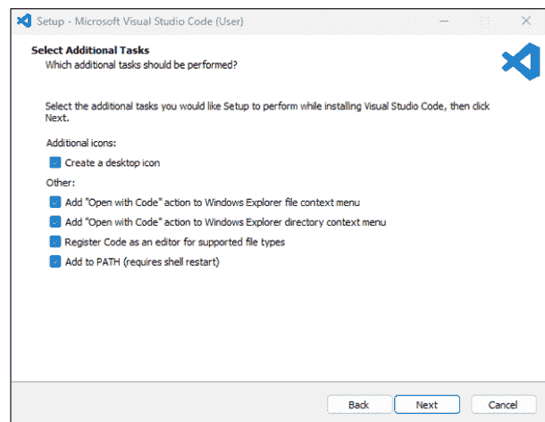

图 2-1：Windows 的附加选项。


VS Code 以 Copilot 的形式提供免费的人工智能 (AI)。首次启动 VS Code 时，你可能会看到免费设置 Copilot 的选项。这是一个帮助学习编程的好工具。你需要一个 GitHub 帐户才能启用它。如果你有 GitHub 帐户，可以现在设置 Copilot；否则，你可以暂时跳过该选项，稍后再回来设置。

VS Code 可能会默认使用深色主题，如果你喜欢，欢迎使用。然而，在本书中，我使用的是浅色主题，因为图片在纸上这样看起来更好。要选择你自己的主题，请在 VS Code 中单击“设置”（左下角的齿轮图标），然后选择“主题 : 颜色主题”。我在本书中始终使用“浅色现代”主题。

VS Code 左侧的图标栏（见图 2-2）称为活动栏。它包含你将经常使用的图标。要查看任何图标的名称，只需将鼠标指针悬停在该图标上即可。在下一节中，你将使用“扩展”图标向 VS Code 添加 Python 扩展。

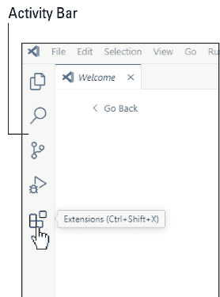

图 2-2：VS Code 中的活动栏。将鼠标指针悬停在任何图标上以查看其名称。

#### 安装 Python 扩展

要在 VS Code 中编写 Python 代码，你需要安装 VS Code Python 扩展。请按照以下步骤操作：

1.  单击 VS Code 活动栏中的“扩展”（如图 2-2 中鼠标指针附近所示）。
2.  在左侧面板顶部的搜索框中，输入 Python。
3.  找到 Microsoft 提供的 Python（下载量超过 1 亿次），并单击其“安装”按钮（见图 2-3）。

不用担心其他 Python 扩展。

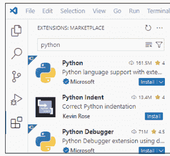

图 2-3：安装来自 Microsoft 的 Python 扩展。

安装扩展应该只需要几秒钟。完成后，从搜索框中删除搜索词 *Python* 以查看所有已安装的扩展。该列表现在应包括 Pylance、Python 和 Python Debugger，如图 2-4 所示（这三项都包含在下载中）。

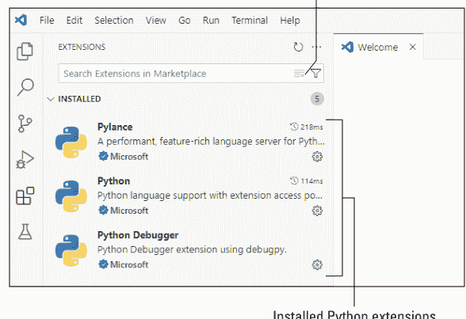

> **记住**
> 如果你在 VS Code 中遇到问题，或者只是想知道如何做某事，请随时向 AI 寻求帮助。几乎所有现代 AI 聊天机器人都能告诉你任何你想知道的关于 VS Code 的信息。

#### 为新项目创建文件夹

无论你编写的是一个小型自动化脚本还是一个大型应用程序，你都将处理一个项目。在 Python 中，将每个项目放在自己的文件夹中总是一个好主意。该文件夹在 VS Code 中被称为 *工作区文件夹*。在我们继续之前，让我们创建一个新的空文件夹，以便你可以看到所有涉及的步骤：

1.  **如果 VS Code 仍然打开，请关闭它。**
    在 Windows 或 Linux 上，从 VS Code 菜单栏中选择“文件” > “退出”。在 macOS 上，从 VS Code 菜单栏中选择“Code” > “退出 Visual Studio Code”。

#### 在 VS Code 中打开项目文件夹

无论你是开始一个新项目，还是返回一个已开始的现有项目，第一步都是在 VS Code 中打开项目文件夹。

> 如果你使用的是 Windows，你可能可以右键单击文件夹图标，然后选择“通过 VS Code 打开”或“显示更多选项” > “通过 Code 打开”，以同时打开 VS Code 和该文件夹。

无论你使用什么操作系统，都可以按照以下步骤在 VS Code 中打开你的项目文件夹：

1.  **打开 VS Code。**
2.  **在左侧活动栏顶部附近，单击“资源管理器”。**
3.  **单击“打开文件夹”。**
4.  **导航到该文件夹的父目录，单击该文件夹的图标，然后单击“打开”。**
5.  **如果你看到一条关于信任该文件夹的消息，请选择“是的，我信任作者”（因为你自己就是作者！）。**

资源管理器窗格将保持打开状态。你打开的文件夹名称会显示在该窗格的顶部附近（参见图 2-5）。该文件夹就是项目的*根文件夹*，在 VS Code 中也称为*工作区文件夹*。构成你项目的所有子文件夹和文件都将包含在此工作区文件夹中。

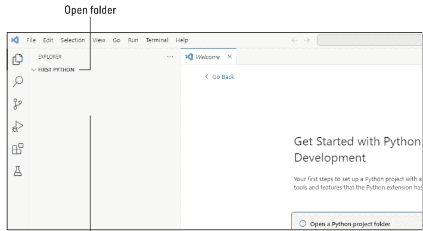

图 2-5：在资源管理器窗格中打开的项目文件夹。

> 在 VS Code 中单击根文件夹名称可以展开和折叠它，以显示或隐藏该文件夹中的文件。通常，你需要将其展开以查看项目中包含的子文件夹和文件。

#### 选择你的 Python 版本

在开始使用 Python 进行任何实际工作之前，最好先了解当前激活的是哪个版本的 Python（如果有的话）。因此，在 VS Code 中打开文件夹后，你可能想做的第一件事是按照以下步骤操作：

1.  **从 VS Code 菜单栏中，选择“视图” > “命令面板”。**
    如果你愿意，可以在 Windows 中按 Ctrl+Shift+P，或在 macOS 中按 ⌘+Shift+P。按 F1 也可能有效。
2.  **输入 `sel`，然后从下拉菜单中单击“Python: 选择 Python 解释器”，如图 2-6 所示。**
3.  **如果你有多个版本可供选择，请单击“推荐的 Python 解释器”，如图 2-7 所示。**

屏幕上不会显示任何内容来指示你选择了哪个 Python 解释器，但不用担心：我将在下一节中向你展示如何使用终端来确定这一点。

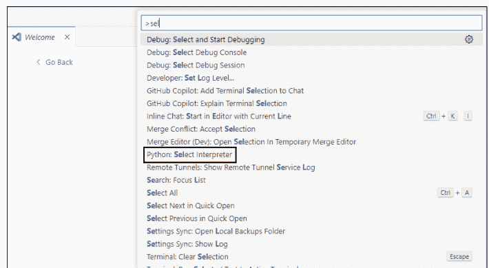

图 2-6：选择 Python 解释器。

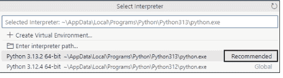

图 2-7：选择推荐的 Python 解释器。

在本章中，我让你选择推荐的解释器，以防你刚开始使用 Python 并且只想使用最新的 Python 版本。在实践中，一些项目需要特定的 Python 版本，因此 VS Code 允许你在每次启动时选择一个。本书不需要这个，但我提到它是因为选择特定版本有助于高级开发者。

#### 在 VS Code 中打开终端

使用 Python 时，大部分时间你会使用终端窗格。终端提供了一个*命令行界面* (CLI)，用于通过键盘输入命令。你可以通过菜单或快捷键打开终端，如下所示：

- 从菜单栏中选择“视图” > “终端”。
- 按 F1，或在 Windows 中按 Ctrl+`，或在 macOS 中按 Command+`。` 是反引号字符，通常在键盘上数字 1 的左侧。

终端在 VS Code 窗口底部附近打开，看起来类似于图 2-8（在 Windows 中）。你看到的 PS 和路径是*命令提示符*，你可以在其中输入命令。

22 第 1 部分 Python 自动化入门

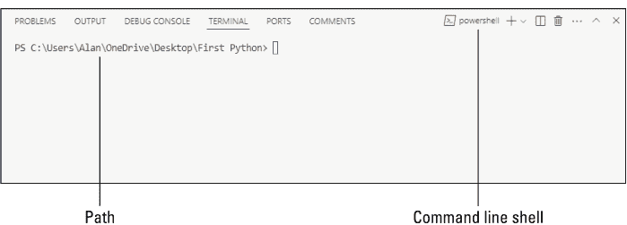

在 Linux 和 macOS 中，命令提示符会有所不同，但现在不用担心这个。我将在本章稍后激活虚拟环境后进行更多解释。然而，值得注意的是，你并不局限于当前显示的默认命令行 shell。如果你愿意，可以使用当前 shell 名称旁边的下拉箭头来选择不同的命令行 shell。

你总是想知道在 VS Code 中使用的是哪个 Python 版本，而终端可以让你找出答案，正如我在下一节中解释的那样。

#### 检查你的 Python 版本

要查看你当前使用的 Python 版本，可以输入命令 `python --version` 或 `python -V`（这里大小写很重要）。但在你设置虚拟环境之前（参见下一节），该命令可能会给你一条错误消息。解决这个问题的技巧可能看起来很奇怪，但方法如下：

- 在 Windows 中，在命令中使用 `py` 而不是 `python`。
- 在 Linux 或 macOS 中，使用 `python3` 而不是 `python` 作为命令。

这种奇怪现象的原因与操作系统 PATH 有关，它决定了过去如何处理系统命令（从操作系统运行的命令），以及不同项目可能需要不同 Python 版本的事实。`py` 和 `python3` 都是 python 命令的*别名*，将使用当前可用的任何 python 版本。在 VS Code 中，这就是你在命令面板中选择“Python: 选择 Python 解释器”时选择的 Python 版本（参见本章前面的“选择你的 Python 版本”）。

Python 代码区分大小写，这意味着你不能互换使用大写和小写字母。你必须使用本书中显示的相同大小写字母，才能使事情按本书所述的方式工作。

当 VS Code 告诉你它无法识别 `python` 作为命令时，你仍然可以使用以下方法确定你的 Python 版本：

- 在 Windows 中，输入命令 `py --version` 或 `py -V` 来确定你的 Python 版本。
- 在 Linux 或 macOS 中，输入命令 `python3 --version` 或 `python3 -V` 来确定你的 Python 版本。

在你输入适当的命令并按 Enter 后，当前的 Python 版本将显示在你输入的命令下方，如图 2-9 所示。

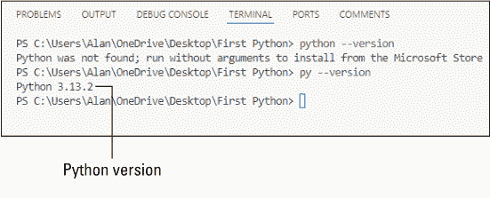

在你设置并激活虚拟环境后，`python` 命令将按预期工作。现在让我们开始处理虚拟环境的整个过程。

#### 使用虚拟环境

每个 Python 脚本或应用程序都应该位于自己的文件夹（其*工作区文件夹*）中，以便于组织和可移植性。每个脚本还需要自己的虚拟环境，指定 Python 版本和模块依赖项，才能正确运行。这种设置允许你在任何计算机（Linux、macOS、Windows）上执行脚本，无论系统的 Python 版本或已安装的模块如何。

起初，创建虚拟环境的过程可能看起来有点麻烦。但你会习惯的，而且创建和激活虚拟环境所带来的好处完全值得付出这点微小的努力。

##### 创建虚拟环境

从技术上讲，创建虚拟环境的命令是 `python -m venv`，后跟虚拟环境的名称。但是，当然，那个 `python` 命令可能会失败，所以你必须在 Windows 中使用 `py` 别名，或在 Linux 或 macOS 中使用 `python3` 别名才能使其工作。

`-m` 是一个*标志*，它告诉 Python 将名为 `venv` 的模块作为脚本运行，而不是作为模块（我们通常将其添加到现有脚本中而不是直接运行）。名称 `venv` 是 *virtual environment*（虚拟环境）的缩写。

你还需要给虚拟环境一个名称。虚拟环境存储在工作区文件夹名称下的一个子文件夹中。你可以将你的虚拟环境命名为任何你喜欢的名字，但 `.venv` 是一个常见的名字。与你随机选择的某个名字相比，`.venv` 这个名字有几个优点：

- `.venv` 中的点号向其他开发人员发出信号，表明该文件夹包含配置或实用程序信息，而不是实际 Python 代码的一部分。
- 许多现代编辑器，如 VS Code 和 PyCharm，将 `.venv` 识别为虚拟环境，并自动检测它以进行 Python 解释器选择，从而减少设置步骤。
- 在类 Unix 系统（Linux、macOS）上，以点开头的文件和文件夹是隐藏的，除非用户特别知道如何查找它们。这可以防止经验不足的用户在不知道自己在做什么的情况下弄乱 `.venv` 文件夹。

简而言之，你可以将使用 `.venv` 作为虚拟环境文件夹名称视为一种“最佳实践”，这种一致性将使你一眼就能更容易地识别其用途。

要创建一个名为 `.venv` 的虚拟环境，请打开 VS Code 终端并输入适当的命令：

- **Windows：** `py -m venv .venv`
- **Linux 或 macOS：** `python3 -m venv .venv`

按 Enter 后，你不会在终端中得到任何反馈。但如果你查看资源管理器窗格，你可能会在你的工作区文件夹根目录下看到 `.venv` 文件夹图标，在我们的工作示例中是 `First Python`。你也可能会看到图 2-10 所示的消息在 VS Code 的右下角弹出。

##### 激活虚拟环境

创建虚拟环境并不等于激活虚拟环境。在开始编写脚本或运行脚本之前，你始终需要确保虚拟环境已激活。这将在 VS Code 的终端窗口中完成。终端中的命令提示符应仍显示工作区根文件夹的路径。根据你的操作系统，输入以下命令之一来运行该文件夹内的激活脚本：

```
>> Windows: .venv\Scripts\activate
>> Linux 或 macOS: .venv/bin/activate
```

请注意，Windows 使用反斜杠（\），而 Linux 和 macOS 使用正斜杠（/）。请务必使用此处显示的大小写字母。

如果你看到一个关于脚本来自“未知发布者”的警告，输入 **A** 并按回车键以始终运行。此处的发布者是创建了 venv 模块的 Python 软件基金会，你完全可以信任他们。

当虚拟环境处于活动状态时，该虚拟环境的名称会显示在命令提示符中，这样你就知道当前使用的是哪个虚拟环境。图 2-11 展示了在 Windows 中命令提示符可能的样子，其中名称 `.venv` 被括在命令提示符开头的括号中。

在 Linux 或 macOS 环境中，命令提示符路径看起来不会与图 2-11 所示完全相同。如果你使用的是 zsh 命令行 shell，它看起来会更像这样：

```
.venvalan@MacBookAir First Python %
```

如果你使用的是 bash shell，它看起来会更像这样：

```
bash
.venvMacBookAir:First Python alan$
```

在你自己的计算机上，*MacBookAir* 将是你所使用计算机的名称，而 *alan* 将是你自己的用户名。

Z shell（或 zsh）是一种命令行解释器 shell，类似于 Bash（Bourne Again Shell 的缩写），但功能更强大。在 2019 年发布的 macOS Catalina 10.15 之前，macOS 使用 Bash 作为默认 shell；此后，zsh 一直是 macOS 的默认 shell。

你可以通过点击终端右上角当前 shell 名称旁边的下拉箭头（参见图 2-8）来选择要使用的命令行 shell。但无论使用哪种 shell，Python 命令的工作方式应该相同。

激活虚拟环境后，你不再需要在命令中使用像 `py` 或 `python3` 这样的别名来代替 `python`。`python` 命令无需别名即可工作。因此，现在你可以使用 `python --version` 或 `python -V` 来查看当前项目所使用的 Python 版本号。

当你的工作区文件夹已打开且虚拟环境已激活时，你就可以开始创建或修改脚本，或者运行已创建的脚本了。在工作区中，你极不可能需要停用虚拟环境。但为了完整性，我应该告诉你这很容易做到。无论你使用什么操作系统，只需在命令提示符下输入以下命令并按回车键即可：

```
bash
deactivate
```

虚拟环境的名称将从终端命令提示符的开头消失。`python` 命令将再次无法识别，因此你必须使用 `py` 或 `python3` 别名来运行任何 Python 命令。

##### 安装模块

在你创建并打开了项目工作区文件夹、选择了 Python 版本（解释器）、创建并激活了虚拟环境之后，你就可以安装项目可能使用的任何模块了。那么，什么是模块，为什么要使用它们？

Python *模块* 是其他人已经编写的、用于执行特定任务的 Python 代码。大多数模块已经存在多年，经过多年的完善和改进，非常适合执行它们设计要完成的任务。模块通过提供可信赖的代码来执行一些常见任务，帮助你避免重复造轮子。

一些模块是 Python 标准库的一部分，在你首次安装 Python 时会自动安装。你只需在代码顶部包含一个 `import` 语句，就可以随时在代码中使用它们。最常见和广泛认可的模块包括以下：

- **math**：数学函数
- **os**：操作系统接口
- **sys**：系统特定的参数和函数
- **datetime**：日期和时间处理
- **random**：随机数生成

为了保持基础 Python 安装的精简，许多更大、更专业的模块并未包含在内。但当你确定虚拟环境处于活动状态时，可以在命令提示符下使用 `pip install` 命令将它们添加到你的虚拟环境中。名称 *pip* 是 Pip Installed Packages 的缩写，这正是它的功能。你只需输入如下命令：

```
pip install modulename
```

将 *modulename* 替换为你想要导入的模块名称。或者，你可以通过用空格分隔多个模块名称来一次性安装多个模块，如下所示：

```
pip install modulename1 modulename2 modulename3 modulename4
```

那么，你如何知道为一个脚本导入哪些模块呢？当你是一个初学者，正在创建自己的脚本时，你可能不知道。但当你运行一个现有的脚本，比如本书中介绍的那些脚本时，代码顶部的 `import` 语句会准确地告诉你需要哪些模块。

```
import requests
import tkinter as tk  # 用于 GUI
from bs4 import BeautifulSoup  # 用于网页抓取
import pandas as pd  # 用于数据处理
import matplotlib.pyplot as plt  # 用于绘图

class WeatherDashboard:
    def __init__(self, root):
        self.root = root
        self.root.title("Weather Dashboard")
        self.root.geometry("400x500")
```

要安装的模块名称总是紧跟在 `import` 一词之后。不要担心前面示例代码中的 `from` 或 `as` 名称（`import tkinter as tk` 或 `from bs4 import BeautifulSoup`）。只需在你的 `install` 命令中使用 `import` 之后的名称即可。例如，要安装运行该脚本所需的包，你可以输入以下 `pip install` 命令：

```
pip install requests
pip install beautifulsoup4
pip install pandas
pip install matplotlib
```

或者，你可以使用以下单个命令一次性导入它们：

```
pip install requests beautifulsoup4 pandas matplotlib
``

现在不必担心记住所有这些内容。我将在本书介绍的每个自动化脚本中解释其依赖关系。目前，只需理解脚本顶部的 `import` 语句与将这些模块添加到脚本虚拟环境的 `pip install` 命令之间的联系即可。

#### 编写和运行 Python 脚本

到目前为止，我们所做的一切都是为了设置环境以创建 Python 应用程序或脚本。*app* 是 *application* 的缩写，它通常指需要数十个代码文件的大型商业应用程序。在 Python 中，通常将单文件应用程序称为 *scripts*。本书中的大多数自动化项目只需要一个代码文件，因此我使用 *script* 一词多于 *app*。但无论你称其为脚本还是应用程序，每个都需要自己的工作区文件夹和虚拟环境。

在本节中，我将向你展示如何编写和运行 Python 脚本。

##### 编写 Python 脚本

现在是时候编写你的第一个 Python 脚本了。如果你一直跟着操作，你已经在 VS Code 中打开了 `First Python` 工作区文件夹，并且你的 `.venv` 虚拟环境已激活。你已准备好创建你的第一个脚本。每个脚本只是工作区根文件夹中的一个文件。该文件必须具有 `.py` 扩展名。文件名本身应遵循与 Python 变量名相同的规则。简而言之：

- 使用全小写字母。
- 首字符使用小写字母（不是数字或下划线）。
- 使用下划线（_）代替空格。
- 不要使用任何特殊字符（例如，!、@、#、- 等）。
- 不要使用内置模块的名称（例如，sys、os、math、random、datetime、io 等）。
- 使名称尽可能具有描述性，并始终使用 .py 扩展名。

表 2-1 展示了良好和不良文件名的示例，其中第三列指出了不良示例中的问题。

**表 2-1 良好和不良的 Python 文件名**

| 良好文件名 | 不良文件名 | 为什么不好 |
| :--- | :--- | :--- |
| main.py | Main.py | 它包含大写字母。 |
| calculate_stats.py | math.py | 它与内置模块同名。 |
| file_reader.py | File Reader.py | 它包含大写字母和空格。 |
| process_images.py | 9images.py | 它以数字开头。 |

如果你不确定文件名，可以询问任何AI：“Python内置模块的名称有哪些？”

在了解了所有规则和指南之后，在VS Code中创建文件的实际过程相当简单。确保在资源管理器窗格中选中了根文件夹。然后，按照以下步骤操作：

1.  **单击根文件夹名称**（在我们的工作示例中是First Python）以选中它。
    如果文件夹折叠了，你可以再次单击以展开文件夹并保持选中状态。
2.  **单击根文件夹名称正右侧的“新建文件”图标。**
    它看起来像一个带有加号（+）的文档。
3.  **输入带有.py扩展名的文件名。**
    在本示例中，使用hello.py。
4.  **按Enter键。**

文件名应显示在根文件夹名称下方，与.venv文件夹的缩进级别相同。文件会在右侧的编辑器中打开。如果你启用了AI，你会在新文件顶部看到一个提示，邀请你告诉AI你想编写什么代码，如图2-12所示。

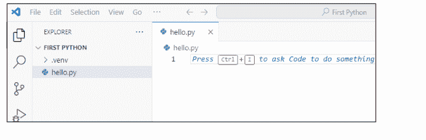

如果你需要在资源管理器窗格中重命名或删除文件，只需右键单击文件名即可看到选项的快捷菜单。如果你不小心将文件放到了.venv文件夹而不是根文件夹中，只需将文件拖到根文件夹名称上并释放即可。

如果你不想使用AI来编写代码，只需开始输入你的代码即可。对于第一个示例，你将创建一个包含Python注释的Hello World脚本。请按照以下步骤操作：

1.  单击资源管理器窗格右侧的编辑器内部，然后输入 # My first Hello World script。
2.  按Enter键，然后输入以下Python代码：
    ```python
    print("Hello, World!")
    ```
    请注意，这是代码，因此你必须完全按照所示输入，否则它将无法工作。
3.  按Enter键。

图2-13显示了现在的样子。脚本的名称出现在编辑器窗格顶部的选项卡中。你输入到脚本中的代码显示在下方。

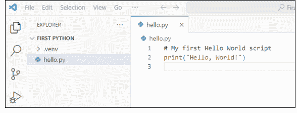

Python中的`print()`命令告诉Python在*执行*（运行）脚本时将某些内容输出到终端。在示例`print("Hello, World!")`中，我们期望该行显示`Hello, World!`作为输出。要测试它，你需要运行脚本，正如我在下一节中解释的那样。

#### 运行Python脚本

运行Python脚本很简单，你有几种选择。在本节中，我将描述最常见的方法。

如果你还没有这样做，请单击脚本文件名（在示例中是`hello.py`）以在编辑器中查看其代码。然后单击VS Code窗口右上角附近的“运行Python文件”（参见图2-14）。

脚本运行，`print()`命令的任何输出都会出现在终端中，例如你在图2-15中看到`Hello, World!`的地方。

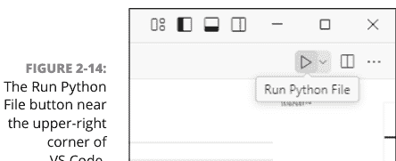

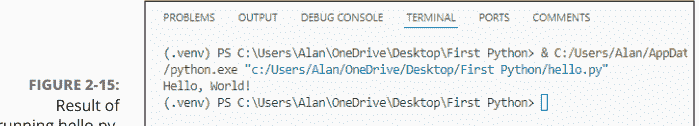

作为使用“运行Python文件”按钮的替代方法，你可以在终端的命令提示符处输入**python scriptname**。例如，要运行hello.py，你需要在终端中输入以下内容并按Enter键：

```
python hello.py
```

脚本运行并以通常的方式显示任何`print()`输出。

#### 打开现有项目

创建脚本后，你不需要每次运行或处理脚本时都执行所有这些步骤。事实上，你真正需要做的只是打开工作区文件夹并激活其虚拟环境。步骤很简单：

1.  在VS Code中打开脚本的工作区文件夹。
2.  从VS Code的菜单栏中选择“视图” > “终端”以打开终端。
3.  激活你的虚拟环境：在Windows中，输入.venv\Scripts\activate。在Linux或macOS中，输入.venv/bin/activate。
    确保不要输入末尾的句点。
4.  要编辑脚本，请单击其名称。
5.  要运行脚本，请单击其名称并单击“运行Python文件”，或使用语法`python filename.py`从终端的命令提示符运行脚本。

对于任何现有项目，这应该都能奏效。

#### 第3章
自动化Python基础

在本章中，你将发现编写Python代码的概念、命令和结构。如果你是一位经验丰富的Python开发者，这些内容对你来说大部分不会是新闻。如果你有其他编程语言的经验，这些术语和概念将会很熟悉——你只是在学习Python的实现方式。而如果你是编写代码的新手，*所有*这些内容都将是全新的。

> 请记住
这一章并不能替代一整本关于Python的书。（如果你需要那样的书，请查看John C. Shovic和Alan Simpson合著的《Python All-in-One For Dummies》（由Wiley出版））。本章的目标是让你快速了解Python，并为你提供本书自动化脚本中代码的快速参考。

#### 理解Python注释

Python注释实际上不是Python代码。相反，它们是嵌入在代码中的纯英文说明。注释对代码的运行或执行方式没有影响。在编写自己的代码时，你可以包含注释作为给自己的笔记，提醒自己代码的功能。在整本书中，我使用注释来描述正在发生的事情并帮助你学习。

要输入单行注释，请先输入#。同一行中#右侧的所有文本（仅限该行）都是注释。例如，查看以下行，x=10部分是实际的Python代码，而#右侧的文本是纯英文注释。

```
x=10 # Store the number 10 in the variable named x.
```

你还可以通过将注释文本放在两组三重引号（""""""）或三重撇号（' ' '）之间来向代码添加更长的多行注释。例如，两组三重引号之间的所有文本都是注释文本，而不是代码：

```
"""
In Python, any text between triple quotation marks or triple apostrophes is
a comment.
"""
```

#### 掌握变量和数据类型

几乎所有Python脚本（以及其他语言中的代码）都使用*变量*来存储数据（信息）。将变量想象成一个可以存放物品的小隔间。脚本中的每个变量都必须有一个唯一的名称。你可以自己编造变量名，只要遵守以下规则：

-   变量名必须以字母（a–z或A–Z）开头。
-   在第一个字母之后，变量名可以包含任何字母（a–z或A–Z）、任何数字（0–9）或一个或多个下划线（_）。
-   变量名不能包含空格或特殊字符，如!、@、#、$、-等。
-   Python变量名区分大小写，这意味着myVar、MyVar和myvar被视为不同的变量。
-   变量名不能与Python的任何命令或关键字匹配，例如if、for、while、class、def、True、False等。

除了这些硬性规定外，还有一些最佳实践风格指南，在PEP 8（https://peps.python.org/pep-0008）中定义。该指南是一套编写清晰、可读和一致代码的建议。它由Guido van Rossum（Python的创造者）等人编写。PEP代表Python增强提案，大多数Python开发者都遵循它。PEP 8对变量名的建议如下：

-   变量名使用小写字母和下划线（例如，`my_variable`）。
-   对于*常量*（值永不改变的变量），使用全大写（例如，`TAX_RATE`）。
-   除非是特殊情况（例如，类中的私有变量），否则避免以下划线开头。
-   使用描述性名称来表明变量的用途（例如，`user_age`而不是`x`）。


变量名的长度没有严格限制，但最好保持简洁和有意义以提高可读性。

每个变量都包含一些*值*。这里有一个示例，其中变量`user_name`包含值`alan`：

```python
user_name = "alan"
```

存储在变量中的值具有*数据类型*。计算机为了效率和速度，以不同的方式存储不同类型的信息。接下来的几节将描述每种数据类型并提供其使用示例。

##### 处理数字

你可能知道，计算机非常适合处理数字。在Python中，有两种数字数据类型：

-   **整数（int）：** 没有小数点的整数，例如2、11、1,345或-11
-   **浮点数（float）：** 包含小数点的数字，例如3.12、99.98或-1.075。值的范围从2.35x10^-308到1.797x10^308。


输入数字时，切勿包含美元符号或逗号，即使该数字代表美元金额。例如，你必须将美元金额$1,234.57输入为1234.57。你的脚本可以在输出中*显示*带有美元符号和逗号的数字。但在将数字值赋给变量时，你需要省略这些符号。

以下是一些变量被赋予数值的示例，并附有解释性注释：

```
quantity = 10    # 整数
unit_price = 1.98    # 浮点数
sales_tax_rate = 0.065    # 浮点数
temperature = 98.6    # 浮点数
offset = -10    # 整数
```

数字总是代表某种数量，你可以对它们进行数学运算，例如加、减、乘或除。

#### 处理文本（字符串）

要在变量中存储文本，请使用字符串（`str`）数据类型。术语*字符串*指的是一串字符；它不代表你可以用于数学运算的某个数字。你必须将字符串用单引号（`' '`）或双引号（`""`）括起来，这样 Python 才能将其识别为字符串。

字符串通常是诸如姓名、电子邮件地址、产品名称，甚至是整个句子之类的东西。以下是一些 Python 变量被赋予字符串值的示例：

```
name = "Alice"    # 字符串
greeting = 'Hello, world!'    # 字符串
email_address = "someone@somewhere.com"    # 字符串
message = 'Please insert a USB drive to continue.'    # 字符串
```

在输入自己的代码时，将字符串用单引号还是双引号括起来并不重要。Python 无论如何都会将其视为字符串。但是，PEP 8 指南建议你在任何给定的脚本中始终如一地使用其中一种，以保持一致性和可读性。

如果字符串本身包含单引号或双引号，例如单词 *don't*（撇号与单引号相同），这可能会导致错误，因为它看起来像是字符串在撇号处结束了：

```
warning = 'Don't do that!'    # 三个单引号会让 Python 感到困惑。
```

有两种方法可以解决这个问题。如果你将字符串用双引号括起来，就不会有冲突，因为 Python "知道"字符串在最后一个双引号处结束：

```
warning = "Don't do that!"
```

另一种解决方法是在嵌入的引号前加上反斜杠。在这种情况下，你可以将整个字符串用单引号括起来，因为反斜杠告诉 Python 撇号是字符串的一部分，而不是字符串的结束：

```
warning = 'Don\'t do that!'  # \ 代表一个嵌入的撇号。
```

#### 用布尔值判断真或假

布尔（bool）数据类型是一个只能是 True 或 False 的值，没有其他值。布尔值通常用于决策。你必须输入首字母大写的 True 或 False，Python 才能将其识别为布尔数据类型。

虽然不是必需的，但通常将任何存储布尔值的变量名以 is_ 开头，如以下示例所示：

```
is_member = False  # 布尔值
is_active = True  # 布尔值
```

名称前的 is_ 表示该变量代表一个布尔值，这有助于使你的代码更具可读性。

#### 使用列表

一个变量并不总是只能包含一个值。一个变量也可以包含一个值的列表。定义列表的规则非常简单：

- 列表必须用方括号括起来：[]。
- 列表中的每个值必须用逗号（,）分隔。
- 列表中的值可以是任何数据类型，它们不必都是相同的数据类型。

一些编程语言使用术语数组来描述列表。但数组是同一件事——一个带编号的值的列表。

以下是一些 Python 变量被赋予值列表的示例：

```
fruits = ["apple", "banana", "orange"]  # 字符串列表
player_numbers = [11, 26, 28, 41]  # 整数列表
data_type_examples = [1, 3.14, "string here", False]  # 值列表
```

列表中的每个项目都有一个索引号或下标，表示其在列表中的位置。然而，与总是从 1 开始的正常计数不同，Python 从 0 开始。因此，在第一个示例中，`fruits[0]` 是 "apple"。在第二个示例中，`player_numbers[1]` 是 26（即使它看起来应该是 11）。

#### 用元组创建不可变列表

我在前面几节中解释的数据类型几乎涵盖了你在 Python 或任何其他编程语言中需要做的所有事情。但 Python 确实有一些更高级的数据类型，有时用于更高级的应用程序。

`tuple`（`tuple`）是一种类似于列表的数据类型，但有一个很大的区别：元组是*不可变的*，这意味着在代码中定义元组后，脚本中的其他代码无法更改任何值或重新排列值。要表示一个值的列表是元组而不是列表，请将值用圆括号而不是方括号括起来。

元组存在的主要原因是计算机处理它们的速度比处理列表快，因为不需要考虑可能的更改。此外，元组是安全的，因为在定义列表后，代码中的任何内容都无法更改列表。以下是一个元组的示例：

```
ny_coordinates = (40.7128, -74.0060)  # 纽约的地图坐标
```

与列表一样，元组中的值从 0 开始编号。即使你使用圆括号而不是方括号，你仍然使用方括号来访问列表中的项目。在以下代码中，一个名为 `latitude` 的变量接收值 40.7128，一个名为 `longitude` 的变量接收值 -74.0060：

```
latitude = ny_coordinates[0]  # 元组中的第一个值 40.7128
longitude = ny_coordinates[1]  # 元组中的第二个值 -74.0060
```

#### 在字典中定义键值对

Python 字典（`dict`）是另一种类似列表的结构，但它包含的不是单个值，而是一个键值对的列表。与用方括号括起来的列表和用圆括号括起来的元组不同，字典总是用花括号（`{}`）括起来。

通常，每对中的键是值所代表内容的名称；值是分配给该名称的数字或字符串。使用冒号（`:`）将键与值分开。与其他列表类型一样，使用逗号分隔每个键值对。以下是一个示例，其中名为 `person` 的变量包含一个关于某人的键值对字典：

```
person = {"name": "Angela", "age": 47, "country": "USA"}
```

字典的好处在于，你只需查看代码就能了解情况：在这个例子中，这个人叫 Angela，47 岁，住在美国。

要访问字典中的值，你不必处理基于零的索引号。使用方括号中的键名来表示你想要的项目。例如，以下代码将一个人的信息存储在三个单独的变量中。

```
user_name = person["name"]  # Angela
user_age = person["age"]  # 47
user_locale = person["country"]  # USA
```

数据字典通常用于存储从数据库中提取的数据。数据字典中的键名代表数据库中某一行的字段名。

#### 用 None 表示“无”

None 是一个特殊的数据类型，表示“无”，甚至不是数据类型。它有时用于创建一个占位符变量，其实际值和数据类型可能在代码的后面确定。在你的代码中，你可以在决策中使用 `None`（本章稍后描述）来确定变量是否已被赋值。

假设你构建了一个始终以未登录用户开始的 Web 应用程序。在你的代码中，你可以将用户名变量设置为 `None`，以明确表示尚无用户登录：

```
# 变量 user_name 没有数据类型或值
user_name = None
```

后续显示页面标题的代码可以显示一条消息，要求用户登录（如果用户尚未登录）。否则，它可以显示 `Hello` 后跟用户名，如下所示：

```
# 如果没有登录用户，则设置提示登录。
if user_name is None:
    prompt = ("Sign In")
```

# 否则，将提示设置为“Hello”加上用户名。
else:
    prompt = ("Hello " + user_name)
```

我知道我们还没有讨论过 if...else，所以如果你是 Python 新手，这个例子可能有点超前。但别担心——我将在本章后面的“做出决策”部分详细讲解 if...else。


人工智能（AI）对 Python 和数据类型了如指掌。任何时候你对这方面有疑问，都可以先考虑向任何免费的 AI 寻求澄清。你会立即得到答案。

#### 格式化输出

编写脚本时，Python 开发人员经常使用 `print()` 将数据输出到终端，以检查某些内容，例如某个数据或条件的值。`print` 语句使用简单的语法：

```
print(value)
```

其中 `value` 是字面字符串、数字或变量名。如果值是字面文本，它必须用单引号或双引号括起来：

```
print('Hello world!')
```

这行代码在屏幕上“打印”出 Hello World!。在下面的示例中，一个名为 `user_name` 的变量被设置为 Wanda。`print()` 语句在屏幕上显示 Wanda，因为名为 `user_name` 的变量没有用引号括起来，所以 Python 将其视为变量名而不是字面文本：

```
# 将 Wanda 放入名为 user_name 的变量中。
user_name = "Wanda"
# 显示 user_name 变量的内容。
print(user_name)
```

当你想在输出中同时显示字面文本和变量数据时，可以使用格式化字符串字面值，或 f-string。要使用这样的字符串，请在 `print` 后的左括号后立即放置一个小写字母 f。在引号内，放入你想显示的字面文本，变量名用引号括起来。例如，下面的代码与前面的代码类似，但它使用 f-string 显示字面文本 Hello there 以及 `user_name` 变量的值：

```
# 将 Wanda 放入名为 user_name 的变量中。
user_name = "Wanda"
# 显示 user_name 变量的内容。
print(f"Hello there, {user_name}!")
```

上述代码的输出是 Hello there, Wanda!

你的 f-string 可以包含任意数量的变量。下面的示例包含两个变量，一个字符串和一个数字。f-string 将它们都打印出来：

```
# 两个变量，一个是字符串，另一个是数字
user_name = "Wanda"
age = 25
# 显示 user_name 变量的内容。
print(f"Hi, {user_name}! I see you are {age} years old.")
```

上述代码的输出是：

```
Hi, Wanda! I see you are 25 years old.
```

显示数字时，你得到的输出可能并不完全符合你的要求。例如，下面的代码打印出 pi 的值（来自 Python 的内置 math 模块）和一个名为 unit_price 的浮点数：

```
# 导入内置的 math 模块。
import math
# 在 f-string 中显示 pi 的值。
print(f"Pi is equal to {math.pi}")
# 现在处理一个美元金额。
unit_price = 12345.67
print(f"The unit price is {unit_price}")
```

该代码的输出是以下两行：

```
Pi is equal to 3.141592653589793
The unit price is 12345.67
```

为了对数字（以及字符串）进行一些控制，你可以使用格式化指令（如表 3-1 所示）来精确指定你希望数字的显示方式。在 f-string 示例中，x 代表包含“示例输入”列中所示值的变量。“输出”列中的下划线将在输出中显示为空格。该表还包括用于用空格对齐字符串和将字符串截断到最大长度的指令。

#### 表 3-1 与 Python f-string 一起使用的格式化指令

| 指令 | 描述 | 示例输入 | f-String 示例 | 输出 |
| :--- | :--- | :--- | :--- | :--- |
| d | 整数（十进制） | 42 | f"{x:d}" | 42 |
| 5d | 整数，宽度 5 | 42 | f"{x:5d}" | ____42 |
| <5d | 整数，宽度 5（左对齐） | 42 | f"{x:<5d}" | 42____ |
| >5d | 整数，宽度 5（右对齐） | 42 | f"{x:>5d}" | ____42 |
| ^5d | 整数，宽度 5（居中） | 42 | f"{x:^5d}" | _42___ |
| 03d | 整数，三位数，零填充 | 7 | f"{x:03d}" | 007 |
| f | 浮点数（默认六位小数） | 3.14159 | f"{x:f}" | 3.141593 |
| .2f | 浮点数，两位小数 | 3.14159 | f"{x:.2f}" | 3.14 |
| 8.2f | 浮点数，宽度 8，两位小数 | 3.14159 | f"{x:8.2f}" | 3.14 |
| <8.2f | 浮点数，宽度 8，两位小数，左对齐 | 3.14159 | f"{x:<8.2f}" | _____3.14 |
| x | 整数，十六进制（小写） | 255 | f"{x:x}" | ff |
| X | 整数，十六进制（大写） | 255 | f"{x:X}" | FF |
| o | 整数，八进制 | 8 | f"{x:o}" | 10 |
| b | 整数，二进制 | 5 | f"{x:b}" | 101 |
| s | 字符串（默认） | Python | f"{x:s}" | Python |
| 10s | 字符串，宽度 10（左对齐） | Python | f"{x:10s}" | Python____ |
| >10s | 字符串，宽度 10（右对齐） | Python | f"{x:>10s}" | _____Python |
| .3s | 字符串，截断为三个字符 | Python | f"{x:.3s}" | Pyt |
| % | 百分比（乘以 100） | 0.75 | f"{x:%}" | 75.000000% |
| 0.10% | 百分比，一位小数 | 0.75 | f"{x:.1%}" | 75.00% |
| , | 千位分隔符（整数） | 1234567 | f"{x:,d}" | 1,234,567 |
| ,.2f | 千位分隔符（浮点数） | 12345.6789 | f"{x:,.2f}" | 12,345.68 |

#### 处理日期和时间

Python 没有用于处理日期和时间的数据类型，但它有强大的内置模块来帮助处理它们。主要的内置模块名为 `datetime`。要使用它，请在脚本顶部包含以下语句：

```
from datetime import datetime
```


请注意，前面的代码是 `from datetime import datetime`，而不是仅仅 `import datetime`。这允许你在变量赋值中定义日期而无需重复 `.datetime`。如果我使用 `import datetime` 作为第一行代码，第二行将需要是 `dt = datetime.datetime(2026, 11, 28, 15, 30, 0)` 才能工作。没什么大不了的。但这是一个常见的语法，所以我在这里用它作为示例。

要从 `datetime` 获取值，你通常在 `variablename =` 后面跟着 `datetime.`，然后是指定你想要什么的代码。例如，看看下面的内容：

```
from datetime import datetime
current_time = datetime.now()
print(current_time)
```

运行该代码会产生类似这样的输出，但日期和时间是根据你计算机的内部时钟的当前时间：

```
2025-04-12 10:10:51.644321
```

要创建你自己的日期和时间，请使用语法 `datetime.date(year, month, day)`。例如，这行代码将 12/25/2026 存储在一个名为 `my_date` 的变量中：

```
my_date = datetime.date(2026, 12, 25)  # 年, 月, 日
```

要同时指定日期和时间，请使用语法 `datetime.datetime(year, month, day, hour, minute)`。使用 24 小时制表示小时（例如，下午 3:00 用 15 表示）。下面是一个示例，我们将一个名为 `deadline` 的变量设置为 2026 年 11 月 30 日下午 3:30：

```
deadline = datetime.datetime(2026, 11, 30, 15, 30)
```

为了使日期和时间更易于人们阅读，你可以使用 `strftime()` 以及表 3-2 中所示的指令。它们的工作方式类似于表 3-1 中所示的 f-string 指令，但你必须将指令放在 f-string 内 `.strftime()` 的括号中。在“代码示例”列中，`dt` 代表任何 datetime 值。

#### 表 3-2 用于 datetime 值的 .strftime() 格式化的指令

| 指令 | 描述 | 代码示例 | 输出示例 |
| :--- | :--- | :--- | :--- |
| %Y | 带世纪的年份（四位数） | `f"{dt.strftime('%Y')}"` | 2025 |
| %y | 不带世纪的年份（两位数，00–99） | `f"{dt.strftime('%y')}"` | 25 |
| %m | 月份，零填充数字（01–12） | `f"{dt.strftime('%m')}"` | 03 |
| %B | 完整的月份名称 | `f"{dt.strftime('%B')}"` | March |
| %b | 缩写的月份名称 | `f"{dt.strftime('%b')}"` | Mar |
| %d | 月份中的日期（01–31） | `f"{dt.strftime('%d')}"` | 27 |
| %A | 完整的星期名称 | `f"{dt.strftime('%A')}"` | Thursday |
| %a | 缩写的星期名称 | `f"{dt.strftime('%a')}"` | Thu |
| %H | 小时（00–23，24 小时制） | `f"{dt.strftime('%H')}"` | 14 |
| %I | 小时（01–12，12 小时制） | `f"{dt.strftime('%I')}"` | 02 |
| %M | 分钟（00–59） | `f"{dt.strftime('%M')}"` | 35 |
| %S | 秒（00–59） | `f"{dt.strftime('%S')}"` | 22 |
| %p | AM/PM 指示符 | `f"{dt.strftime('%p')}"` | PM |
| %j | 一年中的第几天（001–366） | `f"{dt.strftime('%j')}"` | 086 |
| %w | 星期几作为数字（0–6，其中 0 是星期日） | `f"{dt.strftime('%w')}"` | 4 |
| %U | 一年中的周数（00–53，星期日开始） | `f"{dt.strftime('%U')}"` | 12 |
| %W | 一年中的周数（00–53，星期一开始） | `f"{dt.strftime('%W')}"` | 13 |

| 指令 | 描述 | 代码示例 | 输出示例 |
| :--- | :--- | :--- | :--- |
| %c | 区域设置的日期和时间表示 | `f"{dt.strftime('%c')}"` | Thu Mar 27 14:35:22 2025 |
| %x | 区域设置的日期表示 | `f"{dt.strftime('%x')}"` | 3/27/2025 |
| %X | 区域设置的时间表示 | `f"{dt.strftime('%X')}"` | 14:35:22 |
| %% | 字面量 % 字符 | `f"{dt.strftime('%%Y')}"` | %Y |

例如，以下代码将日期时间设置为2026年11月15日下午3:30：

```
from datetime import datetime  # Import the datetime class
dt = datetime(2026, 11, 28, 15, 30, 0)  # No need for datetime.datetime
print(dt)
print(dt.strftime('%B %d, %Y %I:%M%p'))
```

输出如下：

```
2026-11-28 15:30:00
November 28, 2026 03:30PM
```

第一行显示了不使用任何格式化时日期时间的样子。第二行显示了使用 `strftime()` 格式化后的输出。

#### 使用运算符操作数据

Python 包含了你在任何编程语言中都能找到的所有运算符。如果你需要了解本节中任何运算符的更多信息，可以询问 AI 或参考 Python 官方文档 www.python.org。

#### 使用算术和字符串运算符

迄今为止，最常用的运算符是算术和字符串运算符，如表 3-3 所示。这些运算符用于加法、减法、乘法、除法、幂运算和字符串连接。表中显示的顺序也是标准数学中定义的运算顺序。你在学校可能学过它叫 PEMDAS（括号、指数、乘法、除法、加法、减法）。

##### 表 3-3 算术和字符串连接运算符

| 优先级 | 运算符 | 描述 | 示例 | 结果 |
|---|---|---|---|---|
| 1 | ( ) | 括号（分组） | (2+3)*4 | 20 |
| 2 | ** | 幂运算 | 2**3 | 8 |
| 3 | * | 乘法 | 2*3 | 6 |
| 3 | / | 除法 | 6/2 | 3 |
| 3 | // | 整除 | 7//2 | 3 |
| 3 | % | 取模（余数） | 7%2 | 1 |
| 4 | + | 加法 | 2+3 | 5 |
| 4 | + | 字符串连接 | 'a'+'b' | 'ab' |
| 4 | - | 减法 | 5-2 | 3 |

具有相同运算顺序的运算符在表达式中从左到右执行。`+` 运算符在与字符串一起使用时，只是将字符串连接成一个字符串。例如，在下面的示例中，`user_name` 变量包含 Sarah。然后将其与字符串 "Hello, "（末尾包含一个空格）连接，形成一个名为 `greeting` 的新字符串，其中包含 Hello, Sarah。

```
# Combining strings with the + operator
user_name = "Sarah"
greeting = "Hello, " + user_name
print(greeting)
```

人们有时使用 Please Excuse My Dear Aunt Sally (PEMDAS) 作为记忆运算顺序的助记符。PEMDAS 代表括号、指数、乘法、除法、加法、减法，这是执行运算的顺序。

#### 使用赋值运算符

使用 Python 赋值运算符为变量赋值。之前，我提供了使用 `=` 运算符为变量赋值的示例。例如，`user_name = "Sarah"` 将字符串值 Sarah 赋给名为 `user_name` 的变量。表 3-4 显示了赋值运算符。在示例列中，分号分隔两行独立的代码。结果列显示了执行这两行代码的结果。

##### 表 3-4 Python 赋值运算符

| 运算符 | 描述 | 示例 | 结果 |
| :--- | :--- | :--- | :--- |
| = | 将值赋给变量 | x = 5 | x 为 5 |
| += | 加并赋值 | x = 5; x += 3 | x 为 8 |
| -= | 减并赋值 | x = 5; x -= 2 | x 为 3 |
| *= | 乘并赋值 | x = 5; x *= 2 | x 为 10 |
| /= | 除并赋值 | x = 6; x /= 2 | x 为 3.0 |
| //= | 整除并赋值 | x = 7; x //= 2 | x 为 3 |
| %= | 取模并赋值 | x = 7; x %= 2 | x 为 1 |
| **= | 幂运算并赋值 | x = 2; x **= 3 | x 为 8 |
| &= | 按位与并赋值 | x = 5; x &= 3 | x 为 1 |
| \|= | 按位或并赋值 | x = 5; x \|= 2 | x 为 7 |
| ^= | 按位异或并赋值 | x = 5; x ^= 3 | x 为 6 |
| >>= | 右移并赋值 | x = 8; x >>= 2 | x 为 2 |
| <<= | 左移并赋值 | x = 2; x <<= 2 | x 为 8 |

不要担心理解表 3-4 中的所有赋值运算符。许多运算符非常高级和专业，在 Python 自动化中并不常用。我在这里展示它们是为了全面性。一如既往，AI 或任何参考书都可以为你提供任何运算符的详细信息。

#### 识别其他运算符

除了所有这些赋值运算符外，Python 还提供了用于比较的运算符，如 `==` 表示“等于”，以及逻辑运算符，如 `and` 用于 `country == "USA"` 和 `birth_year < 2000`。这些运算符总结在表 3-5 中。我知道刚开始学习这些东西时信息量很大。但你不需要记住它们——如果在本书的自动化脚本中遇到某个运算符，只需参考本章即可。

如果你需要任何运算符的更多信息，也可以询问任何 AI 或参考 Python 文档 www.python.org。

##### 表 3-5 Python 一元、比较和其他运算符

| 类别 | 运算符 | 描述 | 示例 | 结果 |
| :--- | :--- | :--- | :--- | :--- |
| 一元算术 | "+x" | 一元加（恒等） | "+5" | "5" |
| 一元算术 | "-x" | 一元减（取反） | "-5" | "-5" |
| 比较 | "==" | 等于 | "3 == 3" | "True" |
| 比较 | "!=" | 不等于 | "3 != 4" | "True" |
| 比较 | ">" | 大于 | "5 > 3" | "True" |
| 比较 | "<" | 小于 | "2 < 4" | "True" |
| 比较 | ">=" | 大于或等于 | "5 >= 5" | "True" |
| 比较 | "<=" | 小于或等于 | "3 <= 4" | "True" |
| 逻辑 | "and" | 逻辑与 | "True and False" | "False" |
| 逻辑 | "or" | 逻辑或 | "True or False" | "True" |
| 逻辑 | "not" | 逻辑非 | "not True" | "False" |
| 按位 | "&" | 按位与 | "5 & 3" (0101 & 0011) | "1" (0001) |
| 按位 | "\|" | 按位或 | "5 \| 2" (0101 \| 0010) | "7" (0111) |
| 按位 | "^" | 按位异或 | "5 ^ 3" (0101 ^ 0011) | "6" (0110) |
| 按位 | "~" | 按位非（补码） | "~5" (~0101) | "-6" |
| 按位 | "<<" | 左移 | "2 << 1" (0010 << 1) | "4" (0100) |
| 按位 | ">>" | 右移 | "4 >> 1" (0100 >> 1) | "2" (0010) |
| 身份 | "is" | 对象身份（同一对象） | "a = [1]; b = a; a is b" | "True" |
| 身份 | "is not" | 对象非同一性 | "a = [1]; b = [1]; a is not b" | "True" |
| 成员 | "in" | 成员（包含于） | "'a' in 'abc'" | "True" |
| 成员 | "not in" | 非成员 | "'x' not in 'abc'" | "True" |

#### 使用循环

循环在所有编程语言中都很常见。它们用于多次重复一行或多行代码。你可以使用它们一次访问列表中的项目、驱动器上的文件夹或文件夹中的文件。Python 提供了两种主要类型的循环：`for` 循环和 `while` 循环。

#### 使用 for 循环

`for` 循环在计数或有已知数量的项目需要迭代时很有用。循环为序列中的每个项目执行一段代码块。语法如下：

```
for variable in sequence:
    # Code to repeat
```

将 `variable` 替换为你选择的变量名。此值在循环的每次迭代中计数。将 `sequence` 替换为要循环的列表或项目集合的名称。冒号 (`:`) 标记循环块的开始，缩进定义了哪些代码属于循环内部。缩进至关重要，因为只有在 `for` 语句下缩进的代码才会在每次循环迭代时重复。`for` 下的第一个未缩进行直到循环完成才会执行。

这是一个示例，我定义了一个包含三个值的列表，然后使用 `for` 循环遍历列表并在单独的行上打印每个项目：

```
# Define a list and loop through the list.
fruits = ["apple", "banana", "cherry"]
for fruit in fruits:
    print(fruit)
```

在 Python 自动化中，你更可能循环遍历文件夹中的所有文件或类似的内容。这是一个示例，其中 `folder_path` 变量指示一个假设文件夹的位置和名称。然后 `for` 循环遍历文件夹中的每个文件并显示其名称。该脚本导入了内置的 `pathlib` 模块，该模块包含允许此类循环工作的代码。

```
from pathlib import Path
# Specify the directory path (you can change this to your desired directory).
directory = Path(r"C:\Users\Alan\Documents\Practice") # Windows example
#directory = Path("/Users/Alan/Practice") # Mac example
```

#### 循环一段时间

`while` 循环会在条件为真时重复执行一段代码。这就像在说：“一直做这件事，直到情况发生变化。” 没有变量来跟踪你已经循环了多少次，因此在需要计数的场景下，你不会想使用这种循环。`while` 循环的语法如下：

```
while condition:
    # 要重复的代码
```

条件语句可以是任何能计算出 `True` 或 `False` 的表达式。只要条件保持为 `True`，循环就会一直运行。所有在 `while` 行下方缩进的代码，都会在每次循环中执行。当条件计算结果为 `False` 时，循环停止，代码执行将从循环下方第一个未缩进的行继续。

如果条件永远不计算为 `False`，脚本就会陷入无限循环。如果你发现自己陷入了这种困境，可以按 Ctrl+C 来取消循环。你可能需要按几次 Ctrl+C。

`while` 循环可以用来反复请求用户输入，直到满足某个条件。在下面的示例中，一个提示要求用户输入一个 1 到 10 之间的数字。如果用户忽略了提示并输入了其他内容，循环会一直询问，直到用户遵守要求（或按 Ctrl+C 退出循环）：

```
# 从 user_input 为一个不在 1 到 10 之间的数字开始。
user_input = 0
# 循环直到输入是一个 1 到 10 之间的数字。
while user_input < 1 or user_input > 10:
    try:
        # 从用户获取输入并将其转换为整数。
        user_input = int(input("Enter a number between 1 and 10: "))
    except ValueError:
        # 处理非数字输入（例如，字母或符号）。
        print("Invalid input! Please enter a valid number.")

# 循环结束后，确认有效输入。
print(f"You entered a valid number: {number}")
```

示例代码中的 `try:` 和 `except:` 语句将在本章后面的“处理异常”部分介绍。

#### 退出循环

虽然很少需要，但 Python 提供了三个特殊关键字，用于在循环自然结束之前退出循环，或用于检测循环是否自然完成：

- `break`：立即退出循环。
- `continue`：跳过当前迭代的剩余部分，进入下一次迭代。
- `else`：当循环正常完成时（而不是使用 `break` 时）运行一段代码。

将 `break` 语句与 `if` 条件结合使用，可以在满足某个条件时跳出循环。在下面的示例中，`fruits` 变量包含一些水果名称，其中一个是空字符串（""）。示例代码在遇到这样的字符串时会跳出循环。

```
# 一个水果名称列表
fruits = ["Apple", "Banana", "", "Grape"]
# 打印水果列表。
for fruit in fruits:
    if fruit=="":
        break
    print(fruit)
print("All Done")
```

该代码的输出是：

```
Apple
Banana
All Done
```

`continue` 语句也与 `if` 条件一起使用。然而，它不是停止循环，而是简单地避免在该次循环中执行代码。例如，下面的代码与前面的代码相同，但它用 `continue` 代替了 `break`：

```
# 一个水果名称列表
fruits = ["Apple", "Banana", "", "Grape"]
# 打印水果列表。
for fruit in fruits:
    if fruit=="":
        continue
    print(fruit)
print("All Done")
```

与 `break` 不同，这段代码跳过了打印空字符串，但在退出前继续处理列表中的其余项目。因此，输出如下：

```
Apple
Banana
Grape
All Done
```

`else` 关键字不会阻止循环执行。相反，如果 `for` 循环遍历了所有项目并且没有遇到 `break`，那么 `else` 块中的代码就会运行。如果循环因 `break` 而提前退出，则 `else` 块会被跳过。这对于想要确认循环已完全完成，或在搜索序列后处理“未找到”情况的场景非常有用。

```
numbers = [1, 2, 3, 4, 5]
target = 6
for num in numbers:
    if num == target:
        print(f"Found {target}!")
        break
else:
    print(f"{target} not found in the list.")
```

执行时，前面的代码显示 `6 not found in the list`，因为 `break` 条件从未发生，数字 6 不在列表中。

这是相同的代码，但条件满足了，因为数字 3 在列表中。

```
numbers = [1, 2, 3, 4, 5]
target = 3
for num in numbers:
    if num == target:
        print(f"Found {target}!")
        break
else:
    print(f"{target} not found in the list.")
```

执行时，此代码显示 `Found 3!`，因为数字 3 在列表中。循环在找到 3 后也立即停止搜索。这是一种高效的列表搜索方式，因为循环不需要在确定是否找到 3 之前分析列表中的每个项目。

> 缩进在 Python 中至关重要，除非代码正确缩进，否则上述所有循环都无法工作。在循环内执行的代码必须缩进在 `for` 语句之下，而在 `if` 条件为真时执行的代码必须缩进在 `if` 语句之下。

#### 做出决策

几乎所有 Python 脚本都涉及决策制定（也称为*分支*），以便代码仅在特定条件下执行。Python 提供了三种主要的决策工具：`if...else`、三元运算符和 `match`（从 Python 3.10 版本开始）。你将主要使用比较和逻辑运算符（参考表 3-5）来定义一个计算结果为 `True` 或 `False` 的条件。

#### 使用 if...else 做决策

在 Python 中做出决策最常见的方法是 `if...else` 代码块。缩进在这些代码块中至关重要。缩进在 `if` 语句下的代码仅在 `if` 条件为真时执行。缩进在 `else` 语句下的代码仅在 `if` 条件为假时执行。

让我们从一个简单的例子开始，其中名为 `age` 的变量接收某个数值。在下面的代码中，`if` 语句在年龄大于或等于（>=）18 时打印一件事。否则，它打印不同的消息。

```
# 定义一个变量并赋值一个数字。
age = 18
# 根据 age 变量中的值做出决策。
if age >= 18:
    print("You can vote!")
else:
    print("You're too young to vote.")
```

这段代码说明了缩进在 Python 中的重要性。只有当 `age` 变量包含一个大于或等于 18 的数字时，文本 "You can vote!" 才会显示。如果 `age` 的值小于 18，那么 `else` 条件为真，文本 "You're too young to vote." 就会显示。

有时 `if...else` 可能不够用，因为可能有超过两种结果。这就是 `elif` 语句发挥作用的地方。正如你可能猜到的，`elif` 是 `else if` 的缩写。每个 `elif` 语句都可以有自己的条件，该条件被证明为 `True` 或 `False`。最终的 `else` 语句仅在没有任何 `elif` 条件为 `True` 时执行。

再次强调，缩进对于代码正常工作至关重要。一旦一个 `if` 或 `elif` 语句被证明为 `True`，就不会再考虑其他条件。代码执行将从 `if...elif...else` 块下方的下一个未缩进行继续。这里有一个例子：

```
# 定义一个名为 score 的变量，并赋予它一个 0 到 100 之间的数值。
score = 92
# 根据以下规则为分数分配字母等级：
if score >= 90:
    print("Grade: A")
elif score >= 80:
    print("Grade: B")
elif score >= 70:
    print("Grade: C")
elif score >= 60:
    print("Grade: D")
else:
    print("You have failed the exam.")

# 以下代码在 if...elif...else 块之外。
print("Thanks for playing!")
```

执行时，只有 `if` 或一个 `elif` 或 `else` 语句会执行。最后一行代码没有缩进在 `else` 下，因此无论什么情况，该行都会执行。

#### 使用三元运算符压缩决策

Python 三元运算符是一种在一行中编写简单 `if...else` 语句的紧凑方式。你不能使用 `elif` 条件。但它非常适合根据条件赋值。基本语法是：

```
variable = value_if_true if condition else value_if_false
```

以下代码为两个变量赋值——一个名为 `age`，另一个名为 `status`。`status` 变量的值来自一个三元运算符，如果年龄大于或等于 18，则赋值为 "adult"。否则，状态变量的值会被赋值为 "minor"。因此，它的作用与 `if...else` 语句相同，但非常紧凑，只需一行代码即可执行。由于只有一行代码，所以不需要缩进。

```
# age 变量被赋予一个数值。
age = 20

# status 变量的值取决于 age 变量的值。
status = "adult" if age >= 18 else "minor"
print(status)
```

#### 使用 match 进行决策

Python 3.10 版本新增了 `match` 语句，作为处理多种可能性决策的另一种方式。`match` 语句是一个代码块，以 `match` 关键字开头，后跟一个变量名。其下方通常是两个或多个缩进的 `case` 语句，每个 `case` 语句后跟一个值和一个冒号。每个 `case` 语句下方缩进的一行或多行代码，仅在 `case` 语句中的值与变量的值匹配时才会执行。

在 `match` 代码块的底部，你可以使用 `case _:` —— 下划线代表一个*通配符*，它匹配之前所有 `case` 都未涵盖的任何情况。这就像一个 `else`，仅在前面所有 `case` 语句都不为真时执行。

以下代码展示了一个相对简单的例子，其中 `day` 变量包含一个零到六之间的数字：

```
# 定义一个名为 day 的变量，并为其赋值 0-6。
day = 6

match day:
    case 1:
        print("Monday")
    case 2:
        print("Tuesday")
    case 3:
        print("Wednesday")
    case 4:
        print("Thursday")
    case 5:
        print("Friday")
    # 以下 case 仅在前面所有 case 都不为真时执行。
    case _:
        print("Weekend")
```

你可以使用表 3-5 中的比较和逻辑运算符来设置更复杂的条件。为了代码更紧凑，可以使用按位与运算符 (`&`) 表示“与”，使用按位或运算符 (`|`) 表示“或”。

以下代码展示了一个例子，其中第一个 `case` 语句在 `day` 变量包含工作日（星期一、星期二、星期三、星期四或星期五）时为 `True`。第二个 `case` 语句在 `day` 变量包含星期六或星期日时为 `True`。带有下划线 (`_`) 的通配符 `case` 语句在前面所有 `case` 语句都不为 `True` 时为 `True`。`day.lower()` 表达式将星期名称全部转换为小写，以匹配 `case` 语句中的字母。

```
# 将一个星期名称（字符串）赋值给 day 变量。
day = "Tuesday"
# 根据转换为小写的 day 值进行决策。
match day.lower():
    # 管道运算符 (|) 表示 "或"。
    case "monday" | "tuesday" | "wednesday" | "thursday" | "friday":
        print("Weekday")
    case "saturday" | "sunday":
        print("Weekend")
    case _:
        print("I don't recognize that day")
# 从这里开始的任何代码都在 match 代码块之外。
```

#### 定义 Python 函数

你遇到的大部分 Python 代码都会被组织成 Python 函数。函数是编程中的基本工具，允许你编写可重用、有组织且高效的代码。*函数*是一个执行特定任务的代码块，可以在需要时重复使用。可以把它想象成一个食谱：你定义一次步骤，然后就可以随时使用它，而无需重写所有内容。

在 Python 中，函数使用 `def` 关键字定义。基本结构如下：

```
def function_name(parameters):
    # 代码块（函数执行的操作）
    return result  # 可选：返回一个值
```

`def` 这个词是 *define*（定义）的缩写，它告诉 Python 将后面的代码视为一个函数。代码不会立即执行。相反，脚本中的其他代码可以随时调用该函数来执行其代码。

*function_name* 部分是你自定义的名称。使用小写字母和下划线，而不是空格。名称应描述函数的功能，例如 `calculate_area` 或 `authenticate_user`。

*parameters*（参数）是可选的，它们是变量名，可以在调用函数时接收数据。

`return` 语句标记函数的结束。*result* 是可选的；它是一个变量名，包含返回给调用代码的任何数据。如果你省略 *result*，函数将返回 `None`。

与其他代码块一样，缩进至关重要。函数的所有代码，包括 `return` 语句，都必须缩进在初始定义 `def` 语句的下方。

脚本中的后续代码可以通过函数名后跟圆括号来*调用*该函数。

大多数函数接受一个或多个参数作为输入。函数内的代码然后对该输入执行某些操作，并返回一个值作为结果。下面是一个例子，其中名为 `calculate_area` 的函数接受两个值：`width` 和 `height`（假设是矩形的宽和高）。函数内的代码将 `width` 和 `height` 相乘以计算矩形的面积，并将其存储在名为 `area` 的变量中。然后在最后一行 `return area` 中，将 `area` 的值返回给调用代码。

```
# 一个计算并返回矩形面积的函数
def calculate_area(width, height):
    area = width * height
    return area
```

定义之后，后续代码可以调用该函数，将值传递给其参数，并将结果存储在一个变量中。以下代码调用 `calculate_area` 函数，传入值 `5` 和 `10`，然后将结果存储在名为 `rectangle_area` 的变量中。

```
# 调用 calculate_area 函数。
side_a = 5
side_b = 10
rectangle_area = calculate_area(side_a, side_b)
```

函数在大多数 Python 代码中被大量使用，因为它们允许将大型脚本分解成更小、更易于管理的部分。

#### 为参数定义默认值

你可以为参数定义默认值。如果在调用函数时未提供参数值，则使用默认值。下面是一个例子，其中变量的默认值被设置为字符串 "friend"：

```
def greet(name="friend"):
    greeting = "Hi, " + name
    return greeting
```

以下是调用该函数并为参数提供值 "John" 的示例：

```
print(greet("John"))
```

执行该代码的结果是：

```
Hi, John.
```

以下是一个未传递任何参数值的示例。注意，你仍然必须包含圆括号，如 `greet()`。只是不在圆括号内放置任何内容：

```
print(greet())
```

该代码显示：

```
Hi, friend
```

默认值被用来替代缺失的参数值。

#### 在 Python 函数中使用类型提示

Python 还允许你在函数定义中使用类型提示。这些主要是为了给阅读代码的人提供信息，以了解应向函数传递什么或函数返回什么。在参数列表中使用冒号后跟类型名称来指示参数的数据类型。使用箭头（通过输入连字符和紧角括号形成）来指示函数返回值的数据类型。

例如，在以下函数中，`quantity` 预期为整数，`unit_price` 为浮点数。函数返回一个浮点数：

```
def calculate_total(quantity: int, unit_price: float) -> float:
    return quantity * unit_price
```

为了保持大型应用程序的组织性和易于理解，最好让每个函数执行单一任务，并且只返回一个值或不返回任何值。你将在本书中看到许多例子。主要观点是：保持函数简单，即使最大的应用程序也能变成相对简单的代码块的集合。

#### 创建类和对象

函数是组织代码的一种方式。类是另一种方式。在编码中，我们使用类来管理对象。`object`（对象）是关于一个项目的信息单元。例如，代表应用程序用户的一个对象可能包含有关该用户的用户名 (`user_name`)、电子邮件地址 (`email_address`)、注册日期 (`date_enrolled`)、登录状态 (`is_logged_in`) 和其他信息。将所有这些信息与用户关联为一个对象，可以更容易地跟踪和管理用户数据。

`class`（类）是一段允许你创建对象的代码。例如，要在你的应用程序中拥有用户对象，你需要定义一个 `User` 类，该类精确地定义了与每个用户关联的数据。该类还允许你创建用户对象。该类还可以包含方法，这些方法类似于函数，但专门设计用于与用户对象一起使用。

将代码组织成类有时被称为面向对象编程（OOP）。你可能已经听说过这个术语与其他编程语言（如 Java）相关。

Python 中的类使用 `class` 关键字定义。与变量不同，类的名称通常以大写字母开头。类就像一个用于创建对象的工厂。在类内部，你定义一个 `constructor`（构造函数），它允许你定义哪些变量（称为 `instance variables`（实例变量）或 `properties`（属性））与每个对象关联。你可以在类内部定义函数。然而，这些函数只能由使用该类创建的对象访问；它们被称为 `methods`（方法），以区别于常规函数。

以下是一个名为 `User` 的示例类，它表示每个用户将拥有一个 `user_name`、`email_address` 和 `date_joined`。该类包含一个方法，当

#### 处理异常

无论你的代码写得多么好，使用你代码的人仍可能犯错，这些错误有可能导致你的脚本崩溃。例如，也许你的代码要求用户输入一个数字，但用户却输入了一个字符串。这样一个简单的错误就可能让你的脚本戛然而止，并向用户显示一些晦涩的技术错误信息。

处理可能导致脚本崩溃的错误被称为*异常处理*。这项技术能让脚本持续平稳运行，并向用户隐藏任何技术错误信息。

使用 `try`、`except`、`else` 和 `finally` 关键字来处理代码中的异常。其基本结构如下：

- `try`：你想要监控异常的代码块
- `except`：当特定异常发生时运行的代码块，指定如何处理该异常
- `else`（可选）：如果 `try` 块中没有发生异常，则运行此块
- `finally`（可选）：无论是否发生异常，此块都会运行（适用于清理任务）

与异常处理相关，但不仅限于在 `try` 块内部使用的还有 `raise` 关键字，它用于在代码中显式地*引发*（触发）一个异常。它允许你发出信号，表明发生了错误或异常情况。你可以引发内置异常或你自己代码中定义的自定义异常。Python 有大约 30 个内置异常，包括以下几种：

- `TypeError`：当操作或函数应用于不适当类型的对象时引发（例如，将字符串和整数相加）。
- `ImportError`：当 `import` 语句无法找到或加载模块时引发。
- `ModuleNotFoundError`：当找不到模块时引发（例如，`import nonexistent_module`）。
- `FileNotFoundError`：当请求的文件或目录不存在时引发（例如，`open("missing.txt")`）。
- `PermissionError`：当操作缺乏足够权限时引发（例如，尝试写入只读文件）。
- `EOFError`：当尝试读取超出文件或输入流末尾时引发。
- `ValueError`：当函数获得正确类型但值不合适的参数时引发（例如，`int("abc")`）。
- `Exception as e`：捕获任何异常，并将异常对象存储在名为 `e` 的变量中。使用 `print(f"An error occurred: {e}")` 来显示错误对象文本。

自定义异常是你使用 `class` 关键字和 `(Exception)` 自己创建的类。定义此类的语法是：

```python
class Exceptionname(Exception):
```

将 `Exceptionname` 替换为你自己选择的名称（只要它不与任何现有的内置异常名称匹配）。与常规类一样，Python 建议在类名中使用首字母大写来标识代码为一个类。括号中的 `Exception` 一词意味着你的类将继承 Python 语言内置的 `Exception` 类的所有异常能力。

在脚本中使用异常处理是编写 Python 脚本的最佳实践。你将在本书的自动化脚本中看到许多示例。

以下脚本要求用户输入两个数字。`try` 块检查各种错误并显示适当的错误信息，以便无论用户输入什么，脚本都能继续运行而不会崩溃。

```python
# 用于请求两个数字、处理异常并进行除法运算的函数。
def divide_numbers():
    try:
        # 从用户获取输入
        num1 = input("Enter the first number: ")
        num2 = input("Enter the second number: ")

        # 将用户输入转换为浮点数
        number1 = float(num1)
        number2 = float(num2)

        # 执行除法
        result = number1 / number2

    # 处理用户输入非数值时的异常。
    except ValueError:
        print("Error: Please enter valid numbers")
        return None

    # 处理第二个数字为零时的异常。
    except ZeroDivisionError:
        print("Error: Cannot divide by zero")
        return None

    # 处理可能发生的任何其他异常。
    except Exception as e:
        print(f"Unexpected error occurred: {str(e)}")
        return None

    # 仅当没有异常发生时才执行此块。
    else:
        print(f"The division was successful!")
        return result

    # 无论是否发生异常，此块都会执行。
    finally:
        print("Calculation attempt completed")

# 运行除法计算器函数的主函数。
def main():
    print("Welcome to the Division Calculator!")
    result = divide_numbers()

    if result is not None:
        print(f"Result: {result}")
    print("Thank you for using the calculator!")

# 调用主函数以启动程序。
if __name__ == "__main__":
    main()
```

以下是该脚本的工作原理：

- **try**：包含可能引发异常的代码。在此示例中，`try` 块要求用户输入两个数字。然后代码尝试将用户输入的任何内容转换为两个浮点数并执行除法运算。
- **except**：处理可能发生的特定异常：
    - `ValueError`：如果用户输入的值无法转换为浮点数（例如字符串），则引发此异常。
    - `ZeroDivisionError`：如果第二个数字为零，则引发此异常。
    - `Exception`：对于任何其他意外错误引发此异常。
- **else**：仅当没有异常发生时执行。打印成功消息并返回结果。
- **finally**：无论是否发生异常都会执行。打印完成消息。

该脚本包含第二个名为 `main()` 的函数，它显示欢迎消息，然后调用 `divide_numbers()` 函数。该函数返回的任何内容都存储在名为 `result` 的变量中。如果 `result` 不是 `None`，则显示该结果。然后，无论发生什么，脚本都会显示文本 "Thank you for using the calculator!"。

最后一个代码块调用 `main()` 函数，该函数进而运行整个脚本。

在整个 Python 中，你会看到以双下划线开头和结尾的变量名和值，如 `__init__`、`__name__` 和 `__main__`。这些有时被称为 *dunder 名称*（dunder 是 *double underline* 的缩写）。它们是内置变量名，在 Python 中具有特殊含义。它们的常见用法是以下语句，如前面示例代码末尾所示：

```python
if __name__ == "__main__":
```

`__name__` 是一个特殊的内置变量，当你运行 Python 代码时，它会自动获取其值。在你直接运行的脚本中（例如，使用 VS Code 中的运行 Python 文件图标或 `python` 命令后跟脚本文件名），`__name__` 变量会获得值 `__main__`。

在通过 `import` 语句导入到脚本中的代码中，`__name__` 变量会获得被导入模块的名称，永远不会是 `__main__`。使用 `if __name__ == "__main__":` 确保 `if` 语句下方缩进的任何代码仅在该脚本直接执行时运行，而不是在它被导入到另一个直接运行的脚本中时运行。

本章的最后一个代码示例是典型的，它允许你将代码组织成函数，每个函数执行特定任务并返回一个值。然后根据需要在末尾调用函数，但仅当当前脚本是直接运行而不是通过 `import` 语句作为模块导入时才执行。

### 2 自动化常见计算机任务

### 本部分内容...

- 自动化并组织文件和文件夹。
- 备份文件、查找重复项并删除旧文件。
- 管理图像和视频文件。
- 自动化鼠标、键盘和文本输入。
- 自动化办公及办公应用程序。

#### 本章内容

- 术语解析
- 安全使用自动化脚本
- 遍历目录树
- 按文件类型分组文件
- 批量文件重命名

### 第4章
#### 自动化文件和文件夹

许多自动化脚本通过导航文件夹和文件来修改文件，从而为你节省时间和精力。Python 提供了许多用于处理*目录*（文件夹）和文件的工具和技术。其中三个模块是关键：

- **os**：提供与操作系统（Linux、macOS、Windows）交互的方式，包括导航文件夹和文件，以及处理路径和环境变量。
- **shutil**：用于复制、移动、重命名和删除文件夹及文件的实用工具。
- **pathlib**：提供了一种更新的、面向对象的方式来处理文件夹和文件，使得创建能在任何操作系统上运行的脚本变得更加容易。

这些模块是标准库的一部分，这意味着它们是内置的。当你想使用其中任何一个模块时，不需要 `pip install` 它们。只需将你的 `import` 语句放在代码的最顶部即可。

*注意：* 和世界上其他人一样，我将 *directory* 和 *folder* 这两个术语互换使用，因为它们意思相同：都是存储文件的容器。

#### 揭开术语的神秘面纱

大多数人可能使用 Windows 中的文件资源管理器或 macOS 中的访达来处理文件和文件夹。

在 Windows 中，文件资源管理器中的目录由米色文件夹图标表示（因此得名 *folder*）。在文件资源管理器的导航窗格中，像桌面、下载、文档、图片和视频这样的内置文件夹可能看起来不像文件夹图标，但它们都是文件夹。

文件由文档图标表示，如果是图像或视频文件，则由缩略图表示。当前文件夹的路径以友好的格式显示在窗口顶部的地址栏中，例如 *Alan Simpson > Documents > Practice*（参见图 4-1）。


**图 4-1：** Windows 文件资源管理器。

> 💡 **提示**
> 如果你在 Windows 地址栏友好路径的最后一个命名文件夹后点击，你会看到路径转换为更适合编写代码的格式。因此，通常你可以直接将该路径复制并粘贴到你的代码中——不过，在 Python 中，你需要稍微修改一下，正如我在本章后面的“驱动器、目录、文件夹和文件”部分所解释的那样。

在 macOS 上，你使用访达来导航文件夹和文件。目录由文件夹图标表示。文件由文档图标或图像和视频的缩略图表示。当前文件夹的路径显示在访达窗口底部附近，例如 *Macintosh HD > Users > alan > Practice*（参见图 4-2）。这个路径有点误导性，因为从 Python 的角度来看，*实际*路径是 Users/username/Practice。


**图 4-2：** macOS 访达。

> 访达导航窗格中 iCloud 下的文件夹对于 Python 代码是只读的。因此，如果你使用 Mac，最好在 Macintosh HD 下你的用户名下创建你的 Practice 文件夹。为了安全起见，请先将你打算修改的文件复制到该 Practice 文件夹。你用户名下名为 Practice 的文件夹路径将类似于 /Users/Alan/Practice，其中不包含 Documents 作为名称的一部分。

#### 驱动器、目录、文件夹和文件

在代码中处理文件和文件夹需要处理路径。路径是到达某个特定文件或文件夹所需的路径。例如，在 Windows 中，路径可能看起来像这样：

```
C:\Users\Alan\Documents\Practice\photo.jpg
```

上面的路径指向一个名为 photo.jpg 的文件。要到达该文件，你需要导航到 C: 驱动器，然后依次进入名为 Users、Alan、Documents 和 Practice 的文件夹。

在 Windows 路径中，C: 是磁盘驱动器（实际的存储设备）。后面由反斜杠 (\) 分隔的名称是文件夹和子文件夹的名称。如果路径指向最后一个文件夹中的特定文件，则文件名位于路径的末尾。文件名总是以扩展名结尾，例如 .jpg，以指示文件类型并将其与文件夹名区分开来。

在 Linux 和 macOS 中，路径省略了驱动器名称，直接以文件夹名开头。在 macOS 上，我建议将你的 `Practice` 文件夹放在你的用户名下，而不是 `Documents` 文件夹中，因为 iCloud 下的 `Documents` 文件夹对于 Python 是只读的。在路径中使用正斜杠 (/) 而不是反斜杠来分隔文件夹名。如果路径指向特定文件，则文件名位于路径的末尾，并且总是有文件名扩展名。以下是 macOS 上路径的示例：

```
/Users/Alan/Practice/photo.jpg
```

你不需要像 `C:` 这样的驱动器号，因为路径总是指向主启动盘（在访达中默认名为 Macintosh HD）。


当你在任何文件夹中右键单击一个文件并在访达中选择“显示简介”时，你会看到类似 `Macintosh HD > Users > username > Practice` 的路径（它在“通用”部分，位于“位置”旁边）。右键单击该路径并选择“拷贝为路径名”。剪贴板将包含正确的路径，因此当你将其粘贴到代码中时，它将是代码中正确格式的路径名，格式为 `/Users/username/Practice`。

对于 Linux，你通常以 `/home` 开头，这是整个目录树的 `root`（顶层）文件夹。与 macOS 不同，Linux 中很少有 `Users` 子文件夹。因此，Linux 路径看起来更像这样：

```
/home/Alan/Practice/photo.jpg
```

#### 绝对路径与相对路径

上一节中显示的所有路径都是*绝对路径*，因为它们都从目录树的顶部开始，在 macOS 和 Linux 中用 `/` 表示，在 Windows 中用 `C:\` 表示。

在 Python 中，你可以使用相对路径，它们总是相对于当前工作目录表示。相对路径使用两个符号：

- `.`：指当前工作目录
- `..`：指当前工作目录的父目录

例如，如果 Windows 中的当前工作目录是 `C:\Users\Alan\Documents\Practice`：

- `.` 指 `C:\Users\Alan\Documents\Practice`
- `..` 指 `C:\Users\Alan\Documents`

如果 macOS 上的当前工作目录是 /Users/Alan/Practice：

```
. 指 /Users/Alan/Practice
.. 指 /Users/Alan
```

#### Windows 路径中的反斜杠

Windows 路径使用单个反斜杠来分隔路径中的文件夹名和文件名。Python 在字符串中使用反斜杠作为转义字符，赋予其后跟字符特殊含义。以下是一些示例：

| 代码 | 描述 |
|---|---|
| \n | 换行符（结束当前行，或单独使用时插入空行） |
| \t | 制表符（插入制表符） |
| \" | 嵌入字符串中的字面引号 |
| \' | 嵌入字符串中的字面撇号（单引号） |
| \\ | 嵌入字符串中的字面反斜杠 |

在 Python 代码中，当你存储变量时，在字符串中使用 `\\` 作为分隔符，如下所示：

```
path = "C:\\Users\\Alan\\Documents\\Practice"
```

或者，你可以通过在第一个引号前加上小写 r 将字符串定义为原始字符串，如下所示：

```
directory = r"C:\Users\Alan\Documents\Practice"
```

如果你使用 pathlib，你可以将变量直接传递给 pathlib.Path，而无需担心反斜杠。在前面的示例中，Windows 路径存储在名为 directory 的变量中。如果你从 pathlib 导入 Path，你可以这样写：

```
from pathlib import Path
directory = r"C:\Users\Alan\Documents\Practice"
directory = Path(directory)
```

使用 `pathlib` 时，你也可以用正斜杠来指定 Windows 路径，像这样：

```
directory = Path("C:/Users/Alan/Documents/Practice")
```

你会在本章的所有脚本中看到这种用法。

#### 安全第一

本章中的一些脚本会以无法轻易撤销的方式删除或重命名文件。因此，始终在一个包含文件副本的 `Practice` 文件夹中操作是个好主意。即使你把事情搞砸了，也不会有任何损失。你所有的原始文件和文件夹仍将完好无损地保留在其原始位置。

在整本书中，我使用一个名为 `Practice` 的文件夹。在 Windows 上，我将其放在 `Documents` 文件夹中以便于访问。因此，在 Windows 上的路径是：

```
C:\Users\Alan\Documents\Practice
```

在 macOS 上，我不使用 `Documents`，因为它会同步到 iCloud，并且在不更改权限的情况下无法从 Python 写入。在处理会更改文件的脚本时，你需要谨慎行事，并尽量减少任何不可预见错误的影响。因此，在 Mac 上，我将 `Practice` 文件夹放在我的用户名下。路径是：

```
/Users/Alan/Practice
```

大多数 Linux 发行版没有内置的 `Documents` 文件夹。在那里，我只是将 `Practice` 文件夹放在我的用户名下。在大多数 Linux 发行版中，该路径是：

```
/home/Alan/Practice
```

#### 导航文件夹和文件

任何涉及文件自动化的操作都可能涉及遍历目录和文件。Python 的 `os` 和 `pathlib` 模块都为此提供了许多工具。`pathlib` 是用于导航文件和文件夹的更现代、面向对象的工具，因此我在这些脚本的大部分工作中都专注于它。

这是一个示例脚本，它允许你将任何文件夹路径作为起点传递。然后，该脚本会显示每个文件夹中每个文件夹和每个文件的名称。该脚本还会显示当前操作系统的名称。诚然，这段代码并没有自动化任何任务——它只是打印文件夹和文件的名称。但无论何时你编写一个自动化处理文件和文件夹的脚本，你都可能会使用类似的代码。

```
import platform
from pathlib import Path

def walk_directory(directory_path):
    # 将字符串路径转换为 Path 对象（如果需要）。
    root_dir = Path(directory_path.strip())

    # 检查目录是否存在。
    if not root_dir.exists():
        print(f"Error: Directory '{directory_path}' does not exist")
        return

    # 首先，显示根目录中的文件。
    print(f"\n{root_dir.name}:")
    for item in root_dir.iterdir():
        if item.is_file():
            print(f"    {item.name}")

    # 然后遍历子目录。
    for folder in root_dir.rglob("*"):
        if folder.is_dir() and folder != root_dir:  # 跳过根目录本身。
            # 打印文件夹名称，后跟冒号。
            print(f"\n{folder.name}:")

            # 获取当前文件夹中的所有文件。
            for file in folder.rglob("*beach*"):
                if file.is_file():
                    # 打印缩进的文件名。
                    print(f"    {file.name}")

def main():
    # 将目录设置为 Windows、macOS 或 Linux 路径。
    directory = r"C:\Users\Alan\Documents\Practice"
    # directory = "/Users/Alan/Practice"
    # directory = "/home/Alan/Practice"

    # 如果没有输入，则使用当前目录。
    if not directory:
        directory = "."

    # 显示操作系统名称。
    os_name = platform.system()
    print(f"\nOperating System: {os_name}")
    print(f"Scanning directory: {directory}")
    walk_directory(directory)

    print("Done.\n")

if __name__ == "__main__":
    # 调用主函数以启动脚本。
    main()
```

当你在 Windows 上运行该脚本时，输出将类似于这样，但使用你自己的文件夹名和文件名：

```
Operating System: Windows
Scanning directory: C:\Users\Alan\Documents\Practice

Practice:
    Photo (1).jpg
    Photo (2).jpg
    Photo (3).jpg

01 Sample Folder:
    beach (1).jpg
    beach (2).jpg
    beach (3).jpg
    beach (4).jpg

02 Sample Folder:
    biz (1).jpg
    biz (2).jpg
    biz (3).jpg
    biz (4).jpg
Done.
```

在这个例子中，我使用了 Windows 和我自己的 Practice 文件夹。Practice 文件夹包含三个图像文件和两个子文件夹：01 Sample Folder 和 02 Sample Folder。每个子文件夹包含四个图像文件。

接下来，我将逐步讲解代码，解释它的作用，并向你展示如何根据你自己的操作系统和需求进行调整。

在代码的顶部附近，你会看到两个 `import` 语句：

```
import platform
from pathlib import Path
```

我使用 `platform` 模块只是为了在脚本中显示操作系统名称。我使用 `pathlib` 中的 `Path` 类来遍历目录树。

接下来是 `walk_directory` 函数，它完成了遍历所有子文件夹和文件并打印其名称的所有工作。它接受一个参数 `directory_path`，这是你想要开始遍历的文件夹的路径，在代码后面定义。

```
def walk_directory(directory_path):
    # 将字符串路径转换为 Path 对象。
    root_dir = Path(directory_path)

    # 检查目录是否存在。
    if not root_dir.exists():
        print(f"Error: Directory '{directory_path}' does not exist")
        return

    # 首先，显示根目录中的文件。
    print(f"\n{root_dir.name}:")
    for item in root_dir.iterdir():
        if item.is_file():
            print(f"    {item.name}")

    # 然后遍历子目录。
    for folder in root_dir.rglob("*"):
        if folder.is_dir() and folder != root_dir:  # 跳过根目录本身。
            # 打印文件夹名称，后跟冒号。
            print(f"\n{folder.name}:")

            # 获取当前文件夹中的所有文件。
            for file in folder.iterdir():
                if file.is_file():
                    # 打印缩进的文件名。
                    print(f"    {file.name}")
```

任何以 # 开头的 Python 行都是注释，而不是实际代码。注释只是为了向你说明代码。

函数中的第一步是将传入的字符串（存储在变量 `directory_path` 中）转换为 `Path` 对象。然后，该函数的其余部分使用 `root_dir` 来引用该路径。

```
# 将字符串路径转换为 Path 对象。
root_dir = Path(directory_path)
```

下一行检查以确保路径存在。这可以防止脚本在有人提供错误路径名时因 Python 错误消息而崩溃。异常处理程序显示一条错误消息，然后在尝试遍历不存在的目录之前退出函数：

```
# 检查目录是否存在。
if not root_dir.exists():
    print(f"Error: Directory '{directory_path}' does not exist")
    return
```

假设没有发生错误，该函数打印 `root_dir` 名称，然后循环遍历该文件夹中的每个项目。行 `for item in root_dir.iterdir():` 告诉 Python 开始逐步处理该文件夹中的所有内容，并将变量名 `item` 分配给它找到的任何内容。然后 `if item.is_file():` 检查当前项目是否为文件；如果是文件，它使用行 `print(f"    {item.name}")` 打印缩进几个空格的名称。

```
if item.is_file():
    print(f"    {item.name}")
```

下一行告诉 Python 循环遍历 `root_dir` 中的所有文件夹名称。`.rglob("*")` 表示“不要过滤掉任何内容”。`rglob` 代表 *递归全局搜索*，但它实际上只是一种过滤特定项目的方式。例如，`.rglob("*folder*")` 将只访问名称中包含 *folder* 一词的文件夹。

在循环内部，接下来的两行打印当前文件夹的名称（只要它不是已经打印过的 `root_dir`），然后是该文件夹中文件的名称。`if` 语句 `if folder.is_dir() and folder != root_dir:` 做出决定，而 `print` 语句 `print(f"\n{folder.name}:")` 在新行上打印文件夹名称。

```
# 然后遍历子目录。
for folder in root_dir.rglob("*folder*"):
```

if folder.is_dir() and folder != root_dir:  # 跳过根目录。
    # 打印文件夹名称并加上冒号。
    print(f"\n{folder.name}:")

接下来，一个新的循环开始，用于遍历子文件夹中的所有项目。循环 `for file in folder.iterdir():` 表示将遇到的每个项目称为 `file`，然后在该循环内，`if file.is_file():` 这行代码在项目是文件（而不是另一个子文件夹）时为真，这允许后续语句缩进几个空格来打印文件名。

```
print(f"    {file.name}")
```

> `for` 循环中的 `.iterdir()`（遍历目录）方法会查看每个文件名，不进行任何过滤。如果你愿意，可以将 `.iterdir()` 替换为 `.rglob()` 来过滤特定类型的文件。例如，`for file in folder.rglob("*.png"):` 将只打印具有 `.png` 文件扩展名的文件名。使用 `.rglob("*beach*"):` 将只打印文件名中包含 `beach` 一词的文件。

`walk_directory` 函数就介绍到这里。如前所述，它只打印文件夹名和文件名。但你可以稍作修改，以自动化文件夹和文件任务。此外，它设计为可在任何操作系统和任何传入的起始路径下工作。`main()` 函数展示了传递路径的不同方式：

```
def main():
    # 可选地，将目录设置为 Windows、macOS 或 Linux 路径。
    directory = r"C:\Users\Alan\Documents\Practice"
    # directory = "/Users/Alan/Practice"
    # directory = "/home/Alan/Practice"
    # 如果没有输入，使用当前目录
    if not directory:
        directory = "."

    print(f"正在扫描目录: {directory}")
    walk_directory(directory)

    print("完成。\n")
```

`main()` 函数不接受参数。相反，它只是允许你定义起始目录。在实际应用中，它可能只包含两行代码：

```
directory = r"C:\Users\Alan\Documents\Practice"
walk_directory(directory)
```

第一行将变量 `directory` 设置为你想要遍历的路径名称。然后将该路径传递给 `walk_directory`。但我包含了许多注释代码，以向你展示传递值的其他方式。如果你希望脚本在运行时询问起始目录，请取消注释以下行：

```
# directory = input("请输入要遍历的目录路径（按回车键使用当前目录）：").strip()
```

确保注释掉 `main()` 中后面定义路径的任何行，这样它们就不会覆盖你输入的内容。如果你想知道 `input` 语句末尾的 `.strip()` 是什么，它只是去除输入中可能意外输入的任何尾随空格，以免它们在后续处理中导致错误。

如果你不想在运行时指定路径，请保留该 `input()` 行被注释掉，并在以下行之一中定义你的路径：

```
# 可选地，将目录设置为 Windows、macOS 或 Linux 路径。
# directory = r"C:\Users\Alan\Documents\Practice"
# directory = "/Users/Alan/Practice"
# directory = "/home/Alan/Practice"
```

根据你使用的操作系统，只取消注释一行。然后使用正确的语法将路径赋值给 `directory` 变量。

对于 Windows，确保在字符串前加上 `r`（*原始字符串* 的缩写），这告诉 Python 不要将反斜杠视为转义字符，而是原样接受该字符串。Linux 和 macOS 使用正斜杠，因此你不需要在这些字符串前加上 `r`。

接下来的这段代码处理错误。如果目录字符串为空，它会将目录设置为 `"."`。将 `"."` 传递给 `walk_directory` 告诉它从当前工作目录（你启动应用程序的文件夹）开始。

```
# 如果没有输入，使用当前目录
if not directory:
    directory = "."
```

到现在为止，`directory` 变量已经有了值。在你调用主函数遍历整个目录树之前，这些行会打印操作系统名称和你将要遍历的目录树路径：

```
# 显示操作系统名称。
os_name = platform.system()
print(f"\n操作系统: {os_name}")
# 显示正在遍历的目录。
print(f"正在扫描目录: {directory}")
# 显示目录中的所有文件夹和文件。
walk_directory(directory)

print("完成。\n")
```

该函数在打印完所有文件夹名称后显示 `完成。`

最后一段代码通过调用 `main()` 函数来启动整个过程，但仅当你自己运行脚本而不是在导入到其他脚本的模块中运行时：

```
if __name__ == "__main__":
    # 调用主函数以启动脚本。
    main()
```

#### 按类型组织文件

在这个脚本中，我将对一个文件夹进行更改。无需遍历子文件夹。从技术上讲，你可以那样编写脚本，但这个脚本会在当前文件夹内为每种文件类型创建一个子文件夹。你可能希望只处理一个文件夹，以免在脚本运行时在多个目录中生成大量文件夹。

当你运行此脚本时，它会为当前目录中的每种文件类型创建一个子文件夹，并将所有该类型的文件移动到相应的子文件夹中。确保你使用一个包含其他地方文件副本的 `Practice` 文件夹进行测试和调试。并确保你对该文件夹具有读/写权限。

我将使用的文件夹名为 `Organize`，它位于 `Practice` 文件夹内。`Organize` 文件夹包含一些 Microsoft Excel 电子表格、Microsoft Word 文档、视频和图像的副本，如图 4-3 所示。

运行脚本后，`Organize` 文件夹将如图 4-4 所示，包含四个子文件夹：`docx` 用于 Word 文档，`mp4` 用于视频，`png` 用于 PNG 图像，`xlsx` 用于 Excel 电子表格。如果你愿意，可以重命名这些文件夹。


图 4-3：此脚本示例的 Organize 文件夹。


图 4-4：运行 Organize 脚本后的 Organize 文件夹。

对于这个脚本，我将添加 `shutil` 模块。该名称是 *shell utilities*（外壳实用程序）的缩写，它包含用于创建目录、移动和复制文件等的命令——只要你在一个具有写权限的文件夹中工作即可。

> **警告：** 移动或复制文件时，`shutil` 会在不警告的情况下覆盖现有文件。在这里，我只会将文件移动到新的空文件夹中，所以这不是问题。但请确保不要覆盖你自己现有文件夹中的任何重要内容。

首先，我将向你展示整个脚本。然后我将更详细地解释关键部分。

```
import shutil
from pathlib import Path

def organize_files(directory):
    # 将目录转换为 Path 对象以便于处理。
    dir_path = Path(directory)

    # 检查目录是否存在。
    if not dir_path.exists():
        print(f"错误：目录 '{directory}' 不存在。")
        return

    # 获取目录中的所有文件。
    files = [f for f in dir_path.iterdir() if f.is_file()]

    if not files:
        print("目录中未找到文件。")
        return

    # 处理每个文件。
    for file_path in files:
        # 获取文件扩展名（转换为小写）。
        extension = file_path.suffix.lower()

        # 跳过没有扩展名的文件。
        if not extension:
            print(f"跳过 '{file_path.name}'（无扩展名）")
            continue

        # 从扩展名中移除点（例如，'.txt' -> 'txt'）。
        extension = extension[1:]

        # 根据扩展名创建新的文件夹名称。
        new_folder = dir_path / extension

        # 如果文件夹不存在，则创建它。
        try:
            new_folder.mkdir(exist_ok=True)
        except Exception as e:
            print(f"创建文件夹 '{new_folder}' 时出错：{e}")
            continue
```

#### 使用 mkdir 创建子文件夹

到目前为止，脚本已经完成了大量工作，通过解析文本来确定文件夹名称，例如为 PNG 文件创建 `png` 文件夹。那么，它究竟在何时以及如何创建子文件夹呢？它是在下一个 `try` 代码块中，使用 `.mkdir(exist_ok=True)` 来完成的。

```python
# Create the folder if it doesn't exist.
try:
    new_folder.mkdir(exist_ok=True)
except Exception as e:
    print(f"Error creating folder '{new_folder}': {e}")
    continue
```

这里的 `.mkdir()` 是 `pathlib` 模块的一个方法，我们之前一直使用这个模块来遍历目录树。参数 `exist_ok=True` 告诉 Python，如果目录已经存在，`mkdir()` 应该不执行任何操作并静默继续，而不引发错误。Python 仅在目录不存在时才会创建它。`try: except:` 结构只是为了处理任何其他不可预见的错误，例如在当前文件夹中创建子文件夹时权限不足。

然后，脚本创建一个名为 `new_file_path` 的变量，它由新文件夹名称、`/` 和文件名组成：

```python
# Define the new file path.
new_file_path = new_folder / file_path.name
```

#### 使用 shutil 移动文件

此时，一个与当前文件扩展名匹配的子文件夹已经存在。因此，下一步就是简单地将当前文件移动到该文件夹中。以下代码使用 `shutil` 的 `.move()` 方法来完成此任务：

```python
# Move the file.
try:
    shutil.move(str(file_path), str(new_file_path))
    print(f"Moved '{file_path.name}' to '{extension}' folder")
except Exception as e:
    print(f"Error moving '{file_path.name}': {e}")
```

`shutil.move(str(file_path), str(new_file_path))` 这一行负责移动文件。随后的 `print()` 语句只是将这一事实显示在屏幕上，以便在脚本运行时提供一些反馈。异常处理只是为了捕获意外错误，这些错误通常涉及当前文件夹中的权限不足。

尽管有所有用于导航文件夹和捕获异常的代码，但实际创建文件夹和移动文件的操作其实只用了两行代码，分别使用了 `pathlib` 的 `mkdir()` 和 `shutil` 的 `.move()`。

#### 自定义脚本

要在你自己的工作中使用此脚本，你只需在 `main()` 函数中设置参数即可。请记住，我特意在这个脚本中省略了递归功能，因为它对运行脚本的目录影响巨大。因此，基本上，你的主要选项是在后续的某一行中指定你想要整理文件的目录。

我在代码中展示了 Linux、macOS 和 Windows 路径的语法，并注释掉了我不使用的那些，以便你可以将它们作为示例。你需要做同样的操作，注释掉两个你不想使用的路径，并使用适合你操作系统的正确语法定义你的路径。

```python
def main():
    # Specify your directory. I'm using a Windows path as an example.
    directory = r"C:\Users\Alan\Documents\Practice\Organize"
    # If you're using macOS, use a path like this:
    # directory = "/Users/Alan/Documents/Practice/Organize"
    # If you're using Linux, use a path like this:
    # directory = "/home/Alan/Documents/Practice/Organize"
```

其余的代码你可以保持不变，因为它只是在屏幕上显示一些文本、运行脚本、显示更多文本，并调用 `organize_files()` 函数来执行实际工作。

#### 批量重命名文件

下一个脚本允许你在单个目录或整个目录树中批量重命名文件。当你有大量自动生成的文件名，看起来像 `_7f729bae-9c77-4ce1-8e84-bafc8ae741cb.png` 或其他随机名称时，它非常方便。你可以重命名所有文件，使它们与文件夹名称匹配。或者，你可以提供一个你选择的文件名，例如 `Beach.png`。文件将被赋予该名称，后跟括号中的数字，例如 `Beach (1).png`、`Beach (2).png` 等等。

> 不要尝试使用此脚本更改文件扩展名。文件扩展名表示文件类型，绝不应随意更改。

作为重命名文件夹中所有文件的替代方案，你可以指定一个模式。例如，模式 `"_*"` 将只重命名第一个字符是下划线的文件。模式 `"*.txt"` 将只重命名具有 `.txt` 扩展名的文件。

> 这次大规模重命名没有撤销功能。因此，一如既往，最好的做法是将你想要重命名的所有文件夹和文件的副本放在一个 `Practice` 文件夹中。这样，如果你犯了错误并搞乱了文件名，你仍然可以在原始位置保留原始文件。以下是完整的脚本：

```python
from pathlib import Path

def rename_files(root_dir, pattern, recursive, preferred_name):
    try:
        root_path = Path(root_dir)
        # If None is provided for preferred_name, use the folder name.
        rename_to_folder = True if preferred_name is None else False

        # Check if the root directory exists.
        if not root_path.exists():
            raise FileNotFoundError(f"The specified directory '{root_dir}' does not exist.")

        # Set iteration method based on 'recursive' flag.
        files = root_path.rglob("*") if recursive else root_path.glob("*")

        # Dictionary to track count for each folder
        folder_counts = {}

        for file_path in files:
            if file_path.is_file():
                try:
                    if not pattern or file_path.match(pattern):
                        folder = file_path.parent
                        # Update the count for the folder.
                        count = folder_counts.get(folder, 0) + 1
                        folder_counts[folder] = count
```

if rename_to_folder:
    base_name = folder.name
else:
    base_name = preferred_name

new_name = f"{base_name} ({count}){file_path.suffix}"
new_path = folder / new_name

file_path.rename(new_path)
print(f"Renamed '{file_path.name}' to '{new_path.name}'")

except PermissionError:
    print(f"Permission denied: Unable to rename '{file_path}'")

except FileNotFoundError as fnf_error:
    print(fnf_error)
except PermissionError as perm_error:
    print(perm_error)
except Exception as ex:
    print(f"An unexpected error occurred: {ex}")

def main():
    # 示例用法。指定要重命名文件的文件夹路径。
    root_dir = r"C:\Users\Alan\Documents\Practice Rename"
    # 设为 None 则重命名所有文件，或用引号指定匹配模式。
    pattern = None
    # 设为 True 则重命名子文件夹中的文件；否则设为 False。
    recursive = True
    # 设为 None 则使用文件夹名；否则用引号指定名称。
    preferred_name = None

    print(f"\nRenaming files in '{root_dir}' , recursive={recursive}")
    rename_files(root_dir, pattern, recursive, preferred_name)
    print("Renaming completed.\n")

if __name__ == "__main__":
    main()

要理解这个脚本的工作原理，请查看图 4-5，其中包含一堆子文件夹。


针对该文件夹运行此脚本，会将 `Backup` 文件夹中的所有文件重命名为 `Backup (1)`、`Backup (2)` 等（或你指定的其他文件名），并保留其原始扩展名。所有文件（或至少是你指定的文件）将被命名为相同的名称。`Decompress` 文件夹中的文件将被命名为 `Decompress (1)`、`Decompress (2)` 等。

> 简而言之，使用此脚本批量重命名文件的效果是，为文件夹内的每个文件赋予一个相似的名称，而不是随机名称或你之前分配的任何名称。这对于那些被某个应用程序或人工智能（AI）赋予了随机文件名的文件尤其有帮助。

#### 使用 Python 重命名文件

与本书中的其他自动化脚本一样，此脚本使用 `pathutil` 来遍历目录树。当然，还有大量的异常处理来处理权限错误等问题，以防止脚本在没有描述性错误消息的情况下崩溃。每个文件的实际重命名操作由这一行代码完成：

```python
file_path.rename(new_path)
```

脚本使用 `pathutil` 的 `.rename()` 方法来执行重命名。之前的代码已经将 `file_path` 设置为要重命名文件的完整路径。`new_path` 变量已经根据 `main()` 函数中定义的用户规范，被赋予了新文件的正确名称。

#### 使用批量重命名脚本

要使用此脚本，你无需更改 `main()` 函数之外的任何代码。只需在以下几行中指定你的参数：

```python
def main():
    # 示例用法。指定要重命名文件的文件夹路径。
    root_dir = r"C:\Users\Alan\Documents\Practice Rename"
    # 设为 None 则重命名所有文件，或用引号指定匹配模式。
    pattern = None
    # 设为 True 则重命名子文件夹中的文件；否则设为 False。
    recursive = True
    # 设为 None 则使用文件夹名；否则用引号指定文件夹名。
    preferred_name = None
```

将 `root_dir` 变量设置为包含你要批量重命名文件的目录。我的示例显示的是 Windows 路径。请确保使用适合你操作系统的正确语法，例如 macOS 使用 `Users/alan/Practice Rename`。

如果你想重命名目录中的所有文件，请将 `pattern` 变量保持为 `None`。如果你想限制重命名范围，则指定要重命名的文件模式。例如，如果你只想重命名扩展名为 `.bak` 的文件，请将 `"*.bak"`（带引号）赋值给该 `pattern` 变量。如果你想只重命名名称以下划线开头的文件，请将模式设置为 `"_*.*"`。

使用递归变量来控制递归。如果你将其保持为 `True`，脚本将重命名该目录及其所有子目录中的所有文件。如果这对你来说过于极端，请将 `recursive` 设置为 `False`。脚本将忽略子目录，仅重命名根目录中的文件。

最后，如果你想将文件夹中的每个文件重命名为与文件夹相同的文件名，请将 `preferred_name` 变量保持为 `None`。否则，请指定一个文件名。不要使用模式，也不要尝试更改文件扩展名。例如，如果你希望所有文件都被命名为类似 `Beach (1)`、`Beach (2)` 等（保留当前扩展名），那么只需将 `"Beach"` 指定为首选名称，如下所示：

```python
preferred_name = "Beach"
```

+   本章内容

* 清理旧文件和临时文件
* 批量备份文件
* 消除重复文件
* 压缩和解压文件

### 第 5 章
自动化文件管理

在本章中，你将探索更多遍历目录和子目录以实现文件管理自动化的技术。强大的 `pathutil` 和 `shutil` 模块使得许多平凡、耗时的任务变得轻而易举。你将发现用于处理旧文件和临时文件、备份文件、删除重复文件等的脚本。

#### 删除旧文件和临时文件

此脚本可以删除旧文件和临时文件。实际上，它可以删除任何年龄的文件，这当然可能是危险的。为了安全起见，我们不会让此脚本实际删除任何文件。相反，我们会让它将文件发送到回收站——即 Windows 中的回收站或 Linux/macOS 中的废纸篓。这样，你可以在永久删除之前查看所有文件，并恢复任何你想保留的文件。

幸运的是，得益于 `send2trash` 模块，发送到回收站很容易。这个跨平台模块会确定你的代码运行在哪个操作系统上，然后将文件发送到相应的位置。你无需在自己的代码中担心这些。

并非所有 Linux 实现都相同。但 `~/.local/share/Trash/` 是一个相当常见的等待删除文件的位置。

`send2trash` 模块不是标准库的一部分，但它是免费的——你只需自己安装它。为此脚本创建文件夹后，设置并激活你的虚拟环境，验证你的 Python 版本，然后在终端中输入以下命令：

```
pip install send2trash
```

如果你收到关于找不到文件的错误消息，请尝试替代语法：

```
python -m pip install send2trash
```

以下是完整的脚本。继续阅读以了解其工作原理，以及如何根据自己的需求进行调整。

```python
from pathlib import Path
from datetime import datetime, timedelta
# 需要 pip install send2trash。
from send2trash import send2trash

def safe_delete_to_trash(root_dir, pattern, recursive, days_old):
    try:
        root_path = Path(root_dir)

        # 检查根目录是否存在。
        if not root_path.exists():
            raise FileNotFoundError(f"The specified directory '{root_dir}' does not exist.")

        # 如果提供了 days_old，则计算截止日期。
        cutoff_date = datetime.now() - timedelta(days=days_old) if days_old else None

        # 根据 'recursive' 标志设置迭代方法。
        files = root_path.rglob("*") if recursive else root_path.glob("*")

        for file_path in files:
            if file_path.is_file():  # 仅处理文件。
                try:
                    # 检查文件是否匹配模式和/或是否早于截止日期。
                    matches_pattern = not pattern or file_path.match(pattern)
                    is_old = not cutoff_date or datetime.fromtimestamp(file_path.stat().st_mtime) < cutoff_date

                    if matches_pattern and is_old:
                        # 将文件发送到系统回收站/废纸篓
                        send2trash(str(file_path))
                        print(f"Sent '{file_path}' to the trash.")

                except PermissionError:
                    print(f"Permission denied: Unable to move '{file_path}' to the trash.")
                except Exception as ex:
                    print(f"An error occurred while processing '{file_path}': {ex}")

    except FileNotFoundError as fnf_error:
        print(fnf_error)
    except PermissionError as perm_error:
        print(perm_error)
    except Exception as ex:
        print(f"An unexpected error occurred: {ex}")

# 使用示例：
def main():
    # 定义安全删除操作的参数。
    root_dir = r"C:\Users\Alan\Documents\Practice Delete"
    pattern = "*.tmp"
    recursive = True
    days_old = 1

    global_str = "recursively" if recursive else ""
    print(f"\nDeleting {pattern} files in '{root_dir}' {global_str} older than {days_old} days.")
    safe_delete_to_trash(root_dir, pattern, recursive, days_old)
    print("Safe delete operation completed.\n")

if __name__ == "__main__":
    main()
```

此脚本使用 pathlib 遍历文件夹和文件。它使用 datetime 和 timedelta 来确定文件的年龄。前面提到的 send2trash 模块负责处理将文件发送到回收站或废纸篓的所有事务，以便你可以在永久删除之前查看并可能恢复任何你想保留的文件。

执行所有操作的函数名为 `safe_delete_to_trash`，它以以下代码行开始：

```
def safe_delete_to_trash(root_dir, pattern, recursive, days_old):
```

使用该函数时，你需要将起始文件夹作为 `root_dir` 传递。你还可以选择定义一个模式，例如 `*.tmp`，以仅删除临时文件（通常具有 `.tmp` 扩展名），尽管你可以指定任何你喜欢的模式。`recursive` 选项允许你删除根目录子文件夹中的文件。`days_old` 选项允许你定义文件必须存在多久才能被删除。

函数内部的大部分代码与前面的代码类似，因为它从根目录开始遍历文件夹和文件。异常处理用于捕获任何错误，例如指向不存在文件夹的错误路径。

#### 识别旧文件

传递给 `safe_delete_to_trash()` 函数的 `days_old` 参数是一个整数，例如 365（代表一年）。`cutoff_date` 变量的值是当前日期（脚本运行时）往前推 365 天的日期。如果 `days_old` 设置为 None，则 `cutoff_date` 的值也为 None。

```
# 如果提供了 days_old，则计算截止日期。
cutoff_date = datetime.now() - timedelta(days=days_old) if days_old else None
```

在代码的后面部分，当循环一次查看一个文件时，一个名为 `is_old` 的变量会从这行代码中获得 `True` 或 `False` 的值：

```
is_old = not cutoff_date or datetime.fromtimestamp(file_path.stat().st_mtime) < cutoff_date
```

这行代码包含很多信息，但基本上它表示：如果未指定 `cutoff_date`，或者文件的修改日期早于（小于）`cutoff_date`，则将 `is_old` 设置为 `True`。这使得该文件成为删除的候选对象。但这并不是删除的唯一标准。我们还需要查看文件模式，如下所述。

`.fromtimestamp()`、`.stat()` 和 `.st_mtime()` 方法都来自 `pathutil` 模块，该模块也用于遍历目录树。

#### 匹配文件模式

除了设置截止日期外，该脚本还允许用户指定文件模式。例如，`*.tmp` 仅删除具有 `.tmp` 文件扩展名的文件，这是临时文件的常见扩展名。如果文件匹配该模式，或者传递给函数的模式为 `None`，则变量 `matches_pattern` 被设置为 `True`：

```
matches_pattern = not pattern or file_path.match(pattern)
```

用户也可以将模式指定为 `None`——这是一个危险的选项，因为它仅将文件的年龄作为删除的标准。因此，请谨慎使用。

`file.path.match(pattern)` 语法由 `pathutil` 模块提供，该模块允许你遍历目录并检查文件日期。如果变量 `is_old` 为 `True` 且变量 `matches_pattern` 为 `True`，则该文件是删除的候选对象。

#### 将文件发送到回收站

如果 `matches_pattern` 和 `is_old` 都为 `True`，则文件将被发送到回收站。我们将使用 `send2trash` 模块，这比立即永久删除文件安全得多，因为你可以打开回收站或垃圾桶，在永久删除之前恢复任何你认为应该保留的文件。

```
if matches_pattern and is_old:
    # 将文件发送到系统回收站/垃圾桶。
    send2trash(str(file_path))
```

使用 `send2trash`，你无需担心使用的是什么操作系统或如何将文件复制到回收站，因为 `send2trash` 已经为你处理好了。

与所有脚本一样，我们在其中包含了一些异常处理，以便在出现意外情况时优雅地退出脚本。

#### 安全使用删除脚本

要使用该脚本删除旧文件和临时文件，请在 `main()` 函数中通过为此处显示的变量赋值来定义你的参数：

```
def main():
    # 定义安全删除操作的参数。
    root_dir = r"C:\Users\Alan\Documents\Practice Delete"
    pattern = "*.tmp"
    recursive = True
    days_old = 90
```

在工作示例中，`root_dir` 被设置为一个 Windows 路径，指向我 `Documents` 文件夹中名为 `Practice Delete` 的文件夹。请确保指定与你的操作系统匹配的起始文件夹（例如，在 macOS 上为 `/Users/Alan/Practice Delete`）。

我使用的模式是 `*.tmp`，因为这是临时文件的常见扩展名。你可以使用任何你喜欢的模式，但要小心——你正在这里删除文件。我将 `recursive` 选项设置为 `True`，以便也从子文件夹中删除。如果你只想从 `root_dir` 目录中删除，请将该选项设置为 `False`。

在这个示例中，我将 `days_old` 设置为 90 天，但你可以根据需要设置。

运行脚本时，此行代码使用你在变量中定义的参数调用 `safe_delete_to_trash()` 函数：

```
safe_delete_to_trash(root_dir, pattern, recursive, days_old)
```

此行上下的 `print()` 语句在屏幕上提供一些反馈。

> 脚本运行后，记得检查系统的回收站或垃圾桶，以查看所有被删除的文件。在永久删除文件之前，恢复任何你认为将来可能需要的文件。

#### 备份文件

接下来我们将自动化备份文件。你可能希望备份到外部介质，如 USB 驱动器，尽管你也可以将文件备份到任何云驱动器、辅助硬盘驱动器，甚至主硬盘驱动器上的文件夹，以便稍后将其移动到备份介质。

与其他脚本一样，你将能够选择一个起始目录，并选择是否在备份中包含子文件夹。

作为额外的功能，此脚本允许你定义多种文件类型，例如 `*.docx`（所有 Microsoft Word 文档）、`*.xlsx`（所有 Microsoft Excel 文件）和 `*.py`（所有 Python 脚本）。你可以定义任何你想要的文件类型，以及任意数量的文件类型。此脚本还允许你选择是否要覆盖先前备份中的现有文件。


此脚本使用 shutil（shell utilities 的缩写）模块来复制文件。大部分代码可能看起来很熟悉，因为我们将遍历目录并捕获未预料到的错误和异常，就像之前的脚本一样。

以下是完整的脚本：

```
from pathlib import Path
import shutil
import sys

def backup_files(root_dir, backup_dir, file_types, recursive, overwrite):
    try:
        # 确保根目录存在。
        if not Path(root_dir).exists():
            raise FileNotFoundError(f"根目录 '{root_dir}' 不存在。")

        # 确保备份目录存在或创建它。
        Path(backup_dir).mkdir(parents=True, exist_ok=True)

        # 将 file_types 转换为小写集合以便查找。
        file_types = {ext.lower() for ext in file_types}

        # 确定搜索方法。
        search_method = Path(root_dir).rglob if recursive else Path(root_dir).glob

        for file in search_method("*"):
            try:
                if file.is_file() and file.suffix.lower() in file_types:
                    backup_path = Path(backup_dir) / file.relative_to(root_dir)

                    # 如果父目录不存在则创建它们。
                    backup_path.parent.mkdir(parents=True, exist_ok=True)

                    # 检查是否有足够的磁盘空间。
                    if shutil.disk_usage(backup_dir).free < file.stat().st_size:
                        raise OSError(f"没有足够的空间来备份文件：{file}")

                    if overwrite or not backup_path.exists():
                        shutil.copy(file, backup_path)
                        print(f"已复制：{file} -> {backup_path}")
                    else:
                        print(f"已跳过（已存在）：{backup_path}")
            except PermissionError as e:
                print(f"权限错误：{e}（文件：{file}）")
            except OSError as e:
                print(f"操作系统错误：{e}（文件：{file}）")
            except FileNotFoundError as e:
                print(f"错误：{e}")
            except PermissionError as e:
                print(f"权限错误：{e}")
            except Exception as e:
                print(f"发生意外错误：{e}")
                sys.exit(1)  # 以错误代码退出。

def main():
    # 要备份的目录
    root_dir = r"C:\Users\Alan\Documents\Practice Backup"
    # 备份到的目录
    backup_dir = r"D:"
    # 定义要备份的文件扩展名，用逗号分隔。
    file_types = [".docx", ".xlsx", ".png"]
    # 设置为 True 进行递归备份，False 则不递归。
    recursive = True
    # 设置为 True 覆盖现有文件，False 则跳过它们。
    overwrite = True

    # 使用定义的参数调用备份函数。
    print("\n开始备份...")
    backup_files(root_dir, backup_dir, file_types, recursive, overwrite)
    print("备份完成。\n")

if __name__ == "__main__":
    main()
```

代码首先导入脚本执行备份所需的模块。执行备份的代码位于以下行定义的 `backup_files()` 函数中：

```
def backup_files(root_dir, backup_dir, file_types, recursive, overwrite):
```

与其他代码示例一样，此脚本使用异常处理来防止脚本在发生意外问题（例如尝试访问不存在的文件夹）时崩溃。

在接下来的章节中，我将重点介绍真正的核心内容——那些使此脚本独特的部分。

#### 从 Python 创建文件夹

在递归备份文件时，此脚本需要在备份介质上创建与起始目录中的文件夹相匹配的文件夹。创建此类文件夹后，脚本不能再次尝试创建它，因为这样做会产生错误信息。

可靠的 `pathlib` 模块使这变得简单。假设 `backup_dir` 包含创建目录所需的所有路径信息，这一行代码即可创建文件夹（如果它尚不存在）。它甚至会创建任何可能需要创建的父文件夹，而不会产生任何错误信息：

```
# 确保备份目录存在或创建它。
Path(backup_dir).mkdir(parents=True, exist_ok=True)
```

`parents=True` 部分意味着，如果目录的路径类似于 `/backups/2026/April`，那么脚本可以同时创建父目录和 `April` 目录。`exist_ok=True` 意味着如果目录已经存在，脚本将使用现有目录而不会抛出异常。

#### 使用 Python 复制文件

备份文件夹存在后，脚本就可以将下一个要备份的文件复制到该目录，前提是该文件有空间存放。在脚本中，我们使用此代码来确保有足够的空间，如果没有，则引发异常以防止脚本崩溃：

```
if shutil.disk_usage(backup_dir).free < file.stat().st_size:
    raise OSError(f"Not enough space to back up file: {file}")
```

该脚本允许用户保留现有的备份文件，而不会用新的备份覆盖它们。因此，在覆盖现有文件之前，脚本需要检查 `overwrite` 变量，该变量为 `True` 时允许覆盖，为 `False` 时则阻止覆盖。接下来的这个 `if` 语句确保在复制文件之前，要么 `overwrite` 为 True，要么文件在备份介质上尚不存在：

```
if overwrite or not backup_path.exists():
```

在此脚本中，我们使用 `shutil` 的 `.copy()` 方法来复制文件，如下所示。`file` 变量包含要复制的文件的路径，`backup_path` 包含备份位置和文件名的完整路径：

```
shutil.copy(file, backup_path)
```

一些 `print()` 语句在脚本运行时提供反馈。与我们所有的自动化脚本一样，其余大部分代码只是关于遍历目录和捕获任何不可预见的异常。

#### 个性化备份脚本

要使用该脚本备份文件，请在 `main()` 函数中将你的参数定义为变量名：

```
def main():
    # 要备份的源目录
    root_dir = r"C:\Users\Alan\Documents\Practice Backup"
    # 备份的目标目录
    backup_dir = r"D:"
    # 定义要备份的文件扩展名，用逗号分隔。
    file_types = [".docx", ".xlsx", ".png"]
    # 设置为 True 进行递归备份，设置为 False 则不递归。
    recursive = True
    # 设置为 True 以覆盖现有文件，设置为 False 则跳过它们。
    overwrite = True
```

要指定要备份的文件的位置，请将 `root_dir` 变量定义为一个路径。在我的工作示例中，我使用了一个指向名为 `Practice Backup` 的文件夹的 Windows 路径作为我的根目录。


定义你自己的 `root_dir` 时，请确保你的路径有效，并且如果你使用的是 Linux 或 macOS 操作系统，请使用正斜杠表示。

将 `backup_dir` 变量设置为你希望复制文件的位置。在示例中，我将其设置为驱动器 `D:\`（在我的情况下是一个 USB 驱动器）。在 Windows 上，字符串中需要前导 `r` 和双反斜杠，尽管我们通常将路径写为 `D:\`。

在 Mac 或 Linux 上，你使用 `/Volumes/` 下的卷名，而不是驱动器号。卷名是你在格式化磁盘时自己设定的。该名称也会出现在 macOS 的 Finder 的“位置”下（见图 5–1）。因此，正确的路径应该是 `/Volumes/Backup`。

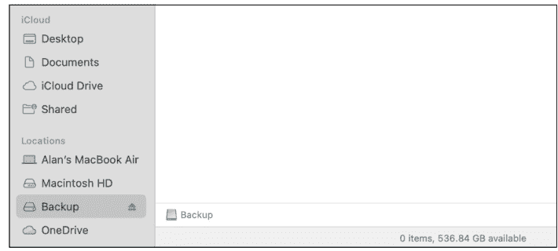

要定义你想要备份的文件类型，请将 `file_types` 变量设置为一个列表（用方括号括起来），其中包含逗号分隔的模式。每个模式用引号括起来。在示例中，我指定了 Word 文档（`.docx`）、Excel 电子表格（`.xlsx`）和 Python 脚本（`.py`）。当然，你可以指定任何你喜欢的文件类型。请随意列出任意多或任意少的类型——没有上限。只需确保在编写模式时，所有引号和逗号都放在正确的位置。

如果你想包含根目录下的子文件夹，请将 `recursive` 设置为 `True`。否则，要仅复制根目录中的文件而不复制其任何子目录，请将 `recursive` 设置为 `False`。

最后，如果你想用新的备份文件替换备份驱动器上的任何先前备份，请将 `overwrite` 保留为 `True`。要保留先前的备份文件而不复制新的备份文件，请将 `overwrite` 设置为 `False`。

#### 查找和删除重复文件

查找重复文件并不总是那么容易，因为你怎么能确定两个文件完全相同呢？在计算机世界中，这个问题的答案是通过对文件进行*哈希*处理。哈希处理会生成文件的*摘要*，这是一串字符。除非文件完全相同，否则没有两个文件会产生相同的摘要。

下一个脚本对任何目录或目录树中的文件进行哈希处理，并比较哈希值以查找重复项。当找到重复项时，脚本会将一份副本发送到回收站以供删除。从那里，你可以决定是永久删除该文件，还是恢复它并可能将其移动到备份介质，这样你仍然拥有该文件的额外副本。


对于此脚本，你将使用一个名为 `hashlib` 的模块。顾名思义，`hashlib` 是一个哈希算法库，包含 MD5、SHA-1、SHA-224、SHA-256、SHA-384 和 SHA-512 算法。你不需要 `pip install hashlib`，因为它是 Python 标准库的一部分。

此脚本使用 `pathlib` 库来遍历目录树。我们还将使用 `send2trash` 将重复文件发送到回收站，而不是永久删除文件，这样你就可以在删除任何文件之前进行检查并可能改变主意。记住，在此脚本中激活虚拟环境后，要 `pip install send2trash`。以下是完整的脚本：

```python
# remove_duplicate_files.py
# 识别重复文件并将其发送到回收站
from pathlib import Path
import hashlib
from send2trash import send2trash

def calculate_file_hash(file_path):
    # 计算给定文件的哈希值。
    hasher = hashlib.md5()
    with open(file_path, "rb") as f:
        # 分块读取文件。
        while chunk := f.read(8192):
            hasher.update(chunk)
    return hasher.hexdigest()

def find_duplicates(root_dir, recursive=True):
    # 基于文件内容查找重复文件。
    search_method = Path(root_dir).rglob if recursive else Path(root_dir).glob
    file_hashes = {}  # 将哈希值映射到文件路径
    duplicates = []   # 重复文件路径列表

    for file in search_method("*"):
        # 确保它是一个文件。
        if file.is_file():
            file_hash = calculate_file_hash(file)
            if file_hash in file_hashes:
                duplicates.append(file)
                print(f"发现重复项: {file} (与 {file_hashes[file_hash]} 相同)")
            else:
                file_hashes[file_hash] = file
    return duplicates

def trash_duplicates(duplicates):
    # 将重复文件发送到回收站。
    for file in duplicates:
        try:
            # 安全地将文件发送到回收站。
            send2trash(str(file))
            print(f"已发送到回收站: {file}")
        except Exception as e:
            print(f"无法将 {file} 发送到回收站: {e}")

def main():
    # 要扫描重复项的根目录
    root_dir = r"C:\Users\Alan\Documents\Practice Duplicates"
    # 设置为 False 进行非递归扫描。
    recursive = True

    # 查找重复项。
    print("\n正在扫描重复文件...")
    duplicates = find_duplicates(root_dir, recursive)

    if duplicates:
        print(f"\n找到 {len(duplicates)} 个重复文件。")
        # 安全地将重复项发送到回收站。
        trash_duplicates(duplicates)
    else:
        print("\n未找到重复文件。")

if __name__ == "__main__":
    main()
```

此脚本包含许多与本书中其他脚本相同的代码，用于遍历目录和捕获错误。在接下来的章节中，我将重点介绍用于哈希文件的函数，这使得此脚本独具特色。

#### 计算文件哈希值

要计算任意文件的哈希摘要，此脚本使用 `calculate_file_hash()` 函数。传递给该函数的 `file_path` 参数始终是要计算哈希值的文件路径。

```python
def calculate_file_hash(file_path):
    # Calculate hash for a given file.
    hasher = hashlib.md5()
    with open(file_path, "rb") as f:
        # Read the file in chunks.
        while chunk := f.read(8192):
            hasher.update(chunk)
    return hasher.hexdigest()
```

`hasher = hashlib.md5()` 这行代码创建了一个名为 `hasher` 的对象，该对象将用于使用 MD5 算法计算哈希值。MD5 哈希在比较文件时效果良好。但如果你熟悉哈希算法并需要使用其他算法，可以将该行替换为以下任意一行：

- `hasher = hashlib.sha256()`
- `hasher = hashlib.sha512()`
- `hasher = hashlib.sha1()`
- `hasher = hashlib.blake2b()`
- `hasher = hashlib.blake2s()`


一些其他哈希算法比 MD5 慢，但更安全。然而，当你的目标仅仅是比较自己系统上的文件，而并非试图找出试图故意伪造文件的恶意行为者时，MD5 通常被认为是足够的。

`with open(file_path, "rb") as f` 这行代码以 *二进制读取* 模式打开要计算哈希值的文件，这允许逐字节读取文件。`while chunk := f.read(8192)` 这行代码设置了一个循环，每次从文件中读取 8,192 字节（8KB）。

文件的每个 8KB 块都存储在一个名为 `chunk` 的变量中。然后 `hasher.update(chunk)` 更新了最新 8KB 的整体计算。当循环结束时，整个哈希摘要就完成了，函数的最后一行 `return hasher.hexdigest()` 将该值返回给调用函数。

#### 查找重复文件

`find_duplicates()` 函数执行实际的重复文件查找工作。在此过程中，它会填充一个名为 `file_hashes` 的字典和一个名为 `duplicates` 的列表。

```python
def find_duplicates(root_dir, recursive=True):
    # Find duplicate files based on file content.
    search_method = Path(root_dir).rglob if recursive else Path(root_dir).glob
    file_hashes = {}  # Maps hash to file paths
    duplicates = []   # List of duplicate file paths

    for file in search_method("*"):
        # Ensure it's a file.
        if file.is_file():
            file_hash = calculate_file_hash(file)
            if file_hash in file_hashes:
                duplicates.append(file)
                print(f"Duplicate found: {file} (same as {file_hashes[file_hash]})")
            else:
                file_hashes[file_hash] = file
    return duplicates
```

`file_hashes` 字典中的每一行包含一个文件的哈希摘要，后跟一个冒号，然后是产生该哈希值的文件路径，如下例所示：

```python
{
    'abc123': Path('C:/Users/Alan/Documents/Practice Duplicates/file1.txt'),
    'def456': Path('C:/Users/Alan/Documents/Practice Duplicates/file2.txt'),
    'abc123': Path('C:/Users/Alan/Documents/Practice Duplicates/file3.txt')
}
```

在前面的代码中，我使用像 `abc123` 和 `def456` 这样的短字符串来表示哈希摘要。实际上，每个哈希摘要的长度是 30 个字符，而不仅仅是六个字符。

每次完成哈希摘要计算时，以下代码行会检查该哈希值是否已存在于字典中。如果存在，则将产生该哈希摘要的文件路径添加到 `duplicates` 列表中。

```python
if file_hash in file_hashes:
    duplicates.append(file)
```

换句话说，如果该文件与之前已计算哈希值的文件相同（因为它们的哈希摘要相同），那么该重复文件的路径就会被添加到重复文件列表中。因此，重复文件列表最终包含的是其他文件的重复文件的路径。它可能看起来像这样：

```python
[
Path('C:/Users/Alan/Documents/Practice Duplicates/file3.txt')
]
```

当 `def find_duplicates()` 函数执行完毕后，它会将重复文件路径列表返回给调用它的函数。

#### 删除重复文件

到目前为止，脚本实际上还没有将任何内容发送到回收站。重复文件列表只是包含重复文件的路径列表。`trash_duplicates()` 函数负责使用 `send2trash` 模块将重复文件移动到回收站：

```python
def trash_duplicates(duplicates):
    # Send duplicate files to the trash.
    for file in duplicates:
        try:
            send2trash(str(file))  # Safely send the file to the trash.
            print(f"Sent to trash: {file}")
        except Exception as e:
            print(f"Failed to trash {file}: {e}")
```

> 使用 `send2trash` 模块比立即将文件永久删除更安全，因为它给了用户审查待删除文件的机会。

#### 调整查找重复文件的脚本

要使用该脚本删除重复文件，请在 `main()` 函数中通过为 `root_dir` 变量赋值来定义起始目录的路径。

> 我在我的 Windows 文档文件夹中使用了一个名为 Practice Duplicates 的文件夹。请确保使用适合你操作系统的正确语法（例如，macOS 使用 /users/alan/Practice Duplicates）。

```python
def main():
    # Root directory to scan for duplicates
    root_dir = r"C:\Users\Alan\Documents\Practice Duplicates"
    # Set to False for non-recursive scanning.
    recursive = True
```

如果你想在搜索中包含子目录，请将 `recursive` 变量保持设置为 `True`。否则，你可以将 `recursive` 变量设置为 `False` 以排除子目录。

请记住，重复文件并未从你的系统中删除。它们将位于回收站或垃圾桶中供你审查。

#### 压缩文件

下一个自动化脚本可以压缩任何目录或目录树中的任何文件类型。原始文件保持不变。你可以使用 Zip 文件与他人共享或进行备份。以下是完整的脚本：

```python
#compress_files.py
# This script compresses any file types into a Zip file.
import os
from pathlib import Path
import zipfile
from datetime import datetime

def compress_files(root_dir, output_path, file_types, recursive):
    try:
        # Create Zip file name from current datetime.
        current_time = datetime.now().strftime("%Y%m%d_%H%M%S")
        filename = f"{current_time}.zip"

        # Ensure output directory exists.
        base_path = Path(output_path)
        base_path.mkdir(parents=True, exist_ok=True)

        # Join the path with the filename.
        output_zip = base_path / filename

        # Verify root directory exists.
        if not Path(root_dir).exists():
            raise FileNotFoundError(f"Source directory '{root_dir}' does not exist")

        # Check if you have write permissions for output directory.
        if not base_path.is_dir() or not os.access(base_path, os.W_OK):
            raise PermissionError(f"No write permission for output directory: {output_path}")

        search_method = Path(root_dir).rglob if recursive else Path(root_dir).glob

        with zipfile.ZipFile(output_zip, 'w', compression=zipfile.ZIP_DEFLATED) as zipf:
            files_added = False
            for file in search_method("*"):
                if file.is_file() and file.suffix.lower() in file_types:
                    try:
                        zipf.write(file, file.relative_to(root_dir))
                        print(f"Added to archive: {file}")
                        files_added = True
                    except PermissionError:
                        print(f"Warning: No permission to access file: {file}")
                        continue
                    except OSError as e:
                        print(f"Warning: Failed to add file {file}: {str(e)}")
                        continue

            if not files_added:
                print("Warning: No files matching specified types were found")

        return output_zip

    except FileNotFoundError as e:
        print(f"Error: {str(e)}")
        return None
    except PermissionError as e:
        print(f"Error: {str(e)}")
        return None
    except zipfile.BadZipFile as e:
        print(f"Error: Failed to create Zip file: {str(e)}")
        return None
    except Exception as e:
        print(f"Unexpected error occurred: {str(e)}")
        return None

def main():
    try:
        # Directory to compress files from
```

root_dir = r"C:\Users\Alan\Documents\Practice\Zip"
# Zip 文件保存位置
output_path = r"C:\Users\Alan\Documents\Zip Files"
# 需要压缩的文件类型
file_types = [".docx", ".xlsx", ".png"]
# 设置为 False 以进行非递归压缩
recursive = True

# 验证 file_types 参数
if not isinstance(file_types, list) or not all(isinstance(ft, str) for ft in file_types):
    raise ValueError("file_types 必须是一个字符串列表")

# 压缩
print(f"\n正在压缩来自 {root_dir} 的文件")
zip_file = compress_files(root_dir, output_path, file_types, recursive)

if zip_file is not None:
    print(f"文件已成功压缩到 {zip_file}。\n")
else:
    print("压缩失败。\n")

except ValueError as e:
    print(f"错误：输入无效 - {str(e)}")
except Exception as e:
    print(f"主程序中发生意外错误：{str(e)}")

if __name__ == "__main__":
    main()

脚本以一些 `import` 语句开头，这些语句都属于标准库。你不需要 `pip install` 任何东西。脚本的大部分内容用于遍历目录树和捕获错误，这些我之前已经解释过，所以这里不再赘述。

此脚本使用 `datetime` 模块为每个新的 Zip 文件定义文件名。你可以在 `compress_files()` 函数顶部附近看到这段代码：

```
current_time = datetime.now().strftime("%Y%m%d_%H%M%S")
filename = f"{current_time}.zip"
```

在此脚本中，你可以指定 Zip 文件的存储位置。该路径作为 `output_path` 传递给 `compress_files()` 函数。接下来你可以看到，如果该目录不存在，代码会创建它。然后最后一行通过将该输出路径（此处定义为 pathlib 对象 base_path）与文件名组合，定义了 Zip 文件的完整路径：

```
# 确保输出目录存在。
base_path = Path(output_path)
base_path.mkdir(parents=True, exist_ok=True)

# 将路径与文件名连接。
output_zip = base_path / filename
```

使用此脚本时，你可以将要压缩的文件类型指定为一系列文件模式（例如，"*.docx"、"*.xlsx" 或 "*.pptx"）。该列表作为 `file_types` 参数传递给 `compress_files` 函数。


#### 使用 Python 压缩文件

此脚本的真正核心部分是压缩你指定的文件类型的部分。在遍历目录树的循环内，这一行代码以允许 Python 一次添加一个文件的方式打开该文件：

```
with zipfile.ZipFile(output_zip, "w", compression=zipfile.ZIP_DEFLATED) as zipf:
```

`zipfile.Zipfile` 使用 `zipfile` 模块中的 `Zipfile` 类，以写入（"w"）模式在 `output_zip` 定义的路径创建一个 Zip 文件。`compression=zipfile.ZIP_DEFLATED` 参数使用 DEFLATE 算法，该算法使用 Zip 文件的标准压缩方法压缩文件以减小其大小。`as zipf` 部分提供了一个快捷名称，后续代码可以使用它来引用该打开的 Zip 文件。

以下 `if` 语句验证目录中的当前项是否为文件（而非文件夹），并检查该文件的扩展名是否在要包含在压缩中的 `file_types` 文件列表中：

```
if file.is_file() and file.suffix.lower() in file_types:
```

如果满足包含当前文件的所有条件，则使用以下单行代码将该文件添加到 Zip 文件中：

```
zipf.write(file, file.relative_to(root_dir))
```

这就是使用 Python 将文件添加到 Zip 文件所需的全部操作。

与本章中的其他脚本一样，有大量的异常处理来捕获和处理任何不可预见的问题，例如写入 Zip 文件的权限不足。该脚本还会在屏幕上打印一些反馈以显示其进度。

#### 设置压缩参数

要使用压缩脚本，请在 `main()` 函数中设置参数，如下所示：

```
def main():
    try:
        # 要压缩文件的目录
        root_dir = r"C:\Users\Alan\Documents\Practice\Zip"
        # Zip 文件保存位置
        output_path = r"C:\Users\Alan\Documents\Zip Files"
        # 需要压缩的文件类型
        file_types = [".docx", ".xlsx", ".png"]
        # 设置为 False 以进行非递归压缩
        recursive = True
```

使用 `root_dir` 变量定义包含要压缩文件的文件夹。使用 `output_path` 变量定义 Zip 文件的文件夹位置（但不是文件名）。在此示例中，我使用了 Windows 路径。如果你使用的是 Linux 或 macOS，请确保使用正确的语法。

如果你使用外部驱动器作为输出，请记住在 Windows 上，你需要在字符串字面量中转义反斜杠（例如，`r"D:"` 表示 D: 盘）。在 macOS 上，外部驱动器显示在 `/Volumes/` 下，后跟卷名。例如，如果卷在 Finder 的“位置”下名为 Zips，则路径应为 `/Volumes/Zips`。

使用 `file_types` 定义要压缩的文件类型。使用方括号（`[]`）表示列表。将文件模式括在引号中，并用逗号分隔，如我的示例所示。

要压缩子文件夹中的文件，请将 `recursive` 选项设置为 `True`。要仅压缩 `root_dir` 中的文件，请将 `recursive` 设置为 `False`。

#### 解压缩文件

下一个脚本解压缩目录中的所有 Zip 文件，或递归解压缩目录树中的 Zip 文件。与之前的脚本一样，此脚本使用 `zipfile` 模块以及用于遍历目录树的模块。以下是脚本：

```
python
from pathlib import Path
import zipfile

def decompress_files(directory_path, recursive):
    # 解压缩目录中的 Zip 文件。
    try:
        # 将字符串路径转换为 Path 对象并确保其存在。
        source_dir = Path(directory_path)
        if not source_dir.exists():
            raise FileNotFoundError(f"目录 '{directory_path}' 不存在")
        if not source_dir.is_dir():
            raise NotADirectoryError(f"'{directory_path}' 不是一个目录")

        # 已处理的归档计数器
        archives_processed = 0

        # 遍历目录。
        pattern = "*.zip"
        for path in source_dir.rglob(pattern) if recursive else source_dir.glob(pattern):
            if path.is_file():
                try:
                    # 根据 Zip 文件名创建输出目录。
                    output_dir = path.with_suffix('')
                    output_dir.mkdir(exist_ok=True)

                    # 打开并解压 Zip 文件。
                    with zipfile.ZipFile(path, "r") as zipf:
                        # 检查 Zip 文件是否有效。
                        if zipf.testzip() is not None:
                            print(f"警告：{path.name} 似乎已损坏")
                            continue

                        # 解压所有内容
                        zipf.extractall(output_dir)
                        archives_processed += 1

                        print(f"已解压：{path.name} -> {output_dir.name}")
                        print(f"已提取到：{output_dir}")

                except zipfile.BadZipFile:
                    print(f"错误：{path.name} 不是有效的 zip 文件")
                except PermissionError:
                    print(f"错误：处理 {path.name} 时权限被拒绝")
                except Exception as e:
                    print(f"解压 {path.name} 时出错：{str(e)}")

        if archives_processed == 0:
            print(f"在{'目录和子目录' if recursive else '目录'}中未找到 Zip 文件")
        else:
            print(f"\n解压完成。已处理 {archives_processed} 个归档")

    except FileNotFoundError as e:
        print(f"错误：{str(e)}")
    except NotADirectoryError as e:
        print(f"错误：{str(e)}")
    except PermissionError:
        print("错误：访问目录时权限被拒绝")
    except Exception as e:
        print(f"发生意外错误：{str(e)}")

def main():
    # 在此处设置你的目录路径和递归选项。
    directory = r"C:\Users\Alan\Documents\Practice Decompress"
    recursive = True

    # 执行解压。
    decompress_files(directory, recursive)

if __name__ == "__main__":
    main()
```

解压缩脚本的工作方式与本章其他脚本类似，都是遍历文件夹和文件。主要工作在一个名为 `decompress_files()` 的函数中完成，该函数接受两个参数：`directory_path`（包含要解压文件的目录路径）和 `recursive`（一个布尔值，如果要解压子目录中的文件则设置为 `True`，如果跳过子目录则设置为 `False`）。

```python
def decompress_files(directory_path, recursive):
```

与往常一样，脚本中包含大量异常处理，以便在发生意外错误时能够优雅地退出。在接下来的章节中，我将重点介绍这个脚本的独特之处。

#### 使用 Python 解压文件

这个脚本的核心部分在于以下代码：

```python
# Open and extract zip file
with zipfile.ZipFile(path, "r") as zipf:
    # Check if zip file is valid
    if zipf.testzip() is not None:
        print(f"Warning: {path.name} appears to be corrupted")
        continue

    # Extract all contents
    zipf.extractall(output_dir)
```

`with zipfile.ZipFile(path, "r") as zipf` 这行代码以读取模式（"r"）将 `path` 处的文件作为 Zip 归档文件打开。由于 `pathutil` 遍历当前目录的方式，`path` 文件始终指向一个 Zip 文件。`as zipf` 只是提供了一个简单的名称 `zipf`，供后续代码引用这个打开的 Zip 文件。


接下来，`.testzip()` 方法对文件进行快速检查，以确保其未损坏。如果文件没有问题，该方法返回 `None`。如果 `.testzip()` 返回除 `None` 以外的任何值，则表示文件已损坏，脚本将不会尝试解压该文件，而是打印一条错误消息。

假设到目前为止一切顺利，下一段代码将运行，并使用 `zipfile` 的 `.extractall()` 方法在这一行代码中解压文件：

```python
zipf.extractall(output_dir)
```

这涵盖了将 Zip 文件中的所有文件提取到 `output_dir` 所需的所有步骤，`output_dir` 是一个与 Zip 文件同名（但没有 .zip 扩展名）的普通文件夹。剩余的代码只是为了进行计数、在屏幕上显示一些反馈以及处理任何异常。

#### 使用解压缩脚本

要使用解压缩脚本，您只需在 `main()` 函数中设置两个参数：

```python
def main():
    # Set your directory path and recursive option here.
    directory = r"C:\Users\Alan\Documents\Practice Decompress"
    recursive = True
```

使用 `directory` 变量设置您的起始目录，使用 Windows（如我的示例所示）或 Linux 或 macOS 的正确语法，后两者使用正斜杠（例如，/Users/Alan/Practice Decompress）。

将 `recursive` 设置为 `True` 以解压所有子目录中的 Zip 文件；否则，将 `recursive` 设置为 `False`。

### 第 6 章
#### 自动化图像和视频文件

本章全部关于图像和视频文件的 Python 自动化。我将向您展示如何自动调整大小、旋转、翻转和裁剪多张图像。您将看到如何批量转换图像文件类型。最后，我将解释如何从视频中提取单个帧到图像文件中。

本章将有两个 Python 模块提供极大帮助：

- **Pillow：** 通常被称为 PIL（*Python Imaging Library* 的缩写），该库提供了打开、操作和保存多种不同图像文件格式（包括 JPEG、PNG 和 WebP）的工具。它提供了调整大小和裁剪、应用滤镜以及其他常见图像任务的工具。
- **cv2：** 该模块提供了 OpenCV（*Open Source Computer Vision Library* 的缩写）的 Python 接口，这是一个为计算机视觉、图像处理和机器学习任务而设计的强大库。

我将从一个可以调整大小、旋转、翻转和裁剪任何文件夹中任意数量图像的单个脚本开始。

#### 调整大小、旋转、翻转和裁剪图像

对于本章的第一个脚本，您将创建一个 Python 类，以便在其他脚本中轻松重用。该类包含使用 Pillow 库的功能来调整大小、旋转、翻转和裁剪图像的方法。

Pillow 不是标准库的一部分。当您为此项目创建并激活虚拟环境时，请确保使用 `pip install Pillow` 安装它。

以下是完整的脚本：

```python
# image_processor.py
# This script offers resizing, rotating, flipping, and cropping images.
# pip install Pillow for the following import.
from PIL import Image
from pathlib import Path
import os

class ImageProcessor:
    def __init__(self, input_dir, recursive, file_types):
        try:
            # Define input parameters in the main() function.
            self.input_dir = Path(input_dir)
            # Check if input directory exists.
            if not self.input_dir.exists():
                raise FileNotFoundError(f"Input directory '{input_dir}' does not exist")
            # Check if input directory is accessible.
            if not os.access(self.input_dir, os.R_OK):
                raise PermissionError(f"No read permission for directory '{input_dir}'")

            self.include_subdirs = recursive
            self.file_types = tuple(map(str.lower, file_types))
            self.output_dir = self.input_dir / "processed_images"

            # Create output directory with permission check.
            try:
                self.output_dir.mkdir(exist_ok=True)
                # Verify write permission for output directory.
                if not os.access(self.output_dir, os.W_OK):
                    raise PermissionError(f"No write permission for output directory '{self.output_dir}'")
            except PermissionError as e:
                raise PermissionError(f"Cannot create output directory: {e}")
            except OSError as e:
                raise OSError(f"Failed to create output directory: {e}")

        except (FileNotFoundError, PermissionError, OSError) as e:
            raise type(e)(f"Initialization failed: {e}")

    def get_image_files(self):
        try:
            # Get list of image files based on specifications.
            image_files = []
            pattern = "**/*" if self.include_subdirs else "*"

            for file_type in self.file_types:
                image_files.extend(self.input_dir.glob(pattern + file_type))

            return [str(file) for file in image_files]  # Convert Path objects to strings for compatibility
        except Exception as e:
            print(f"Error accessing image files: {e}")
            return []

    def resize(self, width=None, height=None, output_suffix="_resized"):
        # Resize all images to specified width or height, maintaining aspect ratio if either is None.
        if width is None and height is None:
            raise ValueError("At least one of width or height must be specified")

        for image_path in self.get_image_files():
            try:
                with Image.open(image_path) as img:
                    orig_width, orig_height = img.size

                    # Calculate dimensions based on input.
                    if width is not None and height is not None:
                        new_width, new_height = width, height
                    elif width is not None:
                        new_width = width
                        new_height = int((width / orig_width) * orig_height)
                    else:  # height is not None
                        new_height = height
                        new_width = int((height / orig_height) * orig_width)

                    # Perform resize.
                    resized_image = img.resize((new_width, new_height), Image.Resampling.LANCZOS)
                    output_path = self._get_output_path(image_path, output_suffix)
                    try:
                        resized_image.save(output_path)
                        print(f"Resized image saved to: {output_path} ({new_width}x{new_height})")
                    except (PermissionError, OSError) as e:
                        print(f"Error saving resized image {output_path}: {e}")
            except (FileNotFoundError, PermissionError, OSError) as e:
                print(f"Error resizing {image_path}: {e}")

    def rotate(self, degrees, output_suffix="_rotated"):
        # Rotate all images by specified degrees.
        for image_path in self.get_image_files():
            try:
                with Image.open(image_path) as img:
                    rotated_image = img.rotate(degrees, expand=True)
                    output_path = self._get_output_path(image_path, output_suffix)
                    try:
                        rotated_image.save(output_path)
                        print(f"Rotated image saved to: {output_path}")
                    except (PermissionError, OSError) as e:
                        print(f"Error saving rotated image {output_path}: {e}")
            except (FileNotFoundError, PermissionError, OSError) as e:
                print(f"Error rotating {image_path}: {e}")

    def flip(self, direction="horizontal", output_suffix="_flipped"):
        # Flip all images horizontally or vertically.
        for image_path in self.get_image_files():
            try:
                with Image.open(image_path) as img:
                    if direction.lower() == "horizontal":
                        flipped_image = img.transpose(Image.FLIP_LEFT_RIGHT)
                    elif direction.lower() == "vertical":
                        flipped_image = img.transpose(Image.FLIP_TOP_BOTTOM)
```

#### 调整图像大小

`resize` 方法处理图像的大小调整。它接受四个参数：`self`、`width`、`height` 和 `output_suffix`。`self` 参数是正在被调整大小的图像。`width` 和 `height` 参数是整数，用于指定要调整到的宽度和高度。你可以只设置宽度或只设置高度，将另一侧设置为 `None` 以沿一个维度进行调整，并自动计算另一侧的尺寸以保持图像的纵横比。

可选的 `output_suffix` 参数会在调整大小后的图像文件名中添加 `_resized`，这样原始文件就能保留其原始文件名。如果你想使用 `_resized` 以外的其他词语作为名称的附加部分，可以将其作为字符串传递以覆盖默认值：

```python
def resize(self, width, height, output_suffix="_resized"):
```

该函数中的大部分代码用于计算图像尺寸。为了保持纵横比，你只需指定宽度或高度。同样，这里也有一些异常处理。图像的实际调整大小和保存调整后的图像发生在此代码中：

```python
# 执行调整大小
resized_image = img.resize((new_width, new_height), Image.Resampling.LANCZOS)
output_path = self._get_output_path(image_path, output_suffix)
try:
    resized_image.save(output_path)
```

代码中的 `LANCZOS` 指的是由匈牙利数学家 Cornelius Lanczos 发明的高质量图像重采样方法。Pillow 还提供了其他方法，包括 `BICUBIC`、`BILINEAR`、`BOX`、`HAMMING` 和 `NEAREST`。

#### 旋转图像

旋转图像的方法接受三个参数：`self`（对正在被旋转的图像的引用）、`degrees`，以及一个表示要将图像旋转多少度的整数。可选的 `output_suffix` 参数允许你指定要添加到旋转图像文件名中的文本，以区分旋转后的图像和原始图像。如果未传递其他值，默认为 `_rotated`：

```python
def rotate(self, degrees, output_suffix="_rotated"):
```

旋转和保存图像由以下代码行处理：

```python
rotated_image = img.rotate(degrees, expand=True)
```

添加 `expand=True` 可确保在需要时放大图像，以避免裁剪。旋转后的图像随后存储在名为 `rotated_image` 的对象中。接下来的两行将输出后缀添加到文件名中，然后将旋转后的图像对象保存到该文件名。然后打印一些文本以在屏幕上提供反馈，或者如果任何不可预见的异常阻止了文件保存，则打印错误消息：

```python
output_path = self._get_output_path(image_path, output_suffix)
try:
    rotated_image.save(output_path)
    print(f"Rotated image saved to: {output_path}")
except (PermissionError, OSError) as e:
    print(f"Error saving rotated image {output_path}: {e}")
```

这就是旋转和保存图像的基本代码。

#### 翻转图像

翻转图像的方法接受三个参数。`self` 参数指代正在被翻转的图像。`direction` 参数可以是 "horizontal" 或 "vertical"；如果未传入任何值，则默认为 "horizontal"。`output_suffix` 是要添加到翻转图像文件名中的文本，如果未传递参数值，则默认为 `_flipped`：

```python
def flip(self, direction="horizontal", output_suffix="_flipped"):
```

在方法内部，此代码根据 `direction` 参数的值水平或垂直翻转图像，或者如果传入了未知值则生成错误：

```python
with Image.open(image_path) as img:
    if direction.lower() == "horizontal":
        flipped_image = img.transpose(Image.FLIP_LEFT_RIGHT)
    elif direction.lower() == "vertical":
        flipped_image = img.transpose(Image.FLIP_TOP_BOTTOM)
    else:
        raise ValueError("Direction must be 'horizontal' or 'vertical'")

    output_path = self._get_output_path(image_path, output_suffix)
    try:
        flipped_image.save(output_path)
        print(f"Flipped image saved to: {output_path}")
```

在前面的代码中，`image.transpose()` 是 Pillow 中执行实际翻转的方法。仅需这一行代码即可翻转图像，随后代码将带有输出后缀的翻转图像保存到文件名中。

#### 裁剪图像

裁剪图像的方法最多接受六个参数。`self` 参数指代正在被裁剪的图像。`left`、`top`、`right` 和 `bottom` 参数是整数，用于指定要从图像的每一边裁剪的像素数。可选的 `output_suffix` 指定要添加到裁剪图像文件名中的文本；如果你不传递不同的值，则使用 `_cropped`：

```python
def crop(self, left, top, right, bottom, output_suffix="_cropped"):
```

在 Pillow 中，图像的实际裁剪很简单。它通过这一行代码执行：

```python
cropped_image = img.crop((left, top, right, bottom))
output_path = self._get_output_path(image_path, output_suffix)
try:
    cropped_image.save(output_path)
    print(f"Cropped image saved to: {output_path}")
except (PermissionError, OSError) as e:
    print(f"Error saving cropped image {output_path}: {e}")
```

Pillow 模块处理光栅图像，其扩展名如 `.bmp`、`.gif`、`.jpeg`、`.jpg`、`.png`、`.psd`、`.raw`、`.tif`、`.tiff` 和 `.webp`。它不适用于矢量图像，其扩展名如 `.ai`、`.cdr`、`.eps`、`.pdf` 和 `.svg`。

此脚本提供了四种处理任意数量图像的方法：

- `crop()`: 使用指定坐标裁剪图像
- `flip()`: 水平或垂直翻转图像
- `resize()`: 更改图像尺寸
- `rotate()`: 将图像旋转指定度数

每个操作都在其自己的方法中定义。此脚本使用 `pathlib` 来遍历包含要处理文件的目录。

由于我们为脚本定义了一个类，因此用 `def` 关键字定义的函数被视为方法，并使用 `.methodname()` 语法调用。

```python
def main():
    try:
        # 替换为你的目录路径。
        input_directory = r"C:\Users\Alan\Documents\Practice\Img Process"
        # Mac 路径示例
        #input_directory = "/Users/alan/Practice/Img Process"
        # True 表示包含子目录
        recursive = True
        # 在括号内定义为元组。必须是光栅图像类型。
        file_types=("*.jpg", "*.jpeg", "*.png", "*.webp")

        # 使用自定义参数创建处理器实例。
        processor = ImageProcessor(input_directory, recursive, file_types)

        # 对所有匹配的图像执行各种操作。
        # 注释掉你不想执行的任何操作。
        # 调整为 512px 宽度，自动高度
        processor.resize(width=512, height=None)
        # 调整为 512px 高度，自动宽度。
        # processor.resize(width=None, height=512)
        # 精确调整为 512x512。
        # processor.resize(width=512, height=512)
        # 旋转 90 度。
        processor.rotate(90)
        # 水平翻转。
        processor.flip("horizontal")
        # 垂直翻转。
        processor.flip("vertical")
        # 从 (100,100) 裁剪到 256x256。
        processor.crop(100, 100, 356, 356)

    except (FileNotFoundError, PermissionError, OSError) as e:
        print(f"Error in main execution: {e}")
        return

if __name__ == "__main__":
    main()
```

显然，这是大量的代码！然而，其中大部分是用于遍历目录树和捕获不可预见的错误。在接下来的部分中，我将专注于执行实际修改图像工作的代码。

后续代码会将裁剪后的图像保存为原文件名加上输出后缀。其余代码用于错误处理和屏幕反馈。


请记住，此脚本始终将修改后的图像保存到新文件名。您的原始图像不会因此脚本而丢失或更改。

#### 自定义图像处理器

要使此脚本适应您自己的需求，请使用 `main()` 函数，在 `input_directory` 变量中设置您要访问的图像文件的起始目录路径。

如果您想处理子文件夹中的图像，请将 `recursion` 设置为 True；否则，设置为 False。在括号内（表示一个元组）列出用引号括起来并用逗号分隔的文件模式，如下所示。您无需更改以 `processor=` 开头的行，因为那是实例化处理器对象以启动处理：

```
# 替换为您的目录路径。
input_directory = r"C:\Users\Alan\Documents\Practice\Img Process"
# Mac 路径示例
#input_directory = "/Users/alan/Practice/Img Process"
# True 以包含子目录
recursive = True
# 在括号内定义为元组。必须是光栅图像类型。
file_types=("*.jpg", "*.jpeg", "*.png", "*.webp")

# 使用自定义参数创建处理器实例。
processor = ImageProcessor(input_directory, recursive, file_types)
```

在接下来的几行中，您可以注释掉任何不想使用的方法。对于您使用的方法，设置要传入方法的参数。

```
# 对所有匹配的图像执行各种操作。
# 注释掉任何您不想执行的操作。
# 调整为 512px 宽度，高度自动。
processor.resize(width=512, height=None)
# 调整为 512px 高度，宽度自动。
processor.resize(width=None, height=512)
# 精确调整为 512x512。
processor.resize(width=512, height=512)
# 旋转 90 度。
processor.rotate(90)
# 水平翻转。
processor.flip("horizontal")
# 垂直翻转。
processor.flip("vertical")
# 从 (100,100) 裁剪到 256x256。
processor.crop(100, 100, 356, 356)
```

上述任何以 `processor` 开头的行都会更改您在输入目录和子目录（如果您将 `recursion` 设置为 `True`）中指定的图像。如果您不想使用任何操作，只需在不想使用的行前加上 `#` 符号来注释掉该行。您不必每次运行脚本时都执行脚本提供的所有操作。

代码运行后，您将在与原始图像相同的文件夹中找到一个名为 `processed_images` 的子文件夹，其中包含处理后的图像，该文件夹由 `main()` 函数中的 `input_directory` 指定。

#### 转换图像文件类型

此自动化脚本将 *光栅图像*（由像素组成的图像，如 BMP、JPEG、PNG 或 WebP）转换为其他光栅图像格式。原始文件得以保留。转换后的图像保持与原始文件相同的文件名，但使用适合新格式的文件扩展名。以下是脚本：

```
# convert_images.py
# 要求：pip install Pillow
from pathlib import Path
from PIL import Image
import os

def convert_images(input_dir, file_patterns, output_format, recursive=True):
    try:
        # 验证输入目录。
        input_path = Path(input_dir)
        if not input_path.exists():
            print(f"输入目录不存在：{input_dir}")
            return
        if not input_path.is_dir():
            print(f"路径不是目录：{input_dir}")
            return

        # 创建匹配指定模式的路径列表。
        paths = []
        for pattern in file_patterns:
            if recursive:
                paths.extend(input_path.rglob(pattern))
            else:
                paths.extend(input_path.glob(pattern))

        if not paths:
            print("未找到匹配的文件。")
            return

        for file_path in paths:
            try:
                # 验证文件可访问。
                if not os.access(file_path, os.R_OK):
                    print(f"无法读取文件 {file_path}：权限被拒绝")
                    continue

                # 打开并转换图像。
                with Image.open(file_path) as img:
                    # 确保图像处于 RGB 模式，以适用于不支持
                    # RGBA 的格式。
                    if output_format.lower() in ['jpeg', 'jpg', 'jfif']:
                        if img.mode in ('RGBA', 'LA'):
                            img = img.convert('RGB')

                    # 创建输出文件路径。
                    output_path = file_path.with_suffix(f".{output_format}")

                    # 以新格式保存图像。
                    img.save(output_path, quality=100)
                    print(f"已将 {file_path} 转换为 {output_path}")

            except Exception as e:
                print(f"转换 {file_path} 失败：{str(e)}")

    except PermissionError as pe:
        print(f"遇到权限错误：{pe}")
    except Exception as e:
        print(f"发生意外错误：{e}")

def main():
    # 替换为您的目录路径。
    input_directory = r"C:\Users\Alan\Documents\Practice\Convert Rasters"
    # Mac 路径示例
    #input_directory = "/Users/alan/Practice/Convert Rasters"
    # 要转换的光栅图像文件类型
    file_types_to_convert = ["*.jpg", "*.jpeg", "*.png"]
    # 光栅图像输出格式
    output_file_type = "webp"
    # 如果不想递归遍历目录，请更改为 False。
    is_recursive = True

    # 调用函数转换图像。
    convert_images(input_directory, file_types_to_convert, output_file_type,
                   is_recursive)

if __name__ == "__main__":
    main()
```

与其他自动化脚本一样，这看起来代码量很大。但通常，大部分代码用于遍历目录树和处理异常。核心工作仅用少量代码完成，我将在以下部分进行解释。

#### 使用 Python 转换文件

在此脚本中，单个图像的实际转换始于使用 `Image.open(file_path) as img` 读取的代码。


大多数光栅图像文件类型——包括 BMP、GIF、PNG、TGA、TIFF 和 WebP——都支持透明度。但是，JPEG、JPG 和 JFIF 不支持。让我们关注脚本的以下部分：

```
if output_format.lower() in ['jpeg', 'jpg', 'jfif']:
    if img.mode in ('RGBA', 'LA'):
        img = img.convert('RGB')
```

第二行检查当前图像颜色模式是否为 RGBA 或 LA（两者都支持透明度），并且正在转换为不支持透明度的格式。如果目标文件类型不支持透明度，则第三行将图像转换为 RGB，这与 JPEG 和其他不支持透明度的文件兼容。第三行是必要的，以避免导致文件无法转换的错误。透明颜色将在转换后的图像中变为白色。

#### 关于 RGB、RGBA 和 LA

RGB（代表 *红、绿、蓝*）、RGBA（代表 *红、绿、蓝、Alpha*）和 LA（代表 *亮度、Alpha*）是 *图像模式*（有时称为 *颜色模式* 或 *颜色模型*）。

- RGB 支持几乎所有颜色，但不支持透明度。
- RGBA 添加了 Alpha 通道，允许在全彩之外实现透明度。
- LA 使用亮度通道表示灰度，Alpha 通道表示透明度。由于它不支持颜色，LA 仅用于可能包含透明度的灰度图像。它比 RGBA 更紧凑，当您需要在灰度图像中实现透明度时，它是首选。

接下来的几行代码定义了转换后文件的路径和文件名。除扩展名外，其余部分与原始文件相同；扩展名更改为匹配新格式。`.save()` 方法执行实际转换并写入文件。`print()` 语句在转换和保存成功时提供屏幕反馈。

```
# 创建输出文件路径
output_path = file_path.with_suffix(f".{output_format}")

# 以新格式保存图像。
img.save(output_path, quality=100)
print(f"已将 {file_path} 转换为 {output_path}")
```

上述代码中的 `quality=100` 设置以最大质量保存图像，无压缩。如果您需要更小的文件，可以降低该数值。例如，设置 `quality=90` 通常会将文件大小减少 20% 到 40%（取决于图像分辨率、大小和颜色复杂度），但代价是图像质量降低 10%——细节、颜色精度和整体清晰度略有下降。

#### 个性化转换脚本

要使用图像转换脚本，请在 `main()` 函数中设置您的参数，如下所示：

```
# 替换为您的目录路径。
input_directory = r"C:\Users\Alan\Documents\Practice\Convert Rasters"
```

## Mac 路径示例
#input_directory = "/Users/alan/Practice/Convert Rasters"
# 要转换的栅格图像文件类型
file_types_to_convert = ["*.jpg", "*.jpeg", "*.png"]
# 栅格图像输出格式
output_file_type = "webp"
# 如果不想递归遍历目录，请将其更改为 False。
is_recursive = True

请确保使用适合您操作系统的正确格式，在 `input_directory` 变量中指定起始文件夹的路径。我使用了 Windows 路径，但也包含了一个注释掉的 macOS 路径，作为 macOS 所需语法的提醒。

将 `file_types_to_convert` 变量设置为要转换的文件类型列表，用方括号括起来，以逗号分隔，每种文件类型用引号括起来，如代码所示。

将 `output_file_type` 设置为您希望转换成的文件类型，方法是指定其文件名扩展名，不带前导点。

为避免错误，请确保您的 `output_file_type` 设置为有效的栅格格式，例如 "bmp"、"dib"、"exr"、"gif"、"heic"、"heif"、"ico"、"jfif"、"jpeg"、"jpg"、"pbm"、"pgm"、"png"、"ppm"、"psd"、"raw"、"tga"、"tif"、"tiff" 或 "webp"。

最后，将 `is_recursive` 设置为 `True` 以转换子目录中的文件；否则，将其设置为 `False` 以仅转换输入目录中的图像，而不转换其任何子目录。

#### 从视频文件中提取帧

我们的下一个自动化任务可以从视频文件中按任意时间间隔提取单个帧，并将每帧保存为图像文件。这使您可以从任何单个视频文件中创建大量照片，而无需使用视频编辑器逐帧浏览视频。

我将首先向您展示完整的脚本：

```python
# extract_video_frames.py
from pathlib import Path
# 需要 pip install opencv-python。
import cv2

def extract_frames(video_path, interval):
    try:
        input_file = Path(video_path)
        if not input_file.exists():
            raise FileNotFoundError(f"Error: The provided video file '{video_path}' does not exist.")

        # 创建输出目录。
        output_dir = f"{input_file.with_suffix('')}_frames"
        output_path = Path(output_dir)
        output_path.mkdir(parents=True, exist_ok=True)

        # 打开视频文件。
        cap = cv2.VideoCapture(video_path)
        if not cap.isOpened():
            raise RuntimeError("Error: Could not open video file.")

        # 获取视频属性并计算帧间隔（以帧数计）。
        fps = cap.get(cv2.CAP_PROP_FPS)
        frame_interval = int(fps * interval)

        saved_count = 0
        for ret, frame in iter(lambda: cap.read(), (False, None)):
            if cap.get(cv2.CAP_PROP_POS_FRAMES) % frame_interval == 0:
                saved_count += 1
                frame_filename = output_path / f"frame_{saved_count:06d}.png"
                cv2.imwrite(str(frame_filename), frame)
                print(f"Saved frame {saved_count:06d}")

        # 释放资源。
        cap.release()
        print(f"Extracted {saved_count} frames to '{output_dir}'\n")

    except FileNotFoundError as e:
        print(e)
    except PermissionError as e:
        print(f"Error: Missing write permissions - {e}")
    except Exception as e:
        print(f"Unexpected error: {e}")

def main():
    # 替换为您的视频文件路径。
    video_path = r"C:\Users\Alan\Documents\Practice\Extract Frames\example.mp4"
    # 替换为所需的间隔（秒）。
    interval = 10.0  # 间隔（秒）

    # 调用函数提取帧。
    extract_frames(video_path, interval)

if __name__ == "__main__":
    main()
```

与我们的其他脚本一样，此脚本包含异常处理，以便在脚本没有足够权限保存图像或发生其他不可预见的问题时，能够优雅地退出脚本并显示错误消息。

大部分工作由名为 `extract_frames()` 的脚本处理，定义在以下行中：

```python
def extract_frames(video_path, interval):
```

`video_path` 参数应为您要从中提取帧的视频文件路径（不是文件夹）。间隔应以秒为单位表示，例如 0.5 表示每半秒视频提取一帧，或 10 表示每 10 秒提取一帧。

受数字版权管理（DRM）系统保护的视频是加密的，以防止未经授权的访问或复制。尝试使用 OpenCV 打开此类视频可能会生成错误，以保护版权材料。

#### 导入视频提取模块

此脚本使用 OpenCV（Open Source Computer Vision Library 的缩写），这是一个免费的开源计算机视觉和图像处理软件库，可用于多种语言。导入语句显示为简单的 `import cv2`。但这具有误导性。要使此脚本正常工作，您需要创建并激活您的虚拟环境。然后在终端中使用此命令为 Python 导入 OpenCV 库：

```
pip install opencv-python
```

运行脚本时，提取的图像存储在与初始视频相同文件夹的子文件夹中。该子文件夹的名称将与视频的文件名相同，不带文件名扩展名，并附加单词 `_frames`。例如，如果您从名为 `example.mp4` 的视频中提取帧，图像将位于名为 `example_frames` 的子文件夹中，如图 6-1 所示。

打开视频的代码是：

```python
cap = cv2.VideoCapture(video_path)
```

随后的代码从视频属性中获取视频的每秒帧数（fps），并使用此代码计算提取的帧间隔。`saved_count` 变量初始化为零，用于计算已保存的帧数，并确保每帧都有唯一的文件名（例如 `0001.png`、`0002.png` 等）：

```python
fps = cap.get(cv2.CAP_PROP_FPS)
frame_interval = int(fps * interval)

saved_count = 0
```

#### 循环遍历视频

帧提取的主要操作从一个遍历每一帧的循环开始。循环直到到达视频末尾才停止。该循环由以下代码定义：

```python
for ret, frame in iter(lambda: cap.read(), (False, None)):
```

这相当冗长，不是您典型的 for 循环。`ret` 变量在每次循环读取一帧时保持为 True。当循环到达视频末尾时，`ret` 返回 False 并结束循环。`frame` 变量是实际读取的帧。

读取 `lambda: cap.read()` 的行不断调用一个名为 `read()` 的匿名函数，只要还有帧可读。该行末尾的 `(False, None)` 导致当 `ret` 变为 False 且 `frame` 变为 None 时循环停止，因为视频中没有更多帧。

匿名函数偶尔在 Python 中使用，其中函数作为参数传递，以简化语法并使调用内联（在其他 Python 代码行内）。

在循环内部，以下 if 语句确定当前帧是否在指定的时间间隔内：

```python
if cap.get(cv2.CAP_PROP_POS_FRAMES) % frame_interval == 0:
    saved_count += 1
    frame_filename = output_path / f"frame_{saved_count:06d}.png"
```

如果条件为 True，则 `saved_count` 递增，并根据该计数为帧分配输出路径和文件名。

代码中的 .png 扩展名将每帧保存为 .png 文件。您可以将其更改为其他格式，包括 .bmp、.jpeg、.jpg、.tif、.tiff 和 .webp。

最后，这两行实际保存图像文件，并在屏幕上提供一些反馈，以便您在脚本运行时可以看到进度：

```python
cv2.imwrite(str(frame_filename), frame)
print(f"Saved frame {saved_count:06d}")
```

当循环到达视频末尾时，执行以下行。

```python
# 释放资源
cap.release()
print(f"Extracted {saved_count} frames to '{output_dir}'\n")
```

`cap.release()` 关闭视频流并释放视频使用的资源。然后 `print()` 语句在屏幕上显示完成消息。

#### 调整视频转换脚本

要使用视频提取脚本，您只需在 `main()` 函数中定义两个参数，如下所示：

```python
def main():
    # 替换为您的视频文件路径。
    video_path = r"C:\Users\Alan\Documents\Practice\Extract Frames\example.mp4"
    # 替换为所需的间隔秒数。
    interval = 10.0  # 间隔秒数
```

将 `video_path` 变量设置为您想要从中提取帧的视频文件。与其他脚本不同，此脚本不会遍历目录，因为您可能从一个视频中提取数千帧。一次处理一个视频是最安全的选择。

OpenCV 支持大多数视频类型，包括 .avi、.flv、.mkv、.mov、.mp4、.mpeg、.webm 和 .wmv。您可以在 `video_path` 变量中使用任何这些扩展名的文件。

请记住，每秒视频包含大约 30 个单独的帧（图像）。一分钟的视频包含大约 1,800 帧。十分钟的视频，大约 18,000 帧！在指定 `interval` 变量时，您可以使用整数或小数。例如，将 `interval` 设置为 1 表示每秒拍摄一张图像。将 `interval` 设置为 0.5 表示每半秒拍摄一张图像。将 `interval` 设置为 1.5 表示每 1.5 秒拍摄一张图像。

请记住，间隔越短，您生成的帧就越多。您生成的每个帧都可能是一个大小为 3MB 或更大的图像文件。例如，如果您在十分钟的视频中每秒捕获一帧，您将生成 600 个图像文件！

#### 本章内容

- 自动化鼠标和键盘
- 从 Python 脚本输入文本
- 创建您自己的快捷键
- 自动截屏

### 第 7 章
#### 自动化鼠标和键盘

在本章中，您将研究自动化鼠标和键盘的技术。这些技术允许您模拟人类输入，用于图形用户界面 (GUI) 测试、数据输入或需要反复输入相同内容的重复性工作流等任务。

PyAutoGUI（Python Automation for Graphical User Interfaces 的缩写）是我们将用于这些脚本的主要库。它不是标准库的一部分。您需要自己 `pip install` 它。我建议您为脚本（或所有使用 PyAutoGUI 的脚本）创建一个文件夹；然后创建一个虚拟环境并激活该虚拟环境（参见第 2 章）。然后确保在 VS Code 终端中输入以下命令：

```bash
pip install pyautogui
```

如果您想尝试本章中的所有脚本，您可以在同一个示例文件夹中创建每个脚本，以共享 PyAutoGUI 模块。

#### 在 Mac 上授予权限

默认情况下，Mac 计算机通常不允许应用程序控制您的鼠标或键盘。在 macOS 上，当您第一次尝试运行本章中的脚本时，屏幕上可能会显示权限错误，提示应用程序没有足够的权限。或者您可能会看到脚本在 VS Code 终端中运行，但鼠标在屏幕上没有移动。

为了使鼠标和键盘操作在 Mac 上正常工作，您可能需要向您的代码编辑器授予辅助功能权限。单击屏幕左上角的 Apple 图标，选择“系统设置”；在“系统设置”中，单击“隐私与安全性”，然后单击“辅助功能”。将您代码编辑器名称旁边的滑块设置为“开”。在图 7-1 中，我授予了 Visual Studio Code 权限，因为我使用 VS Code 作为我的编辑器。如果提示，请输入您的密码或使用 Touch ID 进行更改。如果您使用的是其他编辑器，您可能需要向该编辑器授予权限。


#### 移动鼠标、单击、拖动和滚动

Python 可以控制您的鼠标，并执行您原本需要手动完成的任何操作。这包括移动鼠标指针、单击、双击、右键单击、拖动和滚动。赋予您这些能力的库是 PyAutoGUI。

正如我在本章开头提到的，PyAutoGUI 不包含在 Python 标准库中。因此，请确保为此脚本创建并激活一个虚拟环境（如果您尚未这样做），然后在终端中输入以下命令：

```bash
pip install pyautogui
```

##### 理解屏幕坐标

PyAutoGUI 允许您根据 X、Y 坐标将鼠标指针移动到屏幕上的任何位置，其中 X 是距离屏幕左侧的距离，Y 是距离顶部的距离。度量单位是像素，每个像素是您屏幕上的一个微小发光点。

单词 pixel 是 picture element 的缩写。一个 1,980 x 1,280 的计算机屏幕宽 1,930 像素，高 1,280 像素。

屏幕的左上角是位置 0,0。屏幕的右下角是您的屏幕分辨率减去 1（因为计数从 0 开始）。因此，如果您有一个分辨率为 2,560 x 1,440 的 2K QHD 计算机显示器，屏幕的右下角是 2559,1439。

##### 控制鼠标速度

PyAutoGUI 可以以非常高的速度移动鼠标。如果鼠标开始执行您不想要的疯狂操作，这可能会对您不利。为了减慢速度，您可以指定任何操作所需的时间。这样您就可以看到正在发生的事情并加以关注。您可以通过在 `move` 命令中添加 `duration=` 参数来实现。语法如下：

```python
pyautogui.move(x, y, duration=duration)
```

将上一行中的 *duration* 替换为操作应持续的秒数。

在 `move(x, y)` 方法中，*x* 是距离屏幕左侧的像素距离，用于移动鼠标指针；*y* 是距离顶部的像素距离，用于移动鼠标指针。

在以下代码中，第一行将鼠标指针移动到屏幕左上角附近的坐标 1,1，大约需要半秒钟。第二行将鼠标指针向下和向右移动 900 像素，需要 1 秒钟：

```python
pyautogui.moveTo(1, 1, 0.5)
pyautogui.moveTo(900, 900, 1)
```

##### 停止失控的鼠标

如果 PyAutoGUI 开始执行您不想要的操作，您可以通过抓住鼠标并将鼠标指针移动到屏幕的任何角落来立即停止它。


PyAutoGUI 本身会触发该即时故障安全停止，即使它将鼠标指针移动到屏幕的任何角落。您始终要确保在代码中不会无意中这样做。在前面的示例代码中，我首先将鼠标指针移动到 1,1 而不是 0,0，以避免触发该故障安全条件。

每当您在脚本中使用 PyAutoGUI 时，故障安全功能都会自动启用。您可以通过将 `pyautogui.FAILSAFE` 设置为 `False` 来禁用它，但这样做是有风险的，因为它会阻止您在鼠标指针开始执行您不打算的操作时停止脚本。

##### 查找事物的屏幕位置

如果您想使用 PyAutoGUI 控制特定应用程序中的操作，您需要确切知道该应用程序中所有内容在屏幕上的位置。您还需要确保始终最大化应用程序窗口，以便在查找项目位置和运行脚本时屏幕坐标始终相同。

要定位屏幕上元素的坐标，请使用 PyAutoGUI MouseInfo 应用程序。要运行它，请确保您处于已安装 PyAutoGUI 的虚拟环境中，并创建一个名为 `pyautogui_mouseinfo.py`（或类似名称，不与任何导入冲突）的脚本，并添加以下代码：

```python
# pyautogui_mouseinfo.py
# 确保您已 pip install pyautogui。
import pyautogui
# 打开 MouseInfo 窗口。
pyautogui.mouseInfo()
```

代码中的注释始终是可选的。前面代码中的注释仅用于提醒。

像往常一样，使用 VS Code 中的“运行 Python 文件”按钮运行该脚本。您应该会在屏幕上看到一个类似于图 7-2 的窗口。当您在屏幕上移动鼠标指针时，“XY 位置”字段会显示鼠标指针尖端的 XY 坐标。

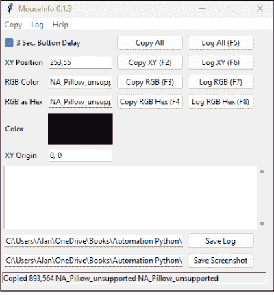

您可以随时记下鼠标指针所触及内容的名称和 X、Y 坐标。或者，您可以单击 MouseInfo 应用程序中的“记录 XY”，然后在 3 秒内将鼠标指针移动到要测量的位置。日志文件将为您记录 X、Y 坐标。但是，不会有描述性文本，因此您可能需要随时记下。

测量完成后，单击 MouseInfo 应用程序中的“保存日志”。默认情况下，文件将命名为 `mouseInfoLog.txt`，并可能保存在与

你的 `pyautogui_mouseinfo.py` 脚本。在 VS Code 中，你只需点击 `mouseInfoLog.txt` 即可查看该文件夹的内容。

#### 在特定应用中使用鼠标控制

从 PyAutoGUI 获得的自动鼠标操作始终在*活动窗口*（屏幕上处于最前台的任何应用）中运行。任何时候你想在特定应用中使用 PyAutoGUI，首先打开该应用并最大化其窗口，以确保屏幕上元素的 X、Y 坐标保持一致。

当你的应用打开后，你可以打开 VS Code（或你正在使用的任何代码编辑器）并启动你的 Python 脚本。你可以给自己几秒钟时间，通过使用计时器在 Python 脚本控制鼠标之前暂停它，这样你就有时间通过点击 Dock 或任务栏图标将感兴趣的应用重新带回屏幕。


在本章后面，我将向你展示如何在示例脚本中使用 `time(5)` 这样的命令来暂停 Python 脚本。

#### 尝试鼠标控制

没有一个我们可以共同访问的通用屏幕，让我用作示例来演示鼠标控制的实际应用。但这里有一个带有大量注释的示例脚本，用于说明无论当前屏幕上显示什么，如何移动鼠标和点击屏幕的方法：

```python
# move_mouse.py
# 必须 pip install pyautogui。
import pyautogui
import time

# FailSafe 默认为 True，此处设置以明确。
pyautogui.FAILSAFE = True
# 在每个 pyautogui 命令后添加 2 秒暂停。
pyautogui.PAUSE = 2

def mouse_operations():
    try:
        # 获取屏幕尺寸作为参考。
        screen_width, screen_height = pyautogui.size()
        print(f"Screen size: {screen_width}x{screen_height}")

        # 获取屏幕中心。
        center_x, center_y = screen_width // 2, screen_height // 2
        print(f"Center of screen: ({center_x}, {center_y})")

        # 移动鼠标
        print("Moving mouse pointer to center of screen...")
        pyautogui.moveTo(center_x, center_y, duration=1)

        # 移动鼠标指针画一个正方形，范围为屏幕的 90%。
        print("Moving the mouse pointer in a square...")
        pyautogui.moveTo(.1*screen_width, .1*screen_height)
        pyautogui.moveTo(.9*screen_width, .1*screen_height, duration=1)
        pyautogui.moveTo(.9*screen_width, .9*screen_height, duration=1)
        pyautogui.moveTo(.1*screen_width, .9*screen_height, duration=1)
        pyautogui.moveTo(.1*screen_width, .1*screen_height, duration=1)

        # 移动到屏幕中心。
        print("Moving back to center of the screen...")
        pyautogui.moveTo(center_x, center_y, duration=1)

        # 相对于当前位置移动。
        print("Moving mouse pointer 300 pixels left and 100 pixels up...")
        pyautogui.moveRel(-300, -100, duration=1)

        # 点击
        print("Performing a left click...")
        pyautogui.click()
        pyautogui.press('esc')
        time.sleep(1)

        # 双击
        print("Performing a double click...")
        pyautogui.doubleClick()
        pyautogui.press('esc')
        time.sleep(1)

        # 右键点击
        print("Performing a right click...")
        pyautogui.rightClick()
        time.sleep(1)

        # 按键
        print("Pressing Escape to close any context menu...")
        pyautogui.press('esc')

        # 滚动（并非普遍支持）
        print("Scrolling toward bottom...")
        pyautogui.scroll(-2000)
        time.sleep(3)

        print("Scrolling toward top...")
        pyautogui.scroll(4000)
        time.sleep(3)

        print("All operations completed successfully!\n")

    except pyautogui.FailSafeException:
        print("\nScript aborted by moving mouse to corner.\n")
    except Exception as e:
        print(f"An error occurred: {e}")

if __name__ == "__main__":
    message = "Script will start in 5 seconds.\n"
    message += "To cancel, move the mouse pointer to any corner."
    print(f"\n\n{message}")

    # 在调用函数前暂停 5 秒。
    time.sleep(5)
    mouse_operations()
```

在该脚本顶部附近，`import time` 这行代码允许你设置计时器来延迟下一行代码的执行。`time` 模块位于标准库中，因此你不需要 `pip install` 它。在脚本底部附近，`time.sleep(5)` 这行代码会暂停执行五秒钟，当你想在屏幕上的特定应用或文档上运行脚本时，这能给你几秒钟时间来准备屏幕。

#### 使用 Python 输入文本

PyAutoGUI 可以通过输入文本和按快捷键来模拟人类键盘输入。它在活动窗口的当前光标位置输入，就像你自己输入一样。如果你从 VS Code 运行脚本，那很可能就是 VS Code。如果你不想让 PyAutoGUI 在你的 Python 脚本内部输入，这里有一种安全测试的方法：

1.  打开 Microsoft Word 或你通常输入的任何其他应用（Pages、Google Docs、记事本、TextEdit），并保持该窗口打开。
2.  如果尚未打开，请打开 VS Code。
3.  在你的脚本中，设置一个计时器在脚本运行前暂停代码执行，以便你有时间切换窗口。
    例如，`time.sleep(5)` 会暂停五秒钟。
4.  在 VS Code 中以通常方式运行你的脚本。
5.  切换到你希望脚本输入的窗口。
    如果脚本将输入到表单中，请点击第一个表单字段内部。

> 当使用脚本填写表单时，最好使用 Tab 键从一个字段移动到下一个字段。这样，你就不需要知道每个你想输入的字段的确切屏幕位置。

##### 控制输入速度

要使用 PyAutoGUI 输入文本，请使用 `.write()` 方法。文本将以闪电般的速度输入。以下是一个示例：

```python
pyautogui.write("Hello World")
```

如果你需要减慢输入速度，请添加 `interval=` 参数和每个输入字符之间暂停的秒数。例如，如果你想延迟半秒，请这样编写代码：

```python
pyautogui.write("Hello World", interval=0.5)
```

##### 输入长段文本

如果你想输入带有换行符等的长段文本，最好的方法是先将该文本放入一个变量中。然后将变量名放在括号内，不要加引号。

> Python 允许你将带有换行符的长段文本放在三引号内。虽然它通常用于冗长的注释，但你也可以使用三引号存储带有换行符的长段文本。你可以使用双引号，如 `"""`，或单引号，如 `'''`。只需确保你使用相同类型的引号开始和结束文本。

例如，这是一个包含换行符的长段文本，存储在名为 `long_message` 的变量中。`pyautogui.write()` 语句在每个字符之间延迟十分之一秒来输入文本：

```python
long_message = """Enclose longer passages of text like this,
with line breaks if you like, inside triple quotation marks.
Then to have Python type the text, put the variable
name inside the parentheses of .write()."""
pyautogui.write(long_message, interval=0.1)
```

##### 按下特殊键

要输入特殊键，如 Enter 或 Tab，请使用 `pyautogui.press()`，并在括号内用引号括起要按的键名。键名包括 "enter"、"tab"、"space"、"backspace"、"delete"、"esc"、"win"、"up"、"down"、"left"、"right"、"f1"、"f2"、"f3"、"f4"、"f5"、"f6"、"f7"、"f8"、"f9"、"f10"、"f11"、"f12"、"home"、"end"、"pageup" 和 "pagedown"。

例如，以下是一些代码，用于输入一些文本，按 Enter，按 Tab，输入更多文本，按 Enter，然后输入最后一行文本：

```python
pyautogui.write("This is a line of text.")
pyautogui.press("enter")
pyautogui.press("tab")
pyautogui.write("This line is indented.")
pyautogui.press("enter")
pyautogui.write("One final line of text.")
```

输出是三行文本，中间一行缩进，如下所示：

```
This is a line of text.
    This line is indented.
One final line of text.
```

##### 按下热键

PyAutoGUI 提供了一个 `hotkeys()` 方法，用于输入通常涉及两次或多次按键的快捷键。这包括 Windows 中的 Shift、Ctrl、Alt 和 Windows 键（在 PyAutoGUI 中分别输入为 "shift"、"ctrl"、"alt" 和 "win"）。在 macOS 上，你可以使用 Command、Option 和 Control 键（在 Mac 上分别输入为 "command"、"option" 和 "ctrl"）。

#### 检测操作系统

如果你曾想编写一个在 Windows 和 macOS 上都能正确按下快捷键的应用程序，可以使用 `platform` 模块的 `.system` 方法来检测脚本运行的操作系统。你无需 `pip install` 该模块——只需将其导入脚本即可。例如，以下代码在 Windows 上运行时使用 `Ctrl+键` 快捷键，在 macOS 上运行时使用 `Command+键` 快捷键。


代码中将 macOS 称为 Darwin，是因为 `platform` 模块优先使用内核名称而非操作系统名称。macOS 是一个类 Unix 操作系统，其核心使用名为 Darwin 的内核来处理硬件与软件之间的交互。

```python
import pyautogui
import platform

pyautogui.FAILSAFE = True
pyautogui.PAUSE = 0.1

# 在 Mac 上选择、复制和粘贴文本。
if platform.system() == 'Darwin':
    # 在当前文档中全选。
    pyautogui.hotkey('command', 'a')
    # 复制选中的文本。
    pyautogui.hotkey('command', 'c')
    # 移动到文档末尾。
    pyautogui.hotkey('command', 'down')
    # 移动到下一行。
    pyautogui.press('enter')
    # 粘贴复制的文本。
    pyautogui.hotkey('command', 'v')
# 在 Windows 上选择、复制和粘贴文本。
elif platform.system() == 'Windows':
    # 在当前文档中全选。
    pyautogui.hotkey('ctrl', 'a')
    # 复制选中的文本。
    pyautogui.hotkey('ctrl', 'c')
    # 移动到文档末尾。
    pyautogui.hotkey('ctrl', 'end')
    # 移动到下一行。
    pyautogui.press('enter')
    # 粘贴复制的文本。
    pyautogui.hotkey('ctrl', 'v')
```

Linux 的快捷键通常与 Windows 相同。如果你想支持 Linux，只需将 `elif platform.system() == 'Windows':` 改为 `else:` 即可同时覆盖 Windows 和 Linux。Linux 有多种图形界面，包括 GNOME、KDE Plasma、XFCE、Cinnamon 等。你可能需要在你使用的图形界面上进行测试，以确保一切正常。

#### 检测按键

在 VS Code 中运行 Python 脚本时，你可以按 Ctrl+C 停止代码执行，但前提是 VS Code（或你使用的任何编辑器/终端）处于活动窗口。如果你使用 Python 自动化其他应用程序，你可能需要能够检测来自其他窗口的按键。`pynput` 模块允许 Python 在操作系统层面检测按键。换句话说，`pynput` 可以检测来自启动 Python 脚本窗口以外的其他窗口的按键。

`pynput` 模块不属于标准库。在创建导入该模块的脚本之前，请确保已通过 `pip install pynput` 将其安装到你的虚拟环境中。

与本章中使用的 PyAutoGUI 一样，你需要在 Mac 上启用辅助功能才能使 `pynput` 正常工作。详情请参阅本章前面的“在 Mac 上授予权限”。

为了说明 `pynput` 的工作原理，以下脚本将在用户按下 Escape 键（代码中为 `esc`）时，从 Linux、macOS 或 Windows 的任何打开窗口中停止当前运行的 Python 脚本：

```python
# listen_esc.py
# 你必须 pip install pynput 才能使其工作。
from pynput import keyboard
import sys

def on_press(key):
    # 检查是否按下了 Esc 键。
    if key == keyboard.Key.esc:
        print(f'检测到 Esc 键！正在停止脚本...')
        # 停止监听器并退出脚本
        sys.exit(0)

# 设置键盘监听器。
print(f'在任意窗口中按 Esc 键以停止')
with keyboard.Listener(on_press=on_press) as listener:
    listener.join()
```

注意名为 `on_press(key)` 的函数。每当上述脚本运行时，括号中的 `key` 参数会接收键盘上最后按下的键，无论你处于哪个窗口。当按下 Esc 时，`if key == keyboard.Key.esc` 这行代码为 True，因此该函数只需打印一些反馈信息，并使用 `sys.exit(0)` 停止脚本执行。

最复杂的代码可能是 `with keyboard.Listener(on_press=on_press)`，它创建了一个 `pynput` 监听器，可以检测键盘上按下的每个键。`on_press=on_press` 部分表示每次按键时都调用名为 `on_press` 的函数。然后，按下的任何键都会作为 `key` 参数传递给该函数。

`as listener` 部分只是将该键盘监听器命名为 `listener`。`listener.join()` 通过暂时阻止 Python 脚本成为唯一监听按键的程序来激活监听器，以便监听器可以跨所有打开窗口全局监控按键。该监听器将一直有效，直到 `sys.exit(0)` 终止 Python 脚本，这也会终止监听器。

#### 创建你自己的键盘快捷键

如果你想创建可以从任何应用程序或窗口调用的自定义快捷键，可以使用前面描述的 `pynput` 来监听按键组合。尽量不要替换常用的快捷键，例如 Windows 或 Mac 上分别用于复制的 Ctrl+C 或 ⌘+C，否则当你调用 Python 脚本而不是执行快捷键的原始任务时，可能会变得非常混乱！

如果你的快捷键操作针对特定应用程序，你可以询问人工智能（AI）你计划使用的快捷键在该应用程序中是否已有其他用途。

出于未知原因，`pynput` 并不总是能与 Microsoft Word 良好配合。如果你想为 Windows 创建快捷键，可以考虑改用 Word 中的宏。如果你不知道如何操作，只需询问任何 AI 即可。

在下一个脚本中，我们将使用 `pynput` 来监听快捷键。我们还将允许你通过按 Escape 键结束脚本。因此，基本上，在启动脚本后，你可以转到任何其他应用程序并使用快捷键输入文本，只要脚本正在运行。按 Escape 键结束脚本并停止监听快捷键。

首先，我将展示整个脚本；然后我将解释它的工作原理。

```python
# shortcut_key.py
# pip install pynput and pyautogui
from pynput import keyboard
import pyautogui
import sys
import platform
import time

# 定义用于输入样板文本的快捷键。
windows_hotkey = '<ctrl>+<alt>+t'
mac_hotkey = '<cmd>+<shift>+t'
# 定义样板文本以及 Windows、Mac 的快捷键。
boilerplate_text = """你好，这段文本是由 pynput 输入的！
    你可以将其设置为任意长度和任意行数。"""

def type_boilerplate():
    time.sleep(0.5)
    pyautogui.write(boilerplate_text, interval=0.05)

def exit_script():
    print("按下了 Esc 键。正在退出...")
    sys.exit(0)

def main():
    # 根据操作系统设置快捷键。
    system = platform.system()
    # Mac 快捷键
    if system == 'Darwin':
        hotkey = mac_hotkey
    else:
        # Windows/Linux 快捷键
        hotkey = windows_hotkey

    # 设置快捷键字典及其对应的操作。
    hotkeys = {
        hotkey: type_boilerplate,
        '<esc>': exit_script
    }
    # 开始监听。
    print(f"正在监听 {hotkey}。按 Esc 键结束...")
    with keyboard.GlobalHotKeys(hotkeys) as listener:
        listener.join()

if __name__ == '__main__':
    try:
        main()
    except KeyboardInterrupt:
        print("\n正在退出...")
        sys.exit(0)
```

以下代码块是你定义快捷键的地方。你可以定义任意数量的快捷键。我定义了两个——一个用于输入样板文本，一个用于退出脚本。如果你想同时支持 macOS 和 Windows，你必须为每个系统定义快捷键，就像我在这里所做的那样：

```python
# 定义用于输入样板文本的快捷键。
windows_hotkey = '<ctrl>+<alt>+t'
mac_hotkey = '<cmd>+<shift>+t'
```

我将 Ctrl+Alt+T 设置为 Windows 快捷键，将 ⌘+Shift+T 设置为 Mac 快捷键。据我所知，这个按键组合没有用于任何重要功能。因此，我没有用我自己的快捷键替换任何常用的快捷键。


语法要求修饰键 `ctrl`、`alt` 和 `cmd`（command）必须包含在尖括号中，而普通字母 `t` 则不需要。

在我的示例中，我将设置快捷键在当前使用的任何应用程序中输入一些文本。经常输入的文本有时被称为 *样板文本*，因此我使用变量名 `boilerplate_text` 来保存它。你可以输入任何text you want, and any number of lines of text, between the triple quotation marks when writing your own code.

```
# Define boilerplate text and hotkeys for Windows, Mac.
boilerplate_text = """Hello, this text was typed by pynput!
    You can make this any length and any number of lines."""
```

Define the action that you want the shortcut key to perform in a function. In my case, I’ve created a function named `type_boilerplate()`, as shown next. The `time.sleep()` line provides a half-second delay before typing, to allow a little time for the cursor to get into position before the typing begins:

```
def type_boilerplate():
    time.sleep(0.5)
    pyautogui.write(boilerplate_text, interval=0.05)
```

I’ll pair that function with the hotkey a little later in the code. But let me briefly explain the rest. This next function, when called, simply exits the script. I’ll pair that with the Escape key later. Because that’s not a combination keystroke and is the same on Windows and macOS, you don’t need to define it as a “special key.”

```
def exit_script():
    print("Esc pressed. Exiting...")
    sys.exit(0)
```

Next, we need to define the hotkey the script will use, depending on whether the script is running on macOS, Windows, or Linux (which generally uses the same keys as Windows). That’s done in this block of code, where the variable named `hotkey` gets the appropriate key combination for the current operating system:

```
def main():
    # Set up the hotkey based on the operating system.
    system = platform.system()
    # Mac shortcut key
    if system == 'Darwin':
        hotkey = mac_hotkey
    else:
        # Windows/Linux shortcut key
        hotkey = windows_hotkey
```

Next, we can pair keys with functions we defined earlier. Here’s a dictionary named `hotkeys` that pairs `hotkey` with the `type_boilerplate` function, and the Escape key (`<esc>`) with the `exit_script` function:

```
# Set up the hotkeys dictionary and what each calls.
hotkeys = {
    hotkey: type_boilerplate,
    '<esc>': exit_script
}
```

Finally, the `main()` function tells the script to print a little text identifying which keys the script is listening for. Then it sets up the listener to listen for the keys defined in the `hotkeys` dictionary:

```
print(f"Listening for {hotkey}. Press Esc to end...")
with keyboard.GlobalHotKeys(hotkeys) as listener:
    listener.join()
```

The rest of the code runs the `main()` function to activate the hotkeys when you run the script. The `try` block detects when the script was ended by pressing Escape, and prints a friendly `Exiting...` message in the Terminal instead of just stopping the script abruptly with no additional feedback.

#### 自动化截图

得益于 Windows 中的截图工具和 macOS 中的截图应用，截取屏幕截图很容易。但如果你想在某个长时间运行的过程中自动截图呢？嗯，你也可以用 Python 做到这一点，这要归功于 PyAutoGUI。与本章中的其他应用一样，你需要在 Mac 上授予辅助功能权限，正如本章开头附近所讨论的。

截取屏幕截图的一个注意事项是，脚本需要访问 `pyscreeze`，它是 Pillow 库的一个组件。因此，即使你在脚本的导入部分没有看到 Pillow，你也确实需要将其安装到你的虚拟环境中，脚本才能运行。此脚本还需要 PyAutoGUI，因此请确保在虚拟环境中通过在终端输入以下命令来安装这两个库：

```
pip install pillow pyautogui
```

我将首先向你展示用于自动截图的完整脚本。然后，我将在接下来的部分中指出关键特性和个性化设置。以下是完整的脚本：

```
# auto_screenshots.py
# pip install pillow pyautogui for this script
import pyautogui
import time
from datetime import datetime
from pathlib import Path
pyautogui.PAUSE = 0.1

def take_screenshot(save_path: Path):
    # Get current timestamp for filename.
    timestamp = datetime.now().strftime("%Y%m%d_%H%M%S")
    filename = f"screenshot_{timestamp}.png"
    full_path = save_path / filename

    try:
        # Take screenshot and save it.
        screenshot = pyautogui.screenshot()
        screenshot.save(full_path)
        print(f"Screenshot saved to {full_path}")
        return full_path
    except Exception as e:
        print(f"Error taking screenshot: {e}")
        return None

def start_recording(save_path: Path, time_delay):
    # Create screenshots directory if it doesn't exist.
    if not save_path.exists():
        save_path.mkdir(parents=True, exist_ok=True)
    try:
        while True:
            take_screenshot(save_path)
            time.sleep(time_delay)
    except KeyboardInterrupt:
        return False

def main():
    # Where to save screenshots
    save_path = Path(r"C:\Users\Alan\Documents\Practice\Auto Screenshots")
    # For macOS/Linux, make sure to change the path to a valid one with write permissions.
    # save_path = Path("/Users/alan/Practice/Auto Screenshots")
    # How many seconds between each screenshot
    time_delay = 5  # seconds
    # Start the screenshot recording.
    print("\nTaking Screenshots.\nPress Ctrl+C here to stop the recording.\n")
    recording = start_recording(save_path, time_delay)
    # Message shown when recording was stopped with Ctrl+C
    if not recording:
        print("\nRecording stopped")

if __name__ == "__main__":
    main()
```

#### 使用 Python 截取屏幕截图

截图脚本中的 `take_screenshot()` 函数负责截取屏幕截图并保存。当被调用时，它使用 `datetime.now()` 生成一个文件名。然后，它使用以下代码将该文件名附加到文件应保存的路径：

```
def take_screenshot(save_path: Path):
    # Get current timestamp for filename.
    timestamp = datetime.now().strftime("%Y%m%d_%H%M%S")
    filename = f"screenshot_{timestamp}.png"
    full_path = save_path / filename
```

实际的屏幕截图是通过 `screenshot = pyautogui.screenshot()` 截取的，并使用 `screenshot.save(full_path)` 行保存：

```
# Take screenshot and save it.
screenshot = pyautogui.screenshot()
screenshot.save(full_path)
```

其余代码在脚本运行时在终端中提供打印反馈。

自动化部分发生在 `start_recording()` 脚本中，该脚本首先创建用于保存屏幕截图的文件夹（如果尚不存在）。然后，脚本使用一个简单的 `while True` 循环不断调用 `take_screenshot()`，直到你在终端窗口中按 Ctrl+C 停止脚本。

```
def start_recording(save_path: Path, time_delay):
    # Create screenshots directory if it doesn't exist.
    if not save_path.exists():
        save_path.mkdir(parents=True, exist_ok=True)
    try:
        while True:
            take_screenshot(save_path)
            time.sleep(time_delay)
    except KeyboardInterrupt:
        return False
```

#### 个性化自动截图脚本

自动截图脚本可以在任何操作系统上运行。要使其成为你自己的脚本，只需按照 `main()` 函数中所示的语法，将 `save_path` 变量设置为你希望保存屏幕截图的路径。使用 `time_delay` 变量指定每次截图之间暂停的秒数。

```
def main():
    # Where to save screenshots
    save_path = Path(r"C:\Users\Alan\Documents\Practice\Auto Screenshots")
    # For macOS/Linux, make sure to change the path to a valid one with write permissions.
    # save_path = Path("/Users/alan/Practice/Auto Screenshots")
    # How many seconds between each screenshot
    time_delay = 5  # seconds
```

确保你指定一个 Python 具有写入权限的文件夹，以便脚本可以保存文件而不会产生错误。

+   本章内容

* 自动化 Microsoft Word 和 Microsoft Excel
* 创建、打开和添加水印的 PDF

### 第 8 章
自动化办公

在本章中，你将自动化常见的办公应用和任务，特别是 Microsoft Word、Microsoft Excel 和 PDF。你将找到创建新文件、打开现有文件以及向文件添加内容的技术。我还将向你展示一个可以向 PDF 的每一页添加水印图像的脚本。

#### 自动化 Microsoft Word

你可以使用 Python 创建、打开、向 Word 文档添加内容并保存。如果你发现自己重复执行这些任务中的任何一项，你会欣赏本章的第一个脚本，它完成了所有这些事情。

对于我们的第一个脚本，我们将使用 `python-docx` 模块来创建、打开、向 Word 文档添加内容并保存。在代码中，你会看到一行 `from docx import Document`，但这有点误导性。该模块的实际名称是 `python-docx`。要使用此脚本，请确保激活你的虚拟环境并在终端中输入以下命令：

```
pip install python-docx
```

以下是完整的脚本：

```
# create_open_word.py
# You must pip install python-docx.
from docx import Document
```

from pathlib import Path
import os
import sys

# 这里是你定义要放入文档内容的地方。
def add_content(doc: Document) -> None:
    try:
        doc.add_heading('示例文档', level=1)
        doc.add_paragraph('这是添加到文档中的示例段落。')
        doc.add_paragraph('使用 python-docx 在 Windows 或 macOS 上创建。')
        print("内容已添加到文档。")
    except Exception as e:
        print(f"向文档添加内容时出错: {e}")
        raise

# 如果文件夹路径不存在，则创建它。
def ensure_path_exists(folder_path: str) -> Path:
    try:
        path = Path(folder_path).resolve()
        path.mkdir(parents=True, exist_ok=True)
        return path
    except OSError as e:
        print(f"创建目录 {folder_path} 时出错: {e}")
        raise

# 确保文件名具有 .docx 扩展名。
def validate_file_name(file_name: str) -> str:
    if not file_name.lower().endswith('.docx'):
        file_name += '.docx'
    return file_name

# 打开现有的 .docx 文件或创建一个新文件。
def open_or_create_docx(folder_path: Path, file_name: str) -> Document:
    file_path = folder_path / file_name
    # 返回 Document 对象。
    try:
        if file_path.exists():
            print(f"打开现有文档: {file_path}")
            return Document(file_path)
        else:
            print(f"创建新文档: {file_path}")
            doc = Document()
            doc.save(file_path)  # 初始化文件
            return doc
    except Exception as e:
        print(f"打开或创建文档 {file_path} 时出错: {e}")
        raise

# 将文档保存到指定路径。
def save_document(doc: Document, file_path: Path) -> None:
    try:
        doc.save(file_path)
        print(f"文档保存成功: {file_path}")
    except Exception as e:
        print(f"保存文档 {file_path} 时出错: {e}")
        raise

# 在 Windows 或 macOS 上使用默认应用程序打开文件。
def open_file(file_path: Path) -> None:
    try:
        if sys.platform.startswith('win'):
            os.startfile(str(file_path))
        elif sys.platform.startswith('darwin'):
            # 在 macOS 上使用 os.system 而不是 subprocess 来打开文件
            os.system(f'open "{file_path}"')
        else:
            print("不支持自动打开文件的操作系统。请手动打开:", file_path)
    except Exception as e:
        print(f"打开文件 {file_path} 时出错: {e}")
        raise

# 使用所有前面的函数来创建或打开 Word 文档并添加内容
def process_document(folder_path: str, file_name: str) -> None:
    try:
        path = ensure_path_exists(folder_path)
        file_name = validate_file_name(file_name)
        file_path = path / file_name
        doc = open_or_create_docx(path, file_name)
        add_content(doc)
        save_document(doc, file_path)
        open_file(file_path)
    except Exception as e:
        print(f"处理文档失败: {e}")
        raise

# 在这里指定你的路径和文件名。
def main():
    # Windows 路径
    folder_path = R"C:\Users\Alan\Documents\Practice\Word Docs"
    # macOS 路径
    # folder_path="/Users/alan/Documents/Practice/Word Docs"
    file_name = "Sample Generated.docx"

    # 创建或打开文档并添加内容。
    process_document(folder_path, file_name)

if __name__ == "__main__":
    main()

该脚本被组织成多个函数，并包含异常处理以处理任何不可预见的问题，例如创建或保存文档时权限不足。使该脚本为你所用主要在于定义你想要创建或修改的 Word 文档的位置和名称，以及你想要放入文档的内容。

#### 命名你的 Word 文档

`main()` 函数是你指定 Word 文档文件名和位置的地方。如果你指定的文件夹或文档不存在，脚本会为你创建该文件夹和文档。如果你指定一个现有的 Word 文档，脚本会打开该文档并将你的内容添加到该文档中。使用 `main()` 函数来指定你的路径和文件名：

```
# 在这里指定你的路径和文件名。
def main():
    # Windows 路径
    folder_path = R"C:\Users\Alan\Documents\Practice\Word Docs"
    # macOS 路径
    # folder_path="/Users/alan/Documents/Practice/Word Docs"
    file_name = "Sample Generated.docx"
```


我已将 Windows 和 macOS 路径都作为示例代码包含在内。请确保使用适合你操作系统的正确语法，以及一个你拥有写入权限的文件夹。

#### 定义你的 Word 内容

`add_content()` 函数是你添加代码以定义要输入到 Word 文档中的内容的地方。我提供了一个简单的示例，使用 `doc.add_heading()` 添加标题，以及使用 `doc.add_paragraph()` 添加几个段落：

```
# 这里是你定义要放入文档内容的地方。
def add_content(doc: Document) -> None:
    try:
        doc.add_heading('示例文档', level=1)
        doc.add_paragraph('这是添加到文档中的示例段落。')
        doc.add_paragraph('使用 python-docx 在 Windows 或 macOS 上创建。')
        print("内容已添加到文档。")
    except Exception as e:
        print(f"向文档添加内容时出错: {e}")
        raise
```

我在这个示例中故意添加了最少的文本，以免使代码过于复杂，但你可以使用类似的代码向任何 Word 文档添加任何元素类型。要了解全部可能性，请查看 https://python-docx.readthedocs 上的 `python-docx` 代码。

以下是你可以在 Word 文档中使用 `python-docx` 做的一些事情：

- 添加、更改或删除段落。
- 更改段落的对齐方式、缩进或行距。
- 插入文本格式，如粗体和斜体。
- 添加、更改或删除标题。
- 创建具有指定行数和列数的表格。
- 用文本或其他内容填充表格单元格。
- 编辑单元格内容、合并单元格或调整表格属性。
- 插入、替换或调整图像大小。
- 创建项目符号或编号列表。
- 向页眉和页脚添加内容，包括文本或图像。
- 插入分页符以开始新页面。
- 更改字体属性，包括大小、颜色和字体。
- 应用或修改段落样式（例如，正文或标题）。


几乎你在 Word 中能做的任何事情，都可以用 Python 和 python-docx 来自动化。大多数人工智能（AI）也能轻松地为你编写代码。以“编写 Python python-docx 代码来……”开头你的 AI 提示，并准确描述你希望代码执行的操作。

#### 自动化 Microsoft Excel

就像你可以用 Python 创建和编辑 Word 文档一样，你也可以用它来处理 Excel。你需要 `openpyxl` 模块，它不是标准库的一部分。因此，在你创建并激活虚拟环境后，在终端中输入以下命令：

```
pip install openpyxl
```

这是一个用于自动化 Excel 的示例脚本。它具有与自动化 Word 类似的功能。你可以用它来创建一个新的 Excel 工作簿，或者打开并修改一个现有的工作簿。该脚本被组织成执行特定任务的函数，例如创建必要的文件夹、捕获异常以及向工作簿中输入内容。以下是完整的脚本：

```
# create_open_excel.py
# 你必须 pip install openpyxl。
from openpyxl import Workbook, load_workbook
from pathlib import Path
import os
import sys

# 这里是你定义要放入工作簿内容的地方。
def add_content(wb) -> None:
    try:
        ws = wb.active
        ws.title = "示例数据"
        # 添加标题行。
        ws.append(["ID", "Name", "Value"])
        # 添加示例行。
        ws.append([1, "示例项目 1", 123])
        ws.append([2, "示例项目 2", 456])
        ws.append([3, "示例项目 3", 789])
        print("内容已添加到工作簿。")
    except Exception as e:
        print(f"向工作簿添加内容时出错: {e}")
        raise
```

# 如果文件夹路径不存在，则创建它。
def ensure_path_exists(folder_path: str) -> Path:
    try:
        path = Path(folder_path).resolve()
        path.mkdir(parents=True, exist_ok=True)
        return path
    except OSError as e:
        print(f"创建目录 {folder_path} 时出错: {e}")
        raise

# 确保文件名具有 .xlsx 扩展名。
def validate_file_name(file_name: str) -> str:
    if not file_name.lower().endswith('.xlsx'):
        file_name += '.xlsx'
    return file_name

# 打开一个现有的 .xlsx 文件或创建一个新文件。
def open_or_create_workbook(folder_path: Path, file_name: str):
    file_path = folder_path / file_name
    try:
        if file_path.exists():
            print(f"打开现有工作簿: {file_path}")
            return load_workbook(file_path)
        else:
            print(f"创建新工作簿: {file_path}")
            wb = Workbook()
            wb.save(file_path)  # 初始化文件。
            return wb
    except Exception as e:
        print(f"打开或创建工作簿 {file_path} 时出错: {e}")
        raise

# 将工作簿保存到指定路径。
def save_workbook(wb, file_path: Path) -> None:
    try:
        wb.save(file_path)
        print(f"工作簿保存成功: {file_path}")
    except Exception as e:
        print(f"保存工作簿 {file_path} 时出错: {e}")
        raise

# 在 Windows 或 macOS 上使用默认应用程序打开文件。
def open_file(file_path: Path) -> None:
    try:
        if sys.platform.startswith('win'):
            os.startfile(str(file_path))
        elif sys.platform.startswith('darwin'):
            os.system(f'open "{file_path}"')
        else:
            print("不支持自动打开文件的操作系统。请手动打开:", file_path)
    except Exception as e:
        print(f"打开文件 {file_path} 时出错: {e}")
        raise

# 使用所有前面的函数来创建或打开一个 Excel 工作簿并添加内容。
def process_workbook(folder_path: str, file_name: str) -> None:
    try:
        path = ensure_path_exists(folder_path)
        file_name = validate_file_name(file_name)
        file_path = path / file_name
        wb = open_or_create_workbook(path, file_name)
        add_content(wb)
        save_workbook(wb, file_path)
        open_file(file_path)
    except Exception as e:
        print(f"处理工作簿失败: {e}")
        raise

# 在此处指定你的路径和文件名。
def main():
    # Windows 路径示例
    # folder_path = r"C:\Users\Alan\Documents\Practice\Excel Files"
    # macOS 路径示例
    folder_path = "/Users/alan/Practice/Excel Files"
    file_name = "Sample Generated.xlsx"
    process_workbook(folder_path, file_name)

if __name__ == "__main__":
    main()

此脚本中的关键函数是 `main()` 和 `add_content()`，我将在接下来的两个部分中进行描述。

#### 指定你的工作簿

`main()` 函数允许你使用该脚本创建一个新工作簿或打开一个现有工作簿。使用 `folder_path` 变量来定义工作簿的位置。如果你指定的文件夹不存在，脚本会为你创建一个文件夹。


一如既往，请确保根据你使用的是 Windows 还是 macOS，为路径使用正确的语法。

```
# 在此处指定你的路径和文件名。
def main():
    # Windows 路径示例
    folder_path = r"C:\Users\Alan\Documents\Practice\Excel Files"
    # Mac 路径示例
    # folder_path = "/Users/alan/Practice/Excel Files"
```

使用 `file_name` 变量来指示工作簿的文件名。如果文件不存在，脚本将创建并打开一个具有该文件名的工作簿。如果文件已存在，脚本将打开它。无论哪种情况，脚本都会将你指定的任何内容添加到该打开的工作簿中。

```
file_name = "Sample Generated.xlsx"
```

#### 为你的工作簿定义内容

使用 `add_content()` 函数来指定你想要放入工作簿的内容。在示例脚本中，我添加了一些通用的示例内容以保持相对简单：

```
# 在这里定义你想要放入工作簿的内容。
def add_content(wb) -> None:
    try:
        ws = wb.active
        ws.title = "Sample Data"
        # 添加标题行
        ws.append(["ID", "Name", "Value"])
        # 添加示例行
        ws.append([1, "Sample Item 1", 123])
        ws.append([2, "Sample Item 2", 456])
        ws.append([3, "Sample Item 3", 789])
        print("内容已添加到工作簿。")
    except Exception as e:
        print(f"向工作簿添加内容时出错: {e}")
        raise
```

`wb` 参数指的是当前打开的工作簿，它在工作簿打开后由其他函数传入。`ws=wb.active` 这一行将打开的工作簿定义为活动工作簿，后续行使用 `ws` 向该活动工作簿添加内容。


`openpyxl` 模块允许你执行几乎任何可以在工作簿中手动执行的操作，包括以下内容：

- 插入和删除行与列。
- 遍历行和列。
- 追加行。
- 使用范围插入公式并读取公式结果。
- 应用条件格式。
- 插入图表和图像。
- 使用字体、对齐方式、颜色、边框、数字格式等格式化单元格。
- 调整行高和列宽。

有关 `openpyxl` 的全部功能，请查阅文档 https://openpyxl.readthedocs.io。


如果你是高级 Python 用户，你可能会很高兴知道 `openpyxl` 允许将数据导出到 Pandas DataFrames 以及从 Pandas DataFrames 导入数据。

#### 创建和打开 PDF

便携式文档格式 (PDF) 是在线共享文档的流行格式，主要因为无论你在 PC 还是 Mac 上查看，文档的外观始终相同。PDF 阅读器，如 Adobe Acrobat Reader，是免费且丰富的。如今，大多数网络浏览器都可以打开和显示 PDF。

在本节中，我将向你展示如何创建新的 PDF、打开现有的 PDF 以及向任何 PDF 添加内容。我们将使用 `PyPDF2` 和 `reportlab` 模块。这两个模块都不是 Python 标准库的一部分，因此在创建并激活虚拟环境后，请在终端中输入以下命令进行安装：

```
pip install reportlab PyPDF2
```


此脚本主要使用 PyPDF2 执行文件级任务，如打开和读取现有的 PDF。它使用 reportlab 向页面添加内容，因为 reportlab 通常更适用于这部分工作。

与本书中的其他脚本一样，我首先向你展示完整的脚本。然后我将向你展示如何根据自己的需求进行调整。以下是脚本：

```
# create_open_pdf.py
# pip install reportlab PyPDF2
import os
import sys
from pathlib import Path
from io import BytesIO
from reportlab.lib.pagesizes import letter
from reportlab.pdfgen import canvas
from reportlab.lib.units import inch
from PyPDF2 import PdfReader, PdfWriter

# 在这里定义要放入 PDF 的内容。
def add_content(c: canvas.Canvas) -> None:
    # 定义要添加到 PDF 的内容。
    c.setFont("Helvetica", 16)
    c.drawString(1 * inch, 10 * inch, "Sample PDF Report")
    c.setFont("Helvetica", 12)
    c.drawString(1 * inch, 9.5 * inch, "Generated with Python, ReportLab and PyPDF2")
    c.line(1 * inch, 9.3 * inch, 7.5 * inch, 9.3 * inch)

    # 添加额外的段落。
    textobject = c.beginText()
    textobject.setTextOrigin(1 * inch, 8.7 * inch)
    textobject.setFont("Helvetica", 10)
    textobject.textLine("Use the canvas in reportlab to add content to the PDF page.")
    textobject.textLine("See the reportlab documentation at https://docs.reportlab.com for more.")
    c.drawText(textobject)

def ensure_path_exists(folder_path: str) -> Path:
    # 如果文件夹路径不存在，则创建它。
    try:
        path = Path(folder_path).resolve()
        path.mkdir(parents=True, exist_ok=True)
        return path
    except Exception as e:
        print(f"创建目录时出错: {e}")
        raise

def validate_file_name(file_name: str) -> str:
    # 确保文件名具有 .pdf 扩展名。
    if not file_name.lower().endswith('.pdf'):
        file_name += '.pdf'
    return file_name

def create_new_page_pdf() -> BytesIO:
    # 使用 ReportLab 创建一个包含内容的新 PDF。
    buffer = BytesIO()
    c = canvas.Canvas(buffer, pagesize=letter)
    add_content(c)
    c.showPage()
    c.save()
    buffer.seek(0)
    return buffer

def open_file(file_path: Path) -> None:
    # 在默认应用程序中打开 PDF。
    try:
        if sys.platform.startswith('win'):
            os.startfile(str(file_path))
        elif sys.platform.startswith('darwin'):
            os.system(f'open "{file_path}"')
        else:
            print(f"不支持自动打开的操作系统: {file_path}")
    except Exception as e:
        print(f"打开文件 {file_path} 时出错: {e}")

def process_pdf(folder_path: str, file_name: str) -> None:
    # 如果 PDF 不存在，则创建它。
    # 否则，打开它并追加一个新页面。
```

try:
    path = ensure_path_exists(folder_path)
    file_name = validate_file_name(file_name)
    pdf_path = path / file_name

    writer = PdfWriter()
    # 如果PDF已存在，则加载其页面。
    if pdf_path.exists():
        print(f"\n正在打开现有PDF：{pdf_path}")
        reader = PdfReader(str(pdf_path))
        for page in reader.pages:
            writer.add_page(page)
    else:
        print(f"\n正在创建新PDF：{pdf_path}")

    # 创建一个新的内容页并添加它。
    new_page_buffer = create_new_page_pdf()
    new_reader = PdfReader(new_page_buffer)
    writer.add_page(new_reader.pages[0])
    print("已添加新的内容页。")

    # 将更新后的PDF内容写入文件。
    with open(pdf_path, "wb") as f:
        writer.write(f)
    print(f"PDF处理并保存成功：{pdf_path}\n")

    # 使用默认应用程序打开文件。
    open_file(pdf_path)

except Exception as e:
    print(f"处理PDF失败：{e}")
    raise

def main():
    # PDF文件的存放（或打开）位置。
    # Windows示例：
    folder_path = r"C:\Users\Alan\Documents\Practice\PDFs"
    # macOS/Linux示例：
    # folder_path = "/Users/alan/Documents/Practice/PDFs"
    # PDF文件名
    file_name = "Sample Generated.pdf"

    # 创建或打开PDF并添加内容。
    process_pdf(folder_path, file_name)

if __name__ == "__main__":
    main()

所有用于创建新PDF或打开现有PDF的代码都已包含在脚本中。该脚本包含异常处理，用于捕获可能的错误并显示未预见异常的错误信息。你无需在脚本中做任何事情来使这一切工作。但你需要决定你想在PDF中放入什么内容，正如我接下来解释的那样。

#### 为你的PDF定义内容

定义你想在PDF中放入什么内容的代码包含在脚本的 `add_content()` 函数中。不幸的是，你不能直接在那里输入你想要的内容。你必须使用 `reportlab` 指定的语法。该脚本展示了使用 `textobject` 以及 `reportlab` 的 `.setFont`、`.drawString` 和 `.line` 方法的示例。更多信息请参阅 `reportlab` 文档 https://docs.reportlab.com。

#### 标识你的PDF

在 `main()` 函数中，指定你的PDF的路径和文件名。与本书中的其他自动化脚本一样，如果你指定一个已存在的PDF，脚本将打开该PDF并将你的内容添加到该文件中。如果你想从头开始创建一个新的PDF，请使用 `.pdf` 扩展名创建一个新文件。

一如既往，确保为Windows或macOS/Linux使用有效的路径。在以下示例中，我使用Windows，并注释掉了macOS/Linux路径。我包含该路径只是为了提醒这些路径的正确语法。


```
def main():
    # PDF的存放（或打开）位置
    # Windows示例：
    folder_path = r"C:\Users\Alan\Documents\Practice\PDFs"
    # macOS/Linux示例：
    # folder_path = "/Users/alan/Documents/Practice/PDFs"
    # PDF文件名
    file_name = "Sample Generated.pdf"
```

`file_name` 变量必须是你想要创建或修改的PDF的名称。如果你指定一个现有PDF的路径和文件名，脚本将向该PDF追加一个新页面，并在该页面上插入内容。

#### 为PDF添加水印

为PDF添加水印是一个常见的操作，有时用于保护知识产权、确立所有权，并通过阻止未经授权的复制、分发或更改来防止滥用，特别是对于敏感或机密材料。


水印也通过嵌入徽标或名称服务于品牌目的，通过 *草稿* 或 *机密* 等标签强化文档状态，并通过唯一标识符实现分发跟踪，以追踪泄露或未经授权的共享，在保持文档内容的同时提供可见的安全和控制层。

在本节中，你将创建一个脚本，该脚本可以打开任何现有的PDF并为文档的每一页添加水印。该脚本将添加水印后的文件保存为原始文件名加上 `_watermarked` 后缀，这样你就保留了原始文档。

该脚本使用 `reportlab` 和 `PyPDF2` 来管理PDF，并使用 `Pillow` 来获取图像的尺寸。创建并激活虚拟环境后，请确保在终端中输入以下命令以安装这些模块（如果尚未安装）：

```
bash
pip install reportlab PyPDF2 Pillow
```

首先，让我展示整个脚本。我将在接下来的部分中解释如何根据你自己的需求进行调整。

```
python
# watermark_pdf.py
# pip install reportlab PyPDF2 Pillow
import os
import sys
from pathlib import Path
from io import BytesIO
from PIL import Image
from reportlab.pdfgen import canvas
from PyPDF2 import PdfReader, PdfWriter
```

```
python
def create_watermark_pdf(page_width, page_height, watermark_path, magnification):
    # 将水印垂直和水平居中。
    try:
        # 打开水印图像以获取其尺寸。
        with Image.open(watermark_path) as img:
            img_width, img_height = img.size

        # 按放大百分比缩放图像尺寸。
        scaled_width = img_width * magnification / 100
        scaled_height = img_height * magnification / 100

        # 使用缩放后的尺寸计算居中位置。
        x = (page_width - scaled_width) / 2
        y = (page_height - scaled_height) / 2

        buffer = BytesIO()
        c = canvas.Canvas(buffer, pagesize=(page_width, page_height))
        # 使用缩放后的尺寸绘制图像。
        c.drawImage(str(watermark_path), x, y, width=scaled_width,
                    height=scaled_height, mask='auto')
        c.showPage()
        c.save()
        buffer.seek(0)
        return buffer
    except Exception as e:
        print(f"创建水印PDF时出错：{e}")
        raise

def add_watermark_to_pdf(pdf_path: Path, watermark_path: Path, magnification: int) -> None:
    # 打开给定的PDF文件并为每一页添加水印
    try:
        reader = PdfReader(str(pdf_path))
        writer = PdfWriter()

        for page in reader.pages:
            # 从媒体框获取页面尺寸。
            page_width = float(page.mediabox.width)
            page_height = float(page.mediabox.height)

            # 使用提供的放大倍数，为当前页面尺寸创建水印页。
            watermark_buffer = create_watermark_pdf(page_width, page_height,
                                                   watermark_path, magnification)
            watermark_reader = PdfReader(watermark_buffer)
            watermark_page = watermark_reader.pages[0]

            # 将水印页与当前页合并。
            page.merge_page(watermark_page)
            writer.add_page(page)

        # 将添加水印后的PDF保存到新文件，保持原始文件不变。
        output_pdf = pdf_path.with_name(f"{pdf_path.stem}_watermarked.pdf")
        with open(output_pdf, "wb") as f_out:
            writer.write(f_out)
        print(f"添加水印的PDF已保存为：{output_pdf}")
    except Exception as e:
        print(f"处理PDF文件时出错：{e}")
        raise

def main():
    try:
        # 你现有PDF的路径，你将为其添加水印
        pdf_file_path = R"C:\Users\Alan\Documents\Practice\PDFs\practice.pdf"
        #pdf_file_path = "/Users/alan/Practice/PDFs/practice.pdf"
        # 你的水印图像文件的路径
        watermark_image_path = R"C:\Users\Alan\Documents\Practice\PDFs\nwatermark.png"
        #watermark_image_path = "/Users/alan/Practice/PDFs/watermark.png"

        # 设置放大值（例如，80表示80%）。
        magnification = 100

        # 将路径解析为pathlib Path对象。
        pdf_path = Path(pdf_file_path).resolve()
        watermark_path = Path(watermark_image_path).resolve()

        # 验证文件是否存在。
        if not pdf_path.exists() or not pdf_path.is_file():
            raise FileNotFoundError(f"未找到PDF文件：{pdf_path}")
        if not watermark_path.exists() or not watermark_path.is_file():
            raise FileNotFoundError(f"未找到水印图像：{watermark_path}")

        add_watermark_to_pdf(pdf_path, watermark_path, magnification)
    except Exception as e:
        print(f"发生错误：{e}")

if __name__ == "__main__":
    main()
```

#### 创建你的水印图片

为防止水印图片遮挡文档内容，请在图片中使用非常浅的颜色。理想情况下，确保图片具有透明背景。你可以使用 macOS 电脑上的“预览”应用或 Windows 上的“照片”应用来移除图片背景。或者，也可以使用任何允许移除图片背景的免费 AI 工具。

如果水印遮挡了文本，你可能还需要降低图片前景的不透明度。如果你没有具备此功能的图形编辑器，可以使用免费的 Photopea 编辑器（网址为 www.photopea.com）。步骤如下：

1.  在 Photopea 中打开你的图片。
2.  在 Photopea 中点击图片图层。如果你刚打开图片，图片图层在图层列表中标记为“背景”。
3.  将不透明度设置为 30%，如图 8-1 所示。
4.  要保存图片，请选择“文件” > “导出为” > “PNG”。


你可能需要尝试几种不同的不透明度，以确定哪种效果最适合你。考虑使用不同的文件名保存不同不透明度的图片，例如，将不透明度为 20% 的图片命名为 `Watermark_20pct.png`，这样你就可以尝试不同的图片，看看哪种最适合你的文档。

#### 根据你的需求调整脚本

要根据你自己的需求调整此脚本，请在 `main()` 函数中设置你的 PDF 和水印图片的路径。一如既往，请记住使用适合你操作系统的正确语法。以下是使用 Windows 路径的示例。

```
# 你现有的、将要添加水印的 PDF 文件路径
pdf_file_path = R"C:\Users\Alan\Documents\Practice\PDFs\practice.pdf"
# 你的水印图片文件路径
watermark_image_path = R"C:\Users\Alan\Documents\Practice\PDFs\watermark.png"
# 设置放大倍数值（例如，80 代表 80%）
magnification = 100
```

如果水印图片在放入 PDF 时太大或太小，请使用 `magnification` 变量调整大小。例如，将 `magnification` 变量设置为 50 会将图片缩小到其原始大小的 50%。将 `magnification` 设置为 200 则会使水印图片的大小加倍。

## 第三部分 自动化互联网

### 本部分内容...

-   掌握用于在线交互的应用程序编程接口（API）和 JavaScript 对象表示法（JSON）。
-   自动化网络浏览器。
-   抓取网页以获取代码和内容。
-   自动化电子邮件和短信（SMS）文本消息。
-   自动化社交媒体内容和指标。

#### 本章内容

-   获取和存储 API 密钥
-   处理 JSON 数据
-   理解 REST API
-   查看一个 REST API 脚本示例

### 第 9 章 与 API 交互

你的 Python 脚本与互联网内容之间的大部分交互将通过应用程序编程接口（API）进行。要访问 API，你通常需要向 API 提供商注册并获取一个 API 密钥，这是 API 提供商提供的一串唯一代码，用于识别你和你的应用程序。密钥是由字符和数字组成的字符串，长度在 20 到 50 个字符之间。

在本章中，我将向你展示如何获取 API 密钥、安全地存储它们，以及如何使用 Python 来利用互联网 API 服务。我还将向你展示如何在与 API 交互时使用 JSON 来格式化数据。

#### 获取 API 密钥

要获取 API 密钥，你通常需要向 API 提供商注册并请求访问权限。步骤通常如下：

1.  **访问 API 提供商的网站，创建一个用户账户或登录你现有的账户。**
2.  **导航到提供商网站的 API 部分。** 它通常位于“开发者门户”或“API 仪表板”等标题下。
3.  按照屏幕上的说明生成 API 密钥。你可能需要在网站上创建一个项目或应用程序。
4.  同意 API 的服务条款。生成后，你唯一的 API 密钥将显示在屏幕上。
5.  复制 API 密钥并将其存储在你自己计算机上的安全位置。

> 新的 API 密钥可能需要几个小时或更长时间才能激活使用。请查看你获取密钥的网站上的文档。注意任何关于测试密钥前需要等待多长时间的电子邮件消息。

> 不要与他人分享你的 API 密钥或将密钥暴露给公众。这样做可能会让其他人以你的身份访问 API，从而滥用或误用该服务。如果你为 API 服务付费，其他人使用你的账户可能会让你花费大量金钱。（有关安全存储 API 密钥的提示，请参阅下一节。）

> 并非所有 API 密钥都是免费的。在本章中，我专注于在撰写本文时免费的 API，因为我知道人们在学习时并不总是想设置付费账户。但事情会变化，所以如果我不小心将你引导到需要付费的地方，我提前表示歉意。

#### 安全存储 API 密钥

保护你的 API 密钥私密性很重要，因为它们标识了你的账户。你不想让冒名顶替者以你的身份滥用 API。如果你确实开始使用付费服务，你也不想为别人使用你的账户付费。

使用 `.env` 文件是一种常见的方法，可以避免将密钥放在你的 Python 代码中。`.env` 文件只是一个名为 `.env` 且没有扩展名的简单文本文件。在该文件中，你可以为密钥指定一个自己选择的变量名。这样，你可以在代码中只显示变量名，而不是实际的密钥。因此，如果你与他人分享代码，你的密钥仍然是隐藏的。

如你所知，在 Python 和其他编程语言中，值永不改变的变量被称为 *常量*。因为你的 API 密钥在脚本运行时不会改变，所以它实际上是代码中的一个常量。虽然不是必需的，但习惯上将常量名称全部大写（以区分常量和变量）。因此，如果你决定使用像 Weather_API_Key 这样的变量名，你实际上可以将名称全部大写，如下所示：

```
WEATHER_API_KEY=8c21435c4317367221435aac09bf4c1d
```

你可以在 .env 文件中放入任意数量的 API 密钥。只需确保每个密钥都有一个唯一的名称。以下是在 Visual Studio Code (VS Code) 中将 API 密钥添加到 Python 项目的步骤：

1.  在 VS Code 中打开你的 Python 项目文件夹。
2.  如果你还没有这样做，请创建并激活一个虚拟环境。完整说明请参见第 2 章。
3.  将鼠标指针悬停在资源管理器窗格顶部的项目文件夹名称上，然后单击“新建文件”，或从菜单栏中选择“文件” > “新建文件”。
4.  将文件命名为 .env。不要使用任何空格或文件扩展名——只需按所示输入名称。
5.  在编辑器中打开文件后，输入密钥的名称（通常全部大写），后跟等号 (=) 和 API 密钥。图 9-1 显示了一个示例。
6.  关闭并保存 .env 文件。

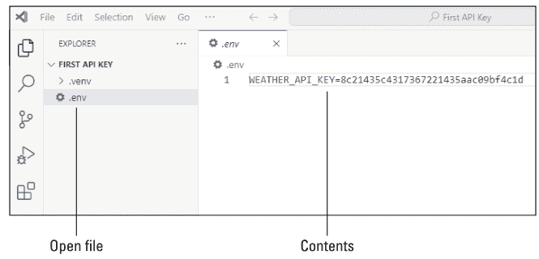

API 密钥必须是你从提供商处获得的有效密钥。图 9-1 中显示的只是一个示例，在实际使用中无效。请确保使用你自己的 API 密钥。

#### 其他保护 API 密钥的方法

除了将 API 密钥存储在 .env 文件中，你还可以将密钥存储在操作系统的环境变量中，或使用基于云的服务，如 Amazon Web Services (AWS) Secrets Manager (https://aws.amazon.com/secrets-manager)、Microsoft Azure Key Vault (https://azure.microsoft.com/en-us/products/key-vault) 或 Google Cloud Secret Manager (https://cloud.google.com/security/products/secret-manager)。我不会详细介绍这些选项，因为这是一本关于 Python 自动化的书，而不是 API 密钥管理，但你可以通过搜索网络或询问人工智能（AI）来自行探索它们。

#### 创建 .gitignore 文件

如果你有可能将项目上传到 GitHub，请务必包含一个 .gitignore 文件，并在其中包含 .env，以防止你的密钥与 Python 代码一起被共享。你也可以在该 .gitignore 文件中包含 .venv 文件名，这样用户在下载你的代码后可以为他们自己的系统创建自己的虚拟环境。

> 我在第 2 章中介绍了虚拟环境和 .venv 文件。

将 .gitignore 文件添加到 VS Code 项目与添加任何其他文件相同。只需创建一个新文件，就像你创建 .env 一样，但将此文件命名为 .gitignore，不要有空格和文件扩展名。当文件在编辑器中打开时，只需输入 .env 和 .venv，每个占一行，如图 9-2 所示。

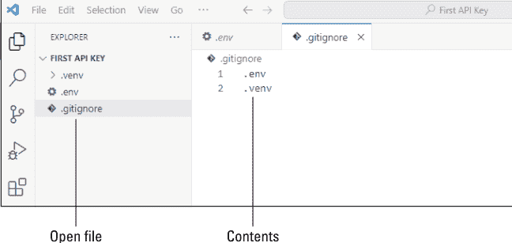

在你的项目中添加一个`.gitignore`文件不会影响你的Python代码的运行方式。`.gitignore`文件只是防止其内容中列出的任何文件或文件夹被推送到GitHub仓库，如果你决定使用GitHub与世界分享你的Python代码的话。

#### 在脚本中使用API密钥

要在代码中使用`.env`文件中的API，你需要在虚拟环境中`pip install python-dotenv`。然后在Python脚本的顶部附近包含以下所有行：

```
from dotenv import load_dotenv
import os

# Load the .env file
load_dotenv()

# Get the API key
api_key = os.getenv("SAMPLE_API_KEY")
```

`=` `os.getenv`左侧的变量可以是任何你喜欢的有效Python变量名，但请确保`os.getenv`后括号和引号内的名称与你在`.env`文件中为API密钥指定的名称完全匹配。

在代码的其余部分中，在任何需要提供API密钥的地方使用该行左侧的变量名（示例中为`api_key`）。你将在本章的“发出API请求”部分看到一个示例。

#### 处理JSON数据

JavaScript对象表示法（JSON）是一种用于存储和交换数据的数据格式。名称中的*JavaScript*部分只是因为其语法类似于JavaScript，后者使用大量花括号（`{}`）。JSON在各种编程语言和平台中得到广泛支持，通常用于API，以及配置文件和数据存储。

与Python数据字典类似，JSON由键值对组成，其中每个数据项都有一个名称和一个值。值可以是字符串、数字、布尔值、数组（列表）、对象或null。每个键值对都包含在花括号中。

```
{
    "username": "Alice",
    "age": 25,
    "is_student": true,
    "hobbies": ["reading", "hiking"],
    "address": {
        "street": "123 Main St",
        "city": "Boston"
    }
}
```

此示例中的每个名称（"username"、"age"、"is_student"、"hobbies"和"address"）都是一个*键*。每个键的冒号右侧都有一个*值*。以下是该示例中每个键的一些信息：

- "username"键包含一个字符串。
- "age"键包含一个数字。
- "hobbies"键包含一个*数组*（列表）。
- "address"键包含一个对象。

因为整个JSON数据块有时被称为JSON对象，所以"address"键也可能被称为*嵌套对象*（因为它包含在更大的JSON对象中）。address的独特之处在于它本身就是一个字典对象，包含两个自己的键，一个名为"street"，另一个名为"city"。其他每个键只包含一个值（如age，包含值18）。

Python没有JSON数据类型，因此Python代码中的JSON数据通常存储为字符串。定义此类字符串时，使用单引号（'）括起整个字符串很重要，因为JSON中该字符串内的每个键名都必须用双引号括起来。Python中仅包含两个键值对的JSON字符串如下所示：

```
json_string = '{"username": "Alice", "age": 25}'
```

#### 解析和序列化JSON数据

在Python中，字典（dict）数据类型比字符串（str）数据类型更适合处理名称-值对。因此Python包含一个内置的`json`模块，它简化了字典和JSON字符串之间的转换。`json`模块是内置的，所以你只需要在代码顶部附近包含`import json`即可使用该模块。无需`pip install`该模块。

`json`模块包含用于*解析*和*序列化*JSON数据的方法。让我们先定义这两个流行术语：

> **解析JSON：** 解析是指将JSON字符串转换为Python对象（如dict、list、str、int、float、bool或None）的过程。

> **序列化JSON：** 序列化是将Python对象（例如dict、list、str、int、float、bool或None）转换为JSON格式的字符串或将其作为JSON数据写入文件的过程。

`json`模块中包含四种用于解析和序列化JSON数据的方法：

| 方法 | 功能 |
|---|---|
| `json.loads()` | 将JSON格式的字符串解析为Python对象（例如dict或list） |
| `json.dumps()` | 将Python对象转换为JSON格式的字符串 |
| `json.load()` | 从文件读取JSON数据到Python对象 |
| `json.dump()` | 将Python对象作为JSON写入文件 |

前两种方法`.loads`和`.dumps`允许你处理JSON字符串。以下是使用`json.loads()`将JSON字符串解析为Python对象的示例：

```
import json
# Create a JSON string.
json_string = '{"username": "Alice", "age": 25}'
print(json_string)
print(type(json_string))

# Parse JSON string to Python object
python_obj = json.loads(json_string)

print(python_obj)  # Output: {'name': 'Alice', 'age': 25}
print(type(python_obj))  # Output: <class 'dict'>
```

运行该代码会在终端中产生以下输出：

```
json
{"username": "Alice", "age": 25}
<class 'str'>
{'username': 'Alice', 'age': 25}
<class 'dict'>
```

输出告诉你第一项是Python中的字符串（<class 'str'>）。第二项是Python字典（<class 'dict'>），因为.loads方法将原始字符串转换为Python字典。

接下来的代码执行相反的操作——它将Python字典对象序列化为Python字符串：

```
import json

# Create a Python dictionary object
python_obj = {"username": "Alice", "age": 25}
print(python_obj)
print(type(python_obj))

# Serialize the Python dictionary to a JSON string
json_string = json.dumps(python_obj)

print(json_string)
print(type(json_string))
```

#### 读写JSON文件

Python通过json模块的.dump方法可以轻松地将字典数据保存到数据文件。在你的Python代码中，可以从dict对象开始，这是存储名称-值对的首选对象类型。使用.dump的语法如下：

```
with open("filename", "w") as file:
    json.dump(dictionary, file)
```

将filename替换为你想要存储JSON对象的文件名。使用.json文件扩展名以最好地标识文件类型。如果未指定路径，文件将在运行Python的代码所在的同一文件夹中创建。以下是完整脚本的示例：

```
import json

# Create a Python dictionary object
python_dictionary = {
    "username": "Alice",
    "age": 25,
    "is_student": True,
    "hobbies": ["reading", "hiking"],
    "address": {
        "street": "123 Main St",
        "city": "Boston"
    }
}

# Serialize to a JSON file
with open("data.json", "w") as file:
    json.dump(python_dictionary, file)
```

该脚本首先创建一个包含多个键值对和数据类型的Python字典。然后将该字典数据序列化为JSON格式并存储在名为data.json的文件中。该文件包含与JSON对象相同的数据，如图9-3所示。

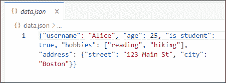

接下来，让我们看一个与前面脚本相反的脚本，它读取data.json文件并将其数据导入Python字典。为了使其更真实，我包含了一些针对错误或缺失文件的异常处理。我还包含了一些代码，用于在终端中将字典中的每个项目显示在单独的行上：

```
import json

# Step 1: Open and read the JSON file
try:
    with open("data.json", "r") as file:
        # Step 2: Parse JSON file into a Python dictionary using json.load()
        user_data = json.load(file)

# Step 3: Print the data type and contents to verify
print("Type of data:", type(user_data))
print("Username:", user_data["username"])
print("Age:", user_data["age"])
print("Is Student:", user_data["is_student"])
print("Hobbies:", user_data["hobbies"])
print("City:", user_data["address"]["city"])

except FileNotFoundError:
    print("Error: The file 'data.json' was not found.")
except json.JSONDecodeError as e:
    print("Error: Invalid JSON format in 'data.json' -", e)
except KeyError as e:
    print("Error: Missing key in dictionary -", e)
```

假设`data.json`文件存在且是图9-3所示的文件，则该代码的输出如下：

```
Type of data: <class 'dict'>
Username: Alice
Age: 25
Is Student: True
Hobbies: ['reading', 'hiking']
City: Boston
```

输出中的`<class 'dict'>`告诉你从文件读取的数据是Python字典格式。随后的`print`语句显示了字典中的各个数据项。

#### 理解REST API

当今大多数现代API都是表述性状态转移（REST）API，它们都遵循相同的标准和规则，通过互联网访问信息。REST API使用超文本传输协议（HTTP），与所有网站相同，允许*客户端*（你的Python脚本或任何其他应用程序）访问互联网上服务器上的另一个应用程序，该应用程序可以提供有用的信息。

REST是一种无状态API，这意味着在事务期间客户端和服务器之间没有打开的连接。你的应用程序向端点发送请求——通常是一个以`https://`开头的网络统一资源定位符（URL）。服务器发回包含你请求的信息的响应。该响应通常是JSON格式的数据，如前一节所述。

亚马逊、谷歌、Meta、微软、PayPal、Salesforce、Shopify、Stripe、Twilio 以及 X（前身为 Twitter）只是向开发者提供 REST API 的众多主要科技公司中的一部分。其中许多公司还专门提供用于人工智能的 REST API。提供 REST API 的人工智能领域主要参与者包括 Anthropic、DeepSeek、Hugging Face、OpenAI、Stability AI、xAI 等。

> 并非所有 REST API 都是免费的。不过，许多 API 提供免费套餐，让你可以免费学习和测试你的代码。

任何与 REST API 交互的脚本都可能会用到 `requests` 库。它不属于标准库的一部分。当你编写与 REST API 交互的 Python 代码时，请确保创建并激活一个虚拟环境。在终端中输入 `pip install requests` 命令。在你的代码中包含 `import requests` 命令。

#### 发起 API 请求

当你的 Python 代码从互联网上的 REST API 请求信息时，就会发生 REST API 请求。每个请求都会得到一个响应，其中包含一个状态码，用于指示请求是成功还是失败。

你可以发起五种主要类型的请求：

| 请求类型 | 功能 |
|---|---|
| GET | 从服务器检索数据。GET 仅用于获取信息。这是与人工智能交互时最常见的请求类型。成功时返回状态码 200（OK）。 |
| POST | 向服务器发送数据以创建新资源。POST 通常与数据库一起使用，用于向数据库表中插入新记录。成功时返回状态码 201（Created）。 |
| PUT | 用新数据更新现有资源。PUT 通常用于更改数据库表中的记录。成功时返回 200（OK）或 204（No Content）。 |
| DELETE | 从服务器移除资源。DELETE 通常用于从数据库中删除记录。成功时返回 204（No Content）。 |
| PATCH | 部分更新资源，例如数据库记录中的单个字段。成功时返回 200（OK）或 204（No Content）。 |

> 如果你还不熟悉数据库术语（如表和记录），请不要担心。这些知识对于 Python 或 Python 自动化来说并非必需。

没有适用于每个 REST API 请求的硬性规定，但大多数请求至少包含以下一些组件：

- **URL/端点：** 请求发送到的 URL（例如，https://api.example.com/data）。
- **请求头（可选）：** 随请求发送的元数据字典，可能包含身份验证令牌或 API 密钥等内容。
- **查询参数（可选）：** 附加到 URL 或作为字典传递的键值对（例如，params={"key": "value"}）。
- **响应处理：** 处理服务器响应的代码（例如，.json() 用于解析 JSON 或 response.status_code 用于检查是否成功）。

REST API 的文档会告诉你将请求发送到哪个 URL/端点。例如，要获取任何位置的当前天气，请使用 URL https://api.openweathermap.org/data/2.5/weather。

你必须在名为 `appid` 的参数中包含你的 API 密钥。你可以发送许多可选参数。例如，如果你想获取美国某个城市的天气，并且希望温度以华氏度表示，请使用 `q` 参数指定城市和州，并使用 `units` 参数，其值为 "imperial" 表示华氏度。

指定你将发送请求的 URL（如 OpenWeatherMap API 文档中所述）。在此示例中，我们假设你已将密钥存储在 .env 文件中，如本章前面“发起 API 请求”部分所示，并将其分配给名称 WEATHER_API_KEY，如下所示：

```
WEATHER_API_KEY=8c21435c4317367221435aac09bf4c1d
```

> 示例中显示的 API 密钥并非有效密钥——它只是一个示例。请务必从 https://openweathermap.org 获取你自己的 API 密钥，并使用该密钥来尝试代码。

这是一个更完整的示例，包含了访问 .env 文件所需的 `import os` 和 `load_dotenv` 代码，随后是一个完整的 OpenWeatherMap REST API 请求，并附有大量注释以解释正在发生的事情：

```python
from dotenv import load_dotenv
import os

# 加载 .env 文件
load_dotenv()

# 从环境变量中检索 API 密钥
API_KEY = os.getenv("WEATHER_API_KEY")

# OpenWeatherMap API 端点，用于获取当前天气数据
url = "https://api.openweathermap.org/data/2.5/weather"

# 将参数放入字典中。
params = {
    "appid": API_KEY,
    "q": "San Diego, CA USA",
    "units": "imperial"  # 如果需要摄氏度，请改为 "metric"
}

# 使用定义的参数向 API 端点发送 GET 请求
response = requests.get(url, params=params)
```

最后一行发送了实际的 API 请求。来自 API 的响应将被存储在名为 response 的变量中。

#### 解析 API 响应

发送 API 请求后，服务器会发送一个响应，通常在几秒内，具体取决于你请求的内容。在上一节的代码中，该响应存储在名为 `response` 的变量中。假设我在该行代码后添加两个 `print` 语句——一个用于打印响应的数据类型，另一个用于打印实际的响应，如下所示：

```python
response = requests.get(url, params=params)
print(type(response))
print(response)
```

运行脚本，假设你得到一个有效的响应，将在终端中显示以下内容：

```
<class 'requests.models.Response'>
<Response [200]>
```

数据类型 `requests.models.Response` 表明响应是来自 `requests` 库的 Response 对象。`200` 是状态码，表示事务成功。也许你现在想知道实际的数据，即所请求城市的天气数据在哪里。

处理数据更实际的方法是使用 `if` 语句首先验证事务是否成功。如果成功，则使用 `response.json()`（`requests` 库的一个方法）将响应转换为 Python 字典。然后打印响应的数据类型和内容，如下所示：

```python
response = requests.get(url, params=params)
# 检查请求是否成功
if response.status_code == 200:
    # 将响应 JSON 解析为 Python 字典
    data = response.json()
    print(type(data))
    print(data)
```

在终端中，输出如下所示：

```
<class 'dict'>
{'coord': {'lon': -117.1573, 'lat': 32.7153}, 'weather': [{'id': 804, 'main':
'Clouds', 'description': 'overcast clouds', 'icon': '04n'}], 'base':
'stations', 'main': {'temp': 59.02, 'feels_like': 58.28, 'temp_min': 57.29,
'temp_max': 60.6, 'pressure': 1014, 'humidity': 78, 'sea_level': 1014, 'grnd_
level': 1010, 'visibility': 10000, 'wind': {'speed': 5.75, 'deg': 320},
'clouds': {'all': 100}, 'dt': 1746187856, 'sys': {'type': 2, 'id': 2095167,
'country': 'US', 'sunrise': 1746190812, 'sunset': 1746239447}, 'timezone':
-25200, 'id': 5391811, 'name': 'San Diego', 'cod': 200}
```

`<class 'dict'>` 告诉你 data 变量包含一个 Python 字典。第二行是从 OpenWeatherMap REST API 接收到的所有数据，其中包含的信息远不止温度。例如，'lon' 是经度，'lat' 是纬度，'temp' 是当前温度。还有能见度、云量、湿度、日出、日落……各种各样的信息。对于任何你不理解的内容，可以参考 OpenWeatherMap API 文档。

实际上，你可能希望以更用户友好的方式显示信息。但我想向你展示如何“检查”来自 REST API 的响应的真实本质，以便在你自己的代码中，你可以弄清楚如何从 REST API 检索信息，解析响应，然后选择你想要显示的内容以及如何显示。

#### 审阅完整的 REST API 脚本

在本章中，我主要向你展示了与 REST API 交互的代码片段。在本节中，我将向你展示一个完整的、可运行的脚本，其中包含了所有必要的部分。

这是一个用于查询 OpenWeatherMap REST API 的完整脚本。它包含了从 .env 文件加载 API 密钥、处理异常以及以用户友好的格式显示天气的代码。我添加了大量注释来解释代码中的所有内容。

```python
# openweathermap.py
# pip install python-dotenv requests
import os
# 用于向 REST API 发送 HTTP 请求。
import requests
# 用于从 .env 文件加载变量
from dotenv import load_dotenv

# 从 .env 文件加载环境变量
load_dotenv()

# 从环境变量中检索 API 密钥
API_KEY = os.getenv("WEATHER_API_KEY")
# 如果 API 密钥不存在，打印错误消息并退出
if not API_KEY:
    print("ERROR: WEATHER_API_KEY not found in .env file.")
    exit(1)

# OpenWeatherMap API 端点，用于获取当前天气数据
url = "https://api.openweathermap.org/data/2.5/weather"

# 定义随请求发送的参数：
# - q: 要查询天气数据的城市
# - appid: 用于身份验证的 API 密钥
# - units: "imperial" 表示华氏度，"metric" 表示摄氏度
params = {
    "q": "San Diego, CA USA",
    "appid": API_KEY,
    "units": "imperial"
}

# 使用定义的参数向 API 端点发送 GET 请求
response = requests.get(url, params=params)

# 检查请求是否成功
if response.status_code == 200:
    # 将响应 JSON 解析为 Python 字典
    data = response.json()
    # 提取城市、温度和描述。
    city = data["name"]
    temperature = data["main"]["temp"]
    description = data["weather"][0]["description"]

    # 打印天气信息
    print(f"\nWeather in {city}: {temperature}°F, {description}\n")
else:
    # 如果请求失败，打印状态码和错误消息。
    print(f"Error {response.status_code}: {response.text}")
```

当你成功运行该代码时，终端中的输出是一行简单的文本，内容类似于：

```
Weather in San Diego: 59.05°F, overcast clouds
```

为了获取某个城市的天气，这确实需要费一番周折。但关键在于，世界上有成千上万的 REST API，能够返回各种各样的数据。你在本章学到的内容应该适用于几乎所有这些 API。因此，你可以将上一个脚本作为使用 Python 访问任何 REST API 的通用模型。

你始终可以选择让任何 AI 为你编写脚本。例如，告诉 AI “编写一个脚本，从免费的 Alpha Vantage REST API 账户获取标普 500 指数价格”，这样你就能得到一些可用的代码。你仍然需要获取自己的 API 密钥。AI 为你生成的代码可能与我提供的示例不完全相同。但你应该能够根据我在本章解释的所有内容，理解并按需修改该代码。

你也可以向 AI 寻求帮助，查找不同领域的 API。例如，询问 AI，“在哪里可以找到用于 AI 聊天机器人的免费 API？”或“在哪里可以找到用于 AI 图像生成的免费 REST API？”

+   本章内容

* 查看网页浏览器动画
* 查找网页表单上的控件
* 填写文本框并提交表单
* 从 JSON 数据文件自动填写表单

### 第 10 章
自动化网络

本章全部关于自动化网络浏览器。你将学习打开网页、查找并填写文本框以及提交表单数据的技术，就像你自己使用鼠标和键盘操作一样。在本章中，你将让 Python 为你完成所有这些工作。

#### 自动化网络浏览器

如果你正在寻找一种方法来自动打开网页并用已知信息填写一个或多个文本框，`selenium` 是你的最佳选择。你可以导入到 Python 脚本中的两个关键模块是 `selenium` 和 `webdriver-manager`。它们不是 Python 标准库的一部分，因此当你计划在脚本中使用它们时，请确保创建并激活你的虚拟环境。然后在终端中输入以下命令：

```
pip install selenium webdriver-manager
```

`selenium` 模块提供了自动控制浏览器并与网页上的控件交互的能力。`webdriver-manager` 模块允许你使用不同的网络浏览器，如 Apple Safari、Google Chrome 和 Microsoft Edge，而无需你自己手动下载和安装每个浏览器的驱动程序并将其添加到系统 PATH 中。

#### 为你的浏览器加载驱动程序

创建与网页交互的脚本的第一步之一是为该浏览器导入正确的驱动程序。我将提供一些简单的脚本供你自己尝试，以说明语法。但请注意，每个脚本只是打开浏览器，导航到 www.google.com，然后保持浏览器窗口打开，直到你在 VS Code 的终端窗口中按 Enter 键。

> 警告
你只能使用安装在你计算机上的网络浏览器。你无法使用 selenium 模拟未安装的浏览器。

这是一个为 Chrome 加载正确驱动程序的脚本，如果你的计算机上安装了 Chrome，可以尝试一下。

```python
# pip install selenium webdriver-manager
from selenium import webdriver
from selenium.webdriver.chrome.service import Service
from webdriver_manager.chrome import ChromeDriverManager

# 设置 Chrome WebDriver。
driver = webdriver.Chrome(service=Service(ChromeDriverManager().install()))

# 在 Chrome 中打开 https://www.google.com。
driver.get("https://www.google.com")

# 保持浏览器打开，直到用户按 Enter 键。
input("Press Enter to close the browser...")
driver.quit()
```

这是相同的脚本，但这次使用 Edge 作为浏览器：

```python
# pip install selenium webdriver-manager
from selenium import webdriver
from selenium.webdriver.edge.service import Service
from webdriver_manager.microsoft import EdgeChromiumDriverManager

# 设置 Microsoft Edge WebDriver。
driver = webdriver.Edge(service=Service(EdgeChromiumDriverManager().install()))

# 在 Edge 中打开 https://www.google.com。
driver.get("https://www.google.com")

# 保持浏览器打开，直到用户按 Enter 键。
input("Press Enter to close the browser...")
driver.quit()
```

如果你在 Mac 上使用 Safari，你需要在 Safari 设置中启用远程自动化，任何自动化脚本才能工作。操作如下：

1.  **打开 Safari 并选择 Safari ⚙ 设置。**
    设置对话框出现。
2.  **点击“高级”标签页。**
3.  **在对话框底部选择“显示 Web 开发者功能”复选框。**
    设置对话框应更改以显示“开发者”标签页。如果没有，请关闭设置对话框，关闭并重新打开 Safari，然后选择“开发” ⚙ “开发者设置”。
4.  **点击“开发者”标签页。**
    如果你不得不关闭并重新打开 Safari 并选择“开发” ⚙ “开发者设置”，那么你已经在那里了。
5.  **选择“允许远程自动化”复选框，如图 10-1 所示。**

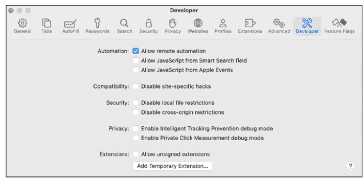

6.  **关闭对话框。**
7.  **关闭 Safari。**

启用远程自动化后，你应该能够运行脚本来打开 Safari，导航到 www.google.com，并保持浏览器窗口打开，直到你在 VS Code 的终端窗口中按 Enter 键结束脚本。

#### 查找要填写的文本框

在网页上，像文本框这样的控件是使用超文本标记语言（HTML）中的标签定义的，如表 10-1 所示。

**表 10-1 网页上控件的常用 HTML 标签**

| HTML 标签 | 控件类型 |
| :--- | :--- |
| `<input type="text">` | 文本框 |
| `<input type="search">` | 用于搜索的文本框 |
| `<textarea>` | 多行文本框 |
| `<select>` | 下拉列表 |
| `<input type="radio">` | 单选按钮 |
| `<input type="checkbox">` | 复选框 |
| `<input type="submit">` | 表单的提交按钮 |

大多数控件会有一个 id，它出现在标签内，格式为 id= 后跟标识符。例如，这是一个 id 为 "prompt" 的文本框控件的标签：

```html
<input type="text" id="prompt">
```

表单的提交按钮可能有也可能没有 id。但它的标签总是 `<input type="submit">`，因此你通常可以使用标识提交按钮的语法来引用它，正如你将在本节稍后看到的那样。

控件的 id 通常仅通过查看网页并不明显。通常，你可以右键单击该控件并选择“检查”。一个面板会打开，其中该控件的 HTML 标签被高亮显示，如图 10-2 所示。在这个例子中，我右键单击了维基百科页面上的搜索框。高亮显示的标签包括 id="searchInput"，这表明该控件的 id 是 "searchInput"。

> 如果你使用当前的网络浏览器找不到控件的 id，可以尝试使用 Edge 或 Chrome 访问同一页面，看看是否能得到更好的结果。

该框中还包含`type="search"`，并且页面上没有提交按钮。文本框旁边有一个放大镜图标。如果你能在搜索框中输入一个单词或短语，按下回车键后搜索就执行了，这表明你无需点击提交按钮。在你的自动化代码中，你可以填充`searchInput`框并让脚本按下回车键——这就足够了。

在包含多个控件的大型表单中，按下回车键不会自动提交表单，你的Python脚本将需要点击提交按钮。我将在以下章节中向你展示这两种情况的示例。

#### 自动化在线填写表单

到目前为止，我们用代码所做的只是打开浏览器并进入一个页面。接下来，我们需要讨论如何让Python将光标置于打开页面上的特定控件中并在那里输入文本。这样做需要从selenium导入两个额外的模块：一个名为`By`的类，它帮助你根据控件的`id`、`name`或其他特征来查找控件；以及一个名为`Keys`的类，它可以模拟按下键盘上的特殊键，如回车键（`Keys.RETURN`）和制表键（`Keys.TAB`）。

以下是一个脚本，用于打开www.wikipedia.org页面，在搜索框中输入文本*蓝鲸*，然后按回车键，这样你就可以看到一个更完整的示例。该脚本使用Chrome作为浏览器，这可以从脚本顶部的代码中得到证明：

```python
# fill_form_one.py
# pip install selenium webdriver-manager
from selenium import webdriver
from selenium.webdriver.common.by import By
from selenium.webdriver.common.keys import Keys
from selenium.webdriver.chrome.service import Service
from webdriver_manager.chrome import ChromeDriverManager
import time

def open_page(url, search_box_id, search_term, click_submit):
    # Set up the Chrome WebDriver, requires import Service above
    driver = webdriver.Chrome(service=Service(ChromeDriverManager().install()))
    driver.get(url)

    # Find the search input field and fill it with the search term.
    # The following line requires you to import By, as shown earlier.
    search_box = driver.find_element(By.ID, search_box_id)
    # The following line requires you to import Keys, as shown earlier.
    search_box.send_keys(search_term)
    # Optional; wait to see input before submitting.
    time.sleep(2)

    # Click Submit or press Enter depending on the click_submit flag.
    if click_submit:
        submit_button = driver.find_element(By.XPATH, "//button[@type='submit']")
        submit_button.click()
    else:
        search_box.send_keys(Keys.RETURN)
    return driver

def main():
    # Define the page URL.
    site_url = "https://www.wikipedia.org/"
    # The ID of the text box to fill
    search_box_id = "searchInput"
    # What to type into the Search box
    search_term = "Blue whale"
    # Set to True if you want to click Submit at end.
    # Otherwise, set to False to just press Enter.
    click_submit = False

    # Open the page and perform the search, with exception handling
    try:
        driver = open_page(site_url, search_box_id, search_term, click_submit)
    except Exception as e:
        print(f"An error occurred: {e}")
    finally:
        print("\nScript completed; browser remains open.")
        input("Press Enter or ^C to exit the script and close the browser\n")
        driver.quit()

if __name__ == "__main__":
    main()
```

在以下章节中，我将重点介绍此脚本中查找和填充searchInput框的代码。

##### 查找控件

脚本中的一个关键元素是查找和填充搜索框的代码。脚本将该控件的id（对于维基百科是`searchInput`）存储在一个名为`search_box_id`的变量中，如下所示：

```python
search_box_id = "searchInput"
```

然后，以下代码查找该控件，并使用`send_keys`将存储在名为`search_term`的变量中的搜索词输入到该文本框中。然后它暂停两秒钟，以便你可以在浏览器中看到文本已被放入文本框：

```python
# Find the search input field and fill it with the search term.
# The following line requires you to import By, as shown earlier.
search_box = driver.find_element(By.ID, search_box_id)
# The following line requires you to import Keys, as shown earlier.
search_box.send_keys(search_term)
# Optional; wait to see input before submitting.
time.sleep(2)
```

为了完成该过程，脚本需要提交搜索词，如下一节所述。

##### 使用回车键提交表单

除了在文本框中输入文本外，你通常还希望脚本提交文本。在包含多个控件的页面上，你通常通过点击提交按钮来完成此操作。但是，在输入文本后直接按回车键通常也有效，尤其是在提供单个文本框的页面上，如搜索引擎和人工智能（AI）聊天机器人。

上一个脚本中使用的维基百科网站没有提交按钮。要搜索该网站，你可以输入搜索提示并按回车键。该脚本使用以下代码行在光标仍在搜索框中时按回车键：

```python
search_box.send_keys(Keys.RETURN)
```

要将该脚本用于另一个网站，首先确保你使用的是Chrome浏览器，或者调整导入并在脚本顶部附近将`driver`变量设置为你首选的浏览器。然后使用下面显示的`main()`函数，通过将`site_url`和`search_box_id`变量设置为适当的值来指定你的网页和要填充的文本框的`id`。如果页面有提交按钮，并且你希望脚本点击该按钮而不是按回车键，请将`click_submit`变量设置为True。

```python
def main():
    # Define the page URL.
    site_url = "https://www.wikipedia.org/"
    # The ID of the text box to fill
    search_box_id = "searchInput"
    # What to type into the Search box
    search_term = "Blue whale"
    # Set to True if you want to click Submit at end.
    # Otherwise, set to False to just press Enter.
    click_submit = False
```

我将在本章后面向你展示如何编写一个点击提交按钮来提交表单的脚本。这在具有多个输入控件的页面上更可能发生，因此我将首先查看一个填充多个文本框的脚本。

##### 填充多个文本框

让我们讨论一下如何在网页上填充多个文本框。这是一个包含多个文本框的HTML表单示例，每个文本框的`id`都以"tb"开头（*文本框*的缩写）。该表单还包括一个提交按钮。真实网站上的具体`id`名称可能有所不同，但我将使用这个作为下一个脚本的工作示例。

```html
<form>
    <input type="text" id="tbFirstName"><br>
    <input type="text" id="tbLastName"><br>
    <input type="text" id="tbUserName"><br>
    <input type="tel" id="tbCellPhone"><br>
    <button type="submit" id="submit_button">Submit</button>
</form>
```

以下是一个脚本，可以向每个文本框中输入文本，然后点击提交按钮。大部分代码与前一个示例相同，但它经过调整以填充多个字段，然后点击提交。

```python
# fill_form_multi.py
# pip install selenium webdriver-manager
from selenium import webdriver
from selenium.webdriver.common.by import By
from selenium.webdriver.common.keys import Keys
from selenium.webdriver.chrome.service import Service
from webdriver_manager.chrome import ChromeDriverManager

def open_and_fill_page(site_url, sample_data, click_submit):
    # Initialize Chrome WebDriver with automatic driver management.
    service = Service(ChromeDriverManager().install())
    driver = webdriver.Chrome(service=service)

    try:
        # Open the form page.
        driver.get(site_url)

        # Fill in the text boxes using their IDs from sample_data dictionary.
        for control_id, value in sample_data.items():
            driver.find_element(By.ID, control_id).send_keys(value)

        if click_submit:
            submit_button = driver.find_element(By.XPATH, "//button[@type='submit']")
            submit_button.click()
        else:
            # Get the last control ID from sample_data dictionary.
            last_control_id = list(sample_data.keys())[-1]
            driver.find_element(By.ID, last_control_id).send_keys(Keys.RETURN)
```

print("表单填写成功！")

except Exception as e:
    print(f"发生错误：{e}")

finally:
    # 保持浏览器打开以便检查。
    print("脚本执行完毕；浏览器保持打开状态。")
    input("按回车键退出脚本并关闭浏览器...")
    driver.quit()

def main():
    # 定义网站URL。
    site_url = "https://replace_with_your_url.com/form.html"
    # 每个键应为要填写的HTML表单控件的ID。
    sample_data = {
        "tbFirstName": "John",
        "tbLastName": "Doe",
        "tbUserName": "johndoe123",
        "tbCellPhone": "123-456-7890"
    }
    # 设置为True以点击提交按钮；否则设置为False。
    click_submit = True

    # 打开页面，填写控件，并可选择点击提交。
    open_and_fill_page(site_url, sample_data, click_submit)

if __name__ == "__main__":
    main()
```

在此脚本中，查找页面上每个待填写控件并输入所需文本的工作由以下循环处理：

```
# 使用sample_data字典中的ID填写文本框。
for control_id, value in sample_data.items():
    driver.find_element(By.ID, control_id).send_keys(value)
```

该循环遍历`sample_data`中的每个`control_id`和`value`。对于每一对，`driver.find_element(By.ID, control_id)`通过其ID定位文本框，而`.send_keys(value)`则输入与该`control_id`关联的值。确实，`selenium`使得仅用几行代码就能轻松地将文本复制到任意数量的控件的文本框中，这是一个巧妙的技巧。

#### 点击表单的提交按钮

在循环完成将文本输入表单所有文本框的任务后，以下几行代码点击提交按钮以提交表单：

```
submit_button = driver.find_element(By.XPATH, "//button[@type='submit']")
submit_button.click()
```

诚然，这种语法看起来有点奇怪。`driver`一词指的是当前控制浏览器的Selenium WebDriver实例。`.find_element()`方法告诉驱动程序定位页面上的特定元素。`By.XPATH`指定了定位元素的方法，这是Selenium用于在HTML文档中定位标签的方式。然后，看起来很复杂的`"//button[@type='submit']"`表达式以`//`开头，它告诉XPath搜索整个页面以查找具有`type="submit"`属性的按钮。该行只是找到按钮；下一行实际点击它：

```
submit_button.click()
```

我已尽力使脚本尽可能通用，尽管没有两个网页在URL或页面控件方面是完全相同的。在下一节中，我将解释如何根据您自己的用例进行调整。

#### 根据您的需求调整脚本

要根据您的需求调整此脚本，请在`main()`函数中设置变量。确保将`site_url`设置为包含您的表单的页面的URL。`sample_data`变量必须是一个字典，其中包含每个要填写的文本框的ID，后跟冒号和要输入到该文本框的文本。在这里，您可以看到字典键与我在本节开头向您展示的示例HTML表单的ID相匹配：

```
# 每个键应为要填写的HTML表单控件的ID。
sample_data = {
    "tbFirstName": "John",
    "tbLastName": "Doe",
    "tbUserName": "johndoe123",
    "tbCellPhone": "123-456-7890"
}
```

如果表单需要点击提交，请确保在代码中将`click_submit`设置为`True`。

在`open_and_fill_page()`函数内部，以下循环处理使用`sample_data`变量中的适当数据填写每个文本框的任务，该变量包含在`main()`函数中定义的字典：

```
# 使用sample_data字典中的ID填写文本框。
for control_id, value in sample_data.items():
    driver.find_element(By.ID, control_id).send_keys(value)
```

当您在`Main()`中将`click_submit`设置为`True`时，以下代码将在所有文本字段填写完毕后执行以点击提交：

```
if click_submit:
    submit_button = driver.find_element(By.XPATH, "//button[@type='submit']")
    submit_button.click()
```

#### 从文件填写文本框

在本节中，您将把目前所学的内容更进一步。假设您有大量数据要放入表单，存储在JavaScript对象表示法（JSON）文件中，并且您希望将所有数据放入表单。为举例说明，假设该文件名为`data.json`，并且与您的Python代码存储在同一文件夹中。以下是文件的内容：

```
[
    {
        "tbFirstName": "Alice",
        "tbLastName": "Smith",
        "tbUserName": "alicesmith456",
        "tbCellPhone": "234-567-8901"
    },
    {
        "tbFirstName": "Bob",
        "tbLastName": "Johnson",
        "tbUserName": "bobjohnson789",
        "tbCellPhone": "345-678-9012"
    },
    {
        "tbFirstName": "Carol",
        "tbLastName": "Williams",
        "tbUserName": "carolw123",
        "tbCellPhone": "456-789-0123"
    },
    {
        "tbFirstName": "David",
        "tbLastName": "Brown",
        "tbUserName": "davidb456",
        "tbCellPhone": "567-890-1234"
    }
]
```

为此，代码需要打开`data.json`文件。然后在循环中，它将每个JSON对象转换为数据字典，将文本输入到文本框中，并在每次填写表单后点击提交。以下是一个完整执行此操作的脚本：

```
# fill_form_from_file.py
# pip install selenium webdriver-manager
import json
import time
from selenium import webdriver
from selenium.webdriver.common.by import By
from selenium.webdriver.common.keys import Keys
from selenium.webdriver.chrome.service import Service
from webdriver_manager.chrome import ChromeDriverManager

def open_and_fill_page(driver, sample_data, click_submit):
    try:
        # 使用sample_data字典中的ID填写文本框。
        for control_id, value in sample_data.items():
            # 定位每个元素，清除任何现有文本，然后发送按键。
            element = driver.find_element(By.ID, control_id)
            element.clear()
            element.send_keys(value)

        # 点击提交前暂停。
        time.sleep(2)
        if click_submit:
            submit_button = driver.find_element(By.XPATH, "//button[@type='submit']")
            submit_button.click()
        else:
            # 从sample_data字典获取最后一个控件ID并模拟按回车键。
            last_control_id = list(sample_data.keys())[-1]
            driver.find_element(By.ID, last_control_id).send_keys(Keys.RETURN)

        print("表单填写并提交成功！")

    except Exception as e:
        print(f"处理数据时发生错误：{e}")

    finally:
        # 处理每个表单后暂停两秒。
        time.sleep(2)

def main():
    # 定义网站URL。
    site_url = "https://your_url_here.com/form.html"

    # 初始化Chrome WebDriver（仅打开一次）。
    service = Service(ChromeDriverManager().install())
    driver = webdriver.Chrome(service=service)

    # 打开表单页面。
    driver.get(site_url)

    # 从文件加载JSON数据。
    with open("data.json", "r") as f:
        data_list = json.load(f)

    # 处理每个JSON对象以填写并提交表单。
    for sample_data in data_list:
        open_and_fill_page(driver, sample_data, click_submit=True)

    print("所有表单提交成功！")
    # 保持浏览器打开直到用户按回车键。
    input("按回车键关闭浏览器...")
    driver.quit()

if __name__ == "__main__":
    main()
```

210 第3部分 互联网自动化

与本节中的其他脚本一样，将`site_url`变量填写为脚本将填写数据的页面链接。此脚本已假设需要在填写每个表单后点击提交，因此无需为此设置变量。


如果您的数据在CSV文件中，您应该能够将其数据复制到任何AI中，并告诉AI“将此CSV数据转换为JSON”以创建您的JSON文件。

该代码假设数据文件是与代码在同一文件夹中名为`data.json`的JSON文件。如果需要更改，请直接在此处的代码中进行更改：

```
python
with open("data.json", "r") as f:
```

其余代码与前两个示例非常相似。唯一的真正区别是，要输入到表单中的每个字典对象都存储在JSON文件中。

#### 本章内容

-   理解屏幕抓取
-   从网页抓取元素
-   从网页提取数据
-   自动化互联网数据提取

### 第11章：抓取网页

在上一章中，你通过自动化网页浏览器来填写表单。那章的主角是 Selenium 库。在本章中，你将自动化浏览器来从网站提取数据，而不是输入数据。

你将使用的技术有时被称为 *网页抓取*。它有时也被称为 *屏幕抓取*，因为看起来代码似乎直接从屏幕上拉取内容。实际上，内容是从网页的 `.html` 或 `.htm` 文件中拉取的。因此，你可以提取超文本标记语言（HTML）标签以及页面上的任何其他内容。

#### 选择合适的网页抓取工具

最广泛使用的网页抓取模块是来自 `bs4` 包的 `BeautifulSoup`。一个可选的辅助工具 `lxml`，与 Python 标准库中的 `html.parser` 相比，在从网页提取内容时提供了一些速度优势。

`BeautifulSoup` 也经常与 `requests` 库一起使用，该库用于从 Python 发起网络请求。在编写使用 `BeautifulSoup` 的脚本之前，请创建并激活你的虚拟环境；然后在终端中输入以下命令导入所有三个模块：

```
pip install beautifulsoup4 lxml requests
```

为了提供一个相对简单的例子，我将向你展示如何从网页上的所有链接中提取 URL。此技术可用于提取任何给定主题的所有 URL。你可以使用这些链接来探索关于任何主题的网页，或者整理你自己的链接推荐给你的关注者或网站访客。

#### 从网页抓取链接

BeautifulSoup 和网页抓取背后的基本思想是从某个位置（由其 URL 定义）下载一个网页。页面被下载到你代码中的一个对象中，然后你可以解析该对象以获取所需的任何信息。这是一个相对简单的页面，它从网页上的所有链接中提取 URL。此脚本说明了所有 Python 网页抓取脚本的一些代码和基本概念：

```python
# scrape_links.py
# pip install requests beautifulsoup4 lxml
import requests
from bs4 import BeautifulSoup

def get_links(page_url):
    # Headers to mimic a browser
    headers = {
        "User-Agent": "Mozilla/5.0 (Macintosh; Intel Mac OS X 10_15_7) "
                      "AppleWebKit/537.36 (KHTML, like Gecko) "
                      "Chrome/95.0.4638.69 Safari/537.36"
    }
    try:
        # Send HTTP request and get the page content.
        response = requests.get(page_url, headers=headers)
        response.raise_for_status()  # Check for request errors

        # Parse the page content with BeautifulSoup.
        soup = BeautifulSoup(response.content, "lxml")
        # Optional; use html.parser; doesn't require lxml.
        # soup = BeautifulSoup(response.content, "html.parser")

        # Find all <a> tags and extract href attributes.
        links = soup.find_all("a")

        # Print each link's href (if it exists).
        for link in links:
            href = link.get("href")
            if href and href.startswith("https://"):
                print(href)

    except requests.RequestException as e:
        print(f"Error fetching the page: {e}")

def main():
    # URL of the web page to scrape.
    page_url = "https://en.wikipedia.org/wiki/Platypus"

    get_links(page_url)

if __name__ == "__main__":
    main()
```

我将逐步讲解这个脚本并讨论关键组件。页面顶部的导入加载了 `requests` 模块（用于访问网页）和来自 BeautifulSoup 的 `bs4`。BeautifulSoup 是一个代码库，而 `bs4` 是解析网页的核心组件。

即使你 `pip install lxml`，你也不需要在脚本中使用 `import lxml` 语句来使用它。只要 `lxml` 可用（因为你安装了它），BeautifulSoup 就会在需要时使用它。

##### 发送浏览器头信息

当你使用网页浏览器浏览网络时，你的浏览器会通过 `User-Agent` 头信息来标识自己。这有时包括标识浏览器和你所用操作系统的文本。

当你使用自动化脚本访问网站时，不会发送这样的头信息。一些网站可能会拒绝或限制对页面的访问，假设该脚本是搜索引擎索引器或与广告相关的机器人，会给网站带来大量流量。

当你只是从页面抓取数据，而不会给服务器带来巨大负载时，你可以让你的脚本发送一个 `User-Agent` 头信息，以浏览器的身份进行小规模的网页抓取。这就是示例代码中这一行的作用：

```python
headers = {
    "User-Agent": "Mozilla/5.0 (Macintosh; Intel Mac OS X 10_15_7) "
                "AppleWebKit/537.36 (KHTML, like Gecko) "
                "Chrome/95.0.4638.69 Safari/537.36"
}
```

你不必在自己的脚本中更改该代码——只需完全按照所示使用它。当你请求网页时，使用与示例脚本相同的语法：

```python
response = requests.get(page_url, headers=headers)
```

`response` 只是一个存储你请求的页面的变量。`page_url` 是你请求的网页的 URL。你可能已经猜到，参数 `header=headers` 将 `User-Agent` 头信息（在 `headers` 变量中定义）传递给 Web 服务器，告诉服务器返回页面，就像网页浏览器发出请求一样。

##### 解析网页

接收到请求网页的 `response` 对象不能直接解析。你需要将该网页复制到一个 `BeautifulSoup` 对象中进行解析。以下代码正是这样做的：

```python
soup = BeautifulSoup(response.content, "lxml")
```

在这个例子中，我指定了更快、更现代的 `lxml` 解析器来解析 `soup` 对象。如果你在使用它时遇到任何问题，并希望使用较旧的 `html.parser`，你可以将代码编写如下：

```python
# soup = BeautifulSoup(response.content, "html.parser")
```

我在脚本中包含了这行代码，但已注释掉，因此不会执行。我只是将其作为语法示例放在那里。如果你愿意使用它，可以注释掉使用 `lxml` 解析器的那行，并移除使用 `html.parser` 那行前面的 `#`。

将页面加载到 `BeautifulSoup` 对象（在工作示例中为 `soup`）后，你可以按标签遍历 HTML 元素——例如，段落用 "p"（HTML 中的 `<p>...</p>`）或列表项用 "li"（`<li>...</li>`）。这里，你遍历页面上的所有链接（`<a>...</a>`）：

```python
links = soup.find_all("a")
```

该行执行后，`links` 变量包含页面中所有的 `<a>...</a>` 标签。链接总是包含一个 `href=` 属性，用于标识链接的目标。接下来的这段代码遍历所有链接，对于任何 `href=` 值以 `https://` 开头的链接（意味着它指向当前页面之外的页面），它会打印该 URL：

```python
for link in links:
    href = link.get("href")
    if href and href.startswith("https://"):
        print(href)
```

要为你自己的使用个性化此脚本，请将 `page_url` 变量设置为你想要从中提取链接的页面的 URL：

```python
page_url = "https://en.wikipedia.org/wiki/Platypus"
```

你可以使用此脚本，通过从与感兴趣主题（在这个例子中是强大的鸭嘴兽）相关的不同页面抓取链接，来创建与任何主题相关的大量网页列表。

##### 从网页提取数据

网页抓取不仅限于从页面提取 HTML 元素。你也可以提取特定的数据项，只要你能找到某种方法来标识要提取的数据。在某些情况下，你可能能够使用 HTML `id` 属性，就像填写文本框时一样。但有时你可能需要依赖其他标识符。

通常，找到唯一标识符的最简单方法是直接要求人工智能（AI）“编写一个 Python 脚本，使用 BeautifulSoup 从 *URL* 处的页面提取 *数据*。”将 *数据* 替换为你想要提取数据的字段的描述，并将 *URL* 替换为网页的 URL。

为了一个实际的例子，我将使用“要抓取的书籍”网站（https://books.toscrape.com），这是一个假装卖书的网站，为像我们这样正在学习如何抓取和自动访问数据的人提供了便利。该网站上的每本书都有封面图片、评分、标题、以英镑（GBP）计价的价格等，如图 11-1 所示。

#### 查找要抓取的元素

你需要查看页面的HTML代码，以找到一种方法来识别你想要从页面上抓取的元素。最简单的方法是在浏览器中右键单击该项目，然后选择“检查”。在这个例子中，你会发现每本书都包含在带有级联样式表（CSS）类"product_pod"的`<article>...</article>`标签中，如下所示：

```
<article class="product_pod">...</article>
```

在这些标签内，书名包含在`<a>...</a>`标签中，位于`<a>...</a>`标签内的title=属性之后：

```
<a href="catalogue/tipping-the-velvet_999/index.html" title="Tipping the Velvet">Tipping the Velvet</a>
```

书的价格位于一个样式类为`price_color`的段落中：

```
<p class="price_color">£53.74</p>
```

Books to Scrape网站包含50页示例书籍，你可以访问并从中抓取数据。那么，如何遍历所有50页并仅抓取书名和价格呢？以下脚本正是这样做的。我将首先展示整个脚本，并附有大量注释。在接下来的部分中，我将重点介绍从每个页面抓取数据的脚本关键元素：

```
# scrape_books.py
# pip install requests bs4 lxml
import requests
from bs4 import BeautifulSoup
import time

page_url = "https://books.toscrape.com/catalogue/page-{}.html"
headers = {
    "User-Agent": "Mozilla/5.0 (Macintosh; Intel Mac OS X 10_15_7) "
                  "AppleWebKit/537.36 (KHTML, like Gecko) "
                  "Chrome/95.0.4638.69 Safari/537.36"
}
# 将英镑转换为美元的汇率
exchange_rate = 1.3  # 1 GBP = 1.3 USD

def get_soup(url):
    # 获取页面内容并返回一个BeautifulSoup对象。
    try:
        response = requests.get(url, headers=headers, timeout=10)
        response.raise_for_status()
        return BeautifulSoup(response.content, 'lxml')
    except requests.RequestException as e:
        print(f"Error fetching {url}: {e}")
        return None

def scrape_books():
    page = 1
    all_books = []
    # 网站上有50页书籍。
    while page <= 50:
        # 将一页内容复制到一个BeautifulSoup对象中。
        url = page_url.format(page)
        soup = get_soup(url)
        if not soup:
            break  # 如果页面无法加载，则停止。
        # 选择所有作为书籍的文章
        books = soup.select('article.product_pod')
        # 如果没有找到书籍，则中断循环。
        if not books:
            break
        # 遍历每本书并提取标题和价格。
        for book in books:
            try:
                # 提取标题。
                title = book.h3.a['title']
                # 提取价格。
                price_text = book.select_one('p.price_color').text
                # 将价格转换为不带货币符号的浮点数。
                price_str = price_text.lstrip('£').strip()
                price_gbp = float(price_str)
            except (AttributeError, ValueError):
                continue  # 跳过任何数据缺失/无效的书籍。
            # 将英镑转换为美元（可选）
            price_usd = price_gbp * exchange_rate
            all_books.append((title, price_usd))

        print(f"Scraped page {page}")
        page += 1
        time.sleep(0.5)

    return all_books

def main():
    # 将max_price设置为一个美元值，以根据价格过滤书籍。
    # 示例：仅显示价格等于或低于20美元的书籍。
    max_price = 20.0
    # 如果不设限，则设置为None
    # max_price = None

    # 抓取书籍。
    books = scrape_books()

    # 如果有书籍，则列出它们及其价格。
    if books:
        print(f"\nBooks with converted USD prices:")
        for title, price in books:
            # 如果设置了max_price，则根据其过滤书籍。
            if max_price is None or price <= max_price:
                print(f"{title} - ${price:.2f}")
    else:
        print("No books found.")

if __name__ == "__main__":
    main()
```

该脚本需要一次访问一个页面来抓取书籍数据。请注意这行代码中定义的URL：

```
page_url = "https://books.toscrape.com/catalogue/page-{}.html"
```

方括号只是一个占位符。每个页面实际上都有编号，例如page-1.html、page-2.html、page-3.html等等。

在脚本中，遍历网站每个页面的代码位于`scrape_books()`函数的顶部附近：

```
def scrape_books():
    page = 1
    all_books = []
    # 网站上有50页书籍。
    while page <= 50:
```

`page`变量是当前页码（我们从1开始）。`all_books`是一个空列表，随着我们从每页获取书籍，它会增长。循环将一直持续到`page`小于或等于50，从而访问网站的所有50页。

在该循环的末尾附近有以下几行代码：

```
print(f"Scraped page {page}")
page += 1
time.sleep(0.5)
```

`print`语句只是在终端中提供一些反馈，说明处理了哪一页。`page+=1`行然后将页码计数器加1。`time.sleep`行只是暂停执行片刻。进行网络抓取时，在执行重复性任务时暂停半秒到一秒钟是个好主意。如果你试图过快，可能会使服务器过载。

抓取网页过快也可能触发监控从网站提取大量数据的机器人的Web服务器安全算法。如果你的脚本被服务器高速阻止，请尝试添加一些`time.sleep()`代码来减慢处理速度。

#### 从页面抓取数据

接下来，让我们看看如何一次访问一本书，并从每本书中获取标题和单价。首先，代码从BeautifulSoup对象（soup）中选择所有`article.product_pod`元素：

```
books = soup.select('article.product_pod')
```

换句话说，该行代码获取每个以`<article class="product_pod">`开头并以`</article>`结尾的元素，并将每个元素放入名为`books`的列表中。

然后，`for book in books`行从该列表中一次处理一本书。在该循环内部，以下行获取书名，书名存储在`<h3>...</h3>`标签内的`<a>...</a>`标签中的`title=`属性中：

```
title = book.h3.a['title']
```

下一行从`<p class="price_color"> ... </p>`标签之间获取价格。

```
price_text = book.select_one('p.price_color').text
```

后续代码从价格中移除货币符号，并将其从字符串转换为浮点数。其余代码只是显示脚本在页面中的进度，处理异常，并在脚本末尾列出所有书名。

> 如果你不熟悉HTML和CSS，识别要抓取的元素可能尤其令人生畏。我使用AI从网页中隔离数据取得了很好的效果。只需确保你的提示词类似于“编写一个Python脚本，使用BeautifulSoup从URL抓取数据”，并将`data`替换为你想要抓取的元素，将`URL`替换为要抓取的网页的URL。

我无法让这个特定脚本变得通用，因为网页和数据元素数不胜数。然而，我确实在`main()`函数中放入了这一行：

```
max_price = 20.0
```

你可以更改这一行，将输出限制为价格等于或低于某个美元点的书籍。例如，将`max_price`设置为20将仅列出价格为20美元或更低的书籍。如果你不想设置价格限制，可以将`max_price`设置为`None`，如下所示：

```
max_price = None
```

#### 自动化数据提取

让我们将数据提取更进一步，假设你想要一个脚本，该脚本大约每分钟自动从一个实时网站提取数据，但仅在数据变化的营业时间内进行。在本节中，我将向你展示一个这样的脚本，它在市场开放时每分钟从美国股市提取指数价格。

我将首先在下方展示完整的脚本。接着，我会指出这个脚本中一些独特的关键元素。

```python
# scrape_stocks_auto.py
# pip install requests beautifulsoup4 tzdata holidays
import requests
from bs4 import BeautifulSoup
import time
from datetime import date, datetime
from zoneinfo import ZoneInfo
import holidays

# Is today a weekday and not a holiday?
def is_business_day():
    # Get current date.
    today = date.today()
    # Create US holidays object.
    us_holidays = holidays.US()
    # Check if today is a weekday (Monday=0, Sunday=6).
    is_weekday = today.weekday() < 5
    # Check if today is a US federal holiday.
    is_not_holiday = today not in us_holidays
    return is_weekday and is_not_holiday

# Stock market open hours
def is_market_open(now):
    # Stock market open hours are 9:30 AM to 4:00 PM EST.
    open_time = now.replace(hour=9, minute=30, second=0, microsecond=0)
    close_time = now.replace(hour=16, minute=0, second=0, microsecond=0)
    return is_business_day() and open_time <= now < close_time

# Get one index price (DOW, S&P 500, or Nasdaq).
def get_index_price(url, symbol):
    headers = {
        "User-Agent": "Mozilla/5.0 (Macintosh; Intel Mac OS X 10_15_7) "
                       "AppleWebKit/537.36 (KHTML, like Gecko) "
                       "Chrome/95.0.4638.69 Safari/537.36"
    }
    try:
        response = requests.get(url, headers=headers)
        response.raise_for_status()
    except Exception as e:
        print(f"Failed to retrieve data from {url}: {e}")
        return None

    # Put page into a soup object and parse for index price.
    soup = BeautifulSoup(response.text, "html.parser")
    # Look for the fin-streamer tag with both the regularMarketPrice field and
    # matching symbol.
    price_tag = soup.find("fin-streamer", {"data-field": "regularMarketPrice",
                                           "data-symbol": symbol})
    if price_tag:
        return price_tag.text.strip()
    else:
        print(f"Unable to find the price for symbol {symbol}.")
        return None

def main():
    # Dictionary now contains tuples of (url, symbol).
    indices = {
        "Dow Jones": ("https://finance.yahoo.com/quote/%5EDJI", "^DJI"),
        "S&P 500": ("https://finance.yahoo.com/quote/%5EGSPC", "^GSPC"),
        "Nasdaq": ("https://finance.yahoo.com/quote/%5EIXIC", "^IXIC")
    }

    # Time zone for US Eastern time
    eastern_tz = ZoneInfo("America/New_York")

    # Current time in time zone
    now = datetime.now(eastern_tz)

    # If not open, don't run the rest of the code.
    if not is_market_open(now):
        print("\nUS Stock Market is Closed\n")
        return

    # Print the opening message and index prices.
    print("\nUS Stock Market Open")
    print("Initial US Index Prices:")
    for index_name, (url, symbol) in indices.items():
        price = get_index_price(url, symbol)
        if price:
            print(f"{index_name} Index Price: {price}")
        else:
            print(f"{index_name}: Price not found.")

    # Loop to update prices every minute while the market is open.
    while is_market_open(datetime.now(eastern_tz)):
        current_time = datetime.now(eastern_tz).strftime('%Y-%m-%d %H:%M:%S')
        print(f"\n------- Updated Prices at {current_time} -------")
        for index_name, (url, symbol) in indices.items():
            price = get_index_price(url, symbol)
            if price:
                print(f"{index_name} Index Price: {price}")
            else:
                print(f"{index_name}: Price not found.")
        time.sleep(60)  # Update every 1 minute

    print("\nMarket update complete.")

if __name__ == "__main__":
    main()
```

在下一节中，我将解释这个脚本如何判断股市当前是否开盘。

#### 判断是否在营业日

这个脚本展示了如何将你的自动化脚本限制为仅在特定日期和时间运行。为此，这个脚本需要两个不属于标准 Python 库的模块：`tzdata`（用于处理时区）和 `holidays`（用于列出美国节假日）。

由于这是一个网络爬虫脚本，它还需要 `requests` 和 `BeautifulSoup` 模块。因此，要使用这个脚本，请确保你已创建并激活了虚拟环境。然后在终端中输入以下命令：

```
pip install requests beautifulsoup4 tzdata holidays
```

现在，让我们看看两个允许此脚本判断美国股市当前是否开盘的函数。第一个是名为 `is_business_day()` 的函数：

```python
# Is today a weekday and not a holiday?
def is_business_day():
    # Get current date.
    today = date.today()
    # Create US holidays object.
    us_holidays = holidays.US()
    # Check if today is a weekday (Monday=0, Sunday=6).
    is_weekday = today.weekday() < 5
    # Check if today is a US federal holiday.
    is_not_holiday = today not in us_holidays
    return is_weekday and is_not_holiday
```

这个函数非常简单。`today` 变量获取当前日期。然后，如果当前日期是工作日（第 0 天到第 5 天），并且该日期不在美国节假日列表中，则变量 `is_weekday` 被设置为 `True`。换句话说，只有当当前日期是工作日且不是节假日时，该函数才返回 `True`。

美国股市的开盘时间是上午 9:30 到下午 4:00。以下是判断当前时间是否在这些时间之间的函数：

```python
# Stock market open hours
def is_market_open(now):
    # Stock market open hours are 9:30 AM to 4:00 PM EST
    open_time = now.replace(hour=9, minute=30, second=0, microsecond=0)
    close_time = now.replace(hour=16, minute=0, second=0, microsecond=0)
    return is_business_day() and open_time <= now < close_time
```

请注意，`is_market_open(now)` 函数仅在 `is_business_day()` 为 `True`、`open_time` 小于（早于）或等于当前时间，并且当前时间小于收盘时间时才返回 `True`。后续代码可以使用简单的 `if` 语句来判断股市当前是否关闭：

```python
# If not open, don't run the rest of the code.
if not is_market_open(now):
    print("\nUS Stock Market is Closed\n")
    return
```

当你运行脚本时，你会看到一条消息说股市已关闭。脚本不会继续每分钟检查一次。

如果股市开盘，下面的 `while` 循环将每 60 秒从屏幕上抓取一次指数价格：

```python
# Loop to update prices every minute while the market is open.
while is_market_open(datetime.now(eastern_tz)):
    current_time = datetime.now(eastern_tz).strftime('%Y-%m-%d %H:%M:%S')
    print(f"\n-------- Updated Prices at {current_time} --------")
    for index_name, (url, symbol) in indices.items():
        price = get_index_price(url, symbol)
        if price:
            print(f"{index_name} Index Price: {price}")
        else:
            print(f"{index_name}: Price not found.")
    time.sleep(60)  # Update every 1 minute
```

在该循环内部，读取 `price = get_index_price(url, symbol)` 的那一行使用 `get_index_price()` 函数在被调用时抓取股票代码的指数价格。在下一节中，我将解释这部分是如何工作的。

#### 抓取股市数据

我在这里讨论的脚本从雅虎财经的以下页面抓取道琼斯指数、标普 500 指数和纳斯达克指数的当前价格：

- https://finance.yahoo.com/quote/%5EDJI
- https://finance.yahoo.com/quote/%5EGSPC
- https://finance.yahoo.com/quote/%5EIXIC

包含价格的 HTML 标签在页面的 HTML 代码中如下所示（我做了一些简化以便你能看到关键项）：

```html
<fin-streamer data-symbol="^IXIC" data-field="regularMarketPrice">
    18,708.34
</fin-streamer>
```

> 使用浏览器中的开发者工具来查找要抓取的数据可能具有挑战性。可以考虑先让 AI 为你编写整个脚本。我过去在这方面运气很好。

访问每个页面的循环遍历这个字典，该字典使用指数的通用名称作为键，后面是价格所在页面的 URL 和雅虎财经的股票代码，例如道琼斯指数的 ^DJI，标普 500 指数的 ^GSPC，以及纳斯达克指数的 ^IXIC。

```python
# Dictionary now contains tuples of (url, symbol).
indices = {
    "Dow Jones": ("https://finance.yahoo.com/quote/%5EDJI", "^DJI"),
    "S&P 500": ("https://finance.yahoo.com/quote/%5EGSPC", "^GSPC"),
    "Nasdaq": ("https://finance.yahoo.com/quote/%5EIXIC", "^IXIC")
}
```

在索引字典中，每个URL末尾的`%5E`代表插入符号（^），由于网络标准限制，该符号无法直接输入URL。例如`%5EDJI`代表`^DJI`，即道琼斯指数的雅虎股票代码。

`get_index_price()`函数使用`request`模块，每次向网络服务器发送一个URL的页面请求。页面内容将被返回到名为`response`的变量中，这与本章其他示例类似。

```python
# Get one index price (DOW, S&P 500, or Nasdaq).
def get_index_price(url, symbol):
    headers = {
        "User-Agent": "Mozilla/5.0 (Macintosh; Intel Mac OS X 10_15_7) "
                      "AppleWebKit/537.36 (KHTML, like Gecko) "
                      "Chrome/95.0.4638.69 Safari/537.36"
    }
    try:
        response = requests.get(url, headers=headers)
        response.raise_for_status()
    except Exception as e:
        print(f"Failed to retrieve data from {url}: {e}")
        return None
```

假设访问页面没有问题，接下来的代码会将页面内容放入一个名为`soup`的BeautifulSoup对象中。然后从`<fin-streamer>`标签中提取价格并由函数返回。与往常一样，代码包含异常处理，以防止脚本因某些不可预见的问题导致数据抓取失败而崩溃：

```python
# Put page into a soup object and parse for index price
soup = BeautifulSoup(response.text, "html.parser")
# Look for the fin-streamer tag with both the regularMarketPrice field and
# matching symbol
price_tag = soup.find("fin-streamer", {"data-field": "regularMarketPrice",
                                       "data-symbol": symbol})
if price_tag:
    return price_tag.text.strip()
else:
    print(f"Unable to find the price for symbol {symbol}.")
    return None
```

### 第12章
#### 自动化电子邮件和短信

在本章中，你将探索用于电子邮件和短信的Python自动化。你可以使用这些脚本来自动标记邮件、发送通讯、提醒人们即将到来的约会等等。

要发送电子邮件，你需要一个电子邮件账户和内置的`smtp`模块。你可以发送纯文本消息或使用HTML格式的消息。如果你的电子邮件收件人地址在某个应用程序中，你可以将它们导出为一个简单的文本文件，然后让Python向该文件中的每个地址发送电子邮件。

要发送短信，你需要一个能够发送短消息服务（SMS）消息的账户，你将通过应用程序编程接口（API）来访问它。我将引导你使用流行的Twilio服务完成发送批量短信的所有必要步骤。该服务包含一个免费套餐，因此你可以在不花费额外费用的情况下进行学习。

#### 自动发送批量电子邮件

发送电子邮件是与订阅者、客户、粉丝或任何其他你已获取其电子邮件地址的群体保持联系的好方法。你可以发送提醒、通讯、邀请函、产品公告或任何适合你的业务或组织的内容。要开始，你需要收集一些关于你电子邮件账户的信息。

#### 收集账户信息

要自动发送电子邮件，你需要一些关于你电子邮件账户的技术信息。通常，你可以通过网络浏览器登录你的电子邮件账户，搜索其文档或设置，或询问AI来找到这些信息。要为你自己的电子邮件设置自动化脚本，你需要以下关于你的电子邮件账户和服务提供商的信息：

- **用户名：** 你用于登录电子邮件账户的用户名
- **密码：** 你用于登录电子邮件账户的密码
- **电子邮件地址：** 可能与你的用户名相同
- **简单邮件传输协议（SMTP）服务器地址：** 用于发送电子邮件消息的URL（通常是类似`smtp.gmail.com`或`smtp-mail.outlook.com`的地址）
- **SMTP端口：** 通常为传输层安全（TLS）的`587`或安全套接层（SSL）的`465`

SMTP是一种用于在互联网上发送电子邮件的标准协议。它被流行的电子邮件服务使用，包括Gmail、Microsoft Outlook、Proton Mail、Yahoo! Mail等。

TLS是一种更新、更安全的互联网加密协议。它使用端口`587`。SSL较旧且安全性较低，使用端口`465`。

#### 创建.env文件

将密码和其他敏感数据直接放入你的Python代码中，如果你共享代码或将其发布到GitHub，可能会将这些信息暴露给他人。最好将这些信息放在与代码同一文件夹中的`.env`文件中，不要与源代码一起共享。

要创建`.env`文件，首先正常创建你的项目文件夹。创建并激活虚拟环境。在终端中输入以下命令安装`dotenv`模块：

```
pip install python-dotenv
```

如果你使用VS Code，创建`.env`文件的方式与创建新脚本相同。但不要使用`.py`扩展名。只需将文件命名为`.env`，不带扩展名。然后你可以为你的账户信息创建变量和值，如图12-1所示的示例。

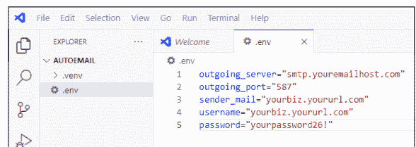

图12-1中显示的值只是假设的，如果你尝试使用它们将无法工作。你必须提供你自己电子邮件账户的实际信息。

如果你有可能在GitHub上共享代码，还要创建一个`.gitignore`文件，并在该文件中包含`.env`和`.venv`（有关更多信息，请参见第9章）。

#### 创建你的电子邮件发送脚本

我将展示一个完整的脚本，用于自动向多个地址发送纯文本电子邮件。然后我将讨论关键特性以及如何根据你自己的需求调整脚本。

```python
# email_send.py
# pip install python-dotenv
import os
import smtplib
from email.mime.text import MIMEText
from email.mime.multipart import MIMEMultipart
from dotenv import load_dotenv

# Load environment variables from .env file.
load_dotenv()

def send_bulk_email(subject, body, recipients):
    # Get email credentials and server settings from the .env file.
    outgoing_server = os.getenv("outgoing_server")
    # Change 587 to match port number in your .env file.
    outgoing_port = int(os.getenv("outgoing_port", 587))
    sender_email = os.getenv("sender_mail")
    username = os.getenv("username")
    password = os.getenv("password")

    if not (sender_email and username and password and outgoing_server):
        print("Missing required environment variables.")
        return

    # Create the email message.
    msg = MIMEMultipart()
    msg["From"] = sender_email
    msg["Subject"] = subject
    # Set the email body as plain text.
    msg.attach(MIMEText(body, "plain"))

    try:
        # Connect to the SMTP server.
        server = smtplib.SMTP(outgoing_server, outgoing_port)
        server.ehlo()
        # The next two lines are only needed for port 587.
        server.starttls()
        server.ehlo()
        # Log in with the provided credentials.
        server.login(username, password)

        # Send email to each recipient.
        for recipient in recipients:
            msg["To"] = recipient
            server.sendmail(sender_email, recipient, msg.as_string())
            print(f"Email sent to {recipient}")

        server.quit()
        print("All emails sent successfully!")

    except Exception as e:
        print(f"An error occurred: {str(e)}")

def main():
    # List of recipient email addresses
    recipients = [
        "someone@somewhere.com",
        "customerjow@gmail.com"
        # Add more email addresses as needed
    ]
    # Email subject and body
    subject = "Test Email"
    body = """
    Hello,
    This is a test email sent from a Python script.
    Thank you for your attention!

    Best regards,
    Your Name Here
    """
    # Call the function to send emails
    send_bulk_email(subject, body, recipients)

if __name__ == "__main__":
    main()
```

此脚本假设你使用的是TLS协议和端口`587`。如果你使用SSL和端口`465`，只需将以下行中`outgoing_port=`后面的`587`更改为`465`，如下所示：

```python
outgoing_port = int(os.getenv("outgoing_port", 465))
```

在脚本连接到服务器的代码中，将`SMTP`更改为`SMTP_SSL`。然后删除该行下面的`server.starttls()`和`server.ehlo()`，使代码如下所示：

```python
# Connect to the SMTP server.
server = smtplib.SMTP_SSL(outgoing_server, outgoing_port)
server.ehlo()
# Log in with the provided credentials.
server.login(username, password)
```

以防你好奇，`ehlo`代表Extended Hello。它是发送给SMTP服务器以启动连接的标准命令。

要为特定受众和消息配置脚本，请查看`main()`函数。将假的电子邮件地址更改为你的实际受众显示的你自己的电子邮件地址。在初始测试阶段，你可能只想通过向自己发送消息来测试脚本。但当你确信一切正常工作后，你可以列出任意数量的电子邮件地址。将每个电子邮件地址放在引号中，并在每个地址（最后一个除外）后面加上逗号，如示例列表所示：

```python
# List of recipient email addresses
recipients = [
    "someone@somewhere.com",
    "customerjow@gmail.com"
    # Add more email addresses as needed
]
```

另外，在 `main()` 函数中，将示例主题替换为你自己电子邮件的主题行。在三个引号之间输入电子邮件正文。

```
# 电子邮件主题和正文
subject = "测试邮件"
body = """
你好，

这是一封从 Python 脚本发送的测试邮件。
感谢您的关注！

此致，
你的名字
"""
```

要测试该脚本，请像运行任何其他脚本一样运行它。确保将电子邮件副本发送给自己，以便验证脚本是否正常工作。

#### 发送 HTML 邮件

如果你更喜欢发送 HTML 邮件而不是纯文本消息，请在以下行中找到 `plain` 这个词：

```
msg.attach(MIMEText(body, "plain"))
```

并将其更改为 `html`，如下所示：

```
msg.attach(MIMEText(body, "html"))
```

然后，按照以下示例，使用 HTML 和内联 CSS 标记你的电子邮件消息：

```
body = """
<div style="font:14pt Arial, Helvetica, sans-serif; color:#333;">
<h1>你好！</h1>

<p>这是一封从 Python 脚本发送的<b>测试邮件</b>。
感谢您的关注！访问我们的
<a href="https://example.com">网站</a>了解更多详情。</p>
<p>此致，<br>你的名字</p>
</div>
"""
```

> 如果你不熟悉在电子邮件中使用 HTML 和 CSS，可以搜索网络上的教程。或者向任何 AI 提问，例如“如何在使用 Python SMTP 发送邮件时用 HTML 和 CSS 标记邮件正文？”或“如何在 Python SMTP 发送的邮件中包含图片？”

#### 将电子邮件收件人地址放入文件

如果你在数据库或电子表格中有大量电子邮件收件人地址，并且你更愿意从那里发送，你可以将这些地址导出为一个简单的文本文件。你不需要引号、逗号或其他任何东西。只需导出，使每个地址单独占一行，如下所示：

```
john.doe@example.com
sarah.smith@fakeemail.com
mike.jones@samplemail.com
emily.brown@mockemail.com
david.wilson@testemail.com
```

在这个例子中，我将包含这些地址的文件命名为 `email_recipients.txt`，并将该文件放在与我的 Python 代码相同的文件夹中。

要使用文件中的电子邮件地址，而不是代码中的列表，请删除 `main()` 函数中定义地址列表的代码，如下所示：

```
# 收件人电子邮件地址列表
recipients = [
    "someone@somewhere.com",
    "customerjow@gmail.com"
    # 根据需要添加更多电子邮件地址
]
```

用以下代码替换该代码，以从文件中的地址构建列表。确保提供文件的正确路径和文件名。在我的例子中，我将文件命名为 `email_recipients.txt`，并将其放在与 Python 脚本相同的文件夹中。因此，以下代码在该设置下可以正常工作：

```
# 从 email_recipients.txt 加载收件人电子邮件地址
recipients = load_recipients("email_recipients.txt")
```

#### 处理速率限制问题

一些 SMTP 提供商会限制你发送电子邮件的速率或每天可以发送的电子邮件数量，以避免滥用和过度发送垃圾邮件。如果你需要减慢脚本速度，以免发送速率过高，可以在每封邮件发送后添加延迟。在脚本中每条消息发送后添加一个 `time.sleep()`，如下例所示：

```
# 向每个收件人发送电子邮件
for recipient in recipients:
    msg["To"] = recipient
    server.sendmail(sender_email, recipient, msg.as_string())
    print(f"邮件已发送至 {recipient}")
    time.sleep(1)
```

如果问题是每天发送的电子邮件数量，你可能需要注册一个限制较少的服务，例如 Amazon Simple Email Service (https://aws.amazon.com/ses)、Mailgun (www.mailgun.com) 或 SendGrid (https://sendgrid.com)。但根据你打算发送的邮件量，你可能需要为该服务付费。请随时向 AI 寻求帮助，例如询问：“如何处理使用 Python SMTP 发送邮件时的速率限制问题？”

#### 自动发送短信

你可能在手机上发过短信，即通过电话号码发送和接收简短的文本消息。向客户发送短信（也称为 SMS 消息）是向他们发送预约提醒、宣布新活动或产品、感谢他们等的好方法。借助 Python 和在线服务，你可以自动批量发送此类消息，而不仅仅是一次发送一条。


SMS 是你可能在手机上日常发送和接收的短信背后的技术。

Twilio (www.twilio.com) 是一个通过 Python 自动化发送短信的流行服务。截至撰写本文时，他们提供了一个免费套餐，允许你发送有限数量的短信，因此你有时间编写和测试代码，然后再花钱。访问 Twilio 网站了解更多信息并设置你的免费账户。

ClickSend (www.clicksend.com)、Courier (www.courier.com)、Plivo (www.plivo.com)、SendGrid (https://sendgrid.com)、Sinch (https://sinch.com)、Telnyx (https://telnyx.com) 和 Vonage (www.vonage.com) 是其他允许你从 Python 发送短信的在线服务。

#### 存储 SMS 账户信息

要发送 SMS 消息，你需要一个 Twilio 或类似服务提供商的账户。这样做将为你提供一个账户字符串标识符 (SID)、一个授权令牌和一个 Twilio 电话号码，你的消息将从该号码发送。

你应该将此类信息存储在 .env 文件中，而不是代码中（参见第 9 章）。

像往常一样为你的项目创建一个文件夹。创建并激活你的虚拟环境。然后在终端中输入以下命令安装 Python dotenv 模块，你将在代码中使用它从 .env 文件中检索账户信息：

```
pip install python-dotenv
```

接下来，在你的项目中创建一个 .env 文件（无文件扩展名）。然后输入你的 Twilio 账户 SID、Twilio 授权令牌和 Twilio 电话号码，如图 12-2 所示。如果你愿意，可以使用不同的变量名称。但是，代码中的变量必须与 .env 文件中的变量名匹配，因此请务必小心。图中显示的值当然是假设的。你必须将它们替换为你自己的 Twilio 账户信息。

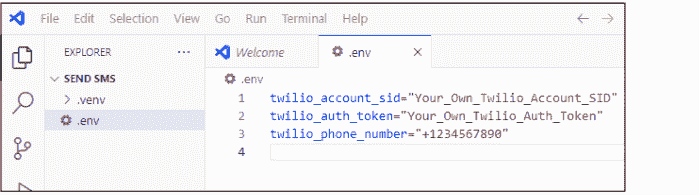

完成所有这些设置后，你可以按照此处所示编写你的 Python 脚本。请注意，该脚本使用了几个假设的手机号码，示例消息将发送到这些号码。请将它们替换为至少一个电话号码（你自己的）来测试脚本并验证你是否收到了短信。

```
import os
from twilio.rest import Client
from twilio.base.exceptions import TwilioRestException

# Twilio 凭据（为安全起见，将这些设置为环境变量）
account_sid = os.environ.get('twilio_account_sid')
auth_token = os.environ.get('twilio_auth_token')
twilio_number = os.environ.get('twilio_phone_number')

# 初始化 Twilio 客户端。
client = Client(account_sid, auth_token)

# 发送短信的函数
def send_text_messages(numbers, message, from_number):
    for number in numbers:
        try:
            message = client.messages.create(
                body=message,
                from_=from_number,
                to=number
            )
            print(f"消息已发送至 {number}: SID {message.sid}")
        except TwilioRestException as e:
            print(f"发送至 {number} 时出错: {e}")

def main():
    # 带有国家代码的收件人电话号码列表
    phone_numbers = [
        '+12345678901',  # 替换为实际的电话号码。
        '+19876543210',
        # 根据需要添加更多号码。
    ]

    # 要发送的消息
    message_body = "你好！这是一条从 Python 发送的测试消息。"

    # 检查凭据和电话号码是否已设置。
    if not account_sid or not auth_token or not twilio_number:
        print("错误：.env 文件中的账户信息无效或缺失。")
```

### 第13章
自动化社交媒体

如果你经常使用社交媒体与客户或粉丝保持联系，或者跟踪绩效指标、趋势、点赞、分享、评论等，Python自动化可以成为你最好的帮手。让Python自动化处理一些枯燥、重复、常规的繁琐工作，可以解放你的时间，让你有更多精力投入到更具创造性的事业和社交媒体运营的个人参与中。

本章提供了可用于大多数社交媒体服务的自动化技术，包括Facebook、Instagram、LinkedIn、X等。与本书本部分的前几章一样，你在这里做的大部分工作都将涉及与社交媒体网站提供的应用程序编程接口（API）进行交互。你打算自动化的任何社交媒体平台都需要一个API密钥。

#### 获取API密钥和模块

自动化社交媒体网站上的任何事情的第一步是从网站本身获取API密钥。在网站上查找有关获取API密钥的信息，通常在网站的开发者部分。

对于Python，你需要为该网站`pip install`一个合适的模块。以下是一些模块示例：

- Facebook：python-facebook-api
- Instagram：Instapy
- LinkedIn：linkedin-api
- Reddit：praw
- X：tweepy

如果你想同时发布到多个网站，可以考虑在Hootsuite（www.hootsuite.com）上设置一个账户。他们专门从事多站点社交媒体营销和管理。

在接下来的几节中，我将提供以不同方式自动化不同网站的示例。但无论你使用哪个网站，基本概念都是适用的。

你总是可以先让人工智能（AI）为你编写一些代码。只需确保你的AI提示以“编写一个Python自动化脚本来……”开头，然后准确说明你希望脚本做什么以及在哪个社交媒体网站上执行。

#### 自动化发布

假设你想每隔几个小时向社交媒体网站发布一个简单的一行问题。这些问题有助于提高社交媒体参与度，因为它们易于阅读和回答。

你可以从创建一个包含此类问题的简单文本文件开始，在本例中我将其称为`questions.txt`。当然，你可以在文本文件中包含任意多或任意少的行。你可以随时补充和更改它。

以下是一个包含五个问题的列表作为示例，但如果你愿意，可以在文件中放入数百个问题：

- 你尝试过的最奇怪的食物组合是什么？
- 如果你有一种超能力，它会是什么，为什么？
- 最后一首让你萦绕在脑海中的歌是什么？
- 你知道的最随机的事实是什么？
- 你最喜欢的放松电影或电视剧是什么？

作为一个实际示例，假设你想将这些问题发布到你的X账户（https://x.com）。你需要登录你的X账户，进入X开发者门户，设置一个项目，并按照X的说明申请API访问权限。你将获得以下凭证：

- API密钥
- API密钥密码
- 访问令牌
- 访问令牌密码

在设置项目时，请确保将项目设置为读写设置，因为如果你想向X发布内容，这是必需的。

请保密你的API密钥和其他凭证——你不想冒险让其他人使用你的凭证发布到X，这可能违反你与X的协议条款和条件。

#### 设置你的项目

设置你的社交媒体自动化项目类似于设置任何与互联网相关的自动化脚本，但这个项目有很多活动部件，所以在我们进入实际代码之前，我会慢慢来。一如既往，你想创建你的项目文件夹，创建一个虚拟环境，并激活该虚拟环境。

在获得所有发布到社交媒体网站的凭证后，将这些信息放入.env文件中。例如，如果你要发布到X，请在项目文件夹内创建一个.env文件，并如图13-1所示填写你的信息。确保将等号（=）右侧的所有内容替换为你账户的正确信息。

图13-1：用于发布到X的.env文件结构。

实际发送文本消息的函数名为`send_text_messages`，它以以下代码行开始：

```python
def send_text_messages(numbers, message, from_number):
```

如你所见，该函数接收输入`numbers`（你要发送短信的电话号码列表）、`message`（你要发送的短信）和`from_number`（你发送短信的Twilio号码）。

#### 定义你的收件人列表和消息

要指定你想发送消息的电话号码，请使用`main()`函数中的`phone_numbers`列表，如下所示。确保将每个号码用引号括起来，在号码开头包含国家代码（美国为+1），并用逗号分隔号码。

```python
phone_numbers = [
    '+12345678901',  # 替换为实际的电话号码。
    '+19876543210',
    # 根据需要添加更多号码。
]
```

使用此处显示的`message_body`变量来设置你要发送的消息文本：

```python
message_body = "你好！这是从Python发送的测试消息。"
```

#### 存储收件人号码

如果你要管理大量电话号码，将它们直接放入代码中可能很麻烦。如果更方便，可以将它们存储在数据库、电子表格或文本文件中。然后你可以重写脚本，在运行脚本时从该文件中将号码提取到`phone_numbers`列表中。

我无法向你展示如何为每个可能用于存储电话号码的应用程序执行此操作，因此我将向你展示如何从文本文件中检索它们。无论你使用哪个特定应用程序来管理号码，都应该很容易将这些号码导出到如下所示的文本文件中，每个号码在文件中单独一行：

```
+12025550123
+447911123456
+919876543210
+5511987654321
+61412345678
```

作为一个实际示例，假设该文件名为`sms_numbers.txt`，并且与Python代码在同一文件夹中。这是从该文件中获取电话号码列表的脚本版本，并添加了一些额外的异常处理来处理文本文件的不可预见问题。

```python
import os
from twilio.rest import Client
from twilio.base.exceptions import TwilioRestException

# Twilio凭证（为安全起见，将这些设置为环境变量）
account_sid = os.environ.get('twilio_account_sid')
auth_token = os.environ.get('twilio_auth_token')
twilio_number = os.environ.get('twilio_phone_number')

# 初始化Twilio客户端
client = Client(account_sid, auth_token)

def load_phone_numbers(filename):
    numbers = []
    try:
        with open(filename, 'r') as f:
            for line in f:
                line = line.strip()
                if line:
                    numbers.append(line)
    except Exception as e:
        print(f"加载电话号码时出错：{e}")
    return numbers

# 发送短信的函数
def send_text_messages(numbers, message, from_number):
    for number in numbers:
        try:
            sms = client.messages.create(
                body=message,
                from_=from_number,
                to=number
            )
            print(f"消息已发送至 {number}：SID {sms.sid}")
        except TwilioRestException as e:
            print(f"发送至 {number} 时出错：{e}")

def main():
    # 从sms_numbers.txt加载收件人电话号码。
    phone_numbers = load_phone_numbers("sms_numbers.txt")

    # 要发送的消息
    message_body = "你好！这是从Python发送的测试消息。"

    # 检查凭证和电话号码是否已设置。
    if not account_sid or not auth_token or not twilio_number:
        print("错误：.env文件中的账户信息无效或缺失。")
    else:
        # 发送消息。
        send_text_messages(phone_numbers, message_body, twilio_number)

if __name__ == "__main__":
    main()
```

即使你不使用Twilio作为短信服务提供商，你的Python脚本的基本逻辑和结构也应该与此示例类似。

AI可以在生成此类脚本方面提供很大帮助。确保你告诉AI你正在使用Python，你使用的是哪个服务提供商（SendGrid、Sinch或其他），以及你希望脚本具体做什么。确保为你自己的账户创建包含账户信息的.env文件，然后你应该就可以开始了。

#### 本章内容

- 自动发布内容
- 为社交媒体创建内容
- 跟踪社交媒体绩效指标
- 使用Python自动化分析趋势

接下来，你需要通过 `pip install` 安装三个不属于 Python 标准库的模块：`python-dotenv` 用于从 `.env` 文件中提取数据，`tweepy` 用于简化对 X 的访问，`schedule` 用于简化基于时间表的发布（例如每四小时一次）。在终端中输入以下命令，确保在运行脚本前安装这些模块：

```
pip install tweepy schedule python-dotenv
```

所有组件准备就绪后，以下是完整的脚本，我将其命名为 `post_to_x.py`：

```python
# post_to_x.py
# pip install tweepy schedule python-dotenv
import tweepy
import schedule
import time
import os
from dotenv import load_dotenv
from datetime import datetime

# Load environment variables from .env file.
load_dotenv()

# Retrieve X API credentials from .env.
consumer_key = os.getenv("X_CONSUMER_KEY")
consumer_secret = os.getenv("X_CONSUMER_SECRET")
access_token = os.getenv("X_ACCESS_TOKEN")
access_token_secret = os.getenv("X_ACCESS_TOKEN_SECRET")

# Validate environment variables.
if not all([consumer_key, consumer_secret, access_token, access_token_secret]):
    print("Missing one or more environment variables in .env file")
    raise ValueError("The .env file is missing some required credentials.")

# Initialize Tweepy client.
try:
    client = tweepy.Client(
        consumer_key=consumer_key,
        consumer_secret=consumer_secret,
        access_token=access_token,
        access_token_secret=access_token_secret
    )
    print("Tweepy client initialized successfully")
except Exception as e:
    print(f"Failed to initialize Tweepy client: {str(e)}")
    raise

def process_file(filename):
    """
    Reads the first line from the specified file, removes it from the file,
    and returns the question along with the count of remaining questions.
    If the file is missing or empty, returns (None, 0).
    """
    try:
        with open(filename, "r") as file:
            lines = file.readlines()
    except FileNotFoundError:
        print(f"Error: {filename} not found.")
        return None, 0

    if not lines:
        print(f"Warning: {filename} is empty before attempting to post.")
        return None, 0

    # Retrieve the first line and remove it from the file.
    question = lines[0].strip()
    remaining_questions = len(lines) - 1

    with open(filename, "w") as file:
        file.writelines(lines[1:])

    return question, remaining_questions

# Function to post to X using the question text from the specified file
def post_to_x(filename):
    question, remaining = process_file(filename)
    if question is None:
        print("No question available for posting.")
        return

    try:
        response = client.create_tweet(text=question)
        print(f"Successfully posted to X: {question}")
        print(f"Posted: {question}")
    except tweepy.TweepyException as e:
        print(f"Error posting to X: {str(e)}")
        if "429" in str(e):
            print("Warning: Rate limit reached. Waiting for reset...")
        elif "403" in str(e):
            print("Error: Forbidden. Check app permissions or credentials.")
        elif "401" in str(e):
            print("Error: Unauthorized. Verify API credentials.")
        return

    print(f"Number of questions left in {filename}: {remaining}")

# Main loop to run the scheduler
def main():
    # Define the filename of the file containing questions.
    content_filename = "questions.txt"
    # Define how many hours between each post.
    interval_hours = 4

    # Schedule the post every interval_hours hours.
    schedule.every(interval_hours).hours.do(lambda: post_to_x(content_filename))
    print(f"Scheduled posts every {interval_hours} hour(s) using file: {content_filename}")

    print("Starting X posting script... Check terminal for details.")
    while True:
        try:
            schedule.run_pending()
            time.sleep(60)  # Check every minute
        except Exception as e:
            print(f"Error in scheduler loop: {str(e)}")
            time.sleep(300)  # Wait 5 minutes before retrying on error.

if __name__ == "__main__":
    try:
        main()
    except KeyboardInterrupt:
        print("Script terminated by user")
    except Exception as e:
        print(f"Unexpected error: {str(e)}")
```

代码量很大，但一如既往，其中大部分是异常处理，目的是防止脚本因不可预见的问题（如不完整的 `.env` 文件或 `questions.txt` 文件）而崩溃。

#### 自定义脚本

如上所述，`post_to_x.py` 脚本每次从名为 `questions.txt` 的文件中发布一行文本。请确保该文件与脚本位于同一文件夹中，并且每行包含一个问题。为避免重复，脚本会在发布后立即从文件中移除该问题。请留意该文件，并不时用新问题补充，以保持内容新鲜。

如果你希望将文件命名为 `questions.txt` 以外的其他名称，请确保在 `main()` 函数中将以下代码行更改为你选择的文件名：

```python
content_filename = "questions.txt"
```

如上所述，只要脚本正在运行且 `questions.txt` 文件中有问题，脚本就会每四小时发布一次。

> 发布过快可能导致 X 的机器人检测系统禁用你的账户。请务必将脚本限制为每小时发布 10 或 15 条内容。

#### 为你的帖子创建内容

如果你在为社交媒体想内容时遇到困难，可以考虑使用 AI 为你生成帖子。你可以使用任何 AI 聊天机器人生成任何主题的帖子，并将它们存储在类似 `questions.txt` 的文件中，然后使用相同的代码自动发布。实际上，没有必要编写 Python 脚本来生成此类内容——直接交互式操作可能更快、更容易。

例如，访问 ChatGPT (https://chatgpt.com)、Grok (https://x.ai) 或任何其他聊天机器人的网站。输入你的提示词，明确你希望帖子关于什么以及需要多少条帖子。使用如图 13-2 所示的措辞，以便文本可以轻松复制到文本文件中。

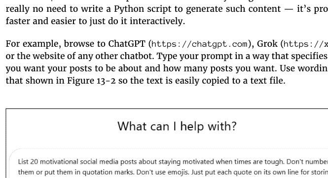

所有帖子生成后，点击“复制”按钮将它们全部复制。通常，“复制”图标看起来像两张纸。根据你使用的 AI 聊天机器人，它可能位于生成输出的底部（如图 13-3 所示），也可能位于顶部。


如果你已经编写了自动发布脚本（如上一节中的 `auto_post.py` 脚本），请在代码编辑器（我们的示例中是 VS Code）中打开该项目。在脚本所在的同一文件夹中创建一个新的文本文件。将其命名为你喜欢的任何名称。我将其命名为 `content.txt`。粘贴你从聊天机器人复制的帖子。然后关闭并保存文件。

最后，只需确保你的自动发布脚本知道使用该文件来查找你的帖子。在上一节的 `post_to_x.py` 脚本中，找到以下这行代码：

```python
content_filename = "questions.txt"
```

现在将其更改为反映你刚创建的文件的名称。例如，如果你将其命名为 `content.txt`，则将该行更改为：

```python
content_filename = "content.txt"
```

#### 跟踪性能指标

使用 Python 自动化跟踪性能指标有助于个人、企业和营销人员优化其社交媒体策略。通过 Python 自动化性能指标可以节省时间，并通过消除手动跟踪用户互动、增长趋势或内容表现等数据的需要，从而消除枯燥的重复性任务。Python 使你能够每天、每小时或以任何你喜欢的间隔收集数据。

为了提供一个实际示例，我将展示一个可以从 Instagram 收集指标的脚本。与其他互联网相关的脚本一样，这将涉及使用你的当前社交媒体账户的 API。相同的基本逻辑可应用于任何社交媒体网站。请随意使用 AI 将代码调整为你打算使用的任何网站。

#### 获取 Instagram API 访问权限

为了最好地自动化 Instagram，你应该设置一个企业账户。企业账户使你可以访问 Instagram Graph API，该 API 为性能指标提供更丰富的数据。

如果你已经有一个个人 Instagram 账户，你可以免费将其转换为企业账户。这样做可以访问 Instagram Insights 和其他个人账户无法提供的性能指标。

如果你需要帮助转换账户，请登录 Instagram 并使用 Meta 的帮助资源或 Meta AI 查找分步说明。

接下来，你需要一个 API 密钥。访问 Meta for Developers 网站 (https://developers.facebook.com) 并使用你的 Facebook 凭据登录。创建一个开发者账户；然后转到开发者仪表板并注册一个新应用，选择 Instagram 作为产品。选择 Instagram Graph API 作为你的应用将使用的 API。

完成所有这些步骤后，你将收到两个密钥：一个 Instagram 企业账户 ID 和一个访问令牌。将它们保存在安全的地方并保密。你将在 Python 脚本中需要它们（参见下一节）。

#### 设置你的脚本

创建你的项目文件夹，并创建并激活一个虚拟环境。我在这里展示的脚本使用了三个不属于 Python 标准库的模块。

因此，在开始编写脚本之前，请务必在命令提示符下输入以下命令：

```
pip install requests schedule python-dotenv
```

接下来，在项目文件夹中创建一个 `.env` 文件，用于存储私钥信息。然后为你的企业账户ID和访问令牌各分配一个变量名，并将从Instagram获取的值赋给它们。图13-4展示了一个示例，但请确保将每行等号（=）后的文本替换为你从Instagram获取的实际密钥信息。

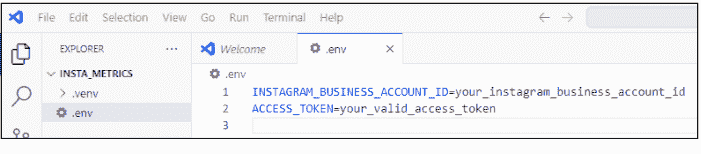

以下是用于获取Instagram表现指标的完整Python自动化脚本：

```python
# instagram_metrics.py
# pip install requests schedule python-dotenv
import requests
import os
import schedule
import time
from dotenv import load_dotenv
from datetime import datetime

# Load environment variables from .env file.
load_dotenv()

# Retrieve Instagram API credentials from .env.
INSTAGRAM_BUSINESS_ACCOUNT_ID = os.getenv("INSTAGRAM_BUSINESS_ACCOUNT_ID")
ACCESS_TOKEN = os.getenv("ACCESS_TOKEN")

# Validate required environment variables.
if not INSTAGRAM_BUSINESS_ACCOUNT_ID or not ACCESS_TOKEN:
    print("Missing account ID or access token in .env file.")
    exit(1)

def fetch_instagram_metrics(metrics):
    # Fetch daily performance metrics from the Instagram business account.
    url = f"https://graph.facebook.com/v14.0/{INSTAGRAM_BUSINESS_ACCOUNT_ID}/insights"
    params = {
        "metric": metrics,
        "period": "day",
        "access_token": ACCESS_TOKEN
    }

    try:
        response = requests.get(url, params=params)
        response.raise_for_status()
        data = response.json()
        print(f"\nMetrics for {datetime.now().strftime('%Y-%m-%d')}:")
        for item in data.get("data", []):
            metric_name = item.get("name")
            values = item.get("values", [])
            if values:
                # Assuming the most recent value is of interest
                value = values[0].get("value")
                print(f"{metric_name}: {value}")
            else:
                print(f"{metric_name}: No data available.")
    except Exception as e:
        print(f"Error fetching metrics: {str(e)}")

def main():
    print("Starting Instagram metrics fetching script...")

    # Define the metrics variable and the scheduled time.
    metrics = "impressions,reach,profile_views"
    # Time of day to run script (00:00 is midnight)
    schedule_time = "00:00"

    # Fetch metrics immediately when the script starts.
    fetch_instagram_metrics(metrics)

    # Schedule to run the metrics fetch every day at the user-defined time with
    # the metrics parameter.
    schedule.every().day.at(schedule_time).do(fetch_instagram_metrics, metrics)
    print(f"Metrics fetching scheduled to run daily at {schedule_time}.")

while True:
    schedule.run_pending()
    time.sleep(60)  # Wait one minute between checks

if __name__ == "__main__":
    try:
        main()
    except KeyboardInterrupt:
        print("Script terminated by user.")
    except Exception as e:
        print(f"Unexpected error: {str(e)}")
```

脚本一运行就会收集表现指标。如果你让它持续运行，它会在每天午夜抓取指标。你可以通过修改接下来讨论的代码来更改它下载的指标以及运行时间。

#### 定义你的指标和时间范围

你可以通过`main()`函数内的两个变量，根据自己的需求个性化Instagram表现指标脚本：

```python
# Define the metrics variable and the scheduled time.
metrics = "impressions,reach,profile_views"
# Time of day to run script (00:00 is midnight)
schedule_time = "00:00"
```

`metrics`变量定义了来自Instagram Insights的以下值：

- **展示次数：** 你的帖子、快拍或Reels被查看的总次数
- **覆盖人数：** 至少看过一次你的帖子、快拍或Reels的独立账户数量
- **主页访问次数：** 你的Instagram个人主页被查看的次数


其他可用的指标记录在Meta for Developers网站上，网址为 https://developers.facebook.com。（在该网站搜索Instagram Insights Metrics。）

当你运行脚本时，终端中的输出将如下所示：

```
Metrics for 2026-06-08:
impressions: 1234
reach: 5678
profile_views: 42
```


这些数字代表了你运行脚本当天Instagram账户的整体每日活动情况。因此，让脚本在午夜自动检查是获得最准确单日结果的最佳选择。

如果你希望在午夜以外的时间运行脚本，请将计划时间从"00:00"更改为其他时间。例如，要在早上6:00运行脚本，请将`scheduled_time = "00:00"`更改为`scheduled_time = "06:00"`。要在每天中午运行，则更改为`scheduled_time = "12:00"`。

#### 分析趋势

分析随时间变化的趋势是保持你的社交媒体内容与人们当前兴趣相关的好方法。Google搜索提供了一种快速简便的方式来查看各种关键词的趋势。Python可以轻松完成这项工作。

与本章中的其他脚本不同，你不需要访问任何API（太棒了！），但你需要安装一些模块。创建你的项目文件夹，创建并激活你的虚拟环境，然后在终端中运行以下命令来安装所需的模块：

```
pip install pytrends pandas matplotlib
```

以下是使用Python分析趋势的完整脚本：

```python
# analyze_trends.py
# pip install pytrends pandas matplotlib
from pytrends.request import TrendReq
import pandas as pd
import matplotlib.pyplot as plt

def analyze_trends(keyword_list, timeframe):
    # Connect to Google Trends.
    pytrends = TrendReq(hl='en-US', tz=360)

    # Build payload with the provided keywords and timeframe.
    pytrends.build_payload(keyword_list, cat=0, timeframe=timeframe,
                           geo='', gprop='')

    # Retrieve interest over time data.
    interest_over_time_df = pytrends.interest_over_time()

    if not interest_over_time_df.empty:
        print("See the pop-up chart for results")

        # Remove the "isPartial" column if present.
        if 'isPartial' in interest_over_time_df.columns:
            interest_over_time_df = interest_over_time_df.drop(columns=['isPartial'])

        # Adjust granularity:
        # If the timeframe indicates a long period, aggregate to monthly data.
        if 'y' in timeframe:
            data_to_plot = interest_over_time_df.resample('M').mean()
        else:
            data_to_plot = interest_over_time_df

        data_to_plot.plot()
        plt.title("Google Trends Interest Over Time")
        plt.xlabel("Date")
        plt.ylabel("Interest")
        plt.legend(loc='upper left')
        plt.tight_layout()
        plt.show()
    else:
        print("No trend data available.")

def main():
    # Define the list of keywords and the timeframe.
    keyword_list = ['AI', 'Python', 'JavaScript']

    # Set the timeframe here (change as desired)
    # timeframe = 'now 7-d'  # One-week timeframe
    # timeframe = 'today 12-m'  # For the last 12 months
    timeframe = 'today 5-y'  # For the last 5 years

    analyze_trends(keyword_list, timeframe)

if __name__ == "__main__":
    main()
```

#### 查看趋势

当你按所示运行脚本时，输出将是过去五年指定关键词（AI、Python和JavaScript）的趋势。这将在你的屏幕上弹出一个图表，看起来类似于图13-5。matplotlib模块显示该图表。


如果你在图表仍在屏幕上打开时运行脚本，似乎什么都不会发生。在运行脚本之前，请关闭当前显示在屏幕上的图表以防止这种情况。

#### 设置你自己的关键词和时间范围

要调整脚本以适应你感兴趣的关键词和时间范围，请在`main()`函数中为`keyword_list`和`timeframe`变量设置如下值：

```python
keyword_list = ['AI', 'Python', 'JavaScript']
```

确保将你想要分析的每个关键词放在引号中，并用逗号分隔，如示例所示。

定义你的时间范围可能有点棘手，因为你必须使用 `pytrends` 模块指定的语法。当前脚本提供了使用一周、一年和过去五年的示例，如下所示：

```
# 在此处设置时间范围（根据需要更改）。
# timeframe = 'now 7-d'  # 一周时间范围
# timeframe = 'today 12-m'  # 过去12个月
timeframe = 'today 5-y'  # 过去5年
```

你可以通过取消注释你想要的时间范围并注释掉其他两个来使用其中任何一个。更多详情和选项，请参阅 GitHub 上的 `pytrends` README，地址为 https://github.com/GeneralMills/pytrends。

### 4 自动化更高级的内容

#### 本部分内容 . . .

- 使用 `schedule` 模块安排任务。
- 使用 APScheduler 安排任务。
- 与人工智能集成。

#### 本章内容

- 使用 schedule 和 APScheduler 模块进行自动化
- 将脚本作为子进程运行和导入

## 第14章
安排任务

Python 非常适合安排在特定日期和时间以及定期运行的任务。你可以安排系统任务，如备份和日志记录。你也可以安排与互联网相关的任务，如网络抓取、电子邮件和社交媒体发布。

在本章中，你将了解两个特别适合调度的库：schedule 和 APScheduler。首先，我将向你展示每个库的功能。然后，我将提供如何使用它们来安排 Python 自动化任务的具体示例。

#### 使用 Schedule 模块

一个用于调度的流行模块恰如其分地命名为 schedule。schedule 模块不是 Python 标准库的一部分。因此，如果你打算在脚本中使用它，请确保创建并激活你的虚拟环境，并在终端的命令提示符处输入以下命令：

```
pip install schedule
```

你可以使用 schedule 库在特定时间或定期运行任务。一个简单的入门方法是编写一些简单的脚本，这些脚本只是按计划在终端中打印一些反馈，以便你知道你的代码可以工作。

这是一个简单的脚本，每十秒在终端中显示一些反馈，以向你展示此类脚本的基本语法和结构：

```
# basic_schedule.py
# pip install schedule
import schedule
import time

# 要安排的函数
def job():
    print("任务已执行！在终端中按 Ctrl+C 停止脚本。")

# 每十秒安排一次任务。
schedule.every(10).seconds.do(job)

# 运行计划任务的主循环，包含键盘中断处理
try:
    while True:
        schedule.run_pending()
        time.sleep(1)  # 防止高 CPU 使用率。
except KeyboardInterrupt:
    print("\n脚本已被用户终止。")
```

脚本中的第一个函数 `job()` 在被调用时会在屏幕上显示一些文本。用于测试和反馈目的。当你运行脚本时，你会看到该消息每十秒出现一次。这行代码设置调度器每十秒调用一次 `job()` 函数：

```
schedule.every(10).seconds.do(job)
```

请注意，当我使用 `schedule` 模块时，我引用函数时使用的是 `job` 而没有括号——换句话说，是 `job` 而不是 `job()`。这可能看起来违反直觉，因为我们通常使用名称中的括号来调用函数。但在这个语法中，我不是在调用函数立即返回一个值——我只是告诉调度器在开始运行时要调用的函数名称。

在定义调度间隔的行下面是一个特殊的 `while True` 循环，位于异常处理程序内部。你可能在想，因为 `True` 总是为真，所以这个循环将永远运行。你是对的，这正是我们在此情况下想要的。没有这个循环，脚本会在第一个十秒结束之前就结束，脚本将什么也不做。我接下来解释原因。

##### 理解 schedule 模块的工作原理

`schedule.every(10).seconds.do(job)` 这行代码实际上从不运行任务。相反，每十秒，它会更新计划任务列表（或有时称为 *队列*），说：“请在有机会时运行任务。”这可以防止计划任务在中央处理器（CPU）忙于其他事情时尝试运行。

要实际运行准备就绪的计划任务，请使用以下代码行：

```
schedule.run_pending()
```

因此，运行计划任务实际上需要两行代码：一行用于设置调度，这仅仅是让计算机知道任务将在最早方便的时候运行；第二行用于实际运行队列中等待的任务。

现在让我们看看运行计划任务的整个循环，以及异常处理程序：

```
# 运行计划任务的主循环，包含键盘中断处理
try:
    while True:
        schedule.run_pending()
        time.sleep(1)  # 防止高 CPU 使用率
except KeyboardInterrupt:
    print("\n脚本已被用户终止。")
```

基本上，`while True` 循环使脚本“永远”运行。由于 `time.sleep(1)`，该循环每秒重复一次。这一秒钟让 CPU 被释放出来，用于处理你当时可能正在使用的应用程序所需的其他任务。因此，可以说调度器在“后台”运行，偶尔查看队列，看看是否有任何计划任务需要运行。但与此同时，你可以用计算机做其他事情，因为调度器并没有占用所有的 CPU 时间。

当然，在现实生活中，你可能并不想真正“永远”运行脚本。你可能想停止它来处理代码。这就是 `try...except` 的作用。要停止脚本，你只需按 Ctrl+C。


确保在按 Ctrl+C 之前，点击 VS Code 中运行脚本的终端内部。脚本不会检测该终端窗口外的按键。

考虑到这一点，再次查看代码。一方面，`schedule.every(10).seconds.do(job)` 正在将每十秒运行一次任务的任务添加到队列中。但它实际上并没有运行任务。

`while True` 循环不断运行，但它每秒只重复一次（而不是每秒数千次）。在那一秒钟内，计算机可以处理来自其他应用程序的其他需求。当循环重复并执行 `schedule.run_pending()` 时，队列中等待的任何计划任务都可以被执行（如果有多个，则一次一个），而不会“相互碰撞”并压垮 CPU。

这就是幕后技术上的工作原理。从你的角度来看，作为用户，当你运行脚本时，前十秒什么也不会发生。但之后，你会在终端中看到以下文本每十秒重复一次，表明 `job()` 函数正在按计划执行：

```
任务已执行！在终端中按 Ctrl+C 停止脚本。
```

只要你看到消息每十秒出现一次，你就知道调度器正在工作，你的代码也在工作。当然，在现实生活中，你可能想做的不仅仅是显示一些文本在终端中。

##### 安排间隔任务

在前面的第一个脚本中，我让你安排一个任务每十秒运行一次，只是为了方便测试。当然，你可以使用秒以外的间隔。这是一个安排任务每十分钟运行一次的示例：

```
# 每十分钟安排一次任务。
schedule.every(10).minutes.do(job)
```

这是一些每两小时运行一次任务的代码：

```
# 每两小时安排一次任务
schedule.every(2).hours.do(job)
```

你也可以使用 `.days` 和 `.weeks` 来安排任务。这是一行每两天运行一次任务的代码：

```
# 每两天安排一次任务。
schedule.every(2).days.do(job)
```

这是一个每两周运行一次任务的示例：

```
# 每两周安排一次任务。
schedule.every(2).weeks.do(job)
```

你还可以安排在一周和一月的特定日期以及一天中的特定时间运行任务。例如，这是每天早上 8:00 运行一次任务的代码：

```
# 每天在特定时间（例如，上午 8:00）安排一次任务。
schedule.every().day.at("08:00").do(job)
```

这是一个在每个工作日上午 9:30 安排任务的示例：

```
# 每个工作日的特定时间（例如，周一至周五上午 9:30）安排一次任务。
schedule.every().monday.at("09:30").do(job)
schedule.every().tuesday.at("09:30").do(job)
schedule.every().wednesday.at("09:30").do(job)
schedule.every().thursday.at("09:30").do(job)
schedule.every().friday.at("09:30").do(job)
```

在安排任务的频率方面，你有很大的灵活性。然而，`schedule` 模块并不是安排任务的唯一选择。在下一节中，我将向你介绍 APScheduler 模块，它也可以安排任务，并且在指定调度方面还有一些额外的技巧。

#### 使用 APScheduler 模块

`schedule` 模块是一种流行且相对简单的使用 Python 安排任务的方式。但在企业界，许多人使用 APScheduler（代表 *Advanced Python Scheduler*）。它的工作方式类似于 `schedule`，但在指定运行任务的日期和时间方面提供了更大的灵活性。APScheduler 还让你避免了前面脚本中尴尬的 `while True` 循环。

> APScheduler 不是 Python 标准库的一部分。因此，如果你打算在脚本中使用它，请确保先 `pip install APScheduler`。

这是一个与第一个示例非常相似的脚本——它每十秒调用一个名为 `job()` 的函数，但它使用的是 APScheduler 而不是简单的 `schedule` 模块：

```python
# basic_apscheduler.py
# pip install apscheduler
from apscheduler.schedulers.blocking import BlockingScheduler

def job():
    print("Task executed! Press Ctrl+C in Terminal to stop the script.")

scheduler = BlockingScheduler()
scheduler.add_job(job, 'interval', seconds=10)

if __name__ == '__main__':
    try:
        scheduler.start()
    except (KeyboardInterrupt, SystemExit):
        print("Scheduler stopped")
        scheduler.shutdown()
```

这个脚本使用 `from apscheduler.schedulers.blocking import BlockingScheduler`，因为 APScheduler 实际上是一个提供多种功能的模块集合。对于基本的调度，你只需要 `BlockingScheduler`，因此只导入这一个模块会更高效。

让我们详细看看这个脚本。名为 `job()` 的函数只是在屏幕上显示一些文本，这样我们在测试时就能验证脚本是否正常工作。然后是这两行：

```python
scheduler = BlockingScheduler()
scheduler.add_job(job, 'interval', seconds=10)
```

第一行只是执行 `BlockingScheduler` 来创建一个名为 `scheduler` 的对象。在代码的其余部分中，名称 `scheduler` 指的就是 `BlockingScheduler` 的这个实例。定义之后，你可以使用如下语法来安排任务运行：

```python
scheduler.add_job(job, 'interval', seconds=10)
```

在这行代码中，`job` 指的是 `job()` 函数，而 `'interval'` 指定我们希望安排任务定期运行。正如你可能猜到的，`seconds=10` 表示每十秒运行一次任务。这行代码实际上并没有启动进程——它只是定义了调度计划。

你可以使用 `.add_job()` 方法添加任意数量的定时任务和间隔。

使用 `schedule` 模块时，我们必须添加一个 `while True` 循环来防止脚本立即退出，但 `BlockingScheduler` 的工作方式不同。相反，你使用 `.start()` 方法来启动它并防止脚本结束。但当然，你并不真的希望脚本“永远”运行。所以，你仍然需要一种在必要时停止调度器的方法。这就是以下几行的作用：

```python
try:
    scheduler.start()
except (KeyboardInterrupt, SystemExit):
    print("Scheduler stopped")
    scheduler.shutdown()
```

这些行取代了 `while True` 循环，允许你通过在 VS Code 的终端中按 Ctrl+C 来停止脚本。`scheduler.shutdown()` 这一行会停止调度器，清理调度器正在使用的任何资源，并允许脚本优雅地退出。

在示例脚本中，`except (KeyboardInterrupt, SystemExit)` 确保当你按 Ctrl+C 或脚本因任何其他原因（例如你的 Python 代码中的错误）停止执行时，调度器会关闭。

##### 使用带间隔的 APScheduler

在示例脚本中，我使用 `'interval'` 作为关键字来表示基于时间间隔的调度。在本节中，我将向你展示使用 `interval` 关键字和不同时间范围的示例。

这是一个每五分钟运行一次任务的示例：

```python
scheduler.add_job(job, 'interval', minutes=5)
```

这是一个每两小时运行一次任务的示例：

```python
scheduler.add_job(my_job, 'interval', hours=2)
```

这是一个每三天运行一次任务的示例：

```python
scheduler.add_job(my_job, 'interval', days=3)
```

这是一个每周运行一次任务的示例：

```python
scheduler.add_job(my_job, 'interval', weeks=1)
```

这是一个每两周运行一次任务的示例：

```python
scheduler.add_job(job_two_weeks, 'interval', weeks=2)
```

##### 使用带日期和时间的 APScheduler

APScheduler 相对于 `schedule` 的一个巨大优势是能够指定运行任务的日期和时间，而不仅仅是间隔。为此，请使用 `cron` 关键字代替 `interval`。语法如下：

```python
scheduler.add_job(job, 'cron', [year=], [month=], [day=], [week=], [day_of_week=], [hour=], [minute=], [second=], [start_date=], [end_date=], [timezone=], [jitter=], **kwargs)
```

你可以省略方括号中任何不需要的参数。示例可能是理解如何表达的最简单方式，所以我接下来将向你展示一堆示例。

这是一行每天早上 8:00 运行一次任务的代码：

```python
scheduler.add_job(job, 'cron', hour=8, minute=0)
```

如果你想每小时运行几次任务，可以使用 `*/` 和 `minute=` 来指定间隔。例如，这是一行每 15 分钟运行一次任务的代码：

```python
scheduler.add_job(job, 'cron', minute='*/15')
```

这是一个每周三中午运行一次任务的示例：

```python
scheduler.add_job(my_job, 'cron', day_of_week='wed', hour=12)
```

当你使用 `day_of_week` 参数时，你可以使用数字（0 到 6，其中 0 是星期日）或带引号的星期名称缩写（'sun', 'mon', 'tue', 'wed', 'thu', 'fri', 'sat'）来指定日期。使用逗号来指定多个值。

这是一行在每周一、三、五中午运行一次任务的代码：

```python
scheduler.add_job(job, 'cron', day_of_week='mon,wed,fri', hour=12)
```

如果你愿意，也可以用数字来描述星期几，像这样：

```python
scheduler.add_job(job, 'cron', day_of_week='1,3,5', hour=12)
```

接下来的这行代码在每月第一天的午夜运行一次任务：

```python
scheduler.add_job(job, 'cron', day=1, hour=0, minute=0)
```

> 使用 `day=` 参数时，请将月份中的日期指定为 1 到 31 之间的数字。

APScheduler 真正为你提供了极大的调度灵活性。这是一个在每月 1 日和 15 日午夜运行任务的示例：

```python
scheduler.add_job(job, 'cron', day='1,15', hour=0, minute=0)
```

使用 `day=` 参数，你可以使用 `'last'` 来指定每月的最后一天。这是一个在每月最后一天晚上 11:59 运行任务的示例：

```python
scheduler.add_job(job, 'cron', day='last', hour=23, minute=59)
```

要在每月的第一天和最后一天运行任务，请对第一天使用 `1`，对最后一天使用 `'last'`，像这样：

```python
scheduler.add_job(job, 'cron', day='1,last', hour=12)
```

如果你想每小时运行一次任务，请将 `hour` 参数设置为 `'*'`。例如，以下代码在每个星期六和星期日的中午运行一次任务：

```python
scheduler.add_job(job, 'cron', day_of_week='sat,sun', hour='*')
```

这是一行在工作日（周一至周五）的营业时间（上午 8 点至下午 5 点）内每 30 秒运行一次任务的代码。

```python
scheduler.add_job(job, 'cron', day_of_week='mon-fri', hour='8-17', second='*/30')
```

使用 APScheduler，你几乎可以无限制地安排任务，这对于自动化来说是一件很棒的事情。

> 如果你在指定调度计划时遇到困难，可以考虑向人工智能（AI）寻求帮助。将你的提示表述为“使用 Python APScheduler，我如何指定……”，然后用简单的语言表达你想要的调度计划。

到目前为止，我已经向你展示了根据计划调用单个简单函数的示例。同样的策略也适用于在不同计划上调用多个函数。同样，我将使用非常简单的函数来专注于调度代码。在下面的代码中，你可以看到三个不同的 `scheduler.add_job()` 语句如何允许脚本在三个不同的计划上执行三个不同函数中的代码：

```python
# multi_functions.py
# pip install apscheduler
from apscheduler.schedulers.blocking import BlockingScheduler

def job1():
    print("job1 - Press Ctrl+C in Terminal to stop")

def job2():
    print("job2")

def job3():
    print("job3")

if __name__ == "__main__":
    scheduler = BlockingScheduler()

    # Schedule job1 to run every ten seconds.
    scheduler.add_job(job1, 'interval', seconds=10)

    # Schedule job2 to run every 30 seconds.
    scheduler.add_job(job2, 'interval', seconds=30)

    # Schedule job3 to run every one minute.
    scheduler.add_job(job3, 'interval', minutes=1)

    try:
        # Keep the script running.
        scheduler.start()
    except (KeyboardInterrupt, SystemExit):
        scheduler.shutdown()
```

#### 自动化 Python 脚本

如果你按计划运行大型 Python 脚本，可能会担心将每个脚本的所有代码都放入一个函数中。如果你更喜欢将每个任务保留在自己的脚本（即自己的 .py 文件）中，你仍然可以使用我之前概述的相同技术来设置计划。然后只需让每个函数运行一个外部脚本。

为了说明其工作原理，假设我有三个名为 script01.py、script02.py 和 script03.py 的脚本。当然，你可以拥有任意数量的脚本。每个脚本具体做什么并不重要。对于这个示例，重要的是每个脚本在运行时都能为你做一些有用的事情。

有两种方法可以按计划运行外部脚本。你可以使用 `subprocess` 模块（我首先向你展示），或者你可以导入脚本（我将在本节后面向你展示）。

##### 作为子进程运行脚本

`subprocess` 模块是 Python 标准库的一部分，是在 Python 脚本之外运行代码的绝佳工具。除了外部 .py 文件，`subprocess` 还可以运行 shell 脚本（.bat、.cmd 和 .sh 文件）和可执行文件（Windows 中的 .exe）。


`subprocess` 模块几乎可以运行任何外部代码，但在 Mac 上你可能需要授予权限。有关详细信息，请参阅 https://docs.python.org/3/library/subprocess.html 上的 `subprocess` 文档。或者向任何 AI 寻求帮助，以了解你打算用 `subprocess` 运行的特定文件类型。

运行多个脚本最简单的方法仍然是为每个作业创建一个函数。但函数不包含执行任务的所有代码，而是通过文件名（如果脚本与调度器脚本不在同一文件夹中，则还包括路径）来调用脚本。

下面是一个示例，调度器使用与上一节最后一个示例类似的代码，运行三个名为 script01.py、script02.py 和 script03.py 的脚本，每个脚本都在自己的文件中。

```
# multi_scripts.py
# pip install apschedule
from apscheduler.schedulers.blocking import BlockingScheduler
import subprocess

def job1():
    run_external_script('script01.py')

def job2():
    run_external_script('script02.py')

def job3():
    run_external_script('script03.py')

def run_external_script(script_path):
    try:
        # Run the external script.
        result = subprocess.run(
            ["python", script_path], # Command as a list
            capture_output=True,     # Capture stdout and stderr.
            text=True,               # Return strings, not bytes.
            check=True               # Raise error on nonzero exit code.
        )
        # Show script output.
        print("Output:", result.stdout)
        # print("Error (if any):", result.stderr)
        # print("Return code:", result.returncode)
    except subprocess.CalledProcessError as e:
        print(f"Error running script: {e}")
        print("Error output:", e.stderr)
    except FileNotFoundError:
        print(f"Script or Python executable not found: {script_path}")

if __name__ == "__main__":
    scheduler = BlockingScheduler()

    # Schedule job1 to run every ten seconds.
    scheduler.add_job(job1, 'interval', seconds=10)

    # Schedule job2 to run every 30 seconds.
    scheduler.add_job(job2, 'interval', seconds=30)

    # Schedule job3 to run every one minute.
    scheduler.add_job(job3, 'interval', minutes=1)

    try:
        # Keep the script running.
        scheduler.start()
    except (KeyboardInterrupt, SystemExit):
        scheduler.shutdown()
```

让我们看看代码中的一些细节。顶部的 `import subprocess` 行导入了 `subprocess` 模块。这是 Python 标准库的一部分，因此你不需要 `pip install` 它。`subprocess` 模块允许你运行外部代码。

该脚本仍然包含三个名为 `job1`、`job2` 和 `job3` 的函数，但正如你所看到的，每个函数都使用此语法来运行一个外部脚本——`script01.py`、`script02.py` 和 `script03.py`——使用如下语法：

```
run_external_script('script01.py')
```


示例代码假设外部脚本与调度脚本在同一文件夹中。如果你的脚本在不同的文件夹中，请确保在文件名前包含外部文件夹的路径。

`run_external_script()` 名称指的是代码中同名的函数：

```
def run_external_script(script_path):
    try:
        # Run the external script.
        result = subprocess.run(
            ["python", script_path], # Command as a list
            capture_output=True,     # Capture stdout and stderr.
            text=True,               # Return strings, not bytes.
            check=True               # Raise error on nonzero exit code.
        )
        # Show script output.
        print("Output:", result.stdout)
        # print("Error (if any):", result.stderr)
        # print("Return code:", result.returncode)
    except subprocess.CalledProcessError as e:
        print(f"Error running script: {e}")
        print("Error output:", e.stderr)
    except FileNotFoundError:
        print(f"Script or Python executable not found: {script_path}")
```

我在该脚本中包含了异常处理，以优雅地处理任何不可预见的错误。接下来的代码是实际运行外部脚本的部分：

```
result = subprocess.run(
    ["python", script_path], # Command as a list
    capture_output=True,     # Capture stdout and stderr.
    text=True,               # Return strings, not bytes.
    check=True               # Raise error on nonzero exit code.
)
```

读取 `["python", script_path]` 的行基本上是说使用 Python 运行传入函数的任何脚本名称（`script_path`）。读取 `capture_output=True` 的行捕获脚本通过 `print()` 命令或错误消息输出的任何内容（但它不会立即显示该输出）。`text=True` 行确保任何脚本输出都存储为简单字符串而不是字节。`check=True` 行防止脚本中的任何错误停止调度器脚本，以便调度器脚本可以处理错误。

注意前面的函数如何以 `result=` 开头。该函数的任何输出都存储在 `result` 对象中。如果你需要查看任何输出，可以使用标准 `print()` 语句并引用你想要的数据。

接下来，我只显示 `stdout`（标准输出，来自 `print()` 语句）。但你可以取消注释下面的其他 `print()` 语句以查看任何错误消息（`stderr`）和退出代码（`returncode`），其中 0 表示正常退出：

```
print("Output:", result.stdout)
# print("Error (if any):", result.stderr)
# print("Return code:", result.returncode)
```

其余大部分代码只是调度代码和一些用于运行外部脚本的额外异常处理。

##### 作为导入运行脚本

为了完整性，我将向你展示另一种从 Python 运行外部脚本的方法，使用 `import` 语句。就个人而言，我建议你使用上一个示例中的 `subprocess`，你可以捕获每个脚本的输出，甚至可以运行非 Python 脚本和可执行文件。


`subprocess` 模块比 `import` 更安全，因为它为每个外部脚本生成一个新的操作系统进程，因此变量等不会发生冲突。它更接近于你手动启动每个脚本时的工作方式。

要使用 `import` 语句，你要运行的每个脚本都应该有一个 `main()` 函数来启动脚本执行。在底部，包含一个 `if __name__ == "__main__"` 块，以防止脚本在导入时运行而不是运行它。下面是一个示例：

```
# script01.py
# Super-simple example to test scheduling

def main():
    print("Script01.py, press Ctrl+C in Terminal to stop")

if __name__ == "__main__":
    main()
```

接下来，我将向你展示一个类似于你在本章中见过的其他示例的 APScheduler 示例。但这个示例实际上导入了 Python 脚本来运行。然后它使用 *scriptname*.main()（其中 *scriptname* 与不带 .py 扩展名的文件名相同）执行每个脚本：

```
# multi_imports.py
# pip install apschedule
from apscheduler.schedulers.blocking import BlockingScheduler
# Import script01.py through script03.py.
import script01, script02, script03

def job1():
    script01.main()

def job2():
    script02.main()

def job3():
    script03.main()

if __name__ == "__main__":
    scheduler = BlockingScheduler()

    # Schedule job1 to run every ten seconds.
    scheduler.add_job(job1, 'interval', seconds=10)

    # Schedule job2 to run every 30 seconds.
    scheduler.add_job(job2, 'interval', seconds=30)

    # Schedule job3 to run every one minute.
    scheduler.add_job(job3, 'interval', minutes=1)
```

## 第15章
与人工智能集成

正如你可能知道的，人工智能（AI）是科技演进中的最新重大事件，并且正以非常快的速度发展。大多数人通过简单的聊天机器人与AI互动，你只需在文本框中输入纯英文提示，就能得到回复。然而，你也可以通过Python与AI互动，这正是本章的核心内容。

#### 通过API访问免费AI

大多数流行的AI聊天机器人提供应用程序编程接口（API）以便与应用程序集成。通常，你需要付费订阅才能使用它。但在本章中，我将专注于免费的AI API，这样你无需支付费用即可进行练习。

在本节中，你将使用Python和Groq (https://groq.com) 开发一个AI聊天机器人。

> Groq与Grok不同，后者是与X和xAI相关的AI。截至本文撰写时，Grok没有免费的API访问权限，这就是我使用Groq的原因。

除了免费之外，Groq还以其对提示的超快AI响应速度而闻名，这对于初学者来说也非常棒。请记住，你在这里学到的通用技术在一定程度上适用于所有AI API。本章中的任何代码都可以轻松调整以适用于任何付费服务。当然，你也可以使用几乎任何AI为你编写Python脚本，以便访问任何AI服务。

你的第一个项目将是一个简单的聊天机器人，让你热身。要开始这个项目，像往常一样创建一个文件夹和虚拟环境。激活你的虚拟环境并输入以下命令以导入所需的依赖项：

```
pip install requests python-dotenv
```

你需要一个Groq API密钥。我在第9章讨论了API密钥，因此这里不再重复所有细节。要获取Groq的免费API密钥，请浏览 https://console.groq.com 并按照屏幕上的说明操作。

为了遵循安全最佳实践，请为你的Python项目创建一个 `.env` 文件，并将你自己的API密钥存储在那里。图15-1显示了一个示例。只需确保将图15-1中显示的假API密钥替换为你从Groq获取的实际API密钥。

接下来，我将向你展示通过Python免费与Groq聊天机器人交互的所有代码。脚本中的注释有助于解释一些关键组件，我将在代码清单之后进行讨论。

```python
# groq_free.py
# pip install requests python-dotenv
import requests
import os
from dotenv import load_dotenv

# Load environment variables from .env file.
load_dotenv(dotenv_path=os.path.join(os.getcwd(), ".env"))
GROQ_API_KEY = os.getenv("GROQ_API_KEY")

# Groq Free AI Question Answering Tool
# Requires free API key from https://console.groq.com
class GroqFreeClient:
    def __init__(self, api_key: str):
        self.session = requests.Session()
        self.session.headers.update({
            'User-Agent': 'Mozilla/5.0 (Windows NT 10.0; Win64; x64) AppleWebKit/537.36'
        })
        self.api_key = api_key

    def ask(self, question):
        try:
            url = "https://api.groq.com/openai/v1/chat/completions"
            headers = {
                "Authorization": f"Bearer {self.api_key}",
                "Content-Type": "application/json"
            }
            payload = {
                "model": "llama3-8b-8192",
                "messages": [
                    {"role": "user", "content": question}
                ],
                "max_tokens": 300,
                "temperature": 0.7
            }
            response = self.session.post(url, headers=headers, json=payload, timeout=30)
            if response.status_code == 200:
                result = response.json()
                return result['choices'][0]['message']['content'].strip()
            else:
                print(f"Groq API error: {response.status_code} {response.text}")
        except Exception as e:
            print(f"Groq API error: {e}")
        return None

def main():
    # Get API key from environment variable.
    api_key = GROQ_API_KEY
    if not api_key:
        print("Error: GROQ_API_KEY not provided. Exiting.")
        return
    client = GroqFreeClient(api_key)
    print("\nGroq Free AI Question Answering Tool")

    # Interactive mode
    question = ""
    while question.lower() not in ['quit', 'exit', 'q']:
        try:
            question = input("\nEnter your question (or 'quit' to exit): ").strip()
            if question.lower() in ['quit', 'exit', 'q']:
                break
            if not question:
                continue
            answer = client.ask(question)
            print(f"\nAnswer: {answer if answer else 'No answer received.'}")
            print("\n" + "="*50)
        except KeyboardInterrupt:
            print("\nGoodbye!")
            break
        except Exception as e:
            print(f"Error: {e}")

if __name__ == "__main__":
    # Start interactive mode.
    main()
```

从脚本顶部附近开始，你导入了 `requests` 模块，用于向互联网发出HTTP请求。`os` 和 `python-dotenv` 模块允许你使用以下代码行从 `.env` 文件中检索API密钥：

```python
# Load environment variables from .env file.
load_dotenv(dotenv_path=os.path.join(os.getcwd(), ".env"))
GROQ_API_KEY = os.getenv("GROQ_API_KEY")
```

下一行代码启动了一个名为 `GroqFreeClient` 的类。后续代码通过调用该类并传入从 `.env` 文件获取的API密钥来实例化该类的一个对象，命名为 `client`：

```python
client = GroqFreeClient(api_key)
```

`GroqFreeClient` 类包含一个 `ask()` 方法，该方法接受一个问题或提示。该方法设置一个HTTP请求，包含目标URL、指定API密钥和内容类型的头部块、指示使用哪个AI模型（例如 "llama3-8b-8192"）的负载，以及API所需的其他信息。

然后，以下代码行将所有这些信息发送到指定的URL，并等待最多30秒以获取响应：

```python
response = self.session.post(url, headers=headers, json=payload, timeout=30)
```

第9章还讨论了JavaScript对象表示法（JSON），它在与在线API交互时经常使用。

如果AI成功响应问题，它会返回一个200的响应代码，以及一个JSON响应。来自 `GroqFreeClient` 的JSON响应开头类似于以下示例，其中我使用 ... 作为某些信息的占位符。我使用过的其他AI API也以类似的格式返回数据。我想让你了解一下在自己的响应中可以期待什么。

```json
{
    "id": "chatcmpl-...",
    "object": "chat.completion",
    "created": 1753730086,
    "model": "llama3-8b-8192",
    "choices": [
        {
            "index": 0,
            "message": {
                "role": "assistant",
                "content": "..."
            },
            "logprobs": null,
            "finish_reason": "stop"
        }
    ],
    ...
}
```

要获取不同AI产品的API请求的确切格式，请查看产品网站上的开发者文档。

在我的示例脚本中，以下 `if` 代码块检查响应代码是否为200（成功）。如果是，它将整个JSON响应存储在一个名为 `result` 的变量中。然后该函数仅返回聊天机器人的答案，该答案由

#### 为本地聊天机器人预热

你可以在自己的电脑上本地运行诸如 DeepSeek-R1、Google Gemma 3、Meta Llama 3、Qwen 等流行的 AI 模型，无需联网或付费订阅。这些模型能够回答问题、生成文本、分析图像、总结数据、辅助编程等等。运行这些模型是练习和学习 AI 编程的绝佳方式。

Ollama 是一款开源工具，允许你直接在自己的电脑上运行强大的 AI 大语言模型（LLM），是实现这一目标的最佳工具之一。要有效使用 Ollama，你的系统应至少配备 8GB 内存和 100GB 可用磁盘空间——LLM 文件可能非常庞大。如果你的系统包含 NVIDIA、AMD 或 Apple Silicon 图形处理单元（GPU），或神经处理单元——Ollama 会自动使用它来加速性能。如果你使用的是仅 CPU 的系统，Ollama 仍然可以运行，但处理速度可能会显著变慢。

> 如果你使用的是仅 CPU 的系统，使用参数量在 10 亿到 70 亿（1B–7B）之间的模型会获得更好的性能。TinyLlama 1.1B、Phi-2 和 Mistral 7B 是流行的较小模型。

对于 Python，有一个 Ollama 模块，使得编写 Python 代码与通过 Ollama 下载的本地模型交互变得相对容易。但在开始编写任何 Python 代码之前，你需要下载并安装 Ollama 应用程序，该程序允许你下载模型。让我们从这里开始。

#### 安装和运行 Ollama

使用 Ollama 的第一步是在你的电脑上下载并安装它。你可以在 https://ollama.com/download 找到适用于 Linux、macOS 和 Windows 的版本。下载和安装它就像安装任何其他应用程序一样。

安装 Ollama 后，你可以从 Windows 开始菜单、macOS 启动台，或你通常在 Linux 上启动应用程序的方式运行它。Ollama 作为*后台进程*运行，这意味着在运行时你不会看到任何打开的窗口或任务栏/Dock 图标。但是，你可能会在 Windows 通知区域（见图 15-2）或 macOS 菜单栏（靠近右侧的 Wi-Fi、电池和其他图标）看到一个小小的 llama 图标。

llama 图标表示 Ollama 正在运行


图 15-2：Ollama 在后台运行。

#### 使用 Ollama 下载 AI 模型

当 Ollama 在后台运行时，你可以通过命令行界面（CLI）与 Ollama 交互。换句话说，你可以通过任何计算机上 VS Code 中的终端窗口与之交互。

虽然不是必需的，但你也可以从 VS Code 外部的命令行访问 Ollama。在 Windows 上，你可以使用命令提示符或 PowerShell。在 macOS 或 Linux 上，使用终端应用程序。

要验证 Ollama 是否正在运行并可用，你可以通过输入命令 `ollama --version` 来检查其版本号（见图 15-3）。或者，使用你的网页浏览器浏览到 127.0.0.1:11434（一个本地地址），你会看到消息 `Ollama is running`。如果 Ollama 没有运行，在命令行输入 `ollama serve` 应该可以启动它。

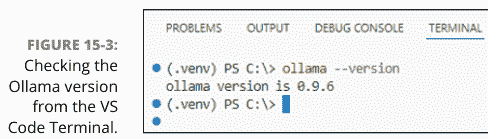

要在本地使用 AI 模型，首先必须下载它。在终端中，输入命令 `ollama pull`，后跟一个空格和你要下载的模型名称。例如，输入以下命令将下载流行的 `llama3.2` 模型：

```
bash
ollama pull llama3.2
```

确保在命令中正确拼写模型名称。浏览到 `ollama.com` 并点击 Models 链接以查看可用模型及其名称。我提到这一点是因为许多模型名称很奇怪，容易拼错。

模型往往很大；每个模型可能需要一分钟或更长时间下载。如果你想随时检查已经下载了哪些模型，可以输入命令 `ollama list`，如图 15-4 所示；你可以看到我下载的模型的大小。

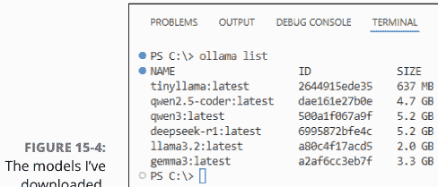

##### 构建一个简单的本地聊天机器人

聊天机器人是一种 AI 形式，你提交一个问题或提示，AI 返回一个答案。ChatGPT、Claude、Google Gemini、Grok、Meta AI 和 Microsoft Copilot 都是现代聊天机器人的例子。你可以使用下载的 Ollama 模型和几行 Python 代码创建自己的，尽管相对简单的聊天机器人。

请记住，如果你的电脑没有强大的 GPU——例如 NVIDIA 显卡或 Apple Silicon 芯片（如 M1 Ultra、M2 Ultra、M3 或 M4），或 AMD MI 系列芯片——本地运行 AI 模型可能会非常缓慢。对于这个示例，我建议下载一个较小的模型 tinyllama，即使没有高端硬件，它也能以不错的速度运行。这样，无论你使用什么硬件，你都可以获得一些编写 Python 代码与 AI 交互的实践经验。

要下载 tinyllama，请确保 Ollama 正在你的电脑上运行。然后在任何命令行中，输入以下内容：

```
ollama pull tinyllama
```

你应该能够通过输入命令 ollama list 来验证 tinyllama 是否已安装。

要设置你的 Python 项目，像往常一样创建你的文件夹和虚拟环境。激活你的虚拟环境，并在终端中输入以下命令以安装 ollama Python 模块：

```
pip install ollama
```

以下是简单聊天机器人的所有代码：

```
# simple_chatbot.py
# pip install ollama
import ollama

# Must be a model you have pulled with Ollama
model = "tinyllama"
print("\nSimple Ollama Chatbot (model: tinyllama)")
print("Type your prompt, or 'quit' to exit.\n")
while True:
    # Get prompt from user.
    prompt = input("You: ").strip()
    if prompt.lower() == "quit":
        print("Goodbye!")
        break
    try:
        # Get response from the Ollama model.
        response = ollama.chat(model=model, messages=[{"role": "user",
        "content": prompt}], stream=False)
        print("Bot:", response["message"]["content"])
    except Exception as e:
        print(f"Error: {e}")
```

接下来我将逐步讲解代码的关键部分。

`import ollama` 这一行是必需的，用于加载 `ollama` 模块，以简化从 Python 与 Ollama 模型的交互。`model = "tinyllama"` 这一行指定了你要使用的 Ollama 模型。这必须是你已经使用 `ollama pull` 下载过的模型。

`prompt = input("You: ").strip()` 这一行将单词 `You` 作为提示显示在屏幕上（你可以将其更改为任何你想要的文本）。然后脚本会等待用户输入提示并按 `Enter` 键。当用户这样做时，用户的文本将存储在名为 `prompt` 的变量中，任何前导和尾随空格都会被 `.strip()` 方法移除。

下一行将该提示发送给聊天机器人，等待响应，并将响应存储在名为 `response` 的变量中：

```
response = ollama.chat(model=model, messages=[{"role": "user", "content": prompt}], stream=False)
```

让我们解析一下这一行：

| 代码 | 描述 |
| :--- | :--- |
| `ollama.chat` | 使用 `ollama` 模块的 `chat` 方法向 AI 模型发送提示并接收返回的回复 |
| `model=model` | 告诉 `ollama` 使用之前存储在名为 `model` 的变量中的模型（在此示例中为 `tinyllama`） |
| `messages=` | 定义一个包含提示信息的字典 |
| `"role": "user"` | 表明提示来自人类用户，而不是另一个模型或系统 |
| `"content": prompt` | 定义发送的提示内容为当前存储在名为 `prompt` 的变量中的文本 |
| `stream=False` | 确保响应一次性返回，而不是分块返回，这使得将信息存储在名为 `response` 的变量中更容易 |

这是一个超级简单的聊天机器人，不记得对话内容，如果你已经使用在线对话 AI 一段时间，这可能会感觉很奇怪。但你可以为自己的 Python AI 应用添加一些对话能力，正如我在下一节中解释的那样。

##### 创建对话式聊天机器人

我们这个超级简单的聊天机器人有一个弱点：它不记得任何关于持续对话的内容。例如，如果我的第一个提示是“我叫艾伦。打个招呼”，它确实会向我问好。但如果我的第二个提示是“我叫什么名字？”，它就不知道了。

让我们来看一个能在单次会话中进行对话的本地聊天机器人。为了增加多样性，我将使用 `llama3.2` 模型，它比 `tinyllama` 更强大，但如果你的电脑没有 GPU 或神经处理单元来加速，它会非常慢。如果它慢到你无法使用，你可以改用 `tinyllama` 模型。我将首先展示完整的脚本：

```python
# converse_bot.py
# Install Ollama: Download and install Ollama from ollama.ai.
# pip install ollama.
import ollama
import sys

def initialize_model(model_name):
    # Initialize the Ollama model and check if it's available.
    try:
        # Strip any tag (for example, :latest) from the name for comparison.
        base_model_name = model_name.split(":")[0]

        # Get list of installed models.
        model_list = ollama.list()
        available_models = []

        if "models" in model_list:
            for model in model_list["models"]:
                name = model.get("model")
                if name:
                    # Strip any tag from installed model name for comparison.
                    installed_base_name = name.split(":")[0]
                    available_models.append(installed_base_name)

        if base_model_name not in available_models:
            print(f"Error: Model '{model_name}' not found. Available models: {available_models}")
            sys.exit(1)

        return model_name
    except Exception as e:
        print(f"Error connecting to Ollama: {e}")
        sys.exit(1)

def get_response(model_name, prompt, conversation_history):
    # Generate a response from the Ollama model with conversation context.
    try:
        # Prepare the messages with conversation history.
        messages = conversation_history + [{"role": "user", "content": prompt}]

        # Get the response from the model.
        response = ollama.chat(
            model=model_name,
            messages=messages,
            stream=False
        )

        # Extract and return the response content.
        return response["message"]["content"]
    except Exception as e:
        return f"Error generating response: {e}"

def main(model):
    # Main function to run the chatbot
    model_name = initialize_model(model)
    conversation_history = []

    print("Welcome to the Ollama Chatbot! Type 'exit' or 'quit' to stop.")
    print("Start chatting below:\n")

    # Initialize user prompt.
    user_prompt = ''
    while user_prompt.lower() not in ('quit', 'exit'):
        # Get user input.
        user_prompt = input("Type your prompt, or \"quit\": ").strip()

        # Check for exit commands.
        if user_prompt.lower() in ["exit", "quit"]:
            print("Goodbye!")
            break

        # Skip empty inputs.
        if not user_prompt:
            print("Please enter a message.")
            continue

        # Add user input to conversation history.
        conversation_history.append({"role": "user", "content": user_prompt})

        # Get response from the model.
        response = get_response(model_name, user_prompt, conversation_history)

        # Print the response.
        print(f"\n\nBot: {response}\n")

        # Add bot response to conversation history.
        conversation_history.append({"role": "assistant", "content": response})

if __name__ == "__main__":
    # Specify which Ollama model to use.
    model="llama3.2"
    main(model)
```

在这个脚本中，你可以通过更改 `model="llama3.2"` 这一行来使用任何你已经拉取的 Ollama 模型。如果大模型对你的电脑来说太慢，可以尝试将其改为 `model = "tinyllama"`，就像之前的脚本示例一样。

对话式 AI 脚本的核心部分与我在上一节展示的超级简单聊天机器人几乎完全相同。你使用这一行代码将提示（消息）发送给模型，并将其回复存储在一个名为 `response` 的变量中：

```python
response = ollama.chat(
    model=model_name,
    messages=messages,
    stream=False
)
```

这个脚本的主要技巧在于名为 `messages` 的变量，它不再只包含用户在提示中输入的内容。相反，`messages` 包含了自本次会话开始以来用户输入的每一个提示。所以，这并不是模型真正“记住”了对话；而是脚本在每次查询模型时，“提醒”模型之前输入的每一个提示。

在 `main()` 函数中，下面这行代码要求用户输入提示，并将用户输入的内容存储在名为 `user_prompt` 的变量中：

```python
user_prompt = input("Type your prompt, or \"quit\": ").strip()
```

用户输入提示后，下一行代码将键 "role"、值 "user"、键 "content" 以及用户输入的任何提示添加到一个名为 `conversation_history` 的列表中：

```python
conversation_history.append({"role": "user", "content": user_prompt})
```

每次聊天机器人响应时，该响应也会被添加到对话历史中。然而，聊天机器人的角色是 "assistant"，而不是 "user"，因此聊天机器人可以根据角色键区分用户提示和它自己的回复。经过简短的对话后，该字典列表可能如下所示：

```python
[
    {"role": "user", "content": "My name is Alan. Say hello."},
    {"role": "assistant", "content": "Hi, Alan!"},
    {"role": "user", "content": "I live in the USA. Where do you live?"},
    {"role": "assistant", "content": "We both live in the USA!"},
    {"role": "user", "content": "What is my name and where do I live?"},
    {"role": "assistant", "content": "Your name is Alan. You live in the USA."}
]
```

当然，用户永远不会看到那个对话历史。从用户的角度来看，聊天机器人是自己记住了用户之前说过的话。但幕后真正发生的是，脚本在每次查询模型时都会重新提交每一个提示和每一个响应，模型利用这些信息来营造出“记住”持续对话的假象。

这个较大的脚本示例比超级简单的脚本示例进行了更多的异常处理。代码中的注释应该使其相对容易理解发生了什么，但我希望你从这个脚本中获得的主要收获是：让大语言模型进行“对话”（而不是一次只回答一个提示）的技巧在于，每次发布提示时，都将整个对话重新提交给聊天机器人。

当然，当你退出脚本后，对话历史就不存在了。那次对话的记忆不会延续到你下次运行脚本时。

#### 开发 AI 图像生成器

创建图像是另一个流行的 AI 消遣方式，也是为网站或其他项目获取免费且无版权图像的快速简便方法。在本节中，我将向你展示如何创建自己的 Python 脚本，该脚本可以免费创建图像。

在我撰写本文时，Pollinations.AI (https://pollinations.ai) 提供免费的在线 AI 图像生成服务，无需 API 密钥，甚至无需注册。你可以在他们的网站上了解更多关于他们的产品以及任何当前的限制。但要开始尝试，你可以直接从这里开始。

第一个脚本允许你输入描述你想要创建的图像的提示，然后询问你想要多少张图像。脚本生成请求数量的图像并将其保存到一个文件夹中。以下是完整的脚本：

```python
# simple_images.py
# pip install requests
import requests
import os
import uuid
import time
from datetime import datetime

# Generate one image using pollinations.ai.
def generate_image(prompt, save_path, retries=3):
    # Adding a uuid ensures that the prompt and the generated image are unique.
    unique_prompt = f"{prompt}-{str(uuid.uuid4())}"
    url = f"https://image.pollinations.ai/prompt/{unique_prompt}"
    for attempt in range(retries):
        try:
            response = requests.get(url, stream=True)
            if response.status_code == 200:
                # Use current datetime for filename
                timestamp = datetime.now().strftime("%Y%m%d_%H%M%S_%f")
                image_path = os.path.join(save_path, f"{timestamp}.png")
                with open(image_path, "wb") as f:
                    for chunk in response.iter_content(chunk_size=8192):
                        f.write(chunk)
                return image_path
            else:
                print(f"Error: Status code {response.status_code}")
                time.sleep(5)
        except requests.RequestException as e:
            print(f"Request failed: {e}. Retrying {attempt + 1}/{retries}...")
            time.sleep(5)
    return None
```

python
def generate_all_images(prompt, save_path, num_images):
    print(f"\n\n正在生成 {num_images} 张图片...请稍候。")
    # 如果保存路径不存在，则创建它。
    os.makedirs(save_path, exist_ok=True)
    # 生成每张图片。
    for i in range(num_images):
        image_path = generate_image(prompt, save_path)
        if image_path:
            print(f"已生成第 {i+1} 张图片（共 {num_images} 张），保存在 {image_path}")
        else:
            print(f"生成第 {i+1} 张图片失败")

if __name__ == "__main__":
    # 设置用于生成图片的保存路径和提示词。
    save_path = "generated_images"

    # 运行时输入提示词。
    prompt = input("请输入您的图片提示词：").strip()
    while not prompt:
        prompt = input("提示词不能为空：").strip()
    while True:
        try:
            num_images = int(input("需要生成多少张图片？").strip())
            if num_images > 0:
                break
            else:
                print("请输入一个正整数。")
        except ValueError:
            print("请输入一个有效的整数。")

    # 生成图片并显示完成提示。
    generate_all_images(prompt, save_path, num_images)
    print(f"已将 {num_images} 张图片添加到 {save_path}。")

这个简单的图片生成器使用 `request` 模块访问网络，因此在运行此脚本之前，请确保已将 `requests` 安装到您的虚拟环境中。

运行脚本时，您首先会看到以下内容：

```
Enter your image prompt:
```

描述您想要创建的图片。例如：

```
A rainbow-colored butterfly hovering near a giant red hibiscus flower. In the background a futuristic neon cyberpunk dystopian urban landscape.
```

按回车键后，您会看到以下提示：

```
How many images?
```

与任何免费 AI 一样，Pollinations.AI 有一些限制。在我撰写本文时，其网站上并未明确说明这些限制，但我建议您将每个提示词的图片数量限制在四张左右，以免过度使用系统。

输入数字后按回车键并稍等片刻。每次生成新图片时，您应该会看到一条消息，然后是一条最终消息，指示图片生成何时完成。图片将存储在与代码相同文件夹中名为 `generated_images` 的子文件夹中。每张图片的文件名将基于其创建的日期和时间唯一生成，如图 15-5 所示。


图 15-5：由 simple_images.py 创建的 AI 生成图片。

让我们看看与连接 AI、生成图片以及将它们保存到本地文件夹相关的关键代码组件。在代码底部附近，这一行指定了图片的保存位置（您可以随意将 "generated_images" 替换为您自己选择的文件夹名称或路径）：

```
save_path = "generated_images"
```

`generate_image()` 函数完成了生成一张图片并保存它的大部分工作。在该函数顶部附近有这两行神秘的代码：

```
unique_prompt = f"{prompt}-{str(uuid.uuid4())}"
url = f"https://image.pollinations.ai/prompt/{unique_prompt}"
```

事实证明，如果您多次向 Pollinations.AI 提交完全相同的提示词，您很可能会得到四张完全相同的图片。`uuid4()` 方法返回一个唯一的随机字符字符串，并将其附加到图片提示词后面。这确保了每次提交都有一个唯一的提示词，有助于为生成的图片增加一些多样性。

第二行是代码将发送提示词并等待其返回图片的 URL。

与本书中的大多数脚本一样，这个脚本也有大量的异常处理来优雅地处理错误。一开始，您可能会注意到生成一张图片的循环以以下行开始：

```
for attempt in range(retries):
```

那个 `retries` 值在函数调用中定义为 `retries=3`。对于任何一个提示词，它将尝试三次以获取一张图片。为了获取一张图片，脚本使用了简单的这一行：

```
response = requests.get(url, stream=True)
```

`url`（如前所述）是根据提示词生成一张图片的 URL。`stream=True` 允许以分块方式下载大型图片文件，这有助于确保在 `response` 变量获得其值之前，整个文件已完全下载。

接下来的几行仅在服务器发送图片且响应代码为 200 时执行。200 这个数字表示事务成功。此时，脚本根据当前日期时间生成一个文件名，扩展名为 `.png`，并将图片文件保存到该文件名。

```
if response.status_code == 200:
    # 使用当前日期时间作为文件名
    timestamp = datetime.now().strftime("%Y%m%d_%H%M%S_%f")
    image_path = os.path.join(save_path, f"{timestamp}.png")
    with open(image_path, "wb") as f:
        for chunk in response.iter_content(chunk_size=8192):
            f.write(chunk)
```

`response.iter_content(chunk_size=8192)` 以 8KB 为块读取响应体，这对于大文件来说是内存高效的。每个块都以二进制模式（`"wb"`）写入文件（`output_image.png`）。


处理图片时，指定二进制作为写入模式（wb）非常重要，因为您处理的不是文本数据。数据以原始字节形式存储，这对于保持图片的完整性至关重要。

该脚本本身运行良好。但您可能在想，对于一个处理图片的应用程序来说，纯文本界面有点奇怪。如果能呈现一个更图形化的界面，让用户能在屏幕上看到图片，那就更好了。在下一节中，我将向您展示如何以更图形化的方式在屏幕上显示图片。

#### 在屏幕上显示生成的图片

Python 在命令行中的纯文本界面对于自动化来说是没问题的。但既然我们正在涉足 AI 和图片领域，可能更倾向于采用更图形化的方法。

对于下一个脚本，您将使用 `gradio` 创建一个网页，该网页提供一个用于输入提示词的文本框、一个按钮，以及一个在完成后显示生成图片的位置，如图 15-6 所示。

`gradio` 是一个 Python 库，允许您编写 Python 代码来创建交互式 Web 界面，这些界面在浏览器中显示为标准网页。`gradio` 还提供了与在线 AI 交互的工具，因此它非常适合我们这里的需求。

要在脚本中使用 `gradio`，您只需像往常一样设置项目文件夹和虚拟环境。激活您的虚拟环境。然后使用 `pip install` 安装 `gradio`。您还将使用 `requests` 模块通过互联网访问 AI，并使用 `Pillow` 来帮助处理下载的图片。因此，在开始之前，请在终端中输入以下命令：

```
pip install requests gradio Pillow
```


图 15-6：在图形用户界面中显示的 AI 生成图片。

接下来，我将向您展示脚本的所有代码。在代码之后，我将解释使其工作的关键组件。您可能会惊喜地发现，实现这一功能所需的代码量如此之少。

```
# gradio_image.py
# pip install requests gradio Pillow
import requests
import gradio as gr
from PIL import Image
import time
import io

# 使用 Pollinations.AI 根据提示词生成一张图片。
def generate_image(prompt, status_box, retries=3):
    url = f"https://image.pollinations.ai/prompt/{prompt}"
    for attempt in range(retries):
        try:
            status_box = gr.update(value=f"尝试 {attempt+1}：正在请求图片...")
            yield None, status_box
            response = requests.get(url, stream=True)
            if response.status_code == 200:
                status_box = gr.update(value="图片已生成。")
                yield Image.open(io.BytesIO(response.content)), status_box
                return
            else:
                status_box = gr.update(value=f"错误：状态码 {response.status_code}")
                yield None, status_box
                time.sleep(2)
        except requests.RequestException as e:
            status_box = gr.update(value=f"请求失败：{e}。正在重试...")
            yield None, status_box
            time.sleep(2)
    status_box = gr.update(value=f"在 {retries} 次尝试后未能生成图片。")
    yield None, status_box

# 调用函数生成图片，然后在页面上显示结果。
def gradio_generate(prompt):
    if not prompt.strip():
        yield None, gr.update(value="提示词不能为空。")
        return
    yield None, gr.update(value="开始生成...")
    for image, status in generate_image(prompt, status_box=None):
        yield image, status

# 创建包含文本框、按钮和图片输出的界面。
with gr.Blocks() as demo:
    gr.Markdown("# Python AI 图片生成器")
    prompt = gr.Textbox(label="请输入您的图片提示词")
    generate_btn = gr.Button("生成")
    output_image = gr.Image(label="生成的图片")
    status = gr.Textbox(label="状态 / 错误消息", interactive=False)

    generate_btn.click(
        gradio_generate,
        inputs=prompt,
        outputs=[output_image, status]
    )

if __name__ == "__main__":
    demo.launch()
```

运行脚本后，终端会显示以下内容：

```
* Running on local URL:  http://127.0.0.1:7860
```

要查看网页，你需要浏览第一行显示的URL。在Windows或Linux上，你可以直接按住Ctrl键并点击带下划线的链接。在macOS上，则按住⌘键并点击链接。你的默认网页浏览器应该会打开，显示一个类似图15-7的页面。


网页打开后，输入你的图像提示词，点击“生成”，然后等待几秒钟。当你看到图像时，可以通过点击图像控件右上角附近的下载图标来下载一份副本。

> Gradio的官方文档可以在Gradio网站 www.gradio.app/docs 上找到。

网页上的所有控件都是使用这段代码块创建的。请注意，在脚本顶部的导入部分，我使用了 `import gradio as gr` 这一行来导入gradio，因此 `gr` 是我在代码其余部分中用来引用gradio的缩写名称。

```
# 使用文本框、按钮和图像输出创建界面。
with gr.Blocks() as demo:
    gr.Markdown("# Python AI Image Generator")
    prompt = gr.Textbox(label="Enter your image prompt")
    generate_btn = gr.Button("Generate")
    output_image = gr.Image(label="Generated Image")
    status = gr.Textbox(label="Status / Error Messages", interactive=False)
```

第一行创建了一个 `gr.Blocks` 对象，它基本上是网页上控件的集合。在这个例子中，这个块被命名为 `demo`。`gr.Markdown()` 显示页面标题。`gr.Textbox()` 显示文本框和标签“Enter your image prompt”。`gr.Button()` 创建按钮。`gr.Image()` 创建图像控件，用于显示生成的图像（当可用时）。

最后一个名为 `status` 的文本框显示进度指示器和错误消息。它不是交互式的，因为它不是设计为用户输入文本的框，而是脚本显示信息的一种方式。

然后是以下代码块：

```
generate_btn.click(
    gradio_generate,
    inputs=prompt,
    outputs=[output_image, status]
)
```

这段代码块告诉Python当用户点击 `generate_btn` 按钮时该做什么。点击时，按钮会调用一个名为 `gradio_generate()` 的函数（我稍后会展示给你）。它将用户输入到提示文本框中的任何提示传递给该函数。最后一行 `outputs=[output_image, status]` 表示该函数将生成两个输出：一个名为 `output_image`（将是生成的图像），另一个名为 `status`（表示状态或错误消息的文本消息）。

代码的最后一行 `demo.launch()` 负责组装浏览器显示的网页，然后显示访问该页面的说明，URL为 `http://127.0.0.1:7860`。


在网页浏览器中，你可以右键点击生成的网页上的空白处，然后选择“查看页面源代码”（或你浏览器中的等效选项），以查看Python从你的 `gradio` 代码生成的超文本标记语言（HTML）、层叠样式表（CSS）和JavaScript。

那么，其余部分是如何工作的呢？回想一下，点击“生成”按钮会调用一个名为 `gradio_generate()` 的函数，并将用户的提示作为输入传递进去。该函数反过来进行一些快速的异常处理，以确保提示不为空。

```
# 调用函数生成图像，然后在页面上显示结果。
def gradio_generate(prompt):
    if not prompt.strip():
        yield None, gr.update(value="Prompt cannot be empty.")
        return
    yield None, gr.update(value="Starting generation...")
    for image, status in generate_image(prompt, status_box=None):
        yield image, status
```

注意该函数中关键字 `yield` 的使用。`yield` 是一个gradio关键字，它创建一个可以返回多个值的生成器函数。换句话说，它支持*流式输出*（函数可以随时间返回不同的值），这正是你想在函数运行时显示进度指示器所需要的。

在这个例子中，`yield` 关键字每次被调用时返回两个值。第一个值被放入图像占位符中，生成的图像在完成后会出现在那里。第二个值显示在状态框中，用于让用户了解状态或任何错误消息。

在 `gradio_generate()` 函数中，第一个 `yield` 行如下：

```
yield None, gr.update(value="Prompt cannot be empty.")
```

如果用户没有提供提示，它会在图像框中显示无内容（`None`），并在状态文本框中显示错误消息（“Prompt cannot be empty.”）。否则，执行以下行：

```
yield None, gr.update(value="Starting generation...")
```

这一行仍然让图像框保持为空。但状态文本框会显示文本，告诉用户图像生成已经开始。

下一行设置了一个 `for` 循环，以重复调用名为 `generate_image()` 的函数。`prompt` 参数是用户创建图像的提示。`status_box` 参数接收 `None` 作为输入，因为此时没有状态需要报告。

```
for image, status in generate_image(prompt, status_box=None):
```

在该循环内，`yield image, status` 仅在 `generate_image()` 函数运行时更新图像框和状态框。

`generate_image()` 函数执行实际的图像生成。该函数中有大量的异常处理来管理不可预见的问题。事实上，对于任何一张图像，`retries=3` 参数将给AI三次机会来完全生成图像，然后才会放弃。`generate_image()` 函数中最重要的代码行如下：

```
if response.status_code == 200:
    status_box = gr.update(value="Image generated.")
    yield Image.open(io.BytesIO(response.content)), status_box
    return
```

响应代码200表示没有发生错误，并且返回了一张图像。当这种情况发生时，`status_box` 文本被设置为“Image generated.”，并通过 `Image.open(io.BytesIO(response.content))` 在图像框中显示生成的图像，其中 `response.content` 是AI图像生成器返回给调用代码的内容。

>  作为用户，图像出现在浏览器中后，你可以将鼠标指针悬停在图像上，然后点击“下载”来保存一份副本。

请注意，关闭浏览器窗口并不会结束Python脚本。要返回到正常的命令行，请点击VS Code的终端窗口内部，然后按Ctrl+C或在macOS上按⌘+C，以中断当前会话并结束脚本。

#### 访问 Hugging Face

Hugging Face (https://huggingface.co) 是一个流行的网站，用于共享你可以自由使用的AI模型和应用程序。他们提供了一个推理API，你可以通过Python访问它，使用各种模型生成AI文本和图像。

不幸的是，你不能完全免费地使用Hugging Face来生成图像。他们确实提供了一个免费层级，你可以使用本章所示的脚本生成一些图像，所以至少你可以免费学习一些东西并尝试你的代码。但如果你想继续使用Hugging Face AI，你需要设置一个付费账户。有关切换到付费账户的更多信息，请参阅Hugging Face网站，如果你用完了免费额度并想进一步探索这类编码。

要使用Hugging Face，即使是免费使用，你也需要先设置一个免费账户。然后你需要一个API令牌，它基本上与API密钥相同。你可以在设置账户后，在 https://huggingface.co/settings/tokens 获取一个。

第9章详细讨论了API和API密钥。

我稍后会向你展示一个完整的脚本，用于从Hugging Face生成图像。但要开始使用这个脚本，请像往常一样设置一个文件夹和虚拟环境。激活你的虚拟环境，并输入以下命令安装所有必需的依赖项：

```
pip install gradio requests Pillow python-dotenv
```

为了遵循安全最佳实践（和良好习惯），我建议你创建一个 .env 文件并在其中存储你的API密钥。图15-8显示了一个示例。

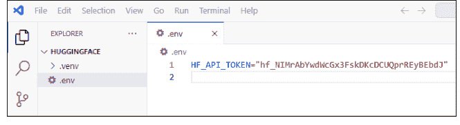

图15-8中的API密钥是假的，仅用作示例。请确保将你自己的API密钥放入你自己的 .env 文件中。

以下是使用Hugging Face模型生成图像的脚本的全部代码。与之前的代码示例一样，我使用gradio提供一个漂亮的图形界面，可以显示生成的图像。

```
# hugging_face.py
# pip install gradio requests Pillow python-dotenv
import gradio as gr
import requests
from PIL import Image
import io
import os
from dotenv import load_dotenv

# 从 https://huggingface.co/settings/tokens 获取API令牌。
```

# 从 .env 文件加载环境变量
load_dotenv()
HF_API_TOKEN = os.getenv("HF_API_TOKEN")

# 使用 Stable Diffusion XL，Hugging Face 上一个可靠的免费模型
MODEL_URL = "https://api-inference.huggingface.co/models/stabilityai/stable-diffusion-xl-base-1.0"

def generate_image(prompt):
    # 使用 Hugging Face API 从文本提示生成图像。
    if not HF_API_TOKEN:
        return None, "错误：请设置您的 HF_API_TOKEN 环境变量"

    if not prompt or prompt.strip() == "":
        return None, "错误：请输入提示词"

    headers = {
        "Authorization": f"Bearer {HF_API_TOKEN}"
    }

    # 对于推理 API，我们以简单的 JSON 格式发送提示词。
    payload = {
        "inputs": prompt
    }

    try:
        # 向 Hugging Face API 发送请求。
        response = requests.post(MODEL_URL, headers=headers, json=payload, timeout=120)

        if response.status_code == 200:
            # 将响应转换为 PIL 图像。
            image = Image.open(io.BytesIO(response.content))
            return image, f"图像生成成功：'{prompt}'"
        elif response.status_code == 503:
            return None, "模型不可用，请稍后重试"
        elif response.status_code == 401:
            return None, "认证错误，请检查您的 API 令牌"
        elif response.status_code == 400:
            return None, f"请求错误：{response.json() if response.content else '无效的提示词'}"
        else:
            error_msg = response.json() if response.content else response.text
            return None, f"错误 {response.status_code}: {error_msg}"
    except requests.exceptions.Timeout:
        return None, "请求超时。请重试。"
    except Exception as e:
        return None, f"错误：{str(e)}"

def create_interface():
    # 创建并配置 Gradio 界面
    with gr.Blocks(title="AI 图像生成器", theme=gr.themes.Soft()) as interface:
        gr.Markdown("# AI 图像生成器")
        gr.Markdown("使用 Hugging Face 从文本提示生成图像")

        with gr.Row():
            with gr.Column(scale=2):
                prompt_input = gr.Textbox(
                    label="图像提示词",
                    placeholder="输入您的图像描述（例如，'山上的日落'）",
                    lines=3,
                    max_lines=5
                )

                generate_btn = gr.Button(
                    "生成图像",
                    variant="primary",
                    size="lg"
                )

                status_output = gr.Textbox(
                    label="状态",
                    interactive=False,
                    show_label=True
                )

            with gr.Column(scale=2):
                image_output = gr.Image(
                    label="生成的图像",
                    type="pil",
                    interactive=False
                )

        # 设置按钮事件处理器。
        generate_btn.click(
            fn=generate_image,
            inputs=[prompt_input],
            outputs=[image_output, status_output],
            show_progress=True
        )

        # 允许按回车键代替点击按钮。
        prompt_input.submit(
            fn=generate_image,
            inputs=[prompt_input],
            outputs=[image_output, status_output],
            show_progress=True
        )

    return interface

if __name__ == "__main__":
    # 创建并启动界面。
    interface = create_interface()

    # 默认禁用公共共享启动。
    # 如果您想要一个公共链接，请设置 share=True。
    interface.launch(
        server_name="127.0.0.1",
        server_port=7860,
        share=False,
        show_error=True,
        quiet=False
    )

生成用户界面的 gradio 代码位于脚本的下半部分，从 `create_interface()` 函数开始。该函数包含创建图 15-9 所示 Web 界面所需的代码，该界面包括一个用于输入图像提示词的文本框、一个用于提交提示词的按钮、一个用于显示进度指示器或错误消息的“状态”文本框，以及一个用于显示生成图像的图像控件。

缩进在 `if __name__ == "__main__"` 下的代码是启动脚本并在终端中最初显示以下提示的代码。

```
* Running on local URL:  http://127.0.0.1:7860
```

当您看到该提示时，只需在 Windows 或 Linux 中按 Ctrl+单击链接，或在 macOS 中按 ⌘+单击链接。界面将在您的默认 Web 浏览器中打开。输入您的提示词，单击“生成图像”，然后等待图像出现。


图 15-9：用于生成 AI 图像的 gradio 用户界面。

实际的图像生成发生在脚本的更上方。这几行代码从 .env 文件获取 API 令牌，并设置用于访问 Hugging Face 图像生成器的 URL。我使用了一个较旧的 Stable Diffusion 模型，因为它很可靠，并且很可能在您第一次尝试时就能成功。但您可以更改 URL 以使用 Hugging Face 提供的任何图像生成模型。

```
# 从 .env 文件加载环境变量。
load_dotenv()
HF_API_TOKEN = os.getenv("HF_API_TOKEN")

# 使用 Stable Diffusion XL，Hugging Face 上一个可靠的免费模型
MODEL_URL = "https://api-inference.huggingface.co/models/stabilityai/stable-diffusion-xl-base-1.0"
```

以 `def generate_image(prompt)` 开头的函数根据用户的提示词生成图像。其中包含相当多的异常处理，以处理所有可能出错的情况（但希望不会出错）。接下来的几行设置了需要发送到 Hugging Face 的 `headers` 和 `payload`。`headers` 提供您的授权（API 令牌），而 `payload` 是图像提示词：

```
headers = {
    "Authorization": f"Bearer {HF_API_TOKEN}"
}

# 对于推理 API，我们以简单的 JSON 格式发送提示词。
payload = {
    "inputs": prompt
}
```

下一行将请求发送到 Hugging Face，并将响应存储在名为 response 的变量中：

```
response = requests.post(MODEL_URL, headers=headers, json=payload, timeout=120)
```

`response` 包含一个 `response.status_code`，如果一切顺利，它将是 200。否则，该 `response.status_code` 将是其他数字，您也可以看到针对这些其他数字的大量异常处理。假设一切顺利，此行将生成的图像放入名为 `image` 的变量中：

```
image = Image.open(io.BytesIO(response.content))
```


`io.BytesIO(response.content)` 将响应内容中的原始图像字节包装成一个更像您打开图像文件时获得的对象。这允许将字节视为从文件中读取的，这是必要的，因为 `Image.open` 期望一个类文件对象或文件路径来放入该 `image` 变量。

假设图像生成一切顺利，并且您在 image 变量中有一个有效的图像，则函数中的以下行将图像和一些状态文本返回给调用代码：

```
return image, f"图像生成成功：'{prompt}'"
```

该函数由下方代码部分中的 `gradio` 调用，该部分告诉 Python 如何处理这两个返回值。

为了不混淆，您实际上从两个不同的 `gradio` 块中调用 `generate_image()`，每个块都包含代码告诉 Python 如何处理返回的图像和状态文本：

```
# 设置按钮事件处理器
generate_btn.click(
    fn=generate_image,
    inputs=[prompt_input],
    outputs=[image_output, status_output],
    show_progress=True
)

# 允许按回车键代替点击按钮
prompt_input.submit(
    fn=generate_image,
    inputs=[prompt_input],
    outputs=[image_output, status_output],
    show_progress=True
)
```

我使用了两个 `gradio` 代码块，第一个块响应单击“生成图像”按钮，第二个块响应用户在“图像提示词”文本框中按回车键（因为我不知道用户在输入提示词后更可能做这两件事中的哪一件）。每个块中的 `outputs=[image_output, status_output]` 将返回的图像定向到名为 `image_output` 的图像控件，并将返回的文本定向到 `status_output` 文本框。

正如我在前面的示例中提到的，关闭浏览器并不会结束 Python 脚本。在 VS Code 中单击终端窗口内部，然后按 Ctrl+C 或 macOS 上的 ⌘+C 以结束脚本和当前会话，然后再修改并重新运行脚本。

### 5 十大精选

#### 本部分概览...

领略十大 Python 之禅格言。

掌握十大错误信息的应对之道。

+   本章内容

* 编写优美的代码
* 保持代码整洁与简洁
* 优雅地处理错误，避免脚本崩溃

## 第16章
十大 Python 之禅准则

Python 之禅是一种编程哲学，强调清晰、简洁和实用——编写易于你（或许还有其他开发者）理解、修改和维护的代码。遵循 Python 风格，意味着编写的代码符合 Python 之禅的原则。

Python 之禅包含19条格言或原则。在 Python 命令提示符下输入 `import this` 命令，即可列出这19条格言，但这样无法获得详细解释或示例。本章将介绍十大 Python 之禅原则，并辅以解释和示例，助你深入理解。

#### 优美胜于丑陋

此原则强调代码应具有美感、可读性和优雅性，优先考虑清晰简洁，而非复杂或混乱的解决方案。在 Python 语境中，“优美”的代码直观、易维护，符合语言惯用风格；而“丑陋”的代码则过于复杂、难以阅读或不必要地晦涩。

那么，哪些因素能让代码变得优美？试着从能否一眼读懂其意图的角度思考。可以从以下方面考虑：

+   >> **可读性：** 优美的代码一目了然，即使对项目不熟悉的人也能轻松理解。
>> **简洁性：** 优美的代码避免不必要的复杂性，倾向于直接明了的解决方案。
>> **表达力：** 优美的代码利用 Python 的特性，清晰而简洁地传达意图。
>> **可维护性：** 优美的代码更易于调试、扩展和协作。

相比之下，丑陋的代码为了快速修复、巧妙技巧或过度工程化的解决方案而牺牲了这些品质，从而掩盖了真实意图。

有时，优美仅仅意味着使用更少的代码。例如，下面的代码使用 `if` 语句判断列表长度是否大于零：

```
my_list=[1,2,3,4,5]
if len(my_list)>0:
    print("list is not empty")
```

从技术上讲，这段代码没有问题，运行结果也符合预期。然而，在 Python 中，当在 `if` 语句中直接引用列表名时，空列表会自动返回 `False`，而非空列表名则总是返回 `True`。因此，你可以利用这一特性，让代码变得更优美，像这样：

```
my_list=[1,2,3,4,5]
if my_list:
    print("list is not empty")
```

第二行的微小改动看似无关紧要。但当你在专业层面工作，处理成千上万行代码时，这样的小改动会积少成多。

再看一个例子：

```
# 笨拙且重复
my_dict = {"a": 1, "b": 2}
if "c" in my_dict:
    value = my_dict["c"]
else:
    value = 0
print(value)
```

同样，这段代码按原样运行正常。它创建了一个名为 my_dict 的字典，并填充了两个键 "a" 和 "b"，为每个键赋值。然后，if 语句检查字典是否包含名为 "c" 的键，如果该键不存在，则将 c 赋值为 0。


如果你想知道是否有更优美的方式来编写已有的代码，可以考虑将代码复制粘贴到人工智能（AI）中，并询问是否有更优美或更 Pythonic 的方式来编写该代码。

处理此示例更优雅的方式是使用 Python 的 .get() 方法，它允许你为任何缺失的键动态分配一个默认值。例如，以下示例实现了与前面代码完全相同的功能，但行数更少，因此更优美：

```
# 使用 get() 实现简洁明了
my_dict = {"a": 1, "b": 2}
value = my_dict.get("c", 0)
print(value)
```

这个版本之所以优美，是因为它更简单、更整洁、更易于阅读。

让我们看一个例子，我创建了一个名为 check_number 的函数，如果传入正数则返回 True；否则返回 False：

```
def check_number(n):
    if n > 0:
        return True
    else:
        if n <= 0:
            return False
```

这段代码按原样运行正常，没有错误。但这里有一个更优美的函数版本，同样在传入正数时返回 True，其他数字则返回 False：

```
def is_positive(number):
    return number > 0
```

后者更优美，因为其函数名 `is_positive` 比 `check_number` 更能描述函数的功能和返回值。参数名 `number` 比仅使用 `n` 作为变量名更具描述性。执行测试和返回值由单行 `return number > 0` 处理，替代了复杂的 `if...else` 语句。

再看一个例子，我们使用一些代码创建一个数字列表。额外的代码创建第二个列表，仅包含原始列表中的偶数：

```
my_list = [1, 2, 3, 4, 5]
new_list = []
for i in range(len(my_list)):
    if my_list[i] % 2 == 0:
        new_list.append(my_list[i])
print(new_list)
```

这段代码运行正常，但冗长且难以阅读，看起来也不太美观。以下代码用更少的行数和没有缩进的方式实现了相同的功能：

```
numbers = [1, 2, 3, 4, 5]
even_numbers = [num for num in numbers if num % 2 == 0]
print(even_numbers)
```

后者不仅更简洁、更易读，而且使用像 `numbers` 和 `even_numbers` 这样的名称有助于提高代码的可读性和易理解性——因此，也更优美！

#### 明确胜于含糊

此原则意在说明代码应清晰表达其意图，避免隐藏或假设的行为。含糊的代码依赖于默认值、副作用或不明确的假设，这可能会掩盖含义并导致错误。相比之下，明确的代码使操作、类型和意图显而易见，从而提高可读性和可维护性。

为了阐明明确与含糊的区别，请考虑以下几点：

> >> **明确的代码** 清晰地说明代码的功能，使用精确的名称、类型或操作。

> >> **含糊的代码** 依赖于默认值、魔法行为或并非所有开发者都能立即理解的上下文。

明确性鼓励编写自文档化且可预测的代码，减少开发者猜测或深入查阅文档以理解代码的需要。

让我们通过一个例子来使代码更明确。我们从这段“丑陋”的代码开始（参考前一节）：

```
def tot(x,y):
    st =x * y
    return x + st
```

这段代码可以运行——它返回 x 的原始值加上 `st`，其中 `st` 是 x 值乘以 y 的结果。但这到底有什么用呢？以下是重写的代码，在功能描述上更明确：

```
def total_with_tax(total_sale,sales_tax_rate):
    return round((1 + sales_tax_rate) * total_sale, 2)
```

这个版本更容易理解。函数名 `total_with_tax` 暗示了函数的返回值。名称 `total_sale` 和 `sales_tax_rate` 比 x 和 y 明确得多，并且它们为你提供了应传入函数的参数线索。

故意使用缩写和单字母变量名以保持代码紧凑，这与明确性背道而驰。遵循 PEP 8 指南 (https://peps.python.org/pep-0008)，使用全小写、有意义的变量名，并用下划线代替空格，以保持代码含义的明确性。

为了将销售税金额加到总销售额中，该函数将销售税率（例如 0.07）加到 1，然后将该值乘以总销售额，这是一种简单准确地将销售税添加到 `total_sale` 的方法。仅仅通过使用更好的名称，代码就更具描述性。但我们可以做得更多，使代码更加明确。

##### 使用类型提示

Python 不要求你为创建的每个值声明类型。相反，它使用*动态类型*，你只需输入一个值（例如，10、123.45 或 "Hello"），Python 会自动确定其数据类型。虽然此功能很方便，但它可能使代码更难阅读，因为类型没有明确显示。

Python *类型提示*允许你为传入函数和从函数返回的值指定数据类型。这样，任何使用你的代码的人都能确切知道应该向函数传递什么样的值，以及从函数中期望得到什么样的值。要在函数的参数列表中使用类型提示，请在参数名后跟一个冒号和数据类型，使用以下缩写之一（`int`、`float`、`bool`、`str`、`list`、`dict`、`object`、`None` 等）。

如果你需要回顾数据类型，请参阅第 3 章。

以下是添加了类型提示的 `total_with_tax()` 函数：

```python
def total_with_tax(total_sale: float, sales_tax_rate: float) -> float:
    return (1 + sales_tax_rate) * total_sale
```

类型提示表明 `total_sale` 和 `sales_tax_rate` 都应该是 `float` 类型，并且函数也返回一个 `float`。

#### 使用注释

Python 代码注释非常适合使代码更加明确。参考前面的例子，可能不清楚如何传入销售税率。返回类型的注释可能很有用。你可以将注释放在代码上方，或者像这里展示的那样，将注释直接放在函数内部：

```python
def total_with_tax(total_sale: float, sales_tax_rate: float) -> float:
    # total_sale (float): 应税销售额（正数）
    # sales_tax_rate (float): 税率，以小数表示（例如，0.07 代表 7%）
    # 返回四舍五入到分（两位小数）的浮点数
    return round((1 + sales_tax_rate) * total_sale, 2)
```

这些注释提供了关于你将传入函数的值以及期望返回什么的信息。

#### 处理错误

在代码中构建异常处理有助于使代码更加明确，因为这样就不会对哪些数据不可接受产生任何疑问。本书中的所有示例自动化脚本都使用异常处理来优雅地处理错误。对于这个简单的销售税计算示例，我们可以添加一些异常处理来拒绝负的销售金额或无效的百分比，如下所示：

```python
def total_with_tax(total_sale: float, sales_tax_rate: float) -> float:
    # total_sale (float): 应税销售额（正数）
    # sales_tax_rate (float): 税率，以小数表示（例如，0.07 代表 7%）
    # 返回四舍五入到分（两位小数）的浮点数
    # 异常处理
    if total_sale < 0:
        raise ValueError("Total sale cannot be negative")
    if not 0 <= sales_tax_rate <= 1:
        raise ValueError("Sales tax rate must be between 0 and 1")
    return round((1 + sales_tax_rate) * total_sale, 2)
```

你可以为代码添加更多注释来解释异常处理，尽管代码中的错误消息（"Total sale cannot be negative" 和 "Sales tax rate must be between 0 and 1"）是**不言自明的**。

有关异常处理的更多信息，请参阅第 3 章。第 17 章也提供了关于常见异常及其处理方法的信息。

按照现在的方式编写函数，任何 Python 程序员都可以调用该函数，并使用 `try...except` 块来处理任何错误，如下所示：

```python
if __name__ == "__main__":
    total_sale = 10.00
    sales_tax_rate = 0.07
    try:
        result = total_with_tax(total_sale, sales_tax_rate)
        print(f"Total with tax: ${result}")
    except ValueError as e:
        print(f"Error: {e}")
```

在编码中做到具体（且明确）可以使其他人（也许还有未来的你）更容易真正理解代码的意图以及如何最好地使用它。

#### 简单优于复杂

这一原则强调清晰、直接的解决方案优于过于复杂的方案。对于初学者来说，这意味着要编写易于阅读、理解和维护的代码。简单的代码可以减少错误，使协作更容易，并帮助你专注于解决问题，而不是与代码本身作斗争。总结如下：

-   **选择清晰的逻辑。** 当直接的方法可行时，避免使用复杂的方法。
-   **使用可读的代码。** 编写其他人（或未来的你）能够快速理解的代码。
-   **避免过度工程化。** 不要添加不必要的功能或抽象层。

例如，这是一个接受一个数字并返回该数字平方的函数：

```python
def calculate_square(number):
    result = number ** 2
    return result
```

这个函数可以工作，但不必要地冗长。它使用了一个临时变量（`result`）和一个函数，而更简单的方法就足够了，如下所示：

```python
def square(number):
    return number * number
```

这个版本简洁，名称清晰，并直接返回结果。它更易于阅读，并且功能相同。

在返回值之前执行许多操作的大型函数会增加代码的复杂性。考虑将复杂的函数分解成更小、更简单的函数。每个函数理想情况下应该只做好一件事，使测试、调试和维护更容易。

这里是另一个例子，如果传入偶数，函数返回 `True`；否则，返回 `False`：

```python
def is_number_even(num):
    if num % 2 == 0:
        return True
    else:
        return False
```

这段代码过于冗长，因为它使用 `if...else` 结构来返回 `True` 或 `False`，而条件本身已经是布尔值。换句话说，表达式 `num % 2 == 0` 在 `num` 能被 2 整除（即余数为零）时返回 `True`；否则，表达式返回 `False`。以下是编写此函数的一种更简单、更清晰的方式：

```python
def is_even(num):
    return num % 2 == 0
```

这个版本更短、更清晰。表达式 `num % 2 == 0` 的计算结果已经是 `True` 或 `False`，所以函数只需返回该结果。

如果你正在查看自己的代码，想知道是否有更简单的方法来实现某个结果，可以考虑将该代码复制粘贴到 AI 中，并询问“是否有更简单、更 Pythonic 的方式来实现这段代码的功能？”

这是一个函数，它对传入函数的任何列表中的所有数字求和：

```python
def sum_list(numbers):
    total = 0
    for i in range(len(numbers)):
        total += numbers[i]
    return total
```

这个函数可以工作。当你刚开始学习 Python 时，你可能会看到这样的代码作为使用循环的示例。然而，列表有一个内置的 `sum()` 函数，它可以用一行代码完成同样的事情：

```python
def sum_list(numbers):
    return sum(numbers)
```

为了明确应该传入函数的内容，你可以添加类型提示，如下所示：

```python
def sum_list(numbers: list):
    return sum(numbers)
```

这个版本的美妙之处在于，输入（数字列表）和输出（数字之和）都在最少的代码中清晰地陈述了。Python 的内置 `sum()` 函数既更简单又更高效。

初学者常常倾向于编写复杂的代码以显得“聪明”，或者因为他们模仿在其他地方看到的东西。但复杂的代码通常会导致更多的错误、调试困难，以及其他人因为不理解代码的含义而误用你的代码。如果你保持简单，你会使你的代码更可靠、更易于使用。

#### 复杂优于晦涩

对于 Python 新手来说，这一原则意味着你的代码可以处理复杂的任务或想法，但应该避免不必要地晦涩难懂。区别如下：

-   **复杂的代码**处理复杂的问题，但结构清晰、可读且合乎逻辑。它拥抱任务必要的复杂性，同时尽可能保持直接明了。
-   **晦涩的代码**过于纠缠、难以理解或不必要地晦涩，使其难以理解或维护。

作为初学者，可以将其视为选择一条清晰的路径来解决问题，即使问题需要多个步骤，而不是创建一个混乱、难以遵循的解决方案。例如，让我们看一个平方和函数，它计算从 1 到 n 的数字的平方和（例如，对于 n = 3，计算 1² + 2² + 3² = 1 + 4 + 9 = 14）。代码如下：

```python
def sum_squares(n):
    result = 0
    for i in range(1, n+1):
        if i != 0:
            result = result + (i * i)
    return result
```

这个函数按原样可以正常工作，但它有点过于复杂，因为：

-   代码包含一个不必要的检查（`if i != 0`），因为 `range(1, n+1)` 无论如何都会排除 0。
-   循环多迭代了一次（`n+1`），并通过逻辑进行补偿，使其更难理解。
-   变量更新（`result = result + (i * i)`）过于冗长。

这是一个替代函数，它完成与原始函数完全相同的功能，但更清晰、更简单：

```python
def sum_squares(n):
    return sum(i ** 2 for i in range(1, n + 1))
```

后一种代码使用了`sum()`函数，这是一种比循环更符合Python风格的求和方式。对于初学者来说，第二个版本可能看起来更高级，但当你学习了`range`和`sum`等基本的Python构造后，它实际上更简单。它避免了额外的逻辑，也更容易维护。


像`sum()`这样的快捷方法在Python中有时被称为*惯用法*。以这种方式编写代码有时被称为*惯用编程*。如果你有兴趣探索其他惯用法，可以考虑向AI询问Python惯用编程的示例。

#### 扁平优于嵌套

正如你现在可能已经知道的，代码缩进在Python中至关重要。与其他使用`{`和`}`或其他字符来分隔代码块的语言不同，Python完全依赖缩进级别。有时，缩进会变得非常深，以至于难以阅读和理解代码。

这一原则意味着要避免深层嵌套的逻辑层，例如多层循环、条件语句或函数调用，因为*扁平*（嵌套较少）的代码更容易阅读、理解和维护。复杂的条件语句（嵌套的`if`语句）和嵌套循环常常导致深度缩进，因此我们将在接下来的章节中探讨替代方案。

##### 扁平化嵌套条件语句

作为嵌套条件语句的一个例子，请看下面这个名为`check_discount()`的函数。它接受一些值，并根据年龄返回几个可能的消息之一（“您获得20%折扣”、“您获得10%折扣”等）：

```python
def check_discount(age, member, items):
    if age >= 18:
        if member:
            if items > 5:
                return "You get a 20% discount!"
            else:
                return "You get a 10% discount!"
        else:
            return "No discount for nonmembers."
    else:
        return "No discount for under 18."
```

这段代码本身运行良好——代码中没有错误——但所有`if...else`逻辑中的深度嵌套使代码看起来很复杂。一种快速简便的扁平化（并简化）代码的方法是，不要等到最后才返回值。在代码内部使用`return`语句，当不需要检查其他可能性时，就退出函数并返回值。例如，将这一原则应用于前面的代码，就得到了下面这个看起来不那么复杂的函数：

```python
def check_discount(age, member, items):
    if age < 18:
        return "No discount for under 18."
    if not member:
        return "No discount for nonmember."
    if items > 5:
        return "You get a 20% discount!"
    return "You get a 10% discount!"
```

在这个扁平化的版本中，我使用了*提前返回*（`if`块内的`return`语句），以便在满足条件时立即退出函数。非会员在发现时就被处理并排除。然后只需计算折扣即可。通过检查每个条件都处于相同的缩进级别，代码被扁平化（并简化）了。逻辑更容易跟踪，因为你不需要深入嵌套的`if`语句。

> 如果你的代码嵌套太深，就很难阅读。考虑将该代码复制粘贴到任何AI中，并询问AI如何最好地扁平化该代码的技巧。

##### 使用列表推导式

在Python中，嵌套循环可以创建复杂、深度嵌套的代码。在处理列表时，Python的列表推导式可以大大简化事情。*列表推导式*是一种简洁的方式，通过对现有列表（或其他可迭代对象，如`tuple`或`range`）中的每个项应用一个表达式，并（可选地）根据条件过滤项来创建一个新列表。它是使用循环创建列表的一种扁平且可读的替代方案。以下是列表推导式的语法：

```python
new_list = [expression for item in iterable if condition]
```

以下是每个斜体名称的含义：

| 代码 | 描述 |
| :--- | :--- |
| *new_list* | 由推导式创建的结果列表 |
| *expression* | 要包含在新列表中的操作或值 |
| *item* | 代表可迭代对象中每个元素的变量 |
| *iterable* | 数据源（例如，列表、元组、range或字符串）。 |
| *condition* | 可选；一个过滤器，仅包含条件评估为True的项（例如，item > 0）。 |

让我们看一个扁平化几个嵌套循环的例子。以下代码包含一个列表的列表。代码使用外层循环遍历列表中的每个项。内层循环处理一个子列表中的数字。

```python
numbers = [[1, 2, 3], [4, 5, 6], [7, 8, 9]]
evens = []
for sublist in numbers:
    for num in sublist:
        if num % 2 == 0:
            evens.append(num)
print(evens)
```

这段代码按原样运行良好。但是，如果你想扁平化以避免所有深度缩进，这段代码可以做到：

```python
# 使用列表推导式获取所有偶数。
numbers = [[1, 2, 3], [4, 5, 6], [7, 8, 9]]
evens = [num for sublist in numbers for num in sublist if num % 2 == 0]
print(evens)  # 输出: [2, 4, 6, 8]
```

列表推导式将嵌套的循环结构扁平化为一行简洁的代码。当你熟悉语法时，它更符合Python风格，也更容易阅读。这段代码创建了一个名为evens的新列表，包含所有子列表中的偶数：

```python
evens = [num for sublist in numbers for num in sublist if num % 2 == 0]
```

这个表达式基本上是说：“对于列表numbers中每个子列表中的每个num，如果该数字是偶数（即，除以2的余数为零），则将其添加到evens中。”这样，你就得到了没有缩进嵌套循环的新列表。

#### 稀疏优于密集

这一原则强调代码应避免不必要的复杂性或杂乱。对于初学者来说，这意味着编写直接、专注的代码，只包含解决问题所需的基本元素。它优先考虑清晰度，而不是将太多内容塞进一行或一个函数中。

可以把它想象成写一个简短、清晰的句子，而不是一个冗长、啰嗦的段落来解释一个简单的想法。在编程中，这可能意味着使用一个简单的循环，而不是嵌套的混乱条件，或者选择一个清晰的变量名，而不是一个晦涩难懂的变量名。让我们看一个简单的任务：计算列表中数字的平方。

```python
numbers = [1, 2, 3, 4, 5]
squared = []
for i in range(len(numbers)):
    squared.append(numbers[i] * numbers[i])
print("The squares are: " + str(squared))
```

这段代码创建了一个数字列表和一个名为`squared`的空列表，然后使用循环将每个数字的平方追加到`squared`列表中，最后打印结果。

以下代码完成了同样的事情，但代码更少。

```python
numbers = [1, 2, 3, 4, 5]
squared = [num * num for num in numbers]
print(f"The squares are: {squared}")
```

在第二个例子中，我使用列表推导式而不是循环来创建名为`squared`的列表，并使用f字符串而不是笨拙的字符串连接来显示结果。


关于稀疏性，可以考虑让你的代码一目了然。如果一行代码中塞入了太多内容，考虑将其拆分为多行。

这一原则鼓励你编写尽可能简单清晰的代码，同时仍然完成任务。作为初学者，请关注

- 使用清晰的变量名（例如，`num`而不是`i`）
- 利用Python的内置功能（如列表推导式）来避免冗长的循环或条件语句
- 避免不必要的步骤或过于复杂的逻辑

通过保持代码稀疏，你使自己（以及他人）更容易理解和维护它。

#### 可读性很重要

这一原则强调代码应以易于人类阅读和理解的方式编写，优先考虑清晰度而非巧妙性或复杂性。从阅读你代码的人（编程团队中的队友，或未来的你）的角度来思考。如果你在团队中工作，请考虑刚接触项目、还不熟悉你们团队工作方式的初级开发者。关注

- **清晰胜于晦涩：** 使用有意义的变量名、清晰的结构和直接的逻辑。
- **以人为本的设计：** 代码被阅读的次数远多于被编写的次数，因此应为读者的理解而优化。
- **Pythonic风格：** 遵循本章中的所有准则，以形成像你在本书中看到的那样一致的风格。

为了人类的可读性，描述性的变量名可能比任何其他因素都更能提高可读性。例如，看看下面的代码。代码的功能并不那么清晰或明显：

```python
def x(y):
    z=0
    for i in y:
        z+=i
    return z/len(y)
```

当你用更具描述性的名称替换简短的单字母变量名时，代码的目的就变得清晰多了：

```python
def calculate_average(numbers):
    total = 0
    for number in numbers:
        total += number
    return total / len(numbers)
```

尽管那段代码在命名上很清晰，但它比实际需要的要长得多。接下来的这个函数执行与前一个完全相同的任务，但函数内部只用了一行代码：

```python
def calculate_average(numbers):
    return sum(numbers) / len(numbers)
```

最后一个例子的精妙之处在于，它直接返回传入数字的总和除以数字列表的长度，代码本身就很清晰，甚至不需要任何注释。


你可以把代码想象成基本上是用文字表达的电路。为了可读性，应该考虑让这些文字对人类来说易于阅读，而不是对计算机来说易于阅读。

#### 特殊情况不足以打破规则

这个原则强调编码实践的一致性，即使你很想为独特的情况破例。它敦促初级程序员坚持使用既定的规则、惯例或模式，即使特定情况感觉值得一个独特的解决方案。在编程中，一致性使代码更易于阅读、维护和调试。

其最简单的形式包括遵循基本的命名约定，例如对所有变量名使用*蛇形命名法*（所有小写字母，用下划线代替空格）。例如，你可以临时编造一些变量名，如下所示，你的代码也能完美运行：

```python
Dog-Name = "Buddy"
CAT_AGE = 3
snakeLength = 5.2
```

从长远来看，如果你始终遵循蛇形命名法约定，你的代码将更容易阅读和理解，如下所示：

```python
dog_name = "Buddy"
cat_age = 3
snake_length = 5.2
```

Python 中有一个通用规则，即函数应始终返回一致的数据类型，例如总是返回整数或总是返回字符串。在编写函数时，人们常常倾向于采取懒惰的方式来处理错误，如果传入函数的数据有问题，就直接返回一条错误消息（字符串）。例如，下面的 `square()` 函数只要传入一个正数，就会返回该数的平方。但如果你传入一个负数，函数会返回一个包含错误消息的字符串：

```python
def square(num):
    if num < 0:
        return "Negative numbers not allowed"  # 特殊情况
    return num * num
```

处理这类情况的首选方法是始终使用异常处理，即函数在无法处理时引发错误，而不是返回字符串。

```python
def square(num):
    if num < 0:
        raise ValueError("Negative numbers not allowed")
    return num * num
```

现在代码与 Python 的内置函数保持一致：它要么返回一个有效的、一致的数据类型，要么在无法处理时引发错误。你可以使用 `try...except` 块来调用该函数并处理任何错误，如下所示：

```python
if __name__ == "__main__":
    number = -9
    try:
        print(f"{number} squared is {square(number)}")
    except Exception as e:
        print(f"Error: {e}")
```

这种方法与你在本书中看到的错误处理方式一致。该函数始终返回一个数字（当它能处理时）；否则，它会返回一个错误并解释导致错误的原因。然后脚本优雅地结束，没有额外的错误消息。


PEP 8 指南基本上定义了你不想打破的规则。当你需要快速总结时，可以请任何 AI 总结 PEP 8 指南。

#### 实用性胜于纯粹性

这个原则强调，现实世界的可用性和有效性应优先于严格遵守理想化的规则、标准或理论上的完美。换句话说，当你面临在“纯粹的”或理论上正确的解决方案与能高效完成工作的实用解决方案之间做出选择时，更倾向于实用的方法。总结如下：

> » **纯粹性**指的是遵循严格的规则、惯例或理论理想，例如坚持特定的设计模式、在所有地方强制类型安全，或编写学术上“完美”的代码。
>
> » **实用性**关注的是在给定时间、资源、可读性或项目要求等约束下最有效的方法，即使这意味着需要变通规则或使用不那么“优雅”的方法。

在这个领域的一个常见错误是，为了尊重面向对象编程（OOP），试图使用类来使代码看起来更现代，即使对于手头的任务，简单的过程式方法（一个函数）更简单、更直接。例如，这里有一个名为 `DataProcessor` 的类，它返回一个数字列表，其中每个数字都被平方：

```python
# 纯粹主义者的方法：定义一个类
class DataProcessor:
    def __init__(self, data):
        self.data = data

    def process(self):
        return [x * 2 for x in self.data]
```

OOP 本身没有问题。代码运行良好，如所示，OOP 纯粹主义者可能会认为这是编写代码的“正确”方式。要使用这个类，程序员首先需要创建一个 `DataProcessor` 对象，然后计算结果：

```python
processor = DataProcessor([1, 2, 3])
result = processor.process()
```

Python 支持 OOP 编程，但它并不要求你必须使用它。在这里，使用函数可能是一种更清晰、更简单的方法，涉及更少的代码和复杂性：

```python
def process_data(data):
    return [x * 2 for x in data]
```

使用简单的函数消除了首先实例化对象的额外步骤。你可以用一行代码得到结果：

```python
result = process_data([1, 2, 3])
```

后一种方法更实用，避免了试图严格遵循像 OOP 这样范式的“纯粹性”。


在创建涉及大量数据输入和输出的应用程序编程接口（API）和大型模块时，使用类是有意义的。那样使用类没有什么不切实际的。这个原则更多是关于将类用于那些用简单函数就能轻松处理的小型通用过程。

#### 错误绝不应被静默忽略

你在本书中看到的大多数脚本都使用了大量的异常处理，以防止不可预见的问题导致程序意外崩溃。这个原则强调编写健壮、可靠的程序，始终正确且优雅地处理错误。换句话说，脚本应始终以一种允许用户（或程序员，如果你仍在编写代码）补救情况的方式提醒用户任何错误状况。

也许解释这一点的最好方法是一个超级简单的例子，其中脚本只是要求输入两个数字，然后返回第一个数字除以第二个数字的结果：

```python
# 错误示例：忽略错误
number1 = float(input("Enter the first number: "))
number2 = float(input("Enter the second number: "))
result = number1 / number2  # 如果 number2 为 0，这会崩溃。
print(f"Result: {result}")
```

只要用户输入两个有效的数字且第二个数字不是零，这个脚本就能正常工作——但这并不是 Python 的方式。这里有两个可能的错误情况：用户没有输入两个有效的数字，或者用户输入的除数是零。以下是添加了异常处理以优雅处理这两种错误的相同代码：

```python
try:
    number1 = float(input("Enter the first number: "))
    number2 = float(input("Enter the second number: "))
    result = number1 / number2
    print(f"Result: {result}")
except ZeroDivisionError:
    print("Error: You cannot divide by zero!")
except ValueError:
    print("Error: Please enter valid numbers!")
```

捕获并解释每个潜在错误可以防止脚本因晦涩的错误消息而崩溃。


第 17 章涵盖了许多常见的 Python 错误，并包括使用异常处理来管理这些错误的示例。

让我们看另一个例子。这是一些打开名为 sample_data.csv 的文件（与脚本在同一文件夹中）的代码。它没有处理潜在的错误。

```python
# 错误示例：忽略错误
file_name = "sample_data.csv"
with open(file_name, 'r') as file:
    content = file.read()
print(content)
```

这个脚本，就像任何访问外部文件的脚本一样，容易出现问题，例如文件在指定位置不存在，或者脚本需要写入某些内容但没有操作系统授予的足够权限。在脚本中添加一些基本的异常处理可以解决这两个问题，准确地告知用户如果脚本无法执行任务会发生什么：

```python
try:
    file_name = "sample_data.csv"
    with open(file_name, 'r') as file:
        content = file.read()
    print(content)
except FileNotFoundError:
    print(f"Error: The file '{file_name}' was not found!")
except PermissionError:
    print("Error: You don't have permission to read this file!")
```

如果你是初级程序员，花些时间学习异常处理，特别是更常见的异常。第 3 章描述了异常处理的基础知识。第 17 章列出了十种最常见的错误消息，并包括使用异常处理来防止此类错误导致代码崩溃的示例。

## 第17章
#### 十大Python错误信息

谈到技术创造力，错误信息是生活中不可避免的一部分，尤其是在你刚开始学习Python和编程时。错误信息会出现在屏幕上，提醒你出了问题。它们通常能准确指出问题所在，但在告诉你如何解决方面却不太擅长。

本章介绍了十种最常见的Python错误信息，以及如何修复问题并重回正轨。当然，你也可以向人工智能（AI）寻求帮助。当向AI询问代码问题时，请在提示中包含有问题的代码。通常，AI能相当快速地发现并修复错误。

#### 命令未找到

当你刚开始学习Python时，可能会经常在VS Code的终端中看到以下错误信息：

```
command not found: python
```

当你打算编写Python代码时，这条信息会让人不安。但请记住，VS Code是一个通用的代码编辑器，不绑定任何特定的编程语言，也不绑定任何特定版本的Python。

首次打开VS Code时，在Windows系统中，你可以使用`py`作为`python`命令的替代；在macOS系统中则使用`python3`。例如，在VS Code终端中，在Windows上输入命令`py -V`或在macOS上输入`python3 -V`，将显示当前的Python版本。

要选择Python版本，请选择“视图：命令面板”。如果没有看到选择解释器的选项，请输入**sel**，然后点击“Python：选择解释器”。接着点击显示为“推荐”的Python版本（除非你经常使用多个Python版本，并且有充分理由选择某个较旧的Python版本）。

在VS Code的命令行中直接使用`python`命令将无法工作，直到你激活一个虚拟环境。如果你已经创建了一个虚拟环境，其文件夹名称将在VS Code的资源管理器窗格中可见（参见图17-1）。如果当前项目已经有一个虚拟环境，你就不需要再创建另一个。

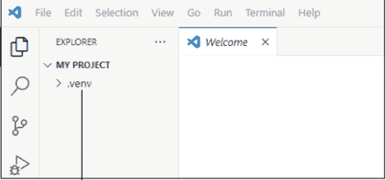

如果你尚未创建虚拟环境，请创建一个。在Windows中，你可以输入以下命令：

```
bash
py -m venv .venv
```

在Linux或macOS中，使用以下命令：

```
bash
python3 -m venv .venv
```

虚拟环境创建后，请确保激活它。在Windows中，在终端中输入以下命令：

```
.venv\scripts\activate
```

在Linux或macOS中，输入此命令：

```
source .venv/bin/activate
```

这两个激活示例都假设虚拟环境文件夹名为.venv。如果你的文件夹名称不同，请在你自己的命令中用你的名称替换.venv。如果在Windows中仍然无法工作，请尝试在命令末尾使用activate.ps1而不是activate。

激活后，虚拟环境的名称（本例中为.venv）将作为VS Code命令行的一部分显示。VS Code现在将识别python为一个已识别的命令，并将使用与该虚拟环境关联的任何Python版本。因此，在macOS或Windows上，你都可以在终端中输入以下命令来确定你正在使用的Python版本（确保使用大写字母V）：

```
python -V
```

你也可以使用以下命令（全部小写）获取当前Python版本：

```
python --version
```

#### 没有名为...的模块

如果你运行一个Python脚本并看到此错误信息，通常意味着你试图导入一个不属于Python标准库且在你的虚拟环境中不可用的模块。

如果你的项目已经有一个虚拟环境，请激活它（在Windows中为.venv/scripts/activate，在macOS中为source .venv/bin/activate）。然后尝试再次运行脚本。如果仍然失败，很可能你从未使用pip install将该模块安装到你的虚拟环境中。你可以将其pip install到你当前活动的虚拟环境中，这应该能解决问题。

如果你从未为你的项目创建过虚拟环境，你应该先创建一个。然后激活该环境，并`pip install`任何你需要的、不属于Python标准库的依赖项。

> 如果你不确定某个模块，你总是可以询问AI，包括是否需要`pip install`它以及如何在代码中编写`import`语句。

> 一个相关的错误`ModuleNotFoundError`将在本章后面介绍。你可能也想查看该部分以获取线索。

#### SyntaxError

在Python中，`SyntaxError`通常是代码中的拼写错误。`SyntaxError`不是你想捕获的异常。相反，你需要在每个`SyntaxError`发生时修复它。通常，VS Code会显示一条红色波浪线或其他标记，以指示错误在代码中的位置。错误信息本身可能提供额外信息。

这是一个简单的函数，乍一看可能完全合法：

```
def calculate_sum(a, b)
    result = a + b
    return result
```

当你运行包含该函数的代码时，你会得到一条错误信息，内容为“SyntaxError: expected ':'”。Python语法要求以`def`开头的行必须以冒号（`:`）结尾，而示例函数缺少了这个冒号。这里的修正方法很简单，只需在需要的地方添加冒号，如下所示：

```
def calculate_sum(a, b):
    result = a + b
    return result
```

这是另一个错误可能不那么明显的例子：

```
def greet(name):
    message = "Hello, " + name +
    return message
```

运行该代码会产生错误“SyntaxError: invalid syntax”。VS Code还告诉我错误在第2行，并在该行末尾显示一条红色波浪线。这里的问题是最后一个+没有将任何内容附加到字符串上，因此应该删除最后一个+。修正后的代码如下：

```
def greet(name):
    message = "Hello, " + name
    return message
```


VS Code通常会在可能包含SyntaxError的错误代码附近显示一条红色波浪线。将鼠标指针悬停在该波浪线上会提供有关错误的一些信息。然后，你可以点击错误文本附近的“快速修复”（如果可用）来获取帮助以解决问题。

#### NameError

在Python中，当你通过名称调用某个东西（函数、变量或其他任何东西），但该名称不存在时，就会发生NameError。看看以下代码：

```
def sum_nums(numlist):
    return sum(numlist)

if __name__ == "__main__":
    numlist = [34, 7, -5, 22.4]
    result = sumnums(numlist)
    print(result)
```

运行该代码会显示一条错误信息：

```
NameError: name 'sumnums' is not defined. Did you mean: 'sum_nums'?
```

错误在于第一行将函数名定义为sum_nums（带下划线）。随后的代码result = sumnums(numlist)试图调用sumnums（无下划线），因此该名称无法识别。解决方法很简单，只需使用其定义的名称调用函数：result = sum_nums(numlist)。


在Python中，名称区分大小写。调用函数时，请确保使用与创建函数时在def语句中使用的大写/小写字母相同。

#### TypeError

在Python中，当你尝试对某个数据类型执行不支持的操作时，就会发生`TypeError`。可以将其理解为Python在说：“我不知道如何用这些类型的值来做这件事！”这是你刚开始学习Python时最常遇到的错误之一。

混淆字符串和数字是最常见的`TypeError`错误之一。这里有一个简单的例子：

```
# 导致TypeError的代码
x = "5"
y = 10
result = x + y
```

运行该代码会产生以下错误：

```
TypeError: can only concatenate str (not "int") to str
```

这里的问题是变量`x`被定义为字符串（因为它被引号括起来）。Python不允许你将字符串与数字连接。你必须将`x`和`y`都设为数字（通过去掉5周围的引号）或将它们都设为字符串，例如"5"和"10"。

这是另一个`TypeError`的例子：

```
extended_price= 98.99
print (len(extended_price))
```

此代码的错误信息是`TypeError: object of type 'float' has no len()`。变量`extended_price`是`float`数据类型，因为它的值是一个带小数点的数字，没有用引号括起来。`len()`函数返回字符串的长度，如果你试图获取数字的长度，就会导致错误。

如果你打算在运行代码时允许用户输入自己的数据，你可以在`try...except`块中同时使用`TypeError`和`ValueError`来捕获这两种类型的错误。（`ValueError`是正确的数据类型，但值错误，例如当期望正数时输入了负数。）以下代码展示了一个用户可以输入总销售价格和税率的示例。然后代码调用一个名为`total_with_tax`的函数将销售税加到总额中，但请注意末尾附近的`try...except`块，用于在出现`ValueError`和`TypeError`异常时捕获它们：

##### 函数期望浮点数并返回浮点数

```python
def total_with_tax(price: float, tax_rate:float) -> float:
    # 要求价格和税率必须为正数
    if price < 0 or tax_rate < 0:
        raise ValueError("Price and tax rate must be non-negative numbers.")
    # 如果没有错误，则计算含税总价。
    total_price = price * (1 + tax_rate)
    return total_price

if __name__ == "__main__":
    try:
        total_sale = float(input("Enter the total sale amount: "))
        tax_rate = float(input("Enter the tax rate (0.065 for 6.5%): "))
        # 获取加上销售税后的总价
        total = total_with_tax(total_sale, tax_rate)
        print(f"The total price with tax is: {total:.2f}")
    except ValueError:
        print("Invalid input. Please enter numeric values for price and tax rate.")
    except TypeError as e:
        print(e)
```

#### IndexError（索引错误）

在 Python 中，当你尝试使用超出范围的索引访问序列（如列表、元组或字符串）中的元素时，就会发生 `IndexError`。简单来说，你试图访问序列中不存在的位置。例如，假设你有一个包含五个项目的列表，而你的代码要求获取第六个项目。Python 将抛出 `IndexError` 异常，因为不存在第六个项目。

在 Python（以及大多数编程语言）中，列表中的第一个项目始终是项目 0（零），而不是 1（一）。我们人类通常不会这样思考。例如，你可能认为以下代码完全合法：

```python
fruits = ['Apple', 'Banana', 'Cherry']
print(fruits[3])
```

运行该代码会产生以下错误消息：

```
IndexError: list index out of range
```

你可能期望 `fruits[3]` 是 `Cherry`，即列表中的第三个项目。但 Python 并非如此看待它。Python 是这样看待的：

```python
fruits[0] = 'Apple'
fruits[1] = 'Banana'
fruits[2] = 'Cherry'
```

就 Python 而言，不存在 `fruits[3]`。这就是代码生成错误的原因。

解决此问题的一种方法是，在处理列表时，尽量避免使用带有 `range()` 或其他某种计数器的循环。使用此语法遍历列表的最简单方法（永远不会遇到 `IndexError`，因为它为列表中的每个项目重复一次，并且知道从 0 开始）如下所示：

```python
fruits = ['Apple', 'Banana', 'Cherry']
for fruit in fruits:
    print(fruit)
```

你可以使用列表推导式更紧凑地完成此操作，如下所示：

```python
fruits = ['Apple', 'Banana', 'Cherry']
[print(fruit) for fruit in fruits]
```

如果你需要在遍历列表时保持计数器运行，可以使用 Python 的 `enumerate`，它允许你自动为列表中的每个项目分配一个数字。例如，看看这段代码：

```python
my_list = ['apple', 'banana', 'cherry']
for index, value in enumerate(my_list, start=1):
    print(f"Index: {index}. {value}")
```

这里的语法使用了一个 `for` 循环，其中 `index`（一个计数器）和 `value`（列表中的一个项目）是变量名。`enumerate` 这个词让 Python 知道你希望 `index` 成为一个计数器。`my_list` 这个名字是对原始列表的引用。`start=1` 让 Python 知道你希望从 1 开始计数。该代码的输出是：

```
1. apple
2. banana
3. cherry
```

Python（以及大多数其他编程语言）从 0 开始列表，而不是从 1 开始，因为计算机以这种方式处理列表更有效率。如果你使用 `enumerate` 而不指定 `start=1`，项目将从 0 开始编号。


#### KeyError（键错误）

在 Python 中，当你尝试访问字典中不存在的键时，就会发生 `KeyError`。可以将字典想象成现实世界中的词典：你查找一个单词（`key`）以找到其定义（`value`）。如果该单词不在词典中，你将一无所获。在 Python 中，尝试访问不存在的键会引发 `KeyError`。

这是一个简单的示例，其中名为 `my_dict` 的字典包含两个键——一个名为 "name"，另一个名为 "age"。每个键都分配了一个值——"name" 对应 "Annabelle"，"age" 对应 65。该代码后面跟着三个 `print` 语句，尝试显示字典中的数据：

```python
# 一个简单的字典
my_dict = {"name": "Annabelle", "age": 65}

print(my_dict["name"])
print(my_dict["age"])
print(my_dict["gender"])
```

运行该代码会产生以下输出：

```
Annabelle
65
...
KeyError: 'gender'
```

发生 `KeyError` 是因为没有名为 "gender" 的键，只有名为 "name" 和 "age" 的键。

如果你正在处理由其他代码生成的键，你并不总是能很好地控制字典。你可以使用 `.get()` 方法来请求一个键值，并在键不存在时指定一个默认值。这样，你总能为一个键获得某个值，而不会冒着使整个脚本崩溃的风险。这是代码的一个修改版本，其中如果 "gender" 键缺失，"gender" 的值将变为 "not specified"。

```python
# 一个简单的字典
my_dict = {'name': 'Annabelle', 'age': 65}

print(my_dict['name'])
print(my_dict['age'])
print(my_dict.get('gender', 'not specified'))
```

现在看看以下代码：

```python
# 一个简单的字典
my_dict = {'name': 'Annabelle', 'age': 65}

print(my_dict[name])
print(my_dict[age])
```

乍一看，这段代码可能看起来完全没问题。但运行它会产生一个 `NameError`。为什么？因为 `print` 语句将 `name` 和 `age` 视为变量名（没有引号），而不是键名。你可以通过添加引号轻松修复此错误：

```python
print(my_dict['name'])
print(my_dict['age'])
```

如果你正在处理大量导入的 JavaScript 对象表示法（JSON）数据，而这些数据并不总是像你希望的那样可靠，并且你想用 `try...except` 块来捕获 `KeyError`，你可以使用 `try...except` 的标准语法，而不是默认使用其他值：

```python
# 一个简单的字典
my_dict = {'name': 'Annabelle', 'age': 65}

print(my_dict['name'])
print(my_dict['age'])
try:
    print(my_dict['gender'])
except KeyError:
    print('No gender specified')
```

当你预期某个键可能缺失，并且希望在不使程序崩溃且不为缺失键假定默认值的情况下处理错误时，这非常有用。

#### AttributeError（属性错误）

在 Python 中，当你尝试访问或使用对象上不存在的属性（方法或属性）时，就会发生 `AttributeError`。在 Python 中，对象具有与其类关联的属性（数据）和方法（函数）。错误的常见原因包括：

- 拼写错误属性或方法名
- 访问对象类型不存在的属性
- 在错误类型的对象上使用方法或属性
- 忘记在类中初始化属性

这是一个超级简单的示例，创建一个列表，然后尝试向列表添加另一个项目：

```python
my_list = [1, 2, 3]
my_list.add(4)
```

运行该代码会产生以下错误消息：

```
AttributeError: 'list' object has no attribute 'add'
```

换句话说，你不能使用 `add` 这个词。向列表添加新项目的属性是 `append()`。因此，在这种情况下，修复错误只需将 `add` 更改为 `append`，如下所示：

```python
my_list = [1, 2, 3]
my_list.append(4)
```

在 Python 中，你可以创建自己的类，并选择自己的属性。这是我创建的一个名为 `Car` 的自定义类的示例。`Car` 对象的每个实例都可以有 `make`、`model` 和 `year` 属性：

```python
class Car:
    def __init__(self, make, model, year):
        self.make = make
        self.model = model
        self.year = year
```

使用该代码，你可以使用类似 `my_car = Car("Toyota", "Camry", 2020)` 的语法创建对象。假设你然后尝试执行此命令：

```python
print(f"My car is a {my_car.year} {my_car.make} {my_car.modal}.")
```

该代码将失败，并显示以下错误消息：

```
AttributeError: 'Car' object has no attribute 'modal'. Did you mean: 'model'?
```

这里的问题在于，类中 `self.model` 将属性名定义为 `model`（带 e）。而错误代码试图访问 `my_car.modal`（`model` 的拼写错误）。

>  如果你需要快速回顾对象的属性，可以随时询问 AI。只需确保在提示中使用 *Python* 和 *attribute* 这两个术语，例如“Python 列表有哪些属性？”或“Python 字典有哪些属性？”

#### ModuleNotFoundError

当你尝试导入一个不存在的模块时，就会发生 `ModuleNotFoundError`，原因可能是文件名拼写错误，或者该模块不属于 Python 标准库且你尚未将其安装到活动的虚拟环境中。当 VS Code 资源管理器窗格中的文件名与模块名相同但带有 `.py` 扩展名时，也可能发生此错误。例如，也许你正尝试使用 `matplotlib` 作为模块，但当前文件夹中有一个名为 `matplotlib.py` 的文件。

最简单的例子可能是拼写错误或大小写错误。例如：

```python
import OS
```

这一行代码可能会失败，因为你需要将名称拼写为全小写字母，如下所示：

```python
import os
```

这是另一个例子，代码看起来完全正常，但会产生 `ModuleNotFoundError`：

```python
import requests
```

这里的问题可能是 `requests` 不属于 Python 标准库。`requests` 模块需要在代码中使用之前安装。如果你还没有这样做，你应该创建一个虚拟环境。激活你的虚拟环境，然后输入命令 `pip install requests` 将该模块引入虚拟环境。

如果你过去创建过虚拟环境，请激活虚拟环境，然后在终端中输入命令 `pip list`。如果你在结果中没有看到 `requests`，请在活动的虚拟环境中执行 `pip install requests`。

当当前文件夹中的文件名与模块名匹配时，可能会发生 `ModuleNotFoundError`。该名称后面可能会跟着描述，类似于：

```
No module named 'matplotlib'; 'matplotlib' is not a package
```

检查 VS Code 资源管理器窗格中的文件名，看看是否有任何文件名与错误消息中的模块名匹配。例如，图 17-2 显示了一个名为 `matplotlib.py` 的文件。该文件名与 `matplotlib` 导入冲突，这就是错误提示它不是包的原因。要解决此问题，请重命名 `matplotlib.py`，使其不与模块名匹配——但请确保保留 `.py` 文件扩展名。

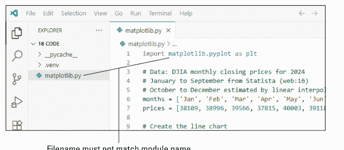

#### FileNotFoundError

如果你的 Python 代码需要访问一个文件，但该文件在指定位置找不到，Python 会抛出 `FileNotFoundError`。以下是此错误最常见的原因：

- 你在代码中拼错了文件名。
- 文件在指定目录中不存在。

这是一行尝试从当前工作目录（包含该代码的脚本所在的同一目录）打开名为 `data.json` 的文件的代码：

```python
with open('data.json', 'r') as file:
```


请记住，在 macOS 和 Linux 上，文件和文件夹名称区分大小写，因此也要注意大写/小写字母！

由于路径中没有指定其他目录，因此假定为当前工作目录。如果文件位于其他位置，你可以使用适合你操作系统的正确语法指定路径。例如，如果文件位于 Windows 上 `D:` 盘或 USB 驱动器上名为 `assets` 的文件夹中，你可以这样编写代码：

```python
file_path = r"D:\assets\data.json"
with open(file_path, 'r') as file:
```

在 macOS 上，它看起来像这样（假设 USB 驱动器的名称为 `MyUSB`）：

```python
file_path = "/Volumes/MyUSB/assets/data.json"
with open(file_path, 'r') as file:
```

在 Linux 上，路径可能更像这样（但请将 `Alan` 替换为你的用户名，将 `MyUSB` 替换为你的 USB 驱动器名称）：

```python
file_path = "/media/Alan/MyUSB/assets/data.json"
with open(file_path, 'r') as file:
```

处理外部文件也可能产生 `PermissionError`，当你尝试写入以只读模式打开的文件或已在其他应用程序中打开的文件时会发生此错误。要修复此错误，你需要设置文件或其目录的权限，以便你的脚本拥有所需的权限。通常，你可以通过右键单击文件图标并选择 Windows 上的“属性”>“安全”、macOS 上的“显示简介”>“共享与权限”，或在 Linux 上使用 `chmod` 命令来设置文件权限。

在处理文件的 Python 代码中，你经常会看到异常处理程序来处理 `FileNotFoundError` 和 `PermissionError` 问题，以及像这样的通用处理程序：

```python
import json

def read_json_file(filepath):
    try:
        with open(filepath, 'r') as file:
            data = json.load(file)
            print("File loaded successfully.")
            return data
    except FileNotFoundError:
        print(f"Error: The file '{filepath}' was not found.")
    except PermissionError:
        print(f"Error: Permission denied when trying to read '{filepath}'.")
    except Exception as e:
        print(f"Unexpected error: {e}")

# Example usage
file_path = "data.json"
content = read_json_file(file_path)
```

> 养成始终包含与自身代码之外的文件相关的错误的异常处理的习惯是一个好主意，因为在许多环境中，你可能无法控制那些其他目录中发生的情况。

#### IndentationError

许多编程语言使用不同种类的花括号和方括号来分隔较大脚本中的代码块。例如，在以下 JavaScript 代码中，`greet()` 函数内的代码被花括号包围：

```javascript
function greet(name) {
    alert("Hello " + name);
}

// Call the function with the name "wilma"
greet("wilma");
```

Python 不使用花括号或方括号来定义代码块。相反，它完全依赖缩进来确定哪些内容在代码块内。例如，以下 `greet()` 函数包含一行打印代码，如缩进所示。其余代码在函数外部，因为它没有缩进：

```python
def greet(name):
    print("Hello " + name)

# Call the function with the name "wilma"
greet("wilma")
```

当你在脚本中看到 `IndentationError` 时，意味着 Python 无法完全理解你的代码。在某些情况下，问题可能很容易识别：

```python
def greet(name):
    print("Hello", name)
```

当你理解 `def` 命令定义了一个函数，并且只有该行下方的缩进代码才是函数的一部分时，你就能看出这里的问题。`def` 下面没有缩进代码，所以函数中没有任何内容。该错误的确切错误消息如下，因此你知道问题始于函数定义行下方（该行总是以 `def` 开头）：

```
IndentationError: expected an indented block after function definition
```

循环和 `if` 语句也需要在第一行下方缩进。例如，这是一个循环（以 `for` 开头）和循环内的 `if`（以 `if` 开头）的正确缩进示例：

```python
# Create a list of numbers
numbers = [1, 2, 3, 4, 5, 6, 7, 8, 9, 10]

# Loop through each item in the list
for number in numbers:
    # Check if the number is odd
    if number % 2 != 0:
        print(f"{number} is odd")
```

代码按原样运行良好。但以下代码会生成 `IndentationError`，因为它在 `for` 和 `if` 语句下缺少缩进：

```python
# Create a list of numbers
numbers = [1, 2, 3, 4, 5, 6, 7, 8, 9, 10]

# Loop through each item in the list
for number in numbers:
# Check if the number is odd
if number % 2 != 0:
print(f"{number} is odd")
```

有时使用 Tab 键，有时使用空格的不一致缩进也可能导致 `IndentationError` 问题。PEP 8 指南通常建议使用四个空格作为缩进级别。在 VS Code 中，按 Tab 键也会缩进四个空格。尝试在缩进时保持一致（例如，在 VS Code 中始终使用 Tab），以最大程度地减少搞乱缩进的可能性。

## 索引

### 数字

- *.tmp, 96–98
- # 注释, 36, 78
- + 运算符, 48
- = 运算符, 48

### A

- 绝对路径与相对路径, 72–73
- 活动栏，在 VS Code 中, 17–18
- add_content() 函数, 163, 167, 172
- 高级 Python 调度器。参见 APScheduler 模块
- Amazon Simple Email Service, 236
- Amazon Web Services (AWS) Secrets Manager, 184
- 与号 (&) 表示逻辑与, 58
- 尖括号, 153
- 匿名函数, 137
- APIs (应用程序编程接口), 9, 229, 243, 329
    - 通过 API 访问免费 AI, 277–282
    - 获取 API 密钥和模块, 243–244
    - 创建 .gitignore 文件, 184–185
    - 获取 Instagram API 访问权限, 251
    - 与 API 交互, 181–196
    - 发起 API 请求, 191–193
    - 获取 API 密钥, 181–182
    - 安全存储 API 密钥的其他方法, 184
    - 解析 API 响应, 193–194
    - 表征状态转移 (REST) APIs, 190–194
    - 查看完整的 REST API 脚本, 194–196
    - 安全存储 API 密钥, 182–185
    - 在脚本中使用 API 密钥, 185
    - 另请参阅 JavaScript 对象表示法 (JSON)
- 撇号, 36, 39
- Apple Intelligence, 2
- Apple M 系列, 12
- Apple Safari, 197, 199–200
- 应用程序编程接口 (APIs)。参见 APIs
- APScheduler 模块, 265–270
    - 与日期和时间一起使用, 268–270
    - 与时间间隔一起使用, 267–268
- 算术和字符串运算符, 47–48
- 数组, 39
- 人工智能 (AI), 2, 42, 196, 217, 241, 270
    - 访问 API, 277–282
    - 构建简单的本地聊天机器人, 284–286
    - 聊天机器人, 9, 19, 284
    - 创建对话式聊天机器人, 287–290
    - 使用 Ollama 下载模型, 283–284
    - 开发图像生成器, 290–308
    - 安装和运行 Ollama, 283
    - 与 AI 集成, 277–308
    - REST APIs, 191
    - AI 的使用, 8
    - 本地聊天机器人入门, 282–286
- 赋值运算符, 48–49
- AttributeError, 340–342
- 自动截图脚本, 158

### B

- 后台进程, 283
- 备份文件, 98–103
    - 使用 Python 复制文件, 101–102
    - 从 Python 创建文件夹, 101
    - 个性化脚本, 102–103
- 反斜杠, 26, 71, 73–74
- backup_files() 函数, 100
- 退出循环, 53–54
- Bash, 27
- BeautifulSoup 模块, 213
- 模板文本, 153–154
- Books to Scrape 网站, 217–218
- 布尔 (bool) 数据类型, 39
- break 语句, 53
- 批量重命名文件, 87–91
- 术语, 70–74, 187

### C

- calculate_file_hash() 函数, 106
- 层叠样式表 (CSS), 15, 218
- case 语句, 58
- 中央处理单元 (CPU), 263
- ChatGPT, 2, 249, 284
- 块, 106
- 创建类和对象, 61–62
- Claude, 284
- ClickSend, 237
- 选择代码编辑器, 15–33
- 冒号, 40, 51, 334
- 颜色模型, 132
- 逗号, 39, 40–41
- 命令行界面 (CLI), 22, 283
- Command Not Found (错误消息), 331–333
- 命令提示符, 23
- 注释, 316
- compress_files() 函数, 109–112
- 设置压缩参数, 113
- 常量, 182
- 定义内容
    - 为帖子创建内容, 249–250
    - 为 PDF 创建内容, 172
    - 为 Word 创建内容, 163–164
    - 为工作簿创建内容, 167–168
- continue 语句, 53
- 网页上的控件, 200–201
- 创建对话式聊天机器人, 287–290
- 转换图像文件类型, 129–133
- Copilot, 2, 17, 284
- .copy() 方法, 102
- 使用 Python 复制文件, 101–102
- Courier, 237
- create_interface() 函数, 305
- crop() 方法, 125
- 裁剪图像, 127–128
- 花括号, 10, 40, 185, 345
- cv2 模块, 119

### D

- 数据字典, 41
- 数据提取
    - 自动化数据提取, 222–228
    - 从网页提取数据, 217–222
- data.json 文件, 189–190
- 使用运算符操作数据, 47–50
- 数据类型, 37
    - 布尔 (bool), 39
    - 空值 (None), 41–42
    - 数字类型, 37–38
    - 字符串 (str), 38–39
    - 元组 (tuple), 40
- 处理日期和时间, 45–47
- datetime 模块, 45
- 决策（分支）, 55
    - if...else, 55–56
    - match, 57–58
    - 三元运算符, 56–57
- decompress_files() 函数, 114–117
- DeepSeek-R1, 282
- def 语句, 58–59, 346
- DELETE 请求, 191
- 删除
    - 删除重复文件, 108
    - 识别旧文件, 96
    - 匹配文件模式, 96–97
    - 删除旧文件和临时文件, 93–98
    - 将文件发送到回收站, 97
    - 安全使用删除脚本, 97–98
- 字典 (dict) 数据类型, 40–41, 187
- 数字版权管理 (DRM) 系统, 135
- 指令
    - 与 Python f-strings 一起使用的格式化指令, 44
    - 用于 .strftime() 格式化日期时间值的指令, 46–47
- 目录（文件夹）和文件。参见文件和文件夹，自动化
- divide_numbers() 函数, 66
- dotenv 模块, 230, 237, 246
- 驱动器, 71–72
- .dump 方法, 188
- dunder（双下划线）名称, 66
- 重复文件, 103–109
    - 计算文件哈希值, 106
    - 删除重复文件, 108
    - 查找重复文件, 107–108
    - 调整查找重复文件的脚本, 108–109
- 动态类型, 315

### E

- ehlo (Extended Hello), 233
- elif 语句, 56
- else 语句, 53, 54, 63, 66
- 自动发送电子邮件, 229–236
    - 收集账户信息, 230
    - 创建 .env 文件, 230–231
    - 创建脚本, 231–234
    - 将电子邮件收件人地址放入文件, 235
    - 发送 HTML 邮件, 234–235
    - 处理节流问题, 236
- .env 文件, 182, 183, 230–231, 237, 245, 252, 278, 302
- 环境变量, 184
- EOFError, 63
- Python 错误消息, 331–346
    - AttributeError, 340–342
    - Command Not Found, 331–333
    - FileNotFoundError, 343–345
    - IndentationError, 345–346
    - IndexError, 337–338
    - KeyError, 339–340
    - ModuleNotFoundError, 342–343
    - NameError, 335
    - No Module Named . . ., 333–334
    - SyntaxError, 334–335
    - TypeError, 336–337
- 错误处理, 316–317
- Escape 键, 150–151, 152
- Excel。参见 Microsoft Excel
- except: 和 try: 语句, 53, 63, 64–66, 263, 340
- Exception as e, 64
- 异常处理, 63–66, 87, 316–317, 329–330
- exit_script 函数, 154–155
- extract_frames() 函数, 133–135

### F

- 文件管理
    - 自动化文件管理, 93–117
    - 备份文件, 98–103
    - 压缩文件, 109–113
    - 解压缩文件, 114–117
    - 删除旧文件和临时文件, 93–98
    - 查找和删除重复文件, 103–109
- FileNotFoundError, 63, 343–345
- file.path.match(pattern) 语法, 97
- 文件和文件夹
    - 自动化文件和文件夹操作, 69–91
    - 驱动器, 71–72
    - 文件资源管理器目录, 70
    - 使用 shutil 移动文件, 86–87
    - 导航, 74–81
    - 按类型组织, 81–87
    - 用于安全处理文件脚本的练习文件夹, 74
    - 重命名文件, 87–91
    - 脚本自定义, 87
    - 子文件夹, 81
    - 使用 mkdir 创建子文件夹, 86
    - 另请参阅文件管理；图像和视频文件
- finally (可选), 63, 66
- find_duplicates() 函数, 107–108
- .find_element() 方法, 207
- Finder, 70
- flip() 方法, 125
- 翻转图像, 126–127
- 浮点数, 37
- 为新项目创建文件夹, 19–24
- 文件夹和文件。参见文件和文件夹，自动化
- for 循环, 51–52, 79, 137, 300, 338
- 自动化网页浏览器填写表单, 197–201
- 正斜杠, 26, 72
- 从视频文件中提取帧, 133–138
- f-string, 42–44
- Python 中的函数, 58–61

### G

- Gemma 3, 282
- generate_image() 函数, 294, 300–301
- 在屏幕上显示生成的图像, 295–301
- get_index_price() 函数, 228
- GET 请求, 191
- .gitignore 文件, 184–185, 231
- Google Chrome, 197, 198, 202, 204
- Google Cloud Secret Manager, 184
- Google Gemini, 284
- gradio_generate() 函数, 299–300
- gradio 库, 295–300, 302, 305–306
- 图形处理单元 (GPU), 12
- Grok, 249, 284
- Groq, 277–278
- GroqFreeClient 类, 280–281

### H

- 处理错误, 316–317
- 硬件要求
    - 识别硬件要求, 11–12
    - VS Code 的硬件要求, 15
- 文件哈希, 103–104
- hashlib 模块, 104
- Hootsuite, 244
- 按下热键, 148
- Hugging Face, 301–308
- 超文本标记语言 (HTML), 15, 200, 213, 234–235
- 超文本传输协议 (HTTP), 190

### I

- 惯用编程, 321
- 控件的 id, 200
- if . . . else 语句, 42, 55–56
- if 语句, 78, 85, 112, 137, 226
- 图像和视频文件
    - 自动化图像和视频文件处理, 119–138
    - 使用 Python 转换文件, 131–132
    - 转换图像文件类型, 129–133
    - 自定义图像处理器, 128–129
    - 从视频文件中提取帧, 133–138
    - 个性化转换脚本, 132–133
    - 调整大小、旋转、翻转和裁剪图像, 120–129
- 创建水印图像, 176
- 开发 AI 图像生成器, 290–308
    - 使用 Hugging Face, 301–308
    - 在屏幕上显示生成的图像, 295–301
- image.transpose(), 127
- ImportError, 63
- import 语句, 28, 29, 66, 69, 77, 274
- 缩进, 11, 51, 55, 321
- IndentationError, 345–346
- IndexError, 337–338
- .info() 方法, 62
- Instagram API 访问权限, 251
- 实例变量（属性）, 61
- 整数, 37
- is_, 39
- .iterdir()（迭代目录）方法, 79

### J

- Java, 61
- JavaScript, 8, 10, 15, 185
- JavaScript 对象表示法 (JSON)
    - 从 JSON 填充文本框, 208–211
    - 处理 JSON 数据, 185–190
    - 解析和序列化 JSON 数据, 187–188
    - 读写 JSON 文件, 188–190
- job() 函数, 262, 264, 266
- json 模块, 187

### K

键盘快捷键，创建自定义组合键，151–155。*另请参阅* 鼠标和键盘

.keyDown() 方法，149

KeyError，339–340

key 参数，151

按键检测，150–151

.keyUp() 方法，149

键值对，在字典中定义，40–41

keyword_list 变量，257

### L

LA（亮度，Alpha），132

LANCZOS，126

Lanczos，Cornelius，126

大型语言模型（LLMs），282

库，9

Linux
- 图形用户界面，150
- Python 在 Linux 上，13–14
- 快捷键，150

列表推导式，322–323

循环，51–55
- 跳出循环，53–55
- for 循环，51–52, 79, 137, 300, 338
- while 循环，52, 226

lxml 工具，213, 216

### M

Mac 电脑，140

macOS，71, 149

Mailgun，236

main() 函数，66, 79, 91, 97, 128, 138, 162, 167, 172, 204, 289

matches_pattern 变量，97

match 语句，57–58

matplotlib 模块，257

MD5 哈希，106

Meta AI，284

Meta for Developers 网站，251, 254

Meta Llama 3，282

.methodname() 语法，125

metrics 变量，254

Microsoft Azure Key Vault，184

Microsoft Edge，197, 198

Microsoft Excel
- 自动化，164–168
- 为工作簿定义内容，167–168
- 指定工作簿，167

Microsoft Word
- 自动化，159–164
- 定义 Word 内容，163–164
- 命名，162

mkdir，用于创建子文件夹，86

ModuleNotFoundError，63, 334, 342–343

模块，安装，28–29

鼠标和键盘
- 自动化，139–158
- 控制鼠标速度，141–142
- 检测按键，150–151
- 查找屏幕上元素的位置，142–144
- 在 Mac 上授予权限，140
- 键盘快捷键，创建自定义组合键，151–155
- 屏幕坐标，理解，141
- 截图，自动化，155–158
- 停止鼠标乱动，142
- 尝试鼠标控制，144–146
- 使用 Python 输入文本，146–150
- 在特定应用中使用鼠标控制，144

Mouse Info 应用，143

使用 shutil 移动文件，86–87

在网页上填写多个文本框，204–208

### N

NameError，335

嵌套条件语句，321–322

嵌套对象，186

No Module Named ...（错误消息），333–334

无（None），41–42, 97

数字，处理，37–38

### O

对象，61

面向对象编程（OOP），61, 328

Office
- 自动化，159–177
- *另请参阅* Microsoft Excel；Microsoft Word；PDFs

旧文件，识别，96

Ollama（开源工具），282
- 使用其下载 AI 模型，283–284
- 安装和运行，283

OpenCV（开源计算机视觉库），135, 138

openpyxl 模块，164, 168

OpenWeatherMap REST API，195

操作系统，检测，149–150

运算符，操作数据
- 识别其他运算符，49–50
- 使用算术和字符串运算符，47–48
- 使用赋值运算符，48–49

organize_files() 函数，84

按类型整理文件，81–87

os 模块，69, 74, 280

输出，格式化，42–44

### P

参数，定义默认值，60

括号，10, 11, 60

解析
- API 响应，193–194
- JSON，187–188
- 网页，216–217

PATCH 请求，191

pathlib 库，69, 74, 86, 104

路径，71–72
- 绝对路径与相对路径，72–73
- Windows 路径中的反斜杠，73–74

pathutil 模块，90, 93, 97, 116

PDFs
- 创建和打开，168–173
- 为其定义内容，172
- 识别，172–173
- 添加水印，173–177

PEMDAS，47, 48

PEP 8 指南，36–37, 315, 327, 346

性能指标，跟踪，251–255

PermissionError，63

Photopea 编辑器，176

PIL（Python Imaging Library），119

Pillow 模块，119, 125, 173

管道（|）表示或，58

pip install 命令，28–29

像素，141

Plivo，237

Pollinations.AI，291, 293

便携式文档格式（PDFs）。*参见* PDFs

POST 请求，191

print() 命令，32, 42, 84, 87, 98, 132

编程语言，选择，8–10

项目文件夹，在 VS Code 中，20–21

PUT 请求，191

py，23, 30

PyAutoGUI（Python 自动化图形用户界面），139, 141–142, 146–149

pynput 模块，150, 152

PyPDF2 模块，168–169, 173

Python
- 使用其自动化性能指标，251–255
- 自动化脚本，按计划执行，271–276
- 使用其进行自动化，7–14
- 自动化基础，35–66
- 选择编程语言，8–10
- 类和对象，61–62
- 代码区分大小写，23, 335
- 注释，理解，35–36
- 使用其压缩文件，112
- 使用其转换图像文件，131–132
- 使用其复制文件，101–102
- 从其创建文件夹，101
- 定义函数，58–61
- 字典，40–41, 187
- 从网站下载选项，13
- 错误消息，331–346
- 好文件名和坏文件名示例，30
- 安装扩展，18–19
- 获取，11–13
- 指南，311–330
- 识别硬件要求，11–12
- 惯用编程，321
- 安装，12–13
- 解释器，21–22
- 在 Linux 上，13–14
- 模块，28–29
- OpenCV 库，135
- 打开现有项目，33
- 运算符，47–50
- 使用其重命名文件，90
- 运行脚本，32–33
- 编写和运行脚本，30–33
- 理解语法，10–11
- 使用其截图，157–158
- 类型提示，315–316
- 使用其输入文本，146–150
- 使用其解压文件，116–117
- 使用缩进，11
- 掌握变量和数据类型，36–42
- 版本
    - 检查，23–24
    - 选择，21–22
- 编写脚本，30–32, 42
- *另请参阅具体条目*

python3，23

python3 -m venv .venv 命令，25, 332

python-docx 模块，159, 163

python-dotenv 模块，280

Python 增强提案（PEP），37

python -m venv 命令，25, 332

pytrends 模块，258

### Q

队列，263

引号，36, 38, 42, 147, 186, 233–234

Qwen，282

### R

随机存取存储器（RAM），12

光栅图像，129

原始字符串，80

推荐的 Python 解释器，21–22

回收站，93, 97–98

相对/绝对路径，72–73

重命名文件，87–91
- 使用 Python，90
- 使用批量重命名脚本，91

reportlab 模块，168–169, 173

表述性状态转移（REST）
- API，190–194
- 发出 API 请求，191–193
- 解析 API 响应，193–194
- 查看完整脚本，194–196

resize() 方法，125

调整图像大小，125–126

return 语句，59, 84

RGB，132

RGBA，132

rglob（递归全局搜索），78

根文件夹，20, 26, 31

rotate() 方法，125

旋转图像，126

r，字符串前缀，80

运行 Python 文件，32–33, 143

### S

safe_delete_to_trash() 函数，98

.save() 方法，132

schedule 模块，261–265

调度任务，261–276
- APScheduler 模块，265–270
- 自动化 Python 脚本，271–276
- 按间隔调度，264–265
- 作为导入运行脚本，274–276
- 作为子进程运行脚本，271–274
- schedule 模块，261–265

scrape_books() 函数，221

屏幕坐标，理解，141

屏幕抓取。*参见* 网页抓取

截图
- 自动化，155–158
- 个性化自动截图脚本，158
- 使用 Python 截图，157–158

脚本自定义，87

安全套接层（SSL），230

selenium 模块，197

分号，10

send2trash 模块，93–95, 97, 104, 108

SendGrid，236, 237

序列化 JSON，187–188

短消息服务（SMS）消息，229。*另请参阅* 文本消息

shutil（shell 工具）模块，69, 82–84, 86–87, 93, 99

简单邮件传输协议（SMTP）服务器地址，230, 236

Sinch，237

单引号，186

SMS 消息，229。*另请参阅* 文本消息

smtp 模块，229

SMTP 端口，230

截图工具，155

社交媒体
- 获取 API 密钥和模块，243–244
- 使用 Python 分析趋势，255–258
- 自动化，243–258
- 为帖子创建内容，249–250
- 自动发帖，244–249
- 脚本自定义，249
- 设置项目，245–248
- 跟踪性能指标，251–255

特殊按键，按下，148

方括号，39, 40, 113

start_recording() 脚本，157

流式输出，300

strftime() 格式化，46–47

字符串（str）数据类型，38–39

提交按钮，在网页上点击，207–208

subprocess 模块，271–274

语法，10

SyntaxError，334–335

系统规格，12

### T

take_screenshot() 函数，157–158

Telnyx，237

终端
- 命令提示符，26
- 在 VS Code 中，22–23

三元运算符，56–57

.testzip() 方法，116

文本（字符串），38–39

文本框
- 从文件填写，208–211
- 在网页上查找，200–201, 204–208

文本消息
- 定义收件人列表和消息，239
- 自动发送，236–241
- 存储收件人号码，239–241
- 存储 SMS 账户信息，237–239

timeframe 变量，257

time 模块，146

tinyllama 模型，285

TIOBE 指数，8

传输层安全（TLS），230

trash_duplicates() 函数，108

回收站，发送文件到，97

try: 和 except: 语句，53, 63, 64–66, 263, 327, 340

元组，40

tweepy 模块，246

Twilio，229, 236–237

TypeError，63, 336–337

类型提示，60–61, 315–316

使用 Python 输入文本，146–150
- 控制输入速度，147
- 检测操作系统，149–150
- 按下热键，148–149
- 按下特殊按键，148
- 输入长段文本，147–148

tzdata/holidays 模块，225

### U

一元、比较和其他运算符，49–50

统一资源定位符（URL），190, 192

解压文件，使用 Python，116–117

User-Agent 头，215–216

User 类，61–62

uuid4() 方法，294

### V

ValueError，64，65

值，与变量，37，39，42

van Rossum，Guido，37

变量名，36–37

掌握变量与数据类型，36–42

.venv 模块，25–27

视频文件

- 从视频中提取帧，133–138
- 导入用于视频提取的模块，135–136
- 循环处理视频，136–137
- 调整视频转换脚本，138

虚拟环境（venv）

- 激活，26–28
- 创建，25–26
- 使用，24–28

Visual Studio Code。参见 VS Code

Vonage，237

VS Code，15

- 其中的活动栏，17–18
- 在 Python 项目中添加 API 密钥，183
- 允许控制鼠标，140
- 从中检查 Ollama 版本，284
- 硬件要求，15–16
- 安装，16–18
- 在其中打开终端，22–23
- 在其中打开项目文件夹，20–21
- Python 扩展，18–19
- 虚拟环境，26
- 其中的工作区文件夹，19，20

### W

walk_directory 函数，77，79

为 PDF 添加水印，173–177

- 创建图像，176
- 脚本调整，177

wb 参数，168

网页浏览器

- 自动化，197–201
- 在线填写表单，201–204
- 填写多个文本框，204–208
- 查找并填写文本框，200–201，208–211
- HTML 标签和控件类型，200
- 加载驱动程序，198–200
- 使用回车键提交表单，204
- webdriver-manager 模块，197

网页

- 数据提取，217–228
- 查找要抓取的元素，218–221
- 解析，216–217
- 从页面抓取数据，221–222
- 从中抓取链接，214–217
- 抓取股票市场数据，227–228
- 发送浏览器头信息，215–216
- 网页抓取工具，213–214

网页抓取工具，213–214

while 循环，52，226

while True 循环，157，262–264，267

DevTools 中的 Wikipedia 搜索框，201

停止狂野鼠标，142

Windows 文件资源管理器，70

Word。参见 Microsoft Word

工作区文件夹，19，20，24

.write() 方法，147

### X

X，245

### Z

Python 之禅原则，311–330

- 美观/丑陋的代码，311–314
- 复杂/繁复的代码，320–321
- 编码实践的一致性，326
- 错误处理，329–330
- 显式/隐式的代码，314–317
- 扁平/嵌套的代码，321–323
- 实用性/纯粹性，328–329
- 可读性很重要，325–326
- 简单/复杂的代码，317–319
- 稀疏性，324–325

ZeroDivisionError，66

Zip 文件，109–113，116

Z shell（zsh），27

## 关于作者

艾伦·辛普森是一位屡获殊荣的作者，著有超过 100 本技术书籍，涵盖 Python、网页设计和数据库设计。他的书籍已被翻译成数十种语言在全球出版，销量达数百万册。艾伦还拥有超过 20 年的在线教学经验，并因其帮助学生理解复杂主题而持续获得学生的热烈好评。

## 献词

献给苏珊、阿什利和亚历克。

## 作者致谢

衷心感谢 Waterside Productions 的文学经纪人玛戈特·马利。感谢 Wiley 的史蒂夫·海斯为我带来这次机会，以及伊丽莎白·库巴尔和道格·霍兰德在整个过程中对我的支持。

## 出版商致谢

**执行编辑：** 穆拉里·穆昆丹
**主编：** 史蒂夫·海斯
**编辑：** 伊丽莎白·库巴尔
**技术编辑：** 道格·霍兰德

**制作编辑：** 塔米尔马尼·瓦拉达拉杰
**封面图片：** © Roman Samborskyi/Shutterstock
**特别帮助：** 卡门·克里科里安，克里斯蒂·派尔斯

## WILEY 最终用户许可协议

请访问 www.wiley.com/go/eula 获取 Wiley 电子书 EULA。