## Python 基础

## Python 3 实用入门指南

第四版

由 RealPython.com 教程团队
FLETCHER HEISLER, DAVID AMOS, DAN BADER, JOANNA JABLONSKI 编写

## Python 基础：Python 3 实用入门指南

Real Python

## Python 基础

Fletcher Heisler, David Amos, Dan Bader, Joanna Jablonski

版权所有 © Real Python ([realpython.com](https://realpython.com)), 2012–2020

有关 Real Python 出版的本书及其他书籍的在线信息和订购，请访问 [realpython.com](https://realpython.com)。如需更多信息，请通过 info@realpython.com 联系我们。

ISBN: 9781775093329 (平装本)

ISBN: 9781775093336 (电子版)

封面设计：Aldren Santos

“Python” 和 Python 标志是 Python 软件基金会的商标或注册商标，Real Python 经基金会许可使用。

感谢您下载此电子书。此电子书仅供您个人享受使用。此电子书不得转售或赠予他人。如果您想与他人分享本书，请为每位接收者购买额外副本。如果您正在阅读本书但并未购买，或本书并非为您个人使用而购买，请返回 [realpython.com/pybasics-book](https://realpython.com/pybasics-book) 并购买您自己的副本。感谢您尊重本书背后的辛勤工作。

更新于 2020-02-25 我们要感谢早期访问读者提供的出色反馈：Zoheb Aina pore, Marc, Ricky Mitchell, Meir Guttman, Robert Livingston, Ricky, Jeffrey Hansen, Albrecht, Larry Eisenberg, Kilimandaros, Joanna Jablonski, Mursalin Simpson, Xu Chunyang, Ward Walker, W., Vlad, jima, Vivek, Srinivasan Samuel, Patrick Starrenburg, marp, Jorge Alberch, Edythe, Miguel Galán, Tom Carnevale, Florent, Albrecht Kadauke, Hans van Nielen, Youri Torchalski, Gavin, Karen H Calhoun MD, Roman, Robert Robb Livingston, Terence Phillips, Nico, Daniel, Kumaran Rajendhiran, Ty Wait, david fullerton, Robert, Nicklas, Jacob Andersen, Mario, Alejandro Ramos, Beni_begin, AJ, Melvin, Sean Yang, Sean, Velu.V, Peter Cavallaro, Charlie Browning 3, Milind Mahajani, Jason Barnes, Lucien Boland, Adam bretel, William, Veltaine, Jerry Petrey, James, Raymond E Rogers, ty wait, Bimperng Uen, CJ Hwang, Guido, Evan, Dave, Miguel Galan, Han Qi, Jim Bremner, Matt Chang, Daniel Drazan, Cole, Bob, Reed Howald, Edward Duarte, Mike Parker, Aart Kleinendorst, rock, Johnny, Rock Lee, Dusan Ranisavljev, Grant, Jack, Reinhard, Ceejay Cervantes, David, Vivek Vashist, Mark, Dan, Garett, Peter, Jun Lee, James Silk, Nik Singhal, Charles, Allard Schmidt, Jeff Desalle, Miguel, Steve Poe, Jonathan Seubert, Marc Poulin, MELVIN, Idris, Lucas, John Chirico, Wynette Espinosa, J.P., Gregory, Mark Edgeller, David Melanson, Raul Pena, Darrell, Shriram, Tom Flynn, Velu, michael lindsey, Sulo Kolehmainen, Michael, Jay, Richard, Milos “Ozzyx” Kosik, hans de Cocq, Glen Mules, Nathan Lundner, Phil, Shubh, Puwei Wang, Alex Mück, Alex, Hitoshi, Bruno F. De Lima, Dario David, Rajesh, Haroldas Valčiukas, GVeltaine, Susan Fowle, Jared Simms, Nathan Collins, Dylan, Les Churchman (luckyles in the Pythonistacafe), Stephane LI-THIAO-TE, Frank P, Paul, Damien Murtagh, Jason, Thăng Lê Quang, Neill, Lele, charles wilson, Damien, Christian, Jon, Andreas Kreisig, Marco, Mario Panagiotopoulos, nerino, Mariusz, Thomas, Mihhail, Mikönig, Fabio, Scott, Pedro Torres, Mathias Johansson, Joshua S., Mathias, scott, David Koppy, Rohit Bharti, Phillip Douglas, John Stephenson, Jeff Jones, George Mast, Allards, Palak, Nikola N., Palak Kalsi, Annekathrin, Tsung-Ju Yang, Nick Huntington, Sai, Jordan, Wim Alsemgeest, DJ, Bob Harris, Martin, Andrew, Reggie Smith, Steve Santy, tstalin22@gamil.com, Mohee Jarada, Mark Arzaga, Poulose Matthen, Brent Gordon, Gary Butler, Bryant, Dana, Koajck, Reggie, Luis Bravo, Elijah, Nikolay, Eric Lietsch, Fred Janssen, Don Stillwell, Gaurav Sharma, Mike, Mike McKenna, karthik babu, bulat, Bulat Mansurov, August Trillanes, Darren Saw, Jagadish, Nathan Eger, Kyle, Tejas Shetty, Baba Sariffodeen, Don, Ian, Ian Barbour, Redhouane, Wayne Rosing, Emanuel, Toigongonbai, Jason Castillo, krishna chaitanya swamy kesavarapu, Corey Huguley, Nick, w.g.sneddon@gmail.com, xuchunyang, Daniel BUIS, kenneth, Leo-danis Pozo Ramos, John Phenix, Linda Moran, W Laleau, Troy Flynn, Heber Nielsen, ROCK, Mike LeRoy, Thomas Davis, Jacob, Szabolcs Sinka, kalaiselvan, Leanne Kuss, Andrey, omar, Jason Woden, David Cebalo, John Miller, David Bui (newbie), Nico Zanferrari, Ariel, Boris, Boris Ender, Charlie3, Ossy, Matthias Kuehl, Scott Koch, Jesus Avina, charlie3, Awadhesh, Andie, Chris Johnson, Malan, Ciro, Thamizhselvan, Neha, Christian Langpap, Ivan, Dr. Craig Levy, H B Robinson, Stéphane, Steve McIlree, Yves, Teresa, Allard, tom cone jr, Dirk, Joachim van der Weijden, Jim Woodward, Christoph Lipka, John Vergelli, Gerry, Lu, Robert R., Vlad, Richard Heatwole, Gabriel, Krzysztof Surowiecki, Alexandra Davis, Jason Voll, and Dwayne Dever。感谢大家！

## 这是《Python 基础：Python 3 实用入门指南》的早期访问版本

在您的帮助下，我们可以让这本书变得更好：

在本书的每一节末尾，您都会找到一个“神奇”的反馈链接。点击该链接将带您进入一个**在线反馈表**，您可以在那里与我们分享您的想法。

**我们欢迎您提出任何和所有的反馈或改进建议。**

请随意以您认为合适的简洁或详细程度进行反馈。所有反馈均匿名存储，但您可以选择留下您的姓名和联系方式，以便我们跟进或在我们的“感谢”页面上提及您。

我们为每一节使用不同的反馈链接，因此我们始终知道您的笔记指的是本书的哪个部分。

感谢您帮助我们使这本书成为 Python 社区更有价值的学习资源。

— Dan Bader，Real Python 主编

## Python 开发者对《Python 基础：Python 3 实用入门指南》的评价

> “我爱[这本书]！措辞随意，易于理解，信息流畅。我从未在材料中迷失，而且内容不太密集，所以我很容易一遍又一遍地复习旧章节。

我看过超过 10 种不同的 Python 教程/书籍/在线课程，我可能从 Real Python 学到的最多！”

— **Thomas Wong**

> “三年后，当我需要快速复习重要 Python 命令的用法时，我仍然会翻阅我的 Real Python 书籍。”

— **Rob Fowler**

> “我曾长期挣扎着自学。我艰难地阅读了数十个不完整的在线教程。我昏昏欲睡地观看了数小时的无聊屏幕录像。我放弃了无数大出版商的粗糙书籍。然后我找到了 Real Python。

易于遵循的分步说明将大概念分解成用简单英语写成的小块。作者从未忘记他们的受众，并且在解释中始终彻底而详细。我现在已经上手了，但我经常参考材料以获取指导。”

— **Jared Nielsen**

> “我喜欢这本书，因为在每个特定课程的结尾都有真实世界且有趣的挑战。我刚刚构建了一个储蓄估算器，它实际上反映了我自己的储蓄账户——太棒了！”

— Drew Prescott

> “作为您所教授内容的实践，我开始为团队中的人员构建简单的脚本，以帮助他们完成日常工作。当我的经理注意到这一点时，我被提供了一个新的开发人员职位。

我知道有很多东西要学，而且会有巨大的挑战，但我终于开始做我真正喜欢的事情了。

再次感谢：非常感谢！”

— Kamil

> “我发现 Real Python 课程与其他课程相比，其伟大之处在于它们以最简单的方式解释事物。

许多课程，实际上在任何学科中，都要求学习大量术语，而事实上所教授的内容本可以快速而简洁地教授，无需太多术语。这些课程在保持示例有趣方面做得非常好。”

— Stephen Grady

> “在阅读了第一门 Real Python 课程后，我编写了一个脚本来自动化工作中的一项平凡任务。过去需要我三到五个小时的工作，现在只需要不到十分钟！”

— Brandon Youngdale

### 关于作者

在 [Real Python](https://realpython.com/)，你将从来自全球的专业 Python 开发者社区中学习到实用的编程技能。

[realpython.com](https://realpython.com/) 网站于 2012 年上线，目前每月为超过两百万名 Python 开发者提供免费的编程教程和深入的学习资源。

参与本书编写的每一位成员都是在软件行业拥有多年专业经验的*实践者*。以下是参与编写《Python 基础》的 Real Python 教程团队成员：

**Fletcher Heisler** 是 Hunter2 的创始人，在那里他教授开发者如何攻破和保护现代 Web 应用。作为 Real Python 的创始成员之一，Fletcher 在 2012 年编写了本书的初版。

**David Amos** 拥有数学背景，职业是数据科学家/Python 开发者，并且是个不折不扣的咖啡爱好者。他是 Real Python 教程团队的成员，并对本书的大部分内容进行了重写，以更新至 Python 3。

**Dan Bader** 是 Real Python 的所有者兼主编，也是一位十足的 Python 狂热者。当他在 Real Python 学习平台忙碌之余，他会通过教程、书籍和在线培训帮助 Python 开发者将他们的编码技能提升到新的水平。

**Joanna Jablonski** 是 Real Python 的执行编辑。她热爱自然语言，就像热爱编程语言一样。当她不忙于制作帮助 Python 开发者提升技能的教育材料时，她就在寻找优化生活各个方面的新方法。

### 目录

目录 10

前言 15

1 引言 22

- 1.1 为什么选择这本书？

### 目录

- 4.3 使用方法操作字符串 . . . . . . . . . . . . . . . . . . . . . . . . . . . . . . . . . . . . . . . . . . . . . . . . . . . . . . . . . . . . . . . . . . . . . . . . . . . . . . . . . . . . . . . . . . . . . . . . . . . . . . . . . . . . . . . . . . . . . . . . . . . . . . . . . . . . . . . . . . . . . . . . . . . . . . . . . . . . . . . . . . . . . . . . . . . . . . . . . . . . . . . . . . . . . . . . . . . . . . . . . . . . . . . . . . . . . . . . . . . . . . . . . . . . . . . . . . . . . . . . . . . . . . . . . . . . . . . . . . . . . . . . . . . . . . . . . . . . . . . . . . . . . . . . . . . . . . . . . . . . . . . . . . . . . . . . . . . . . . . . . . . . . . . . . . . . . . . . . . . . . . . . . . . . . . . . . . . . . . . . . . . . . . . . . . . . . . . . . . . . . . . . . . . . . . . . . . . . . . . . . . . . . . . . . . . . . . . . . . . . . . . . . . . . . . . . . . . . . . . . . . . . . . . . . . . . . . . . . . . . . . . . . . . . . . . . . . . . . . . . . . . . . . . . . . . . . . . . . . . . . . . . . . . . . . . . . . . . . . . . . . . . . . . . . . . . . . . . . . . . . . . . . . . . . . . . . . . . . . . . . . . . . . . . . . . . . . . . . . . . . . . . . . . . . . . . . . . . . . . . . . . . . . . . . . . . . . . . . . . . . . . . . . . . . . . . . . . . . . . . . . . . . . . . . . . . . . . . . . . . . . . . . . . . . . . . . . . . . . . . . . . . . . . . . . . . . . . . . . . . . . . . . . . . . . . . . . . . . . . . . . . . . . . . . . . . . . . . . . . . . . . . . . . . . . . . . . . . . . . . . . . . . . . . . . . . . . . . . . . . . . . . . . . . . . . . . . . . . . . . . . . . . . . . . . . . . . . . . . . . . . . . . . . . . . . . . . . . . . . . . . . . . . . . . . . . . . . . . . . . . . . . . . . . . . . . . . . . . . . . . . . . . . . . . . . . . . . . . . . . . . . . . . . . . . . . . . . . . . . . . . . . . . . . . . . . . . . . . . . . . . . . . . . . . . . . . . . . . . . . . . . . . . . . . . . . . . . . . . . . . . . . . . . . . . . . . . . . . . . . . . . . . . . . . . . . . . . . . . . . . . . . . . . . . . . . . . . . . . . . . . . . . . . . . . . . . . . . . . . . . . . . . . . . . . . . . . . . . . . . . . . . . . . . . . . . . . . . . . . . . . . . . . . . . . . . . . . . . . . . . . . . . . . . . . . . . . . . . . . . . . . . . . . . . . . . . . . . . . . . . . . . . . . . . . . . . . . . . . . . . . . . . . . . . . . . . . . . . . . . . . . . . . . . . . . . . . . . . . . . . . . . . . . . . . . . . . . . . . . . . . . . . . . . . . . . . . . . . . . . . . . . . . . . . . . . . . . . . . . . . . . . . . . . . . . . . . . . . . . . . . . . . . . . . . . . . . . . . . . . . . . . . . . . . . . . . . . . . . . . . . . . . . . . . . . . . . . . . . . . . . . . . . . . . . . . . . . . . . . . . . . . . . . . . . . . . . . . . . . . . . . . . . . . . . . . . . . . . . . . . . . . . . . . . . . . . . . . . . . . . . . . . . . . . . . . . . . . . . . . . . . . . . . . . . . . . . . . . . . . . . . . . . . . . . . . . . . . . . . . . . . . . . . . . . . . . . . . . . . . . . . . . . . . . . . . . . . . . . . . . . . . . . . . . . . . . . . . . . . . . . . . . . . . . . . . . . . . . . . . . . . . . . . . . . . . . . . . . . . . . . . . . . . . . . . . . . . . . . . . . . . . . . . . . . . . . . . . . . . . . . . . . . . . . . . . . . . . . . . . . . . . . . . . . . . . . . . . . . . . . . . . . . . . . . . . . . . . . . . . . . . . . . . . . . . . . . . . . . . . . . . . . . . . . . . . . . . . . . . . . . . . . . . . . . . . . . . . . . . . . . . . . . . . . . . . . . . . . . . . . . . . . . . . . . . . . . . . . . . . . . . . . . . . . . . . . . . . . . . . . . . . . . . . . . . . . . . . . . . . . . . . . . . . . . . . . . . . . . . . . . . . . . . . . . . . . . . . . . . . . . . . . . . . . . . . . . . . . . . . . . . . . . . . . . . . . . . . . . . . . . . . . . . . . . . . . . . . . . . . . . . . . . . . . . . . . . . . . . . . . . . . . . . . . . . . . . . . . . . . . . . . . . . . . . . . . . . . . . . . . . . . . . . . . . . . . . . . . . . . . . . . . . . . . . . . . . . . . . . . . . . . . . . . . . . . . . . . . . . . . . . . . . . . . . . . . . . . . . . . . . . . . . . . . . . . . . . . . . . . . . . . . . . . . . . . . . . . . . . . . . . . . . . . . . . . . . . . . . . . . . . . . . . . . . . . . . . . . . . . . . . . . . . . . . . . . . . . . . . . . . . . . . . . . . . . . . . . . . . . . . . . . . . . . . . . . . . . . . . . . . . . . . . . . . . . . . . . . . . . . . . . . . . . . . . . . . . . . . . . . . . . . . . . . . . . . . . . . . . . . . . . . . . . . . . . . . . . . . . . . . . . . . . . . . . . . . . . . . . . . . . . . . . . . . . . . . . . . . . . . . . . . . . . . . . . . . . . . . . . . . . . . . . . . . . . . . . . . . . . . . . . . . . . . . . . . . . . . . . . . . . . . . . . . . . . . . . . . . . . . . . . . . . . . . . . . . . . . . . . . . . . . . . . . . . . . . . . . . . . . . . . . . . . . . . . . . . . . . . . . . . . . . . . . . . . . . . . . . . . . . . . . . . . . . . . . . . . . . . . . . . . . . . . . . . . . . . . . . . . . . . . . . . . . . . . . . . . . . . . . . . . . . . . . . . . . . . . . . . . . . . . . . . . . . . . . . . . . . . . . . . . . . . . . . . . . . . . . . . . . . . . . . . . . . . . . . . . . . . . . . . . . . . . . . . . . . . . . . . . . . . . . . . . . . . . . . . . . . . . . . . . . . . . . . . . . . . . . . . . . . . . . . . . . . . . . . . . . . . . . . . . . . . . . . . . . . . . . . . . . . . . . . . . . . . . . . . . . . . . . . . . . . . . . . . . . . . . . . . . . . . . . . . . . . . . . . . . . . . . . . . . . . . . . . . . . . . . . . . . . . . . . . . . . . . . . . . . . . . . . . . . . . . . . . . . . . . . . . . . . . . . . . . . . . . . . . . . . . . . . . . . . . . . . . . . . . . . . . . . . . . . . . . . . . . . . . . . . . . . . . . . . . . . . . . . . . . . . . . . . . . . . . . . . . . . . . . . . . . . . . . . . . . . . . . . . . . . . . . . . . . . . . . . . . . . . . . . . . . . . . . . . . . . . . . . . . . . . . . . . . . . . . . . . . . . . . . . . . . . . . . . . . . . . . . . . . . . . . . . . . . . . . . . . . . . . . . . . . . . . . . . . . . . . . . . . . . . . . . . . . . . . . . . . . . . . . . . . . . . . . . . . . . . . . . . . . . . . . . . . . . . . . . . . . . . . . . . . . . . . . . . . . . . . . . . . . . . . . . . . . . . . . . . . . . . . . . . . . . . . . . . . . . . . . . . . . . . . . . . . . . . . . . . . . . . . . . . . . . . . . . . . . . . . . . . . . . . . . . . . . . . . . . . . . . . . . . . . . . . . . . . . . . . . . . . . . . . . . . . . . . . . . . . . . . . . . . . . . . . . . . . . . . . . . . . . . . . . . . . . . . . . . . . . . . . . . . . . . . . . . . . . . . . . . . . . . . . . . . . . . . . . . . . . . . . . . . . . . . . . . . . . . . . . . . . . . . . . . . . . . . . . . . . . . . . . . . . . . . . . . . . . . . . . . . . . . . . . . . . . . . . . . . . . . . . . . . . . . . . . . . . . . . . . . . . . . . . . . . . . . . . . . . . . . . . . . . . . . . . . . . . . . . . . . . . . . . . . . . . . . . . . . . . . . . . . . . . . . . . . . . . . . . . . . . . . . . . . . . . . . . . . . . . . . . . . . . . . . . . . . . . . . . . . . . . . . . . . . . . . . . . . . . . . . . . . . . . . . . . . . . . . . . . . . . . . . . . . . . . . . . . . . . . . . . . . . . . . . . . . . . . . . . . . . . . . . . . . . . . . . . . . . . . . . . . . . . . . . . . . . . . . . . . . . . . . . . . . . . . . . . . . . . . . . . . . . . . . . . . . . . . . . . . . . . . . . . . . . . . . . . . . . . . . . . . . . . . . . . . . . . . . . . . . . . . . . . . . . . . . . . . . . . . . . . . . . . . . . . . . . . . . . . . . . . . . . . . . . . . . . . . . . . . . . . . . . . . . . . . . . . . . . . . . . . . . . . . . . . . . . . . . . . . . . . . . . . . . . . . . . . . . . . . . . . . . . . . . . . . . . . . . . . . . . . . . . . . . . . . . . . . . . . . . . . . . . . . . . . . . . . . . . . . . . . . . . . . . . . . . . . . . . . . . . . . . . . . . . . . . . . . . . . . . . . . . . . . . . . . . . . . . . . . . . . . . . . . . . . . . . . . . . . . . . . . . . . . . . . . . . . . . . . . . . . . . . . . . . . . . . . . . . . . . . . . . . . . . . . . . . . . . . . . . . . . . . . . . . . . . . . . . . . . . . . . . . . . . . . . . . . . . . . . . . . . . . . . . . . . . . . . . . . . . . . . . . . . . . . . . . . . . . . . . . . . . . . . . . . . . . . . . . . . . . . . . . . . . . . . . . . . . . . . . . . . . . . . . . . . . . . . . . . . . . . . . . . . . . . . . . . . . . . . . . . . . . . . . . . . . . . . . . . . . . . . . . . . . . . . . . . . . . . . . . . . . . . . . . . . . . . . . . . . . . . . . . . . . . . . . . . . . . . . . . . . . . . . . . . . . . . . . . . . . . . . . . . . . . . . . . . . . . . . . . . . . . . . . . . . . . . . . . . . . . . . . . . . . . . . . . . . . . . . . . . . . . . . . . . . . . . . . . . . . . . . . . . . . . . . . . . . . . . . . . . . . . . . . . . . . . . . . . . . . . . . . . . . . . . . . . . . . . . . . . . . . . . . . . . . . . . . . . . . . . . . . . . . . . . . . . . . . . . . . . . . . . . . . . . . . . . . . . . . . . . . . . . . . . . . . . . . . . . . . . . . . . . . . . . . . . . . . . . . . . . . . . . . . . . . . . . . . . . . . . . . . . . . . . . . . . . . . . . . . . . . . . . . . . . . . . . . . . . . . . . . . . . . . . . . . . . . . . . . . . . . . . . . . . . . . . . . . . . . . . . . . . . . . . . . . . . . . . . . . . . . . . . . . . . . . . . . . . . . . . . . . . . . . . . . . . . . . . . . . . . . . . . . . . . . . . . . . . . . . . . . . . . . . . . . . . . . . . . . . . . . . . . . . . . . . . . . . . . . . . . . . . . . . . . . . . . . . . . . . . . . . . . . . . . . . . . . . . . . . . . . . . . . . . . . . . . . . . . . . . . . . . . . . . . . . . . . . . . . . . . . . . . . . . . . . . . . . . . . . . . . . . . . . . . . . . . . . . . . . . . . . . . . . . . . . . . . . . . . . . . . . . . . . . . . . . . . . . . . . . . . . . . . . . . . . . . . . . . . . . . . . . . . . . . . . . . . . . . . . . . . . . . . . . . . . . . . . . . . . . . . . . . . . . . . . . . . . . . . . . . . . . . . . . . . . . . . . . . . . . . . . . . . . . . . . . . . . . . . . . . . . . . . . . . . . . . . . . . . . . . . . . . . . . . . . . . . . . . . . . . . . . . . . . . . . . . . . . . . . . . . . . . . . . . . . . . . . . . . . . . . . . . . . . . . . . . . . . . . . . . . . . . . . . . . . . . . . . . . . . . . . . . . . . . . . . . . . . . . . . . . . . . . . . . . . . . . . . . . . . . . . . . . . . . . . . . . . . . . . . . . . . . . . . . . . . . . . . . . . . . . . . . . . . . . . . . . . . . . . . . . . . . . . . . . . . . . . . . . . . . . . . . . . . . . . . . . . . . . . . . . . . . . . . . . . . . . . . . . . . . . . . . . . . . . . . . . . . . . . . . . . . . . . . . . . . . . . . . . . . . . . . . . . . . . . . . . . . . . . . . . . . . . . . . . . . . . . . . . . . . . . . . . . . . . . . . . . . . . . . . . . . . . . . . . . . . . . . . . . . . . . . . . . . . . . . . . . . . . . . . . . . . . . . . . . . . . . . . . . . . . . . . . . . . . . . . . . . . . . . . . . . . . . . . . . . . . . . . . . . . . . . . . . . . . . . . . . . . . . . . . . . . . . . . . . . . . . . . . . . . . . . . . . . . . . . . . . . . . . . . . . . . . . . . . . . . . . . . . . . . . . . . . . . . . . . . . . . . . . . . . . . . . . . . . . . . . . . . . . . . . . . . . . . . . . . . . . . . . . . . . . . . . . . . . . . . . . . . . . . . . . . . . . . . . . . . . . . . . . . . . . . . . . . . . . . . . . . . . . . . . . . . . . . . . . . . . . . . . . . . . . . . . . . . . . . . . . . . . . . . . . . . . . . . . . . . . . . . . . . . . . . . . . . . . . . . . . . . . . . . . . . . . . . . . . . . . . . . . . . . . . . . . . . . . . . . . . . . . . . . . . . . . . . . . . . . . . . . . . . . . . . . . . . . . . . . . . . . . . . . . . . . . . . . . . . . . . . . . . . . . . . . . . . . . . . . . . . . . . . . . . . . . . . . . . . . . . . . . . . . . . . . . . . . . . . . . . . . . . . . . . . . . . . . . . . . . . . . . . . . . . . . . . . . . . . . . . . . . . . . . . . . . . . . . . . . . . . . . . . . . . . . . . . . . . . . . . . . . . . . . . . . . . . . . . . . . . . . . . . . . . . . . . . . . . . . . . . . . . . . . . . . . . . . . . . . . . . . . . . . . . . . . . . . . . . . . . . . . . . . . . . . . . . . . . . . . . . . . . . . . . . . . . . . . . . . . . . . . . . . . . . . . . . . . . . . . . . . . . . . . . . . . . . . . . . . . . . . . . . . . . . . . . . . . . . . . . . . . . . . . . . . . . . . . . . . . . . . . . . . . . . . . . . . . . . . . . . . . . . . . . . . . . . . . . . . . . . . . . . . . . . . . . . . . . . . . . . . . . . . . . . . . . . . . . . . . . . . . . . . . . . . . . . . . . . . . . . . . . . . . . . . . . . . . . . . . . . . . . . . . . . . . . . . . . . . . . . . . . . . . . . . . . . . . . . . . . . . . . . . . . . . . . . . . . . . . . . . . . . . . . . . . . . . . . . . . . . . . . . . . . . . . . . . . . . . . . . . . . . . . . . . . . . . . . . . . . . . . . . . . . . . . . . . . . . . . . . . . . . . . . . . . . . . . . . . . . . . . . . . . . . . . . . . . . . . . . . . . . . . . . . . . . . . . . . . . . . . . . . . . . . . . . . . . . . . . . . . . . . . . . . . . . . . . . . . . . . . . . . . . . . . . . . . . . . . . . . . . . . . . . . . . . . . . . . . . . . . . . . . . . . . . . . . . . . . . . . . . . . . . . . . . . . . . . . . . . . . . . . . . . . . . . . . . . . . . . . . . . . . . . . . . . . . . . . . . . . . . . . . . . . . . . . . . . . . . . . . . . . . . . . . . . . . . . . . . . . . . . . . . . . . . . . . . . . . . . . . . . . . . . . . . . . . . . . . . . . . . . . . . . . . . . . . . . . . . . . . . . . . . . . . . . . . . . . . . . . . . . . . . . . . . . . . . . . . . . . . . . . . . . . . . . . . . . . . . . . . . . . . . . . . . . . . . . . . . . . . . . . . . . . . . . . . . . . . . . . . . . . . . . . . . . . . . . . . . . . . . . . . . . . . . . . . . . . . . . . . . . . . . . . . . . . . . . . . . . . . . . . . . . . . . . . . . . . . . . . . . . . . . . . . . . . . . . . . . . . . . . . . . . . . . . . . . . . . . . . . . . . . . . . . . . . . . . . . . . . . . . . . . . . . . . . . . . . . . . . . . . . . . . . . . . . . . . . . . . . . . . . . . . . . . . . . . . . . . . . . . . . . . . . . . . . . . . . . . . . . . . . . . . . . . . . . . . . . . . . . . . . . . . . . . . . . . . . . . . . . . . . . . . . . . . . . . . . . . . . . . . . . . . . . . . . . . . . . . . . . . . . . . . . . . . . . . . . . . . . . . . . . . . . . . . . . . . . . . . . . . . . . . . . . . . . . . . . . . . . . . . . . . . . . . . . . . . . . . . . . . . . . . . . . . . . . . . . . . . . . . . . . . . . . . . . . . . . . . . . . . . . . . . . . . . . . . . . . . . . . . . . . . . . . . . . . . . . . . . . . . . . . . . . . . . . . . . . . . . . . . . . . . . . . . . . . . . . . . . . . . . . . . . . . . . . . . . . . . . . . . . . . . . . . . . . . . . . . . . . . . . . . . . . . . . . . . . . . . . . . . . . . . . . . . . . . . . . . . . . . . . . . . . . . . . . . . . . . . . . . . . . . . . . . . . . . . . . . . . . . . . . . . . . . . . . . . . . . . . . . . . . . . . . . . . . . . . . . . . . . . . . . . . . . . . . . . . . . . . . . . . . . . . . . . . . . . . . . . . . . . . . . . . . . . . . . . . . . . . . . . . . . . . . . . . . . . . . . . . . . . . . . . . . . . . . . . . . . . . . . . . . . . . . . . . . . . . . . . . . . . . . . . . . . . . . . . . . . . . . . . . . . . . . . . . . . . . . . . . . . . . . . . . . . . . . . . . . . . . . . . . . . . . . . . . . . . . . . . . . . . . . . . . . . . . . . . . . . . . . . . . . . . . . . . . . . . . . . . . . . . . . . . . . . . . . . . . . . . . . . . . . . . . . . . . . . . . . . . . . . . . . . . . . . . . . . . . . . . . . . . . . . . . . . . . . . . . . . . . . . . . . . . . . . . . . . . . . . . . . . . . . . . . . . . . . . . . . . . . . . . . . . . . . . . . . . . . . . . . . . . . . . . . . . . . . . . . . . . . . . . . . . . . . . . . . . . . . . . . . . . . . . . . . . . . . . . . . . . . . . . . . . . . . . . . . . . . . . . . . . . . . . . . . . . . . . . . . . . . . . . . . . . . . . . . . . . . . . . . . . . . . . . . . . . . . . . . . . . . . . . . . . . . . . . . . . . . . . . . . . . . . . . . . . . . . . . . . . . . . . . . . . . . . . . . . . . . . . . . . . . . . . . . . . . . . . . . . . . . . . . . . . . . . . . . . . . . . . . . . . . . . . . . . . . . . . . . . . . . . . . . . . . . . . . . . . . . . . . . . . . . . . . . . . . . . . . . . . . . . . . . . . . . . . . . . . . . . . . . . . . . . . . . . . . . . . . . . . . . . . . . . . . . . . . . . . . . . . . . . . . . . . . . . . . . . . . . . . . . . . . . . . . . . . . . . . . . . . . . . . . . . . . . . . . . . . . . . . . . . . . . . . . . . . . . . . . . . . . . . . . . . . . . . . . . . . . . . . . . . . . . . . . . . . . . . . . . . . . . . . . . . . . . . . . . . . . . . . . . . . . . . . . . . . . . . . . . . . . . . . . . . . . . . . . . . . . . . . . . . . . . . . . . . . . . . . . . . . . . . . . . . . . . . . . . . . . . . . . . . . . . . . . . . . . . . . . . . . . . . . . . . . . . . . . . . . . . . . . . . . . . . . . . . . . . . . . . . . . . . . . . . . . . . . . . . . . . . . . . . . . . . . . . . . . . . . . . . . . . . . . . . . . . . . . . . . . . . . . . . . . . . . . . . . . . . . . . . . . . . . . . . . . . . . . . . . . . . . . . . . . . . . . . . . . . . . . . . . . . . . . . . . . . . . . . . . . . . . . . . . . . . . . . . . . . . . . . . . . . . . . . . . . . . . . . . . . . . . . . . . . . . . . . . . . . . . . . . . . . . . . . . . . . . . . . . . . . . . . . . . . . . . . . . . . . . . . . . . . . . . . . . . . . . . . . . . . . . . . . . . . . . . . . . . . . . . . . . . . . . . . . . . . . . . . . . . . . . . . . . . . . . . . . . . . . . . . . . . . . . . . . . . . . . . . . . . . . . . . . . . . . . . . . . . . . . . . . . . . . . . . . . . . . . . . . . . . . . . . . . . . . . . . . . . . . . . . . . . . . . . . . . . . . . . . . . . . . . . . . . . . . . . . . . . . . . . . . . . . . . . . . . . . . . . . . . . . . . . . . . . . . . . . . . . . . . . . . . . . . . . . . . . . . . . . . . . . . . . . . . . . . . . . . . . . . . . . . . . . . . . . . . . . . . . . . . . . . . . . . . . . . . . . . . . . . . . . . . . . . . . . . . . . . . . . . . . . . . . . . . . . . . . . . . . . . . . . . . . . . . . . . . . . . . . . . . . . . . . . . . . . . . . . . . . . . . . . . . . . . . . . . . . . . . . . . . . . . . . . . . . . . . . . . . . . . . . . . . . . . . . . . . . . . . . . . . . . . . . . . . . . . . . . . . . . . . . . . . . . . . . . . . . . . . . . . . . . . . . . . . . . . . . . . . . . . . . . . . . . . . . . . . . . . . . . . . . . . . . . . . . . . . . . . . . . . . . . . . . . . . . . . . . . . . . . . . . . . . . . . . . . . . . . . . . . . . . . . . . . . . . . . . . . . . . . . . . . . . . . . . . . . . . . . . . . . . . . . . . . . . . . . . . . . . . . . . . . . . . . . . . . . . . . . . . . . . . . . . . . . . . . . . . . . . . . . . . . . . . . . . . . . . . . . . . . . . . . . . . . . . . . . . . . . . . . . . . . . . . . . . . . . . . . . . . . . . . . . . . . . . . . . . . . . . . . . . . . . . . . . . . . . . . . . . . . . . . . . . . . . . . . . . . . . . . . . . . . . . . . . . . . . . . . . . . . . . . . . . . . . . . . . . . . . . . . . . . . . . . . . . . . . . . . . . . . . . . . . . . . . . . . . . . . . . . . . . . . . . . . . . . . . . . . . . . . . . . . . . . . . . . . . . . . . . . . . . . . . . . . . . . . . . . . . . . . . . . . . . . . . . . . . . . . . . . . . . . . . . . . . . . . . . . . . . . . . . . . . . . . . . . . . . . . . . . . . . . . . . . . . . . . . . . . . . . . . . . . . . . . . . . . . . . . . . . . . . . . . . . . . . . . . . . . . . . . . . . . . . . . . . . . . . . . . . . . . . . . . . . . . . . . . . . . . . . . . . . . . . . . . . . . . . . . . . . . . . . . . . . . . . . . . . . . . . . . . . . . . . . . . . . . . . . . . . . . . . . . . . . . . . . . . . . . . . . . . . . . . . . . . . . . . . . . . . . . . . . . . . . . . . . . . . . . . . . . . . . . . . . . . . . . . . . . . . . . . . . . . . . . . . . . . . . . . . . . . . . . . . . . . . . . . . . . . . . . . . . . . . . . . . . . . . . . . . . . . . . . . . . . . . . . . . . . . . . . . . . . . . . . . . . . . . . . . . . . . . . . . . . . . . . . . . . . . . . . . . . . . . . . . . . . . . . . . . . . . . . . . . . . . . . . . . . . . . . . . . . . . . . . . . . . . . . . . . . . . . . . . . . . . . . . . . . . . . . . . . . . . . . . . . . . . . . . . . . . . . . . . . . . . . . . . . . . . . . . . . . . . . . . . . . . . . . . . . . . . . . . . . . . . . . . . . . . . . . . . . . . . . . . . . . . . . . . . . . . . . . . . . . . . . . . . . . . . . . . . . . . . . . . . . . . . . . . . . . . . . . . . . . . . . . . . . . . . . . . . . . . . . . . . . . . . . . . . . . . . . . . . . . . . . . . . . . . . . . . . . . . . . . . . . . . . . . . . . . . . . . . . . . . . . . . . . . . . . . . . . . . . . . . . . . . . . . . . . . . . . . . . . . . . . . . . . . . . . . . . . . . . . . . . . . . . . . . . . . . . . . . . . . . . . . . . . . . . . . . . . . . . . . . . . . . . . . . . . . . . . . . . . . . . . . . . . . . . . . . . . . . . . . . . . . . . . . . . . . . . . . . . . . . . . . . . . . . . . . . . . . . . . . . . . . . . . . . . . . . . . . . . . . . . . . . . . . . . . . . . . . . . . . . . . . . . . . . . . . . . . . . . . . . . . . . . . . . . . . . . . . . . . . . . . . . . . . . . . . . . . . . . . . . . . . . . . . . . . . . . . . . . . . . . . . . . . . . . . . . . . . . . . . . . . . . . . . . . . . . . . . . . . . . . . . . . . . . . . . . . . . . . . . . . . . . . . . . . . . . . . . . . . . . . . . . . . . . . . . . . . . . . . . . . . . . . . . . . . . . . . . . . . . . . . . . . . . . . . . . . . . . . . . . . . . . . . . . . . . . . . . . . . . . . . . . . . . . . . . . . . . . . . . . . . . . . . . . . . . . . . . . . . . . . . . . . . . . . . . . . . . . . . . . . . . . . . . . . . . . . . . . . . . . . . . . . . . . . . . . . . . . . . . . . . . . . . . . . . . . . . . . . . . . . . . . . . . . . . . . . . . . . . . . . . . . . . . . . . . . . . . . . . . . . . . . . . . . . . . . . . . . . . . . . . . . . . . . . . . . . . . . . . . . . . . . . . . . . . . . . . . . . . . . . . . . . . . . . . . . . . . . . . . . . . . . . . . . . . . . . . . . . . . . . . . . . . . . . . . . . . . . . . . . . . . . . . . . . . . . . . . . . . . . . . . . . . . . . . . . . . . . . . . . . . . . . . . . . . . . . . . . . . . . . . . . . . . . . . . . . . . . . . . . . . . . . . . . . . . . . . . . . . . . . . . . . . . . . . . . . . . . . . . . . . . . . . . . . . . . . . . . . . . . . . . . . . . . . . . . . . . . . . . . . . . . . . . . . . . . . . . . . . . . . . . . . . . . . . . . . . . . . . . . . . . . . . . . . . . . . . . . . . . . . . . . . . . . . . . . . . . . . . . . . . . . . . . . . . . . . . . . . . . . . . . . . . . . . . . . . . . . . . . . . . . . . . . . . . . . . . . . . . . . . . . . . . . . . . . . . . . . . . . . . . . . . . . . . . . . . . . . . . . . . . . . . . . . . . . . . . . . . . . . . . . . . . . . . . . . . . . . . . . . . . . . . . . . . . . . . . . . . . . . . . . . . . . . . . . . . . . . . . . . . . . . . . . . . . . . . . . . . . . . . . . . . . . . . . . . . . . . . . . . . . . . . . . . . . . . . . . . . . . . . . . . . . . . . . . . . . . . . . . . . . . . . . . . . . . . . . . . . . . . . . . . . . . . . . . . . . . . . . . . . . . . . . . . . . . . . . . . . . . . . . . . . . . . . . . . . . . . . . . . . . . . . . . . . . . . . . . . . . . . . . . . . . . . . . . . . . . . . . . . . . . . . . . . . . . . . . . . . . . . . . . . . . . . . . . . . . . . . . . . . . . . . . . . . . . . . . . . . . . . . . . . . . . . . . . . . . . . . . . . . . . . . . . . . . . . . . . . . . . . . . . . . . . . . . . . . . . . . . . . . . . . . . . . . . . . . . . . . . . . . . . . . . . . . . . . . . . . . . . . . . . . . . . . . . . . . . . . . . . . . . . . . . . . . . . . . . . . . . . . . . . . . . . . . . . . . . . . . . . . . . . . . . . . . . . . . . . . . . . . . . . . . . . . . . . . . . . . . . . . . . . . . . . . . . . . . . . . . . . . . . . . . . . . . . . . . . . . . . . . . . . . . . . . . . . . . . . . . . . . . . . . . . . . . . . . . . . . . . . . . . . . . . . . . . . . . . . . . . . . . . . . . . . . . . . . . . . . . . . . . . . . . . . . . . . . . . . . . . . . . . . . . . . . . . . . . . . . . . . . . . . . . . . . . . . . . . . . . . . . . . . . . . . . . . . . . . . . . . . . . . . . . . . . . . . . . . . . . . . . . . . . . . . . . . . . . . . . . . . . . . . . . . . . . . . . . . . . . . . . . . . . . . . . . . . . . . . . . . . . . . . . . . . . . . . . . . . . . . . . . . . . . . . . . . . . . . . . . . . . . . . . . . . . . . . . . . . . . . . . . . . . . . . . . . . . . . . . . . . . . . . . . . . . . . . . . . . . . . . . . . . . . . . . . . . . . . . . . . . . . . . . . . . . . . . . . . . . . . . . . . . . . . . . . . . . . . . . . . . . . . . . . . . . . . . . . . . . . . . . . . . . . . . . . . . . . . . . . . . . . . . . . . . . . . . . . . . . . . . . . . . . . . . . . . . . . . . . . . . . . . . . . . . . . . . . . . . . . . . . . . . . . . . . . . . . . . . . . . . . . . . . . . . . . . . . . . . . . . . . . . . . . . . . . . . . . . . . . . . . . . . . . . . . . . . . . . . . . . . . . . . . . . . . . . . . . . . . . . . . . . . . . . . . . . . . . . . . . . . . . . . . . . . . . . . . . . . . . . . . . . . . . . . . . . . . . . . . . . . . . . . . . . . . . . . . . . . . . . . . . . . . . . . . . . . . . . . . . . . . . . . . . . . . . . . . . . . . . . . . . . . . . . . . . . . . . . . . . . . . . . . . . . . . . . . . . . . . . . . . . . . . . . . . . . . . . . . . . . . . . . . . . . . . . . . . . . . . . . . . . . . . . . . . . . . . . . . . . . . . . . . . . . . . . . . . . . . . . . . . . . . . . . . . . . . . . . . . . . . . . . . . . . . . . . . . . . . . . . . . . . . . . . . . . . . . . . . . . . . . . . . . . . . . . . . . . . . . . . . . . . . . . . . . . . . . . . . . . . . . . . . . . . . . . . . . . . . . . . . . . . . . . . . . . . . . . . . . . . . . . . . . . . . . . . . . . . . . . . . . . . . . . . . . . . . . . . . . . . . . . . . . . . . . . . . . . . . . . . . . . . . . . . . . . . . . . . . . . . . . . . . . . . . . . . . . . . . . . . . . . . . . . . . . . . . . . . . . . . . . . . . . . . . . . . . . . . . . . . . . . . . . . . . . . . . . . . . . . . . . . . . . . . . . . . . . . . . . . . . . . . . . . . . . . . . . . . . . . . . . . . . . . . . . . . . . . . . . . . . . . . . . . . . . . . . . . . . . . . . . . . . . . . . . . . . . . . . . . . . . . . . . . . . . . . . . . . . . . . . . . . . . . . . . . . . . . . . . . . . . . . . . . . . . . . . . . . . . . . . . . . . . . . . . . . . . . . . . . . . . . . . . . . . . . . . . . . . . . . . . . . . . . . . . . . . . . . . . . . . . . . . . . . . . . . . . . . . . . . . . . . . . . . . . . . . . . . . . . . . . . . . . . . . . . . . . . . . . . . . . . . . . . . . . . . . . . . . . . . . . . . . . . . . . . . . . . . . . . . . . . . . . . . . . . . . . . . . . . . . . . . . . . . . . . . . . . . . . . . . . . . . . . . . . . . . . . . . . . . . . . . . . . . . . . . . . . . . . . . . . . . . . . . . . . . . . . . . . . . . . . . . . . . . . . . . . . . . . . . . . . . . . . . . . . . . . . . . . . . . . . . . . . . . . . . . . . . . . . . . . . . . . . . . . . . . . . . . . . . . . . . . . . . . . . . . . . . . . . . . . . . . . . . . . . . . . . . . . . . . . . . . . . . . . . . . . . . . . . . . . . . . . . . . . . . . . . . . . . . . . . . . . . . . . . . . . . . . . . . . . . . . . . . . . . . . . . . . . . . . . . . . . . . . . . . . . . . . . . . . . . . . . . . . . . . . . . . . . . . . . . . . . . . . . . . . . . . . . . . . . . . . . . . . . . . . . . . . . . . . . . . . . . . . . . . . . . . . . . . . . . . . . . . . . . . . . . . . . . . . . . . . . . . . . . . . . . . . . . . . . . . . . . . . . . . . . . . . . . . . . . . . . . . . . . . . . . . . . . . . . . . . . . . . . . . . . . . . . . . . . . . . . . . . . . . . . . . . . . . . . . . . . . . . . . . . . . . . . . . . . . . . . . . . . . . . . . . . . . . . . . . . . . . . . . . . . . . . . . . . . . . . . . . . . . . . . . . . . . . . . . . . . . . . . . . . . . . . . . . . . . . . . . . . . . . . . . . . . . . . . . . . . . . . . . . . . . . . . . . . . . . . . . . . . . . . . . . . . . . . . . . . . . . . . . . . . . . . . . . . . . . . . . . . . . . . . . . . . . . . . . . . . . . . . . . . . . . . . . . . . . . . . . . . . . . . . . . . . . . . . . . . . . . . . . . . . . . . . . . . . . . . . . . . . . . . . . . . . . . . . . . . . . . . . . . . . . . . . . . . . . . . . . . . . . . . . . . . . . . . . . . . . . . . . . . . . . . . . . . . . . . . . . . . . . . . . . . . . . . . . . . . . . . . . . . . . . . . . . . . . . . . . . . . . . . . . . . . . . . . . . . . . . . . . . . . . . . . . . . . . . . . . . . . . . . . . . . . . . . . . . . . . . . . . . . . . . . . . . . . . . . . . . . . . . . . . . . . . . . . . . . . . . . . . . . . . . . . . . . . . . . . . . . . . . . . . . . . . . . . . . . . . . . . . . . . . . . . . . . . . . . . . . . . . . . . . . . . . . . . . . . . . . . . . . . . . . . . . . . . . . . . . . . . . . . . . . . . . . . . . . . . . . . . . . . . . . . . . . . . . . . . . . . . . . . . . . . . . . . . . . . . . . . . . . . . . . . . . . . . . . . . . . . . . . . . . . . . . . . . . . . . . . . . . . . . . . . . . . . . . . . . . . . . . . . . . . . . . . . . . . . . . . . . . . . . . . . . . . . . . . . . . . . . . . . . . . . . . . . . . . . . . . . . . . . . . . . . . . . . . . . . . . . . . . . . . . . . . . . . . . . . . . . . . . . . . . . . . . . . . . . . . . . . . . . . . . . . . . . . . . . . . . . . . . . . . . . . . . . . . . . . . . . . . . . . . . . . . . . . . . . . . . . . . . . . . . . . . . . . . . . . . . . . . . . . . . . . . . . . . . . . . . . . . . . . . . . . . . . . . . . . . . . . . . . . . . . . . . . . . . . . . . . . . . . . . . . . . . . . . . . . . . . . . . . . . . . . . . . . . . . . . . . . . . . . . . . . . . . . . . . . . . . . . . . . . . . . . . . . . . . . . . . . . . . . . . . . . . . . . . . . . . . . . . . . . . . . . . . . . . . . . . . . . . . . . . . . . . . . . . . . . . . . . . . . . . . . . . . . . . . . . . . . . . . . . . . . . . . . . . . . . . . . . . . . . . . . . . . . . . . . . . . . . . . . . . . . . . . . . . . . . . . . . . . . . . . . . . . . . . . . . . . . . . . . . . . . . . . . . . . . . . . . . . . . . . . . . . . . . . . . . . . . . . . . . . . . . . . . . . . . . . . . . . . . . . . . . . . . . . . . . . . . . . . . . . . . . . . . . . . . . . . . . . . . . . . . . . . . . . . . . . . . . . . . . . . . . . . . . . . . . . . . . . . . . . . . . . . . . . . . . . . . . . . . . . . . . . . . . . . . . . . . . . . . . . . . . . . . . . . . . . . . . . . . . . . . . . . . . . . . . . . . . . . . . . . . . . . . . . . . . . . . . . . . . . . . . . . . . . . . . . . . . . . . . . . . . . . . . . . . . . . . . . . . . . . . . . . . . . . . . . . . . . . . . . . . . . . . . . . . . . . . . . . . . . . . . . . . . . . . . . . . . . . . . . . . . . . . . . . . . . . . . . . . . . . . . . . . . . . . . . . . . . . . . . . . . . . . . . . . . . . . . . . . . . . . . . . . . . . . . . . . . . . . . . . . . . . . . . . . . . . . . . . . . . . . . . . . . . . . . . . . . . . . . . . . . . . . . . . . . . . . . . . . . . . . . . . . . . . . . . . . . . . . . . . . . . . . . . . . . . . . . . . . . . . . . . . . . . . . . . . . . . . . . . . . . . . . . . . . . . . . . . . . . . . . . . . . . . . . . . . . . . . . . . . . . . . . . . . . . . . . . . . . . . . . . . . . . . . . . . . . . . . . . . . . . . . . . . . . . . . . . . . . . . . . . . . . . . . . . . . . . . . . . . . . . . . . . . . . . . . . . . . . . . . . . . . . . . . . . . . . . . . . . . . . . . . . . . . . . . . . . . . . . . . . . . . . . . . . . . . . . . . . . . . . . . . . . . . . . . . . . . . . . . . . . . . . . . . . . . . . . . . . . . . . . . . . . . . . . . . . . . . . . . . . . . . . . . . . . . . . . . . . . . . . . . . . . . . . . . . . . . . . . . . . . . . . . . . . . . . . . . . . . . . . . . . . . . . . . . . . . . . . . . . . . . . . . . . . . . . . . . . . . . . . . . . . . . . . . . . . . . . . . . . . . . . . . . . . . . . . . . . . . . . . . . . . . . . . . . . . . . . . . . . . . . . . . . . . . . . . . . . . . . . . . . . . . . . . . . . . . . . . . . . . . . . . . . . . . . . . . . . . . . . . . . . . . . . . . . . . . . . . . . . . . . . . . . . . . . . . . . . . . . . . . . . . . . . . . . . . . . . . . . . . . . . . . . . . . . . . . . . . . . . . . . . . . . . . . . . . . . . . . . . . . . . . . . . . . . . . . . . . . . . . . . . . . . . . . . . . . . . . . . . . . . . . . . . . . . . . . . . . . . . . . . . . . . . . . . . . . . . . . . . . . . . . . . . . . . . . . . . . . . . . . . . . . . . . . . . . . . . . . . . . . . . . . . . . . . . . . . . . . . . . . . . . . . . . . . . . . . . . . . . . . . . . . . . . . . . . . . . . . . . . . . . . . . . . . . . . . . . . . . . . . . . . . . . . . . . . . . . . . . . . . . . . . . . . . . . . . . . . . . . . . . . . . . . . . . . . . . . . . . . . . . . . . . . . . . . . . . . . . . . . . . . . . . . . . . . . . . . . . . . . . . . . . . . . . . . . . . . . . . . . . . . . . . . . . . . . . . . . . . . . . . . . . . . . . . . . . . . . . . . . . . . . . . . . . . . . . . . . . . . . . . . . . . . . . . . . . . . . . . . . . . . . . . . . . . . . . . . . . . . . . . . . . . . . . . . . . . . . . . . . . . . . . . . . . . . . . . . . . . . . . . . . . . . . . . . . . . . . . . . . . . . . . . . . . . . . . . . . . . . . . . . . . . . . . . . . . . . . . . . . . . . . . . . . . . . . . . . . . . . . . . . . . . . . . . . . . . . . . . . . . . . . . . . . . . . . . . . . . . . . . . . . . . . . . . . . . . . . . . . . . . . . . . . . . . . . . . . . . . . . . . . . . . . . . . . . . . . . . . . . . . . . . . . . . . . . . . . . . . . . . . . . . . . . . . . . . . . . . . . . . . . . . . . . . . . . . . . . . . . . . . . . . . . . . . . . . . . . . . . . . . . . . . . . . . . . . . . . . . . . . . . . . . . . . . . . . . . . . . . . . . . . . . . . . . . . . . . . . . . . . . . . . . . . . . . . . . . . . . . . . . . . . . . . . . . . . . . . . . . . . . . . . . . . . . . . . . . . . . . . . . . . . . . . . . . . . . . . . . . . . . . . . . . . . . . . . . . . . . . . . . . . . . . . . . . . . . . . . . . . . . . . . . . . . . . . . . . . . . . . . . . . . . . . . . . . . . . . . . . . . . . . . . . . . . . . . . . . . . . . . . . . . . . . . . . . . . . . . . . . . . . . . . . . . . . . . . . . . . . . . . . . . . . . . . . . . . . . . . . . . . . . . . . . . . . . . . . . . . . . . . . . . . . . . . . . . . . . . . . . . . . . . . . . . . . . . . . . . . . . . . . . . . . . . . . . . . . . . . . . . . . . . . . . . . . . . . . . . . . . . . . . . . . . . . . . . . . . . . . . . . . . . . . . . . . . . . . . . . . . . . . . . . . . . . . . . . . . . . . . . . . . . . . . . . . . . . . . . . . . . . . . . . . . . . . . . . . . . . . . . . . . . . . . . . . . . . . . . . . . . . . . . . . . . . . . . . . . . . . . . . . . . . . . . . . . . . . . . . . . . . . . . . . . . . . . . . . . . . . . . . . . . . . . . . . . . . . . . . . . . . . . . . . . . . . . . . . . . . . . . . . . . . . . . . . . . . . . . . . . . . . . . . . . . . . . . . . . . . . . . . . . . . . . . . . . . . . . . . . . . . . . . . . . . . . . . . . . . . . . . . . . . . . . . . . . . . . . . . . . . . . . . . . . . . . . . . . . . . . . . . . . . . . . . . . . . . . . . . . . . . . . . . . . . . . . . . . . . . . . . . . . . . . . . . . . . . . . . . . . . . . . . . . . . . . . . . . . . . . . . . . . . . . . . . . . . . . . . . . . . . . . . . . . . . . . . . . . . . . . . . . . . . . . . . . . . . . . . . . . . . . . . . . . . . . . . . . . . . . . . . . . . . . . . . . . . . . . . . . . . . . . . . . . . . . . . . . . . . . . . . . . . . . . . . . . . . . . . . . . . . . . . . . . . . . . . . . . . . . . . . . . . . . . . . . . . . . . . . . . . . . . . . . . . . . . . . . . . . . . . . . . . . . . . . . . . . . . . . . . . . . . . . . . . . . . . . . . . . . . . . . . . . . . . . . . . . . . . . . . . . . . . . . . . . . . . . . . . . . . . . . . . . . . . . . . . . . . . . . . . . . . . . . . . . . . . . . . . . . . . . . . . . . . . . . . . . . . . . . . . . . . . . . . . . . . . . . . . . . . . . . . . . . . . . . . . . . . . . . . . . . . . . . . . . . . . . . . . . . . . . . . . . . . . . . . . . . . . . . . . . . . . . . . . . . . . . . . . . . . . . . . . . . . . . . . . . . . . . . . . . . . . . . . . . . . . . . . . . . . . . . . . . . . . . . . . . . . . . . . . . . . . . . . . . . . . . . . . . . . . . . . . . . . . . . . . . . . . . . . . . . . . . . . . . . . . . . . . . . . . . . . . . . . . . . . . . . . . . . . . . . . . . . . . . . . . . . . . . . . . . . . . . . . . . . . . . . . . . . . . . . . . . . . . . . . . . . . . . . . . . . . . . . . . . . . . . . . . . . . . . . . . . . . . . . . . . . . . . . . . . . . . . . . . . . . . . . . . . . . . . . . . . . . . . . . . . . . . . . . . . . . . . . . . . . . . . . . . . . . . . . . . . . . . . . . . . . . . . . . . . . . . . . . . . . . . . . . . . . . . . . . . . . . . . . . . . . . . . . . . . . . . . . . . . . . . . . . . . . . . . . . . . . . . . . . . . . . . . . . . . . . . . . . . . . . . . . . . . . . . . . . . . . . . . . . . . . . . . . . . . . . . . . . . . . . . . . . . . . . . . . . . . . . . . . . . . . . . . . . . . . . . . . . . . . . . . . . . . . . . . . . . . . . . . . . . . . . . . . . . . . . . . . . . . . . . . . . . . . . . . . . . . . . . . . . . . . . . . . . . . . . . . . . . . . . . . . . . . . . . . . . . . . . . . . . . . . . . . . . . . . . . . . . . . . . . . . . . . . . . . . . . . . . . . . . . . . . . . . . . . . . . . . . . . . . . . . . . . . . . . . . . . . . . . . . . . . . . . . . . . . . . . . . . . . . . . . . . . . . . . . . . . . . . . . . . . . . . . . . . . . . . . . . . . . . . . . . . . . . . . . . . . . . . . . . . . . . . . . . . . . . . . . . . . . . . . . . . . . . . . . . . . . . . . . . . . . . . . . . . . . . . . . . . . . . . . . . . . . . . . . . . . . . . . . . . . . . . . . . . . . . . . . . . . . . . . . . . . . . . . . . . . . . . . . . . . . . . . . . . . . . . . . . . . . . . . . . . . . . . . . . . . . . . . . . . . . . . . . . . . . . . . . . . . . . . . . . . . . . . . . . . . . . . . . . . . . . . . . . . . . . . . . . . . . . . . . . . . . . . . . . . . . . . . . . . . . . . . . . . . . . . . . . . . . . . . . . . . . . . . . . . . . . . . . . . . . . . . . . . . . . . . . . . . . . . . . . . . . . . . . . . . . . . . . . . . . . . . . . . . . . . . . . . . . . . . . . . . . . . . . . . . . . . . . . . . . . . . . . . . . . . . . . . . . . . . . . . . . . . . . . . . . . . . . . . . . . . . . . . . . . . . . . . . . . . . . . . . . . . . . . . . . . . . . . . . . . . . . . . . . . . . . . . . . . . . . . . . . . . . . . . . . . . . . . . . . . . . . . . . . . . . . . . . . . . . . . . . . . . . . . . . . . . . . . . . . . . . . . . . . . . . . . . . . . . . . . . . . . . . . . . . . . . . . . . . . . . . . . . . . . . . . . . . . . . . . . . . . . . . . . . . . . . . . . . . . . . . . . . . . . . . . . . . . . . . . . . . . . . . . . . . . . . . . . . . . . . . . . . . . . . . . . . . . . . . . . . . . . . . . . . . . . . . . . . . . . . . . . . . . . . . . . . . . . . . . . . . . . . . . . . . . . . . . . . . . . . . . . . . . . . . . . . . . . . . . . . . . . . . . . . . . . . . . . . . . . . . . . . . . . . . . . . . . . . . . . . . . . . . . . . . . . . . . . . . . . . . . . . . . . . . . . . . . . . . . . . . . . . . . . . . . . . . . . . . . . . . . . . . . . . . . . . . . . . . . . . . . . . . . . . . . . . . . . . . . . . . . . . . . . . . . . . . . . . . . . . . . . . . . . . . . . . . . . . . . . . . . . . . . . . . . . . . . . . . . . . . . . . . . . . . . . . . . . . . . . . . . . . . . . . . . . . . . . . . . . . . . . . . . . . . . . . . . . . . . . . . . . . . . . . . . . . . . . . . . . . . . . . . . . . . . . . . . . . . . . . . . . . . . . . . . . . . . . . . . . . . . . . . . . . . . . . . . . . . . . . . . . . . . . . . . . . . . . . . . . . . . . . . . . . . . . . . . . . . . . . . . . . . . . . . . . . . . . . . . . . . . . . . . . . . . . . . . . . . . . . . . . . . . . . . . . . . . . . . . . . . . . . . . . . . . . . . . . . . . . . . . . . . . . . . . . . . . . . . . . . . . . . . . . . . . . . . . . . . . . . . . . . . . . . . . . . . . . . . . . . . . . . . . . . . . . . . . . . . . . . . . . . . . . . . . . . . . . . . . . . . . . . . . . . . . . . . . . . . . . . . . . . . . . . . . . . . . . . . . . . . . . . . . . . . . . . . . . . . . . . . . . . . . . . . . . . . . . . . . . . . . . . . . . . . . . . . . . . . . . . . . . . . . . . . . . . . . . . . . . . . . . . . . . . . . . . . . . . . . . . . . . . . . . . . . . . . . . . . . . . . . . . . . . . . . . . . . . . . . . . . . . . . . . . . . . . . . . . . . . . . . . . . . . . . . . . . . . . . . . . . . . . . . . . . . . . . . . . . . . . . . . . . . . . . . . . . . . . . . . . . . . . . . . . . . . . . . . . . . . . . . . . . . . . . . . . . . . . . . . . . . . . . . . . . . . . . . . . . . . . . . . . . . . . . . . . . . . . . . . . . . . . . . . . . . . . . . . . . . . . . . . . . . . . . . . . . . . . . . . . . . . . . . . . . . . . . . . . . . . . . . . . . . . . . . . . . . . . . . . . . . . . . . . . . . . . . . . . . . . . . . . . . . . . . . . . . . . . . . . . . . . . . . . . . . . . . . . . . . . . . . . . . . . . . . . . . . . . . . . . . . . . . . . . . . . . . . . . . . . . . . . . . . . . . . . . . . . . . . . . . . . . . . . . . . . . . . . . . . . . . . . . . . . . . . . . . . . . . . . . . . . . . . . . . . . . . . . . . . . . . . . . . . . . . . . . . . . . . . . . . . . . . . . . . . . . . . . . . . . . . . . . . . . . . . . . . . . . . . . . . . . . . . . . . . . . . . . . . . . . . . . . . . . . . . . . . . . . . . . . . . . . . . . . . . . . . . . . . . . . . . . . . . . . . . . . . . . . . . . . . . . . . . . . . . . . . . . . . . . . . . . . . . . . . . . . . . . . . . . . . . . . . . . . . . . . . . . . . . . . . . . . . . . . . . . . . . . . . . . . . . . . . . . . . . . . . . . . . . . . . . . . . . . . . . . . . . . . . . . . . . . . . . . . . . . . . . . . . . . . . . . . . . . . . . . . . . . . . . . . . . . . . . . . . . . . . . . . . . . . . . . . . . . . . . . . . . . . . . . . . . . . . . . . . . . . . . . . . . . . . . . . . . . . . . . . . . . . . . . . . . . . . . . . . . . . . . . . . . . . . . . . . . . . . . . . . . . . . . . . . . . . . . . . . . . . . . . . . . . . . . . . . . . . . . . . . . . . . . . . . . . . . . . . . . . . . . . . . . . . . . . . . . . . . . . . . . . . . . . . . . . . . . . . . . . . . . . . . . . . . . . . . . . . . . . . . . . . . . . . . . . . . . . . . . . . . . . . . . . . . . . . . . . . . . . . . . . . . . . . . . . . . . . . . . . . . . . . . . . . . . . . . . . . . . . . . . . . . . . . . . . . . . . . . . . . . . . . . . . . . . . . . . . . . . . . . . . . . . . . . . . . . . . . . . . . . . . . . . . . . . . . . . . . . . . . . . . . . . . . . . . . . . . . . . . . . . . . . . . . . . . . . . . . . . . . . . . . . . . . . . . . . . . . . . . . . . . . . . . . . . . . . . . . . . . . . . . . . . . . . . . . . . . . . . . . . . . . . . . . . . . . . . . . . . . . . . . . . . . . . . . . . . . . . . . . . . . . . . . . . . . . . . . . . . . . . . . . . . . . . . . . . . . . . . . . . . . . . . . . . . . . . . . . . . . . . . . . . . . . . . . . . . . . . . . . . . . . . . . . . . . . . . . . . . . . . . . . . . . . . . . . . . . . . . . . . . . . . . . . . . . . . . . . . . . . . . . . . . . . . . . . . . . . . . . . . . . . . . . . . . . . . . . . . . . . . . . . . . . . . . . . . . . . . . . . . . . . . . . . . . . . . . . . . . . . . . . . . . . . . . . . . . . . . . . . . . . . . . . . . . . . . . . . . . . . . . . . . . . . . . . . . . . . . . . . . . . . . . . . . . . . . . . . . . . . . . . . . . . . . . . . . . . . . . . . . . . . . . . . . . . . . . . . . . . . . . . . . . . . . . . . . . . . . . . . . . . . . . . . . . . . . . . . . . . . . . . . . . . . . . . . . . . . . . . . . . . . . . . . . . . . . . . . . . . . . . . . . . . . . . . . . . . . . . . . . . . . . . . . . . . . . . . . . . . . . . . . . . . . . . . . . . . . . . . . . . . . . . . . . . . . . . . . . . . . . . . . . . . . . . . . . . . . . . . . . . . . . . . . . . . . . . . . . . . . . . . . . . . . . . . . . . . . . . . . . . . . . . . . . . . . . . . . . . . . . . . . . . . . . . . . . . . . . . . . . . . . . . . . . . . . . . . . . . . . . . . . . . . . . . . . . . . . . . . . . . . . . . . . . . . . . . . . . . . . . . . . . . . . . . . . . . . . . . . . . . . . . . . . . . . . . . . . . . . . . . . . . . . . . . . . . . . . . . . . . . . . . . . . . . . . . . . . . . . . . . . . . . . . . . . . . . . . . . . . . . . . . . . . . . . . . . . . . . . . . . . . . . . . . . . . . . . . . . . . . . . . . . . . . . . . . . . . . . . . . . . . . . . . . . . . . . . . . . . . . . . . . . . . . . . . . . . . . . . . . . . . . . . . . . . . . . . . . . . . . . . . . . . . . . . . . . . . . . . . . . . . . . . . . . . . . . . . . . . . . . . . . . . . . . . . . . . . . . . . . . . . . . . . . . . . . . . . . . . . . . . . . . . . . . . . . . . . . . . . . . . . . . . . . . . . . . . . . . . . . . . . . . . . . . . . . . . . . . . . . . . . . . . . . . . . . . . . . . . . . . . . . . . . . . . . . . . . . . . . . . . . . . . . . . . . . . . . . . . . . . . . . . . . . . . . . . . . . . . . . . . . . . . . . . . . . . . . . . . . . . . . . . . . . . . . . . . . . . . . . . . . . . . . . . . . . . . . . . . . . . . . . . . . . . . . . . . . . . . . . . . . . . . . . . . . . . . . . . . . . . . . . . . . . . . . . . . . . . . . . . . . . . . . . . . . . . . . . . . . . . . . . . . . . . . . . . . . . . . . . . . . . . . . . . . . . . . . . . . . . . . . . . . . . . . . . . . . . . . . . . . . . . . . . . . . . . . . . . . . . . . . . . . . . . . . . . . . . . . . . . . . . . . . . . . . . . . . . . . . . . . . . . . . . . . . . . . . . . . . . . . . . . . . . . . . . . . . . . . . . . . . . . . . . . . . . . . . . . . . . . . . . . . . . . . . . . . . . . . . . . . . . . . . . . . . . . . . . . . . . . . . . . . . . . . . . . . . . . . . . . . . . . . . . . . . . . . . . . . . . . . . . . . . . . . . . . . . . . . . . . . . . . . . . . . . . . . . . . . . . . . . . . . . . . . . . . . . . . . . . . . . . . . . . . . . . . . . . . . . . . . . . . . . . . . . . . . . . . . . . . . . . . . . . . . . . . . . . . . . . . . . . . . . . . . . . . . . . . . . . . . . . . . . . . . . . . . . . . . . . . . . . . . . . . . . . . . . . . . . . . . . . . . . . . . . . . . . . . . . . . . . . . . . . . . . . . . . . . . . . . . . . . . . . . . . . . . . . . . . . . . . . . . . . . . . . . . . . . . . . . . . . . . . . . . . . . . . . . . . . . . . . . . . . . . . . . . . . . . . . . . . . . . . . . . . . . . . . . . . . . . . . . . . . . . . . . . . . . . . . . . . . . . . . . . . . . . . . . . . . . . . . . . . . . . . . . . . . . . . . . . . . . . . . . . . . . . . . . . . . . . . . . . . . . . . . . . . . . . . . . . . . . . . . . . . . . . . . . . . . . . . . . . . . . . . . . . . . . . . . . . . . . . . . . . . . . . . . . . . . . . . . . . . . . . . . . . . . . . . . . . . . . . . . . . . . . . . . . . . . . . . . . . . . . . . . . . . . . . . . . . . . . . . . . . . . . . . . . . . . . . . . . . . . . . . . . . . . . . . . . . . . . . . . . . . . . . . . . . . . . . . . . . . . . . . . . . . . . . . . . . . . . . . . . . . . . . . . . . . . . . . . . . . . . . . . . . . . . . . . . . . . . . . . . . . . . . . . . . . . . . . . . . . . . . . . . . . . . . . . . . . . . . . . . . . . . . . . . . . . . . . . . . . . . . . . . . . . . . . . . . . . . . . . . . . . . . . . . . . . . . . . . . . . . . . . . . . . . . . . . . . . . . . . . . . . . . . . . . . . . . . . . . . . . . . . . . . . . . . . . . . . . . . . . . . . . . . . . . . . . . . . . . . . . . . . . . . . . . . . . . . . . . . . . . . . . . . . . . . . . . . . . . . . . . . . . . . . . . . . . . . . . . . . . . . . . . . . . . . . . . . . . . . . . . . . . . . . . . . . . . . . . . . . . . . . . . . . . . . . . . . . . . . . . . . . . . . . . . . . . . . . . . . . . . . . . . . . . . . . . . . . . . . . . . . . . . . . . . . . . . . . . . . . . . . . . . . . . . . . . . . . . . . . . . . . . . . . . . . . . . . . . . . . . . . . . . . . . . . . . . . . . . . . . . . . . . . . . . . . . . . . . . . . . . . . . . . . . . . . . . . . . . . . . . . . . . . . . . . . . . . . . . . . . . . . . . . . . . . . . . . . . . . . . . . . . . . . . . . . . . . . . . . . . . . . . . . . . . . . . . . . . . . . . . . . . . . . . . . . . . . . . . . . . . . . . . . . . . . . . . . . . . . . . . . . . . . . . . . . . . . . . . . . . . . . . . . . . . . . . . . . . . . . . . . . . . . . . . . . . . . . . . . . . . . . . . . . . . . . . . . . . . . . . . . . . . . . . . . . . . . . . . . . . . . . . . . . . . . . . . . . . . . . . . . . . . . . . . . . . . . . . . . . . . . . . . . . . . . . . . . . . . . . . . . . . . . . . . . . . . . . . . . . . . . . . . . . . . . . . . . . . . . . . . . . . . . . . . . . . . . . . . . . . . . . . . . . . . . . . . . . . . . . . . . . . . . . . . . . . . . . . . . . . . . . . . . . . . . . . . . . . . . . . . . . . . . . . . . . . . . . . . . . . . . . . . . . . . . . . . . . . . . . . . . . . . . . . . . . . . . . . . . . . . . . . . . . . . . . . . . . . . . . . . . . . . . . . . . . . . . . . . . . . . . . . . . . . . . . . . . . . . . . . . . . . . . . . . . . . . . . . . . . . . . . . . . . . . . . . . . . . . . . . . . . . . . . . . . . . . . . . . . . . . . . . . . . . . . . . . . . . . . . . . . . . . . . . . . . . . . . . . . . . . . . . . . . . . . . . . . . . . . . . . . . . . . . . . . . . . . . . . . . . . . . . . . . . . . . . . . . . . . . . . . . . . . . . . . . . . . . . . . . . . . . . . . . . . . . . . . . . . . . . . . . . . . . . . . . . . . . . . . . . . . . . . . . . . . . . . . . . . . . . . . . . . . . . . . . . . . . . . . . . . . . . . . . . . . . . . . . . . . . . . . . . . . . . . . . . . . . . . . . . . . . . . . . . . . . . . . . . . . . . . . . . . . . . . . . . . . . . . . . . . . . . . . . . . . . . . . . . . . . . . . . . . . . . . . . . . . . . . . . . . . . . . . . . . . . . . . . . . . . . . . . . . . . . . . . . . . . . . . . . . . . . . . . . . . . . . . . . . . . . . . . . . . . . . . . . . . . . . . . . . . . . . . . . . . . . . . . . . . . . . . . . . . . . . . . . . . . . . . . . . . . . . . . . . . . . . . . . . . . . . . . . . . . . . . . . . . . . . . . . . . . . . . . . . . . . . . . . . . . . . . . . . . . . . . . . . . . . . . . . . . . . . . . . . . . . . . . . . . . . . . . . . . . . . . . . . . . . . . . . . . . . . . . . . . . . . . . . . . . . . . . . . . . . . . . . . . . . . . . . . . . . . . . . . . . . . . . . . . . . . . . . . . . . . . . . . . . . . . . . . . . . . . . . . . . . . . . . . . . . . . . . . . . . . . . . . . . . . . . . . . . . . . . . . . . . . . . . . . . . . . . . . . . . . . . . . . . . . . . . . . . . . . . . . . . . . . . . . . . . . . . . . . . . . . . . . . . . . . . . . . . . . . . . . . . . . . . . . . . . . . . . . . . . . . . . . . . . . . . . . . . . . . . . . . . . . . . . . . . . . . . . . . . . . . . . . . . . . . . . . . . . . . . . . . . . . . . . . . . . . . . . . . . . . . . . . . . . . . . . . . . . . . . . . . . . . . . . . . . . . . . . . . . . . . . . . . . . . . . . . . . . . . . . . . . . . . . . . . . . . . . . . . . . . . . . . . . . . . . . . . . . . . . . . . . . . . . . . . . . . . . . . . . . . . . . . . . . . . . . . . . . . . . . . . . . . . . . . . . . . . . . . . . . . . . . . . . . . . . . . . . . . . . . . . . . . . . . . . . . . . . . . . . . . . . . . . . . . . . . . . . . . . . . . . . . . . . . . . . . . . . . . . . . . . . . . . . . . . . . . . . . . . . . . . . . . . . . . . . . . . . . . . . . . . . . . . . . . . . . . . . . . . . . . . . . . . . . . . . . . . . . . . . . . . . . . . . . . . . . . . . . . . . . . . . . . . . . . . . . . . . . . . . . . . . . . . . . . . . . . . . . . . . . . . . . . . . . . . . . . . . . . . . . . . . . . . . . . . . . . . . . . . . . . . . . . . . . . . . . . . . . . . . . . . . . . . . . . . . . . . . . . . . . . . . . . . . . . . . . . . . . . . . . . . . . . . . . . . . . . . . . . . . . . . . . . . . . . . . . . . . . . . . . . . . . . . . . . . . . . . . . . . . . . . . . . . . . . . . . . . . . . . . . . . . . . . . . . . . . . . . . . . . . . . . . . . . . . . . . . . . . . . . . . . . . . . . . . . . . . . . . . . . . . . . . . . . . . . . . . . . . . . . . . . . . . . . . . . . . . . . . . . . . . . . . . . . . . . . . . . . . . . . . . . . . . . . . . . . . . . . . . . . . . . . . . . . . . . . . . . . . . . . . . . . . . . . . . . . . . . . . . . . . . . . . . . . . . . . . . . . . . . . . . . . . . . . . . . . . . . . . . . . . . . . . . . . . . . . . . . . . . . . . . . . . . . . . . . . . . . . . . . . . . . . . . . . . . . . . . . . . . . . . . . . . . . . . . . . . . . . . . . . . . . . . . . . . . . . . . . . . . . . . . . . . . . . . . . . . . . . . . . . . . . . . . . . . . . . . . . . . . . . . . . . . . . . . . . . . . . . . . . . . . . . . . . . . . . . . . . . . . . . . . . . . . . . . . . . . . . . . . . . . . . . . . . . . . . . . . . . . . . . . . . . . . . . . . . . . . . . . . . . . . . . . . . . . . . . . . . . . . . . . . . . . . . . . . . . . . . . . . . . . . . . . . . . . . . . . . . . . . . . . . . . . . . . . . . . . . . . . . . . . . . . . . . . . . . . . . . . . . . . . . . . . . . . . . . . . . . . . . . . . . . . . . . . . . . . . . . . . . . . . . . . . . . . . . . . . . . . . . . . . . . . . . . . . . . . . . . . . . . . . . . . . . . . . . . . . . . . . . . . . . . . . . . . . . . . . . . . . . . . . . . . . . . . . . . . . . . . . . . . . . . . . . . . . . . . . . . . . . . . . . . . . . . . . . . . . . . . . . . . . . . . . . . . . . . . . . . . . . . . . . . . . . . . . . . . . . . . . . . . . . . . . . . . . . . . . . . . . . . . . . . . . . . . . . . . . . . . . . . . . . . . . . . . . . . . . . . . . . . . . . . . . . . . . . . . . . . . . . . . . . . . . . . . . . . . . . . . . . . . . . . . . . . . . . . . . . . . . . . . . . . . . . . . . . . . . . . . . . . . . . . . . . . . . . . . . . . . . . . . . . . . . . . . . . . . . . . . . . . . . . . . . . . . . . . . . . . . . . . . . . . . . . . . . . . . . . . . . . . . . . . . . . . . . . . . . . . . . . . . . . . . . . . . . . . . . . . . . . . . . . . . . . . . . . . . . . . . . . . . . . . . . . . . . . . . . . . . . . . . . . . . . . . . . . . . . . . . . . . . . . . . . . . . . . . . . . . . . . . . . . . . . . . . . . . . . . . . . . . . . . . . . . . . . . . . . . . . . . . . . . . . . . . . . . . . . . . . . . . . . . . . . . . . . . . . . . . . . . . . . . . . . . . . . . . . . . . . . . . . . . . . . . . . . . . . . . . . . . . . . . . . . . . . . . . . . . . . . . . . . . . . . . . . . . . . . . . . . . . . . . . . . . . . . . . . . . . . . . . . . . . . . . . . . . . . . . . . . . . . . . . . . . . . . . . . . . . . . . . . . . . . . . . . . . . . . . . . . . . . . . . . . . . . . . . . . . . . . . . . . . . . . . . . . . . . . . . . . . . . . . . . . . . . . . . . . . . . . . . . . . . . . . . . . . . . . . . . . . . . . . . . . . . . . . . . . . . . . . . . . . . . . . . . . . . . . . . . . . . . . . . . . . . . . . . . . . . . . . . . . . . . . . . . . . . . . . . . . . . . . . . . . . . . . . . . . . . . . . . . . . . . . . . . . . . . . . . . . . . . . . . . . . . . . . . . . . . . . . . . . . . . . . . . . . . . . . . . . . . . . . . . . . . . . . . . . . . . . . . . . . . . . . . . . . . . . . . . . . . . . . . . . . . . . . . . . . . . . . . . . . . . . . . . . . . . . . . . . . . . . . . . . . . . . . . . . . . . . . . . . . . . . . . . . . . . . . . . . . . . . . . . . . . . . . . . . . . . . . . . . . . . . . . . . . . . . . . . . . . . . . . . . . . . . . . . . . . . . . . . . . . . . . . . . . . . . . . . . . . . . . . . . . . . . . . . . . . . . . . . . . . . . . . . . . . . . . . . . . . . . . . . . . . . . . . . . . . . . . . . . . . . . . . . . . . . . . . . . . . . . . . . . . . . . . . . . . . . . . . . . . . . . . . . . . . . . . . . . . . . . . . . . . . . . . . . . . . . . . . . . . . . . . . . . . . . . . . . . . . . . . . . . . . . . . . . . . . . . . . . . . . . . . . . . . . . . . . . . . . . . . . . . . . . . . . . . . . . . . . . . . . . . . . . . . . . . . . . . . . . . . . . . . . . . . . . . . . . . . . . . . . . . . . . . . . . . . . . . . . . . . . . . . . . . . . . . . . . . . . . . . . . . . . . . . . . . . . . . . . . . . . . . . . . . . . . . . . . . . . . . . . . . . . . . . . . . . . . . . . . . . . . . . . . . . . . . . . . . . . . . . . . . . . . . . . . . . . . . . . . . . . . . . . . . . . . . . . . . . . . . . . . . . . . . . . . . . . . . . . . . . . . . . . . . . . . . . . . . . . . . . . . . . . . . . . . . . . . . . . . . . . . . . . . . . . . . . . . . . . . . . . . . . . . . . . . . . . . . . . . . . . . . . . . . . . . . . . . . . . . . . . . . . . . . . . . . . . . . . . . . . . . . . . . . . . . . . . . . . . . . . . . . . . . . . . . . . . . . . . . . . . . . . . . . . . . . . . . . . . . . . . . . . . . . . . . . . . . . . . . . . . . . . . . . . . . . . . . . . . . . . . . . . . . . . . . . . . . . . . . . . . . . . . . . . . . . . . . . . . . . . . . . . . . . . . . . . . . . . . . . . . . . . . . . . . . . . . . . . . . . . . . . . . . . . . . . . . . . . . . . . . . . . . . . . . . . . . . . . . . . . . . . . . . . . . . . . . . . . . . . . . . . . . . . . . . . . . . . . . . . . . . . . . . . . . . . . . . . . . . . . . . . . . . . . . . . . . . . . . . . . . . . . . . . . . . . . . . . . . . . . . . . . . . . . . . . . . . . . . . . . . . . . . . . . . . . . . . . . . . . . . . . . . . . . . . . . . . . . . . . . . . . . . . . . . . . . . . . . . . . . . . . . . . . . . . . . . . . . . . . . . . . . . . . . . . . . . . . . . . . . . . . . . . . . . . . . . . . . . . . . . . . . . . . . . . . . . . . . . . . . . . . . . . . . . . . . . . . . . . . . . . . . . . . . . . . . . . . . . . . . . . . . . . . . . . . . . . . . . . . . . . . . . . . . . . . . . . . . . . . . . . . . . . . . . . . . . . . . . . . . . . . . . . . . . . . . . . . . . . . . . . . . . . . . . . . . . . . . . . . . . . . . . . . . . . . . . . . . . . . . . . . . . . . . . . . . . . . . . . . . . . . . . . . . . . . . . . . . . . . . . . . . . . . . . . . . . . . . . . . . . . . . . . . . . . . . . . . . . . . . . . . . . . . . . . . . . . . . . . . . . . . . . . . . . . . . . . . . . . . . . . . . . . . . . . . . . . . . . . . . . . . . . . . . . . . . . . . . . . . . . . . . . . . . . . . . . . . . . . . . . . . . . . . . . . . . . . . . . . . . . . . . . . . . . . . . . . . . . . . . . . . . . . . . . . . . . . . . . . . . . . . . . . . . . . . . . . . . . . . . . . . . . . . . . . . . . . . . . . . . . . . . . . . . . . . . . . . . . . . . . . . . . . . . . . . . . . . . . . . . . . . . . . . . . . . . . . . . . . . . . . . . . . . . . . . . . . . . . . . . . . . . . . . . . . . . . . . . . . . . . . . . . . . . . . . . . . . . . . . . . . . . . . . . . . . . . . . . . . . . . . . . . . . . . . . . . . . . . . . . . . . . . . . . . . . . . . . . . . . . . . . . . . . . . . . . . . . . . . . . . . . . . . . . . . . . . . . . . . . . . . . . . . . . . . . . . . . . . . . . . . . . . . . . . . . . . . . . . . . . . . . . . . . . . . . . . . . . . . . . . . . . . . . . . . . . . . . . . . . . . . . . . . . . . . . . . . . . . . . . . . . . . . . . . . . . . . . . . . . . . . . . . . . . . . . . . . . . . . . . . . . . . . . . . . . . . . . . . . . . . . . . . . . . . . . . . . . . . . . . . . . . . . . . . . . . . . . . . . . . . . . . . . . . . . . . . . . . . . . . . . . . . . . . . . . . . . . . . . . . . . . . . . . . . . . . . . . . . . . . . . . . . . . . . . . . . . . . . . . . . . . . . . . . . . . . . . . . . . . . . . . . . . . . . . . . . . . . . . . . . . . . . . . . . . . . . . . . . . . . . . . . . . . . . . . . . . . . . . . . . . . . . . . . . . . . . . . . . . . . . . . . . . . . . . . . . . . . . . . . . . . . . . . . . . . . . . . . . . . . . . . . . . . . . . . . . . . . . . . . . . . . . . . . . . . . . . . . . . . . . . . . . . . . . . . . . . . . . . . . . . . . . . . . . . . . . . . . . . . . . . . . . . . . . . . . . . . . . . . . . . . . . . . . . . . . . . . . . . . . . . . . . . . . . . . . . . . . . . . . . . . . . . . . . . . . . . . . . . . . . . . . . . . . . . . . . . . . . . . . . . . . . . . . . . . . . . . . . . . . . . . . . . . . . . . . . . . . . . . . . . . . . . . . . . . . . . . . . . . . . . . . . . . . . . . . . . . . . . . . . . . . . . . . . . . . . . . . . . . . . . . . . . . . . . . . . . . . . . . . . . . . . . . . . . . . . . . . . . . . . . . . . . . . . . . . . . . . . . . . . . . . . . . . . . . . . . . . . . . . . . . . . . . . . . . . . . . . . . . . . . . . . . . . . . . . . . . . . . . . . . . . . . . . . . . . . . . . . . . . . . . . . . . . . . . . . . . . . . . . . . . . . . . . . . . . . . . . . . . . . . . . . . . . . . . . . . . . . . . . . . . . . . . . . . . . . . . . . . . . . . . . . . . . . . . . . . . . . . . . . . . . . . . . . . . . . . . . . . . . . . . . . . . . . . . . . . . . . . . . . . . . . . . . . . . . . . . . . . . . . . . . . . . . . . . . . . . . . . . . . . . . . . . . . . . . . . . . . . . . . . . . . . . . . . . . . . . . . . . . . . . . . . . . . . . . . . . . . . . . . . . . . . . . . . . . . . . . . . . . . . . . . . . . . . . . . . . . . . . . . . . . . . . . . . . . . . . . . . . . . . . . . . . . . . . . . . . . . . . . . . . . . . . . . . . . . . . . . . . . . . . . . . . . . . . . . . . . . . . . . . . . . . . . . . . . . . . . . . . . . . . . . . . . . . . . . . . . . . . . . . . . . . . . . . . . . . . . . . . . . . . . . . . . . . . . . . . . . . . . . . . . . . . . . . . . . . . . . . . . . . . . . . . . . . . . . . . . . . . . . . . . . . . . . . . . . . . . . . . . . . . . . . . . . . . . . . . . . . . . . . . . . . . . . . . . . . . . . . . . . . . . . . . . . . . . . . . . . . . . . . . . . . . . . . . . . . . . . . . . . . . . . . . . . . . . . . . . . . . . . . . . . . . . . . . . . . . . . . . . . . . . . . . . . . . . . . . . . . . . . . . . . . . . . . . . . . . . . . . . . . . . . . . . . . . . . . . . . . . . . . . . . . . . . . . . . . . . . . . . . . . . . . . . . . . . . . . . . . . . . . . . . . . . . . . . . . . . . . . . . . . . . . . . . . . . . . . . . . . . . . . . . . . . . . . . . . . . . . . . . . . . . . . . . . . . . . . . . . . . . . . . . . . . . . . . . . . . . . . . . . . . . . . . . . . . . . . . . . . . . . . . . . . . . . . . . . . . . . . . . . . . . . . . . . . . . . . . . . . . . . . . . . . . . . . . . . . . . . . . . . . . . . . . . . . . . . . . . . . . . . . . . . . . . . . . . . . . . . . . . . . . . . . . . . . . . . . . . . . . . . . . . . . . . . . . . . . . . . . . . . . . . . . . . . . . . . . . . . . . . . . . . . . . . . . . . . . . . . . . . . . . . . . . . . . . . . . . . . . . . . . . . . . . . . . . . . . . . . . . . . . . . . . . . . . . . . . . . . . . . . . . . . . . . . . . . . . . . . . . . . . . . . . . . . . . . . . . . . . . . . . . . . . . . . . . . . . . . . . . . . . . . . . . . . . . . . . . . . . . . . . . . . . . . . . . . . . . . . . . . . . . . . . . . . . . . . . . . . . . . . . . . . . . . . . . . . . . . . . . . . . . . . . . . . . . . . . . . . . . . . . . . . . . . . . . . . . . . . . . . . . . . . . . . . . . . . . . . . . . . . . . . . . . . . . . . . . . . . . . . . . . . . . . . . . . . . . . . . . . . . . . . . . . . . . . . . . . . . . . . . . . . . . . . . . . . . . . . . . . . . . . . . . . . . . . . . . . . . . . . . . . . . . . . . . . . . . . . . . . . . . . . . . . . . . . . . . . . . . . . . . . . . . . . . . . . . . . . . . . . . . . . . . . . . . . . . . . . . . . . . . . . . . . . . . . . . . . . . . . . . . . . . . . . . . . . . . . . . . . . . . . . . . . . . . . . . . . . . . . . . . . . . . . . . . . . . . . . . . . . . . . . . . . . . . . . . . . . . . . . . . . . . . . . . . . . . . . . . . . . . . . . . . . . . . . . . . . . . . . . . . . . . . . . . . . . . . . . . . . . . . . . . . . . . . . . . . . . . . . . . . . . . . . . . . . . . . . . . . . . . . . . . . . . . . . . . . . . . . . . . . . . . . . . . . . . . . . . . . . . . . . . . . . . . . . . . . . . . . . . . . . . . . . . . . . . . . . . . . . . . . . . . . . . . . . . . . . . . . . . . . . . . . . . . . . . . . . . . . . . . . . . . . . . . . . . . . . . . . . . . . . . . . . . . . . . . . . . . . . . . . . . . . . . . . . . . . . . . . . . . . . . . . . . . . . . . . . . . . . . . . . . . . . . . . . . . . . . . . . . . . . . . . . . . . . . . . . . . . . . . . . . . . . . . . . . . . . . . . . . . . . . . . . . . . . . . . . . . . . . . . . . . . . . . . . . . . . . . . . . . . . . . . . . . . . . . . . . . . . . . . . . . . . . . . . . . . . . . . . . . . . . . . . . . . . . . . . . . . . . . . . . . . . . . . . . . . . . . . . . . . . . . . . . . . . . . . . . . . . . . . . . . . . . . . . . . . . . . . . . . . . . . . . . . . . . . . . . . . . . . . . . . . . . . . . . . . . . . . . . . . . . . . . . . . . . . . . . . . . . . . . . . . . . . . . . . . . . . . . . . . . . . . . . . . . . . . . . . . . . . . . . . . . . . . . . . . . . . . . . . . . . . . . . . . . . . . . . . . . . . . . . . . . . . . . . . . . . . . . . . . . . . . . . . . . . . . . . . . . . . . . . . . . . . . . . . . . . . . . . . . . . . . . . . . . . . . . . . . . . . . . . . . . . . . . . . . . . . . . . . . . . . . . . . . . . . . . . . . . . . . . . . . . . . . . . . . . . . . . . . . . . . . . . . . . . . . . . . . . . . . . . . . . . . . . . . . . . . . . . . . . . . . . . . . . . . . . . . . . . . . . . . . . . . . . . . . . . . . . . . . . . . . . . . . . . . . . . . . . . . . . . . . . . . . . . . . . . . . . . . . . . . . . . . . . . . . . . . . . . . . . . . . . . . . . . . . . . . . . . . . . . . . . . . . . . . . . . . . . . . . . . . . . . . . . . . . . . . . . . . . . . . . . . . . . . . . . . . . . . . . . . . . . . . . . . . . . . . . . . . . . . . . . . . . . . . . . . . . . . . . . . . . . . . . . . . . . . . . . . . . . . . . . . . . . . . . . . . . . . . . . . . . . . . . . . . . . . . . . . . . . . . . . . . . . . . . . . . . . . . . . . . . . . . . . . . . . . . . . . . . . . . . . . . . . . . . . . . . . . . . . . . . . . . . . . . . . . . . . . . . . . . . . . . . . . . . . . . . . . . . . . . . . . . . . . . . . . . . . . . . . . . . . . . . . . . . . . . . . . . . . . . . . . . . . . . . . . . . . . . . . . . . . . . . . . . . . . . . . . . . . . . . . . . . . . . . . . . . . . . . . . . . . . . . . . . . . . . . . . . . . . . . . . . . . . . . . . . . . . . . . . . . . . . . . . . . . . . . . . . . . . . . . . . . . . . . . . . . . . . . . . . . . . . . . . . . . . . . . . . . . . . . . . . . . . . . . . . . . . . . . . . . . . . . . . . . . . . . . . . . . . . . . . . . . . . . . . . . . . . . . . . . . . . . . . . . . . . . . . . . . . . . . . . . . . . . . . . . . . . . . . . . . . . . . . . . . . . . . . . . . . . . . . . . . . . . . . . . . . . . . . . . . . . . . . . . . . . . . . . . . . . . . . . . . . . . . . . . . . . . . . . . . . . . . . . . . . . . . . . . . . . . . . . . . . . . . . . . . . . . . . . . . . . . . . . . . . . . . . . . . . . . . . . . . . . . . . . . . . . . . . . . . . . . . . . . . . . . . . . . . . . . . . . . . . . . . . . . . . . . . . . . . . . . . . . . . . . . . . . . . . . . . . . . . . . . . . . . . . . . . . . . . . . . . . . . . . . . . . . . . . . . . . . . . . . . . . . . . . . . . . . . . . . . . . . . . . . . . . . . . . . . . . . . . . . . . . . . . . . . . . . . . . . . . . . . . . . . . . . . . . . . . . . . . . . . . . . . . . . . . . . . . . . . . . . . . . . . . . . . . . . . . . . . . . . . . . . . . . . . . . . . . . . . . . . . . . . . . . . . . . . . . . . . . . . . . . . . . . . . . . . . . . . . . . . . . . . . . . . . . . . . . . . . . . . . . . . . . . . . . . . . . . . . . . . . . . . . . . . . . . . . . . . . . . . . . . . . . . . . . . . . . . . . . . . . . . . . . . . . . . . . . . . . . . . . . . . . . . . . . . . . . . . . . . . . . . . . . . . . . . . . . . . . . . . . . . . . . . . . . . . . . . . . . . . . . . . . . . . . . . . . . . . . . . . . . . . . . . . . . . . . . . . . . . . . . . . . . . . . . . . . . . . . . . . . . . . . . . . . . . . . . . . . . . . . . . . . . . . . . . . . . . . . . . . . . . . . . . . . . . . . . . . . . . . . . . . . . . . . . . . . . . . . . . . . . . . . . . . . . . . . . . . . . . . . . . . . . . . . . . . . . . . . . . . . . . . . . . . . . . . . . . . . . . . . . . . . . . . . . . . . . . . . . . . . . . . . . . . . . . . . . . . . . . . . . . . . . . . . . . . . . . . . . . . . .

### 目录

- 12.5 读写文件

### 目录

### 18 图形用户界面

- 18.1 使用 EasyGUI 添加 GUI 元素

# 前言

你好，欢迎阅读**《Python基础：Python 3实用入门指南》**。我希望你已经准备好了解为何众多专业和业余开发者都对Python情有独钟，以及如何立即开始在你的项目中——无论大小——使用它。

本书面向那些略懂编程但不熟悉Python语言和生态系统的初学者，以及完全零基础的初学者。

如果你没有计算机科学学位，别担心。Fletcher、David、Dan和Joanna将在教授你Python基础知识的同时，引导你理解重要的计算概念，并且同样重要的是，一开始会跳过不必要的细节。

## Python是一门全谱语言

学习一门新的编程语言时，你还没有足够的经验来判断它长期来看是否适合你。如果你正在考虑Python，请让我向你保证这是一个很好的选择。一个关键原因是Python是一门**全谱**语言。

我这么说是什么意思呢？有些语言对初学者非常友好。它们手把手教你，让编程变得超级简单。我们可以举个极端的例子，看看像Scratch这样的可视化语言。

在这里，你会得到代表编程概念的积木块，比如变量、循环、方法调用等等，然后将它们拖放到一个可视化的界面上。对于简单的程序，Scratch可能很容易上手。但你无法用它构建专业的应用程序。请说出一家世界500强公司用Scratch来驱动其核心业务逻辑。

想不出来吧？我也想不出来——因为那太疯狂了。

其他语言对专家开发者来说则异常强大。这类语言中最流行的可能是C++及其近亲C。无论你今天使用的是哪个网络浏览器，它很可能是用C或C++编写的。运行该浏览器的操作系统也非常可能是用C/C++构建的。你最喜欢的第一人称射击或策略类电子游戏？你猜对了：C/C++。

你可以用这些语言做出令人惊叹的事情。但对于寻求温和入门的新手来说，它们完全不友好。

你可能没读过很多C++代码。它几乎能让你的眼睛灼痛。这里有一个例子，虽然复杂但很真实：

```
template <typename T>
_Defer<void(*)(PID<T>, void (T::*)(void))>
    (const PID<T>&, void (T::*)(void))>
defer(const PID<T>& pid, void (T::*method)(void))
{
    void (*dispatch)(const PID<T>&, void (T::*)(void)) =
        &process::template dispatch<T>;
    return std::tr1::bind(dispatch, pid, method);
}
```

拜托，还是别了。

Scratch和C++都绝对不是我所说的全谱语言。在Scratch这个层面，入门很容易，但你必须切换到“真正的”语言来构建实际的应用程序。相反，你可以用C++构建真正的应用程序，但却没有温和的入门路径。你一头扎进这门语言的所有复杂性中，而这些复杂性正是为了支持这些丰富的应用而存在的。

另一方面，Python很特别。它是一门全谱语言。我们通常根据“hello world”测试来判断一门语言的简单性。也就是说，要让这门语言向用户输出“hello world”，需要什么语法和操作？在Python中，没有比这更简单的了：

```
print("Hello world")
```

就是这样。然而，我觉得这个测试并不令人满意。

“hello world”测试很有用，但真的不足以展示一门语言的力量或复杂性。让我们尝试另一个例子。这里的内容不需要完全理解，只需跟着感受其精髓即可。本书将在后续章节中涵盖这些概念以及更多内容。下一个例子肯定是你接近学完时能够编写的。

新的测试是：编写一个程序，访问一个外部网站，将内容下载到你的应用程序内存中，然后向用户显示该内容的一个子部分，这需要什么？让我们在Python 3中借助`requests`包（需要安装——更多内容见第12章）来尝试这个实验：

```
import requests
resp = requests.get("https://realpython.com")
html = resp.text
print(html[205:294])
```

难以置信的是，就是这样。运行后，输出是（类似）：

```
<title>Python Tutorials - Real Python</title>
<meta name="author" content="Real Python">
```

这就是Python光谱中简单易上手的一面。寥寥数行，却释放出惊人的力量。因为Python可以访问众多强大但封装良好的库，例如`requests`，它常被描述为*自带电池*。

所以，这里有一个简单而强大的入门示例。在实际应用方面，我们也有许多用Python编写的令人惊叹的应用程序。

YouTube，全球最受欢迎的视频流媒体网站，就是用Python编写的，每秒处理超过100万次请求。Instagram是另一个Python应用的例子。更贴近我们生活的，我们甚至有realpython.com以及我的网站如talkpython.fm。

Python的这种全谱特性意味着你可以轻松入门，并在应用需求增长时采用更高级的功能。

## Python很受欢迎

你可能听说过Python很受欢迎。一方面，如果你能用它构建想要的应用程序，一门语言有多受欢迎似乎并不那么重要。

无论好坏，在软件开发中，受欢迎程度是衡量你可用库的质量以及职位空缺数量的一个重要指标。简而言之，你应该倾向于选择更受欢迎的技术，因为会有更多的选择和集成可用。

那么，Python真的那么受欢迎吗？是的。你当然会看到很多炒作和夸张的说法。但也有大量的统计数据支持这一点。让我们看看StackOverflow.com提供和展示的一些分析数据。

他们运营着一个名为**StackOverflow Trends**的网站。在这里，你可以通过标签查看各种技术的趋势。当我们把Python与其他你可能选择来学习编程的候选语言进行比较时，你会发现其中一个与众不同：

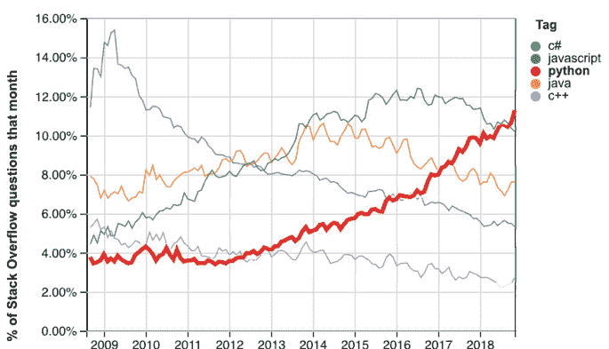

你可以在[insights.stackoverflow.com/trends](https://insights.stackoverflow.com/trends)探索这个图表并创建类似的图表。

注意Python与其他通常候选语言相比的惊人增长，而其他语言则趋于平稳甚至呈下降趋势！如果你将自己的未来押注于某项技术的成功，你会从这个列表中选择哪一个？

这只是一张图表，它真正告诉我们什么？嗯，让我们看看另一张。StackOverflow每年对开发者进行一次调查。它非常全面且做得很好。你可以在[insights.stackoverflow.com/survey/2018/](https://insights.stackoverflow.com/survey/2018/)找到完整的2018年结果。从那篇报告中，我想请你注意一个名为[最受喜爱、最令人畏惧和最令人向往的语言](https://insights.stackoverflow.com/survey/2018/#most-loved-dreaded-and-wanted)的部分。在“最令人向往”部分，你会看到以下回应：

> > 未使用该语言或技术进行开发，但表达了使用其进行开发兴趣的开发者。

同样，在下面的图表中，你会看到Python高居榜首，甚至远超第二名：

# 开发者有多想使用一门语言？

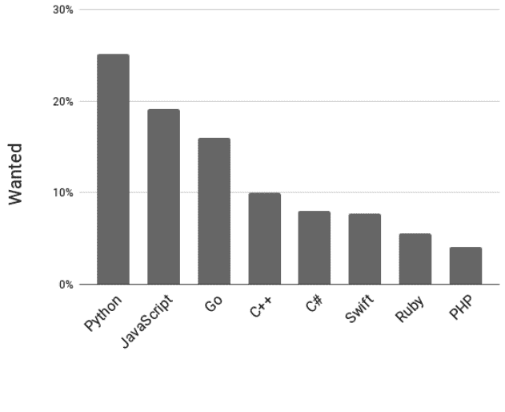

所以，如果你同意我的观点，即一门编程语言的相对受欢迎程度很重要。那么Python显然是一个不错的选择。

## 我们不需要你是计算机科学家

在你开始学习Python的旅程时，我还要强调一点：我们不需要你是计算机科学家。如果那是你的目标，很好。学习Python是朝着那个方向迈出的有力一步。但学习编程常常被框定为“我们有所有这些开发者职位空缺，我们需要软件开发者！”

这可能是真的，也可能不是。但对你来说更重要的是，编程（即使是一点点编程）对你个人而言可以是一种超能力。

为了阐明这个观点，假设你是一名生物学家。你应该放弃生物学，去从事前端网页开发工作吗？可能不应该。但是，掌握我在这篇前言开头提到的技能，比如使用`requests`从网络获取数据，将对你的生物学研究工作产生难以置信的强大助力。

与其手动从网络或电子表格中导出和抓取数据，使用Python，你可以在手动完成一项任务的时间内，抓取成千上万的数据源或电子表格。Python技能能够将你的*生物学能力*放大，使其远超你的同事，并成为你的*超能力*。

## Dan 与 Real Python

最后，让我对本书的作者们做个介绍。Dan Bader 与其他 Real Python 的作者们日复一日地通过 realpython.com 为我们所有人带来清晰而有力的 Python 概念讲解。

他们对 Python 生态系统有着独特的见解，并且深知初学者需要了解什么。

我放心地将你们在这段 Python 学习之旅中托付给他们。请使用这本优秀的书籍，去学习这门令人惊叹的语言吧。最重要的是，记住要享受其中的乐趣！

— **Michael Kennedy**，Talk Python 创始人 (@mkennedy)

# 第 1 章

## 引言

欢迎阅读 Real Python 的 *Python 基础* 一书，本书已针对 Python 3.8 全面更新！在本书中，你将学习实用的 Python 编程技术，并通过有用且有趣的示例进行说明。

无论你是编程新手，还是希望深入学习一门新语言的专业软件开发者，本书都将教你所有实用的 Python 知识，帮助你独立开始项目。

无论你的最终目标是什么，只要你使用计算机，你很快就会发现无数种方法，通过创建 Python 程序来自动化任务和解决问题，从而改善你的生活。

但是，Python 作为一门编程语言，究竟有什么特别之处呢？Python 是开源的免费软件，这意味着你可以免费下载它，并用于任何目的，无论是商业还是非商业用途。

Python 还拥有一个令人惊叹的社区，他们构建了许多额外的有用工具，你可以在自己的程序中使用。需要处理 PDF 文档？有一个全面的工具可以做到。想从网页收集数据？无需从头开始！

Python 的设计初衷就是比其他编程语言更易于使用。通常，阅读 Python 代码比阅读其他语言的代码容易得多，编写 Python 代码也比用其他语言编写快得多。

例如，这里有一段用 C 语言（另一种常用编程语言）编写的简单代码：

```
#include <stdio.h>

int main(void)
{
    printf("Hello, world\n");
}
```

这个程序所做的只是在屏幕上显示文本 `Hello, world`。输出一个短语竟然需要这么多工作！下面是用 Python 编写的同一个程序：

```
print("Hello, world")
```

这非常简单，对吧？Python 代码编写更快，也更容易阅读。我们发现它看起来也更友好、更平易近人！

同时，Python 拥有其他语言的所有功能，甚至更多。你可能会惊讶于有多少专业产品是基于 Python 代码构建的：Instagram、YouTube、Reddit、Spotify，仅举几例。

Python 不仅是一门友好且有趣的编程语言——它还为多家世界级公司背后的技术提供动力，并为任何掌握它的程序员提供了绝佳的职业机会。

### 1.1 为什么选择这本书？

让我们面对现实，互联网上关于 Python 的信息多得令人应接不暇。

但许多自学的初学者很难弄清楚*学什么*以及*按什么顺序*学习。

你可能在问自己：“为了打下坚实的基础，我一开始应该学习 Python 的哪些内容？”如果是这样，那么这本书就是为你准备的——无论你是完全的初学者，还是之前已经涉猎过 Python 或其他语言。

*Python 基础* 用通俗易懂的英语编写，并将你真正需要知道的核心概念分解成易于消化的小块。这意味着你将很快掌握“足以应付危险”的 Python 知识。

本书不会仅仅罗列枯燥的语言特性列表，而是会向你展示不同的构建模块如何组合在一起，以及使用 Python 构建真实应用程序和脚本涉及哪些内容。

你将循序渐进地掌握 Python 的基本概念，这些概念将帮助你开启学习 Python 的旅程。

许多编程书试图涵盖每个命令的每一种可能变体，这很容易让读者迷失在细节中。如果你在寻找参考手册，这种方法很棒，但它是学习编程语言的糟糕方式。你不仅会把大部分时间花在死记硬背那些你永远不会用到的东西上，而且这也不有趣！

本书基于 80/20 法则构建。我们将涵盖绝大多数情况下使用的命令和技术，并专注于如何编程解决现实世界中的问题，从而让你的生活更轻松。

这样，我们保证你将：

- 快速学习有用的编程技术
- 花更少的时间在无关紧要的复杂问题上挣扎
- 在自己的生活中发现更多 Python 的实际用途
- 在这个过程中获得更多乐趣

一旦你掌握了本书的内容，你将获得足够坚实的基础，独自探索更高级的领域将变得轻而易举。

所以，开始吧！学习用一门广泛使用、免费的语言编程，它能做的事情远超你的想象。

### 1.2 关于 Real Python

在 [Real Python](https://realpython.com)，你将从来自世界各地的专业 Python 开发者社区学习真实的编程技能。

[realpython.com](https://realpython.com) 网站于 2012 年上线，目前每月通过书籍、编程教程和其他深入的学习资源帮助超过两百万 Python 开发者。

参与本书编写的每个人都是从 Real Python 团队中招募的 *Python 实践者*，在软件行业拥有多年专业经验。

你可以在以下网址找到 Real Python：

- [realpython.com](https://realpython.com)
- [@realpython on Twitter](https://twitter.com/realpython)
- [The Real Python Email Newsletter](https://realpython.com/newsletters/)

### 1.3 如何使用本书

本书的前半部分是对所有 Python 基础知识的快速而全面的概述。你不需要任何编程经验即可开始。后半部分则专注于为有趣、真实的编码问题寻找实用的解决方案。

作为初学者，我们建议你从头到尾通读本书的前半部分。后半部分涵盖的主题重叠较少，因此你可以更轻松地跳着阅读，但随着阅读的深入，章节难度会逐渐增加。

如果你是经验更丰富的程序员，那么你可能会发现自己直接跳到本书的第二部分。但不要忽视首先打好坚实的基础，并确保在过程中填补任何知识空白。

大多数章节后面都附有**复习练习**，以帮助你确保掌握了所有涵盖的主题。还有一些**代码挑战**，这些更具挑战性，通常需要你将前面章节的多个不同概念结合起来。

本书附带的练习文件也包括了挑战以及一些较难练习的完整解答。但为了最大限度地利用这些材料，你应该在查看示例解答之前，尽力自己解决挑战问题。

如果你是编程完全新手，你可能需要通过额外的练习来补充前几章的内容。我们建议你完成 [realpython.com](https://realpython.com) 上免费提供的 *Python 基础* 教程，以确保你打下坚实的基础。

如果你对本书有任何问题或反馈，欢迎随时[联系我们](https://realpython.com/contact)。

## 在实践中学习

本书的核心是“在实践中学习”，因此请务必*亲自输入*你在书中遇到的代码片段。为了获得最佳效果，我们建议你避免复制粘贴代码示例。

如果你自己输入每一行代码，你将更好地理解概念，并更快地掌握语法。此外，如果你搞砸了——这完全正常，所有开发者每天都会发生——纠正拼写错误这个简单的动作将帮助你学习如何调试代码。

在寻求外部资源帮助之前，尝试自己完成复习练习和代码挑战。通过足够的练习，你将掌握这些材料——并在此过程中获得乐趣！

## 读完这本书需要多长时间？

如果你已经熟悉一门编程语言，那么你可能只需35到40小时就能读完这本书。如果你是编程新手，可能需要花费100小时甚至更长时间。请慢慢来，不要觉得必须匆忙。编程是一项回报丰厚但复杂的技能。祝你在Python学习之旅中好运，我们为你加油！

### 1.4 附加材料与学习资源

#### 在线资源

本书附带一些免费的附加资源，你可以在 [realpython.com/python-basics/resources](https://realpython.com/python-basics/resources) 访问。在这个网页上，你还可以找到由 Real Python 团队维护的勘误表。

## 互动测验

本书的大多数章节都附带一个免费的在线测验，以检查你的学习进度。你可以通过章节末尾提供的链接访问这些测验。测验托管在 Real Python 网站上，可以在手机或电脑上查看。

每个测验都会引导你完成一系列与书中特定章节相关的问题。其中一些是选择题，一些会要求你输入答案，还有一些则需要你编写实际的Python代码。在完成每个测验的过程中，它会记录你答对了哪些问题。

测验结束后，你会根据结果获得一个评分。如果你第一次尝试没有得到100%——别担心！这些测验旨在挑战你，预计你会多次尝试，并在每次运行中提高你的分数。

#### 练习代码仓库

本书有一个配套的[在线代码仓库](https://realpython.com/python-basics/exercises)，包含示例源代码以及练习和代码挑战的答案。该仓库按章节划分，因此你可以在完成每章后，将你的代码与我们提供的解决方案进行比较。链接如下：

[realpython.com/python-basics/exercises](https://realpython.com/python-basics/exercises)

#### 示例代码许可

与本书相关的Python示例脚本采用 [Creative Commons Public Domain (CC0) License](https://creativecommons.org/publicdomain/zero/1.0/) 许可。这意味着你可以自由地将任何部分的代码用于你自己程序中的任何目的。

> **注意**

本书中的代码已在Windows、macOS和Linux上使用Python 3.8进行了测试。

#### 格式约定

代码块将用于展示示例代码：

```
# This is Python code:
print("Hello world!")
```

终端命令遵循Unix格式：

```
$ # This is a terminal command:
$ python hello-world.py
```

（美元符号不是命令的一部分。）

*斜体文本*将用于表示文件名：*hello-world.py*。

**粗体文本**将用于表示新的或重要的术语。

键盘快捷键将格式化如下：`Ctrl` + `S`。

菜单快捷键将格式化如下：`File` > `New File`

注释和警告框显示如下：

> **注意**

这是一个用占位符文本填充的注释。敏捷的棕色狐狸跳过了懒狗。敏捷的棕色Python爬过了懒猪。

> **重要**

这是一个同样用占位符文本填充的警告。敏捷的棕色狐狸跳过了懒狗。敏捷的棕色Python爬过了懒猪。

### 反馈与勘误

我们欢迎想法、建议、反馈，以及偶尔的吐槽。你发现某个主题令人困惑吗？你在文本或代码中发现错误了吗？我们是否遗漏了你想了解更多的话题？

我们一直在努力改进我们的教学材料。无论原因如何，请通过以下链接发送你的反馈：

[realpython.com/python-basics/feedback](https://realpython.com/python-basics/feedback)

[为此部分留下反馈 »](https://realpython.com/python-basics/feedback)

# 第2章

## 设置Python

本书是关于使用Python编程的。你可以从头到尾阅读本书并吸收信息，而无需触碰键盘，但你会错过最有趣的部分——编码。

为了充分利用本书，你需要一台安装了Python的计算机，以及一种创建、编辑和保存Python代码文件的方法。

**在本章中，你将学习如何：**

- 在你的计算机上安装最新版本的Python 3
- 打开**IDLE**，Python内置的**集成开发与学习环境**

让我们开始吧！

[为此部分留下反馈 »](https://realpython.com/python-basics/feedback)

### 2.1 关于Python版本的说明

许多操作系统，如macOS和Linux，都预装了Python。你的操作系统附带的Python版本称为你的**系统Python**。

系统Python几乎总是过时的，甚至可能不是一个完整的Python安装。拥有最新版本的Python至关重要，这样你才能成功地跟随本书中的示例进行学习。

你的计算机上可以安装多个版本的Python。在本章中，你将在机器上可能已存在的任何系统Python旁边安装最新版本的Python 3。

> **注意**

即使你已经安装了Python 3.8，快速浏览本章以仔细检查你的环境是否已设置好以跟随本书学习仍然是一个好主意。

本章分为三个部分：Windows、macOS和Ubuntu Linux。找到适用于你操作系统的部分并按照步骤进行设置，然后跳到下一章。

如果你使用的是不同的操作系统，请查看Real Python的 [Python 3安装与设置指南](https://realpython.com/python-3-installation-setup-guide/)，看看你的操作系统是否被涵盖。

[为此部分留下反馈 »](https://realpython.com/python-basics/feedback)

### 2.2 Windows

按照以下步骤在Windows上安装Python 3并打开IDLE。

> **重要**

本书中的代码仅针对本节所述方式安装的Python进行了测试。

请注意，如果你通过其他方式安装了Python，例如Anaconda Python，在运行代码示例时可能会遇到问题。

#### 安装Python

Windows系统通常不预装Python。幸运的是，安装过程并不复杂，只需从 [python.org网站](http://python.org) 下载Python安装程序并运行即可。

#### 步骤1：下载Python 3安装程序

打开浏览器窗口，导航到python.org的 [Windows下载页面](http://python.org)。

在顶部标题 *Python Releases for Windows* 下，点击 *Latest Python 3 Release - Python 3.x.x* 的链接。在撰写本文时，最新版本是Python 3.8。然后滚动到底部并选择 *Windows x86-64 executable installer*。

> **注意**

如果你的系统是32位处理器，那么你应该选择32位安装程序。如果你不确定你的计算机是32位还是64位，请坚持使用上面提到的64位安装程序。

#### 步骤2：运行安装程序

通过双击下载的文件来运行安装程序。你应该会看到以下窗口：

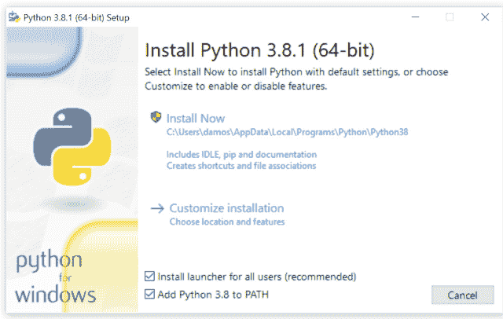

> **重要**

请确保勾选 *Add Python 3.x to PATH* 复选框，如图所示，以确保安装程序将解释器添加到你的执行路径中。

如果你在安装Python时没有勾选此框，可以再次运行安装程序并选择它。

点击 `Install Now` 安装Python 3。等待安装完成，然后继续打开IDLE。

#### 打开IDLE

你可以通过两个步骤打开IDLE：

1. 点击开始菜单并找到 *Python 3.8* 文件夹。
2. 打开文件夹并选择 *IDLE (Python 3.8)*。

> **注意**

我们建议使用IDLE来跟随本书学习。

如果你愿意，可以使用不同的代码编辑器。但是，某些章节，例如第7章：*查找与修复代码错误*，包含特定于IDLE的内容。

IDLE会在一个新窗口中打开一个**Python shell**。Python shell是一个交互式环境，允许你输入一些Python代码并立即执行它。这是开始学习Python的好方法！

Python shell窗口如下所示：

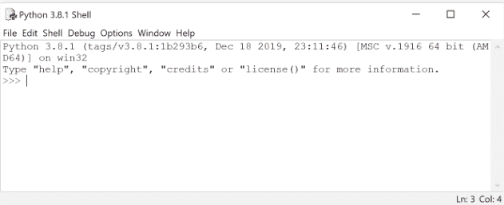

在窗口顶部，你可以看到正在运行的Python版本以及一些关于操作系统的信息。如果你看到的版本低于3.7，你可能需要重新查看上一节的安装说明。

你看到的 `>>>` 符号称为**提示符**。每当你看到这个符号时，就意味着Python正在等待你给出一些指令。

### 2.3 macOS

请按照以下步骤在 macOS 上安装 Python 3 并打开 IDLE。

> **重要提示**

本书中的代码仅针对按本节所述方式安装的 Python 进行了测试。

请注意，如果您通过其他方式（例如 Homebrew 或 Anaconda Python）安装了 Python，在运行代码示例时可能会遇到问题。

#### 安装 Python

大多数 macOS 机器预装了 Python 2。您需要安装最新版本的 Python 3。您可以通过从 [python.org](https://python.org) 网站下载安装程序来完成此操作。

#### 步骤 1：下载 Python 3 安装程序

打开浏览器窗口，导航至 [python.org](https://python.org) 上的 [macOS 下载页面](https://python.org)。

在顶部标题 *Python Releases for macOS* 下方，点击 *Latest Python 3 Release - Python 3.x.x* 的链接。截至撰写本文时，最新版本是 Python 3.8。然后滚动到页面底部，选择 *macOS 64-bit/32-bit installer*。这将开始下载。

#### 步骤 2：运行安装程序

双击下载的文件以运行安装程序。您应该会看到以下窗口：

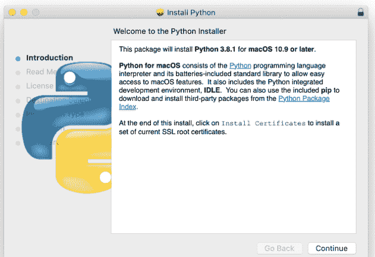

1.  多次点击 `Continue` 按钮，直到被要求同意软件许可协议。然后点击 `Agree`。您将看到一个窗口，告知 Python 的安装位置以及所需空间。
2.  您很可能不想更改默认位置，因此直接点击 `Install` 开始安装。Python 安装程序会在文件复制完成后通知您。
3.  点击 `Close` 关闭安装程序窗口。现在 Python 已安装，您可以打开 IDLE 并准备编写您的第一个 Python 程序。

#### 打开 IDLE

您可以通过三个步骤打开 IDLE：

1.  打开 Finder 并点击 *Applications*。
2.  找到 *Python 3.8* 文件夹并双击它。
3.  双击 IDLE 图标。

您也可以使用 Spotlight 搜索功能打开 IDLE。按 `Cmd` + `Spacebar` 打开 Spotlight 搜索，输入单词 `idle`，然后按 `Return` 打开 IDLE。

> **注意**

我们建议使用 IDLE 来跟随本书学习。

如果您愿意，可以使用其他代码编辑器。但是，某些章节（例如第 7 章：*查找和修复代码错误*）包含特定于 IDLE 的材料。

IDLE 会在一个新窗口中打开一个 **Python shell**。Python shell 是一个交互式环境，允许您输入一些 Python 代码并立即执行。这是开始学习 Python 的绝佳方式！

Python shell 窗口如下所示：

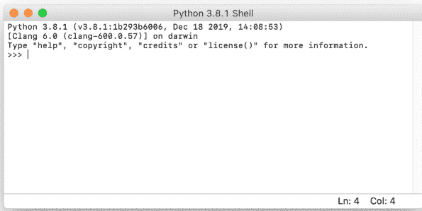

在窗口顶部，您可以看到正在运行的 Python 版本以及一些操作系统信息。如果您看到的版本低于 3.7，您可能需要重新查看上一节的安装说明。

您看到的 `>>>` 符号称为 **提示符**。每当您看到这个符号时，就意味着 Python 正在等待您给出一些指令。

> **互动测验**

本章附带一个免费的在线测验，以检查您的学习进度。您可以通过手机或电脑访问以下网址进行测验：

[realpython.com/quizzes/python-basics-2](https://realpython.com/quizzes/python-basics-2)

现在您已经安装了 Python，让我们直接开始编写您的第一个 Python 程序吧！请继续前往第 3 章。

[为此部分提供反馈 »](https://realpython.com)

### 2.4 Ubuntu Linux

请按照以下步骤在 Ubuntu Linux 上安装 Python 3 并打开 IDLE。

> **重要提示**

本书中的代码仅针对按本节所述方式安装的 Python 进行了测试。

请注意，如果您通过其他方式（例如 Anaconda Python）安装了 Python，在运行代码示例时可能会遇到问题。

#### 安装 Python

您的 Ubuntu 发行版很可能已经安装了 Python，但它可能不是最新版本，并且可能是 Python 2 而不是 Python 3。

要查明您安装了哪些版本，请打开终端窗口并尝试以下命令：

```
$ python --version
$ python3 --version
```

其中一个或多个命令应返回一个版本，如下所示（您的版本号可能不同）：

```
$ python3 --version
Python 3.8.1
```

如果显示的版本是 Python 2.x 或低于 3.8 的 Python 3 版本，那么您需要安装最新版本。在 Ubuntu 上安装 Python 的方式取决于您运行的 Ubuntu 版本。您可以通过运行以下命令来确定您的本地 Ubuntu 版本：

```
$ lsb_release -a
No LSB modules are available.
Distributor ID: Ubuntu
Description:    Ubuntu 18.04.1 LTS
Release:        18.04
Codename:       bionic
```

查看控制台输出中 Release 旁边的版本号，并按照下面相应的说明操作。

#### Ubuntu 18.04+

Ubuntu 18.04 版本默认不包含 Python 3.8，但它在 Universe 软件源中。您可以在终端应用程序中使用以下命令安装它：

```
$ sudo apt-get update
$ sudo apt-get install python3.8 idle-python3.8
```

#### Ubuntu 17 及更低版本

对于 Ubuntu 17 及更低版本，Python 3.8 不在 Universe 软件源中。您需要从个人软件包存档（PPA）获取它。要从“deadsnakes” PPA 安装 Python，请在终端应用程序中运行以下命令：

```
$ sudo add-apt-repository ppa:deadsnakes/ppa
$ sudo apt-get update
$ sudo apt-get install python3.8 idle-python3.8
```

您可以通过运行 `python3 --version` 来检查是否安装了正确版本的 Python。如果您看到的版本号低于 3.7，您可能需要输入 `python3.8 --version`。现在您已准备好打开 IDLE 并开始编写您的第一个 Python 程序。

#### 打开 IDLE

您可以通过在命令行中输入以下内容来打开 IDLE：

```
$ idle-python3.8
```

在某些 Linux 安装中，您可以使用以下简短命令打开 IDLE：

```
$ idle3
```

> **注意**

我们建议使用 IDLE 来跟随本书学习。

如果您愿意，可以使用其他代码编辑器。但是，某些章节（例如第 7 章：*查找和修复代码错误*）包含特定于 IDLE 的材料。

IDLE 会在一个新窗口中打开一个 **Python shell**。Python shell 是一个交互式环境，允许您输入一些 Python 代码并立即执行。这是开始学习 Python 的绝佳方式！

Python shell 窗口如下所示：

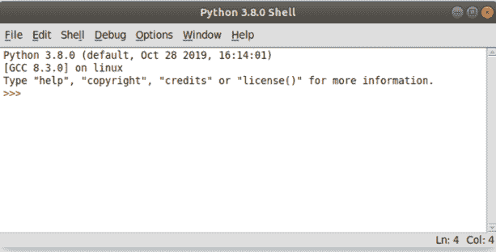

在窗口顶部，您可以看到正在运行的 Python 版本以及一些操作系统信息。如果您看到的版本低于 3.8，您可能需要重新查看上一节的安装说明。

> **重要提示**

如果您使用 `idle3` 命令打开 IDLE，并且在 Python shell 窗口中看到的版本低于 3.7，那么您将需要使用 `idle-python3.8` 命令打开 IDLE。

您在 IDLE 窗口中看到的 `>>>` 符号称为 **提示符**。每当您看到这个符号时，就意味着 Python 正在等待您给出一些指令。

> **互动测验**

本章附带一个免费的在线测验，以检查您的学习进度。您可以通过手机或电脑访问以下网址进行测验：

[realpython.com/quizzes/python-basics-2](https://realpython.com/quizzes/python-basics-2)

现在您已经安装了 Python，让我们直接开始编写您的第一个 Python 程序吧！请继续前往第 3 章。

[为此部分提供反馈 »](https://realpython.com)

# 第三章

## 你的第一个 Python 程序

既然你已经在电脑上安装了最新版本的 Python，是时候开始编程了！

**在本章中，你将：**

- 编写你的第一个 Python 脚本
- 了解运行包含错误的脚本时会发生什么
- 学习如何声明变量并检查其值
- 学习如何编写注释

准备好开始你的 Python 之旅了吗？我们出发吧！

### 3.1 编写一个 Python 脚本

如果你还没有打开 IDLE，请现在打开它。在 IDLE 中，你将主要使用两个窗口：**交互式窗口**（启动 IDLE 时打开的那个）和**脚本窗口**。

你可以在交互式窗口和脚本窗口中输入代码。两者的区别在于代码的执行方式。在本节中，你将编写你的第一个 Python 程序，并学习如何在两个窗口中运行它。

## 交互式窗口

交互式窗口包含一个 **Python shell**，这是一个用于与 Python 语言交互的文本用户界面。因此得名“交互式窗口”。

当你第一次打开 IDLE 时，显示的文本看起来像这样：

```
Python 3.8.1 (tags/v3.8.1:1b293b6, Dec 18 2019, 22:39:24)
[MSC v.1916 32 bit (Intel)] on win32
Type "help", "copyright", "credits" or "license" for more information.
>>>
```

第一行告诉你正在运行的 Python 版本。在这个例子中，IDLE 运行的是 Python 3.8.1。第二行和第三行提供了一些关于操作系统的信息，以及一些你可以用来获取更多 Python 信息的命令。

最后一行中的 `>>>` 符号被称为**提示符**。这是你输入代码的地方。请在提示符处输入 `1 + 1` 并按回车键。

当你按下回车键时，Python 会计算表达式，显示结果 `2`，然后提示你输入更多内容：

```
>>> 1 + 1
2
>>>
```

注意，在你的结果之后，Python 提示符 `>>>` 再次出现。Python 已准备好接收更多指令！每次你运行一些代码，一个新的提示符就会直接出现在输出下方。

交互式窗口中的事件序列可以描述为一个包含三个步骤的循环：

1. 首先，Python 读取在提示符处输入的代码。
2. 然后代码被计算。
3. 最后，输出被打印在窗口中，并显示一个新的提示符。

这个循环通常被称为**读取-计算-打印循环**，或简称 **REPL**。Python 程序员有时将 Python shell 称为“Python REPL”，或简称为“REPL”。

> **注意**

从现在开始，代码示例中不再包含在交互式窗口中执行代码后显示的最后一个 `>>>` 提示符。

让我们尝试一些比两个数字相加更有趣的事情。每个程序员的必经之路是编写他们的第一个“Hello, world”程序，在屏幕上打印短语“Hello, world”。

要在 Python 中将文本打印到屏幕，你需要使用 `print()` 函数。**函数**是一段代码，它通常接受一些输入（称为**参数**），对输入进行处理，然后产生一些输出（称为**返回值**）。

粗略地说，代码中的函数就像数学函数一样工作。例如，数学函数 $A(r)=\pi r^2$ 以圆的半径 r 作为输入，并产生圆的面积作为输出。

> **重要**

然而，与数学函数的类比存在一些问题，因为代码函数可能有**副作用**。副作用发生在函数执行某些操作，改变了程序或运行程序的计算机的某些状态时。

例如，你可以用 Python 编写一个函数，它接受某人的名字作为输入，将名字存储在计算机上的一个文件中，然后输出包含该名字的文件路径。将名字保存到文件的操作就是该函数的副作用。

你将在第 6 章学习更多关于函数的知识，包括如何编写自己的函数。

Python 的 `print()` 函数接受一些文本作为输入，然后在屏幕上显示该文本。要使用 `print()`，请在交互式窗口的提示符处输入单词 `print`，后跟括号内的文本 "Hello, world"：

```
>>> print("Hello, world")
Hello, world
```

这里的 "Hello, world" 是**传递**给 `print()` 的参数。"Hello, world" 必须用引号括起来，这样 Python 才会将其解释为文本，而不是其他东西。

> **注意**

当你在交互式窗口中输入代码时，你可能会注意到代码的某些部分的字体颜色发生了变化。IDLE 以不同的颜色**高亮显示**代码的不同部分，以帮助你更容易地识别它们。

默认情况下，内置函数（如 `print()`）显示为紫色，文本显示为绿色。

交互式窗口一次只能执行一行代码。这对于尝试小的代码示例和探索 Python 语言很有用，但它有一个主要的限制：代码必须由人一行一行地输入！

或者，你可以将一些 Python 代码存储在一个文本文件中，然后用单个命令执行文件中的所有代码。文件中的代码称为**脚本**，包含 Python 脚本的文件称为**脚本文件**。

脚本文件不仅使运行程序更容易，而且可以与其他人共享，以便他们也能运行你的程序。

## 脚本窗口

脚本是使用 IDLE 的脚本窗口编写的。你可以通过从交互式窗口顶部的菜单中选择“文件” > “新建文件”来打开脚本窗口。

注意，当脚本窗口打开时，交互式窗口保持打开状态。在脚本窗口中运行的代码生成的任何输出都会显示在交互式窗口中，因此你可能需要重新排列这两个窗口，以便同时看到它们。

在脚本窗口中，输入你在交互式窗口中用于打印 "Hello, world" 的相同代码：

```
print("Hello, world")
```

就像交互式窗口一样，输入到脚本窗口中的代码也会被高亮显示。

> **重要**

当你在脚本中编写代码时，你不需要包含在 IDLE 交互式窗口中看到的 `>>>` 提示符。如果你从显示 REPL 提示符的示例中复制和粘贴代码，请记住这一点。

不过，请记住，不建议你从书中复制和粘贴示例。自己输入每个示例真的很有收获！

在运行脚本之前，你必须保存它。从窗口顶部的菜单中，选择“文件” > “保存”，并将脚本保存为 `hello_world.py`。`.py` 文件扩展名是用于表示文件包含 Python 代码的约定扩展名。

事实上，如果你将脚本保存为除 `.py` 以外的任何扩展名，代码高亮显示将消失，文件中的所有文本都将显示为黑色。IDLE 只有在 Python 代码存储在 `.py` 文件中时才会高亮显示。

脚本保存后，运行程序只需从脚本窗口中选择“运行” > “运行模块”，你就会在交互式窗口中看到 `Hello, world` 出现：

```
Hello, world
```

> **注意**

你也可以按 F5 从脚本窗口运行脚本。

每次运行脚本时，你都会在交互式窗口中看到类似以下的输出：

```
>>> ======================== RESTART ========================
```

这是 IDLE 用来分隔不同脚本运行输出的方式。否则，如果你连续运行一个脚本，可能不清楚哪个输出属于哪个脚本。

要在 IDLE 中打开现有脚本，请从脚本窗口或交互式窗口的菜单中选择“文件” > “打开...”。然后浏览并选择要打开的脚本文件。IDLE 会在新的脚本窗口中打开脚本，因此你可以同时打开多个脚本。

> **注意**

从文件管理器（如 Windows 资源管理器）双击 `.py` 文件确实会在新窗口中执行脚本。但是，脚本运行完毕后窗口会立即关闭——通常在你甚至能看到发生了什么之前。

要在 IDLE 中打开文件以便运行并查看输出，你可以右键单击文件图标（在 macOS 上为 Ctrl + 单击），然后选择“使用 IDLE 编辑”。

### 3.2 搞砸事情

每个人都会犯错——尤其是在编程时！如果你还没有犯任何错误，让我们先发制人，故意搞砸一些事情，看看会发生什么。

程序中犯的错误称为**错误**，你将遇到两种主要类型的错误：

1. 语法错误
2. 运行时错误

在本节中，你将看到一些代码错误的示例，并学习如何使用 Python 在发生错误时显示的输出来理解发生了什么错误以及是哪段代码导致的。

## 语法错误

通俗地说，当你编写的代码在 Python 语言中不被允许时，就会发生**语法错误**。你可以通过将上一节 `hello_world.py` 脚本的内容更改为以下内容来创建一个语法错误：

```
print("Hello, world)
```

在这个例子中，"Hello, world" 末尾的双引号被移除了。Python 将无法判断文本字符串在哪里结束。保存修改后的脚本，然后尝试运行它。会发生什么？

代码将无法运行！IDLE 会显示一个警告框，其中包含以下消息：

```
EOL while scanning string literal.
```

**EOL** 代表 **End Of Line**（行尾），因此此消息告诉你 Python 一直读到行尾，都没有找到一个叫做字符串字面量的东西的结尾。

**字符串字面量**是包含在两个双引号之间的文本。文本 "Hello, world" 就是一个字符串字面量的例子。

> **注意**

为了简洁，字符串字面量通常简称为**字符串**，尽管术语“字符串”在 Python 中技术上具有更广泛的含义。你将在第 4 章学习更多关于字符串的知识。

回到脚本窗口，注意包含 "Hello, world" 的那一行被高亮显示为红色。这个便捷的功能可以帮助你快速找到导致语法错误的代码行。

## 运行时错误

IDLE 在程序开始运行之前就能捕获语法错误，但有些错误只有在程序执行时才能被捕获。这些错误被称为**运行时错误**，因为它们只在程序运行时发生。

要生成一个运行时错误，请将 `hello_world.py` 中的代码更改为以下内容：

```
print(Hello, world)
```

现在，短语 "Hello, world" 两边的引号都被移除了。你注意到当你移除引号时，文本颜色如何变成黑色了吗？IDLE 不再将 `Hello, world` 识别为一个字符串。

你认为运行脚本时会发生什么？试一试看看！

交互式窗口中显示了一些红色文本：

```
Traceback (most recent call last):
  File "/home/hello_world.py", line 1, in <module>
    print(Hello, world)
NameError: name 'Hello' is not defined
```

发生了什么？在尝试执行程序时，Python **引发**了一个错误。每当发生错误时，Python 就会停止执行程序，并在 IDLE 的交互式窗口中显示错误。

为错误显示的文本称为**回溯**。回溯为你提供了一些关于错误的有用信息。上面的回溯告诉我们以下所有信息：

- 错误发生在 `hello_world.py` 的第 1 行。
- 生成错误的行是：`print(Hello, world)`。
- 发生了一个 `NameError`。
- 具体的错误是 `name 'Hello' is not defined`。

`Hello, world` 周围的引号缺失了，所以 Python 不理解它是一个文本字符串。相反，Python 认为 `Hello` 和 `world` 是代码中其他东西的名称。由于名称 `Hello` 和 `world` 从未在任何地方定义过，程序崩溃了。

在下一节中，你将看到如何为代码中的值定义名称。不过在继续之前，你可以通过完成复习练习来练习语法错误和运行时错误。

## 复习练习

你可以在 [realpython.com/python-basics/resources](https://realpython.com/python-basics/resources) 在线找到这些练习的解决方案和许多其他额外资源。

1. 编写一个 IDLE 不会让你运行的脚本，因为它有语法错误。
2. 编写一个只有在程序已经运行时才会导致程序崩溃的脚本，因为它有运行时错误。

[为此部分提供反馈 »](https://realpython.com/python-basics/resources)

### 3.3 创建变量

在 Python 中，**变量**是可以被赋值并在整个代码中用于引用该值的名称。变量是编程的基础，原因有二：

1.  **变量保持值的可访问性：** 例如，某个耗时操作的结果可以被赋值给一个变量，这样就不需要每次使用结果时都执行该操作。
2.  **变量赋予值上下文：** 数字 28 可能意味着很多不同的事情，比如班级的学生人数，或者用户访问网站的次数等等。将值 28 命名为 `num_students` 之类的名称可以使值的含义清晰明了。

在本节中，你将学习如何在代码中使用变量，以及 Python 程序员在为变量选择名称时遵循的一些惯例。

## 赋值运算符

值使用一个称为**赋值运算符**的特殊符号 = 赋值给变量。**运算符**是一个符号，如 = 或 +，它对一个或多个值执行某些操作。

例如，+ 运算符接受两个数字，一个在运算符左边，一个在运算符右边，并将它们相加。同样，= 运算符接受运算符右边的一个值，并将其赋值给运算符左边的名称。

为了看看赋值运算符的实际作用，让我们修改你在上一节看到的 "Hello, world" 程序。这次，我们将在将其打印到屏幕之前使用一个变量来存储一些文本：

```
>>> phrase = "Hello, world"
>>> print(phrase)
Hello, world
```

在第一行，使用 = 运算符创建了一个名为 `phrase` 的变量，并为其赋值 "Hello, world"。原本在 `print()` 函数括号内使用的字符串 "Hello, world" 被变量 `phrase` 替换。

当你执行 `print(phrase)` 时，会显示输出 `Hello, world`，因为 Python 查找名称 `phrase` 并发现它已被赋值为 "Hello, world"。

如果你在执行 `print(phrase)` 之前没有执行 `phrase = "Hello, world"`，你就会看到一个 `NameError`，就像你在上一节尝试执行 `print(Hello, world)` 时看到的那样。

> **注意**

虽然 = 看起来像数学中的等号，但它在 Python 中具有不同的含义。区分 = 运算符和等号很重要，这可能是初学程序员感到沮丧的一个原因。

只需记住，每当你看到 = 运算符时，它右边的任何内容都会被赋值给左边的变量。

变量名**区分大小写**，因此名为 `phrase` 的变量与名为 `Phrase` 的变量（注意大写的 P）是不同的。例如，以下代码会产生一个 `NameError`：

```
>>> phrase = "Hello, world"
>>> print(Phrase)
Traceback (most recent call last):
  File "<stdin>", line 1, in <module>
NameError: name 'Phrase' is not defined
```

当你在本书的代码示例中遇到问题时，请务必仔细检查代码中的每个字符（包括空格）是否与示例完全匹配。计算机无法使用常识来解释你想要说什么，所以*几乎*正确不会让计算机做正确的事情！

## 有效变量名的规则

变量名可以任意长或任意短，但你必须遵循几条规则。变量名只能包含大写和小写字母（A-Z，a-z）、数字（0-9）和下划线（_）。但是，变量名不能以数字开头。

例如，`phrase`、`string1`、`_a1p4a` 和 `list_of_names` 都是有效的变量名，但 `91lives` 不是。

> **注意**

Python 变量名可以包含许多不同的有效 Unicode 字符。**Unicode** 是一个用于数字化表示世界上大多数书写系统中文本的标准。

这意味着变量名可以包含非英文字母表中的字母，例如带装饰的字母 é 和 ü，甚至中文、日文和阿拉伯文符号。

但是，并非每个系统都能显示带装饰的字符，因此如果你的代码将与许多不同地区的人共享，最好避免使用它们。

你可以在 [Wikipedia](https://en.wikipedia.org/wiki/Unicode) 上了解更多关于 Unicode 的信息。Python 对 Unicode 的支持在 [Python 官方文档](https://docs.python.org/3/howto/unicode.html) 中有介绍。

仅仅因为一个变量名是有效的，并不一定意味着它是一个好名字。为变量选择一个好名字可能出奇地困难。然而，你可以遵循一些指导原则来帮助你选择更好的名字。

## 描述性名称优于简短名称

描述性的变量名至关重要，尤其是在复杂的程序中。通常，描述性名称需要使用多个单词。不要害怕使用长变量名。

在下面的例子中，值 3600 被赋值给变量 s：

```
s = 3600
```

名称 s 完全含糊不清。使用完整的单词会使理解代码的含义变得容易得多：

```
seconds = 3600
```

seconds 是一个比 s 更好的名字，因为它提供了更多的上下文。但是它仍然无法传达代码的全部含义。3600是某个进程完成所需的秒数，还是一部电影的长度？这无法判断。

以下变量名则清楚地表明了代码的含义：

```
seconds_per_hour = 3600
```

当你阅读上述代码时，毫无疑问，3600就是一小时的秒数。虽然`seconds_per_hour`比单个字母`s`和单词`seconds`都需要更长的输入时间，但其在清晰度上的回报是巨大的。

虽然使用描述性变量名意味着使用更长的变量名，但你应该避免使用过长的名称。“过长”的真正含义是主观的，但一个好的经验法则是将变量名保持在三到四个单词以内。

## Python 变量命名约定

在许多编程语言中，通常使用**驼峰命名法**来编写变量名，例如`numStudents`和`listOfNames`。除第一个单词外，每个单词的首字母大写，其余所有字母小写。小写字母和大写字母的并列看起来像骆驼的驼峰。

然而，在Python中，更常见的是使用**蛇形命名法**来编写变量名，例如`num_students`和`list_of_names`。所有字母均为小写，每个单词之间用下划线分隔。

虽然没有硬性规定强制你必须使用蛇形命名法编写变量名，但这种做法已被纳入一份名为[PEP 8](https://peps.python.org/pep-0008/)的文档中，该文档被广泛视为编写Python代码的官方风格指南。

遵循PEP 8中概述的标准可确保你的Python代码能被大量Python程序员阅读。这使得代码的共享和协作对所有参与者都更加容易。

> **注意**

本课程中的所有代码示例都遵循PEP 8指南，因此你将大量接触到遵循标准格式指南的Python代码是什么样子。

在本节中，你学习了如何创建变量、有效变量名的规则，以及一些选择好的变量名的指导原则。接下来，你将学习如何在IDLE的交互式窗口中检查变量的值。

## 复习练习

你可以在[realpython.com/python-basics/resources](https://realpython.com/python-basics/resources)在线找到这些练习的解决方案和许多其他额外资源。

1.  使用交互式窗口，通过`print()`函数在屏幕上显示一些文本。
2.  使用交互式窗口，通过将字符串保存到变量来显示一串文本，然后使用变量名在`print()`函数中引用该字符串。
3.  通过首先将代码保存在脚本中并运行它，再次完成前两个练习。

[为此部分提供反馈 »](https://realpython.com/python-basics/resources)

### 3.4 在交互式窗口中检查值

你已经了解了如何使用`print()`来显示已赋值给变量的字符串。在Python shell中工作时，还有另一种显示变量值的方法。

在IDLE的交互式窗口中输入以下内容：

```
>>> phrase = "Hello, world"
>>> phrase
```

当你第二次输入`phrase`并按回车键后，将显示以下输出：

```
'Hello, world'
```

Python打印出了字符串"Hello, world"，而你无需输入`print(phrase)`！

现在输入以下内容：

```
>>> print(phrase)
```

这一次，当你按回车键时，你会看到：

```
Hello, world
```

你看到这个输出与简单输入`phrase`的输出之间的区别了吗？它没有任何单引号包围。这是怎么回事？

当你输入`phrase`并按回车键时，你是在告诉Python**检查**变量`phrase`。显示的输出是赋值给该变量的值的有用表示。

在这种情况下，`phrase`被赋值为字符串"Hello, world"，因此输出被单引号包围，以表明`phrase`是一个字符串。

另一方面，当你`print()`一个变量时，Python会显示该变量值的更易于人类阅读的表示。对于字符串，两种显示方式都是人类可读的，但对于每种值类型来说并非如此。

有时，打印和检查一个变量会产生相同的输出：

```
>>> x = 2
>>> x
2
>>> print(x)
2
```

这里，`x`被赋值为数字2。`print(x)`的输出和检查`x`都没有被引号包围，因为2是一个数字而不是一个字符串。

检查变量而不是打印它有几个好处。你可以用它来显示变量的值而无需输入`print()`。更重要的是，检查变量通常比`print()`提供更有用的信息。

假设你有两个变量：`x = 2`和`y = "2"`。在这种情况下，`print(x)`和`print(y)`显示的内容相同。然而，检查`x`和`y`则显示了每个变量值之间的差异：

```
>>> x = 2
>>> y = "2"
>>> print(x)
2
>>> print(y)
2
>>> x
2
>>> y
'2'
```

这里的关键要点是，`print()`显示变量值的可读表示，而检查则提供关于值类型的附加信息。

你可以在Python shell中检查的不仅仅是变量。看看当你输入`print`并按回车键时会发生什么：

```
>>> print
<built-in function print>
```

请记住，你只能在Python shell中检查变量。例如，保存并运行以下脚本：

```
phrase = "Hello, world"
phrase
```

脚本执行时没有任何错误，但没有显示任何输出！在本书中，你将看到使用交互式窗口检查变量的示例。

[为此部分提供反馈 »](https://realpython.com/python-basics/resources)

### 3.5 留下有用的注释

程序员经常阅读几个月前自己编写的代码，并疑惑“这到底是干什么的？”。即使使用了描述性的变量名，当你长时间没有查看代码时，也很难记住你当初为什么那样写。

为了帮助避免这个问题，你可以在代码中留下注释。**注释**是不影响脚本运行方式的文本行。它们有助于记录应该发生的事情。

在本节中，你将学习在代码中留下注释的三种方法。你还将学习一些格式化注释的约定，以及一些关于过度使用注释的常见问题。

#### 如何编写注释

编写注释最常见的方法是在代码中以`#`字符开始新的一行。当你的代码运行时，任何以`#`开头的行都会被忽略。从新行开始的注释称为**块注释**。

你也可以编写**行内注释**，即与某些代码出现在同一行的注释。只需在代码行的末尾放置一个`#`，然后是注释文本。

这是一个添加了两种注释的`hello_world.py`脚本示例：

```
# 这是一个块注释。

phrase = "Hello, world."
print(phrase)  # 这是一个行内注释。
```

第一行什么都不做，因为它以`#`开头。同样，`print(phrase)`在最后一行执行，但`#`之后的所有内容都被忽略。

当然，你仍然可以在字符串内部使用`#`符号。例如，Python不会将以下内容误认为是注释的开始：

```
print("#1")
```

一般来说，最好让注释尽可能简短，但有时你需要写的内容超过单行合理的长度。在这种情况下，你可以在以`#`符号开头的新行上继续你的注释：

```
# 这是我的第一个脚本。
# 它打印短语 "Hello, world."。
# 注释比脚本还长！

phrase = "Hello, world."
print(phrase)
```

除了给自己留笔记外，注释还可以在测试程序时用于**注释掉**代码。换句话说，在代码行的开头添加一个`#`，可以让你运行程序时就好像该行代码不存在一样，而无需删除任何代码。

要在IDLE中注释掉一段代码，请高亮显示一行或多行

## 约定与常见问题

根据 PEP 8 规范，注释应始终使用完整的句子书写，并在 `#` 号与注释的第一个单词之间保留一个空格：

```
# This comment is formatted to PEP 8.

#don't do this
```

对于行内注释，PEP 8 建议在代码与 `#` 符号之间至少保留两个空格：

```
phrase = "Hello, world"  # This comment is PEP 8 compliant.
print(phrase)# This comment isn't.
```

程序员们普遍反感的一类注释是：描述那些从代码中就能明显看出的内容。例如，以下注释就是多余的：

```
# Print "Hello, world"
print("Hello, world")
```

在这个例子中，代码本身已经清晰地说明了其功能，因此无需注释。注释最好用于澄清那些可能不易理解的代码，或者解释为何要以某种特定方式执行操作。

总的来说，PEP 8 建议谨慎使用注释。仅当注释能通过阐明*为何*要以某种方式执行操作，从而为代码增添价值时才使用。描述*做了什么*的注释，通常可以通过使用更具描述性的变量名来避免。

[为此部分提供反馈 »](https://realpython.com/feedback/)

### 3.6 总结与补充资源

在本章中，你编写并执行了你的第一个 Python 程序！你编写了一个使用 `print()` 函数显示文本 "Hello, world" 的小程序。

你接触了三个概念：

1.  **变量** 使用赋值运算符 (=) 为代码中的值命名。
2.  **错误**，例如语法错误和运行时错误，会在 Python 无法执行你的代码时引发。它们会以回溯信息的形式显示在 IDLE 的交互式窗口中。
3.  **注释** 是不会被执行的代码行，它们作为文档，供你自己和其他需要阅读你代码的程序员参考。

**互动测验**

本章附带一个免费的在线测验，用于检查你的学习进度。你可以使用手机或电脑通过以下网址访问测验：

[realpython.com/quizzes/python-basics-3](https://realpython.com/quizzes/python-basics-3)

## 补充资源

要了解更多，请查看以下资源：

- [学习 Python 编程的 11 个初学者技巧](https://realpython.com/learning-paths/beginner-python-programming/)
- [在 Python 中编写注释（指南）](https://realpython.com/python-comments-guide/)
- [realpython.com 上的推荐资源](https://realpython.com/)

[为此部分提供反馈 »](https://realpython.com/feedback/)

# 第 4 章

## 字符串与字符串方法

许多程序员，无论其专业领域如何，每天都会处理文本。例如，网络开发者处理来自网页表单的输入文本。数据科学家处理文本以提取数据并执行诸如情感分析之类的操作，这有助于识别和分类文本中的观点。

Python 中的文本集合称为 **字符串**。用于操作字符串的特殊函数称为 **字符串方法**。有用于将字符串从小写转换为大写、删除字符串开头或结尾的空白、或用不同文本替换字符串部分等的字符串方法，还有很多其他功能。

**在本章中，你将学习如何：**

- 使用字符串方法操作字符串
- 处理用户输入
- 处理数字字符串
- 格式化字符串以供打印

让我们开始吧！

[为此部分提供反馈 »](https://realpython.com/feedback/)

### 4.1 什么是字符串？

在第 3 章中，你创建了字符串 "Hello, world" 并使用 `print()` 函数在 IDLE 的交互式窗口中打印了它。在本节中，你将更深入地了解字符串到底是什么，以及在 Python 中创建字符串的各种方式。

#### 字符串数据类型

字符串是 Python 的基本数据类型之一。术语 **数据类型** 指的是一个值所代表的数据种类。字符串用于表示文本。

> **注意**
>
> Python 还内置了其他几种数据类型。例如，你将在第 5 章学习数值数据类型，在第 8 章学习布尔类型。

我们说字符串是一种 **基本** 数据类型，因为它们不能被分解为更小的、不同类型的值。并非所有数据类型都是基本的。你将在第 9 章学习复合数据类型，也称为 **数据结构**。

字符串数据类型在 Python 中有一个特殊的缩写名称：`str`。你可以通过使用 `type()` 函数来查看这一点，该函数用于确定给定值的数据类型。

在 IDLE 的交互式窗口中输入以下内容：

```
>>> type("Hello, world")
<class 'str'>
```

输出 `<class 'str'>` 表明值 "Hello, world" 是 `str` 数据类型的一个实例。也就是说，"Hello, world" 是一个字符串。

> **注意**
>
> 目前，你可以将“class”一词视为“数据类型”的同义词，尽管它实际上指的是更具体的东西。你将在第 10 章看到类到底是什么。

`type()` 也适用于已赋值给变量的值：

```
>>> phrase = "Hello, world"
>>> type(phrase)
<class 'str'>
```

字符串有三个属性，你将在接下来的章节中探索：

1.  字符串包含 **字符**，即单个字母或符号。
2.  字符串有一个 **长度**，即字符串中包含的字符数。
3.  字符串中的字符按 **顺序** 出现，意味着每个字符在字符串中都有一个编号的位置。

让我们更仔细地看看字符串是如何创建的。

#### 字符串字面量

正如你已经看到的，你可以通过将一些文本用引号括起来来创建字符串：

```
string1 = 'Hello, world'
string2 = "1234"
```

可以使用单引号 (`string1`) 或双引号 (`string2`) 来创建字符串，只要两个引号类型相同即可。

每当你通过将文本用引号括起来创建字符串时，该字符串就称为 **字符串字面量**。这个名称表明字符串是直接写在代码中的。到目前为止你看到的所有字符串都是字符串字面量。

> **注意**
>
> 并非每个字符串都是字符串字面量。例如，作为用户输入捕获的字符串不是字符串字面量，因为它没有在程序代码中明确写出。
>
> 你将在本章第 4 节学习如何处理用户输入。

字符串周围的引号称为 **分隔符**，因为它们告诉 Python 字符串从哪里开始以及在哪里结束。当一种类型的引号用作分隔符时，另一种类型的引号可以在字符串内部使用：

```
string3 = "We're #1!"
string4 = 'I said, "Put it over by the llama."'
```

Python 读取第一个分隔符后，其后的所有字符都被视为字符串的一部分，直到读取到第二个匹配的分隔符。这就是为什么你可以在双引号分隔的字符串中使用单引号，反之亦然。

如果你尝试在双引号分隔的字符串内部使用双引号，将会得到一个错误：

```
>>> text = "She said, "What time is it?""
File "<stdin>", line 1
    text = "She said, "What time is it?""
          ^
SyntaxError: invalid syntax
```

Python 会抛出一个 `SyntaxError`，因为它认为字符串在第二个 `"` 之后结束，并且不知道如何解释该行的其余部分。

> **注意**

程序员们常有一个共同的烦恼，那就是混用引号作为分隔符。在处理项目时，最好只使用单引号或只使用双引号来界定每个字符串。

请记住，这里并没有绝对的对错之分！关键在于保持一致性，因为一致性有助于让你的代码更易于阅读和理解。

字符串可以包含任何有效的 Unicode 字符。例如，字符串 "We're #1!" 包含井号 (#) 和 "1234" 包含数字。"×Pÿthøn×" 也是一个有效的 Python 字符串！

## 确定字符串的长度

字符串中包含的字符数量（包括空格）称为字符串的**长度**。例如，字符串 "abc" 的长度为 3，字符串 "Don't Panic" 的长度为 11。

要确定字符串的长度，你需要使用 Python 内置的 `len()` 函数。要查看其工作原理，请在 IDLE 的交互式窗口中输入以下内容：

```
>>> len("abc")
3
```

你也可以使用 `len()` 来获取赋值给变量的字符串的长度：

```
>>> letters = "abc"
>>> num_letters = len(letters)
>>> num_letters
3
```

首先，字符串 "abc" 被赋值给变量 `letters`。然后使用 `len()` 获取 `letters` 的长度，并将该值赋给变量 `num_letters`。最后，显示 `num_letters` 的值，即 3。

## 多行字符串

PEP 8 风格指南建议每行 Python 代码不超过 79 个字符——包括空格。

> **注意**

PEP 8 建议的 79 字符行长度，部分原因是为了便于并排阅读两个文件。然而，许多 Python 程序员认为，强制每行最多 79 个字符有时会使代码更难阅读。

在本书中，我们将严格遵循 PEP 8 推荐的行长度。但请知道，在现实世界中你会遇到很多行更长的代码。

无论你决定遵循 PEP 8，还是选择更大的行长度字符数，有时你都需要创建超出所选限制的字符串字面量。

为了处理长字符串，你可以将字符串拆分到多行，形成一个**多行字符串**。例如，假设你需要将以下文本放入一个字符串字面量中：

> “这个星球上——或者说曾经——有一个问题，那就是：生活在上面的大多数人在大部分时间里都不快乐。针对这个问题提出了许多解决方案，但其中大部分主要涉及小片绿色纸张的流通，这很奇怪，因为总的来说，不快乐的并不是那些小片绿色纸张。”

— 道格拉斯·亚当斯，《银河系漫游指南》

### 4.1. 什么是字符串？

这段文字远超过 79 个字符，因此任何包含该段落作为字符串字面量的代码行都违反了 PEP 8。那么，你该怎么办呢？

有几种方法可以解决这个问题。一种方法是将字符串拆分到多行，并在除最后一行外的所有行末尾加上反斜杠 (\)。为了符合 PEP 8，包括反斜杠在内的行总长度必须为 79 个字符或更少。

以下是如何使用反斜杠方法将该段落写成多行字符串：

```
paragraph = "This planet has - or rather had - a problem, which was \nthis: most of the people living on it were unhappy for pretty much \nof the time. Many solutions were suggested for this problem, but \nmost of these were largely concerned with the movements of small \ngreen pieces of paper, which is odd because on the whole it wasn't \nthe small green pieces of paper that were unhappy."
```

请注意，你不必在每行末尾都加上引号。通常，Python 会到达第一行的末尾，并抱怨你没有用匹配的双引号关闭字符串。然而，在行末加上反斜杠后，你就可以在下一行继续编写同一个字符串。

当你 `print()` 一个用反斜杠拆分的多行字符串时，输出会显示在单行上：

```
>>> long_string = "This multiline string is \ndisplayed on one line"
>>> print(long_string)
This multiline string is displayed on one line
```

多行字符串也可以使用三引号作为分隔符（""" 或 '''）来创建。以下是如何使用这种方法编写长段落：

```
paragraph = """This planet has - or rather had - a problem, which was
this: most of the people living on it were unhappy for pretty much
of the time. Many solutions were suggested for this problem, but
most of these were largely concerned with the movements of small
green pieces of paper, which is odd because on the whole it wasn't
the small green pieces of paper that were unhappy."""
```

三引号字符串会保留空白字符。这意味着运行 print(paragraph) 会像字符串字面量中那样，在多行上显示字符串，包括换行符。这可能符合也可能不符合你的需求，因此在选择如何编写多行字符串之前，你需要考虑所需的输出。

要查看三引号字符串中如何保留空白字符，请在 IDLE 的交互式窗口中输入以下内容：

```
>>> print("""An example of a
...     string that spans across multiple lines
...         that also preserves whitespace.""")
An example of a
    string that spans across multiple lines
        that also preserves whitespace.
```

请注意输出中的第二行和第三行是如何与字符串字面量中的缩进完全一致的。

> **注意**

三引号字符串在 Python 中有特殊用途。它们用于为代码编写文档。你经常会发现它们位于 .py 文件的顶部，描述代码的用途。它们也用于为自定义函数编写文档。

当用于为代码编写文档时，三引号字符串被称为 **docstrings**（文档字符串）。你将在第 6 章了解更多关于文档字符串的内容。

## 复习练习

你可以在 [realpython.com/python-basics/resources](https://realpython.com/python-basics/resources) 找到这些练习的解答以及许多其他额外资源。

- 1. 打印一个在字符串内部使用双引号的字符串。
- 2. 打印一个在字符串内部使用撇号的字符串。
- 3. 打印一个跨越多行且保留空白字符的字符串。
- 4. 打印一个在代码中编写为多行但显示在单行上的字符串。

[为此部分提供反馈 »](https://realpython.com/python-basics/resources)

### 4.2 连接、索引和切片

既然你已经知道什么是字符串以及如何在代码中声明字符串字面量，让我们来探索一些你可以对字符串执行的操作。

在本节中，你将学习三种基本的字符串操作：

- 1. 连接，将两个字符串连接在一起
- 2. 索引，从字符串中获取单个字符
- 3. 切片，一次从字符串中获取多个字符

让我们开始吧！

#### 字符串连接

两个字符串可以使用 + 运算符进行组合或**连接**：

```
>>> string1 = "abra"
>>> string2 = "cadabra"
>>> magic_string = string1 + string2
>>> magic_string
'abracadabra'
```

在这个例子中，字符串连接发生在第三行。`string1` 和 `string2` 使用 `+` 连接，结果被赋值给变量 `magic_string`。请注意，两个字符串连接时中间没有任何空格。

你可以使用字符串连接来连接两个相关的字符串，例如将名字和姓氏连接成全名：

```
>>> first_name = "Arthur"
>>> last_name = "Dent"
>>> full_name = first_name + " " + last_name
>>> full_name
'Arthur Dent'
```

这里在同一行发生了两次字符串连接。`first_name` 与 `" "` 连接，得到字符串 `"Arthur "`。然后这个结果再与 `last_name` 连接，产生全名 `"Arthur Dent"`。

#### 字符串索引

字符串中的每个字符都有一个编号的位置，称为**索引**。你可以通过将数字 *N* 放在字符串之后的两个方括号（`[` 和 `]`）之间来访问第 *N* 个位置的字符：

```
>>> flavor = "apple pie"
>>> flavor[1]
'p'
```

`flavor[1]` 返回 `"apple pie"` 中位置 1 的字符，即 `p`。等等，`a` 不是 `"apple pie"` 的第一个字符吗？

在 Python——以及大多数其他编程语言中——计数总是从零开始。要获取字符串开头的字符，你需要访问位置 0 的字符：

## 4.2. 连接、索引与切片

```python
>>> flavor[0]
'a'
```

> **注意**
>
> 忘记计数是从零开始，并尝试用索引1访问字符串的第一个字符，会导致**差一错误**。

差一错误是初学者和经验丰富的程序员都常遇到的挫折来源！

下图展示了字符串 "apple pie" 中每个字符的索引：

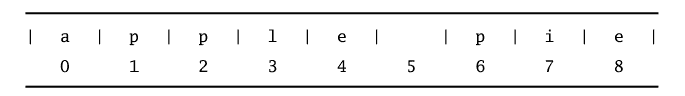

如果你尝试访问超出字符串末尾的索引，Python 会引发 `IndexError`：

```python
>>> flavor[9]
Traceback (most recent call last):
  File "<pyshell#4>", line 1, in <module>
    flavor[9]
IndexError: string index out of range
```

字符串中最大的索引总是比字符串的长度小一。由于 "apple pie" 的长度为九，因此允许的最大索引是 8。

字符串也支持负索引：

```python
>>> flavor[-1]
'e'
```

字符串的最后一个字符的索引是 -1，对于 "apple pie" 来说就是字母 e。倒数第二个字符 i 的索引是 -2，依此类推。

下图展示了字符串 "apple pie" 中每个字符的负索引：

| a | p | p | l | e | | p | i | e |
|---|---|---|---|---|---|---|---|---|
| -9 | -8 | -7 | -6 | -5 | -4 | -3 | -2 | -1 |

就像正索引一样，如果你尝试访问小于字符串第一个字符索引的负索引，Python 会引发 `IndexError`：

```python
>>> flavor[-10]
Traceback (most recent call last):
  File "<pyshell#5>", line 1, in <module>
    flavor[-10]
IndexError: string index out of range
```

负索引起初可能看起来没什么用，但有时它们比正索引是更好的选择。

例如，假设用户输入的字符串被赋值给变量 `user_input`。如果你需要获取字符串的最后一个字符，你知道该使用什么索引吗？

获取字符串最后一个字符的一种方法是使用 `len()` 计算最终索引：

```python
final_index = len(user_input) - 1
last_character = user_input[final_index]
```

使用索引 -1 获取最后一个字符需要输入的字符更少，并且不需要计算最终索引的中间步骤：

```python
last_character = user_input[-1]
```

## 字符串切片

假设你需要一个只包含字符串 "apple pie" 前三个字母的字符串。你可以通过索引访问每个字符并将它们连接起来，像这样：

```python
>>> first_three_letters = flavor[0] + flavor[1] + flavor[2]
>>> first_three_letters
'app'
```

如果你需要的不仅仅是字符串的前几个字母，逐个获取字符并将它们连接起来既笨拙又冗长。幸运的是，Python 提供了一种方法，可以更少地输入来完成此操作。

你可以通过在方括号内的两个索引数字之间插入冒号来提取字符串的一部分，称为**子字符串**，像这样：

```python
>>> flavor = "apple pie"
>>> flavor[0:3]
'app'
```

`flavor[0:3]` 返回赋值给 `flavor` 的字符串的前三个字符，从索引为 0 的字符开始，一直到但不包括索引为 3 的字符。`flavor[0:3]` 中的 `[0:3]` 部分称为**切片**。在这种情况下，它返回 "apple pie" 的一个切片。真棒！

字符串切片可能会令人困惑，因为切片返回的子字符串包含索引为第一个数字的字符，但不包含索引为第二个数字的字符。

要记住切片的工作原理，你可以将字符串想象成一系列方形槽。每个槽的左右边界从零编号到字符串的长度，每个槽中填充了字符串中的一个字符。

以下是字符串 "apple pie" 的样子：

```
| a | p | p | l | e |   | p | i | e |
```

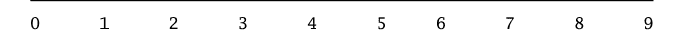

切片 `[x:y]` 返回边界 x 和 y 之间的子字符串。因此，对于 "apple pie"，切片 `[0:3]` 返回字符串 "app"，切片 `[3:9]` 返回字符串 "le pie"。

如果你在切片中省略第一个索引，Python 会假设你想从索引 0 开始：

```python
>>> flavor[:5]
'apple'
```

切片 `[:5]` 等同于切片 `[0:5]`，因此 `flavor[:5]` 返回字符串 "apple pie" 的前五个字符。

类似地，如果你在切片中省略第二个索引，Python 会假设你想返回从切片中第一个数字对应的字符开始，到字符串最后一个字符结束的子字符串：

```python
>>> flavor[5:]
' pie'
```

对于 "apple pie"，切片 `[5:]` 等同于切片 `[5:9]`。由于索引为 5 的字符是一个空格，`flavor[5:9]` 返回从空格开始到以最后一个字母结束的子字符串，即 " pie"。

如果你在切片中同时省略第一个和第二个数字，你将得到一个从索引为 0 的字符开始，到最后一个字符结束的字符串。换句话说，省略切片中的两个数字会返回整个字符串：

```python
>>> flavor[:]
'apple pie'
```

需要注意的是，与字符串索引不同，当你尝试在字符串的起始和结束边界之前或之后进行切片时，Python 不会引发 `IndexError`：

```python
>>> flavor[:14]
'apple pie'
>>> flavor[13:15]
''
```

在这个例子中，第一行获取从字符串开头到但不包括第十四个字符的切片。赋值给 `flavor` 的字符串长度为九，因此你可能期望 Python 抛出错误。相反，任何不存在的索引都被忽略，并返回整个字符串 "apple pie"。

第二行显示了当你尝试获取整个范围都超出边界的切片时会发生什么。`flavor[13:15]` 尝试获取第十三和第十四个字符，这些字符不存在。它没有引发错误，而是返回了**空字符串** `""`。

你可以在切片中使用负数。带负数的切片规则与带正数的切片完全相同。将字符串可视化为边界标有负数的槽会有所帮助：

| a | p | p | l | e | | p | i | e |
|---|---|---|---|---|---|---|---|---|
| -9 | -8 | -7 | -6 | -5 | -4 | -3 | -2 | -1 |

就像之前一样，切片 `[x:y]` 返回边界 x 和 y 之间的子字符串。例如，切片 `[-9:-6]` 返回字符串 "apple pie" 的前三个字母：

```python
>>> flavor[-9:-6]
'app'
```

然而，请注意最右边的边界没有负索引。该边界的逻辑选择似乎是数字 0，但这行不通：

```python
>>> flavor[-9:0]
''
```

`[-9:0]` 没有返回整个字符串，而是返回了**空字符串** `""`。这是因为切片中的第二个数字必须对应于在第一个数字对应的边界之后的边界，但 -9 和 0 都对应于图中最左边的边界。

如果你需要在切片中包含字符串的最后一个字符，可以省略第二个数字：

```python
>>> flavor[-9:]
'apple pie'
```

## 字符串是不可变的

为了结束本节，让我们讨论字符串对象的一个重要属性。字符串是**不可变的**，这意味着一旦创建了它们，你就无法更改它们。例如，看看当你尝试将一个新字母赋值给字符串的某个特定字符时会发生什么：

```python
>>> word = "goal"
>>> word[0] = "f"
Traceback (most recent call last):
  File "<pyshell#16>", line 1, in <module>
    word[0] = "f"
TypeError: 'str' object does not support item assignment
```

Python 抛出一个 `TypeError`，并告诉你 `str` 对象不支持项赋值。

> **注意**
>
> 术语 `str` 是 Python 内部对字符串数据类型的名称。

如果你想修改一个字符串，你必须创建一个全新的字符串。要将字符串 "goal" 更改为字符串 "foal"，你可以使用一个字符串

### 4.3 使用方法操作字符串

使用切片将字母 "f" 与单词 "goal" 除首字母外的所有部分拼接起来：

```
>>> word = "goal"
>>> word = "f" + word[1:]
>>> word
'foal'
```

首先将字符串 "goal" 赋值给变量 `word`。然后将切片 `word[1:]`（即字符串 "oal"）与字母 "f" 拼接，得到字符串 "foal"。如果得到的结果不同，请确保在字符串切片中包含了冒号 `:` 字符。

## 复习练习

你可以在 [realpython.com/python-basics/resources](https://realpython.com/python-basics/resources) 找到这些练习的解答以及许多其他额外资源。

- 1. 创建一个字符串，并使用 `len()` 函数打印其长度。
- 2. 创建两个字符串，将它们拼接起来，并打印结果字符串。
- 3. 创建两个字符串，并使用拼接在它们之间添加一个空格。然后打印结果。
- 4. 使用切片表示法对字符串 "bazinga" 指定正确的字符范围，打印出字符串 "zing"。

[为此部分提供反馈 »](https://realpython.com/python-basics/resources)

### 4.3 使用方法操作字符串

字符串附带了称为**字符串方法**的特殊函数，可用于处理和操作字符串。有众多字符串方法可用，但我们将重点介绍一些最常用的方法。

在本节中，你将学习如何：

- 将字符串转换为大写或小写
- 从字符串中移除空白字符
- 确定字符串是否以特定字符开头和结尾

开始吧！

#### 转换字符串大小写

要将字符串转换为全小写字母，请使用字符串的 `.lower()` 方法。这通过在字符串本身末尾添加 `.lower()` 来实现：

```
>>> "Jean-luc Picard".lower()
'jean-luc picard'
```

点号 (`.`) 告诉 Python 后面跟的是一个方法的名称——本例中是 `lower()` 方法。

> **注意**
>
> 我们将在字符串方法名称前加上一个点号来指代它们。因此，例如，`.lower()` 方法写作带点号的形式，而不是 `lower()`。
>
> 这样做是为了更容易识别哪些函数是字符串方法，而不是像 `print()` 和 `type()` 这样的内置函数。

字符串方法不仅适用于字符串字面量。你也可以对赋值给变量的字符串使用 `.lower()` 方法：

```
>>> name = "Jean-luc Picard"
>>> name.lower()
'jean-luc picard'
```

`.lower()` 方法的反面是 `.upper()` 方法，它将字符串中的每个字符转换为大写：

```
>>> loud_voice = "Can you hear me yet?"
>>> loud_voice.upper()
'CAN YOU HEAR ME YET?'
```

将 `.upper()` 和 `.lower()` 字符串方法与你在上一节看到的通用 `len()` 函数进行比较。除了这些函数产生的不同结果外，这里的重要区别在于它们的使用方式。

`len()` 函数是一个独立的函数。如果你想确定 `loud_voice` 字符串的长度，你可以直接调用 `len()` 函数，如下所示：

```
>>> len(loud_voice)
20
```

另一方面，`.upper()` 和 `.lower()` 必须与字符串一起使用。它们不能独立存在。

#### 从字符串中移除空白字符

空白字符是指任何打印为空白的字符。这包括空格和**换行符**，后者是将输出移动到新行的特殊字符。

有时你需要从字符串的开头或结尾移除空白字符。这在处理来自用户输入的字符串时特别有用，因为可能会意外引入额外的空白字符。

有三种字符串方法可用于从字符串中移除空白字符：

- 1. `.rstrip()`
- 2. `.lstrip()`
- 3. `.strip()`

`.rstrip()` 从字符串的右侧移除空白字符：

```
>>> name = "Jean-luc Picard     "
>>> name
'Jean-luc Picard     '
>>> name.rstrip()
'Jean-luc Picard'
```

在这个例子中，字符串 "Jean-luc Picard     " 有五个尾随空格。当字符串被赋值给变量时，Python 不会自动移除字符串中的任何尾随空格。`.rstrip()` 方法从字符串的右侧移除尾随空格，并返回一个不再包含末尾空格的新字符串 "Jean-luc Picard"。

`.lstrip()` 方法的工作方式与 `.rstrip()` 类似，只是它从字符串的左侧移除空白字符：

```
>>> name = "     Jean-luc Picard"
>>> name
'     Jean-luc Picard'
>>> name.lstrip()
'Jean-luc Picard'
```

要同时从字符串的左侧和右侧移除空白字符，请使用 `.strip()` 方法：

```
>>> name = "     Jean-luc Picard     "
>>> name
'     Jean-luc Picard     '
>>> name.strip()
'Jean-luc Picard'
```

> **注意**
>
> `.rstrip()`、`.lstrip()` 和 `.strip()` 方法都不会移除字符串中间的空白字符。在前面的每个例子中，"Jean-luc" 和 "Picard" 之间的空格始终被保留。

#### 确定字符串是否以特定字符串开头或结尾

处理文本时，有时需要确定给定字符串是否以某些字符开头或结尾。你可以使用两种字符串方法来解决这个问题：`.startswith()` 和 `.endswith()`。

让我们看一个例子。考虑字符串 "Enterprise"。以下是如何使用 `.startswith()` 来确定字符串是否以字母 e 和 n 开头：

```
>>> starship = "Enterprise"
>>> starship.startswith("en")
False
```

你必须通过提供一个包含要搜索字符的字符串来告诉 `.startswith()` 要搜索哪些字符。因此，要确定 "Enterprise" 是否以字母 e 和 n 开头，你调用 `.startswith("en")`。这返回 False。你认为这是为什么？

如果你猜到 `.startswith("en")` 返回 False 是因为 "Enterprise" 以大写字母 E 开头，那你就完全正确了！`.startswith()` 方法是**区分大小写**的。要让 `.startswith()` 返回 True，你需要提供字符串 "En"：

```
>>> starship.startswith("En")
True
```

`.endswith()` 方法用于确定字符串是否以某些字符结尾：

```
>>> starship.endswith("rise")
True
```

就像 `.startswith()` 一样，`.endswith()` 方法也是区分大小写的：

```
>>> starship.endswith("risE")
False
```

> **注意**
>
> `True` 和 `False` 值不是字符串。它们是一种称为**布尔值**的特殊数据类型。你将在第 8 章学习更多关于布尔值的知识。

#### 字符串方法与不可变性

回顾上一节，字符串是不可变的——一旦创建就不能更改。大多数修改字符串的字符串方法，如 `.upper()` 和 `.lower()`，实际上返回的是经过适当修改的原始字符串的副本。

如果不小心，这可能会在你的程序中引入微妙的错误。在 IDLE 的交互式窗口中试试这个：

```
>>> name = "Picard"
>>> name.upper()
'PICARD'
>>> name
'Picard'
```

当你调用 `name.upper()` 时，`name` 本身没有任何变化。如果你需要保留结果，你需要将其赋值给一个变量：

```
>>> name = "Picard"
>>> name = name.upper()
>>> name
'PICARD'
```

`name.upper()` 返回一个新字符串 "PICARD"，它被重新赋值给 `name` 变量。这**覆盖**了赋值给 "name" 的原始字符串 "Picard"。

#### 使用 IDLE 发现更多字符串方法

字符串有许多相关的方法。本节介绍的方法只是冰山一角。IDLE 可以帮助你找到新的字符串方法。要了解如何操作，首先在交互式窗口中将一个字符串字面量赋值给一个变量：

```
>>> starship = "Enterprise"
```

接下来，输入 starship 后跟一个句点，但不要按回车键。你应该在交互式窗口中看到以下内容：

```
>>> starship.
```

现在等待几秒钟。IDLE 会显示一个你可以用箭头键滚动浏览的字符串方法列表。

IDLE 中一个相关的快捷方式是能够通过按 Tab 键自动填充文本，而无需输入长名称。例如，如果你只输入 starship.u 然后按 Tab 键，IDLE 会自动填充 starship.upper，因为 starship 只有一个以 u 开头的方法。

这甚至适用于变量名。尝试只输入 starship 的前几个字母，假设你没有定义其他共享这些首字母的名称，当你按 Tab 键时，IDLE 会为你补全名称 starship。

## 复习练习

你可以在 realpython.com/python-basics/resources 找到这些练习的解答以及许多其他额外资源。

- 1. 编写一个脚本，将以下字符串转换为小写："Animals"、"Badger"、"Honey Bee"、"Honeybadger"。在单独的行上打印每个小写字符串。
- 2. 重复练习 1，但将每个字符串转换为大写而不是小写。
- 3. 编写一个脚本，从以下字符串中移除空白字符：
    string1 = "    Filet Mignon"
    string2 = "Brisket    "

### 4.4 与用户输入交互

既然你已经了解了如何使用字符串方法，现在让我们来实现交互功能。在本节中，你将学习如何使用 `input()` 函数从用户那里获取输入。你将编写一个程序，要求用户输入一些文本，然后以大写形式将该文本显示回给他们。

在 IDLE 的交互窗口中输入以下内容：

```
>>> input()
```

当你按下回车键时，看起来什么都没有发生。光标移动到新行，但新的 `>>>` 并未出现。Python 正在等待你输入内容！

继续输入一些文本并按回车键：

```
>>> input()
Hello there!
'Hello there!'
>>>
```

你输入的文本在新行上用单引号重复显示。这是因为 `input()` 将用户输入的任何文本作为字符串返回。

为了让 `input()` 更用户友好，你可以给它一个**提示**来显示给用户。提示只是放在 `input()` 括号内的一个字符串。它可以是任何你想要的内容：一个单词、一个符号、一个短语——任何有效的 Python 字符串。

`input()` 函数显示提示并等待用户在键盘上输入内容。当用户按下回车键时，`input()` 将他们的输入作为字符串返回，该字符串可以赋值给一个变量，并用于在你的程序中执行某些操作。

要查看 `input()` 的工作原理，请保存并运行以下脚本：

```
prompt = "Hey, what's up? "
user_input = input(prompt)
print("You said:", user_input)
```

当你运行此脚本时，你会在交互窗口中看到 `Hey, what's up?` 显示，并带有一个闪烁的光标。

字符串 `"Hey, what's up? "` 末尾的单个空格确保当用户开始输入时，文本与提示之间用空格分隔。当你输入响应并按回车键时，你的响应被赋值给 `user_input` 变量。

以下是程序的示例运行：

```
Hey, what's up? Mind your own business.

You said: Mind your own business.
```

一旦你从用户那里获得输入，你就可以对其进行处理。例如，以下脚本获取用户输入，使用 `.upper()` 将其转换为大写，并打印结果：

```
response = input("What should I shout? ")
shouted_response = response.upper()
print("Well, if you insist...", shouted_response)
```

## 复习练习

你可以在 [realpython.com/python-basics/resources](https://realpython.com/python-basics/resources) 找到这些练习的解决方案和许多其他额外资源。

- 1. 编写一个脚本，从用户那里获取输入并显示该输入。
- 2. 编写一个脚本，从用户那里获取输入并以小写形式显示输入。
- 3. 编写一个脚本，从用户那里获取输入并显示输入的字符数。

[为此部分提供反馈 »](https://realpython.com/python-basics/resources)

### 4.5 挑战：剖析你的用户输入

编写一个名为 `first_letter.py` 的脚本，首先使用字符串 `"Tell me your password:"` 提示用户输入。然后，脚本应确定用户输入的第一个字母，将该字母转换为大写，并显示回给用户。

例如，如果用户输入是 `"no"`，那么程序应该这样响应：

```
The first letter you entered was: N
```

目前，如果用户没有输入任何内容（即他们只是按了 `Enter` 而没有输入任何内容）导致程序崩溃，这是可以的。你将在接下来的章节中学习处理这种情况的几种方法。

你可以在 [realpython.com/python-basics/resources](https://realpython.com/python-basics/resources) 找到此代码挑战的解决方案和许多其他额外资源。

[为此部分提供反馈 »](https://realpython.com)

### 4.6 处理字符串和数字

当你使用 `input()` 函数获取用户输入时，结果始终是一个字符串。在许多其他情况下，输入也是以字符串形式提供给程序的。有时这些字符串包含需要用于计算的数字。

在本节中，你将学习如何处理数字字符串。你将看到算术运算如何作用于字符串，以及它们如何经常导致令人惊讶的结果。你还将学习如何在字符串和数字类型之间进行转换。

#### 字符串和算术运算符

你已经看到字符串对象可以包含多种类型的字符，包括数字。但是，不要将字符串中的数字与实际数字混淆。例如，在 IDLE 的交互窗口中尝试以下代码：

```
>>> num = "2"
>>> num + num
'22'
```

`+` 运算符将两个字符串连接在一起。因此，`"2" + "2"` 的结果是 `"22"`，而不是 `"4"`。

只要数字是整数或整数，字符串就可以被数字“乘”。在交互窗口中输入以下内容：

```
>>> num = "12"
>>> num * 3
'121212'
```

`num * 3` 将字符串 `"12"` 与自身连接三次，并返回字符串 `"121212"`。要将此操作与数字算术进行比较，请注意 `"12" * 3 = "12" + "12" + "12"`。换句话说，将字符串乘以整数 `n` 会将该字符串与自身连接 `n` 次。

表达式 `num * 3` 右侧的数字可以移到左侧，结果不变：

```
>>> 3 * num
'121212'
```

你认为如果在两个字符串之间使用 `*` 运算符会发生什么？在交互窗口中输入 `"12" * "3"` 并按回车键：

```
>>> "12" * "3"
Traceback (most recent call last):
  File "<stdin>", line 1, in <module>
TypeError: can't multiply sequence by non-int of type 'str'
```

Python 引发 `TypeError` 并告诉你不能将序列乘以非整数。当 `*` 运算符与字符串一起使用时，无论字符串在左侧还是右侧，它总是期望另一侧是一个整数。

> **注意**
>
> **序列**是任何支持通过索引访问元素的 Python 对象。字符串是序列。你将在第 9 章学习其他序列类型。

你认为当你尝试将字符串和数字相加时会发生什么？

```
>>> "3" + 3
Traceback (most recent call last):
  File "<stdin>", line 1, in <module>
TypeError: can only concatenate str (not "int") to str
```

同样，Python 抛出 `TypeError`，因为 `+` 运算符期望其两侧的两个对象类型相同。如果 `+` 两侧的任何一个对象是字符串，Python 就会尝试执行字符串连接。只有当两个对象都是数字时才会执行加法。因此，要将 `"3" + 3` 相加得到 `6`，你必须首先将字符串 `"3"` 转换为数字。

#### 将字符串转换为数字

你在上一节中看到的 `TypeError` 错误突出了使用用户输入时遇到的一个常见问题：当尝试在需要数字而不是字符串的操作中使用输入时，会出现类型不匹配。

让我们看一个例子。保存并运行以下脚本。

```
num = input("Enter a number to be doubled: ")
doubled_num = num * 2
print(doubled_num)
```

当你输入一个数字，例如 `2` 时，你期望输出是 `4`，但在这种情况下，你得到的是 `22`。记住，`input()` 总是返回一个字符串，所以如果你输入 `2`，那么 `num` 被赋值为字符串 `"2"`，而不是整数 `2`。因此，表达式 `num * 2` 返回字符串 `"2"` 与自身连接的结果，即 `"22"`。

要对包含在字符串中的数字执行算术运算，你必须首先将它们从字符串类型转换为数字类型。有两种方法可以做到这一点：`int()` 和 `float()`。

`int()` 代表**整数**，将对象转换为整数，而 `float()` 代表**浮点数**，将对象转换为带小数点的数字。以下是在交互窗口中使用它们的样子：

### 4.6 处理字符串和数字

```python
>>> int("12")
12

>>> float("12")
12.0
```

注意 `float()` 如何为数字添加小数点。浮点数总是至少有一位小数精度。因此，你不能将一个看起来像浮点数的字符串转换为整数，因为这会丢失小数点后的所有内容：

```python
>>> int("12.0")
Traceback (most recent call last):
  File "<stdin>", line 1, in <module>
ValueError: invalid literal for int() with base 10: '12.0'
```

尽管小数点后的额外 0 并没有给数字增加任何值，但 Python 不会将 12.0 变成 12，因为这会导致精度损失。

让我们重新审视本节开头的脚本，看看如何修复它。以下是该脚本：

```python
num = input("Enter a number to be doubled: ")
doubled_num = num * 2
print(doubled_num)
```

问题出在 `doubled_num = num * 2` 这一行，因为 `num` 引用的是一个字符串，而 2 是一个整数。你可以通过用 `int()` 或 `float()` 包装 `num` 来修复这个问题。由于提示要求用户输入一个数字，而不仅仅是整数，让我们将 `num` 转换为浮点数：

```python
num = input("Enter a number to be doubled: ")
doubled_num = float(num) * 2
print(doubled_num)
```

现在，当你运行此脚本并输入 2 时，你会得到预期的 4.0。试试看！

## 将数字转换为字符串

有时你需要将数字转换为字符串。例如，如果你需要从一些被赋值为数值的现有变量构建字符串，你可能会这样做。

正如你已经看到的，以下代码会产生 TypeError：

```python
>>> num_pancakes = 10
>>> "I am going to eat " + num_pancakes + " pancakes."
Traceback (most recent call last):
  File "<stdin>", line 1, in <module>
TypeError: can only concatenate str (not "int") to str
```

由于 num_pancakes 是一个数字，Python 无法将其与字符串 "I'm going to eat" 连接起来。要构建字符串，你需要使用 str() 将 num_pancakes 转换为字符串：

```python
>>> num_pancakes = 10
>>> "I am going to eat " + str(num_pancakes) + " pancakes."
'I am going to eat 10 pancakes.'
```

你也可以对数字字面量调用 str()：

```python
>>> "I am going to eat " + str(10) + " pancakes."
'I am going to eat 10 pancakes.'
```

str() 甚至可以处理算术表达式：

```python
>>> total_pancakes = 10
>>> pancakes_eaten = 5
>>> "Only " + str(total_pancakes - pancakes_eaten) + " pancakes left."
'Only 5 pancakes left.'
```

使用 str() 时，你不仅限于数字。你可以传递各种对象来获取它们的字符串表示：

```python
>>> str(print)
'<built-in function print>'

>>> str(int)
"<class 'int'>"

>>> str(float)
"<class 'float'>"
```

这些例子可能看起来不太有用，但它们说明了 str() 的灵活性。

在下一节中，你将学习如何整齐地格式化字符串，以美观、可读的方式显示值。不过，在继续之前，请通过以下复习练习检查你的理解。

## 复习练习

你可以在 [realpython.com/python-basics/resources](https://realpython.com/python-basics/resources) 找到这些练习的解决方案和许多其他额外资源。

1.  创建一个包含整数的字符串，然后使用 `int()` 将该字符串转换为实际的整数对象。通过将新对象乘以另一个数字并显示结果来测试它是否是一个数字。
2.  重复上一个练习，但使用浮点数和 `float()`。
3.  创建一个字符串对象和一个整数对象，然后使用 `str()` 函数通过单个 print 语句将它们并排显示。
4.  编写一个脚本，使用 `input()` 函数两次从用户那里获取两个数字，将这两个数字相乘，并显示结果。如果用户输入 2 和 4，你的程序应该打印以下文本：
    The product of 2 and 4 is 8.0.

[为此部分提供反馈 »](https://realpython.com/python-basics/resources)

### 4.7 精简你的打印语句

假设你有一个字符串 `name = "Zaphod"` 和两个整数 `heads = 2` 和 `arms = 3`。你想在以下行中显示它们：`Zaphod has 2 heads and 3 arms`。这被称为**字符串插值**，这只是一个花哨的说法，意思是你想将一些变量插入到字符串中的特定位置。

你已经见过两种方法。第一种涉及在 `print()` 函数中使用逗号在字符串的每个部分之间插入空格：

```python
print(name, "has", str(heads), "heads and", str(arms), "arms")
```

另一种方法是使用 `+` 运算符连接字符串：

```python
print(name + " has " + str(heads) + " heads and " + str(arms) + " arms")
```

这两种技术产生的代码可能难以阅读。试图跟踪什么在引号内或引号外可能很困难。幸运的是，有第三种组合字符串的方法：[格式化字符串字面量](https://docs.python.org/3/reference/lexical_analysis.html#f-strings)，通常称为 f-字符串。

理解 f-字符串最简单的方法是看它们的实际应用。以下是上述字符串写成 f-字符串的样子：

```python
>>> f"{name} has {heads} heads and {arms} arms"
'Zaphod has 2 heads and 3 arms'
```

关于上述示例，有两点需要注意：

1.  字符串字面量在开头引号前以字母 `f` 开头
2.  用花括号（`{` 和 `}`）包围的变量名被替换为它们对应的值，而无需使用 `str()`

你还可以在花括号之间插入 Python 表达式。表达式在字符串中被替换为其结果：

```python
>>> n = 3
>>> m = 4
>>> f"{n} times {m} is {n*m}"
'3 times 4 is 12'
```

最好将 f-字符串中使用的任何表达式保持尽可能简单。在字符串字面量中塞入一堆复杂的表达式可能导致代码难以阅读和维护。

f-字符串仅在 Python 3.6 及更高版本中可用。在早期版本的 Python 中，可以使用 `.format()` 方法获得相同的结果。回到 Zaphod 的例子，你可以使用 `.format()` 方法像这样格式化字符串：

```python
>>> "{} has {} heads and {} arms".format(name, heads, arms)
'Zaphod has 2 heads and 3 arms'
```

f-字符串比使用 `.format()` 更短，有时也更易读。你将在本书中看到 f-字符串的使用。

有关 f-字符串的深入指南以及与其他字符串格式化技术的比较，请查看 realpython.com 上的 [Python 3's f-Strings: An Improved String Formatting Syntax (Guide)](https://realpython.com/python-f-strings/)

> **注意**

还有另一种打印格式化字符串的方法：使用 `%` 运算符。你可能会在其他地方找到的代码中看到它，如果你好奇，可以[在这里阅读它的工作原理](https://realpython.com/python-f-strings/)。

请记住，这种风格在 Python 3 中已被完全淘汰。只需知道它的存在，并且你可能会在旧的 Python 代码库中看到它。

## 复习练习

你可以在 [realpython.com/python-basics/resources](https://realpython.com/python-basics/resources) 找到这些练习的解决方案和许多其他额外资源。

1.  创建一个名为 `weight` 的 `float` 对象，值为 0.2，并创建一个名为 `animal` 的字符串对象，值为 "newt"。然后仅使用字符串连接使用这些对象打印以下字符串：
    `0.2 kg is the weight of the newt.`
2.  使用 `.format()` 方法和空的 `{}` 占位符显示相同的字符串。
3.  使用 f-字符串显示相同的字符串。

[为此部分提供反馈 »](https://realpython.com/python-basics/resources)

### 4.8 在字符串中查找字符串

最有用的字符串方法之一是 `.find()`。顾名思义，你可以使用此方法在一个字符串中查找另一个字符串的位置——通常称为**子字符串**。

要使用 `.find()`，将其附加到变量或字符串字面量的末尾，并在括号之间传递你要查找的字符串：

```python
>>> phrase = "the surprise is in here somewhere"
>>> phrase.find("surprise")
4
```

`.find()` 返回的值是你传递给它的字符串第一次出现的索引。在这种情况下，"surprise" 从字符串 "the surprise is in here somewhere" 的第五个字符开始，其索引为 4，因为计数从 0 开始。

如果 `.find()` 没有找到所需的子字符串，它将返回 -1：

## 4.8. 在字符串中查找字符串

```python
>>> phrase = "the surprise is in here somewhere"
>>> phrase.find("eyjafjallajökull")
-1
```

你可以直接在字符串字面量上调用字符串方法，因此在这种情况下，你不需要创建一个新的字符串：

```python
>>> "the surprise is in here somewhere".find("surprise")
4
```

请记住，这种匹配是逐字符精确进行的，并且区分大小写。例如，如果你尝试查找 "SURPRISE"，`.find()` 方法会返回 -1：

```python
>>> "the surprise is in here somewhere".find("SURPRISE")
-1
```

如果一个子字符串在字符串中出现多次，`.find()` 只会返回从字符串开头算起的第一次出现的索引：

```python
>>> "I put a string in your string".find("string")
8
```

在 "I put a string in your string" 中有两个 "string" 实例。第一个从索引 8 开始，第二个从索引 23 开始。`.find()` 返回 8，这是 "string" 第一次出现的索引。

`.find()` 方法只接受字符串作为其输入。如果你想在字符串中查找一个整数，你需要将整数作为字符串传递给 `.find()`。如果你传递给 `.find()` 的不是字符串，Python 会引发一个 `TypeError`：

```python
>>> "My number is 555-555-5555".find(5)
Traceback (most recent call last):
  File "<stdin>", line 1, in <module>
TypeError: must be str, not int
```

```python
>>> "My number is 555-555-5555".find("5")
13
```

有时你需要找到一个特定子字符串的所有出现位置，并用另一个字符串替换它们。由于 `.find()` 只返回子字符串第一次出现的索引，你无法轻松地使用它来执行此操作。幸运的是，字符串对象有一个 `.replace()` 方法，可以将子字符串的每个实例替换为另一个字符串。

就像 `.find()` 一样，你将 `.replace()` 附加到变量或字符串字面量的末尾。不过，在这种情况下，你需要在 `.replace()` 的括号内放入两个字符串，并用逗号分隔。第一个字符串是要查找的子字符串，第二个字符串是用来替换子字符串每个出现位置的字符串。

例如，以下代码展示了如何将字符串 "I'm telling you the truth; nothing but the truth" 中的每个 "the truth" 替换为 "lies"：

```python
>>> my_story = "I'm telling you the truth; nothing but the truth!"
>>> my_story.replace("the truth", "lies")
"I'm telling you lies; nothing but lies!"
```

由于字符串是不可变对象，`.replace()` 不会改变 `my_story`。如果你在运行上述示例后立即在交互式窗口中输入 `my_story`，你将看到原始字符串，未被更改：

```python
>>> my_story
"I'm telling you the truth; nothing but the truth!"
```

要更改 `my_story` 的值，你需要将 `.replace()` 返回的新值重新赋值给它：

```python
>>> my_story = my_story.replace("the truth", "lies")
>>> my_story
"I'm telling you lies; nothing but lies!"
```

`.replace()` 一次只能替换一个子字符串，因此如果你想替换字符串中的多个子字符串，你需要多次使用 `.replace()`：

```python
>>> text = "some of the stuff"
>>> new_text = text.replace("some of", "all")
>>> new_text = new_text.replace("stuff", "things")
>>> new_text
'all the things'
```

你将在下一节的挑战中体验 `.replace()` 的乐趣。

## 复习练习

你可以在 [realpython.com/python-basics/resources](https://realpython.com/python-basics/resources) 找到这些练习的解答和许多其他额外资源。

1.  用一行代码，显示在字符串 "AAA" 中尝试 `.find()` 子字符串 "a" 的结果。结果应该是 -1。
2.  将字符串 "Somebody said something to Samantha." 中的每个字符 "s" 替换为 "x"。
3.  编写并测试一个脚本，该脚本使用 `input()` 函数接受用户输入，并显示尝试在该输入中 `.find()` 一个特定字母的结果。

[为此部分留下反馈 »](https://realpython.com/python-basics/resources)

### 4.9 挑战：将你的用户变成 L33t H4xor

编写一个名为 `translate.py` 的脚本，使用以下提示向用户请求输入：`Enter some text:`。然后使用 `.replace()` 方法，通过对小写字母进行以下更改，将用户输入的文本转换为“黑客语”：

- 字母 a 变成 4
- 字母 b 变成 8
- 字母 e 变成 3
- 字母 l 变成 1
- 字母 o 变成 0
- 字母 s 变成 5
- 字母 t 变成 7

你的程序随后应显示结果字符串作为输出。以下是程序的示例运行：

```
Enter some text: I like to eat eggs and spam.
I 1ik3 70 347 3gg5 4nd 5p4m.
```

你可以在 [realpython.com/python-basics/resources](https://realpython.com/python-basics/resources) 找到这个代码挑战的解答和许多其他额外资源。

[为此部分留下反馈 »](https://realpython.com/python-basics/resources)

### 4.10 总结与额外资源

在本章中，你学习了 Python 字符串对象的方方面面。你学习了如何使用下标和切片访问字符串中的不同字符，以及如何使用 `len()` 确定字符串的长度。

字符串附带了许多方法。`.upper()` 和 `.lower()` 方法分别将字符串的所有字符转换为大写或小写。`.rstrip()`、`.lstrip()` 和 `.strip()` 方法从字符串中删除空白字符，而 `.startswith()` 和 `.endswith()` 方法会告诉你一个字符串是否以给定的子字符串开头或结尾。

你还看到了如何使用 `input()` 函数从用户那里捕获输入作为字符串，以及如何使用 `int()` 和 `float()` 将该输入转换为数字。要将数字和其他对象转换为字符串，你使用 `str()`。

最后，你看到了如何使用 `.find()` 和 `.replace()` 方法来查找子字符串的位置以及用新字符串替换子字符串。

> **互动测验**
>
> 本章附带一个免费的在线测验，以检查你的学习进度。你可以使用手机或电脑访问以下网址的测验：
>
> [realpython.com/quizzes/python-basics-4](https://realpython.com/quizzes/python-basics-4)

## 额外资源

要了解更多信息，请查看以下资源：

- [Python 字符串格式化最佳实践](https://realpython.com/python-string-formatting/)
- [Python 中的分割、连接和合并字符串](https://realpython.com/python-string-split-concatenate-join/)
- [realpython.com 上的推荐资源](https://realpython.com/)

[为此部分留下反馈 »](https://realpython.com/)

# 第 5 章

## 数字与数学

你不需要成为数学高手才能编程好。事实是，很少有程序员需要知道比基础代数更多的数学知识。

当然，你需要知道多少数学知识取决于你正在开发的应用程序。一般来说，成功成为一名程序员所需的数学水平比你可能预期的要低。

尽管数学和计算机编程之间的相关性不像有些人可能认为的那样高，但数字是任何编程语言不可或缺的一部分，Python 也不例外。

**在本章中，你将学习如何：**

- 使用 Python 的三种内置数字类型：整数、浮点数和复数
- 将数字四舍五入到给定的小数位数
- 在字符串中格式化和显示数字

让我们开始吧！

[为此部分留下反馈 »](https://realpython.com/python-basics/resources)

### 5.1 整数和浮点数

Python 有三种内置的数字数据类型：整数、浮点数和复数。在本节中，你将学习整数和浮点数，这是两种最常用的数字类型。你将在 5.6 节学习复数。

#### 整数

**整数**是没有小数部分的整数。例如，1 是一个整数，但 1.0 不是。整数数据类型的名称是 `int`，你可以通过 `type()` 函数看到：

```python
>>> type(1)
<class 'int'>
```

你可以通过简单地显式输入数字或使用 `int()` 函数来创建一个整数。在第 4 章中，你学习了如何使用 `int()` 将包含整数的字符串转换为数字。例如，以下代码将字符串 "25" 转换为整数 25：

```python
>>> int("25")
25
```

**整数字面量**是在代码中显式写出的整数值，就像字符串字面量是在代码中显式写出的字符串一样。例如，1 是一个整数字面量，但 `int("1")` 不是。

整数字面量可以用两种不同的方式编写：

```python
>>> 1000000
1000000

>>> 1_000_000
1000000
```

## 5.1. 整数与浮点数

第一个例子很简单。只需输入一个1后面跟着六个零。这种表示法的缺点是大数字可能难以阅读。

当你手写大数字时，你可能会将数字分成每三位一组，用逗号分隔。1,000,000 比 1000000 容易阅读得多。

在Python中，你不能在整数字面量中使用逗号来分组数字，但你可以使用下划线（_）。值 1_000_000 以更易读的方式表示一百万。

整数可以有多大是没有限制的，考虑到计算机内存有限，这可能令人惊讶。尝试在IDLE的交互式窗口中输入你能想到的最大数字。Python可以毫无问题地处理它！

## 浮点数

**浮点数**，简称**float**，是带有小数点的数字。1.0 是一个浮点数，-2.75 也是。浮点数据类型的名称是 float：

```
>>> type(1.0)
<class 'float'>
```

浮点数可以通过直接在代码中输入数字或使用 float() 函数来创建。像 int() 一样，float() 可用于将包含数字的字符串转换为浮点数：

```
>>> float("1.25")
1.25
```

**浮点字面量**是在代码中明确写出的浮点值。1.25 是一个浮点字面量，而 float("1.25") 不是。

浮点字面量可以用三种不同的方式创建。以下每种方式都创建一个值为一百万的浮点字面量：

```
>>> 1000000.0
1000000.0

>>> 1_000_000.0
1000000.0

>>> 1e6
1000000.0
```

前两种方式类似于你之前看到的创建整数字面量的两种方法。第二种方法使用下划线将数字分成每三位一组，对于创建包含大量数字的浮点字面量很有用。

对于非常大的数字，你可以使用**E表示法**。上一个例子中的第三种方法使用E表示法创建浮点字面量。

要用E表示法编写浮点字面量，请输入一个数字，后跟字母e，然后是另一个数字。Python将e左边的数字乘以10的e后面数字次幂。所以 1e6 等于 1×10⁶。

> **注意**

E表示法是**指数表示法**的缩写，是许多计算器和编程语言显示大数字的更常见名称。

Python也使用E表示法来显示大浮点数：

```
>>> 200000000000000000.0
2e+17
```

浮点数 200000000000000000.0 显示为 2e+17。+号表示指数17是一个正数。你也可以使用负数作为指数：

```
>>> 1e-4
0.0001
```

字面量 `1e-4` 被解释为10的-4次幂，即1/10000或等效地，0.0001。

与整数不同，浮点数确实有最大大小。最大浮点数取决于你的系统，但像 `2e400` 这样的值应该远远超出大多数机器的能力。`2e400` 是 $2\times10^{400}$，这远远超过了[宇宙中原子的总数](https://en.wikipedia.org/wiki/Observable_universe#Matter_content)！

当你达到最大浮点数时，Python返回一个特殊的浮点值 `inf`：

```
>>> 2e400
inf
```

`inf` 代表无穷大，它只是意味着你尝试创建的数字超出了你的计算机上允许的最大浮点值。`inf` 的类型仍然是 float：

```
>>> n = 2e400
>>> n
inf
>>> type(n)
<class 'float'>
```

还有 `-inf`，代表负无穷大，表示一个超出你的计算机上允许的最小浮点数的负浮点数：

```
>>> -2e400
-inf
```

作为程序员，你可能不会经常遇到 `inf` 和 `-inf`，除非你经常处理极大的数字。

## 复习练习

你可以在 [realpython.com/python-basics/resources](https://realpython.com/python-basics/resources) 找到这些练习的解决方案和许多其他额外资源。

1. 编写一个脚本，创建两个变量 `num1` 和 `num2`。`num1` 和 `num2` 都应被赋值为整数字面量 25,000,000，一个使用下划线编写，另一个不使用。在两行上分别打印 `num1` 和 `num2`。
2. 编写一个脚本，使用指数表示法将浮点字面量 175000.0 赋值给变量 `num`，然后在交互式窗口中打印 `num`。
3. 在IDLE的交互式窗口中，尝试找到最小的指数N，使得 2e<N>（其中 <N> 替换为你的数字）返回 `inf`。

[为此部分提供反馈 »](https://realpython.com/python-basics/resources)

### 5.2 算术运算符与表达式

在本节中，你将学习如何在Python中对数字进行基本算术运算，如加法、减法、乘法和除法。在此过程中，你将学习一些在代码中编写数学表达式的约定。

## 加法

加法使用 `+` 运算符执行：

```
>>> 1 + 2
3
```

`+` 运算符两侧的两个数字称为**操作数**。在前面的例子中，两个操作数都是整数，但操作数不需要是相同的类型。你可以将 `int` 加到 `float` 上而没有问题：

```
>>> 1.0 + 2
3.0
```

注意 `1.0 + 2` 的结果是 `3.0`，这是一个 `float`。任何时候将 `float` 加到一个数字上，结果都是另一个 `float`。将两个整数相加总是得到一个 `int`。

> **注意**

PEP 8 建议在运算符两侧都用空格分隔操作数。

Python可以很好地计算 `1+1`，但 `1 + 1` 是首选格式，因为它通常被认为更容易阅读。这个经验法则适用于本节中的所有运算符。

## 减法

要减去两个数字，只需在它们之间放一个 `-`：

```
>>> 1 - 1
0

>>> 5.0 - 3
2.0
```

就像将两个整数相加一样，将两个整数相减总是得到一个 `int`。只要其中一个操作数是 `float`，结果也是 `float`。

`-` 运算符也用于表示负数：

```
>>> -3
-3
```

你可以从一个数字中减去一个负数，但正如你下面所看到的，这有时可能看起来令人困惑：

```
>>> 1 - -3
4

>>> 1 --3
4

>>> 1- -3
4

>>>1--3
4
```

在上面的四个例子中，第一个最符合PEP 8。也就是说，你可以用括号将 -3 括起来，以更清楚地表明第二个 - 正在修改 3：

```
>>> 1 - (-3)
4
```

使用括号是个好主意，因为它使代码更明确。计算机执行代码，但人类阅读代码。任何你能做的使你的代码更容易阅读和理解的事情都是好事。

## 乘法

要将两个数字相乘，使用 * 运算符：

```
>>> 3 * 3
9

>>> 2 * 8.0
16.0
```

从乘法得到的数字类型遵循与加法和减法相同的规则。将两个整数相乘得到一个 `int`，将一个数字与一个 `float` 相乘得到一个 `float`。

## 除法

/ 运算符用于将两个数字相除：

```
>>> 9 / 3
3.0

>>> 5.0 / 2
2.5
```

与加法、减法和乘法不同，使用 / 运算符的除法总是返回一个浮点数。如果你想确保在将两个数字相除后得到一个整数，你可以使用 int() 来转换结果：

```
>>> int(9 / 3)
3
```

请记住，int() 会丢弃数字的任何小数部分：

```
>>> int(5.0 / 2)
2
```

5.0 / 2 返回浮点数 2.5，而 int(2.5) 返回整数 2，去掉了 .5 部分。

## 整数除法

如果编写 int(5.0 / 2) 对你来说似乎有点冗长，Python提供了第二个除法运算符 //，称为整数除法运算符：

```
>>> 9 // 3
3

>>> 5.0 // 2
2.0
```

## 5.2. 算术运算符与表达式

```python
>>> -3 // 2
-2
```

`//` 运算符首先将左侧数字除以右侧数字，然后向下取整为整数。当其中一个数字为负数时，这可能不会得到你预期的值。

例如，`-3 // 2` 返回 `-2`。首先，`-3` 除以 `2` 得到 `-1.5`。然后 `-1.5` 向下取整为 `-2`。另一方面，`3 // 2` 返回 `1`。

上述示例还说明了另一点：如果其中一个操作数是浮点数，`//` 会返回一个浮点数。这就是为什么 `9 // 3` 返回整数 `3`，而 `5.0 // 2` 返回浮点数 `2.0`。

让我们看看尝试将一个数除以 0 会发生什么：

```python
>>> 1 / 0
Traceback (most recent call last):
  File "<stdin>", line 1, in <module>
ZeroDivisionError: division by zero
```

Python 会给你一个 `ZeroDivisionError`，让你知道你刚刚试图打破宇宙的一条基本规则。

## 指数运算

你可以使用 `**` 运算符将一个数提升到某个幂次：

```python
>>> 2 ** 2
4

>>> 2 ** 3
8

>>> 2 ** 4
16
```

指数不一定是整数，也可以是浮点数：

```python
>>> 3 ** 1.5
5.196152422706632

>>> 9 ** 0.5
3.0
```

将一个数提升到 `0.5` 次幂等同于取其平方根，但请注意，即使 `9` 的平方根是整数，Python 也返回浮点数 `3.0`。

对于正操作数，如果两个操作数都是整数，`**` 运算符返回整数；如果任一操作数是浮点数，则返回浮点数。

你也可以将数字提升到负幂次：

```python
>>> 2 ** -1
0.5

>>> 2 ** -2
0.25
```

将一个数提升到负幂次等同于将 `1` 除以该数提升到正幂次的结果。因此，`2 ** -1` 等同于 `1 / (2 ** 1)`，也就是 `1 / 2`，即 `0.5`。类似地，`2 ** -2` 等同于 `1 / (2 ** 2)`，也就是 `1 / 4`，即 `0.25`。

## 取模运算符

`%` 运算符，或称**取模**，返回左操作数除以右操作数的余数：

```python
>>> 5 % 3
2

>>> 20 % 7
6

>>> 16 % 8
0
```

`3` 除 `5` 一次，余数为 `2`，所以 `5 % 3` 是 `2`。类似地，`7` 除 `20` 两次，余数为 `6`。

在最后一个例子中，`16` 能被 `8` 整除，所以 `16 % 8` 是 `0`。任何时候，`%` 左边的数能被右边的数整除，结果就是 `0`。

`%` 最常见的用途之一是判断一个数是否能被另一个数整除。例如，一个数 `n` 是偶数当且仅当 `n % 2` 是 `0`。

你认为 `1 % 0` 会返回什么？让我们试试看：

```python
>>> 1 % 0
Traceback (most recent call last):
  File "<stdin>", line 1, in <module>
ZeroDivisionError: integer division or modulo by zero
```

这是有道理的，因为 `1 % 0` 是 `1` 除以 `0` 的余数。但你不能将 `1` 除以 `0`，所以 Python 会引发一个 `ZeroDivisionError`。

> **注意**
>
> 当你在 IDLE 的交互式窗口中工作时，像 `ZeroDivisionError` 这样的错误不会造成太大问题。错误会显示出来，并弹出一个新的提示符，允许你继续编写代码。
>
> 然而，每当 Python 在运行脚本时遇到错误，执行就会停止。程序被认为已经**崩溃**。在第 8 章，你将学习如何处理错误，以便你的程序不会意外崩溃。

当使用 `%` 运算符处理负数时，情况会变得有点棘手：

```python
>>> 5 % -3
-1

>>> -5 % 3
1

>>> -5 % -3
-2
```

这些可能令人震惊的结果实际上定义得非常明确。为了计算一个数 `x` 除以一个数 `y` 的余数 `r`，Python 使用公式 `r = x - (y * (x // y))`。

例如，要找到 `5 % -3`，首先找到 `(5 // -3)`。由于 `5 / -3` 大约是 `-1.67`，`5 // -3` 是 `-2`。现在将其乘以 `-3` 得到 `6`。最后，从 `5` 中减去 `6` 得到 `-1`。

## 算术表达式

你可以组合运算符来形成复杂的表达式。**表达式**是数字、运算符和括号的组合，Python 可以对其进行计算或**求值**以返回一个值。

以下是一些算术表达式的例子：

```python
>>> 2*3 - 1
5

>>> 4/2 + 2**3
10.0

>>> -1 + (-3*2 + 4)
-3
```

表达式求值的规则与日常算术相同。在学校里，你可能在“运算顺序”的名称下学过这些规则。

`*`、`/`、`//` 和 `%` 运算符在表达式中具有相同的**优先级**或优先级，并且每个运算符的优先级都高于 `+` 和 `-` 运算符。这就是为什么 `2*3 - 1` 返回 `5` 而不是 `4`。`2*3` 首先被计算，因为 `*` 的优先级高于 `-` 运算符。

你可能注意到，前面例子中的表达式没有遵循在所有运算符两侧都加空格的规则。PEP 8 对复杂表达式中的空格有如下规定：

> “如果使用了具有不同优先级的运算符，请考虑在优先级最低的运算符周围添加空格。请自行判断；但是，永远不要使用超过一个空格，并且二元运算符两侧的空格量始终相同。”
>
> — PEP 8，其他建议

### 5.3 挑战：对用户输入执行计算

编写一个名为 `exponent.py` 的脚本，该脚本从用户那里接收两个数字，并显示第一个数字提升到第二个数字的幂次的结果。

程序的示例运行应如下所示（下面包含了用户提供的示例输入）：

```
Enter a base: 1.2
Enter an exponent: 3
1.2 to the power of 3 = 1.7279999999999998
```

**请记住以下几点：**

1. 在对用户输入执行任何操作之前，你需要将两次 `input()` 调用赋值给新的变量。
2. `input()` 函数返回一个字符串，因此你需要将用户的输入转换为数字才能进行算术运算。
3. 你可以使用 f-string 来打印结果。
4. 你可以假设用户输入的是实际的数字。

你可以在 [realpython.com/python-basics/resources](https://realpython.com/python-basics/resources) 找到此代码挑战的解决方案和许多其他奖励资源。

### 5.4 让 Python 对你撒谎

你认为 `0.1 + 0.2` 是多少？答案是 `0.3`，对吧？让我们看看 Python 怎么说。在交互式窗口中试试这个：

```python
>>> 0.1 + 0.2
0.30000000000000004
```

嗯，这……*几乎*正确！这到底是怎么回事？这是 Python 中的一个 bug 吗？

不，这不是一个 bug！这是一个**浮点数表示错误**，它与 Python 无关。它与浮点数在计算机内存中的存储方式有关。

数字 `0.1` 可以表示为分数 `1/10`。数字 `0.1` 及其分数 `1/10` 都是**十进制表示**，或**基数为 10 的表示**。然而，计算机以基数为 2 的表示形式存储浮点数，通常称为**二进制表示**。

当以二进制表示时，十进制数字 `0.1` 会发生一些熟悉但可能意想不到的事情。分数 `1/3` 没有有限的十进制表示。也就是说，`1/3 = 0.3333…`，小数点后有无限多个 `3`。分数 `1/10` 在二进制中也会发生同样的事情。

`1/10` 的二进制表示是以下无限循环小数：

```
0.00011001100110011001100110011...
```

计算机的内存是有限的，因此数字 `0.1` 必须作为近似值存储，而不是其真实值。存储的近似值略高于实际值，如下所示：

```
0.1000000000000000055511151231257827021181583404541015625
```

然而，你可能已经注意到，当要求打印 `0.1` 时，Python 打印的是 `0.1`，而不是上面的近似值：

```python
>>> 0.1
0.1
```

Python 并不是简单地截断 `0.1` 的二进制表示中的数字。实际发生的事情更为微妙。

因为 `0.1` 的二进制近似值只是一个近似值——完全有可能有多个十进制数字具有相同的二进制近似值。

例如，数字 `0.1` 和 `0.10000000000000001` 具有相同的二进制近似值。Python 会打印出共享该近似值的最短十进制数字。

这就解释了为什么在本节的第一个例子中，`0.1 + 0.2` 不等于 `0.3`。Python 将 `0.1` 和 `0.2` 的二进制近似值相加，得到的结果*不是* `0.3` 的二进制近似值。

如果这一切开始让你头晕，别担心！除非你正在编写金融或科学计算程序，否则你不需要担心浮点数算术的不精确性。

### 5.5 数学函数与数字方法

Python 提供了一些内置函数，可用于处理数字。在本节中，你将学习其中三个最常用的函数：

1.  `round()`，用于将数字四舍五入到指定的小数位数
2.  `abs()`，用于获取数字的绝对值
3.  `pow()`，用于将数字提升到某个幂次

你还将学习浮点数的一个方法，用于检查其是否具有整数值。

开始吧！

#### round() 函数

你可以使用 `round()` 将数字四舍五入到最接近的整数：

```
>>> round(2.3)
2

>>> round(2.7)
3
```

当数字以 .5 结尾时，`round()` 的行为可能出乎意料：

```
>>> round(2.5)
2

>>> round(3.5)
4
```

2.5 被向下舍入为 2，而 3.5 被向上舍入为 4。大多数人期望以 .5 结尾的数字会被向上舍入，因此让我们仔细看看这里发生了什么。

Python 3 根据一种称为**四舍六入五成双**的策略对数字进行舍入。**平局**是指最后一位数字为五的任何数字。2.5 和 3.1415 是平局，但 1.37 不是。

当你进行四舍六入五成双时，首先查看平局数字最后一位数字左边一位的数字。如果该数字是偶数，则向下舍入。如果该数字是奇数，则向上舍入。这就是为什么 2.5 向下舍入为 2，而 3.5 向上舍入为 4。

> **注意**

四舍六入五成双是 [IEEE](https://en.wikipedia.org/wiki/IEEE)（电气与电子工程师协会）推荐的浮点数舍入策略，因为它有助于限制舍入对涉及大量数字的运算的影响。

IEEE 维护着一个名为 [IEEE 754](https://en.wikipedia.org/wiki/IEEE_754) 的标准，规定了计算机如何处理浮点数。该标准于 1985 年发布，至今仍被硬件制造商广泛使用。

你可以通过向 `round()` 传递第二个参数，将数字舍入到给定的小数位数：

```
>>> round(3.14159, 3)
3.142

>>> round(2.71828, 2)
2.72
```

数字 3.14159 被舍入到 3 位小数，得到 3.142；数字 2.71828 被舍入到 2 位小数，得到 2.72。

`round()` 的第二个参数必须是整数。如果不是，Python 会引发 TypeError：

```
>>> round(2.65, 1.4)
Traceback (most recent call last):
  File "<pyshell#0>", line 1, in <module>
    round(2.65, 1.4)
TypeError: 'float' object cannot be interpreted as an integer
```

有时 `round()` 的结果并不完全正确：

```
>>> # 期望值：2.68
>>> round(2.675, 2)
2.67
```

2.675 是一个平局，因为它恰好位于数字 2.67 和 2.68 的正中间。由于 Python 将平局舍入到最接近的偶数，你可能期望 `round(2.675, 2)` 返回 2.68，但它却返回了 2.67。这个误差是浮点数表示误差的结果，而不是 `round()` 函数的错误。

处理浮点数可能会令人沮丧，但这种沮丧并非 Python 特有。所有实现 IEEE 浮点标准的语言都有相同的问题，包括 C/C++、Java 和 JavaScript。

不过在大多数情况下，浮点数遇到的小误差可以忽略不计，`round()` 的结果完全可用。

#### abs() 函数

数字 *n* 的**绝对值**，如果 *n* 为正，则就是 *n*；如果 *n* 为负，则是 -*n*。例如，3 的绝对值是 3，而 -5 的绝对值是 5。

要在 Python 中获取数字的绝对值，你可以使用 `abs()` 函数：

```
>>> abs(3)
3

>>> abs(-5.0)
5.0
```

`abs()` 总是返回与其参数类型相同的正数。也就是说，整数的绝对值始终是正整数，浮点数的绝对值始终是正浮点数。

#### pow() 函数

在第 5.2 节中，你学习了如何使用 ** 运算符将数字提升到某个幂次。你也可以使用 `pow()` 函数。`pow()` 接受两个参数。第一个是**底数**，即要被提升到某个幂次的数字，第二个参数是**指数**。

例如，以下代码使用 `pow()` 将 2 提升到指数 3：

```
>>> pow(2, 3)
8
```

就像 ** 一样，`pow()` 中的指数可以是负数：

```
>>> pow(2, -2)
0.25
```

那么，** 和 `pow()` 有什么区别呢？`pow()` 函数接受一个可选的第三个参数，该参数计算第一个数字的第二个数字次幂，然后对第三个数字取模。

换句话说，`pow(x, y, z)` 等同于 `(x ** y) % z`。这里有一个 x = 2, y = 3, z = 2 的例子：

```
>>> pow(2, 3, 2)
0
```

首先，2 被提升到 3 次幂得到 8。然后计算 8 % 2，结果为 0，因为 2 整除 8 没有余数。

#### 检查浮点数是否为整数

在第 3 章中，你学习了字符串方法，如 `.lower()`、`.upper()` 和 `.find()`。整数和浮点数也有方法。

数字方法并不常用，但有一个方法可能很有用。浮点数有一个 `.is_integer()` 方法，如果数字是**整数**（即没有小数部分），则返回 `True`，否则返回 `False`：

```
>>> num = 2.5
>>> num.is_integer()
False

>>> num = 2.0
>>> num.is_integer()
True
```

`.is_integer()` 方法可用于验证用户输入。例如，如果你正在为一家销售披萨的商店编写购物车应用程序，你需要检查用户输入的披萨数量是否为整数。你将在第 8 章学习如何进行此类检查。

## 复习练习

你可以在 [realpython.com/python-basics/resources](https://realpython.com/python-basics/resources) 找到这些练习的解答和许多其他额外资源。

1.  编写一个脚本，要求用户输入一个数字，然后显示该数字四舍五入到两位小数的结果。运行时，你的程序应如下所示：

    ```
    Enter a number: 5.432
    5.432 rounded to 2 decimal places is 5.43
    ```

2.  编写一个脚本，要求用户输入一个数字，然后显示该数字的绝对值。运行时，你的程序应如下所示：

    ```
    Enter a number: -10
    The absolute value of -10 is 10.0
    ```

3.  编写一个脚本，通过两次使用 `input()` 函数要求用户输入两个数字，然后显示这两个数字的差是否为整数。运行时，你的程序应如下所示：

    ```
    Enter a number: 1.5
    Enter another number: .5
    The difference between 1.5 and .5 is an integer? True!
    ```

    如果用户输入的两个数字的差不是整数，输出应如下所示：

    ```
    Enter a number: 1.5
    Enter another number: 1.0
    The difference between 1.5 and 1.0 is an integer? False!
    ```

对本节提出反馈 »

### 5.6 以特定格式打印数字

向用户显示数字需要将数字插入字符串中。在第 3 章中，你学习了如何使用 f-string 来实现这一点，方法是将赋值给数字的变量用花括号括起来：

```
>>> n = 7.125
>>> f"The value of n is {n}"
'The value of n is 7.125'
```

这些花括号支持一种简单的格式化语言，你可以用它来改变最终格式化字符串中值的外观。

例如，要将上面示例中 n 的值格式化为两位小数，请将 f-string 中花括号的内容替换为 `{n:.2f}`：

```
>>> n = 7.125
>>> f"The value of n is {n:.2f}"
'The value of n is 7.12'
```

变量 `n` 后面的冒号 (`:`) 表示其后的所有内容都是格式规范的一部分。在此示例中，格式规范是 `.2f`。

`.2f` 中的 `.2` 将数字四舍五入到两位小数，`f` 告诉 Python 将 `n` 显示为**定点数**。这意味着即使原始数字的小数位数较少，该数字也会以恰好两位小数显示。

当 `n = 7.125` 时，`{n:.2f}` 的结果是 7.12。就像 `round()` 一样，Python 在格式化字符串中的数字时也会进行四舍六入五成双。因此，如果你将 `n = 7.125` 替换为 `n = 7.126`，那么 `{n:.2f}` 的结果是 "7.13"：

```
>>> n = 7.126
>>> f"The value of n is {n:.2f}"
'The value of n is 7.13'
```

要舍入到一位小数，请将 `.2` 替换为 `.1`：

```
>>> n = 7.126
>>> f"The value of n is {n:.1f}"
'The value of n is 7.1'
```

当你将数字格式化为定点数时，它总是以指定的精确小数位数显示：

```
>>> n = 1
>>> f"The value of n is {n:.2f}"
'The value of n is 1.00'
>>> f"The value of n is {n:.3f}"
'The value of n is 1.000'
```

你可以使用 `,` 选项插入逗号，将大数字的整数部分按千位分组：

```
>>> n = 1234567890
>>> f"The value of n is {n:,}"
'The value of n is 1,234,567,890'
```

要舍入到指定的小数位数并同时按千位分组，请在格式规范中将 `,` 放在点 `.` 之前：

## 5.6. 花式打印数字

```python
>>> n = 1234.56
>>> f"The value of n is {n:,.2f}"
'The value of n is 1,234.56'
```

格式说明符 `,.2f` 对于显示货币值非常有用：

```python
>>> balance = 2000.0
>>> spent = 256.35
>>> remaining = balance - spent

>>> f"After spending ${spent:.2f}, I was left with ${remaining:,.2f}"
'After spending $256.35, I was left with $1,743.65'
```

另一个有用的选项是 `%`，用于显示百分比。`%` 选项会将数字乘以 100，并以定点格式显示，后跟一个百分号。

`%` 选项应始终放在格式说明符的末尾，并且不能与 `f` 选项混合使用。例如，`.1%` 会将数字显示为带有一位小数的百分比：

```python
>>> ratio = 0.9
>>> f"Over {ratio:.1%} of Pythonistas say 'Real Python rocks!'"
"Over 90.0% of Pythonistas say 'Real Python rocks!'"

>>> # 显示带两位小数的百分比
>>> f"Over {ratio:.2%} of Pythonistas say 'Real Python rocks!'"
"Over 90.00% of Pythonistas say 'Real Python rocks!'"
```

格式化迷你语言功能强大且内容丰富。这里你只看到了基础知识。如需更多信息，建议阅读[官方文档](https://realpython.com/python-basics/resources)。

## 复习练习

你可以在 [realpython.com/python-basics/resources](https://realpython.com/python-basics/resources) 找到这些练习的解答以及许多其他额外资源。

1.  将计算结果 `3 ** .125` 打印为带三位小数的定点数。
2.  将数字 150000 打印为货币格式，千位用逗号分隔。货币应显示两位小数。
3.  将 `2 / 10` 的结果打印为不带小数的百分比。输出应类似于 `20%`。

[为此部分提供反馈 »](https://realpython.com/feedback/)

### 5.7 复数

Python 是少数几个内置支持复数的编程语言之一。虽然复数在科学计算和计算机图形学领域之外并不常见，但 Python 对它们的支持是其优势之一。

> **注意**
>
> 复数只在少数特定情况下出现。许多程序员永远不需要使用它们。

如果你对如何在 Python 中处理复数不感兴趣，可以完全跳过本节。本书的其他部分都不依赖于本节的信息。

如果你曾经上过预备微积分或更高级别的代数课程，你可能记得复数是一个具有两个不同组成部分的数：一个**实部**和一个**虚部**。

有几种表示复数的方法，但一种常见的方法是用字母 *i* 表示实部，用字母 *j* 表示虚部。例如，`1i + 2j` 是实部为 1、虚部为 2 的复数。

要在 Python 中创建一个复数，你只需写出实部，后跟一个加号和虚部，并在末尾加上字母 `j`：

```python
>>> n = 1 + 2j
```

当你检查 `n` 的值时，你会注意到 Python 用括号将数字括起来：

```python
>>> n
(1+2j)
```

这种约定有助于消除显示的输出可能代表字符串或数学表达式的任何混淆。

虚数有两个属性，`.real` 和 `.imag`，分别返回数字的实部和虚部：

```python
>>> n.real
1.0

>>> n.imag
2.0
```

注意，即使实部和虚部被指定为整数，Python 也会将它们作为浮点数返回。

复数还有一个 `.conjugate()` 方法，返回该数字的复共轭：

```python
>>> n.conjugate()
(1-2j)
```

对于任何复数，其**共轭**是具有相同实部且虚部绝对值相同但符号相反的复数。因此，在这种情况下，`1 + 2j` 的复共轭是 `1 - 2j`。

> **注意**
>
> `.real` 和 `.imag` 属性不需要像方法 `.conjugate()` 那样在后面加括号。
>
> `.conjugate()` 方法是一个对复数执行操作的函数。`.real` 和 `.imag` 不执行任何操作，它们只是返回关于数字的一些信息。
>
> 方法和属性之间的区别是**面向对象编程**的一部分，你将在第 10 章学习。

所有适用于浮点数和整数的算术运算符也适用于复数，除了地板除法 (`//`) 运算符。由于这不是一本数学书，我们不会讨论[复数运算](complex arithmetic)的机制。相反，这里有一些使用复数与算术运算符的例子：

```python
>>> a = 1 + 2j
>>> b = 3 - 4j

>>> a + b
(4-2j)

>>> a - b
(-2+6j)

>>> a * b
(11+2j)

>>> a ** b
(932.1391946432212+95.9465336603419j)

>>> a / b
(-0.2+0.4j)

>>> a // b
Traceback (most recent call last):
  File "<stdin>", line 1, in <module>
TypeError: can't take floor of complex number.
```

有趣的是，尽管从数学角度来看并不奇怪，`int` 和 `float` 对象也具有 `.real` 和 `.imag` 属性，以及 `.conjugate()` 方法：

```python
>>> x = 42
>>> x.real
42
>>> x.imag
0
>>> x.conjugate()
42

>>> y = 3.14
>>> y.real
3.14
>>> y.imag
0.0
>>> y.conjugate()
3.14
```

对于浮点数和整数，`.real` 和 `.conjugate()` 总是返回数字本身，而 `.imag` 总是返回 0。然而，需要注意的一点是，如果 `n` 是整数，`n.real` 和 `n.imag` 返回整数；如果 `n` 是浮点数，则返回浮点数。

现在你已经了解了复数的基础知识，你可能想知道什么时候需要使用它们。如果你是为了 Web 开发或自动化而学习 Python，事实是你可能永远不需要使用复数。

另一方面，复数在科学计算和计算机图形学等领域非常重要。如果你曾在这些领域工作过，你可能会发现 Python 对复数的内置支持很有用。

对这些主题的详细探讨超出了本书的范围。然而，你将在第 17 章获得对 NumPy 包的介绍，这是 Python 科学计算的常用工具。

[为此部分提供反馈 »](https://realpython.com/feedback/)

### 5.8 总结与附加资源

在本章中，你学习了关于在 Python 中处理数字的所有内容。你看到了数字有两种基本类型——整数和浮点数——并且 Python 也内置支持复数。

首先，你学习了如何使用 `+`、`-`、`*`、`/` 和 `%` 运算符对数字进行基本算术运算。你看到了如何编写算术表达式，并学习了 PEP 8 中关于在代码中格式化算术表达式的最佳实践。

然后，你了解了浮点数以及它们可能并不总是 100% 准确的原因。这种限制与 Python 无关。这是现代计算的一个事实，是由于浮点数在计算机内存中的存储方式造成的。

接下来，你看到了如何使用 `round()` 函数将数字四舍五入到给定的小数位，并学习了 `round()` 会将平局舍入到偶数，这与大多数人在学校学到的四舍五入方式不同。

最后，你看到了许多格式化数字以供显示的方法。

> **互动测验**
>
> 本章附带一个免费的在线测验，以检查你的学习进度。你可以使用手机或电脑访问以下网址进行测验：
>
> [realpython.com/quizzes/python-basics-5](https://realpython.com/quizzes/python-basics-5)

## 附加资源

要了解更多信息，请查看以下资源：

- [Python 中的基本数据类型](https://realpython.com/python-data-types/)
- [如何在 Python 中四舍五入数字](https://realpython.com/python-round/)
- [realpython.com 上的推荐资源](https://realpython.com/)

[为此部分提供反馈 »](https://realpython.com/feedback/)

# 第六章

## 函数与循环

函数是几乎所有 Python 程序的构建模块。它们是真正执行操作的地方！

你已经了解了如何使用几个函数，包括 `print()`、`len()` 和 `round()`。这些都是**内置函数**，因为它们内置于 Python 语言本身。你也可以创建**用户定义函数**来执行特定任务。

函数将代码分解成更小的块，非常适合程序重复使用的任务。无需在程序每次需要执行任务时都编写相同的代码，只需调用函数即可！

但有时你需要连续多次重复一些代码，这时就需要用到**循环**了。

**在本章中，你将学习：**

- 如何创建用户定义函数
- 如何编写 `for` 和 `while` 循环
- 什么是作用域以及它为何重要

让我们开始吧！

### 6.1 函数究竟是什么？

在过去的几章中，你使用了像 `print()` 和 `len()` 这样的函数来显示文本和确定字符串的长度。但函数究竟是什么呢？

在本节中，你将更仔细地研究 `len()`，以了解更多关于函数是什么以及它是如何执行的。

#### 函数是值

Python 中函数最重要的属性之一是函数是值，可以赋值给变量。

在 IDLE 的交互窗口中，通过在提示符下输入以下内容来检查名称 `len`：

```
>>> len
<built-in function len>
```

当你按下回车键时，Python 会告诉你名称 `len` 是一个变量，其值是一个内置函数。

就像整数值有一个称为 `int` 的类型，字符串有一个类型 `str` 一样，函数值也有一个类型：

```
>>> type(len)
<class 'builtin_function_or_method'>
```

像任何其他变量一样，你可以将任何你想要的值赋给 `len`：

```
>>> len = "I'm not the len you're looking for."
>>> len
"I'm not the len you're looking for."
```

现在 `len` 有一个字符串值，你可以用 `type()` 验证类型是 `str`：

```
>>> type(len)
<class 'str'>
```

变量名 `len` 是 Python 中的一个关键字，尽管你可以更改它的值，但这样做通常是个坏主意。更改 `len` 的值可能会使你的代码混乱，因为很容易将新的 `len` 误认为是内置函数。

> **重要提示**

如果你输入了前面的代码示例，**你将无法在 IDLE 中访问内置的 `len` 函数。**

你可以使用以下代码恢复它：

```
>>> del len
```

`del` 关键字用于将变量从值中取消赋值。`del` 代表删除，但它不会删除值。相反，它将名称与值分离并删除该名称。

通常，在使用 `del` 后，尝试使用已删除的变量名会引发 `NameError`。然而，在这种情况下，名称 `len` 并没有被删除：

```
>>> len
<built-in function len>
```

因为 `len` 是一个内置函数名，它会被重新赋值给原始的函数值。

通过执行这些步骤中的每一步，我们已经看到函数的名称与函数本身是分开的。

#### Python 如何执行函数

现在让我们更仔细地看看 Python 如何执行一个函数。

首先要注意的是，你不能只通过输入函数名来执行函数。你必须**调用**该函数来告诉 Python 实际执行它。

让我们看看 `len()` 是如何工作的：

```
>>> # 只输入名称不会执行函数。
>>> # IDLE 像往常一样检查变量。
>>> len
<built-in function len>

>>> # 使用括号调用函数。
>>> len()
Traceback (most recent call last):
  File "<pyshell#3>", line 1, in <module>
    len()
TypeError: len() takes exactly one argument (0 given)
```

在这个例子中，当调用 `len()` 时，Python 会引发 `TypeError`，因为 `len()` 期望一个参数。

**参数**是作为输入**传递**给函数的值。有些函数可以在没有参数的情况下调用，有些可以接受任意数量的参数。`len()` 恰好需要一个参数。

当函数执行完毕时，它会**返回**一个值作为输出。返回值通常——但并非总是——取决于传递给函数的任何参数的值。

执行函数的过程可以总结为三个步骤：

1. 函数被**调用**，任何参数作为输入传递给函数。
2. 函数**执行**，并使用参数执行某些操作。
3. 函数**返回**，原始的函数调用被返回值替换。

让我们在实践中看看这一点，看看 Python 如何执行以下代码行：

```
>>> num_letters = len("four")
```

首先，使用参数 "four" 调用 `len()`。计算字符串 "four" 的长度，即数字 4。然后 `len()` 返回数字 4 并用该值替换函数调用。

因此，在函数执行后，代码行如下所示：

```
>>> num_letters = 4
```

然后 Python 将值 4 赋给 `num_letters`，并继续执行程序中剩余的任何代码行。

#### 函数可以有副作用

你已经学会了如何调用函数，以及它们在执行完毕后会返回一个值。然而，有时函数做的不仅仅是返回一个值。

当一个函数改变或影响函数本身外部的某些东西时，它被称为具有**副作用**。你已经见过一个具有副作用的函数：`print()`。

当你用字符串参数调用 `print()` 时，字符串会作为文本显示在 Python shell 中。但 `print()` 不会返回任何文本作为值。

要查看 `print()` 返回什么，你可以将 `print()` 的返回值赋给一个变量：

```
>>> return_value = print("What do I return?")
What do I return?
>>> return_value
>>>
```

当你将 `print("What do I return?")` 赋给 `return_value` 时，字符串 "What do I return?" 会被显示。然而，当你检查 `return_value` 的值时，什么也没有显示。

`print()` 返回一个特殊的值，称为 `None`，表示数据的缺失。`None` 有一个称为 `NoneType` 的类型：

```
>>> type(return_value)
<class 'NoneType'>
>>> print(return_value)
None
```

当你调用 `print()` 时，显示的文本不是返回值。它是 `print()` 的副作用。

现在你知道了函数是值，就像字符串和数字一样，并且已经了解了函数是如何被调用和执行的，让我们来看看如何创建你自己的用户定义函数。

### 6.2 编写你自己的函数

随着你编写更长、更复杂的程序，你可能会发现你需要重复使用相同的几行代码。或者你可能需要在代码中多次用不同的值计算相同的公式。

你可能会忍不住将类似的代码复制粘贴到程序的其他部分，并根据需要进行修改，但这通常是个坏主意！

重复的代码可能是一个维护的噩梦。如果你发现某个被复制粘贴到各处的代码中有错误，你最终将不得不在代码被复制的所有地方应用修复。这工作量很大，而且你可能会漏掉一个地方！

在本节中，你将学习如何定义自己的函数，以便在需要重用代码时避免重复自己。让我们开始吧！

#### 函数的结构

每个函数都有两个部分：

1. **函数签名**定义了函数的名称及其期望的任何输入。
2. **函数体**包含每次使用函数时运行的代码。

让我们从编写一个函数开始，该函数接受两个数字作为输入并返回它们的乘积。这个函数可能看起来像这样，其中签名、主体和返回语句用注释标识：

```
def multiply(x, y):  # 函数签名
    # 函数体
    product = x * y
    return product
```

为像 `*` 运算符这样简单的东西创建一个函数可能看起来很奇怪。事实上，`multiply` 可能不是你在现实场景中会编写的函数。但它是一个很好的第一个例子，可以帮助理解函数是如何创建的！

让我们分解这个函数，看看发生了什么。

#### 函数签名

函数中的第一行代码称为**函数签名**。它总是以 `def` 关键字开头，这是 "define" 的缩写。

让我们更仔细地看看 `multiply` 函数的签名：

```
def multiply(x, y):
```

函数签名有四个部分：

1. `def` 关键字

## 6.2. 编写你自己的函数

- 2. 函数名，`multiply`
- 3. 参数列表，`(x, y)`
- 4. 行末的冒号（`:`）

当 Python 读取以 `def` 关键字开头的行时，它会创建一个新函数。该函数被赋值给一个与函数名同名的变量。

> **注意**

由于函数名会成为变量，它们必须遵循你在第 3 章学到的变量命名规则。

因此，函数名只能包含数字、字母和下划线，并且不能以数字开头。

参数列表是由圆括号括起来的参数名列表。它定义了函数预期的输入。`(x, y)` 是 `multiply` 函数的参数列表。它创建了两个参数，`x` 和 `y`。

**参数**有点像变量，只不过它没有值。它是一个占位符，用于在函数被调用并传入一个或多个实参时，接收实际的值。

函数体中的代码可以像使用具有真实值的变量一样使用参数。例如，函数体可能包含一行带有表达式 `x * y` 的代码。

由于 `x` 和 `y` 没有值，`x * y` 也没有值。Python 将该表达式保存为一个模板，并在函数执行时填入缺失的值。

一个函数可以有任意数量的参数，包括完全没有参数！

## 函数体

**函数体**是在你的程序中每次使用该函数时运行的代码。以下是 `multiply` 函数的函数体：

```
def multiply(x, y):
    # 函数体
    product = x * y
    return product
```

`multiply` 是一个相当简单的函数。它的函数体只有两行代码！

第一行创建了一个名为 `product` 的变量，并将 `x * y` 的值赋给它。由于 `x` 和 `y` 还没有值，这行代码实际上是函数执行时 `product` 被赋值的模板。

第二行代码被称为**返回语句**。它以 `return` 关键字开头，后面跟着变量 `product`。当 Python 执行到返回语句时，它会停止运行函数并返回 `product` 的值。

注意，函数体中的两行代码都是缩进的。这至关重要！在函数签名下方缩进的每一行都被理解为函数体的一部分。

例如，以下示例中的 `print()` 函数不是函数体的一部分，因为它没有缩进：

```
def multiply(x, y):
    product = x * y
    return product

print("Where am I?")  # 不在函数体内。
```

如果 `print()` 被缩进，那么即使 `print()` 和前一行之间有空行，它也会成为函数体的一部分：

```
def multiply(x, y):
    product = x * y
    return product

    print("Where am I?")  # 在函数体内。
```

在函数体中缩进代码时，你必须遵循一条规则：每一行必须缩进相同的空格数。

尝试将以下代码保存到名为 `multiply.py` 的文件中，并从 IDLE 运行它：

```
def multiply(x, y):
    product = x * y
    return product  # 多缩进了一个空格。
```

IDLE 不会运行代码！会出现一个对话框，显示错误“unexpected indent”。Python 没有预料到返回语句会比前一行缩进得不同。

当一行代码的缩进比上一行少，但缩进又不匹配任何之前的行时，会发生另一个错误。修改 `multiply.py` 文件如下：

```
def multiply(x, y):
    product = x * y
    return product  # 比前一行缩进少。
```

现在保存并运行文件。IDLE 会停止并显示错误“unindent does not match any outer indentation level”。返回语句的缩进空格数与函数体中的任何其他行都不匹配。

> **注意**

尽管 Python 对函数体中缩进代码使用的空格数没有规定，但 [PEP 8 建议使用四个空格进行缩进](https://peps.python.org/pep-0008/)。

我们在本书中遵循这一惯例。

一旦 Python 执行了 `return` 语句，函数就会停止运行并返回值。如果在 `return` 语句下方有任何缩进为函数体一部分的代码，它将永远不会运行。

例如，在以下函数中，`print()` 函数将永远不会被执行：

```
def multiply(x, y):
    product = x * y
    return product
    print("You can't see me!")
```

如果你调用这个版本的 `multiply()`，你将永远不会看到字符串 "You can't see me!" 被显示。

## 调用用户定义的函数

你调用用户定义的函数就像调用任何其他函数一样。输入函数名，后跟括号内的参数列表。

例如，要使用参数 2 和 4 调用 `multiply()`，只需输入：

```
multiply(2, 4)
```

与内置函数不同，用户定义的函数在使用 `def` 关键字定义之前是不可用的。你必须在调用函数之前定义它。

尝试保存并运行以下脚本：

```
num = multiply(2, 4)
print(num)

def multiply(x, y):
    product = x * y
    return product
```

当 Python 读取 `num = multiply(2, 4)` 这一行时，它无法识别名称 `multiply` 并引发 `NameError`：

```
Traceback (most recent call last):
  File "C:\Users\dave\multiply.py", line 1, in <module>
    num = multiply(2, 4)
NameError: name 'multiply' is not defined
```

要修复此错误，请将函数定义移到文件顶部：

```
def multiply(x, y):
    product = x * y
    return product

num = multiply(2, 4)
print(num)
```

现在，当你保存并运行脚本时，交互式窗口中会显示值 8。

## 没有返回语句的函数

Python 中的所有函数都返回一个值，即使该值是 `None`。然而，并非所有函数都需要 `return` 语句。

例如，以下函数是完全有效的：

```
def greet(name):
    print(f"Hello, {name}!")
```

`greet()` 没有返回语句，但工作正常：

```
>>> greet("Dave")
Hello, Dave!
```

即使 greet() 没有返回语句，它仍然返回一个值：

```
>>> return_value = greet("Dave")
Hello, Dave!
>>> print(return_value)
None
```

还要注意，即使 greet("Dave") 的结果被赋值给一个变量，字符串 "Hello, Dave!" 也会被打印。这是因为 greet() 函数体内部对 print() 的调用产生了始终打印到控制台的副作用。

如果你不期望看到 "Hello, Dave!" 被打印，那么你刚刚体验到了副作用的问题之一。它们并不总是预期的！

当你创建自己的函数时，你应该始终记录它们的功能。这样其他开发人员就可以阅读文档，了解如何使用该函数以及调用它时会发生什么。

## 记录你的函数

要在 IDLE 的交互式窗口中获取函数的帮助，你可以使用 help() 函数：

```
>>> help(len)
Help on built-in function len in module builtins:

len(obj, /)
    Return the number of items in a container.
```

当你将变量名或函数名传递给 help() 时，它会显示一些关于它的有用信息。在这种情况下，help() 告诉你 len 是一个内置函数，返回容器中的项目数。

> **注意**

**容器**是包含其他对象的对象的特殊名称。字符串是一个容器，因为它包含字符。

你将在第 9 章学习其他容器类型。

让我们看看当你对 `multiply()` 函数调用 `help()` 时会发生什么：

```
>>> help(multiply)
Help on function multiply in module __main__:

multiply(x, y)
```

`help()` 显示了函数签名，但没有任何关于函数功能的信息。为了更好地记录 `multiply()`，我们需要提供一个文档字符串。

**文档字符串**是一个放在函数体顶部的三引号字符串字面量。文档字符串用于记录函数的功能以及它期望的参数类型。

以下是添加了文档字符串的 `multiply()` 的样子：

```
def multiply(x, y):
    """返回两个数字 x 和 y 的乘积。"""
    product = x * y
    return product
```

使用文档字符串更新 `multiply.py` 脚本，然后保存并运行脚本。现在你可以在交互式窗口中使用 `help()` 来查看文档字符串：

```
>>> help(multiply)
Help on function multiply in module __main__:

multiply(x, y)
    返回两个数字 x 和 y 的乘积。
```

PEP 8 对文档字符串的规定不多，只是要求[每个函数都应该有一个](https://realpython.com/)。

文档字符串有多种标准化格式，但此处不作深入探讨。编写文档字符串的一些通用指南可以在 [PEP 257](https://realpython.com/) 中找到。

## 复习练习

你可以在 [realpython.com/python-basics/resources](https://realpython.com/) 找到这些练习的解答以及许多其他额外资源。

1.  编写一个名为 `cube()` 的函数，它接受一个数字参数，并返回该数字的三次方值。通过显示用几个不同数字调用你的 `cube()` 函数的结果来测试该函数。
2.  编写一个名为 `greet()` 的函数，它接受一个名为 `name` 的字符串参数，并显示文本 "Hello <name>!"，其中 <name> 被替换为 `name` 参数的值。

[为此部分留下反馈 »](https://realpython.com/)

### 6.3 挑战：温度转换

编写一个名为 `temperature.py` 的脚本，定义两个函数：

1.  `convert_cel_to_far()`，它接受一个表示摄氏度的 `float` 参数，并使用以下公式返回一个表示相同温度华氏度的 `float`：
    
    F = C * 9/5 + 32
    
2.  `convert_far_to_cel()`，它接受一个表示华氏度的 `float` 参数，并使用以下公式返回一个表示相同温度摄氏度的 `float`：
    
    C = (F - 32) * 5/9

该脚本应首先提示用户输入一个华氏温度，然后显示转换为摄氏度的温度。

然后提示用户输入一个摄氏温度，并显示转换为华氏度的温度。

所有转换后的温度都应四舍五入到小数点后两位。

以下是程序的示例运行：

```
Enter a temperature in degrees F: 72
72 degrees F = 22.22 degrees C

Enter a temperature in degrees C: 37
37 degrees C = 98.60 degrees F
```

你可以在 [realpython.com/python-basics/resources](https://realpython.com/python-basics/resources) 找到这个代码挑战的解答以及许多其他额外资源。

[为此部分留下反馈 »](https://realpython.com/python-basics/resources)

### 6.4 循环运行

计算机的一大优点是你可以让它们一遍又一遍地做同样的事情，而它们很少抱怨或感到疲倦。

**循环**是一段代码块，它会一遍又一遍地重复执行，要么执行指定的次数，要么直到满足某个条件。Python 中有两种循环：**while 循环**和 **for 循环**。在本节中，你将学习如何使用这两种循环。

让我们从了解 `while` 循环的工作原理开始。

## while 循环

while 循环在某个条件为真时重复执行一段代码。每个 while 循环都有两个部分：

1.  while **语句**以 while 关键字开头，后跟一个**测试条件**，并以冒号 (:) 结尾。
2.  **循环体**包含在循环的每一步中重复执行的代码。每行缩进四个空格。

当执行 while 循环时，Python 会评估测试条件并确定其为真还是假。如果测试条件为真，则执行循环体中的代码。否则，跳过循环体中的代码，并执行程序的其余部分。

如果测试条件为真并且循环体被执行，那么一旦 Python 到达循环体的末尾，它就会返回到 while 语句并重新评估测试条件。如果测试条件仍然为真，则再次执行循环体。如果为假，则跳过循环体。

这个过程一遍又一遍地重复，直到测试条件失败，导致 Python 循环执行 while 循环体中的代码。

让我们看一个例子。在交互式窗口中输入以下代码：

```
>>> n = 1
>>> while n < 5:
...     print(n)
...     n = n + 1
...
1
2
3
4
```

首先，整数 1 被赋值给变量 n。然后创建一个 while 循环，测试条件为 n < 5，它检查 n 的值是否小于 5。

如果 n 小于 5，则执行循环体。循环体中有两行代码。在第一行中，n 的值被打印在屏幕上，然后在第二行中，n 被**递增** 1。

循环执行分为五个步骤，如下表所述：

| 步骤 # | n 的值 | 测试条件 | 发生的情况 |
| :--- | :--- | :--- | :--- |
| 1 | 1 | 1 < 5 (true) | 打印 1；n 递增到 2 |
| 2 | 2 | 2 < 5 (true) | 打印 2；n 递增到 3 |
| 3 | 3 | 3 < 5 (true) | 打印 3；n 递增到 4 |
| 4 | 4 | 4 < 5 (true) | 打印 4；n 递增到 5 |
| 5 | 5 | 5 < 5 (false) | 不打印任何内容；循环结束。 |

如果不小心，你可能会创建一个**无限循环**。当测试条件始终为真时，就会发生这种情况。无限循环永远不会终止。循环体会永远重复下去。

这是一个无限循环的例子：

```
>>> n = 1
>>> while n < 5:
...     print(n)
...
```

这个 `while` 循环与前一个的唯一区别是，在循环体中 n 从未被递增。在循环的每一步中，n 都等于 1。这意味着测试条件 n < 5 始终为真，数字 1 会一遍又一遍地永远打印出来。

> **注意**

无限循环本身并不总是坏事。有时它们正是你需要的那种循环。

例如，与硬件交互的代码可能会使用无限循环来持续检查按钮或开关是否已被激活。

如果你运行一个进入无限循环的程序，你可以通过按 `Ctrl+C` 强制 Python 退出。Python 停止运行程序并引发一个 `KeyboardInterrupt` 错误：

```
Traceback (most recent call last):
  File "<pyshell#8>", line 2, in <module>
    print(n)
KeyboardInterrupt
```

让我们看一个 `while` 循环的实际例子。`while` 循环的一个用途是检查用户输入是否满足某个条件，如果不满足，则反复要求用户输入新的输入，直到收到有效的输入。

例如，以下程序持续要求用户输入一个正数，直到输入一个正数为止：

```
num = float(input("Enter a positive number: "))

while num <= 0:
    print("That's not a positive number!")
    num = float(input("Enter a positive number: "))
```

首先，提示用户输入一个正数。测试条件 `num <= 0` 确定 `num` 是否小于或等于 0。

如果 `num` 是正数，则测试条件失败。循环体被跳过，程序结束。

否则，如果 `num` 是 0 或负数，则执行循环体。通知用户其输入不正确，并再次提示他们输入一个正数。

`while` 循环非常适合在满足某个条件时重复一段代码。然而，它们不适合重复一段代码特定的次数。

## `for` 循环

`for` 循环对集合中的每个项目执行一次代码段。代码执行的次数由集合中的项目数量决定。

与其 `while` 对应部分一样，`for` 循环有两个主要部分：

1.  **for 语句**以 `for` 关键字开头，后跟一个**成员表达式**，并以冒号 (:) 结尾。
2.  **循环体**包含在循环的每一步中要执行的代码，并缩进四个空格。

让我们看一个例子。以下 `for` 循环逐个打印字符串 "Python" 的每个字母：

```
for letter in "Python":
    print(letter)
```

在这个例子中，`for` 语句是 `for letter in "Python"`。成员表达式是 `letter in "Python"`。

在循环的每一步中，变量 `letter` 被赋值为字符串 "Python" 中的下一个字母，然后打印 `letter` 的值。

循环对字符串 "Python" 中的每个字符运行一次，因此循环体执行六次。下表总结了这个 `for` 循环的执行情况：

| 步骤 # | `letter` 的值 | 发生的情况 |
| :--- | :--- | :--- |
| 1 | "P" | 打印 P |

## 6.4. 循环往复

| 步骤 # | 字母值 | 发生了什么 |
|---|---|---|
| 2 | "y" | 打印 y |
| 3 | "t" | 打印 t |
| 4 | "h" | 打印 h |
| 5 | "o" | 打印 o |
| 6 | "n" | 打印 n |

为了理解为什么 `for` 循环更适合遍历项目集合，让我们将上一个示例中的 `for` 循环改写为 `while` 循环。

为此，我们可以使用一个变量来存储字符串中下一个字符的索引。在循环的每一步，我们将打印当前索引处的字符，然后递增索引。

一旦索引变量的值等于字符串的长度，循环就会停止。请记住，索引从 0 开始，因此字符串 "Python" 的最后一个索引是 5。

以下是你可能编写的代码：

```
word = "Python"
index = 0

while index < len(word):
    print(word[index])
    index = index + 1
```

这比 `for` 循环版本要复杂得多！

`for` 循环不仅复杂度更低，代码本身看起来也更自然。它更接近于你用英语描述循环的方式。

> **注意**

你有时可能会听到人们将某些代码描述为特别“Pythonic”。术语 **Pythonic** 通常用于描述清晰、简洁并充分利用 Python 内置特性的代码。

从这个角度来看，使用 `for` 循环遍历项目集合比使用 `while` 循环更具 Pythonic 风格。

有时遍历一系列数字很有用。Python 有一个方便的内置函数 `range()`，它恰好可以生成一系列数字！

例如，`range(3)` 返回从 0 开始到（但不包括）3 的整数范围。也就是说，`range(3)` 是数字 0、1 和 2 的范围。

你可以使用 `range(n)`，其中 `n` 是任何正数，来精确执行循环 `n` 次。例如，以下 `for` 循环打印字符串 "Python" 三次：

```
for n in range(3):
    print("Python")
```

你也可以为范围指定一个起点。例如，`range(1, 5)` 是数字 1、2、3 和 4 的范围。第一个参数是起始数字，第二个参数是终点，该终点不包含在范围内。

使用双参数版本的 `range()`，以下 `for` 循环打印从 10 开始到（但不包括）20 的每个数字的平方：

```
for n in range(10, 20):
    print(n * n)
```

让我们看一个实际的例子。以下程序要求用户输入一个金额，然后显示如何将该金额分配给 2、3、4 和 5 个人：

```
amount = float(input("Enter an amount: "))

for num_people in range(2, 6):
    print(f"{num_people} people: ${amount / num_people:,.2f} each")
```

`for` 循环遍历数字 2、3、4 和 5，并打印人数和每人应支付的金额。格式说明符 `,.2f` 用于将金额格式化为固定点数，四舍五入到两位小数，并每三位数字加一个逗号。

使用输入 10 运行程序会产生以下输出：

```
Enter an amount: 10
2 people: $5.00 each
3 people: $3.33 each
4 people: $2.50 each
5 people: $2.00 each
```

在 Python 中，`for` 循环通常比 `while` 循环使用得更频繁。大多数情况下，`for` 循环比等效的 `while` 循环更简洁、更易于阅读。

## 嵌套循环

只要你正确缩进代码，你甚至可以将循环放在其他循环内部。

在 IDLE 的交互式窗口中输入以下内容：

```
for n in range(1, 4):
    for j in range(4, 7):
        print(f"n = {n} and j = {j}")
```

当 Python 进入第一个 `for` 循环的主体时，变量 `n` 被赋值为 1。然后执行第二个 `for` 循环的主体，`j` 被赋值为 4。打印的第一件事是 `n = 1 and j = 4`。

执行 `print()` 函数后，Python 返回到*内部* `for` 循环，将 `j` 赋值为 5，然后打印 `n = 1 and j = 5`。Python 不会返回外部 `for` 循环，因为位于外部 `for` 循环主体内的内部 `for` 循环尚未执行完毕。

接下来，`j` 被赋值为 6，Python 打印 `n = 1 and j = 6`。此时，内部 `for` 循环执行完毕，因此控制权返回到外部 `for` 循环。

变量 `n` 被赋值为 2，内部 `for` 循环第二次执行。也就是说，`j` 被赋值为 4，并将 `n = 2 and j = 4` 打印到控制台。

两个循环继续以这种方式执行，最终输出如下所示：

```
n = 1 and j = 4
n = 1 and j = 5
n = 1 and j = 6
n = 2 and j = 4
n = 2 and j = 5
n = 2 and j = 6
n = 3 and j = 4
n = 3 and j = 5
n = 3 and j = 6
```

一个循环放在另一个循环内部称为**嵌套循环**，它们出现的频率可能比你想象的要高。你可以将 `while` 循环嵌套在 `for` 循环中，反之亦然，甚至可以嵌套超过两层！

> **重要提示**

嵌套循环本质上增加了代码的复杂性，正如你在前面的示例中看到的，与单个 `for` 循环的示例相比，运行的步骤数量急剧增加。

使用嵌套循环有时是完成某项任务的唯一方法，但过多的嵌套循环可能会对程序的性能产生负面影响。

循环是一个强大的工具。它们利用了计算机作为计算工具所能提供的最大优势之一：能够重复执行相同的任务无数次，而不会感到疲倦或抱怨。

## 复习练习

你可以在 [realpython.com/python-basics/resources](https://realpython.com/python-basics/resources) 在线找到这些练习的解决方案和许多其他额外资源。

1. 编写一个 `for` 循环，使用 `range()` 函数打印整数 2 到 10，每个数字占一行。
2. 使用一个 `while` 循环打印整数 2 到 10（提示：你需要先创建一个新的整数。）
3. 编写一个名为 `doubles()` 的函数，该函数接受一个数字作为输入并将其加倍。然后在循环中使用 `doubles()` 函数将数字 2 加倍三次，每次结果显示在单独的行上。以下是一些示例输出：

```
4
8
16
```

[为此部分提供反馈 »](https://realpython.com/python-basics/resources)

### 6.5 挑战：跟踪你的投资

在这个挑战中，你将编写一个名为 `invest.py` 的程序，该程序跟踪投资随时间增长的金额。

首先进行一笔初始存款，称为本金。每年，金额按固定百分比增加，称为年回报率。

例如，本金为 100 美元，年回报率为 5%，第一年增加 5 美元。第二年，增加额是新金额 105 美元的 5%，即 5.25 美元。

编写一个名为 `invest` 的函数，包含三个参数：本金、年回报率和要计算的年数。函数签名可能如下所示：

```
def invest(amount, rate, years):
```

然后，该函数打印出在指定年数结束时的投资金额，四舍五入到 2 位小数。

例如，调用 `invest(100, .05, 4)` 应打印以下内容：

```
year 1: $105.00
year 2: $110.25
year 3: $115.76
year 4: $121.55
```

要完成该程序，请提示用户输入初始金额、年百分比利率和年数。然后调用 `invest()` 来显示用户输入值的计算结果。

你可以在 [realpython.com/python-basics/resources](https://realpython.com/python-basics/resources) 在线找到此代码挑战的解决方案和许多其他额外资源。

[为此部分提供反馈 »](https://realpython.com/python-basics/resources)

### 6.6 理解 Python 中的作用域

任何关于 Python 函数和循环的讨论，如果不提及**作用域**问题，都是不完整的。

作用域可能是编程中较难理解的概念之一，因此在本节中，你将得到一个温和的介绍。

在本节结束时，你将了解什么是**作用域**以及它为什么重要。你还将学习用于**作用域解析**的 LEGB 规则。

## 什么是作用域？

当你将一个值赋给一个变量时，你是在给这个值一个名称。名称是唯一的。例如，你不能将相同的名称赋给两个不同的数字。

```
>>> x = 2
>>> x
2

>>> x = 3
>>> x
3
```

当你将 3 赋给 x 时，你就不能再用名称 x 来回忆值 2 了。

这种行为是有道理的。毕竟，如果变量 x 同时具有值 2 和 3，你如何计算 x + 2？它应该是 4 还是 5？

事实证明，有一种方法可以将相同的名称赋给两个不同的值。尝试运行以下脚本：

```
x = "Hello World"

def func():
    x = 2
```

## 6.6. 理解 Python 中的作用域

```python
print(f"Inside 'func', x has the value {x}")

func()
print(f"Outside 'func', x has the value {x}")
```

在这个例子中，变量 `x` 被赋予了两个不同的值。`x` 在开始时被赋值为 "Hello, World"，然后在 `func()` 内部被赋值为 2。

脚本的输出可能出乎你的意料，如下所示：

```
Inside 'func', x has the value 2
Outside 'func', x has the value Hello World
```

在调用 `func()`（它将 `x` 的值更改为 2）之后，`x` 怎么仍然拥有值 "Hello World" 呢？

答案是函数 `func()` 与函数外部的代码具有不同的**作用域**。也就是说，你可以在 `func()` 内部给一个对象命名，与外部某个对象同名，而 Python 能将两者区分开来。

函数体拥有所谓的**局部作用域**，其中包含一组可供其使用的名称。函数体外部的代码处于**全局作用域**中。

你可以将作用域想象成一组映射到对象的名称。当你在代码中使用某个特定名称（如变量名或函数名）时，Python 会检查当前作用域以确定该名称是否存在。

## 作用域解析

作用域具有层次结构。例如，考虑以下代码：

```python
x = 5

def outer_func():
    y = 3

    def inner_func():
        z = x + y
        return z

    return inner_func()
```

> **注意**

`inner_func()` 函数被称为**内部函数**，因为它是在另一个函数内部定义的。就像你可以嵌套循环一样，你也可以在其他函数内部定义函数！

你可以在 Real Python 的文章 [内部函数——它们有什么用？](https://realpython.com/inner-functions-what-are-they-good-for/) 中了解更多关于内部函数的信息。

变量 `z` 位于 `inner_func()` 的局部作用域中。当 Python 执行 `z = x + y` 这一行时，它会在局部作用域中查找变量 `x` 和 `y`。然而，它们都不存在于那里，因此它向上移动到 `outer_func()` 函数的作用域。

`outer_func()` 的作用域是 `inner_func()` 的**外层**作用域。它既不是全局作用域，也不是 `inner_func()` 的局部作用域。它介于两者之间。

变量 `y` 在 `outer_func()` 的作用域中定义，并被赋值为 3。然而，`x` 在此作用域中不存在，因此 Python 再次向上移动到全局作用域。在那里它找到了名称 `x`，其值为 5。现在名称 `x` 和 `y` 都已解析，Python 就可以执行 `z = x + y` 这一行，将值 8 赋给 `z`。

## LEGB 规则

记住 Python 如何解析作用域的一个有用方法是 **LEGB** 规则。这个规则是 **L**ocal（局部）、**E**nclosing（外层）、**G**lobal（全局）、**B**uilt-in（内置）的首字母缩写。

Python 按照 LEGB 列表中每个作用域出现的顺序来解析作用域。以下是帮助你记住这一切如何工作的快速概述：

**局部 (L)：** 局部作用域，或当前作用域。这可能是函数体或脚本的顶层作用域。它始终代表 Python 解释器当前正在其中工作的那个作用域。

**外层 (E)：** 外层作用域。这是比局部作用域高一级的作用域。如果局部作用域是一个内部函数，那么外层作用域就是外部函数的作用域。如果作用域是一个顶层函数，那么外层作用域与全局作用域相同。

**全局 (G)：** 全局作用域，这是脚本中最顶层的作用域。它包含脚本中定义的所有不在函数体内的名称。

**内置 (B)：** 内置作用域包含所有内置到 Python 中的名称，例如关键字。像 `round()` 和 `abs()` 这样的函数就在内置作用域中。任何你无需先定义就能使用的东西都包含在内置作用域中。

## 打破规则

考虑以下脚本。你认为输出是什么？

```python
total = 0

def add_to_total(n):
    total = total + n

add_to_total(5)
print(total)
```

你可能会认为脚本输出值 5，对吧？试着运行一下看看会发生什么。

发生了意想不到的事情。你得到了一个错误！

```
Traceback (most recent call last):
  File "C:/Users/davea/stuff/python/scope.py", line 6, in <module>
    add_to_total(5)
  File "C:/Users/davea/stuff/python/scope.py", line 4, in add_to_total
    total = total + n
UnboundLocalError: local variable 'total' referenced before assignment
```

等等！根据 LEGB 规则，Python 应该已经识别出名称 `total` 在 `add_to_total()` 函数的局部作用域中不存在，并向上移动到全局作用域来解析该名称，对吧？

这里的问题在于，脚本试图对变量 `total` 进行赋值，这会在局部作用域中创建一个新名称。然后，当 Python 执行赋值的右侧时，它在局部作用域中找到了名称 `total`，但该名称尚未被赋值。

这类错误很棘手，也是为什么无论你在哪个作用域，最好使用唯一的变量名和函数名的原因之一。

你可以使用 `global` 关键字来解决这个问题。试着运行以下修改后的脚本：

```python
total = 0

def add_to_total(n):
    global total
    total = total + n

add_to_total(5)
print(total)
```

这一次，你得到了预期的输出 5。为什么呢？

`global total` 这一行告诉 Python 在全局作用域中查找名称 `total`。这样，`total = total + n` 这一行就不会创建一个新的局部变量。

虽然这“修复”了脚本，但使用 `global` 关键字通常被认为是不良的编程习惯。

如果你发现自己使用 `global` 来修复像上面那样的问题，请停下来思考是否有更好的方法来编写代码。通常，你会发现确实有！

### 6.7 总结与补充资源

在本章中，你学习了编程中两个最基本的概念：函数和循环。

首先，你学习了如何定义自己的自定义函数。你看到函数由两部分组成：

1.  **函数签名**，以 `def` 关键字开头，包含函数名和函数的参数。
2.  **函数体**，包含每次调用函数时运行的代码。

函数通过创建可重用的组件来帮助避免在程序中重复相似的代码。这有助于使代码更易于阅读和维护。

然后你学习了 Python 的两种循环：

1.  **while 循环**在某个条件保持为真时重复执行一些代码。
2.  **for 循环**对一组对象中的每个元素重复执行一些代码。

最后，你学习了什么是**作用域**以及 Python 如何使用 LEGB 规则来解析作用域。

## 互动测验

本章附带一个免费的在线测验，以检查你的学习进度。你可以使用手机或电脑通过以下网址访问测验：

[realpython.com/quizzes/python-basics-6](https://realpython.com/quizzes/python-basics-6)

## 补充资源

要了解更多关于函数和循环的知识，请查看以下资源：

- [Python “while” 循环（无限迭代）](https://realpython.com/python-while-loop/)
- [Python “for” 循环（有限迭代）](https://realpython.com/python-for-loop/)
- [realpython.com 上的推荐资源](https://realpython.com/)

# 第 7 章：查找和修复代码错误

每个人都会犯错——即使是经验丰富的专业开发人员也不例外！

IDLE 在捕获语法和运行时错误等错误方面做得相当好，但还有第三种你可能已经遇到过的错误类型。**逻辑错误**发生在程序本身有效但未按预期执行时。

逻辑错误会导致称为**缺陷**的意外行为。移除缺陷称为**调试**，而**调试器**是一种帮助你追踪缺陷并理解其发生原因的工具。

知道如何查找和修复代码中的缺陷是一项你将在整个编程生涯中使用的技能！

**在本章中，你将：**

- 学习如何使用 IDLE 的调试控制窗口。
- 在一个有缺陷的函数上练习调试。

让我们开始吧！

## 7.1 使用调试控制窗口

IDLE 调试器的主要界面是通过调试控制窗口，我们简称其为调试窗口。你可以通过在交互式窗口的菜单中选择 `Debug` > `Debugger` 来打开调试窗口。现在就打开调试窗口吧。

> **注意**
>
> 如果你的菜单栏中缺少 `Debug` 菜单，请确保通过点击该窗口使交互式窗口处于焦点状态。

打开一个新的脚本窗口，并将三个窗口在屏幕上排列好，以便你能同时看到它们。以下是一种排列窗口的方式：

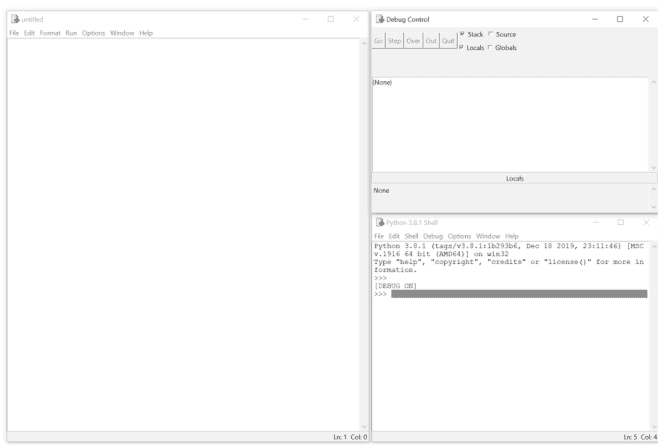

> **注意**
>
> 只要调试窗口是打开的，交互式窗口中的提示符旁边就会显示 [DEBUG ON]，以指示调试器已打开。

在本节中，你将学习调试窗口的组织方式，如何使用调试器逐行单步执行代码，以及如何设置断点以帮助加快调试过程。

### 调试控制窗口：概述

为了了解调试器的工作原理，让我们首先编写一个没有任何错误的简单程序。在脚本窗口中输入以下内容：

```
for i in range(1, 4):
    j = i * 2
    print(f"i is {i} and j is {j}")
```

当你在调试窗口打开的情况下保存并运行此脚本时，你会注意到执行并没有走得很远。调试控制窗口将如下所示：

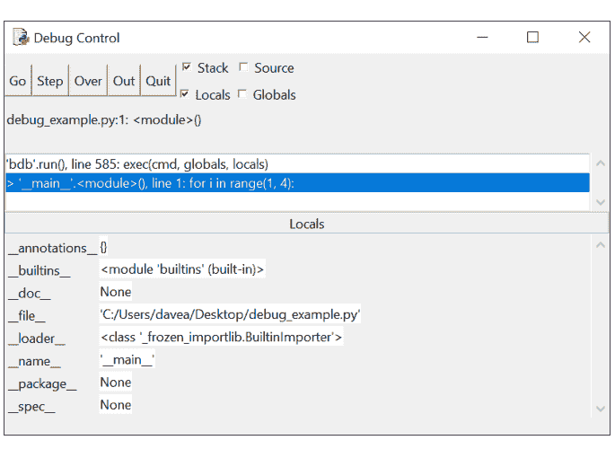

请注意，窗口顶部的 *Stack* 面板包含以下消息：

```
> '__main__'.<module>(), line 1: for i in range(1, 4):
```

这告诉你第 1 行（包含代码 `for i in range(1, 4):`）*即将*运行但尚未开始。调试器消息中的 `'__main__'.module()` 部分指的是我们当前处于脚本的“主”部分，而不是，例如，在到达主代码块之前处于函数定义中。

在 *Stack* 面板下方，有一个 *Locals* 面板，列出了一些看起来奇怪的内容，如 `__annotations__`、`__builtins__`、`__doc__` 等。这些是一些内部系统变量，你现在可以忽略它们。随着程序的运行，你会看到代码中声明的变量显示在此窗口中，以便你可以跟踪它们的值。

调试窗口的左上角有五个按钮：`Go`、`Step`、`Over`、`Out` 和 `Quit`。这些按钮控制调试器如何遍历你的代码。

在接下来的部分中，我们将从 `Step` 按钮开始，探讨每个按钮的功能。

### `Step` 按钮

现在点击调试窗口左上角的 `Step` 按钮。调试窗口会稍微变化，如下所示：

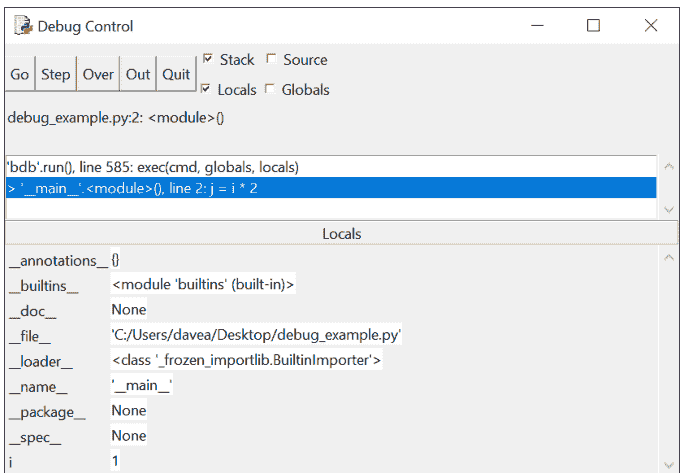

这里有两个需要注意的区别。首先，*Stack* 窗口中的消息变为：

```
> '__main__'.<module>(), line 2: j = i * 2:
```

此时，你的代码第 1 行已经运行，调试器在执行第 2 行之前停止。

第二个需要注意的变化是 *Locals* 面板中出现了一个新变量 `i`，其值为 1。这是因为代码第一行中的 `for` 循环创建了变量 `i` 并为其赋值为 1。

继续点击 `Step` 按钮，逐行遍历你的代码，观察调试器窗口中发生的情况。当你到达 `print(f"i is {i} and j is {j}")` 这一行时，你可以看到输出在交互式窗口中一次显示一部分。

更重要的是，你可以在单步执行 `for` 循环时跟踪 `i` 和 `j` 的值增长。你可能可以想象这个功能在尝试定位程序中错误来源时是多么有益。知道每一行代码中每个变量的值可以帮助你准确定位问题所在。

### 断点和“Go”按钮

通常，你可能知道错误一定在代码的某个特定部分，但可能不知道具体位置。与其整天点击 `Step` 按钮，你可以设置一个**断点**，告诉调试器连续运行断点之前的所有代码，直到到达断点。

断点告诉调试器何时暂停代码执行，以便你可以查看程序的当前状态。它们实际上不会破坏任何东西。

要设置断点，请在脚本窗口中你想要暂停的代码行上右键单击（Mac：`Ctrl` + 点击）并选择 `Set Breakpoint`。IDLE 会将该行高亮显示为黄色，以指示你的断点已设置。你可以随时通过右键单击带有断点的行并选择 `Clear Breakpoint` 来移除断点。

现在按下调试控制窗口顶部的 `Quit` 按钮，暂时关闭调试器。这不会关闭窗口，你会希望保持它打开，因为你稍后会再次使用它。

在包含 `print()` 语句的代码行上设置一个断点。脚本窗口现在应该如下所示：

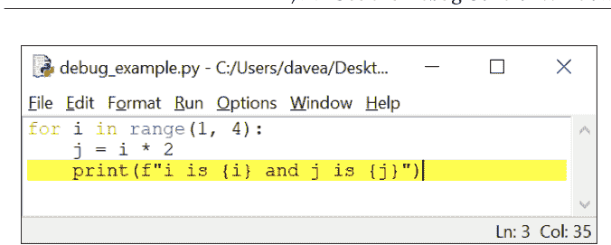

现在按 F5 运行脚本。就像之前一样，调试控制窗口的 *Stack* 面板指示调试器已启动并等待执行第 1 行。这次，不是点击 Step 按钮，而是点击 Go 按钮，观察调试窗口的变化：

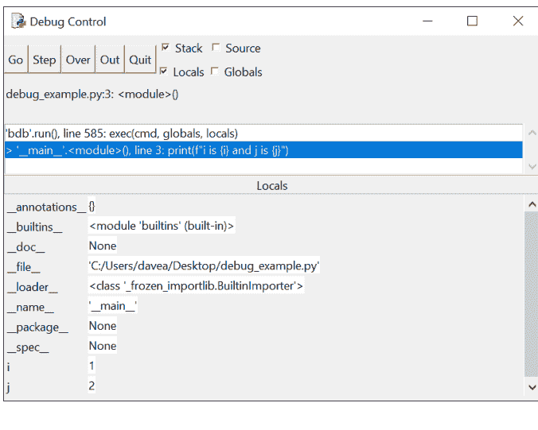

*Stack* 面板现在显示以下消息，指示它正在等待执行第 3 行：

```
> '__main__'.<module>(), line 3: print(f"i is {i} and j is {j}")
```

如果你查看 *Locals* 面板，你会看到变量 i 和 j 的值分别为 1 和 2。通过点击 Go，你告诉调试器连续运行你的代码，直到到达断点或程序结束。现在再次按下“Go”。调试窗口现在如下所示：

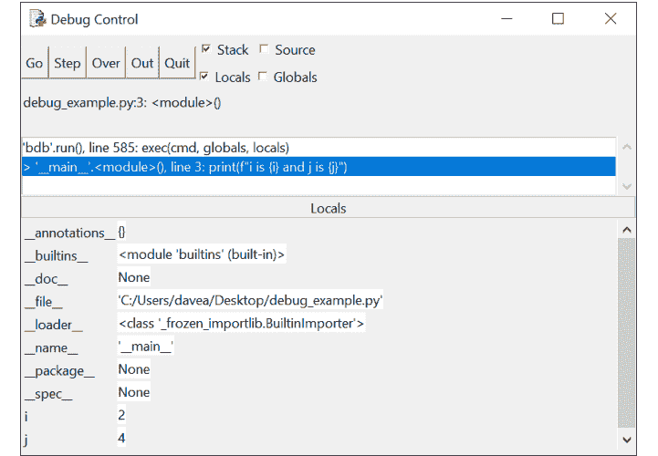

你看到变化了吗？*Stack* 面板中显示了与之前相同的消息，指示调试器再次等待执行第 3 行。然而，现在变量 i 和 j 的值是 2 和 4。交互式窗口也显示了第一次运行包含 print() 的行时的输出。

每次你按下 Go 按钮，调试器都会连续运行代码，直到到达下一个断点。由于你在第 3 行设置了断点，该行位于 for 循环内部，调试器每次循环都会在此行停止。

第三次按下 Go。现在 i 和 j 的值是 3 和 6。你认为再按一次 Go 会发生什么？由于 for 循环只迭代 3 次，当你这次按下 Go 时，程序运行结束。

### “Over” 和 “Out”

Over 按钮的作用类似于 Step 和 Go 的组合。它会跳过一个函数或循环。换句话说，如果你即将使用调试器单步进入一个函数，你仍然可以运行该函数的代码，而无需逐步执行其每一行。Over 按钮会直接带你到运行该函数的结果。

同样，如果你已经在一个函数或循环内部，Out 按钮会执行函数或循环体内的剩余代码，然后暂停。

在下一节中，你将查看一些有错误的代码，并学习如何使用 IDLE 修复它。

对此部分提供反馈 »

## 7.2 消灭一些 Bug

既然你已经熟悉了调试控制窗口的使用，让我们来看一个有错误的程序。

以下代码定义了一个函数 add_underscores()，它接受一个字符串对象 word 作为参数，并返回一个新字符串，其中包含 word 的副本，每个字符都被下划线包围。例如，add_underscores("python") 应该返回 "_p_y_t_h_o_n_"。

这是有错误的代码：

```
def add_underscores(word):
    new_word = "_"
    for i in range(0, len(word)):
```

### 第一步：猜测错误可能的位置

第一步是找出可能包含错误的代码段。一开始你可能无法精确定位错误，但通常可以合理地猜测代码的哪个部分出了问题。

请注意，脚本被分为两个不同的部分：一个函数定义（其中定义了 `add_underscores()`），以及一个“主”代码块，该块定义了一个值为 "hello" 的变量 `phrase`，然后打印调用 `add_underscores(phrase)` 的结果。

看看“主”部分：

```
phrase = "hello"
print(add_underscores(phrase))
```

你认为问题可能出在这里吗？看起来不像，对吧？这两行代码看起来都没问题。所以，问题一定出在函数定义中：

```
def add_underscores(word):
    new_word = "_"
    for i in range(0, len(word)):
        new_word = word[i] + "_"
    return new_word
```

函数内的第一行代码创建了一个值为 "_" 的变量 `new_word`。这里没问题，所以我们可以得出结论，问题出在 `for` 循环体内的某个地方。

### 第二步：设置断点并检查代码

既然你已经确定了错误的位置，就在 `for` 循环的开始处设置一个断点，这样你就可以使用调试控制窗口准确地追踪内部发生的情况：

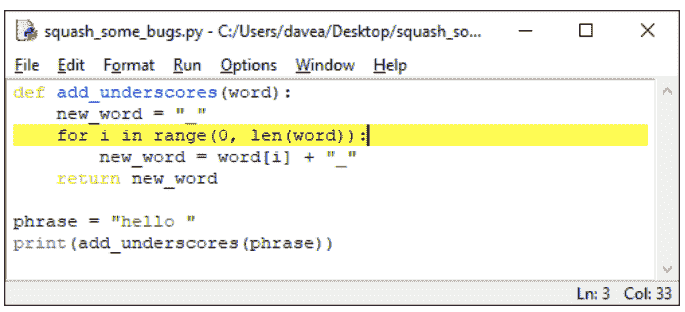

现在打开调试控制窗口并运行脚本。执行仍然会在它看到的第一行（即定义函数的那一行）暂停。按下“Go”按钮运行代码，直到遇到断点。调试窗口现在将如下所示：

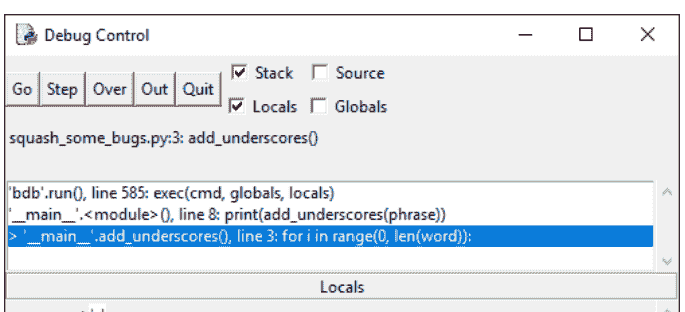

此时，代码在进入 `add_underscores()` 函数中的 `for` 循环之前暂停。请注意，两个局部变量 `word` 和 `new_word` 显示在 Locals 面板中。目前，`word` 的值为 "hello"，`new_word` 的值为 "_"，正如预期的那样。

点击 `Step` 按钮一次以进入 `for` 循环。调试窗口发生变化，一个新的变量 `i`（值为 0）显示在“Locals”面板中。`i` 是 `for` 循环中使用的计数器，你可以用它来跟踪当前正在查看 `for` 循环的哪一次迭代：

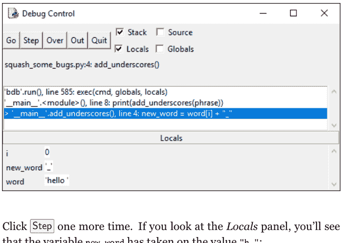

再点击一次 `Step`。如果你查看 *Locals* 面板，你会看到变量 `new_word` 已经变成了值 "h_"：

## 7.2. 消灭一些 Bug

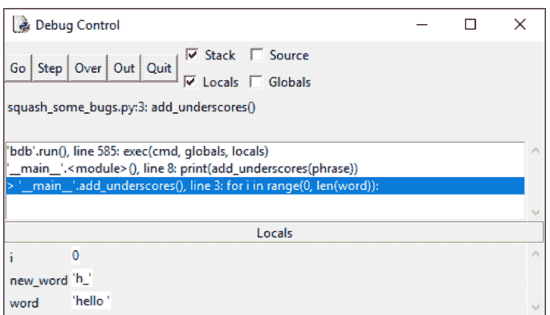

这是不对的。最初，`new_word` 的值是 "_"，在 `for` 循环的第二次迭代中，它现在应该具有值 "_h_"。如果你再点击几次 `Step`，你会看到 `new_word` 被设置为 `e_`，然后是 `l_`，依此类推。

### 第三步：识别错误并尝试修复

此时你可以得出的结论是，`new_word` 在 `for` 循环的每次迭代中都被字符串 "hello" 中的下一个字符和一个尾随下划线覆盖了。由于 `for` 循环内只有一行代码，你知道问题一定出在以下代码中：

```
new_word = word[i] + "_"
```

仔细看看。这行代码告诉 Python 获取 `word` 的下一个字符，在其末尾添加一个下划线，并将这个新字符串赋值给变量 `new_word`。这正是你通过单步执行 `for` 循环所观察到的行为！

要修复这个问题，你需要告诉 Python 将字符串 `word[i] + "_"` 连接到 `new_word` 的现有值上。按下调试控制窗口中的“Quit”按钮，但暂时不要关闭该窗口。打开脚本窗口，将 `for` 循环内的行更改为：

```
new_word = new_word + word[i] + "_"
```

### 第四步：重复步骤 1-3 直到错误消失

将新的更改保存到你的脚本并再次运行它。在调试窗口中，按下 `Go` 按钮执行代码直到断点。

> **注意**

如果你在上一步中没有点击 `Quit` 就关闭了调试器，当你重新打开调试控制窗口时可能会看到以下错误：

You can only toggle the debugger when idle

请务必在调试会话结束时点击 `Go` 或 `Quit`，而不是直接关闭调试器，否则你可能在重新打开它时遇到麻烦。要消除此错误，你必须关闭 IDLE 并重新打开它。

就像之前一样，你的脚本现在在进入 `add_underscores()` 函数中的 `for` 循环之前暂停。反复按下 `Step` 按钮，观察 `new_word` 变量在每次迭代中的变化。你现在看到了什么？成功了！一切都在按预期工作！

在这个例子中，你第一次尝试修复错误就成功了，所以你不需要再重复步骤 1-3。然而，情况并非总是如此。有时你需要重复这个过程几次才能修复一个错误。

同样重要的是要记住，像调试器这样的工具不会告诉你如何修复错误。它们只是帮助你识别代码中问题发生的确切位置。

### 在代码中寻找错误的其他方法

调试可能很棘手且耗时，但有时它是找到你忽略的错误的最可靠方法。然而，在打开调试器之前，有时使用放置得当的 `print()` 函数来显示变量的值来定位错误会更简单。

例如，与其使用调试控制窗口调试前面的脚本，你可以在 `add_underscores()` 函数的 `for` 循环末尾添加以下行：

```
print(f"i = {i}; new_word = {new_word}")
```

修改后的脚本将如下所示：

```
def add_underscores(word):
    new_word = "_"
    for i in range(0, len(word)):
        new_word = word[i] + "_"
        print(f"i = {i}; new_word = {new_word}")
    return new_word

phrase = "hello"
print(add_underscores(phrase))
```

当你运行脚本时，交互式窗口显示以下输出：

```
i = 0; new_word = h_
i = 1; new_word = e_
i = 2; new_word = l_
i = 3; new_word = l_
i = 4; new_word = o_
o_
```

这向你展示了 `new_word` 在 `for` 循环每次迭代中的值。最后一行仅包含一个下划线，是脚本末尾运行 `print(add_underscore(phrase))` 的结果。

## 7.2. 消灭一些 Bug

通过查看上述输出，你可以得出与使用调试控制窗口调试时相同的结论。也就是说，问题是 `new_word` 在每次迭代中都被覆盖了。

许多 Python 程序员更喜欢这种简单的方法来进行一些快速而粗糙的即时调试。这是一种方便的技术，但与 IDLE 的调试器相比有一些缺点。

最显著的缺点是，使用 `print()` 函数调试需要你每次检查变量值时都运行整个脚本。对于长脚本，与在调试控制窗口中设置断点并使用“Go”按钮相比，这可能是巨大的时间浪费。

另一个缺点是，调试完成后，你必须记住从代码中删除那些 `print()` 函数调用。否则，用户在运行你的程序时可能会看到不必要且可能令人困惑的输出。

本节中的示例循环可能是说明调试过程的好例子，但它不是 Pythonic 代码的最佳示例。使用索引 `i` 表明可能有更好的方式来编写循环。

改进此循环的一种方法是直接迭代字符串 `word` 中的字符。以下是实现此目的的一种方式：

```
def add_underscores(word):
    new_word = "_"
    for char in word:
        new_word = new_word + char + "_"
    return new_word
```

将现有代码重写为更简洁、更易于阅读和理解，或遵守团队设定的代码标准的过程称为**重构**。我们不会在本课程中过多讨论重构，但它是编写专业质量代码的重要组成部分。

对本节留下反馈 »

## 7.3 总结与补充资源

在本章中，你学习了 IDLE 的调试窗口。你了解了如何检查变量值、设置断点，以及使用 `Step`、`Go`、`Over` 和 `Out` 按钮。你还通过一个四步流程，练习调试了一个无法正常工作的函数，该流程用于识别和修复错误：

1.  猜测错误可能的位置
2.  设置断点并检查代码
3.  识别错误并尝试修复
4.  重复步骤 1-3，直到错误被修复

调试既是一门艺术，也是一门科学。掌握调试的唯一方法就是大量练习！

一种练习方式是打开调试控制窗口，在你完成本书后续章节的练习和挑战时，用它来逐步执行你的代码。

> **互动测验**

本章附带一个免费的在线测验，用于检查你的学习进度。你可以使用手机或电脑通过以下网址访问测验：

[realpython.com/quizzes/python-basics-7](https://realpython.com/quizzes/python-basics-7)

## 补充资源

有关调试 Python 代码的更多信息，请查看以下资源：

- [使用 Pdb 调试 Python](https://realpython.com/python-debugging-pdb/)
- [realpython.com 上的推荐资源](https://realpython.com)

[对本节提供反馈 »](https://realpython.com)

# 第 8 章

## 条件逻辑与控制流

你在本书中看到的几乎所有代码都是**无条件的**。也就是说，代码不进行任何选择。每一行代码都按照书写顺序或函数调用顺序执行，循环内部可能存在重复。

在本章中，你将学习如何使用**条件逻辑**编写根据不同条件执行不同操作的程序。结合函数和循环，条件逻辑使你能够编写处理多种不同情况的复杂程序。

**在本章中，你将学习如何：**

- 比较两个或多个变量的值
- 编写 `if` 语句来控制程序的流程
- 使用 `try` 和 `except` 处理错误
- 应用条件逻辑创建简单的模拟

让我们开始吧！

[对本节提供反馈 »](https://example.com)

### 8.1 比较值

条件逻辑基于某个表达式（称为**条件**）的真假来执行不同的操作。这个概念并非计算机独有。人类在做决定时也一直在使用条件逻辑。

例如，在美国，购买酒精饮料的法定年龄是 21 岁。陈述“如果你至少 21 岁，那么你可以购买啤酒”就是条件逻辑的一个例子。短语“你至少 21 岁”是一个条件，因为它可能为真，也可能为假。

在计算机编程中，条件通常采用比较两个值的形式，例如确定一个值是否大于另一个值，或者两个值是否相等。一组称为**布尔比较符**的标准符号用于进行比较，其中大部分你可能已经熟悉。

下表描述了这些布尔比较符：

| 布尔比较符 | 示例 | 含义 |
| :--- | :--- | :--- |
| > | a > b | a 大于 b |
| < | a < b | a 小于 b |
| >= | a >= b | a 大于或等于 b |
| <= | a <= b | a 小于或等于 b |
| != | a != b | a 不等于 b |
| == | a == b | a 等于 b |

术语**布尔**源自英国数学家乔治·布尔的姓氏，他的著作帮助奠定了现代计算的基础。为了纪念布尔，条件逻辑有时被称为**布尔逻辑**，条件有时被称为**布尔表达式**。

还有一种基本数据类型称为**布尔**，简称 **bool**，它只能有两个值之一。在 Python 中，这些值被方便地命名为 `True` 和 `False`：

```
>>> type(True)
<class 'bool'>

>>> type(False)
<class 'bool'>
```

请注意，`True` 和 `False` 都以大写字母开头。

计算条件的结果始终是一个布尔值：

```
>>> 1 == 1
True

>>> 3 > 5
False
```

在第一个例子中，因为 1 等于 1，所以 `1 == 1` 的结果是 `True`。在第二个例子中，3 不大于 5，所以结果是 `False`。

> **重要提示**

编写条件时一个常见的错误是使用赋值运算符 `=` 而不是 `==` 来测试两个值是否相等。

幸运的是，如果遇到这个错误，Python 会引发 `SyntaxError`，这样你在运行程序之前就会知道。

你可能会发现将布尔比较符视为对两个值提出问题会很有帮助。`a == b` 询问 `a` 和 `b` 是否具有相同的值。同样，`a != b` 询问 `a` 和 `b` 是否具有不同的值。

条件表达式不仅限于比较数字。你也可以比较字符串等值：

```
>>> "a" == "a"
True

>>> "a" == "b"
False

>>> "a" < "b"
True

>>> "a" > "b"
False
```

上面最后两个例子对你来说可能看起来很奇怪。一个字符串怎么可能大于或小于另一个字符串？

比较符 < 和 > 在与数字一起使用时代表大于和小于的概念，但更普遍地说，它们代表顺序的概念。在这方面，"a" < "b" 检查字符串 "a" 是否在字符串 "b" 之前。但字符串是如何排序的呢？

在 Python 中，字符串是**按字典顺序**排序的，这是一种花哨的说法，表示它们按照在字典中出现的顺序排序。因此，你可以将 "a" < "b" 理解为询问字母 a 是否在字典中出现在字母 b 之前。

字典顺序扩展到包含两个或更多字符的字符串，通过查看字符串的每个组成字母：

```
>>> "apple" < "astronaut"
True

>>> "beauty" > "truth"
False
```

由于字符串可以包含字母表以外的字符，排序也必须扩展到这些其他字符。

我们不会深入探讨字母以外的字符如何排序的细节。在实践中，< 和 > 比较符最常用于数字，而不是字符串。

## 复习练习

你可以在 [realpython.com/python-basics/resources](https://realpython.com/python-basics/resources) 找到这些练习的解决方案和许多其他额外资源。

1.  对于以下每个条件表达式，猜测它们的计算结果是 `True` 还是 `False`。然后将它们输入交互式窗口以检查你的答案：

    ```
    1 <= 1
    1 != 1
    1 != 2
    "good" != "bad"
    "good" != "Good"
    123 == "123"
    ```

2.  对于以下每个表达式，在空白处（由 `__` 表示）填入适当的布尔比较符，使表达式计算结果为 `True`：

    ```
    3 __ 4
    10 __ 5
    "jack" __ "jill"
    42 __ "42"
    ```

[对本节提供反馈 »](https://realpython.com/python-basics/resources)

### 8.2 添加一些逻辑

除了布尔比较符，Python 还有称为**逻辑运算符**的特殊关键字，可用于组合布尔表达式。有三个逻辑运算符：`and`、`or` 和 `not`。

逻辑运算符用于构造复合逻辑表达式。在大多数情况下，它们的含义与英语中的含义相似，尽管它们在 Python 中使用的规则要精确得多。

#### and 关键字

考虑以下陈述：

1.  猫有四条腿。
2.  猫有尾巴。

一般来说，这两个陈述都是真的。

当我们使用 and 组合这两个陈述时，得到的句子“猫有四条腿并且猫有尾巴”也是一个真实的陈述。如果两个陈述都被否定，复合陈述“猫没有四条腿并且猫没有尾巴”就是假的。

即使我们混合真假陈述，复合陈述也是假的。“猫有四条腿并且猫没有尾巴”和“猫没有四条腿并且猫有尾巴”都是假的陈述。

当两个陈述 P 和 Q 用 and 组合时，复合陈述“P and Q”的**真值**为真当且仅当 P 和 Q 都为真。

Python 的 and 运算符的工作方式完全相同。以下是四个使用 and 的复合语句示例：

```
>>> 1 < 2 and 3 < 4  # 两者都为 True
True
```

两个陈述都为 True，所以组合也为 True。

```
>>> 2 < 1 and 4 < 3  # 两者都为 False
False
```

两个陈述都为 False，所以它们的组合也为 False。

```
>>> 1 < 2 and 4 < 3  # 第二个陈述为 False
False
```

1 < 2 为 True，但 4 < 3 为 False，所以它们的组合为 False。

## `and` 关键字

```python
>>> 2 < 1 and 3 < 4  # 第一个语句为 False
False
```

2 < 1 为 False，3 < 4 为 True，因此它们的组合结果为 False。

下表总结了 `and` 运算符的规则：

| 使用 and 的组合 | 结果 |
|---|---|
| True and True | True |
| True and False | False |
| False and True | False |
| False and False | False |

你可以在交互式窗口中测试每一条规则：

```python
>>> True and True
True

>>> True and False
False

>>> False and True
False

>>> False and False
False
```

## `or` 关键字

当我们在日常对话中使用“或”这个词时，有时我们指的是**异或**。也就是说，只有第一个选项或第二个选项可以为真。

例如，短语“我可以留下或我可以离开”使用的是异或。我不能既留下又离开。这些选项中只有一个可以为真。

在 Python 中，`or` 关键字是包含性的。也就是说，如果 *P* 和 *Q* 是两个表达式，那么语句“P or Q”在以下任一条件为真时即为真：

1. P 为真
2. Q 为真
3. P 和 Q 都为真

让我们看一些使用数值比较的例子：

```python
>>> 1 < 2 or 3 < 4  # 两者都为 True
True

>>> 2 < 1 or 4 < 3  # 两者都为 False
False

>>> 1 < 2 or 4 < 3  # 第二个语句为 False
True

>>> 2 < 1 or 3 < 4  # 第一个语句为 False
True
```

请注意，如果复合语句的任何部分为 True，即使另一部分为 False，结果也始终为 True。下表总结了这些结果：

| 使用 or 的组合 | 结果 |
|---|---|
| True or True | True |
| True or False | True |
| False or True | True |
| False or False | False |

同样，你可以在交互式窗口中验证所有这些：

```python
>>> True or True
True

>>> True or False
True

>>> False or True
True

>>> False or False
False
```

## `not` 关键字

`not` 关键字会反转单个表达式的真值：

| 使用 not | 结果 |
|---|---|
| not True | False |
| not False | True |

你可以在交互式窗口中验证这一点：

```python
>>> not True
False

>>> not False
True
```

不过，关于 `not` 需要记住的一点是，当它与 `==` 等比较运算符结合使用时，其行为可能并不总是如你所预期。例如，`not True == False` 返回 `True`，但 `False == not True` 会引发错误：

```python
>>> not True == False
True

>>> False == not True
  File "<stdin>", line 1
    False == not True
          ^
SyntaxError: invalid syntax
```

这是因为 Python 根据**运算符优先级**来解析逻辑运算符，就像日常数学中的算术运算符有优先级顺序一样。

逻辑和布尔运算符的优先级顺序（从高到低）在下表中描述。同一行中的运算符具有相同的优先级。

| 运算符优先级顺序（从高到低） |
|---|
| `<, <=, ==, >=, >` |
| `not` |
| `and` |
| `or` |

再次查看表达式 `False == not True`，在运算顺序中，`not` 的优先级低于 `==`。这意味着当 Python 计算 `False == not True` 时，它首先尝试计算 `False == not`，这在语法上是不正确的。

你可以通过将 `not True` 用括号括起来来避免 `SyntaxError`：

```python
>>> False == (not True)
True
```

使用括号对表达式进行分组是澄清哪些运算符属于复合表达式哪一部分的好方法。

## 构建复杂表达式

你可以将 `and`、`or` 和 `not` 关键字与 `True` 和 `False` 结合使用，以创建更复杂的表达式。这是一个更复杂表达式的例子：

```python
True and not (1 != 1)
```

你认为这个表达式的值是多少？

要找出答案，请从最右边开始分解表达式。`1 != 1` 是 `False`，因为 1 与自身相等。因此，你可以将上述表达式简化如下：

```python
True and not (False)
```

现在，`not (False)` 与 `not False` 相同，即 `True`。因此，你可以再次简化表达式：

```python
True and True
```

最后，`True and True` 就是 `True`。因此，经过几个步骤，你可以看到 `True and not (1 != 1)` 的计算结果为 `True`。

在处理复杂表达式时，最好的策略是从表达式中最复杂的部分开始，然后向外构建。

例如，尝试计算以下表达式：

```python
("A" != "A") or not (2 >= 3)
```

首先计算括号中的两个表达式。`"A" != "A"` 是 `False`，因为 "A" 等于自身。`2 >= 3` 也是 `False`，因为 2 小于 3。这给你以下等效但更简单的表达式：

```python
(False) or not (False)
```

由于 `not` 的优先级高于 `or`，上述表达式等效于以下表达式：

```python
False or (not False)
```

`not False` 是 `True`，因此你可以再次简化表达式：

```python
False or True
```

最后，由于任何包含 `or` 的复合表达式，只要 `or` 左侧或右侧的任一表达式为 `True`，结果就为 `True`，因此你可以得出结论 `("A" != "A") or not (2 >= 3)` 为 `True`。

在复合条件语句中使用括号对表达式进行分组可以提高可读性。但有时，括号是产生预期值所必需的。

例如，乍一看，你可能期望以下表达式输出 `True`，但它实际上返回 `False`：

```python
>>> True and False == True and False
False
```

这是 `False` 的原因是 `==` 运算符的优先级高于 `and`，因此 Python 将表达式解释为 `True and (False == True) and False`。由于 `False == True` 是 `False`，这等效于 `True and False and False`，其计算结果为 `False`。

以下展示了如何添加括号使表达式计算结果为 `True`：

```python
>>> (True and False) == (True and False)
True
```

逻辑运算符和布尔比较器在你第一次接触时可能会令人困惑，因此如果你觉得本节的内容不太自然，请不要担心！

通过一点练习，你将能够理解其中的原理，并在需要时构建自己的复合条件语句。

## 复习练习

你可以在 [realpython.com/python-basics/resources](https://realpython.com/python-basics/resources) 找到这些练习的解决方案和许多其他额外资源。

### 8.3 控制程序的流程

1. 计算以下表达式的结果（True 或 False），然后将它们输入交互式窗口以检查你的答案：
   - `(1 <= 1) and (1 != 1)`
   - `not (1 != 2)`
   - `("good" != "bad") or False`
   - `("good" != "Good") and not (1 == 1)`
2. 在必要时添加括号，使以下每个表达式的计算结果为 `True`：
   - `False == not True`
   - `True and False == True and False`
   - `not True and "A" == "B"`

对本节提出反馈 »

### 8.3 控制程序的流程

现在我们可以使用布尔比较器比较值，并使用逻辑运算符构建复杂的条件语句，我们可以在代码中添加一些逻辑，以便它针对不同的条件执行不同的操作。

## `if` 语句

`if` 语句告诉 Python，只有在满足条件时才执行一部分代码。

例如，以下 `if` 语句将在条件 `2 + 2 == 4` 为 `True` 时打印 "2 and 2 is 4"：

```python
if 2 + 2 == 4:
    print("2 and 2 is 4")
```

用英语，你可以读作“如果 2 + 2 等于 4，则打印字符串 '2 and 2 is 4'。”

就像 `while` 循环一样，`if` 语句有三个部分：

1. `if` 关键字
2. 一个测试条件，后跟一个冒号
3. 一个缩进的代码块，如果测试条件为 `True`，则执行该代码块

在上面的例子中，测试条件是 `2 + 2 == 4`。由于此表达式为 `True`，在 IDLE 中执行 `if` 语句会显示文本 `2 and 2 is 4`。

如果测试条件为 `False`（例如，`2 + 2 == 5`），Python 会跳过缩进的代码块，并在下一行非缩进行继续执行。

例如，以下 `if` 语句不会打印任何内容：

```python
if 2 + 2 == 5:
    print("Is this the mirror universe?")
```

一个 `2 + 2 == 5` 为 `True` 的宇宙确实会非常奇怪！

> **注意**
>
> 在 `if` 语句中省略测试条件后的冒号（`:`）会引发 `SyntaxError`：
>
> ```python
> >>> if 2 + 2 == 4
> SyntaxError: invalid syntax
> ```

一旦 `if` 语句中的缩进代码块被执行，Python 将继续执行程序的其余部分。

考虑以下脚本：

```python
grade = 95

if grade >= 70:
    print("You passed the class!")
```

## 8.3. 控制程序流程

```python
print("Thank you for attending.")
```

输出结果如下：

```
You passed the class!
Thank you for attending.
```

由于成绩是95，测试条件 `grade >= 70` 为 `True`，因此打印字符串 "You passed the class!"。然后执行其余代码，打印 "Thank you. for attending."。

如果你将成绩改为40，输出结果如下：

```
Thank you for attending.
```

无论成绩是否大于或等于70，`print("Thank you for attending.")` 这一行都会执行，因为它位于 `if` 语句的缩进代码块之后。

如果学生不及格，而你的代码只显示 "Thank you for attending."，那么他们将不知道自己不及格。

让我们添加另一个 `if` 语句，以便在学生成绩低于70时告诉他们没有通过：

```python
grade = 40

if grade >= 70:
    print("You passed the class!")

if grade < 70:
    print("You did not pass the class :(")

print("Thank you for attending.")
```

现在的输出结果如下：

```
You did not pass the class :(
Thank you for attending.
```

在英语中，我们可以用 "otherwise" 这个词来描述另一种情况。例如，“如果你的成绩是70分或以上，你就通过了这门课。否则，你就没有通过这门课。”

幸运的是，Python 中有一个关键字可以起到英语中 "otherwise" 的作用。

## else 关键字

`else` 关键字用于 `if` 语句之后，以便仅在 `if` 语句的测试条件为 `False` 时执行某些代码。

以下脚本使用 `else` 来缩短前一个脚本中用于显示学生是否通过课程的代码：

```python
grade = 40

if grade >= 70:
    print("You passed the class!")
else:
    print("You did not pass the class :(")

print("Thank you for attending.")
```

在英语中，`if` 和 `else` 语句一起读作“如果成绩至少为70，则打印字符串 "You passed the class!"；否则，打印字符串 "You did not pass the class :("。”

请注意，`else` 关键字没有测试条件，后面跟着一个冒号。不需要条件，因为它适用于任何未通过 `if` 语句测试条件的情况。

> **重要提示**

如果 `else` 关键字后面漏掉了冒号（`:`），将会引发 `SyntaxError`：

```python
>>> if 2 + 2 == 5:
...     print("Who broke my math?")
... else
SyntaxError: invalid syntax
```

上述脚本的输出是：

```
You did not pass the class :(
Thank you for attending.
```

即使执行了 `else` 之后的缩进代码块，打印 "Thank you for attending." 的那一行仍然会运行。

如果你只需要测试一个恰好有两种状态的条件，`if` 和 `else` 关键字可以很好地协同工作。

有时，你需要检查三个或更多条件。为此，你可以使用 `elif`。

## `elif` 关键字

`elif` 关键字是 "else if" 的缩写，可用于在 `if` 语句之后添加额外的条件。

与 `if` 语句一样，`elif` 语句有三个部分：

1. `elif` 关键字
2. 一个测试条件，后跟一个冒号
3. 一个缩进的代码块，如果测试条件求值为 `True`，则执行该代码块

> **重要提示**

如果 `elif` 语句末尾漏掉了冒号（`:`），将会引发 `SyntaxError`：

```python
>>> if 2 + 2 == 5:
...     print("Who broke my math?")
... elif 2 + 2 == 4
SyntaxError: invalid syntax
```

以下脚本结合使用 `if`、`elif` 和 `else` 来打印学生在课程中获得的字母等级：

```python
grade = 85  # 1

if grade >= 90:  # 2
    print("You passed the class with a A.")
elif grade >= 80:  # 3
    print("You passed the class with a B.")
elif grade >= 70:  # 4
    print("You passed the class with a C.")
else:  # 5
    print("You did not pass the class :(")

print("Thanks for attending.")  # 6
```

当 `grade` 为85时，`grade >= 80` 和 `grade >= 70` 都为 `True`，因此你可能期望第3行和第4行的两个 `elif` 块都会被执行。

然而，只有第一个测试条件为 `True` 的块会被执行。所有剩余的 `elif` 和 `else` 块都会被跳过，因此执行脚本的输出如下：

```
You passed the class with a B.
Thanks for attending.
```

让我们逐步分解脚本的执行过程：

1. 在标记为1的行中，`grade` 被赋值为85。
2. `grade >= 90` 为 `False`，因此跳过标记为2的 `if` 语句。
3. `grade >= 80` 为 `True`，因此执行第3行 `elif` 语句下的代码块，并打印 "You passed the class with a B."。
4. 第4行和第5行的 `elif` 和 `else` 语句被跳过，因为第3行 `elif` 语句的条件已满足。
5. 最后，执行第6行，打印 "Thanks for attending."。

`if`、`elif` 和 `else` 关键字是 Python 语言中最常用的关键字之一。它们允许你编写能够根据不同条件做出不同响应的代码。

`if` 语句允许你解决比没有任何条件逻辑的代码更复杂的问题。你甚至可以将一个 `if` 语句嵌套在另一个 `if` 语句中，以编写处理极其复杂逻辑的代码！

## 嵌套 if 语句

就像 `for` 和 `while` 循环可以相互嵌套一样，你也可以将一个 `if` 语句嵌套在另一个 `if` 语句中，以创建复杂的决策结构。

考虑以下场景。两个人进行一对一的体育比赛。你必须根据选手的分数和他们所进行的运动来决定两位选手中谁获胜：

- 如果两位选手进行篮球比赛，得分最高的选手获胜。
- 如果两位选手进行高尔夫比赛，那么得分最低的选手获胜。
- 在任何一种运动中，如果两位选手的分数相等，则比赛平局。

以下程序使用嵌套的 `if` 语句解决了这个问题：

```python
sport = input("Enter a sport: ")
p1_score = int(input("Enter player 1 score: "))
p2_score = int(input("Enter player 2 score: "))

# 1
if sport.lower() == "basketball":
    if p1_score == p2_score:
        print("The game is a draw.")
    elif p1_score > p2_score:
        print("Player 1 wins.")
    else:
        print("Player 2 wins.")
# 2
elif sport.lower() == "golf":
    if p1_score == p2_score:
        print("The game is a draw.")
    elif p1_score < p2_score:
        print("Player 1 wins.")
    else:
        print("Player 2 wins.")
# 3
else:
    print("Unknown sport")
```

这个程序首先要求用户输入一项运动以及两位选手的分数。

在（#1）中，分配给 `sport` 的字符串使用 `.lower()` 转换为小写，并与字符串 "basketball" 进行比较。这确保了用户输入如 "Basketball" 或 "BasketBall" 都会被解释为同一种运动。

然后比较选手的分数。如果分数相等，则比赛平局。如果选手1的分数大于选手2的分数，则选手1赢得篮球比赛。否则，选手2赢得篮球比赛。

在（#2）中，分配给 `sport` 的字符串再次转换为小写，并与字符串 "golf" 进行比较。然后再次检查选手的分数。如果两位选手的分数相等，则比赛平局。如果选手1的分数小于选手2的分数，则选手1获胜。否则，选手2获胜。

最后，在（#3）中，如果 `sport` 变量被赋值为 "basketball" 或 "golf" 以外的字符串，则显示消息 "Unknown sport"。

脚本的输出取决于输入值。以下是使用 "basketball" 作为运动的示例执行：

```
Enter a sport: basketball
Player 1 score: 75
Player 2 score: 64
Player 1 wins.
```

以下是使用相同选手分数但将运动更改为 "golf" 的输出：

```
Enter a sport: golf
Player 1 score: 75
Player 2 score: 64
Player 2 wins.
```

如果你为运动输入 `basketball` 或 `golf` 以外的任何内容，程序将显示 `Unknown sport`。

总的来说，程序有七种可能的运行方式，如下表所述：

| 运动 | 分数值 |
|---|---|
| "basketball" | p1_score == p2_score |
| "basketball" | p1_score > p2_score |
| "basketball" | p1_score < p2_score |
| "golf" | p1_score == p2_score |
| "golf" | p1_score > p2_score |
| "golf" | p1_score < p2_score |

## 8.3. 控制程序流程

| 运动项目 | 得分值 |
|---|---|
| 其他所有项目 | 任意组合 |

嵌套的 `if` 语句可以创建多种可能的代码执行路径。如果你有许多深层嵌套的 `if` 语句（超过两层），那么代码可能的执行路径数量会迅速增长。

> **注意**

使用深层嵌套的 `if` 语句所带来的复杂性，可能会让你难以预测程序在给定条件下的行为。

因此，通常不鼓励使用嵌套的 `if` 语句。

让我们看看如何通过移除嵌套的 `if` 语句来简化前面的程序。

首先，无论是什么运动项目，如果 `p1_score` 等于 `p2_score`，比赛就是平局。因此，我们可以将相等性检查从每个运动项目下的嵌套 `if` 语句中移出来，形成一个单独的 `if` 语句：

```
if p1_score == p2_score:
    print("The game is a draw.")

elif sport.lower() == "basketball":
    if p1_score > p2_score:
        print("Player 1 wins.")
    else:
        print("Player 2 wins.")

elif sport.lower() == "golf":
    if p1_score < p2_score:
        print("Player 1 wins.")
    else:
        print("Player 2 wins.")

else:
    print("Unknown sport.")
```

现在程序只有六种可能的执行路径。

这仍然相当多。你能想到任何让程序更简单的方法吗？

这里有一种简化方法。如果运动项目是篮球且玩家1的得分大于玩家2的得分，或者运动项目是高尔夫且玩家1的得分小于玩家2的得分，那么玩家1获胜。

我们可以用复合条件表达式来描述这一点：

```
sport = sport.lower()
p1_wins_basketball = (sport == "basketball") and (p1_score > p2_score)
p1_wins_golf = (sport == "golf") and (p1_score < p2_score)
p1_wins = p1_wins_basketball or p1_wins_golf
```

这段代码相当紧凑，让我们一步一步地分析它。

首先，赋值给 `sport` 的字符串被转换为全小写，这样我们就可以将其值与其他字符串进行比较，而不用担心大小写导致的错误。

在下一行，我们有一个看起来可能有点奇怪的结构。有一个赋值运算符（=），后面跟着一个包含相等比较符（==）的表达式。这一行计算以下复合逻辑表达式，并将其值赋给 `p1_wins_basketball` 变量：

```
(sport == "basketball") and (p1_score > p2_score)
```

如果 `sport` 是 "basketball" 且玩家1的得分大于玩家2的得分，那么 `p1_wins_basketball` 为 True。

接下来，对 `p1_wins_golf` 变量进行类似的操作。如果 `sport` 是 "golf" 且玩家1的得分小于玩家2的得分，那么 `p1_wins_golf` 为 True。

最后，如果玩家1赢得了篮球比赛或高尔夫比赛，`p1_wins` 将为 True，否则为 False。

使用这段代码，你可以大大简化程序：

```
if p1_score == p2_score:
    print("The game is a draw.")
elif (sport.lower() == "basketball") or (sport.lower() == "golf"):
    sport = sport.lower()
    p1_wins_basketball = (sport == "basketball") and (p1_score > p2_score)
    p1_wins_golf = (sport == "golf") and (p1_score < p2_score)
    p1_wins = p1_wins_basketball or p1_wins_golf
    if p1_wins:
        print("Player 1 wins.")
    else:
        print("Player 2 wins.")
else:
    print("Unknown sport")
```

在这个修改后的程序版本中，程序只有四种可能的执行路径，并且代码更容易理解。

嵌套的 `if` 语句有时是必要的。然而，如果你发现自己写了很多嵌套的 `if` 语句，停下来思考一下如何简化代码可能是个好主意。

## 复习练习

你可以在 [realpython.com/python-basics/resources](https://realpython.com/python-basics/resources) 找到这些练习的解答和许多其他额外资源。

- 1. 编写一个脚本，使用 `input()` 函数提示用户输入一个单词，将该输入存储在一个变量中，然后使用一组 `if`、`elif` 和 `else` 语句显示该字符串的长度是小于5个字符、大于5个字符还是等于5个字符。

对此部分提供反馈 »

### 8.4 挑战：找出一个数的因数

正整数 $n$ 的因数是任何小于或等于 $n$ 且能整除 $n$ 而没有余数的正整数。

例如，3 是 12 的因数，因为 12 除以 3 等于 4，没有余数。然而，5 不是 12 的因数，因为 5 除以 12 商为 2，余数为 2。

编写一个脚本 `factors.py`，要求用户输入一个正整数，然后打印出该数的所有因数。以下是程序的一个示例运行及输出：

```
Enter a positive integer: 12
1 is a factor of 12
2 is a factor of 12
3 is a factor of 12
4 is a factor of 12
6 is a factor of 12
12 is a factor of 12
```

**提示：** 回想一下第5章的内容，你可以使用 `%` 运算符来获取一个数除以另一个数的余数。

*你可以在 [realpython.com/python-basics/resources](https://realpython.com/python-basics/resources) 找到这个代码挑战的解答和许多其他额外资源。*

对此部分提供反馈 »

### 8.5 跳出循环模式

在第6章中，你学习了如何使用 `for` 或 `while` 循环来重复执行一段代码多次。循环对于执行重复性任务以及对许多不同输入应用某些处理非常有用。

将 `if` 语句与 `for` 循环结合起来，为控制代码的执行方式开辟了强大的技术。

在本节中，你将学习如何编写嵌套在 `for` 循环中的 `if` 语句，并了解两个关键字——`break` 和 `continue`——它们允许你更精确地控制循环中的执行流程。

#### if 语句和 for 循环

`for` 循环中的代码块就像任何其他代码块一样。这意味着你可以在 `for` 循环中嵌套一个 `if` 语句，就像在代码中的任何其他地方一样。

以下示例使用一个带有 `if` 语句的 `for` 循环来计算并显示所有小于100的偶数的和：

```
sum_of_evens = 0

for n in range(1, 100):
    if n % 2 == 0:
        sum_of_evens = sum_of_evens + n

print(sum_of_evens)
```

首先，`sum_of_evens` 变量被初始化为0。然后程序遍历数字1到99，并将偶数值加到 `sum_of_evens`。`sum_of_evens` 的最终值是2450。

#### break

`break` 关键字告诉 Python 字面上跳出循环。也就是说，循环完全停止，循环之后的任何代码都会被执行。

例如，以下代码遍历数字0到3，但当遇到数字2时停止循环：

```
for n in range(0, 4):
    if n == 2:
        break
    print(n)

print(f"Finished with n = {n}")
```

输出中只打印了前两个数字：

```
0
1
Finished with n = 2
```

#### continue

`continue` 关键字用于跳过循环体中剩余的任何代码，并继续下一次迭代。

例如，以下代码遍历数字0到3，打印每个数字，但跳过数字2：

```
for i in range(0, 4):
    if i == 2:
        continue
    print(i)

print(f"Finished with i = {i}")
```

输出中打印了除2以外的所有数字：

```
0
1
3
Finished with i = 3
```

> **注意**

给你的变量起简短但描述性的名字总是一个好主意，这样可以很容易地看出它们应该代表什么。

字母 i、j 和 k 是例外，因为它们在编程中非常常见。

这些字母几乎总是在我们需要一个“一次性”数字，仅仅是为了在循环过程中计数时使用。

总结一下，`break` 关键字用于在满足某个条件时停止循环，而 `continue` 关键字用于在满足某个条件时跳过循环的一次迭代。

#### for...else 循环

在 Python 中，循环可以有自己的 `else` 子句，尽管这种结构并不常用。

让我们看一个例子：

```
phrase = "it marks the spot"

for character in phrase:
    if character == "X":
        break
else:
    print("There was no 'X' in the phrase")
```

这个例子中的 `for` 循环遍历短语 "it marks the spot" 中的字符。如果找到字符 "X"，循环就会中断。如果循环在没有找到 "X" 的情况下完成，则执行 `else` 子句。

## 8.5. 跳出循环模式

`the spot`，并在找到字母 `x` 时停止。

如果你运行示例中的代码，你会看到控制台打印出 `There was no 'X' in the phrase`。

现在尝试将 `phrase` 改为字符串 `"X marks the spot"`。当你用这个短语运行相同的代码时，没有任何输出。这是怎么回事？

`for` 循环之后的 `else` 块中的任何代码，只有在 `for` 循环完成且未遇到 `break` 语句时才会执行。

因此，当你用 `phrase = "it marks the spot"` 运行代码时，由于短语中没有 `x` 字符，包含 `break` 语句的代码行永远不会运行，这意味着 `else` 块被执行，并显示字符串 `"There was no 'X' in the phrase"`。

另一方面，当你用 `phrase = "X marks the spot"` 运行代码时，包含 `break` 语句的代码行确实被执行了，因此 `else` 块永远不会运行，也不会显示任何输出。

下面是一个实际的例子，给用户三次机会输入密码：

```python
for n in range(3):
    password = input("Password: ")
    if password == "I<3Bieber":
        break
    print("Password is incorrect.")
else:
    print("Suspicious activity. The authorities have been alerted.")
```

这个例子循环遍历数字 0 到 2。在每次迭代中，都会提示用户输入密码。如果输入的密码正确，则使用 `break` 退出循环。否则，用户会被告知密码不正确，并获得另一次尝试机会。

在三次不成功的尝试之后，`for` 循环终止，且从未执行包含 `break` 的代码行。在这种情况下，`else` 块被执行，并警告用户当局已被通知。

> **注意**
>
> 本节我们重点关注 `for` 循环，因为它们通常是最常见的循环类型。
>
> 然而，这里讨论的所有内容也适用于 `while` 循环。也就是说，你可以在 `while` 循环中使用 `break` 和 `continue`。`while` 循环甚至可以有一个 `else` 子句！

在循环体内使用条件逻辑为控制代码执行方式开辟了多种可能性。

你可以使用 `break` 关键字提前停止循环，或使用 `continue` 跳过一次迭代。你甚至可以确保某些代码仅在循环完成且从未遇到 `break` 语句时才运行。

这些是你工具包中的一些强大工具！

## 复习练习

你可以在 [realpython.com/python-basics/resources](https://realpython.com/python-basics/resources) 找到这些练习的解决方案和许多其他额外资源。

1.  使用 `break`，编写一个程序，反复要求用户输入，仅当用户输入 "q" 或 "Q" 时才退出。
2.  使用 `continue`，编写一个程序，循环遍历数字 1 到 50，并打印所有不是 3 的倍数的数字。

[为此部分提供反馈 »](https://realpython.com/python-basics/resources)

### 8.6 从错误中恢复

在代码中遇到错误可能会令人沮丧，但这完全正常！即使是最优秀的程序员也会遇到。

程序员通常将运行时错误称为 **异常**。因此，当你遇到错误时，恭喜你！你刚刚让代码做了一些非凡的事情！

错误并不总是坏事。也就是说，它们并不总是意味着你犯了错误。例如，尝试将 1 除以 0 会导致 `ZeroDivisionError`。如果除数是由用户输入的，你无法提前知道用户是否会输入 0！

为了创建健壮的程序，你需要能够处理由无效用户输入或任何其他不可预测来源引起的错误。在本节中，你将学习如何做到这一点。

#### 异常动物园

当你遇到异常时，了解出了什么问题很有用。Python 有许多内置的异常类型，描述不同类型的错误。

在本书中，你已经看到了几种不同的错误。让我们在这里收集它们，并在列表中添加一些新的。

#### ValueError

当操作遇到无效值时，会发生 `ValueError`。例如，尝试将字符串 `"not a number"` 转换为整数会导致 `ValueError`：

```python
>>> int("not a number")
Traceback (most recent call last):
  File "<pyshell#1>", line 1, in <module>
    int("not a number")
ValueError: invalid literal for int() with base 10: 'not a number'
```

异常的名称显示在最后一行，后面是发生的具体问题的描述。这是所有 Python 异常的通用格式。

#### TypeError

当对错误类型的值执行操作时，会发生 `TypeError`。例如，尝试将字符串和整数相加将导致 `TypeError`：

```python
>>> "1" + 2
Traceback (most recent call last):
  File "<pyshell#1>", line 1, in <module>
    "1" + 2
TypeError: can only concatenate str (not "int") to str
```

#### NameError

当你尝试使用尚未定义的变量名时，会发生 `NameError`：

```python
>>> print(does_not_exist)
Traceback (most recent call last):
  File "<pyshell#3>", line 1, in <module>
    print(does_not_exist)
NameError: name 'does_not_exist' is not defined
```

#### ZeroDivisionError

当除法运算中的除数为 0 时，会发生 `ZeroDivisionError`：

```python
>>> 1 / 0
Traceback (most recent call last):
  File "<pyshell#4>", line 1, in <module>
    1 / 0
ZeroDivisionError: division by zero
```

#### OverflowError

当算术运算的结果太大时，会发生 `OverflowError`。例如，尝试将值 2.0 提升到 1_000_000 次幂会导致 `OverflowError`：

```python
>>> pow(2.0, 1_000_000)
Traceback (most recent call last):
  File "<pyshell#6>", line 1, in <module>
    pow(2.0, 1_000_000)
OverflowError: (34, 'Result too large')
```

你可能还记得第 5 章，Python 中的整数具有无限精度。这意味着 `OverflowError` 只能发生在浮点数上。

将 *整数* 2 提升到 1_000_000 次幂不会引发 `OverflowError`！

Python 内置异常的列表可以在[文档](https://docs.python.org/3/library/exceptions.html)中找到。

#### try 和 except 关键字

有时你可以预测某个异常可能会发生。与其让程序崩溃，不如在错误发生时捕获它并执行其他操作。

例如，你可能需要要求用户输入一个整数。如果用户输入非整数值，例如字符串 `"a"`，你需要让他们知道他们输入了无效值。

为了防止程序崩溃，你可以使用 `try` 和 `except` 关键字。让我们看一个例子：

```python
try:
    number = int(input("Enter an integer: "))
except ValueError:
    print("That was not an integer")
```

`try` 关键字用于指示一个 `try` 块，后面跟着一个冒号。`try` 之后缩进的代码被执行。在这个例子中，要求用户输入一个整数。由于 `input()` 返回一个字符串，用户输入通过 `int()` 转换为整数，结果赋值给变量 `number`。

如果用户输入非整数值，`int()` 操作将引发 `ValueError`。如果发生这种情况，`except ValueError` 行下方缩进的代码将被执行。因此，程序不会崩溃，而是显示字符串 `"That was not an integer"`。

如果用户确实输入了有效的整数值，那么 `except ValueError` 块中的代码永远不会执行。

另一方面，如果发生了不同类型的异常，例如 `TypeError`，那么程序将崩溃。上面的例子只处理一种类型的异常——`ValueError`。

你可以通过用逗号分隔异常名称并将名称列表放在括号中来处理多种异常类型：

```python
def divide(num1, num2):
    try:
        print(num1 / num2)
    except (TypeError, ZeroDivisionError):
        print("encountered a problem")
```

在这个例子中，函数 `divide()` 接受两个参数 `num1` 和 `num2`，并打印 `num1` 除以 `num2` 的结果。

如果使用字符串参数调用 `divide()`，那么除法操作将引发 `TypeError`。此外，如果 `num2` 为 0，则会引发 `ZeroDivisionError`。

`except (TypeError, ZeroDivisionError)` 行将处理这两种异常，并在引发任一异常时显示字符串 `"encountered a problem"`。

然而，很多时候，单独捕获每个错误是有帮助的，这样你可以显示对用户更有帮助的文本。为此，你可以在 `try` 块之后使用多个 `except` 块：

```python
def divide(num1, num2):
    try:
```

### 8.7. 模拟事件与计算概率

在本节中，我们将把之前学到的关于循环和条件逻辑的一些概念应用到一个实际问题中：模拟事件并计算概率。

我们将进行一个简单的模拟，称为[蒙特卡洛](https://en.wikipedia.org/wiki/Monte_Carlo_method)实验。每个实验由一个**试验**组成，试验就是某个可以重复的过程——比如抛硬币——它会产生某种结果——比如正面或反面。试验会一遍又一遍地重复，以计算某个结果发生的概率。

为了做到这一点，我们需要在代码中加入一些随机性。

#### random 模块

Python 在 `random` 模块中提供了几个生成随机数的函数。**模块**是一组相关代码的集合。Python 的**标准库**是一个有组织的模块集合，你可以将它们**导入**到自己的代码中，以解决各种问题。

要导入 `random` 模块，请在 IDLE 的交互窗口中输入以下内容：

```
>>> import random
```

现在我们可以在代码中使用 random 模块中的函数了。例如，`randint()` 有两个必需的参数，分别称为 `a` 和 `b`，它返回一个大于或等于 `a` 且小于或等于 `b` 的随机整数。`a` 和 `b` 都必须是整数。

例如，以下代码生成一个 1 到 10 之间的随机整数：

```
>>> random.randint(1, 10)
9
```

由于结果是随机的，你的输出可能与 9 不同。如果你再次输入相同的代码，很可能会得到一个不同的数字。

由于 `randint()` 位于 `random` 模块中，你必须输入 `random` 后跟一个点（.），然后是函数名才能使用它。

重要的是要记住，使用 `randint()` 时，两个参数 `a` 和 `b` 都必须是整数，输出可能等于 `a` 或 `b`，或者是它们之间的任何数字。例如，`random.randint(0, 1)` 随机返回 0 或 1。

此外，`randint()` 返回 a 和 b 之间每个整数的概率是相等的。所以，对于 `randint(1, 10)`，1 到 10 之间的每个整数都有 10% 的概率被返回。对于 `randint(0, 1)`，返回 0 的概率是 50%。

#### 抛掷公平硬币

让我们看看如何使用 `randint()` 来模拟抛掷一枚公平硬币。所谓公平硬币，是指抛掷时正面和反面出现机会均等的硬币。

我们实验的一次试验就是抛硬币。结果要么是正面，要么是反面。问题是：总的来说，在多次抛硬币中，正面与反面的比例是多少？

让我们思考一下如何解决这个问题。我们需要跟踪得到正面或反面的次数，因此我们需要一个正面计数器和一个反面计数器。每次试验有两个步骤：

- 1. 抛硬币。
- 2. 如果硬币正面朝上，更新正面计数器。否则，硬币反面朝上，更新反面计数器。

我们需要重复试验很多次，比如 10,000 次。使用 `for` 循环遍历 `range(10_000)` 是执行此类操作的好选择。

既然我们有了计划，让我们从编写一个名为 `coin_flip()` 的函数开始，该函数随机返回字符串 "heads" 或字符串 "tails"。我们可以使用 `random.randint(0, 1)` 来实现。我们将用 0 表示正面，1 表示反面。

以下是 `coin_flip()` 函数的代码：

```
import random

def coin_flip():
    """Randomly return 'heads' or 'tails'."""
    if random.randint(0, 1) == 0:
        return "heads"
    else:
        return "tails"
```

如果 `random.randint(0, 1)` 返回 0，则 `coin_flip()` 返回 "heads"。否则，`coin_flip()` 返回 "tails"。

现在我们可以编写一个 `for` 循环，抛硬币 10,000 次，并相应地更新正面或反面计数器：

```
# First initialize the tallies to 0
heads_tally = 0
tails_tally = 0

for trial in range(10_000):
    if coin_flip() == "heads":
        heads_tally = heads_tally + 1
    else:
        tails_tally = tails_tally + 1
```

首先，创建两个变量 `heads_tally` 和 `tails_tally`，并将它们都初始化为整数 0。

然后 `for` 循环运行 10,000 次。每次调用 `coin_flip()` 函数。如果它返回字符串 "heads"，则 `heads_tally` 变量增加 1。否则 `tails_tally` 增加 1。

最后，我们可以打印正面和反面的比例：

```
ratio = heads_tally / tails_tally
print(f"The ratio of heads to tails is {ratio}")
```

如果你将上述代码保存到一个脚本中并运行几次，你会看到结果通常在 .98 到 1.02 之间。如果你将 `for` 循环中的 `range(10_000)` 增加到，比如 `range(50_000)`，结果应该会更接近 1.0。

这种行为是合理的。由于硬币是公平的，我们预期在多次抛掷后，正面的数量大致等于反面的数量。

在生活中，事情并不总是公平的。一枚硬币可能有轻微的倾向，更容易正面朝上而不是反面朝上，反之亦然。那么，如何模拟像不公平硬币这样的东西呢？

#### 抛掷不公平硬币

`randint()` 以相等的概率返回 0 或 1。如果 0 代表反面，1 代表正面，那么要模拟一枚不公平的硬币，我们需要一种方法，以更高的概率返回 0 或 1 中的一个。

`random()` 函数可以在不带任何参数的情况下调用，它返回一个大于或等于 0.0 但小于 1.0 的浮点数。每个可能的返回值都是等可能的。在概率论中，这被称为[均匀概率分布](https://en.wikipedia.org/wiki/Uniform_distribution_(continuous))。

由此得出的一个结论是，给定一个介于 0 和 1 之间的数字 n，`random()` 返回小于 n 的数字的概率就是 n 本身。例如，`random()` 小于 .8 的概率是 .8，`random()` 小于 .25 的概率是 .25。

利用这个事实，我们可以编写一个模拟抛硬币的函数，但以指定的概率返回反面：

```
import random

def unfair_coin_flip(probability_of_tails):
    if random.random() < probability_of_tails:
        return "tails"
    else:
        return "heads"
```

例如，`unfair_coin_flip(.7)` 有 70% 的概率返回 "tails"。

让我们使用 `unfair_coin_flip` 重写之前的抛硬币实验：

在这个例子中，`ValueError` 和 `ZeroDivisionError` 被分别处理。这样，如果出现问题，会显示更具描述性的消息。

如果 `num1` 或 `num2` 中有一个不是数字，则会引发 `TypeError` 并显示消息 "Both arguments must be numbers"。如果 `num2` 为 0，则会引发 `ZeroDivisionError` 并显示消息 "num2 must not be 0"。

#### “裸” except 子句

你可以单独使用 `except` 关键字，而不指定具体的异常：

```
try:
    # Do lots of hazardous things that might break
except:
    print("Something bad happened!")
```

如果在执行 `try` 块中的代码时引发任何异常，`except` 块将运行，并显示消息 "Something bad happened!"。

这听起来像是确保程序永不崩溃的好方法，**但实际上这是个坏主意，这种模式通常不被推荐！**

有几个原因，但对于新程序员来说，最重要的原因是捕获每个异常可能会隐藏代码中的错误，让你产生代码按预期工作的虚假信心。

如果你只捕获特定的异常，那么当遇到意外错误时，Python 将打印回溯和错误信息，为你调试代码提供更多有用的信息。

## 复习练习

你可以在 [realpython.com/python-basics/resources](https://realpython.com/python-basics/resources) 找到这些练习的解决方案和许多其他额外资源。

- 1. 编写一个脚本，反复要求用户输入一个整数，通过捕获用户未输入整数时引发的 `ValueError` 来显示“请重试”的消息。一旦用户输入一个整数，程序应向用户显示该数字并结束，而不会崩溃。
- 2. 编写一个程序，要求用户输入一个字符串和一个整数 $n$。然后显示字符串中索引为 $n$ 的字符。使用错误处理来确保如果用户未输入整数或索引超出范围，程序不会崩溃。程序应根据发生的错误显示不同的消息。

[为此部分提供反馈 »](https://realpython.com/python-basics/resources)

### 8.8 挑战：模拟抛硬币实验

假设你反复抛掷一枚均匀的硬币，直到它正面和反面都至少出现过一次。换句话说，在第一次抛掷后，你继续抛掷硬币，直到它出现与之前不同的结果。

这样做会产生一个由正面和反面组成的序列。例如，你第一次进行这个实验时，序列可能是正面、正面，然后是反面。

平均需要抛掷多少次，序列中才会同时包含正面和反面？

编写一个模拟程序，运行 10,000 次实验，并打印每次实验的平均抛掷次数。

你可以在 realpython.com/python-basics/resources 上找到这个代码挑战的解决方案和许多其他额外资源。

### 8.9 挑战：模拟选举

借助 `random` 模块和一些条件逻辑，你可以模拟两位候选人之间的选举。

假设两位候选人，候选人 A 和候选人 B，正在一个有三个投票区的城市竞选市长。最近的民意调查显示，候选人 A 在每个区域获胜的概率如下：

- 区域 1：87% 的获胜概率
- 区域 2：65% 的获胜概率
- 区域 3：17% 的获胜概率

编写一个程序，模拟选举 10,000 次，并打印候选人 A 获胜的百分比。

为简化起见，假设候选人只要在三个区域中至少赢得两个区域，就赢得选举。

你可以在 [realpython.com/python-basics/resources](https://realpython.com/python-basics/resources) 上找到这个代码挑战的解决方案和许多其他额外资源。

[为此部分提供反馈 »](https://realpython.com/python-basics/resources)

### 8.10 总结与附加资源

在本章中，你学习了条件语句和条件逻辑。你看到了如何使用比较运算符（如 `<`、`>`、`<=`、`>=`、`!=` 和 `==`）来比较值。你还看到了如何使用 `and`、`or` 和 `not` 来构建复杂的条件语句。

接下来，你看到了如何使用 `if` 语句来控制程序的流程。你学习了如何使用 `if...else` 和 `if...elif...else` 在程序中创建分支。你还学习了如何使用 `break` 和 `continue` 来精确控制 `if` 块内代码的执行方式。

你学习了 `try...except` 模式来处理运行时可能发生的错误。这是一个重要的结构，它允许你的程序优雅地处理意外情况，并让你的程序用户满意，因为程序不会崩溃。

最后，你应用了本章学到的技术，并使用 `random` 模块构建了一些简单的模拟。

本章附带一个免费的在线测验，以检查你的学习进度。你可以使用手机或电脑通过以下网址访问测验：

[realpython.com/quizzes/python-basics-8](https://realpython.com/quizzes/python-basics-8)

## 附加资源

一位明智的瓦肯人曾说过：

> 逻辑是智慧的开端，而非终点。
— 史波克，《星际迷航》

查看以下资源以了解更多关于条件逻辑的知识：

- [Python 中的运算符和表达式](https://realpython.com/python-operators-expressions/)
- [Python 中的条件语句](https://realpython.com/python-conditional-statements/)
- [realpython.com 上的推荐资源](https://realpython.com/)

[为此部分提供反馈 »](https://realpython.com/)

# 第 9 章

## 元组、列表和字典

到目前为止，你一直在使用基本数据类型，如 `str`、`int` 和 `float`。当简单数据类型组合成更复杂的数据结构时，许多现实世界的问题更容易解决。

**数据结构**对数据集合进行建模，例如数字列表、电子表格中的一行或数据库中的一条记录。使用正确的数据结构对程序交互的数据进行建模，通常是编写简单有效代码的关键。

Python 有三种内置数据结构，它们是本章的重点：元组、列表和字典。

**在本章中，你将学习：**

- 如何使用元组、列表和字典
- 什么是不可变性以及它为什么重要
- 何时使用不同的数据结构

让我们开始吧！

[为此部分提供反馈 »](Leave feedback on this section »)

### 9.1 元组是不可变序列

也许最简单的复合数据结构是项目的序列。

**序列**是值的有序列表。序列中的每个元素都被分配一个整数，称为**索引**，它决定了值出现的顺序。就像字符串一样，序列中第一个值的索引是 0。

例如，英文字母表的字母构成一个序列，其第一个元素是 A，最后一个元素是 Z。字符串也是序列。字符串 "Python" 有六个元素，从索引 0 的 "P" 开始，到索引 5 的 "n" 结束。

一些现实世界的序列示例包括传感器每秒发出的值、学生测试分数的序列，或某公司在一段时间内每日股票价值的序列。

在本节中，你将学习如何使用 Python 内置的 `tuple` 数据类型来创建值的序列。

#### 什么是元组？

**元组**一词来自数学，用于描述值的有限有序序列。

通常，数学家通过列出每个元素（用逗号分隔）并放在一对括号内来书写元组。(1, 2, 3) 是一个包含三个整数的元组。

元组是**有序的**，因为它们的元素以有序的方式出现。(1, 2, 3) 的第一个元素是 1，第二个元素是 2，第三个是 3。

Python 从数学中借用了元组的名称和表示法。

#### 如何创建元组

在 Python 中创建元组有几种方法。我们将介绍其中两种：

1. 元组字面量
2. `tuple()` 内置函数

##### 元组字面量

就像字符串字面量是通过将一些文本用引号括起来显式创建的字符串一样，**元组字面量**是显式写成的、由逗号分隔的值列表并用括号括起来的元组。

这是一个元组字面量的例子：

```
>>> my_first_tuple = (1, 2, 3)
```

这创建了一个包含整数 1、2 和 3 的元组，并将其赋值给名称 `my_first_tuple`。

你可以使用 `type()` 检查 `my_first_tuple` 是否是一个元组：

```
>>> type(my_first_tuple)
<class 'tuple'>
```

与字符串（字符序列）不同，元组可以包含任何类型的值，包括不同类型的值。元组 (1, 2.0, "three") 是完全有效的。

有一个特殊的元组不包含任何值。这个元组称为**空元组**，可以通过输入两个括号（中间没有任何内容）来创建：

```
>>> empty_tuple = ()
```

乍一看，空元组可能看起来是一个奇怪且无用的概念，但它实际上相当实用。

## 9.1. 元组是不可变序列

例如，假设你被要求提供一个包含所有既是偶数又是奇数的整数的元组。这样的整数并不存在，但空元组允许你提供所要求的元组。

你认为如何创建一个恰好包含一个元素的元组？请在 IDLE 中尝试以下操作：

```
>>> x = (1)
>>> type(x)
<class 'int'>
```

当你用括号括起一个值，但不包含任何逗号时，Python 不会将该值解释为元组，而是解释为括号内值的类型。因此，在这种情况下，`(1)` 只是写整数 1 的一种奇怪方式。

要创建包含单个值 1 的元组，你需要在 1 后面加上一个逗号：

```
>>> x = (1,)
>>> type(x)
<class 'tuple'>
```

包含单个元素的元组可能看起来和空元组一样奇怪。你难道不能抛开所有这些元组的东西，直接使用值本身吗？

这完全取决于你正在解决的问题。

如果你被要求提供一个包含所有既是质数又是偶数的元组，你必须提供元组 `(2,)`，因为 2 是唯一的偶质数。值 2 不是一个好的解决方案，因为它不是元组。

这可能看起来过于学究，但编程通常涉及一定程度的学究气。毕竟，计算机是终极的学究。

## `tuple()` 内置函数

你也可以使用 `tuple()` 内置函数从其他序列类型（如字符串）创建元组：

```
>>> tuple("Python")
('P', 'y', 't', 'h', 'o', 'n')
```

`tuple()` 只接受一个参数，因此你不能简单地将想要在元组中的值作为单独的参数列出。如果你这样做，Python 会引发 `TypeError`：

```
>>> tuple(1, 2, 3)
Traceback (most recent call last):
  File "<pyshell#0>", line 1, in <module>
    tuple(1, 2, 3)
TypeError: tuple expected at most 1 arguments, got 3
```

如果传递给 `tuple()` 的参数无法被解释为值的列表，你也会得到一个 `TypeError`：

```
>>> tuple(1)
Traceback (most recent call last):
  File "<pyshell#1>", line 1, in <module>
    tuple(1)
TypeError: 'int' object is not iterable
```

错误消息中的单词 **iterable** 表明单个整数不能被**迭代**，也就是说整数数据类型不包含可以逐个访问的多个值。

`tuple()` 的单个参数是可选的，省略它会产生一个空元组：

```
>>> tuple()
()
```

然而，大多数 Python 程序员更喜欢使用更短的 `()` 来创建空元组。

## 元组与字符串的相似之处

元组和字符串有很多共同点。两者都是具有有限长度的序列类型，支持索引和切片，是不可变的，并且可以在循环中迭代。

字符串和元组之间的主要区别在于，元组的元素可以是任何你喜欢的值，而字符串只能包含字符。

让我们更深入地看看字符串和元组之间的一些相似之处。

## 元组有长度

字符串和元组都有**长度**。字符串的长度是其中的字符数。元组的长度是它包含的元素数。

就像字符串一样，`len()` 函数可用于确定元组的长度：

```
>>> numbers = (1, 2, 3)
>>> len(numbers)
3
```

## 元组支持索引和切片

回顾第 4 章，你可以使用索引表示法访问字符串中的字符：

```
>>> name = "David"
>>> name[1]
'a'
```

变量 `name` 后的索引表示法 `[1]` 告诉 Python 获取字符串 "David" 中索引 1 处的字符。由于计数从 0 开始，索引 1 处的字符是字母 "a"。

元组也支持索引表示法：

```
>>> values = (1, 3, 5, 7, 9)
>>> values[2]
5
```

字符串和元组的另一个共同特征是切片。回顾一下，你可以使用切片表示法从字符串中提取子字符串：

```
>>> name = "David"
>>> name[2:4]
"vi"
```

变量 `name` 后的切片表示法 `[2:4]` 创建一个新字符串，其中包含 `name` 中从位置 2 开始到位置 4（但不包括位置 4）的字符。

切片表示法也适用于元组：

```
>>> values = (1, 3, 5, 7, 9)
>>> values[2:4]
(5, 7)
```

切片 `values[2:4]` 创建一个新元组，其中包含 `values` 中从位置 2 开始到位置 4（但不包括位置 4）的所有整数。

控制字符串切片的相同规则也适用于元组切片。你可能需要花一些时间，用你自己的一些元组示例来复习第 4 章中的切片示例。

## 元组是不可变的

与字符串一样，元组是不可变的。这意味着一旦元组被创建，你就不能更改其元素的值。

如果你尝试更改元组中某个索引处的值，Python 将引发 `TypeError`：

```
>>> values[0] = 2
Traceback (most recent call last):
  File "<pyshell#1>", line 1, in <module>
    values[0] = 2
TypeError: 'tuple' object does not support item assignment
```

> **注意**

虽然元组是不可变的，但在某些情况下，元组中的值可以更改。

这些怪异之处在 Real Python 的 [Python 中的不可变性](https://realpython.com/immutable-python/) 视频课程中有深入介绍。

## 元组是可迭代的

就像字符串一样，元组是**可迭代的**，所以你可以循环遍历它们：

```
>>> vowels = ("a", "e", "i", "o", "u")
>>> for vowel in vowels:
...     print(vowel.upper())
...
A
E
I
O
U
```

此示例中的 `for` 循环的工作方式与你在第 6 章中看到的循环遍历 `range()` 数字的 `for` 循环完全相同。

在循环的第一步中，值 "a" 从元组 `vowels` 中提取出来。它使用你在第 4 章学到的 `.upper()` 字符串方法转换为大写字母，然后用 `print()` 显示。

循环的下一步提取值 "e"，将其转换为大写并打印。对于值 "i"、"o" 和 "u" 也是如此。

现在你已经了解了如何创建元组以及它们支持的一些基本操作，让我们看看一些常见的用例。

## 元组打包和解包

还有第三种，虽然不太常见的创建元组的方法。你可以输入一个逗号分隔的值列表，并省略括号：

```
>>> coordinates = 4.21, 9.29
>>> type(coordinates)
<class 'tuple'>
```

看起来两个值被赋给了单个变量 `coordinates`。从某种意义上说，它们是的，尽管结果是两个值都被**打包**到一个元组中。你可以用 `type()` 验证 `coordinates` 确实是一个元组。

如果你可以将值打包到元组中，那么你也可以解包它们，这是有道理的：

```
>>> x, y = coordinates
>>> x
4.21
>>> y
9.29
```

这里，包含在单个元组 `coordinates` 中的值被**解包**到两个不同的变量 `x` 和 `y` 中。

通过结合元组打包和解包，你可以在一行中进行多个变量赋值：

```
>>> name, age, occupation = "David", 34, "programmer"
>>> name
'David'
>>> age
34
>>> occupation
'programmer'
```

这之所以有效，是因为首先，在赋值的右侧，值 "David"、34 和 "programmer" 被打包到一个元组中。然后这些值按顺序解包到三个变量 `name`、`age` 和 `programmer` 中。

> **注意**

虽然在一行中赋值多个变量可以减少程序中的行数，但你可能希望避免在一行中赋值过多的值。

以这种方式赋值超过两三个变量可能会让你难以分辨哪个值被赋给了哪个变量名。

请记住，赋值表达式左侧的变量名数量必须等于右侧元组中的值数量，否则 Python 将引发 `ValueError`：

```
>>> a, b, c, d = 1, 2, 3
Traceback (most recent call last):
  File "<pyshell#0>", line 1, in <module>
    a, b, c, d = 1, 2, 3
ValueError: not enough values to unpack (expected 4, got 3)
```

这里的错误消息告诉你，右侧的元组没有足够的值可以解包到四个变量名中。

如果元组中的值数量超过变量名数量，Python 也会引发 `ValueError`：

```
>>> a, b, c = 1, 2, 3, 4
Traceback (most recent call last):
  File "<pyshell#1>", line 1, in <module>
```

a, b, c = 1, 2, 3, 4
ValueError: too many values to unpack (expected 3)

现在错误信息表明，元组中的值太多，无法解包到三个变量中。

## 使用 `in` 检查值的存在性

你可以使用 `in` 关键字来检查一个值是否包含在元组中。

```
>>> vowels = ("a", "e", "i", "o", "u")
>>> "o" in vowels
True
>>> "x" in vowels
False
```

如果 `in` 左侧的值包含在 `in` 右侧的元组中，结果为 `True`。否则，结果为 `False`。

## 从函数返回多个值

元组的一个常见用途是从单个函数返回多个值。

```
>>> def adder_subtractor(num1, num2):
...     return (num1 + num2, num1 - num2)
...
>>> adder_subtractor(3, 2)
(5, 1)
```

函数 `adder_subtractor()` 有两个参数 `num1` 和 `num2`，并返回一个元组，其第一个元素是两个数字的和，第二个元素是它们的差。

字符串和元组只是 Python 内置序列类型中的两种。两者都是不可变且可迭代的，并且可以使用索引和切片表示法。

在下一节中，你将学习第三种序列类型，它与字符串和元组有一个非常大的区别：可变性。

## 复习练习

你可以在 [realpython.com/python-basics/resources](https://realpython.com/python-basics/resources) 找到这些练习的解决方案和许多其他额外资源。

1.  创建一个名为 `cardinal_numbers` 的元组字面量，按顺序包含字符串 "first"、"second" 和 "third"。
2.  使用索引表示法和 `print()`，显示 `cardinal_numbers` 中索引 1 处的字符串。
3.  在一行代码中，将 `cardinal_numbers` 中的值解包到三个名为 `position1`、`position2` 和 `position3` 的新字符串中，然后在单独的行中打印每个值。
4.  使用 `tuple()` 和一个字符串字面量，创建一个名为 `my_name` 的元组，其中包含你名字的字母。
5.  使用 `in` 关键字检查字符 "x" 是否在 `my_name` 中。
6.  使用切片表示法创建一个新元组，包含 `my_name` 中除第一个字母外的所有字母。

[为此部分提供反馈 »](https://realpython.com/python-basics/resources)

### 9.2 列表是可变序列

`list` 数据结构是 Python 中的另一种序列类型。与字符串和元组一样，列表包含由整数索引的项目，从 0 开始。

表面上看，列表的外观和行为与元组非常相似。你可以对列表使用索引和切片表示法，使用 `in` 检查元素是否存在，以及使用 `for` 循环遍历列表。

然而，与元组不同的是，列表是**可变的**，这意味着即使在列表创建后，你也可以更改索引处的值。

在本节中，你将学习如何创建列表并将其与元组进行比较。

#### 创建列表

**列表字面量**看起来几乎与元组字面量完全相同，只是它用方括号（`[` 和 `]`）而不是圆括号包围：

```
>>> colors = ["red", "yellow", "green", "blue"]
>>> type(colors)
<class 'list'>
```

当你检查一个列表时，Python 会将其显示为列表字面量：

```
>>> colors
['red', 'yellow', 'green', 'blue']
```

与元组一样，列表的值不需要是相同的类型。列表字面量 `["one", 2, 3.0]` 是完全有效的。

除了列表字面量，你还可以使用 `list()` 内置函数从任何其他序列创建一个新的列表对象。例如，元组 `(1, 2, 3)` 可以传递给 `list()` 以创建列表 `[1, 2, 3]`：

```
>>> list((1, 2, 3))
[1, 2, 3]
```

你甚至可以从字符串创建一个列表：

```
>>> list("Python")
['P', 'y', 't', 'h', 'o', 'n']
```

字符串中的每个字母都成为列表的一个元素。

有一种更实用的方法可以从字符串创建列表。你可以使用字符串对象的 `.split()` 方法从逗号分隔的项目字符串创建列表：

```
>>> groceries = "eggs, milk, cheese"
>>> grocery_list = groceries.split(", ")
>>> grocery_list
['eggs', 'milk', 'cheese']
```

传递给 `.split()` 的字符串参数称为分隔符。通过更改分隔符，你可以以多种方式将字符串分割成列表：

```
>>> # 按分号分割字符串
>>> "a;b;c".split(";")
['a', 'b', 'c']

>>> # 按空格分割字符串
>>> "The quick brown fox".split(" ")
['The', 'quick', 'brown', 'fox']

>>> # 按多个字符分割字符串
>>> "abbaabba".split("ba")
['ab', 'ab', '']
```

在上面的最后一个示例中，字符串围绕子字符串 "ba" 的出现进行分割，该子字符串首先出现在索引 2 处，然后在索引 6 处再次出现。分隔符有两个字符，只有索引 1、2、5 和 6 处的字符成为列表的元素。

`.split()` 总是返回一个长度比字符串中包含的分隔符数量多一的字符串。字符串 "abbaabba" 包含两个分隔符 "ba" 的实例，因此 `split()` 返回的列表有三个元素。由于第三个分隔符后面没有其他字符，因此列表的第三个元素被设置为空字符串。

如果字符串中根本不包含分隔符，`.split()` 将返回一个列表，其中字符串是其唯一元素：

```
>>> "abbaabba".split("c")
['abbaabba']
```

总而言之，你已经看到了三种创建列表的方法：

1.  列表字面量
2.  `list()` 内置函数
3.  字符串 `.split()` 方法

列表支持元组支持的所有相同操作。

#### 基本列表操作

索引和切片操作在列表上的工作方式与在元组上相同。

你可以使用索引表示法访问列表元素：

```
>>> numbers = [1, 2, 3, 4]
>>> numbers[1]
2
```

你可以使用切片表示法从现有列表创建一个新列表：

```
>>> numbers[1:3]
[2, 3]
```

你可以使用 `in` 运算符检查列表元素的存在性：

```
>>> # 检查元素的存在性
>>> "Bob" in numbers
False
```

因为列表是可迭代的，所以你可以用 `for` 循环遍历它们。

```
>>> # 只打印列表中的偶数
>>> for number in numbers:
...     if number % 2 == 0:
...         print(number)
...
2
4
```

列表和元组之间的主要区别在于，列表的元素可以更改，而元组的元素不能。

#### 更改列表中的元素

将列表视为一系列编号的插槽。每个插槽持有一个值，并且每个插槽必须始终被填充，但你可以随时用新值替换给定插槽中的值。

将列表中的值替换为其他值的能力称为**可变性**。列表是**可变的**。元组的元素不能替换为新值，因此元组被称为**不可变的**。

要将列表中的值替换为另一个值，请使用索引表示法将新值分配给一个插槽：

```
>>> colors = ["red", "yellow", "green", "blue"]
>>> colors[0] = "burgundy"
```

索引 0 处的值从 "red" 更改为 "burgundy"：

```
>>> colors
['burgundy', 'yellow', 'green', 'blue']
```

你可以使用**切片赋值**一次更改列表中的多个值：

```
>>> colors[1:3] = ["orange", "magenta"]
>>> colors
['burgundy', 'orange', 'magenta', 'blue']
```

`colors[1:3]` 选择索引 1 和 2 处的插槽。这些插槽中的值分别被分配为 "orange" 和 "magenta"。

分配给切片的列表不需要与切片具有相同的长度。例如，你可以将一个包含三个元素的列表分配给一个包含两个元素的切片：

```
>>> colors = ["red", "yellow", "green", "blue"]
>>> colors[1:3] = ["orange", "magenta", "aqua"]
>>> colors
['red', 'orange', 'magenta', 'aqua', 'blue']
```

值 "orange" 和 "magenta" 替换了 `colors` 中索引 1 和 2 处的原始值 "yellow" 和 "green"。然后在索引 4 处创建一个新插槽，并将 "blue" 分配给此索引。最后，将 "aqua" 分配给索引 3。

当分配给切片的列表长度小于切片的长度时，原始列表的总长度会减少：

```
>>> colors
['red', 'orange', 'magenta', 'aqua', 'blue']
>>> colors[1:4] = ["yellow", "green"]
>>> colors
['red', 'yellow', 'green', 'blue']
```

值 "yellow" 和 "green" 替换了 `colors` 中索引 1 和 2 处的值 "orange" 和 "magenta"。然后索引 3 处的值被替换为值 "blue"。最后，索引 4 处的插槽完全从 `colors` 中移除。

以上示例展示了如何使用索引和切片表示法来更改或**修改**列表。还有几种列表方法可用于修改列表。

#### 用于添加和删除元素的列表方法

虽然你可以使用切片表示法添加和删除元素，但列表方法提供了一种更自然、更可读的方式来修改列表。

我们将从如何插入单个元素开始，介绍几种列表方法。

## list.insert()

`list.insert()` 方法用于向列表中插入一个新值。它接受两个参数：一个索引 `i` 和一个值 `x`，并将值 `x` 插入到列表的索引 `i` 处。

```python
>>> colors = ["red", "yellow", "green", "blue"]
>>> # Insert "orange" into the second position
>>> colors.insert(1, "orange")
>>> colors
['red', 'orange', 'yellow', 'green', 'blue']
```

关于这个例子，有几个重要的观察点。

第一个观察点适用于所有列表方法。要使用它们，你首先写出要操作的列表名称，后跟一个点（`.`），然后是列表方法的名称。

因此，要在 `colors` 列表上使用 `insert()`，你必须写成 `colors.insert()`。这与字符串和数字方法的工作方式相同。

接下来，请注意，当值 `"orange"` 被插入到索引 1 时，值 `"yellow"` 及其后的所有值都向右移动了。

如果 `.insert()` 的索引参数值大于列表中的最大索引，则该值将被插入到列表的末尾：

```python
>>> colors.insert(10, "violet")
>>> colors
['red', 'orange', 'yellow', 'green', 'blue', 'violet']
```

这里，值 `"violet"` 实际上被插入到了索引 5，尽管 `.insert()` 调用时索引参数是 10。

你也可以对 `.insert()` 使用负索引：

```python
>>> colors.insert(-1, "indigo")
>>> colors
['red', 'orange', 'yellow', 'green', 'blue', 'indigo', 'violet']
```

这会将 `"indigo"` 插入到索引 -1 的位置，即列表的最后一个元素。值 `"violet"` 被向右移动了一个位置。

> **重要提示**

当你使用 `.insert()` 将一个项目插入列表时，你不需要将结果赋值给原始列表。

例如，以下代码实际上会清空 `colors` 列表：

```python
>>> colors = colors.insert(-1, "indigo")
>>> print(colors)
None
```

`.insert()` 被称为**就地**修改 `colors`。所有不返回值的列表方法都是如此。

如果你可以在指定索引处插入一个值，那么你也可以在指定索引处移除一个元素，这同样合乎逻辑。

## list.pop()

`list.pop()` 方法接受一个参数，一个索引 `i`，并移除列表中该索引处的值。被移除的值由该方法返回：

```python
>>> color = colors.pop(3)
>>> color
'green'
>>> colors
['red', 'orange', 'yellow', 'blue', 'indigo', 'violet']
```

这里，索引 3 处的值 `"green"` 被移除并赋值给变量 `color`。当你检查 `colors` 列表时，可以看到字符串 `"green"` 确实已被移除。

与 `.insert()` 不同，如果你传递给 `.pop()` 的参数大于最后一个索引，Python 会引发 `IndexError`：

```python
>>> colors.pop(10)
Traceback (most recent call last):
  File "<pyshell#0>", line 1, in <module>
    colors.pop(10)
IndexError: pop index out of range
```

负索引也适用于 `.pop()`：

```python
>>> colors.pop(-1)
'violet'
>>> colors
['red', 'orange', 'yellow', 'blue', 'indigo']
```

如果你不向 `.pop()` 传递值，它会移除列表中的最后一个项目：

```python
>>> colors.pop()
'indigo'
>>> colors
['red', 'orange', 'yellow', 'blue']
```

这种通过调用不带指定索引的 `.pop()` 来移除最后一个元素的方式，通常被认为是最符合 Python 风格的。

## list.append()

`list.append()` 方法用于在列表末尾追加一个新元素：

```python
>>> colors.append("indigo")
>>> colors
['red', 'orange', 'yellow', 'blue', 'indigo']
```

调用 `.append()` 后，列表的长度增加一，值 `"indigo"` 被插入到最后一个位置。请注意，`.append()` 就地修改列表，就像 `.insert()` 一样。

`.append()` 等同于在大于或等于列表长度的索引处插入一个元素。上面的例子也可以写成如下形式：

```python
>>> colors.insert(len(colors), "indigo")
```

`.append()` 比使用 `.insert()` 这种方式更简短、更具描述性，并且通常被认为是向列表末尾添加元素的更符合 Python 风格的方式。

## list.extend()

`list.extend()` 方法用于向列表末尾添加多个新元素：

```python
>>> colors.extend(["violet", "ultraviolet"])
>>> colors
['red', 'orange', 'yellow', 'blue', 'indigo', 'violet', 'ultraviolet']
```

`.extend()` 接受一个参数，该参数必须是可迭代类型。可迭代对象的元素按照它们在传递给 `.extend()` 的参数中出现的顺序追加到列表中。

就像 `.insert()` 和 `.append()` 一样，`.extend()` 就地修改列表。

通常，传递给 `.extend()` 的参数是另一个列表，但它也可以是一个元组。例如，上面的例子可以写成如下形式：

```python
>>> colors.extend(("violet", "ultraviolet"))
```

本节讨论的四种列表方法构成了列表最常用的方法。下表旨在回顾你在此处看到的所有内容：

| 列表方法 | 描述 |
| :--- | :--- |
| `.insert(i, x)` | 在索引 `i` 处插入值 `x` |
| `.append(x)` | 在列表末尾插入值 `x` |
| `.extend(iterable)` | 按顺序将 `iterable` 的所有值插入到列表末尾 |
| `.pop(i)` | 移除并返回索引 `i` 处的元素 |

除了列表方法，Python 还有一些用于处理数字列表的有用内置函数。

## 数字列表

数字列表的一个非常常见的操作是将所有值相加得到总和。

你可以使用 `for` 循环来实现：

```python
>>> nums = [1, 2, 3, 4, 5]
>>> total = 0
>>> for number in nums:
...     total = total + number
...
>>> total
15
```

首先将变量 `total` 初始化为 0，然后遍历 `nums` 中的每个数字并将其加到 `total` 上，最终得到值 15。

虽然这个 `for` 循环很直接，但在 Python 中有一种更简洁的方法：

```python
>>> sum([1, 2, 3, 4, 5])
15
```

内置的 `sum()` 函数接受一个列表作为参数，并返回列表中所有值的总和。

如果传递给 `sum()` 的列表包含任何非数字值，将引发 `TypeError`：

```python
>>> sum([1, 2, 3, "four", 5])
Traceback (most recent call last):
  File "<stdin>", line 1, in <module>
TypeError: unsupported operand type(s) for +: 'int' and 'str'
```

除了 `sum()`，还有两个用于处理数字列表的有用内置函数：`min()` 和 `max()`。这些函数分别返回列表中的最小值和最大值：

```python
>>> min([1, 2, 3, 4, 5])
1

>>> max([1, 2, 3, 4, 5])
5
```

请注意，`sum()`、`min()` 和 `max()` 也适用于元组：

```python
>>> sum((1, 2, 3, 4, 5))
15

>>> min((1, 2, 3, 4, 5))
1

>>> max((1, 2, 3, 4, 5))
5
```

`sum()`、`min()` 和 `max()` 都是 Python 的内置函数，这一事实告诉你它们被频繁使用。很可能，你会发现自己在自己的程序中经常使用它们！

## 列表推导式

从现有可迭代对象创建列表的另一种方式是使用**列表推导式**：

```python
>>> numbers = (1, 2, 3, 4, 5)
>>> squares = [num**2 for num in numbers]
>>> squares
[1, 4, 9, 16, 25]
```

列表推导式是 `for` 循环的简写形式。在上面的例子中，创建了一个包含五个数字的元组字面量并赋值给 `numbers` 变量。在第二行，一个列表推导式遍历 `numbers` 中的每个数字，对每个数字求平方，并将其添加到一个名为 `squares` 的新列表中。

使用传统的 `for` 循环创建 `squares` 列表需要首先创建一个空列表，遍历 `numbers` 中的数字，并将每个数字的平方追加到列表中：

```python
>>> squares = []
>>> for num in numbers:
...     squares.append(num**2)
...
>>> squares
[1, 4, 9, 16, 25]
```

列表推导式通常用于将一个列表中的值转换为不同的类型。

例如，假设你需要将一个包含浮点数值的字符串列表转换为 `float` 对象列表。以下列表推导式实现了这一点：

```python
>>> str_numbers = ["1.5", "2.3", "5.25"]
>>> float_numbers = [float(value) for value in str_numbers]
>>> float_numbers
[1.5, 2.3, 5.25]
```

列表推导式并非 Python 独有，但它是其众多备受喜爱的特性之一。如果你发现自己正在创建一个空列表，遍历某个其他可迭代对象，并将新项目追加到列表中，那么很可能你可以用列表推导式来替换你的代码！

## 9.2. 列表是可变序列

## 复习练习

你可以在 [realpython.com/python-basics/resources](https://realpython.com/python-basics/resources) 找到这些练习的解答以及许多其他额外资源。

- 1. 创建一个名为 `food` 的列表，包含两个元素 "rice" 和 "beans"。
- 2. 使用 `.append()` 将字符串 "broccoli" 追加到 `food` 中。
- 3. 使用 `.extend()` 将字符串 "bread" 和 "pizza" 添加到 "food" 中。
- 4. 使用 `print()` 和切片表示法打印 `food` 列表中的前两项。
- 5. 使用 `print()` 和索引表示法打印 `food` 中的最后一项。
- 6. 使用字符串的 `.split()` 方法，从字符串 "eggs, fruit, orange juice" 创建一个名为 `breakfast` 的列表。
- 7. 使用 `len()` 验证 `breakfast` 有三个元素。
- 8. 使用列表推导式创建一个名为 `lengths` 的新列表，其中包含 `breakfast` 列表中每个字符串的长度。

[为此部分提供反馈 »](https://realpython.com/python-basics/resources)

### 9.3 嵌套、复制和排序元组与列表

既然你已经了解了什么是元组和列表、如何创建它们以及一些基本操作，让我们来看三个更多的概念：

- 1. 嵌套
- 2. 复制
- 3. 排序

#### 嵌套列表和元组

列表和元组可以包含任何类型的值。这意味着列表和元组可以包含列表和元组作为值。一个**嵌套列表**或**嵌套元组**是作为值包含在另一个列表或元组中的列表或元组。

例如，以下列表有两个值，这两个值都是其他列表：

```
>>> two_by_two = [[1, 2], [3, 4]]

>>> # two_by_two 的长度为 2
>>> len(two_by_two)
2

>>> # two_by_two 的两个元素都是列表
>>> two_by_two[0]
[1, 2]
>>> two_by_two[1]
[3, 4]
```

由于 `two_by_two[1]` 返回列表 `[3, 4]`，你可以使用**双重索引表示法**来访问嵌套列表中的元素：

```
>>> two_by_two[1][0]
3
```

首先，Python 计算 `two_by_two[1]` 并返回 `[3, 4]`。然后 Python 计算 `[3, 4][0]` 并返回第一个元素 3。

用非常宽泛的话来说，你可以将列表的列表或元组的元组视为一种带有行和列的表格。

`two_by_two` 列表有两行，`[1, 2]` 和 `[3, 4]`。列由每行的对应元素组成，因此第一列包含元素 1 和 3，第二列包含元素 2 和 4。

不过，这种表格类比只是思考列表的列表的一种非正式方式。例如，并没有要求列表的列表中的所有列表都具有相同的长度，在这种情况下，这种表格类比就开始失效了。

> **注意**

对数据分析或科学计算感兴趣的读者可能会将列表的列表识别为一种值矩阵。

虽然你可以使用内置的 `list` 和 `tuple` 类型来表示矩阵，但存在更好的替代方案。要学习如何在 Python 中处理矩阵，请查看第 17 章。

#### 复制列表

有时你需要将一个列表复制到另一个列表中。然而，你不能简单地将一个列表对象重新赋值给另一个列表对象，因为你会得到这个（可能令人惊讶的）结果：

```
>>> animals = ["lion", "tiger", "frumious Bandersnatch"]
>>> large_cats = animals
>>> large_cats.append("Tigger")
>>> animals
['lion', 'tiger', 'frumious Bandersnatch', 'Tigger']
```

在这个例子中，你首先将存储在 `animals` 变量中的列表赋值给变量 `large_cats`，然后我们向 `large_cats` 列表添加了一个新字符串。但是，当显示 `animals` 的内容时，你可以看到原始列表也被更改了。

这是面向对象编程的一个特点，但这是设计使然。当你写 `large_cats = animals` 时，`large_cats` 和 `animals` 变量都引用同一个对象。

变量名实际上只是计算机内存中特定位置的引用。`large_cats = animals` 并没有复制列表对象的所有内容并创建一个新列表，而是将 `animals` 引用的内存位置赋值给 `large_cats`。也就是说，两个变量现在都引用内存中的同一个对象，对其中一个所做的任何更改都会影响另一个。

要获得 `animals` 列表的独立副本，你可以使用切片表示法返回一个具有相同值的新列表：

```
>>> animals = ["lion", "tiger", "frumious Bandersnatch"]
>>> large_cats = animals[:]
>>> large_cats.append("leopard")
>>> large_cats
['lion', 'tiger', 'frumious Bandersnatch', 'leopard']
>>> animals
["lion", "tiger", "frumious Bandersnatch"]
```

由于在 [:] 切片中没有指定索引号，因此从头到尾返回列表的每个元素。large_cats 列表现在具有与 animals 相同的元素，并且顺序相同，但你可以向其 .append() 项目，而不会更改分配给 animals 的列表。

如果你想复制一个列表的列表，你可以使用之前看到的 [:] 表示法：

```
>>> matrix1 = [[1, 2], [3, 4]]
>>> matrix2 = matrix1[:]
>>> matrix2[0] = [5, 6]
>>> matrix2
[[5, 6], [3, 4]]
>>> matrix1
[[1, 2], [3, 4]]
```

让我们看看当你更改 matrix2 中第二个列表的第一个元素时会发生什么：

```
>>> matrix2[1][0] = 1
>>> matrix2
[[5, 6], [1, 4]]
>>> matrix1
[[1, 2], [1, 4]]
```

注意 matrix1 中的第二个列表也被更改了！

这是因为列表实际上并不包含对象本身，而是包含对内存中这些对象的引用。当你使用 [:] 表示法复制列表时，会返回一个包含与原始列表相同引用的新列表。在编程术语中，这种复制列表的方法称为**浅拷贝**。

要复制列表及其包含的所有元素，你必须使用所谓的**深拷贝**。这种复制方法超出了本课程的范围。有关浅拷贝和深拷贝的更多信息，请查看 realpython.com 上的 [Python 对象的浅拷贝与深拷贝](https://realpython.com) 文章。

#### 排序列表

列表有一个 .sort() 方法，可以按升序对所有项目进行排序。默认情况下，列表按字母顺序或数字顺序排序，具体取决于列表中元素的类型：

```
>>> # 字符串列表按字母顺序排序
>>> colors = ["red", "yellow", "green", "blue"]
>>> colors.sort()
>>> colors
['blue', 'green', 'red', 'yellow']

>>> # 数字列表按数字顺序排序
>>> numbers = [1, 10, 5, 3]
>>> numbers.sort()
>>> numbers
[1, 3, 5, 10]
```

注意 .sort() 是原地排序，因此你不需要将其结果赋值给任何东西。

.sort() 有一个名为 key 的可选参数，可用于调整列表的排序方式。key 参数接受一个函数，列表根据该函数的返回值进行排序。

例如，要按每个字符串的长度对字符串列表进行排序，你可以将 len 函数传递给 key：

```
>>> colors = ["red", "yellow", "green", "blue"]
>>> colors.sort(key=len)
>>> colors
['red', 'blue', 'green', 'yellow']
```

当你将函数传递给 `key` 时，不需要调用该函数。传递函数名，不带任何括号。例如，在前面的例子中，传递给 `key` 的是名称 `len`，而不是 `len()`。

传递给 `key` 的函数必须只接受一个参数。

你也可以将用户定义的函数传递给 `key`。在下面的例子中，一个名为 `get_second_element()` 的函数用于按元组的第二个元素对元组列表进行排序：

```
>>> def get_second_element(item):
...     return item[1]
...
>>> items = [(4, 1), (1, 2), (-9, 0)]
>>> items.sort(key=get_second_element)
>>> items
[(-9, 0), (4, 1), (1, 2)]
```

请记住，你传递给 `key` 的任何函数都必须只接受一个参数。

## 复习练习

- 1. 创建一个包含两个值的元组 `data`。第一个值应该是元组 `(1, 2)`，第二个值应该是元组 `(3, 4)`。
- 2. 编写一个 `for` 循环，遍历 `data` 并打印每个嵌套元组的和。输出应如下所示：

第 1 行和：3
第 2 行和：7

- 3. 创建以下列表 `[4, 3, 2, 1]` 并将其赋值给变量数字。

+   4. 使用 `[:]` 切片符号创建数字列表的副本。
5. 使用 `.sort()` 方法对数字列表进行数值排序。

[为此部分提供反馈 »](https://realpython.com/python-basics/resources)

### 9.4 挑战：列表的列表

编写一个程序，包含以下列表的列表：

```
universities = [
    ['California Institute of Technology', 2175, 37704],
    ['Harvard', 19627, 39849],
    ['Massachusetts Institute of Technology', 10566, 40732],
    ['Princeton', 7802, 37000],
    ['Rice', 5879, 35551],
    ['Stanford', 19535, 40569],
    ['Yale', 11701, 40500]
]
```

定义一个函数 `enrollment_stats()`，该函数接受一个列表的列表作为输入，其中每个单独的列表包含三个元素：(a) 大学名称，(b) 注册学生总数，以及 (c) 年度学费。

`enrollment_stats()` 应返回两个列表：第一个包含所有学生注册人数值，第二个包含所有学费值。

接下来，定义一个 `mean()` 和一个 `median()` 函数。这两个函数都应接受一个列表作为参数，并返回每个列表中值的平均值和中位数。

使用 `universities`、`enrollment_stats()`、`mean()` 和 `median()`，计算学生总数、学费总额、学生人数的平均值和中位数，以及学费的平均值和中位数。

最后，输出所有值，并格式化输出使其如下所示：

```
***************************
Total students:    77,285
Total tuition:   $ 271,905

Student mean:     11,040.71
Student median:   10,566

Tuition mean:   $ 38,843.57
Tuition median: $ 39,849
***************************
```

你可以在 [realpython.com/python-basics/resources](https://realpython.com/python-basics/resources) 找到此代码挑战的解决方案和许多其他额外资源。

[为此部分提供反馈 »](https://realpython.com/python-basics/resources)

### 9.5 挑战：诗意盎然

在这个挑战中，你将编写一个生成诗歌的程序。

为不同的词类创建五个列表：

-   名词：["fossil", "horse", "aardvark", "judge", "chef", "mango", "extrovert", "gorilla"]
-   动词：["kicks", "jingles", "bounces", "slurps", "meows", "explodes", "curdles"]
-   形容词：["furry", "balding", "incredulous", "fragrant", "exuberant", "glistening"]
-   介词：["against", "after", "into", "beneath", "upon", "for", "in", "like", "over", "within"]
-   副词：["curiously", "extravagantly", "tantalizingly", "furiously", "sensuously"]

从每个列表中随机选择以下数量的元素：

-   3 个名词
-   3 个动词
-   3 个形容词
-   2 个介词
-   1 个副词

你可以使用 `random` 模块中的 `choice()` 函数来完成此操作。该函数接受一个列表作为输入，并返回列表中随机选择的一个元素。

例如，以下是如何使用 `random.choice()` 从列表 `["a", "b", "c"]` 中获取随机元素：

```
import random

random_element = random.choice(["a", "b", "c"])
```

使用随机选择的单词，生成并显示一首具有以下结构的诗歌，该结构灵感来源于 Clifford Pickover：

```
{A/An} {adj1} {noun1}

{A/An} {adj1} {noun1} {verb1} {prep1} the {adj2} {noun2}
{adverb1}, the {noun1} {verb2}
the {noun2} {verb3} {prep2} a {adj3} {noun3}
```

这里，`adj` 代表形容词，`prep` 代表介词。

以下是你的程序可能生成的诗歌示例：

```
A furry horse

A furry horse curdles within the fragrant mango
extravagantly, the horse slurps
the mango meows beneath a balding extrovert
```

每次运行程序时，它都应该生成一首新的诗歌。

你可以在 [realpython.com/python-basics/resources](https://realpython.com/python-basics/resources) 找到此代码挑战的解决方案和许多其他额外资源。

[为此部分提供反馈 »](https://realpython.com)

### 9.6 在字典中存储关系

Python 中最有用的数据结构之一是**字典**。

在本节中，你将学习什么是字典，字典与列表和元组有何不同，以及如何在自己的代码中定义和使用字典。

#### 什么是字典？

用简单的英语来说，字典是一本包含单词定义的书。字典中的每个条目都有两个部分：被定义的单词及其定义。

Python 字典与列表和元组一样，存储对象的集合。然而，字典不是按顺序存储对象，而是将信息存储在称为**键值对**的数据对中。也就是说，字典中的每个对象都有两个部分：一个**键**和一个**值**。

键值对中的**键**是标识该对**值**部分的唯一名称。将其与英语字典进行比较，键就像被定义的单词，值就像该单词的定义。

例如，你可以使用字典来存储州名及其首府：

| 键 | 值 |
|---|---|
| "California" | "Sacramento" |
| "New York" | "Albany" |
| "Texas" | "Austin" |

在上表中，字典的键是州名，字典的值是首府名。

英语字典和 Python 字典的区别在于，键与其值之间的关系是完全任意的。任何键都可以分配给任何值。

例如，以下键值对表是有效的：

| 键 | 值 |
|---|---|
| 1 | "Sunday" |
| "red" | 12:45pm |
| 17 | True |

此表中的键似乎与值完全无关。唯一的关系是每个键都由字典分配给其对应的值。

从这个意义上说，Python 字典更像一个**映射**，而不是英语字典。这里的术语“映射”来自数学。它用于描述两组值之间的关系，而不是地理地图。

实际上，将字典视为映射的这个概念特别有用。在这个视角下，英语字典是将单词与其定义相关联的映射的一个特例。

所以总结一下，Python 字典是一种将一组键与一组值相关联的数据结构。每个键被分配一个单一的值，这定义了两组之间的关系。

现在你已经了解了什么是字典，让我们看看如何在 Python 代码中创建字典。

#### 创建字典

以下代码创建了一个包含州名及其首府的**字典字面量**：

```
>>> capitals = {
    "California": "Sacramento",
    "New York": "Albany",
    "Texas": "Austin",
}
```

请注意，每个键与其值之间用冒号 (`:`) 分隔，每个键值对之间用逗号 (`,`) 分隔，整个字典用花括号 (`{` 和 `}`) 括起来。

你也可以使用 `dict()` 内置函数从元组序列创建字典：

```
>>> key_value_pairs = (
...     ("California", "Sacramento"),
...     ("New York", "Albany"),
...     ("Texas", "Austin"),
)
>>> capitals = dict(key_value_pairs)
```

当你检查一个字典时，它会以字典字面量的形式显示，无论它是如何创建的：

```
>>> capitals
{'California': 'Sacramento', 'New York': 'Albany', 'Texas': 'Austin'}
```

> **注意**

如果你碰巧使用的是早于 3.6 的 Python 版本，那么你会注意到交互式窗口中输出的字典顺序与这些示例中出现的顺序不同。

在 Python 3.6 之前，Python 字典中键值对的顺序是随机的。在更高版本中，键值对的顺序保证与它们被插入的顺序匹配。

你可以使用字面量或 `dict()` 创建一个空字典：

```
>>> {}
{}
>>> dict()
{}
```

现在我们已经创建了一个字典，让我们看看如何访问它的值。

#### 访问字典值

要访问字典中的值，请在字典或分配给字典的变量名末尾将相应的键括在方括号 (`[` 和 `]`) 中：

```
>>> capitals["Texas"]
'Austin'
```

用于访问字典值的括号表示法看起来类似于用于从字符串、列表和元组获取值的索引表示法。然而，字典与列表和元组等序列类型是根本不同的数据结构。

要看到区别，让我们退后一步，注意到我们同样可以将 `capitals` 字典定义为一个列表：

## 9.6. 在字典中存储关系

```python
>>> capitals_list = ["Sacramento", "Albany", "Austin"]
```

你可以使用索引表示法从 `capitals` 字典中获取这三个州的首府：

```python
>>> capitals_list[0]  # 加利福尼亚州的首府
'Sacramento'

>>> capitals_list[2]  # 德克萨斯州的首府
'Austin'
```

字典的一个优点是，它们可以为包含的值提供上下文。输入 `capitals["Texas"]` 比 `capitals_list[2]` 更容易理解，而且你不必记住长列表或元组中数据的顺序。

这种排序的概念正是序列类型中的项目与字典中的项目在访问方式上的主要区别。

序列类型中的值通过索引访问，索引是一个表示序列中项目顺序的整数值。

另一方面，字典中的项目通过键访问，键不定义任何顺序，只提供一个可用于引用值的标签。

## 在字典中添加和删除值

与列表一样，字典是可变的数据结构。这意味着你可以从字典中添加和删除项目。

让我们将科罗拉多州的首府添加到 `capitals` 字典中：

```python
>>> capitals["Colorado"] = "Denver"
```

首先，你使用方括号表示法，以 "Colorado" 作为键，就像你在查找值一样。然后，你使用赋值运算符 `=` 将值 "Denver" 赋给新键。

当你检查 `capitals` 时，你会看到一个新键 "Colorado" 存在，其值为 "Denver"：

```python
>>> capitals
{'California': 'Sacramento', 'New York': 'Albany', 'Texas': 'Austin',
'Colorado': 'Denver'}
```

字典中的每个键只能被赋予一个值。如果一个键被赋予了新值，Python 只会覆盖旧值：

```python
>>> capitals["Texas"] = "Houston"
>>> capitals
{'California': 'Sacramento', 'New York': 'Albany', 'Texas': 'Houston',
'Colorado': 'Denver'}
```

要从字典中删除一个项目，请使用 `del` 关键字和要删除的值的键：

```python
>>> del capitals["Texas"]
>>> capitals
{'California': 'Sacramento', 'New York': 'Albany',
'Colorado': 'Denver'}
```

## 检查字典键的存在性

如果你尝试使用一个不存在的键来访问字典中的值，Python 会引发一个 `KeyError`：

```python
>>> capitals["Arizona"]
Traceback (most recent call last):
  File "<pyshell#1>", line 1, in <module>
    capitals["Arizona"]
KeyError: 'Arizona'
```

`KeyError` 是使用字典时最常见的错误。每当你看到它，就意味着尝试使用一个不存在的键来访问值。

你可以使用 `in` 关键字检查一个键是否存在于字典中：

```python
>>> "Arizona" in capitals
False
>>> "California" in capitals
True
```

使用 `in`，你可以在对某个键的值执行操作之前，先检查该键是否存在：

```python
>>> if "Arizona" in capitals:
...     # 仅在 "Arizona" 键存在时打印
...     print(f"The capital of Arizona is {capitals['Arizona']}.")
```

重要的是要记住，`in` 只检查键的存在性：

```python
>>> "Sacramento" in capitals
False
```

即使 "Sacramento" 是 `capitals` 中现有键 "California" 的值，检查其存在性也会返回 False。

## 遍历字典

与列表和元组一样，字典是可迭代的。然而，遍历字典与遍历列表或元组略有不同。

当你使用 `for` 循环遍历字典时，你遍历的是字典的键：

```python
>>> for key in capitals:
...     print(key)
...
California
New York
Colorado
```

因此，如果你想遍历 `capitals` 字典并打印 "The capital of X is Y"，其中 X 是州名，Y 是该州的首府，你可以这样做：

```python
>>> for state in capitals:
        print(f"The capital of {state} is {capitals[state]}")
```

The capital of California is Sacramento
The capital of New York is Albany
The capital of Colorado is Denver

然而，使用字典方法 `.items()` 有一种稍微更简洁的方式。`.items()` 返回一个类似列表的对象，其中包含键值对的元组。例如，`capitals.items()` 返回一个包含州及其对应首府的元组列表：

```python
>>> capitals.items()
dict_items([('California', 'Sacramento'), ('New York', 'Albany'), ('Colorado', 'Denver')])
```

`.items()` 返回的对象实际上不是一个列表。它有一个特殊的类型，叫做 `dict_items`：

```python
>>> type(capitals.items())
<class 'dict_items'>
```

你不需要担心 `dict_items` 到底是什么，因为你通常不会直接使用它。关于它需要知道的重要一点是，你可以使用 `.items()` 同时遍历字典的键和值。

让我们使用 `.items()` 重写之前的循环：

```python
>>> for state, capital in capitals.items():
...     print(f"The capital of {state} is {capital}")
```

The capital of California is Sacramento
The capital of New York is Albany
The capital of Colorado is Denver

当你遍历 `capitals.items()` 时，循环的每次迭代都会产生一个包含州名和对应首府名的元组。通过将这个元组赋值给 `state, capital`，元组的组成部分被解包到两个变量 `state` 和 `capital` 中。

## 字典键和不可变性

在你一直在使用的 `capitals` 字典中，每个键都是一个字符串。然而，没有规则规定字典键必须都是相同的类型。

例如，你可以向 `capitals` 添加一个整数键：

```python
>>> capitals[50] = "Honolulu"
>>> capitals
{'California': 'Sacramento', 'New York': 'Albany',
'Colorado': 'Denver', 50: 'Honolulu'}
```

对于什么构成有效的字典键，只有一个限制：只允许不可变类型。这意味着，例如，列表不能作为字典键。

试想一下：如果一个列表被用作字典中的键，而在代码的某个地方，这个列表被改变了，会发生什么？

这个列表应该与字典中旧列表关联的值相同吗？还是应该完全从字典中删除旧键的值？

Python 不会猜测应该怎么做，而是引发一个异常：

```python
>>> capitals[[1, 2, 3]] = "Bad"
Traceback (most recent call last):
  File "<stdin>", line 1, in <module>
TypeError: unhashable type: 'list'
```

某些类型可以作为键而其他类型不能，这看起来可能不公平，但编程语言始终具有明确定义的行为非常重要。它绝不应该猜测作者的意图。

作为参考，以下是你到目前为止学到的所有可以作为有效字典键的数据类型列表：

| 有效的字典键类型 |
|---|
| 整数 |
| 浮点数 |
| 字符串 |
| 布尔值 |
| 元组 |

与键不同，字典值可以是任何有效的 Python 类型，包括其他字典！

## 嵌套字典

就像你可以在其他列表中嵌套列表，在其他元组中嵌套元组一样，你也可以创建嵌套字典。

让我们修改 `capitals` 字典来说明这个概念。我们不再将州名映射到其首府城市，而是创建一个字典，将每个州名映射到一个包含首府城市和州花的字典。

```python
>>> states = {
...     "California": {
...         "capital": "Sacramento",
...         "flower": "California Poppy"
...     },
...     "New York": {
...         "capital": "Albany",
...         "flower": "Rose"
...     },
...     "Texas": {
...         "capital": "Austin",
...         "flower": "Bluebonnet"
...     }
... }
```

每个键的值都是一个字典：

```python
>>> states["Texas"]
{'capital': 'Austin', 'flower': 'Bluebonnet'}
```

要获取德克萨斯州的州花，首先获取键 "Texas" 的值，然后获取键 "flower" 的值：

```python
>>> states["Texas"]["flower"]
'Bluebonnet'
```

嵌套字典的出现频率可能比你想象的要高。它们在处理通过网络传输的数据时特别有用。嵌套字典也非常适合建模结构化数据，例如电子表格或关系数据库。

## 复习练习

你可以在 [realpython.com/python-basics/resources](https://realpython.com/python-basics/resources) 找到这些练习的解决方案和许多其他额外资源。

1.  创建一个名为 `captains` 的空字典。
2.  使用方括号表示法，将以下数据逐项输入到字典中：
    'Enterprise': 'Picard'
    'Voyager': 'Janeway'
    'Defiant': 'Sisko'
3.  编写两个 `if` 语句，检查 "Enterprise" 和 "Discovery" 是否作为键存在于字典中。如果键不存在，则将其值设置为 "unknown"。
4.  编写一个 `for` 循环来显示字典中包含的飞船和船长名称。例如，输出应如下所示：企业号由皮卡德指挥。

5.  从字典中删除 "Discovery"。
6.  额外挑战：在首次创建字典时，使用 `dict()` 并传入初始值来创建相同的字典。

[对本节提供反馈 »](https://realpython.com/python-basics/resources)

### 9.7 挑战：首都城市循环

复习你的州首府知识，同时练习字典和 `while` 循环！

首先，在一个名为 `capitals.py` 的文件中，完成以下字典的填充，填入剩余的州及其对应的首府。

```
capitals_dict = {
    'Alabama': 'Montgomery',
    'Alaska': 'Juneau',
    'Arizona': 'Phoenix',
    'Arkansas': 'Little Rock',
    'California': 'Sacramento',
    'Colorado': 'Denver',
    'Connecticut': 'Hartford',
    'Delaware': 'Dover',
    'Florida': 'Tallahassee',
    'Georgia': 'Atlanta',
}
```

接下来，从字典中随机选择一个州名，并将该州及其首府分别赋值给两个变量。你需要在程序顶部 `import` `random` 模块。

然后向用户显示州名，并要求他们输入首府。如果用户回答错误，则反复询问他们首府名称，直到他们输入正确答案或输入单词 "exit"。

如果用户回答正确，显示 "Correct" 并结束程序。

然而，如果用户在未猜对的情况下退出，则显示正确答案和单词 "Goodbye"。

> **注意**

确保用户不会因为大小写敏感而受到惩罚。换句话说，猜测 "Denver" 和 "denver" 是一样的。对于退出也一样——"EXIT" 和 "Exit" 应该与 "exit" 效果相同。

*你可以在 [realpython.com/python-basics/resources](https://realpython.com/python-basics/resources) 找到此代码挑战的解决方案和许多其他额外资源。*

[对本节提供反馈 »](https://realpython.com/python-basics/resources)

### 9.8 如何选择数据结构

在本章中，你学习了三种 Python 原生数据结构：列表、元组和字典。

你可能想知道，“我怎么知道什么时候该用哪种数据结构？” 这是一个很好的问题，也是许多 Python 新手程序员纠结的问题。

你使用的数据结构类型取决于你正在解决的问题，没有一成不变的规则可以让你每次都选择正确的数据结构。你总是需要花一点时间思考问题，以及哪种结构最适合它。

幸运的是，有一些指导原则可以帮助你做出正确的选择。如下所示：

**在以下情况下使用列表：**

- 数据具有自然的顺序
- 你需要在程序运行期间更新或修改数据
- 数据结构的主要目的是迭代

**在以下情况下使用元组：**

- 数据具有自然的顺序
- 你**不需要**在程序运行期间更新或修改数据
- 数据结构的主要目的是迭代

**在以下情况下使用字典：**

- 数据是无序的，或者顺序不重要
- 你需要在程序运行期间更新或修改数据
- 数据结构的主要目的是查找值

[对本节提供反馈 »](https://realpython.com/python-basics/resources)

### 9.9 挑战：戴帽子的猫

你有 100 只猫。

有一天，你决定把你所有的猫排列成一个巨大的圆圈。起初，你的猫都没有戴帽子。你绕着圆圈走 100 圈，总是从同一个地方开始，从第一只猫（猫 #1）开始。每次你停在一只猫面前，如果它没戴帽子，你就给它戴上一顶；如果它戴着帽子，你就把它的帽子摘掉。

1.  第一轮，你在每只猫面前都停下来，给每只猫戴上一顶帽子。
2.  第二轮，你只在每第二只猫面前停下来（#2, #4, #6, #8, 等等）。
3.  第三轮，你只在每第三只猫面前停下来（#3, #6, #9, #12, 等等）。
4.  你继续这个过程，直到你绕着猫走了 100 圈（例如，你只访问第 100 只猫）。

编写一个程序，简单地输出最后哪些猫戴着帽子。

> **注意**

这绝不是一个简单的问题。老实说，代码很简单。这个问题经常出现在工作面试中，因为它测试你解决难题的能力。保持冷静。从画图开始，然后写伪代码。找到规律。然后编码！

你可以在 [realpython.com/python-basics/resources](https://realpython.com/python-basics/resources) 找到此代码挑战的解决方案和许多其他额外资源。

[对本节提供反馈 »](https://realpython.com/python-basics/resources)

### 9.10 总结与额外资源

在本章中，你学习了三种数据结构：列表、元组和字典。

列表，例如 [1, 2, 3, 4]，是对象的可变序列。你可以使用各种列表方法与列表交互，例如 .append()、.remove() 和 .extend()。列表可以使用 .sort() 方法进行排序。你可以使用下标表示法访问列表的单个元素，就像字符串一样。切片表示法也适用于列表。

元组与列表类似，是对象的序列。列表和元组之间的主要区别在于元组是不可变的。一旦创建了元组，就不能更改它。就像列表一样，你可以通过索引和切片表示法访问元素。

字典将数据存储为键值对。它们不是序列，因此不能通过索引访问元素。相反，你通过键访问元素。字典非常适合存储关系，或者当你需要快速访问数据时。与列表一样，字典是可变的。

列表、元组和字典都是可迭代的，这意味着它们可以被循环遍历。你看到了如何使用 for 循环遍历这三种结构。

> **互动测验**

本章附带一个免费的在线测验，以检查你的学习进度。你可以使用手机或电脑访问以下网址的测验：

[realpython.com/quizzes/python-basics-9](https://realpython.com/quizzes/python-basics-9)

## 额外资源

要了解更多关于列表、元组和字典的知识，请查看以下资源：

- [Python 中的列表和元组](https://realpython.com/python-lists-tuples/)
- [Python 中的字典](https://realpython.com/python-dicts/)
- [realpython.com 上的推荐资源](https://realpython.com/)

[对本节提供反馈 »](https://realpython.com/)

# 第 10 章

## 面向对象编程 (OOP)

**OOP**，或**面向对象编程**，是一种通过将相关的属性和行为捆绑到单个**对象**中来构建程序的方法。

从概念上讲，对象就像系统的组件。把程序想象成某种工厂装配线。装配线每一步的系统组件都会对一些材料进行一点处理，最终将原材料转化为成品。

对象包含数据，就像装配线上每一步的原材料或预处理材料，以及行为，就像每个装配线组件执行的动作一样。

**在本章中，你将学习如何：**

- 创建一个类，它就像创建对象的蓝图
- 使用类创建新对象
- 使用类继承对系统建模

让我们开始吧！

[对本节提供反馈 »](https://realpython.com/python-basics/resources)

### 10.1 定义一个类

原始数据结构——如数字、字符串和列表——旨在表示简单的事物，例如某物的成本、一首诗的名字和你最喜欢的颜色。如果你想表示更复杂的东西呢？

例如，假设你想跟踪一个组织中的员工。你需要存储每个员工的一些基本信息，例如他们的姓名、年龄、职位和开始工作的年份。

一种方法是将每个员工表示为一个列表：

```
kirk = ["James Kirk", 34, "Captain", 2265]
spock = ["Spock", 35, "Science Officer", 2254]
mccoy = ["Leonard McCoy", "Chief Medical Officer", 2266]
```

这种方法存在一些问题。

首先，当你在距离 `kirk` 列表声明好几行的地方引用 `kirk[0]` 时，你还会记得列表的第 0 个元素是员工的名字吗？如果并非每个员工的列表都有相同数量的元素怎么办？

其次，在上面的 `mccoy` 列表中，年龄缺失了，所以 `mccoy[1]]` 将返回 "Chief Medical Officer" 而不是 McCoy 博士的年龄。

使这类代码更易于管理和维护的一个好方法是使用**类**。

#### 类与实例

类用于创建用户定义的数据结构。类还有特殊的函数，称为**方法**，它们定义了从该类创建的对象可以对其数据执行的行为和操作。

在本章中，你将创建一个 `Dog` 类，用于存储关于狗的一些基本信息。

需要指出的是，类仅仅提供了结构。类是定义事物应该如何构建的蓝图。它本身并不提供任何实际内容。`Dog`类可能规定了定义一只狗需要名字和年龄，但它不会具体说明某只特定狗的名字或年龄是什么。

类是蓝图，而**实例**则是从类构建出来的、包含真实数据的对象。`Dog`类的实例不再是蓝图。它是一只真实的狗，有名字，比如叫Miles，四岁。

换句话说，类就像一张表格或问卷。它定义了所需的信息。当你填好表格后，你那份具体的副本就是该类的一个实例。它包含了与你相关的实际信息。

你可以填写多份表格来创建许多不同的实例，但如果没有表格作为指引，你就会迷失方向，不知道需要哪些信息。因此，在创建对象的单个实例之前，你必须首先通过定义一个类来指定需要什么。

## 如何定义一个类

所有类定义都以`class`关键字开头，后面跟着类的名称和一个冒号。这类似于函数的签名，只是你不需要在括号中添加任何参数。类定义下方缩进的任何代码都被视为类主体的一部分。

这是一个简单的`Dog`类示例：

```
class Dog:
    pass
```

`Dog`类的主体由单个语句组成：`pass`关键字。`pass`通常用作占位符，表示代码最终会放在这里。它允许你运行这段代码而不会抛出错误。

> **注意**

与函数和变量不同，Python中命名类的惯例是使用驼峰命名法（CamelCase），以大写字母开头。例如，一个特定犬种的类，如杰克罗素梗，应写为`JackRussellTerrier`。

`Dog`类现在还不太有趣，所以让我们通过定义一些所有`Dog`对象都应该具有的属性来让它更完善一些。我们可以选择许多属性，如名字、年龄、毛色和品种。为了简单起见，我们现在只使用两个：名字和年龄。

要定义所有`Dog`对象必须具有的属性或**实例属性**，你需要定义一个名为`__init__()`的特殊方法。每次创建新的`Dog`对象时，这个方法都会运行，并告诉Python对象的初始**状态**——即对象属性的初始值——应该是什么。

`__init__()`的第一个位置参数总是一个引用类实例的变量。这个变量几乎普遍命名为`self`。在`self`参数之后，你可以指定创建类实例所需的任何其他参数。

以下更新后的`Dog`类定义展示了如何编写一个`__init__()`方法，该方法创建两个实例属性：`.name`和`.age`：

```python
class Dog:
    def __init__(self, name, age):
        self.name = name
        self.age = age
```

注意函数签名——以`def`关键字开头的部分——缩进了四个空格。函数体缩进了八个空格。这种缩进至关重要。它告诉Python `__init__()`方法属于`Dog`类。

没有缩进，Python会将`__init__()`视为另一个普通函数。

> **注意**

属于类的函数称为**实例方法**，因为它们属于类的实例。例如，`list.append()`和`string.find()`就是实例方法。

在`__init__()`方法的主体中，有两条语句使用了`self`变量。第一行`self.name = name`创建了一个名为`name`的实例属性，并将传递给`__init__()`方法的`name`变量的值赋给它。第二行创建了一个名为`age`的实例属性，并将`age`参数的值赋给它。

这可能看起来有点奇怪。`self`变量引用的是`Dog`类的一个实例，但我们实际上还没有创建实例。它是一个用于构建蓝图的占位符。记住，类用于定义`Dog`数据结构。它实际上并不创建任何具有特定名字和年龄的单个狗的实例。

虽然实例属性对每个对象都是特定的，但**类属性**对所有实例都是相同的——在这种情况下，就是所有的狗。在下一个示例中，创建了一个名为`species`的类属性，并赋值为"Canis familiaris"：

```python
class Dog:
    # 类属性
    species = "Canis familiaris"

    def __init__(self, name, age):
        self.name = name
        self.age = age
```

类属性直接定义在类的第一行之下，任何方法定义之外。它们必须被赋值，因为它们是在没有参数来确定其初始值的情况下在类实例上创建的。

当某个属性对于类的所有实例都应具有相同的初始值时，你应该使用类属性。对于必须在创建实例之前指定的属性，则使用实例属性。

现在我们有了一个`Dog`类，让我们来创建一些狗吧！

对此部分提供反馈 »

### 10.2 实例化一个对象

一旦定义了一个类，你就有了创建——也称为**实例化**——新对象的蓝图。要实例化一个对象，请输入类的原始驼峰命名法名称，后跟括号，括号内包含必须传递给类的`.__init__()`方法的任何值。

让我们看一个实际的例子。打开IDLE的交互窗口并输入以下内容：

```
>>> class Dog:
...     pass
...
```

这将创建一个新的`Dog`类，没有属性和方法。

接下来，实例化一个新的`Dog`对象：

```
>>> Dog()
<__main__.Dog object at 0x106702d30>
```

输出表明你现在在内存地址`0x106702d30`处有一个新的`Dog`对象。请注意，你在屏幕上看到的地址很可能与此处显示的地址不同。

现在让我们实例化另一个`Dog`对象：

```
>>> Dog()
<__main__.Dog object at 0x0004ccc90>
```

新的`Dog`实例位于不同的内存地址。这是因为它是一个全新的实例，与你实例化的第一个`Dog`对象完全不同。

要从另一个角度查看这一点，请输入以下内容：

```
>>> a = Dog()
>>> b = Dog()
>>> a == b
False
```

创建了两个新的`Dog`对象，并分别赋值给变量`a`和`b`。当使用`==`运算符比较`a`和`b`时，结果为`False`。对于用户定义的类，`==`运算符的默认行为是比较两个对象的内存地址，如果地址相同则返回`True`，否则返回`False`。

这意味着即使`a`和`b`对象都是`Dog`类的实例，并且具有完全相同的属性和方法——在这种情况下，即没有属性或方法——`a`和`b`在内存中代表两个不同的对象。

> **注意**

`==`运算符的默认行为可以被覆盖。如何做到这一点超出了本书的范围。

如果你想了解更多关于如何自定义类行为的信息，请查看Real Python的[自定义Python类中的运算符和函数重载](https://realpython.com/operator-function-overloading/)教程。

你可以使用`type()`函数来确定一个对象的类：

```
>>> type(a)
<class '__main__.Dog'>
```

当然，尽管`a`和`b`是不同的`Dog`实例，但它们具有相同的类型：

```
>>> type(a) == type(b)
True
```

#### 类属性和实例属性

让我们看一个稍微复杂一点的例子，使用我们定义的带有`.name`和`.age`实例属性的`Dog`类：

```
>>> class Dog:
...     species = "Canis familiaris"
...     def __init__(self, name, age):
...         self.name = name
...         self.age = age
...
>>> buddy = Dog("Buddy", 9)
>>> miles = Dog("Miles", 4)
```

声明新的`Dog`类后，创建了两个新实例——一只名叫Buddy、九岁的`Dog`，以及另一只名叫Miles、四岁的`Dog`。

`Dog`对象的实例化方式看起来有什么奇怪的地方吗？`.__init__()`方法有三个参数，但为什么在示例中只传递了两个参数？

当你实例化一个`Dog`对象时，Python会创建一个新实例并将其传递给`.__init__()`的第一个参数。这实际上移除了`self`参数，因此你只需要关心`name`和`age`参数。

创建`Dog`实例后，你可以使用**点表示法**访问它们的实例属性：

```
>>> buddy.name
'Buddy'
```

## 10.2. 实例化对象

```python
>>> buddy.age
9

>>> miles.name
'Miles'
>>> miles.age
4
```

类属性的访问方式相同：

```python
>>> buddy.species
'Canis familiaris'
```

使用类来组织数据的最大优势之一，是实例保证拥有你所期望的属性：

```python
>>> buddy.species == miles.species
True
```

`buddy` 和 `miles` 都拥有 `.species` 属性。将此与上一节开头看到的使用列表来表示类似数据结构的方法进行对比。使用类，你不再需要担心某个属性可能缺失。

实例属性和类属性都可以动态修改：

```python
>>> buddy.age = 10
>>> buddy.age
10

>>> miles.species = "Felis silvestris"
>>> miles.species
'Felis silvestris'
```

在这个例子中，`buddy` 对象的 `.age` 属性被更改为 10。然后，`miles` 对象的 `.species` 属性被更改为 "Felis silvestris"，这是一种猫的物种。这使得 Miles 成了一只相当奇怪的狗，但这是有效的 Python 代码！

这里的重要结论是，自定义对象默认是可变的。回想一下，如果一个对象可以被动态修改，那么它就是可变的。例如，列表和字典是可变的，但字符串和元组不是——它们是不可变的。

既然你已经了解了类和实例的区别，如何创建实例以及设置类属性和实例属性，下一步是更详细地了解实例方法。

## 实例方法

实例方法是在类内部定义的函数。这意味着它们只存在于对象本身的上下文中，不能在不引用对象的情况下被调用。就像 `__init__()` 一样，实例方法的第一个参数总是 `self`：

```python
class Dog:
    species = "Canis familiaris"

    def __init__(self, name, age):
        self.name = name
        self.age = age

    # 实例方法
    def description(self):
        return f"{self.name} is {self.age} years old"

    # 另一个实例方法
    def speak(self, sound):
        return f"{self.name} says {sound}"
```

在这个例子中，定义了两个新的实例方法：

1.  `.description()` 返回一个字符串，显示狗的名字和年龄。
2.  `.speak()` 有一个名为 `sound` 的参数，返回一个包含狗的名字和狗发出的声音的字符串。

## 10.2. 实例化对象

让我们看看实例方法在实践中是如何工作的。为了避免在交互式窗口中输入整个类，你可以将修改后的 Dog 类保存在 IDLE 的脚本中并运行它。然后打开交互式窗口，输入以下内容以查看实例方法的实际效果：

```python
>>> miles = Dog("Miles", 4)

>>> miles.description()
'Miles is 4 years old'

>>> miles.speak("Woof Woof")
'Miles says Woof Woof'

>>> miles.speak("Bow Wow")
'Miles says Bow Wow'
```

上面 Dog 类中定义的 `.description()` 方法返回一个包含 Dog 实例 `miles` 信息的字符串。在编写自己的类时，最好有一个方法返回一个包含类实例有用信息的字符串。然而，`.description()` 并不是最符合 Python 风格的做法。

当你创建一个列表对象时，你可以使用 `print()` 函数来显示一个看起来像列表的字符串：

```python
>>> names = ["Fletcher", "David", "Dan"]
>>> print(names)
['Fletcher', 'David', 'Dan']
```

让我们看看当你 `print()` `miles` 对象时会发生什么：

```python
>>> print(miles)
<__main__.Dog object at 0x00aeff70>
```

当你 `print(miles)` 时，你会得到一条看起来很神秘的消息，告诉你 `miles` 是一个位于 `0x00aeff70` 的 Dog 对象。数字 `0x00aeff70` 是这个 Dog 对象在你计算机内存中的地址，你在计算机上看到的数字会有所不同。

## 10.2. 实例化对象

`print(miles)` 显示的消息不是很有用。你可以通过定义一个名为 `__str__()` 的特殊实例方法来改变打印的内容。

让我们在 `Dog` 类中将 `.description()` 改为 `__str__()`：

```python
class Dog:
    # 保持 Dog 类的其他部分不变

    # 用 __str__() 替换 .description()
    def __str__(self):
        return f"{self.name} is {self.age} years old"
```

现在当你 `print(miles)` 时，你会得到更友好的输出：

```python
>>> miles = Dog("Miles", 4)
>>> print(miles)
'Miles is 4 years old'
```

> **注意**

像 `__str__()` 这样的方法通常被称为 **dunder 方法**，因为它们以双下划线开始和结束。有许多可用的 dunder 方法，允许你的类与其他 Python 语言特性良好协作。

Dunder 方法功能强大，是掌握 Python 中面向对象编程的重要组成部分，但我们在此不深入探讨。有关更多信息，建议你查阅 [自定义 Python 类中的运算符和函数重载](https://realpython.com/lessons/operator-and-function-overloading-custom-python-classes/) 以及 [Python 技巧：这本书](https://realpython.com/products/python-tricks-book/) 的第 4 章。

你现在应该对如何创建一个存储一些数据并提供一些方法来与该数据交互并为对象定义行为的类有了相当好的了解。

在下一节中，你将看到如何将你的知识更进一步，从其他类创建类。但首先，请通过以下复习练习来检查你的理解。

## 复习练习

你可以在 [realpython.com/python-basics/resources](https://realpython.com/python-basics/resources) 找到这些练习的解决方案和许多其他额外资源。

1.  修改 `Dog` 类，添加一个名为 `coat_color` 的第三个实例属性，该属性以字符串形式存储狗的毛色。将你的新类保存在脚本中，并通过在脚本底部添加以下代码进行测试：

```python
philo = Dog("Philo", 5, "brown")
print(f"{philo.name}'s coat is {philo.coat_color}.")
```

你的脚本输出应该是：

```
Philo's coat is brown.
```

2.  创建一个 `Car` 类，包含两个实例属性：`.color`，以字符串形式存储汽车颜色的名称；`.mileage`，以整数形式存储汽车的里程数。然后实例化两个 `Car` 对象——一辆蓝色的车，行驶了 20,000 英里，和一辆红色的车，行驶了 30,000 英里，并打印出它们的颜色和里程。你的输出应如下所示：

```
The blue car has 20,000 miles.
The red car has 30,000 miles.
```

3.  修改 `Car` 类，添加一个名为 `.drive()` 的实例方法，该方法接受一个数字作为参数，并将该数字添加到 `.mileage` 属性。通过实例化一辆里程为 0 的汽车，然后调用 `.drive(100)` 并打印 `.mileage` 属性以检查其是否设置为 100，来测试你的解决方案是否有效。

[为此部分提供反馈 »](https://realpython.com/python-basics/resources)

### 10.3. 从其他类继承

继承是一个类获取另一个类的属性和方法的过程。新形成的类称为 **子类**，子类派生自的类称为 **父类**。

子类可以覆盖和扩展父类的属性和方法。换句话说，子类继承父类的所有属性和方法，但也可以指定自身独有的不同属性和方法，甚至重新定义来自其父类的方法。

对象继承的概念可以被认为有点像遗传继承，尽管这个类比并不完美。

例如，你可能从母亲那里继承了你的发色。这是你与生俱来的属性。你可能决定将你的头发染成紫色。假设你的母亲没有紫色头发，那么你刚刚 **覆盖** 了从你母亲那里继承的发色属性。

在某种意义上，你也从父母那里继承了语言。如果你的父母说英语，那么你也会说英语。有一天，你可能决定学习第二语言，比如德语。在这种情况下，你是在 **扩展** 属性，因为你添加了一个你父母没有的属性。

## object 类

最基本的类是 `object`，通常所有其他类都将其作为父类继承。当你定义一个新类时，Python 3 隐式地使用 `object` 作为父类，因此以下两个定义是等效的：

```python
class Dog(object):
    pass

# 在 Python 3 中，这与以下内容相同：

class Dog:
```

## 狗公园示例

假设你此刻正在一个狗公园里。公园里有许多不同品种的狗，它们都在进行着各种各样的狗狗行为。

现在假设你想用 Python 类来为这个狗公园建模。你在上一节编写的 `Dog` 类可以通过名字和年龄来区分狗，但无法按品种区分。

你可以通过添加一个 `.breed` 属性来修改 `Dog` 类：

```python
class Dog:
    species = "Canis familiaris"

    def __init__(self, name, age, breed):
        self.name = name
        self.age = age
        self.breed = breed
```

之前定义的实例方法在此处省略，因为它们对于本次讨论并不重要。

现在，为了对狗公园建模，你可以实例化一堆不同的狗：

```python
>>> miles = Dog("Miles", 4, "Jack Russell Terrier")
>>> buddy = Dog("Buddy", 9, "Dachshund")
>>> jack = Dog("Jack", 3, "Bulldog")
>>> jim = Dog("Jim", 5, "Bulldog")
```

每种品种的狗都有略微不同的行为。例如，斗牛犬的吠叫声低沉，听起来像“woof”，而腊肠犬的吠叫声则更尖锐，听起来更像“yap”。

仅使用 `Dog` 类时，每次在 `Dog` 实例上调用 `.speak()` 方法，你都必须为 `sound` 参数提供一个字符串：

```python
>>> buddy.speak("Yap")
'Buddy says Yap'

>>> jim.speak("Woof")
'Jim says Woof'

>>> jack.speak("Woof")
'Jack says Woof'
```

每次调用 `.speak()` 都传递一个字符串是重复且不便的。更糟糕的是，代表每个 `Dog` 实例发出声音的字符串取决于 `.breed` 属性，但没有任何东西能阻止你或使用你创建的 `Dog` 类的人传递他们想要的任何字符串。

你可以通过为每种狗的品种创建一个子类来简化使用 `Dog` 类的体验。这允许你扩展每个子类继承的功能，包括为 `.speak()` 指定一个默认参数。

## 父类与子类

让我们为上面提到的三种品种各创建一个子类：杰克罗素梗、腊肠犬和斗牛犬。

作为参考，以下是 `Dog` 类的完整定义：

```python
class Dog:
    species = "Canis familiaris"

    def __init__(self, name, age):
        self.name = name
        self.age = age

    def __str__(self):
        return f"{self.name} is {self.age} years old"

    def speak(self, sound):
        return f"{self.name} says {sound}"
```

记住，要创建一个子类，你需要创建一个具有自己名称的新类，然后将父类的名称放在括号中。以下代码创建了 `Dog` 类的三个新子类：

```python
class JackRussellTerrier(Dog):
    pass

class Dachshund(Dog):
    pass

class Bulldog(Dog):
    pass
```

定义了子类后，你现在可以实例化一些特定品种的狗：

```python
>>> miles = JackRussellTerrier("Miles", 4)
>>> buddy = Dachshund("Buddy", 9)
>>> jack = Bulldog("Jack", 3)
>>> jim = Bulldog("Jim", 5)
```

子类的实例继承父类的所有属性和方法：

```python
>>> miles.species
'Canis familiaris'

>>> buddy.name
'Buddy'

>>> print(jack)
Jack is 3 years old

>>> jim.speak("Woof")
'Jim says Woof'
```

要确定给定对象属于哪个类，你可以使用内置的 `type()` 函数：

```python
>>> type(miles)
<class '__main__.JackRussellTerrier'>
```

如果你想确定 `miles` 是否也是 `Dog` 类的实例呢？你可以使用内置的 `isinstance()` 函数来做到这一点：

```python
>>> isinstance(miles, Dog)
True
```

请注意，`isinstance()` 接受两个参数：一个对象和一个类。在上面的例子中，`isinstance()` 检查 `miles` 是否是 `Dog` 类的实例，并返回 `True`。

所有 `miles`、`buddy`、`jack` 和 `jim` 对象都是 `Dog` 类的实例，但 `miles` 不是 `Bulldog` 类的实例，`jack` 也不是 `Dachshund` 类的实例：

```python
>>> isinstance(miles, Bulldog)
False

>>> isinstance(jack, Dachshund)
False
```

更一般地说，所有从子类创建的对象都是父类的实例，尽管它们可能不是其他子类的实例。

既然你已经为一些不同品种的狗创建了一些子类，让我们给每个品种赋予它自己的声音。

## 扩展父类的功能

此时，我们有四个类在使用：一个父类——`Dog`——和三个子类——`JackRussellTerrier`、`Dachshund` 和 `Bulldog`。所有三个子类都从父类继承了每一个属性和方法，包括 `.speak()` 方法。

由于不同品种的狗吠叫声略有不同，我们希望为它们各自的 `.speak()` 方法的 `sound` 参数提供一个默认值。为此，我们需要在每个品种的类定义中重写 `.speak()` 方法。要重写在父类上定义的方法，你需要在子类上定义一个同名的方法。

让我们看看 `JackRussellTerrier` 类是什么样子的：

```python
class JackRussellTerrier(Dog):
    def speak(self, sound="Arf"):
        return f"{self.name} says {sound}"
```

`.speak()` 方法现在在 `JackRussellTerrier` 类上定义，`sound` 的默认参数设置为 `"Arf"`。现在你可以在 `JackRussellTerrier` 实例上调用 `.speak()` 而无需向 `sound` 传递参数：

```python
>>> miles = JackRussellTerrier("Miles", 4)
>>> miles.speak()
'Miles says Arf'
```

有时狗会发出不同的吠叫声，所以如果迈尔斯生气并咆哮，你仍然可以使用不同的声音调用 `.speak()`：

```python
>>> miles.speak("Grrr")
'Miles says Grrr'
```

类继承的一个优点是，对父类的更改将自动传播到其子类。只要被更改的属性或方法没有在子类中被重写，就会发生这种情况。

例如，假设你决定更改 `Dog` 类中 `.speak()` 返回的字符串：

```python
class Dog:
    # 其他属性和方法省略...

    def speak(self, sound):
        return f"{self.name} barks: {sound}"
```

现在，当你创建一个名为 `jim` 的新 `Bulldog` 实例时，`jim.speak("Woof")` 的结果将是 `'Jim barks: Woof'` 而不是 `'Jim says Woof'`：

```python
>>> jim = Bulldog("Jim", 5)
>>> jim.speak("Woof")
'Jim barks: Woof'
```

然而，在 `JackRussellTerrier` 实例上调用 `.speak()` 不会显示新样式的输出：

```python
>>> miles = JackRussellTerrier("Miles", 4)
>>> miles.speak()
'Miles says Arf'
```

有时完全重写父类的方法是有意义的。但在这个例子中，我们不希望 `JackRussellTerrier` 类丢失对 `Dog.speak()` 输出字符串格式所做的任何更改。

为此，你仍然需要在 `JackRussellTerrier` 类上定义一个 `.speak()` 方法。但与其显式定义输出字符串，你需要在子类的 `.speak()` 方法*内部*调用 `Dog` 类的 `.speak()` 方法，并确保将传递给 `JackRussellTerrier.speak()` 的 `sound` 参数的任何内容传递给它。

你可以通过使用 `super()` 函数从子类的方法内部访问父类。以下是你可以如何使用 `super()` 重写 `JackRussellTerrier.speak()` 方法：

```python
class JackRussellTerrier(Dog):
    def speak(self, sound="Arf"):
        return super().speak(sound)
```

当你在 `JackRussellTerrier` 内部调用 `super().speak(sound)` 时，Python 会在父类 `Dog` 中搜索 `.speak()` 方法，并使用变量 `sound` 调用它。现在，当你调用 `miles.speak()` 时，你将看到反映 `Dog` 类中新格式的输出：

```python
>>> miles = JackRussellTerrier("Miles", 4)
>>> miles.speak()
'Miles barks: Arf'
```

### 10.4 挑战：建模一个农场

在本次作业中，你将创建一个简化的农场模型。在完成作业时，请记住，正确的答案不止一种。

本次作业的重点不在于 Python 类语法，而更多地在于通用的软件设计，这具有高度的主观性。本作业特意设计为开放式，以鼓励你思考如何将代码组织成类。

在编写任何代码之前，请先拿纸笔，勾勒出你的农场模型，识别出类、属性和方法。思考继承。如何避免代码重复？花时间进行你认为必要的迭代。

具体要求可以灵活解释，但请尽量遵循以下指导原则：

- 1. 你应该至少有四个类：一个父类 `Animal`，以及至少三个继承自 `Animal` 的子动物类。
- 2. 每个类应该有几个属性和至少一个方法，该方法模拟特定动物或所有动物的适当行为——例如行走、奔跑、进食、睡觉等。
- 3. 保持简单。利用继承。确保你输出关于动物及其行为的详细信息。

你可以在 [realpython.com/python-basics/resources](https://realpython.com/python-basics/resources) 找到此代码挑战的解决方案和许多其他额外资源。

[为此部分留下反馈 »](https://realpython.com)

### 10.5 总结与附加资源

在本章中，你学习了 Python 中的面向对象编程（OOP），这是一种不特定于 Python 的编程范式。大多数现代编程语言——如 Java、C# 和 C++——都遵循 OOP 原则。

你了解了如何定义一个类（它是对象的某种“蓝图”），以及如何从类实例化一个对象。你还学习了属性（对应于对象的属性）和方法（对应于对象的行为和动作）。

最后，你通过从父类创建子类，了解了继承的工作原理。你看到了如何使用 `super()` 引用父类上的方法，以及如何使用 `isinstance()` 检查一个对象是否继承自某个类。

OOP 是一个庞大且有时困难的主题。一些程序员认为 OOP 是现代编程的基础部分，但这种观点并非没有[批评](https://realpython.com)。

> **互动测验**

本章附带一个免费的在线测验，以检查你的学习进度。你可以使用手机或电脑访问以下网址进行测验：

[realpython.com/quizzes/python-basics-10](https://realpython.com/quizzes/python-basics-10)

## 附加资源

你已经了解了 OOP 的基础知识，但还有更多内容需要学习！使用以下资源继续你的旅程：

- 1. [官方 Python 文档](https://docs.python.org/3/)
- 2. [Real Python 上的 OOP 文章](https://realpython.com/)
- 3. [realpython.com 上的推荐资源](https://realpython.com/)

[为此部分留下反馈 »](https://realpython.com/)

# 第 11 章

## 模块与包

随着你编写代码的经验增长，你最终会处理非常大的项目，以至于将所有代码放在单个文件中会变得笨重。

你可以将相关代码放入称为**模块**的单独文件中，而不是编写单个文件。各个模块可以像积木一样组合在一起，创建更大的应用程序。

将程序分解为模块有四个主要优点：

- 1. **简单性：** 模块专注于单一问题。
- 2. **可维护性：** 小文件比大文件更好。
- 3. **可重用性：** 模块减少重复代码。
- 4. **作用域：** 模块有自己的**命名空间**。

**在本章中，你将学习如何：**

- 创建你自己的模块
- 通过 **import** 语句在另一个文件中使用模块
- 将几个模块组织成一个**包**

让我们开始吧！

[为此部分留下反馈 »]

### 11.1 使用模块

**模块**是一个包含 Python 代码的文件，可以在其他 Python 代码文件中重复使用。

从技术上讲，你在阅读本书时创建的每个 Python 脚本文件都是一个模块，但你还没有看到如何在一个模块中使用另一个模块的代码。

在本节中，你将更详细地探索模块。你将学习如何使用 IDLE 创建它们，如何将一个模块导入另一个模块，以及理解模块如何创建命名空间。

#### 创建模块

打开 IDLE，通过选择 `File` > `New File` 或按 `Ctrl` + `N` 开始一个新的脚本窗口。在脚本窗口中，定义一个函数 `add()`，该函数返回其两个参数的和：

```python
# adder.py

def add(x, y):
    return x + y
```

选择 `File` > `Save` 或按 `Ctrl` + `S` 将文件保存为 `adder.py`，放在你计算机上某个位置的新目录 `myproject/` 中。`adder.py` 是一个 Python 模块！它不是一个完整的程序，但并非所有模块都需要是完整的。

现在按 `Ctrl` + `N` 打开另一个新的脚本窗口，并输入以下代码：

```python
# main.py

value = add(2, 2)
print(value)
```

将文件保存为 `main.py`，放在你刚刚创建的同一个 `myproject/` 文件夹中。然后按 `F5` 运行模块。

当模块运行时，你会在 IDLE 的交互式窗口中看到一个 `NameError`：

```
Traceback (most recent call last):
  File "//Documents/myproject/main.py", line 1, in <module>
    value = add(2, 2)
NameError: name 'add' is not defined
```

发生 `NameError` 是有道理的，因为 `add()` 是在 `adder.py` 中定义的，而不是在 `main.py` 中。为了在 `main.py` 中使用 `add()`，你必须首先导入 `adder` 模块。

#### 将一个模块导入另一个模块

在 `main.py` 的脚本窗口中，在文件顶部添加以下行：

```python
# main.py

import adder  # <-- 添加这一行

# 保持下面的代码不变
value = add(2, 2)
print(value)
```

当你将一个模块 `import` 到另一个模块时，被导入模块的内容在另一个模块中变得可用。带有 `import` 语句的模块称为**调用模块**。在此示例中，`adder.py` 是被导入的模块，`main.py` 是调用模块。

按 `Ctrl` + `S` 保存 `main.py`，然后按 `F5` 运行模块。`NameError` 异常仍然被引发。这是因为 `add()` 只能从 `adder` 命名空间访问。

## 11.1. 使用模块

**命名空间**是名称的集合，例如变量名、函数名和类名。每个 Python 模块都有自己的命名空间。

模块中的变量、函数和类可以通过直接输入其名称从同一模块内部访问。到目前为止，你在本书中一直就是这样做的。然而，这对于导入的模块并不适用。

要从调用模块访问导入模块中的名称，请输入导入模块的名称，后跟一个点（.）和要使用的名称：

```
<module>.<name>
```

例如，要使用 `adder` 模块中的 `add()` 函数，你需要输入 `adder.add()`。

> **重要提示**

用于导入模块的名称与模块的文件名相同。

因此，模块文件名必须是有效的 Python 标识符。这意味着它们只能包含大小写字母、数字和下划线（_），并且不能以数字开头。

现在按如下方式更新 `main.py` 中的代码：

```
# main.py

import adder

value = adder.add(2, 2)  # <-- 修改此行
print(value)
```

保存文件并运行该模块。交互式窗口中会打印出值 4。

当你在文件开头输入 `import <module>` 时，模块的整个命名空间都会被导入。任何添加到 `adder.py` 的新变量或函数都可以在 `main.py` 中访问，而无需导入任何新内容。

打开 `adder.py` 的脚本窗口，并在 `add()` 下方添加以下函数：

```
# adder.py

# 保持此代码不变
def add(x, y):
    return x + y

def double(x):  # <-- 添加此函数
    return x + x
```

保存文件。然后打开 `main.py` 的脚本窗口并添加以下代码：

```
# main.py

import adder

value = adder.add(2, 2)
double_value = adder.double(value)  # <-- 添加此行
print(double_value)  # <-- 修改此行
```

现在保存并运行 `main.py`。当模块运行时，交互式窗口中会显示值 8。由于 `double()` 已经存在于 adder 命名空间中，因此不会引发 `NameError`。

## 导入语句的变体

`import` 语句很灵活。你应该了解两种变体：

1. `import <module> as <other_name>`
2. `from <module> import <name>`

让我们详细看看每种变体。

#### import <module> as <other_name>

你可以使用 as 关键字更改导入的名称：

```
import <module> as <other_name>
```

当你以这种方式导入模块时，模块的命名空间通过 `<other_name>` 而不是 `<module>` 来访问。

例如，将 `main.py` 中的 `import` 语句更改为以下内容：

```
import adder as a  # <-- 修改此行

# 保持下面的代码不变
value = adder.add(2, 2)
double_value = adder.double(value)
print(double_value)
```

保存文件并按 `F5`。会引发一个 `NameError`：

```
Traceback (most recent call last):
  File "//Mac/Home/Documents/myproject/main.py", line 3, in <module>
    value = adder.add(2, 2)
NameError: name 'adder' is not defined
```

`adder` 名称不再被识别，因为模块已使用名称 `a` 而不是 `adder` 导入。

要使 `main.py` 正常工作，你需要将 `adder.add()` 和 `adder.double()` 替换为 `a.add()` 和 `a.double()`：

```
import adder as a

value = a.add(2, 2)  # <-- 修改此行
double_value = a.double(value)  # <-- 同时修改此行
print(double_value)
```

现在保存文件并运行该模块。不会引发 NameError，交互式窗口中会显示值 8。

#### from <module> import <name>

你可以不导入整个命名空间，而是只从模块导入特定的名称。为此，请将 import 语句替换为以下内容：

```
from <module> import <name>
```

例如，在 main.py 中，将 import 语句更改为以下内容：

```
from adder import add  # <-- 修改此行

value = adder.add(2, 2)
double_value = adder.double(2, 2)
print(double_value)
```

保存文件并按 F5。会引发一个 NameError 异常：

```
Traceback (most recent call last):
  File "//Documents/myproject/main.py", line 3, in <module>
    value = adder.add(2, 2)
NameError: name 'adder' is not defined
```

上面的回溯信息告诉你名称 adder 未定义。只有名称 add 从 adder.py 导入并放置在 main.py 模块的本地命名空间中。这意味着你可以使用 add() 而无需输入 adder.add()。

将 main.py 中的 adder.add() 和 adder.double() 替换为 add() 和 double()：

```
from adder import add

value = add(2, 2)  # <-- 修改此行
double_value = double(value)  # <-- 同时修改此行
print(double_value)
```

现在保存文件并运行该模块。你认为会发生什么？

又引发了一个 NameError：

```
Traceback (most recent call last):
  File "//Documents/myproject/main.py", line 4, in <module>
    double_value = double(value)
NameError: name 'double' is not defined
```

这次，NameError 告诉你名称 double 未定义，这证明只有 add 名称是从 adder 模块导入的。

你可以通过将 double 名称添加到 main.py 中的 import 语句来导入它：

```
from adder import add, double  # <-- 修改此行

# 保持下面的代码不变
value = add(2, 2)
double_value = double(value)
print(double_value)
```

保存并运行该模块。现在模块运行时不会产生 NameError。交互式窗口中会显示值 8。

## 导入语句总结

下表总结了你所学的关于导入模块的内容：

| 导入语句 | 结果 |
| :--- | :--- |
| `import <module>` | 将 `<module>` 的整个命名空间导入到名称 `<module>` 中。导入的模块名称可以通过 `<module>.<name>` 从调用模块访问。 |
| `import <module> as <other_name>` | 将 `<module>` 的整个命名空间导入到名称 `<other_name>` 中。导入的模块名称可以通过 `<other_name>.<name>` 从调用模块访问。 |
| `from <module> import <name1>, <name2>, ...` | 仅从 `<module>` 导入名称 `<name1>`、`<name2>` 等。这些名称被添加到调用模块的本地命名空间中，可以直接访问。 |

独立的命名空间是将代码划分为单独模块的主要优势之一，因此让我们花些时间探讨为什么命名空间很重要以及为什么你应该关心它们。

## 为什么使用命名空间？

假设地球上的每个人都被分配了一个 ID 号码。为了区分一个人与另一个人，每个 ID 号码都需要是唯一的。我们需要大量的 ID 号码才能实现这一点！

世界被划分为国家，我们可以按出生国对人们进行分组。如果为每个国家分配一个唯一的代码，我们就可以将该代码包含在一个人的 ID 号码中。例如，来自美国的人可能有一个 ID 为 `US-357`，而来自英国的人可能有一个 ID 为 `GB-246`。

来自不同国家的两个人现在可以拥有相同的 ID 号码。我们可以通过他们的 ID 以不同的国家代码开头来区分他们。来自同一国家的每个人都必须有一个唯一的 ID 号码，但我们不再需要全球唯一的 ID 号码。

此场景中的国家代码是**命名空间**的示例，并说明了使用命名空间的三个主要原因：

1. 它们将名称**分组**到逻辑容器中
2. 它们**防止**重复名称之间的**冲突**
3. 它们为名称**提供上下文**

代码中的命名空间提供相同的优势。

你已经看到了将模块导入到另一个模块的三种不同方式。记住命名空间给你带来的优势可以帮助你确定哪种 `import` 语句最有意义。

通常，`import <module>` 是导入模块的首选方式，因为它使导入模块的命名空间与调用模块的命名空间完全分离。此外，导入模块中的每个名称都通过 `<module>.<name>` 格式从调用模块访问，这立即告诉你该名称源自哪个模块。

你可能会使用 `import <module> as <other_name>` 格式的两个原因：

1. 模块名称很长，你希望导入其缩写版本
2. 模块名称与调用模块中的现有名称冲突

`import <module> as <other_name>` 仍然保持导入模块的命名空间与调用模块的命名空间分离。权衡之处在于，你赋予模块的名称可能不如原始模块名称容易识别。

从模块导入特定名称通常是从模块导入代码的最不推荐的方式。导入的名称直接添加到调用模块的命名空间中，完全脱离了调用模块的上下文。

### 11.1 使用模块

有时，模块包含一个与模块同名的单个函数或类。例如，Python 标准库中有一个名为 `datetime` 的模块，其中包含一个名为 `datetime` 的类。

假设你在代码中添加了以下 `import` 语句：

```python
import datetime
```

这会将 `datetime` 模块导入到你的代码命名空间中。因此，为了使用 `datetime` 模块中包含的 `datetime` 类，你需要输入以下内容：

```python
datetime.datetime(2020, 2, 2)
```

现在不用担心 `datetime` 类是如何工作的。这个例子的重点是，每次你想使用 `datetime` 类时都必须不断输入 `datetime.datetime`，这既冗长又累人。

这是一个很好的例子，说明了何时适合使用 `import` 语句的变体。为了保持 `datetime` 包的上下文，Python 程序员通常会导入该包并将其重命名为 `dt`：

```python
import datetime as dt
```

现在，要使用 `datetime` 类，你只需要输入 `dt.datetime`：

```python
dt.datetime(2020, 2, 2)
```

Python 程员也经常直接将 `datetime` 类导入到调用模块的命名空间中：

```python
from datetime import datetime
```

这样做是可以的，因为上下文并没有真正丢失。毕竟，类和模块共享相同的名称。

直接导入后，你不再需要使用带点的模块名来访问 `datetime` 类：

```python
datetime(2020, 2, 2)
```

各种 `import` 语句允许你减少输入和不必要的长带点模块名。话虽如此，滥用各种 `import` 语句可能会导致上下文丢失，从而使代码更难理解。

在导入模块时，请始终运用良好的判断力，以尽可能保留最多的上下文。

## 复习练习

你可以在 [realpython.com/python-basics/resources](https://realpython.com/python-basics/resources) 找到这些练习的解答和许多其他额外资源。

1.  创建一个名为 `greeter.py` 的模块，其中包含一个函数 `greet()`。该函数应接受一个字符串参数 `name`，并将文本 `Hello {name}!` 打印到交互式窗口，其中 `{name}` 替换为函数参数。
2.  创建一个名为 `main.py` 的模块，该模块从 `greeter.py` 导入 `greet()` 函数，并使用参数 "Real Python" 调用该函数。

[为此部分提供反馈 »](https://realpython.com/python-basics/resources)

### 11.2 使用包

模块允许你将程序划分为单个文件，这些文件可以根据需要重复使用。相关代码可以组织到一个单独的模块中，并与其他代码保持分离。

包将这种组织结构更进一步，允许你将相关模块分组到一个命名空间下。

在本节中，你将学习如何创建自己的 Python 包，并将该包中的代码导入到另一个模块中。

#### 创建包

**包**是一个包含一个或多个 Python 模块的文件夹。它还必须包含一个名为 `__init__.py` 的特殊模块。这里有一个包的示例，以便你可以看到这种结构：

```
mypackage/
├── __init__.py
├── module1.py
└── module2.py
```

`__init__.py` 模块不需要包含任何代码！它只需要存在，以便 Python 将 `mypackage/` 文件夹识别为 Python 包。

使用你的计算机文件资源管理器或任何你熟悉的工具，在计算机上的某个位置创建一个名为 `packages_example/` 的新文件夹。在该文件夹内，创建另一个名为 `mypackage/` 的文件夹。

`packages_example/` 文件夹被称为**项目文件夹**或**项目根文件夹**，因为它包含 `packages_example` 项目中的所有文件或文件夹。`mypackage/` 文件夹最终将成为一个 Python 包。它现在还不是，因为它不包含任何模块。

打开 IDLE，按 `Ctrl` + `N` 创建一个新的脚本窗口。在文件顶部，添加以下注释：

```python
# main.py
```

现在按 `Ctrl` + `S`，将文件保存为 `main.py`，放在你之前创建的 `packages_example/` 文件夹中。

按 `Ctrl` + `N` 打开另一个脚本窗口。在文件顶部插入以下内容：

```python
# __init__.py
```

然后将文件保存为 `__init__.py`，放在你的 `packages_example` 文件夹的 `mypackage/` 子文件夹中。

最后，再创建两个脚本窗口。将这些文件分别保存为 `module1.py` 和 `module2.py`，放在你的 `mypackage/` 文件夹中，并在每个文件的顶部插入包含文件名的注释。

完成后，你应该打开五个 IDLE 窗口：交互式窗口和四个脚本窗口。你可以将屏幕排列成类似这样：

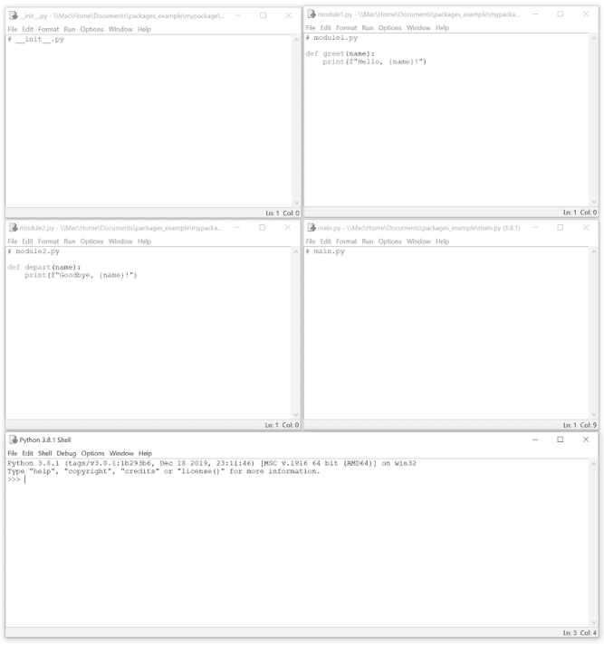

既然我们已经创建了包结构，让我们添加一些代码。在 `module1.py` 文件中，添加以下函数：

```python
# module1.py

def greet(name):
    print(f"Hello, {name}!")
```

在 `module2.py` 文件中添加以下内容：

```python
def depart(name):
    print(f"Goodbye, {name}!")
```

确保你保存了 `module1.py` 和 `module2.py` 这两个文件！你现在准备好在 `main.py` 模块中导入和使用这些模块了。

#### 从包中导入模块

在你的 `main.py` 文件中，添加以下代码：

```python
# main.py

import mypackage

mypackage.module1.greet("Pythonista")
mypackage.module2.depart("Pythonista")
```

保存 `main.py` 并按 `F5` 运行模块。在交互式窗口中，会引发一个 `AttributeError`：

```
Traceback (most recent call last):
  File "\MacHomeDocumentspackages_examplemain.py", line 5, in <module>
    mypackage.module1.greet("Pythonista")
AttributeError: module 'mypackage' has no attribute 'module1'
```

当你导入 `mypackage` 模块时，`module1` 和 `module2` 命名空间不会自动导入。为了使用它们，你也需要导入它们。

更改 `main.py` 顶部的导入语句：

```python
# main.py

import mypackage.module1  # <-- 更改此行

# 保持以下代码不变
mypackage.module1.greet("Pythonista")
mypackage.module2.depart("Pythonista")
```

现在保存并运行 `main.py` 模块。你应该在交互式窗口中看到以下输出：

```
Hello, Pythonista!
Traceback (most recent call last):
  File "\MacHomeDocumentspackages_examplemain.py", line 6, in <module>
    mypackage.module2.depart("Pythonista")
AttributeError: module 'mypackage' has no attribute 'module2'
```

你可以看出 `mypackage.module1.greet()` 被调用了，因为交互式窗口中显示了 `Hello, Pythonista!`。

然而，`mypackage.module2.depart()` 没有被调用。该行引发了一个属性错误，因为到目前为止从 `mypackage` 导入的唯一模块是 `module1`。

要导入 `module2`，请在 `main.py` 文件顶部添加以下 `import` 语句：

```python
# main.py

import mypackage.module1
import mypackage.module2  # <-- 添加此行

# 保持以下代码不变
mypackage.module1.greet("Pythonista")
mypackage.module2.depart("Pythonista")
```

现在，当你保存并运行 `main.py` 时，`greet()` 和 `depart()` 都会被调用：

```
Hello, Pythonista!
Goodbye, Pythonista!
```

通常，使用**带点的模块名**从包中导入模块，格式如下：

```python
import <package_name>.<module_name>
```

首先输入包的名称，后跟一个点 (`.`) 和你要导入的模块的名称。

> **重要提示**
>
> 就像模块文件名一样，包文件夹名必须是有效的 Python 标识符。它们只能包含大小写字母、数字和下划线 (`_`)，并且不能以数字开头。

与模块一样，导入包时可以使用 `import` 语句的几种变体。

#### 包的导入语句变体

你学习了用于从模块导入名称的 `import` 语句的三种变体。这三种变体转化为从包导入模块的以下四种变体：

1.  `import <package>`
2.  `import <package> as <other_name>`
3.  `from <package> import <module>`
4.  `from <package> import <module> as <other_name>`

这些变体的工作方式与模块的对应变体非常相似。

例如，与其导入 `mypackage.module1` 和 `mypackage.module2`，你可以在同一行中从包导入这两个模块。

将你的 `main.py` 文件更改为以下内容：

```python
# main.py

from mypackage import module1, module2
```

## 导入包的指南

从模块导入名称的相同指南也适用于从包导入模块。你应该尽可能使导入语句明确，这样从包导入到调用模块中的模块和名称才具有适当的上下文。

通常，以下格式是最明确的：

```
import <package>.<module>
```

然后，要访问模块中的名称，你需要输入类似以下的内容：

```
<package>.<module>.<name>
```

当你遇到从导入模块中使用的名称时，这些名称的来源是毫无疑问的。但有时包和模块的名称很长，你会发现自己在代码中一遍又一遍地输入 `<package>.<module>`。

以下格式允许你跳过包名，只将模块名导入到调用模块的命名空间中：

```
from <package> import <module>
```

现在你只需输入 `<module>.<name>` 即可访问模块中的某个名称。虽然这不再告诉你名称来自哪个包，但它确实保持了模块上下文的清晰性。

最后，以下格式通常是模糊的，只应在没有从模块导入的名称与调用模块中的名称冲突的风险时使用：

```
from <package>.<module> import <name>
```

既然你已经了解了如何从包导入模块，让我们快速看看如何将包嵌套在其他包中。

## 从子包导入模块

包只是一个包含一个或多个 Python 模块的文件夹，其中一个必须命名为 `__init__.py`，因此完全可能存在以下包结构：

```
mypackage/
├── mysubpackage/
│   ├── __init__.py
│   └── module3.py
├── __init__.py
├── module1.py
└── module2.py
```

嵌套在另一个包中的包称为**子包**。例如，`mysubpackage` 文件夹是 `mypackage` 的子包，因为它包含一个 `__init__.py` 模块，以及一个名为 `module3.py` 的第二个模块。

使用你的计算机文件资源管理器或其他工具，在你的计算机上创建 `mysubpackage/` 文件夹。确保将该文件夹放在你之前创建的 `mypackage/` 文件夹内。

在 IDLE 中，打开两个新的脚本窗口。创建文件 `__init__.py` 和 `module3.py`，并将这两个模块保存到 `mysubpackage/` 文件夹中。

在你的 `module3.py` 文件中，添加以下代码：

```python
# module3.py

people = ["John", "Paul", "George", "Ringo"]
```

现在打开根 `packages_examples/` 项目文件夹中的 `main.py` 文件。删除任何现有代码，并替换为以下内容：

```python
# main.py

from mypackage.module1 import greet
from mypackage.mysubpackage.module3 import people

for person in people:
    greet(person)
```

`mysubpackage` 内 `module3` 模块中的 `people` 列表通过点号模块名 `mypackage.mysubpackage.module3` 被导入到 `main.py` 模块中。

现在保存并运行 `main.py`。交互式窗口中将显示以下输出：

```
Hello, John!
Hello, Paul!
Hello, George!
Hello, Ringo!
```

子包非常适合在非常大的包内组织代码。它们有助于保持包的文件夹结构整洁有序。

然而，深度嵌套的子包会引入很长的点号模块名。你可以想象，从一个包的子包的子包的子包中导入模块需要输入多少字符。

一个好的实践是尽量将你的子包保持在最多一到两层深度。

## 复习练习

你可以在 [realpython.com/python-basics/resources](https://realpython.com/python-basics/resources) 在线找到这些练习的解决方案和许多其他额外资源。

1.  在一个名为 `package_exercises/` 的新项目文件夹中，创建一个名为 `helpers` 的包，包含三个模块：`__init__.py`、`string.py` 和 `math.py`。

    在 `string.py` 模块中，添加一个名为 `shout()` 的函数，该函数接受一个字符串参数，并返回一个所有字母均为大写的新字符串。

    在 `math.py` 模块中，添加一个名为 `area()` 的函数，该函数接受两个名为 `length` 和 `width` 的参数，并返回它们的乘积 `length * width`。

2.  在根项目文件夹中，创建一个名为 `main.py` 的模块，该模块导入 `shout()` 和 `area()` 函数。使用 `shout()` 和 `area()` 函数打印以下输出：

    ```
    THE AREA OF A 5-BY-8 RECTANGLE IS 40
    ```

对此部分提供反馈 »

### 11.3 总结与附加资源

在本章中，你学习了如何创建自己的 Python 模块和包，以及如何将对象从一个模块导入到另一个模块。

你看到将代码划分为模块和包是有利的，因为：

-   小代码文件比大代码文件**更简单**
-   小代码文件比大代码文件**更容易维护**
-   模块可以在整个项目中**重复使用**
-   模块将相关对象分组到隔离的**命名空间**中

> **互动测验**
>
> 本章附带一个免费的在线测验，以检查你的学习进度。你可以使用手机或电脑通过以下网址访问测验：
>
> [realpython.com/quizzes/python-basics-modules-and-packages](https://realpython.com/quizzes/python-basics-modules-and-packages)

## 附加资源

要了解更多关于模块和包的信息，请查看以下资源：

-   Python 模块和包课程
-   绝对导入和相对导入
-   realpython.com 上的推荐资源

对此部分提供反馈 »

# 第 12 章

## 文件输入与输出

到目前为止，你编写的程序从两个地方之一获取输入：程序本身或用户。程序输出仅限于在 IDLE 的交互式窗口中显示一些文本。

这些输入和输出方法在几种常见场景中并不实用：

-   编写程序时输入值未知
-   程序需要的数据比用户自己能够输入的更多
-   程序运行后必须与其他人共享输出

这就是文件的用武之地。

**在本章中，你将学习如何：**

-   处理文件路径和文件元数据
-   如何读写文本文件
-   如何读写**逗号分隔值 (CSV)** 文件
-   如何创建、删除、复制和移动文件和文件夹

让我们开始吧！

### 12.1 文件与文件系统

你可能已经使用计算机文件很长时间了。即便如此，程序员需要了解一些普通用户不知道的关于文件的知识。

在本节中，你将学习在 Python 中开始处理文件所需的概念。

> **注意**
>
> 如果你熟悉文件系统和文件路径等概念，你可能希望在跳到下一节之前先阅读 *在 Python 中处理文件路径* 和 *文件元数据* 部分。

让我们从探索文件是什么以及计算机如何与它们交互开始。

#### 文件的剖析

文件类型多种多样：文本文件、图像文件、音频文件和 PDF 文件，仅举几例。但归根结底，文件只是一系列**字节**，称为文件的**内容**。

文件中的每个字节都可以看作是一个值在 0 到 255 之间的整数，包括两个端点。当文件保存时，字节就是存储在物理存储设备上的值。

当你在计算机上访问文件时，文件的内容会按正确的字节顺序从磁盘读取。这里需要知道的重要一点是，文件本身没有任何内在的东西来决定如何解释内容。

作为程序员，你的工作是在打开文件时正确解释内容。这听起来可能很难，但 Python 为你做了很多艰苦的工作。

例如，当你打开一个文本文件时，Python可以将文件的数字字节转换为文本字符。你不需要知道这种转换具体是如何发生的。标准库中有处理各种文件类型的工具，包括图像和音频文件。

为了从存储设备访问文件，需要发生一系列事情。你需要知道文件存储在哪个设备上，如何与该设备交互，以及文件在设备上的确切位置。

这个庞大的任务由文件系统管理。Python与计算机上的文件系统交互，以读取、写入和操作文件。

## 文件系统

计算机上的文件系统做两件事：

1.  它提供存储在计算机及其连接设备上的文件的抽象表示。
2.  它与设备交互，控制文件数据的存储和检索。

Python与计算机上的文件系统交互，因此你只能在Python中执行文件系统允许的操作。

> **重要提示**

不同的操作系统使用不同的文件系统。在编写将在不同操作系统上运行的代码时，记住这一点非常重要。

文件系统本身管理计算机与物理存储设备之间的通信，因此作为程序员，你需要理解的文件系统部分只是它如何表示文件。

## 文件系统层次结构

文件系统将文件组织在**目录**的层次结构中，目录也称为**文件夹**。层次结构的顶部是一个称为**根目录**的目录。文件系统中的所有其他文件和目录都包含在根目录中。

目录中的每个文件都有一个**文件名**，该文件名必须与同一目录中的任何其他文件不同。目录还可以包含其他目录，称为**子目录**或**子文件夹**。

以下**目录树**可视化了示例文件系统中文件和目录的层次结构：

```
root/
├── app/
│   ├── program.py
│   └── data.txt
└── photos/
    ├── cats/
    │   ├── lion.jpg
    │   └── siamese.png
    └── dogs/
        ├── dachshound.jpg
        └── jack_russel.gif
```

在这个文件系统中，根文件夹名为`root/`。它有两个子目录：`app/`和`photos/`。`app/`子目录包含一个`program.py`文件和一个`data.txt`文件。`photos/`目录也有两个子目录`cats/`和`dogs/`，每个子目录都包含两个图像文件。

## 文件路径

要在文件系统中定位文件，你可以按顺序列出目录，从根目录开始，后跟文件名。以这种方式表示文件位置的字符串称为**文件路径**。

例如，上述文件系统中`jack_russel.gif`文件的文件路径是`root/photos/dogs/jack_russel.gif`。

如何编写文件路径取决于你的操作系统。以下是Windows、macOS和Linux上文件路径的三个示例：

1.  **Windows:** `C:\Users\David\Documents\hello.txt`
2.  **macOS:** `/Users/David/Documents/hello.txt`
3.  **Ubuntu Linux:** `/home/David/Documents/hello.txt`

所有这三个文件路径都定位了一个名为`hello.txt`的文本文件，该文件存储在名为David的用户目录的`Documents`子文件夹中。如你所见，不同操作系统之间的文件路径存在相当大的差异。

在macOS和Ubuntu Linux上，操作系统使用**虚拟文件系统**，将系统上所有设备的所有文件和目录组织在一个根目录下，通常用正斜杠符号（`/`）表示。来自外部存储设备的文件和文件夹通常位于名为`media/`的子目录中。

在Windows中，没有通用的根目录。每个设备都有一个单独的文件系统，具有唯一的根目录，该目录以**驱动器号**后跟冒号（`:`）和反斜杠符号（`\`）命名。通常，安装操作系统的硬盘驱动器被分配字母c，因此该驱动器的文件系统根目录是`c:`。

Windows、macOS和Ubuntu文件路径之间的另一个主要区别是，Windows文件路径中的目录用反斜杠（`\`）分隔，而macOS和Ubuntu文件路径中的目录用正斜杠（`/`）分隔。

当你编写需要在多个操作系统上运行的程序时，正确处理文件路径的差异至关重要。在Python 3.4及更高版本中，标准库包含一个名为`pathlib`的模块，该模块有助于简化跨操作系统处理文件路径的痛苦。

继续阅读以了解如何在Python中使用`pathlib`处理文件路径。

对此部分提供反馈 »

### 12.2 在Python中处理文件路径

要在Python中处理文件路径，请使用标准库的`pathlib`模块。在使用它之前，你需要导入该模块。

打开IDLE的交互式窗口并键入以下内容以导入`pathlib`模块：

```
>>> import pathlib
```

`pathlib`模块包含一个名为`Path`的类，用于表示文件路径。

#### 创建`Path`对象

有几种方法可以创建新的`Path`对象：

1.  从字符串创建
2.  使用`Path.home()`和`Path.cwd()`类方法
3.  使用`/`运算符

创建`Path`对象最直接的方法是从字符串创建。

#### 从字符串创建`Path`对象

例如，以下代码创建一个表示macOS文件路径"/Users/David/Documents/hello.txt"的`Path`对象：

```
>>> path = pathlib.Path("/Users/David/Documents/hello.txt")
```

但是，Windows路径存在问题。在Windows上，目录用反斜杠`\`分隔。Python将反斜杠解释为**转义序列**的开始，该转义序列表示字符串中的特殊字符，例如换行符（`\n`）。

尝试使用Windows文件路径"C:\Users\David\Desktop\hello.txt"创建`Path`对象会引发异常：

```
>>> path = pathlib.Path("C:\Users\David\Desktop\hello.txt")
SyntaxError: (unicode error) 'unicodeescape' codec can't decode bytes
in position 2-3: truncated \UXXXXXXXX escape
```

有两种方法可以解决这个问题：

你可以在Windows文件路径中使用正斜杠（`/`）代替反斜杠（`\`）：

```
>>> path = pathlib.Path("C:/Users/David/Desktop/hello.txt")
```

Python可以很好地解释这一点，并在与Windows操作系统交互时自动适当地转换路径。

你也可以通过在字符串前加上`r`将其转换为`raw`字符串：

```
>>> path = pathlib.Path(r"C:\Users\David\Desktop\hello.txt")
```

这告诉Python忽略任何转义序列，只按原样读取字符串。

#### `Path.home()`和`Path.cwd()`

除了从字符串创建`Path`对象外，`Path`类还有返回特殊目录的`Path`对象的类方法。两个最有用的类方法是`Path.home()`和`Path.cwd()`。

每个操作系统都有一个特殊目录，用于存储当前登录用户的数据。此目录称为用户的**主目录**。此目录的位置取决于操作系统：

-   **Windows:** `C:\Users\<username>`
-   **macOS:** `/Users/<username>`
-   **Ubuntu Linux:** `/home/<username>`

`Path.home()`类方法创建一个表示主目录的`Path`对象，无论代码在哪个操作系统上运行：

```
>>> home = pathlib.Path.home()
```

当你在Windows上检查`home`变量时，你会看到类似这样的内容：

```
>>> home
WindowsPath("C:\Users\David")
```

创建的`Path`对象是`Path`的一个子类，称为`WindowsPath`。在其他操作系统上，返回的`Path`对象是一个名为`PosixPath`的子类。

例如，在macOS上，检查`home`将显示类似以下内容：

```
>>> home
PosixPath("/Users/David")
```

在本节的其余部分，示例输出中将显示`WindowsPath`对象。但是，所有示例都适用于`PosixPath`对象。

## 使用 `/` 运算符

如果你已有一个 `Path` 对象，可以使用 `/` 运算符来扩展路径，添加子目录或文件名。

例如，以下代码创建了一个 `Path` 对象，表示当前用户主目录下 `Documents` 子目录中名为 `hello.txt` 的文件：

```
>>> home / "Desktop" / "hello.txt"
WindowsPath('C:/Users/David/Desktop/hello.txt')
```

`/` 运算符的左侧必须始终是一个 `Path` 对象。右侧可以是表示单个文件或目录的字符串，也可以是表示路径的字符串，或者是另一个 `Path` 对象。

## 绝对路径与相对路径

以文件系统根目录开头的路径称为**绝对文件路径**。并非所有文件路径都是绝对的。非绝对的文件路径称为**相对文件路径**。

以下是一个引用相对路径的 `Path` 对象示例：

```
>>> # 相对 Windows 路径
>>> path = pathlib.Path(r"Photos\image.jpg")

>>> # 相对 macOS 或 Linux 路径
>>> path = pathlib.Path("Photos/image.jpg")
```

请注意，路径字符串在 Windows 上不以 `c:\` 开头，在 macOS 和 Linux 上不以 `/` 开头。

你可以使用 `.is_absolute()` 方法检查文件路径是否为绝对路径：

```
>>> path.is_absolute()
False
```

相对路径只有在特定目录上下文中才有意义。它们最常用于描述相对于当前工作目录或用户主目录的文件路径。

你可以使用正斜杠 (`/`) 运算符将相对路径扩展为绝对路径：

```
>>> home = pathlib.Path.home()
WindowsPath('C:/Users/David')
>>> home / pathlib.Path(r"Photos\image.png")
WindowsPath('C:/Users/David/Photos/image.png')
```

在正斜杠 (`/`) 的左侧，放置包含该相对路径的目录的绝对路径。然后在正斜杠的右侧放置相对路径。

一旦创建了 Path 对象，你就可以检查它所引用的文件路径的各个组成部分。

## 访问文件路径组成部分

所有文件路径都包含一个目录列表。Path 对象的 `.parents` 属性返回一个可迭代对象，其中包含文件路径中的目录列表：

```
>>> path = pathlib.Path.home() / "hello.txt"
>>> path
WindowsPath("C:\Users\David")
>>> list(path.parents)
[WindowsPath("C:\Users\David"), WindowsPath("C:\Users"),
WindowsPath("C:")]
```

请注意，目录列表的返回顺序与它们在文件路径中出现的顺序相反。也就是说，路径中的最后一个目录是父目录列表中的第一个目录。

你可以在 `for` 循环中遍历父目录：

```
>>> for directory in path.parents:
...     print(directory)
...
C:\Users\David
C:\Users
C:\
```

`.parent` 属性以字符串形式返回文件路径中第一个父目录的名称：

```
>>> path.parent
'C:\Users\David'
```

如果文件路径是绝对路径，你可以使用 `.anchor` 属性访问文件路径的根目录：

```
>>> path.anchor
'C:\'
```

请注意，`.anchor` 返回的是字符串，而不是另一个 Path 对象。

对于相对路径，`.anchor` 返回空字符串：

```
>>> path = pathlib.Path("hello.txt")
>>> path.anchor
''
```

`.name` 属性返回路径指向的文件或目录的名称：

```
>>> home = pathlib.Path.home()    # C:\Users\David
>>> home.name
'David'
>>> path = home / "hello.txt"
>>> path.name
'hello.txt'
```

文件名分为两部分。点 (`.`) 左侧的部分称为**主干名**，点 (`.`) 右侧的部分称为**后缀**或**文件扩展名**。

`.stem` 和 `.suffix` 属性分别返回包含文件名这两部分的字符串：

```
>>> path = pathlib.Path.home() / "hello.txt"
>>> path.stem
'hello'
>>> path.suffix
'.txt'
```

你可能想知道如何实际操作 `hello.txt` 文件。你将在下一节学习如何读写文件。但在打开文件进行读取之前，最好先知道该文件是否存在。

## 检查文件路径是否存在

即使路径实际上不存在，你也可以为该文件路径创建一个 `Path` 对象。当然，不代表实际文件或目录的文件路径用处不大，除非你计划在某个时候创建它们。

Path 对象有一个 `.exists()` 方法，它根据文件路径在执行程序的机器上是否存在返回 `True` 或 `False`。

例如，如果你的主目录中没有 `hello.txt` 文件，那么表示该文件路径的 Path 对象的 `.exists()` 方法将返回 `False`：

```
>>> path = pathlib.Path.home() / "hello.txt"
>>> path.exists()
False
```

使用文本编辑器或其他方法，在你的主目录中创建一个名为 `hello.txt` 的空白文本文件。然后重新运行上面的代码，确保 `path.exists` 返回 `True`。

你可以检查文件路径是指向文件还是目录。要检查路径是否为文件，请使用 `.is_file()` 方法：

```
>>> path.is_file()
True
```

请注意，如果文件路径指向一个文件但不存在，则 `.is_file()` 返回 `False`。

使用 `.is_dir()` 方法检查文件路径是否指向目录：

```
>>> # "hello.txt" 的路径不是目录
>>> path.is_dir()
False

>>> # 主目录的路径是一个目录
>>> home.is_dir()
True
```

处理文件路径是任何从硬盘或其他存储设备读写数据的编程项目的重要组成部分。理解不同操作系统上文件路径的差异，以及如何使用 `pathlib.Path` 对象，以便你的程序能在任何操作系统上运行，这是一项重要且有用的技能。

## 复习练习

你可以在 [realpython.com/python-basics/resources](https://realpython.com/python-basics/resources) 找到这些练习的解答和许多其他额外资源。

1.  创建一个新的 `Path` 对象，指向你计算机主目录中名为 `my_folder/` 的文件夹中的一个名为 `my_file.txt` 的文件。将此 `Path` 对象赋值给变量名 `file_path`。
2.  检查赋值给 `file_path` 的路径是否存在。
3.  打印赋值给 `file_path` 的路径的名称。输出应为 `my_file.txt`。
4.  打印赋值给 `file_path` 的路径的父目录名称。输出应为 `my_folder`。

[为此部分提供反馈 »](https://realpython.com/python-basics/resources)

### 12.3 常见文件系统操作

现在你已经很好地掌握了文件系统以及如何使用 `pathlib` 模块处理文件路径，让我们来看一些常见的文件操作以及如何在 Python 中执行它们。

在本节中，你将学习如何：

- 创建目录和文件
- 遍历目录内容

## 创建目录和文件

要创建一个新目录，请使用 `Path.mkdir()` 方法。在 IDLE 的交互式窗口中，输入以下内容：

```
>>> from pathlib import Path
>>> new_dir = Path.home() / "new_directory"
>>> new_dir.mkdir()
```

导入 `Path` 类后，你创建了一个指向主文件夹中名为 `new_directory/` 的新目录的路径，并将此路径赋值给 `new_dir` 变量。然后，你使用 `.mkdir()` 方法来创建这个新目录。

现在，你可以检查新目录是否存在，并且确实是一个目录：

```
>>> new_dir.exists()
True

>>> new_dir.is_dir()
True
```

如果你尝试创建一个已经存在的目录，你会得到一个错误：

```
>>> new_dir.mkdir()
Traceback (most recent call last):
  File "<pyshell#32>", line 1, in <module>
    new_dir.mkdir()
  File "C:\Users\David\AppData\Local\Programs\Python\Python38-32\lib\pathlib.py", line 1266, in mkdir
    self._accessor.mkdir(self, mode)
FileExistsError: [WinError 183] Cannot create a file when
that file already exists: 'C:\Users\David\new_directory'
```

当你调用 `.mkdir()` 方法时，Python 会尝试再次创建 `new_directory/` 文件夹。由于它已经存在，此操作失败并引发 `FileExistsError` 异常。

如果你想在目录不存在时创建它，但在它存在时避免引发 `FileExistsError`，那么你可以将 `.mkdir()` 方法的可选参数 `exist_ok` 设置为 `True`：

```
>>> new_dir.mkdir(exist_ok=True)
```

当你使用 `exist_ok` 参数设置为 `True` 来执行 `.mkdir()` 时，如果目录不存在则创建它，如果已存在则不执行任何操作。

在调用 `.mkdir()` 时将 `exist_ok` 设置为 `True` 等同于以下代码：

```
>>> if not new_dir.exists():
...     new_dir.mkdir()
```

尽管上述代码运行良好，但将 `exist_ok` 参数设置为 `True` 更简洁，并且不会牺牲可读性。

现在，让我们看看如果你尝试在一个不存在的目录中创建子目录会发生什么：

```
>>> nested_dir = new_dir / "folder_a" / "folder_b"
>>> nested_dir.mkdir()
Traceback (most recent call last):
  File "<pyshell#38>", line 1, in <module>
    nested_dir.mkdir()
  File "C:\Users\David\AppData\Local\Programs\Python\Python38-32\lib\pathlib.py", line 1266, in mkdir
    self._accessor.mkdir(self, mode)
FileNotFoundError: [WinError 3] The system cannot find the path
specified: 'C:\Users\David\new_directory\folder_a\folder_b'
```

问题在于目录 `folder_a/` 不存在。通常，要创建一个目录，路径中目标目录 `folder_b/` 的所有父目录必须已经存在。

要创建创建目标目录所需的任何父目录，请将 `.mkdir()` 的可选参数 `parents` 设置为 `True`：

```
>>> nested_dir.mkdir(parents=True)
```

现在 `.mkdir()` 会创建父目录 `folder_a/`，以便可以创建目标目录 `folder_b/`。

将所有这些结合起来，你得到以下创建目录的常见模式：

```
path.mkdir(parents=True, exist_ok=True)
```

通过将 `parents` 和 `exist_ok` 参数都设置为 `True`，如果需要，会创建整个路径，并且如果路径已存在则不会引发异常。

这个模式很有用，但它可能并不总是你想要的。例如，如果路径是由用户输入的，你可能希望捕获异常，以便可以要求用户验证他们输入的路径是否正确。他们可能只是打错了目录名！

现在，让我们看看如何创建文件。为路径 `new_directory/file1.txt` 创建一个名为 `file_path` 的新 `Path` 对象：

```
>>> file_path = new_dir / "file1.txt"
```

`new_directory/` 中没有名为 `file1.txt` 的文件，所以该路径尚不存在：

```
>>> file_path.exists()
False
```

你可以使用 `Path.touch()` 方法创建文件：

```
>>> file_path.touch()
```

这会在 `new_directory/` 文件夹中创建一个名为 `file1.txt` 的新文件。它目前不包含任何数据，但文件已存在：

```
>>> file_path.exists()
True
>>> file_path.is_file()
True
```

与 `.mkdir()` 不同，如果正在创建的路径已存在，`.touch()` 方法不会引发异常：

```
>>> # 第二次调用 .touch() 不会引发异常
>>> file_path.touch()
```

当你使用 `.touch()` 创建文件时，该文件不包含任何数据。你将在第 11.4 节：读写文件中学习如何向文件写入数据。

你不能在不存在的目录中创建文件：

```
>>> file_path = new_dir / "folder_c" / "file2.txt"
>>> file_path.touch()
Traceback (most recent call last):
  File "<pyshell#47>", line 1, in <module>
    file_path.touch()
  File "C:\Users\David\AppData\Local\Programs\Python\Python38-32\lib\pathlib.py", line 1256, in touch
    fd = self._raw_open(flags, mode)
  File "C:\Users\David\AppData\Local\Programs\Python\Python38-32\lib\pathlib.py", line 1063, in _raw_open
    return self._accessor.open(self, flags, mode)
FileNotFoundError: [Errno 2] No such file or directory:
'C:\Users\David\new_directory\folder_c\file2.txt'
```

引发 `FileNotFoundError` 异常是因为 `new_directory/` 文件夹没有 `folder_c/` 子文件夹。

与 `.mkdir()` 不同，`.touch()` 方法没有可以设置为自动创建任何父目录的 `parents` 参数。这意味着你需要在调用 `.touch()` 创建文件之前，先创建所需的任何目录。

例如，你可以使用 `.parent` 获取 `file2.txt` 的父文件夹路径，然后调用 `.mkdir()` 来创建目录：

```
>>> file_path.parent.mkdir()
```

由于 `.parent` 返回一个 `Path` 对象，你可以链式调用 `.mkdir()` 方法，将整个操作写在一行代码中。

创建了 `folder_c/` 目录后，你就可以成功创建文件了：

```
>>> file_path.touch()
```

现在你知道了如何创建文件和目录，让我们看看如何获取目录的内容。

## 遍历目录内容

使用 `pathlib`，你可以遍历目录的内容。你可能需要这样做来处理目录中的所有文件。"处理"这个词很模糊。它可能是读取文件并提取一些数据，或者是压缩目录中的文件，或者是其他操作。

目前，让我们专注于如何检索目录的所有内容。你将在下一节学习如何从文件中读取数据。

目录中的所有内容要么是文件，要么是子目录。`Path.iterdir()` 方法返回一个迭代器，该迭代器遍历代表目录中每个项目的 `Path` 对象。

要使用 `.iterdir()`，你首先需要一个代表目录的 `Path`。让我们使用你之前在主目录中创建并赋值给 `new_dir` 变量的 `new_directory/` 文件夹：

```
>>> for path in new_dir.iterdir():
...     print(path)
...
C:\Users\David\new_directory\file1.txt
C:\Users\David\new_directory\folder_a
C:\Users\David\new_directory\folder_c
```

目前，这个 `new_directory/` 文件夹包含三个项目：

- 1. 一个名为 `file1.txt` 的文件
- 2. 一个名为 `folder_c/` 的目录
- 3. 一个名为 `folder_a/` 的目录

由于 `.iterdir()` 返回一个可迭代对象，你可以将其转换为列表：

```
>>> list(new_dir.iterdir())
[WindowsPath('C:/Users/David/new_directory/file1.txt'),
WindowsPath('C:/Users/David/new_directory/folder_a'),
WindowsPath('C:/Users/David/new_directory/folder_c')]
```

你通常不需要将其转换为列表，但为了保持代码简短，我们将在后续示例中这样做。通常，你会像第一个示例中那样在 `for` 循环中使用 `.iterdir()`。

请注意，`.iterdir()` 只返回直接包含在 `new_directory/` 文件夹中的项目。也就是说，你看不到存在于 `folder_c/` 目录中的文件的路径。

有一种方法可以遍历目录及其所有子目录的内容，但使用 `.iterdir()` 无法轻松实现。我们稍后会讨论这个任务，但首先让我们谈谈如何在目录中搜索文件。

## 在目录中搜索文件

有时你只需要遍历特定类型的文件，或具有特定命名规则的文件。你可以对表示目录的路径使用 `Path.glob()` 方法，以获取符合某些条件的目录内容的可迭代对象。

一个用于搜索文件的方法被命名为 `.glob()`，这似乎有些奇怪。该方法之所以得此名称，是出于历史原因。在 Unix 操作系统的早期版本中，一个名为 `glob` 的程序被用来将文件路径模式扩展为完整的文件路径。

`.glob()` 方法执行类似的操作。你向该方法传递一个包含部分路径和通配符的字符串，`.glob()` 会返回一个与该模式匹配的文件路径列表。

**通配符**是在**模式**中充当占位符的特殊字符。它们会被其他字符替换以创建具体的文件路径。例如，在模式 `"*.txt"` 中，星号 `*` 是一个通配符，可以被任意数量的其他字符替换。

模式 `"*.txt"` 匹配任何以 `.txt` 结尾的文件路径。也就是说，如果将模式中的 `*` 替换为某个文件路径中直到最后四个字符之前的所有内容后，结果是原始文件路径，那么该文件路径就是模式 `"*.txt"` 的一个**匹配项**。

让我们看一个使用之前赋值给 `new_dir` 变量的 `new_directory/` 文件夹的例子：

```
>>> for path in new_dir.glob("*.txt"):
...     print(path)
...
C:\Users\David\new_directory\file1.txt
```

与 `.iterdir()` 类似，`.glob()` 方法返回一个路径的可迭代对象，但这次只返回与模式 `"*.txt"` 匹配的路径。`.glob()` 只返回直接包含在调用它的文件夹中的路径。

## 12.3. 常见文件系统操作

你可以将 `.glob()` 的返回值转换为列表：

```
>>> list(new_dir.glob())
[WindowsPath('C:/Users/David/new_directory/file1.txt')]
```

你最常在 `for` 循环中使用 `.glob()`。

下表描述了一些常见的通配符：

| 通配符 | 描述 | 示例 | 匹配 | 不匹配 |
| :--- | :--- | :--- | :--- | :--- |
| `*` | 任意数量的字符 | `"*b*"` | b, ab, bc, abc | a, c, ac |
| `?` | 单个字符 | `"?bc"` | abc, bbc, cbc | bc, aabc, abcd |
| `[abc]` | 匹配方括号中的一个字符 | `[CB]at` | Cat, Bat | at, cat, bat |

我们将查看每种通配符的一些示例，但首先，让我们在 `new_directory/` 文件夹中创建更多文件，以便我们有更多选项可供操作：

```
>>> paths = [
...     new_dir / "program1.py",
...     new_dir / "program2.py",
...     new_dir / "folder_a" / "program3.py",
...     new_dir / "folder_a" / "folder_b" / "image1.jpg",
...     new_dir / "folder_a" / "folder_b" / "image2.png",
... ]
>>> for path in paths:
...     path.touch()
...
>>>
```

执行上述操作后，`new_directory/` 文件夹具有以下结构：

```
new_directory/
├── folder_a/
│   ├── folder_b/
│   │   ├── image1.jpg
│   │   └── image2.png
│   └── program3.py
├── folder_c/
│   └── file2.txt
├── file1.txt
├── program1.py
└── program2.py
```

现在我们有了一个更有趣的结构可供操作，让我们看看 `.glob()` 如何与每种通配符配合使用。

#### * 通配符

`*` 通配符匹配文件路径模式中的任意数量的字符。例如，模式 `"*.py"` 匹配所有以 `.py` 结尾的文件路径：

```
>>> list(new_dir.glob("*.py"))
[WindowsPath('C:/Users/David/new_directory/program1.py'),
 WindowsPath('C:/Users/David/new_directory/program2.py')]
```

你可以在单个模式中多次使用 `*` 通配符：

```
>>> list(new_dir.glob("*1*"))
[WindowsPath('C:/Users/David/new_directory/file1.txt'),
 WindowsPath('C:/Users/David/new_directory/program1.py')]
```

模式 `"*1*"` 匹配任何包含数字 1 且其前后有任意数量字符的文件路径。`new_directory/` 中唯一包含数字 1 的文件是 `file1.txt` 和 `program1.py`。

如果你从模式 `"*1*"` 中省略第一个 `*`，得到模式 `"1*"`，则不会匹配任何内容：

```
>>> list(new_dir.glob("1*"))
[]
```

模式 `"1*"` 匹配以数字 1 开头，后跟任意数量字符的文件路径。`new_directory/` 文件夹中没有文件匹配此模式，因此 `.glob()` 不返回任何内容。

#### ? 通配符

`?` 通配符匹配模式中的单个字符。例如，模式 `"program?.py"` 将匹配任何以单词 `program` 开头，后跟单个字符，然后是 `.py` 的文件路径：

```
>>> list(new_dir.glob("program?.py"))
[WindowsPath('C:/Users/David/new_directory/program1.py'),
 WindowsPath('C:/Users/David/new_directory/program2.py')]
```

你可以在单个模式中多次使用 `?`：

```
>>> list(new_dir.glob("?older_?"))
[WindowsPath('C:/Users/David/new_directory/folder_a'),
 WindowsPath('C:/Users/David/new_directory/folder_c')]
```

模式 `"?older_?"` 匹配以任意字母开头，后跟 `older_` 和另一个字符的路径。在 `new_directory/` 文件夹中，这些路径是 `folder_a/` 和 `folder_c/` 目录。

你也可以组合使用 `*` 和 `?` 通配符：

```
>>> list(new_dir.glob("*1.??"))
[WindowsPath('C:/Users/David/new_directory/program1.py')]
```

模式 `"*1.??"` 匹配任何包含数字 1，后跟一个点 (`.`) 和另外两个字符的文件路径。`new_directory/` 中唯一匹配此模式的路径是 `program1.py`。请注意，`file1.txt` 不匹配该模式，因为点后面是三个字符。

#### [] 通配符

`[]` 通配符的工作方式有点像 `?` 通配符，因为它只匹配单个字符。不同之处在于，`[]` 不像 `?` 那样匹配任何单个字符，而是只匹配方括号中包含的字符。

例如，模式 `"program[13].py"` 匹配任何包含单词 `program`，后跟 1 或 3 以及扩展名 `.py` 的路径。在 `new_directory/` 文件夹中，`program1.py` 是唯一匹配此模式的路径：

```
>>> list(new_dir.glob("program[13].py"))
[WindowsPath('C:/Users/David/new_directory/program1.py')]
```

与其他通配符一样，你可以多次使用 `[]` 通配符，也可以将其与其他任何通配符组合使用。

#### 使用 ** 通配符进行递归匹配

你已经看到 `.iterdir()` 和 `.glob()` 的一个主要限制是它们只返回直接包含在调用它们的文件夹中的路径。

例如，`new_dir.glob("*.txt")` 只返回 `new_directory/` 中的 `file1.txt` 路径。它不返回 `folder_c/` 子目录中的 `file2.txt` 路径，即使该路径匹配 `"*.txt"` 模式。

有一个特殊的通配符 `**` 可以使模式递归匹配。常见的用法是在模式前加上 `"**/"`。这告诉 `.glob()` 在当前目录及其任何子目录中匹配你的模式。

例如，模式 `"**/*.txt"` 匹配 `file1.txt` 和 `folder_c/file2.txt`：

```
>>> list(new_dir.glob("**/*.txt"))
[WindowsPath('C:/Users/David/new_directory/file1.txt'),
 WindowsPath('C:/Users/David/new_directory/folder_c/file2.txt')]
```

类似地，模式 `"**/*.py"` 匹配 `new_directory/` 及其任何子目录中的任何 `.py` 文件：

```
>>> list(new_dir.glob("**/*.py"))
[WindowsPath('C:/Users/David/new_directory/program1.py'),
 WindowsPath('C:/Users/David/new_directory/program2.py'),
 WindowsPath('C:/Users/David/new_directory/folder_a/program3.py')]
```

还有一种进行递归匹配的简写方法，称为 `.rglob()`。要使用它，传递不带 `**/` 前缀的模式：

```
>>> list(new_dir.rglob("*.py"))
[WindowsPath('C:/Users/David/new_directory/program1.py'),
 WindowsPath('C:/Users/David/new_directory/program2.py'),
 WindowsPath('C:/Users/David/new_directory/folder_a/program3.py')]
```

`.rglob()` 中的 `r` 代表 "recursive"（递归）。有些人更喜欢使用此方法而不是在模式前加上 `**/`，因为它稍微简短一些。两种版本都是完全有效的。在本书中，我们将使用 `.rglob()` 而不是 `**/` 前缀。

#### 移动和删除文件与文件夹

有时你需要将文件或目录移动到新位置，或完全删除文件或目录。你可以使用 `pathlib` 来执行此操作，但请记住，这样做可能导致数据丢失，因此必须极其小心地进行这些操作。

要移动文件或目录，请使用 `.replace()` 方法。例如，以下操作将 `new_directory/` 文件夹中的 `file1.txt` 文件移动到 `folder_a/` 子文件夹：

```
>>> source = new_dir / "file1.txt"
```

## 12.3. 常见文件系统操作

```python
>>> destination = new_dir / "folder_a" / "file1.txt"
>>> source.replace(destination)
WindowsPath('C:/Users/David/new_directory/folder_a/file1.txt')
```

`.replace()` 方法在源路径上调用。目标路径作为单个参数传递给 `.replace()`。请注意，`.replace()` 返回文件新位置的路径。

> **重要提示**

如果目标路径已存在，`.replace()` 会用源文件覆盖目标，而不会引发任何异常。如果不小心，这可能导致数据意外丢失。

你可能想先检查目标文件是否存在，仅在它不存在时才移动文件：

```python
if not destination.exists():
    source.replace(destination)
```

你也可以使用 `.replace()` 来移动或重命名整个目录。例如，以下代码将 `new_directory/` 的 `folder_c` 子目录重命名为 `folder_d/`：

```python
>>> source = new_dir / "folder_c"
>>> destination = new_dir / "folder_d"
>>> source.replace(destination)
WindowsPath('C:/Users/David/new_directory/folder_d')
```

同样，如果目标文件夹已存在，它将被源文件夹完全替换，这可能导致大量数据丢失。

要删除文件，请使用 `.unlink()` 方法：

```python
>>> file_path = new_dir / "program1.py"
>>> file_path.unlink()
```

这将删除 `new_directory/` 文件夹中的 `program1.py` 文件，你可以用 `.exists()` 来检查：

```python
>>> file_path.exists()
False
```

你也可以用 `.iterdir()` 来查看它已被移除：

```python
>>> list(new_dir.iterdir())
[WindowsPath('C:/Users/David/new_directory/folder_a'),
WindowsPath('C:/Users/David/new_directory/folder_d'),
WindowsPath('C:/Users/David/new_directory/program2.py')]
```

如果你调用 `.unlink()` 的路径不存在，会引发 `FileNotFoundError` 异常：

```python
>>> file_path.unlink()
Traceback (most recent call last):
  File "<pyshell#94>", line 1, in <module>
    file_path.unlink()
  File "C:\Users\David\AppData\Local\Programs\Python\nPython38-32\lib\pathlib.py", line 1303, in unlink
    self._accessor.unlink(self)
FileNotFoundError: [WinError 2] The system cannot find the file
specified: 'C:\Users\David\new_directory\program1.py'
```

如果你想忽略该异常，可以将可选参数 `missing_ok` 设置为 `True`：

```python
>>> file_path.unlink(missing_ok=True)
```

在这种情况下，实际上什么也不会发生，因为 `file_path` 处的文件不存在。

> **重要提示**

当你删除一个文件时，它就永远消失了。在继续操作之前，请确保你确实想要删除它！

`.unlink()` 仅适用于表示文件的路径。要删除目录，请使用 `.rmdir()` 方法。请记住，文件夹必须为空，否则会引发 `OSError` 异常：

```python
>>> folder_d = new_dir / "folder_d"
>>> folder_d.rmdir()
Traceback (most recent call last):
  File "<pyshell#97>", line 1, in <module>
    folder_d.rmdir()
  File "C:\Users\David\AppData\Local\Programs\Python\nPython38-32\lib\pathlib.py", line 1314, in rmdir
    self._accessor.rmdir(self)
OSError: [WinError 145] The directory is not empty:
'C:\Users\David\new_directory\folder_d'
```

以 `folder_d/` 为例，它只包含一个名为 `file2.txt` 的文件。要删除 `folder_d/`，首先删除它包含的所有文件：

```python
>>> for path in folder_d.iterdir():
...     path.unlink()
...
>>> folder_d.rmdir()
```

现在 `folder_d/` 已被删除：

```python
>>> folder_d.exists()
False
```

如果你需要删除整个目录，即使它非空，那么 `pathlib` 帮不了你太多。但是，你可以使用内置 `shutil` 模块中的 `rmtree()` 函数：

```python
>>> import shutil
>>> folder_a = new_dir / "folder_a"
>>> shutil.rmtree(folder_a)
```

回想一下，`folder_a/` 包含一个子文件夹 `folder_b/`，而 `folder_b/` 本身包含两个名为 `image1.jpg` 和 `image2.png` 的文件。

当你将 `folder_a` 路径对象传递给 `rmtree()` 时，`folder_a/` 及其所有内容都会被删除：

```python
>>> # folder_a/ 目录不再存在
>>> folder_a.exists()
False

>>> # 搜索 `image*.*` 文件返回空列表
>>> list(new_dir.rglob("image*.*"))
[]
```

在本节中，你学习了很多内容。你学会了如何执行几种常见的文件系统操作，例如：

- 创建文件和目录
- 遍历目录内容
- 使用通配符搜索文件和文件夹
- 移动和删除文件和文件夹

所有这些都是常见的任务。然而，记住你的程序是运行在别人的计算机上的这一点极其重要。如果不小心，你可能会无意中对用户的计算机造成损害，导致重要文档和其他数据的丢失。

在处理文件系统时，你应该始终保持谨慎。如有疑问，在执行某些操作之前，请检查文件路径是否存在，并始终与用户确认你即将执行的操作是否可以！

## 复习练习

你可以在 [realpython.com/python-basics/resources](https://realpython.com/python-basics/resources) 找到这些练习的解答和许多其他额外资源。

1. 在你的主文件夹中创建一个名为 `my_folder/` 的新目录。
2. 在 `my_folder/` 内创建三个文件：
    - `file1.txt`
    - `file2.txt`
    - `image1.png`
3. 将文件 `image1.png` 移动到 `my_folder/` 目录内一个名为 `images/` 的新目录中。
4. 删除文件 `file1.txt`。
5. 删除 `my_folder/` 目录。

对此部分提供反馈 »

### 12.4 挑战：将所有图像文件移动到新目录

在第 12 章练习文件文件夹中，有一个名为 `documents/` 的子文件夹。该目录包含几个文件和子文件夹。其中一些文件是图像，文件扩展名为 `.png`、`.gif` 或 `.jpg`。

在练习文件文件夹中创建一个名为 `images/` 的新文件夹，并将所有图像文件移动到该文件夹中。完成后，新文件夹中应包含四个文件：

1. `image1.png`
2. `image2.gif`
3. `image3.png`
4. `image4.jpg`

你可以在 [realpython.com/python-basics/resources](https://realpython.com/python-basics/resources) 找到这个代码挑战的解答和许多其他额外资源。

对此部分提供反馈 »

### 12.5 读写文件

文件在现代世界中无处不在。它们是数据以数字方式存储和传输的媒介。很可能，你今天已经打开了几十个，甚至几百个文件。

在本节中，你将学习如何使用 Python 读写文件。

#### 什么是文件？

**文件**是一系列字节，而**字节**是一个介于 0 到 255 之间的数字。也就是说，文件是一系列整数值。

文件中的字节必须被**解码**成有意义的内容，才能理解文件的内容。

Python 有用于处理文本、csv 和音频文件的标准库模块。还有许多第三方包可用于处理其他类型的文件。

你将在第 13 章：*使用 Pip 安装包* 中学习如何安装第三方包。你还将看到如何在第 14 章：*创建和修改 PDF 文件* 中处理 PDF 文件。

在本节中，你将学习如何处理纯文本文件。

#### 理解文本文件

文本文件是仅包含文本的文件。它们可能是最容易处理的文件。然而，在处理文本文件时，有两个问题可能会令人沮丧：

1. 字符编码
2. 行尾符

在深入读写文本文件之前，让我们先看看这些问题是什么，以便你知道如何有效地处理它们。

#### 字符编码

文本文件以字节序列的形式存储在磁盘上。每个字节，或在某些情况下的一组字节，代表文件中的一个不同字符。

当写入文本文件时，键盘上输入的字符通过一个称为**编码**的过程转换为字节。当读取文本文件时，字节被**解码**回文本。

字符关联的整数由文件的**字符编码**决定。有许多字符编码。四种最广泛使用的字符编码是：

1. ASCII
2. UTF-8
3. UTF-16
4. UTF-32

一些字符编码，如 ASCII 和 UTF-8，以相同的方式编码字符。例如，数字和英文字母在 ASCII 和 UTF-8 中的编码方式相同。

ASCII 和 UTF-8 之间的区别在于，UTF-8 可以比 ASCII 编码更多的字符。ASCII 无法编码像 ñ 或 ü 这样的字符，但 UTF-8 可以。这意味着你可以用 UTF-8 解码 ASCII 编码的文本，但你并不总是能用 ASCII 解码 UTF-8 编码的文本。

## 重要提示

当使用不同的编码来编码和解码文本时，可能会出现严重问题。

例如，以 UTF-8 编码的文本如果用 UTF-16 解码，可能会被解释为与原始意图完全不同的语言！

要全面了解字符编码，请查阅 Real Python 的 [Python 中的 Unicode 与字符编码：轻松入门指南](https://realpython.com/python-encodings-guide/)。

了解文件使用的编码很重要，但这并不总是显而易见的。在现代 Windows 计算机上，txt 文件通常使用 UTF-16 或 UTF-8 编码。在 macOS 和 Ubuntu Linux 上，默认字符编码通常是 UTF-8。

在本节的剩余部分，我们将假设所有处理的文本文件的字符编码都是 UTF-8。如果遇到问题，你可能需要修改示例以使用不同的编码。

## 行尾符

文本文件中的每一行都以一个或两个字符结尾，表示该行已结束。这些字符通常不会在文本编辑器中显示，但它们作为字节存在于文件数据中。

用于表示行尾的两个字符是**回车符**和**换行符**。在 Python 字符串中，这些字符分别由转义序列 `\r` 和 `\n` 表示。

在 Windows 上，行尾默认由回车符和换行符共同表示。在 macOS 和大多数 Linux 发行版上，行尾仅由单个换行符表示。

当你在 macOS 或 Linux 上读取 Windows 文件时，有时会在文本行之间看到额外的空行。这是因为在 macOS 和 Linux 上，回车符也表示行尾。

例如，假设以下文本文件是在 Windows 上创建的：

```
Pug\r\n
Jack Russell Terrier\r\n
English Springer Spaniel\r\n
German Shepherd\r\n
```

在 macOS 或 Ubuntu 上，该文件会被解释为行间有双倍间距：

```
Pug\r
\n
Jack Russell Terrier\r
\n
English Springer Spaniel\r
\n
German Shepherd\r
\n
```

实际上，不同操作系统上行尾符的差异很少造成问题。Python 可以自动为你处理行尾转换，因此你不必经常为此担心。

## Python 文件对象

文件在 Python 中用**文件对象**表示，它们是为处理不同类型文件而设计的类的实例。

Python 有几种不同类型的文件对象：

- 文本文件对象用于与文本文件交互。
- 二进制文件对象用于直接处理文件中包含的字节。

文本文件对象为你处理字节的编码和解码。你只需要指定使用哪种字符编码。另一方面，二进制文件对象不执行任何类型的编码或解码。

在 Python 中创建文件对象有两种方式：

- `Path.open()` 方法。
- `open()` 内置函数。

让我们逐一了解。

## `Path.open()` 方法

要使用 `Path.open()` 方法，你首先需要一个 `Path` 对象。在 IDLE 的交互窗口中，执行以下操作：

```
>>> from pathlib import Path
>>> path = Path.home() / "hello.txt"
>>> path.touch()
>>> file = path.open(mode="r", encoding="utf-8")
```

首先，为 `hello.txt` 文件创建一个 `Path` 对象并赋值给 `path` 变量。然后 `path.touch()` 在你的主目录中创建该文件。最后，`.open()` 返回一个表示 `hello.txt` 文件的新文件对象，并将其赋值给 `file` 变量。

打开文件时使用了两个关键字参数：

- `mode` 参数决定以哪种模式打开文件。"r" 参数以**读取模式**打开文件。
- `encoding` 参数决定用于解码文件的字符编码。参数 "utf-8" 代表 UTF-8 字符编码。

你可以检查 `file` 变量，看到它被赋值为一个文本文件对象：

```
>>> file
<_io.TextIOWrapper name='C:\Users\David\hello.txt' mode='r' encoding='utf-8'>
```

文本文件对象是 `TextIOWrapper` 类的实例。你永远不需要直接实例化这个类，因为你可以使用 `Path.open()` 方法创建它们。

你可以使用多种不同的模式打开文件。下表描述了这些模式：

| 模式 | 描述 |
|---|---|
| "r" | 创建一个用于读取的文本文件对象，如果文件无法打开则引发错误。 |
| "w" | 创建一个用于写入的文本文件对象，并覆盖文件中的所有现有数据。 |
| "a" | 创建一个用于向文件末尾追加数据的文本文件对象。 |
| "rb" | 创建一个用于读取的二进制文件对象，如果文件无法打开则引发错误。 |
| "wb" | 创建一个用于写入的二进制文件对象，并覆盖文件中的所有现有数据。 |
| "ab" | 创建一个用于向文件末尾追加数据的二进制文件对象。 |

一些最常用字符编码的字符串可以在下表中找到：

| 字符串 | 字符编码 |
|---|---|
| "ascii" | ASCII |
| "utf-8" | UTF-8 |
| "utf-16" | UTF-16 |
| "utf-32" | UTF-32 |

当你使用 `.open()` 创建文件对象时，Python 会维护与文件资源的链接，直到你明确告诉 Python 关闭文件，或者程序结束。

## 重要提示

你应该始终明确告诉 Python 关闭文件。

忘记关闭打开的文件就像乱扔垃圾。当你的程序停止运行时，它不应该在系统中留下不必要的废物。

要关闭文件，请使用文件对象的 `.close()` 方法：

```
>>> file.close()
```

当你有一个现有的 `Path` 对象时，使用 `Path.open()` 是打开文件的首选方式，但还有一个名为 `open()` 的内置函数可用于打开文件。

## `open()` 内置函数

内置的 `open()` 函数的工作方式与 `Path.open()` 方法几乎完全相同，只是它的第一个参数是一个包含要打开的文件路径的字符串。

首先，创建一个名为 `file_path` 的新变量，并为其赋值一个包含上面创建的 `hello.txt` 文件路径的字符串：

```
>>> file_path = "C:/Users/David/hello.txt"
```

注意，你需要更改路径以匹配你自己计算机上的文件路径。

接下来，使用 `open()` 内置函数创建一个新的文件对象，并将其赋值给变量 `file`：

```
>>> file = open(file_path, mode="r", encoding="utf-8")
```

`open()` 的第一个参数必须是路径字符串。`mode` 和 `encoding` 参数与 `Path.open()` 方法的参数相同。在此示例中，`mode` 设置为 "r"（读取模式），`encoding` 设置为 "utf-8"。

就像 `Path.open()` 返回的文件对象一样，`open()` 返回的文件对象也是一个 `TextIOWrapper` 实例：

```
>>> file
<_io.TextIOWrapper name='C:/Users/David/hello.txt' mode='r' encoding='utf-8'>
```

要关闭文件，请使用文件对象的 `.close()` 方法：

```
>>> file.close()
```

在大多数情况下，你会使用 `Path.open()` 方法从现有的 `pathlib.Path` 对象打开文件。但是，如果你不需要 `pathlib` 模块的所有功能，那么 `open()` 是快速创建文件对象的好方法。

## `with` 语句

当你打开一个文件时，你的程序正在访问程序本身外部的数据。操作系统必须管理你的程序与物理文件本身之间的连接。当你调用文件对象的 `.close()` 方法时，操作系统就知道要关闭连接。

如果你的程序在文件打开和关闭之间崩溃，连接维护的系统资源可能会继续存在，直到操作系统意识到不再需要它们。

为了确保即使程序崩溃也能清理文件系统资源，你可以在 `with` 语句中打开文件。使用 `with` 语句的模式如下所示：

## 从文件中读取数据

使用文本编辑器，打开你主目录中先前创建的 `hello.txt` 文件，并在其中输入文本 `Hello World`。然后保存文件。

在 IDLE 的交互式窗口中，输入以下内容：

```python
>>> path = Path.home() / "hello.txt"
>>> with path.open(mode="r", encoding="utf-8") as file:
...     text = file.read()
...
>>>
```

`path.open()` 创建的文件对象被赋值给 `file` 变量。在 `with` 代码块内部，文件对象的 `.read()` 方法从文件中读取文本，并将结果赋值给变量 `text`。

`.read()` 返回的值是一个字符串对象，其值为 "Hello World"：

```python
>>> type(text)
<class 'str'>
>>> text
'Hello World'
```

`.read()` 方法读取文件中的所有文本，并将其作为字符串值返回。

如果文件中有多行文本，字符串中的每一行都由换行符 `\n` 分隔。在文本编辑器中，再次打开 `hello.txt` 文件，并在第二行输入文本 "Hello again"。然后保存文件。

回到 IDLE 的交互式窗口，再次从文件中读取文本：

```python
>>> with path.open(mode="r", encoding="utf-8") as file:
...     text = file.read()
...
>>> text
'Hello World\nHello again'
```

每一行的文本之间都有一个 `\n` 字符。

你可以不一次性读取整个文件，而是逐行处理文件中的每一行：

```python
>>> with path.open(mode="r", encoding="utf-8") as file:
...     for line in file.readlines():
...         print(line)
...
Hello World

Hello again
```

`.readlines()` 方法返回一个包含文件各行的可迭代对象。在 `for` 循环的每一步中，都会返回并打印文件中的下一行文本。

请注意，两行文本之间打印了一个额外的空行。这与文件中的行尾符无关。这是因为 `print()` 函数会自动在其打印的每个字符串末尾插入一个换行符。

要打印两行文本而不产生额外的空行，请将 `print()` 函数的可选参数 `end` 设置为空字符串：

```python
>>> with path.open(mode="r", encoding="utf-8") as file:
...     for line in file.readlines():
...         print(line, end="")
...
Hello World
Hello again
```

很多时候你可能想使用 `.readlines()` 而不是 `.read()`。例如，文件中的每一行可能代表一条记录。你可以使用 `.readlines()` 遍历文件中的文本行，并根据需要进行处理。

如果你尝试读取一个不存在的文件，`.open()` 和 `open()` 都会引发 `FileNotFoundError`：

```python
>>> path = Path.home() / "new_file.txt"
>>> with path.open(mode="r", encoding="utf-8") as file:
...     text = file.read()
```

```
Traceback (most recent call last):
  File "<pyshell#197>", line 1, in <module>
    with path.open(mode="r", encoding="utf-8") as file:
  File "C:\Users\David\AppData\Local\Programs\Python\nPython38-32\lib\pathlib.py", line 1200, in open
    return io.open(self, mode, buffering, encoding, errors, newline,
  File "C:\Users\David\AppData\Local\Programs\Python\nPython38-32\lib\pathlib.py", line 1054, in _opener
    return self._accessor.open(self, flags, mode)
FileNotFoundError: [Errno 2] No such file or directory:
'C:\Users\David\new_file.txt'
```

接下来，让我们看看如何将数据写入文件。

## 将数据写入文件

要将数据写入纯文本文件，你需要将一个字符串传递给文件对象的 `.write()` 方法。文件对象必须通过向 `mode` 参数传递值 `"w"` 以**写入模式**打开。

例如，以下代码将文本 `"Hi there!"` 写入你主目录中的 `hello.txt` 文件：

```python
>>> with path.open(mode="w", encoding="utf-8") as file:
...     file.write("Hi there!")
...
9
>>>
```

请注意，在执行完 `with` 代码块后显示了整数 `9`。这是因为 `.write()` 返回写入的字符数。字符串 `"Hi there!"` 有九个字符，所以 `.write()` 返回数字 `9`。

当文本 `"Hi there!"` 被写入 `hello.txt` 文件时，任何现有内容都会被覆盖。这就好像你删除了旧的 `hello.txt` 文件并创建了一个新文件。

> **重要提示**
>
> 当你在 `.open()` 中设置 `mode="w"` 时，原始文件的内容会被覆盖。这将导致文件中所有原始数据的丢失！

你可以通过读取并显示文件内容来验证文件只包含文本 `"Hi there!"`：

```python
>>> with path.open(mode="r", encoding="utf-8") as file:
...     text = file.read()
...
>>> print(text)
Hi there!
```

你可以通过以**追加模式**打开文件来**追加**数据到文件末尾：

```python
>>> with path.open(mode="a", encoding="utf-8") as file:
...     file.write("\nHello")
...
6
```

当文件以追加模式打开时，新数据被写入文件末尾，而旧数据保持不变。换行符被放在字符串的开头，这样单词 "Hello" 就会打印在文件末尾的新行上。

如果字符串开头没有换行符，单词 "Hello" 将会打印在文件末尾任何现有文本的同一行上。

你可以通过打开并读取文件来检查单词 "Hello" 是否被写入了第二行：

```python
>>> with path.open(mode="r", encoding="utf-8") as file:
...     text = file.read()
...
>>> print(text)
Hi there!
Hello
```

你可以使用 `.writelines()` 方法同时将多行写入文件。首先，创建一个字符串列表：

```python
>>> lines_of_text = [
...     "Hello from Line 1\n",
...     "Hello from Line 2\n",
...     "Hello from Line 3 \n",
... ]
```

然后以写入模式打开文件，并使用 `.writelines()` 方法将列表中的每个字符串写入文件：

```python
>>> with path.open(mode="w", encoding="utf-8") as file:
...     file.writelines(lines_of_text)
...
>>>
```

`lines_of_text` 列表中的每个字符串都被写入文件。请注意，每个字符串都以换行符 (`\n`) 结尾。这是因为 `.writelines()` 不会自动将列表中的每个字符串放在新行上。

如果你以写入模式打开一个不存在的路径，Python 会尝试自动创建该文件。如果路径中的所有父文件夹都存在，那么文件可以毫无问题地创建：

```python
>>> path = Path.home() / "new_file.txt"
>>> with path.open(mode="w", encoding="utf-8") as file:
...     file.write("Hello!")
...
6
```

由于 `Path.home()` 目录存在，一个名为 `new_file.txt` 的新文件会自动创建。

然而，如果其中一个父目录不存在，那么 `.open()` 将引发 `FileNotFoundError`：

```python
>>> path = Path.home() / "new_folder" / "new_file.txt"
>>> with path.open(mode="w", encoding="utf-8") as file:
...     file.write("Hello!")
...
Traceback (most recent call last):
  File "<pyshell#172>", line 1, in <module>
    with path.open(mode="w", encoding="utf-8") as file:
  File "C:\Users\David\AppData\Local\Programs\Python\nPython38-32\lib\pathlib.py", line 1200, in open
    return io.open(self, mode, buffering, encoding, errors, newline,
  File "C:\Users\David\AppData\Local\Programs\Python\nPython38-32\lib\pathlib.py", line 1054, in _opener
    return self._accessor.open(self, flags, mode)
FileNotFoundError: [Errno 2] No such file or directory:
'C:\Users\David\new_folder\new_file.txt'
```

如果你想写入一个父文件夹可能不存在的路径，请在以写入模式打开文件之前，调用 `.mkdir()` 方法并将 `parents` 参数设置为 `True`：

```python
>>> path.parent.mkdir(parents=True)
>>> with path.open(mode="w", encoding="utf-8") as file:
...     file.write("Hello!")
...
6
```

在本节中，你学习了很多内容。你了解到所有文件都是字节序列，这些字节是值在 0 到 255 之间的整数。

你还了解了字符编码，它用于在字节和文本之间进行转换，以及不同操作系统上行尾符的差异。

最后，你看到了如何使用 `Path.open()` 方法和 `open()` 内置函数来读写文本文件。

## 复习练习

你可以在 [realpython.com/python-basics/resources](https://realpython.com/python-basics/resources) 找到这些练习的解答和许多其他额外资源。

- 1. 将以下文本写入你主目录中名为 `starships.txt` 的文件

### 12.6 读写 CSV 数据

假设你家中有一个温度传感器，每四小时记录一次温度。一天之内，会采集六次温度读数。

你可以将每次温度读数存储在一个列表中：

```
>>> temperature_readings = [68, 65, 68, 70, 74, 72]
```

每天都会生成一个新的数字列表。要将这些值存储到文件中，你可以将每天的值写入文本文件的新行，并用逗号分隔每个值。

```
>>> from pathlib import Path
>>> file_path = Path.home() / "temperatures.txt"
>>> with file_path.open(mode="a", encoding="utf-8") as file:
...     file.write(str(temperature_readings[0]))
...     for temp in temperature_readings[1:]:
...         file.write(f",{temp}")
...
```

这会在你的主目录中创建一个名为 `temperatures.csv` 的文件，并以追加模式打开它。在文件末尾的新行上，`temperature_readings` 列表中的第一个值被写入文件。然后，列表中的每个剩余值都以逗号开头，写入同一行。

最终写入文件的文本字符串是 "68,65,68,70,74,72"。你可以通过读取文本来验证这一点：

```
>>> with file_path.open(mode="r", encoding="utf-8") as file:
...     text = file.read()
...
>>> text
'68,65,68,70,74,72'
```

你保存值的格式称为**逗号分隔值**，简称 **CSV**。`temperatures.csv` 文件被称为 csv 文件。

csv 文件是存储顺序数据记录的好方法，因为你可以将 csv 值的每一行恢复为一个列表：

```
>>> temperatures = text.split(",")
>>> temperatures
['68', '65', '68', '70', '74', '72']
```

在第 9.2 节：*列表是可变序列*中，你学习了如何使用 `.split()` 字符串方法从字符串创建列表。在上面的示例中，一个新列表是从从 `temperatures.csv` 文件读取的 `text` 创建的。

`temperatures` 列表中的值是字符串，而不是像最初写入文件的值那样的整数。这是因为从文本文件读取的值总是作为字符串读取的。

你可以使用列表推导式将字符串转换为整数：

```
>>> int_temperatures = [int(temp) for temp in temperatures]
>>> int_temperatures
[68, 65, 68, 70, 74, 72]
```

你现在恢复了最初写入 `temperatures.csv` 文件的列表！

这些示例说明的是，csv 文件是一个纯文本文件。使用第 11.4 节：读写文件中的技术，你可以将值序列存储在 csv 文件的行中，然后从文件中读取以恢复数据。

读写 csv 文件非常常见，以至于 Python 标准库有一个名为 `csv` 的模块，以减轻处理 csv 文件所需的工作量。在接下来的几节中，你将学习如何使用 csv 模块写入和读取 csv 文件。

## csv 模块

`csv` 模块可用于读写 csv 文件。我们将使用 `csv` 模块重新处理前面的示例，以便你了解它的工作原理以及它为你处理了哪些操作。

首先，在 IDLE 的交互式窗口中导入 `csv` 模块：

```
>>> import csv
```

让我们首先创建一个包含几天温度数据的新 csv 文件。

## 使用 csv.writer 写入 csv 文件

创建一个包含三天温度读数的列表的列表：

```
>>> daily_temperatures = [
...     [68, 65, 68, 70, 74, 72],
...     [67, 67, 70, 72, 72, 70],
...     [68, 70, 74, 76, 74, 73],
... ]
```

现在以写入模式打开 `temperatures.csv` 文件：

```
>>> file_path = Path.home() / "temperatures.csv"
>>> file = file_path.open(mode="w", encoding="utf-8")
```

我们没有使用 `with` 语句，而是创建了一个文件对象并将其分配给 `file` 变量，以便我们可以在进行过程中检查写入过程的每一步。

现在通过将文件对象 `file` 传递给 `csv.writer()` 来创建一个新的 csv writer 对象：

```
>>> writer = csv.writer(file)
```

`csv.writer()` 返回一个 CSV writer 对象，该对象具有将数据写入 csv 文件的方法。

例如，你可以使用 `writer.writerow()` 方法将列表写入 csv 文件的新行：

```
>>> for temp_list in daily_temperatures:
...     writer.writerow(temp_list)
...
19
19
19
```

就像文件对象的 `.write()` 方法一样，`.writerow()` 返回写入文件的字符数。`daily_temperatures` 中的每个列表都被转换为一个包含由逗号分隔的温度的字符串，每个这样的字符串都有 19 个字符。

现在关闭文件：

```
>>> file.close()
```

如果你在文本编辑器中打开 `temperatures.csv` 文件，你将看到文件中的以下文本：

```
68,65,68,70,74,72
67,67,70,72,72,70
68,70,74,76,74,73
```

在上面的示例中，你没有使用 `with` 语句写入文件，以便你可以在 IDLE 的交互式窗口中检查每个操作。你通常不会在实践中这样做，所以这是使用 `with` 语句的代码样子：

```
with file_path.open(mode="w", encoding="utf-8") as file:
    writer = csv.writer(file)
    for temp_list in daily_temperatures:
        writer.writerow(temp_list)
```

使用 `csv.writer` 写入 `csv` 文件的主要优点是，你不需要担心在将值写入文件之前将它们转换为字符串。`csv.writer` 对象为你处理了这一点，从而产生更短、更干净的代码。

`.writerow()` 将单行写入 csv 文件，但你可以使用 `.writerows()` 方法一次写入多行。当你的数据已经在列表的列表中时，这会进一步缩短代码：

```
with file_path.open(mode="w", encoding="utf-8") as file:
    writer = csv.writer(file)
    writer.writerows(daily_temperatures)
```

现在让我们从 `temperatures.csv` 文件中读取，以恢复用于创建该文件的 `daily_temperatures` 列表的列表。

## 使用 csv.reader 读取 csv 文件

要使用 csv 模块读取 csv 文件，请使用 csv.reader 类。与 csv.writer 对象一样，csv.reader 对象是从文件对象实例化的：

```
>>> file = file_path.open(mode="r", encoding="utf-8")
>>> reader = csv.reader(file)
```

csv.reader() 返回一个 csv reader 对象，可用于迭代 csv 文件的行：

```
>>> for row in reader:
...     print(row)
...
['68', '65', '68', '70', '74', '72']
['67', '67', '70', '72', '72', '70']
['68', '70', '74', '76', '74', '73']
>>> file.close()
```

csv 文件的每一行都作为字符串列表返回。要恢复 daily_temperatures 列表的列表，你需要使用列表推导式将每个字符串列表转换为整数列表。

这是一个完整的示例，它在 with 语句中打开 csv 文件，读取 csv 文件中的每一行，将字符串列表转换为整数列表，并将每个整数列表存储在一个名为 daily_temperatures 的列表的列表中：

```
>>> # 创建一个空列表
>>> daily_temperatures = []
>>> with file_path.open(mode="r", encoding="utf-8") as file:
...     reader = csv.reader(file)
...     for row in reader:
...         # 将行转换为整数列表
...         int_row = [int(value) for value in row]
...         # 将整数列表追加到 daily_temperatures 列表
...         daily_temperatures.append(int_row)
...
>>> daily_temperatures
[[68, 65, 68, 70, 74, 72], [67, 67, 70, 72, 72, 70],
[68, 70, 74, 76, 74, 73]]
```

使用 csv 模块处理 csv 文件比使用读写纯文本文件的标准工具要容易得多。

然而，有时 csv 文件比具有相同类型值的行的文件更复杂。每一行可能代表一个具有各种字段的记录，文件中的第一行可能是一个**标题行**，其中包含字段的名称。

## 读写带有标题的 CSV 文件

这是一个带有标题行的 csv 文件示例，其中包含多种数据类型：

```
name,department,salary
Lee,Operations,75000.00
Jane,Engineering,85000.00
Diego,Sales,80000.00
```

文件的第一行包含字段名称。每个后续行包含一个记录，其中每个字段都有一个值。

可以使用 `csv.reader()` 读取像上面这样的 csv 文件，但你必须跟踪标题行，并且每一行都作为列表返回，没有字段名称附加在上面。将每一行作为字典返回更有意义，其中键是字段名称，值是行中的字段值。这正是 `csv.DictReader` 对象所做的！

使用文本编辑器，创建一个名为 `employees.csv` 的新 csv 文件，并将上面示例 csv 文件中的文本保存到其中。将文件保存到计算机的主目录。

在 IDLE 的交互式窗口中，打开 `employees.csv` 文件并创建一个新的 `csv.DictReader` 对象：

## 12.6. 读写 CSV 数据

```python
>>> file_path = Path.home() / "employees.csv"
>>> file = file_path.open(mode="r", encoding="utf-8")
>>> reader = csv.DictReader(file)
```

当你创建一个 `DictReader` 对象时，CSV 文件的第一行被假定为包含字段名。这些值被存储在一个列表中，并赋值给 `DictReader` 实例的 `.fieldnames` 属性：

```python
>>> reader.fieldnames
['name', 'department', 'salary']
```

就像 `csv.reader` 对象一样，`DictReader` 对象也是可迭代的：

```python
>>> for row in reader:
...     print(row)
...
{'name': 'Lee', 'department': 'Operations', 'salary': '75000.000'}
{'name': 'Jane', 'department': 'Engineering', 'salary': '85000.00'}
{'name': 'Diego', 'department': 'Sales', 'salary': '80000.00'}
>>> file.close()
```

`DictReader` 对象不是将每一行作为列表返回，而是将每一行作为字典返回。字典的键是字段名，值是 CSV 文件中每一行的字段值。

请注意，`salary` 字段被读取为字符串。由于 CSV 文件是纯文本文件，值总是被读取为字符串。你需要根据需要将字符串转换为不同的数据类型。

例如，你可以使用一个函数来处理每一行，将键转换为正确的数据类型：

```python
>>> def process_row(row):
...     row["salary"] = float(row["salary"])
...     return row
...
>>> with file_path.open(mode="r", encoding="utf-8") as file:
...     reader = csv.DictReader(file)
...     for row in reader:
...         print(process_row(row))
...
{'name': 'Lee', 'department': 'Operations', 'salary': 75000.0}
{'name': 'Jane', 'department': 'Engineering', 'salary': 85000.0}
{'name': 'Diego', 'department': 'Sales', 'salary': 80000.0}
```

`process_row()` 函数接受从 CSV 文件读取的行字典，并返回一个新的字典，其中 "salary" 键被转换为浮点数。

你可以使用 `csv.DictWriter` 类来写入带有表头的 CSV 文件，该类将具有共享键的字典写入 CSV 文件的行中。

以下字典列表表示一个包含人员及其年龄的小型数据库：

```python
>>> people = [
...     {"name": "Veronica", "age": 29},
...     {"name": "Audrey", "age": 32},
...     {"name": "Sam", "age": 24},
... ]
```

要将 `people` 列表中的数据存储到 CSV 文件中，请以写入模式打开一个名为 `people.csv` 的新文件，并从文件对象创建一个新的 `csv.DictWriter` 对象：

```python
>>> file_path = Path.home() / "people.csv"
>>> file = file_path.open(mode="w", encoding="utf-8")
>>> writer = csv.DictWriter(file, fieldnames=["name", "age"])
```

当你实例化一个新的 `DictWriter` 对象时，第一个参数是用于写入 CSV 数据的文件对象。必需的 `fieldnames` 参数是一个字段名字符串列表。

> **注意**
>
> 在上面的示例中，字符串字面量 `["name", "age"]` 被传递给 `fieldnames` 参数，但你不必使用字符串字面量。例如，你也可以将 `fieldnames` 参数设置为 `people[0].keys()`。
>
> 如果在编写程序时不知道字段名，或者字段太多导致列表字面量不实用，这会很有用。

就像 `csv.writer` 对象一样，`DictWriter` 对象有一个 `.writerow()` 方法用于将单行写入 CSV 文件，还有一个 `.writerows()` 方法用于一次写入多行。但 `DictWriter` 对象还有一个名为 `.writeheader()` 的第三个方法，用于将表头行写入 CSV 文件：

```python
>>> writer.writeheader()
10
```

`.writeheader()` 返回写入文件的字符数，在本例中为 10。写入表头行是可选的，但建议这样做，因为它有助于定义 CSV 文件中包含的数据所代表的含义。它还使得使用 `DictReader` 类将 CSV 文件中的行作为字典读取变得容易。

写入表头后，你可以使用 `.writerows()` 将 `people` 列表中的数据写入 CSV 文件：

```python
>>> writer.writerows(people)
>>> file.close()
```

你现在在你的主目录中有一个名为 `people.csv` 的文件，包含以下数据：

```
name,age
Veronica,29
Audrey,32
Sam,24
```

CSV 文件是一种灵活且方便的数据存储方式。它们在全球商业中被频繁使用，知道如何处理它们是一项宝贵的技能！

## 复习练习

你可以在 [realpython.com/python-basics/resources](https://realpython.com/python-basics/resources) 在线找到这些练习的解决方案和许多其他额外资源。

1.  编写一个脚本，将以下列表的列表写入你主目录中名为 `numbers.csv` 的文件：

    ```python
    numbers = [
        [1, 2, 3, 4, 5],
        [6, 7, 8, 9, 10],
        [11, 12, 13, 14, 15],
    ]
    ```

2.  编写一个脚本，将练习 1 中 `numbers.csv` 文件中的数字读取到一个名为 `numbers` 的整数列表的列表中。打印该列表的列表。你的输出应如下所示：

    ```python
    [[1, 2, 3, 4, 5], [6, 7, 8, 9, 10], [11, 12, 13, 14, 15]]
    ```

3.  编写一个脚本，将以下字典列表写入你主目录中名为 `favorite_colors.csv` 的文件：

    ```python
    favorite_colors = [
        {"name": "Joe", "favorite_color": "blue"},
        {"name": "Anne", "favorite_color": "green"},
        {"name": "Bailey", "favorite_color": "red"},
    ]
    ```

    输出的 CSV 文件应具有以下格式：

    ```
    name,favorite_color
    Joe,blue
    Anne,green
    Bailey,red
    ```

4.  编写一个脚本，将练习 3 中 `favorite_colors.csv` 文件中的数据读取到一个名为 `favorite_colors` 的字典列表中。打印该字典列表。输出应如下所示：

    ```python
    [{"name": "Joe", "favorite_color": "blue"},
    {"name": "Anne", "favorite_color": "green"},
    {"name": "Bailey", "favorite_color": "red"}]
    ```

[为此部分提供反馈 »](https://realpython.com)

### 12.7 挑战：创建一个高分列表

在第 12 章练习文件文件夹中，有一个名为 `scores.csv` 的 CSV 文件，包含有关游戏玩家及其分数的数据。文件的前几行如下所示：

```
name,score
LLCoolDave,23
LLCoolDave,27
red,12
LLCoolDave,26
tom123,26
```

编写一个脚本，从该 CSV 文件中读取数据并创建一个名为 `high_scores.csv` 的新文件，其中每一行包含玩家姓名及其最高分。

输出的 CSV 文件应如下所示：

```
name,high_score
LLCoolDave,27
red,12
tom123,26
0_0,7
Misha46,25
Empiro,23
MaxxT,25
L33tH4x,42
johnsmith,30
```

你可以在 [realpython.com/python-basics/resources](https://realpython.com/python-basics/resources) 在线找到此代码挑战的解决方案和许多其他额外资源。

[为此部分提供反馈 »](https://realpython.com)

### 12.8 总结与附加资源

在本章中，你学习了文件系统和文件路径，以及如何使用 Python 标准库的 `pathlib` 模块来操作它们。你了解了如何创建新的 `Path` 对象、访问路径组件，以及如何创建、移动和删除文件和文件夹。

你还学习了如何使用 `Path.open()` 方法和 `open()` 内置函数读写纯文本文件，以及如何使用 Python 标准库 `csv` 模块处理逗号分隔值（CSV）文件。

> **互动测验**
>
> 本章附带一个免费的在线测验，以检查你的学习进度。你可以使用手机或电脑通过以下网址访问测验：
>
> [realpython.com/quizzes/python-basics-11](https://realpython.com/quizzes/python-basics-11)

## 附加资源

要获得更多处理文件的实践，请查看以下资源：

- [在 Python 中读写文件（指南）](https://realpython.com/read-write-files-python/)
- [在 Python 中处理文件](https://realpython.com/working-with-files-in-python/)
- realpython.com 上的推荐资源

[为此部分提供反馈 »](https://realpython.com)

# 第13章

## 使用Pip安装软件包

到目前为止，你一直在**Python标准库**的范围内进行操作。在本课程的剩余部分，你将使用各种**软件包**，这些软件包并非Python默认包含。

许多编程语言都提供**包管理器**，用于自动化安装、升级和卸载第三方软件包的过程。Python也不例外。

Python事实上的包管理器名为`pip`。历史上，`pip`需要从Python单独下载和安装。从Python 3.4开始，它现在已包含在大多数Python发行版中。

**在本章中，你将学习：**

- 如何使用`pip`安装和管理第三方软件包
- 第三方软件包的益处和风险

让我们开始吧！

### 13.1 使用Pip安装第三方软件包

Python的包管理器`pip`用于安装和管理第三方软件包。它是一个独立于Python的程序，尽管当你下载并安装Python时，`pip`很可能已经安装在你的计算机上了。

`pip`是一个**命令行工具**。这意味着你必须从命令行或终端程序运行它。如何打开终端程序取决于你的操作系统。

#### Windows

按下Windows键，输入`cmd`并按`Enter`键打开命令提示符应用程序。这将打开一个如下所示的窗口：

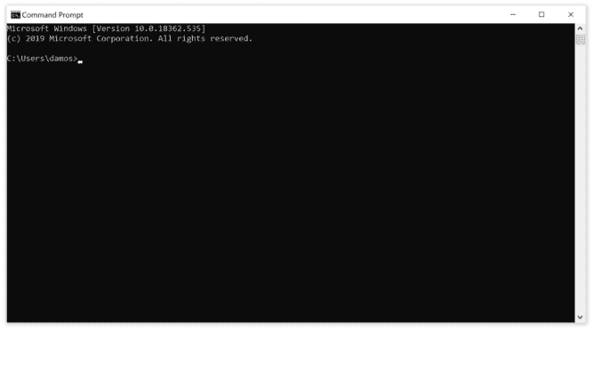

或者，你可以使用Powershell应用程序，按下Windows键，输入`powershell`并按`Enter`键。Powershell窗口如下所示：

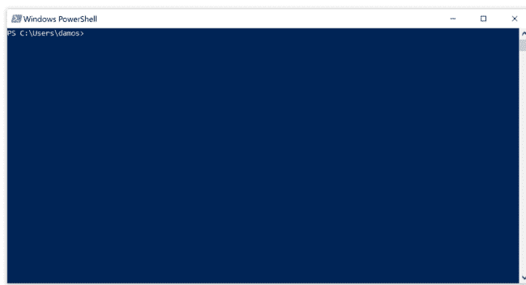

#### macOS

按下`Cmd` + `空格键`打开Spotlight搜索窗口。输入`terminal`并按`Enter`键打开终端应用程序。打开的窗口如下所示：

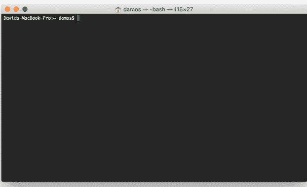

#### Ubuntu Linux

点击工具栏底部的`显示应用程序`按钮，搜索`terminal`。然后点击*终端*应用程序图标打开终端。打开的窗口大致如下：

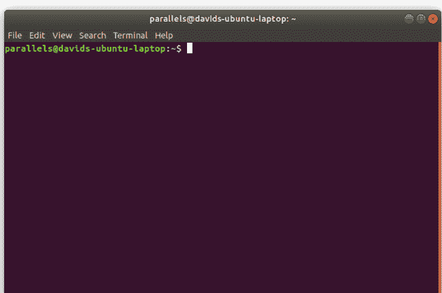

打开终端程序后，输入以下命令以检查你的系统是否安装了`pip`：

```
$ python3 -m pip --version
```

如果`pip`已安装，你应该会在终端中看到类似以下的输出：

```
pip 19.3.1 from c:\users\David\appdata\local\programs\python\npython38-32\lib\site-packages\pip (python 3.8)
```

此输出表明当前安装了`pip`版本19.3.1，并且链接到Python 3.8安装。

> **重要提示**

在macOS和Ubuntu Linux上，使用`python3`命令而不是`python`来运行`pip`命令非常重要。这确保使用的是Python 3的`pip`安装，而不是可能预装在你机器上的Python 2版本的`pip`。

在Windows上，`python3`命令可能不起作用。如果你没有看到任何输出或遇到错误，请尝试使用`python`命令：

```
$ python -m pip --version
```

如果这对你有效，请将本章中所有`python3`命令替换为`python`。

请注意，你计算机上显示的版本可能不同，并且可能链接到不同的Python安装。只要你看到的Python版本是Python 3的任何版本，这都没问题。

如果你的操作系统提示`pip3`是无法识别的命令，那么`pip`没有随你的Python发行版一起安装。在这种情况下，你可能需要回顾第2章中安装Python的说明。

#### 将`pip`升级到最新版本

在继续之前，让我们确保你安装了最新版本的`pip`。要升级`pip`，请在终端中输入以下内容并按`Enter`键：

```
$ python3 -m pip install --upgrade pip
```

如果有更新版本的`pip`可用，它将被下载并安装。否则，你将看到一条消息，表明最新版本已安装。此消息通常如下所示：

Requirement already satisfied.

现在你已经将`pip`升级到最新版本，让我们看看可以用它做什么！

#### 列出所有已安装的软件包

你可以使用`pip`列出你已安装的所有软件包。让我们看看当前有哪些可用。在终端中输入以下内容：

```
$ python3 -m pip list
```

如果你还没有安装任何软件包（如果你从全新的Python 3.8安装开始本课程，情况应该如此），你应该会看到类似以下的内容：

```
Package    Version
---------- -------
pip        19.3.1
setuptools 41.2.0
```

如你所见，这里内容不多。你看到`pip`本身被列出，因为`pip`本身就是一个软件包。你可能还会看到`setuptools`。这是`pip`用于设置和安装其他软件包的一个软件包。

当你使用`pip`安装软件包时，它将显示在此列表中。你始终可以使用`pip list`查看你当前安装了哪些软件包以及每个软件包的版本。

#### 安装软件包

让我们安装你的第一个Python软件包！在本练习中，你将安装`requests`软件包，这是有史以来最受欢迎的Python软件包之一。在终端中，输入以下内容：

```
$ python3 -m pip install requests
```

当`pip`安装`requests`软件包时，你会看到一堆输出：

```
Collecting requests
  Downloading https://.../requests-2.22.0-py2.py3-none-any.whl (57kB)
    |...| 61kB 2.0MB/s
Collecting urllib3!=1.25.0,!=1.25.1,<1.26,>=1.21.1
  Downloading https://...urllib3-1.25.7-py2.py3-none-any.whl (125kB)
    |...| 133kB 3.3MB/s
Collecting certifi>=2017.4.17
  Downloading https://...certifi-2019.11.28.py3-none-any.whl (156kB)
    |...| 163kB ...
Collecting chardet<3.1.0,>=3.0.2
  Downloading https://...chardet-3.0.4-py2.py3-none-any.whl (133kB)
    |...| 143kB 6.8MB/s
Collecting idna<2.9,>=2.5
  Downloading https://...idna-2.8-py2.py3-none-any.whl (58kB)
    |...| 61kB 3.8MB/s
Installing collected packages: urllib3, certifi, chardet, idna,
  requests
Successfully installed certifi-2019.11.28 chardet-3.0.4 idna-2.8
  requests-2.22.0 urllib3-1.25.7
```

> **注意**

上述输出的格式已调整，以便在页面上更好地显示。你在计算机上看到的输出可能有所不同。

请注意，`pip`首先告诉你它正在“收集请求”。你会看到`pip`用于安装软件包的URL，以及一个指示下载进度的进度条。

之后，你会看到`pip`又安装了四个软件包：`chardet`、`certifi`、`idna`和`urllib3`。这些软件包是`requests`的**依赖项**。这意味着`requests`需要安装这些软件包才能正常工作。

一旦`pip`完成安装`requests`及其依赖项，请在终端中再次运行`pip3 list`。你现在应该会看到以下列表：

```
$ python3 -m pip list
Package    Version
---------- ----------
certifi    2019.11.28
chardet    3.0.4
idna       2.8
pip        19.3.1
requests   2.22.0
setuptools 41.2.0
urllib3    1.25.7
```

你可以看到安装了`requests`版本2.22.0，以及`chardet`、`certifi`、`idna`和`urllib3`依赖项。

默认情况下，`pip`安装软件包的最新版本。你可以使用一些可选的版本说明符来控制安装哪个版本的软件包。

#### 使用版本说明符安装特定版本的软件包

有几种方法可以控制安装哪个版本的软件包。例如，你可以：

1. 安装大于某个版本号的最新版本
2. 安装小于某个版本号的最新版本
3. 安装特定的版本号

要安装版本号为2或更高的`requests`最新版本，你可以执行以下操作：

```
$ python3 -m pip install requests>=2.0
```

注意软件包名称`requests`后面的`>=2.0`。这告诉`pip`安装大于或等于版本2.0的`requests`最新版本。

## 13.1. 使用 Pip 安装第三方包

符号 `<=` 被称为**版本说明符**，因为它指定了应安装哪个版本的包。你可以使用几种不同的版本说明符。以下是最常用的几种：

| 版本说明符 | 描述 |
| :--- | :--- |
| `<=`, `>=` | 包含小于和大于的说明符 |
| `<`, `>` | 不包含小于和大于的说明符 |
| `==` | 精确等于的说明符 |

让我们看一些例子。

要安装小于或等于某个数字的最新版本，请使用 `<=` 版本说明符：

```
$ python3 -m pip install requests<=3.0
```

这将安装 `requests` 的最新版本，该版本小于或等于 3.0 版。

`<=` 和 `>=` 版本说明符是**包含**的，因为它们包括说明符后面的版本号。**不包含**的版本，`<` 和 `>`，也存在。

例如，以下命令安装严格小于 3.0 版的 `requests` 的最新版本：

```
$ python3 -m pip install requests<3.0
```

你可以组合版本说明符，以确保 `pip` 在指定的版本范围内安装最新版本。例如，以下命令安装 `requests` 在 1.0 系列中的最新版本：

```
$ python3 -m pip install requests>=1.0,<2.0
```

如果你的项目仅与该包的 1.0 系列兼容，并且你想确保安装该系列的最新更新，你会使用类似上面的命令。

最后，你可以使用 `==` 版本说明符将依赖项**固定**到特定版本：

```
$ python3 -m pip install requests==2.22.0
```

此命令精确安装 `requests` 包的 2.22.0 版本。

## 显示包详情

既然你已经安装了 `requests` 包，你可以使用 `pip` 查看有关该包的一些详细信息：

```
$ python3 -m pip show requests
Name: requests
Version: 2.22.0
Summary: Python HTTP for Humans.
Home-page: http://python-requests.org
Author: Kenneth Reitz
Author-email: me@kennethreitz.org
License: Apache 2.0
Location: c:\users\David\...\python\python38-32\lib\site-packages
Requires: chardet, idna, certifi, urllib3
Required-by:
```

`python3 -m pip show` 命令显示有关已安装包的信息，包括作者的姓名和电子邮件，以及一个你可以在互联网浏览器中导航到的主页，以了解更多关于该包功能的信息。

`requests` 包用于从 Python 程序发出 HTTP 请求。它在许多领域都非常有用，并且是许多其他 Python 包的依赖项。

## 卸载包

如果你可以使用 `pip` 安装包，那么你也可以卸载包就很有道理了。现在让我们卸载 requests 包。

要卸载 `requests`，请在终端中输入以下内容：

```
$ python3 -m pip uninstall requests
```

> **重要提示**
>
> 如果你已经有使用 `requests` 或其依赖项的项目，你可能不想运行本节剩余部分的命令。

你将立即看到以下提示：

```
Uninstalling requests-2.22.0:
  Would remove:
    c:\users\damos\...\requests-2.22.0.dist-info\*
    c:\users\damos\a...\requests\*
Proceed (y/n)?
```

在 `pip` 实际从你的计算机中删除任何内容之前，它会先征求你的许可。多么体贴啊！

输入 `y` 并按 `Enter` 继续。然后你应该会看到以下确认 `requests` 已被移除的消息：

```
Successfully uninstalled requests-2.22.0
```

再次查看你的包列表：

```
$ python3 -m pip list
Package    Version
---------- -------
certifi    2018.4.16
chardet    3.0.4
idna        2.7
pip         10.0.1
setuptools  39.0.1
urllib3     1.23
```

注意 `pip` 卸载了 `requests`，但它没有删除它的任何依赖项！这种行为是一个特性，而不是一个错误。

想象一下，你已经使用 `pip` 在你的环境中安装了几个包，其中一些共享依赖项。如果 `pip` 卸载了一个包*及其*依赖项，它将使任何其他需要这些依赖项的包无法使用！

不过，现在请继续运行 `pip uninstall` 来删除剩余的包。你可以用一条命令卸载所有四个包：

```
$ python3 -m pip uninstall certifi chardet idna urllib3
```

```
...
```

完成后，通过再次运行 `pip list` 来验证所有内容都已删除。你应该看到与你最初开始时相同的包列表：

```
Package     Version
----------  -------
pip         10.0.1
setuptools  39.0.1
```

Python 的第三方包生态系统是其最大的优势之一。这些包允许 Python 程序员高效工作，并比使用 C++ 等语言更快地创建功能齐全的软件。

也就是说，在你的代码中使用第三方包会引入一些必须谨慎处理的问题。你将在下一节中了解与第三方包相关的一些陷阱。

### 13.2 第三方包的陷阱

第三方包的美妙之处在于，它们使你能够为项目添加功能，而无需从头开始实现所有内容。这极大地提高了生产力。

但是，能力越大，责任越大。一旦你在项目中包含了别人的包，你就对负责开发和维护该包的人给予了极大的信任。

通过使用你未开发的包，你失去了对项目某些方面的控制。特别是，包的维护者可能会发布一个新版本，该版本引入了与你项目中使用的版本不兼容的更改。

默认情况下，`pip` 安装包的最新版本，因此如果你将代码分发给其他人，他们安装了你的项目所需包的较新版本，他们可能无法运行你的代码。

这对最终用户和你自己都提出了重大挑战。幸运的是，Python 为这个非常常见的问题提供了一个解决方案：虚拟环境。

虚拟环境创建了一个隔离的，最重要的是，可重现的环境，你可以用它来开发项目。该环境可以包含特定版本的 Python，以及项目依赖项的特定版本。

当你将代码分发给其他人时，他们可以重现此环境，并确信他们可以无误地运行你的代码。

虚拟环境是一个更高级的主题，超出了本书的范围。要了解更多关于虚拟环境以及如何使用它们的信息，请查看 Real Python 的 [使用 Pip 和虚拟环境管理 Python 依赖项](https://realpython.com/courses/managing-python-dependencies-pip-virtual-environments/) 课程。在其中，你将学习如何：

- 在 Windows、macOS 和 Linux 上，使用“pip”包管理器更详细地安装、使用和管理第三方 Python 包，比这里介绍的更详细。
- 使用所谓的虚拟环境隔离项目依赖项，以避免 Python 项目中的版本冲突。
- 应用完整的 7 步工作流程来查找和识别可在你自己的 Python 项目中使用的优质第三方包（并向你的团队或经理证明你的决定是合理的）。
- 使用“pip”包管理器和需求文件设置可重复的开发环境和应用程序部署。

[使用 Pip 和虚拟环境管理 Python 依赖项](https://realpython.com/courses/managing-python-dependencies-pip-virtual-environments/) 是你完成本书后很好的下一步。

[对此部分提供反馈 »](https://realpython.com/feedback/)

### 13.3 总结与补充资源

在本章中，你学习了如何使用 Python 的包管理器 `pip` 安装第三方包。你看到了几个有用的 `pip` 命令，包括 `pip install`、`pip list`、`pip show` 和 `pip uninstall`。

你还了解了与第三方包相关的一些陷阱。并非每个可以通过 `pip` 下载的包都是你项目的最佳选择。由于你无法控制你安装的包中的代码，你必须相信该包是安全的，并且能很好地为你的程序用户工作。

## 互动测验

本章附带一个免费的在线测验，用于检查你的学习进度。你可以通过手机或电脑访问以下网址进行测验：

[realpython.com/quizzes/python-basics-12](https://realpython.com/quizzes/python-basics-12)

## 附加资源

要了解更多关于管理第三方包的信息，你可以查看以下资源：

- [管理 Python 依赖项课程](https://realpython.com)
- [Python 虚拟环境：入门指南](https://realpython.com)
- [realpython.com 上的推荐资源](https://realpython.com)

[对本节提供反馈 »](https://realpython.com)

# 第 14 章

## 创建和修改 PDF 文件

**PDF**，即**便携式文档格式**，是互联网上共享文档最常见的格式之一。PDF 文件可以包含文本、图像、表格、表单，甚至视频和动画等富媒体，所有这些都包含在一个文件中。

PDF 可能包含的丰富内容类型，使得处理它们有时会有些困难。打开 PDF 文件时需要解码大量数据！幸运的是，Python 生态系统有一些很棒的包用于读取、操作和创建 PDF 文件！

**在本章中，你将学习如何：**

- 从 PDF 中读取文本
- 提取页面并将 PDF 拆分为多个文件
- 连接和合并 PDF 文件
- 旋转和裁剪 PDF 文件中的页面
- 使用密码加密和解密 PDF 文件
- 从头开始创建 PDF 文件

让我们开始吧！

### 14.1 从 PDF 中提取文本

在本节中，你将学习如何使用 PyPDF2 包读取 PDF 文件并提取文本。不过，在此之前，你需要使用 pip 安装 PyPDF2：

```
$ python3 -m pip install PyPDF2
```

通过在终端中运行以下命令来验证安装：

```
$ python3 -m pip show PyPDF2
Name: PyPDF2
Version: 1.26.0
Summary: PDF toolkit
Home-page: http://mstamy2.github.com/PyPDF2
Author: Mathieu Fenniak
Author-email: biziqe@mathieu.fenniak.net
License: UNKNOWN
Location: c:\users\david\python38-32\lib\site-packages
Requires:
Required-by:
```

请特别注意版本信息。在撰写本文时，PyPDF2 的最新版本是 1.26.0。如果你打开了 IDLE，需要重启它才能使用 PyPDF2 包。

现在你已经安装了 PyPDF2，让我们开始处理一些 PDF 文件吧！

#### 打开 PDF 文件

让我们从打开一个 PDF 并读取一些关于它的信息开始。我们将使用位于第 14 章练习文件文件夹中的 Pride_and_Prejudice.pdf 文件。

> **注意**

如果你还没有下载，可以[在此处](https://nostarch.com/pythonbasics2)下载练习解答和练习文件。

打开 IDLE 的交互式窗口，并从 `PyPDF2` 包中导入 `PdfFileReader` 类：

```
>>> from PyPDF2 import PdfFileReader
```

要创建 `PdfFileReader` 类的新实例，你需要提供要打开的 PDF 文件的路径。现在让我们使用 `pathlib` 模块来获取它：

```
>>> from pathlib import Path
>>> pdf_path = (
...     Path.home() /
...     "python-basics-exercises" /
...     "ch13-interact-with-pdf-files" /
...     "practice_files" /
...     "Pride_and_Prejudice.pdf"
... )
```

`pdf_path` 路径变量现在包含了简·奥斯汀的《傲慢与偏见》PDF 版本的路径。

> **注意**

你可能需要更改 `pdf_path`，使其对应于你计算机上 `python-basics-exercises/` 文件夹的位置。

现在创建 `PdfFileReader` 实例：

```
>>> pdf = PdfFileReader(str(pdf_path))
```

`pdf_path` 被转换为字符串，因为 `PdfFileReader` 不知道如何从 `pathlib.Path` 对象读取。

回顾*第 12 章：文件输入和输出*，所有打开的文件都应在程序终止前关闭。PdfFileReader 对象为你处理了所有这些，因此你无需担心打开或关闭 PDF 文件！

现在你已经创建了 PdfFileReader 实例，可以使用它来收集有关 PDF 的信息。例如，`.getNumPages()` 方法返回 PDF 文件包含的页数：

```
>>> pdf.getNumPages()
234
```

Pride_and_Prejudice.pdf 文件有 234 页！

请注意，`.getNumPages()` 是用驼峰命名法编写的，而不是 PEP 8 推荐的蛇形命名法。请记住，PEP 8 是一套指导方针，而不是规则。就 Python 而言，驼峰命名法是完全可以接受的。

> **注意**

PyPDF2 是从 PyPDF 包改编而来的。PyPDF 写于 2005 年，仅在 PEP 8 发布四年后。当时，许多 Python 程序员正从使用驼峰命名法更常见的语言迁移过来。

你还可以使用 `.documentInfo` 属性访问一些文档信息：

```
>>> pdf.documentInfo
{'/Title': 'Pride and Prejudice, by Jane Austen', '/Author': 'Chuck', '/Creator':
```

`.documentInfo` 返回的对象看起来像一个字典，但它实际上并不完全相同。你可以将 `.documentInfo` 中的每一项作为属性来访问。

例如，要获取标题，请使用 `.title` 属性：

```
>>> pdf.documentInfo.title
'Pride and Prejudice, by Jane Austen'
```

`.documentInfo` 对象包含 PDF 的**元数据**，这些元数据是在创建 PDF 时设置的。

`PdfFileReader` 类是在 Python 中处理 PDF 文件的入口。它提供了访问 PDF 文件中数据所需的所有必要方法和属性。

让我们探索一下你可以用 PDF 文件做什么以及如何做！

#### 从页面中提取文本

PDF 页面在 PyPDF2 中由 `PageObject` 类表示。你使用 `PageObject` 实例与 PDF 文件中的页面进行交互。

你不需要创建自己的 `PageObject` 实例。相反，你可以通过 `PdfFileReader` 对象访问它们。让我们看看如何通过从 `Pride_and_Prejudice.pdf` 文件的第一页提取文本来实现这一点。

从单个 PDF 页面提取文本有两个步骤：

1. 使用 `PdfFileReader.getPage()` 获取 `PageObject`
2. 使用 `PageObject` 实例的 `.extractText()` 方法将文本提取为字符串。

`Pride_and_Prejudice.pdf` 有 243 页。每页的索引在 0 到 242 之间。你可以通过将页面索引传递给 `PdfFileReader.getPage()` 方法来获取表示特定页面的对象：

```
>>> first_page = pdf.getPage(0)
```

`.getPage()` 返回一个 `PageObject`：

```
>>> type(first_page)
<class 'PyPDF2.pdf.PageObject'>
```

你可以使用 `PageObject.extractText()` 方法提取页面的文本：

```
>>> first_page.extractText()
'\n \nThe Project Gutenberg EBook of Pride and Prejudice, by Jane Austen\n \n\nThis eBook is for the use of anyone anywhere at no cost and with\n \nalmost no restrictions whatsoever.  You may copy it, give it away or\n \nre\u200b-\nuse it under the terms of the Project Gutenberg License included\n \nwith this eBook or online at www.gutenberg.org\n \n \nTitle: Pride and Prejudice\n \n \nAuthor: Jane Austen\n \n \nRelease Date: August 26, 2008 [EBook #1342]\n\n[Last updated: August 11, 2011]\n \n \nLanguage: English\n \n \nCharacter set encoding: ASCII\n \n \n*** START OF THIS PROJECT GUTENBERG EBOOK PRIDE AND PREJUDICE ***\n \n \n \n \nProduced by Anonymous Volunteers, and David Widger\n \n \n \n \n \n \nPRIDE AND PREJUDICE \n \n \nBy Jane Austen \n \n\n \n \nContents\n \n'
```

请注意，此处显示的输出已经过格式化，以便更好地适应此页面。你在计算机上看到的输出格式可能不同。

要从整个 PDF 中提取所有文本，你需要一种方法来遍历文档中的所有页面。

每个 `PdfFileReader` 对象都有一个 `.pages` 属性，用于访问 PDF 中每一页的 `PageObject` 对象的可迭代对象。这个可迭代对象是有序的，因此第一个 `PageObject` 对应于 PDF 的第一页，第二个 `PageObject` 对应于第二页，依此类推。

以下是如何使用 `for` 循环遍历 PDF 中的所有页面并打印其文本的方法：

```
>>> for page in pdf.pages:
...     print(page.extractText())
...
```

让我们结合你所学的一切，编写一个程序...

## 综合运用

在 IDLE 中打开一个新的脚本窗口。输入以下脚本：

```python
from pathlib import Path
from PyPDF2 import PdfFileReader

# 将下面的路径更改为适合你计算机的正确路径。
pdf_path = (
    Path.home() /
    "python-basics-exercises" /
    "ch13-interact-with-pdf-files" /
    "practice-files" /
    "Pride_and_Prejudice.pdf"
)

# 1
pdf_reader = PdfFileReader(str(pdf_path))
output_file_path = Path.home() / "Pride and Prejudice.txt"

# 2
with output_file_path.open(mode="w") as output_file:
    # 3
    output_file.write(
        f"{pdf_reader.documentInfo.title}\n"
        f"Number of pages: {pdf_reader.getNumPages()}\n\n"
    )

    # 4
    for page in pdf_reader.pages:
        text = page.extractText()
        output_file.write(text)
```

让我们来分解一下。

首先，你将一个新的 `PdfFileReader` 实例赋值给 `pdf_reader` 变量，并将一个指向你主目录中文件 `Pride and Prejudice.txt` 的新 `Path` 对象赋值给 `output_file_path` 变量（#1）。

接下来，脚本以写入模式打开 `output_file_path`（#3）。`.open()` 返回的文件对象被赋值给变量 `output_file`。

`with` 语句（你在*第 12 章：文件输入与输出*中已经学过）确保当缩进的 `with` 块中的代码执行完毕后，文件会被正确关闭。

在 `with` 块内部，PDF 的标题和页数通过 `output_file.write()` 写入到文本文件中（#3）。之后，`pdf_reader.pages` 可迭代对象中的每个 `PageObject` 都会在一个 `for` 循环中被遍历（#4）。

在 `for` 循环的每一步中，`page` 变量被赋值为可迭代对象中的下一个 `PageObject`。然后，使用 `page.extractText()` 提取每一页的文本，并将其写入 `output_file`。

当你保存并运行上述脚本时，一个名为 `Pride and Prejudice.txt` 的新文件将在你的主目录中创建，其中包含 `Pride_and_Prejudice.pdf` 文档的完整文本。打开它看看吧！

## 复习练习

你可以在 [realpython.com/python-basics/resources](https://realpython.com/python-basics/resources) 找到这些练习的解答以及许多其他额外资源。

- 1. 在第 14 章练习文件目录中有一个名为 `zen.pdf` 的 PDF 文件。从这个 PDF 创建一个 `PdfFileReader`。
- 2. 使用练习 1 中的 `PdfFileReader` 实例，打印 PDF 的总页数。
- 3. 打印练习 1 中 PDF 第一页的文本。

[为此部分提供反馈 »](https://realpython.com/python-basics/resources)

### 14.2 从 PDF 中提取页面

在上一节中，你学习了如何从 PDF 文件中提取所有文本并将文本保存到 .txt 文件。现在你将学习如何从现有的 PDF 中提取一页或一系列页面，并将它们保存到新的 PDF 中。

`PdfFileWriter` 类用于创建新的 PDF 文件。让我们探索这个类，并学习使用 PyPDF2 创建 PDF 所需的步骤。

#### PdfFileWriter 类

`PdfFileWriter` 类用于创建新的 PDF 文件。在 IDLE 的交互式窗口中，导入 `PdfFileWriter` 类并创建一个名为 `pdf_writer` 的新实例：

```python
>>> from PyPDF2 import PdfFileWriter
>>> pdf_writer = PdfFileWriter()
```

`PdfFileWriter` 对象是页面的容器。要创建一个新的 PDF，你需要将一些 `PageObject` 实例添加到 `PdfFileWriter` 中，然后将这些页面写入文件。

让我们向 `pdf_writer` 对象添加一个空白页：

```python
>>> page = pdf_writer.addBlankPage(width=72, height=72)
```

`.addBlankPage()` 方法向 PDF writer 对象添加一个空白页。由于 writer 中没有页面，它将被添加为第一页。

`width` 和 `height` 参数是必需的，它们以**点**为单位确定页面的宽度和高度。一个点等于 1/72 英寸。因此，上面的代码向 `pdf_writer` 添加了一个一英寸见方的空白页。

`.addBlankPage()` 返回一个新的 `PageObject` 实例，代表添加到 `PdfFileWriter` 的页面：

```python
>>> type(page)
<class 'PyPDF2.pdf.PageObject'>
>>> page
{'/Type': '/Page', '/Parent': IndirectObject(1, 0), '/Resources': {}, '/MediaBox': RectangleObject([0, 0, 72, 72])}
```

在这个例子中，你将 `.addBlankPage()` 返回的 `PageObject` 实例赋值给了 `page` 变量，但在实践中你通常不需要这样做。也就是说，你通常调用 `.addBlankPage()` 而不将返回值赋给任何变量：

```python
>>> pdf_writer.addBlankPage(width=72, height=72)
```

在 `pdf_writer` 中至少添加了一页后，你就可以将内容写入新的 PDF 文件。为此，将一个以二进制写入模式打开的文件对象传递给 `PdfFileWriter.write()` 方法：

```python
>>> from pathlib import Path
>>> with Path("blank.pdf").open(mode="wb") as output_file:
...     pdf_writer.write(output_file)
...
>>>
```

这将在你当前的工作目录中创建一个名为 `blank.pdf` 的新文件。如果你用 PDF 阅读器（如 Adobe Acrobat）打开该文件，你会看到一个包含单个一英寸见方空白页的文档。

> **重要提示**
>
> 注意，你是通过将文件对象传递给 `PdfFileWriter` 对象的 `.write()` 方法来保存 PDF 文件，*而不是*文件对象的 `.write()` 方法。
>
> 特别是，以下代码将无法工作：
>
> ```python
> >>> with Path("blank.pdf").open(mode="wb") as output_file:
> ...     output_file.write(pdf_writer)
> ```
>
> 这对你来说可能看起来有些反直觉，所以一定要避免这个错误！

`PdfFileWriter` 对象可以写入新的 PDF 文件，但它们不能从头开始创建除空白页之外的新内容。这可能看起来是个大问题，但在许多情况下你不需要创建新内容。通常，你将处理从你用 `PdfFileReader` 实例打开的 PDF 文件中提取的页面。

> **注意**
>
> 你将在第 13.8 节 *从头开始创建 PDF 文件* 中学习如何从头开始创建 PDF 文件。

在你上面看到的例子中，使用 `PyPDF2` 创建新的 PDF 文件有三个步骤：

- 1. 创建一个 `PdfFileWriter` 实例
- 2. 向 `PdfFileWriter` 实例添加一页或多页
- 3. 使用 `PdfFileWriter.write()` 方法写入文件

在你学习向 `PdfFileWriter` 实例添加页面的各种方法时，你会反复看到这种模式。

#### 从 PDF 中提取单页

让我们重新审视你在上一节中处理过的 *傲慢与偏见* PDF。我们将使用 `PdfFileReader` 类实例打开该 PDF，提取 PDF 的第一页，然后创建一个仅包含提取的单页的新 PDF 文件。

打开 IDLE 的交互式窗口，并从 `PyPDF2` 导入 `PdfFileReader` 和 `PdfFileWriter`，以及从 `pathlib` 模块导入 `Path` 类：

```python
>>> from pathlib import Path
>>> from PyPDF2 import PdfFileReader, PdfFileWriter
```

现在用 `PdfFileReader` 实例打开 `Pride_and_Prejudice.pdf` 文件：

```python
>>> pdf_path = (
...     Path.home() /
...     "python-basics-exercises" /
...     "ch13-interact-with-pdf-files" /
...     "practice_files" /
...     "Pride_and_Prejudice.pdf"
... )
>>> input_pdf = PdfFileReader(str(pdf_path))
```

记住，你可能需要更改文件路径以使其在你的系统上正常工作。

PDF 中的第一页位于索引 0。你可以通过向 `.getPage()` 传递参数 0 来将其提取为 `PageObject`：

```python
>>> first_page = input_pdf.getPage(0)
```

现在你可以创建一个新的 `PdfFileWriter` 实例并将提取的页面添加到其中：

```python
>>> pdf_writer = PdfFileWriter()
>>> pdf_writer.addPage(first_page)
```

`.addPage()` 方法将一页添加到 `pdf_writer` 对象的页面集合中，就像 `.addBlankPage()` 一样。不同之处在于你必须向 `.addPage()` 传递一个 `PageObject`。

现在将 `pdf_writer` 的内容写入一个名为 `first_page.pdf` 的新文件：

```python
>>> with Path("first_page.pdf").open(mode="wb") as output_file:
...     pdf_writer.write(output_file)
...
>>>
```

你现在在当前工作目录中有了一个名为 `first_page.pdf` 的新 PDF 文件，其中包含 `Pride_and_Prejudice.pdf` 文件的封面页。非常棒！

#### 从 PDF 文件中提取多页

使用 for 循环，你可以从 PDF 文件中提取多页并将其保存到新的 PDF 中。让我们从 `Pride_and_Prejudice.pdf` 中提取第一章。

如果你用 PDF 查看器打开 `Pride_and_Prejudice.pdf`，你可以看到第一章位于 PDF 的第二、第三和第四页。由于页面索引从 0 开始，我们需要提取索引为 1、2 和 3 的页面。

让我们通过导入所需的类并打开 PDF 文件来设置一切：

```python
>>> from PyPDF2 import PdfFileReader, PdfFileWriter
>>> from pathlib import Path
>>> pdf_path = (
...     Path.home() /
...     "python-basics-exercises" /
...     "ch13-interact-with-pdf-files" /
...     "practice_files" /
...     "Pride_and_Prejudice.pdf"
... )
```

## 14.2. 从PDF中提取页面

```python
>>> input_pdf = PdfFileReader(str(pdf_path))
```

我们的目标是提取索引为1、2和3的页面，将它们添加到一个新的`PdfFileWriter`实例中，然后写入一个新的PDF文件。

一种方法是循环遍历从1开始到3结束的数字范围，在循环的每一步提取页面并将其添加到`PdfFileWriter`实例中。代码如下所示：

```python
>>> pdf_writer = PdfFileWriter()
>>> for n in range(1, 4):
...     page = input_pdf.getPage(n)
...     pdf_writer.addPage(page)
...
>>>
```

现在`pdf_writer`已经添加了三个页面，你可以使用`.getNumPages()`方法来验证：

```python
>>> pdf_writer.getNumPages()
3
```

最后，你可以将提取的页面写入一个新的PDF文件：

```python
>>> with Path("chapter1.pdf").open(mode="wb") as output_file:
...     pdf_writer.write(output_file)
...
>>>
```

现在，你可以在当前工作目录中打开`chapter1.pdf`文件，阅读《傲慢与偏见》的第一章。

从PDF中提取多个页面的另一种方法是利用`PdfFileReader.pages`返回的可迭代对象支持切片表示法这一事实。

让我们使用`.pages`而不是循环遍历范围对象来重做前面的例子。由于你已经导入了必要的类并设置了文件路径，首先初始化一个新的`PdfFileWriter`对象：

```python
>>> pdf_writer = PdfFileWriter()
```

现在，循环遍历`.pages`可迭代对象中从索引1开始到3结束的切片：

```python
>>> for page in input_pdf.pages[1:4]:
...     pdf_writer.addPage(page)
...
>>>
```

回想一下，切片中的值范围是从切片中的第一个索引处的项开始，到但不包括切片中的第二个索引处的项。因此`.pages[1:4]`返回一个包含索引为1、2和3的页面的可迭代对象。

最后，将`pdf_writer`的内容写入输出文件：

```python
>>> with Path("chapter1_slice.pdf").open(mode="wb") as output_file:
...     pdf_writer.write(output_file)
...
>>>
```

现在，在当前工作目录中打开`chapter1_slice.pdf`文件，并将其与你通过循环遍历范围对象创建的`chapter1.pdf`文件进行比较。它们包含相同的页面！

有时你需要从PDF中提取每一页。你可以使用上面说明的方法来完成此操作，但`PyPDF2`提供了一个快捷方式。`PdfFileWriter`实例有一个`.appendPagesFromReader()`方法，用于从`PdfFileReader`实例追加页面。

要使用`.appendPagesFromReader()`，请将`PdfFileReader`实例传递给其`reader`参数。例如，以下代码将《傲慢与偏见》PDF中的每一页复制到`PdfFileWriter`实例中：

```python
>>> # 假设pdf_reader包含已打开的Pride_and_Prejudice.pdf
>>> pdf_writer = PdfFileWriter()
>>> pdf_writer.appendPagesFromReader(pdf_reader)
```

现在`pdf_writer`包含了`pdf_reader`中的每一页！

## 复习练习

- 1. 从`Pride_and_Prejudice.pdf`文件中提取最后一页，并将其保存到主目录中名为`last_page.pdf`的新文件中。
- 2. 从`Pride_and_Prejudice.pdf`中提取所有具有偶数*索引*的页面，并将它们保存到主目录中名为`every_other_page.pdf`的新文件中。
- 3. 将`Pride_and_Prejudice.pdf`文件拆分为两个新的PDF文件。第一个文件应包含前150页，第二个文件应包含剩余页面。将两个文件都保存在主目录中，分别命名为`part_1.pdf`和`part_2.pdf`。

对此部分提供反馈 »

### 14.3 挑战：PdfFileSplitter类

创建一个名为`PdfFileSplitter`的类，该类从现有的`PdfFileReader`实例读取PDF，并将PDF拆分为两个新的PDF。

该类应使用路径字符串进行实例化。例如，以下是如何从当前工作目录中名为`mydoc.pdf`的PDF创建`PdfFileSplitter`实例：

```python
pdf_splitter = PdfFileSplitter("mydoc.pdf")
```

`PdfFileSplitter`类应有两个方法：

- 1. `.split()`，它有一个参数`breakpoint`，该参数期望一个整数，表示要拆分PDF的页码。

   调用`.split()`后，`PdfFileSplitter`类应有一个属性`.writer1`，它被分配给一个`PdfFileWriter`实例，该实例包含原始PDF中直到*但不包括*断点页的所有页面，以及`.writer2`，它被分配给一个`PdfFileWriter`实例，该实例包含原始PDF中的剩余页面。

- 2. `.write()`，它有一个参数`filename`，该参数期望一个路径字符串。

   调用`.write()`时，应将两个PDF写入指定路径。第一个文件名为`filename + "_1.pdf"`，第二个文件名为`filename + "_2.pdf"`。

例如，以下是如何在第四页拆分mydoc.pdf：

```python
pdf_splitter.split(breakpoint=4)
```

然后，要在当前工作目录中将两个新PDF写入为`mydoc_split_1.pdf`和`mydoc_split_2.pdf`，你可以使用文件名"mydoc_split"调用`.write()`：

```python
pdf_splitter.write("mydoc_split")
```

通过在第14章练习文件文件夹中拆分`Pride_and_Prejudice.pdf`文件，断点设置在第150页，来检查拆分器是否工作。

对此部分提供反馈 »

### 14.4 连接和合并PDF

处理PDF文件时的两个常见任务是将多个PDF连接和合并成一个文件。

当你将两个或多个PDF连接在一起时，你将文件一个接一个地连接成一个文档。例如，一家公司可能在月底将几份每日报告连接成一份月度报告。

将两个PDF合并在一起也会将两个PDF连接成一个文件，但不是将第二个PDF连接在第一个PDF的末尾，而是可以将其插入到第一个PDF的特定页面之后，将第一个PDF中的所有后续页面推到第二个PDF的末尾。

在本节中，你将学习如何使用`PyPDF2`包的`PdfFileMerger`来连接和合并PDF。

#### `PdfFileMerger`类

`PdfFileMerger`类与你在上一节中学到的`PdfFileWriter`类非常相似。这两个类都用于写入PDF文件。在这两种情况下，页面都被添加到类的实例中，然后写入文件。

主要区别在于`PdfFileWriter`只能将页面追加到写入器中已包含的页面列表的末尾，而`PdfFileMerger`可以在任何位置插入页面。

让我们继续创建我们的第一个`PdfFileMerger`实例。在IDLE的交互式窗口中，输入以下内容：

```python
>>> from PyPDF2 import PdfFileMerger
>>> pdf_merger = PdfFileMerger()
```

首先，从`PyPDF2`包导入`PdfFileMerger`类。然后创建一个新的`PdfFileMerger`实例并将其赋值给`pdf_merger`变量。`PdfFileMerger`对象在首次实例化时是空的。我们需要在执行任何操作之前向其添加一些页面。

有几种方法可以向`pdf_merger`对象添加页面，具体方法取决于你需要完成的任务：

- `.append()`将现有PDF文档中的每一页连接到`PdfFileMerger`中当前页面的末尾。
- `.merge()`用于将现有PDF文档中的所有页面插入到`PdfFileMerger`中特定页面之后。

我们将在本节中研究这两种方法，首先从`.append()`开始。

#### 使用.append()连接PDF

在[Python Basics Exercises](https://realpython.com)仓库的第14章练习文件目录中，有一个名为`expense_reports`的子目录，其中包含名为Peter Python的员工的三份费用报告。

Peter需要将这三份PDF连接在一起，并将它们作为一个PDF文件提交给他的雇主，以便他可以获得一些与工作相关的费用的报销。

让我们首先使用`pathlib`模块获取`expense_reports/`文件夹中三个费用报告的`Path`对象列表：

```python
>>> from pathlib import Path
>>> reports_dir = (
...     Path.home() /
...     "python-basics-exercises" /
...     "ch13-interact-with-pdf-files" /
...     "practice_files" /
...     "expense_reports"
... )
```

导入`Path`类后，你需要构建到`expense_reports/`目录的路径。请注意，你可能需要修改上面的代码以在你的计算机上获得正确的路径。

一旦你将`expense_reports/`目录的路径赋值给`reports_dir`变量，你就可以使用`.glob()`获取目录中PDF文件的路径可迭代对象。

让我们看看目录中有什么：

```python
>>> for path in reports_dir.glob("*.pdf"):
...     print(path.name)
...
Expense report 1.pdf
Expense report 3.pdf
Expense report 2.pdf
```

## 14.4. 连接与合并 PDF 文件

三个文件的名称已列出，但顺序不对。此外，你在计算机输出中看到的文件顺序可能与此处显示的输出不匹配。

通常，`.glob()` 返回的路径顺序无法保证，因此你需要自行排序。可以通过创建一个包含三个文件路径的列表，然后对该列表调用 `.sort()` 方法来实现：

```
>>> expense_reports = list(reports_dir.glob("*.pdf"))
>>> expense_reports.sort()
```

请记住，`.sort()` 是原地排序列表，因此你无需将返回值赋给变量。调用 `.sort()` 后，`expense_reports` 列表将按文件名的字母顺序排序。

让我们通过再次遍历 `expense_reports` 并打印文件名来检查排序是否成功：

```
>>> for path in expense_reports:
...     print(path.name)
...
Expense report 1.pdf
Expense report 2.pdf
Expense report 3.pdf
```

看起来不错！

现在我们可以将三个 PDF 文件连接在一起。为此，我们将使用 `PdfFileMerger.append()` 方法，该方法需要一个表示 PDF 文件路径的字符串参数。当你调用 `.append()` 时，PDF 文件中的所有页面都会被追加到 `PdfFileMerger` 对象的页面集合中。

让我们看看实际操作。首先导入 `PdfFileMerger` 类并创建一个新实例：

```
>>> from PyPDF2 import PdfFileMerger
>>> pdf_merger = PdfFileMerger()
```

现在遍历已排序的 `expense_reports` 列表中的路径，并将它们追加到 `pdf_merger`：

```
>>> for path in expense_reports:
...     pdf_merger.append(str(path))
...
>>>
```

请注意，`expense_reports/` 中的每个 `Path` 对象在传递给 `pdf_merger.append()` 之前，都使用 `str()` 转换为字符串。

`expense_reports/` 目录中的所有 PDF 文件都已连接到 `pdf_merger` 对象中，最后你需要做的是将所有内容写入输出 PDF 文件。`PdfFileMerger` 实例有一个 `.write()` 方法，其工作方式与 `PdfFileWriter.write()` 类似。

以二进制写入模式打开一个新文件，然后将文件对象传递给 `pdf_merger.write()`：

```
>>> with Path("expense_reports.pdf").open(mode="wb") as output_file:
...     pdf_merger.write(output_file)
...
>>>
```

你现在在当前工作目录中有一个名为 `expense_reports.pdf` 的 PDF 文件。用 PDF 阅读器打开它，你会发现所有三个费用报告都在同一个 PDF 文件中。

## 使用 `.merge()` 合并 PDF

要合并两个或多个 PDF，请使用 `PdfFileMerger.merge()` 方法。此方法类似于 `.append()` 方法，不同之处在于你必须指定在输出 PDF 中插入要合并的 PDF 内容的位置。

让我们看一个例子。Goggle 公司准备了一份季度报告，但忘记包含目录。Peter Python 注意到了这个错误，并快速创建了一个包含缺失目录的 PDF。现在他需要将该 PDF 合并到原始报告中。

你需要做的第一件事是从 PyPDF2 和 pathlib 导入所有需要的内容：

```
>>> from pathlib import Path
>>> from PyPDF2 import PdfFileMerger
```

报告 PDF 和目录 PDF 可以在第 14 章练习文件文件夹的 quarterly_report/ 子文件夹中找到。报告在名为 report.pdf 的文件中，目录在名为 toc.pdf 的文件中。

让我们获取这两个文件的路径：

```
>>> report_dir = (
...     Path.home() /
...     "python-basics-exercises" /
...     "ch13-interact-with-pdf-files" /
...     "practice_files" /
...     "quarterly_report"
... )
>>> report_path = report_dir / "report.pdf"
>>> toc_path = report_dir / "toc.pdf"
```

我们要做的第一件事是使用 .append() 方法将报告 PDF 追加到新的 PdfFilerMerger 实例中：

```
>>> pdf_merger = PdfFileMerger()
>>> pdf_merger.append(str(report_path))
```

现在 pdf_merger 中有一些页面了，我们可以将目录 PDF 合并到正确的位置。如果你用 PDF 阅读器打开 report.pdf 文件，你会看到报告的第一页是标题页。第二页是引言，其余页面包含不同的报告部分。

我们希望在标题页之后、引言部分之前插入目录。由于 PyPDF2 中的 PDF 页面索引从 0 开始，这意味着我们需要在索引 0 的页面之后、索引 1 的页面之前插入目录。

为此，使用两个参数调用 `pdf_merger.merge()`：第一个是整数 1，表示应插入目录的页面索引；第二个是包含目录 PDF 文件路径的字符串。

如下所示：

```
>>> pdf_merger.merge(1, str(toc_path))
```

目录 PDF 中的每一页都插入到索引 1 的页面*之前*。由于目录 PDF 只有一页，它被插入到索引 1，当前索引 1 的页面被移到索引 2，当前索引 2 的页面被移到索引 3，依此类推。

现在将合并后的 PDF 写入输出文件：

```
>>> with Path("full_report.pdf").open(mode="wb") as output_file:
...     pdf_merger.write(output_file)
...
>>>
```

你现在在当前工作目录中有一个 `full_report.pdf` 文件。用 PDF 阅读器打开它，检查目录是否已插入到正确的位置。

连接和合并 PDF 是常见操作。虽然本节中的示例确实有些刻意，但你可以想象一个程序对于合并数千个 PDF，或自动化原本需要人工花费大量时间完成的日常任务会多么有用。

## 复习练习

- 1. 在第 14 章练习文件目录中有三个 PDF 文件，分别名为 `merge1.pdf`、`merge2.pdf` 和 `merge3.pdf`。使用 `PdfFileMerger` 实例，使用 `.append()` 连接文件 `merge1.pdf` 和 `merge2.pdf`。将连接后的 PDF 保存到主目录中名为 `concatenated.pdf` 的文件。
- 2. 使用一个新的 `PdfFileMerger` 实例，使用 `.merge()` 将文件 `merge3.pdf` 合并到你在练习 1 中创建的 `concatenated.pdf` 文件的两页之间。将新文件保存到主目录，命名为 `merged.pdf`。最终结果应该是一个包含三页的 PDF。第一页应有数字 1，第二页应有 2，第三页应有 3。

[为此部分提供反馈 »](http://example.com)

### 14.5 旋转和裁剪 PDF 页面

到目前为止，你已经学习了如何从 PDF 文件中提取文本、提取页面以及连接和合并 PDF 文件。这些都是 PDF 文件的常见操作，但 PyPDF2 还有许多其他有用的功能。

在本节中，你将学习如何旋转和裁剪 PDF 文件中的页面。

## 旋转页面

让我们从学习如何旋转页面开始。在这个例子中，我们将使用第 14 章练习文件文件夹中的 `ugly.pdf` 文件。`ugly.pdf` 文件包含汉斯·克里斯蒂安·安徒生《丑小鸭》的一个可爱版本，只是每个奇数页都逆时针旋转了九十度。

让我们修复它。在一个新的 IDLE 交互式窗口中，首先从 `PyPDF2` 导入 `PdfFileReader` 和 `PdfFileWriter` 类，以及从 `pathlib` 模块导入 `Path` 类：

```
>>> from pathlib import Path
>>> from PyPDF2 import PdfFileReader, PdfFileWriter
```

现在为 `ugly.pdf` 文件创建一个 `Path` 对象：

```
>>> pdf_path = (
...     Path.home() /
...     "python-basics-exercises" /
...     "ch13-interact-with-pdf-files" /
...     "practice_files" /
...     "ugly.pdf"
... )
```

最后，让我们创建新的 `PdfFileReader` 和 `PdfFileWriter` 实例：

```
>>> pdf_reader = PdfFileReader(str(pdf_path))
>>> pdf_writer = PdfFileWriter()
```

我们的目标是使用 `pdf_writer` 创建一个新的 PDF 文件，其中所有页面都已正确旋转。PDF 中的偶数页方向已经正确，但 PDF 文件中的奇数页逆时针旋转了九十度。

要纠正这个问题，你将使用 `PageObject.rotateClockwise()` 方法。此方法接受一个整数参数（以度为单位），并将页面顺时针旋转该度数。例如，`.rotateClockwise(90)` 将 PDF 页面顺时针旋转九十度。

> **注意**

除了 `.rotateClockwise()` 方法外，`PageObject` 类还有一个 `.rotateCounterClockwise()` 方法，用于逆时针旋转页面。

有几种方法可以旋转 PDF 中的页面。

## 14.5. 旋转与裁剪PDF页面

我们将讨论两种不同的方法。这两种方法都依赖于`.rotateClockwise()`方法，但在确定哪些页面需要旋转时采用了不同的策略。

第一种方法是遍历PDF中页面的索引。在每次迭代中，检查该索引对应的页面是否需要旋转，如果需要，则调用`.rotateClockwise()`来旋转页面。然后将页面添加到`pdf_writer`中。

具体代码如下：

```
>>> for n in range(pdf_reader.getNumPages()):
...     page = pdf_reader.getPage(n)
...     if n % 2 == 0:
...         page.rotateClockwise(90)
...     pdf_writer.addPage(page)
...
>>>
```

请注意，当索引为偶数时，页面会被旋转。这看起来可能有些奇怪，因为PDF中实际是奇数页被错误地旋转了。然而，PDF中的页码是从1开始的，而页面索引是从0开始的。这意味着PDF中的奇数页对应的是偶数索引。

如果这让你感到困惑，别担心！即使是专业程序员，在处理这类问题时也常常会出错！

> **注意**

当你执行上面的`for`循环时，你会在IDLE的交互窗口中看到一堆输出。这是因为`.rotateClockwise()`返回了一个`PageObject`实例。

你可以暂时忽略这些输出。当你从IDLE的脚本窗口执行程序时，这些输出将不会显示。

现在你已经旋转了PDF中的所有页面，可以将`pdf_writer`的内容写入一个新文件，并检查一切是否正常：

```
>>> with Path("ugly_rotated.pdf").open(mode="wb") as output_file:
...     pdf_writer.write(output_file)
...
>>>
```

现在，你的当前工作目录中应该有一个名为`ugly_rotated.pdf`的文件，其中`ugly.pdf`文件的所有页面都已正确旋转。

我们刚刚用来旋转`ugly.pdf`文件页面的方法存在一个问题：它依赖于事先知道哪些页面需要旋转。在实际场景中，遍历整个PDF并记下需要旋转的页面的页码是不切实际的。

事实上，你可以在没有先验知识的情况下确定哪些页面需要旋转。嗯，*有时候*可以。

让我们通过获取一个新的`PdfFileReader`实例来看看如何做到这一点：

```
>>> pdf_reader = PdfFileReader(str(pdf_path))
```

我们需要这样做，因为我们通过旋转页面修改了旧的`PdfFileReader`中的页面。因此，通过创建一个新实例，我们重新开始。

`PageObject`实例维护一个包含页面信息的字典。

```
>>> pdf_reader.getPage(0)
{'/Contents': [IndirectObject(11, 0), IndirectObject(12, 0),
IndirectObject(13, 0), IndirectObject(14, 0), IndirectObject(15, 0),
IndirectObject(16, 0), IndirectObject(17, 0), IndirectObject(18, 0)],
'/Rotate': -90, '/Resources': {'/ColorSpace': {'/CS1':
IndirectObject(19, 0), '/CS0': IndirectObject(19, 0)}, '/XObject':
{'/Im0': IndirectObject(21, 0)}, '/Font': {'/TT1':
IndirectObject(23, 0), '/TT0': IndirectObject(25, 0)}, '/ExtGState': {'/GS0': IndirectObject(27, 0)}, '/CropBox': [0, 0, 612, 792], '/Parent': IndirectObject(1, 0), '/MediaBox': [0, 0, 612, 792], '/Type': '/Page', '/StructParents': 0}
```

哎呀！在所有这些看起来毫无意义的内容中，混杂着一个名为`/Rotate`的键，你可以在上面输出的第四行看到它。这个键的值是-90。

你可以使用下标表示法访问`PageObject`上的`/Rotate`键，就像访问Python字典对象一样：

```
>>> page = pdf_reader.getPage(0)
>>> page["/Rotate"]
-90
```

如果你查看`pdf_reader`中第二页的`/Rotate`键，你会看到它的值是0：

```
>>> page = pdf_reader.getPage(1)
>>> page["/Rotate"]
0
```

所有这些意味着索引为0的页面的旋转值为-90度，表示它被逆时针旋转了九十度。索引为1的页面的旋转值为0，因此它根本没有被旋转。

如果你使用`.rotateClockwise()`旋转第一页，`/Rotate`的值会从-90变为0：

```
>>> page = pdf_reader.getPage(0)
>>> page["/Rotate"]
-90
>>> page.rotateClockwise(90)
>>> page["/Rotate"]
0
```

现在我们知道了如何检查`/Rotate`键，让我们用它来旋转`ugly.pdf`文件中的页面。

我们需要做的第一件事是重新初始化我们的`pdf_reader`和`pdf_writer`对象，以便重新开始：

```
>>> pdf_reader = PdfFileReader(str(pdf_path))
>>> pdf_writer = PdfFileWriter()
```

现在编写一个循环，遍历`pdf_reader.pages`可迭代对象中的页面，检查`/Rotate`的值，如果该值为-90，则旋转页面：

```
>>> for page in pdf_reader.pages:
...     if page["/Rotate"] == -90:
...         page.rotateClockwise(90)
...     pdf_writer.addPage(page)
...
>>>
```

这个循环不仅比第一个解决方案中的循环稍短，而且它不依赖于任何关于哪些页面需要旋转的先验知识。你可以使用这样的循环来旋转任何PDF中的页面，而无需打开它查看。

为了完成解决方案，将`pdf_writer`的内容写入一个新文件：

```
>>> with Path("ugly_rotated2.pdf").open(mode="wb") as output_file:
...     pdf_writer.write(output_file)
...
>>>
```

现在你可以打开当前工作目录中的`ugly_rotated2.pdf`，并与之前生成的`ugly_rotated.pdf`进行比较。它们应该看起来完全相同。

> **重要提示**

关于`/Rotate`键的一个警告：不能保证它一定存在于页面上。

如果`/Rotate`键不存在，通常意味着页面没有被旋转。然而，这并不总是一个安全的假设。

如果一个`PageObject`没有`/Rotate`键，那么当你尝试访问它时，会引发一个`KeyError`。你可以使用`try...except`块来捕获这个异常。

`/Rotate`的值可能并不总是你所期望的。例如，如果你扫描一份纸质文档时，纸张被逆时针旋转了九十度，那么PDF的内容看起来就会是旋转的。然而，`/Rotate`键的值可能是0。

这是许多可能让处理PDF文件变得令人沮丧的事情之一。有时，你只需要在PDF阅读器程序中打开PDF，并手动弄清楚一些事情。

## 裁剪页面

PDF的另一个常见操作是裁剪页面。你可能需要这样做来将单个页面拆分为多个页面，或者只提取页面的一小部分，例如签名或图表。

例如，在`ch13-interact-with-pdf-files/`目录的`practice_files/`子目录中有一个名为`half_and_half.pdf`的文件。这个PDF包含了汉斯·克里斯蒂安·安徒生的《小美人鱼》的一部分。

这个PDF中的每一页都有两列。让我们将这个PDF的每一页拆分成两页，每列一页。

首先，从`PyPDF2`导入`PdfFileReader`和`PdfFileWriter`类，从`pathlib`模块导入`Path`类：

```
>>> from pathlib import Path
>>> from PyPDF2 import PdfFileReader, PdfFileWriter
```

现在为`half_and_half.pdf`文件创建一个`Path`对象：

```
>>> pdf_path = (
...     Path.home() /
...     "python-basics-exercises" /
...     "ch13-interact-with-pdf-files" /
...     "practice_files" /
...     "half_and_half.pdf"
... )
```

接下来，创建一个新的`PdfFileReader`对象并获取PDF的第一页：

```
>>> pdf_reader = PdfFileReader(str(pdf_path))
>>> first_page = pdf_reader.getPage(0)
```

为了裁剪页面，你需要更多地了解页面的结构。像`first_page`这样的`PageObject`实例有一个`.mediaBox`属性，它表示一个定义页面边界的矩形区域。

让我们在使用它裁剪页面之前，使用IDLE的交互窗口来探索`.mediaBox`：

```
>>> first_page.mediaBox
RectangleObject([0, 0, 792, 612])
```

请注意，`.mediaBox`属性返回一个`RectangleObject`。这是`PyPDF2`包中定义的一个对象，表示页面上的一个矩形区域。

你会注意到输出中的列表`[0, 0, 792, 612]`包含四个数字。前两个数字是矩形左下角的x和y坐标。第三个数字是矩形的宽度，第四个数字表示矩形的高度。

## 14.5. 旋转与裁剪PDF页面

> **注意**
> `RectangleObject`的宽度和高度以**点**为单位定义。1点等于1/72英寸。

因此，`RectangleObject([0, 0, 792, 612])`表示一个矩形区域，其左下角位于原点，高度为792点（即11英寸），宽度为612点（即8.5英寸）。这些是标准信纸尺寸页面的尺寸。

`RectangleObject`有四个属性，分别返回矩形四个角的坐标：`.lowerLeft`、`.lowerRight`、`.upperLeft`和`.upperRight`。与宽度和高度值一样，坐标也以点为单位给出。

你可以使用这四个属性来获取`RectangleObject`每个角的坐标：

```
>>> first_page.mediaBox.lowerLeft
(0, 0)
>>> first_page.mediaBox.lowerRight
(792, 0)
>>> first_page.mediaBox.upperLeft
(0, 612)
>>> first_page.mediaBox.upperRight
(792, 612)
```

每个属性返回一个包含指定角坐标的`元组`。你可以像访问任何其他Python元组一样，使用方括号访问单个坐标：

```
>>> first_page.mediaBox.upperRight[0]
792
>>> first_page.mediaBox.upperRight[1]
612
```

你可以通过为`mediaBox`的某个属性分配一个新的元组来更改其坐标：

```
>>> first_page.mediaBox.upperLeft = (0, 480)
>>> first_page.mediaBox.upperLeft
(0, 480)
```

当你更改`.upperLeft`坐标时，`.upperRight`属性会自动调整，以保持矩形形状：

```
>>> first_page.mediaBox.upperRight
(792, 480)
```

当你更改`.mediaBox`返回的`RectangleObject`的坐标时，实际上就是在裁剪页面。`first_page`对象现在只包含新`RectangleObject`边界内的信息。

现在，将裁剪后的页面写入一个新的PDF文件：

```
>>> pdf_writer = PdfFileWriter()
>>> pdf_writer.addPage(first_page)
>>> with Path("cropped_page.pdf").open(mode="wb") as output_file:
...     pdf_writer.write(output_file)
...
>>>
```

如果你在当前工作目录中打开`cropped_page.pdf`文件，你会看到页面的顶部部分已被移除。

如何裁剪页面，使得只显示页面左侧的文本？你需要将页面的水平尺寸减半。这可以通过更改`.mediaBox`对象的`.upperRight`坐标来实现。让我们看看这是如何工作的。

首先，你需要获取新的`PdfFileReader`和`PdfFileWriter`对象，因为我们刚刚更改了`pdf_reader`中的第一页并将其添加到了`pdf_writer`中：

```
>>> pdf_reader = PdfFileReader(str(pdf_path))
>>> pdf_writer = PdfFileWriter()
```

现在获取PDF的第一页：

```
>>> first_page = pdf_reader.getPage(0)
```

这一次，让我们处理第一页的副本，这样你刚刚提取的页面就能保持完整。你可以通过从Python标准库导入`copy`模块并使用`deepcopy()`函数来复制页面来实现：

```
>>> import copy
>>> left_side = copy.deepcopy(first_page)
```

现在我们可以更改`left_side`而不改变`first_page`的属性。这样我们以后就可以使用`first_page`来提取页面右侧的文本。

现在你需要做一点数学计算。我们已经算出需要将`.mediaBox`的右上角移动到页面的顶部中心。为此，你需要创建一个新的`元组`，其第一个分量等于原始值的一半，并将其分配给`.upperRight`属性。

首先，获取`.mediaBox`右上角的当前坐标。

```
>>> current_coords = left_side.mediaBox.upperRight
```

然后创建一个新的`元组`，其第一个坐标是当前坐标值的一半，第二个坐标与原始值相同：

```
>>> new_coords = (current_coords[0] / 2, current_coords[1])
```

最后，将新坐标分配给`.upperRight`属性：

```
>>> left_side.mediaBox.upperRight = new_coords
```

你现在已将原始页面裁剪为只包含左侧的文本！接下来让我们提取页面的右侧部分。

首先获取`first_page`的新副本：

```
>>> right_side = copy.deepcopy(first_page)
```

要将页面裁剪为仅包含右侧部分，请移动`.upperLeft`角而不是`.upperRight`角：

```
>>> right_side.mediaBox.upperLeft = new_coords
```

这会将左上角设置为与提取左侧部分时移动右上角相同的坐标。因此，`right_side.mediaBox`现在是一个矩形，其左上角位于页面顶部中心，右上角位于页面右上角。

最后，将`left_side`和`right_side`页面添加到`pdf_writer`，并将它们写入一个新的PDF文件：

```
>>> pdf_writer.addPage(left_side)
>>> pdf_writer.addPage(right_side)
>>> with Path("cropped_pages.pdf").open(mode="wb") as output_file:
...     pdf_writer.write(output_file)
...
>>>
```

现在用PDF阅读器打开`cropped_pages.pdf`文件。你应该会看到一个包含两页的文件，第一页包含原始第一页左侧的文本，第二页包含原始右侧的文本。

## 复习练习

你可以在[realpython.com/python-basics/resources](https://realpython.com/python-basics/resources)在线找到这些练习的解答和许多其他额外资源。

1.  在第14章练习文件文件夹中，有一个名为`split_and_rotate.pdf`的PDF文件。在你的主目录中创建一个名为`rotated.pdf`的新PDF文件，其中包含`split_and_rotate.pdf`的页面逆时针旋转90度。
2.  使用你在练习1中创建的`rotated.pdf`文件，将PDF的每一页垂直从中间分割。在你的主目录中创建一个名为`split.pdf`的新PDF文件，其中包含所有分割后的页面。

`split.pdf`应该有四页，按顺序包含数字1、2、3和4。

对此部分提供反馈 »

### 14.6. 加密与解密PDF

有时PDF文件是受密码保护的。使用PyPDF2包，你可以处理加密的PDF文件，也可以为现有的PDF添加密码保护。

#### PDF加密

`PdfFileWriter()`实例的`.encrypt()`方法用于为PDF文件添加密码保护。它有两个主要参数：

1.  `user_pwd`用于设置用户密码。这允许打开和读取PDF文件。
2.  `owner_pwd`用于设置所有者密码。这允许在没有任何限制的情况下打开PDF，包括编辑。

让我们使用`.encrypt()`为PDF文件添加密码。首先，让我们打开第14章练习文件目录中的`newsletter.pdf`文件：

```
>>> from pathlib import Path
>>> from PyPDF2 import PdfFileReader, PdfFileWriter
>>> pdf_path = (
...     Path.home() /
...     "python-basics-exercises" /
...     "ch13-interact-with-pdf-files" /
...     "practice_files" /
...     "newsletter.pdf"
... )
>>> pdf_reader = PdfFileReader(str(pdf_path))
```

现在创建一个新的`PdfFileWriter`实例，并将`pdf_reader`中的页面添加到其中：

```
>>> pdf_writer = PdfFileWriter()
>>> pdf_writer.appendPagesFromReader(pdf_reader)
```

现在我们将使用`pdf_writer.encrypt()`方法添加密码"SuperSecret"：

```
>>> pdf_writer.encrypt(user_pwd="SuperSecret")
```

当你只设置`user_pwd`时，`owner_pwd`参数默认为相同的字符串，因此上面的代码行同时设置了用户密码和所有者密码。

最后，将加密的PDF写入主目录中名为`newsletter_protected.pdf`的输出文件：

```
>>> output_path = Path.home() / "newsletter_protected.pdf"
>>> with output_path.open(mode="wb") as output_file:
...     pdf_writer.write(output_file)
```

当你用PDF阅读器软件打开PDF时，系统会提示你输入密码。输入"SuperSecret"以打开PDF。

如果你需要为PDF设置单独的所有者密码，请向`owner_pwd`参数传递第二个字符串。例如，以下代码将用户密码设置为"SuperSecret"，所有者密码设置为"ReallySuperSecret"：

```
>>> pdf_writer.encrypt(user_pwd="SuperSecret", owner_pwd="ReallySuperSecret")
```

#### PDF解密

当你以编程方式处理受密码保护的文件时，你需要先解密它们才能访问任何内容。

## 14.6 加密与解密 PDF

要解密一个加密的 PDF 文件，请使用 `PdfFileReader` 实例的 `.decrypt()` 方法。`.decrypt()` 方法有一个名为 `password` 的参数。让我们打开你在上一节创建的加密文件 `newsletter_protected.pdf`。

首先，使用受保护 PDF 的路径创建一个新的 `PdfFileReader` 实例：

```python
>>> from pathlib import Path
>>> from PyPDF2 import PdfFileReader, PdfFileWriter
>>> pdf_path = Path.home() / "newsletter_protected.pdf"
>>> pdf_reader = PdfFileReader(str(pdf_path))
```

在解密 PDF 之前，让我们看看如果尝试获取第一页会发生什么：

```python
>>> pdf_reader.getPage(0)
Traceback (most recent call last):
  File "<stdin>", line 1, in <module>
  File "/Users/damos/github/realpython/python-basics-exercises/venv/lib/python38-32/site-packages/PyPDF2/pdf.py", line 1176, in getPage
    self._flatten()
  File "/Users/damos/github/realpython/python-basics-exercises/venv/lib/python38-32/site-packages/PyPDF2/pdf.py", line 1505, in _flatten
    catalog = self.trailer["/Root"].getObject()
  File "/Users/damos/github/realpython/python-basics-exercises/venv/lib/python38-32/site-packages/PyPDF2/generic.py",
    line 516, in __getitem__
    return dict.__getitem__(self, key).getObject()
  File "/Users/damos/github/realpython/python-basics-exercises/venv/lib/python38-32/site-packages/PyPDF2/generic.py",
    line 178, in getObject
    return self.pdf.getObject(self).getObject()
  File "/Users/damos/github/realpython/python-basics-exercises/venv/lib/python38-32/site-packages/PyPDF2/pdf.py", line 1617, in getObject
    raise utils.PdfReadError("file has not been decrypted")
PyPDF2.utils.PdfReadError: file has not been decrypted
```

会引发一个 `PdfReadError` 异常，提示你 PDF 文件尚未解密。

现在继续解密文件：

```python
>>> pdf_reader.decrypt(password="SuperSecret")
1
```

`.decrypt()` 返回一个整数，表示解密是否成功：

- 0 表示密码不正确
- 1 表示用户密码匹配
- 2 表示所有者密码匹配

文件解密后，你就可以访问 PDF 的内容了：

```python
>>> pdf_reader.getPage(0)
{'/Contents': IndirectObject(7, 0), '/CropBox': [0, 0, 612, 792], '/MediaBox': [0, 0, 612, 792], '/Parent': IndirectObject(1, 0), '/Resources': IndirectObject(8, 0), '/Rotate': 0, '/Type': '/Page'}
```

现在你可以随心所欲地提取文本、裁剪或旋转页面了！

## 复习练习

1. 在第 14 章练习文件文件夹中，有一个名为 `top_secret.pdf` 的 PDF 文件。使用 `PdfFileWriter.encrypt()`，用用户密码 `Unguessable` 加密该文件。将加密后的文件保存到你的主目录，文件名为 `top_secret_encrypted.pdf`。
2. 打开你在练习 1 中创建的 `top_secret_encrypted.pdf` 文件，解密它，并打印 PDF 第一页包含的文本。

[为此部分提供反馈 »](https://realpython.com/python-basics/resources)

### 14.7 挑战：还原 PDF 顺序

在第 14 章练习文件文件夹中，有一个名为 `scrambled.pdf` 的 PDF 文件，包含七页。每页包含一个从 1 到 7 的数字，但它们的顺序是乱的。

此外，其中一些页面被顺时针或逆时针旋转了 90、180 或 270 度。

编写一个脚本，通过根据页面文本中包含的数字对页面进行排序，并在需要时旋转页面使其正向显示，来还原 PDF 的顺序。

> **注意**
>
> 你可以假设从 `scrambled.pdf` 读取的每个 `PageObject` 都有一个 "/Rotate" 键。

将还原后的 PDF 保存到你的主目录中名为 `unscrambled.pdf` 的文件。

*你可以在 [realpython.com/python-basics/resources](https://realpython.com/python-basics/resources) 找到此代码挑战的解决方案和许多其他额外资源。*

[为此部分提供反馈 »](https://realpython.com/python-basics/resources)

### 14.8 从头创建 PDF 文件

PyPDF2 包非常适合读取和修改现有的 PDF 文件，但它有一个主要限制。你无法用它来创建新的 PDF 文件。

在本节中，你将使用 [ReportLab](https://reportlab.com/) 工具包从头开始生成 PDF 文件。ReportLab 是一个功能齐全的 PDF 创建解决方案。有一个需要付费使用的商业版本，但也提供功能有限的开源版本。

> **注意**
>
> 本节并非旨在全面介绍 ReportLab，而是展示其可能性的一个示例。
>
> 更多示例，请查看 ReportLab 的[代码片段页面](http://www.reportlab.com/)。

让我们从设置你的环境以使用 ReportLab 开始。

## 安装 reportlab

首先，你需要使用 `pip` 安装 ReportLab：

```bash
$ python3 -m pip install reportlab
```

你可以使用 `pip show` 验证安装：

```bash
$ python3 -m pip show reportlab
Name: reportlab
Version: 3.5.34
Summary: The Reportlab Toolkit
Home-page: http://www.reportlab.com/
Author: Andy Robinson, Robin Becker, the ReportLab team and the community
Author-email: reportlab-users@lists2.reportlab.com
License: BSD license (see license.txt for details),
        Copyright (c) 2000-2018, ReportLab Inc.
Location: c:\users\dave\avenv\lib\site-packages
Requires: pillow
Required-by:
```

请注意，在撰写本文时，`reportlab` 的最新版本是 3.5.34。如果你打开了 IDLE，需要重启它才能使用 `reportlab` 包。

## Canvas 类

使用 ReportLab 创建 PDF 的主要接口是 `Canvas` 类，它位于 `reportlab.pdfgen.canvas` 模块中。

打开一个新的 IDLE 交互式窗口，输入以下内容以导入 `Canvas` 类：

```python
>>> from reportlab.pdfgen.canvas import Canvas
```

当你创建一个新的 `Canvas` 实例时，你需要提供一个包含你正在创建的 PDF 文件名的字符串。让我们为文件 `hello.pdf` 创建一个新的 `Canvas` 实例：

```python
>>> canvas = Canvas("hello.pdf")
```

现在，你有一个与当前工作目录中名为 `hello.pdf` 的文件关联的 `Canvas` 实例，并分配给变量名 `canvas`。不过，文件 `hello.pdf` 尚不存在。

让我们向 PDF 添加一些文本。为此，你使用 `.drawString()` 方法：

```python
>>> canvas.drawString(72, 72, "Hello World")
```

传递给 `.drawString()` 的前两个参数决定了文本在画布上书写的位置。第一个参数指定距离画布左边缘的**点数**，第二个参数指定距离底边缘的点数。

一个**点**等于 1/72 英寸。因此，72 点就是一英寸，这意味着字符串 "Hello World" 被写在距离页面左侧和底部各一英寸的位置。

要将 PDF 保存到文件，请使用 `Canvas` 对象的 `.save()` 方法：

```python
>>> canvas.save()
```

现在，你的当前工作目录中有一个名为 `hello.pdf` 的 PDF 文件。你可以用 PDF 阅读器打开它，并在页面底部看到文本 Hello World！

关于你刚刚创建的 PDF，有几点需要注意：

1. 默认页面大小是 A4，这与美国标准信纸页面大小不同。
2. 字体默认为 Helvetica，默认字体大小为 12 点。

你不必局限于这些设置。

## 设置页面大小

你可以在实例化 `Canvas` 对象时使用可选的 `pagesize` 参数来更改页面大小。此参数接受一个浮点值元组，表示页面的宽度和高度（以点为单位）。

例如，要将页面大小设置为 8.5 英寸宽、11 英寸高，你需要创建以下 `Canvas`：

```python
canvas = Canvas("hello.pdf", pagesize=(612.0, 729.0))
```

(612, 729) 代表信纸大小的纸张，因为 8.5 乘以 72 等于 612，11 乘以 72 等于 729。

如果进行点到英寸或厘米的换算不是你的强项，你可以使用 `reportlab.lib.units` 模块来帮助你进行转换。`.units` 模块包含几个辅助对象，如 `inch` 和 `cm`，可以简化你的转换。

继续从 `reportlab.lib.units` 模块导入 `inch` 和 `cm` 对象：

```python
>>> from reportlab.lib.units import inch, cm
```

现在让我们检查每个对象，看看它们是什么：

## 14.8. 从零开始创建 PDF 文件

```python
>>> cm
28.346456692913385
>>> inch
72.0
```

`cm` 和 `inch` 都只是浮点数值。它们代表每个单位所包含的点数。因此，`inch` 是 72.0 点，而 `cm` 是 28.346456692913385 点。

要使用这些单位，只需将单位名称乘以你想要的单位数量，即可得到转换后的点数。例如，下面是如何使用 `inch` 将页面大小设置为 8.5 英寸宽、11 英寸高：

```python
>>> canvas = Canvas("hello.pdf", pagesize=(8.5 * inch, 11 * inch))
```

通过向 `pagesize` 传递一个元组，你可以创建任何你想要的页面尺寸。不过，`reportlab` 包内置了一些更易于使用的标准页面尺寸。

这些页面尺寸位于 `reportlab.lib.pagesizes` 模块中。例如，要将页面大小设置为信纸尺寸，你可以从 `pagesizes` 模块导入 `LETTER` 对象，并在实例化 `Canvas` 时将其传递给 `pagesize` 参数：

```python
>>> from reportlab.lib.pagesizes import LETTER
>>> canvas = Canvas("hello.pdf", pagesize=LETTER)
```

如果你检查 `LETTER` 对象，会发现它是一个浮点数元组：

```python
>>> LETTER
(612.0, 792.0)
```

`reportlab.lib.pagesize` 模块包含许多标准页面尺寸。以下是一些示例及其尺寸：

| 页面尺寸 | 尺寸 |
| :--- | :--- |
| A4 | 210 毫米 x 297 毫米 |
| LETTER | 8.5 英寸 x 11 英寸 |
| LEGAL | 8.5 英寸 x 14 英寸 |
| TABLOID | 11 英寸 x 17 英寸 |

除了这些，该模块还包含了所有 [ISO 216 标准纸张尺寸](https://en.wikipedia.org/wiki/ISO_216) 的定义。

## 设置字体属性

在向画布写入文本时，你还可以更改字体、字体大小和字体颜色。

要更改字体和字体大小，请使用 `Canvas.setFont()` 方法。首先，创建一个新的 `Canvas` 实例，文件名为 `font-example.pdf`，页面大小为信纸尺寸：

```python
>>> canvas = Canvas("font-example.pdf", pagesize=LETTER)
```

然后将字体设置为 Times New Roman，大小为 18 点：

```python
>>> canvas.setFont("Times-Roman", 18)
```

最后，将字符串 "Times New Roman (18 pt)" 写入画布并保存：

```python
>>> canvas.drawString(1 * inch, 10 * inch, "Times New Roman (18 pt)")
>>> canvas.save()
```

文本被写在距离页面左侧一英寸、距离底部十英寸的位置。在你当前的工作目录中打开 `font-example.pdf` 文件查看一下吧！

默认情况下有三种字体可用：

- "Courier"
- "Helvetica"
- "Times-Roman"

每种字体都有粗体和斜体变体。以下是 reportlab 中所有可用字体变体的列表：

- "Courier"
- "Courier-Bold"
- "Courier-BoldOblique"
- "Courier-Oblique"
- "Helvetica"
- "Helvetica-Bold"
- "Helvetica-BoldOblique"
- "Helvetica-Oblique"
- "Times-Bold"
- "Times-BoldItalic"
- "Times-Italic"
- "Times-Roman"

你还可以使用 `Canvas.setFillColor()` 方法设置字体颜色。在下面的示例中，创建了一个名为 `font-colors.pdf` 的 PDF 文件，其中包含蓝色文本：

```python
from reportlab.lib.colors import blue
from reportlab.lib.pagesizes import LETTER
from reportlab.lib.units import inch
from reportlab.pdfgen.canvas import Canvas

canvas = Canvas("font-colors.pdf", pagesize=LETTER)

# 将字体设置为 Times New Roman，大小为 12 点
canvas.setFont("Times-Roman", 12)

# 在距离左侧一英寸、距离底部十英寸的位置
# 绘制蓝色文本
canvas.setFillColor("blue")
canvas.drawString(1*inch, 10*inch, "Black text")

# 保存 PDF 文件
canvas.save()
```

请注意，蓝色是从 reportlab.lib.colors 模块导入的一个对象。该模块包含几种常见的命名颜色。完整的颜色列表可以在 reportlab 源代码中找到。

本节中的示例重点介绍了使用 ReportLab 的 Canvas 对象的基础知识。但这只是冰山一角。使用 ReportLab，你可以从零开始创建表格、表单，甚至是高质量的图形！

ReportLab 用户指南包含大量关于如何从零开始生成 PDF 文档的示例。如果你有兴趣了解更多关于使用 Python 创建 PDF 的知识，这是一个很好的起点。

[为此部分提供反馈 »](https://realpython.com/feedback/)

## 14.9 总结与补充资源

在本章中，你学习了如何使用 PyPDF2 和 reportlab 包创建和修改 PDF 文件。

使用 PyPDF2，你学习了如何：

- 使用 PdfFileReader 类读取 PDF 文件并提取文本
- 使用 PdfFileWriter 写入新的 PDF 文件
- 使用 PdfFileMerger 类连接和合并 PDF 文件
- 旋转和裁剪 PDF 页面
- 使用密码加密和解密 PDF 文件

你还初步了解了如何使用 reportlab 包从零开始创建 PDF 文件。你学习了：

- Canvas 类
- 使用 .drawString() 向 Canvas 写入文本
- 使用 .setFont() 设置字体和字体大小
- 使用 .setFillColor() 更改字体颜色

ReportLab 是一个强大的 PDF 创建工具，而你在本章中只是触及了其可能性的皮毛。

> **互动测验**

本章附带一个免费的在线测验，以检查你的学习进度。你可以使用手机或电脑通过以下网址访问测验：

[realpython.com/quizzes/python-basics-13](https://realpython.com/quizzes/python-basics-13)

## 补充资源

要了解更多关于在 Python 中处理 PDF 文件的知识，请查看以下资源：

- [如何在 Python 中处理 PDF](https://realpython.com/pdf-python/)
- [ReportLab PDF 库用户指南](https://docs.reportlab.com/)
- [realpython.com 上的推荐资源](https://realpython.com/resources/)

[为此部分提供反馈 »](https://realpython.com/feedback/)

# 第 15 章

## 使用数据库

在第 12 章中，你学习了如何使用 Python 从文件中存储和检索数据。另一种常见的数据存储方式是使用数据库。

**数据库**是一个用于存储数据的结构化系统。它可能由组织成目录的多个 CSV 文件组成，或者更复杂一些。

Python 自带一个名为 SQLite 的轻量级 SQL 数据库，非常适合学习如何使用数据库。

**在本章中，你将学习：**

- 如何创建 SQLite 数据库
- 如何从 SQLite 数据库存储和检索数据
- 常用哪些包来与其他数据库交互

> **重要提示**

阅读本章时，具备一些 SQL 经验会有所帮助。如果你想了解更多关于 SQL 的知识，请查看 [Real Python 上的资源](https://realpython.com)。

让我们开始吧！

[为此部分提供反馈 »](https://realpython.com/feedback/)

### 15.1 SQLite 简介

SQL 数据库有很多，其中一些比其他数据库更适合特定用途。最简单、最轻量级的 SQL 数据库之一是 SQLite，它直接在你的机器上运行，并且自动与 Python 捆绑在一起。

在本节中，你将学习如何使用 `sqlite3` 包来创建新数据库以及存储和检索数据。

## SQLite 基础

使用 SQLite 有四个基本步骤：

1. 导入 `sqlite3` 包
2. 连接到现有数据库，或创建新数据库
3. 在数据库上执行 SQL 语句
4. 关闭数据库连接

让我们通过在 IDLE 的交互式窗口中探索这四个步骤来开始。打开 IDLE 并输入以下内容：

```python
>>> import sqlite3
>>> connection = sqlite3.connect("test_database.db")
```

`sqlite3.connect()` 函数用于连接或创建数据库。当你执行 `.connect("test_database.db")` 时，Python 会搜索一个名为 "test_database.db" 的现有数据库。如果未找到同名数据库，则会在当前工作目录中创建一个新数据库。要在不同目录中创建数据库，必须在 `.connect()` 的参数中指定完整路径。

> **注意**

如果你想在测试代码或尝试表结构时创建一个一次性使用的数据库，可以使用特殊名称 `":memory:"` 在临时内存中创建数据库，如下所示：

```python
connection = sqlite3.connect(":memory:")
```

`.connect()` 函数返回一个 `sqlite3.Connection` 对象，你可以使用 `type()` 函数来验证：

```python
>>> type(connection)
<class 'sqlite3.Connection'>
```

连接对象代表你的程序与数据库之间的连接。它们具有多个属性和方法，可用于与数据库交互。要存储和检索数据，你需要一个游标对象，可以通过 `Connection.cursor()` 函数获取：

```python
>>> cursor = connection.cursor()
>>> type(cursor)
<class 'sqlite3.Cursor'>
```

`sqlite3.Cursor` 对象是你与数据库交互的门户。使用游标，你可以创建数据库表、执行 SQL 语句并获取查询结果。

> **注意**

数据库术语中的 **游标** 通常指用于从数据库查询中逐行获取结果的对象。虽然 `sqlite3.Cursor` 对象用于此操作，但它们的功能远超通常对游标的预期。这是在使用 SQLite 以外的其他数据库时需要记住的一个重要区别。

让我们使用 SQLite 的 datetime 函数来获取当前本地时间：

```python
>>> query = "SELECT datetime('now', 'localtime');"
>>> cursor.execute(query)
<sqlite3.Cursor object at 0x000001A27EB85E30>
```

要获取当前时间，你首先需要构建一个语法正确的 SQL 语句。在这个例子中，`"SELECT datetime('now', 'localtime');"` 就是我们需要的语句，并将其赋值给 `query` 变量。该语句使用你机器上的本地时区设置返回当前时间。然后使用 `cursor.execute()` 方法执行查询。

注意 `.execute()` 返回一个游标对象，但我们没有将其赋值给一个新变量。这是因为 `.execute()` 会改变游标的状态，同时也返回游标对象本身。这看起来可能有点奇怪，但它允许你在单行中链接多个游标方法。

你可能想知道 datetime 函数返回的时间在哪里。要获取查询结果，请使用 `cursor.fetchone()` 方法。`.fetchone()` 返回一个包含第一行结果的元组：

```python
>>> cursor.fetchone()
('2018-11-20 23:07:21',)
```

由于 `.fetchone()` 返回一个元组，你需要解包元组元素才能获取包含日期和时间信息的字符串。以下是如何通过链接 `.execute()` 和 `.fetchone()` 方法来实现：

```python
>>> time = cursor.execute(query).fetchone()[0]
>>> time
'2018-11-20 23:09:45'
```

最后，要关闭数据库连接，请使用 `connection.close()` 方法：

```python
>>> connection.close()
```

## 使用 `with` 管理数据库连接

回顾第 12 章，你可以将 `with` 语句与 `open()` 函数一起使用来打开文件，然后在 `with` 块执行完毕后自动关闭文件。同样的模式适用于 SQLite 数据库连接，也是打开数据库连接的推荐方式。

以下是上面 `datetime` 示例的改进版，使用 `with` 语句管理数据库连接：

```python
>>> with sqlite3.connect("test_database.db") as connection:
...     cursor = connection.cursor()
...     query = "SELECT datetime('now', 'localtime');"
...     time = cursor.execute(query).fetchone()[0]
...
>>> time
'2018-11-20 23:14:37'
```

在这个例子中，`connection` 变量被赋值为 `with` 语句中 `sqlite3.connect()` 返回的 `Connection` 对象。`with` 块中的代码使用 `connection.cursor()` 获取一个新的 `Cursor` 对象，然后使用游标对象的 `.execute()` 和 `.fetchone()` 方法获取当前时间。

在 `with` 语句中管理数据库连接有许多优点。生成的代码通常比不使用 `with` 语句编写的代码更简洁、更短。此外，对数据库所做的任何更改都会自动保存，正如你将在下一个示例中看到的。

## 处理数据库表

你通常不会仅仅为了获取当前时间而创建一个完整的数据库。数据库用于存储和检索信息。要将数据存储在数据库中，你需要创建一个表并向其中写入一些值。

让我们创建一个名为 `People` 的表，包含三列：`FirstName`、`LastName` 和 `Age`。创建此表的 SQL 查询如下所示：

```sql
CREATE TABLE People(FirstName TEXT, LastName TEXT, Age INT);
```

注意 `FirstName` 和 `LastName` 旁边有 `TEXT` 一词，`Age` 旁边有 `INT` 一词。这告诉 SQLite，`FirstName` 和 `LastName` 列中的值是文本值，而 `Age` 列中的值是整数。

表创建后，你可以使用 `INSERT INTO` SQL 命令向其中填充一些数据。以下查询分别将值 `Ron`、`Obvious` 和 `42` 插入到 `FirstName`、`LastName` 和 `Age` 列中：

```sql
INSERT INTO People VALUES('Ron', 'Obvious', 42);
```

> **注意**

注意字符串 `'Ron'` 和 `'Obvious'` 是用单引号分隔的。这使它们也成为有效的 Python 字符串，但更重要的是，只有用单引号分隔的字符串才是有效的 SQLite 字符串。

当你将 SQL 查询编写为字符串时，需要确保它们用双引号分隔，以便可以在 Python 字符串内部使用单引号来分隔 SQLite 字符串。

SQLite 并不是唯一遵循单引号约定的 SQL 数据库。在使用任何 SQL 数据库时，请注意这一点。

让我们逐步了解如何执行这些语句并将更改保存到数据库。首先，我们将在不使用 `with` 语句的情况下进行。保存并运行以下脚本：

```python
import sqlite3

connection = sqlite3.connect("test_database.db")
cursor = connection.cursor()
cursor.execute(
    """CREATE TABLE People(
        FirstName TEXT,
        LastName TEXT,
        Age INT
    );"""
)
cursor.execute(
    """INSERT INTO People VALUES(
        'Ron',
        'Obvious',
        42
    );"""
)
connection.commit()
connection.close()
```

首先，你使用 `sqlite3.connect()` 获取一个 `Connection` 对象并将其赋值给 `connection` 变量。使用 `connection.cursor()` 创建一个 `Cursor` 对象，并用它来执行创建 `People` 表和插入数据的两个 SQL 语句。

两个 `.execute()` 方法中的 SQL 语句都使用了三引号字符串编写，这样我们可以很好地格式化 SQL。SQL 忽略空白字符，所以我们可以在这里这样做，并提高 Python 代码的可读性。

最后，使用 `connection.commit()` 将数据保存到数据库。**提交** 是保存数据的数据库术语。如果你不运行 `connection.commit()`，则不会创建 `People` 表。

脚本运行后，`test_database.db` 中将有一个包含一行数据的 `People` 表。你可以在交互式窗口中验证这一点：

```python
>>> connection = sqlite3.connect("test_database.db")
>>> cursor = connection.cursor()
>>> cursor.execute("SELECT * FROM People;")
<sqlite3.Cursor object at 0x000001F739DB6650>
>>> cursor.fetchone()
('Ron', 'Obvious', 42)
```

接下来，让我们看看使用 `with` 语句管理数据库连接编写的相同脚本。不过，在执行任何操作之前，你需要删除 `People` 表，以便我们可以重新创建它。在交互式窗口中输入以下内容以从数据库中删除 `People` 表：

```python
>>> cursor.execute("DROP TABLE People;")
<sqlite3.Cursor object at 0x000001F739DB6650>
>>> connection.commit()
>>> connection.close()
```

现在保存并运行以下脚本：

```python
import sqlite3

with sqlite3.connect("test_database.db") as connection:
    cursor = connection.cursor()
    cursor.execute(
        """CREATE TABLE People(
            FirstName TEXT,
            LastName TEXT,
            Age INT
        );"""
    )
    cursor.execute(
        """INSERT INTO People VALUES(
            'Ron',
            'Obvious',
            42
        );"""
    )
```

请注意，这里不仅没有 `connection.close()`，你也不必输入 `connection.commit()`。这是因为当 `with` 代码块执行完毕时，对数据库所做的任何更改都会自动提交。这是使用 `with` 语句管理数据库连接的另一个优势。

## 执行多条 SQL 语句

如果你想一次运行多条 SQL 语句，有几种选择。一个简单的选择是使用 `.executescript()` 游标方法，并传入一个表示完整 SQL 脚本的字符串。虽然分号分隔了 SQL 代码行，但为了可读性，通常会传入一个多行字符串。以下脚本与本节开头编写的脚本功能相同：

```python
import sqlite3

with sqlite3.connect("test_database.db") as connection:
    cursor = connection.cursor()
    cursor.executescript(
        """DROP TABLE IF EXISTS People;
        CREATE TABLE People(
            FirstName TEXT,
            LastName TEXT,
            Age INT
        );
        INSERT INTO People VALUES(
            'Ron',
            'Obvious',
            '42'
        );"""
    )
```

你也可以通过使用 `.executemany()` 方法并提供一个元组的元组来执行许多类似的语句，其中每个内部元组为单个命令提供信息。例如，如果你有很多人的信息需要插入到我们的 People 表中，你可以将这些信息保存在以下元组的元组中：

```python
people_values = (
    ("Ron", "Obvious", 42),
    ("Luigi", "Vercotti", 43),
    ("Arthur", "Belling", 28)
)
```

然后，你可以在一行代码中一次性插入所有这些人：

```python
cursor.executemany("INSERT INTO People VALUES(?, ?, ?)", people_values)
```

这里，问号充当 `people_values` 中元组的占位符。这被称为**参数化语句**。你可能会注意到这与你在第 4 章学到的使用 `.format()` 字符串方法进行格式化字符串有一些相似之处。

## 使用参数化语句避免安全问题

出于安全原因，特别是当你需要根据用户输入与 SQL 表进行交互时，你应该*始终*使用参数化 SQL 语句。这是因为用户可能提供一个看起来像 SQL 代码的值，导致你的 SQL 语句以意想不到的方式执行。这被称为 SQL 注入攻击，即使你没有处理恶意用户，它也可能完全意外地发生。

例如，假设你想根据用户提供的信息将一个人插入到 People 表中。你最初可能会尝试类似以下的方法：

```python
import sqlite3

# Get person data from user
first_name = input("Enter your first name: ")
last_name = input("Enter your last name: ")
age = int(input("Enter your age: "))

# Execute insert statement for supplied person data
with sqlite3.connect("test_database.db") as connection:
    cursor = connection.cursor()
    cursor.execute(
        f"INSERT INTO People Values('{first_name}', '{last_name}', {age});"
    )
```

如果用户名字中包含撇号怎么办？尝试将 Flannery O'Connor 添加到表中，你会看到她破坏了代码。这是因为撇号与行中的单引号混淆，使得数据库认为 SQL 代码比预期的更早结束。

在这种情况下，代码只会导致错误，这已经够糟糕了。但在某些情况下，错误的输入可能会损坏整个表。许多其他难以预测的情况可能会破坏 SQL 表，甚至删除部分数据库。为避免这种情况，你应该始终使用参数化语句。

以下脚本与上面的脚本功能相同，但使用参数化语句将用户输入插入到数据库中：

```python
import sqlite3

first_name = input("Enter your first name: ")
last_name = input("Enter your last name: ")
age = int(input("Enter your age: "))
data = (first_name, last_name, age)

with sqlite3.connect("test_database.db") as connection:
    cursor = connection.cursor()
    cursor.execute("INSERT INTO People VALUES(?, ?, ?);", data)
```

你可以通过使用参数化 SQL UPDATE 语句来更新行的内容。例如，如果你想更改我们 People 表中已有的某人的年龄，可以使用以下方法：

```python
cursor.execute(
    "UPDATE People SET Age=? WHERE FirstName=? AND LastName=?;",
    (45, 'Luigi', 'Vercotti')
)
```

## 检索数据

当然，如果无法从数据库中获取信息，那么在数据库中插入和更新信息就没什么用了。要从数据库中获取数据，你可以使用 `.fetchone()` 和 `.fetchall()` 游标方法。这些方法类似于从文件中读取行的 `.readline()` 和 `.readlines()` 方法。`.fetchone()` 从查询结果中返回单行，而 `.fetchall()` 一次检索查询的所有结果。

以下脚本演示了如何使用 `.fetchall()`：

```python
import sqlite3

values = (
    ("Ron", "Obvious", 42),
    ("Luigi", "Vercotti", 43),
    ("Arthur", "Belling", 28),
)

with sqlite3.connect("test_database.db") as connection:
    cursor = connection.cursor()
    cursor.execute("DROP TABLE IF EXISTS People")
    cursor.execute(
        """CREATE TABLE People(
            FirstName TEXT,
            LastName TEXT,
            Age INT
        )"""
    )
    cursor.executemany("INSERT INTO People VALUES(?, ?, ?);", values)

    # Select all first and last names from people over age 30
    cursor.execute(
        "SELECT FirstName, LastName FROM People WHERE Age > 30;"
    )
    for row in cursor.fetchall():
        print(row)
```

在上面的脚本中，你首先删除 `People` 表以销毁本节前面示例中所做的更改。然后你创建 `People` 表并向其中插入几个值。接下来，执行一个 SELECT 语句，返回所有年龄超过 30 岁的人的名字和姓氏。

最后，`.fetchall()` 以元组列表的形式返回查询结果，其中每个元组包含查询结果中单行的数据。脚本的输出如下所示：

```
('Ron', 'Obvious')
('Luigi', 'Vercotti')
```

## 复习练习

你可以在 [realpython.com/python-basics/resources](https://realpython.com/python-basics/resources) 找到这些练习的解决方案和许多其他额外资源。

1.  创建一个新数据库，其中包含一个名为 `Roster` 的表，该表有三个字段：`Name`、`Species` 和 `IQ`。`Name` 和 `Species` 列应该是文本字段，`IQ` 列应该是整数字段。
2.  用以下值填充你的新表：

| Name | Species | IQ |
| :--- | :--- | :--- |
| Jean-Baptiste Zorg | Human | 122 |
| Korben Dallas | Meat Popsicle | 100 |
| Ak'not | Mangalore | -5 |

3.  将 Korben Dallas 的 Species 更新为 Human。
4.  显示表中所有被分类为 Human 的人的名字和 IQ。

对此部分提供反馈 »

### 15.2 用于处理其他 SQL 数据库的库

如果你想通过 Python 访问特定类型的 SQL 数据库，大多数基本语法可能与你刚刚为 SQLite 学习的语法相同。但是，你需要安装一个额外的包来与数据库交互，因为 SQLite 是唯一内置的选项。

有许多 SQL 变体和相应的 Python 包可用。一些最常用和可靠的 SQLite 开源替代方案包括：

-   pyodbc，用于连接 ODBC（开放数据库连接）数据库，例如 Microsoft SQL Server
-   psycopg2，用于连接 PostgreSQL 数据库
-   PyMySQL，用于连接 MySQL 数据库

SQLite 和其他数据库之间的一个区别——除了 SQL 代码的实际语法（大多数 SQL 方言的语法略有不同）——是大多数数据库需要用户名和密码才能连接。请查看你要使用的特定包的文档，以获取建立数据库连接的语法。

SQLAlchemy 包是另一个流行的数据库处理选项。SQLAlchemy 是一个对象关系映射，或 ORM，它采用面向对象范式来构建数据库查询。通过配置，它可以连接到多种数据库。面向对象的方法允许你在不编写原始 SQL 语句的情况下进行查询。

### 15.3 总结与补充资源

在本章中，你学习了如何与 Python 自带的 SQLite 数据库进行交互。SQLite 是一个小型、轻量的 SQL 数据库，可用于在 Python 程序中存储和检索数据。要在 Python 中与 SQLite 交互，必须导入 `sqlite3` 模块。

要操作 SQLite 数据库，首先需要使用 `sqlite3.connect()` 函数连接到现有数据库或创建一个新数据库，该函数返回一个 `Connection` 对象。然后，你可以使用 `Connection.cursor()` 方法获取一个新的 `Cursor` 对象。

`Cursor` 对象用于执行 SQL 语句并检索查询结果。例如，`Cursor.execute()` 和 `Cursor.executescript()` 用于执行 SQL 查询。你可以使用 `Cursor.fetchone()` 和 `Cursor.fetchall()` 方法来检索查询结果。

最后，你了解了几个可用于连接其他 SQL 数据库的第三方包，包括用于连接 PostgreSQL 数据库的 `psycopg2`，以及用于 Microsoft SQL Server 的 `pyodbc`。你还了解了 SQLAlchemy 库，它为连接各种 SQL 数据库提供了标准接口。

本章附带一个免费的在线测验，以检查你的学习进度。你可以通过手机或电脑访问以下网址进行测验：

[realpython.com/quizzes/python-basics-14](https://realpython.com/quizzes/python-basics-14)

## 补充资源

以下是一些关于数据库操作的更多资源：

- [pyodbc 入门指南](https://realpython.com)
- [psycopg 文档](https://realpython.com)
- [SQLAlchemy 教程](https://realpython.com)
- [realpython.com 上的推荐资源](https://realpython.com)

# 第 16 章

## 与网络交互

互联网上承载着或许是地球上最丰富的信息来源——同时也充斥着大量错误信息。

许多学科，如数据科学、商业智能和调查性报道，都可以通过从网站收集和分析数据而获益匪浅。

**网络爬虫**是从网络上收集和解析原始数据的过程，Python 社区已经开发出了一些相当强大的网络爬虫工具。

**在本章中，你将学习如何：**

- 使用字符串方法和正则表达式解析网站数据
- 使用 HTML 解析器解析网站数据
- 与表单和其他网站组件进行交互

> **重要提示**

阅读本章时，具备一些 **HTML**（**超文本标记语言**的缩写）知识会很有帮助。要了解更多关于 HTML 的信息，请查看 [Real Python 上的资源](https://realpython.com)。

让我们开始吧！

### 16.1 从网站抓取和解析文本

使用自动化过程从网站收集数据被称为网络爬虫。一些网站明确禁止用户使用自动化工具（如你将在本章中创建的工具）抓取其数据。网站这样做有两个可能的原因：

1. 该网站有充分的理由保护其数据。例如，谷歌地图不允许你过快地请求过多结果。
2. 对网站服务器进行大量重复请求可能会耗尽带宽，减慢其他用户的网站访问速度，并可能使服务器过载，导致网站完全停止响应。

> **重要提示**

在抓取网站数据之前，你应始终检查网站的可接受使用政策，以确认使用自动化工具访问网站是否违反其使用条款。从法律角度来看，违背网站意愿进行网络爬虫在很大程度上是一个[灰色地带](https://realpython.com)。

*请注意，在禁止网络爬虫的网站上使用以下技术可能是非法的。*

让我们从抓取单个网页的所有 HTML 代码开始。我们将使用一个专门为练习设置的[简单页面](https://realpython.com)：

```python
from urllib.request import urlopen

url = "http://olympus.realpython.org/profiles/aphrodite"
html_page = urlopen(url)
```

```python
html_text = html_page.read().decode("utf-8")

print(html_text)
```

这将为我们显示以下结果，它代表了网页的完整 HTML，就像网络浏览器看到的那样：

```html
<html>
<head>
<title>Profile: Aphrodite</title>
</head>
<body bgcolor="yellow">
<center>
<br><br>

<h2>Name: Aphrodite</h2>
<br><br>
Favorite animal: Dove
<br><br>
Favorite color: Red
<br><br>
Hometown: Mount Olympus
</center>
</body>
</html>
```

如果 Python 无法连接到互联网，调用 `urlopen()` 将导致以下错误：

```
URLError: <urlopen error [Errno 11001] getaddrinfo failed>
```

如果你提供了一个无法找到的无效网址，你将看到以下错误，这相当于浏览器会加载的“404”页面：

```
HTTPError: HTTP Error 404: Not Found
```

现在我们可以使用**文本解析**技术从网页中抓取特定信息。文本解析涉及遍历完整的文本字符串，并只提取与我们相关的部分。

例如，如果我们想获取网页的标题（在本例中为“Profile: Aphrodite”），我们可以使用字符串 `find()` 方法在 HTML 文本中搜索 `<title>` 标签，并使用索引号解析出实际标题：

```python
from urllib.request import urlopen

url = "http://olympus.realpython.org/profiles/aphrodite"
page = urlopen(url)
html = page.read().decode('utf-8')

start_tag = "<title>"
end_tag = "</title>"
start_index = html.find(start_tag) + len(start_tag)
end_index = html.find(end_tag)

print(html[start_index:end_index])
```

运行此脚本将显示仅限于标题文本的 HTML 代码：

```
Profile: Aphrodite
```

当然，这对于一个简单的例子是有效的，但现实世界中的 HTML 可能要复杂得多，也更难预测。要稍微体验一下文本解析的“期望与现实”，请访问 /profiles/poseidon 并查看 HTML 源代码。

/profiles/poseidon 页面的 HTML 看起来与 /profiles/aphrodite 页面相似，但有一个小差异。开始的 `<title >` 标签在结束的 `>` 字符前有一个额外的空格。重新运行你用于解析 profiles/aphrodite 页面标题的脚本，但这次将 `url` 变量设置为 `http://olympus.realpython.org/profiles/poseidon`。

你不会只看到文本 `Profile: Poseidon`，而是会得到以下内容：

```html
<head>
<title >Profile: Poseidon
```

修改后的脚本无法正确找到 `<title>` 标签的开头，因为那个在结束 `>` 前的讨厌空格。因此，`html.find(end_tag)` 返回 -1，因为没有找到完全匹配的字符串 `<title>`。当 -1 加上 `len(start_tag)`（即 7）时，`start_index` 变量被赋值为 6。

`html_text` 字符串的第 6 个字符是 `<head>` 标签的开始 `<`。这意味着 `html[start_index:end_index]` 返回从 `<head>` 开始到 `</title>` 之前结束的所有 HTML。

这类问题可能以无数不可预测的方式发生。比使用 `find()` 更可靠的方法是使用**正则表达式**。[正则表达式](https://automatetheboringstuff.com/2e/chapter7/)——或简称“regex”——是可以用来确定文本是否匹配特定模式的字符串。

> **注意**

正则表达式并非 Python 特有。它们是一个通用的编程概念，可用于各种编程语言。正则表达式使用一种独特的语言，这种语言以难以学习而闻名，但一旦掌握就非常有用。

Python 通过 `re` 模块提供了对正则表达式的内置支持。正如 Python 使用反斜杠字符作为“转义字符”来表示无法直接输入字符串的特殊字符一样，正则表达式也使用许多不同的“特殊”字符（称为**元字符**），这些字符被解释为表示不同类型模式的方式。

例如，星号字符 `*` 代表其前面内容的“零个或多个”。在下面的示例中，`re.findall()` 函数用于查找字符串中的任何文本

## 16.1. 从网站抓取和解析文本

该函数会返回所有与给定正则表达式匹配的字符串。`re.findall()` 的第一个参数是你想要匹配的正则表达式，第二个参数是要测试的字符串：

```python
>>> import re

>>> re.findall("ab*c", "ac")
['ac']

>>> re.findall("ab*c", "abcd")
['abc']

>>> re.findall("ab*c", "acc")
['ac']

>>> re.findall("ab*c", "abcac")
['abc', 'ac']

>>> re.findall("ab*c", "abdc")
[]
```

我们的正则表达式 `ab*c` 匹配字符串中任何以 "a" 开头、以 "c" 结尾，并且在两者之间有零个或多个 "b" 的部分。`re.findall()` 函数返回一个包含所有匹配项的列表。如果没有找到匹配项，则返回一个空列表。

请注意，匹配是区分大小写的。如果你想忽略大小写差异来匹配此模式，可以传递第三个参数，其值为 `re.IGNORECASE`，这是存储在 `re` 模块中的一个特定变量：

```python
>>> re.findall("ab*c", "ABC")
[]

>>> re.findall("ab*c", "ABC", re.IGNORECASE)
['ABC']
```

你可以在正则表达式中使用句点 `.` 来代表任何单个字符。例如，我们可以找到所有包含字母 "a" 和 "c" 且中间只有一个字符的字符串，如下所示：

```python
>>> re.findall("a.c", "abc")
['abc']

>>> re.findall("a.c", "abbc")
[]

>>> re.findall("a.c", "ac")
[]

>>> re.findall("a.c", "acc")
['acc']
```

在正则表达式中放入 `.*` 表示任何字符重复任意次数。例如，"a.*c" 可用于查找所有以 "a" 开头、以 "c" 结尾的子字符串，无论中间是什么字母：

```python
>>> re.findall("a.*c", "abc")
['abc']

>>> re.findall("a.*c", "abbc")
['abbc']

>>> re.findall("a.*c", "ac")
['ac']

>>> re.findall("a.*c", "acc")
['acc']
```

通常，你会使用 `re.search()` 函数在字符串中搜索特定模式。这个函数比 `re.findall()` 稍微复杂一些，因为它返回一个称为 `MatchObject` 的对象，该对象存储了不同的“组”数据。这是因为可能存在其他匹配项内部的匹配项，而 `re.search()` 会返回每一个可能的结果。

`MatchObject` 对象的细节在这里并不重要。现在，只需知道在 `MatchObject` 上调用 `.group()` 方法将返回第一个也是最包容的结果，在大多数情况下，这正是你想要的。例如：

```python
>>> match_results = re.search("ab*c", "ABC", re.IGNORECASE)
>>> match_results.group()
'ABC'
```

`re` 模块中还有一个用于解析文本的有用函数。`re.sub()` 函数是“substitute”（替换）的缩写，允许你将字符串中与正则表达式匹配的文本替换为新文本（有点像 `.replace()` 方法）。传递给 `re.sub()` 的参数是正则表达式，后跟替换文本，再后跟字符串。例如：

```python
>>> string = "Everything is <replaced> if it's in <tags>."
>>> string = re.sub("<.*>", "ELEPHANTS", string)
>>> string
'Everything is ELEPHANTS.'
```

也许这并不是你预期的结果。

`re.sub()` 函数使用正则表达式 `"<.*>"` 来查找并替换第一个 `<` 和最后一个 `>` 之间的所有内容，这占据了字符串的大部分。这是因为 Python 的正则表达式是**贪婪的**，这意味着当使用 `*` 等字符时，它们会尝试找到尽可能长的匹配。

或者，你可以使用非贪婪匹配模式 `*?`，它的作用与 `*` 相同，只是它匹配尽可能短的文本字符串：

```python
>>> string = "Everything is <replaced> if it's in <tags>."
>>> string = re.sub("<.*?>", "ELEPHANTS", string)
>>> string
"Everything is ELEPHANTS if it's in ELEPHANTS."
```

## 16.1. 从网站抓取和解析文本

掌握了所有这些知识，现在让我们尝试从 `http://olympus.realpython.org/profiles/dionysus` 解析出标题，该页面包含这行写得相当随意的 HTML：

```html
<TITLE >Profile: Dionysus</title / >
```

`.find()` 方法在处理这里的不一致性时会很困难，但通过巧妙地使用正则表达式，你可以轻松处理这段代码：

```python
import re
from urllib.request import urlopen

url = "http://olympus.realpython.org/profiles/dionysus"
page = urlopen(url)
html = page.read().decode("utf-8")

pattern = "<title.*?>.*?</title.*?>"
match_results = re.search(pattern, html, re.IGNORECASE)
title = match_results.group()
title = re.sub("<.*?>", "", title) # Remove HTML tags

print(title)
```

让我们通过将模式字符串中的第一个正则表达式分解为三个部分——`<title.*?>`、`.*?` 和 `</title.*?>`——来仔细看看它。

1.  `<title.*?>`——此模式匹配 `html` 中的开头 `<TITLE >` 标签。模式的 `<title` 部分与 `<TITLE` 匹配，因为调用 `re.search()` 时使用了 `re.IGNORECASE`，而 `.*?>` 匹配 `<TITLE` 之后直到第一个 `>` 的任何文本。
2.  `.*?`——此模式非贪婪地匹配开头 `<TITLE >` 之后的所有文本，直到第一个匹配 `</title.*?>` 的位置。
3.  `</title.*?>`——此模式与第一个模式的唯一区别是 `/` 字符，因此它匹配 `html` 中的结尾 `</title / >` 标签。

第二个正则表达式，字符串 `"<.*?>"` 也使用了非贪婪的 `.*?` 来匹配 `title` 字符串中的所有 HTML 标签。通过将任何匹配项替换为 `""`，`re.sub()` 函数会移除所有标签并仅返回文本。

正则表达式在正确使用时是一个强大的工具。本介绍只是浅尝辄止。你可以在 Python 文档的 [Python 正则表达式 HOWTO](https://docs.python.org/3/howto/regex.html) 部分了解更多关于正则表达式及其使用方法的信息。

> **注意**
>
> 网页抓取可能很繁琐。没有两个网站的组织方式是相同的，而且 HTML 通常很混乱。此外，网站会随时间变化。今天能工作的网页抓取器不能保证明年——甚至下周——还能工作！

## 复习练习

*你可以在 [realpython.com/python-basics/resources](https://realpython.com/python-basics/resources/) 找到这些练习的解决方案和许多其他额外资源。*

1.  编写一个脚本，从页面 `http://olympus.realpython.org/profiles/dionysus` 获取完整的 HTML。
2.  使用字符串 `.find()` 方法显示 "Name:" 和 "Favorite Color:" 后面的文本（不包括同一行上可能出现的任何前导空格或尾随 HTML 标签）。
3.  使用正则表达式重复上一个练习。每个模式的结尾应该是 "<"（HTML 标签的开头）或换行符，并且你应该使用字符串 `.strip()` 方法从结果文本中移除任何多余的空格或换行符。

[为此部分提供反馈 »](https://realpython.com/python-basics/resources/)

### 16.2 使用 HTML 解析器抓取网站

尽管正则表达式在通用模式匹配方面非常出色，但有时使用专门为解析 HTML 页面而设计的 HTML 解析器会更容易。有许多为此目的编写的 Python 工具，但 [Beautiful Soup](http://www.crummy.com/software/BeautifulSoup/) 库是一个很好的入门选择。

要安装 Beautiful Soup，你可以在终端中运行以下命令：

```
$ pip3 install beautifulsoup4
```

运行 `pip show` 查看你刚刚安装的包的详细信息：

```
$ pip3 show beautifulsoup4
Name: beautifulsoup4
Version: 4.6.3
Summary: Screen-scraping library
Home-page: http://www.crummy.com/software/BeautifulSoup/bs4/
Author: Leonard Richardson
Author-email: leonardr@segfault.org
License: MIT
Location: c:\realpython\venv\lib\site-packages
Requires:
Required-by:
```

特别要注意的是，撰写本文时的最新版本是 4.6.3。

一旦安装了 Beautiful Soup，你现在就可以导入 `bs4` 模块并将 HTML 字符串传递给 `BeautifulSoup` 以开始解析：

```python
from bs4 import BeautifulSoup
from urllib.request import urlopen

url = "http://olympus.realpython.org/profiles/dionysus"
```

## 16.2. 使用 HTML 解析器抓取网站

```python
page = urlopen(url)
html = page.read().decode("utf-8")
soup = BeautifulSoup(html, "html.parser")
```

这个脚本做了三件事：

1.  使用 `urllib.request` 模块中的 `urlopen()` 函数打开 URL http://olympus.realpython.org/profiles/dionysus。
2.  将页面的 HTML 读取为字符串并赋值给 `html` 变量。
3.  创建一个 `BeautifulSoup` 对象并赋值给 `soup` 变量。

赋值给 `soup` 的 `BeautifulSoup` 对象是通过两个参数创建的。第一个参数是要解析的 HTML，第二个参数，字符串 `"html.parser"`，告诉对象在底层使用哪个解析器。`"html.parser"` 代表 Python 内置的 HTML 解析器。

在 IDLE 中保存并运行上述脚本。运行完成后，你可以在交互式窗口中使用 `soup` 变量以各种方式解析 `html` 的内容。

例如，`BeautifulSoup` 对象有一个 `.get_text()` 方法，可用于从文档中提取所有文本并自动移除任何 HTML 标签。

在 IDLE 的交互式窗口中输入以下代码：

```python
>>> print(soup.get_text())

Profile: Dionysus
Name: Dionysus
Hometown: Mount Olympus
Favorite animal: Leopard
Favorite Color: Wine
```

此输出中有很多空行。这些是 HTML 文档文本中换行符的结果。如果需要，你可以使用字符串的 `.replace()` 方法移除这些空行。

通常，你只需要从 HTML 文档中获取特定文本。使用 Beautiful Soup 先提取文本，然后使用 `.find()` 字符串方法，*有时*比使用正则表达式更容易。

然而，有时 HTML 标签本身就是指向你要检索的数据的元素。例如，也许你想检索页面上所有图片的 URL。这些链接包含在 `` HTML 标签的 `src` 属性中。在这种情况下，你可以使用 `find_all()` 方法返回该特定标签的所有实例列表：

```python
>>> soup.find_all("img")
[, ]
```

这将返回 HTML 文档中所有 `` 标签的列表。列表中的对象看起来像是表示标签的字符串，但它们实际上是 Beautiful Soup 提供的 `Tag` 对象的实例。`Tag` 对象提供了一个简单的接口来处理它们包含的信息。

让我们通过首先从列表中解包 `Tag` 对象来进一步探索：

```python
>>> image1, image2 = soup.find_all("img")
```

每个 `Tag` 对象都有一个 `.name` 属性，返回包含 HTML 标签类型的字符串：

```python
>>> image1.name
'img'
```

你可以通过将属性名放在方括号之间来访问 `Tag` 对象的 HTML 属性，就像属性是字典中的键一样。

例如， 标签有一个属性 `src`，其值为 `dionysus.jpg`。同样，像链接 <a href="https://realpython.com" target="_blank"> 这样的 HTML 标签有两个属性，`href` 和 `target`。

要获取 Dionysus 个人资料页面中图片的源，你可以使用上面提到的字典表示法访问 `src` 属性：

```python
>>> image1["src"]
'/static/dionysus.jpg'

>>> image2["src"]
'/static/grapes.png'
```

HTML 文档中的某些标签可以通过 `Tag` 对象的属性访问。例如，要获取文档中的 `<title>` 标签，你可以使用 `.title` 属性：

```python
>>> soup.title
<title>Profile: Dionysus</title>
```

如果你通过导航到 URL http://olympus.realpython.org/profiles/dionysus，右键单击页面并选择“查看页面源代码”来查看 Dionysus 个人资料的源代码，你会注意到文档中写的 `<title>` 标签如下所示：

```html
<title >Profile: Dionysus<|title|>
```

Beautiful Soup 会自动为你清理标签，移除开始标签中的多余空格和结束标签中多余的 `/`。

你也可以使用 `Tag` 对象的 `.string` 属性仅检索标题标签中的字符串：

```python
>>> soup.title.string
'Profile: Dionysus'
```

Beautiful Soup 更有用的功能之一是能够搜索属性匹配特定值的特定类型的标签。例如，如果我们想找到所有 `src` 属性等于值 `/static/dionysus.jpg` 的 `` 标签，你可以向 `.find_all()` 方法提供以下附加参数：

```python
>>> soup.find_all("img", src="/static/dionysus.jpg")
[]
```

这个例子有些随意，这项技术的有用性可能从这个例子中并不明显。如果你花些时间浏览各种网站并查看它们的页面源代码，你会注意到许多网站的 HTML 结构极其复杂。

从网站抓取数据时，你通常对页面的特定部分感兴趣。通过花些时间浏览 HTML 文档，你可以识别具有唯一属性的标签，这些标签可用于提取你需要的数据。

然后，与其依赖复杂的正则表达式或使用 `.find()` 在文档中搜索，不如直接访问你感兴趣的特定标签并提取你需要的数据。

在某些情况下，你可能会发现 Beautiful Soup 没有提供你需要的功能。`lxml` 库入门稍微复杂一些，但在解析 HTML 文档方面比 Beautiful Soup 提供了更大的灵活性。一旦你熟悉了使用 Beautiful Soup，你可能想看看它。

> **注意**

像 Beautiful Soup 这样的 HTML 解析器可以在网页中定位特定数据时为你节省大量时间和精力。然而，有时 HTML 编写得非常糟糕且杂乱无章，即使是像 Beautiful Soup 这样复杂的解析器也无法正确解释 HTML 标签。

在这种情况下，你通常只能依靠自己（即 `.find()` 和正则表达式）来尝试解析出你需要的信息。

## 复习练习

你可以在 [realpython.com/python-basics/resources](https://realpython.com/python-basics/resources) 找到这些练习的解决方案和许多其他额外资源。

1.  编写一个脚本，从页面 [http://olympus.realpython.org/profiles](http://olympus.realpython.org/profiles) 获取完整的 HTML。
2.  使用 Beautiful Soup 通过查找名为 `a` 的 HTML 标签并检索每个标签的 `href` 属性值，解析出页面上所有链接的列表。
3.  通过将完整路径添加到文件名，获取列表中每个页面的 HTML，并使用 Beautiful Soup 的 `.get_text()` 方法显示每个页面上的文本（不含 HTML 标签）。

[为此部分提供反馈 »](https://realpython.com/python-basics/resources)

### 16.3 与 HTML 表单交互

到目前为止，本章中你一直在使用的 `urllib` 模块非常适合请求网页内容。然而，有时你需要与网页交互以获取所需的内容。例如，你可能需要提交表单或单击按钮以显示隐藏内容。

Python 标准库没有提供与网页交互的内置方法，但 PyPI 上有许多第三方包可用。其中，[MechanicalSoup](https://mechanicalsoup.readthedocs.io/) 是一个流行且相对简单的包。

本质上，Mechanical Soup 安装了一个所谓的 **无头浏览器**，这是一个没有图形用户界面的网络浏览器。该浏览器通过 Python 脚本进行编程控制。

你可以在终端中使用 `pip3` 安装 Mechanical Soup：

```bash
$ pip3 install MechanicalSoup
```

你现在可以使用 `pip3 show` 查看有关该包的一些详细信息：

```bash
$ pip3 show mechanicalsoup
Name: MechanicalSoup
Version: 0.10.0
Summary: A Python library for automating interaction with websites
Home-page: https://mechanicalsoup.readthedocs.io/
Author: UNKNOWN
Author-email: UNKNOWN
License: MIT
Location: c:\realpython\venv\lib\site-packages
Requires: requests, beautifulsoup4, six, lxml
Required-by:
```

特别要注意的是，撰写本文时的最新版本是 0.10.0。

> **注意**

安装后，你可能需要关闭并重新启动 IDLE 会话，MechanicalSoup 才能加载并被识别。

要开始使用，让我们编写一个脚本，创建一个新的 `Browser` 实例。

## 16.3. 与 HTML 表单交互

使用 Mechanical Soup 并获取一个网页：

```python
import mechanicalsoup

browser = mechanicalsoup.Browser()
url = "http://olympus.realpython.org/login"
page = browser.get(url)
```

如果你保存并运行上述脚本，那么你可以在 IDLE 的交互窗口中访问 `page` 变量，这对于跟随本节后续内容会很有用。

`page` 变量现在存储了 Web 服务器返回的各种信息。例如，你可以通过 `.soup` 属性访问网页的 HTML：

```python
>>> page.soup
```

这将打印出以下 HTML：

```html
<html>
<head>
<title>Log In</title>
</head>
<body bgcolor="yellow">
<center>
<br/><br/>
<h2>Please log in to access Mount Olympus:</h2>
<br/><br/>
<form action="/login" method="post" name="login">
Username: <input name="user" type="text"/><br/>
Password: <input name="pwd" type="password"/><br/><br/>
<input type="submit" value="Submit"/>
</form>
</center>
</body>
</html>
```

上述脚本访问的 /login 页面上有一个 `<form>`，其中包含用于输入用户名和密码的 `<input>` 元素。

在继续之前，你应该在浏览器中打开此页面并亲自查看。尝试输入一个随机的用户名和密码组合。如果你猜错了，页面底部会显示消息“Wrong username or password!”。

但是，如果你提供了正确的登录凭据（用户名“zeus”和密码“ThunderDude”），你将被重定向到 /profiles 页面。

在下一个示例中，你将看到如何使用 Mechanical Soup 用 Python 来填写并提交此表单！

重要的 HTML 代码部分是登录表单——即 `<form>` 标签内的所有内容。此页面上的 `<form>` 的 name 属性设置为 login。此表单包含两个 `<input>` 元素，一个名为 user，另一个名为 pwd。第三个 `<input>` 元素是“Submit”按钮。

现在你已经了解了登录表单的基本结构以及登录所需的凭据，让我们来看一个填写并提交表单的脚本：

```python
import mechanicalsoup

# 1
browser = mechanicalsoup.Browser()
url = "http://olympus.realpython.org/login"
login_page = browser.get(url)
login_html = login_page.soup

# 2
form = login_html.select("form")[0]
form.select("input")[0]["value"] = "zeus"
form.select("input")[1]["value"] = "ThunderDude"

# 3
profiles_page = browser.submit(form, login_page.url)
```

保存并运行脚本后，你可以通过在交互窗口中输入以下内容来确认你已成功登录：

```python
>>> profiles_page.url
'http://olympus.realpython.org/profiles'
```

让我们分解一下上面的例子。

1.  在脚本的第一部分，创建了一个 Browser 实例，并用于请求 http://olympus.realpython.org/login 页面。页面的 HTML 内容通过 .soup 属性赋值给 login_html 变量。
2.  下一部分处理填写表单。第一步是从页面的 HTML 中检索 `<form>` 元素本身。login_html.select("form") 返回页面上所有 `<form>` 元素的列表。由于页面只有一个 `<form>` 元素，你可以通过检索列表的第 0 个元素来访问该表单。接下来的两行选择用户名和密码输入框，并分别将其值设置为“zeus”和“ThunderDude”。
3.  最后，使用 browser.submit() 方法提交表单。注意，此方法传递了两个参数：表单对象和 login_page 的 URL（通过 login_page.url 访问）。

在交互窗口中，你确认了提交成功重定向到了 /profiles 页面。如果出了什么问题，profiles_page.url 的值仍然是 。

> **注意**

我们总是被鼓励使用包含多种不同类型字符的长密码，现在你知道了主要原因：像我们刚刚设计的这样的自动化脚本可以被黑客用来通过快速尝试许多不同的用户名和密码来“暴力破解”登录，直到找到有效的组合。

除了这是高度非法的之外，如今几乎所有网站都会在你发出太多失败请求时锁定你并报告你的 IP 地址，所以不要尝试！

现在我们已经设置了 `profiles_page` 变量，让我们看看如何以编程方式获取 `/profiles` 页面上每个链接的 URL。

为此，你再次使用 `.select()` 方法，这次传递字符串 `"a"` 来选择页面上所有的 `<a>` 锚点元素：

```python
>>> links = profiles_page.soup.select("a")
```

现在你可以遍历每个链接并打印 `href` 属性：

```python
>>> for link in links:
...     address = link["href"]
...     text = link.text
...     print(f"{text}: {address}")
...
Aphrodite: /profiles/aphrodite
Poseidon: /profiles/poseidon
Dionysus: /profiles/dionysus
```

每个 `href` 属性中包含的 URL 是相对 URL，如果你想稍后使用 Mechanical Soup 导航到它们，这并不太有用。如果你碰巧知道完整的 URL，你可以分配构建完整 URL 所需的部分。在这种情况下，基础 URL 就是 http://olympus.realpython.org。然后你可以将基础 URL 与在 `src` 属性中找到的相对 URL 连接起来：

```python
>>> base_url = "http://olympus.realpython.org"
>>> for link in links:
...     address = base_url + link["href"]
...     text = link.text
...     print(f"{text}: {address}")
...
Aphrodite: http://olympus.realpython.org/profiles/aphrodite
Poseidon: http://olympus.realpython.org/profiles/poseidon
Dionysus: http://olympus.realpython.org/profiles/dionysus
```

仅使用 .get()、.select() 和 .submit() 方法，你就可以做很多事情。也就是说，Mechanical Soup 的功能远不止于此。要了解更多关于 Mechanical Soup 的信息，请查看[官方文档](http://docs.python-requests.org/)。

## 复习练习

你可以在 [realpython.com/python-basics/resources](https://realpython.com/python-basics/resources/) 在线找到这些练习的解决方案和许多其他额外资源。

1.  使用 Mechanical Soup 向位于 [http://olympus.realpython.org/login](http://olympus.realpython.org/login) 的登录页面提交表单提供正确的用户名“zeus”和密码“ThunderDude”。
2.  显示当前页面的标题，以确定你已被重定向到 /profiles 页面。
3.  使用 Mechanical Soup 通过“返回”到上一页来返回到[登录页面](http://olympus.realpython.org/login)。
4.  向登录表单提供一个不正确的用户名和密码，然后在返回网页的 HTML 中搜索文本“Wrong username or password!”以确定登录过程失败。

[为此部分提供反馈 »](https://realpython.com/python-basics/resources/)

### 16.4 与网站实时交互

有时我们希望能够从提供持续更新信息的网站获取实时数据。在你学习 Python 编程之前的黑暗日子里，你将被迫坐在浏览器前，每次想检查是否有更新内容可用时，都要点击“刷新”按钮来重新加载页面。相反，你可以使用 Mechanical Soup Browser 对象的 .get() 方法轻松地自动化此过程。

打开你选择的浏览器并导航到 http://olympus.realpython.org/dice。此页面模拟掷一个 6 面骰子，每次刷新浏览器时都会更新结果。作为处理实时数据的示例，你将编写一个脚本，定期抓取此页面以获取新结果。虽然这个例子确实有些牵强，但你将学习与网站交互以检索定期更新结果的基础知识。

你需要做的第一件事是确定页面上哪个元素包含骰子结果。现在就通过右键单击页面上的任意位置并单击“查看页面源代码”来完成此操作。在 HTML 代码稍过一半的地方，有一个 `<h2>` 标签，看起来像这样：

```html
<h2 id="result">4</h2>
```

`<h2>` 标签的文本对你来说可能不同，但这就是你需要抓取结果的页面元素。

> **注意**

对于这个示例，你可以轻松地检查页面上只有一个 id="result" 的元素。虽然 id 属性应该是唯一的，但在实践中，你应该始终检查你感兴趣的元素是否被唯一标识。如果不是，你需要在代码中创造性地选择该元素。

让我们从编写一个简单的脚本开始，该脚本打开 /dice 页面，抓取结果并将其打印到控制台：

```
import mechanicalsoup

browser = mechanicalsoup.Browser()
page = browser.get("http://olympus.realpython.org/dice")
tag = page.soup.select("#result")[0]
result = tag.text

print(f"The result of your dice roll is: {result}")
```

此示例使用 BeautifulSoup 的 `.select()` 来查找 id=result 的元素。传递给 `.select()` 的字符串 "#result" 使用 CSS ID 选择器 `#` 来表示 result 是一个 id 值。

要定期获取新结果，你需要创建一个循环，在循环的每一步加载页面。因此，上述脚本中 `browser = mechanicalsoup.Browser()` 这一行以下的所有内容都需要放在循环体中。

对于这个示例，让我们每隔 30 秒获取一次骰子结果，共获取 4 次。为此，你代码的最后一行需要告诉 Python 暂停运行 30 秒。你可以使用 Python `time` 模块中的 `sleep()` 函数来实现这一点。`sleep()` 函数接受一个参数，表示以秒为单位的睡眠时间。下面是一个简单的示例来说明 `sleep()` 函数的工作原理：

```
import time

print("I'm about to wait for five seconds...")
time.sleep(5)
print("Done waiting!")
```

如果你运行上面的示例，你会看到 "Done waiting!" 消息直到第一个 print() 函数执行后 5 秒才会显示。

对于骰子示例，你需要将数字 30 传递给 sleep()。这是更新后的脚本：

```
import time
import mechanicalsoup

browser = mechanicalsoup.Browser()

for i in range(4):
    page = browser.get("http://olympus.realpython.org/dice")
    tag = page.soup.select("#result")[0]
    result = tag.text
    print(f"The result of your dice roll is: {result}")
    time.sleep(30)
```

当你运行该脚本时，你会立即看到第一个结果打印到控制台。30 秒后，显示第二个结果，然后是第三个，最后是第四个。第四个结果打印后会发生什么？

脚本会继续运行另外 30 秒，然后才最终停止！

嗯，当然会！这就是你告诉它要做的！但这有点浪费时间。你可以通过使用 if 语句仅对前三个请求运行 time.sleep() 函数来阻止它这样做：

```
import time
import mechanicalsoup

browser = mechanicalsoup.Browser()

for i in range(4):
    page = browser.get("http://olympus.realpython.org/dice")
    tag = page.soup.select("#result")[0]
    result = tag.text
    print(f"The result of your dice roll is: {result}")

    # Wait 30 seconds if this isn't the last request
    if i < 3:
        time.sleep(30)
```

> **注意**

使用这样的技术，你可以从定期更新数据的网站抓取数据。但是，你应该意识到，快速连续多次请求页面可能被视为可疑甚至恶意的网站使用行为。过多的请求量可能会导致服务器崩溃，因此你可以想象许多网站都关心对其服务器的请求量！

大多数网站都会发布使用条款文档。通常可以在网站的页脚找到指向此文档的链接。在尝试从网站抓取数据之前，你应该始终阅读此文档。如果找不到使用条款，请尝试联系网站所有者，询问他们是否有任何关于请求量的政策。

不遵守使用条款可能会导致你的 IP 被封锁，所以要小心并保持尊重！

## 复习练习

你可以在 realpython.com/python-basics/resources 上在线找到这些练习的解决方案和许多其他额外资源。

1.  重复本节中的示例以抓取骰子结果，但另外包括从网页获取的当前时间。此时间可以从网页 HTML 中骰子结果之后不久出现的 <p> 标签内的部分字符串中获取。

[对此部分提供反馈 »](https://realpython.com)

### 16.5 总结和附加资源

处理来自互联网的数据可能很复杂。网站的结构因网站而异，即使单个网站也可能经常变化。虽然可以使用 Python 标准库中的工具解析来自网络的数据，但 PyPI 上有许多工具可以帮助简化此过程。

在本章中，你学习了 Beautiful Soup 和 Mechanical Soup，这两个工具可帮助你编写 Python 程序以自动化网站交互。Beautiful Soup 用于解析从网站收集的 HTML 数据。Mechanical Soup 用于与网站组件交互，例如单击链接和提交表单。借助 Beautiful Soup 和 Mechanical Soup 等工具，你可以将你的程序开放给世界。

网络抓取技术在许多现实世界的学科中都有应用。例如，调查记者依赖从大量资源中收集的信息。程序员已经开发了几种用于从网站抓取、解析和处理数据的工具，以帮助记者收集数据并理解人物、地点和事件之间的联系。

编写自动化的网络抓取程序很有趣。互联网上不缺疯狂的内容，这些内容可以带来各种令人兴奋的项目。请记住，并非每个人都希望你从他们的网络服务器上拉取数据。在开始抓取之前，请始终检查网站的使用条款，并尊重你安排网络请求的时间，以免用流量淹没服务器。

> **互动测验**

本章附带一个免费的在线测验，以检查你的学习进度。你可以使用手机或电脑通过以下网址访问测验：

[realpython.com/quizzes/python-basics-15](https://realpython.com/quizzes/python-basics-15)

## 附加资源

有关使用 Python 与网络交互的更多信息，请查看以下资源：

- [Python 网络抓取实用入门](https://realpython.com)
- [Python 中的 API 集成](https://realpython.com)
- [realpython.com 上的推荐资源](https://realpython.com)

[对此部分提供反馈 »](https://realpython.com)

# 第 17 章

## 科学计算与绘图

Python 是科学计算和数据科学领域的领先编程语言之一。

Python 在这一领域的流行部分归功于 PyPI 上可用于操作和可视化数据的丰富第三方包。

从清理和操作大型数据集，到在图表和图形中可视化数据，Python 的生态系统拥有分析和处理数据所需的工具。

**在本章中，你将学习如何：**

- 使用 numpy 处理数据数组
- 使用 matplotlib 创建图表和绘图

让我们开始吧！

[对此部分提供反馈 »](https://realpython.com)

### 17.1 使用 NumPy 进行矩阵操作

在本节中，你将学习如何使用 NumPy 包存储和操作数据矩阵。不过，在此之前，让我们先看看 NumPy 解决的问题。

如果你曾经上过线性代数课程，你可能还记得矩阵是一个数字的矩形数组。你可以用纯 Python 轻松地用列表的列表创建一个矩阵：

```
>>> matrix = [[1, 2, 3], [4, 5, 6], [7, 8, 9]]
```

这似乎运行良好。你可以使用索引访问矩阵的各个元素。例如，要访问矩阵第一行的第二个元素，你可以输入：

```
>>> matrix[0][1]
2
```

现在假设你想将矩阵的每个元素乘以 2。为此，你需要编写一个嵌套的 for 循环，遍历矩阵每一行的每个元素。你可能会使用嵌套的 for 循环，像这样：

```
>>> for row in matrix:
...     for i in range(len(row)):
...         row[i] = row[i] * 2
...
>>> matrix
[[2, 4, 6], [8, 10, 12], [14, 16, 18]]
```

虽然这看起来并不难，但关键在于，在纯 Python 中，你需要从头开始做大量工作来实现即使是简单的线性代数任务。想想如果你想将两个矩阵相乘，你需要做什么！

NumPy 提供了你可能需要的几乎所有功能

## 17.1. 使用 NumPy 进行矩阵操作

NumPy 是一个强大的 Python 数值计算库。它提供了开箱即用的解决方案，并且比纯 Python 更高效。NumPy 使用 C 语言编写，并采用复杂的算法进行高效计算，为你带来速度和灵活性。

> **注意**

即使你对将矩阵用于科学计算不感兴趣，你仍然可能会在某些时候发现使用 NumPy 矩阵存储数据很有帮助，因为它提供了许多有用的方法和属性。

例如，也许你正在设计一个游戏，需要一种简单的方法来存储、查看和操作具有行和列的值网格。与其创建一个列表的列表或其他复杂的结构，使用 NumPy 数组是存储二维数据的简单方法。

## 安装 NumPy

在使用 NumPy 之前，你需要使用 `pip` 安装它：

```
$ pip3 install numpy
```

NumPy 安装完成后，你可以通过运行 `pip3 show` 查看有关该包的一些详细信息：

```
$ pip3 show numpy
Name: numpy
Version: 1.15.0
Summary: NumPy: array processing for numbers, strings,
         records, and objects.
Home-page: http://www.numpy.org
Author: Travis E. Oliphant et al.
Author-email: None
License: BSD
Location: c:\realpython\venv\lib\site-packages
Requires:
Required-by:
```

特别要注意的是，撰写本文时的最新版本是 1.15.0。

## 创建 NumPy 数组

既然你已经安装了 NumPy，让我们创建本节第一个示例中的相同矩阵。NumPy 中的矩阵是 `ndarray` 对象的实例，它代表“n 维数组”。

> **注意**

n 维数组是一个具有 n 个维度的数组。例如，一维数组是一个列表。二维数组是一个矩阵。数组也可以有 3、4 或更多维度。

在本节中，我们将专注于一维或二维数组。

要创建 `ndarray` 对象，你可以使用 `array` 别名。你使用列表的列表来初始化数组对象，因此要将第一个示例中的矩阵重新创建为 NumPy 数组，你可以执行以下操作：

```
>>> import numpy as np
>>> matrix = np.array([[1, 2, 3], [4, 5, 6], [7, 8, 9]])
>>> matrix
array([[1, 2, 3],
       [4, 5, 6],
       [7, 8, 9]])
```

注意 NumPy 如何以方便阅读的格式显示矩阵？即使使用 `print()` 函数打印矩阵也是如此：

```
>>> print(matrix)
[[1 2 3]
 [4 5 6]
 [7 8 9]]
```

访问数组的单个元素与访问列表的列表中的元素一样：

```
>>> matrix[0][1]
2
```

你也可以选择只用一组方括号访问元素，用逗号分隔索引：

```
>>> matrix[0, 1]
2
```

此时，你可能想知道 NumPy `array` 和 Python `list` 之间的主要区别是什么。首先，NumPy 数组只能保存相同类型的对象（例如，所有数字），而 Python 列表可以保存混合类型的对象。看看尝试创建一个混合类型的 `array` 会发生什么：

```
>>> np.array([[1, 2, 3], ["a", "b", "c"]])
array([['1', '2', '3'],
       ['a', 'b', 'c']], dtype='<U11')
```

NumPy 没有引发错误。相反，类型被转换为彼此匹配。在这种情况下，NumPy 将每个元素转换为字符串。你在上面输出中看到的 `dtype='<U11'` 意味着这个数组只能存储长度最多为 11 字节的 Unicode 字符串。

一方面，数据类型的自动转换可能很有帮助，但如果数据类型没有按照你期望的方式转换，它也可能成为潜在的挫折来源。因此，通常最好在初始化 `array` 对象*之前*处理类型转换。这样你就可以确保存储在 `array` 中的数据类型符合你的期望。

> **注意**

有关 NumPy 数组与 Python 列表区别的更多示例，请查看此 [FAQ 答案](https://numpy.org/doc/stable/user/absolute_basics.html#how-to-create-an-array)。

在 NumPy 中，数组中的每个维度称为一个 `axis`（轴）。你之前看到的两个矩阵都有两个轴。具有两个轴的数组也称为**二维数组**。这是一个三维数组的示例：

```
>>> matrix = np.array([
...     [[1, 2, 3], [4, 5, 6]],
...     [[7, 8, 9], [10, 11, 12]],
...     [[13, 14, 15], [16, 17, 18]]
... ])
```

要访问上述 `array` 的一个元素，你需要提供三个索引：

```
>>> matrix[0][1][2]
6

>>> matrix[0, 1, 2]
6
```

如果你觉得创建上述三维数组看起来很困惑，你将在本节后面看到创建更高维数组的更好方法。

## 数组操作

一旦你创建了一个 `array` 对象，你就可以开始释放 NumPy 的力量并执行一些操作。

回想一下本节的第一个示例，你必须编写一个嵌套的 `for` 循环来将矩阵中的每个元素乘以数字 2。在 NumPy 中，这个操作就像将你的 `array` 对象乘以 2 一样简单：

```
>>> matrix = np.array([[1, 2, 3], [4, 5, 6], [7, 8, 9]])
>>> 2 * matrix
array([[ 2,  4,  6],
       [ 8, 10, 12],
       [14, 16, 18]])
```

你同样可以轻松地对多维数组执行逐元素算术运算：

```
>>> second_matrix = np.array([[5, 4, 3], [7, 6, 5], [9, 8, 7]])
>>> second_matrix - matrix
array([[ 4,  2,  0],
       [ 3,  1, -1],
       [ 2,  0, -2]])
```

所有基本算术运算符（+、-、*、/）都对数组逐元素操作。例如，使用 * 运算符将两个数组相乘*不会*计算两个矩阵的乘积。考虑以下示例：

```
>>> matrix = np.array([[1, 1, 1], [1, 1, 1], [1, 1, 1]])
>>> matrix * matrix
array([[1, 1, 1],
       [1, 1, 1],
       [1, 1, 1]])
```

要计算实际的矩阵乘积，你可以使用 @ 运算符：

```
>>> matrix @ matrix
array([[3, 3, 3],
       [3, 3, 3],
       [3, 3, 3]])
```

> **注意**

@ 运算符是在 Python 3.5 中引入的，因此如果你使用的是旧版本的 Python，你必须以不同的方式乘以矩阵。NumPy 提供了一个名为 `matmul()` 的函数来乘以两个矩阵：

```python
>>> np.matmul(matrix, matrix)
array([[3, 3, 3],
       [3, 3, 3],
       [3, 3, 3]])
```

@ 运算符实际上在内部依赖于 `np.matmul()` 函数，因此这两种方法之间没有真正的区别。

其他常见的数组操作列在这里：

```
>>> matrix = np.array([[1, 2, 3], [4, 5, 6], [7, 8, 9]])

>>> # 获取轴长度的元组
>>> matrix.shape
(3, 3)

>>> # 获取对角线条目的数组
>>> matrix.diagonal()
array([1, 5, 9])

>>> # 获取所有条目的一维数组
>>> matrix.flatten()
array([1, 2, 3, 4, 5, 6, 7, 8, 9])

>>> # 获取数组的转置
>>> matrix.transpose()
array([[1, 4, 7],
       [2, 5, 8],
       [3, 6, 9]])

>>> # 计算最小条目
>>> matrix.min()
1

>>> # 计算最大条目
>>> matrix.max()
9

>>> # 计算所有条目的平均值
>>> matrix.mean()
5.0

>>> # 计算所有条目的总和
>>> matrix.sum()
45
```

## 堆叠和重塑数组

如果两个数组的轴大小匹配，可以使用 `np.vstack()` 垂直堆叠，或使用 `np.hstack()` 水平堆叠：

```
>>> A = np.array([[1, 2, 3], [4, 5, 6], [7, 8, 9]])
>>> B = np.array([[10, 11, 12], [13, 14, 15], [16, 17, 18]])

>>> np.vstack([A, B])
array([[ 1,  2,  3],
       [ 4,  5,  6],
       [ 7,  8,  9],
       [10, 11, 12],
       [13, 14, 15],
       [16, 17, 18]])

>>> np.hstack([A, B])
array([[ 1,  2,  3, 10, 11, 12],
       [ 4,  5,  6, 13, 14, 15],
       [ 7,  8,  9, 16, 17, 18]])
```

你也可以使用 `np.reshape()` 函数重塑数组：

```
>>> A.reshape(9, 1)
array([[1],
       [2],
       [3],
       [4],
       [5],
       [6],
       [7],
       [8],
       [9]])
```

当然，重塑后数组的总大小必须与原始数组的大小匹配。例如，你不能执行 `matrix.reshape(2, 5)`：

```
>>> A.reshape(2, 5)
Traceback (most recent call last):
  File "<stdin>", line 1, in <module>
ValueError: cannot reshape array of size 9 into shape (2, 5)
```

在这种情况下，你试图将一个有 9 个条目的数组塑造成一个有 2 列和 5 行的数组。这总共需要 10 个条目。

`np.reshape()` 函数与 `np.arange()` 结合使用特别有用，后者是 NumPy 中等同于 Python `range()` 函数的函数。主要区别在于 `np.arange()` 返回一个数组对象：

```
>>> matrix = np.arange(1, 10)
>>> matrix
array([1, 2, 3, 4, 5, 6, 7, 8, 9])
```

就像 `range()` 一样，`np.arange()` 从第一个参数开始，在第二个参数之前结束。因此，`np.arange(1, 10)` 返回一个包含数字 1 到 9 的数组。

`np.arange()` 和 `np.reshape()` 共同提供了一种创建特定形状数组的有用方法。

## 17.1. 使用 NumPy 进行矩阵操作

你可以重塑一个矩阵：

```python
>>> matrix = matrix.reshape(3, 3)
>>> matrix
array([[1, 2, 3],
       [4, 5, 6],
       [7, 8, 9]])
```

你甚至可以通过将 `np.arange()` 和 `np.reshape()` 的调用链接起来，在单行中完成此操作：

```python
>>> np.arange(1, 10).reshape(3, 3)
array([[1, 2, 3],
       [4, 5, 6],
       [7, 8, 9]])
```

这种创建矩阵的技术对于创建高维数组特别有用。以下是使用 `np.array()` 和 `np.reshape()` 创建三维数组的方法：

```python
>>> np.arange(1, 13).reshape(3, 2, 2)
array([[[ 1,  2],
        [ 3,  4]],

       [[ 5,  6],
        [ 7,  8]],

       [[ 9, 10],
        [11, 12]]])
```

当然，并非每个多维数组都可以从一个顺序数字列表构建。在这种情况下，通常更容易创建一个扁平的一维条目列表，然后使用 `np.reshape()` 将数组重塑为所需的形状：

```python
>>> arr = np.array([1, 3, 5, 7, 9, 11, 13, 15, 17, 19, 21, 23])
>>> arr.reshape(3, 2, 2)
array([[[ 1,  3],
        [ 5,  7]],

       [[ 9, 11],
        [13, 15]],

       [[17, 19],
        [21, 23]]])
```

在上面传递给 `np.array()` 的示例中，任何一对连续数字之间的差值为 2。你可以通过向 `np.arange()` 传递一个可选的第三个参数（称为 **步长**）来简化此类数组的创建：

```python
>>> np.arange(1, 24, 2)
array([ 1,  3,  5,  7,  9, 11, 13, 15, 17, 19, 21, 23])
```

考虑到这一点，你可以更简单地重写前面的示例：

```python
>>> np.arange(1, 24, 2).reshape(3, 2, 2)
array([[[ 1,  3],
        [ 5,  7]],

       [[ 9, 11],
        [13, 15]],

       [[17, 19],
        [21, 23]]])
```

有时你需要处理随机数据矩阵。使用 NumPy，创建随机矩阵很容易。以下代码创建一个随机的 3 x 3 矩阵：

```python
>>> np.random.random([3, 3])
array([[0.27721176, 0.66206403, 0.20722988],
       [0.15722803, 0.06286636, 0.47220672],
       [0.55657541, 0.27040345, 0.24558674]])
```

## 复习练习

你可以在 [realpython.com/python-basics/resources](https://realpython.com/python-basics/resources) 在线找到这些练习的解答和许多其他额外资源。

1.  使用 `np.arange()` 和 `np.reshape()` 创建一个名为 `first_matrix` 的 $3 \times 3$ NumPy 数组，其中包含数字 3 到 11。
2.  显示 `first_matrix` 中所有条目的最小值、最大值和平均值。
3.  使用 `**` 运算符对 `first_matrix` 中的每个条目求平方，并将结果保存到名为 `second_matrix` 的数组中。
4.  使用 `np.vstack()` 将 `first_matrix` 堆叠在 `second_matrix` 之上，并将结果保存到名为 `third_matrix` 的数组中。
5.  使用 `@` 运算符计算 `third_matrix` 与 `first_matrix` 的矩阵乘积。
6.  将 `third_matrix` 重塑为维度为 $3 \times 3 \times 2$ 的数组。

[为此部分提供反馈 »](https://realpython.com/python-basics/resources)

### 17.2 使用 matplotlib 绘制图形

在上一节中，你学习了如何使用 NumPy 包处理数据数组。虽然 NumPy 使数据处理和操作变得简单，但它并未提供供人类消费数据的手段。为此，你需要可视化你的数据。

数据可视化是一个广泛的主题，拥有自己的理论以及众多用于显示和交互可视化的工具。在本节中，你将了解 matplotlib 包的入门知识，它是用于快速创建二维图形的较受欢迎的包之一。matplotlib 最初于 2003 年发布，是目前可用的最古老的 Python 绘图库之一。它至今仍然流行，并且仍在积极开发中。

如果你曾经在 MATLAB 中创建过图形，你会发现 matplotlib 在许多方面直接模拟了这种体验。MATLAB 和 matplotlib 之间的相似之处是有意为之的。MATLAB 的绘图接口是 matplotlib 的直接灵感来源。即使你没有使用过 MATLAB，你也可能会发现使用 matplotlib 创建绘图简单而直接。

让我们开始吧！

## 安装 matplotlib

你可以使用 `pip3` 从终端安装 matplotlib：

```
pip3 install matplotlib
```

然后你可以使用 `pip3 show` 查看有关该包的一些详细信息：

```
$ pip3 show matplotlib
Name: matplotlib
Version: 2.2.3
Summary: Python plotting package
Home-page: http://matplotlib.org
Author: John D. Hunter, Michael Droettboom
Author-email: matplotlib-users@python.org
License: BSD
Location: c:\realpython\venv\lib\site-packages
Requires: python-dateutil, pytz, kiwisolver, numpy,
          cycler, six, pyparsing
Required-by:
```

特别要注意的是，撰写本文时的最新版本是 2.2.3。

## 使用 pyplot 进行基本绘图

matplotlib 包提供了两种不同的创建绘图的方法。第一种，也是最简单的方法是通过 pyplot 接口。这是 MATLAB 用户会觉得最熟悉的接口。

在 `matplotlib` 中绘图的第二种方法是通过所谓的[面向对象 API](https://realpython.com/python-matplotlib-guide/)。面向对象的方法比 `pyplot` 接口提供了更多对绘图的控制。然而，这些概念通常更加抽象。

在本节中，你将学习如何开始使用 `pyplot` 接口。你很快就能制作出一些漂亮的绘图！

> **注意**

`matplotlib` 的开发人员建议你尝试使用面向对象 API 而不是 `pyplot` 接口。实际上，如果 `pyplot` 接口提供了你需要的一切，那么不要羞于坚持使用它！

话虽如此，如果你有兴趣了解更多关于面向对象方法的信息，请查看 Real Python 的 [Python Plotting With Matplotlib (Guide)](https://realpython.com/python-matplotlib-guide/)。

让我们从创建一个简单的绘图开始。打开 IDLE 并运行以下脚本：

```python
from matplotlib import pyplot as plt

plt.plot([1, 2, 3, 4, 5])
plt.show()
```

一个新窗口出现，显示以下绘图：

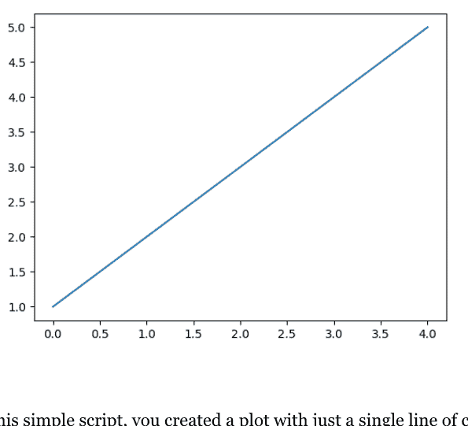

在这个简单的脚本中，你只用一行代码就创建了一个绘图。`plt.plot([1, 2, 3, 4, 5])` 这行代码创建了一个通过点 (0, 1), (1, 2), (2, 3), (3, 4) 和 (4, 5) 的线的绘图。你传递给 `plt.plot()` 函数的列表 [1, 2, 3, 4, 5] 代表了绘图中点的 y 值。由于你没有指定任何 x 值，matplotlib 自动使用列表元素的索引，由于 Python 从 0 开始计数，因此索引为 0, 1, 2, 3 和 4。

`plt.plot()` 函数创建了一个绘图，但它不显示任何内容。必须调用 `plt.show()` 函数才能显示绘图。

> **注意**

如果你在 Windows 上工作，你应该能够毫无问题地从 IDLE 的交互式窗口重新创建上面的绘图。但是，某些操作系统在从交互式窗口调用 `plt.show()` 时显示绘图会遇到问题。我们建议在新脚本中完成每个示例。

如果 `plt.show()` 在你的机器上可以从交互式窗口正常工作，并且你决定以这种方式继续，请注意，一旦图形显示在新窗口中，控制权就不会返回到交互式窗口，直到你关闭图形的窗口。也就是说，在图形窗口关闭之前，你不会看到新的 `>>>` 提示符。

你可以通过向 `plt.plot()` 函数传递两个列表来指定绘图中点的 x 值。当向 `plt.plot()` 提供两个参数时，第一个列表指定 x 值，第二个列表指定 y 值：

```python
from matplotlib import pyplot as plt

xs = [1, 2, 3, 4, 5]
ys = [2, 4, 6, 8, 10]

plt.plot(xs, ys)
plt.show()
```

运行上面的脚本会产生以下绘图：

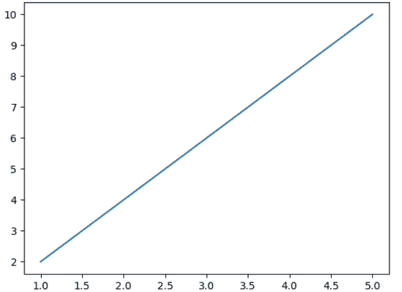

乍一看，这个图形可能看起来与第一个完全相同。但是，轴上的标签现在反映了点的新 x 和 y 坐标。

你可以使用 `plot()` 来绘制不仅仅是线。在上面的图形中，被绘制的点恰好都落在同一条线上。默认情况下，当使用 `.plot()` 绘制点时，每对连续的点都用一条线段连接。

以下绘图显示了一些不落在一条线上的数据：

```python
from matplotlib import pyplot as plt

xs = [1, 2, 3, 4, 5]
ys = [3, -1, 4, 0, 6]

plt.plot(xs, ys)
plt.show()
```

在指定要绘制的点之后，可以在 `plot()` 中插入一个可选的“格式化”参数。该参数用于指定要绘制的线条或点的颜色和样式。

不幸的是，这个标准是从 MATLAB 借用而来的，并且（与大多数 Python 代码相比）这种格式化方式不太直观，不易阅读或记忆。默认值是“蓝色实线”，由格式字符串 `b-` 表示。如果我们想绘制由实线连接的绿色圆点，可以使用格式字符串 `g-o`，如下所示：

```python
from matplotlib import pyplot as plt

plt.plot([2, 4, 6, 8, 10], "g-o")
plt.show()
```

> **注意**

作为参考，所有可能的格式化组合的完整列表可以在这里找到[here](here)。

## 在同一窗口中绘制多个图形

如果需要在同一窗口中绘制多个图形，可以通过几种不同的方式实现。

你可以传递多对 x 值和 y 值列表：

```python
from matplotlib import pyplot as plt

xs = [0, 1, 2, 3, 4]
y1 = [1, 2, 3, 4, 5]
y2 = [1, 2, 4, 8, 16]

plt.plot(xs, y1, xs, y2)
plt.show()
```

请注意，每个图形都以不同的颜色显示。`plot()` 函数的这一内置功能非常方便，可以快速制作易于阅读的图表。

如果你想控制每个图形的样式，除了 x 值和 y 值之外，还可以将格式化字符串传递给 `plot()`：

```python
from matplotlib import pyplot as plt

xs = [0, 1, 2, 3, 4]
y1 = [1, 2, 3, 4, 5]
y2 = [1, 2, 4, 8, 16]

plt.plot(xs, y1, "g-o", xs, y2, "b-^")
plt.show()
```

当只有几个图形需要显示时，将多组点传递给 `plot()` 可能效果很好，但如果需要显示很多图形，使用各自的 `plot()` 函数来显示每个图形可能更有意义。

例如，以下脚本显示的图形与前面的示例相同：

```python
from matplotlib import pyplot as plt

plt.plot([1, 2, 3, 4, 5], "g-o")
plt.plot([1, 2, 4, 8, 16], "b-^")
plt.show()
```

## 从 NumPy 数组绘制数据

到目前为止，你一直将数据点存储在纯 Python 列表中。在现实世界中，你很可能会使用像 NumPy 数组这样的东西来存储数据。幸运的是，matplotlib 可以很好地与数组对象配合使用。

> **注意**

如果你目前没有安装 NumPy，你需要使用 pip 安装它。更多信息，请参阅本章的前面部分。

例如，你可以使用 NumPy 的 arange() 函数来定义数据点，而不是使用列表，然后将生成的数组对象传递给 plot() 函数：

```python
from matplotlib import pyplot as plt
import numpy as np

array = np.arange(1, 6)

plt.plot(array)
plt.show()
```

传递一个二维数组会将数组的每一列作为图形的 y 值进行绘制。例如，以下脚本绘制四条线：

```python
from matplotlib import pyplot as plt
import numpy as np

data = np.arange(1, 21).reshape(5, 4)

# data now contains the following array:
# array([[ 1,  2,  3,  4],
#        [ 5,  6,  7,  8],
#        [ 9, 10, 11, 12],
#        [13, 14, 15, 16],
#        [17, 18, 19, 20]])

plt.plot(data)
plt.show()
```

如果你想绘制矩阵的行，则需要绘制数组的转置。以下脚本绘制了与前面示例中相同数组的五行：

```python
from matplotlib import pyplot as plt
import numpy as np

data = np.arange(1, 21).reshape(5, 4)

plt.plot(data.transpose())
plt.show()
```

## 将你的图表格式化到完美

到目前为止，你看到的图表没有提供任何关于图表代表什么的信息。在本节中，你将学习如何更改图表的格式和布局，使其更易于理解。

让我们从绘制阅读 Real Python 与另一个网站的前 20 天所学的 Python 量开始：

```python
from matplotlib import pyplot as plt
import numpy as np

days = np.arange(0, 21)
other_site = np.arange(0, 21)
real_python = other_site ** 2

plt.plot(days, other_site)
plt.plot(days, real_python)
plt.show()
```

如你所见，阅读 Real Python 的收获是指数级的！然而，如果你把这个图表展示给别人，他们可能不明白发生了什么。

首先，x 轴有点奇怪。它应该代表天数，但显示的是半天。了解每条线和轴代表什么也会很有帮助。一个描述图表的标题也不会有害。

让我们从调整 x 轴开始。你可以使用 `plt.xticks()` 函数通过传递一个位置列表来指定刻度应该位于何处。如果我们传递列表 `[0, 5, 10, 15, 20]`，刻度应该标记第 0、5、10、15 和 20 天：

```python
from matplotlib import pyplot as plt
import numpy as np

days = np.arange(0, 21)
other_site = np.arange(0, 21)
real_python = other_site ** 2

plt.plot(days, other_site)
plt.plot(days, real_python)
plt.xticks([0, 5, 10, 15, 20])
plt.show()
```

很好！这样更容易阅读了，但仍然不清楚每个轴代表什么。

你可以使用 `plt.xlabel()` 和 `plt.ylabel()` 分别为 x 轴和 y 轴添加标签。只需提供一个字符串作为参数，`matplotlib` 就会在相应的轴上显示标签。

在标记内容的同时，让我们用 `plt.title()` 函数给图表添加一个标题：

### 17.2. 使用 matplotlib 绘制图表

```python
from matplotlib import pyplot as plt
import numpy as np

days = np.arange(0, 21)
other_site = np.arange(0, 21)
real_python = other_site ** 2

plt.plot(days, other_site)
plt.plot(days, real_python)
plt.xticks([0, 5, 10, 15, 20])
plt.xlabel("Days of Reading")
plt.ylabel("Amount of Python Learned")
plt.title("Python Learned Reading Real Python vs Other Site")
plt.show()
```

现在我们开始有进展了！

### 17.2. 使用 matplotlib 绘制图表

只有一个问题。不清楚哪个图表代表 Real Python，哪个代表另一个网站。

为了澄清哪个图表是哪个，你可以使用 `plt.legend()` 函数添加图例。`legend()` 函数的主要参数是一个字符串列表，用于标识图表中的每个图形。这些字符串必须按照图形添加到图表的顺序排列：

```python
from matplotlib import pyplot as plt
import numpy as np

days = np.arange(0, 21)
other_site = np.arange(0, 21)
real_python = other_site ** 2

plt.plot(days, other_site)
plt.plot(days, real_python)
plt.xticks([0, 5, 10, 15, 20])
plt.xlabel("Days of Reading")
plt.ylabel("Amount of Python Learned")
plt.title("Python Learned Reading Real Python vs Other Site")
plt.legend(["Other Site", "Real Python"])
plt.show()
```

> **注意**

自定义图例的方法有很多。更多信息，请查看 matplotlib 文档中的[图例指南](https://matplotlib.org/stable/api/_as_gen/matplotlib.pyplot.legend.html)。

## 其他类型的图表

除了到目前为止你只看到的折线图之外，matplotlib 还提供了创建其他类型图表的简单方法。

在基础数据可视化中经常使用的一种图表类型是条形图。你可以使用 `plt.bar()` 函数轻松创建条形图。你必须至少提供两个参数给 `bar()`。第一个是每个条形中心点的 x 值列表，第二个是每个条形顶部的值：

from matplotlib import pyplot as plt

xs = [1, 2, 3, 4, 5]
tops = [2, 4, 6, 8, 10]

plt.bar(xs, tops)
plt.show()

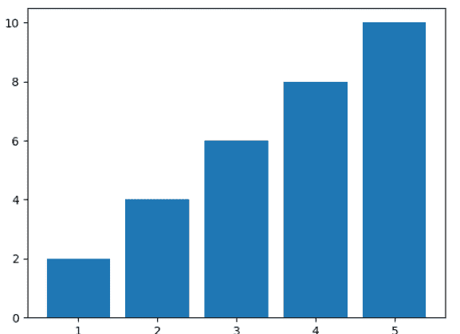

与`plot()`函数一样，你可以使用NumPy的`array`代替列表。以下脚本生成的图表与前一个完全相同：

```
from matplotlib import pyplot as plt
import numpy as np

xs = np.arange(1, 6)
tops = np.arange(2, 12, 2)

plt.bar(xs, tops)
plt.show()
```

`bar()`函数比它表面上看起来的更灵活。例如，第一个参数不一定需要是数字列表。它可以是一个表示数据类别的字符串列表。

假设你想绘制一个条形图来表示以下字典中包含的数据：

```
fruits = {
    "apples": 10,
    "oranges": 16,
    "bananas": 9,
    "pears": 4,
}
```

你可以使用`fruits.keys()`获取水果名称的列表，使用`fruits.values()`获取对应的值。看看将这些传递给`bar()`函数时会发生什么：

```
from matplotlib import pyplot as plt

fruits = {
    "apples": 10,
    "oranges": 16,
    "bananas": 9,
    "pears": 4,
}

plt.bar(fruits.keys(), fruits.values())
plt.show()
```

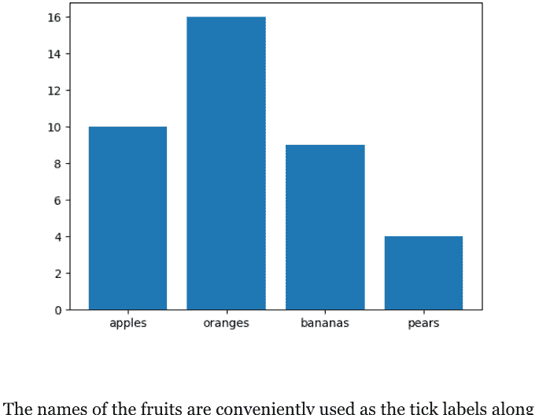

水果的名称被方便地用作x轴上的刻度标签。

> **注意**

使用字符串列表作为x值也适用于`plot()`函数，尽管这样做通常意义不大。

另一种常用的图表类型是直方图，它显示数据的分布情况。你可以使用`plt.hist()`函数轻松创建简单的直方图。你必须向`hist()`提供一个值列表（或数组）以及要使用的分箱数量。

例如，我们可以使用以下代码创建一个包含10,000个正态分布随机数的直方图，这些随机数被分到20个可能的条形中。这里使用了NumPy的`random.randn()`函数来生成一个正态分布的随机数数组：

```
from matplotlib import pyplot as plt
from numpy import random

plt.hist(random.randn(10000), 20)
plt.show()
```

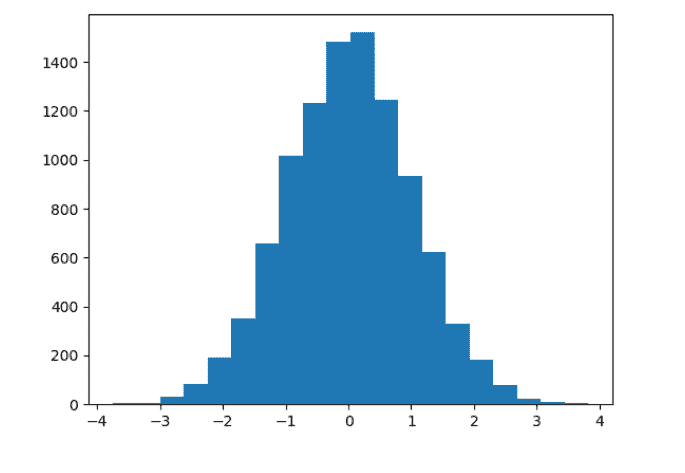

> **注意**

关于使用Python创建直方图的详细讨论，请查看[Real Python上的Python直方图绘制：NumPy、Matplotlib、Pandas和Seaborn](https://realpython.com/)。

## 将图形保存为图像

你可能已经注意到，显示图表的窗口底部有一个工具栏。你可以使用此工具栏将图表保存为图像文件。

大多数时候，你可能不想坐在电脑前，为每个要导出的图表点击保存按钮。幸运的是，`matplotlib`使得通过编程方式保存图表变得非常简单。

要保存图表，请使用`plt.savefig()`函数。将你希望保存图表的路径作为字符串传递。下面的示例将一个简单的条形图保存为`bar.png`到当前工作目录。如果你想保存到其他位置，必须提供绝对路径。

```
from matplotlib import pyplot as plt
import numpy as np

xs = np.arange(1, 6)
tops = np.arange(2, 12, 2)

plt.bar(xs, tops)
plt.savefig("bar.png")
```

> **注意**

如果你想同时保存图形并将其显示在屏幕上，请确保在显示之前先保存它！

`show()`函数会暂停代码的执行，并且关闭显示窗口会销毁图形，因此在调用`show()`之后尝试保存图形会导致生成一个空文件。

## 交互式处理图表

当你最初调整特定图表的布局和格式时，能够更改图表的部分内容而无需重新运行整个脚本以查看结果，这会很有帮助。

最简单的方法之一是使用[Jupyter Notebook](https://jupyter.org/)，它创建了一个在浏览器中运行的交互式Python解释器会话。

Jupyter notebooks已成为交互和探索数据的常用工具，并且与NumPy和matplotlib配合得非常好。

有关如何使用Jupyter Notebooks的交互式教程，请查看Jupyter的[IPython In Depth](https://jupyter.org/learn/notebooks.html)教程。

## 复习练习

你可以在[realpython.com/python-basics/resources](https://realpython.com/python-basics/resources)在线找到这些练习的解决方案和许多其他额外资源。

1.  尽可能多地通过编写自己的脚本（不参考提供的代码）来重新创建本节中显示的图表。
2.  一个[有充分文献记载的事实](https://www.tylervigen.com/spurious-correlations)是，世界上的海盗数量与全球气温上升相关。编写一个脚本`pirates.py`来直观地检查这种关系：
    - 从第17章练习文件文件夹中读取文件`pirates.csv`。
    - 创建一个折线图，显示全球平均温度（摄氏度）作为世界海盗数量的函数——即，将海盗数量绘制在x轴上，温度绘制在y轴上。
    - 添加图表标题并为图表的轴添加标签。
    - 将生成的图表保存为PNG图像文件。
    - 附加题：在图表上为每个点标注相应的年份。你应该通过循环遍历实际数据点来编程实现，而不是指定每个注释的单独位置。

[为此部分提供反馈 »](https://realpython.com/python-basics/resources)

### 17.3 总结与附加资源

在本章中，你学习了Python科学计算栈中常用的两个包。

在第一部分“使用NumPy进行矩阵操作”中，你学习了NumPy包。NumPy用于处理多维数据数组。它引入了`ndarray`对象，通常使用`array`别名创建。

NumPy的`array`是同构数据类型，这意味着它只能存储单一类型的数据。例如，NumPy的`array`可以包含所有整数，或所有浮点数，但不能同时包含整数*和*浮点数。你还看到了一些用于操作NumPy `array`对象的有用函数和方法。最后，你了解了NumPy的`arange()`函数，它的工作方式与Python自身的`range()`函数非常相似，只是它返回一个一维的NumPy `array`对象。

在第二部分“使用`matplotlib`绘制图表”中，你学习了如何使用`matplotlib`包通过`pyplot`接口创建简单的图表。你使用`plot()`、`bar()`和`hist()`函数，从纯Python列表和NumPy数组构建了折线图、条形图和直方图。你学习了如何通过添加图表和轴标题、刻度标记和图例来设置图表的样式和布局。

> **互动测验**

本章附带一个免费的在线测验，以检查你的学习进度。你可以使用手机或电脑通过以下网址访问测验：

[realpython.com/quizzes/python-basics-16](https://realpython.com/quizzes/python-basics-16)

## 附加资源

掌握了本章的知识，你应该能够处理基本的数据数组并生成一些简单的图表。如果你的目标是使用Python进行数据科学或科学计算，你现在拥有了一些基础知识。为了进一步学习，你可能需要查看以下资源：

- Real Python数据科学教程
- realpython.com上的推荐资源

[为此部分提供反馈 »](Leave feedback on this section »)

# 第18章

## 图形用户界面

在整本书中，你一直在创建**命令行应用程序**，这些程序从终端窗口启动并在其中产生输出。

命令行应用程序对于制作你或其他开发者可能使用的工具来说很好，但绝大多数软件用户从不想打开终端！

**图形用户界面**，简称**GUI**，发音为“gooey”，具有带有按钮和文本字段等组件的窗口。它们为用户提供了一种熟悉且直观的方式来与程序交互。

**在本章中，你将学习如何：**

- 使用EasyGUI为命令行应用程序添加一个简单的GUI
- 使用Tkinter创建功能齐全的GUI应用程序

让我们开始吧！

[为此部分提供反馈 »](Leave feedback on this section »)

### 18.1 使用 EasyGUI 添加图形用户界面元素

你可以使用 EasyGUI 库快速为你的程序添加图形用户界面。EasyGUI 功能有些局限，但对于只需要用户少量输入的简单工具来说，它运行良好。

在本节中，你将使用 EasyGUI 创建一个简短的 GUI 程序，允许用户从硬盘中选择一个 PDF 文件，并将其页面旋转指定的角度。

## 安装 EasyGUI

首先，你需要使用 `pip3` 安装 EasyGUI：

```
$ pip3 install easygui
```

安装 EasyGUI 后，你可以使用 `pip3 show` 查看该包的一些详细信息：

```
$ pip3 show easygui
Name: easygui
Version: 0.98.1
Summary: EasyGUI is a module for very simple, very easy GUI
         programming in Python.  EasyGUI is different from other
         GUI generators in that EasyGUI is NOT event-driven.
         Instead, all GUI interactions are invoked by simple
         function calls.
Home-page: https://github.com/robertlugg/easygui
Author: easygui developers and Stephen Ferg
Author-email: robert.lugg@gmail.com
License: BSD
Location: c:\realpython\venv\lib\site-packages
Requires:
Required-by:
```

本章中的代码是使用 EasyGUI 版本 0.98.1 编写的，与你在上面信息中看到的版本相同。

## 你的第一个 EasyGUI 应用程序

EasyGUI 非常适合显示**对话框**以收集用户输入和显示输出。它并不特别适合创建具有多个窗口、菜单和工具栏的大型应用程序。

你可以将 EasyGUI 视为一种替代品，用于你一直用于输入和输出的 `input()` 和 `print()` 函数。

使用 EasyGUI 的程序流程通常如下：

1. 在代码的某个点，一个视觉元素显示在用户的屏幕上。
2. 代码执行暂停，直到用户使用该视觉元素提供输入。
3. 用户的输入作为对象返回，代码执行继续。

要了解 EasyGUI 的工作原理，请在 IDLE 中打开一个新的交互式窗口并执行以下代码行：

```
>>> import easygui as gui
>>> gui.msgbox(msg="Hello!", title="My first message box")
```

如果你在 Windows 上运行代码，你将在屏幕上看到如下窗口：

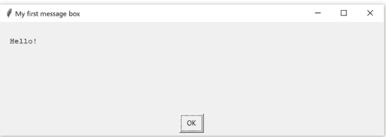

窗口的外观取决于执行代码的操作系统。在 macOS 上，窗口看起来像这样：

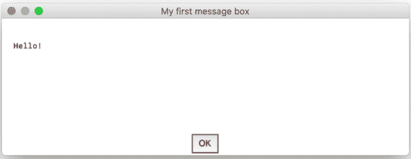

在 Ubuntu 上，窗口看起来像这样：

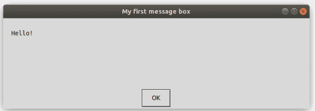

在本节的其余部分，将显示 Windows 截图。
EasyGUI 和 IDLE 都是使用 Tkinter 库编写的，你将在下一节中了解它。这种重叠有时会导致执行问题，例如对话框冻结或卡住。

如果你认为这可能发生在你身上，请尝试从终端运行你的代码。你可以使用 Windows 上的 `python` 命令或 macOS/Ubuntu 上的 `python3` 命令从终端启动交互式 Python 会话。

让我们分解一下你在上面代码生成的对话框中看到的内容：

1. 传递给 `msgbox()` 的 `msg` 参数的字符串 "Hello!" 显示为消息框中的消息。
2. 传递给 `title` 参数的字符串 "My first message box" 显示为消息框的标题。
3. 消息框中有一个标记为 OK 的按钮。

按下 OK 按钮关闭对话框，然后查看 IDLE 的交互式窗口。字符串 'OK' 显示在你键入的最后一行代码下方：

```
>>> gui.msgbox(msg="Hello, EasyGUI!", title="My first message box")
'OK'
```

`msgbox()` 在对话框关闭时返回按钮标签。如果对话框在未按下 OK 按钮的情况下关闭，则返回值 `None`。

你可以通过设置第三个可选参数 `ok_button` 来自定义按钮标签。例如，以下代码创建一个带有标记为 *Click me* 按钮的消息框：

```
>>> gui.msgbox(msg="Hello!", title="Greeting", ok_button="Click me")
```

`msgbox()` 非常适合显示消息，但它没有为用户提供太多与你的程序交互的选项。EasyGUI 有几个函数可以显示各种类型的对话框。让我们现在探索其中一些！

## EasyGUI 的 GUI 元素集合

除了 `msgbox()`，EasyGUI 还有其他几个函数用于显示不同类型的对话框。下表总结了一些可用的函数：

| 函数 | 描述 |
| :--- | :--- |
| `msgbox()` | 一个用于显示带有单个按钮的消息的对话框。它返回按钮的标签。 |
| `buttonbox()` | 一个带有多个按钮的对话框。它返回所选按钮的标签。 |
| `indexbox()` | 一个带有多个按钮的对话框。它返回所选按钮的索引。 |
| `enterbox()` | 一个带有文本输入框的对话框。它返回输入的文本。 |
| `fileopenbox()` | 一个用于选择要打开的文件的对话框。它返回所选文件的绝对路径。 |
| `diropenbox()` | 一个用于选择要打开的目录的对话框。它返回所选目录的绝对路径。 |
| `filesavebox()` | 一个用于保存文件的对话框。它返回保存文件位置的绝对路径。 |

让我们逐一查看这些函数。

## buttonbox()

EasyGUI 的 `buttonbox()` 显示一个带有消息和多个用户可以点击的按钮的对话框。被点击的按钮的标签将返回给你的程序。

就像 `msgbox()` 一样，`buttonbox()` 函数有 `msg` 和 `title` 参数，用于设置要显示的消息和对话框的标题。`buttonbox()` 有第三个参数 `choices`，用于设置按钮。

例如，以下代码生成一个带有三个标记为 "Red"、"Yellow" 和 "Blue" 按钮的对话框：

```
>>> gui.buttonbox(
...     msg="What is your favorite color?",
...     title="Choose wisely...",
...     choices=("Red", "Yellow", "Blue"),
... )
```

对话框看起来像这样：

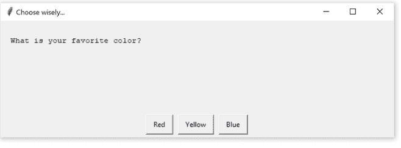

当你按下其中一个按钮时，按钮标签将作为字符串返回。例如，如果你按下 `Yellow` 按钮，你将在交互式窗口的输出中看到字符串 'Yellow' 显示在 `buttonbox()` 函数下方：

```
>>> gui.buttonbox(
...     msg="What is your favorite color?",
...     title="Choose wisely...",
...     choices=("Red", "Yellow", "Blue"),
... )
'Yellow'
```

就像 `msgbox()` 一样，如果对话框在未按下其中一个按钮的情况下关闭，则返回值 `None`。

## indexbox()

`indexbox()` 显示的对话框与 `buttonbox()` 显示的对话框完全相同。事实上，你创建 `indexbox()` 的方式与创建 `buttonbox()` 的方式相同：

```
>>> gui.indexbox(
...     msg="What's your favorite color?",
...     title="Choose wisely...",
...     choices=("Red", "Yellow", "Blue"),
... )
```

对话框看起来像这样：

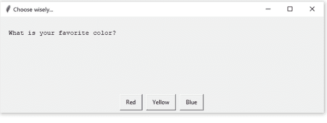

`indexbox()` 和 `buttonbox()` 之间的区别在于，`indexbox()` 返回传递给 `choices` 的列表或元组中按钮标签的索引，而不是标签本身。

例如，如果你点击 `Yellow` 按钮，则返回整数 1：

```
>>> gui.indexbox(
...     msg="What's your favorite color?",
...     title="Favorite color",
...     choices=("Red", "Yellow", "Blue"),
... )
```

因为 `indexbox()` 返回索引而不是字符串，所以最好在函数外部定义 `choices` 的元组，以便你可以在代码中稍后通过索引引用标签：

```
>>> colors = ("Red", "Yellow", "Blue")
>>> choice = gui.indexbox(
    msg="What's your favorite color?",
    title="Favorite color",
    choices=colors,
)
>>> choice
1
>>> colors[choice]
'Yellow'
```

`buttonbox()` 和 `indexbox()` 非常适合在用户需要从预定义的选项集中进行选择时获取输入。这些函数不适合获取诸如用户名或电子邮件地址之类的信息。为此，你可以使用 `enterbox()`。

## enterbox()

`enterbox()` 用于从用户那里收集文本输入：

```
>>> gui.enterbox(
...     msg="What is your favorite color?",
...     title="Favorite color",
... )
```

`enterbox()` 生成的对话框有一个输入框，用户可以在其中输入自己的答案：

## 18.1. 使用 EasyGUI 添加图形界面元素

输入一个颜色名称，例如 `Yellow`，然后点击 `OK`。你输入的文本会作为字符串返回：

```
>>> gui.enterbox(
...     msg="What is your favorite color?",
...     title="Favorite color",
... )
'Yellow'
```

显示对话框最常见的原因之一是允许用户在其文件系统中选择一个文件或文件夹。EasyGUI 有一些专门为此类操作设计的特殊函数。

**`fileopenbox()`**

`fileopenbox()` 显示一个用于选择要打开的文件的对话框：

```
>>> gui.fileopenbox(title="Select a file")
```

该对话框看起来像标准的系统文件打开对话框：

选择一个文件并点击 `Open` 按钮。一个包含所选文件完整路径的字符串将被返回。

> **重要提示**

`fileopenbox()` 并不会实际打开文件！要打开文件，你需要像第 12 章学到的那样使用内置的 `open()` 函数。

就像 `msgbox()` 和 `buttonbox()` 一样，如果用户按下 `Cancel` 或在未选择文件的情况下关闭对话框，则返回值 `None`。

**`diropenbox()` 和 `filesavebox()`**

EasyGUI 还有两个其他函数，它们生成的对话框与 `fileopenbox()` 生成的几乎相同：

- 1. `diropenbox()` 打开一个可用于选择文件夹而非文件的对话框。当用户按下 `Open` 时，返回该目录的完整路径。
- 2. `filesavebox()` 打开一个用于选择保存文件位置的对话框，如果所选名称已存在，它将确认用户是否要覆盖该文件。就像 `fileopenbox()` 一样，当用户按下 `Save` 时返回文件路径。文件并未实际保存。

> **重要提示**

`diropenbox()` 和 `filesavebox()` 都不会实际打开目录或保存文件。它们只返回要打开的目录或要保存的文件的绝对路径。

你必须自己编写代码来打开目录或保存文件。

如果对话框在未按下 `Open` 或 `Save` 的情况下被关闭，`diropenbox()` 和 `filesavebox()` 都会返回 `None`。如果你不小心，这可能会导致你的程序崩溃。

例如，以下代码在对话框关闭而未做任何选择时会引发 `TypeError`：

```
>>> path = gui.fileopenbox(title="Select a file")
>>> open_file = open(path, "r")
Traceback (most recent call last):
  File "<stdin>", line 2, in <module>
TypeError: expected str, bytes or os.PathLike object, not NoneType
```

你如何处理这些情况，对用户体验你的程序有着巨大的影响。

## 优雅地退出你的程序

假设你正在编写一个从 PDF 文件中提取页面的程序。程序可能做的第一件事是使用 `fileopenbox()`，以便用户可以选择要打开哪个 PDF。

如果用户决定不想运行程序并按下 `Cancel` 怎么办？

你必须确保你的程序能够优雅地处理这些情况。程序不应该崩溃或产生任何意外输出。在上述情况下，程序可能应该直接停止运行。

停止程序运行的一种方法是使用 Python 内置的 `exit()` 函数。

例如，以下程序在用户按下文件选择对话框中的 `Cancel` 按钮时使用 `exit()` 来停止程序：

```
import easygui as gui

path = gui.fileopenbox(title="Select a file")

if path is None:
    exit()
```

如果用户在未按下 `OK` 的情况下关闭文件打开对话框，那么 `path` 为 `None`，程序将执行 `if` 块中的 `exit()` 函数。该程序关闭，执行停止。

> **注意**

如果你在 IDLE 中运行程序，`exit()` 也会关闭当前的交互式窗口。它非常彻底。

现在你知道如何使用 EasyGUI 创建对话框了，让我们将所有内容整合到一个实际应用中。

## 复习练习

你可以在 [realpython.com/python-basics/resources](https://realpython.com/python-basics/resources) 找到这些练习的解决方案和许多其他额外资源。

## 18.2. 示例应用：PDF 页面旋转器

1. 创建以下对话框：

2. 创建以下对话框：

为此部分提供反馈 »

### 18.2 示例应用：PDF 页面旋转器

EasyGUI 是自动化简单但重复性任务的实用应用程序的绝佳选择。如果你在办公室工作，通过使用 EasyGUI 创建工具来减轻日常待办事项的负担，你确实可以提高工作效率。

在本节中，你将使用上一节学到的一些 EasyGUI 对话框来创建一个用于旋转 PDF 页面的应用程序。

在此过程中，你将整合到目前为止学到的许多概念，包括 for 循环（第 6 章）、条件逻辑（第 8 章）、读写文件（第 12 章）以及处理 PDF 文件（第 14 章）。

## 应用程序设计

在深入代码之前，让我们思考一下程序应该如何工作。

程序需要询问用户要打开哪个 PDF 文件、他们希望将每页旋转多少度，以及用户希望将新的 PDF 保存到哪里。然后程序需要打开文件、旋转页面并保存新文件。

让我们将其映射为明确的步骤，以便更容易转化为代码：

- 1. 显示一个用于打开 PDF 文件的文件选择对话框。
- 2. 如果用户取消对话框，则退出程序。
- 3. 让用户选择 90、180 或 270 度来旋转 PDF 页面。
- 4. 显示一个用于保存旋转后 PDF 的文件选择对话框。
- 5. 如果用户尝试保存与输入文件同名的文件：
    - 用消息框提醒用户这是不允许的。
    - 返回步骤 4。
- 6. 如果用户取消文件保存对话框，则退出程序。
- 7. 执行页面旋转：
    - 打开选定的 PDF。
    - 旋转所有页面。
    - 将旋转后的 PDF 保存到选定的文件。

> **注意**

在设计应用程序时，在开始编码之前规划好每个步骤会很有帮助。对于大型应用程序，绘制描述程序流程的图表可以帮助保持一切井然有序。

## 实现设计

现在我们有了计划，让我们一步一步地处理每个步骤。在 IDLE 中打开一个新的脚本窗口以跟随操作。

首先，导入 EasyGUI 和 PyPDF2：

```
import easygui as gui
from PyPDF2 import PdfFileReader, PdfFileWriter
```

我们计划中的第一步是显示一个用于打开 PDF 文件的文件选择对话框。我们可以使用 `fileopenbox()` 来完成：

```
# 1. 显示一个用于打开 PDF 文件的文件选择对话框。
input_path = gui.fileopenbox(
    title="Select a PDF to rotate...",
    default="*.pdf"
)
```

这里我们将 `default` 参数设置为 `"*.pdf"`，这会将对话框配置为仅显示具有 `.pdf` 扩展名的文件。这有助于防止用户意外选择非 PDF 文件。

用户选择的文件路径被赋值给 `input_path` 变量。如果用户在未选择文件路径的情况下关闭了对话框（步骤 2），则 `input_path` 为 `None`。在这种情况下，我们需要退出程序：

```
# 2. 如果用户取消对话框，则退出程序。
if input_path is None:
    exit()
```

第三步是询问用户希望将 PDF 页面旋转多少度。他们可以选择 90、180 或 270 度。让我们使用 `buttonbox()` 来收集此信息：

```
# 3. 让用户选择 `90`、`180` 或 `270` 度来旋转 PDF 页面。
choices = ("90", "180", "270")
degrees = gui.buttonbox(
    msg="Rotate the PDF clockwise by how many degrees?",
    title="Choose rotation...",
    choices=choices,
)
```

这里生成的对话框有三个按钮，标签分别为 "90"、"180" 和 "270"。当用户点击其中一个按钮时，该按钮的标签作为字符串赋值给 `degrees` 变量。

为了按选定的角度旋转 PDF 中的页面，我们需要该值为整数，而不是字符串。让我们将其转换为整数：

```
degrees = int(degrees)
```

接下来，使用 `filesavebox()` 从用户那里获取输出文件路径：

```
# 4. 显示一个用于保存旋转后 PDF 的文件选择对话框。
save_title = "Save the rotated PDF as..."
file_type = "*.pdf"
output_path = gui.filesavebox(title=save_title, default=file_type)
```

就像 `fileopenbox()` 一样，我们将 `default` 参数设置为 `*.pdf`。这确保文件自动以 `.pdf` 扩展名保存。

不应该允许用户覆盖原始文件（步骤 5）。你可以使用 `while` 循环反复向用户显示警告，直到他们选择一个与输入文件路径不同的路径：

### 18.2 示例应用：PDF 页面旋转器

```python
# 5. 如果用户尝试用与输入文件相同的名称保存：
while input_path == output_path:
    # - 通过消息框提醒用户这是不允许的。
    gui.msgbox(msg="无法覆盖原始文件！")
    # - 返回到步骤 4。
    output_path = gui.filesavebox(title=save_title, default=file_type)
```

`while` 循环检查 `input_path` 是否与 `output_path` 相同。如果不同，则循环体被忽略。如果 `input_path` 和 `output_path` 相同，则使用 `msgbox()` 向用户显示警告，告知他们无法覆盖原始文件。

警告用户后，使用 `filesavebox()` 显示另一个文件保存对话框，其标题和默认文件类型与之前相同。这就是将用户返回到步骤 4 的部分。尽管程序实际上并没有返回到首次调用 `filesavebox()` 的代码行，但效果是相同的。

如果用户在不按 `保存` 的情况下关闭文件保存对话框，程序应退出（步骤 6）：

```python
# 6. 如果用户取消文件保存对话框，则退出程序。
if output_path is None:
    exit()
```

现在你已具备实现程序最后一步所需的一切：

```python
# 7. 执行页面旋转：
#     - 打开选定的 PDF。
input_file = PdfFileReader(input_path)
output_pdf = PdfFileWriter()

#     - 旋转所有页面。
for page in input_file.pages:
    page = page.rotateClockwise(degrees)
    output_pdf.addPage(page)

#     - 将旋转后的 PDF 保存到选定的文件。
with open(output_path, "wb") as output_file:
    output_pdf.write(output_file)
```

试试你新的 PDF 旋转应用程序！它在 Windows、macOS 和 Ubuntu Linux 上都能同样出色地工作！

以下是完整的应用程序源代码供你参考：

```python
import easygui as gui
from PyPDF2 import PdfFileReader, PdfFileWriter

# 1. 显示用于打开 PDF 文件的文件选择对话框。
input_path = gui.fileopenbox(
    title="选择要旋转的 PDF...",
    default="*.pdf"
)

# 2. 如果用户取消对话框，则退出程序。
if input_path is None:
    exit()

# 3. 让用户选择 `90`、`180` 或 `270` 度来旋转 PDF 页面。
choices = ("90", "180", "270")
degrees = gui.buttonbox(
    msg="将 PDF 顺时针旋转多少度？",
    title="选择旋转角度...",
    choices=choices,
)

# 4. 显示用于保存旋转后 PDF 的文件选择对话框。
save_title = "将旋转后的 PDF 另存为..."
file_type = "*.pdf"
output_path = gui.filesavebox(title=save_title, default=file_type)

# 5. 如果用户尝试用与输入文件相同的名称保存：
while input_path == output_path:
    # - 通过消息框提醒用户这是不允许的。
    gui.msgbox(msg="无法覆盖原始文件！")
    # - 返回到步骤 4。
    output_path = gui.filesavebox(title=save_title, default=file_type)

# 6. 如果用户取消文件保存对话框，则退出程序。
if output_path is None:
    exit()

# 7. 执行页面旋转：
#     - 打开选定的 PDF。
input_file = PdfFileReader(input_path)
output_pdf = PdfFileWriter()

#     - 旋转所有页面。
for page in input_file.pages:
    page = page.rotateClockwise(degrees)
    output_pdf.addPage(page)

#     - 将旋转后的 PDF 保存到选定的文件。
with open(output_path, "wb") as output_file:
    output_pdf.write(output_file)
```

EasyGUI 非常适合为小型工具和应用程序快速创建图形用户界面。对于更大的项目，EasyGUI 可能过于局限。这时就需要 Python 内置的 Tkinter 库了。

Tkinter 是一个比 EasyGUI 更底层的图形用户界面框架。这意味着你可以对图形用户界面的视觉方面有更多控制，例如窗口大小、字体大小、字体颜色以及对话框或窗口中包含哪些图形用户界面元素。

本章的剩余部分将致力于使用 Python 内置的 Tkinter 库开发图形用户界面应用程序。

## 复习练习

你可以在 [realpython.com/python-basics/resources](https://realpython.com/python-basics/resources) 找到这些练习的解答和许多其他额外资源。

1.  本节中用于旋转 PDF 页面的图形用户界面应用程序存在一个问题。如果用户在不选择值的情况下关闭用于选择度数的 `buttonbox()`，程序会崩溃。

    通过使用 `while` 循环在 `degrees` 为 `None` 时持续显示选择对话框来修复此问题。

[对此部分提供反馈 »](https://realpython.com/python-basics/resources)

### 18.3 挑战：PDF 页面提取应用程序

在这个挑战中，你将使用 EasyGUI 编写一个用于从 PDF 文件中提取页面的图形用户界面应用程序。

以下是该应用程序的详细计划：

1.  要求用户选择要打开的 PDF 文件。
2.  如果未选择 PDF 文件，则退出程序。
3.  询问起始页码。
4.  如果用户未输入起始页码，则退出程序。
5.  有效的页码是正整数。如果用户输入了无效的页码：
    - 警告用户输入无效。
    - 返回到步骤 3。
6.  询问结束页码。
7.  如果用户未输入结束页码，则退出程序。
8.  如果用户输入了无效的页码：
    - 警告用户输入无效。
    - 返回到步骤 6。
9.  询问保存提取页面的位置。
10. 如果用户未选择保存位置，则退出程序。
11. 如果选择的保存位置与输入文件路径相同：
    - 警告用户无法覆盖输入文件。
    - 返回到步骤 9。
12. 执行页面提取：
    - 打开输入 PDF 文件。
    - 写入一个仅包含所选页面范围内页面的新 PDF 文件。

你可以在 [realpython.com/python-basics/resources](https://realpython.com/python-basics/resources) 找到此代码挑战的解答和许多其他额外资源。

[对此部分提供反馈 »](https://realpython.com/python-basics/resources)

### 18.4 Tkinter 简介

Python 有很多图形用户界面框架，但 Tkinter 是唯一内置在 Python 标准库中的框架。

Tkinter 有几个优点。它是**跨平台的**，这意味着相同的代码可以在 Windows、macOS 和 Linux 上运行。视觉元素使用原生操作系统元素进行渲染，因此使用 Tkinter 构建的应用程序看起来就像是为其运行的平台量身定做的。

尽管 Tkinter 被认为是*事实上的* Python 图形用户界面框架，但它也并非没有批评。一个显著的批评是使用 Tkinter 构建的图形用户界面看起来过时了。如果你想要一个闪亮、现代的界面，那么 Tkinter 可能不是你想要的。

然而，与其他框架相比，Tkinter 轻量级且相对易于使用。这使其成为在 Python 中构建图形用户界面应用程序的一个引人注目的选择，特别是对于那些不需要现代外观，并且快速构建功能性和跨平台应用程序是首要任务的应用程序。

> **注意**
>
> 正如上一节所提到的，IDLE 是使用 Tkinter 构建的。在 IDLE 中运行你自己的图形用户界面程序时，你可能会遇到困难。
>
> 如果你发现你试图创建的图形用户界面窗口意外冻结或似乎以某种意外方式导致 IDLE 行为异常，请尝试从命令提示符或终端运行你的脚本。

让我们直接深入了解如何使用 Tkinter 构建应用程序。

#### 你的第一个 Tkinter 应用程序

Tkinter 图形用户界面的基础元素是**窗口**。窗口是所有其他图形用户界面元素存在的容器。其他图形用户界面元素，如文本框、标签和按钮，被称为**控件**。控件包含在窗口内。

让我们创建一个包含单个控件的窗口。首先在 IDLE 中打开一个新的交互式窗口。

你需要做的第一件事是导入 Tkinter 模块：

```python
>>> import tkinter as tk
```

窗口是 Tkinter 的 Tk 类的一个实例。继续创建一个新窗口并将其赋值给变量 window：

```python
>>> window = tk.Tk()
```

当你执行上述代码时，一个新的窗口会弹出在你的屏幕上。它的外观取决于你的操作系统：

## 复习练习

*你可以在 [realpython.com/python-basics/resources](https://realpython.com/python-basics/resources) 找到这些练习的解答以及许多其他额外资源。*

1.  在 IDLE 的交互式窗口中使用 Tkinter，执行代码创建一个包含 `Label` 控件的窗口，控件文本为 "GUIs are great!"。
2.  重复练习 1，但文本改为 "Python rocks!"。
3.  重复练习 1，但文本改为 "Engage!"。

对本节提供反馈 »

### 18.5 使用控件

控件是 Tkinter 的核心。它们是用户与你的程序交互的元素。

Tkinter 中的每个控件都由一个类定义。以下是一些可用的控件：

| 控件类 | 描述 |
|---|---|
| Label | 用于在屏幕上显示文本的控件。 |
| Button | 一个可以包含文本并在点击时执行操作的按钮。 |
| Entry | 一个只允许单行文本输入的文本输入控件。 |
| Text | 一个允许多行文本输入的文本输入控件。 |
| Frame | 一个矩形区域，用于组合相关控件或在控件之间提供间距。 |

你将在接下来的部分中了解如何使用这些控件中的每一个。

> **注意**

Tkinter 的控件远不止这里列出的这些。要查看完整列表，请查阅 [TkDocs](https://tkdocs.com/) 教程中的 [基本控件](https://tkdocs.com/tutorial/widgets.html) 和 [更多控件](https://tkdocs.com/tutorial/morewidgets.html) 文章。

让我们更仔细地看看 `Label` 控件。

## Label 控件

`Label` 控件用于显示文本或图像。`Label` 控件显示的文本不能被用户编辑。它仅用于显示目的。

正如你在本章开头的示例中看到的，你可以通过实例化 Label 类并向 text 参数传递一个字符串来创建 Label 控件：

```
label = tk.Label(text="Hello, Tkinter")
```

Label 控件使用默认的系统文本颜色和默认的系统文本背景色显示文本。这些通常是黑色和白色，但如果你在操作系统中更改了这些设置，你可能会看到不同的颜色。

你可以使用 foreground 和 background 参数来控制 Label 的文本和背景颜色：

```
label = tk.Label(
    text="Hello, Tkinter",
    foreground="white",  # 将文本颜色设置为白色
    background="black"  # 将背景颜色设置为黑色
)
```

有许多有效的颜色名称，包括：

- "red"
- "orange"
- "yellow"
- "green"
- "blue"
- "purple"

许多 HTML 颜色名称也适用于 Tkinter。

> **注意**

一个包含大多数有效颜色名称的图表可以在这里找到 [here](https://www.tcl.tk/man/tcl8.6/TkCmd/colors.htm)。要获取完整参考，包括由当前系统主题控制的 macOS 和 Windows 特定系统颜色，请查看 [此列表](https://www.tcl.tk/man/tcl8.6/TkCmd/colors.htm)。

你也可以使用 [十六进制 RGB 值](https://www.w3schools.com/colors/colors_hexadecimal.asp) 来指定颜色：

```
label = tk.Label(text="Hello, Tkinter", background="#34A2FE")
```

这会将标签背景设置为一种漂亮的浅蓝色。

十六进制 RGB 值比命名颜色更晦涩，但它们更灵活。幸运的是，有 [工具](https://www.w3schools.com/colors/colors_picker.asp) 可用，使得获取十六进制颜色代码相对轻松。

如果你不想一直输入 `foreground` 和 `background`，你可以使用简写 `fg` 和 `bg` 参数来设置前景色和背景色：

```
label = tk.Label(text="Hello, Tkinter", fg="white", bg="black")
```

你还可以使用 `width` 和 `height` 参数来控制标签的宽度和高度：

```
label = tk.Label(
    text="Hello, Tkinter",
    fg="white",
    bg="black",
    width=10,
    height=10
)
```

这是该标签在窗口中的样子：

窗口中的标签看起来不是正方形，即使宽度和高度都设置为 10，这可能看起来很奇怪。这是因为高度和宽度是以 **文本单位** 来度量的。

一个水平文本单位由默认系统字体中字符 "0"（数字零）的宽度决定。类似地，一个垂直文本单位由字符 "0" 的高度决定。

> **注意**

Tkinter 使用文本单位来度量宽度和高度，而不是像英寸、厘米或像素这样的单位，以确保应用程序在不同平台上的行为一致。

通过字符的宽度来度量单位意味着控件的大小相对于用户机器上的默认字体。这确保了无论应用程序在哪里运行，文本都能在标签和按钮中正确显示。

标签非常适合显示一些文本，但它们无法帮助你从用户那里获取输入。接下来我们要看的三个控件都用于获取用户输入。

## Button 控件

Button 控件用于显示可点击的按钮。它们可以被配置为在点击时调用一个函数。我们将在下一节讨论如何从按钮点击调用函数。现在，让我们看看如何创建和设置 Button 的样式。

Button 和 Label 控件之间有许多相似之处。在许多方面，Button 只是一个你可以点击的 Label！用于创建和设置 Label 样式的相同关键字参数也适用于 Button 控件。

例如，以下代码创建了一个蓝色背景、黄色文本、高度和宽度分别设置为 10 和 5 个文本单位的 Button：

```
button = tk.Button(
    text="Click me!",
    width=25,
    height=5,
    bg="blue",
    fg="yellow",
)
```

这是按钮在窗口中的样子：

非常棒！

接下来我们要看的两个控件用于从用户那里收集文本输入。

## Entry 控件

当你需要从用户那里获取少量文本，比如姓名或电子邮件地址时，使用 `Entry` 控件。它们显示一个小文本框，用户可以在其中输入一些文本。

创建和设置 `Entry` 控件的样式与 `Label` 和 `Button` 控件非常相似。例如，以下代码创建了一个蓝色背景、黄色文本、宽度为 50 个文本单位的控件：

```
entry = tk.Entry(fg="yellow", bg="blue", width=50)
```

然而，`Entry` 控件有趣的地方不在于如何设置它们的样式，而在于如何使用它们从用户那里获取输入。你可以对 `Entry` 控件执行三个主要操作：

1.  使用 `.get()` 方法检索文本
2.  使用 `.delete()` 方法删除文本
3.  使用 `.insert()` 方法插入文本

掌握 `Entry` 控件的最佳方法是创建一个并与之交互。请打开 IDLE 的交互式窗口，并按照本节中的示例进行操作。

首先，导入 `tkinter` 并创建一个新窗口：

```
>>> import tkinter as tk
>>> window = tk.Tk()
```

现在创建一个 `Label` 和一个 `Entry` 控件：

```
>>> label = tk.Label(text="Name")
>>> entry = tk.Entry()
```

`Label` 描述了应该在 `Entry` 控件中输入什么样的文本。它它不会对 `Entry` 施加任何要求，但它会告诉用户我们的程序期望他们在那里输入什么。

我们需要将控件 `.pack()` 到窗口中，以便它们可见：

```
>>> label.pack()
>>> entry.pack()
```

效果如下：

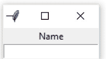

请注意，Tkinter 会自动将 `Label` 居中放置在窗口中 `Entry` 控件的上方。这是 `.pack()` 方法的一个特性，你将在后续章节中了解更多。

用鼠标点击 `Entry` 控件内部并输入 "Real Python"：

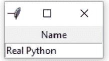

现在你已经在 `Entry` 控件中输入了一些文本，但这些文本尚未发送到你的程序中。

使用 `Entry` 控件的 `.get()` 方法检索文本并将其赋值给名为 `name` 的变量：

```
>>> name = entry.get()
>>> name
'Real Python'
```

你可以使用 `Entry` 控件的 `.delete()` 方法删除文本。`.delete()` 接受一个整数参数，告诉它要删除哪个字符。例如，`.delete(0)` 从 `Entry` 中删除第一个字符：

```
>>> entry.delete(0)
```

控件中剩余的文本现在是 "eal Python"：

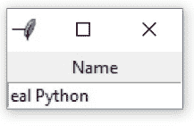

> **注意**

就像 Python 字符串对象一样，`Entry` 控件中的文本索引从 0 开始。

如果你需要从 `Entry` 中删除多个字符，请向 `.delete()` 传递第二个整数参数，指示删除应停止的字符索引。

例如，以下代码删除 `Entry` 中的前四个字母：

```
>>> entry.delete(0, 4)
```

剩余的文本现在是 "Python"：

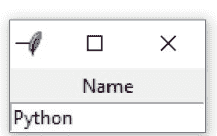

> **注意**

`Entry.delete()` 的工作方式与字符串切片类似。第一个参数确定起始索引，删除操作会持续到**但不包括**作为第二个参数传递的索引。

使用特殊常量 `tk.END` 作为 `.delete()` 的第二个参数，可以删除 `Entry` 中的所有文本：

```
>>> entry.delete(0, tk.END)
```

你现在会看到一个空白的文本框：

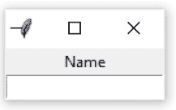

要向 `Entry` 控件中插入文本，请使用 `.insert()` 方法：

```
>>> entry.insert(0, "Python")
```

窗口现在看起来像这样：

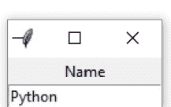

第一个参数告诉 `.insert()` 在哪里插入文本。如果 `Entry` 中没有文本，无论你向第一个参数传递什么值，新文本总是会插入到控件的开头。

例如，像上面那样调用 `.insert()` 时，将第一个参数设为 `100` 而不是 `0`，会产生相同的输出。

如果 `Entry` 已经包含一些文本，`.insert()` 会将新文本插入到指定位置，并将所有现有文本向右移动：

```
>>> entry.insert(0, "Real ")
```

控件文本现在是 "Real Python"：

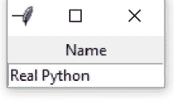

`Entry` 控件非常适合从用户那里捕获少量文本，但由于它们只显示在单行上，因此不适合收集大量文本。这就是 `Text` 控件的用武之地！

## Text 控件

`Text` 控件用于输入文本，就像 `Entry` 控件一样。不同之处在于 `Text` 控件可以包含多行文本。

使用 `Text` 控件，用户可以输入一整段，甚至好几页的文本！

就像 `Entry` 控件一样，你可以对 `Text` 控件执行三种主要操作：

- 1. 使用 `.get()` 方法检索文本
- 2. 使用 `.delete()` 方法删除文本
- 3. 使用 `.insert()` 方法插入文本

虽然方法名与 `Entry` 方法相同，但它们的工作方式略有不同。让我们通过创建一个 `Text` 控件并看看它能做什么来动手实践一下。

> **注意**

如果你仍然打开着上一节的窗口，可以通过在 IDLE 的交互式窗口中执行以下命令来关闭它：

```python
>>> window.destroy()
```

你也可以通过点击窗口本身的 `Close` 按钮手动关闭它。

在 IDLE 的交互式窗口中，创建一个新的空白窗口，并将一个 `Text()` 控件 `.pack()` 到其中：

```
>>> window = tk.Tk()
>>> text_box = tk.Text()
>>> text_box.pack()
```

默认情况下，文本框比 `Entry` 控件大得多。上面创建的窗口看起来像这样：


点击窗口内的任意位置以激活文本框。输入单词 "Hello"。然后按 Enter 键并在第二行输入 "World"。

窗口现在应该看起来像这样：


就像 `Entry` 控件一样，你可以使用 `.get()` 从 `Text` 控件中检索文本。然而，不带参数调用 `.get()` 不会像 `Entry` 控件那样返回文本框中的全部文本。它会引发一个异常：

```
>>> text_box.get()
Traceback (most recent call last):
  File "<pyshell#4>", line 1, in <module>
    text_box.get()
TypeError: get() missing 1 required positional argument: 'index1'
```

`Text.get()` 至少需要一个参数。使用单个索引调用 `.get()` 会返回单个字符。要检索多个字符，你需要传递两个参数：一个起始索引和一个结束索引。

`Text` 控件中的索引与 `Entry` 控件不同。由于 `Text` 控件可以有多行文本，索引必须包含两条信息：

- 1. 字符的行号
- 2. 字符在该行上的位置

行号从 1 开始，字符位置从 0 开始。

要创建一个索引，你需要创建一个格式为 "<行>.<字符>" 的字符串，将 <行> 替换为行号，将 <字符> 替换为字符编号。

例如，"1.0" 代表第一行的第一个字符。"2.3" 代表第二行的第四个字符。

让我们使用索引 "1.0" 从我们之前创建的文本框中获取第一个字母：

```
>>> text_box.get("1.0")
'H'
```

单词 "Hello" 有五个字母，字母 o 的字符编号是 4，因为字符编号从 0 开始，而单词 "Hello" 从文本框的第一个位置开始。就像 Python 字符串切片一样，为了从文本框中获取整个单词 Hello，结束索引必须比要读取的最后一个字符的索引大一。

因此，要从文本框中获取单词 "Hello"，第一个索引使用 "1.0"，第二个索引使用 "1.5"：

```
>>> text_box.get("1.0", "1.5")
'Hello'
```

要获取文本框第二行上的单词 "World"，将每个索引中的行号更改为 2：

```
>>> text_box.get("2.0", "2.5")
'World'
```

要获取文本框中的所有文本，将起始索引设为 "1.0"，并将特殊常量 `tk.END` 用作第二个索引：

```
>>> text_box.get("1.0", tk.END)
'Hello\nWorld\n'
```

请注意，`.get()` 返回的文本包含任何换行符。

你还可以从这个例子中看到，`Text` 控件中的每一行末尾都有一个换行符，包括文本框中的最后一行文本。

`.delete()` 方法用于从文本框中删除字符。它的工作方式与 `Entry` 控件的 `.delete()` 方法相同。

使用 `.delete()` 方法有两种方式：

- 1. 使用单个参数
- 2. 使用两个参数

使用单参数版本时，你向 `.delete()` 传递要删除的单个字符的索引。例如，以下代码从文本框中删除第一个字符 H：

```
>>> text_box.delete("1.0")
```

窗口中的第一行文本现在是 "ello"：

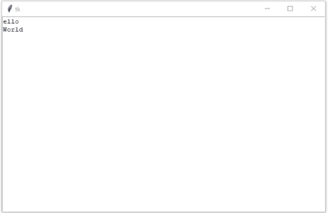

## 18.5. 使用控件

使用双参数版本时，你传递两个索引来删除从第一个索引开始到第二个索引（但不包括）的字符范围。

例如，要删除文本框第一行上剩余的 "ello"，使用索引 "1.0" 和 "1.4"：

```
>>> text_box.delete("1.0", "1.4")
```

请注意，第一行的文本消失了，留下一个空行，后面是第二行上的单词 World：

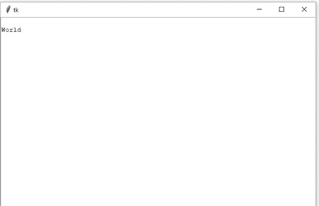

即使你看不到，第一行上仍然有一个字符。它是换行符！

你可以使用 `.get()` 来验证这一点：

```
>>> text_box.get("1.0")
'\n'
```

如果你删除该字符，文本框的其余内容将向上移动一行：

```python
>>> text_box.delete("1.0")
```

现在 "World" 位于文本框的第一行：

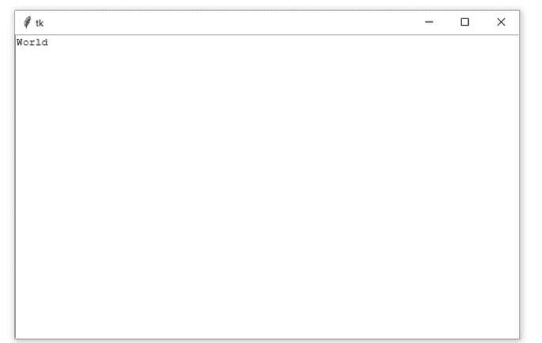

让我们清空文本框中的其余文本。将 "1.0" 设置为起始索引，并使用 `tk.END` 作为第二个索引：

```python
>>> text_box.delete("1.0", tk.END)
```

文本框现在为空：

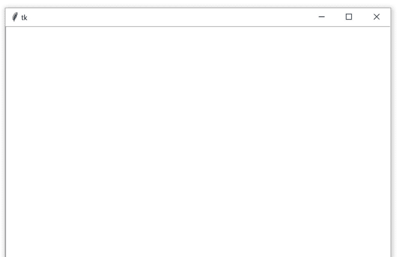

你可以使用 `.insert()` 方法向文本框中插入文本：

```python
>>> text_box.insert("1.0", "Hello")
```

这将在文本框的开头插入单词 "Hello"，使用与 `.get()` 相同的 "<行>.<列>" 格式来指定插入位置：

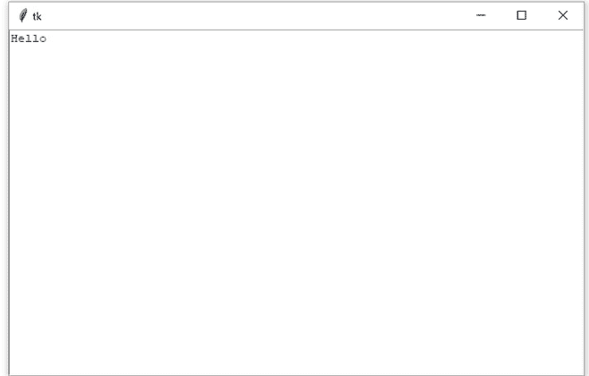

看看尝试在第二行插入单词 "World" 会发生什么：

```python
>>> text_box.insert("2.0", "World")
```

文本并未插入到第二行，而是被插入到了第一行的末尾：

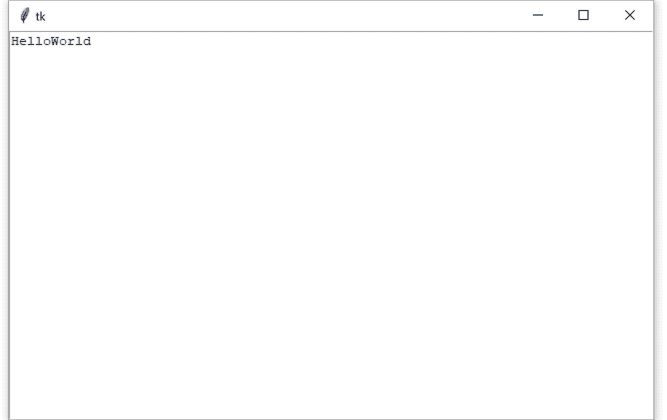

如果你想将文本插入到新行，你需要在要插入的字符串中手动插入一个换行符：

```python
>>> text_box.insert("2.0", "\nThis goes on the second line")
```

现在 "World" 位于文本框的第二行：


因此，`.insert()` 会在指定位置插入文本（如果该位置已有文本），或者如果字符数大于文本框中最后一个字符的索引，则将文本追加到指定行。

通常，尝试跟踪最后一个字符的索引是不切实际的。在 `Text` 组件末尾插入文本的最佳方法是将 `tk.END` 传递给 `.insert()` 的第一个参数：

```python
text_box.insert(tk.END, "Put me at the end!")
```

如果你想将文本放在新行，请不要忘记在文本开头包含换行符 `\n`：

```python
text_box.insert(tk.END, "\nPut me on a new line!")
```

`Label`、`Button`、`Entry` 和 `Text` 组件只是 Tkinter 中可用组件的一部分。还有其他几种组件，包括用于复选框、单选按钮、滚动条和进度条的组件。有关其他可用组件的更多信息，请查看 [tkdocs.com 上的教程](https://tkdocs.com)。

在本章中，我们将只使用五种组件：你目前见过的四种加上 Frame 组件。Frame 组件对于在应用程序中组织组件的布局非常重要。

在深入了解如何布局组件的视觉呈现之前，让我们仔细看看 Frame 组件的工作原理，以及如何将其他组件分配给它们。

## 将组件分配给 Frame

以下脚本创建一个空白的 Frame 组件并将其分配给主应用程序窗口：

```python
import tkinter as tk

window = tk.Tk()
frame = tk.Frame()
frame.pack()

window.mainloop()
```

`frame.pack()` 方法将框架打包到窗口中，以便窗口调整自身大小以尽可能小地包含该框架。

当你运行上面的脚本时，你会得到一些非常无趣的输出：

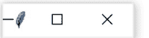

空的 Frame 组件实际上是不可见的。Frame 最好被视为其他组件的容器。你可以通过设置组件的 `master` 属性将组件分配给一个框架：

```python
frame = tk.Frame()
label = tk.Label(master=frame)
```

为了了解这是如何工作的，让我们编写一个脚本，创建两个名为 `frame_a` 和 `frame_b` 的 Frame 组件。`frame_a` 包含一个文本为 "I'm in Frame A" 的标签，`frame_b` 包含一个文本为 "I'm in Frame B" 的标签。以下是实现此目的的一种方法：

```python
import tkinter as tk

window = tk.Tk()

frame_a = tk.Frame()
frame_b = tk.Frame()

label_a = tk.Label(master=frame_a, text="I'm in Frame A")
label_a.pack()

label_b = tk.Label(master=frame_b, text="I'm in Frame B")
label_b.pack()

frame_a.pack()
frame_b.pack()

window.mainloop()
```

请注意，`frame_a` 在 `frame_b` 之前被打包到窗口中。打开的窗口显示 `frame_a` 中的标签位于 `frame_b` 中的标签上方：

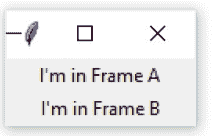

现在让我们看看交换 `frame_a.pack()` 和 `frame_b.pack()` 的顺序会发生什么：

```python
import tkinter as tk

window = tk.Tk()

frame_a = tk.Frame()
label_a = tk.Label(master=frame_a, text="I'm in Frame A")
label_a.pack()

frame_b = tk.Frame()
label_b = tk.Label(master=frame_b, text="I'm in Frame B")
label_b.pack()

# `frame_a` 和 `frame_b` 的顺序被交换
frame_b.pack()
frame_a.pack()

window.mainloop()
```

输出如下所示：

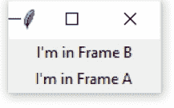

现在 `label_b` 在顶部。由于 `label_b` 被分配给了 `frame_b`，它会移动到 `frame_b` 所在的位置。

你学过的所有四种组件类型——`Label`、`Button`、`Entry` 和 `Text`——都有一个在实例化时设置的 `master` 属性。这样你就可以控制组件被分配到哪个 `Frame`。

Frame 组件非常适合以逻辑方式组织其他组件。相关的组件可以被分配到同一个框架中，这样如果框架在窗口中移动，相关的组件就会保持在一起。

除了以逻辑方式对组件进行分组外，Frame 组件还可以为应用程序的视觉呈现增添一些亮点。继续阅读，了解如何为 Frame 组件创建各种边框。

## 使用浮雕调整 Frame 外观

Frame 组件可以配置一个 relief 属性，该属性在框架周围创建边框。你可以将 relief 设置为以下任何值：

- `tk.FLAT`，无边框效果（这是默认值）。
- `tk.SUNKEN`，创建凹陷效果。
- `tk.RAISED`，创建凸起效果。
- `tk.GROOVE`，创建凹槽边框效果。
- `tk.RIDGE`，创建脊状效果。

要应用边框效果，你必须将 borderwidth 属性设置为大于 1 的值。此属性以像素为单位调整边框的宽度。

了解每种效果外观的最佳方式是亲眼看看。下面是一个脚本，它将五个 Frame 组件打包到一个窗口中，每个组件的 relief 参数值都不同。

```python
import tkinter as tk

# 1
border_effects = {
    "flat": tk.FLAT,
    "sunken": tk.SUNKEN,
    "raised": tk.RAISED,
    "groove": tk.GROOVE,
    "ridge": tk.RIDGE,
}

window = tk.Tk()

for relief_name, relief in border_effects.items():
    # 2
    frame = tk.Frame(master=window, relief=relief, borderwidth=5)
    # 3
    frame.pack(side=tk.LEFT)
    # 4
    label = tk.Label(master=frame, text=relief_name)
    label.pack()

window.mainloop()
```

让我们分解一下这个脚本。

首先，创建一个字典，其键是 Tkinter 中可用的不同浮雕效果的名称，其值是相应的 Tkinter 对象。此字典被分配给 `border_effects` 变量（#1）。

创建窗口对象后，使用 `for` 循环遍历 `border_effects` 字典中的每个项目。在循环的每一步：

- 创建一个新的 `Frame` 组件并分配给 `window` 对象（#2）。`relief` 属性设置为 `border_effects` 字典中对应的浮雕，`border` 属性设置为 5，以便效果可见。
- 然后使用 `.pack()` 方法将 `Frame` 打包到窗口中（#3）。你看到的 `side` 关键字参数告诉 Tkinter 将 `frame` 对象打包到哪个方向。你将在下一节中看到更多关于其工作原理的内容。
- 创建一个 `Label` 组件来显示浮雕的名称，并将其打包到刚刚创建的 `frame` 对象中（#4）。

上面脚本生成的窗口如下所示：

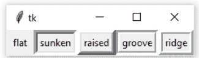

在此图像中，你可以看到：

- `tk.FLAT` 创建一个外观平坦的框架
- `tk.SUNKEN` 添加一个边框，使框架看起来像是陷入窗口中
- `tk.RAISED` 为框架添加一个边框，使其看起来像是从屏幕上凸出
- `tk.GROOVE` 添加一个边框，看起来像是围绕一个原本平坦的框架的凹槽
- `tk.RIDGE` 使框架边缘看起来像是有一个凸起的唇边

## 组件命名约定

当你创建一个组件时，你可以给它任何你喜欢的名字，只要它是一个有效的 Python 标识符。不过，通常最好在分配给组件实例的变量名中包含组件类的名称。

例如，如果一个 `Label` 组件用于显示用户的姓名，你可能会将该组件命名为 `label_user_name`。一个用于收集用户年龄的 `Entry` 组件可能被称为 `entry_age`。

当你在变量名中包含组件类名时，你不仅帮助了自己，也帮助了任何需要阅读你的代码的人理解该变量名指的是哪种类型的组件。

使用控件类的全名可能会导致变量名过长，因此你可能想采用一种简写方式来引用每种控件类型。在本章的剩余部分，我们将使用以下简写前缀来命名控件：

| 控件类 | 变量名前缀 | 示例 |
| :--- | :--- | :--- |
| Label | lbl | lbl_name |
| Button | btn | btn_submit |
| Entry | ent | ent_age |
| Text | txt | txt_notes |
| Frame | frm | frm_address |

在本节中，你学习了如何创建窗口、使用控件以及使用框架。此时，你可以制作一些显示简单消息的窗口，但一个功能完善的应用程序仍然遥不可及。

在下一节中，你将学习如何使用 Tkinter 强大的几何管理器来控制应用程序的布局。

## 复习练习

你可以在 [realpython.com/python-basics/resources](https://realpython.com/python-basics/resources) 找到这些练习的解答和许多其他额外资源。

1.  尝试在不查看源代码的情况下重新创建本节中的所有截图。如果遇到困难，请查看代码并完成重新创建。然后等待 10-15 分钟再试一次。

    重复此过程，直到你能独立完成所有截图。专注于输出结果。你自己的代码与书中的代码略有不同也没关系。

2.  编写一个程序，显示一个 `Button` 控件，宽度为 50 个文本单位，高度为 25 个文本单位，背景为白色，文本为蓝色，内容为 "Click here"。

3.  编写一个程序，显示一个 `Entry` 控件，宽度为 40 个文本单位，背景为白色，文本为黑色。使用 `.insert()` 方法在其中显示文本 "What is your name?"。

对此部分提供反馈 »

### 18.6 使用几何管理器控制布局

到目前为止，你一直在使用 `.pack()` 方法将控件添加到窗口和 `Frame` 控件中，但还没有被告知这个方法具体做什么。让我们来澄清一下！

Tkinter 中的应用程序布局由**几何管理器**控制。`.pack()` 是几何管理器的一个例子，但它不是唯一的。Tkinter 还有另外两个：`.place()` 和 `.grid()`。

你的应用程序中的每个窗口和 `Frame` 只能使用一个几何管理器。但是，不同的框架可以使用不同的几何管理器，即使它们是使用另一个几何管理器分配给框架或窗口的。

让我们首先仔细看看 `.pack()`。

#### `.pack()` 几何管理器

`.pack()` 使用一种**打包算法**，按照指定的顺序将控件放置在 `Frame` 或窗口中。打包算法有两个主要步骤。对于给定的控件，该算法：

1.  计算一个称为**包裹**的矩形区域，该区域刚好足够高（或宽）以容纳该控件，并用空白空间填充窗口中剩余的宽度（或高度）。
2.  将控件居中放置在包裹中，除非指定了不同的位置。

`.pack()` 功能强大，但可能难以可视化。感受 `.pack()` 的最佳方式是查看一些示例。

让我们看看当你将三个 Label 控件 `.pack()` 到一个 Frame 中时会发生什么：

```python
import tkinter as tk

window = tk.Tk()

frame1 = tk.Frame(master=window, width=100, height=100, bg="red")
frame1.pack()

frame2 = tk.Frame(master=window, width=50, height=50, bg="yellow")
frame2.pack()

frame3 = tk.Frame(master=window, width=25, height=25, bg="blue")
frame3.pack()

window.mainloop()
```

默认情况下，`.pack()` 将每个 Frame 放置在前一个 Frame 的下方，顺序与它们分配给窗口的顺序相同：

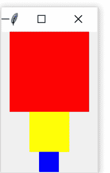

每个 `Frame` 都被放置在最顶部的可用位置。红色 `Frame` 被放置在窗口顶部。然后黄色 `Frame` 被放置在红色 `Frame` 的正下方，蓝色 `Frame` 被放置在黄色 `Frame` 的正下方。

有三个不可见的包裹，每个包裹包含一个 `Frame` 控件。每个包裹的宽度与窗口相同，高度与其包含的 `Frame` 相同。由于在为每个 `Frame` 调用 `.pack()` 时没有指定锚点，因此它们都居中放置在各自的包裹内。这就是为什么每个 `Frame` 都在窗口中居中。

`.pack()` 接受一些关键字参数，用于更精确地配置控件放置。例如，你可以设置 `fill` 关键字参数来指定框架应该填充哪个方向。选项有 `tk.X` 表示水平填充，`tk.Y` 表示垂直填充，`tk.BOTH` 表示两个方向都填充。

以下是如何堆叠三个框架，使每个框架都水平填充整个窗口：

```python
import tkinter as tk

window = tk.Tk()

frame1 = tk.Frame(master=window, height=100, bg="red")
frame1.pack(fill=tk.X)

frame2 = tk.Frame(master=window, height=50, bg="yellow")
frame2.pack(fill=tk.X)

frame3 = tk.Frame(master=window, height=25, bg="blue")
frame3.pack(fill=tk.X)

window.mainloop()
```

请注意，任何 `Frame` 控件都没有设置 `width`。`width` 不再是必需的，因为每个框架上的 `.pack()` 方法都设置为水平填充，这会覆盖你可能设置的任何宽度。

此脚本生成的窗口如下所示：

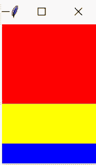

使用 `.pack()` 填充窗口的一个好处是，填充会响应窗口大小的调整。尝试调整上一个脚本生成的窗口宽度，看看这是如何工作的。

当你加宽窗口时，三个 `Frame` 控件的宽度会增长以填充窗口。但请注意，`Frame` 控件不会在垂直方向上扩展。

`.pack()` 的 `side` 关键字参数指定控件应放置在窗口的哪一侧。可用选项有 `tk.TOP`、`tk.BOTTOM`、`tk.LEFT` 和 `tk.RIGHT`。如果你不设置 `side`，`.pack()` 会自动使用 `tk.TOP`，并将新控件放置在窗口顶部，或者窗口中尚未被控件占据的最顶部部分。

例如，以下脚本将三个框架从左到右并排放置，并将每个框架垂直扩展以填充窗口：

```python
import tkinter as tk

window = tk.Tk()

frame1 = tk.Frame(master=window, width=200, height=100, bg="red")
frame1.pack(fill=tk.Y, side=tk.LEFT)

frame2 = tk.Frame(master=window, width=100, bg="yellow")
frame2.pack(fill=tk.Y, side=tk.LEFT)

frame3 = tk.Frame(master=window, width=50, bg="blue")
frame3.pack(fill=tk.Y, side=tk.LEFT)

window.mainloop()
```

这一次，你必须在至少一个框架上指定 `height` 关键字参数，以强制窗口具有一定的高度。

生成的窗口如下所示：

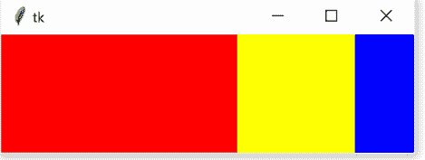

就像设置 `fill=tk.X` 使框架在窗口水平调整大小时响应式调整大小一样，设置 `fill=tk.Y` 使框架在窗口垂直调整大小时响应式调整大小。试试看！

要使布局真正具有响应性，你可以使用 `width` 和 `height` 属性为框架设置初始大小。然后将 `.pack()` 方法的 `fill` 关键字参数设置为 `tk.BOTH`，并将 `expand` 关键字参数设置为 `True`：

```python
import tkinter as tk

window = tk.Tk()

frame1 = tk.Frame(master=window, width=200, height=100, bg="red")
frame1.pack(fill=tk.BOTH, side=tk.LEFT, expand=True)

frame2 = tk.Frame(master=window, width=100, bg="yellow")
frame2.pack(fill=tk.BOTH, side=tk.LEFT, expand=True)

frame3 = tk.Frame(master=window, width=50, bg="blue")
frame3.pack(fill=tk.BOTH, side=tk.LEFT, expand=True)

window.mainloop()
```

当你运行上面的脚本时，你会看到一个窗口，其初始外观与上一个示例中生成的窗口相同。不同之处在于，现在你可以随意调整窗口大小，框架会响应式地扩展并填充窗口。非常酷！

#### `.place()` 几何管理器

你可以使用控件的 `.place()` 方法来控制它在窗口或 Frame 中应占据的精确位置。你必须提供两个关键字参数 `x` 和 `y`，它们指定控件左上角的 x 和 y 坐标。`x` 和 `y` 都以像素为单位测量，而不是文本单位。

请记住，原点（`x` 和 `y` 都为 0）是 Frame 或窗口的左上角，因此你可以将 `.place()` 的 `y` 参数视为距窗口顶部的像素数，将 `x` 参数视为距窗口左侧的像素数。

以下是 `.place()` 几何管理器工作原理的示例：

```python
import tkinter as tk
```

## 18.6. 使用几何管理器控制布局

```python
window = tk.Tk()

# 1
frame = tk.Frame(master=window, width=150, height=150)
frame.pack()

# 2
label1 = tk.Label(master=frame, text="I'm at (0, 0)", bg="red")
label1.place(x=0, y=0)

# 3
label2 = tk.Label(master=frame, text="I'm at (75, 75)", bg="yellow")
label2.place(x=75, y=75)

window.mainloop()
```

首先，你创建一个名为 frame1 的新 Frame 小部件，宽 150 像素，高 150 像素，并使用 `.pack()` 将其打包到窗口中（#1）。然后，你创建一个名为 label1 的新 Label，背景为黄色（#2），并将其放置在 frame1 的 (0, 0) 位置。最后，你创建第二个名为 label2 的 Label，背景为红色（#3），并将其放置在 frame1 的 (75, 75) 位置。

以下是代码生成的窗口：

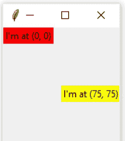

`.place()` 并不常用。它有两个主要缺点：

1. **使用** `.place()` **可能难以管理布局**，特别是当你的应用程序有很多小部件时。
2. **使用** `.place()` **创建的布局不具备响应性。** 它们不会随着窗口大小的调整而改变。

跨平台 GUI 开发的主要挑战之一是创建在任何平台上查看时都看起来不错的布局。`.place()` 是创建响应式和跨平台布局的糟糕选择。

这并不是说永远不应该使用 `.place()`。它可能正是你所需要的。例如，如果你正在为地图创建 GUI 界面，那么 `.place()` 可能是确保小部件在地图上彼此保持正确距离的完美选择。

`.pack()` 通常比 `.place()` 更好，但即使是 `.pack()` 也有一些缺点。小部件的放置取决于调用 `.pack()` 的顺序，因此在不完全理解控制布局的代码的情况下，修改现有应用程序可能很困难。

`.grid()` 几何管理器解决了许多这些问题，正如你将在下一节中看到的。

## .grid() 几何管理器

你最常使用的几何管理器可能是 `.grid()` 几何管理器。`.grid()` 以更易于理解和维护的格式提供了 `.pack()` 的所有功能。

`.grid()` 通过将窗口或 Frame 分割成行和列来工作。你通过调用 `.grid()` 并分别将行和列索引传递给 `row` 和 `column` 关键字参数来指定小部件的位置。行和列索引都从 0 开始，因此行索引为 1 和列索引为 2 告诉 `.grid()` 将小部件放置在第二行的第三列。

例如，以下脚本创建一个 3 × 3 的 Frame 网格，并将 Label 小部件打包到其中：

```python
import tkinter as tk

window = tk.Tk()

for i in range(3):
    for j in range(3):
        frame = tk.Frame(
            master=window,
            relief=tk.RAISED,
            borderwidth=1
        )
        frame.grid(row=i, column=j)
        label = tk.Label(master=frame, text=f"Row {i}\nColumn {j}")
        label.pack()

window.mainloop()
```

生成的窗口如下所示：

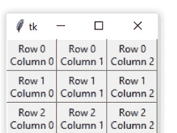

此示例中使用了两个几何管理器。每个 Frame 使用 `.grid()` 几何管理器附加到窗口，每个 Label 使用 `.pack()` 附加到其主 Frame。

这里需要认识到的重要一点是，即使在每个 `Frame` 对象上调用了 `.grid()`，几何管理器也适用于 `window` 对象。同样，每个 `frame` 的布局由 `.pack()` 几何管理器控制。

上一个示例中的 Frame 紧密地放置在一起。要在每个 `Frame` 周围添加一些空间，你可以设置网格中每个单元格的填充。**填充** 只是围绕小部件的一些空白区域，用于在视觉上将其与其内容分隔开。

填充有两种类型：**外部填充** 和 **内部填充**。外部填充在网格单元格外部添加一些空间。它由 `.grid()` 的两个关键字参数控制：

1. `padx`，在水平方向添加填充
2. `pady`，在垂直方向添加填充。

`padx` 和 `pady` 都以像素为单位测量，而不是文本单位，因此将它们设置为相同的值将在两个方向创建相同数量的填充。

让我们在上一个示例中的 Frame 外部添加一些填充：

```python
import tkinter as tk

window = tk.Tk()

for i in range(3):
    for j in range(3):
        frame = tk.Frame(
            master=window,
            relief=tk.RAISED,
            borderwidth=1
        )
        frame.grid(row=i, column=j, padx=5, pady=5)
        label = tk.Label(master=frame, text=f"Row {i}\nColumn {j}")
        label.pack()

window.mainloop()
```

生成的窗口如下：

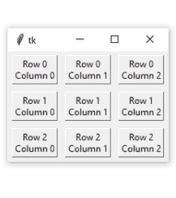

`.pack()` 也有 `padx` 和 `pady` 参数。以下代码与之前的代码几乎相同，只是为每个 Label 在 x 和 y 方向都添加了 5 像素的额外填充：

```python
import tkinter as tk

window = tk.Tk()

for i in range(3):
    for j in range(3):
        frame = tk.Frame(
            master=window,
            relief=tk.RAISED,
            borderwidth=1
        )
        frame.grid(row=i, column=j, padx=5, pady=5)

        label = tk.Label(master=frame, text=f"Row {i}\nColumn {j}")
        label.pack(padx=5, pady=5)

window.mainloop()
```

Label 小部件周围的额外填充为网格中的每个单元格在 Frame 边框和 Label 中的文本之间提供了一点呼吸空间：

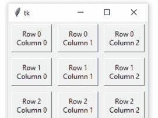

这看起来相当不错！但是，如果你尝试在任何方向扩展窗口，你会注意到布局的响应性不是很好。整个网格在窗口扩展时保持在左上角。

你可以使用 `window` 对象上的 `.columnconfigure()` 和 `.rowconfigure()` 方法来调整网格的行和列在窗口大小调整时的增长方式。请记住，网格附加到 `window`，即使你在每个 `Frame` 小部件上调用 `.grid()`。

`.columnconfigure()` 和 `.rowconfigure()` 都接受三个基本参数：

1. 你要配置的网格列或行的索引。你也可以指定一个索引列表以同时配置多行或多列。
2. 一个名为 `weight` 的关键字参数，它决定该列或行相对于其他列和行应如何响应窗口大小调整。
3. 一个名为 `minsize` 的关键字参数，它以像素为单位设置行高或列宽的最小尺寸。

`weight` 默认设置为 0，这意味着该列或行在窗口大小调整时不会扩展。如果每列和每行的权重都设置为 1，它们都以相同的速度增长。如果一列的权重为 1，另一列的权重为 2，那么第二列的扩展速度是第一列的两倍。

让我们调整之前的脚本以更好地处理窗口大小调整：

```python
import tkinter as tk

window = tk.Tk()

for i in range(3):
    window.columnconfigure(i, weight=1, minsize=75)
    window.rowconfigure(i, weight=1, minsize=50)

    for j in range(0, 3):
        frame = tk.Frame(
            master=window,
            relief=tk.RAISED,
            borderwidth=1
        )
        frame.grid(row=i, column=j, padx=5, pady=5)

        label = tk.Label(master=frame, text=f"Row {i}\nColumn {j}")
        label.pack(padx=5, pady=5)

window.mainloop()
```

`.columnconfigure()` 和 `.rowconfigure()` 方法放在外层 `for` 循环的主体中。你可以在 `for` 循环之外显式配置每一列和每一行，但这需要额外编写六行代码。

在循环的每次迭代中，第 i 列和第 i 行被配置为权重为 1。这确保了每当窗口大小调整时，每行和每列都以相同的速度扩展。

## 18.6. 使用几何管理器控制布局

`minsize` 参数为每列设置为 75，每行设置为 50。这确保了 `Label` 控件始终能完整显示其文本，即使窗口尺寸非常小，也不会截断任何字符。

尝试运行脚本，感受一下它的工作原理！调整 `weight` 和 `minsize` 参数，看看它们如何影响网格。

默认情况下，控件在其网格单元格中居中显示。例如，以下代码创建了两个 `Label` 控件，并将它们放置在一个包含一列两行的网格中：

```python
import tkinter as tk

window = tk.Tk()
window.columnconfigure(0, minsize=250)
window.rowconfigure([0, 1], minsize=100)

label1 = tk.Label(text="A")
label1.grid(row=0, column=0)

label2 = tk.Label(text="B")
label2.grid(row=1, column=0)

window.mainloop()
```

每个网格单元格宽 250 像素，高 100 像素。标签放置在每个单元格的中心，如下图所示：

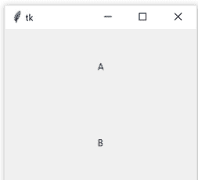

你可以使用 `.grid()` 方法的 `sticky` 参数来更改每个标签在网格单元格内的位置。`sticky` 接受一个包含以下一个或多个字母的字符串：

- "n" 或 "N" 对齐到单元格的顶部中心
- "e" 或 "E" 对齐到单元格的右侧中心
- "s" 或 "S" 对齐到单元格的底部中心
- "w" 或 "W" 对齐到单元格的左侧中心

字母 "n"、"e"、"s" 和 "w" 分别代表北、南、东、西四个基本方向。

例如，在前面的代码中，将两个 `Label` 的 `sticky` 设置为 "n"，会将每个 `Label` 定位在其网格单元格的顶部中心：

```python
import tkinter as tk

window = tk.Tk()
window.columnconfigure(0, minsize=250)
window.rowconfigure([0, 1], minsize=100)

label1 = tk.Label(text="A")
label1.grid(row=0, column=0, sticky="n")

label2 = tk.Label(text="B")
label2.grid(row=1, column=0, sticky="n")

window.mainloop()
```

输出结果如下：

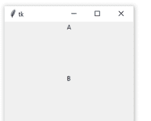

你可以在单个字符串中组合多个字母，将每个标签定位在其网格单元格的角落：

```python
import tkinter as tk

window = tk.Tk()
window.columnconfigure(0, minsize=250)
window.rowconfigure([0, 1], minsize=100)

label1 = tk.Label(text="A")
label1.grid(row=0, column=0, sticky="ne")

label2 = tk.Label(text="B")
label2.grid(row=1, column=0, sticky="sw")

window.mainloop()
```

在此示例中，`label1` 的 `sticky` 参数设置为 "ne"，这会将标签放置在其网格单元格的右上角。`label2` 通过将 "sw" 传递给 `sticky` 来定位在左下角。

窗口中的显示效果如下：

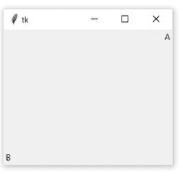

当使用 `sticky` 定位控件时，控件本身的大小仅足以容纳其内部的文本和其他内容。它不会填满整个网格单元格。

为了填充网格，你可以指定 "ns"，这会强制控件在垂直方向上填充单元格，或者指定 "ew" 在水平方向上填充单元格。要填充整个单元格，请将 `sticky` 设置为 "nsew"。

以下示例说明了每种选项：

```python
import tkinter as tk

window = tk.Tk()

window.rowconfigure(0, minsize=50)
window.columnconfigure([0, 1, 2, 3], minsize=50)

label1 = tk.Label(text="1", bg="black", fg="white")
label2 = tk.Label(text="2", bg="black", fg="white")
label3 = tk.Label(text="3", bg="black", fg="white")
label4 = tk.Label(text="4", bg="black", fg="white")

label1.grid(row=0, column=0)
label2.grid(row=0, column=1, sticky="ew")
label3.grid(row=0, column=2, sticky="ns")
label4.grid(row=0, column=3, sticky="nsew")

window.mainloop()
```

输出结果如下：


上述示例说明，`.grid()` 几何管理器的 `sticky` 参数可以用来实现与 `.pack()` 几何管理器的 `fill` 参数相同的效果。

`sticky` 和 `fill` 参数之间的对应关系总结在下表中：

| .grid() | .pack() |
|---|---|
| sticky="ns" | fill=tk.Y |
| sticky="ew" | fill=tk.X |
| sticky="nsew" | fill=tk.BOTH |

`.grid()` 是一个强大的几何管理器。它通常比 `.pack()` 更容易理解，并且比 `.place()` 灵活得多。在创建新的 Tkinter 应用程序时，考虑使用 `.grid()` 作为你的主要几何管理器。

> **注意**

`.grid()` 提供的灵活性远不止你在此看到的。例如，你可以配置单元格以跨越多行和多列。

更多信息，请查看 [TkDocs 教程](https://tkdocs.com/tutorial/index.html) 中的 [Grid 几何管理器](https://tkdocs.com/tutorial/grid.html) 部分。

现在你已经掌握了 Tkinter 几何管理器的基础知识，下一步是为按钮分配操作，让你的应用程序变得生动起来。

## 复习练习

*你可以在 [realpython.com/python-basics/resources](https://realpython.com/python-basics/resources) 找到这些练习的解答和许多其他额外资源。*

1.  不看源代码，重新创建本节中的所有截图。如果遇到困难，请查看代码并完成你的重新创建。然后等待 10-15 分钟，再试一次。重复此过程，直到你能独立完成所有截图。

    关注输出结果。你自己的代码与书中的代码略有不同也没关系。

2.  下面是一个用 Tkinter 制作的窗口图像。尝试使用你迄今为止学到的技术重新创建这个窗口。你可以使用任何你喜欢的几何管理器。

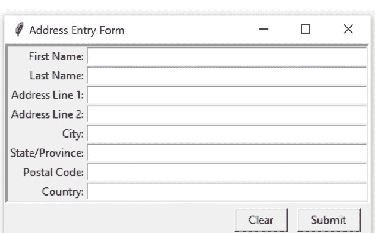

对此部分提供反馈 »

### 18.7 使你的应用程序具有交互性

到现在为止，你已经对如何使用 Tkinter 创建窗口、添加一些控件以及控制应用程序布局有了很好的了解。这很棒！但应用程序不应该只是看起来不错。它们需要实际做一些事情！

在本节中，你将学习如何通过在特定事件发生时执行操作来使你的应用程序变得生动起来。

#### 事件和事件处理程序

当你创建一个 Tkinter 应用程序时，你必须调用 `window.mainloop()` 方法来启动**事件循环**。在事件循环期间，你的应用程序会检查是否发生了事件。如果是，则可以执行一些代码作为响应。

事件循环由 Tkinter 为你提供，因此你不必自己编写任何检查事件的代码。但是，你必须编写响应事件而执行的代码。在 Tkinter 中，你为应用程序中使用的事件编写称为**事件处理程序**的函数。

那么什么是事件，当事件发生时会发生什么？**事件**是在事件循环期间发生的任何可能触发应用程序中某些行为的操作，例如按下键或鼠标按钮时。

当事件发生时，会发出一个**事件对象**，这意味着一个表示该事件的类的实例被实例化。你不需要担心自己创建这些类。Tkinter 会自动为你创建事件类的实例。

让我们编写自己的事件循环，以便更好地理解 Tkinter 的事件循环是如何工作的。这样你就可以看到 Tkinter 的事件循环如何融入你的应用程序，以及你需要自己编写哪些部分。

假设有一个名为 `events_list` 的列表，其中包含事件对象。每次你的程序中发生事件时，一个新的事件对象会自动附加到 `events_list`。我们不需要实现这个更新机制。在这个虚构的例子中，它只是神奇地发生了。

使用无限循环，我们可以持续检查 `events_list` 中是否有任何事件对象：

```python
# 假设这个列表会自动更新
events_list = []

# 运行事件循环
while True:
    # 如果 events_list 为空，则没有事件发生，我们可以
    # 跳到循环的下一次迭代
    if events_list == []:
```

## 18.7. 让你的应用程序变得可交互

```python
continue

# 如果执行到达此处，则 events_list 中至少有一个
# 事件对象
event = events_list[0]
```

目前，我们创建的事件循环并没有对 event 做任何处理。让我们改变这一点。

假设我们的应用程序需要响应按键操作。我们需要检查 `event` 是否由用户按下键盘上的键产生，如果是，则将 `event` 传递给按键事件处理函数。

我们假设如果事件是按键事件对象，则 `event` 的 `.type` 属性被设置为字符串 "keypress"，并且 `.char` 属性包含所按键的字符。

> 注意

让我们添加一个 `handle_keypress()` 函数并更新我们的事件循环代码：

```python
events_list = []

# 创建一个事件处理函数
def handle_keypress(event):
    """打印与按键关联的字符"""
    print(event.char)

while True:
    if events_list == []:
        continue
    event = events_list[0]

    # 如果事件是按键事件对象
    if event.type == "keypress":
        # 调用按键事件处理函数
        handle_keypress(event)
```

当你调用 Tkinter 的 `window.mainloop()` 方法时，类似上面的循环会为你运行！`.mainloop()` 为你处理了循环的两个部分：它维护一个已发生事件的列表，并且每当有新事件添加到该列表时，它就会运行一个事件处理函数。

让我们更新我们的事件循环，使用 `window.mainloop()` 代替我们自己的事件循环：

```python
import tkinter as tk

# 创建一个窗口对象
window = tk.Tk()

# 创建一个事件处理函数
def handle_keypress(event):
    """打印与按键关联的字符"""
    print(event.char)

# 运行事件循环
window.mainloop()
```

`.mainloop()` 为我们处理了很多事情，但上面的代码中缺少一些东西。Tkinter 如何知道何时使用 `handle_keypress()`？Tkinter 控件有一个 `.bind()` 方法正是用来做这件事的。

## .bind() 方法

要在控件上发生事件时调用事件处理函数，请使用该控件的 `.bind()` 方法。该事件处理函数被称为**绑定**到该事件，因为每次事件发生时它都会被调用。

继续上一节的按键示例，让我们使用 `.bind()` 将 `handle_keypress()` 绑定到按键事件：

```python
import tkinter as tk

window = tk.Tk()

def handle_keypress(event):
    """打印与按键关联的字符"""
    print(event.char)

# 将按键事件绑定到 handle_keypress()
window.bind("<Key>", handle_keypress)

window.mainloop()
```

这里，`handle_keypress()` 事件处理函数通过 `window.bind()` 方法绑定到 "<Key>" 事件。每当应用程序运行时按下某个键，所按键的字符就会被打印出来。

`.bind()` 总是接受两个参数：

1.  一个事件，用形如 "<event_name>" 的字符串表示，其中 event_name 可以是 Tkinter 的任何事件。
2.  一个事件处理函数，即每当事件发生时要调用的函数名。

事件处理函数绑定到调用 `.bind()` 的控件上。当事件处理函数被调用时，事件对象会传递给该事件处理函数。

在上面的例子中，事件处理函数绑定到了窗口本身，但你可以将事件处理函数绑定到应用程序中的任何控件。

例如，你可以将一个事件处理函数绑定到一个 `Button` 控件，使得每次按下按钮时执行某些操作：

```python
def handle_click(event):
    print("按钮被点击了！")

button = tk.Button(text="点击我！")

button.bind("<Button-1>", handle_click)
```

在这个例子中，`button` 控件上的 "<Button-1>" 事件被绑定到 `handle_click` 事件处理函数。每当鼠标在控件上方时按下左键，"<Button-1>" 事件就会发生。

还有其他鼠标按钮点击事件，包括 "<Button-2>"（如果存在中键）和 "<Button-3>"（右键）。

> **注意**

有关常用事件的列表，请参阅 Tkinter 8.5 参考手册中的[事件类型](https://docs.python.org/3/library/tkinter.html#event-types)部分。

你可以使用 `.bind()` 将任何事件处理函数绑定到任何类型的控件，但使用 `Button` 控件的 `command` 属性将事件处理函数绑定到按钮点击是一种更简单的方法。

## `command` 属性

每个 `Button` 控件都有一个 `command` 属性，你可以将其赋值给一个函数。每当按钮被按下时，该函数就会被执行。

让我们看一个例子。首先，我们将创建一个包含一个 `Label` 控件的窗口，该控件显示一个数值。我们将在标签的左右两侧放置两个按钮。左侧按钮用于减少 `Label` 中的值，右侧按钮用于增加该值。

以下是窗口的代码：

```python
import tkinter as tk

window = tk.Tk()

window.rowconfigure(0, minsize=50, weight=1)
window.columnconfigure([0, 1, 2], minsize=50, weight=1)

btn_decrease = tk.Button(master=window, text="-")
btn_decrease.grid(row=0, column=0, sticky="nsew")

lbl_value = tk.Label(master=window, text="0")
lbl_value.grid(row=0, column=1)

btn_increase = tk.Button(master=window, text="+")
btn_increase.grid(row=0, column=2, sticky="nsew")

window.mainloop()
```

窗口看起来像这样：

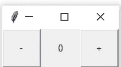

定义了应用程序布局后，让我们通过给按钮添加一些命令来让它变得生动起来。

让我们从左边的按钮开始。当按下此按钮时，它应该将标签中的值减少 1。为了做到这一点，我们需要知道两件事：如何获取 Label 中的文本，以及如何更新 Label 中的文本。

Label 控件没有像 Entry 和 Text 控件那样的 `.get()` 方法。但是，你可以通过使用字典风格的下标表示法访问 `text` 属性来检索标签中的文本：

```python
label = tk.Label(text="Hello")

# 检索 Label 的文本
text = label["text"]

# 为标签设置新文本
label["text"] = "Good bye"
```

现在我们知道如何获取和设置标签的文本了，让我们编写一个函数 `increase()`，将 `lbl_value` 中的值增加 1：

```python
def increase():
    value = int(lbl_value["text"])
    lbl_value["text"] = f"{value + 1}"
```

`increase()` 从 `lbl_value` 获取文本并使用 `int()` 将其转换为整数。然后它将该值增加 1，并将标签的 `text` 属性设置为这个新值。

我们还需要一个 `decrease()` 函数，将 `lbl_value` 中的值减少 1：

```python
def decrease():
    value = int(lbl_value["text"])
    lbl_value["text"] = f"{value - 1}"
```

将 `increase()` 和 `decrease()` 函数放在代码中 import 语句之后。

要将按钮连接到函数，请将函数赋值给按钮的 `command` 属性。你可以在实例化按钮时执行此操作。例如，要将 `increase()` 函数赋值给 `btn_increase`，请将实例化按钮的行更新为以下内容：

```python
btn_increase = tk.Button(master=window, text="+", command=increase)
```

现在将 `decrease()` 函数赋值给 `btn_decrease`：

```python
btn_decrease = tk.Button(master=window, text="-", command=decrease)
```

这就是将按钮绑定到 increase() 和 decrease() 函数并使程序运行所需做的全部工作。尝试保存你的更改并运行应用程序！

以下是完整的应用程序代码供你参考：

```python
import tkinter as tk

def increase():
    value = int(lbl_value["text"])
    lbl_value["text"] = f"{value + 1}"

def decrease():
    value = int(lbl_value["text"])
    lbl_value["text"] = f"{value - 1}"

window = tk.Tk()

window.rowconfigure(0, minsize=50, weight=1)
window.columnconfigure([0, 1, 2], minsize=50, weight=1)

btn_decrease = tk.Button(master=window, text="-", command=decrease)
btn_decrease.grid(row=0, column=0, sticky="nsew")

lbl_value = tk.Label(master=window, text="0")
lbl_value.grid(row=0, column=1)

btn_increase = tk.Button(master=window, text="+", command=increase)
btn_increase.grid(row=0, column=2, sticky="nsew")

window.mainloop()
```

这个应用程序不是特别有用，但你在这里学到的技能适用于你将制作的每一个应用程序：

使用小部件来创建用户界面的组件。
- 使用几何布局管理器来控制应用程序的布局。
- 编写与各种组件交互的函数，以捕获和转换用户输入。

在接下来的两个部分中，你将构建一些实用的应用程序。首先，你将构建一个温度转换器，将输入的华氏温度转换为摄氏温度。之后，你将构建一个可以打开、编辑和保存文本文件的文本编辑器！

## 复习练习

你可以在 [realpython.com/python-basics/resources](https://realpython.com/python-basics/resources) 找到这些练习的解决方案以及许多其他额外资源。

1.  编写一个程序，显示一个带有默认背景颜色和黑色文本的按钮，文本内容为“Click me”。

    当用户点击按钮时，按钮背景应从以下列表中随机选择一种颜色进行更改：

    `["red", "orange", "yellow", "blue", "green", "indigo", "violet"]`

2.  编写一个模拟掷六面骰子的程序。应有一个文本为“Roll”的按钮。当用户点击按钮时，应显示一个1到6之间的随机整数。

    应用程序窗口应如下所示：

    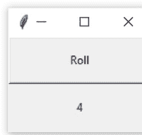

对本节内容提出反馈 »

### 18.8 示例应用：温度转换器

在本节中，你将构建一个温度转换器，允许用户输入华氏温度，然后点击按钮将该温度转换为摄氏温度。

我们将逐步讲解代码。你也可以在本节末尾找到完整的源代码以供参考。

为了充分利用本节内容，请打开IDLE的脚本窗口并跟随操作。

在开始编码之前，让我们先设计一下这个应用。我们需要三个基本元素：

1.  一个名为 `ent_temperature` 的 `Entry` 小部件，用于输入华氏温度值。
2.  一个名为 `lbl_result` 的 `Label` 小部件，用于显示摄氏温度结果。
3.  一个名为 `btn_convert` 的 `Button` 小部件，点击时从 `ent_temperature` 小部件读取值，将其从华氏温度转换为摄氏温度，并将 `Label` 小部件的文本设置为结果。

我们可以将它们排列在一个网格中，每个小部件占一行一列。这能让我们得到一个最小化可工作的应用程序，但用户友好性不足。所有内容都需要一些有用的标签。

让我们在 `ent_temperature` 小部件的正右方放置一个包含 °F 符号的标签，这样用户就知道 `ent_temperature` 中的值应该是华氏温度。为此，我们将标签文本设置为 "\N{DEGREES FAHRENHEIT}"，这使用了Python的命名Unicode字符支持来显示 °F 符号。

我们可以通过将 `btn_convert` 的文本设置为 "\N{RIGHTWARDS BLACK ARROW}" 来给它增添一点特色，这会显示一个指向右边的黑色箭头。我们还将确保 `lbl_result` 始终以 °C 符号 "\N{DEGREES CELSIUS}" 结尾，以表明结果是摄氏温度。

最终窗口将如下所示：

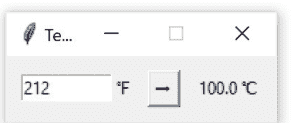

现在我们知道了需要哪些小部件以及窗口的样子，让我们开始编码吧！首先，导入tkinter并创建一个新窗口：

```python
import tkinter as tk

window = tk.Tk()
window.title("Temperature Converter")
```

`window.title()` 设置现有窗口的标题。当你最终运行此应用程序时，窗口标题栏中将显示文本 *Temperature Converter*。

接下来，我们将创建 `ent_temperature` 小部件和一个名为 `lbl_temp` 的标签，并将它们都分配给一个名为 `frm_entry` 的Frame小部件：

```python
frm_entry = tk.Frame(master=window)
ent_temperature = tk.Entry(master=frm_entry, width=10)
lbl_temp = tk.Label(master=frm_entry, text="\N{DEGREE FAHRENHEIT}")
```

`ent_temperature` 是用户输入华氏温度值的地方，`lbl_temp` 用于以 °F 符号标记 `ent_temperature`。`frm_entry` 只是一个将 `ent_temperature` 和 `lbl_temp` 组合在一起的容器。

我们希望 `lbl_temp` 直接放置在 `ent_temperature` 的右侧，因此我们可以在 `frm_entry` 中使用 `.grid()` 几何布局管理器，设置一行两列来布局它们：

```python
ent_temperature.grid(row=0, column=0, sticky="e")
lbl_temp.grid(row=0, column=1, sticky="w")
```

我们为 `ent_temperature` 设置了 `sticky` 参数为 `"e"`，使其始终粘附在其网格单元格的最右边缘。为 `lbl_temp` 设置 `sticky` 为 `"w"` 将使其粘附在其网格单元格的最左边缘。这确保了 `lbl_result` 始终位于 `ent_temperature` 的正右方。

现在让我们创建 `btn_convert` 和 `lbl_result`，用于转换输入到 `ent_temperature` 中的温度并显示结果：

```python
btn_convert = tk.Button(
    master=window,
    text="\N{RIGHTWARDS BLACK ARROW}"
)
lbl_result = tk.Label(master=window, text="\N{DEGREE CELSIUS}")
```

与 `frm_entry` 类似，`btn_convert` 和 `lbl_result` 都被分配给了 `window`。这三个小部件共同构成了主应用程序网格中的三个单元格。让我们现在就使用 `.grid()` 来布局它们：

```python
frm_entry.grid(row=0, column=0, padx=10)
btn_convert.grid(row=0, column=1, pady=10)
lbl_result.grid(row=0, column=2, padx=10)
```

最后，运行应用程序：

```python
window.mainloop()
```

看起来不错，但按钮还没有任何功能。在你的脚本文件顶部，就在 `import` 语句下方，添加一个名为 `fahrenheit_to_celsius()` 的函数。这个函数从 `ent_temperature` 读取值，将其从华氏温度转换为摄氏温度，然后在 `lbl_result` 中显示结果：

```python
def fahrenheit_to_celsius():
    """Convert the value for Fahrenheit to Celsius and insert the
    result into lbl_result.
    """
    fahrenheit = ent_temperature.get()
    celsius = (5/9) * (float(fahrenheit) - 32)
    lbl_result["text"] = f"{round(celsius, 2)} \N{DEGREE CELSIUS}"
```

现在，向下找到定义 `btn_convert` 的行，并将其 `command` 参数设置为 `fahrenheit_to_celsius`：

```python
btn_convert = tk.Button(
    master=window,
    text="\N{RIGHTWARDS BLACK ARROW}",
    command=fahrenheit_to_celsius  # <--- 添加这一行
)
```

就是这样！你仅用26行代码就创建了一个功能齐全的温度转换器应用！很酷，对吧？

以下是完整的脚本供你参考：

```python
import tkinter as tk

def fahrenheit_to_celsius():
    """Convert the value for Fahrenheit to Celsius and insert the
    result into lbl_result.
    """
    fahrenheit = ent_temperature.get()
    celsius = (5/9) * (float(fahrenheit) - 32)
    lbl_result["text"] = f"{round(celsius, 2)} \N{DEGREE CELSIUS}"

# Set-up the window
window = tk.Tk()
window.title("Temperature Converter")
window.resizable(width=False, height=False)

# Create the Fahrenheit entry frame with an Entry
# widget and label in it
frm_entry = tk.Frame(master=window)
ent_temperature = tk.Entry(master=frm_entry, width=10)
lbl_temp = tk.Label(master=frm_entry, text="\N{DEGREE FAHRENHEIT}")

# Layout the temperature Entry and Label in frm_entry
# using the .grid() geometry manager
ent_temperature.grid(row=0, column=0, sticky="e")
lbl_temp.grid(row=0, column=1, sticky="w")

# Create the conversion Button and result display Label
btn_convert = tk.Button(
    master=window,
    text="\N{RIGHTWARDS BLACK ARROW}",
    command=fahrenheit_to_celsius
)
lbl_result = tk.Label(master=window, text="\N{DEGREE CELSIUS}")

# Set-up the layout using the .grid() geometry manager
frm_entry.grid(row=0, column=0, padx=10)
btn_convert.grid(row=0, column=1, pady=10)
lbl_result.grid(row=0, column=2, padx=10)

# Run the application
window.mainloop()
```

让我们更进一步。继续阅读以构建一个简单的文本编辑器。

## 复习练习

你可以在 [realpython.com/python-basics/resources](https://realpython.com/python-basics/resources) 找到这些练习的解答以及许多其他额外资源。

- 1. 尝试在不查看源代码的情况下重新创建温度转换器应用。如果遇到困难，查看代码并完成你的重新创建。然后等待10-15分钟，再试一次。

重复此过程，直到你能从头开始独立构建该应用。专注于输出结果。即使你自己的代码与书中的代码略有不同也没关系。

[为此部分提供反馈 »](https://realpython.com/python-basics/resources)

### 18.9 示例应用：文本编辑器

在本节中，你将构建一个文本编辑器应用，它可以创建、打开、编辑和保存文本文件。

该应用程序有三个基本元素：

- 1. 一个名为 `btn_open` 的 `Button` 小部件，用于打开文件进行编辑
- 2. 一个名为 `btn_save` 的 `Button` 小部件，用于保存文件
- 3. 一个名为 `txt_edit` 的 `TextBox` 小部件，用于创建和编辑文本文件

这三个小部件将被安排成两个按钮位于窗口左侧，文本框位于右侧。

整个窗口的最小高度应为800像素，`txt_edit` 的最小宽度应为800像素。整个布局应具有响应性，以便在调整窗口大小时，`txt_edit` 也随之调整大小。然而，包含按钮的 `Frame` 的宽度不应改变。

以下是窗口外观的草图：

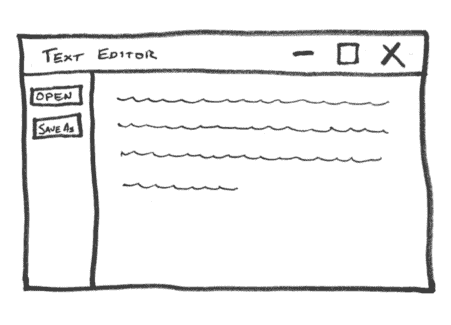

我们可以使用 `.grid()` 几何管理器来实现所需的布局。布局包含单行两列：左侧窄列用于按钮，右侧宽列用于文本框。

为了设置窗口和 `txt_edit` 的最小尺寸，我们可以使用 `.rowconfigure()` 和 `.columnconfigure()` 窗口方法的 `minsize` 参数设置为800。为了处理调整大小，我们可以将这些方法的 `weight` 参数设置为1。

为了将两个按钮放入同一列，我们需要创建一个 `Frame` 小部件。我们将该 `Frame` 小部件称为 `fr_buttons`。根据草图，两个按钮应垂直堆叠在此框架内，`btn_open` 在顶部。我们可以使用 `.grid()` 或 `.pack()` 几何管理器来实现，但让我们坚持使用 `.grid()`，因为它稍微容易处理一些。

现在我们有了计划，让我们开始编写应用程序代码。第一步是创建我们需要的所有小部件：

```python
import tkinter as tk

# 1
window = tk.Tk()
window.title("Simple Text Editor")

# 2
window.rowconfigure(0, minsize=800, weight=1)
window.columnconfigure(1, minsize=800, weight=1)

# 3
txt_edit = tk.Text(window)
fr_buttons = tk.Frame(window)
btn_open = tk.Button(fr_buttons, text="Open")
btn_save = tk.Button(fr_buttons, text="Save As...")
```

首先我们导入 tkinter 并创建一个标题为 "Simple Text Editor" 的新窗口（#1）。然后设置行和列配置（#2）。最后，创建四个小部件：txt_edit 文本框、fr_buttons 框架以及 btn_open 和 btn_save 按钮（#3）。

让我们更仔细地看看（#2）。`.rowconfigure()` 的 `minsize` 参数设置为800，`weight` 设置为1。第一个参数是0，因此这将第一行的高度设置为800像素，并确保行的高度与窗口的高度成比例增长。应用程序布局中只有一行，因此这些设置适用于整个窗口。

在下一行，`.columnconfigure()` 用于将索引为1的列的宽度和权重属性分别设置为800和1。记住，行和列索引从零开始，因此这些设置仅适用于第二列。

通过仅配置第二列，当窗口调整大小时，文本框将自然地扩展和收缩，而包含按钮的列将保持固定宽度。

现在我们可以处理应用程序布局了。首先，我们将使用 `.grid()` 几何管理器将两个按钮分配给 `fr_buttons` 框架：

```python
btn_open.grid(row=0, column=0, sticky="ew", padx=5, pady=5)
btn_save.grid(row=1, column=0, sticky="ew", padx=5)
```

这两行代码在 `fr_buttons` 框架中创建了一个两行一列的网格，因为 `btn_open` 和 `btn_save` 的 `master` 属性都设置为 `fr_buttons`。`btn_open` 放在第一行，`btn_save` 放在第二行，这样在布局中 `btn_open` 就会出现在 `btn_save` 上方，正如我们在草图中计划的那样。

`btn_open` 和 `btn_save` 的 `sticky` 属性都设置为 "ew"，这迫使按钮在水平方向上双向扩展并填满整个框架。这确保了两个按钮大小相同。

通过将 `padx` 和 `pady` 参数设置为5，在每个按钮周围放置了5像素的内边距。只有 `btn_open` 有垂直内边距。由于它在顶部，垂直内边距将其从窗口顶部稍微向下偏移，并确保它与 `btn_save` 之间有一个小间隙。

现在 `fr_buttons` 已经布局完毕并准备就绪，我们可以为窗口的其余部分设置网格布局：

```python
fr_buttons.grid(row=0, column=0, sticky="ns")
txt_edit.grid(row=0, column=1, sticky="nsew")
```

这两行代码为 `window` 创建了一个一行两列的网格。`fr_buttons` 放在第一列，`txt_edit` 放在第二列，这样在窗口布局中 `fr_buttons` 就会出现在 `txt_edit` 的左侧。

`fr_buttons` 的 `sticky` 参数设置为 "ns"，这迫使整个框架垂直扩展并填满其列的整个高度。`txt_edit` 填满其整个网格单元格，因为其 `sticky` 参数设置为 "nsew"，这迫使它在每个方向上扩展。

现在应用程序布局已完成，在程序底部添加 `window.mainloop()`，然后保存并运行文件。将显示以下窗口：

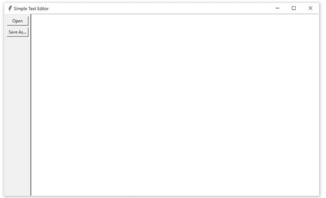

看起来很棒！但它还不能做任何事情，所以让我们开始为按钮编写命令。

`btn_open` 按钮需要显示一个文件打开对话框，并允许用户选择一个文件。然后它需要打开该文件，并将 `txt_edit` 的文本设置为文件的内容。

以下是一个执行此操作的 `open_file()` 函数：

```python
def open_file():
    """Open a file for editing."""
    # 1
    filepath = askopenfilename(
        filetypes=[("Text Files", "*.txt"), ("All Files", "*.*")]
    )

    # 2
    if not filepath:
        return

    # 3
    txt_edit.delete("1.0", tk.END)

    # 4
    with open(filepath, "r") as input_file:
        text = input_file.read()
        txt_edit.insert(tk.END, text)

    # 5
    window.title(f"Simple Text Editor - {filepath}")
```

来自 `tkinter.filedialog` 模块的 `askopenfilename` 对话框用于显示文件打开对话框，并将选定的文件路径存储到 `filepath` 变量中（#1）。如果用户关闭对话框或单击 `Cancel` 按钮，则 `filepath` 将为 `None`，函数将 `return` 而不执行任何读取文件和设置 `txt_edit` 文本的代码（#2）。

但是，如果用户确实选择了一个文件，则使用 `.delete()` 方法清除 `txt_edit` 的当前内容（#3）。然后打开选定的文件，并使用 `.read()` 方法读取文件内容，并将其作为字符串存储在 `text` 变量中。使用 `.insert()` 将字符串 `text` 分配给 `txt_edit`（#4）。

最后，设置窗口的标题，使其包含打开文件的路径（#5）。

现在你可以更新程序，使 `btn_open` 在每次被点击时调用 `open_file()`。你需要做三件事来更新程序：

- 1. 通过在程序顶部添加以下导入，从 `tkinter.filedialog` 导入 `askopenfilename()` 函数：

```python
from tkinter.filedialog import askopenfilename
```

- 2. 在导入语句下方添加 `open_file()` 的定义。

- 3. 将 `btn_open` 的 `command` 属性设置为 `open_file`：

## 18.9. 示例应用：文本编辑器

```python
btn_open = tk.Button(fr_buttons, text="Open", command=open_file)
```

保存文件并运行它，检查一切是否正常工作。尝试打开一个文本文件！

> **注意**

如果在使更新生效时遇到困难，可以跳到本节末尾查看文本编辑器应用的完整代码。

`btn_open` 工作正常后，我们来处理 `btn_save` 的函数。它需要打开一个保存文件对话框，以便用户可以选择保存文件的位置。我们将使用 `tkinter.filedialog` 模块中的 `asksaveasfilename` 对话框来实现这一点。它还需要提取 `txt_edit` 中当前的文本，并将其写入文件和所选位置。

这是一个实现此功能的函数：

```python
def save_file():
    """Save the current file as a new file."""
    # 1
    filepath = asksaveasfilename(
        defaultextension="txt",
        filetypes=[("Text Files", "*.txt"), ("All Files", "*.*")],
    )

    # 2
    if not filepath:
        return

    # 3
    with open(filepath, "w") as output_file:
        text = txt_edit.get("1.0", tk.END)
        output_file.write(text)

    # 4
    window.title(f"Simple Text Editor - {filepath}")
```

`asksaveasfilename` 对话框用于从用户那里获取所需的保存位置。所选的文件路径存储在 `filepath` 变量中（#1）。如果用户关闭对话框或点击 `Cancel` 按钮，那么 `filepath` 将为 `None`，函数将返回而不执行任何将文本保存到文件的代码（#2）。

如果用户确实选择了一个文件路径，那么将创建一个新文件。使用 `.get()` 方法从 `txt_edit` 中提取文本，并将其赋值给变量 `text`，然后写入输出文件（#3）。

最后，更新窗口的标题，以便在窗口标题中显示新的文件路径（#4）。

现在你可以更新程序，使 `btn_save` 在被点击时调用 `save_file()`。为了更新程序，你需要做三件事：

1.  通过更新脚本顶部的导入，从 `tkinter.filedialog` 导入 `asksaveasfilename()` 函数，如下所示：

```python
from tkinter.filedialog import askopenfilename, asksaveasfilename
```

2.  在 `open_file()` 定义的正下方添加 `save_file()` 的定义。
3.  将 `btn_save` 的 command 属性设置为 `save_file`：

```python
btn_save = tk.Button(fr_buttons, text="Save As...", command=save_file)
```

保存文件并运行它。你现在有了一个最小但功能齐全的文本编辑器！

以下是供参考的完整脚本：

```python
import tkinter as tk
from tkinter.filedialog import askopenfilename, asksaveasfilename

def open_file():
    """Open a file for editing."""
    filepath = askopenfilename(
        filetypes=[("Text Files", "*.txt"), ("All Files", "*.*")]
    )
    if not filepath:
        return
    txt_edit.delete(1.0, tk.END)
    with open(filepath, "r") as input_file:
        text = input_file.read()
        txt_edit.insert(tk.END, text)
    window.title(f"Simple Text Editor - {filepath}")

def save_file():
    """Save the current file as a new file."""
    filepath = asksaveasfilename(
        defaultextension="txt",
        filetypes=[("Text Files", "*.txt"), ("All Files", "*.*")],
    )
    if not filepath:
        return
    with open(filepath, "w") as output_file:
        text = txt_edit.get(1.0, tk.END)
        output_file.write(text)
    window.title(f"Simple Text Editor - {filepath}")

window = tk.Tk()
window.title("Simple Text Editor")
window.rowconfigure(0, minsize=800, weight=1)
window.columnconfigure(1, minsize=800, weight=1)

txt_edit = tk.Text(window)
fr_buttons = tk.Frame(window, relief=tk.RAISED, bd=2)
btn_open = tk.Button(fr_buttons, text="Open", command=open_file)
btn_save = tk.Button(fr_buttons, text="Save As...", command=save_file)

btn_open.grid(row=0, column=0, sticky="ew", padx=5, pady=5)
btn_save.grid(row=1, column=0, sticky="ew", padx=5)

fr_buttons.grid(row=0, column=0, sticky="ns")
txt_edit.grid(row=0, column=1, sticky="nsew")

window.mainloop()
```

你现在已经用 Python 构建了两个 GUI 应用程序。在此过程中，你应用了本书中学到的许多主题。这可不是一个小成就，所以花点时间为你所做的事情感到高兴吧！

你现在准备好自己动手处理一些应用程序了！

## 复习练习

你可以在 [realpython.com/python-basics/resources](https://realpython.com/python-basics/resources) 找到这些练习的解决方案和许多其他额外资源。

1.  尝试在不查看源代码的情况下重新创建文本编辑器应用。如果遇到困难，请查看代码并完成你的重新创建。然后等待 10-15 分钟再试一次。

重复此过程，直到你可以自己从头构建应用程序。专注于输出。如果你自己的代码与书中的代码略有不同，也没关系。

[对此部分提供反馈 »](https://realpython.com/python-basics/resources)

### 18.10 挑战：诗人的回归

在这个挑战中，你将编写一个用于生成诗歌的 GUI 应用程序。该应用程序基于第 9 章的诗歌生成器。

在视觉上，该应用程序应与此类似：

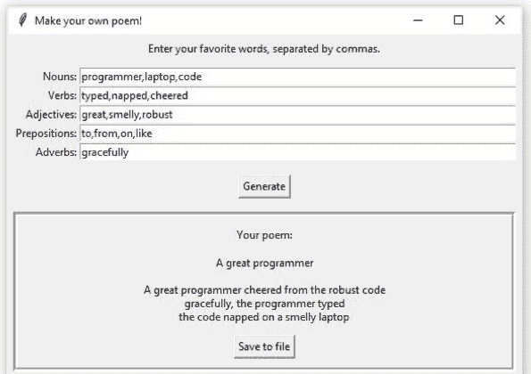

你可以使用任何你喜欢的几何管理器，但应用程序应完成以下所有操作：

1.  只允许用户在每个 Entry 小部件中输入正确数量的单词：
    - 至少 3 个名词
    - 至少 3 个动词
    - 至少 3 个形容词
    - 至少 3 个介词
    - 至少 1 个副词

    如果在任何 Entry 小部件中输入的单词太少，应在显示生成诗歌的区域显示错误消息。

2.  从用户输入中随机选择三个名词、副词、形容词和介词，以及一个副词。

3.  程序应使用以下模板生成诗歌：

```
{A/An} {adj1} {noun1}

A {adj1} {noun1} {verb1} {prep1} the {adj2} {noun2}
{adverb1}, the {noun1} {verb2}
the {noun2} {verb3} {prep2} a {adj3} {noun3}
```

4.  应用程序必须允许用户将他们的诗歌导出到文件。
5.  **额外加分：** 检查用户是否在每个 `Entry` 小部件中输入了唯一的单词。例如，如果用户在名词 `Entry` 小部件中两次输入相同的名词，当用户尝试生成诗歌时，应用程序应显示错误消息。

你可以在 [realpython.com/python-basics/resources](https://realpython.com/python-basics/resources) 找到此代码挑战的解决方案和许多其他额外资源。

[对此部分提供反馈 »](https://realpython.com/python-basics/resources)

### 18.11 总结与附加资源

在本章中，你学习了如何构建一些简单的图形用户界面（GUI）。

首先，你学习了如何使用 EasyGUI 包创建对话框，以向用户显示消息、接受用户输入，并允许用户选择用于读写的文件。然后你了解了 Tkinter，这是 Python 的内置 GUI 框架。Tkinter 比 EasyGUI 更复杂，但也更灵活。

你学习了如何在 Tkinter 中使用小部件，包括 `Frame`、`Label`、`Button`、`Entry` 和 `Text` 小部件。可以通过为小部件的各种属性赋值来自定义它们。例如，设置 `Label` 小部件的 `text` 属性会为标签分配一些文本。

接下来，你看到了如何使用 Tkinter 的 `.pack()`、`.place()` 和 `.grid()` 几何管理器为你的 GUI 应用程序提供布局。你学习了如何控制布局的各个方面，包括内部和外部填充，以及如何使用 `.pack()` 和 `.grid()` 管理器创建响应式布局。

最后，你将所有这些技能结合在一起，创建了两个完整的 GUI 应用程序：一个温度转换器和一个简单的文本编辑器。

> **互动测验**

本章附带一个免费的在线测验，以检查你的学习进度。你可以使用手机或电脑通过以下网址访问测验：

[realpython.com/quizzes/python-basics-17](https://realpython.com/quizzes/python-basics-17)

## 附加资源

要了解更多关于 Python 中 GUI 编程的信息，请查看以下资源：

- [Tkinter 教程](https://realpython.com/python-gui-tkinter/)
- [realpython.com 上的推荐资源](https://realpython.com/python-gui-tkinter/)

[对此部分提供反馈 »](https://realpython.com/python-gui-tkinter/)

# 第19章

## 最终思考与后续步骤

恭喜！你已经一路读到了本书的结尾。你已经掌握了足够的知识，可以用Python完成许多令人惊叹的事情，但现在真正的乐趣才刚刚开始：是时候开始自主探索了！

学习的最佳方式是解决你自己的实际问题。当然，刚开始时你的代码可能不够漂亮或高效，但它会是有用的。如果你认为自己没有Python可以解决的这类问题，那就选择一个你感兴趣的[流行模块](https://realpython.com)，并围绕它创建你自己的项目。

Python如此出色的部分原因在于其社区。认识正在学习Python的人吗？帮助他们！真正掌握一个概念的唯一方式，就是你能向别人解释清楚。

接下来，深入探索[realpython.com](https://realpython.com)上更高级的材料，或浏览[PyCoder's Weekly通讯](https://pycoders.com)中的文章和教程。

当你感觉准备好了，可以考虑在[GitHub](https://github.com)上参与一个开源项目。如果你更喜欢解谜，可以尝试解决[Project Euler](https://projecteuler.net)上的一些数学挑战。

如果在某个地方卡住了，几乎可以肯定其他人也遇到过（并且可能已经解决了）完全相同的问题；搜索答案，特别是在[Stack Overflow](https://stackoverflow.com/)上，或者找到一个愿意帮助你的Python开发者[社区](https://realpython.com/community/)。

如果所有方法都失败了，`import this`，花点时间思考一下Python的真谛。

附言：请访问我们的网站，在[realpython.com](https://realpython.com/)网站和[@realpython](https://twitter.com/realpython) Twitter账号上继续你的Python之旅。

### 19.1 免费的Python开发者每周技巧

你是否在寻找每周的Python开发技巧，以提高你的生产力并简化你的工作流程？好消息——我们正在为像你这样的Python开发者运营一个免费的电子邮件通讯。

我们发送的通讯邮件并非典型的“这里有一份热门文章列表”风格。相反，我们的目标是每周至少分享一篇原创想法，采用（简短的）文章形式。

如果你想看看这一切是怎么回事，那就前往[realpython.com/newsletter](https://realpython.com/newsletter/)，在注册表单中输入你的电子邮件地址。我们期待与你见面！

### 19.2 Python技巧：这本书

既然你已经熟悉了Python的基础知识，是时候深入挖掘并完善你的知识了。

通过Real Python的*Python技巧*这本书，你将通过简单的例子和循序渐进的叙述，发现Python的最佳实践以及优雅且符合Python风格的代码的力量。

你将离精通Python更近一步，从而能够编写出自然流畅、优雅且符合习惯用法的代码。

学习Python的方方面面是困难的——有了这本书，你将能够专注于将你的核心Python技能提升到一个新的水平。

发现Python标准库中的“隐藏宝藏”，并开始编写干净且符合Python风格的代码。在[realpython.com/pytricks-book](https://realpython.com/pytricks-book)下载免费的样章。

### 19.3 Real Python视频课程库

通过Real Python庞大（且不断增长）的Python教程和深度培训材料合集，成为一名全面的Python开发者。每周发布新内容，你总能找到提升技能的东西：

**掌握实用、真实的Python技能：** 我们的教程由专家Python开发者社区创建、策划和审核。在Real Python，你将获得在Python精通之路上所需的可信资源。

**结识其他Python开发者：** 加入Real Python Slack聊天，结识Real Python团队和其他订阅者。讨论你的编码和职业问题，投票决定未来的教程主题，或者只是在这个虚拟的茶水间与我们闲聊。

**互动测验和学习路径：** 通过互动测验、实践编码挑战和以技能为中心的学习路径，了解你的水平并练习所学内容。

**跟踪你的学习进度：** 将课程标记为已完成或进行中，并按照自己舒适的节奏学习。收藏有趣的课程，稍后复习以增强长期记忆。

**完成证书：** 每完成一门课程，你都会获得一份可分享（且可打印）的完成证书，托管在Real Python网站上。将你的证书嵌入你的作品集、LinkedIn简历和其他网站，向世界展示你是一位专注的Python开发者。

**定期更新：** 保持你的技能新鲜并跟上技术发展。我们不断发布新的会员专属教程，并定期更新我们的内容。

在[realpython.com/courses](https://realpython.com/courses)查看可用内容。

### 19.4 PythonistaCafe：一个Python开发者的社区

精通Python*不仅仅*是购买书籍和课程来学习。要取得成功，你还需要一种方法来保持动力，并长期发展你的能力。

我们认识的许多Python开发者都在为此挣扎。完全独自构建Python技能要无趣得多。

如果你是一个自学成才的开发者，白天有一份非技术性的工作，那么独自提升技能是很困难的。而且你的个人同行群体中没有程序员，就没有人在你努力成为更好的开发者的道路上鼓励或支持你。

也许你已经是一名开发者，但你公司里没有其他人分享你对Python的热爱。当你无法与任何人分享你的学习进度，或者在感到困惑时无法寻求建议时，这令人沮丧。

根据个人经验，我们知道现有的在线社区和社交媒体在提供这种支持网络方面做得也不够好。以下是一些最好的，但它们仍然有很多不足之处：

- *Stack Overflow* 用于提出专注的、一次性的提问。很难在这个平台上与评论者建立人际联系。一切都关乎事实，而不是人。例如，版主会随意编辑其他人的问题、答案和评论。它感觉更像是一个维基，而不是一个论坛。
- *Twitter* 就像一个虚拟的茶水间，非常适合“闲逛”，但它仅限于每次只能发送几句话的消息——不适合讨论任何实质性内容。此外，如果你不经常在线，你会错过大部分对话。而如果你*确实*经常在线，你的生产力会因为永无止境的干扰和通知而受到影响。Slack聊天群组也存在同样的缺陷。
- *Hacker News* 用于讨论和评论科技新闻。它不促进评论者之间的长期关系。它也是目前科技界最激进的社区之一，管理松散，文化近乎有毒。
- *Reddit* 采取更广泛的立场，鼓励比Stack Overflow的一次性问答格式更“人性化”的讨论。但它是一个拥有数百万用户的大型公共论坛，存在所有相关问题：有毒行为、压倒性的消极情绪、人们互相攻击、嫉妒……简而言之，人类行为光谱中所有“最糟糕”的部分。

最终我意识到，阻碍许多开发者的，是他们接触全球Python编码社区的渠道有限。这就是我创立[PythonistaCafe](https://www.pythonistacafe.com/)的原因，这是一个面向Python开发者的点对点学习社区。

理解PythonistaCafe的一个好方法，是将其视为一个Python爱好者的互助提升俱乐部：

在PythonistaCafe内部，你将与来自世界各地的专业开发者和爱好者互动，他们将在一个安全的环境中分享他们的经验——这样你就可以向他们学习，并避免犯同样的错误。

问任何你想问的问题，它都会保持私密。你必须拥有活跃的会员资格才能阅读和撰写评论，作为一个付费社区，恶意挑衅和冒犯行为几乎不存在。

你在里面遇到的人都积极致力于提高他们的Python技能，因为PythonistaCafe的会员资格是仅限邀请的。所有潜在会员都必须提交申请，以确保他们适合这个社区。

你将参与一个理解你、理解你正在构建的技能和职业、以及你试图实现的目标的社区。如果你试图提升你的Python技能，但还没有找到你需要的支持系统，我们就在你身边。

PythonistaCafe建立在一个私有论坛平台上，你可以在那里提问、获得答案并分享你的进度。我们的会员遍布世界各地，技能水平各异。

你可以在[www.pythonistacafe.com](http://www.pythonistacafe.com)了解更多关于PythonistaCafe、我们的社区价值观以及我们的一切。

### 19.5 致谢

没有众多朋友和同事的帮助和支持，这本书是不可能完成的。我们要感谢许多人为使这本书成为可能所提供的帮助：

- **我们的家人：** 感谢他们在我们日夜工作，努力将这本书送到你手中时，忍受我们的“冲刺模式”。
- **CPython团队：** 感谢他们创造了我们每天热爱和使用的惊人编程语言和工具。
- **Python社区：** 感谢所有正在工作的人

## 19.5. 致谢

让 Python 成为世界上最适合初学者、最受欢迎的编程语言，举办会议，并维护像 PyPI 这样的关键基础设施，这些工作都异常艰巨。

- **realpython.com 的读者们，比如您：** 非常感谢您阅读我们的在线文章并购买本书。您持续的支持和阅读，是这一切得以实现的基础！

我们希望您能继续活跃在社区中，提出问题并分享技巧。多年来，读者的反馈塑造了本书，并将继续帮助我们在未来的版本中做出改进，因此我们期待听到您的声音。

最后，我们向所有在 2012 年支持这个项目的 Kickstarter 支持者致以最深切的感谢。我们从未预料到会聚集起如此庞大、乐于助人且充满鼓励的群体。

在此部分留下反馈 »

## 这是《Python 基础：Python 3 实用入门》的早期访问版本

在您的帮助下，我们可以让这本书变得更好：

在本书每个部分的末尾，您会发现一个“神奇的”反馈链接。点击该链接将带您进入一个**在线反馈表**，您可以在那里与我们分享您的想法。

**我们欢迎您提出任何反馈或改进建议。**

请随意以您认为合适的简洁或详细程度进行反馈。所有反馈都以匿名方式存储，但您可以选择留下您的姓名和联系方式，以便我们跟进或在我们的“感谢”页面上提及您。

我们为每个部分使用不同的反馈链接，因此我们始终能知道您的笔记指的是本书的哪个部分。

感谢您帮助我们使这本书成为 Python 社区更有价值的学习资源。

— Dan Bader，Real Python 主编