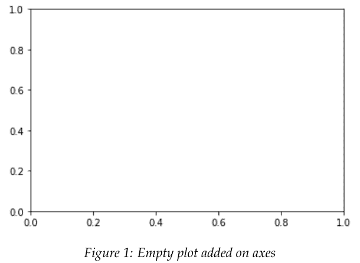
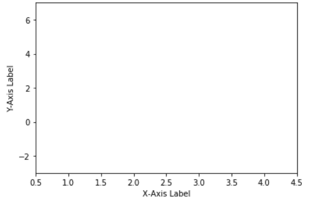

# Python 基础

以**金融市场**为例进行说明

作者：QuantInsti

QuantInsti Quantitative Learning Pvt. Ltd.
- 印度 -

## 目录

- 1 引言
- 2 Python 基础
- 3 数据类型
- 4 运算符
- 5 控制流
- 6 函数
- 7 模块与包
- 8 文件处理
- 9 错误处理
- 10 面向对象编程
- 11 NumPy
- 12 Pandas
- 13 Matplotlib
- 14 Seaborn
- 15 Scikit-learn
- 16 金融数据分析
- 17 算法交易
- 18 回测
- 19 风险管理
- 20 投资组合优化
- 21 金融中的机器学习
- 22 金融中的深度学习
- 23 金融中的自然语言处理
- 24 金融中的强化学习
- 25 结论
- 26 参考文献

### 3.2.2 浮点数（Float）

Float类型用于表示单精度浮点数，即32位IEEE 754标准浮点数。它通常用于需要节省内存且对精度要求不高的科学计算和图形处理场景。Float类型在内存中占用4个字节，其数值范围大约为±3.4e38，有效数字约为6-7位十进制数。

在编程中，Float类型常用于以下场景：
- 图形渲染和游戏开发中的坐标、颜色值计算
- 音频和视频处理中的信号采样
- 机器学习模型中的权重和激活值
- 物理模拟中的速度、加速度等连续量

需要注意的是，由于Float类型的精度有限，在进行多次运算后可能会累积舍入误差。对于需要高精度计算的场景（如金融计算），建议使用Double类型或专门的十进制类型。

Float类型支持基本的算术运算（加、减、乘、除）和比较运算。在类型转换时，从Double转换为Float可能会丢失精度，而从整数类型转换为Float通常是安全的。

在大多数编程语言中，Float类型的字面量通常以`f`或`F`结尾（如`3.14f`），以区别于Double类型的字面量。某些语言也支持科学计数法表示（如`1.5e10f`）。

## 5.5 字典

字典是Python中一种非常重要的数据结构，它以键值对的形式存储数据。字典是可变的、无序的，并且键必须是唯一的。字典使用花括号 `{}` 定义，键和值之间用冒号 `:` 分隔。

```python
### 创建一个字典
person = {
    "name": "Alice",
    "age": 30,
    "city": "New York"
}

### 访问字典中的值
print(person["name"])  # 输出: Alice

### 修改字典中的值
person["age"] = 31

### 添加新的键值对
person["email"] = "alice@example.com"

### 删除键值对
del person["city"]

### 检查键是否存在
if "name" in person:
    print("Name exists")

### 遍历字典
for key, value in person.items():
    print(f"{key}: {value}")
```

字典提供了多种方法来操作数据，例如 `keys()`、`values()` 和 `items()` 方法，分别用于获取所有的键、值和键值对。字典在需要快速查找和关联数据时非常有用。

## 7.5 关键要点

- **核心概念**：本节总结了本章的关键要点。
- **主要结论**：回顾了主要的分析结果和发现。
- **实践意义**：讨论了这些结论在实际应用中的价值。
- **未来展望**：指出了后续研究或发展的可能方向。

## 10.6.1 索引与子集选取

索引与子集选取是处理数据结构的基本操作，允许您选择特定的元素或数据子集，以便进行分析或操作。

## 11.7.13 .shift() 函数

`.shift()` 函数会移除数组的第一个元素并返回该被移除的元素。此方法会改变数组的长度。

**语法：**
```javascript
arr.shift()
```

**返回值：**
数组中被移除的元素；如果数组为空，则返回 `undefined`。

**描述：**
`shift()` 方法会读取 `this` 的 `length` 属性。然后，它将键 "0" 设置为属性 "1" 的值，删除属性 "1"，依此类推。当最后一个属性被移除时，`length` 属性的值会更新为之前的值减一。

`shift()` 是有意设计为通用的：它只期望 `this` 具有 `length` 属性和整数键属性。由于数组在 JavaScript 中是对象，因此可以在类数组对象上调用 `Array.prototype.shift()`。

**示例：**

**使用 shift()**
```javascript
const myFish = ['angel', 'clown', 'mandarin', 'sturgeon'];

const shifted = myFish.shift();

console.log(myFish);
// ['clown', 'mandarin', 'sturgeon']

console.log(shifted);
// 'angel'
```

**在非数组对象上调用 shift()**
```javascript
const myFish = {
  0: 'angel',
  1: 'clown',
  2: 'mandarin',
  3: 'sturgeon',
  length: 4,
};

const shifted = Array.prototype.shift.call(myFish);
// shift() 是有意设计为通用的

console.log(shifted);
// 'angel'

console.log(myFish);
// { 0: 'clown', 1: 'mandarin', 2: 'sturgeon', length: 3 }
```

**在 for 循环中使用 shift()**
```javascript
const arr = [1, 2, 3, 4];
const arr2 = [];

while (arr.length !== 0) {
  arr2.push(arr.shift());
}

console.log(arr2);
// [1, 2, 3, 4]

console.log(arr);
// []
```

# 前言

> “如果说我比别人看得更远，那是因为我站在巨人的肩膀上。”

- 艾萨克·牛顿爵士（1643 - 1727）

我们今天所处的宇宙正被数据所淹没。截至2016年，约90%的数据都是在最近几年才产生的！¹ 与此同时，经济实惠的数据存储（无论是本地工作站还是云端）和计算能力也取得了长足进步。一个典型的例子就是：我们整天随身携带的智能手机，就是廉价的、口袋大小的超级计算机。

更贴近我们生活的是，我们的量化金融和算法交易世界充斥着关于金融市场、宏观经济、市场情绪等的事实和数据。我们需要一个合适的工具来驾驭并有效利用所有这些信息的力量。在一个完美的世界里，这个工具应该既易于使用又高效。然而，现实很少是完美的。这些特性往往相互矛盾，我们必须明智地选择我们的工具。

作为一名算法/量化交易者，我们每天处理的一些关键问题是什么？

- 从各种网络来源下载和管理多种文件格式的海量数据集
- 数据清洗/整理
- 回测和自动化交易策略
- 以最少的人工干预管理订单执行

¹https://www-01.ibm.com/common/ssi/cgi-bin/ssialias?htmlfid=WRL12345USEN

我们发现，基于我们社区的特定领域需求，Python 几乎是一个完美的选择。它是一种相对容易学习的高级编程语言。当与它的一些库结合使用时，它变得异常强大。

# 为什么写这本书？

这本书源于我们多年来一直在用 Python 进行的 EPAT 讲座。在 EPAT Python 讲座中，我们试图尽可能广泛地涵盖主题，因此由于时间限制，我们无法像希望的那样深入挖掘。这些笔记给了我们一些自由，让我们可以更长时间地思考某些概念，并填补讲座形式中出现的空白。我们希望我们的写作是紧凑且充分的，以便您，读者，能够更好地理解这门语言及其一些基本库。我们预计，对于感兴趣的读者，这本书将是您阅读的关于 Python 的众多书籍或博客中的第一本。书末还有一份参考文献列表，我们相信您可能会觉得有用。

# 谁应该读这本书？

当这个写作项目开始时，我们的目标是准备一本针对我们 EPAT 参与者需求的书。然而，回顾过去，我们认为它也应该对以下人群有用：

- 任何想要简要了解 Python 及其数据科学栈关键组件的人，以及
- 想要快速复习如何使用 Python 进行数据分析的 Python 程序员。

我们不期望我们的任何读者具有计算机科学的正式背景，尽管熟悉编程会更好。这里的概念和思想通过几个例子来阐述，以帮助将理论与实践联系起来。

# 这本书里有什么？

这里呈现的材料是对 Python 及其数据科学相关库（如 NumPy、Pandas 和 Matplotlib）的精炼介绍。我们使用的说明性示例与金融市场相关。我们愿意认为我们在实现既定目标方面做得令人满意。

# 如何阅读这本书？

根据您对 Python 的熟悉程度和可用时间，我们可以建议三种从本书学习的方法。

1.  按顺序从头到尾阅读本书，按自己的节奏进行。理想情况下，您应该在参加/观看相关 EPAT 讲座之前或之后不久阅读各章。这无疑将有助于培养您对所学新概念的直觉。
2.  快速线性浏览本书，以获得所涵盖所有领域的概览。然后，您可以根据您觉得更困难或对您的工作更重要的部分，专注于不同的部分。
3.  如果您已经熟悉 Python 编程，您可以根据自己的喜好随意跳转章节。

我们相信任何一种方法都有其价值，我们每个人都需要根据自己的学习风格来评估哪种方法最有效。

# 在哪里还能找到所有这些内容？

简短的回答：很多很多地方（太多了，无法在此一一列举）。我们引导您参考书末的参考文献中我们非常喜欢的一组非详尽资源，以供进一步阅读。

Python 已经存在了大约三十年。有许多优秀的书籍、视频、在线课程和博客从不同角度、针对不同类型的用户涵盖了它。然而，核心的思想和概念已被大多数人很好地理解和涵盖。

# 版权许可

本作品采用知识共享署名-相同方式共享 4.0 国际许可协议² 进行许可。

²http://creativecommons.org/licenses/by-sa/4.0/


这就是为什么您在这里看到这张图片。本质上，这意味着您可以使用、分享或改进本作品（甚至是商业用途），只要您向我们提供署名。举个例子，维基百科³ 也使用相同的许可。

³https://en.wikipedia.org/wiki/Main_Page

# 致谢

Jay Parmar、Mario Pisa Pena 和 Vivek Krishnamoorthy 是本书的作者。Jay 完成了大部分的写作和格式化工作。Mario 撰写了一些章节，并审阅了大部分其他章节。Vivek 是策划本书写作计划的主要策划者，旨在尽可能地简化学生的学习之旅。他还参与了写作、编辑、审阅，并监督了这项工作。

我们在这里展示的大部分材料，只是对我们阅读和钦佩的一些优秀作品的增量更改或修改。我们完全赞同艾萨克·牛顿的观点，即任何知识都是建立在自身基础之上的。

我们在撰写本书时欠下了许多债务，现在我们一一列出。请耐心等待。

我们在本书每章的“参考文献”部分感谢了许多人。我们尽力了，但几乎可以肯定的是，由于没有做好适当的记录，我们未能认可其他一些人。对于任何我们可能遗漏的创作者，我们深表歉意。

我们从投资者/交易者社区和 Python 社区的专家在在线问答论坛（如 stackoverflow.com、quora.com 等）上的著作中学到了很多东西，并对他们心怀感激。特别感谢 Dave Bergstrom（Twitter 账号 @Dburgh）、Matt Harrison（Twitter 账号 @__mharrison__）和 PlanB（Twitter 账号 @100trillionUSD）对我们工作的评论。

我们也感谢 QuantInsti 乐于助人且支持我们的团队成员。他们中的许多人毫无怨言地在紧迫的时间表下工作，尽管我们不断催促（或者也许是因为 :))，他们还是给了我们富有洞察力的建议。

最后，我们要感谢过去几年我们教过的所有学生。特别感谢你们中那些在我们学会如何最好地教学之前，忍受了我们最初几轮讲座的人。亲爱的学生们，我们因你们而存在。你们激励了我们，挑战了我们，并推动我们永不停止学习，只是为了跟上你们的步伐。我们希望你们喜欢阅读这本书，就像我们喜欢为你们写作一样。

# 建议与错误

我们欢迎您的任何建议。我们更渴望收到您关于我们作品中错误的任何评论。请就任何或所有这些问题写信给我们，邮箱是 contact@quantinsti.com。

# 第 1 章

# 引言

欢迎来到我们关于 *编程* 的第一个模块。在本模块中，我们将讨论 Python 编程语言的基础知识，涵盖从非常基础到更高级的主题。

Python 是一种通用编程语言，正变得越来越流行，用于

- 执行数据分析，
- 自动化任务，
- 学习数据科学，
- 机器学习等。

## 1.1 什么是 Python？

Python 是一种动态、解释型（字节码编译）语言，广泛应用于各个领域和技术领域。它由 Guido van Rossum 于 1991 年开发。它主要是为了代码可读性而开发的，其语法允许程序员用更少的代码行来编写/表达概念。与 C、Java 或 Fortran 等编译语言相比，我们在用 Python 编写代码时不需要声明变量、函数等的类型。这使得我们的代码简短而灵活。Python 在运行时跟踪所有值的类型，并在运行时标记没有意义的代码。在 Python 网站¹ 上，我们找到了以下执行摘要。

¹https://www.python.org/doc/essays/blurb/

Python 是一种解释型、面向对象、具有动态语义的高级编程语言。其高级内置数据结构，结合动态类型和动态绑定，使其在快速应用开发以及作为脚本语言或胶水语言连接现有组件方面极具吸引力。Python 简单易学的语法强调可读性，从而降低了程序维护的成本。Python 支持模块和包，这鼓励了程序的模块化和代码重用。Python 解释器和广泛的标准库在所有主要平台上均以源代码或二进制形式免费提供，并且可以自由分发。

## 1.2 Python 的应用领域？

Python 既被初学者程序员使用，也被高度熟练的专业开发人员使用。它被应用于学术界、网络公司、大型企业和金融机构。具体用于：

- *Web 和互联网开发*：Python 在服务器端用于创建 Web 应用程序。
- *软件开发*：Python 用于创建 GUI 应用程序、连接数据库等。
- *科学和数值应用*：Python 用于处理大数据和执行复杂数学运算。
- *教育*：Python 是一门极佳的编程教学语言，适用于入门级和更高级的课程。
- *桌面 GUI*：大多数 Python 二进制发行版中包含的 Tk GUI 库² 被广泛用于构建桌面应用程序。
- *商业应用*：Python 也用于构建 ERP 和电子商务系统。

## 1.3 为什么选择 Python？

Python 具备许多特点。让我们在此探讨其中几项：

²https://wiki.python.org/moin/TkInter

- **简单**
    - 与许多其他编程语言相比，用 Python 编码就像写简单的严格英语句子。事实上，它常被称道的一个优点是 Python 代码看起来像伪代码。它使我们能够专注于问题的解决方案，而不是语言本身。
- **易于学习**
    - 正如我们将看到的，由于其简单的语法，Python 的学习曲线更平缓（与 C、Java 等语言相比）。
- **免费且开源**
    - Python 和大多数可用的支持库都是开源的，通常附带灵活开放的许可。它是 FLOSS（自由/自由软件和开源软件）的一个例子。用外行话说，我们可以自由分发开源软件的副本，访问其源代码，对其进行修改，并将其用于新的自由程序中。
- **高级语言**
    - Python 是一种与底层平台或机器细节高度抽象的编程语言。与低级编程语言相比，它使用自然语言元素，更易于使用，自动化了计算系统的重大领域，例如资源分配。与低级语言相比，这简化了开发过程。当我们用 Python 编写程序时，我们永远不需要担心底层细节，例如管理我们编写的程序所使用的内存等。
- **动态类型**
    - Python 中变量、对象等的类型通常在运行时推断，而不是像大多数其他编译语言（如 C 或 Fortran）那样静态分配/声明。
- **可移植/平台无关/跨平台**
    - 由于是开源的并且支持多个平台，Python 可以移植到 Windows、Linux 和 Mac OS。如果我们小心避免任何平台特定的依赖，所有 Python 程序都可以在这些平台中的任何一个上运行，而无需任何更改。它用于运行强大的服务器，也用于像树莓派³这样的小型设备。

除了上述平台，Python 还可用于以下其他平台：

- FreeBSD OS
- Oracle Solaris OS
- AROS Research OS
- QNX OS
- BeOS
- z/OS
- VxWorks OS
- RISC OS

- **解释型**
    - 编程语言大致可分为两类：编译型或解释型。
    - 用 C 或 C++ 等编译语言编写的程序需要使用编译器（带有各种标志和选项）将代码从原始语言（C、C++ 等）转换为计算机可理解的机器可读语言（如二进制代码，即 0 和 1）。然后将此编译后的程序输入计算机内存以运行。
    - 另一方面，Python 不需要编译成机器语言。我们直接从源代码*运行*程序。在内部，Python 将源代码转换为称为字节码的中间形式，然后将其翻译为底层机器的本机语言。我们不需要担心正确的链接和加载到内存中。这也使得 Python 具有更强的可移植性，因为我们可以将相同的程序运行在另一个平台上，它也能正常工作！
    - 'CPython' 实现是该语言的解释器，它在运行时将 Python 代码翻译为可执行的字节码。

- **多范式**
    - Python 支持多种编程和实现范式，例如面向对象、函数式或过程式编程。

- **可扩展**
    - 如果我们需要某段代码运行得更快，我们可以用 C 或 C++ 编写该部分代码，然后通过我们的 Python 程序使用它。相反，我们可以在 C/C++ 程序中嵌入 Python 代码，为其赋予*脚本*能力。

- **丰富的库**
    - Python 标准库⁴ 非常庞大，提供了广泛的设施。它包含用 C 编写的内置模块，提供对系统功能（如 I/O 操作）的访问，以及用 Python 编写的模块，为日常编程中出现的许多问题提供标准化解决方案。其中一些模块如下所列：
        - 文本处理模块
        - 数据类型
        - 数值和数学模块
        - 文件和目录模块
        - 加密模块
        - 通用操作系统模块
        - 网络模块
        - 互联网协议和支持模块
        - 多媒体服务
        - 带 Tk 的图形用户界面
        - 调试和性能分析
        - 软件开发、打包和分发
    - 除了 Python 标准库，我们还有各种其他第三方库，可以从 Python 包索引⁵ 访问。

- **垃圾回收**
    - Python 自行处理内存的分配和释放。换句话说，程序员不必管理内存分配，也不必在构造变量和对象之前预分配和释放内存。此外，Python 提供了垃圾收集器接口来处理垃圾回收。

⁴https://docs.python.org/3/library/
⁵https://pypi.org/

## 1.4 Python 的历史

Python 是 Guido van Rossum 的创意，他在 1980 年代开始了其开发工作。它的名字与任何蛇类无关，实际上是受到英国喜剧《蒙提·派森》的启发！第一个 Python 实现于 1989 年 12 月在荷兰完成。自那时起，Python 经历了定期的重大转变。以下可视为 Python 发展中的里程碑：

- Python 0.9.0 于 1991 年 2 月发布
- Python 1.0 于 1994 年 1 月发布
- Python 2.0 于 2000 年 10 月发布
- Python 2.6 于 2008 年 10 月发布
- Python 2.7 于 2010 年 7 月发布
- Python 3.0 于 2008 年 12 月发布
- Python 3.4 于 2014 年 3 月发布
- Python 3.6 于 2016 年 12 月发布
- Python 3.7 于 2018 年 6 月发布

对于新手来说，常常令人困惑的是**有两个主要版本 2.x 和 3.x 可用**，自 2008 年以来一直在并行开发和使用。这种情况可能会持续一段时间，因为两个版本都非常流行，并在科学和软件开发社区中广泛使用。需要注意的一点是，它们之间的代码并非完全兼容。我们可以在任一版本中开发程序和编写代码，但会存在语法和其他差异。本手册基于 3.x 版本，但我们相信大多数代码示例在稍作调整后也适用于 2.x 版本。

> https://docs.python.org/3/library/gc.html

## 1.5 Python 3 与 Python 2

Python 3.x 的首个版本于 2008 年底发布。它进行了一些更改，导致部分旧的 Python 2.x 代码不再兼容。本节将讨论这两个版本之间的差异。不过，在进一步讨论之前，人们可能会想：为什么是 Python 3 而不是 Python 2？迁移到 Python 3 最主要的原因是，Python 2.x 在 2020 年之后将不再开发。因此，使用 Python 2.x 启动新项目已不再是一个好主意。Python 2.8 永远不会出现。此外，Python 2.7 也将仅从 Python 3 开发分支获得安全更新。话虽如此，我们编写的大部分代码在两个版本上都能运行，只是有一些小的注意事项。

以下列出了仅在 3.x 版本中可用的部分特性（并非全部）：

-   字符串默认为 Unicode
-   清晰的 Unicode/字节分离
-   异常链
-   函数注解
-   仅限关键字参数的语法
-   扩展的元组解包
-   非局部变量声明

我们现在来讨论两个版本之间的一些重大变化。

### Unicode 与字符串

-   字符串有两种类型，可以大致分为 *字节序列* 和 *Unicode 字符串*。
-   字节序列必须是 ASCII 字母表中的字面字符。Unicode 字符串可以容纳我们放入的几乎任何字符。在 Unicode 中，我们可以包含各种语言，并且通过正确的编码，还可以包含表情符号。
-   在 Python 2 中，我们必须在每个 Unicode 字符串的开头标记一个 `u`，例如 `u'Hello Python!'`。由于我们时不时地使用 Unicode 字符串，为每个 Unicode 字符串输入 `u` 变得非常繁琐。如果我们忘记添加 `u` 前缀，得到的将是一个字节序列。
-   随着 Python 3 的引入，我们不再需要每次都写 `u`。所有字符串现在默认都是 Unicode，我们必须用 `b` 来标记字节序列。由于 Unicode 是更常见的场景，Python 3 通过这种方式减少了每个人的开发时间。

### 整数除法

-   Python 的核心价值观之一是绝不进行任何隐式操作。例如，除非程序员明确编码，否则绝不将数字转换为字符串。不幸的是，Python 2 在这一点上有些过头了。考虑以下操作：

```
5 / 2
```

-   我们期望的答案是 2.5，但 Python 2 只会返回 2。遵循上述核心价值观，Python 将返回与输入类型相同的输出类型。这里，输入是整数，Python 返回的输出也是整数。
-   同样，这在 Python 3 中得到了修复。现在它将输出 2.5 作为上述问题的结果。实际上，它对每个除法操作都给出浮点数输出。

### Print 函数

-   Python 3 带来的最显著变化是关于 `print` 关键字。
-   在 Python 2 中，如果要输出任何文本，我们使用 `print` 后跟输出文本，这在内部会作为一个函数来渲染输出。
-   在 Python 3 中，`print` 带有括号，因此，如果要输出任何文本，我们使用 `print()` 并将输出文本放在括号内。

### Input 函数

-   `input()` 函数有一个重要变化。
-   在 Python 2 中，我们有 `raw_input()` 和 `input()` 函数，用于从终端和标准输入设备捕获用户输入。`raw_input()` 会捕获输入并将所有内容视为字符串。而 `input()` 函数以一种方式帮助用户：如果输入的是整数（如 123），它将被视为整数，而不会转换为字符串。如果为 `input()` 输入的是字符串，Python 2 会抛出错误。
-   在 Python 3 中，`raw_input()` 已被移除，`input()` 不再对其接收的数据进行求值。无论输入是什么，我们总是得到一个字符串。

### 错误处理

-   每个版本处理错误的方式有一个小变化。
-   在 Python 3 中，检查错误时需要在 `except` 子句中使用 `as` 关键字，而在 Python 2 中不需要 `as` 关键字。考虑以下示例：

```
### Python 2
try:
    trying_to_check_error
except NameError, err: # 不需要 'as' 关键字
    print (err, 'Error Occurred!')

### Python 3
try:
    trying_to_check_error
except NameError as err: # 需要 'as' 关键字
    print (err, 'Error Occurred!')
```

### `__future__` 模块

-   `__future__` 模块在 Python 3 中引入，以允许向后兼容，即在 Python 2 开发的代码中使用 Python 3 的特性。
-   例如，如果我们要在 Python 2 中使用带浮点输出的除法特性或 `print()`，我们可以通过使用此模块来实现。

```
### Python 2 代码
from __future__ import division
from __future__ import print_function

print 5/2 # 输出将是 2.5

print('Hello Python using Future module!')
```

尽管我们已经讨论了两个版本之间的大多数关键差异，但 Python 3 中还引入或更改了许多其他变化，例如生成器和迭代器的 `next()`、`xrange()` 如何变成 `range()` 等。

## 1.6 关键要点

1.  Python 是一种高级、跨平台的语言，由 Guido van Rossum 于 1991 年开发。
2.  它被用于许多领域，从简单的 Web 开发到科学应用。
3.  它的特点是易于学习和可扩展到其他语言。
4.  除了称为 Python 标准库的内置或标准库外，Python 还提供对第三方库的支持。
5.  它支持多种编程风格，如面向对象、过程式和函数式。
6.  Python 有两个主要版本：2.x 和 3.x。任一版本开发的代码在某种程度上彼此兼容。
7.  Python 2.x 系列的最新版本是 Python 2.7。2020 年之后，Python 2.x 将不再有任何新更新。

# 第 2 章

## Python 入门

正如我们在上一节所看到的，Python 提供了不同的版本，有多种发行版，并且适用于各种平台和设备的组合。得益于其多功能性，我们可以使用 Python 来编码几乎任何我们能逻辑想到的任务。计算机执行的最重要的任务之一是数学计算。Python 为现代计算机的这一基本功能提供了直接接口。事实上，Python 的介绍可以从展示它如何作为简单数学计算的工具开始。

## 2.1 Python 作为计算器

使用 Python 进行数学计算最简单的方法是使用 *控制台*，它可以作为一个花哨的计算器。要开始最简单的数学运算，如加法、减法、乘法和除法，我们可以使用以下表达式开始使用 Python *控制台*。

```
### 加法
In []: 5 + 3
Out[]: 8

### 减法
In []: 5 - 3
Out[]: 2

### 乘法
In []: 5 * 3
Out[]: 15

### 除法
In []: 5 / 3
Out[]: 1.6666666666666667

### 取模
In []: 5 % 2
Out[]: 1
```

注意：`#` 符号后的内容是注释，在输入示例时可以忽略。我们将在后面的章节中更详细地讨论注释。这里，`In` 指的是提供给 Python 解释器的输入，`Out` 代表解释器返回的输出。这里我们使用 IPython 控制台执行上述数学运算。它们也可以在 Python IDLE（集成开发和学习环境）（又名 The Shell）、Python 控制台或 Jupyter notebook 中以类似方式执行。基本上，我们有多种接口可供选择，程序员会选择他们觉得最舒适的。在本手册中，我们将坚持使用 Python 控制台界面来编写和运行我们的 Python 代码。需要明确的是，上述每个接口都将我们连接到 Python 解释器（它在幕后进行繁重的计算工作）。

让我们剖析上面的例子。一个简单的 Python 表达式类似于一个数学表达式。它由一些数字组成，通过数学 *运算符* 连接。在编程术语中，数字（这包括整数以及带有小数部分的数字，例如 5, 3.89）被称为 *数字字面量*。运算符（例如 +, -, /）表示其 *操作数* 之间的数学运算，从而得到表达式的 *值*。推导表达式值的过程称为表达式的 *求值*。当输入一个数学表达式时，Python 解释器会自动求值并在下一行显示其值。

与 `/` 除法运算符类似，我们还有 `//` 整数除法运算符。关键区别在于，前者输出的是称为 *浮点数* 的小数值（如上例所示），而后者输出的是 *整数* 值，即不包含任何小数部分。我们将在后续章节更详细地讨论浮点数和整数数据类型。下面是一个整数除法的例子，其中 Python 返回的输出值不包含任何小数。

```
In []: 5 // 3
Out[]: 1
```

我们也可以在更长的 *复合表达式* 中使用表达式作为操作数。例如，

```
### 复合表达式
In []: 5 + 3 - 3 + 4
Out[]: 9
```

在上面的例子中，求值顺序是从 *左* 到 *右*，因此表达式 `5 + 3` 首先被求值。其值 8 然后与下一个操作数 3 通过 `-` 运算符结合，计算出复合表达式 `5 + 3 - 3` 的值 5。这个值接着与最后一个字面量 4 通过 `+` 运算符结合，最终得到整个表达式的值 9。

在这个例子中，运算符从左到右应用，因为 `-` 和 `+` 具有相同的优先级。对于包含多个运算符的表达式，并非所有运算符都具有相同的优先级。考虑以下例子，

```
In []: 5 + 3 * 3 - 4
Out[]: 10
```

这里，上面的表达式求值为 10，因为 `*` 运算符的优先级高于 `-` 和 `+` 运算符。表达式 `3 * 3` 首先被求值，结果为 9，然后与操作数 5 通过 `+` 运算符结合，产生值 14。这个值接着与下一个操作数 4 通过 `-` 运算符结合，最终得到值 10。运算符应用的顺序称为 *运算符优先级*。在 Python 中，数学运算符遵循数学中观察到的自然优先级。

与数学函数类似，Python 允许使用括号 `(` 和 `)` 来手动指定求值顺序，如下所示：

```
### 括号
In []: (5 + 3) * (3 - 4)
Out[]: -8
```

上面的表达式求值为 -8，因为我们明确定义了表达式 `5 + 3` 的优先级，使其首先被求值，结果为 8，接着 `3 - 4` 产生值 -1，最后我们将值 8 和 -1 通过 `*` 运算符结合，最终得到值 -8。

在上面的例子中，一个运算符连接两个操作数，因此它们被称为 *二元运算符*。相比之下，运算符也可以是 *一元* 的，只接受一个操作数。这样的运算符是 `-`，称为取反。

```
### 取反
In []: - (5 + 3)
Out[]: -8
```

首先，我们计算表达式 `5 + 3`，结果为 8，其次，我们使用 `-` 运算符对其取反，产生最终值 -8。

## 2.1.1 浮点表达式

到目前为止我们看到的所有例子都是在整数上执行的，结果也是整数。注意，对于表达式 `5 / 3`，即使操作数是整数，我们也会得到一个实数作为输出。在计算机科学中，实数通常被称为 *浮点数*。例如：

```
### 浮点数加法
In []: 5.0 + 3
Out[]: 8.0
```

```
### 浮点数乘法
In []: 5.0 * 3
Out[]: 15.0
```

```
### 浮点数幂运算
In []: 5.0 ** 3
Out[]: 125.0
```

```
### 浮点数幂运算
In []: 36 ** 0.5
Out[]: 6.0
```

对于上面的例子，最后一部分计算的是 36 的正平方根。

Python 提供了一个非常方便的选项来检查数字的类型，无论是表达式的输出还是操作数本身。

```
In []: type(5)
Out[]: int
```

```
In []: type(5.0)
Out[]: float
```

```
In []: type(5.0 ** 3)
Out[]: float
```

命令 `type(x)` 返回 x 的类型。这个命令是 Python 中的一个 *函数*，其中 `type()` 是 Python 的内置函数。我们可以使用特定的 *参数* 调用函数以获取返回值。在上面的例子中，使用参数 5 调用函数 `type` 返回值 `int`，这意味着 5 是一个整数。函数调用也可以被视为类似于数学表达式的表达式，由函数名后跟括号内逗号分隔的参数列表组成。函数调用表达式的值是函数的返回值。按照上面讨论的同一个例子，`type` 是函数名，它接受一个参数并返回参数的类型。因此，调用函数 `type(5.0)` 返回的值是浮点数。

我们也可以使用以下内置函数转换参数的类型。例如，

```
In []: float(5)
Out[]: 5.0

In []: type(float(5))
Out[]: float

In []: int(5.9)
Out[]: 5

In []: type(int(5.9))
Out[]: int
```

如上例所示，使用 `float` 函数调用（它接受一个参数），我们可以将整数输入转换为浮点数值。此外，我们使用 `type` 函数进行了交叉验证。同样，我们有一个 `int` 函数，可以使用它将浮点数输入更改为整数值。在转换过程中，`int` 函数只是忽略输入值的小数部分。在最后一个例子中，`int(5.9)` 的返回值是 5，即使 5.9 在数值上更接近整数 6。对于通过向上取整进行浮点数转换，我们可以使用 `round` 函数。

```
In []: round(5.9)
Out[]: 6

In []: round(5.2)
Out[]: 5
```

调用 `round` 函数将返回一个在数值上更接近参数的值。它也可以将参数四舍五入到小数点后特定位数。然后我们需要向函数调用指定两个参数，第二个参数指定小数点后要保留的位数。以下示例对此进行了说明。函数调用中使用 *逗号* 分隔参数。

```
In []: round(5.98765, 2)
Out[]: 5.99
```

```
In []: round(5.98765, 1)
Out[]: 6.0
```

另一个有用的函数是 `abs`，它接受一个数值参数并返回其绝对值。

```
In []: abs(-5)
Out[]: 5

In []: abs(5)
Out[]: 5

In []: abs(5.0)
Out[]: 5.0
```

我们也可以使用 *科学计数法* 以以下方式表示浮点表达式。

```
In []: 5e1
Out[]: 50.0

In []: 5e-1
Out[]: 0.5

In []: 5E2
Out[]: 500.0
```

## 2.2 Python 基础

我们刚刚完成了 Python 中一些功能的简要概述。现在让我们熟悉一下 Python 的基础知识。

### 2.2.1 字面量常量

我们已经在上面的例子中看到了字面量及其用法。这里我们定义它们是什么。更多具体的数字字面量例子是 5、2.85，或者字符串字面量是 `I am a string` 或 `Welcome to EPAT!`。

它被称为 *字面量*，因为我们直接使用它的值。数字 5 总是代表它自己，而不是其他任何东西——它是一个 *常量*，因为它的值不能被改变。同样，值 2.85 代表它自己。因此，所有这些都被称为字面量常量。

### 2.2.2 数字

我们已经在上面的章节中详细介绍了数字。这里我们将简要讨论它。数字可以大致分为两种类型——整数和浮点数。

整数（简称 *int*）的例子有 - 5、3、2 等。它只是一个整数。

浮点数（简称 *floats*）的例子有 - 2.98745、5.5、5e-1 等。这里，e 指的是 10 的幂。我们可以写 e 或 E，两者都可以。

> 注意：与其他编程语言相比，我们没有单独的 long 或 double。在 Python 中，int 可以是任意长度。

### 2.2.3 字符串

简单来说，字符串是字符的序列。我们在 Python 代码中几乎到处使用字符串。Python 支持 ASCII 和 Unicode 字符串。让我们更详细地探讨字符串。

*单引号* - 我们可以使用单引号指定字符串，例如 'Python is an easy programming language!'。引号内的所有空格和制表符都按原样保留。

*双引号* - 我们也可以使用双引号指定字符串，例如 "Yes! Indeed, Python is easy."。双引号的工作方式与单引号相同。两者都可以使用。

*三引号* - 这用作分隔符来标记注释的开始和结束。我们将在下一个主题中更详细地解释它。

*字符串是不可变的* - 这意味着一旦我们创建了一个字符串，就无法更改它。请看以下示例。

```
In []: month_name = 'Fanuary'

### 我们将在这一行遇到错误。
In []: month_name[0] = 'J'
Traceback (most recent call last):

File "<ipython-input-24>", line 1, in <module>
    month_name[0] = 'J'

TypeError: 'str' object does not support item assignment
```

这里，`month_name` 是一个用于存储值 Fanuary 的变量。变量可以看作是一个带有名称的容器，用于存放值。我们将在后续章节中详细讨论变量。

在上面的例子中，我们用一个不正确的月份名称 Fanuary 初始化了变量 `month_name`。之后，我们尝试通过将字母 F 替换为 J 来纠正它，这时我们遇到了 TypeError，它告诉我们字符串不支持更改操作。

## 2.2.4 注释

我们之前已经见过注释了。注释用于为代码添加说明，Python 不会解释它们。Python 中的注释以井号字符 # 开头，到代码行的末尾结束。注释可以出现在行首，或者在空格或代码之后，但不能出现在字符串字面量内部。字符串字面量中的井号字符只是一个井号字符。这种类型的注释也称为单行注释。

我们注释代码的另一种方式是使用多行注释，它作为参考或文档，帮助他人理解代码。

让我们看下面示例中的单行注释。

```
### 以下行将两个整数相加
In []: 5 + 3
Out[]: 8
```

我们可以在代码行之后编写注释，以说明该特定行的功能，如下例所示。

```
In []: 5 + 3 # 将两个字面量相加
Out[]: 8

In []: # 这也是一个注释！
```

Python 不支持多行/块注释。但是，我们可以使用与单行注释相同的符号将注释跨多行书写。块注释的缩进级别应与代码相同。块注释的每一行都以 # 和一个空格开头。

```
### 这是一个多行注释的示例
### 在 Python 中，它跨越多行并
### 描述代码。它可以用来
### 标注任何内容，如作者姓名、修订记录、
### 脚本目的等。它使用分隔符
### 来标记其开始和结束。
```

在代码中大量穿插注释始终是一种良好的编程实践。记住：代码告诉你“如何做”，注释告诉你“为什么这样做”。

## 2.2.5 print() 函数

print() 函数是一个非常通用的工具，用于在 Python 中打印任何内容。

> 注意：在 Python 2 中，print 只是一个没有括号的语句，而不是一个函数，而在 Python 3 中，print() 是一个函数，我们需要输出的内容放在括号内。我们在第 1 章的“Python 2 与 Python 3”主题下已经详细介绍了这一点。

让我们看几个例子来了解 print() 是如何工作的。

```
### 简单的 print 函数
In []: print("Hello World!")
Out[]: Hello World!
```

```
### 连接字符串和整数字面量
In []: print("January", 2010)
Out[]: January 2010
```

```
### 连接两个字符串
In []: print("AAPL", "is the stock ticker of Apple Inc.")
Out[]: AAPL is the stock ticker of Apple Inc.
```

```
### 连接一个变量和一个字符串。
### 这里，stock_name 是一个包含股票名称的变量。
In []: print(stock_name + " is the stock name of
                Microsoft Corporation.")
Out[]: MSFT is the stock name of Microsoft Corporation.
```

正如我们在上面的例子中看到的，print() 可以以多种方式使用。我们可以用它来打印一个简单的语句，与字面量连接，连接两个字符串，或者将字符串与变量组合。使用 print() 函数的一种常见方式是 f-strings 或格式化字符串字面量。

```
### f-strings
In []: print(f'The stock ticker for Apple Inc
                is {stock_name}.')
Out[]: The stock ticker for Apple Inc is AAPL.
```

上面的字符串称为格式化字符串字面量。这种字符串以字母 f 开头，表示当我们在花括号 {} 之间使用变量名时，它会被格式化。这里的 stock_name 是一个包含股票代码的变量名。

另一种打印字符串的方式是使用 %-格式化风格。

```
### %-格式化字符串
In []: print("%s is currently trading at %.2f."
            %(stock_name, price))
Out[]: AAPL is currently trading at 226.41.
```

这里我们打印 AAPL 股票的当前交易价格。股票名称存储在变量 stock_name 中，其价格存储在变量 price 中。%s 用于指定字符串字面量，%f 用于指定浮点字面量。我们使用 %.2f 来限制小数点后两位数字。

## 2.2.6 format() 函数

另一个用于打印和构建输出字符串的有用函数是 format() 函数。使用这个函数，我们可以从变量等信息构建字符串。请看以下代码片段。

```
In []: stock_ticker = 'AAPL'
In []: price = 226.41
In []: print('We are interested in {x} which is currently trading at {y}'.format(x=stock_ticker, y=price))
```

运行上述代码后，我们将得到以下输出。

```
### 输出
Out[]: We are interested in AAPL which is currently trading at 226.41
```

上面的代码将首先在内部准备一个字符串，分别用变量 stock_ticker 和 price 替换 x 和 y 占位符，然后将最终输出作为单个字符串打印出来。除了使用占位符，我们还可以用以下方式构建字符串：

```
In []: print('We are interested in {0} which is currently trading at {1}'.format(stock_ticker, price))
```

这里，输出将与上面的示例类似。可以使用某些规范来构建字符串，并且可以调用 format 函数，用 format 函数的相应参数替换这些规范。在上面的例子中，{0} 将被变量 stock_ticker 替换，同样，{1} 将获得 price 的值。规范中提供的数字是可选的，因此我们也可以将相同的语句写成如下形式：

```
print('We are interested in {} which is currently trading at {}'.format(stock_ticker, price))
```

这将提供与上面显示的完全相同的输出。

## 2.2.7 转义序列

转义字符通常用于执行某些任务，它们在代码中的使用指示编译器采取与该字符映射的适当操作。

假设我们想写一个字符串 That's really easy.. 如果我们要在双引号 " 内写这个字符串，我们可以写成 "That's really easy."，但如果我们想在单引号内写相同的字符串，比如 'That's really easy. '，我们就无法写出来，因为我们有三个 '，Python 解释器会混淆字符串从哪里开始和结束。因此，我们需要指定字符串不是在 s 处结束，而是它是字符串的一部分。我们可以通过使用*转义序列*来实现这一点。我们可以使用 \（反斜杠字符）来指定它。例如，

```
In []: 'That\'s really easy.'
Out[]: "That's really easy."
```

这里，我们在 ' 前面加上了 \ 字符，以表示它是字符串的一部分。同样，如果我们要在双引号内写字符串，也需要对双引号使用转义序列。此外，我们可以使用 \\ 在字符串中包含反斜杠字符。我们可以使用 \n 转义序列将单行分成多行。

```
In []: print('That is really easy.\nYes, it really is.')
Out[]: That is really easy.
       Yes, it really is.
```

另一个有用的转义字符是 \t 制表符转义序列。它用于在字符串之间留下制表符空格。

```
In []: print('AAPL.\tNIFTY50.\tDJIA.\tNIKKEI225.')
Out[]: AAPL.    NIFTY50.         DJIA.    NIKKEI225.
```

在字符串中，如果我们在行尾提到一个单独的 `\`，它表示字符串在下一行继续，并且不会添加换行符。请看下面的例子：

```
In []: print('AAPL is the ticker for Apple Inc. \n...:       It is a technology company.')
Out[]: AAPL is the ticker for Apple Inc. It is a
       technology company.
```

同样，还有更多转义序列可以在官方 Python 文档¹中找到。

## 2.2.8 缩进

空白在 Python 中很重要。行首的空白称为 *缩进*。它用于标记新代码块的开始。一个块或代码块是程序或脚本中的一组语句。行首的前导空格用于确定缩进级别，而缩进级别又用于确定语句的分组。此外，属于同一组的语句 *必须* 具有相同的缩进级别。错误的缩进会导致错误。例如，

```
stock_name = 'AAPL'

### Incorrect indentation. Note a whitespace at
### the beginning of line.
  print('Stock name is', stock_name)

### Correct indentation.
print('Stock name is', stock_name)
```

运行以下代码后，我们将看到以下错误

```
File "indentation_error.py", line 2
    print('Stock name is', stock_name)
    ^
IndentationError: unexpected indent
```

> ¹https://docs.python.org/3.6/reference/lexical_analysis.html#literals

该错误向我们表明程序的语法无效。也就是说，程序编写不正确。我们不能随意缩进新的语句块。缩进被广泛用于定义新块，例如在定义函数、控制流语句等时，我们将在后续章节中详细讨论。

> 注意：我们使用四个空格或制表符空格进行缩进。大多数现代编辑器会自动为我们完成此操作。

## 2.3 关键要点

1. Python 提供了一个直接接口，称为 Python 控制台，用于交互和直接执行代码。Python 控制台的高级版本是 IPython（交互式 Python）控制台。
2. 整数称为整数，小数称为浮点数。它们分别由 int 和 float 数据类型表示。
3. Python 中的表达式从左到右求值。以浮点值作为输入的表达式将返回浮点输出。
4. Python 中的字符串是不可变的。它们使用单引号或双引号编写，并由 str 数据类型表示。引号内的任何字符都被视为字符串。
5. 注释用于注释代码。在 Python 中，# 字符标记单行注释的开始。Python 会丢弃 # 之后写的所有内容。
6. 多行注释在三重单引号或双引号内。它们以 """ 或 ''' 开始和结束。
7. 使用 type() 函数确定数据类型，使用 print() 在标准输出设备上打印，使用 format() 格式化输出。
8. 使用转义字符转义字符串中的某些字符。它们可用于标记行中的制表符、字符串中的换行符等。
9. Python 中的代码块使用缩进分隔。属于单个代码块的代码语句必须具有相同的缩进级别。否则，Python 将生成 IndentationError。

26 | 第 2 章

# 第 3 章

# Python 中的变量和数据类型

我们之前已经看到，变量可以采用各种格式的数据，例如字符串、整数、带小数部分的数字（浮点数）等。现在是时候更详细地研究这些概念了。我们首先定义一个变量。

## 3.1 变量

变量可以看作是一个具有 *名称* 的容器，用于存储 *值*。在编程术语中，它是用于存储值的保留内存位置。换句话说，Python 程序中的变量为计算机提供必要的数据进行处理。

在本节中，我们将学习变量及其类型。让我们从创建一个变量开始。

### 3.1.1 变量声明和赋值

在 Python 中，变量不需要像许多其他编程语言那样提前声明或定义。事实上，Python 没有声明变量的命令。要创建一个变量，我们给它赋值并开始使用它。赋值使用单个等号 = 进行，也称为赋值运算符。当我们第一次给变量赋值时，变量就被创建了。

```
### Creating a variable
In []: price = 226
```

上面的语句可以解释为变量 price 被赋值为 226。这也称为初始化变量。一旦执行此语句，我们就可以在其他语句或表达式中开始使用 price，其值将被替换。例如，

```
In []: print(price)
Out[]: 226 # Output
```

稍后，如果我们更改 price 的值并再次运行 print 语句，新值将作为输出出现。这称为变量的重新声明。

```
In []: price = 230 # Assigning new value
In []: print(price) # Printing price
Out[]: 230 # Output
```

我们还可以在 Python 中对变量进行链式赋值操作，这使得同时将相同的值赋给多个变量成为可能。

```
In []: x = y = z = 200 # Chaining assignment operation
In []: print(x, y, z) # Printing all variables
Out[]: 200 200 200 # Output
```

上面示例中显示的链式赋值将值 200 同时赋给变量 x、y 和 z。

### 3.1.2 变量命名约定

我们在 Python 中到处使用变量。变量可以有一个简短的名称或更具描述性的名称。命名变量时应遵循以下规则列表。

- 变量名必须以字母或下划线字符开头。

```
stock = 'AAPL' # Valid name
_name = 'AAPL' # Valid name
```

- 变量名不能以数字开头。

```
1stock = 'AAPL' # Invalid name
1_stock = 'AAPL' # Invalid name
```

- 变量名只能包含字母数字字符（A-Z、a-z、0-9）和下划线（_）。

```
### Valid name. It starts with a capital letter.
Stock = 'AAPL'

### Valid name. It is a combination of alphabets
### and the underscore.
stock_price = 226.41

### Valid name. It is a combination of alphabets
### and a number.
stock_1 = 'AAPL'

### Valid name. It is a combination of a capital
### letter, alphabets and a number.
Stock_name_2 = 'MSFT'
```

- 变量名不能包含空格和 +、- 等符号。

```
### Invalid name. It cannot contain the whitespace.
stock name = 'AAPL'

### Invalid name. It cannot contain characters
### other than the underscore(_).
stock-name = 'AAPL'
```

- 变量名区分大小写。

```
### STOCK, stock and Stock all three are different
### variable names.
STOCK = 'AAPL'
stock = 'MSFT'
Stock = 'GOOG'
```

请记住，在 Python 中 *变量名区分大小写*。

- Python 关键字不能用作变量名。

```
### 'str', 'is', and 'for' CANNOT be used as the
### variable name as they are reserved keywords
### in Python. Below given names are invalid.
str = 'AAPL'
is = 'A Variable'
for = 'Dummy Variable'
```

以下几点是专业程序员遵循的 *事实上的* 实践。

- 使用描述目的的名称，而不是使用虚拟名称。换句话说，它应该是有意义的。

```
### Valid name but the variable does not
### describe the purpose.
a = 18

### Valid name which describes it suitably
age = 18
```

- 使用下划线字符 _ 分隔两个单词。

```
### Valid name.
stockname = 'AAPL'

### Valid name. And it also provides concise
### readability.
stock_name = 'AAPL'
```

- 变量名以小写字母开头。

```
### Valid name.
Stock_name = 'AAPL'

### Valid name. Additionally, it refers to uniformity
### with other statements.
stock_name = 'AAPL'
```

注意：遵守这些规则可以提高代码的可读性。请记住，这些是良好的编码实践（推荐但绝非必须遵循），您可以将它们带到任何编程语言中，而不仅仅是 Python。

## 3.2 数据类型

在了解了变量是什么以及如何使用它们来存储值之后，现在是时候学习变量所持有的值的数据类型了。我们将学习 Python 内置的原始数据类型，如数值、字符串和布尔值。Python 有四种基本数据类型：

- 整数
- 浮点数
- 字符串
- 布尔值

虽然我们在上一节中已经简要概述了整数、浮点数和字符串，但本节将更详细地介绍这些数据类型。

### 3.2.1 整数

整数可以看作是没有小数的数值。事实上，它用于描述 Python 中的任何 *整数*，例如 7、256、1024 等。我们使用整数值来表示从负无穷到无穷的数值数据。这样的数值使用赋值运算符分配给变量。

```
In []: total_output_of_dice_roll = 6
In []: days_elapsed = 30
```

## 3.2.2 浮点数

浮点数代表*浮点数*，本质上是指带有小数部分的数字。它也可以用于表示有理数，通常以小数结尾，例如 6.5、100.1、123.45 等。以下是一些使用浮点值比整数更合适的示例。

```python
stock_price = 224.61
height = 6.2
weight = 60.4
```

> 注意：从统计学的角度来看，浮点值可以被视为连续值，而整数值则相应地可以是离散值。

通过这样做，我们很好地理解了数据类型和变量名称是如何相辅相成的。这反过来又可以用于表达式中执行任何数学计算。

让我们非常简要地重新审视*Python 作为计算器*这个主题，但这次使用变量。

```python
### 赋值一个整数值
x = 2

### 赋值一个浮点值
y = 10.0

### 加法
print(x + y)
### 输出：12.0

### 减法
print(x - y)
### 输出：-8.0

### 乘法
print(x * y)
### 输出：20.0

### 除法
print(x / y)
### 输出：0.2

### 取模
print(x % y)
### 输出：2.0

### 指数 / 幂运算
print(x ** y)
### 输出：1024.0
```

**注意：** 请注意代码片段中*注释*的精确使用，用于描述功能。同时，请注意所有表达式的*输出*都是*浮点数*，因为输入中使用的字面量之一是浮点值。

查看上述示例并尝试理解代码片段。如果你能感觉到发生了什么，那就太好了。你在这段 Python 之旅中正走在正确的轨道上。尽管如此，让我们尝试理解代码以获得更清晰的认识。在这里，我们将整数值 2 赋给 x，将浮点值 10.0 赋给 y。然后，我们尝试对这些定义的变量执行各种数学运算，而不是使用直接值。显而易见的好处是使用这些变量带来的灵活性。例如，考虑一种情况，我们想对不同的值（如 3 和 15.0）执行上述操作，我们只需要分别用新值重新声明变量 x 和 y，其余代码保持不变。

## 3.2.3 布尔值

这种内置数据类型可以有两个值之一：True 或 False。我们使用赋值运算符 = 为变量赋布尔值，方式类似于我们之前看到的整数和浮点值。例如：

```python
buy = True
print(buy)
### 输出：True

sell = False
print(sell)
### 输出：False
```

正如我们将在后续章节中看到的，Python 中的表达式通常在布尔上下文中进行求值，这意味着它们被解释为表示其真值。布尔表达式广泛用于逻辑条件和控制流语句中。考虑以下示例：

```python
### 使用比较运算符 '==' 检查 1 是否等于自身。
1 == 1
### 输出：True

### 检查值 1 和 -1 是否相等
1 == -1
### 输出：False

### 比较值 1 和 -1
1 > -1
### 输出：True
```

上述示例是一些最简单的布尔表达式，它们的求值结果为 True 或 False。

> 注意：我们**不**在引号内书写 True 和 False。它需要不带引号书写。此外，首字母需要大写，后跟小写字母。以下列表不会被求值为布尔值：
> - 'TRUE'
> - TRUE
> - true
> - 'FALSE'
> - FALSE
> - false

## 3.2.4 字符串

字符串是在单引号 ' 或双引号 " 内编写的字母、数字和其他字符的集合。换句话说，它是引号内的字符序列。让我们通过一些示例来了解字符串是如何工作的。

```python
### 使用字符串进行变量赋值
sample_string = '1% can also be expressed as 0.01'

### 打印变量 sample_string
sample_string
### 输出：'1% can also be expressed as 0.01'
```

在上面的示例中，我们定义了一个名为 sample_string 的字符串变量，并赋值为 '1% can also be expressed as 0.01'。有趣的是，我们使用了字母、数字和特殊字符的组合来定义变量。在 Python 中，任何在引号内的内容都是字符串。考虑以下示例：

```python
stock_price = '224.61'
stock_price
### 输出：'224.61'
```

我们定义了变量 stock_price，并赋值为字符串值 '224.61'。有趣的是，变量的输出也是一个字符串。当数值以字符串形式给出时，Python 不会隐式转换数据类型。

我们可以使用 + 运算符连接两个或多个字符串。

```python
'Price of AAPL is ' + stock_price
### 输出：'Price of AAPL is 224.61'
```

使用 + 运算符的连接操作仅适用于字符串。它不适用于不同的数据类型。如果我们尝试执行该操作，将会出现错误。

```python
### 使用整数值重新声明变量
stock_price = 224.61

'Price of AAPL is ' + stock_price # 错误行
### 回溯（最近的调用最后）：
### 文件 "<ipython-input-28>", 第 1 行, 在 <module>
### 'Price of AAPL is ' + stock_price
### TypeError: 必须是 str，而不是 float
```

正如预期的那样，当我们尝试连接字符串和浮点字面量时，Python 抛出了 TypeError。类似于 + 运算符，我们可以将 * 运算符与字符串字面量一起使用，以多次生成相同的字符串。

```python
string = 'Python! '
string * 3
### 输出：'Python! Python! Python! '
```

我们可以使用切片操作选择子字符串或字符串的一部分。切片使用方括号 [] 执行。从字符串中切片单个元素的语法是 [index]，它将返回索引处的元素。索引指的是字符串中每个元素的位置，它从 0 开始，对于每个后续元素按时间顺序递增。

```python
string = 'EPAT Handbook!'
string[0] # 0 指代元素 E
### 输出：'E'
string[1] # 1 指代元素 P
### 输出：'P'
```

在上面的示例中，元素 E 作为第一个字符属于索引 0，P 紧邻 E 属于索引 1，依此类推。同样，元素 b 的索引将是 9。你能猜出上面示例中元素 k 的索引吗？

要从字符串中切片子字符串，使用的语法是 [start index:end index]，它将返回从起始索引处的元素开始，直到但不包括结束索引处的元素的子字符串。考虑以下示例，我们从索引 0 到 4 切片字符串，得到输出 'EPAT'。注意索引 4 处的元素 ' ' 未包含在输出中。同样，我们在下面的示例中切片子字符串。

```python
string[0:4]
### 输出：'EPAT'
string[4]
### 输出：' '
string[5:13]
### 输出：'Handbook'
string[13]
### 输出：'!'
```

在 Python 中，我们不能使用字符串中不存在的索引执行切片操作。每当遇到索引不正确的切片操作时，Python 都会抛出 IndexError。

```python
string[141]
### 回溯（最近的调用最后）：
### 文件 "<ipython-input-36>", 第 1 行, 在 <module>
### string[14]
### IndexError: 字符串索引超出范围
```

在上面的示例中，最后一个索引是 13。使用索引 14 执行的切片操作将导致错误 IndexError，指出我们正在查找的索引不存在。

> 注意：我们在下面列出了一些关于字符串字面量的重要点：
> - 在 Python 3.x 中，所有字符串默认都是 Unicode。
> - 字符串可以写在 '' 或 "" 内。两者都可以正常工作。
> -

字符串是不可变的。（尽管你可以修改变量）
- 转义序列用于字符串中，以标记换行、提供制表符空格、书写反斜杠字符等。

## 3.2.5 字符串操作

这里我们讨论一些最常见的字符串方法。方法类似于函数，但它*在*一个对象上运行。如果变量 `sample_string` 是一个字符串，那么代码 `sample_string.upper()` 就在该字符串对象上运行 `upper()` 方法并返回结果（这种在对象上运行方法的思想是构成面向对象编程（OOP）的基本思想之一）。有些方法还接受一个参数作为参数。我们在括号内提供一个参数作为方法的参数。

- `upper()` 方法：此方法返回字符串的大写版本。

    In []: sample_string.upper()
    Out[]: 'EPAT HANDBOOK!'

- `lower()` 方法：此方法返回字符串的小写版本。

    In []: sample_string.lower()
    Out[]: 'epat handbook!'

- `strip()` 方法：此方法返回一个移除了开头和结尾空白字符的字符串。

    In []: '  A string with whitespace at both the ends.  '.strip()
    Out[]: 'A string with whitespace at both the ends.'

- `isalpha()` 方法：如果字符串中的所有字符都是字母，则此方法返回布尔值 True，否则返回 False。

    In []: 'Alphabets'.isalpha()
    Out[]: True

    # 被评估的字符串包含空白字符。
    In []: 'This string contains only alphabets'.isalpha()
    Out[]: False

- `isdigit()` 方法：如果字符串中的所有字符都是数字，则此方法返回布尔值 True，否则返回 False。

    In []: '12345'.isdigit()
    Out[]: True

- `startswith(argument)` 方法：如果字符串的第一个字符以作为参数提供的字符开头，则此方法返回布尔值 True，否则返回 False。

    In []: 'EPAT Handbook!'.startswith('E')
    Out[]: True

- `endswith(argument)` 方法：如果字符串的最后一个字符以作为参数提供的字符结尾，则此方法返回布尔值 True，否则返回 False。

    In []: 'EPAT Handbook!'.startswith('k')
    Out[]: False # 字符串以 '!' 字符结尾。

- `find(sub, start, end)` 方法：此方法返回在切片 [start:end] 中找到子字符串 sub 的字符串中的最低索引。这里，参数 start 和 end 是可选的。如果未找到 sub，则返回 -1。

    In []: 'EPAT Handbook!'.find('EPAT')
    Out[]: 0

    In []: 'EPAT Handbook!'.find('A')
    Out[]: 2 # 'A' 的第一次出现是在索引 2 处。

    In []: 'EPAT Handbook!'.find('Z')
    Out[]: -1 # 字符串中没有 'Z'。

- `replace(old, new)` 方法：此方法返回字符串的一个副本，其中所有出现的 old 都被 new 替换。

    Out[]: '00 01 10 11'.replace('0', '1')
    Out[]: '11 11 11 11' # 将 0 替换为 1

    In []: '00 01 10 11'.replace('1', '0')
    Out[]: '00 00 00 00' # 将 1 替换为 0

- `split(delim)` 方法：此方法用于根据 delim 参数将字符串分割成多个字符串。

    In []: 'AAPL MSFT GOOG'.split(' ')
    Out[]: ['AAPL', 'MSFT', 'GOOG']

这里，Python 在一个称为列表（List）的单一数据结构中输出了三个字符串。我们将在接下来的章节中更详细地学习列表。

- `index(character)` 方法：此方法返回字符首次出现的索引。

    In []: 'EPAT Handbook!'.index('P')
    Out[]: 1

如果作为参数提供的字符在字符串中未找到，Python 将提供一个错误。

    In []: 'EPAT Handbook!'.index('Z')
    Traceback (most recent call last):

    File "<ipython-input-52>", line 1, in <module>
        'EPAT Handbook!'.index('Z')

    ValueError: substring not found

- `capitalize()` 方法：此方法返回字符串的首字母大写版本。

    In []: 'python is amazing!'.capitalize()
    Out[]: 'Python is amazing!'

- `count(character)` 方法：此方法返回由 character 提供的参数的计数。

    In []: 'EPAT Handbook'.count('o')
    Out[]: 2

    In []: 'EPAT Handbook'.count('a')
    Out[]: 1

## 3.2.6 type() 函数

内置的 type(argument) 函数用于评估数据类型，并返回作为参数传递的参数的类类型。此函数主要用于调试。

    # 字符串由类 'str' 表示。
    In []: type('EPAT Handbook')
    Out[]: str

    # 浮点数字面量由类 'float' 表示。
    In []: type(224.61)
    Out[]: float

    # 整数字面量由类 'int' 表示。
    In []: type(224)
    Out[]: int

    # 提供的参数在引号内。
    In []: type('0')
    Out[]: str

    # 布尔值由类 'bool' 表示。
    In []: type(True)
    Out[]: bool

    In []: type(False)
    Out[]: bool

    # 参数在引号内提供。
    In []: type('False')
    Out[]: str

    # 作为参数传递的对象属于
    # 类 'list'。
    In []: type([1, 2, 3])
    Out[]: list

    # 作为参数传递的对象属于
    # 类 'dict'。
    In []: type({'key':'value'})
    Out[]: dict

    # 作为参数传递的对象属于
    # 类 'tuple'。
    In []: type((1, 2, 3))
    Out[]: tuple

    # 作为参数传递的对象属于
    # 类 'set'。
    In []: type({1, 2, 3})
    Out[]: set

列表、字典、元组、集合是 Python 中的原生数据结构。我们将在接下来的章节中学习这些数据结构。

## 3.3 类型转换

我们经常遇到需要更改底层数据的数据类型的情况。或者也许我们发现我们一直在使用整数，而我们真正需要的是浮点数。在这种情况下，我们可以转换变量的数据类型。我们可以使用上面看到的 type() 函数检查变量的数据类型。

可能有两种类型的转换：*隐式*转换（称为强制转换）和*显式*转换（通常称为类型转换）。当我们更改变量的类型从一种到另一种时，这称为*类型转换*。

**隐式转换：** 这是一种自动类型转换，Python 解释器会为我们即时处理。我们不需要为此指定任何命令或函数。看下面的例子：

    In []: 8 / 2
    Out[]: 4.0

在两个整数 8（被除数）和 2（除数）之间执行除法运算。从数学上讲，我们期望输出为 4（一个整数值），但 Python 返回的输出是 4.0（一个浮点数值）。也就是说，Python 在内部将整数 4 转换为浮点数 4.0。

**显式转换：** 这种类型的转换是用户定义的。我们需要显式地更改某些字面量的数据类型，以使其兼容数据操作。让我们尝试使用 + 运算符连接一个字符串和一个整数。

    In []: 'This is the year ' + 2019
    Traceback (most recent call last):

    File "<ipython-input-68>", line 1, in <module>
        'This is the year ' + 2019

    TypeError: must be str, not int

这里我们尝试连接字符串 'This is the year ' 和整数 2019。这样做时，Python 抛出了一个 TypeError 错误，指出数据类型不兼容。执行两者之间连接的一种方法是显式地将 2019 的数据类型转换为字符串，然后执行操作。我们使用 str() 将整数转换为字符串。

    In []: 'This is the year ' + str(2019)
    Out[]: 'This is the year 2019'

类似地，我们可以按照以下方式显式地更改字面量的数据类型。

    # 整数到浮点数的转换
    In []: float(4)
    Out[]: 4.0

    # 字符串到浮点数的转换
    In []: float('4.2')
    Out[]: 4.2

    In []: float('4.0')
    Out[]: 4.0

    # 浮点数到整数的转换
    In []: int(4.0)
    Out[]: 4 # Python 将丢弃小数部分。

    In []: int(4.2)
    Out[]: 4

    # 字符串到整数的转换
    In []: int('4')
    Out[]: 4

    # Python 不会转换带有小数部分的字符串字面量，
    # 而是会抛出一个错误。
    In []: int('4.0')
    Traceback (most recent call last):

    File "<ipython-input-75>", line 1, in <module>
        int('4.0')

    ValueError: invalid literal for int() with base 10: '4.0'

    # 浮点数到字符串的转换
    In []: str(4.2)
    Out[]: '4.2'

    # 整数到字符串的转换
    In []: str(4)
    Out[]: '4'

在上面的例子中，我们已经看到了如何将字面量的数据类型从一种更改为另一种。类似地，由 bool 表示的布尔数据类型也没有什么不同。我们可以像处理其他类型一样将 bool 类型转换为 int。事实上，Python 在内部将布尔值 False 视为 0，将 True 视为 1。

## 3.4 关键要点

- 1. 变量用于存储一个值，该值可根据程序中的需求重复使用。
- 2. Python 是一种动态类型语言。在声明变量时无需指定其类型。Python 会根据赋给变量的值来确定其类型。
- 3. 赋值运算符 `=` 用于为变量赋值。
- 4. 变量名应以字母或下划线字符开头。它们只能包含字母数字字符。使用描述性的变量名是一种良好的编程实践。
- 5. 变量名区分大小写，且不能以数字开头。
- 6. Python 中有四种基本数据类型：
    - (a) 整数，用 `int` 表示
    - (b) 浮点数，用 `float` 表示
    - (c) 字符串，用 `str` 表示
    - (d) 布尔值（True 或 False），用 `bool` 表示
- 7. 在 Python 内部，`True` 被视为 1，`False` 被视为 0。
- 8. 子字符串或字符串的一部分使用方括号 `[]` 选择，这也称为切片操作。
- 9. 类型转换可以隐式或显式发生。
    - (a) 当执行涉及兼容数据类型的操作时，会发生隐式类型转换。例如，4/2（整数除法）将返回 2.0（浮点数输出）。
    - (b) 当操作涉及不兼容的数据类型时，需要将它们转换为兼容或相似的数据类型。例如：要一起打印字符串和整数，需要在打印前将整数值转换为字符串。

# 第 4 章

## 模块、包和库

首先，模块允许我们以系统化的方式组织 Python 代码。它可以被视为一个包含 Python 代码的文件。模块可以定义函数、类和变量。它也可以包含可运行的代码。考虑直接在 Python 或 IPython 控制台中编写代码。我们创建的定义（函数和变量）在退出控制台并重新进入时会丢失。因此，为了编写更长的程序，我们可能考虑切换到文本编辑器来为解释器准备输入，并使用该文件作为输入来运行它。这被称为编写 *脚本*。随着程序变长，我们可能希望将其拆分为几个小文件以便于维护。此外，我们可能希望在多个程序中使用一个方便的函数，而无需将其定义复制到每个程序中。

为了支持这一点，Python 提供了一种将代码定义放在文件中并在另一个脚本或直接在解释器的交互式实例中使用它们的方法。这样的文件称为 *模块*；模块中的定义可以被 *导入* 到其他模块或我们编写的程序中。

如上所述，模块是包含 Python 定义和语句的文件。文件名是模块名加上后缀 `.py`。例如，我们在当前目录中创建一个名为 `arithmetic.py` 的文件，内容如下：

```python
### -*- coding: utf-8 -*-
"""
Created on Fri Sep 21 09:29:05 2018
@filename: arithmetic.py
@author: Jay Parmar
"""

def addition(a, b):
    """Returns the sum of of two numbers"""
    return a + b

def multiply(a, b):
    """Returns the product of two numbers"""
    return a * b

def division(dividend, divisor):
    """
    Performs the division operation between the dividend
    and divisor
    """
    return dividend / divisor

def factorial(n):
    """Returns the factorial of n"""
    i = 0
    result = 1
    while(i != n):
        i = i + 1
        result = result * i
    return result
```

我们现在可以将此文件导入到其他脚本或直接导入到 Python 解释器中。我们可以使用以下命令执行此操作：

```python
In []: import arithmetic
```

一旦导入了模块，我们就可以在脚本中开始使用其定义，而无需在脚本中重写相同的代码。我们可以使用其名称访问导入模块中的函数。考虑以下示例：

```python
In []: result = arithmetic.addition(2, 3)

In []: print(result)
Out[]: 5

In []: arithmetic.multiply(3, 5)
Out[]: 15

In []: arithmetic.division(10, 4)
Out[]: 2.5

In []: arithmetic.factorial(5)
Out[]: 120
```

模块名称在脚本或解释器中作为全局变量 `__name__` 的值，以字符串形式提供。

```python
In []: arithmetic.__name__
Out[]: 'arithmetic'
```

当我们导入名为 `arithmetic` 的模块时，解释器首先搜索具有该名称的内置模块。如果未找到，则在变量 `sys.path` 给出的目录列表中搜索名为 `arithmetic.py` 的文件。

此变量从以下位置初始化：

- 包含输入脚本的目录（或当前目录）。
- PYTHONPATH（一个环境变量）
- 与安装相关的路径。

这里，创建了名为 `arithmetic` 的模块，也可以导入到其他模块中。除此之外，Python 还有一组大型的内置模块，称为 *Python 标准库*，我们接下来将讨论。

## 4.1 标准模块

Python 附带了一个标准模块库，也称为 Python 标准库¹。一些模块内置于解释器中；这些模块提供对不属于语言核心但出于效率或提供对操作系统相关任务访问的操作的访问。此类模块的可用性也取决于底层平台。例如，winreg² 模块仅在 Windows 平台上可用。

Python 的标准库非常广泛，提供了广泛的设施。该库包含内置模块，提供对系统功能（如文件 I/O 操作）的访问，以及为日常编程中出现的许多问题提供标准化解决方案的模块。

Windows 平台的 Python 安装程序通常包含整个标准库，通常还包含许多其他组件。对于类 Unix 操作系统，Python 通常作为软件包集合提供，因此可能需要使用操作系统提供的打包工具来获取部分或所有可选组件。

一个特别值得注意的模块是 sys，它内置于每个 Python 解释器中。此模块提供对解释器使用或维护的变量以及与解释器交互的函数的访问。它始终可用，使用方法如下：

```python
In []: import sys

### 返回一个包含与 Python 解释器相关的版权信息的字符串
In []: sys.copyright
Out[]: 'Copyright (c) 2001-2018 Python Software Foundation.
       \nAll Rights Reserved.\n\nCopyright (c) 2000
       BeOpen.com.\nAll Rights Reserved.\n\n
       Copyright (c) 1995-2001 Corporation for National
       Research Initiatives.\nAll Rights Reserved.\n\nCopyright (c) 1991-1995 Stichting Mathematisch\nCentrum, Amsterdam.\nAll Rights Reserved.'
```

```python
### 返回用于在 unicode 文件名和字节文件名之间转换的编码名称。
In []: sys.getfilesystemencoding()
Out[]: 'utf-8'
```

```python
### 返回有关 Python 解释器的信息
In []: sys.implementation
Out[]: namespace(cache_tag='cpython-36',
        hexversion=50726384, name='cpython',
        version=sys.version_info(major=3, minor=6,
        micro=5, releaselevel='final', serial=0))
```

```python
### 返回一个包含平台标识符的字符串
In []: sys.platform
Out[]: 'win32'
```

```python
### 返回一个包含 Python 解释器版本号以及有关编译器的附加信息的字符串
In []: sys.version
Out[]: '3.6.5 |Anaconda, Inc.| (default, Mar 29 2018,
        13:32:41) [MSC v.1900 64 bit (AMD64)]'
```

在上面的例子中，我们讨论了 sys 模块提供的一些功能。可以看出，我们可以使用它通过 Python 代码访问系统级功能。除此之外，Python 中还有各种其他内置模块。我们根据其功能列出其中一些。

- 文本处理：string、readline、re、unicodedata 等。
- 数据类型：datetime、calendar、array、copy、pprint、enum 等。
- 数学运算：numbers、math、random、decimal、statistics 等。
- 文件和目录：pathlib、stat、glob、shutil、fileinput 等。
- 数据持久化：pickle、dbm、sqlite3 等。
- 压缩和归档：gzip、bz2、zipfile、tarfile 等。

¹https://docs.python.org/3/library/
²https://docs.python.org/3/library/winreg.html#module-winreg

## 4.2 包

包可以看作是模块的集合。这是一种通过使用“点号模块名”来组织Python模块命名空间的方式。例如，模块名 `matplotlib.pyplot` 指定了一个名为 `pyplot` 的子模块，该子模块位于名为 `matplotlib` 的包中。以这种方式组织模块，可以让不同模块的作者不必担心彼此的全局变量名，而使用点号模块名则让多模块包的作者不必担心彼此的模块名。

假设我们想设计一个包（模块的集合），用于统一处理各种交易策略及其数据。基于数据频率，存在许多不同的数据文件，因此我们可能需要创建并维护一个不断增长的模块集合，用于在各种数据频率之间进行转换。此外，我们可能需要执行许多不同的策略和操作。所有这些加在一起意味着，我们必须编写源源不断的模块来处理数据、策略和操作的组合问题。下面是一个可能的包结构，可以让我们的工作更轻松。

```
strats/                  顶层包
    __init__.py      初始化 strats 包
    data/            数据子包
        __init__.py
        equity.py
        currency.py
        options.py
        ...
    strategies/
        __init__.py
        rsi.py
        macd.py
        smalma.py
        peratio.py
        fundamentalindex.py
        statisticalarbitrage.py
        turtle.py
        ...
    operations/
        __init__.py
        performanceanalytics.py
        dataconversion.py
        ...
```

导入包时，Python会搜索 `sys.path` 中的目录以查找包子目录。`__init__.py` 文件是必需的，它使Python将这些目录视为包含包。如果我们要使用这个包，可以采用以下方式：

```
import strats.data.equity
import strats.strategies.statisticalarbitrage
```

上述语句分别从 `strats` 包下的 `data` 和 `strategies` 子包中加载 `equity` 和 `statisticalarbitrage` 模块。

## 4.3 外部库的安装

使用Python的一大优点是，除了Python标准库之外，还有大量优秀的代码库可供使用，这些库覆盖了广泛的领域，可以节省大量编码工作或使特定任务更容易完成。在使用这些外部库之前，我们需要先安装它们。

这里的目标是安装能够自动为我们下载和安装Python模块/库的软件。两个常用的安装管理器是conda³和pip⁴。我们选择使用pip进行安装。

> 从Python官方站点⁵下载的Python >= 2.7或Python >= 3.4版本已预装pip。如果已安装Anaconda发行版，则pip和conda都可用于管理包安装。

### 4.3.1 安装pip

我们可以通过命令行使用 *curl命令* 来安装pip，该命令会下载pip安装的 *perl脚本*。

```
curl -O https://bootstrap.pypa.io/get-pip.py
```

下载后，我们需要在命令提示符下使用Python解释器执行它。

```
python get-pip.py
```

如果上述命令在Mac和Linux发行版上因权限问题而失败（很可能是因为Python没有权限更新文件系统上的某些目录。这些目录默认是只读的，以确保随机脚本不会弄乱重要文件并使系统感染病毒），我们可能需要运行以下命令。

```
sudo python get-pip.py
```

### 4.3.2 安装库

既然我们已经安装了pip，安装Python模块就变得很容易，因为它为我们完成了所有工作。当我们找到想要使用的模块时，通常文档或安装说明会包含必要的pip命令。

Python包索引⁶是第三方Python包的主要仓库。库在PyPI上的优势在于使用 `pip install <package_name>` 可以轻松安装，例如

```
pip install pandas
pip install numpy
pip install nsepy
```

请记住，如果上述命令在Mac和Linux发行版上因权限问题而失败，我们可以运行以下命令：

```
sudo pip install pandas
sudo pip install nsepy
```

上述示例将安装库的最新版本。要安装特定版本，我们执行以下命令：

```
pip install SomeLibrary==1.1
```

要安装大于或等于一个版本且小于另一个版本的版本：

```
pip install SomeLibrary>=1, < 2
```

下面列出了一些在不同领域中最常用的库：

- 数据科学：NumPy、pandas、SciPy等
- 图形：matplotlib、plotly、seaborn、bokeh等
- 统计：statsmodels
- 机器学习：SciKit-Learn、Keras、TensorFlow、Theano等
- 网页抓取：Scrapy、BeautifulSoup
- GUI工具包：pyGtk、pyQT、wxPython等
- Web开发：Django、web2py、Flask、Pyramid等

我们可以使用以下命令将已安装的库从PyPI升级到最新版本：

```
pip install --upgrade SomeLibrary
```

请记住，pip命令直接在命令提示符或shell中运行，无需Python解释器。如果我们要从Jupyter Notebook运行pip命令，需要在前面加上 `!` 字符，例如 `!pip install SomeLibrary`。

## 4.4 导入模块

既然我们已经安装了感兴趣的模块，就可以立即开始使用它了。首先，我们需要在代码中导入已安装的模块。我们使用 *import* 语句来完成。import语句是调用模块机制的最常见方式。

### 4.4.1 import语句

我们可以使用import语句将任何模块（内部或外部）导入到我们的代码中。看下面的例子：

```
### 导入内部模块
In []: import math

### 导入外部库
In []: import pandas
```

上述示例将导入被导入库中的所有定义。我们可以使用 .（点运算符）来使用这些定义。例如，

```
### 访问 'math' 模块的 'pi' 属性
In []: math.pi
Out[]: 3.141592653589793

### 访问 'math' 模块的 'floor' 函数
In []: math.floor
Out[]: <function math.floor>

### 调用 'math' 模块的 'floor' 方法
In []: math.floor(10.8)
Out[]: 10

### 访问 'pandas' 库的 'DataFrame' 模块
In []: pandas.DataFrame
Out[]: pandas.core.frame.DataFrame
```

如上例所示，我们可以使用点运算符和库名来访问导入库的属性和方法。实际上，我们导入的库充当一个对象，因此我们可以使用点表示法调用其属性。我们还可以在导入库时使用 `as` 关键字为其设置别名。

```
### 将 math 别名为 'm'
In []: import math as m

### 将 pandas 别名为 'pd'
In []: import pandas as pd

### 将 numpy 别名为 'np'
In []: import numpy as np
```

别名可以像模块名一样使用。

```
In []: m.pi
Out[]: 3.141592653589793

In []: m.e
Out[]: 2.718281828459045

In []: m.gamma
Out[]: <function math.gamma>
```

### 4.4.2 选择性导入

导入定义/模块的另一种方式是导入该特定模块中的所有 *定义* 或该特定包中的所有模块。我们可以使用 `from` 关键字来完成。

```
### 导入 math 模块的所有定义
In []: from math import *
```

---
³ https://conda.io/docs/
⁴ https://pip.pypa.io/en/stable/installing/
⁵ https://www.python.org
⁶ https://pypi.org/

## 4.4.3 模块搜索路径

假设我们有一个名为 `vwap_module.py` 的模块，它位于 `strategy` 文件夹内。同时，我们还有一个名为 `backtesting.py` 的脚本，位于 `backtest` 目录中。

我们希望能够在 `backtesting.py` 中导入 `vwap_module.py` 的代码来使用。为此，我们在 `backtesting.py` 中编写 `import vwap_module`。内容可能如下所示：

```python
### strategy/vwap_module.py 的内容
def run_strategy():
    print('Running strategy logic')

### backtest/backtesting.py 的内容
import vwap_module

vwap_module.run_strategy()
```

当 Python 解释器遇到 `import vwap_module` 这一行时，它将生成以下错误：

```
Traceback (most recent call last):
  File "backtest/backtesting.py", line 1, in <module>
    import vwap_module
ModuleNotFoundError: No module named 'vwap_module'
```

当 Python 执行到 `import vwap_module` 这一行时，它会尝试查找一个名为 `vwap_module` 的包或模块。模块是一个具有匹配扩展名的文件，例如 `.py`。在这里，Python 正在 `backtesting.py` 所在的同一目录中查找文件 `vwap_module.py`，但没有找到。

Python 有一个简单的算法来查找给定名称的模块，例如 `vwap_module`。它会在 `sys.path` 变量列出的目录中查找名为 `vwap_module.py` 的文件。

```python
In []: import sys

In []: type(sys.path)
Out[]: list

In []: for path in sys.path:
   ...:     print(path)
   ...:
```

```
C:\Users\...\Continuum\anaconda3\python36.zip
C:\Users\...\Continuum\anaconda3\DLLs
C:\Users\...\Continuum\anaconda3\lib
C:\Users\...\Continuum\anaconda3
C:\Users\...\Continuum\anaconda3\lib\site-packages
C:\Users\...\Continuum\anaconda3\lib\site-packages\win32
C:\Users\...\Continuum\anaconda3\lib\site-packages\win32\lib
C:\Users\...\Continuum\anaconda3\lib\site-packages\Pythonwin
C:\Users\...\.ipython
```

在上面的代码片段中，我们打印了 `sys.path` 中存在的路径。`vwap_strategy.py` 文件位于 `strategy` 目录中，而这个目录不在 `sys.path` 列表中。

因为 `sys.path` 只是一个 Python 列表，我们可以通过将 `strategy` 目录追加到该列表中来使导入语句生效。

```python
In []: import sys
In []: sys.path.append('strategy')

### 现在导入语句将生效
In []: import vwap_strategy
```

有多种方法可以确保在运行 Python 时某个目录始终在 `sys.path` 列表中。其中一些方法是：

- 将该目录添加到 `PYTHONPATH` 环境变量的内容中。
- 使该模块成为可安装包的一部分，并进行安装。

作为一个粗略的变通方法，我们可以将模块放在与代码文件相同的目录中。

## 4.5 dir() 函数

我们可以使用内置函数 `dir()` 来查找模块定义了哪些名称。它返回一个排序后的字符串列表。

```python
In []: import arithmetic

In []: dir(arithmetic)
Out[]:
['__builtins__',
 '__cached__',
 '__doc__',
 '__file__',
 '__loader__',
 '__name__',
 '__package__',
 '__spec__',
 'addition',
 'division',
 'factorial',
 'multiply']
```

在这里，我们可以看到模块 `arithmetic` 内部的排序名称列表。所有其他以单下划线开头的名称是与模块关联的默认 Python 属性（我们没有定义它们）。

不带参数时，`dir()` 列出我们当前已定义的名称：

```python
In []: a = 1

In []: b = 'string'

In []: import arithmetic

In []: dir()
Out[]:
['__builtins__',
 'a',
 'arithmetic',
 'b',
 'exit',
 'quit']
```

请注意，它列出了所有类型的名称：变量、模块、函数等。`dir()` 不会列出内置函数和变量的名称。它们在标准模块 `builtins` 中定义。我们可以通过将 `builtins` 作为参数传递给 `dir()` 来列出它们。

```python
In []: import builtins

In []: dir(builtins)
Out[]: ['ArithmeticError', 'AssertionError',
        'AttributeError', 'BaseException',
        'BlockingIOError', 'BrokenPipeError',
        'BufferError', 'BytesWarning', 'ChildProcessError',
        'ConnectionAbortedError', 'ConnectionError',
        'ConnectionRefusedError', 'ConnectionResetError',
        'DeprecationWarning', 'EOFError', 'Ellipsis',
        'EnvironmentError', 'Exception', 'False',
        'SyntaxError', ... ]
```

## 4.6 关键要点

1.  模块是一个 Python 文件，可以在其他 Python 代码中被引用和使用。
2.  单个模块也可以包含多个分组在一起的 Python 文件。
3.  模块的集合被称为包或库。库和包这两个词可以互换使用。
4.  Python 附带了一大套内置库，称为 Python 标准库。
5.  Python 标准库中的模块提供了对核心系统功能的访问，以及解决日常编程中出现的许多问题的方案。
6.  `sys` 库存在于每个 Python 安装中，无论发行版和底层架构如何，它充当系统和 Python 之间的中介。
7.  除了内置库之外，还可以使用 `pip` 或 `conda` 包管理器安装额外的第三方/外部库。
8.  `pip` 命令在 Python 版本 >= 2.7 或 Python >= 3.4 中预装。
9.  库（无论是内置的还是外部的）在使用之前需要导入到 Python 代码中。这可以使用 `import library_name` 关键字来实现。
10. 使用 `as` 关键字为导入的库名称设置别名是一个好主意。
11. 只选择性地导入所需的模块，而不是导入整个库，始终是一种良好的编程实践。
12. Python 将在模块搜索路径中查找被导入的库。如果库在模块搜索路径列出的任何路径中都不可用，Python 将抛出错误。
13. `dir()` 函数用于列出对象的所有属性和方法。如果将库名称作为参数传递给 `dir()`，它将返回该库的子模块和函数。

# 第 5 章

# 数据结构

在本节中，我们将学习各种内置数据结构，如元组、列表、字典和集合。与变量一样，数据结构也用于存储值。与变量不同，它们不仅仅存储一个值，而是以各种格式存储值的集合。广义上，数据结构分为 *数组*、*列表* 和 *文件*。数组可以被视为数据结构的基本形式，而文件则更高级，用于存储复杂数据。

## 5.1 索引和切片

在我们深入数据结构的世界之前，让我们先看看 *索引* 和 *切片* 的概念，这适用于 Python 中的所有数据结构。字符串可以看作是字符的序列。同样，数据结构存储对象的序列（浮点数、整数、字符串等）。

考虑一个由 10 个字符组成的序列，从 A 到 J，我们为序列中的每个字面量分配一个唯一的位置。分配给每个字符的位置是一个从 0 开始到最后一个字符的整数序列。这些整数依次递增 1，如下所示。

| 索引 | 0 | 1 | 2 | 3 | 4 | 5 | 6 | 7 | 8 | 9 |
|---|---|---|---|---|---|---|---|---|---|---|
| 序列 | A | B | C | D | E | F | G | H | I | J |

在上面的序列中，字符 A 位于索引 0，B 位于 1，C 位于 2，依此类推。请注意索引如何按时间顺序递增一个单位。

每当一个新字符被追加到这个序列中时，它总是被添加到末尾，并被分配下一个索引值（在上面的例子中，新字符的索引将是10）。Python中几乎所有的数据结构都有一个索引来定位和查找元素。

可以使用方括号 `[]` 来访问序列中的元素。它接受一个元素的索引并返回该元素本身。访问单个元素的语法如下：

```
sequence[i]
```

上述语句将返回序列中索引为 `i` 的元素。我们可以使用 `[起始索引 : 结束索引]` 的语法来访问序列中的多个元素，方式如下：

```
sequence[si : ei]
```

上述语句将返回从索引 `si` 开始到但不包括索引 `ei` 处元素的值。这个操作被称为 *切片*。例如：

```
sequence[0:4] 将返回从 'A' 到 'D' 的元素，但不包括 'E'。所提供范围内的最后一个索引处的元素不会被返回。
```

Python还支持负索引，用于从序列末尾访问元素，它从 -1 开始，如下所示：

| 索引 | 0 | 1 | 2 | 3 | 4 | 5 | 6 | 7 | 8 | 9 |
| :--- | :--- | :--- | :--- | :--- | :--- | :--- | :--- | :--- | :--- | :--- |
| 序列 | A | B | C | D | E | F | G | H | I | J |
| 负索引 | -10 | -9 | -8 | -7 | -6 | -5 | -4 | -3 | -2 | -1 |

也可以使用负索引来对序列进行切片。为了访问最后一个元素，我们写：

```
sequence[-1]
```

它将返回元素 J。同样，可以提供一个范围来访问多个元素。

`sequence[-5:-1]` 将返回从 'F' 到 'I' 的元素。

## 5.2 数组

数组可以被看作是一个容器，它可以容纳固定数量的相同类型的数据值。尽管在Python中数组的使用不如C和Java等其他语言流行，但大多数其他数据结构在内部都使用数组来实现其算法。数组由两个组件组成，即 *元素* 和 *索引*。

- 元素：这些是要存储在数组中的实际数据值。
- 索引：数组中的每个元素都位于由索引指定的特定位置。Python遵循 *基于零的索引*，这意味着索引总是从0开始。

我们可以使用内置的 `array` 模块来创建一个数组。可以按如下方式创建：

```
In []: from array import *

In []: arr = array('i', [2, 4, 6, 8])

In []: arr
Out[]: array('i', [2, 4, 6, 8])

In []: type(arr)
Out[]: array.array
```

在上面的例子中，我们从 `array` 模块导入 `array` 方法，然后用方括号内的值 2、4、6 和 8 初始化变量 `arr`。`i` 代表值的数据类型。在这种情况下，它代表整数。Python数组文档<sup>1</sup>提供了关于Python中可用的各种类型代码的更多信息。

### 5.2.1 可视化数组

上面声明的数组可以按以下方式表示：

<sup>1</sup>https://docs.python.org/3.4/library/array.html

| 索引 | 0 | 1 | 2 | 3 |
|---|---|---|---|---|
| 元素 | 2 | 4 | 6 | 8 |

从上面的图示中，以下是需要考虑的要点。

- 索引从0开始。
- 数组长度为4，这意味着它可以存储4个值。
- 数组只能保存单一数据类型的值。
- 每个元素都可以通过其索引访问。

### 5.2.2 访问数组元素

我们使用切片操作来访问数组元素。切片操作使用方括号 `[]` 执行。它接受我们感兴趣的元素的索引。可以注意到，上面数组中第一个元素的索引是0。因此，为了访问位置3的元素，我们使用表示法 `arr[2]` 来访问它。

```
### 这里，2代表元素6的索引
In []: arr[2]
Out[]: 6

In []: arr[0]
Out[]: 2
```

### 5.2.3 操作数组

`array` 模块提供了多种可以根据需求执行的操作。我们将学习一些最常用的操作。

我们使用插入操作将一个或多个数据元素插入到数组中。根据需求，可以使用 `insert()` 方法在开头、末尾或任何给定索引处插入元素。

```
### 在开头插入一个元素
In []: arr.insert(0, 20)

In []: arr
Out[]: array('i', [20, 2, 4, 6, 8])

### 在索引3处插入一个元素
In []: arr.insert(3, 60)

In []: arr
Out[]: array('i', [20, 2, 4, 60, 6, 8])
```

可以使用内置的 `remove()` 方法从数组中删除一个元素。

```
In []: arr.remove(20)

In []: arr
Out[]: array('i', [2, 4, 60, 6, 8])

In []: arr.remove(60)

In []: arr
Out[]: array('i', [2, 4, 6, 8])
```

我们可以使用赋值运算符 `=` 按以下方式更新特定索引处的元素：

```
### 更新索引1处的元素
In []: arr[0] = 1

In []: arr
Out[]: array('i', [1, 4, 6, 8])

### 更新索引3处的元素
In []: arr[3] = 7

In []: arr
Out[]: array('i', [1, 4, 6, 7])
```

除了上述操作外，`array` 模块还提供了许多其他可以在数组上执行的操作，例如反转、弹出、追加、搜索、转换为其他类型等。

尽管Python允许我们对数组执行各种操作，但内置的 `array` 模块很少被使用。相反，在实际编程中，大多数程序员更喜欢使用NumPy库提供的NumPy数组。

## 5.3 元组

在Python中，元组是标准库的一部分。与数组类似，元组也在内部保存多个值，用逗号分隔。此外，它还允许将不同类型的值存储在一起。元组是不可变的，通常包含一个异构的元素序列，通过解包或索引进行访问。

要创建一个元组，我们将所有元素放在括号 `()` 内。与数组不同，我们不需要导入任何模块来使用元组。

```
### 创建一个包含相同数据类型元素的元组 'tup'
In []: tup = (1, 2, 3)

In []: tup
Out[]: (1, 2, 3)

### 验证类型
In []: type(tup)
Out[]: tuple

### 创建一个包含不同数据类型元素的元组 'tupl'
In []: tupl = (1, 'a', 2.5)

In []: type(tupl)
Out[]: tuple
```

上面创建的元组 `tupl` 可以按以下方式可视化：

| 索引 | 0 | 1 | 2 |
|---|---|---|---|
| 元素 | 1 | 'a' | 2.5 |

也可以不使用括号来创建元组。

```
### 不使用括号创建元组
In []: tup = 1, 2, 3

In []: type(tup)
Out[]: tuple
```

我们可以在元组中多次重复一个值，如下所示：

```
In []: tupl = (1,) * 5 # 注意尾随逗号

In []: tupl
Out[]: (1, 1, 1, 1, 1)
```

### 5.3.1 访问元组元素

使用方括号 `[]` 执行的切片操作用于访问元组元素。我们在方括号内传递索引值以获取我们感兴趣的元素。与数组类似，元组也有索引，所有元素都与特定的索引号相关联。同样，索引从 '0' 开始。

```
### 访问索引0处的元素
In []: tup[0]
Out[]: 1

### 访问索引2处的元素
In []: tup[2]
Out[]: 1
```

如果我们尝试访问一个不存在的元素，Python会抛出一个错误。换句话说，如果我们使用一个不存在的索引进行切片操作，我们将得到一个错误。

```
In []: tup[3]
Traceback (most recent call last):

File "<ipython-input-30>", line 1, in <module>
    tup[3]
IndexError: tuple index out of range
```

在上面的例子中，我们尝试访问索引为3的元素，该元素不存在。因此，Python抛出了一个错误，指出索引超出范围。内置的 `len()` 函数用于检查元组的长度。

```
In []: len(tup)
Out[]: 3

In []: len(tup1)
Out[]: 5
```

### 5.3.2 不可变性

在Python中，元组对象是不可变的。也就是说，一旦它们被创建，就不能被修改。如果我们尝试修改一个元组，Python会抛出一个错误。

```
In []: tup[1] = 10
Traceback (most recent call last):

File "<ipython-input-33>", line 1, in <module>
    tup[1] = 10

TypeError: 'tuple' object does not support item assignment
```

正如预期的那样，解释器抛出了一个错误，表明元组对象是不可变的。

### 5.3.3 连接元组

Python允许我们组合两个或多个元组，或者直接将新值连接到现有元组。连接按以下方式进行：

```
In []: t1 = (1, 2, 3)

In []: t2 = (4, 5)
```

## 5.3.4 元组解包

在上面的某个示例中，我们遇到了语句 `tup = 1, 2, 3`，这本身就是一个元组打包的例子。也就是说，我们将多个值打包到一个单独的变量 `tup` 中。反向操作也是可能的：

```python
In []: tup
Out[]: (1, 2, 3)

In []: x, y, z = tup
```

上面的语句执行了解包操作。它会将值 1 赋给变量 `x`，2 赋给 `y`，3 赋给 `z`。此操作要求等号左侧的变量数量与元组中的元素数量相同。

## 5.3.5 元组方法

元组作为 Python 中的简单对象之一，更容易维护。元组对象只有两个可用方法：

- `index()`：此方法返回元素的索引。

```python
In []: tup
Out[]: (1, 2, 3)

### 返回值 '3' 的索引。
In []: tup.index(3)
Out[]: 2
```

- `count()`：此方法计算值出现的次数。

```python
In []: tup = (1, 1, 1, 1, 1)

In []: tup.count(1)
Out[]: 5
```

元组有用的一些原因如下：

- 它们比列表更快。
- 它们保护数据，因为它们是不可变的。
- 它们可以用作字典的键。

## 5.4 列表

列表是一种数据结构，用于保存项目的有序集合，即我们可以在列表中存储一系列项目。在 Python 中，列表通过将所有项目放在方括号 `[]` 内并用逗号分隔来创建。

它可以包含任意数量的项目，这些项目可以是不同的数据类型，并且可以按以下方式创建：

```python
### 空列表
In []: list_a = []

In []: list_a
Out[]: []

### 包含整数的列表
In []: list_b = [1, 2, 3]

In []: list_b
Out[]: [1, 2, 3]

### 包含混合数据类型的列表
In []: list_c = [1, 2.5, 'hello']

In []: list_c
Out[]: [1, 2.5, 'hello']
```

列表也可以包含另一个列表作为项目。这称为*嵌套列表*。

```python
In []: a_list = [1, 2, 3, ['hello', 'stock'], 4.5]
```

### 5.4.1 访问列表项

与任何其他数据结构一样，切片运算符用于访问列表项或列表项的范围。它可以按以下方式使用。

```python
In []: stock_list = ['HP', 'GOOG', 'TSLA', 'MSFT', 'AAPL',
                    'AMZN', 'NFLX']

### 访问索引 2 处的元素
In []: stock_list[2]
Out[]: 'TSLA'

### 使用切片访问多个元素
In []: stock_list[1:4]
Out[]: ['GOOG', 'TSLA', 'MSFT']

### 使用负索引访问最后一个元素
In []: stock_list[-1]
Out[]: 'NFLX'
```

### 5.4.2 更新列表

与元组不同，列表是可变的。也就是说，即使在创建后，我们也可以更改其内容。同样，切片操作在这里对我们很有帮助。

```python
In []: stock_list
Out[]: ['HP', 'GOOG', 'TSLA', 'MSFT', 'AAPL', 'AMZN', 'NFLX']

### 更新第一个元素
In []: stock_list[0] = 'NVDA'

### 更新最后三个元素
In []: stock_list[-3:] = ['AMD', 'GE', 'BAC']

In []: stock_list
Out[]: ['NVDA', 'GOOG', 'TSLA', 'AMD', 'GE', 'BAC']
```

也可以向现有列表添加新元素。本质上，列表是 Python 中的一个对象。因此，列表类提供了多种方法可用于列表对象。有两个方法 `append()` 和 `extend()` 用于更新现有列表。

- `append(element)` 方法将单个元素添加到列表末尾。它不返回新列表，只修改原始列表。
- `extend(list2)` 方法将 `list2` 中的元素添加到列表末尾。

```python
In []: stock_list
Out[]: ['HP', 'GOOG', 'MSFT']

In []: stock_list.append('AMZN')

In []: stock_list
Out[]: ['HP', 'GOOG', 'MSFT', 'AMZN']
```

在上面的示例中，我们使用 `append()` 方法添加了新元素。让我们向列表添加多个元素。在 Python 中，每当我们向任何对象添加多个字面量时，我们将其包含在列表中，即使用 `[]` 方括号。我们期望的输出是附加了所有新元素的列表。

```python
In []: stock_list.append(['TSLA', 'GE', 'NFLX'])

In []: stock_list
Out[]: ['HP', 'GOOG', 'MSFT', 'AMZN', ['TSLA', 'GE', 'NFLX']]
```

我们得到的输出不符合预期。Python 将新元素作为单个元素添加到了 `stock_list`，而不是附加三个不同的元素。Python 提供了 `extend()` 方法来实现这一点。

```python
In []: stock_list
Out[]: ['HP', 'GOOG', 'MSFT', 'AMZN']

In []: stock_list.extend(['TSLA', 'GE', 'NFLX'])

In []: stock_list
Out[]: ['HP', 'GOOG', 'MSFT', 'AMZN', 'TSLA', 'GE', 'NFLX']
```

简而言之，`append()` 方法用于向现有列表添加单个元素，它接受单个元素作为参数，而 `extend()` 方法用于向现有列表添加多个元素，它接受一个列表作为参数。

### 5.4.3 列表操作

列表是 Python 中最通用和最常用的数据结构之一。除了上面讨论的方法之外，我们还有其他有用的方法可供使用。其中一些如下所列：

- `insert(index, element)`：在给定位置插入一个项目。第一个参数是要在其之前插入的元素的索引，因此 `list.insert(0, element)` 在列表开头插入。
- `remove(element)`：删除第一个值为参数中提供的 `element` 的项目。如果没有这样的项目，Python 将抛出错误。

```python
### 在索引位置 1 插入一个元素。
In []: stock_list.insert(1, 'AAPL')

In []: stock_list
Out[]: ['HP', 'AAPL', 'GOOG', 'MSFT', 'AMZN', 'TSLA', 'GE', 'NFLX']

### 删除元素 'AAPL'
In []: stock_list.remove('AAPL')

In []: stock_list
Out[]: ['HP', 'GOOG', 'MSFT', 'AMZN', 'TSLA', 'GE', 'NFLX']

### 再次删除元素 'AAPL'。
### 这行将抛出错误，因为列表中没有元素 'AAPL'。
In []: stock_list.remove('AAPL')
Traceback (most recent call last):

File "<ipython-input-73>", line 1, in <module>
    stock_list.remove('AAPL')

ValueError: list.remove(x): x not in list
```

- `pop()`：此函数删除并返回列表中的最后一个项目。如果我们提供索引作为参数，它会删除列表中给定位置的项目并返回它。此处提供参数是可选的。

```python
### 不提供索引位置作为参数。返回并删除列表中的最后一个元素。
In []: stock_list.pop()
Out[]: 'NFLX'

In []: stock_list
Out[]: ['HP', 'GOOG', 'MSFT', 'AMZN', 'TSLA', 'GE']

### 提供索引位置作为参数。返回并删除特定位置的元素。
In []: stock_list.pop(2)
Out[]: 'MSFT'

In []: stock_list
Out[]: ['HP', 'GOOG', 'AMZN', 'TSLA', 'GE']
```

- `index(element)`：返回第一个值为参数中提供的 `element` 的项目的索引。如果没有这样的项目，Python 将抛出错误。

```python
In []: stock_list.index('GOOG')
Out[]: 1

In []: stock_list.index('GE')
Out[]: 4
```

- `count(element)`：返回 `element` 在列表中出现的次数。

```python
### 计算元素 'GOOG'
In []: stock_list.count('GOOG')
Out[]: 1

### 向同一列表追加 'GOOG'
In []: stock_list.append('GOOG')

In []: stock_list
Out[]: ['HP', 'GOOG', 'AMZN', 'TSLA', 'GE', 'GOOG']

### 再次计算元素 'GOOG'
In []: stock_list.count('GOOG')
Out[]: 2
```

- `sort()`：调用时，此方法返回排序后的列表。排序操作将是就地进行的。

```python
### 对列表进行排序。同一个列表将被更新。
In []: stock_list.sort()

In []: stock_list
Out[]: ['AMZN', 'GE', 'GOOG', 'GOOG', 'HP', 'TSLA']
```

- `reverse()`：此方法反转列表的元素，并且执行的操作将是就地进行的。

```python
### 反转列表内的元素。
In []: stock_list.reverse()

In []: stock_list
Out[]: ['TSLA', 'HP', 'GOOG', 'GOOG', 'GE', 'AMZN']
```

### 5.4.4 栈和队列

列表方法使得将列表用作栈或队列变得非常容易。*栈*是一种数据结构（虽然 Python 中没有直接提供），其中最后添加的元素是第一个检索的元素，也称为*后进先出*（LIFO）。列表可以使用 `append()` 和 `pop()` 方法用作栈。要将项目添加到栈顶，我们使用 `append()`，要从栈顶检索项目，我们使用不带显式索引的 `pop()`。例如：

```python
### (底部) 1 -> 5 -> 6 (顶部)
In []: stack = [1, 5, 6]

In []: stack.append(4)    # 4 被添加到 6 的顶部 (顶部)

In []: stack.append(5)    # 5 被添加到 4 的顶部 (顶部)

In []: stack
Out[]: [1, 5, 6, 4, 5]

In []: stack.pop()        # 5 从顶部被移除
Out[]: 5

In []: stack.pop()        # 4 从顶部被移除
Out[]: 4

In []: stack.pop()        # 6 从顶部被移除
Out[]: 6

In []: stack              # 栈中剩余的元素
Out[]: [1, 5]
```

使用列表方法可以构建的另一种数据结构是*队列*，其中最先添加的元素最先被检索，也称为*先进先出（FIFO）*。可以想象售票处的排队场景：人们按照到达顺序接受服务，因此最先到达的人也最先离开。

要实现队列，我们需要使用`collections.deque`模块；然而，列表在此目的上效率不高，因为每次插入和删除操作都需要大量内存来更改每个元素的位置。

可以使用`append()`和`popleft()`方法创建队列。例如：

```python
### Import 'deque' module from the 'collections' package
In []: from collections import deque

### Define initial queue
In []: queue = deque(['Perl', 'PHP', 'Go'])

### 'R' arrives and joins the queue
In []: queue.append('R')

### 'Python' arrives and joins the queue
In []: queue.append('Python')

### The first to arrive leaves the queue
In []: queue.popleft()
Out[]: 'Perl'

### The second to arrive leaves the queue
In []: queue.popleft()
Out[]: 'PHP'

### The remaining queue in order of arrival
In []: queue
Out[]: deque(['Go', 'R', 'Python'])
```

## 5.5 字典

Python字典是项目的无序集合。它以*键值对*的形式存储数据。字典就像电话簿，我们可以通过只知道某人的姓名来查找其电话号码或联系方式，即我们将姓名（*键*）与相应的详情（*值*）关联起来。请注意，键必须是唯一的，就像电话簿中一样，即我们不能有两个完全同名的人。

在字典中，键值对在花括号{}内使用以下符号指定：

```
dictionary = {key1 : value1, key2 : value2, key3 : value3}
```

注意，键值对由冒号:分隔，而对本身由逗号,分隔。此外，字典的键只能使用不可变对象，如字符串和元组。字典的值可以是可变或不可变对象。我们创建的字典是`dict`类的实例，它们是无序的，因此键添加的顺序不一定反映检索时的相同顺序。

### 5.5.1 创建和访问字典

字典可以使用花括号{}或`dict()`方法创建。例如：

```python
### Creating an empty dictionary using {}
In []: tickers = {}

In []: type(tickers)
Out[]: dict

### Creating an empty dictionary using the dict() method
In []: tickers = dict()

In []: type(tickers)
Out[]: dict
```

让我们创建一个具有相同数据类型值的字典。

```python
In []: tickers = {'GOOG' : 'Alphabet Inc.',
   ...:             'AAPL' : 'Apple Inc.',
   ...:             'MSFT' : 'Microsoft Corporation'}

In []: tickers
Out[]:
{'GOOG': 'Alphabet Inc.',
 'AAPL': 'Apple Inc.',
 'MSFT': 'Microsoft Corporation'}
```

接下来，我们将创建一个包含多种数据类型的字典。

```python
In []: ticker = {'symbol' : 'AAPL',
   ...:           'price' : 224.95,
   ...:           'company' : 'Apple Inc',
   ...:           'founded' : 1976,
   ...:           'products' : ['Machintosh', 'iPod',
   ...:                         'iPhone', 'iPad']
   ...:           }
```

我们还可以将字典作为值提供给另一个字典的键。这样的字典称为*嵌套字典*。请看下面的示例：

```python
In []: tickers = {'AAPL' : {'name' : 'Apple Inc.',
   ...:                       'price' : 224.95
   ...:                       },
   ...:             'GOOG' : {'name' : 'Alphabet Inc.',
   ...:                       'price' : 1194.64
   ...:                       }
   ...:             }
```

字典中的键应该是唯一的。如果我们为多个对提供相同的键，Python将忽略与该键关联的先前值，只存储最近的值。考虑以下示例：

```python
In []: same_keys = {'symbol' : 'AAPL',
   ...:               'symbol' : 'GOOG'}

In []: same_keys
Out[]: {'symbol': 'GOOG'}
```

在上面的示例中，Python丢弃了值AAPL，并保留了分配给同一键的最新值。一旦我们创建了字典，就可以借助相应的键来访问它们。我们使用切片运算符[]来访问值；但是，我们提供一个键来获取其值。使用上面创建的字典，我们可以按以下方式访问值：

```python
In []: ticker
Out[]:
{'symbol': 'AAPL',
 'price': 224.95,
 'company': 'Apple Inc',
 'founded': 1976,
 'products': ['Machintosh', 'iPod', 'iPhone', 'iPad']}
```

```python
In []: tickers
Out[]:
{'AAPL': {'name': 'Apple Inc.', 'price': 224.95},
 'GOOG': {'name': 'Alphabet Inc.', 'price': 1194.64}}
```

```python
### Accessing the symbol name
In []: ticker['symbol']
Out[]: 'AAPL'
```

```python
### Accessing the ticker price
In []: ticker['price']
Out[]: 224.95
```

```python
### Accessing the product list
In []: ticker['products']
Out[]: ['Machintosh', 'iPod', 'iPhone', 'iPad']
```

```python
### Accessing the item at position 2 in the product list.
In []: ticker['products'][2]
Out[]: 'iPhone'
```

```python
### Accessing the first nested dictionary from the
### 'tickers' dictionary
In []: tickers['AAPL']
Out[]: {'name': 'Apple Inc.', 'price': 224.95}

### Accessing the price of 'GOOG' ticker using chaining
### operation
In []: tickers['GOOG']['price']
Out[]: 1194.64
```

### 5.5.2 修改字典

字典中的值可以通过使用赋值运算符=为其对应的键分配新值来更新。

```python
In []: ticker['price']
Out[]: 224.95

In []: ticker['price'] = 226

In []: ticker['price']
Out[]: 226
```

也可以类似地添加新的键值对。要添加新元素，我们在方括号[]内写入新键并分配一个新值。例如：

```python
In []: ticker['founders'] = ['Steve Jobs', 'Steve Wozniak',
                           'Ronald Wayne']

In []: ticker
Out[]:
{'symbol': 'AAPL',
 'price': 226,
 'company': 'Apple Inc',
 'founded': 1976,
 'products': ['Machintosh', 'iPod', 'iPhone', 'iPad'],
 'founders': ['Steve Jobs', 'Steve Wozniak',
              'Ronald Wayne']}
```

在上面的示例中，我们添加了键founders并将列表['Steve Jobs', 'Steve Wozniak', 'Ronald Wayne']作为值分配。如果我们要删除字典中的任何键值对，可以使用内置的del()函数，如下所示：

```python
In []: del(ticker['founders'])

In []: ticker
Out[]:
{'symbol': 'AAPL',
 'price': 226,
 'company': 'Apple Inc',
 'founded': 1976,
 'products': ['Machintosh', 'iPod', 'iPhone', 'iPad']}
```

### 5.5.3 字典方法

dict类提供了各种方法，我们可以使用它们执行各种操作。除了这些方法之外，我们还可以使用内置的len()函数来获取字典的长度。

```python
In []: len(ticker)
Out[]: 5

In []: len(tickers)
Out[]: 2
```

现在我们讨论dict类提供的一些常用方法。

- items()：此方法返回一个包含调用对象中所有项目的对象。

```python
In []: ticker.items()
Out[]: dict_items([('symbol', 'AAPL'), ('price', 226),
                  ('company', 'Apple Inc'),
                  ('founded', 1976),
                  ('products', ['Machintosh', 'iPod',
                               'iPhone', 'iPad'])])
```

- keys()：此方法返回调用字典中的所有键。

```python
In []: ticker.keys()
Out[]: dict_keys(['symbol', 'price', 'company', 'founded', 'products'])
```

- values()：此方法返回调用对象中的所有值。

```python
In []: ticker.values()
Out[]: dict_values(['AAPL', 224.95, 'Apple Inc', 1976, ['Machintosh', 'iPod', 'iPhone', 'iPad']])
```

- pop()：此方法弹出键作为参数给出的项目。

```python
In []: tickers
Out[]:
{'GOOG': 'Alphabet Inc.',
 'AAPL': 'Apple Inc.',
 'MSFT': 'Microsoft Corporation'}

In []: tickers.pop('GOOG')
Out[]: 'Alphabet Inc.'

In []: tickers
Out[]: {'AAPL': 'Apple Inc.',
'MSFT': 'Microsoft Corporation'}
```

- copy()：顾名思义，此方法将调用字典复制到另一个字典。

```python
In []: aapl = ticker.copy()

In []: aapl
Out[]:
{'symbol': 'AAPL',
 'price': 224.95,
 'company': 'Apple Inc',
 'founded': 1976,
 'products': ['Machintosh', 'iPod', 'iPhone', 'iPad']}
```

- clear()：此方法清空调用字典。

## 5.6 集合

集合是一个无序且无索引的项目集合。它是一种可变、可迭代且不包含重复值的集合数据类型。Python 中的集合代表了数学中集合的概念。

在 Python 中，集合使用花括号按如下方式编写：

```python
In []: universe ={'GOOG', 'AAPL', 'NFLX', 'GE'}

In []: universe
Out[]: {'AAPL', 'GE', 'GOOG', 'NFLX'}
```

我们无法通过索引（切片操作）来访问集合中的项目，因为集合是无序的，项目没有索引。但是我们可以使用 `for` 循环遍历所有项目，这将在下一节中讨论。一旦创建了集合，我们就不能更改其项目，但可以使用 `add()` 方法添加新项目。

```python
In []: universe.add('AMZN')

In []: universe
Out[]: {'AAPL', 'AMZN', 'GE', 'GOOG', 'NFLX'}
```

Python 不会再次添加相同的项目，也不会抛出任何错误。

```python
In []: universe.add('AMZN')

In []: universe.add('GOOG')

In []: universe
Out[]: {'AAPL', 'AMZN', 'GE', 'GOOG', 'NFLX'}
```

为了添加多个项目，我们使用 `update()` 方法，并将要添加的新项目放在一个列表中。

```python
In []: universe.update(['FB', 'TSLA'])

In []: universe
Out[]: {'AAPL', 'AMZN', 'FB', 'GE', 'GOOG', 'NFLX', 'TSLA'}
```

我们可以使用内置的 `len()` 函数来确定集合的长度。

```python
In []: len(universe)
Out[]: 7
```

要移除或删除一个项目，我们可以使用 `remove()` 或 `discard()` 方法。例如，

```python
In []: universe.remove('FB')

In []: universe.discard('TSLA')

In []: universe
Out[]: {'AAPL', 'AMZN', 'GE', 'GOOG', 'NFLX'}
```

如果我们尝试使用 `remove()` 移除一个不在集合中的项目，Python 将会抛出一个错误。

```python
In []: universe.remove('FB')
Traceback (most recent call last):

File "<ipython-input-159>", line 1, in <module>
    universe.remove('FB')

KeyError: 'FB'
```

`discard()` 方法在尝试丢弃一个不在集合中的项目时不会抛出任何错误。

```python
In []: universe
Out[]: {'AAPL', 'AMZN', 'GE', 'GOOG', 'NFLX'}

In []: universe.discard('FB')
```

我们使用 `clear()` 方法来清空集合。

```python
In []: universe.clear()

In []: universe
Out[]: set()
```

遵循数学符号，我们可以在 Python 中使用集合执行并集、交集、差集等集合运算。考虑以下示例：

- 我们定义两个集合 `tech_stocks` 和 `fin_stocks` 如下：

    ```python
    In []: tech_stocks = {'AMD', 'GOOG', 'AAPL', 'WDC'}

    In []: fin_stocks = {'BAC', 'BMO', 'JPLS'}
    ```

- `union()` 方法：此方法允许在集合之间执行并集操作。此操作返回两个集合中的所有元素。

    ```python
    # 执行 'union' 操作
    In []: universe = tech_stocks.union(fin_stocks)

    # 'universe' 包含两个集合的所有元素
    In []: universe
    Out[]: {'AAPL', 'AMD', 'BAC', 'BMO', 'GOOG', 'JPLS', 'WDC'}
    ```

- `intersection()` 方法：此方法执行集合之间的交集操作。它只返回两个集合中都存在的元素。

    ```python
    # 仅返回 'universe' 集合和
    # 'fin_stocks' 中都存在的元素
    In []: universe.intersection(fin_stocks)
    Out[]: {'BAC', 'BMO', 'JPLS'}
    ```

- `difference()` 方法：此方法执行差集操作，并返回一个包含调用对象所有元素但不包含第二个集合元素的集合。

    ```python
    # 返回 'universe' 集合的所有元素，但不包括
    # 'fin_stocks' 的元素
    In []: universe.difference(fin_stocks)
    Out[]: {'AAPL', 'AMD', 'GOOG', 'WDC'}
    ```

- `issubset()` 方法：此方法检查调用集合的所有元素是否都存在于第二个集合中。如果调用集合是第二个集合的子集，则返回 true，否则返回 false。

    ```python
    # True，因为 'universe' 包含了 'fin_stocks' 的所有元素
    In []: fin_stocks.issubset(universe)
    Out[]: True
    ```

    ```python
    # 你能猜出为什么结果是 False 吗？
    In []: universe.issubset(tech_stocks)
    Out[]: False
    ```

- `isdisjoint()` 方法：此方法检查两个集合之间是否存在交集。如果调用集合与第二个集合不相交且没有交集，则返回 true，否则返回 false。

    ```python
    # True，两个集合都不包含对方的任何元素
    In []: fin_stocks.isdisjoint(tech_stocks)
    Out[]: True

    # False，'universe' 集合包含了 'fin_stocks' 集合的元素
    In []: fin_stocks.isdisjoint(universe)
    Out[]: False
    ```

- `issuperset()` 方法：此方法检查调用集合是否包含第二个集合的所有元素。如果调用集合包含第二个集合的所有元素，则返回 true，否则返回 false。

    ```python
    # True，'universe' 集合包含了 'fin_stocks' 的所有元素
    In []: universe.issuperset(fin_stocks)
    Out[]: True

    # True，'universe' 集合包含了 'tech_stocks' 的所有元素
    In []: universe.issuperset(tech_stocks)
    Out[]: True

    # False，'fin_stocks' 集合不包含 'universe' 集合的所有元素
    In []: fin_stocks.issuperset(universe)
    Out[]: False
    ```

## 5.7 关键要点

1. 数据结构用于存储值的集合。
2. 数组、元组、列表、集合和字典是 Python 中的基本数据结构。除了字典，所有数据结构本质上都是顺序的。
3. 在 Python 中，索引从 0 开始，负索引从 -1 开始。
4. 数据结构中的元素使用切片操作 `[start_index:end_index]` 访问，其中 `start_index` 是包含的，`end_index` 是不包含的。
5. 数组可以容纳固定数量的相同类型的数据值。数组不是内置数据结构。我们可以使用数组库来执行基本的数组操作。
6. 元组可以容纳多个不同类型的值，值之间用逗号分隔。元组用圆括号 `()` 括起来，它们是不可变的。
7. 列表保存项目的有序集合。列表通过将所有项目放在方括号 `[]` 内并用逗号分隔来创建。它们也可以用于实现其他数据结构，如栈和队列。
8. 列表也可以将另一个列表作为项目。这称为嵌套列表。
9. 字典以键值对的形式存储数据。可以使用花括号 `{}` 创建。字典中的元素/对使用相应的键而不是索引来访问。
10. 集合是使用花括号 `{}` 创建的无序数据结构。它不能包含重复的元素。

# 第 6 章

## 关键字与运算符

Python 是一种高级语言，允许我们几乎用像英语这样的自然语言编写程序。然而，Python 内部使用某些单词和符号，它们具有明确无歧义的含义。在编程时，它们只能以某些预定义的方式使用。我们将在本节中探索这些称为关键字的单词和各种运算符。

## 6.1 Python 关键字

关键字是 Python 中的保留字（通俗地说就是“预留”或“搁置”）。它们内置于核心语言中。它们不能用作变量名、类名、函数名或任何其他标识符。这些关键字用于定义 Python 的语法和语义。

由于 Python 区分大小写，关键字也是如此。除了 `True`、`False` 和 `None`，所有关键字都是小写的。在本节中，我们将学习各种关键字。

- `and` 关键字是一个逻辑运算符，用于组合条件语句，如果两个语句都为 True，则返回 True，否则返回 False。

    ```python
    In []: (5 > 3) and (4 > 2)
    Out[]: True
    ```

### Python 关键字

- `as` 关键字用于创建别名。考虑以下示例，我们在导入 `calendar` 模块时为其创建了一个别名 `c`。一旦创建了别名，我们就可以使用该别名来引用导入的模块。

```python
In []: import calendar as c

In []: c.isleap(2019)
Out[]: False
```

- `assert` 关键字在调试代码时使用。它允许我们检查代码中的条件是否返回 `True`，如果不是，Python 将引发一个 `AssertionError`。如果条件返回 `True`，则不会显示任何输出。

```python
In []: stock = 'GOOG'

In []: assert stock == 'GOOG'

In []: assert stock == 'AAPL'
Traceback (most recent call last):

File "<ipython-input-6>", line 1, in <module>
    assert stock == 'AAPL'

AssertionError
```

- `break` 关键字用于中断 `for` 循环和 `while` 循环。

```python
### 一个将打印从 0 到 9 的 for 循环
### 当 'i' 大于 3 时，循环将中断
In []: for i in range(10):
    ...:     if i > 3:
    ...:         break
    ...:     print(i)

### 输出
0
1
2
3
```

- `class` 关键字用于创建一个类。

```python
In []: class stock():
    ...:     name = 'AAPL'
    ...:     price = 224.61
    ...:
```

```python
In []: s1 = stock()
```

```python
In []: s1.name
Out[]: 'AAPL'
```

```python
In []: s1.price
Out[]: 224.61
```

- `continue` 关键字用于结束 `for` 循环或 `while` 循环中的当前迭代，并继续下一次迭代。

```python
### 一个打印 0 到 9 的 for 循环
### 当 `i` 为 4 时，迭代将继续，而不检查后续条件
In []: for i in range(9):
    ...:     if i == 4:
    ...:         continue
    ...:     else:
    ...:         print(i)

### 输出：不包含 4，因为循环继续了下一次迭代
0
1
2
3
5
6
7
8
```

- `def` 关键字用于在 Python 中创建/定义一个函数。

```python
In []: def python_function():
    ...:     print('Hello! This is a Python Function.')

In []: python_function()
Out[]: Hello! This is a Python Function.
```

- `del` 关键字用于删除对象。它也可以用于删除变量、列表或数据结构中的元素等。

```python
### 定义变量 'a'
In []: a = 'Hello'

### 删除变量 'a'
In []: del(a)

### 打印变量 'a'。Python 将抛出一个错误，因为变量 'a' 不存在。
In []: a
Traceback (most recent call last):

File "<ipython-input-17>", line 1, in <module>
    a

NameError: name 'a' is not defined
```

- `if` 关键字用作布尔表达式之间的逻辑测试。如果布尔表达式求值为 `True`，则将执行 'if' 条件之后的代码。

- `elif` 关键字用于定义多个 `if` 条件。它也被称为 'else if'。如果表达式求值为 `True`，则将执行条件之后的代码。

- `else` 关键字用于定义当其上方所有 `if` 条件都失败时将执行的代码块。它不检查任何条件，只是在上方所有条件都失败时执行代码。

```python
In []: number = 5
    ...:
    ...: if number < 5:
    ...:     print('Number is less than 5')
    ...: elif number == 5:
    ...:     print('Number is equal to 5')
    ...: else:
    ...:     print('Number is greater than 5')
    ...:

### 输出
Number is equal to 5
```

- `try` 关键字用于定义 `try...except` 代码块，该代码块后面将跟着由 `except` 关键字定义的代码块。Python 尝试执行 `try` 块中的代码，如果执行成功，则忽略后续块。

- `except` 关键字在 `try...except` 块中用于处理 `try` 块引发的任何错误。它用于定义一个代码块，该代码块将在 `try` 块执行失败并引发任何错误时执行。

```python
### Python 将在这里抛出一个错误，因为变量 'y' 未定义
In []: try:
    ...:     y > 5
    ...: except:
    ...:     print('Something went wrong.')
    ...:

### 输出
Something went wrong.
```

- `finally` 关键字用于 `try...except` 块，以定义一个无论 `try` 块是否引发错误都会运行的代码块。这对于关闭对象和清理资源很有用。

```python
### 'finally' 块中的代码将执行，无论 'try' 块中的代码是否引发错误
In []: try:
    ...:     y > 5
    ...: except:
    ...:     print('Something went wrong.')
    ...: finally:
    ...:     print('The try...except code is finished')
    ...:

### 输出
Something went wrong.
The try...except code is finished
```

- `False` 关键字用于表示布尔结果 false。当转换为整数值时，其求值为 0。

```python
In []: buy_flag = False

In []: int(False)
Out[]: 0
```

- `True` 关键字用于表示布尔结果 true。当转换为整数值时，其求值为 1。

```python
In []: buy_flag = True

In []: int(True)
Out[]: 1
```

- `for` 关键字用于定义/创建一个 `for` 循环。

```python
In []: for i in range(5):
    ...:     print(i)
    ...:

### 输出
0
1
2
3
4
```

- `import` 关键字用于将外部库和模块导入到当前程序代码中。

```python
In []: import pandas

In []: import numpy
```

- `from` 关键字在 Python 中导入模块和库时使用。它用于从库中导入特定的模块。

```python
### 从 pandas 库导入 DataFrame 模块
In []: from pandas import DataFrame

### 从 datetime 包导入 time 模块
In []: from datetime import time

### 从 math 模块导入 floor 函数
In []: from math import floor
```

- `global` 关键字用于声明一个全局变量，以便在非全局作用域中使用。

```python
In []: ticker = 'GOOG'
    ...: def stocks():
    ...:     global ticker
    ...:     # 重新声明或为全局变量 'ticker' 赋予新值 'MSFT'
    ...:     ticker = 'MSFT'
    ...:
    ...: stocks()
    ...:
    ...: print(ticker)

### 输出
MSFT
```

- `in` 关键字用于检查一个值是否存在于序列中。它也用于在 `for` 循环中遍历序列。

```python
In []: stock_list = ['GOOG', 'MSFT', 'NFLX', 'TSLA']

In []: 'GOOG' in stock_list
Out[]: True

In []: 'AMZN' in stock_list
Out[]: False
```

- `is` 关键字用于测试两个变量是否引用 Python 中的同一个对象。如果两个变量是同一个对象，则返回 true，否则返回 false。

```python
In []: stock_list = ['GOOG', 'MSFT', 'NFLX', 'TSLA']

In []: y = stock_list

### 检查 'stock_list' 和 'y' 是否相同
In []: stock_list is y
Out[]: True

In []: y is stock_list
Out[]: True

### 反转 'stock_list' 中的元素也会反转 'y' 中的元素，因为它们是同一个对象
In []: stock_list.reverse()

In []: y
Out[]: ['TSLA', 'NFLX', 'MSFT', 'GOOG']
```

- `lambda` 关键字用于在 Python 中创建一个小型匿名函数。它可以接受多个参数，但只接受一个表达式。

```python
### 创建一个匿名函数，将 'x' 和 'y' 提供的两个值相加
In []: addition = lambda x, y : x + y

In []: addition(5, 2)
Out[]: 7
```

- `None` 关键字用于定义一个空值，或完全没有值。它与 0、`False` 或空字符串不同。`None` 由 `NoneType` 数据类型表示。

```python
In []: x = None

In []: type(x)
Out[]: NoneType
```

- `nonlocal` 关键字用于声明一个非局部变量。它用于处理嵌套函数中的变量，其中该变量不应属于内部函数。

```python
### 不是在 'nested_function' 块内创建一个新变量 'x'，而是使用在 'main function' 中定义的变量 'x'
In []: def main_function():
    ...:     x = "MSFT"
    ...:     def nested_function():
    ...:         nonlocal x
    ...:         x = "GOOG"
    ...:     nested_function()
    ...:     return x
    ...:
    ...:
    ...: print(main_function())

### 输出
GOOG
```

- `not` 关键字是一个逻辑运算符，类似于 `and` 运算符。如果表达式不为真，则返回布尔值 `True`，否则返回 `False`。

```python
In []: buy = False

In []: not buy
Out[]: True
```

## 6.2 运算符

运算符是用于操作或计算表达式中操作数值的构造或特殊符号。换句话说，它们用于对变量和值执行操作。Python 提供了多种不同的运算符来执行各种操作。它们大致可分为以下几类：

## 6.2.1 算术运算符

算术运算符用于数值，以执行常见的数学运算。

- + : 这是一个加法运算符，用于执行值之间的加法。

  ```
  In []: 5 + 3
  Out[]: 8
  ```

- - : 这是一个减法运算符，用于执行操作数之间的减法。

  ```
  In []: 5 - 2
  Out[]: 3
  ```

- * : 这是一个乘法运算符，用于将操作数相乘。

  ```
  In []: 5 * 2
  Out[]: 10
  ```

- / : 这是一个除法运算符，执行除法运算并返回浮点数输出。

  ```
  In []: 10 / 2
  Out[]: 5.0
  ```

- % : 这是一个取模运算符。它返回除法运算的余数。

  ```
  In []: 16 % 5
  Out[]: 1
  ```

- ** : 此运算符用于执行幂运算，有时也称为*乘方*运算。它本质上执行将一个量提升到另一个量的幂次的操作。

  ```
  In []: 2 ** 3
  Out[]: 8

  In []: 3 ** 2
  Out[]: 9
  ```

- // : 此运算符用于执行整除运算，并返回整数输出。

  ```
  # 整除运算
  In []: 10 // 4
  Out[]: 2

  # 普通除法运算
  In []: 10 / 4
  Out[]: 2.5
  ```

## 6.2.2 比较运算符

比较运算符用于比较两个或多个值。它适用于 Python 中几乎所有数据类型，并返回 True 或 False。我们定义以下变量以更好地理解这些运算符。

```
In []: a = 5

In []: b = 3

In []: x = 5

In []: y = 8
```

- == : 这是一个*等于*运算符，用于检查两个值是否相等。如果值相等则返回 true，否则返回 false。

  ```
  In []: a == x
  Out[]: True

  In []: a == b
  Out[]: False
  ```

- != : 这是一个*不等于*运算符，其工作方式与上述*等于*运算符完全相反。如果值不相等则返回 True，否则返回 false。

  ```
  In []: a != x
  Out[]: False

  In []: a != b
  Out[]: True
  ```

- > : 这是一个*大于*运算符，用于检查一个值是否大于另一个值。如果第一个值大于后者，则返回 true，否则返回 false。

  ```
  In []: y > x
  Out[]: True

  In []: b > y
  Out[]: False
  ```

- < : 这是一个*小于*运算符，用于检查一个值是否小于另一个值。如果第一个值小于后者，则返回 true，否则返回 false。

  ```
  In []: y < x
  Out[]: False

  In []: b < y
  Out[]: True
  ```

- >= : 这是一个*大于或等于*运算符，用于检查一个值是否大于或等于另一个值。如果第一个值大于或等于后者，则返回 true，否则返回 false。

  ```
  In []: a >= x
  Out[]: True

  In []: y >= a
  Out[]: True

  In []: b >= x
  Out[]: False
  ```

- <= : 这是一个*小于或等于*运算符，用于检查一个值是否小于或等于另一个值。如果第一个值小于或等于后者，则返回 true，否则返回 false。

  ```
  In []: a <= x
  Out[]: True

  In []: y <= a
  Out[]: False

  In []: b <= x
  Out[]: True
  ```

## 6.2.3 逻辑运算符

逻辑运算符用于比较两个或多个条件语句或表达式，并返回布尔结果。

- and : 此运算符比较多个条件语句，如果所有语句结果都为 true，则返回 true；如果任何语句为 false，则返回 false。

  ```
  In []: 5 == 5 and 3 < 5
  Out[]: True
  ```

  ```
  In []: 8 >= 8 and 5 < 5
  Out[]: False
  ```

  ```
  In []: 5 > 3 and 8 == 8 and 3 <= 5
  Out[]: True
  ```

- or : 此运算符比较多个条件语句，如果至少有一个语句为 true，则返回 true；如果所有语句都为 false，则返回 false。

  ```
  In []: 5 == 5 or 3 > 5
  Out[]: True
  ```

  ```
  In []: 3 <= 3 or 5 < 3 or 8 < 5
  Out[]: True
  ```

  ```
  In []: 3 < 3 or 5 < 3 or 8 < 5
  Out[]: False
  ```

- not : 此运算符反转结果。如果结果为 false，则返回 true，反之亦然。

  ```
  In []: 3 == 3
  Out[]: True
  ```

  ```
  In []: not 3 == 3
  Out[]: False
  ```

  ```
  In []: 3 != 3
  Out[]: False
  ```

  ```
  In []: not 3 != 3
  Out[]: True
  ```

## 6.2.4 位运算符

位运算符用于比较和对二进制数执行逻辑运算。本质上，操作是针对二进制数的每一位执行的，而不是针对整个数字。二进制数由 0 和 1 的组合表示。为了更好地理解，我们定义以下数字（整数）及其对应的二进制数。

| 数字 | 二进制 |
|---|---|
| 201 | 1100 1001 |
| 15 | 0000 1111 |

在上面的例子中，201 和 15 都用 8 位表示。位运算符作用于多位值，但概念上一次处理一位。换句话说，这些运算符作用于底层数字的 0 和 1 表示。

- & : 这是一个按位*与*运算符，仅当*两个*输入都为 1 时才返回 1，否则返回 0。下面是 & 运算符的四比特真值表。

  | 比特 | 1 2 3 4 |
  |---|---|
  | *输入 1* | 0 0 1 1 |
  | *输入 2* | 0 1 0 1 |
  | *& 输出* | 0 0 0 1 |

  我们可以如下计算 201 和 15 之间的按位 & 运算：

  ```
  In []: 201 & 15
  Out[]: 9
  ```

  让我们借助真值表来理解 Python 如何返回值 9。

  | | 二进制数 |
  |---|---|
  | *输入 1* | 201 | 1100 1001 |
  | *输入 2* | 15 | 0000 1111 |
  | *& 输出* | 9 | 0000 1001 |

  Python 根据输入的每一位计算 & 运算，并重新组合结果。

`or` 关键字是一个逻辑运算符，用于检查多个条件语句，如果至少有一个语句为 True，则返回 True，否则返回 False。

```
In []: (5 > 3) or (4 < 2)
Out[]: True
```

`pass` 关键字用作空语句的占位符。使用时它不执行任何操作。如果我们有一个空的函数定义，Python 会返回错误。因此，它可以用作空函数中的占位符。

```
In []: def empty_function():
    ...:
    ...:
    ...:
In []: empty_function()

File "<ipython-input-49>", line 5
    empty_function()
    ^
IndentationError: expected an indented block

In []: def empty_function():
    ...:     pass
    ...:
    ...:
    ...: empty_function()
```

`raise` 关键字用于在代码中显式引发错误。

```
In []: x = 'Python'

In []: if not type(x) is int:
    ...:     raise TypeError('Only integers are allowed')
    ...:
Traceback (most recent call last):

File "<ipython-input-52>", line 2, in <module>
    raise TypeError('Only integers are allowed')
```

TypeError: Only integers are allowed

`return` 关键字用于从函数或方法返回一个值。

```
In []: def addition(a, b):
    ...:     return a + b
    ...:

In []: addition(2, 3)
Out[]: 5
```

`with` 关键字用于将代码块的执行包装在由上下文管理器¹定义的方法中。它通过封装常见的准备和清理任务来简化异常处理。例如，open() 函数本身就是一个上下文管理器，它允许打开一个文件，在执行处于 with 上下文中时保持文件打开，并在我们离开上下文时立即关闭它。所以简单来说，一些资源由 with 语句获取，并在我们离开 with 上下文时释放。

```
### 使用 'with' 关键字以追加模式打开文件 'abc.txt'
In []: with open('abc.txt', 'a') as file:
    ...:     # 追加文件
    ...:     file.write('Hello Python')
    ...:
    ...:

### 我们不需要关闭文件，因为一旦离开 'with' 块，它将自动调用关闭

### 以读取模式打开文件
In []: with open('abc.txt', 'r') as file:
    ...:     print(file.readline())
    ...:
    ...:
Out[]: Hello Python
```

¹https://docs.python.org/3/reference/datamodel.html#context-managers

## 6.2.4 位运算符

位运算符用于对数字的各个位进行操作。它们常用于底层编程以及需要操作单个位的场景。让我们看看 Python 中可用的不同位运算符。

+   - &：这是一个按位*与*运算符，当*两个*输入都为 1 时返回 1，否则返回 0。下面是 & 运算符的四比特真值表。

| 比特位 | 1 2 3 4 |
| :--- | :--- |
| *输入 1* | 0 0 1 1 |
| *输入 2* | 0 1 0 1 |
| *& 输出* | 0 0 0 1 |

201 和 15 之间的按位 & 运算可以按以下方式进行：

```
In []: 201 & 15
Out[]: 9
```

上述运算可以通过以下真值表进行验证：

| | 二进制数 |
| :--- | :--- |
| *输入 1* | 201 | 1100 1001 |
| *输入 2* | 15 | 0000 1111 |
| *& 输出* | 9 | 0000 1001 |

在上面的例子中，0000 1001 的十进制等价值是 9。

+   - |：这是一个按位*或*运算符，当*任意一个*输入为 1 时返回 1，否则返回 0。下面是 | 运算符的四比特真值表。

| 比特位 | 1 2 3 4 |
| :--- | :--- |
| *输入 1* | 0 0 1 1 |
| *输入 2* | 0 1 0 1 |
| *| 输出* | 0 1 1 1 |

201 和 15 之间的按位 | 运算可以按以下方式进行：

```
In []: 201 | 15
Out[]: 207
```

上述运算可以通过以下真值表进行验证：

| | 二进制数 |
| :--- | :--- |
| *输入 1* | 201 | 1100 1001 |
| *输入 2* | 15 | 0000 1111 |
| *| 输出* | 207 | 1100 1111 |

在上面的例子中，Python 按位计算了 | 运算，并返回了输出 1100 1111，这是 207 的二进制等价值。

+   - ^：这是一个按位*异或*运算符，仅当*其中一个*输入为 1 时返回 1，否则返回 0。下面是异或运算的真值表。

| 比特位 | 1 2 3 4 |
| :--- | :--- |
| *输入 1* | 0 0 1 1 |
| *输入 2* | 0 1 0 1 |
| *^ 输出* | 0 1 1 0 |

请注意，如果所有输入都为 1，它不会返回 1。按位 ^ 运算可以按以下方式进行：

```
In []: 201 ^ 15
Out[]: 198
```

Python 返回的输出可以通过其对应的真值表进行验证，如下所示。

| | 二进制数 |
| :--- | :--- |
| *输入 1* | 201 | 1100 1001 |
| *输入 2* | 15 | 0000 1111 |
| *^ 输出* | 198 | 1100 0110 |

在上面的例子中，Python 在其输入之间执行了异或运算，并返回结果为 1100 0110，这是 198 的十进制等价值。

+   - ~：这是一个按位非运算符。它是一个一元运算符，只接受一个输入，并反转输入的所有位，然后返回反转后的位。考虑以下真值表：

| 比特位 | 1 2 |
| :--- | :--- |
| *输入* | 0 1 |
| *输出* | 1 0 |

+   - <<：这是一个按位左移运算符。它接受两个输入：要操作的数字和要移动的位数。它通过从右侧推入零来将位向左移动，并让最左边的位移出。考虑以下示例：

```
In []: 15 << 2
Out[]: 60
```

在上面的例子中，我们将数字 15 向左移动了 2 位。第一个输入指的是要操作的数字，第二个输入指的是移动的位数。我们为上述运算计算真值表如下：

| | 二进制 |
| :--- | :--- |
| *输入* | 15 | 0000 1111 |
| *<< 输出* | 60 | 0011 1100 |

+   - >>：类似于左移运算符，我们有一个右移运算符，它将位向右移动并在左侧填充零。在将位向右移动时，它让最右边的位移出，并在左侧添加新的零。

```
In []: 201 >> 2
Out[]: 50
```

在上面的例子中，数字 201 向右移动了 2 位，我们得到输出 50。其完整性可以通过以下真值表进行验证。

| | 二进制数 |
| :--- | :--- |
| *输入* | 201 | 1100 1001 |
| *>> 输出* | 50 | 0011 0010 |

位运算符在量化交易领域具有重要意义。它们用于根据不同的条件确定交易信号。通常，我们将 1 赋值给*买入信号*，-1 赋值给*卖出信号*，0 赋值给*无信号*。如果我们有多个买入条件，并且需要检查是否所有条件都满足，我们使用按位 & 运算符来确定所有买入条件是否都为 1，然后购买所考虑的资产。当我们讨论 *pandas* 和 *numpy* 库时，我们将更详细地探讨这些内容。

## 6.2.5 赋值运算符

顾名思义，赋值运算符用于将值赋给变量。

+   - =：此运算符将其右侧的值赋给其左侧的操作数。

```
In []: a = 5
In []: b = 3
```

我们也可以使用此运算符将多个值赋给左侧的多个操作数。两侧的值和操作数的数量必须相同，否则 Python 将抛出错误。

```
In []: a, b = 5, 3

### 错误行。两侧的操作数数量应该相同。
In []: a, b = 5, 3, 8
Traceback (most recent call last):

  File "<ipython-input-1-file>", line 1, in <module>
    a, b = 5, 3, 8

ValueError: too many values to unpack (expected 2)
```

+   - +=：此运算符将右侧的操作数与左侧的操作数相加，并将结果赋回左侧的同一操作数。

```
In []: a += 2

In []: print(a)
Out[]: 7

### 上述运算与下面提到的运算相同
In []: a = a + 2
```

+   - -=：此运算符将左侧的操作数减去右侧的操作数，并将结果赋回左侧的同一操作数。

```
In []: a -= 2

In []: print(a)
Out[]: 5
```

+   - *=：此运算符将左侧的操作数乘以右侧的操作数，并将结果赋回左侧的同一操作数。

```
In []: a *= 2

In []: print(a)
Out[]: 10
```

+   - /=：此运算符将左侧的操作数除以右侧的操作数，并将结果赋回左侧的同一操作数。

```
In []: a /= 3

In []: print(a)
Out[]: 3.3333333333333335
```

+   - %=：此运算符执行操作数之间的除法运算，并将余数赋给左侧的操作数。

```
In []: a = 10
In []: a %= 3

In []: print(a)
Out[]: 1
```

+   - **=：此运算符执行操作数之间的指数运算，并将结果赋给左侧的操作数。

```
In []: a **= 3

In []: print(a)
Out[]: 8
```

+   - //=：此运算符将左侧操作数除以右侧操作数，然后将结果（向下取整为整数）赋给左侧的操作数。

```
In []: a = 10
In []: a //= 4

In []: print(a)
Out[]: 2
```

+   - &=：此运算符执行操作数之间的按位“与”运算，然后将结果赋给左侧的操作数。

```
In []: a = 0
In []: a &= 1

### & 运算结果为 0，因为一个操作数为 0，另一个为 1。
In []: print(a)
Out[]: 0
```

+   - |=：此运算符执行操作数之间的按位“或”运算，然后将结果赋给左侧的操作数。

```
In []: a = 0
In []: a |= 1

### | 运算结果为 1
In []: print(a)
Out[]: 1
```

+   - ^=：此运算符执行操作数之间的按位“异或”运算，然后将结果赋给左侧的操作数。

```
In []: a = 1
In []: a ^= 1

### ^ 运算结果为 0，因为两个操作数都为 1
In []: print(a)
Out[]: 0
```

+   - >>=：此运算符将左侧操作数的位向右移动右侧操作数指定的位数，然后将新值赋给左侧的操作数。

```
In []: a = 32
In []: a >>= 2

In []: print(a)
Out[]: 8
```

+   - <<=：此运算符将左侧操作数的位向左移动左侧操作数指定的位数，然后将新值赋给左侧的操作数。

```
In []: a = 8
In []: a <<= 2

In []: print(a)
Out[]: 32
```

## 6.2.6 成员运算符

这些运算符用于检查值/变量是否存在于序列中。

+   - in：如果值存在于序列中，此运算符返回 True，否则返回 False。

```
In []: stock_list = ['GOOG', 'MSFT', 'AMZN', 'NFLX']

In []: 'GOOG' in stock_list
Out[]: True

In []: 'AAPL' in stock_list
Out[]: False
```

+   - not in：如果值*不*存在于序列中，此运算符返回 True，否则返回 False。

```
In []: 'AAPL' not in stock_list
Out[]: True

In []: 'GOOG' not in stock_list
Out[]: False
```

## 6.2.7 身份运算符

这些运算符用于检查两个值或对象是否属于同一内存位置或在 Python 中引用同一实例。它们可以按以下方式使用：

+   - is：如果两个操作数相同，此运算符返回 True，否则返回 False。

```
In []: a = 3
In []: b = a

### True，因为两个变量都引用内存中的同一个值
In []: a is b
Out[]: True

In []: x = 3

### True，因为 Python 会在同一内存位置为变量 'x' 创建一个新的引用，指向值 3
In []: x is a
Out[]: True
```

+   - is not：如果两个操作数*不*在同一内存位置，此运算符返回 True，否则返回 False。

```
In []: stock_list = ['AMZN', 'NFLX']
In []: my_list = ['AMZN', 'NFLX']

In []: stock_list is my_list
Out[]: False

### 尽管两个列表相同，但它们不会存储在同一内存位置，因为列表是可变的。
In []: stock_list is not my_list
Out[]: True
```

## 6.2.8 运算符优先级

在 Python 中，表达式从左到右求值。也就是说，如果表达式中有多个运算符，Python 将从最左边的操作数开始计算其值，最终到最右边的运算符。考虑以下示例：在上面的例子中，Python 会先计算 2 + 5 得到 7，然后减去 3 得到 4，最后加上 1 得到最终结果 5。但情况并非总是如此。如果我们引入更多运算符，Python 的行为会有所不同。例如：

```
In []: 2 + 5 * 3
Out[]: 17
```

根据上面讨论的原则（从左到右计算），Python 应该将上述表达式计算为 21，但它返回了 17。这里，Python 首先计算 5 * 3 得到 15，然后加上 2 得到最终值 17，因为运算符 `*` 的优先级高于 `+`。

如果表达式中有多个运算符，Python 将从最高优先级的运算符开始，从左到右执行相同优先级的运算符。下表列出了从最高优先级到最低优先级的运算符。

| 运算符 | 优先级 |
| :--- | :--- |
| () | 圆括号 |
| ** | 指数 |
| +, -, ~ | 正号、负号、按位取反 |
| *, /, //, % | 乘法、除法、整除、取模 |
| +, - | 加法、减法 |
| <<, >> | 按位左移、按位右移 |
| & | 按位与 |
| ^ | 按位异或 |
| \| | 按位或 |
| ==, !=, >, >=, <, <=, is, is not, in, not in | 比较、身份、成员运算符 |
| not | 逻辑非 |
| and | 逻辑与 |
| or | 逻辑或 |

由于上表将 `()` 列为最高优先级，因此可以使用它来将任何运算符的优先级更改为最高。写在圆括号 `()` 内的任何表达式都具有最高优先级，并首先被计算。

```
In []: (5 / 2) * (2 + 5)
Out[]: 17.5
```

在上面的例子中，计算顺序将是 `(5 / 2)` 得到 2.5，然后是 `(2 + 5)` 计算为 7，最后 2.5 乘以 7，乘法运算符 `*` 输出结果为 17.5。

## 6.3 关键要点

1.  关键字是 Python 中的保留字。在编写代码时，它们只能以某些预定义的方式使用。它们始终可用，不能用作变量名、类名、函数名或任何其他标识符。
2.  关键字区分大小写。除了 `True`、`False` 和 `None` 外，所有关键字均为小写。
3.  在 Python 中，逻辑表达式从左到右计算。
4.  运算符是用于对变量和字面量执行操作的特殊构造或符号。
5.  算术运算符用于执行各种数学运算。
6.  比较运算符用于比较两个或多个值。它几乎适用于所有数据类型，并返回 `True` 或 `False` 作为输出。
7.  逻辑运算符用于比较两个或多个条件语句或表达式。它们返回布尔值 `True` 或 `False` 作为输出。
8.  按位运算符作用于位并执行逐位操作。这些运算符对十进制数的二进制（0 和 1）等效值执行操作。
9.  赋值运算符用于为变量赋值。
10. 成员运算符检查给定值是否存在于数据结构中。
11. 身份运算符检查两个对象是否属于同一内存位置或引用同一实例。
12. 每个运算符在 Python 中都有特定的优先级。可以使用圆括号 `()` 来更改任何表达式的优先级。

# 第 7 章

## 控制流语句

我们编写的代码按照它们被编写的顺序执行。换句话说，程序的*控制流*是程序代码执行的顺序。使用条件语句（如 `if` 语句）和循环，我们可以定义或改变代码的执行顺序。本节涵盖条件 `if` 语句以及 `for` 和 `while` 循环；函数将在下一节中介绍。引发和处理异常也会影响控制流，这将在后续章节中讨论。

## 7.1 条件语句

通常需要代码仅在条件为真时执行，或者根据几个互斥的条件执行。Python 允许我们使用 `if` 语句来实现这种场景。

### 7.1.1 `if` 语句

当我们希望代码仅在特定条件下执行时，可以使用 `if` 语句。它可以是单个条件或多个条件。仅当逻辑条件为真时，`if` 块内的代码才会执行。我们使用比较运算符来检查条件的真假。`if` 语句将任何逻辑条件的输出计算为 `True` 或 `False`，如果条件计算为真，则执行 `if` 块内的代码。

让我们考虑一个场景，如果 `buy_condition` 为真，我们希望做多一只股票。

```
### 当买入条件为真时买入股票
if buy_condition == True:
    position = 'Buy'
```

在 Python 中，我们使用冒号 `:` 来标记语句的结束和代码块的开始。这对于任何语句（如类或函数定义、条件语句、循环等）都是如此。注意 `if` 语句末尾的冒号，它标记了 `if` 块的开始。代码在块内缩进，以表示它属于特定的块。要结束块，我们只需编写没有缩进的代码即可。

在上面的语句中，代码语句 `position = 'Buy'` 被称为在 `if` 块内。如果变量或逻辑条件本身是布尔值（即 `True` 或 `False`），我们可以直接编写条件而无需进行比较。我们可以将上面的例子重写如下：

```
### 这里，buy_condition 本身就是一个布尔变量
if buy_condition:
    position = 'Buy'
```

在另一种场景中，我们希望在指标低于 20 时买入股票，我们可以使用 `if` 语句，如下例所示：

```
### 当指标（RSI 值）小于或等于 20 时买入股票
if rsi_indicator <= 20:
    position = 'Buy'
```

此外，可以使用任何逻辑运算符（如 `and`、`or` 等）组合两个或多个条件。在更精细的场景中，我们可能希望仅在两个条件都为真时才做多一只股票。我们可以按以下方式进行：

```
### 输入
if buy_condition_1 == True and rsi_indicator <= 20:
    position = 'Buy'
```

与上述场景类似，我们可以使用不同逻辑运算符的组合，将 `if` 条件复合成我们想要的任何复杂程度。

### 7.1.2 `elif` 子句

`elif` 子句检查新条件，并在由前一个 `if` 语句评估的条件不为真时，如果新条件为真则执行代码。在具有互斥条件的场景中，我们可能希望当一组条件失败而另一组条件为真时执行代码。考虑以下示例：

```
### 输入
if buy_condition_1 == True and rsi_indicator <= 20:
    position = 'Buy'
elif sell_condition_1 and rsi_indicator >= 80:
    position = 'Sell'
```

在执行期间，解释器将首先检查 `if` 语句列出的条件是否为真。如果为真，则执行 `if` 块内的代码。否则，解释器将尝试检查 `elif` 语句列出的条件，如果为真，则执行 `elif` 块内的代码。如果它们为假，解释器将执行 `elif` 块之后的代码。也可以有多个 `elif` 块，解释器将继续检查每个 `elif` 子句列出的条件，并在条件为真的地方执行相应的代码块。

### 7.1.3 `else` 子句

`else` 子句可以被视为条件语句的最后一部分。它不评估任何条件。当定义时，如果 `if` 和 `elif` 语句定义的所有条件都为假，它只执行其块内的代码。我们可以按以下方式使用 `else` 子句。

```
### 输入
if buy_condition_1 == True and rsi_indicator <= 20:
    position = 'Buy'
elif sell_condition_1 and rsi_indicator >= 80:
    position = 'Sell'
else:
    position = 'Hold'
```

## 7.2 循环

让我们考虑一个场景：我们需要多次比较变量 `rsi_indicator` 的值。为了应对这种情况，我们需要每次手动更新变量，并使用 `if` 语句进行检查。我们不断重复此过程，直到检查完所有感兴趣的值。我们还可以采用的另一种方法是编写多个 `if` 条件来检查多个值。第一种方法笨拙且繁琐，而后者实际上不可行。

我们剩下的方法是：对需要进行逻辑比较的一系列值，逐一检查并持续迭代。Python 允许我们使用循环，更准确地说是 `while` 和 `for` 语句来实现这种方法。

### 7.2.1 while 语句

Python 中的 `while` 语句用于重复执行由条件表达式控制的代码或代码块。`while` 循环的语法如下：

```
while conditional expression:
    code statement 1
    code statement 2
    ...
    code statement n
```

`while` 语句允许我们重复执行代码，直到条件表达式变为真。考虑以下 `while` 循环：

```
### Input
data_points = 6
count = 0

while count != data_points:
    print(count)
    count += 1
```

`while` 语句是所谓循环语句的一个例子。上面的循环将打印从 0 到 5 的 6 个数字，输出如下：

```
### Output
0
1
2
3
4
5
```

当运行上述代码时，解释器首先会检查 `while` 循环设定的条件表达式。如果表达式为假且条件不满足，它将进入循环并执行循环内的代码语句。解释器将持续执行循环内的代码，直到条件变为真。一旦条件为真，解释器将停止执行循环内的代码，并移动到下一条代码语句。`while` 语句可以有一个可选的 `else` 子句。继续上面的例子，我们可以添加 `else` 子句，如下例所示：

```
### Input
data_points = 6
count = 0

while count != data_points:
    print(count)
    count += 1
else:
    print('The while loop is over.')
```

在上面的例子中，解释器将如我们之前讨论的那样执行 `while` 循环。此外，当条件变为真时，解释器也会执行 `else` 子句，输出如下：

```
### Output
0
1
2
3
4
5
The while loop is over.
```

### 7.2.2 for 语句

Python 中的 `for` 语句是另一种循环技术，它遍历一个对象序列。也就是说，它将遍历序列中的每个项目。序列可以是列表、元组、字典、集合或字符串。`for` 循环的语法如下：

```
for item in sequence:
    code statement 1
    code statement 2
    ...
    code statement n
```

`for` 语句在 Python 中也称为 `for..in` 循环。上述语法中的 `item` 是序列中每个项目的占位符。

Python 中的 `for` 循环与其他编程语言不同。我们现在来看一下它的几种变体。

### 7.2.3 range() 函数

Python 提供了内置函数 `range()`，用于生成序列或等差数列，这些序列可以与 `for` 循环结合使用来重复执行代码。

`range()` 函数返回一个数字序列，默认从 0 开始，默认递增 1，并在指定数字处结束。`range()` 的语法如下：

```
range([start,] stop [, step])
```

参数值：
- `start`：可选。一个整数，指定从哪个数字开始。默认为 0。
- `stop`：必需。一个整数，指定在哪个数字结束。
- `step`：可选。一个整数，指定增量。默认为 1。

`range()` 函数可以与 `for` 循环一起使用，如下所示：

```
### Input
for i in range(5):
    print(i)
```

这里，我们只提供了 `stop` 参数值为 5。因此，`range()` 函数将从 0 开始，到 5 结束，为我们提供一个包含 5 个数字的序列。上述 `for` 循环的输出如下：

```
### Output
0
1
2
3
4
```

在上面的 `for` 循环中，变量 `i` 在第一次迭代时将取 `range()` 函数生成的值 0，并执行其后的代码块。在第二次迭代中，变量 `i` 将取值 1，并再次执行其后的代码块，这种重复将持续到 `range()` 函数产生最后一个值。

也可以在 `range()` 函数中使用 `start`、`stop` 和 `step` 参数的各种组合来生成任何类型的序列。考虑以下示例：

```
### Input
for i in range(1, 10, 2):
    print(i)
```

上述 `range()` 函数将生成从 1 到 10、增量为 2 的序列，输出如下：

```
### Output
1
3
5
7
9
```

### 7.2.4 遍历列表

使用 `for` 循环，我们可以对列表中的每个项目执行一组代码。`for` 循环将为列表中的所有元素执行代码。

```
### Input
top_gainers = ['BHARTIARTL', 'EICHERMOT', 'HCLTECH',
               'BAJFINANCE', 'RELIANCE']

for gainer in top_gainers:
    print(str(top_gainers.index(gainer)) + ' : ' + gainer)
```

这里，`for` 循环将遍历列表 `top_gainers`，并打印其中的每个项目及其对应的索引号。上述 `for` 循环的输出如下：

```
### Output
0 : BHARTIARTL
1 : EICHERMOT
2 : HCLTECH
3 : BAJFINANCE
4 : RELIANCE
```

### 7.2.5 遍历字符串

Python 中的字符串是可迭代对象。换句话说，字符串是一个字符序列。因此，我们可以在 `for` 循环中将字符串用作序列对象。

```
volume_name = 'Python'

for character in volume_name:
    print(character)
```

我们用值 'Python' 初始化字符串 `volume_name`，并将其作为可迭代对象提供给 `for` 循环。`for` 循环从中逐个产生字符，并使用 `print` 语句打印相应的字符。输出如下：

```
### Output
P
y
t
h
o
n
```

### 7.2.6 遍历字典

我们可以使用的另一种顺序数据结构是字典。我们在上一节中已经详细学习了字典。遍历字典涉及与列表和字符串不同的方法。由于字典不是基于索引的，我们需要使用其内置的 `items()` 方法，如下所示：

```
dict = {'AAPL':193.53,
        'HP':24.16,
        'MSFT':108.29,
        'GOOG':1061.49}

for key, value in dict.items():
    print(f'Price of {key} is {value}')
```

如果我们直接执行命令 `dict.items()`，Python 将返回给我们一个字典项的集合（以元组形式），如下所示：

```
### Input
dict.items()

### Output
dict_items([('AAPL', 193.53), ('HP', 24.16),
           ('MSFT', 108.29), ('GOOG', 1061.49)])
```

由于我们遍历的是元组，我们需要在 `for` 循环中为每个项目获取键和值。我们从 `dict.items()` 方法产生的每个项目中获取键和值，分别存储在 `key` 和 `value` 变量中，输出如下：

```
### Output
Price of AAPL is 193.53
Price of HP is 24.16
Price of MSFT is 108.29
Price of GOOG is 1061.49
```

在 Python 2.x 版本中，我们需要使用字典对象的 `iteritems()` 方法来遍历其项。

`for` 循环也可以有一个可选的 `else` 语句，该语句在 `for` 循环完成遍历序列中的所有项后执行。带有可选 `else` 语句的 `for` 循环示例如下：

```
for item in range(1, 6):
    print(f'This is {item}.')
else:
    print('For loop is over!')
```

上述 `for` 循环打印五条语句，一旦完成对 `range()` 函数的遍历，它将执行 `else` 子句，输出如下：

```
### Output
This is 1.
This is 2.
This is 3.
This is 4.
This is 5.
For loop is over!
```

## 7.2.7 嵌套循环

很多时候，我们需要同时遍历多个序列。Python允许在一个循环内部使用另一个循环。考虑一个场景，我们想同时生成1到9的乘法表。我们可以通过使用嵌套的for循环来实现，如下所示：

```python
for table_value in range(1, 10):
    for multiplier in range(1, 11):
        answer = table_value * multiplier
        print(answer, end=' ')
    print()
else:
    print('For loop is over!')
```

第一个for循环定义了表格的范围，从1到9。同样，第二个或内部的for循环定义了乘数的值，从1到10。内部循环中的`print()`函数有一个参数`end=' '`，它会在输出后附加一个空格，而不是默认的换行符。因此，特定表格的答案将显示在一行中。上述嵌套循环的输出如下所示：

```
### Output
1 2 3 4 5 6 7 8 9 10
2 4 6 8 10 12 14 16 18 20
3 6 9 12 15 18 21 24 27 30
4 8 12 16 20 24 28 32 36 40
5 10 15 20 25 30 35 40 45 50
6 12 18 24 30 36 42 48 54 60
7 14 21 28 35 42 49 56 63 70
8 16 24 32 40 48 56 64 72 80
9 18 27 36 45 54 63 72 81 90
For loop is over!
```

同样的场景也可以使用嵌套的while循环来实现，如下所示，我们将得到与上面相同的输出。

```python
### Input
table_value = 1

while table_value != 10:
    multiplier = 1
    while multiplier != 11:
        answer = table_value * multiplier
        print(answer, end=' ')
        multiplier += 1
    table_value += 1
    print()
else:
    print('While loop is over!')
```

在Python中，也可以将不同的循环嵌套在一起。也就是说，我们可以在while循环内部嵌套一个for循环，反之亦然。

## 7.3 循环控制语句

Python提供了多种方式来改变循环执行期间的代码执行流程。实现这一点的三个关键字是`break`、`pass`和`continue`。虽然我们在上一节中已经初步了解了这些关键字，但本节我们将学习它们的用法。这些关键字可以与Python中的任何循环技术一起使用。这里，我们将学习如何使用for循环来实现它们。

### 7.3.1 break关键字

`break`关键字用于中断循环的执行流程。当在循环内部使用时，这个关键字会停止执行循环，并将执行控制转移到循环外的第一条语句。例如，我们可以在满足特定条件时使用这个关键字来中断执行流程。

```python
### Input
for item in range(1,10):
    print(f'This is {item}.')
    if item == 6:
        print('Exiting FOR loop.')
        break
    print('Not in FOR loop.')
```

在上面的例子中，我们定义了一个for循环，遍历1到9的范围。Python将尝试执行循环定义之后的代码块，其中会检查当前项是否为6。如果是，解释器一旦遇到`break`语句就会中断并退出循环，开始执行循环之后的语句。上述循环的输出将是：

```
### Output
This is 1.
This is 2.
This is 3.
This is 4.
This is 5.
This is 6.
Exiting FOR loop.
Not in FOR loop.
```

### 7.3.2 continue关键字

与上面讨论的`break`关键字类似，我们有`continue`关键字，它将跳过当前迭代并继续下一次迭代。考虑下面的例子：

```python
### Input
for item in range(1,10):
    if item == 6:
        continue
        print('This statement will not be executed.')
    print(f'This is {item}.')
print('Not in FOR loop.')
```

同样，我们定义了一个for循环来遍历1到9的范围，并检查当前项是否为6？如果是，我们跳过该迭代并继续循环。Python解释器一旦遇到`continue`关键字，就不会尝试执行任何语句。上述for循环的输出如下所示：

```
### Output
This is 1.
This is 2.
This is 3.
This is 4.
This is 5.
This is 6.
This is 7.
This is 8.
This is 9.
Not in FOR loop.
```

如上面的输出所示，解释器一旦遇到`continue`关键字就没有打印任何内容，从而跳过了该迭代。

### 7.3.3 pass关键字

本质上，`pass`关键字不是用来改变执行流程的，而仅仅用作一个占位符。它是一个空语句。在Python中，注释和`pass`语句之间的唯一区别是解释器会完全忽略注释，而`pass`语句不会被忽略。然而，当`pass`被执行时，什么也不会发生。

在Python中，循环不能有一个空的循环体。假设我们有一个尚未实现但希望将来实现的循环，我们可以使用`pass`语句来构造一个不执行任何操作的循环体。

```python
### Input
stocks = ['AAPL', 'HP', 'MSFT', 'GOOG']

for stock in stocks:
    pass
else:
    print('For loop is over!')
```

在上面定义的循环中，Python只会遍历每个项目而不产生任何输出，最后执行else子句。输出将如下所示：

```
### Output
For loop is over!
```

## 7.4 列表推导式

列表推导式是Python中定义和创建列表的一种优雅方式。它用于从另一个序列创建一个新列表，就像数学集合表示法一样，可以在一行内完成。考虑以下集合表示法：

```
{i^3: i is a natural number less than 10}
```

上述集合表示法的输出将是所有小于10的自然数的立方。现在让我们看看实现列表推导式的相应Python代码。

```python
[i**3 for i in range(0,10)]
```

正如我们在上面的Python代码中看到的，列表推导式以方括号开始和结束，这有助于我们记住输出将是一个列表。如果我们仔细观察，它是一个嵌套在方括号中的for循环。从一般意义上讲，for循环的工作原理如下：

```python
for item in sequence:
    if condition:
        output expression
```

同样的逻辑可以在一个简单的列表推导式结构中，用一行代码实现：

```python
[output expression for item in sequence if condition]
```

如上所示，列表推导式的语法以左方括号`[`开始，后跟输出表达式、for循环和可选的if条件。它必须以右方括号`]`结束。上面定义的集合也可以使用for循环以以下方式实现：

```python
### Input
cube_list = []

for i in range(0,10):
    cube_list.append(i**3)
```

相应的列表推导式构造如下：

```python
### Input
[i**3 for i in range(0,10)]
```

上面定义的for循环和列表推导式的输出将是相同的，如下所示：

```
### Output
[0, 1, 8, 27, 64, 125, 216, 343, 512, 729]
```

我们可以使用列表推导式结构中的条件部分来过滤其产生的输出。考虑下面修改后的集合表示法：

> {i^3: i is a whole number less than 20, i is even}

上面定义的集合包含所有小于20且为偶数的整数的立方。它可以使用for循环实现，如下所示：

```python
### Input
cube_list = []

for i in range(1,20):
    if i%2==0:
        cube_list.append(i**3)

print(cube_list)
```

```
### Output
[8, 64, 216, 512, 1000, 1728, 2744, 4096, 5832]
```

我们得到的输出与上面定义的集合一致，上面定义的for循环可以使用列表推导式结构在一行内实现。

```python
### Input
[i**3 for i in range(1,20) if i%2==0]
```

使用列表推导式时，条件不一定只有一个。我们可以有多个条件来过滤其产生的输出。假设，我们想要一个所有小于20且能同时被2和3整除的正数列表。这样的列表可以如下生成：

```python
### Input
[i for i in range(0,20) if i%2==0 if i%3==0]

#Output
[0, 6, 12, 18]
```

Python提供了一种灵活的方式将if条件集成到列表推导式中。它还允许我们嵌入if...else条件。让我们使用推导式结构将一个正数列表分为奇数和偶数。

```python
### Input
[str(i)+': Even' if i%2==0 else str(i)+': Odd' for i in range(0,6)]
```

在这种情况下，我们需要将条件的if和else部分放在推导式中for循环的前面。上述结构的输出如下：

```
### Output
['0: Even', '1: Odd', '2: Even', '3: Odd', '4: Even', '5: Odd']
```

最后，我们可以使用列表推导式来编写嵌套的for循环。在下面的例子中，我们使用普通的for循环和嵌套的for循环来实现7的乘法表：

```python
### Input
for i in range(7,8):
    for j in range(1,11):
        print(f'{i} * {j} = {i * j}')
```

### 输出

7 * 1 = 7
7 * 2 = 14
7 * 3 = 21
7 * 4 = 28
7 * 5 = 35
7 * 6 = 42
7 * 7 = 49
7 * 8 = 56
7 * 9 = 63
7 * 10 = 70

这样的嵌套 `for` 循环可以使用列表推导式以如下方式实现：

```python
### 输入
[i * j for j in range(1,11) for i in range(7,8)]
```

这里，输出将仅是乘法运算的结果，如下所示：

```
### 输出
[7, 14, 21, 28, 35, 42, 49, 56, 63, 70]
```

是否可以使用列表推导式生成与上面嵌套 `for` 循环完全相同的输出？答案是肯定的。请动手尝试一下。至此，本节内容结束。我们深入探讨了 Python 中的条件语句和各种循环技术。我们学习了如何在 `for` 和 `while` 循环中实现 `if` 条件，并探索了列表推导式及其应用。

## 7.5 关键要点

1.  控制流语句是改变程序执行流程的 Python 构造。
2.  条件 `if` 语句用于需要根据某些条件执行代码的情况。
3.  `if` 语句可以评估多个条件。
4.  `elif` 语句可用于多个互斥条件的情况。
5.  `else` 语句用于当所有先前条件都不满足时需要执行代码的情况。
6.  循环用于执行迭代过程。换句话说，循环用于多次执行相同的代码。
7.  循环可以使用 `while` 语句和 `for` 语句来实现。
8.  `while` 循环需要显式编写计数器，否则它可能会无限运行。
9.  `range()` 函数用于在 Python 中生成序列。
10. 循环中的循环称为嵌套循环。
11. `for` 循环用于遍历数据结构，如列表、元组、字典以及字符串。
12. `break` 关键字用于中断循环的执行，并将执行流程导向循环外部。
13. `continue` 关键字用于跳过循环的当前迭代，并将执行流程移至下一次迭代。
14. 在 Python 中，循环体不能为空。
15. `pass` 关键字用作空循环中的占位符。
16. 列表推导式返回一个列表。它由方括号组成，其中包含一个表达式，该表达式在循环遍历每个元素时执行。

# 第 8 章

## 迭代器与生成器

在本节中，我们将探索迭代器的自然世界——这些对象我们已经在 `for` 循环的上下文中遇到过，只是可能没有意识到。随后，我们将通过便捷的生成器概念来了解其更简单的实现方式。让我们开始吧。

## 8.1 迭代器

迭代器在 Python 中无处不在。它们在 `for` 循环、列表推导式等中被优雅地实现，但它们只是隐藏在显而易见的地方。迭代器是一个可以被迭代的对象，它将一次返回一个元素的数据。它允许我们遍历集合的所有元素，无论其具体实现如何。

从技术上讲，在 Python 中，迭代器是一个实现了迭代器协议的对象，该协议又由 `__next__()` 和 `__iter__()` 方法组成。

### 8.1.1 可迭代对象

可迭代对象是一个对象，不一定是数据结构，但可以返回一个迭代器。其主要目的是返回其所有元素。如果我们能从一个对象获取迭代器，那么该对象就被称为可迭代对象。它直接或间接地定义了两个方法：

-   `__iter__()` 方法返回迭代器对象本身，在使用 `for` 和 `in` 关键字时使用。
-   `__next__()` 方法返回下一个值。一旦所有对象都被遍历完毕，它还会返回 `StopIteration` 错误。

Python 标准库包含许多可迭代对象：列表、元组、字符串、字典，甚至文件，我们可以在它们上面运行循环。这本质上意味着我们在上一节实现循环技术时已经间接使用了迭代器。

所有这些对象都有一个 `iter()` 方法，用于获取迭代器。下面的代码片段从一个元组返回一个迭代器，并打印每个值：

```python
In []: stocks = ('AAPL', 'MSFT', 'AMZN')
In []: iterator = iter(stocks)

In []: next(iterator)
Out[]: 'AAPL'

In []: next(iterator)
Out[]: 'MSFT'

In []: iterator.__next__()
Out[]: 'AMZN'

In []: next(iterator)
Traceback (most recent call last):

File "<ipython-input-6>", line 1, in <module>
    next(iterator)

StopIteration
```

我们使用 `next()` 函数手动遍历迭代器的所有项。此外，`next()` 函数将隐式调用迭代器的 `__next__()` 方法，如上例所示。一旦我们到达末尾且没有更多数据可返回，它将引发 `StopIteration` 错误。

我们可以像上面示例中遍历元组的方式一样，手动遍历其他可迭代对象，如字符串和列表。更优雅和自动化的方式是使用 `for` 循环。`for` 循环实际上创建一个迭代器对象，并为每次循环执行 `next()` 方法。

我们现在将通过一些便捷函数，即 `enumerate()`、`zip()` 和 `unzip()` 函数，更深入地了解迭代器和可迭代对象的世界。

### 8.1.2 enumerate() 函数

`enumerate()` 函数接受任何可迭代对象（如列表）作为参数，并返回一个特殊的枚举对象，该对象包含由原始可迭代对象的元素及其在可迭代对象中的索引组成的对。我们可以使用 `list()` 函数将枚举对象转换为元组列表。让我们在实践中看看这一点。

```python
In []: stocks = ['AAPL', 'MSFT', 'TSLA']

In []: en_object = enumerate(stocks)

In []: en_object
Out[]: <enumerate at 0x7833948>

In []: list(en_object)
Out[]: [(0, 'AAPL'), (1, 'MSFT'), (2, 'TSLA')]
```

枚举对象本身也是可迭代的，我们可以使用以下子句在循环中解包其元素。

```python
In []: for index, value in enumerate(stocks):
    ...:     print(index, value)

0 AAPL
1 MSFT
2 TSLA
```

默认行为是从索引 0 开始。我们可以使用 `enumerate()` 函数中的 `start` 参数来改变这种行为。

```python
In []: for index, value in enumerate(stocks, start=10):
   ...:     print(index, value)

10 AAPL
11 MSFT
12 TSLA
```

接下来，我们有 `zip()` 函数。

### 8.1.3 zip() 函数

`zip()` 函数接受任意数量的可迭代对象，并返回一个 zip 对象，该对象是元组的迭代器。考虑以下示例：

```python
In []: company_names = ['Apple', 'Microsoft', 'Tesla']
In []: tickers = ['AAPL', 'MSFT', 'TSLA']

In []: z = zip(company_names, tickers)

In []: print(type(z))
<class 'zip'>
```

这里，我们有两个列表 `company_names` 和 `tickers`。将它们压缩在一起会创建一个 zip 对象，然后可以将其转换为列表并进行循环。

```python
In []: z_list = list(z)

In []: z_list
Out[]: [('Apple', 'AAPL'), ('Microsoft', 'MSFT'),
        ('Tesla', 'TSLA')]
```

`z_list` 的第一个元素是一个元组，其中包含被压缩的每个列表的第一个元素。每个元组中的第二个元素包含被压缩的每个列表的相应元素，依此类推。或者，我们可以使用 `for()` 循环来遍历 zip 对象并打印元组。

```python
In []: for company, ticker in z_list:
   ...:     print(f'{ticker} = {company}')

AAPL = Apple
MSFT = Microsoft
TSLA = Tesla
```

我们也可以使用星号运算符 (`*`) 来打印所有元素。

```python
In []: print(*z)
('Apple', 'AAPL') ('Microsoft', 'MSFT') ('Tesla', 'TSLA')
```

### 8.1.4 创建自定义迭代器

让我们看看迭代器在内部是如何工作的，以便在被请求时生成序列中的下一个元素。Python 迭代器对象在遵循迭代器协议时需要支持两个方法。它们是 `__iter__()` 和 `__next__()`。下面编码的自定义迭代器返回一系列数字：

```python
class Counter(object):
    def __init__(self, start, end):
        """初始化对象"""
        self.current = start
        self.end = end

    def __iter__(self):
        """返回自身作为迭代器对象"""
        return self

    def __next__(self):
        """返回序列中的下一个元素"""
        if self.current > self.end:
            raise StopIteration
        else:
            self.current += 1
            return self.current - 1
```

我们创建了一个 `Counter` 类，它接受两个参数 `start`（表示计数器的开始）和 `end`（计数器的结束）。`__init__()` 方法是一个构造函数方法，它用开始和结束值初始化对象。

接收到的参数。`__iter__()` 方法返回迭代器对象，而 `__next__()` 方法计算序列中的下一个元素并将其返回。现在我们可以在代码中使用上面定义的迭代器，如下所示：

```
### Creates a new instance of the class 'Counter' and
### initializes it with start and end values
counter = Counter(1, 5)

### Run a loop over the newly created object and print its
### values
for element in counter:
    print(element)
```

上述 for 循环的输出将如下所示：

```
### Output
1
2
3
4
5
```

请记住，迭代器对象只能使用一次。这意味着一旦我们遍历完迭代器的所有元素，并且它已经引发了 `StopIteration` 异常，它将继续引发相同的异常。因此，如果我们再次运行上面的 for 循环，Python 将不会提供任何输出。在内部，它会持续引发 `StopIteration` 错误。这可以使用 `next()` 方法来验证。

```
In []: next(counter)
Traceback (most recent call last):

File "<ipython-input-18>", line 21, in <module>
    next(counter)

File "<ipython-input-12>", line 11, in __next__
    raise StopIteration

StopIteration
```

## 8.2 生成器

Python 生成器为我们提供了一种更简单的方式来创建迭代器。但在我们尝试学习 Python 中的 *生成器* 是什么之前，让我们回顾一下在上一节中学到的列表推导式。要创建一个包含前 10 个偶数的列表，我们可以使用如下所示的推导式：

```
In []: [number*2 for number in range(10)]
Out[]: [0, 2, 4, 6, 8, 10, 12, 14, 16, 18]
```

现在，如果我们将上述列表推导式中的方括号 `[]` 替换为圆括号 `()`，Python 会返回一个称为生成器对象的东西。

```
In []: (number*2 for number in range(10))
Out[]: <generator object <genexpr> at 0x00000000CE4E780>
```

但生成器对象到底是什么呢？嗯，生成器对象类似于列表推导式，不同之处在于它不在内存中存储列表；它不构建列表，而是一个我们可以迭代的对象，根据需要生成列表的元素。例如：

```
In []: numbers = (number for number in range(10))

In []: type(numbers)
Out[]: generator

In []: for nums in numbers:
   ...:     print(nums)
   ...:
0
1
2
3
4
5
6
7
8
9
```

这里我们可以看到，遍历生成器对象会产生相应列表的元素。我们也可以将生成器传递给 `list()` 函数来打印列表。

```
In []: numbers = (number for number in range(10))

In []: list(numbers)
Out[]: [0, 1, 2, 3, 4, 5, 6, 7, 8, 9]
```

此外，像任何其他迭代器一样，我们可以将生成器传递给 `next()` 函数来遍历其元素。

```
In []: numbers = (number for number in range(5))

In []: next(numbers)
Out[]: 0

In []: next(numbers)
Out[]: 1
```

这被称为 *惰性求值*，即表达式的求值被延迟到需要其值时才进行。当我们处理极其庞大的序列时，这非常有帮助，因为我们不想将整个列表存储在内存中（而这正是列表推导式所做的）；我们希望动态生成序列的元素。
我们还有生成器函数，它们在被调用时生成生成器对象。它们的编写语法与任何其他用户定义函数相同，但是，它们不使用关键字 `return` 返回值，而是使用关键字 `yield` 产生一系列值。让我们在实践中看看它。

```
def counter(start, end):
    """Generate values from start to end."""
    while start <= end:
        yield start
        start += 1
```

在上面的函数中，`while` 循环在 `start` 小于或等于 `end` 时为真，然后生成器停止产生值。调用上述函数将返回一个生成器对象。

```
In []: c = counter(1, 5)

In []: type(c)
Out[]: generator
```

同样，如上所述，我们可以调用 `list()` 函数或在生成器对象上运行循环来遍历其元素。这里，我们将对象 `c` 传递给 `list()` 函数。

```
In []: list(c)
Out[]: [1, 2, 3, 4, 5]
```

这标志着本节的结束。迭代器是 Python 中强大而有用的工具，生成器是处理大量数据的好方法。如果我们不想将所有数据加载到内存中，可以使用生成器，它会一次传递给我们一块数据。使用生成器实现可以节省内存。

## 8.3 关键要点

- 1. 迭代器是一个可以被迭代并返回数据的对象，一次返回一个元素。它实现了迭代器协议，即 `__next__()` 和 `__iter__()` 方法。
- 2. 可迭代对象是一个可以返回迭代器的对象。
- 3. 列表、元组、字符串、字典等在 Python 中都是可迭代对象。它们直接或间接地实现了上述两个方法。
- 4. 可迭代对象有一个 `iter()` 方法，该方法返回一个迭代器。
- 5. `next()` 方法用于手动遍历迭代器的所有项。
- 6. `enumerate()` 函数接受一个可迭代对象作为输入，并返回一个包含索引和元素对的枚举对象。
- 7. `zip()` 函数接受任意数量的可迭代对象，并返回一个可以迭代的 zip 对象。
- 8. 生成器提供了一种创建和实现迭代器的简便方法。
- 9. 生成器的语法与列表推导式非常相似，不同之处在于它使用圆括号 `()`。
- 10. 生成器不在内存中存储元素，通常根据需要动态创建元素。
- 11. `list()` 方法用于将生成器转换为列表。

# 第 9 章

# Python 中的函数

现在让我们探索一下在几乎所有编程语言中都能看到的这个非常方便的特性：函数。Python 及其生态系统中有许多出色的内置函数。然而，作为 Python 程序员，我们经常需要编写自定义函数来解决我们特有的问题。以下是函数的定义。

> 函数是一块代码（执行特定任务），仅在被调用时运行。

从定义中可以推断出，编写这样的代码块（即函数）有以下好处：

- *可重用性*：函数内编写的代码可以根据需要随时调用。因此，相同的代码可以被重用，从而减少总的代码行数。
- *模块化方法*：编写函数隐式地遵循模块化方法。我们可以将试图解决的整个问题分解成更小的块，而每个块又通过一个函数来实现。

函数可以被视为编写程序时的构建块，随着我们的程序变得越来越大和越来越复杂，函数有助于使其组织化并更易于管理。它们允许我们给一块代码命名，从而允许我们在程序中的任何地方使用该名称运行该代码块任意次数。这被称为 *调用* 函数。例如，如果我们想计算列表的长度，我们会调用内置的 `len` 函数。使用任何函数都意味着我们正在调用它来执行其设计的任务。

在调用 `len` 函数时，我们需要提供一个输入。我们提供给函数的输入称为 *参数*。它可以是数据结构、字符串、值或引用它们的变量。根据功能，函数可以接受单个或多个参数。

Python 中有三种类型的函数：

- 内置函数，例如用于在标准输出设备上打印的 `print`，用于检查对象数据类型的 `type` 等。这些是 Python 提供的用于完成常见任务的函数。
- 用户定义函数：顾名思义，这些是自定义函数，用于帮助/解决/完成特定任务。
- 匿名函数，也称为 lambda 函数，是自定义的，没有任何名称标识符。

## 9.1 回顾内置函数

内置函数是 Python 提供的函数。我们学习的第一个内置函数是 `print` 函数，用于将其作为参数提供的字符串打印到标准输出设备。它们可以直接在我们的代码中使用，无需导入任何模块，并且始终可用。

除了 `print` 函数，我们在之前的章节中还学习了以下内置函数。

- `type(object)` 用于检查 *对象* 的数据类型。
- `float([value])` 返回从数字或字符串 *value* 构造的浮点数。
- `int([value])` 返回从浮点数或字符串 *value* 构造的整数对象，如果未提供参数则返回 0。
- `round(number[, ndigits])` 用于将浮点数 *number* 四舍五入到 *ndigits* 指定的位数。

## 9.2 用户自定义函数

虽然 Python 提供了丰富的内置函数，但这并不足以应对我们在开发程序和应用时遇到的所有问题。作为 Python 程序员，我们可能需要将编程挑战分解成更小的部分，并以自定义或*用户定义*函数的形式来实现它们。编写函数的概念可能是任何编程语言的一个基本特性。

函数使用 `def` 关键字定义，后跟一个*标识符*名称和括号，最后以冒号结束该行。构成函数*主体*的语句块紧随*函数定义*之后。下面是一个简单的例子。

```python
def greet():
    """Block of statement.
    or Body of function.
    """
    print(' Hello from inside the function!')
```

上面定义的 greet 函数可以通过其名称来调用，如下所示。

```python
### Calling the function
greet()
```

输出将是

```
Hello from inside the function.
```

### 9.2.1 带单个参数的函数

一个函数可以根据需要被多次调用，Python 将执行其主体内的语句。这个函数既不接受任何输入，也不返回任何输出。它只是打印写在其中的语句。如果函数需要接受任何输入，它会在函数定义时作为*参数*放在括号内。参数是我们提供给函数的值，以便函数可以利用这些值执行某些操作。

注意这里使用的术语：

- *参数*：它们在函数定义的括号内指定，用逗号分隔。
- *实参*：当我们调用函数时，参数所取的值需要以逗号分隔的格式作为实参给出。

上面简单函数的修改版本解释了这两个术语：

```python
### Here 'person_name' is a parameter.
def greet(person_name):
    """Prints greetings along with the value received
    via the parameter."""
    print('Hello ' + person_name + '!')
```

上面的函数定义将 person_name 定义为函数 greet 的一个参数，它可以如下所示被调用：

```python
### Calling the function
greet('Amigo')
```

上面调用函数 greet 时传入了一个字符串 Amigo 作为实参，输出将如下所示：

```
Hello Amigo!
```

### 9.2.2 带多个参数和返回语句的函数

上面定义的两个版本的 greet 函数在它们执行的功能方面实际上都很简单。函数能够执行的另一个功能是使用关键字 return 将值返回给调用语句。考虑一个函数，它接受几个参数，对它们执行一些数学计算并返回输出。例如：

```python
### Function with two parameters 'a' and 'b'
def add(a, b):
    """Computes the addition and returns the result.

    It does not implement the print statement.
    """
    result = a + b # Computes addition
    return result # Returns the result variable
```

这个用户自定义函数 add 接受两个参数 a 和 b，将它们相加，并将其输出赋值给一个变量 result，最终将该变量返回给调用语句，如下所示：

```python
### Calling the add function
x = 5
y = 6
print(f'The addition of {x} and {y} is {add(x, y)}.')
```

我们使用两个实参 x 和 y（因为函数定义有两个参数）调用函数 add，它们分别初始化为 5 和 6，函数返回的加法结果通过 print 语句打印出来，如下所示：

```
The addition of 5 and 6 is 11.
```

同样，函数也可以根据实现返回多个值。下面的函数演示了这一点。

```python
### Function definition
def upper_lower(x):
    """
    Returns the upper and lower version of the string.

    The value must be a string, else it will result in
    an error.
    This function does not implement any error handling
    mechanism.
    """
    upper = x.upper() # Convert x to upper string
    lower = x.lower() # Convert x to lower string
    return upper, lower # Return both variables
```

上面的 upper_lower 函数接受一个实参 x（一个字符串）并将其转换为大写和小写版本。让我们调用它并查看输出。

> 注意：函数 upper_lower 隐式地假设参数是一个字符串。在调用时提供整数或浮点值作为实参将导致错误。

```python
### Calling the function
upper, lower = upper_lower('Python')

### Printing output
print(upper)
PYTHON

print(lower)
python
```

这里，对 upper_lower 函数的调用被赋值给了两个变量 upper 和 lower，因为该函数返回两个值，这两个值将分别解包到每个变量中，这可以在上面显示的输出中得到验证。

### 9.2.3 带默认参数的函数

假设我们正在编写一个接受多个参数的函数。通常，其中一些参数有常见的值。在这种情况下，我们希望能够调用函数而不必显式地指定每个参数。换句话说，我们希望某些参数具有默认值，当它们在函数调用中未被指定时将使用这些默认值。

要定义一个具有默认参数值的函数，我们需要在定义函数时为相关参数赋值。

```python
def power(number, pow=2):
    """Returns the value of number to the power of pow."""
    return number**pow
```

请注意，上面的函数计算第一个参数的第二个参数次幂。后者的默认值是 2。所以现在当我们只使用一个实参调用函数 power 时，它将被赋值给 number 参数，返回值将通过计算 number 的平方得到。

```python
### Calling the power function only with required argument
print(power(2))

### Output
4
```

换句话说，第二个参数 `pow` 的实参值变成了可选的。如果我们想计算 number 的不同次幂，我们显然可以为它提供一个值，函数将返回相应的值。

```python
### Calling the power function with both arguments
print(power(2, 5))

### Output
32
```

我们可以在一个函数中拥有任意数量的默认值参数。但请注意，它们在定义中必须跟在非默认值参数之后。否则，Python 将抛出如下所示的错误：

```python
### Calling the power function that will throw an error
def power(pow=2, number):
    """Returns the raised number to the power of pow."""
    return number**pow

File "<ipython-input-57>", line 1
    def power(pow=2, number):
          ^
SyntaxError: non-default argument follows default argument
```

### 9.2.4 带可变长度参数的函数

让我们考虑这样一种情况：作为开发者，我们不确定用户在调用函数时想要传递多少个实参。例如，一个函数接受浮点数或整数（无论有多少个）作为实参，并返回它们的总和。我们可以如下所示实现这个场景：

```python
def sum_all(*args):
    """Sum all values in the *args."""

    # Initialize result to 0
    result = 0
```

### 求和所有值
for i in args:
    result += i

### 返回结果
return result
```

可变参数在函数定义中写作 * 后跟参数名。以 * 开头的参数 `args` 表示该参数具有可变长度。Python 随后会将其解包为同名的 *元组* `args`，该元组可在函数内部使用。在上面的例子中，我们将变量 `result` 初始化为 0，用于存储所有参数的总和。然后我们遍历 `args` 来计算总和，并在每次迭代中更新 `result`。最后，我们将总和返回给调用语句。`sum_all` 函数可以使用任意数量的参数进行调用，它会将所有参数相加，如下所示：

```
### 使用任意数量的参数调用 sum_all 函数。
print(sum_all(1, 2, 3, 4, 5))

### 输出
15

### 使用不同数量的参数调用。
print(sum_all(15, 20, 6))

### 输出
41
```

这里，`*args` 被用作参数名（*arguments* 的缩写），但我们可以使用任何有效的标识符作为参数名。它只需要以 * 开头，以使其长度可变。同样地，Python 提供了另一种可变参数形式，它们以双星号标记开头。使用时，解释器会将它们解包为同名的 *字典*，并在函数内部可用。例如：

```
def info(**kwargs):
    """打印 **kwargs 中的键值对。"""
    # 运行 for 循环打印字典项
    for key, value in kwargs.items():
        print(key + ': ' + value)
```

这里，参数 `**kwargs` 被称为 *关键字参数*，它们将被转换为同名的字典。然后我们遍历它并打印所有的键和值。同样，使用 `kwargs` 以外的标识符作为参数名也是完全有效的。`info` 函数可以如下调用：

```
### 调用函数
print(info(ticker='AAPL', price='146.83',
name='Apple Inc.', country='US'))

### 输出
ticker: AAPL
price: 146.83
name: Apple Inc.
country: US
```

以上就是关于默认参数和可变参数的全部内容。我们现在将转向函数的文档部分。

## 9.2.5 文档字符串

Python 有一个巧妙的特性叫做 *文档字符串*，通常简称为 *docstrings*。这是一个重要但非必需的工具，每次编写程序时都应使用它，因为它有助于更好地记录程序并使其更易于理解。

文档字符串写在定义头部之后的三重单引号/双引号内。它们写在函数的第一个逻辑行上。文档字符串不仅限于函数；它们也适用于模块和类。文档字符串遵循的惯例是多行字符串，其中第一行以大写字母开头，以句点结尾。第二行是空行，然后从第三行开始是任何详细的解释。强烈建议所有文档字符串都遵循此惯例。让我们通过一个示例来实际看看：

```
def power(x, y):
    """
    等同于 x**y 或具有两个参数的内置 pow()。

    x 和 y 应为数值，否则将因类型不兼容而抛出适当的错误。

    参数：
    x (int 或 float)：幂运算的底数值。
    y (int 或 float)：底数值应提升到的幂次。

    返回：
    int 或 float：返回 x 的 y 次幂。
    """

    try:
        return x ** y
    except Exception as e:
        print(e)
```

上面定义的函数 `power` 返回参数 `x` 的 `y` 次幂值。我们感兴趣的是写在 `'''` 内的文档字符串，它记录了该函数。我们可以使用该函数的 `__doc__` 属性（注意双下划线）来访问任何函数的文档字符串。`power` 函数的文档字符串可以通过以下代码访问：

```
print(power.__doc__)
```

输出如下所示：

```
等同于 x**y 或具有两个参数的内置 pow()。

x 和 y 应为数值，否则将因类型不兼容而抛出适当的错误。

参数：
x (int 或 float)：幂运算的底数值。
y (int 或 float)：底数值应提升到的幂次。

返回：
int 或 float：返回 x 的 y 次幂。
```

我们在前面的章节中已经看到了文档字符串的间接用法。当我们使用 Python 中的函数帮助时，它会显示文档字符串。它所做的就是获取该函数的 `__doc__` 属性并以整洁的方式显示它。如果我们使用 `print(help(power))` 请求关于用户定义的 `power` 的帮助，Python 将返回与我们使用 `print(power.__doc__)` 得到的相同输出。

## 9.2.6 嵌套函数和非局部变量

嵌套函数是在另一个函数内部定义的函数。嵌套函数的语法与任何其他函数相同。尽管嵌套函数的应用本质上是复杂的，并且有时是有限的，即使在量化领域，也值得一提，因为我们可能会在实际中遇到它。下面是一个演示嵌套函数的例子。

```
### 定义嵌套函数
def outer():
    """这是一个外围函数"""
    def inner():
        """这是一个嵌套函数"""
        print('从嵌套函数打印。')

    print('从外围函数打印。')
    inner()
```

我们定义了函数 `outer`，它在内部嵌套了另一个函数 `inner`。`outer` 函数被称为 *外围* 函数，`inner` 被称为 *嵌套* 函数。它们有时也被称为 *内部* 函数。调用外围函数时，Python 将依次调用嵌套在其内部的内部函数并执行它。输出如下所示：

```
### 调用 'outer' 函数
outer()

### 输出
从外围函数打印。
从嵌套函数打印。
```

我们在这里得到的输出是直观的。首先，外围函数内的 print 语句被执行，然后是内部函数中的 print 语句。此外，嵌套函数可以访问外围函数的变量。即，内部函数可以访问在外围函数中定义的变量。但是，内部或嵌套函数不能修改在外围或外围函数中定义的变量。

```
def outer(n):
    number = n

    def inner():
        print('Number =', number)

    inner()
```

调用 `outer` 函数将打印以下内容

```
outer(5)

### 输出
Number = 5
```

尽管变量 `number` 未在内部函数中定义，但它能够访问并打印 `number`。这之所以可能，是因为 Python 提供的作用域机制。我们将在下一节中进一步讨论这一点。现在考虑，如果我们希望嵌套函数修改在外围函数中声明的变量怎么办？Python 的默认行为不允许这样做。如果我们尝试修改它，将会出现错误。为了处理这种情况，关键字 `nonlocal` 来救场了。

在嵌套函数中，我们使用关键字 `nonlocal` 来创建和更改在外围函数中定义的变量。在接下来的例子中，我们修改了变量 `number` 的值。

```
def outer(n):
    number = n
    def inner():
        nonlocal number
        number = number ** 2
        print('Number 的平方 =', number)

    print('Number =', number)
    inner()
    print('Number =', number)
```

调用 `outer` 函数现在将打印传递给它的参数、它的平方以及新更新的数字（实际上就是平方后的数字）。

```
outer(3)

### 输出
Number = 3
Number 的平方 = 9
Number = 9
```

请记住，给变量赋值只会在特定函数（或作用域）内创建或更改变量，除非它们使用 `nonlocal` 语句声明。

## 9.3 变量命名空间和作用域

如果我们阅读 *Python 之禅*（在 Python 控制台中尝试 `import this`），最后一行写着 *命名空间是一个绝妙的主意——让我们多做些这样的事！* 让我们试着理解这些神秘的命名空间是什么。然而，在此之前，花些时间理解 Python 上下文中的 `names` 是值得的。

## 9.3.1 Python 世界中的名称

一个*名称*（也称为标识符）就是赋予对象的一个名字。从 Python 基础知识中，我们知道 Python 中的一切都是对象。而名称是访问底层对象的一种方式。让我们创建一个名为 `price`、值为 144 的新变量，并通过函数 `id` 检查其可访问的*内存位置标识符*。

```python
### Creating new variable
price = 144

### Case 1: Print memory id of the variable price
print(id(price))

### Case 1: Output
1948155424

### Case 2: Print memory id of the absolute value 144
print(id(144))

### Case 2: Output
1948155424
```

有趣的是，我们看到两种情况（变量及其赋值）的内存位置是相同的。换句话说，它们都指向同一个整数对象。如果你在自己的工作站上执行上述代码，内存位置几乎肯定会不同，但对于变量和值来说，它们将是相同的。让我们再增加点趣味。考虑以下代码：

```python
### Assign price to old_price
old_price = price

### Assign new value to price
price = price + 1

### Print price
print(price)

### Output
145

### Print memory location of price and 145
print('Memory location of price:', id(price))
print('Memory location of 145:', id(145))

### Output
Memory location of price: 1948155456
Memory location of 145: 1948155456

### Print memory location of old_price and 144
print('Memory location of old_price:', id(old_price))
print('Memory location of 144:', id(144))

### Output
Memory location of old_price: 1948155424
Memory location of 144: 1948155424
```

我们将变量 `price` 的值增加了 1 个单位，并看到它的内存位置发生了变化。正如你可能猜到的，整数对象 145 的内存位置也将与 `price` 相同。然而，如果我们检查变量 `old_price` 的内存位置，它将指向整数对象 144 的内存位置。这是高效的，因为 Python 不需要创建重复的对象。这也使得 Python 在某种意义上非常强大，因为一个名称可以引用任何对象，甚至是函数。请注意，函数在 Python 中也是对象。既然我们已经了解了 Python 中名称的细节，我们就可以开始仔细研究命名空间了。

## 9.3.2 命名空间

名称冲突在现实生活中时有发生。例如，我们经常看到一个教室里有多个同名的学生 X。如果有人要叫学生 X，就会出现确定到底在叫哪个学生 X 的冲突情况。在呼叫时，可能会使用姓氏加上学生的名字，以确保呼叫的是正确的学生 X。

同样，这种冲突在编程中也会出现。当程序很小且没有任何外部依赖时，拥有唯一的名称是容易且可管理的。当程序变大并引入外部模块时，事情开始变得复杂。当程序跨越数百行代码时，为程序中的所有对象都拥有唯一的名称变得困难且令人厌烦。

命名空间可以被认为是一个命名系统，用于避免名称之间的歧义，并确保程序中的所有名称都是唯一的，可以无冲突地使用。大多数命名空间在 Python 中实现为字典。存在一个名称到对象的映射，其中名称作为键，对象作为值。多个命名空间可以使用相同的名称并将其映射到不同的对象。命名空间在不同的时刻创建，并具有不同的生命周期。命名空间的示例包括：

-   内置名称的集合：它包括内置函数和内置异常名称。
-   模块中的全局名称：它包括程序中导入的各种模块的名称。
-   函数中的局部名称：它包括函数内部的名称。它在函数被调用时创建，并持续到函数返回。

关于命名空间需要了解的重要一点是，不同命名空间中的名称之间绝对没有关系；也就是说，两个不同的模块可以包含一个函数 `sum` 而不会产生任何冲突或混淆。但是，在使用时必须加上模块名作为前缀。

## 9.3.3 作用域

到目前为止，我们一直在程序中的任何地方使用对象。然而，需要注意的一个重要事项是，并非所有对象在程序中的任何地方都是可访问的。这就是作用域概念出现的地方。*作用域*是 Python 程序中可以直接访问命名空间的区域。也就是说，当引用一个名称（列表、元组、变量等）时，Python 会尝试在命名空间中查找该名称。不同类型的作用域包括：

*局部作用域*：在局部作用域中定义的名称意味着它们是在函数内部定义的。它们只能在函数内部访问。在函数内部定义的名称不能在函数外部访问。一旦函数执行完毕，局部作用域内的名称就不再存在。下面对此进行了说明：

```python
### Defining a function
def print_number():
    # This is local scope
    n = 10
    # Printing number
    print('Within function: Number is', n)

print_number()

### This statement will cause error when executed
print('Outside function: Number is', n)

### Output
Within function: Number is 10

Traceback (most recent call last):

File "<ipython-input-2>", line 8, in <module>
    print('Outside function: Number is', n)

NameError: name 'n' is not defined
```

*嵌套作用域*：嵌套作用域中的名称指的是在嵌套函数中定义的名称。当引用一个在局部作用域中不可用的名称时，它将在嵌套作用域中进行搜索。这被称为作用域解析。以下示例帮助我们更好地理解这一点：

```python
### This is enclosing / outer function
def outer():

    number = 10

    # This is nested / inner function
    def inner():
        print('Number is', number)

    inner()

outer()

### Output
Number is 10
```

我们尝试从 `inner` 函数内部打印变量 `number`，但它并未在该函数中定义。因此，Python 尝试在 `outer` 函数中查找该变量，该函数充当嵌套函数。如果变量在嵌套作用域中也找不到呢？Python 将尝试在 `global` 作用域中查找它，我们接下来讨论。

*全局作用域*：全局作用域中的名称意味着它们是在程序的主脚本中定义的。它们几乎可以在程序中的任何地方访问。考虑以下示例，我们在函数定义之前（即在全局作用域内）定义了一个变量 `n`，并在函数内部定义了另一个同名变量 `n`。

```python
### Global variable
n = 3

def relu(val):
    # Local variable
    n = max(0, val)
    return n

print('First statement: ', relu(-3))
print('Second statement:', n)

### Output
First statement:  0
Second statement: 3
```

这里，第一个打印语句调用 `relu` 函数，传入值 -3，计算出最大数为 0，并将最大数赋值给变量 `n`，然后返回该值，从而打印出 0。接下来，我们尝试打印 `n`，Python 打印出 3。这是因为 Python 现在引用的是在函数外部（全局作用域内）定义的变量 `n`。因此，我们得到了两个不同的 `n` 值，因为它们位于不同的作用域中。这引出了一个显而易见的问题：如果变量在局部作用域中未定义，但在全局作用域中可用，并且我们尝试访问该全局变量呢？答案是直观的，我们可以在函数内部访问它。然而，它将是一个只读变量，因此我们无法修改它。尝试修改全局变量将导致如下所示的错误：

```python
### Global variable
number = 5

### Function that updates the global variable
def update_number():
    number = number + 2
    print('Within function: Number is', number)

### Calling the function
update_number()

print('Outside function: Number is', number)

### Output
Traceback (most recent call last):

File "<ipython-input-8>", line 8, in <module>
    update_number()

File "<ipython-input-8>", line 4, in update_number
    number = number + 2

UnboundLocalError: local variable 'number' referenced before assignment
```

为了处理需要修改全局名称的这种情况，我们在函数内部定义全局名称，后跟 `global` 关键字-

## 9.4 Lambda 函数

我们之前使用 `def` 关键字、函数头、文档字符串和函数体来编写函数。在 Python 中，还有一种更快捷的方式来编写临时函数，它们被称为 lambda 函数。有时也被称为匿名函数。我们使用 `lambda` 关键字来编写这类函数。Lambda 函数的语法如下：

```
lambda arguments: expression
```

首先，语法显示没有函数名。其次，*arguments* 指的是参数，最后，*expression* 描述了函数体。让我们创建一个名为 `square` 的函数，它计算传入参数的平方并返回结果。我们使用 `def` 关键字来创建这个函数。

```
### 函数定义
def square(arg):
    """
    计算参数的平方并返回结果。

    它不执行 print 语句。"""
    result = arg * arg
    return result

### 调用函数并打印其输出
print(square(3))

### 输出
9
```

上面定义的 `square` 函数可以使用 `lambda` 关键字重写为单行形式，如下所示：

```
### 创建一个 lambda 函数并将其赋值给 square
square = lambda arg: arg * arg
```

```
### 使用名称 'square' 调用 lambda 函数
print(square(3))

### 输出
9
```

在上面的 lambda 函数中，它接受一个由 *arg* 表示的参数并返回其平方。Lambda 函数在定义时，可以在 `lambda` 关键字后拥有任意数量的参数。我们将讨论限制在两个参数以内，以理解多个参数的工作方式。我们创建另一个 lambda 函数，将第一个参数提升到第二个参数的幂。

```
### 创建一个 lambda 函数来模拟 '幂运算'
power = lambda a, b: a ** b

### 使用名称 'power' 调用 lambda 函数
print(power(2, 3))

### 输出
8
```

Lambda 函数与内置的 `map` 和 `filter` 函数一起被广泛使用。

### 9.4.1 map() 函数

`map` 函数接受两个参数：一个函数和一个序列（如列表）。此函数创建一个迭代器，将该函数应用于序列的每个元素。我们可以将 lambda 函数传递给这个 `map` 函数，甚至无需为其命名。在这种情况下，我们将 lambda 函数称为匿名函数。在下面的示例中，我们创建一个由数字组成的列表 `nums`，并将其与 lambda 函数一起传递给 `map` 函数，该 lambda 函数将对列表的每个元素求平方。

```
### 创建一个包含所有数字的列表
nums = [1, 2, 3, 4, 5]
```

```
### 定义一个 lambda 函数来对每个数字求平方，
### 并将其作为参数传递给 map 函数
squares = map(lambda num: num ** 2, nums)
```

上面示例中的 lambda 函数将对列表 `nums` 的每个元素求平方，而 `map` 函数会将每个输出映射到原始列表中的相应元素。然后我们将结果存储到一个名为 `squares` 的变量中。如果我们打印 `squares` 变量，Python 会告诉我们它是一个 map 对象。

```
### 打印 squares
print(squares)

### 输出
<map object at 0x00000000074EAD68>
```

要查看此对象包含的内容，我们需要使用 `list` 函数将其转换为列表，如下所示：

```
### 将 map 对象 squares 转换为列表并打印
print(list(squares))

### 输出
[1, 4, 9, 16, 25]
```

### 9.4.2 filter() 函数

`filter` 函数接受两个参数：一个函数或 `None`，以及一个序列。此函数提供了一种从列表中过滤掉不满足特定条件的元素的方法。在我们将 lambda 函数与之结合之前，让我们先了解它的工作原理。

```
### 创建一个布尔值列表
booleans = [False, True, True, False, True]

### 过滤 'booleans'，将其转换为列表，最后打印
print(list(filter(None, booleans)))
```

```
### 输出
[True, True, True]
```

在上面的示例中，我们首先创建一个包含随机布尔值的列表。接下来，我们将其与 `None` 一起传递给 `filter` 函数，`None` 指定返回为真的项。最后，我们将 `filter` 函数的输出转换为列表，因为它输出的是一个 filter 对象。在更高级的场景中，我们可以在 `filter` 函数中嵌入一个 lambda 函数。假设我们有一个场景，需要从给定的字符串集合中过滤出所有长度大于 3 的字符串。我们可以结合使用 `filter` 和 lambda 函数来实现这一点。下面进行了说明：

```
### 创建一个随机字符串池
strings = ['one', 'two', 'three', 'four', 'five', 'six']

### 使用 lambda 和 filter 函数过滤字符串
filtered_strings = filter(lambda string: len(string) > 3,
                         strings)

### 将 'filtered_strings' 转换为列表并打印
print(list(filtered_strings))

### 输出
['three', 'four', 'five']
```

在上面的示例中，`filter` 函数中使用了一个 lambda 函数，该函数检查 `strings` 列表中每个字符串的长度。然后 `filter` 函数将过滤掉符合 lambda 函数定义条件的字符串。

除了上面讨论的 `map` 和 `filter` 函数外，现在我们将学习另一个方便的函数 `zip`，它可以用于同时遍历多个序列。

### 9.4.3 zip() 函数

作为常规计算机用户，我们经常遇到扩展名为 `.zip` 的文件，即 zip 文件。基本上，这些文件是将其他文件压缩在其中的文件。换句话说，zip 文件充当容纳其他文件的容器。

在 Python 世界中，`zip` 函数或多或少地充当可迭代对象的容器，而不是实际的文件。`zip` 的语法如下所示：

```
zip(*iterables)
```

它接受一个可迭代对象作为输入，并返回一个迭代器，该迭代器聚合来自每个可迭代对象的元素。输出包含一个元组的迭代器。迭代器中的 *第 i 个* 元素是由每个输入的 *第 i 个* 元素组成的元组。如果输入中的可迭代对象大小不等，则当最短的输入可迭代对象耗尽时，输出迭代器停止。如果没有输入，它返回一个空迭代器。让我们通过一个示例来理解 `zip` 的工作原理。

```
### 定义输入的可迭代对象
tickers = ['AAPL', 'MSFT', 'GOOG']
companies = ['Apple Inc', 'Microsoft Corporation',
            'Alphabet Inc']

### 使用 'zip' 将上面定义的可迭代对象打包
zipped = zip(tickers, companies)
```

我们定义了两个列表 `tickers` 和 `companies`，它们用作 `zip` 的输入。`zipped` 对象是 `zip` 类型的迭代器，因此我们可以使用循环技术遍历它以打印其内容：

```
### 遍历打包后的对象
for ticker, company in zipped:
    print('Ticker name of {} is {}.'.format(ticker,
        company))

### 输出
Ticker name of AAPL is Apple Inc.
Ticker name of MSFT is Microsoft Corporation.
Ticker name of GOOG is Alphabet Inc.
```

或者轻松地将其转换为顺序数据结构，如列表或元组。

### 将 zip 对象转换为列表并打印
print(list(zipped))

### 输出
[('AAPL', 'Apple Inc.'),
 ('MSFT', 'Microsoft Corporation'),
 ('GOOG', 'Alphabet Inc.')]

正如我们所预期的，zip 对象包含一系列元组，其中的元素来自对应的输入。一个 zip 对象与 * 结合使用，可以将元素解压缩回之前的状态。例如：

### 解压缩 zip 对象
new_tickers, new_companies = zip(*zipped)

### 打印新的解压缩序列
print(new_tickers)
('AAPL', 'MSFT', 'GOOG')

print(new_companies)
('Apple Inc.', 'Microsoft Corporation', 'Alphabet Inc.')

我们将 zip 对象 zipped 解压缩为两个序列 new_tickers 和 new_companies。通过打印这些序列，我们可以看到操作成功，元素已成功解压缩到各自的元组中。

## 9.5 关键要点

1.  函数是一个可以在需要时重复使用的语句块。
2.  Python 中有三种类型的函数：内置函数、使用 `def` 关键字定义的用户自定义函数，以及使用 `lambda` 关键字定义的匿名函数。
3.  Python 提供了多种内置函数来执行常见的编程任务，例如 `print()`、`len()`、`dir()`、`type()` 等。
4.  用户自定义函数使用关键字 `def` 来定义。
5.  函数可以接受零个或多个参数。参数在定义函数时在圆括号 `()` 内指定。
6.  在函数定义中，参数可以具有默认值。这样的参数称为默认参数。
7.  函数可以使用关键字 `return` 返回一个值。
8.  函数可以有可变长度的参数。这类参数有两种类型：
    (a) 在函数定义中以 `*` 为前缀的参数，可以接受任意数量的值，并在函数内部解包为一个元组。
    (b) 在函数定义中以 `**` 为前缀的参数，可以接受任意数量的键值对，并在函数内部解包为一个字典。
9.  文档字符串用于记录函数，写在三重单引号或双引号内。可以通过函数名的 `__doc__` 属性来访问它。
10. 文档字符串也可用于记录模块和类。
11. 命名空间是 Python 中的一个命名系统，用于避免名称（变量名、对象名、模块名、类名等）之间的歧义。
12. 作用域是 Python 程序中一个可以直接访问命名空间的区域。
13. 当需要在函数内部访问在函数外部定义的变量时，使用 `global` 关键字。
14. `lambda` 关键字用于创建匿名函数。这类函数在运行时创建，没有与之关联的名称。
15. `map()`、`filter()` 和 `zip()` 函数经常与匿名函数一起使用。

# 第 10 章

## NumPy 模块

NumPy，是 *Numerical Python*（数值 Python）的缩写，是一个用于在 Python 中高效执行科学计算的包。它包括随机数生成功能、基础线性代数函数、傅里叶变换，以及一个用于集成 Fortran 和 C/C++ 代码的工具，还有许多其他功能。

NumPy 是一个开源项目，是两个早期科学 Python 库 *Numeric* 和 *Numarray* 的后继者。

它可以用作通用数据的高效多维容器。这使得 NumPy 能够与各种数据库无缝集成。它还包含一系列用于处理单维和多维向量（在编程术语中称为数组）的例程。

NumPy 不是 Python 标准库的一部分，因此，与任何其他此类库或模块一样，需要在工作站上安装后才能使用。根据所使用的 Python 发行版，可以通过命令提示符、conda 提示符或终端使用以下命令进行安装。*需要注意的一点是，如果我们使用 Anaconda 发行版来安装 Python，科学 Python 生态系统中使用的大多数库（如 NumPy、pandas、scikit-learn、matplotlib 等）都是预装的。*

```
pip install numpy
```

**注意：** 如果我们使用 Python 或 iPython 控制台来安装 NumPy 库，安装命令前需要加上字符 `!`。

安装完成后，我们可以通过 `import` 语句将其导入到我们的程序中来使用。事实上的导入方式如下所示：

```
import numpy as np
```

这里，NumPy 库以别名 `np` 导入，以便方便地使用其中的任何功能。在本节的所有示例中，我们将使用这种形式的别名。

### 10.1 NumPy 数组

Python 列表是一个功能相当强大的顺序数据结构，具有一些巧妙的特性。例如，它可以容纳各种数据类型的元素，这些元素可以根据需要添加、更改或删除。此外，它还允许索引子集和遍历。但是，列表缺少在执行数据分析任务时所需的一个重要特性。我们经常希望对整个元素集合执行操作，并期望 Python 能够快速执行。使用列表高效地对所有元素执行此类操作是一个问题。例如，让我们考虑一个计算过去 5 天 PCR（看跌看涨比率）的案例。假设我们有两个列表 `call_vol` 和 `put_vol`，分别存储看跌期权和看涨期权的成交量（以拉克为单位）。然后，我们通过将看跌期权成交量除以看涨期权成交量来计算 PCR，如下所示：

```
### 看跌期权成交量（单位：拉克）
In []: put_vol = [52.89, 45.14, 63.84, 77.1, 74.6]

### 看涨期权成交量（单位：拉克）
In []: call_vol = [49.51, 50.45, 59.11, 80.49, 65.11]

### 计算看跌看涨比率 (PCR)
In []: put_vol / call_vol
Traceback (most recent call last):

File "<ipython-input-12>", line 1, in <module>
    put_vol / call_vol
TypeError: unsupported operand type(s) for /: 'list' and 'list'
```

不幸的是，Python 在计算 PCR 值时抛出了一个错误，因为它不知道如何对列表进行计算。我们可以通过遍历列表中的每个项目并分别计算每天的 PCR 来实现。然而，这样做既低效又繁琐。一个更优雅的解决方案是使用 NumPy 数组，它是常规 Python 列表的替代品。

NumPy 数组与列表非常相似，但有一个有用的功能：我们可以对整个数组（数组中的所有元素）执行操作。这既简单又超级快。让我们从创建一个 NumPy 数组开始。为此，我们使用 NumPy 包中的 `array()` 函数，并创建 `put_vol` 和 `call_vol` 列表的 NumPy 版本。

```
### 导入 NumPy 库
In []: import numpy as np

### 创建数组
In []: n_put_vol = np.array(put_vol)

In []: n_call_vol = np.array(call_vol)

In []: n_put_vol
Out[]: array([52.89, 45.14, 63.84, 77.1 , 74.6 ])

In []: n_call_vol
Out[]: array([49.51, 50.45, 59.11, 80.49, 65.11])
```

这里，我们有两个数组 `n_put_vol` 和 `n_call_vol`，分别持有看跌和看涨期权成交量。现在，我们可以用一行代码计算 PCR：

```
### 计算看跌看涨比率 (PCR)
In []: pcr = n_put_vol / n_call_vol

In []: pcr
Out[]: array([1.06826904, 0.89474727, 1.0800203,
             0.95788297, 1.14575334])
```

这次成功了，计算是逐元素进行的。`pcr` 数组中的第一个观察值是通过将 `n_put_vol` 数组中的第一个元素除以 `n_call_vol` 数组中的第一个元素计算得出的。`pcr` 中的第二个元素是使用各自数组中的第二个元素计算的，依此类推。

首先，当我们尝试使用常规列表计算 PCR 时，我们得到了一个错误，因为 Python 无法像我们希望的那样对列表进行计算。然后我们将这些常规列表转换为 NumPy 数组，相同的操作就没有任何问题地工作了。NumPy 处理数组就像处理标量一样。但这里我们需要注意。NumPy 可以轻松做到这一点，因为它假设数组只能包含单一类型的值。它要么是整数数组、浮点数数组，要么是布尔数组等等。如果我们尝试创建一个包含不同类型（如下所示）的数组，生成的 NumPy 数组将只包含一种类型。在下面的例子中是字符串：

```
In []: np.array([1, 'Python', True])
Out[]: array(['1', 'Python', 'True'], dtype='<U11')
```

> 注意：NumPy 数组被设计为同质数组，考虑到可以对它们执行的数学运算。使用异构数据集是不可能的。

在上面的例子中，整数和布尔值都被转换成了字符串。NumPy 数组是一种新的数据结构类型，就像我们之前见过的 Python 列表类型一样。这也意味着它带有自己的方法，这些方法的行为将与其他类型不同。让我们在 Python 列表和 NumPy 数组上实现 `+` 操作，看看它们有何不同。

```
### 创建列表
In []: list_1 = [1, 2, 3]

In []: list_2 = [5, 6, 4]

### 将两个列表相加
In []: list_1 + list_2
Out[]: [1, 2, 3, 5, 6, 4]
```

### 创建数组

```python
### 创建数组
In []: arr_1 = np.array([1, 2, 3])

In []: arr_2 = np.array([5, 6, 4])

### 两个数组相加
In []: arr_1 + arr_2
Out[]: array([6, 8, 7])
```

从上面的例子可以看出，对 `list_1` 和 `list_2` 执行 `+` 操作时，列表元素会被拼接在一起，生成一个包含6个元素的列表。另一方面，如果我们对NumPy数组执行此操作，Python将对数组进行逐元素求和。

## 10.1.1 N维数组

到目前为止，我们一直在处理两个数组：`n_put_vol` 和 `n_call_vol`。如果使用 `type()` 检查它们的类型，Python会告诉我们它们的类型是 `numpy.ndarray`，如下所示：

```python
### 检查数组类型
In []: type(n_put_vol)
Out[]: numpy.ndarray
```

根据我们得到的输出，可以推断它们的数据类型是 `ndarray`，这在NumPy中代表 *n维数组*。这些数组是一维数组，但NumPy也允许我们创建二维、三维等等。在本模块中，为了学习目的，我们将专注于二维数组。我们可以从一个常规的Python列表的列表创建一个二维NumPy数组。让我们为所有看跌和看涨期权成交量创建一个数组。

```python
### 回顾看跌和看涨成交量列表
In []: put_vol
Out[]: [52.89, 45.14, 63.84, 77.1, 74.6]

In []: call_vol
Out[]: [49.51, 50.45, 59.11, 80.49, 65.11]
```

```python
### 创建一个二维数组
In []: n_2d = np.array([put_vol, call_vol])

In []: n_2d
Out[]:
array([[52.89, 45.14, 63.84, 77.1 , 74.6 ],
       [49.51, 50.45, 59.11, 80.49, 65.11]])
```

我们看到 `n_2d` 数组是一个矩形数据结构。在 `np.array` 创建函数中提供的每个列表对应于二维NumPy数组中的一行。同样，对于二维数组，NumPy规则适用：一个数组只能包含单一类型。如果我们更改上述数组定义中的一个浮点值，所有数组元素都将被强制转换为字符串，以得到一个同质数组。我们可以将二维数组视为列表的列表的高级版本。我们可以像处理一维数组那样对二维数组执行逐元素操作。

## 10.2 使用内置函数创建数组

在创建 `n_call_vol` 和 `n_put_vol` 数组时，我们提供了显式的输入。相比之下，NumPy提供了各种内置函数来创建数组，其输入将由NumPy生成。下面我们讨论其中一些函数：

-   `zeros(shape, dtype=float)` 返回一个给定形状和类型的数组，用零填充。如果未提供 `dtype` 作为输入，数组的默认类型将是 `float`。

```python
### 创建一个一维数组
In []: np.zeros(5)
Out[]: array([0., 0., 0., 0., 0.])

### 创建一个二维数组
In []: np.zeros((3, 5))
Out[]:
array([[0., 0., 0., 0., 0.],
       [0., 0., 0., 0., 0.],
       [0., 0., 0., 0., 0.]])
```

```python
### 创建一个整数类型的一维数组
In []: np.zeros(5, dtype=int)
Out[]: array([0, 0, 0, 0, 0])
```

-   `ones(shape, dtype=float)` 返回一个给定形状和类型的数组，用1填充。如果未提供 `dtype` 作为输入，数组的默认类型将是 `float`。

```python
### 创建一个一维数组
In []: np.ones(5)
Out[]: array([1., 1., 1., 1., 1.])
```

```python
### 创建一个整数类型的一维数组
In []: np.ones(5, dtype=int)
Out[]: array([1, 1, 1, 1, 1])
```

-   `full(shape, fill_value, dtype=None)` 返回一个给定形状和类型的数组，用输入参数中给定的 `fill_value` 填充。

```python
### 创建一个值为12的一维数组
In []: np.full(5, 12)
Out[]: array([12, 12, 12, 12, 12])
```

```python
### 创建一个值为9的二维数组
In []: np.full((2, 3), 9)
Out[]:
array([[9, 9, 9],
       [9, 9, 9]])
```

-   `arange([start, ]stop, [step])` 返回一个在给定区间内具有均匀间隔值的数组。这里的 `start` 和 `step` 参数是可选的。如果提供了它们，NumPy在计算输出时会考虑它们。否则，范围计算从0开始。在所有情况下，`stop` 值在输出中将被排除。

```python
### 仅使用stop参数创建数组
In []: np.arange(5)
Out[]: array([0, 1, 2, 3, 4])
```

```python
### 使用start和stop参数创建数组
In []: np.arange(3, 8)
Out[]: array([3, 4, 5, 6, 7])
```

```python
### 使用给定的间隔和步长值0.5创建数组
In []: np.arange(3, 8, 0.5)
Out[]: array([3. , 3.5, 4. , 4.5, 5. , 5.5, 6. , 6.5, 7. ,
       7.5])
```

-   `linspace(start, stop, num=50, endpoint=True)` 返回在指定区间上均匀间隔的数字。要返回的样本数量由 *num* 参数指定。区间的端点可以选择性地排除。

```python
### 在区间2到3内创建一个包含五个数字的均匀间隔数组
In []: np.linspace(2.0, 3.0, num=5)
Out[]: array([2. , 2.25, 2.5 , 2.75, 3. ])
```

```python
### 创建一个排除结束值的数组
In []: np.linspace(2.0, 3.0, num=5, endpoint=False)
Out[]: array([2. , 2.2, 2.4, 2.6, 2.8])
```

```python
### 在指定区间内创建一个包含十个值的数组
In []: np.linspace(11, 20, num=10)
Out[]: array([11., 12., 13., 14., 15., 16., 17., 18., 19.,
       20.])
```

## 10.3 NumPy中的随机采样

除了上面讨论的内置函数外，NumPy中还有一个随机子模块，它提供了方便的函数来随机生成数据和从各种分布中抽取样本。这里讨论一些广泛使用的此类函数。

-   `rand([d0, d1, ..., dn])` 用于创建一个给定形状的数组，并用来自[0, 1)上 *均匀分布* 的随机样本填充它。它只接受正参数。如果未提供参数，则返回一个浮点数。

```python
### 生成单个随机数
In []: np.random.rand()
Out[]: 0.1380210268817208

### 生成一个包含四个随机值的一维数组
In []: np.random.rand(4)
Out[]: array([0.24694323, 0.83698849, 0.0578015,
              0.42668907])

### 生成一个二维数组
In []: np.random.rand(2, 3)
Out[]:
array([[0.79364317, 0.15883039, 0.75798628],
       [0.82658529, 0.12216677, 0.78431111]])
```

-   `randn([d0, d1, ..., dn])` 用于创建一个给定形状的数组，并用来自 *标准正态分布* 的随机样本填充它。它只接受正参数，并生成一个形状为 `(d0, d1, ..., dn)` 的数组，其中填充了从均值为0、方差为1的单变量正态分布中采样的随机浮点数。如果未提供参数，则返回从该分布中随机采样的单个浮点数。

```python
### 生成一个随机样本
In []: np.random.randn()
Out[]: 0.5569441449249491

### 生成一个基于N(0, 1)的二维数组
In []: np.random.randn(2, 3)
Out[]:
array([[ 0.43363995, -1.04734652, -0.29569917],
       [ 0.31077962, -0.49519421,  0.29426536]])
```

```python
### 生成一个基于N(3, 2.25)的二维数组
In []: 1.5 * np.random.randn(2, 3) + 3
Out[]:
array([[1.75071139, 2.81267831, 1.08075029],
       [3.35670489, 3.96981281, 1.7714606 ]])
```

-   `randint(low, high=None, size=None)` 返回一个来自离散均匀分布的随机整数，其范围为 *low*（包含）和 *high*（不包含）。如果 *high* 为 `None`（默认值），则结果来自0到 *low*。如果指定了 *size*，则返回指定大小的数组。

```python
### 生成一个0到6之间的随机整数
In []: np.random.randint(6)
Out[]: 2
```

```python
### 生成一个6到9之间的随机整数
In []: np.random.randint(6, 9)
Out[]: 7
```

```python
### 生成一个值在3到9之间的一维数组
In []: np.random.randint(3, 9, size=5)
Out[]: array([6, 7, 8, 8, 5])
```

```python
### 生成一个值在3到9之间的二维数组
In []: np.random.randint(3, 9, size=(2, 5))
Out[]:
array([[5, 7, 4, 6, 4],
       [6, 8, 8, 5, 3]])
```

-   `random(size=None)` 返回一个在0和1之间的随机浮点数，该数来自 *连续均匀* 分布。

```python
### 生成一个随机浮点数
In []: np.random.random()
Out[]: 0.6013749764953444
```

```python
### 生成一个一维数组
```

## 10.4 数组属性与方法

我们现在对 NumPy 数组的工作原理有了一些了解。接下来，让我们探索它们提供的功能。与任何 Python 对象一样，NumPy 数组也拥有一套丰富的属性和方法，这在很大程度上简化了数据分析过程。以下是最有用的数组属性。为了说明目的，我们将使用之前定义的数组。

- `ndim` 属性显示数组的维度数量。对 `n_call_vol` 和 `pcr` 使用此属性，我们预期维度分别为 1 和 2。让我们验证一下。

```python
### 检查 n_call_vol 数组的维度
In []: np_call_vol.ndim
Out[]: 1

In []: n_2d.ndim
Out[]: 2
```

- `shape` 返回一个包含数组维度的元组。它也可用于通过将一个数组维度的元组赋值给它来就地重塑数组。

```python
### 检查一维数组的形状
In []: n_put_vol.shape
Out[]: (5,)

### 检查二维数组的形状
In []: n_2d.shape
Out[]: (2, 5) # 显示为 2 行 5 列

### 打印具有 2 行 5 列的 n_2d
In []: n_2d
Out[]:
array([[52.89, 45.14, 63.84, 77.1 , 74.6 ],
       [49.51, 50.45, 59.11, 80.49, 65.11]])

### 使用 shape 属性重塑 n_2d
In []: n_2d.shape = (5, 2)

### 打印重塑后的数组
In []: n_2d
Out[]:
array([[52.89, 45.14],
       [63.84, 77.1 ],
       [74.6 , 49.51],
       [50.45, 59.11],
       [80.49, 65.11]])
```

- `size` 返回数组中的元素数量。

```python
In []: n_call_vol.size
Out[]: 5

In []: n_2d.size
Out[]: 10
```

- `dtype` 返回数组元素的数据类型。正如我们上面所学，NumPy 有其自己的数据类型，就像常规的内置数据类型如 int、float、str 等一样。

```python
In []: n_put_vol.dtype
Out[]: dtype('float64')
```

数据分析的典型第一步是首先获取数据。在理想的数据分析过程中，我们通常有成千上万的数字需要分析。仅仅盯着这些数字看不会给我们带来任何洞察。相反，我们可以做的是生成数据的摘要统计。在众多有用的功能中，NumPy 还提供了各种统计函数，非常适合对数组执行此类统计。

让我们创建一个样本数组，并用从均值为 5、标准差为 1.5 的正态分布中抽取的样本填充它，并计算其各种统计量。

```python
### 创建一个一维数组，包含从正态分布中抽取的 1000 个样本
In []: samples = np.random.normal(5, 1.5, 1000)

### 创建一个二维数组，包含从正态分布中抽取的 25 个样本
In []: samples_2d = np.random.normal(5, 1.5, size=(5, 5))

In []: samples_2d
Out[]:
array([[5.30338102, 6.29371936, 2.74075451, 3.45505812,
        7.24391809],
       [5.20554917, 5.33264245, 6.08886915, 5.06753721,
        6.36235494],
       [5.86023616, 5.54254211, 5.38921487, 6.77609903,
        7.79595902],
       [5.81532883, 0.76402556, 5.01475416, 5.20297957,
        7.57517601],
       [5.76591337, 1.79107751, 5.03874984, 5.05631362,
        2.16099478]])
```

- `mean(a, axis=None)` 返回数组元素的平均值。默认情况下，平均值是在展平的数组上计算的，否则在指定的轴上计算。
- `average(a, axis=None)` 返回数组元素的平均值，其工作方式与 `mean()` 类似。

```python
### 计算均值
In []: np.mean(samples)
Out[]: 5.009649198007546

In []: np.average(samples)
Out[]: 5.009649198007546

### 计算均值，axis=1（沿每行计算）
In []: np.mean(samples_2d, axis=1)
Out[]: array([5.00736622, 5.61139058, 6.27281024,
              4.87445283, 3.96260983])

In []: np.average(samples_2d, axis=1)
Out[]: array([5.00736622, 5.61139058, 6.27281024,
              4.87445283, 3.96260983])
```

- `max(a, axis=None)` 返回数组的最大值或沿轴的最大值。

```python
In []: np.max(samples)
Out[]: 9.626572532562523

In []: np.max(samples_2d, axis=1)
Out[]: array([7.24391809, 6.36235494, 7.79595902,
       7.57517601, 5.76591337])
```

- `median(a, axis=None)` 返回沿指定轴的中位数。

```python
In []: np.median(samples)
Out[]: 5.0074934668143865

In []: np.median(samples_2d)
Out[]: 5.332642448141249
```

- `min(a, axis=None)` 返回数组的最小值或沿轴的最小值。

```python
In []: np.min(samples)
Out[]: 0.1551821703754115

In []: np.min(samples_2d, axis=1)
Out[]: array([2.74075451, 5.06753721, 5.38921487,
       0.76402556, 1.79107751])
```

- `var(a, axis=None)` 返回数组的方差或沿指定轴的方差。

```python
In []: np.var(samples)
Out[]: 2.2967299389550466

In []: np.var(samples_2d)
Out[]: 2.93390175942658

### 方差是按每列数字计算的
In []: np.var(samples_2d, axis=0)
Out[]: array([0.07693981, 4.95043105, 1.26742732,
       1.10560727, 4.37281009])
```

- `std(a, axis=None)` 返回数组的标准差或沿指定轴的标准差。

```python
In []: np.std(samples)
Out[]: 1.5154965981337756

In []: np.std(samples_2d)
Out[]: 1.7128636137844075
```

- `sum(a, axis=None)` 返回数组元素的总和。

```python
### 回顾数组 n_put_vol
In []: n_put_vol
Out[]: array([52.89, 45.14, 63.84, 77.1 , 74.6 ])

### 计算 n_put_vol 中所有元素的总和
In []: np.sum(n_put_vol)
Out[]: 313.57

### 计算数组沿每行的总和
In []: np.sum(samples_2d, axis=1)
Out[]: array([25.03683109, 28.05695291, 31.36405118,
             24.37226413, 19.81304913])
```

- `cumsum(a, axis=None)` 返回沿给定轴的元素的累积和。

```python
In []: np.cumsum(n_put_vol)
Out[]: array([ 52.89,  98.03, 161.87, 238.97, 313.57])
```

上面讨论的方法也可以直接在 NumPy 对象（如 `samples`、`n_put_vol`、`samples_2d` 等）上调用，而不是使用下面所示的 `np.` 格式。两种情况下的输出将是相同的。

```python
### 使用 np. 格式计算总和
In []: np.sum(samples)
Out[]: 5009.649198007546

### 直接在 NumPy 对象上调用 sum()
In []: samples.sum()
Out[]: 5009.649198007546
```

## 10.5 数组操作

NumPy 为其创建的数组对象定义了一种名为 `ndarray` 的新数据类型。这也意味着，正如我们目前所见，各种运算符（如算术运算符、逻辑运算符、布尔运算符等）都以独特的方式工作。NumPy 提供了一种灵活且有用的数组操作技术，可以使用 *广播* 在其数据结构上进行操作。

术语“广播”描述了 NumPy 在算术运算（在某些约束条件下）中如何处理具有不同形状的数组。较小的数组被“广播”到较大的数组上，以使它们具有兼容的形状。它还提供了一种向量化数组运算的方法。

NumPy 操作通常在成对的数组上逐个元素地进行。在最简单的情况下，两个数组必须具有完全相同的形状，如以下示例所示。

```
In []: a = np.array([1, 2, 3])

In []: b = np.array([3, 3, 3])

In []: a * b
Out[]: array([3, 6, 9])
```

当数组的形状满足某些约束时，NumPy 的广播规则放宽了这一限制。最简单的广播示例发生在数组与标量值在运算中组合时，如下图所示：

```
In []: a = np.array([1, 2, 3])

In []: b = 3

In []: a * b
Out[]: array([3, 6, 9])
```

结果与前面 `b` 是数组的示例等效。我们可以将上面示例中的标量 `b` 想象为在算术运算过程中被 *拉伸* 成与 `a` 形状相同的数组。`b` 中的新元素只是原始标量的副本。这里，拉伸的类比只是概念上的。NumPy 足够智能，可以使用原始标量值而不实际创建副本，从而使广播操作在内存和计算上尽可能高效。

最后一个示例中的代码更高效，因为广播在乘法运算中移动的内存比上面定义的对应操作少。除了高效的数字处理能力外，NumPy 还提供了各种数组操作方法，从而证明了其多功能性。我们在这里讨论其中一些。

- `exp(*args)` 返回输入数组中所有元素的指数。这些数字将以 `e`（也称为欧拉数）为底进行幂运算。

```
### 计算数组 'a' 的指数
In []: np.exp(a)
Out[]: array([ 2.71828183, 7.3890561, 20.08553692])
```

- `sqrt(*args)` 逐元素返回数组的正平方根。

```
### 计算给定数组的平方根
In []: np.sqrt([1, 4, 9, 16, 25])
Out[]: array([1., 2., 3., 4., 5.])
```

- `reshape(new_shape)` 在不改变数据的情况下为数组赋予新的形状。

```
### 创建一个包含 12 个元素的一维数组
In []: res = np.arange(12)

In []: res
Out[]: array([ 0, 1, 2, 3, 4, 5, 6, 7, 8, 9, 10, 11])

### 将 'res' 数组重塑为二维数组
In []: np.reshape(res, (3, 4))
Out[]:
array([[ 0,  1,  2,  3],
       [ 4,  5,  6,  7],
       [ 8,  9, 10, 11]])
```

```
### 将维度从 (3, 4) 重塑为 (2, 6)
In []: np.reshape(res, (2, 6))
Out[]:
array([[ 0,  1,  2,  3,  4,  5],
       [ 6,  7,  8,  9, 10, 11]])
```

- `resize(a, new_shape)` 返回具有指定形状的新数组。如果新数组大于原始数组，则新数组将用 `a` 的重复副本填充。

```
### 创建一个一维数组
In []: demo = np.arange(4)

In []: demo
Out[]: array([0, 1, 2, 3])
```

```
### 将 'demo' 数组调整为 (2, 2)
In []: np.resize(demo, (2, 2))
Out[]:
array([[0, 1],
       [2, 3]])
```

```
### 将 'demo' 调整为大于其大小的形状。
In []: np.resize(demo, (4, 2))
Out[]:
array([[0, 1],
       [2, 3],
       [0, 1],
       [2, 3]])
```

- `round(a, decimals=0)` 将数组四舍五入到给定的小数位数。如果未指定小数位数，元素将四舍五入到整数。

```
### 创建一个一维数组
In []: a = np.random.rand(5)

### 打印数组
In []: a
Out[]: array([0.71056952, 0.58306487, 0.13270092,
       0.38583513, 0.7912277 ])
```

```
### 四舍五入到 0 位小数
In []: a.round()
Out[]: array([1., 1., 0., 0., 1.])
```

```
### 使用 np.round 语法四舍五入到 0 位小数
In []: np.round(a)
Out[]: array([1., 1., 0., 0., 1.])
```

```
### 四舍五入到 2 位小数
In []: a.round(2)
Out[]: array([0.71, 0.58, 0.13, 0.39, 0.79])
```

```
### 使用 np.round 语法四舍五入到 3 位小数
In []: np.round(a, 3)
Out[]: array([0.711, 0.583, 0.133, 0.386, 0.791])
```

- `sort(a, kind='quicksort')` 返回数组的排序副本。默认使用的排序算法是 *快速排序*。其他可用选项是 *归并排序* 和 *堆排序*。

```
In []: np.sort(n_put_vol)
Out[]: array([45.14, 52.89, 63.84, 74.6 , 77.1 ])
```

```
In []: np.sort(samples_2d)
Out[]:
array([[2.74075451, 3.45505812, 5.30338102, 6.29371936,
        7.24391809],
       [5.06753721, 5.20554917, 5.33264245, 6.08886915,
        6.36235494],
       [5.38921487, 5.54254211, 5.86023616, 6.77609903,
        7.79595902],
       [0.76402556, 5.01475416, 5.20297957, 5.81532883,
        7.57517601],
       [1.79107751, 2.16099478, 5.03874984, 5.05631362,
        5.76591337]])
```

- `vstack(tup)` 将通过 *tup* 提供的数组按顺序垂直（按行）堆叠。
- `hstack(tup)` 将通过 *tup* 提供的数组按顺序水平（按列）堆叠。
- `column_stack(tup)` 将一维数组作为列堆叠成二维数组。它接受一系列一维数组，并将它们作为列堆叠以形成单个二维数组。

```
### 创建示例数组
In []: a = np.array([1, 2, 3])

In []: b = np.array([4, 5, 6])

In []: c = np.array([7, 8, 9])
```

```
### 垂直堆叠数组
In []: np.vstack((a, b, c))
Out[]:
array([[1, 2, 3],
       [4, 5, 6],
       [7, 8, 9]])
```

```
### 水平堆叠数组
In []: np.hstack((a, b, c))
Out[]: array([1, 2, 3, 4, 5, 6, 7, 8, 9])
```

```
### 将两个数组堆叠在一起
In []: np.column_stack((a, b))
Out[]:
array([[1, 4],
       [2, 5],
       [3, 6]])
```

```
### 将三个数组堆叠在一起
In []: np.column_stack((a, b, c))
Out[]:
array([[1, 4, 7],
       [2, 5, 8],
       [3, 6, 9]])
```

- `transpose()` 置换数组的维度。

```
### 创建一个形状为 (2, 4) 的二维数组
In []: a = np.arange(8).reshape(2, 4)

### 打印它
In []: a
Out[]:
array([[0, 1, 2, 3],
       [4, 5, 6, 7]])

### 转置数组
In []: a.transpose()
Out[]:
array([[0, 4],
       [1, 5],
       [2, 6],
       [3, 7]])
```

## 10.6 数组索引与迭代

NumPy 是一个优秀的库，用于高效的数字计算以及易于使用。它与 Python 及其语法无缝集成。遵循这一特性，NumPy 提供了与列表非常相似的子集和迭代技术。我们可以使用方括号对 NumPy 数组进行子集操作，使用 Python 内置结构进行迭代，以及使用其他内置方法进行切片。

### 10.6.1 索引与子集

NumPy 数组遵循与 Python 列表类似的索引结构。索引从 0 开始，数组中的每个元素都与一个唯一的索引相关联。下表显示了一维数组的 NumPy 索引。

| 索引 | 0 | 1 | 2 | 3 | 4 |
|---|---|---|---|---|---|
| np.array | 52 | 88 | 41 | 63 | 94 |

形状为 (3, 3) 的二维数组的索引结构如下所示。

| 索引 | 0 | 1 | 2 |
|---|---|---|---|
| 0 | a | b | c |
| 1 | d | e | f |
| 2 | g | h | i |

下面创建了两个数组 `arr_1d` 和 `arr_2d`，它们描绘了上述结构：

```
### 创建一维数组
In []: arr_1d = np.array([52, 88, 41, 63, 94])

### 创建二维数组
In []: arr_2d = np.array([['a', 'b', 'c'],
    ...:                   ['d', 'e', 'f'],
    ...:                   ['g', 'h', 'i']])
```

我们使用方括号 `[]` 从 NumPy 数组中提取每个元素。让我们使用索引对上面创建的数组进行子集操作。

```
### 切片索引 0 处的元素
In []: arr_1d[0]
Out[]: 52

### 使用负索引切片最后一个元素
In []: arr_1d[-1]
Out[]: 94

### 切片从位置 2（包含）到
### 5（不包含）的元素
In []: arr_1d[2:5]
Out[]: array([41, 63, 94])
```

在上面的示例中，我们切片了一个一维数组。类似地，方括号也允许使用语法 `[r, c]` 对二维数组进行切片，其中 *r* 是行，*c* 是列。

## 10.6.2 布尔索引

NumPy 数组可以使用其他数组（或列表）进行索引。用于索引其他数组的数组被称为*索引数组*。通常，它是一个简单的数组，用于对其他数组进行子集选取。索引数组的使用范围从简单、直接的情况到复杂、难以理解的情况。当使用另一个数组对数组进行索引时，返回的是原始数据的副本，而不是像切片那样返回视图。示例如下：

```
### 创建一个数组
In []: arr = np.arange(1, 10)

### 打印数组
In []: arr
Out[]: array([1, 2, 3, 4, 5, 6, 7, 8, 9])

### 使用一个匿名数组对数组 `arr` 进行子集选取
In []: arr[np.array([2, 5, 5, 1])]
Out[]: array([3, 6, 6, 2])
```

在上面的例子中，我们创建了一个包含十个元素的数组 `arr`。然后我们尝试使用一个匿名索引数组对其进行子集选取。由值 2、5、5 和 1 组成的索引数组相应地创建了一个长度为 4 的数组，即与索引数组的长度相同。索引数组中的值作为索引用于子集选取（在上述操作中），它简单地返回 `arr` 中对应的值。

扩展这个概念，一个数组可以用自身进行索引。使用逻辑运算符，可以根据需要过滤 NumPy 数组。考虑一个场景，我们需要过滤出大于某个阈值的数组值。如下所示：

```
### 创建一个包含 20 个值的随机数组
In []: rand_arr = np.random.randint(1, 50, 20)

### 打印数组
In []: rand_arr
Out[]:
array([14, 25, 39, 18, 40, 10, 33, 36, 29, 25, 27, 4, 28,
       43, 43, 19, 30, 29, 47, 41])

### 过滤出大于 30 的数组值
In []: rand_arr[rand_arr > 30]
Out[]: array([39, 40, 33, 36, 43, 43, 47, 41])
```

在这里，我们创建了一个名为 `rand_arr` 的数组，包含 20 个随机值。然后我们尝试使用逻辑运算符 `>` 将其子集选取为大于 30 的值。当使用逻辑运算符对数组进行切片时，NumPy 会生成一个由 `True` 和 `False` 值组成的匿名数组，然后用它来对数组进行子集选取。为了说明这一点，让我们执行用于子集选取 `rand_arr` 的代码，即写在方括号内的代码。

```
In []: filter_ = rand_arr > 30

In []: filter_
Out[]:
array([False, False,  True, False,  True, False,  True,
       True, False, False, False, False, False,  True,
       True, False, False, False, True,  True])
```

它返回了一个只包含 `True` 和 `False` 值的布尔数组。这里，`True` 出现在逻辑条件成立的地方。NumPy 使用这个输出的数组对原始数组进行子集选取，并只返回那些为 `True` 的值。

除了这种方法，NumPy 还提供了一个 `where` 方法，通过它我们可以实现相同的过滤输出。我们在 `where` 条件中传递一个逻辑条件，它将返回一个包含所有条件为真的值的数组。在下面的例子中，我们使用 `where` 条件从 `rand_arr` 中过滤出所有大于 30 的值：

```
### 使用 np.where 方法过滤数组
In []: rand_arr[np.where(rand_arr > 30)]
Out[]: array([39, 40, 33, 36, 43, 43, 47, 41])
```

执行 `rand_arr[rand_arr > 30]` 和 `rand_arr[np.where(rand_arr > 30)]` 我们得到了相同的结果。然而，NumPy 提供的 `where` 方法不仅仅用于过滤值。相反，它可以用于更多样化的场景。以下是官方语法：

```
np.where[condition[, x, y]]
```

它根据条件返回来自 `x` 或 `y` 的元素。由于这些参数 `x` 和 `y` 是可选的，当条件为真时，如果提供了 `x` 则返回 `x`，否则返回布尔值 `True`；如果条件为假，则返回 `y` 或布尔值 `False`。

下面我们创建一个数组 `heights`，包含 20 个元素，高度范围在 150 到 160 之间，并看看 `where` 方法的各种用法。

```
### 创建一个数组 heights
In []: heights = np.random.uniform(150, 160, size=20)
```

```
In []: heights
Out[]:
array([153.69911134, 154.12173942, 150.35772942,
       151.53160722, 153.27900307, 154.42448961,
       153.25276742, 151.08520803, 154.13922276,
       159.71336708, 151.45302507, 155.01280829,
       156.9504274 , 154.40626961, 155.46637317,
       156.36825413,151.5096344 , 156.75707004,
       151.14597394, 153.03848597])
```

用法 1：不带 `x` 和 `y` 参数。在以下示例中，使用不带可选参数的 `where` 方法将返回原始数组中条件为真的索引值。

```
In []: np.where(heights > 153)
Out[]:
(array([ 0, 1, 4, 5, 6, 8, 9, 11, 12, 13, 14, 15, 17, 19],
       dtype=int64),)
```

上面的代码返回了 `heights` 数组中值大于 153 的索引值。这种情况与我们之前看到的随机数组 `rand_arr` 非常相似，当时我们尝试过滤出大于 30 的值。这里，输出仅仅是索引值。如果我们想要原始值，我们需要使用获得的输出对 `heights` 数组进行子集选取。

用法 2：`x` 为 `True`，`y` 为 `False`。设置这些可选参数将根据条件返回其中一个参数。如下例所示：

```
In []: np.where(heights > 153, True, False)
Out[]:
array([True, True, False, False, True, True, True, False,
       True, True, False, True, True, True, True, True,
       False, True,False, True])
```

*用法 2* 中的输出为 `heights` 数组中的所有元素提供了 `True` 或 `False`，这与*用法 1* 不同，后者只返回条件为真的那些元素的索引值。可选参数也可以是类似数组的元素，而不是标量或静态值（如 `True` 或 `False`）。

*用法 3*：`x` 和 `y` 是数组。既然我们已经很好地理解了 `where` 方法的工作原理，就很容易猜测输出了。输出将包含来自 `x` 数组或 `y` 数组的值，具体取决于第一个参数中的条件。例如：

```
### 创建一个数组 'x_array'
In []: x_array = np.arange(11, 31, 1)

In []: x_array
Out[]:
array([11, 12, 13, 14, 15, 16, 17, 18, 19, 20, 21, 22, 23,
       24, 25, 26, 27, 28, 29, 30])

### 创建一个数组 'y_array'
In []: y_array = np.arange(111, 131, 1)

In []: y_array
Out[]:
array([111, 112, 113, 114, 115, 116, 117, 118, 119, 120,
       121, 122, 123, 124, 125, 126, 127, 128, 129, 130])

In []: np.where(heights > 153, x_array, y_array)
Out[]:
array([ 11,  12, 113, 114,  15,  16,  17, 118,  19,  20,
       121,  22,  23,  24,  25,  26, 127,  28, 129,  30])
```

正如预期的那样，上面代码片段的输出包含来自 `x_array` 的值（当 `heights` 数组中的值大于 153 时），否则将输出来自 `y_array` 的值。

理解了 NumPy 库提供的 `where` 方法的工作原理后，让我们看看它在回测策略中如何有用。考虑一个场景，我们拥有生成交易信号所需的所有数据。

我们在这个假设示例中的数据是一只股票 20 个周期的收盘价及其平均价格。

```
### 假设的 20 个周期的收盘价
In []: close_price = np.random.randint(132, 140, 20)

### 打印 close_price
In []: close_price
Out[]:
array([137, 138, 133, 132, 134, 139, 132, 138, 137, 135,
       136, 134, 134, 139, 135, 133, 136, 139, 132, 134])
```

我们需要根据给定的买入条件生成交易信号。即当收盘价大于平均价格 135.45 时，我们做多或买入该股票。这可以使用 `where` 方法轻松计算，如下所示：

```
### 平均收盘价
In []: avg_price = 135.45

### 计算交易信号，1 表示 '买入'，0 表示 '无信号'
In []: signals = np.where(close_price > avg_price, 1, 0)

### 打印信号
In []: signals
Out[]: array([1, 1, 0, 0, 0, 1, 0, 1, 1, 0, 1, 0, 0, 1, 0,
              0, 1, 1, 0, 0])
```

`signals` 数组包含交易信号，其中 1 代表买入，0 代表无交易信号。

## 10.6.3 遍历数组

NumPy 数组在 Python 中是可迭代对象，这意味着我们可以像使用任何其他可迭代对象一样，直接使用 `iter()` 和 `next()` 方法遍历它们。这也意味着我们可以使用内置的循环结构来遍历它们。以下示例展示了使用 `for` 循环遍历 NumPy 数组。

### 遍历一维数组

```python
In []: for element in arr_1d:
   ...:     print(element)

### 输出
52
88
41
63
94
```

遍历一维数组简单直接。但是，如果我们用 `arr_2d` 执行 `for` 循环，它将遍历所有行并将其作为输出。以下示例进行了演示。

```python
In []: for element in arr_2d:
   ...:     print(element)

### 输出
['a' 'b' 'c']
['d' 'e' 'f']
['g' 'h' 'i']
```

要遍历二维数组，我们需要处理两个轴。可以使用嵌套格式的单独 `for` 循环来遍历每个元素，如下所示：

```python
In []: for element in arr_2d:
   ...:     for e in element:
   ...:         print(e)

### 输出
a
b
c
d
e
f
g
h
i
```

我们得到的输出也可以使用 NumPy 的 `nditer()` 方法实现，并且它适用于任何维度。

```python
In []: for element in np.nditer(arr_2d):
   ...:     print(element)

### 输出
a
b
c
d
e
f
g
h
i
```

至此，我们结束了 NumPy 模块的学习之旅。上面提供的示例仅展示了 NumPy 功能的最小集合。虽然不全面，但它应该让我们对 NumPy 是什么以及为什么应该使用它有了相当好的了解。

## 10.7 关键要点

1.  NumPy 库用于在 Python 中执行科学计算。
2.  它不是 Python 标准库的一部分，需要在程序中使用前显式安装。
3.  它允许创建 `ndarray` 类型的 n 维数组。
4.  NumPy 数组只能容纳单一数据类型的元素。
5.  它们可以使用任何顺序数据结构（如列表或元组）或使用 NumPy 内置函数创建。
6.  NumPy 库的随机模块允许从各种数据分布中生成样本。
7.  NumPy 支持使用广播功能进行逐元素操作。
8.  与列表类似，NumPy 数组也可以使用方括号 `[]` 进行切片，并且索引从 0 开始。
9.  也可以基于逻辑条件对 NumPy 数组进行切片。结果数组将是一个布尔值 `True` 或 `False` 的数组，其他数组根据此进行切片或过滤。这被称为布尔索引。

214 | 第 10 章

# 第 11 章

## Pandas 模块

Pandas 是一个用于处理序列和表格数据的 Python 库。它包含许多工具，可以方便高效地管理、分析和操作数据。我们可以将其数据结构视为类似于数据库表或电子表格。

Pandas 构建在 NumPy 库之上，有两个主要数据结构，即 Series（一维）和 DataFrame（二维）。它可以处理同质和异质数据，其众多功能包括：

-   ETL 工具（提取、转换和加载工具）
-   处理缺失数据（NaN）
-   处理数据文件（csv、xls、db、hdf5 等）
-   时间序列操作工具

在 Python 生态系统中，Pandas 是检索、操作、分析和转换金融数据的最佳选择。

## 11.1 Pandas 安装

官方文档<sup>1</sup>有详细的说明，涵盖安装 Pandas 的多个页面。我们将其总结如下。

<sup>1</sup>https://pandas.pydata.org/pandas-docs/stable/install.html

### 11.1.1 使用 pip 安装

安装 Pandas 最简单的方法是从 PyPI 安装。在终端窗口中，运行以下命令。

```bash
pip install pandas
```

在你的代码中，你可以使用转义字符 `!` 直接从 Python 控制台安装 pandas。

```python
!pip install pandas
```

Pip 是一个管理 Python 包的有用工具，值得花些时间更好地了解它。

```bash
pip help
```

### 11.1.2 使用 Conda 环境安装

对于喜欢为每个项目使用 Python 环境的高级用户，你可以创建一个新环境并安装 pandas，如下所示。

```bash
conda create -n EPAT python
source activate EPAT
conda install pandas
```

### 11.1.3 测试 Pandas 安装

要检查安装，Pandas 附带了一个测试套件，用于测试几乎所有代码库并验证一切是否正常工作。

```python
import pandas as pd
pd.test()
```

## 11.2 Pandas 解决什么问题？

Pandas 处理同质数据序列（一维）和异质表格数据序列（二维）。它包含大量用于处理这些数据类型的工具，例如：

-   索引和标签。
-   元素搜索。
-   元素的插入、删除和修改。
-   应用集合技术，如分组、连接、选择等。
-   数据处理和清理。
-   处理时间序列。
-   进行统计计算
-   绘制图形
-   多种数据文件格式的连接器，例如 csv、xlsx、hdf5 等。

## 11.3 Pandas Series

我们将要看到的第一个 Pandas 数据结构是 Series。它们是同质的一维对象，即所有数据都是相同类型，并且隐式地用索引标记。

例如，我们可以有一个整数、实数、字符、字符串、字典等的 Series。我们可以方便地操作这些序列，执行添加、删除、排序、连接、过滤、向量化操作、统计分析、绘图等操作。

让我们看一些如何创建和操作 Pandas Series 的示例：

-   我们将从创建一个空的 Pandas Series 开始：

```python
import pandas as pd
s = pd.Series()
print(s)

Out[]: Series([], dtype: float64)
```

-   让我们创建一个整数的 Pandas Series 并打印它：

```python
import pandas as pd
s = pd.Series([1, 2, 3, 4, 5, 6, 7])
print(s)

Out[]: 0    1
       1    2
       2    3
       3    4
       4    5
       5    6
       6    7
dtype: int64
```

-   让我们创建一个字符的 Pandas Series：

```python
import pandas as pd
s = pd.Series(['a', 'b', 'c', 'd', 'e'])
print(s)

Out[]: 0    a
       1    b
       2    c
       3    d
       4    e
dtype: object
```

-   让我们创建一个随机浮点数的 Pandas Series：

```python
import pandas as pd
import numpy as np
s = pd.Series(np.random.randn(5))
print(s)

Out[]: 0    0.383567
       1    0.869761
       2    1.100957
       3   -0.259689
       4    0.704537
dtype: float64
```

在所有这些示例中，我们都允许索引标签默认出现（没有显式编程）。它从 0 开始，我们可以检查索引如下：

```python
In []: s.index

Out[]: RangeIndex(start=0, stop=5, step=1)
```

但我们也可以指定我们需要的索引，例如：

```python
In []: s = pd.Series(np.random.randn(5),
                     index=['a', 'b', 'c', 'd', 'e'])

Out[]: a    1.392051
       b    0.515690
       c   -0.432243
       d   -0.803225
       e    0.832119
       dtype: float64
```

-   让我们从字典创建一个 Pandas Series：

```python
import pandas as pd
dictionary = {'a':1, 'b':2, 'c':3, 'd':4, 'e':5}
s = pd.Series(dictionary)
print(s)

Out[]: a    1
       b    2
       c    3
       d    4
       e    5
       dtype: int64
```

在这种情况下，除非我们指定其他索引，否则 Pandas Series 是用字典的键作为索引创建的。

### 11.3.1 Pandas Series 的简单操作

当我们有一个 Pandas Series 时，我们可以对其执行几个简单的操作。例如，让我们创建两个 Series。一个来自字典，另一个来自整数数组：

```python
In []: import pandas as pd
       dictionary = {'a' : 1, 'b' : 2, 'c' : 3, 'd': 4,
                     'e': 5}
       s1 = pd.Series(dictionary)

       array = [1, 2, 3, 4, 5]
       s2 = pd.Series(array)

Out[]: a    1
       b    2
       c    3
       d    4
       e    5
       dtype: int64

       0    1
       1    2
       2    3
       3    4
       4    5
       dtype: int64
```

我们可以执行类似于 NumPy 数组的操作：

-   通过索引从 Pandas Series 中选择一个项目：

```python
In []: s1[0] # 选择第一个元素
Out[]: 1

In []: s1['a']
Out[]: 1

In []: s2[0]
Out[]: 1
```

-   通过索引从 Pandas Series 中选择多个项目：

```python
In []: s1[[1, 4]]
Out[]: b    2
       e    5
       dtype: int64
```

## 11.4 Pandas DataFrame

我们将要介绍的 Pandas 第二种数据结构是 DataFrame。

Pandas DataFrame 是一个异构的二维对象，也就是说，每一列内的数据类型相同，但不同列的数据类型可以不同，并且数据隐式或显式地带有索引标签。

我们可以将 DataFrame 想象成一个数据库表，其中存储着异构数据。例如，一个 DataFrame 可以有一列存储名字，另一列存储姓氏，第三列存储电话号码；或者一个 DataFrame 可以有列来存储开盘价、收盘价、最高价、最低价、成交量等等。

索引可以是隐式的，从零开始，也可以由我们自己指定，甚至可以使用日期和时间作为索引。让我们看一些如何创建和操作 Pandas DataFrame 的示例。

- 创建一个空的 DataFrame：

    In []: import pandas as pd
           s = pd.DataFrame()
           print(s)

    Out[]: Empty DataFrame
           Columns: []
           Index: []

- 创建一个具有空结构的 DataFrame：

    In []: import pandas as pd
           s = pd.DataFrame(columns=['A', 'B', 'C', 'D', 'E'])
           print(s)

    Out[]: Empty DataFrame
           Columns: [A, B, C, D, E]
           Index: []

    In []: import pandas as pd
           s = pd.DataFrame(columns=['A', 'B', 'C', 'D', 'E'],
                            index=range(1, 6))
           print(s)

    Out[]:    A    B    C    D    E
           1  NaN  NaN  NaN  NaN  NaN
           2  NaN  NaN  NaN  NaN  NaN
           3  NaN  NaN  NaN  NaN  NaN
           4  NaN  NaN  NaN  NaN  NaN
           5  NaN  NaN  NaN  NaN  NaN

- 通过传递 NumPy 数组创建 DataFrame：

    In []: array =  {'A' : [1, 2, 3, 4],
                  'B' : [4, 3, 2, 1]}

          pd.DataFrame(array)

    Out[]:    A  B
          0  1  4
          1  2  3
          2  3  2
          3  4  1

- 通过传递 NumPy 数组并指定日期时间索引创建 DataFrame：

    In []: import pandas as pd
          array = {'A':[1, 2, 3, 4], 'B':[4, 3, 2, 1]}
          index = pd.DatetimeIndex(['2018-12-01',
                                    '2018-12-02',
                                    '2018-12-03',
                                    '2018-12-04'])
          pd.DataFrame(array, index=index)

    Out[]:              A  B
          2018-12-01  1  4
          2018-12-02  2  3
          2018-12-03  3  2
          2018-12-04  4  1

- 通过传递字典创建 DataFrame：

    In []: import pandas as pd
          dictionary = {'a':1, 'b':2, 'c':3, 'd':4, 'e': 5}
          pd.DataFrame([dictionary])

    Out[]:    a  b  c  d  e
          0  1  2  3  4  5

- 查看 DataFrame：我们可以使用一些方法来探索 Pandas DataFrame：

首先，我们创建一个 Pandas DataFrame 用于后续操作。

    In []: import pandas as pd
        pd.DataFrame({'A':np.random.randn(10),
                      'B':np.random.randn(10),
                      'C':np.random.randn(10)})

    Out[]:    A          B          C
    0    0.164358   1.689183   1.745963
    1   -1.830385   0.035618   0.047832
    2    1.304339   2.236809   0.920484
    3    0.365616   1.877610  -0.287531
    4   -0.741372  -1.443922  -1.566839
    5   -0.119836  -1.249112  -0.134560
    6   -0.848425  -0.569149  -1.222911
    7   -1.172688   0.515443   1.492492
    8    0.765836   0.307303   0.788815
    9    0.761520  -0.409206   1.298350

- 获取前三行：

    In []: import pandas as pd
        df=pd.DataFrame({'A':np.random.randn(10),
                         'B':np.random.randn(10),
                         'C':np.random.randn(10)})
        df.head(3)

    Out[]:    A          B          C
    0    0.164358   1.689183   1.745963
    1   -1.830385   0.035618   0.047832
    2    1.304339   2.236809   0.920484

- 获取最后三行：

    In []: import pandas as pd
        df=pd.DataFrame({'A':np.random.randn(10),
                         'B':np.random.randn(10),
                         'C':np.random.randn(10)})
        df.tail(3)

    Out[]:     A          B          C
    7  -1.172688  0.515443  1.492492
    8   0.765836  0.307303  0.788815
    9   0.761520 -0.409206  1.298350

- 获取 DataFrame 的索引：

    In []: import pandas as pd
           df=pd.DataFrame({'A':np.random.randn(10),
                            'B':np.random.randn(10),
                            'C':np.random.randn(10)})
           df.index

    Out[]: RangeIndex(start=0, stop=10, step=1)

- 获取 DataFrame 的列：

    In []: import pandas as pd
           df=pd.DataFrame({'A':np.random.randn(10),
                            'B':np.random.randn(10),
                            'C':np.random.randn(10)})
           df.columns

    Out[]: Index(['A', 'B', 'C'], dtype='object')

- 获取 DataFrame 的值：

    In []: import pandas as pd
           df=pd.DataFrame({'A':np.random.randn(10),
                            'B':np.random.randn(10),
                            'C':np.random.randn(10)})
           df.values

    Out[]: array([[ 0.6612966 , -0.60985049,  1.11955054],
           [-0.74105636,  1.42532491, -0.74883362],
           [ 0.10406892,  0.5511436 ,  2.63730671],
           [-0.73027121, -0.11088373, -0.19143175],
           [ 0.11676573,  0.27582786, -0.38271609],
           [ 0.51073858, -0.3313141 ,  0.20516165],
           [ 0.23917755,  0.55362    , -0.62717194],
           [ 0.25565784, -1.4960713  ,  0.58886377],
           [ 1.20284041,  0.21173483 ,  2.0331718 ],
           [ 0.62247283,  2.18407105 ,  0.02431867]])

## 11.5 在 Pandas 中导入数据

Pandas DataFrame 能够读取多种数据格式，其中最常用的有：CSV、JSON、Excel、HDF5、SQL 等。

### 11.5.1 从 CSV 文件导入数据

最有用的函数之一是 `read_csv`，它允许我们读取几乎任何格式的 CSV 文件，并将其加载到 DataFrame 中进行处理。让我们看看如何处理 CSV 文件：

    import pandas as pd
    df=pd.read_csv('Filename.csv')
    type(df)

    Out[]: pandas.core.frame.DataFrame

这个简单的操作将 CSV 文件加载到 Pandas DataFrame 中，之后我们就可以像之前看到的那样对其进行探索。

### 11.5.2 自定义 pandas 导入

有时 CSV 文件的格式带有特定的分隔符，或者我们需要指定特定的列或行。我们现在来看一些处理这种情况的方法。

在这个例子中，我们想加载一个以空格作为分隔符的 CSV 文件：

    import pandas as pd
    df=pd.read_csv('Filename.csv', sep=' ')

在这个例子中，我们想加载从第 0 列到第 5 列以及前 100 行：

import pandas as pd
df=pd.read_csv('Filename.csv', usecols=[0, 1, 2, 3, 4, 5],
               nrows=100)

可以自定义表头，转换列名或行名，并进行许多其他操作。

## 11.5.3 从 Excel 文件导入数据

与处理 csv 文件的方式相同，我们可以使用 `read_excel` 函数处理 Excel 文件，让我们看一些例子：
在这个例子中，我们想从一个 Excel 文件中加载工作表 1：

```
import pandas as pd
df=pd.read_excel('Filename.xls', sheet_name='Sheet1')
```

这个简单的操作，将 Excel 文件中的工作表 1 加载到 Pandas DataFrame 中。

## 11.6 索引与子集选取

一旦我们准备好了 Pandas DataFrame，无论数据来源如何（csv、Excel、hdf5 等），我们都可以像操作数据库表一样操作它，选择我们感兴趣的元素。我们将通过一些示例来了解如何索引和提取数据子集。

让我们从加载一个包含市场工具详细信息的 csv 文件开始。

```
In []: import pandas as pd
       df=pd.read_csv('MSFT.csv',
                      usecols=[0, 1, 2, 3, 4])
       df.head()
       df.shape
```

```
Out[]:  Date        Open    High    Low     Close
       0  2008-12-29  19.15   19.21   18.64   18.96
       1  2008-12-30  19.01   19.49   19.00   19.34
       2  2008-12-31  19.31   19.68   19.27   19.44
       3    2009-01-02  19.53  20.40  19.37  20.33
       4    2009-01-05  20.20  20.67  20.06  20.52

       (1000, 5)
```

这里，我们读取了一个 csv 文件，其中我们只需要日期、开盘价、收盘价、最高价和最低价（前 5 列），并检查了 DataFrame 的形状，它有 1000 行和 5 列。

### 11.6.1 选择单列

在前面的代码中，我们直接从 csv 文件中读取了前 5 列。这是我们应用的一个过滤器，因为我们只对这些列感兴趣。

我们可以对 DataFrame 本身应用选择过滤器，以选择一列进行操作。例如，我们可能需要 `Close` 列：

```
In []: close=df['Close']
       close.head()

Out[]:    Close
0    18.96
1    19.34
2    19.44
3    20.33
4    20.52
```

### 11.6.2 选择多列

我们也可以选择多列：

```
In []: closevol=df[['Close', 'Volume']]
       closevol.head()

Out[]:    Close      Volume
0    18.96  58512800.0
1    19.34  43224100.0
2    19.44  46419000.0
3   20.33   50084000.0
4   20.52   61475200.0
```

### 11.6.3 通过 [] 选择行

我们可以通过索引选择一组行：

```
In []: import pandas as pd
       df=pd.read_csv('TSLA.csv' )
       df[100:110]
Out []:
```

| | Date | Open | ... | AdjVolume | Name |
|---|---|---|---|---|---|
| 100 | 2017-10-30 | 319.18 | ... | 4236029.0 | TSLA |
| 101 | 2017-10-27 | 319.75 | ... | 6942493.0 | TSLA |
| 102 | 2017-10-26 | 327.78 | ... | 4980316.0 | TSLA |
| 103 | 2017-10-25 | 336.70 | ... | 8547764.0 | TSLA |
| 104 | 2017-10-24 | 338.80 | ... | 4463807.0 | TSLA |
| 105 | 2017-10-23 | 349.88 | ... | 5715817.0 | TSLA |
| 106 | 2017-10-20 | 352.69 | ... | 4888221.0 | TSLA |
| 107 | 2017-10-19 | 355.56 | ... | 5032884.0 | TSLA |
| 108 | 2017-10-18 | 355.97 | ... | 4898808.0 | TSLA |
| 109 | 2017-10-17 | 350.91 | ... | 3280670.0 | TSLA |

或者我们可以选择一组行和列：

```
In []: df[100:110][['Close', 'Volume']]

Out []:
```

| | Close | Volume |
|---|---|---|
| 100 | 320.08 | 4236029.0 |
| 101 | 320.87 | 6942493.0 |
| 102 | 326.17 | 4980316.0 |
| 103 | 325.84 | 8547764.0 |
| 104 | 337.34 | 4463807.0 |
| 105 | 337.02 | 5715817.0 |
| 106 | 345.10 | 4888221.0 |
| 107 | 351.81 | 5032884.0 |
| 108 | 359.65 | 4898808.0 |
| 109 | 355.75 | 3280670.0 |

### 11.6.4 通过 .loc[] 选择（按标签）

使用 `df.loc`，我们可以使用标签进行相同的选择：
要选择一组行，我们可以使用索引号作为标签编写以下代码：

```
In []: df.loc[100:110]
Out[]:
```

| | Date | Open | ... | AdjVolume | Name |
|---|---|---|---|---|---|
| 100 | 2017-10-30 | 319.18 | ... | 4236029.0 | TSLA |
| 101 | 2017-10-27 | 319.75 | ... | 6942493.0 | TSLA |
| 102 | 2017-10-26 | 327.78 | ... | 4980316.0 | TSLA |
| 103 | 2017-10-25 | 336.70 | ... | 8547764.0 | TSLA |
| 104 | 2017-10-24 | 338.80 | ... | 4463807.0 | TSLA |
| 105 | 2017-10-23 | 349.88 | ... | 5715817.0 | TSLA |
| 106 | 2017-10-20 | 352.69 | ... | 4888221.0 | TSLA |
| 107 | 2017-10-19 | 355.56 | ... | 5032884.0 | TSLA |
| 108 | 2017-10-18 | 355.97 | ... | 4898808.0 | TSLA |
| 109 | 2017-10-17 | 350.91 | ... | 3280670.0 | TSLA |

或者我们可以像之前一样选择一组行和列：

```
In []: df.loc[100:110, ['Close', 'Volume']]
Out[]:
```

| | Close | Volume |
|---|---|---|
| 100 | 320.08 | 4236029.0 |
| 101 | 320.87 | 6942493.0 |
| 102 | 326.17 | 4980316.0 |
| 103 | 325.84 | 8547764.0 |
| 104 | 337.34 | 4463807.0 |
| 105 | 337.02 | 5715817.0 |
| 106 | 345.10 | 4888221.0 |
| 107 | 351.81 | 5032884.0 |
| 108 | 359.65 | 4898808.0 |
| 109 | 355.75 | 3280670.0 |
| 110 | 350.60 | 5353262.0 |

### 11.6.5 通过 .iloc[] 选择（按位置）

使用 `df.iloc`，我们可以使用整数位置进行相同的选择：

```
In []: df.iloc[100:110]
Out[]:
```

| | Date | Open | ... | AdjVolume | Name |
|---|---|---|---|---|---|
| 100 | 2017-10-30 | 319.18 | ... | 4236029.0 | TSLA |
| 101 | 2017-10-27 | 319.75 | ... | 6942493.0 | TSLA |
| 102 | 2017-10-26 | 327.78 | ... | 4980316.0 | TSLA |
| 103 | 2017-10-25 | 336.70 | ... | 8547764.0 | TSLA |
| 104 | 2017-10-24 | 338.80 | ... | 4463807.0 | TSLA |
| 105 | 2017-10-23 | 349.88 | ... | 5715817.0 | TSLA |
| 106 | 2017-10-20 | 352.69 | ... | 4888221.0 | TSLA |
| 107 | 2017-10-19 | 355.56 | ... | 5032884.0 | TSLA |
| 108 | 2017-10-18 | 355.97 | ... | 4898808.0 | TSLA |
| 109 | 2017-10-17 | 350.91 | ... | 3280670.0 | TSLA |

在最后一个例子中，我们将索引用作整数位置而不是标签。
我们可以像之前一样选择一组行和列：

```
In []: df.iloc[100:110, [3, 4]]
Out[]:
```

| | Low | Close |
|---|---|---|
| 100 | 317.25 | 320.08 |
| 101 | 316.66 | 320.87 |
| 102 | 323.20 | 326.17 |
| 103 | 323.56 | 325.84 |
| 104 | 336.16 | 337.34 |
| 105 | 336.25 | 337.02 |
| 106 | 344.34 | 345.10 |
| 107 | 348.20 | 351.81 |
| 108 | 354.13 | 359.65 |
| 109 | 350.07 | 355.75 |

### 11.6.6 布尔索引

到目前为止，我们已经通过标签或位置切片了数据子集。现在让我们看看如何选择满足某些条件的数据。我们通过布尔索引来实现这一点。我们可以使用与 Numpy 数组类似的条件。这里我们只展示两个说明性例子。这远不足以让你熟练掌握，因此我们鼓励你查阅文档和本章末尾的进一步阅读材料以了解更多。

- 我们可以过滤大于（或小于）某个数字的数据。

```
In []: df[df.Close > 110]
Out[]:
```

| | Date | Open | ... | Close | ... | Name |
|---|---|---|---|---|---|---|
| 0 | 2017-03-27 | 304.00 | ... | 279.18 | ... | TSLA |
| 1 | 2017-03-26 | 307.34 | ... | 304.18 | ... | TSLA |
| 2 | 2017-03-23 | 311.25 | ... | 301.54 | ... | TSLA |
| ... | ... | ... | ... | ... | ... | ... |
| 1080 | 2017-12-09 | 137.00 | ... | 141.60 | ... | TSLA |
| 1081 | 2017-12-06 | 141.51 | ... | 137.36 | ... | TSLA |
| 1082 | 2013-12-05 | 140.51 | ... | 140.48 | ... | TSLA |

1083 行 × 14 列

```
In []: df[(df['Close'] > 110) | (df['Close'] < 120)]
Out[]:
```

| | Date | Open | ... | Close | ... | Name |
|---|---|---|---|---|---|---|
| 0 | 2017-03-27 | 304.00 | ... | 279.18 | ... | TSLA |
| 1 | 2017-03-26 | 307.34 | ... | 304.18 | ... | TSLA |
| 2 | 2017-03-23 | 311.25 | ... | 301.54 | ... | TSLA |
| ... | ... | ... | ... | ... | ... | ... |
| 1080 | 2017-12-09 | 137.00 | ... | 141.60 | ... | TSLA |
| 1081 | 2017-12-06 | 141.51 | ... | 137.36 | ... | TSLA |
| 1082 | 2013-12-05 | 140.51 | ... | 140.48 | ... | TSLA |

1083 行 × 14 列

## 11.7 操作 DataFrame

当我们处理数据时，最常见的结构是 DataFrame。到目前为止，我们已经了解了如何创建它们、进行选择和查找数据。现在我们将看看如何操作 DataFrame，将其转换为另一个符合我们问题要求的形式的 DataFrame。

我们将了解如何对其进行排序、重新索引、删除不需要的（或错误的）数据、添加或删除列以及更新值。

### 11.7.1 使用 .T 进行转置

Pandas DataFrame 的转置函数 `T` 允许我们将行转置为列，逻辑上也将列转置为行：

```
In []: import pandas as pd
       df=pd.read_csv('TSLA.csv' )
       df2=df[100:110][['Close', 'Volume']]

       df2.T
Out []:
```

| | 100 | 101 | 102 | ... | 109 |
|---|---|---|---|---|---|
| Close | 320.08 | 320.87 | 326.17 | ... | 355.75 |

| | 100 | 101 | 102 | ... | 109 |
|---|---|---|---|---|---|
| **成交量** | 4236029.00 | 6942493.00 | 4980316.00 | ... | 3280670.00 |

## 11.7.2 `.sort_index()` 方法

在使用 Pandas DataFrame 时，我们通常会添加或删除行、按列排序等。因此，拥有一个能让我们轻松、便捷地按索引对 DataFrame 进行排序的函数非常重要。我们使用 Pandas DataFrame 的 `sort_index` 函数来实现这一点。

```
In []: df.sort_index()
Out[]:
```

| | Date | Open | High | Low | Close | ... | Name |
|---|---|---|---|---|---|---|---|
| 0 | 2017-03-27 | 304.00 | 304.27 | 277.18 | 279.18 | ... | TSLA |
| 1 | 2017-03-26 | 307.34 | 307.59 | 291.36 | 304.18 | ... | TSLA |
| 2 | 2017-03-23 | 311.25 | 311.61 | 300.45 | 301.54 | ... | TSLA |
| ... | ... | ... | ... | ... | ... | ... | ... |

## 11.7.3 `.sort_values()` 方法

有时，我们可能希望按某一列甚至多列作为条件对 DataFrame 进行排序。例如，先按名字排序，再按姓氏作为第二条件排序。我们使用 Pandas DataFrame 的 `sort_values` 函数来实现这一点。

```
In []: df.sort_values(by='Close')
Out[]:
```

| | Date | Open | High | Low | Close | ... | Name |
|---|---|---|---|---|---|---|---|
| 1081 | 2013-12-06 | 141.51 | 142.49 | 136.30 | 137.36 | ... | TSLA |
| 1057 | 2014-01-13 | 145.78 | 147.00 | 137.82 | 139.34 | ... | TSLA |
| 1078 | 2013-12-11 | 141.88 | 143.05 | 139.49 | 139.65 | ... | TSLA |
| ... | ... | ... | ... | ... | ... | ... | ... |

```
In []: df.sort_values(by=['Open', 'Close'])
Out[]:
```

| | Date | Open | High | Low | Close | ... | Name |
|---|---|---|---|---|---|---|---|
| 1080 | 2013-12-09 | 137.00 | 141.70 | 134.21 | 141.60 | ... | TSLA |
| 1077 | 2014-12-12 | 139.70 | 148.24 | 138.53 | 147.47 | ... | TSLA |
| 1079 | 2013-12-10 | 140.05 | 145.87 | 139.86 | 142.19 | ... | TSLA |
| ... | ... | ... | ... | ... | ... | ... | ... |

## 11.7.4 `.reindex()` 函数

Pandas 的 `reindex` 函数让我们能够重新对齐 Series 或 DataFrame 的索引，当我们需要重新组织索引以满足某些条件时，它非常有用。例如，我们可以操作之前创建的 Series 或 DataFrame 来改变原始索引。例如，当索引是标签时，我们可以根据需要重新组织：

```
In []: import pandas as pd
      import numpy as np
      df=pd.DataFrame(np.random.randn(5),
                     index=['a', 'b', 'c', 'd', 'e'])
      df
```

```
Out[]:
```

| | 0 |
|---|---|
| a | -0.134133 |
| b | -0.586051 |
| c | 1.179358 |
| d | 0.433142 |
| e | -0.365686 |

现在，我们可以按如下方式重新组织索引：

```
In []: df.reindex(['b', 'a', 'd', 'c', 'e'])
Out[]:
```

| | 0 |
|---|---|
| **b** | -0.586051 |
| **a** | -0.134133 |
| **d** | 0.433142 |
| **c** | 1.179358 |
| **e** | -0.365686 |

当索引是数字时，我们可以使用相同的函数来手动排序索引：

```
In []: import pandas as pd
      import numpy as np
      df = pd.DataFrame(np.random.randn(5))
      df.reindex([4,3,2,1,0])
Out []:
```

| | 0 |
|---|---|
| **4** | 1.058589 |
| **3** | 1.194400 |
| **2** | -0.645806 |
| **1** | 0.836606 |
| **0** | 1.288102 |

在本节后面，我们将看到如何处理和重新组织日期和时间索引。

## 11.7.5 添加新列

DataFrame 的另一个有趣特性是能够向现有 DataFrame 添加新列。
例如，我们可以向之前创建的随机 DataFrame 添加一个新列：

```
In []: import pandas as pd
      import numpy as np
      df = pd.DataFrame(np.random.randn(5))
Out []:
```

| | 0 |
|---|---|
| 0 | 0.238304 |
| 1 | 2.068558 |
| 2 | 1.015650 |
| 3 | 0.506208 |
| 4 | 0.214760 |

要添加新列，我们只需在 DataFrame 中包含新列名并分配一个初始值，或者将一个 Pandas Series 或其他 DataFrame 的列分配给新列。

```
In []: df['new']=1
df
Out []:
```

| | 0 | new |
|---|---|---|
| 0 | 0.238304 | 1 |
| 1 | 2.068558 | 1 |
| 2 | 1.015650 | 1 |
| 3 | 0.506208 | 1 |
| 4 | 0.214760 | 1 |

## 11.7.6 删除现有列

同样，我们可以从 DataFrame 中删除一列或多列。让我们创建一个包含 5 行 4 列随机值的 DataFrame，然后删除其中一列。

```
In []: import pandas as pd
    import numpy as np
    df = pd.DataFrame(np.random.randn(5, 4))
    df
Out []:
```

| | 0 | 1 | 2 | 3 |
|---|---|---|---|---|
| 0 | -1.171562 | -0.086348 | -1.971855 | 1.168017 |
| 1 | -0.408317 | -0.061397 | -0.542212 | -1.412755 |
| 2 | -0.365539 | -0.587147 | 1.494690 | 1.756105 |
| 3 | 0.642882 | 0.924202 | 0.517975 | -0.914366 |
| 4 | 0.777869 | -0.431151 | -0.401093 | 0.145646 |

现在，我们可以通过索引或标签（如果有的话）删除指定的列：

```
In []: del df[0]
Out []:
```

| | 1 | 2 | 3 |
|---|---|---|---|
| 0 | -0.086348 | -1.971855 | 1.168017 |
| 1 | -0.061397 | -0.542212 | -1.412755 |
| 2 | -0.587147 | 1.494690 | 1.756105 |
| 3 | 0.924202 | 0.517975 | -0.914366 |
| 4 | -0.431151 | -0.401093 | 0.145646 |

```
In []: df['new']=1
      df
Out []:
```

| | 0 | new |
|---|---|---|
| 0 | 0.238304 | 1 |
| 1 | 2.068558 | 1 |
| 2 | 1.015650 | 1 |
| 3 | 0.506208 | 1 |

```
In []: del df['new']
Out []:
```

| 0 |
|---|
| 0.238304 |
| 2.068558 |
| 1.015650 |
| 0.506208 |

## 11.7.7 `.at[]`（按标签）

使用 `at`，我们可以通过行和列标签定位特定值，如下所示：

```
In []: import pandas as pd
      import numpy as np
      df=pd.DataFrame(np.random.randn(5,4),
                      index=['a', 'b', 'c', 'd', 'e'],
                      columns=['A', 'B', 'C', 'D'])
      print(df)
Out []:
```

| | A | B | C | D |
|---|---|---|---|---|
| a | 0.996496 | -0.165002 | 0.727912 | 0.564858 |
| b | -0.388169 | 1.171039 | -0.231934 | -1.124595 |
| c | -1.385129 | 0.299195 | 0.573570 | -1.736860 |
| d | 1.222447 | -0.312667 | 0.957139 | -0.054156 |
| e | 1.188335 | 0.679921 | 1.508681 | -0.677776 |

```
In []: df.at['a', 'A']
Out []: 0.9964957014209125
```

也可以使用相同的函数分配新值：

```
In []: df.at['a', 'A'] = 0
Out []:
```

| | A | B | C | D |
|---|---|---|---|---|
| a | 0.000000 | -0.165002 | 0.727912 | 0.564858 |
| b | -0.388169 | 1.171039 | -0.231934 | -1.124595 |
| c | -1.385129 | 0.299195 | 0.573570 | -1.736860 |
| d | 1.222447 | -0.312667 | 0.957139 | -0.054156 |
| e | 1.188335 | 0.679921 | 1.508681 | -0.677776 |

## 11.7.8 `.iat[]`（按位置）

使用 `iat`，我们可以通过行和列索引定位特定值，如下所示：

```
In []: import pandas as pd
      import numpy as np
      df=pd.DataFrame(np.random.randn(5, 4),
                      index=['a', 'b', 'c', 'd', 'e'],
                      columns=['A', 'B', 'C', 'D'])
      print(df)
      df.iat[0, 0]

Out []: 0.996496
```

也可以使用相同的函数分配新值：

```
In []: df.iat[0, 0] = 0
Out []:
```

| | A | B | C | D |
|---|---|---|---|---|
| a | 0.000000 | -0.165002 | 0.727912 | 0.564858 |
| b | -0.388169 | 1.171039 | -0.231934 | -1.124595 |
| c | -1.385129 | 0.299195 | 0.573570 | -1.736860 |
| d | 1.222447 | -0.312667 | 0.957139 | -0.054156 |
| e | 1.188335 | 0.679921 | 1.508681 | -0.677776 |

## 11.7.9 条件更新值

另一个有用的函数是更新满足某些条件的值，例如，更新值大于 0 的值：

```
In []: import pandas as pd
      import numpy as np
      df=pd.DataFrame(np.random.randn(5, 4),
                      index=['a','b','c','d','e'],
                      columns=['A', 'B', 'C', 'D'])
      print(df)

      df[df > 0] = 1
      df
```

Out []:

| | A | B | C | D |
|---|---|---|---|---|
| a | 1.000000 | -0.082466 | 1.000000 | -0.728372 |
| b | -0.784404 | -0.663096 | -0.595112 | 1.000000 |
| c | -1.460702 | -1.072931 | -0.761314 | 1.000000 |
| d | 1.000000 | 1.000000 | 1.000000 | -0.302310 |
| e | -0.488556 | 1.000000 | -0.798716 | -0.590920 |

我们也可以更新满足某些条件的特定列的值，甚至可以使用多列作为条件并更新特定列。

```
In []: df['A'][df['A'] < 0] = 1
      print(df)
```

Out []:

| | A | B | C | D |
|---|---|---|---|---|
| a | 1.0 | -0.082466 | 1.000000 | -0.728372 |
| b | 1.0 | -0.663096 | -0.595112 | 1.000000 |
| c | 1.0 | -1.072931 | -0.761314 | 1.000000 |

| A | B | C | D |
|---|---|---|---|
| d | 1.0 | 1.000000 | 1.000000 | -0.302310 |
| e | 1.0 | 1.000000 | -0.798716 | -0.590920 |

```
In []: df['A'][(df['B'] < 0 ) & (df['C'] < 0)] = 9
      print(df)
Out []:
```

| A | B | C | D |
|---|---|---|---|
| a | 1.0 | -0.082466 | 1.000000 | -0.728372 |
| b | 9.0 | -0.663096 | -0.595112 | 1.000000 |
| c | 9.0 | -1.072931 | -0.761314 | 1.000000 |
| d | 1.0 | 1.000000 | 1.000000 | -0.302310 |
| e | 1.0 | 1.000000 | -0.798716 | -0.590920 |

## 11.7.10 `.dropna()` 方法

有时，我们可能会遇到一个 DataFrame，由于某些原因，它包含了 NA 值。这类值在进行计算或操作时通常是有问题的，必须在继续操作之前进行妥善处理。消除 NA 值最简单的方法是删除包含它的行。

```
In []: import pandas as pd
      import numpy as np
      df=pd.DataFrame(np.random.randn(5, 4),
                     index=['a','b','c','d','e'],
                     columns=['A', 'B', 'C', 'D'])
      print(df)
Out []:
```

| | A | B | C | D |
|---|---|---|---|---|
| a | 1.272361 | 1.799535 | -0.593619 | 1.152889 |
| b | -0.318368 | -0.190419 | 0.129420 | 1.551332 |
| c | 0.166951 | 1.669034 | -1.653618 | 0.656313 |
| d | 0.219999 | 0.951074 | 0.442325 | -0.170177 |
| e | 0.312319 | -0.765930 | -1.641234 | -1.388924 |

```
In []: df['A'][(df['B'] < 0 ) & (df['C'] < 0)] = np.nan
      print(df)

Out []:
```

| | A | B | C | D |
|---|---|---|---|---|
| a | 1.272361 | 1.799535 | -0.593619 | 1.152889 |
| b | -0.318368 | -0.190419 | 0.129420 | 1.551332 |
| c | 0.166951 | 1.669034 | -1.653618 | 0.656313 |
| d | 0.219999 | 0.951074 | 0.442325 | -0.170177 |
| e | NaN | -0.765930 | -1.641234 | -1.388924 |

```
In []: df=df.dropna()
      print(df)

Out []:
```

| | A | B | C | D |
|---|---|---|---|---|
| a | 1.272361 | 1.799535 | -0.593619 | 1.152889 |
| b | -0.318368 | -0.190419 | 0.129420 | 1.551332 |
| c | 0.166951 | 1.669034 | -1.653618 | 0.656313 |
| d | 0.219999 | 0.951074 | 0.442325 | -0.170177 |

这里我们删除了在其任何列中包含 NaN 值的整行，但我们也可以指定删除其任何值为 NaN 的列：

```
df=df.dropna(axis=1)
print(df)
```

我们可以指定是单个 NaN 值就足以删除该行或列，还是整行或整列都必须是 NaN 才能删除它。

```
df=df.dropna(how='all')
print(df)
```

## 11.7.11 `.fillna()` 方法

通过前面的函数，我们已经了解了如何删除包含一个或所有值为 NaN 的整行或整列。如果行或列中还有有效值，这个操作可能有点过于激进。为此，使用 `fillna` 函数将 NaN 值替换为某个固定值是很有用的。

```
In []: import pandas as pd
      import numpy as np
      df=pd.DataFrame(np.random.randn(5, 4),
                      index=['a','b','c','d','e'],
                      columns=['A', 'B', 'C', 'D'])
      print(df)
Out []:
```

| | A | B | C | D |
|---|---|---|---|---|
| a | 1.272361 | 1.799535 | -0.593619 | 1.152889 |
| b | -0.318368 | -0.190419 | 0.129420 | 1.551332 |
| c | 0.166951 | 1.669034 | -1.653618 | 0.656313 |
| d | 0.219999 | 0.951074 | 0.442325 | -0.170177 |
| e | 0.312319 | -0.765930 | -1.641234 | -1.388924 |

```
In []: df['A'][(df['B'] < 0 ) & (df['C'] < 0)] = np.nan
      print(df)
Out []:
```

| | A | B | C | D |
|---|---|---|---|---|
| a | 1.272361 | 1.799535 | -0.593619 | 1.152889 |
| b | -0.318368 | -0.190419 | 0.129420 | 1.551332 |
| c | 0.166951 | 1.669034 | -1.653618 | 0.656313 |
| d | 0.219999 | 0.951074 | 0.442325 | -0.170177 |
| e | NaN | -0.765930 | -1.641234 | -1.388924 |

```
In []: df=df.fillna(999)
      print(df)
Out []:
```

| | A | B | C | D |
|---|---|---|---|---|
| a | 1.272361 | 1.799535 | -0.593619 | 1.152889 |
| b | -0.318368 | -0.190419 | 0.129420 | 1.551332 |
| c | 0.166951 | 1.669034 | -1.653618 | 0.656313 |
| d | 0.219999 | 0.951074 | 0.442325 | -0.170177 |
| e | 999 | -0.765930 | -1.641234 | -1.388924 |

## 11.7.12 `.apply()` 方法

`apply` 是一种非常有用的方法，可以在 DataFrame 上使用函数或方法，而无需遍历它。我们可以将 `apply` 方法应用于 Series 或 DataFrame，以对 DataFrame 的所有行或列应用一个函数。让我们看一些例子。

假设我们正在处理一个随机生成的 DataFrame，并且需要应用一个函数。在这个例子中，为了简单起见，我们将创建一个自定义函数来对数字求平方。

```
In []: import pandas as pd
      import numpy as np
      df=pd.DataFrame(np.random.randn(5, 4),
                     index=['a','b','c','d','e'],
                     columns=['A', 'B', 'C', 'D'])
      print(df)
Out []:
```

| | A | B | C | D |
|---|---|---|---|---|
| a | -0.633249 | -2.699088 | 0.574052 | 0.652742 |
| b | 0.060295 | -0.150527 | 0.149123 | -0.701216 |
| c | -0.052515 | 0.469481 | 0.899180 | -0.608409 |
| d | -1.352912 | 0.103302 | 0.457878 | -1.897170 |
| e | 0.088279 | 0.418317 | -1.102989 | 0.582455 |

```
def square_number(number):
    return number**2

### 测试函数
In []: square_number(2)
Out[]: 4
```

现在，让我们通过 `Apply` 使用这个自定义函数：

```
In []: df.apply(square_number, axis=1)
Out[]:
```

| | A | B | C | D |
|---|---|---|---|---|
| a | 0.401005 | 7.285074 | 0.329536 | 0.426073 |
| b | 0.003636 | 0.022658 | 0.022238 | 0.491704 |
| c | 0.002758 | 0.220412 | 0.808524 | 0.370161 |
| d | 1.830372 | 0.010671 | 0.209652 | 3.599253 |
| e | 0.007793 | 0.174989 | 1.216586 | 0.339254 |

此方法将函数 `square_number` 应用于 DataFrame 的所有行。

## 11.7.13 `.shift()` 函数

`shift` 函数允许我们将一行向右或向左移动，和/或将一列向上或向下移动。让我们看一些例子。

首先，我们将一列的值向下移动：

```
In []: import pandas as pd
      import numpy as np
      df=pd.DataFrame(np.random.randn(5, 4),
                index=['a','b','c','d','e'],
                columns=['A', 'B', 'C', 'D'])
      print(df)
```

Out[]:

| | A | B | C | D |
|---|---|---|---|---|
| a | -0.633249 | -2.699088 | 0.574052 | 0.652742 |
| b | 0.060295 | -0.150527 | 0.149123 | -0.701216 |
| c | -0.052515 | 0.469481 | 0.899180 | -0.608409 |
| d | -1.352912 | 0.103302 | 0.457878 | -1.897170 |
| e | 0.088279 | 0.418317 | -1.102989 | 0.582455 |

```
In []: df['D'].shift(1)
```

Out[]:

| | A | B | C | D |
|---|---|---|---|---|
| a | -0.633249 | -2.699088 | 0.574052 | NaN |
| b | 0.060295 | -0.150527 | 0.149123 | 0.652742 |
| c | -0.052515 | 0.469481 | 0.899180 | -0.701216 |
| d | -1.352912 | 0.103302 | 0.457878 | -0.608409 |
| e | 0.088279 | 0.418317 | -1.102989 | -1.897170 |

我们将一列的值向上移动：

```
In []: df['shift'] = df['D'].shift(-1)
```

Out[]:

| | A | B | C | D |
|---|---|---|---|---|
| a | -0.633249 | -2.699088 | 0.574052 | -0.701216 |
| b | 0.060295 | -0.150527 | 0.149123 | -0.608409 |
| c | -0.052515 | 0.469481 | 0.899180 | -1.897170 |
| d | -1.352912 | 0.103302 | 0.457878 | 0.582455 |
| e | 0.088279 | 0.418317 | -1.102989 | NaN |

这对于将当前值与前一个值进行比较非常有用。

## 11.8 统计性探索性数据分析

Pandas DataFrame 允许我们进行一些描述性统计计算，这对于初步分析我们正在处理的数据非常有用。让我们看一些有用的函数。

### 11.8.1 `info()` 函数

了解我们 DataFrame 的结构和格式是一个好习惯，`Info` 函数正好提供了这个功能：

```
In []: import pandas as pd
      import numpy as np
      df=pd.DataFrame(np.random.randn(5, 4),
                     index=['a','b','c','d','e'],
                     columns=['A', 'B', 'C', 'D'])
      print(df)
Out []:
```

| | A | B | C | D |
|---|---|---|---|---|
| a | -0.633249 | -2.699088 | 0.574052 | 0.652742 |
| b | 0.060295 | -0.150527 | 0.149123 | -0.701216 |
| c | -0.052515 | 0.469481 | 0.899180 | -0.608409 |
| d | -1.352912 | 0.103302 | 0.457878 | -1.897170 |
| e | 0.088279 | 0.418317 | -1.102989 | 0.582455 |

```
In []: df.info()
Out []: <class 'pandas.core.frame.DataFrame'>
Index: 5 entries, a to e
Data columns (total 5 columns):
A          5 non-null float64
B          5 non-null float64
C          5 non-null float64
```

## 11.8.2 describe() 函数

我们可以使用 `describe` 函数获取 DataFrame 的统计概览，它会给出每个 DataFrame 列的均值、中位数、标准差、最大值、最小值、四分位数等。

```
In []: import pandas as pd
       import numpy as np
       df=pd.DataFrame(np.random.randn(5, 4),
                       index=['a','b','c','d','e'],
                       columns=['A', 'B', 'C', 'D'])
       print(df)
Out []:
```

| | A | B | C | D |
|---|---|---|---|---|
| a | -0.633249 | -2.699088 | 0.574052 | 0.652742 |
| b | 0.060295 | -0.150527 | 0.149123 | -0.701216 |
| c | -0.052515 | 0.469481 | 0.899180 | -0.608409 |
| d | -1.352912 | 0.103302 | 0.457878 | -1.897170 |
| e | 0.088279 | 0.418317 | -1.102989 | 0.582455 |

```
In []: df.describe()
Out []:
```

| | A | B | C | D |
|---|---|---|---|---|
| count | 5.000000 | 5.000000 | 5.000000 | 5.000000 |
| mean | -0.378020 | -0.371703 | 0.195449 | -0.394319 |
| std | 0.618681 | 1.325046 | 0.773876 | 1.054633 |
| min | -1.352912 | -2.699088 | -1.102989 | -1.897170 |
| 25% | -0.633249 | -0.150527 | 0.149123 | -0.701216 |
| 50% | -0.052515 | 0.103302 | 0.457878 | -0.608409 |
| 75% | 0.060295 | 0.418317 | 0.574052 | 0.582455 |
| max | 0.088279 | 0.469481 | 0.899180 | 0.652742 |

## 11.8.3 value_counts() 函数

`value_counts` 函数用于统计指定列中重复值的次数：

```
In []: df['A'].value_counts()
Out[]: 0.088279    1
       -0.052515    1
        0.060295    1
       -0.633249    1
       -1.352912    1
       Name: A, dtype: int64
```

## 11.8.4 mean() 函数

我们可以通过 `mean` 函数获取特定列或行的均值。

```
In []: df['A'].mean() # 指定列
Out[]: -0.3780203497252693

In []: df.mean() # 按列
       df.mean(axis=0) # 按列

Out[]: A       -0.378020
       B       -0.371703
       C        0.195449
       D       -0.394319
       shift   -0.638513
       dtype: float64

In []: df.mean(axis=1) # 按行

Out[]: a   -0.526386
       b    0.002084
       c    0.001304
       d   -0.659462
       e   -0.382222
       dtype: float64
```

## 11.8.5 std() 函数

我们可以通过 `std` 函数获取特定列或行的标准差。

```
In []: df['A'].std() # 指定列
Out[]: 0.6186812554819784

In []: df.std() # 按列
      df.std(axis=0) # 按列

Out[]: A         0.618681
      B         1.325046
      C         0.773876
      D         1.054633
      shift     1.041857
      dtype: float64

In []: df.std(axis=1) # 按行

Out[]: a    1.563475
      b    0.491499
      c    0.688032
      d    0.980517
      e    1.073244
      dtype: float64
```

## 11.9 过滤 Pandas DataFrame

我们已经了解了如何在 DataFrame 中过滤数据，包括使用逻辑语句根据某些逻辑条件过滤行或列。例如，我们将过滤列 'A' 大于零的行：

```
In []: import pandas as pd
       import numpy as np
       df=pd.DataFrame(np.random.randn(5, 4),
                       index=['a','b','c','d','e'],
                       columns=['A', 'B', 'C', 'D'])
       print(df)
Out []:
```

| | A | B | C | D |
|---|---|---|---|---|
| a | -0.633249 | -2.699088 | 0.574052 | 0.652742 |
| b | 0.060295 | -0.150527 | 0.149123 | -0.701216 |
| c | -0.052515 | 0.469481 | 0.899180 | -0.608409 |
| d | -1.352912 | 0.103302 | 0.457878 | -1.897170 |
| e | 0.088279 | 0.418317 | -1.102989 | 0.582455 |

```
In []: df_filtered = df[df['A'] > 0]
       print(df_filtered)
Out []:
```

| | A | B | C | D |
|---|---|---|---|---|
| b | 0.060295 | -0.150527 | 0.149123 | -0.701216 |
| e | 0.088279 | 0.418317 | -1.102989 | 0.582455 |

我们也可以组合逻辑语句，我们将过滤所有列 'A' 和 'B' 的值都大于零的行。

```
In []: df_filtered = df[(df['A'] > 0) & (df['B'] > 0)]
       print(df_filtered)
Out []:
```

| | A | B | C | D |
|---|---|---|---|---|
| e | 0.088279 | 0.418317 | -1.102989 | 0.582455 |

## 11.10 遍历 Pandas DataFrame

我们可以逐行遍历 DataFrame，在每次迭代中执行操作，让我们看一些例子。

```
In []: for item in df.iterrows():
            print(item)
Out []:

('a', A       -0.633249
B       -2.699088
C        0.574052
D        0.652742
shift          NaN
Name: a, dtype: float64)
('b', A        0.060295
B       -0.150527
C        0.149123
D       -0.701216
shift    0.652742
Name: b, dtype: float64)
('c', A       -0.052515
B        0.469481
C        0.899180
D       -0.608409
shift   -0.701216
Name: c, dtype: float64)
('d', A       -1.352912
B        0.103302
C        0.457878
D       -1.897170
shift   -0.608409
Name: d, dtype: float64)
('e', A        0.088279
B        0.418317
C       -1.102989
D        0.582455
shift   -1.897170
Name: e, dtype: float64)
```

## 11.11 合并、追加和连接 Pandas DataFrame

DataFrame 的另一个有趣特性是我们可以合并、连接它们并添加新值，让我们看看如何执行这些操作中的每一个。

- `merge` 函数允许我们按行合并两个 DataFrame：

```
In []: import pandas as pd
       import numpy as np
       df=pd.DataFrame(np.random.randn(5, 4),
                       index=['a','b','c','d','e'],
                       columns=['A', 'B', 'C', 'D'])
       print(df)
Out []:
```

| | A | B | C | D |
|---|---|---|---|---|
| a | 1.179924 | -1.512124 | 0.767557 | 0.019265 |
| b | 0.019969 | -1.351649 | 0.665298 | -0.989025 |
| c | 0.351921 | -0.792914 | 0.455174 | 0.170751 |
| d | -0.150499 | 0.151942 | -0.628074 | -0.347300 |
| e | -1.307590 | 0.185759 | 0.175967 | -0.170334 |

```
In []: import pandas as pd
       import numpy as np
       df=pd.DataFrame(np.random.randn(5, 4),
                       index=['a','b','c','d','e'],
                       columns=['A', 'B', 'C', 'D'])
       print(df)
Out []:
```

| | A | B | C | D |
|---|---|---|---|---|
| a | 2.030462 | -0.337738 | -0.894440 | -0.757323 |
| b | 0.475807 | 1.350088 | -0.514070 | -0.843963 |
| c | 0.948164 | -0.155052 | -0.618893 | 1.319999 |
| d | 1.433736 | -0.455008 | 1.445698 | -1.051454 |
| e | 0.565345 | 1.802485 | -0.167189 | -0.227519 |

```
In []: df3 = pd.merge(df1, df2)
       print(df3)

Out[]: Empty DataFrame
      Columns: [A, B, C, D]
      Index: []
```

- `append` 函数允许我们按行将一个 DataFrame 的行追加到另一个 DataFrame：

```
In []: import pandas as pd
       import numpy as np
       df1=pd.DataFrame(np.random.randn(5, 4),
                        index=['a','b','c','d','e'],
                        columns=['A', 'B', 'C', 'D'])

In []: df2=pd.DataFrame(np.random.randn(5, 4),
                        index=['a','b','c','d','e'],
                        columns=['A', 'B', 'C', 'D'])

In []: df3 = df1.append(df2)
       print(df3)
Out[]:
```

| | A | B | C | D |
|---|---|---|---|---|
| a | 1.179924 | -1.512124 | 0.767557 | 0.019265 |
| b | 0.019969 | -1.351649 | 0.665298 | -0.989025 |
| c | 0.351921 | -0.792914 | 0.455174 | 0.170751 |
| d | -0.150499 | 0.151942 | -0.628074 | -0.347300 |
| e | -1.307590 | 0.185759 | 0.175967 | -0.170334 |
| a | 2.030462 | -0.337738 | -0.894440 | -0.757323 |
| b | 0.475807 | 1.350088 | -0.514070 | -0.843963 |
| c | 0.948164 | -0.155052 | -0.618893 | 1.319999 |
| d | 1.433736 | -0.455008 | 1.445698 | -1.051454 |
| e | 0.565345 | 1.802485 | -0.167189 | -0.227519 |

- `concat` 函数允许我们按行或列合并两个 DataFrame：

```
In []: import pandas as pd
       import numpy as np
       df1=pd.DataFrame(np.random.randn(5, 4),
                        index=['a','b','c','d','e'],
                        columns=['A', 'B', 'C', 'D'])
```

```
In []: df2=pd.DataFrame(np.random.randn(5, 4),
                        index=['a','b','c','d','e'],
                        columns=['A', 'B', 'C', 'D'])
```

```
In []: df3 = pd.concat([df1, df2]) # 按行连接
       print(df3)
Out []:
```

| | A | B | C | D |
|---|---|---|---|---|
| a | 1.179924 | -1.512124 | 0.767557 | 0.019265 |
| b | 0.019969 | -1.351649 | 0.665298 | -0.989025 |
| c | 0.351921 | -0.792914 | 0.455174 | 0.170751 |
| d | -0.150499 | 0.151942 | -0.628074 | -0.347300 |
| e | -1.307590 | 0.185759 | 0.175967 | -0.170334 |
| a | 2.030462 | -0.337738 | -0.894440 | -0.757323 |
| b | 0.475807 | 1.350088 | -0.514070 | -0.843963 |
| c | 0.948164 | -0.155052 | -0.618893 | 1.319999 |
| d | 1.433736 | -0.455008 | 1.445698 | -1.051454 |
| e | 0.565345 | 1.802485 | -0.167189 | -0.227519 |

```
In []: df3 = pd.concat([df1, df2], axis=0) # 按行连接
       print(df3)
Out []:
```

| | A | B | C | D |
|---|---|---|---|---|
| a | 1.179924 | -1.512124 | 0.767557 | 0.019265 |
| b | 0.019969 | -1.351649 | 0.665298 | -0.989025 |
| c | 0.351921 | -0.792914 | 0.455174 | 0.170751 |
| d | -0.150499 | 0.151942 | -0.628074 | -0.347300 |
| e | -1.307590 | 0.185759 | 0.175967 | -0.170334 |
| a | 2.030462 | -0.337738 | -0.894440 | -0.757323 |
| b | 0.475807 | 1.350088 | -0.514070 | -0.843963 |
| c | 0.948164 | -0.155052 | -0.618893 | 1.319999 |
| d | 1.433736 | -0.455008 | 1.445698 | -1.051454 |
| e | 0.565345 | 1.802485 | -0.167189 | -0.227519 |

| | A | B | C | D |
|---|---|---|---|---|
| d | -0.150499 | 0.151942 | -0.628074 | -0.347300 |
| e | -1.307590 | 0.185759 | 0.175967 | -0.170334 |
| a | 2.030462 | -0.337738 | -0.894440 | -0.757323 |
| b | 0.475807 | 1.350088 | -0.514070 | -0.843963 |
| c | 0.948164 | -0.155052 | -0.618893 | 1.319999 |
| d | 1.433736 | -0.455008 | 1.445698 | -1.051454 |
| e | 0.565345 | 1.802485 | -0.167189 | -0.227519 |

```
### 按列拼接
In []: df3 = pd.concat([df1, df2], axis=1)
      print(df3)
Out []:
```

| | A | B | ... | D | A | ... | D |
|---|---|---|---|---|---|---|---|
| a | 1.179924 | -1.512124 | ... | 0.019265 | 2.030462 | ... | -0.757323 |
| b | 0.019969 | -1.351649 | ... | -0.989025 | 0.475807 | ... | -0.843963 |
| c | 0.351921 | -0.792914 | ... | 0.170751 | 0.948164 | ... | 1.319999 |
| d | -0.150499 | 0.151942 | ... | -0.347300 | 1.433736 | ... | -1.051454 |
| e | -1.307590 | 0.185759 | ... | -0.170334 | 0.565345 | ... | -0.227519 |

## 11.12 Pandas 中的时间序列

Pandas 时间序列包含一套用于处理以时间为索引的 Series 或 DataFrame 的工具。通常，金融数据序列都属于这种类型，因此，了解这些工具将使我们的工作更加轻松。我们将从头开始创建时间序列，然后看看如何操作它们并将其转换为不同的频率。

### 11.12.1 索引 Pandas 时间序列

通过 `date_range` 这个 Pandas 方法，我们可以创建一个具有特定频率的时间范围。例如，创建一个从 2018 年 12 月 1 日开始，包含 30 个时间点，频率为小时的时间范围。

```
In []: rng = pd.date_range('12/1/2018', periods=30,
                  freq='H')
print(rng)
```

```
Out[]: DatetimeIndex([
    '2018-12-01 00:00:00', '2018-12-01 01:00:00',
    '2018-12-01 02:00:00', '2018-12-01 03:00:00',
    '2018-12-01 04:00:00', '2018-12-01 05:00:00',
    '2018-12-01 06:00:00', '2018-12-01 07:00:00',
    '2018-12-01 08:00:00', '2018-12-01 09:00:00',
    '2018-12-01 10:00:00', '2018-12-01 11:00:00',
    '2018-12-01 12:00:00', '2018-12-01 13:00:00',
    '2018-12-01 14:00:00', '2018-12-01 15:00:00',
    '2018-12-01 16:00:00', '2018-12-01 17:00:00',
    '2018-12-01 18:00:00', '2018-12-01 19:00:00',
    '2018-12-01 20:00:00', '2018-12-01 21:00:00',
    '2018-12-01 22:00:00', '2018-12-01 23:00:00',
    '2018-12-02 00:00:00', '2018-12-02 01:00:00',
    '2018-12-02 02:00:00', '2018-12-02 03:00:00',
    '2018-12-02 04:00:00', '2018-12-02 05:00:00'],
    dtype='datetime64[ns]', freq='H')
```

我们可以用同样的方法获取每日频率²（或任何其他频率，根据我们的需求）。我们可以使用 `freq` 参数来调整这一点。

```
In []: rng = pd.date_range('12/1/2018', periods=10,
                  freq='D')
print(rng)
```

```
Out[]: DatetimeIndex(['2018-12-01', '2018-12-02',
    '2018-12-03', '2018-12-04', '2018-12-05',
    '2018-12-06', '2018-12-07', '2018-12-08',
    '2018-12-09', '2018-12-10'],
    dtype='datetime64[ns]', freq='D')
```

现在，我们在 `rng` 对象中有了一个 `DateTimeIndex`，我们可以用它来创建 Series 或 DataFrame：

> ²https://pandas.pydata.org/pandas-docs/stable/reference/api/pandasrange.html

```
In []: ts = pd.DataFrame(np.random.randn(len(rng), 4),
                index=rng, columns=['A', 'B', 'C', 'D'])
        print(ts)
Out []:
```

| | A | B | C | D |
|---|---|---|---|---|
| **2018-12-01** | 0.048603 | 0.968522 | 0.408213 | 0.921774 |
| **2018-12-02** | -2.301373 | -2.310408 | -0.559381 | -0.652291 |
| **2018-12-03** | -2.337844 | 0.329954 | 0.289221 | 0.259132 |
| **2018-12-04** | 1.357521 | 0.969808 | 1.341875 | 0.767797 |
| **2018-12-05** | -1.212355 | -0.077457 | -0.529564 | 0.375572 |
| **2018-12-06** | -0.673065 | 0.527754 | 0.006344 | -0.533316 |
| **2018-12-07** | 0.226145 | 0.235027 | 0.945678 | -1.766167 |
| **2018-12-08** | 1.735185 | -0.604229 | 0.274809 | 0.841128 |

```
In []: ts = pd.Series(np.random.randn(len(rng)), index=rng)
        print(ts)
Out []:  2018-12-01    0.349234
        2018-12-02   -1.807753
        2018-12-03    0.112777
        2018-12-04    0.421516
        2018-12-05   -0.992449
        2018-12-06    1.254999
        2018-12-07   -0.311152
        2018-12-08    0.331584
        2018-12-09    0.196904
        2018-12-10   -1.619186
        2018-12-11    0.478510
        2018-12-12   -1.036074
```

有时，我们从网络源或 CSV 文件读取数据，需要将日期列转换为索引，以便与 Series 或 DataFrame 正常工作。

```
In []: import pandas as pd
        df=pd.read_csv('TSLA.csv')
```

```
df.tail()
Out[]:
```

| | Date | Open | High | Low | Close | ... | Name |
|---|---|---|---|---|---|---|---|
| 1078 | 2013-12-11 | 141.88 | 143.05 | 139.49 | 139.65 | ... | TSLA |
| 1079 | 2013-12-10 | 140.05 | 145.87 | 139.86 | 142.19 | ... | TSLA |
| 1080 | 2013-12-09 | 137.00 | 141.70 | 134.21 | 141.60 | ... | TSLA |
| 1081 | 2013-12-06 | 141.51 | 142.49 | 136.30 | 137.36 | ... | TSLA |
| 1082 | 2013-12-05 | 140.15 | 143.35 | 139.50 | 140.48 | ... | TSLA |

在这里，我们可以看到索引是数字，还有一个 `Date` 列，让我们将这个列转换为索引，以便按时间索引我们从 CSV 文件读取的 DataFrame。为此，我们将使用 Pandas 的 `set_index` 方法。

```
In []: df = df.set_index('Date')
      df.tail()
Out[]:
```

| Date | Open | High | Low | Close | ... | Name |
|---|---|---|---|---|---|---|
| 2013-12-11 | 141.88 | 143.05 | 139.49 | 139.65 | ... | TSLA |
| 2013-12-10 | 140.05 | 145.87 | 139.86 | 142.19 | ... | TSLA |
| 2013-12-09 | 137.00 | 141.70 | 134.21 | 141.60 | ... | TSLA |
| 2013-12-06 | 141.51 | 142.49 | 136.30 | 137.36 | ... | TSLA |
| 2013-12-05 | 140.15 | 143.35 | 139.50 | 140.48 | ... | TSLA |

现在，我们有了可以工作的 Pandas 时间序列。

### 11.12.2 重采样 Pandas 时间序列

Pandas 时间序列的一个非常有用的功能是重采样能力，这允许我们将当前频率转换为另一个更高的频率（我们不能转换为更低的频率，因为我们不知道数据）。

可以想象，当我们从一个频率转换到另一个频率时，数据可能会丢失，为此，我们必须使用一些函数来处理每个频率间隔的值，例如，如果我们从小时频率转换为日频率，我们必须指定我们想对落在每个频率内的数据组做什么，我们可以计算平均值、总和，可以获取最大值或最小值等。

```
In []: rng = pd.date_range('12/1/2018', periods=30,
            freq='H')
    ts = pd.DataFrame(np.random.randn(len(rng), 4),
            index=rng, columns=['A', 'B', 'C', 'D'])
    print(ts)
Out []:
```

| | A | B | C | D |
|---|---|---|---|---|
| **2018-12-01 00:00:00** | 0.048603 | 0.968522 | 0.408213 | 0.921774 |
| **2018-12-01 01:00:00** | -2.301373 | -2.310408 | -0.559381 | -0.652291 |
| **2018-12-01 02:00:00** | -2.337844 | 0.329954 | 0.289221 | 0.259132 |
| **2018-12-01 03:00:00** | 1.357521 | 0.969808 | 1.341875 | 0.767797 |
| **2018-12-01 04:00:00** | -1.212355 | -0.077457 | -0.529564 | 0.375572 |
| **2018-12-01 05:00:00** | -0.673065 | 0.527754 | 0.006344 | -0.533316 |

```
In []: ts = ts.resample("1D").mean()
    print(ts)
Out []:
```

| | A | B | C | D |
|---|---|---|---|---|
| **2018-12-01** | 0.449050 | 0.127412 | -0.154179 | -0.358324 |
| **2018-12-02** | -0.539007 | -0.855894 | 0.000010 | 0.454623 |

### 11.12.3 操作时间序列

我们可以像之前一样操作 Pandas 时间序列，因为它们提供了与 Pandas Series 和 Pandas DataFrame 相同的能力。此外，我们可以轻松地处理所有与日期处理相关的工作。例如，获取特定日期的所有数据，获取日期范围内的数据等。

```
In []: rng = pd.date_range('12/1/2018', periods=30,
        freq='D')
ts = pd.DataFrame(np.random.randn(len(rng), 4),
        index=rng, columns=['A', 'B', 'C', 'D'])
print(ts)
Out []:
```

| | A | B | C | D |
|---|---|---|---|---|
| **2018-12-01** | 0.048603 | 0.968522 | 0.408213 | 0.921774 |
| **2018-12-02** | -2.301373 | -2.310408 | -0.559381 | -0.652291 |
| **2018-12-03** | -2.337844 | 0.329954 | 0.289221 | 0.259132 |
| **2018-12-04** | 1.357521 | 0.969808 | 1.341875 | 0.767797 |
| **2018-12-05** | -1.212355 | -0.077457 | -0.529564 | 0.375572 |
| **2018-12-06** | -0.673065 | 0.527754 | 0.006344 | -0.533316 |

获取特定日期的所有值：

```
In []: ts['2018-12-15':]
Out []:
```

| | A | B | C | D |
|---|---|---|---|---|
| **2018-12-02** | 0.324689 | -0.413723 | 0.019163 | 0.385233 |
| **2018-12-03** | -2.198937 | 0.536600 | -0.540934 | -0.603858 |
| **2018-12-04** | -1.195148 | 2.191311 | -0.981604 | -0.942440 |
| **2018-12-05** | 0.621298 | -1.435266 | -0.761886 | -1.787730 |
| **2018-12-06** | 0.635679 | 0.683265 | 0.351140 | -1.451903 |

获取日期范围内的所有值：

```
In []: ts['2018-12-15':'2018-12-20']
Out []:
```

| | A | B | C | D |
|---|---|---|---|---|
| **2018-12-15** | 0.605576 | 0.584369 | -1.520749 | -0.242630 |

| | A | B | C | D |
|---|---|---|---|---|
| **2018-12-16** | -0.105561 | -0.092124 | 0.385085 | 0.918222 |
| **2018-12-17** | 0.337416 | -1.367549 | 0.738320 | 2.413522 |
| **2018-12-18** | -0.011610 | -0.339228 | -0.218382 | -0.070349 |
| **2018-12-19** | 0.027808 | -0.422975 | -0.622777 | 0.730926 |
| **2018-12-20** | 0.188822 | -1.016637 | 0.470874 | 0.674052 |

## 11.13 关键要点

1.  Pandas DataFrame 和 Pandas Series 是最重要的数据结构之一。必须熟练掌握其操作，因为我们几乎会在所有处理的问题中遇到它们。
2.  DataFrame 是由行和列组成的数据结构，并具有索引。
3.  我们必须将它们视为数据表（对于单列的 Array），可以按行或列选择、筛选、排序、添加和删除元素。
4.  在 ETL（提取、转换和加载）过程中提供帮助。
5.  我们可以使用简单的函数来选择、插入、删除和更新元素。
6.  我们可以按行或列执行计算。
7.  具有运行向量化计算的能力。
8.  我们可以同时处理多个 DataFrame。
9.  索引和子集化是 Pandas 最重要的功能。
10.  便于对数据进行统计探索。
11.  它为我们提供了处理 NaN 数据的多种选项。
12.  另一个额外的优势是能够读写多种数据格式（CSV、Excel、HDF5 等）。
13.  从外部源（Yahoo、Google、Quandl 等）检索数据。
14.  最后，它能够处理日期和时间索引，并为我们提供了一组用于处理日期的函数。

# 第 12 章

## 使用 Matplotlib 进行数据可视化

Matplotlib 是一个流行的 Python 库，可以非常轻松地用于创建数据可视化。它可能是用于 2D 图形的最常用的 Python 包，并对 3D 图形提供有限支持。它既提供了从 Python 快速可视化数据的方式，也提供了多种格式的出版级质量图表。此外，它从一开始就设计用于两个目的：

1.  允许对图表和绘图进行交互式、跨平台控制
2.  使生成静态矢量图形文件变得容易，无需任何 GUI。

与 Python 本身非常相似，Matplotlib 让开发者完全控制其绘图的外观。它试图让简单的事情变得简单，让困难的事情变得可能。我们只需几行代码就可以生成绘图、直方图、功率谱、条形图、误差图、散点图等。对于简单的绘图，`matplotlib` 包中的 `pyplot` 模块提供了一个类似 MATLAB 的接口，用于底层的面向对象绘图库。它隐式地自动创建图形和坐标轴以实现所需的绘图。

要开始使用 Matplotlib，我们首先*导入*该包。通常的做法是使用别名 `plt` 导入 `matplotlib.pyplot`。`pyplot` 作为 Matplotlib 内的子包，提供了通用的绘图功能。此外，如果我们在 Jupyter Notebook 中工作，`%matplotlib inline` 这行代码就变得很重要，因为它确保绘图嵌入在笔记本中。下面的示例演示了这一点：

```
import matplotlib.pyplot as plt

%matplotlib inline
```

> 注意：Matplotlib 不属于 Python 标准库，因此，像任何其他第三方库一样，需要在使用前安装。可以使用命令 `pip install matplotlib` 进行安装。

### 12.1 基本概念

Matplotlib 允许创建各种各样的绘图和图表。这是一个庞大的项目，一开始可能看起来令人生畏。然而，我们将把它分解成易于消化的部分，这样学习起来应该会更容易。不同的来源对“plot”一词的使用有不同的含义。因此，让我们首先定义该领域中使用的特定术语。

-   **Figure** 是层次结构中的顶层容器。它是绘制所有内容的总体窗口。我们可以有多个独立的图形，每个图形可以有多个坐标轴。可以使用 pyplot 模块的 `figure` 方法创建它。
-   **Axes** 是绘图发生的地方。坐标轴实际上是我们绘制数据的区域。每个 Axes 都有一个 X 轴和一个 Y 轴。

下面的例子说明了上述术语的使用：

```
fig = plt.figure()
<Figure size 432x288 with 0 Axes>
```

运行上述示例后，实际上什么也不会发生。它只是创建了一个大小为 432 x 288、包含 0 个坐标轴的图形。此外，Matplotlib 在被告知之前不会显示任何内容。Python 将等待调用 `show` 方法来显示绘图。这是因为在显示之前，我们可能想向绘图添加一些额外的功能，例如标题和标签自定义。因此，我们需要调用 `plt.show()` 方法来显示图形，如下所示：

```
plt.show()
```

由于没有要绘制的内容，将没有输出。在讨论这个话题时，我们可以通过 `figsize` 参数控制图形的大小，该参数期望一个以英寸为单位的 `(宽度, 高度)` 元组。

```
fig = plt.figure(figsize=(8, 4))
<Figure size 576x288 with 0 Axes>
plt.show()
```

#### 12.1.1 Axes

所有绘图都是相对于一个 Axes 进行的。Axes 由 Axis 对象和许多其他东西组成。一个 Axes 对象必须属于一个 Figure。我们将发出的大多数命令都是相对于这个 Axes 对象的。通常，我们将设置一个 Figure，然后向其添加 Axes。我们可以使用 `fig.add_axes`，但在大多数情况下，我们发现添加一个子图（subplot）完全符合我们的需要。子图是网格系统上的一个坐标轴。

-   `add_subplot` 方法将一个 Axes 作为子图安排的一部分添加到图形中。

```
### -示例 1-
### 创建图形
fig = plt.figure()

### 创建子图
### 在索引 1 处创建一个 1 行 1 列的子图
ax = fig.add_subplot(111)
plt.show()
```

上面的代码使用 `add_subplot()` 方法向图形 `fig` 添加了一个单独的绘图。我们得到的输出是一个空白绘图，坐标轴范围从 0 到 1，如图 1 所示。



图 1：添加到坐标轴上的空白绘图

我们可以使用更多内置方法来自定义绘图。让我们添加标题、X 轴标签、Y 轴标签，并设置两个坐标轴的限制范围。下面的代码片段对此进行了说明。

```
### -示例 2-
fig = plt.figure()

### 创建子图/坐标轴
ax = fig.add_subplot(111)

### 设置坐标轴/绘图标题
ax.set_title('An Axes Title')

### 设置 X 轴和 Y 轴限制
ax.set_xlim([0.5, 4.5])
ax.set_ylim([-3, 7])

### 设置 X 轴和 Y 轴标签
ax.set_ylabel('Y-Axis Label')
ax.set_xlabel('X-Axis Label')
```



图 2：带有标题、标签和自定义坐标轴限制的空白绘图

```
### 显示绘图
plt.show()
```

上述代码的输出如图 2 所示。Matplotlib 的对象通常有许多显式的设置器，即以 `set_<something>` 开头的方法，用于控制特定选项。使用显式设置器设置每个选项会变得重复，因此我们可以使用 `set` 方法直接在坐标轴上设置所有所需参数，如下所示：

```
### -示例 2 使用 set 方法-
fig = plt.figure()

### 创建子图/坐标轴
ax = fig.add_subplot(111)

### 设置标题和坐标轴属性
ax.set(title='An Axes Title', xlim=[0.5, 4.5],
       ylim=[-3, 7], ylabel='Y-Axis Label',
       xlabel='X-Axis Label')

plt.show()
```

注意：`set` 方法不仅适用于 Axes；它几乎适用于所有 matplotlib 对象。

上面的代码片段给出了与*图* 2 相同的输出。当所有所需参数作为参数传递时，使用 `set` 方法。

#### 12.1.2 Axes 方法与 pyplot

有趣的是，axes 对象的几乎所有方法都作为 pyplot 模块中的方法存在。例如，我们可以调用 `plt.xlabel('X-Axis Label')` 来设置 X 轴的标签（plt 是 pyplot 的别名），这反过来会调用当前 axes 上的 `ax.set_xlabel('X-Axis Label')`。

```
### -示例 3-
### 使用 `pyplot` 创建子图，设置标题和坐标轴标签
plt.subplots()
plt.title('Plot using pyplot')
plt.xlabel('X-Axis Label')
plt.ylabel('Y-Axis Label')
plt.show()
```

上面的代码更直观，并且构建绘图所需的变量更少。相同的输出如*图* 3 所示。它使用隐式调用 axes 方法进行绘图。然而，如果我们看看“Python 之禅”（尝试 `import this`），它说：

> “显式优于隐式。”

虽然非常简单的绘图和简短的脚本会受益于 pyplot 隐式方法的简洁性，但在进行更复杂的绘图或在更大的脚本中工作时，我们希望显式地传递 axes 和/或 figure 对象以进行操作。我们将在适当的地方使用这两种方法。

每当我们看到类似下面的内容时：

```
fig = plt.figure()
ax = fig.add_subplot(111)
```

## 12.1.3 多坐标轴

一个图形可以包含多个坐标轴。最简单的方法是使用 `plt.subplots()` 调用来创建图形，并自动添加坐标轴。坐标轴将位于一个规则的网格系统上。例如，

```python
### -示例 4-
### 创建包含2行2列的子图
fig, axes = plt.subplots(nrows=2, ncols=2)
plt.show()
```

运行上述代码后，Matplotlib 将生成一个包含四个子图的图形，这些子图按两行两列排列，如图4所示。

图4：包含多个坐标轴的图形

此处返回的坐标轴对象将是一个二维 NumPy 数组，数组中的每个元素都是一个子图。因此，当我们想要操作其中一个坐标轴时，可以通过索引获取该元素并使用其方法。让我们使用坐标轴方法为每个子图添加标题。

```python
### -示例 5-
### 创建包含四个子图且共享坐标轴的图形
fig, axes = plt.subplots(nrows=2, ncols=2, sharex=True,
                        sharey=True)
axes[0, 0].set(title='左上')
axes[0, 1].set(title='右上')
axes[1, 0].set(title='左下')
axes[1, 1].set(title='右下')
plt.show()
```

上述代码生成一个包含四个子图且共享 X 轴和 Y 轴的图形。坐标轴在行方向和列方向上于子图间共享。然后，我们使用每个子图的 `set` 方法为其设置标题。子图按顺时针方式排列，每个子图都有唯一的索引。输出结果如图5所示。

图5：共享坐标轴的子图

## 12.2 绘图

我们已经讨论了很多关于布局的内容，但还没有真正讨论过关于数据绘图的内容。Matplotlib 拥有各种绘图函数，远比我们在此讨论和涵盖的要多。然而，完整的列表或图库¹一开始可能会让人感到有些不知所措。因此，我们将对其进行精简，尝试从更简单的绘图开始，然后逐步过渡到更复杂的绘图。`pyplot` 的 `plot` 方法是 Matplotlib 中用于绘制数据最广泛使用的方法之一。调用 `plot` 方法的语法如下所示：

```
plot([x], y, [fmt], data=None, **kwargs)
```

点或线节点的坐标由 $x$ 和 $y$ 给出。可选参数 $fmt$ 是定义基本格式（如颜色、标记和样式）的便捷方式。`plot` 方法可用于在 Python 中绘制几乎任何类型的数据。它告诉 Python 绘制什么以及如何绘制，并允许自定义生成的图形，例如颜色、类型等。

¹https://matplotlib.org/gallery/index.html

## 12.2.1 折线图

可以使用 `plot` 方法绘制折线图。它将 Y 对 X 绘制为线条和/或标记。下面我们讨论几种绘制线条的场景。要绘制一条线，我们需要分别提供沿 X 轴和 Y 轴绘制的坐标，如下方代码片段所示。

```python
### -示例 6-
### 分别定义要在 X 轴和 Y 轴上绘制的坐标
x = [1.3, 2.9, 3.1, 4.7, 5.6, 6.5, 7.4, 8.8, 9.2, 10]
y = [95, 42, 69, 11, 49, 32, 74, 62, 25, 32]

### 绘制列表 'x' 和 'y'
plt.plot(x, y)

### 绘制坐标轴标签并显示图形
plt.xlabel('X轴标签')
plt.ylabel('Y轴标签')
plt.show()
```

上述代码将列表 `x` 中的值沿 X 轴绘制，将列表 `y` 中的值沿 Y 轴绘制，如 *图6* 所示。

`plot` 调用可以只接受最少的参数，即仅 Y 轴的值。在这种情况下，Matplotlib 会隐式地将列表 `y` 中元素的索引作为 X 轴的输入，如下例所示：

```python
### -示例 7-
### 定义 'y' 坐标
y = [95, 42, 69, 11, 49, 32, 74, 62, 25, 32]

### 绘制列表 'y'
plt.plot(y)

### 绘制坐标轴标签并显示图形
plt.xlabel('索引值')
plt.ylabel('列表 Y 中的元素')
plt.show()
```

图6：以 $x$ 和 $y$ 为数据的折线图

这里，我们定义了一个名为 $y$ 的列表，其中包含要在 Y 轴上绘制的值。其输出如 *图7* 所示。

创建的图形使用了 *默认的* 线条样式和颜色。`plot` 方法中的可选参数 *fmt* 是定义基本格式（如颜色、标记和线条样式）的便捷方式。它是一个由颜色、标记和线条组成的快捷字符串表示法：

```
fmt = '[color][marker][line]'
```

其中每一项都是可选的。如果未提供，则使用样式循环$^2$ 中的值。我们在下面的示例中使用此表示法来更改线条颜色：

```python
### -示例 8-
### 绘制绿色线条
plt.plot(y, 'g')

### 绘制坐标轴标签并显示图形
plt.xlabel('索引值')
plt.ylabel('列表 Y 中的元素')
plt.show()
```

$^2$https://matplotlib.org/tutorials/intermediate/color_cycle.html

图7：仅以 y 为数据的折线图

遵循 *fmt* 字符串表示法，我们使用字符 `g`（代表线条颜色）将线条颜色更改为绿色。这将生成带有绿色线条的图形，如 *图8* 所示。同样，可以使用相同的表示法添加标记，如下所示：

```python
### -示例 9-
### 绘制带有圆形标记的连续绿色线条
plt.plot(y, 'go-')

### 绘制坐标轴标签并显示图形
plt.xlabel('索引值')
plt.ylabel('列表 Y 中的元素')
plt.show()
```

这里，*fmt* 参数：`g` 代表绿色，`o` 代表圆形标记，`-` 代表要绘制的连续线条，如 *图9* 所示。这种格式化技术允许我们以几乎任何喜欢的方式格式化折线图。也可以通过调整 *fmt* 字符串中的标记参数来更改标记样式，如下所示：

```python
### -示例 10-
### 绘制带有星号标记的连续绿色线条
plt.plot(y, 'g*-')

### 绘制坐标轴标签并显示图形
plt.xlabel('索引值')
plt.ylabel('列表 Y 中的元素')
plt.show()
```

上述代码的输出是 *图10*，其中线条和标记共享相同的颜色，即 *fmt* 字符串指定的绿色。如果我们要绘制不同颜色的线条和标记，可以使用多个 `plot` 方法来实现。

```python
### -示例 11-
### 绘制列表 'y'
plt.plot(y, 'g')

### 绘制红色圆形标记
plt.plot(y, 'ro')

### 绘制坐标轴标签并显示图形
plt.xlabel('索引值')
plt.ylabel('列表 Y 中的元素')
plt.show()
```

上述代码绘制了带有 *红色圆形标记* 的线条，如 *图11* 所示。这里，我们首先使用默认样式绘制线条，然后尝试绘制 *标记*，其中属性 `r` 代表红色，`o` 代表圆形。同样，我们可以使用相同的技术绘制多组数据。下面的示例在同一个图形上绘制两个列表。

```python
### -示例 12：技术 1-
### 定义两个列表
y = [95, 42, 69, 11, 49, 32, 74, 62, 25, 32]
y2 = [35, 52, 96, 77, 36, 66, 50, 12, 35, 63]

### 绘制列表并显示
plt.plot(y, 'go-')
plt.plot(y2, 'b*--')

### 绘制坐标轴标签并显示图形
plt.xlabel('索引值')
plt.ylabel('列表中的元素')
plt.show()
```

输出结果可以在图12中看到，其中绿色和蓝色线条绘制在同一个图形上。我们可以使用下面所示的不同技术达到与上述相同的结果：

```python
### -示例 12：技术 2-
### 绘制列表并显示
plt.plot(y, 'go-', y2, 'b*--')

### 绘制坐标轴标签并显示图形
plt.xlabel('索引值')
plt.ylabel('列表中的元素')
plt.show()
```

本质上，`plot` 方法使得绘制顺序数据变得非常容易。

诸如列表、NumPy 数组、pandas 序列等结构。与绘制列表类似，我们可以通过 plot 方法直接绘制 NumPy 数组。让我们绘制一个 NumPy 一维数组。由于我们是在 IPython 控制台中直接执行代码，因此不需要调用 `plt.show()`，所以在后续示例中我们将不会调用它。但是请记住，在编写 Python 代码时，为了显示图形，调用它是绝对必要的。

```
### -示例 13-
### 导入 NumPy 库
import numpy as np

### 从标准正态分布中抽取 30 个样本
### 存入数组 'arr'
arr = np.random.normal(size=30)

### 使用虚线样式和 * 标记绘制 'arr'
plt.plot(arr, color='teal', marker='*', linestyle='dashed')
```

在上面的示例中，我们从正态分布中抽取了三十个样本存入数组 arr，该数组随后被绘制为一条带有星号标记的虚线，如 *图 13* 所示。

绘制二维数组遵循相同的模式。我们向 plot 方法提供一个二维数组来绘制它。下面的代码展示了此示例，其输出如 *图 14* 所示。

```
### -示例 14-
### 创建一个包含 40 个样本、形状为 (20, 2) 的二维数组 'arr_2d'
arr_2d = np.random.normal(size=40).reshape(20, 2)

### 绘制该数组
plt.plot(arr_2d)
```

现在让我们将注意力转向绘制 pandas 数据结构。pandas 库使用与 matplotlib 相同的标准约定来直接从其数据结构进行绘图。pandas 也提供了一个 plot 方法，该方法等同于 matplotlib 提供的方法。因此，可以直接从 pandas Series 和 DataFrame 对象调用 plot 方法。Series 和 DataFrame 上的 plot 方法只是 `plt.plot()` 的一个简单包装器。下面的示例说明了如何绘制 pandas Series 对象：

图 15：来自 pandas 序列的线图

```
### -示例 15-
### 导入必要的库
import pandas as pd
import numpy as np

### 创建一个 pandas Series，包含从正态分布中抽取的 50 个样本
ts = pd.Series(np.random.normal(size=50),
                index=pd.date_range(start='1/1/2019',
                                    periods=50))

### 绘制 pandas Series
ts.plot()
```

在上面的示例中，我们直接在 pandas Series 对象 ts 上调用了 plot 方法，其输出的图形如图 15 所示。或者，我们本可以调用 `plt.plot(ts)`。调用 `ts.plot()` 等同于调用 `plt.plot(ts)`，并且两种调用都会产生如上所示的几乎相同的输出。此外，pandas 对象上的 `plot()` 方法支持 `plt.plot()` 用于格式化的几乎所有属性。例如，使用 `color` 属性调用 pandas 对象的 plot 方法将生成一个具有其值指定颜色的图形。如下所示：

```
### -示例 16-
### 以绿色绘制 pandas Series
ts.plot(color='green')
```

上述代码的输出如 *图 16* 所示。

接下来，pandas DataFrame 对象遵循相同的表示法，可视化数据框内的数据变得更加直观且不那么奇怪。在我们尝试直接从数据框绘制数据之前，让我们创建一个新的数据框并填充它。我们获取 AAPL 股票代码的数据，该数据将在本章剩余部分用于说明目的。

```
### -从网络资源获取 AAPL 数据的脚本-
### 导入库
import pandas as pd

### 获取数据
data = pd.read_csv('https://bit.ly/2WcsJE7', index_col=0,
                   parse_dates=True)
```

数据框 data 将包含以日期为索引的股票数据。下载数据的摘录如下所示：

| 日期 | 开盘价 | 最高价 | 最低价 | 收盘价 | 成交量 | ... |
|---|---|---|---|---|---|---|
| 2018-03-27 | 173.68 | 175.15 | 166.92 | 168.340 | 38962893.0 | ... |
| 2018-03-26 | 168.07 | 173.10 | 166.44 | 172.770 | 36272617.0 | ... |
| 2018-03-23 | 168.39 | 169.92 | 164.94 | 164.940 | 40248954.0 | ... |

现在我们可以通过在其上调用 plot 方法来绘制数据框的任何列。在下面的示例中，我们绘制数据框 Volume 列的最近 100 个数据点：

```
### -示例 17-
### 绘制 Volume 列
data.Volume.iloc[:100].plot()
```

上述代码的输出如图 17 所示。对于数据框，plot 方法是一种便捷方式，可以绘制所有带标签的列。换句话说，如果我们绘制多列，它也会绘制每列的标签。在下面的示例中，我们同时绘制 AdjOpen 和 AdjClose 列，其输出如图 18 所示。

```
### -示例 18-
data[['AdjOpen', 'AdjClose']][:50].plot()
```

当在 pandas 数据结构上调用时，plot 方法默认生成线图。然而，正如我们将在本章后面看到的，它也可以生成各种其他图表。话虽如此，让我们继续绘制散点图。

图 17：Volume 列的线图

图 18：两列的线图

## 12.2.2 散点图

散点图用于可视化两个不同数据集之间的关系。Matplotlib 在 pyplot 子模块中提供了 scatter 方法，使用该方法可以生成散点图。

- `plt.scatter` 生成 y 对 x 的散点图，具有可变的标记大小和/或颜色。

x 和 y 参数是数据位置，可以是类似数组的顺序数据结构。在某些情况下，我们的数据格式允许我们通过字符串访问特定变量。例如，Python 字典或 pandas 数据框。Matplotlib 允许我们通过 `data` 关键字参数向 scatter 方法提供此类对象，以便直接从中绘制。以下示例使用字典说明了这一点。

```
### -示例 19-
### 创建一个包含三个键值对的字典
dictionary = {'a': np.linspace(1, 100, 50),
              'c': np.random.randint(0, 50, 50),
              'd': np.abs(np.random.randn(50)) * 100}

### 创建一个新的字典键值对
dictionary['b'] = dictionary['a'] * np.random.rand(50)

### 使用参数 'data' 绘制散点图
plt.scatter('a', 'b', c='c', s='d', data=dictionary)

### 为图形添加标签并显示
plt.xlabel('A Data Points')
plt.ylabel('B Data Points')
plt.show()
```

在上面的代码中，我们创建了一个包含四个键值对的字典 dictionary。键 a 和 b 中的值包含要绘制在散点图上的五十个随机值。键 c 包含五十个随机整数，键 d 包含五十个正浮点数，分别表示每个散点数据点的颜色和大小。然后，调用 `plt.scatter`，传入所有键以及作为 `data` 值的字典。调用中的参数 `c` 指要使用的颜色，参数 `s` 表示数据点的大小。这些参数 `c` 和 `s` 是可选的。我们得到的输出是一个具有不同大小和颜色的散点图，如 *图 19* 所示。当我们省略这些可选参数时，会绘制一个颜色和大小相同的简单散点图，如下例所示：

```
### -示例 20-
### 创建一个没有颜色且大小相同的散点图
plt.scatter(dictionary['a'], dictionary['b'])

### 为图形添加标签并显示
plt.xlabel('A Data Points')
plt.ylabel('B Data Points')
plt.show()
```

上述代码的输出将是一个散点图，如 *图 20* 所示。为了更好地理解散点图的工作原理，让我们借助我们的老朋友：列表 x 和 y。我们在学习线图和散点图时定义过它们。为了回顾，我们在下面重新定义相同的列表：

```
### 散点图的数据点
```

## 12.2.3 直方图

直方图是数据分布的图形化表示。它是一种条形图，是可视化数据频率分布的绝佳工具，几乎任何受众都能轻松理解。要构建直方图，第一步是对数据值范围进行分箱，将整个范围划分为一系列区间，最后统计每个区间内的数值个数。这里的箱是连续且不重叠的。换句话说，直方图以某些分组的形式展示数据。所有箱/组位于X轴上，Y轴则显示每个箱/组的频率。

matplotlib库提供了一种非常便捷的绘制直方图的方法。要创建直方图，我们使用matplotlib库的pyplot子模块的hist方法，如下例所示：

```
### -示例 23-
### 创建直方图的数据值
y = [95, 42, 69, 11, 49, 32, 74, 62, 25, 32]

### 创建直方图
plt.hist(y)
plt.xlabel('Bins')
plt.ylabel('Frequency')
plt.show()
```

这是使用最少参数绘制直方图的最简单代码。我们创建一个值范围，简单地将其提供给hist方法，让它执行其余操作（创建箱、将每个值分配到相应的箱、绘图等）。它生成的图如图23所示。hist方法还接受一个可选参数bins。如果指定了此参数，则将根据指定的值创建箱，否则它将自行创建箱。为了说明这一点，我们在上面的代码中明确指定了箱的数量并生成图表。修改后的代码和输出如下所示：

```
### -示例 24-
### 创建直方图的数据值
y = [95, 42, 69, 11, 49, 32, 74, 62, 25, 32]

### 创建直方图
plt.hist(y, bins=20)
plt.xlabel('Bins')
plt.ylabel('Frequency')
plt.show()
```

我们在图24中得到的输出非常直观。数字32在列表y中出现了两次，因此它在图中的高度是其他条形的两倍。我们指定箱的数量为20，因此hist方法尝试将整个值范围划分为20个箱，并将它们绘制在X轴上。与plot方法类似，hist方法也接受任何顺序数据结构作为输入并绘制其直方图。让我们尝试生成一个从标准正态分布中抽取样本的数组的直方图。

```
### -示例 25-
### 创建一个数组
array = np.random.normal(0, 1, 10000)

### 创建直方图
plt.hist(array)
plt.xlabel('Bins')
plt.ylabel('Frequency')
plt.show()
```

我们在图25中得到的输出表明，数据分布确实类似于正态分布。除了bins参数外，可以提供给hist的其他参数有color和histtype。有许多参数可以提供，但我们的讨论将仅限于这几个参数。直方图的颜色可以使用color参数更改。histtype参数接受一些预定义的值，例如bar、barstacked、step和stepfilled。下面的示例说明了这些参数的用法，输出如图26所示。

```
### -示例 26-
### 创建一个数组
array = np.random.normal(0, 1, 10000)

### 创建直方图并绘制
plt.hist(array, color='purple', histtype='step')
plt.xlabel('Bins')
plt.ylabel('Frequency')
plt.show()
```

除了到目前为止讨论的可选参数外，还有一个需要注意的参数是orientation。此参数接受两个值之一：horizontal或vertical。默认值为vertical。下面的示例演示了orientation的用法，输出如图27所示。

```
### -示例 27-
### 创建一个数组
array = np.random.normal(0, 1, 10000)

### 创建直方图并绘制
plt.hist(array, color='teal', orientation='horizontal')
plt.xlabel('Frequency')
plt.ylabel('Bins')
plt.show()
```

我们现在将重点转向直接从pandas数据框绘制直方图。同样，pandas中的plot方法提供了对matplotlib中hist函数的封装，这与散点图的情况类似。要绘制直方图，当直接从数据框调用plot时，我们需要指定参数kind的值为hist。我们将使用包含AAPL股票历史数据的同一个数据框data。

```
### -示例 28：方法 1-
### 使用数据框方法创建直方图
data['Volume'].plot(kind='hist')
plt.show()

### -示例 28：方法 2-
plt.hist(data['Volume'])
plt.ylabel('Frequency')
plt.show()
```

在第一种方法中，我们直接在切片了Volume列的数据框data上调用plot方法。而在第二种方法中，我们使用matplotlib.pyplot模块提供的hist方法来绘制直方图。两种方法绘制的结果相同，如图28所示。

## 12.3 自定义

现在我们已经很好地理解了绘制各种图表及其基本格式化技术，我们可以更深入地探讨一些更高级的格式化技术。我们已经知道，matplotlib 默认不会添加任何样式组件。它默认绘制一个简单的纯图表。作为用户，我们需要指定所需的任何自定义设置。我们从一个简单的折线图开始，并将不断优化它。以下示例展示了使用我们数据框 `data` 中的 AAPL 股票代码绘制收盘价。

```python
### -示例 29-
### 从数据框中提取收盘价
close_prices = data['AdjClose']

### 绘制收盘价
plt.plot(close_prices)
plt.show()
```

这里，如图 29 所示，`close_prices` 是一个 pandas Series 对象，它使用 `plot` 方法进行绘制。然而，X 轴上的值是我们不希望看到的。它们全部重叠在一起。这是因为 `plot` 方法没有为每个日期找到足够的空间。解决此问题的一种方法是旋转 X 轴上的值，使其看起来更美观。

```python
### -示例 30-
plt.plot(close_prices)

### 将 x 轴上的值旋转 45 度
plt.xticks(rotation=45)
plt.show()
```

`xticks` 方法与 `rotation` 参数一起使用，用于旋转 x 轴上的值/刻度名称。此方法的输出如 *图 30* 所示。另一种可用于解决重叠问题的方法是增加图表的图形尺寸，以便 matplotlib 可以轻松显示值而不会重叠。下面的示例展示了这一点，其输出如 *图 31* 所示：

```python
### -示例 31-
### 创建一个尺寸为 10 英寸乘 5 英寸的图形
fig = plt.figure(figsize=(10, 5))
plt.plot(close_prices)
plt.show()
```

类似地，matplotlib 提供了 `yticks` 方法，可用于自定义 Y 轴上的值。除了 `rotation` 参数外，还可以向 `xticks` 和 `yticks` 提供许多其他参数以进一步自定义它们。在下面的示例中，我们使用这些方法中的相应参数来更改刻度沿轴的字体大小、颜色和方向：

```python
### -示例 32-
### 创建一个图形，设置其大小并在其上绘制收盘价
fig = plt.figure(figsize=(10, 5))
plt.plot(close_prices, color='purple')

### 自定义坐标轴
plt.xticks(rotation=45, color='teal', size=12)
plt.yticks(rotation=45, color='teal', size=12)

### 设置坐标轴标签
plt.xlabel('Dates', {'color': 'orange', 'fontsize':15})
plt.ylabel('Prices', {'color': 'orange', 'fontsize':15})
plt.show()
```

除了坐标轴值，我们还更改了坐标轴标签的颜色和字体大小，如图 32 所示。使用各种参数可以进行许多其他自定义，matplotlib 提供了完全的灵活性来根据个人意愿创建图表。上述图表中缺少的两个主要组件是标题和图例，可以分别使用 `title` 和 `legend` 方法添加。同样，与其他方法一样，可以以多种方式自定义它们，但我们将讨论限制在几个关键参数上。在上面的代码中添加这两个方法，如下所示，将生成如图 33 所示的图表：

```python
### -示例 33-
### 显示图例并设置图表标题
plt.legend()
plt.title('AAPL Close Prices', color='purple', size=20)
```

可以添加到图表的另一个重要功能是使用 `grid` 方法在绘图中绘制网格，该方法接受 `True` 或 `False`。如果为 `True`，则绘制网格，否则不绘制。下面是一个带网格的绘图示例，其输出如图 34 所示。

```python
### -示例 34-
### 向绘图添加网格
plt.grid(True)
```

`axhline` 方法允许我们在绘图中添加一条横跨坐标轴的水平线。例如，我们可能考虑添加收盘价的平均值，以显示股票在整个时间段内的平均价格。可以使用 `axhline` 方法添加。平均值的计算及其添加到原始绘图的过程如下所示：

```python
### -示例 35-
### 导入 NumPy 库
import numpy as np

### 计算收盘价的平均值
mean_price = np.mean(close_prices)

### 绘制水平线以及收盘价
plt.axhline(mean_price, color='r', linestyle='dashed')
```

现在我们已经在图 35 中绘制了收盘价的平均值，第一次查看图表的人可能会想这条红线表示什么？因此，需要明确说明。为此，我们可以使用 `matplotlib.pyplot` 模块提供的 `text` 方法在图形的任何位置绘制文本。

```python
### -示例 36-
### 从 DateTime 库导入 DateTime
from datetime import datetime

### 在日期 2014-1-7 和价格 120 处绘制文本
plt.text(datetime(2014,1,7), 120, 'Mean Price',
size=15, color='r')
```

`text` 方法接受三个必需参数：`x`、`y` 和 `t`，分别指定 X 轴和 Y 轴上的坐标以及文本。此外，我们使用 `datetime` 库中的 `datetime` 子模块来指定 X 轴上的日期，因为我们生成的图表在 X 轴上有日期。带有指示平均价格文本的图表如图 36 所示。

使用所有这些自定义技术，我们已经能够将看起来单调的价格序列图表演变成一个美观且吸引人的图形，它不仅易于理解，而且易于展示。然而，我们仅限于绘制单个图表。让我们准备好，学习如何将这些新获得的自定义技术应用于多个绘图。

我们在本章开头已经了解到，一个图形可以有多个绘图，这可以通过 `subplots` 方法实现。以下示例展示了 AAPL 股票的股价及其每日交易量。我们从一个简单的绘图开始，该绘图在下面的示例中绘制股票价格和交易量：

```python
### -示例 37-
### 从数据框 'data' 中提取交易量
volume = data['AdjVolume']

### 创建一个包含两行一列的图形
fig, (ax1, ax2) = plt.subplots(nrows=2, ncols=1,
                                sharex=True,
                                figsize=(10, 8))

### 在第一个子图上绘制收盘价
ax1.plot(close_prices, color='purple')
ax1.grid(True)

### 在第二个子图上绘制交易量
ax2.bar(volume.index, volume)
ax2.grid(True)

### 显示绘图
plt.show()
```

首先，我们从 `data` 数据框中提取 `AdjVolume` 列到 `volume` 中，它恰好是一个 pandas series 对象。然后，我们创建一个包含两行一列的子图图形。这分别通过 `nrows` 和 `ncols` 参数实现。`sharex` 参数指定两个子图将共享相同的 x 轴。同样，我们使用 `figsize` 参数指定图形大小。这两个子图被解包为两个坐标轴：`ax1` 和 `ax2`。一旦我们有了坐标轴，就可以在它们上绘制所需的图表。

接下来，我们使用 `plot` 方法绘制 `close_prices`，并使用 `color` 参数指定其颜色为紫色。与 `plot` 方法类似，matplotlib 提供了 `bar` 方法来绘制条形图，它接受两个参数：第一个参数绘制在 X 轴上，第二个参数绘制在 y 轴上。对于我们的示例，X 轴上的值恰好是日期（由 `volume.index` 指定），而每个条形在 Y 轴上的值则使用最近创建的 `volume` series 提供。之后，我们绘制网格

## 12.4 关键要点

1.  Matplotlib 不属于 Python 标准库。因此，需要先安装才能使用。
2.  matplotlib 中的 pyplot 模块提供了通用的绘图功能，用于绘制各种图表。通常的做法是使用别名 `plt` 来导入它。
3.  代码 `%matplotlib inline` 用于在 Jupyter Notebook 中启用图表绘制。
4.  Figure 是顶层容器，Axes 是绘图发生的区域。`plt.figure()` 创建一个带有坐标轴的空图形。`figsize` 参数用于指定图形大小。
5.  pyplot 子模块的 `show()` 方法用于显示绘图。
6.  坐标轴对象上可用的方法也可以直接使用 `plt` 表示法调用。
7.  pyplot 模块中的 `plot()` 方法用于从顺序数据结构（如列表、元组、NumPy 数组、pandas 序列等）绘制折线图。
8.  pyplot 模块中的 `scatter()` 方法用于生成散点图。
9.  pyplot 模块中的 `hist()` 方法用于生成直方图。
10. pyplot 模块中的 `bar()` 方法用于创建条形图。
11. `xlabel()` 和 `ylabel()` 方法用于为图表添加标签。`title()` 方法用于为图表添加标题。
12. `legend()` 方法用于为图表添加图例。
13. `axhline()` 用于在绘图中添加一条横跨坐标轴的水平线。
14. `xticks()` 和 `yticks()` 方法用于自定义绘图中坐标轴上的刻度。
15. `grid()` 方法用于为绘图添加网格。
16. `subplots()` 方法用于在一个图形中创建多个绘图。
17. `style` 属性用于配置绘图的样式。
18. 本章讨论的方法都有其各自特定的属性。

## 参考文献

### 第 1 章 - 简介

1.  A Byte of Python, Swaroop CH: https://python.swaroopch.com/about_python.html
2.  Hilpisch, Yves (2014): "Python for Finance - ANALYZE BIG FINANCIAL DATA." O'Reilly.
3.  Tutorials Point: https://www.tutorialspoint.com/python/python_overview.htm
4.  Python 官方文档: https://www.python.org/about/apps/
5.  Geeks for Geeks: https://www.geeksforgeeks.org/important-differences-between-python-2-x-and-python-3-x-with-examples/

### 第 2 章 - Python 入门

1.  Zhang, Y (2015): "An Introduction to Python and Computer Programming". Springer, Singapore.
2.  Python 文档: https://docs.python.org/3/tutorial/introduction.html

### 第 3 章 - Python 中的变量和数据类型

1.  A Byte of Python, Swaroop CH: https://python.swaroopch.com/about_python.html
2.  W3 Schools: https://www.w3schools.com/python/python_ref_string.asp
3.  Tutorials Point: https://www.tutorialspoint.com/python/python_strings.htm

### 第 4 章 - 模块、包和库

1.  Python 官方文档: https://docs.python.org/3/tutorial/modules.html 和 https://docs.python.org/3/library/index.html

### 第 5 章 - 数据结构

1.  Python 官方文档: https://docs.python.org/3/tutorial/datastructures.html

### 第 6 章 - 关键字与运算符

1.  W3 Schools: https://www.w3schools.com/python/

### 第 7 章 - 控制流语句

1.  W3 Schools: https://www.w3schools.com/python/ref_func_range.asp
2.  Programiz: https://www.programiz.com/python-programming/list-comprehension

### 第 8 章 - 迭代器与生成器

1.  Iterators, generators and decorators: https://pymbook.readthedocs.io/en/latest/igd.html
2.  W3 Schools: https://www.w3schools.com/python/python_iterators.asp

### 第 9 章 - Python 中的函数

1.  Python 官方文档: https://docs.python.org/3/tutorial/classes.html
2.  A Byte of Python, Swaroop CH: https://python.swaroopch.com/
3.  w3schools.com: https://www.w3schools.com/python/python_ref_functions.asp
4.  Programiz: https://www.programiz.com/python-programming/

### 第 10 章 - Numpy 模块

1.  Towards Data Science: https://towardsdatascience.com/a-hitchhiker-guide-to-python-numpy-arrays-9358de570121
2.  NumPy 文档: https://docs.scipy.org/doc/numpy-1.13.0/

### 第 11 章 - Pandas 模块

1.  10 Minutes to pandas: https://pandas.pydata.org/pandas-docs/stable/10min.html
2.  Pandas IO 工具: https://pandas.pydata.org/pandas-docs/stable/io.html

### 第 12 章 - 使用 Matplotlib 进行数据可视化

1.  Matplotlib 绘图: https://matplotlib.org/api/_as_gen/matplotlib.pyplot.plot.html
2.  Pyplot 教程: https://matplotlib.org/tutorials/introductory/pyplot.html

QuantInsti® 是全球领先的算法交易研究与培训机构之一。通过其教育项目，QuantInsti 正在为金融市场的专业人士提供适应现代算法与量化交易领域的培训。QuantInsti 还为南亚和东南亚的多家交易所、以及领先的教育和金融机构设计了教育模块并开展了知识讲座。

QuantInsti 的旗舰项目“算法交易高级课程”（EPAT®）专为希望在算法和量化交易领域发展的专业人士设计。该课程通过聚焦衍生品、量化交易、电子做市、金融计算和风险管理，激励学员迈向成功的职业生涯。这门综合性证书课程由行业顶尖专家和市场实践者设计详尽的课程大纲，为学员提供对算法世界、金融科技以及不断变化的市场微观结构的独到见解。

Quantra® 是 QuantInsti 旗下的电子学习平台，专注于提供算法和量化交易方面的短期自学课程。Quantra 提供了一个互动环境，通过引导式编码练习、视频和演示文稿，以高度互动的方式支持“在实践中学习”，并借助机器辅助学习实现。

Quantra Blueshift® 是一个全面的交易和策略开发平台，让您能够更专注于策略本身，而非编码和数据。我们的云端回测引擎可帮助您免费开发、测试和分析交易策略，并对其进行优化。除了通过各类课程传授高级概念知识外，QuantInsti 还通过多种举措为行业做出贡献，包括在世界各地参与和举办网络研讨会、会议和研讨会。

QuantInsti Quantitative Learning Pvt. Ltd.
A-309, Boomerang, Chandivali Farm Road, Powai, Mumbai – 400 072
Email: contact@quantinsti.com