# Python


## 通过150个挑战学习编程

Reed Cartwright

### 目录

- 图片版权 ........................................................................................................ vi
- 引言 ............................................................................................................ 1
- 下载 Python ................................................................................................ 4
- 一些提示 ................................................................................................................ 6

### 第一部分：学习 Python

- 挑战 1 - 11：基础 .............................................................................. 11
- 挑战 12 - 19：If 语句 .......................................................................... 17
- 挑战 20 - 26：字符串 .................................................................................... 24
- 挑战 27 - 34：数学运算 .................................................................................... 31
- 挑战 35 - 44：For 循环 ................................................................................ 35
- 挑战 45 - 51：While 循环 ............................................................................ 40
- 挑战 52 - 59：随机数 ................................................................................ 45
- 挑战 60 - 68：Turtle 图形 ...................................................................... 51
- 挑战 69 - 79：元组、列表和字典 .................................................. 58
- 挑战 80 - 87：更多字符串操作 ...................................................... 67
- 挑战 88 - 95：数字数组 ...................................................................... 72
- 挑战 96 - 103：二维列表和字典 ...................................................... 79
- 挑战 105 - 110：读写文本文件 .................................... 86
- 挑战 111 - 117：读写 .csv 文件 .................................... 91
- 挑战 118 - 123：子程序 ...................................................................... 99
- 挑战 124 - 132：Tkinter 图形用户界面 ........................................ 110
- 挑战 133 - 138：更多 Tkinter ...................................................................... 124
- 挑战 139 - 145：SQLite ................................................................................ 134

### 第二部分：综合挑战

- 挑战 146：移位密码 .................................................................................. 150
- 挑战 147：珠玑妙算 ................................................................................ 153
- 挑战 148：密码 .................................................................................. 156
- 挑战 149：乘法表（图形界面） ........................................................................ 161
- 挑战 150：艺术画廊 .................................................................................... 164

- 接下来？ ............................................................................................................ 169
- 术语表 ................................................................................................................ 170
- 索引 .................................................................................................................... 182


## 引言

如果你曾经翻开一本编程手册，在试图理解那些冗长乏味的解释时，感到前额冒汗、双眼发直，那么这本书就是为你准备的。

我曾站在你的立场上，尝试学习编程，并不得不依赖传统风格的指南。我从痛苦的经历中深知，自己是如何迅速变得目光呆滞、大脑僵化的；仅仅读了几页，枯燥的内容就让我机械地阅读文字，而不再真正理解它们的含义。我最终不可避免地放弃了，整个过程让我感觉像个软弱的失败者，在从技术术语的泥沼中挣扎出来后，喘不过气来。

我讨厌读那些毫无意义的废话，然后看一个小程序告诉我该输入什么，接着再花上20页来理解我刚刚做了什么，以及我可能犯错的101种方式。我讨厌不能亲自尝试和探索，我也讨厌这些指南只在理论章节的末尾放上一两个挑战题。

我知道一定有更好的方法，谢天谢地，它确实存在。我写了它，而你此刻正在阅读，所以你是不是很幸运？这本书与众不同，它通过实际示例而不是自命不凡的解释，帮助你学习如何使用Python编程。

许多程序员通过实践来学习，他们查看别人的代码，并弄清楚在特定情况下哪种方法最合适。本书是学习编程的实践方法。在进行最少量的阅读后，你将接受一系列创建程序的挑战。你可以探索和实验这门编程语言，并参考示例解决方案来学习如何像程序员一样思考。这里没有诸如“计算机架构”、“编程理论”之类章节，也没有其他作者喜欢浪费时间的胡言乱语。我不想用理论让你困惑，也不想用那些扼杀你学习编程热情的、令人窒息的解释让你盲目。

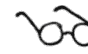


希望你想要投身于创建程序、解决问题，并享受当你自豪地审视自己编写的代码行，知道你创造了一个能运行的东西时，所获得的成就感。这很棒，你的热情值得赞扬，我向那些在阅读这本书时已经坐在电脑前、手指悬停、准备开始的读者们致敬。如果真是这样，你的屏幕上已经打开了Python，并且迫不及待想要开始，那么请便吧，我们将在第11页的第一章“基础”中再见。

对于仍然感到有些胆怯的各位读者，在你投身其中之前，还有几件事需要告诉你们。


### 如何使用本书

本书从非常简单的程序逐步深入到更复杂的程序。如果你是编程新手或Python新手，请从“基础”开始，按顺序阅读各章。

如果你熟悉Python编程，并对基础、理论和围绕编程的逻辑感到自信，那么你可以随意翻阅本书，获取你需要的具体帮助。


本书分为两个部分：

#### 第一部分

在第一部分中，每章介绍一些基本的编程规则，并提供你需要完成的挑战，包括：

- 一个**简单的解释**，为你提供指引，如果你是Python编程新手，这会很有用；
- **代码示例**及其简短解释，你可以将其作为解决挑战的基础；
- 一系列供你练习的**挑战题**，难度随章节递增。每个挑战应该只需要几分钟到20分钟就能解决；然而，第一部分末尾的一些更复杂的挑战将花费更多时间，因为你在逐步构建将用到的技巧。如果你花的时间更长，不要惊慌，只要你能够解决问题而*不过多*复制建议的解决方案，你就做得很好；
- 包含每个挑战的**可能解决方案**的代码；通常不止一种答案，但我们只提供一个作为可能解决方案的程序，供你在代码的某个特定方面遇到困难时参考。

#### 第二部分

在第二部分中，你将面对一些更大的挑战，这些挑战将运用你在第一部分学到的编程技能，并帮助你巩固和强化一直在练习的技术。在本节中，你不会得到第一部分中提供的帮助和示例代码，解决每个挑战将需要更长时间。每个挑战之后，你会得到一个可能的答案，如果你遇到困难，可能会觉得有用。不过，你也可能找到了另一个同样有效的解决方案。


#### 这本书适合谁？


本书适合任何想学习如何用 Python 编程的人。对于需要帮助和现成示例来练习编程技术并建立信心的初中教师和学生，或学习计算机科学的人来说，它是一个必备工具。它也可以用于帮助建立计算机科学编程项目资源库，为需要额外支持的学生提供帮助，或者在创建程序时快速回顾语法。

#### 下载 Python

你可以从 Python 官方网站免费下载 Python：

www.python.org/downloads/

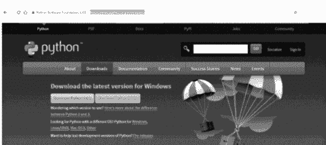

点击最新版本（在上面的示例中，点击 **Download Python 3.6.2** 按钮）开始安装。

程序将下载一个可执行文件（.exe）。当你运行这个程序时，你会看到一个如下所示的安装窗口。

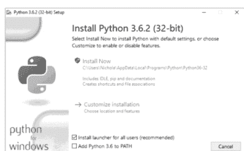

点击 **Install Now** 选项，程序将开始将 Python 安装到你的系统上。

#### 运行 Python

要在 Windows 系统上启动 Python，请点击 **Windows** 图标或 **开始** 菜单，然后选择 IDLE（Python 版本号）选项，如下所示。


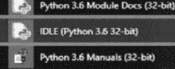


#### 一些提示

##### 文件位置

在 Windows 系统上，Python 文件夹通常位于 C:\ 驱动器中，名称为 **Python36**（或类似名称），除非你特别将文件保存到其他位置，否则文件将自动保存在同一位置。


##### 使用注释

注释是程序员非常有用的工具。它们有两个目的：

-   添加对程序工作方式的解释；
-   临时停止程序的某些部分运行，以便你可以运行和测试程序的其他部分。

第一个也是最初的目的，即解释程序的工作方式，是为了让其他程序员能够理解你的程序，以防将来需要修改和更新你的代码，并提醒你为什么编写特定的代码行。

```
print("This is a simple program")
print() #Outputs a blank line to help with layout
name = input("Please input your name: ")#Asks for an input
print("Hello", name) #Joins "Hello" and their name together
```

在这个例子中，注释被添加在最后三行的末尾。它们以红色显示，并以 # 符号开头。

实际上，你不会在包含明显代码的行上添加注释，因为这会使屏幕变得杂乱；你只会在必要时添加注释。

由于 Python 知道忽略 # 符号之后的任何内容，程序员很快就开始在代码行的开头使用 # 来屏蔽他们不想运行的部分，以便专注于测试其他部分。

```
#print("This is a simple program")
print()
name = input("Please input your name: ")
print("Hello", name)
```

在这个例子中，# 被添加到程序的第一行，以临时停止其运行。要使其恢复运行，只需删除 #，代码就会重新激活。

在本指南中，我们没有在程序中添加任何注释，因此你必须阅读代码才能理解它。这样你才能真正学会如何编码！如果你正在创建作为课程作业一部分的程序，你应该添加注释来向考官解释你的编程。

### 格式化 Python

在大多数版本的 Python IDLE 中，可以使用菜单快速添加注释和缩进代码。这样，如果你需要用注释屏蔽整个区域，只需高亮显示这些行，然后选择 **Format** 菜单并选择 **Comment Out Region**。同样，如果你需要缩进一个区域（我们稍后会讨论缩进代码的原因），你也可以通过菜单轻松完成。

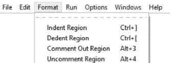

好了，所有的“内务处理”都完成了。别再拖延了；深吸一口气，我们开始吧...

#### 第一部分

学习 Python


## 基础知识

### 解释

这是 **shell** 窗口，是你启动 Python 时看到的第一个屏幕。

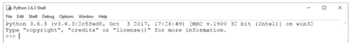

你可以直接在 shell 中编写 Python 代码，但一旦你在行尾按下 [Return]，它就会运行该行代码。这可能适合将 Python 用作快速计算器；例如，你可以在提示符下输入 **3*5**，Python 将在下一行显示答案 **15**；然而，这种输入方式对于更复杂的程序并不实用。


最好启动一个新窗口，在新窗口中创建所有代码，保存代码并运行它。


要创建一个新窗口来编写代码，请选择 **File** 和 **New**。一旦你在这个新窗口中输入代码，你就可以一次性保存并运行它。这将在 shell 窗口中运行代码。

或者，Python 程序可以使用任何文本编辑器编写，并且必须以文件扩展名 .py 保存才能运行。然后可以通过在命令提示符下输入完整的目录路径和文件名来运行这些程序。

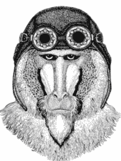

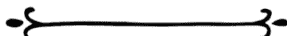

挑战 1 - 11：基础知识

### 运行你的程序

每次运行代码时，你的程序都需要重新保存，以防有任何更改。

在这个版本的 Python 中，你可以通过选择 **Run** 菜单并选择 **Run Module** 来运行程序。或者，你可以按 **[F5]** 键。如果这是程序第一次保存，Python 会提示你命名并保存文件，然后才允许程序运行。

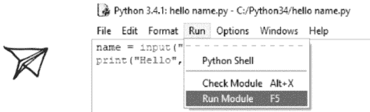

### 编写程序时需要注意的重要事项

**Python 区分大小写**，因此使用正确的大小写非常重要，否则你的代码将无法工作。


文本值需要出现在引号（""）中，但数字不需要。

在命名 **变量**（即你想要存储数据的值）时，你不能使用任何专用词，如 print、input 等，否则你的代码将无法工作。

保存文件时，**不要使用 Python 已经使用的任何专用词**（如 print、input 等）来保存它们。如果你这样做，它将无法运行，你需要重命名文件才能使其工作。

要编辑已保存并关闭的程序，请右键单击该文件并选择 **Edit with IDLE**。如果你只是双击该文件，它只会尝试运行它，你将无法编辑它。

### 示例代码

```
num1 = 93
设置一个变量的值，如果尚未创建变量，它将创建一个。变量是值的容器（在这种情况下，变量将被称为 "num1" 并存储值 93）。存储在变量中的值可以在程序运行时更改。变量可以是你想要的任何名称（除了 Python 专用词，如 print、save 等），它必须以字母而不是数字或符号开头，并且不能有空格。
```

```
answer = num1 + num2
将 num1 和 num2 相加，并将答案存储在名为 answer 的变量中。
```

```
answer = num1 - num2
从 num1 中减去 num2，并将答案存储在名为 answer 的变量中。
```

```
answer = num1 * num2
将 num1 乘以 num2，并将答案存储在名为 answer 的变量中。
```

```
answer = num1 / num2
将 num1 除以 num2，并将答案存储在名为 answer 的变量中。
```

```
answer = num1 // num2
整数除法（即 9//4 = 2），并将答案存储在名为 answer 的变量中。
```

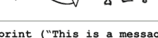

```
print ("This is a message")
显示括号中的消息。由于我们想要显示的值是文本值，它带有引号，这些引号不会在输出中显示。如果你想显示一个数值或变量的内容，则不需要引号。
```

```
print ("First line\nSecond line")
"\n" 用作换行符。
```

```
print ("The answer is", answer)
显示文本 "The answer is" 和变量 answer 的值。
```

```
textValue = input("Enter a text value: ")
显示问题 "Enter a text value: " 并将用户输入的值存储在名为 textValue 的变量中。冒号后的空格允许在用户输入答案之前添加一个空格，否则它们会难看地挤在一起。
```

```
numValue = int(input("Enter a number: "))
显示问题 "Enter a number: " 并将值作为整数（一个整数）存储在名为 numValue 的变量中。整数可用于计算，但存储为文本的变量则不能。
```

## 挑战

001

询问用户的名字，并显示输出信息 **你好 [名字]**

002

询问用户的名字，然后询问他们的姓氏，并显示输出信息 **你好 [名字] [姓氏]。**

003

编写代码，显示笑话“没有牙齿的熊叫什么？”，并在下一行显示答案“软糖熊！”。尝试只用一行代码来创建它。

004

要求用户输入两个数字。将它们相加，并将答案显示为 **总计是 [答案]**

005

要求用户输入三个数字。将前两个数字相加，然后将这个总和乘以第三个数字。将答案显示为 **答案是 [答案]。**

006

询问用户开始时有多少片披萨，以及他们吃了多少片。计算他们还剩多少片，并以用户友好的格式显示答案。

007

询问用户的名字和年龄。将他们的年龄加1，并显示输出 **[名字] 下次生日你将是 [新年龄]。**

008

询问账单的总金额，然后询问有多少用餐者。将总账单除以用餐者人数，并显示每人必须支付多少。

009

编写一个程序，要求输入天数，然后显示该天数包含多少小时、分钟和秒。

010

1千克等于2,204磅。要求用户输入以千克为单位的重量，并将其转换为磅。

011

要求用户输入一个大于100的数字，然后输入一个小于10的数字，并以用户友好的格式告诉他们较小的数字能进入较大数字多少次。


#### 答案

```
001
firstname = input("Please enter your first name: ")
print ("Hello",firstname)
```

```
002
firstname = input("Please enter your first name: ")
surname = input("Please enter your surname: ")
print ("Hello",firstname, surname)
```

```
003
print("What do you call a bear with no teeth?\nA gummy bear!")
```

```
004
num1 = int(input("Please enter your first number: "))
num2 = int(input("Please enter your second number: "))
answer = num1 + num2
print("The answer is", answer)
```

```
005
num1 = int(input("Please enter your first number: "))
num2 = int(input("Please enter your second number: "))
num3 = int(input("Please enter your third number: "))
answer = (num1 + num2)* num3
print("The answer is", answer)
```

```
006
startNum = int(input("Enter the number of slices of pizza you started with: "))
endNum = int(input("How many slices have you eaten? "))
slicesLeft = startNum - endNum
print("You have", slicesLeft, "slices remaining")
```

```
007
name = input("What is your name? ")
age = int(input("How old are you? "))
newAge = age + 1
print(name, "next birthday you will be", newAge)
```

```
008
bill = int(input("What is the total cost of the bill? "))
people = int(input("How many people are there? "))
each = bill/people
print("Each person should pay £", each)
```

### 16 挑战 1 - 11：基础

```
009
days = int(input("Enter the number of days: "))
hours = days*24
minutes = hours*60
seconds = minutes*60
print("In", days,"days there are...")
print(hours, "hours")
print(minutes, "minutes")
print(seconds, "seconds")
```

```
010
kilo = int(input("Enter the number of kilos: "))
pound = kilo * 2.204
print("That is", pound,"pounds")
```

```
011
larger = int(input("Enter a number over 100: "))
smaller = int(input("Enter a number under 10: "))
answer = larger//smaller
print(smaller,"goes into", larger, answer,"times")
```

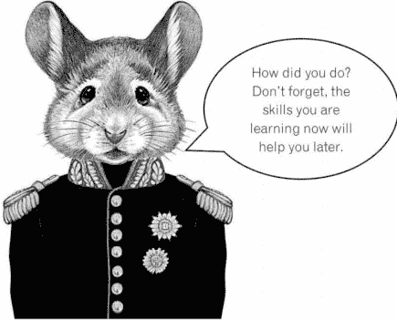

## # If 语句

## ## 解释

**If 语句**允许你的程序做出决策，并改变程序执行的路径。

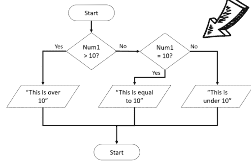

下面是此流程图的 if 语句在 Python 中的写法。

```
python
if num1 > 10:
    print("This is over 10")
elif num1 == 10:
    print("This is equal to 10")
else:
    print("This is under 10")
```

### 代码行缩进

缩进在 Python 中非常重要，因为它显示了哪些行依赖于其他行，如前一页的示例所示。要缩进文本，你可以使用 [Tab] 键，或者按 [空格键] 五次。[退格] 键将删除缩进。

if 语句的第一行测试一个条件，如果该条件满足（即第一个条件为真），则直接在其下方的代码行将运行。如果不满足（即第一个条件为假），它将测试第二个条件（如果有的话），依此类推。下面是你可以在 if 语句的条件行中使用的不同比较和逻辑运算符的示例。

### 比较运算符

### 逻辑运算符

| 运算符 | 描述 |
| --- | --- |
| == | 等于 |
| != | 不等于 |
| > | 大于 |
| < | 小于 |
| >= | 大于或等于 |
| <= | 小于或等于 |

| 运算符 | 描述 |
| --- | --- |
| and | 两个条件都必须满足 |
| or | 任一条件必须满足 |


### 示例代码

请注意：在所示示例中，`num` 是用户输入并存储为整数的变量。

```
if num > 10:
    print("This is over 10")
else:
    print("This is not over 10")
```

如果 `num1` 大于 10，它将显示消息 "This is over 10"，否则它将显示消息 "This is under 10"。


```
if num > 10:
    print("This is over 10")
elif num == 10:
    print("This is equal to 10")
else:
    print("This is under 10")
```

如果 `num1` 大于 10，它将显示消息 "This is over 10"，否则它将检查下一个条件。如果 `num1` 等于 10，它将显示消息 "This is equal to 10"。否则，如果前两个条件都不满足，它将显示消息 "This is under 10"。


```
if num >= 10:
    if num <= 20:
        print("This is between 10 and 20")
    else:
        print("This is over 20")
else:
    print("This is under 10")
```

如果 `num1` 大于或等于 10，那么它将测试另一个 if 语句，以查看 `num1` 是否小于或等于 20。如果是，它将显示消息 "This is between 10 and 20"。如果 `num1` 不小于或等于 20，那么它将显示消息 "This is over 20"。如果 `num1` 不大于 10，它将显示消息 "This is under 10"。


```
text = str.lower(text)
```

将文本转换为小写。由于 Python 区分大小写，这会将用户输入的数据转换为小写，以便更容易检查。

### 20 挑战 12 - 19：If 语句

```
num = int(input("Enter a number between 10 and 20: "))
if num >= 10 and num <= 20:
    print("Thank you")
else:
    print("Out of range")
```

这使用 **and** 来测试 if 语句中的多个条件。两个条件都必须满足才能产生输出 "Thank you"。

```
num = int(input("Enter an EVEN number between 1 and 5: "))
if num == 2 or num == 4:
    print("Thank you")
else:
    print("Incorrect")
```

这使用 **or** 来测试 if 语句中的条件。只需满足一个条件即可显示输出 "Thank you"。


#### 挑战

**012**
要求输入两个数字。如果第一个数字大于第二个，则先显示第二个数字，然后显示第一个数字，否则先显示第一个数字，然后显示第二个。

**013**
要求用户输入一个小于 20 的数字。如果他们输入的数字是 20 或更大，则显示消息 "Too high"，否则显示 "Thank you"。

**014**
要求用户输入一个介于 10 和 20 之间（包括 10 和 20）的数字。如果他们输入的数字在此范围内，则显示消息 "Thank you"，否则显示消息 "Incorrect answer"。

**015**
要求用户输入他们最喜欢的颜色。如果他们输入 "red"、"RED" 或 "Red"，则显示消息 "I like red too"，否则显示消息 "I don't like [colour], I prefer red"。

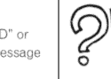


**016**
询问用户是否在下雨，并将他们的答案转换为小写，这样无论他们输入什么大小写都没关系。如果他们回答 "yes"，则询问是否有风。如果他们对第二个问题回答 "yes"，则显示答案 "It is too windy for an umbrella"，否则显示消息 "Take an umbrella"。如果他们没有对第一个问题回答 yes，则显示答案 "Enjoy your day"。

**017**
询问用户的年龄。如果他们 18 岁或以上，显示消息 "You can vote"，如果他们 17 岁，显示消息 "You can learn to drive"，如果他们 16 岁，显示消息 "You can buy a lottery ticket"，如果他们 16 岁以下，显示消息 "You can go Trick-or-Treating"。

**018**
要求用户输入一个数字。如果小于 10，显示消息 "Too low"，如果他们的数字在 10 到 20 之间，显示 "Correct"，否则显示 "Too high"。

**019**
要求用户输入 1、2 或 3。如果他们输入 1，显示消息 "Thank you"，如果他们输入 2，显示 "Well done"，如果他们输入 3，显示 "Correct"。如果他们输入其他任何内容，显示 "Error message"。

#### 答案

```
012
num1 = int(input("Enter first number: "))
num2 = int(input("Enter second number: "))
if num1 > num2:
    print(num2, num1)
else:
    print(num1,num2)
```

```
013
num = int(input("Enter a value less than 20: "))
if num >= 20:
    print("Too high")
else:
    print("Thank you")
```

```
014
num = int(input("Enter a value between 10 and 20: "))
if num >= 10 and num <= 20:
    print("Thank you")
else:
    print("Incorrect answer")
```

```
015
colour = input("Type in your favourite colour: ")
if colour == "red" or colour == "RED" or colour == "Red":
    print("I like red too.")
else:
    print("I don't like that colour, I prefer red")
```

### 016

```
raining = input("Is it raining? ")
raining = str.lower(raining)
if raining == "yes":
    windy = input("Is it windy? ")
    windy = str.lower(windy)
    if windy == "yes":
        print("It is too windy for an umbrella")
    else:
        print("Take an umbrella")
else:
    print("Enjoy your day")
```

### 017

```
age = int(input("What is your age? "))
if age >= 18:
    print ("You can vote")
elif age == 17:
    print ("You can learn to drive")
elif age == 16:
    print ("You can buy a lottery ticket")
else:
    print ("You can go Trick-or-Treating")
```

### 018

```
num = int(input("Enter a number: "))
if num <10:
    print("Too low")
elif num >=10 and num <=20:
    print("Correct")
else:
    print("Too high")
```

### 019

```
num = input("Enter 1, 2 or 3: ")
if num == "1":
    print("Thank you")
elif num == "2":
    print("Well done")
elif num == "3":
    print("Correct")
else:
    print("Error message")
```

## 字符串

### 解释

**字符串**是文本的技术名称。要将一段代码定义为字符串，你需要将其包含在双引号（"）或单引号（'）中。使用哪种引号并不重要，只要保持一致即可。

在将某些字符输入字符串时需要特别小心。这些字符包括：

" ' ",
            "bbox": [0.50

这是因为这些符号在 Python 中具有特殊含义，如果在字符串中使用它们可能会引起混淆。

如果你想使用这些符号之一，你需要在它前面加上一个反斜杠符号，这样 Python 就会知道忽略该符号，并将其视为要显示的普通文本。

| 符号 | 如何在 Python 字符串中输入此符号 |
| :--- | :--- |
| " | " |
| ' | \' |
| \ | \ |


### 字符串和数字作为变量

如果你将一个变量定义为字符串，即使它只包含数字，你也不能在之后将该字符串用于计算。如果你想在计算中使用一个已定义为字符串的变量，你必须在使用前将字符串转换为数字。

```
num = input("Enter a number: ")
total = num + 10
print(total)
```

在这个例子中，作者要求输入一个数字，但没有将其定义为数值，当程序运行时，他们将得到以下错误：

```
Enter a number: 45
Traceback (most recent call last):
  File "C:/Python34/CHALLENGES/String/example.py", line 2, in <module>
    total = num + 10
TypeError: Can't convert 'int' object to str implicitly
>>>
```

尽管这个错误消息看起来很吓人，但它只是说 **total = num + 10** 这一行无法工作，因为变量 num 被定义为字符串。


这个问题可以通过两种方式之一来解决。你可以在最初创建变量时将其定义为数字，使用这一行：

```
num = int(input("Enter a number: "))
```

或者你可以在创建后将其转换为数字，使用这一行：

```
num = int(num)
```

### 26 个挑战 20 - 26：字符串

字符串也可能发生同样的情况。

```
name = input("Enter a name: ")
num = int(input("Enter a number: "))
ID = name + num
print(ID)
```

在这个程序中，用户被要求输入他们的名字和一个数字。他们希望将它们连接在一起，对于字符串，加号用作**连接**。当运行此代码时，你将得到与之前类似的错误消息：

```
Enter a name: Bob
Enter a number: 23
Traceback (most recent call last):
  File "C:/Python34/CHALLENGES/String/example.py", line 3, in <module>
    ID = name + num
TypeError: Can't convert 'int' object to str implicitly
>>>
```

要解决这个问题，要么一开始就不将变量定义为数字，要么在之后使用以下行将其转换为字符串：

```
num = str(num)
```


### 多行字符串

如果你想输入一个跨多行的字符串，你可以使用换行符（\n），或者你可以将整个内容用三引号括起来。这将保留文本的格式。

```
address="""123 Long Lane
Oldtown
AB1 23CD"""
print(address)
```


### 示例代码

请注意：在以下示例中，术语 word、phrase、name、firstname 和 surname 都是变量名。

```
len(word)
查找名为 word 的变量的长度。
```

```
word.upper()
将字符串转换为大写。
```

```
print(word.capitalize())
显示变量，使得只有第一个单词的首字母大写，其余所有字母均为小写。
```

```
word.lower()
将字符串转换为小写。
```

```
name = firstname+surname
将名字和姓氏连接在一起，中间没有空格，称为连接。
```

```
word.title()
更改短语，使每个单词的首字母大写，单词中的其余字母小写（即标题大小写）。
```

```
text = " This is some text. "
print(text.strip(" "))
从字符串的开头和结尾移除多余的字符（在本例中为空格）。
```

```
print ("Hello world"[7:10])
每个字母都被分配一个索引号来标识其在短语中的位置，包括空格。Python 从 0 开始计数，而不是 1。

| 0 | 1 | 2 | 3 | 4 | 5 | 6 | 7 | 8 | 9 | 10 |
|---|---|---|---|---|---|---|---|---|---|----|
| H | e | l | l | o |   | w | o | r | l | d  |

因此，在这个例子中，它将显示位置 7、8 和 9 的值，即 "orl"。
```


> 不要忘记，你可以重用以前的程序来节省制作新程序的时间。只需使用“另存为”并给它一个新名称。

#### 挑战

- **020** 要求用户输入他们的名字，然后显示其名字的长度。

- **021** 要求用户输入他们的名字，然后要求他们输入姓氏。将它们连接在一起，中间加一个空格，并显示姓名和整个姓名的长度。

- **022** 要求用户以小写形式输入他们的名字和姓氏。将大小写更改为标题大小写并将它们连接在一起。显示最终结果。

- **023** 要求用户输入一首童谣的第一行，并显示字符串的长度。要求输入一个起始数字和一个结束数字，然后只显示该部分文本（记住 Python 从 0 开始计数，而不是 1）。

- **024** 要求用户输入任意单词并以大写形式显示。

- **025** 要求用户输入他们的名字。如果他们的名字长度少于五个字符，则要求他们输入姓氏并将它们连接在一起（不带空格）并以大写形式显示姓名。如果名字长度为五个或更多字符，则以小写形式显示他们的名字。

不要忘记，你总是可以回顾一下，提醒自己一些你之前学过的技巧。到目前为止，你已经学到了很多。

- **026** 猪拉丁语将单词的第一个辅音移到单词的末尾并添加 "ay"。如果一个单词以元音开头，你只需在末尾添加 "way"。例如，pig 变成 igpay，banana 变成 ananabay，aadvark 变成 aadvarkway。创建一个程序，要求用户输入一个单词并将其转换为猪拉丁语。确保新单词以小写形式显示。

# 答案

```
020
name = input("Enter your first name: ")
length = len(name)
print(length)
```

```
021
firstname = input("Enter your first name: ")
surname = input("Enter your surname: ")
name = firstname + " " + surname
length = len(name)
print(name)
print(length)
```

```
022
firstname = input("Enter your first name in lowercase: ")
surname = input("Enter your surname in lowercase: ")
firstname = firstname.title()
surname = surname.title()
name = firstname + " " + surname
print(name)
```

```
023
phrase = input("Enter the first line of a nursery rhyme: ")
length = len(phrase)
print("This has", length, "letters in it")
start = int(input("Enter a starting number: "))
end = int(input("Enter an end number: "))
part = (phrase[start:end])
print(part)
```

```
024
word = input("Enter a word: ")
word = word.upper()
print(word)
```

### 30个挑战 20 - 26：字符串

```
025
name = input("Enter your first name: ")
if len(name)< 5:
    surname = input("Enter your surname: ")
    name = name+surname
    print(name.upper())
else:
    print(name.lower())
```

```
026
word = input("Please enter a word: ")
first = word[0]
length = len(word)
rest = word[1:length]
if first != "a" and first != "e" and first != "i" and first != "o" and first != "u":
    newword = rest + first + "ay"
else:
    newword = word + "way"
print(newword.lower())
```

## 数学

### 解释

Python可以执行多种数学函数，但只有在数据被视为**整数**（一个整数）或**浮点数**（带小数点的数）时才可用。如果数据以字符串形式存储，即使它只包含数字字符，Python也无法用它进行计算（更完整的解释请参见第24页）。

### 示例代码

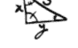

**请注意：** 为了使用一些数学函数（**math.sqrt(num)** 和 **math.pi**），您需要在程序开头导入数学库。这可以通过在程序的第一行输入 **import math** 来实现。

| **print(round(num,2))** |
| :--- |
| 显示一个四舍五入到两位小数的数字。 |

| **\*\*** | **math.sqrt(num)** |
| :--- | :--- |
| 乘方运算（例如 10² 是 10\*\*2）。 | 一个数的平方根，但您的程序必须在顶部包含 **import math** 这行才能使其工作。 |

| **num=float(input("Enter number: "))** |
| :--- |
| 允许输入包含小数点，以分隔整数和小数部分。 |

| **math.pi** |
| :--- |
| 提供精确到15位小数的圆周率 (π)，但您的程序必须在顶部包含 **import math** 这行才能使其工作。 |


| **x // y** |
| :--- |
| 整数除法（例如 15//2 的结果是 7）。 |

| **x % y** |
| :--- |
| 求余数（例如 15%2 的结果是 1）。 |

#### 挑战

**027**
要求用户输入一个有很多小数位的数字。将这个数字乘以二并显示答案。

**028**
更新程序027，使其将答案显示到两位小数。

**029**
要求用户输入一个大于500的整数。计算该数的平方根并将其显示到两位小数。

**030**
将圆周率（π）显示到五位小数。

**031**
要求用户输入一个圆的半径（从中心点到边缘的距离）。计算圆的面积（π*半径²）。

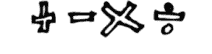

**032**
要求输入圆柱体的半径和深度，并计算总体积（圆面积*深度），结果四舍五入到三位小数。

**033**
要求用户输入两个数字。使用整数除法将第一个数字除以第二个数字，并计算余数，以用户友好的方式显示答案（例如，如果输入7和2，则显示"7 除以 2 得 3 余 1"）。

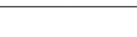

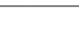

**034**
显示以下消息：
1) 正方形
2) 三角形

**请输入一个数字：**

如果用户输入1，则应询问其边长并显示面积。如果选择2，则应询问三角形的底和高并显示面积。如果输入其他内容，则应给出合适的错误消息。

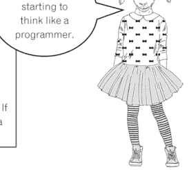

#### 答案

```
027
num = float(input("Enter a number with lots of decimal places: "))
print(num*2)
```

```
028
num = float(input("Enter a number with lots of decimal places: "))
answer = num*2
print(answer)
print(round(answer, 2))
```

```
029
import math
num = int(input("Enter a number over 500: "))
answer = math.sqrt(num)
print(round(answer, 2))
```

```
030
import math
print(round(math.pi,5))
```

```
031
import math
radius = int(input("Enter the radius of the circle: "))
area = math.pi*(radius**2)
print(area)
```

```
032
import math
radius = int(input("Enter the radius of the circle: "))
depth = int(input("Enter depth: "))
area = math.pi*(radius**2)
volume = area*depth
print(round(volume,3))
```

```
033
num1=int(input("Enter a number: "))
num2=int(input("Enter another number: "))
ans1 = num1//num2
ans2 = num1%num2
print(num1, "divided by", num2, "is", ans1, "with", ans2, "remaining.")
```

### 34个挑战 27 - 34：数学

```
034
print("1) Square")
print("2) Triangle")
print()
menuselection = int(input("Enter a number: "))
if menuselection == 1:
    side = int(input("Enter the length of one side: "))
    area = side*side
    print("The area of your chosen shape is", area)
elif menuselection == 2:
    base = int(input("Enter the length of the base: "))
    height = int(input("Enter the height of the triangle: "))
    area = (base*height)/2
    print("The area of your chosen shape is", area)
else:
    print("Incorrect option selected")
```

## For 循环

### 解释

一个 **for 循环** 允许Python将一段代码重复执行特定次数。它有时被称为 **计数循环**，因为您在循环开始前就知道它将运行的次数。

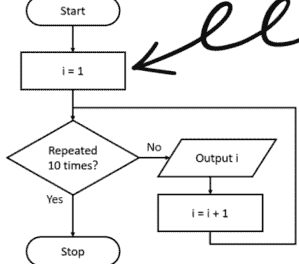

在这个例子中，它从1开始，将重复循环（显示i）直到达到10，然后停止。在Python中，这个循环看起来像这样：

```
python
for i in range(1,10):
    print(i)
```

在这个例子中，输出将是1, 2, 3, 4, 5, 6, 7, 8 和 9。**当它到达10时循环会停止，所以10不会在输出中显示。**

>> 记住要缩进for循环内的代码行。

### 示例代码

range函数常用于for循环中，它列出起始数字、结束数字，也可以包括步长（例如，按1、5或任何您希望的其他值计数）。

```
for i in range(1,10):
    print(i)

这个循环使用一个名为“i”的变量来跟踪循环已重复的次数。它将从1开始（因为那是range函数中的起始值），然后重复循环，每次将i增加1并显示i的值，直到它达到10（由range函数决定），届时它将停止。因此，它不会第十次重复循环，只会有以下输出：
1, 2, 3, 4, 5, 6, 7, 8, 9
```

```
for i in range(1,10,2):
    print(i)

这个range函数包含第三个值，它表示在每个循环中给i增加多少（在这种情况下是2）。因此，输出将是：1, 3, 5, 7, 9
```

```
for i in range(10,1,-3):
    print(i)

这个range每次将从i中减去3。输出将是：10, 7, 4
```

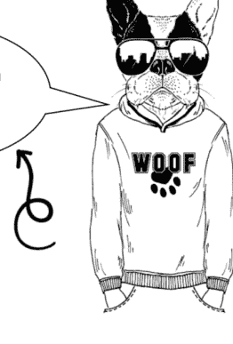

```
for i in word:
    print(i)

这将显示名为“word”的字符串中的每个字符作为单独的输出（即在单独的行上）。
```

#### 挑战

**035**
要求用户输入他们的名字，然后将他们的名字显示三次。

**036**
修改程序035，使其要求用户输入他们的名字和一个数字，然后显示他们的名字对应次数。

**038**
修改程序037，使其也要求输入一个数字。显示他们的名字（每次一个字母在一行），并重复此过程对应输入的次数。

**037**
要求用户输入他们的名字，并在单独的行上显示名字中的每个字母。

**039**
要求用户输入一个介于1和12之间的数字，然后显示该数字的乘法表。


**040**
要求输入一个小于50的数字，然后从50倒数到该数字，确保在输出中显示他们输入的数字。

**041**
要求用户输入他们的名字和一个数字。如果数字小于10，则显示他们的名字对应次数；否则，显示“Too high”消息三次。

**042**
将一个名为total的变量设为0。要求用户输入五个数字，并在每次输入后询问他们是否要包含该数字。如果他们选择包含，则将该数字加到total中。如果他们不想包含，则不加到total中。在输入所有五个数字后，显示total。

**043**
询问用户想要计数的方向（向上或向下）。如果他们选择向上，则要求他们输入顶部数字，然后从1计数到该数字。如果他们选择向下，则要求他们输入一个小于20的数字，然后从20倒数到该数字。如果他们输入的内容不是“up”或“down”，则显示消息“I don't understand”。

**044**
询问用户想邀请多少人参加派对。如果他们输入的数字小于10，则询问名字，并在输入每个名字后显示“[name] has been invited”。如果他们输入的数字是10或更大，则显示消息“Too many people”。

#### 答案

```
035
name = input("Type in your name: ")
for i in range (0,3):
    print(name)
```

```
036
name = input("Type in your name: ")
number = int(input("Enter a number: "))
for i in range (0,number):
    print(name)
```

```
037
name = input("Enter your name: ")
for i in name:
    print(i)
```

```
038
num = int(input("Enter a number: "))
name = input("Enter your name: ")
for x in range(0,num):
    for i in name:
        print(i)
```

```
039
num = int(input("Enter a number between 1 and 12: "))
for i in range(1, 13):
    answer = i * num
    print (i, "x", num, "=", answer)
```

```
040
num = int(input("Enter a number below 50: "))
for i in range(50,num-1, -1):
    print(i)
```

### 挑战 35 - 44: For 循环

```
041
name = input("Enter your name: ")
num = int(input("Enter a number: "))
if num < 10:
    for i in range(0,num):
        print(name)
else:
    for i in range(0,3):
        print("Too high")
```

```
042
total = 0
for i in range(0,5):
    num = int(input("Enter a number: "))
    ans = input("Do you want this number included? (y/n) ")
    if ans == "y":
        total = total + num
print(total)
```

```
043
direction = input("Do you want to count up or down? (u/d) ")
if direction == "u":
    num = int(input("What is the top number? "))
    for i in range(1,num+1):
        print(i)
elif direction == "d":
    num = int(input("Enter a number below 20: "))
    for i in range(20,num-1, -1):
        print(i)
else:
    print("I don't understand")
```

```
044
num = int(input("How many friends do you want to invite to the party? "))
if num < 10:
    for i in range(0,num):
        name = input("Enter a name: ")
        print(name, "has been invited")
else:
    print("Too many people")
```

## While 循环

### 解释

**while 循环**允许代码在满足条件的情况下重复执行未知次数。这个次数可能是100次、仅仅一次，甚至一次也不执行。在while循环中，条件在代码运行之前被检查，这意味着如果一开始条件就不满足，循环可能会被完全跳过。因此，在循环开始前，确保正确的条件设置至关重要。

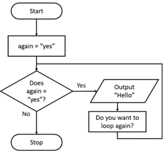

在Python中，上面流程图的例子如下所示：

```
python
again = "yes"
while again == "yes":
    print ("Hello")
    again=input("Do you want to loop again? ")
```

它会持续重复这段代码，直到用户输入除 "yes" 以外的任何内容。

### 示例代码

```
total = 0
while total < 100:
    num = int(input("Enter a number: "))
    total = total + num
print("The total is", total)
```

上面的程序将创建一个名为 `total` 的变量，并将其值存储为0。它会要求用户输入一个数字，并将其添加到总和中。只要总和仍然小于100，它就会持续重复这个过程。当总和等于或超过100时，它将停止运行循环并显示总和。

### 比较运算符

| 运算符 | 描述 |
| --- | --- |
| == | 等于 |
| != | 不等于 |
| > | 大于 |
| < | 小于 |
| >= | 大于或等于 |
| <= | 小于或等于 |

### 逻辑运算符

| 运算符 | 描述 |
| --- | --- |
| and | 必须同时满足两个条件 |
| or | 必须满足其中一个条件 |

**请记住：文本值必须使用引号括起来，而数值则不需要。**


#### 挑战

**045**
将总和初始化为0。当总和小于或等于50时，要求用户输入一个数字。将该数字加到总和中，并打印消息 "The total is... [total]"。当总和超过50时，停止循环。

**046**
要求用户输入一个数字。持续询问，直到他们输入一个大于5的值，然后显示消息 "The last number you entered was a [number]" 并停止程序。

**047**
要求用户输入一个数字，然后再输入另一个数字。将这两个数字相加，然后询问他们是否要添加另一个数字。如果他们输入 "y"，则要求他们输入另一个数字，并持续添加数字，直到他们不回答 "y" 为止。循环停止后，显示总和。


**048**
询问用户想邀请参加派对的人的名字。之后，显示消息 "[name] has now been invited" 并将计数器加1。然后询问他们是否想邀请其他人。持续重复此过程，直到他们不想再邀请其他人参加派对，然后显示有多少人会来参加派对。

**049**
创建一个名为 `compnum` 的变量，并将其值设为50。要求用户输入一个数字。当他们的猜测与 `compnum` 的值不同时，告诉他们猜测是太低还是太高，并要求他们再猜一次。如果他们输入的值与 `compnum` 相同，则显示消息 "Well done, you took [count] attempts"。

**050**
要求用户输入一个介于10和20之间的数字。如果他们输入的值低于10，显示消息 "Too low" 并要求他们重试。如果他们输入的值高于20，显示消息 "Too high" 并要求他们重试。持续重复此过程，直到他们输入一个介于10和20之间的值，然后显示消息 "Thank you"。


**051**
使用歌曲 "10 green bottles"，显示歌词 "There are [num] green bottles hanging on the wall, [num] green bottles hanging on the wall, and if 1 green bottle should accidentally fall"。然后问问题 "how many green bottles will be hanging on the wall?"。如果用户回答正确，显示消息 "There will be [num] green bottles hanging on the wall"。如果回答不正确，显示消息 "No, try again" 直到他们答对为止。当绿瓶子的数量减少到0时，显示消息 "There are no more green bottles hanging on the wall"。

#### 答案

```
045
total = 0
while total <= 50:
    num = int(input("Enter a number: "))
    total = total + num
    print("The total is...",total)
```

```
046
num = 0
while num <= 5:
    num = int(input("Enter a number: "))
print("The last number you entered was a", num)
```

```
047
num1 = int(input("Enter a number: "))
total = num1
again = "y"
while again == "y":
    num2 = int(input("Enter another number: "))
    total = total + num2
    again = input("Do you want to add another number? (y/n) ")
print("The total is ",total)
```

```
048
again = "y"
count = 0
while again =="y":
    name = input("Enter a name of somebody you want to invite to your party: ")
    print(name, "has now been invited")
    count = count + 1
    again = input("Do you want to invite somebody else? (y/n) ")
print("You have", count, "people coming to your party")
```

```
049
compnum = 50
guess = int(input("Can you guess the number I am thinking of? "))
count = 1
while guess != compnum:
    if guess < compnum:
        print("Too low")
    else:
        print("Too high")
    count = count+1
    guess = int(input("Have another guess: "))
print("Well done, you took", count, "attempts")
```

### 挑战 45 - 51: While 循环

```
050
num = int(input("Enter a number between 10 and 20: "))
while num <10 or num >20:
    if num <10:
        print("Too low")
    else:
        print("Too high")
    num = int(input("Try again: "))
print("Thank you")
```

```
051
num = 10
while num >0:
    print("There are ", num, "green bottles hanging on the wall.")
    print( num, "green bottles hanging on the wall.")
    print("And if 1 green bottle should accidentally fall,")
    num = num - 1
    answer = int(input("How many green bottles will be hanging on the wall? "))
    if answer == num:
        print("There will be", num, "green bottles hanging on the wall.")
    else:
        while answer!=num:
            answer = int(input("No, try again: "))
print("There are no more green bottles hanging on the wall.")
```

## 随机数

### 解释

Python 可以生成**随机**值。实际上，这些值并非完全随机，因为没有计算机能够处理真正随机的情况；相反，它使用一种极其复杂的算法，使得预测其结果几乎不可能，因此，它实际上充当了一个随机函数。

我们将要研究的随机值有两种类型：

- 指定范围内的随机数；
- 从输入的一系列项目中随机选择。

要使用这两个选项，你需要导入 random 库。这可以通过在程序开始处输入 `import random` 来实现。


### 示例代码

```python
import random
```

这一行必须出现在程序的开头，否则随机数函数将无法工作。

```python
num = random.random()
```

选择一个介于0和1之间的随机浮点数，并将其存储在一个名为“num”的变量中。如果您想获得一个更大的数字，可以按如下方式将其相乘：

```python
import random
num = random.random()
num = num * 100
print(num)
```

```python
num = random.randint(0,9)
```

选择一个介于0和9之间（包含两端）的随机整数。

```python
num1 = random.randint(0,1000)
num2 = random.randint(0,1000)
newrand = num1/num2
print(newrand)
```

通过创建两个大范围（本例中为0到1000）内的随机整数，并将其中一个除以另一个，来创建一个随机浮点数。


> 你做得很棒！

```python
num = random.randrange(0,100,5)
```

以步长为五，在数字0和100之间（包含两端）选择一个随机数，即它只会从0, 5, 10, 15, 20等数中选择。

```python
colour = random.choice(["red", "black", "green"])
```

从“红色”、“黑色”或“绿色”选项中选择一个随机值，并将其存储为变量“colour”。请记住：字符串需要包含引号，而数字数据不需要。


#### 挑战

**052**
显示一个介于1和100之间（包含两端）的随机整数。

**053**
从五种水果的列表中显示一个随机水果。

**054**
随机选择“正面”或“反面”（“h”或“t”）。让用户做出选择。如果他们的选择与随机选定的值相同，则显示消息“你赢了”，否则显示“运气不佳”。最后，告诉用户计算机选择的是正面还是反面。

**055**
随机选择一个1到5之间的数字。让用户选择一个数字。如果他们猜对了，显示消息“干得好”，否则告诉他们猜得太高还是太低，并要求他们选择第二个数字。如果他们第二次猜对了，显示“正确”，否则显示“你输了”。

**056**
随机选择一个1到10之间的整数。要求用户输入一个数字，并持续输入数字，直到他们输入的数字与随机选择的数字相同。

**057**
更新程序056，使其在用户再次选择之前告诉他们猜得太高还是太低。

**058**
制作一个数学测验，通过随机生成两个整数来提出五个问题（例如，[num1] + [num2]）。要求用户输入答案。如果他们答对了，给他们的分数加一分。测验结束时，告诉他们五个问题中答对了多少个。

**059**
显示五种颜色并要求用户选择一种。如果他们选择的颜色与程序选择的相同，说“干得好”，否则显示一个包含正确颜色的机智回答，例如“我敢打赌你现在**嫉妒得脸都绿了**”或“你现在可能感觉**有点忧郁**”。要求他们再次猜测；如果他们仍然没有猜对，继续给他们同样的提示，并要求用户输入一种颜色，直到他们猜对为止。

#### 答案

**052**

```python
import random
num = random.randint(1,100)
print(num)
```

**053**

```python
import random
fruit = random.choice( ['apple', 'orange', 'grape', 'banana', 'strawberry'] )
print(fruit)
```

**054**

```python
import random
coin = random.choice( ["h", "t"] )
guess = input("输入 (h)正面 或 (t)反面: ")
if guess == coin:
    print("你赢了")
else:
    print("运气不佳")
if coin == "h":
    print("是正面")
else:
    print("是反面")
```

**055**

```python
import random
num = random.randint(1,5)
guess = int(input("输入一个数字: "))
if guess == num:
    print("干得好")
elif guess > num:
    print("太高了")
    guess = int(input("再猜一次: "))
    if guess == num:
        print("正确")
    else:
        print("你输了")
elif guess < num:
    print("太低了")
    guess = int(input("再猜一次: "))
    if guess == num:
        print("正确")
    else:
        print("你输了")
```

**056**

```python
import random
num = random.randint(1,10)
correct = False
while correct == False:
    guess = int(input("输入一个数字: "))
    if guess == num:
        correct = True
```

**057**

```python
import random
num = random.randint(1,10)
correct = False
while correct == False:
    guess = int(input("输入一个数字: "))
    if guess == num:
        correct = True
    elif guess > num:
        print("太高了")
    else:
        print("太低了")
```

**058**

```python
import random
score = 0
for i in range(1,6):
    num1 = random.randint(1,50)
    num2 = random.randint(1,50)
    correct = num1 + num2
    print(num1, "+", num2,"= ")
    answer = int(input("你的答案: "))
    print()
    if answer == correct:
        score = score + 1
print("你得了",score, "分，满分5分")
```

**059**

```python
import random

colour = random.choice(["red","blue","green","white", "pink"])
print("从红色、蓝色、绿色、白色或粉色中选择")
tryagain = True
while tryagain == True:
    theirchoice = input("输入一种颜色: ")
    theirchoice = theirchoice.lower()
    if colour == theirchoice:
        print("干得好")
        tryagain = False
    else:
        if colour == "red":
            print("我敢打赌你现在正气得脸都**红**了！")
        elif colour == "blue":
            print("别感到**忧郁**。")
        elif colour == "green":
            print("我敢打赌你现在**嫉妒得脸都绿了**。")
        elif colour == "white":
            print("你猜错了，是不是吓得脸色**苍白**？")
        elif colour == "pink":
            print("真可惜，你没能**保持健康快乐**，因为你猜错了！")
```

## 海龟作图

### 说明

在Python中，可以使用**海龟**进行绘图。通过输入命令并使用循环，你可以创建复杂的图案。以下是它的工作原理。

海龟将沿着你定义的路径行进，并在其身后留下笔迹。当你控制海龟时，所留下的图案就显现出来了。要绘制下面所示的五边形，你需要输入以下代码。

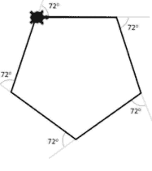

```python
import turtle

turtle.shape("turtle")

for i in range(0,5):
    turtle.forward(100)
    turtle.right(72)

turtle.exitonclick()
```

通过组合这些简单的形状并使用**嵌套**循环（即循环内部的其他循环），可以非常容易地创建出美丽的图案。


```python
import turtle

for i in range(0,10):
    turtle.right(36)
    for i in range(0,5):
        turtle.forward(100)
        turtle.right(72)

turtle.exitonclick()
```

在上面的图案中，一个五边形被重复绘制了10次，围绕中心点旋转36度。**请注意：** 我们高亮显示了其中一个五边形，以帮助你在图案中识别它，但通常它不会被高亮显示。

### 示例代码

```python
import turtle
```

这一行需要包含在程序的开头，以便将turtle库导入Python，从而让你能够使用海龟函数。

```python
scr = turtle.Screen()
```

将窗口定义为“scr”。这意味着我们可以使用简写“scr”，而不必每次都使用其完整名称来引用窗口。


```python
scr.bgcolor("yellow")
```

将屏幕背景色设置为黄色。除非更改，否则背景色默认为白色。

```python
turtle.penup()
```

将笔从页面上抬起，这样当海龟移动时，它不会留下痕迹。

```python
turtle.pendown()
```

将笔放在页面上，这样当海龟移动时，它会留下痕迹。除非另有说明，笔默认是放下的。

```python
turtle.pensize(3)
```

将海龟笔的大小（绘制线条的粗细）更改为3。除非更改，否则默认值为1。

```python
turtle.left(120)
```

将海龟向左转120°（逆时针）。

```python
turtle.right(90)
```

将海龟向右转90°（顺时针）。

```python
turtle.forward(50)
```

将海龟向前移动50步。

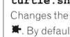

```python
turtle.shape("turtle")
```

将海龟的形状更改为看起来像一只海龟。默认情况下，海龟看起来像一个小箭头。

```python
turtle.hideturtle()
```

隐藏海龟，使其不在屏幕上显示。

```python
turtle.begin_fill()
```

在绘制形状的代码之前输入，以便它知道要填充正在绘制的形状。

```python
turtle.showturtle()
```

在屏幕上显示海龟。除非另有说明，否则海龟默认是显示的。

```python
turtle.end_fill()
```

在绘制形状的代码之后输入，告诉Python停止填充形状。

```python
turtle.color("black", "red")
```

定义填充形状的颜色。此示例将使形状具有黑色轮廓和红色填充。这需要在绘制形状之前输入。

```python
turtle.exitonclick()
```

当用户单击海龟窗口时，它将自动关闭。

#### 挑战

请记住，在创建新程序时，您可以重用以前的程序以节省时间。只需使用“另存为”并赋予其新名称即可。

**060**
绘制一个正方形。

**061**
绘制一个三角形。

**062**
绘制一个圆形。

**063**
绘制三个一排的正方形，每个之间留有间隙。使用三种不同的颜色填充它们。

**065**
按照下图所示书写数字，从数字1的底部开始。

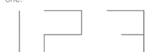

**064**
绘制一个五角星。


**066**
绘制一个八边形，其每条边使用不同的颜色（从六种可能的颜色列表中随机选择）。

**067**
创建以下图案：

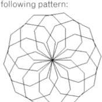

您的编程技能随着每一个完成的挑战而增长。

**068**
绘制一个每次运行程序时都会改变的图案。使用随机函数来选择线条数量、每条线的长度以及每个转弯的角度。

#### 答案

060

```
import turtle

for i in range(0,4):
    turtle.forward(100)
    turtle.right(90)

turtle.exitonclick()
```

061

```
import turtle

for i in range (0,3):
    turtle.forward(100)
    turtle.left(120)

turtle.exitonclick()
```

062

```
import turtle

for i in range (0,360):
    turtle.forward(1)
    turtle.right(1)

turtle.exitonclick()
```

063

```
import turtle

turtle.color("black","red")
turtle.begin_fill()
for i in range (0,4):
    turtle.forward(70)
    turtle.right(90)
turtle.penup()
turtle.end_fill()
turtle.forward(100)

turtle.pendown()
turtle.color("black","yellow")
turtle.begin_fill()
for i in range (0,4):
    turtle.forward(70)
    turtle.right(90)
turtle.penup()
turtle.end_fill()
turtle.forward(100)

turtle.pendown()
turtle.color("black","green")
turtle.begin_fill()
for i in range (0,4):
    turtle.forward(70)
    turtle.right(90)
turtle.end_fill()

turtle.exitonclick()
```

064

```
import turtle

for i in range (0,5):
    turtle.forward(100)
    turtle.right(144)

turtle.exitonclick()
```

### 56个挑战 60 - 68：海龟图形

065

```
import turtle

turtle.left(90)
turtle.forward(100)
turtle.right(90)
turtle.penup()
turtle.forward(50)
turtle.pendown()
turtle.forward(75)
turtle.right(90)
turtle.forward(50)
turtle.right(90)
turtle.forward(75)
turtle.left(90)
turtle.forward(50)
turtle.left(90)
turtle.forward(75)
turtle.penup()
turtle.forward(50)
turtle.pendown()
turtle.forward(75)
turtle.left(90)
turtle.forward(50)
turtle.left(90)
turtle.forward(45)
turtle.left(180)
turtle.forward(45)
turtle.left(90)
turtle.forward(50)
turtle.left(90)
turtle.forward(75)

turtle.hideturtle()

turtle.exitonclick()
```

066

```
import turtle
import random

turtle.pensize(3)

for i in range (0,8):
    turtle.color(random.choice( ["red","blue","yellow","green","pink","orange"]))
    turtle.forward(50)
    turtle.right(45)

turtle.exitonclick()
```

067

```
import turtle
import random

for x in range(0,10):
    for i in range (0,8):
        turtle.forward(50)
        turtle.right(45)
    turtle.right(36)

turtle.hideturtle()

turtle.exitonclick()
```

068

```
import turtle
import random

lines = random.randint(5,20)

for x in range(0,lines):
    length = random.randint(25,100)
    rotate = random.randint(1,365)
    turtle.forward(length)
    turtle.right(rotate)

turtle.exitonclick()
```

## 元组、列表和字典

### 说明

到目前为止，我们使用的是可以存储单个数据项的变量。当您使用 `random.choice(["red", "blue", "green"])` 这行代码时，您是从一个可能选项的列表中随机选择一个项目。这演示了一个项目可以包含多个独立的数据，在这个例子中是一组颜色。

有几种方法可以将数据集合存储为单个项目。其中三种较简单的是：

-   元组
-   列表
-   字典


### 元组

一旦定义了一个**元组**，您就不能更改其中存储的内容。这意味着在编写程序时，您必须说明存储在元组中的数据是什么，并且在程序运行期间数据不能更改。元组通常用于不需要更改的菜单项。

### 列表

**列表**的内容可以在程序运行时进行更改，列表是Python中在单个变量名下存储数据集合最常见的方法之一。列表中的数据不一定都是相同的数据类型。例如，同一个列表可以同时存储字符串和整数；然而，这可能会在后续引起问题，因此不建议这样做。

> **请注意：** 在其他编程语言中，术语**数组**常用于描述包含数据集合的变量，它们的工作方式与Python中的列表类似。Python中有一种称为数组的数据类型，但它只用于存储数字，我们将在第72页查看Python数值数组。

### 字典

**字典**的内容也可以在程序运行时进行更改。每个值都被赋予一个索引或键，您可以定义它来帮助识别每条数据。如果其他数据行被添加或删除，这个索引不会改变，这与列表不同，在列表中项目的位置可以改变，因此它们的索引号也会改变。


> 不要让自己陷入混乱，将每个程序分解成您已经从之前程序中知道的部分，并构建您正在学习的新技能。


### 示例代码

```
fruit_tuple = ("apple", "banana", "strawberry", "orange")
创建一个名为 "fruit_tuple" 的变量名，其中存储了四种水果。圆括号将此组定义为元组，因此在程序运行期间不能更改此数据集合的内容。
```

```
print(fruit_tuple.index("strawberry"))
显示项目 "strawberry" 的索引（即数字键）。在此示例中，它将返回数字2，因为Python从0开始计数项目，而不是从1开始。
```

```
print(fruit_tuple[2])
显示 "fruit_tuple" 中的第2个项目，在本例中为 "strawberry"。
```

```
names_list = ["John", "Tim", "Sam"]
创建一个名称列表并将它们存储在变量 "names_list" 中。方括号将这组数据定义为列表，因此在程序运行期间可以更改其内容。
```

```
del names_list[1]
从 "names_list" 中删除第1个项目。记住它从0开始计数，而不是从1开始。在本例中，它将从列表中删除 "Tim"。
```

```
names_list.append(input("Add a name: "))
提示用户输入一个名称，并将其添加到 "names_list" 的末尾。
```

```
names_list.sort()
将name_list按字母顺序排序，并按新顺序保存列表。如果列表中存储的数据类型不同，例如同一个列表中包含字符串和数字数据，则此操作无效。
```

```
print(sorted(names_list))
按字母顺序显示names_list，但不会更改原始列表的顺序，原始列表仍按原始顺序保存。如果列表中存储的数据类型不同，例如同一个列表中包含字符串和数字数据，则此操作无效。
```

```
colours = {1:"red", 2:"blue", 3:"green"}
创建一个名为 "colours" 的字典，其中每个项目都被分配了一个您选择的索引。每个块中的第一个项目是索引，由冒号分隔，然后是颜色。
```

```
colours[2] = "yellow"
更改存储在colours字典位置2的数据。在本例中，它将 "blue" 更改为 "yellow"。
```

由于列表是最常见的数据结构之一，我们仅为列表包含更多示例代码。

```
x = [154, 634, 892, 345, 341, 43]
这里我们创建了一个包含数字的列表。**请注意：** 因为它包含数字数据，所以不需要引号。
```

```
print(len(x))
显示列表的长度（即列表中有多少个项目）。
```

```
print(x[1:4])
这将显示位置1、2和3的数据。在本例中为634、892和345。记住，Python从0开始计数，并在到达最后一个位置时停止，不显示最终值。
```

```
for i in x:
    print(i)
在for循环中使用列表中的项目，如果您想将列表中的项目打印在不同的行上，这很有用。
```

```
num = int(input("Enter number: "))
if num in x:
    print(num, "is in the list")
else:
    print("Not in the list")
要求用户输入一个数字，并检查该数字是否在列表中，并显示相应的消息。
```


```
x.insert(2, 420)
将数字420插入位置2，并将所有其他内容向后移动以腾出空间。这将更改列表中项目的索引号。
```

```
x.remove(892)
从列表中删除一个项目。如果您不知道该项目的索引，这很有用。如果存在多个相同的数据实例，则只会删除第一个实例。
```

```
x.append(993)
将数字993添加到列表的末尾。
```

#### 挑战

**069**
创建一个包含五个国家名称的元组，并显示整个元组。要求用户输入之前向他们展示过的国家之一，然后显示该国在元组中的索引号（即列表中的位置）。

**070**
在程序069的基础上，要求用户输入一个数字，并显示该数字位置对应的国家。

**071**
创建一个包含两项运动的列表。询问用户最喜欢的运动是什么，并将其添加到列表末尾。对列表进行排序并显示。


**072**
创建一个包含六个学校科目的列表。询问用户其中不喜欢哪个科目。在再次显示列表之前，从列表中删除用户选择的科目。

**073**
要求用户输入四种他们喜欢的食物，并将其存储在一个字典中，索引号从1开始。完整显示字典，显示索引号和对应项目。询问他们想删除哪一项，并将其从列表中移除。对剩余数据进行排序并显示字典。

**074**
输入一个包含十种颜色的列表。要求用户输入一个0到4之间的起始数字和一个5到9之间的结束数字。显示用户输入的起始和结束数字之间的颜色列表。

**075**
创建一个包含四个三位数的列表。向用户显示列表，每行显示一个项目。要求用户输入一个三位数。如果输入的数字与列表中的某个匹配，显示该数字在列表中的位置，否则显示消息"不在列表中"。

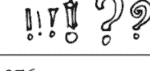

**076**
要求用户输入三个他们想邀请参加派对的人的名字，并将其存储在列表中。在输入所有三个名字后，询问他们是否想再添加一个。如果愿意，允许他们继续添加名字，直到回答"不"。当回答"不"时，显示他们邀请了多少人参加派对。

### 挑战 69 - 79：元组、列表和字典

**077**
修改程序076，使用户完成姓名列表后，显示完整列表并要求他们输入列表中的一个名字。显示该名字在列表中的位置。询问用户是否还想让这个人参加派对。如果回答"不"，从列表中删除该条目并再次显示列表。

**078**
创建一个包含四个电视节目标题的列表，并在单独的行中显示它们。要求用户输入另一个节目以及希望插入列表的位置。再次显示列表，显示所有五个电视节目在新位置上的状态。

你已经完成了一半以上。继续加油，你已经学到了这么多。


**079**
创建一个名为"nums"的空列表。要求用户输入数字。每次输入数字后，将其添加到nums列表末尾并显示列表。当输入三个数字后，询问他们是否还想保存最后输入的数字。如果回答"不"，从列表中移除最后一项。显示数字列表。

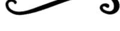

#### 答案

```
069
country_tuple = ("France","England","Spain","Germany","Australia")
print(country_tuple)
print()
country = input("Please enter one of the countries from above: ")
print(country, "has index number",country_tuple.index(country))
```

```
070
country_tuple = ("France","England","Spain","Germany","Australia")
print(country_tuple)
print()
country = input("Please enter one of the countries from above: ")
print(country, "has index number",country_tuple.index(country))
print()
num = int(input("Enter a number between 0 and 4: "))
print(country_tuple[num])
```

```
071
sports_list = ["tennis","football"]
sports_list.append(input("What is your favourite sport? "))
sports_list.sort()
print(sports_list)
```

```
072
subject_list = ["maths","english","computing","history","science","spanish"]
print(subject_list)
dislike = input("Which of these subjects do you dislike? ")
getrid = subject_list.index(dislike)
del subject_list[getrid]
print(subject_list)
```

```
073
food_dictionary = {}
food1 = input("Enter a food you like: ")
food_dictionary[1] = food1
food2 = input("Enter another food you like: ")
food_dictionary[2] = food2
food3 = input("Enter a third food you like: ")
food_dictionary[3] = food3
food4 = input("Enter one last food you like: ")
food_dictionary[4] = food4
print(food_dictionary)
dislike = int(input("Which of these do you want to get rid of? "))
del food_dictionary[dislike]
print(sorted(food_dictionary.values()))
```

### 挑战 69 - 79：元组、列表和字典

```
074
colours = ["red","blue","green","black","white","pink","grey","purple","yellow","brown"]
start = int(input("Enter a starting number (0-4): "))
end = int(input("Enter an end number (5-9): "))
print(colours[start:end])
```

```
075
nums = [123,345,234,765]
for i in nums:
    print(i)
selection = int(input("Enter a number from the list: "))
if selection in nums:
    print(selection,"is in position",nums.index(selection))
else:
    print("That is not in the list")
```

```
076
name1 = input("Enter a name of somebody you want to invite to your party: ")
name2 = input("Enter another name: ")
name3 = input("Enter a third name: ")
party = [name1,name2,name3]
another = input("Do you want to invite another (y/n): ")
while another == "y":
    newname = party.append(input("Enter another name: "))
    another = input("Do you want to invite another (y/n): ")
print("You have", len(party), "people coming to your party")
```

```
077
name1 = input("Enter a name of somebody you want to invite to your party: ")
name2 = input("Enter another name: ")
name3 = input("Enter a third name: ")
party = [name1,name2,name3]
another = input("Do you want to invite another (y/n): ")
while another == "y":
    newname = party.append(input("Enter another name: "))
    another = input("Do you want to invite another (y/n): ")
print("You have", len(party), "people coming to your party")
print(party)
selection = input("Enter one of the names: ")
print(selection,"is in position",party.index(selection),"on the list")
stillcome = input("Do you still want them to come (y/n): ")
if stillcome == "n":
    party.remove(selection)
print(party)
```

```
078
tv = ["Task Master","Top Gear","The Big Bang Theory","How I Met Your Mother"]
for i in tv:
    print (i)
print()
newtv = input("Enter another TV show: ")
position = int(input("Enter a number between 0 and 3: "))
tv.insert(position,newtv)
for i in tv:
    print (i)
```

```
079
nums = []
count = 0
while count < 3:
    num = int(input("Enter a number: "))
    nums.append(num)
    print(nums)
    count = count + 1
lastnum = input("Do you want the last number saved (y/n): ")
if lastnum == "n":
    nums.remove(num)
print(nums)
```

## 更多字符串操作

### 解释

**字符串**是针对一组字符的技术名称，你*不需要对它们进行计算*。"Hello"就是一个字符串的例子，"7B"也是。

这里我们有一个名为**name**的变量，它被赋值为"Simon"。

```
name = "Simon"
```

"Simon"可以被视为一个字符序列，该字符串中的每个字符都可以通过其索引来标识。

| 索引 | 0 | 1 | 2 | 3 | 4 |
|---|---|---|---|---|---|
| 值 | S | i | m | o | n |

请注意字符串的索引从0而不是1开始，就像列表一样。如果字符串中包含空格，空格也会被计为一个字符，字符串中的任何标点符号也是如此。

| 索引 | 0 | 1 | 2 | 3 | 4 | 5 | 6 | 7 | 8 | 9 | 10 | 11 |
|---|---|---|---|---|---|---|---|---|---|---|---|---|
| 值 | H | e | l | l | o |   | W | o | r | l | d | ! |

现在你已经熟悉了列表的处理，字符串对你来说应该不成问题，因为它们使用与列表相同的方法。然而，我提供了一些可能有用的额外代码。

### 示例代码

请注意：在下面的示例中，“msg”是一个包含字符串的变量名。

```python
if msg.isupper():
    print("Uppercase")
else:
    print("This is not in uppercase")
```

如果消息是大写的，它将显示消息“Uppercase”，否则将显示消息“This is not in uppercase”。

```python
msg.islower()
```

可用于替代 `isupper()` 函数，以检查变量是否包含小写字母。

```python
msg="Hello"
for letter in msg:
    print(letter,end="*")
```

显示消息，并在每个字符之间显示一个“*”。本示例中的输出将是：H*e*l*l*o*

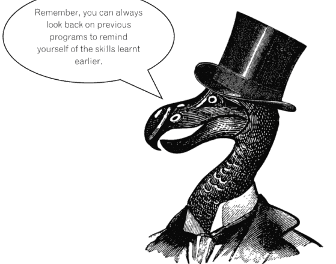

#### 挑战

**080**
要求用户输入他们的名，然后显示其名的长度。接着要求输入姓氏，并显示姓氏的长度。用空格连接他们的名和姓氏并显示结果。最后，显示他们全名（包括空格）的长度。

**081**
要求用户输入他们最喜欢的学科。在每个字母后显示“-”，例如 S-p-a-n-i-s-h-。

**082**
向用户显示一行来自你最喜欢的诗的文本，并询问起始点和结束点。显示这两个点之间的字符。

**083**
要求用户输入一个大写的单词。如果他们输入的是小写，请他们重新尝试。不断重复此过程，直到他们输入的消息全部为大写。

**084**
要求用户输入他们的邮政编码。将前两个字母显示为大写。

**085**
要求用户输入他们的名字，然后告诉他们名字中有多少个元音。

**086**
要求用户输入一个新密码。要求他们再次输入。如果两个密码匹配，显示“Thank you”。如果字母正确但大小写错误，显示消息“They must be in the same case”，否则显示消息“Incorrect”。

**087**
要求用户输入一个单词，然后在单独的行上反向显示它。例如，如果他们输入“Hello”，它应如下所示：

Enter a word: Hello
o
l
l
e
H
>>>


#### 答案

```python
080
fname = input("Enter your first name: ")
print("That has", len(fname),"characters in it")
sname = input("Enter your surname: ")
print("That has", len(sname),"characters in it")
name = fname + " " + sname
print("Your full name is",name)
print("That has", len(name),"characters in it")
```

```python
081
subject = input("Enter your favourite school subject: ")
for letter in subject:
    print(letter,end = "-")
```

```python
082
poem = "Oh, I wish I'd looked after me teeth,"
print(poem)
start = int(input("Enter a starting number: "))
end = int(input("Enter an end number: "))
print(poem[start:end])
```

```python
083
msg = input("Enter a message in uppercase: ")
tryagain = False
while tryagain == False:
    if msg.isupper():
        print("Thank you")
        tryagain = True
    else:
        print("Try again")
        msg = input("Enter a message in uppercase: ")
```

```python
084
postcode = input("Enter your postcode: ")
start = postcode[0:2]
print(start.upper())
```

```python
085
name = input("Enter your name: ")
count = 0
name = name.lower()
for x in name:
    if x == "a" or x == "e" or x == "i" or x == "o" or x == "u":
        count = count + 1
print("Vowels =", count)
```

```python
086
pswd1 = input("Enter a password: ")
pswd2 = input("Enter it again: ")
if pswd1 == pswd2:
    print("Thank you")
elif pswd1.lower() == pswd2.lower():
    print("They must be the same case")
else:
    print("Incorrect")
```

```python
087
word = input("Enter a word: ")
length = len(word)
num = 1
for x in word:
    position = length - num
    letter = word[position]
    print(letter)
    num = num + 1
```

## 数值数组


### 解释

在本书的前面部分，我们探讨了列表（见第58页）。列表可以同时存储各种不同类型的数据，包括字符串和数字。Python **数组** 与列表类似，但它们 **仅用于存储数字**。数字可以有不同的范围，但在一个数组中，所有数据项 **必须具有相同的数据类型**，如下表所示。

| 类型代码 | 常用名称 | 描述 | 大小（字节） |
| :--- | :--- | :--- | :--- |
| 'i' | 整数 | -32,768 到 32,767 之间的整数 | 2 |
| 'l' | 长整数 | -2,147,483,648 到 2,147,483,647 之间的整数 | 4 |
| 'f' | 单精度浮点数 | 允许小数位，数字范围从 -10^38 到 10^38（即允许最多38个数字字符，包括小数点可位于数字中的任何位置，并且可以是正数或负数） | 4 |
| 'd' | 双精度浮点数 | 允许小数位，数字范围从 -10^308 到 10^308 | 8 |

当你创建数组时，需要定义它将包含的数据类型。在程序运行时无法更改此类型。因此，如果你将数组定义为 'i' 类型（这允许 -32,768 到 32,767 之间的整数），则之后无法在该数组的数字中添加小数点，因为这会导致错误消息并使程序崩溃。


**请注意：** 其他编程语言使用术语“数组”来允许存储任何数据类型，但在 Python 中数组仅存储数字，而列表允许存储任何数据类型。如果你想创建一个存储多个字符串的变量，在 Python 中你需要创建一个列表而不是数组。

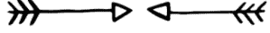

### 示例代码

```python
from array import *
这需要是你的程序的第一行，以便 Python 可以使用数组库。
```


```python
nums = array ('i',[45,324,654,45,264])
print(nums)
创建一个名为 "nums" 的数组。它使用整数数据类型，数组中有五个项目。它将显示以下输出：
array('i', [45, 324, 654, 45, 264])
```

```python
for x in nums:
    print(x)
显示数组，每个项目出现在单独的行上。
```

```python
newValue = int(input("Enter number: "))
nums.append(newValue)
要求用户输入一个新数字，该数字将被添加到现有数组的末尾。
```

```python
nums.reverse()
反转数组的顺序。
```

```python
nums = sorted(nums)
将数组按升序排序。
```

```python
nums.pop()
这将从数组中移除最后一个项目。
```


```python
newArray = array('i',[])
more = int(input("How many items: "))
for y in range(0,more):
    newValue=int(input("Enter num: "))
    newArray.append(newValue)
nums.extend(newArray)
创建一个名为 "newArray" 的空数组，使用整数数据类型。它询问用户要添加多少个项目，然后将这些新项目追加到 newArray。在所有项目添加完成后，它将连接 newArray 和 nums 数组的内容。
```

```python
getRid = int(input("Enter item index: "))
nums.remove(getRid)
要求用户输入他们想要移除的项目，然后从数组中移除与该值匹配的第一个项目。
```

```python
print(nums.count(45))
这将显示值 "45" 在数组中出现的次数。
```

#### 挑战

**088**
向用户索要五个整数的列表。将它们存储在数组中。对列表排序并以相反的顺序显示。

**089**
创建一个数组来存储整数列表。生成五个随机数并将其存储在数组中。显示数组（每个项目显示在单独的行上）。

**090**
要求用户输入数字。如果他们输入的数字在 10 到 20 之间，则将其保存在数组中，否则显示消息“Outside the range”。成功添加五个数字后，显示消息“Thank you”，并显示数组，每个项目显示在单独的行上。

**091**
创建一个包含五个数字的数组（其中两个应该重复）。向用户显示整个数组。要求用户输入数组中的一个数字，然后显示一条消息，说明该数字在列表中出现的次数。

**092**
创建两个数组（一个包含用户输入的三个数字，另一个包含一组五个随机数）。将这两个数组连接成一个大数组。对这个大数组进行排序并显示，使每个数字出现在单独的行上。


**093**
要求用户输入五个数字。对它们进行排序并呈现给用户。要求他们选择一个数字。将其从原始数组中移除并保存在新数组中。

**094**
显示一个包含五个数字的数组。要求用户选择一个数字。一旦他们选择了一个数字，显示该数组中该项目的位置。如果他们输入的内容不在数组中，请他们重新尝试，直到他们选择一个相关项目。

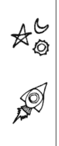

**095**
创建一个包含五个 10 到 100 之间数字的数组，每个数字都有两位小数。要求用户输入一个 2 到 5 之间的整数。如果他们输入的内容超出此范围，显示合适的错误消息并请他们重新尝试，直到输入有效的数字。将数组中的每个数字除以用户输入的数字，并显示答案（保留两位小数）。

#### 答案

```
088
from array import *

nums = array('i',[])

for i in range (0,5):
    num = int(input("Enter a number: "))
    nums.append(num)

nums = sorted(nums)
nums.reverse()

print(nums)
```

```
089
from array import *
import random

nums = array('i',[])

for i in range (0,5):
    num = random.randint(1,100)
    nums.append(num)

for i in nums:
    print(i)
```

```
090
from array import *

nums = array('i',[])

while len(nums) < 5:
    num = int(input("Enter a number between 10 and 20: "))
    if num >= 10 and num <= 20:
        nums.append(num)
    else:
        print("Outside the range")

for i in nums:
    print(i)
```

### 挑战 88 - 95：数值数组

```
091
from array import *

nums = array('i',[5,7,9,2,9])

for i in nums:
    print(i)

num = int(input("Enter a number: "))

if nums.count(num) == 1:
    print(num, "is in the list once")
else:
    print(num, "is in the list", nums.count(num),"times")
```

```
092
from array import *
import random

num1 = array('i',[])
num2 = array('i',[])

for i in range(0,3):
    num = int(input("Enter a number: "))
    num1.append(num)

for i in range(0,5):
    num = random.randint(1,100)
    num2.append(num)

num1.extend(num2)

num1 = sorted(num1)

for i in num1:
    print(i)
```

```
093
from array import *

nums = array('i',[])

for i in range(0,5):
    num = int(input("Enter a number: "))
    nums.append(num)

nums = sorted(nums)

for i in nums:
    print(i)

num = int(input("Select a number from the array: "))
if num in nums:
    nums.remove(num)
    num2 = array('i',[])
    num2.append(num)
    print(nums)
    print(num2)
else:
    print("That is not a value in the array")
```

```
094
from array import *

nums = array('i',[4,6,8,2,5])

for i in nums:
    print(i)

num = int(input("Select one of the numbers: "))

tryagain = True
while tryagain == True:
    if num in nums:
        print("This is in position",nums.index(num))
        tryagain = False
    else:
        print("Not in array")
        num = int(input("Select one of the numbers: "))
```

```
095
from array import *
import math

nums = array('f',[34.75,27.23,99.58,45.26,28.65])
tryagain = True
while tryagain == True:
    num = int(input("Enter a number between 2 and 5: "))
    if num<2 or num >5:
        print("Incorrect value, try again.")
    else:
        tryagain = False
for i in range(0,5):
    ans = nums[i]/num
    print(round(ans,2))
```

## 二维列表和字典

### 解释

严格来说，在Python中创建一个二维数组是可能的，但由于Python数组仅限于存储数字，且大多数Python程序员更习惯于使用列表，因此二维数组很少使用，而**二维列表**则更为常见。

假设，有那么可怕的一瞬间，你是一名教师。我知道这很吓人！再假设你有四名学生，并且你在三门不同的科目中教授这同一批学生。如果你是一位尽职的老师，你可能需要记录这些学生在每门科目上的成绩。你可以像下面这样在纸上创建一个简单的图表来实现：

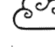


| | 数学 | 英语 | 法语 |
|---|---|---|---|
| Susan | 45 | 37 | 54 |
| Peter | 62 | 58 | 59 |
| Mark | 49 | 47 | 60 |
| Andy | 78 | 83 | 62 |

二维列表的工作方式类似。

|   | 0 | 1 | 2 |
|---|---|---|---|
| 0 | 45 | 37 | 54 |
| 1 | 62 | 58 | 59 |
| 2 | 49 | 47 | 60 |
| 3 | 78 | 83 | 62 |

在Python中，这个二维列表将编码如下：

```
grades = [[45,37,54], [62,58,59], [49,47,60], [78,83,62]]
```

或者，如果你不想使用标准的Python列索引号，你可以使用字典，如下所示：

```
grades = [{"Ma":45,"En":37,"Fr":54}, {"Ma":62,"En":58,"Fr":59}, {"Ma":49,"En":47,"Fr":60}]
print(grades[0]["En"])
```

该程序将输出 37（索引号为0的学生的英语成绩），并能使数据更容易理解。

你甚至可以更进一步，添加行索引，如下所示：

```
grades = {"Susan": {"Ma":45,"En":37,"Fr":54}, "Peter": {"Ma":62,"En":58,"Fr":59}}
print(grades["Peter"]["En"])
```

这将输出 58，即 Peter 英语考试的成绩。


### 示例代码

```
simple_array = [[2,5,8],[3,7,4],[1,6,9]]
创建一个二维列表（如右图所示），它使用标准的 Python 索引方式来标记行和列。
```

|   | 0 | 1 | 2 |
|---|---|---|---|
| 0 | 2 | 5 | 8 |
| 1 | 3 | 7 | 4 |
| 2 | 1 | 6 | 9 |

```
print(simple_array)
显示二维列表中的所有数据。
```

```
print(simple_array[1])
显示第 1 行的数据，在本例中是 [3, 7, 4]。
```


```
simple_array[2][1]= 5
将第 2 行、第 1 列的数据更改为值 5。
```

```
print(simple_array[1][2])
显示第 1 行、第 2 列的数据，在本例中是 4。
```

```
simple_array[1].append(3)
将值 3 添加到第 1 行数据的末尾，因此在本例中它变为 [3, 7, 4, 3]。
```

|   | x  | y  | z  |
|---|----|----|----|
| A | 54 | 82 | 91 |
| B | 75 | 29 | 80 |

```
data_set = {"A":{"x":54,"y":82,"z":91},"B":{"x":75,"y":29,"z":80}}
创建一个二维字典，为行和列使用用户定义的标签（如上所示）。
```

```
print(data_set["A"])
显示数据集 "A" 中的数据。
```

```
print(data_set["B"]["y"])
显示行 "B"、列 "y" 的数据。
```

```
for i in data_set:
    print(data_set[i]["y"])
显示每一行的 "y" 列。
```

```
data_set["B"]["y"] = 53
将 "B"、"y" 的数据更改为 53。
```

```
grades[name]={"Maths":mscore,"English":escore}
向二维字典添加另一行数据。在本例中，name 将是行索引，Maths 和 English 将是列索引。
```

```
for name in grades:
    print((name),grades[name]["English"])
仅显示每个学生的姓名和英语成绩。
```

```
del list[getRid]
删除选中的项目。
```

#### 挑战

096
使用标准的Python索引方式，创建以下简单的二维列表：

|   | 0 | 1 | 2 |
|---|---|---|---|
| 0 | 2 | 5 | 8 |
| 1 | 3 | 7 | 4 |
| 2 | 1 | 6 | 9 |
| 3 | 4 | 2 | 0 |

097
使用程序096中的二维列表，让用户选择一个行号和一个列号，并显示该值。

098
使用程序096中的二维列表，询问用户希望显示哪一行并显示该行。请他们输入一个新值并将其添加到该行的末尾，然后再次显示该行。

099
修改你之前的程序，询问用户希望显示哪一行。显示该行。询问该行中的哪一列需要显示，并显示那里的值。询问用户是否要更改该值。如果是，请他们输入一个新值并修改数据。最后，再次显示整行。

100
使用二维字典创建以下内容，显示每个人在不同地理区域的销售额：

|        | 北    | 南    | 东    | 西    |
|--------|------|------|------|------|
| John   | 3056 | 8463 | 8441 | 2694 |
| Tom    | 4832 | 6786 | 4737 | 3612 |
| Anne   | 5239 | 4802 | 5820 | 1859 |
| Fiona  | 3904 | 3645 | 8821 | 2451 |

101
使用程序100，询问用户一个姓名和一个区域。显示相关数据。询问用户他们想要更改的数据的姓名和区域，并允许他们修改销售数字。显示他们选择的姓名在所有区域的销售额。

102
请用户输入四个人的姓名、年龄和鞋码。询问列表中其中一个人的姓名，并显示其年龄和鞋码。

103
调整程序102，显示列表中所有人的姓名和年龄，但不显示他们的鞋码。

104
收集完四个姓名、年龄和鞋码后，请用户输入他们想要从列表中删除的人的姓名。从数据中删除这一行，并在单独的行中显示其他行。


#### 答案

```
096
list = [[2,5,8],[3,7,4],[1,6,9],[4,2,0]]
```

```
097
list = [[2,5,8],[3,7,4],[1,6,9],[4,2,0]]
row = int(input("Select a row: "))
col = int(input("Select a column: "))
print(list[row][col])
```

```
098
list = [[2,5,8],[3,7,4],[1,6,9],[4,2,0]]
row = int(input("Select a row: "))
print(list[row])
newvalue = int(input("Enter a new number: "))
list[row].append(newvalue)
print(list[row])
```

```
099
list = [[2,5,8],[3,7,4],[1,6,9],[4,2,0]]
row = int(input("Select a row: "))
print(list[row])
col = int(input("Select a column: "))
print(list[row][col])
change = input("Do you want to change the value? (y/n) ")
if change == "y":
    newvalue = int(input("Enter new value: "))
    list[row][col] = newvalue
print(list[row])
```

100
请注意，数据被拆分到单独的行中，以便于阅读代码。只要换行符位于行自然中断的位置，并且包含在花括号内，这是可行的。

```
sales = {"John":{"N":3056, "S":8463, "E":8441, "W":2694},
"Tom":{"N":4832, "S":6786, "E":4737, "W":3612},
"Anne":{"N":5239, "S":4802, "E":5820, "W":1859},
"Fiona":{"N":3904, "S":3645, "E":8821, "W":2451}}
```

### 84 挑战 96 - 103：二维列表与字典

```
101
sales = {"John":{"N":3056, "S":8463, "E":8441, "W":2694},
"Tom":{"N":4832, "S":6786, "E":4737, "W":3612},
"Anne":{"N":5239, "S":4802, "E":5820, "W":1859},
"Fiona":{"N":3904, "S":3645, "E":8821, "W":2451}}
person = input("Enter sales person's name: ")
region = input("Select region: ")
print(sales[person][region])
newdata = int(input("Enter new data: "))
sales[person][region] = newdata
print(sales[person])
```

```
102
list = {}
for i in range (0,4):
    name = input("Enter name: ")
    age = int(input("Enter age: "))
    shoe = int(input("Enter shoe size: "))
    list[name] = {"Age":age,"Shoe size":shoe}

ask = input("Enter a name: ")
print(list[ask])
```

```
103
list = {}
for i in range (0,4):
    name = input("Enter name: ")
    age = int(input("Enter age: "))
    shoe = int(input("Enter shoe size: "))
    list[name] = {"Age":age,"Shoe size":shoe}

for name in list:
    print((name),list[name]["Age"])
```

挑战 96 - 103：二维列表与字典

85

```
104
list = {}
for i in range (0,4):
    name = input("Enter name: ")
    age = int(input("Enter age: "))
    shoe = int(input("Enter shoe size: "))
    list[name] = {"Age":age,"Shoe size":shoe}

getrid = input("Who do you want to remove from the list? ")
del list[getrid]

for name in list:
    print((name),list[name]["Age"],list[name]["Shoe size"])
```

## 读写文本文件

### 解释

能够定义列表、进行更改和添加新数据固然很好，但如果下次运行程序时它又恢复到原始数据，你的更改丢失了，那就没什么用了。因此，有时有必要将数据保存在程序外部，这样数据就可以被存储，连同所做的任何更改。

学习从外部文件写入和读取的最简单起点是**文本**文件。

打开外部文件时，必须指定该文件在程序中将如何使用。选项如下。

| 代码 | 描述 |
| :--- | :--- |
| **w** | **写入模式：** 用于创建一个新文件。任何同名的现有文件都将被擦除，并在其位置创建一个新文件。 |
| **r** | **读取模式：** 用于仅读取现有文件而不写入时。 |
| **a** | **追加模式：** 用于在文件末尾添加新数据。 |

文本文件仅用于写入、读取和追加数据。根据其工作方式的本质，一旦数据写入文件，就很难删除或更改单个数据元素，除非你想覆盖整个文件或创建一个新文件来存储新数据。如果你想在文件创建后能够更改单个元素，最好使用 .csv 文件（见第 91 页）或 SQL 数据库（见第 134 页）。

### 示例代码

```
file = open("Countries.txt", "w")
file.write("Italy\n")
file.write("Germany\n")
file.write("Spain\n")
file.close()
```

创建一个名为 "Countries.txt" 的文件。如果已存在同名文件，则会被一个新的空白文件覆盖。它将向文件添加三行数据（`\n` 强制在每个条目后换行）。然后它将关闭文件，允许对文本文件的更改被保存。

```
file = open("Countries.txt", "r")
print(file.read())
```

这将以 "读取" 模式打开 Countries.txt 文件并显示整个文件。

```
file = open("Countries.txt", "a")
file.write("France\n")
file.close()
```

这将以 "追加" 模式打开 Countries.txt 文件，添加另一行，然后关闭文件。如果未包含 **file.close()** 行，更改将不会保存到文本文件。


#### 挑战

**105**
编写一个名为 "Numbers.txt" 的新文件。向文档中添加五个数字，这些数字存储在同一行，仅用逗号分隔。运行程序后，查看程序存储的位置，你应该看到文件已被创建。在 Windows 系统上查看新文本文件内容的最简单方法是使用记事本读取它。

**106**
创建一个名为 "Names.txt" 的新文件。向文档中添加五个名字，这些名字存储在单独的行中。运行程序后，查看程序存储的位置并检查文件是否已正确创建。

**107**
打开 Names.txt 文件并在 Python 中显示数据。

**108**
打开 Names.txt 文件。要求用户输入一个新名字。将其添加到文件末尾并显示整个文件。

**109**
向用户显示以下菜单：
1) 创建一个新文件
2) 显示文件
3) 向文件添加新项目
请选择 1、2 或 3：

要求用户输入 1、2 或 3。如果他们选择 1、2 或 3 以外的任何选项，应显示合适的错误消息。

如果他们选择 1，要求用户输入一个学校科目并将其保存到名为 "Subject.txt" 的新文件中。它应该用新文件覆盖任何现有文件。

如果他们选择 2，显示 "Subject.txt" 文件的内容。

如果他们选择 3，要求用户输入一个新科目并将其保存到文件中，然后显示文件的全部内容。

多次运行程序以测试各个选项。

**110**
使用你之前创建的 Names.txt 文件，在 Python 中显示名字列表。要求用户输入其中一个名字，然后将除他们输入的名字之外的所有名字保存到一个名为 Names2.txt 的新文件中。

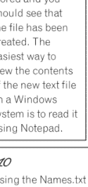


> 做得好，将数据保存到外部文件是一项重要的编程技能。

#### 答案

```
105
file = open("Numbers.txt","w")
file.write("4, ")
file.write("6, ")
file.write("10, ")
file.write("8, ")
file.write("5, ")
file.close()
```

```
106
file = open("Names.txt","w")
file.write("Bob\n")
file.write("Tom\n")
file.write("Gemma\n")
file.write("Sarah\n")
file.write("Timothy\n")
file.close()
```

```
107
file = open("Names.txt","r")
print(file.read())
file.close()
```

```
108
file = open("Names.txt", "a")
newname = input("Enter a new name: ")
file.write(newname + "\n")
file.close

file = open("Names.txt", "r")
print (file.read())
file.close
```

### 90 挑战 105 - 110：读写文本文件

```
109
print ("(1) Create a new file")
print ("(2) Display the file")
print ("(3) Add a new item to the file")
selection = int(input("Make a selection 1, 2 or 3: "))
if selection == 1:
    subject = input("Enter a school subject: ")
    file = open("Subject.txt","w")
    file.write(subject + "\n")
    file.close()
elif selection == 2:
    file = open("Subject.txt","r")
    print(file.read())
elif selection == 3:
    file = open("Subject.txt","a")
    subject = input("Enter a school subject: ")
    file.write(subject + "\n")
    file.close()
    file = open("Subject.txt","r")
    print(file.read())
else:
    print("Invalid option")
```

```
110
file = open("Names.txt","r")
print(file.read())
file.close()

file = open("Names.txt","r")
selectedname = input("Enter a name from the list: ")
selectedname = selectedname + "\n"
for row in file:
    if row != selectedname:
        file = open("Names2.txt","a")
        newrecord = row
        file.write(newrecord)
        file.close()
file.close()
```## 读写 .csv 文件

### 解释

CSV 代表逗号分隔值，是一种通常与电子表格和数据库的导入导出相关的格式。与简单的文本文件相比，它允许对数据进行更精细的控制，因为每一行都被分割成可识别的列。下面是一个你可能想要存储的数据示例。

| 姓名 | 年龄 | 星座 |
|---|---|---|
| 布莱恩 | 73 | 金牛座 |
| 桑德拉 | 48 | 处女座 |
| 佐伊 | 25 | 天蝎座 |
| 基思 | 43 | 狮子座 |


一个 .csv 文件会将上述数据存储如下：


```
Brian, 73, Taurus
Sandra, 48, Virgo
Zoe, 25, Scorpio
Keith, 43, Leo
```

然而，将其视为由使用索引号来标识的列和行分隔开，可能更容易理解。

| | 0 | 1 | 2 |
|---|---|---|---|
| 0 | 布莱恩 | 73 | 金牛座 |
| 1 | 桑德拉 | 48 | 处女座 |
| 2 | 佐伊 | 25 | 天蝎座 |
| 3 | 基思 | 43 | 狮子座 |

### 92 挑战 111 - 117：读写 .csv 文件

打开一个 .csv 文件使用时，你必须指定该文件将如何被使用。选项如下：

| 代码 | 描述 |
|---|---|
| w | 创建一个新文件并写入该文件。如果文件已存在，将创建一个新文件，覆盖现有文件。 |
| x | 创建一个新文件并写入该文件。如果文件已存在，程序将崩溃而不是覆盖它。 |
| r | 以只读方式打开，不允许你进行更改。 |
| a | 以写入方式打开，追加到文件末尾。 |


### 示例代码

```
import csv
这必须放在程序的顶部，以允许 Python 使用 .csv 命令库。
```

```
file = open ("Stars.csv","w")
newRecord = "Brian,73,Taurus\n"
file.write(str(newRecord))
file.close()
这将创建一个名为 "Stars.csv" 的新文件，覆盖任何同名的先前文件。它将添加一条新记录，然后关闭并保存对文件的更改。
```

```
file = open ("Stars.csv","a")
name = input("Enter name: ")
age = input("Enter age: ")
star = input("Enter star sign: ")
newRecord = name + "," + age + "," + star + "\n"
file.write(str(newRecord))
file.close()
这将打开 Stars.csv 文件，要求用户输入姓名、年龄和星座，并将其追加到文件末尾。
```


```
file = open("Stars.csv","r")
for row in file:
    print(row)
这将以读取模式打开 Stars.csv 文件，并一次显示一行记录。
```

```
file = open("Stars.csv","r")
reader = csv.reader(file)
rows = list(reader)
print(rows[1])
这将打开 Stars.csv 文件并仅显示第 1 行。请记住，Python 从 0 开始计数。
```

```
file = open ("Stars.csv","r")
search = input("Enter the data you are searching for: ")
reader = csv.reader(file)
for row in file:
    if search in str(row):
        print(row)
要求用户输入他们要搜索的数据。它将显示在该行任何位置包含该数据的所有行。
```

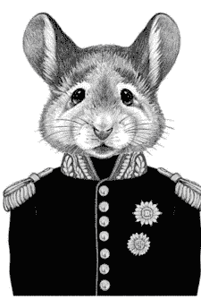

```
python
import csv
file = list(csv.reader(open("Stars.csv")))
tmp = []
for row in file:
    tmp.append(row)

.csv 文件不能被修改，只能追加。如果你需要修改文件，你需要将其写入一个临时列表。这段代码将读取原始 .csv 文件并将其写入一个名为 "tmp" 的列表。然后可以将其作为列表使用和修改（参见第 58 页）。
```

```
python
file = open("NewStars.csv", "w")
x = 0
for row in tmp:
    newRec = tmp[x][0] + "," + tmp[x][1] + "," + tmp[x][2] + "\n"
    file.write(newRec)
    x = x + 1
file.close()

从列表写入一个名为 "NewStars.csv" 的新 .csv 文件。
```


#### 挑战

##### 111

创建一个 .csv 文件来存储以下数据。将其命名为 "Books.csv"。

| 书名 | 作者 | 出版年份 |
|---|---|---|
| 杀死一只知更鸟 | 哈珀·李 | 1960 |
| 时间简史 | 斯蒂芬·霍金 | 1988 |
| 了不起的盖茨比 | F·斯科特·菲茨杰拉德 | 1922 |
| 唠叨鬼丈夫 | 奥利弗·萨克斯 | 1985 |
| 傲慢与偏见 | 简·奥斯汀 | 1813 |

##### 112

使用程序 111 中的 Books.csv 文件，要求用户输入另一条记录并将其添加到文件末尾。在单独的行上显示 .csv 文件的每一行。

##### 113

使用 Books.csv 文件，询问用户他们想向列表中添加多少条记录，然后允许他们添加那么多。在所有数据添加完毕后，询问作者姓名并显示该作者在列表中的所有书籍。如果列表中没有该作者的书籍，则显示一条合适的消息。

##### 114

使用 Books.csv 文件，要求用户输入起始年份和结束年份。显示在这两个年份之间出版的所有书籍。

##### 115

使用 Books.csv 文件，显示文件中的数据以及每行的行号。

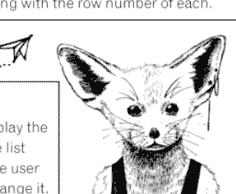

##### 116

将 Books.csv 文件中的数据导入到一个列表中。向用户显示该列表。要求他们选择要从列表中删除的行并将其从列表中移除。询问用户要更改哪些数据并允许他们进行更改。将数据写回原始 .csv 文件，用修改后的数据覆盖现有数据。

##### 117

创建一个简单的数学测验，要求用户输入他们的姓名，然后生成两个随机问题。将他们的姓名、被问到的问题、他们的答案和最终得分存储在一个 .csv 文件中。每次运行程序时，它都应该追加到 .csv 文件，而不是覆盖任何内容。

#### 答案

##### 111

```
import csv

file = open("Books.csv","w")
newrecord = "To Kill A Mockingbird, Harper Lee, 1960\n"
file.write(str(newrecord))
newrecord = "A Brief History of Time, Stephen Hawking, 1988\n"
file.write(str(newrecord))
newrecord = "The Great Gatsby, F. Scott Fitzgerald, 1922\n"
file.write(str(newrecord))
newrecord = "The Man Who Mistook His Wife for a Hat, Oliver Sacks, 1985\n"
file.write(str(newrecord))
newrecord = "Pride and Prejudice, Jane Austen, 1813\n"
file.write(str(newrecord))
file.close()
```

##### 112

```
import csv

file = open("Books.csv","a")
title = input("Enter a title: ")
author = input("Enter author: ")
year = input("Enter the year it was released: ")
newrecord = title + "," + author + ", " + year + "\n"
file.write(str(newrecord))
file.close()

file = open("Books.csv","r")
for row in file:
    print(row)
file.close()
```

##### 113

```
import csv

num = int(input("How many books do you want to add to the list? "))
file = open("Books.csv","a")
for x in range(0,num):
    title = input("Enter a title: ")
    author = input("Enter author: ")
    year = input("Enter the year it was released: ")
    newrecord = title + "," + author + ", " + year + "\n"
    file.write(str(newrecord))
file.close()

searchauthor = input("Enter an authors name to search for: ")

file = open("Books.csv","r")
count = 0
for row in file:
    if searchauthor in str(row):
        print(row)
        count = count + 1
if count == 0:
    print ("There are no books by that author in this list.")
file.close()
```

##### 114

```
import csv

start = int(input("Enter a starting year: "))
end = int(input("Enter an end year: "))

file = list(csv.reader(open("Books.csv")))
tmp = []
for row in file:
    tmp.append(row)

x = 0
for row in tmp:
    if int(tmp[x][2]) >= start and int(tmp[x][2]) <=end:
        print(tmp[x])
    x = x+1
```

##### 115

```
import csv

file = open("Books.csv","r")
x = 0
for row in file:
    display = "Row: " + str(x) + " - " + row
    print(display)
    x = x + 1
```

##### 116-117 挑战：读写 .csv 文件

```
116
import csv

file = list(csv.reader(open("Books.csv")))
Booklist = []
for row in file:
    Booklist.append(row)

x = 0
for row in Booklist:
    display = x,Booklist[x]
    print(display)
    x = x + 1
getrid = int(input("Enter a row number to delete: "))
del Booklist[getrid]

x = 0
for row in Booklist:
    display = x,Booklist[x]
    print(display)
    x = x + 1
alter = int(input("Enter a row number to alter: "))
x = 0
for row in Booklist[alter]:
    display = x,Booklist[alter][x]
    print(display)
    x = x + 1
part = int(input("Which part do you want to change? "))
newdata = input("Enter new data: ")
Booklist[alter][part] = newdata
print(Booklist[alter])

file = open("Books.csv","w")
x = 0
for row in Booklist:
    newrecord = Booklist[x][0] + ", " + Booklist[x][1] + ", " + Booklist[x][2] + "\n"
    file.write(newrecord)
    x = x+1
file.close()
```

```
117
import csv
import random

score = 0
name = input("What is your name: ")
q1_num1 = random.randint(10,50)
q1_num2 = random.randint(10,50)
question1 = str(q1_num1) + " + " + str(q1_num2) + " = "
ans1 = int(input(question1))
realans1 = q1_num1+q1_num2
if ans1 == realans1:
    score = score + 1
q2_num1 = random.randint(10,50)
q2_num2 = random.randint(10,50)
question2 = str(q2_num1) + " + " + str(q2_num2) + " = "
ans2 = int(input(question2))
realans2 = q2_num1+q2_num2
if ans2 == realans2:
    score = score + 1

file = open("QuizScores.csv","a")
newrecord = name+","+question1+","+str(ans1)+","+question2+","+str(ans2)+","+str(score)+"\n"
file.write(str(newrecord))

file.close()
```## 子程序

### 解释

**子程序** 是执行特定任务的代码块，可以在程序中的任何时候被调用以运行该代码。

#### 优点

-   你可以编写一段代码，它可以在程序的不同时间被使用和重复使用。
-   它使程序更容易理解，因为代码被分组成了块。

#### 定义子程序以及在子程序之间传递变量

下面是一个我们通常会在不使用子程序的情况下创建的简单程序，但这里使用子程序编写，以便你能看到它们是如何工作的：

```
def get_name():
    user_name = input("Enter your name: ")
    return user_name

def print_Msg(user_name):
    print("Hello", user_name)

def main():
    user_name = get_name()
    print_Msg(user_name)

main()
```

这个程序使用了三个子程序 **get_name()**、**print_Msg()** 和 **main()**。

**get_name()** 子程序会要求用户输入他们的名字，然后返回变量 "user_name" 的值，以便它可以在另一个子程序中使用。这一点非常重要。如果你不返回值，那么在该子程序中创建或修改的任何变量的值都不能在程序的其他地方使用。


**print_Msg()** 子程序将显示消息 "Hello"，然后是用户名。变量 "user_name" 出现在括号中，因为变量的当前值被导入到子程序中以便使用。

**main()** 子程序将从 **get_name()** 子程序获取 user_name（使用变量 user_name），因为这是从 **get_name()** 子程序返回的。然后它将在 **print_Msg()** 子程序中使用该 user_name 变量。

最后一行 "**main()**" 是实际的程序本身。它所做的就是启动 **main()** 子程序运行。

显然，没有必要用如此复杂的方式来执行一个实际上非常简单的程序，但这仅用作示例，展示子程序的布局以及变量如何在子程序之间使用和传递。

> **请注意：** Python 不喜欢意外情况，因此如果你打算在程序中使用子程序，Python 必须在之前读取过 "**def subprogram_name()**" 这一行，以便知道去哪里找到它。如果你试图在 Python 读取过子程序定义之前引用它，Python 会出错并崩溃。调用子程序时，子程序必须写在 **调用它的代码部分的上方**。Python 将从上到下读取，并 **运行** 它遇到的第一个没有缩进且不以单词 def 开头的行。在上面的程序中，这就是 **main()**。


**记住：** 永远不要让 Python 惊讶，因为它会不喜欢的——这通常是生活中很好的建议。

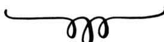


### 示例代码

以下示例都是同一程序的一部分，并将按此处显示的顺序展示。

```
def get_data():
    user_name = input("Enter your name: ")
    user_age = int(input("Enter your age: "))
    data_tuple = (user_name, user_age)
    return data_tuple

Defines a subprogram called "get_data()" which will ask the user for their name and age. As we want to send more than one piece of data back to the main program for other parts of the program to use, we have combined them together. The return line can only return a single value, which is why we combined the user_name and user_age variables into a tuple (see page 58) called data_tuple.
```

```
def message(user_name, user_age):
    if user_age <= 10:
        print("Hi", user_name)
    else:
        print("Hello", user_name)

Defines a subprogram called message() which uses two variables that have previously been defined (user_name and user_age).
```


```
def main():
    user_name, user_age = get_data()
    message(user_name, user_age)

Defines a subprogram called main() which obtains the two variables from the get_data() subprogram. These must be labelled in the same order as they were defined in the tuple. It then calls the message() subprogram to run with the two variables.
```

```
main()

Runs the main() sub程序。
```


#### 挑战题

**118**
定义一个子程序，该子程序会要求用户输入一个数字并将其保存为变量 "num"。定义另一个子程序，该子程序将使用 "num" 并从 1 数到该数字。

**119**
定义一个子程序，该子程序会要求用户选择一个较小的数字和一个较大的数字，然后生成这两个值之间的随机数并将其存储在名为 "comp_num" 的变量中。

定义另一个子程序，该子程序将给出指令 "I am thinking of a number..."，然后要求用户猜出他们正在想的数字。

定义第三个子程序，该子程序将检查 comp_num 是否与用户猜测的数字相同。如果相同，它应该显示消息 "Correct, you win"，否则它应该持续循环，告诉用户他们猜得太低或太高，并要求他们再次猜测，直到猜对为止。

**120**
向用户显示以下菜单：
1) 加法
2) 减法
请输入 1 或 2：

如果他们输入 1，它应该运行一个子程序，该子程序生成两个 5 到 20 之间的随机数，并要求用户将它们相加。计算出正确答案，并返回用户的答案和正确答案。

如果他们在菜单上选择 2，它应该运行一个子程序，该子程序生成一个 25 到 50 之间的数字和另一个 1 到 25 之间的数字，并要求他们计算 num1 减去 num2。这样他们就不必担心负数结果。返回用户的答案和正确答案。

创建另一个子程序，该子程序将检查用户的答案是否与实际答案匹配。如果匹配，显示 "Correct"，否则显示一条消息 "Incorrect, the answer is" 并显示正确答案。

如果他们在第一个菜单上没有选择相关选项，你应该显示一条合适的消息。

**121**
创建一个程序，允许用户轻松管理姓名列表。你应该显示一个菜单，允许他们向列表添加姓名、更改列表中的姓名、从列表中删除姓名或查看列表中的所有姓名。还应该有一个菜单选项允许用户结束程序。如果他们选择了不相关的选项，则应显示一条合适的消息。在他们做出选择（添加姓名、更改姓名、删除姓名或查看所有姓名）之后，应该再次看到菜单，而无需重新启动程序。该程序应该尽可能易于使用。

**122**

创建以下菜单：
1) 添加到文件
2) 查看所有记录
3) 退出程序

请输入选择的编号：

如果用户选择 1，允许他们添加到名为 Salaries.csv 的文件中，该文件将存储他们的姓名和工资。如果他们选择 2，则应显示 Salaries.csv 文件中的所有记录。如果他们选择 3，则应停止程序。如果他们选择了错误的选项，应看到一条错误消息。他们应该一直返回菜单，直到选择选项 3。


**123**

在 Python 中，技术上不可能直接从 .csv 文件中删除记录。相反，你需要将文件保存到 Python 中的一个临时列表中，对列表进行更改，然后用临时列表覆盖原始文件。

修改前面的程序以允许你这样做。你的菜单现在应该如下所示：

1) 添加到文件
2) 查看所有记录
3) 删除记录
4) 退出程序

请输入选择的编号：


#### 解答

##### 118

```python
def ask_value():
    num = int(input("Enter a number: "))
    return num

def count(num):
    n = 1
    while n <= num:
        print(n)
        n = n + 1

def main():
    num = ask_value()
    count(num)

main()
```

##### 119

```python
import random

def pick_num():
    low = int(input("Enter the bottom of the range: "))
    high = int(input("Enter the top of the range: "))
    comp_num = random.randint(low,high)
    return comp_num

def first_guess():
    print("I am thinking of a number...")
    guess = int(input("What am I thinking of: "))
    return guess

def check_answer(comp_num,guess):
    try_again = True
    while try_again == True:
        if comp_num == guess:
            print("Correct, you win.")
            try_again = False
        elif comp_num > guess:
            guess = int(input("Too low, try again: "))
        else:
            guess = int(input("Too high, try again: "))

def main():
    comp_num = pick_num()
    guess = first_guess()
    check_answer(comp_num,guess)

main()
```

### 106 挑战 118 - 123：子程序

##### 120

```python
import random

def addition():
    num1 = random.randint(5,20)
    num2 = random.randint(5,20)
    print(num1, "+", num2, "= ")
    user_answer = int(input("Your answer: "))
    actual_answer = num1 + num2
    answers = (user_answer, actual_answer)
    return answers

def subtraction():
    num3 = random.randint(25,50)
    num4 = random.randint(1,25)
    print(num3, "-",num4,"= ")
    user_answer = int(input("Your answer: "))
    actual_answer = num3 - num4
    answers = (user_answer, actual_answer)
    return answers

def check_answer(user_answer, actual_answer):
    if user_answer == actual_answer:
        print("Correct")
    else:
        print("Incorrect, the answer is", actual_answer)

def main():
    print("1) Addition")
    print("2) Subtraction")
    selection = int(input("Enter 1 or 2: "))
    if selection == 1:
        user_answer, actual_answer = addition()
        check_answer(user_answer,actual_answer)
    elif selection == 2:
        user_answer, actual_answer = subtraction()
        check_answer(user_answer,actual_answer)
    else:
        print("Incorrect selection")

main()
```

##### 121

```python
def add_name():
    name = input("Enter a new name: ")
    names.append(name)
    return names

def change_name():
    num = 0
    for x in names:
        print(num,x)
        num = num + 1
    select_num = int(input("Enter the number of the name you want to change: "))
    name = input("Enter new name: ")
    names[select_num] = name
    return names

def delete_name():
    num = 0
    for x in names:
        print(num,x)
        num = num + 1
    select_num = int(input("Enter the number of the name you want to delete: "))
    del names[select_num]
    return names

def view_names():
    for x in names:
        print(x)
    print()

def main():
    again = "y"
    while again == "y":
        print("1) Add a name")
        print("2) Change a name")
        print("3) Delete a name")
        print("4) View names")
        print("5) Quit")
        selection = int(input("What do you want to do? "))
        if selection == 1:
            names = add_name()
        elif selection == 2:
            names = change_name()
        elif selection == 3:
            names = delete_name()
        elif selection == 4:
            names = view_names()
        elif selection == 5:
            again = "n"
        else:
            print("Incorrect option: ")
        data = (names,again)

names = []
main()
```

### 108 挑战 118 - 123：子程序

##### 122

```python
import csv

def addtofile():
    file = open("Salaries.csv","a")
    name = input("Enter name: ")
    salary = int(input("Enter salary: "))
    newrecord = name + ", " + str(salary) + "\n"
    file.write(str(newrecord))
    file.close()

def viewrecords():
    file = open("Salaries.csv","r")
    for row in file:
        print(row)
    file.close()

tryagain = True
while tryagain == True:
    print("1) Add to file")
    print("2) View all records")
    print("3) Quit program")
    print()
    selection = input("Enter the number of your selection: ")
    if selection == "1":
        addtofile()
    elif selection == "2":
        viewrecords()
    elif selection == "3":
        tryagain = False
    else:
        print("Incorrect option")
```

##### 123

```python
import csv

def addtofile():
    file = open("Salaries.csv","a")
    name = input("Enter name: ")
    salary = int(input("Enter salary: "))
    newrecord = name + ", " + str(salary) + "\n"
    file.write(str(newrecord))
    file.close()

def viewrecords():
    file = open("Salaries.csv","r")
    for row in file:
        print(row)
    file.close()

def deleterecord():
    file = open("Salaries.csv","r")
    x = 0
    tmplist = []
    for row in file:
        tmplist.append(row)
    file.close()
    for row in tmplist:
        print(x,row)
        x = x + 1
    rowtodelete = int(input("Enter the row number to delete: "))
    del tmplist[rowtodelete]
    file = open("Salaries.csv","w")
    for row in tmplist:
        file.write(row)
    file.close()

tryagain = True
while tryagain == True:
    print("1) Add to file")
    print("2) View all records")
    print("3) Delete a record")
    print("4) Quit program")
    print()
    selection = input("Enter the number of your selection: ")
    if selection == "1":
        addtofile()
    elif selection == "2":
        viewrecords()
    elif selection == "3":
        deleterecord()
    elif selection == "4":
        tryagain = False
    else:
        print("Incorrect option")
```

## Tkinter GUI

### 图形用户界面

### 解释

GUI（图形用户界面）使程序更易于使用。它允许你作为程序员创建屏幕、文本框和按钮，以帮助用户以更用户友好的方式浏览程序。**Tkinter** 是 Python 中的一个功能库，它允许你实现这一点。

查看下面的代码，特别是 **window.geometry** 和 **button.place** 行中使用的测量值。

```python
from tkinter import *

def Call():
    msg = Label(window, text = "You pressed the button")
    msg.place(x = 30, y = 50)
    button["bg"] = "blue"
    button["fg"] = "white"

window = Tk()
window.geometry("200x110")
button = Button(text = "Press me", command = Call)
button.place(x = 30, y = 20, width=120, height=25)
window.mainloop()
```

现在查看此代码将产生的窗口：

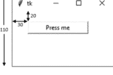


代码中的 **geometry** 行决定了窗口的大小，而 **place** 行决定了窗口中单个元素的位置。

挑战 124 - 132：Tkinter GUI

按下按钮后，它将运行“Call”子程序，并将窗口更改为如下所示：

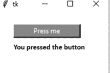


### 示例代码

```python
from tkinter import *
# 这一行必须放在程序的开头以导入 Tkinter 库。
```

```python
window = Tk()
window.title("Window Title")
window.geometry("450x100")
# 创建一个将作为显示的窗口，称为 "window"，添加标题并定义窗口大小。
```


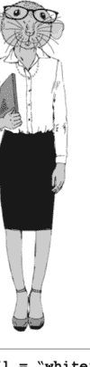

```python
label = Label(text = "Enter number:")
# 在屏幕上添加显示所示消息的文本。
```

```python
entry_box = Entry (text = 0)
# 创建一个空白输入框。输入框可供用户输入数据或用于显示输出。
```

```python
output_box = Message(text = 0)
# 创建一个消息框，用于显示输出。
```

```python
output_box ["bg"] = "red"
# 指定对象的背景颜色。
```

```python
output_box ["fg"] = "white"
# 指定对象的字体颜色。
```

```python
output_box ["relief"] = "sunken"
# 指定框的样式。可以是 flat（平面）、raised（凸起）、sunken（凹陷）、grooved（凹槽）和 ridged（脊状）。
```

```python
list_box = Listbox()
# 创建一个只能包含字符串的下拉列表框。
```


```python
entry_box ["justify"] = "center"
# 指定输入框中文本的对齐方式，但这对消息框不起作用。
```

```python
button1 = Button(text = "Click here", command = click)
# 创建一个将运行子程序 "click" 的按钮。
```

#### 挑战

**124**
创建一个窗口，要求用户在文本框中输入他们的姓名。当用户点击按钮时，应显示“你好”加他们的姓名，并改变消息框的背景色和字体颜色。

**125**
编写一个可以替代掷六面骰子的程序，用于棋盘游戏。当用户点击按钮时，应显示一个1到6之间（包括1和6）的随机整数。

**126**
创建一个程序，要求用户在一个文本框中输入一个数字。当用户点击按钮时，程序会将该数字加到一个总数中，并在另一个文本框中显示该总数。用户可以重复此操作任意多次，不断累加总数。还应有另一个按钮，可以将总数重置回0并清空原始文本框，以便重新开始。

**127**
创建一个窗口，要求用户在文本框中输入一个姓名。当用户点击按钮时，程序会将该姓名添加到屏幕显示的列表末尾。再创建一个按钮用于清空列表。

**128**
1公里 = 0.6214英里，1英里 = 1.6093公里。使用这些数据，创建一个允许用户在英里和公里之间进行转换的程序。

**129**
创建一个窗口，要求用户在文本框中输入一个数字。当用户点击按钮时，程序将使用代码 `variable.isdigit()` 来检查它是否为整数。如果是整数，则将其添加到列表框中；否则，清空输入框。再添加另一个按钮用于清空列表。

**130**
修改程序129，添加第三个按钮，用于将列表保存到 .csv 文件。代码 `tmp_list = num_list.get(0,END)` 可用于将列表框的内容保存为一个名为 `tmp_list` 的元组。

**131**
创建一个程序，允许用户创建一个新的 .csv 文件。程序应要求用户输入一个人的姓名和年龄，然后允许他们将此信息添加到刚刚创建的文件末尾。

**132**
使用你在上一个挑战中创建的 .csv 文件，创建一个程序，允许人们将姓名和年龄添加到列表中，并创建一个按钮，通过将 .csv 文件导入到列表框来显示其内容。

#### 答案

##### 124

```python
from tkinter import *

def click():
    name = textbox1.get()
    message = str("Hello " + name)
    textbox2["bg"] = "yellow"
    textbox2["fg"] = "blue"
    textbox2["text"] = message

window = Tk()
window.geometry("500x200")

label1 = Label(text = "Enter your name:")
label1.place(x = 30, y = 20)

textbox1 = Entry(text = "")
textbox1.place(x = 150, y = 20, width = 200, height = 25)
textbox1["justify"] = "center"
textbox1.focus()

button1 = Button(text = "Press me", command = click)
button1.place(x = 30, y = 50, width = 120, height = 25)

textbox2 = Message(text = "")
textbox2.place(x = 150, y = 50, width = 200, height = 25)
textbox2["bg"] = "white"
textbox2["fg"] = "black"

window.mainloop()
```

##### 125

```python
from tkinter import *
import random

def click():
    num = random.randint(1,6)
    answer["text"] = num

window = Tk()
window.title("Roll a dice")
window.geometry("100x120")

button1 = Button(text = "Roll", command = click)
button1.place(x = 30, y = 30, width = 50, height = 25)

answer = Message(text = "")
answer.place(x = 40, y = 70, width = 30, height = 25)

window.mainloop()
```

##### 126

```python
from tkinter import *

def add_on():
    num = enter_txt.get()
    num = int(num)
    answer = output_txt["text"]
    answer = int(answer)
    total = num + answer
    output_txt["text"] = total

def reset():
    total = 0
    output_txt["text"] = 0
    enter_txt.delete(0, END)
    enter_txt.focus()

total = 0
num = 0

window = Tk()
window.title("Adding Together")
window.geometry("450x100")

enter_lbl = Label(text = "Enter a number:")
enter_lbl.place(x = 50, y = 20, width = 100, height = 25)

enter_txt = Entry(text = 0)
enter_txt.place(x = 150, y = 20, width = 100, height = 25)
enter_txt["justify"] = "center"
enter_txt.focus()

add_btn = Button(text = "Add", command = add_on)
add_btn.place(x = 300, y = 20, width = 50, height = 25)

output_lbl = Label(text = "Answer = ")
output_lbl.place(x = 50, y = 50, width = 100, height = 25)

output_txt = Message(text = 0)
output_txt.place(x = 150, y = 50, width = 100, height = 25)
output_txt["bg"] = "white"
output_txt["relief"] = "sunken"

clear_btn = Button(text = "Clear", command = reset)
clear_btn.place(x = 300, y = 50, width = 50, height = 25)

window.mainloop()
```

##### 127

```python
from tkinter import *

def add_name():
    name = name_box.get()
    name_list.insert(END, name)
    name_box.delete(0, END)
    name_box.focus()

def clear_list():
    name_list.delete(0, END)
    name_box.focus()

window = Tk()
window.title("Names list")
window.geometry("400x200")

label1 = Label(text = "Enter a name:")
label1.place(x = 20, y = 20, width = 100, height = 25)

name_box = Entry(text = 0)
name_box.place(x = 120, y = 20, width = 100, height = 25)
name_box.focus()

button1 = Button(text = "Add to list", command = add_name)
button1.place(x = 250, y = 20, width = 100, height = 25)

name_list = Listbox()
name_list.place(x = 120, y = 50, width = 100, height = 100)

button2 = Button(text = "Clear list", command = clear_list)
button2.place(x = 250, y = 50, width = 100, height = 25)

window.mainloop()
```

##### 128

```python
def convert2():
    km = textbox1.get()
    km = int(km)
    message = km * 0.6214
    textbox2.delete(0, END)
    textbox2.insert(END, message)
    textbox2.insert(END, " miles")

window = Tk()
window.title("Distance")
window.geometry("260x200")

label1 = Label(text = "Enter the value you want to convert:")
label1.place(x = 30, y = 20)

textbox1 = Entry(text = "")
textbox1.place(x = 30, y = 50, width = 200, height = 25)
textbox1["justify"] = "center"
textbox1.focus()

convert1 = Button(text = "Convert miles to km", command = convert1)
convert1.place(x = 30, y = 80, width = 200, height = 25)

convert2 = Button(text = "Convert km to mile", command = convert2)
convert2.place(x = 30, y = 110, width = 200, height = 25)

textbox2 = Entry(text = "")
textbox2.place(x = 30, y = 140, width = 200, height = 25)
textbox2["justify"] = "center"

window.mainloop()
```

##### 129

```python
from tkinter import *

def add_number():
    num = num_box.get()
    if num.isdigit():
        num_list.insert(END,num)
        num_box.delete(0, END)
        num_box.focus()
    else:
        num_box.delete(0, END)
        num_box.focus()

def clear_list():
    num_list.delete(0, END)
    num_box.focus()

window = Tk()
window.title("Number list")
window.geometry("400x200")

label1 = Label(text = "Enter a number:")
label1.place(x = 20, y = 20, width = 100, height = 25)

num_box = Entry(text = 0)
num_box.place(x = 120, y = 20, width = 100, height = 25)
num_box.focus()

button1 = Button(text = "Add to list", command = add_number)
button1.place(x = 250, y = 20, width = 100, height = 25)

num_list = Listbox()
num_list.place(x = 120, y = 50, width=100, height=100)

button2 = Button(text = "Clear list", command = clear_list)
button2.place(x = 250, y = 50, width = 100, height = 25)

window.mainloop()
```

### 122 挑战 124 - 132：Tkinter 图形用户界面

```python
from tkinter import *
import csv

def add_number():
    num = num_box.get()
    if num.isdigit():
        num_list.insert(END, num)
        num_box.delete(0, END)
        num_box.focus()
    else:
        num_box.delete(0, END)
        num_box.focus()

def clear_list():
    num_list.delete(0, END)
    num_box.focus()

def save_list():
    file = open("numbers.csv", "w")
    tmp_list = num_list.get(0, END)
    item = 0
    for x in tmp_list:
        newrecord = tmp_list[item] + "\n"
        file.write(str(newrecord))
        item = item + 1
    file.close()

window = Tk()
window.title("Number list")
window.geometry("400x200")

label1 = Label(text="Enter a number:")
label1.place(x=20, y=20, width=100, height=25)

num_box = Entry(text=0)
num_box.place(x=120, y=20, width=100, height=25)
num_box.focus()

button1 = Button(text="Add to list", command=add_number)
button1.place(x=250, y=20, width=100, height=25)

num_list = Listbox()
num_list.place(x=120, y=50, width=100, height=100)

button2 = Button(text="Clear list", command=clear_list)
button2.place(x=250, y=50, width=100, height=25)

button3 = Button(text="Save list", command=save_list)
button3.place(x=250, y=80, width=100, height=25)

window.mainloop()
```

```python
from tkinter import *
import csv

def create_new():
    file = open("ages.csv", "w")
    file.close()

def save_list():
    file = open("ages.csv", "a")
    name = name_box.get()
    age = age_box.get()
    newrecord = name + "," + age + "\n"
    file.write(str(newrecord))
    file.close()
    name_box.delete(0, END)
    age_box.delete(0, END)
    name_box.focus()

window = Tk()
window.title("People List")
window.geometry("400x100")

label1 = Label(text="Enter a name:")
label1.place(x=20, y=20, width=100, height=25)

name_box = Entry(text="")
name_box.place(x=120, y=20, width=100, height=25)
name_box["justify"] = "left"
name_box.focus()

label2 = Label(text="Enter their age:")
label2.place(x=20, y=50, width=100, height=25)

age_box = Entry(text="")
age_box.place(x=120, y=50, width=100, height=25)
age_box["justify"] = "left"

button1 = Button(text="Create new file", command=create_new)
button1.place(x=250, y=20, width=100, height=25)

button2 = Button(text="Add to file", command=save_list)
button2.place(x=250, y=50, width=100, height=25)

window.mainloop()
```

### 132

```python
from tkinter import *
import csv

def save_list():
    file = open("ages.csv", "a")
    name = name_box.get()
    age = age_box.get()
    newrecord = name + "," + age + "\n"
    file.write(str(newrecord))
    file.close()
    name_box.delete(0, END)
    age_box.delete(0, END)
    name_box.focus()

def read_list():
    name_list.delete(0, END)
    file = list(csv.reader(open("ages.csv")))
    tmp = []
    for row in file:
        tmp.append(row)
    x = 0
    for i in tmp:
        data = tmp[x]
        name_list.insert(END, data)
        x = x + 1

window = Tk()
window.title("People List")
window.geometry("400x200")

label1 = Label(text="Enter a name:")
label1.place(x=20, y=20, width=100, height=25)

name_box = Entry(text="")
name_box.place(x=120, y=20, width=100, height=25)
name_box["justify"] = "left"
name_box.focus()

label2 = Label(text="Enter their age:")
label2.place(x=20, y=50, width=100, height=25)

age_box = Entry(text="")
age_box.place(x=120, y=50, width=100, height=25)
age_box["justify"] = "left"

button1 = Button(text="Add to file", command=save_list)
button1.place(x=250, y=20, width=100, height=25)

button2 = Button(text="Read list", command=read_list)
button2.place(x=250, y=50, width=100, height=25)

label3 = Label(text="Saved Names:")
label3.place(x=20, y=80, width=100, height=25)

name_list = Listbox()
name_list.place(x=120, y=80, width=230, height=100)

window.mainloop()
```

### 更多 Tkinter 内容

### 解释

在这里，我们将学习创建一个功能更丰富的图形用户界面，它建立在上一章知识的基础上。

在这个屏幕上，我们：

-   更改了标题栏上的图标；
-   更改了主窗口的背景颜色；
-   在左上角添加了一个不会改变的静态Logo图像；
-   创建了一个标签，目前显示“Hello”；
-   添加了一个“Click Me”按钮；
-   添加了一个名为“Select Name”的下拉选项，它将向用户显示三个名字：“Bob”、“Sue”和“Tim”；
-   在窗口下半部分添加了第二张图片，当用户点击“Click Me”按钮时，它将更改为显示从下拉列表中选中的人物的照片。

创建此窗口的所有代码都可以使用我们在上一节中介绍过的代码以及你将在本章中查看的示例代码来创建。

在程序中使用图片时，如果它们与程序存储在同一文件夹中，会更容易处理。否则，你需要包含文件的完整目录位置，如下所示：

```python
logo = PhotoImage(file="c:\Python34\images\logo.gif")
```

如果你将图片与程序存储在同一文件夹中，你只需包含文件名，如下所示：

```python
logo = PhotoImage(file="logo.gif")
```

**请注意：** Tkinter 仅支持使用 GIF 或 PGM/PPM 文件类型作为图像，不支持其他文件类型。如果可能，确保在开始创建程序之前，以合适的格式、合适的名称将图像保存在正确的位置，以使你的工作更简单。

### 示例代码

```python
window.wm_iconbitmap("MyIcon.ico")
```
更改窗口标题中显示的图标。

```python
window.configure(background = "light green")
```
更改窗口的背景颜色，此例中改为浅绿色。

```python
logo = PhotoImage(file = "logo.gif")
logoimage = Label(image = logo)
logoimage.place(x = 30, y = 20, width = 200, height = 120)
```
在标签控件中显示一张图像。在程序运行期间，此图像不会改变。

```python
photo = PhotoImage(file = "logo.gif")
photobox = Label(window, image = photo)
photobox.image = photo
photobox.place(x = 30, y = 20, width = 200, height = 120)
```
这与上面的代码块类似，但因为我们希望在更新数据时图像也随之改变，所以需要添加代码 **photobox.image = photo**，这使其可更新。

```python
selectName = StringVar(window)
selectName.set("Select Name")
namesList = OptionMenu(window, selectName, "Bob", "Sue", "Tim")
namesList.place(x = 30, y = 250)
```
创建一个名为 **selectName** 的变量，它将存储一个字符串，该变量的初始值为“Select Name”。然后它将创建一个下拉选项菜单，将用户选择的值存储在 selectName 变量中，并显示列表中的值：Bob、Sue 和 Tim。

```python
def clicked():
    sel = selectName.get()
    mesg = "Hello " + sel
    mlabel["text"] = mesg
    if sel == "Bob":
        photo = PhotoImage(file = "Bob.gif")
        photobox.image = photo
    elif sel == "Sue":
        photo = PhotoImage(file = "Sue.gif")
        photobox.image = photo
    elif sel == "Tim":
        photo = PhotoImage(file = "Tim.gif")
        photobox.image = photo
    else:
        photo = PhotoImage(file = "logo.gif")
        photobox.image = photo
    photobox["image"] = photo
    photobox.update()
```

在这个示例中，当按钮被点击时，它将运行“clicked”子程序。这将从 selectName 变量获取值，并创建一个将在标签中显示的消息。然后它将检查选择了哪个选项，并将图片更改为正确的图像（存储在 photo 变量中）。如果没有选择名字，它将只显示Logo。

#### 挑战

133
创建一个由数条垂直彩色线条组成的自定义图标。使用绘图工具或其它图形软件，创建一个尺寸为 200 x 150 的徽标。使用你自己的图标和徽标，创建以下窗口。

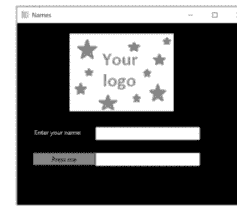

当用户输入姓名并点击“按下我”按钮时，应在第二个文本框中显示“Hello”以及他们的名字。

134
创建一个新程序，该程序应生成两个 10 到 50 之间的随机整数。程序应要求用户将这两个数字相加并输入答案。如果用户答对了，显示一个合适的图像，例如对勾；如果答错了，显示另一个合适的图像，例如叉号。用户应点击“下一个”按钮来获取下一道题。

135
创建一个简单的程序，该程序显示一个包含几种颜色的下拉列表和一个“点击我”按钮。当用户从列表中选择一种颜色并点击按钮时，应将窗口的背景更改为该颜色。作为额外的挑战，尝试避免使用 `if` 语句来实现此功能。

136
创建一个程序，该程序要求用户输入一个姓名，然后从一个下拉列表中为该人选择性别。当用户点击按钮时，应将该姓名和性别（用逗号分隔）添加到列表框中。

137
修改程序 136，使当一个新的姓名和性别被添加到列表框时，它也被写入一个文本文件。添加另一个按钮，该按钮将在主 Python Shell 窗口中显示整个文本文件的内容。


138
将几个图像保存在与你的程序相同的文件夹中，并将它们命名为 `1.gif`、`2.gif`、`3.gif` 等。确保它们都是 `.gif` 文件。在一个窗口中显示其中一张图片，并要求用户输入一个数字。然后程序应使用该数字选择正确的文件名并显示正确的图片。

#### 答案

##### 133

```
from tkinter import *

def click():
    name = textbox1.get()
    message = str("Hello " + name)
    textbox2["text"] = message

window = Tk()
window.title("Names")
window.geometry("450x350")
window.wm_iconbitmap("stripes.ico")
window.configure(background = "black")

logo = PhotoImage(file = "Mylogo.gif")
logoimage = Label(image = logo)
logoimage.place(x = 100, y = 20, width = 200, height = 150)

label1 = Label(text = "Enter your name:")
label1.place(x = 30, y = 200)
label1["bg"] = "black"
label1["fg"] = "white"

textbox1 = Entry(text = "")
textbox1.place(x = 150, y = 200, width = 200, height = 25)
textbox1["justify"] = "center"
textbox1.focus()

button1 = Button(text = "Press me", command = click)
button1.place(x = 30, y = 250, width = 120, height = 25)
button1["bg"] = "yellow"

textbox2 = Message(text = "")
textbox2.place(x = 150, y = 250, width = 200, height = 25)
textbox2["bg"] = "white"
textbox2["fg"] = "black"

window.mainloop()
```

##### 134

```
from tkinter import *
import random

def checkans():
    theirans = ansbox.get()
    theirans = int(theirans)
    num1 = num1box["text"]
    num1 = int(num1)
    num2 = num2box["text"]
    num2 = int(num2)
    ans = num1 + num2
    if theirans == ans:
        img = PhotoImage(file = "correct.gif")
        imgbx.image = img
    else:
        img = PhotoImage(file = "wrong.gif")
        imgbx.image = img
    imgbx["image"] = img
    imgbx.update()

def nextquestion():
    ansbox.delete(0,END)
    num1 = random.randint(10,50)
    num1box["text"] = num1
    num2 = random.randint(10,50)
    num2box["text"] = num2
    img = PhotoImage(file = "")
    imgbx.image = img
    imgbx["image"] = img
    imgbx.update()

window = Tk()
window.title("Addition")
window.geometry("250x300")

num1box = Label(text = "0")
num1box.place(x = 50, y = 30, width = 25, height = 25)
addsymbol = Message(text = "+")
addsymbol.place(x = 75, y = 30, width = 25, height = 25)
num2box = Label(text = "0")
num2box.place(x = 100, y = 30, width = 25, height = 25)
eqsymbol = Message(text = "=")
eqsymbol.place(x = 125, y = 30, width = 25, height = 25)
ansbox = Entry(text = "")
ansbox.place(x = 150, y = 30, width = 25, height = 25)
ansbox["justify"] = "center"
ansbox.focus()
checkbtn = Button(text = "Check", command = checkans)
checkbtn.place(x = 50, y = 60, width = 75, height = 25)
nextbtn = Button(text = "Next", command = nextquestion)
nextbtn.place(x = 130, y = 60, width= 75, height = 25)
img = PhotoImage(file = "")
imgbx = Label(image = img)
imgbx.image = img
imgbx.place(x = 25, y = 100, width = 200, height = 150)

nextquestion()

window.mainloop()
```

##### 135

```
from tkinter import *

def clicked():
    sel = selectcolour.get()
    window.configure(background = sel)

window = Tk()
window.title("background")
window.geometry("200x200")

selectcolour = StringVar(window)
selectcolour.set("Grey")

colourlist = OptionMenu(window, selectcolour, "Grey","Red","Blue","Green","Yellow")
colourlist.place(x = 50, y = 30)

clickme = Button(text = "Click Me", command = clicked)
clickme.place(x = 50, y = 150, width = 60, height = 30)

mainloop()
```

##### 136

```
from tkinter import *

def add_to_list():
    name = namebox.get()
    namebox.delete(0,END)
    genderselection = gender.get()
    gender.set("M/F")
    newdata = name + ", " + genderselection + "\n"
    name_list.insert(END,newdata)
    namebox.focus()

window = Tk()
window.title("People List")
window.geometry("400x400")

namelbl = Label(text = "Enter their name:")
namelbl.place(x = 50, y = 50, width = 100, height = 25)
namebox = Entry(text = "")
namebox.place(x = 150, y = 50, width = 150, height = 25)
namebox.focus()

genderlbl = Label(text = "Select Gender")
genderlbl.place(x = 50, y = 100, width = 100, height = 25)
gender = StringVar(window)
gender.set("M/F")
gendermenu = OptionMenu(window, gender, "M","F")
gendermenu.place(x = 150, y = 100)

name_list = Listbox()
name_list.place(x = 150, y = 150, width = 150, height = 100)

addbtn = Button(text = "Add to List", command = add_to_list)
addbtn.place(x = 50, y = 300, width = 100, height = 25)

window.mainloop()
```

##### 137

```
from tkinter import *

def add_to_list():
    name = namebox.get()
    namebox.delete(0,END)
    genderselection = gender.get()
    gender.set("M/F")
    newdata = name + ", " + genderselection + "\n"
    name_list.insert(END,newdata)
    namebox.focus()
    file = open("names.txt","a")
    file.write(newdata)
    file.close()

def print_list():
    file = open("names.txt","r")
    print(file.read())

window = Tk()
window.title("People List")
window.geometry("400x400")

namelbl = Label(text = "Enter their name:")
namelbl.place(x = 50, y = 50, width = 100, height = 25)
namebox = Entry(text = "")
namebox.place(x = 150, y = 50, width = 150, height = 25)
namebox.focus()

genderlbl = Label(text = "Select Gender")
genderlbl.place(x = 50, y = 100, width = 100, height = 25)
gender = StringVar(window)
gender.set("M/F")
gendermenu = OptionMenu(window, gender, "M","F")
gendermenu.place(x = 150, y = 100)

name_list = Listbox()
name_list.place(x = 150, y = 150, width = 150, height = 100)

addbtn = Button(text = "Add to List", command = add_to_list)
addbtn.place(x = 50, y = 300, width = 100, height = 25)

printlst = Button(text = "Print List", command = print_list)
printlst.place(x = 175, y = 300, width = 100, height = 25)

window.mainloop()
```

##### 138

```
from tkinter import *

def clicked():
    num = selection.get()
    artref = num + ".gif"
    photo = PhotoImage(file = artref)
    photobox.image = photo
    photobox["image"] = photo
    photobox.update()

window = Tk()
window.title("Art")
window.geometry("400x350")

art = PhotoImage(file = "1.gif")
photobox = Label(window,image = art)
photobox.image = art
photobox.place(x = 100, y = 20, width = 200, height = 150)

label = Label(text = "Select Art number:")
label.place(x = 50, y = 200, width = 100, height = 25)

selection = Entry(text = "")
selection.place(x = 200, y = 200, width = 100, height = 25)
selection.focus()

button = Button(text = "See Art", command = clicked)
button.place(x = 150, y = 250, width = 100, height = 25)

window.mainloop()
```

## SQLite


### 解释

SQL 代表“结构化查询语言”，是主要的大型数据库包所使用的语言。SQLite 是一个免费的软件，可用作 SQL 数据库。你可以从 www.sqlite.org 下载该软件的最新版本。

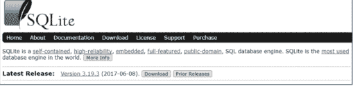

从下载页面，你需要选择适用于 Mac OS 或 Windows 的“预编译二进制文件”选项之一，该选项需包含“命令行 shell”。

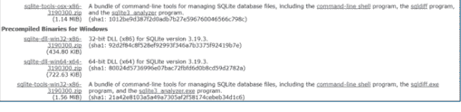

要使用 SQL，你需要加载“DB Browser for SQLite”，可以从 https://sqlitebrowser.org 下载。

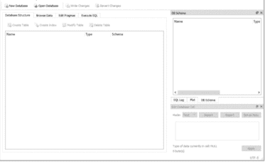


### 理解关系型数据库

我们将以一个小型制造公司为例，该公司将其员工详情存储在一个 **SQL** 数据库中。

下面是员工表的一个示例，其中包含公司所有员工的详细信息。通过单击“浏览数据”选项卡可以查看表的内容。

| ID | 姓名 | 部门 | 薪水 |
|---|---|---|---|
| 1 | Bob | Sales | 25000 |
| 2 | Sue | IT | 28500 |
| 3 | Tim | Sales | 25000 |
| 4 | Anne | Admin | 18500 |
| 5 | Paul | IT | 28500 |
| 6 | Simon | Sales | 22000 |
| 7 | Karen | Manufacturing | 18500 |
| 8 | Mark | Manufacturing | 19000 |
| 9 | George | Manufacturing | 18500 |
| 10 | Keith | Manufacturing | 15000 |


该表有四个字段（ID、姓名、部门和薪水）以及 10 条记录（每个员工一条）。查看员工列表，你会发现同一部门中列出了多名员工。在大多数数据库中，你会找到此类重复数据。为了使数据库更高效地工作，重复的数据通常存储在单独的表中。在这种情况下，有一个部门表，用于存储每个部门的所有信息，以避免为每个员工重复所有部门详情。

### L36 挑战 139 - 145：SQLite

| 部门 | 经理 |
|---|---|
| Manufacturing | Kenith |
| Sales | James |
| IT | Connor |
| Admin | Sally |

这里我们可以看到包含每个部门详细信息的部门表。我们对其进行了简化，仅包含每个部门的一项数据（在这种情况下是经理的姓名），但这仍然可以节省为每条记录输入经理姓名的麻烦，如果数据全部保存在一个大表中，我们就必须这样做。

通过像这样将数据分成两个表，如果我们需要更新经理，只需要在一个地方更新，而不是更新多次，如果所有数据都存储在一个表中，我们就需要更新多次。

这被称为 **一对多** 关系，因为一个部门可以有多个员工。

**主键** 是每个表中存储该记录唯一标识符的字段（通常是第一个字段）。因此，在员工表中，主键将是 ID 列，而在部门表中，主键将是部门（Dept）。

创建表时，你需要为每个字段确定以下内容：

-   字段的名称（字段名不能包含空格，并且必须遵循与变量名相同的规则）；
-   是否为主键；
-   该字段的数据类型。

你可以使用的数据类型如下：

-   **整数**：值为整数值；
-   **实数**：值为浮点值；
-   **文本**：值为文本字符串；
-   **二进制大对象**：值按输入原样存储。

你还可以通过在创建字段时在其末尾添加 **NOT NULL** 来指定该字段不能为空。

### 示例代码

```
import sqlite3
```

这必须是程序的第一行，以便允许 Python 使用 SQLite3 库。

```
with sqlite3.connect("company.db") as db:
    cursor=db.cursor()
```

连接到公司数据库。如果不存在这样的数据库，它将创建一个。该文件将存储在与程序相同的文件夹中。

```
cursor.execute("""CREATE TABLE IF NOT EXISTS employees(
    id integer PRIMARY KEY,
    name text NOT NULL,
    dept text NOT NULL,
    salary integer);""")
```

创建一个名为 employees 的表，该表有四个字段（id、name、dept 和 salary）。它指定了每个字段的数据类型，定义了哪个字段是主键以及哪些字段不能为空。三引号允许将代码分成多行以使其更易于阅读，而不是全部显示在一行中。

```
cursor.execute("""INSERT INTO employees(id,name,dept,salary)
    VALUES("1","Bob","Sales","25000")""")
db.commit()
```

向 employees 表插入数据。`db.commit()` 这行代码保存更改。

```
newID = input("Enter ID number: ")
newname = input("Enter name: ")
newDept = input("Enter department: ")
newSalary = input("Enter salary: ")
cursor.execute("""INSERT INTO employees(id,name,dept,salary)
    VALUES(?,?,?,?)""", (newID,newName,newDept,newSalary))
db.commit()
```

允许用户输入新数据，然后将其插入表中。

```
cursor.execute("SELECT * FROM employees")
print(cursor.fetchall())
```

显示 employees 表中的所有数据。

```
db.close()
```

这必须是程序的最后一行，用于关闭数据库。


### 138 挑战 139 - 145：SQLite

```
cursor.execute("SELECT * FROM employees")
for x in cursor.fetchall():
    print(x)
```

显示 employees 表中的所有数据，并在单独的行中显示每条记录。

```
cursor.execute("SELECT * FROM employees ORDER BY name")
for x in cursor.fetchall():
    print(x)
```

从 employees 表中选择所有数据，按姓名排序，并在单独的行中显示每条记录。

```
cursor.execute("SELECT * FROM employees WHERE salary>20000")
```

从 employees 表中选择薪水超过 20,000 的所有数据。

```
cursor.execute("SELECT * FROM employees WHERE dept='Sales'")
```

从 employees 表中选择部门为“Sales”的所有数据。

```
cursor.execute("""SELECT employees.id,employees.name,dept.manager
FROM employees,dept WHERE employees.dept=dept.dept
AND employees.salary >20000""")
```

如果薪水超过 20,000，则从 employees 表中选择 ID 和姓名字段，并从 department 表中选择经理字段。

```
cursor.execute("SELECT id,name,salary FROM employees")
```

从 employees 表中选择 ID、姓名和薪水字段。


```
whichDept = input("Enter a department: ")
cursor.execute("SELECT * FROM employees WHERE dept=?",[whichDept])
for x in cursor.fetchall():
    print(x)
```

允许用户输入一个部门，并显示该部门所有员工的记录。

```
cursor.execute("""SELECT employees.id,employees.name,dept.manager
FROM employees,dept WHERE employees.dept=dept.dept""")
```

从 employees 表中选择 ID 和姓名字段，并从 department 表中选择经理字段，使用部门字段链接数据。如果未指定表如何链接，Python 将假设每个员工都在每个部门工作，你将不会得到预期的结果。

```
cursor.execute("UPDATE employees SET name = 'Tony' WHERE id=1")
db.commit()
```

更新表中的数据（覆盖原始数据），将员工 ID 为 1 的姓名更改为“Tony”。

```
cursor.execute("DELETE employees WHERE id=1")
```


#### 挑战

#### 139

创建一个名为 PhoneBook 的 SQL 数据库，其中包含一个名为 Names 的表，该表包含以下数据：

| ID | 名 | 姓 | 电话号码 |
|---|---|---|---|
| 1 | Simon | Howells | 01223 349752 |
| 2 | Karen | Phillips | 01954 295773 |
| 3 | Darren | Smith | 01583 749012 |
| 4 | Anne | Jones | 01323 567322 |
| 5 | Mark | Smith | 01223 855534 |

#### 140

使用程序 139 中的 PhoneBook 数据库，编写一个程序，显示以下菜单。

主菜单
1) 查看电话簿
2) 添加到电话簿
3) 按姓氏搜索
4) 从电话簿中删除人员
5) 退出
请输入您的选择：

如果用户选择 1，他们应该能够查看整个电话簿。如果选择 2，应该允许他们向电话簿中添加新人员。如果选择 3，应该要求他们输入姓氏，然后仅显示具有相同姓氏的人员记录。如果选择 4，应该要求输入 ID，然后从表中删除该记录。如果选择 5，程序应该结束。最后，如果用户输入了菜单中的错误选择，应该显示一条合适的提示信息。每次操作后，他们应该返回到菜单，直到选择 5。

#### 141

创建一个名为 BookInfo 的新 SQL 数据库，用于存储作者列表及其所写的书籍。它将有两个表。第一个表应称为 Authors，包含以下数据：

| 姓名 | 出生地 |
|---|---|
| Agatha Christie | Torquay |
| Cecelia Ahern | Dublin |
| J.K. Rowling | Bristol |
| Oscar Wilde | Dublin |

第二个表应称为 Books，包含以下数据：

| ID | 书名 | 作者 | 出版日期 |
|---|---|---|---|
| 1 | De Profundis | Oscar Wilde | 1905 |
| 2 | Harry Potter and the chamber of secrets | J.K. Rowling | 1998 |
| 3 | Harry Potter and the prisoner of Azkaban | J.K. Rowling | 1999 |
| 4 | Lyrebird | Cecelia Ahern | 2017 |
| 5 | Murder on the Orient Express | Agatha Christie | 1934 |
| 6 | P.S. I Love You | Cecelia Ahern | 2003 |
| 7 | The marble collector | Cecelia Ahern | 2016 |
| 8 | The murder on the links | Agatha Christie | 1923 |
| 9 | The picture of Dorian Gray | Oscar Wilde | 1890 |
| 10 | The secret adversary | Agatha Christie | 1922 |
| 11 | The seven dials mystery | Agatha Christie | 1929 |
| 12 | The year I met you | Cecelia Ahern | 2014 |

#### 142

使用程序 141 中的 BookInfo 数据库，显示作者列表及其出生地。要求用户输入一个出生地，然后显示所有出生于该地点的作者的书籍的书名、出版日期和作者姓名。


#### 143

使用 BookInfo 数据库，要求用户输入一个年份，并显示该年份之后出版的所有书籍，按出版年份排序。

### 挑战 139 - 145：SQLite

#### 144

使用 BookInfo 数据库，向用户询问作者姓名，然后将该作者的所有书籍保存到一个文本文件中，每个字段用破折号分隔，格式如下：

```
5 - Murder on the Orient Express - Agatha Christie - 1934
8 - The murder on the links - Agatha Christie - 1923
10 - The secret adversary - Agatha Christie - 1921
11 - The seven dials mystery - Agatha Christie - 1929
```

打开文本文件以确保其工作正确。


> 你已经学到了很多。回顾一下你学过的所有挑战和编程技巧。这真的很了不起。

#### 145

创建一个显示以下屏幕的程序：

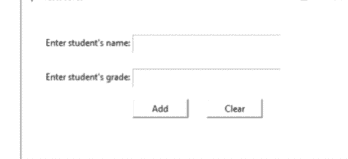

当点击“添加”按钮时，它应将数据保存到名为 TestScores 的 SQL 数据库中。“清除”按钮应清空窗口。


#### 答案

#### 139

```python
import sqlite3

with sqlite3.connect("PhoneBook.db") as db:
    cursor = db.cursor()

cursor.execute(""" CREATE TABLE IF NOT EXISTS Names(
id integer PRIMARY KEY,
firstname text,
surname text,
phonenumber text); """)

cursor.execute(""" INSERT INTO Names(id,firstname,surname,phonenumber)
VALUES("1","Simon","Howels","01223 349752")""")
db.commit()

cursor.execute(""" INSERT INTO Names(id,firstname,surname,phonenumber)
VALUES("2","Karen","Phillips","01954 295773")""")
db.commit()

cursor.execute(""" INSERT INTO Names(id,firstname,surname,phonenumber)
VALUES("3","Darren","Smith","01583 749012")""")
db.commit()

cursor.execute(""" INSERT INTO Names(id,firstname,surname,phonenumber)
VALUES("4","Anne","Jones","01323 567322")""")
db.commit()

cursor.execute(""" INSERT INTO Names(id,firstname,surname,phonenumber)
VALUES("5","Mark","Smith","01223 855534")""")
db.commit()

db.close()
```

#### 140

```python
import sqlite3

def viewphonebook():
    cursor.execute("SELECT * FROM Names")
    for x in cursor.fetchall():
        print(x)

def addtophonebook():
    newid = int(input("Enter ID: "))
    newfname = input("Enter first name: ")
    newsname = input("Enter surname: ")
    newpnum = input("Enter phone number: ")
    cursor.execute("""INSERT INTO Names (id,firstname,surname,phonenumber)
    VALUES (?,?,?,?)""", (newid,newfname,newsname,newpnum))
    db.commit()

def selectname():
    selectsurname = input("Enter a surname: ")
    cursor.execute("SELECT * FROM Names WHERE surname = ?", [selectsurname])
    for x in cursor.fetchall():
        print(x)

def deletedata():
    selectid = int(input("Enter ID: "))
    cursor.execute("DELETE FROM Names WHERE id = ?", [selectid])
    cursor.execute("SELECT * FROM Names")
    for x in cursor.fetchall():
        print(x)
    db.commit()

with sqlite3.connect("PhoneBook.db") as db:
    cursor = db.cursor()

def main():
    again = "y"
    while again == "y":
        print()
        print("Main Menu")
        print()
        print("1) View phone book")
        print("2) Add to phone book")
        print("3) Search for surname")
        print("4) Delete person from phone book")
        print("5) Quit")
        print()
        selection = int(input("Enter your selection: "))
        print()

        if selection == 1:
            viewphonebook()
        elif selection == 2:
            addtophonebook()
        elif selection == 3:
            selectname()
        elif selection == 4:
            deletedata()
        elif selection == 5:
            again = "n"
        else:
            print("Incorrect selection entered")

main()
db.close()
```

#### 141

```python
import sqlite3

with sqlite3.connect("BookInfo.db") as db:
    cursor = db.cursor()

cursor.execute(""" CREATE TABLE IF NOT EXISTS Authors(
Name text PRIMARY KEY,
PlaceofBirth text); """)

cursor.execute(""" INSERT INTO Authors(Name,PlaceofBirth)
VALUES("Agatha Christie","Torquay")""")
db.commit()

cursor.execute(""" INSERT INTO Authors(Name,PlaceofBirth)
VALUES("Cecelia Ahern","Dublin")""")
db.commit()
cursor.execute(""" INSERT INTO Authors(Name,PlaceofBirth)
VALUES("J.K. Rowling","Bristol")""")
db.commit()
cursor.execute(""" INSERT INTO Authors(Name,PlaceofBirth)
VALUES("Oscar Wilde","Dublin")""")
db.commit()

cursor.execute(""" CREATE TABLE IF NOT EXISTS Books(
ID integer PRIMARY KEY,
Title text,
Author text,
DatePublished integer); """)

cursor.execute(""" INSERT INTO Books(ID,Title,Author,DatePublished)
VALUES("1","De Profundis","Oscar Wilde","1905")""")
db.commit()
cursor.execute(""" INSERT INTO Books(ID,Title,Author,DatePublished)
VALUES("2","Harry Potter and the chamber of secrets","J.K. Rowling","1998")""")
db.commit()
cursor.execute(""" INSERT INTO Books(ID,Title,Author,DatePublished)
VALUES("3","Harry Potter and the prisoner of Azkaban","J.K. Rowling","1999")""")
db.commit()
cursor.execute(""" INSERT INTO Books(ID,Title,Author,DatePublished)
VALUES("4","Lyrebird","Cecelia Ahern","2017")""")
db.commit()
cursor.execute(""" INSERT INTO Books(ID,Title,Author,DatePublished)
VALUES("5","Murder on the Orient Express","Agatha Christie","1934")""")
db.commit()
cursor.execute(""" INSERT INTO Books(ID,Title,Author,DatePublished)
VALUES("6","Perfect","Cecelia Ahern","2017")""")
db.commit()
cursor.execute(""" INSERT INTO Books(ID,Title,Author,DatePublished)
VALUES("7","The marble collector","Cecelia Ahern","2016")""")
db.commit()
cursor.execute(""" INSERT INTO Books(ID,Title,Author,DatePublished)
VALUES("8","The murder on the links","Agatha Christie","1923")""")
db.commit()
cursor.execute(""" INSERT INTO Books(ID,Title,Author,DatePublished)
VALUES("9","The picture of Dorian Gray","Oscar Wilde","1890")""")
db.commit()
cursor.execute(""" INSERT INTO Books(ID,Title,Author,DatePublished)
VALUES("10","The secret adversary","Agatha Christie","1921")""")
db.commit()
cursor.execute(""" INSERT INTO Books(ID,Title,Author,DatePublished)
VALUES("11","The seven dials mystery","Agatha Christie","1929")""")
db.commit()
cursor.execute(""" INSERT INTO Books(ID,Title,Author,DatePublished)
VALUES("12","The year I met you","Cecelia Ahern","2014")""")
db.commit()

db.close()
```

#### 142

```python
import sqlite3

with sqlite3.connect("BookInfo.db") as db:
    cursor = db.cursor()

cursor.execute("SELECT * FROM Authors")
for x in cursor.fetchall():
    print(x)

print()
location = input("Enter a place of birth: ")
print()

cursor.execute("""SELECT Books.Title, Books.DatePublished, Books.Author
FROM Books,Authors WHERE Authors.Name=Books.Author AND Authors.PlaceOfBirth=?""", [location])
for x in cursor.fetchall():
    print(x)

db.close()
```

#### 143

```python
import sqlite3

with sqlite3.connect("BookInfo.db") as db:
    cursor = db.cursor()

selectionyear = int(input("Enter a year: "))
print()

cursor.execute("""SELECT Books.Title, Books.DatePublished, Books.Author
FROM Books WHERE DatePublished>? ORDER BY DatePublished""", [selectionyear])
for x in cursor.fetchall():
    print(x)

db.close()
```

#### 144

```python
import sqlite3

file = open("BooksList.txt","w")

with sqlite3.connect("BookInfo.db") as db:
    cursor = db.cursor()

cursor.execute("SELECT Name from Authors")
for x in cursor.fetchall():
    print(x)

print()
selectauthor = input("Enter an author's name: ")
print()

cursor.execute("SELECT *FROM Books WHERE Author=?",[selectauthor])
for x in cursor.fetchall():
    newrecord = str(x[0]) + " - " + x[1] + " - " + x[2] + " - " + str(x[3]) + "\n"
    file.write(newrecord)

file.close()

db.close()
```

#### 145

```python
import sqlite3
from tkinter import *

def addtolist():
    newname = sname.get()
    newgrade = sgrade.get()
    cursor.execute("""INSERT INTO Scores (name,score)
VALUES (?,?)""",(newname,newgrade))
    db.commit()
    sname.delete(0,END)
    sgrade.delete(0,END)
    sname.focus()

def clearlist():
    sname.delete(0,END)
    sgrade.delete(0,END)
    sname.focus()

with sqlite3.connect("TestScore.db") as db:
    cursor = db.cursor()

cursor.execute(""" CREATE TABLE IF NOT EXISTS Scores(
id integer PRIMARY KEY, name text, score integer); """)

window = Tk()
window.title("TestScores")
window.geometry("450x200")

label1 = Label(text = "Enter student's name:")
label1.place(x = 30, y = 35)
sname = Entry(text = "")
sname.place(x = 150, y = 35, width = 200, height = 25)
sname.focus()
label2 = Label(text = "Enter student's grade:")
label2.place(x = 30, y = 80)
sgade = Entry(text = "")
sgade.place(x = 150, y = 80, width = 200, height = 25)
sgade.focus()
addbtn = Button(text = "Add", command = addtolist )
addbtn.place(x = 150, y = 120, width = 75, height = 25)
clearbtn = Button(text = "Clear", command = clearlist)
clearbtn.place(x = 250, y = 120, width = 75, height = 25)

window.mainloop()
db.close()
```

#### 第二部分

大型挑战

## 第二部分简介

在这一部分中，你将面临一些需要投入较多时间的大型编程挑战。这些挑战将比之前的挑战耗时更长，并且你可能需要参考本书前面的章节，以回顾你已经掌握的一些关键技能。如果你需要查阅前面章节中的关键代码行，不必感到难为情；即使是经验丰富的程序员，在遇到不熟悉的棘手代码时也会寻求帮助。这都是学习过程的一部分，也正是本书设计的使用方式。

每个挑战都包含一个所需技能清单，以便你判断自己是否准备好尝试该挑战。它还包括挑战描述和一个问题概述部分，列出你将必须克服的困难。本节中的解决方案要大得多，有些被分在多个页面上，但对于该挑战而言，它们应被视为一个连续的完整程序。如果程序确实需要跨页面分割，我们会在子程序处或尽可能在自然断点处分割。

在尝试每个挑战之前，请先通读全部内容，这样你就能意识到可能的陷阱。通读挑战后，向后靠一靠，思考一下你打算如何着手。你可能想要草拟一些笔记，或者如果你非常积极并且知道怎么做，你甚至可能冒险去编写一个流程图。毫无头绪地直接投入编写代码行是没有意义的，因为你很可能会陷入混乱，并可能对自己的能力失去信心。制定一个计划，将大问题分解成小的、可管理的部分，然后逐个攻克这些部分，并在进行过程中测试每个部分。现在，为自己倒杯饮料，拿起笔记本和铅笔，深吸一口气，翻到下一页，开始尝试第一个挑战吧。

### 146：移位码

在本挑战中，你将需要运用以下技能：

-   输入与显示数据；
-   列表；
-   分割与连接字符串；
-   条件语句（if语句）；
-   循环（while 和 for）；
-   子程序。

### 挑战描述

移位码是一种可以轻松编码信息的简单密码。每个字母在字母表中向前移动固定的位数，由一个新字母代表。例如，当移位数为1时（即字母表中的每个字母向前移动一个字符），“abc”会变成“bcd”。

你需要创建一个程序，显示以下菜单：

```
1) 生成编码
2) 解码信息
3) 退出

请输入您的选择：
```

如果用户选择1，他们应该能够输入一条消息（包括空格），然后输入一个数字。Python随后应在应用移位码后显示编码后的消息。

如果用户选择2，他们应该输入一条编码过的消息和正确的数字，程序应显示解码后的消息（即，在字母表中向后移动正确的位数）。

如果他们选择3，程序应停止运行。

在用户编码或解码一条消息后，应再次向他们显示菜单，直到他们选择退出。

### 需要克服的问题

决定是允许大小写字母，还是将所有数据转换为同一种大小写。

决定是否允许标点符号。

如果移位导致字母超出字母表末尾，它应该从头开始；例如，如果用户输入“xyz”并输入5作为移位数字，它应该显示“bcd”。解码消息时也应反向工作，因此如果值达到“a”，它应该返回到“w”。

确保在用户在菜单上选择不当选项或选择不当的数字来生成移位码时，显示合适的提示信息。

通过解码消息“we ovugjohsslunl”来测试你的解码选项，该消息是用数字7创建的，并且密码只使用“abcdefghijklmnopqrstuvwxyz ”（注意末尾的空格）。

### 挑战146：移位码

#### 答案

```python
alphabet = ["a","b","c","d","e","f","g","h","i","j",
            "k","l","m","n","o","p","q","r","s","t",
            "u","v","w","x","y","z"," "]
```

```python
def get_data():
    word = input("输入您的消息： ")
    word = word.lower()
    num = int(input("输入一个数字（1-26）： "))
    if num > 26 or num == 0:
        while num > 26 or num == 0:
            num = int(input("超出范围，请输入一个数字（1-26）： "))
    data = (word,num)
    return(data)
```

```python
def make_code(word,num):
    new_word = ""
    for x in word:
        y = alphabet.index(x)
        y = y + num
        if y > 26:
            y = y - 27
        char = alphabet[y]
        new_word = new_word + char
    print(new_word)
    print()
```

```python
def decode(word,num):
    new_word = ""
    for x in word:
        y = alphabet.index(x)
        y = y - num
        if y < 0:
            y = y + 27
        char = alphabet[y]
        new_word = new_word+char
    print(new_word)
    print()
```

```python
def main():
    again = True
    while again == True:
        print("1) 生成编码")
        print("2) 解码信息")
        print("3) 退出")
        print()
        selection = int(input("请输入您的选择： "))
        if selection == 1:
            (word,num) = get_data()
            make_code(word,num)
        elif selection == 2:
            (word,num) = get_data()
            decode(word,num)
        elif selection == 3:
            again = False
        else:
            print("选择不正确")

main()
```

### 147：珠玑妙算

在本挑战中，你将需要运用以下技能：

-   输入与显示数据；
-   列表；
-   从列表中随机选择；
-   条件语句（if语句）；
-   循环（while 和 for）；
-   子程序。

### 挑战描述

你将制作一个屏幕版的棋盘游戏“珠玑妙算”。计算机将从一组可能的颜色中自动生成四种颜色（计算机应该能够随机选择相同的颜色）。例如，计算机可能选择“红色”、“蓝色”、“红色”、“绿色”。这个序列**不应**向用户显示。

完成后，用户应从计算机使用的同一列表中输入他们选择的四种颜色。例如，他们可能选择“粉色”、“蓝色”、“黄色”和“红色”。

用户做出选择后，程序应显示他们有多少种颜色位置正确，以及有多少种颜色正确但位置错误。在上面的例子中，它应该显示消息“正确位置的正确颜色：1”和“正确颜色但位置错误：1”。

用户继续猜测，直到他们正确输入四种颜色的正确顺序。游戏结束时，应显示一条合适的消息，并告诉他们猜了多少次。

### 需要克服的问题

这个游戏最难的部分是弄清楚检查用户猜对了多少以及有多少位置错误的逻辑。使用上面的例子，如果用户输入“蓝色”、“蓝色”、“蓝色”、“蓝色”，他们应该看到消息“正确位置的正确颜色：1”和“正确颜色但位置错误：0”。

决定是否有更简单的方法允许用户输入他们的选择（例如，使用代码或单个字母代表颜色）。如果使用首字母，请确保你只使用首字母唯一的颜色（即避免同时使用蓝色、黑色和棕色作为选项，只选择其中一种作为可能性）。让你的说明对用户清晰明了。

决定是允许大小写，还是将所有内容转换为同一种大小写更容易。

确保你建立了验证检查，以确保用户只输入有效数据，并在他们做出错误选择时显示合适的提示信息。如果他们确实做出了错误选择，你可能希望允许他们再次输入数据，而不是将其视为一次错误的猜测。

#### 答案

```python
import random

def select_col():
    colours = ["r","b","o","y","p","g","w"]
    c1 = random.choice(colours)
    c2 = random.choice(colours)
    c3 = random.choice(colours)
    c4 = random.choice(colours)
    data = (c1,c2,c3,c4)
    return data

def tryit(c1,c2,c3,c4):
    print("The available colours are: (r)ed, (b)lue, (o)range, (y)ellow, (p)ink, (g)reen and (w)hite.")
    try_again = True
    while try_again == True:
        u1 = input("Enter your choice for place 1: ")
        u1 = u1.lower()
        if u1 != "r" and u1 != "b" and u1 != "o" and u1 != "y" and u1 != "p" and u1 != "g" and u1 != "w":
            print("Incorrect selection")
        else:
            try_again = False
    try_again = True
    while try_again == True:
        u2 = input("Enter your choice for place 2: ")
        u2 = u2.lower()
        if u2 != "r" and u2 != "b" and u2 != "o" and u2 != "y" and u2 != "p" and u2 != "g" and u2 != "w":
            print("Incorrect selection")
        else:
            try_again = False
    try_again = True
    while try_again == True:
        u3 = input("Enter your choice for place 3: ")
        u3 = u3.lower()
        if u3 != "r" and u3 != "b" and u3 != "o" and u3 != "y" and u3 != "p" and u3 != "g" and u3 != "w":
            print("Incorrect selection")
        else:
            try_again = False
    try_again = True
    while try_again == True:
        u4 = input("Enter your choice for place 4: ")
        u4 = u4.lower()
        if u4 != "r" and u4 != "b" and u4 != "o" and u4 != "y" and u4 != "p" and u4 != "g" and u4 != "w":
            print("Incorrect selection")
        else:
            try_again = False
    correct = 0
    wrong_place = 0
    if c1 == u1:
        correct = correct + 1
    elif c1 == u2 or c1 == u3 or c1 == u4:
        wrong_place = wrong_place + 1
    if c2 == u2:
        correct = correct + 1
    elif c2 == u1 or c2 == u3 or c2 == u4:
        wrong_place = wrong_place + 1
    if c3 == u3:
        correct = correct + 1
    elif c3 == u1 or c3 == u2 or c3 == u4:
        wrong_place = wrong_place + 1
    if c4 == u4:
        correct = correct + 1
    elif c4 == u1 or c4 == u2 or c4 == u3:
        wrong_place = wrong_place + 1
    print("Correct colour in the correct place: ",correct)
    print("Correct colour but in the wrong place: ",wrong_place)
    print()
    data2 = [correct,wrong_place]
    return data2

def main():
    (c1,c2,c3,c4) = select_col()
    score = 0
    play = True
    while play == True:
        (correct,wrong_place) = tryit(c1,c2,c3,c4)
        score = score + 1
        if correct == 4:
            play = False
    print("Well done!")
    print("You took", score, "guesses")

main()
```

### 挑战 148：密码

### 148：密码

在这个挑战中，你需要运用以下技能：

-   输入和显示数据；
-   列表；
-   if 语句；
-   循环（while 和 for）；
-   子程序；
-   保存到 .csv 文件和从 .csv 文件读取。


### 挑战内容

你需要创建一个程序，用于存储系统用户的用户 ID 和密码。它应该显示以下菜单：

```
1) 创建新的用户 ID
2) 更改密码
3) 显示所有用户 ID
4) 退出

请输入选择：
```

如果用户选择 1，程序应要求他们输入一个用户 ID。它需要检查该用户 ID 是否已在列表中。如果存在，程序应显示一条合适的消息，并要求他们选择另一个用户 ID。一旦输入了合适的用户 ID，程序应要求输入一个密码。密码的评分标准如下，每满足一项得 1 分：

-   至少包含 8 个字符；
-   包含大写字母；
-   包含小写字母；
-   包含数字；并且
-   至少包含一个特殊字符，例如 !, £, $, %, &, <, * 或 @。

如果密码得分仅为 1 或 2 分，则应拒绝并显示消息说明这是一个弱密码；如果得分为 3 或 4 分，则告诉他们“这个密码可以改进”。询问他们是否想再试一次。如果得分为 5 分，则告诉他们选择了一个强密码。只有可接受的用户 ID 和密码才应添加到 .csv 文件的末尾。

如果他们从菜单中选择 2，他们需要输入一个用户 ID，检查该用户 ID 是否存在于列表中，如果存在，则允许用户更改密码并将更改保存到 .csv 文件。确保程序只更改现有密码，而不是创建新记录。

如果用户从菜单中选择 3，则显示所有用户 ID，但不显示密码。


如果用户从菜单中选择 4，则应停止程序。

#### 你需要克服的问题

由于 .csv 文件中的现有数据无法编辑，只能读取或添加，你需要将数据作为临时列表导入 Python，以便在数据重新写入 .csv 文件之前进行更改。

确保只有属于现有用户 ID 的密码才能被更改。

使用合适的消息来引导用户轻松使用系统。


重复显示菜单，直到他们退出程序。


### 挑战 148：密码

#### 答案

对于这个挑战，你需要首先设置一个名为 "passwords.csv" 的 .csv 文件。你可以使用代码来创建它，或者简单地创建一个 Excel 文件并将其另存为 .csv 文件。它需要存储在与程序文件相同的位置。

```python
import csv

def get_data():
    file = list(csv.reader(open("passwords.csv")))
    tmp = []
    for x in file:
        tmp.append(x)
    return tmp

def create_userID(tmp):
    name_again = True
    while name_again == True:
        userID = input("Enter a new user ID: ")
        userID.lower()
        inlist = False
        row = 0
        for y in tmp:
            if userID in tmp[row][0]:
                print(userID,"has already been allocated")
                inlist = True
            row = row + 1
        if inlist == False:
            name_again = False
    return userID

def create_password():
    slist = ["!","#","$","%","&","'","(",")","*","+",",","-",".","/",":",";","<","=",">","?","@","[","]","^","_","`","{","|","}","~"]
    nlist = ["1","2","3","4","5","6","7","8","9","0"]
    tryagain = True
    while tryagain == True:
        score = 0
        uc = False
        lc = False
        sc = False
        nc = False
        password = input("Enter Password: ")
        length = len(password)
        if length >= 8:
            score = score + 1
        for x in password:
            if x.islower():
                lc = True
            if x.isupper():
                uc = True
            if x in slist:
                sc = True
            if x in nlist:
                nc = True
        if sc == True:
            score = score + 1
        if lc == True:
            score = score + 1
        if uc == True:
            score = score + 1
        if nc == True:
            score = score + 1
        if score == 1 or score == 2:
            print("This is a weak password, try again")
        if score == 3 or score == 4:
            print("This password could be improved")
            again = input("Do you want to try for a stronger password? (y/n) ")
            if again == "n":
                tryagain = False
        if password != password2:
            print("Passwords do not match.  File not saved")
            main()
        else:
            return password
```

```python
def find_userID(tmp):
    ask_name_again = True
    userID = ""
    while ask_name_again == True:
        searchID = input("Enter the user ID you are looking for ")
        searchID.lower()
        inlist = False
        row = 0
        for y in tmp:
            if searchID in tmp[row][0]:
                inlist = True
                row = row + 1
        if inlist == True:
            userID = searchID
            ask_name_again = False
        else:
            print(searchID,"is NOT in the list")
    return userID

def change_password(userID,tmp):
    if userID != "":
        password = create_password()
        ID = userID.index(userID)
        tmp[ID][1] = password
        file = open("passwords.csv","w")
        x = 0
        for row in tmp:
            newrecord = tmp[x][0] + ", " + tmp[x][1] + "\n"
            file.write(newrecord)
            x = x + 1
        file.close()

def display_all_userID():
    tmp = get_data()
    x = 0
    for row in tmp:
        print(tmp[x][0])
        x = x + 1

def main():
    tmp = get_data()
    go_again = True
    while go_again == True:
        print()
        print("1) Create a new User ID")
        print("2) Change a password")
        print("3) Display all User IDs")
        print("4) Quit")
        print()
        selection = int(input("Enter Selection: "))
        if selection == 1:
            userID = create_userID(tmp)
            password = create_password()
            file = open("passwords.csv","a")
            newrecord = userID + ", " + password + "\n"
            file.write(str(newrecord))
            file.close()
        elif selection == 2:
            userID = find_userID(tmp)
            change_password(userID,tmp)
        elif selection == 3:
            display_all_userID()
        elif selection == 4:
            go_again = False
        else:
            print("Incorrect selection")

main()
```## 149：乘法表（图形界面）

在本挑战中，你将需要运用以下技能：
-   循环（`while` 和 `for`）；
-   子程序；
-   Tkinter 库。

#### 挑战

创建一个程序，显示以下屏幕：

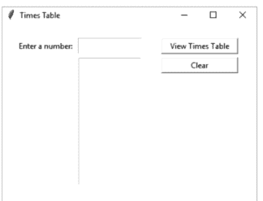


#### 挑战 149：乘法表（图形界面）

当用户在第一个输入框中输入一个数字，并点击“查看乘法表”按钮时，它应在列表区域显示乘法表。

例如，如果用户输入 99，他们将看到如右侧示例所示的列表。

“清除”按钮应清空两个输入框。

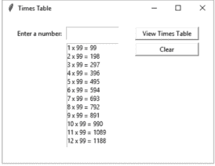

#### 你需要克服的问题

你希望在列表中显示完整的算式，而不仅仅是答案。以下代码行可能有助于你实现这一点：

```python
num_list.insert(END, (i, "x", num, "=", answer))
```

确保程序尽可能易于使用，方法是确保焦点位于正确的位置。

#### 答案

```python
from tkinter import *

def show_table():
    num = num_box.get()
    num = int(num)
    value = 1
    for i in range(1, 13):
        answer = i * num
        num_list.insert(END, (i, "x", num, "=", answer))
        value = value + 1
    num_box.delete(0, END)
    num_box.focus()

def clear_list():
    num_box.delete(0, END)
    num_list.delete(0, END)
    num_box.focus()

window = Tk()
window.title("Times Table")
window.geometry("400x280")

label1 = Label(text = "Enter a number:")
label1.place(x = 20, y = 20, width = 100, height = 25)

num_box = Entry(text = 0)
num_box.place(x = 120, y = 20, width = 100, height = 25)
num_box.focus()

button1 = Button(text = "View Times Table", command = show_table)
button1.place(x = 250, y = 20, width = 120, height = 25)

num_list = Listbox()
num_list.place(x = 120, y = 50, width = 100, height = 200)

button2 = Button(text = "Clear", command = clear_list)
button2.place(x = 250, y = 50, width = 120, height = 25)

window.mainloop()
```

### 150：艺术画廊

在本挑战中，你将需要运用以下技能：
-   Tkinter 库；
-   SQLite 3。


#### 挑战

一家小型艺术画廊正在销售不同艺术家的作品，并希望使用 SQL 数据库来跟踪这些画作。你需要创建一个用户友好的系统来跟踪艺术品，这应包括使用图形用户界面。以下是当前需要存储在数据库中的数据。

艺术家联系方式：

| 艺术家ID | 姓名 | 地址 | 城镇 | 郡 | 邮政编码 |
|---|---|---|---|---|---|
| 1 | Martin Leighton | 5 Park Place | Peterborough | Cambridgeshire | PE32 5LP |
| 2 | Eva Czarniecka | 77 Warner Close | Chelmsford | Essex | CM22 5FT |
| 3 | Roxy Parkin | 90 Hindhead Road | | London | SE12 6WM |
| 4 | Nigel Farnworth | 41 Whitby Road | Huntly | Aberdeenshire | AB54 5PN |
| 5 | Teresa Tanner | 70 Guild Street | | London | NW7 1SP |

艺术品：

| 作品ID | 艺术家ID | 标题 | 媒介 | 价格 |
|---|---|---|---|---|
| 1 | 5 | Woman with black Labrador | Oil | 220 |
| 2 | 5 | Bees & thistles | Watercolour | 85 |
| 3 | 2 | A stroll to Westminster | Ink | 190 |
| 4 | 1 | African giant | Oil | 800 |
| 5 | 3 | Water daemon | Acrylic | 1700 |
| 6 | 4 | A seagull | Watercolour | 35 |
| 7 | 1 | Three friends | Oil | 1800 |
| 8 | 2 | Summer breeze 1 | Acrylic | 1350 |
| 9 | 4 | Mr Hamster | Watercolour | 35 |
| 10 | 1 | Pulpit Rock, Dorset | Oil | 600 |
| 11 | 5 | Trawler Dungeness beach | Oil | 195 |
| 12 | 2 | Dance in the snow | Oil | 250 |
| 13 | 4 | St Tropez port | Ink | 45 |
| 14 | 3 | Pirate assassin | Acrylic | 420 |
| 15 | 1 | Morning walk | Oil | 800 |
| 16 | 4 | A baby barn swallow | Watercolour | 35 |
| 17 | 4 | The old working mills | Ink | 395 |

#### 你需要克服的问题

艺术画廊必须能够添加新的艺术家和艺术品。

一旦一件艺术品售出，该艺术品的数据应从主 SQL 数据库中移除，并存储在一个单独的文本文件中。

用户应该能够按艺术家、媒介或价格进行搜索。

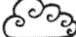


#### 挑战 150：艺术画廊

#### 答案

```python
import sqlite3
from tkinter import *

def addartist():
    newname = artistname.get()
    newaddress = artistadd.get()
    newtown = artisttown.get()
    newcounty = artistcounty.get()
    newpostcode = artistpostcode.get()
    cursor.execute("INSERT INTO Artists (name,address,town,county,postcode) VALUES (?,?,?,?,?)", (newname,newaddress,newtown,newcounty,newpostcode))
    db.commit()
    artistname.delete(0,END)
    artistadd.delete(0,END)
    artisttown.delete(0,END)
    artistcounty.delete(0,END)
    artistpostcode.delete(0,END)
    artistname.focus()

def clearartist():
    artistname.delete(0,END)
    artistadd.delete(0,END)
    artisttown.delete(0,END)
    artistcounty.delete(0,END)
    artistpostcode.delete(0,END)
    artistname.focus()

def addart():
    newname = artname.get()
    newtitle = arttitle.get()
    newmedium = medium.get()
    newprice = artprice.get()
    cursor.execute("INSERT INTO Art (artistid,title,medium,price) VALUES (?,?,?,?)", (newname,newtitle,newmedium,newprice))
    db.commit()
    artname.delete(0,END)
    arttitle.delete(0,END)
    medium.delete(0,END)
    artprice.delete(0,END)
    artname.focus()

def clearwindow():
    outputwindow.delete(0,END)

def viewartists():
    cursor.execute("SELECT * FROM Artists")
    for x in cursor.fetchall():
        newrecord = str(x[0]) + ", " + str(x[1]) + ", " + str(x[2]) + ", " + str(x[3]) + ", " + str(x[4]) + ", " + x[5] + "\n"
        outputwindow.insert(END,newrecord)

def viewart():
    cursor.execute("SELECT * FROM Art")
    for x in cursor.fetchall():
        newrecord = str(x[0]) + ", " + str(x[1]) + ", " + str(x[2]) + ", " + str(x[3]) + ", £" + str(x[4]) + "\n"
        outputwindow.insert(END,newrecord)

def searchartistoutput():
    selectedartist = searchartist.get()
    cursor.execute("SELECT name FROM Artists WHERE artistid=?",[selectedartist])
    for x in cursor.fetchall():
        outputwindow.insert(END,x)
    cursor.execute("SELECT * FROM Art WHERE artistid=?",[selectedartist])
    for x in cursor.fetchall():
        newrecord = str(x[0]) + ", " + str(x[1]) + ", " + str(x[2]) + ", " + str(x[3]) + ", £" + str(x[4]) + "\n"
        outputwindow.insert(END,newrecord)
    searchartist.delete(0,END)
    searchartist.focus()

def searchmediumoutput():
    selectedmedium = medium.get()
    cursor.execute("SELECT * FROM Art,Artists WHERE Artists.artistid=Art.artistid AND Art.medium=?",[selectedmedium])
    for x in cursor.fetchall():
        newrecord = str(x[0]) + ", " + str(x[1]) + ", " + str(x[2]) + ", " + str(x[3]) + ", " + str(x[4]) + "\n"
        outputwindow.insert(END,newrecord)
    medium.delete(0,END)

def searchbyprice():
    minprice = selectmin.get()
    maxprice = selectmax.get()
    cursor.execute("SELECT * FROM Art,Artists WHERE Artists.artistid=Art.artistid AND Art.price>=? AND Art.price<=?",[minprice,maxprice])
    for x in cursor.fetchall():
        newrecord = str(x[0]) + ", " + str(x[1]) + ", " + str(x[2]) + ", " + str(x[3]) + ", " + str(x[4]) + "\n"
        outputwindow.insert(END,newrecord)
    selectmin.delete(0,END)
    selectmax.delete(0,END)
    selectmin.focus()

def sold():
    file = open("SoldArt.txt","a")
    selectedpiece = pieceid.get()
    cursor.execute("SELECT * FROM Art WHERE pieceid=?",[selectedpiece])
    for x in cursor.fetchall():
        newrecord = str(x[0]) + ", " + str(x[1]) + ", " + str(x[2]) + ", " + str(x[3]) + ", " + str(x[4]) + "\n"
        file.write(newrecord)
    file.close()
    cursor.execute("DELETE FROM Art WHERE pieceid=?",[selectedpiece])
    db.commit()

with sqlite3.connect("Art.db") as db:
    cursor = db.cursor()

cursor.execute("""CREATE TABLE IF NOT EXISTS Artists(
artistid integer PRIMARY KEY, artistname text, address1 text, town text, county text, postcode text); """)
cursor.execute("""CREATE TABLE IF NOT EXISTS Art(
pieceid integer PRIMARY KEY, artistid integer, title text, medium text, price integer); """)

window = Tk()
window.title("Art")
window.geometry("1220x600")

title = Label(text = "Enter new details")
title.place(x = 10, y = 10, width = 100, height = 25)
artistnamelbl = Label(text = "Artist name:")
artistnamelbl.place(x = 10, y = 40, width = 80, height = 25)
artistname = Entry(text = "")
artistname.place(x = 110, y = 40, width = 200, height = 25)
artistname.focus()
artistaddrlbl = Label(text = "Address:")
artistaddrlbl.place(x = 310, y = 40, width = 80, height = 25)
artistaddr = Entry(text = "")
artistaddr.place(x = 390, y = 40, width = 200, height = 25)
artisttownlbl = Label(text = "Town:")
artisttownlbl.place(x = 590, y = 40, width = 80, height = 25)
artisttown = Entry(text = "")
artisttown.place(x = 670, y = 40, width = 100, height = 25)
artistcountylbl = Label(text = "County:")
artistcountylbl.place(x = 770, y = 40, width = 80, height = 25)
artistcounty = Entry(text = "")
artistcounty.place(x = 850, y = 40, width = 100, height = 25)
artistpostcodelbl = Label(text = "Postcode:")
artistpostcodelbl.place(x = 950, y = 40, width = 80, height = 25)
artistpostcode = Entry(text = "")
artistpostcode.place(x = 1030, y = 40, width = 100, height = 25)
addbtn = Button(text = "Add Artist", command = addartist)
addbtn.place(x = 110, y = 80, width = 130, height = 25)
clearbtn = Button(text = "Clear Artist", command = clearartist)
clearbtn.place(x = 250, y = 80, width = 130, height = 25)
```## 168 挑战 150：艺术画廊

```
artnamelbl = Label(text = "Artist ID:")
artnamelbl.place(x = 30, y = 120, width = 80, height = 25)
artname = Entry(text = "")
artname.place(x = 110, y = 120, width = 50, height = 25)
arttitlelbl = Label(text = "Title:")
arttitlelbl.place(x = 200, y = 120, width = 80, height = 25)
arttitle = Entry(text = "")
arttitle.place(x = 280, y = 120, width = 280, height = 25)
artmediumlbl = Label(text = "Medium:")
artmediumlbl.place(x = 590, y = 120, width = 80, height = 25)
medium = StringVar(window)
artmedium = OptionMenu(window, medium, "Oil", "Watercolour", "Ink", "Acrylic")
artmedium.place(x = 670, y = 120, width = 100, height = 25)
artpricelbl = Label(text = "Price:")
artpricelbl.place(x = 770, y = 120, width = 80, height = 25)
artprice = Entry(text = "")
artprice.place(x = 850, y = 120, width = 100, height = 25)
addartbtn = Button(text = "Add Piece", command = addart)
addartbtn.place(x = 110, y = 150, width = 130, height = 25)
clearartbtn = Button(text = "Clear Piece", command = clearart)
clearartbtn.place(x = 250, y = 150, width = 130, height = 25)

outputwindow = Listbox()
outputwindow.place(x = 10, y = 200, width = 1000, height = 350)

clearoutputwindow = Button(text = "Clear Output", command = clearwindow)
clearoutputwindow.place(x = 1020, y = 200, width = 155, height = 25)
viewallartists = Button(text = "View All Artists", command = viewartists)
viewallartists.place(x = 1020, y = 230, width = 155, height = 25)
viewallart = Button(text = "View All Art", command = viewart)
viewallart.place(x = 1020, y = 260, width = 155, height = 25)
searchartist = Entry(text = "")
searchartist.place(x = 1020, y = 300, width = 50, height = 25)
searchartistbtn = Button(text = "Search by Artist", command = searchartistoutput)
searchartistbtn.place(x = 1075, y = 300, width = 100, height = 25)
medium2 = StringVar(window)
searchmedium = OptionMenu(window, medium2, "Oil", "Watercolour", "Ink", "Acrylic")
searchmedium.place(x = 1020, y = 330, width = 100, height = 25)
searchmediumbtn = Button(text = "Search", command = searchmediumoutput)
searchmediumbtn.place(x = 1125, y = 330, width = 50, height = 25)
minlbl = Label(text = "Min:")
minlbl.place(x = 1020, y = 360, width = 75, height = 25)
maxlbl = Label(text = "Max:")
maxlbl.place(x = 1100, y = 360, width = 75, height = 25)
selectmin = Entry(text = "")
selectmin.place(x = 1020, y = 380, width = 75, height = 25)
selectmax = Entry(text = "")
selectmax.place(x = 1100, y = 380, width = 75, height = 25)
searchpricebtn = Button(text = "Search by Price", command = searchbyprice)
searchpricebtn.place(x = 1020, y = 410, width = 155, height = 25)
soldpiece = Entry(text = "")
soldpiece.place(x = 1020, y = 450, width = 50, height = 25)
soldbtn = Button(text = "Sold", command = sold)
soldbtn.place(x = 1075, y = 450, width = 100, height = 25)

window.mainloop()
db.close()
```

### 接下来做什么？


如果你已经完成了本书中的所有示例，你应该对 Python 编程的基础有了很好的理解。你已经熟悉了这门语言的语法，并开始像程序员一样思考，将较大的问题分解成你知道如何解决的小的、可管理的部分。你应该回顾一下你所学的一切，并且可以理直气壮地为你所取得的成就感到一丝满足。学习编程需要专注，而你已经证明了自己能够坚持下去，现在你已经具备了继续 Python 之旅的基本技能。

你在本书中学到的技能将使你能够创建强大的程序，但现在还不是坐下来放松的时候。你需要走进广阔的编程世界，了解其他程序员是如何工作的。搜索互联网，寻找新的挑战。在探索过程中，你会看到一些你不熟悉的代码，因为有多种变体可以使用。例如，对于 Tkinter，还有另一种叫做 "pack" 的方法，许多程序员更喜欢它。它允许你使用网格方法来设计屏幕，但不允许你像我们一直使用的 place 方法那样微调对象的位置。尝试一下，你可能会更喜欢它，但要小心，因为有些技术与其他技术配合得不好。如果你想使用 pack 方法，请不要尝试在同一个程序中将其与 place 方法混合使用。Python 不喜欢同时使用两个不同的系统，它会崩溃。


学习更高级编程技巧的最佳方法是尝试它们。查看其他人的代码并访问一些聊天论坛。程序员非常乐于助人，只要你的问题不是论坛上已经回答过的，他们通常都愿意帮助你。如果你在某段代码上遇到困难，那么就在论坛上寻求帮助；程序员最喜欢解决问题。你可能不一定同意他们的解决方案，它可能不是你想使用的方法，但它会让你知道如何用新的眼光看待问题，并可能向你展示一条你之前未曾考虑过的可能的解决路径。

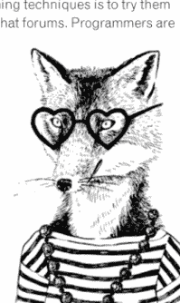

无论你对自己的知识感到满意还是想进一步探索，我希望你喜欢你的编程之旅，并且这本书被证明是有用的。

### 术语表

| 术语 | 描述 |
|------|-------------|
| 二维列表 | 创建一个多维列表。例如，要创建以下数据表：0 1 2 0 23 16 34 1 45 29 48，请输入以下代码：`number_list = [[23,16,34],[45,29,48]]` |
| 加法 | 如果两个值是数字，则将它们相加 `total = num1 + num2`，如果它们包含文本，则将它们连接起来（参见连接）。`name = firstname + surname` |
| 与 | 用于指定必须同时满足两个条件才能返回真值。`if num > 10 and num < 20: print("In range") else: print("Out of range")` |
| 追加 | 将单个项目添加到列表、元组、字典、字符串或数组的末尾。`names_list.append("Timothy")` |
| 追加到文件 | 打开一个现有的文本或 .csv 文件，并允许将数据添加到现有内容的末尾。`file = open("Countries.txt", "a") file.write("France\n") file.close` 另请参阅写入文件、写入不存在的文件、读取文件 |
| 参数 | 传递给子程序的值。在此示例中，UserAns 是参数，并且应该在子程序外部定义。`def CheckAnswer(UserAns): if UserAns == 20: print("Correct") else: print("Wrong")` |
| 数组 | 在 Python 中，数组类似于列表，但它们仅用于存储数字。用户定义具体的数字类型，即整数、长整型、双精度浮点数或浮点数。`nums = array('i',[45,324,654,45,264]) print(nums)` 如果数组需要存储字符串，则需要使用列表。 |
| 二进制大对象 | 一种完全按照输入方式存储的数据类型。参见 SQL 和数据库。 |
| 按钮 | 在 Tkinter 的 GUI 中使用。下面的代码创建一个按钮，该按钮将运行子程序 "click"。 <br> `button1 = Button(text = "Click here", command = click)` <br> 参见 Tkinter。 |
| 首字母大写 | 更改大小写，使第一个字母大写，所有其他字母小写。 <br> `print(name.capitalize())` |
| 选择 | 从选项列表中随机选择一个。 <br> `selection = random.choice(['a','b','c'])` |
| 逗号分隔值 | 表格的一种常见文本表示形式，其中每行的值用逗号分隔。参见 csv。 |
| 注释 | 用于解释程序如何工作或为测试其他部分而屏蔽代码块。以 # 符号开头。 <br> `if salary > 50000: #This is a comment` <br> `    print("Too high")` <br> `#This is another comment` |
| 编译器 | 将用高级语言（如 Python）编写的程序翻译成低级语言（如机器码）。 |
| 连接 | 将两个字符串连接在一起形成一个字符串（参见加法）。 <br> `name = firstname + surname` |
| 条件语句 | 用于测试条件的语句。通常用于 if 语句、while 和 for 循环。 <br> `if guess == num:` |
| 计数 | 计算数据项在列表、元组、字典、字符串或数组中出现的次数。 <br> `print(names_list.count("Sue"))` |
| csv | 一种文件类型，类似于电子表格或数据库，数据以行和列的形式存储。参见逗号分隔值。 |
| 花括号 | 定义字典内的值。 <br> `scores = {"Tim":20,"Sue":35,"Bob":29}` |
| 数据库 | 一个结构化的数据集。数据存储在表中，这些表由字段和记录组成。参见 SQL、表、字段和记录。 |
| 调试 | 查找和移除编程错误的过程。 |
| 小数点 | 参见浮点数。 |
| def | 定义一个子程序。 <br> `def menu():` <br> `    print("1) Open")` <br> `    print("2) Close")` <br> `    selection = int(input("Selection: "))` |
| 定义子程序 | 创建一个子程序，以便可以在程序的其他部分使用它。参见 def。 |
| del | 从列表中删除一个项目。例如： <br> `del names_list[2]` <br> 从 "names_list" 中删除第 2 项。 |
| 字典 | 一种列表类型，其中用户定义的索引映射到值。 <br> `scores = {"Tim":20,"Sue":35,"Bob":29}` |
| 除法 | 将一个值除以另一个值，并将结果显示为浮点数。 <br> `>>> 5/2` <br> `2.5` |

### 术语表

| 术语 | 描述 |
|---|---|
| double | 允许小数位，数值范围从负 10,308 到 10,308。 |
| 下拉菜单 | 参见选项菜单和 Tkinter。 |
| elif | 在 if 语句中使用，用于在先前条件未满足时检查新条件。 |
| else | 在 if 语句中使用，用于定义当先前条件未满足时执行的操作。 |
| else...if | 参见 elif。 |
| 输入框 | 在 Tkinter 的 GUI 中使用，允许用户输入数据或用于显示输出。下面的代码创建一个空白输入框。 |
| 等于 | 双等号用于比较值。 |
| extend | 将多个项目添加到列表、元组、字典、字符串或数组的末尾。 |
| 字段 | 在数据库中，字段是存储在表中的单个数据项，例如姓名、出生日期或电话号码。参见 SQL、数据库、表和记录。 |
| 浮点数 | 允许小数位，数值范围从负 1,038 到 1,038（即允许最多 38 个数字字符，包括小数点可位于数字中的任意位置，且可以是负值或正值）。 |
| for 循环 | 一种循环类型，将重复执行代码块设定的次数。 |
| forward | 移动海龟向前；如果画笔放下，移动时会在其后留下轨迹，在屏幕上绘制一条直线。 |
| 大于 | 检查一个值是否大于另一个值。 |
| 大于或等于 | 检查一个值是否大于或等于另一个值。 |
| GUI | GUI 代表图形用户界面，使用窗口、输入框和菜单，可通过鼠标操作。参见 Tkinter。 |
| hash | 参见注释。 |
| IDLE | 代表“集成开发环境”，是 Python 的基本编辑器和解释器环境。 |
| if 语句 | 检查条件是否满足；如果满足，将执行后续代码行。 |
| 图像 | 可以使用 GUI 显示图像。图像有两种显示方式。在第一个代码块中，徽标将显示，并且在程序运行时不会改变。在第二个代码块中，图像将根据选项菜单中选择的值而变化。参见 Tkinter 和选项菜单。 |
| 不可变 | 不可更改。不可变数据的值在创建后无法更改，例如，元组中的数据是不可变的，因此一旦程序开始运行，就无法更改。 |
| in | 可用于检查字符是否在字符串中。这在 for 和 if 语句中都很有用。 |
| 缩进 | 在 Python 中用于表示属于另一语句的行。例如，在 for 循环中，其下方的行被缩进，因为它们在循环内，未缩进的行在循环外。要缩进一行，可以按 Tab 键或使用空格键。 |
| 索引 | 指定列表、元组、字典或字符串中单个值位置的数字。Python 从 0 开始计数，而不是 1，因此如果索引是自动生成的，第一个项目的索引值将为 0。 |
| indices | 双星号 ** 用于表示“幂运算”，即 4**2 等于 42。 |
| input | 允许用户输入一个值。这通常赋值给一个变量名。 |
| insert | 将项目插入列表中的指定位置，并将其他所有项目向后推以腾出空间。这将根据它们在列表中的新位置更改其索引号。 |
| int | 用于将数字定义为整数。 |
| 整数 | 介于负 32,768 和 32,767 之间的整数。 |
| 解释 | 通过逐行翻译来执行程序。 |
| islower | 用于检查字符串是否仅包含小写字母。 |
| isupper | 用于检查字符串是否仅包含大写字母。 |
| 迭代 | 重复代码，例如在 for 或 while 循环中。 |
| 标签 | 在 Tkinter 的 GUI 中用于显示文本或图像。下面的代码在屏幕上创建一个标签，显示所示消息。参见 Tkinter。 |
| left | 逆时针转动海龟。 |
| len | 确定变量的长度。 |
| 小于 | 检查一个值是否小于另一个值。 |
| 小于或等于 | 检查一个值是否小于或等于另一个值。 |
| 库 | 可用于执行特定功能的代码集合。这是不在 Python 标准代码块中的代码，但可以根据需要导入。为此，请在程序开头导入库。 |
| 换行 | 强制文本换到新行。 |
| 列表 | 类似于其他编程语言中的数组。列表允许将一组数据存储在单个变量名下，并且可以在程序运行时进行更改。 |
| 列表框 | 在 Tkinter 的 GUI 中使用。下面的代码创建一个仅用于输出的列表框。参见 Tkinter。 |
| 逻辑错误 | 一种难以发现的错误。程序可能看起来可以运行（即没有错误消息出现），但程序背后的理论不正确，因此无法正常工作。例如，使用了错误的比较符号。 |
| long | 介于负 2,147,483,648 和 2,147,483,647 之间的整数。 |
| 循环 | 参见 for 循环和 while 循环。 |
| 小写 | 将字符串转换为小写。 |
| 乘法 | 将两个值相乘。 |
| 嵌套 | 一个序列位于另一个序列内部，例如 for 循环可能位于 if 语句内部，因此 for 循环被称为 if 语句内的嵌套语句。 |
| 不等于 | 用于检查两个值是否不相等。 |
| not null | 创建 SQL 表时，可以指定字段在创建新记录时是否不允许留空。参见 SQL、数据库、表和字段。 |
| 选项菜单 | 在 GUI 中创建下拉菜单。参见 Tkinter。 |
| or | 用于指定只需满足一个条件。 |
| 输出框 | 在 Tkinter 的 GUI 中使用，创建一个用于显示输出的消息框。参见 Tkinter。 |
| 传递变量 | 在一个子程序中创建或更改变量，并允许其在程序的另一部分中使用。参见子程序。 |
| pendown | 将画笔放在页面上，以便海龟移动时会在其后留下轨迹。默认情况下，画笔是放下的。 |

### 术语表

| 术语 | 描述 |
|---|---|
| penup | 将笔从页面上抬起，这样当海龟移动时，它不会留下轨迹。`turtle.penup()` |
| pi | 返回圆周率 (π) 至小数点后15位。```python import math radius = int(input("Enter the radius: ")) r2 = radius**2 area = math.pi*r2 print(area) ``` |
| pop | 从列表、元组、字典、字符串或数组中移除最后一个项目。`names_list.pop()` |
| power of | 请参见 indices。 |
| primary key | 数据库中的主键是用于唯一标识每条记录的字段。```python cursor.execute("""CREATE TABLE IF NOT EXISTS employees( id integer PRIMARY KEY, name text NOT NULL, dept text NOT NULL, salary integer)""") ``` 请参见 SQL、database、table、record 和 field。 |
| print | 在屏幕上显示括号内的内容。`print("Hello", name)` |
| prompt | 在 Python shell 窗口中显示为 `>>>`，允许用户直接在 shell 中输入。 |
| query | 查询用于从数据库中提取数据。```python cursor.execute("""SELECT employees.id,employees.name,dept.manager FROM employees INNER JOIN dept ON employees.dept=dept.dept AND employees.dept='Sales'""") for x in cursor.fetchall(): print(x) ``` 请参见 SQL、database、table 和 field。 |
| quote mark | 请参见 speech mark。 |
| randint | 生成一个随机整数。`num = random.randint(1,10)` |
| random | 生成一个介于 0 和 1 之间的随机浮点数。`num = random.random()` |
| random library | 要在 Python 中使用随机库，你必须在程序开头写上 `import random` 这一行。也请参见 randint、choice、random 和 randrange。```python import random num = random.randint(1,10) correct = False while correct == False: guess = int(input("Enter a number: ")) if guess == num: correct = True elif guess > num: print("Too high") else: print("Too low") ``` |
| randrange | 从一个数字范围内选择一个数字。甚至可以指定该范围的步长，例如：`num = random.randrange(0,100,5)` 这将从 0 到 100 之间，以 5 为步长（即只从 0, 5, 10, 15, 20... 等数字中）选择一个随机数。 |
| range | 用于定义一个范围的起始和结束数字，并可以包含步长（序列中每个数字之间的差）。通常用作 `for` 循环的一部分。```python for i in range(1,10,2): print(i) ``` 将产生如下输出：``` 1 3 5 7 9 ``` |
| read a file | 打开一个现有的文本文件或 .csv 文件以便读取数据。```python file = open("Countries.txt", "r") print(file.read()) ``` 也请参见 write to a file、write to non-existing file 和 append to a file。 |
| real | SQL 数据库中用于存储小数的一种数据类型。请参见浮点数、SQL 和 database。 |
| record | 在数据库中，记录是一组完整的字段；例如，一个员工的数据集将存储在表的单个行中。请参见 SQL、database、table 和 field。 |
| remainder | 找出整数除法后的余数。``` >>> 5%2 1 ``` |
| remove | 从列表中删除一个项目。当你不知道该项目的索引时，这很有用。如果数据有多个实例，它将只删除第一个实例。`names_list.remove("Tom")` |
| reverse | 反转列表、元组、字典、字符串或数组的顺序。`names_list.reverse()` |
| right | 将海龟顺时针转向。`turtle.right(90)` 在上面的例子中，它将转向 90°。 |
| round | 将变量四舍五入到指定的小数位数。`newnum = round(num, 2)` |
| round brackets | 将括号内的值定义为一个元组。请参见 tuple。```python tuple = ('a','b','c') for i in tuple: print(i) ``` |
| run time error | 这些错误仅在你尝试运行程序时才会出现。例如，当程序期望一个整数时，它可能无法处理一个保存为字符串的变量。运行时错误会使程序崩溃并显示如下错误消息。``` Traceback (most recent call last): File "C:/python3/CHALLENGES/testingagain.py", line 2, in <module> total = num + 100 TypeError: Can't convert 'int' object to str implicitly ``` |
| running a program | 选择 Run（运行）菜单并选择 Run Module（运行模块），或者使用 F5 键。程序必须先保存才能运行。 |
| shell | 启动 Python 时看到的第一个屏幕。 |
| sort | 将列表按字母顺序排序，并按新顺序保存列表。如果列表存储不同类型的数（例如字符串和数字数据在同一个列表中），此方法将不起作用。`names_list.sort()` |
| sorted | 按字母顺序打印一个列表。这不会改变原始列表的顺序，原始列表仍保持原序。如果列表存储不同类型的数（例如字符串和数字数据在同一个列表中），此方法将不起作用。`print(sorted(names_list))` |
| space (removal) | 请参见 strip。 |
| speech marks | 用于将一段代码定义为字符串。你可以使用双引号 (") 或单引号 (')，但无论你用什么开始字符串，都必须使用相同的样式来定义字符串的结尾。`print("This is a string")` 你可以使用三引号来保留格式，例如换行。```python address = """123 Long Lane Oldtown AB1 23CD""" print(address) ``` |
| SQL | 代表结构化查询语言，用于与数据库通信。一个数据库可以包含多个相互关联的表，这被称为关系数据库。每个表由包含相似数据的字段组成，例如 ID、Name、Address 等。表中的每一行称为一条记录。请参见 database、field、record、table 和 query。 |
| SQLite | 一个简单、免费下载且与 Python 配合良好的数据库。 |
| sqrt | 计算一个数的平方根。要使此功能工作，你需要在程序开头导入数学库。```python import math num = math.sqrt(100) print(num) ``` |
| square brackets | 将括号内的值定义为一个列表。请参见 list。```python list = ['a','b','c'] for i in list: print(i) ``` |
| square root | 请参见 sqrt。 |
| str | 一种数据类型，即字符串。请参见 string。`year = str(year)` |
| string | 可以包含字母、数字和各种符号，并用双引号或单引号括起来。它们不能用于计算，即使只包含数字。但是，它们可以用于连接，并与其他字符串拼接以形成更大的字符串。请参见 concatenation。 |
| strip | 从字符串的开头和结尾移除多余的字符。`text = "   This is some text.   "` `print(text.strip())` |
| Structured Query Language | 请参见 SQL。 |
| subprogram | 一段可以从程序的另一部分调用运行并可以返回值的代码块。 |
| subtraction | 从一个值中减去另一个值。 |
| syntax error | 当语句顺序错误或包含拼写错误时发生的编程错误。 |
| table | 数据的容器。一个数据库可以包含多个表，并且这些表可以相互关联。下面是一个存储员工数据的表的例子。```python def get_data(): user_name = input("Enter your name: ") user_age = int(input("Enter age: ")) data_tuple = (user_name, user_age) return data_tuple def message(user_name, user_age): if user_age <= 10: print("Hi", user_name) else: print("Hello", user_name) def main(): user_name, user_age = get_data() message(user_name, user_age) main() ``` ``` >>> 5-2 3 ``` 请参见 SQL、database、field 和 record。 |
| ID | 姓名 | 部门 | 薪水 |
|---|---|---|---|
| 1 | Bob | 销售 | 25000 |
| 2 | Sue | IT | 28500 |
| 3 | Tim | 销售 | 25000 |
| 4 | Anne | 行政 | 18500 |
| 5 | Paul | IT | 28500 |
| 6 | Simon | 销售 | 22000 |
| 7 | Karen | 制造业 | 18500 |
| 8 | Mark | 制造业 | 19000 |
| 9 | George | 制造业 | 18500 |
| 10 | Keith | 制造业 | 15000 |

### 180 术语表

| 术语 | 描述 |
| :--- | :--- |
| text file | 一个导入 Python 的文件对象，允许程序向该文件读写字符串对象。 <br><br>```python <br>file = open("Names.txt", "a") <br>newname = input("Enter a new name: ") <br>file.write(newname + "\n") <br>file.close() <br><br>file = open("Names.txt", "r") <br>print(file.read()) <br>``` <br><br>另见写入文本文件、读取文本文件和追加到文本文件。 |
| title | 更改大小写，使所有单词首字母大写，其余字母小写。 <br><br>```python <br>name = name.title() <br>``` |
| Tkinter | Tkinter 是 Python 最常用的 GUI 库。 |
| to the power of | 见索引。 |
| trim spaces | 见去除空格。 |
| tuple | 一种列表类型，但其值在程序运行时无法更改。通常保留用于不太可能更改的菜单选项。 <br><br>```python <br>menu = ('Open', 'Print', 'Close') <br>``` |
| turtle | 用于在屏幕上绘制图形的工具。 <br><br>```python <br>import turtle <br>for i in range(0, 4): <br>    turtle.forward(100) <br>    turtle.right(90) <br>turtle.exitonclick() <br>``` <br><br>另见前进、左转、右转、抬笔、落笔和笔大小。 |
| two-dimensional list | 见二维列表。 |
| upper | 将字符串更改为大写。 <br><br>```python <br>name = name.upper() <br>``` |
| variables | 存储文本和数字等值。等号 (=) 用于为变量赋值。 <br><br>```python <br>num = 54 <br>``` |
| while loop | 一种循环类型，只要满足特定条件，就会重复执行其内部的代码块（以缩进行显示）。 <br><br>```python <br>total = 0 <br>while total <= 50: <br>    num = int(input("Enter a number: ")) <br>    total = total + num <br>    print("The total is...", total) <br>``` |
| whole number division | 用于计算一个数（除数）包含在另一个数（被除数）中多少次的过程。 <br><br>```python <br>>>> 15 // 7 <br>2 <br>``` |
| window | GUI 中使用的屏幕。下面的代码创建了一个名为 "window" 的窗口，添加了标题并定义了窗口大小。 <br><br>```python <br>window = Tk() <br>window.title("Add title here") <br>window.geometry("450x100") <br>``` <br><br>见 Tkinter。 |
| write to a file | 创建一个新的文本文件或 .csv 文件以保存值；如果文件已存在，则将被新文件覆盖。 <br><br>```python <br>file = open("Countries.txt", "w") <br>file.write("Italy\n") <br>file.write("Germany\n") <br>file.write("Spain\n") <br>file.close() <br>``` <br><br>另见写入不存在的文件、追加到文件、读取文件。 |
| write to non-existing file | 创建一个新文件并向该文件写入内容。如果文件已存在，程序将崩溃而不是覆盖它。 <br><br>```python <br>file = open("newlist.csv", "x") <br>newrecord = "Tim, 43\n" <br>file.write(str(newrecord)) <br>file.close() <br>``` <br><br>另见写入文件、追加到文件、读取文件。 |

### 索引

- 数组，72，另见列表
- 二进制大对象，136
- 括号
  - 花括号，60
  - 圆括号，60
  - 方括号，60
- 大小写敏感，12
- 注释，6
- 小数位，31
- 双精度，72
- 下载
  - Python，4
  - SQLite，134
- 错误消息，25
- 外部数据
  - 添加新记录，93
  - 追加模式，86
  - 追加到文本文件，87
  - 创建文本文件，87
  - csv，91，156
  - 新 csv，93
  - 新文件，92
  - 打开文本文件，87
  - 打印数据，93
  - 读取模式，86，92
  - 搜索数据，93
  - SQL，另见 SQL
  - 临时列表，94
  - 文本文件，86
  - 写入模式，86，92
- 文件位置，6
- 文件名扩展名，11
- 浮点数，31，46，72
- 格式化，7
- GUI，110
- IDLE，5，7
- if 语句，19，150，153，156
  - if...elif...else，19
  - if...else，19
  - 嵌套 if，19
- 导入
  - 数组，73
  - 数学，31
  - 随机，45
  - SQLite3，137
  - Tkinter，112
- 缩进，18
- 索引，27，60，80
- 输入，13，150，153，156
- 整数，13，31，47，72，136
- 列表，150，153，156
  - 二维列表，79
  - 追加，60，81
  - 数组，72
  - 计数，73
  - 删除，81
  - 删除项目，60
  - 字典，59
  - 插入，61
  - 长度，61
  - 列表，58
  - 弹出，73
  - 反转，73
  - 排序，60，73
  - 元组，58
- 长整型，72
- 循环，150，153，156，161
  - for 循环，35-39
  - 嵌套循环，51
  - while 循环，40-44
- 数学运算符
  - 加法，13
  - 除法，13
  - 乘法，13
  - 圆周率，31
  - 幂运算，31
  - 取余，31
  - 舍入，31
  - 减法，13
  - 整除，13，31
- 非考试评估，3
- 空值，136
- 一对多，136
- 运算符，18，41
  - 与，18，20，41
  - 等于，18，41
  - 大于或等于，18，41
  - 大于，18，41
  - 在...中，36
  - 小于，18，41
  - 小于或等于，18，41
  - 不等于，18，41
  - 或，18，20，41
- **打印**，13，81，150，153，156
- **随机**，45–50，153
  - 选择，46
  - 数字，46
  - 随机整数，46
  - 随机范围，46
- **实数**，138
- **关系数据库**，135
- **运行程序**，12
- **运行 Python**，5
- **解释器**，11
- **SQL**，164
  - 关闭，137
  - 连接，137
  - 创建表，137
  - 数据类型，138
  - 删除，141
  - 获取数据，140
  - 字段，137
  - 主键，138
  - 打印，139
  - SQLite，136
  - 更新表，141
  - 写入表，139
- **字符串**，24–30，67，150
  - 添加字符，68
  - 首字母大写，27
  - 连接，26
  - 双引号，24
  - 长度，27
  - 换行符，26
  - 小写，19
  - 移除字符，27
  - 单引号，24
  - 标题大小写，27
  - 大写，27，68
- **子程序**，99，150，153，156，161
  - 调用子程序，101
  - 定义子程序，101
  - 传递变量，99
- **文本**，138
- **Tkinter**，110，161，164
  - 背景颜色，112，126
  - 按钮，112
  - 更改内容，113
  - 删除内容，113
  - 输入框，112
  - 图像，128
  - 对齐方式，112
  - 列表框，112
  - 消息框，112
  - 布局，169
  - 位置，113
  - 窗口，112
- **海龟绘图**，51–57
  - 背景颜色，52
  - 填充，52
  - 前进，52
  - 左转，52
  - 落笔，52
  - 笔大小，52
  - 抬笔，52
  - 显示/隐藏海龟，52
- **变量**，12，13，25，58，99，126
- 整数，46