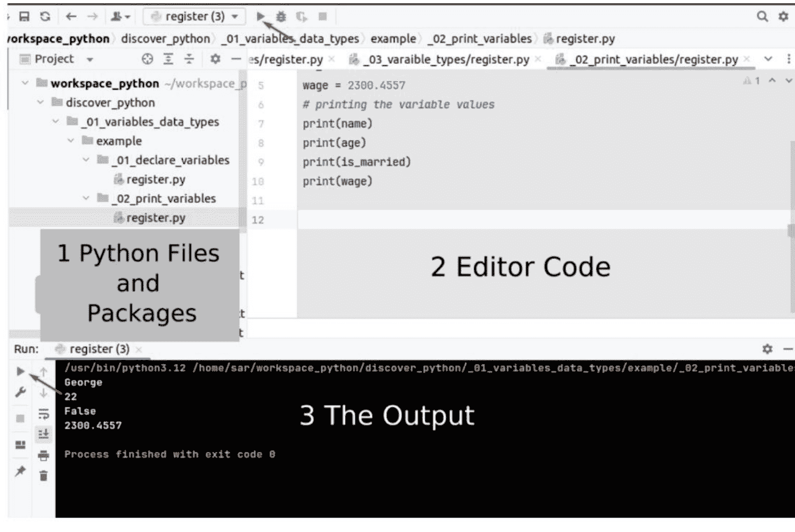

# Python 编程

## 编程初学者指南

版权所有 © 2024 萨尔·马鲁夫
保留所有权利

## 目录

- [本书涵盖哪些内容？](15)
- [如何充分利用本书？](16)
- [本书是否适合您？](17)
- [测验和练习示例](19)
- [1. 初学者指南](26)
  - [安装 Python 版本 3 或更高版本](26)
  - [安装 Python 程序的集成开发环境平台](26)
  - [检查平台](28)
  - [Python 选择命名的规则](29)
- [2. 变量与数据类型](30)
  - [变量命名规则](30)
  - [声明变量](30)
  - [示例 1：创建变量](30)
  - [示例 2：打印变量值](31)
  - [数据类型](32)
  - [表 1：数据类型](32)
  - [示例 3：数据类型](33)
  - [使用逗号运算符进行打印](33)
  - [示例 4A：打印文本](34)
  - [示例 4B：打印文本](35)
  - [示例 4C：打印文本](35)
  - [使用参数 "sep" 和 "end" 进行打印](36)
  - [示例 4D：使用 "sep" 参数打印文本](37)
  - [示例 4E：使用 "end" 参数打印文本](37)
  - [使用 'f字符串' 语法进行打印](38)
  - [示例 5：使用 f字符串 语法](38)
  - [示例 6：四舍五入到小数点后两位](39)
  - [使用注释](40)
  - [为什么在 Python 中使用注释？](40)
  - [示例 7：注释](40)
  - [多次打印一个字符串](41)
  - [示例 8：多重字符串](41)
  - [类型转换](42)
  - [示例 9A：计算总工资](42)
  - [示例 9B：将字符串转换为浮点数](43)
  - [示例 9C：将字符串转换为整数](43)
  - [Python 中的转义序列](44)
  - [表 2：转义序列](44)
  - [示例 10：转义序列代码示例](44)
  - [测验 1：打印变量](45)
  - [测验 2：打印变量](45)
  - [测验 3：电梯中的总重量](46)
  - [测验 4：转义序列](46)
  - [练习 1：打印变量值和类型](47)
  - [练习 2：打印一个形状](48)
  - [练习答案](48)
- [3. Python 中的运算符](52)
  - [表 1：算术运算符](52)
  - [示例 1：算术运算符](52)
  - [取模运算](53)
  - [示例 2：取模运算](54)
  - [整除运算](54)
  - [示例 3：整除运算](54)

### 4. 用户输入与字符串
用户输入
示例 1：用户输入
示例 2：创建一个三角形
示例 3A：计算权重
示例 3B：检查变量类型
示例 3C：将字符串转换为整数

#### 字符串与子字符串
字符串索引
示例 4：字符串索引
子字符串
示例 5：字符串的子字符串

#### 使用运算符与字符串
示例 6：比较字符串
示例 7A：查找字符串内的子字符串

#### 字符串函数
表 1：字符串函数
示例 7B：忽略大小写
示例 8：使用字符串函数 86
表 2：返回真或假的函数 87
示例 9：布尔函数 87

测验 1：转换 89
测验 2：转换 89
测验 3：字符串操作 90
测验 4：字符串索引 91
练习 1：字符串索引 91
练习 2：查找历史人物 92
练习答案 93

### 5. 条件语句
If... 语句
示例 1A：折扣计算 97
示例 1B：折扣计算 97
If...else 语句
示例 2A：秘密数字 98
If-If... else 语句
示例 3A：工资 99
示例 3B：工资 100
If-elif... else 语句
示例 3C：工资 102

测验 1：汽车价格 103
测验 2：汽车价格 103
测验 3：If 语句 104
测验 4：If Elif 语句 105
测验 5：If Elif 语句 106
测验 6：逻辑运算符 106
测验 7：逻辑运算符 107
练习 1：将欧元兑换为美元 108
练习 2：排球队 109
练习答案 110

### 6. 循环语句
#### While 循环
示例 1：While 循环 116
示例 2：While True 语句 117
示例 3：Break 语句 118
示例 4：Continue 语句 118
示例 5：Pass 语句 119

#### For 循环
示例 6：带一个参数的 Range 函数 120
示例 7：带两个参数的 Range 函数 121
示例 8：带三个参数的 Range 122

测验 1：While 循环 123
测验 2：While 循环 123
测验 3：Break 语句 124
测验 4：Continue 语句 124
测验 5：Pass 语句 125
测验 6：For 循环 Range 一个参数 126
测验 7：For 循环 Range 两个参数 126
测验 8：For 循环 Range 三个参数 127
练习 1：While 循环 127
练习 2：For 循环 128
练习答案 128

### 7. Python 中的列表
示例 1A：声明并显示列表 134
示例 1A：显示列表元素 135
示例 1B：显示所有列表元素 136

#### 列表修改
表 1：向列表添加元素 137
表 2：从列表中删除元素 137
表 3：其他列表函数 137

##### 向列表添加元素
示例 2：在末尾添加元素 138
示例 3：在特定位置添加元素 138
示例 4：将一个列表元素添加到另一个列表 139

#### 从列表中删除元素
示例 5：删除元素 140
示例 6：按位置删除元素 141
示例 7：删除所有元素 141
示例 8：元素数量 142
示例 9：按字母顺序排序 142
示例 10：列表复制 143
示例 11：特定元素的数量 144
示例 12：元素的位置 144

测验 1：显示自由职业者 145
测验 2：显示自由职业者列表 145
测验 3：修改自由职业者列表 146
测验 4：修改自由职业者列表 147
测验 5：复制自由职业者列表 147
练习 1：修改宠物列表 148
练习 2：对宠物列表排序 148
练习答案 149

### 8. 字典
在 Python 中声明字典 152

- 示例 1：通过键查找值 152
- 示例 2A：打印产品价格 153
- 示例 2B：打印产品价格 154
- 示例 3：打印产品价格 154
- 示例 4：显示键和值 156
- 示例 5：向字典添加元素 156
- 示例 6：从字典中删除元素 157
- 测验 1：元素数量 158
- 测验 2：元素数量 158
- 测验 3：打印字典元素 159
- 练习 1：创建一本英语词典 160
- 练习 2：按价格显示笔记本电脑 160
- 练习答案 161

### 9. 函数

#### 如何声明一个函数？
表 1：声明函数 165
示例 1A：公司联系方式 166
示例 1B：联系数据函数 167

#### 无参数函数
示例 2：无参数函数 168

#### 带一个或多个参数的函数
示例 3：带一个参数的函数 168
示例 4：带两个参数的函数 169

#### 返回值的函数
示例 5：货币转换 170

测验 1：函数计算器 171
测验 2：函数计算器 171
测验 3：函数计算器 172
练习 1：计算净工资 172
练习 2：找出最大数 173
练习答案 173

### 10. 异常
语法错误
运行时错误
逻辑错误

#### 处理异常
示例 1A：除以零 178
示例 1B：除以零 179
示例 1C：除以零 179
示例 1D：除以零 180
示例 2A：类型错误 180
示例 2B：类型错误 181
示例 3A：索引错误 182
示例 3B：索引错误 182
示例 3C：索引错误 183
示例 4A：多个异常 183
示例 4B：多个异常 184
示例 4C：多个异常 185
示例 4D：多个异常 187
示例 5：Finally 关键字 188

测验 1：除零异常 189
测验 2：索引异常 190
测验 3：异常 190
练习 1：索引异常 191
练习 2：算术异常 192
练习答案 193

### 11. 导入 Random

#### Random Randrange
示例 1：导入 Random 197
示例 2A：骰子 198
示例 2B：两个骰子 198

#### Random Choice
示例 3A：选择卡片 199
示例 3B：选择卡片和卡牌值 200

#### Random Shuffle
示例 3C：洗牌 200

测验 1：Random 201
测验 2：Random 201
练习 1：彩票 202
练习 2：纸牌游戏 202
练习答案 203

### 12. 日期和时间
示例 1：打印当前日期 206
示例 2A：打印选定日期 206
示例 2B：打印选定日期 207
示例 2C：更新选定日期 207
表 1：格式化日期对象 208
示例 3A：格式化日期 208
示例 3B：格式化当前日期 209
表 2：格式化时间对象 209
示例 4：格式化时间 210
示例 5：格式化日期和时间 210

测验 1：日期 211
测验 2：日期 211
练习 1：注册日期 212
练习 2：当前日期和时间 212
练习答案 213

### 13. 文件、目录和操作系统
如何创建目录？ 215
示例 1A：创建目录 215
示例 1B：创建子目录 216
示例 1C：检查目录是否存在 216

如何删除目录？ 217
示例 2：删除目录 217

#### 创建和处理文件
表 1：文件模式 218
示例 3：创建文件 219

写入现有文件
示例 4：写入文件 220

读取现有文件
示例 5A：读取文件 221
示例 5B：读取文件 222
示例 5C：Readline 循环 223
示例 6：列出文件和目录 224
示例 7：哪个操作系统 224
示例 8：当前工作目录 224

测验 1：创建地图 225
测验 2：创建并写入文件 225
练习 1：电影列表 226
练习 2：课程信息 227
练习答案 228

### 字母索引

## 本书涵盖什么内容？

学习一门编程语言需要理解代码并有效地编写它。本书提供测验以提高阅读和理解代码的技能，而练习则旨在提高编写代码的技能。

每章都以讲解和代码示例开始，随后是练习和测验，提供自我测试的机会，并了解你达到了哪个水平。

本书超越了传统方法，通过实际的代码示例来解释 Python 语法。这种方法使学习变得有趣，并确保读者能够有效地应用他们的知识。其中包含的练习和测验，连同其解答，为读者提供了保障，并赋予他们创建简单但有价值的程序的能力。

学习一门计算机语言有助于学习其他计算机语言。这一原则源于连接计算机语言的规则和逻辑。这一观点得到了证实，当时我被应用科技大学邀请教授 C# 编程语言。尽管没有 C# 经验，我花了一个周末深入学习这门语言，并意识到它与其他面向对象编程语言在本质上并无不同。

Python 也是一门依赖面向对象编程原则的语言。我们关注的是现实世界的例子，使你能够在编程工作中应用这些概念。学习编程是一种与计算机沟通的工具，因为机器是使用它们的语言运行的，这些语言由特定的逻辑结构和称为语句的句子定义。

在开始学习各章之前，我提供一些说明性的代码示例，以概述本书的内容。本书开头的代码让你了解本书的方法。

## 如何充分利用本书？

本书旨在向没有编程基础的初学者教授Python，但对于希望提升知识水平的人来说也同样实用。

1.  **没有任何编程背景的人。**
    -   遵循第一步，建议你安装Python 3或更高版本以及一个用于编写和运行代码的IDE。
    -   对于每一章，用该章节附带的测验和练习来测试自己。如果你完成测验和练习的正确率低于50%，请在开始下一章之前，回顾本章的讲解和代码示例，以理解当前章节的内容。
    -   第1章提供的知识是必要的，并且会被包含在第二章中。第一和第二章提供的知识是第三章所必需的，以此类推。
    -   本书包含许多实用的编程代码。如果你读完本书并掌握了超过50%的知识，你就可以在没有老师的情况下继续使用Python工作。请记住，即使是专家也需要持续更新知识。我并不是说你不需要再学习了，而是你可以独立于老师或讲师进行进一步学习。
2.  **具有一些Python编程或其他编程语言背景的人。**
    -   你可以从最开始学起。我假设你已经使用过IDE，安装开发环境不会成为问题。
    -   在跳过任何章节之前，请确保你完成了该章节的测验和练习。一旦你解决了它们，你就可以跳过那一章。否则，我建议在继续学习后续章节之前，先学习本章的讲解和示例代码，以理解本章的主题。

Sar Maroof

## 本书适合你吗？

在学习任何编程语言时，强调两个基本原则至关重要：阅读和编写代码。本书旨在通过讲解每一章并提供大量代码示例来帮助你理解代码。

在每一章的末尾，你都会找到测验和练习。测验是检验你阅读和理解代码能力的宝贵测试，而练习则测试你编写Python代码的能力。如果你在任何章节的测验和练习中遇到困难，可以将其视为需要投入更多时间阅读和学习给定示例的信号。不过，你也可以阅读解答，其中提供了讲解，便于理解。

需要注意的是，作为初学者，你并不需要回答以下示例测验和练习。相反，它们被包含在内是为了让你了解本书的教学方法。

## 为什么选择基于文本的应用程序？

对于初学者来说，从基于文本的应用程序开始学习编码至关重要。这种方法让你能够专注于基础知识，而无需处理图形用户界面的复杂性。在通过基于文本的应用程序学会编码后，你可以通过教程或任何你喜欢的学习方法独立探索图形界面。

## 测验和练习示例

### 1 创建一个三角形

第4章：示例2

编写一个程序，要求用户输入一个字符。一旦用户输入字符并按下回车键，程序就用输入的符号绘制一个三角形，如下所示。

在此输出中，用户输入数字“8”，程序用该数字绘制一个三角形。

代码输出
```
Enter a character: 8
8
88
888
8888
88888
888888
8888888
```

在此输出中，用户输入字符“$”，程序用美元符号绘制一个三角形。

代码输出
```
Enter a character: $
$
$$
$$$
$$$$
$$$$$
$$$$$$
$$$$$$$
```

本书涵盖了此代码问题的解答及其讲解，以及更多内容。

### 2 秘密数字

第5章：示例2A

编写一个程序，允许用户猜测1到10之间的秘密数字。如果用户猜测的数字正确，程序确认猜测正确；否则，不正确。

输出1：用户在以下输出中输入数字5。
```
Guess a number from (1 to 10): 5
Number 5 is incorrect
```

输出2：用户在以下输出中输入数字8。
```
Guess a number from (1 to 10): 8
Number 8 is correct
```

本书涵盖了此代码问题的解答及其讲解，以及更多内容。

### 3 将欧元转换为美元

第5章：练习1

创建一个程序，使用户能够输入指定金额的欧元，然后程序应将该金额转换为美元，汇率按1欧元兑换1.10美元计算。

输出1：用户输入100欧元。
```
Enter an amount in Euros: 100
The amount of 100.0 is $110.00
```

输出2：用户输入120欧元。
```
Enter an amount in Euros: 120
The amount of 120.0 is $132.00
```

本书涵盖了此代码问题的解答及其讲解，以及更多内容。

### 4 创建一个英语词典

第8章：练习1

编写一个程序，允许用户输入一个英语单词；程序显示该单词的同义词。请记住，用户可能以全大写、全小写或大小写组合的方式输入单词。程序应忽略大小写，在词典中查找同义词（如果存在）。

dictionary.py
```
eng_dictionary = {'Happy': 'Pleased', 'Fast': 'Quick', 'Big': 'Large', 'Smart': 'Clever'}

# 在此处添加你的代码
```

输出1：用户输入单词“HAPPY”。
```
Enter an English word: HAPPY
The synonymous of the word Happy is Pleased
```
```
Enter an English word: fast
The synonymous of the word Fast is Quick
```
```
Enter an English word: biG
The synonymous of the word Big is Large
```

本书涵盖了此代码问题的解答及其讲解，以及更多内容。

### 5 彩票

第11章：练习1

创建一个程序，允许用户打乱下面列表中的名字。执行程序后，名字的顺序是随机选择的。获胜者根据以下排名确定：

-   第一个随机选择的名字赢得一百万美元。
-   第二个随机选择的名字赢得五十万美元。
-   第三个随机选择的名字赢得十万美元。

lottery.py
```
from random import shuffle

names = ["Emma", "David", "Jack", "George", "Ronald", "Vera", "Bruce"]
```
```
# 在此处添加你的其余代码。
```

程序的输出如下所示。请记住，每次运行程序时，获胜者都会随机不同。
```
The names randomly:
['Vera', 'Emma', 'Bruce', 'Ronald', 'David', 'Jack', 'George']
The winner of one million dollars is: Vera
The winner of 500 thousand dollars is: Emma
The winner of 100 thousand dollars is: Bruce
```

本书涵盖了此代码问题的解答及其讲解，以及更多内容。

### 6 复制自由职业者列表

第7章：测验5

如果运行以下代码会发生什么？

freelancers.py
```
freelancers = ["Edward", "Jeff", "Robert", "John", "Daniel"]
freelancers2 = freelancers.copy()
freelancers2.sort()
print(freelancers2[1], freelancers[1])
```

选择正确答案：

-   a. 代码输出 "Jeff Jeff"。
-   b. 代码输出 "Edward Daniel"。
-   c. 代码输出 "Edward Jeff"。
-   d. 代码输出 "Daniel Edward"。
-   e. 代码不输出任何内容。

本书涵盖了此代码问题的解答及其讲解，以及更多内容。

### 7 选择卡片

第11章：示例3B

以下程序声明了一个包含卡片元素和值的列表。choice函数允许你随机选择一张卡片。

cards.py
```
from random import choice

cards = ["clubs", "Diamonds", "Hearts", "Spades"]

card_value = ["Ace", 2, 3, 4, 5, 6, 7, 8, 9, 10, "Jack", "Queen", "King"]

# 在此处添加你的代码
```

输出1：运行程序，随机选择一张卡片。
Randomly selected card: Queen of Hearts

输出2：运行程序，随机选择一张卡片。
Randomly selected card: 3 of Hearts

### 8 注册日期

第12章：练习1
在你的网站上注册后，系统会自动捕获并保存注册日期和时间。开发一个程序，允许用户输入他们的名字，程序会显示用户名以及当前的注册日期和时间。

输出：用户输入Jack，程序自动打印当前日期和时间。

```
Enter your name: Jack
Jack's registration was recorded on 03/02/2024 At 07:35:33 PM
```

本书涵盖了此代码问题的解决方案及其解释，以及更多内容。

### 9 创建并写入文件

第13章：测验2
执行以下代码时，它会生成文件 'MyFile.txt'。文件内可读的内容是什么？

file.py

```
path_dir = "MyFile.txt"
file1 = open(path_dir, "w")
q1 = "In the middle of difficulties lies opportunities."# Einstein
q2 = "What we think, we become." # Buddha
file1.close()
file1 = open(path_dir, "w")
file1.write(q2)
file1.close()
```

选择所有正确答案：

- a. 文件内容仅为 "quote1"。
- b. 文件内容仅为 "quote2"。
- c. 文件内容为 "quote1" 和 "quote2"。
- d. 文件内容为空。
- e. 代码导致错误。

本书涵盖了此代码问题的解决方案及其解释，以及更多内容。

### 10 函数计算器

第9章：测验1

运行以下代码会发生什么？

calculator.py

```
def calculator(nr1, nr2, nr3):  # line 1
    result = nr1 + nr2 - nr3  # line 2
    return result  # line 3
print(calculator(22, 20, 10))  # line 4
```

选择正确答案：

- a. 代码向输出打印 "22"。
- b. 代码向输出打印 "20"。
- c. 代码向输出打印 "32"。
- d. 代码向输出打印 "52"。
- e. 代码不向输出打印任何内容。

本书涵盖了此代码问题的解决方案及其解释，以及更多内容。

### 1. 初学者指南

如果你是编程的完全初学者，建议阅读本章。在接下来的章节中，将介绍许多程序，通过运行它们进行测试至关重要。这能让你了解运行代码和显示程序输出的工作原理。

#### 安装 Python 3 或更高版本

安装 Python 3 或更高版本对于运行本书中的程序至关重要。安装 Python 后，你可以选择与你的平台（Windows、Mac、Linux 等）兼容的 IDE。

> **注意**
> 你必须先下载并安装 Python，然后再安装 IDE 程序。这将使安装更容易并避免错误。

#### 为 Python 程序安装 IDE 平台

IDE 是集成开发环境。安装合适的平台将有助于运行代码并从本书中获得最大收益。

许多 IDE 程序可以帮助你编辑和编写 Python 程序。有些是免费的，有些是付费的；免费 IDE 的一个例子是 Pycharm Community Edition。但也有其他替代方案。

安装 Python 和 IDE 后，你可以打开 IDE 程序，如下图所示。你可以在 IDE 提供商的网站上找到说明。

成功安装 IDE 并打开后，你将看到如下图所示的内容。大多数 IDE 屏幕分为三个区域。

- 第一个区域：在左上角，你可以看到带有 Python 扩展名的文件，例如 "register.py"。
- 第二个区域：如果你双击该文件，文件内容将出现在右上角区域，称为编辑器，你可以在其中编写、编辑或更新代码。
- 第三个区域：这是屏幕底部的输出区域；你可以通过点击顶部或输出区域左侧的绿色箭头来运行程序。一旦你点击绿色箭头（也称为运行按钮），代码输出就会出现，如下图所示。

> **注意**
> 运行程序的按钮和其他按钮可能因 IDE 而异。有关更多信息，请阅读 IDE 提供商的说明。

#### IDE 屏幕



#### 检查平台

安装 Python 和你选择的 IDE 后，请按照以下步骤检查安装是否成功。

- 创建一个名为 register.py 的 Python 文件。
- 请在编辑器区域中准确输入以下代码，因为 Python 区分大小写。
- 通过点击绿色箭头运行代码。

运行以下程序的代码，如果代码的输出是 "George"，则表明你的安装正确。

**文件名：register.py**

```
name = "George"
print(name)
```

通过点击运行按钮（绿色箭头），名字 George 出现在输出区域，如下所示。

**输出**

```
George
```

#### 通过选择名称遵循 Python 规则

为了保持代码可读性，应用以下命名变量、包、模块、函数和类名的规则至关重要。

##### 变量

使用小写字母和单词，并用下划线分隔。例如 my_shopping_cart、bank_account 和 user_age。

##### 包（模块）和文件

使用小写字母和单词，并用下划线分隔。例如 brand.py、server_page.py 和 data_source.py。

##### 函数（方法）

使用小写字母和单词，用下划线分隔，并以括号结尾。例如 calculate_result()、get_sum()。

### 2. 变量和数据类型

变量在内存中分配一个位置，你可以在其中存储值。给变量一个合适的名称或指向内存位置的引用至关重要。变量名是访问内存中存储值的关键。

#### 变量名规则

程序员可以为变量选择任何合适的名称，但必须应用以下规则。

- 变量名只能包含字母、数字和下划线。
- 变量名必须以字母或下划线开头。
- Python 区分大小写；因此，"brand"、"Brand" 和 "BRAND" 是不同的。

#### 声明变量

在 Python 中，创建变量与其他编程语言类似。它以变量名开始，并为其赋值。

#### 示例 1：创建变量

以下代码在示例中创建了变量 name、age、is_married 和 wage。如果你运行以下代码，输出中不会打印任何内容。

这是因为变量已声明，并且仅在内存中为其分配了值。程序员控制何时何地显示这些数据。

> **注意**
> 字符串变量值应包含在单引号或双引号中，如下例所示。

register.py

```
#### 声明变量
name = "George"
age = 22
is_married = False
wage = 2300.4557
```

#### 示例 2：打印变量值

我们通过将变量值打印到输出来扩展前面的示例。

要打印变量值，我们使用 print 函数，该函数以左括号和右括号结尾：print()。变量名应作为参数传递给 print 函数，放在括号之间，如下例所示。

如果运行以下程序，变量值将打印到标准输出。

register.py

```
#### 声明变量
name = "George"
age = 22
is_married = False
wage = 2300.4557
# 打印变量值
print(name)
print(age)
print(is_married)
print(wage)
```

前面代码的输出

```
George
22
False
2300.4557
```

#### 数据类型

在编程中，数据类型是一个重要概念。变量可以存储不同类型的数据。原始类型的例子是字符串，它是字母、数字、空格和符号的组合。

数字可以是浮点数（带小数的数字）和整数（不带小数的数字）。
布尔变量只有两种可能的值：真（true）或假（false）。
以下是Python中的基本数据类型；在Python中，真和假以大写字母开头，即True和False。

| 数据类型 | 缩写 | 示例 |
| --- | --- | --- |
| 字符串类型 | str (string) | George, my text, How are you? |
| 整数类型 | int (integer) | 23, 45, 33 |
| 小数类型 | float (decimal numbers) | 34.343, 22.3, 11.9 |
| 布尔类型 | bool (boolean) | True, False |

**_示例 3：数据类型_**

Python中的`type`函数允许你打印变量的类型。
通过使用`type(name)`，例如，它指的是变量`name`的数据类型，而不是`name`的值。

register.py

```
#### 声明变量
name = "George"
age = 22
is_married = False
wage = 2300.4557
# 变量类型
print(type(name))
print(type(age))
print(type(is_married))
print(type(wage))
```

如输出所示，变量`name`的类型是字符串（str），变量`age`的类型是整数（int），变量`is_married`的类型是布尔值（bool），变量`wage`的类型是浮点数（float），即带小数的数字。

##### 输出

```
<class 'str'>
<class 'int'>
<class 'bool'>
<class 'float'>
```

#### 使用逗号运算符打印

在Python中，逗号(,)运算符可以打印两个或多个表达式，并用空格将它们分隔开。

#### 示例 4A：打印文本

在前面的示例中，我们将变量的值打印到输出。
我们如何能像下面这样显示更详细的数据？

Name:   George
Age:    22
Married: False
Wage:    2300.4557

要打印文本，请使用`print`函数，并用双引号或单引号将文本括起来，如下所示。
要打印变量值和字符串的组合，可以用逗号将它们分隔开。

```
#### 声明变量
name = "George"
age = 22
is_married = False
wage = 2300.4557
"""
要打印变量值和文本的组合，
可以用逗号将它们分隔开。
"""
print("Name:   ", name)
print("Age:    ", age)
print("Married: ", is_married)
print("Wage:    ", wage)
```

##### 输出

```
Name: George
Age: 22
Married: False
Wage: 2300.4557
```

#### 示例 4B：打印文本

要打印变量值和字符串的组合，可以用逗号将它们分隔开；对于字符串，也可以用加号(+)将它们分隔开，如下方代码所示。

```
#### 声明变量
name = "George"
age = 22
is_married = False
wage = 2300.4557
"""
要打印变量值和文本的组合，
可以用逗号将它们分隔开。
"""
# 对于name，使用了+号
print("Name: " + name)
print("Age: ", age)
print("Married: ", is_married)
print("Wage:    ", wage)
```

##### 输出

```
Name:    George
Age:     22
Married: False
Wage:    2300.4557
```

#### 示例 4C：打印文本

你也可以用单引号将文本括起来，如下方代码所示。

```
#### 声明变量
name = "George"
age = 22
is_married = False
wage = 2300.4557
"""
要打印变量值和文本的组合，
可以用逗号将它们分隔开。
"""
print('Name: ', name)
print('Age:   ', age)
print('Married: ', is_married)
print('Wage: ', wage)
```

##### 输出

```
Name: George
Age: 22
Married: False
Wage: 2300.4557
```

#### 使用参数 "sep" 和 "end" 打印

##### "sep" 参数

默认情况下，用逗号分隔字符串时，它们之间会设置一个空格。然而，在某些情况下，这种默认行为并不理想，允许程序员决定字符之间的分隔方式会更实用。在这种情况下，程序员可以使用"sep"参数来控制分隔。

##### "end" 参数

"end"参数允许在同一行上打印。

#### 示例 4D：使用 "sep" 参数打印文本

在下面的示例中，","默认在美元符号和价格之间创建一个空格。我们可以使用"sep"参数来移除空格或在它们之间添加任何字符。

```
wage = 2348.55
country = "United States"
print("Wage: $", wage)
"""
sep="" 指定了在美元符号和工资之间
不使用空格或任何其他字符。
"""
print("Wage: $", wage, sep="")
print("Country", country)
"""
sep=": " 表示使用冒号和空格来分隔
国家及其对应的值。
"""
print("Country", country, sep=": ")
```

##### 输出

```
Wage: $ 2348.55
Wage: $2348.55
Country United States
Country: United States
```

#### 示例 4E：使用 "end" 参数打印文本

下面的示例展示了"end"参数如何将单词"Country"和国家变量值（即United States）保持在同一行。

```
country = "United States"
"""
以下语句将两个单词
打印在两行上。
"""
print("Country")
print(country)
"""
使用end参数确保打印时
两个单词保持在同一行。
"""
print("Country", end=": ")
print(country)
```

##### 输出

```
Country
United States
Country: United States
```

#### 使用 'f-String' 语法打印

'f-string'语法是Python中格式化字符串的一种简便方法，通过在字符串前加上字母f来实现。此语法允许你使用花括号打印变量值，如下例所示。

##### 示例 5：使用 f-String 语法

花括号之间的变量名会打印出变量的值。

```
#### 声明变量
name = "George"
age = 22
is_married = False
wage = 2300.4557
print(f"{name} is {age} years old.")
```

##### 输出

```
George is 22 years old.
```

##### 示例 6：四舍五入到两位小数

有几种方法可以四舍五入到较少的小数位。在下面的代码中，我们使用了第一种方法，即使用语法"%.2f"。
第二种方法使用语法":.2f"，它会四舍五入到两位小数。如果你将2f改为3f，小数位就变成了三位。

```
#### 声明变量
name = "George"
age = 22
is_married = False
wage = 2300.4557
# 四舍五入到两位小数的第一种方法
print("The wage of",name,"is: $%.2f" % wage+".")
# 四舍五入到两位小数的第二种方法
print(f"The wage is ${wage:.3f}.")
```

##### 输出

```
The wage of George is: $2300.46.
The wage is $2300.456.
```

#### 使用注释

解释器在程序执行期间会忽略注释。注释的主要用途是增强代码的可读性，并向其他程序员解释代码。

Python的两种主要注释类型是单行注释和多行注释。

单行注释以井号(#)开头，而多行注释以三个"单引号"开头并包围，或以三个"双引号"开头并包围。

##### 为什么在Python中使用注释？

每种编程语言都将注释作为语言的一部分予以支持。以下是使用注释的关键目的的解释。

1. 提高程序员的代码可读性。
2. 向其他协作人员解释代码。
3. 将注释用作程序的可靠文档。
4. 提供一种简便快捷的方式来理解代码的功能。

##### 示例 7：注释

以下代码包含单行和多行注释。

register.py

```
# 这是一个单行注释。
"""
这是一个多行注释
这是一个多行注释
这是一个多行注释
"""
"""
这是一个多行注释
这是一个多行注释
这是一个多行注释
"""
```

##### 多次打印字符串

在Python中，将一个字符串乘以一个数字会导致该字符串重复该数字指定的次数。星号(*)符号用作乘法运算符。

##### *示例 8：多字符串*

在下面的示例中，我们尝试通过将一个字符串乘以一个数字来创建一个矩形。

**shape.py**

```
print('#' * 10)
print('#' * 10)
print('#' * 10)
print('#' * 10)
print('#' * 10)
print('#' * 10)
```代码的输出如下：

```
##########
##########
##########
##########
##########
##########
```

#### 类型转换

类型转换是将一种数据类型转换为另一种数据类型。由于代码需要进行的计算或操作，这有时是必要的。在Python中，可以使用 `int()`、`string()`、`float()`、`char()`、`bool()` 等函数来实现。

##### 示例 9A：计算总工资

在以下示例中，我们计算 Jack 和 Emma 获得的总工资。预期输出为 $6000，因为 Jack 赚 $3200，Emma 赚 $2800，但运行程序时我们得到了下面的错误。

**calculator.py**

```python
salary_Jack = 3200
salary_Emma = "2800"
total_salary = salary_Jack + salary_Emma
```

输出显示了一个错误。

```
total_salary = salary_Jack + salary_Emma
~~~~~~~~~~~~~~~~~~~~^~~~~~~~~~~~~~~~~~~~~
TypeError: unsupported operand type(s) for +: 'int' and 'str'
```

如输出所示，代码导致了错误，因为我们尝试将数值 3200 的工资与字符串 "2800" 的工资相加。如代码所示，Emma 的工资用双引号括起来，表明该工资是字符串类型，而不是浮点类型。为了解决这个问题，我们必须使用 `float` 函数将 Emma 的工资转换为浮点型，如下所示。

```python
total_salary = salary_jack + float(salary_Emma)
```

##### 示例 9B：将字符串转换为浮点数

以下代码将 Emma 的工资从字符串转换为浮点数；否则，程序会产生错误。Jack 的工资没有用双引号括起来；因此，它已经是一个数字，不需要转换。

**calculator.py**

```python
salary_Jack = 3200
salary_Emma = "2800"
total_salary = salary_Jack + float(salary_Emma)
print("Total salaries: $", total_salary)
```

**输出**

```
Total salaries: $ 6000.0
```

##### 示例 9C：将字符串转换为整数

在以下示例中，要计算两个人之间的年龄差，你必须将第二个年龄转换为 `int` 类型，因为第二个年龄是一个字符串。

#### calculator.py

```python
age1 = 22
age2 = "34"
age_difference = int(age2) - age1
print("Age Difference: ", age_difference)
```

##### 输出

```
Age Difference: 12
```

#### Python 中的转义序列

某些字符在 Python 中被保留为关键字，例如双引号、单引号、反斜杠等。转义序列是包含在字符串中的一系列字符；它被转换为不同的字符或字符集，请参见下表。

##### 表 2：转义序列

| 转义序列 | 描述 |
|---|---|
| \\ | 反斜杠 |
| \' | 单引号 |
| \" | 双引号 |
| \n | 换行 |
| \t | 制表符 |

##### 示例 10：转义序列代码示例

```python
# 打印双引号
print("He said, \"I am a student.\"")
# 打印单引号
print('Who can tell me the meaning of the term \'ASCII\'?')
# 打印反斜杠
print("The path of the program is C:\\Application\\color.py")
# 换行
print("Hi There \nWelcome Back!")
# 在文本之间保留一个制表符
print("Name:\t David")
print("Age:\t 34")
```

程序的输出为：

```
He said, "I am a student."
Who can tell me the meaning of the term 'ASCII'?
The path of the program is C:\Application\color.py
Hi There
Welcome Back!
Name:    David
Age:    34
```

#### 测验 1：打印变量

运行以下代码会发生什么？

**course.py**

```python
name = "C++"
duration = 3 # months
price = 3400.9574
print("%.2f" % price)
```

选择正确答案：

- a. 代码将 "3400.9574" 打印到输出。
- b. 代码将 "3400.96" 打印到输出。
- c. 代码将 "float" 打印到输出。
- d. 代码导致错误。
- e. 代码没有输出。

#### 测验 2：打印变量

运行以下代码会发生什么？

**course.py**

```python
name = "C++"
duration = 3 # months
price = 3400.9574
print(type(name))
```

选择正确答案：

- a. 代码将 "C++" 打印到输出。
- b. 代码将 "3" 打印到输出。
- c. 代码将 '<class 'str'>' 打印到输出。
- d. 代码导致错误。
- e. 代码没有输出。

#### 测验 3：电梯中的总重量

运行以下代码会发生什么？

```python
weight1 = "80"
weight2 = 70
weight3 = "30"
total_weight = ""
print(total_weight)
```

计算总重量的正确整数方式是什么？选择正确答案：

- a. total_weight = int(weight1) + weight2 + int(weight3)
- b. total_weight = weight1 + int(weight2) + int(weight3)
- c. total_weight = int(weight1) + int(weight2) + weight3
- d. total_weight = weight1 + weight2 + weight3
- e. 代码没有输出。

#### 测验 4：转义序列

代码的输出是什么？

**escape_sequence.py**

```python
print("What does "Database" mean?")
```

选择正确答案：

- a. 输出为 "What does Database mean?"
- b. 输出为 "What does "Database" mean?"
- c. 输出为 "What does "Database" mean?"
- d. 输出为 "What does 'Database' mean?"
- e. 代码没有输出。

#### 练习 1：打印变量值和类型

打印变量 `brand`、`price`、`year` 和 `is_defect` 的值和类型，并将 `price` 四舍五入到两位小数。

**laptop.py**

```python
brand = "Dell"
price = 2400.3572
year = 2030
is_defect = False
# 添加你的代码
```

添加你的代码后，程序的输出如下所示。

**预期输出**

```
The Variable Values
Brand:  Dell
Price:  $2400.36
Year:   2030
Is Defect?  False

The Variable Types
Type of brand is:    <class 'str'>
Type of price is:    <class 'float'>
Type of year is:     <class 'int'>
Type of is_defect is: <class 'bool'>
```

#### 练习 2：打印形状

使用 Python 中的字符串乘法来打印以下三角形到输出。

```
U
UU
UUU
UUUU
UUUUU
UUUUUU
```

### 练习答案

#### 测验 1 答案

- `print` 函数打印课程价格。
- 语法 `%.2f` 将价格四舍五入到两位小数。因此，正确答案是 b。

**输出**

```
3400.96
```

#### 测验 2 答案

- 结合 `print` 和 `type` 函数打印变量的类型，而不是其值。因此，代码写出了 `name` 变量的字符串类型。Python 中字符串的简称是 "str"。
- 正确答案是 c。

**输出**

```
<class 'str'>
```

### 测验 3 答案

- 变量 `weight1` 和 `weight3` 的值用双引号括起来。所以，它们是字符串，需要转换为整数。
- 变量 `weight2` 已经是整数，不需要转换。
- 答案 "a" 通过将 `weight1` 和 `weight3` 转换为整数来计算总重量。
- 正确答案是 a。

将语句 `total_weight = ""` 替换为答案 "a" 的语句后的输出。

```
180
```

### 测验 4 答案

- 转义序列 `\'` 打印一个单引号；因此，输出是 "What does 'Database' mean?"。
- 正确答案是 d。

**输出**

```
What does 'Database' mean?
```

#### 练习 1 答案

以下是练习 1 的答案。

```python
brand = "Dell"
price = 2400.3572
year = 2030
is_defect = False
print("The Variable Values")
print("Brand:    ", brand)
print("Price:    $%.2f" % price)
print("Year:     ", year)
print("Is Defect? ", is_defect)
print()
print("The Variable Types")
print("Type of brand is: ", type(brand))
print("Type of price is: ", type(price))
print("Type of year is: ", type(year))
print("Type of is_defect is:", type(is_defect))
```

**输出**

```
The Variable Values
Brand:   Dell
Price:   $2400.36
Year:    2030
Is Defect? False

The Variable Types
Type of brand is:  <class 'str'>
Type of price is:  <class 'float'>
Type of year is:   <class 'int'>
Type of is_defect is: <class 'bool'>
```

#### 练习 2 答案

以下是练习 2 的答案。

- 首先，打印一次字母 U，然后两次，依此类推。

```python
print('U' * 1)
print('U' * 2)
print('U' * 3)
print('U' * 4)
print('U' * 5)
print('U' * 6)
```

**输出**

```
U
UU
UUU
UUUU
UUUUU
UUUUUU
```

### 3. Python 中的运算符

Python 中有多种运算符类型，例如算术、赋值、比较、逻辑、身份和成员运算符。运算符操作的值称为操作数。

#### 表 1：算术运算符

算术运算符用于数值以执行数学运算。算术运算包括加法、减法、乘法、除法和求幂。初学者可能不熟悉取模（modulus）和整除（floor division）运算符。

| 运算符 | 名称 | 示例 |
|----------|------|---------|
| + | 加法 | 7 + 2 = 9 |
| - | 减法 | 7 - 2 = 5 |
| * | 乘法 | 7 * 2 = 14 |
| / | 除法 | 7 / 2 = 3.5 |
| ** | 求幂 | 4 ** 2 = 4 * 4 * 4 = 64 |
| % | 取模 | 7 % 2 = 1 |
| // | 整除 | 7 // 2 = 3 |

#### 示例 1：算术运算符

以下示例代码展示了如何使用算术运算。

arithmetic.py

```python
print(7 + 2)   # 9
print(7 - 2)   # 5
print(7 * 2)   # 7 * 2 = 14
print(7 / 2)   # 3.5
print(7 % 2)   # 1
print(4 ** 3)  # 4 * 4 * 4 = 64
print(17 // 2) # 8
```

输出

```
9
5
14
3.5
1
64
8
```

#### 取模

当一个数除以另一个数时，余数称为取模。百分比符号 "%" 代表取模；请参阅以下示例。

#### 示例

| 运算 | 说明 |
| :--- | :--- |
| 10 % 3 = 1 | 10 除以 3 = 3，余数为 1 |
| 24 % 6 = 0 | 24 除以 6 = 4，余数为 0 |
| 21 % 8 = 5 | 21 除以 8 = 2，余数为 5。 |

#### 解释

| | |
| :--- | :--- |
| 10 % 3 = 1 | 10 除以 3 等于 3。<br>3 * 3 = 9。<br>余数 = 10 - 9 = 1。 |
| 24 % 6 = 0 | 24 除以 6 等于 4。<br>6 * 4 = 24。<br>余数 = 24 - 24 = 0。 |
| 21 % 8 = 5 | 21 除以 8 等于 2。<br>2 * 8 = 16。<br>余数 = 21 - 16 = 5。 |

#### 示例 2：取模

以下代码阐明了取模运算的工作原理。

modulus.py

```python
print(10 % 3) # 余数是 1
print(24 % 6) # 余数是 0
print(21 % 8) # 余数是 5
```

输出

```
1
0
5
```

#### 整除

整除是一种算术运算，它将一个数除以另一个数，将结果四舍五入到整数，并忽略余数。双斜杠符号 "//" 用于表示整除。

#### 示例

| 运算 | 说明 |
| --- | --- |
| 30 // 4 = 7 | 30 除以 4 = 7<br>4 * 7 = 28，余数是 2（小于 7） |
| 22 // 5 = 4 | 22 除以 5 = 4<br>4 * 5 = 20，余数是 2（小于 5） |
| 20 // 4 = 5 | 20 除以 4 = 5<br>5 * 4 = 20，余数是 0 |
| 9 // 2 = 4 | 9 除以 2 等于 4<br>余数是 1（小于 2） |
| 15 // 6 = 2 | 15 除以 6 = 2<br>余数是 3（小于 6）。 |

#### 示例 3：整除

floor_division.py

```python
print(30 // 4) # 7
print(22 // 5) # 4
print(20 // 4) # 5
print(9 // 2) # 4
print(15 // 6) # 2
```

输出

```
7
4
5
4
2
```

#### 表 2：赋值运算符

赋值运算符用于为变量赋值。

| 运算符 | 示例 | 等同于 | 说明 |
|----------|---------|---------|-------------|
| = | x = 7 | x = 7 | x 等于 7 |
| += | x += 5 | x = x + 5 | 将 x 的值增加 5 |
| -= | x -= 4 | x = x - 3 | 将 x 的值减少 3 |
| *= | x *= 2 | x = x * 2 | 将 x 的值乘以 2 |
| /= | x /= 4 | x = x / 4 | 将 x 的值除以 4 |
| %= | x %= 3 | x = x % 3 | x = x % 3 |
| //= | x //= 2 | x = x // 2 | x = x // 2 |
| **= | x **= 4 | x = x ** 3 | x 的 4 次幂 |

#### 示例 4A：赋值运算符

assignment.py

```python
nr1 = 3
nr2 = 4
nr3 = 5
nr4 = 12
nr5 = 8
nr6 = 5
nr1 += 5
print(nr1) # 打印 3 + 5 = 8
nr2 -= 3
print(nr2) # 打印 4 - 3 = 1
nr3 *= 2
print(nr3) # 打印 5 * 2 = 10
nr4 /= 3
print(nr4) # 打印 12 / 3 = 4
nr5 //= 5
print(nr5) # 打印 8 / 5 = 1
nr6 **= 3
print(nr6) # 打印 5 * 5 * 5 = 125
```

输出

```
8
1
10
4.0
1
125
```

#### 在字符串中使用 "+" 和 "+=" 运算符

以下示例展示了如何使用 "+" 或 "+=" 运算符连接多个字符串。

#### 示例 4B：使用 "+" 连接字符串

concatenate.py

```python
name1 = "Jack "
name2 = "David "
name3 = "Emma "
# 你可以使用 '+' 运算符连接名字的值。
name = name1 + name2 + name3
print(name)
```

输出

```
Jack David Emma
```

#### 示例 4C：使用 "+=" 连接字符串

concatenate.py

```python
name1 = "Jack "
name2 = "David "
name3 = "Emma "
# 你可以使用 "+=" 运算符连接名字
name1 += name2
name1 += name3
# 名字 2 和 3 的值被连接到 name1 上
print(name1)
```

输出

```
Jack David Emma
```

可以比较值。比较值的结果是真（true）或假（false）。

| 运算符 | 名称 | 示例 |
|---|---|---|
| == | 等于 | 4 == 4 = true |
| != | 不等于 | 4 != 4 = false |
| > | 大于 | 7 > 5 = true |
| < | 小于 | 7 < 5 = false |
| >= | 大于或等于 | 9 >= 9 = true |
| <= | 小于或等于 | 9 <= 7 = false |

#### 示例 5：比较运算符

以下代码展示了比较运算符的工作原理。

comparison.py

```python
x = 4
y = 4
n = 7
z = 5
i = 9
k = 9
print(x == y)  # x 等于 y 吗？True
print(x != y)  # x 不等于 y 吗？False
print(n > z)   # n 大于 z 吗？True
print(i >= k)  # i 大于或等于 k 吗？True
print(i <= n)  # i 小于或等于 n 吗？False
```

输出

```
True
False
True
True
False
```

#### 表 4：逻辑运算符

逻辑运算符用于组合条件语句。

| 运算符 | 描述 |
|---|---|
| and | 如果两个语句都为真，则返回 True。 |
| or | 如果其中一个语句为真，则返回 True。 |
| not | 反转结果，如果结果为真，则返回假。 |

#### 示例

| 运算 | 说明 |
|---|---|
| 4 == 4 and 3 > 2 | 第一个条件返回真，因为四等于 4。<br>第二个条件也返回真，因为三大于 2。<br>结果是“true”，因为两个条件都返回真。 |
| 8 >= 3 and 2 > 5 | 第一个条件返回真，因为八大于或等于 3。<br>第二个条件返回假，因为二不大于 5。<br>结果是“false”，因为其中一个条件返回假。 |
| 8 >= 3 or 2 > 5 | 第一个条件返回真，因为八大于或等于 3。<br>第二个条件返回假，因为二不大于 5。<br>结果是“true”，因为其中一个条件返回真。请记住，通过“or”运算符，只要有一个条件为真，结果就是真。 |
| not (8 >= 3 or 2 > 5) | 上一个条件的结果是真。通过应用“not”运算符，结果将被反转为假。 |

#### 示例 6：逻辑运算符

logical.py

```python
x = 5
y = 8
z = 12
print(x < y and x == 5)    # 打印 True
print(z < y and x == 5)    # 打印 False
print(x < y or x == 5)     # 打印 True
print(x < y or x == 5)     # 打印 True
print(not(x > 8 or x == 5))    # 打印 False
```

输出

```
True
False
True
True
False
```

#### 表 5：身份运算符

身份运算符用于比较对象是否是同一个，即内存地址是否完全相同。

| 运算符 | 描述 |
|----------|-------------|
| is | 如果变量是同一个，则返回真 |
| is not | 如果变量不是同一个，则返回真 |

#### 示例 7：身份运算符

以下代码阐明了身份运算符的工作原理。

```python
name1 = "George"
name2 = "Jack"
name3 = name1
print(name1 is name2)    # False
print(name2 is name3)    # False
print(name1 == name3)    # True 因为 name3 = name1
print(name1 is not name2) # True
```

输出

```
False
False
True
True
```

#### 表 6：成员运算符

成员运算符用于测试一个序列是否存在于对象中。

| 运算符 | 描述 |
|---|---|
| in | 如果对象中存在具有指定值的序列，则返回 True。 |
| not in | 如果对象中不存在具有指定值的序列，则返回 True。 |

#### 示例 8：成员运算符

```python
text = "In the middle of difficulty lies opportunity." # 爱因斯坦
print("difficulty" in text) # True "difficulty" 在文本中。
print("we" in text)        # False "we" 不在文本中。
print("price" not in text) # True "price" 不在文本中
```

输出

```
True
False
True
```## 测验 1：算术运算符

运行以下代码会发生什么？

**calculator.py**
```python
print(17 % 3 , 29 // 6 , 4 **2)
```

选择正确答案：
- a. 代码向输出打印 "2 5 8"。
- b. 代码向输出打印 "5 4 16"。
- c. 代码向输出打印 "2 4 16"。
- d. 代码导致错误。
- e. 代码没有输出。

#### 测验 2：赋值运算符

运行以下代码会发生什么？

**calculator.py**
```python
x = 5
x += 3
x -= 2
print(x)
```

选择正确答案：
- a. 代码向输出打印 "5"。
- b. 代码向输出打印 "8"。
- c. 代码向输出打印 "3"。
- d. 代码向输出打印 "6"。
- e. 代码导致错误。
- f. 代码没有输出。

#### 测验 3：比较运算符

运行以下代码会发生什么？

**calculator.py**
```python
x = 5
y = 6
print(x == y)
print(y >= x)
print(y != 3)
print(y <= 6)
print(y < 4)
```

选择正确答案：
- a. 代码向输出打印 "False True True True False"。
- b. 代码向输出打印 "False True False True False"。
- c. 代码向输出打印 "False False False True True"。
- d. 代码向输出打印 "True True True True False"。
- e. 代码导致错误。
- f. 代码没有输出。

#### 测验 4：比较运算符

运行以下代码会发生什么？

**calculator.py**
```python
nr1 = 3
nr2 = 4
nr3 = 5
print(nr1 < nr2 and nr3 != 5)
print(nr1 < nr2 or nr3 != 5)
```

选择正确答案：
- a. 代码向输出打印 "True True"。
- b. 代码向输出打印 "False True"。
- c. 代码向输出打印 "False False"。
- d. 代码向输出打印 "True False"。
- e. 代码导致错误。
- f. 代码没有输出。

#### 测验 5：身份运算符

运行以下代码会发生什么？

**color.py**
```python
brand1 = "IBM"
brand2 = "Dell"
brand3 = brand1
print(brand1 is brand2)
print(brand3 is brand1)
print(brand3 == brand1)
```

选择正确答案：
- a. 代码向输出打印 "False True False"。
- b. 代码向输出打印 "False True True"。
- c. 代码向输出打印 "False False False"。
- d. 代码向输出打印 "True True True"。
- e. 代码向输出打印 "True False True"。
- f. 代码没有输出。

#### 测验 6：身份运算符

运行以下代码会发生什么？

**color.py**
```python
colors = "blue, red, green, black, white, yellow"
print("YELLOW" in colors)
print("red" in colors)
```

选择正确答案：
- a. 代码向输出打印 "True True"。
- b. 代码向输出打印 "True False"。
- c. 代码向输出打印 "False False"。
- d. 代码向输出打印 "False True"。
- e. 代码没有输出。

#### 练习 1：查找水果

编写两条语句来检查水果列表中是否包含 "orange and grape"。
```python
fruits = "apple, banana, orange, mango, strawberry"
# enter your code
```

输出：代码检查了 orange 和 grape。
```
Is orange on the list? The answer is: True
Is grape on the list? The answer is: False
```

#### 练习 2：申请工作

编写一个代码，根据候选人的工作经验年限决定其被接受还是被拒绝。如果用户的经验为五年或以上，则用户获得积极的结果；否则，答案为否定或拒绝。

##### 输出
```
Five years of experience. Is he accepted? True
Seven years of experience. Is he accepted? True
Four years of experience. Is he accepted? False
```

### 练习答案

### 答案 测验 1
- 程序首先打印 17 % 3。17 除以 3 商 5，余数是 2。
- 第二部分打印 29 // 6。29 除以 6 商 4，余数被忽略。
- 第三部分是 4 ** 2，表示 4 * 4 = 16。

正确答案是 c。

##### 输出
```
2 4 16
```

### 答案 测验 2
x = 5
- 变量 x 的初始值为 5。
- x += 3 将 x 的值增加 3，变为 8。
- x -= 2 将 x 的值减少 2。请记住，变量 x 的上一个值是 8，而不是 5。所以，8 - 2 = 6。

正确答案是 d。

##### 输出
```
6
```

### 答案 测验 3
x = 5, y = 6
- 第一条语句 print(x == y) 返回 false，因为 x 是 5，不等于 y (6)。
- 第二条语句 print(y >= x) 返回 true，因为 y 是 6，大于 x。
- 第三条语句 print(y != 3) 返回 true，因为 y 是 6，不等于 3。
- 第四条语句 print(y <= 6)。请记住，y 不小于 6，但它等于 6。因此，它返回 true。
- 第五条语句 print(y < 4) 返回 false，因为 y 不小于 4。

正确答案是 a。

##### 输出
```
False
True
True
True
False
```

### 答案 测验 4
nr1 = 3, nr2 = 4, nr3 = 5。
- 第一条语句 print(nr1 < nr2 and nr3 != 5) 检查 nr1 是否小于 nr2，这是 true，但第二部分检查 nr3 是否不等于 5，这是 false。使用逻辑运算符 "and" 时，所有条件都应返回 true；否则，结果为 false。
- 第二条语句 print(nr1 < nr2 or nr3 != 5) 与上一条语句完全相同，但这次使用了逻辑运算符 "or"。使用 or 时，如果任一条件返回 true，结果即为 true。

正确答案是 b。

##### 输出
```
False
True
```

### 答案 测验 5
brand1 = "IBM", brand2 = "Dell", brand3 = brand1。
- 第一条语句 print(brand1 is brand2) 检查这两个品牌是否相同；因此它返回 false，因为它们不同。
- 第二条语句 print(brand3 is brand1) 检查 brand3 是否是 brand1，它们是相同的，并且因为代码开头有 brand3 = brand1 的语句，它们指向内存中的相同位置。
- 第三条语句 print(brand3 == brand1) 检查 brand3 是否等于 brand1，这是 true。

正确答案是 b。

##### 输出
```
False
True
True
```

### 答案 测验 6
```python
colors = "blue, red, green, black, white, yellow"
```
- 第一条语句 print("YELLOW" in colors) 检查颜色 Yellow 是否在列表中，但请记住 Python 区分大小写。Yellow 以大写字母 Y 开头；因此答案是 false。
- 第二条语句 print("red" in colors) 检查颜色 red 是否在列表中，这是 true。

正确答案是 d。

##### 输出

### 答案 练习 1

**fruit.py**
```python
fruits = "apple, banana, orange, mango, strawberry"
print("Is orange on the list? The answer is:", "orange" in fruits)
print("Is grape on the list? The answer is:", "grape" in fruits)
```

**输出**
```
Is orange on the list? The answer is: True
Is grape on the list? The answer is: False
```

### 答案 练习 2

**job.py**
```python
print("Five years of experience. Is he accepted?", 5 >= 5)
print("Seven years of experience. Is he accepted?", 7 >= 5)
print("Four years of experience. Is he accepted?", 4 >= 5)
```

**输出**
```
Five years of experience. Is he accepted? True
Seven years of experience. Is he accepted? True
Four years of experience. Is he accepted? False
```

### 4. 用户输入与字符串

#### 用户输入

在前面的章节中，我们处理的是变量的值。在许多情况下，我们没有变量的值；相反，我们需要要求用户输入他们的数据。大多数知名网站会要求用户输入他们的姓名、出生日期、职业等。
在 Python 中，你也可以使用 input() 函数来要求用户输入数据，如以下示例所示。

#### 示例 1：用户输入

在此示例中，我们允许用户输入他的信息，并将他的数据值赋给我们已经为这些数据声明的变量。

> **注意**
> 当你测试以下程序时，程序首先允许你输入你的名字。每次输入数据后，你必须按键盘上的回车键来插入剩余部分。

**register.py**
```python
"""
将用户输入的值赋给
```

##### 输出

```
python
"""
变量 first name, last name, age, 和 occupation
"""
first_name = input("Enter your first name: ")
last_name = input("Enter your last name: ")
age = input("Enter your age: ")
occupation = input("Enter your occupation: ")
#### 使用 "
" 换行
print("\n.... Info of", first_name, last_name, ".....")
#### 使用 	 进行制表
print("Name: \t\t\t", first_name, last_name)
print("Age: \t\t\t", age)
print("Occupation: \t", occupation)
```

```
Enter your first name: George
Enter your last name: Smith
Enter your age: 34
Enter your occupation: Programmer

.... Info of George Smith .....

Name:           George Smith
Age:            34
Occupation:     Programmer
```

#### 示例 2：创建一个三角形

编写一个程序，要求用户输入一个字符。一旦用户输入该字符并按下回车键，程序就用输入的符号绘制一个三角形，如下所示。

在输出中，用户输入了数字“8”，程序就用这个数字绘制了一个三角形。

代码的输出

```
Enter a character: 8
8
88
888
8888
88888
888888
8888888
```

#### triangle.py

```
symbol = input("Enter a character: ")
print(symbol * 1)
print(symbol * 2)
print(symbol * 3)
print(symbol * 4)
print(symbol * 5)
print(symbol * 6)
print(symbol * 7)
```

#### 示例 3A：计算体重

三个人试图使用一部最大载重为551磅（250公斤）的电梯。这三个人的体重如下：
第一个人体重199磅（90公斤）。
第二个人体重192磅（87公斤）。
第三个人体重177磅（80公斤）。

编写一个程序，计算三个人的总体重，并根据最大载重限制，告知他们是否可以同时使用电梯。

#### calculator.py

```
weight1 = input("Enter the weight of the first person: ")
weight2 = input("Enter the weight of the second person: ")
weight3 = input("Enter the weight of the third person: ")

# 计算总重量
total_weight = weight1 + weight2 + weight3

print("The total weight is: ", total_weight, "pounds")
```

程序的输出是199192177磅，如下所示，这是不正确的。

### 程序的输出

```
Enter the weight of the first person: 199
Enter the weight of the second person: 192
Enter the weight of the third person: 177
The total weight is: 199192177 pounds
```

在本书前面，我解释了有时需要将变量类型从一种类型转换为另一种类型。

输出是“199192177”，这是用户输入的三个数字199、192和177的组合。

如前所述，三个字符串相加的结果是将它们连接在一起。Python将这三个数字视为字符串。

让我们检查一下用户输入数字的变量类型。

#### 示例 3B：检查变量类型

正如我在本书中所解释的，在Python中可以使用`type`函数打印任何变量类型。要显示它，你应该将`type`函数与`print`函数结合使用，如`print(type(weight))`，如代码中所示。

#### calculator.py

```
weight1 = input("Enter the weight of the first person: ")
weight2 = input("Enter the weight of the second person: ")
weight3 = input("Enter the weight of the third person: ")
# 检查变量类型
print(type(weight1))
print(type(weight2))
print(type(weight3))
# 计算总重量
total_weight = weight1 + weight2 + weight3
print("The total weight is: ", total_weight, "pounds")
```

从输出可以清楚地看出，Python将三个变量`weight1`、`weight2`和`weight3`都视为字符串。

##### 输出

```
Enter the weight of the first person: 199
Enter the weight of the second person: 192
Enter the weight of the third person: 177
<class 'str'>
<class 'str'>
<class 'str'>
The total weight is: 199192177 pounds
```

正如本书已经解释过的，你可以使用`int`函数将Python中的字符串类型转换为整数，如代码中所示的`int(weight1)`。

#### 示例 3C：将字符串转换为整数

在下面的代码中，体重的字符串变量被转换为整数。因此，程序计算出了正确的结果。

#### calculator.py

```
weight1 = input("Enter the weight of the first person: ")
weight2 = input("Enter the weight of the second person: ")
weight3 = input("Enter the weight of the third person: ")
# 将变量从字符串转换为整数
weight1 = int(weight1)
weight2 = int(weight2)
weight3 = int(weight3)
# 计算总重量
total_weight = weight1 + weight2 + weight3
print("The total weight is: ", total_weight, "pounds")
```

输出清楚地显示总重量为568磅，超过了电梯允许的最大重量551磅。

##### 输出

```
Enter the weight of the first person: 199
Enter the weight of the second person: 192
Enter the weight of the third person: 177
The total weight is: 568 pounds
```

#### 注意

用户输入的是字符串，即使用户输入的是数字。因此，将输入转换为整数的“int”类型或小数的“float”类型至关重要。否则，算术运算的结果将是不正确的。

#### 字符串和子字符串

程序员操作字符串的原因有很多，例如限制用户为评论输入的字符数，删除用户输入的消息中不需要的单词，在文本中查找单词或句子等。

#### 字符串索引

字符串中的每个字符都有一个正索引和一个负索引位置编号。

- 正索引从左侧的0开始。
- 负索引从右侧的-1开始。

在下面的书名“Learn Java”中，每个字母，包括空格，都有两个不同的索引位置编号，如下所示。

- 第一个字母“L”的索引为0，负索引为-10。
- 字母“e”的正索引编号为1，负索引为-9。
- 空格的索引为5和-5。
- 字母“v”的索引为8和-2。

##### title = "Learn Java"

每个字母的正索引和负索引编号

| 0   | 1   | 2   | 3   | 4   | 5   | 6   | 7   | 8   | 9   |
|-----|-----|-----|-----|-----|-----|-----|-----|-----|-----|
| L   | e   | a   | r   | n   |     | J   | a   | v   | a   |
| -10 | -9  | -8  | -7  | -6  | -5  | -4  | -3  | -2  | -1  |

我们使用方括号括起来的索引编号来确定字符串中的每个字母。例如，如果我们想打印书名中的字母n，可以使用语句`print(title[4])`或`print(title[-6])`，如下面的代码所示。

##### 示例 4：字符串索引

### string_index.py

```
title = "Learn Java"
print(title[0])  # 打印 L
print(title[-10])  # 打印 L
print(title[3])    # 打印 r
print(title[-7])    # 打印 r
print(title[8])    # 打印 v
print(title[-2])   # 打印 v
```

### 代码的输出

```
L
L
r
r
v
v
```

#### 子字符串

也可以通过指定起始索引位置编号和子字符串的结束索引位置来显示子字符串或字符串的一部分。
通过打印字符串的子字符串，我们也使用方括号；冒号分隔起始和结束索引“:”，例如`title[6:9]`和`title[0:5]`。

在前面的示例中，我们可以通过确定第一个索引位置编号并将结束索引位置留空来分离子字符串“Java”，即`title[6:]`；也可以使用`title[6:10]`。

> **注意**

起始索引是包含的，但结束索引是排除的。因此，我们使用结束索引10，它实际上不存在，但表示排除10。如果想达到字符的末尾，建议将其留空。

每个字母的正索引和负索引编号

| 0    | 1    | 2    | 3    | 4    | 5    | 6    | 7    | 8    | 9    |
|------|------|------|------|------|------|------|------|------|------|
| **L** | **e** | **a** | **r** | **n** |      | **J** | **a** | **v** | **a** |
| -10  | -9   | -8   | -7   | -6   | -5   | -4   | -3   | -2   | -1   |

##### 示例 5：字符串的子字符串

### substring.py

```
title = "Learn Java"
'''
如果结束位置为空，表示
到达字符串的末尾。
'''
print(title[6:])      # 打印 Java
print(title[6:10])    # 打印 Java
print(title[-4:])     # 打印 Java
print(title[-4:10])   # 打印 Java
```

如果第一个位置为空，则表示从字符串的开头开始。

```
"""
print(title[:5])  # 输出 Learn
print(title[0:5])  # 输出 Learn
print(title[:-5])  # 输出 Learn
print(title[-10:5])  # 输出 Learn
"""
```

如果起始和结束位置都为空，则表示整个标题。

```
"""
print(title[:])  # 输出整个标题
print(title[0:10])  # 输出整个标题
"""
```

##### 输出

```
Java
Java
Java
Java
Learn
Learn
Learn
Learn
```

#### 对字符串使用运算符

如下面的例子所示，Python 比较运算符也可以用于字符串，例如 `==` 和 `!=`。

##### 示例 6：比较字符串

compare_strings.py

```
# 返回 true
print("California" == "California")
# 返回 false，Python 区分大小写
print("New York" == "New york")
# 返回 true，因为它们不相等
print("United States" != "United states")
# 返回 false，左侧单词之间缺少空格。
print("Hi" +"There" == "Hi There")
# 返回 true，Hi 末尾有空格
print("Hi " +"There" == "Hi There")
# 返回 true，There 开头有空格
print("Hi" +" There" == "Hi There")
```

输出

```
True
False
True
False
True
True
```

##### 示例 7A：在字符串中查找子字符串

编写一个程序，允许用户在国家列表中搜索是否包含他们要找的国家。如果国家在列表中，程序答案为“true”。如果不在列表中，程序答案为“false”。

在以下输出中，用户寻找 India，它在列表中。因此，程序答案为“true”。

```
当前列表：United States, United Kingdom, Germany, India, Brazil, Spain, Italy, Canada, Japan, Mexico

输入国家名称：India
India 在列表中吗？True
```

在以下输出中，用户寻找 France，它不在列表中。因此，程序答案为“false”。

```
当前列表：United States, United Kingdom, Germany, India, Brazil, Spain, Italy, Canada, Japan, Mexico

输入国家名称：France
France 在列表中吗？False
```

> 注意
>
> 提供的列表代表了迄今为止我的书籍在全球最受欢迎的前 10 个国家，按受欢迎程度排名。

以下是代码。

## find_country.py

```
countries = "United States, United Kingdom, Germany, India, Brazil, Spain, Italy, Canada, Japan, Mexico"
print("Current List: ", countries)
country = input("\nEnter a country name: ")
print("Is ", country, "on the list? ", country in countries)
```

需要解决以下挑战。

## 挑战

如果你使用不同的字母大小写输入列表中的现有国家，程序的答案将是“false”，这是不理想的。

在相同先前代码的以下输出中，用户输入了以小写开头的“germany”，但程序指出“germany”不在列表中。这是因为 Python 区分大小写。

```
当前列表：United States, United Kingdom, Germany, India, Brazil, Spain, Italy, Canada, Japan, Mexico
输入国家名称：germany
germany 在列表中吗？False
```

> **问题**
>
> 我们如何指示程序在用户输入大小写错误时不区分大小写？

该问题的答案在以下字符串函数主题中。它将教你如何在许多其他情况下操作字符串。

#### 字符串函数

以下函数对于程序员操作字符串至关重要。

##### 表 1：字符串函数

执行操作或更新字符串的函数。

| 函数 | 描述 |
| --- | --- |
| capitalize() | 将首字母大写。 |
| count() | 计算字符串中指定值的出现次数。 |
| find() | 定位字符串中指定值的位置。 |
| index() | 定位字符串中指定值的位置。 |
| lower() | 将整个字符串转换为小写。 |
| replace() | 将字符串中的指定值替换为另一个。 |
| swapcase() | 交换字符的大小写；小写变大写，反之亦然。 |
| title() | 将每个单词的首字母大写。 |
| upper() | 将整个字符串转换为大写。 |
| len() | 确定字符串的长度（字符数）。 |

##### 示例 7B：忽略大小写

在之前的代码挑战中，当用户输入列表中具有不同大小写字母的国家时，出现了一个未被找到的问题。在这个更新的例子中，我们使用 `lower()` 函数来解决这个问题，该函数将用户输入的所有字母转换为小写。我们还将列表中的所有国家名称转换为小写。通过这样做，我们可以有效地在小写形式下比较用户输入和国家列表。这种技巧消除了所有大写字母，并比较两个仅包含小写的国家名称。

我们将把上述解释转化为 Python 代码。

find_country.py

```
countries = "United States, United Kingdom, Germany, India, Brazil, Spain, Italy, Canada, Japan, Mexico"
print("Current List: ", countries)
country = input("\nEnter a country name: ")
# 将用户输入的国家转换为小写字母
country_lowercase = country.lower()
# 将国家列表转换为小写字母
countries_lowercase = countries.lower()

# 以小写形式显示列表和用户输入
print("User input in lower case: ", country.lower())
print(countries.lower())
print("Is ", country, "on the list? ", country_lowercase in countries_lowercase)
```

用户输入“GeRMany”，它在列表中，但程序这次忽略了大小写并返回 true。

```
当前列表：United States, United Kingdom, Germany, India, Brazil, Spain, Italy, Canada, Japan, Mexico

输入国家名称：GeRMany
用户输入的小写形式：germany
united states, united kingdom, germany, india, brazil, spain, italy, canada, japan, mexico
GeRMany 在列表中吗？True
```

##### 示例 8：使用字符串函数

以下代码示例阐明了上述字符串函数列表的使用。

## string_functions.py

```
text = "i am from Spain"

# 输出 I，将第一个 "i" 转换为大写 I
print(text.capitalize())

# 输出 2，第一个字母 "a" 的位置
print(text.count("a"))

# 输出 10，文本中 Spain 首字母的位置
print(text.find("Spain"))

# 输出 6，第一个 r 字母的位置
print(text.index("r"))

# 以小写形式输出文本
print(text.lower())

# 将国家 Spain 替换为 US
print(text.replace("Spain", "US"))

# 交换文本的所有字母大小写
print(text.swapcase())

# 将单词的首字母转换为大写
print(text.title())

# 输出文本的长度，包括空格
print(len(text))
```

##### 输出

```
I am from spain
2
10
6
i am from spain
i am from US
I AM FROM sPAIN
I Am From Spain
15
```

##### 表 2：返回真或假的函数

返回 true 或 false 的字符串函数。

| 函数 | 描述 |
| :--- | :--- |
| endswith() | 验证字符串是否以特定值结尾。 |
| isalnum() | 验证字符串中的所有字符是否为字母数字。 |
| isalpha() | 检查字符串中的所有字符是否属于字母表。 |
| isdigit() | 检查字符串中的所有字符是否为数字。 |
| islower() | 验证字符串中的所有字符是否为小写。 |
| isnumeric() | 验证字符串中的所有字符是否为数字。 |
| istitle() | 检查字符串是否符合标题格式规则。 |
| isupper() | 验证字符串中的所有字符是否为大写。 |
| startswith() | 检查字符串是否以特定值开头。 |

##### 示例 9：布尔函数

boolean_functions.py

```
string1 = "Energy flows where attention goes"
string2 = "Tu1212HIJ"
string3 = "HiEveryBody"
string4 = "0137843626572"
string5 = "heis"
string6 = "8847463"
string7 = "Energy Flows Where Attention Goes"
string8 = "ENERGY FLOWS WHERE ATTENTION GOES"

# 返回 true，因为 string1 以 En 开头
print(string1.startswith("En"))

# 返回 true，因为 string1 以 es 结尾
print(string1.endswith("es"))

# 返回 true，因为 string2 仅包含字母数字
print(string2.isalnum())

# 返回 true，因为 string3 仅包含字母
print(string3.isalpha())

# 返回 true，因为 string4 仅包含数字
print(string4.isdigit())

# 返回 true，因为 string5 仅包含小写字母
print(string5.islower())

# 返回 true，因为 string6 仅包含数字
print(string6.isnumeric())
```

## **注意事项**

作为程序员，理解代码并对其输出有预期至关重要。然而，专家能更快地看出代码的作用，但自我训练这一点是必不可少的；因此，我在我的大多数书中都提供了测验。

#### 测验 1：转换

执行此代码时，它会提示用户输入面包价格，然后是牛奶价格，然后通过将两个价格相加来计算总价。假设用户输入的面包价格为 $2.50，牛奶价格为 $3.50，运行此代码的结果是什么？

**calculator.py**

```python
bread_price = input("Enter the price of bread: ")
milk_price = input("Enter the price of milk: ")
total_price = bread_price + milk_price
print(total_price)
```

选择正确答案：

- a. 代码输出 "6.0"。
- b. 代码输出 "2.503.50"。
- c. 代码输出 "6"。
- d. 代码导致错误。
- e. 代码没有输出。

#### 测验 2：转换

你预计以下程序输出中用字母 "X" 创建什么形状？

**shape.py**

```python
symbol = " X "
print(symbol * 10)
print(symbol * 10)
print(symbol * 10)
print(symbol * 10)
print(symbol * 10)
print(symbol * 10)
```

选择正确答案：

- a. 代码输出一个 "三角形"。
- b. 代码输出一个 "圆形"。
- c. 代码输出一个 "矩形"。
- d. 代码输出一个 "未知形状"。
- e. 代码导致错误。
- f. 代码没有输出。

#### 测验 3：字符串操作

以下哪个语句将代码文本中的单词 'price' 转换为 'amount'？
程序的预期输出是：Python course amount: $2400

**string_manipulation.py**

```python
text = "Python course price: $2400"
# 在此处插入语句
```

选择正确答案：

- a. 方法 print(text.replace('price', 'amount'))
- b. 方法 print(text.convert('price', 'amount'))
- c. 方法 print(text.change('price', 'amount'))
- d. 方法 print(text.swap('price', 'amount'))
- e. 方法 print(text.switch('price', 'amount'))

#### 测验 4：字符串索引

如果运行以下代码会发生什么？

**substring.py**

```python
title = "Python for beginners"
print(title[7])
```

选择正确答案：

- a. 代码输出 "7"。
- b. 代码输出 "f"。
- c. 代码输出 "n"。
- d. 代码输出 "o"。
- e. 代码没有输出。

#### 练习 1：字符串索引

编写一个程序，从以下引文中打印以下内容。

1. 使用字母的位置从文本中打印单词 "journey"。
2. 使用 upper 函数以大写形式打印单词 "journey"。
3. 以大写形式打印整个引文。
4. 打印引文中字符的数量，包括空格。
5. 使用函数 isalnum() 检查引文是否仅包含字母数字。

**string_function.py**

```python
quote = "A journey of a thousand miles begins with a single step"
# 添加你的代码
```

程序的预期输出如下所示。

```
journey
JOURNEY
A JOURNEY OF A THOUSAND MILES BEGINS WITH A SINGLE STEP
55
False
```

#### 练习 2：查找历史人物

编写一个程序，允许用户输入历史人物的姓名。程序在列表 "Darwin, Einstein, Lincoln, Gandhi, Bonaparte, Tolstoy." 中查找姓名。如果姓名在列表中，程序返回 true；否则，返回 false，如输出所示。

**find.py**

```python
historical_figures = "Darwin, Einstein, Lincoln, Gandhi, Bonaparte, Tolstoy"
# 添加你的代码
```

在以下输出中，用户输入 LINCOLN。

```
Enter a name of a historical figure: LINCOLN
Is the name LINCOLN on the list? True
```

在以下输出中，用户输入 Newton。

```
Enter a name of a historical figure: Newton
Is the name Newton on the list? False
```

### 练习答案

#### 测验 1 答案

如前所述，用户输入是一个字符串，即使用户输入的是数字。

- 如果你用 "+" 号连接两个字符串，第二个字符串将附加到第一个字符串的末尾。
- 价格是 2.50 和 3.50。
- 因此，答案是 2.503.50。
- 正确答案是 b。

**输出**

```
Enter the price of bread: 2.50
Enter the price of milk: 3.50
2.503.50
```

#### 测验 2 答案

在 Python 中，当一个字符串乘以一个数字时，该字符串会按指定的次数复制。在示例中，字符 'X' 乘以十然后打印。结果，字符 'X' 在六行中打印十次，形成一个矩形。因此，正确答案是选项 c。

**输出**

```
X X X X X X X X X X
X X X X X X X X X X
X X X X X X X X X X
X X X X X X X X X X
X X X X X X X X X X
X X X X X X X X X X
```

### 测验 3 答案

如字符串函数表所示，函数 replace 用于替换子字符串。在这种情况下，单词 "price" 被替换为单词 "amount"。

正确答案是 a。

### 测验 4 答案

- 标题 "Python for Beginners" 包含 20 个字符，包括两个空格。
- 语句 print(title[7]) 打印第七个位置的字符，从零位置开始。因此，它输出字母 "f"，如下所示。

正确答案是 b。

| 0 | 1 | 2 | 3 | 4 | 5 | 6 | 7 | 8 | 9 | 10 | 11 | 12 | 13 | 14 | 15 | 16 | 17 | 18 | 19 |
| :--- | :--- | :--- | :--- | :--- | :--- | :--- | :--- | :--- | :--- | :--- | :--- | :--- | :--- | :--- | :--- | :--- | :--- | :--- | :--- |
| P | y | t | h | o | n |  | f | o | r |   | B | e | g | i | n | n | e | r | s |

#### 练习 1 答案

以下是练习所需的代码。

**string_functions.py**

```python
quote = "A journey of a thousand miles begins with a single step"
# 添加你的代码
print(quote[2:9])
print(quote[2:9].upper())
print(quote.upper())
print(len(quote))
print(quote.isalnum())
```

**输出**

```
journey
JOURNEY
A JOURNEY OF A THOUSAND MILES BEGINS WITH A SINGLE STEP
55
False
```

#### 练习 2 答案

**find.py**

```python
historical_figures = "Darwin, Einstein, Lincoln, Gandhi, Bonaparte, Tolstoy"
# 添加你的代码
hf = input("Enter a name of a historical figure: ")
hf_ignore_case = hf.lower()
hf_list_ignor_case = historical_figures.lower()
print("Is the name", hf, "on the list?", hf_ignore_case in hf_list_ignor_case)
```

**输出**

```
Enter a name of a historical figure: EINSTEIN
Is the name EINSTEIN on the list? True
```

### 5. 条件语句

到目前为止，前面程序的语句是从上到下执行的。有时，我们只需要在满足特定条件时执行一个语句；否则，程序应该忽略它。

例如，一个特定的购物网站为订阅客户提供折扣，但未订阅的客户应支付特定商品的总价。在 Python 和其他编程语言中，条件语句用于确定代码的特定部分是执行还是忽略。
条件语句包括 if 语句、if else 语句和 if elif 语句。

#### If... 语句

如果条件满足特定要求，则执行 if 块内的语句。
if 块以 if 开头，后跟条件，然后以冒号 ":" 结尾。
if 条件后跟其块语句，这些语句通过制表符空格识别，如下所示。

```python
if is_subscribed: # if 条件
    price -= 5 # if 块
```

if 块内的语句可以是一个或多个语句。一旦 if 条件返回 true，if 块内的所有语句都会被执行。

##### 示例 1A：折扣计算

在以下示例中，如果客户订阅，他将获得 $5 的折扣。否则，他不会。布尔变量 is_subscribed 的值为 false；因此，if is_subscribed 语句返回 false，if块将被忽略。
程序打印完整价格为 $24。
在第二个 print 函数中添加了 sep=""，以去除 $ 符号与价格之间的空格。

## discount.py

```
price = 24

# the following customer is not subscribed
is_subscribed = False

if is_subscribed:    # the if condition
    price -= 5       # the if block

print("Price: $", price)
print('Price: $', price, sep="")
```

程序的输出

```
Price: $ 24
Price: $24
```

##### 示例 1B：折扣计算

让我们将变量 is_subscribed 的值设置为 true 并再次执行程序。这一次，if语句返回 true；因此，if块被执行。语句 price -= 5 将价格的值减少了 5。程序的输出是 $19。

## discount.py

```
price = 24
# the following customer is subscribed
is_subscribed = True
if is_subscribed:    # the if condition
    price -= 5    # the if block
"""
the statement sep="" to remove the space
between the $ sign and the price
"""
print('Price: $', price, sep="")
```

程序的输出

```
Price: $19
```

#### If...else 语句

如果条件满足特定要求，if块内的语句将被执行。如果"if条件"返回 false，你可以使用 else 语句告诉 Python 执行另一个代码块，如下列代码所示。

##### 示例 2A：秘密数字

编写一个程序，允许用户猜一个 1 到 10 之间的秘密数字。如果用户的猜测数字正确，程序确认猜测数字正确；否则，就是错误的。

**secret.py**

```
secret_number = 8
guess_nr = input("Guess a number from (1 to 10): ")
# the guessnumber should be converted to a number
guess_nr = int(guess_nr)
if guess_nr == secret_number:
    print("Number", guess_nr, "is correct")
else:
    print("Number", guess_nr, "is incorrect")
```

```
Guess a number from (1 to 10): 5
Number 5 is incorrect
```

```
Guess a number from (1 to 10): 8
Number 8 is correct
```

#### If-If... else 语句

如果一个条件语句包含多个if语句，每个被评估为 true 的语句都将被执行。if语句可以用 else 语句结束。else 语句的执行取决于最后一个 if 语句的结果。如果最后一个 if 语句评估为 true，则 else 语句将被忽略；但是，如果最后一个 if 语句为 false，则 else 语句将被执行。

##### 示例 3A：工资

一家公司支付员工基本工资 $3200，并根据以下标准支付额外奖金。

- 如果他获得认证，他将获得每月 $200 的额外津贴。
- 如果他年满 40 岁或以上，他将获得额外的 $500。
- 如果他有四年或以上的工作经验，他将获得额外的 $600。

在这个例子中，员工获得基本工资 $3200。布尔变量 is_certified 为 True。因此，他获得额外的 $200。我们例子中的员工有四年的工作经验。因此，他获得额外的 $500。他 43 岁，获得额外的 $600。如果你运行以下程序，员工的总工资为

**wage.py**

```
basic_wage = 3200
is_certified = True
years_experience = 4
age = 43
total_wage = basic_wage
if is_certified:
    total_wage += 200
if years_experience >= 4:
    total_wage += 500
if age >= 40:
    total_wage += 600
print("Total wage: $", total_wage, sep="")
```

输出：如果你运行程序，下面的输出将被显示。

```
Total wage: $4500
```

##### 示例 3B：工资

如下所示更改上一个示例的变量值。你对以下程序的预期输出是什么？

基本工资仍然是 $3200；程序员未获得认证；因此，他将不会获得额外的 $200。然而，由于他有五年的工作经验，他获得了额外的 $500。他 34 岁；因此，由于他不到 40 岁，他不会获得额外的 $500。他的工资将是 3200 + 500 = 3700。

**wage.py**

```
basic_wage = 3200
is_certified = True
years_experience = 4
age = 43
total_wage = basic_wage
if is_certified:
    total_wage += 200
if years_experience >= 4:
    total_wage += 500
if age >= 40:
    total_wage += 600
print("Total wage: $",total_wage, sep="")
```

程序的输出如下所示。

```
Total wage: $3700
```

#### If-elif... else 语句

通过使用 if-elif 语句，程序从第一个 if 语句开始。如果第一个 if 被评估为 true，则与之关联的块被执行，其余的 elif 语句将被忽略。

然而，如果第一个 if 语句返回 false，程序将继续执行下一个 elif 语句。如果下一个 elif 被评估为 true，则其代码块被执行，其余的 elif 语句将被忽略。

通过一系列的 if-elif 语句，只有第一个返回 true 的语句会被执行。

##### 示例 3C：工资

我们使用上一个示例的代码，但将 if 语句改为 elif 语句。在下面的代码中，员工已获得认证，所以第一个 if 语句返回 true。因此，if块被执行，员工在基本工资之上获得额外的 $200。

如代码所示，员工有五年的工作经验，但其余的代码被忽略了。这是因为，根据 elif 语句，只有第一个返回 true 的语句会被执行。

**wage.py**

```
basic_wage = 3200
is_certified = True
years_experience = 5
age = 34
total_wage = basic_wage
if is_certified:
    total_wage += 200
elif years_experience >= 4:
    total_wage += 500
elif age >= 40:
    total_wage += 600
print("Total wage: $",total_wage, sep="")
```

程序的输出如下所示。

```
Total wage: $3400
```

#### 测验 1：汽车价格

如果运行以下代码，会发生什么？

**car_price.py**

```
price_car = 9500
is_customer = True
age = 50
if is_customer:
    price_car -= 500
if age > 50:
    price_car -= 200
print(price_car)
```

选择正确的答案：

- a. 代码在输出中打印 "9000"。
- b. 代码在输出中打印 "8800"。
- c. 代码在输出中打印 "9500"。
- d. 代码在输出中打印 "500"。
- e. 代码在输出中不打印任何内容。

#### 测验 2：汽车价格

如果运行以下代码，会发生什么？

**car_price.py**

```
price_car = 9500
is_customer = True
age = 55
if age > 50:
    price_car -= 200
elif is_customer:
    price_car -= 300
print(price_car)
```

选择正确的答案：

- a. 代码在输出中打印 "9500"。
- b. 代码在输出中打印 "9300"。
- c. 代码在输出中打印 "9000"。
- d. 代码在输出中打印 "9200"。
- e. 代码在输出中不打印任何内容。

#### 测验 3：If 语句

如果运行以下代码，会发生什么？

**if_else.py**

```
grade = 6
display = ""
if grade == 6:
    display += "X "
if grade > 5:
    display += "N "
if grade > 9:
    display += "P "
else:
    display += "K "
print(display)
```

选择正确的答案：

- a. 代码在输出中打印 "X N"。
- b. 代码在输出中打印 "X "。
- c. 代码在输出中打印 "X K"。
- d. 代码在输出中打印 "X N K "。
- e. 代码在输出中不打印任何内容。

#### 测验 4：If Elif 语句

如果运行以下代码，会发生什么？

**if_elif.py**

```
grade = 6
display = ""

if grade == 5:
    display += "X "
elif grade > 5:
    display += "N "
elif grade == 6:
    display += "P "
else:
    display += "K "
print(display)
```

选择正确的答案：

- a. 代码在输出中打印 "X K "。
- b. 代码在输出中打印 "N K "。
- c. 代码在输出中打印 "N "。
- d. 代码在输出中打印 "N P "。
- e. 代码在输出中不打印任何内容。

#### 测验 5：If Elif 语句

如果运行以下代码，会发生什么？

**if_elif.py**

```
grade = 3
display = ""
if grade == 5:
    display += "X "
elif grade > 5:
    display += "N "
elif grade == 6:
    display += "P "
else:
    display += "K "
print(display)
```

选择正确的答案：

- a. 代码在输出中打印 "X K"。
- b. 代码在输出中打印 "K "。
- c. 代码在输出中打印 "X N "。

#### 测验 6：逻辑运算符

运行以下代码会发生什么？

**laptop.py**

```
ram = 16
harddisk = 150
screen = 17
price = 600
if ram >= 16 and harddisk >= 200:
    price += 200
if ram >= 16 or harddisk >= 200:
    price += 100
if ram >= 8 and harddisk >= 100 and screen >= 20:
    price += 150
else:
    price -= 150
print(price)
```

选择正确的答案：

- a. 代码输出 "800"。
- b. 代码输出 "900"。
- c. 代码输出 "550"。
- d. 代码输出 "700"。
- e. 代码不输出任何内容。

#### 测验 7：逻辑运算符

运行以下代码会发生什么？

laptop.py

```
ram = 16
harddisk = 150
screen = 17
price = 600
if ram >= 16 and harddisk >= 150:
    price += 200
elif ram >= 16 or harddisk >= 200:
    price += 100
elif ram >= 8 and harddisk >= 100 and screen >= 17:
    price += 150
else:
    price -= 150
print(price)
```

选择正确的答案：

- a. 代码输出 "800"。
- b. 代码输出 "900"。
- c. 代码输出 "550"。
- d. 代码输出 "700"。
- e. 代码不输出任何内容。

#### 练习 1：将欧元转换为美元

创建一个程序，允许用户输入指定的欧元金额，然后根据汇率（1欧元等于1.10美元）将该金额转换为美元。

输出 1：用户输入 100 欧元

```
Enter an amount in Euros: 100
The amount of 100.0 is $110.00
```

输出 2：用户输入 120 欧元

```
Enter an amount in Euros: 120
The amount of 120.0 is $132.00
```

#### 练习 2：排球队

一个排球队正在积极招募年轻球员加入。要获得资格，球员必须满足以下标准：

- 身高：185厘米（72.9英寸）或更高。
- 年龄：在18至25岁之间。
- 经验：至少有两年经验。

程序将选拔满足这些要求的球员。否则，将被拒绝。

### volleyball.py

```
height = input("Enter the height of the player: ")
# 将身高转换为整数
height = int(height)
# 在此处添加你的代码
```

程序的预期输出如下所示。用户输入身高185厘米，年龄19岁，经验2年。程序接受该球员。

```
Enter the height of the player: 185
Enter the age of the player: 19
Enter years of experience: 2
The player is accepted.
```

程序的预期输出如下所示。用户输入身高188厘米，年龄26岁，经验3年。程序拒绝该球员，因为他的年龄不符合要求。

```
Enter the height of the player: 188
Enter the age of the player: 26
Enter years of experience: 3
```

## # 练习答案

#### 测验 1 答案

- 第一个 if 语句检查变量 is_customer 是否为真，由于其初始化为真，所以该条件为真。
- 执行代码块，语句 `price_car -= 500` 将汽车价格降低了 500 美元。汽车价格变为 9500 - 500 = 9000。
- 第二个 if 语句检查客户年龄是否大于 50，由于客户年龄为 50，条件不成立，因此忽略该代码块。
- 第一条语句已将汽车价格降低了 500。因此，汽车价格变为 9000。

正确答案是 a。

##### 输出

```
9000
```

#### 测验 2 答案

- 第一个 if 语句检查客户年龄是否大于 50 岁，条件为真，因为客户是 55 岁。
- 执行代码块，汽车价格降低了 200 美元。
- 9500 - 200 = 9300。
- 第二个 elif 语句检查变量 customer 是否设置为真，条件为真。但是，由于使用了 elif 语句，只有第一个返回真的语句会被执行，其余条件将被忽略。

正确答案是 b。

##### 输出

```
9300
```

### 测验 3 答案

变量 display 是一个空字符串。

- 第一个 if 语句检查 grade 是否等于六，条件正确。因此执行其主体，将字母 "X" 追加到 display 变量。
- 第二个 if 语句检查 grade 是否大于五，条件为真。因此，也将 "N" 追加到 display 变量。
- 第三个 if 语句检查 grade 是否大于九，条件不成立；因此忽略该代码块。
- 最后一个 if 语句返回假；因此执行 else 语句，将字母 "K" 追加到 display 变量。
- display 变量的值变为 "X N K"。

正确答案是 d。

##### 输出

```
X N K
```

### 测验 4 答案

- 第一个 if 语句检查 grade 是否等于五，条件为假。因此忽略该代码块。
- 第二个 elif 语句检查 grade 是否大于五，条件为真。执行代码块，并将值 "N" 添加到 display 变量。
- 使用 elif 语句时，当找到第一个真条件后，所有其余语句都将被忽略。

正确答案是 c。

##### 输出

```
N
```

### 测验 5 答案

- 第一个 if 语句检查 grade 是否等于五，条件为假。
- 第二个 elif 语句检查 grade 是否大于五，条件为假。
- 第三个 elif 语句检查 grade 是否等于六，条件为假。
- 所有 elif 语句都为假；因此执行 else 语句，并将字母 "K" 添加到 display 变量的值中。

正确答案是 b。

##### 输出

```
K
```

### 测验 6 答案

- 第一个 if 语句检查 RAM 是否大于或等于 16，返回真，但硬盘（harddisk）不大于或等于 200。因此，由于使用了逻辑运算“与”（and），需要所有操作数都返回真，条件为假，故忽略该代码块。
- 第二个 if 语句返回真，因为使用了逻辑运算符“或”（or），只要有一个操作数为真，语句就返回真。在此情况下，RAM 大于或等于 16。价格增加 100。
- 对于第三个 if 语句，使用了逻辑运算符“与”（and）。最后一个操作数检查屏幕（screen）是否大于或等于 20，条件为假。因此，整个条件语句返回假。
- 由于最后一个 if 语句返回假，执行 else 语句。价格减少 150。
- 价格 = 600 + 100 - 150 = 550。

正确答案是 c。

##### 输出

```
550
```

## # 测验 7 答案

- 第一个 if 语句检查 RAM 是否大于或等于 16，返回真；硬盘也大于或等于 150，条件为真。因此执行代码块，价格增加 200，变为 800。
- 使用 elif 语句时，当第一个真条件被满足后，其余语句将被忽略。

正确答案是 a。

##### 输出

```
800
```

## # 练习 1 答案

### currency.py

```
amount_euro = input("Enter an amount in Euros: ")
# 将欧元金额转换为浮点数
amount_euro = float(amount_euro)
amount_dollar = amount_euro * 1.10
print("The amount of", amount_euro, "is $%.2f" %amount_dollar)
```

##### 输出

```
Enter an amount in Euros: 200
The amount of 200.0 is $220.00
```

#### 练习 2 答案

### volleyball.py

```
height = input("Enter the height of the player: ")
# 将身高转换为整数
height = int(height)
age = input("Enter the age of the player: ")
# 将年龄转换为整数
age = int(age)
experience = input("Enter years of experience: ")
# 将经验年数转换为整数
experience = int(experience)
if height >= 185 and age >= 18 and age <= 25 and experience >= 2:
    print("The player is accepted.")
else:
    print("The player is rejected. ")
```

##### 输出

```
Enter the height of the player: 190
Enter the age of the player: 24
Enter years of experience: 1
The player is rejected.
```

### 6. 循环语句

循环通过确定语句执行的次数，来控制特定语句的重复执行。循环包含一个循环头和一个循环体，循环头指定了循环体内语句的执行频率。在Python中，循环体位于循环头之下，并应使用“制表符”向右缩进，如下方代码所示。

#### While 循环

`while` 循环在其指定的条件求值为真时，反复执行其循环体。

##### 示例 1：While 循环

以下代码展示了 `while` 循环。

```
nr = 1
while nr < 5:        # 循环头
    print(nr, 'is smaller than 5') # 循环体：语句 1
    nr += 1           # 循环体：语句 2
print("number is: ", nr)  # 不属于循环
```

在示例中，变量 "nr" 被赋值为 "1"。只要 `while` 条件返回真，循环体就会被执行。

- 变量 `nr` 的初始值为 1。循环头检查值 1 是否小于 5，结果为真。因此，循环头条件返回真。
- 执行 `while` 循环体内的语句，并打印 "1 is smaller than 5."
- 语句 "nr += 1" 将变量 `nr` 的值增加一。因此，`nr` 的值变为 2。
- 程序返回循环头，检查值 2 是否小于 5。答案为真；因此，执行循环体，打印 "2 is smaller than 5."
- 当变量 `nr` 的值达到 "5" 时，循环头检查 "5" 是否小于 "5"，结果为假，因为两者相等。因此，循环体的执行终止。

程序的输出如下。

```
1 is smaller than 5
2 is smaller than 5
3 is smaller than 5
4 is smaller than 5
number is: 5
```

#### While True 语句

在 Python 中，"while True" 语句用于连续执行一条或多条语句。

##### 示例 2：While True 语句

由于 `while true` 语句始终返回真，以下程序会重复打印 "How old are you?"。

```
while True:
    print("How old are you?")
```

程序的输出如下。

```
....
How old are you?
How old are you?
How old are you?
How old are you?
How old are you?
How old are you?
How old are you?
How old are you?
continues.............
```

#### Break 关键字

`break` 语句用于终止循环。

##### 示例 3：Break 语句

如果你运行以下示例，语句 "How old are you?" 会被打印一次。一旦执行到 `break` 语句，循环就会终止。

```
while True:
    print("How old are you?")
    break
```

代码的输出如下。

```
How old are you?
```

#### Continue 关键字

`continue` 关键字跳过循环中的当前迭代，继续下一次迭代。

##### 示例 4：Continue 语句

如果你运行以下代码，将打印变量 `nr` 的值。当变量 `nr` 的值为 4、6 或 8 时，"continue" 语句会跳过这些数字，如下所示。

```
nr = 0
while nr < 10:
    nr += 1
    if(nr == 4 or nr == 6 or nr == 8):
        continue  # 跳过
    print(nr)
```

代码的输出如下。

```
1
2
3
5
7
9
10
```

#### Pass 关键字

在条件语句和循环中，循环体或条件语句的主体不能为空。`pass` 语句确保代码不会产生错误，并允许程序员稍后编写所需的代码。

##### 示例 5：Pass 语句

如果你运行以下示例，"pass" 语句确保 Python 不会报错。这样，程序员可以稍后将 `pass` 替换为任何他们希望使用的语句。

```
nr = 0
while nr < 5:
    if nr == 3:
        print(nr)
    else:
        pass
    nr += 1
```

代码的输出如下。

```
3
```

#### For 循环

Python 中的 `range()` 函数根据特定的值来确定 `for` 循环执行的次数。你可以向 `range` 函数传递一个、两个或三个参数。单参数的值决定了循环何时停止。

##### 向 range(stop) 传递一个参数

| 示例 | 描述 |
|---------|-------------|
| range(9) | 默认从 0 开始，到 8 结束（不包括 9），默认每次递增 1。因此，序列号为：0, 1, 2, 3, 4, 5, 6, 7, 8。 |
| range(4) | 默认从 0 开始，到 3 结束（不包括 4），默认每次递增 1。因此，序列号为：0, 1, 2, 3。 |

##### 示例 6：带一个参数的 Range 函数

在以下代码中，只向 `range()` 函数传递了一个参数 4。

```
for number in range(4):
    print(number)
```

代码的输出如下。

```
0
1
2
3
```

##### 向 range(start, stop) 传递两个参数

通过 `range(start, stop)` 函数传递两个参数，

- 第一个参数是 "start" 或变量的初始值。
- 第二个参数是循环应停止的值。
- 默认情况下，起始值每次递增 1。

| 示例 | 描述 |
| :--- | :--- |
| range(3, 7) | 从 3 开始，到 6 结束（不包括 7），默认每次递增 1。因此，序列号为：3, 4, 5, 6。 |
| range(5, 8) | 从 5 开始，到 7 结束（不包括 8），默认每次递增 1。因此，序列号为：5, 6, 7。 |

##### 示例 7：带两个参数的 Range 函数

以下示例的代码打印

- 从起始值 5 开始。
- 到停止值 9 结束（不包括 9）。
- 默认情况下，起始值每次递增 1。

```
for number in range(5, 9):
    print(number)
```

程序的输出如下。

```
5
6
7
8
```

##### 向 range(start, stop, increment) 传递三个参数

通过 `range(start, stop, increment)` 函数传递三个参数，

- 第一个参数是 "start" 或变量的初始值。
- 第二个参数是循环应停止的值。
- 第三个参数的值决定了每次变量开始时的增量。

| 示例 | 描述 |
| --- | --- |
| range(3, 10, 2) | 从 3 开始，到 9 结束（不包括 10），每次递增 2。因此，序列号为：3, 5, 7, 9。 |
| range(2, 11, 3) | 从 2 开始，到 10 结束（不包括 11），每次递增 3。因此，序列号为：2, 5, 8。结束数字是 8，因为如果将 8 递增 3，会得到 11，而 11 不包含在内。 |

##### 示例 8：带 3 个参数的 Range

如果运行以下代码，输出将是 2, 5, 8。

```
for number in range(2, 11, 3):
    print(number)
```

代码的输出如下。

```
2
5
8
```

#### 测验 1：While 循环

如果运行以下代码，会发生什么？

while_loop.py

```
id = 6
while id < 10:
    print(id, end='') # 语句 1
    id += 1           # 语句 2
```

选择正确答案：

a. 代码输出 "1 2 3 4 "。
b. 代码输出 "10"。
c. 代码输出 "6 7 8 9 "。
d. 代码输出 "6 7 8 "。
e. 代码不输出任何内容。

#### 测验 2：While 循环

我们从上一个示例中移除语句 2 并重新运行代码。如果运行以下代码，会发生什么？

while_loop.py

```
id = 6
while id < 10:
    print(id, end=' ') # 语句 1
```

选择正确答案：

a. 代码输出 "1 2 3 4 "。
b. 代码输出 "6 7 8 9 "。
c. 代码输出 "6 7 8 9 10"。
d. 代码持续输出 6。
e. 代码不输出任何内容。

#### 测验 3：Break 语句

如果运行以下代码，会发生什么？

**break_statement.py**

```
nr = 2

while True:
    nr += 1
    print(nr, end=' ')
    if nr >= 5:
        break
```

选择正确答案：

a. 代码输出 "2 3 4 5 "。
b. 代码输出 "3 4 5 "。
c. 代码输出 "2 3 4 "。
d. 代码输出 "2 3 "。
e. 代码不输出任何内容。

#### 测验 4：Continue 语句

如果运行以下代码，会发生什么？

**continue_statement.py**

#### 测验 5：带条件的 While 循环

nr = 1
while nr < 6:
    nr += 1
    # 如果 nr 除以 2 的余数为 0。
    if nr % 2 == 0:
        continue
    else:
        print(nr, end=' ')

选择正确答案：

- a. 代码输出 "1 2 3 4 5 6 "。
- b. 代码输出 "3 4 5 "。
- c. 代码输出 "3 5 "。
- d. 代码输出 "2 3 "。
- e. 代码不输出任何内容。

#### 测验 5：Pass 语句

运行以下代码会发生什么？

pass.py

```python
nr = 0
while nr < 10:
    if nr >= 5 or nr < 3:
        pass
    else:
        print(nr, end = ' ')
    nr += 1
```

选择正确答案：

- a. 代码输出 "0 1 2 3 4 5 "。
- b. 代码输出 "3 4 5 "。
- c. 代码输出 "3 4 "。
- d. 代码输出 "2 3 4 "。
- e. 代码不输出任何内容。

#### 测验 6：For 循环 Range 单参数

运行以下代码会发生什么？

**for_loop.py**

```python
for number in range(5):
    print(number, end = ' ')
```

选择正确答案：

- a. 代码输出 "0 1 2 3 "。
- b. 代码输出 "0 1 2 "。
- c. 代码输出 "0 1 2 3 4 "。
- d. 代码输出 "0 1 2 3 4 5 "。
- e. 代码不输出任何内容。

#### 测验 7：For 循环 Range 双参数

运行以下代码会发生什么？

**range_2param.py**

```python
for number in range (8, 10):
    print(number, end = ' ')
```

选择正确答案：

- a. 代码输出 "8 9 10 "。
- b. 代码输出 "0 1 2 3 4 5 6 7 8 9 "。
- c. 代码输出 "7 8 9 "。
- d. 代码输出 "8 9 "。
- e. 代码不输出任何内容。

#### 测验 8：For 循环 Range 三参数

运行以下代码会发生什么？

**range_3param.py**

```python
for number in range (2, 10, 7):
    print(number, end = ' ')
```

选择正确答案：

- a. 代码输出 "2 3 4 5 6"。
- b. 代码输出 "2 3 4 5 6 7 8 9 "。
- c. 代码输出 "2 3 4 5 6 7 "。
- d. 代码输出 "2 9 "。
- e. 代码不输出任何内容。

#### 练习 1：While 循环

以下程序打印从 1 到 10 的数字。添加一个 if 语句和一个 continue 语句的组合来跳过 5、6 和 7。

**while_loop.py**

```python
nr = 0
while nr < 10:
    nr += 1
    # 在此处添加你的代码
    print(nr, end=", ")
```

当前输出

```
1, 2, 3, 4, 5, 6, 7, 8, 9, 10,
```

添加代码后的预期输出

```
1, 2, 3, 4, 8, 9, 10,
```

#### 练习 2：For 循环

通过更改 range 函数中三个零参数的值来更新以下程序，以打印输出 "10, 13, 16, 19"，如下所示。

for_loop.py

```python
# 更改 range 函数的参数以实现结果
for number in range(0, 0, 0):
    print(number, end=' ')
```

预期输出

```
10 13 16 19
```

### 练习答案

#### 测验 1 答案

- 变量 id 的初始值为 6。
- 语句 "while id < 10" 意味着只要 "id" 小于 10，就必须执行循环体。
- 语句 1 打印 id 的初始值，即 6。
- 语句 2 将 id 的值增加一。
- id 的值变为 7。while 循环检查七是否小于十，答案是肯定的。因此，7 被打印到输出。
- 之前的重复继续，直到 id 的值变为 10。在这种情况下，10 不小于 10；因此，循环终止。

正确答案是 c。

**输出**

```
6 7 8 9
```

#### 测验 2 答案

- 变量 id 的初始值为 6。
- 语句 "while id < 10" 检查 id 的值是否小于 10，答案是肯定的。因此，值 6 被打印到输出。
- 下一次，值 6 没有改变；因此，6 再次被打印到输出。
- 由于值 6 没有改变，打印 6 到输出的操作继续进行。
- 程序不会停止打印 6 到输出，因为 while 循环反复检查 6 是否小于 10，答案是肯定的。

正确答案是 d。

**输出**

```
66666666666666666666666666666666666666666666666666666666666666666666666666666666666666666666666666666666666666666666666666666666666666666666666666666666666666666666666666666666666666666666666666666666666666666666666666666666666666666666666666666666666666666666666666666666666666666666666666666666666666666666666666666666666666666666666666666666666666666666666666666666666666666666666666666666666666666666666666666666666666666666666666666666666666666666666666666666666666666666666666666666666666666666666666666666666666666666666666666666666666666666666666666666666666666666666666666666666666666666666666666666666666666666666666666666666666666666666666666666666666666666666666666666666666666666666666666666666666666666666666666666666666666666666666666666666666666666666666666666666666666666666666666666666666666666666666666666666666666666666666666666666666666666666666666666666666666666666666666666666666666666666666666666666666666666666666666666666666666666666666666666666666666666666666666666666666666666666666666666666666666666666666666666666666666666666666666666666666666666666666666666666666666666666666666666666666666666666666666666666666666666666666666666666666666666666666666666666666666666666666666666666666666666666666666666666666666666666666666666666666666666666666666666666666666666666666666666666666666666666666666666666666666666666666666666666666666666666666666666666666666666666666666666666666666666666666666666666666666666666666666666666666666666666666666666666666666666666666666666666666666666666666666666666666666666666666666666666666666666666666666666666666666666666666666666666666666666666666666666666666666666666666666666666666666666666666666666666666666666666666666666666666666666666666666666666666666666666666666666666666666666666666666666666666666666666666666666666666666666666666666666666666666666666666666666666666666666666666666666666666666666666666666666666666666666666666666666666666666666666666666666666666666666666666666666666666666666666666666666666666666666666666666666666666666666666666666666666666666666666666666666666666666666666666666666666666666666666666666666666666666666666666666666666666666666666666666666666666666666666666666666666666666666666666666666666666666666666666666666666666666666666666666666666666666666666666666666666666666666666666666666666666666666666666666666666666666666666666666666666666666666666666666666666666666666666666666666666666666666666666666666666666666666666666666666666666666666666666666666666666666666666666666666666666666666666666666666666666666666666666666666666666666666666666666666666666666666666666666666666666666666666666666666666666666666666666666666666666666666666666666666666666666666666666666666666666666666666666666666666666666666666666666666666666666666666666666666666666666666666666666666666666666666666666666666666666666666666666666666666666666666666666666666666666666666666666666666666666666666666666666666666666666666666666666666666666666666666666666666666666666666666666666666666666666666666666666666666666666666666666666666666666666666666666666666666666666666666666666666666666666666666666666666666666666666666666666666666666666666666666666666666666666666666666666666666666666666666666666666666666666666666666666666666666666666666666666666666666666666666666666666666666666666666666666666666666666666666666666666666666666666666666666666666666666666666666666666666666666666666666666666666666666666666666666666666666666666666666666666666666666666666666666666666666666666666666666666666666666666666666666666666666666666666666666666666666666666666666666666666666666666666666666666666666666666666666666666666666666666666666666666666666666666666666666666666666666666666666666666666666666666666666666666666666666666666666666666666666666666666666666666666666666666666666666666666666666666666666666666666666666666666666666666666666666666666666666666666666666666666666666666666666666666666666666666666666666666666666666666666666666666666666666666666666666666666666666666666666666666666666666666666666666666666666666666666666666666666666666666666666666666666666666666666666666666666666666666666666666666666666666666666666666666666666666666666666666666666666666666666666666666666666666666666666666666666666666666666666666666666666666666666666666666666666666666666666666666666666666666666666666666666666666666666666666666666666666666666666666666666666666666666666666666666666666666666666666666666666666666666666666666666666666666666666666666666666666666666666666666666666666666666666666666666666666666666666666666666666666666666666666666666666666666666666666666666666666666666666666666666666666666666666666666666666666666666666666666666666666666666666666666666666666666666666666666666666666666666666666666666666666666666666666666666666666666666666666666666666666666666666666666666666666666666666666666666666666666666666666666666666666666666666666666666666666666666666666666666666666666666666666666666666666666666666666666666666666666666666666666666666666666666666666666666666666666666666666666666666666666666666666666666666666666666666666666666666666666666666666666666666666666666666666666666666666666666666666666666666666666666666666666666666666666666666666666666666666666666666666666666666666666666666666666666666666666666666666666666666666666666666666666666666666666666666666666666666666666666666666666666666666666666666666666666666666666666666666666666666666666666666666666666666666666666666666666666666666666666666666666666666666666666666666666666666666666666666666666666666666666666666666666666666666666666666666666666666666666666666666666666666666666666666666666666666666666666666666666666666666666666666666666666666666666666666666666666666666666666666666666666666666666666666666666666666666666666666666666666666666666666666666666666666666666666666666666666666666666666666666666666666666666666666666666666666666666666666666666666666666666666666666666666666666666666666666666666666666666666666666666666666666666666666666666666666666666666666666666666666666666666666666666666666666666666666666666666666666666666666666666666666666666666666666666666666666666666666666666666666666666666666666666666666666666666666666666666666666666666666666666666666666666666666666666666666666666666666666666666666666666666666666666666666666666666666666666666666666666666666666666666666666666666666666666666666666666666666666666666666666666666666666666666666666666666666666666666666666666666666666666666666666666666666666666666666666666666666666666666666666666666666666666666666666666666666666666666666666666666666666666666666666666666666666666666666666666666666666666666666666666666666666666666666666666666666666666666666666666666666666666666666666666666666666666666666666666666666666666666666666666666666666666666666666666666666666666666666666666666666666666666666666666666666666666666666666666666666666666666666666666666666666666666666666666666666666666666666666666666666666666666666666666666666666666666666666666666666666666666666666666666666666666666666666666666666666666666666666666666666666666666666666666666666666666666666666666666666666666666666666666666666666666666666666666666666666666666666666666666666666666666666666666666666666666666666666666666666666666666666666666666666666666666666666666666666666666666666666666666666666666666666666666666666666666666666666666666666666666666666666666666666666666666666666666666666666666666666666666666666666666666666666666666666666666666666666666666666666666666666666666666666666666666666666666666666666666666666666666666666666666666666666666666666666666666666666666666666666666666666666666666666666666666666666666666666666666666666666666666666666666666666666666666666666666666666666666666666666666666666666666666666666666666666666666666666666666666666666666666666666666666666666666666666666666666666666666666666666666666666666666666666666666666666666666666666666666666666666666666666666666666666666666666666666666666666666666666666666666666666666666666666666666666666666666666666666666666666666666666666666666666666666666666666666666666666666666666666666666666666666666666666666666666666666666666666666666666666666666666666666666666666666666666666666666666666666666666666666666666666666666666666666666666666666666666666666666666666666666666666666666666666666666666666666666666666666666666666666666666666666666666666666666666666666666666666666666666666666666666666666666666666666666666666666666666666666666666666666666666666666666666666666666666666666666666666666666666666666666666666666666666666666666666666666666666666666666666666666666666666666666666666666666666666666666666666666666666666666666666666666666666666666666666666666666666666666666666666666666666666666666666666666666666666666666666666666666666666666666666666666666666666666666666666666666666666666666666666666666666666666666666666666666666666666666666666666666666666666666666666666666666666666666666666666666666666666666666666666666666666666666666666666666666666666666666666666666666666666666666666666666666666666666666666666666666666666666666666666666666666666666666666666666666666666666666666666666666666666666666666666666666666666666666666666666666666666666666666666666666666666666666666666666666666666666666666666666666666666666666666666666666666666666666666666666666666666666666666666666666666666666666666666666666666666666666666666666666666666666666666666666666666666666666666666666666666666666666666666666666666666666666666666666666666666666666666666666666666666666666666666666666666666666666666666666666666666666666666666666666666666666666666666666666666666666666666666666666666666666666666666666666666666666666666666666666666666666666666666666666666666666666666666666666666666666666666666666666666666666666666666666666666666666666666666666666666666666666666666666666666666666666666666666666666666666666666666666666666666666666666666666666666666666666666666666666666666666666666666666666666666666666666666666666666666666666666666666666666666666666666666666666666666666666666666666666666666666666666666666666666666666666666666666666666666666666666666666666666666666666666666666666666666666666666666666666666666666666666666666666666666666666666666666666666666666666666666666666666666666666666666666666666666666666666666666666666666666666666666666666666666666666666666666666666666666666666666666666666666666666666666666666666666666666666666666666666666666666666666666666666666666666666666666666666666666666666666666666666666666666666666666666666666666666666666666666666666666666666666666666666666666666666666666666666666666666666666666666666666666666666666666666666666666666666666666666666666666666666666666666666666666666666666666666666666666666666666666666666666666666666666666666666666666666666666666666666666666666666666666666666666666666666666666666666666666666666666666666666666666666666666666666666666666666666666666666666666666666666666666666666666666666666666666666666666666666666666666666666666666666666666666666666666666666666666666666666666666666666666666666666666666666666666666666666666666666666666666666666666666666666666666666666666666666666666666666666666666666666666666666666666666666666666666666666666666666666666666666666666666666666666666666666666666666666666666666666666666666666666666666666666666666666666666666666666666666666666666666666666666666666666666666666666666666666666666666666666666666666666666666666666666666666666666666666666666666666666666666666666666666666666666666666666666666666666666666666666666666666666666666666666666666666666666666666666666666666666666666666666666666666666666666666666666666666666666666666666666666666666666666666666666666666666666666666666666666666666666666666666666666666666666666666666666666666666666666666666666666666666666666666666666666666666666666666666666666666666666666666666666666666666666666666666666666666666666666666666666666666666666666666666666666666666666666666666666666666666666666666666666666666666666666666666666666666666666666666666666666666666666666666666666666666666666666666666666666666666666666666666666666666666666666666666666666666666666666666666666666666666666666666666666666666666666666666666666666666666666666666666666666666666666666666666666666666666666666666666666666666666666666666666666666666666666666666666666666666666666666666666666666666666666666666666666666666666666666666666666666666666666666666666666666666666666666666666666666666666666666666666666666666666666666666666666666666666666666666666666666666666666666666666666666666666666666666666666666666666666666666666666666666666666666666666666666666666666666666666666666666666666666666666666666666666666666666666666666666666666666666666666666666666666666666666666666666666666666666666666666666666666666666666666666666666666666666666666666666666666666666666666666666666666666666666666666666666666666666666666666666666666666666666666666666666666666666666666666666666666666666666666666666666666666666666666666666666666666666666666666666666666666666666666666666666666666666666666666666666666666666666666666666666666666666666666666666666666666666666666666666666666666666666666666666666666666666666666666666666666666666666666666666666666666666666666666666666666666666666666666666666666666666666666666666666666666666666666666666666666666666666666666666666666666666666666666666666666666666666666666666666666666666666666666666666666666666666666666666666666666666666666666666666666666666666666666666666666666666666666666666666666666666666666666666666666666666666666666666666666666666666666666666666666666666666666666666666666666666666666666666666666666666666666666666666666666666666666666666666666666666666666666666666666666666666666666666666666666666666666666666666666666666666666666666666666666666666666666666666666666666666666666666666666666666666666666666666666666666666666666666666666666666666666666666666666666666666666666666666666666666666666666666666666666666666666666666666666666666666666666666666666666666666666666666666666666666666666666666666666666666666666666666666666666666666666666666666666666666666666666666666666666666666666666666666666666666666666666666666666666666666666666666666666666666666666666666666666666666666666666666666666666666666666666666666666666666666666666666666666666666666666666666666666666666666666666666666666666666666666666666666666666666666666666666666666666666666666666666666666666666666666666666666666666666666666666666666666666666666666666666666666666666666666666666666666666666666666666666666666666666666666666666666666666666666666666666666666666666666666666666666666666666666666666666666666666666666666666666666666666666666666666666666666666666666666666666666666666666666666666666666666666666666666666666666666666666666666666666666666666666666666666666666666666666666666666666666666666666666666666666666666666666666666666666666666666666666666666666666666666666666666666666666666666666666666666666666666666666666666666666666666666666666666666666666666666666666666666666666666666666666666666666666666666666666666666666666666666666666666666666666666666666666666666666666666666666666666666666666666666666666666666666666666666666666666666666666666666666666666666666666666666666666666666666666666666666666666666666666666666666666666666666666666666666666666666666666666666666666666666666666666666666666666666666666666666666666666666666666666666666666666666666666666666666666666666666666666666666666666666666666666666666666666666666666666666666666666666666666666666666666666666666666666666666666666666666666666666666666666666666666666666666666666666666666666666666666666666666666666666666666666666666666666666666666666666666666666666666666666666666666666666666666666666666666666666666666666666666666666666666666666666666666666666666666666666666666666666666666666666666666666666666666666666666666666666666666666666666666666666666666666666666666666666666666666666666666666666666666666666666666666666666666666666666666666666666666666666666666666666666666666666666666666666666666666666666666666666666666666666666666666666666666666666666666666666666666666666666666666666666666666666666666666666666666666666666666666666666666666666666666666666666666666666666666666666666666666666666666666666666666666666666666666666666666666666666666666666666666666666666666666666666666666666666666666666666666666666666666666666666666666666666666666666666666666666666666666666666666666666666666666666666666666666666666666666666666666666666666666666666666666666666666666666666666666666666666666666666666666666666666666666666666666666666666666666666666666666666666666666666666666666666666666666666666666666666666666666666666666666666666666666666666666666666666666666666666666666666666666666666666666666666666666666666666666666666666666666666666666666666666666666666666666666666666666666666666666666666666666666666666666666666666666666666666666666666666666666666666666666666666666666666666666666666666666666666666666666666666666666666666666666666666666666666666666666666666666666666666666666666666666666666666666666666666666666666666666666666666666666666666666666666666666666666666666666666666666666666666666666666666666666666666666666666666666666666666666666666666666666666666666666666666666666666666666666666666666666666666666666666666666666666666666666666666666666666666666666666666666666666666666666666666666666666666666666666666666666666666666666666666666666666666666666666666666666666666666666666666666666666666666666666666666666666666666666666666666666666666666666666666666666666666666666666666666666666666666666666666666666666666666666666666666666666666666666666666666666666666666666666666666666666666666666666666666666666666666666666666666666666666666666666666666666666666666666666666666666666666666666666666666666666666666666666666666666666666666666666666666666666666666666666666666666666666666666666666666666666666666666666666666666666666666666666666666666666666666666666666666666666666666666666666666666666666666666666666666666666666666666666666666666666666666666666666666666666666666666666666666666666666666666666666666666666666666666666666666666666666666666666666666666666666666666666666666666666666666666666666666666666666666666666666666666666666666666666666666666666666666666666666666666666666666666666666666666666666666666666666666666666666666666666666666666666666666666666666666666666666666666666666666666666666666666666666666666666666666666666666666666666666666666666666666666666666666666666666666666666666666666666666666666666666666666666666666666666666666666666666666666666666666666666666666666666666666666666666666666666666666666666666666666666666666666666666666666666666666666666666666666666666666666666666666666666666666666666666666666666666666666666666666666666666666666666666666666666666666666666666666666666666666666666666666666666666666666666666666666666666666666666666666666666666666666666666666666666666666666666666666666666666666666666666666666666666666666666666666666666666666666666666666666666666666666666666666666666666666666666666666666666666666666666666666666666666666666666666666666666666666666666666666666666666666666666666666666666666666666666666666666666666666666666666666666666666666666666666666666666666666666666666666666666666666666666666666666666666666666666666666666666666666666666666666666666666666666666666666666666666666666666666666666666666666666666666666666666666666666666666666666666666666666666666666666666666666666666666666666666666666666666666666666666666666666666666666666666666666666666666666666666666666666666666666666666666666666666666666666666666666666666666666666666666666666666666666666666666666666666666666666666666666666666666666666666666666666666666666666666666666666666666666666666666666666666666666666666666666666666666666666666666666666666666666666666666666666666666666666666666666666666666666666666666666666666666666666666666666666666666666666666666666666666666666666666666666666666666666666666666666666666666666666666666666666666666666666666666666666666666666666666666666666666666666666666666666666666666666666666666666666666666666666666666666666666666666666666666666666666666666666666666666666666666666666666666666666666666666666666666666666666666666666666666666666666666666666666666666666666666666666666666666666666666666666666666666666666666666666666666666666666666666666666666666666666666666666666666666666666666666666666666666666666666666666666666666666666666666666666666666666666666666666666666666666666666666666666666666666666666666666666666666666666666666666666666666666666666666666666666666666666666666666666666666666666666666666666666666666666666666666666666666666666666666666666666666666666666666666666666666666666666666666666666666666666666666666666666666666666666666666666666666666666666666666666666666666666666666666666666666666666666666666666666666666666666666666666666666666666666666666666666666666666666666666666666666666666666666666666666666666666666666666666666666666666666666666666666666666666666666666666666666666666666666666666666666666666666666666666666666666666666666666666666666666666666666666666666666666666666666666666666666666666666666666666666666666666666666666666666666666666666666666666666666666666666666666666666666666666666666666666666666666666666666666666666666666666666666666666666666666666666666666666666666666666666666666666666666666666666666666666666666666666666666666666666666666666666666666666666666666666666666666666666666666666666666666666666666666666666666666666666666666666666666666666666666666666666666666666666666666666666666666666666666666666666666666666666666666666666666666666666666666666666666666666666666666666666666666666666666666666666666666666666666666666666666666666666666666666666666666666666666666666666666666666666666666666666666666666666666666666666666666666666666666666666666666666666666666666666666666666666666666666666666666666666666666666666666666666666666666666666666666666666666666666666666666666666666666666666666666666666666666666666666666666666666666666666666666666666666666666666666666666666666666666666666666666666666666666666666666666666666666666666666666666666666666666666666666666666666666666666666666666666666666666666666666666666666666666666666666666666666666666666666666666666666666666666666666666666666666666666666666666666666666666666666666666666666666666666666666666666666666666666666666666666666666666666666666666666666666666666666666666666666666666666666666666666666666666666666666666666666666666666666666666666666666666666666666666666666666666666666666666666666666666666666666666666666666666666666666666666666666666666666666666666666666666666666666666666666666666666666666666666666666666666666666666666666666666666666666666666666666666666666666666666666666666666666666666666666666666666666666666666666666666666666666666666666666666666666666666666666666666666666666666666666666666666666666666666666666666666666666666666666666666666666666666666666666666666666666666666666666666666666666666666666666666666666666666666666666666666666666666666666666666666666666666666666666666666666666666666666666666666666666666666666666666666666666666666666666666666666666666666666666666666666666666666666666666666666666666666666666666666666666666666666666666666666666666666666666666666666666666666666666666666666666666666666666666666666666666666666666666666666666666666666666666666666666666666666666666666666666666666666666666666666666666666666666666666666666666666666666666666666666666666666666666666666666666666666666666666666666666666666666666666666666666666666666666666666666666666666666666666666666666666666666666666666666666666666666666666666666666666666666666666666666666666666666666666666666666666666666666666666666666666666666666666666666666666666666666666666666666666666666666666666666666666666666666666666666666666666666666666666666666666666666666666666666666666666666666666666666666666666666666666666666666666666666666666666666666666666666666666666666666666666666666666666666666666666666666666666666666666666666666666666666666666666666666666666666666666666666666666666666666666666666666666666666666666666666666666666666666666666666666666666666666666666666666666666666666666666666666666666666666666666666666666666666666666666666666666666666666666666666666666666666666666666666666666666666666666666666666666666666666666666666666666666666666666666666666666666666666666666666666666666666666666666666666666666666666666666666666666666666666666666666666666666666666666666666666666666666666666666666666666666666666666666666666666666666666666666666666666666666666666666666666666666666666666666666666666666666666666666666666666666666666666666666666666666666666666666666666666666666666666666666666666666666666666666666666666666666666666666666666666666666666666666666666666666666666666666666666666666666666666666666666666666666666666666666666666666666666666666666666666666666666666666666666666666666666666666666666666666666666666666666666666666666666666666666666666666666666666666666666666666666666666666666666666666666666666666666666666666666666666666666666666666666666666666666666666666666666666666666666666666666666666666666666666666666666666666666666666666666666666666666666666666666666666666666666666666666666666666666666666666666666666666666666666666666666666666666666666666666666666666666666666666666666666666666666666666666666666666666666666666666666666666666666666666666666666666666666666666666666666666666666666666666666666666666666666666666666666666666666666666666666666666666666666666666666666666666666666666666666666666666666666666666666666666666666666666666666666666666666666666666666666666666666666666666666666666666666666666666666666666666666666666666666666666666666666666666666666666666666666666666666666666666666666666666666666666666666666666666666666666666666666666666666666666666666666666666666666666666666666666666666666666666666666666666666666666666666666666666666666666666666666666666666666666666666666666666666666666666666666666666666666666666666666666666666666666666666666666666666666666666666666666666666666666666666666666666666666666666666666666666666666666666666666666666666666666666666666666666666666666666666666666666666666666666666666666666666666666666666666666666666666666666666666666666666666666666666666666666666666666666666666666666666666666666666666666666666666666666666666666666666666666666666666666666666666666666666666666666666666666666666666666666666666666666666666666666666666666666666666666666666666666666666666666666666666666666666666666666666666666666666666666666666666666666666666666666666666666666666666666666666666666666666666666666666666666666666666666666666666666666666666666666666666666666666666666666666666666666666666666666666666666666666666666666666666666666666666666666666666666666666666666666666666666666666666666666666666666666666666666666666666666666666666666666666666666666666666666666666666666666666666666666666666666666666666666666666666666666666666666666666666666666666666666666666666666666666666666666666666666666666666666666666666666666666666666666666666666666666666666666666666666666666666666666666666666666666666666666666666666666666666666666666666666666666666666666666666666666666666666666666666666666666666666666666666666666666666666666666666666666666666666666666666666666666666666666666666666666666666666666666666666666666666666666666666666666666666666666666666666666666666666666666666666666666666666666666666666666666666666666666666666666666666666666666666666666666666666666666666666666666666666666666666666666666666666666666666666666666666666666666666666666666666666666666666666666666666666666666666666666666666666666666666666666666666666666666666666666666666666666666666666666666666666666666666666666666666666666666666666666666666666666666666666666666666666666666666666666666666666666666666666666666666666666666666666666666666666666666666666666666666666666666666666666666666666666666666666666666666666666666666666666666666666666666666666666666666666666666666666666666666666666666666666666666666666666666666666666666666666666666666666666666666666666666666666666666666666666666666666666666666666666666666666666666666666666666666666666666666666666666666666666666666666666666666666666666666666666666666666666666666666666666666666666666666666666666666666666666666666666666666666666666666666666666666666666666666666666666666666666666666666666666666666666666666666666666666666666666666666666666666666666666666666666666666666666666666666666666666666666666666666666666666666666666666666666666666666666666666666666666666666666666666666666666666666666666666666666666666666666666666666666666666666666666666666666666666666666666666666666666666666666666666666666666666666666666666666666666666666666666666666666666666666666666666666666666666666666666666666666666666666666666666666666666666666666666666666666666666666666666666666666666666666666666666666666666666666666666666666666666666666666666666666666666666666666666666666666666666666666666666666666666666666666666666666666666666666666666666666666666666666666666666666666666666666666666666666666666666666666666666666666666666666666666666666666666666666666666666666666666666666666666666666666666666666666666666666666666666666666666666666666666666666666666666666666666666666666666666666666666666666666666666666666666666666666666666666666666666666666666666666666666666666666666666666666666666666666666666666666666666666666666666666666666666666666666666666666666666666666666666666666666666666666666666666666666666666666666666666666666666666666666666666666666666666666666666666666666666666666666666666666666666666666666666666666666666666666666666666666666666666666666666666666666666666666666666666666666666666666666666666666666666666666666666666666666666666666666666666666666666666666666666666666666666666666666666666666666666666666666666666666666666666666666666666666666666666666666666666666666666666666666666666666666666666666666666666666666666666666666666666666666666666666666666666666666666666666666666666666666666666666666666666666666666666666666666666666666666666666666666666666666666666666666666666666666666666666666666666666666666666666666666666666666666666666666666666666666666666666666666666666666666666666666666666666666666666666666666666666666666666666666666666666666666666666666666666666666666666666666666666666666666666666666666666666666666666666666666666666666666666666666666666666666666666666666666666666666666666666666666666666666666666666666666666666666666666666666666666666666666666666666666666666666666666666666666666666666666666666666666666666666666666666666666666666666666666666666666666666666666666666666666666666666666666666666666666666666666666666666666666666666666666666666666666666666666666666666666666666666666666666666666666666666666666666666666666666666666666666666666666666666666666666666666666666666666666666666666666666666666666666666666666666666666666666666666666666666666666666666666666666666666666666666666666666666666666666666666666666666666666666666666666666666666666666666666666666666666666666666666666666666666666666666666666666666666666666666666666666666666666666666666666666666666666666666666666666666666666666666666666666666666666666666666666666666666666666666666666666666666666666666666666666666666666666666666666666666666666666666666666666666666666666666666666666666666666666666666666666666666666666666666666666666666666666666666666666666666666666666666666666666666666666666666666666666666666666666666666666666666666666666666666666666666666666666666666666666666666666666666666666666666666666666666666666666666666666666666666666666666666666666666666666666666666666666666666666666666666666666666666666666666666666666666666666666666666666666666666666666666666666666666666666666666666666666666666666666666666666666666666666666666666666666666666666666666666666666666666666666666666666666666666666666666666666666666666666666666666666666666666666666666666666666666666666666666666666666666666666666666666666666666666666666666666666666666666666666666666666666666666666666666666666666666666666666666666666666666666666666666666666666666666666666666666666666666666666666666666666666666666666666666666666666666666666666666666666666666666666666666666666666666666666666666666666666666666666666666666666666666666666666666666666666666666666666666666666666666666666666666666666666666666666666666666666666666666666666666666666666666666666666666666666666666666666666666666666666666666666666666666666666666666666666666666666666666666666666666666666666666666666666666666666666666666666666666666666666666666666666666666666666666666666666666666666666666666666666666666666666666666666666666666666666666666666666666666666666666666666666666666666666666666666666666666666666666666666666666666666666666666666666666666666666666666666666666666666666666666666666666666666666666666666666666666666666666666666666666666666666666666666666666666666666666666666666666666666666666666666666666666666666666666666666666666666666666666666666666666666666666666666666666666666666666666666666666666666666666666666666666666666666666666666666666666666666666666666666666666666666666666666666666666666666666666666666666666666666666666666666666666666666666666666666666666666666666666666666666666666666666666666666666666666666666666666666666666666666666666666666666666666666666666666666666666666666666666666666666666666666666666666666666666666666666666666666666666666666666666666666666666666666666666666666666666666666666666666666666666666666666666666666666666666666666666666666666666666666666666666666666666666666666666666666666666666666666666666666666666666666666666666666666666666666666666666666666666666666666666666666666666666666666666666666666666666666666666666666666666666666666666666666666666666666666666666666666666666666666666666666666666666666666666666666666666666666666666666666666666666666666666666666666666666666666666666666666666666666666666666666666666666666666666666666666666666666666666666666666666666666666666666666666666666666666666666666666666666666666666666666666666666666666666666666666666666666666666666666666666666666666666666666666666666666666666666666666666666666666666666666666666666666666666666666666666666666666666666666666666666666666666666666666666666666666666666666666666666666666666666666666666666666666666666

### 7. Python 中的列表

列表是一种存储多个元素的数据结构。在现实世界中，我们经常需要相似对象的列表，例如，汽车列表、学生列表、计算机列表和物品列表。

Python 允许创建列表，如下面的代码所示。通过声明一个列表，你必须为列表选择一个合适的名称。在下面的示例中，我们声明了一个列表来存储汽车；因此，我们将这个列表称为 `cars`。在 Python 中，列表的元素用方括号括起来。

#### 示例 1A：声明和显示列表

在下面的示例中，可以清楚地看到列表中的每个元素都有一个索引位置。例如，品牌沃尔沃的索引是 2。列表中元素的位置是从 0 开始索引的。

| 0 | 1 | 2 | 3 | 4 |
|---|---|---|---|---|
| **Audi** | **Tesla** | **Volvo** | **BMW** | **Toyota** |

#### 声明列表

在 Python 中，你可以按照以下步骤创建列表。

- 为列表选择一个合适的名称；在这种情况下，`cars` 这个名称是合适的。
- 打开一个方括号，并从你想要包含在列表中的元素开始。
- 用逗号分隔元素的名称。

#### 单独显示列表元素

显示从 `print` 函数开始。

- 列表的名称以开方括号和闭方括号结束。
- 将元素的索引传递给方括号。

使用列表名称和索引 `"1"` 来打印列表中的品牌 Tesla，如下所示。

```
print(cars[1])
```

#### 示例 1A：显示列表元素

下面的示例展示了如何单独显示列表的元素。

**cars.py**

```
# declare a list
cars = ["Audi", "Tesla", "Volvo", "BMW", "Toyota"]
# display elements of the list
print(cars[0]) # prints Audi
print(cars[1]) # prints Tesla
print(cars[2]) # prints Volvo
print(cars[3]) # prints BMW
print(cars[4]) # prints Toyota
```

以上代码的输出是。

```
Audi
Tesla
Volvo
BMW
Toyota
```

#### 显示列表的所有元素

如果列表中有大量的元素，单独显示它们会花费很多时间和很多行代码。有时，最好使用循环来显示列表元素，如下例所示。

#### 示例 1B：显示所有列表元素

在下面的代码中，我们使用一个循环来显示所有列表元素。

**cars.py**

```
# declare a list
cars = ["Audi", "Tesla", "Volvo", "BMW", "Toyota"]
# display all the list elements
for element in cars:
    print(element)
```

代码的输出与前面的示例相同。

- Audi
- Tesla
- Volvo
- BMW
- Toyota

#### 列表修改

在现实世界中，列表并非一成不变。例如，一个学生列表。一些学生可能会离开大学，一些学生可能会稍后加入。思考一下学生的地址或其他数据将来如何更改。因此，有必要提供允许添加、删除和更新列表元素的函数。我们需要更多的函数来了解列表中有多少元素，或者如何按字母顺序对列表元素进行排序等等。

##### 表 1：向列表添加元素

| 函数 | 描述 |
|----------|-------------|
| **添加元素** | |
| append() | 在列表末尾添加一个元素 |
| insert() | 在指定位置添加一个元素 |
| extend() | 将另一个列表的元素添加到当前列表的末尾 |

##### 表 2：从列表中删除元素

| 函数 | 描述 |
|----------|-------------|
| **删除元素** | |
| pop() | 删除指定位置的元素 |
| remove() | 删除第一个具有指定值的项 |
| clear() | 删除列表中的所有元素 |

##### 表 3：其他列表函数

| 函数 | 描述 |
|----------|-------------|
| **其他列表函数** | |
| len() | 返回列表的元素数量 |
| copy() | 返回列表的副本 |
| count() | 返回具有指定值的元素数量 |
| index() | 返回第一个具有指定值的元素的索引 |
| reverse() | 反转列表的顺序 |
| sort() | 对列表进行排序 |

##### 向列表添加元素

我们使用可用的函数，如 `append`、`insert` 和 `extend`，向列表 "cars" 添加元素。

##### 示例 2：向列表末尾添加元素

我们使用 `append` 函数向列表的最后位置或末尾添加元素。

**cars.py**

```
# declare a list
cars = ["Audi", "Tesla", "Volvo", "BMW", "Toyota"]
# append() adds an element at the end of the list
cars.append("Cadillac")
# display all the elements of the list
for element in cars:
    print(element, end = ' ')
```

输出清楚地显示了 Cadillac 被添加到了列表的末尾。

```
Audi Tesla Volvo BMW Toyota Cadillac
```

##### 示例 3：在特定位置添加元素

我们使用 `insert` 函数向列表的特定位置添加元素。我们还指定了新元素应放置的索引。

**cars.py**

```
# declare a list
cars = ["Audi", "Tesla", "Volvo", "BMW", "Toyota"]
# add "Jaguar" at the fourth position in the list
cars.insert(3, "Jaguar")
# display all the elements of the list
for element in cars:
    print(element, end = ' ')
```

在输出中我们清楚地看到，品牌 Jaguar 被添加到了列表的第三个位置或索引位置 3。

```
Audi Tesla Volvo Jaguar BMW Toyota
```

##### 示例 4：将一个列表的元素添加到另一个列表

我们可以使用 `extend` 函数将一个列表的所有元素连接到另一个列表。在下面的示例中，我们使用 `extend` 函数将跑车列表的元素添加到汽车列表中。

**cars.py**

```
"""
merging two lists
"""

# declare a list
cars = ["Audi", "Tesla", "Volvo", "BMW", "Toyota"]
sport_cars = ["Aston Martin", "Ferrari", "Bugatti"]

# function extend() Adds the sport cars list
# to the end of the list cars
cars.extend(sport_cars)

# display all the elements of the list
for element in cars:
    print(element, end=' ')
```

代码的输出显示跑车被添加到了 cars 列表中。

```
Audi Tesla Volvo BMW Toyota Aston Martin Ferrari Bugatti
```## 从列表中删除元素

以下示例展示了如何使用 `pop`、`remove` 和 `clear` 函数从列表中删除元素。

#### 示例 5：删除元素

我们使用 `remove` 函数从列表中删除元素 “Volvo”。

```python
# declare a list
cars = ["Audi", "Tesla", "Volvo", "BMW", "Toyota"]
# remove the element "Volvo" from the list
cars.remove("Volvo")
# display all the elements of the list
for element in cars:
    print(element, end=' ')
```

代码输出显示元素 Volvo 已从列表中移除。

```
Audi Tesla BMW Toyota
```

#### 示例 6：按位置删除元素

我们使用 `pop` 函数删除索引位置为 “3” 的元素。如下面代码所示，品牌 “BMW” 位于第三位，索引从零开始。

```python
# declare a list
cars = ["Audi", "Tesla", "Volvo", "BMW", "Toyota"]
# remove the element "Volvo" from the list
cars.pop(3)
# display all the elements of the list
for element in cars:
    print(element, end=' ')
```

代码输出显示元素 BMW 已从列表中移除。

```
Audi Tesla Volvo Toyota
```

#### 示例 7：删除所有元素

我们使用 `clear` 函数删除列表中的所有元素。

```python
# declare a list
cars = ["Audi", "Tesla", "Volvo", "BMW", "Toyota"]
# the clear function removes all the elements of the list
cars.clear()
# display all the elements of the list
for element in cars:
    print(element, end=' ')
```

代码输出为空，因为 `clear` 函数已从列表中移除了所有车辆。

#### 示例 8：元素数量

我们使用 `len` 函数来确定列表中有多少个元素。

```python
# declare a list
cars = ["Audi", "Tesla", "Volvo", "BMW", "Toyota"]
# the number elements of the cars list
nr_elements = len(cars)
print(nr_elements)
```

代码输出显示元素数量为 “5”。

```
5
```

#### 示例 9：按字母顺序排序

我们使用 `sort` 函数对列表元素进行按字母顺序排序，并使用 `reverse` 函数来反转排序。

```python
# declare a list
cars = ["Audi", "Tesla", "Volvo", "BMW", "Toyota"]
cars.sort()

print("\n----sorted alphabetically--------")
for element in cars:
    print(element, end=' ')

print("\n\n----reverse--------")
cars.reverse()

# display all the cars
for element in cars:
    print(element, end=' ')
```

```
----sorted alphabetically--------
Audi BMW Tesla Toyota Volvo

----reverse--------
Volvo Toyota Tesla BMW Audi
```

#### 示例 10：列表复制

我们使用 `copy` 函数来复制一个列表。在下面的例子中，我们创建了汽车列表的一个副本，并对其进行按字母顺序排序。

```python
# declare a list
cars = ["Audi", "Tesla", "Volvo", "BMW", "Toyota"]
# copy() returns a copy of the list
cars_copy = cars.copy()
cars_copy.sort()
# display all the elements of cars list
for element in cars:
    print(element)
print("----------")
# display all the elements of the cars copy list
# sorted alphabetically
for element in cars_copy:
    print(element)
```

代码的输出。

```
Audi
Tesla
Volvo
BMW
Toyota
----------
Audi
BMW
Tesla
Toyota
Volvo
```

#### 示例 11：特定元素的数量

我们使用 `count` 函数返回列表中某个特定元素的数量。

```python
# declare a list
cars = ["Audi", "Toyota", "Tesla", "Audi", "Volvo", "BMW", "Audi", "Toyota"]
# returns the number of Audi elements
print(cars.count("Audi"))
# returns the number of Tesla elements
print(cars.count("Tesla"))
# returns the number of Toyota elements
print(cars.count("Toyota"))
```

代码的输出。

```
3
1
2
```

#### 示例 12：元素的位置

我们使用 `index` 函数来查找特定元素的位置。

```python
# declare a list
cars = ["Audi", "Tesla", "Volvo", "BMW", "Toyota"]
# find out the index position of Tesla
index_element = cars.index("Tesla")
# the index position of Tesla is one
print(index_element)
```

输出是 “1”，因为 Tesla 品牌位于索引位置 1。

```
1
```

#### 测验 1：显示自由职业者

运行以下代码会发生什么？

```python
freelancers = ["Edward", "Jeff", "Robert", "Daniel", "John"]
freelancers.sort()
print(freelancers[0])
```

选择正确答案：

- a. 代码将 “Edward” 打印到输出。
- b. 代码将 “John” 打印到输出。
- c. 代码将 “Jeff” 打印到输出。
- d. 代码将 “Daniel” 打印到输出。

#### 测验 2：显示自由职业者

运行以下代码会发生什么？

```python
freelancers = ["Edward", "Jeff", "Robert", "John", "Daniel"]
i = 0
for element in freelancers:
    if i == 2 or i == 4:
        print(element, end = '')
    i += 1
```

选择正确答案：

- a. 代码将 “Robert Daniel ” 打印到输出。
- b. 代码将 “Jeff John ” 打印到输出。
- c. 代码将 “Robert ” 打印到输出。
- d. 代码将 “Edward Daniel ” 打印到输出。
- e. 代码没有输出。

#### 测验 3：修改自由职业者列表

运行以下代码会发生什么？

```python
freelancers = ["Edward", "Jeff", "Robert", "John", "Daniel"]
freelancers.pop(2)
freelancers.append("Emma")
for element in freelancers:
    print(element, end = ' ')
```

选择正确答案：

- a. 代码将 “Edward Jeff John Daniel Emma ” 打印到输出。
- b. 代码将 “Emma Edward John Daniel ” 打印到输出。
- c. 代码将 “Edward Jeff John Daniel ” 打印到输出。
- d. 代码将 “Edward Jeff Robert John Daniel Emma ” 打印到输出。
- e. 代码没有输出。

#### 测验 4：修改自由职业者列表

运行以下代码会发生什么？

```python
freelancers = ["Edward", "Jeff", "Robert", "John", "Daniel"]
freelancers.remove("Daniel")
freelancers.remove("Robert")
freelancers.remove("Jeff")
freelancers.remove("Edward")
freelancers.insert(0, "Emma")
for element in freelancers:
    print(element, end = ' ')
```

选择正确答案：

- a. 代码将 “Emma John ” 打印到输出。
- b. 代码将 “Emma Edward Jeff Robert John Daniel ” 打印到输出。
- c. 代码将 “Edward Jeff Robert John Daniel Emma ” 打印到输出。
- d. 代码将 “Edward Jeff Robert John Daniel ” 打印到输出。
- e. 代码没有输出。

#### 测验 5：复制自由职业者列表

运行以下代码会发生什么？

```python
freelancers = ["Edward", "Jeff", "Robert", "John", "Daniel"]
freelancers2 = freelancers.copy()
freelancers2.sort()
print(freelancers2[1], freelancers[1])
```

选择正确答案：

- a. 代码将 “Jeff Jeff” 打印到输出。
- b. 代码将 “Edward Daniel” 打印到输出。
- c. 代码将 “Edward Jeff” 打印到输出。
- d. 代码将 “Daniel Edward” 打印到输出。
- e. 代码没有输出。

#### 练习 1：修改宠物列表

编写一个程序，声明一个包含以下元素的宠物列表。

- 狗，猫，蛇，兔子，鱼
- 使用 `pop` 函数从列表中删除 “蛇”。
- 使用 `remove` 函数从列表中删除元素 “鱼”。
- 在列表末尾添加新元素 “蜥蜴”。

程序的预期输出如下所示。

```
['Dog', 'Cat', 'Rabbit', 'Lizard']
```

#### 练习 2：排序宠物列表

编写一个程序，声明一个包含以下元素的宠物列表。

- 狗，猫，蛇，兔子，鱼。
- 使用 `sort` 函数按字母顺序对元素排序。
- 使用 `len` 函数显示元素的数量。

程序的预期输出如下所示。

```
Sorted alphabetically: ['Cat', 'Dog', 'Fish', 'Rabbit', 'Snake']
Elements number: 5
```

### 练习答案

### 答案 测验 1

- 列表排序后，顺序变为 ['Daniel', 'Edward', 'Jeff', 'John', 'Robert']
- 语句 `print(freelancers[0])` 打印第一个元素，即 Daniel。

正确答案是 d。

输出

```
Daniel
```

### 答案 测验 2

- `for` 循环遍历循环中的元素。
- `if i == 2 or i == 4` 选择索引为 2 和 4 的元素，即 Robert 和 Daniel。

正确答案是 a。

输出

```
Robert Daniel
```

### 答案 测验 3

- 语句 `freelancers.pop(2)` 从列表中移除了自由职业者 Robert，因为他的索引是 2。

## 回答测验 4

- 语句 `freelancers.append("Emma")` 将Emma添加到列表末尾。
- 正确答案是 a。

输出

```
Edward Jeff John Daniel Emma
```

## 回答测验 5

- 语句 `freelancers.remove("Daniel")` 从列表中移除Daniel。
- remove语句也从列表中移除了Robert、Jeff和Edward。
- 语句 `freelancers.insert(0, "Emma")` 将Emma添加到列表的第一个位置。

正确答案是 a。

输出

```
Emma John
```

## 回答测验 6

- 语句 `freelancers2 = freelancer.copy()` 复制了列表 `freelancers`。
- 语句 `freelancers2.sort()` 按字母顺序对 `freelancers2` 列表进行排序。
- 语句 `print(freelancers2[1], freelancers[1])`：`freelancers2` 列表已按字母顺序排序。因此，名字 Edward 位于索引位置 1。
- `freelancers` 列表未排序；因此，第一个索引位置是 Jeff。

正确答案是 a。

## 回答练习 1

petslist.py

```python
pets = ["Dog", "Cat", "Snake", "Rabbit", "Fish"]
pets.pop(2)
pets.remove("Fish")
pets.append("Lizard")
print(pets)
```

输出

```
['Dog', 'Cat', 'Rabbit', 'Lizard']
```

## 回答练习 2

petslist.py

```python
pets = ["Dog", "Cat", "Snake", "Rabbit", "Fish"]
pets.sort()
print("Sorted alphabetically: ", pets)
print("Elements number: ", len(pets))
```

输出

```
Sorted alphabetically: ['Cat', 'Dog', 'Fish', 'Rabbit', 'Snake']
Elements number: 5
```

### 8. 字典

Python中的字典是键值对的可变集合。键和值相互关联，例如人物和电子邮件、人物和年龄、英文单词及其在西班牙语或其他语言中的含义。字典不允许重复条目。因此，键值对是唯一的。

#### 在 Python 中声明字典

声明字典的步骤：

- 为字典选择一个合适的名称。
- 键值对包含在花括号 `{}` 中。
- 字典中的每个键及其值用冒号 `:` 分隔。
- 字典元素用逗号分隔，如以下示例所示。

#### 示例 1：通过键查找值

以下示例声明了一个由产品作为键和价格作为值组成的字典。该示例展示了如何打印字典和特定产品的价格。

**products.py**

```python
# declare a dictionary

# the keys are the products and the values are the prices
products = {'milk':2.55, 'eggs':3.45, 'chips':2.15, 'bread':1.85}

# print the dictionary
print(products)
# print the prices (values) of the following products(keys)
print(products['eggs'])
print(products['bread'])
```

代码的输出为：

```
{'milk': 2.55, 'eggs': 3.45, 'chips': 2.15, 'bread': 1.85}
3.45
1.85
```

#### 示例 2A：打印产品价格

此代码展示了如何允许用户通过输入产品名称来查找其价格。

**products.py**

```python
# declare a dictionary
# the keys are the products and the values are the prices
products = {'milk': 2.55, 'eggs': 3.45, 'chips': 2.15, 'bread': 1.85}
product = input("Enter the name of the product: ")
price = products[product]
print("Price of ", product, " is: $",price)
```

输出显示用户输入了产品“chips”，程序打印出了chips的价格。

```
Enter the name of the product: chips
Price of chips is: $ 2.15
```

假设用户输入的产品名称与字典中的大小写不同。在以下输出中，用户输入了首字母大写的产品“Eggs”。字典中的名称Eggs是小写的。由于Python区分大小写，会发生错误。

```
KeyError: 'Eggs'
```

#### 示例 2B：打印产品价格

我们通过使用 `lower()` 函数将用户输入转换为小写来改进前面的示例，该函数在本书中已有解释。

**products.py**

```python
# declare a dictionary
# the keys are the products and the values are the prices
products = {'milk':2.55, 'eggs':3.45, 'chips':2.15, 'bread':1.85}
product = input("Enter the name of the product: ")
# convert the user input to a lowercase
product = product.lower()
# the price of the product that entered by the user
price = products[product]
print("Price of", product, " is: $",price)
```

输出显示用户以大写形式输入了产品eggs，但这次没关系，因为我们已将用户输入的产品转换为小写。当您比较两个都为小写的产品时，就能找到它。

在此输出中，用户输入了“EGGS”产品，程序找到了它。

```
Enter the name of the product: EGGS
Price of eggs is: $ 3.45
```

#### 示例 3：打印产品价格

如何使用字典打印所有键、值和键值对？

**products.py**

```python
# declare a dictionary
# the keys are the products and the values are the prices
products = {'milk':2.55, 'eggs':3.45, 'chips':2.15, 'bread':1.85}
print("Keys: ", products.keys())
print("Values: ", products.values())
print("----------keys----------")
# iterating over the keys
for element in products.keys():
    print("Key: ", element)
print("----------values----------")
# iterating over the values
for element in products.values():
    print("Value: ", element)
print("----------keys & values----------")
# iterating over the key:value pairs using .items() method
for (key, value) in products.items():
    print(key, ':', value)
```

输出

```
Keys: dict_keys(['milk', 'eggs', 'chips', 'bread'])
Values: dict_values([2.55, 3.45, 2.15, 1.85])
----------keys----------
Key: milk
Key: eggs
Key: chips
Key: bread
----------values----------
Value: 2.55
Value: 3.45
Value: 2.15
Value: 1.85
----------keys & values----------
milk: 2.55
eggs: 3.45
chips: 2.15
bread: 1.85
```

#### 示例 4：显示键和值

以下代码展示了如何显示字典中的所有键和值。您还可以一起或分别遍历所有键和值。

**products.py**

```python
# declare a dictionary
# the keys are the products and the values are the prices
products = {'milk':2.55, 'eggs':3.45, 'chips':2.15, 'bread':1.85}
# display the products (key) for the items in a sorted order
for element in sorted(products.keys()):
    print(element)
print("------------")
# display the price (value) for the items in a sorted order
for element in sorted(products.values()):
    print(element)
```

代码的输出：

```
bread
chips
eggs
milk
------------
1.85
2.15
2.55
3.45
```

#### 示例 5：向字典中添加元素

向字典中添加水和咖啡。

水价格 = 1.35，咖啡价格 = 4.55。

**products.py**

```python
# the keys are the products and the values are the prices
products = {'milk': 2.55, 'eggs': 3.45, 'chips': 2.15, 'bread': 1.85}
# add water with price 1.35 to the dictionary
products["water"] = 1.35
# add coffee with price 4.55 to the dictionary
products["coffee"] = 4.55
# display the products dictionary
print(products)
```

输出显示，水及其价格和咖啡及其价格都已添加到字典 `products` 中。

```
{'milk': 2.55, 'eggs': 3.45, 'chips': 2.15, 'bread': 1.85, 'water': 1.35, 'coffee': 4.55}
```

#### 示例 6：从字典中移除元素

使用 `pop` 函数从字典中移除eggs。
- `products.pop("eggs")`

使用 `del` 语句移除chips产品。
- `del products["chips"]`

**products.py**

```python
# the keys are the products and the values are the prices
products = {'milk':2.55, 'eggs':3.45, 'chips':2.15, 'bread':1.85}
# remove eggs by using pop function
products.pop("eggs")
# remove chips by using the del keyword
del products["chips"]
# display the products dictionary
print(products)
```

输出显示eggs和chips已从products中移除。

```
{'milk': 2.55, 'bread': 1.85}
```

#### 测验 1：元素数量

如果运行以下代码会发生什么？

> **注意**
> 语句 `len(countries)` 打印字典中的元素数量。

**countries.py**```python
# 键是国家，值是首都
countries = {'United States':'Washington', 'Germany':'Berlin', 'France':'Paris', 'Spain':'Madrid'}
countries.pop("United States")
del countries["France"]
print(len(countries))
```

选择正确答案：

- a. 代码输出 "4"。
- b. 代码输出 "8"。
- c. 代码输出 "2"。
- d. 代码输出 "3"。
- e. 代码不输出任何内容。

#### 测验 2：元素数量

运行以下代码会发生什么？

countries.py

```
# 键是国家，值是首都
countries = {'United States':'Washington', 'Germany':'Berlin', 'France':'Paris', 'Spain':'Madrid'}
print(len(countries), end=" ")
countries["United Kingdom"] = "London"
countries["Brazil"] = "Brasília"
print(len(countries))
```

选择正确答案：

- a. 代码输出 "4 6"。
- b. 代码输出 "4 4"。
- c. 代码输出 "6"。
- d. 代码输出 "4"。
- e. 代码不输出任何内容。

#### 测验 3：打印字典元素

运行以下代码会发生什么？

students.py

```
# 键是姓名，值是年龄
students = {"Edward":22, "Jack":34, "George":22}
for(key, value) in students.items():
    print(key, ':', value)
```

选择正确答案：

- a. 代码仅输出学生姓名。
- b. 代码仅输出学生年龄。
- c. 代码输出姓名和年龄。
- d. 代码仅输出姓名 Edward 及其年龄。
- e. 代码不输出任何内容。

#### 练习 1：创建英语词典

编写一个程序，允许用户输入一个英语单词；程序显示该单词的同义词。请记住，用户可能以全大写、全小写或大小写混合的形式输入单词。无论大小写如何，程序都应找到字典中存在的同义词。

dictionary.py

```python
eng_dictionary = {'Happy': 'Pleased', 'Fast': 'Quick', 'Big': 'Large', 'Smart': 'Clever'}

# 在此处添加你的代码
```

输出 1：用户输入单词 "HAPPY"

```
Enter an English word: HAPPY
The synonymous of the word Happy is Pleased
```

输出 2：用户输入单词 "fast"

```
Enter an English word: fast
The synonymous of the word Fast is Quick
```

输出 3：用户输入单词 "bIG"

```
Enter an English word: biG
The synonymous of the word Big is Large
```

#### 练习 2：按价格显示笔记本电脑

开发一个程序，使用户能够输入他们愿意为笔记本电脑支付的最高价格。然后，程序将仅显示价格等于或低于指定价格的笔记本电脑。

laptop.py

```python
laptops = {'Dell': 2200, 'HP': 1100, 'Acer': 800, 'IBM': 2300}
# 在此处添加你的代码
```

输出 1：用户输入价格 2000

```
Please enter a maximum price: 2000
----------Selected Laptops----------
HP : 1100
Acer : 800
```

输出 2：用户输入价格 1000

```
----------Selected Laptops----------
Acer : 800
```

### 练习答案

#### 测验 1 答案

- 语句 `countries.pop("United States")` 从字典中移除了 United States。
- 语句 `del countries["France"]` 从字典中移除了 France。
- 语句 `print(len(countries))` 打印字典的元素数量。字典最初有四个元素。
- 移除两个元素后，字典中只剩下两个元素。
- 正确答案是 c。

输出

```
2
```

#### 测验 2 答案

- 语句 `print(len(countries))` 打印字典中的元素数量，即四个。
- 语句 `countries["United Kingdom"] = "London"` 将英国添加到字典中。
- 语句 `countries["Brazil"] = "Brasília"` 将巴西添加到字典中。
- 最后一个语句 `print(len(countries))` 打印字典中的元素数量。添加两个国家后，数量变为 6。
- 正确答案是 a。

输出

```
4 6
```

### 测验 3 答案

- `for` 循环语句将所有的键和值打印到标准输出。
- 正确答案是 c。

输出

```
Edward : 22
Jack : 34
George : 22
```

#### 练习 1 答案

- 第 1 行的语句要求用户输入一个英语单词。
- 第 2 行的语句将用户的输入转换为小写。
- 第 3 行的语句将用户输入单词的首字母转换为大写。
- 字典中的所有单词都以大写字母开头，其余字母为小写。因此，如果用户输入的单词拼写正确，就能找到同义词。
- 第 4 行的语句在字典中查找用户输入的键对应的值。

dictionary.py

```python
eng_dictionary = {'Happy': 'Pleased', 'Fast': 'Quick', 'Big': 'Large', 'Smart': 'Clever'}
en_word = input('Enter an English word: ') #.....第 1 行
# 将用户输入转换为小写
en_word = en_word.lower()              #.....第 2 行
# 将首字母转换为大写
en_word = en_word.capitalize()         #.....第 3 行
element = eng_dictionary[en_word] #.....第 4 行
print("The synonymous of the word " + en_word, "is", element)
```

输出

```
Enter an english word: HAPPY
The synonymous of the word Happy is Pleased
```

#### 练习 2 答案

- 第 1 行要求用户输入他愿意为笔记本电脑支付的最高价格。
- 第 2 行将价格转换为浮点数（十进制数）。
- 第 3 行是 `for` 循环，遍历字典的元素。
- 第 4 行过滤掉所有价格高于用户最高价格的笔记本电脑。
- 第 5 行显示笔记本电脑的键和值。在这种情况下，键是品牌，值是它们的价格。

laptops.py

```python
laptops = {'Dell': 2200, 'HP': 1100, 'Acer': 800, 'IBM': 2300}
max_price = input("Please enter a maximum price: ") #... 第 1 行
max_price = float(max_price) #... 第 2 行
print("----------Selected Laptops-----------")
# 使用 .items() 方法遍历键值对
for (key, value) in laptops.items(): #... 第 3 行
    if(value <= max_price):     #... 第 4 行
        print(key, ':', value)    #... 第 5 行
```

输出：用户输入最高价格 1200。

```
Please enter a maximum price: 1200
----------Selected Laptops-----------
HP : 1100
Acer : 800
```

### 9. 函数

Python 函数是一个可重用的代码块，可以在被调用时运行。函数允许传递零个或多个参数，并且可以返回数据。它可以作为一个模板，在需要时被调用。函数在大多数编程语言中都有使用，但有些语言称之为方法。

#### 如何声明一个函数？

每个函数主要由两部分组成：函数头和函数体。函数体是在函数被调用时执行的代码块。要声明一个函数，你需要遵循以下步骤。

##### 函数头

| 函数头 | 描述 |
|---|---|
| **函数头** | |
| def | Python 中的函数以关键字 `def` 开始。 |
| 函数名 | 程序员可以为函数选择一个合适的名称。 |
| 圆括号 "()" | 函数名以圆括号结尾。 |
| 参数 (0, 1, 2 ....) | 可以通过函数传递零个、一个或多个参数。 |
| 冒号 ":" | 函数头以冒号 ":" 结束 |

##### 函数体

| 函数体 | 描述 |
| --- | --- |
| 函数体 | 要执行的一条或多条语句 |
| return | 函数可以返回一个值。 |

函数可以使用其名称和可能的参数来调用。

##### 示例 1A：公司联系方式

以下程序显示公司 Nano Mail 的联系信息。

**contact.py**

```
name = "Nano Mail"
phone = "033-44556677"
email = "info@nanomail.com"
```

##### 输出

```
Name:  Nano Mail
Phone: 033-44556677
Email: info@nanomail.com
----------
```

将代码复制粘贴到需要显示联系信息的地方是一种很糟糕的做法。原因在于，一旦更新电子邮件地址、手机号码或任何其他公司信息，程序员都必须在每个需要更新数据的地方逐一查找并修改。

然而，通过编写一个函数来显示数据并调用该函数，我们可以仅用一段可复用的代码就达到目的，如下例所示。此外，在程序的不同部分重复相同的代码会不必要地增加程序的大小。

##### 示例 1B：联系信息函数

这是一个可以在我们需要时调用的函数。

**contact.py**

```python
def company_contact():
    name = "Nano Mail"
    phone = "033-44556677"
    email = "info@nanomail.com"
    print("Name: ", name)
    print("Phone: ", phone)
    print("Email: ", email)
    print("------------")

"""
通过输入函数名称来调用该函数两次。
"""

company_contact()
company_contact()
```

在前面的示例中，我们调用了该函数两次；因此，联系信息在输出中打印了两次。

**输出**

```
Name:  Nano Mail
Phone: 033-44556677
Email: info@nanomail.com
------------
Name:  Nano Mail
Phone: 033-44556677
Email: info@nanomail.com
```

#### 无参数函数

无参数或无参函数不需要任何输入参数。函数名后跟一对空括号。

##### 示例 2：无参数函数

以下函数 `student_name` 没有参数；因此，在括号之间没有传递任何参数。

**student_info.py**

```python
def student_data():
    print("Student name is: George")
# 调用（调用）该函数
student_data()
```

调用该函数后，输出打印以下内容。

> Student name is: George

#### 带有一个或多个参数的函数

一些函数需要一个或多个参数（形参）传递到括号中。之前的函数总是打印名字 George。我们可以通过打印用户输入的任何名字来使函数更有用；我们将名字作为输入参数传递。

##### 示例 3：带有一个参数的函数

以下程序需要一个输入参数。该程序允许用户输入他们的名字并打印用户名。

**student_info.py**

```python
def student_data(name):
    print("Student name is: ", name)

username = input("Enter your name: ")
# 调用（调用）该函数
student_data(username)
```

用户输入名字 David，然后程序打印输入的名字。

```
Enter your name: David
Student name is:  David
```

##### 示例 4：带有两个参数的函数

我们可以通过将用户的名字和年龄作为参数传递给函数来扩展前面的函数。

**student_info.py**

```python
def student_data(name, age):
    print("Student name is: ", name)
    print("Student age is: ", age)
username = input("Enter your name: ")
age = input("Enter your age: ")
# 调用（调用）该函数
student_data(username, age)
```

要求用户输入他们的姓名和年龄。

```
Enter your name: Emma
Enter your age: 22
Student name is:  Emma
Student age is:  22
```

#### 返回值的函数

函数可以返回一个值，该值可以是文本或计算结果，如下例所示。

##### 示例 5：货币转换

以下函数返回将欧元金额转换为美元的计算结果。我们假设 1 欧元兑换 1.10 美元。

**convert_currency.py**

```python
def convert_currency(amount_euro):
    amount_dollar = amount_euro * 1.10
    return amount_dollar

euro_input = input("Enter an amount in euro: ")
# 将金额转换为浮点数
euro_input = float(euro_input)
dollar_amount = convert_currency(euro_input)
# 将金额四舍五入到两位小数
print("The entered amount is: $%.2f" % dollar_amount)
```

用户输入 200 欧元，程序将其转换为美元。

```
Enter an amount in euro: 200
The entered amount is: $220.00
```

#### 测验 1：函数计算器

如果运行以下代码会发生什么？

**calculator.py**

```python
def calculator(nr1, nr2, nr3):  # 第 1 行
    result = nr1 + nr2 - nr3  # 第 2 行
    return result  # 第 3 行
print(calculator(22, 20, 10))  # 第 4 行
```

选择正确答案：

- a. 代码向输出打印 "22"。
- b. 代码向输出打印 "20"。
- c. 代码向输出打印 "32"。
- d. 代码向输出打印 "52"。
- e. 代码不向输出打印任何内容。

#### 测验 2：函数计算器

如果运行以下代码会发生什么？

**calculator.py**

```python
def calculator(nr1, nr2, nr3):  #第 1 行
    result = (nr1 * nr2) + nr3  #第 2 行
    return result               #第 3 行
print(calculator(2, 6, 5))      #第 4 行
```

选择正确答案：

- a. 代码向输出打印 "17"。
- b. 代码向输出打印 "12"。
- c. 代码向输出打印 "13"。
- d. 代码向输出打印 "11"。
- e. 代码不向输出打印任何内容。

#### 测验 3：函数计算器

如果运行以下代码会发生什么？

**text.py**

```python
def letters(txt1, txt2, txt3):    #第 1 行
    text = txt3 + txt1 + txt2 + txt3  #第 2 行
    return text                #第 3 行
print(letters('S', 'T', 'Z'))  #第 4 行
```

选择正确答案：

- a. 代码向输出打印 "STZ"。
- b. 代码向输出打印 "ZST"。
- c. 代码向输出打印 "ZTS"。
- d. 代码向输出打印 "ZSTZ"。
- e. 代码不向输出打印任何内容。

#### 练习 1：计算净工资

编写一个函数，允许用户输入他们的总工资和所在国家的税率。然后，程序将根据提供的总工资和税率计算净工资。

输出 1：用户输入总工资 4000，税率 50%

```
Enter your gross salary: $4000
Enter the tax rate in your country: %50
Net wage: $2000.00
```

输出 2：用户输入总工资 4000，税率 20%

```
Enter your gross salary: $4000
Enter the tax rate in your country: %20
Net wage: $3200.00
```

#### 练习 2：找出最大数

创建一个使用函数的程序，允许用户一次输入三个数字。该程序旨在识别并显示所提供输入中的最大数字。

输出 1：用户输入数字 3, 4, -5

```
Enter the first number: 3
Enter the second number: 4
Enter the third number: -5
The largest is: 4
```

输出 2：用户输入数字 34, 76, -200

```
Enter the first number: 34
Enter the second number: 76
Enter the third number: -200
The largest is: 76
```

输出 3：用户输入数字 26, 26, 20

```
Enter the first number: 26
Enter the second number: 26
Enter the third number: 20
Please enter unique numbers
```

### 练习答案

#### 测验 1 答案

- 第 1 行声明了一个包含三个参数的函数。
- 第 2 行计算结果，即第一个和第二个参数的和减去第三个参数。
- 第 3 行返回结果。
- 第 4 行使用参数 22、20 和 10 调用该函数。
- 程序打印结果，即 22 + 20 - 10 = 32。
- 正确答案是 c。

**输出**

```
32
```

#### 测验 2 答案

- 第 1 行声明了一个包含三个参数的函数。
- 第 2 行计算结果，即 (nr1 * nr2) + nr3。
- 第 3 行返回结果。
- 第 4 行使用参数 2、6 和 5 调用该函数。
- 结果是 (2 * 6) + 5 = 17。
- 正确答案是 a。

**输出**

```
17
```

### 测验 3 答案

- 第 1 行声明了一个包含三个参数的函数。
- 第 2 行，文本变量按如下方式连接三个参数：txt3 + txt1 + txt2 + txt3。
- 第 3 行返回文本。
- 第 4 行通过传递参数 S、T 和 Z 调用该函数。
- 所以，txt = Z + S + T + Z。
- 正确答案是 d。

**输出**

```
ZSTZ
```

#### 练习 1 答案

**net_wage.py**## # 10. 异常

程序在执行过程中可能会发生异常，恰当地处理异常至关重要，本章将对此进行总结。忽略异常可能导致程序终止。例如，如果一个程序试图用一个数字除以零，这会触发异常，因为这种除法的结果是未定义的。实现异常处理机制以防止程序意外终止至关重要。

在开发程序时，可能会出现三类错误：语法错误、运行时错误和逻辑错误。

**语法错误**
解释器会在程序执行前识别出 Python 中的语法错误。当使用了不正确的 Python 语言语法时，就会发生这些错误。

**运行时错误**
如果程序没有语法错误，它就可以由 Python 解释器执行。但是，在执行过程中，如果发生运行时错误，程序可能会终止。运行时错误的例子包括除以零或试图访问列表中不存在的元素。

**逻辑错误**
逻辑错误在调试时具有挑战性，因为它们在程序执行过程中发生，不会导致崩溃，却会产生错误的结果。识别和修复此类错误需要仔细审查代码，以找出并解决潜在问题。

#### 处理异常

如果发生异常，程序将终止。因此，在程序运行期间处理预期的异常至关重要。Python 和其他编程语言一样，有一种使用以下关键字来处理异常的方法。

```
Handling Exceptions
try... except
try... except... except
try... except... else
try... finally
```

##### 除零异常

除以零的结果是未知的；因此，它会引起异常。

###### 示例 1A：除以零

以下代码尝试将数字 20 除以变量“nr”，其值为零。程序将因此异常而终止。

### zero_division.py

```python
nr = 0
print(20/nr)
```

代码的输出如下所示。

```
ZeroDivisionError: division by zero
```

##### Try... Except 块

前一个示例中的异常可以使用 try... except 块来处理。处理异常时，以下几点至关重要。

- 可能引发异常的代码应放在 try 块中。
- try 关键字以冒号“:”结束。
- 如果代码没有引发异常，则执行 try 块。
- 否则，将执行以“except”关键字开头的下一个块。

###### 示例 1B：除以零

使用 try... except 块包裹前一个示例，以避免程序终止，并向用户显示一条关于除以零并引发异常的消息。
try 块尝试将 20 除以零。程序执行异常处理，向用户告知异常的原因。

### zero_division.py

```python
nr = 0
try:
    print(20/nr)
except:
    print("The result of division by zero is unknown.")
```

上述代码的输出。

###### 示例 1C：除以零

如果你将变量“nr”的值从零改为“2”。程序将如下所示计算输出结果。

### zero_division.py

```python
nr = 2

try:
    print(20/nr)
except:
    print("The result of division by zero is unknown.")
```

上述代码的输出如下所示。

```
10.0
```

###### 示例 1D：除以零

你也可以使用 Python 自动生成的错误消息，如下所示的“ZeroDivisionError”。作为程序员，你可以为包含自动生成的错误消息的对象选择一个名称。我们选择了 Zde，但也可以是其他名称。

### zero_division.py

```python
nr = 0
try:
    print(20/nr)
except ZeroDivisionError as zde:
    print(zde)
```

输出打印出自动生成的错误消息。

```
division by zero
```

##### 类型错误

如果计算涉及字符串或布尔类型，可能会引发异常，因为它们不是数字。

###### 示例 2A：类型错误

如果程序将字符串类型的变量除以一个数字，就会发生类型错误。以下程序终止，因为变量 number1 的值是“40”，并且它被引号括起来。因此，Python 将该变量视为字符串。

```python
number1 = "40"
number2 = 10
print(number1/number2)
```

输出打印出自动生成的错误消息。

```
TypeError: unsupported operand type(s) for /: 'str' and 'int'
```

###### 示例 2B：类型错误

如果程序将字符串类型的变量除以一个数字，就会发生类型错误。以下程序终止，因为变量 number1 的值是“40”，并且它被引号括起来。因此，Python 将该变量视为字符串。

### type_error.py

```python
number1 = "40"
number2 = 10

try:
    print(number1/number2)
except TypeError as te:
    print(te)  # automatically generated
    print("The number1 variable type is a string")
```

输出打印出自动生成的错误消息以及程序员确定的错误信息。

```
unsupported operand type(s) for /: 'str' and 'int'
The number1 variable type is a string
```

##### 索引错误

如果你尝试访问一个不存在的元素索引，就会发生索引错误。

###### 示例 3A：索引错误

以下列表仅包含四个品牌，索引从 0 到 3。代码尝试打印索引为 8 的元素，该元素不存在。

### index_error.py

```python
# the list contains 4 elements
list_brand = ["HP", "Dell", "IBM", "Acer"]
# try to print index 8 which doesn't exist
print(list_brand[8])
```

输出打印出自动生成的错误消息。

```
IndexError: list index out of range
```

###### 示例 3B：索引错误

以下列表仅包含四个品牌，索引从 0 到 3。代码尝试打印索引为 8 的元素，该元素不存在。

### index_error.py

```python
# the list contains 4 elements
list_brand = ["HP", "Dell", "IBM", "Acer"]
try:
    print(list_brand[8])
except IndexError as ie:
    print("Element index doesn't exist")
    # automatically generated
    print(ie)
```

输出打印出程序员确定的错误消息。

```
Element index doesn't exist
list index out of range
```

###### 示例 3C：索引错误

以下列表仅包含四个品牌，索引从 0 到 3。代码尝试打印索引为 2 的元素。

### index_error.py

```python
# the list contains 4 elements
list_brand = ["HP", "Dell", "IBM", "Acer"]
try:
    print(list_brand[2])
except IndexError as ie:
    print("Element index doesn't exist")
    # automatically generated
    print(ie)
```

输出打印索引为 2 的品牌，即 IBM。

##### 多重异常

当预期可能发生多种异常时，多重异常处理非常有用。更具体的异常应放在前面，而通用的异常则放在后面，如下所示。

###### 示例 4A：多重异常

以下示例中显示的消息取决于用户的输入。

- 例如，如果用户输入 10，则执行“try 块”，程序计算 20/10 = 10。
- 如果用户输入“0”，程序计算 20/0，结果未知。因此，会发生除以零异常。
- 例如，如果用户输入字母“g”，则会发生 ValueError 异常，程序会要求用户输入一个数字。

## multiple_exceptions.py

```python
number = input("Enter a number: ")

try:
    int_number = int(number)
    print("The result is: ", 20/int_number)
except ZeroDivisionError:
    print("Cannot divide by zero")
except ValueError:
    print("Please enter a number!")
```

输出 1：用户输入数字“10”。

```
Enter a number: 10
2.0
```

输出 2：用户输入零。

```
Enter a number: 0
Cannot divide by zero
```

输出 3：用户输入字母“k”。

```
Enter a number: k
Please enter a number.
```

###### 示例 4B：多重异常

以下示例中显示的消息取决于用户的输入。

- 例如，如果用户输入 3，则执行“try 块”，程序打印从“0”开始的第三个元素，即“Acer”。
- 如果用户输入数字“9”，程序无法找到索引九，因为它不在列表中。因此，执行 IndexError 异常块。
- 例如，如果用户输入字母“t”，则会发生 ValueError 异常，程序会要求用户输入一个数字。

## multiple_exceptions.py

```python
# the list contains 4 elements
list_brand = ["HP", "Dell", "IBM", "Acer"]

number = input("Enter a number: ")
try:
    # convert the number to int
    int_number = int(number)
    print("The brand is:", list_brand[int_number])
except IndexError:
    print("Element",number,"doesn't exist.")
except ValueError:
    print("Please enter a number!")
```

输出 1：用户输入数字“3”。

```
Enter a number: 3
The brand is: Acer
```

输出 2：用户输入 9。

```
Enter a number: 9
Element 9 doesn't exist.
```

输出 3：用户输入字母“t”。

```
Enter a number: t
Please enter a number!
```

###### 示例 4C：多重异常

在复杂情况下，程序员可以通过使用代码中所示的通用“exception”来确保处理所有异常。
在以下示例代码中，无论用户输入如何，所有异常都在“exception 块”中处理。

- 如果用户输入数字 1，则打印品牌“Dell”。
- 如果用户输入数字 5，索引五不存在；因此，发生通用异常块。
- 例如，如果用户输入字母“z”，则发生相同的异常块。

使用通用 Exception 的优点是异常将在每种场景中得到处理。缺点是消息也会是通用的；具体的错误消息对用户更有帮助。

## multiple_exceptions.py

```python
# the list contains 4 elements
list_brand = ["HP", "Dell", "IBM", "Acer"]
number = input("Enter a number: ")
try:
    # convert the number to int
    int_number = int(number)
    print("The brand is:", list_brand[int_number])
except Exception:
    print("Something went wrong.")
```

输出 1：用户输入数字“1”。

```
Enter a number: 1
The brand is: Dell
```

输出 2：用户输入数字 5。

```
Enter a number: 5
Something went wrong.
```

输出 3：用户输入字母“t”。

```
Enter a number: z
Something went wrong.
```

###### 示例 4D：多重异常

也允许组合使用特定异常（如 ZeroDivisionError、IndexError、ValueError）和通用异常。在这种情况下，如果与特定异常组合，通用异常应位于语句的底部。

在以下示例中

- 如果用户输入数字 0，则打印品牌“HP”。
- 如果用户输入数字 7，索引七不存在；因此，发生 IndexError。
- 例如，如果用户输入字母“x”，代码不处理值错误异常。因此，执行通用异常块。

## multiple_exceptions.py

```python
# the list contains 4 elements
list_brand = ["HP", "Dell", "IBM", "Acer"]
number = input("Enter a number: ")
try:
    # convert the number to int
    int_number = int(number)
    print("The brand is:", list_brand[int_number])
except IndexError:
    print("Element doesn't exist.")
except Exception:
    print("Something went wrong.")
```

输出 1：用户输入数字“0”。

```
Enter a number: 0
The brand is: HP
```

输出 2：用户输入数字 7。

```
Enter a number: 7
Element doesn't exist.
```

输出 3：用户输入字母“x”。

```
Enter a number: x
Something went wrong.
```

##### 关键字 Finally

finally 块位于异常块的末尾，并且总是被执行。无论用户输入是什么，finally 块都会执行。

###### 示例 5：Finally 关键字

我们在前面的示例中添加了 finally 块。无论执行 try 块还是任何 except 块，finally 块总是被执行；请参见以下代码的三种可能输出。

## finally_key.py

```python
# the list contains 4 elements
list_brand = ["HP", "Dell", "IBM", "Acer"]
number = input("Enter a number: ")
try:
    # convert the number to int
    int_number = int(number)
    print("The brand is:", list_brand[int_number])
except IndexError:
    print("Element doesn't exist.")
except Exception:
    print("Something went wrong.")
finally:
    print("The finally-block is always executed.")
```

输出 1：用户输入数字“3”。

```
Enter a number: 3
The brand is: Acer
The finally-block is always executed.
```

输出 2：用户输入数字“9”。

```
Enter a number: 9
Element doesn't exist.
The finally-block is always executed.
```

输出 3：用户输入字母“y”。

```
Enter a number: y
Something went wrong.
The finally-block is always executed.
```

#### 测验 1：除零异常

如果运行以下代码，会发生什么？

## except.py

```python
try:
    nr = 6/0
    print("x")
except ZeroDivisionError:
    print("N")
except Exception:
    print("P")
```

选择正确答案：

- a. 代码输出“XN”。
- b. 代码输出“XNP”。
- c. 代码输出“N”。
- d. 代码输出“XP”。
- e. 代码不输出任何内容。

#### 测验 2：索引异常

如果运行以下代码，会发生什么？

## except.py

```python
cars = ["Audi", "Ford", "Jeep", "Volvo", "Toyota"]
try:
    car = cars[7]
    print("Kia")
except IndexError:
    print("Tesla")
except Exception:
    print("BMW")
```

选择正确答案：

- a. 代码输出“Kia”。
- b. 代码输出“Volvo”。
- c. 代码输出“Volvo Kia”。
- d. 代码输出“Tesla”。
- e. 代码输出“BMW”。
- f. 代码不输出任何内容。

#### 测验 3：异常

如果运行以下代码，会发生什么？

```python
cars = ["Audi", "Ford", "Jeep", "Volvo", "Toyota"]
try:
    car = cars["z"]
    print("Kia", end = " ")
except IndexError:
    print("Tesla", end = " ")
except Exception:
    print("BMW", end = " ")
finally:
    print("Jeep", end = " ")
```

## except.py

选择正确答案：

- a. 代码输出“Jeep”。
- b. 代码输出“Tesla Jeep”。
- c. 代码输出“Tesla”。
- d. 代码输出“BMW Jeep”。
- e. 代码输出“BMW”。
- f. 代码不输出任何内容。

#### 练习 1：索引异常

创建一个程序，允许用户输入与下面提供的列表对应的索引：

- 如果用户输入有效的索引，程序将显示与该索引关联的项目。
- 如果用户输入不存在的索引，程序将通知用户索引不存在。
- 如果用户输入字母或非数字输入，提示将引导他们输入有效的数字。
- 输出后，用户将始终收到确认程序成功执行的通知。

以下是程序的可能输出。

## except.py

```python
items = ["Notebook", "Sunglasses", "Smartphone", "Headphones", "Backpack"]
# add your code here
```

输出 1：用户输入数字 3

```
Enter the index of an item: 3
```

索引3的项目是：耳机
程序执行成功。

输出2：用户输入数字11

```
Enter the index of an item: 11
The index 11 is out of range.
The program executed successfully.
```

输出3：用户输入字母"y"

```
Enter the index of an item: y
Invalid input. Please enter a valid index.
The program executed successfully.
```

#### 练习2：算术异常

开发一个程序，允许用户输入两个数字，指定一个作为分子，另一个作为分母：

- 收到有效的数字输入后，程序计算分子和分母之间的除法运算结果。
- 如果输入不正确，程序将引导用户输入有效的数字。
- 如果用户将零作为分母输入，程序将提供指导，告知用户结果是不确定的。

输出1：用户输入数字22和2

```
Enter the numerator: 22
Enter the denominator: 2
The result of 22.0 / 2.0 is: 11.0
Program executed successfully.
```

输出2：用户输入数字41和0

```
Enter the numerator: 41
Enter the denominator: 0
Zero is not allowed as a denominator.
Program executed successfully.
```

输出3：用户输入R作为分子。

```
Enter the numerator: R
Please enter a valid input.
Program executed successfully.
```

输出4：用户输入30作为分子，字母"K"作为分母。

```
Enter the numerator: 30
Enter the denominator: K
Please enter a valid input.
Program executed successfully.
```

### 练习答案

### 测验1答案

- 语句 6/0 会导致除零错误。
- 程序执行 `ZeroDivisionError`，并将字母"N"打印到标准输出。

正确答案是 c。

输出

```
N
```

### 测验2答案

- 语句 `car = car[7]` 会导致 `IndexError` 异常；因此，品牌特斯拉将被打印到输出。

正确答案是 d。

输出

```
Tesla
```

### 测验3答案

- 语句 `car = car["z"]` 试图访问列表中的索引"z"，该索引应该是数字。
- 发生通用异常，并且"BMW"被打印到输出。
- `finally` 块总是被执行；因此，品牌"Jeep"也会被打印到输出。

正确答案是 d。

输出

```
BMW Jeep
```

### 练习1答案

**items.py**

```python
items = ["Notebook", "Sunglasses", "Smartphone", "Headphones", "Backpack"]
try:
    item_index = input("Enter the index of an item: ")
    item_index = int(item_index)
    print("The item at index", item_index, "is:", items[item_index])
except IndexError:
    print("The index", item_index, "is out of range.")
except ValueError:
    print("Invalid input. Please enter a valid index.")
finally:
    print("The program executed successfully.")
```

输出1：用户输入数字3

```
Enter the index of an item: 3
The item at index 3 is: Headphones
The program executed successfully.
```

输出2：用户输入数字11

```
Enter the index of an item: 11
The index 11 is out of range.
The program executed successfully.
```

输出3：用户输入字母"y"

```
Enter the index of an item: y
Invalid input. Please enter a valid index.
The program executed successfully.
```

### 练习2答案

**calculator.py**

```python
try:
    numerator = float(input("Enter the numerator: "))
    denominator = float(input("Enter the denominator: "))
    result = numerator / denominator
    print("The result of",numerator,"/",denominator,"is:", result)
except ZeroDivisionError:
    print("Zero is not allowed as a denominator.")
except ValueError as ve:
    print("Please enter a valid input. ")
finally:
    print("Program executed successfully.")
```

输出1：用户输入数字22和2

```
Enter the numerator: 22
Enter the denominator: 2
The result of 22.0 / 2.0 is: 11.0
Program executed successfully.
```

输出2：用户输入数字41和0

```
Enter the numerator: 41
Enter the denominator: 0
Zero is not allowed as a denominator.
Program executed successfully.
```

输出3：用户输入R作为分子。

```
Enter the numerator: R
Please enter a valid input.
Program executed successfully.
```

输出4：用户输入30作为分子，字母"K"作为分母。

```
Enter the numerator: 30
Enter the denominator: K
Please enter a valid input.
Program executed successfully.
```

### 11. 导入随机模块

Python中已经编写了许多模块，程序员可以导入使用。通过导入模块，该模块的代码将在你导入它的模块中可用。

你可以使用以下语句将模块导入到你的程序中。

- `import (module name)`：导入模块的所有功能。例如，`import random` 和 `import math`。
- `from (module name) import (function name)`：导入特定的函数。例如 `from random import randrange`。

#### Random Randrange

你可以使用关键字 `import` 在Python中导入随机模块。
模块 `random` 中的函数 `randrange` 允许两个参数。第一个参数是起始数字，它是包含在内的。停止数字，即第二个参数，是不包含在随机数内的数字。

示例 1：`randrange(2, 7)` 可能的随机数有 2, 3, 4, 5, 6。

##### 示例 1：导入随机模块

如果运行以下程序，`randrange(1, 4)` 决定了生成随机数的范围。数字一是包含在内的，而数字四则被排除在外。每次运行程序时，会随机显示一个1到4之间的数字。可能的数字是1、2和3。

**random_nr.py**

```python
# integers randrange(start included, stop excluded)
from random import randrange
random_nr = randrange(1, 4)
print(random_nr)
```

输出1：生成的随机数是2。

```
2
```

输出2：生成的随机数是1。

```
1
```

##### 示例 2A：骰子

如果运行以下程序，`randrange(1, 7)` 决定了生成随机数的范围。随机生成的可能数字是：1, 2, 3, 4, 5, 6。

**dice.py**

```python
# a dice range is from one to six
from random import randrange
random_nr = randrange(1, 7)
print(random_nr)
```

输出：生成的随机数是四，可能性为1, 2, 3, 4, 5和6。

##### 示例 2B：两个骰子

以下程序声明了骰子 `dice1` 和 `dice2`。
每次运行程序时，会打印两个从一到六的随机数。

**dice.py**

```python
# a dice range is from one to six
from random import randrange
dice1 = randrange(1, 7)
dice2 = randrange(1, 7)
print(dice1, "", dice2)
```

输出：生成的随机数。

#### Random Choice

`choice` 函数允许从列表中随机选择一个元素。

##### 示例 3A：选牌

以下程序声明了一个包含卡牌元素的列表。`choice` 函数允许你随机选择一张牌。

**cards.py**

```python
from random import choice
cards = ["clubs", "Diamonds", "Hearts", "Spades"]
selected_card = choice(cards)
print("Randomly selected card: ", selected_card)
```

输出：随机选中了红心牌。

```
Randomly selected card: Hearts
```

##### 示例 3B：选牌和牌值

以下程序声明了卡牌元素和牌值的列表。`choice` 函数允许你随机选择一张牌。

**cards.py**

```python
from random import choice
cards = ["clubs", "Diamonds", "Hearts", "Spades"]
card_value = ["Ace", 2, 3, 4, 5, 6, 7, 8, 9, 10, "Jack", "Queen", "King"]
selected_card = choice(cards)
selected_card_value = choice(card_value)
print("Randomly selected card: ", selected_card_value,"of",selected_card)
```

输出：运行程序后，随机选中一张牌。

```
Randomly selected card: Queen of Hearts
```

#### Random Shuffle

`shuffle` 函数允许改变列表元素的顺序。

##### 示例 3C：洗牌

以下程序声明了一个卡牌列表。`shuffle` 函数随机改变列表中卡牌元素的顺序，如程序输出所示。

**shuffle.py**

```python
from random import shuffle

cards = ["clubs", "Diamonds", "Hearts", "Spades"]
# change the cards order randomly
shuffle(cards)

print(cards)
```

输出1：卡牌的顺序被随机改变了。

```
['Hearts', 'clubs', 'Diamonds', 'Spades']
```

#### 测验 1: Random

运行以下代码会发生什么？

**random.py**

```python
from random import randrange
random_nr = randrange(1, 2)
print(random_nr)
```

请选择正确答案：

-   a. 代码在输出中打印 "1 or 2"。
-   b. 代码在输出中打印 "1"。
-   c. 代码在输出中打印 "1, 2 or 3"。
-   d. 代码在输出中打印 "2"。
-   e. 代码不在输出中打印任何内容。

#### 测验 2: Random

应向 `randrange` 函数传递哪些值，才能从 10 到 20（含）中随机选择一个数字？

**random.py**

```python
from random import randrange
random_nr = randrange(0, 0)
print(random_nr)
```

请选择正确答案：

-   a. 值应为 `randrange(9, 21)`。
-   b. 值应为 `randrange(10, 21)`。
-   c. 值应为 `randrange(10, 20)`。
-   d. 值应为 `randrange(9, 20)`。
-   e. 代码不在输出中打印任何内容。

#### 练习 1: 抽奖

创建一个程序，允许用户打乱下面列表中的姓名。执行程序后，姓名的顺序将被随机排列。获胜者根据以下排名确定：

-   第一个随机选中的姓名赢得一百万美元。
-   第二个被选中的随机姓名赢得五十万美元。
-   第三个随机选中的姓名赢得十万美元。

**lottery.py**

```python
from random import shuffle
names = ["Emma", "David", "Jack", "George", "Ronald", "Vera", "Bruce"]
# 在这里添加你的其余代码。
```

程序的输出如下所示。请记住，每次运行程序，获胜者都是随机不同的。

```
The names randomly:
['Vera', 'Emma', 'Bruce', 'Ronald', 'David', 'Jack', 'George']
The winner of one million dollars is: Vera
The winner of 500 thousand dollars is: Emma
The winner of 100 thousand dollars is: Bruce
```

#### 练习 2: 纸牌游戏

编写一个程序，使用提供的花色和点数列表，随机分配一张纸牌。

```python
cards = ["clubs", "Diamonds", "Hearts", "Spades"]
card_values = [2, 3, 4, 5, 6, 7, 8, 9, 10, 'Jack', 'Queen', 'King', 'Ace']
# 在这里添加你的代码。
```

程序的输出如下所示。请记住，每次运行程序都会随机选择一张牌。

### 输出 1

```
Your selected card is: Ace of clubs
```

### 输出 2

```
Your selected card is: 4 of Diamonds
```

### 输出 3

```
Your selected card is: 4 of clubs
```

### 练习答案

#### 测验 1 答案

-   语句 `random_nr = randrange(1, 2)` 中，起始数字 "1" 被包含在范围内，但结束数字 "2" 被排除在生成的随机数之外。
-   正确答案是数字 1 总是被选中。

正确答案是 b。

#### 测验 2 答案

-   语句 `randrange(10, 21)` 中，起始数字 "10" 被包含在范围内，但结束数字 "21" 被排除在生成的随机数之外。
-   范围 10 到 21 会生成从 10 到 20 的随机数。

正确答案是 b。

#### 练习 1 答案

```python
from random import shuffle
names = ["Emma", "David", "Jack", "George", "Ronald", "Vera", "Bruce"]
shuffle(names)
print("The names randomly: \n", names)
print("The winner of one million dollars is:", names[0])
print("The winner of 500 thousand dollars is:", names[1])
print("The winner of 100 thousand dollars is:", names[2])
```

程序的输出如下所示。请记住，每次运行程序，获胜者都是随机不同的。

```
The names randomly:
['Vera', 'Emma', 'Bruce', 'Ronald', 'David', 'Jack', 'George']
The winner of one million dollars is: Vera
The winner of 500 thousand dollars is: Emma
The winner of 100 thousand dollars is: Bruce
```

#### 练习 2 答案

```python
from random import choice

cards = ["clubs", "Diamonds", "Hearts", "Spades"]
card_values = [2, 3, 4, 5, 6, 7, 8, 9, 10, 'Jack', 'Queen', 'King', 'Ace']

# 随机选择一张花色
random_card = choice(cards)

# 随机选择一个点数
random_card_value = choice(card_values)

print("Your selected card is: ", random_card_value, "of", random_card)
```

程序的输出如下所示。请记住，每次运行程序都会随机选择一张牌。

### 输出 1

```
Your selected card is: Ace of clubs
```

### 输出 2

```
Your selected card is: 4 of Diamonds
```

### 输出 3

```
Your selected card is: 4 of clubs
```

### 12. 日期与时间

Python 通过导入 `date` 或 `datetime` 模块，能够管理日期和时间，包括获取当前日期和时间。

#### 示例 1: 打印当前日期

程序的输出取决于当前日期。

**today.py**

```python
from datetime import date
today = date.today()
print("Today: ", today)
```

程序输出

```
Today: 2024-03-04
```

#### 示例 2A: 打印选定日期

你可以使用任何想要打印的日期；顺序是年、月、日。

**selected_date.py**

```python
from datetime import date
# 日期的顺序是年、月、日。
date2 = date(2023, 4, 22)
print("Date: ", date2)
```

程序输出

```
Date: 2023-04-22
```

#### 示例 2B: 打印选定日期

你可以通过指定日、月、年来使用任何想要打印的日期，如下所示。

**selected_date.py**

```python
from datetime import date
date2 = date(day=25, month=3, year=2017)
print("Date: ", date2)
```

程序输出

```
Date: 2017-03-25
```

#### 示例 2C: 更新选定日期

你可以使用 `replace` 函数来更新任何日期，如以下示例所示。

**replace_date.py**

```python
from datetime import date
current_date = date(day=25, month=3, year=2018)
print("Selected date: ", current_date)
new_date = current_date.replace(month=7, year=2023)
print("New date: ", new_date)
```

程序输出

```
Selected date: 2018-03-25
New date: 2023-07-25
```

#### 表 1: 日期对象格式化

通过使用以下符号，你可以将日期格式更改为美国、欧洲或任何你希望的样式。

| 符号 | 描述 |
|--------|-------------|
| %a     | 星期几的缩写，例如：Sun, Mon .. |
| %A     | 星期几的全称，例如：Sunday, Monday.... |
| %d     | 月份中的日期，例如：01, 02,..31 |
| %b     | 月份的缩写，例如：Jan, Feb ... Dec |
| %B     | 月份的全称，例如：January, February ...December |
| %m     | 月份的数字表示，例如：01, 02, ... 12 |
| %y     | 两位数的年份，例如：00, 02, 99 |
| %Y     | 四位数的年份，例如：1900, 1998, 2018 |

#### 示例 3A: 格式化日期

你可以将日期格式更改为美国、欧洲或任何你希望的样式。

**format_date.py**

```python
from datetime import date

current_date = date(year=2024, month=2, day=19)

format1 = current_date.strftime("%B %d %Y")
print("Format 1: ", format1)

format2 = current_date.strftime("%d-%b-%y")
print("Format 2: ", format2)

format3 = current_date.strftime("%m/%d/%Y")
print("Format 3: ", format3)
```

程序输出

```
Format 1: February 19 2024
Format 2: 19-Feb-24
Format 3: 02/19/2024
```

#### 示例 3B: 格式化当前日期

你可以更改今天的日期格式，如下所示。

**format_today.py**

```python
from datetime import date

# 获取当前日期
today = date.today()

# 格式化日期 (MM/DD/YYYY)
format = today.strftime("%m/%d/%Y")

print("American Format:", format)
```

程序输出

```
American Format: 03/14/2024
```

#### 表 2: 时间对象格式化

使用以下符号，你可以将时间格式更改为24小时制或上午/下午样式。

| 符号 | 描述 |
|--------|-------------|
| %H     | 24小时制中的小时 |
| %I     | 12小时制中的小时 |
| %p     | 上午（AM）或下午（PM） |
| %M     | 分钟 |
| %S     | 秒 |

#### 示例 4: 格式化时间

你可以将时间格式更改为任何你希望的样式。

```python
from datetime import time
time1 = time(hour=22, minute=2, second=30)
format1 = time1.strftime("%I:%M:%S %p")
print("Format 1 (PM AM): ", format1)
format2 = time1.strftime("%H:%M:%S")
print("Format 2 (24 hours): ", format2)
```

程序输出

```
Format 1 (PM AM): 10:02:30 PM
Format 2 (24 hours): 22:02:30
```

#### 示例 5: 格式化日期和时间

你可以同时更改日期和时间的格式。

## format_date.py

```python
from datetime import datetime

current_date = datetime(year=2024, month=6, day=18, hour=23, minute=20, second=47)

format1 = current_date.strftime("%B %d %Y %I:%M:%S %p")
print("Format 1: ", format1)

format2 = current_date.strftime("%d-%b-%y %H:%M:%S")
print("Format 2: ", format2)

format3 = current_date.strftime("%m/%d/%Y %H:%M:%S")
print("Format 3: ", format3)
```

程序输出

```
Format 1: June 18 2024 11:20:47 PM
Format 2: 18-Jun-24 23:20:47
Format 3: 06/18/2024 23:20:47
```

#### 测验 1：日期

运行以下代码会发生什么？

### today.py

```python
from datetime import date

current_date = date(year=2024, month=7, day=10)

format = current_date.strftime("%B %d %Y")
print(format)
```

选择正确答案：

- a. 代码输出 "2024 july 10"。
- b. 代码输出 "10 July 2024"。
- c. 代码输出 "07 10 24"。
- d. 代码输出 "July 10 2024"。
- e. 代码不输出任何内容。

#### 测验 2：日期

运行以下代码会发生什么？

### fixed_date.py

```python
from datetime import date
current_date = date(year=2024, month=4, day=21)
format = current_date.strftime("%m %d %Y")
print(format)
```

选择正确答案：

- a. 代码输出 "04 21 2024"。
- b. 代码输出 "21 April 2024"。
- c. 代码输出 "April 21 24"。
- d. 代码输出 "April 21 2024"。
- e. 代码不输出任何内容。

#### 练习 1：注册日期

在你的网站注册时，系统会自动捕获并保存注册日期和时间。开发一个程序，允许用户输入他们的名字，并显示用户的名字以及当前的注册日期和时间。

输出：用户输入 Jack，程序自动打印当前日期和时间。

```
Enter your name: Jack
Jack's registration was recorded on
03/04/2024 At 08:20:54 PM
```

#### 练习 2：当前日期和时间

编写一个程序，按以下格式打印当前的日期和时间。使用之前的表格 1 和表格 2 来格式化日期和时间。

输出

```
The current date and time is: Monday 03/04/2024 20:22:03
```

### 练习答案

#### 测验 1 答案

- 阅读表格 1 格式日期中的符号 %B %d %Y。

正确答案是 d。

#### 测验 2 答案

- 阅读表格 1 格式日期中的符号 %m %d %Y。

正确答案是 a。

#### 练习 1 答案

#### registration.py

```python
from datetime import datetime

# 获取当前日期和时间
now = datetime.now()

# 格式化日期为 (MM/DD/YYYY)
format = now.strftime("%m/%d/%Y At %I:%M:%S %p")
name = input("Enter your name: ")
print(name,"'s registration was recorded on\n",format, sep="")
```

输出：用户输入 David，程序自动打印当前日期和时间。

```
Enter your name: David
David's registration was recorded on
03/04/2024 At 08:23:11 PM
```

#### 练习 2 答案

#### current_datetime.py

```python
from datetime import datetime
# 获取当前日期和时间
now = datetime.now()
# 格式化日期为 (MM/DD/YYYY)
format = now.strftime("%A %m/%d/%Y %H:%M:%S")
print("The current date and time is:", format)
```

##### 输出

```
The current date and time is: Monday 02/26/2024 19:08:26
```

### 13. 文件、目录与操作系统

在在线购物中，直接下载发票是一种常见做法。这些发票是由软件或网站所使用的编程语言自动生成的。Python 通过一些基本函数方便了文件的创建和操作。

#### 如何创建目录？

在创建任何目录时，你必须定义要创建的路径，并且需要导入 Python 模块 `os`，该模块允许用户处理目录。在接下来的示例中，我们在与 Python 代码相同的位置创建目录。你可以自定义路径到你偏好的位置，以在其他路径（如 "C" 或 "D" 驱动器的根目录）生成目录。

##### 示例 1A：创建目录

你可以通过运行一段代码来创建一个目录。该程序的目的不是查看某些输出，而是名为 "_generated_map" 的文件夹被创建在了 Python 代码 "make_dir.py" 在你电脑上存在的路径。通过将路径传递给 `os` 模块中的 `mkdir` 函数，我们可以在该路径创建一个文件夹。

> **注意**
> 运行以下代码后，检查你的 Python 代码 "make_dir.py" 所在的路径，你会看到文件夹 "_generated_map" 已自动在该处创建。

**make_dir.py**

```python
import os

# 你可以选择另一个路径
path_dir = "_generated_map"
os.mkdir(path_dir)
```

##### 示例 1B：创建子目录

你可以通过运行以下代码，在目录 "_generated_map" 内创建一个子目录 "submap"。

> **注意**
> 此代码会创建文件夹 "_generated_map" 及其内部的子目录 "submap."。如果你的路径中已经创建了目录 "_generated_map"，你将会看到一个错误，因为无法在同一路径下创建两个同名的目录。
> 请先删除目录 "_generated_map"，然后运行以下代码。

### make_dir.py

```python
import os

path_dir = "_generated_files"
os.mkdir(path_dir)

path_subdir = path_dir + "/submap"
os.mkdir(path_subdir)
```

##### 示例 1C：检查目录是否存在

检查目录是否存在是高效的，因为如果你想创建一个同名目录，可以防止错误。如果该目录存在，以下示例会显示一条消息；否则，它会在给定路径创建该目录。

### make_dir.py

```python
import os

path_dir = "_generated_map"

# 检查目录是否已存在
if os.path.exists(path_dir):
    print("A directory with that name already exists.")
else:
    os.mkdir(path_dir)
    print("The directory has been successfully created.")
```

输出：如果目录已存在。

```
A directory with that name already exists.
```

输出：如果目录尚未创建。

```
The directory has been successfully created.
```

#### 如何删除目录？

删除目录时，指定路径和目录名称至关重要。需要 `os` 模块，因为 Python 中负责删除目录的函数名为 `rmdir`，并包含在 `os` 模块内。

##### 示例 2：删除目录

在以下示例中，如果给定路径中的目录不存在，程序会创建一个。但如果目录已存在，程序会将其删除。

```python
import os

path_dir = "_generated_map"

# 检查目录是否已存在
if os.path.exists(path_dir):
    # 如果存在则删除目录
    os.rmdir(path_dir)
    print("The directory is removed")
else:
    # 使用给定名称创建一个新目录
    os.mkdir(path_dir)
    print("The directory has been successfully created.")
```

输出：如果目录不存在。

```
The directory has been successfully created.
```

输出：如果目录已存在。

```
The directory is removed
```

#### 创建与操作文件

如何创建、删除、读取和写入文件？

##### 表格 1：文件模式

以下是打开文件的不同模式列表：

| 模式 | 描述 |
| :--- | :--- |
| x | 在 Python 3 中专用于创建文件，如果文件已存在则失败。 |
| r | 以只读模式打开文件，文件指针位于文件开头。 |
| r+ | 打开文件用于读写，文件指针位于文件开头。 |
| w | 以只写模式打开文件，如果文件存在则覆盖内容。如果文件不存在，则创建新文件。 |
| w+ | 打开文件用于写入和读取，如果文件存在则覆盖内容。如果文件不存在，则创建一个用于读写的新文件。 |
| a | 以追加模式打开文件，如果文件存在则将文件指针定位到末尾。如果文件不存在，则创建一个用于写入的新文件。 |
| a+ | 打开文件用于追加和读取，如果文件存在则将文件指针定位到末尾。以追加模式打开文件。如果文件不存在，则创建一个用于读写的新文件。 |

##### 示例 3：创建文件

以下程序在给定路径（即 Python 代码所在的路径）创建一个空的文本文件 "MyFile.txt"。

**file_create.py**

```python
import os
path_dir = "MyFile.txt"
# 检查文件是否不存在
if not os.path.exists(path_dir):
    # 创建一个名为 MyFile.txt 的空文本文件
    file = open(path_dir, "x")
    print("The file is created.")
    file.close()
```

else:
    print("文件已存在。")
```

如果文件不存在，程序的输出为：

```
文件已创建。
```

如果文件已存在，程序的输出为：

```
文件已存在。
```

#### 写入现有文件

你可以添加参数 "w" 或 "a" 来写入现有文件。

| 模式 | 描述 |
|---|---|
| w (写入) | 覆盖文件的任何现有内容。 |
| a (追加) | 将文本追加到文件末尾。 |

##### 示例 4：写入文件

以下程序打开文件 MyFile.txt 并将 quote1 写入其中。

**file_writer.py**

```python
path_dir = "MyFile.txt"
file_writer = open(path_dir, "w")
quote1 = "Quote 1: There Are No Limits. "
# 将文本写入文件
file_writer.write(quote1)
file_writer = open(path_dir, "a")
quote2 = "Quote2: Energy Flows Where Attention Goes."
# 将 quote2 追加到文件内容的末尾。
file_writer.write(quote2)
# 关闭文件
file_writer.close()
```

运行程序后，在给定路径上创建了文件 MyFile.txt。然后，两条引言都被写入文件。

> 文件已创建。

**注意**
打开创建的文件 "MyFile.txt"，即代码 "file_writer.py" 所在的位置。你会看到两条引言都已自动写入文件。

#### 读取现有文件

通过逐行读取或分别读取各行，你可以调用 readline 函数。

##### 示例 5A：读取文件

要读取文件，我们首先在 Python 代码所在的根目录中创建一个名为 "MyFile.txt" 的文件。在读取文件之前，请运行以下代码来创建它并写入一些文本。

### file_writer.py

```python
path_dir = "MyFile.txt"
file_writer = open(path_dir, "w")
text = ("United States - Washington. \n"
        "Germany - Berlin. \n"
        "India - New Delhi. \n"
        "Brazil - Brasília.\n"
        "Spain - Madrid.\n")
file_writer.write(text)
file_writer.close()
```

以下程序打开 MyFile.txt，然后读取文件内容的前三行。

### file_readline.py

```python
# 打开文件以读取前三行
file_reader = open("MyFile.txt")
print(file_reader.readline())
print(file_reader.readline())
print(file_reader.readline())
file_reader.close()
```

运行前面的程序后，在给定路径上创建了文件 MyFile.txt。以下代码的输出打印了文件内容 MyFile.txt 的前三行。

```
United States - Washington.

Germany - Berlin.

India - New Delhi.
```

##### 打开文件进行读取

我们可以通过向 open 函数传递 "r" 参数来读取现有文件。
"r" - 以只读方式打开文件。指针位于文件的开头。

##### 示例 5B：读取文件

以下程序打开文件 MyFile.txt 进行读取。如果你在另一个路径中编写此代码，请将之前生成的文件 MyFile.txt 复制到此代码在你计算机上所在的根目录。

### file_read.py

```python
path_dir = "MyFile.txt"
# 打开文件以读取第一行
file_reader = open(path_dir, "r")
# 读取文件
print(file_reader.read())
file_reader.close()
```

输出打印文件的内容。

- United States - Washington.
- Germany - Berlin.
- India - New Delhi.
- Brazil - Brasília.
- Spain - Madrid.

##### 示例 5C：Readline 循环

以下程序打开文件 MyFile.txt 进行读取。

### file_read.py

```python
file_reader = open(path_dir, "r")
nr = 0
while True:
    nr += 1
    # 文件中的下一行
    line = file_reader.readline()
    print(line)
    # 如果文件的其余部分为空，则到达文件末尾
    if not line:
        break
file_reader.close()
```

运行程序后，输出打印文件的内容。

- United States - Washington.
- Germany - Berlin.
- India - New Delhi.
- Brazil - Brasília.
- Spain - Madrid.

#### 示例 6：列出文件和目录

以下程序打印 Python 代码 "list_maps.py" 所在根目录内的目录列表。

### list_maps.py

```python
import os
print(os.listdir())
```

##### 输出

```
['list_maps_files.py']
```

#### 示例 7：哪个操作系统

以下程序显示你计算机上操作系统的名称。在我的情况下，安装的操作系统是 "Linux"。结果取决于你计算机上安装的操作系统。

### os_name.py

```python
# 你需要导入模块 sys
import sys
print(sys.platform)
```

##### 输出

```
linux
```

#### 示例 8：当前工作目录

以下程序显示你的 Python 代码 "current_dir.py" 所在的确切路径。请记住，你计算机上的输出可能不同。

### current_dir.py

```python
import os
print(os.getcwd())
```

以下是我计算机上的路径输出，但你的可能不同。

#### 测验 1：创建目录

如果运行以下代码会发生什么？

### map.py

```python
import os

path_dir1 = "map1"
os.mkdir(path_dir1)

path_dir2 = path_dir1 + "/map2"
os.mkdir(path_dir2)
```

选择所有正确答案：

- a. 代码在 "map2" 内创建 "map1"。
- b. 代码在 "map1" 内创建 "map2"。
- c. 代码在此代码的执行路径内创建 "map1"。
- d. 代码分别创建 "map1" 和 "map2"。
- e. 代码导致错误。

#### 测验 2：创建并写入文件

执行以下代码时，它会生成文件 'MyFile.txt'。
文件内可读取的内容是什么？

### file.py

```python
path_dir = "MyFile.txt"
file1 = open(path_dir, "w")
q1 = "In the middle of difficulties lies opportunities."# Einstein
q2 = "What we think, we become." # Buddha
file1.close()
file1 = open(path_dir, "w")
file1.write(q2)
file1.close()
```

选择所有正确答案：

- a. 文件内容仅为 "quote1"。
- b. 文件内容仅为 "quote2"。
- c. 文件内容为 "quote1" 和 "quote2"。
- d. 文件内容为空。
- e. 代码导致错误。

#### 练习 1：电影列表

在名为 'movies.py' 的程序中创建一个列表，并将以下电影标题写入列表：The Godfather, Wall Street, The Pianist, 和 The Matrix。当你运行程序时，文件的内容将在输出中显示如下：

##### 输出

- The Godfather
- Wall Street
- The Pianist
- The Matrix

#### 练习 2：课程信息

创建一个程序，为给定列表中的每个项目生成文件。文件应命名为 course_1.txt、course_2.txt 等。每个文件应包含文本 'Course Info.'，后跟给定列表中相应的课程信息。

```
courses = ["Python: $3000", "Java: $3500", "HTML: $2900", "SQL: $2800"]
```

运行程序后，生成文件 course_1.txt、course_2.txt、course_3.txt 和 course_4.txt。以下显示了自动生成的四个文件的内容。

### course_1.txt

```
Course Info
Python: $3000
```

### course_2.txt

```
Course Info
Java: $3500
```

### course_3.txt

```
Course Info
HTML: $2900
```

### course_4.txt

```
Course Info
SQL: $2800
```

### 练习答案

#### 测验 1 答案

以下代码解释了测验代码的所有行。

### map.py

```python
import os
path_dir1 = "map1"
# 在 'map.py' 代码所在的目录中创建 'map1'。
os.mkdir(path_dir1)
# 'map2' 被添加到 map1 中，成为 map1 的子目录
path_dir2 = path_dir1 + "/map2"
# 在 map1 内创建 map2
os.mkdir(path_dir2)
```

正确答案是 b 和 c。

#### 测验 2 答案

以下代码解释了测验代码的所有行。

```python
path_dir = "MyFile.txt"

"""
打开文件 'MyFile.txt' 进行写入，
如果不存在则创建它。
"""

file1 = open(path_dir, "w")
# A. Einstein
q1 = "In the middle of difficulties lies opportunities."
q2 = "What we think, we become." # Buddha
# 将 q1 写入文件
file1.write(q1)
# 关闭文件
file1.close()
# 再次打开文件
file1 = open(path_dir, "w")
# 覆盖内容
file1.write(q2)
# 关闭文件
file1.close()
```

正确答案是 b。

## 练习题 1 解答

以下是练习题的代码及解释。

**movies.py**

```
movies = "The Godfather\n" + "Wall Street\n" + "The Pianist\n" + "The Matrix\n"
path = "movie_list.txt"
# opens the file for writing and creates it if it doesn't exist
file = open(path, "w")
# writes the movies into the file
file.write(movies)
# opens the file for reading
file = open(path, "r")
# reads the file
print(file.read())
# close the file
file.close()
```

## 练习题 2 解答

以下是练习题的代码。

**course.py**

```
courses = ["Python: $3000", "Java: $3500", "HTML: $2900", "SQL: $2800"]
for i in range(len(courses)):
    # generate the file name
    path = "course_" + str(i+1) + ".txt"
    # open the file for writing and create it if it doesn't exist
    f = open(path, "w")
    # write the course information into the file
    f.write("Course Info\n")
    f.write(courses[i])
f.close()
```

运行程序后，打开创建的四个文件。

**course_1.txt**

```
Course Info
Python: $3000
```

**course_2.txt**

```
Course Info
Java: $3500
```

**course_3.txt**

```
Course Info
HTML: $2900
```

**course_4.txt**

```
Course Info
SQL: $2800
```

## 索引目录

### 字母索引

#### A

- 算术 52, 54, 63, 77, 192
- 算术 52, 54, 63, 77, 192
- 赋值 52, 55, 56, 63
- 赋值 52, 55, 56, 63

#### B

- 布尔值 32, 42, 43, 45
- 布尔值 32, 42, 43, 45
- 中断 118, 124, 130, 223

#### C

- 卡牌游戏 202
- 卡牌 23, 199-203, 205
- 类型转换 32, 42, 43, 45
- 注释 40
- 注释 40
- 比较 52, 58, 59, 64, 81
- 条件 59, 96, 99, 113, 119
- 条件语句 59, 96, 119
- 继续 118, 119, 124, 125, 129, 130, 132
- 课程 227

#### D

- 数据类型：30, 32, 33
- 日期：24, 27, 67, 72, 83-85, 87, 128, 166, 206-214
- 骰子：198
- 字典：21, 23, 30-32, 34-36, 38, 47, 49, 50, 52, 55, 57, 58, 72, 100, 120, 128, 131, 152-163, 170, 200-203, 205
- 目录：215-217, 224
- 折扣：96, 97
- 美元：20, 22, 108, 170, 202, 204
- 美元：20, 22, 108, 170, 202, 204

#### E

- 结束：15, 18, 26, 29, 31, 36-38, 79, 80, 82, 87, 88, 93, 96, 99, 111, 120-128, 132, 133, 135, 137-143, 146-149, 151, 159, 160, 165, 168, 179, 183, 184, 188, 206, 219, 220, 223
- 错误：26, 177, 216
- 转义序列：44, 46
- 转义序列：44, 46
- 欧元：20, 108, 114, 170, 208
- 异常：177, 178, 183-187

#### F

- 文件：27, 29, 215, 218, 224, 225
- 最终：178, 188, 189, 194, 195
- 浮点数：32, 42, 43, 45
- 浮点数 32, 33, 42, 43, 45, 50, 77, 163, 170
- For 循环 120, 126-128, 131, 132, 149, 162, 163
- For 循环范围 126, 127, 132
- 格式化日期 208
- 格式化时间 210
- 函数 29, 40, 42, 84, 86, 87, 94, 136-138, 140, 165, 168, 170
- 函数 29, 40, 42, 84, 86, 87, 94, 136-138, 140, 165, 168, 170
- 函数返回 87

#### I

- IDE 26-28
- 标识 52, 61
- 标识 61, 65, 66
- 安装 1
- 安装 1
- 整数 32, 42, 43, 45
- 整数 15, 18, 20, 22-27, 29-58, 61-71, 73-77, 79-83, 85, 86, 88-91, 93-95, 97-109, 116-133, 135, 136, 138-162, 166-173, 177-191, 193-195, 197-202, 204-207, 209, 211-213, 218, 219, 221-225
- 整数 32, 42, 43, 45

#### K

- 键 152-159, 162, 163
- 键和值 156

#### L

- 列表 134, 139, 202
- 逻辑 60, 69, 112, 113, 177
- 逻辑 59, 60, 69, 106, 107, 112, 113, 177
- 逻辑 59, 60, 106, 107, 177, 238
- 循环 116, 119
- 彩票 21, 22, 202, 204

#### M

- 成员 52, 62
- 方法 29
- 模块 29, 197
- 模块 29
- 取模 52-54
- 取模 52-54
- 电影列表 226
- 多重异常 183
- 多重异常 183

#### O

- 运算符 52, 55-66, 81
- 运算符 52, 55-66, 81
- 运算符 52, 55-66, 81

#### P

- 包 29
- 传递 31, 119-122, 125, 135, 165, 168, 169, 174, 201, 215, 222
- Pass 关键字 119
- 打印 31, 33-35, 37, 41, 45-48, 63-66

#### R

- 随机 21-23, 197-205
- 随机选择 199
- 随机范围 197, 198, 202-204
- 范围 66, 67, 70, 120-122, 126-128, 131-133, 182, 192, 195, 197-199, 201, 202, 204
- 读取文件 221, 222
- 读取行 221-223
- 四舍五入 39
- 运行时 177, 178

#### S

- 秘密数字 20, 98
- 分隔符 29, 33-38, 57, 79, 80, 97, 98, 100-102, 152, 156, 221, 225
- 排序 22, 137, 138, 142, 143, 145, 147-151, 156
- 字符串 32, 42, 43, 45
- 字符串 32-36, 38, 41-44, 48, 49, 57, 58, 72, 75-82, 84, 86-88, 90, 91, 93, 94, 111, 180, 181
- 子字符串 80
- 语法 38, 48

#### T

- 时间 22, 24, 41, 42, 69, 72, 75, 85, 93, 96, 97, 116, 121, 122, 129, 132, 136, 154, 177, 178, 197, 198, 202-207, 209, 210, 212-214
- 三角形 19

#### U

- 用户输入 72, 77, 85, 93, 154, 183-185, 188, 191, 192

#### V

- 值 23, 30-32, 34-36, 38, 47, 49, 50, 52, 55, 57, 58, 72, 100, 120, 128, 131, 152-159, 162, 163, 170, 200-203, 205
- 变量 29-35, 38, 39, 45, 47, 55, 61, 72, 76
- 变量 29, 30, 32, 45, 63

#### W

- While 40, 116-119, 123-125, 127-133, 183, 197, 223