# BDM 完全手册系列

## Python

## 编码与编程

提升你 Python 编程技能的必备分步手册

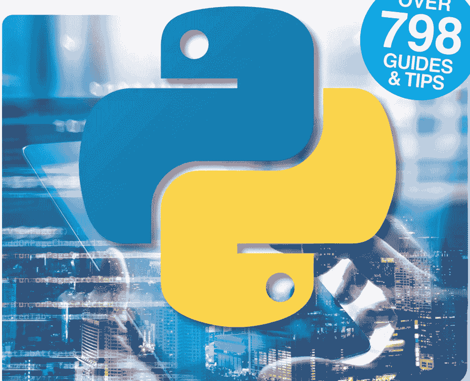

超过 798 篇指南与技巧

# 全面解析 Windows 11

超过 250 页专家教程、指南与技巧！

- 导航开始菜单
- 连接到互联网
- 如何个性化设置 Windows 11
- 使用 Edge 浏览网页
- 使用 OneDrive 云存储
- 使用 Skype 进行视频聊天
- 电子邮件、社交媒体与消息传递
- 提升 Windows 11 安全性
- Wi-Fi 和个人 Wi-Fi 热点
- 提升计算机速度
- 故障排除与用户建议，以及更多内容...


# BDM 完全手册系列

## Python

## 编码与编程

### 用 Python 释放你的想象力...

很少有编程语言能像 Python 一样取得如此巨大的成功。得益于其独特的设计，人人都能学习这种语言，它正助力推动着诸如大型强子对撞机等科技项目，整理构成首张黑洞图像的 PB 级数据，并创造下一代人工智能。掌握 Python 并不难，但你需要从小处着手。本指南将帮助你奠定 Python 编程未来的基础，从在计算机上安装该语言开始，直到形成用户交互和复杂变量。使用 Python 你可以做很多事情，在本书中你将找到成为 Python 程序员所需的一切知识，为进阶编码做好准备。

无论你是为未来职业前景而学习 Python，还是仅仅为了乐趣和发现新事物，我们的分步教程和指南都将为你提供急需的支持，助你一臂之力。

那么，让我们开始吧，用 Python 编码起来。

# 目录


## 6 入门

- 8 成为一名程序员
- 10 编码简史
- 12 你能用 Python 做什么？
- 14 Python 的数字
- 16 为什么选择 Python？
- 18 树莓派上的 Python
- 20 使用虚拟机
- 22 创建编码平台

## Hello World

- 26 你需要的设备
- 28 认识 Python
- 30 如何在 Windows 中设置 Python
- 32 如何在 Linux 中设置 Python
- 34 第一次启动 Python
- 36 你的第一行代码
- 38 保存并执行你的代码
- 40 从命令行执行代码
- 42 数字与表达式
- 44 使用注释
- 46 使用变量
- 48 用户输入
- 50 创建函数
- 52 条件与循环
- 54 Python 模块
- 56 Python 错误
- 58 综合运用你目前所学的知识
- 60 Python 聚焦：拼接黑洞


## 62 使用数据

- 64 列表
- 66 元组
- 68 字典
- 70 分割与连接字符串
- 72 格式化字符串
- 74 日期与时间
- 76 打开文件
- 78 写入文件
- 80 异常
- 82 Python 图形
- 84 综合运用你目前所学的知识
- 86 Python 聚焦：游戏


查看 BDM 代码门户
60 个免费 Python 程序
21,500 行代码
访问：https://bdmpublications.com/code-portal

借助我们出色的代码门户掌握 Python，其中包含游戏、工具等代码。

# 使用模块

- 90 日历模块
- 92 OS 模块
- 94 使用数学模块
- 96 随机模块
- 98 Tkinter 模块
- 100 Pygame 模块
- 104 基础动画
- 106 创建你自己的模块
- 108 Python 聚焦：人工智能

## 代码仓库


- 112 Python 文件管理器
- 114 猜数字游戏
- 116 随机数生成器
- 117 随机密码生成器
- 118 文本转二进制转换器
- 120 基础图形界面文件浏览器
- 122 鼠标控制的海龟
- 123 Python 闹钟
- 124 垂直滚动文本
- 126 Python 数字时钟
- 128 使用 Winsound 模块播放音乐
- 130 文本冒险脚本
- 132 Python 滚动字幕脚本
- 133 简易 Python 计算器
- 134 猜词游戏脚本

## 了解 Linux

- 138 什么是 Linux？
- 140 使用文件系统
- 142 列出和移动文件
- 144 创建和删除文件
- 146 创建和删除目录
- 148 复制、移动和重命名文件
- 150 实用系统和磁盘命令
- 152 使用手册页
- 154 编辑文本文件
- 156 Linux 技巧与窍门
- 158 Linux 命令 A-Z
- 160 Python 术语表


# 入门

Python 是一种高级、通用编程语言，由吉多·范罗苏姆在八十年代末开发，它基于多种其他语言，同时是流行的 ABC 语言的后继者。

它的设计旨在符合人类思维，因此可读性强、易于理解，无需深入钻研晦涩的机器代码、十六进制字符，甚至是 0 和 1。它清晰、逻辑性强、全面、强大且实用，同时易于上手和学习。

你会发现 Python 是世界上一些最有趣、最前沿技术的核心。它是连接超级计算机算法的代码；它用于航天工业、科学和工程领域。人工智能，以及 Alexa 和 Siri、Cortana 和 Google 助手等，都利用 Python 实现其强大的语音识别技术。它简直是一种令人惊叹、多功能且不可思议的语言。

那么，让我们开始探索成为一名 Python 程序员需要了解什么。

- 8 成为一名程序员
- 10 编码简史
- 12 你能用 Python 做什么？
- 14 Python 的数字
- 16 为什么选择 Python？
- 18 树莓派上的 Python
- 20 使用虚拟机
- 22 创建编码平台

# 成为一名程序员

程序员、开发者、编码员，这些都是对同一职业的不同称呼，即创建代码的人。他们创建代码的目的是什么，可以是任何东西，从电子游戏到国际空间站上的关键部件。但你如何成为一名程序员呢？


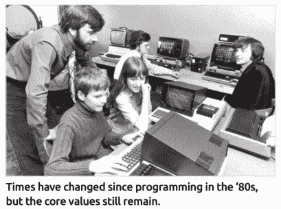

自八十年代编程以来，时代已经变迁，但核心价值依然存在。

> “你的编程之旅能走多远，取决于你自己！”

```c
1  #include<stdio.h>
2  #include<dos.h>
3  #include<graphics.h>
4  #include<conio.h>
5  void getup()
6  {
7      textcolor(BLACK);
8      textbackground(15);
9      clrscr();
10      window(10,2,70,3);
11      cprintf("Press 'R' to Restart, Press Space to Jump");
12      window(10,22,30,23);
13      cprintf("SCORE : ");
14      window(1,25,80,25);
15      for(int i=1;i<79;i++)
16      cprintf("n");
17      textcolor(0);
18  }
19  
20  int t, speed=40;
21  void ds(int jump=0)
22  {
23      static int a=1;
24      if(jump==0)
25      {
26          if(jump==2)
27          {
28              if(a==1)
29          }
30      }
31      else if(jump==2)
32      {
33          if(a==1)
34          }
35      }
36      else
37      }
38      }
39      window(2,15-t,18,25);
40      cprintf("                nnnn        ");
41      cprintf(" nnnn      nnnnnnnnnn      ");
42      cprintf(" nnnn    nnnnnnnnnnnnn     ");
43      cprintf(" nnnn n nnnnnnnnnnnnnn n   ");
44      cprintf(" nnnn n nnnn  nnnnnn  n n ");
45      cprintf(" nnnn n nnnn  nnnnnn  n n ");
46      cprintf(" nnnn    nnnnnnnnnnnnnn n  ");
47      if(jump==1 || jump==2)
48      {
49          cprintf("   nnnn nn         nn    ");
50          cprintf("   nnnn nn         nn    ");
51      }
52      else if(a==1)
53      {
54          cprintf("   nnnn nnn   nnn         ");
55          cprintf("   nnnn nnn   nnn         ");
56      }
57      else if(a==2)
58      {
59          cprintf("   nnnn nn   nn           ");
60          cprintf("   nnnn nn   nn           ");
61          cprintf("   nnnn n     n           ");
62          cprintf("   nnnn                     ");
63      }
64      a++;
65      delay(speed);
66  }
67  void obj()
68  {
```

能够遵循逻辑模式并预见最终结果，是程序员最宝贵的技能之一。

# 不仅仅是编码

对于那些年纪足够大、还记得八十年代（家庭计算的黄金时代）的人来说，当时的计算世界与今天大相径庭。可以整机购买的 8 位电脑（而不是套件形式，需要你自己焊接零件）是梦寐以求的东西；能拥有一台，简直就是装在一个大塑料盒里的纯粹幸福。然而，当时电脑提供的并非仅仅是新技术，更重要的是，你第一次能够控制“电视”上显示的内容。

许多用户不再满足于玩当时成千上万的游戏中的一款，而是决定创造自己的内容、自己的游戏；或者只是能帮助他们完成家庭作业或家庭财务管理的东西。8 位家用电脑的简单性意味着用几行 BASIC 代码就能创造出一些东西，于是第一代家庭培养的程序员诞生了。

从那时起，编程呈指数级发展。没过多久，卧室里的编码员就成了过去式，巨大的设计师、编码员、艺术家和音乐家团队参与到制作单个游戏的工作中。这当然导致程序员不仅仅是能在屏幕上制作一个精灵并让它在按键时移动的人。

自然，时光流逝，我们使用的技术也在进步。然而，编程的基本原理保持不变；但成为一名程序员究竟需要什么呢？

任何程序员，无论其工作内容如何，最常见的特质就是能够看到逻辑模式。我们指的是一个人能够从逻辑上跟随某事从开始到结束，并构想出预期结果。虽然你可能不觉得自己是这样的人，但通过训练大脑进行这种思维是可能的。是的，这需要时间，但一旦你开始以这种特定方式思考，你就能构建和理解代码。

仅次于逻辑的是对数学的理解。你不必达到天才水平，但你需要理解数学的基础知识。数学关乎解决问题，而代码大多属于数学的范畴。

能够看到全局对于现代程序员来说无疑是有益的。毫无疑问，作为一名程序员，你将成为一个程序员团队的一部分，并且很可能是一个更大的设计师团队的一部分，他们都在创造最终产品。虽然你可能只需要负责最终产品的一小部分，但能够理解其他人在做什么，将帮助你创造出比仅仅锁在自己的编码隔间里更好的东西。

最后，成为一名优秀的程序员也需要一定的创造力。同样，你不需要是创意天才，只需要有想象力能够预见最终产品以及用户将如何与之交互。

当然，成为一名程序员还涉及更多内容，包括学习实际的代码本身。然而，只要有时间、耐心和学习的决心，任何人都可以成为程序员。无论你是想加入一个三A级视频游戏团队，还是仅仅想创建一个自动化例程来让你的计算生活更轻松，你的编程之旅能走多远，取决于你自己！


## 编程简史

人们很容易认为，为机器编程以实现自动化流程或计算数值是近五十年才出现的现代概念。然而，这种假设大错特错，编程实际上已经存在很长一段时间了。

```
01000011 01101111 01100100 01101001 01101110 01100111
```

-   公元前87年左右
-   公元850年左右
-   1800年
-   1842-1843年
-   1930-1950年

很难准确指出人类何时开始“编程”一个设备的起点。然而，人们普遍认为，安提基特拉机械可能是第一件“编码”文物，它被定年在公元前87年左右，是一台古希腊的模拟计算机和天文仪，用于预测天文位置。

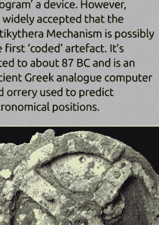

巴努·穆萨三兄弟是三位在巴格达智慧之家工作的波斯学者，他们在大约公元850年出版了《奇巧器械之书》。其中列出的发明包括一种机械乐器：一个水力驱动的管风琴，能够自动演奏可更换的音筒。

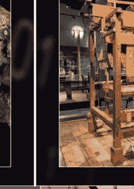

约瑟夫·玛丽·雅卡尔发明了可编程织布机，它使用带穿孔卡片来创建纺织品图案。然而，人们认为他的设计是基于巴兹尔·布雄在1725年开发的一种更早的自动化织布工艺。


阿达·洛芙莱斯翻译了意大利数学家路易吉·梅纳布雷亚关于查尔斯·巴贝奇分析机的回忆录。她在译作中做了大量笔记，详细描述了一种使用该引擎计算伯努利数的方法。这被认为是第一个计算机程序。考虑到当时根本没有计算机可用，这相当了不起。


在第二次世界大战期间，可编程机器取得了重大进展。其中最著名的是用于破译纳粹使用的军事密码的密码学机器。恩尼格玛密码机由德国工程师亚瑟·谢尔比乌斯发明，但因艾伦·图灵在布莱切利公园密码破译中心的工作而闻名于世。

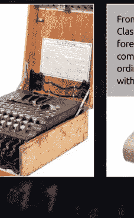

从20世纪70年代开始，C、SQL、带类的C语言（C++）、MATLAB、Common Lisp等语言相继发展起来。80年代无疑是家用电脑的黄金时代，那时硅处理器已经便宜到普通民众也能购买得起。这催生了8位机兴起所带来的家庭/卧室程序员的繁荣。


### 1951-1958年

### 1959年

### 1960-1970年

### 1970-1985年

### 1990年代至今

```
MONITOR FOR 4802 1.4
9-14-80 TSC ASSEMBLER PAGE 2
0000 8E 00 70 START LDS #STACK
... (additional assembly code lines)
```

第一种真正的计算机代码是汇编语言（ASM）或寄存器汇编语言。ASM特定于其运行的机器架构。1951年，编程语言被归入“自动代码”这一总称之下。不久之后，诸如IPL、FORTRAN和ALGOL 58等语言被开发出来。

在20世纪60年代和70年代，计算机编程主要由大学、军队和大公司使用。迈向更用户友好或家庭用户语言的显著一步是BASIC语言（初学者通用符号指令代码）在60年代中期的开发。

```
10 INPUT "What is your name? "; U$
20 PRINT "Hello "; U$
30 REM
40 INPUT "How many stars do you want? "; N
50 S$ = ""
60 FOR I = 1 TO N
70 S$ = S$ + "*"
80 NEXT I
90 PRINT S$
100 INPUT "Do you want more stars? "; A$
110 IF A$ = "Y" THEN GOTO 70
120 END
```

互联网时代带来了大量新的编程语言，并让人们能够以更好的方式获取学习编程所需的工具和知识。用户不仅可以学习如何编程，还可以自由地分享他们的代码，并借鉴其他代码来改进自己的作品。

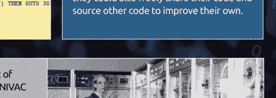

格蕾丝·霍珀上将是参与开发UNIVAC I计算机的团队成员之一，并最终为其开发了一个编译器。随着时间的推移，她开发的编译器演变成了COBOL语言（面向商业的通用语言），这是一种至今仍在使用的计算机语言。

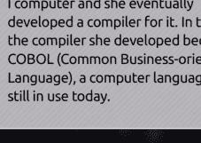

## 你能用Python做什么？

Python是一种开源、面向对象的编程语言，它易于理解和编写，同时又功能强大且极具可塑性。正是这些特性使其成为一门如此重要的语言。

Python能在少量指令内创建高度可读代码的能力，对我们的现代数字世界产生了巨大影响。从作为理想的初学者首选语言，到能够创作互动故事和游戏；从科学应用到人工智能和基于网络的应用，Python的唯一限制在于使用它的程序员的想象力。

正是Python可塑性强的设计，使其成为适应多种不同情境和角色的理想语言。即使在编程领域中某些需要更高效代码的方面，Python仍然被使用。例如，美国国家航空航天局（NASA）将Python既用作独立语言，也用作其他编程语言之间的桥梁。这样，NASA的科学家和工程师就能获取所需数据，而无需跨越多种语言障碍；Python填补了空白，提供了完成任务的手段。你会找到很多这样的例子，Python在幕后发挥作用。这就是为什么它是一门如此重要的语言需要学习。

> 优美优于丑陋。
> 明了优于隐晦。
> 简洁优于复杂。
> 复杂优于繁琐。
> 扁平优于嵌套。
> 稀疏优于密集。
> 可读性很重要。
> 特例不足以特殊到可以违反规则。
> 尽管实用性胜过纯洁性。
> 错误绝不应被默默传递。
> 除非显式地被抑制。
> 面对歧义时，拒绝猜测的诱惑。
> 应该有一种——而且最好只有一种——显而易见的方法来做。
> 尽管这种方法起初可能并不明显，除非你是荷兰人。
> 做比不做好。
> 尽管有时不做比现在就做好更好。
> 如果实现很难解释，那它就是一个坏主意。
> 如果实现很容易解释，那它可能是一个好主意。
> 命名空间是一个了不起的好主意——我们应该多做这样的！

## 大数据

大数据是过去几年你可能听过的流行词。基本上，它指的是可进行分析以揭示人类、社会与技术之间的模式、趋势和互动的极大数据集。当然，它不仅限于这些领域，大数据目前正被应用于各行各业，从社交媒体到医疗与福利，从工程到太空探索等等。

Python在大数据领域扮演着重要角色。它被广泛用于分析海量的大数据，并根据用户/公司从庞大的数字中所需的信息提取特定数据。得益于一系列强大的数据处理库，Python使得从数字中获取重要数据，并以人类可读和可用的方式呈现出来成为可能。

有无数的库和可自由使用的模块，能够对来自超级计算机集群等的数据进行快速、安全且更重要的准确处理。例如，欧洲核子研究中心（CERN）使用一个定制的Python模块来帮助分析大型强子对撞机（LHC）每秒产生的6亿次碰撞。另一种语言处理原始数据，但Python参与进来帮助筛选数据，这样科学家无需学习一种远为复杂的编程语言就能获取他们想要的内容。


## 你能用Python做什么？

### 人工智能

人工智能和机器学习是现代计算中最具开创性的两个方面。AI是一个总称，用于指代任何机器在做智能行为、以类似人类的方式工作和反应的计算过程。机器学习是AI的一个分支，为整个AI系统提供了从其经验中学习的能力。

然而，AI并非简单地创造意图消灭人类文明的自主机器人。事实上，AI存在于各种日常计算应用中，在这些应用中，“机器”或者更准确地说是代码，需要从某种形式的输入动作中学习，并预测输入接下来可能需要或执行的操作。

这个模型可以应用于Facebook、Google、Twitter、Instagram等平台。你是否曾在Instagram上搜索过某位名人，然后发现你在其他社交媒体平台上的搜索现在专门针对类似的名人进行了定向？这是在定向广告中使用AI的一个典型例子，而在预测你寻找内容的代码和算法背后，正是Python。

例如，Spotify使用基于Python的代码（及其他技术）来分析你的音乐习惯，并根据你过去听过的内容提供播放列表。这都是巧妙的运用，展望未来，Python正处在互联网未来工作方式的前沿。


### 游戏开发

虽然你不会找到太多用Python编写的AAA级游戏，但你可能会惊讶地发现，Python在许多高端现代游戏中被用作辅助工具。

Python在游戏中的主要用途是脚本编写，一个Python脚本可以为核心游戏引擎添加自定义功能。许多地图编辑器都兼容Python，如果你为游戏（例如《模拟人生》）制作模组，也会遇到它。

许多在线MMORPG（大型多人在线角色扮演游戏）使用Python作为服务器端元素的辅助语言。这些功能包括：用于搜索潜在作弊行为的代码、游戏服务器间的负载均衡、玩家技能匹配以及检查玩家客户端游戏是否与服务器版本匹配。还有一个Python模块可以包含在Minecraft服务器中，使服务器管理员能够添加方块、发送消息并自动化处理游戏中许多复杂的后台事务。

### 网络开发

自早期在有限文本编辑器中进行HTML脚本编写以来，网络开发已取得了长足进步。现在可用的众多框架和网络管理服务意味着构建一个网页已变得日益复杂。

使用Python，网络开发者能够创建动态且高度安全的网络应用程序，并能与Instagram和Pinterest等其他网络服务和应用程序进行交互。Python还允许从其他网站甚至构建在其他网站内部的应用程序中收集数据。


### 无处不在的Python

如你所见，Python是一门非常通用的编程语言。通过学习Python，你将培养一套全面的技能，无论你是出于专业需要还是仅仅作为爱好，都能帮助你进入计算领域的下一代。

无论你在编程之旅上决定走哪条路，拥有Python在手对你都将大有裨益。


# # 数字中的 Python

> > Python 创始人 Guido Van Rossum 在阅读了《蒙提·派森的飞行马戏团》的剧本后，将这门语言命名为 Python。

Python 有许多令人喜爱之处，但请不要只听我们的一面之词。以下是围绕这门近年最受欢迎编程语言之一的一些惊人事实与数据。


亚马逊的虚拟个人助手 Alexa 使用 Python 来辅助语音识别。


PYTHON 和 LINUX 技能在英国是第三大最受欢迎的 IT 技能。


数据分析和机器学习是 Python 最常用的两个示例领域。

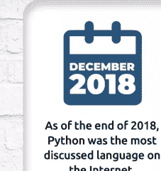

截至 2018 年底，Python 是互联网上讨论度最高的语言。

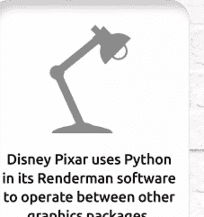

迪士尼皮克斯在其 Renderman 软件中使用 Python，以实现与其他图形软件包的交互。


Netflix 推荐内容的 75% 以上是由机器学习生成的——其代码由 Python 编写。


Facebook 90% 的帖子都通过 Python 编码的机器学习进行过滤。


据估计，国际空间站上超过 75% 的 NASA 工作流自动化系统使用 Python。

## Python 数据面面观

16,000

基于 Python 技能的职位在英国是第 16 位最受追捧的工作。


在英国，每六个月有超过 16,000 个 Python 相关职位发布。


Python 数据科学预计在未来几年将成为最受欢迎的工作。


谷歌是雇佣 Python 开发者最多的公司，微软紧随其后。


数据科学、区块链和机器学习是增长最快的 Python 编码技能。


纽约和旧金山是全球 Python 开发者最多的城市。

Python 开发者平均年薪为 60,000 英镑


95%

95% 的初学者程序员从 Python 入门，并且至今仍使用 Python 作为其主要或第二语言。

75%

75% 的 Python 开发者使用 Python 3，而 25% 的人仍在使用过时的 Python 2 版本。

79%

79% 的程序员日常使用 Python，21% 将其作为第二语言。

49%

49% 的 Windows 10 开发者使用 Python 3 作为其主要编程语言。

# 为何选择 Python？

现代计算机有多种不同的编程语言可供选择，甚至一些老旧的 8 位和 16 位计算机也有其可用的语言。其中一些语言专为科学工作设计，另一些则用于移动平台等。那么，为何在众多语言中选择 Python 呢？

# PYTHON 的力量

从最早的家用电脑问世开始，爱好者、用户和专业人士就常常熬夜，埋首于发热的电路堆中，试图创造出近乎魔法的事物。

这些编程先驱们开辟了新的疆域，编写了让字母 'A' 在屏幕上滚动的例程。对于习惯了超高分辨率图形和开放世界多人在线游戏的一代人来说，这可能听起来不那么激动人心。然而，在四十多年前，这堪称惊才绝艳。

无论你使用的是 Android 设备、iOS 设备、PC、Mac、Linux、智能电视、游戏机、MP3 播放器、车载 GPS 设备、机顶盒，还是成千上万其他联网和“智能”设备，在它们背后都是编程。

当然，这些“卧室程序员”为我们今天使用的每一项数字技术奠定了基础。其中一些人后来成为顶级软件公司的首席开发者，而另一些人则将可用硬件推向极限，创立了持续为我们带来惊喜的数十亿英镑游戏帝国。

所有上述数字设备都需要指令来告诉它们该做什么，并允许与之交互。这些指令构成了设备的编程核心，而这个核心可以使用多种编程语言构建。

当今使用的语言因情境、平台、设备用途以及设备将如何与环境或用户交互而异。

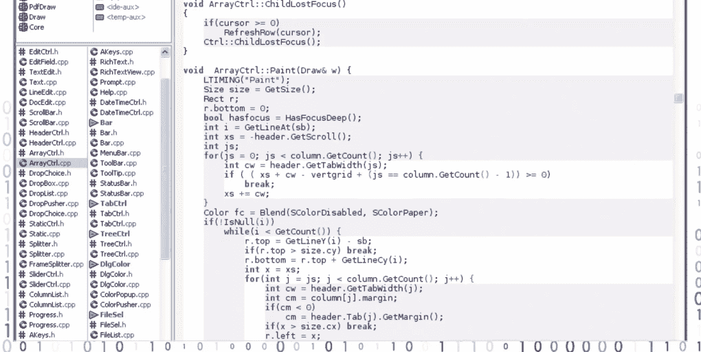

操作系统，如 Windows、macOS 等，通常是 C++、C#、汇编语言和某种基于可视化的语言的组合。游戏通常使用 C++，而网页则可以使用多种可用语言，如 HTML、Java、Python 等。

更通用的编程用于创建程序、应用、软件或你想要称呼的任何东西。它们广泛应用于所有硬件平台，几乎适合所有可想象的应用程序。有些运行速度更快，有些则比其他语言更易于学习和使用。Python 就是这样一种通用语言。

Python 是一种所谓的“高级语言”，它通过各种数组、变量、对象、算术运算、子例程、循环以及更多交互方式与硬件和操作系统“对话”。虽然它不如低级语言那样精简（低级语言可以直接处理内存地址、调用栈和寄存器），但其优势在于它普遍可用且易于学习。

```
//file: Invoke.java
import java.lang.reflect.*;

class Invoke {
    public static void main( String [] args ) {
        try {
            Class c = Class.forName( args[0] );
            Method m = c.getMethod( args[1], new Class [] { } );
            Object ret = m.invoke( null, null );
            System.out.println(
                "Invoked static method: " + args[1]
                + " of class: " + args[0]
                + " with no args\nResults: " + ret );
        } catch ( ClassNotFoundException e ) {
            // Class.forName( ) can't find the class
        } catch ( NoSuchMethodException e2 ) {
            // that method doesn't exist
        } catch ( IllegalAccessException e3 ) {
            // we don't have permission to invoke that method
        } catch ( InvocationTargetException e4 ) {
            // an exception occured while invoking that method
            System.out.println(
                "Method threw an: " + e4.
                getTargetException( ) );
        }
    }
}
```


Java 是一门强大的语言，应用于网页、机顶盒、电视甚至汽车。

Python 诞生于二十六年多前，并已发展成为学习编程的理想入门语言。它非常适合业余爱好者、热心者、学生、教师，以及那些仅仅需要在自身或外部硬件与计算机本身之间创建独特交互的人。

Python 可免费下载、安装和使用，并适用于 Linux、Windows、macOS、MS-DOS、OS/2、BeOS、IBM i 系列机器，甚至 RISC OS。它已被评为世界排名前五的编程语言之一，并持续在硬件和互联网发展曲线之前不断演进。

因此，回答这个问题：为什么选择 Python？简单来说，它免费、易于学习、功能异常强大、被普遍接受、高效，并且是卓越的学习和教育工具。

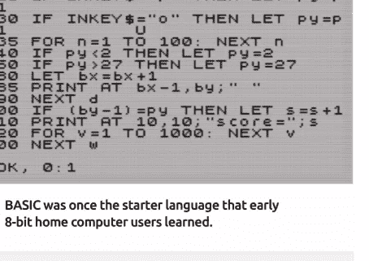

BASIC 曾是早期 8 位家用电脑用户学习的入门语言。

```
print(HANGMAN[0])
attempts = len(HANGMAN) - 1

while (attempts != 0 and "-" in word_guessed):
    print("\nYou have {} attempts remaining".format(attempts))
    joined_word = " ".join(word_guessed)
    print(joined_word)

    try:
        player_guess = str(input("\nPlease select a letter between A-Z" + "\n> "))
    except: # catch invalid input
        print("That is not valid input. Please try again.")
        continue
    else:
        if not player_guess.isalpha(): # check the input is a letter. Also checks a
            print("That is not a letter. Please try again.")
            continue
        elif len(player_guess) > 1: # check the input is only one letter
            print("That is more than one letter. Please try again.")
            continue
        elif player_guess in guessed_letters: # check it letter hasn't been guessed
            print("You have already guessed that letter. Please try again.")
            continue
        else:
            pass

    guessed_letters.append(player_guess)

    for letter in range(len(chosen_word)):
        if player_guess == chosen_word[letter]:
            word_guessed[letter] = player_guess # replace all letters in the chosen

    if player_guess not in chosen_word:
```

Python 是 BASIC 的一种更现代的演绎，它易于学习，是理想的初学者编程语言。

## 在树莓派上使用Python

如果你正在考虑在哪个平台上安装和使用Python，那么不妨考虑一下目前最好的编程平台之一：树莓派。树莓派对程序员来说有许多优势：它价格低廉、易于使用，并且具有非凡的灵活性。

## 树莓派的强大之处

虽然拥有一个功能更强大的编程平台来编写和测试代码是理想的选择，但这并不总是可行的。我们大多数人在刚开始时无法投入数百英镑的投资，而这正是树莓派可以提供帮助的地方。

虽然拥有一个功能更强大的编程平台来编写和测试代码是理想的选择，但这并不总是可行的。我们大多数人在刚开始时无法投入数百英镑的投资，而这正是树莓派可以提供帮助的地方。

市面上的套件通常会提供一张预装了最新Raspbian操作系统的SD卡、一个外壳、电源插座和线缆，这是一个好主意，因为你可以毫不费力地将树莓派插在桌子下面的墙上，同时仍然能够连接到它并进行编程。

树莓派是一款出色的现代硬件，它创造——或者更准确地说，是重新创造了我们曾经对计算机、它们的工作原理、如何编程以及基础电子学所怀有的那种迷恋。得益于其独特的硬件和定制软件组合，它已被证明是一个令人惊叹的学习编程的平台；特别是使用Python。

当然，主要优势在于树莓派基金会开箱即用提供的额外内容。这样做的原因是树莓派的目标是帮助教育用户，无论是编程、电子学还是计算的其他方面。为了实现这一目标，树莓派基金会为用户提供了不同的集成开发环境来编译Python代码；除了Python 2和Python 3，甚至还有一个允许你与Minecraft通信的Python库。

虽然你可以轻松地使用树莓派来学习使用其他编程语言进行编程，但Python已被坚定地推到了最前沿。树莓派使用Raspbian作为其推荐的默认操作系统。Raspbian是一个Linux操作系统，或者更准确地说，它是一个基于Debian的Linux发行版。这意味着它已经内置了Python编程元素，这与全新安装的Windows 10不同，后者没有特定的Python基础。然而，树莓派基金会更进一步，开箱即用地包含了大量Python模块、扩展甚至示例。因此，本质上，你所需要做的就是购买一个树莓派，按照说明设置好它（使用我们在www.bdmpublications.com上提供的优秀树莓派指南），然后在桌面加载完成后就可以立即开始使用Python编程。

还有其他优势，例如能够将Python代码与Scratch（麻省理工学院开发的一种面向对象的编程语言，旨在帮助儿童理解编程的工作原理）结合起来，以及能够对树莓派上的GPIO连接进行编程，以进一步控制任何连接的机器人或电子项目。Raspbian还包括一个Sense HAT模拟器（HAT是一种硬件附加电路板，为树莓派提供不同的电子、机器人和自动化项目），可以通过Python代码访问。

重要的是，树莓派还有更多优点，这使其成为开始学习Python编程的人的绝佳选择。树莓派非常容易设置为无头节点。这意味着，只需进行一些调整，你就可以从家庭网络中的任何其他计算机或设备远程连接到树莓派。例如，一旦你设置了远程连接选项，你只需将树莓派插入无线路由器覆盖范围内的家中任何地方的电源插座即可。只要树莓派已连接，你就可以像坐在树莓派前使用键盘和鼠标一样轻松地从Windows或macOS远程访问桌面。

因此，树莓派不仅是一个出色的编程平台，也是一个极佳的项目基础。正是由于这些以及许多其他原因，我们在本书中一直将树莓派作为主要的Python编程平台。虽然代码是在树莓派上编写和运行的，但你也可以在Windows、其他版本的Linux和macOS上使用它。如果代码需要特定的操作系统，别担心；我们会在文中说明。

使用这种方法可以节省大量资金，因为你不需要另一个键盘、鼠标和显示器，而且你也不需要分配足够的空间来容纳这些额外的设备。如果你空间和资金紧张，那么只需大约60英镑，购买一个市面上的许多

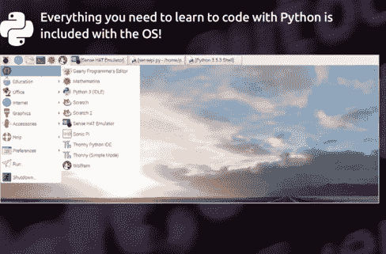

## 树莓派4，永恒经典！

树莓派4型号B于2019年6月24日发布，在性能和硬件规格方面实现了重大飞跃。它也是继初代树莓派之后最快售罄的型号之一。

凭借全新的1.5GHz、64位、四核ARM Cortex-A72处理器，以及1GB、2GB或4GB内存版本的选择，树莓派4向成为真正的台式计算机迈进了一步。此外，树莓派4发布时做出了一个惊人的决定，即通过一对两个micro-HDMI端口提供双显示器支持。你还会发现一对USB 3.0端口、蓝牙5.0，以及一个能够处理4K分辨率和OpenGL ES 3.0图形的GPU。

简而言之，树莓派4是目前最强大的树莓派型号。然而，不同的内存版本成本有所增加。1GB版本售价34英镑，2GB版本44英镑，4GB版本则需要54英镑。记得在订单中也考虑一两条micro-HDMI线缆。

## RASPBIAN BUSTER

除了发布树莓派4，树莓派团队还编译了新版本的Raspbian操作系统，代号为Buster。

结合树莓派4所搭载的新硬件，Buster确实提供了一些更新。尽管总体上，它在外观和操作上与之前的Raspbian版本非常相似。更新主要与4K显示和播放有关，为树莓派4提供了一套新的图形驱动程序和性能增强。

简而言之，你在本书中看到的内容将适用于树莓派4和Raspbian Buster！

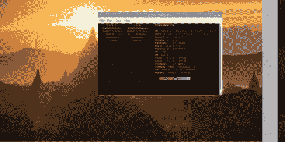

设置完成后，你可以从任何设备/PC远程连接到树莓派的桌面。

你甚至可以通过Windows远程测试连接的硬件。

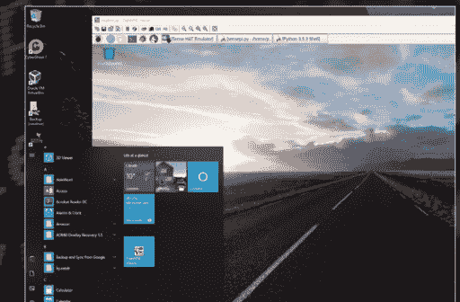

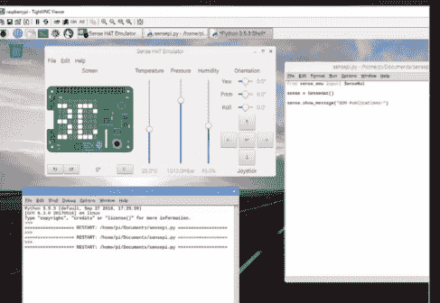

# 使用虚拟机

虚拟机允许你从桌面应用程序中运行整个操作系统。这样，你可以在一个安全、可靠且隔离的环境中托管多个系统。简而言之，这是一种理想的编程方式。

听起来不错，但虚拟机（VM）到底是什么，它是如何工作的？

虚拟机的官方定义是“真实计算机的高效、隔离的副本”。这基本上意味着虚拟机是一个模拟的计算机系统，其运行方式与物理机器完全相同，但局限于专用的虚拟机管理程序或Hypervisor内。

Hypervisor本身是一个应用程序，它允许你安装一个单独的操作系统，在其内部创建一个虚拟计算机系统，并完整地访问互联网、你的家庭网络等。

Hypervisor将从主机系统——你的物理计算机中获取资源来创建虚拟计算机。这意味着你的物理计算机的部分：内存、CPU、硬盘空间和其他共享资源，将被预留用于虚拟机，因此在Hypervisor关闭之前，这些资源将无法供物理计算机使用。

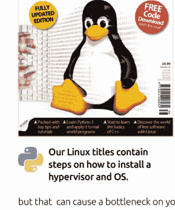

因此，你可以在物理计算机上托管的不同虚拟机的数量受到限制，这取决于你可以分配给每个虚拟机的物理系统资源量，同时还要为物理计算机的运行留出足够的资源。

-   我们的Linux书籍包含了如何安装Hypervisor和操作系统的步骤。

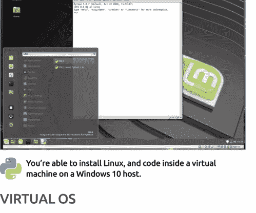

如果你没有足够的内存或硬盘空间，或者你的计算机处理器特别慢，这种资源开销可能会对物理机造成严重影响。虽然完全可以在只有2GB内存的情况下运行虚拟机，但这并不建议。理想情况下，你至少需要8GB内存（4GB也可以，但同样，你的物理计算机会因为内存分配给虚拟机而开始受影响），硬盘上至少有25到50GB的可用空间，以及一个四核处理器（同样，双核CPU也可以，但这可能会导致物理计算机出现瓶颈）。

-   你可以在Windows 10主机上的虚拟机中安装Linux并进行编程。

## 虚拟操作系统

在Hypervisor内，你可以运行多种不同的操作系统。操作系统的类型在很大程度上取决于你所使用的Hypervisor，因为有些Hypervisor在模拟特定系统方面比其他Hypervisor更出色。例如，VirtualBox是Oracle提供的一款免费且易于使用的Hypervisor，它在运行Windows和Linux虚拟机方面表现出色，但在运行Android或macOS方面则不那么好。QEMU擅长模拟ARM处理器，因此非常适合Android等系统，但它可能难以掌握。

有许多免费的Hypervisor可供尝试，同样也有许多商业可用的Hypervisor，它们功能更强大，提供更好的特性。然而，对于大多数用户，无论是初学者还是专业人士，VirtualBox都做得足够好。

在Hypervisor内，你可以设置和安装任何较新的Linux发行版，或者如果你觉得有必要，也可以安装一些较旧的版本。你可以安装早期版本的Windows，甚至可以追溯到带有DOS 6.22的Windows 3——尽管你可能会发现由于旧驱动程序（例如网络访问）的原因，虚拟机的某些功能会丢失。

考虑到这一点，你可以在Windows 10 PC上的应用程序中运行Linux Mint或最新版本的Ubuntu。这就是使用虚拟机的魅力所在。相反，如果你的物理计算机安装的是Linux操作系统，那么通过Hypervisor，你可以创建一个Windows 10虚拟机——尽管你需要一个许可证密钥来注册和激活Windows 10。

使用虚拟机可以消除双启动的需要。双启动是指在单台计算机的同一块或多块硬盘上安装两个或更多物理操作系统。当计算机启动时，你会看到一个选项，让你选择想要启动进入哪个操作系统。虽然这听起来像是一个更理想的方案，但实际情况并不总是像听起来那么简单，因为所有启动进入的操作系统都将拥有对计算机全部系统资源的完全访问权限。

双启动的问题出现在其中一个操作系统进行更新时。大多数更新涉及安全补丁或错误修复，但有些更新可能会改变操作系统的核心——内核。当这些更改被应用时，更新可能会改变操作系统的启动方式，这意味着你最初做出的启动选择可能会被覆盖，导致你无法访问计算机上安装的其他操作系统。要解决这个问题，你需要访问主引导记录并修改配置，以重新允许启动进入其他系统。此外，还存在可能覆盖第一个安装的操作系统或覆盖数据的危险，而且大多数操作系统在并行运行时往往无法很好地协同工作。确实，双启动虽然不错，但其问题也相当多。相比之下，使用虚拟机环境虽然有时也会出现问题，但它消除了在单台计算机上使用多个操作系统时一些更糟糕和灾难性的方面。

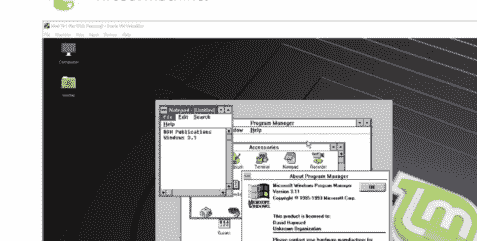

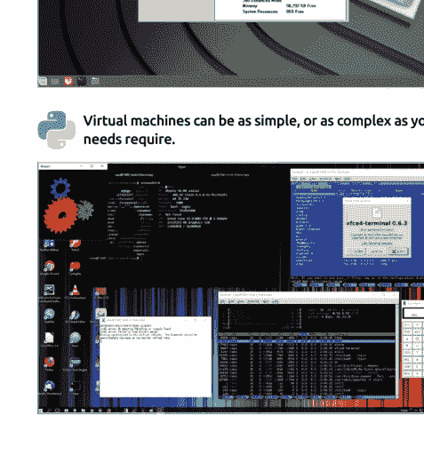

## 对程序员的优势

对于程序员来说，拥有一个虚拟机设置提供了许多优势，其中最受欢迎的是跨平台代码。这意味着如果你在 Windows 10 中编写代码，然后在虚拟机管理程序中安装一个 Linux 发行版，你就可以快速轻松地启动虚拟机，并在完全不同的操作系统中测试你的代码。通过这种方式，你可以排除任何错误，调整代码使其在不同平台上运行得更好，并将你的代码扩展到非 Windows 用户。

能够为特定项目以特定方式配置开发环境的能力是极其宝贵的。使用虚拟机设置大大减少了因支持你作为程序员可能参与的众多不同项目而安装多个版本的编程语言、库、IDE 和模块所带来的固有不确定性。那些直接与操作系统特定部分“对话”的代码元素可以轻松克服，而无需用跨平台库弄乱你的主系统，这反过来可能会影响 IDE 中的其他库。

另一个需要考虑的因素是稳定性。如果你编写的代码在开发阶段可能会导致核心操作系统出现一些不稳定，那么在虚拟机上执行和测试该代码比在你的主计算机上测试更有意义；在主计算机上，由于代码的不稳定性而不得不反复重启或重置某些东西，可能会变得低效且令人烦恼。

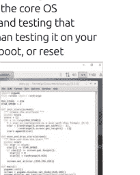

虚拟机环境可以被视为一个沙箱，你可以在其中测试不安全或不稳定的代码，而不会对你的主工作计算机造成伤害或损坏。病毒和恶意软件可以被隔离在虚拟机内，而不会感染主计算机；你可以在虚拟机内设置匿名互联网使用；你还可以安装第三方软件，而不会拖慢你的主计算机。

## 走向虚拟化

在你编程的早期阶段，使用虚拟机可能看起来有点多余。然而，这值得研究，因为在 Linux 中编程通常比在 Windows 中更容易，因为某些版本的 Linux 预装了 IDE。无论如何，操作系统的虚拟化是许多专业和成功的程序员及开发人员的工作方式，因此在你的技能组合中尽早习惯它是有益的。

首先，考虑安装 VirtualBox。然后看看我们的 Linux 书籍，[https://bdmpublications.com/?s=linux&post_type=product](https://bdmpublications.com/?s=linux&post_type=product)，学习如何在虚拟环境中安装 Linux 以及如何最好地利用该操作系统。

## 创建编程平台

“编程平台”这个术语可以指一种你可以编程的硬件，或者一个特定的操作系统，甚至是一个预构建的、旨在方便创建游戏的自定义环境。实际上，这是一个相当宽泛的术语，因为编程平台可以是所有这些要素的混合体，这完全取决于你打算使用哪种编程语言以及你的最终目标是什么。

**编程可能是那种听起来很棒，但要开始却常常令人困惑的经历之一。** 毕竟，有大量语言可供选择，有众多应用程序可以让你使用特定或一系列语言进行编程，还有同样大量的第三方软件需要考虑。然后你上网，发现有无数针对你决定要编程的语言的编程教程，以及更多的代码示例。有时这一切都让人有点应接不暇。

诀窍是放慢速度，首先不要过于深入地研究编程。就像所有好的项目一样，你需要一个坚实的基础来构建你的技能，并手头拥有所有必要的工具来完成基本步骤。这就是创建编程平台的意义所在，它将成为你的学习基础，让你开始迈出进入更广阔编程世界的第一步。

### 硬件

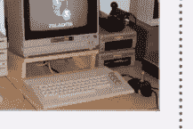

值得庆幸的是，基础级别的编程不需要专业设备或顶级的、液氢冷却的 PC。如果你拥有一台计算机，无论多么基础，你都可以开始学习如何编程。当然，如果你的计算机是 Commodore 64，那么你可能会在跟随现代语言教程时遇到一些困难，但当今一些最优秀的程序员就是从 8 位机器起步的，所以还是有希望的。

需要互联网访问来下载、安装和更新编程开发环境，以及一台安装了 Windows 10、macOS 或 Linux 的计算机。你可以使用其他操作系统，但这“三大巨头”是你会找到大多数代码资源所针对的。

### 软件

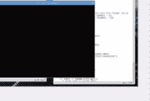

在软件方面，大多数开发环境——允许你编写代码、编译代码并执行它的工具——都可以免费下载和安装。也有一些专业工具需要付费，但在当前阶段它们并非必需；所以不要被误导，认为你需要购买任何额外的软件才能开始学习编程。

随着时间的推移，你可能会发现自己从主流开发环境切换到使用自己发现的一系列工具来编写代码。归根结底，这都是个人偏好，随着你经验的积累，你会开始使用不同的工具来完成工作。

## 操作系统

Windows 10 是世界上使用最广泛的操作系统，因此绝大多数编程工具都是为微软的领先操作系统编写的。然而，不要忽视 macOS，尤其是 Linux。

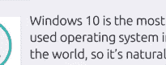

macOS 用户享有与 Windows 用户同等数量的编程工具。事实上，你可能会发现许多专业程序员使用 Mac 而不是 PC，仅仅是因为 Mac 操作系统是建立在 Unix 之上的（Unix 是一种命令行操作系统，为世界上大部分文件系统和服务器提供支持）。这个 Unix 层允许你测试几乎任何语言的程序，而无需使用专门的 IDE。

然而，Linux 是迄今为止最受欢迎和最重要的编程操作系统之一。它不仅具有类似 Unix 的骨干，而且可以免费下载、安装和使用，并附带大多数开始学习编程所需的工具。Linux 驱动着构成互联网的大部分服务器。它被用于几乎所有顶级超级计算机，以及 NASA、CERN 和军方等特定组织，并且它是 Android 设备、智能电视和车载系统的基础。Linux 作为一个编程平台，是一个极好的主意，它可以安装在虚拟机内，而不会影响 Windows 或 macOS 的安装。

### 虚拟机

虚拟机是一种软件，允许你在软件本身的限制内安装一个完全工作的操作系统。安装的操作系统将从主机计算机分配用户定义的资源，提供内存、硬盘空间等，并共享主机计算机的互联网连接。

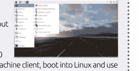

虚拟机的优势在于，你可以使用 Linux 等系统，而不会影响你当前安装的主机操作系统。这意味着你可以运行 Windows 10，启动你的虚拟机客户端，启动进入 Linux，并使用 Linux 的所有功能，同时仍然可以使用 Windows。

当然，这使其成为一个极好的编程平台，因为你可以从主机计算机运行不同的操作系统安装，同时使用不同的编程语言。你可以测试你的代码，而不用担心破坏你的主机操作系统，并且可以轻松返回到之前的配置，而无需重新安装所有内容。

虚拟化是现在大多数大公司的关键。例如，你可能会发现，IT 团队没有选择安装 Windows Server 的单个服务器，而是选择了虚拟化环境，其中每个 Windows Server 实例都是从几台强大的机器上运行的虚拟机。这减少了物理机器的数量，使团队能够更好地管理资源，并使他们能够在极短的时间内部署一个专门用于特定任务的整个服务器。

### 树莓派

如果你还没有听说过树莓派，我们建议你访问 www.raspberrypi.org 并查看一下。简而言之，树莓派是一台小型、功能齐全的计算机，它自带定制的基于 Linux 的操作系统，预装了你开始学习如何使用 Python、C++、Scratch 等进行编程所需的一切。

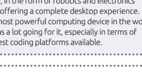

它价格极其便宜，大约 35 英镑，并允许你利用不同硬件，以机器人和电子项目的形式，同时提供完整的桌面体验。虽然不是世界上最强大的计算设备，但树莓派有很多优点，尤其是在成为最佳编程平台之一方面。

### MINIX NEO N42C-4

NEO N42C-4 是来自迷你 PC 开发商 MINIX 的一款极其小巧的计算机。尺寸仅为 139 x 139 x 30mm，这款搭载 Intel N4200 CPU、预装 Windows 10 Pro 的计算机是我们遇到过的最佳编程平台之一。

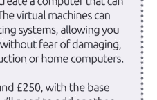

当然，其美妙之处在于，随着存储和内存的增加，你能够创建一台可以轻松托管多个虚拟机的计算机。这些虚拟机可以涵盖 Linux、Android 和其他操作系统，让你能够编写和测试跨平台代码，而不用担心损坏或给其他生产或家用计算机带来问题。

MINIX NEO N42C-4 起价约 250 英镑，配备基础的 32GB eMMC 和 4GB 内存。你需要额外支付大约一百五十英镑来升级规格，但考虑到仅 Windows 10 Pro 的许可证在微软商店就要 219 英镑，你就能开始看到选择比树莓派更强大的硬件基础的好处了。

### 你自己的编程平台

无论你选择哪种方法，请记住，随着你获得经验并偏爱某种语言，你的编程平台可能会发生变化。不要害怕在此过程中进行实验，因为你最终会创建自己独特的平台，能够处理你输入的所有代码。

# 你好，世界


开始学习 Python 一开始可能有点令人望而生畏，但幸运的是，这门语言在设计时注重简洁。与大多数事情一样，你需要慢慢开始，掌握基础，学习如何获得结果，以及如何从代码中得到你想要的东西。

本节涵盖数字和表达式、用户输入、条件和循环，以及你在使用 Python 期间无疑会遇到的各种错误类型：这些都是良好编码和 Python 代码的核心基础。

- 26 你需要的设备
- 28 认识 Python
- 30 如何在 Windows 上设置 Python
- 32 如何在 Linux 上设置 Python
- 34 第一次启动 Python
- 36 你的第一行代码
- 38 保存并执行你的代码
- 40 从命令行执行代码
- 42 数字和表达式
- 44 使用注释
- 46 使用变量
- 48 用户输入
- 50 创建函数
- 52 条件和循环
- 54 Python 模块
- 56 Python 错误
- 58 综合运用你已学的知识
- 60 Python 专题：缝合黑洞

## 你需要的设备

你可以用极少的硬件或前期资金投入来学习 Python。你不需要一台功能极其强大的计算机，所需的任何软件都是免费的。

### 我们使用的环境

幸运的是，Python 是一种多平台编程语言，可用于 Windows、macOS、Linux、Raspberry Pi 等等。如果你拥有其中一种系统，那么你可以轻松地开始使用 Python。


### 计算机

显然，你需要一台计算机来学习如何用 Python 编程并测试你的代码。你可以使用 Windows（从 XP 版本开始），无论是 32 位还是 64 位处理器，Apple Mac 或安装了 Linux 的 PC。

### 一种 IDE

IDE（集成开发环境）用于输入和执行 Python 代码。它使你能够检查程序代码和代码中的值，同时还提供高级功能。有许多不同的 IDE 可用，因此找到适合你并能提供最佳结果的 IDE。

### Python 软件

macOS 和 Linux 以及 Raspberry Pi 都已经预装了 Python 作为操作系统的一部分。然而，你需要确保你运行的是最新版本的 Python。Windows 用户需要下载并安装 Python，我们稍后会介绍。

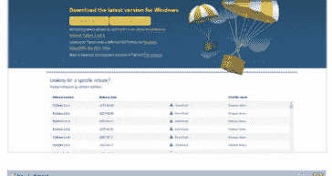

### 文本编辑器

虽然文本编辑器是输入代码的理想环境，但它并非绝对必需。你可以直接从 IDLE 输入和执行代码，但像 Sublime Text 或 Notepad++ 这样的文本编辑器在输入代码时提供更高级的功能和颜色编码。

### 互联网访问

Python 是一个不断发展的环境，因此新版本通常会引入新概念或更改现有命令和代码结构，使其成为更高效的编程语言。能够访问互联网将使你保持最新状态，在你遇到困难时提供帮助，并能访问 Python 海量的模块。

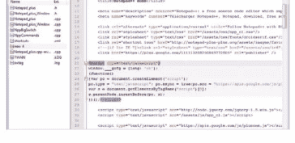

### 时间和耐心

### RASPBERRY PI

为什么使用 Raspberry Pi？Raspberry Pi 是一台微型计算机，购买成本非常低，但却为用户提供了一个出色的学习平台。其主要操作系统 Raspbian 预装了最新的 Python 以及许多模块和附加组件。

### RASPBERRY PI

Raspberry Pi 4 Model B 是最新版本，集成了更强大的 CPU，提供 1GB、2GB 或 4GB 内存版本可选，并支持 Wi-Fi 和蓝牙。你可以从约 33 英镑购买一块 Pi，4GB 内存版本价格高达 54 英镑，或者作为套件的一部分，价格为 50 英镑以上，具体取决于你感兴趣的套件。

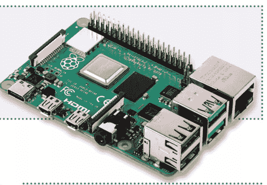


### FUZE 项目

FUZE 是一个基于最新型号 Raspberry Pi 构建的学习环境。你可以购买带有电子套件甚至机械臂的工作站，供你组装和编程。你可以在 www.fuze.co.uk 找到更多关于 FUZE 的信息。

### RASPBIAN

Raspberry Pi 的主要操作系统是一个基于 Debian 的 Linux 发行版，它在一个易于使用的软件包中提供了你需要的一切。它为 Pi 进行了优化，是硬件和软件项目、Python 编程甚至作为台式计算机的理想平台。

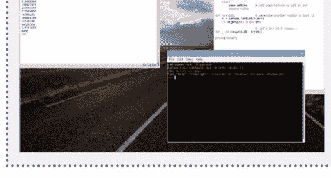

### 书籍

我们通过 **www.bdmpublications.com** 提供几本很棒的 Raspberry Pi 相关书籍。我们的 Pi 书籍涵盖了如何购买你的第一个 Raspberry Pi，设置和使用它；还有一些很棒的分步骤项目示例和指南，以帮助你充分利用 Raspberry Pi。


## 认识 Python

Python 是有史以来最伟大的计算机编程语言。它让你能够以一种简洁易懂的语言充分发挥计算机的能力。

### 什么是编程？

在尝试学习编程语言之前，先了解什么是编程语言会有所帮助，Python 也不例外。让我们来看看 Python 是如何诞生的，以及它与其他语言的关系。

### PYTHON

编程语言是计算机遵循的一系列指令。这些指令可以简单到显示你的名字或播放音乐文件，也可以复杂到构建一个完整的虚拟世界。Python 是一种编程语言，于 1980 年代末由荷兰 Centrum Wiskunde & Informatica（CWI）的 Guido van Rossum 构思，作为 ABC 语言的继承者。

**Guido van Rossum，Python 之父。**


### 编程食谱

程序就像计算机的食谱。烤蛋糕的食谱可能是这样的：

- 将 100 克自发粉放入碗中。
- 向碗中加入 100 克黄油。
- 加入 100 毫升牛奶。
- 烘烤半小时。

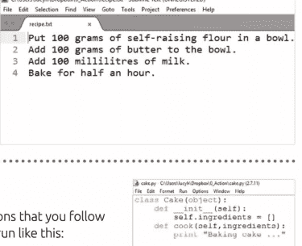

### 代码

就像食谱一样，程序由你按顺序执行的指令组成。一个描述蛋糕制作过程的程序可能这样运行：

```python
bowl = []
flour = 100
butter = 50
milk = 100
bowl.append([flour, butter, milk])
cake.cook(bowl)
```

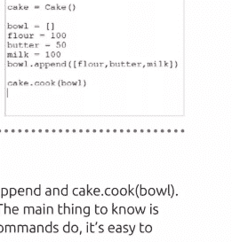

### 程序命令

你可能不理解其中一些 Python 命令，比如 `bowl.append` 和 `cake.cook(bowl)`。第一个是一个列表，第二个是一个对象；我们将在本书中介绍这两者。主要要知道的是，在 Python 中阅读命令很容易。一旦你了解了这些命令的功能，就很容易弄清楚程序是如何工作的。


## 高级语言

易于阅读的计算机语言被称为“高级”。这是因为它们“高高在上”于硬件（也称为“the metal”）之上。像汇编语言这样“贴近硬件”运行的语言被称为“低级”。低级语言的命令读起来有点像这样：`msg db , 0xa 1en equ $ - msg`。

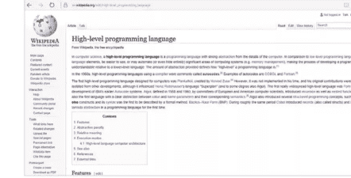

## Python 之禅

Python 让你能够以人类可以理解的语言访问计算机的所有强大功能。这一切背后有一个被称为“Python 之禅”的理念。这是影响该语言设计的 20 条软件原则的集合。原则包括“美优于丑”和“简单优于复杂”。在 Python 中输入 **import this**，它将显示所有这些原则。

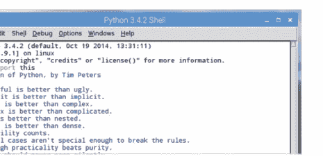

## Python 3 对比 Python 2

在典型的计算场景中，Python 因为存在两个活跃版本而显得有些复杂：Python 2 和 Python 3。

## Python 世界

Python 3.7 是该编程语言的最新发布版本。然而，如果你深入研究 Python 网站，并在线调查 Python 代码，你无疑会遇到 Python 2。尽管你可以同时运行 Python 3 和 Python 2，但这并不推荐。始终选择 Python 网站上发布的最新稳定版本。

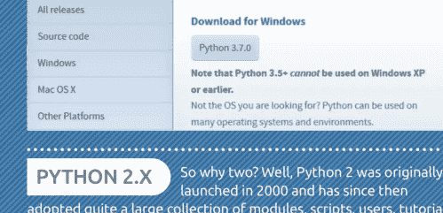

## PYTHON 3.X

2008 年，Python 3 随着几个新的和增强的功能一同到来。这些功能提供了更稳定、更有效、更高效的编程环境，但遗憾的是，这些新功能大多（如果不是全部的话）与 Python 2 的脚本、模块和教程不兼容。虽然起初并不受欢迎，但 Python 3 此后已成为 Python 编程的前沿。

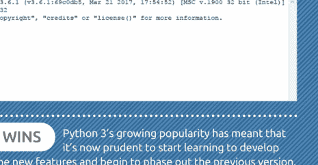

## PYTHON 2.X

那么为什么有两个版本呢？嗯，Python 2 最初于 2000 年推出，此后积累了相当庞大的模块、脚本、用户、教程等集合。多年来，Python 2 很快成为初学者和专家编码的首选编程语言之一，这使其成为一项极其宝贵的资源。


## 3.X 胜出

Python 3 日益增长的受欢迎程度意味着，现在开始学习使用其新特性进行开发，并逐步淘汰旧版本，是明智之举。许多开发公司，如 SpaceX 和 NASA，都在重要代码片段中使用 Python 3。


好的，我将作为高级文档工程师和翻译员，严格遵循您提供的注意事项和示例，将给定的英文Markdown文档翻译成中文。

以下是翻译后的内容：


## 如何在Windows上设置Python

Windows用户可以通过Python主下载页面轻松安装最新版本的Python。尽管大多数经验丰富的Python开发者可能更倾向于在其他平台构建代码，但它仍然是初学者理想的入门选择。

### 安装Python 3.X

Microsoft Windows 默认不预装 Python，因此需要您手动安装。幸运的是，这个过程很简单。

### 第1步

首先，打开您的网页浏览器，访问 `www.python.org/downloads/`。查找标有 Python 3.x 下载链接的按钮。Python会定期更新，每个错误修复和更新都会改变最后的数字版本号。因此，如果您看到的是 Python 3.8 或更高版本，也无需担心，只要是 Python 3，本书中的代码都能正常工作。

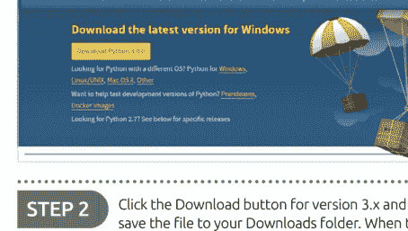

### 第2步

点击版本3.x的下载按钮，并将文件保存到您的“下载”文件夹。文件下载后，双击可执行文件，Python安装向导将会启动。此时，您有两个选择：“立即安装”和“自定义安装”。我们建议选择“自定义安装”链接。

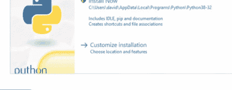

### 第3步

选择“自定义”选项允许您指定某些参数。虽然您可能选择使用默认设置，但养成自定义的习惯是一个好方法，因为有时（谢天谢地，Python安装程序不会这样）安装程序可能包含不必要的附加功能。在第一个可用界面上，确保勾选所有框，然后点击“下一步”按钮。

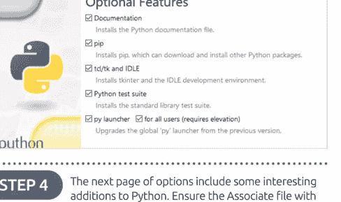

### 第4步

下一页选项包含一些对Python有用的附加功能。确保勾选“将文件与Python关联”、“创建快捷方式”、“将Python添加到环境变量”、“预编译标准库”和“为所有用户安装”选项。这些选项使得后续使用Python变得更加容易。准备好继续后，点击“安装”。

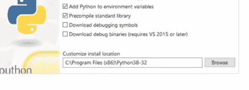

### 第5步

您可能需要通过Windows身份验证通知来确认安装。只需点击“是”，Python就会开始安装。安装完成后，最终的Python向导页面将允许您查看最新的发行说明并遵循一些在线教程。

### 第6步

不过，在关闭安装向导窗口之前，最好点击“禁用路径长度限制”旁边的链接（旁边有一个盾牌图标）。这将允许Python绕过Windows的260个字符路径长度限制，使您能够执行存储在深层文件夹结构中的Python程序。再次点击“是”以验证该过程，然后您可以关闭安装窗口。

### 第7步

Windows 10 用户现在可以在“开始”按钮的“最近添加”部分找到已安装的Python 3.x。点击第一个链接 Python 3.x (32-bit) 将启动Python的命令行版本（稍后会详细介绍）。要打开IDLE，请在Windows“开始”菜单中输入“IDLE”。

### 第8步

点击IDLE (Python 3.x 32-bit)链接将启动Python Shell，您可以在此开始您的Python编程之旅。如果您的版本更新，也无需担心，只要它是Python 3.x，我们的代码就能在您的Python 3界面中运行。

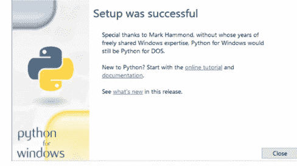

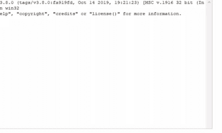

### 第9步

如果您现在再次点击Windows“开始”按钮，并输入：CMD，您将看到命令提示符链接。点击它进入Windows命令行环境。要在命令行中进入Python，您需要输入：`python` 并按回车键。

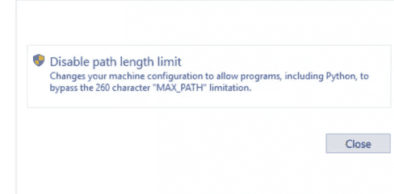

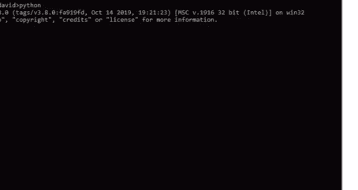

### 第10步

命令行版本的Python与您在步骤8中打开的Shell工作方式非常相似；注意三个向左的箭头（`>>>`）。虽然它是一个完全可用的环境，但用户友好性稍差，所以暂时离开命令行。输入：`exit()` 退出并关闭命令提示符窗口。

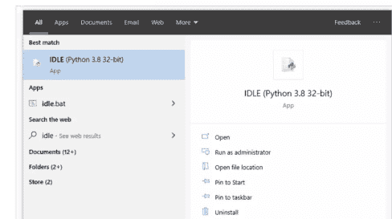

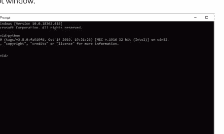

## 如何在Linux上设置Python

虽然树莓派的操作系统包含了最新、稳定的Python版本，但其他Linux发行版默认并未预装Python 3。如果您不打算使用树莓派，那么以下是如何检查并安装适用于Linux的Python。

### PYTHON PENGUIN

Linux是一个如此通用的操作系统，以至于往往难以确定一种固定的做事方法。不同的发行版安装软件的方式也不同，因此本教程我们将专注于Linux Mint发行版。

### 第1步

首先，您需要确认您的Linux系统中当前安装了哪个版本的Python。首先，从发行版的菜单中打开终端会话，或按下Ctrl+Alt+T键。

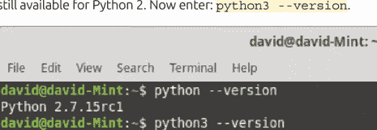

### 第2步

接下来，在终端屏幕中输入：`python --version`。您应该会看到与Python 2.x版本相关的输出。大多数Linux发行版默认同时安装Python 2和3，因为仍然有大量适用于Python 2的代码。现在输入：`python3 --version`。

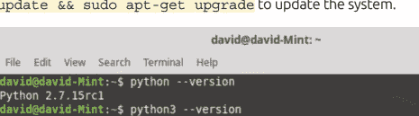

### 第3步

在我们的案例中，Python 2和3都已安装。只要安装了Python 3.x.x，我们教程中的代码就能运行。值得检查一下发行版是否已更新到最新版本，输入：`sudo apt-get update && sudo apt-get upgrade` 以更新系统。

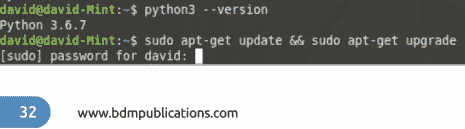

### 第4步

更新和升级完成后，再次输入：`python3 --version` 查看Python 3.x是否已更新，甚至是刚安装完成。只要您有Python 3.x，就运行着最新的主要版本；3.后面的数字表示补丁和进一步的更新。通常它们不是必须的，但可能包含重要的新功能。

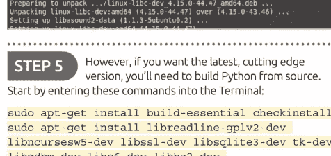

### 第5步

然而，如果您想要最新、最前沿的版本，您需要从源代码构建Python。首先在终端中输入以下命令：

```
sudo apt-get install build-essential checkinstall
sudo apt-get install libreadline-gplv2-dev
libncursesw5-dev libssl-dev libsqlite3-dev tk-dev
libgdbm-dev libc6-dev libbz2-dev
```


### 第6步

打开您的Linux网页浏览器，访问Python下载页面：https://www.python.org/downloads。点击“Downloads”，然后在“Python Source”窗口下方点击按钮。这将打开一个下载对话框，选择保存位置，然后开始下载过程。


### 第7步

在终端中，通过输入 `cd Downloads/` 进入“下载”文件夹。然后用以下命令解压下载的Python源代码：`tar -xvf Python-3.Y.Y.tar.xz`（将 Y 替换为您下载的版本号）。现在使用以下命令进入新解压的文件夹：`cd Python-3.Y.Y/`。

```
Python-3.7.2/Objects/clinic/floatobject.c
Python-3.7.2/Objects/clinic/funcobject.c
Python-3.7.2/Objects/clinic/longobject.c
Python-3.7.2/Objects/clinic/dictobject.c
Python-3.7.2/Objects/clinic/structseq.c
Python-3.7.2/Objects/clinic/structmember.c
Python-3.7.2/Objects/clinic/moduleobject.c
Python-3.7.2/Objects/clinic/odictobject.c
Python-3.7.2/Objects/clinic/bytearrayobject.c
Python-3.7.2/Objects/clinic/bytesobject.c
Python-3.7.2/Objects/clinic/itertypes.txt
Python-3.7.2/Objects/clinic/methodobject.c
Python-3.7.2/Objects/clinic/tupleobject.c
Python-3.7.2/Objects/clinic/enumobject.c
Python-3.7.2/Objects/clinic/object.c
Python-3.7.2/Objects/clinic/abstract.c
Python-3.7.2/Objects/clinic/listobject.c
Python-3.7.2/Objects/clinic/clinic_methods.c
Python-3.7.2/Objects/clinic/dictnotes.txt
Python-3.7.2/Objects/clinic/typeslots.inc
david@david-Mint:~/Downloads$ cd Python-3.7.2/
david@david-Mint:~/Downloads/Python-3.7.2$
```

### 第8步

在Python文件夹内，输入：

`./configure`
`sudo make altinstall`

这可能需要一些时间，具体取决于您计算机的速度。完成后，输入：`python3.7 --version` 检查最新安装的版本。现在您已安装Python 3.7，同时还有旧的Python 3.x.x和Python 2。

```
checking whether compiling against openssl is sane... no
configure: error: openssl not found
config.status: creating ./config.status
config.status: creating Makefile.pre
config.status: creating Misc/python.pc
config.status: creating Misc/python-config.sh
config.status: creating Modules/ld_so_aix
config.status: creating pyconfig.h
creating Modules/Setup
creating Modules/Setup.local
creating Makefile

If you want a release build with all stable optimizations active (PGO, etc.),
please run ./configure --enable-optimizations

david@david-Mint:~/Downloads/Python-3.7.2$ sudo make altinstall
```

### 第9步

要安装图形界面IDLE，您需要在终端中输入以下命令：

`sudo apt-get install idle3`

然后可以使用命令启动IDLE：`idle3`。请注意，IDLE运行的版本与您从源代码安装的版本不同。

```
david@david-Mint:~/Downloads/Python-3.7.2$ sudo apt-get install idle3
Reading package lists... Done
Building dependency tree
Reading state information... Done
The following additional packages will be installed:
  blt idle-python3.6 python3-tk tk8.6-blt2.5
Suggested packages:
  blt-demo tix python3-tk-dbg
The following NEW packages will be installed:
  blt idle-python3.6 idle3 python3-tk tk8.6-blt2.5
0 to upgrade, 6 to newly install, 0 to remove and 3 not to upgrade.
Need to get 938 kB of archives.
After this operation, 4,221 kB of additional disk space will be used.
Do you want to continue? [Y/n]
```

### 第10步

您还需要安装PIP（Pip Installs Packages），这是一个帮助您安装更多模块和扩展工具的工具。

输入：`sudo apt-get install python3-pip`

安装PIP后，使用以下命令检查最新更新：

`pip3 install --upgrade pip`

完成后，关闭终端，在您发行版菜单的“编程”部分将可以使用Python 3.x。

```
david@david-Mint:~/Downloads/Python-3.7.2$ sudo apt-get install python3-pip
Reading package lists... Done
Building dependency tree
Reading state information... Done
The following additional packages will be installed:
  python-pip-whl python3-distutils python3-lib2to3
Suggested packages:
  python3-dev python3-setuptools python3-wheel
The following NEW packages will be installed:
  python-pip-whl python3-distutils python3-lib2to3 python3-pip
0 to upgrade, 4 to newly install, 0 to remove and 3 not to upgrade.
Need to get 1,984 kB of archives.
After this operation, 4,569 kB of additional disk space will be used.
Do you want to continue? [Y/n]
```

## Python在macOS上

在macOS上安装Python的方式与Windows安装类似。只需访问Python网页，将鼠标指针悬停在“Downloads”链接上，然后从选项中选择“Mac OS X”。然后，您将被引导至适用于Mac版本的Python发行版页面，以及适用于OS X 10.9及更高版本的macOS 64位安装程序。

## 初次启动Python

树莓派提供了学习和编程的最佳全方位解决方案之一，尤其是用于Python编程。树莓派的推荐操作系统Raspbian预装了最新的稳定版Python 3，这使其成为一个卓越的编程平台。

## 启动Python

要开始Python编程所需的一切都可在树莓派桌面上找到。不过，如果你想的话，也可以进入终端并使用以下命令更新系统：`sudo apt-get update`。

**步骤 1** 加载Raspbian桌面后，点击菜单按钮，然后选择 编程 > Python 3 (IDLE)。这将打开Python 3 Shell。Windows和Mac用户可以在Windows开始按钮菜单和Finder中找到Python 3 IDLE Shell。

**步骤 2** Shell是你输入代码并查看所编程代码响应和输出的地方。这是一个沙盒环境，你可以在此尝试一些简单的代码和流程。

**步骤 3** 例如，在Shell中输入：`2+2` 按下回车键后，下一行会显示答案：4。基本上，Python执行了这段‘代码’并产生了相应的输出。


**步骤 4** Python Shell的工作方式非常像计算器，因为代码本质上是一系列与系统进行的数学交互。整数，即无穷无尽的整数序列，可以轻松地进行加、减、乘等运算。


**步骤 5** 虽然这很有趣，但并不特别激动人心。试试这个：`print("Hello everyone!")` 只需像之前步骤中那样将其输入IDLE即可。


**步骤 6** 这就更像回事了，因为你刚刚编写了你的第一段代码。Print命令的含义相当不言自明，它用于打印内容。Python 3需要括号和引号才能将内容输出到屏幕，本例中是‘Hello everyone!’这部分。


**步骤 7** 你可能已经注意到了Python IDLE中的颜色编码。这些颜色代表了Python代码的不同元素。它们是：
- 黑色 – 数据和变量
- 绿色 – 字符串
- 紫色 – 函数
- 橙色 – 命令
- 蓝色 – 用户定义函数
- 深红色 – 注释
- 浅红色 – 错误消息

| 颜色   | 用途          | 示例               |
|----------|------------------|------------------------|
| 黑色    | 数据 & 变量 | 23.6 area              |
| 绿色    | 字符串          | "Hello World"          |
| 紫色   | 函数        | len() print()          |
| 橙色   | 命令         | if for else            |
| 蓝色     | 用户定义函数   | get_area()             |
| 深红色 | 注释         | #Remember VAT          |
| 浅红色| 错误消息   | SyntaxError:           |

**步骤 8** Python IDLE是一个可配置的环境。如果你不喜欢颜色的显示方式，总可以通过选项 > 配置IDLE并点击高亮显示选项卡来更改它们。不过，我们不建议这样做，因为你将看到的内容将与我们的截图不同。


**步骤 9** 与大多数程序一样，无论操作系统如何，都有许多可用的快捷键。这里无法列出全部，但在选项 > 配置IDLE下的键位选项卡中，你可以看到当前绑定的列表。


**步骤 10** Python IDLE是一个强大的接口，它实际上是使用可用的GUI工具包之一用Python编写的。如果你想了解Shell的许多细节，我们建议你花点时间查看 www.docs.python.org/3/library/idle.html，其中详细介绍了IDLE的许多功能。


## 你的第一段代码

实际上，你已经在上一个教程中通过‘print(“Hello everyone!”)’函数编写了你的第一段代码。不过，让我们扩展一下，看看如何输入你的代码并尝试一些其他的Python示例。

### 与Python互动

对于大多数语言，无论是计算机语言还是人类语言，关键都在于记住并在合适的场合使用正确的词语。你并非天生就懂这些词语，所以你需要学习它们。

### 步骤 1

如果你关闭了Python 3 IDLE，请在你偏好的操作系统版本中重新打开它。在Shell中，输入熟悉的命令：

```
print("Hello")
```


### 步骤 2

正如预期的那样，单词Hello以蓝色文本显示在Shell中，表示来自字符串的输出。这相当简单，不需要太多解释。现在试试：

```
print("2+2")
```


### 步骤 3

你可以看到，输出的是你要求打印到屏幕的`2+2`，而不是数字4。引号定义了将要输出到IDLE Shell的内容；要打印2+2的总和，你需要去掉引号：

```
print(2+2)
```


### 步骤 4

你可以继续这样做，将`2+2`、`464+2343`等输出到Shell。一个更简单的方法是使用变量，这是我们将稍后更深入探讨的内容。现在，输入：

```
a=2
b=2
```


### 步骤 5

你在这里做的是将两个值2和2赋给字母a和b。这些现在是变量，Python可以随时调用它们进行输出、加、减、除等操作，只要它们的数值保持不变。试试这个：

```
print (a)
print (b)
```


### 步骤 6

上一步的输出分别显示了a和b的当前值，因为你要求它们分别打印。如果你想将它们相加，可以使用以下代码：

```
print (a+b)
```

这段代码只是获取a和b的值，将它们相加并输出结果。


## 步骤 7

你可以尝试不同类型的变量和Print函数。例如，你可以为某人的名字分配变量：

```
name="David"
print (name)
```


## 步骤 8

现在让我们添加一个姓氏：

```
surname="Hayward"
print (surname)
```

你现在有两个变量，分别包含名字和姓氏，你可以独立打印它们。


## 步骤 9

如果我们像之前一样使用+符号，名字在Shell输出中将无法正确显示。试试看：

```
print (name+surname)
```

你需要在两者之间加一个空格，以定义它们为两个独立的值，而不是一个数学上操作的对象。


## 步骤 10

在Python 3中，你可以使用逗号在两个变量之间添加一个空格：

```
print (name, surname)
```

或者，你可以自己添加空格：

```
print (name+" "+surname)
```

如你所见，使用逗号要简洁得多。恭喜你，你刚刚迈出了探索广阔Python世界的第一步。


## 保存和执行你的代码

虽然在IDLE Shell中工作对于小型代码片段来说完全没问题，但它并非为输入较长的程序清单而设计。在本节中，你将被介绍给IDLE编辑器，从现在起你将在这里工作。

### 编辑代码

最终，你会遇到一个时刻，必须从在Shell中输入单行代码转而使用IDLE编辑器。IDLE编辑器将允许你保存和执行你的Python代码。

**步骤 1** 首先，打开Python IDLE Shell，打开后点击文件 -> 新建文件。这将打开一个名为未命名的新窗口。这就是Python IDLE编辑器，你可以在其中输入创建未来程序所需的代码。

**步骤 2** IDLE编辑器本质上是一个具有Python功能、颜色编码等的简单文本编辑器；与Sublime很类似。你像在Shell中一样输入代码，所以以之前的教程为例，输入：

`print("Hello everyone!")`

**步骤 3** 你可以看到IDLE编辑器中使用了与Shell中相同的颜色编码，这使你能够更好地理解代码的运行情况。但是，要执行代码，你需要先保存它。按F5，你会看到一个“保存...”对话框打开。


**步骤 4** 点击“保存”对话框中的确定按钮，选择一个你将保存所有Python代码的目的地。该目的地可以是一个名为Python的专用文件夹，也可以随意存放。但请记住保持驱动器整洁，以备将来之需。


### 第5步

为你的代码输入一个名称，例如“print hello”，然后点击保存按钮。一旦Python代码被保存，它就会被执行，输出结果将显示在IDLE Shell中。在这个例子中，输出的是“Hello everyone!”。


### 第6步

这就是你将要进行的绝大多数Python代码操作。将其输入编辑器，按F5键，保存代码，然后在Shell中查看输出。有时情况会有所不同，这取决于你是否请求了一个单独的窗口，但本质上这就是这个过程。除非另有说明，这将是我们贯穿本书使用的流程。


### 第7步

如果你打开已保存Python代码的文件位置，你会看到它以.py扩展名结尾。这是默认的Python文件名。你创建的任何代码都将是whatever.py，从众多互联网Python资源站点下载的任何代码也将是.py。只需确保代码是为Python 3编写的。


### 第8步

让我们扩展代码，并输入上一个教程中的几个例子：

```
a=2
b=2
name="David"
surname="Hayward"
print (name, surname)
print (a+b)
```

如果你现在按F5，系统会再次要求你保存文件，因为它已经从之前被修改过了。


### 第9步

如果你点击确定按钮，文件将被新的代码条目覆盖并执行，输出结果在Shell中。对于这几行代码来说这不是问题，但如果你要编辑一个更大的文件，覆盖可能会成为一个问题。相反，请在编辑器中使用“文件 > 另存为”来创建一个备份。


### 第10步

现在创建一个新文件。关闭编辑器，并打开一个新实例（从Shell中选择“文件 > 新建文件”）。输入以下内容并将其保存为hello.py：

```
a="Python"
b="is"
c="cool!"
print(a, b, c)
```

你将在下一个教程中使用这段代码。


# 从命令行执行代码

尽管我们在本书中一直使用GUI IDLE，但值得了解一下Python的命令行处理。我们已经知道有一个命令行版本的Python，但它也用于执行代码。

## 命令代码

使用我们在上一个教程中创建的代码，也就是我们命名为hello.py的那个，让我们看看如何在命令行级别运行在GUI中创建的代码。

### 第1步
在Linux中，Python有两种可能的方式通过命令行执行代码。一种方式是使用Python 2，而另一种则使用Python 3库等等。不过首先，进入你操作系统上的命令行或终端。

### 第2步
和之前一样，我们使用的是树莓派；Windows用户需要点击开始按钮并搜索CMD，然后点击返回的命令行搜索结果；macOS用户可以通过点击“前往 > 实用工具 > 终端”来访问他们的命令行。


### 第3步
现在你处于命令行，我们可以启动Python。对于Python 3，你需要输入命令`python3`并按回车键。这将把你带入命令行版本的Shell，带有熟悉的三个向右箭头作为光标（>>>）。


### 第4步
从这里，你可以输入之前看过的代码，例如：

```
a=2
print(a)
```

你可以看到它的工作方式完全相同。


### 第5步
现在输入：`exit()`以离开命令行Python会话并返回到命令提示符。进入你保存上一个教程代码的文件夹，并列出其中可用的文件；你应该能看到`hello.py`文件。


### 第6步
在与你要运行的代码相同的文件夹内，在命令行中输入以下内容：

```
python3 hello.py
```

这将执行我们创建的代码，提醒一下，代码是：

```
a="Python"
b="is"
c="cool!"
print(a, b, c)
```


### 第7步
当然，由于这是Python 3代码，使用了Python 3独有的语法和布局，它只有在使用`python3`命令时才有效。如果你愿意，可以尝试使用Python 2，输入：

```
python hello.py
```


### 第8步
从Python 2命令行运行Python 3代码的结果是相当明显的。虽然它没有以任何方式报错，但由于Python 3处理Print命令的方式与Python 2不同，结果并非我们所预期的。暂时使用Sublime，打开`hello.py`文件。


### 第9步
由于Sublime Text不适用于树莓派，你将暂时离开树莓派，并以Sublime为例，说明你不一定需要使用Python IDLE。打开`hello.py`文件，将其修改为包含以下内容：

```
name=input("What is your name? ")
print("Hello,", name)
```


### 第10步
保存`hello.py`文件并返回到命令行。现在使用以下命令执行新保存的代码：

```
python3 hello.py
```

结果将是原始的`Python is cool!`语句，加上要求你输入姓名的附加输入命令，并在命令窗口中显示出来。


# 数字和表达式

我们已经看到了一些Python的基本数学表达式，比如简单的加法等等。现在让我们扩展一下，看看Python作为计算器有多么强大。你可以在IDLE Shell或编辑器中工作，随你喜欢。

## 全是数学，伙计

你可以利用Python的数学功能得到一些非常令人印象深刻的结果；与大多数（如果不是全部）编程语言一样，数学是代码背后的驱动力。

### 第1步
打开Python 3的GUI版本，如前所述，你可以使用Shell或编辑器。目前，你将使用Shell来热身我们的数学肌肉，我们相信这是位于大脑后部的一个小腺体（或者不是）。


### 第2步
在Shell中输入以下内容：

```
2+2
54356+34553245
99867344*27344484221
```

你可以看到Python可以处理一些相当大的数字。


### 第3步
你可以使用所有常见的数学运算：除法、乘法、括号等等。用几个例子练习一下，例如：

```
1/2
6/2
2+2*3
(1+2) + (3*4)
```


### 第4步
你无疑已经注意到，除法会产生一个十进制数。在Python中，这些被称为浮点数或浮点运算。但是，如果你需要一个整数而不是十进制答案，那么你可以使用双斜杠：

```
1//2
6//2
```

等等。


### 第5步
你还可以使用一个运算来查看除法后剩下的余数。例如：

```
10/3
```

将显示3.33333333，这当然是3.3的循环。如果你现在输入：

```
10%3
```

这将显示1，这是10除以3后剩下的余数。


### 第6步
接下来是幂运算符，或者如果你要技术性一点，就是乘方。要计算某物的幂，你可以使用键盘上的双乘号或双星号：

```
2**3
10**10
```

本质上，它是2x2x2，但我们相信你已经知道数学运算符背后的基础知识。这就是你在Python中计算它的方式。


### 第7步
数字和表达式不止于此。Python有许多内置函数来计算数字集合、绝对值、复数以及大量的数学表达式和毕达哥拉斯绕口令。例如，要将一个数字转换为二进制，请使用：

```
bin(3)
```


### 第8步
这将显示为'0b11'，将整数转换为二进制并在前面添加前缀`0b`。如果你想移除`0b`前缀，那么你可以使用：

```
format(3, 'b')
```

Format命令将一个值（数字3）转换为由格式规范（'b'部分）控制的格式化表示。


### 第9步
布尔表达式是一个逻辑语句，它要么为真，要么为假。我们可以用它们来比较数据并测试它是否等于、小于或大于。在新建文件中尝试这个：

```
a = 6
b = 7
print(1, a == 6)
print(2, a == 7)
print(3, a == 6 and b == 7)
print(4, a == 7 and b == 7)
print(5, not a == 7 and b == 7)
print(6, a == 7 or b == 7)
print(7, a == 7 or b == 6)
print(8, not (a == 7 and b == 6))
print(9, not a == 7 and b == 6)
```


### 第10步
执行第9步的代码，你可以看到一系列True或False语句，这取决于两个定义值6和7的结果。这是你所学内容的延伸，也是编程的重要组成部分。


## 使用注释

编写代码时，程序的流程、每个变量的作用、整体程序如何运行等等信息都只存在于你的脑海中。其他程序员可以逐行阅读代码，但随着时间推移，代码可能会变得难以阅读。

## 注释！

程序员通过给特定代码段添加注释来保持代码的可读性。例如，当使用一个变量时，程序员会注释说明它应该执行什么功能。这是一种良好的实践习惯。

步骤 1 首先创建一个新的 IDLE 编辑器实例（文件 > 新建文件），并创建一个简单的变量和打印命令：

```
a=10
print("The value of A is,", a)
```

保存文件并执行代码。

步骤 2 运行代码后，IDLE Shell 窗口会输出一行：The value of A is, 10，这正是我们预期的结果。现在，添加一些代码中常见的注释类型：

```
# Set the start value of A to 10
a=10
# Print the current value of A
print("The value of A is,", a)
```

步骤 3 重新保存代码并执行它。你可以看到，尽管添加了额外的行，IDLE Shell 中的输出与之前仍然相同。简单来说，井号符号（#）表示程序员可以插入一行文本，向自己或其他人说明代码的功能，而用户不会察觉到。


步骤 4 假设我们创建的变量 A 代表游戏中的生命值。每当玩家死亡时，其值就减少 1。程序员可以插入如下代码段：

```
a=a-1
print("You've just lost a life!")
print("You now have", a, "lives left!")
```


步骤 5 虽然我们知道变量 A 代表生命值，并且玩家刚刚失去了一条生命，但临时查看代码的人或检查代码的人可能并不知道。想象一下，如果代码有两万行，而不仅仅是我们的七行。你就能看出注释是多么方便了。

步骤 6 本质上，带有注释的新代码可能如下所示：

```
# Set the start value of A to 10
a=10
# Print the current value of A
print("The value of A is,", a)
# Player lost a life!
a=a-1
# Inform player, and display current value of A (lives)
print("You've just lost a life!")
print("You now have", a, "lives left!")
```


步骤 7 你可以用不同的方式使用注释。例如，块注释是一大段文本，详细说明代码中正在发生的事情，比如告诉代码阅读者你计划使用哪些变量：

```
# This is the best game ever, and has been
# developed by a crack squad of Python experts
# who haven't slept or washed in weeks. Despite
# being very smelly, the code at least
# works really well.
```


步骤 8 行内注释是跟在一段代码之后的注释。以上面的例子为例，与其将注释单独放在一行，我们可以这样使用：

```
a=10 # Set the start value of A to 10
print("The value of A is,", a) # Print the current value of A
a=a-1 # Player lost a life!
print("You've just lost a life!")
print("You now have", a, "lives left!") # Inform player, and display current value of A (lives)
```

步骤 9 注释符号，即井号，也可用于注释掉你不想在程序中执行的代码段。例如，如果你想移除第一个打印语句，你会使用：

```
# print("The value of A is,", a)
```

步骤 10 你也可以使用三个单引号来注释掉块注释或多行注释。将它们放在你想要注释的区域的前后：

```
'''
This is the best game ever, and has been developed
by a crack squad of Python experts who haven't
slept or washed in weeks. Despite being very
smelly, the code at least works really well.
'''
```


## 使用变量

我们已经在 Python 代码中见过一些变量的例子，但回顾它们的操作方式以及 Python 如何创建变量并为其赋值总是值得的。

## 各种变量

在本教程中，你将使用 Python 3 IDLE Shell。如果还没有，请打开 Python 3 或关闭之前的 IDLE Shell，以清除旧代码。

步骤 1：在一些编程语言中，你需要使用美元符号来表示字符串，字符串是由多个字符组成的变量，例如一个人的名字。在 Python 中这不是必需的。例如，在 Shell 中输入：name="David Hayward"（或使用你自己的名字，除非你也叫 David Hayward）。


步骤 2：你可以通过发出 `type()` 命令来检查正在使用的变量类型，将变量名放在括号中。在我们的例子中，就是：`type(name)`。添加一个新的字符串变量：`title="Descended from Vikings"`。


步骤 3：你之前已经看到，变量可以使用加号在变量名之间连接。在我们的例子中，我们可以使用：`print(name + ": " + title)`。引号中间的部分允许我们添加一个冒号和一个空格，因为变量连接时没有空格，所以我们需要手动添加它们。


步骤 4：你也可以将变量组合到另一个变量中。例如，要将 `name` 和 `title` 两个变量组合成一个新变量，我们使用：`character=name + ": " + title`。然后输出新变量的内容：`print(character)`。数字存储为不同的变量：`age=44`。`type(age)`。如我们所知，它们是整数。


步骤 5：然而，你不能在同一个命令中组合字符串和整数类型的变量，就像你不能组合一组相似的变量那样。你需要将其中一个转换为另一个，反之亦然。当你尝试组合两者时，会得到一条错误消息：

```
print(name + age)
```


步骤 6：这是一个被称为类型转换的过程。Python 代码是：

```
print(character + " is " + str(age) + " years old.")
```

或者你可以使用：

```
print(character, "is", age, "years old.")
```

再次注意，在最后一个例子中，你不需要在引号内的单词之间添加空格，因为逗号将 `print` 的每个参数分开处理。


步骤 7：类型转换的另一个例子是当你从用户那里请求输入时，例如输入姓名。例如，输入：

```
age= input("How old are you? ")
```

所有从 `input` 命令存储的数据都以字符串变量形式存储。


步骤 8：当你想处理用户输入的数字时，这就会出现一点问题，因为 `age + 10` 无法工作，一个是字符串变量，一个是整数。相反，你需要输入：

```
int(age) + 10
```

这会将 `age` 字符串类型转换为可以进行运算的整数。


步骤 9：在处理浮点数算术时，类型转换的使用也很重要；记住：带有小数点的数字。例如，输入：

```
shirt=19.99
```

现在输入 `type(shirt)`，你会看到 Python 将这个数字分配为 'float'，因为该值包含小数点。


步骤 10：当组合整数和浮点数时，Python 通常将整数转换为浮点数，但假如反过来应用，值得记住的是 Python 不会返回精确值。当将浮点数转换为整数时，Python 总是会向下取整到最近的整数，这称为截断；在我们的例子中，19.99 变成了 19。


# 用户输入

我们在前面的一些示例中已经见过一些与代码进行基本用户交互的例子，所以现在很适合专注于如何从用户那里获取信息，然后将其存储和呈现出来。

# 用户友好

你想要从用户那里获取的输入类型将很大程度上取决于你正在编写的程序类型。例如，游戏角色可能会询问角色名字，而数据库可能会询问个人详细信息。

### 步骤 1

如果尚未打开，请打开 Python 3 IDLE Shell，并在编辑器中新建一个文件。让我们从一个非常简单的例子开始，输入：

```
print("Hello")
firstname=input("What is your first name? ")
print("Thanks.")
surname=input("And what is your surname? ")
```


### 步骤 2

保存并执行代码，正如你无疑已经猜到的那样，IDLE Shell 中的程序会询问你的名字，并将其存储为变量 `firstname`，接着是你的姓氏；同样存储在其自身的变量（`surname`）中。


### 步骤 3

现在，我们已经将用户的名字存储在几个变量中，我们可以随时调用它们：

```
print("Welcome", firstname, surname, ". I hope you’re well today.")
```


### 步骤 4

运行代码，你可以看到一个小问题：姓氏后面的句点紧跟在一个空格后面。为了消除这个问题，我们可以在代码中用加号代替逗号：

```
print("Welcome", firstname, surname+". I hope you’re well today.")
```


### 步骤 5

你并不总是需要在 `input` 命令中包含带引号的文本。例如，你可以询问用户的名字，然后在下一行输入：

```
print("Hello. What's your name?")
name=input()
```


### 步骤 6

上一步中的代码通常被认为比在 `input` 命令中放置大量文本要简洁一些，但这并非一成不变的规则，所以在这些情况下你可以随心所欲。扩展一下代码，试试这个：

```
print("Halt! Who goes there?")
name=input()
```


## 步骤 7

这或许是一个文字冒险游戏不错的开端？现在你可以扩展它，并使用用户的原始输入来稍微充实一下游戏：

```
if name=="David":
    print("Welcome, good sir. You may pass.")
else:
    print("I know you not. Prepare for battle!")
```


## 步骤 8

你在这里创建的是一个条件判断，我们很快会介绍它。简而言之，我们正在使用用户的输入并将其与一个条件进行衡量。所以，如果用户输入 `David` 作为名字，守卫就会允许他们畅通无阻地通过。否则，如果他们输入一个不是 `David` 的名字，守卫就会挑战他们进行战斗。


## 步骤 9

正如你之前所学，来自用户的任何输入自动都是字符串，因此你需要应用**类型转换**才能将其转换为其他类型。这为 `input` 命令添加了一些有趣的扩展。例如：

```
# Code to calculate rate and distance
print("Input a rate and a distance")
rate = float(input("Rate: "))
```


## 步骤 10

为了完成速率和距离的代码，我们可以添加：

```
distance = float(input("Distance: "))
print("Time:", (distance / rate))
```

保存并执行代码，然后输入一些数字。使用 `float(input)` 元素，我们告诉 Python 输入的任何内容都是一个浮点数而不是字符串。


# 你好，世界

# # 创建函数

既然你已经掌握了变量和用户输入的用法，下一步就是处理函数。你已经使用过一些函数，比如 `print` 命令，但 Python 允许你定义自己的函数。

# ## 奇特的函数

函数是你输入到 Python 中以执行某项操作的命令。它是一小段自包含的代码，接收数据，对其进行处理，然后返回结果。

# ### 步骤 1

函数处理的不仅仅是数据。它们可以在 Python 中完成各种有用的事情，比如排序数据、将项目从一种格式转换为另一种格式，以及检查项目的长度或类型。基本上，函数是一个简短的单词，后面跟着括号。例如，`len()`、`list()` 或 `type()`。


# ### 步骤 2

函数接收数据（通常是一个变量），根据函数的编程逻辑对其进行处理，并返回最终值。被处理的数据放在括号内，所以如果你想知道单词 `antidisestablishmentarianism` 有多少个字母，你可以输入：`len("antidisestablishmentarianism")`，数字 28 就会返回。


# ### 步骤 3

你可以以类似的方式将变量传递给函数。假设你想知道一个人姓氏中的字母数，你可以使用以下代码（本例中请输入文本编辑器）：

```
name=input ("Enter your surname: ")
count=len(name)
print ("Your surname has", count, "letters in it.")
```

按 F5 并保存代码来执行它。


# ### 步骤 4

Python 内置了数十个函数，多到无法在有限的篇幅中全部介绍。但是，要查看 Python 3 可用的内置函数列表，请导航至 www.docs.python.org/3/library/functions.html。这些是预定义的函数，但由于用户创建了更多函数，它们并不是唯一可用的。


# 创建函数

### 步骤 5

可以通过模块为 Python 添加额外的函数。Python 有大量可用的模块，可以涵盖众多编程任务。它们添加函数，并可根据需要导入。例如，要使用高级数学函数，请输入：

输入后，你就可以使用 Math 模块的所有函数了。

```
import math
```


### 步骤 6

要使用模块中的函数，请输入模块名称，后跟一个句点，然后是函数名称。例如，使用 Math 模块（因为你刚刚将其导入到 Python 中），你可以利用平方根函数。为此，请输入：

你可以看到代码呈现为 `module.function(data)` 的形式。

```
math.sqrt(16)
```


# ## 自定义函数

你可以导入许多由其他 Python 程序员创建的不同函数，你将来无疑会遇到一些优秀的示例；你也可以使用 `def` 命令创建自己的函数。

### 步骤 1

选择 **文件 > 新建文件** 进入编辑器，让我们创建一个名为 `Hello` 的函数，用于向用户问好。输入：

按 F5 保存并运行脚本。你可以在 Shell 中看到 `Hello`，输入 `Hello()`，它就会返回这个新函数。

```
def Hello():
    print("Hello")

Hello()
```


### 步骤 2

现在让我们扩展这个函数以接受一个变量，例如用户名。编辑你的脚本，使其如下：

这将接受变量 `name`，否则它会打印 `Hello David`。在 Shell 中，输入：`name=("Bob")`，然后输入：`Hello(name)`。你的函数现在可以通过它传递变量了。

```
def Hello(name):
    print("Hello", name)

Hello("David")
```


### 步骤 3

要进一步修改，删除 `Hello("David")` 这一行（脚本中的最后一行），然后按 Ctrl+S 保存新脚本。关闭编辑器并创建一个新文件（**文件 > 新建文件**）。输入以下内容：

按 F5 保存并执行代码。

```
from Hello import Hello

Hello("David")
```


### 步骤 4

你刚才做的是从保存的 `Hello.py` 程序中导入 `Hello` 函数，然后用它向 David 问好。这就是模块和函数的工作方式：你导入模块，然后使用函数。试试这个，并为获得额外加分而修改它：

```
def add(a, b):
    result = a + b
    return result
```


## 条件与循环

条件与循环是让程序变得有趣的关键；它们可以简单，也可以相当复杂。如何使用它们在很大程度上取决于程序要实现的功能；它们可以是游戏中剩余生命数，或者仅仅显示一个倒计时。

## 真值条件

一开始保持条件简单，能让学习编程的体验更加愉快。那么，让我们从检查某件事是否为**真**开始，如果不是，则执行其他操作。

### 第1步

让我们创建一个新的Python程序，它会要求用户输入一个单词，然后检查它是否是一个四个字母的单词。从“文件 > 新建文件”开始，并从 `input` 变量开始：

```
word=input("Please enter a four-letter word: ")
```

### 第2步

现在我们可以创建一个新变量，然后使用 `len` 函数并传递 `word` 变量，以获取用户刚刚输入的字母总数：

```
word=input("Please enter a four-letter word: ")
word_length=len(word)
```

### 第3步

现在你可以使用一个 `if` 语句来检查 `word_length` 变量是否等于四，如果符合条件，则打印一条友好的确认信息：

```
word=input("Please enter a four-letter word: ")
word_length=len(word)
if word_length == 4:
    print (word, "is a four-letter word. Well done.")
```

双等号（`==`）表示检查某物是否等于另一物。

### 第4步

`IF` 行末的冒号告诉Python，如果此语句为真，则执行冒号后所有缩进的内容。接下来，将光标移回编辑器开头：

```
word=input("Please enter a four-letter word: ")
word_length=len(word)
if word_length == 4:
    print (word, "is a four-letter word. Well done.")
else:
    print (word, "is not a four-letter word.")
```

### 第5步

按F5并保存代码以执行它。首先在Shell中输入一个四个字母的单词，你应该会收到该单词确实是四个字母的返回消息。现在再次按F5重新运行程序，但这次输入一个五个字母的单词。Shell将显示它不是一个四个字母的单词。

### 第6步

现在扩展代码以包含另一个条件。最终，它可能变得相当复杂。我们为三个字母的单词添加了一个条件：

```
word=input("Please enter a four-letter word: ")
word_length=len(word)
if word_length == 4:
    print (word, "is a four-letter word. Well done.")
elif word_length == 3:
    print (word, "is a three-letter word. Try again.")
else:
    print (word, "is not a four-letter word.")
```

## 循环

循环看起来与条件非常相似，但它们的操作方式有些不同。循环会重复运行同一代码块多次，通常有某个条件的支持。

### 第1步

让我们从一个简单的 `While` 语句开始。像 `IF` 一样，这将检查某事是否为**真**，然后运行缩进的代码：

```
x = 1
while x < 10:
    print (x)
    x = x + 1
```

### 第2步

`if` 和 `while` 之间的区别在于，当 `while` 到达缩进代码的末尾时，它会返回并检查语句是否仍然为真。在我们的示例中，`x` 小于10。每次循环，它都打印当前值 `x`，然后将该值加一。当 `x` 最终等于10时，它就停止。

### 第3步

`For` 循环是另一个例子。`For` 用于遍历一系列数据，通常是存储在方括号内的列表中的变量。例如：

```
words=["Cat", "Dog", "Unicorn"]
for word in words:
    print (word)
```

### 第4步

`For` 循环也可以通过使用 `range` 函数用于倒计时示例：

```
for x in range (1, 10):
    print (x)
```

这里不需要 `x=x+1` 部分，因为 `range` 函数在使用的第一个和最后一个数字之间创建了一个列表。

## Python 模块

我们之前提到过模块（Math模块），但由于模块是充分利用Python的重要部分，值得花更多时间了解它们。在这个实例中，我们使用的是Windows版的Python 3。

## 掌握模块

将模块视为导入到你的Python代码中以增强和扩展其功能的扩展程序。有无数的模块可用，正如我们所见，你甚至可以制作自己的模块。

### 第1步

尽管很好，但Python内置的功能是有限的。然而，模块的使用使我们能够创建更复杂的程序。正如你所知，模块是被导入的Python脚本，例如 `import math`。

### 第2步

一些模块，尤其是在树莓派上，默认就包含在内，Math模块就是一个典型的例子。遗憾的是，其他模块并不总是可用。在非Pi平台上的一个好例子是Pygame模块，它包含许多帮助创建游戏的功能。尝试：`import pygame`。

### 第3步

结果是IDLE Shell中出现一个错误，因为Pygame模块未被识别或未安装在Python中。要安装模块，我们可以使用PIP（Pip Installs Packages）。关闭IDLE Shell，进入命令提示符或终端会话。在提升的管理员命令提示符下，输入：`pip install pygame`。

### 第4步

PIP安装需要提升的权限，因为它在不同位置安装组件。Windows用户可以通过“开始”按钮搜索CMD，右键单击结果，然后单击“以管理员身份运行”。Linux和Mac用户可以使用Sudo命令，如 `sudo pip install package`。

### 第5步

关闭命令提示符或终端，重新启动IDLE Shell。当你现在输入 `import pygame` 时，该模块将毫无问题地导入到代码中。你会发现大多数从互联网下载或复制的代码都包含一个模块，主流或独特的，这些通常是执行中错误的来源，因为它们缺失。

### 第6步

模块包含在你自己的代码中实现特定结果所需的额外代码，正如我们之前试验过的那样。例如：

`import random`

引入了来自随机数生成器模块的代码。然后你可以使用此模块创建类似这样的内容：

```
for i in range(10):
    print(random.randint(1, 25))
```

### 第7步

这段代码在保存并执行后，将显示从1到25的十个随机数字。你可以尝试修改代码以显示更多或更少，以及从更大或更小的范围。例如：

```
import random

for i in range(25):
    print(random.randint(1, 100))
```

### 第8步

可以在你的代码中导入多个模块。要扩展我们的示例，请使用：

```
import random
import math

for i in range(5):
    print(random.randint(1, 25))

print(math.pi)
```

### 第9步

结果是一系列随机数字，后跟使用 `print(math.pi)` 函数从Math模块中提取的Pi值。你也可以使用 `from` 和 `import` 命令从模块中提取某些函数，例如：

```
from random import randint

for i in range(5):
    print(randint(1, 25))
```

### 第10步

这有助于创建更精简的编程方法。你也可以使用 `import module*`，它将导入命名模块中定义的所有内容。然而，这通常被视为浪费资源，但尽管如此它仍然有效。最后，模块可以作为别名导入：

```
import math as m

print(m.pi)
```

当然，添加注释有助于告诉别人正在发生什么。

## Python 错误

不用说，你最终会在代码中遇到错误。Python 会因为某些内容缺失、错误或根本未知而无法继续运行。能够识别这些错误是成为优秀程序员的关键。

## 调试

代码中的错误被称为漏洞，这非常常见。只要有耐心，它们通常很容易修复。重要的是保持探索、实验和测试。最终，你的代码将不再有漏洞。

**步骤 1** 无论编程语言多好，代码都不像文字那样流畅。Python 当然比大多数语言更容易，但它也会产生一些烦人的漏洞。最常见的是用户的拼写错误，虽然在简单的十几行代码中很容易找到，但想象一下要调试成千上万行代码。

**步骤 3** 值得庆幸的是，Python 在显示错误信息方面很有帮助。当你收到一个错误时，IDLE Shell 会以红色文本显示错误本身及其发生的行号。不过，在 IDLE Editor 中处理大量代码时，这有点令人望而生畏；文本编辑器通过包含行号来提供帮助。


**步骤 2** 正如我们提到的，最常见的错误是拼写错误。拼写错误通常出现在命令层面：例如错误地输入 print 命令。然而，当变量很多且名称都很长时，它们也会出现。最好的建议就是通读代码，检查你的拼写。

**步骤 4** 语法错误可能是你作为程序员遇到的第二常见错误。即使拼写正确，实际的命令本身也是错的。在 Python 3 中，当应用了 Python 2 的语法时，这种情况经常发生。其中最烦人的是 print 函数。在 Python 3 中，我们使用 `print("words")`，而 Python 2 使用 `print "words"`。

```
Python 3.4.2 Shell
>>> apples=10
>>> print(apples)
10
>>> print(apples)
Traceback (most recent call last):
  File "<pyshell#1>", line 1, in <module>
    print(apples)
NameError: name 'apples' is not defined
>>>
```

```
Python 3.4.2 Shell
>>> print"Hello world!"
SyntaxError: invalid syntax
>>>
```

**步骤 5** 讨厌的括号也是编程错误的一个麻烦点，特别是当你有这样的情况时：
`print(balanced_check(input()))`
请记住，每个左括号 `(` 都必须有对应数量的右括号 `)`。

```
1 import sys
2
3 def balanced_check(data):
4     stack = []
5     characters = list(data)
6
7     for character in characters:
8         reference = {
9             ': ')',
10            '{': '}',
11            '[': ']',
12        }
13        if character in reference.keys():
14            stack.append(character)
15
16        elif character in reference.values() and len(stack) > 0:
17            char = stack.pop()
18            if reference.get(char) != character:
19                return "No"
20        else:
```

**步骤 8** 一个逐步检查代码的好方法是使用 Python Tutor 的可视化网页，在 www.pythontutor.com/visualize.html#mode=edit 找到它。只需将你的代码粘贴到编辑器中，然后单击“Visualise Execution”按钮，即可逐行运行代码。这有助于清除漏洞和任何误解。


**步骤 6** 有成千上万的在线 Python 资源、代码片段以及论坛上关于如何最好地实现某个功能的冗长讨论。虽然 99% 的代码是好的，但不要总是被诱惑去复制粘贴随机代码到你的编辑器中。往往它并不能运行，最糟糕的是你什么都没学到。

```
你有一个裸的 except 子句，即：
try:
    some_code()
except:
    clean_up()

裸的 except 问题在于它会捕获所有异常，包括那些你确实不想忽略的异常（如 KeyboardInterrupt 和 SystemExit）。如果你的 except 块只捕获你预期的特定异常，并让其他所有异常正常向上冒泡，那将好得多。

关于你的代码，还有一些其他通用注释：

• 在第 200 行，你有这种构造：

for letter in range(len(chosen_word)):
    if player_guess == chosen_word[letter]:
        word_guessed[letter] = player_guess

你循环的是索引变量，但也使用了列表元素。最好这样写：

for idx, letter in enumerate(chosen_word):
    if player_guess == letter:
```

**步骤 9** 计划成就好的代码。虽然有点老派，但在坐下编写代码之前，规划代码的功能是个好习惯。列出将要使用的变量和模块；然后写出任何用户交互或输出的脚本。


**步骤 7** 缩进是 Python 编程中一个令人头疼的部分，许多初学者都会栽跟头。回想一下“条件与循环”一节中的 If 循环，其中冒号表示只要条件为真，其后缩进的所有语句都会被执行？缺少缩进或缩进过多都会导致错误。

```
File Edit Format Run Options Windows Help
word=input("Please enter a four-letter word: ")
word_length=len(word)
if word_length == 4:
    print (word, "is a four-letter word. Well done.")
else:
    print (word, "is not a four-letter word.")
```


**步骤 10** 纯粹出于兴趣，计算术语中的“调试”一词源于格蕾丝·霍珀海军上将。早在 40 年代，她就在处理一台巨型哈佛 Mark II 机电计算机。根据传说，霍珀发现一只蛾子卡在继电器中，导致系统停止工作。移除这只蛾子因而被称为“调试”。


## 综合运用你所学的知识

我们已经到达本节的结尾，让我们花点时间综合运用目前为止所学的一切，并将其应用于编写一段代码。这段代码可以在未来你自己的程序中使用和插入；可以是其中一部分，也可以是整体。

## 圆周率趣味实践

在这个示例中，我们将创建一个程序，根据用户设置的精度计算圆周率的值。它结合了我们所学的许多内容，以及更多。

- **步骤 1**
  首先打开 Python 并在编辑器中创建一个新文件。首先，我们需要找到一个方程，它能准确计算圆周率而不会让计算机的 CPU 闲置几分钟。在这种情况下，推荐使用的计算是 Chudnovsky 算法，你可以在 [en.wikipedia.org/wiki/Chudnovsky_algorithm](https://en.wikipedia.org/wiki/Chudnovsky_algorithm) 上找到更多信息。
- **步骤 2**
  你可以利用 Chudnovsky 算法，基于该计算创建自己的 Python 脚本。首先导入一些重要的模块和函数：
  `from decimal import Decimal, getcontext`
  `import math`
  这使用了 Decimal 模块中的 decimal 和 getcontext 函数，它们都处理大位数的十进制数，当然还有 Math 模块。
- **步骤 3**
  现在，你可以插入圆周率计算算法部分的代码。这是 Chudnovsky 算法的一个版本：
  ```python
  def calc(n):
      t = Decimal(0)
      pi = Decimal(0)
      deno = Decimal(0)
      k = 0
      for k in range(n):
          t = (Decimal(-1)**k)*(math.factorial(Decimal(6)*k))*(13591409 +545140134*k)
          deno = math.factorial(3*k)*(math.factorial(k)**Decimal(3))*(640320**(3*k))
          pi += Decimal(t)/Decimal(deno)
      pi = pi * Decimal(12)/Decimal(640320**Decimal(1.5))
      pi = 1/pi
      return str(pi)
  ```
- **步骤 4**
  上一步定义了构成算法规则，并创建了最终将根据 Chudnovsky 兄弟的算法显示圆周率值的字符串。你毫无疑问已经推测出，实际将圆周率值输出到屏幕上会很方便。为了解决这个问题，你可以添加：
  `print(calc(1))`
- **步骤 5**
  如果你愿意，此时可以保存并执行代码。输出将打印出圆周率到 27 位小数的值：**3.141592653589734207668453591**。虽然这本身已经相当令人印象深刻，但你想要一些用户交互，询问用户圆周率应该计算到多少位。
- **步骤 6**
  你可以在圆周率计算的定义命令之前插入一个输入行。它需要是一个整数，否则它将默认为一个字符串。我们可以将其称为 numberofdigits，并使用 getcontext 函数：
  `numberofdigits = int(input("please enter the number of decimal place to calculate Pi to: "))`
  `getcontext().prec = numberofdigits`


## 整合你目前所学的知识

**步骤7**

你现在可以执行代码了，程序会询问用户要将圆周率计算到多少位小数，结果将在 IDLE Shell 中输出。试试用1000位，但别设得太高，否则你的电脑可能会卡在计算圆周率上。

**步骤8**

编程的一部分工作就是能够修改代码，使其更专业。让我们加入一个计时元素，看看计算机计算圆周率小数位需要多长时间，并以不同颜色显示信息。为此，请打开命令行并导入 Colorama 模块（树莓派用户已安装）：

```
pip install colorama
```

**步骤9**

现在我们需要导入 Colorama 模块（用于以不同颜色输出文本）以及 Fore 函数（用于指定前景、墨水、颜色）和 Time 模块，以启动一个虚拟秒表来查看计算耗时：

```
import time
import colorama
from colorama import Fore
```

**步骤10**

为了完成代码，我们需要初始化 Colorama 模块，并在计算开始和结束时启动时间函数。最终结果显示为彩色墨水，显示整个过程耗时（在终端或命令行中）：

```
from decimal import Decimal, getcontext
import math
import time
import colorama
from colorama import Fore
colorama.init()

numberofdigits = int(input("please enter the number of decimal places to calculate Pi to: "))
getcontext().prec = numberofdigits

start_time = time.time()
def calc(n):
    t = Decimal(0)
    pi = Decimal(0)
    deno = Decimal(0)
    k = 0

    for k in range(n):
        t = (Decimal(-1)**k)*(math.factorial(Decimal(6)*k))*(13591409+545140134*k)
        deno = math.factorial(3*k)*(math.factorial(k)**Decimal(3))*(640320**(3*k))
        pi += Decimal(t)/Decimal(deno)
    pi = pi * Decimal(12)/Decimal(640320**Decimal(1.5))
    pi = 1/pi
    return str(pi)

print(calc(1))
print(Fore.RED + "\nTime taken:", time.time() - start_time)
```

## 聚焦 Python：拼接黑洞图像

2019年，一项涉及科学、工程和太空领域的最大型项目达到高潮，让人类首次得以一窥宇宙中最难以捉摸的天体：黑洞。但这跟 Python 有什么关系呢？

拍摄黑洞图像相当困难。黑洞的本质意味着没有任何东西——甚至包括光本身——能逃脱其巨大的引力场。引用维基百科关于黑洞的条目：

> “黑洞是时空中的一个区域，其引力加速度极强，以至于任何东西——无论是粒子还是像光这样的电磁辐射——都无法逃脱。广义相对论预测，足够致密的质量可以使时空变形，形成黑洞。无法逃逸的区域边界称为事件视界。虽然事件视界对穿越它的物体的命运和状况有巨大影响，但似乎没有可局部探测到的特征。在许多方面，黑洞的行为类似于一个理想的黑体，因为它不反射任何光。此外，弯曲时空中的量子场论预测，事件视界会发出霍金辐射，其频谱与质量与温度成反比的黑体相同。对于恒星质量的黑洞，其温度约为十亿分之一开尔文，这使得观测它基本不可能。”

不久之前，黑洞还只是纸面上的一堆理论和数学，仅由我们时代最聪明的头脑进行推测。然而，与大多数科学事物一样，我们对宇宙的理解和解读它的能力已大大提高，借助于众多观测站、科学家和工程师多年努力的成果，我们终于获得了第一张黑洞图像。

## 事件视界望远镜

对此类天体成像的问题之一在于角分辨率。在天文学中，夜空中天体的大小通过它们占据的天区范围来衡量——单位是弧度。一个弧，或者说角秒，是一种以度为单位描述角度大小的度量（1/3600度），用符号 ° 表示。一个完整的圆分为360°，一个直角为90°。一度可以分为60角分（缩写为60′）。一个角分也可以分为60角秒（缩写为60″）。

例如，观察月亮（大约31角分宽），想象从你所在位置画一条线到月亮一侧，再画一条线到另一侧，这两条线之间的夹角就是角大小或角分辨率。

位于 M87 星系中心的黑洞（即被拍摄的那个）距离地球5500万光年，其角大小为40微角秒，即角秒的百万分之一。因此，要看到它，我们需要一个直径约8公里的望远镜，而这作为单个设备是不可能实现的。

这正是事件视界望远镜项目发挥作用的地方。利用一个由八台射电望远镜组成的网络，科学家们能够在约六个月的时间内对黑洞进行成像。关键在于精确计时，使用原子钟，这些望远镜对包含黑洞的天区进行了成像并收集数据，随着地球的自转，从一个望远镜阵列切换到下一个。

## 大数据与 Python

## 成果

然后，这些数据在所有望远镜阵列之间进行汇总，产生了超过一千个硬盘的数据，最终得到了惊人的 5 拍字节（Petabytes）原始数据。现在的问题是如何将所有这些数据整理成可操作的形式并将其呈现为一张图像。

最终结果，当然是 M87 星系中心黑洞的图像，周围环绕着一圈燃烧的气体。该团队后来承认，分辨率并不理想，但他们也表示，再给几年时间，他们将能够显著提高图像分辨率。

麻省理工学院电气工程与计算机科学博士凯蒂·布曼（Katie Bouman）在创建将所有这些数据拼接在一起并最终形成历史性黑洞图像的 Python 代码方面发挥了关键作用。

这一切都归功于一些巧妙的 Python 代码和一些非常杰出的科学家与工程师。

布曼使用了多个 Python 库来达成这一结果，包括 Numpy、Scipy、Pandas、Jupyter、Matplotlib 和 Astropy，还有一些独特的自定义 Python 代码——可以在 GitHub 上找到：https://github.com/achael/eht-imaging。

```
from os import path, environ

# set as true if you want to use a model image, false will load the specified image
usemodel = True
# path to model image
sampleimage = '../models/lores_M87.txt'

# path to array file for loading uvfits and site locations
array = '../arrays/EHT2017_M87.txt'

# parameters for model image
npix = 128
size = 10*eh.RADPERUAS
source = 'M87'
ra = 17.761483521482148015
dec = 12.391123157756647915
dist = 1.7e9
rf = 23000000000.0
mjd = 57850

ring_radius = 20*eh.RADPERUAS # the radius of the ring
ring_width = 10*eh.RADPERUAS # the width of the ring
brightc = 0.5 # defines how much brighter the brighter location is on the ring
brightfrac = 0.5 # defines the location of the brightest location
fracpol = 0.4 # fractional polarization on model image
corr = 5 * eh.RADPERUAS # the coherence length of the polarization

# parameters for simulated data
add_th_noise = True # if True there are no flags. In ehtim it will use the sigma for each data point
ampcal = False # if False then add random phases to simulate atmosphere
dphasecal = False # if False then add random gain errors
phasecal = False # if False then add random phase error for each scan to set clutter to adhoc phasing
stabilize_scan_amp = True # if True then add a single gain error at each scan
Dterm = True # to apply Jones matrix for including noise in the measurements (including leakage)
Dterm_mean = 0.0 # mean of Dterm
frcal = True # True if you do not include effects of field rotation
```## 数据处理

数据就是一切；它能颠覆政权、改变选举结果、揭示宇宙的奥秘。在接下来的章节中，我们将探讨如何创建列表、元组、字典和多维列表，以及如何运用它们来构建有趣且实用的程序。此外，你还将学习如何使用日期和时间函数、向系统文件写入数据，甚至创建图形用户界面，从而将你的编程技能提升到新水平，并拓展到新的项目构想中。

- 64 列表
- 66 元组
- 68 字典
- 70 拆分与连接字符串
- 72 格式化字符串
- 74 日期和时间
- 76 打开文件
- 78 写入文件
- 80 异常
- 82 Python 图形
- 84 综合运用已学知识
- 86 聚焦 Python：游戏

## 列表

列表是你在 Python 中会遇到的最常见数据结构之一。列表就是项目（或你更喜欢称之为数据）的集合，可以整体访问，也可以单独访问。

### 使用列表

列表在 Python 中极其方便。列表可以包含字符串、整数和变量。你甚至可以在列表中包含函数，以及列表套列表。

**步骤 1** 列表是一个由称为元素的数据值组成的序列。创建列表时，先写列表名，然后是等号，接着是方括号和用逗号分隔的元素；注意字符串需要使用引号：

```python
numbers = [1, 4, 7, 21, 98, 156]
mythical_creatures = ["Unicorn", "Balrog", "Vampire", "Dragon", "Minotaur"]
```

**步骤 2** 定义列表后，你可以通过引用列表名加一个数字来调用每个元素。列表的第一个元素索引为 0，然后是 1、2、3 等。例如：

```python
numbers
```

调用列表的全部内容。

```python
numbers[3]
```

调用列表中从零开始的第三个元素（此处为 21）。

**步骤 3** 你也可以通过使用负数索引来访问列表的最后一个元素，例如 [-1]，倒数第二个元素用 [-2]，以此类推。尝试引用列表中不存在的元素（例如 [10]）将返回错误：

```python
numbers[-1]
mythical_creatures[-4]
```

**步骤 4** 切片类似于索引，但你可以通过冒号分隔元素编号来检索列表中的多个元素。例如：

```python
numbers[1:3]
```

将输出 4 和 7，即编号为 1 和 2 的元素。请注意，返回的值不包括第二个索引位置（如 numbers[1:3] 会返回 4、7 和 21）。

**步骤 5** 你可以更新现有列表中的元素、删除元素，甚至将列表连接在一起。例如，要连接两个列表，可以使用：

```python
everything = numbers + mythical_creatures
```

然后使用以下命令查看合并后的列表：

```python
everything
```

**步骤 6** 可以通过输入以下内容来向列表添加元素：

```python
numbers=numbers+[201]
```

对于字符串：

```python
mythical_creatures=mythical_creatures+["Griffin"]
```

或者使用 append 函数：

```python
mythical_creatures.append("Nessie")
numbers.append(278)
```

**步骤 7** 删除元素可以通过两种方式完成。第一种是按元素编号：

```python
del numbers[7]
```

或者按元素名称：

```python
mythical_creatures.remove("Nessie")
```

**步骤 8** 你可以通过在 Shell 中输入 `dir(list)` 来查看列表可以进行哪些操作。输出的是可用的函数，例如，`insert` 和 `pop` 用于在特定位置添加和删除元素。要在索引位置 4 插入数字 62：

```python
numbers.insert(4, 62)
```

要删除它：

```python
numbers.pop(4)
```

**步骤 9** 你也可以使用 `list` 函数将字符串拆分为其组成部分。例如：

```python
list("David")
```

将名称 "David" 拆分为 'D'、'a'、'v'、'i'、'd'。然后可以将其传递给一个新列表：

```python
name=list("David Hayward")
name
age=[44]
user = name + age
user
```

**步骤 10** 基于此，你可以创建一个程序，将某人的姓名和年龄存储为一个列表：

```python
name=input("What's your name? ")
lname=list(name)
age=int(input("How old are you: "))
lage=[age]
user = lname + lage
```

合并后的姓名和年龄列表称为 `user`，可以通过在 Shell 中输入 `user` 来调用。可以尝试并看看你能用列表做些什么。

## 元组

元组与列表非常相似。然而，列表可以被更新、删除或以某种方式更改，而元组则保持不变。这被称为不可变性，它们非常适合存储固定的数据项。

### 不可变的元组

创建元组的原因根据程序的预期用途而异。通常，元组用于存储某些特殊数据，但它们也用于，例如，在冒险游戏中存储非玩家角色的名称。

元组的创建方式与列表相同，但这里使用圆括号而不是方括号。例如：

```python
months=("January", "February", "March", "April", "May", "June")
```

你可以将分组的元组创建到包含多组数据的列表中。例如，下面是一个名为 NPC（非玩家角色）的元组，包含冒险游戏中角色的名字和战斗评级：

```python
NPC=[("Conan", 100), ("Belit", 80), ("Valeria", 95)]
```

就像列表一样，命名元组中的元素可以根据其在数据范围中的位置进行索引，即：

```python
months[0]
months[5]
```

每个数据元素都可以通过在 Shell 中输入 NPC 来整体访问；或者也可以根据其位置进行索引，例如 `NPC[0]`。你还可以索引 NPC 列表中的各个元组：

```python
NPC[0][1]
```

将显示 100。

但是，任何尝试删除或添加到元组的操作都会在 Shell 中导致错误。

值得注意的是，当引用列表中的多个元组时，索引方式与常规略有不同。你可能期望角色 Valeria 的 95 战斗评级是 `NPC[4][5]`，但事实并非如此。实际上是：

```python
NPC[2][1]
```

现在将元组解包为两个对应的变量：

```python
(name, combat_rating)=NPC
```

你现在可以通过输入 `name` 和 `combat_rating` 来检查值。

当然，这意味着索引遵循以下规律：

- 0, 0
- 1, 1
- 0, 1
- 2, 0
- 1
- 2, 1
- 1, 0

可以想象，当处理大量元组数据时，这会变得有些混乱。

```python
>>> NPC=[('Conan', 100), ('Belit', 80), ('Valeria', 95)]
>>> NPC[0]
('Conan', 100)
>>> NPC[0][0]
'Conan'
>>> NPC[0][1]
100
>>> NPC[1]
('Belit', 80)
>>> NPC[1][0]
'Belit'
>>> NPC[1][1]
80
>>> NPC[2]
('Valeria', 95)
>>> NPC[2][0]
'Valeria'
>>> NPC[2][1]
95
```

记住，与列表一样，你也可以使用负数来索引元组，负数从数据列表的末尾开始倒数计数。对于我们的例子，使用包含多个数据项的元组，你可以这样引用 Valeria 角色：

```python
NPC[2][-1]
```

元组使用了一种称为“解包”的特性，即存储在元组中的数据项被赋值给变量。首先创建一个包含两个项（名称和战斗评级）的元组：

```python
NPC= ("Conan", 100)
```

你可以使用 `max` 和 `min` 函数来查找由数字组成的元组中的最大值和最小值。例如：

```python
numbers=(10.3, 23, 45.2, 109.3, 6.1, 56.7, 99)
```

数字可以是整数和浮点数。要输出最大值和最小值，使用：

```python
print(max(numbers))
print(min(numbers))
```

## 字典

列表极其有用，但 Python 中的字典目前为止是处理数据项更专业的方式。它们一开始可能有点难掌握，但你很快就能将它们应用到自己的代码中。

## 键值对

字典类似于列表，但每个数据项是以**一对**的形式出现的，这被称为**键（Key）**和**值（Value）**。键部分必须是唯一的，可以是数字或字符串，而值可以是任何你想要的数据项。

**步骤 1** 假设你想在 Python 中创建一个电话簿。你需要创建字典名称，并在花括号中输入数据，用冒号分隔键和值（键:值）。例如：

```
phonebook={"Emma": 1234, "Daniel": 3456, "Hannah": 6789}
```

**步骤 3** 与列表和元组类似，你可以通过给出字典名称来检查其内容：本例中为 `phonebook`。这将显示你输入的数据项，其方式与你现在无疑已经熟悉的列表类似。


**步骤 2** 就像大多数列表、元组等一样，字符串需要用引号（单引号或双引号）括起来，而整数可以不用引号。记住，值可以是字符串或整数，你只需要将相关类型用引号括起来：

```
phonebook2={"David": "0987 654 321"}
```

**步骤 4** 使用字典的好处在于，你可以输入键来索引对应的值。使用前面步骤中的电话簿示例，你可以输入：

```
phonebook["Emma"]
phonebook["Hannah"]
```


**步骤 5** 向字典中添加内容也很容易。你可以通过添加新的键值对来包含新的数据项条目，例如：

```
phonebook["David"] = "0987 654 321"
phonebook
```


**步骤 8** 接下来，你需要定义用户输入和变量：一个用于人名，另一个用于其电话号码（为避免冗长的 Python 代码，我们简化处理）：

```
name=input("Enter name: ")
number=int(input("Enter phone number: "))
```


**步骤 6** 你也可以通过发出 `del` 命令后跟条目的键来从字典中删除条目；其对应的值也会被删除，因为它们是成对工作的数据项：

```
del phonebook["David"]
```


**步骤 9** 注意，我们将电话号码保持为整数而不是字符串，尽管值既可以是整数也可以是字符串。现在你需要将用户输入的变量添加到新创建的空白字典中。使用与步骤 5 相同的过程，你可以输入：

```
phonebook[name] = number
```


**步骤 7** 进一步操作，创建一个代码片段来询问用户字典的键和值项怎么样？创建一个新的编辑器实例，首先编码一个新的、空的字典：

```
phonebook={}
```


**步骤 10** 现在，当你保存并执行代码时，Python 会要求输入一个名字和一个号码。然后它将把这些条目插入到 `phonebook` 字典中，你可以通过在 Shell 中输入以下命令进行测试：

```
phonebook
phonebook["David"]
```

如果号码需要包含空格，你需要将其设为字符串，因此请移除 `input` 中的 `int` 部分。


## 分割与连接字符串

在 Python 中处理数据时，尤其是来自用户输入的数据，你无疑会遇到很长的字符串。Python 编程中一个值得学习的有用技能是能够分割这些长字符串以提高可读性。

## 字符串理论

你已经看过了使用 `.insert`、`.remove` 和 `.pop` 等一些列表函数，但也有一些函数可以应用于字符串。

**步骤 1** 字符串函数库中的主要工具是 `.split()`。通过它，你可以根据括号内的参数将一个数据字符串进行分割。例如，这里有一个包含三个项目的字符串，每个项目由空格分隔：

```
text="Daniel Hannah Emma"
```

**步骤 3** 注意 `text.split` 部分有括号、引号，然后是一个空格，后面是闭合引号和括号。这个空格就是分隔符，表示每个列表项条目都由空格分隔。类似地，CSV（逗号分隔值）内容使用逗号分隔，所以你会使用：

```
text="January,February,March,April,May,June"
months=text.split(",")
months
```


**步骤 2** 现在让我们将字符串转换为列表，并相应地分割内容：

```
names=text.split(" ")
```

然后输入新列表的名称 `names`，以查看这三个项目。

**步骤 4** 你之前已经看过如何使用一个名称将字符串分割成单个字母组成的列表：

```
name=list("David")
name
```

返回的值是 'D'、'a'、'v'、'i'、'd'。虽然这在普通情况下可能看起来没什么用，但例如对于创建拼写游戏就可能很方便。


## 分割与连接字符串

**步骤 5**

`.split` 函数的反向操作是连接（join），你将字符串中分开的项目组合在一起，形成一个单词或项目的组合，具体取决于你编写的程序。例如：

```
alphabet="".join(["a","b","c","d","e"])
alphabet
```

这将在 Shell 中显示 'abcde'。


**步骤 8**

与 `.split` 函数一样，分隔符不一定是空格，也可以是逗号、句点、连字符或任何你喜欢的字符：

```
colours=["Red", "Green", "Blue"]
col=", ".join(colours)
col
```


**步骤 6**

因此，你可以将 `.join` 应用于你在步骤 4 中分离出的名字，再次将字母组合成名字：

```
name="".join(name)
name
```

我们将字符串重新连接起来，并保留了名为 `name` 的列表，将其传递给 `.join` 函数。


**步骤 9**

你可以对字符串应用一些有趣的函数，例如 `.capitalize` 和 `.title`。例如：

```
title="conan the cimmerian"
title.capitalize()
title.title()
```


**步骤 7**

使用 `.join` 函数的一个好例子是，当你有一个单词列表想要组合成一个句子时：

```
list=["Conan", "raised", "his", "mighty", "sword",
"and", "struck", "the", "demon"]
text=" ".join(list)
text
```

注意 `.join` 函数前引号之间的空格（在步骤 6 的 `.join` 中没有引号）。


**步骤 10**

你也可以对字符串使用逻辑运算符，使用 `'in'` 和 `'not in'` 函数。这些函数可以让你检查字符串是否包含（或不包含）某个字符序列：

```
message="Have a nice day"
"nice" in message
"bad" not in message
"day" not in message
"night" in message
```


### 字符串格式化

### 字符串格式化

自 Python 3 起，使用 `.format` 函数结合花括号，字符串格式化已成为一个更简洁的过程。这是一种比之前版本更逻辑化、更完善的方法。

Python 中的基本格式化是使用花括号将每个变量引入字符串：

```
name="Conan"
print("The barbarian hero of the Hyborian Age is: {}".format(name))
```


记住用两组括号关闭 `print` 函数，因为你将变量放在一组括号内，将 `print` 函数放在另一组括号内。你可以在单个 `print` 函数中包含多个字符串格式化实例：

```
name="Conan"
place="Cimmeria"
print("{} hailed from the North, in a cold land known as {}".format(name, place))
```


当然，你也可以在其中加入整数：

```
number=10000
print("{} of {} was a skilled mercenary, and thief too. He once stole {} gold from a merchant.".format(name, place, number))
```


应用字符串格式化的方式有很多，有些相当简单，正如我们在此展示的；有些则可能明显更复杂。这都取决于你对程序有什么要求。一个关于字符串格式化经常需要参考的好地方是 Python 文档网页，可在 www.python.org/3.1/library/string.html 找到。在这里，你会找到大量的帮助。


### 第5步
有趣的是，你可以使用字符串格式化函数来引用列表。你需要在列表名称前放置一个星号：

```
numbers=1, 3, 45, 567546, 3425346345
print("Some numbers: {}, {}, {}, {}, {}".format(*numbers))
```


### 第6步
列表中的索引同样适用于使用字符串格式化调用列表。你可以根据每个项目的位置（从0到其存在的总数）对其进行索引：

```
numbers=1, 4, 7, 9
print("More numbers: {3}, {0}, {2}, {1}.".format(*numbers))
```


### 第7步
正如你可能猜测的那样，你可以在单个列表中混合字符串和整数，以便在 `.format` 函数中调用：

```
characters=["Conan", "Belit", "Valeria", 19, 27, 20]
print("{0} is {3} years old. Whereas {1} is {4} years old.".format(*characters))
```


### 第8步
你也可以用同样的方式打印出用户输入的内容：

```
name=input("What's your name? ")
print("Hello {}.".format(name))
```


### 第9步
你可以扩展这个简单的代码示例，以显示用户输入姓名的首字母：

```
name=input("What's your name? ")
print("Hello {}.".format(name))
lname=list(name)
print("The first letter of your name is a {0}".format(*lname))
```


### 第10步
你也可以调用一对列表，并在同一个 print 函数中分别引用它们。回顾第7步的代码，你可以这样修改：

```
names=["Conan", "Belit", "Valeria"]
ages=[25, 21, 22]
print("{0[0]} is {1[0]} years old. Whereas {0[1]} is {1[1]} years old.".format(names, ages))
```


# 日期与时间
处理数据时，能够访问时间信息通常非常方便。例如，你可能想为某个条目添加时间戳，或者查看用户登录系统的时间及登录时长。幸运的是，由于 Time 模块的存在，获取日期和时间非常简单。

## 时间领主
Time 模块包含一些函数，可以帮助你获取当前系统时间、从字符串中读取日期、格式化时间和日期等等。

首先，你需要导入 Time 模块。它是 Python 3 的内置模块之一，因此你不需要进入命令行提示符使用 `pip install` 进行安装。一旦导入，你就可以使用一个简单的命令来调用当前时间和日期：

```
import time
time.asctime()
```


时间函数被划分为九个元组，这些元组被划分为索引项，就像任何其他元组一样，如下截图所示。

| 索引 | 字段 | 值 |
|-------|-------|--------|
| 0 | 四位年份 | 2016 |
| 1 | 月份 | 1 到 12 |
| 2 | 日期 | 1 到 31 |
| 3 | 小时 | 0 到 23 |
| 4 | 分钟 | 0 到 59 |
| 5 | 秒 | 0 到 61 (60 或 61 是闰秒) |
| 6 | 星期几 | 0 到 6 (0 是星期一) |
| 7 | 一年中的天数 | 1 到 366 (儒略日) |
| 8 | 夏令时 | -1, 0, 1, -1 表示由库决定夏令时 |

你可以通过输入以下命令来查看时间呈现的结构：

```
time.localtime()
```

输出显示如下：'time.struct_time(tm_year=2017, tm_mon=9, tm_mday=7, tm_hour=9, tm_min=6, tm_sec=13, tm_wday=3, tm_yday=250, tm_isdst=0)'，这显然取决于你当前的时间，而不是本书编写的时间。


Time 模块内置了大量函数。其中最常用的是 `.strftime()`。借助它，你能够将时间元组转换为字符串，并呈现各种各样的参数。例如，要显示当前是星期几，你可以使用：

```
time.strftime('%A')
```


### 第5步
这自然意味着你可以将各种函数融入到你自己的代码中，例如：

```
time.strftime("%a")
time.strftime("%B")
time.strftime("%b")
time.strftime("%H")
time.strftime("%H%M")
```


### 第8步
你在上一节的末尾看到了，用于计算圆周率到用户想要的任意小数位数的代码中，你可以为 Python 中的特定事件计时。获取上面的代码并稍作修改，加入：

```
start_time=time.time()
```

然后：

```
endtime=time.time()-start_time
```


### 第6步
注意最后两个条目，带有 `%H` 和 `%H%M`，如你所见，这些是小时和分钟，正如最后一个条目所示，将它们输入为 `%H%M` 不会在 Shell 中正确显示时间。你可以通过以下方式轻松修正：

```
time.strftime("%H:%M")
```


### 第9步
输出将类似于下面的截图。计时器函数需要放置在输入语句的两侧，因为那时变量名正在被创建，这取决于用户登录花费的时间有多长。然后，时间长度会显示在代码的最后一行，作为 `endtime` 变量。


### 第7步
这意味着你将能够显示当前时间或某事件发生的时间，例如用户输入他们的名字。在编辑器中尝试这段代码：

```
import time
name=input("Enter login name: ")
print("Welcome", name, "\n")
print("User:", name, "logged in at", time.strftime("%H:%M"))
```

尝试进一步扩展它，以包括日期、月份、年份等等。


### 第10步
Time 模块可以完成很多事情；其中一些相当复杂，例如显示自 1970 年 1 月 1 日以来的秒数。如果你想更深入地了解 Time 模块，那么在 Shell 中输入：`help(time)` 以显示当前 Python 版本的 Time 模块帮助文件。


# 打开文件
在 Python 中，你可以在程序中读取文本文件和二进制文件。你也可以写入文件，这是我们接下来将要探讨的内容。读写文件使你能够从程序中输出数据并存储数据。

## 打开、读取和写入
在 Python 中，你创建一个文件对象，类似于创建一个变量，只需使用 `open()` 函数传入文件即可。文件通常分为文本文件或二进制文件。

### 步骤 1
首先，在你的系统文本编辑器中输入一些文本。最好使用文本编辑器，而不是文字处理程序，因为文字处理程序包含背景格式和其他元素。在我们的示例中，我们有罗伯特·E·霍华德的诗《辛梅里亚人》。你需要将文件保存为 `poem.txt`。


### 步骤 3
如果你现在在 Shell 中输入 `poem`，你将获得关于你刚刚要求打开的文本文件的一些信息。你现在可以使用 `poem` 变量来读取文件的内容：

```
poem.read()
```

请注意，文本中的 `\n` 条目代表一个换行符，就像你之前使用的那样。


### 步骤 2
你使用 `open()` 函数将文件作为对象传递给一个变量。你可以将文件对象命名为任何你喜欢的名字，但你需要告诉 Python 你正在打开的文本文件的名称和位置：

```
poem=open("/home/pi/Documents/Poem.txt")
```


### 步骤 4
如果你第二次输入 `poem.read()`，你会注意到文本已从文件中删除。你需要再次输入：`poem=open("/home/pi/Documents/Poem.txt")` 来重新创建文件对象。然而，这次请输入：

```
print(poem.read())
```

这次，`\n` 条目被移除，取而代之的是换行符和可读的文本。


### 步骤 5
与列表、元组、字典等一样，你可以对文本中的单个字符进行索引。例如：

```
poem.read(5)
```
会显示前五个字符，而再次输入：
```
poem.read(5)
```
则会显示接下来的五个字符。输入(1)会一次显示一个字符。


### 步骤 6
类似地，你可以使用 readline() 函数一次显示一行文本。例如：
```
poem=open("/home/pi/Documents/Poem.txt")
poem.readline()
```
会显示文本的第一行，然后再次输入：
```
poem.readline()
```
会显示下一行文本。


## 步骤 8
进一步扩展，你可以使用 readline() 获取文本的所有行，并将它们存储为多个列表。这些列表可以存储为一个变量：
```
poem=open("/home/pi/Documents/Poem.txt")
lines=poem.readlines()
lines[0]
lines[1]
lines[2]
```


## 步骤 7
你可能已经猜到，你可以将 readline() 函数的输出传入一个变量，从而允许你在需要时再次调用它：
```
poem=open("/home/pi/Documents/Poem.txt")
line=poem.readline()
line
```

## 步骤 9
你也可以使用 for 语句来逐行读取文本：
```
for lines in lines:
    print(lines)
```
由于这是 Python，还有其他方式可以产生相同的输出：
```
poem=open("/home/pi/Documents/Poem.txt")
for lines in poem:
    print(lines)
```


## 步骤 10
假设你想像老式点阵打印机那样，一次打印一个字符。你可以结合 Time 模块和我们这里所学的知识来实现。试试这个：
```
import time
poem=open("/home/pi/Documents/Poem.txt")
lines=poem.read()
for lines in lines:
    print(lines, end="")
    time.sleep(.15)
```

# 写入文件
在 Python 中读取外部文件的能力当然很方便，但写入文件则更进一步。使用 write() 函数，你可以将程序的结果输出到一个文件，之后可以用 read() 将其读回 Python。

# 写入与关闭
write() 函数比 read() 稍微复杂一些。除了文件名，你必须包含一个访问模式，该模式决定了文件是读模式还是写模式。

**步骤 1** 首先打开 IDLE 并输入以下内容：
`t=open("/home/pi/Documents/text.txt", "w")`
将目标路径 /home/pi/Documents 替换为你自己系统的路径。此代码将以写模式使用变量 't' 创建一个名为 text.txt 的文本文件。如果该位置没有同名文件，它会创建一个。如果已存在同名文件，它会覆盖该文件，所以请小心。

**步骤 3** 然而，实际的文本文件仍然是空白的（你可以打开它检查一下）。这是因为你将文本行写入了文件对象，但尚未将其提交到文件本身。write() 函数的一部分功能是需要将更改提交到文件；你可以通过输入以下命令来完成：
`t.close()`


**步骤 2** 现在你可以使用 write() 函数向文本文件写入内容。这与 read() 相反，是写入行而不是读取行。试试这个：
`t.write("You awake in a small, square room. A single table stands to one side, there is a locked door in front of you.")`
注意 109。这是你输入的字符数。

**步骤 4** 如果你现在用文本编辑器打开文本文件，你会看到你创建的行已被写入文件。这为我们提供了一些有趣可能性的基础：也许可以创建你自己的日志文件，甚至是一个冒险游戏的开始。


### 步骤 5
要扩展此代码，你可以使用 'a'（访问或追加模式）重新打开文件。这将在原始行的末尾添加任何文本，而不是擦除文件并创建一个新文件。例如：
```
t=open("/home/pi/Documents/text.txt","a")
t.write("\n")
t.write(" You stand and survey your surroundings. On top of the table is some meat, and a cup of water.\n")
```


### 步骤 6
你可以逐行扩展文本，每行以换行符（\n）结束。完成后，用 t.close() 结束代码，并在文本编辑器中打开文件查看结果：
```
t.write("The door is made of solid oak with iron strips. It's bolted from the outside, locking you in. You are a prisoner!.\n")
t.close()
```


## 步骤 7
使用 open() 函数时，需要考虑多种文件访问类型。每种类型取决于文件的访问方式，甚至光标的位置。例如，r+ 以读写模式打开文件，并将光标放在文件的开头。


## 步骤 8
你可以将你在 Python 中创建的变量传递给文件。也许你想将 Pi 的值写入文件。你可以从 Math 模块调用 Pi，创建一个新文件，然后将 Pi 的输出传递到新文件中：
```
import math
print("Value of Pi is: ",math.pi)
print("\nWriting to a file now...")
```


## 步骤 9
现在让我们创建一个名为 pi 的变量，并将 Pi 的值赋给它：
pi=math.pi
你还需要创建一个新文件来写入 Pi：
t=open("/home/pi/Documents/pi.txt","w")
记住将你的文件位置更改为你自己特定的系统设置。


## 步骤 10
最后，你可以使用字符串格式化来调用变量并将其写入文件，然后提交更改并关闭文件：
t.write("Value of Pi is: {}".format(pi))
t.close()
从结果中你可以看到，你可以将任何变量传递给文件。


# 异常
在编码过程中，你自然会遇到一些超出你控制范围的问题。假设你要求用户将两个数字相除，而他们试图除以零。这将产生一个错误并破坏你的代码。

# 异常对象
Python 包含异常对象，用于处理代码中意外的错误，而不是停止代码的执行。你可以通过创建可能发生异常的条件来应对错误。

### 步骤 1
你可以简单地尝试将一个数字除以零来创建一个异常错误。这将报告 ZeroDivisionError: Division by zero 消息，如截图所示。ZeroDivisionError 部分是异常类，其中有许多这样的类。


### 步骤 2
大多数异常是在 Python 遇到代码中本质上错误的内容时自动引发的。然而，你可以创建自己的异常，这些异常旨在包含潜在的错误并对其作出反应，而不是让代码失败。


### 步骤 3
你可以使用函数 raise exception 在 Python 中创建我们自己的错误处理代码。假设你的代码让你在宇宙中跃迁，然而跃迁过多会导致曲速核心破裂。为了防止游戏因曲速核心发生超新星而退出，你可以创建一个自定义异常：
```
raise Exception("warp core breach")
```


### 步骤 4
为了捕获代码中的任何错误，你可以将潜在的错误包含在 try: 块中。此块由 try、except、else 组成，其中代码包含在 try: 中；然后如果发生异常则执行某些操作，否则执行其他操作。


### 步骤 5
例如，使用除以零的错误。你可以创建一个异常，让代码能够处理错误，而不是因为问题导致 Python 退出：
```
python
try:
    a=int(input("Enter the first number: "))
    b=int(input("Enter the second number: "))
    print(a/b)
except ZeroDivisionError:
    print("You have tried to divide by zero!")
else:
    print("You didn't divide by zero. Well done!")
```


### 步骤 6
你可以使用异常来处理各种有用的任务。使用我们之前教程中的一个例子，假设你想打开一个文件并向其写入内容：
```
python
try:
    txt = open("/home/pi/Documents/textfile.txt", "r")
    txt.write("This is a test. Normal service will shortly resume!")
except IOError:
    print ("Error: unable to write the file. Check permissions")
else:
    print ("Content written to file successfully. Have a nice day.")
    txt.close()
```


## 步骤 7
显然这不会起作用，因为文件 textfile.txt 是以只读方式打开的（即 "r" 部分）。所以在这种情况下，与其让 Python 告诉你做错了什么，不如你使用 IOError 类创建一个异常，告知用户权限不正确。


## 步骤 8
当然，你可以通过将 "r" 只读实例更改为 "w" 写入来快速修复问题。正如你已经知道的，这将创建文件、写入内容，然后将更改提交到文件。最终结果将报告一组不同的情形，在这种情况下，是代码的成功执行。


## 步骤 9
你也可以使用 finally: 块，它的作用方式类似，但不能与 else 一起使用。使用我们在步骤 6 中的例子：
```
python
try:
    txt = open("/home/pi/Documents/textfile.txt", "r")
    try:
        txt.write("This is a test. Normal service will shortly resume!")
    finally:
        print ("Content written to file successfully. Have a nice day.")
        txt.close()
except IOError:
    print ("Error: unable to write the file. Check permissions")
```


## 步骤 10
如前所述，由于使用了 "r" 只读权限，将会发生错误。如果你将其更改为 "w"，那么代码将执行而不会在 IDLE Shell 中显示错误。不用说，第一次正确编写异常代码可能很棘手。但只要你练习，就会掌握它。


# Python 图形编程

虽然在屏幕上处理文本——无论是游戏还是程序——都很棒，但有时加入一些图形化表示会更锦上添花。Python 3 提供了多种包含图形的方式，而且它们的功能出奇地强大。

## 走向图形化

你可以绘制简单的图形，如线条、正方形等，或者使用众多可用的 Python 模块之一，来呈现一些惊人的效果。

**第一步** 开始学习 Python 图形编程的最佳模块之一是 Turtle。顾名思义，Turtle 模块基于许多学校使用的海龟机器人，这些机器人可以被编程在地板上的大张纸上绘制东西。可以通过以下方式导入 Turtle 模块：`import turtle`。

**第二步** 让我们从绘制一个简单的圆开始。新建一个文件，然后输入以下代码：
```python
import turtle

turtle.circle(50)
turtle.getscreen()._root.mainloop()
```
像往常一样，按 F5 保存并执行代码。现在将打开一个新窗口，“海龟”会画出一个圆。

**第三步** 命令 `turtle.circle(50)` 用于在屏幕上绘制圆形，其中 50 是大小。你可以随意调整大小，比如 100、150 甚至更大；你也可以通过输入 `turtle.circle(50, 180)` 来绘制一段弧线，其中大小是 50，但你告诉 Python 只绘制圆的 180°。

**第四步** 圆形代码的最后一部分告诉 Python 保持绘图窗口打开，以便用户可以点击关闭它。现在，让我们来画一个正方形：
```python
import turtle

print("Drawing a square...")

for t in range(4):
    turtle.forward(100)
    turtle.left(90)
turtle.getscreen()._root.mainloop()
```
你可以看到我们插入了一个循环来绘制正方形的边。

**第五步** 你可以在正方形代码中添加一行来添加一些颜色：
```python
turtle.color("Red")
```
然后，你甚至可以通过输入以下代码将角色更改为真正的海龟：
```python
turtle.shape("turtle")
```
你还可以使用命令 `turtle.begin_fill()` 和 `turtle.end_fill()` 来用选定的颜色填充正方形；本例中是红色轮廓，黄色填充。

**第六步** 你可以看到 Turtle 模块可以绘制出相当不错的形状，并且随着你开始掌握其工作方式，它会变得稍微复杂一些。输入这个例子：
```python
from turtle import *
color('red', 'yellow')
begin_fill()
while True:
    forward(200)
    left(170)
    if abs(pos()) < 1:
        break
end_fill()
done()
```
这是一种不同的方法，但非常有效。

**第七步** 另一种显示图形的方式是使用 Pygame 模块。Pygame 有多种方式可以帮助你将图形输出到屏幕，但现在让我们看看如何显示一个预定义的图像。首先打开浏览器，找到一张图片，然后将其保存到你保存 Python 代码的文件夹中。

**第八步** 现在让我们通过导入 Pygame 模块来获取代码：
```python
import pygame
pygame.init()

img = pygame.image.load("RPi.png")

white = (255, 255, 255)
w = 900
h = 450
screen = pygame.display.set_mode((w, h))
screen.fill((white))

screen.fill((white))
screen.blit(img, (0,0))
pygame.display.flip()

while True:
    for event in pygame.event.get():
        if event.type == pygame.QUIT:
            pygame.quit()
```

**第九步** 在上一步中，你导入了 pygame，初始化了 pygame 引擎，并要求它导入我们保存的树莓派标志图像（保存为 RPi.png）。接下来，你定义了显示图像的窗口背景颜色，并根据实际图像尺寸设置了窗口大小。最后，你有一个循环来关闭窗口。

**第十步** 按 F5 保存并执行代码，你的图像将显示在一个新窗口中。尝试调整颜色、大小等，并花时间查阅 Pygame 模块中的众多函数。

# 综合运用你目前所学

基于你在本节中所学的内容，让我们将它们结合起来，编写一段可以轻松应用于现实世界的代码；或者至少，是一些你可以融入自己程序中的东西。

## 登录系统

在这个例子中，让我们看一段创建用户登录，然后允许他们登录系统并记录登录时间的代码。你甚至可以包含一个通过按 'q' 退出程序的选项。

**第一步** 首先导入 Time 模块，创建一个新字典来处理用户名和密码，并创建一个变量来评估程序的当前状态：
```python
import time
users = {}
status = ""
```

**第二步** 接下来你需要定义一些函数。你可以从创建主菜单开始，所有用户在选择可用选项后都会返回到这里：
```python
def mainMenu():
    global status
    status = input("Do you have a login account? y/n? Or press q to quit.")
    if status == "y":
        oldUser()
    elif status == "n":
        newUser()
    elif status == "q":
        quit()
```

**第三步** `global status` 语句将局部变量与可以在整个代码中调用的变量区分开来，这样你就可以使用 q=quit 元素，而不会在函数内部被更改。我们还引用了一些新定义的函数：oldUser 和 newUser，我们接下来会讲到。

**第四步** 接下来是 newUser 函数：
```python
def newUser():
    createLogin = input("Create a login name: ")
    if createLogin in users:
        print ("\nLogin name already exists!\n")
    else:
        createPassw = input("Create password: ")
        users[createLogin] = createPassw
        print("\nUser created!\n")
        logins=open("/home/pi/Documents/logins.txt", "a")
        logins.write("\n" + createLogin + " " + createPassw)
        logins.close()
```
这会创建一个新用户和密码，并将条目写入名为 logins.txt 的文件中。

**第五步** 你需要为 logins.txt 文件指定自己的位置，因为我们使用的是树莓派。本质上，这会将用户输入的用户名和密码添加到现有的 users{} 字典中，因此键值结构保持不变：每个用户是键，密码是值。

**第六步** 现在创建 oldUser 函数：
```python
def oldUser():
    login = input("Enter login name: ")
    passw = input("Enter password: ")
    
    # check if user exists and login matches
    # password
    if login in users and users[login] == passw:
        print ("\nLogin successful!\n")
        print ("User:", login, "accessed the system on:", time.asctime())
        
    else:
        print ("\nUser doesn't exist or wrong password!\n")
```

**第七步** 这里发生了很多事情。有 login 和 passw 变量，然后它们与 users 字典进行匹配。如果匹配成功，那么你就成功登录了，并且会输出登录的时间和日期。如果不匹配，那么你会打印一条错误信息，然后过程重新开始。

**第八步** 最后，你需要持续检查是否按下了 'q' 键来退出程序。我们可以通过以下方式实现：
```python
while status != "q":
    status = displayMenu()
```

**第九步** 虽然看似只有两行，但 while 循环是保持程序运行的关键。在每个函数结束时，它都会根据 status 的当前值进行检查。如果该全局值不是 'q'，则程序继续。如果它等于 'q'，则程序可以退出。

**第十步** 你现在可以创建用户，然后用他们的名字和密码登录，logins.txt 文件会被创建来存储登录数据，成功的登录会被加上时间戳。现在轮到你进一步改进代码了。也许你可以从之前的会话中导入已创建的用户列表，并在成功登录时显示一个图形？

# Python聚焦：游戏开发

尽管Python并不总被认为是开发游戏的理想编程语言，但近年来它已取得长足进步，如今已成为众多游戏作品的重要贡献元素之一。

电子游戏产业每年创造约1400亿美元的收入，且这个数字正在快速增长。这早已不是Commodore 64和ZX Spectrum的8位机时代；不再是那些曾经吞噬我们零用钱的街机游戏，也不是雅达利精心开发的木制家用主机。如今，这一切都与程序员团队、图形艺术家、音乐家、公关、项目和开发平台息息相关。

## 游戏代码

使用原始代码从头开始编写游戏已成过去式。如今大多数游戏都是使用一系列开发工具创建的。这些工具可以是现成的引擎，如虚幻引擎；也有些是围绕原创产品定制构建的，比如贝塞斯达用于《上古卷轴》和《辐射》系列游戏的世界生成引擎。其他例子可能完全从头编码，但这通常少之又少。那么Python在其中扮演什么角色呢？

Python的限制因素在于性能。虽然大多数游戏要求其运行平台具有极高的性能，Python的代码虽然优秀，但并非真正为应对《战地》或《使命召唤》系列这类游戏所基于的快节奏模式而设计。这些游戏通常使用C++或其他形式的底层编程语言编写。但这并不意味着Python在游戏开发中被冷落，事实上恰恰相反。


## 构建工具

在游戏产业中，Python主要用于开发供游戏开发者使用的游戏内工具，或帮助衔接不同代码领域之间的空白。例如，用Python编写的游戏内工具可供设计师用于创建游戏关卡、构成角色库存的特定元素，甚至创建玩家与游戏非玩家角色之间的对话。

你还会发现Python可用于控制游戏的AI（人工智能），赋予游戏中角色一定的生命感。以广受欢迎的《模拟人生》游戏为例，游戏中除了玩家控制的角色外，还有其他角色。这些模拟市民会根据玩家的选择来决定其行为方式，这涉及一种高级形式的人工智能，正是用Python编码的。

其他例子包括许多开放世界游戏，在这些游戏中，玩家的介入会改变村庄、城镇甚至城市居民的行为模式。在中世纪村庄的集市摊位上跳来跳去，周围的人们会做出反应。这同样归功于写在游戏主代码中、与游戏开发引擎并行的Python代码。

```
MONITOR FOR 6802 1.4    9-14-80  TSC ASSEMBLER  PAGE  2

C000          ORG    ROM+$0000 BEGIN MONITOR
C000 8E 00 70 START  LDS    #STACK

***************************
* FUNCTION: INITA - Initialize ACIA
* INPUT: none
* OUTPUT: none
* CALLS: none
* DESTROYS: acc A

0013          RESETA EQU    %00010011
0011          CTLREG EQU    %00010001

C003 86 13    INITA  LDA A  #RESETA  RESET ACIA
C005 B7 80 04        STA A  ACIA
C008 86 11           LDA A  #CTLREG  SET 8 BITS AND 2 STOP
C00A B7 80 04        STA A  ACIA

C00D 7E C0 F1        JMP    SIGNON   GO TO START OF MONITOR

***************************
* FUNCTION: INCH - Input character
* INPUT: none
* OUTPUT: char in acc A
* DESTROYS: acc A
* CALLS: none
* DESCRIPTION: Gets 1 character from terminal
```

## Python驱动的游戏

以下是一些Python被应用的良好游戏类型示例：

- **《战地2》** – Python用于游戏的扩展内容和玩家元素功能。
- **《模拟人生》** – AI以及游戏的许多交互。
- **《文明》** – Python贯穿整个《文明》系列游戏，控制移动和非玩家AI。
- **《星战前夜》** – 利用Python进行浮点数计算和其他任务。
- **《坦克世界》** – Python用于控制AI对象和处理大量图形数据。

尤其值得注意的是，Python在游戏中的应用源于其能够快速自动化重复性任务。虽然另一种编程语言在绘制屏幕图形方面可能更快，但Python可以快速批量重复调整数百个纹理的大小。此外，Python拥有出色且庞大的库，可以针对特定任务进行调整，特别是游戏内任务，从而释放其他组件以提供现代游戏所需的性能。


## 持续游戏开发

简而言之，虽然Python可能不是完全创建现代游戏的理想语言，但它的应用常常隐藏在幕后，处于其他编程语言会感到吃力的领域。Python可以作为粘合剂，将游戏技术的不同元素粘合在一起，创建复杂的AI或简单地设计一个对话框。


# 使用模块

Python模块是Python创建的源文件，包含类、函数和全局变量所需的代码。你可以绑定和引用模块以扩展功能，甚至创建更壮观的Python程序。

你是否好奇如何改进这些模块的使用，为你的代码增添一点额外的东西？那么请继续阅读，了解如何利用它们打造包含图形、动画和操作系统特定命令的奇妙代码。

- 90 日历模块
- 92 OS模块
- 94 使用数学模块
- 96 随机模块
- 98 Tkinter模块
- 100 Pygame模块
- 104 基础动画
- 106 创建你自己的模块
- 108 Python聚焦：人工智能

## 日历模块

除了时间模块，日历模块在代码中执行时可以产生一些有趣的结果。它的功能远不止像时间模块那样简单地显示日期；你实际上可以调用一种挂历式的显示。

## 处理日期

日历模块内置于Python 3中。但是，如果出于某种原因它未安装，你可以以Windows管理员身份使用 `pip install calendar` 添加它，或在Linux和macOS上使用 `sudo pip install calendar`。

**步骤1**

启动Python 3并输入：`import calendar` 来调用该模块及其固有函数。一旦加载到内存中，首先输入：

```python
import calendar
sep=calendar.TextCalendar(calendar.SUNDAY)
sep.prmonth(2019, 9)
```

```
*Python 3.5.3 Shell*
Python 3.5.3 (default, Sep 27 2018, 17:25:39) 
[GCC 6.3.0 20170516] on linux
Type "copyright", "credits" or "license()" for more information.
>>> import calendar
>>> sep=calendar.TextCalendar(calendar.SUNDAY)
>>> sep.prmonth(2019, 9)
    September 2019
Su Mo Tu We Th Fr Sa
 1  2  3  4  5  6  7
 8  9 10 11 12 13 14
15 16 17 18 19 20 21
22 23 24 25 26 27 28
29 30
>>> 
>>>
```

**步骤2**

你可以看到2019年9月的日期以挂历形式显示。当然，你可以将第二行的`2019, 9`部分更改为任何你想要的年份和月份，例如生日（1973, 6）。第一行将TextCalendar配置为从周日开始；如果你愿意，可以选择从周一开始。

```python
>>> birthday=calendar.TextCalendar(calendar.MONDAY)
>>> birthday.prmonth(1973, 6)
```

```
Python 3.5.3 Shell
File  Edit  Shell  Debug  Options  Window  Help

Python 3.5.3 (default, Sep 27 2018, 17:25:39) 
[GCC 6.3.0 20170516] on linux
Type "copyright", "credits" or "license()" for more information.
>>> import calendar
>>> sep=calendar.TextCalendar(calendar.SUNDAY)
>>> sep.prmonth(2019, 9)
    September 2019
Su Mo Tu We Th Fr Sa
 1  2  3  4  5  6  7
 8  9 10 11 12 13 14
15 16 17 18 19 20 21
22 23 24 25 26 27 28
29 30
>>> 
>>> birthday=calendar.TextCalendar(calendar.MONDAY)
>>> birthday.prmonth(1973, 6)
     June 1973
Mo Tu We Th Fr Sa Su
          1  2  3  4
 5  6  7  8  9 10 11
12 13 14 15 16 17 18
19 20 21 22 23 24 25
26 27 28 29 30
>>>
```

**步骤3**

日历模块中有许多函数可能在你编写自己的代码时对你有用。例如，你可以显示两个特定年份之间的闰年数量：

```python
leaps=calendar.leapdays(1900, 2019)
print(leaps)
```

结果是29，从1904年开始计算。

```
Python 3.5.3 Shell
File  Edit  Shell  Debug  Options  Window  Help

Python 3.5.3 (default, Sep 27 2018, 17:25:39) 
[GCC 6.3.0 20170516] on linux
Type "copyright", "credits" or "license()" for more information.
>>> import calendar
>>> leaps=calendar.leapdays(1900, 2019)
>>> print(leaps)
29
>>>
```

**步骤4**

你甚至可以将该特定示例设计成一段可工作的、用户交互式的Python代码：

```python
import calendar
print(">>>>>>> Leap Year Calculator<<<<<<<\n")
y1=int(input("Enter the first year: "))
y2=int(input("Enter the second year: "))

leaps=calendar.leapdays(y1, y2)
print("Number of leap years between", y1, "and",
y2, "is:", leaps)
```


## 日历模块

### 步骤 5

你还可以创建一个程序，用于显示给定年份中的所有日期、星期和月份：

```python
import calendar
year=int(input("Enter the year to display: "))
print(calendar.prcal(year))
```

我们相信你会同意，这是一段相当方便的代码，可以随时使用。

### 步骤 6

有趣的是，我们还可以使用一个简单的 for 循环来列出某个月的天数：

```python
import calendar
cal=calendar.TextCalendar(calendar.SUNDAY)
for i in cal.itermonthdays(2019, 6):
    print(i)
```

## 步骤 7

你可以看到，一开始代码产生了一些零。这是由于起始星期日（本例中是星期日）以及上个月的重叠天数所致。这意味着日期计数将从 2019 年 6 月 1 日星期六开始，总共 30 天，正如输出正确显示的那样。

## 步骤 8

你还可以打印各个单独的月份或星期几：

```python
import calendar
for name in calendar.month_name:
    print(name)

import calendar
for name in calendar.day_name:
    print(name)
```

## 步骤 9

日历模块还允许我们将函数编写成 HTML 格式，以便你可以在网站上显示它。让我们从创建一个新文件开始：

```python
import calendar
cal=open("/home/pi/Documents/cal.html", "w")
c=calendar.HTMLCalendar(calendar.SUNDAY)
cal.write(c.formatmonth(2019, 1))
cal.close()
```

此代码将创建一个名为 cal 的 HTML 文件，用浏览器打开它，即可显示 2019 年 1 月的日历。

## 步骤 10

当然，你可以修改它，将特定年份显示为网页日历：

```python
import calendar
year=int(input("Enter the year to display as a webpage: "))
cal=open("/home/pi/Documents/cal.html", "w")
cal.write(calendar.HTMLCalendar(calendar.MONDAY).formatyear(year))
cal.close()
```

此代码会向用户询问一个年份，然后创建所需的网页。请记得更改你的文件路径。

## 操作系统模块

操作系统模块允许你直接与操作系统中的内置命令交互。命令因你所运行的操作系统而异，因为有些命令适用于 Windows，而另一些则适用于 Linux 和 macOS。

### 进入系统

操作系统模块的主要功能之一是能够列出、移动、创建、删除以及以其他方式与系统上存储的文件进行交互，这使其成为备份代码的完美模块。

你可以从一些简单的函数开始使用操作系统模块，看看它如何与 Python 运行的操作系统环境交互。如果你使用的是 Linux 或树莓派，请尝试以下代码：

```python
import os
home=os.getcwd()
print(home)
```

打印变量 home 返回的结果是系统中当前用户的主文件夹。在我们的示例中是 /home/pi；它会根据你登录的用户名和使用的操作系统而有所不同。例如，Windows 10 将输出：C:\Program Files (x86)\Python36-32。

Windows 的输出不同，因为那是 Python 的当前工作目录，由系统决定；正如你可能猜测的，`os.getcwd()` 函数要求 Python 检索当前工作目录。Linux 用户将看到与树莓派类似的内容，macOS 用户也是如此。

操作系统模块的另一个有趣之处在于它能够启动主机系统中已安装的程序。例如，如果你想从 Python 程序中启动 Chromium 浏览器，可以使用以下命令：

```python
import os
browser=os.system("/usr/bin/chromium-browser")
```

### 步骤 5

`os.system()` 函数允许与外部程序交互；你甚至可以使用此方法调用以前的 Python 程序。显然，你需要知道完整的路径和程序文件名才能成功运行。但是，你可以使用以下代码：

```python
import os
os.system('start chrome "https://www.youtube.com/feed/music"')
```

### 步骤 6

在步骤 5 的示例中，我们使用了 Windows，以展示操作系统模块在所有平台上大致相同。在那种情况下，我们打开了 YouTube 的音乐 feed 页面，因此可以打开特定页面：

```python
import os
os.system('chromium-browser "http://bdmpublications.com/"')
```

## 步骤 7

注意前一个步骤示例中单引号和双引号的使用。单引号包裹了整个命令并启动 Chromium，而双引号则打开了指定的页面。你甚至可以使用变量在同一个浏览器中打开多个标签页：

```python
import os
a=('chromium-browser "http://bdmpublications.com/"')
b=('chromium-browser "http://www.google.co.uk"')
os.system(a + b)
```

## 步骤 8

操作目录（如果你喜欢，也可以称为文件夹）的能力是操作系统模块的最佳特性之一。例如，要创建一个新目录，你可以使用：

```python
import os
os.mkdir("NEW")
```

这将在当前工作目录中创建一个新目录，其名称由 `mkdir` 函数中的对象决定。

## 步骤 9

你也可以通过输入以下内容来重命名你创建的任何目录：

```python
import os
os.rename("NEW", "OLD")
```

要删除它们：

```python
import os
os.rmdir("OLD")
```

## 步骤 10

另一个与 OS 模块配合使用的模块是 shutil。你可以将 Shutil 模块与 OS 和 time 模块一起使用，以创建带时间戳的备份目录，并将文件复制到其中：

```python
import os, shutil, time

root_src_dir = r'/home/pi/Documents'
root_dst_dir = '/home/pi/backup/' + time.asctime()

for src_dir, dirs, files in os.walk(root_src_dir):
    dst_dir = src_dir.replace(root_src_dir, root_dst_dir, 1)
    if not os.path.exists(dst_dir):
        os.makedirs(dst_dir)
    for file_ in files:
        src_file = os.path.join(src_dir, file_)
        dst_file = os.path.join(dst_dir, file_)
        if os.path.exists(dst_file):
            os.remove(dst_file)
        shutil.copy(src_file, dst_dir)

print(">>>>>>>>>备份完成<<<<<<<<<<")
```

## 使用数学模块

你会遇到的最常用的模块之一是数学模块。正如我们之前在本书中提到的，数学是编程的支柱，数学模块在你的代码中可以有难以置信的多种用途。

### E = MC²

数学模块提供了大量数学函数的访问权限，从简单地显示圆周率的值，到帮助你创建复杂的 3D 形状。

**步骤 1** 数学模块内置于 Python 3 中；因此无需通过 PIP 安装它。与现有的其他模块一样，你只需在 Shell 中输入 `import math`，或者在编辑器中作为代码的一部分输入即可导入模块的函数。

**步骤 2** 导入数学模块将让你可以访问该模块的代码。从那里，你可以通过使用 `math` 后跟相关函数的名称来调用数学模块中的任何可用函数。例如，输入：

`math.sin(2)`

这将显示 2 的正弦值。

**步骤 3** 毫无疑问，你现在应该已经知道，如果你知道模块中各个函数的名称，可以专门导入它们。例如，Floor 和 Ceil 函数将浮点数向下和向上取整：

```python
from math import floor, ceil
floor(1.2) # returns 1
ceil(1.2) # returns 2
```

**步骤 4** 数学模块也可以在导入时重命名，就像 Python 中提供的其他模块一样。这通常可以节省时间，但不要忘记添加注释，以向查看你代码的其他人说明你的操作：

```python
import math as m
m.trunc(123.45) # Truncate removes the fraction
```## 第5步

虽然这不是常见的做法，但可以从模块中导入函数并重命名它们。在这个例子中，我们从 Math 模块导入 floor 并将其重命名为 f。不过，当代码较长时，这个过程很快就会变得混乱：

```python
from math import floor as f
f(1.2)
```


### 第6步

可以通过输入以下命令导入 Math 模块的所有函数：

```python
from math import *
```

虽然这确实很方便，但开发者社区通常不赞成这样做，因为它会占用不必要的资源，并且不是一种高效的编码方式。然而，如果它对你有用，那就继续使用吧。


### 第7步

有趣的是，Math 模块中的某些函数比其他函数更准确，或者更准确地说，它们被设计为返回更精确的值。例如：

```python
sum([.1, .1, .1, .1, .1, .1, .1, .1, .1])
fsum([.1, .1, .1, .1, .1, .1, .1, .1, .1])
```

将返回值 0.999999999。而：
返回值 1.0。


### 第8步

为了更高的精度，在处理数字时，可以使用 exp 和 expm1 函数来计算精确值：

```python
from math import exp, expm1
exp(1e-5) - 1 # value accurate to 11 places
expm1(1e-5) # result accurate to full precision
```


### 第9步

这种精度水平确实令人印象深刻，但在大多数情况下相当小众。可能最常用的两个函数是 e 和 Pi，其中 e 是等于 2.71828 的数值常数（即圆的周长除以其直径）：

```python
import math
print(math.e)
print(math.pi)
```


### 第10步

Math 模块提供的丰富数学函数涵盖了从阶乘到无穷大、幂运算到三角函数、角度转换到常数等所有内容。请查阅 https://docs.python.org/3/library/math.html# 获取可用的 Math 模块函数列表。


# Random 模块

Random 模块是你在 Python 编程生涯中可能会多次遇到的模块；顾名思义，它旨在创建随机数或字母。然而，它并非完全随机，但对于大多数需求来说已经足够了。

## 随机数

Random 模块中有许多函数，应用它们可以创建一些有趣且非常有用的 Python 程序。

### 第1步

与其他模块一样，你需要先导入 random，然后才能使用本教程中我们将要介绍的任何函数。让我们从简单地打印一个 1 到 5 之间的随机数开始：

```python
import random
print(random.randint(0,5))
```


### 第2步

在我们的例子中，返回了数字四。然而，再多输入几次 print 函数，它将显示从给定数字集合（零到五）中得出的不同整数值。总体效果虽然是伪随机的，但对于普通程序员在代码中使用来说已经足够了。


### 第3步

对于更大的数字集合，包括浮点值，你可以使用乘法符号来扩展范围：

```python
import random
print(random.random() *100)
```

将显示一个介于 0 和 100 之间的浮点数，大约有十五位小数。


### 第4步

然而，Random 模块并非仅用于数字。你可以用它从列表中随机选择一个条目，列表可以包含任何内容：

```python
import random
random.choice(["Conan", "Valeria", "Belit"])
```

这将随机显示我们冒险家中的一个名字，这是文本冒险游戏的一个绝佳补充。


### 第5步

你可以通过让 random.choice() 从混合变量列表中选择来扩展前面的示例。例如：

```python
import random
lst=["David", 44, "BDM Publications", 3245.23, "Pi", True, 3.14, "Python"]
rnd=random.choice(lst)
print(rnd)
```


### 第6步

有趣的是，你还可以使用 Random 模块中的一个函数来打乱列表中的项目，从而在等式中增加更多的随机性：

```python
random.shuffle(lst)
print(lst)
```


### 第7步

使用 shuffle，你可以创建一个完全随机的数字列表。例如，在给定范围内：

```python
import random
lst=[[i for i in range(20)]]
random.shuffle(lst)
print(lst)
```


### 第8步

你还可以使用 start、stop、step 循环从给定范围中按步长选择一个随机数：

```python
import random
for i in range(10):
    print(random.randrange(0, 200, 7))
```


### 第9步

让我们使用一段示例代码，它模拟抛硬币一万次，并计算正面或反面朝上的次数：

```python
import random
output={"Heads":0, "Tails":0}
coin=list(output.keys())

for i in range(10000):
    output[random.choice(coin)] +=1

print("Heads:", output["Heads"])
print("Tails:", output["Tails"])
```


### 第10步

这是一段有趣的代码。使用一个包含 466,000 个单词的文本文件，你可以从文件中随机提取用户指定数量的单词（文本文件位于：www.github.com/dwyl/english-words）：

```python
import random

print(">>>>>>>>>>Random Word Finder<<<<<<<<<<")
print("\nUsing a 466K English word text file I can pick any words at random.\n")

wds=int(input("\nHow many words shall I choose? "))

with open("/home/pi/Downloads/words.txt", "rt") as f:
    words = f.readlines()
words = [w.rstrip() for w in words]

print("------------------------")

for w in random.sample(words, wds):
    print(w)

print("------------------------")
```


# Tkinter 模块

虽然从命令行甚至在 Shell 中运行代码完全没问题，但 Python 的能力远不止于此。Tkinter 模块使程序员能够设置图形用户界面（GUI）与用户交互，而且它功能强大得令人惊讶。

## 获取 GUI

Tkinter 易于使用，但你可以用它做更多的事情。让我们从了解它的工作原理并编写一些代码开始。不久你就会发现这个模块到底有多强大。

Tkinter 通常内置于 Python 3 中。然而，如果输入 `import tkinter` 时它不可用，那么你需要从命令提示符使用 pip install tkinter。我们可以开始以不同于以前的方式导入模块，以节省输入时间，并通过导入它们的所有内容：

```python
import tkinter as tk
from tkinter import *
```


理想的方法是在代码中添加 mainloop() 来控制 Tkinter 事件循环，但我们很快就会讲到。你刚刚创建了一个 Tkinter 小部件，还有更多我们可以尝试的：

```python
btn=Button()
btn.pack()
btn["text"]="Hello everyone!"
```

第一行专注于新创建的窗口。点击回 Shell 并继续输入其他行。


不建议使用星号从模块导入所有内容，但通常不会造成任何危害。让我们从创建一个基本的 GUI 窗口开始，输入：

```python
wind=Tk()
```

这将创建一个小型、基本的窗口。此时没有太多其他事情可做，只需点击角落的 X 关闭窗口。


你可以将上述内容组合到一个新文件中：

```python
import tkinter as tk
from tkinter import *
btn=Button()
btn.pack()
btn["text"]="Hello everyone!"
```

然后添加一些按钮交互：

```python
def click():
    print("You just clicked me!")
btn["command"]=click
```


### 步骤 5

保存并执行步骤 5 的代码，一个窗口将会出现，里面显示 'Hello everyone!'。如果你点击 Hello everyone! 按钮，Shell 将输出文本 'You just clicked me!'。虽然简单，但这向你展示了仅需几行代码能实现什么。


### 步骤 6

你还可以在 Tkinter 窗口中同时显示文本和图像。但是，仅支持 GIF、PGM 或 PPM 格式。因此，在使用代码前，请找到一张图像并进行转换。以下是使用 BDM Publishing 标志的示例：

```python
from tkinter import *

root = Tk()
logo = PhotoImage(file="/home/pi/Downloads/BDM_logo.gif")
w1 = Label(root, root.title("BDM Publications"), image=logo).pack(side="right")
content = """ From its humble beginnings in 2004, the BDM brand quickly grew from a single publication produced by a team of just two to one of the biggest names in global bookazine publishing, for two simple reasons. Our passion and commitment to deliver the very best product each and every volume. While the company has grown with a portfolio of over 250 publications delivered by our international staff, the foundation that it has been built upon remains the same, which is why we believe BDM isn't just the first choice it's the only choice for the smart consumer. """
w2 = Label(root, justify=LEFT, padx = 10, text=content).pack(side="left")
root.mainloop()
```

## 步骤 7

上面的代码相当冗长，主要是由于 content 变量包含了公司网站上 BDM “关于”页面的一部分内容。你显然可以更改内容、root.title 以及图像以适应你的需求。


## 步骤 8

你也可以创建单选按钮。试试看：

```python
from tkinter import *

root = Tk()
v = IntVar()
Label(root, root.title("Options"), text="""Choose a preferred language:""", justify = LEFT, padx = 20).pack()
Radiobutton(root, text="Python", padx = 20, variable=v, value=1).pack(anchor=W)
Radiobutton(root, text="C++", padx = 20, variable=v, value=2).pack(anchor=W)
mainloop()
```

## 步骤 9

你也可以创建复选框，带有按钮并将输出发送到 Shell：

```python
from tkinter import *

root = Tk()
def var_states():
    print("Warrior: %d,\nMage: %d" % (var1.get(), var2.get()))
Label(root, root.title("Adventure Game"), text=">>>>>>>>Your adventure role<<<<<<<<").grid(row=0, sticky=N)
var1 = IntVar()
Checkbutton(root, text="Warrior", variable=var1).grid(row=1, sticky=W)
var2 = IntVar()
Checkbutton(root, text="Mage", variable=var2).grid(row=2, sticky=W)
Button(root, text='Quit', command=root.destroy).grid(row=3, sticky=W, pady=4)
Button(root, text='Show', command=var_states).grid(row=3, sticky=E, pady=4)
mainloop()
```

## 步骤 10

步骤 9 中的代码在 Tkinter 中引入了一些新的布局元素。注意 sticky=N、E 和 W 参数。它们描述了复选框和按钮的位置（北、东、南和西）。row 参数将它们放置在单独的行中。动手试试看效果如何。


## Pygame 模块

我们已经简要了解过 Pygame 模块，但它还有更多值得探索的内容。Pygame 的开发是为了帮助 Python 程序员创建图形化或基于文本的游戏。

### PYGAMING

Pygame 不是 Python 的固有模块，但使用树莓派的用户已经安装了它。其他用户需要在命令提示符下使用：`pip install pygame`。

**步骤 1** 当然，在利用 Pygame 模块之前，你需要先将其加载到内存中。完成后，Pygame 要求用户在使用任何函数之前进行初始化：

```python
import pygame
pygame.init()
```


**步骤 2** 让我们创建一个简单的游戏就绪窗口，并为其设置标题：

```python
gamewindow=pygame.display.set_mode((800,600))
pygame.display.set_caption("Adventure Game")
```

你可以看到，在输入第一行代码后，你需要点击回 IDLE Shell 以继续输入代码；另外，你可以将窗口标题更改为任何你喜欢的内容。


**步骤 3** 遗憾的是，在不关闭 Python IDLE Shell 的情况下，你无法关闭新创建的 Pygame 窗口，这不太实用。因此，你需要在编辑器中（新建 > 文件）工作，并创建一个 True/False 的 while 循环：

```python
import pygame
from pygame.locals import *
pygame.init()
gamewindow=pygame.display.set_mode((800,600))
pygame.display.set_caption("Adventure Game")
running=True
while running:
  for event in pygame.event.get():
    if event.type==QUIT:
      running=False
      pygame.quit()
```


## Pygame 模块

步骤 4 如果 Pygame 窗口仍然无法关闭，别担心，这只是 IDLE（使用 Tkinter 编写）和 Pygame 模块之间的差异。如果你通过命令行运行代码，它会完美关闭。


步骤 5 现在你需要调整一下代码结构，在 while 循环内运行主要的 Pygame 代码；这样更整洁，也更容易理解。我们下载了一个图像需要使用，并且需要为 Pygame 设置一些参数：

```python
import pygame
pygame.init()

running=True

while running:

    gamewindow=pygame.display.set_mode((800,600))
    pygame.display.set_caption("Adventure Game")
    black=(0,0,0)
    white=(255,255,255)
```


```python
img=pygame.image.load("/home/pi/Downloads/sprite1.png")

def sprite(x,y):
    gamewindow.blit(img, (x,y))

x=(800*0.45)
y=(600*0.8)

gamewindow.fill(white)
sprite(x,y)
pygame.display.update()

for event in pygame.event.get():
    if event.type==pygame.QUIT:
        running=False
```


步骤 6 让我们快速浏览一下代码的更改。我们定义了两种颜色，黑色和白色及其相应的 RGB 颜色值。接下来，我们加载了下载的名为 sprite1.png 的图像，并将其分配给变量 img；同时定义了一个 sprite 函数，Blit 函数将最终允许我们移动图像。

```python
import pygame
from pygame.locals import *
pygame.init()

running=True

while running:

    gamewindow=pygame.display.set_mode((800,600))
    pygame.display.set_caption("Adventure Game")
    black=(0,0,0)
    white=(255,255,255)
    img=pygame.image.load("/home/pi/Downloads/sprite1.png")

def sprite(x,y):
    gamewindow.blit(img, (x,y))
```

```python
x=(800*0.45)
y=(600*0.8)

    gamewindow.fill(white)
    sprite(x,y)
    pygame.display.update()

    for event in pygame.event.get():
        if event.type==QUIT:
            running=False
            pygame.quit()
```

步骤 7 现在我们可以再次调整代码，这次在 while 循环内包含一个移动选项，并添加移动精灵（sprite）在屏幕上所需的变量：

```python
import pygame
from pygame.locals import *
pygame.init()

running=True

gamewindow=pygame.display.set_mode((800,600))
pygame.display.set_caption("Adventure Game")
black=(0,0,0)
white=(255,255,255)
img=pygame.image.load("/home/pi/Downloads/sprite1.png")

def sprite(x,y):
    gamewindow.blit(img, (x,y))

x=(800*0.45)
y=(600*0.8)

xchange=0
```

```python
imgspeed=0

while running:
    for event in pygame.event.get():
        if event.type==QUIT:
            running=False

    if event.type == pygame.KEYDOWN:
        if event.key==pygame.K_LEFT:
            xchange=-5
        elif event.key==pygame.K_RIGHT:
            xchange=5
    if event.type==pygame.KEYUP:
        if event.key==pygame.K_LEFT or event.key==pygame.K_RIGHT:
            xchange=0

    x += xchange

    gamewindow.fill(white)
    sprite(x,y)
    pygame.display.update()

pygame.quit()
```


步骤 8 复制代码，然后使用键盘上的左右箭头键，你可以让你的精灵在屏幕底部移动。现在，看起来你已经有了一个经典街机 2D 横版卷轴游戏的雏形。

```python
import pygame
from pygame.locals import *
pygame.init()

running=True

gamewindow=pygame.display.set_mode((800,600))
pygame.display.set_caption("Adventure Game")
black=(0,0,0)
white=(255,255,255)
img=pygame.image.load("/home/pi/Downloads/sprite1.png")

def sprite(x,y):
    gamewindow.blit(img, (x,y))

x=(800*0.45)
y=(600*0.8)

xchange=0
imgspeed=0
```

```python
while running:
    for event in pygame.event.get():
        if event.type==QUIT:
            running=False

    if event.type == pygame.KEYDOWN:
        if event.key==pygame.K_LEFT:
            xchange=-5
        elif event.key==pygame.K_RIGHT:
            xchange=5
    if event.type==pygame.KEYUP:
        if event.key==pygame.K_LEFT or event.key==pygame.K_RIGHT:
            xchange=0

    x += xchange

    gamewindow.fill(white)
    sprite(x,y)
    pygame.display.update()

pygame.quit()
```

### 第9步

你现在可以实现一些新增功能，并利用之前教程中的代码。新元素是子进程模块，其中一个函数允许我们从一个Python脚本内部启动另一个；我们将创建一个名为`gametxt.py`的新文件：

```python
import pygame
import time
import subprocess
pygame.init()
screen = pygame.display.set_mode((800, 250))
clock = pygame.time.Clock()

font = pygame.font.Font(None, 25)

pygame.time.set_timer(pygame.USEREVENT, 200)

def text_generator(text):
    tmp = ''
    for letter in text:
        tmp += letter
        if letter != ' ':
            yield tmp

class DynamicText(object):
    def __init__(self, font, text, pos, autoreset=False):
        self.done = False
        self.font = font
        self.text = text
        self._gen = text_generator(self.text)
        self.pos = pos
        self.autoreset = autoreset
        self.update()

    def reset(self):
        self._gen = text_generator(self.text)
        self.done = False
        self.update()

    def update(self):
        if not self.done:
            try: self.rendered = self.font.render(next(self._gen), True, (0, 128, 0))
            except StopIteration:
                self.done = True
                time.sleep(10)
                subprocess.Popen("python3 /home/pi/Documents/Python Code/pygame1.py", shell=True)

    def draw(self, screen):
        screen.blit(self.rendered, self.pos)

text=("A long time ago, a barbarian strode from the frozen north. Sword in hand...")

message = DynamicText(font, text, (65, 120), autoreset=True)

while True:
    for event in pygame.event.get():
        if event.type == pygame.QUIT: break
        if event.type == pygame.USEREVENT: message.update()
        else:
            screen.fill(pygame.color.Color('black'))
            message.draw(screen)
pygame.display.flip()
clock.tick(60)
continue
break

pygame.quit()
```


### 第10步

当你运行这段代码时，它会显示一个狭长的Pygame窗口，介绍文字向右滚动。暂停十秒后，它会启动主游戏Python脚本，你可以在其中移动战士精灵。总体效果相当不错，但总有改进的空间。


# 基础动画

Python的模块使得创建形状、显示图形并相应地制作动画变得相对容易。然而，动画在代码中可能是一个棘手的元素。实现相同最终结果的方法有很多种，我们将在这里向你展示其中一种。

# 开拍

Tkinter模块是学习Python动画的理想起点。当然，市面上有更好的自定义模块，但Tkinter足以让你掌握所需的基础知识。

### 第1步

让我们制作一个弹跳球动画。首先，我们需要创建一个画布（窗口）和要制作动画的球：

```python
from tkinter import *
import time

gui = Tk()
gui.geometry("800x600")
gui.title("Pi Animation")
canvas = Canvas(gui,
    width=800,height=600,bg='white')
canvas.pack()

ball1 = canvas.create_oval(5,5,60,60, fill='red')

gui.mainloop()
```

### 第2步

保存并运行代码。你会看到一个空白窗口出现，一个红球位于窗口的左上角。虽然这很棒，但还不够生动。让我们添加以下代码：

```python
a = 5
b = 5

for x in range(0,100):
    canvas.move(ball1,a,b)
    gui.update()
    time.sleep(.01)
```

### 第3步

将新代码插入到`ball1 = canvas.create_oval(5,5,60,60, fill='red')`行和`gui.mainloop()`行之间。保存并运行。现在你会看到球从动画窗口的左上角移动到右下角。你可以通过修改`time.sleep(.01)`行来改变球穿越窗口的速度。试试(.05)。


### 第4步

`canvas.move(ball1,a,b)`行是使球从一个角移动到另一个角的部分；显然a和b都等于5。我们已经可以稍微改变一些东西，比如球的大小和颜色，使用行：`ball1 = canvas.create_oval(5,5,60,60, fill='red')`，我们还可以将a和b的值改为其他值。

```python
ball1 = canvas.create_oval(7,7,60,60, fill='red')

a = 8
b = 3

for x in range(0,100):
    canvas.move(ball1,a,b)
    gui.update()
    time.sleep(.05)
```


### 第5步

让我们看看是否能让球在窗口中弹跳，直到你关闭程序。

```python
xa = 5
ya = 10

while True:
    canvas.move(ball1, xa, ya)
    pos = canvas.coords(ball1)
    if pos[3] >= 600 or pos[1] <= 0:
        ya = -ya
    if pos[2] >= 800 or pos[0] <= 0:
        xa = -xa
    gui.update()
    time.sleep(.025)
```

### 第6步

删除你在第2步输入的代码，并将第5步的代码再次插入到`ball1 = canvas.create_oval(5,5,60,60, fill='red')`和`gui.mainloop()`行之间。像往常一样保存代码并运行。如果你正确输入了代码，那么你会看到红球在窗口边缘弹跳，直到你关闭程序。

### 第7步

弹跳动画发生在`while True`循环中。首先，我们在循环前有xa和ya的值，分别是5和10。`pos=canvas.coords(ball1)`行获取球在窗口中的位置值。当它达到窗口的极限，800或600时，它会使值变为负数；使球在屏幕上移动。


### 第8步

然而，Pygame是制作更高级动画的更好模块。首先创建一个新文件并输入：

```python
import pygame
from random import randrange

MAX_STARS = 250
STAR_SPEED = 2

def init_stars(screen):
    """ Create the starfield """
    global stars
    stars = []
    for i in range(MAX_STARS):
        # A star is represented as a list with this format: [X,Y]
        star = [randrange(0, screen.get_width() - 1),
                randrange(0, screen.get_height() - 1)]
        stars.append(star)

def move_and_draw_stars(screen):
    """ Move and draw the stars """
    global stars
    for star in stars:
        star[1] += STAR_SPEED
        if star[1] >= screen.get_height():
            star[1] = 0
            star[0] = randrange(0, 639)
        screen.set_at(star, (255,255,255))
```

### 第9步

现在添加以下内容：

```python
def main():
    pygame.init()
    screen = pygame.display.set_mode((640,480))
    pygame.display.set_caption("Starfield\nSimulation")
    clock = pygame.time.Clock()

    init_stars(screen)

    while True:
        # Lock the framerate at 50 FPS
        clock.tick(50)

        # Handle events
        for event in pygame.event.get():
            if event.type == pygame.QUIT:
                return

        screen.fill((0,0,0))
        move_and_draw_stars(screen)
        pygame.display.flip()

if __name__ == "__main__":
    main()
```

```python
def main():
    pygame.init()
    screen = pygame.display.set_mode((640,480))
    pygame.display.set_caption("Starfield Simulation")
    clock = pygame.time.Clock()

    init_stars(screen)

    while True:
        # Lock the framerate at 50 FPS
        clock.tick(50)

        # Handle events
        for event in pygame.event.get():
            if event.type == pygame.QUIT:
                return

        screen.fill((0,0,0))
        move_and_draw_stars(screen)
        pygame.display.flip()

if __name__ == "__main__":
    main()
```

### 第10步

保存并运行代码。你会同意模拟星空代码看起来相当令人印象深刻。想象一下，这是某个游戏代码的开始，甚至是演示文稿的开头？结合使用Pygame和Tkinter，你的Python动画将会看起来非常棒。


## 创建你自己的模块

如果你将大型程序拆分成更小的部分，并将需要的部分作为模块导入，那么管理它们会容易得多。学习构建自己的模块也有助于理解它们的工作原理。

## 构建模块

模块是包含代码的 Python 文件，使用 `.py` 扩展名保存。然后，使用我们现在熟悉的 `import` 命令将它们导入到 Python 中。

### 第 1 步

让我们从创建一组基本的数学函数开始。将一个数字乘以二、乘以三、求平方或将数字提升到指数（幂）。在 IDLE 中新建一个文件并输入：

```python
def timestwo(x):
    return x * 2

def timesthree(x):
    return x * 3

def square(x):
    return x * x

def power(x,y):
    return x ** y
```


### 第 2 步

在上述代码下方，输入函数来调用这些代码：

```python
print (timestwo(2))
print (timesthree(3))
print (square(4))
print (power(5,3))
```

将程序保存为 `basic_math.py` 并运行它以获取结果。


### 第 3 步

现在，你将把函数定义从程序中取出，放入一个单独的文件中。选中函数定义，然后选择“编辑” > “剪切”。选择“文件” > “新建文件”，然后在新窗口中使用“编辑” > “粘贴”。现在你有了两个独立的文件，一个包含函数定义，另一个包含函数调用。


### 第 4 步

如果你现在再次尝试执行 `basic_math.py` 代码，将显示错误 **'NameError: name 'timestwo' is not defined'**。这是因为代码不再能访问函数定义。

```plaintext
Traceback (most recent call last):
  File "/home/pi/Documents/Python Code/basic_math.py", line 3, in <module>
    print (timestwo(2))
NameError: name 'timestwo' is not defined
>>>
```

### 第 5 步

返回到包含函数定义的新创建窗口，然后单击“文件” > “另存为”。将其命名为 `minimath.py` 并将其保存在与原始 `basic_math.py` 程序相同的位置。现在关闭 `minimath.py` 窗口，这样 `basic_math.py` 窗口就保持打开了。


### 第 6 步

回到 basic_math.py 窗口：在代码顶部输入：

```
from minimath import *
```

这将把函数定义作为模块导入。按 F5 保存并运行程序以查看效果。


### 第 7 步

你现在可以进一步使用代码，让程序更高级一些，充分利用新创建的模块。包含一些用户交互。首先创建一个用户可以选择的基本菜单：

```
print("Select operation.\n")
print("1.Times by two")
print("2.Times by Three")
print("3.Square")
print("4.Power of")

choice = input("\nEnter choice (1/2/3/4) :")
```


### 第 8 步

现在我们可以添加用户输入，以获取代码将要处理的数字：

```
num1 = int(input("\nEnter number: "))
```

这将把用户输入的数字保存为变量 num1。


### 第 9 步

最后，你现在可以创建一系列 if 语句，以确定如何处理该数字并利用新创建的函数定义：

```
if choice == '1':
    print(timestwo(num1))
elif choice == '2':
    print(timesthree(num1))
elif choice == '3':
    print(square(num1))
elif choice == '4':
    num2 = int(input("Enter second number: "))
    print(power(num1, num2))
else:
    print("Invalid input")
```


### 第 10 步

请注意，对于最后一个可用选项“幂运算”，我们添加了第二个变量 num2。这会将第二个数字传递给名为 power 的函数定义。保存并运行程序以查看效果。


# 聚焦 Python：人工智能

人工智能（AI）和机器学习（ML）是 IT 行业的新热点。AI 正迅速成为过去所描绘的那种工作中的科幻小说，而其背后正是 Python。

尽管 AI 和 ML 非常接近，但这两项技术之间存在明显的区别。AI 指的是研究如何训练计算机完成人类能够显著更好、更快完成的事情。而 ML 是计算机从其经验中学习的能力，因此结果和性能最终会变得更加准确和出色。

尽管不同，但它们本质上都在讨论同一个元素：训练系统自主学习和做事。据称 AI 通向智慧，而 ML 通向知识，多亏了 Python，这种差距每天都在缩小。

```python
import keras
from keras.datasets import mnist
from keras.models import Sequential
from keras.layers import Dense, Dropout, Flatten
from keras.layers import Conv2D, MaxPooling2D

batch_size = 128
num_classes = 10
epochs = 12

# 输入图像尺寸
img_rows, img_cols = 28, 28

(x_train, y_train), (x_test, y_test) = mnist.load_data()
```


## 应用

AI 和 ML 在当今技术中无处不在。就在几年前，我们大多数人还将 AI 与超级智能杀手机器人军团的崛起联系在一起，而如今，你会惊讶于 AI 在你家中甚至随身携带的设备中的众多例子。

让我们从 AI 和 ML 最显而易见的应用——智能手机开始。这些设备已经渗透到我们现代世界的大部分地区，2019 年全球覆盖率达到 55 亿，到 2020 年底预计将超过 60 亿，因此 AI 和 ML 正在突飞猛进也就不足为奇了。

随着几乎全球人口都能接触到智能手机，这些设备背后的编码已经发展到考虑个体需求。这些设备旨在学习用户使用设备的目的。常用号码被推送到列表顶部，应用内和游戏内广告根据我们的浏览和搜索偏好以及其他过去安装的应用进行定制。甚至我们的声音、指纹和面部都由 AI 和 ML 存储和分析，以识别我们是谁。

## 数字助手

数字助手的兴起是 AI 和 ML 编程的催化剂之一。Siri、Cortana、Alexa 和 Google Assistant 都是使用 Python 编码的，旨在倾听、学习并响应我们提出的要求。借助 Python，这种程度的 AI 简单得令人惊讶，这要归功于众多的库和语言的可定制性。这些框架使智能编码人员能够轻松创建 AI 和 ML，减少了在其他语言上的开发时间，并且得益于 Python 易于阅读的代码和复杂的算法，这些开发人员可以投入大量时间来提高 AI 的性能和准确性。

每次我们向这些数字助手下达指令时，Python 驱动的 AI 代码都在读取我们的语音，通过提取关键词来确定我们要求的内容并据此执行操作。如果我们要求 30 秒倒计时，它会启动设备的秒表功能；如果我们要求晚餐建议，它会打开一组特定的网页；如果我们要求播放音乐，它会查询可用的音乐应用以选择我们想要的内容。与此同时，AI 代码被训练以更专注地倾听，而 ML 则从 AI 的结果中学习，以便在未来的问题和请求中提高其准确性。

## 超越智能手机

想想谷歌、社交媒体以及你查阅的内容。有多少次你在 Google 中输入搜索字符串，比如“Mk1 Ford Escort 的汽车零件”，而当你打开 Facebook 时，突然发现一个 Ford Escort 车主的群组建议？那就是 AI 和 ML 注入到你日常计算任务中的体现。

AI 和 ML 协同工作的另一个例子是 Gmail 最近增加的句子输入建议补全功能。如果你经常用“See you soon”或“All the best”结束邮件，那么输入“See”或“All”会提示方程式的 ML 部分为你自动补全剩余的单词。与此同时，ML 在学习，而 AI 则在告诉它需要改进什么。

面部识别是 AI 和 ML 的另一个元素，一段时间以来一直是大众媒体关注的焦点。在整个 2019 年，智能手机和闭路电视录像中的面部识别系统都取得了显著改进。控制这一级别 AI 的机构现在有能力从拥挤的街道上识别出个人，虽然这对法律和秩序有益，但它确实对我们的隐私构成了潜在威胁。毕竟，谁来监视监视者？

特斯拉在自动驾驶汽车方面的工作意味着它们正越来越接近成为常态，而 Python 及其控制的 AI 和 ML 工作——请原谅这个双关语——正在推动这一进程。在这种情况下，Python 承担了大量繁重的工作，提供了旨在实现 AI 和 ML 的连接结构和库。在后台，你通常会发现 C++ 或其他语言，它们在支持 AI 和 ML 所在的整体程序的性能和运行。

虽然描绘一个黯淡的 AI 未来很容易，但我们不要忘记我们当前享有的许多优秀的 AI 实例：光学字符识别、手写识别、图像处理、帮助视觉和听觉障碍人士、太空探索的进步、工程改进、保护工作、医药和药物的改进，以及为行动受限者提供更大的行动自由。并不全是两个 AI 机器人在争论消灭人类。

## AI 的未来

我们最终是否会创造出真正的 AI、杀手机器人和有自我意识的仿生人，这还有待商榷。关于 AI 的进化，存在大量支持和反对的论点，许多人认为 AI 将是人类可能创造的最糟糕的未来——甚至比核战争更糟糕。然而，目前我们仍处于 AI 发展的早期阶段，但随着 Python 的持续进步和库的改进，我们拥有一个每小时都在变得更好的 AI 系统可能不会太遥远。


## 代码库


### 分享你的代码！
本节列出的代码可以下载为Python文件，因此你无需手动输入。只需访问 [www.bdmpublications.com/code-portal](http://www.bdmpublications.com/code-portal) ，注册获得门户访问权限，代码将作为压缩文件供你下载和执行。

也许你写了一些出色的作品并想展示出来；如果是这样，为什么不发送给我们，我们可以将其添加到代码门户，并通过我们的社交媒体账户进行提及。

告诉我们代码的功能、工作原理（别忘了在代码中包含注释）以及运行它的平台。

请发送至：[enquiries@bdmpublications.com](mailto:enquiries@bdmpublications.com)。我们期待看到你的成果。

我们为你准备了一个庞大的Python代码库，你可以在自己的程序中自由使用。这里有大量资源可以帮助你创建出色的程序，或扩展你的项目创意。

我们提供了用于备份文件和文件夹、数字猜谜游戏、随机数生成器、Google搜索代码、游戏代码、动画代码、图形代码、文本冒险代码，甚至可以播放计算机存储音乐的代码。我们拆解了一些更新、更扩展的概念，以帮助你更好地理解其中的原理。这样你就可以轻松地将其改编用于自己的用途。

这是一个你在任何其他Python书籍中都找不到的优秀资源。所以请使用它、剖析它、将其改编到你自己的程序中，看看你能创造出什么。

- **112** Python文件管理器
- **114** 数字猜谜游戏
- **116** 随机数生成器
- **117** 随机密码生成器
- **118** 文本转二进制转换器
- **120** 基础GUI文件浏览器
- **122** 鼠标控制的海龟
- **123** Python闹钟
- **124** 垂直滚动文本
- **126** Python数字时钟
- **128** 使用Winsound模块播放音乐
- **130** 文本冒险脚本
- **132** Python滚动字幕脚本
- **133** 简易Python计算器
- **134** 猜词游戏脚本

## Python文件管理器

这个文件管理器程序显示一系列选项，允许你读取文件、写入文件、追加到文件、删除文件、列出目录内容等等。它非常易于编辑并插入到你自己的代码中，或进行扩展。


### FILEMAN.PY

将下方代码复制到新建文件中，并保存为FileMan.py。执行后将显示程序标题、当前日期时间以及可用选项。

```python
import shutil
import os
import time
import subprocess


def Read():
    path=input("Enter the file path to read:")
    file=open(path,"r")
    print(file.read())
    input('Press Enter...')
    file.close()


def Write():
    path=input("Enter the path of file to write or create:")
    if os.path.isfile(path):
        print('Rebuilding the existing file')
    else:
        print('Creating the new file')
    text=input("Enter text:")
    file=open(path,"w")
    file.write(text)


def Add():
    path=input("Enter the file path:")
    text=input("Enter the text to add:")
    file=open(path,"a")
    file.write('\n'+text)


def Delete():
    path=input("Enter the path of file for deletion:")
    if os.path.exists(path):
        print('File Found')
        os.remove(path)
        print('File has been deleted')
    else:
        print('File Does not exist')


def DirList():
    path=input("Enter the Directory path to display:")
    sortlist=sorted(os.listdir(path))
    i=0
    while(i<len(sortlist)):
        print(sortlist[i]+'\n')
        i+=1


def Check():
    fp=int(input('Check existence of \n1.File \n2. Directory\n'))
    if fp==1:
        path=input("Enter the file path:")
        os.path.isfile(path)
        if os.path.isfile(path)==True:
            print('File Found')
        else:
            print('File not found')
    if fp==2:
        path=input("Enter the directory path:")
        os.path.isdir(path)
        if os.path.isdir(path)==False:
            print('Directory Found')
        else:
            print('Directory Not Found')

def Move():
    path1=input('Enter the source path of file to move:')
    mr=int(input('1.Rename \n2.Move \n'))
    if mr==1:
        path2=input('Enter the destination path and file name:')
        shutil.move(path1,path2)
        print('File renamed')
    if mr==2:
        path2=input('Enter the path to move:')
        shutil.move(path1,path2)
        print('File moved')

def Copy():
    path1=input('Enter the path of the file to copy or rename:')
    path2=input('Enter the path to copy to:')
    shutil.copy(path1,path2)
    print('File copied')

def Makedir():
    path=input("Enter the directory name with path to make \neg. C:\\Hello\\Newdir \nWhere Newdir is new directory:")
    os.makedirs(path)
    print('Directory Created')

def Removedir():
    path=input('Enter the path of Directory:')
    treedir=int(input('1.Deleted Directory \n2.Delete Directory Tree \n3.Exit \n'))
    if treedir==1:
        os.rmdir(path)
    if treedir==2:
        shutil.rmtree(path)
        print('Directory Deleted')
    if treedir==3:
        exit()

def Openfile():
    path=input('Enter the path of program:')
    try:
        os.startfile(path)
    except:
        print('File not found')

run=1
while(run==1):
    try:
        os.system('clear')
    except OSError:
        os.system('cls')
    print('\n>>>>>>>Python 3 File Manager<<<<<<<\n')
    print('The current time and date is:',time.asctime())
    print('\nChoose the option number: \n')
    dec=int(input('''1.Read a file
2.Write to a file
3.Append text to a file
4.Delete a file
5.List files in a directory
6.Check file existence
7.Move a file
8.Copy a file
9.Create a directory
10.Delete a directory
11.Open a program
12.Exit
'''))
    if dec==1:
        Read()
    if dec==2:
        Write()
    if dec==3:
        Add()
    if dec==4:
        Delete()
    if dec==5:
        Dirlist()
    if dec==6:
        Check()
    if dec==7:
        Move()
    if dec==8:
        Copy()
    if dec==9:
        Makedir()
    if dec==10:
        Removedir()
    if dec==11:
        Openfile()
    if dec==12:
        exit()
    run=int(input("1.Return to menu\n2.Exit \n"))
    if run==2:
        exit()
```


### 导入

这里需要导入三个模块：Shutil、OS和Time。前两个处理操作系统和文件管理/操作，Time模块则简单地显示当前时间。

注意我们包含了一个try和except块，用于检查用户是否在Linux系统或Windows系统上运行代码。Windows使用CLS清屏，而Linux使用clear。try块应该能正常工作，但具体取决于你的系统，这是一个可能改进的点。

1.  这部分代码导入了必要的模块。OS和Subprocess模块处理程序的操作系统元素部分。
2.  每个def XXX()函数存储了菜单各选项对应的代码。一旦函数内的代码执行完毕，程序将返回主菜单等待下一个选项。
3.  这是代码中检查用户运行何种操作系统的部分。在Windows中，CLS命令用于清屏，而在Linux和macOS中，Clear命令用于清屏。如果代码在Linux或macOS上尝试运行CLS，会发生错误，这将提示它转而运行Clear命令。
4.  这些是从1到12的选项。当输入相应数字时，每个选项会执行相应的函数。

## 数字猜谜游戏

这是一个简单的小代码片段，但它很好地利用了Random模块、print和input函数以及while循环。猜测次数可以从5次增加，随机数范围也可以轻松更改。


### NUMBERGUESS.PY

复制代码，看看你能否在五次猜测内击败计算机。这是一段有趣的代码，在实现Random模块与while循环结合使用时会非常方便。

```python
import random

guessesUsed = 0
Name=input('Hello! What is your name? ')
number = random.randint(1, 30)
print('Greetings, ' + Name + ', I'm thinking of a number between 1 and 30.')
while guessesUsed < 5:
    guess=int(input('Guess the number within 5 guesses...'))
    guessesUsed = guessesUsed + 1
    if guess < number:
        print('Too low, try again.')
    if guess > number:
        print('Too high, try again.')
    if guess == number:
        break

if guess == number:
    guessesUsed = str(guessesUsed)
    print('Well done, ' + Name + '! You guessed correctly in ' + guessesUsed + ' guesses.')

if guess != number:
    number = str(number)
    print('Sorry, out of guesses. The number I was thinking of is ' + number)
```

尽管这是一个相当容易理解的程序，但代码中有一些值得指出的要点。首先，你需要导入Random模块，因为你在代码中使用了随机数。

这部分代码创建了已用猜测次数的变量、玩家的名字，并设置了1到30之间的随机数。如果你想扩大随机数的选择范围，可以增加`number=random.randint(1, 30)`中结束值30；但不要设得太高，否则玩家可能永远猜不到。如果猜得太低或太高，在猜测次数少于五次时，会给出相应的提示并要求重试。你也可以通过修改`while guessesUsed < 5:`中的值来增加猜测次数。

如果玩家猜对了数字，会得到“well done”的输出，以及用掉了多少次猜测。如果玩家用尽了猜测次数，则会显示游戏结束的输出，并揭示计算机心里想的数字。记住，如果你修改了计算机选择的随机数值或玩家可进行的猜测次数，除了变量值外，你还需要修改代码开头print语句中给出的说明。

## 代码改进

由于这是一个非常简单的脚本，可以应用于各种场景，因此有很大的空间可以对其进行修改，使其更有趣。也许你可以加入一个计分选项，比如三局两胜制。或者设计一个更精巧的方式来祝贺玩家在第一次尝试时就“一杆进洞”猜对了。

例如，根据提供的截图，你可以使用类似这样的代码：

此外，猜数字游戏的代码确实提供了一些空间，可以以不同的方式整合到你的代码中。我们的意思是，该代码可用于检索一个范围内的随机数，而这反过来又可以为你提供冒险游戏中角色创建定义函数的起点。

```
Endurance=0
CR=0
Luck=0
Endurance = random.randint(1, 15)
CR = random.randint(1, 20)
Luck = random.randint(1, 10)
Print("Your character's stats are as follows:\n")
Print("Endurance:", Endurance)
Print("Combat Rating:", CR)
Print("Luck:", Luck)
```

想象一下用Python编写的文字冒险游戏的开头，玩家为他们的角色命名。下一步是掷虚拟随机骰子来决定该角色的战斗评级、力量、耐力和运气值。然后，这些值可以在一组变量下带入游戏，这些变量可以根据玩家角色所处的情况而减少或增加。

然后，玩家可以选择坚持他们的掷骰结果，或者再次尝试，希望能获得更好的数值。有多种方法可以将此代码整合到基本的冒险游戏中。

## 随机数生成器

用户输入以及操作该输入的能力是任何编程语言的重要元素。它将一个好程序与一个伟大的程序区分开来，后者允许用户交互并看到交互的结果。

## RNDNUMGEN.PY

它可能很简单，但这段小代码会要求用户输入两组数字，一个起始值和一个结束值。然后，代码将从这两组数字之间随机抽取一个数字并显示出来。

```
from random import *

print("\n>>>>>>>>Random Number Generator<<<<<<<<\n")
nmb1=int(input("Enter the start number: "))
nmb2=int(input("Enter the last number: "))

x = randint(nmb1, nmb2)
print("\nThe random number between",nmb1,"and",nmb2,"is:\n")
print(x)
```

## 更多输入

虽然代码易于理解，但如果你提示用户提供更多输入，它可能会更有趣。也许你可以为他们的数字提供加法、减法、乘法元素。如果你觉得有挑战性，可以尝试将代码通过Tkinter窗口，甚至是第128页提供的Ticker窗口来实现。

例如，代码可以编辑成这样：

```
from random import *
import turtle

print("\n>>>>>>>>Random Turtle Image<<<<<<<<\n")
nmb1=int(input("Enter the start number: "))
nmb2=int(input("Enter the second number: "))
nmb3=int(input("Enter the third number: "))
nmb4=int(input("Enter the fourth number: "))

turtle.forward(nmb1)
turtle.left(90)
turtle.forward(nmb2)
turtle.left(90)
turtle.forward(nmb3)
turtle.left(90)
turtle.forward(nmb4)
turtle.left(90)
```

此外，代码的核心可以用于文字冒险游戏，其中角色与某物战斗，其生命值以及敌人的生命值会减少一个随机数。这可以与第90页猜数字游戏的先前代码混合使用，我们在那里定义了冒险游戏角色的属性。

你还可以在代码中引入Turtle模块，并可能根据用户输入的随机值（来自一个数字范围）设置一些绘制形状、物体或其他东西的规则。这需要一点计算，但效果肯定非常有趣。

虽然它还有些粗糙，但你可以轻松地使其更合适。

## 随机密码生成器

我们总是被告知我们的密码不够安全；那么，这里有一个解决方案，你可以将其整合到你未来的程序中。下面的随机密码生成器代码每次执行时都会创建一个由12个字母（大小写）和数字组成的字符串。

## RNDPASSWORD.PY

复制代码并运行它；每次你都会得到一个随机的字符字符串，可以轻松用作安全密码，密码破解程序将很难破解。

```
import string
import random

def randompassword():
    chars=string.ascii_uppercase + string.ascii_lowercase + string.digits
    size= 8
    return ''.join(random.choice(chars) for x in range(size,20))

print(randompassword())
```

## 安全密码

你可以做很多事情来修改此代码并进一步改进它。首先，你可以增加生成密码显示的字符数，也许还可以包含特殊字符，如符号和标志。然后，你可以将选定的密码输出到一个文件，然后使用之前的随机数生成器作为文件密码安全地压缩它，并将其发送给用户作为他们的新密码。

此代码的一个有趣方面是能够引入循环并打印任意数量的随机密码。假设你有一个包含50个用户的公司列表，你负责每月为他们生成一个随机密码。

添加一个循环来打印五十次密码非常容易，例如：

```
import string
import random

def randompassword():
    chars=string.ascii_uppercase + string.ascii_lowercase + string.digits
    size= 4
    return ''.join(random.choice(chars) for x in range(size,20))

n=0
while n<50:
    print(randompassword())
    n=n+1
```

这将基于之前的随机字符选择输出五十个随机密码。

## 文本转二进制转换器

虽然它可能看起来不太令人兴奋，但这个文本转二进制转换器实际上相当有趣。它只使用两行代码，因此非常容易插入到你自己的脚本中。

## TXT2BIN.PY

我们自然使用format函数将用户输入的文本字符串转换为其二进制等效值。如果你想检查其准确性，可以将二进制数插入在线转换器中。

```
text=input("Enter text to convert to Binary: ")
print(' '.join(format(ord(x), 'b') for x in text))
```

## 文本转二进制转换器

1000010 1101001 1101110 1100001 1110010 1111001

文本转二进制转换器确实提供了一些改进和增强的空间。它有许多用途：可以用于密码或秘密词脚本，作为冒险游戏的一部分，或者仅仅是一种新颖的方式来显示某人的名字。

关于改进，你可以在Pygame窗口中显示二进制转换，使用第100页的动画文本选项。你还可以询问用户是否想再试一次，甚至询问是否要将二进制输出保存到文件。

关于将输出的二进制转换渲染到Pygame窗口（带有旋转文本），你可以使用：

```
import pygame
pygame.init()

BLACK = (0, 0, 0)
WHITE = (255, 255, 255)
BLUE = (0, 0, 255)
GREEN = (0, 255, 0)
RED = (255, 0, 0)

print(">>>>>>>>>>Text to Binary Convertor<<<<<<<<<<\n")

conversion=input("Enter text to convert to Binary: ")

size = (600, 400)
screen = pygame.display.set_mode(size)
```

```
pygame.display.set_caption("Binary Conversion")

done = False
clock = pygame.time.Clock()

text_rotate_degrees = 0

Binary=(' '.join(format(ord(x), 'b') for x in conversion))

while not done:
    for event in pygame.event.get():
        if event.type == pygame.QUIT:
            done = True

    screen.fill(WHITE)
    font = pygame.font.SysFont('Calibri', 25, True, False)

    text = font.render(Binary, True, BLACK)
    text = pygame.transform.rotate(text, text_rotate_degrees)
    text_rotate_degrees += 1
    screen.blit(text, [100, 50])
    pygame.display.flip()

    clock.tick(60)

pygame.quit()

print(' '.join(format(ord(x), 'b') for x in conversion))
```## 基本图形用户界面文件浏览器

这是一个实用且有趣的代码示例。它展示了如何使用 Tkinter 模块构建一个极其基础的图形用户界面文件浏览器。从这段代码中你可以学到很多东西，并将其应用到自己的程序中。

### FILEBROWSER.PY

Tkinter 是这里使用的主要模块，但我们还用到了 idlelib，因此如果在执行代码时出现依赖问题，你可能需要通过 pip 安装额外的库。

```python
from tkinter import Tk

from idlelib.TreeWidget import ScrolledCanvas, FileTreeItem, TreeNode
import os

root = Tk()
root.title("File Browser")

sc = ScrolledCanvas(root, bg="white",
    highlightthickness=0, takefocus=1)
sc.frame.pack(expand=1, fill="both", side="left")

item = FileTreeItem(os.getcwd())
node = TreeNode(sc.canvas, None, item)
node.expand()

root.mainloop()
```


## 高级文件处理

代码执行后，会显示当前目录的内容。如果你想查看另一个目录的内容，可以在命令行中切换到该目录再运行代码；只需记住，如第二张截图所示，你需要从代码在系统中的位置来调用它。你也可以双击目录树中显示的任何文件名来重命名它们。

这是一段有趣的代码，你可以将其插入到自己的程序中。你可以扩展这段代码，使其包含用户指定的目录进行浏览，也许还可以为你自己设计独特的文件图标。如果你使用的是 Linux，可以创建一个别名来执行这段代码，这样你就可以在系统中的任何位置运行它了。

Windows 用户可能会在上述代码上遇到一些问题，一个替代方案可以使用下面的代码：

```python
from tkinter import *
from tkinter import ttk
from tkinter.filedialog import askopenfilename

root = Tk( )

def OpenFile():
    name = askopenfilename(initialdir="C:/",
                           filetypes =(("Text File", "*.txt"),("All Files","*.*")),
                           title = "Choose a file."
                           )
    print (name)
```

```python
try:
    with open(name,'r') as UseFile:
        print(UseFile.read())
except:
    print("No files opened")
```

```python
Title = root.title( "File Opener")
label = ttk.Label(root, text ="File Open",foreground="red",font=("Helvetica", 16))
label.pack()
```

```python
menu = Menu(root)
root.config(menu=menu)

file = Menu(menu)

file.add_command(label = 'Open', command = OpenFile)
file.add_command(label = 'Exit', command = lambda:exit())

menu.add_cascade(label = 'File', menu = file)

root.mainloop()
```

它虽然不完全一样，但这段代码允许你通过熟悉的 Windows 资源管理器来打开系统中的文件。值得尝试一下，看看你能用它做些什么。


## 鼠标控制的海龟画图

我们已经见过用户通过键盘控制海龟模块，但现在我们想看看用户如何在 Python 中使用鼠标作为绘图工具。这里我们有两个可能的代码示例，选择最适合你的那个。


### MOUSETURTLE.PY

第一段代码展示了标准的海龟窗口。按下空格键，然后在屏幕任意位置点击，海龟就会移动到鼠标指针的位置进行绘制。第二段代码允许你点击海龟并将其拖动到屏幕各处；但要小心，它可能会导致 Python 崩溃。

第一个代码示例：

```python
from turtle import Screen, Turtle
screen = Screen()
yertle = Turtle()
def k101():
    screen.onscreenclick(click_handler)
def click_handler(x, y):
    screen.onscreenclick(None) # 在事件处理程序内禁用事件
    yertle.setheading(yertle.towards(x, y))
    yertle.goto(x, y)
    screen.onscreenclick(click_handler) # 在事件处理程序退出时重新启用事件
screen.onkey(k101, " ") # 空格键开启鼠标绘图
screen.listen()
screen.mainloop()
```

第二个代码示例：

```python
from turtle import *
shape("circle")
pencolor("blue")
width(2)
ondrag(goto)
listen()
```

> 忍者海龟鼠标

这段代码利用了一些有趣的技巧。显然，想要做出任何改进都会拓展你的 Python 海龟技能，这很好，但它也可以成为插入到小孩子会使用的应用程序中的一段不错的代码。因此，它可能是一个非常适合年轻人深入钻研的项目；或者甚至作为游戏的一部分，其中主角被要求绘制骷髅旗或类似的图案。

## Python 闹钟

有没有过从电脑前快速离开一会儿，却突然意识到几分钟后你把所有时间都花在了 Facebook 上？介绍 Python 闹钟代码，你可以打开命令提示符，告诉代码多少分钟后闹钟会响。

### ALARMCLOCK.PY

这段代码设计用于命令提示符环境，无论是 Windows、Linux 还是 macOS。在主打印部分有一些使用说明，但本质上就是：`python3 AlarmClock.py 10`（十分钟后响）。

```python
import sys
import string
from time import sleep

sa = sys.argv
lsa = len(sys.argv)
if lsa != 2:
    print ("Usage: [ python3 ] AlarmClock.py duration_in_minutes")
    print ("Example: [ python3 ] AlarmClock.py 10")
    print ("Use a value of 0 minutes for testing the alarm immediately.")
    print ("Beeps a few times after the duration is over.")
    print ("Press Ctrl-C to terminate the alarm clock early.")
    sys.exit(1)

try:
    minutes = int(sa[1])
except ValueError:
    print ("Invalid numeric value (%s) for minutes" % sa[1])
    print ("Should be an integer >= 0")
    sys.exit(1)

if minutes < 0:
    print ("Invalid value for minutes, should be >= 0")
    sys.exit(1)

seconds = minutes * 60

if minutes == 1:
    unit_word = " minute"
else:
    unit_word = " minutes"

try:
    if minutes > 0:
        print ("Sleeping for " + str(minutes) + unit_word)
        sleep(seconds)
    print ("Wake up")
    for i in range(5):
        print (chr(7)),
        sleep(1)
except KeyboardInterrupt:
    print ("Interrupted by user")
    sys.exit(1)
```

> ### 醒醒吧

这段代码很好地运用了 `try` 和 `except` 块，以及一些其他有用的循环，这些可以帮助你更牢固地理解它们在 Python 中的工作原理。这段代码本身可以用于多种场景：比如在某个事件在设定时间后发生的游戏，或者仅仅作为一个方便的桌面闹钟，用于你的茶歇时间。

Linux 用户，试试将闹钟代码设置为别名，这样你就可以用一个简单的命令来执行它。然后，为什么不在开头加入用户输入，询问用户想要闹钟在多少时间后响，而不是必须在命令行中包含时间呢？


Windows 用户，如果你的系统上只安装了 Python 3，那么你需要在执行代码时不添加 `3` 到 `python` 命令后面。例如：

```
python AlarmClock.py 10
```

同样，你可以轻松地将其整合到 Windows 批处理文件中，甚至可以设置计划任务，在一天的特定时间激活闹钟。

# 垂直滚动文本

谁会不喜欢垂直滚动文本呢？它的用途很多：游戏的开场，或史诗般事物的介绍，比如每部《星球大战》电影的开头；某个内容（如 Python 演示文稿）结尾的致谢名单。不胜枚举。

### EPICSCROLL.PY

我们使用了罗伯特·E·霍华德的诗歌《西米里亚》作为代码的滚动文本，配上戏剧性的黑色背景和红色文字。我们认为你会同意，这相当史诗。


```python
import pygame as pg
from pygame.locals import *

pg.init()

text_list = '''
I remember
The dark woods, masking slopes of sombre hills;
The grey clouds' leaden everlasting arch;
The dusky streams that flowed without a sound,
And the lone winds that whispered down the passes.

Vista on vista marching, hills on hills,
Slope beyond slope, each dark with sullen trees,
Our gaunt land lay. So when a man climbed up
A rugged peak and gazed, his shaded eye
Saw but the endless vista - hill on hill,
Slope beyond slope, each hooded like its brothers.

It was a gloomy land that seemed to hold
All winds and clouds and dreams that shun the sun,
With bare boughs rattling in the lonesome winds,
And the dark woodlands brooding over all,
Not even lightened by the rare dim sun
Which made squat shadows out of men; they called it
Cimmeria, land of Darkness and deep Night.

It was so long ago and far away
I have forgot the very name men called me.
The axe and flint-tipped spear are like a dream,
And hunts and wars are shadows. I recall
Only the stillness of that sombre land;
The clouds that piled forever on the hills,
The dimness of the everlasting woods.
Cimmeria, land of Darkness and the Night.

Oh, soul of mine, born out of shadowed hills,
To clouds and winds and ghosts that shun the sun,
How many deaths shall serve to break at last
This heritage which wraps me in the grey
Apparel of ghosts? I search my heart and find
Cimmeria, land of Darkness and the Night!
'''.split('\n')
```


# 垂直滚动文本

```
class Credits:
    def __init__(self, screen_rect, lst):
        self.srect = screen_rect
        self.lst = lst
        self.size = 16
        self.color = (255,0,0)
        self.buff_centery = self.srect.height/2 + 5
        self.buff_lines = 50
        self.timer = 0.0
        self.delay = 0
        self.make_surfaces()

    def make_text(self,message):
        font = pg.font.SysFont('Arial', self.size)
        text = font.render(message,True,self.color)
        rect = text.get_rect(center = (self.srect.centerx, self.srect.centery + self.buff_centery) )
        return text,rect

    def make_surfaces(self):
        self.text = []
        for i, line in enumerate(self.lst):
            l = self.make_text(line)
            l[1].y += i*self.buff_lines
            self.text.append(l)

    def update(self):
        if pg.time.get_ticks()-self.timer > self.delay:
            self.timer = pg.time.get_ticks()
            for text, rect in self.text:
                rect.y -= 1

    def render(self, surf):
        for text, rect in self.text:
            surf.blit(text, rect)

screen = pg.display.set_mode((800,600))
screen_rect = screen.get_rect()
clock = pg.time.Clock()
running=True
cred = Credits(screen_rect, text_list)

while running:
    for event in pg.event.get():
        if event.type == QUIT:
            running = False
    screen.fill((0,0,0))
    cred.update()
    cred.render(screen)
    pg.display.update()
    clock.tick(60)
```

# 很久以前……

最明显的增强点在于实际的文本内容本身。将其替换为演职员表列表，或者为你的Python游戏准备一个同样史诗般的开场故事线，这一定会让任何玩到它的人产生共鸣。如果需要，别忘了更改屏幕分辨率；我们目前使用的分辨率是800 x 600。


# Python 数字时钟

大多数操作系统的桌面上已经显示了一个时钟，但在当前打开的窗口顶部再放一个时钟总是很方便的。为此，何不创建一个Python数字时钟，作为你的伴侣桌面小工具呢。

## DIGCLOCK.PY

这是一个非常方便的小脚本，我们过去常常用它来代替手表甚至操作系统任务栏中的时钟。

```
import time
import tkinter as tk

def tick(time1=''):
    # get the current time from the PC
    time2 = time.strftime('%H:%M:%S')
    if time2 != time1:
        time1 = time2
        clock.config(text=time2)

    clock.after(200, tick)

root = tk.Tk()
clock = tk.Label(root, font=('arial', 20, 'bold'),
bg='green')
clock.pack(fill='both', expand=1)
tick()
root.mainloop()
```


# 滴答滴答

这是我们过去多次使用的一段代码，用于在使用多个显示器工作时追踪时间，只需扫一眼我们将其放置在屏幕上的位置即可。

Tkinter 窗口可以在不影响时间的情况下移动，用户可以随意最大化或关闭它。我们没有给 Tkinter 时钟窗口设置标题，所以你可以很容易地从本书其他示例中剪切代码来添加标题。

另一个改进领域是在 Windows 或 Linux 启动时包含此代码，使其自动弹出在桌面上。另外，看看你是否能通过包含不同时区（罗马、巴黎、伦敦、纽约、莫斯科等）来改进其功能。


另一个扩展原始代码的例子可以是数字秒表。为此，你可以使用以下代码：

```
python
import tkinter
import time

class StopWatch(tkinter.Frame):

    @classmethod
    def main(cls):
        tkinter.NoDefaultRoot()
        root = tkinter.Tk()
        root.title('Stop Watch')
        root.resizable(True, False)
        root.grid_columnconfigure(0, weight=1)
        padding = dict(padx=5, pady=5)
        widget = StopWatch(root, **padding)
        widget.grid(sticky=tkinter.NSEW, **padding)
        root.mainloop()

    def __init__(self, master=None, cnf={}, **kw):
        padding = dict(padx=kw.pop('padx', 5), pady=kw.pop('pady', 5))
        super().__init__(master, cnf, **kw)
        self.grid_columnconfigure(1, weight=1)
        self.grid_rowconfigure(1, weight=1)
        self.__total = 0
        self.__label = tkinter.Label(self, text='Total Time:')
        self.__time = tkinter.StringVar(self, '0.000000')
        self.__display = tkinter.Label(self, textvariable=self.__time)
        self.__button = tkinter.Button(self, text='Start', command=self.__click)
        self.__label.grid(row=0, column=0, sticky=tkinter.E, **padding)
        self.__display.grid(row=0, column=1, sticky=tkinter.EW, **padding)
        self.__button.grid(row=1, column=0, columnspan=2, sticky=tkinter.NSEW, **padding)

    def __click(self):
        if self.__button['text'] == 'Start':
            self.__button['text'] = 'Stop'
            self.__start = time.clock()
            self.__counter = self.after_idle(self.__update)
        else:
            self.__button['text'] = 'Start'
            self.after_cancel(self.__counter)

    def __update(self):
        now = time.clock()
        diff = now - self.__start
        self.__start = now
        self.__total += diff
        self.__time.set('{:.6f}'.format(self.__total))
        self.__counter = self.after_idle(self.__update)

if __name__ == '__main__':
    StopWatch.main()
```

# 使用 Winsound 模块播放音乐

当然，除了播放现有的MP3，你也可以自己创作音乐。下面的代码将播放帕赫贝尔的D大调卡农。


## MUSIC.PY

该代码同时利用了 Time 和 Winsound 模块，定义了音调和音高，并插入0.5秒的短暂停顿。

```
python
import winsound
import time

t = 250
p = .50

llC = 65

lC  = 131
lDb = 139
lD  = 147
lEb = 156
lE  = 165
lF  = 175
lGb = 185
lG  = 196
lAb = 208
lA  = 220
lBb = 233
lB  = 247

C   = 262
Db  = 277
D   = 294
Eb  = 311
E   = 330
F   = 349
Gb  = 370
G   = 392
Ab  = 415
A   = 440
Bb  = 466
B   = 494

hC  = 523
hDb = 554
hD  = 587
hEb = 622
hE  = 659
hF  = 698
hGb = 740
hG  = 784
hAb = 831
hA  = 880
hBb = 932
hB  = 988

time.sleep(0.001)

for i in range (5):

    winsound.Beep( lC, 2*t)
    winsound.Beep( hC, t)
    winsound.Beep( hE, t)
    winsound.Beep( hG, t)
    time.sleep(p)

    winsound.Beep( lG, 2*t)
    winsound.Beep( G, t)
    winsound.Beep( B, t)
    winsound.Beep( hD, t)
    time.sleep(p)

    winsound.Beep( lA, 2*t)
    winsound.Beep( A, t)
    winsound.Beep( hC, t)
    winsound.Beep( hE, t)
    time.sleep(p)

    winsound.Beep( lE, 2*t)
    winsound.Beep( E, t)
    winsound.Beep( G, t)
    winsound.Beep( B, t)
    time.sleep(p)

    winsound.Beep( lF, 2*t)
    winsound.Beep( F, t)
    winsound.Beep( A, t)
    winsound.Beep( hC, t)
    time.sleep(p)

    winsound.Beep( llC, 2*t)
    winsound.Beep( C, t)
    winsound.Beep( E, t)
    winsound.Beep( G, t)
    time.sleep(p)

    winsound.Beep( lF, 2*t)
    winsound.Beep( F, t)
    winsound.Beep( A, t)
    winsound.Beep( hC, t)
    time.sleep(p)

    winsound.Beep( lG, 2*t)
    winsound.Beep( G, t)
    winsound.Beep( B, t)
    winsound.Beep( hD, t)
    time.sleep(p)
```

# 甜美的音乐

显然，Winsound 模块是专为 Windows 设计的 Python 函数集。在 Windows 中打开你的 IDLE，复制代码进去。按 F5 保存并执行，然后根据代码中的指示，按 Enter 键开始播放音乐。

当然，你可以替换 `winsound.Beep` 的频率和持续时间，以适应你自己的特定音乐；或者你也可以保持原样，享受它。也许可以尝试各种方法来创作其他音乐。

例如，任天堂经典游戏《塞尔达传说：时之笛》的玩家，可以通过输入以下代码来欣赏游戏中同名音乐的开场：

```
import winsound
beep = winsound.Beep

c = [
    (880, 700),
    (587, 1000),
    (698, 500),
    (880, 500),
    (587, 1000),
    (698, 500),
    (880, 250),
    (1046, 250),
    (988, 500),
    (784, 500),
    (699, 230),
    (784, 250),
    (880, 500),
    (587, 500),
    (523, 250),
    (659, 250),
    (587, 750)
]

s = c + c

for f, d in s:
    beep(f, d)
```


- 1. 代码开头导入了 Winsound 和 Time 模块；请记住，这是一个仅适用于 Windows 的 Python 脚本。变量 `t` 设置持续时间，而 `p` 等于 `.5`，可用于 `time.sleep` 函数。
- 2. 这些变量设置了频率及其对应的数字，这些数字可在代码的下一部分中使用。
- 3. `Winsound.beep` 需要在括号内提供频率和持续时间。频率来自代码第二部分调用的那组变量，持续时间则是通过代码开头设置的 `t` 变量。在 `winsound.Beep` 语句块之间，使用变量 `p` 进行半秒钟的停顿。

## 文本冒险游戏脚本

文本冒险游戏是锻炼 Python 编程技能并同时获得乐趣的绝佳方式。我们创建的这个示例将引导你开启制作经典文本冒险游戏的旅程；最终会走向何方，取决于你自己。


## ADVENTURE.PY

Adventure 游戏一开始只使用了 Time 模块，在 `print` 函数之间制造停顿。它包含一个可供扩展的帮助系统，以及游戏故事本身。


```python
import time

print("\n" * 200)
print(">>>>>>>>>>Awesome Adventure<<<<<<<<<<\n")
print("\n" * 3)
time.sleep(3)
print("\nA long time ago, a warrior strode forth from the frozen north.")
time.sleep(1)
print("Does this warrior have a name?")
name=input("> ")
print(name, "the barbarian, sword in hand and looking for adventure!")
time.sleep(1)
print("However, evil is lurking nearby....")
time.sleep(1)
print("A pair of bulbous eyes regards the hero...")
time.sleep(1)
print("Will", name, "prevail, and win great fortune...")
time.sleep(1)
print("Or die by the hands of great evil...?")
time.sleep(1)
print("\n" *3)
print("Only time will tell....")
time.sleep(1)
print('...')
time.sleep(1)
print('...')
time.sleep(1)
print('...')
time.sleep(1)
print('...')
time.sleep(5)
print("\n" *200)

print('''       You find yourself at a small inn. There's
little gold in your purse but your sword is sharp,
and you're ready for adventure.
 With you are three other customers.
A ragged looking man, and a pair of dangerous
looking guards.''')

def start():
    print("\n ----------")
    print("Do you approach the...")
    print("\n")
    print("1. Ragged looking man")
    print("2. Dangerous looking guards")

    cmdlist=["1", "2"]
    cmd=getcmd(cmdlist)
    if cmd == "1":
        ragged()
    elif cmd == "2":
        guards()

def ragged():
    print("\n" * 200)
    print('''You walk up to the ragged looking man and
greet him.
        He smiles a toothless grin and, with a strange
accent, says.
        "Buy me a cup of wine, and I'll tell you of
great treasure...")
    time.sleep(2)

def guards():
    print("\n" *200)
    print('''You walk up to the dangerous looking guards
and greet them.
        The guards look up from their drinks and
snarl at you.
        "What do you want, barbarian?" One guard reaches
for the hilt of his sword...")
    time.sleep(2)

def getcmd(cmdlist):
    cmd = input(name+">")
    if cmd in cmdlist:
        return cmd
    elif cmd == "help":
        print("\nEnter your choices as detailed in
the game.")
        print("or enter 'quit' to leave the game")
        return getcmd(cmdlist)
    elif cmd == "quit":
        print("\n-----------------------")
        time.sleep(1)
        print("Sadly you return to your homeland without
fame or fortune...")
        time.sleep(5)
        exit()

if __name__ =="__":
    start()
```

## 冒险时光

如你所见，这仅仅是冒险的开端，就已经占据了相当多的代码行数。当你扩展它，并将故事编织进去时，你会发现你可以重复某些情节，比如与敌人的偶遇等等。

我们将这两个遭遇场景都定义为一组函数，并在 `cmdlist` 列表和 `cmd` 变量下提供了一系列可能的选择，而 `cmd` 变量本身也是一个已定义的函数。扩展这个功能非常简单，只需规划好每个遭遇和选择，并围绕它们创建一个定义好的函数。只要用户不输入 `quit`，他们就可以持续游戏。

游戏中还有空间引入一组变量，用于战斗、运气、生命值、耐力，甚至是一个物品栏或赚取的金币数量。每次成功的战斗场景都可能减少主角的生命值，但会提升他们的战斗技能或耐力。此外，他们可以搜刮尸体获得金币，或者通过完成任务赚取金币。

最后，引入 `Random` 模块怎么样？这将使你能在游戏中加入随机性元素。例如，在战斗中，当你攻击敌人时，你造成的伤害将是随机的，敌人也是如此。你甚至可以根据你或对手的战斗技能、当前生命值、力量和耐力来计算提高命中率的数学原理。你可以在小旅馆里创建一个掷骰子游戏，看看你是赢还是输钱（同样，通过将你的运气因素计算在内来提高获胜的几率）。

毫无疑问，你的文本冒险游戏可以呈指数级增长，并被证明是一件奇妙的作品。祝你好运，享受你的冒险之旅。

```
Adventure.py - /home/pi/Documents/Python Code/Adventure.py [3.4.2]

File    Edit    Format    Run    Options    Windows    Help

print("\n" *200)

CR=0
Strength=0
Health=0
Luck=0

print("The mountains of the north make for a hard life.")
print("Press Enter to roll the dice and see how strong", name, "is:")
input()
Strength=random.randint(1,20)
print(name, "has a Strength value of:", Strength)
print("It's a hard life indeed, and all northerners are born warriors.")
print("Press Enter to roll the dice and see the Combat Rating for", name+": ")
input()
CR=random.randint(1, 30)
print(name, "has a Combat Rating of:", CR)
print("\nYour Health is the total of your Strength and Combat Rating.")
print("Press Enter to see", name+"'s", "Health value.")
input()
Health=Strength+CR
print("\n", name, "Health value of:", Health)
print("\nEveryone needs a certain amount of luck to survive.")
print("Press Enter to roll the dice and see how lucky", name, "is.")
input()
Luck=random.randint(1, 15)
if Luck > 10:
    print(name, "is luck indeed, and has a Luck value of:", Luck)
else:
    print(name, "has a Luck value of:", Luck)
time.sleep(3)
print("\n" *200)
print("Here's your character stats:\n")
print(name)
print("Combat Rating =", CR)
print("Strength =", Strength)
print("Health =", Health)
print("Luck =", Luck)
print("\n" * 5)
print("Press Enter to start your adventure...")
input()
print("\n" * 200)

print('''    You find yourself at a small inn. There's little gold in your purse
but your sword is sharp, and you're ready for adventure.
    With you are three other customers.
    A ragged looking man, and a pair of dangerous looking guards.''')

def start():
    print("-----------------------")
    print("Do you approach the...")
    print("\n")
    print("1. Ragged looking man")
    print("2. Dangerous looking guards")
```

www.bdmpublications.com

## Python 滚动字幕脚本

你可能会惊讶地听到，我们经常被要求提供的代码片段之一就是某种形式的滚动字幕。虽然我们之前介绍过各种形式的滚动文本，但字幕似乎总是不断出现。所以，这里就提供一个。

### 字幕时光

对字幕代码的明显改进在于文本的显示速度和文本内容。此外，你还可以更改字幕窗口的背景颜色、字体和字体颜色，如果愿意的话，还可以更改 Tkinter 窗口的几何结构。

另一个可以引入的有趣元素是众多适用于 Python 3 的文本转语音模块之一。你可以通过 `pip` 安装一个，导入它，然后当字幕显示文本时，文本转语音功能会同时读出变量中的内容，因为整个文本存储在名为 `s` 的变量中。


字幕示例可用于系统警告，例如显示在工作或家庭网络上，详细说明服务器在周末因维护而关闭；或者只是为了通知大家正在发生的事情。我们相信你会想出一些好用途。

### TICKER.PY

我们在这里使用了 Tkinter 以及 Time 模块来确定文本在窗口中显示的速度。

```python
import time
import tkinter as tk

root = tk.Tk()
canvas = tk.Canvas(root, root.title("Ticker Code"), height=80, width=600, bg="yellow")
canvas.pack()
font = ('courier', 48, 'bold')
text_width = 15

#Text blocks insert here....

s1 = "This is a scrolling ticker example. As you can see, it's quite long but can be a lot longer if necessary..."
s2 = "We can even extend the length of the ticker message by including more variables..."
s3 = "The variables are within the s-values in the code."
s4 = "Don't forget to concatenate them all before the For loop, and rename the 'spacer' s-variable too."

# pad front and end of text with spaces
s5 = ' ' * text_width
# concatenate it all
s = s5 + s1 + s2 + s3 + s4 + s5
x = 1
y = 2
text = canvas.create_text(x, y, anchor='nw', text=s, font=font)
dx = 1
dy = 0  # use horizontal movement only

# the pixel value depends on dx, font and length of text
pixels = 9000

for p in range(pixels):
    # move text object by increments dx, dy
    # -dx --> right to left
    canvas.move(text, -dx, dy)
    canvas.update()
    # shorter delay --> faster movement
    time.sleep(0.005)
    #print(k)  # test, helps with pixel value

root.mainloop()
```

## 简易Python计算器

有时最简单的代码可能最有效。以这个简易Python计算器脚本为例。它基于之前介绍的“创建你自己的模块”部分，但没有使用任何外部模块。


## CALCULATOR.PY

我们首先创建了一些函数定义，然后引向用户菜单和输入。这是一段易于理解的代码，因此也具有很好的可扩展性。

```python
print("-----------Simple Python Calculator-----------\n")

def add(x, y):
    return x + y

def subtract(x, y):
    return x - y

def multiply(x, y):
    return x * y

def divide(x, y):
    return x / y

print("Select operation.\n")
print("1.Add")
print("2.Subtract")
print("3.Multiply")
print("4.Divide")

choice = input("\nEnter choice (1/2/3/4):")

num1 = int(input("\nEnter first number: "))
num2 = int(input("Enter second number: "))

if choice == '1':
    print(num1,"+",num2,"=", add(num1,num2))

elif choice == '2':
    print(num1,"-",num2,"=", subtract(num1,num2))

elif choice == '3':
    print(num1,"*",num2,"=", multiply(num1,num2))

elif choice == '4':
    print(num1,"/",num2,"=", divide(num1,num2))
else:
    print("Invalid input")
```


## 改进计算

这里显而易见的改进点是使用“创建你自己的模块”的方法，将函数定义提取为一个模块。然后你可以调用该模块，并专注于代码的主体部分。

另一个改进领域是代码本身。目前每次只进行一次计算，你可以将其封装在一个 `while` 循环中，这样在显示结果后，用户会被送回主菜单。或许，对“无效输入”部分的改进也值得考虑。

## 猜词游戏脚本

猜词游戏（Hangman）非常适合用Python编程实现。它可以极其复杂，可以显示图形、剩余猜测次数、随机抽取的大型词库以及无数其他元素。它也可以相当简单。下面我们展示的是一个介于两者之间的版本。


## HANGMAN.PY

我们用可在IDLE Shell中显示的字符制作了一个猜词游戏棋盘（绞刑架），并配有一个大型词库用于随机选词。

```python
import random

board = ['''

>>>>>>>>>Hangman<<<<<<<<<<

+---+
|   |
|
|
|
|
=========''', '''

+---+
|   |
|   O
|
|
|
=========''', '''

+---+
|   |
|   O
|   |
|
|
=========''', '''

+---+
|   |
|   O
|  /|
|
|
=========''', '''

+---+
|   |
|   O
|  /|\n|
|
=========''', '''

+---+
|   |
|   O
|  /|\n|  /
|
=========''', '''

+---+
|   |
|   O
|  /|\n|  / \n|
========='''
]
```

```python
class Hangman:
    def __init__(self, word):
        self.word = word
        self.missed_letters = []
        self.guessed_letters = []

    def guess(self, letter):
        if letter in self.word and letter not in self.guessed_letters:
            self.guessed_letters.append(letter)
        elif letter not in self.word and letter not in self.missed_letters:
            self.missed_letters.append(letter)
        else:
            return False
        return True

    def hangman_over(self):
        return self.hangman_won() or (len(self.missed_letters) == 6)

    def hangman_won(self):
        if "_" not in self.hide_word():
            return True
        return False

    def hide_word(self):
        rtn = ""
        for letter in self.word:
            if letter not in self.guessed_letters:
                rtn += "_"
            else:
                rtn += letter
        return rtn

    def print_game_status(self):
        print(board[len(self.missed_letters)])
        print("Word:" + self.hide_word())
        print("Letters Missed:")
        for letter in self.missed_letters:
            print(letter,)
        print()
        print("Letters Guessed:")
        for letter in self.guessed_letters:
            print(letter,)
        print()

def rand_word():
    bank = "ability about above absolute accessible accommodation accounting beautiful bookstore calculator clever engaged engineer enough handsome refrigerator opposite socks interested strawberry backgammon anniversary confused dangerous entertainment exhausted impossible overweight temperature vacation scissors accommodation appointment decrease development earthquake environment brand environment necessary luggage responsible ambassador circumstance congratulate frequent".split()
    return bank[random.randint(0, len(bank))]

def main():
    game = Hangman(rand_word())
    while not game.hangman_over():
        game.print_game_status()
        user_input = input("\nEnter a letter: ")
        game.guess(user_input)

    game.print_game_status()
    if game.hangman_won():
        print("\nCongratulations! You have won!!")
    else:
        print("\nSorry, you have lost.")
        print("The word was: ", game.word)

    print("\nGoodbye!\n")

if __name__ == "__main__":
    main()
```

## QUIT()

由于这是我们Python代码仓库中的最后一个示例，我们决定隆重登场，展示猜词游戏的绞刑架会随着每次错误的单词猜测而被逐步绘制出来。如果这里的文字显示有些不对齐，请不要担心，这仅仅是因为使用Python IDLE编辑器和将代码粘贴到文字处理器（其格式化方式不同）之间的差异造成的。

对于如何改进、增强和扩展我们在此展示的内容，你有很多可做的事情。你可以添加一个程序，如果用户输入数字或字符则返回错误。你可以为一次性猜出整个单词（而不是逐个字母猜测）的人设置额外奖励，或许还可以在游戏失败时添加肖邦的《葬礼进行曲》；或者在获胜时添加一些庆祝内容。


考虑替换词库。它们位于 `bank` 列表下，可以很容易地替换成更难的词汇。如果你下载 www.github.com/dwyl/english-words ，你可以找到一个包含超过466,000个单词的文本文档。也许你可以替换词库中的单词，改为读取该文本文件的内容：

```python
def rand_word():
    with open("/home/pi/Downloads/words.txt", "rt") as f:
        bank=f.readlines()
    return bank[random.randint(0, len(bank))]
```

## 理解Linux

Linux是一个极其 versatile 和强大的操作系统。它被广泛应用于编程和工程领域、科学、太空探索、教育、游戏以及其他所有中间领域。它是高性能服务器的操作系统首选，是互联网的支柱，并驱动着世界上最快的超级计算机。

了解如何使用Linux及其结构，是能够创建更优质Python内容的关键。例如，树莓派使用基于Linux的操作系统，因此是一个极佳的编码平台。无论你是像我们一样使用树莓派，还是使用Linux Mint或Ubuntu，这些页面都将对你的Python学习证明是无价的。掌握Linux，就是掌握Python，并开始构建你的编码未来。

1. 138 什么是Linux？
2. 140 使用文件系统
3. 142 列出和移动文件
4. 144 创建和删除文件
5. 146 创建和删除目录
6. 148 复制、移动和重命名文件
7. 150 有用的系统和磁盘命令
8. 152 使用手册页
9. 154 编辑文本文件
10. 156 Linux技巧和诀窍
11. 158 Linux命令A-Z
12. 160 Python术语表

## 什么是Linux？

> 树莓派操作系统是Raspbian，这是一个Linux操作系统；但Linux究竟是什么？它从何而来，有何作用？在Windows和macOS主导桌面的世界里，它很容易被忽视，但Linux的作用比你想象的要多得多。

Linux是一个功能强大、快速、安全且能力出众的操作系统。它以Raspbian OS的形式，作为树莓派的操作系统首选，也出现在一些最意想不到的地方。

尽管根据netmarketshare.com的数据，Linux仅占桌面操作系统市场的1.96%，但它拥有专注的爱好者、用户和贡献者群体。它由赫尔辛基大学学生Linus Torvalds于1991年创建，当时他对流行的教育系统Minix（当时使用的Unix操作系统的小型版本）的局限性和许可方式感到沮丧。

Torvalds需要一个能够反映Unix性能和功能，而无需许可费用的系统。于是Linux诞生了，这是一个类Unix操作系统，它使用了GNU项目中自由可用的代码。这使得世界各地的用户能够完全免费地利用类Unix系统的强大功能，这一理念至今仍然成立：Linux可以免费下载、安装和使用。

Linux与其他任何操作系统（如Windows或macOS）非常相似，因为它管理计算机硬件，为用户提供访问这些硬件的界面，并附带了用于生产力、通信、游戏、科学、教育等的程序。Linux可以分为几个重要组成部分：

### 引导加载程序

引导加载程序是初始化和启动计算机的软件。它加载操作系统用于开始访问系统硬件的各种模块。你可以修改引导加载程序，以加载安装在系统上的多个操作系统。

### 图形服务器

这是Linux中的一个模块，负责向你的显示器提供图形输出。它被称为X服务器，或简称X。X是一个管理一个或多个图形显示以及连接到计算机的一个或多个输入设备（键盘、鼠标等）的应用程序。

### 守护进程

守护进程是在操作系统启动时启动的后台服务。它们可以启用打印、声音、网络等功能。它们在用户的直接控制之外悄然运行，通常等待由某个事件或条件激活。

## 内核

内核是系统的核心，也是唯一被称为Linux的组成部分。Linux内核管理计算机处理器、内存、存储以及你连接到计算机的任何外围设备。它为所有其他操作系统部分提供基本服务。

### 桌面环境

桌面环境（DE）是用户与之交互的主要图形用户界面（GUI）。它就是桌面，包含网络浏览器、生产力工具、游戏以及你正在使用的任何程序或应用。有无数的桌面环境可用。Raspbian使用的是PIXEL。

### 程序/应用程序

Linux作为一个开源、免费的操作系统，也利用了成千上万自由可用的应用程序。诸如LibreOffice、GIMP和Python之类的只是冰山一角。

## 什么是 Linux？

## SHELL

Linux Shell 是一个命令行界面环境，Linux 用户可以使用它向操作系统发送直接影响系统的命令。在 Shell 中，你可以添加新用户、重启系统、创建和删除文件与文件夹，以及执行更多操作。BASH（Bourne Again Shell）是 Linux 中最常用的 Shell，尽管还有更多其他选择。Shell 也被称为终端（Terminal），在本书的这一部分中，你将通过它来完成所有操作。


Linux 在全球范围内被使用，有许多基础且相当独特的应用场景。虽然它在不同环境中的外观可能大相径庭，但实际的 Linux 内核可以在现代智能电视、车载娱乐系统和 GPS、超级计算机、物联网设备以及树莓派中找到。美国宇航局（NASA）在控制中心和国际空间站（ISS）上都使用它。Linux 服务器支撑着互联网的骨干网络，以及你日常访问的大多数网站。Android 使用了 Linux 内核的组件，机顶盒、游戏机，甚至你的冰箱、冰柜、烤箱和洗衣机也都是如此。

Linux 不仅仅是一个免费使用的操作系统。它稳定、强大且快速，易于定制，并且只需要很少的维护。然而，它远不止是性能数据；Linux 意味着摆脱其他操作系统“围墙花园”式的方法。它是一个充满活力的社区，由志同道合的个体组成，他们希望从自己的计算机中获得更多，而不受价格或统一性的束缚。Linux 意味着选择。

在树莓派上，Raspbian 是首选的 Linux 发行版。


## 使用文件系统

要精通 Linux，理解文件系统的工作方式非常重要。此外，熟悉终端或 Shell 也很重要。这个命令行环境起初可能看起来令人望而生畏，但经过练习，它很快就会变得易于使用。

### 导航

要进入终端，请点击树莓派桌面顶部从左数第四个图标，即带有向右箭头和下划线的那个。这就是 Shell 或终端。

```
bash
pi@raspberrypi:~ $ pwd
/home/pi
pi@raspberrypi:~ $
```

首先，你将了解目录和目录路径。目录与文件夹是同一回事，但在 Linux 中它始终被称为目录。它们使用“/”字符相互嵌套放置。因此，当你看到 /home/pi 时，这意味着 pi 目录在 home 目录内部。输入：clear 并按回车键以清屏。现在输入：pwd。这代表打印工作目录（Print Working Directory），并显示 /home/pi。

```
bash
pi@raspberrypi ~ $ pwd
/home/pi
pi@raspberrypi ~ $ ls
Desktop Documents Downloads exit indiecity python_games Scratch
pi@raspberrypi ~ $
```

输入：ls 以查看当前目录的内容。你应该能看到蓝色的 Desktop、Documents、Downloads 和 Scratch。根据你使用树莓派的频率，还可能看到其他项目。颜色代码值得了解：目录是蓝色的，而大多数文件是白色的。随着学习的深入，你会看到其他颜色：可执行文件（程序）是亮绿色的，归档文件是红色的，等等。蓝色和白色是入门时需要了解的两种颜色。

```
bash
pi@raspberrypi ~ $ pwd
/home/pi
pi@raspberrypi ~ $
```

当你登录树莓派时，你并不是从硬盘驱动器的底部开始，即所谓的“root”（也称为最顶层目录）。相反，你从用户目录内部开始，默认情况下该目录名为“pi”，而它本身位于名为“home”的目录中。目录由“/”符号指示。因此，“/home/pi”告诉你，在根目录中有一个名为 home 的目录，下一个“/”表示在“home”内部有一个名为“pi”的目录。这就是你的起始位置。

```
bash
pi@raspberrypi ~ $ pwd
/home/pi
pi@raspberrypi ~ $ ls
Desktop Documents Downloads exit indiecity python_games Scratch
pi@raspberrypi ~ $ cd Documents
pi@raspberrypi ~/Documents $ pwd
/home/pi/Documents
pi@raspberrypi ~/Documents $ ls
Amber  archive.tar  Crypto101.pdf  dog_jump  euro  fizzbang_backup.py  fizzbang.py  nds
pi@raspberrypi ~/Documents $ _
```

现在你将从 pi 目录移动到 Documents 目录。输入：cd Documents。注意大写的“D”。Linux 区分大小写，这意味着你必须输入完全正确的名称，包括正确的大写字母。cd 命令代表切换目录（change directory）。现在再次输入：pwd 以查看目录路径。它将显示 /home/pi/Documents。输入：ls 以查看 Documents 目录内的文件。

步骤 5 如何回到 pi 目录？使用命令“cd ..”。在 Linux 中，两个点表示上一级目录，也称为父目录。顺便一提，单个点“.”用于表示当前目录。你永远不会使用“cd .”来切换到当前目录，但了解这一点很有价值，因为有些命令需要你指定当前目录。

步骤 6 “ls”和“cd”命令也可以与更复杂的路径一起使用。输入：`ls Documents/Pictures` 以查看 Documents 目录内 Pictures 目录的内容。你可以使用 `cd Documents/Pictures` 切换到此目录；使用 `cd ../..` 可以向上移动两级父目录。

```
pi@raspberrypi ~/Documents $ pwd
/home/pi/Documents
pi@raspberrypi ~/Documents $ cd ..
pi@raspberrypi ~ $ pwd
/home/pi
pi@raspberrypi ~ $
```

```
pi@raspberrypi ~ $ ls Documents/Pictures
BDM-Web-logo-dark1.jpg  David Hayward.jpg  raspberry_pi_2_photographs
pi@raspberrypi ~ $ cd Documents/Pictures
pi@raspberrypi ~/Documents/Pictures $ pwd
/home/pi/Documents/Pictures
pi@raspberrypi ~/Documents/Pictures $ cd ../..
pi@raspberrypi ~ $ pwd
/home/pi
pi@raspberrypi ~ $
```

### 绝对路径与相对路径

了解工作目录、根目录和 home 目录之间的区别非常重要。路径也有两种类型：绝对路径和相对路径。它们比听起来更容易理解。让我们来看一下……

步骤 1 默认情况下，像“ls”这样的命令使用工作目录。这是你当前正在查看的目录，默认设置为你的 home 目录（/users/pi）。使用“pwd”（打印工作目录）可以让你知道当前的工作目录是什么，而使用“cd”则可以更改工作目录。

步骤 2 根目录始终是‘/’。输入 `ls /` 会列出根目录的内容，输入：`cd /` 会切换到根目录。这很重要，因为“ls Documents/Pictures”和“ls /Documents/Pictures”是有区别的。第一个命令列出工作目录（如果你在 home 目录中，它会正常工作）内 Documents 目录中的 Pictures 目录的内容。

步骤 3 第二个命令（“ls /Documents/Pictures”）尝试列出根目录内 Documents 目录（因为路径以‘/’开头，即根目录）中 Pictures 目录的内容。根目录中通常没有 Documents 目录，因此你会收到“没有此类文件或目录”的错误。以‘/’开头的路径称为“绝对路径”，而不以‘/’开头的路径称为“相对路径”，因为它相对于你的工作目录。

```
pi@raspberrypi ~ $ pwd
/home/pi
pi@raspberrypi ~ $
```

```
pi@raspberrypi ~ $ ls /
bin  boot  dev  etc  home  lib  lost+found  media  mnt  opt  proc  ...
pi@raspberrypi ~ $ ls /Documents/Pictures
ls: cannot access /Documents/Pictures: No such file or directory
pi@raspberrypi ~ $
```

步骤 4 还有一个指向用户目录的绝对路径快捷方式，即波浪号“~”字符。输入：`ls ~` 总是列出你的 home 目录的内容，而“cd ~”会直接移动到你的 home 目录，无论你当前的工作目录是什么。你也可以在任何地方使用这个快捷方式：输入：`ls ~/Documents/Pictures` 以显示 Pictures 的内容。

```
pi@raspberrypi:~ $ pwd
/home/pi
pi@raspberrypi:~ $ ls Documents/Pictures
BDM-Web-logo-dark1.jpg  David Hayward.jpg  RPi.png
pi@raspberrypi:~ $
```

```
pi@raspberrypi:~ $ cd ~
pi@raspberrypi:~ $ pwd
/home/pi
pi@raspberrypi:~ $ ls ~/Documents/Pictures
BDM-Web-logo-dark1.jpg  David Hayward.jpg  RPi.png
pi@raspberrypi:~ $
```

## 列出和移动文件

诚然，使用桌面图形界面来列出和移动文件比使用终端和键盘要容易得多。然而，随着你对树莓派和Linux的深入了解，这会成为一项重要的技能。

## 查看文件

操作系统建立在文件和文件夹（或者你也喜欢称其为目录）的基础上。虽然你习惯于查看自己的文件，但大多数操作系统会将其他文件隐藏起来。在Raspbian系统中，你可以访问系统中的每一个文件。

**步骤 1**  我们已经了解了“`ls`”命令，它会列出工作目录中的文件，但你更可能使用像“`ls -l`”这样的命令。命令后面的部分（即“`-lah`”）被称为参数。这是一个修改命令行为的选项。

**步骤 3**  在权限字母之后是一个单独的数字。这代表项目中的文件数量。如果是文件，则为1；但如果是目录，则至少为2。这是因为每个目录都包含两个隐藏文件：一个以单个点（.）开头，另一个以两个点（..）开头。包含文件或其他目录的目录会有更高的数字。

```
pi@raspberrypi ~ $ ls -l_
```

```
pi@raspberrypi ~ $ ls -l
total 24
-rw-r--r-- 1 pi pi    0 May 11 20:56 articles.txt
drwxr-xr-x 2 pi pi 4096 Apr 21 17:55 Desktop
drwxr-xr-x 5 pi pi 4096 Apr 21 14:50 Documents
drwx------ 2 pi pi 4096 Apr 21 15:23 Downloads
drwxr-xr-x 3 pi pi 4096 Apr 17 18:48 Instructables
-rw-r--r-- 1 pi pi    0 May 11 20:56 names.txt
drwxrwxr-x 2 pi pi 4096 Jan  1  1970 python_games
drwxr-xr-x 2 pi pi 4096 Apr 17 12:53 Scratch
pi@raspberrypi ~ $
```

**步骤 2**  “`-l`”参数以长格式列出文件和目录。现在每个文件和目录各占一行，并且在每个文件前都有一串文本。首先你会看到很多字母和短横线，比如“`drwxr-xr-x`”。暂时不用担心这些；它们被称为“权限”，我们稍后会讲到。

**步骤 4**  接下来你会看到每一行都列出了两次“pi”这个词。这指的是用户而不是你的计算机名称（你的默认用户名是“pi”）。第一个是文件的所有者，第二个是所属组。通常这两者是相同的，你会看到“`pi`”或“`root`”。你可以输入：`ls -l /` 来查看属于root账户的根目录下的文件和目录。

```
pi@raspberrypi ~ $ ls -l
total 24
-rw-r--r-- 1 pi pi    0 May 11 20:56 articles.txt
drwxr-xr-x 2 pi pi 4096 Apr 21 17:55 Desktop
drwxr-xr-x 5 pi pi 4096 Apr 21 14:50 Documents
drwx------ 2 pi pi 4096 Apr 21 15:23 Downloads
drwxr-xr-x 3 pi pi 4096 Apr 17 18:48 Instructables
-rw-r--r-- 1 pi pi    0 May 11 20:56 names.txt
drwxrwxr-x 2 pi pi 4096 Jan  1  1970 python_games
drwxr-xr-x 2 pi pi 4096 Apr 17 12:53 Scratch
pi@raspberrypi ~ $
```

```
pi@raspberrypi ~ $ ls -l
total 28
-rw-r--r-- 1 pi pi    0 May 11 20:56 articles.txt
drwxr-xr-x 2 pi pi 4096 Apr 21 17:55 Desktop
drwxr-xr-x 5 pi pi 4096 Apr 21 14:50 Documents
drwx------ 2 pi pi 4096 Apr 21 15:23 Downloads
drwxr-xr-x 3 pi pi 4096 Apr 17 18:48 Instructables
-rw-r--r-- 1 pi pi    0 May 11 20:56 names.txt
drwxrwxr-x 2 pi pi 4096 Jan  1  1970 python_games
drwxr-xr-x 2 pi pi 4096 Apr 17 12:53 Scratch
drwxr-xr-x 2 pi pi 4096 May 11 21:15 test
pi@raspberrypi ~ $ ls -l /
total 74
drwxr-xr-x  2 root root  4096 Jan  1  1970 bin
drwxr-xr-x  3 root root  2048 Jan  1  1970 boot
drwxr-xr-x 12 root root  3208 May 11 09:03 dev
drwxr-xr-x 109 root root  4096 May 11 09:03 etc
drwxr-xr-x  4 root root  4096 May 11 09:03 home
drwxr-xr-x 12 root root  4096 Jan  1  1970 lib
drwx------  2 root root 16384 Feb 15 11:21 lost+found
drwxr-xr-x  3 root root  4096 May 11 09:03 media
drwxr-xr-x  2 root root  4096 May 11 00:02 mnt
drwxr-xr-x  6 root root  4096 Jan  1  1970 opt
```

## 列出和移动文件

### 步骤 5
下一个数字与文件大小相关，单位是字节。在Linux中，每个文本文件由字母组成，每个字母占用一个字节，所以我们的`names.txt`文件有37个字节，文档中有37个字符。文件和目录可能非常大且难以确定，因此使用`ls -lh`。“h”参数使数字人性化，更易于阅读。

```
pi@raspberrypi ~ $ ls -l
total 44K
drwxr-xr-x  7 pi pi 4.0K May 11 21:15 .
drwxr-xr-x 22 pi pi 4.0K May 11 21:23 ..
-rw-r--r--  1 pi pi   37 May 11 21:56 articles.txt
drwxr-xr-x  2 pi pi 4.0K Apr 21 17:56 Desktop
drwxr-xr-x  5 pi pi 4.0K Apr 21 14:50 Documents
drwxr-xr-x  3 pi pi 4.0K Apr 21 14:56 Downloads
drwxr-xr-x  3 pi pi 4.0K Apr 17 18:48 indiecity
drwxr-xr-x  2 pi pi 4.0K Apr 17 12:53 python_games
pi@raspberrypi ~ $ ls -lh
total 44K
drwxr-xr-x  7 pi pi 4.0K May 11 21:15 .
drwxr-xr-x 22 pi pi 4.0K May 11 21:23 ..
-rw-r--r--  1 pi pi   37 May 11 21:56 articles.txt
drwxr-xr-x  2 pi pi 4.0K Apr 21 17:56 Desktop
drwxr-xr-x  5 pi pi 4.0K Apr 21 14:50 Documents
drwxr-xr-x  3 pi pi 4.0K Apr 21 14:56 Downloads
drwxr-xr-x  3 pi pi 4.0K Apr 17 18:48 indiecity
drwxr-xr-x  2 pi pi 4.0K Apr 17 12:53 python_games
```

### 步骤 6
最后，你应该知道在Linux中有很多隐藏文件。这些文件使用`-a`参数列出。隐藏文件和目录以点（.）开头，所以除非你想隐藏它，否则不应以点开头命名文件或目录。通常，你可以将所有三个参数组合到命令`ls -lah`中。

```
pi@raspberrypi ~ $ ls -lah
total 52K
drwxr-xr-x  8 pi pi 4.0K May 11 21:14 .
drwxr-xr-x 22 pi pi 4.0K May 11 21:23 ..
drwxr-xr-x  2 root root 4.0K Jan  1  1970 .aptitude
drwxr-xr-x  5 pi pi 4.0K Apr 21 14:56 .bash
drwxr-xr-x  1 pi pi   37 May 11 21:56 articles.txt
drwxr-xr-x  2 pi pi 4.0K Apr 21 17:56 Desktop
drwxr-xr-x  5 pi pi 4.0K Apr 21 14:50 Documents
drwxr-xr-x  3 pi pi 4.0K Apr 21 14:56 Downloads
drwxr-xr-x  3 pi pi 4.0K Apr 17 18:48 indiecity
drwxr-xr-x  2 pi pi 4.0K Apr 17 12:53 python_games
drwxr-xr-x  3 pi pi 4.0K May 11 21:14 .cache
drwxr-xr-x  1 pi pi 4.0K Apr 21 13:05 .config
drwxr-xr-x  2 pi pi 4.0K Apr 21 00:00 .dvdrip
drwxr-xr-x  2 pi pi 4.0K Apr 21 11:55 .dropbox
drwxr-xr-x  1 pi pi 4.0K May 11 07:36 .dropbox.cache
drwxr-xr-x  2 pi pi 4.0K Apr 21 17:17 .fontconfig
drwxr-xr-x  2 pi pi 4.0K Apr 17 17:12 .dmrc
drwxr-xr-x  5 pi pi 4.0K Apr 21 14:50 .gnome2
drwxr-xr-x  2 pi pi 4.0K Apr 21 07:45 .local
drwxr-xr-x  2 pi pi 4.0K Apr 20 13:45 .pcmanfm
drwxr-xr-x  2 pi pi 4.0K Apr 21 18:15 .fontconfig
```

## 一些常见目录

现在你知道了如何查看硬盘驱动器的内容，你将开始注意到很多名为`bin`、`sbin`、`var`和`dev`的目录。这些是在Mac上被隐藏起来，在Windows PC上也不会遇到的文件和目录。

### 步骤 1
输入：`ls -lah /` 以查看硬盘驱动器根目录中的所有文件和目录，包括隐藏项目。在这里你将看到构成你的Raspbian操作系统（Linux的一个版本）的所有项目。值得花时间了解其中一些。

```
pi@raspberrypi ~ $ ls -lah /
total 82K
drwxr-xr-x 22 root root 4.0K May 11 21:23 .
drwxr-xr-x  2 root root 4.0K Jan  1  1970 bin
drwxr-xr-x  3 root root 4.0K Jan  1  1970 boot
drwxr-xr-x  2 root root 4.0K Jan  1  1970 dev
drwxr-xr-x 12 root root 4.0K Apr 21 07:45 etc
drwxr-xr-x 109 root root 4.0K May 11 20:06 home
drwxr-xr-x  3 root root 4.0K Jan  1  1970 lib
drwxr-xr-x  2 root root 4.0K May 11 21:23 lost+found
drwxr-xr-x  3 root root 4.0K Apr 21 07:45 media
drwxr-xr-x  2 root root 4.0K May 11 00:00 mnt
drwxr-xr-x  2 root root 4.0K Jan  1  1970 opt
drwxr-xr-x 85 root root    0 May 11 10:26 proc
drwx------  2 root root 4.0K May 11 10:26 root
drwxr-xr-x 10 root root 4.0K Apr 21 14:56 run
drwxr-xr-x  2 root root 4.0K Jan  1  1970 sbin
drwxr-xr-x  2 root root 4.0K Jun 29  2012 sys
drwxrwxrwt 12 root root 4.0K May 11 21:23 tmp
drwxr-xr-x 10 root root 4.0K Apr 21 14:56 usr
drwxr-xr-x 12 root root 4.0K Apr 21 07:45 var
```

### 步骤 3
输入：`ls /home` 会显示你的主目录的内容，其中包含`pi`目录；即你开始所在的目录。因此，输入：`ls /home/pi`与在默认主目录下直接输入`ls`效果相同。这是你放置大部分创建文档的地方。不要将`home`与“`usr`”混淆；`/usr`目录是程序工具和库所在的地方。

```
pi@raspberrypi ~ $ ls
articles.txt  Desktop  Documents  Downloads  indiecity  names.txt  python_games
pi@raspberrypi ~ $ ls /home
pi
pi@raspberrypi ~ $ ls /home/pi
articles.txt  Desktop  Documents  Downloads  indiecity  names.txt  python_games
```

### 步骤 2
`Bin`是一个存储二进制文件的目录。这是Linux对程序或应用程序的称呼。
`Sbin`用于系统二进制文件，这些是构成你系统的程序。`Dev`包含指向你设备的引用：硬盘驱动器、键盘、鼠标等。`Etc`包含你的系统配置文件。

```
pi@raspberrypi ~ $ ls /bin
bash      bzip2     chgrp     chown     csplit    dd        domainname fgconsole gz
bash2     bzip2     chmod     chroot    cut       df        dumpfs     fusermount gzip
bunzip2   bzip2recover chown chvt     cpio      diff      date       echo       fgconsole
bunzip2   ccat      clear     dd        cpio2tar  dir       dump       ed         fgconsole
bunzip2   cat       chattr    dhcpcd    cpio      egrep     dirname    ed         fgconsole
pi@raspberrypi ~ $
```

### 步骤 4
`Lib`是一个包含代码库的目录，其他程序会引用这些库（不同的程序共享`Lib`中的文件）。“Var”是“various”（各种）的缩写，主要是系统使用的文件，但你可能需要处理这里的项目。最后有一个名为“`tmp`”的目录，用于存放临时文件；放在这里的文件在系统上只存在很短的时间，可以从系统中删除。

```
pi@raspberrypi ~ $ ls /var
backups  cache  lib  local  lock  log  mail  opt  run  spool  swap  tmp  www
pi@raspberrypi ~ $
```

## 创建和删除文件

能够创建和删除文件是一项日常的计算技能。然而，在使用 Linux 终端时，需要格外小心，主要是因为任何被删除的文件都不会进入系统回收站。

## 创建文件

一旦你学会了识别构成 Raspbian 操作系统的文件和目录，就该学习如何创建自己的文件了。如果你想制作自己的项目，了解如何创建、编辑和删除文件和目录是必不可少的。

**步骤 1** 我们将使用一个名为 Touch 的命令来创建文件。Touch 是一个有趣的命令，它会访问一个文件或目录并更新它（这会改变系统时间，就像你刚刚打开了该文件一样）。你可以通过使用 `ls -l` 并检查目录（例如 Scratch）旁边的时间来查看 Touch 的访问情况。

**步骤 3** 如果你尝试 touch 一个不存在的文件，你会创建一个同名的空白文件。现在就试试吧。输入 `touch testfile` 和 `ls -l` 来查看文件。现在你的主目录中会有一个名为 "testfile" 的新文件。注意文件的大小是 0，因为它里面没有任何内容。

```
pi@raspberrypi ~ $ ls -l
total 24
drwxr-xr-x 2 pi pi 4096 Apr 21 17:55 Desktop
drwxr-xr-x 5 pi pi 4096 May 13 10:57 Documents
drwx------ 2 pi pi 4096 May 13 11:01 Downloads
drwxr-xr-x 3 pi pi 4096 Apr 17 18:48 indiCity
drwxrwxr-x 2 pi pi 4096 Jan  1  1970 python_games
drwxr-xr-x 2 pi pi 4096 Apr 17 12:53 Scratch
pi@raspberrypi ~ $ _
```

```
pi@raspberrypi ~ $ touch testfile
pi@raspberrypi ~ $ ls -l
total 24
drwxr-xr-x 2 pi pi 4096 Apr 21 17:55 Desktop
drwxr-xr-x 5 pi pi 4096 May 13 10:57 Documents
drwx------ 2 pi pi 4096 May 13 11:01 Downloads
drwxr-xr-x 3 pi pi 4096 Apr 17 18:48 indiCity
drwxrwxr-x 2 pi pi 4096 Jan  1  1970 python_games
drwxr-xr-x 2 pi pi 4096 May 13 11:05 Scratch
-rw-r--r-- 1 pi pi    0 May 13 11:10 testfile
pi@raspberrypi ~ $ _
```

**步骤 2** 现在输入：`touch Scratch` 和 `ls -l`，再次查看并注意时间已经改变。它现在与当前时间一致。你可能想知道这与创建文件或目录有什么关系。Touch 还有第二个更常见的用途，那就是创建文件。

**步骤 4** 关于文件名的简要说明：请记住 Linux 区分大小写，所以如果你现在输入：`touch Testfile`（T 大写），它不会更新 'testfile'；相反，它会创建第二个名为 'Testfile' 的文件。输入：`ls -l` 查看两个文件。这很容易混淆，所以大多数人始终使用小写字母。

```
pi@raspberrypi ~ $ ls -l
total 24
drwxr-xr-x 2 pi pi 4096 Apr 21 17:55 Desktop
drwxr-xr-x 5 pi pi 4096 May 13 10:57 Documents
drwx------ 2 pi pi 4096 May 13 11:01 Downloads
drwxr-xr-x 3 pi pi 4096 Apr 17 18:48 indiCity
drwxrwxr-x 2 pi pi 4096 Jan  1  1970 python_games
drwxr-xr-x 2 pi pi 4096 Apr 17 12:53 Scratch
pi@raspberrypi ~ $ touch Scratch
pi@raspberrypi ~ $ ls -l
total 24
drwxr-xr-x 2 pi pi 4096 Apr 21 17:55 Desktop
drwxr-xr-x 5 pi pi 4096 May 13 10:57 Documents
drwx------ 2 pi pi 4096 May 13 11:01 Downloads
drwxr-xr-x 3 pi pi 4096 Apr 17 18:48 indiCity
drwxrwxr-x 2 pi pi 4096 Jan  1  1970 python_games
drwxr-xr-x 2 pi pi 4096 May 13 11:05 Scratch
pi@raspberrypi ~ $ _
```

```
pi@raspberrypi ~ $ touch testfile
pi@raspberrypi ~ $ ls -l
total 24
drwxr-xr-x 2 pi pi 4096 Apr 21 17:55 Desktop
drwxr-xr-x 5 pi pi 4096 May 13 10:57 Documents
drwx------ 2 pi pi 4096 May 13 11:01 Downloads
drwxr-xr-x 3 pi pi 4096 Apr 17 18:48 indiCity
drwxrwxr-x 2 pi pi 4096 Jan  1  1970 python_games
drwxr-xr-x 2 pi pi 4096 May 13 11:05 Scratch
-rw-r--r-- 1 pi pi    0 May 13 11:08 testfile
pi@raspberrypi ~ $ touch Testfile
pi@raspberrypi ~ $ ls -l
total 24
drwxr-xr-x 2 pi pi 4096 Apr 21 17:55 Desktop
drwxr-xr-x 5 pi pi 4096 May 13 10:57 Documents
drwx------ 2 pi pi 4096 May 13 11:01 Downloads
drwxr-xr-x 3 pi pi 4096 Apr 17 18:48 indiCity
drwxrwxr-x 2 pi pi 4096 Jan  1  1970 python_games
drwxr-xr-x 2 pi pi 4096 May 13 11:05 Scratch
-rw-r--r-- 1 pi pi    0 May 13 11:08 testfile
-rw-r--r-- 1 pi pi    0 May 13 11:10 Testfile
pi@raspberrypi ~ $ _
```

**步骤 5** 另一个需要了解的重要事项是，永远不要在文件名中使用空格。如果你尝试输入：`touch test file`，你会创建一个名为 "test" 的文档和另一个名为 "file" 的文档。从技术上讲，有办法创建包含空格的文件，但你应该始终使用下划线字符（"_"）代替空格，例如 "touch test_file"。

**步骤 6** 以下是一些应避免使用的文件名字符：`#%&\|<>?/$!":@+|=.`。句点（.）用于创建文件扩展名；通常用于指示文件类型，例如 textfile.txt 或 compressedfile.zip，并且以句点开头的文件会使其不可见。不要用句点代替空格；坚持使用下划线。

```
pi@raspberrypi ~ $ touch test file
pi@raspberrypi ~ $ ls -l
total 24
drwxr-xr-x 2 pi pi 4096 Apr 21 17:55 Desktop
drwxr-xr-x 5 pi pi 4096 May 13 10:57 Documents
drwx------ 2 pi pi 4096 May 13 11:01 Downloads
-rw-r--r-- 1 pi pi    0 May 13 11:01 file
drwxr-xr-x 3 pi pi 4096 Apr 17 18:48 indiocity
drwxrwxr-x 2 pi pi 4096 Jan  1  1970 python_games
drwxr-xr-x 2 pi pi 4096 May 13 11:05 Scratch
-rw-r--r-- 1 pi pi    0 May 13 11:15 test
-rw-r--r-- 1 pi pi    0 May 13 11:10 testfile
-rw-r--r-- 1 pi pi    0 May 13 11:12 Testfile
pi@raspberrypi ~ $ _
```

```
pi@raspberrypi ~ $ touch don't.use(oddsymbols&in<filenames>or-you'll"confu
```

## 删除文件

我们创建了一些不需要的文件，那么如何删除它们呢？事实证明，在你的树莓派上删除文件非常容易，这可能是个问题，所以要小心。

**步骤 1** 输入 `ls -l` 查看主目录中的文件。如果你之前按照步骤操作，那么你应该有三个文件："test"、"testfile" 和 "Testfile"。我们将删除这些项目，因为它们是作为示例创建的。

**步骤 3** 我们将使用通配符（*）来删除接下来的两个文件，但这同样是你需要非常小心的事情。首先使用 "ls" 列出文件，并确保它是你想要删除的文件。输入 `ls test*` 查看匹配 "test" 和任何其他字符的文件。"*" 字符被称为 "通配符"，它表示这里的任何字符。

```
pi@raspberrypi ~ $ ls -l
total 24
drwxr-xr-x 2 pi pi 4096 Apr 21 17:55 Desktop
drwxr-xr-x 5 pi pi 4096 May 13 10:57 Documents
drwx------ 2 pi pi 4096 May 13 11:01 Downloads
-rw-r--r-- 1 pi pi    0 May 13 11:01 file
drwxr-xr-x 3 pi pi 4096 Apr 17 18:48 indiocity
drwxrwxr-x 2 pi pi 4096 Jan  1  1970 python_games
drwxr-xr-x 2 pi pi 4096 May 13 11:05 Scratch
-rw-r--r-- 1 pi pi    0 May 13 11:15 test
-rw-r--r-- 1 pi pi    0 May 13 11:10 testfile
-rw-r--r-- 1 pi pi    0 May 13 11:46 Testfile
pi@raspberrypi ~ $ _
```

```
pi@raspberrypi ~ $ ls -l
total 24
drwxr-xr-x 2 pi pi 4096 Jul  9 08:36 Desktop
drwxr-xr-x 5 pi pi 4096 Jul  9 08:36 Documents
drwx------ 2 pi pi 4096 Jul  9 08:36 Downloads
-rw-r--r-- 1 pi pi    0 Jul  9 08:37 file
drwxr-xr-x 3 pi pi 4096 Jul  9 08:36 indiocity
drwxrwxr-x 2 pi pi 4096 Jan  1  1970 python_games
drwxr-xr-x 2 pi pi 4096 Jul  9 08:36 Scratch
-rw-r--r-- 1 pi pi    0 Jul  9 08:37 test
-rw-r--r-- 1 pi pi    0 Jul  9 08:37 testfile
pi@raspberrypi ~ $ ls test*
test  testfile
pi@raspberrypi ~ $ _
```

**步骤 2** 要删除文件，你需要使用 "rm" 命令。输入 `rm Testfile` 删除名为 "Testfile"（大写 "T"）的文件。输入：`ls -l`，你会发现它不见了。它在哪里？它不像在 Mac 或 Windows PC 上那样在回收站或废纸篓里。它被完全删除且无法恢复。请记住这一点，并在删除文件前务必三思。

**步骤 4** 我们看到 "ls test*" 匹配了两个文件："test" 和 "testfile"，但不匹配名为 "file" 的文件。那是因为它没有匹配 "test*" 中的 "test" 部分。仔细检查你想要删除的文件组（记住你无法恢复它们），然后将 "ls" 替换为 "rm"。输入 `rm test*` 删除这两个文件。最后输入 `rm file` 删除那个令人困惑的文件。

```
pi@raspberrypi ~ $ rm Testfile
pi@raspberrypi ~ $ ls -l
total 24
drwxr-xr-x 2 pi pi 4096 Apr 21 17:55 Desktop
drwxr-xr-x 5 pi pi 4096 May 13 10:57 Documents
drwx------ 2 pi pi 4096 May 13 11:01 Downloads
-rw-r--r-- 1 pi pi    0 May 13 11:01 file
drwxr-xr-x 3 pi pi 4096 Apr 17 18:48 indiocity
drwxrwxr-x 2 pi pi 4096 Jan  1  1970 python_games
drwxr-xr-x 2 pi pi 4096 May 13 11:05 Scratch
-rw-r--r-- 1 pi pi    0 May 13 11:15 test
-rw-r--r-- 1 pi pi    0 May 13 11:10 testfile
pi@raspberrypi ~ $ _
```

```
pi@raspberrypi ~ $ rm test*
pi@raspberrypi ~ $ ls -l
total 24
drwxr-xr-x 2 pi pi 4096 Jul  9 08:36 Desktop
drwxr-xr-x 5 pi pi 4096 Jul  9 08:36 Documents
drwx------ 2 pi pi 4096 Jul  9 08:36 Downloads
-rw-r--r-- 1 pi pi    0 Jul  9 08:37 file
drwxr-xr-x 3 pi pi 4096 Jul  9 08:36 indiocity
drwxrwxr-x 2 pi pi 4096 Jan  1  1970 python_games
drwxr-xr-x 2 pi pi 4096 Jul  9 08:36 Scratch
pi@raspberrypi ~ $ rm file
pi@raspberrypi ~ $ _
```## 创建与删除目录

在终端中创建、移动和删除目录不像在桌面界面中那样简单直观。你需要指示 Linux 将目录移动到其他目录内，这个过程被称为递归。听起来复杂，但你应该很快就能掌握。

### 管理文件和目录

既然你已经知道如何创建文件，接下来你会想学习如何创建目录（这与文件夹是同一回事），以及如何移动项目。如果你更习惯于使用桌面界面，这可能需要一点时间来适应。

**步骤 1** 输入：`ls` 以快速查看当前主位置中的所有目录。目录是使用“mkdir”命令（创建目录）来创建的。输入：`mkdir testdir` 以在你的主目录中创建一个新目录。再次输入：`ls` 来查看它。

```bash
pi@raspberrypi ~ $ ls
Desktop Documents Downloads indicity python_games Scra
pi@raspberrypi ~ $ mkdir testdir
pi@raspberrypi ~ $ ls
Desktop Documents Downloads indicity python_games Scra
pi@raspberrypi ~ $ _
```

**步骤 2** “mkdir”命令与 touch 不同，因为如果你用它对一个已存在的目录操作，它不会更新时间戳。再次输入：`mkdir testdir`，你会得到错误信息 “mkdir: cannot create directory ‘testdir’: File exists”。

```bash
pi@raspberrypi ~ $ mkdir testdir
mkdir: cannot create directory ‘testdir’: File exists
pi@raspberrypi ~ $ _
```

**步骤 3** 与 touch 类似，你可以使用 mkdir 命令一次创建多个目录。输入：`mkdir testdir2 testdir3`，然后输入：`ls`。你现在会发现几个名为 testdir 的目录。另外，和文件一样，你应该知道这意味着你不能（而且真的不应该）创建包含空格的目录。与文件一样，请使用下划线（“_”）字符代替空格。

```bash
pi@raspberrypi ~ $ mkdir testdir2 testdir3
pi@raspberrypi ~ $ ls
Desktop Documents Downloads indicity python_games Scra
pi@raspberrypi ~ $ _
```

**步骤 4** 你可以使用目录路径在目录内创建目录。输入：`mkdir Documents/photos` 以在你的文档目录内创建一个名为“photos”的新目录。不过，该目录必须已存在，尝试输入：`mkdir articles/reports`，你会得到一个错误，因为没有 articles 目录。

```bash
pi@raspberrypi ~ $ ls
Desktop Documents Downloads indicity python_games Scra
pi@raspberrypi ~ $ mkdir Documents/photos
pi@raspberrypi ~ $ mkdir articles/reports
mkdir: cannot create directory ‘articles/reports’: No such f
pi@raspberrypi ~ $ _
```

**步骤 5** 要创建目录路径，你需要向 mkdir 传递“p”选项（代表“parents”）。如果你记得，选项跟在命令后面，以“-”开头。所以输入：`mkdir -p articles/reports`。输入：`ls` 查看 articles 目录，或输入 `ls articles` 查看其中的 reports 目录。

**步骤 6** 现在你开始接触更高级的内容，我们要重申一点。在 Linux 中，命令结构始终是：命令、选项和参数，按此顺序。命令是功能，接下来是选项（通常是带“-”开头的单个字母），最后是参数（通常是文件或目录结构）。始终是命令、选项，然后是参数。

```bash
pi@raspberrypi ~ $ mkdir -p articles/reports
```

```bash
pi@raspberrypi ~ $ ls -l articles
total 4
drwxr-xr-x 2 pi pi 4096 May 13 12:36 reports
pi@raspberrypi ~ $ _
```

### 删除目录

在 Linux 中，删除目录和文件相当容易，但这可能成为一个问题。很容易删除包含文件的整个目录，而且这些内容会被立即移除，不会进入回收站。请务必谨慎操作。

**步骤 1** 我们将使用“rmdir”命令删除之前创建的一个目录。输入：`ls` 查看当前目录中的文件和目录。我们先从删除一个测试目录开始。输入：`rmdir testdir3`，然后再次输入 `ls` 以确认该目录已被移除。

```bash
pi@raspberrypi ~ $ ls
articles Desktop Documents Downloads indiecity python_g
pi@raspberrypi ~ $ rmdir testdir3_
```

**步骤 2** 现在我们尝试删除 articles 目录（其中包含 reports 目录）。输入：`rmdir articles` 并按回车键。你会得到一个错误信息：“rmdir: failed to remove 'articles': Directory not empty”。这很令人困惑；rmdir 命令只能删除其中没有任何内容（没有文件或其他目录）的目录。

```bash
pi@raspberrypi ~ $ rmdir articles
rmdir: failed to remove 'articles': Directory not empty
pi@raspberrypi ~ $ _
```

**步骤 3** 要删除包含文件或其他目录的目录，你需要回到用于删除文件的“rm”命令，只是现在我们需要使用“-R”选项（代表“recursive”）。使用“rm -R”会递归删除你指向的所有文件和目录。输入：`rm -R articles` 以移除 articles 目录。

```bash
pi@raspberrypi ~ $ ls
articles Desktop Downloads indiecity python_games Scrat
pi@raspberrypi ~ $ rm -R articles
pi@raspberrypi ~ $ ls
Desktop Documents Downloads indiecity python_games Scrat
pi@raspberrypi ~ $
```

**步骤 4** 与删除多个文件一样，你可以使用带有通配符（*）的“rm”命令删除同一目录内的多个目录。不过，应谨慎操作，因此使用 `-i` 选项（代表“interactive”）。这会在每次删除前提示你。输入：`rm -Ri test*`，并在每次提示时按 `y` 和 `return` 键。在使用 rm 命令时，使用 `-i` 选项是一个好习惯。

```bash
pi@raspberrypi ~ $ rm -Ri test*
rm: remove directory `testdir'? y
rm: remove directory `testdir2'? y
rm: remove directory `testdir3'? y_
```

## 复制、移动和重命名文件

在学习树莓派操作系统工作原理时，掌握终端命令至关重要。文件的复制、移动和重命名同样重要，因为你会在树莓派项目中大量进行这些操作。

### 使用移动命令

在 Linux 中，重命名文件就是将它从一个名称移动到另一个名称，而复制文件则是移动它而不删除原始文件。别慌，这很容易掌握。

**步骤 1** 在移动任何东西之前，我们需要在主目录中有一些测试项目。输入：`touch testfile` 和 `mkdir testdir` 以在你的主目录中创建一个测试文件和测试目录。输入：`ls` 检查它们是否都存在。

```bash
pi@raspberrypi ~ $ touch testfile
pi@raspberrypi ~ $ mkdir testdir
pi@raspberrypi ~ $ ls
Desktop  Documents  Downloads  indexcity  python_games  Scr...
pi@raspberrypi ~ $
```

**步骤 2** 文件和目录使用 mv 命令移动。这与我们之前看过的命令不同，因为它有两个参数（记住 Linux 命令行是 命令，选项，参数）。第一个参数是源（要移动的文件或目录），第二个是目标。

```bash
pi@raspberrypi ~ $ ls
Desktop  Documents  Downloads  indexcity  python_games  Scra...
pi@raspberrypi ~ $ mv testfile testdir
pi@raspberrypi ~ $
```

**步骤 3** 输入：`mv testfile testdir` 并按回车键，将 testfile 文档移动到 testdir 目录中。输入：`ls` 查看它不再位于主目录中，输入 `ls testdir` 查看 testfile 现在位于 testdir 目录中。现在输入：`mkdir newparent` 以创建一个新目录。

```bash
pi@raspberrypi ~ $ ls
Desktop  Documents  Downloads  indexcity  python_games  Sca...
pi@raspberrypi ~ $ mv testfile testdir
pi@raspberrypi ~ $ ls testdir
testfile
pi@raspberrypi ~ $
```

**步骤 4** 包含文件的目录移动方式相同。输入：`mv testdir newparent` 将 testdir 目录移动到 newparent 目录内。让我们进入该目录查看文件。输入：`cd newparent/testdir`，然后输入：`ls` 查看目录内的 testfile。

```bash
pi@raspberrypi ~ $ ls
Desktop  Documents  Downloads  indexcity  python_games  Sca...
pi@raspberrypi ~ $ mkdir newparent
pi@raspberrypi ~ $ mv testdir newparent
pi@raspberrypi ~ $ cd newparent/testdir
pi@raspberrypi ~/newparent/testdir $ ls
testfile
pi@raspberrypi ~/newparent/testdir $
```## 第五步

可以使用双点（“..”）作为参数将文件和目录向上移动。输入：`ls -la` 查看你的测试文件以及单点和双点文件。单点代表当前目录，双点代表父目录。输入：`mv testfile ..` 将测试文件移上一层到新的父目录。输入：`cd ..` 移动到父目录。

```
pi@raspberrypi ~ $ cd newparent/testdir
pi@raspberrypi ~/newparent/testdir $ ls
testfile
pi@raspberrypi ~/newparent/testdir $ mv testfile ..
pi@raspberrypi ~/newparent/testdir $ cd
```

### 第六步

也可以使用更长的路径移动文件。输入：`cd ~` 返回到主目录，然后输入 `mv newparent/testfile newparent/testdir/testfile` 将测试文件从其当前位置移回 testdir 目录内。输入：`ls newparent/testdir` 查看文件是否已回到其当前目录。

```
pi@raspberrypi ~/newparent $ cd ~
pi@raspberrypi ~ $ ls
Desktop  Documents  Downloads  indiecity  newparent  python_game
pi@raspberrypi ~ $ mv newparent/testfile newparent/testdir/
pi@raspberrypi ~ $ ls newparent/testdir
testfile
pi@raspberrypi ~ $ _
```

## 重命名文件和目录

`mv` 命令不仅用于移动文件；它也用于重命名文件（实际上就是将其从旧名移动到新名）。让我们看看如何使用 `mv` 来重命名项目。

### 第一步

首先创建一个名为 "names" 的新测试文件。输入：`touch testfile`，然后输入 `ls` 确保 testfile 存在。我们将把它变成一个包含一些人名的文件。所以给它起个更合适的名字，比如 "names"。

```
pi@raspberrypi ~ $ ls
Desktop  Documents  Downloads  indiecity  newparent  python_game
pi@raspberrypi ~ $ mv testfile names
pi@raspberrypi ~ $ ls
Desktop  Documents  Downloads  indiecity  names  newparent
pi@raspberrypi ~ $
```

### 第二步

输入 `mv testfile names` 和 `ls`，现在我们可以看到目录中的新 "names" 文件。`mv` 命令也可用于重命名目录。我们的主目录中应该还有 newparent 目录。输入：`mv newparent people` 将 newparent 目录重命名。输入：`ls` 查看它。

```
pi@raspberrypi ~ $ touch testfile
pi@raspberrypi ~ $ ls
Desktop  Documents  Downloads  indiecity  newparent  python_game
pi@raspberrypi ~ $ mv newparent people
pi@raspberrypi ~ $ ls
Desktop  Documents  Downloads  indiecity  people  python_game
pi@raspberrypi ~ $
```

### 第三步

你可以使用路径重命名其他目录内的目录。让我们重命名现在位于 people 目录内的 testdir 目录。输入：`mv names/testdir names/friends`。然后输入：`mv names people/friends` 将 names 文件移入 friends 目录内。

```
pi@raspberrypi ~ $ ls
Desktop  Documents  Downloads  indiecity  names  people  python_game
pi@raspberrypi ~ $ mv people/testdir people/friends
```

### 第四步

使用 `mv` 命令很容易覆盖文件，所以如果你有同名文件，请使用 `-n` 选项，它代表“不覆盖”。输入：`touch testfile` 创建一个新文件，然后输入 `mv -n testfile people/friends`。不过没有错误报告，输入：`ls`，你会发现 testfile 仍然在那里。

```
pi@raspberrypi ~ $ touch testfile
pi@raspberrypi ~ $ mv -n testfile people/friends
pi@raspberrypi ~ $ ls
Desktop  Documents  Downloads  indiecity  people  python_game
pi@raspberrypi ~ $ ls
Desktop  Documents  Downloads  indiecity  people  python_game
pi@raspberrypi ~ $ ls people/friends
names  testfile
pi@raspberrypi ~ $
```

## 实用的系统和磁盘命令

理解这些核心 Linux 命令将使你不仅能掌握树莓派的内部工作原理，还能将这些技能转移到其他 Linux 发行版，如 Ubuntu 或 Linux Mint。

## 丰富的 Linux 命令

Linux 是一个庞大而通用的命令行语言，有成百上千的命令可供你学习和使用。以下是一些能帮助你更好地使用树莓派的命令。

### 第一步

树莓派是一台很棒的小型计算机，所以让我们先获取一些信息。输入：`cat /proc/cpuinfo` 查看你树莓派处理器的详细信息。如果你有树莓派 3，你将看到四个处理器，以及型号名称和其他信息。

```
pi@raspberrypi ~ $ cat /proc/cpuinfo
processor	: 0
model name	: ARMv7 Processor rev 5 (v7l)
BogoMIPS	: 38.40
Features	: half thumb fastmult vfp edsp neon vfpv3 tls vfpv4 idiva idivt vfpd32 lpae evtstrm
CPU implementer	: 0x41
CPU architecture: 7
CPU variant	: 0x0
CPU part	: 0xc07
CPU revision	: 5

processor	: 1
model name	: ARMv7 Processor rev 5 (v7l)
BogoMIPS	: 38.40
Features	: half thumb fastmult vfp edsp neon vfpv3 tls vfpv4 idiva idivt vfpd32 lpae evtstrm
CPU implementer	: 0x41
CPU architecture: 7
CPU variant	: 0x0
CPU part	: 0xc07
CPU revision	: 5

processor	: 2
model name	: ARMv7 Processor rev 5 (v7l)
BogoMIPS	: 38.40
Features	: half thumb fastmult vfp edsp neon vfpv3 tls vfpv4 idiva idivt vfpd32 lpae evtstrm
CPU implementer	: 0x41
CPU architecture: 7
CPU variant	: 0x0
CPU part	: 0xc07
CPU revision	: 5
```

### 第二步

记住，`cat` 用于列出文本文件的内容，cpuinfo 就是这样一个文件。还有其他包含系统信息的文本文件可用。试试 "cat /proc/meminfo" 获取内存信息，"cat /proc/partitions" 获取 SD 卡信息，以及 "cat /proc/version" 显示你正在使用的树莓派版本。

```
pi@raspberrypi ~ $ cat /proc/meminfo
MemTotal:	  885760 kB
MemFree:	   795576 kB
MemAvailable:	  831660 kB
Buffers:	    11660 kB
Cached:		   56380 kB
SwapCached:	        0 kB
Active:		   49140 kB
Inactive:	    17920 kB
Active(anon):	   11256 kB
Inactive(anon):	     0 kB
Active(file):	   37884 kB
Inactive(file):	  17920 kB
Unevictable:	        0 kB
Mlocked:	        0 kB
SwapTotal:	   102396 kB
SwapFree:	   102396 kB
Dirty:		       36 kB
Writeback:	        0 kB
AnonPages:	    11132 kB
Mapped:		    5728 kB
Shmem:		     260 kB
Slab:		    14512 kB
SReclaimable:	     4512 kB
SUnreclaim:	    10000 kB
KernelStack:	     1720 kB
PageTables:	      564 kB
VmallocTotal:	 1140736 kB
VmallocUsed:	        0 kB
WritebackTmp:	        0 kB
CommitLimit:	   544548 kB
Committed_AS:	    43712 kB
HugePages_Total:	       0
HugePages_Free:	        0
Hugepagesize:	     2048 kB
pi@raspberrypi ~ $ cat /proc/partitions
major minor  #blocks  name
 179        0    7761920 mmcblk0
 179        1    8350720 mmcblk0p1
 179        2          1 mmcblk0p2
```

### 第三步

输入：`uname` 查看操作系统的内核名称，这是位于界面和硬件之间的组件。正如你所料，命令的响应是 Linux，因为 Raspbian 是一个 Linux 发行版，而它本身基于另一个名为 Debian 的 Linux 发行版。虽然这听起来可能很复杂，但它实际上展示了 Linux 的多功能性。

```
pi@raspberrypi ~ $ uname
Linux
pi@raspberrypi ~ $
```

### 第四步

输入：`uname -a` 查看更详细的信息。在这里你会看到内核名称、主机名和内核版本（我们的是 3.18.7-v7）。如果你有树莓派 2，你会看到 SMP（对称多处理），后跟系统日期、CPU 架构和操作系统（GNU/Linux）。

```
pi@raspberrypi ~ $ uname
Linux
pi@raspberrypi ~ $ uname -a
Linux raspberrypi 3.18.7-v7+ #755 SMP PREEMPT Thu Feb 12 17:14:31 GMT 2015 armv7l GNU/Linux
pi@raspberrypi ~ $ _
```

### 第五步

输入：`vcgencmd measure_temp` 查看树莓派当前的操作系统温度。输入：`vcgencmd get_mem arm` 查看可用的 RAM，`vcgencmd get_mem gpu` 查看图形芯片可用的内存。最后试试 `lsusb` 查看连接的 USB 设备列表。

```
pi@raspberrypi ~ $ vcgencmd measure_temp
temp=46.1'C
pi@raspberrypi ~ $ vcgencmd get_mem arm
arm=800M
pi@raspberrypi ~ $ vcgencmd get_mem gpu
gpu=16M
pi@raspberrypi ~ $ lsusb
Bus 001 Device 002: ID 0424:9514 Standard Microsystems Corp.
Bus 001 Device 001: ID 1d6b:0002 Linux Foundation 2.0 root hub
Bus 001 Device 003: ID 0424:ec00 Standard Microsystems Corp.
Bus 001 Device 004: ID 0499:1503 Holtek Semiconductor, Inc. Shortboard Lefty
Bus 001 Device 005: ID 1a40:0101 Terminus Technology Inc. 4-Port HUB
Bus 001 Device 006: ID 276d:1105
pi@raspberrypi ~ $
```

### 第六步

你可能想知道的一个命令是如何从命令行关闭或重启树莓派。不要直接按电源开关。输入：`sudo shutdown -h now` 关闭树莓派（“-h”选项代表“halt”），或输入：`sudo shutdown -r now` 重启树莓派。

```
pi@raspberrypi ~ $ sudo shutdown -r now

Broadcast message from root@raspberrypi (tty1) (Thu May 14 12:20:29 2015):
The system is going down for reboot NOW!
```

## 磁盘命令

学习两个命令，它们使你能够查看磁盘空间和其上的文件：`df`（磁盘空闲空间）和 `du`（磁盘使用情况）。通过这两个命令，你可以查看 SD 卡上的文件使用情况。

### 第一步

首先在命令行输入：`df`。它返回 SD 卡上包含的卷列表。你可能会想知道什么是卷。最好将你的 SD 卡视为驱动器。这包含分区，分区是将一个驱动器分割以充当两个或多个驱动器的方式。每个分区可以包含卷，卷是存储空间。

```
pi@raspberrypi ~ $ df
Filesystem     1K-blocks    Used Available Use% Mounted on
rootfs          6581636 3408164   2749096  56% /
/dev/root       6581636 3408164   2749096  56% /
devtmpfs          428700       0    428700   0% /dev
tmpfs              80432     260     80172   1% /run
tmpfs               5120       0      5120   0% /run/lock
tmpfs             176860       0    176860   0% /run/shm
/dev/mmcblk0p5    60479   14536     45943  25% /boot
pi@raspberrypi ~ $
```

### 第二步

输入：`df -h` 获取人类可读形式的列表。前两行应该是 “rootfs” 和 “/dev/root”，并且具有匹配的大小、已用、可用和使用百分比列表。这是主驱动器，表示你在 Raspbian 操作系统上已使用和可用的空间。其他卷用于启动和初始化设备（你现在可以忽略这些）。

```
pi@raspberrypi ~ $ df -h
Filesystem      Size  Used Avail Use% Mounted on
rootfs          6.3G  3.4G  2.7G  56% /
/dev/root       6.3G  3.4G  2.7G  56% /
devtmpfs        428M     0  428M   0% /dev
tmpfs            87M  260K   87M   1% /run
tmpfs           5.0M     0  5.0M   0% /run/lock
tmpfs           173M     0  173M   0% /run/shm
/dev/mmcblk0p5   60M   15M   43M  25% /boot
pi@raspberrypi ~ $
```

### 第三步

现在输入：`du`。你应该会看到大量文本飞速闪过屏幕。这是你的主目录及其子目录中包含的文件的磁盘使用情况。与 `df` 类似，最好使用带 “-h” 选项的 `du` 以使输出人性化。如果你想减慢输出速度，还需要将其通过 `less` 管道传递。输入：`du -h | less` 逐页查看文件及其各自的使用情况。

```
pi@raspberrypi ~ $ du -h | less
22M     ./.minecraft/games/com.mojang/minecraftWorlds/world
22M     ./.minecraft/games/com.mojang/minecraftWorlds
22M     ./.minecraft/games/com.mojang
22M     ./.minecraft/games
4.0K    ./.pulse
16K     ./.config/gedit
8.0K    ./.config/libfm
1.4M    ./.config/epiphany/adblock
12M     ./.config/epiphany
8.0K    ./.config/lxsession/LXDE-pi
12K     ./.config/lxsession
8.0K    ./.config/dconf
8.0K    ./.config/rncb.org
8.0K    ./.config/lxterminal
8.0K    ./.config/uk.ac.cam.cl
8.0K    ./.config/inflexcity
8.0K    ./.config/handbrake
```

### 第四步

通常你不会单独输入：`du`；大多数时候你想查看特定目录的磁盘使用情况。输入：`du -h python_games` 查看 `python_games` 目录（与 Raspbian 一起安装）占用多少空间。应该是 1.8M。如果你想查看更全面的文件分解，请使用 “-a” 选项（all）。输入：`du -ha python_games` 查看所有包含的文件及其磁盘使用情况。

```
pi@raspberrypi ~ $ ls
Downloads  inflexity  people  python_games  Scratch  testfile
pi@raspberrypi ~ $ du -h python_games
1.8M    python_games
pi@raspberrypi ~ $ du -ha python_games
12K     python_games/RedSelector.png
12K     python_games/4row_board.png
12K     python_games/Star.png
20K     python_games/CrazyGnomes.png
12K     python_games/Red_Block_Tall.png
8.0K    python_games/princess.png
8.0K    python_games/4row_white.png
8.0K    python_games/4row_black.png
4.0K    python_games/catsanimation.py
8.0K    python_games/catch3.py
36K     python_games/Match3.py
24K     python_games/starpusher.py
```# 使用手册页

Linux 自带 man（manual）手册页，用于解释每个命令并展示所有可用选项。一旦你掌握了阅读手册页的方法，就能在 Linux 中找到并执行几乎任何操作。

## 嘿，man！

手册页是 Linux 最出色的功能之一，作为内置工具，无论是对初学者还是高级 Linux 管理员都极为宝贵。让我们看看它是如何工作的。

**步骤 1** Linux 有一个内置手册，简称 man。使用 man 命令，你可以获取我们讨论过的所有 Linux 命令的信息。只需输入：`man` 以及你想了解更多信息的命令名称。首先在命令行输入：`man ls`。


**步骤 2** 手册页可能比你习惯的更详细一些。首先是一个名称，告诉你这个命令叫什么；在这里是“列出目录内容”，然后摘要部分展示了它是如何工作的。在这里是：`ls [OPTION]... [FILE]...`。所以你需要输入：`ls`，后跟选项（例如 `-la`）以及要列出的文件或目录。


**步骤 3** 大多数命令的使用方法都相当容易理解，所以你在手册页花费的大部分时间是在“描述”部分查找。在这里你会看到所有选项及其对应的激活字母。大多数手册页都长于一页，所以按下任意键，例如空格键，移动到下一页内容。


**步骤 4** 查看手册页时按下 H 键，可以查看用于控制视图的命令。这被称为 Less 命令摘要（less 命令是我们后面在编辑文本时会接触到的内容）。目前你知道可以用 Z 和 W 前后移动。按下 Q 退出此帮助屏幕并返回到手册页。


**步骤 5** 滚动到手册页底部以获取更多信息。通常你会发现作者姓名以及关于报告错误的信息，包括可用于获取更多信息的网页链接。按下 Q 退出手册页并返回到命令行。

**步骤 6** man 命令可用于你在 Linux 中使用的几乎每个命令。你甚至可以输入：man man 来获取关于使用 man 工具本身的信息。从现在开始，无论你何时在本书中遇到新命令，如 "nano" 或 "chmod"，都花时间输入：man nano 或 man chmod 来阅读说明。

```
assume tab stops at each COLS instead of 8
-u with -lt: sort by, and show, access time with -l show access time and sort by name otherwise
-U do not sort; list entries in directory order
-natural sort of (version) numbers within text
-w, --width=COLS
assume screen width instead of current value
-x list entries by lines instead of by columns
-X sort alphabetically by entry extension
-Z, --context
print any SELinux security context of each file
-1 list one file per line
--help display this help and exit
--version
output version information and exit
SIZE may be (or may be an integer optionally followed by) one of following: KB 1000, K 1024, MB 1000000, M 1048576, and so on.
Using color to distinguish file types is disabled both by default and with --color=never. With --color=auto, ls emits color codes only when standard output is connected to a terminal. The LS_COLORS environment variable can change the settings. Use the dircolors command to set it.
exit status:
0
```

```
MAN(1)                     Manual pager utils                     MAN(1)

NAME
       man - an interface to the on-line reference manuals

SYNOPSIS
       man [-C file] [-d] [-D] [--warnings[=warnings]] [-R encoding] [-L locale] [-m system[,...]] [-M path] [-T pager] [-S section] [-e extension] [-r|-i|-p|-t] [-W] [--no-hyphenation] [--no-justification] [-P pager] [-b string] [-n] ...] [-c] [[section] page ...] ...
       man -l [-C file] [-d] [-D] [--warnings[=warnings]] [-R encoding] [-L locale] [-P pager] [-r|-i|-p|-t] [-W] [--no-hyphenation] [--no-justification] [-P pager] [-b string] [-n] ...] [-c] file ...
       man -k [apropos options] regexp ...
       man -f [whatis options] page ...
       man -l [-C file] [-d] [-D] [--warnings[=warnings]] [-R encoding] [-L locale] [-P pager] [-r|-i|-p|-t] [-W] [--no-hyphenation] [--no-justification] [-P pager] [-b string] [-n] ...] [-c] file ...
       man -w [-C file] [-d] [-D] page ...
       man -W [-C file] [-d] [-D] page ...

DESCRIPTION
       man is the system's manual pager. Each page argument given to man is normally the name of a program, utility or function.  The manual page associated with each of these arguments is then found and displayed. A section, if provided, will direct man to look in that section of the manual.  The default action is to search in all of the available sections following a pre-defined order (see DEFAULTS), and to show only the first page found, even if page exists in several sections.

       The table below shows the section numbers of the manual followed by the types of pages they contain.

       1   Executable programs or shell commands
       2   System calls (functions provided by the kernel)
       3   Library calls (functions within program libraries)
       4   Special files (usually found in /dev)
       5   File formats and conventions eg /etc/passwd
       6   Games
```

## 使用手册页选项

因为 man 不像 `mv` 或 `mkdir` 那样会改变任何东西，人们很容易不把它看作一个命令。但它确实是命令，并且像所有其他命令一样，它也有选项。这些选项非常值得学习。

**步骤 1** 输入：`man man` 可以让你查看一些选项，但有时你只是想要一个快速概览。幸运的是，man 有一个内置的帮助选项，可以快速列出选项。如果你当前在手册页中，按下 Q 退出，然后在命令行输入：`man -h`。

**步骤 3** 最强大的 man 选项之一是 `-k` 选项，它对应 "apropos"。这使你能够搜索比精确命令更广泛的手册页范围。输入：`man -k directory` 来查看所有与目录相关的手册页（用 `man -k directory | less` 可一次查看一页）。在这里你会找到诸如 "ls"、"mkdir" 和 "cd" 等命令及其描述。

```
man(1)                     Manual pager utils                     man(1)

NAME
       man - an interface to the on-line reference manuals

SYNOPSIS
       man [-C file] [-d] [-D] [--warnings[=warnings]] [-R encoding] [-L locale] [-m system[,...]] [-M path] [-T pager] [-S section] [-e extension] [-r|-i|-p|-t] [-W] [--no-hyphenation] [--no-justification] [-P pager] [-b string] [-n] ...] [-c] [[section] page ...] ...
       man -l [-C file] [-d] [-D] [--warnings[=warnings]] [-R encoding] [-L locale] [-P pager] [-r|-i|-p|-t] [-W] [--no-hyphenation] [--no-justification] [-P pager] [-b string] [-n] ...] [-c] file ...
       man -k [apropos options] regexp ...
       man -f [whatis options] page ...
       man -l [-C file] [-d] [-D] [--warnings[=warnings]] [-R encoding] [-L locale] [-P pager] [-r|-i|-p|-t] [-W] [--no-hyphenation] [--no-justification] [-P pager] [-b string] [-n] ...] [-c] file ...
       man -w [-C file] [-d] [-D] page ...
       man -W [-C file] [-d] [-D] page ...

DESCRIPTION
       man is the system's manual pager. Each page argument given to man is normally the name of a program, utility or function.  The manual page associated with each of these arguments is then found and displayed. A section, if provided, will direct man to look in that section of the manual.  The default action is to search in all of the available sections following a pre-defined order (see DEFAULTS), and to show only the first page found, even if page exists in several sections.

       The table below shows the section numbers of the manual followed by the types of pages they contain.

       1   Executable programs or shell commands
       2   System calls (functions provided by the kernel)
       3   Library calls (functions within program libraries)
       4   Special files (usually found in /dev)
       5   File formats and conventions eg /etc/passwd
       6   Games
```

```
apropos (1) - search the manual page names and descriptions
apropos (1) - search the manual page names and descriptions
apropos (1) - search the manual page names and descriptions
apropos (1) - search the manual page names and descriptions
apropos (1) - search the manual page names and descriptions
apropos (1) - search the manual page names and descriptions
apropos (1) - search the manual page names and descriptions
apropos (1) - search the manual page names and descriptions
apropos (1) - search the manual page names and descriptions
apropos (1) - search the manual page names and descriptions
apropos (1) - search the manual page names and descriptions
apropos (1) - search the manual page names and descriptions
apropos (1) - search the manual page names and descriptions
apropos (1) - search the manual page names and descriptions
apropos (1) - search the manual page names and descriptions
apropos (1) - search the manual page names and descriptions
apropos (1) - search the manual page names and descriptions
apropos (1) - search the manual page names and descriptions
apropos (1) - search the manual page names and descriptions
apropos (1) - search the manual page names and descriptions
apropos (1) - search the manual page names and descriptions
apropos (1) - search the manual page names and descriptions
apropos (1) - search the manual page names and descriptions
apropos (1) - search the manual page names and descriptions
apropos (1) - search the manual page names and descriptions
apropos (1) - search the manual page names and descriptions
apropos (1) - search the manual page names and descriptions
apropos (1) - search the manual page names and descriptions
apropos (1) - search the manual page names and descriptions
apropos (1) - search the manual page names and descriptions
apropos (1) - search the manual page names and descriptions
apropos (1) - search the manual page names and descriptions
apropos (1) - search the manual page names and descriptions
apropos (1) - search the manual page names and descriptions
apropos (1) - search the manual page names and descriptions
apropos (1) - search the manual page names and descriptions
apropos (1) - search the manual page names and descriptions
apropos (1) - search the manual page names and descriptions
apropos (1) - search the manual page names and descriptions
apropos (1) - search the manual page names and descriptions
apropos (1) - search the manual page names and descriptions
apropos (1) - search the manual page names and descriptions
apropos (1) - search the manual page names and descriptions
apropos (1) - search the manual page names and descriptions
apropos (1) - search the manual page names and descriptions
apropos (1) - search the manual page names and descriptions
apropos (1) - search the manual page names and descriptions
apropos (1) - search the manual page names and descriptions
apropos (1) - search the manual page names and descriptions
apropos (1) - search the manual page names and descriptions
apropos (1) - search the manual page names and descriptions
apropos (1) - search the manual page names and descriptions
apropos (1) - search the manual page names and descriptions
apropos (1) - search the manual page names and descriptions
apropos (1) - search the manual page names and descriptions
apropos (1) - search the manual page names and descriptions
apropos (1) - search the manual page names and descriptions
apropos (1) - search the manual page names and descriptions
apropos (1) - search the manual page names and descriptions
apropos (1) - search the manual page names and descriptions
apropos (1) - search the manual page names and descriptions
apropos (1) - search the manual page names and descriptions
apropos (1) - search the manual page names and descriptions
apropos (1) - search the manual page names and descriptions
apropos (1) - search the manual page names and descriptions
apropos (1) - search the manual page names and descriptions
apropos (1) - search the manual page names and descriptions
apropos (1) - search the manual page names and descriptions
apropos (1) - search the manual page names and descriptions
apropos (1) - search the manual page names and descriptions
apropos (1) - search the manual page names and descriptions
apropos (1) - search the manual page names and descriptions
apropos (1) - search the manual page names and descriptions
apropos (1) - search the manual page names and descriptions
apropos (1) - search the manual page names and descriptions
apropos (1) - search the manual page names and descriptions
apropos (1) - search the manual page names and descriptions
apropos (1) - search the manual page names and descriptions
apropos (1) - search the manual page names and descriptions
apropos (1) - search the manual page names and descriptions
apropos (1) - search the manual page names and descriptions
apropos (1) - search the manual page names and descriptions
apropos (1) - search the manual page names and descriptions
apropos (1) - search the manual page names and descriptions
apropos (1) - search the manual page names and descriptions
apropos (1) - search the manual page names and descriptions
apropos (1) - search the manual page names and descriptions
apropos (1) - search the manual page names and descriptions
apropos (1) - search the manual page names and descriptions
apropos (1) - search the manual page names and descriptions
apropos (1) - search the manual page names and descriptions
apropos (1) - search the manual page names and descriptions
apropos (1) - search the manual page names and descriptions
apropos (1) - search the manual page names and descriptions
apropos (1) - search the manual page names and descriptions
apropos (1) - search the manual page names and descriptions
apropos (1) - search the manual page names and descriptions
apropos (1) - search the manual page names and descriptions
apropos (1) - search the manual page names and descriptions
apropos (1) - search the manual page names and descriptions
apropos (1) - search the manual page names and descriptions
apropos (1) - search the manual page names and descriptions
apropos (1) - search the manual page names and descriptions
apropos (1) - search the manual page names and descriptions
apropos (1) - search the manual page names and descriptions
apropos (1) - search the manual page names and descriptions
apropos (1) - search the manual page names and descriptions
apropos (1) - search the manual page names and descriptions
apropos (1) - search the manual page names and descriptions
apropos (1) - search the manual page names and descriptions
apropos (1) - search the manual page names and descriptions
apropos (1) - search the manual page names and descriptions
apropos (1) - search the manual page names and descriptions
apropos (1) - search the manual page names and descriptions
apropos (1) - search the manual page names and descriptions
apropos (1) - search the manual page names and descriptions
apropos (1) - search the manual page names and descriptions
apropos (1) - search the manual page names and descriptions
apropos (1) - search the manual page names and descriptions
apropos (1) - search the manual page names and descriptions
apropos (1) - search the manual page names and descriptions
apropos (1) - search the manual page names and descriptions
apropos (1) - search the manual page names and descriptions
apropos (1) - search the manual page names and descriptions
apropos (1) - search the manual page names and descriptions
apropos (1) - search the manual page names and descriptions
apropos (1) - search the manual page names and descriptions
apropos (1) - search the manual page names and descriptions
apropos (1) - search the manual page names and descriptions
apropos (1) - search the manual page names and descriptions
apropos (1) - search the manual page names and descriptions
apropos (1) - search the manual page names and descriptions
apropos (1) - search the manual page names and descriptions
apropos (1) - search the manual page names and descriptions
apropos (1) - search the manual page names and descriptions
apropos (1) - search the manual page names and descriptions
apropos (1) - search the manual page names and descriptions
apropos (1) - search the manual page names and descriptions
apropos (1) - search the manual page names and descriptions
apropos (1) - search the manual page names and descriptions
apropos (1) - search the manual page names and descriptions
apropos (1) - search the manual page names and descriptions
apropos (1) - search the manual page names and descriptions
apropos (1) - search the manual page names and descriptions
apropos (1) - search the manual page names and descriptions
apropos (1) - search the manual page names and descriptions
apropos (1) - search the manual page names and descriptions
apropos (1) - search the manual page names and descriptions
apropos (1) - search the manual page names and descriptions
apropos (1) - search the manual page names and descriptions
apropos (1) - search the manual page names and descriptions
apropos (1) - search the manual page names and descriptions
apropos (1) - search the manual page names and descriptions
apropos (1) - search the manual page names and descriptions
apropos (1) - search the manual page names and descriptions
apropos (1) - search the manual page names and descriptions
apropos (1) - search the manual page names and descriptions
apropos (1) - search the manual page names and descriptions
apropos (1) - search the manual page names and descriptions
apropos (1) - search the manual page names and descriptions
apropos (1) - search the manual page names and descriptions
apropos (1) - search the manual page names and descriptions
apropos (1) - search the manual page names and descriptions
apropos (1) - search the manual page names and descriptions
apropos (1) - search the manual page names and descriptions
apropos (1) - search the manual page names and descriptions
apropos (1) - search the manual page names and descriptions
apropos (1) - search the manual page names and descriptions
apropos (1) - search the manual page names and descriptions
apropos (1) - search the manual page names and descriptions
apropos (1) - search the manual page names and descriptions
apropos (1) - search the manual page names and descriptions
apropos (1) - search the manual page names and descriptions
apropos (1) - search the manual page names and descriptions
apropos (1) - search the manual page names and descriptions
apropos (1) - search the manual page names and descriptions
apropos (1) - search the manual page names and descriptions
apropos (1) - search the manual page names and descriptions
apropos (1) - search the manual page names and descriptions
apropos (1) - search the manual page names and descriptions
apropos (1) - search the manual page names and descriptions
apropos (1) - search the manual page names and descriptions
apropos (1) - search the manual page names and descriptions
apropos (1) - search the manual page names and descriptions
apropos (1) - search the manual page names and descriptions
apropos (1) - search the manual page names and descriptions
apropos (1) - search the manual page names and descriptions
apropos (1) - search the manual page names and descriptions
apropos (1) - search the manual page names and descriptions
apropos (1) - search the manual page names and descriptions
apropos (1) - search the manual page names and descriptions
apropos (1) - search the manual page names and descriptions
apropos (1) - search the manual page names and descriptions
apropos (1) - search the manual page names and descriptions
apropos (1) - search the manual page names and descriptions
apropos (1) - search the manual page names and descriptions
apropos (1) - search the manual page names and descriptions
apropos (1) - search the manual page names and descriptions
apropos (1) - search the manual page names and descriptions
apropos (1) - search the manual page names and descriptions
apropos (1) - search the manual page names and descriptions
apropos (1) - search the manual page names and descriptions
apropos (1) - search the manual page names and descriptions
apropos (1) - search the manual page names and descriptions
apropos (1) - search the manual page names and descriptions
apropos (1) - search the manual page names and descriptions
apropos (1) - search the manual page names and descriptions
apropos (1) - search the manual page names and descriptions
apropos (1) - search the manual page names and descriptions
apropos (1) - search the manual page names and descriptions
apropos (1) - search the manual page names and descriptions
apropos (1) - search the manual page names and descriptions
apropos (1) - search the manual page names and descriptions
apropos (1) - search the manual page names and descriptions
apropos (1) - search the manual page names and descriptions
apropos (1) - search the manual page names and descriptions
apropos (1) - search the manual page names and descriptions
apropos (1) - search the manual page names and descriptions
apropos (1) - search the manual page names and descriptions
apropos (1) - search the manual page names and descriptions
apropos (1) - search the manual page names and descriptions
apropos (1) - search the manual page names and descriptions
apropos (1) - search the manual page names and descriptions
apropos (1) - search the manual page names and descriptions
apropos (1) - search the manual page names and descriptions
apropos (1) - search the manual page names and descriptions
apropos (1) - search the manual page names and descriptions
apropos (1) - search the manual page names and descriptions
apropos (1) - search the manual page names and descriptions
apropos (1) - search the manual page names and descriptions
apropos (1) - search the manual page names and descriptions
apropos (1) - search the manual page names and descriptions
apropos (1) - search the manual page names and descriptions
apropos (1) - search the manual page names and descriptions
apropos (1) - search the manual page names and descriptions
apropos (1) - search the manual page names and descriptions
apropos (1) - search the manual page names and descriptions
apropos (1) - search the manual page names and descriptions
apropos (1) - search the manual page names and descriptions
apropos (1) - search the manual page names and descriptions
apropos (1) - search the manual page names and descriptions
apropos (1) - search the manual page names and descriptions
apropos (1) - search the manual page names and descriptions
apropos (1) - search the manual page names and descriptions
apropos (1) - search the manual page names and descriptions
apropos (1) - search the manual page names and descriptions
apropos (1) - search the manual page names and descriptions
apropos (1) - search the manual page names and descriptions
apropos (1) - search the manual page names and descriptions
apropos (1) - search the manual page names and descriptions
apropos (1) - search the manual page names and descriptions
apropos (1) - search the manual page names and descriptions
apropos (1) - search the manual page names and descriptions
apropos (1) - search the manual page names and descriptions
apropos (1) - search the manual page names and descriptions
apropos (1) - search the manual page names and descriptions
apropos (1) - search the manual page names and descriptions
apropos (1) - search the manual page names and descriptions
apropos (1) - search the manual page names and descriptions
apropos (1) - search the manual page names and descriptions
apropos (1) - search the manual page names and descriptions
apropos (1) - search the manual page names and descriptions
apropos (1) - search the manual page names and descriptions
apropos (1) - search the manual page names and descriptions
apropos (1) - search the manual page names and descriptions
apropos (1) - search the manual page names and descriptions
apropos (1) - search the manual page names and descriptions
apropos (1) - search the manual page names and descriptions
apropos (1) - search the manual page names and descriptions
apropos (1) - search the manual page names and descriptions
apropos (1) - search the manual page names and descriptions
apropos (1) - search the manual page names and descriptions
apropos (1) - search the manual page names and descriptions
apropos (1) - search the manual page names and descriptions
apropos (1) - search the manual page names and descriptions
apropos (1) - search the manual page names and descriptions
apropos (1) - search the manual page names and descriptions
apropos (1) - search the manual page names and descriptions
apropos (1) - search the manual page names and descriptions
apropos (1) - search the manual page names and descriptions
apropos (1) - search the manual page names and descriptions
apropos (1) - search the manual page names and descriptions
apropos (1) - search the manual page names and descriptions
apropos (1) - search the manual page names and descriptions
apropos (1) - search the manual page names and descriptions
apropos (1) - search the manual page names and descriptions
apropos (1) - search the manual page names and descriptions
apropos (1) - search the manual page names and descriptions
apropos (1) - search the manual page names and descriptions
apropos (1) - search the manual page names and descriptions
apropos (1) - search the manual page names and descriptions
apropos (1) - search the manual page names and descriptions
apropos (1) - search the manual page names and descriptions
apropos (1) - search the manual page names and descriptions
apropos (1) - search the manual page names and descriptions
apropos (1) - search the manual page names and descriptions
apropos (1) - search the manual page names and descriptions
apropos (1) - search the manual page names and descriptions
apropos (1) - search the manual page names and descriptions
apropos (1) - search the manual page names and descriptions
apropos (1) - search the manual page names and descriptions
apropos (1) - search the manual page names and descriptions
apropos (1) - search the manual page names and descriptions
apropos (1) - search the manual page names and descriptions
apropos (1) - search the manual page names and descriptions
apropos (1) - search the manual page names and descriptions
apropos (1) - search the manual page names and descriptions
apropos (1) - search the manual page names and descriptions
apropos (1) - search the manual page names and descriptions
apropos (1) - search the manual page names and descriptions
apropos (1) - search the manual page names and descriptions
apropos (1) - search the manual page names and descriptions
apropos (1) - search the manual page names and descriptions
apropos (1) - search the manual page names and descriptions
apropos (1) - search the manual page names and descriptions
apropos (1) - search the manual page names and descriptions
apropos (1) - search the manual page names and descriptions
apropos (1) - search the manual page names and descriptions
apropos (1) - search the manual page names and descriptions
apropos (1) - search the manual page names and descriptions
apropos (1) - search the manual page names and descriptions
apropos (1) - search the manual page names and descriptions
apropos (1) - search the manual page names and descriptions
apropos (1) - search the manual page names and descriptions
apropos (1) - search the manual page names and descriptions
apropos (1) - search the manual page names and descriptions
apropos (1) - search the manual page names and descriptions
apropos (1) - search the manual page names and descriptions
apropos (1) - search the manual page names and descriptions
apropos (1) - search the manual page names and descriptions
apropos (1) - search the manual page names and descriptions
apropos (1) - search the manual page names and descriptions
apropos (1) - search the manual page names and descriptions
apropos (1) - search the manual page names and descriptions
apropos (1) - search the manual page names and descriptions
apropos (1) - search the manual page names and descriptions
apropos (1) - search the manual page names and descriptions
apropos (1) - search the manual page names and descriptions
apropos (1) - search the manual page names and descriptions
apropos (1) - search the manual page names and descriptions
apropos (1) - search the manual page names and descriptions
apropos (1) - search the manual page names and descriptions
apropos (1) - search the manual page names and descriptions
apropos (1) - search the manual page names and descriptions
apropos (1) - search the manual page names and descriptions
apropos (1) - search the manual page names and descriptions
apropos (1) - search the manual page names and descriptions
apropos (1) - search the manual page names and descriptions
apropos (1) - search the manual page names and descriptions
apropos (1) - search the manual page names and descriptions
apropos (1) - search the manual page names and descriptions
apropos (1) - search the manual page names and descriptions
apropos (1) - search the manual page names and descriptions
apropos (1) - search the manual page names and descriptions
apropos (1) - search the manual page names and descriptions
apropos (1) - search the manual page names and descriptions
apropos (1) - search the manual page names and descriptions
apropos (1) - search the manual page names and descriptions
apropos (1) - search the manual page names and descriptions
apropos (1) - search the manual page names and descriptions
apropos (1) - search the manual page names and descriptions
apropos (1) - search the manual page names and descriptions
apropos (1) - search the manual page names and descriptions
apropos (1) - search the manual page names and descriptions
apropos (1) - search the manual page names and descriptions
apropos (1) - search the manual page names and descriptions
apropos (1) - search the manual page names and descriptions
apropos (1) - search the manual page names and descriptions
apropos (1) - search the manual page names and descriptions
apropos (1) - search the manual page names and descriptions
apropos (1) - search the manual page names and descriptions
apropos (1) - search the manual page names and descriptions
apropos (1) - search the manual page names and descriptions
apropos (1) - search the manual page names and descriptions
apropos (1) - search the manual page names and descriptions
apropos (1) - search the manual page names and descriptions
apropos (1) - search the manual page names and descriptions
apropos (1) - search the manual page names and descriptions
apropos (1) - search the manual page names and descriptions
apropos (1) - search the manual page names and descriptions
apropos (1) - search the manual page names and descriptions
apropos (1) - search the manual page names and descriptions
apropos (1) - search the manual page names and descriptions
apropos (1) - search the manual page names and descriptions
apropos (1) - search the manual page names and descriptions
apropos (1) - search the manual page names and descriptions
apropos (1) - search the manual page names and descriptions
apropos (1) - search the manual page names and descriptions
apropos (1) - search the manual page names and descriptions
apropos (1) - search the manual page names and descriptions
apropos (1) - search the manual page names and descriptions
apropos (1) - search the manual page names and descriptions
apropos (1) - search the manual page names and descriptions
apropos (1) - search the manual page names and descriptions
apropos (1) - search the manual page names and descriptions
apropos (1) - search the manual page names and descriptions
apropos (1) - search the manual page names and descriptions
apropos (1) - search the manual page names and descriptions
apropos (1) - search the manual page names and descriptions
apropos (1) - search the manual page names and descriptions
apropos (1) - search the manual page names and descriptions
apropos (1) - search the manual page names and descriptions
apropos (1) - search the manual page names and descriptions
apropos (1) - search the manual page names and descriptions
apropos (1) - search the manual page names and descriptions
apropos (1) - search the manual page names and descriptions
apropos (1) - search the manual page names and descriptions
apropos (1) - search the manual page names and descriptions
apropos (1) - search the manual page names and descriptions
apropos (1) - search the manual page names and descriptions
apropos (1) - search the manual page names and descriptions
apropos (1) - search the manual page names and descriptions
apropos (1) - search the manual page names and descriptions
apropos (1) - search the manual page names and descriptions
apropos (1) - search the manual page names and descriptions
apropos (1) - search the manual page names and descriptions
apropos (1) - search the manual page names and descriptions
apropos (1) - search the manual page names and descriptions
apropos (1) - search the manual page names and descriptions
apropos (1) - search the manual page names and descriptions
apropos (1) - search the manual page names and descriptions
apropos (1) - search the manual page names and descriptions
apropos (1) - search the manual page names and descriptions
apropos (1) - search the manual page names and descriptions
apropos (1) - search the manual page names and descriptions
apropos (1) - search the manual page names and descriptions
apropos (1) - search the manual page names and descriptions
apropos (1) - search the manual page names and descriptions
apropos (1) - search the manual page names and descriptions
apropos (1) - search the manual page names and descriptions
apropos (1) - search the manual page names and descriptions
apropos (1) - search the manual page names and descriptions
apropos (1) - search the manual page names and descriptions
apropos (1) - search the manual page names and descriptions
apropos (1) - search the manual page names and descriptions
apropos (1) - search the manual page names and descriptions
apropos (1) - search the manual page names and descriptions
apropos (1) - search the manual page names and descriptions
apropos (1) - search the manual page names and descriptions
apropos (1) - search the manual page names and descriptions
apropos (1) - search the manual page names and descriptions
apropos (1) - search the manual page names and descriptions
apropos (1) - search the manual page names and descriptions
apropos (1) - search the manual page names and descriptions
apropos (1) - search the manual page names and descriptions
apropos (1) - search the manual page names and descriptions
apropos (1) - search the manual page names and descriptions
apropos (1) - search the manual page names and descriptions
apropos (1) - search the manual page names and descriptions
apropos (1) - search the manual page names and descriptions
apropos (1) - search the manual page names and descriptions
apropos (1) - search the manual page names and descriptions
apropos (1) - search the manual page names and descriptions
apropos (1) - search the manual page names and descriptions
apropos (1) - search the manual page names and descriptions
apropos (1) - search the manual page names and descriptions
apropos (1) - search the manual page names and descriptions
apropos (1) - search the manual page names and descriptions
apropos (1) - search the manual page names and descriptions
apropos (1) - search the manual page names and descriptions
apropos (1) - search the manual page names and descriptions
apropos (1) - search the manual page names and descriptions
apropos (1) - search the manual page names and descriptions
apropos (1) - search the manual page names and descriptions
apropos (1) - search the manual page names and descriptions
apropos (1) - search the manual page names and descriptions
apropos (1) - search the manual page names and descriptions
apropos (1) - search the manual page names and descriptions
apropos (1) - search the manual page names and descriptions
apropos (1) - search the manual page names and descriptions
apropos (1) - search the manual page names and descriptions
apropos (1) - search the manual page names and descriptions
apropos (1) - search the manual page names and descriptions
apropos (1) - search the manual page names and descriptions
apropos (1) - search the manual page names and descriptions
apropos (1) - search the manual page names and descriptions
apropos (1) - search the manual page names and descriptions
apropos (1) - search the manual page names and descriptions
apropos (1) - search the manual page names and descriptions
apropos (1) - search the manual page names and descriptions
apropos (1) - search the manual page names and descriptions
apropos (1) - search the manual page names and descriptions
apropos (1) - search the manual page names and descriptions
apropos (1) - search the manual page names and descriptions
apropos (1) - search the manual page names and descriptions
apropos (1) - search the manual page names and descriptions
apropos (1) - search the manual page names and descriptions
apropos (1) - search the manual page names and descriptions
apropos (1) - search the manual page names and descriptions
apropos (1) - search the manual page names and descriptions
apropos (1) - search the manual page names and descriptions
apropos (1) - search the manual page names and descriptions
apropos (1) - search the manual page names and descriptions
apropos (1) - search the manual page names and descriptions
apropos (1) - search the manual page names and descriptions
apropos (1) - search the manual page names and descriptions
apropos (1) - search the manual page names and descriptions
apropos (1) - search the manual page names and descriptions
apropos (1) - search the manual page names and descriptions
apropos (1) - search the manual page names and descriptions
apropos (1) - search the manual page names and descriptions
apropos (1) - search the manual page names and descriptions
apropos (1) - search the manual page names and descriptions
apropos (1) - search the manual page names and descriptions
apropos (1) - search the manual page names and descriptions
apropos (1) - search the manual page names and descriptions
apropos (1) - search the manual page names and descriptions
apropos (1) - search the manual page names and descriptions
apropos (1) - search the manual page names and descriptions
apropos (1) - search the manual page names and descriptions
apropos (1) - search the manual page names and descriptions
apropos (1) - search the manual page names and descriptions
apropos (1) - search the manual page names and descriptions
apropos (1) - search the manual page names and descriptions
apropos (1) - search the manual page names and descriptions
apropos (1) - search the manual page names and descriptions
apropos (1) - search the manual page names and descriptions
apropos (1) - search the manual page names and descriptions
apropos (1) - search the manual page names and descriptions
apropos (1) - search the manual page names and descriptions
apropos (1) - search the manual page names and descriptions
apropos (1) - search the manual page names and descriptions
apropos (1) - search the manual page names and descriptions
apropos (1) - search the manual page names and descriptions
apropos (1) - search the manual page names and descriptions
apropos (1) - search the manual page names and descriptions
apropos (1) - search the manual page names and descriptions
apropos (1) - search the manual page names and descriptions
apropos (1) - search the manual page names and descriptions
apropos (1) - search the manual page names and descriptions
apropos (1) - search the manual page names and descriptions
apropos (1) - search the manual page names and descriptions
apropos (1) - search the manual page names and descriptions
apropos (1) - search the manual page names and descriptions
apropos (1) - search the manual page names and descriptions
apropos (1) - search the manual page names and descriptions
apropos (1) - search the manual page names and descriptions
apropos (1) - search the manual page names and descriptions
apropos (1) - search the manual page names and descriptions
apropos (1) - search the manual page names and descriptions
apropos (1) - search the manual page names and descriptions
apropos (1) - search the manual page names and descriptions
apropos (1) - search the manual page names and descriptions
apropos (1) - search the manual page names and descriptions
apropos (1) - search the manual page names and descriptions
apropos (1) - search the manual page names and descriptions
apropos (1) - search the manual page names and descriptions
apropos (1) - search the manual page names and descriptions
apropos (1) - search the manual page names and descriptions
apropos (1) - search the manual page names and descriptions
apropos (1) - search the manual page names and descriptions
apropos (1) - search the manual page names and descriptions
apropos (1) - search the manual page names and descriptions
apropos (1) - search the manual page names and descriptions
apropos (1) - search the manual page names and descriptions
apropos (1) - search the manual page names and descriptions
apropos (1) - search the manual page names and descriptions
apropos (1) - search the manual page names and descriptions
apropos (1) - search the manual page names and descriptions
apropos (1) - search the manual page names and descriptions
apropos (1) - search the manual page names and descriptions
apropos (1) - search the manual page names and descriptions
apropos (1) - search the manual page names and descriptions
apropos (1) - search the manual page names and descriptions
apropos (1) - search the manual page names and descriptions
apropos (1) - search the manual page names and descriptions
apropos (1) - search the manual page names and descriptions
apropos (1) - search the manual page names and descriptions
apropos (1) - search the manual page names and descriptions
apropos (1) - search the manual page names and descriptions
apropos (1) - search the manual page names and descriptions
apropos (1) - search the manual page names and descriptions
apropos (1) - search the manual page names and descriptions
apropos (1) - search the manual page names and descriptions
apropos (1) - search the manual page names and descriptions
apropos (1) - search the manual page names and descriptions
apropos (1) - search the manual page names and descriptions
apropos (1) - search the manual page names and descriptions
apropos (1) - search the manual page names and descriptions
apropos (1) - search the manual page names and descriptions
apropos (1) - search the manual page names and descriptions
apropos (1) - search the manual page names and descriptions
apropos (1) - search the manual page names and descriptions
apropos (1) - search the manual page names and descriptions
apropos (1) - search the manual page names and descriptions
apropos (1) - search the manual page names and descriptions
apropos (1) - search the manual page names and descriptions
apropos (1) - search the manual page names and descriptions
apropos (1) - search the manual page names and descriptions
apropos (1) - search the manual page names and descriptions
apropos (1) - search the manual page names and descriptions
apropos (1) - search the manual page names and descriptions
apropos (1) - search the manual page names and descriptions
apropos (1) - search the manual page names and descriptions
apropos (1) - search the manual page names and descriptions
apropos (1) - search the manual page names and descriptions
apropos (1) - search the manual page names and descriptions
apropos (1) - search the manual page names and descriptions
apropos (1) - search the manual page names and descriptions
apropos (1) - search the manual page names and descriptions
apropos (1) - search the manual page names and descriptions
apropos (1) - search the manual page names and descriptions
apropos (1) - search the manual page names and descriptions
apropos (1) - search the manual page names and descriptions
apropos (1) - search the manual page names and descriptions
apropos (1) - search the manual page names and descriptions
apropos (1) - search the manual page names and descriptions
apropos (1) - search the manual page names and descriptions
apropos (1) - search the manual page names and descriptions
apropos (1) - search the manual page names and descriptions
apropos (1) - search the manual page names and descriptions
apropos (1) - search the manual page names and descriptions
apropos (1) - search the manual page names and descriptions
apropos (1) - search the manual page names and descriptions
apropos (1) - search the manual page names and descriptions
apropos (1) - search the manual page names and descriptions
apropos (1) - search the manual page names and descriptions
apropos (1) - search the manual page names and descriptions
apropos (1) - search the manual page names and descriptions
apropos (1) - search the manual page names and descriptions
apropos (1) - search the manual page names and descriptions
apropos (1) - search the manual page names and descriptions
apropos (1) - search the manual page names and descriptions
apropos (1) - search the manual page names and descriptions
apropos (1) - search the manual page names and descriptions
apropos (1) - search the manual page names and descriptions
apropos (1) - search the manual page names and descriptions
apropos (1) - search the manual page names and descriptions
apropos (1) - search the manual page names and descriptions
apropos (1) - search the manual page names and descriptions
apropos (1) - search the manual page names and descriptions
apropos (1) - search the manual page names and descriptions
apropos (1) - search the manual page names and descriptions
apropos (1) - search the manual page names and descriptions
apropos (1) - search the manual page names and descriptions
apropos (1) - search the manual page names and descriptions
apropos (1) - search the manual page names and descriptions
apropos (1) - search the manual page names and descriptions
apropos (1) - search the manual page names and descriptions
apropos (1) - search the manual page names and descriptions
apropos (1) - search the manual page names and descriptions
apropos (1) - search the manual page names and descriptions
apropos (1) - search the manual page names and descriptions
apropos (1) - search the manual page names and descriptions
apropos (1) - search the manual page names and descriptions
apropos (1) - search the manual page names and descriptions
apropos (1) - search the manual page names and descriptions
apropos (1) - search the manual page names and descriptions
apropos (1) - search the manual page names and descriptions
apropos (1) - search the manual page names and descriptions
apropos (1) - search the manual page names and descriptions
apropos (1) - search the manual page names and descriptions
apropos (1) - search the manual page names and descriptions
apropos (1) - search the manual page names and descriptions
apropos (1) - search the manual page names and descriptions
apropos (1) - search the manual page names and descriptions
apropos (1) - search the manual page names and descriptions
apropos (1) - search the manual page names and descriptions
apropos (1) - search the manual page names and descriptions
apropos (1) - search the manual page names and descriptions
apropos (1) - search the manual page names and descriptions
apropos (1) - search the manual page names and descriptions
apropos (1) - search the manual page names and descriptions
apropos (1) - search the manual page names and descriptions
apropos (1) - search the manual page names and descriptions
apropos (1) - search the manual page names and descriptions
apropos (1) - search the manual page names and descriptions
apropos (1) - search the manual page names and descriptions
apropos (1) - search the manual page names and descriptions
apropos (1) - search the manual page names and descriptions
apropos (1) - search the manual page names and descriptions
apropos (1) - search the manual page names and descriptions
apropos (1) - search the manual page names and descriptions
apropos (1) - search the manual page names and descriptions
apropos (1) - search the manual page names and descriptions
apropos (1) - search the manual page names and descriptions
apropos (1) - search the manual page names and descriptions
apropos (1) - search the manual page names and descriptions
apropos (1) - search the manual page names and descriptions
apropos (1) - search the manual page names and descriptions
apropos (1) - search the manual page names and descriptions
apropos (1) - search the manual page names and descriptions
apropos (1) - search the manual page names and descriptions
apropos (1) - search the manual page names and descriptions
apropos (1) - search the manual page names and descriptions
apropos (1) - search the manual page names and descriptions
apropos (1) - search the manual page names and descriptions
apropos (1) - search the manual page names and descriptions
apropos (1) - search the manual page names and descriptions
apropos (1) - search the manual page names and descriptions
apropos (1) - search the manual page names and descriptions
apropos (1) - search the manual page names and descriptions
apropos (1) - search the manual page names and descriptions
apropos (1) - search the manual page names and descriptions
apropos (1) - search the manual page names and descriptions
apropos (1) - search the manual page names and descriptions
apropos (1) - search the manual page names and descriptions
apropos (1) - search the manual page names and descriptions
apropos (1) - search the manual page names and descriptions
apropos (1) - search the manual page names and descriptions
apropos (1) - search the manual page names and descriptions
apropos (1) - search the manual page names and descriptions
apropos (1) - search the manual page names and descriptions
apropos (1) - search the manual page names and descriptions
apropos (1) - search the manual page names and descriptions
apropos (1) - search the manual page names and descriptions
apropos (1) - search the manual page names and descriptions
apropos (1) - search the manual page names and descriptions
apropos (1) - search the manual page names and descriptions
apropos (1) - search the manual page names and descriptions
apropos (1) - search the manual page names and descriptions
apropos (1) - search the manual page names and descriptions
apropos (1) - search the manual page names and descriptions
apropos (1) - search the manual page names and descriptions
apropos (1) - search the manual page names and descriptions
apropos (1) - search the manual page names and descriptions
apropos (1) - search the manual page names and descriptions
apropos (1) - search the manual page names and descriptions
apropos (1) - search the manual page names and descriptions
apropos (1) - search the manual page names and descriptions
apropos (1) - search the manual page names and descriptions
apropos (1) - search the manual page names and descriptions
apropos (1) - search the manual page names and descriptions
apropos (1) - search the manual page names and descriptions
apropos (1) - search the manual page names and descriptions
apropos (1) - search the manual page names and descriptions
apropos (1) - search the manual page names and descriptions
apropos (1) - search the manual page names and descriptions
apropos (1) - search the manual page names and descriptions
apropos (1) - search the manual page names and descriptions
apropos (1) - search the manual page names and descriptions
apropos (1) - search the manual page names and descriptions
apropos (1) - search the manual page names and descriptions
apropos (1) - search the manual page names and descriptions
apropos (1) - search the manual page names and descriptions
apropos (1) - search the manual page names and descriptions
apropos (1) - search the manual page names and descriptions
apropos (1) - search the manual page names and descriptions
apropos (1) - search the manual page names and descriptions
apropos (1) - search the manual page names and descriptions
apropos (1) - search the manual page names and descriptions
apropos (1) - search the manual page names and descriptions
apropos (1) - search the manual page names and descriptions
apropos (1) - search the manual page names and descriptions
apropos (1) - search the manual page names and descriptions
apropos (1) - search the manual page names and descriptions
apropos (1) - search the manual page names and descriptions
apropos (1) - search the manual page names and descriptions
apropos (1) - search the manual page names and descriptions
apropos (1) - search the manual page names and descriptions
apropos (1) - search the manual page names and descriptions
apropos (1) - search the manual page names and descriptions
apropos (1) - search the manual page names and descriptions
apropos (1) - search the manual page names and descriptions
apropos (1) - search the manual page names and descriptions
apropos (1) - search the manual page names and descriptions
apropos (1) - search the manual page names and descriptions
apropos (1) - search the manual page names and descriptions
apropos (1) - search the manual page names and descriptions
apropos (1) - search the manual page names and descriptions
apropos (1) - search the manual page names and descriptions
apropos (1) - search the manual page names and descriptions
apropos (1) - search the manual page names and descriptions
apropos (1) - search the manual page names and descriptions
apropos (1) - search the manual page names and descriptions
apropos (1) - search the manual page names and descriptions
apropos (1) - search the manual page names and descriptions
apropos (1) - search the manual page names and descriptions
apropos (1) - search the manual page names and descriptions
apropos (1) - search the manual page names and descriptions
apropos (1) - search the manual page names and descriptions
apropos (1) - search the manual page names and descriptions
apropos (1) - search the manual page names and descriptions
apropos (1) - search the manual page names and descriptions
apropos (1) - search the manual page names and descriptions
apropos (1) - search the manual page names and descriptions
apropos (1) - search the manual page names and descriptions
apropos (1) - search the manual page names and descriptions
apropos (1) - search the manual page names and descriptions
apropos (1) - search the manual page names and descriptions
apropos (1) - search the manual page names and descriptions
apropos (1) - search the manual page names and descriptions
apropos (1) - search the manual page names and descriptions
apropos (1) - search the manual page names and descriptions
apropos (1) - search the manual page names and descriptions
apropos (1) - search the manual page names and descriptions
apropos (1) - search the manual page names and descriptions
apropos (1) - search the manual page names and descriptions
apropos (1) - search the manual page names and descriptions
apropos (1) - search the manual page names and descriptions
apropos (1) - search the manual page names and descriptions
apropos (1) - search the manual page names and descriptions
apropos (1) - search the manual page names and descriptions
apropos (1) - search the manual page names and descriptions
apropos (1) - search the manual page names and descriptions
apropos (1) - search the manual page names and descriptions
apropos (1) - search the manual page names and descriptions
apropos (1) - search the manual page names and descriptions
apropos (1) - search the manual page names and descriptions
apropos (1) - search the manual page names and descriptions
apropos (1) - search the manual page names and descriptions
apropos (1) - search the manual page names and descriptions
apropos (1) - search the manual page names and descriptions
apropos (1) - search the manual page names and descriptions
apropos (1) - search the manual page names and descriptions
apropos (1) - search the manual page names and descriptions
apropos (1) - search the manual page names and descriptions
apropos (1) - search the manual page names and descriptions
apropos (1) - search the manual page names and descriptions
apropos (1) - search the manual page names and descriptions
apropos (1) - search the manual page names and descriptions
apropos (1) - search the manual page names and descriptions
apropos (1) - search the manual page names and descriptions
apropos (1) - search the manual page names and descriptions
apropos (1) - search the manual page names and descriptions
apropos (1) - search the manual page names and descriptions
apropos (1) - search the manual page names and descriptions
apropos (1) - search the manual page names and descriptions
apropos (1) - search the manual page names and descriptions
apropos (1) - search the manual page names and descriptions
apropos (1) - search the manual page names and descriptions
apropos (1) - search the manual page names and descriptions
apropos (1) - search the manual page names and descriptions
apropos (1) - search the manual page names and descriptions
apropos (1) - search the manual page names and descriptions
apropos (1) - search the manual page names and descriptions
apropos (1) - search the manual page names and descriptions
apropos (1) - search the manual page names and descriptions
apropos (1) - search the manual page names and descriptions
apropos (1) - search the manual page names and descriptions
apropos (1) - search the manual page names and descriptions
apropos (1) - search the manual page names and descriptions
apropos (1) - search the manual page names and descriptions
apropos (1) - search the manual page names and descriptions
apropos (1) - search the manual page names and descriptions
apropos (1) - search the manual page names and descriptions
apropos (1) - search the manual page names and descriptions
apropos (1) - search the manual page names and descriptions
apropos (1) - search the manual page names and descriptions
apropos (1) - search the manual page names and descriptions
apropos (1) - search the manual page names and descriptions
apropos (1) - search the manual page names and descriptions
apropos (1) - search the manual page names and descriptions
apropos (1) - search the manual page names and descriptions
apropos (1) - search the manual page names and descriptions
apropos (1) - search the manual page names and descriptions
apropos (1) - search the manual page names and descriptions
apropos (1) - search the manual page names and descriptions
apropos (1) - search the manual page names and descriptions
apropos (1) - search the manual page names and descriptions
apropos (1) - search the manual page names and descriptions
apropos (1) - search the manual page names and descriptions
apropos (1) - search the manual page names and descriptions
apropos (1) - search the manual page names and descriptions
apropos (1) - search the manual page names and descriptions
apropos (1) - search the manual page names and descriptions
apropos (1) - search the manual page names and descriptions
apropos (1) - search the manual page names and descriptions
apropos (1) - search the manual page names and descriptions
apropos (1) - search the manual page names and descriptions
apropos (1) - search the manual page names and descriptions
apropos (1) - search the manual page names and descriptions
apropos (1) - search the manual page names and descriptions
apropos (1) - search the manual page names and descriptions
apropos (1) - search the manual page names and descriptions
apropos (1) - search the manual page names and descriptions
apropos (1) - search the manual page names and descriptions
apropos (1) - search the manual page names and descriptions
apropos (1) - search the manual page names and descriptions
apropos (1) - search the manual page names and descriptions
apropos (1) - search the manual page names and descriptions
apropos (1) - search the manual page names and descriptions
apropos (1) - search the manual page names and descriptions
apropos (1) - search the manual page names and descriptions
apropos (1) - search the manual page names and descriptions
apropos (1) - search the manual page names and descriptions
apropos (1) - search the manual page names and descriptions
apropos (1) - search the manual page names and descriptions
apropos (1) - search the manual page names and descriptions
apropos (1) - search the manual page names and descriptions
apropos (1) - search the manual page names and descriptions
apropos (1) - search the manual page names and descriptions
apropos (1) - search the manual page names and descriptions
apropos (1) - search the manual page names and descriptions
apropos (1) - search the manual page names and descriptions
apropos (1) - search the manual page names and descriptions
apropos (1) - search the manual page names and descriptions
apropos (1) - search the manual page names and descriptions
apropos (1) - search the manual page names and descriptions
apropos (1) - search the manual page names and descriptions
apropos (1) - search the manual page names and descriptions
apropos (1) - search the manual page names and descriptions
apropos (1) - search the manual page names and descriptions
apropos (1) - search the manual page names and descriptions
apropos (1) - search the manual page names and descriptions
apropos (1) - search the manual page names and descriptions
apropos (1) - search the manual page names and descriptions
apropos (1) - search the manual page names and descriptions
apropos (1) - search the manual page names and descriptions
apropos (1) - search the manual page names and descriptions
apropos (1) - search the manual page names and descriptions
apropos (1) - search the manual page names and descriptions
apropos (1) - search the manual page names and descriptions
apropos (1) - search the manual page names and descriptions
apropos (1) - search the manual page names and descriptions
apropos (1) - search the manual page names and descriptions
apropos (1) - search the manual page names and descriptions
apropos (1) - search the manual page names and descriptions
apropos (1) - search the manual page names and descriptions
apropos (1) - search the manual page names and descriptions
apropos (1) - search the manual page names and descriptions
apropos (1) - search the manual page names and descriptions
apropos (1) - search the manual page names and descriptions
apropos (1) - search the manual page names and descriptions
apropos (1) - search the manual page names and descriptions
apropos (1) - search the manual page names and descriptions
apropos (1) - search the manual page names and descriptions
apropos (1) - search the manual page names and descriptions
apropos (1) - search the manual page names and descriptions
apropos (1) - search the manual page names and descriptions
apropos (1) - search the manual page names and descriptions
apropos (1) - search the manual page names and descriptions
apropos (1) - search the manual page names and descriptions
apropos (1) - search the manual page names and descriptions
apropos (1) - search the manual page names and descriptions
apropos (1) - search the manual page names and descriptions
apropos (1) - search the manual page names and descriptions
apropos (1) - search the manual page names and descriptions
apropos (1) - search the manual page names and descriptions
apropos (1) - search the manual page names and descriptions
apropos (1) - search the manual page names and descriptions
apropos (1) - search the manual page names and descriptions
apropos (1) - search the manual page names and descriptions
apropos (1) - search the manual page names and descriptions
apropos (1) - search the manual page names and descriptions
apropos (1) - search the manual page names and descriptions
apropos (1) - search the manual page names and descriptions
apropos (1) - search the manual page names and descriptions
apropos (1) - search the manual page names and descriptions
apropos (1) - search the manual page names and descriptions
apropos (1) - search the manual page names and descriptions
apropos (1) - search the manual page names and descriptions
apropos (1) - search the manual page names and descriptions
apropos (1) - search the manual page names and descriptions
apropos (1) - search the manual page names and descriptions
apropos (1) - search the manual page names and descriptions
apropos (1) - search the manual page names and descriptions
apropos (1) - search the manual page names and descriptions
apropos (1) - search the manual page names and descriptions
apropos (1) - search the manual page names and descriptions
apropos (1) - search the manual page names and descriptions
apropos (1) - search the manual page names and descriptions
apropos (1) - search the manual page names and descriptions
apropos (1) - search the manual page names and descriptions
apropos (1) - search the manual page names and descriptions
apropos (1) - search the manual page names and descriptions
apropos (1) - search the manual page names and descriptions
apropos (1) - search the manual page names and descriptions
apropos (1) - search the manual page names and descriptions
apropos (1) - search the manual page names and descriptions
apropos (1) - search the manual page names and descriptions
apropos (1) - search the manual page names and descriptions
apropos (1) - search the manual page names and descriptions
apropos (1) - search the manual page names and descriptions
apropos (1) - search the manual page names and descriptions
apropos (1) - search the manual page names and descriptions
apropos (1) - search the manual page names and descriptions
apropos (1) - search the manual page names and descriptions
apropos (1) - search the manual page names and descriptions
apropos (1) - search the manual page names and descriptions
apropos (1) - search the manual page names and descriptions
apropos (1) - search the manual page names and descriptions
apropos (1) - search the manual page names and descriptions
apropos (1) - search the manual page names and descriptions
apropos (1) - search the manual page names and descriptions
apropos (1) - search the manual page names and descriptions
apropos (1) - search the manual page names and descriptions
apropos (1) - search the manual page names and descriptions
apropos (1) - search the manual page names and descriptions
apropos (1) - search the manual page names and descriptions
apropos (1) - search the manual page names and descriptions
apropos (1) - search the manual page names and descriptions
apropos (1) - search the manual page names and descriptions
apropos (1) - search the manual page names and descriptions
apropos (1) - search the manual page names and descriptions
apropos (1) - search the manual page names and descriptions
apropos (1) - search the manual page names and descriptions
apropos (1) - search the manual page names and descriptions
apropos (1) - search the manual page names and descriptions
apropos (1) - search the manual page names and descriptions
apropos (1) - search the manual page names and descriptions
apropos (1) - search the manual page names and descriptions
apropos (1) - search the manual page names and descriptions
apropos (1) - search the manual page names and descriptions
apropos (1) - search the manual page names and descriptions
apropos (1) - search the manual page names and descriptions
apropos (1) - search the manual page names and descriptions
apropos (1) - search the manual page names and descriptions
apropos (1) - search the manual page names and descriptions
apropos (1) - search the manual page names and descriptions
apropos (1) - search the manual page names and descriptions
apropos (1) - search the manual page names and descriptions
apropos (1) - search the manual page names and descriptions
apropos (1) - search the manual page names and descriptions
apropos (1) - search the manual page names and descriptions
apropos (1) - search the manual page names and descriptions
apropos (1) - search the manual page names and descriptions
apropos (1) - search the manual page names and descriptions
apropos (1) - search the manual page names and descriptions
apropos (1) - search the manual page names and descriptions
apropos (1) - search the manual page names and descriptions
apropos (1) - search the manual page names and descriptions
apropos (1) - search the manual page names and descriptions
apropos (1) - search the manual page names and descriptions
apropos (1) - search the manual page names and descriptions
apropos (1) - search the manual page names and descriptions
apropos (1) - search the manual page names and descriptions
apropos (1) - search the manual page names and descriptions
apropos (1) - search the manual page names and descriptions
apropos (1) - search the manual page names and descriptions
apropos (1) - search the manual page names and descriptions
apropos (1) - search the manual page names and descriptions
apropos (1) - search the manual page names and descriptions
apropos (1) - search the manual page names and descriptions
apropos (1) - search the manual page names and descriptions
apropos (1) - search the manual page names and descriptions
apropos (1) - search the manual page names and descriptions
apropos (1) - search the manual page names and descriptions
apropos (1) - search the manual page names and descriptions
apropos (1) - search the manual page names and descriptions
apropos (1) - search the manual page names and descriptions
apropos (1) - search the manual page names and descriptions
apropos (1) - search the manual page names and descriptions
apropos (1) - search the manual page names and descriptions
apropos (1) - search the manual page names and descriptions
apropos (1) - search the manual page names and descriptions
apropos (1) - search the manual page names and descriptions
apropos (1) - search the manual page names and descriptions
apropos (1) - search the manual page names and descriptions
apropos (1) - search the manual page names and descriptions
apropos (1) - search the manual page names and descriptions
apropos (1) - search the manual page names and descriptions
apropos (1) - search the manual page names and descriptions
apropos (1) - search the manual page names and descriptions
apropos (1) - search the manual page names and descriptions
apropos (1) - search the manual page names and descriptions
apropos (1) - search the manual page names and descriptions
apropos (1) - search the manual page names and descriptions
apropos (1) - search the manual page names and descriptions
apropos (1) - search the manual page names and descriptions
apropos (1) - search the manual page names and descriptions
apropos (1) - search the manual page names and descriptions
apropos (1) - search the manual page names and descriptions
apropos (1) - search the manual page names and descriptions
apropos (1) - search the manual page names and descriptions
apropos (1) - search the manual page names and descriptions
apropos (1) - search the manual page names and descriptions
apropos (1) - search the manual page names and descriptions
apropos (1) - search the manual page names and descriptions
apropos (1) - search the manual page names and descriptions
apropos (1) - search the manual page names and descriptions
apropos (1) - search the manual page names and descriptions
apropos (1) - search the manual page names and descriptions
apropos (1) - search the manual page names and descriptions
apropos (1) - search the manual page names and descriptions
apropos (1) - search the manual page names and descriptions
apropos (1) - search the manual page names and descriptions
apropos (1) - search the manual page names and descriptions
apropos (1) - search the manual page names and descriptions
apropos (1) - search the manual page names and descriptions
apropos (1) - search the manual page names and descriptions
apropos (1) - search the manual page names and descriptions
apropos (1) - search the manual page names and descriptions
apropos (1) - search the manual page names and descriptions
apropos (1) - search the manual page names and descriptions
apropos (1) - search the manual page names and descriptions
apropos (1) - search the manual page names and descriptions
apropos (1) - search the manual page names and descriptions
apropos (1) - search the manual page names and descriptions
apropos (1) - search the manual page names and descriptions
apropos (1) - search the manual page names and descriptions
apropos (1) - search the manual page names and descriptions
apropos (1) - search the manual page names and descriptions
apropos (1) - search the manual page names and descriptions
apropos (1) - search the manual page names and descriptions
apropos (1) - search the manual page names and descriptions
apropos (1) - search the manual page names and descriptions
apropos (1) - search the manual page names and descriptions
apropos (1) - search the manual page names and descriptions
apropos (1) - search the manual page names and descriptions
apropos (1) - search the manual page names and descriptions
apropos (1) - search the manual page names and descriptions
apropos (1) - search the manual page names and descriptions
apropos (1) - search the manual page names and descriptions
apropos (1) - search the manual page names and descriptions
apropos (1) - search the manual page names and descriptions
apropos (1) - search the manual page names and descriptions
apropos (1) - search the manual page names and descriptions
apropos (1) - search the manual page names and descriptions
apropos (1) - search the manual page names and descriptions
apropos (1) - search the manual page names and descriptions
apropos (1) - search the manual page names and descriptions
apropos (1) - search the manual page names and descriptions
apropos (1) - search the manual page names and descriptions
apropos (1) - search the manual page names and descriptions
apropos (1) - search the manual page names and descriptions
apropos (1) - search the manual page names and descriptions
apropos (1) - search the manual page names and descriptions
apropos (1) - search the manual page names and descriptions
apropos (1) - search the manual page names and descriptions
apropos (1) - search the manual page names and descriptions
apropos (1) - search the manual page names and descriptions
apropos (1) - search the manual page names and descriptions
apropos (1) - search the manual page names and descriptions
apropos (1) - search the manual page names and descriptions
apropos (1) - search the manual page names and descriptions
apropos (1) - search the manual page names and descriptions
apropos (1) - search the manual page names and descriptions
apropos (1) - search the manual page names and descriptions
apropos (1) - search the manual page names and descriptions
apropos (1) - search the manual page names and descriptions
apropos (1) - search the manual page names and descriptions
apropos (1) - search the manual page names and descriptions
apropos (1) - search the manual page names and descriptions
apropos (1) - search the manual page names and descriptions
apropos (1) - search the manual page names and descriptions
apropos (1) - search the manual page names and descriptions
apropos (1) - search the manual page names and descriptions
apropos (1) - search the manual page names and descriptions
apropos (1) - search the manual page names and descriptions
apropos (1) - search the manual page names and descriptions
apropos (1) - search the manual page names and descriptions
apropos (1) - search the manual page names and descriptions
apropos (1) - search the manual page names and descriptions
apropos (1) - search the manual page names and descriptions
apropos (1) - search the manual page names and descriptions
apropos (1) - search the manual page names and descriptions
apropos (1) - search the manual page names and descriptions
apropos (1) - search the manual page names and descriptions
apropos (1) - search the manual page names and descriptions
apropos (1) - search the manual page names and descriptions
apropos (1) - search the manual page names and descriptions
apropos (1) - search the manual page names and descriptions
apropos (1) - search the manual page names and descriptions
apropos (1) - search the manual page names and descriptions
apropos (1) - search the manual page names and descriptions
apropos (1) - search the manual page names and descriptions
apropos (1) - search the manual page names and descriptions
apropos (1) - search the manual page names and descriptions
apropos (1) - search the manual page names and descriptions
apropos (1) - search the manual page names and descriptions
apropos (1) - search the manual page names and descriptions
apropos (1) - search the manual page names and descriptions
apropos (1) - search the manual page names and descriptions
apropos (1) - search the manual page names and descriptions
apropos (1) - search the manual page names and descriptions
apropos (1) - search the manual page names and descriptions
apropos (1) - search the manual page names and descriptions
apropos (1) - search the manual page names and descriptions
apropos (1) - search the manual page names and descriptions
apropos (1) - search the manual page names and descriptions
apropos (1) - search the manual page names and descriptions
apropos (1) - search the manual page names and descriptions
apropos (1) - search the manual page names and descriptions
apropos (1) - search the manual page names and descriptions
apropos (1) - search the manual page names and descriptions
apropos (1) - search the manual page names and descriptions
apropos (1) - search the manual page names and descriptions
apropos (1) - search the manual page names and descriptions
apropos (1) - search the manual page names and descriptions
apropos (1) - search the manual page names and descriptions
apropos (1) - search the manual page names and descriptions
apropos (1) - search the manual page names and descriptions
apropos (1) - search the manual page names and descriptions
apropos (1) - search the manual page names and descriptions
apropos (1) - search the manual page names and descriptions
apropos (1) - search the manual page names and descriptions
apropos (1) - search the manual page names and descriptions
apropos (1) - search the manual page names and descriptions
apropos (1) - search the manual page names and descriptions
apropos (1) - search the manual page names and descriptions
apropos (1) - search the manual page names and descriptions
apropos (1) - search the manual page names and descriptions
apropos (1) - search the manual page names and descriptions
apropos (1) - search the manual page names and descriptions
apropos (1) - search the manual page names and descriptions
apropos (1) - search the manual page names and descriptions
apropos (1) - search the manual page names and descriptions
apropos (1) - search the manual page names and descriptions
apropos (1) - search the manual page names and descriptions
apropos (1) - search the manual page names and descriptions
apropos (1) - search the manual page names and descriptions
apropos (1) - search the manual page names and descriptions
apropos (1) - search the manual page names and descriptions
apropos (1) - search the manual page names and descriptions
apropos (1) - search the manual page names and descriptions
apropos (1) - search the manual page names and descriptions
apropos (1) - search the manual page names and descriptions
apropos (1) - search the manual page names and descriptions
apropos (1) - search the manual page names and descriptions
apropos (1) - search the manual page names and descriptions
apropos (1) - search the manual page names and descriptions
apropos (1) - search the manual page names and descriptions
apropos (1) - search the manual page names and descriptions
apropos (1) - search the manual page names and descriptions
apropos (1) - search the manual page names and descriptions
apropos (1) - search the manual page names and descriptions
apropos (1) - search the manual page names and descriptions
apropos (1) - search the manual page names and descriptions
apropos (1) - search the manual page names and descriptions
apropos (1) - search the manual page names and descriptions
apropos (1) - search the manual page names and descriptions
apropos (1) - search the manual page names and descriptions
apropos (1) - search the manual page names and descriptions
apropos (1) - search the manual page names and descriptions
apropos (1) - search the manual page names and descriptions
apropos (1) - search the manual page names and descriptions
apropos (1) - search the manual page names and descriptions
apropos (1) - search the manual page names and descriptions
apropos (1) - search the manual page names and descriptions
apropos (1) - search the manual page names and descriptions
apropos (1) - search the manual page names and descriptions
apropos (1) - search the manual page names and descriptions
apropos (1) - search the manual page names and descriptions
apropos (1) - search the manual page names and descriptions
apropos (1) - search the manual page names and descriptions
apropos (1) - search the manual page names and descriptions
apropos (1) - search the manual page names and descriptions
apropos (1) - search the manual page names and descriptions
apropos (1) - search the manual page names and descriptions
apropos (1) - search the manual page names and descriptions
apropos (1) - search the manual page names and descriptions
apropos (1) - search the manual page names and descriptions
apropos (1) - search the manual page names and descriptions
apropos (1) - search the manual page names and descriptions
apropos (1) - search the manual page names and descriptions
apropos (1) - search the manual page names and descriptions
apropos (1) - search the manual page names and descriptions
apropos (1) - search the manual page names and descriptions
apropos (1) - search the manual page names and descriptions
apropos (1) - search the manual page names and descriptions
apropos (1) - search the manual page names and descriptions
apropos (1) - search the manual page names and descriptions
apropos (1) - search the manual page names and descriptions
apropos (1) - search the manual page names and descriptions
apropos (1) - search the manual page names and descriptions
apropos (1) - search the manual page names and descriptions
apropos (1) - search the manual page names and descriptions
apropos (1) - search the manual page names and descriptions
apropos (1) - search the manual page names and descriptions
apropos (1) - search the manual page names and descriptions
apropos (1) - search the manual page names and descriptions
apropos (1) - search the manual page names and descriptions
apropos (1) - search the manual page names and descriptions
apropos (1) - search the manual page names and descriptions
apropos (1) - search the manual page names and descriptions
apropos (1) - search the manual page names and descriptions
apropos (1) - search the manual page names and descriptions
apropos (1) - search the manual page names and descriptions
apropos (1) - search the manual page names and descriptions
apropos (1) - search the manual page names and descriptions
apropos (1) - search the manual page names and descriptions
apropos (1) - search the manual page names and descriptions
apropos (1) - search the manual page names and descriptions
apropos (1) - search the manual page names and descriptions
apropos (1) - search the manual page names and descriptions
apropos (1) - search the manual page names and descriptions
apropos (1) - search the manual page names and descriptions
apropos (1) - search the manual page names and descriptions
apropos (1) - search the manual page names and descriptions
apropos (1) - search the manual page names and descriptions
apropos (1) - search the manual page names and descriptions
apropos (1) - search the manual page names and descriptions
apropos (1) - search the manual page names and descriptions
apropos (1) - search the manual page names and descriptions
apropos (1) - search the manual page names and descriptions
apropos (1) - search the manual page names and descriptions
apropos (1) - search the manual page names and descriptions
apropos (1) - search the manual page names and descriptions
apropos (1) - search the manual page names and descriptions
apropos (1) - search the manual page names and descriptions
apropos (1) - search the manual page names and descriptions
apropos (1) - search the manual page names and descriptions
apropos (1) - search the manual page names and descriptions
apropos (1) - search the manual page names and descriptions
apropos (1) - search the manual page names and descriptions
apropos (1) - search the manual page names and descriptions
apropos (1) - search the manual page names and descriptions
apropos (1) - search the manual page names and descriptions
apropos (1) - search the manual page names and descriptions
apropos (1) - search the manual page names and descriptions
apropos (1) - search the manual page names and descriptions
apropos (1) - search the manual page names and descriptions
apropos (1) - search the manual page names and descriptions
apropos (1) - search the manual page names and descriptions
apropos (1) - search the manual page names and descriptions
apropos (1) - search the manual page names and descriptions
apropos (1) - search the manual page names and descriptions
apropos (1) - search the manual page names and descriptions
apropos (1) - search the manual page names and descriptions
apropos (1) - search the manual page names and descriptions
apropos (1) - search the manual page names and descriptions
apropos (1) - search the manual page names and descriptions
apropos (1) - search the manual page names and descriptions
apropos (1) - search the manual page names and descriptions
apropos (1) - search the manual page names and descriptions
apropos (1) - search the manual page names and descriptions
apropos (1) - search the manual page names and descriptions
apropos (1) - search the manual page names and descriptions
apropos (1) - search the manual page names and descriptions
apropos (1) - search the manual page names and descriptions
apropos (1) - search the manual page names and descriptions
apropos (1) - search the manual page names and descriptions
apropos (1) - search the manual page names and descriptions
apropos (1) - search the manual page names and descriptions
apropos (1) - search the manual page names and descriptions
apropos (1) - search the manual page names and descriptions
apropos (1) - search the manual page names and descriptions
apropos (1) - search the manual page names and descriptions
apropos (1) - search the manual page names and descriptions
apropos (1) - search the manual page names and descriptions
apropos (1) - search the manual page names and descriptions
apropos (1) - search the manual page names and descriptions
apropos (1) - search the manual page names and descriptions
apropos (1) - search the manual page names and descriptions
apropos (1) - search the manual page names and descriptions
apropos (1) - search the manual page names and descriptions
apropos (1) - search the manual page names and descriptions
apropos (1) - search the manual page names and descriptions
apropos (1) - search the manual page names and descriptions
apropos (1) - search the manual page names and descriptions
apropos (1) - search the manual page names and descriptions
apropos (1) - search the manual page names and descriptions
apropos (1) - search the manual page names and descriptions
apropos (1) - search the manual page names and descriptions
apropos (1) - search the manual page names and descriptions
apropos (1) - search the manual page names and descriptions
apropos (1) - search the manual page names and descriptions
apropos (1) - search the manual page names and descriptions
apropos (1) - search the manual page names and descriptions
apropos (1) - search the manual page names and descriptions
apropos (1) - search the manual page names and descriptions
apropos (1) - search the manual page names and descriptions
apropos (1) - search the manual page names and descriptions
apropos (1) - search the manual page names and descriptions
apropos (1) - search the manual page names and descriptions
apropos (1) - search the manual page names and descriptions
apropos (1) - search the manual page names and descriptions
apropos (1) - search the manual page names and descriptions
apropos (1) - search the manual page names and descriptions
apropos (1) - search the manual page names and descriptions
apropos (1) - search the manual page names and descriptions
apropos (1) - search the manual page names and descriptions
apropos (1) - search the manual page names and descriptions
apropos (1) - search the manual page names and descriptions
apropos (1) - search the manual page names and descriptions
apropos (1) - search the manual page names and descriptions
apropos (1) - search the manual page names and descriptions
apropos (1) - search the manual page names and descriptions
apropos (1) - search the manual page names and descriptions
apropos (1) - search the manual page names and descriptions
apropos (1) - search the manual page names and descriptions
apropos (1) - search the manual page names and descriptions
apropos (1) - search the manual page names and descriptions
apropos (1) - search the manual page names and descriptions
apropos (1) - search the manual page names and descriptions
apropos (1) - search the manual page names and descriptions
apropos (1) - search the manual page names and descriptions
apropos (1) - search the manual page names and descriptions
apropos (1) - search the manual page names and descriptions
apropos (1) - search the manual page names and descriptions
apropos (1) - search the manual page names and descriptions
apropos (1) - search the manual page names and descriptions
apropos (1) - search the manual page names and descriptions
apropos (1) - search the manual page names and descriptions
apropos (1) - search the manual page names and descriptions
apropos (1) - search the manual page names and descriptions
apropos (1) - search the manual page names and descriptions
apropos (1) - search the manual page names and descriptions
apropos (1) - search the manual page names and descriptions
apropos (1) - search the manual page names and descriptions
apropos (1) - search the manual page names and descriptions
apropos (1) - search the manual page names and descriptions
apropos (1) - search the manual page names and descriptions
apropos (1) - search the manual page names and descriptions
apropos (1) - search the manual page names and descriptions
apropos (1) - search the manual page names and descriptions
apropos (1) - search the manual page names and descriptions
apropos (1) - search the manual page names and descriptions
apropos (1) - search the manual page names and descriptions
apropos (1) - search the manual page names and descriptions
apropos (1) - search the manual page names and descriptions
apropos (1) - search the manual page names and descriptions
apropos (1) - search the manual page names and descriptions
apropos (1) - search the manual page names and descriptions
apropos (1) - search the manual page names and descriptions
apropos (1) - search the manual page names and descriptions
apropos (1) - search the manual page names and descriptions
apropos (1) - search the manual page names and descriptions
apropos (1) - search the manual page names and descriptions
apropos (1) - search the manual page names and descriptions
apropos (1) - search the manual page names and descriptions
apropos (1) - search the manual page names and descriptions
apropos (1) - search the manual page names and descriptions
apropos (1) - search the manual page names and descriptions
apropos (1) - search the manual page names and descriptions
apropos (1) - search the manual page names and descriptions
apropos (1) - search the manual page names and descriptions
apropos (1) - search the manual page names and descriptions
apropos (1) - search the manual page names and descriptions
apropos (1) - search the manual page names and descriptions
apropos (1) - search the manual page names and descriptions
apropos (1) - search the manual page names and descriptions
apropos (1) - search the manual page names and descriptions
apropos (1) - search the manual page names and descriptions
apropos (1) - search the manual page names and descriptions
apropos (1) - search the manual page names and descriptions
apropos (1) - search the manual page names and descriptions
apropos (1) - search the manual page names and descriptions
apropos (1) - search the manual page names and descriptions
apropos (1) - search the manual page names and descriptions
apropos (1) - search the manual page names and descriptions
apropos (1) - search the manual page names and descriptions
apropos (1) - search the manual page names and descriptions
apropos (1) - search the manual page names and descriptions
apropos (1) - search the manual page names and descriptions
apropos (1) - search the manual page names and descriptions
apropos (1) - search the manual page names and descriptions
apropos (1) - search the manual page names and descriptions
apropos (1) - search the manual page names and descriptions
apropos (1) - search the manual page names and descriptions
apropos (1) - search the manual page names and descriptions
apropos (1) - search the manual page names and descriptions
apropos (1) - search the manual page names and descriptions
apropos (1) - search the manual page names and descriptions
apropos (1) - search the manual page names and descriptions
apropos (1) - search the manual page names and descriptions
apropos (1) - search the manual page names and descriptions
apropos (1) - search the manual page names and descriptions
apropos (1) - search the manual page names and descriptions
apropos (1) - search the manual page names and descriptions
apropos (1) - search the manual page names and descriptions
apropos (1) - search the manual page names and descriptions
apropos (1) - search the manual page names and descriptions
apropos (1) - search the manual page names and descriptions
apropos (1) - search the manual page names and descriptions
apropos (1) - search the manual page names and descriptions
apropos (1) - search the manual page names and descriptions
apropos (1) - search the manual page names and descriptions
apropos (1) - search the manual page names and descriptions
apropos (1) - search the manual page names and descriptions
apropos (1) - search the manual page names and descriptions
apropos (1) - search the manual page names and descriptions
apropos (1) - search the manual page names and descriptions
apropos (1) - search the manual page names and descriptions
apropos (1) - search the manual page names and descriptions
apropos (1) - search the manual page names and descriptions
apropos (1) - search the manual page names and descriptions
apropos (1) - search the manual page names and descriptions
apropos (1) - search the manual page names and descriptions
apropos (1) - search the manual page names and descriptions
apropos (1) - search the manual page names and descriptions
apropos (1) - search the manual page names and descriptions
apropos (1) - search the manual page names and descriptions
apropos (1) - search the manual page names and descriptions
apropos (1) - search the manual page names and descriptions
apropos (1) - search the manual page names and descriptions
apropos (1) - search the manual page names and descriptions
apropos (1) - search the manual page names and descriptions
apropos (1) - search the manual page names and descriptions
apropos (1) - search the manual page names and descriptions
apropos (1) - search the manual page names and descriptions
apropos (1) - search the manual page names and descriptions
apropos (1) - search the manual page names and descriptions
apropos (1) - search the manual page names and descriptions
apropos (1) - search the manual page names and descriptions
apropos (1) - search the manual page names and descriptions
apropos (1) - search the manual page names and descriptions
apropos (1) - search the manual page names and descriptions
apropos (1) - search the manual page names and descriptions
apropos (1) - search the manual page names and descriptions
apropos (1) - search the manual page names and descriptions
apropos (1) - search the manual page names and descriptions
apropos (1) - search the manual page names and descriptions
apropos (1) - search the manual page names and descriptions
apropos (1) - search the manual page names and descriptions
apropos (1) - search the manual page names and descriptions
apropos (1) - search the manual page names and descriptions
apropos (1) - search the manual page names and descriptions
apropos (1) - search the manual page names and descriptions
apropos (1) - search the manual page names and descriptions
apropos (1) - search the manual page names and descriptions
apropos (1) - search the manual page names and descriptions
apropos (1) - search the manual page names and descriptions
apropos (1) - search the manual page names and descriptions
apropos (1) - search the manual page names and descriptions
apropos (1) - search the manual page names and descriptions
apropos (1) - search the manual page names and descriptions
apropos (1) - search the manual page names and descriptions
apropos (1) - search the manual page names and descriptions
apropos (1) - search the manual page names and descriptions
apropos (1) - search the manual page names and descriptions
apropos (1) - search the manual page names and descriptions
apropos (1) - search the manual page names and descriptions
apropos (1) - search the manual page names and descriptions
apropos (1) - search the manual page names and descriptions
apropos (1) - search the manual page names and descriptions
apropos (1) - search the manual page names and descriptions
apropos (1) - search the manual page names and descriptions
apropos (1) - search the manual page names and descriptions
apropos (1) - search the manual page names and descriptions
apropos (1) - search the manual page names and descriptions
apropos (1) - search the manual page names and descriptions
apropos (1) - search the manual page names and descriptions
apropos (1) - search the manual page names and descriptions
apropos (1) - search the manual page names and descriptions
apropos (1) - search the manual page names and descriptions
apropos (1) - search the manual page names and descriptions
apropos (1) - search the manual page names and descriptions
apropos (1) - search the manual page names and descriptions
apropos (1) - search the manual page names and descriptions
apropos (1) - search the manual page names and descriptions
apropos (1) - search the manual page names and descriptions
apropos (1) - search the manual page names and descriptions
apropos (1) - search the manual page names and descriptions
apropos (1) - search the manual page names and descriptions
apropos (1) - search the manual page names and descriptions
apropos (1) - search the manual page names and descriptions
apropos (1) - search the manual page names and descriptions
apropos (1) - search the manual page names and descriptions
apropos (1) - search the manual page names and descriptions
apropos (1) - search the manual page names and descriptions
apropos (1) - search the manual page names and descriptions
apropos (1) - search the manual page names and descriptions
apropos (1) - search the manual page names and descriptions
apropos (1) - search the manual page names and descriptions
apropos (1) - search the manual page names and descriptions
apropos (1) - search the manual page names and descriptions
apropos (1) - search the manual page names and descriptions
apropos (1) - search the manual page names and descriptions
apropos (1) - search the manual page names and descriptions
apropos (1) - search the manual page names and descriptions
apropos (1) - search the manual page names and descriptions
apropos (1) - search the manual page names and descriptions
apropos (1) - search the manual page names and descriptions
apropos (1) - search the manual page names and descriptions
apropos (1) - search the manual page names and descriptions
apropos (1) - search the manual page names and descriptions
apropos (1) - search the manual page names and descriptions
apropos (1) - search the manual page names and descriptions
apropos (1) - search the manual page names and descriptions
apropos (1) - search the manual page names and descriptions
apropos (1) - search the manual page names and descriptions
apropos (1) - search the manual page names and descriptions
apropos (1) - search the manual page names and descriptions
apropos (1) - search the manual page names and descriptions
apropos (1) - search the manual page names and descriptions
apropos (1) - search the manual page names and descriptions
apropos (1) - search the manual page names and descriptions
apropos (1) - search the manual page names and descriptions
apropos (1) - search the manual page names and descriptions
apropos (1) - search the manual page names and descriptions
apropos (1) - search the manual page names and descriptions
apropos (1) - search the manual page names and descriptions
apropos (1) - search the manual page names and descriptions
apropos (1) - search the manual page names and descriptions
apropos (1) - search the manual page names and descriptions
apropos (1) - search the manual page names and descriptions
apropos (1) - search the manual page names and descriptions
apropos (1) - search the manual page names and descriptions
apropos (1) - search the manual page names and descriptions
apropos (1) - search the manual page names and descriptions
apropos (1) - search the manual page names and descriptions
apropos (1) - search the manual page names and descriptions
apropos (1) - search the manual page names and descriptions
apropos (1) - search the manual page names and descriptions
apropos (1) - search the manual page names and descriptions
apropos (1) - search the manual page names and descriptions
apropos (1) - search the manual page names and descriptions
apropos (1) - search the manual page names and descriptions
apropos (1) - search the manual page names and descriptions
apropos (1) - search the manual page names and descriptions
apropos (1) - search the manual page names and descriptions
apropos (1) - search the manual page names and descriptions
apropos (1) - search the manual page names and descriptions
apropos (1) - search the manual page names and descriptions
apropos (1) - search the manual page names and descriptions
apropos (1) - search the manual page names and descriptions
apropos (1) - search the manual page names and descriptions
apropos (1) - search the manual page names and descriptions
apropos (1) - search the manual page names and descriptions
apropos (1) - search the manual page names and descriptions
apropos (1) - search the manual page names and descriptions
apropos (1) - search the manual page names and descriptions
apropos (1) - search the manual page names and descriptions
apropos (1) - search the manual page names and descriptions
apropos (1) - search the manual page names and descriptions
apropos (1) - search the manual page names and descriptions
apropos (1) - search the manual page names and descriptions
apropos (1) - search the manual page names and descriptions
apropos (1) - search the manual page names and descriptions
apropos (1) - search the manual page names and descriptions
apropos (1) - search the manual page names and descriptions
apropos (1) - search the manual page names and descriptions
apropos (1) - search the manual page names and descriptions
apropos (1) - search the manual page names and descriptions
apropos (1) - search the manual page names and descriptions
apropos (1) - search the manual page names and descriptions
apropos (1) - search the manual page names and descriptions
apropos (1) - search the manual page names and descriptions
apropos (1) - search the manual page names and descriptions
apropos (1) - search the manual page names and descriptions
apropos (1) - search the manual page names and descriptions
apropos (1) - search the manual page names and descriptions
apropos (1) - search the manual page names and descriptions
apropos (1) - search the manual page names and descriptions
apropos (1) - search the manual page names and descriptions
apropos (1) - search the manual page names and descriptions
apropos (1) - search the manual page names and descriptions
apropos (1) - search the manual page names and descriptions
apropos (1) - search the manual page names and descriptions
apropos (1) - search the manual page names and descriptions
apropos (1) - search the manual page names and descriptions
apropos (1) - search the manual page names and descriptions
apropos (1) - search the manual page names and descriptions
apropos (1) - search the manual page names and descriptions
apropos (1) - search the manual page names and descriptions
apropos (1) - search the manual page names and descriptions
apropos (1) - search the manual page names and descriptions
apropos (1) - search the manual page names and descriptions
apropos (1) - search the manual page names and descriptions
apropos (1) - search the manual page names and descriptions
apropos (1) - search the manual page names and descriptions
apropos (1) - search the manual page names and descriptions
apropos (1) - search the manual page names and descriptions
apropos (1) - search the manual page names and descriptions
apropos (1) - search the manual page names and descriptions
apropos (1) - search the manual page names and descriptions
apropos (1) - search the manual page names and descriptions
apropos (1) - search the manual page names and descriptions
apropos (1) - search the manual page names and descriptions
apropos (1) - search the manual page names and descriptions
apropos (1) - search the manual page names and descriptions
apropos (1) - search the manual page names and descriptions
apropos (1) - search the manual page names and descriptions
apropos (1) - search the manual page names and descriptions
apropos (1) - search the manual page names and descriptions
apropos (1) - search the manual page names and descriptions
apropos (1) - search the manual page names and descriptions
apropos (1) - search the manual page names and descriptions
apropos (1) - search the manual page names and descriptions
apropos (1) - search the manual page names and descriptions
apropos (1) - search the manual page names and descriptions
apropos (1) - search the manual page names and descriptions
apropos (1) - search the manual page names and descriptions
apropos (1) - search the manual page names and descriptions
apropos (1) - search the manual page names and descriptions
apropos (1) - search the manual page names and descriptions
apropos (1) - search the manual page names and descriptions
apropos (1) - search the manual page names and descriptions
apropos (1) - search the manual page names and descriptions
apropos (1) - search the manual page names and descriptions
apropos (1) - search the manual page names and descriptions
apropos (1) - search the manual page names and descriptions
apropos (1) - search the manual page names and descriptions
apropos (1) - search the manual page names and descriptions
apropos (1) - search the manual page names and descriptions
apropos (1) - search the manual page names and descriptions
apropos (1) - search the manual page names and descriptions
apropos (1) - search the manual page names and descriptions
apropos (1) - search the manual page names and descriptions
apropos (1) - search the manual page names and descriptions
apropos (1) - search the manual page names and descriptions
apropos (1) - search the manual page names and descriptions
apropos (1) - search the manual page names and descriptions
apropos (1) - search the manual page names and descriptions
apropos (1) - search the manual page names and descriptions
apropos (1) - search the manual page names and descriptions
apropos (1) - search the manual page names and descriptions
apropos (1) - search the manual page names and descriptions
apropos (1) - search the manual page names and descriptions
apropos (1) - search the manual page names and descriptions
apropos (1) - search the manual page names and descriptions
apropos (1) - search the manual page names and descriptions
apropos (1) - search the manual page names and descriptions
apropos (1) - search the manual page names and descriptions
apropos (1) - search the manual page names and descriptions
apropos (1) - search the manual page names and descriptions
apropos (1) - search the manual page names and descriptions
apropos (1) - search the manual page names and descriptions
apropos (1) - search the manual page names and descriptions
apropos (1) - search the manual page names and descriptions
apropos (1) - search the manual page names and descriptions
apropos (1) - search the manual page names and descriptions
apropos (1) - search the manual page names and descriptions
apropos (1) - search the manual page names and descriptions
apropos (1) - search the manual page names and descriptions
apropos (1) - search the manual page names and descriptions
apropos (1) - search the manual page names and descriptions
apropos (1) - search the manual page names and descriptions
apropos (1) - search the manual page names and descriptions
apropos (1) - search the manual page names and descriptions
apropos (1) - search the manual page names and descriptions
apropos (1) - search the manual page names and descriptions
apropos (1) - search the manual page names and descriptions
apropos (1) - search the manual page names and descriptions
apropos (1) - search the manual page names and descriptions
apropos (1) - search the manual page names and descriptions
apropos (1) - search the manual page names and descriptions
apropos (1) - search the manual page names and descriptions
apropos (1) - search the manual page names and descriptions
apropos (1) - search the manual page names and descriptions
apropos (1) - search the manual page names and descriptions
apropos (1) - search the manual page names and descriptions
apropos (1) - search the manual page names and descriptions
apropos (1) - search the manual page names and descriptions
apropos (1) - search the manual page names and descriptions
apropos (1) - search the manual page names and descriptions
apropos (1) - search the manual page names and descriptions
apropos (1) - search the manual page names and descriptions
apropos (1) - search the manual page names and descriptions
apropos (1) - search the manual page names and descriptions
apropos (1) - search the manual page names and descriptions
apropos (1) - search the manual page names and descriptions
apropos (1) - search the manual page names and descriptions
apropos (1) - search the manual page names and descriptions
apropos (1) - search the manual page names and descriptions
apropos (1) - search the manual page names and descriptions
apropos (1) - search the manual page names and descriptions
apropos (1) - search the manual page names and descriptions
apropos (1) - search the manual page names and descriptions
apropos (1) - search the manual page names and descriptions
apropos (1) - search the manual page names and descriptions
apropos (1) - search the manual page names and descriptions
apropos (1) - search the manual page names and descriptions
apropos (1) - search the manual page names and descriptions
apropos (1) - search the manual page names and descriptions
apropos (1) - search the manual page names and descriptions
apropos (1) - search the manual page names and descriptions
apropos (1) - search the manual page names and descriptions
apropos (1) - search the manual page names and descriptions
apropos (1) - search the manual page names and descriptions
apropos (1) - search the manual page names and descriptions
apropos (1) - search the manual page names and descriptions
apropos (1) - search the manual page names and descriptions
apropos (1) - search the manual page names and descriptions
apropos (1) - search the manual page names and descriptions
apropos (1) - search the manual page names and descriptions
apropos (1) - search the manual page names and descriptions
apropos (1) - search the manual page names and descriptions
apropos (1) - search the manual page names and descriptions
apropos (1) - search the manual page names and descriptions
apropos (1) - search the manual page names and descriptions
apropos (1) - search the manual page names and descriptions
apropos (1) - search the manual page names and descriptions
apropos (1) - search the manual page names and descriptions
apropos (1) - search the manual page names and descriptions
apropos (1) - search the manual page names and descriptions
apropos (1) - search the manual page names and descriptions
apropos (1) - search the manual page names and descriptions
apropos (1) - search the manual page names and descriptions
apropos (1) - search the manual page names and descriptions
apropos (1) - search the manual page names and descriptions
apropos (1) - search the manual page names and descriptions
apropos (1) - search the manual page names and descriptions
apropos (1) - search the manual page names and descriptions
apropos (1) - search the manual page names and descriptions
apropos (1) - search the manual page names and descriptions
apropos (1) - search the manual page names and descriptions
apropos (1) - search the manual page names and descriptions
apropos (1) - search the manual page names and descriptions
apropos (1) - search the manual page names and descriptions
apropos (1) - search the manual page names and descriptions
apropos (1) - search the manual page names and descriptions
apropos (1) - search the manual page names and descriptions
apropos (1) - search the manual page names and descriptions
apropos (1) - search the manual page names and descriptions
apropos (1) - search the manual page names and descriptions
apropos (1) - search the manual page names and descriptions
apropos (1) - search the manual page names and descriptions
apropos (1) - search the manual page names and descriptions
apropos (1) - search the manual page names and descriptions
apropos (1) - search the manual page names and descriptions
apropos (1) - search the manual page names and descriptions
apropos (1) - search the manual page names and descriptions
apropos (1) - search the manual page names and descriptions
apropos (1) - search the manual page names and descriptions
apropos (1) - search the manual page names and descriptions
apropos (1) - search the manual page names and descriptions
apropos (1) - search the manual page names and descriptions
apropos (1) - search the manual page names and descriptions
apropos (1) - search the manual page names and descriptions
apropos (1) - search the manual page names and descriptions
apropos (1) - search the manual page names and descriptions
apropos (1) - search the manual page names and descriptions
apropos (1) - search the manual page names and descriptions
apropos (1) - search the manual page names and descriptions
apropos (1) - search the manual page names and descriptions
apropos (1) - search the manual page names and descriptions
apropos (1) - search the manual page names and descriptions
apropos (1) - search the manual page names and descriptions
apropos (1) - search the manual page names and descriptions
apropos (1) - search the manual page names and descriptions
apropos (1) - search the manual page names and descriptions
apropos (1) - search the manual page names and descriptions
apropos (1) - search the manual page names and descriptions
apropos (1) - search the manual page names and descriptions
apropos (1) - search the manual page names and descriptions
apropos (1) - search the manual page names and descriptions
apropos (1) - search the manual page names and descriptions
apropos (1) - search the manual page names and descriptions
apropos (1) - search the manual page names and descriptions
apropos (1) - search the manual page names and descriptions
apropos (1) - search the manual page names and descriptions
apropos (1) - search the manual page names and descriptions
apropos (1) - search the manual page names and descriptions
apropos (1) - search the manual page names and descriptions
apropos (1) - search the manual page names and descriptions
apropos (1) - search the manual page names and descriptions
apropos (1) - search the manual page names and descriptions
apropos (1) - search the manual page names and descriptions
apropos (1) - search the manual page names and descriptions
apropos (1) - search the manual page names and descriptions
apropos (1) - search the manual page names and descriptions
apropos (1) - search the manual page names and descriptions
apropos (1) - search the manual page names and descriptions
apropos (1) - search the manual page names and descriptions
apropos (1) - search the manual page names and descriptions
apropos (1) - search the manual page names and descriptions
apropos (1) - search the manual page names and descriptions
apropos (1) - search the manual page names and descriptions
apropos (1) - search the manual page names and descriptions
apropos (1) - search the manual page names and descriptions
apropos (1) - search the manual page names and descriptions
apropos (1) - search the manual page names and descriptions
apropos (1) - search the manual page names and descriptions
apropos (1) - search the manual page names and descriptions
apropos (1) - search the manual page names and descriptions
apropos (1) - search the manual page names and descriptions
apropos (1) - search the manual page names and descriptions
apropos (1) - search the manual page names and descriptions
apropos (1) - search the manual page names and descriptions
apropos (1) - search the manual page names and descriptions
apropos (1) - search the manual page names and descriptions
apropos (1) - search the manual page names and descriptions
apropos (1) - search the manual page names and descriptions
apropos (1) - search the manual page names and descriptions
apropos (1) - search the manual page names and descriptions
apropos (1) - search the manual page names and descriptions
apropos (1) - search the manual page names and descriptions
apropos (1) - search the manual page names and descriptions
apropos (1) - search the manual page names and descriptions
apropos (1) - search the manual page names and descriptions
apropos (1) - search the manual page names and descriptions
apropos (1) - search the manual page names and descriptions
apropos (1) - search the manual page names and descriptions
apropos (1) - search the manual page names and descriptions
apropos (1) - search the manual page names and descriptions
apropos (1) - search the manual page names and descriptions
apropos (1) - search the manual page names and descriptions
apropos (1) - search the manual page names and descriptions
apropos (1) - search the manual page names and descriptions
apropos (1) - search the manual page names and descriptions
apropos (1) - search the manual page names and descriptions
apropos (1) - search the manual page names and descriptions
apropos (1) - search the manual page names and descriptions
apropos (1) - search the manual page names and descriptions
apropos (1) - search the manual page names and descriptions
apropos (1) - search the manual page names and descriptions
apropos (1) - search the manual page names and descriptions
apropos (1) - search the manual page names and descriptions
apropos (1) - search the manual page names and descriptions
apropos (1) - search the manual page names and descriptions
apropos (1) - search the manual page names and descriptions
apropos (1) - search the manual page names and descriptions
apropos (1) - search the manual page names and descriptions
apropos (1) - search the manual page names and descriptions
apropos (1) - search the manual page names and descriptions
apropos (1) - search the manual page names and descriptions
apropos (1) - search the manual page names and descriptions
apropos (1) - search the manual page names and descriptions
apropos (1) - search the manual page names and descriptions
apropos (1) - search the manual page names and descriptions
apropos (1) - search the manual page names and descriptions
apropos (1) - search the manual page names and descriptions
apropos (1) - search the manual page names and descriptions
apropos (1) - search the manual page names and descriptions
apropos (1) - search the manual page names and descriptions
apropos (1) - search the manual page names and descriptions
apropos (1) - search the manual page names and descriptions
apropos (1) - search the manual page names and descriptions
apropos (1) - search the manual page names and descriptions
apropos (1) - search the manual page names and descriptions
apropos (1) - search the manual page names and descriptions
apropos (1) - search the manual page names and descriptions
apropos (1) - search the manual page names and descriptions
apropos (1) - search the manual page names and descriptions
apropos (1) - search the manual page names and descriptions
apropos (1) - search the manual page names and descriptions
apropos (1) - search the manual page names and descriptions
apropos (1) - search the manual page names and descriptions
apropos (1) - search the manual page names and descriptions
apropos (1) - search the manual page names and descriptions
apropos (1) - search the manual page names and descriptions
apropos (1) - search the manual page names and descriptions
apropos (1) - search the manual page names and descriptions
apropos (1) - search the manual page names and descriptions
apropos (1) - search the manual page names and descriptions
apropos (1) - search the manual page names and descriptions
apropos (1) - search the manual page names and descriptions
apropos (1) - search the manual page names and descriptions
apropos (1) - search the manual page names and descriptions
apropos (1) - search the manual page names and descriptions
apropos (1) - search the manual page names and descriptions
apropos (1) - search the manual page names and descriptions
apropos (1) - search the manual page names and descriptions
apropos (1) - search the manual page names and descriptions
apropos (1) - search the manual page names and descriptions
apropos (1) - search the manual page names and descriptions
apropos (1) - search the manual page names and descriptions
apropos (1) - search the manual page names and descriptions
apropos (1) - search the manual page names and descriptions
apropos (1) - search the manual page names and descriptions
apropos (1) - search the manual page names and descriptions
apropos (1) - search the manual page names and descriptions
apropos (1) - search the manual page names and descriptions
apropos (1) - search the manual page names and descriptions
apropos (1) - search the manual page names and descriptions
apropos (1) - search the manual page names and descriptions
apropos (1) - search the manual page names and descriptions
apropos (1) - search the manual page names and descriptions
apropos (1) - search the manual page names and descriptions
apropos (1) - search the manual page names and descriptions
apropos (1) - search the manual page names and descriptions
apropos (1) - search the manual page names and descriptions
apropos (1) - search the manual page names and descriptions
apropos (1) - search the manual page names and descriptions
apropos (1) - search the manual page names and descriptions
apropos (1) - search the manual page names and descriptions
apropos (1) - search the manual page names and descriptions
apropos (1) - search the manual page names and descriptions
apropos (1) - search the manual page names and descriptions
apropos (1) - search the manual page names and descriptions
apropos (1) - search the manual page names and descriptions
apropos (1) - search the manual page names and descriptions
apropos (1) - search the manual page names and descriptions
apropos (1) - search the manual page names and descriptions
apropos (1) - search the manual page names and descriptions
apropos (1) - search the manual page names and descriptions
apropos (1) - search the manual page names and descriptions
apropos (1) - search the manual page names and descriptions
apropos (1) - search the manual page names and descriptions
apropos (1) - search the manual page names and descriptions
apropos (1) - search the manual page names and descriptions
apropos (1) - search the manual page names and descriptions
apropos (1) - search the manual page names and descriptions
apropos (1) - search the manual page names and descriptions
apropos (1) - search the manual page names and descriptions
apropos (1) - search the manual page names and descriptions
apropos (1) - search the manual page names and descriptions
apropos (1) - search the manual page names and descriptions
apropos (1) - search the manual page names and descriptions
apropos (1) - search the manual page names and descriptions
apropos (1) - search the manual page names and descriptions
apropos (1) - search the manual page names and descriptions
apropos (1) - search the manual page names and descriptions
apropos (1) - search the manual page names and descriptions
apropos (1) - search the manual page names and descriptions
apropos (1) - search the manual page names and descriptions
apropos (1) - search the manual page names and descriptions
apropos (1) - search the manual page names and descriptions
apropos (1) - search the manual page names and descriptions
apropos (1) - search the manual page names and descriptions
apropos (1) - search the manual page names and descriptions
apropos (1) - search the manual page names and descriptions
apropos (1) - search the manual page names and descriptions
apropos (1) - search the manual page names and descriptions
apropos (1) - search the manual page names and descriptions
apropos (1) - search the manual page names and descriptions
apropos (1) - search the manual page names and descriptions
apropos (1) - search the manual page names and descriptions
apropos (1) - search the manual page names and descriptions
apropos (1) - search the manual page names and descriptions
apropos (1) - search the manual page names and descriptions
apropos (1) - search the manual page names and descriptions
apropos (1) - search the manual page names and descriptions
apropos (1) - search the manual page names and descriptions
apropos (1) - search the manual page names and descriptions
apropos (1) - search the manual page names and descriptions
apropos (1) - search the manual page names and descriptions
apropos (1) - search the manual page names and descriptions
apropos (1) - search the manual page names and descriptions
apropos (1) - search the manual page names and descriptions
apropos (1) - search the manual page names and descriptions
apropos (1) - search the manual page names and descriptions
apropos (1) - search the manual page names and descriptions
apropos (1) - search the manual page names and descriptions
apropos (1) - search the manual page names and descriptions
apropos (1) - search the manual page names and descriptions
apropos (1) - search the manual page names and descriptions
apropos (1) - search the manual page names and descriptions
apropos (1) - search the manual page names and descriptions
apropos (1) - search the manual page names and descriptions
apropos (1) - search the manual page names and descriptions
apropos (1) - search the manual page names and descriptions
apropos (1) - search the manual page names and descriptions
apropos (1) - search the manual page names and descriptions
apropos (1) - search the manual page names and descriptions
apropos (1) - search the manual page names and descriptions
apropos (1) - search the manual page names and descriptions
apropos (1) - search the manual page names and descriptions
apropos (1) - search the manual page names and descriptions
apropos (1) - search the manual page names and descriptions
apropos (1) - search the manual page names and descriptions
apropos (1) - search the manual page names and descriptions
apropos (1) - search the manual page names and descriptions
apropos (1) - search the manual page names and descriptions
apropos (1) - search the manual page names and descriptions
apropos (1) - search the manual page names and descriptions
apropos (1) - search the manual page names and descriptions
apropos (1) - search the manual page names and descriptions
apropos (1) - search the manual page names and descriptions
apropos (1) - search the manual page names and descriptions
apropos (1) - search the manual page names and descriptions
apropos (1) - search the manual page names and descriptions
apropos (1) - search the manual page names and descriptions
apropos (1) - search the manual page names and descriptions
apropos (1) - search the manual page names and descriptions
apropos (1) - search the manual page names and descriptions
apropos (1) - search the manual page names and descriptions
apropos (1) - search the manual page names and descriptions
apropos (1) - search the manual page names and descriptions
apropos (1) - search the manual page names and descriptions
apropos (1) - search the manual page names and descriptions
apropos (1) - search the manual page names and descriptions
apropos (1) - search the manual page names and descriptions
apropos (1) - search the manual page names and descriptions
apropos (1) - search the manual page names and descriptions
apropos (1) - search the manual page names and descriptions
apropos (1) - search the manual page names and descriptions
apropos (1) - search the manual page names and descriptions
apropos (1) - search the manual page names and descriptions
apropos (1) - search the manual page names and descriptions
apropos (1) - search the manual page names and descriptions
apropos (1) - search the manual page names and descriptions
apropos (1) - search the manual page names and descriptions
apropos (1) - search the manual page names and descriptions
apropos (1) - search the manual page names and descriptions
apropos (1) - search the manual page names and descriptions
apropos (1) - search the manual page names and descriptions
apropos (1) - search the manual page names and descriptions
apropos (1) - search the manual page names and descriptions
apropos (1) - search the manual page names and descriptions
apropos (1) - search the manual page names and descriptions
apropos (1) - search the manual page names and descriptions
apropos (1) - search the manual page names and descriptions
apropos (1) - search the manual page names and descriptions
apropos (1) - search the manual page names and descriptions
apropos (1) - search the manual page names and descriptions
apropos (1) - search the manual page names and descriptions
apropos (1) - search the manual page names and descriptions
apropos (1) - search the manual page names and descriptions
apropos (1) - search the manual page names and descriptions
apropos (1) - search the manual page names and descriptions
apropos (1) - search the manual page names and descriptions
apropos (1) - search the manual page names and descriptions
apropos (1) - search the manual page names and descriptions
apropos (1) - search the manual page names and descriptions
apropos (1) - search the manual page names and descriptions
apropos (1) - search the manual page names and descriptions
apropos (1) - search the manual page names and descriptions
apropos (1) - search the manual page names and descriptions
apropos (1) - search the manual page names and descriptions
apropos (1) - search the manual page names and descriptions
apropos (1) - search the manual page names and descriptions
apropos (1) - search the manual page names and descriptions
apropos (1) - search the manual page names and descriptions
apropos (1) - search the manual page names and descriptions
apropos (1) - search the manual page names and descriptions
apropos (1) - search the manual page names and descriptions
apropos (1) - search the manual page names and descriptions
apropos (1) - search the manual page names and descriptions
apropos (1) - search the manual page names and descriptions
apropos (1) - search the manual page names and descriptions
apropos (1) - search the manual page names and descriptions
apropos (1) - search the manual page names and descriptions
apropos (1) - search the manual page names and descriptions
apropos (1) - search the manual page names and descriptions
apropos (1) - search the manual page names and descriptions
apropos (1) - search the manual page names and descriptions
apropos (1) - search the manual page names and descriptions
apropos (1) - search the manual page names and descriptions
apropos (1) - search the manual page names and descriptions
apropos (1) - search the manual page names and descriptions
apropos (1) - search the manual page names and descriptions
apropos (1) - search the manual page names and descriptions
apropos (1) - search the manual page names and descriptions
apropos (1) - search the manual page names and descriptions
apropos (1) - search the manual page names and descriptions
apropos (1) - search the manual page names and descriptions
apropos (1) - search the manual page names and descriptions
apropos (1) - search the manual page names and descriptions
apropos (1) - search the manual page names and descriptions
apropos (1) - search the manual page names and descriptions
apropos (1) - search the manual page names and descriptions
apropos (1) - search the manual page names and descriptions
apropos (1) - search the manual page names and descriptions
apropos (1) - search the manual page names and descriptions
apropos (1) - search the manual page names and descriptions
apropos (1) - search the manual page names and descriptions
apropos (1) - search the manual page names and descriptions
apropos (1) - search the manual page names and descriptions
apropos (1) - search the manual page names and descriptions
apropos (1) - search the manual page names and descriptions
apropos (1) - search the manual page names and descriptions
apropos (1) - search the manual page names and descriptions
apropos (1) - search the manual page names and descriptions
apropos (1) - search the manual page names and descriptions
apropos (1) - search the manual page names and descriptions
apropos (1) - search the manual page names and descriptions
apropos (1) - search the manual page names and descriptions
apropos (1) - search the manual page names and descriptions
apropos (1) - search the manual page names and descriptions
apropos (1) - search the manual page names and descriptions
apropos (1) - search the manual page names and descriptions
apropos (1) - search the manual page names and descriptions
apropos (1) - search the manual page names and descriptions
apropos (1) - search the manual page names and descriptions
apropos (1) - search the manual page names and descriptions
apropos (1) - search the manual page names and descriptions
apropos (1) - search the manual page names and descriptions
apropos (1) - search the manual page names and descriptions
apropos (1) - search the manual page names and descriptions
apropos (1) - search the manual page names and descriptions
apropos (1) - search the manual page names and descriptions
apropos (1) - search the manual page names and descriptions
apropos (1) - search the manual page names and descriptions
apropos (1) - search the manual page names and descriptions
apropos (1) - search the manual page names and descriptions
apropos (1) - search the manual page names and descriptions
apropos (1) - search the manual page names and descriptions
apropos (1) - search the manual page names and descriptions
apropos (1) - search the manual page names and descriptions
apropos (1) - search the manual page names and descriptions
apropos (1) - search the manual page names and descriptions
apropos (1) - search the manual page names and descriptions
apropos (1) - search the manual page names and descriptions
apropos (1) - search the manual page names and descriptions
apropos (1) - search the manual page names and descriptions
apropos (1) - search the manual page names and descriptions
apropos (1) - search the manual page names and descriptions
apropos (1) - search the manual page names and descriptions
apropos (1) - search the manual page names and descriptions
apropos (1) - search the manual page names and descriptions
apropos (1) - search the manual page names and descriptions
apropos (1) - search the manual page names and descriptions
apropos (1) - search the manual page names and descriptions
apropos (1) - search the manual page names and descriptions
apropos (1) - search the manual page names and descriptions
apropos (1) - search the manual page names and descriptions
apropos (1) - search the manual page names and descriptions
apropos (1) - search the manual page names and descriptions
apropos (1) - search the manual page names and descriptions
apropos (1) - search the manual page names and descriptions
apropos (1) - search the manual page names and descriptions
apropos (1) - search the manual page names and descriptions
apropos (1) - search the manual page names and descriptions
apropos (1) - search the manual page names and descriptions
apropos (1) - search the manual page names and descriptions
apropos (

## 编辑文本文件

在Linux中，文本文件可以是任何内容，从简单的应用使用说明，到复杂的Python、C++或其他编程语言代码。文本文件可用于编写脚本、自动化可执行文件以及配置文件等。

### 文本的乐趣
要能编辑或创建文本文件，你需要一个好用的文本编辑器。Linux系统有许多选择，以下是在树莓派上运行的一些示例。

### 第1步
树莓派上的第一个文本编辑器是默认桌面环境应用：Leafpad。要使用，你可以双击现有的文本文件，或者点击树莓派菜单图标（位于桌面左上角），从“附件”菜单中选择“文本编辑器”。


### 第2步
从终端有更多选项，尽管使用正确的命令，你可以通过终端启动任何桌面应用。其中一个最简单、也是从Unix时代传承下来的经典文本编辑器是vi。在终端中，输入：vi。

### 第3步
Vi是原始的Unix命令，但在这种情况下它会启动VIM，即Vi的新型Linux版本。尽管外观简单，即使以今天的标准来看，Vi也被认为是最广泛使用的文本编辑器之一。它的功能非常强大，所以请查看man页面以获取更多Vi信息。

### 第4步
Nano是Linux上另一款受欢迎且简单的文本编辑器。在终端中输入：nano来启动它。你可以使用Nano来编辑代码、创建脚本或编写自己的帮助文件。要退出Nano，按Ctrl + X，然后按Y保存文件，或按N不保存直接退出。


### 第5步
Emacs，或称GNU Emacs，是一款可扩展、可定制、自文档化的实时显示编辑器。它是一款出色的文本编辑器，值得尽早熟悉。遗憾的是，树莓派默认并未安装它，因此你需要进行安装。在终端中，输入：
```
sudo apt-get install emacs
```


### 第6步
上一条命令会连接到Debian（树莓派系统Raspbian基于Debian Linux发行版）软件仓库，并下载安装Emacs所需的信息。当树莓派询问是否继续安装时，按Y。这将安装最新版本，完成后，你会回到命令提示符。


### 第7步
安装完成后，在终端中输入：emacs。Emacs的启动画面会在新窗口中打开，提供教程（我们建议你完成它）和导览等信息。
```
emacs
```


### 第8步
Emacs可以提供文本文件的简洁视图，也可以显示大量关于文件结构的信息；这完全取决于你自己的偏好。Emacs中还隐藏着一个文本冒险游戏，我们将在本书后面介绍，不妨看看你能否在没有我们帮助的情况下找到它。


### 第9步
Gedit是Linux上另一款优秀的文本编辑器。同样，它也未在树莓派上预装；但是，通过输入：sudo apt-get install gedit并接受安装，该程序可以在几秒钟内安装到树莓派上。安装后，在终端中使用gedit来启动它。Gedit是一款很棒的代码编辑器。
```
sudo apt-get install gedit
```


### 第10步
最后，Jed是一款类似Emacs的跨平台文本编辑器，轻量且功能丰富。要安装它，输入：sudo apt-get install jed。接受安装，完成后使用：jed来启动。
```
sudo apt-get install jed
```


## Linux技巧与窍门

毫无疑问，Linux终端是一个卓越的环境，再加上安装一些额外的应用程序和一点命令知识，就能完成令人难以置信且常常相当奇特的事情。

### 掌握命令
Linux的技巧、秘密、诀窍和窍门不计其数。有些非常古老，源自Linux的Unix传承，而另一些则是Linux知识体系的新近补充。以下是我们最喜欢的十大技巧和窍门。

### 彩蛋
Emacs文本编辑器是一款出色的软件，但你是否知道它也包含一个隐藏的彩蛋？安装Emacs（sudo apt-get install emacs24）后，进入终端会话并输入：
```
emacs -batch -l dunnet
```
Dunnet是Ron Schnell在1982年编写的一款文本冒险游戏，自1994年以来一直隐藏在Emacs中。


### 终端浏览
是否曾想过能在终端中浏览互联网？虽然不是特别实用，但这是一个迷人的体验。要这样做，输入：
```
sudo apt-get install elinks
```
然后：
```
elinks
```
输入你想访问的网站。


### 月球车
基于1982年的经典街机游戏《月球巡逻兵》，《月球车》在1985年登陆家用电脑并广受好评。这是一款出色的Atari游戏，在Linux终端中通过输入以下命令即可玩到：
```
sudo apt-get install moon-buggy
```
然后：
```
moon-buggy
```
享受游戏吧。


### 让它下雪
在终端控制台中下雪并不是你每天都能遇到的事情。然而，如果你感兴趣，可以输入：
```
wget https://gist.githubusercontent.com/sontek/1505483/raw/7d024716ea57e69fb52632fee09f42753361c4a2/snowjob.sh
```
```
chmod +x snowjob.sh
```
```
./snowjob.sh
```


### 内存占用大户
内存占用大户 – 如果你需要查看哪些应用在树莓派上占用最多内存，只需输入：
```
ps aux | sort -rnk 4
```
这会按系统内存使用情况对输出进行排序。


### 碎纸机
当你删除一个文件时，拥有合适软件的人仍有可能恢复它。但是，可以使用Shred安全且永久地删除文件：
```
shred -zvu NAMEOFFILE.txt
```
将NAMEOFFILE替换为要删除的文件名。


### ASCII艺术
当应用于某些图像时，ASCII艺术可以相当引人注目。然而，它往往很难做得恰到好处。你可以使用img2txt从树莓派上已有的图像创建一些很棒的ASCII艺术：
```
img2txt NAMEOFIMAGEFILE.png
```
将NAMEOFIMAGEFILE替换为系统中图像文件的实际名称。


### BBS
在拨号连接的时代，在线世界由公告板系统组成。这些远程服务器为用户提供了聊天、交换代码、玩游戏等的聚集地。在Linux中使用Telnet，你仍然可以连接到一些活跃的BBS：
```
telnet battlestarbbs.dyndns.org
```
有无数个运行中的BBS可供选择；请访问www.telnetbbsguide.com/bbs/list/detail/获取更多信息。


### 目录树
如果你想用一条命令创建整个目录（或文件夹）树，可以使用：
```
mkdir -p New-Dir/{subfolder1,subfolder2,subfolder3,subfolder4}
```
这会创建一个包含四个子文件夹的New-Dir。


### 遗忘的命令
记住所有可用的Linux命令并不容易。幸运的是，你可以使用apropos来帮助。只需用它加上命令的描述：
```
apropos "copy files"
apropos "rename files"
```


## Linux 命令 A-Z

Linux 命令确实成千上万，因此虽然这不是一个完整的 A-Z 列表，但它包含了你很可能需要用到的许多命令。你可能会发现最终反复使用的只是一小组命令，但具备整体知识仍然非常有用。

| 命令 | 描述 |
|---|---|
| **A** | |
| adduser | 添加一个新用户 |
| arch | 打印机器架构 |
| awk | 在文件中查找和替换文本 |
| **B** | |
| bc | 任意精度计算器语言 |
| **C** | |
| cat | 连接文件并输出到标准输出 |
| chdir | 更改工作目录 |
| chgrp | 更改文件的组所有权 |
| chroot | 更改根目录 |
| cksum | 打印 CRC 校验和与字节数 |
| cmp | 比较两个文件 |
| comm | 逐行比较两个已排序的文件 |
| cp | 将一个或多个文件复制到另一个位置 |
| crontab | 安排命令在稍后时间运行 |
| csplit | 将文件按上下文分成多个部分 |
| cut | 将文件分成几个部分 |
| **D** | |
| date | 显示或更改日期和时间 |
| dc | 台式计算器 |
| dd | 数据转储，转换和复制文件 |
| diff | 显示两个文件之间的差异 |
| dirname | 将完整路径名转换为仅路径 |
| du | 估算文件空间使用量 |
| **E** | |
| echo | 在屏幕上显示消息 |
| ed | 面向行的文本编辑器 |
| egrep | 在文件中搜索与扩展表达式匹配的行 |
| env | 显示、设置或移除环境变量 |
| expand | 将制表符转换为空格 |
| expr | 计算表达式 |
| **F** | |
| factor | 打印质因数 |
| fdisk | Linux 的分区表操作工具 |
| fgrep | 在文件中搜索与固定字符串匹配的行 |
| find | 搜索符合所需条件的文件 |
| fmt | 重新格式化段落文本 |
| fold | 将文本换行以适应指定宽度 |
| format | 格式化磁盘或磁带 |
| fsck | 文件系统一致性检查与修复 |
| **G** | |
| gawk | 在文件中查找和替换文本 |
| grep | 在文件中搜索与给定模式匹配的行 |
| groups | 打印用户所属的组名 |
| gzip | 压缩或解压缩指定文件 |
| **H** | |
| head | 输出文件的开头部分 |
| hostname | 打印或设置系统名称 |
| **I** | |
| id | 打印用户和组 ID |
| info | 帮助信息 |
| install | 复制文件并设置属性 |
| **J** | |
| join | 根据公共字段连接行 |
| **K** | |
| kill | 停止进程运行 |
| **L** | |
| less | 一次显示一屏输出 |
| ln | 创建文件间的链接 |
| locate | 查找文件 |
| logname | 打印当前登录名 |
| lpc | 行式打印机控制程序 |
| lpr | 脱机打印 |
| lprm | 从打印队列中移除任务 |
| **M** | |
| man | 查看帮助手册 |
| mkdir | 创建新文件夹 |
| mkfifo | 创建 FIFO（命名管道） |
| mknod | 创建块或字符特殊文件 |
| more | 一次显示一屏输出 |
| mount | 挂载文件系统 |
| **N** | |
| nice | 设置命令或任务的优先级 |
| nl | 为行编号并写入文件 |
| nohup | 运行不受挂断影响的命令 |
| **P** | |
| passwd | 修改用户密码 |
| paste | 合并文件的行 |
| patchchk | 检查文件名可移植性 |
| pr | 转换文本文件以供打印 |
| printcap | 打印机功能数据库 |
| printenv | 打印环境变量 |
| printf | 格式化并打印数据 |
| **Q** | |
| quota | 显示磁盘使用量和限制 |
| quotacheck | 扫描文件系统的磁盘使用情况 |
| quotacl | 设置磁盘配额 |
| **R** | |
| ram | RAM 磁盘设备 |
| rcp | 在两台机器间复制文件 |
| rm | 删除文件 |
| rmdir | 删除文件夹 |
| rpm | 远程软件包管理器 |
| rsync | 远程文件复制（同步文件树） |
| **S** | |
| screen | 终端窗口管理器 |
| sdiff | 交互式合并两个文件 |
| select | 接受键盘输入 |
| seq | 打印数字序列 |
| shutdown | 关闭或重启 Linux |
| sleep | 延迟指定时间 |
| sort | 排序文本文件 |
| split | 将文件分成固定大小的部分 |
| SSH | 使用安全加密协议以指定用户身份连接到远程主机。 |
| su | 替换用户身份 |
| sudo | 以另一个用户身份执行命令，主要是 Root 级管理员用户。 |
| sum | 打印文件的校验和 |
| symlink | 为文件创建新名称 |
| sync | 同步磁盘上的数据与内存 |
| **T** | |
| tac | 逆序连接并写入文件 |
| tail | 输出文件的最后部分 |
| tar | 磁带归档工具 |
| tee | 将输出重定向到多个文件 |
| test | 计算条件表达式 |
| time | 测量程序资源使用 |
| touch | 更改文件时间戳 |
| top | 列出系统上运行的进程 |
| traceroute | 追踪到主机的路由 |
| tr | 转换、压缩和/或删除字符 |
| tsort | 拓扑排序 |
| **U** | |
| umount | 卸载设备 |
| unexpand | 将空格转换为制表符 |
| uniq | 使文件内容唯一 |
| units | 将单位从一个刻度转换到另一个 |
| unshar | 解包 shell 归档脚本 |
| useradd | 创建新用户账户 |
| usermod | 修改用户账户 |
| users | 列出当前登录的用户 |
| **V** | |
| vdir | 详细列出目录内容（`ls -l -b`） |
| **W** | |
| watch | 定期执行或显示程序 |
| wc | 打印字节、字和行数 |
| whereis | 报告命令的所有已知实例 |
| which | 在用户的路径中定位程序文件 |
| who | 打印当前所有登录的用户名 |
| whoami | 打印当前用户的 ID 和名称 |
| **X** | |
| xargs | 执行实用程序，传递构造的参数列表 |
| **Y** | |
| yes | 打印一个字符串直到被中断 |

## Python 术语表

就像大多数技术一样，Python 包含许多令人困惑的词汇和缩写。因此，为了你自己的理智，这里提供一个方便的术语表，帮助你在对话转向 Python 编程时理解所讨论的内容。

+   **参数 (Argument)**
Python 用于执行更详细命令的详细额外信息。也可以在命令提示符中用于指定特定的运行时事件。

+   **代码块 (Block)**
用于描述被组合在一起的一个或多个代码段。

+   **中断 (Break)**
可用于退出 `for` 或 `while` 循环的命令。例如，如果按下一个键退出程序，`Break` 将退出循环。

+   **类 (Class)**
类提供了一种将数据和功能捆绑在一起的方式。它们用于将变量和函数封装成一个单一实体。

+   **注释 (Comments)**
注释是程序员插入的现实世界文字部分，用于帮助记录代码中的内容。它们可以是单行或多行，由 `#` 或 `"""` 定义。

+   **Debian**
一个基于 Linux 的发行版，构成了 Debian 项目。此环境为用户提供了一个友好且稳定的图形用户界面进行交互，以及终端命令和其他形式的系统级管理。

+   **定义 (Def)**
用于在 Python 中定义函数或方法。

+   **字典 (Dictionaries)**
Python 中的字典是一种由键和值对组成的数据结构。

+   **发行版 (Distro)**
也称为 Distribution（发行版），是一种使用 Linux 内核作为其核心的操作系统，但在呈现给最终用户方面有所不同。

+   **编辑器 (Editor)**
一个单独的程序，或 Python 图形版本的一部分，使用户能够输入代码以供执行。

+   **异常 (Exceptions)**
用作从代码块的正常流程中跳出的手段，以处理程序中的任何潜在错误或异常情况。

+   **表达式 (Expression)**
本质上，是产生某个值的 Python 代码。

+   **浮点数 (Float)**
Python 中使用的不可变浮点数。

+   **函数 (Function)**
在 Python 中用于定义一系列语句，这些语句可以随时被程序员调用或引用。

+   **GitHub**
一个基于网络的版本控制和协作门户，旨在帮助软件开发人员更好地管理源代码。

+   **全局变量 (Global Variable)**
在程序任何地方都可以使用的变量。

+   **图形 (Graphics)**
与程序、游戏或操作系统进行视觉交互的使用。旨在使用户更容易管理相关程序。

+   **图形用户界面 (GUI)**
Graphical User Interface。大多数现代操作系统使用的界面，使用户能够与系统的核心编程进行交互。一个友好、易于使用的图形桌面环境。

+   **高级语言 (High-Level Language)**
一种设计为易于人类阅读的编程语言。

+   **集成开发环境 (IDLE)**
代表 Integrated Development Environment（集成开发环境）或 Integrated Development and Learning Environment（集成开发与学习环境）。

+   **不可变 (Immutable)**
创建后无法更改的事物。

+   **导入 (Import)**
在 Python 中用于包含模块及其包含的所有随附代码、函数和变量。

+   **缩进 (Indentation)**
Python 使用缩进来分隔代码块。缩进相隔四个空格，并且在代码中使用冒号后通常会自动创建。

## Python 术语表

## 整数
一种必须为整数而非小数的数字数据类型。

## 交互式 Shell
Python Shell，当你启动 Python 的图形版本时会显示。

## 内核
操作系统的核心，负责处理数据处理、内存分配、输入输出，并在硬件和程序之间处理信息。

## Linux
一种基于 UNIX 模型的开源操作系统。由芬兰学生 Linus Torvalds 于 1991 年开发。

## 列表
一种 Python 数据类型，包含值的集合，这些值可以是任何类型，并且可以轻松修改。

## 局部变量
在函数内部定义且仅在该函数内部可用的变量。

## 循环
一段重复执行直到满足特定条件的代码。循环可以包含整个代码或仅包含部分代码。

## 模块
一个 Python 文件，包含各种函数，可在另一个程序中使用，以进一步扩展代码的功能。

## 操作系统
也称为 OS。在初始启动序列完成后加载到计算机中的程序。操作系统管理所有其他程序、图形用户界面 (GUI)、输入输出以及与用户的物理硬件交互。

## 输出
从程序发送到屏幕、打印机或其他外部外围设备的数据。

## PIP
Pip Installs Packages。一个用于安装和管理用 Python 编写的模块和其他软件的包管理系统。

## 打印
用于将某些内容的输出显示到屏幕上的函数。

## 提示符
Python 或命令行中的元素，用户在此输入命令。在 Python 中，它在交互式 shell 中表示为 `>>>`。

## Pygame
一个为编写游戏而设计的 Python 模块。它包含图形和声音库，首次开发于 2000 年 10 月。

## Python
一种易于学习和使用的强大编程语言，同时仍然足够强大以供享受。

## 随机
一个 Python 模块，使用 Mersenne Twister PRNG 实现伪随机字符生成器。

## 范围
一个函数，用于返回由传递给它的参数定义的整数列表。

## 根用户
系统本身使用的最低级别用户帐户。根用户是整个系统管理员，可以在系统上执行任何操作。

## 集合
集合是无序但唯一的数据类型的集合。

## 字符串
字符串可以存储可修改的字符。字符串的内容是字母数字，可以用单引号或双引号括起来。

## 终端
也称为控制台或 Shell。操作系统的命令行界面，即 Linux，但也适用于 macOS。从那里你可以执行代码和浏览文件系统。

## Tkinter
一个设计用于与图形环境交互的 Python 模块，特别是 tk-GUI（工具包图形用户界面）。

## 尝试
一个 try 块允许引发异常，因此任何错误都可以根据程序员的指令被捕获和处理。

## 元组
一种不可变的 Python 数据类型，包含字母或数字的有序集合。

## UNIX
一种多任务、多用户操作系统，于 70 年代在贝尔实验室研究中心设计。用 C 和汇编语言编写。

## 变量
已分配计算机内存中存储位置的数据项。

## X
也称为 X11 或 X-windows。基于 Linux 系统中使用的图形桌面，结合视觉增强和工具来管理核心操作系统。

## Python 之禅
当你在 IDLE 中输入：`import this` 时，会显示 Python 之禅。

## 你对编程感兴趣吗？
那么不要错过我们最新的必备编程用户指南，现在就在 Readly 上！

## 2021 年 12 月更新

## 编程：技巧与窍门

- 掌握编程技能！
- 高级教程与指南
- 专家专业技巧与窍门

超过 452 个秘密与窍门

## 掌握你的技术

## 从初学者到专家

要继续学习更多关于你的技术，请访问我们：www.bdmpublications.com

## 免费技术指南

## 技术指南独家优惠

- 印刷版与数字版
- 包含最新更新
- 分步教程与指南
- 由 BDM 专家创建

bdmpublications.com/ultimate-photoshop
购买我们的 Photoshop 指南并免费下载教程图片！只需注册即可发挥创意。

## 加上特别优惠和额外内容

当你注册我们的月度通讯时！