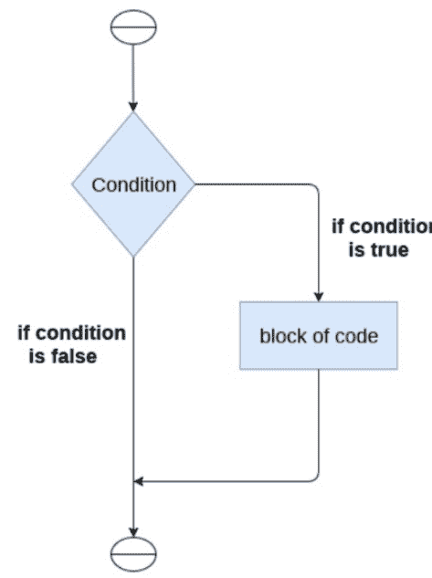
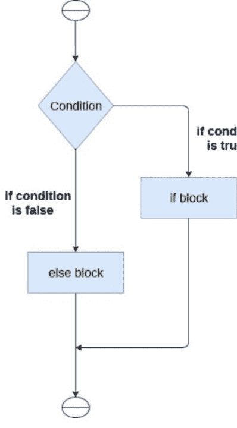
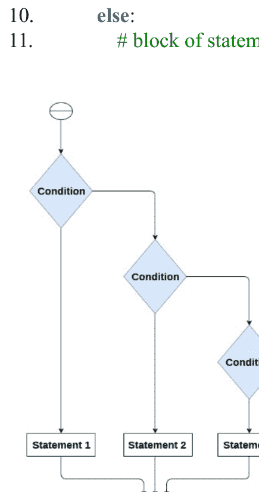
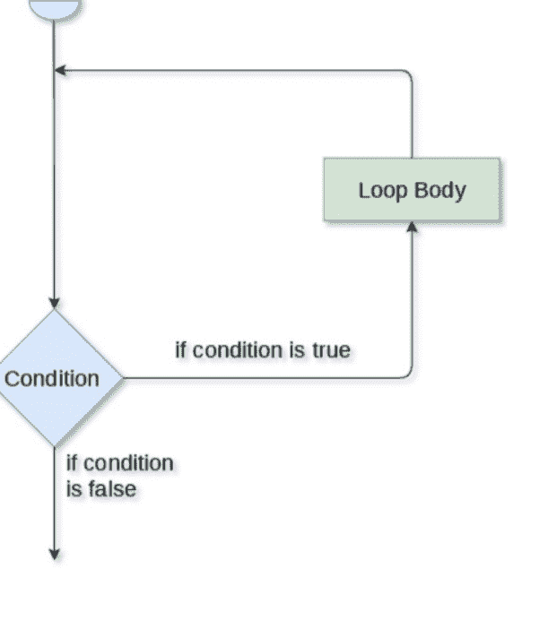
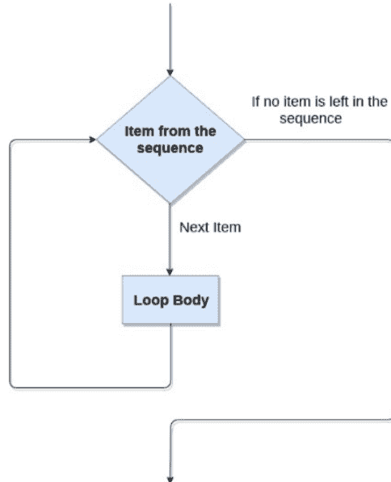
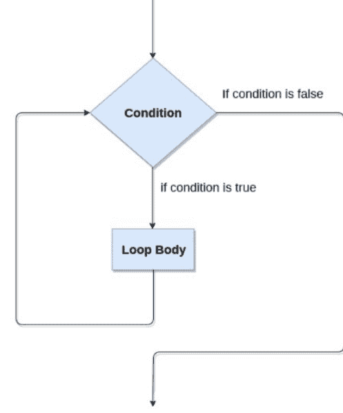

# Python 编程
## 零基础入门

# Python 编程：
零基础入门
# 快速掌握 Python 分步指南

J NEWMAN

Python 简介
安装 Python
第一个 Python 程序
Python 变量
Python 数据类型
Python 关键字
Python 字面量
Python 运算符
Python 注释
Python if-else 语句
Python 循环
Python for 循环
Python while 循环
Python break 语句
Python 字符串
Python 列表
Python 元组

# Python 简介
Python 拥有许多使其区别于其他编程语言的有益特性。它支持面向对象编程、过程式编程以及动态内存分配。下面将介绍一些关键方面。

## 1) 易于学习
与其他编程语言相比，Python 是一门简单的编程语言。其语法简洁，类似于英语。它不使用分号和花括号，而是通过缩进来定义代码块。对于初学者来说，它是推荐的编程语言。

## 2) 表达能力强
Python 只需几行代码就能完成复杂的任务。例如，要运行 hello world 程序，只需输入 `print ("Hello World")`。运行它只需要一行代码，而 Java 或 C 则需要多行。

## 3) 解释型语言
Python 是一种解释型语言，这意味着 Python 程序的每一行都是单独执行的。作为解释型语言的好处是调试简单且可移植。

## 4) 跨平台语言
Python 可以在多种平台上运行，包括 Windows、Linux、UNIX 和 Macintosh。因此，我们可以得出结论：Python 是一种可移植的编程语言。它允许程序员只需创建一个程序，就能为多个竞争平台开发软件。

## 5) 免费且开源
Python 是一种免费的编程语言，任何人都可以使用。在其官方网站 www.python.org 上，它可以免费获取。它有一个遍布全球的庞大社区，致力于创建新的 Python 模块和函数。Python 社区欢迎每个人的贡献。开源意味着“任何人都可以不花一分钱获得其源代码”。

## 6) 面向对象语言
Python 支持面向对象编程，引入了类和对象的概念。它允许继承、多态和封装等特性。面向对象的方法有助于程序员编写可重用的代码，并用更少的代码开发应用程序。

## 7) 可扩展
这意味着可以使用其他语言（如 C/C++）来编译代码，从而让我们能在 Python 项目中使用它。它会将程序转换为字节码，可以在任何平台上运行。

## 8) 大型标准库
它提供了涵盖多个领域的多样化库，包括机器学习、Web 开发和脚本编写。Tensor flow、Pandas、Numpy、Keras 和 Pytorch 只是机器学习库的几个例子。Python 的 Web 开发框架包括 Django、Flask 和 Pyramids。

## 9) GUI 编程支持
图形用户界面用于桌面应用程序的开发。用于构建 Web 应用程序的库包括 PyQT5、Tkinter 和 Kivy。

## 10) 集成性
它易于与 C、C++ 和 JAVA 等语言集成。Python 与 C、C++ 和 Java 一样，也是逐行执行代码。这使得调试代码变得更容易。

## 11. 可嵌入
其他编程语言的代码可以在 Python 源代码中使用。Python 源代码也可以在其他计算机语言中使用。它能够将其他语言嵌入到我们的程序中。

## 12. 动态内存分配
在 Python 中，我们不需要指定变量的数据类型。当我们将一个值赋给变量时，变量的内存会在运行时自动分配。如果将整数值 15 赋给 x，我们不需要写 `int x = 15`。只需在纸上写 `x = 15` 即可。

# 安装 Python
成为 Python 开发者的第一步是了解如何在本地系统或计算机上安装和更新 Python。本主题将介绍如何在不同操作系统上安装 Python。

## 在 Windows 上安装
要获取最新版本的 Python，请访问 https://www.python.org/downloads/。在此过程中，我们将在我们的 Windows 操作系统上安装 Python 3.8.6。当我们点击上面的链接时，将跳转到以下网站。

步骤 - 1：选择 - Python 的版本 - 下载。

步骤 - 2：点击 - 立即安装

双击下载的可执行文件，将显示以下窗口。继续选择“自定义安装”。当你勾选“Add Path”复选框时，Python 路径将自动配置。

我们也可以通过点击“自定义安装”按钮来选择所需的位置和功能。另一个需要考虑的关键因素是是否为所有用户安装启动器。

## 步骤 - 3 安装过程

现在尝试从命令提示符运行 python。如果你使用的是 Python 3，请输入 `python -version`。

我们已准备好使用 Python。

# 第一个 Python 程序
在本节中，我们将讨论 Python 的基本语法，并运行一个简单的程序，在终端打印出 Hello World。

Python 为我们提供了两种运行程序的方式：

- 使用交互式解释器的提示符
- 使用脚本文件

让我们更仔细地看看这两种方式。

## 交互式解释器提示符
在交互式提示符下，Python 允许我们逐个执行每条 Python 语句。当我们关注 Python 程序每一行的输出时，这种方式更为可取。

要进入交互模式，在终端（或命令提示符）中输入 `python`（如果你的系统中同时安装了 Python2 和 Python3，则输入 `python3`）。

它将打开下面的提示符，我们可以在其中运行 Python 语句并查看其对终端的影响。

完成 print 语句后，按 Enter 键。

# 多行语句
多行语句在类似记事本的文本编辑器中输入，并保存为 .py 文件。在下面的示例中，我们使用 Python 脚本描述了多行代码的执行。

代码：

1.  name = “Andrew Venis”
2.  branch = “Computer Science”
3.  age = “25”
4.  print(“My name is: ”, name, )
5.  print(“My age is: ”, age)

脚本文件：

```
name = "Andrew Venis"
branch = "Computer Science"
age = "25"
print("My name is: ", name, )
print("My age is: ", age)
```

```
Python 3.8.3 (tags/v3.8.3:6f8c832, May 13 2020, 22:20:19) [MSC v.1925 32 bit (Intel)] on win32
Type "help", "copyright", "credits" or "license()" for more information.
>>> 
=============== RESTART: C:/Users/DEVANSH SHARMA/Desktop/details.py ===============
My name is: Andrew Venis
My age is: 25
>>> 
```

# Python 变量
变量是指向内存区域的术语。Python 变量，也称为标识符，是数据的容器。

因为 Python 是一种解释型语言，我们不需要描述变量的类型，因为它足够智能，可以自动推断出来。

变量名可以由字母和数字的组合构成，但必须以字母或下划线开头。

变量名应使用小写字母书写。`rahul` 和 `Rahul` 是两个不同的变量。

## 标识符命名
标识符是变量的例子。程序中的字面量通过标识符来识别。以下是命名标识符的规则。

- 变量的第一个字符必须是字母或下划线（_）。
- 除第一个字符外，所有字符都可以是小写字母（a-z）、大写字母（A-Z）、下划线或数字（0-9）。
- 标识符名称中不得包含空格或特殊字符（!、@、#、百分号、&、*）。
- 标识符的名称不得与语言中的任何关键字相同。

## 声明变量

Python 不要求我们在代码中使用变量之前先声明它们。它允许我们在特定时间点创建一个变量。

在 Python 中，我们不需要显式声明变量。任何时候我们给一个变量赋值，它都会被自动定义。

变量的值使用等号（=）运算符进行赋值。

## 对象引用

在声明变量时，理解 Python 解释器的工作方式很重要。变量的处理方式与许多其他编程语言不同。

因为 Python 是一种面向对象的编程语言，每个数据项都属于特定的类类型。请看下面的示例。

1. print("John")

**输出：**

```
John
```

Python 对象在终端上构建并显示一个整数对象。我们在上面的 print 命令中创建了一个字符串对象。让我们看看使用 Python 内置的 type() 函数它是什么类型。

1. type("John")

**输出：**

```
<class 'str'>
```

在 Python 中，变量是对象引用或指针的符号化术语。变量用于表示具有相同名称的对象。

让我们看下面的例子。

```
a = 50
```

上面示例中的变量 `a` 对应一个整数对象。

假设我们给一个新变量 `b` 赋予整数值 50。

```
a = 50
b = a
```

因为 Python 不会生成新对象，所以变量 `b` 引用与 `a` 相同的对象。

让我们改变 `b` 的值。现在两个变量将关联到不同的对象。

```
a = 50
b = 100
```

如果我们给同一个变量赋予两个不同的值，Python 会高效地管理内存。

## 对象标识

Python 中创建的每个对象都有一个唯一的标识符。Python 确保没有两个对象共享相同的标识符。对象标识使用内置的 id() 函数来识别。请看下面的示例。

1. a = 50
2. b = a
3. print(id(a))
4. print(id(b))
5. # 重新赋值变量 a
6. a = 500
7. print(id(a))

**输出：**

```
140734982691168
140734982691168
2822056960944
```

我们设置 `b = a`，因为 `a` 和 `b` 都引用同一个对象。当我们检查时，id() 函数返回了相同的数字。我们将 `a` 的值更改为 500，现在它引用新的对象标识。

## Python 数据类型

值可以存储在变量中，每个值都有一个数据类型。因为 Python 是一种动态类型语言，我们在声明变量时不需要指定其类型。值由解释器隐式地绑定到其类型。

1. a = 5

我们没有定义变量 `a` 的类型，它具有整数值五。Python 解释器将自动把变量 `a` 解释为整数类型。

可以使用 Python 检查程序中使用的变量类型。Python 中的 type() 方法返回提供给它的变量的类型。

考虑以下场景，用于定义不同数据种类的值并确定其类型。

1. a=10
2. b="Hi Python"
3. c = 10.5
4. **print**(type(a))
5. **print**(type(b))
6. **print**(type(c))

**输出：**

```
<type 'int'>
```

```
<type 'str'>
```

```
<type 'float'>
```

## 标准数据类型

变量可以存储不同类型的值。例如，一个人的姓名必须保存为字符串，而其 ID 必须记录为整数。

Python 支持多种标准数据类型，每种类型都有自己的存储技术。以下是 Python 数据类型的列表。

1. 数字
2. 序列类型
3. 布尔值
4. 集合
5. 字典

在本节课程中，我们将对上述数据类型进行简要概述。在本课程的后面部分，我们将深入探讨每一种类型。

## 数字

数字是一种存储数值的数据类型。Python 数字数据类型包括整数、浮点数和复数值。可以使用 Python 中的 type() 方法来确定变量的数据类型。isinstance() 函数用于确定一个对象是否属于特定的类。

当给变量赋值一个数字时，Python 会生成数字对象。例如：

```
1. a = 5
2. print("The type of a", type(a))
3. 
4. b = 40.5
5. print("The type of b", type(b))
6. 
7. c = 1+3j
8. print("The type of c", type(c))
9. print(" c is a complex number", isinstance(1+3j,complex))
```

**输出：**

```
The type of a <class 'int'>
The type of b <class 'float'>
The type of c <class 'complex'>
c is complex number: True
```

Python 识别三种数值数据类型。

整数值可以是任意长度，例如 10、2、29、-20、-150 等。Python 中整数的长度没有限制。它的值是 **int** 类型。

**Float** 用于存储浮点数，如 1.9、9.902、15.2 等。它的精度高达 15 位小数。

**复数**由一个有序对组成，即 x + iy，其中 x 和 y 分别代表实部和虚部。复数如 2.14j、2.0 + 2.3j 等。

## Python 关键字

Python 关键字是保留字，向编译器/解释器传达特定含义。每个关键字都有独特的含义和独特的操作。这些关键字不能用作变量名。Python 关键字列表如下。

| True | False | None | and | as |
| --- | --- | --- | --- | --- |
| assert | def | class | continue | break |
| else | finally | elif | del | except |
| global | for | if | from | import |
| raise | try | or | return | pass |
| nonlocal | in | not | is | lambda |

**True** - 它表示布尔真，这意味着如果给定条件为真，则返回“True”。非零值被视为真。

**False** - 它表示布尔假；如果给定条件为假，则返回“False”。零值被解释为假。

**None** - 它表示空值或无效值。空列表或零不能用来表示 None。

**And** - 它也是一个逻辑运算符。用于测试多个条件。如果两个条件都满足，则返回真。请看下面的真值表。

| A     | B     | A and B |
|-------|-------|---------|
| True  | True  | True    |
| True  | False | False   |
| False | True  | False   |
| False | False | False   |

**or** - 在 Python 中，它是一个逻辑运算符。如果其中一个条件满足，则返回真。请看下面的真值表。

| A     | B     | A or B |
|-------|-------|--------|
| True  | True  | True   |
| True  | False | True   |
| False | True  | True   |
| False | False | False  |

**not** - 它是一个逻辑运算符，用于翻转真值。请看下面的真值表。

| A     | Not A |
|-------|-------|
| True  | False |
| False | True  |

**assert** - 在 Python 中，此关键字用作调试工具。它验证代码的正确性。如果在代码中发现错误，它会引发 AssertionError 并打印错误消息。

**示例：**

```
1. a = 10
2. b = 0
3. print('a is dividing by Zero')
4. assert b != 0
5. print(a / b)
```

**输出：**

```
a is dividing by Zero
Runtime Exception:
Traceback (most recent call last):
  File "/home/40545678b342ce3b70beb1224bed345f.py", line 4, in
    assert b != 0, "Divide by 0 error"
AssertionError: Divide by 0 error
```

**def** - 在 Python 中，此关键字用于声明函数。如果后面跟着函数名。

1. def my_func(a,b):
2.     c = a+b
3.     print(c)
4. my_func(10,20)

**输出：**

```
30
```

**class** - 在 Python 中，它用于表示一个类。类是对象的蓝图。它是变量和方法的集合。请看下面的类。

1. class Myclass:
2.     #变量………## 3. `def function_name(self):`
    # 语句..........

`continue` - 此命令用于中止当前迭代的执行。请考虑以下情景。

```
a = 0
while a < 4:
    a += 1
    if a == 2:
        continue
    print(a)
```

**输出：**

```
1
3
4
```

## Python 字面量

Python 中的字面量是存储在变量或常量中的数据。

Python 支持以下字面量：

### 1. 字符串字面量：

字符串字面量通过将文本括在引号内来创建。要创建字符串，我们可以使用单引号和双引号。

**示例：**

- "Aman" , '12345'

### 2. 数字字面量

数字字面量是不可变的。数字字面量可分为以下四种数值类型之一。

| `int` (整数) | `long` (长整数) | `float` (浮点数) | `complex` (复数) |
| :--- | :--- | :--- | :--- |
| 没有小数部分的数字（可以是正数或负数）。例如：100 | 无限大小的整数，后跟小写或大写 L，例如：87032845L | 具有整数部分和小数部分的实数，例如：-26.2 | 形式为 a+bj，其中 a 构成复数的实部，b 构成虚部。例如：3.14j |

**示例 - 数字字面量**

```
x = 0b10100 # 二进制字面量
y = 100 # 十进制字面量
z = 0o215 # 八进制字面量
u = 0x12d # 十六进制字面量

# 浮点字面量
float_1 = 100.5
float_2 = 1.5e2

# 复数字面量
a = 5+3.14j

print(x, y, z, u)
print(float_1, float_2)
print(a, a.imag, a.real)
```

```
输出：
20 100 141 301
100.5 150.0
(5+3.14j) 3.14 5.0
```

### 3. 布尔字面量：

布尔字面量的值只能是 `True` 或 `False`。

**示例 - 布尔字面量**

```
x = (1 == True)
y = (2 == False)
z = (3 == True)
a = True + 10
b = False + 10
print("x is", x)
print("y is", y)
print("z is", z)
print("a:", a)
print("b:", b)
```

**输出：**

```
x is True
y is False
z is False
a: 11
b: 10
```

### 4. 特殊字面量。

Python 有一个特殊的字面量：`None`。

`None` 用于指定一个尚未创建的字段。在 Python 中，它也用于表示列表的结束。布尔字面量的值只能是 `True` 或 `False`。

**示例 - 特殊字面量**

```
val1=10
val2=None
print(val1)
print(val2)
```

**输出：**

```
10
None
```

### 5. 字面量集合。

Python 支持四种不同类型的字面量集合：

- 列表字面量，
- 元组字面量，
- 字典字面量，和
- 集合字面量。

**列表：**

- 列表中的项可以是各种数据类型。列表是可变的，这意味着它们可以被更改。
- 列表值用逗号 (`,`) 分隔，并括在方括号 (`[]`) 内。一个列表可以容纳各种类型的数据。Python 支持四种不同类型的字面量集合：列表字面量、元组字面量、字典字面量和集合字面量。

**示例 - 列表字面量**

```
list=[`John`,678,20.4,`Peter`]
list1=[456,`Andrew`]
print(list)
print(list + list1)
```

**输出：**

```
[`John`, 678, 20.4, `Peter`]
[`John`, 678, 20.4, `Peter`, 456, `Andrew`]
```

**字典：**

- 数据在 Python 字典中以键值对的形式存储。
- 它用花括号括起来，每对之间用逗号 (`,`) 分隔。

**示例**

```
dict = {'name': 'Pater', 'Age':18,'Roll_nu':101}
print(dict)
```

**输出：**

```
{'name': 'Pater', 'Age': 18, 'Roll_nu': 101}
```

**元组：**

Python 中的元组是不同类型数据的集合。它是不可变的，这意味着创建后不能更改。

它用圆括号 `()` 括起来，每个元素用逗号 (`,`) 分隔。

**示例**

```
tup = (10,20,"Dev",[2,3,4])
print(tup)
```

**输出：**

```
(10, 20, ‘Dev’, [2, 3, 4])
```

**集合：**

Python 集合是无序数据集的集合。

它用花括号 `}` 括起来，每个元素用逗号 (`,`) 分隔。

**示例：- 集合字面量**

```
set = {`apple`, `grapes`, `guava`, `papaya`}
print(set)
```

**输出：**

```
{'guava', 'apple', 'papaya', 'grapes'}
```

## Python 运算符

运算符是负责两个操作数之间特定运算的符号。运算符是程序的基础，逻辑在特定的编程语言中基于此构建。Python 有多种运算符，如下所列。

- 算术运算符
- 比较运算符
- 赋值运算符
- 逻辑运算符
- 位运算符
- 成员运算符
- 身份运算符

### 算术运算符

算术运算符用于对两个操作数执行运算。它有运算符 `+` (加法)、`-` (减法)、`*` (乘法)、`/` (除法)、`%` (取余)、`//` (整除) 和 `**` (幂)。

请参考下表，了解算术运算符更深入的解释。

| 运算符 | 描述 |
| --- | --- |
| `+` (加法) | 用于将两个操作数相加。例如，如果 `a = 20`, `b = 10` => `a+b = 30` |
| `-` (减法) | 用于从第一个操作数中减去第二个操作数。如果第一个操作数小于第二个操作数，结果值为负数。例如，如果 `a = 20`, `b = 10` => `a - b = 10` |
| `/` (除法) | 返回第一个操作数除以第二个操作数后的商。例如，如果 `a = 20`, `b = 10` => `a/b = 2.0` |
| `*` (乘法) | 用于将一个操作数乘以另一个操作数。例如，如果 `a = 20`, `b = 10` => `a * b = 200` |
| `%` (取余) | 返回第一个操作数除以第二个操作数后的余数。例如，如果 `a = 20`, `b = 10` => `a%b = 0` |
| `**` (幂) | 幂运算符，计算第一个操作数的第二个操作数次幂。 |

### 比较运算符

比较运算符用于比较两个操作数的值，并返回一个布尔 `True` 或 `False` 结果。下表列出了比较运算符。

| 运算符 | 描述 |
| --- | --- |
| `==` | 如果两个操作数的值相等，则条件为真。 |
| `!=` | 如果两个操作数的值不相等，则条件为真。 |
| `<=` | 如果第一个操作数小于或等于第二个操作数，则条件为真。 |
| `>=` | 如果第一个操作数大于或等于第二个操作数，则条件为真。 |
| `>` | 如果第一个操作数大于第二个操作数，则条件为真。 |
| `<` | 如果第一个操作数小于第二个操作数，则条件为真。 |

### 赋值运算符

赋值运算符用于将右侧表达式的值赋给左侧操作数。下表列出了赋值运算符。

| 运算符 | 描述 |
| :--- | :--- |
| `=` | 将右侧表达式的值赋给左侧操作数。 |
| `+=` | 将左侧操作数的值增加右侧操作数的值，并将修改后的值赋回左侧操作数。例如，如果 `a = 10`, `b = 20` => `a += b` 将等于 `a = a + b`，因此 `a = 30`。 |
| `-=` | 将左侧操作数的值减去右侧操作数的值，并将修改后的值赋回左侧操作数。例如，如果 `a = 20`, `b = 10` => `a -= b` 将等于 `a = a - b`，因此 `a = 10`。 |
| `*=` | 将左侧操作数的值乘以右侧操作数的值，并将修改后的值赋回左侧操作数。例如，如果 `a = 10`, `b = 20` => `a *= b` 将等于 `a = a * b`，因此 `a = 200`。 |
| `%=` | 将左侧操作数的值除以右侧操作数的值，并将余数赋回左侧操作数。例如，如果 `a = 20`, `b = 10` => `a %= b` 将等于 `a = a % b`，因此 `a = 0`。 |
| `**=` | `a**=b` 将等于 `a=a**b`，例如，如果 `a = 4`, `b = 2`，`a**=b` 将把 `4**2 = 16` 赋给 `a`。 |
| `//=` | `a//=b` 将等于 `a = a // b`，例如，如果 `a = 4`, `b = 3`，`a//=b` 将把 `4 // 3 = 1` 赋给 `a`。 |

### 位运算符

位运算符逐位（bit by bit）操作两个操作数的值。请考虑以下情景。

**例如，**

- 如果 `a = 7`
- `b = 6`
- 那么，二进制(`a`) = 0111
- 二进制(`b`) = 0110

## 位运算符

位运算符用于操作一个数字的各个位。以下是位运算符的示例。

- 5. 
6. 因此，a & b = 0011
7. a | b = 0111
8. a ^ b = 0100
9. ~ a = 1000

| 运算符 | 描述 |
|---|---|
| & (按位与) | 如果两个操作数在相同位置的位都为1，则将1复制到结果。否则，复制0。 |
| \| (按位或) | 如果两个位都为0，则结果位为0；否则，结果位为1。 |
| ^ (按位异或) | 如果两个位不同，则结果位为1；否则，结果位为0。 |
| ~ (取反) | 计算操作数每位的取反，即如果位为0，则结果位为1，反之亦然。 |
| << (左移) | 左操作数的值按右操作数指定的位数向左移动。 |
| >> (右移) | 左操作数的值按右操作数指定的位数向右移动。 |

## 逻辑运算符

逻辑运算符主要用于表达式求值中的决策。Python支持以下列出的逻辑运算符。

| 运算符 | 描述 |
|---|---|
| and | 如果两个表达式都为真，则条件为真。如果 a 和 b 是两个表达式，a → true，b → true => a and b → true。 |
| or | 如果其中一个表达式为真，则条件为真。如果 a 和 b 是两个表达式，a → true，b → false => a or b → true。 |
| not | 如果表达式 a 为真，则 not (a) 为假，反之亦然。 |

## 成员运算符

Python 成员运算符用于判断一个值是否是 Python 数据结构的成员。如果该值存在于数据结构中，结果为真；否则，返回假。

| 运算符 | 描述 |
| :--- | :--- |
| in | 如果在第二个操作数（列表、元组或字典）中找到第一个操作数，则结果为真。 |
| not in | 如果在第二个操作数（列表、元组或字典）中未找到第一个操作数，则结果为真。 |

## 身份运算符

身份运算符用于判断一个元素是否属于特定的类或类型。

| 运算符 | 描述 |
| :--- | :--- |
| is | 如果两侧的引用指向同一个对象，则结果为真。 |
| is not | 如果两侧的引用不指向同一个对象，则结果为真。 |

## 运算符优先级

运算符的优先级至关重要，因为它决定了应该先计算哪个运算符。Python 运算符的优先级表如下所示。

| 运算符 | 描述 |
|----------|-------------|
| **       | 幂运算符的优先级高于表达式中的所有其他运算符。 |
| ~ + -    | 取反、一元加和一元减。 |
| * / % // | 乘法、除法、取模、余数和整除。 |
| + -      | 二元加和二元减 |
| >> <<    | 左移和右移 |
| &        | 按位与。 |
| ^ \|     | 按位异或和按位或 |

| 运算符 | 描述 |
|----------|-------------|
| <= < > >= | 比较运算符（小于、小于等于、大于、大于等于）。 |
| <> == != | 相等运算符。 |
| = %= /= //= -= += *= **= | 赋值运算符 |
| is is not | 身份运算符 |
| in not in | 成员运算符 |
| not or and | 逻辑运算符 |

## Python 注释

Python 注释是程序员必备的工具。通常，注释用于解释代码。如果代码被恰当地解释，我们就能轻松理解它。一个优秀的程序员应该使用注释，因为将来如果有人想要修改代码或实现一个新模块，这样做会容易得多。

其他编程语言，如 C++，使用 / 进行单行注释，使用 /*.... */ 进行多行注释，而 Python 仅使用 # 进行单行 Python 注释。要在代码中包含注释，请在语句或代码的开头放置一个井号（#）。

让我们看一个例子。

```
# This is the print statement
print("Hello Python")
```

使用井号（#），我们为 print 语句添加了一个注释。这不会对我们的 print 语句产生任何影响。

## 多行 Python 注释

要使用多行 Python 注释，我们必须在每行代码的开头使用井号（#）。考虑以下场景。

- # 注释的第一行
- # 注释的第二行
- # 注释的第三行

## 示例：

- # 变量 a 存储值 5
- # 变量 b 存储值 10
- # 变量 c 存储 a 和 b 的和
- # 打印结果
- a = 5
- b = 10
- c = a+b
- print("The sum is:", c)

## 输出：

```
The sum is: 15
```

上述代码可读性很高，即使是完全的初学者也能理解每行代码的功能。这是使用代码注释的好处之一。

对于多行注释，我们也可以使用三引号（"""）。字符串格式化也使用三引号。考虑以下场景。

## 文档字符串 Python 注释

文档字符串注释通常出现在模块、函数、类或方法中。它是一个 Python 文档字符串。在后续的教程中，我们将解释类/方法。

## 示例：

```
def intro():
    """
    This function prints Hello Joseph
    """
    print("Hi Joseph")
intro()
```

## 输出：

```
Hello Joseph
```

使用 `__doc__` 属性，我们可以检查函数的文档字符串。

在大多数情况下，使用四个空格作为缩进。缩进量由用户决定，但必须在代码块内保持一致。

```
def intro():
    """
    This function prints Hello Joseph
    """
    print("Hello Joseph")
intro.__doc__
```

## 输出：

```
Output:

\n This function prints Hello Joseph\n 
```

## Python 缩进

Python 缩进用于定义代码块。在其他编程语言如 C、C++ 和 Java 中使用花括号，而 Python 使用缩进。在 Python 中，使用空格来表示缩进。

缩进用于代码的开头，并在遇到非预期行时结束。代码块由相同的行缩进定义（函数体、循环等）。

在大多数情况下，使用四个空格作为缩进。缩进量由用户决定，但必须在代码块内保持一致。

```
python
for i in range(5):
    print(i)
    if(i == 3):
        break
```

我们使用相同的空格来缩进每行代码，以表示一个代码块。

考虑以下场景。

```
dn = int(input("Enter the number:"))
if(n%2 == 0):
    print("Even Number")
else:
    print("Odd Number")

print("Task Complete")
```

## 输出：

> Enter the number: 10
Even Number
Task Complete

在上面的代码中，if 和 else 是两个独立的代码块。两个代码块都缩进了四个空格。`print("Task Complete")` 语句位于 if-else 块之外，没有缩进四个空格。

如果缩进使用不正确，将抛出 `IndentationError`。

## Python If-else 语句

几乎所有编程语言最重要的方面都是决策。顾名思义，决策允许我们为特定的决定运行特定的代码块。在此做出关于特定条件有效性的决策。决策的基础是条件检查。

Python 中使用以下语句进行决策。

| 语句 | 描述 |
|---|---|
| If 语句 | if 语句用于测试特定条件。如果条件为真，将执行一个代码块（if 块）。 |
| If - else 语句 | if-else 语句类似于 if 语句，不同之处在于它还为被检查条件的假情况提供了代码块。如果 if 语句中提供的条件为假，则将执行 else 语句。 |
| 嵌套 if 语句 | 嵌套 if 语句允许我们在外部 if 语句内部使用 if ? else 语句。 |

## Python 中的缩进

为了简洁和易于编程，Python 不允许在块级代码中使用括号。要在 Python 中声明一个块，请使用缩进。如果两个语句具有相同的缩进级别，它们就在同一个块中。

通常，使用四个空格来缩进语句，这是 Python 中的标准缩进量。

## Python 条件语句与循环结构

由于 Python 使用代码块来定义结构，缩进是该编程语言最常用的特性。一个代码块中的所有语句都应在同一缩进层级。我们将学习在 Python 的决策结构及其他领域中如何实际应用缩进。

## if 语句

if 语句用于测试一个条件，如果条件为真，则执行 if 代码块。任何可以求值为真或假的有效逻辑表达式都可以作为 if 语句的条件。



if 语句的语法如下所示。

```python
if expression:
    statement
```

## 示例 1

```python
num = int(input("enter the number?"))
if num % 2 == 0:
    print("Number is even")
```

**输出：**

```
enter the number?10
Number is even
```

## 示例 2

使用程序打印三个数字中的最大值。

```python
a = int(input("Enter a? "))
b = int(input("Enter b? "))
c = int(input("Enter c? "))
if a > b and a > c:
    print("a is largest")
if b > a and b > c:
    print("b is largest")
if c > a and c > b:
    print("c is largest")
```

**输出：**

```
Enter a? 100
Enter b? 120
Enter c? 130
c is largest
```

## if-else 语句

if-else 语句将 else 块与 if 语句结合使用，当条件为假时执行 else 块。

如果条件满足，则运行 if 块。否则，执行 else 块。



if-else 语句的语法如下所示。

```python
if condition:
    # 块语句
else:
    # 另一个块语句（else块）
```

## 示例

一个判断个人是否有资格投票的程序。

```python
age = int(input("Enter your age? "))
if age >= 18:
    print("You are eligible to vote !!")
else:
    print("Sorry! you have to wait !!")
```

**输出：**

```
Enter your age? 90
You are eligible to vote !!
```

## elif 语句

elif 语句允许我们检查多个条件，并根据其中为真的条件执行特定的代码块。根据需要，我们可以在程序中包含任意数量的 elif 语句。不过，使用 elif 是可选的。

在 C 语言中，elif 语句的功能类似于 if-else-if 梯形语句。它必须跟在 if 语句之后。

elif 语句的语法如下所示。

```python
if expression1:
    # 块语句
elif expression2:
    # 块语句
elif expression3:
    # 块语句
else:
    # 块语句
```



## 示例

```python
number = int(input("Enter the number?"))
if number == 10:
    print("number is equals to 10")
elif number == 50:
    print("number is equal to 50")
elif number == 100:
    print("number is equal to 100")
else:
    print("number is not equal to 10, 50 or 100")
```

**输出：**

```
Enter the number?15
number is not equal to 10, 50 or 100
```

## Python 循环

默认情况下，任何编程语言编写的程序执行流程都是顺序的。我们可能需要不时地改变程序的流程。某段代码的执行可能需要重复多次。

编程语言为此提供了各种类型的循环，能够多次重复某些特定代码。参考下图，更好地理解循环语句的工作原理。



| 循环语句 | 描述 |
| :--- | :--- |
| for 循环 | for 循环用于我们需要执行某部分代码直到给定条件满足的情况。for 循环也被称为预测试循环。如果迭代次数已知，最好使用 for 循环。 |
| while 循环 | while 循环用于我们事先不知道迭代次数的情况。while 循环中的语句块会被执行，直到满足 while 循环中指定的条件。它也被称为预测试循环。 |
| do-while 循环 | do-while 循环会持续执行直到给定条件满足。它也被称为后测试循环。当需要至少执行一次循环体时使用（主要是菜单驱动程序）。 |

## Python for 循环

在 Python 中，for 循环用于多次遍历语句或程序的一部分。它通常用于遍历数据结构，如列表、元组或字典。

Python 的 for 循环语法如下所示。

```python
for iterating_var in sequence:
    statement(s)
```

## 流程图



## For 循环 - 使用序列

**示例 - 使用 for 循环遍历字符串**

```python
str = "Python"
for i in str:
    print(i)
```

**输出：**

```
P
y
t
h
o
n
```

**示例 2**

使用此程序打印给定数字的乘法表。

```python
list = [1, 2, 3, 4, 5, 6, 7, 8, 9, 10]
n = 5
for i in list:
    c = n * i
    print(c)
```

**输出：**

```
5
10
15
20
25
30
35
40
45
50
```

## Python While 循环

Python 的 while 循环会执行一段代码，直到给定条件返回假。它也被称为预测试循环。

可以将其视为一个循环的 if 语句。当我们不知道需要多少次迭代时，while 循环是最佳选择。

语法如下所示。

```python
while expression:
    statement
```

## 流程图



## 循环控制语句

使用循环控制语句，我们可以改变 while 循环的正常执行顺序。当 while 循环结束时，该作用域内定义的所有自动对象都将被销毁。在 while 循环内，Python 提供了以下控制语句。

### Continue 语句 - 当遇到 continue 语句时，控制权返回到循环的开始。让我们看一个例子。

**示例：**

```python
# 打印除‘a’和‘t’之外的所有字母
i = 0
str1 = 'javapoint'

while i < len(str1):
    if str1[i] == 'a' or str1[i] == 't':
        i += 1
        continue
    print('Current Letter :', str1[i])
    i += 1
```

**输出：**

```
Current Letter : j
Current Letter : v
Current Letter : p
Current Letter : o
Current Letter : i
Current Letter : n
```

### Break 语句 - 当遇到 break 语句时，控制权从循环中移除。

**示例：**

```python
# 当 break 语句一遇到 t 就转移控制权
i = 0
str1 = 'javapoint'

while i < len(str1):
    if str1[i] == 't':
        i += 1
        break
    print('Current Letter :', str1[i])
    i += 1
```

**输出：**

```
Current Letter : j
Current Letter : a
Current Letter : v
Current Letter : a
```

### Pass 语句 - pass 语句用于声明空循环。它也可以用于定义空类、函数或控制语句。让我们看一个例子。

**示例：**

```python
# 一个空循环
str1 = 'javapoint'
i = 0

while i < len(str1):
    i += 1
    pass
    print("Value of i :", i)
```

**输出：**

```
Value of i : 9
```

## 示例

使用此程序打印给定数字的乘法表。

```python
i = 1
number = 0
b = 9
number = int(input("Enter the number:"))
while i <= 10:
    print("%d   X   %d   =   %d   \n" % (number, i, number * i))
    i = i + 1
```

**输出：**

```
Enter the number:10
10 X 1 = 10
10 X 2 = 20
10 X 3 = 30
10 X 4 = 40
10 X 5 = 50
10 X 6 = 60
10 X 7 = 70
10 X 8 = 80
10 X 9 = 90
10 X 10 = 100
```

## 在 while 循环中使用 else

Python 允许我们在 while 循环中结合使用 else 语句。

当 while 语句中的条件失败时，else 块会被执行。

如果 while 循环使用 break 语句中断，则 else 块不会执行，并且会执行 else 块之后的语句。

使用 while 循环时，else 语句是可选的。考虑以下场景。

## 示例 1

```python
i = 1
while(i <= 5):
    print(i)
    i = i + 1
else:
    print("The while loop exhausted")
```

## 示例 2

```python
i = 1
while(i <= 5):
    print(i)
    i = i + 1
```

## Python break语句

在Python中，`break`关键字用于将程序控制从循环中移出。`break`语句一次中断一个循环，因此在嵌套循环的情况下，它会先中断内层循环，然后再处理外层循环。换言之，`break`用于中止程序的当前执行，控制权将被转移到循环之后的下一行代码。

当我们需要根据特定条件打破循环时，通常会使用`break`。

`break`的语法如下所示。

```
#循环语句
break;
```

### 示例 1

```
list = [1, 2, 3, 4]
count = 1
for i in list:
    if i == 4:
        print("item matched")
        count = count + 1
        break
print("found at", count, "location")
```

### 输出：

```
item matched
found at 2 location
```

### 示例 2

```
str = "python"
for i in str:
    if i == 'o':
        break
    print(i)
```

### 输出：

```
p
y
t
h
```

## Python字符串

到目前为止，我们已经介绍了Python中最常见的数据类型——数字。在本教程的这一部分，我们将介绍Python中最常见的数据类型：字符串。

Python字符串是被单引号、双引号或三引号包围的字符集合。计算机并不理解这些字符；相反，它在内部以0和1的组合形式存储被操作的字符。

每个字符都以ASCII或Unicode编码。因此，Python字符串也可以被视为Unicode字符的集合。

在Python中，可以通过将字符或字符序列用引号括起来来创建字符串。Python允许我们使用单引号、双引号或三引号来创建字符串。

### 语法：

```
str = "Hi Python !"
```

在这种情况下，我们可以使用Python脚本来确定变量`str`的类型。

```
print(type(str))
```

然后它将打印出一个字符串（`str`）。

在Python中，字符串被视为一系列字符，这意味着不支持单个字符的数据类型；相反，输入为‘p’的单个字符被视为一个长度为1的字符串。

### 创建字符串

通过将字符用单引号或双引号括起来，我们可以形成一个字符串。三引号是Python中表示字符串的另一种方式，但它们通常保留给多行字符串或**文档字符串**使用。

```python
#使用单引号
str1 = 'Hello Python'
print(str1)
#使用双引号
str2 = "Hello Python"
print(str2)

#使用三引号
str3 = """Triple quotes are generally used for
        represent the multiline or
        docstring"""
print(str3)
```

**输出：**

```
Hello Python
Hello Python
Triple quotes are generally used for
        represent the multiline or
        docstring
```

## 字符串索引与切片

Python字符串的索引从0开始，就像其他语言一样。例如，字符串“HELLO”的索引如图所示。

```
str = "HELLO"
```

| H | E | L | L | O |
|---|---|---|---|---|
| 0 | 1 | 2 | 3 | 4 |

```
str[0] = 'H'
str[1] = 'E'
str[2] = 'L'
str[3] = 'L'
str[4] = 'O'
```

### 示例

```
str = "HELLO"
print(str[0])
print(str[1])
print(str[2])
print(str[3])
print(str[4])
# 它将返回 IndexError，因为第6个索引不存在
print(str[6])
```

### 输出：

```
H
E
L
L
O
IndexError: string index out of range
```

在Python中，切片操作符`[]`用于访问字符串中的单个字符，如前所示。然而，在Python中，我们可以使用`:`（冒号）运算符从给定字符串中获取子字符串。请看以下说明。

```
str = "HELLO"
```

| H | E | L | L | O |
|---|---|---|---|---|
| 0 | 1 | 2 | 3 | 4 |

```
str[0] = 'H'       str[:] = 'HELLO'
str[1] = 'E'       str[0:] = 'HELLO'
str[2] = 'L'       str[:5] = 'HELLO'
str[3] = 'L'       str[:3] = 'HEL'
str[4] = 'O'       str[0:2] = 'HE'
                    str[1:4] = 'ELL'
```

## Python列表

在Python中，列表用于存储不同类型数据的序列。Python列表是可变的，这意味着我们可以在它们形成后更改其元素。然而，Python有六种可用于存储序列的数据类型，其中列表是最常见和稳定的。

列表可以定义为不同类型值或项目的集合。列表中的元素由逗号（`,`）分隔，并包含在方括号`[]`中。

以下是一个列表的示例。

```
L1 = ["John", 102, "USA"]
L2 = [1, 2, 3, 4, 5, 6]
```

当我们尝试使用`type()`方法打印`L1`、`L2`和`L3`的类型时，会得到一个列表。

```python
print(type(L1))
print(type(L2))
```

### 输出：

```
<class 'list'>
<class 'list'>
```

### 列表的特性

列表具有以下特性：

-   列表是有序的。
-   列表的元素可以通过索引访问。
-   列表是可变类型。
-   列表是可变类型。
-   一个列表可以存储多个不同类型的元素。

让我们看看第一条陈述，即列表是有序的。

```
a = [1, 2, "Peter", 4.50, "Ricky", 5, 6]
b = [1, 2, 5, "Peter", 4.50, "Ricky", 6]
a == b
```

### 输出：

```
False
```

两个列表包含相同的元素，但第二个列表修改了第五个成员的索引位置，这违背了列表的顺序。当比较这两个列表时，结果是`False`。

列表在存在期间保持元素的顺序。这就是为什么它是一个具有特定排列的对象集合。

```
a = [1, 2, "Peter", 4.50, "Ricky", 5, 6]
b = [1, 2, "Peter", 4.50, "Ricky", 5, 6]
a == b
```

### 输出：

```
True
```

让我们更仔细地看一个列表示例。

```
emp = ["John", 102, "USA"]
Dep1 = ["CS", 10]
Dep2 = ["IT", 11]
HOD_CS = [10, "Mr. Holding"]
HOD_IT = [11, "Mr. Bewon"]
print("printing employee data...")
print("Name   :   %s,   ID:   %d,   Country:   %s" %
      (emp[0], emp[1], emp[2]))
print("printing departments...")
print("Department 1:\nName: %s, ID: %d\nDepartment 2:\nName: %s, ID: %s" %
      (Dep1[0], Dep2[1], Dep2[0], Dep2[1]))
print("HOD Details ...")
print("CS HOD Name: %s, Id: %d" %
      (HOD_CS[1], HOD_CS[0]))
print("IT HOD Name: %s, Id: %d" %
      (HOD_IT[1], HOD_IT[0]))
print(type(emp), type(Dep1), type(Dep2), type(HOD_CS), type(HOD_IT))
```

### 输出：

```
printing employee data...
Name : John, ID: 102, Country: USA
printing departments...
Department 1:
Name: CS, ID: 11
Department 2:
Name: IT, ID: 11
HOD Details ....
CS HOD Name: Mr. Holding, Id: 10
IT HOD Name: Mr. Bewon, Id: 11
<class 'list'> <class 'list'> <class 'list'> <class 'list'> <class 'list'>
```

在前面的示例中，我们创建了包含员工和部门信息的列表，并打印了相关信息。请查看上面的代码，以更好地理解列表的概念。

## Python元组

Python元组是一种用于存储不可变Python对象序列的数据结构。元组类似于列表，因为放置在列表中的项目值可以修改，但元组是不可变的，其值无法更改。

### 创建元组

由小括号`()`包围的、包含逗号分隔值（`,`）的集合称为元组。使用圆括号是可选的，但建议使用。以下是一个元组的定义。

```
T1 = (101, "Peter", 22)
T2 = ("Apple", "Banana", "Orange")
T3 = 10, 20, 30, 40, 50

print(type(T1))
print(type(T2))
print(type(T3))
```

### 输出：

```
<class 'tuple'>
<class 'tuple'>
<class 'tuple'>
```

创建只有一个元素的元组稍微复杂一些。为了声明这个元组，我们必须在元素后使用一个逗号。

```
tup1 = ("JavaTpoint")
print(type(tup1))
#创建只有一个元素的元组
tup2 = ("JavaTpoint",)
print(type(tup2))
```

### 输出：

```
<class 'str'>
<class 'tuple'>
```

就像列表一样，元组也有索引。可以通过每个项目的索引值来访问它。

以以下元组为例：

### 示例

```
tuple1 = (10, 20, 30, 40, 50, 60)
print(tuple1)
count = 0
for i in tuple1:
    print("tuple1[%d] = %d" % (count, i))
    count = count + 1
```

### 输出：

```
(10, 20, 30, 40, 50, 60)
tuple1[0] = 10
tuple1[1] = 20
tuple1[2] = 30
```

```python
tuple1[3] = 40
tuple1[4] = 50
tuple1[5] = 60
```

## 示例 - 2

```
1. tuple1 = tuple(input(“输入元组元素 …”))
2. print(tuple1)
3. count = 0
4. for i in tuple1:
5.     print(“tuple1[%d] = %s”%(count, i))
6.     count = count+1
```

## 输出：

```
输入元组元素 …123456
(‘1’, ‘2’, ‘3’, ‘4’, ‘5’, ‘6’)
tuple1[0] = 1
tuple1[1] = 2
tuple1[2] = 3
tuple1[3] = 4
tuple1[4] = 5
tuple1[5] = 6
```

与列表的索引方式相同，元组也使用索引。元组中每个项目的索引值可用于访问它。

## 元组索引和切片

元组的索引和切片与列表类似。元组的索引从 0 开始，到 `length(tuple) - 1` 结束。

可以使用索引 `[]` 运算符访问元组中的项目。Python 中的冒号运算符也可用于访问元组中的多个项目。

要进一步理解索引和切片，请查看下图。

元组 = ( 0, 1, 2, 3, 4, 5 )

| 0 | 1 | 2 | 3 | 4 | 5 |
|---|---|---|---|---|---|

元组[0] = 0
元组[1] = 1
元组[2] = 2
元组[3] = 3
元组[4] = 4
元组[5] = 5

元组[0:] = (0, 1, 2, 3, 4, 5)
元组[:] = (0, 1, 2, 3, 4, 5)
元组[2:4] = (2, 3)
元组[1:3] = (1, 2)
元组[:4] = (0, 1, 2, 3)

```
1. tup = (1,2,3,4,5,6,7)
2. print(tup[0])
3. print(tup[1])
4. print(tup[2])
5. # 这将引发 IndexError
6. print(tup[8])
```

**输出：**
1
2
3
元组索引超出范围

上面代码中的元组有七个项目，代表数字 0 到 6。我们尝试检索一个不存在的元组元素，这导致了 **IndexError**。

```
1. tuple = (1,2,3,4,5,6,7)
2. #元素 1 到末尾
3. print(tuple[1:])
4. #元素 0 到 3
5. print(tuple[:4])
6. #元素 1 到 4
7. print(tuple[1:5])
8. # 元素 0 到 6，步长为 2
9. print(tuple[0:6:2])
```

**输出：**
(2, 3, 4, 5, 6, 7)
(1, 2, 3, 4)
(1, 2, 3, 4)
(1, 3, 5)

## 负索引

也可以使用负索引来访问元组元素。最右边的元素索引为 -1，倒数第二个项目的索引为 -2，依此类推。

负索引用于从左到右导航项目。请看以下示例：

```
1. tuple1 = (1, 2, 3, 4, 5)
2. print(tuple1[-1])
3. print(tuple1[-4])
4. print(tuple1[-3:-1])
5. print(tuple1[:-1])
6. print(tuple1[-2:])
```

**输出：**
5
2
(3, 4)
(1, 2, 3, 4)
(4, 5)

### 删除元组

与列表不同，元组项目不能使用 **del** 关键字删除，因为元组是不可变的。我们可以使用 **del** 关键字与元组名称来删除整个元组。

请看以下示例。

```
1. tuple1 = (1, 2, 3, 4, 5, 6)
2. print(tuple1)
3. del tuple1[0]
4. print(tuple1)
5. del tuple1
6. print(tuple1)
```

**输出：**
(1, 2, 3, 4, 5, 6)
回溯（最近一次调用）：
文件 “tuple.py”，第 4 行，在 <module>
    print(tuple1)
NameError：名称 ‘tuple1’ 未定义
```