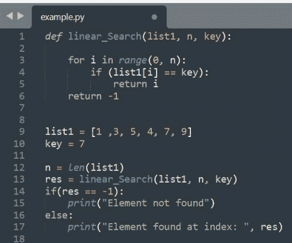

## 初学者Python练习题及解答


## LPF 出版社

# 初学者Python编程练习

## LPF 出版社

版权所有 © 2021

未经出版商事先书面许可，不得以任何形式或任何方式（包括影印、录制或其他电子或机械方法）复制、分发或传播本出版物的任何部分，但版权法允许的简短引述用于评论和某些其他非商业用途的情况除外。
我们已尽一切努力确保此处提供的内容在出版时对读者准确且有帮助。然而，这并非对主题的详尽论述。
对于因所提供信息造成的损失或损害，不承担任何责任。任何使用的商标均未经同意，使用这些商标并不意味着已获得所有者的同意或许可。
其中发现的任何商标或品牌纯粹用于说明目的，所有者均未以任何方式与此作品有关联。

## Python基础程序

- 1. 编写一个Python程序打印"hello world"。

```python
print('Hello world')
```

## 输出

Hello world

- 2. 编写一个Python程序计算三角形的面积。

```python
a = float(input('Enter first side: '))
b = float(input('Enter second side: '))
c = float(input('Enter third side: '))
semiPerimeter = (a + b + c) / 2
area = (semiPerimeter*(semiPerimeter-a)*(semiPerimeter-b)*(semiPerimeter-c)) ** 0.5
print('The area of the triangle is %0.2f' %area)
```

## 输出

Enter first side: 5
Enter second side: 6
Enter third side: 7
The area of the triangle is 14.70

- 3. 编写一个Python程序，在不使用第三个变量的情况下交换两个变量的值。

```python
P = int(input("Please enter value for P: "))
Q = int(input("Please enter value for Q: "))

P, Q = Q, P

print("The Value of P after swapping: ", P)
print("The Value of Q after swapping: ", Q)
```

## 输出

Please enter value for P: 10
Please enter value for Q: 20
The Value of P after swapping: 20
The Value of Q after swapping: 10

- 4. 编写一个Python程序生成一个随机数。

```python
import random
n = random.random()
print(n)
```

## 输出

0.8642851895556201

- 5. 编写一个Python程序检查一个数字是正数、负数还是零。

```python
def NumberCheck(a):
    if a > 0:
        print("Number given by you is Positive")
    elif a < 0:
        print("Number given by you is Negative")
    else:
        print("Number given by you is zero")
a = float(input("Enter a number as input value: "))
NumberCheck(a)
```

## 输出

Enter a number as input value: 5
Number given by you is Positive

- 6. 编写一个Python程序检查一个数字是奇数还是偶数。

```python
num = int(input("Enter a number: "))
if (num % 2) == 0:
    print("{0} is Even number".format(num))
else:
    print("{0} is Odd number".format(num))
```

## 输出

Enter a number: 10
10 is Even number

- 7. 编写一个Python程序计算一个数的阶乘。

```python
num = int(input("Enter a number: "))
factorial = 1
if num < 0:
    print("Factorial does not exist for negative numbers")
elif num == 0:
    print("The factorial of 0 is 1")
else:
    for i in range(1, num + 1):
        factorial = factorial*i
    print("The factorial of", num, "is", factorial)
```

## 输出

Enter a number: 8
The factorial of 8 is 40320

- 8. 编写一个Python程序求最小公倍数。

```python
def calculate_lcm(x, y):
    if x > y:
        greater = x
    else:
        greater = y
    while(True):
        if((greater % x == 0) and (greater % y == 0)):
            lcm = greater
            break
        greater += 1
    return lcm
num1 = int(input("Enter first number: "))
num2 = int(input("Enter second number: "))
print("The L.C.M. of", num1, "and", num2, "is", calculate_lcm(num1, num2))
```

## 输出

Enter first number: 5
Enter second number: 3
The L.C.M. of 5 and 3 is 15

- 9. 编写一个Python程序求最大公约数。

```python
def calculate_hcf(x, y):
    if x > y:
        smaller = y
    else:
        smaller = x
    for i in range(1, smaller + 1):
        if((x % i == 0) and (y % i == 0)):
            hcf = i
    return hcf
num1 = int(input("Enter first number: "))
num2 = int(input("Enter second number: "))
print("The H.C.F. of", num1, "and", num2, "is", calculate_hcf(num1, num2))
```

## 输出

Enter first number: 6
Enter second number: 12
The H.C.F. of 6 and 12 is 6

- 10. 编写一个Python程序使用递归计算一个数的阶乘。

```python
def recur_factorial(n):
    if n == 1:
        return n
    else:
        return n*recur_factorial(n-1)
num = int(input("Enter a number: "))
if num < 0:
    print("Sorry, factorial does not exist for negative numbers")
elif num == 0:
    print("The factorial of 0 is 1")
else:
    print("The factorial of", num, "is", recur_factorial(num))
```

## 输出

Enter a number: -6
Sorry, factorial does not exist for negative numbers

## Python数组程序

- 1. 编写一个Python程序打印数组的元素。

```python
arr = [1, 2, 3, 4, 5];
print("Elements of given array: ");
for i in range(0, len(arr)):
    print(arr[i], end=" ");
```

## 输出

Elements of given array: 
1 2 3 4 5

- 2. 编写一个Python程序将一个数组的所有元素复制到另一个数组。

```python
arr1 = [1, 2, 3, 4, 5];
arr2 = [None] * len(arr1);
for i in range(0, len(arr1)):
    arr2[i] = arr1[i];
print("Elements of original array: ");
for i in range(0, len(arr1)):
    print(arr1[i], end=" ");
print();
print("Elements of new array: ");
for i in range(0, len(arr2)):
    print(arr2[i], end=" ");
```

## 输出

Elements of original array: 
1 2 3 4 5 
Elements of new array: 
1 2 3 4 5

- 3. 编写一个Python程序找出数组中的最大元素。

```python
arr = [25, 11, 7, 75, 56];
max = arr[0];
for i in range(0, len(arr)):
    if(arr[i] > max):
        max = arr[i];
print("Largest element present in given array: " + str(max));
```

## 输出

Largest element present in given array: 75

- 4. 编写一个Python程序找出数组中的最小元素。

```python
arr = [25, 11, 7, 75, 56];
min = arr[0];
for i in range(0, len(arr)):
    if(arr[i] < min):
        min = arr[i];
print("Smallest element present in given array: " + str(min));
```

## 输出

Smallest element present in given array: 7

- 5. 编写一个Python程序打印数组中所有元素的和。

```python
arr = [1, 2, 3, 4, 5];
sum = 0;
for i in range(0, len(arr)):
    sum = sum + arr[i];
print("Sum of all the elements of an array: " + str(sum));
```

## 输出

Sum of all the elements of an array: 15

- 6. 编写一个Python程序以相反的顺序打印数组的元素。

```python
arr = [1, 2, 3, 4, 5];
print("Original array: ");
for i in range(0, len(arr)):
    print(arr[i], end=" ");
print("Array in reverse order: ");
for i in range(len(arr)-1, -1, -1):
    print(arr[i], end=" ");
```

## 输出

Original array: 
1 2 3 4 5 
Array in reverse order: 
5 4 3 2 1

- 7. 编写一个Python程序将数组元素按升序排序。

```python
arr = [5, 2, 8, 7, 1];
temp = 0;
print("Elements of original array: ");
for i in range(0, len(arr)):
    print(arr[i], end=" ");
for i in range(0, len(arr)):
    for j in range(i+1, len(arr)):
        if(arr[i] > arr[j]):
            temp = arr[i];
            arr[i] = arr[j];
            arr[j] = temp;
print();
print("Elements of array sorted in ascending order: ");
for i in range(0, len(arr)):
    print(arr[i], end=" ");
```

## 输出

Elements of original array: 
5 2 8 7 1 
Elements of array sorted in ascending order: 
1 2 5 7 8

- 8. 编写一个Python程序将数组元素按降序排序。

```python
arr = [5, 2, 8, 7, 1];
temp = 0;
print("Elements of original array: ");
for i in range(0, len(arr)):
    print(arr[i], end=" ");
for i in range(0, len(arr)):
    for j in range(i+1, len(arr)):
        if(arr[i] < arr[j]):
            temp = arr[i];
            arr[i] = arr[j];
            arr[j] = temp;
print();
print("Elements of array sorted in descending order: ");
for i in range(0, len(arr)):
    print(arr[i], end=" ");
```

## 输出

Elements of original array: 
5 2 8 7 1 
Elements of array sorted in descending order: 
8 7 5 2 1

## Python字符串程序

- 1. 编写一个Python程序反转一个字符串。

## Python字符串程序

1.  编写一个Python程序来反转字符串。

```python
def reverse_string(str):
    str1 = ""
    for i in str:
        str1 = i + str1
    return str1

str = "hello"
print("The original string is: ", str)
print("The reverse string is", reverse_string(str))
```

## 输出

('原始字符串是： ', 'hello')
('反转后的字符串是', 'olleh')

2.  编写一个Python程序来移除字符串中的标点符号。

```python
punctuation = '''!()-[]{};:'"\\<>./?@#$%^&*_~'''
my_str = input("Enter a string: ")
no_punct = ""
for char in my_str:
    if char not in punctuation:
        no_punct = no_punct + char
print(no_punct)
```

## 输出

请输入一个字符串： hello, how are you?
hello how are you

3.  编写一个Python程序将列表转换为字符串。

```python
def convertList(list1):
    str = ''

    for i in list1:
        str += i

    return str

list1 = ["Hello", " My", " Name is ", "salman"]
print(convertList(list1))
```

## 输出

Hello my name is salman

4.  编写一个Python程序将整数转换为字符串。

```python
n = 25
print(type(n))
print(n)
con_num = str(n)
print(type(con_num))
print(con_num)
```

## 输出

<class 'int'>
25
<class 'str'>
25

5.  编写一个Python程序连接两个字符串。

```python
str1 = "Hello "
str2 = "world"
str3 = str1 + str2
print(str3)
```

## 输出

Hello world

## Python列表程序

1.  编写一个Python程序来求两个列表的和。

```python
lt1 = [4, 8, 12, 16, 20, 24]
lt2 = [2, 4, 6, 8, 10, 12]
print("Display the elements of List 1 " + str(lt1))
print("Display the elements of List 2 " + str(lt2))
res_lt = list(map(add, lt1, lt2))
print(" Sum of the list 1 and list 2 is : " + str(res_lt))
```

## 输出

显示列表1的元素 [4, 8, 12, 16, 20, 24]
显示列表2的元素 [2, 4, 6, 8, 10, 12]
列表1和列表2的总和是：[6, 12, 18, 24, 30, 36]

2.  编写一个Python程序向列表中添加元素。

```python
names = ["ram", "shyam", "kane", "bruce"]
print('Current names List is:', names)
new_name = input("Please enter a name:\n")
names.append(new_name)
print('Updated name List is:', names)
```

## 输出

当前名称列表为：['ram', 'shyam', 'kane', 'bruce']
请输入一个名称：
Dev
更新后的名称列表为：['ram', 'shyam', 'kane', 'bruce', 'Dev']

3.  编写一个Python程序来比较两个列表。

```python
list1 = [1, 2, 3, 4, 5]
list2 = [2, 3, 1, 5, 4]

a = set(list1)
b = set(list2)

if a == b:
    print("The list1 and list2 are equal")
else:
    print("The list1 and list2 are not equal")
```

## 输出

列表1和列表2是相等的

4.  编写一个Python程序从列表中移除一个元素。

```python
list1 = ['ram', 'shyam', 'krishna', 'ramesh', 'suresh']
print("The list is: ", list1)

list1.remove('ram')
print("After removing element: ", list1)
```

## 输出

列表为： ['ram', 'shyam', 'krishna', 'ramesh', 'suresh']
移除元素后：['shyam', 'krishna', 'ramesh', 'suresh']

## Python搜索与排序程序

1.  编写一个Python程序来实现线性搜索。



## 输出

在索引 4 处找到元素

2.  编写一个Python程序来实现二分查找。

```python
def binary_search(list1, n):
    low = 0
    high = len(list1) - 1
    mid = 0

    while low <= high:
        mid = (high + low) // 2
        if list1[mid] < n:
            low = mid + 1
        elif list1[mid] > n:
            high = mid - 1
        else:
            return mid
    return -1

list1 = [12, 24, 32, 39, 45, 50, 54]
n = 45

result = binary_search(list1, n)

if result != -1:
    print("Element is present at index", str(result))
else:
    print("Element is not present in list1")
```

## 输出

元素在索引 4 处存在

3.  编写一个Python程序来实现冒泡排序。

```python
def bubble_sort(list1):
    for i in range(0, len(list1)-1):
        for j in range(len(list1)-1):
            if(list1[j] > list1[j+1]):
                temp = list1[j]
                list1[j] = list1[j+1]
                list1[j+1] = temp
    return list1

list1 = [5, 3, 8, 6, 7, 2]
print("The unsorted list is: ", list1)
print("The sorted list is: ", bubble_sort(list1))
```

## 输出

未排序的列表为： [5, 3, 8, 6, 7, 2]
排序后的列表为： [2, 3, 5, 6, 7, 8]

4.  编写一个Python程序来实现插入排序。

```python
def insertion_sort(list1):
    for i in range(1, len(list1)):
        value = list1[i]
        j = i - 1
        while j >= 0 and value < list1[j]:
            list1[j + 1] = list1[j]
            j -= 1
        list1[j + 1] = value
    return list1

list1 = [10, 5, 13, 8, 2]

print("The unsorted list is:", list1)

print("The sorted list1 is:", insertion_sort(list1))
```

## 输出

未排序的列表为： [10, 5, 13, 8, 2]
排序后的列表为： [2, 5, 8, 10, 13]

5.  编写一个Python程序来实现堆排序。

```python
from heapq import heappop, heappush

def heapsort(list1):
    heap = []
    for ele in list1:
        heappush(heap, ele)

    sort = []

    while heap:
        sort.append(heappop(heap))

    return sort

list1 = [27, 21, 55, 15, 60, 4, 11, 17, 2, 87]
print(heapsort(list1))
```

## 输出

[2, 4, 11, 15, 17, 21, 27, 55, 60, 87]

6.  编写一个Python程序来实现归并排序。

```python
def merge_sort(list1, left_index, right_index):
    if left_index >= right_index:
        return
    middle = (left_index + right_index)//2
    merge_sort(list1, left_index, middle)
    merge_sort(list1, middle + 1, right_index)
    merge(list1, left_index, right_index, middle)

def merge(list1, left_index, right_index, middle):
    left_sublist = list1[left_index:middle + 1]
    right_sublist = list1[middle+1:right_index+1]
    left_sublist_index = 0
    right_sublist_index = 0
    sorted_index = left_index

    while left_sublist_index < len(left_sublist) and right_sublist_index < len(right_sublist):
        if left_sublist[left_sublist_index] <= right_sublist[right_sublist_index]:
            list1[sorted_index] = left_sublist[left_sublist_index]
            left_sublist_index = left_sublist_index + 1
        else:
            list1[sorted_index] = right_sublist[right_sublist_index]
            right_sublist_index = right_sublist_index + 1

        sorted_index = sorted_index + 1

    while left_sublist_index < len(left_sublist):
        list1[sorted_index] = left_sublist[left_sublist_index]
        left_sublist_index = left_sublist_index + 1
        sorted_index = sorted_index + 1

    while right_sublist_index < len(right_sublist):
        list1[sorted_index] = right_sublist[right_sublist_index]
        right_sublist_index = right_sublist_index + 1
        sorted_index = sorted_index + 1

list1 = [44, 65, 2, 3, 58, 14, 57, 23, 10, 1, 7, 74, 48]
merge_sort(list1, 0, len(list1) -1)
print(list1)
```

## 输出

[1, 2, 3, 7, 10, 14, 23, 44, 48, 57, 58, 65, 74]

## Python循环链表程序

1.  编写一个Python程序来创建并显示一个循环链表。

```python
class Node:
    def __init__(self,data):
        self.data = data;
        self.next = None;
class CreateList:
    def __init__(self):
        self.head = Node(None);
        self.tail = Node(None);
        self.head.next = self.tail;
        self.tail.next = self.head;
    def add(self,data):
        newNode = Node(data);
        if self.head.data is None:
            self.head = newNode;
            self.tail = newNode;
            newNode.next = self.head;
        else:
            self.tail.next = newNode;
            self.tail = newNode;
            self.tail.next = self.head;
    def display(self):
        current = self.head;
        if self.head is None:
            print("List is empty");
            return;
        else:
            print("Nodes of the circular linked list: ");
            print(current.data),
            while(current.next != self.head):
                current = current.next;
                print(current.data),
class CircularLinkedList:
    cl = CreateList();
    cl.add(1);
    cl.add(2);
    cl.add(3);
    cl.add(4);
    cl.display();
```

## 输出

循环链表的节点为：

1 2 3 4

2.  编写一个Python程序来创建一个具有n个节点的循环链表，并计算节点的数量。

## 3. 编写一个 Python 程序，创建一个包含 n 个节点的循环链表，并以逆序显示它。

```python
class Node:
    def __init__(self, data):
        self.data = data
        self.next = None

class CreateList:
    def __init__(self):
        self.head = Node(None)
        self.tail = Node(None)
        self.head.next = self.tail
        self.tail.next = self.head

    def add(self, data):
        newNode = Node(data)
        if self.head.data is None:
            self.head = newNode
            self.tail = newNode
            newNode.next = self.head
        else:
            self.tail.next = newNode
            self.tail = newNode
            self.tail.next = self.head

    def display(self):
        current = self.head
        if self.head is None:
            print("List is empty")
            return
        else:
            print(current.data)
            while(current.next != self.head):
                current = current.next
                print(current.data)

    def reverse(self, current):
        if(current.next == self.head):
            print(current.data)
            return
        self.reverse(current.next)
        print(current.data)

class CircularLinkedList:
    cl = CreateList()
    cl.add(1)
    cl.add(2)
    cl.add(3)
    cl.add(4)
    cl.add(5)
    cl.add(6)
    print("Original List: ")
    cl.display()
    print("\nReversed List: ")
    cl.reverse(cl.head)
```

# OUTPUT

Original List:
1 2 3 4 5 6
Reversed List:
6 5 4 3 2 1

## 4. 编写一个 Python 程序，从循环链表中找出最大值和最小值节点。

```python
class Node:
    def __init__(self, data):
        self.data = data
        self.next = None

class CreateList:
    def __init__(self):
        self.head = Node(None)
        self.tail = Node(None)
        self.head.next = self.tail
        self.tail.next = self.head

    def add(self, data):
        newNode = Node(data)
        if self.head.data is None:
            self.head = newNode
            self.tail = newNode
            newNode.next = self.head
        else:
            self.tail.next = newNode
            self.tail = newNode
            self.tail.next = self.head

    def minNode(self):
        current = self.head
        minimum = self.head.data
        if(self.head == None):
            print("List is empty")
        else:
            while(True):
                if(minimum > current.data):
                    minimum = current.data
                current = current.next
                if(current == self.head):
                    break
        print("Minimum value node in the list: " + str(minimum))

    def maxNode(self):
        current = self.head
        maximum = self.head.data
        if(self.head == None):
            print("List is empty")
        else:
            while(True):
                if(maximum < current.data):
                    maximum = current.data
                current = current.next
                if(current == self.head):
                    break
        print("Maximum value node in the list: " + str(maximum))

class CircularLinkedList:
    cl = CreateList()
    cl.add(5)
    cl.add(20)
    cl.add(10)
    cl.add(1)
    cl.minNode()
    cl.maxNode()
```

# OUTPUT

Minimum value node in the list: 1
Maximum value node in the list: 20

## 5. 编写一个 Python 程序，从循环链表中移除重复元素。

```python
class Node:
    def __init__(self, data):
        self.data = data
        self.next = None

class CreateList:
    def __init__(self):
        self.head = Node(None)
        self.tail = Node(None)
        self.head.next = self.tail
        self.tail.next = self.head

    def add(self, data):
        newNode = Node(data)
        if self.head.data is None:
            self.head = newNode
            self.tail = newNode
            newNode.next = self.head
        else:
            self.tail.next = newNode
            self.tail = newNode
            self.tail.next = self.head

    def removeDuplicate(self):
        current = self.head
        if(self.head == None):
            print("List is empty")
        else:
            while(True):
                temp = current
                index = current.next
                while(index != self.head):
                    if(current.data == index.data):
                        temp.next = index.next
                    else:
                        temp = index
                    index = index.next
                current = current.next
                if(current.next == self.head):
                    break

    def display(self):
        current = self.head
        if self.head is None:
            print("List is empty")
            return
        else:
            print(current.data)
            while(current.next != self.head):
                current = current.next
                print(current.data)
        print("\n")

class CircularLinkedList:
    cl = CreateList()
    cl.add(1)
    cl.add(2)
    cl.add(3)
    cl.add(2)
    cl.add(2)
    cl.add(4)

    print("Originals list: ")
    cl.display()
    cl.removeDuplicate()
    print("List after removing duplicates: ")
    cl.display()
```

# OUTPUT

Originals list:
1 2 3 2 2 4

List after removing duplicates:
1 2 3 4

## 6. 编写一个 Python 程序，在循环链表中搜索一个元素。

```python
class Node:
    def __init__(self, data):
        self.data = data
        self.next = None

class CreateList:
    def __init__(self):
        self.head = Node(None)
        self.tail = Node(None)
        self.head.next = self.tail
        self.tail.next = self.head

    def add(self, data):
        newNode = Node(data)
        if self.head.data is None:
            self.head = newNode
            self.tail = newNode
            newNode.next = self.head
        else:
            self.tail.next = newNode
            self.tail = newNode
            self.tail.next = self.head

    def search(self, element):
        current = self.head
        i = 1
        flag = False
        if(self.head == None):
            print("List is empty")
        else:
            while(True):
                if(current.data == element):
                    flag = True
                    break
                current = current.next
                i = i + 1
                if(current == self.head):
                    break
            if(flag):
                print("Element is present in the list at the position : " + str(i))
            else:
                print("Element is not present in the list")

class CircularLinkedList:
    cl = CreateList()
    cl.add(1)
    cl.add(2)
    cl.add(3)
    cl.add(4)
    cl.search(2)
    cl.search(7)
```

# OUTPUT

Element is present in the list at the position : 2

Element is not present in the list

## 7. 编写一个 Python 程序，对循环链表的元素进行排序。

```python
class Node:
    def __init__(self, data):
        self.data = data
        self.next = None

class CreateList:
    def __init__(self):
        self.head = Node(None)
        self.tail = Node(None)
        self.head.next = self.tail
        self.tail.next = self.head

    def add(self, data):
        newNode = Node(data)
        if self.head.data is None:
            self.head = newNode
            self.tail = newNode
            newNode.next = self.head
        else:
            self.tail.next = newNode
            self.tail = newNode
            self.tail.next = self.head

    def sortList(self):
        current = self.head
        if(self.head == None):
            print("List is empty")
        else:
            while(True):
                index = current.next
                while(index != self.head):
                    if(current.data > index.data):
                        temp = current.data
                        current.data = index.data
                        index.data = temp
                    index = index.next
                current = current.next
                if(current.next == self.head):
                    break
``````python
def display(self):
    current = self.head;
    if self.head is None:
        print("List is empty");
        return;
    else:
        print(current.data, end=' ');
        while(current.next != self.head):
            current = current.next;
            print(current.data,end=' ');
    print("\n");

class CircularLinkedList:
    cl = CreateList();
    cl.add(70);
    cl.add(90);
    cl.add(20);
    cl.add(100);
    cl.add(50);

    print("Original list: ");
    cl.display();
    cl.sortList();
    print("Sorted list: ");
    cl.display();
```

## 输出

原始列表：

70 90 20 100 50

排序后的列表：

20 50 70 90 100