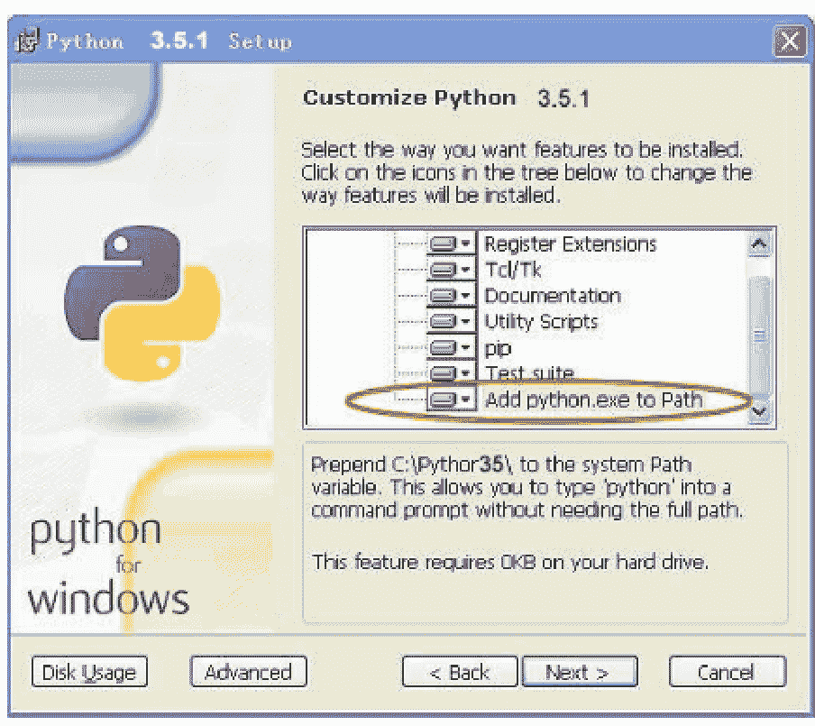
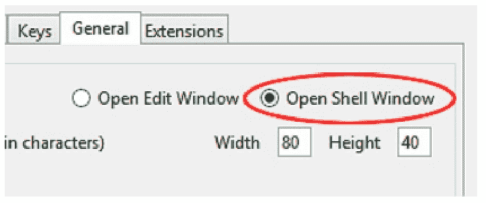
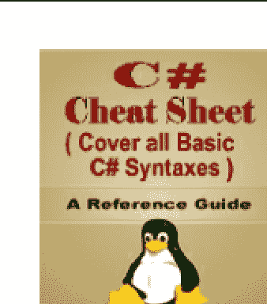
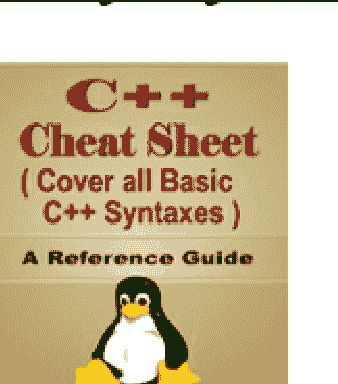
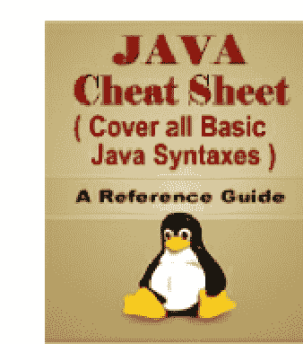
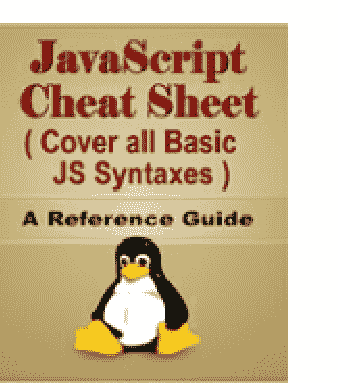
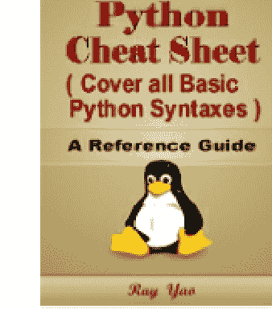
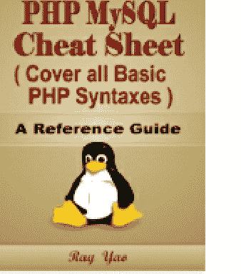
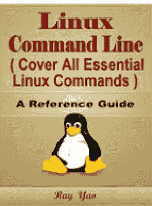
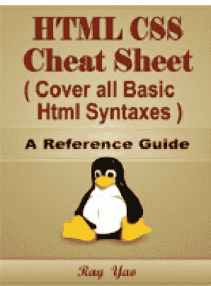

# Python

# 8小时入门


面向初学者

快速入门指南

Ray Yao

Python编程

Python练习

# Python

# 编程

面向初学者

快速入门指南

Ray Yao

# 版权所有 © 2015 Ray Yao团队

# 保留所有权利

未经作者事先书面许可，不得以任何形式或任何方式（电子、摄影或机械，包括影印、录制，或通过任何信息存储或检索系统）复制或传播本书的任何部分或全部。保留所有权利！

Ray Yao团队

# 关于作者：Ray Yao团队

- 美国Zend认证PHP工程师
- 美国Sun认证JAVA程序员
- 美国Oracle认证SCWCD开发人员
- 美国CompTIA认证A+专业人员
- 美国Microsoft认证ASP.NET专家
- 美国Microsoft认证MCP专业人员
- 美国Microsoft认证技术专家
- 美国CompTIA认证NETWORK+专业人员

www.amazon.com/author/ray-yao

# 关于本书

《Python编程》是一本面向高中和大学生的教科书；它涵盖了所有Python语言的基础知识。你可以快速轻松地学习Python编程的完整初级技能。

这本教科书包含大量面向初学者的实用示例，并包括大学期末考试、工程师认证考试和求职面试考试的练习题。

《Python编程》是一本对初学者非常有用的教科书。其直接的定义、简洁的示例、详尽的解释和整洁的排版，构成了这本实用且具有教育意义的书籍。你将被其独特而整洁的写作风格所打动。阅读本书是一种极大的享受！

# 注意

本书仅适合Python编程初学者、高中生和大学生；不适合有经验的Python程序员。

# Ray Yao的Kindle电子书

- [C# 速查表](C# Cheat Sheet)
- [C++ 速查表](C++ Cheat Sheet)
- [JAVA 速查表](JAVA Cheat Sheet)
- [JavaScript 速查表](JavaScript Cheat Sheet)
- [PHP MySQL 速查表](PHP MySQL Cheat Sheet)
- [Python 速查表](Python Cheat Sheet)
- [Html Css 速查表](Html Css Cheat Sheet)
- [Linux 命令行](Linux Command Line)

# Ray Yao的平装书

- [C# 速查表](C# Cheat Sheet)
- [C++ 速查表](C++ Cheat Sheet)
- [JAVA 速查表](JAVA Cheat Sheet)
- [JavaScript 速查表](JavaScript Cheat Sheet)
- [PHP MySQL 速查表](PHP MySQL Cheat Sheet)
- [Python 速查表](Python Cheat Sheet)
- [Html Css 速查表](Html Css Cheat Sheet)
- [Linux 命令行](Linux Command Line)

# 目录

# 第1章

- [什么是Python？](#)
- [下载与安装Python](#)
- [配置编辑器](#)
- [第一个Python代码](#)
- [Shell提示符](#)
- [变量](#)
- [注释](#)
- [算术运算符](#)
- [赋值运算符](#)
- [比较运算符](#)
- [逻辑运算符](#)
- [条件运算符](#)
- [转换数据类型](#)
- [三引号](#)
- [动手项目：车票费用总结](#hands-on-project-ticket-fare-summary)

# 第2章

- [If语句](#if-statement)
- [If-else语句](#if-else-statement)
- [缩进](#indentation)
- [If-elif语句](#if-elif-statement)
- [For-In循环](#for-in-loops)
- [for variable in range()](#for-variable-in-range)
- [While循环](#while-loop)
- [Continue](#continue)
- [Break语句](#break-statement)
- [输入文本](#input-texts)
- [Pass语句](#pass-statement)
- [动手项目：交通灯总结](#hands-on-project-traffic-light-summary)

# 第3章

- 数学函数
- ceil() 与 floor()
- pow() 与 sqrt()
- Max() 与 Min()
- abs() 与 round()
- 函数
- 带参数的函数
- 全局变量与局部变量
- 函数内的全局变量
- 返回值
- 主函数
- 列出模块中的所有函数
- 动手项目：圆的面积
- 总结

# 第4章

- 列表
- 列表函数
- 列表排序()
- 了解更多列表
- 元组
- 元组函数
- 集合
- 集合函数
- 字典
- 字典函数
- 数据结构回顾
- 动手项目：四种颜色
- 总结

# 第5章

- 字符串
- [转义字符](#)
- [检查字符串属性](#)
- [搜索函数](#)
- [格式化函数](#)
- [去除函数](#)
- [分割函数](#)
- [字符串函数 (1)](#)
- [字符串函数 (2)](#)
- [正则表达式](#)
- [Python中的正则表达式](#)
- [动手项目：检查输入](#)
- [总结](#)

## 第6章

- [格式化值](#)
- [文件目录](#)
- [打开文件](#)
- [文件名](#)
- [读取文件](Read file)
- [写入文件](Write File)
- [向文件追加内容](Append Content to File)
- [读取内容](Read the Contents)
- [打开网页](Open Web Page)
- [动手项目：处理文件](Hands-on Project: Process a File)
- [总结](Summary)
- [第6章测试](Chapter 6 Test)

# 第7章

- [模块](Module)
- [导入模块 (1)](Import Module (1))
- [导入模块 (2)](Import Module (2))
- [内置模块](Built-in Module)
- [异常](Exceptions)
- [捕获异常](Catch Exceptions)
- [Finally](Finally)
- [调试](Debug)
- 动手项目：三朵花
- 总结
- 第7章测试

# 第8章

- 类定义
- 对象声明
- 另一个对象
- 继承
- 方法重写
- 多态
- 动手项目：玫瑰是红色的
- 总结

# Python图表

- Python关键字图表
- 数据类型图表
- 数学函数图表
- 列表函数
- 元组函数
- 集合函数
- 字典函数
- 差异
- 测试函数
- 字符串操作
- 转义
- 搜索函数
- 格式化函数
- 去除函数
- 分割函数
- 字符串函数
- 正则表达式
- 文件方法
- 文件模式

# Python 问答

问题

答案

# Ray Yao推荐书籍

# 第1章

## 什么是Python？

Python是一种通用、面向对象和开源的计算机编程语言，它是一种高级、人类可读的语言，并拥有一套相应的软件工具和库。

**Python的特点：**

- Python是一种解释型语言
- Python是一种交互式语言
- Python是一种面向对象语言
- Python是一种初学者语言

**Python可以用于：**

- 网页开发
- 数据分析
- 人工智能
- 机器学习
- 数据可视化
- 自动执行任务的脚本
......

## 下载与安装Python

### 下载Python

Python安装程序可免费下载：
https://www.python.org/downloads/

### 安装Python

下载完成后，请双击运行安装程序，将Python安装到你的本地计算机。
例如：安装到 **C:\Python35**。点击“下一步”。

# 选择目标目录

请选择Python 3.5.1文件的目录。

C:\Python35

请确保选中“Add Python.exe to Path”选项。



请完成Python的安装。

# 运行与设置Python编辑器

安装完成后，你需要设置Python编辑器。

请点击“开始 > 程序 > Python3.5 > IDLE (Python 3.5)”。

让我们设置Python编辑器。

## 配置编辑器

有两个编辑窗口可以运行Python代码。你可以选择其中一个作为你的编辑器。

### 设置“打开编辑窗口”

为了运行整个Python程序而不是逐行运行，或者你想轻松复制或粘贴整个程序代码，你需要配置Python编辑器。

1. 点击“开始 > 程序 > Python3.5 > IDLE (Python 3.5)”。
2. 点击“选项 > 配置IDLE > 常规 > 打开编辑窗口” > 确定。

按键 | 常规 | 扩展

-   打开编辑窗口
-   打开 Shell 窗口

-   提示保存
-   不提示

字符宽度 80 高度 40

-   区域设置定义
-   UTF-8
-   无

请重启 Python 编辑器 **IDLE (Python 3.5)**。
选择“打开编辑窗口”后，你可以运行整个 Python 程序，而不是逐行执行。
（如果你不希望“打开编辑窗口”，你可以选择“打开 Shell 窗口”。）

### 设置“打开 Shell 窗口”

“打开 Shell 窗口”逐行运行 Python 代码，通过按 **Enter** 键执行每一行代码。

1.  点击“开始 > 程序 > Python3.5 > IDLE (Python 3.5)”。
2.  点击“选项 > 配置 IDLE > 常规 > 打开 Shell 窗口” > 确定。



3.  重启 Python 编辑器，你会看到命令提示符“>>>”，这意味着你处于 Python 的 Shell 窗口中。“>>>”是输入 Python 代码的命令提示符。

## 第一个 Python 代码

让我们先用“Shell 窗口”来运行 Python 代码。

打印输出的语法是：

```
print()
```

“print()”用于将输出打印到屏幕。

### 示例 1.1

```
>>> print("Hello World!")
```

输出：Hello World!

### 示例 1.2

```
>>> print("Python is a very good language!")
```

输出：Python is a very good language!

```
>>> print("Learn Python in 8 Hours!")
```

输出：Learn Python in 8 hours.

### 解释：

“>>>”是 Python 命令提示符。

“print()”显示结果。

## Shell 提示符

```
>>>
```

“>>>”是 Python 交互式命令的 shell 提示符，请求用户输入。

### 例如：

```
>>> 10 + 8
18
>>> 100 - 2
98
>>> " Hello " + " World! "
'Hello World!'
>>> " Very Good! " * 3
'Very Good! Very Good! Very Good!'
```

### 解释：

“>>>”提示你可以输入数据，然后按回车键。没有 `>>>` 的行是 Python 的响应消息。

### 例如：

```
>>> 100 * 2
200
>>> 72 / 9
8
>>> ( 2 + 3 ) * 4
20
>>> 10 % 3
1
>>> 2 ** 3
8
```

### 解释：

| 运算符 | 运算 |
| :--- | :--- |
| * | 乘法 |
| / | 除法 |
| % | 取余 |
| ** | 幂运算 |

### 注意：

现在，请将 Python 编辑器设置为“**打开编辑窗口**”，我们将运行整个程序，而不是逐行执行单个代码。

## 变量

“变量”是存储数据值的容器。变量值在程序运行时可能会改变。

定义变量的语法如下：

```
variableName = value

variableName1 = variableName2 = value

variableName1, variableName2 = value1, value2
```

“variableName”是变量名。

### 示例 1.3

```
var = 100

var1 = var2 = var3 = 100

var1, var2, var3 = 100, 200, 300
```

### 解释：

“var = 100”定义了一个名为“var”的变量，其值为 100。

“var1 = var2 = var3 = 100”将“100”赋值给“var1”、“var2”、“var3”。

“var1, var2, var3 = 100, 200, 300”分别将三个值“100, 200, 300”赋值给“var1”、“var2”、“var3”。

## 注释

注释用于解释代码，使程序更易读。Python 编译器总是忽略注释。

Python 注释的语法是：

```
# comment
```

“#”是 Python 中的注释符号。

### 示例 1.4

```
var01 = 100
print(var01)    # Output: 100
```

### 示例 1.5

```
var02 = "Python is very good!"
print(var02)    # Output: Python is very good!
```

### 解释：

“print()”用于显示内容。

“#”是注释符号，用于解释代码。

“`# Output: 100`”是一个注释。

“`# Output: Python is very good!`”是一个注释。

## 算术运算符

| 运算符 | 运算 |
| :--- | :--- |
| + | 加法 |
| - | 减法 |
| * | 乘法 |
| / | 除法 |
| % | 取余 |
| // | 整数除法 |
| ** | 幂运算 |

### 解释：

“%”取模运算符将第一个操作数除以第二个操作数，返回余数。

“//”的工作原理类似于“/”，但返回整数。

“**”返回第一个操作数的第二个操作数次幂的结果。

### 示例 1.6

```
a = 100 + 200
b = 72/9
c = 25 % 7
d = 7 // 3    # integer divide
e = 8 ** 2    # Exponentiation
print(a, b, c, d, e)
```

### 输出：

300, 8, 4, 2, 64

### 解释：

“100 + 200”返回 300

“72/9”返回 8

“25 % 7”返回 4。

“7 // 3”返回 2。

“8 ** 2”返回 64。

## 赋值运算符

“x += y”等同于“x = x + y”，请参阅下表：

| 运算符 | 示例： | 等同于： |
| :--- | :--- | :--- |
| += | x+=y | x=x+y |
| -= | x-=y | x=x-y |
| *= | x*=y | x=x*y |
| /= | x/=y | x=x/y |
| %= | x%=y | x=x%y |
| //= | x//=y | x=x//y |
| **= | x**=y | x=x**y |

### 示例 1.7

```
x=20
y=2
```

```
x /= y   # same as "x = x / y"

print(x)
```

### 输出：

10.0

### 解释：

“x /= y”与“x = x / y”相同

### 示例 1.8

```
m=100
n=18
m %= n   # same as "m = m % n"
print (m)
```

### 输出：

10

### 解释：

“m %= n”与“m = m % n”相同。

## 比较运算符

| 运算符 | 运算 |
| :--- | :--- |
| > | 大于 |
| < | 小于 |
| >= | 大于或等于 |
| <= | 小于或等于 |
| == | 等于 |
| != | 不等于 |

比较运算的结果为真或假。

### 示例 1.9

```
a = 100
b = 200
result1 = ( a > b )
print( result1 )
```

```
result2 = ( a == b )
print( result2 )
result3 = ( a != b )
print( result3 )
```

### 输出：

1.  False
2.  False
3.  True

### 解释：

```
result = (a>b)   # test 100>200   outputs false.
result = (a==b)  # test 100==200  outputs false.
result = (a!=b)  # test 100!=200  outputs true.
```

## 逻辑运算符

| 运算符 | 等同于 |
| :--- | :--- |
| and | 逻辑与 |
| or | 逻辑或 |
| not | 逻辑非 |

逻辑运算的结果为 True 或 False。

### 示例 1.10

```
x = True
y = False
a = x and y
print(a)
b = x or y
print(b)
```

```
c = not x
print(c)
```

### 输出：

False

True

False

### 解释：

| True 与 True 返回 True | True 与 False 返回 False | False 与 False 返回 False |
| :--- | :--- | :--- |
| True 或 True 返回 True | True 或 False 返回 True | False 或 False 返回 False |
| 非 False 返回 True | 非 True 返回 False | |

### 条件运算符

条件运算符的语法如下：

```
(if-true-do-this) if (test-expression) else (if-false-do-this)
```

(test-expression) 看起来像 a<b, x!=y, m==n 等。

注意：
Python 中的条件运算符语法与 C++ 或 Java 中的“ ? : ”三元运算符不同。

### 示例 1.11

```
x = 100
y = 200
result = "apple" if ( x < y ) else "banana"
print ( result )    # (x<y) is test-expression
```

### 输出：

apple

### 解释：

条件运算符使用 (x<y) 来测试“x”和“y”，因为“x”小于“y”，它返回真。因此，输出是“apple”。

## 数据类型转换

| 函数 | 运算 |
| :--- | :--- |
| int(x) | 将 x 转换为整数 |
| str(x) | 将 x 转换为字符串 |
| chr(x) | 将 x 转换为字符 |
| float(x) | 将 x 转换为浮点数 |
| hex(x) | 将 x 转换为十六进制字符串 |
| oct(x) | 将 x 转换为八进制字符串 |
| round(x) | 对浮点数 x 进行四舍五入 |
| type(x) | 检测 x 的数据类型 |

### 示例 1.12

```
num1 = int(8.67)
print(num1)  # returns 8
num2 = round(8.67)
print(num2)  # returns 9.0
```

```
num3 = float(5)
print(num3) # returns 5.0
```

### 解释：

“int(8.67), float(5)”将 8.67 和 5 转换为整数和浮点数类型。

“round(8.67)”对浮点数 8.67 进行四舍五入。

## 三引号

三引号用于显示多行文本。

```
"""
```

### 例如：

```
multiString = """
Python
is a very
good language!"""
print (multiString)
```

### 输出：

Python
is a very
good language!

### 解释：

三引号“ ... ”内的字符串可以跨越多行文本。

## 动手项目：车票费用

### 条件运算符

请点击"开始 > 程序 > Python3.5 > IDLE (Python 3.5)"。

在IDLE编辑器中输入以下代码：

```python
age = 15
ticket = "Child Fare" if (age < 16) else "Adult Fare"
print(ticket)  # (age < 16) is a test-expression
```

保存文件，然后按F5键运行程序。

### 输出：

Child Fare

### 解释：

条件运算符使用 `(age < 16)` 来测试 "age" 和 "16"，因为 "age" 小于 "16"，它返回真（true）。因此，输出是 "Child Fare"。

## 总结

`"print()"` 用于打印内容或结果。

`">>>"` 是Python交互式命令行提示符，用于请求用户输入。

`"变量"` 是存储数据值的容器。程序运行时，变量的值可能会改变。
定义变量的语法是：
变量名 = 值

`"#"` 是Python中的注释符号。

`"%"` 取模运算符用第一个操作数除以第二个操作数，返回余数。

`"//"` 工作方式类似 `"/"`，但返回的是整数。

`"**"` 返回第一个操作数的第二个操作数次幂的结果。

`"x += y"` 与 `"x = x + y"` 等价。

比较运算符：`>`, `<`, `>=`, `<=`, `==`, `!=`。

逻辑运算符：`and`, `or`, `not`。

条件运算符：
(if-true-do-this) **if** (test-expression) **else** (if-false-do-this)

`int(x)` 将x转换为整数。

三引号 `" ... "` 内的字符串可以跨越多行文本。

## 第1章 问题：

- 01. Python的注释符号是 _____
- 02. "_____" 返回第一个操作数的第二个操作数次幂的结果。
- 03. _____ 用于显示多行文本。
- 04. "_____" 是Python交互式命令行提示符，用于请求用户输入。
- 05. "______" 工作方式类似 `"/"`，但返回的是整数。

### 答案：

- 01. #
- 02. **
- 03. 三引号 ““ ””
- 04. >>>
- 05. //

# 第2章

## If 语句

`"if 语句"` 仅在指定条件为真时执行语句，如果条件为假则不执行任何语句。

If 语句的语法是：

```python
if test-expression:
    statements
```

### 示例 2.1

```python
x = 200
y = 100
if x > y:    # test-expression
    print("x is greater than y.")
```

### 输出：

x is greater than y.

### 解释

`"x>y"` 是一个测试表达式，即测试 200>100，如果返回真，则执行代码 `"print()"`，如果返回假，则不会执行代码 `"print()"`。

## If-else 语句

If/else 语句的语法是：

```python
if test-expression:
    statements   # test-expression 为真时运行
else:
    statements   # test-expression 为假时运行
```

### 示例 2.2

```python
x = 100
y = 200
if x > y:   # test-expression
    print("x is greater than y.")
else:
    print("x is less than y")
```

### 输出：

x is less than y.

### 解释：

`"x>y"` 是一个测试表达式，即测试 100>200，如果返回真，则执行代码 `"print('x is greater than y')"`，如果返回假，则执行代码 `"print('x is less than y')"`。

## 缩进

在Python中，缩进用于标记一个代码块。为了表示一个代码块，我们应该将该代码块的每一行缩进**四个**空格，这是Python中典型的缩进量。

### 例如：

```python
x = 100

y = 200

if x > y:
    print("x is greater than y.")  # 缩进四个空格

else:
    print("x is less than y")  # 缩进四个空格

# "print()" 缩进了四个空格。正确！
```

### 注意：

```python
if x > y:
print("x is greater than y.")	# 错误！
else:
print("x is less than y")	# 错误！
```

`"print()"` 没有缩进，所以出现了错误！

### If-elif-语句

If/elif 语句的语法是：

```python
if test-expression1:
    statements  # test-expression1 为真时运行此部分
elif test-expression2:
    statements  # test-expression2 为真时运行此部分
else:
    statements  # 所有 test-expression 都为假时运行此部分
```

### 示例 2.3

```python
num = 200
if num < 100:
    print("num is less than 100")
elif 100 < num < 150:
    print("num is between 100 and 150")
else:
    print("num is greater than 150")
```

**输出：**

num is greater than 150

**解释：**

`"elif"` 是 `"else if"` 的缩写。

## For-In 循环

for-in 循环根据指定的次数重复执行给定的代码块。

```python
for <variable> in <sequence>:
    <statements>
```

`"variable"` 存储每个项目的值。

`"sequence"` 可以是字符串、集合或 `range()`，后者表示循环的次数。

### 示例 2.4

```python
for str in 'good':  # 遍历这4个字符
    print('Current Character :', str)
```

输出：

- Current Character: g
- Current Character: o
- Current Character: o
- Current Character: d

### 解释：

`'for str in 'Good''` 循环四次，因为 `"good"` 有4个字符，`"str"` 存储每个字符的值。

## for variable in range()

`"for" variable in range()` 可以生成一个序列数字。

```python
for var in range(n)
for var in range(n1, n2)
```

`range(n)` 生成一个从 0 到 n-1 的序列。

`range(n1, n2)` 生成一个从 n1 到 n2-1 的序列。

### 示例 2.5

- (1)
```python
for var in range(6):  # 遍历从 0 到 5
    print(var)
```
输出：0,1,2,3,4,5.

- (2)
```python
for num in range(3, 10):  # 遍历从 3 到 9
    print(num)
```

**输出：** 3,4,5,6,7,8,9.

**解释：** for variable in range() 可以生成一个序列数字。

## While 循环

`"while"` 循环用于重复运行一段代码块。

while 循环的语法是：

```python
while <test-expression>:
    <statement>
```

`<test-expression>` 类似于 `a<100`, `b!=200`, `c==d` 等。

### 示例 2.6

```python
n = 0
while n < 9:  # 从 0 循环到 8
    print(n)
    n = n + 1
```

### 输出：

012345678

### 解释：

`"n < 9"` 测试 `"n"` 的值，如果 `"n"` 小于9，`"while"` 循环将执行 `"print(n)"`，并继续运行下一次循环。直到 `"n"` 大于或等于9，`"while"` 循环才会终止。

`"n = n + 1"` 在每次循环中将 n 加1。

## Continue

`"continue"` 可以跳过下一条命令，继续循环的下一次迭代。

```python
continue
```

### 示例 2.7

```python
num = 0
while num < 10:
    num = num + 1
    if num == 5:
        continue  # 跳转到下一次循环，跳过 print(num)
    print(num)
```

### 输出：

1234678910

### 解释：

请注意，输出中没有5。

`"if num==5: continue;"` 在 num 为5时跳过下一条命令 `print(num)`，然后继续下一次 while 循环。

## Break 语句

`"break"` 关键字用于根据条件停止循环的运行。

```python
break
```

### 示例 2.8

```python
num = 0
while num < 10:
    if num == 5:
        break    # 退出循环，执行下面的
    print(num)
    num = num + 1
print(num)
```

### 输出：

5

### 解释：

`"if num==5: break"` 如果 num 为5，将运行 `"break"` 命令，break 语句将退出 while 循环，运行 `"print(num)"`。

## 输入文本

有时用户需要通过键盘输入一些数据。

输入文本的语法是：

```python
variable = input("prompt")
```

### 示例 2.9

```python
name = input("Please input your name: ")
print("Your name is: " + name)
age = input("Please input your age: ")
print("Your age is: " + age)
```

### 输出：

Please input your name: "Jack"

Jack

Please input your age: "16"

### 解释：

`input()` 用于接收来自用户键盘的输入。

## Pass 语句

pass 语句是一个空操作；它意味着"什么也不做"。

```python
pass
```

`"pass"` 对于作为将来需要插入的代码的临时占位符非常有用。

### 示例 2.10

```python
condition = True
if condition:
    print('The condition is very good!')
elif True:
    pass    # 占位符
else:
    pass    # 占位符
```

### 输出：条件非常好！

### 解释：

"**pass**" 语句不执行任何操作，它只是一个临时占位符。

## 动手实践项目：交通灯

### If-elif-else语句

请点击 "开始 > 程序 > Python3.5 > IDLE (Python GUI)"。
在IDLE编辑器中输入以下代码：

```
trafficLight = input("Please input traffic light:")
# red, yellow or green
if trafficLight == "red":
    print ("The traffic light is " + trafficLight)
elif trafficLight == "green":
    print ("The traffic light is " + trafficLight)
else:
    print ("The traffic light is " + trafficLight)
```

保存文件，然后通过按 **F5** 键来运行程序。

假设我们输入的交通灯颜色是：green

**输出：**

Please input traffic light:

The traffic light is green.

### 解释：

```
if test-expression1:
    statements  # run this when the test-expression1 is true

elif test-expression2:
    statements  # run this when the test-expression2 is true

else:
    statements  # run this when all test-expressions are false
```

## 总结

"if语句"仅在指定条件为真时执行语句，如果条件为假，则不执行任何语句。

在Python中，使用缩进来标记一个代码块。为了表示一个代码块，我们应该将代码块的每一行都缩进 **四个** 空格，这是Python中典型的缩进量。

"for...in..."循环通过指定的次数重复运行给定的代码块。

"for variable in range( )" 可以生成一个序列数字。

"while循环"用于重复执行代码块。

"continue"可以跳过下一条命令，并继续循环的下一次迭代。

"break"关键字用于根据条件停止循环的运行。

有时用户需要通过键盘输入一些数据。
输入数据的语法是：
variable = input("prompt")

"pass"语句是一个空操作；它的意思是“什么都不做”。

"pass"在作为将来需要插入的代码的临时占位符时非常有用。

## 第2章问题：

- 01. 在Python中，你应该将代码块的每一行缩进_____个空格。

- 02. for <变量> _____ <序列>：
    <语句>

- 03. 通过键盘输入一些文本的语法是 _____

- 04. _____ 语句是一个空操作；它的意思是“什么都不做”。

- 05. _____ 生成一个从 n1 到 n2-1 的序列。

### 答案：

- 01. four (四)

- 02. in

- 03. variable = input("prompt")

- 04. pass

- 05. range(n1, n2)

# 第3章

# 数学函数

Python内置了许多不同的函数模块；其中最有用的模块之一是Math模块。下表列出了最常用的数学函数。

| 名称 | 描述 |
|---|---|
| abs(n) | n的绝对值 |
| round(n) | 对浮点数n进行四舍五入 |
| ceil(n) | 向上取整 |
| floor(n) | 向下取整 |
| max(n, m) | n和m中的最大值 |
| min(n, m) | n和m中的最小值 |
| degrees(n) | 将n从弧度转换为角度 |
| log(n) | n的以e为底的对数 |
| log(n, m) | n的以m为底的对数 |
| pow(n, m) | n的m次幂 |
| sqrt(n) | n的平方根 |
| sin(n) | n的正弦值 |
| cos(n) | n的余弦值 |
| tan(n) | n的正切值 |

注意：在使用数学函数之前，你需要 **导入math** 模块。

### 示例 3.1

```
import math  # 导入数学库
print("degrees(100):", math.degrees(100))
print("degrees(0):", math.degrees(0))
print("degrees(math.pi):", math.degrees(math.pi))
```

### 输出：

degrees(100): 5729.57795131
degrees(0): 0.0
degrees(math.pi): 180.0

### 解释：

degrees(n) 将 "n" 从弧度转换为角度。

## ceil( ) 和 floor( )

```
math.ceil();
math.floor();
```

"math.ceil( );" 返回一个大于或等于其参数的整数。
"math.floor( );" 返回一个小于或等于其参数的整数。

### 示例 3.2

```
import math

print("ceil(9.5) : ", math.ceil(9.5))
print("floor(9.5) : ", math.floor(9.5))
```

### 输出：

ceil(9.5) : 10.0
floor(9.5) : 9.0

### 解释：

"math.ceil( n );" 返回一个大于或等于9.5的整数，结果是10.0。

"math.floor( n );" 返回一个小于或等于9.5的整数，结果是9.0。

## pow() 和 sqrt()

```
math.pow();
math.sqrt();
```

"math.pow ();" 返回第一个参数的第二个参数次幂。

"math.sqrt ();" 返回参数的平方根。

### 示例 3.3

```
import math
print("pow(4,2):", math.pow(4,2))
print("sqrt(4):", math.sqrt(4))
```

### 输出：

pow(4,2): 16.0
sqrt(4): 2.0

### 解释：

"math.pow(4,2)" 返回第一个参数"4"的第二个参数"2"次幂，结果是16.0。

"math.sqrt(4)" 返回参数"4"的平方根，结果是2.0。

## Max() 和 Min()

```
math.max();
math.min();
```

"math.max()" 返回两个数中较大的那个。

"math.min()" 返回两个数中较小的那个。

### 示例 3.4

```
print ("max(4,2): ", math.max(4,2))
print ("min(4,2): ", math.min(4,2))
```

### 输出：

max(4,2): 4

min(4,2): 2

### 解释：

"math.max(x, y)" 返回100和200中较大的数，结果是200。

"math.min(x, y)" 返回100和200中较小的数，结果是100。

## abs( ) 和 round( )

abs()
round()

abs( ) 返回一个数的绝对值。
round( ) 对浮点数进行四舍五入。

### 示例 3.5

```
print ("abs(-100): ", abs(-100))
print ("round(0.555,2): ", round(0.555,2))
```

### 输出：

abs(-100): 100
round(0.555,2): 0.56

### 解释：

abs(-100) 返回绝对值100，没有负号。

round(0.555, 2) 将浮点数四舍五入到小数点后两位。

## 函数

(1) 可以使用 "def" 创建一个函数

```
def functionName():    # 定义一个函数
    函数体
```

(2) 调用函数的语法

```
functionName()    # 调用函数
```

### 示例 3.6

```
def myFunction():    # 定义一个函数
    print("This is a custom function.")
myFunction()    # 调用函数
```

**输出：**

This is a custom function

**解释：**

`def myFunction():` 定义了一个函数。

`myFunction()` 调用了一个函数。

## 带参数的函数

(1) 定义一个带参数的函数

```
def functionName(arguments):  # 定义一个带参数的函数
    函数体
```

(2) 调用一个带参数的函数

```
functionName(arg)  # 调用函数并传递参数
```

### 示例 3.7

```
def userName(name):  # 定义一个带 "name" 参数的函数
    print("My name is " + name)
userName("Andy")  # 调用函数并传递 "Andy"
```

### 输出：

My name is Andy

### 解释：

"def userName(name):" 定义了一个参数 "name"。

"userName("Andy")" 将 "Andy" 传递给了参数 "name"。

## 全局变量与局部变量

全局变量在函数外部定义，可以在函数内部和外部被引用。

局部变量在函数内部定义，不能在函数外部被引用，只能在函数内部被引用。

### 示例 3.8

```
globalVar = "gv"    # 定义一个全局变量
def myFunction():
    print("The global variable value is: " + globalVar)
    localVar = "lv"    # 定义一个局部变量
    print("The local variable value is: " + localVar)
myFunction()    # 调用函数 "myFunction()"
```

### 输出：

The global variable value is: gv

The local variable value is: lv

### 解释：

"gv" 是一个全局变量值。"lv" 是一个局部变量值。

## 函数内的全局变量

如果我们希望函数内部的一个变量能在任何地方被引用，即在函数内部和外部都能被引用，我们应该使用 **global** 关键字来定义这个变量。

在函数内定义全局变量的语法是：

```
global myVariable
```

### 示例 3.9

```
def myFunction():
    global myVar # 在函数内定义一个全局变量
    myVar = "This variable can be referenced in everywhere."
myFunction() # 调用函数
print("myVar: " + myVar) # 引用 myVar
```

### 输出：

myVar：此变量可在任何位置被引用。

### 解释：

"global myVar"定义了一个全局变量。变量"myVar"可在任何位置被引用。

## 返回

"return"指定了要发送回函数调用者的值。

```
return value
```

函数调用者指的是调用该函数的命令。

### 示例 3.10

```python
def multiply( n, m ):
    return n*m    # 将值传递给函数调用者

print (multiply( 2,100 ))    # 函数调用者
```

### 输出：

200

### 解释：

"multiply( 2,100 )"调用了该函数，因此它是函数调用者。

"return n*m"将其结果值传递给 multiply(2,100)。

就像这样：multiply(2, 100) = return n*m。

## 主函数

main() 函数默认是程序的起点。

```python
def main():
    function body
```

注意：在 Python 中，main() 函数是可选的。

### 示例 3.11

```python
def main():    # 默认首先运行此函数
    pwd = input("请输入您的密码：\n")
    if pwd == "12345":
        print("您输入的是： "+ pwd + " 正确！")
    else:
        print("您输入的是： "+ pwd + " 不正确！")
main()
```

### 输出：

请输入您的密码：
您输入的是： 12345 正确！

### 解释：

在 Python 中，main() 默认是第一个运行的函数。

## 列出模块中的所有函数

"dir(module)" 可以列出指定模块中的所有函数。

```
dir(module)
```

### 示例 3.12

```python
import math

print (dir(math))    # 显示 math 模块中的所有函数
```

### 输出：

(降序排列)
['trunc', 'tanh', 'tan', 'sqrt', 'sinh', 'sin', 'radians', 'pow', 'pi', 'modf', 'log1p', 'log10', 'log', 'lgamma', 'ldexp', 'isnan', 'isinf', 'hypot', 'gamma', 'fsum','frexp', 'fmod', 'floor', 'factorial', 'fabs', 'expm1', 'exp', 'erfc', 'erf', 'e', 'degrees', 'cosh', 'cos', 'copysign', 'ceil', 'atanh', 'atan2', 'atan', 'asinh', 'asin', 'acosh', 'acos', '__package__', '__name__', '__doc__']
```

### 解释：

"print (dir(math))" 列出了 math 模块中的所有函数。

## 实践项目：计算圆的面积

### 调用函数与返回

请点击 "开始 > 所有程序 > Python3.5 > IDLE (Python GUI)"。
在 IDLE 编辑器中输入以下代码：

```python
import math

r = int(input("请输入半径： "))  # 用户输入

def circleArea():   # 定义一个函数
    return math.pi*pow(r, 2) # 计算圆的面积

print ("圆的面积是： ", circleArea())  # 函数调用者
```

保存文件，并通过按 **F5** 键来运行程序。

假设我们输入一个数字：3

### 输出：

请输入半径： 3
圆的面积是： 28.2743338823

### 解释：

"circleArea()" 调用了函数 "def circleArea(){}"。
"circleArea()" 是函数调用者。
"return math.pi*pow(r, 2)" 将其结果值返回给函数调用者。就像这样：circleArea() = math.pi*pow(r, 2)。
如果我们输入 "3" 作为半径，那么 circleArea() 的值将返回 28.2743338823。

## 总结

"math.ceil( );" 返回一个大于或等于其参数的整数。

"math.floor( );" 返回一个小于或等于其参数的整数。

"math.pow ( );" 返回第一个参数的第二个参数次幂。

"math.sqrt ( );" 返回参数的平方根。

"math.max( )" 返回两个数中较大的那个。

"math.min( )" 返回两个数中较小的那个。

abs() 返回一个数的绝对值。

round() 对浮点数进行四舍五入。

可以使用 "def" 创建自定义函数。

"def functionName(arguments)" 定义一个带参数的函数。

"functionName(arg)" 调用一个函数并传递参数。

全局变量在函数外部定义，可以从函数内部和外部引用。

局部变量在函数内部定义，不能从外部引用，只能在函数内部引用。

"return" 指定了要发送回函数调用者的值。

main() 函数默认是程序的起点。

"dir(module)" 可以列出指定模块中的所有函数。

## 第3章问题：

01. 
"____" 返回一个大于或等于其参数的最小整数。

02. 
"____" 返回一个小于或等于其参数的最大整数。

03. 
____ 定义一个函数

04. 
____ 函数是整个程序的默认起点。

05. 
"_____" 可以列出指定模块中的所有函数。

### 答案：

1. `math.ceil( );`
2. `math.floor( );`
3. `def functionName(arg)`
4. `main( )`
5. `dir(module)`

# 第4章

## 列表

Python 中的列表类似于 Java 中的数组，它是一系列数据的集合。你可以在列表中添加、删除或修改元素。

```python
listName = [val1, val2, val3]    # 创建一个列表
```

### 示例 4.1

```python
month = ["Mon", "Tue", "Wed", "Thu"]    # 创建一个列表
print (month[0], month[1], month[2], month[3])
```

### 输出：

Mon Tue Wed Thu

### 解释：

列表 "month" 有四个元素。
Mon 的键（索引）是 0。
Tue 的键（索引）是 1。
Wed 的键（索引）是 2。
Thu 的键（索引）是 3。

注意：列表中的键（索引）从 0 开始。

## 列表函数

| 函数 | 操作 |
|---|---|
| list.append(n) | 将 n 追加到列表末尾 |
| list.count(n) | 统计 n 出现的次数 |
| list.index(n) | 返回 n 的索引 |
| list.insert(i,n) | 在索引 i 之前插入 n |
| list.pop(i) | 移除并返回索引 i 处的项目 |
| list.remove(n) | 移除第一个值为 n 的元素 |
| list.reverse() | 反转列表的顺序 |
| list.sort() | 升序排列列表元素 |
| list.extend(lst) | 将 lst 的每个项目追加到列表 |

### 示例 4.2

```python
list = [0, 1, 2]   # 创建一个列表
list.append(3)  # 将 3 追加到列表末尾
list.reverse()   # 反转列表的顺序
print (list)   # 输出: [3, 2, 1, 0]
```

### 解释：

以上代码使用了列表函数。

## 列表排序

对列表所有元素进行排序的语法是：

```
list.sort(reverse=True/False)
```

如果 'reverse=False'，则按升序排列所有元素。

如果 'reverse=True'，则按降序排列所有元素。

### 示例 4.3

```python
myList = [6, 3, 7, 1, 5, 9, 2, 8]
myList.sort(reverse=True)
print(myList)
```

### 输出：

[9, 8, 7, 6, 5, 3, 2, 1]

### 解释：

如果我们使用参数 'reverse=False'，那么我们将按升序排列所有元素。输出将是 [1,2,3,4,5,6,7,8,9]。

## 更多列表知识

连接两个列表和获取列表长度的语法是：

```python
list1 + list2   # 连接两个列表
len (list)      # 获取列表的长度
```

### 示例 4.4

```python
lst1 = [0, 1, 2]
lst2 = [3, 4, 5]
myList = lst1 + lst2    # 连接两个列表
print ("myList: ", myList)
print ("myList[5]: ", myList[5])
print ("len(myList): ", len(myList))  # 获取 myList 的长度
```

### 输出：

myList: [0, 1, 2, 3, 4, 5]
myList[5]: 5
len(myList): 6

### 解释：

"list1 + list2" 连接两个列表。"len(myList)" 返回 myList 的长度。

## 元组

元组的值是不可变的，它是一个不可变的列表。

```python
tupleName = (val1, val2, val3)  # 创建一个元组
```

### 示例 4.5

```python
tpl = ("Mon", "Tue", "Wed", "Thu") # 创建一个元组
print (len(tpl))
print (tpl.index("Wed")) # 显示 Wed 的索引
```

### 输出：

4 2

### 解释：

len(tpl) 返回 "tpl" 的长度。
index("Wed") 返回 "Wed" 的索引。

### 示例 4.6

```python
tpl = ("Mon", "Tue", "Wed", "Thu")  # 创建一个元组
print(tpl.append("Fri"))  # 尝试向 tpl 追加一个元素
```

**输出：** 错误！

**解释：**

元组的值是不可变的。

## 元组函数

| 函数 | 操作 |
|---|---|
| x in tpl | 如果 x 在元组中则返回 true |
| len(tpl) | 返回元组的长度 |
| tpl.count(x) | 统计元组中 x 的个数 |
| tpl.index(x) | 返回 x 的索引 |

### 示例 4.7

```python
colors = ("red", "yellow", "green")
print (colors)           # 输出: ('red', 'yellow', 'green')
print ("yellow" in colors)    # 输出: True
print (len(colors))           # 输出: 3
print (colors.index("green")) # 输出: 2
```

## 集合

集合的值是唯一的。集合的值是无序的。
创建集合的语法如下：

```python
setName = {"dog", "cat", "rat"}    # 创建一个集合
```

### 示例 4.8

```python
animal = {"dog", "cat", "rat", "dog"} # 创建一个集合
print (animal)   # 打印 "animal" 的元素
print ("cat" in animal)   # 检查 "cat" 是否在 "animal" 中
print (len(animal))
```

### 输出：

```
{'rat', 'dog', 'cat'}
True
3
```

### 解释：

尽管集合中有四个元素，`len(animal)` 仍然返回 3，因为集合的值是唯一的。其中一个 "dog" 被省略了。

注意：集合的值是无序的。

## 集合函数

| 函数 | 操作 |
| --- | --- |
| set.add(n) | 将 x 添加到集合中 |
| set.update(a, b, c) | 将 a, b, c 添加到集合中 |
| set.copy() | 复制集合 |
| set.remove(n) | 移除元素 n |
| set.pop() | 随机移除一个元素 |
| set1.intersection(set2) | 返回两个集合中都存在的元素 |
| set1.difference(set2) | 返回在 set1 中但不在 set2 中的元素 |

### 示例 4.9

```python
languages = {"ASP", "PHP", "JSP"}  # 创建一个集合
languages.add("C++")
print(languages)  # 输出: {'C++', 'JSP', 'PHP', 'ASP'}
languages.remove("PHP")
print(languages) # 输出: {'C++', 'JSP', 'ASP'}
```

### 解释：

上面的例子演示了集合函数。

## 字典

字典是一种用于存储键/值对的数据结构，格式为 key:value。

```python
dictionaryName = { key1: val1, key2:val2, key3:val3 }
```

### 示例 4.10

```python
light = {"A": "red","B": "yellow","C": "green"}

### 创建一个字典

print( light )

print( light["B"] )  # 打印索引 "B" 处的值

light["C"] = "white"  # 更改索引 "C" 处的值

print ( light )
```

### 输出：

```
{'A': 'red', 'B': 'yellow', 'C': 'green'}
yellow
{'A': 'red', 'B': 'yellow', 'C': 'white'}
```

### 解释：

`light["C"] = "white"` 将值 "white" 赋给 `light["C"]`。

## 字典函数

| 函数 | 操作 |
|---|---|
| d.items() | 返回 d 的键:值对 |
| d.keys() | 返回 d 的键 |
| d.values() | 返回 d 的值 |
| d.get(key) | 返回指定键的值 |
| d.pop(key) | 移除键并返回其值 |
| d.clear() | 移除 d 的所有项 |
| d.copy() | 复制 d 的所有项 |
| d.setdefault(k,v) | 设置键:值到 d |
| d1.update(d2) | 将 d1 中的键:值添加到 d2 |

### 示例 4.11

```python
light = {0:'red', 1:'yellow', 2:'green'}
print (light.items())    # 返回键和值
print (light.keys())     # 返回键
print (light.values())   # 返回值
print (light.get(2))     # 返回索引 2 处的值
```

### 输出：

```
dict_items([(0, 'red'), (1, 'yellow'), (2, 'green')])
dict_keys([0, 1, 2])
dict_values(['red', 'yellow', 'green'])
green
```

### 解释：

让我们研究一下输出结果：
`"dict_items([(0, 'red'), (1, 'yellow'), (2, 'green')])"` 意味着这是一个字典，包含三个 "键/值" 对。
`"dict_keys([0, 1, 2])"` 意味着字典包含三个键 (0,1,2)。
`"dict_values(['red', 'yellow', 'green'])"` 意味着字典包含三个值 (red, yellow, green)。

## 数据结构回顾

| 结构 | 描述 |
| :--- | :--- |
| 列表 | 存储多个可变的值 |
| 元组 | 存储多个不可变的值 |
| 集合 | 存储多个唯一的值 |
| 字典 | 存储多个键:值对 |

### 示例 4.12

```python
myList = [1,2,2,2,3,4,5,6,6,6]   # 创建一个列表
result = set(myList)   # 将列表转换为集合
print(result)   # 打印集合
```

### 输出：

```
{1, 2, 3, 4, 5, 6}
```

### 解释：

`"set(myList)"` 返回多个唯一的值。

## 动手项目：四色

### 字典演示

请点击 "开始 > 程序 > Python3.5 > IDLE (Python 3.5)"。

在 IDLE 编辑器中输入以下代码：

```python
color ={0:"red", 1:"yellow", 2:"green", 3:"white"}
v = color.values()     # 获取 "color" 的值
for c in v:
    print (c)
```

保存文件，然后按 F5 键运行程序。

### 输出：

```
red
yellow
green
white
```

### 解释：

`"color ={0:"red", 1:"yellow", 2:"green", 3:"white"}"` 是一个字典。

`"color.values()"` 返回字典 "color" 的所有值。

`"for-in"` 循环通过指定的次数重复执行给定的代码块。

`"for c in v"` 循环重复执行 `"print (c)"`，`"c"` 存储每个元素的值。

## 总结

Python 中的列表类似于 Java 中的数组，是一系列数据的集合。你可以在列表中添加、删除或修改元素。

元组的值是不可变的，它是一个不可变的列表。

集合的值是唯一的；

字典是一种用于存储键/值对的数据结构，格式为 key:value。

## 区别

| 结构 | 描述 |
|---|---|
| 列表 | 存储多个可变的值 |
| 元组 | 存储多个不可变的值 |
| 集合 | 存储多个唯一的值 |
| 字典 | 存储多个键:值对 |

## 第4章问题：

01.
Python 中的 _____ 类似于 Java 中的数组，是一系列数据的集合。你可以在其中添加、删除或修改元素。

02.
_____ 的值是不可变的，它是一个不可变的列表。

03.
_____ 的值是唯一的；它是一个值唯一的特殊列表。

04.
_____ 是一种用于存储键:值对的数据结构，格式为 key:value。

05. _____ 返回列表的长度。

### 答案：

- 01. list
- 02. tuple
- 03. set
- 04. dictionary
- 05. len(list)

# 第5章

## 字符串

字符串由一组字符组成；其值可以通过以下运算符进行操作。

| 运算符 | 描述 |
| :--- | :--- |
| + | 将字符串连接在一起 |
| * | 重复一个字符串 |
| [key] | 返回字符串的一个字符 |
| [key1: key2] | 返回从 key1 到 key2-1 的字符 |
| in | 检查字符是否存在于字符串中 |
| not in | 检查字符是否不存在于字符串中 |
| """ """ | 描述函数、类、方法... |

### 示例 5.1

```python
myString = "Python "+ "is a good language"
print(myString)   # 输出: Python is a good language
print(myString[2])   # 输出: t
print('P' in myString)   # 输出: True
print(myString[7:25])   # 输出: is a good language
```

### 解释：

`"string[key1: key2]"` 返回从 key1 到 key2-1 的字符。

## 转义字符

| 字符 | 描述 |
| :--- | :--- |
| \\ | 转义反斜杠 |
| \' | 转义单引号 |
| \" | 转义双引号 |
| \n | 换行 |
| \r | 回车 |
| \t | 制表符 |

### 示例 5.2

```python
print('Python said: "Welcome!"')
print("Python \t is\t OK!")
```

### 输出：

```
Python said: "Welcome!"
Python     is    OK!
```

### 解释：

`\"` 转义双引号，`\t` 转义制表符。

## 检查字符串属性

以下函数用于检查字符串属性。

| 函数 | 检查字符串是否为..... |
| --- | --- |
| isalpha() | 如果字符串是字母则返回 true |
| isdigit() | 如果字符串是数字则返回 true |
| isdecimal() | 如果字符串是十进制数则返回 true |
| isalnum() | 如果字符串是数字或字母则返回 true |
| islower() | 如果字符串是小写则返回 true |
| isupper() | 如果字符串是大写则返回 true |
| istitle() | 如果字符串是标题格式字符串则返回 true |
| isspace() | 如果字符串只包含空白字符则返回 true |

### 示例 5.3

```python
s1 = "1124324324"
print(s1.isdigit())  # 输出: True
s2 = "Chicago"
print(s2.istitle())  # 输出: True
```

### 解释：

`isdigit()` 和 `istitle()` 是用于测试字符串的函数。

## 搜索函数

| 函数 | 返回 |
| --- | --- |
| find(c) | 返回第一次出现的索引，或 -1 |
| rfind(c) | 与 find() 相同，但从右向左查找 'c' |
| index(c) | 返回第一次出现的索引，或发出警报 |
| rindex(c) | 与 index() 相同，但从右向左查找 'c' |

### 示例 5.4

```python
s1 = "JavaScript"
print(s1.find("a"))  # 输出: 1
s2 = "JavaScript"
print(s2.rfind("a"))  # 输出: 3
s3 = "abec"
```

print(s3.index("e"))  # 输出：2

### 解释：

find()、rfind() 和 index() 返回指定字符的索引。

## 格式化函数

| 函数 | 返回的字符串 |
| :--- | :--- |
| center(w, f) | 将字符串居中，宽度为 w，用 f 填充 |
| ljust(w, f) | 将字符串左对齐，宽度为 w，用 f 填充 |
| rjust(w, f) | 将字符串右对齐，宽度为 w，用 f 填充 |

### 示例 5.5

```
str = "this is a center example"
print ("str.center(35, '$'): ", str.center(35, '$'))
print ("str.ljust(35, '$'): ", str.ljust(35, '$'))
print ("str.rjust(35, '$'): ", str.rjust(35, '$'))
```

### 输出：

```
str.center(35, '$') : $$$$$$this is a center example$$$$
```

```
str.ljust(35, '$') : this is a center example$$$$$$$$$$
$$
```

```
str.rjust(35, '$') : $$$$$$$$$$$this is a center example
```

### 解释：

参数 "35" 指定了此字符串的长度。

参数 "$" 指定用 "$" 来填充长度。

## 去除函数

| 函数 | 返回的字符串 |
|-----------|-----------------|
| strip() | 移除开头和结尾的空格 |
| lstrip() | 移除开头的空格 |
| rstrip() | 移除结尾的空格 |

### 示例 5.6

```
str = "    This is a lstrip sample!    ";
print(str.lstrip())    # 移除开头的空格
str = "    This is a rstrip sample!    ";
print(str.rstrip())    # 移除结尾的空格
```

### 输出：

This is a lstrip sample!
    This is a rstrip sample!

### 解释：

如果代码使用 strip("@")，它将移除开头和结尾的 @。

如果代码使用 strip( )，它将移除开头和结尾的空格。

## 分割函数

| 函数 | 返回的字符串 |
|---|---|
| split(separator) | 在指定的分隔符处分割字符串。（默认为空白符） |
| partition(substrings) | 使用子字符串将字符串分割成三部分。（头部，子字符串，尾部） |

### 示例 5.7

```
str = "Python is a very good language"
print (str.split())   # 在每个字符串空白符处分割字符串

str = "Visual Basic in 8 Hours"
print( str.partition("in"))   # 使用 "in" 将字符串分割成三部分
```

### 输出：

['Python', 'is', 'a', 'very', 'good', 'language']

```
('Visual Basic ', 'in', ' 8 Hours')
```

### 解释：

"str.split()" 在每个字符串空白符处分割字符串。

"str.partition("in")" 使用 "in" 将字符串分割成三部分。

## 字符串函数 (1)

| 函数 | 返回的字符串 |
|---|---|
| replace(old, new) | 用 new 替换 old |
| count(ch) | 计算字符的数量 |
| capitalize() | 将首字母改为大写 |

### 示例 5.8

```
str = "jQuery is a great language!"
print(str.replace("great","very good"))  # 替换
print(str.count("a"))  # 计算 "a" 的数量
print(str.capitalize())  # 将首字母改为大写
```

### 输出：

jQuery is a very good language!

4

# Jquery is a great language!

### 解释：

`"str.replace("great","very good")"` 将 `"great"` 替换为 `"very good"`。

## 字符串函数 (2)

| 函数 | 返回的字符串 |
| :--- | :--- |
| separater.join() | 使用分隔符连接字符串 |
| str.swapcase() | 交换字符串的字母大小写 |
| str.zfill(length) | 在字符串左侧按长度添加零 |

### 示例 5.9

```
strDate = "/".join(["12", "31","2013"])  # "/" 是分隔符
print (strDate)
str = "Python"
print (str.swapcase())  # 交换字母大小写
print (str.zfill(10))  # 在左侧填充 0，长度为 10 个字符
```

### 输出：

12/31/2013

pYTHON

0000Python

### 解释：

""/".join(["12", "31","2013"])" 使用 "/" 分隔日期字符串。

"str.swapcase()" 将 "Python" 变为 "pYTHON"。

"str.zfill(10)" 按长度 "10" 在字符串左侧填充 "0"。

## 正则表达式

正则表达式用于匹配具有指定模式的字符串，执行搜索、替换和分割等任务...

| 运算符 | 匹配 |
| --- | --- |
| ^ | 匹配行的开头。 |
| $ | 匹配行的结尾。 |
| . | 匹配任何单个字符。 |
| [...] | 匹配方括号内的任何单个字符。 |
| [^...] | 匹配不在方括号内的任何单个字符。 |
| ? | 匹配 0 次或 1 次出现。 |
| + | 匹配 1 次或多次出现。 |
| * | 匹配 0 次或多次出现。 |
| {n} | 恰好匹配 n 次出现。 |
| {n, m} | 匹配至少 n 次且最多 m 次出现。 |
| a \| b | 匹配 a 或 b。 |
| (re) | 对正则表达式进行分组。 |

### 示例 5.10

| 模式 | 匹配 |
| --- | --- |
| [Jj]Query | 匹配 "JQuery" 或 "jQuery" |
| s[ei]t | 匹配 "set" 或 "sit" |
| [0-9] | 匹配任何数字 |
| [a-z] | 匹配任何小写字母 |
| [A-Z] | 匹配任何大写字母 |
| [a-zA-Z0-9] | 匹配任何数字和字母 |
| [^0-9] | 匹配除数字以外的任何字符。 |
| lady? | 匹配 "lad" 和 "lady"。 |
| m+ | 匹配 "m"、"mm"、"mmm"、"mmmm"...... |
| ab* | 匹配 'a'、'ab'、'abb'、'abb'...... |
| w{3} | 匹配 "www" |
| n{2,4} | 匹配 "nn"、"nnn"、"nnnn" |

| 运算符 | 匹配 |
| :--- | :--- |
| \w | 匹配单词字符。 |
| \W | 匹配非单词字符。 |
| \s | 匹配空格。 |
| \S | 匹配非空格。 |
| \d | 匹配数字。 |
| \D | 匹配非数字。 |

### 示例 5.11

\w 匹配单词字符：[a-z_A-Z_0-9]
\d 匹配 [0-9]

## Python 中的正则表达式

在 Python 中使用正则表达式的语法是：

```
pattern = re.compile( 正则表达式)  # 返回一个模式
pattern.match(string)  # 将模式与字符串匹配
```

### 示例 5.12

（假设只接受电话号码格式 ddd-ddd-dddd。）

```
import re  # 导入 re 模块
pattern = re.compile("^(\d{3})-(\d{3})-(\d{4})$")  # 正则表达式
phoneNumber = input("Enter your phone number:")
valid = pattern.match(phoneNumber)  # 匹配
print (phoneNumber)
if valid:
    print ("OK! Valid Phone Number!")
else:
    print("No Good! Invalid Phone Number!")
```

### 输出：

Enter your phone number: 123-456-7890

OK! Valid Phone Number!

### 解释：

re.compile("^(\\d{3})-(\\d{3})-(\\d{4})$") 返回一个模式。

## 动手项目：检查输入

### isalpha() 演示

请点击 "开始 > 程序 > Python3.5 > IDLE (Python GUI)"。

在 IDLE 编辑器中输入以下代码：

```
name = input("Please enter your last name: ")
isLetter = name.isalpha()  # 检查输入是否全是字母
if isLetter:
    print("OK! Valid Last Name!")
else:
    print("No Good! Invalid Last Name!")
```

保存文件，然后按 **F5** 键运行程序。

### 输出：

（假设输入 "Swift"）

Please enter your last name:  Swift

OK! Valid Last Name!

### 解释：

**isalpha()** 在输入全是字母时返回 true。

如果用户输入数字或符号，isalpha() 将返回 false。

例如，如果用户输入 "hero007"，"isalpha()" 将返回 false，因为输入包含一些数字。

## 总结

字符串由一组字符组成；其值可以通过以下运算符进行操作：+、*、[key]、[key1: key2]、in、not in、" "

转义字符是：\、\'、"、\n、\r、\t

测试函数返回 True 或 False。

搜索函数返回指定字符的索引。

格式化函数返回居中、左对齐、右对齐的字符串。

去除函数移除开头或结尾的空格。

分割函数在指定的分隔符处分割字符串。

分区函数将字符串分割成三部分。

"replace(old, new)" 用新字符串替换旧字符串。

count(ch) 计算字符的数量。

capitalize() 将首字母改为大写。

separater.join() 使用分隔符连接字符串。

str.swapcase() 交换字符串的字母大小写。

str.zfill(length) 按长度在字符串左侧添加零。

## 第五章 问题：

01. _____ 函数用于去除字符串开头或结尾的空格。

02. _____ 函数用于按分隔符分割字符串。

03. _____ 函数用于将首字母转换为大写。

04. _____ 函数用于在字符串左侧填充零以达到指定长度。

05. _____ 匹配除数字以外的任何字符。

### 答案：

+   01. strip()
+   02. split(separator)
+   03. capitalize()
+   04. str.zfill(length)
+   05. [^0-9]

# 第六章

## 格式化值

一个值可以在输出前进行格式化，这样输出结果将是一个已格式化的指定值。

格式化值的语法如下：

```
("......%formatted" %original)
```

%original 值与 %formatted 值相同，但

- "original" 是一个原始值。
- "formatted" 是一个格式化后的值。

输出值可以通过以下说明符进行格式化：

| 符号 | 类型说明 |
|------|----------|
| %d   | 整数 |
| %f   | 浮点数 |
| %s   | 字符串 |
| %o   | 八进制值 |
| %x   | 十六进制值 |
| %e   | 指数形式 |

### 示例 6.1

```
num = 100
print ("String value is: %s" %num)   # 字符串格式
print ("Float value is: %.3f" %num)  # 三位小数
print ("Exponential value is: %e" %num)  # 指数格式
print ("Octal value is: %o" %num)    # 八进制格式
print ("Hexadecimal value is: %x" %num)  # 十六进制
print ("Integer value is: %d" %num)  # 整数格式
```

### 输出：

String value is: 100
Float value is: 100.000
Exponential value is: 1.000000e+02
Octal value is: 144
Hexadecimal value is: 64
Integer value is: 100

### 解释：

在 ("......%yyy" %xxx) 中，

%xxx 是一个原始值。

%yyy 是一个格式化后的值。

## 文件目录

要处理文件目录，我们需要导入 os 模块。

处理文件目录的语法如下：

```python
path = os.getcwd()  # 返回当前工作目录

os.listdir(path)    # 列出当前目录中的所有内容

os.chdir(path)      # 将路径更改为当前目录

os.getcwd()         # 返回当前工作目录
```

### 示例 6.2

```python
import os

print(os.getcwd())  # 返回当前工作目录

path = os.getcwd()
print (os.listdir(path)) # 返回文件和子目录
```

### 输出：

C:\Python35
['DLLs', 'Doc', 'include', 'Lib', 'libs', 'LICENSE.txt', 'myFile.txt', 'NEWS.txt', 'python.exe', 'pythonw.exe', ......]

### 解释：

"os.listdir(path)" 返回当前目录中的所有文件和子目录。

## 打开文件

打开文件的语法如下：

```
open(filename, "argument")
```

参数列表如下：

| 参数 | 操作 |
|------------|----------|
| r | 以读取模式打开文件（默认） |
| w | 以写入模式打开文件 |
| a | 以追加模式打开文件 |
| + | 以读写模式打开文件 |
| b | 以二进制模式打开文件 |
| t | 以文本模式打开文件 |

我们将在接下来的几页中学习如何使用 "open()" 函数。

## 文件名

打开文件并获取文件名的语法如下：

```
f = open("fileName")   # 打开一个文件，定义一个文件对象
f.name   # 获取文件名
```

### 示例 6.3

假设 D: 盘中存在一个文件 "myFile.txt"。
"D:\myFile.txt" 的内容为：
"Hallo ! This is D : \myFile . txt . Welcome ! "

```
f = open("D:\myFile.txt")   # 打开 D:\myFile.txt
print(f.name)   # 打印文件名
```

### 输出：

D:\myFile.txt

### 解释：

"f = open("D:\myFile.txt")" 打开 D:\myFile.txt，并定义一个文件对象 "f"。

"f.name" 返回路径和文件名。

## 读取文件

读取文件的语法如下：

```
f = open("fileName", "r")  # 以 "r" 模式打开文件
f.read()  # 读取文件内容
```

### 示例 6.4

假设 "D:\myFile.txt" 的内容为：
"Hallo ! This is D : \myFile . txt . Welcome ! "

```
f = open("D:\myFile.txt", "r")  # 使用 "r" 模式
print(f.name)  # 返回文件名
print(f.read())  # 读取文件内容
f.close()  # 关闭文件
```

### 输出：

D:\myFile.txt

Hello! This is D:\myFile.txt. Welcome!

### 解释：

f = open("D:\myFile.txt", "r")
f.read()" 读取文件内容。

## 写入文件

写入文件的语法如下：

```
f = open("fileName", "w")   # 以 "w" 模式打开文件
f.write( "text" )   # 将文本写入文件
```

### 示例 6.5

```
f = open("D:\myFile.txt", "w")   # 使用 "w" 模式
print (f.name)   # 返回文件名
f.write("I write something to the file.")   # 写入文件
f.close()   # 关闭文件
```

### 输出：

D:\myFile.txt
( 请检查文件 "D:\myFile.txt"，你可以看到内容：
"I write something to the file.")。

### 解释：

"f = open("D:\myFile.txt", "w")" 以 "w" 模式打开文件用于写入。

"f.write("I write something to the file.")" 将新内容写入文件，并删除原始内容。

## 向文件追加内容

向文件追加内容的语法如下：

```
f = open("fileName", "a")   # 以 "a" 模式打开文件
f.write( "text" )   # 向文件追加内容
```

示例 6.6

```
f = open("D:\myFile.txt", "a")   # 使用 "a" 模式
print (f.name)   # 打印文件名
f.write(" This is the appended text.")   # 追加内容
f.close()
```

输出：

D:\myFile.txt
( 请检查 D:\myFile.txt，你可以看到内容如下：
I write something to the file. This is the appended text.)

### 解释：

open("D:\myFile.txt", "a") 使用 "a" 模式打开文件，用于在原始文本末尾追加新内容。

"a" 模式可以保留原始文本。

## 读取内容

```python
f = open("fileName", "r+")  # 使用 "r+" 模式进行读写
print(f.read())  # 读取并打印文件内容
```

### 示例 6.7

假设 D:\myFile.txt 的内容为："I write something to the file. This is the appended text"。

```python
f = open("D:\myFile.txt", "r+")  # 使用 "r+" 模式
print(f.name)  # 打印文件名
print(f.read())  # 读取并打印 D:\myFile.txt 的内容
f.close()  # 关闭文件
```

### 输出：

D:\myFile.txt

I write something to the file. This is the appended text.

### 解释：

"open("D:\myFile.txt", "r+")" 使用 "r+" 模式进行读写。

"print (f.read())" 读取并打印文件内容。

## 打开网页

Python 编程可以打开一个网页。

```python
import webbrowser  # 导入 webbrowser

webbrowser.open("URL")  # 打开指定的网页
```

以上代码对于访问网站非常有用。

### 示例 6.8

```python
import webbrowser

url = "http://www.amazon.com"

webbrowser.open(url)

print ("You are visiting "+ url)
```

### 输出：

You are visiting http://www.amazon.com

( 你可以看到亚马逊主页在几秒钟内出现。 )

### 解释：

"webbrowser.open(url)" 打开指定的网页。

## 动手项目：处理文件

### 写入与读取文件

请点击 "开始 > 程序 > Python3.5 > IDLE (Python 3.5)"。

在 IDLE 编辑器中输入以下代码：

```python
f = open("D:\\ourFile.txt", "w")  # 以 "w" 模式打开 ourFile
f.write("I am learning Python programming!")
f.close()
f = open("D:\\ourFile.txt", "r")  # 以 "r" 模式打开 ourFile
print (f.read())
f.close()
```

保存文件，然后按 **F5** 键运行程序。

### 输出：

I am learning Python programming!

### 解释：

"open(\"D:\\ourFile.txt\", \"w\")" 以 "w" 模式打开 D:\ourFile.txt。
"w" 模式用于打开文件进行写入。
"f.write(\"I am learning Python programming!\")" 将指定内容写入文件对象 "f"。
"f = open(\"D:\\ourFile.txt\", \"r\")" 以 "r" 模式打开 D:\ourFile.txt。
f.read() 读取文件对象 "f" 中的内容。

## 总结

输出的值可以通过这些格式说明符进行格式化：
%d, %f, %s, %o, %x, %e

`path = os.getcwd()` 返回当前工作目录。

`os.listdir(path)` 列出当前目录中的所有内容。

`os.chdir(path)` 将指定路径设为当前目录。

打开文件的参数有：r, w, a, +, b, t。

`open(filename, "argument")` 可以使用指定参数打开文件。

`open("fileName", "r")` 以 "r" 模式打开文件用于读取。

`f.read()` 读取文件内容。

`open("fileName", "w")` 以 "w" 模式打开文件用于写入。

`f.write("content")` 将内容写入文件。

`open("fileName", "a")` 以 "a" 模式打开文件用于追加。

`f.write("text")` 如果文件以 "a" 模式打开，则将文本追加到文件中。

`open("fileName", "r+")` 以 "r+" 模式打开文件用于读写。

`import webbrowser` 导入 webbrowser 模块。

`webbrowser.open("URL")` 打开指定的网页。

## 第6章 测试

问题：

- 01. ____ 返回当前工作目录。
- 02. ____ 打开文件用于读取。
- 03. ____ 打开文件用于写入。
- 04. ____ 读取文件内容。
- 05. ____ 将文本写入文件。

### 答案：

```
01.
path = os.getcwd()
```

```
02.
open("fileName", "r")
```

```
03.
open("fileName", "w")
```

```
04.
f.read()
```

```
05.
f.write("text")
```

# 第7章

## 模块

模块是一个包含各种函数的文件。模块文件用于支持主文件。模块文件仅与其他文件配合工作。

### 示例 7.1

（以下文件 support.py 是一个模块文件）

```python
def a():
    print("This is function a.")
def b():
    print("Hello from function b.")
def c():
    print("I am function c")
def d():
    print("Here is function d")
def e():
    print("Hi! function e")
```

将上述文件以名称 "**support.py**" 保存在 D: 盘。

该文件的路径是：D:\support.py。（请**不要**运行此文件！）

## 导入模块 (1)

导入模块的语法是：

```python
import module  # 将模块导入当前文件

moduleName.function()  # 调用模块文件中的函数
```

模块文件应与主文件放在同一目录中。函数将通过模块名称进行调用。

### 示例 7.2

```python
import support  # 导入模块 "support.py"

support.a()  # 调用 support.py 中的函数 "a"

support.d()  # 调用 support.py 中的函数 "d"
```

将文件以名称 "**main1.py**" 保存到 D: 盘。

该文件的路径是：D:\main1.py。（请运行此文件。）

### 输出：

This is function a.
Here is function d.

### 解释：

- "import support" 将模块 support.py 导入当前文件。
- "support.a()" 调用模块 support.py 中的函数 "a"。
- "support.d()" 调用模块 support.py 中的函数 "d"。

## 导入模块 (2)

导入模块的语法是：

```python
from module import *  # 导入所有模块成员
function()  # 调用模块文件中的函数
```

模块文件应与主文件放在同一目录中。函数可以不带模块名称直接调用。

### 示例 7.3

```python
from support import *  # 导入所有函数
c()  # 调用 support.py 中的函数 "c"
e()  # 调用 support.py 中的函数 "e"
```

请将文件以名称 "main2.py" 保存到 D: 盘。

该文件的路径是：D:\main2.py。（请运行此文件。）

### 输出：

I am function c.

Hi! function e.

### 解释：

"from support import *" 从 support.py 导入所有函数。

如果你想导入指定的函数 "c" 和 "e"，你应该使用这样的代码："**from support import c, e**"。

## 内置模块

Python 提供了许多内置模块供导入，例如 math 模块（用于数学运算）、cgi 模块（用于脚本）、datetime 模块（用于日期和时间）以及 re 模块（用于正则表达式）......

### 示例 7.4

```python
import math
from datetime import *
# 将所有 datetime 模块成员导入当前文件

print(math.sqrt(100))    # 获取 100 的平方根

d = datetime.today()    # 获取当前日期
print(d)
```

### 输出：

10.0

2016-02-21 23:20:29.818000

### 解释：

"import math" 导入内置模块 "math"。

"from datetime import *" 导入所有 "datetime" 模块成员。

## 异常

当异常发生且未被程序本身捕获时，Python 会立即终止程序并输出 "traceback"，显示错误信息。

### 示例 7.5

```python
100 / 0   # 发生异常！
```

### 输出：

```
Traceback (most recent call last):
  File "C:/Python35/exception.py", line 1, in <module>
    100/0
ZeroDivisionError: integer division or modulo by zero.
```

### 解释：

"Traceback......" 是异常信息。

异常信息可能因不同原因而异。其他错误可能是 "SyntaxError"、"IOError" 和 "ValueError"......

## 捕获异常

try...except... 的语法是：

```python
try:
    ......
except XxxError as message:
    ......
```

"try 块" 包含可能导致异常的代码。

"except 块" 捕获并处理异常。

### 示例 7.6

```python
try:
    int("ten")  # "ten" 是一个字符串，无法转换为 int
except ValueError as message:
    print("Exception occurs!", message)
```

### 输出：

```python
('Exception occurs!', ValueError("invalid literal for int() with base 10: 'ten'",))
```

### 解释：

在 try 块中，int("ten") 无法转换为整数，发生异常。except 块捕获错误，并通过显示错误信息来处理它。

## Finally

"finally" 的语法是：

```python
try:
    ......
except XxxError as message:
    ......
finally:
    ......
```

在 "try/except" 块中，"finally" 语句是必须执行的代码。也就是说，在任何条件下，程序最后都必须运行 "finally 语句"。

### 示例 7.7

```python
try:
    id = int(input("Please enter your ID: "))
    print(id)
except ValueError as message:
    print(message)
finally:    # 此块必须执行
    print("Remind: Please input a number only.")
```

（假设我们输入 "007hero"）

### 输出：

Please enter your ID: 007hero
invalid literal for int() with base 10: '007hero'
Remind: Please input a number only.

### 解释：

int() 将任何输入的数据转换为整数。如果某些数据类型无法转换为整数，则会发生异常。

try 块包含容易引发错误的代码，如果你输入非数字 ID，except 块会立即捕获错误，并通过显示消息来处理它。

"finally" 语句总是在程序结束时执行，无论之前发生了什么。

## 调试

"assert" 语句可以作为程序的错误检查代码，并检查错误。

```python
assert (test-expression), error-message
```

在 assert 语句中，如果 "test-expression" 返回 false，将出现错误信息。

### 示例 7.8

```python
myList = ["a", "b", "c", "d", "e"]
size = len(myList)    # len(myList) 返回 5
assert (size == 5), "The length of the list is abnormal"
print(size) # 如果 size 不是 5，将显示错误信息
```

### 输出：

5

### 解释：

`assert (size == 5), "The length of the list is abnormal"` 是一个断言语句，它首先执行 `size == 5`，如果返回 false，将显示错误信息 "The length of the list is unusual"。

## 动手项目：三朵花

### 导入模块演示

请点击 "开始 > 程序 > Python3.5 > IDLE (Python 3.5)"。

在 IDLE 编辑器中输入以下代码：

```python
# code01.py
def red():
    print("This flower is red")
def yellow():
    print("This flower is yellow")
def green():
    print("This flower is green")
```

将文件以名称 **code01.py** 保存在 D: 盘，然后关闭文件。

"code01.py" 的路径是 "D:\code01"。（**不要运行此文件！**）

模块文件应与主文件放在同一文件夹中。

请点击 “开始 > 所有程序 > Python3.5 > IDLE (Python 3.5)”。

在IDLE编辑器中输入以下代码：

```
# code02.py
import code01    # import code01.py module
code01.red()
code01.yellow()
code01.green()
```

将该文件以 **code02.py** 为名保存在D盘。

“code02.py”文件的路径是 “D:\code02.py”。（运行此文件。）

### 输出：

This flower is red
This flower is yellow
This flower is green

### 说明：

code01.py 是一个模块，用于支持 “code02.py”。
code01.py 将被 “code02.py” 文件导入。
code02.py 从 code01.py 导入一个模块。
code02.py 可以调用 code01.py 中的所有函数。

## 总结

模块是包含各种函数或成员的文件。模块文件用于支持其他文件。

“import module” 将模块导入到当前文件中。

“moduleName.function()” 调用模块文件中的函数。

模块文件应与当前工作文件位于同一目录中。

“from module import*” 将所有模块成员导入当前文件。

“function()” 可以调用模块文件中的函数。

Python 提供了许多内置模块供导入，例如 math 模块（用于数学运算）、cgi 模块（用于脚本）、datetime 模块（用于日期和时间）、re 模块（用于正则表达式）……。

当异常发生且未被程序自身捕获时，Python会立即终止程序并输出一个 “traceback”，显示错误信息。

“try 块” 包含可能引发异常的代码。

“except 块” 捕获并处理异常。

在 “try/except” 块中，“finally” 语句是必须执行的代码。

程序必须最后运行 “finally 语句”。

“assert” 语句可以作为程序的错误检查代码，用于检查错误。

在 assert 语句中，如果 “测试表达式” 返回 **false**，将出现错误信息。

## 第7章 测试

### 问题：

01. “_____” 将模块导入当前文件。
02. “_____” 调用模块文件中的函数。
03. “_____” 包含可能引发异常的代码。
04. “_____” 捕获错误并处理异常。
05. 在 “try/except” 块中，“_____” 语句是必须执行的代码。

### 答案：

- 01. import module
- 02. moduleName.function()
- 03. try 块
- 04. except 块
- 05. finally

# 第8章

## 类定义

类是具有相同特征和属性的类别。

```python
class ClassName:     # define a class
    variable = value     # declare a class variable
    def __init__(self):     # declare a constructor,
    def method(self):     # define a class method
```

\_\_init\_\_(self) 是一个用于初始化的构造函数。在创建对象时会被自动调用。

“self” 是一个引用当前对象的变量。

“def method(self):” 定义一个带有参数 “self” 的类方法。

类的属性被称为 “成员”。

### 示例 8.1

```python
class Animal:     # define a class
    count = 0     # define a variable "count"
    def __init__(self):  # define a constructor
        self.name = value1  # "self" is the current object
        self.size = value2
    def show(self):  # define a method
        print(self.name)
        print(self.size)
```

解释：class Animal: 创建一个名为 “Animal” 的类，count = 0 声明一个类变量。def \_\_init\_\_(self): 定义一个构造函数，该构造函数用于初始化变量。def show(self): 定义一个类方法。

### 注意：

类名的首字母应大写。“self” 用于引用变量或方法。例如：

```
self.variable
# self 引用该变量
self.method()
# self 引用该方法()
```

## 对象声明

对象是类的实例。
创建对象的语法是：

```
objectName = ClassName( args )   # create an object
```

当对象被创建时，构造函数会被自动调用。构造函数用于初始化变量。

对象用于引用变量或方法。
对象引用变量或方法的语法是：

```
object. variable

object. method()
```

“ object. variable ” 意味着对象引用一个变量。

“object.method()” 意味着对象引用一个方法。

让我们在下一页学习如何在程序中使用类和对象：

请打开一个Python编辑器，并输入以下代码：

### 示例 8.2

```python
class Animal:    # define a class Animal
    count = 88    # declare a variable
    def __init__(self, value1, value2):    # define a constructor
        self.name = value1    # initialize the variable
        self.age = value2    # "self" is the current object
    def show(self):    # define a method
        print("The animal name is " + self.name)
        print("The tiger age is " + self.age)
```

```python
tiger = Animal("Tiger", "100")  # create an object

tiger.show()  # object references method

print("Tiger counts " + str(tiger.count))

# object references variable
```

请将此文件以 “Animal.py” 为名保存在D盘，此文件的路径是 “D:\Animal.py”，然后运行程序。

### 输出：

The animal name is Tiger
The tiger age is 100
Tiger counts 88

### 解释：

“tiger = Animal("Tiger", "100")” 创建了一个对象 “tiger”，然后自动调用构造函数 ‘\_\_init\_\_ (self, value1, value2)’，并传递两个参数 “Tiger”, “100” 给这个构造函数，即 self.name = Tiger, self.age = 100。

“self” 代表当前对象 “tiger”。

“tiger.show()” 表示对象 “tiger” 引用了方法 “show(self){ }”。

“str()” 将数据类型从数字转换为字符串。

## 另一个对象

一个文件可以将任何数据从另一个文件导入到当前文件。

1. 从另一个文件导入任何成员的语法是：

```python
from anotherFile import*  # import anything from another file
```

2. 创建一个新对象的语法如下：

```python
obj = className(args)  # create a new another object
```

请打开一个Python编辑器，并输入以下代码：

### 示例 8.3

```python
from Animal import* # import anything from Animal.py file
cat = Animal("Meo", "10") # create an object cat
print ("The name of the cat: " + cat.name)
print ("The age of the cat: " + str(cat.age))
```

请将此文件以 “Cat.py” 为名保存在D盘中与 “Animal.py” 相同的文件夹内，此文件的路径是 “D:\Cat.py”，然后运行程序。

### 输出：

The animal name is Tiger
The tiger age is 100
Tiger counts 88
The name of the cat: Meo
The age of the cat: 10

### 解释：

“from Animal import*” 从 Animal.py 文件导入所有内容。
“cat = Animal("Meo", "10")” 创建了一个对象 “cat”，并在对象创建时自动调用构造函数 \_\_init\_\_(self)。
构造函数 \_\_init\_\_(self) 初始化了变量：
“self.name = "Meo"”
“self.age = 10”
“self” 代表当前对象 “cat”。

str() 将数据类型转换为字符串。

因为使用了 “from Animal import*”，输出结果包含了来自 Animal.py 的内容。

Animal.py 和 Cat.py 应位于同一文件夹中。

## 继承

基类可以派生出新的子类。派生类继承基类的所有成员。

继承的语法是：

```
class BaseClass:  # define a base class
......
class DerivedClass(BaseClass):  # define a derived class
......
```

### 示例 8.4

```python
class Computer:  # define a base class
    harddrive = 10000
    memory = 8
    def setValue(self, harddrive, memory): # base method
        Computer.harddrive = harddrive
        Computer.memory = memory

class Desktop(Computer): # define a derived class
    def capacity(self): # derived method
        print ("Desktop")
        print ("Harddrive capacity: " + str(self.harddrive))
        print ("Memory capacity: " + str(self.memory))

D = Desktop() # create an object "D"
D.setValue( 9000, 7 ) # call the base method "setValue(){}"
```

## 方法重写

当派生类中的方法名与基类中的方法名相同，但每个方法执行不同的任务时，这就被称为“方法重写”。
方法重写的语法如下：

```
class BaseClass
    def methodName():    # base method
......
class DerivedClass(BaseClass):
    def methodName():    # derived method
......
```

因为派生方法名与基方法名相同，并且它们的参数也相同，所以派生方法将覆盖基方法，并执行派生方法而不是基方法。

### 示例 8.5

```python
class Computer:    # 定义一个基类
    def __init__(self, name):  # 定义一个构造函数
        self.name = name
    def capacity(self, harddrive, memory):  # 基方法
        self.harddrive = harddrive
        self.memory = memory
class Laptop(Computer):    # 定义一个派生类
    def capacity(self, harddrive, memory):  # 派生方法
        print (self.name)
        print ("Harddrive capacity: " + str(harddrive))
        print ("Memory capacity: "+ str(memory))
L = Laptop("Laptop")    # 创建一个对象 "L"
L.capacity( 8000, 6 )  # 调用派生方法 capacity( )
```

### 输出：

Laptop

Harddrive capacity: 8000

Memory capacity: 6

### 解释：

`L.capacity(8000, 6)` 调用了 `capacity()` 方法，因为派生方法名与基方法名相同，并且参数也相同，派生方法覆盖了基方法，执行的是派生方法而不是基方法，并打印出结果。“重写”总是发生在基类和派生类之间。

## 多态

多态意味着不同的对象在不同的类中执行不同的方法，但所有方法都使用相同的名称。

### 示例 8.6

```python
class Dog:           # 定义一个类
    def cry(self):    # 定义一个 cry() 方法
        print ("Dog cries: Wou! Wou!")
class Cat:           # 定义一个类
    def cry(self):    # 定义一个 cry() 方法
        print ("Cat cries: Meo! Meo!")
d = Dog()    # 创建 Dog 类的一个对象 "d"
d.cry()
c = Cat()    # 创建 Cat 类的一个对象 "c"
c.cry()
```

### 输出：

Dog cries: Wou! Wou!

Cat cries: Meo! Meo!

### 解释：

`"d.cry()"` 调用了 Dog 类中的 `cry()` 方法。

`"c.cry()"` 调用了 Cat 类中的 `cry()` 方法。

## 动手项目：玫瑰是红色的

### 类与对象

请点击 "开始 > 程序 > Python3.5 > IDLE (Python 3.5)"。

将以下代码输入到 IDLE 编辑器中：

```python
class Flower:    # 定义一个类
    def __init__(self, name, color ):    # 构造函数
        self.name = name    # 初始化
        self.color = color

f = Flower("rose", "red")    # 创建一个对象
print ("The flower's name is " + f.name)
print ("The flower's color is " + f.color)
```

保存文件，然后按 **F5** 键运行程序。

### 输出：

The flower's name is rose

The flower's color is red

### 解释：

`"class Flower"` 创建了一个名为 `"Flower"` 的类。

`"def __init__(self):"` 定义了一个构造函数。

构造函数用于初始化变量。

`"self"` 是一个代表当前对象 `"f"` 的变量。

`"f = Flower("rose", "red")"` 创建了一个对象 `"f"`，自动调用了 `def __init__(self, name, color )`，并将两个参数 `"rose, red"` 传递给 `"name, color"`，从而初始化了变量 `"name"` 和 `"color"`。

`" f.name "` 表示对象 `"f"` 引用了 `"name"`。

`" f.color "` 表示对象 `"f"` 引用了 `"color"`。

## 总结

```python
class ClassName:    # 定义一个类
    classVariable = value    # 声明一个类变量
    def __init__(self):    # 声明一个构造函数
    def classMethod(self):    # 定义一个类方法
```

```python
objectName = ClassName( args )    # 创建一个对象
```

```python
from anotherFile import*    # 从另一个文件导入所有内容
obj = className(args)    # 创建一个新对象
```

一个基类可以派生出新的子类。派生类继承了基类的所有成员。

继承的语法如下：

```python
class BaseClass:    # 定义一个基类
......
class DerivedClass (BaseClass):    # 定义一个派生类
......
```

当派生类中的方法名与基类中的方法名相同，但每个方法执行不同的任务时，这就被称为“方法重写”。
方法重写的语法如下：

```
class BaseClass
    def methodName():
......
class DerivedClass(BaseClass):
    def methodName():    # 覆盖基方法
......
```

多态意味着如果一个程序拥有多个类，不同的对象会执行不同的方法。

## 第8章问题：

1. _____ 定义了一个类
2. _____ 声明了一个构造函数
3. _____ 定义了一个类方法
4. _____ 创建了一个对象
5. _____ 定义了一个继承基类的派生类

### 答案：

01.
class ClassName:

02.
def __init__(self):

03.
def classMethod(self):

04.
objectName = ClassName(args)

05.
class DerivedClass(BaseClass):

# Python 图表

## Python 关键字图表

| False | await | else | import | pass |
| None | break | except | in | raise |
| True | class | finally | is | return |
| and | continue | for | lambda | try |
| as | def | from | nonlocal | while |
| assert | del | global | not | with |
| async | elif | if | or | yield |

## 数据类型图表

| 数据类型 | 描述 |
| --- | --- |
| 数字类型 | 持有数值 |
| 字符串类型 | 持有字符序列 |
| 序列类型 | 持有项目的集合 |
| 映射类型 | 以键值对形式持有数据 |
| 布尔类型 | 要么为 True，要么为 False |
| 集合类型 | 持有唯一项目的集合 |

## 数学函数图表

| 名称 | 描述 |
|------|-------------|
| abs(n) | n 的绝对值 |
| round(n) | 对浮点数 n 进行四舍五入 |
| ceil(n) | n 的向上取整 |
| floor(n) | n 的向下取整 |
| max(n, m) | n 和 m 中的最大值 |
| min(n, m) | n 和 m 中的最小值 |
| degrees(n) | 将 n 从弧度转换为角度 |
| log(n) | 以 e 为底的 n 的对数 |
| log(n, m) | 以 m 为底的 n 的对数 |
| pow(n, m) | n 的 m 次方 |
| sqrt(n) | n 的平方根 |
| sin(n) | n 的正弦值 |
| cos(n) | n 的余弦值 |
| tan(n) | x 的正切值 |

## 列表函数

| 函数 | 操作 |
|---|---|
| list.append(n) | 将 n 追加到列表末尾 |
| list.count(n) | 统计 n 出现的次数 |
| list.index(n) | 返回 n 的索引 |
| list.insert(i,n) | 在索引 i 之前插入 n |
| list.pop(i) | 移除并返回索引 i 处的项目 |
| list.remove(n) | 移除 n |
| list.reverse() | 反转列表的序列 |
| list.sort() | 按升序排列列表的元素 |
| list.extend(lst) | 将 lst 的每个项目追加到列表 |

## 元组函数

| 函数 | 操作 |
|-----------|------------|
| x in tpl | 如果 x 在元组中则返回 true |
| len(tpl) | 返回元组的长度 |
| tpl.count(x) | 统计元组中 x 出现的次数 |
| tpl.index(x) | 返回 x 的索引 |

## 集合函数

| 函数 | 操作 |
|-----------|------------|
| set.add(n) | 将 x 添加到集合中 |
| set.update(a, b, c) | 将 a, b, c 添加到集合中 |
| set.copy() | 复制集合 |
| set.remove(n) | 移除项目 n |
| set.pop() | 随机移除一个项目 |
| set1.intersection(set2) | 返回两个集合中都存在的项目 |
| set1.difference(set2) | 返回在 set1 中但不在 set2 中的项目 |

## 字典函数

| 函数 | 操作 |
|---|---|
| d.items() | 返回字典d的键值对 |
| d.keys() | 返回字典d的键 |
| d.values() | 返回字典d的值 |
| d.get(key) | 返回指定键对应的值 |
| d.pop(key) | 移除指定键并返回其值 |
| d.clear() | 移除字典d中的所有项 |
| d.copy() | 复制字典d中的所有项 |
| d.setdefault(k,v) | 设置字典d的键值对 |
| d1.update(d2) | 将d1的键值对添加到d2中 |

## 差异

| 数据结构 | 描述 |
|---|---|
| 列表 | 存储多个可变值 |
| 元组 | 存储多个不可变值 |
| 集合 | 存储多个唯一值 |
| 字典 | 存储多个键值对 |

## 测试函数

| 函数 | 若满足以下条件则返回 True |
|---|---|
| isalpha() | 若所有字符都是字母则返回真 |
| isdigit() | 若所有字符都是数字则返回真 |
| isdecimal() | 若所有字符都是十进制数字则返回真 |
| isalnum() | 若所有字符都是字母或数字则返回真 |
| islower() | 若所有字符都是小写字母则返回真 |
| isupper() | 若所有字符都是大写字母则返回真 |
| istitle() | 若字符串是标题格式（每个单词首字母大写）则返回真 |
| isspace() | 若字符串只包含空格则返回真 |

## 字符串操作

| 运算符 | 描述 |
| :--- | :--- |
| + | 将字符串连接在一起 |
| * | 重复一个字符串 |
| [key] | 返回字符串中指定索引的字符 |
| [key1: key2] | 返回从索引key1到key2-1的字符 |
| in | 检查一个字符是否存在于字符串中 |
| not in | 检查一个字符是否不存在于字符串中 |
| """ """ | 用于描述函数、类、方法... |

## 转义字符

| 字符 | 描述 |
| :--- | :--- |
| \\ | 转义反斜杠 |
| \' | 转义单引号 |
| \" | 转义双引号 |
| \n | 换行 |
| \r | 回车 |
| \t | 制表符 |

## 搜索函数

| 函数 | 返回值 |
| --- | --- |
| find(c) | 返回首次出现的索引，若未找到则返回-1 |
| rfind(c) | 与find()相同，但从右向左搜索 |
| index(c) | 返回首次出现的索引 |
| rindex(c) | 与index()相同，但从右向左搜索 |

## 格式化函数

| 函数 | 返回的字符串 |
| --- | --- |
| center(w, f) | 将字符串以宽度w居中，并用字符f填充 |
| ljust(w, f) | 将字符串以宽度w左对齐，并用字符f填充 |
| rjust(w, f) | 将字符串以宽度w右对齐，并用字符f填充 |

## 去除空白函数

| 函数 | 返回的字符串 |
|-----------|------------------|
| strip()   | 移除字符串首尾的空白字符 |
| lstrip()  | 移除字符串开头的空白字符 |
| rstrip()  | 移除字符串末尾的空白字符 |

## 分割函数

| 函数 | 返回的字符串 |
|-----------|------------------|
| split(separator) | 使用分隔符分割字符串。（默认使用空白字符作为分隔符） |
| partition(separator) | 使用分隔符将字符串分割成三部分。（头部、分隔符、尾部） |

## 字符串函数

| 函数 | 返回的字符串 |
| --- | --- |
| replace(old, new) | 将字符串中的每个old替换为new |
| count(ch) | 统计字符ch出现的次数 |
| capitalize() | 将字符串首字母变为大写 |
| separator.join() | 使用分隔符连接多个字符串 |
| str.swapcase() | 交换字符串中字母的大小写 |
| str.zfill(length) | 在字符串左侧用零填充至指定长度 |

## 正则表达式

| 运算符 | 匹配规则 |
| :--- | :--- |
| ^ | 匹配行的开始。 |
| $ | 匹配行的结束。 |
| . | 匹配任意单个字符。 |
| [...] | 匹配方括号内的任意单个字符。 |
| [^...] | 匹配不在方括号内的任意单个字符 |
| ? | 匹配0次或1次 |
| + | 匹配1次或多次 |
| * | 匹配0次或多次 |
| \{n\} | 精确匹配n次 |
| \{n, m\} | 至少匹配n次，至多匹配m次 |
| a \| b | 匹配a或b中的任意一个。 |
| \(re\) | 对正则表达式进行分组 |
| \\w | 匹配单词字符（字母、数字、下划线）。 |
| \\W | 匹配非单词字符。 |
| \\s | 匹配空白字符。 |
| \\S | 匹配非空白字符。 |
| \\d | 匹配数字。 |
| \\D | 匹配非数字。 |

## 文件方法

| 方法 | 描述 |
| :--- | :--- |
| file = open ( filename, mode ) | 以指定模式打开一个文件 |
| file.readable() | 检查文件是否可读 |
| file.writable() | 检查文件是否可写 |
| file.read( size ) | 读取文件中指定大小的内容 |
| file.readlines( size ) | 读取文件中指定大小的行 |
| file.seek( offset ) | 设置文件流中的文件位置 |
| file.write( data ) | 将数据写入文件 |
| file.close() | 关闭文件 |

## 文件模式

| 模式 | 操作 |
| :--- | :--- |
| r | 以读模式打开文件（默认） |
| w | 以写模式打开文件 |
| a | 以追加模式打开文件 |
| + | 以读写模式打开文件 |
| b | 以二进制模式打开文件 |
| t | 以文本模式打开文件 |

# Python

# 问答

## 问题

请填写正确答案。

(1)

```
age = 15
ticket = "Child Fare" if (age < 16 ) else "Adult Fare"
# 条件表达式
print(ticket)
```

A. ?
B. :
C. then
D. else

(2)

```
python
trafficLight = input("Please input traffic light --
red, green or yellow: ")  # 用户输入数据
if trafficLight == "red":
    print ("The traffic light is " + trafficLight)
elif trafficLight == "green":
    print ("The traffic light is " + trafficLight)
else:
    print ("The traffic light is " + trafficLight)
```

A. user_input    B. input    C. user_enter    D. enter

(3)

```
python
import math
r = input("Please enter a radius: ")
def circleArea():
    return math.pi*pow(r, 2)
    # 将结果返回给函数调用者
print "The circle area is: ", circleArea()
```

A. back    B. send    C. return    D. param

(4)

```
color ={0:"red", 1:"yellow", 2:"green", 3:"white"}
v = color.values()
for c in v:  # 遍历元素
    print (c)
```

A. in    B. at    C. on    D. by

(5)

```
name = input("Please enter your last name: ")
python
isLetter = name.isalpha()  # 检查是否所有字符都是字母
if isLetter:
    print ("OK! Valid Last Name!")
else:
    print ("No Good! Invalid Last Name!")
```

A. isCharacter()
B. isChar()
C. isLetter()
D. isalpha()

(6)

```
python
f = open("tryFile.txt", "w")  # 打开一个文件
f.write("I am learning Python programming!")
f.close
f = open("tryFile.txt", "r")  # 打开一个文件
print(f.read())
f.close
```

A. unwrap    B. unlock    C. untie    D. open

(7)

```
# program001.py
def red():
    print ("This flower is red")
def yellow():
    print ("This flower is yellow")
def green():
    print ("This flower is green")
```

```
# program002.py
import program001    # 导入一个模块
program001.red()
program001.yellow()
program001.green()
```

A. get    B. import    C. obtain    D. acquire

(8)

```
class Flower:
    def __init__(self, name, color ):
        # 一个代表当前对象的关键字
        self.name = name
        self.color = color

f = Flower("rose", "red")
print ("The flower's name is " + f.name)
print ("The flower's color is " + f.color)
```

A. this      B. which      C. self      D. object

(9)

```
try:
    int("ten")
except ValueError as message:  # 处理异常
    print("Exception occurs!", message)
```

A. except  B. exception  C. catch  D. finally

(10)

```
class Dog:          # 定义一个类
    def cry(self):  # 定义一个 cry() 方法
        print ("Dog cries: Wou! Wou!")
```

```
class Cat:          # 定义一个类
    def cry(self):  # 定义一个 cry() 方法
        print ("Cat cries: Meo! Meo!")
```

```
d = Dog()
d.cry()
c = Cat()
c.cry()
```

A. function  B. method  C. define  D. def

(11)

```
num1 = int(8.67)
# 转换数据类型
print num1  # 返回 8
num2 = round(8.67)
# 转换数据类型
print num2  # 返回 9.0
num3 = float(5)
# 转换数据类型
print num3  # 返回 5.0
```

A. float    round    int
B. int      float    round
C. round    int      float
D. int      round    float

(12)

n = 0

**在此处填写** n < 9:

# 循环语句

    print(n)

    n = n + 1

+   A. switch
B. while
C. for
D. do

> (13)

import math

print "ceil(9.5):", **在此处填写**.ceil(9.5)

# 数学函数

print "floor(9.5):", **在此处填写**.floor(9.5)

# 数学函数

+   A. math
B. mathematics
C. function
D. method

(14)

| 结构 | 描述 |
| :--- | :--- |
| **填写** | # 存储多个可变值 |
| **填写** | # 存储多个不可变值 |
| **填写** | # 存储多个唯一值 |
| **填写** | # 存储多个键值对 |

+   - **A.** 字典 集合 元组 列表
- **B.** 元组 字典 列表 集合
- **C.** 集合 元组 字典 列表
- **D.** 列表 元组 集合 字典

(15)

| 函数 | 返回的字符串 |
| :--- | :--- |
| 填写 | # 用新的替换旧的 |
| 填写 | # 计算字符的数量 |
| 填写 | # 将首字母改为大写 |

+   A. count() capitalize() replace()
B. replace() capitalize() count()
C. replace() count() capitalize()
D. capitalize() count() replace()

(16)

import webbrowser
url = "http://www.amazon.com"
webbrowser. fill in here (url)    # 打开指定的网页

print ("You are visiting "+ url)

A. open    B. redirect    C. href    D. link

(17)

import math
from fill in here import *    # 导入一个内置模块
print math.sqrt(100)
d = datetime.today()
print (d)

A. date    B. time    C. timedate    D. datetime

(18)

fill in here BaseClass:    # 定义一个基类

......

**fill in here** DerivedClass (BaseClass):   # 定义一个派生类

......

+   - A. define
- B. class
- C. base
- D. derived

(19)

while True:
    try:
        num = int(input("Please enter your ID: "))
    except ValueError as message:
        print message
    **fill in here**:   # 此语句必须被执行
        print ("Remind: please input number only.")

+   - A. catch
- B. throw
- C. throws
- D. finally

(20)

class BaseClass
    def methodName():  # 基类方法
......
class DerivedClass(BaseClass):
    def fill in here:  # 派生类方法重写基类方法
......

+   A. functionName()
B. functionID()
C. methodName()
D. methodID()

(21)

# 显示多行文本。
multiString = fill in here

# Python

is a very good

language! **fill in here**

print (multiString)

+   A. ‘ ‘  B. " "  C. \"\" \"\"  D. \"\"\" \"\"\""

(22)

num=200
if num < 100:
    print ("num is less than 100")
**fill in here** 100 < num < 150:    # 当表达式为真时运行
    print ("num is between 100 and 150")
else:
    print ("num is greater than 150")

+   A. elif  B. then  C. if  D. else

# (23)

def tryFunction():
    fill in here tryVar    # 在函数内定义一个全局变量
    tryVar = "This variable can be referenced in everywhere."

tryFunction()    # 调用函数
print("tryVar: " + tryVar)    # 引用 tryVar

+   A. str
B. String
C. var
D. global

# (24)

lst1 = [0, 1, 2]
lst2 = [3, 4, 5]
myList = lst1 fill in here lst2    # 连接两个列表
print "myList: ", myList

python
print "myList[5]: ", myList[5]
print "len(myList): ", len(myList)

+   - A. concatenates
- B. +
- C. concat
- D. join

(25)

python
s = "JavaScript"
print (s. fill in here ("a"))  # 输出: 1

+   - A. index
- B. search
- C. find
- D. seek

(26)

python
import os
print os. fill in here ()  # 返回当前工作目录

+   - A. cd
- B. getcwd
- C. get
- D. cwd

(27)

import support  # 导入模块 "support.py"
fill in here.a()  # 调用 support.py 中的函数 a
fill in here.d()  # 调用 support.py 中的函数 d

A. support    B. module    C. math    D. datetime

(28)

class Animal:  # 定义一个类
    count = 0
    def __init__( fill in here ):  # 定义一个构造函数
        self.name = value 1
        self.size = value2
    def show(self):
        print(self.name)

print(self.size)

A. constructor B. this C. arg D. self

(29)

# 定义一个作为整个程序起点的函数
def fill in here():
    pwd = input("Please enter your password: ")
    if pwd == "12345":
        print("Password is correct!")
    else:
        print("Password is incorrect!")

A. start B. initial C. main D. begin

(30)

# # "open(filename, "argument")"

| 参数 | 操作 |
|-----------|----------|
| + | 以**在此处填写**模式打开文件 |
| b | 以二进制格式打开文件 |
| t | 以文本格式打开文件 |

+   A. joining
B. concatenating
C. appending
D. reading & writing

(31)

# # 正则表达式

| \w | 匹配单词字符。 |
|-----|--------------------------|
| 模式 | 描述 |
|---------|-------------|
| **填写** | 匹配非单词字符。 |
| \s | 匹配空格。 |
| **填写** | 匹配非空格。 |
| \d | 匹配数字。 |
| **填写** | 匹配非数字。 |

+   - A. \S \D \W
- B. \W \S \D
- C. \D \W \S
- D. \W \D \S

(32)

myList = ["a", "b", "c", "d", "e"]
size = len(myList)    # leg(myList) 返回 5

fill in here (size == 5), "The length of the list is abnormal"

# 用于调试的断言语句
print(size) # 如果 size 不是 5，将显示错误信息

+   A. debug
B. insert
C. assertion
D. assert

## 答案

| 01 | D | 17 | D |
| 02 | B | 18 | B |
| 03 | C | 19 | D |
| 04 | A | 20 | C |
| 05 | D | 21 | C |
| 06 | D | 22 | A |
| 07 | B | 23 | D |
| 08 | C | 24 | B |
| 09 | A | 25 | C |
| 10 | D | 26 | B |
| 11 | D | 27 | A |
| 12 | B | 28 | D |
| 13 | A | 29 | C |
| 14 | D | 30 | D |
| 15 | C | 31 | B |
| 16 | A | 32 | D |

# # Ray Yao 推荐书籍

















( 每本速查手册包含超过 300 个条目、超过 300 个示例、超过 300 个输出和超过 300 个解释。)

## Ray Yao 平装书

+   - C# 速查手册
- C++ 速查手册
- Java 速查手册
- JavaScript 速查手册
- Php MySql 速查手册
- Python 速查手册
- Html Css 速查手册
- Linux 命令行

+   - C# 100 问与答
- C++ 100 问与答
- Java 100 问与答
- JavaScript 100 问与答
- Php MySql 100 问与答
- Python 100 问与答
- Html Css 100 问与答
- Linux 100 问与答

+   - C# 示例
- C++ 示例
- Java 示例
- JavaScript 示例
- Php MySql 示例
- Python 示例
- Html Css 示例
- Shell 脚本示例

8 小时精通高级 C++

8 小时精通高级 Java

8 小时精通 AngularJs

C# 编程

C++ 编程

8 小时精通 Dart

8 小时精通 Django

8 小时精通 Erlang

8 小时精通 Git Github

8 小时精通 Golang

8 小时精通 Google Sheets

8 小时精通 Haskell

Html Css 编程

Java 编程

JavaScript 编程

JQuery 编程

8 小时精通 Kotlin

8 小时精通 Lua

8 小时精通 Matlab

8 小时精通 Matplotlib

MySql 数据库

8 小时精通 Node.Js

8 小时精通 NumPy

8 小时精通 Pandas

8 小时精通 Perl

Php MySql 编程

8 小时精通 PowerShell

Python 编程

R 编程

8 小时精通 React.Js

Ruby 编程

8 小时精通 Rust

8 小时精通 Scala

8 小时精通 Shell 脚本

8 小时精通 Swift

8 小时精通 TypeScript

Visual Basic 编程

8 小时精通 Vue.Js

8 小时精通 Xml Json