### 完全手册系列

## Python 编码与编程

提升 Python 编码技能的必备分步手册


超过 805 篇指南与技巧

超过 160 页！

100% 独立内容

2022 年 9 月版

## 想要精通你的代码？

那就不要错过我们全新的《编程与编码》杂志，现已在 Readly 上线！

内含必备评测！查看我们精选的最佳应用与设备

## 编码用户

立即开始你的第一个编码项目！编程所需的一切

包含超过 270 条顶级技巧与指南


- 如何在树莓派上使用 Python
  一次学习两个编码平台，真的！
- 保存并执行你自己的代码
  安全地运行和构建你的第一个代码
- 如何创建和使用 Bash 脚本
  使用 Linux Mint 深入探索编码

点击我们的便捷链接立即阅读：https://bit.ly/30cL1zx

### 完全手册系列

### Python 编码与编程


## 用 Python 释放你的想象力……

很少有编程语言能像 Python 一样取得如此巨大的成功。得益于 Python 独特的发展历程，每个人都能学习这种代码：它正在助力推动大型强子对撞机等技术项目，整理构成首张黑洞图像的 PB 级数据，并创造下一代人工智能。掌握 Python 并不需要太长时间，但你需要从小处着手。本指南将帮助你为 Python 编码的未来打下基础，从将语言安装到你的计算机上，到形成用户交互和复杂变量。Python 能做的事情非常多，在这些页面中，你将找到成为 Python 程序员所需的一切知识，为进入高级编码的下一阶段做好准备。

无论你是想为了未来的职业前景学习 Python，还是仅仅为了找点乐子、发现新事物，我们的分步教程和指南都将为你提供急需的立足点，助你一臂之力。

那么，让我们深入其中，开始用 Python 编码吧。

# 目录

### 6 入门

- 8 成为一名程序员
- 10 编码简史
- 12 你能用 Python 做什么？
- 14 Python 数字概览
- 16 为什么选择 Python？
- 18 在树莓派上使用 Python
- 20 使用虚拟机
- 22 创建编码平台

### 24 Hello World

- 26 你需要的设备
- 28 认识 Python
- 30 如何在 Windows 中设置 Python
- 32 如何在 Linux 中设置 Python
- 34 首次启动 Python
- 36 你的第一个代码
- 38 保存并执行你的代码
- 40 从命令行执行代码
- 42 数字与表达式
- 44 使用注释
- 46 使用变量
- 48 用户输入
- 50 创建函数
- 52 条件与循环
- 54 Python 模块
- 56 Python 错误
- 58 综合运用你目前所学
- 60 Python 聚焦：缝合黑洞

### 62 处理数据

- 64 列表
- 66 元组
- 68 字典
- 70 分割与连接字符串
- 72 格式化字符串
- 74 日期与时间
- 76 打开文件
- 78 写入文件
- 80 异常
- 82 Python 图形
- 84 综合运用你目前所学
- 86 Python 聚焦：游戏

## 在我们出色的编码手册帮助下，精通 Python、C++、Linux 和树莓派！

访问我们：www.pclpublications.com

### 使用模块

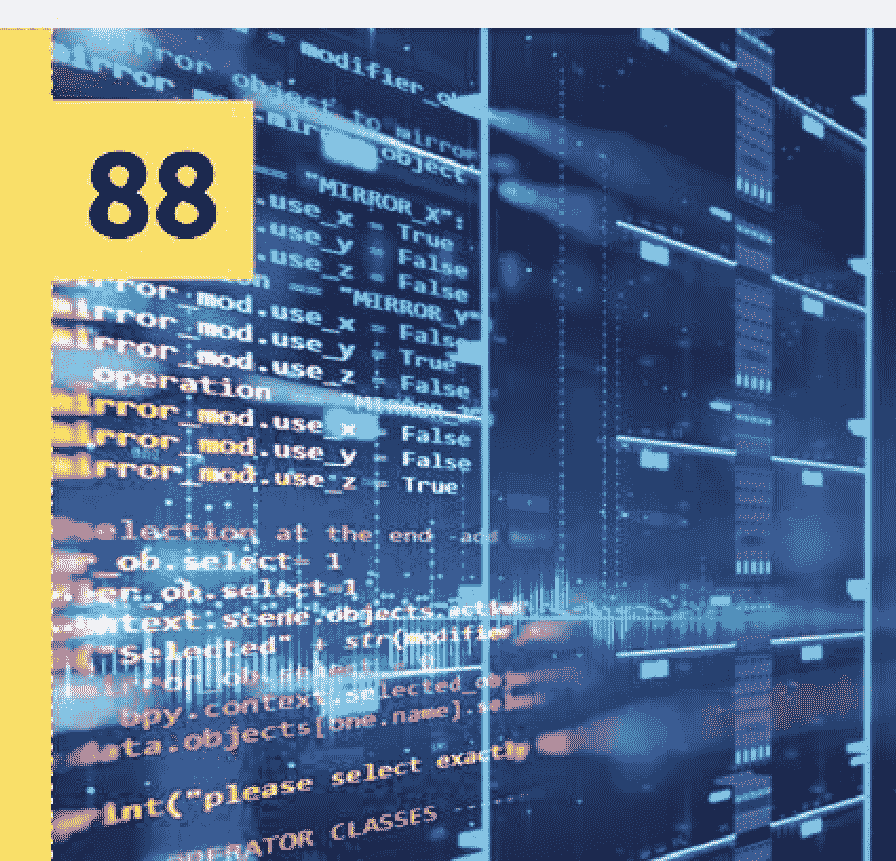

1. **90** 日历模块
2. **92** OS 模块
3. **94** 使用数学模块
4. **96** 随机模块
5. **98** Tkinter 模块

1. **100** Pygame 模块
2. **104** 基础动画
3. **106** 创建你自己的模块
4. **108** Python 聚焦：人工智能

### 代码库


1. **112** Python 文件管理器
2. **114** 猜数字游戏
3. **116** 随机数生成器
4. **117** 随机密码生成器
5. **118** 文本转二进制转换器
6. **120** 基础 GUI 文件浏览器
7. **122** 鼠标控制的海龟
8. **123** Python 闹钟

1. **124** 垂直滚动文本
2. **126** Python 数字时钟
3. **128** 使用 Winsound 模块播放音乐
4. **130** 文本冒险脚本
5. **132** Python 滚动字幕脚本
6. **133** 简易 Python 计算器
7. **134** 猜词游戏脚本

### 理解 Linux


1. **138** 什么是 Linux？
2. **140** 使用文件系统
3. **142** 列出和移动文件
4. **144** 创建和删除文件
5. **146** 创建和移除目录
6. **148** 复制、移动和重命名文件

1. **150** 有用的系统和磁盘命令
2. **152** 使用手册页
3. **154** 编辑文本文件
4. **156** Linux 技巧与窍门
5. **158** Linux 命令 A-Z
6. **160** Python 术语表

# 入门


```
python
mirror_ob.select=1
modifier_ob.select=1
bpy.context.scene.objects.active
print("Selected" + str(modifier_ob))
```


Python 是一种高级、通用的编程语言，由 Guido van Rossum 在八十年代末开发，基于多种其他语言，同时是流行的 ABC 语言的后继者。

它的设计旨在以人类可读的方式工作，因此无需深入研究晦涩的机器代码、十六进制字符，甚至二进制的 0 和 1，就能阅读和理解。它清晰、逻辑性强、全面、强大且功能丰富，同时易于遵循和学习。

你会发现 Python 位于世界上一些最有趣和最前沿技术的核心。它是将超级计算机算法连接在一起的代码；它被用于太空工业、科学和工程领域。人工智能，以及 Alexa、Siri、Cortana 和 Google Assistant 等，都利用 Python 实现其强大的语音识别技术。它简直是一门令人惊叹、用途广泛且不可思议的语言。

那么，让我们开始探索成为 Python 程序员需要什么。

- 8. 成为一名程序员
- 10. 编码简史
- 12. 你能用 Python 做什么？
- 14. Python 数字概览
- 16. 为什么选择 Python？
- 18. 在树莓派上使用 Python
- 20. 使用虚拟机
- 22. 创建编码平台

# 成为一名程序员

程序员、开发者、编码员，这些都是对同一职业的称呼，即创建代码的人。他们创建代码的目的可以是任何东西，从电子游戏到国际空间站上的关键部件。那么，你如何成为一名程序员呢？


自 80 年代编程以来，时代已经改变，但核心价值依然存在。

> > 你的编码冒险能走多远，取决于你自己！

```
c
#include<stdio.h>
#include<dos.h>
#include<conio.h>
#include<math.h>
void getup()
{
    textcolor(BLACK);
    textbackground(15);
    clrscr();
    window(10,2,70,3);
    cprintf("Press X to Exit, Press Space to Jump");
    window(62,2,80,3);
    cprintf("SCORE : ");
    window(1,25,80,25);
    for(int x=0;x<79;x++)
        cprintf("─");
    textcolor(0);
}
int t,speed=40;
void ds(int jump=0)
{
    static int a=1;
    if(jump==0)
        t=0;
    else if(jump==2)
        t--;
    else t++;
    window(2,15-t,18,25);
    cprintf("     ");
    cprintf("    ▀▄█▄▀");
    cprintf("     ");
    cprintf("    ████");
    cprintf("   ████████");
    cprintf("  ██████████");
    cprintf(" █████████████");
    cprintf("████████████████");
    if(jump==1 || jump==2){
        cprintf("  ██  ██  ");
        cprintf("    ██    ");
    }else if(a==1)
    {
        cprintf("  ██  ██  ");
        cprintf("    ██    ");
        a=2;
    }
    else if(a==2)
    {
        cprintf("  ██  ██  ");
        cprintf("    ██    ");
        a=1;
    }
    cprintf("          ");
    delay(speed);
}
void obj()
```

能够遵循逻辑模式并看到最终结果，是程序员最宝贵的技能之一。

# 不仅仅是代码

对于那些年纪足够大、记得 80 年代家庭计算黄金时代的人来说，当时的计算世界与今天截然不同。你可以整机购买的 8 位计算机（而不是套件形式，需要你自己焊接零件）是梦想之物；能拥有一台，就像把纯粹的幸福装在一个大塑料盒里。然而，当时计算机提供的新技术并非重点，更重要的是，你第一次可以控制“电视”上显示的内容。

许多用户没有仅仅玩当时成千上万款可用的游戏之一，而是决定创建自己的内容、自己的游戏；或者只是创建一些能帮助他们完成作业或管理家庭财务的东西。8 位家用计算机的简单性意味着，用几行 BASIC 代码创建一些东西是可行的，于是第一代家庭培养的程序员诞生了。

从那时起，编程呈指数级发展。没过多久，卧室里的编码员就成了过去式，庞大的设计师、编码员、艺术家和音乐家团队参与制作一款游戏。这当然导致程序员不再仅仅是能在屏幕上制作一个精灵并让它在按键时移动的人。

自然，时间在流逝，我们使用的技术也在进步。然而，编程的基本原理保持不变；但成为一名程序员究竟需要什么？

任何程序员，无论他们在做什么，最普遍的特质就是能够看到逻辑模式。我们的意思是，能够从逻辑上遵循某件事从开始到结束，并设想预期的结果。虽然你可能觉得自己不是这样的人，但通过训练你的大脑以这种方式思考是可能的。是的，这需要时间，但一旦你开始以这种特定的方式思考，你就能够构建和遵循代码。

仅次于逻辑的是对数学的理解。你不必达到天才水平，但你需要理解数学的基础。数学是关于解决问题的，而代码大多属于数学的范畴。

能够看到大局对现代程序员来说无疑是有益的。毫无疑问，作为一名程序员，你将成为其他程序员团队的一部分，并且很可能是一个更大的设计师团队的一部分，他们都在创造最终产品。虽然你可能只需要创建最终产品的一小部分，但能够理解其他人都在做什么，将帮助你创造出比仅仅锁在自己的编码隔间里更好的东西。

最后，成为一名优秀的程序员还需要一定程度的创造力。不过，你同样不需要是创意天才，只需要有想象力，能够看到最终产品以及用户将如何与之交互。

当然，成为一名程序员还涉及更多，包括学习实际的代码本身。然而，只要有时间、耐心和学习的决心，任何人都可以成为一名程序员。无论你是想成为三A级电子游戏团队的一员，还是仅仅想创建一个自动化程序让你的计算生活更轻松，你的编码冒险能走多远，取决于你自己！

# 编程简史

人们很容易认为，为机器编程以实现流程自动化或计算数值，是近五十年左右才出现的现代概念。然而，这种假设大错特错，编程实际上已经存在相当长的时间了。

```
01000011 01101111 01100100 01101001 01101110 01100111
```

本质上，所有形式的编程都由1和0组成——即开或关的状态。这既适用于现代计算机，甚至也适用于已知最古老的计算设备。

很难精确指出人类开始“编程”设备的确切起点。然而，人们普遍认为，安提基特拉机械可能是第一个“编码”文物。它可追溯至公元前87年左右，是一台古希腊的模拟计算机和天文仪，用于预测天文位置。


巴努·穆萨三兄弟是三位在巴格达智慧宫工作的波斯学者，他们在公元850年左右出版了《精巧装置之书》。其中列出的发明包括一件机械乐器：一台水力驱动的管风琴，能自动演奏可更换的音筒。


约瑟夫·玛丽·雅卡尔发明了一种可编程织布机，它使用带穿孔的卡片来创建纺织图案。然而，据信他的设计基于巴兹尔·布雄在1725年提出的早期自动化织造工艺。


阿达·洛芙莱斯翻译了意大利数学家弗朗西斯·梅克莱尔关于查尔斯·巴贝奇分析机的回忆录。她在译文中做了大量笔记，详细描述了使用该机计算伯努利数的方法。这被认为是第一个计算机程序。考虑到当时根本没有计算机可用，这相当了不起。

在第二次世界大战期间，可编程机器取得了重大进展。最著名的是用于破译纳粹军用密码的密码机。恩尼格玛密码机由德国工程师亚瑟·谢尔比乌斯发明，但因艾伦·图灵在布莱切利园的密码破译中心而闻名于世。


从20世纪70年代开始，C、SQL、带类的C（C++）、MATLAB、Common Lisp等语言相继问世。80年代无疑是家用计算机的黄金时代，那时硅处理器的价格已经便宜到普通民众也能购买。这导致了8位机的兴起，家庭/卧室程序员数量激增。


## 1951-1958

## 1959

## 1960-1970

## 1970-1985

## 1990年代至今

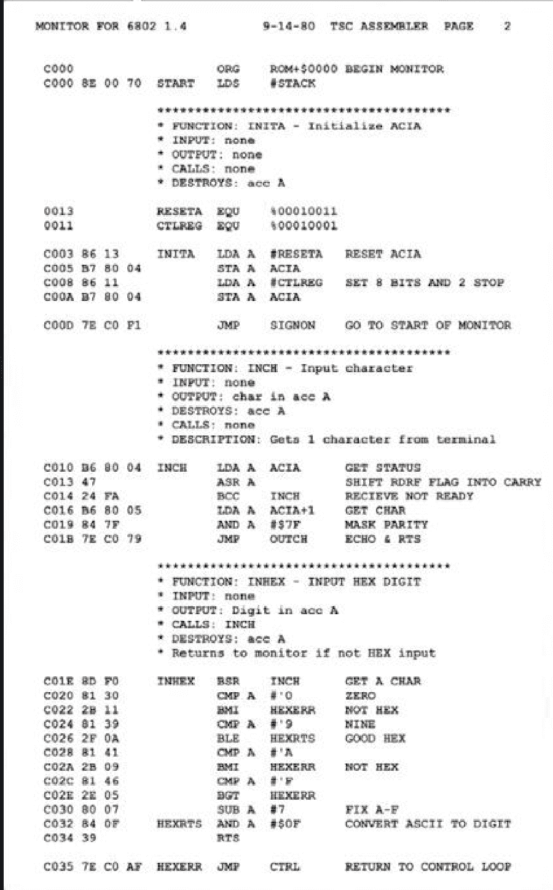

在60年代和70年代，计算机编程主要由大学、军方和大公司使用。朝着更用户友好或家庭用户语言迈出的重要一步，是60年代中期BASIC（初学者通用符号指令代码）的开发。

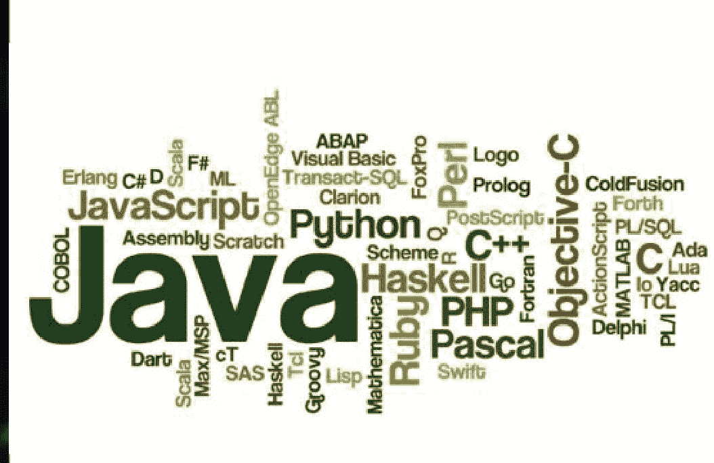

```
10 INPUT "What is your name: "; U$
20 PRINT "Hello "; U$
25 REM
30 INPUT "How many stars do you want: "; N
35 S$ = ""
40 FOR I = 1 TO N
50 S$ = S$ + "*"
55 NEXT I
60 PRINT S$
65 REM
70 INPUT "Do you want more stars? "; A$
80 IF LEN(A$) = 0 THEN GOTO 70
90 A$ = LEFT$(A$, 1)
100 IF (A$ = "Y") OR (A$ = "y") THEN GOTO 30
110 PRINT "Goodbye ";
120 FOR I = 1 TO 200
130 PRINT U$; " ";
140 NEXT I
150 PRINT
```

互联网时代带来了大量新的编程语言，并让人们能够以更好的方式获取学习编程所需的工具和知识。用户不仅可以学习如何编码，还可以自由地分享自己的代码，并获取其他代码来改进自己的作品。

第一种真正的计算机代码是汇编语言（ASM）或区域汇编语言。ASM特定于其运行的机器架构。1951年，编程语言被统称为自动代码。不久之后，IPL、FORTRAN和ALGOL 58等语言相继开发出来。

格蕾丝·霍普海军上将是开发UNIVAC I计算机团队的一员，并最终为其开发了一个编译器。随着时间的推移，她开发的编译器演变成了COBOL（面向商业的通用语言），这是一种至今仍在使用的计算机语言。


## 你能用Python做什么？

Python是一种开源、面向对象的编程语言，易于理解和编写，同时功能强大且极具可塑性。正是这些特性使其成为一门如此重要的学习语言。

Python在少量指令内创建高度可读代码的能力，对我们的现代数字世界产生了巨大影响。从理想的初学者首选语言，到其创建互动故事和游戏的能力；从科学应用到人工智能和基于网络的应用，Python唯一的限制是使用它进行编码的人的想象力。

你会发现很多这样的例子，Python在幕后发挥着作用。这就是为什么它是一门如此重要的学习语言。

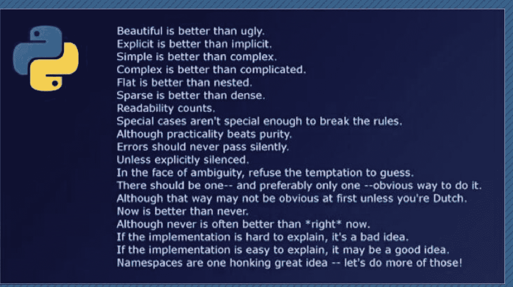

正是Python可塑的设计，使其成为许多不同场景和角色的理想语言。即使是编程世界中某些需要更高效代码的领域，仍然使用Python。例如，NASA既将Python作为独立语言使用，也作为其他编程语言之间的桥梁。这样，NASA的科学家和工程师无需跨越多种语言障碍就能获取所需数据；Python填补了空白，并提供了完成工作的手段。你将

## 大数据

大数据是过去几年你可能遇到的一个流行词。基本上，它指的是可用于分析的超大规模数据集，以揭示人类、社会和技术之间的模式、趋势和互动。当然，这不仅限于这些领域，大数据目前正被应用于各行各业，从社交媒体到健康与福利，从工程到太空探索等等。


Python在大数据领域扮演着重要角色。它被广泛用于分析海量可用大数据，并根据用户/公司从大量数字中所需提取特定信息。得益于一套令人印象深刻的数据处理库，Python使得从数字中获取关键数据，并以人类可读和可用的方式呈现数据成为可能。

有无数的库和免费可用的模块，能够实现来自超级计算集群等数据的快速、安全且更重要的准确处理。例如，欧洲核子研究中心（CERN）使用一个定制的Python模块来帮助分析大型强子对撞机（LHC）每秒产生的6亿次碰撞。另一种语言处理原始数据，但Python的存在有助于筛选数据，使科学家无需学习更复杂的编程语言就能获取所需内容。

## 你能用Python做什么？

## 人工智能

人工智能和机器学习是现代计算中最具突破性的两个方面。AI是一个总称，用于指代任何机器在其中执行智能操作、以类似人类的方式工作和反应的计算过程。机器学习是AI的一个子集，为整个AI系统提供了从经验中学习的能力。

然而，AI并非简单地创造意图消灭人类文明的自主机器人。事实上，AI存在于各种日常计算应用中，在这些应用中，“机器”，或者更准确地说是代码，需要从某种形式的输入行为中学习，并预测输入接下来可能需要或做什么。

这个模型可以应用于Facebook、Google、Twitter、Instagram等。你是否曾在Instagram上查找一位名人，然后发现你在其他社交媒体平台上的搜索现在专门针对类似的名人？这是在定向广告中使用AI的一个典型例子，而在预测你所寻找内容的代码和算法背后，正是Python。

例如，Spotify使用基于Python的代码（以及其他技术）来分析你的音乐习惯，并根据你过去的收听记录提供播放列表。这一切都很巧妙，展望未来，Python正站在互联网未来运作方式的前沿。


## 游戏

虽然你不会发现太多使用Python编写的AAA级游戏，但你可能会惊讶地得知，Python被用作许多高排名现代游戏的辅助工具。

Python在游戏中的主要用途是脚本编写，Python脚本可以为核心游戏引擎添加自定义功能。许多地图编辑器都兼容Python，如果你为游戏（如《模拟人生》）制作模组，也会遇到它。

许多在线MMORPG（大型多人在线角色扮演游戏）使用Python作为服务器端组件的辅助语言。这些包括：用于搜索潜在作弊行为的代码、游戏服务器间的负载均衡、玩家技能匹配以及检查玩家客户端游戏是否与服务器版本匹配。还有一个Python模块可以包含在Minecraft服务器中，使服务器管理员能够添加方块、发送消息并自动化游戏的许多后台复杂操作。


## 网页开发

自早期在有限文本编辑器中进行HTML脚本编写以来，网页开发已经取得了长足进步。现在可用的众多框架和网络管理服务意味着构建一个页面变得日益复杂。

使用Python，网页开发者能够创建动态且高度安全的Web应用程序，实现与Instagram和Pinterest等其他网络服务和应用的交互。Python还允许从其他网站甚至在其他网站内构建的应用程序中收集数据。


## Python无处不在

如你所见，Python是一门相当通用的编程语言。通过学习Python，你正在创建一套全面的技能，无论你是专业人士还是仅仅作为爱好者，都能助你进入下一代计算领域。

无论你在编程之旅上决定走哪条路，拥有Python作为你的后盾都将大有裨益。

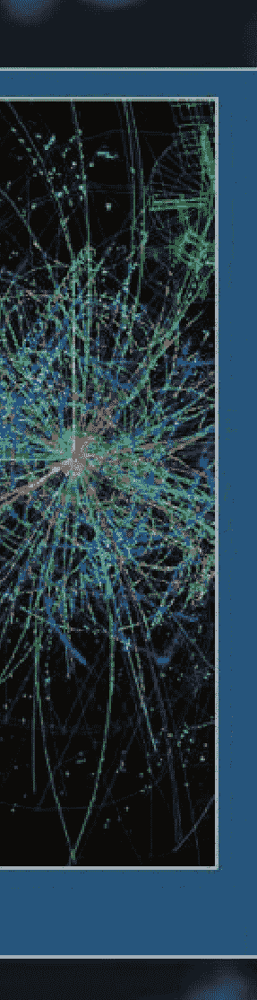

## Python 数据概览

Python 有很多值得喜爱之处，但请不要只听我们的一面之词。以下是围绕这门近年来最受欢迎的编程语言的一些惊人事实与数据。

> Python 创始人吉多·范罗苏姆在阅读了蒙提·派森的《飞行马戏团》的剧本后，为其命名。

亚马逊的虚拟个人助手 Alexa 使用 Python 来辅助语音识别。

**PYTHON 和 LINUX 技能在英国是第三大最受欢迎的 IT 技能。**

数据分析和机器学习是两个最常用的 Python 应用示例。

截至 2018 年底，Python 是互联网上被讨论最多的语言。

迪士尼皮克斯在其 Renderman 软件中使用 Python，以实现与其他图形软件包之间的交互。

**超过 75% 的 Netflix 推荐内容由机器学习生成——其代码由 Python 编写。**

**90% 的 Facebook 帖子都经过 Python 编写的机器学习系统过滤。**

**据估计，国际空间站上超过 75% 的 NASA 工作流自动化系统使用 Python。**

## Python 数据概览

**16,000**

**基于 Python 技能的职位在英国是第 16 个最受欢迎的工作。**

在英国，每六个月发布的 Python 工作岗位超过 16,000 个。

Python 数据科学被认为是未来几年最受欢迎的工作。

谷歌是雇佣 Python 开发者最多的公司，紧随其后的是微软。

数据科学、区块链和机器学习是增长最快的 Python 编码技能。

纽约和旧金山是全球领先的 Python 开发者城市。

Python 开发者的平均薪资为 60,000 英镑。

**95%**

**95% 的初学程序员从 Python 入门并仍将其作为主要或次要编程语言。**

**75%**

**75% 的 Python 开发者使用 Python 3，而 25% 的人仍在使用过时的 Python 2 版本。**

**79%**

**79% 的程序员日常使用 Python，21% 的人将其作为次要语言。**

**49%**

**49% 的 Windows 10 开发者将 Python 3 作为主要编程语言。**

# 为什么选择 Python？

现代计算机有很多不同的编程语言可供选择，有些语言甚至仍然适用于老式的 8 位和 16 位计算机。其中一些语言是为科学工作设计的，另一些则是为移动平台等而设计。那么，为何要在众多语言中选择 Python 呢？

## Python 的力量

自从最早的家用计算机问世以来，爱好者、用户和专业人士就常常工作到深夜，在过热的电路堆里埋头苦干，试图创造出近乎魔法般的东西。

这些编程先驱们开辟了新的领域，编写出能够实现字母“A”在屏幕上滚动的小段程序。对于习惯了超高分辨率图形和开放世界、多人在线游戏的一代人来说，这可能听起来并不令人兴奋。然而，在四十多年前，这却是极其耀眼的成就。

无论你使用的是 Android 设备、iOS 设备、PC、Mac、Linux、智能电视、游戏机、MP3 播放器、车载 GPS 设备、机顶盒，还是成千上万其他联网和“智能”设备，它们背后都有编程的身影。

这些“卧室程序员”自然为我们今天使用的每一项数字技术奠定了基础。有些人后来成为顶级软件公司的首席开发者，而另一些人则将可用硬件推向极限，创立了市值数十亿英镑、不断带给我们惊喜的游戏帝国。

所有上述数字设备都需要指令来告诉它们该做什么，并允许人们与之交互。这些指令构成了设备的编程核心，而这个核心可以使用多种编程语言构建。

当今使用的语言因场景、平台、设备用途以及设备与环境或用户的交互方式而异。操作系统，如 Windows、macOS 等，通常是 C++、C#、汇编语言和某种可视化语言的组合。游戏通常使用 C++，而网页则可以使用多种可用语言，如 HTML、Java、Python 等。

更通用的编程用于创建程序、应用程序、软件，或者你想怎么称呼它们都行。它们广泛应用于所有硬件平台，几乎适用于每一种可想象的应用场景。有些语言运行速度更快，有些则比其他的更容易学习和使用。Python 就是这样一种通用语言。

Python 是一种所谓的**高级语言**，它通过使用各种数组、变量、对象、算术、子例程、循环以及无数其他交互方式与硬件和操作系统“对话”。虽然它不像可以处理内存地址、调用栈和寄存器的**低级语言**那样精简高效，但其优势在于普遍易用且易于学习。

```java
//file: Invoke.java
import java.lang.reflect.*;

class Invoke {
    public static void main( String [] args ) {
        try {
            Class c = Class.forName( args[0] );
            Method m = c.getMethod( args[1], new Class [] { } );
            Object ret = m.invoke( null, null );
            System.out.println(
                "Invoked static method: " + args[1]
                + " of class: " + args[0]
                + " with no args\nResults: " + ret );
        } catch ( ClassNotFoundException e ) {
            // Class.forName( ) can't find the class
        } catch ( NoSuchMethodException e2 ) {
            // that method doesn't exist
        } catch ( IllegalAccessException e3 ) {
            // we don't have permission to invoke that method
        } catch ( InvocationTargetException e4 ) {
            // an exception ocurrred while invoking that method
            System.out.println(
                "Method threw an: " + e4.
                getTargetException( ) );
        }
    }
}
```

Java 是一种强大的语言，用于网页、机顶盒、电视甚至汽车。

Python 创建于二十六年前，并已发展成为学习计算机编程的理想入门语言。它非常适合爱好者、热衷者、学生、教师，以及那些只是需要在自身或外部硬件与计算机本身之间创建独特交互的人们。

Python 免费下载、安装和使用，可用于 Linux、Windows、macOS、MS-DOS、OS/2、BeOS、IBM i 系列机器，甚至 RISC OS。它曾被评选为世界五大编程语言之一，并持续在硬件和互联网发展曲线之前演进。

所以，回到这个问题：为什么选择 Python？简而言之，它是免费的、易于学习的、功能异常强大的、被广泛接受的、高效的，并且是一个极佳的学习与教育工具。

```basic
40 LET py=15
70 FOR w=1 TO 10
71 CLS
75 LET by=INT (RND*28)
80 LET bx=0
90 FOR d=1 TO 20
100 PRINT AT py,py;" U "
110 PRINT AT bx,by;"o"
120 IF INKEY$="p" THEN LET py=py+1
130 IF INKEY$="o" THEN LET py=py-1
135 FOR n=1 TO 100: NEXT n
140 IF py<2 THEN LET py=2
150 IF py>27 THEN LET py=27
180 LET bx=bx+1
185 PRINT AT bx-1,by;" "
190 NEXT d
200 IF (by-1)=py THEN LET s=s+1
210 PRINT AT 10,10;"score=";s
220 FOR v=1 TO 1000: NEXT v
300 NEXT w
0 OK, 0:1
```

BASIC 曾经是早期 8 位家用计算机用户学习的入门语言。

```python
print(HANGMAN[0])
attempts = len(HANGMAN) - 1

while (attempts != 0 and "-" in word_guessed):
    print(("\nYou have {} attempts remaining").format(attempts))
    joined_word = "".join(word_guessed)
    print(joined_word)

    try:
        player_guess = str(input("\nPlease select a letter between A-Z" + "\n> ")).upper()
    except: # check valid input
        print("That is not valid input. Please try again.")
        continue
    else:
        if not player_guess.isalpha(): # check the input is a letter. Also checks a
            print("That is not a letter. Please try again.")
            continue
        elif len(player_guess) > 1: # check the input is only one letter
            print("That is more than one letter. Please try again.")
            continue
        elif player_guess in guessed_letters: # check it letter hasn't been guessed
            print("You have already guessed that letter. Please try again.")
            continue
        else:
            pass

    guessed_letters.append(player_guess)

    for letter in range(len(chosen_word)):
        if player_guess == chosen_word[letter]:
            word_guessed[letter] = player_guess # replace all letters in the chosen

    if player_guess not in chosen_word:
```

Python 是对 BASIC 更现代化的诠释，它易于学习，是理想的编程入门语言。

## 入门指南

## 树莓派上的Python

如果你正在考虑在哪个平台上安装和使用Python，不妨考虑一下目前最优秀的编程平台之一：树莓派。树莓派对编程者而言有许多优势：它价格低廉、易于使用，并且极其灵活。

## 树莓派的强大之处

拥有一个更强大的编码平台来编写和测试代码固然是理想的选择，但这并非总是可行的。大多数人在起步阶段无法承担数百英镑的投资，而这正是树莓派可以提供帮助的地方。

树莓派是一款令人惊叹的现代硬件，它创造（或者说重现）了我们曾经对计算机、其工作原理、编程方法和基础电子学的所有迷恋。得益于其独特的硬件和定制软件组合，它已被证明是一个学习编程，特别是使用Python编程的绝佳平台。

市售的套件会提供预装了SD卡（内含最新的Raspbian操作系统）、外壳、电源插座和线缆的树莓派，这是一个好主意，因为你可以毫不费力地将树莓派插在桌子下方的墙壁插座上，同时仍然能够连接到它并进行编程。

虽然你可以轻松使用树莓派来学习其他编程语言，但Python已被坚定地推到了前沿。树莓派使用推荐的默认操作系统Raspbian。Raspbian是一个Linux操作系统，或者更准确地说，它是一个基于Debian的Linux发行版。这意味着其中已经内置了Python编程元素，这与全新的Windows 10安装不同，后者没有专门的Python基础。然而，树莓派基金会不遗余力地在开箱即用时包含了大量Python模块、扩展甚至示例。因此，本质上你所需要做的就是购买一个树莓派，按照说明设置它（使用我们出色的树莓派指南，可在www.bdmpublications.com找到），然后就可以在桌面加载后立即开始使用Python编程。

主要的优势当然是树莓派基金会开箱即用提供的额外内容。这样做的原因是树莓派的目标是帮助教育用户，无论是编程、电子学还是计算机的其他方面。为了实现这一目标，树莓派基金会为用户提供了不同的IDE来编译Python代码；除了Python 2和Python 3之外，甚至还有一个允许你与Minecraft通信的Python库。

重要的是，树莓派的意义远不止于此，这使其成为刚开始学习Python编程者的绝佳选择。树莓派非常容易设置为无头节点。这意味着，通过一些简单的调整，你能够从家庭网络上的任何其他计算机或设备远程连接到树莓派。例如，一旦设置好远程连接选项，你只需将树莓派插入你家无线路由器范围内任意位置的电源插座即可。只要树莓派连接着，你就可以像坐在树莓派前使用键盘和鼠标一样轻松地从Windows或macOS远程访问桌面。

还有其他优势，例如能够将Python代码与Scratch（麻省理工学院开发的一种面向对象的编程语言，旨在让儿童理解编程工作原理）结合使用，以及能够为树莓派上的GPIO连接编程，以进一步控制任何连接的机器人或电子项目。Raspbian还包括一个Sense HAT模拟器（HAT是一种硬件附加电路板，为树莓派提供不同的电子学、机器人学和自动化项目），可以通过Python代码访问。

使用这种方法可以节省大量金钱，因为您无需另一个键盘、鼠标和显示器，此外，您也不需要分配足够的空间来容纳这些额外设备。如果您在空间和资金方面紧张，那么大约60英镑就可以购买市面上众多套件中的一个，它将提供您所需的一切。

因此，树莓派不仅是一个出色的编程基础，也是一个极佳的项目基础。正是出于这些以及许多其他原因，在本指南中，我们始终使用树莓派作为我们的主要Python代码库。虽然代码是在树莓派上编写和执行的，但您也可以在Windows、其他版本的Linux和macOS上使用它。如果代码需要特定的操作系统，不用担心；我们会在文中告知您。

操作系统包含了您学习Python编程所需的一切！

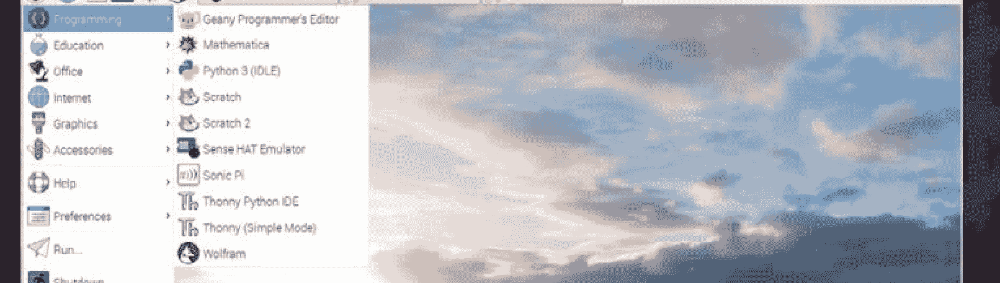

> 树莓派永远不嫌多！

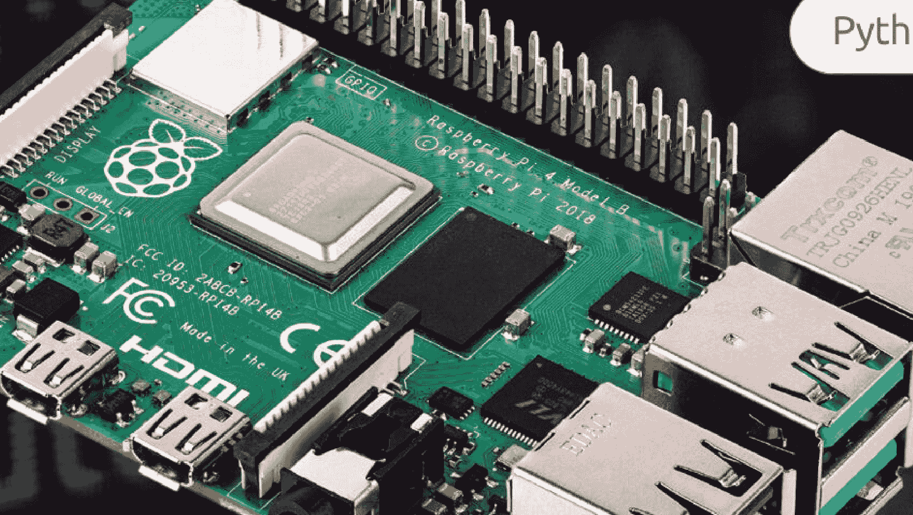

## 树莓派4-永恒！

2019年6月24日推出的树莓派4 Model B，在树莓派性能和硬件规格方面实现了重大飞跃。它也是除初代树莓派外，最快售罄的型号之一。

配备新的1.5GHz 64位四核ARM Cortex-A72处理器，并可选择1GB、2GB或4GB内存版本，树莓派4在成为真正的台式计算机的道路上又迈进了一步。此外，树莓派4发布时做出了一项惊人的决定，即通过一对Micro-HDMI端口提供双显示器支持。您还会发现一对USB 3.0端口、蓝牙5.0，以及一个能够处理4K分辨率和OpenGL ES 3.0图形的GPU。简而言之，树莓派4是当前树莓派型号中最强大的。然而，不同的内存版本成本有所增加。1GB版本售价34英镑，2GB为44英镑，4GB版本则需要花费54英镑。记得在订单中也考虑一两根Micro-HDMI线缆。

## RASPBIAN BUSTER

除了发布树莓派4，树莓派团队还编译了新版本的Raspbian操作系统，代号为Buster。结合树莓派4的新硬件，Buster确实提供了一些更新。尽管整体上其外观和操作与之前版本的Raspbian非常相似。这些更新主要与4K显示和播放相关，为树莓派4提供了一套新的图形驱动程序和性能增强。简而言之，您在本书中看到的内容将适用于树莓派4和Raspbian Buster！

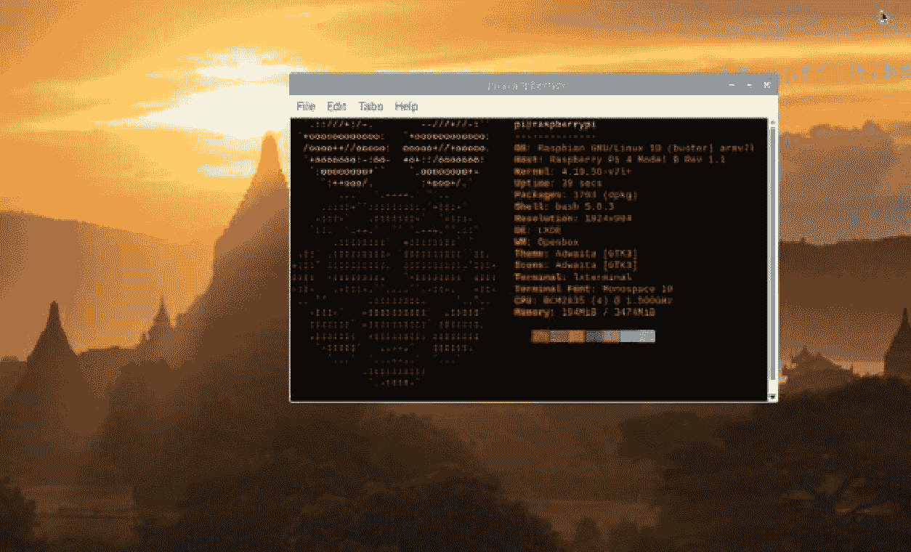

设置完成后，您可以从任何设备/PC远程连接到树莓派的桌面。

您甚至可以通过Windows远程使用Python测试连接的硬件。

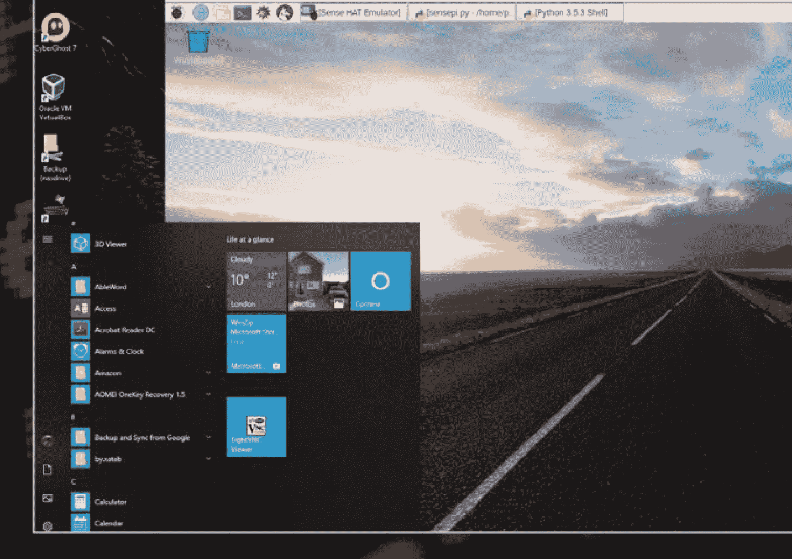

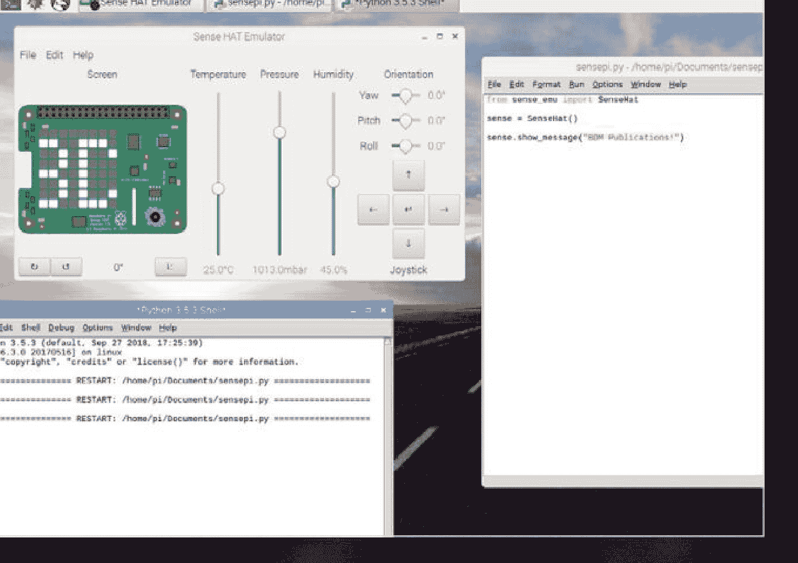

## 使用虚拟机

虚拟机允许您在桌面电脑上的一个应用程序内运行整个操作系统。这样，您就可以在一个安全、隔离的环境中托管多个系统。简而言之，这是编程的理想方式。

听起来不错，但虚拟机（VM）到底是什么？它是如何工作的？

虚拟机的官方定义是“真实计算机的高效、隔离的副本”。这基本上意味着虚拟机是一个模拟的计算机系统，其运行方式与物理机器完全相同，但受限于专用的虚拟机管理程序（Hypervisor）。

虚拟机管理程序本身是一个应用程序，允许您安装一个单独的操作系统，在其内部创建一个虚拟计算机系统，并完整地提供互联网访问、家庭网络访问等功能。

虚拟机管理程序将从宿主系统（即您的物理计算机）获取资源来创建虚拟计算机。这意味着您的物理计算机的部分内存、CPU、硬盘空间和其他共享资源将被划拨给虚拟机使用，因此在虚拟机管理程序关闭之前，这些资源将无法被物理计算机使用。

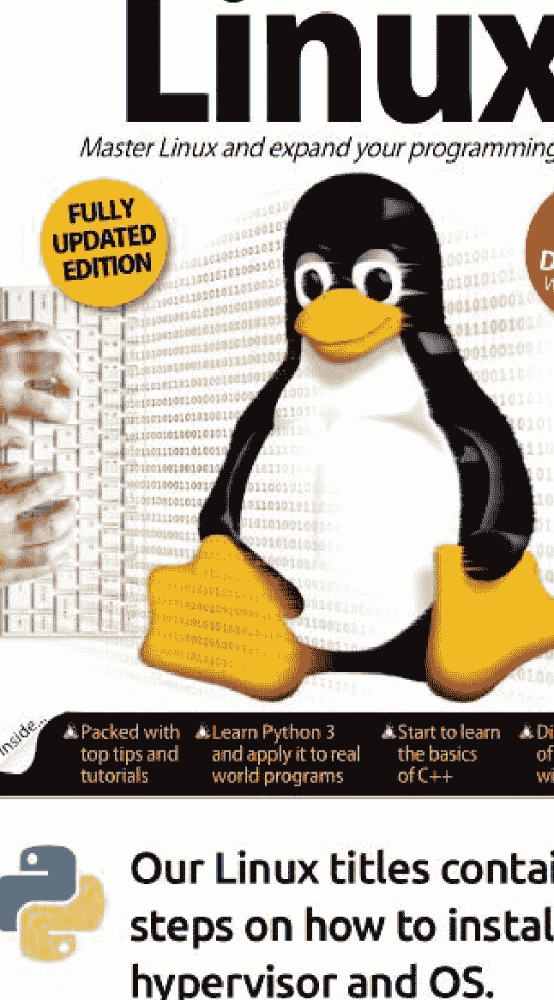

我们的Linux指南包含了如何安装虚拟机管理程序和操作系统的步骤。

如果您没有足够的可用内存或硬盘空间，或者您的计算机处理器特别慢，这种资源开销可能会使物理计算机不堪重负。虽然在低至2GB内存的情况下运行虚拟机是完全可能的，但这并不建议。理想情况下，您需要至少8GB内存（4GB也能应付，但同样，您的物理计算机会因内存分配给虚拟机而开始受影响）、硬盘上至少25到50GB的可用空间以及一个四核处理器（同样，双核CPU也可以，但这可能会导致您的物理计算机出现瓶颈）。

因此，您在物理计算机上托管多少不同的虚拟机受到限制，这取决于您可以为每个虚拟机分配的物理系统资源量，同时还要为物理计算机本身保留足够的资源。

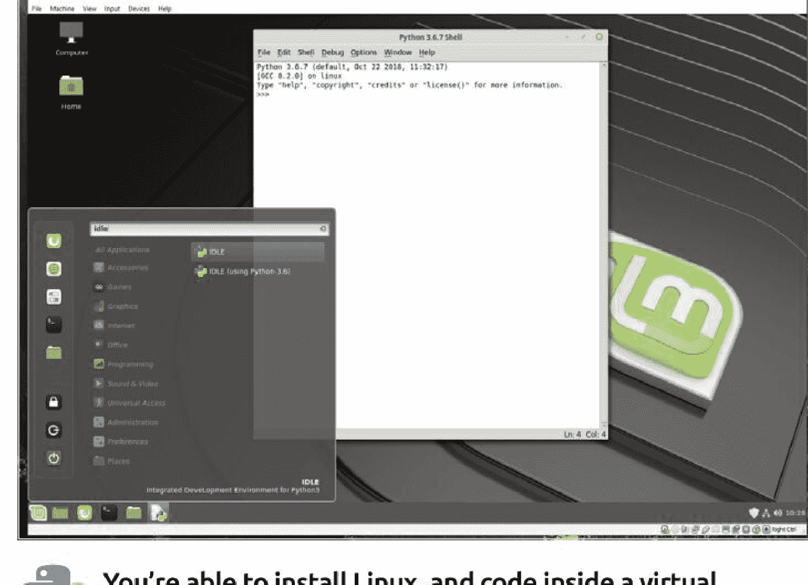

您可以安装Linux，并在Windows 10主机上的虚拟机中进行编程。

## 虚拟操作系统

在虚拟机管理程序内部，您可以运行许多不同的操作系统。操作系统的类型很大程度上取决于您运行的虚拟机管理程序，因为有些在模拟特定系统方面比其他程序更出色。例如，VirtualBox（Oracle出品的免费且易于使用的虚拟机管理程序）在运行Windows和Linux虚拟机方面表现很好，但在运行Android或macOS方面就不那么好了。QEMU擅长模拟ARM处理器，因此非常适合Android等系统，但它可能难以掌握。

有许多虚拟机管理程序可供免费试用，也有同样数量的商业产品功能强大得多，提供更好的特性。然而，对于大多数用户，无论是初学者还是专业人士，VirtualBox都能做得足够好。

在虚拟机管理程序内部，您可以设置并安装任何较新的Linux发行版，或者如果您有需要，也可以安装一些更旧的版本。您可以安装早期版本的Windows，甚至可以追溯到带有DOS 6.22的Windows 3 –尽管您可能会发现由于旧驱动程序（如网络访问）的原因，虚拟机的一些功能会丢失。

考虑到这一点，您可以在Windows 10 PC上的应用程序中运行Linux Mint或最新版本的Ubuntu。这就是使用虚拟机的美妙之处。反之，如果您的物理计算机安装的是Linux操作系统，那么通过虚拟机管理程序，您可以创建一个Windows 10虚拟机——尽管您需要有效的许可证代码来注册和激活Windows 10。

## 使用虚拟机

使用虚拟机可以免去双系统启动的需要。双系统启动是指在同一台计算机的一个或多个硬盘上安装两个或更多物理操作系统。当计算机启动时，你会看到一个选项，让你选择要启动哪个操作系统。虽然这听起来像是一个更理想的方案，但实际情况并不总是那么简单，因为所有启动的操作系统都将完全访问计算机的全部系统资源。

## 对程序员的优势

对于程序员来说，配置虚拟机有许多优势，其中最受欢迎的是跨平台代码。这意味着，如果你在 Windows 10 中编写代码，然后在虚拟机管理程序中安装一个 Linux 发行版，你就可以快速轻松地启动虚拟机，在一个完全不同的操作系统中测试你的代码。通过这种方式，你可以排除任何错误，调整代码使其在不同平台上运行得更好，并将你的代码扩展到非 Windows 用户。

双系统启动的问题出现在其中一个操作系统更新时。大多数更新涉及安全补丁或错误修复，但有些更新可能会改变操作系统的核心——内核。当这些更改应用后，更新可能会改变操作系统的启动方式，这意味着你最初选择的启动项可能会被覆盖，导致你无法访问计算机上安装的其他操作系统。要解决这个问题，你需要访问主引导记录并修改配置，以重新允许启动到其他系统。此外，还存在覆盖第一个安装的操作系统或覆盖数据的风险，而且大多数操作系统在并排运行时往往无法很好地协同工作。确实，双系统启动虽然不错，但问题也不少。相比之下，使用虚拟机环境虽然有时也会有问题，但它消除了在单台计算机上使用多个操作系统时一些更糟糕和灾难性的方面。

能够为特定项目以特定方式配置开发环境的能力是极其宝贵的。使用虚拟机设置大大减少了因支持你可能参与的各种不同项目而安装多个版本的编程语言、库、IDE 和模块所带来的不确定性。那些直接与操作系统特定部分“对话”的代码元素可以轻松克服，而无需用跨平台库弄乱你的主系统，这反过来可能会影响 IDE 中的其他库。

另一个需要考虑的因素是稳定性。如果你编写的代码在开发阶段可能会导致核心操作系统不稳定，那么在虚拟机上执行和测试该代码比在你的主计算机上测试更有意义；在主计算机上，由于代码的不稳定性而不得不反复重启或重置某些东西，可能会变得低效且令人烦恼。

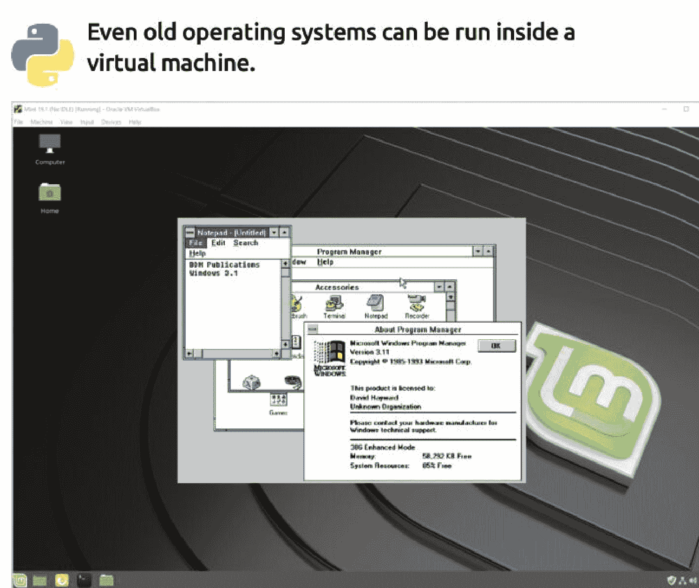

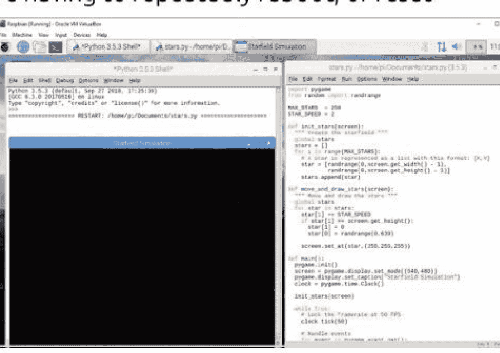

虚拟机环境可以被视为一个沙箱，你可以在其中测试不安全或不稳定的代码，而不会对你的主工作计算机造成伤害或损坏。病毒和恶意软件可以被隔离在虚拟机内，而不会感染主计算机；你可以在虚拟机内设置匿名互联网使用；你还可以安装第三方软件，而不会拖慢你的主计算机。

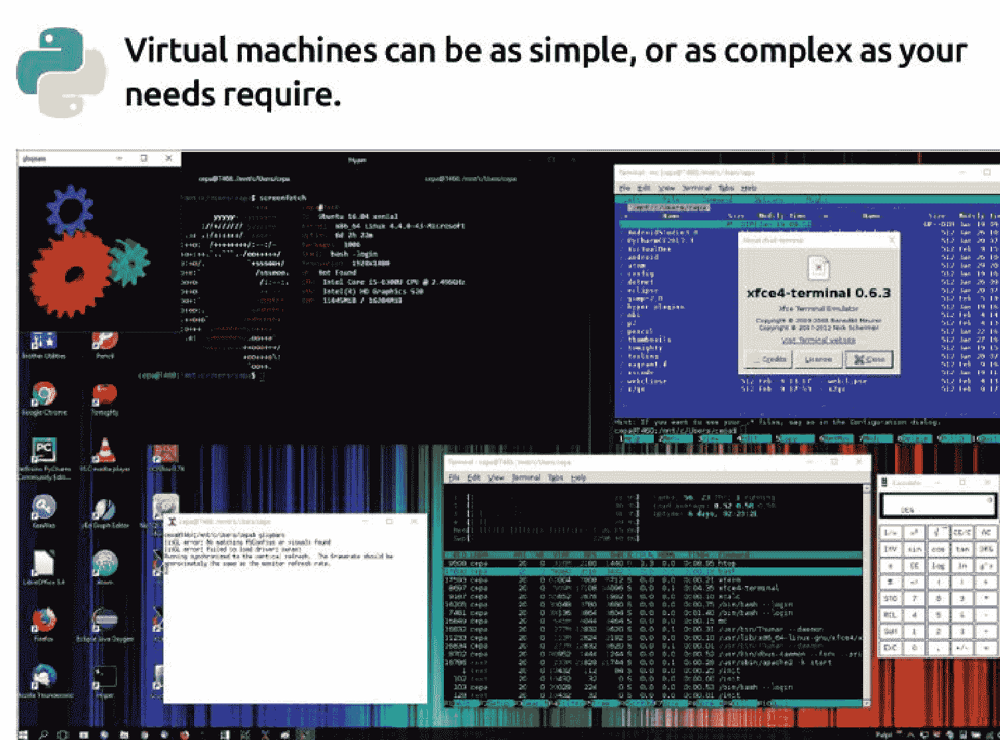

## 走向虚拟化

在你编程的早期阶段，使用虚拟机可能看起来有点多余。然而，这值得研究，因为在 Linux 中编程通常比在 Windows 中更容易，因为某些版本的 Linux 预装了 IDE。无论如何，操作系统的虚拟化是许多专业和成功的程序员和开发人员的工作方式，因此尽早习惯它对你的技能发展是有利的。

首先，考虑安装 VirtualBox。然后看看我们的 Linux 系列书籍，https://bdmpublications.com/?s=linux&post_type=product，学习如何在虚拟环境中安装 Linux 以及如何最好地利用该操作系统。

## 创建编码平台

“编码平台”这个术语可以指一种你可以编码的硬件，或者一个特定的操作系统，甚至是一个预构建的、旨在方便创建游戏的自定义环境。实际上，这是一个相当宽泛的术语，因为编码平台可以是所有这些要素的混合体，这完全取决于你打算使用哪种编程语言以及你的最终目标是什么。

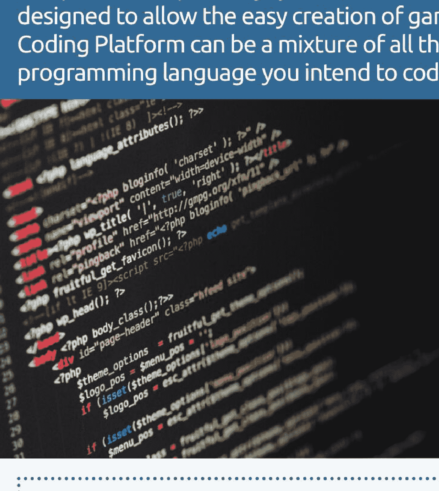

编码可能是那种听起来很棒，但开始时却常常令人困惑的体验之一。毕竟，有太多语言可供选择，有无数应用程序可以让你在特定或一系列语言中编码，还有同样大量的第三方软件需要考虑。然后你上网，发现有无数针对你决定要编程的语言的编码教程，以及更多的代码示例。有时这一切都让人有点应接不暇。

诀窍是放慢速度，首先不要过于深入地研究编码。就像所有好的项目一样，你需要一个坚实的基础来构建你的技能，并手头备齐所有必要的工具，以完成基本步骤。这就是创建编码平台的意义所在，它将成为你学习的基础，当你开始小心翼翼地踏入更广阔的编码世界时。

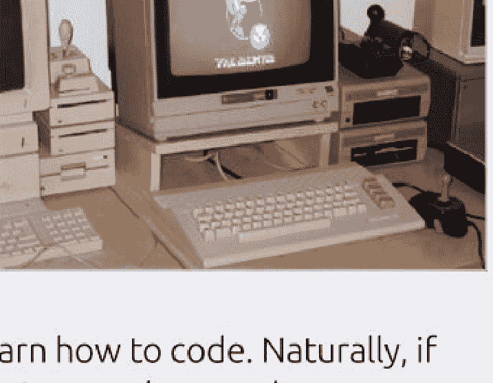

## 硬件

值得庆幸的是，基础级别的编码不需要专业设备或顶级的、液氢冷却的 PC。如果你拥有一台计算机，无论多么基础，你都可以开始学习如何编码。当然，如果你的计算机是 Commodore 64，那么你可能会在学习现代语言教程时遇到一些困难，但当今一些最优秀的程序员都是从 8 位机器起步的，所以还是有希望的。

访问互联网是必要的，用于下载、安装和更新编码开发环境，以及一台安装了 Windows 10、macOS 或 Linux 的计算机。你可以使用其他操作系统，但这“三大巨头”是主流，你会发现大多数代码资源都是针对其中一个或全部编写的。

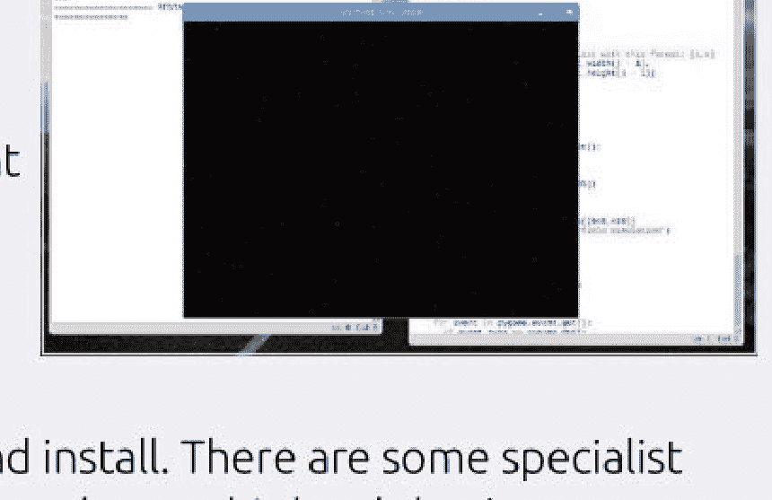

## 软件

在软件方面，大多数开发环境——允许你编码、编译代码并执行它的工具——都可以免费下载和安装。也有一些专业工具需要付费，但在当前阶段它们并非必需；所以不要被误导，认为你需要购买任何额外的软件才能开始学习编码。

随着时间的推移，你可能会发现自己从主流开发环境转向使用一系列自己发现的工具来编写代码。归根结底，这都是个人偏好，随着你经验的积累，你会开始使用不同的工具来完成工作。

## 操作系统


Windows 10 是世界上使用最广泛的操作系统，因此绝大多数编码工具都是为微软的领先操作系统编写的。然而，不要忽视 macOS，尤其是 Linux。

macOS 用户享有与 Windows 用户同等数量的编码工具。事实上，你可能会发现许多专业程序员使用 Mac 而不是 PC，仅仅是因为 Mac 操作系统是建立在 Unix 之上的（Unix 是一种命令行操作系统，为世界上大部分文件系统和服务器提供支持）。这个 Unix 层允许你几乎使用任何语言测试程序，而无需使用专门的 IDE。

然而，Linux 是目前最受欢迎和最重要的编码操作系统之一。它不仅具有类 Unix 的骨干，而且可以免费下载、安装和使用，并附带了开始学习编码所需的大部分工具。Linux 驱动着构成互联网的大多数服务器。它几乎用于所有顶级超级计算机，也专门用于 NASA、CERN 和军事等组织，并且构成了 Android 设备、智能电视和车载系统的基础。Linux 作为一个编码平台是一个极好的主意，它可以安装在虚拟机内，而不会影响 Windows 或 macOS 的安装。

## 虚拟机

虚拟机是一种软件，允许你在软件本身的限制内安装一个完全工作的操作系统。安装的操作系统将从主机计算机分配用户定义的资源，提供内存、硬盘空间等，并共享主机计算机的互联网连接。

虚拟机的优势在于，你可以使用 Linux 等系统，而不会影响你当前安装的主机操作系统。这意味着你可以运行 Windows 10，启动你的虚拟机客户端，启动 Linux，并使用 Linux 的所有功能，同时仍然可以使用 Windows。

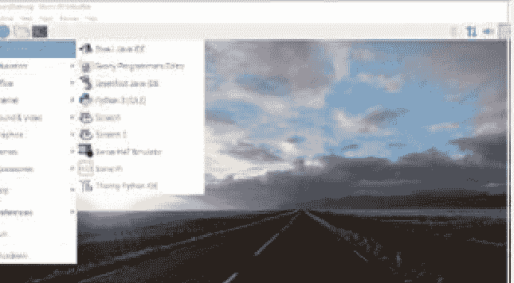

当然，这使其成为一个极好的编码平台，因为你可以从主机计算机运行不同的操作系统安装，同时使用不同的编程语言。你可以测试你的代码，而不用担心破坏你的主机操作系统，并且可以轻松恢复到之前的配置，而无需重新安装所有内容。

虚拟化是现在大多数大公司的关键。例如，你可能会发现，IT 团队没有选择安装 Windows Server 的单个服务器，而是选择了虚拟化环境，其中每个 Windows Server 实例都是从几台强大的机器上运行的虚拟机。这减少了物理机器的数量，使团队能够更好地管理资源，并使他们能够在极短的时间内部署专门用于特定任务的整个服务器。

## 树莓派

如果你还没有听说过树莓派，我们建议你访问 www.raspberrypi.org 并查看一下。简而言之，树莓派是一台小型、功能齐全的计算机，它带有自己的定制 Linux 操作系统，预装了你开始学习如何用 Python、C++、Scratch 等编码所需的一切。

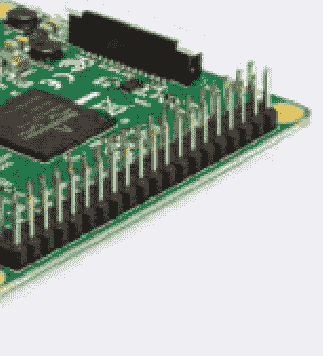

它价格极其便宜，大约 35 英镑，并允许你利用不同的硬件，以机器人和电子项目的形式，同时提供完整的桌面体验。虽然不是世界上最强大的计算设备，但树莓派有很多优点，尤其是在成为最佳编码平台之一方面。

## MINIX NEO N42C-4


NEO N42C-4 是来自迷你 PC 开发商 MINIX 的一款极其小巧的计算机。尺寸仅为 139 x 139 x 30mm，这款搭载 Intel N4200 CPU、预装 Windows 10 Pro 的计算机是我们遇到过的最佳编码平台之一。

其美妙之处当然在于，随着存储和内存容量的增加，你可以创建一台能够轻松托管多个虚拟机的计算机。这些虚拟机可以涵盖 Linux、Android 和其他操作系统，让你能够编写和测试跨平台代码，而不用担心损坏或给其他生产或家庭计算机带来问题。

MINIX NEO N42C-4 起价约 250 英镑，配备基础的 32GB eMMC 和 4GB 内存。你需要额外支付大约一百五十英镑来升级规格，但考虑到仅 Windows 10 Pro 的许可证在微软商店就要 219 英镑，你就能开始看到选择比树莓派更强大的硬件基础的好处了。

## 你自己的编码平台

无论你选择哪种方法，请记住，随着你获得经验并偏爱某种语言，你的编码平台可能会发生变化。不要害怕在过程中进行实验，因为你最终会创建一个独特的平台，能够处理你输入的所有代码。

### 你好，世界


开始学习Python可能一开始会让人有点望而生畏，但幸运的是，这门语言在设计时就考虑到了简洁性。像大多数事情一样，你需要循序渐进，掌握基础，学习如何获取结果，以及如何从代码中获得你想要的东西。

本节涵盖数字和表达式、用户输入、条件和循环，以及你在学习Python过程中无疑会遇到的错误类型：这些是优秀编码和Python代码的核心基础。

- 26 你需要的设备
- 28 认识 Python
- 30 如何在 Windows 中设置 Python
- 32 如何在 Linux 中设置 Python
- 34 第一次启动 Python
- 36 你的第一行代码
- 38 保存和执行你的代码
- 40 从命令行执行代码
- 42 数字和表达式
- 44 使用注释
- 46 使用变量
- 48 用户输入
- 50 创建函数
- 52 条件和循环
- 54 Python 模块
- 56 Python 错误
- 58 整合你目前所学的知识
- 60 Python 聚焦：连接黑洞


### 你需要的设备

你可以用很少的硬件或前期资金投入来学习Python。你不需要一台性能极其强大的电脑，而且所需的任何软件都是免费可用的。

### 我们正在使用的

幸运的是，Python是一种多平台编程语言，适用于Windows、macOS、Linux、Raspberry Pi（树莓派）等。如果你拥有这些系统中的任何一个，你就可以轻松开始使用Python。


### 电脑

显然，你需要一台电脑来学习如何用Python编程和测试你的代码。你可以使用Windows（从XP开始）系统，处理器可以是32位或64位的，也可以是苹果Mac电脑或安装了Linux的电脑。

### IDE（集成开发环境）

IDE（集成开发环境）用于输入和执行Python代码。它使你能够检查程序代码和代码中的值，并提供高级功能。有许多不同的IDE可供选择，因此请找到适合你并能给你最好结果的那一个。

### Python 软件

macOS 和 Linux 已经预装了 Python 作为操作系统的一部分，Raspberry Pi（树莓派）也是如此。但是，你需要确保你正在运行最新版本的 Python。Windows 用户需要下载并安装 Python，我们稍后会介绍。

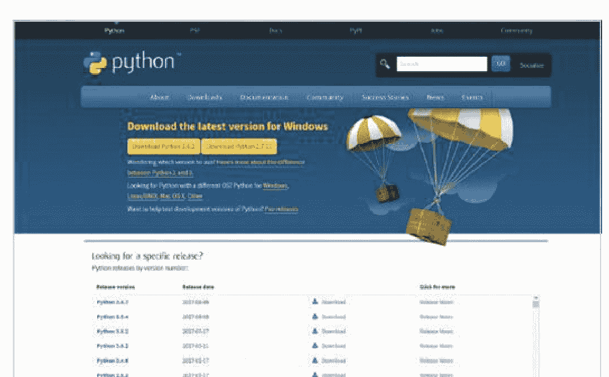

### 文本编辑器

虽然文本编辑器是输入代码的理想环境，但它并不是绝对必要的。你可以直接从 IDLE 输入和执行代码，但像 Sublime Text 或 Notepad++ 这样的文本编辑器在输入代码时提供了更高级的功能和语法高亮。

### 互联网访问

Python 是一个不断发展的环境，因此新版本通常会引入新的概念或更改现有的命令和代码结构，使其成为一门更高效的语言。接入互联网将使你保持更新，在你遇到困难时提供帮助，并让你能够访问 Python 海量的模块。

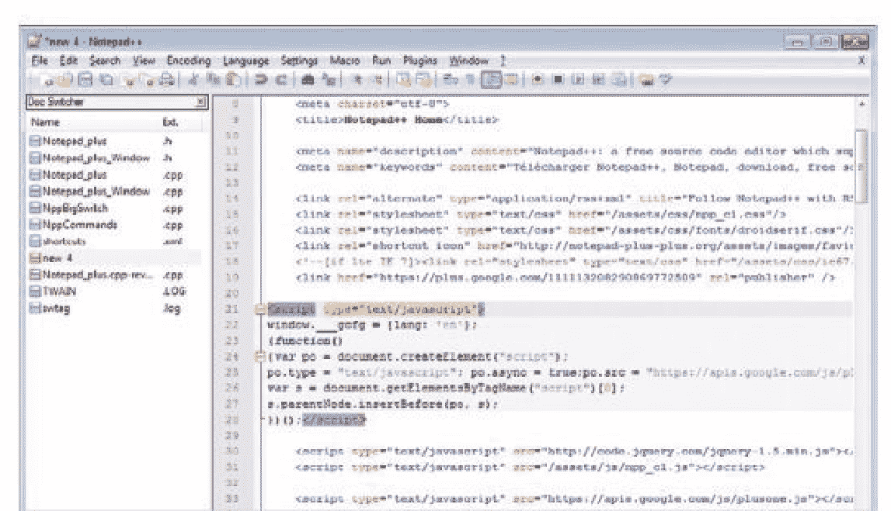

### 时间和耐心

尽管其他书可能会让你相信，但你不会在24小时内成为一名程序员。学习用Python编写代码需要时间和耐心。有时你可能会卡住，有时代码又会如流水般顺畅。要明白你正在学习一些全新的东西，最终你会达到目标。

### Raspberry Pi（树莓派）

为什么使用Raspberry Pi（树莓派）？Raspberry Pi（树莓派）是一台微型计算机，购买价格非常便宜，但为用户提供了一个极佳的学习平台。其主要操作系统 Raspbian 预装了最新版本的 Python 以及许多模块和附加组件。

### Raspberry Pi（树莓派）

Raspberry Pi 4 Model B 是最新版本，配备了更强大的 CPU，提供 1GB、2GB 或 4GB 内存版本可选，并支持 Wi-Fi 和蓝牙。你可以以大约 33 英镑的价格购买一块 Pi，4GB 内存版本的价格则高达 54 英镑，或者作为套件的一部分购买，价格在 50 英镑以上，具体取决于你感兴趣的套件。

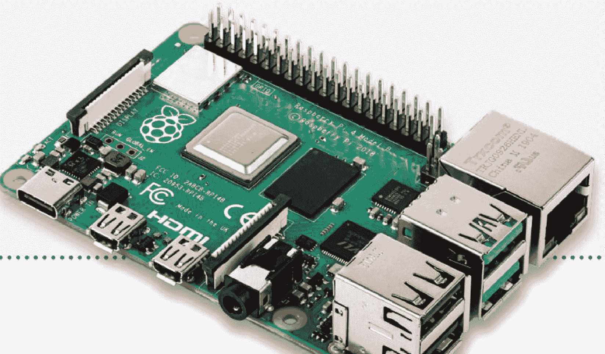


### FUZE PROJECT（FUZE 项目）

FUZE 是一个基于最新款 Raspberry Pi（树莓派）构建的学习环境。你可以购买带有电子套件的工作站，甚至还有一个可以搭建和编程的机械臂。你可以在 www.fuze.co.uk 上找到更多关于 FUZE 的信息。

### RASPBIAN

Raspberry Pi（树莓派）的主要操作系统是基于 Debian 的 Linux 发行版，它提供了一个简单易用的软件包，包含了你需要的一切。它专为 Pi 优化，是进行硬件和软件项目、Python 编程甚至作为台式计算机使用的理想平台。

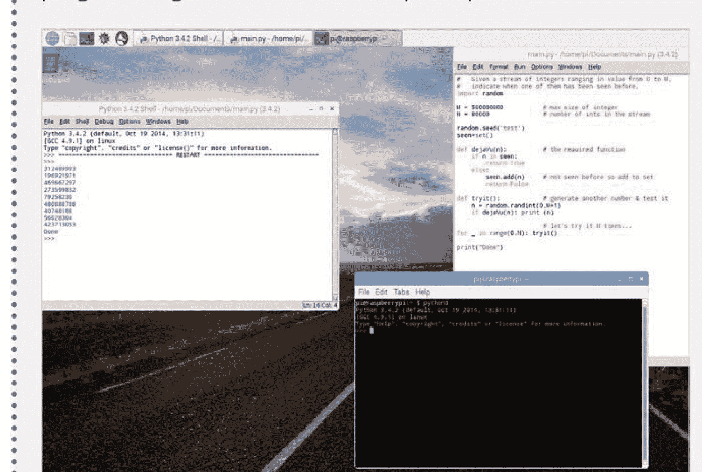

### 书籍

我们通过 www.bdmpublications.com 提供了几本很棒的 Raspberry Pi（树莓派）书籍。我们的 Pi 书籍涵盖了如何购买你的第一台 Raspberry Pi（树莓派）、设置和使用它；还有一些很棒的项目实例和指南，帮助你充分利用 Raspberry Pi（树莓派）。

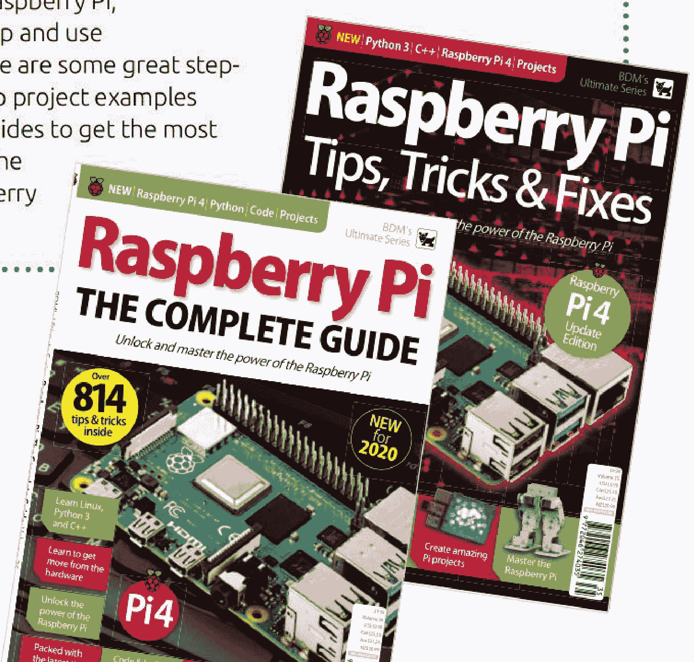

# 认识 Python

Python 是有史以来最伟大的计算机编程语言。它使你能够充分利用计算机的功能，并且使用一种清晰易懂的语言。

### 什么是编程？

在尝试学习编程语言之前，先理解编程语言是什么会有所帮助，Python 也不例外。让我们看看 Python 是如何诞生的，以及它与其他语言的关系。

### PYTHON

编程语言是计算机遵循的一系列指令。这些指令可以像显示你的名字或播放音乐文件一样简单，也可以像构建整个虚拟世界一样复杂。Python 是一种编程语言，由荷兰数学与计算机科学研究中心的吉多·范罗苏姆在 20 世纪 80 年代末构想出来，作为 ABC 语言的后继者。

### 编程食谱

程序就像计算机的食谱。一份烤蛋糕的食谱可能这样写：

将 100 克自发面粉放入碗中。
向碗中加入 100 克黄油。
加入 100 毫升牛奶。
烘烤半小时。

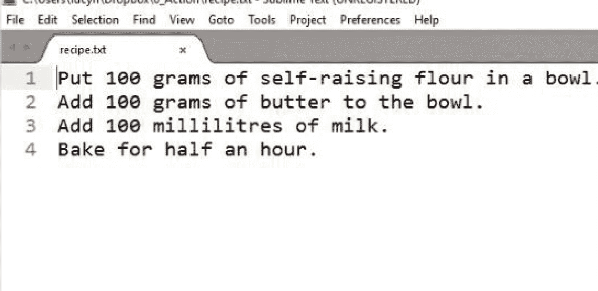

### 代码

就像食谱一样，程序由一系列你按顺序执行的指令组成。一个描述蛋糕的程序可能这样运行：

```
bowl = []
flour = 100
butter = 50
milk = 100
bowl.append([flour,butter,milk])
cake.cook(bowl)
```

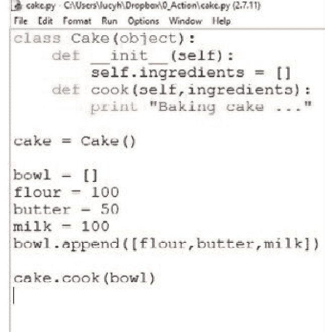

Python 之父，吉多·范罗苏姆。


### 程序命令

你可能不理解一些 Python 命令，比如 `bowl.append` 和 `cake.cook(bowl)`。第一个是一个列表，第二个是一个对象；我们将在本书中讨论这两个概念。最重要的是，在 Python 中阅读命令很容易。一旦你了解了这些命令的功能，就很容易弄清楚程序是如何工作的。

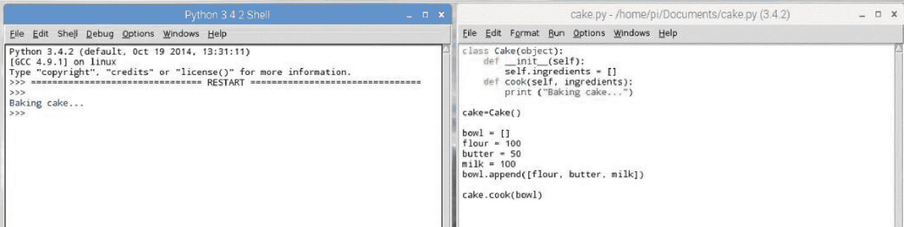

### 高级语言

易于阅读的计算机语言被称为“高级语言”。这是因为它们“高高飘扬”在硬件（也被称为“机器”）之上。那些“贴近硬件”的语言，如汇编语言，被称为“低级语言”。低级语言的命令读起来有点像这样：`msg db , 0xa len equ $ - msg`。

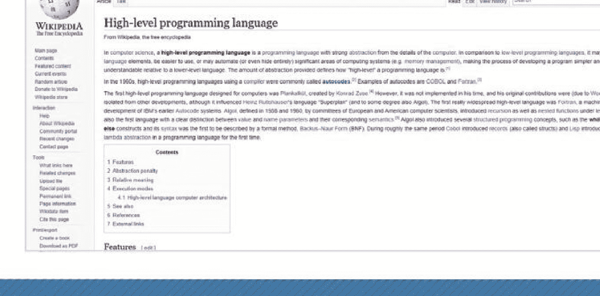

### Python 之禅

Python 让你能够以人类可以理解的语言访问计算机的所有功能。这一切背后是一种被称为“Python 之禅”的理念。这是一组 20 条软件原则，影响着语言的设计。原则包括“优美胜于丑陋”和“简单胜于复杂”。在 Python 中输入 `import this`，它将显示所有原则。

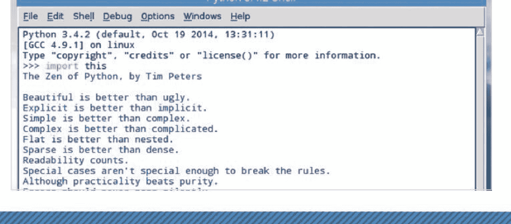

### Python 3 与 Python 2

在典型的计算场景中，Python 因为存在两个活跃版本——Python 2 和 Python 3——而变得有些复杂。

### Python 的世界

Python 3.7 是该编程语言的最新版本。然而，如果你更深入地研究 Python 网站并调查在线 Python 代码，你无疑会遇到 Python 2。虽然你可以同时运行 Python 3 和 Python 2，但不建议这样做。始终选择 Python 网站上发布的最新稳定版本。

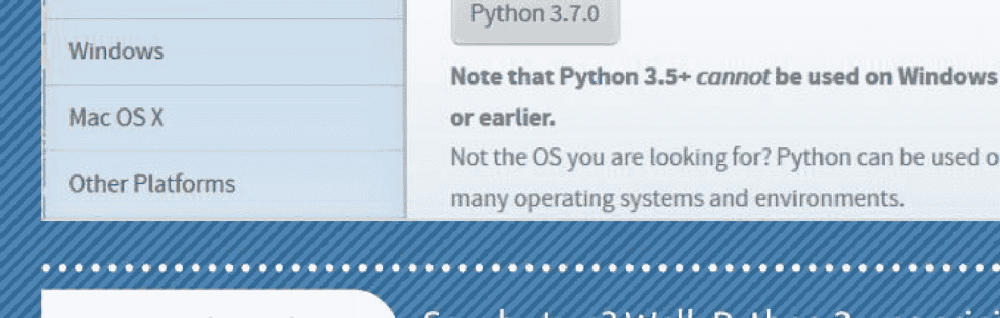

### Python 3.X

2008 年，Python 3 带来了一些新的和增强的功能。这些功能提供了一个更稳定、高效和有效的编程环境，但遗憾的是，这些新功能中的大部分（如果不是全部）与 Python 2 的脚本、模块和教程不兼容。尽管起初并不受欢迎，但 Python 3 后来已成为 Python 编程的前沿。


### Python 2.X

那么为什么有两个版本？嗯，Python 2 最初于 2000 年推出，自那时起，它已经采用了大量的模块、脚本、用户、教程等等。多年来，Python 2 迅速成为初学者和专家进行编程的首选语言之一，这使其成为极其宝贵的资源。


### 3.X 胜出

Python 3 日益增长的受欢迎程度意味着，现在开始学习使用新特性进行开发，并逐步淘汰之前的版本是明智之举。许多开发公司，如 SpaceX 和 NASA，都在使用 Python 3 编写重要的代码片段。


# 如何在Windows中设置Python

Windows用户可以轻松地通过Python官方网站的下载页面安装最新版的Python。尽管许多经验丰富的Python开发者可能不愿将Windows作为编写代码的首选平台，但它仍是初学者的理想起点。

## 安装Python 3.X

微软Windows操作系统默认并未预装Python，因此需要手动安装。幸运的是，这个过程很简单。

**步骤 1** 首先，打开网页浏览器，访问 www.python.org/downloads/。找到标明Python 3.x下载链接的按钮。Python会定期更新，每次错误修复和更新都会改变末位数字。因此，如果你看到Python 3.8或更高版本，无需担心，只要是Python 3，本书中的代码都能正常工作。

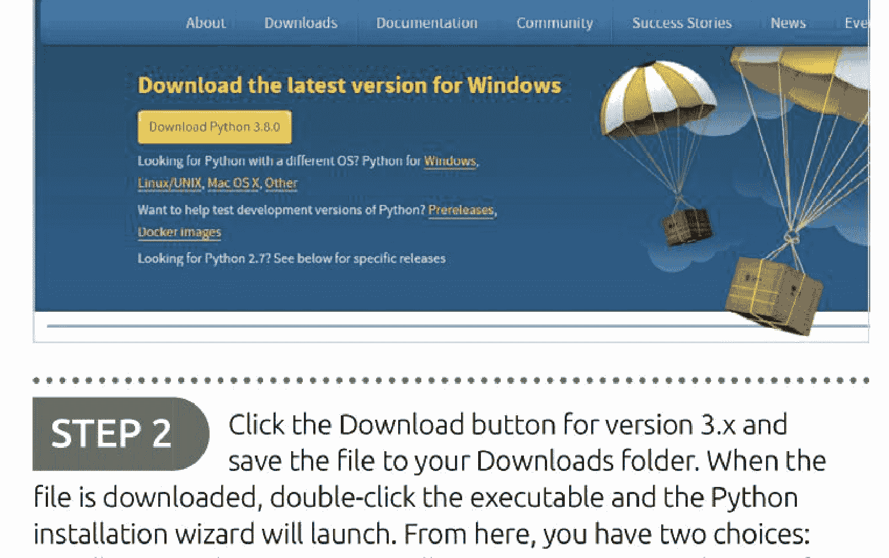

**步骤 2** 点击3.x版本的“Download”按钮，并将文件保存到“下载”文件夹。文件下载完成后，双击可执行文件，Python安装向导将会启动。在这里，你有两个选择：“立即安装”和“自定义安装”。我们推荐选择“自定义安装”链接。

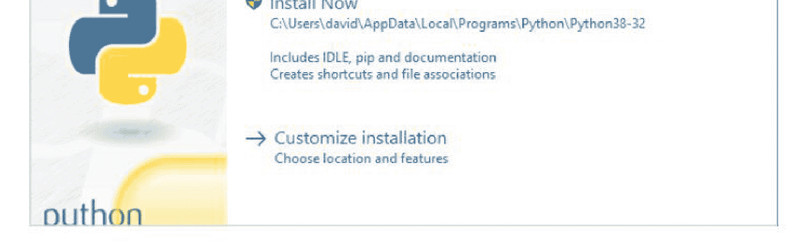

**步骤 3** 选择“自定义安装”选项允许你指定某些参数。虽然你可以保持默认设置，但这是一个值得养成的好习惯，因为有时（幸运的是Python不会如此）安装程序可能会包含不需要的附加功能。在第一个可用的屏幕中，确保所有复选框都已勾选，然后点击“下一步”按钮。

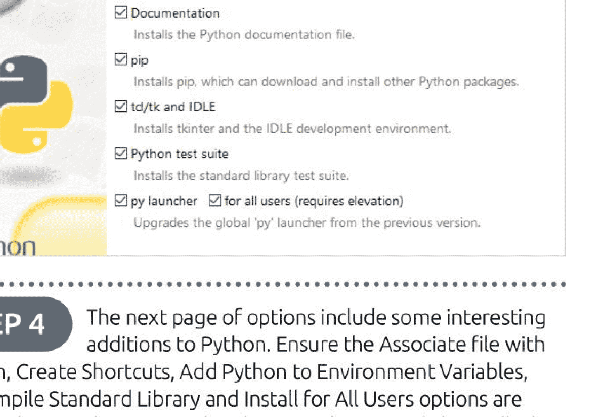

**步骤 4** 下一页的选项包括一些对Python有用的附加功能。确保勾选了“将文件与Python关联”、“创建快捷方式”、“将Python添加到环境变量”、“预编译标准库”和“为所有用户安装”选项。这些将使你以后使用Python更加容易。准备继续时，点击“安装”。

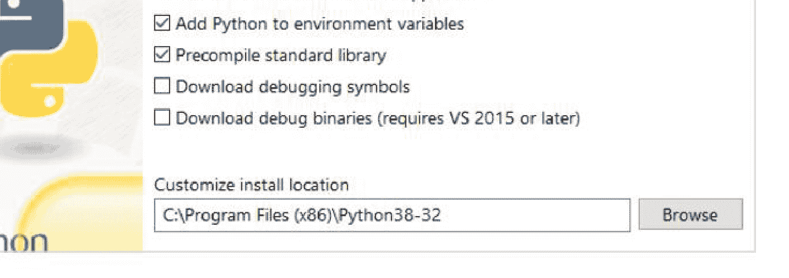

**步骤 5** 你可能需要通过Windows用户账户控制通知确认安装。只需点击“是”，Python就会开始安装。安装完成后，最终的Python向导页面将允许你查看最新的发行说明并学习一些在线教程。

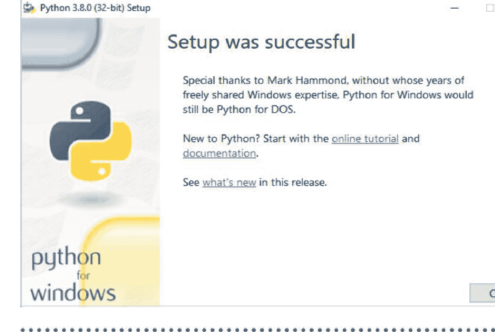

**步骤 6** 然而，在关闭安装向导窗口之前，最好点击“禁用路径长度限制”链接（位于盾牌图标旁边）。这将允许Python绕过Windows的260字符路径限制，使你能够执行存储在深层文件夹结构中的Python程序。再次点击“是”以确认操作，然后就可以“关闭”安装窗口了。

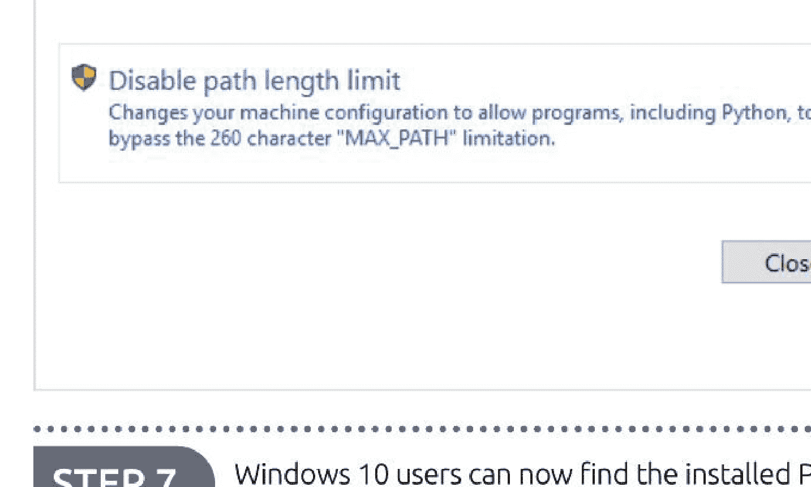

**步骤 7** Windows 10用户现在可以在“开始”按钮的“最近添加”部分找到已安装的Python 3.x。第一个链接“Python 3.x (32-bit)”点击后将启动Python的命令行版本（稍后详述）。要打开IDLE，在Windows开始菜单中键入“IDLE”。

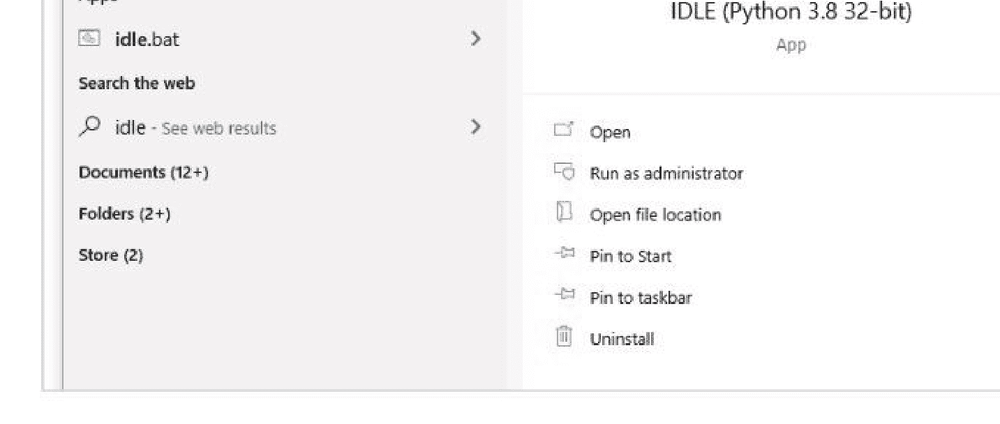

**步骤 8** 点击“IDLE (Python 3.x 32-bit)”链接将启动Python Shell，你可以在这里开始你的Python编程之旅。如果你的版本更新，无需担心，只要它是Python 3.x，我们的代码就能在你的Python 3界面中运行。


**步骤 9** 如果你再次点击Windows“开始”按钮，这次输入：CMD，你将看到“命令提示符”链接。点击它进入Windows命令行环境。要在命令行中进入Python，你需要输入：`python` 然后按回车键。


**步骤 10** Python的命令行版本的工作方式与你在步骤8中打开的Shell非常相似；注意三个向左的箭头（>>>）。虽然它是一个功能完备的环境，但用户友好性不佳，所以暂时离开命令行吧。输入：`exit()` 以退出并关闭“命令提示符”窗口。

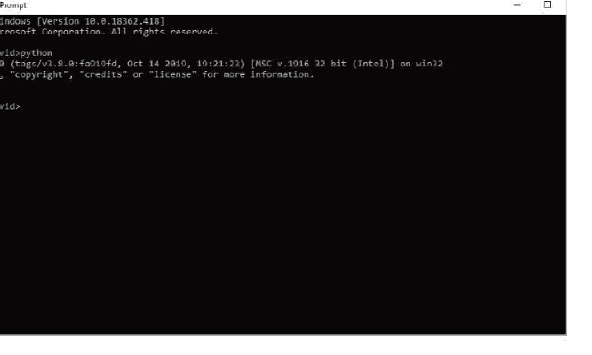

## 如何在Linux中设置Python

虽然树莓派的操作系统包含了最新的稳定版Python，但其他Linux发行版并未预装Python 3。如果你不打算使用树莓派路线，那么下面将介绍如何检查和安装Linux的Python。

### PYTHON 企鹅

Linux是一个如此多用途的操作系统，以至于很难确定做事的单一方式。不同的发行版以不同的方式安装软件，因此在本教程中，我们将坚持使用Linux Mint。

### 步骤 1

首先，你需要确定你的Linux系统当前安装的Python版本。首先，从发行版的菜单中打开一个终端会话，或按Ctrl+Alt+T键。

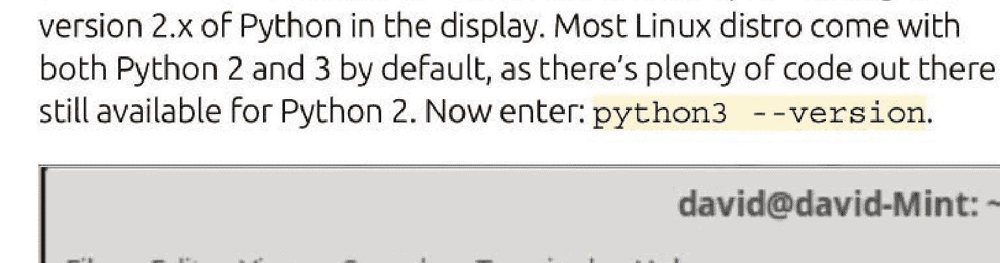

### 步骤 2

接下来，在终端屏幕中输入：`python --version`。屏幕上应该会显示与Python 2.x版本相关的输出。大多数Linux发行版默认同时安装了Python 2和3，因为仍然有大量适用于Python 2的代码。现在输入：`python3 --version`。

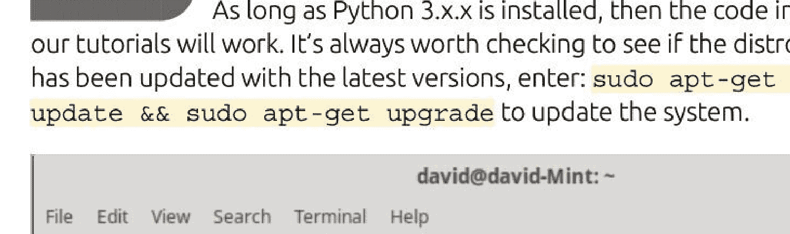

### 步骤 3

在我们的案例中，Python 2和3都已安装。只要安装了Python 3.x.x，我们教程中的代码就能工作。始终值得检查发行版是否已更新到最新版本，输入：`sudo apt-get update && sudo apt-get upgrade` 以更新系统。


### 步骤 4

更新和升级完成后，再次输入：`python3 --version` 以查看Python 3.x是否已更新，或者甚至是否已安装。只要你有Python 3.x，你就是在运行最新的主要版本，3.之后的数字表示补丁和进一步的更新。通常它们不是必需的，但可能包含重要的新元素。

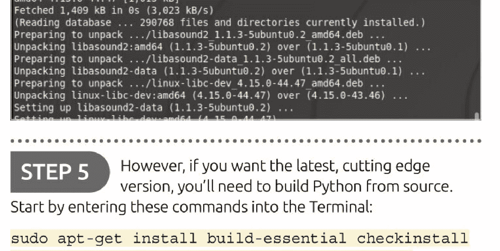

### 步骤 5

然而，如果你想要最新的、前沿的版本，你需要从源码构建Python。首先在终端中输入以下命令：

```
sudo apt-get install build-essential checkinstall
sudo apt-get install libreadline-gplv2-dev libncursesw5-dev libssl-dev libsqlite3-dev tk-dev libgdbm-dev libc6-dev libbz2-dev
```


### 步骤 6

打开你的Linux网页浏览器，访问Python下载页面：https://www.python.org/downloads。点击“Downloads”，然后点击“Python Source”窗口下的按钮。这会打开一个下载对话框，选择一个位置，然后开始下载过程。

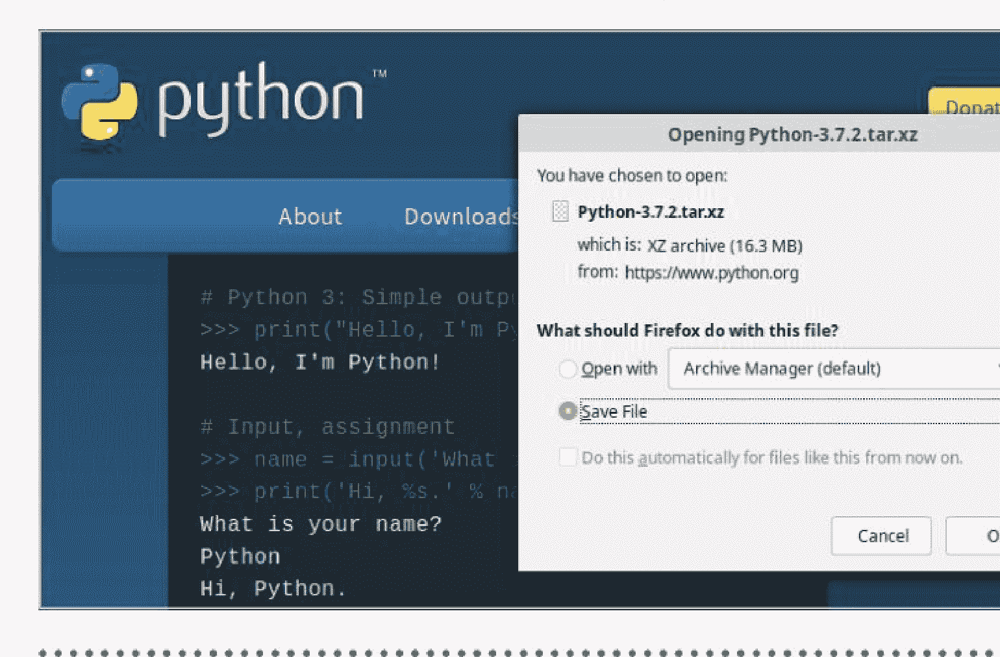

### 步骤 7

在终端中，通过输入：`cd Downloads/` 进入“下载”文件夹。然后解压下载的Python源码：`tar -xvf Python-3.Y.Y.tar.xz`（用你下载的版本号替换Y）。现在进入新解压的文件夹：`cd Python-3.Y.Y/`。

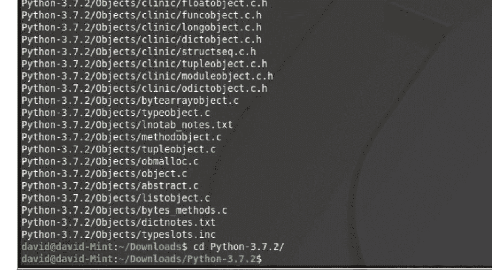

### 步骤 8

在Python文件夹内，输入：

```
./configure
sudo make altinstall
```

这可能需要一些时间，取决于你计算机的速度。完成后，输入：`python3.7 --version` 以检查最新安装的版本。现在你已安装了Python 3.7，同时还保留了旧的Python 3.x.x和Python 2。

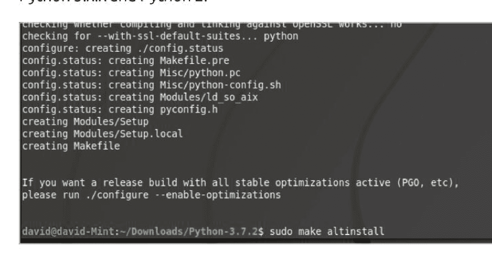

### 步骤 9

对于图形界面IDLE，你需要在终端中输入以下命令：
`sudo apt-get install idle3`
然后可以使用命令启动IDLE：`idle3`。请注意，IDLE运行的版本与你从源码安装的版本不同。

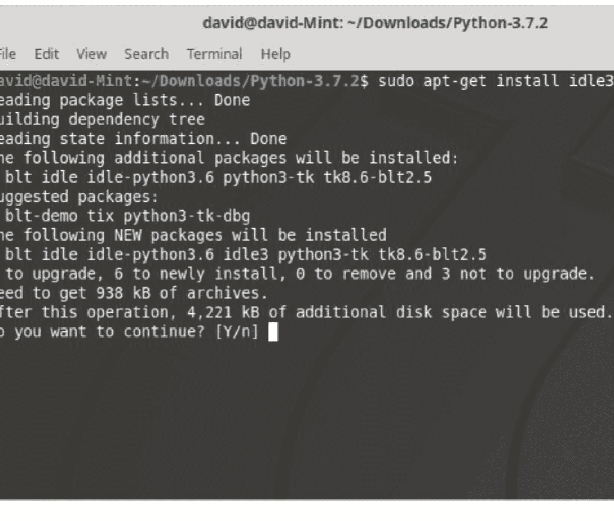

### 步骤 10

你还需要PIP（Pip安装包），这是一个帮助你安装更多模块和扩展的工具。
输入：`sudo apt-get install python3-pip`
PIP安装完成后，使用以下命令检查最新更新：
`pip3 install --upgrade pip`
完成后，关闭终端，Python 3.x将通过发行版菜单中的“编程”部分提供。

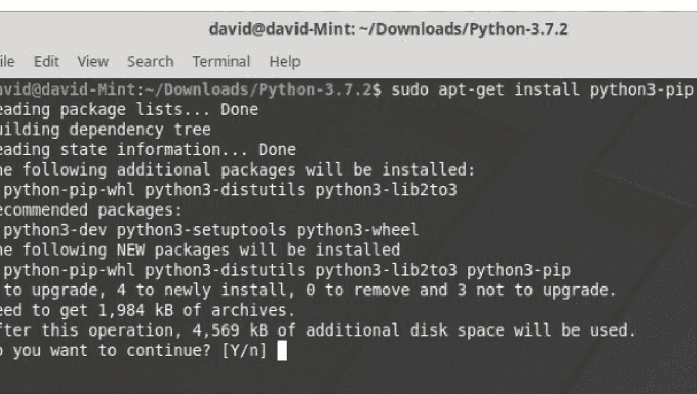

## macOS上的Python

在macOS上安装Python的过程与Windows安装非常相似。只需访问Python网页，将鼠标指针悬停在“Downloads”链接上，然后从选项中选择“Mac OS X”。你将被引导到适用于Mac版本的Python发布页面，以及适用于macOS 64位（针对OS X 10.9及更高版本）的必要安装程序。

# 初次启动 Python

树莓派提供了学习和编码的最佳全面解决方案之一，特别是用于 Python。树莓派推荐的操作系统 Raspbian 预装了最新的稳定版 Python 3，这使其成为一个出色的编码平台。

## 启动 Python

使用 Python 开始编程所需的一切都可在树莓派桌面上找到。不过，如果你想操作，可以打开终端并使用以下命令更新系统：`sudo apt-get update`。

**步骤 1** 加载 Raspbian 桌面后，依次点击菜单按钮，选择 Programming > Python 3 (IDLE)。这将打开 Python 3 交互式解释器。Windows 和 Mac 用户可以在 Windows 的开始菜单中或通过 Finder 找到 Python 3 IDLE 交互式解释器。

**步骤 2** 交互式解释器是你输入代码并查看已编程代码的响应和输出的地方。这是一种沙盒环境，你可以在此尝试一些简单的代码和流程。

**步骤 3** 例如，在交互式解释器中输入：`2+2`，按下回车后，下一行将显示答案：`4`。基本上，Python 处理了“代码”并产生了相关的输出。

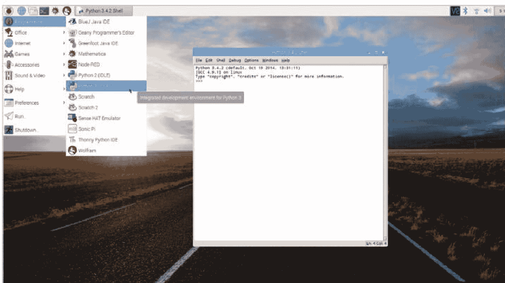

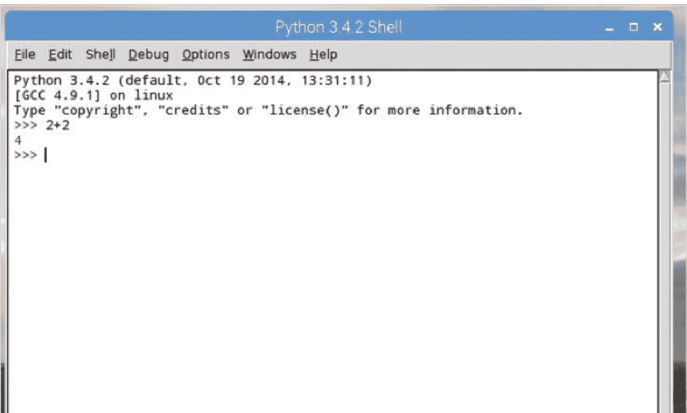

**步骤 4** Python 交互式解释器的功能非常像计算器，因为代码本质上是与系统进行的一系列数学交互。整数，即连续的无限整数序列，可以轻松地进行加、减、乘等运算。

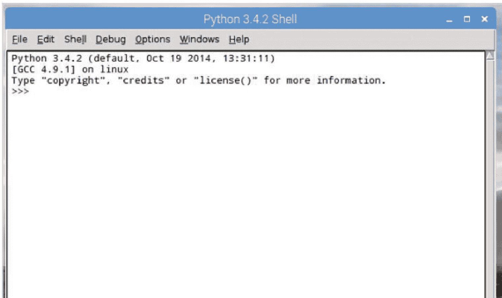

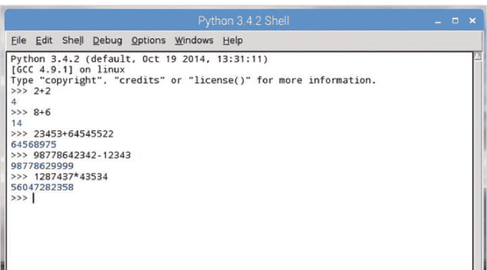

```
python
>>> 2+2
4
>>> 8+6
14
>>> 23453+64545522
64568975
>>> 98778642342-12343
98778629999
>>> 1287437*43534
56047282358
```

虽然这很有趣，但并不特别令人兴奋。试试这个：

`print("Hello everyone!")`

只需像之前的步骤一样将其输入到 IDLE 中。

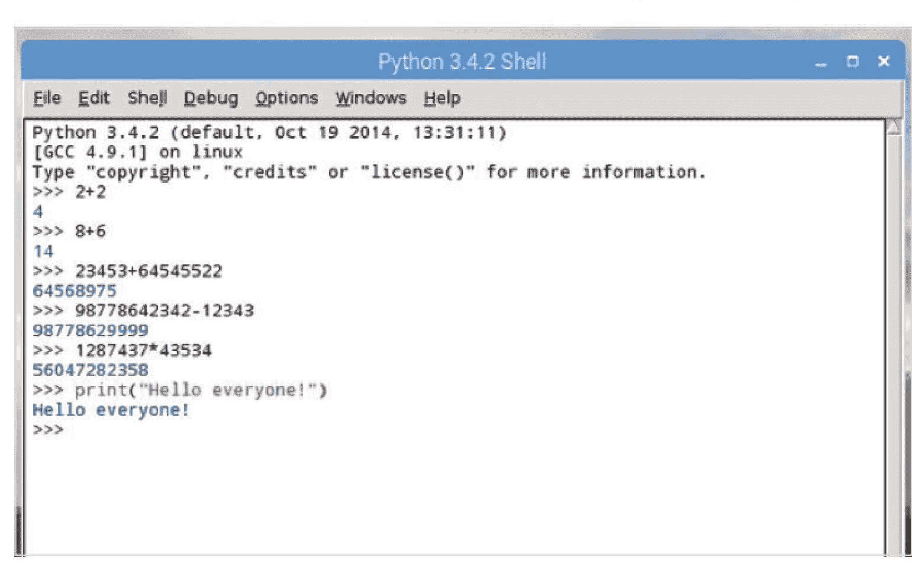

这有点意思了，因为你刚刚生成了你的第一行代码。`print` 命令相当不言自明，它就是打印东西。Python 3 需要使用括号和引号才能将内容输出到屏幕，在本例中是 'Hello everyone!' 部分。

```
print("Hello everyone!")
```

你可能已经注意到了 Python IDLE 中的颜色编码。这些颜色代表 Python 代码的不同元素。它们是：

- 黑色 – 数据和变量
- 绿色 – 字符串
- 紫色 – 函数
- 橙色 – 命令
- 蓝色 – 用户自定义函数
- 深红色 – 注释
- 浅红色 – 错误信息

| 颜色 | 用于 | 示例 |
|---|---|---|
| 黑色 | 数据和变量 | `23.6` `area` |
| 绿色 | 字符串 | `"Hello World"` |
| 紫色 | 函数 | `len()` `print()` |
| 橙色 | 命令 | `if` `for` `else` |
| 蓝色 | 用户自定义函数 | `get_area()` |
| 深红色 | 注释 | `#Remember VAT` |
| 浅红色 | 错误信息 | `SyntaxError:` |

Python IDLE 是一个可配置的环境。如果你不喜欢颜色的显示方式，可以随时通过 Options > Configure IDLE 并点击 Highlighting 选项卡来更改它们。但是，我们不建议这样做，因为你的界面将与我们的截图不同。

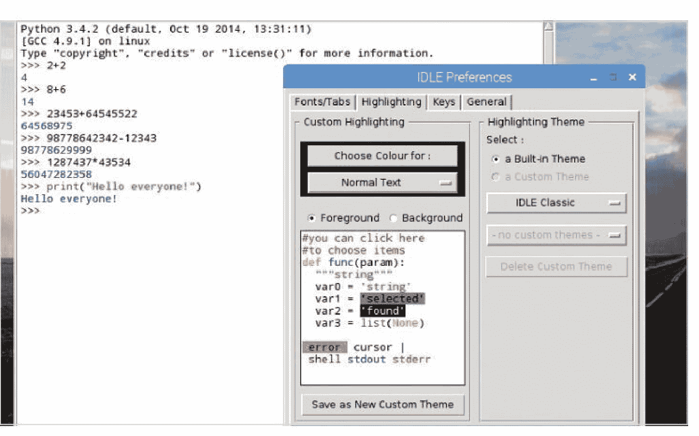

就像大多数可用的程序一样，无论操作系统如何，都有大量的快捷键可用。我们这里无法一一列举，但在 Options > Configure IDLE 下的 Keys 选项卡中，你可以看到当前快捷键绑定的列表。

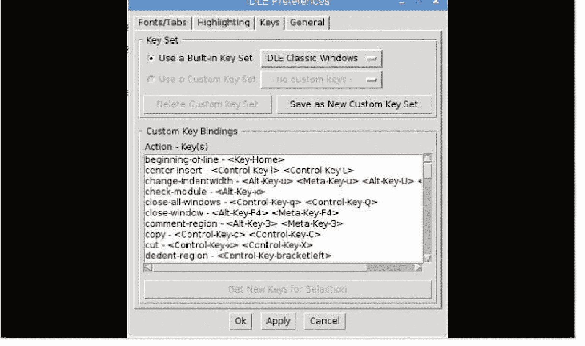

Python IDLE 是一个强大的接口，并且它实际上是使用 Python 编写的，利用了其中一个可用的 GUI 工具包。如果你想知道交互式解释器的许多细节，我们建议你花一些时间查看 www.docs.python.org/3/library/idle.html，其中详细介绍了 IDLE 的许多特性。

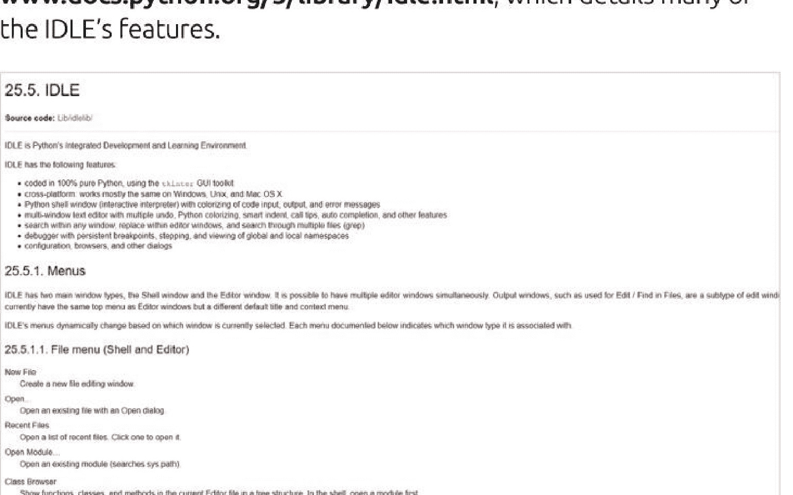

# 你的第一行代码

本质上，你已经在上一个教程中使用 'print("Hello everyone!")' 函数编写了你的第一行代码。然而，让我们扩展一下，看看如何输入你的代码并尝试一些其他的 Python 示例。

## 玩转 Python

对于大多数语言，无论是计算机语言还是人类语言，关键都在于记住并正确应用合适的词汇。你并非天生就知道这些词汇，所以你需要学习它们。

**步骤 1** 如果你已经关闭了 Python 3 IDLE，请在你喜欢的任何操作系统版本中重新打开它。在交互式解释器中，输入熟悉的命令：
`print("Hello")`

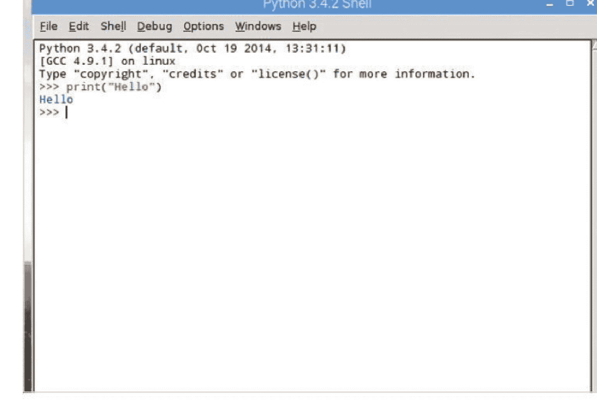

**步骤 2** 正如预期的那样，单词 Hello 以蓝色文本出现在交互式解释器中，表示这是一个字符串输出。这相当直接，不需要太多解释。现在试试：
`print("2+2")`

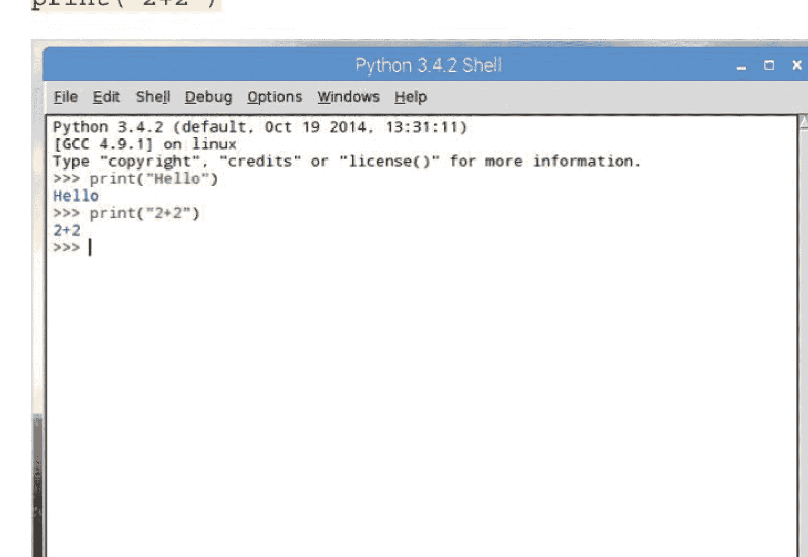

**步骤 3** 你可以看到输出的不是数字 4，而是你要求打印到屏幕上的字符串 "2+2"。引号定义了输出到交互式解释器的内容；要打印 2+2 的计算结果，你需要去掉引号：
`print(2+2)`

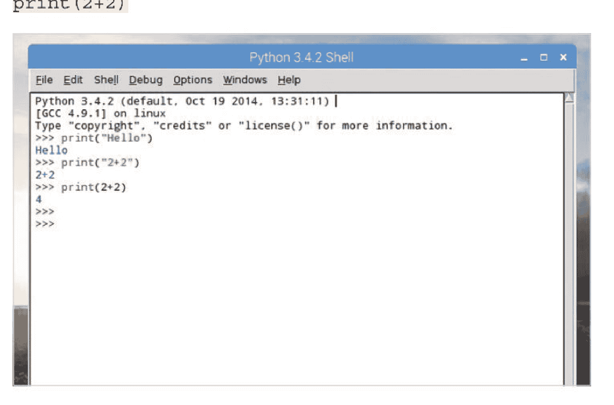

**步骤 4** 你可以继续这样操作，打印 2+2、464+2343 等等。一种更简单的方法是使用变量，这是我们将稍后深入介绍的内容。现在，请输入：
`a=2`
`b=2`

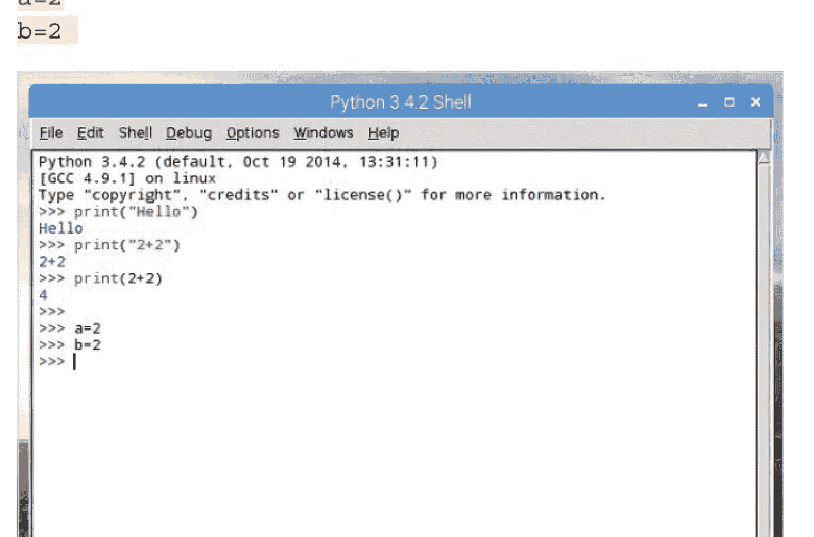

**步骤 5** 你在这里做的是将字母 `a` 和 `b` 赋予两个值：2 和 2。它们现在是变量，Python 可以调用它们来输出、相加、相减、相除等等，只要它们的值保持不变。试试这个：

```
print(a)
print(b)
```

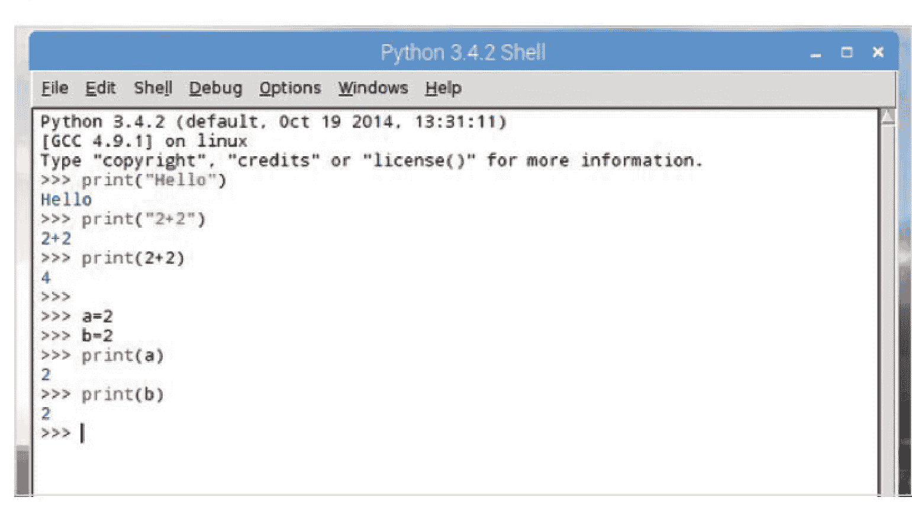

**步骤 6** 上一步的输出分别显示了 `a` 和 `b` 的当前值，因为你要求它们分别打印。如果你想将它们相加，可以使用以下代码：

```
print(a+b)
```

这段代码简单地获取 `a` 和 `b` 的值，将它们相加并输出结果。

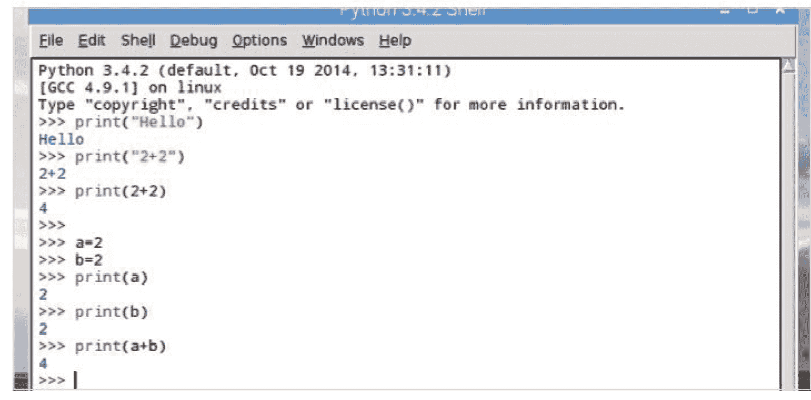

**步骤 7** 你可以尝试不同类型的变量和 `print` 函数。例如，你可以为一个人的名字分配变量：

```
name="David"
print(name)
```

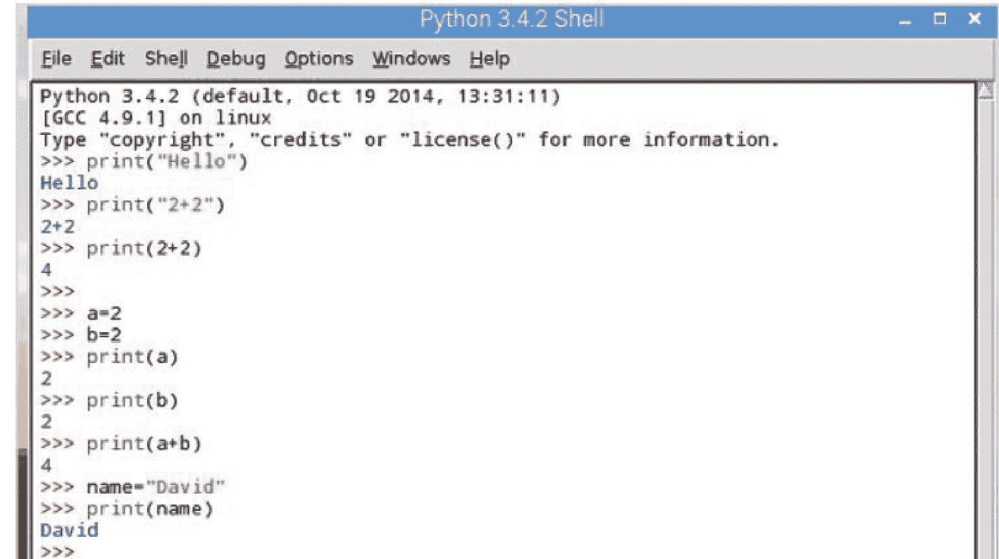

**步骤 8** 现在我们来添加姓氏：

```
surname="Hayward"
print(surname)
```

你现在有了两个变量，一个包含名字，一个包含姓氏，你可以分别打印它们。

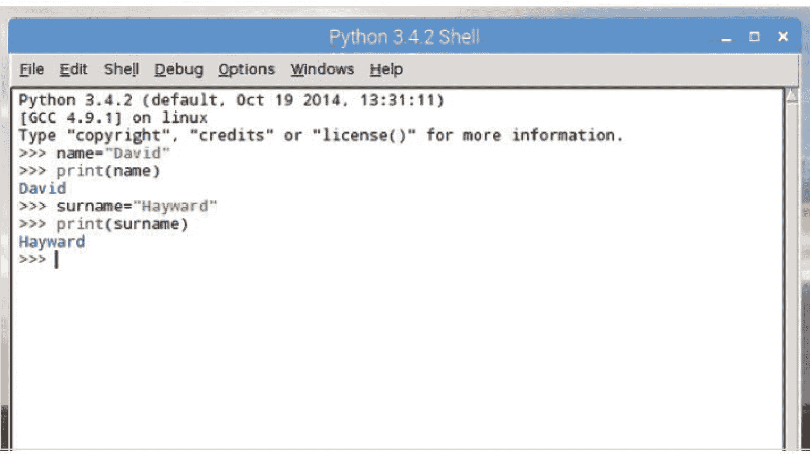

**步骤 9** 如果我们像之前一样使用 `+` 号，姓名将不会在交互式解释器的输出中正确显示。试试看：

```
print(name+surname)
```

你需要在两者之间加一个空格，将它们定义为两个单独的值，而不是用于数学运算的内容。

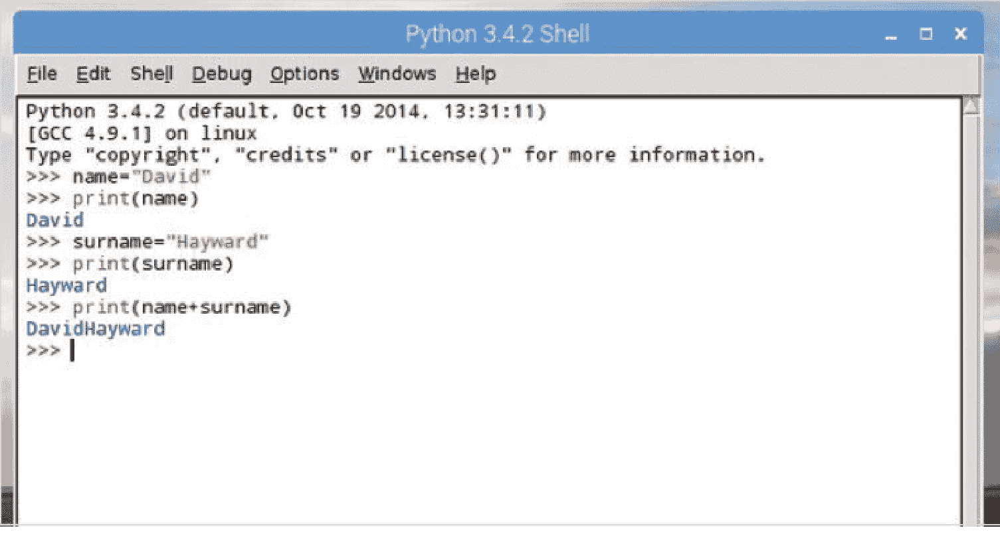

**步骤 10** 在 Python 3 中，你可以使用逗号来分隔两个变量，并在它们之间添加空格：

```
print(name, surname)
```

或者，你可以自己添加空格：

```
print(name+" "+surname)
```

如你所见，使用逗号的方式简洁得多。恭喜，你刚刚迈出了进入 Python 广阔世界的第一步。

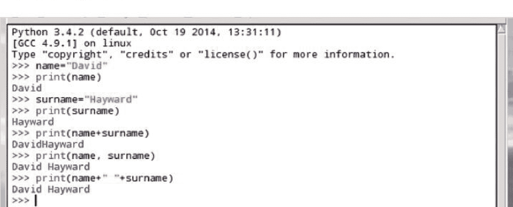

### 保存并执行你的代码

虽然在 IDLE 交互式解释器中处理小代码片段完全没问题，但它并非为输入较长的程序清单而设计。在本节中，你将被介绍 IDLE 编辑器，从现在开始你将在此进行操作。

## 编辑代码

你最终会达到一个必须从交互式解释器中输入单行代码的阶段前进的地步。相反，IDLE 编辑器将允许你保存和执行你的 Python 代码。

**步骤 1** 首先，打开 Python IDLE 交互式解释器，当它启动后，点击 File > New File。这将打开一个新窗口，标题为 Untitled。这就是 Python IDLE 编辑器，你可以在其中输入创建未来程序所需的代码。

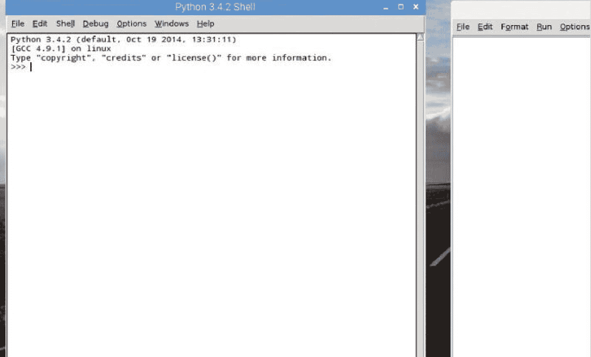

**步骤 2** IDLE 编辑器本质上是一个带有 Python 特性、颜色编码等的简单文本编辑器；与 Sublime 非常相似。你在其中输入代码的方式与在交互式解释器中相同，因此，举上一个教程的例子，输入：

```
print("Hello everyone!")
```

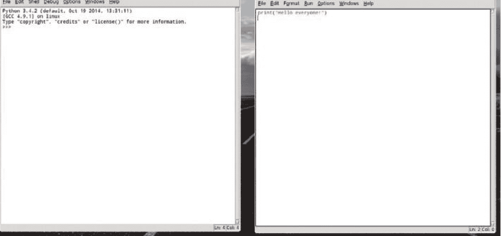

**步骤 3** 你可以看到，IDLE 编辑器中的颜色编码与交互式解释器中相同，这使你能够更好地理解你的代码。但是，要执行代码，你需要先保存它。按 F5，你会看到一个 Save... 对话框。

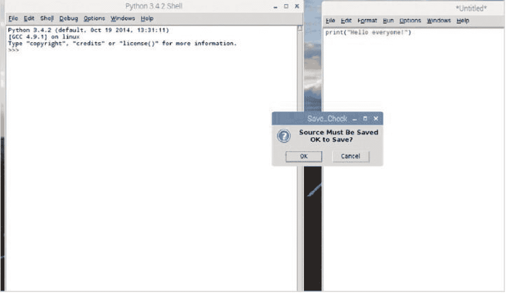

**步骤 4** 在 Save 对话框中单击 OK 按钮，并选择你将保存所有 Python 代码的目标位置。目标位置可以是一个名为 Python 的专用文件夹，也可以随意存放。但请记住保持驱动器整洁，以便将来帮助你。

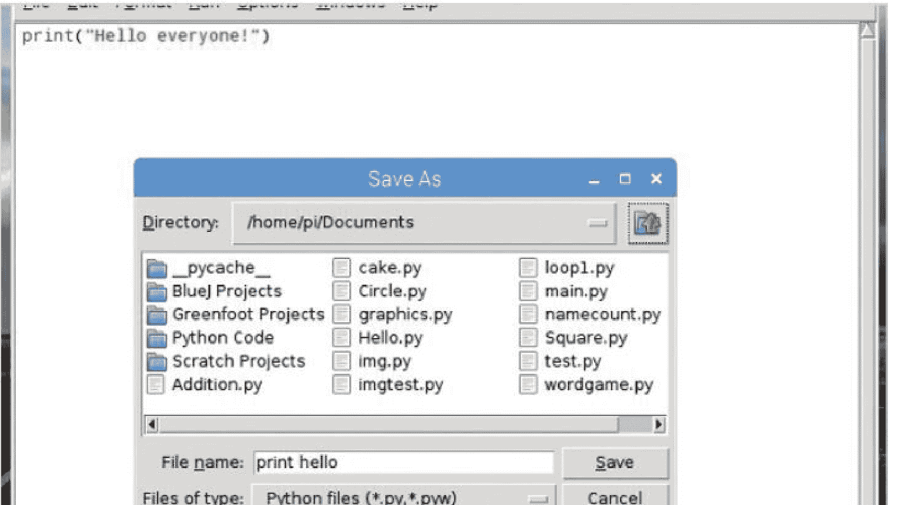

### 保存并执行你的代码

### 第5步
为你的代码输入一个名称，例如 'print hello'，然后点击保存按钮。一旦 Python 代码被保存，它就会被执行，输出结果将显示在 IDLE Shell 中。在这个例子中，输出的是 'Hello everyone!'。

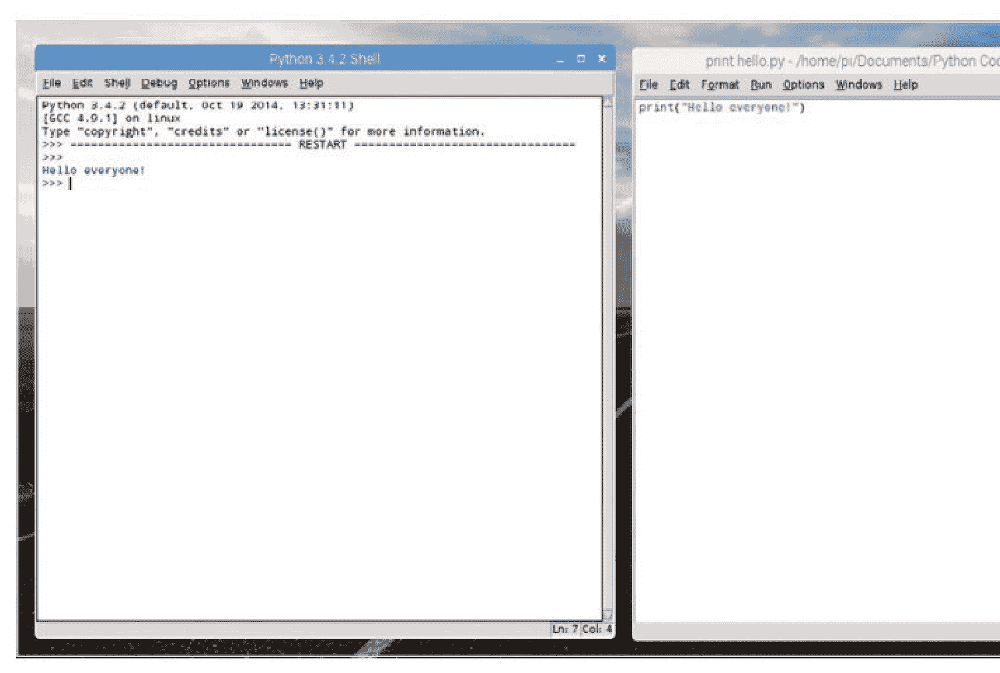

### 第6步
这将是绝大多数 Python 代码的执行方式。将其输入到编辑器中，按 F5 键，保存代码，然后在 Shell 中查看输出。有时情况会有所不同，这取决于你是否请求了单独的窗口，但本质上这就是这个过程。除非另有说明，这将是我们贯穿本书所使用的过程。

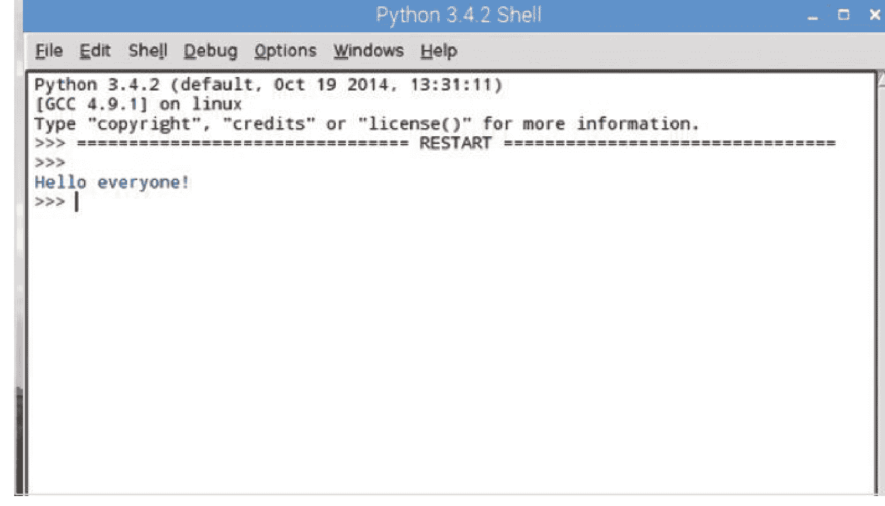

### 第7步
如果你打开已保存的 Python 代码的文件位置，你会看到它以 .py 扩展名结尾。这是默认的 Python 文件名。你创建的任何代码都将是 whatever.py，而从众多互联网 Python 资源站点下载的任何代码也将是 .py。只需确保代码是为 Python 3 编写的。

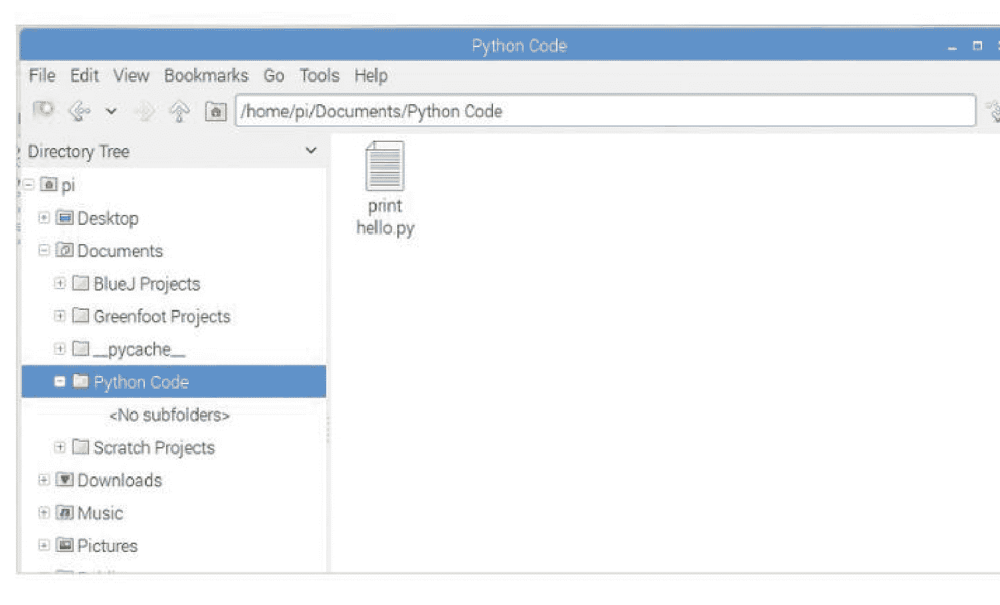

### 第8步
让我们扩展代码，并输入上一个教程中的几个例子：
```python
a=2
b=2
name="David"
surname="Hayward"
print(name, surname)
print(a+b)
```
如果你现在按 F5，系统会再次要求你保存文件，因为它已经从之前被修改过了。

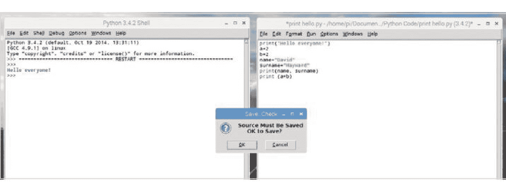

### 第9步
如果你点击确定按钮，文件将被新的代码条目覆盖并执行，输出结果在 Shell 中。对于这几行代码来说这没什么问题，但如果你要编辑一个更大的文件，覆盖可能会成为一个问题。相反，请使用编辑器中的 文件 > 另存为 来创建一个备份。

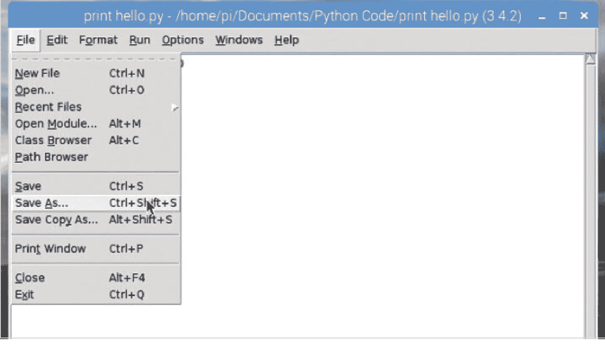

### 第10步
现在创建一个新文件。关闭编辑器，并打开一个新的实例（从 Shell 中选择 文件 > 新建文件）。输入以下内容并将其保存为 hello.py：
```python
a="Python"
b="is"
c="cool!"
print(a, b, c)
```
你将在下一个教程中使用这段代码。

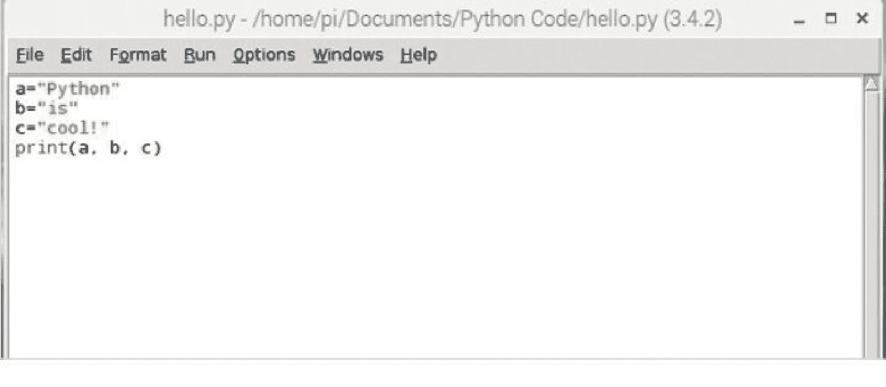

## 从命令行执行代码

尽管我们在本书中一直使用 GUI IDLE，但了解一下 Python 的命令行处理是值得的。我们已经知道有一个命令行版本的 Python，但它也用于执行代码。

### 命令代码
使用我们在上一个教程中创建的代码，也就是我们命名为 hello.py 的那个，让我们看看如何在命令行级别运行在 GUI 中创建的代码。

### 第1步
在 Linux 中，Python 有两种可能的方式通过命令行执行代码。一种方式是使用 Python 2，而另一种则使用 Python 3 库等等。不过首先，进入你操作系统上的命令行或终端。

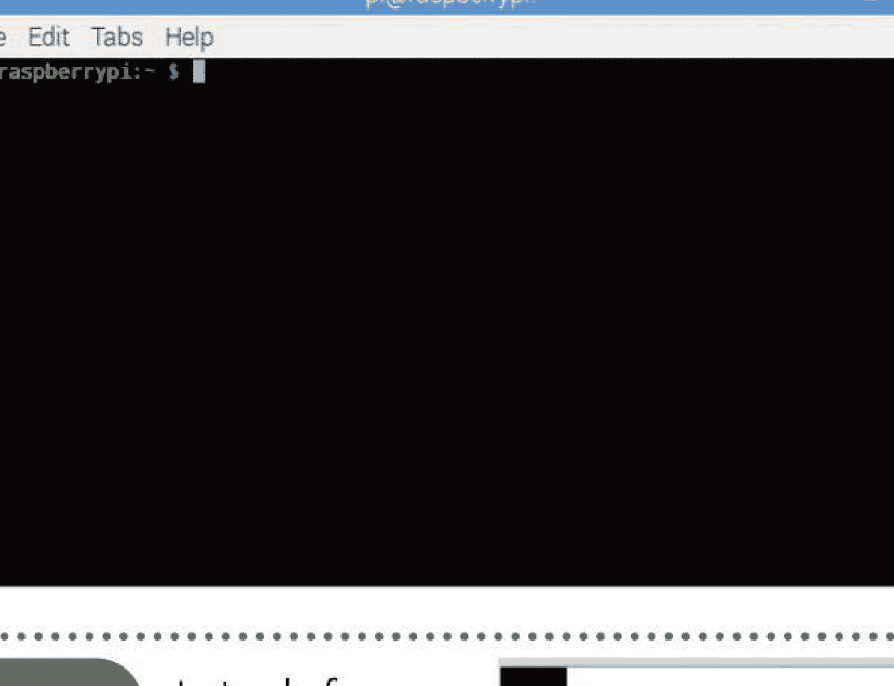

### 第2步
和之前一样，我们使用的是树莓派：Windows 用户需要点击开始按钮并搜索 CMD，然后点击返回的命令行搜索结果；macOS 用户可以通过点击 前往 > 实用工具 > 终端 来访问他们的命令行。

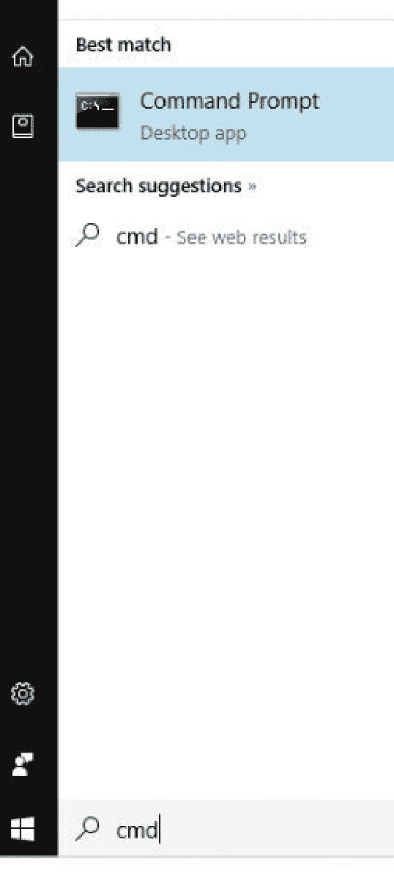

### 第3步
现在你处于命令行，我们可以启动 Python。对于 Python 3，你需要输入命令 python3 并按回车键。这将使你进入命令行版本的 Shell，带有熟悉的三个向右箭头作为光标（>>>）。

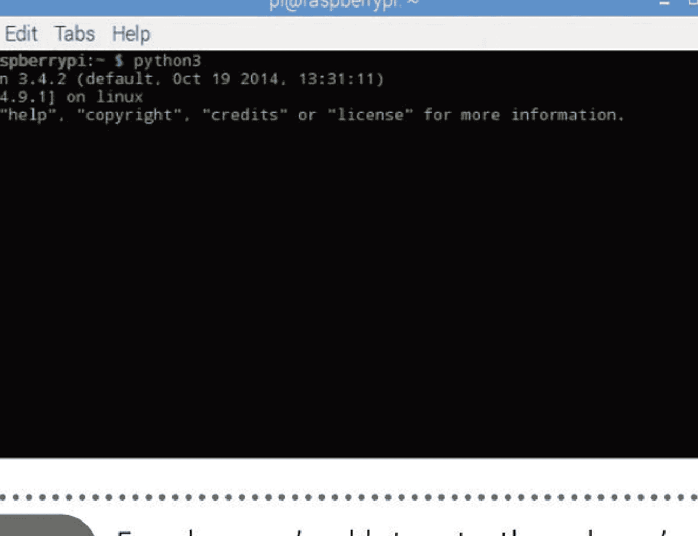

### 第4步
从这里，你可以输入之前看过的代码，例如：
```python
a=2
print(a)
```
你可以看到它的工作方式完全相同。

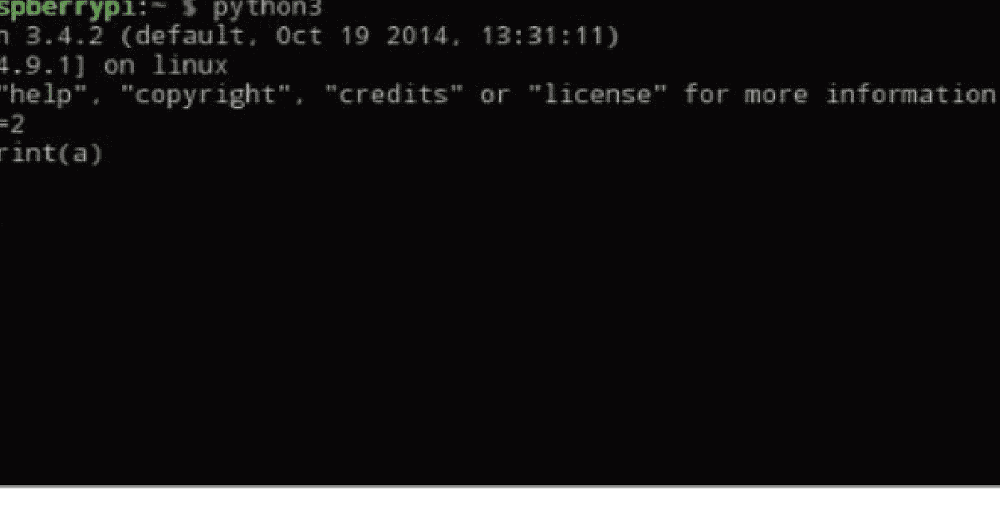

### 第5步
现在输入：exit() 以离开命令行 Python 会话并返回到命令提示符。进入你保存上一个教程代码的文件夹，并列出其中可用的文件；你应该能看到 hello.py 文件。

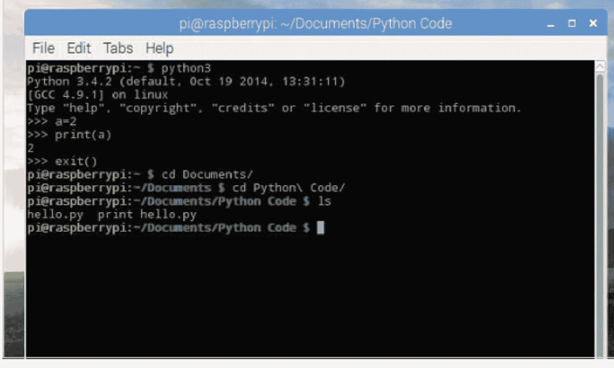

### 第6步
在与你要运行的代码相同的文件夹内，在命令行中输入以下内容：
```bash
python3 hello.py
```
这将执行我们创建的代码，提醒你一下，代码是：
```python
a="Python"
b="is"
c="cool!"
print(a, b, c)
```
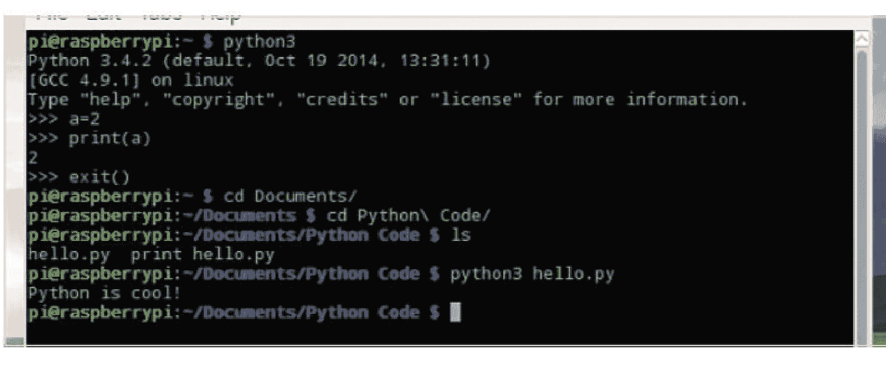

### 第7步
当然，由于这是 Python 3 代码，使用了 Python 3 独有的语法和布局，它只有在你使用 python3 命令时才有效。如果你愿意，可以尝试使用 Python 2 运行相同的代码，输入：
```bash
python hello.py
```
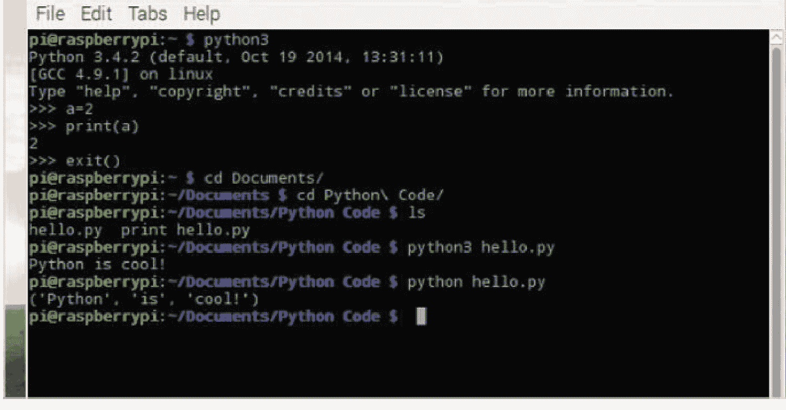

### 第8步
从 Python 2 命令行运行 Python 3 代码的结果是相当明显的。虽然它没有以任何方式报错，但由于 Python 3 处理 print 命令的方式与 Python 2 不同，结果并非我们所预期的。暂时使用 Sublime，打开 hello.py 文件。

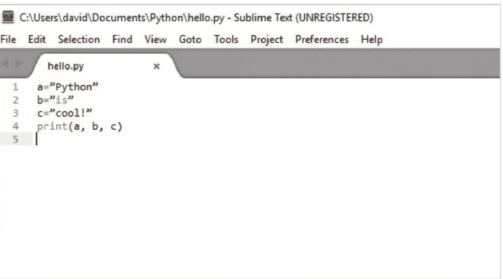

### 第9步
由于 Sublime Text 不适用于树莓派，你将暂时离开树莓派，并使用 Sublime 作为一个例子，说明你不一定需要使用 Python IDLE。打开 hello.py 文件，将其修改为包含以下内容：
```python
name=input("What is your name? ")
print("Hello,", name)
```
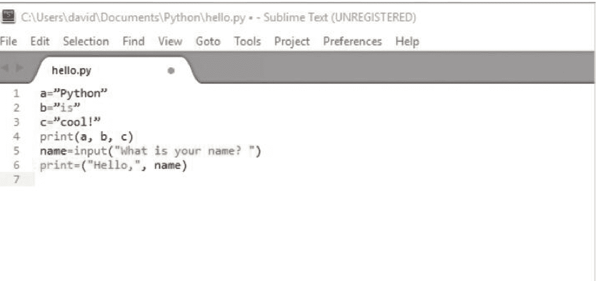

### 第10步
保存 hello.py 文件并返回到命令行。现在使用以下命令执行新保存的代码：
```bash
python3 hello.py
```
结果将是原始的 Python is cool! 语句，加上要求你输入姓名的 input 命令，并在命令窗口中显示它。

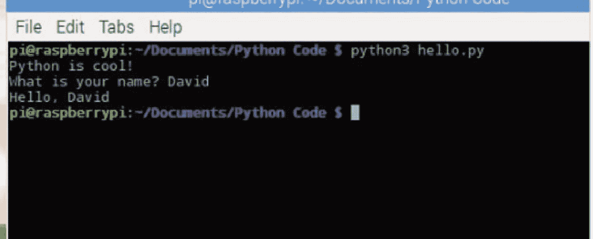

## 数字和表达式

我们已经看到了一些 Python 的基本数学表达式，比如简单的加法等等。现在让我们扩展一下，看看 Python 作为计算器有多么强大。你可以在 IDLE Shell 或编辑器中工作，随你喜欢。

你可以用 Python 的数学功能得到一些非常令人印象深刻的结果；就像大多数（如果不是全部）编程语言一样，数学是代码背后的驱动力。

### 第1步
打开 Python 3 的 GUI 版本，如前所述，你可以使用 Shell 或编辑器。目前，你将使用 Shell 来热身我们的数学肌肉，我们相信这是位于大脑后部的一个小腺体（或者不是）。

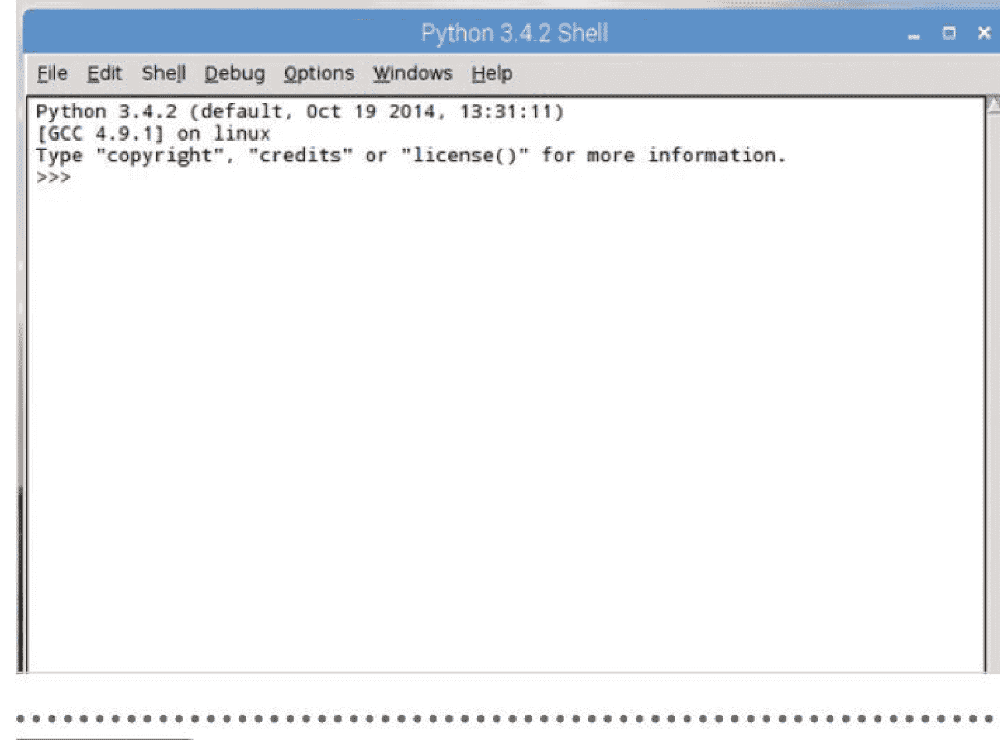

### 第2步
在 Shell 中输入以下内容：
```
2+2
54356+34553245
99867344*2734484221
```
你可以看到 Python 可以处理一些相当大的数字。

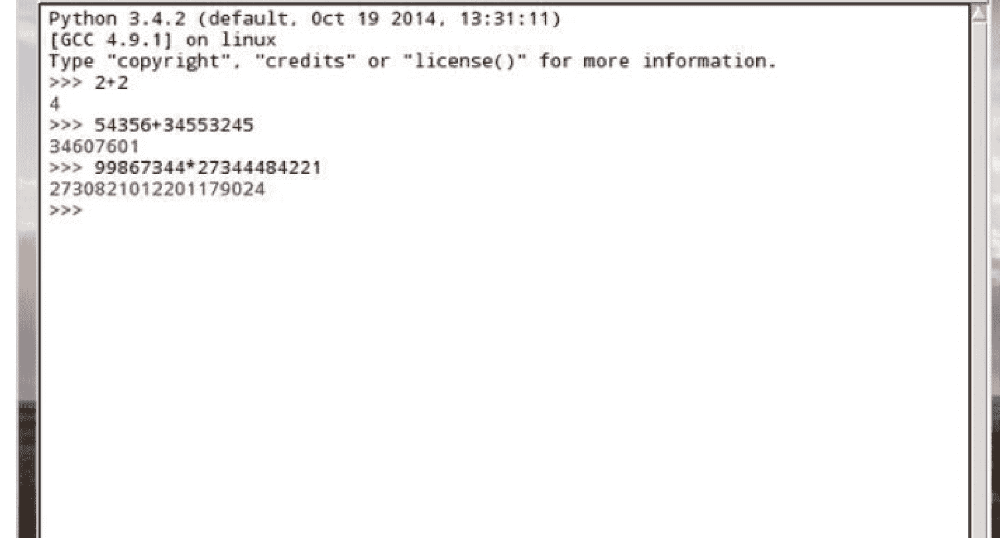

### 第3步
你可以使用所有常见的数学运算：除法、乘法、括号等等。用几个例子练习一下，例如：
```
1/2
6/2
2*2*3
(1+2)+(3*4)
```
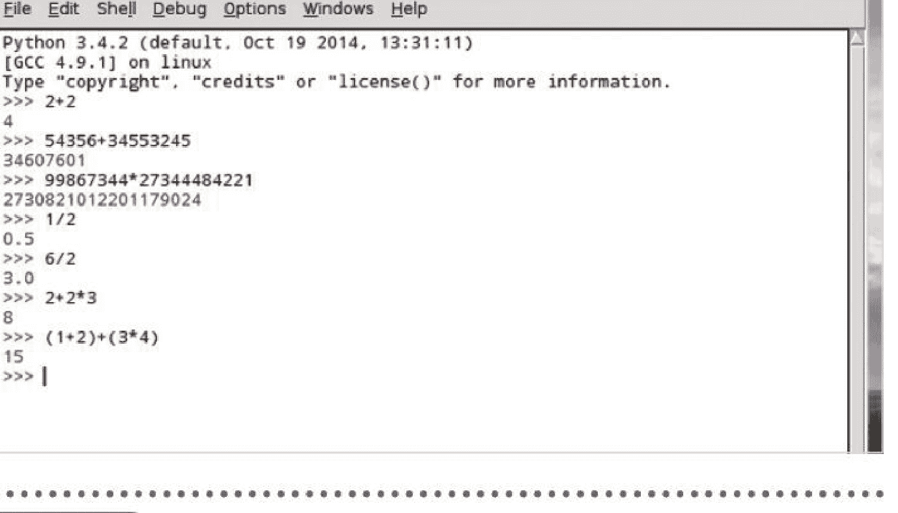

### 第4步
你无疑已经注意到，除法会产生一个十进制数。在 Python 中，这些被称为浮点数或浮点运算。然而，如果你需要一个整数而不是十进制答案，那么你可以使用双斜杠：
```
1//2
6//2
```
等等。

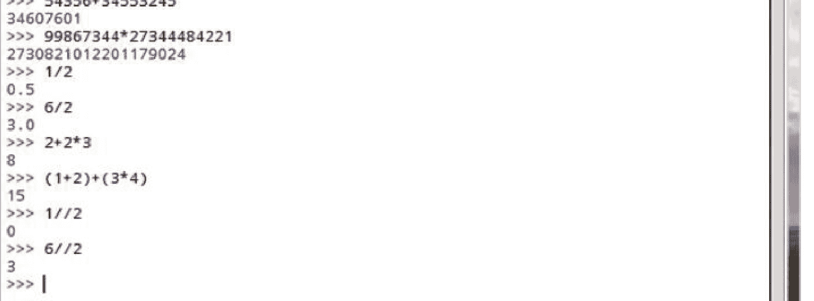

### 第5步
你还可以使用一个运算来查看除法后剩下的余数。例如：
10/3
将显示 3.333333333，这当然是 3.3 循环。如果你现在输入：
10%3
这将显示 1，这是 10 除以 3 后剩下的余数。

```
>>> 1/2
0.5
>>> 6/2
3.0
>>> 2+2*3
8
>>> (1+2)+(3*4)
15
>>> 1//2
0
>>> 6//2
3
>>> 10/3
3.3333333333333335
>>> 10%3
1
```

### 第6步
接下来是幂运算符，或者如果你要技术一点的话，叫乘方。要计算某物的幂，你可以使用双乘号或键盘上的双星号：
2**3
10**10
本质上，它是 2x2x2，但我们相信你已经知道数学运算符背后的基础知识。这就是你在 Python 中计算它的方式。

```
>>> 6/2
3.0
>>> 2+2*3
8
>>> (1+2)+(3*4)
15
>>> 1//2
0
>>> 6//2
3
>>> 10/3
3.3333333333333335
>>> 10%3
1
>>> 2**3
8
>>> 10**10
10000000000
>>>
```

### 第7步
数字和表达式不止于此。Python 有许多内置函数来计算数字集合、绝对值、复数以及大量的数学表达式和毕达哥拉斯绕口令。例如，要将一个数字转换为二进制，请使用：
bin(3)

```
>>> 1/2
0.5
>>> 6/2
3.0
>>> 2+2*3
8
>>> (1+2)+(3*4)
15
>>> 1//2
0
>>> 6//2
3
>>> 10/3
3.3333333333333335
>>> 10%3
1
>>> 2**3
8
>>> 10**10
10000000000
>>> bin(3)
'0b11'
>>>
```

### 第8步
这将显示为 '0b11'，将整数转换为二进制并在前面添加前缀 0b。如果你想移除 0b 前缀，那么你可以使用：
format(3, 'b')
Format 命令将一个值（数字 3）转换为由格式规范（'b' 部分）控制的格式化表示。

```
>>> 2+2*3
8
>>> (1+2)+(3*4)
15
>>> 1//2
0
>>> 6//2
3
>>> 10/3
3.3333333333333335
>>> 10%3
1
>>> 2**3
8
>>> 10**10
10000000000
>>> bin(3)
'0b11'
>>> format(3, 'b')
'11'
>>>
```

### 第9步
布尔表达式是一个逻辑语句，它要么为真，要么为假。我们可以用它们来比较数据并测试它是否等于、小于或大于。在一个新文件中尝试这个：
a = 6
b = 7
print(1, a == 6)
print(2, a == 7)
print(3, a == 6 and b == 7)
print(4, a == 7 and b == 7)
print(5, not a == 7 and b == 7)
print(6, a == 7 or b == 7)
print(7, a == 7 or b == 6)
print(8, not (a == 7 and b == 6))
print(9, not a == 7 and b == 6)

```
a = 6
b = 7
print(1, a == 6)
print(2, a == 7)
print(3, a == 6 and b == 7)
print(4, a == 7 and b == 7)
print(5, not a == 7 and b == 7)
print(6, a == 7 or b == 7)
print(7, a == 7 or b == 6)
print(8, not (a == 7 and b == 6))
print(9, not a == 7 and b == 6)
```

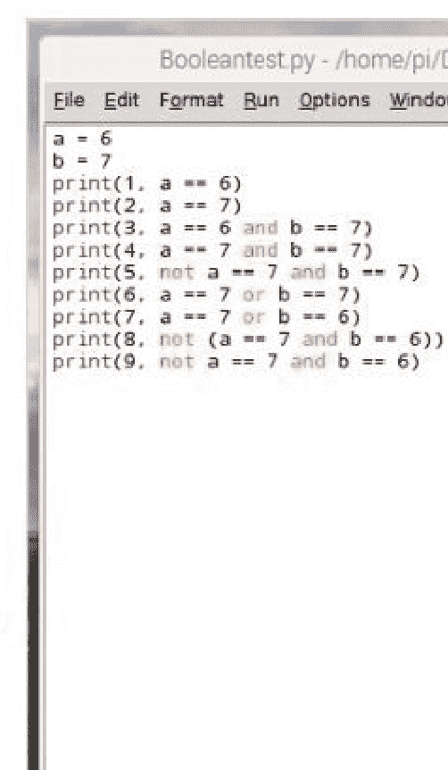

### 第10步
执行第9步的代码，你可以看到一系列 True 或 False 语句，这取决于两个定义值 6 和 7 的结果。这是你所学内容的延伸，也是编程的重要组成部分。

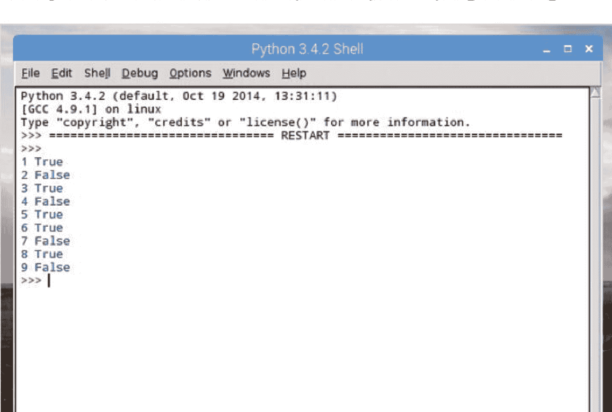

## 使用注释

编写代码时，程序流程、每个变量的作用、整体程序的运行方式等信息都存在于你的脑海中。其他程序员可能逐行理解代码，但随着时间的推移，代码会变得越来越难以阅读。

### 注释！

程序员通过为特定代码段添加注释来保持代码的可读性。例如，如果使用了某个变量，程序员会注释说明该变量的预期作用。这是一种良好的编程实践。

**步骤 1** 首先，创建一个新的 IDLE 编辑器实例（文件 > 新建文件），创建一个简单的变量和打印命令：

```
a=10
print("The value of A is,", a)
```

保存文件并执行代码。

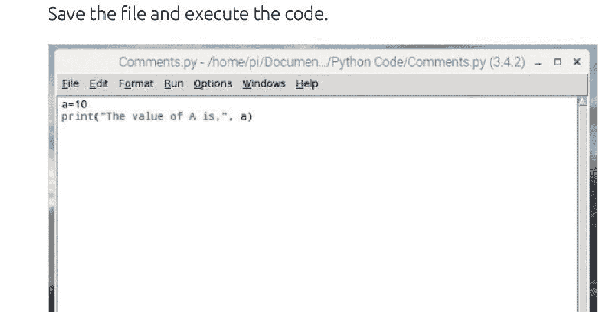

**步骤 2** 运行代码后，IDLE 交互式窗口将返回这行内容：`The value of A is, 10`，这与我们的预期相符。现在，添加一些代码中常见的注释类型：

```
# 将 A 的初始值设为 10
a=10
# 打印 A 的当前值
print("The value of A is,", a)
```

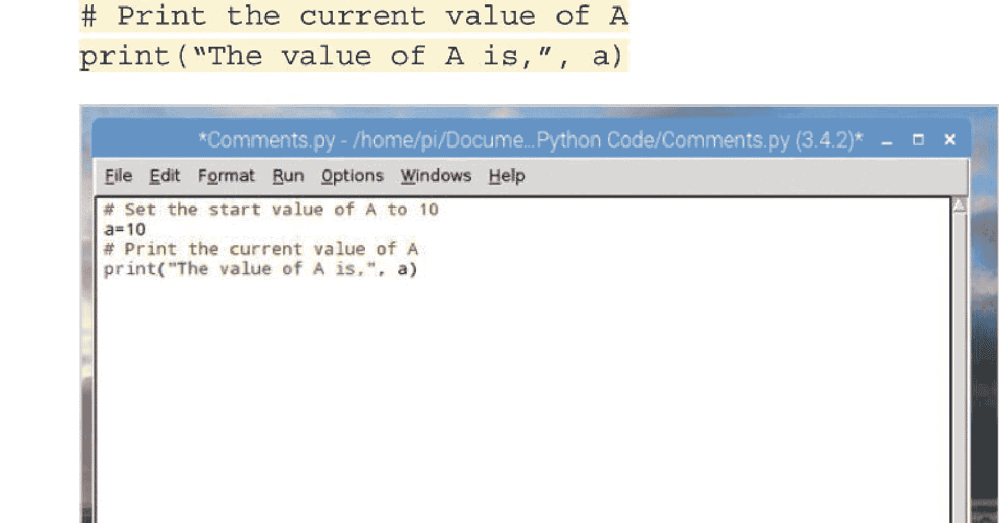

**步骤 3** 重新保存代码并执行。你可以看到，尽管添加了额外的行，IDLE 交互式窗口的输出与之前仍然相同。简而言之，井号符号 (`#`) 表示一行文本，程序员可以插入这些文本，向自己或其他人说明代码的功能，而用户不会感知到。

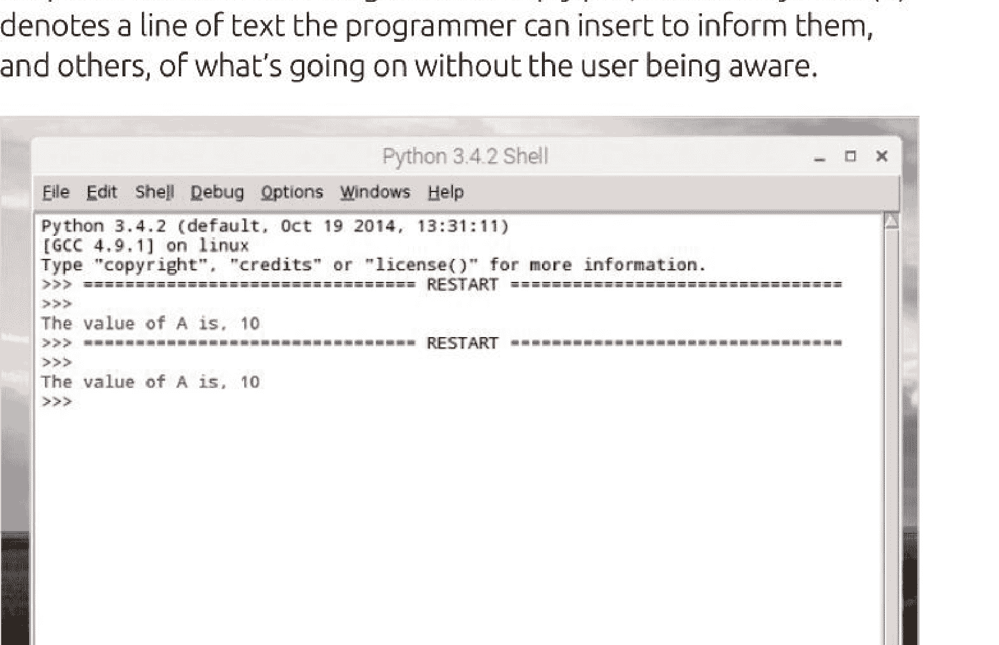

**步骤 4** 假设我们创建的变量 `A` 代表游戏中玩家的生命值。每次玩家死亡，该值就减少 1。程序员可以插入一段类似这样的代码：

```
a=a-1
print("You've just lost a life!")
print("You now have", a, "lives left!")
```

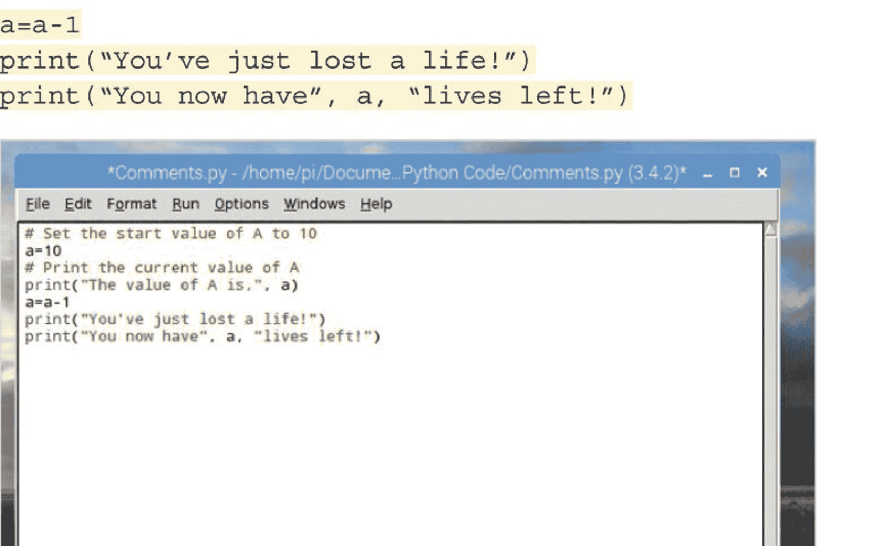

**步骤 5** 虽然我们知道变量 `A` 是生命值，并且玩家刚刚失去一条生命，但普通的查看者或检查代码的人可能并不清楚。试想一下，如果代码有两万行，而不是我们这短短的七行。你就能看出注释有多方便。

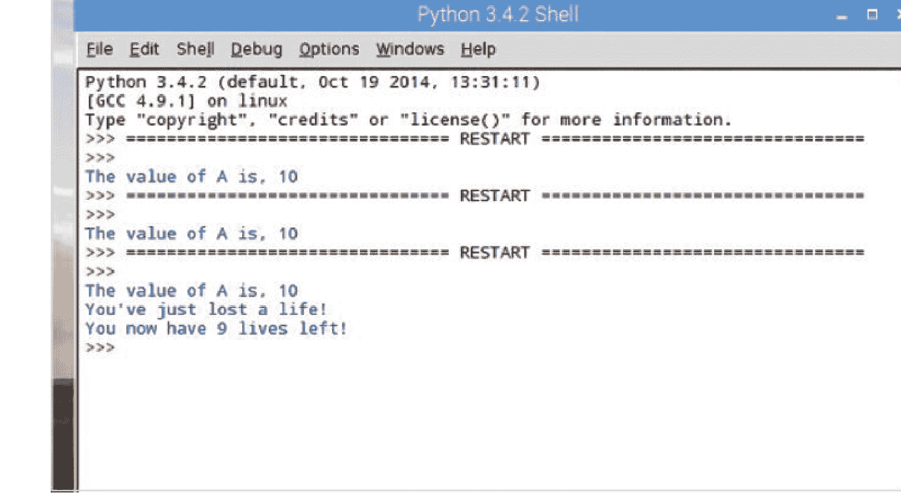

**步骤 6** 本质上，加上注释的新代码可能如下所示：

```
# 将 A 的初始值设为 10
a=10
# 打印 A 的当前值
print("The value of A is,", a)
# 玩家失去了一条生命！
a=a-1
# 通知玩家，并显示 A (生命值) 的当前值
print("You've just lost a life!")
print("You now have", a, "lives left!")
```

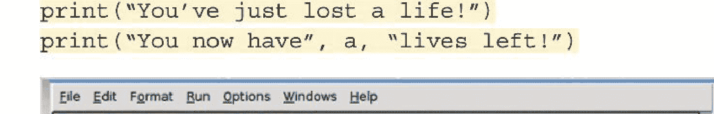

**步骤 7** 你可以用不同的方式使用注释。例如，`块注释`是详细描述代码功能的大段文本，比如告诉代码阅读者你计划使用哪些变量：

```
# 这是有史以来最棒的游戏，由一群几周没睡觉也没洗澡的Python专家团队开发。尽管他们味道很大，但至少代码运行得非常好。
```

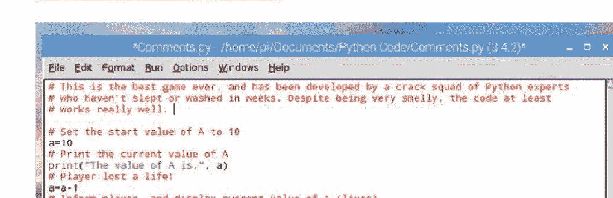

**步骤 8** `行内注释`是跟随在代码段之后的注释。以我们上面的例子为例，我们不必将注释放在单独的行，可以这样使用：

```
a=10 # 将 A 的初始值设为 10
print("The value of A is,", a) # 打印 A 的当前值
a=a-1 # 玩家失去了一条生命！
print("You now have", a, "lives left!") # 通知玩家，并显示 A (生命值) 的当前值
```

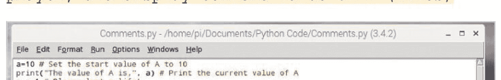

**步骤 9** 注释符号——井号 (`#`)，也可以用来“注释掉”你不想在程序中执行的代码段。例如，如果你想移除第一个打印语句，可以这样做：

```
# print("The value of A is,", a)
```

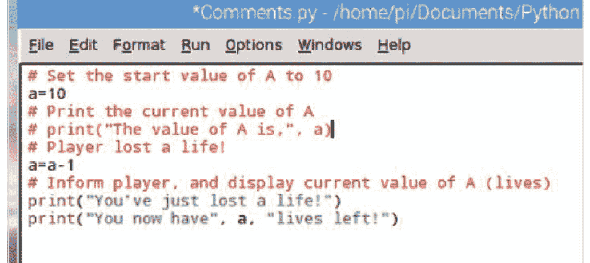

**步骤 10** 你也可以使用三个单引号来注释一个`块注释`或多行注释。将它们放在要注释区域的前面和后面即可生效：

```
'''
这是有史以来最棒的游戏，由一群几周没睡觉也没洗澡的Python专家团队开发。尽管他们味道很大，但至少代码运行得非常好。
'''
```

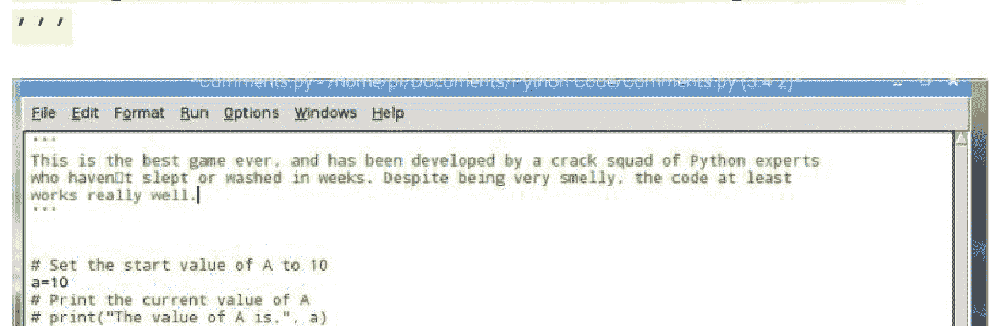

## 使用变量

我们已经在 Python 代码中见过一些变量的例子了，但回顾一下它们的工作原理，以及 Python 如何创建变量并为其赋值，总是值得的。

## 各种变量

在本教程中，你将使用 Python 3 IDLE 交互式窗口。如果尚未打开，请打开 Python 3 或关闭之前的 IDLE 交互式窗口以清除旧代码。

### 步骤 1

在某些编程语言中，你需要使用美元符号 (`$`) 来表示字符串，这是一种由多个字符组成的变量，例如一个人的名字。在 Python 中则没有必要。例如，在交互式窗口中输入：`name="David Hayward"`（或使用你自己的名字，除非你也叫 David Hayward）。

```
Python 3.4.2 Shell
...
>>> name = "David Hayward"
>>> print(name)
David Hayward
>>>
```

### 步骤 2

你可以通过输入 `type()` 命令来检查正在使用的变量类型，将变量名放在括号内。在我们的例子中，就是 `type(name)`。添加一个新的字符串变量：`title="Descended from Vikings"`。

```
Python 3.4.2 Shell
...
>>> name = "David Hayward"
>>> print(name)
David Hayward
>>> type(name)
<class 'str'>
>>> title = "Descended from Vikings"
>>>
```

### 步骤 3

之前你已经看到，变量可以使用加号 (`+`) 连接。在我们的例子中，可以使用：`print(name + ": " + title)`。引号中间的部分允许我们添加一个冒号和一个空格，因为变量连接时不会自动添加空格，所以我们需要手动添加。

```
Python 3.4.2 Shell
...
>>> name = "David Hayward"
>>> print(name)
David Hayward
>>> type(name)
<class 'str'>
>>> title = "Descended from Vikings"
>>> print(name + ": " + title)
David Hayward: Descended from Vikings
>>>
```

### 步骤 4

你也可以将变量组合成另一个新变量。例如，要将 `name` 和 `title` 两个变量组合成一个新变量，我们可以使用：
`character = name + ": " + title`
然后输出新变量的内容：
`print(character)`
数字存储为不同的变量：
`age = 44`
`type(age)`
我们知道，这些是整数。

```
Python 3.4.2 Shell
...
>>> name = "David Hayward"
>>> print(name)
David Hayward
>>> type(name)
<class 'str'>
>>> title = "Descended from Vikings"
>>> print(name + ": " + title)
David Hayward: Descended from Vikings
>>> character = name + ": " + title
>>> print(character)
David Hayward: Descended from Vikings
>>> age = 44
>>> type(age)
<class 'int'>
>>>
```

### 步骤 5

然而，你不能像处理一组相似变量那样，在同一命令中组合字符串和整数类型的变量。你需要将其中一个转换为另一个的类型。当你尝试组合两者时，会得到一条错误信息：

```
print(name + age)
```

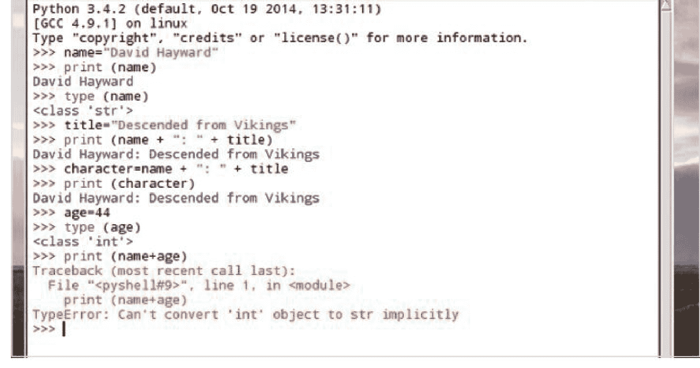

### 步骤 6

这个过程被称为`类型转换`（TypeCasting）。Python 代码如下：

```
print(character + " is " + str(age) + " years old.")
```

或者你可以使用：

```
print(character, "is", age, "years old.")
```

再次注意，在最后一个例子中，你不需要在引号内的单词之间添加空格，因为逗号会将 `print` 的每个参数分开处理。

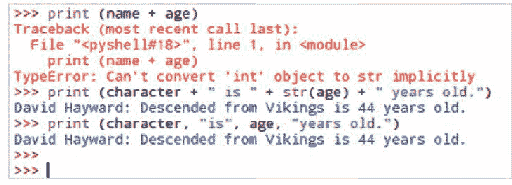

### 步骤 7

`类型转换`的另一个例子是当你从用户那里获取输入时，比如一个名字。例如，输入：

```
age = input("How old are you? ")
```

从 `input` 命令存储的所有数据都以字符串变量的形式存储。

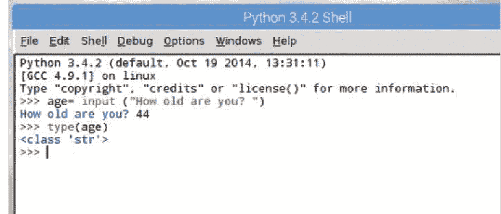

### 步骤 8

当你想处理用户输入的数字时，这会带来一些问题，因为 `age + 10` 无法工作，原因在于一个是字符串变量，另一个是整数。相反，你需要输入：

```
int(age) + 10
```

这将把 `age` 字符串类型转换为可以进行操作的整数类型。

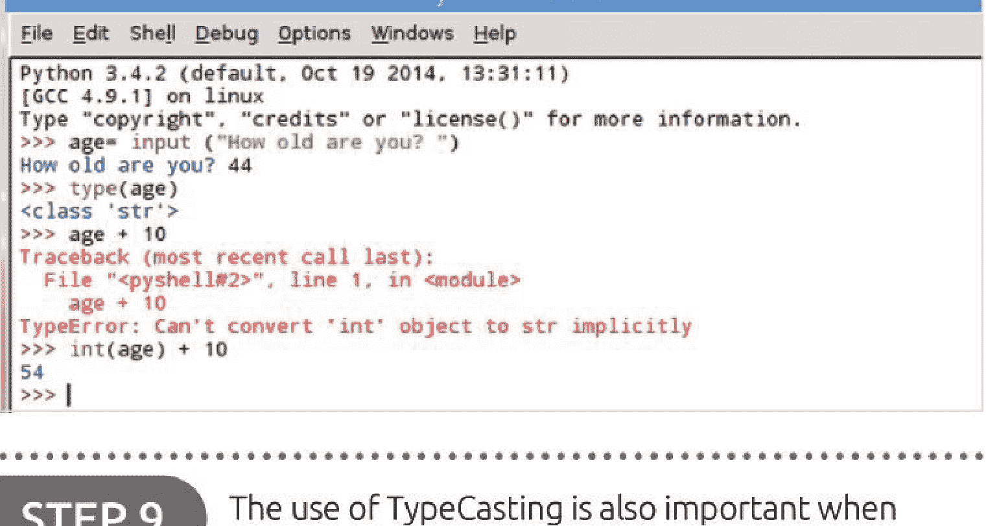

### 步骤 9

在处理浮点数运算时，`类型转换`也很重要；请记住：带有小数点的数字。例如，输入：

```
shirt = 19.99
```

现在输入 `type(shirt)`，你会看到 Python 将该数字分配为 `'float'` 类型，因为该值包含小数点。

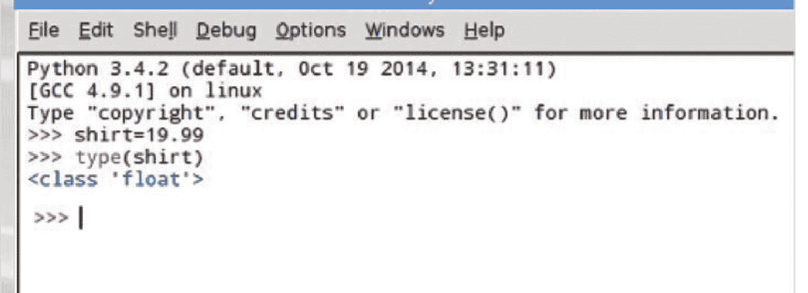

### 步骤 10

当组合整数和浮点数时，Python 通常会将整数转换为浮点数，但如果反过来转换，值得记住的是 Python 不会返回精确的值。将浮点数转换为整数时，Python 总是向下舍入到最接近的整数，这称为截断；在我们这个例子中，19.99 会变成 19。

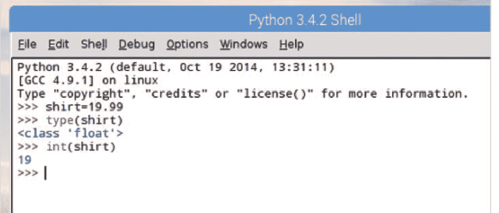

## 用户输入

我们已经从前面的一些示例中看到了与代码的一些基本用户交互，因此现在是专注于如何从用户那里获取信息，然后存储和展示信息的好时机。

### 用户友好性

你希望从用户那里获得的输入类型在很大程度上取决于你正在编写的程序类型。例如，游戏可能会询问角色的名字，而数据库则可能询问个人详细信息。

如果尚未打开，请打开 Python 3 IDLE Shell，并在编辑器中开始一个新文件。让我们从一些非常简单的内容开始，输入：

```python
print("Hello")
firstname=input("What is your first name? ")
print("Thanks.")
surname=input("And what is your surname? ")
```

现在我们已经将用户的名字存储在几个变量中，我们可以随时调用它们：

```python
print("Welcome", firstname, surname, ". I hope you’re well today.")
```

保存并执行代码，正如你无疑已经预料到的那样，在 IDLE Shell 中，程序将询问你的名字，将其存储为变量 firstname，然后是你的姓氏；也存储在其自己的变量（surname）中。

运行代码，你会看到一个小问题，姓氏后面的句点后面跟着一个空格。为了消除这个问题，我们可以在代码中添加一个加号而不是逗号：

```python
print("Welcome", firstname, surname+". I hope you’re well today.")
```

### 步骤 5

你并不总是需要在 input 命令中包含带引号的文本。例如，你可以询问用户他们的名字，并在下面一行中获取输入：

```python
print("Hello. What's your name?")
name=input()
```

### 步骤 6

上一步的代码通常被认为比在 input 命令中包含大量文本更整洁一些，但这并不是一成不变的规则，所以在这些情况下你可以随心所欲。扩展代码，试试这个：

```python
print("Halt! Who goes there?")
name=input()
```

### 步骤 7

这或许是一个文字冒险游戏的良好开端？现在你可以扩展它，并使用用户的原始输入来稍微充实一下游戏：

```python
if name=="David":
    print("Welcome, good sir. You may pass.")
else:
    print("I know you not. Prepare for battle!")
```

### 步骤 8

你在这里创建的是一个条件，我们很快就会讲到。简而言之，我们正在使用用户的输入并将其与一个条件进行衡量。因此，如果用户输入 David 作为他们的名字，守卫将允许他们畅通无阻地通过。否则，如果他们输入的名字不是 David，守卫将挑战他们进行战斗。

### 步骤 9

正如你之前所学，来自用户的任何输入自动都是字符串，因此你需要应用类型转换（TypeCast）才能将其转换为其他类型。这为 input 命令带来了一些有趣的补充。例如：

```python
### 计算速率和距离的代码
print("Input a rate and a distance")
rate = float(input("Rate: "))
```

### 步骤 10

为了完成速率和距离的代码，我们可以添加：

```python
distance = float(input("Distance: "))
print("Time:", (distance / rate))
```

保存并执行代码，然后输入一些数字。使用 float(input 元素，我们告诉 Python 输入的任何内容都是浮点数而不是字符串。

## 创建函数

既然你已经掌握了变量和用户输入的使用，下一步就是处理函数。你已经使用过一些函数，例如 print 命令，但 Python 允许你定义自己的函数。

### 有趣的函数

函数是你输入到 Python 中以执行某些操作的命令。它是一小段自包含的代码，接收数据，对其进行处理，然后返回结果。

步骤 1 函数处理的不仅仅是数据。它们可以在 Python 中执行各种有用的操作，例如对数据进行排序、将项目从一种格式更改为另一种格式以及检查项目的长度或类型。基本上，函数是一个短词，后面跟着括号。例如，**len()**、**list()** 或 **type()**。

步骤 2 函数接收数据（通常是一个变量），根据函数编程的功能对其进行处理，并返回最终值。被处理的数据放在括号内，所以如果你想知道单词 antidisestablishmentarianism 中有多少个字母，你可以输入：`len("antidisestablishmentarianism")`，它将返回数字 28。

步骤 3 你可以以类似的方式通过函数传递变量。假设你想知道一个人姓氏中的字母数量，你可以使用以下代码（为此示例进入文本编辑器）：

```python
name=input ("Enter your surname: ")
count=len(name)
print ("Your surname has", count, "letters in it.")
```

按 F5 并保存代码以执行它。

步骤 4 Python 内置了数十个函数，数量太多，无法在此有限的空间内一一介绍。但是，要查看 Python 3 可用的内置函数列表，请访问 www.docs.python.org/3/library/functions.html。这些是预定义的函数，但由于用户创建了更多函数，它们并不是唯一可用的函数。

### 创建函数

步骤 5 可以通过模块向 Python 添加额外的函数。Python 有大量可用的模块，可以涵盖众多编程任务。它们添加函数，并可以根据需要随时导入。例如，要使用高级数学函数，请输入：

```python
import math
```

输入后，你就可以访问所有 Math 模块函数。

步骤 6 要使用模块中的函数，请输入模块名称，后跟一个句点，然后是函数名称。例如，使用 Math 模块，因为你刚刚将其导入到 Python 中，你可以利用平方根函数。为此，请输入：

```python
math.sqrt(16)
```

你可以看到代码呈现为 module.function(data) 的形式。

### 创建函数

有许多不同的函数可以导入，这些函数由其他 Python 程序员创建，你将来无疑会遇到一些优秀的例子；你也可以使用 def 命令创建自己的函数。

步骤 1 选择 File > New File 进入编辑器，让我们创建一个名为 Hello 的函数，用于向用户问好。输入：

```python
def Hello():
    print("Hello")
Hello()
```

按 F5 保存并运行脚本。你可以在 Shell 中看到 Hello，输入 Hello()，它将返回新函数。

步骤 2 现在让我们扩展函数以接受一个变量，例如用户名。编辑你的脚本，使其读取：

```python
def Hello(name):
    print("Hello", name)
Hello("David")
```

这现在将接受变量 name，否则它将打印 Hello David。在 Shell 中，输入：name=("Bob")，然后：Hello(name)。你的函数现在可以通过它传递变量。

步骤 3 要进一步修改它，请删除 Hello("David") 行（脚本中的最后一行），然后按 Ctrl+S 保存新脚本。关闭编辑器并创建一个新文件（File > New File）。输入以下内容：

```python
from Hello import Hello
Hello("David")
```

按 F5 保存并执行代码。

步骤 4 你刚刚做的是从保存的 Hello.py 程序中导入 Hello 函数，然后使用它向 David 问好。这就是模块和函数的工作方式：你导入模块，然后使用函数。试试这个，并修改它以获得额外加分：

```python
def add(a, b):
    result = a + b
    return result
```

## 条件和循环

条件和循环是让程序变得有趣的部分；它们可以很简单，也可以相当复杂。如何使用它们很大程度上取决于程序想要实现的目标；它们可以表示游戏中剩余的生命数，也可以仅仅显示一个倒计时。

### 真值条件

从简单的条件开始学习编程会让学习过程更愉快。那么我们从检查某物是否为 **真** 开始，如果是假则执行其他操作。

**步骤 1** 让我们创建一个新的 Python 程序，它将要求用户输入一个单词，然后检查它是否是一个四字母单词。从 `File > New File` 开始，并从 `input` 变量入手：

```
word=input("Please enter a four-letter word: ")
```

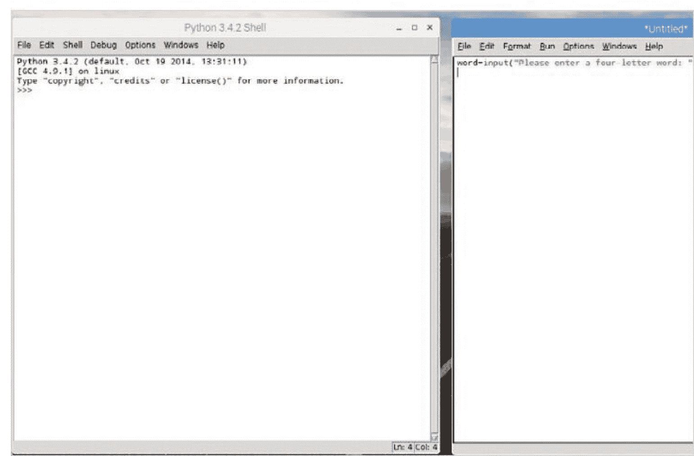

**步骤 2** 现在我们可以创建一个新变量，然后使用 `len` 函数并将 `word` 变量传入其中，以获取用户刚刚输入的单词的总字母数：

```
word=input("Please enter a four-letter word: ")
word_length=len(word)
```

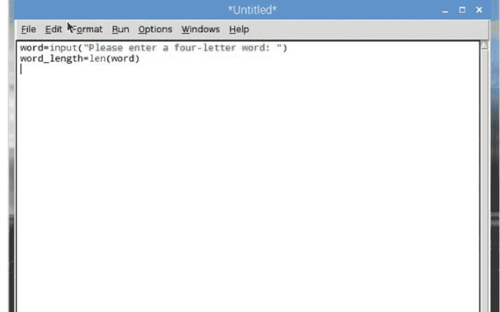

**步骤 3** 现在你可以使用一个 `if` 语句来检查 `word_length` 变量是否等于四，并在满足条件时打印一条友好的确认信息：

```
word=input("Please enter a four-letter word: ")
word_length=len(word)
if word_length == 4:
    print (word, "is a four-letter word. Well done.")
```

双等号 (`==`) 表示检查某物是否等于另一物。

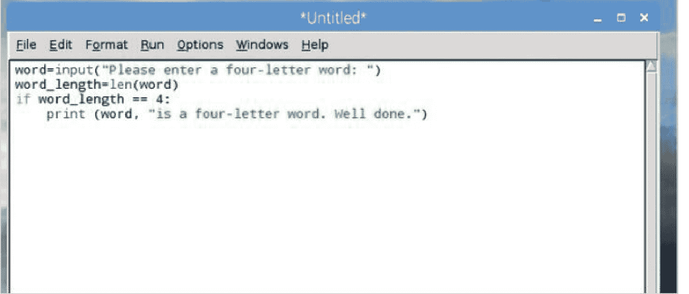

**步骤 4** IF 末尾的冒号告诉 Python，如果此语句为真，则执行冒号后缩进的所有内容。接下来，将光标移回编辑器开头：

```
word=input("Please enter a four-letter word: ")
word_length=len(word)
if word_length == 4:
    print (word, "is a four-letter word. Well done.")
else:
    print (word, "is not a four-letter word.")
```

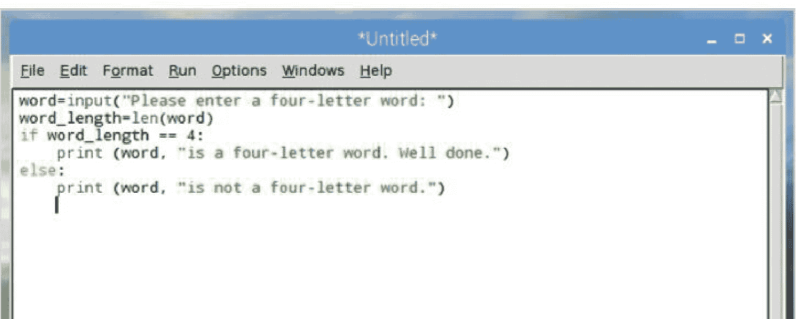

**步骤 5** 按 `F5` 并保存代码以执行它。首先在 Shell 中输入一个四字母单词，你应该会收到消息确认该单词是四个字母。现在再次按 `F5` 并重新运行程序，但这次输入一个五字母单词。Shell 将显示它不是一个四字母单词。

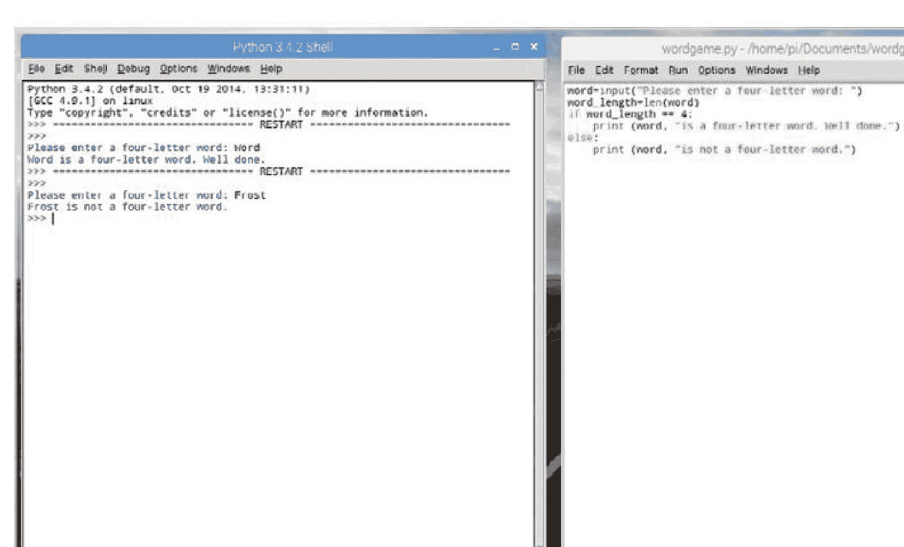

**步骤 6** 现在扩展代码以包含另一个条件。最终，它可能会变得相当复杂。我们添加了一个针对三字母单词的条件：

```
word=input("Please enter a four-letter word: ")
word_length=len(word)
if word_length == 4:
    print (word, "is a four-letter word. Well done.")
elif word_length == 3:
    print (word, "is a three-letter word. Try again.")
else:
    print (word, "is not a four-letter word.")
```

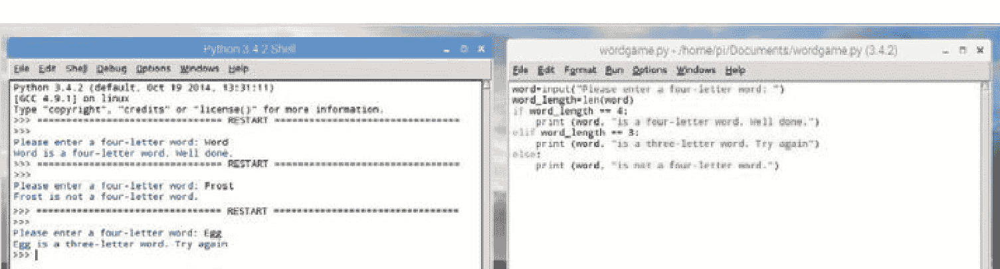

### 循环

循环看起来与条件相似，但它们的操作方式有些不同。循环会多次运行同一段代码块，通常是在条件的支持下。

**步骤 1** 让我们从一个简单的 `While` 语句开始。像 `IF` 一样，它将检查某物是否为 **真**，然后运行缩进的代码：

```
x = 1
while x < 10:
    print (x)
    x = x + 1
```

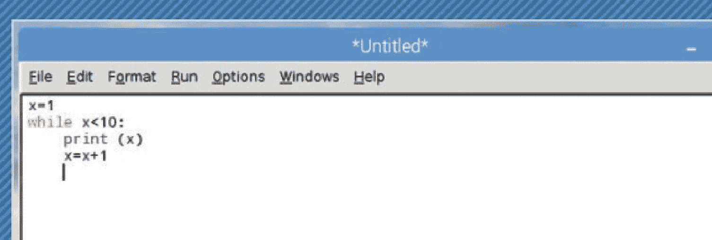

**步骤 2** `if` 和 `while` 之间的区别在于，当 `while` 到达缩进代码的末尾时，它会返回并检查语句是否仍然为真。在我们的例子中，x 小于 10。每次循环时，它打印 x 的当前值，然后将该值加一。当 x 最终等于 10 时，它就会停止。

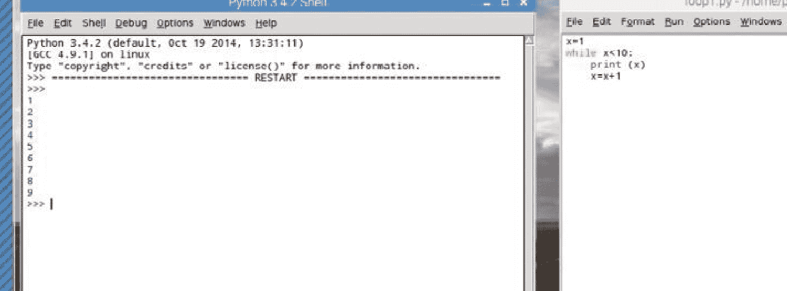

**步骤 3** `For` 循环是另一个例子。`For` 用于遍历一系列数据，通常是存储在方括号内作为变量的列表。例如：

```
words=["Cat", "Dog", "Unicorn"]
for word in words:
    print (word)
```

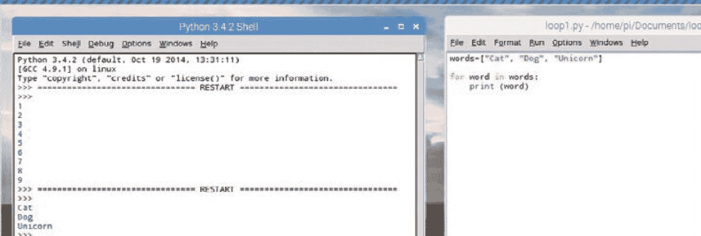

**步骤 4** `For` 循环也可以通过使用 `range` 函数在倒计时示例中使用：

```
for x in range (1, 10):
    print (x)
```

这里不需要 `x=x+1` 部分，因为 `range` 函数在所使用的第一个和最后一个数字之间创建一个列表。

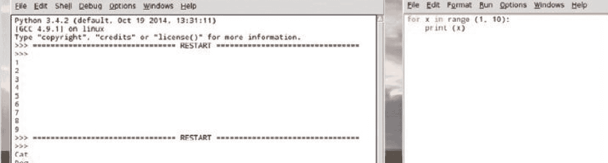

## Python 模块

我们之前提到过模块（`Math` 模块），但由于模块是充分利用 Python 的重要组成部分，值得花更多时间来了解它们。在这个例子中，我们使用的是 Windows 版本的 Python 3。

### 精通模块

可以将模块视为导入到 Python 代码中以增强和扩展其功能的扩展。有无数模块可用，而且正如我们所见，你甚至可以制作自己的模块。

**步骤 1** 虽然很好，但 Python 中的内置函数是有限的。然而，模块的使用使我们能够编写更复杂的程序。如你所知，模块是导入的 Python 脚本，例如 `import math`。

```
Python 3.6.2 (v3.6.2:5fd33b5, Jul  8 2017, 04:14:34) [MSC v.1900 32 bit (Intel)] on win32
Type "copyright", "credits" or "license()" for more information.
>>> import math
>>> 
```

**步骤 2** 一些模块，尤其是在树莓派上，默认包含在内，`Math` 模块就是一个典型的例子。遗憾的是，其他模块并不总是可用。在非树莓派平台上的一个很好的例子是 `Pygame` 模块，它包含许多帮助创建游戏的函数。试试：`import pygame`。

```
Python 3.6.2 (v3.6.2:5fd33b5, Jul  8 2017, 04:14:34) [MSC v.1900 32 bit (Intel)] on win32
Type "copyright", "credits" or "license()" for more information.
>>> import pygame
Traceback (most recent call last):
  File "<pyshell#1>", line 1, in <module>
    import pygame
ModuleNotFoundError: No module named 'pygame'
>>> 
```

**步骤 3** 结果是在 IDLE Shell 中出现错误，因为 `Pygame` 模块未被识别或未在 Python 中安装。要安装一个模块，我们可以使用 PIP (Pip Installs Packages)。关闭 IDLE Shell 并进入命令提示符或终端会话。在提升权限的管理员命令提示符下，输入：

```
C:\Users\david>pip install pygame
```

**步骤 4** PIP 安装需要提升权限状态，因为它在不同位置安装组件。Windows 用户可以通过“开始”按钮搜索 `CMD`，右键单击结果，然后点击“以管理员身份运行”。Linux 和 Mac 用户可以使用 `Sudo` 命令，即 `sudo pip install package`。

```
Microsoft Windows [Version 10.0.15063]
(c) 2017 Microsoft Corporation. All rights reserved.

C:\WINDOWS\system32>pip install pygame
Collecting pygame
  Using cached pygame-1.9.3-cp36-cp36m-win32.whl
Installing collected packages: pygame
Successfully installed pygame-1.9.3

C:\WINDOWS\system32>
```

**步骤 5** 关闭命令提示符或终端并重新启动 IDLE Shell。当你现在输入：`import pygame` 时，该模块将毫无问题地导入到代码中。你会发现大多数从网上下载或复制的代码都会包含一个模块，无论是主流的还是独特的，这些通常是执行时出错的原因，因为它们缺失了。

```
import pygame
```

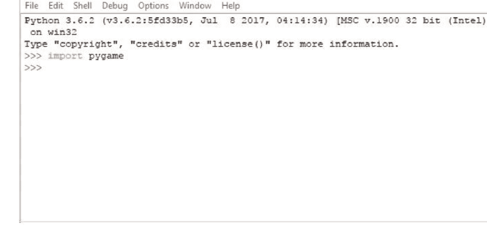

**步骤 6** 模块包含在你自己的代码中实现特定结果所需的额外代码，正如我们之前实验过的那样。例如：

```
import random
```

引入随机数生成器模块的代码。然后你可以使用此模块来创建类似以下的内容：

```
for i in range(10):
    print(random.randint(1, 25))
```

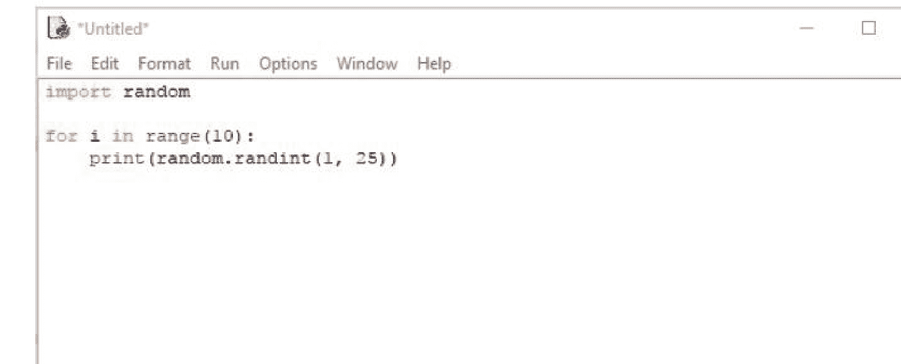

**步骤 7** 此代码在保存并执行后，将显示十个 1 到 25 之间的随机数。你可以随意调整代码以显示更多或更少的数字，以及更大或更小的范围。例如：

```
import random

for i in range(25):
    print(random.randint(1, 100))
```

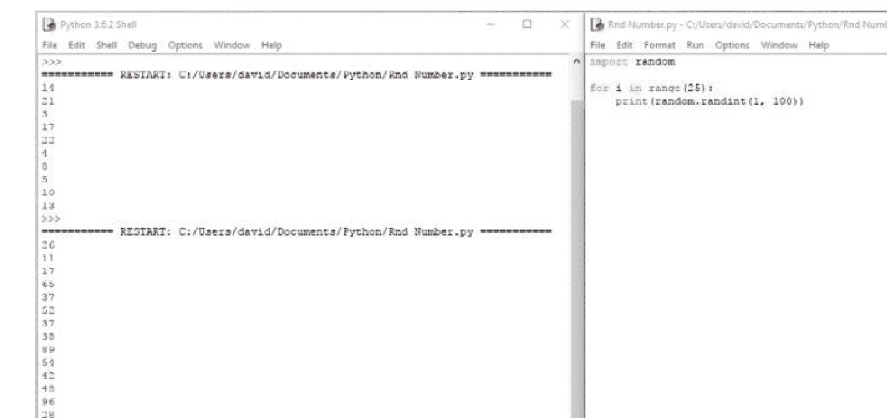

**步骤 8** 可以在你的代码中导入多个模块。为了扩展我们的示例，使用：

```
import random
import math

for i in range(5):
    print(random.randint(1, 25))

print(math.pi)
```

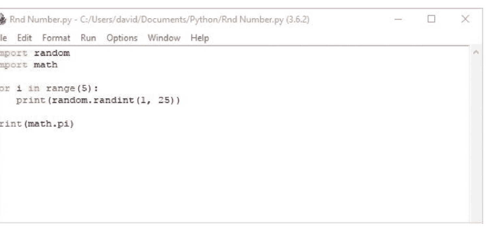

**步骤 9** 结果是一系列随机数，后跟使用 `print(math.pi)` 函数从 `Math` 模块提取的 Pi 值。你还可以通过使用 `from` 和 `import` 命令从模块中导入特定函数，例如：

```
from random import randint

for i in range(5):
    print(randint(1, 25))
```

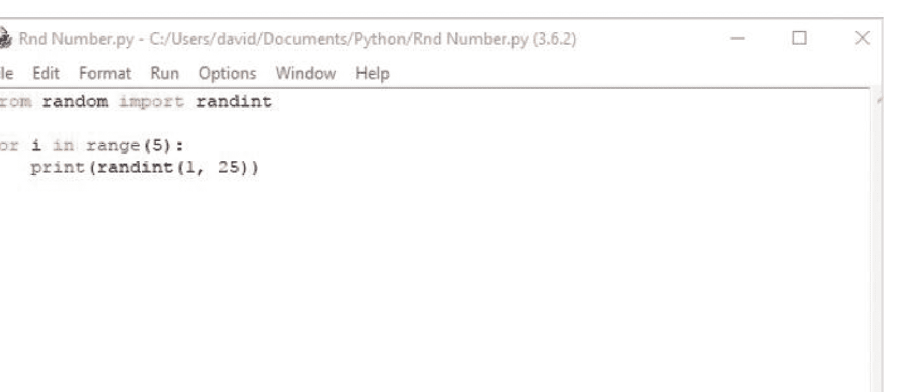

**步骤 10** 这有助于创建更精简的编程方法。你也可以使用 `import module*`，这将导入命名模块中定义的所有内容。然而，它通常被视为浪费资源，但无论如何它都有效。最后，模块可以作为别名导入：

```
import math as m

print(m.pi)
```

当然，添加注释有助于告诉其他人发生了什么。

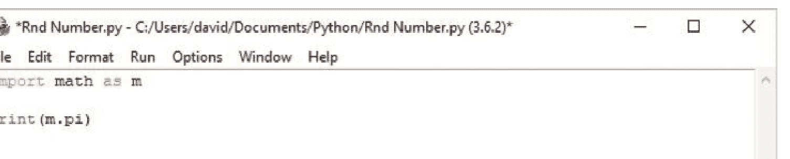

## Python 错误

不言而喻，你最终会在代码中遇到错误，Python 会因为某些内容缺失、错误或单纯未知而宣告无法继续。能够识别这些错误是成为优秀程序员的关键。

### 调试

代码中的错误被称为 bug，这非常正常。只要有耐心，它们通常很容易纠正。重要的是要持续寻找、实验和测试。最终你的代码将不再有 bug。

### 步骤 1

无论编程语言有多优秀，代码都不如文字流畅。Python 肯定比大多数语言更容易，但它也难免会有一些令人烦恼的 bug。最常见的是用户打错字，虽然在几十行的简单代码中很容易发现，但想象一下调试成千上万行代码的情景。


### 步骤 2

如我们提到的，最常见的错误是打错字。这些错误通常出现在命令层面：例如错误地输入 print 命令。然而，当你有很多名称冗长的变量时，它们也会出现。最好的建议是简单地浏览代码并检查拼写。

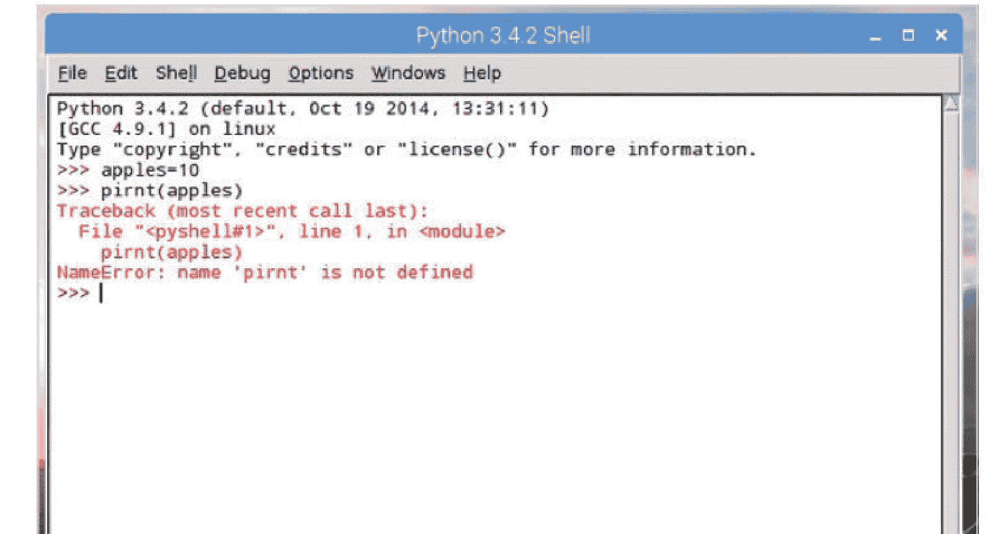

### 步骤 3

幸运的是，Python 在显示错误信息方面很有帮助。当你从 IDLE Shell 收到红色文本的错误信息时，它会定义错误本身以及发生错误的行号。虽然在 IDLE Editor 中，面对大量代码时这有点令人望而生畏；但文本编辑器通过包含行号来提供帮助。

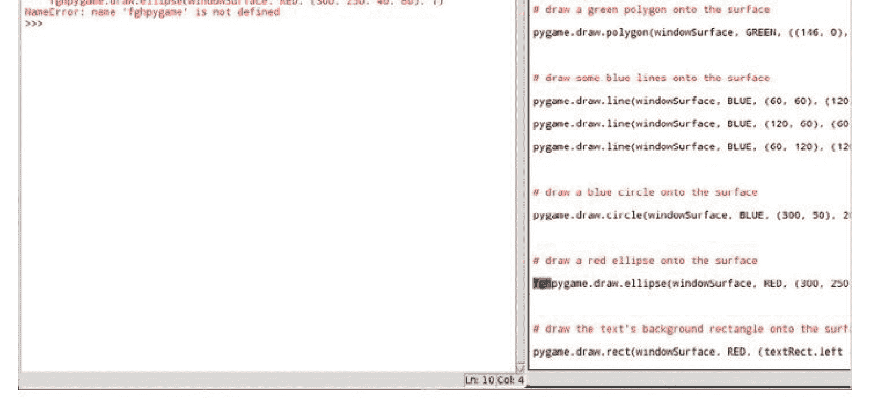

### 步骤 4

语法错误可能是作为程序员你会遇到的第二常见的错误。即使拼写正确，实际命令本身也是错误的。在 Python 3 中，这通常发生在应用 Python 2 语法时。其中最恼人的是 print 函数。在 Python 3 中我们使用 `print("words")`，而 Python 2 使用 `print "words"`。

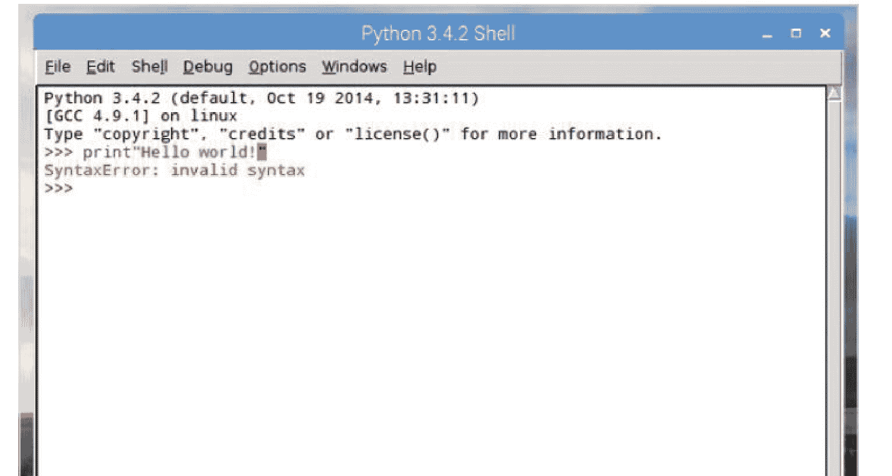

### 步骤 5

烦人的括号在编程错误中也是一个麻烦，尤其是当你遇到这样的情况时：

```
print(balanced_check(input()))
```

记住，每个 `(` 必须有相同数量的 `)`。

```
import sys

def balanced_check(data):
    stack = []
    characters = list(data)

    for character in characters:
        reference = {
            '(': ')',
            '{': '}',
            '[': ']'
        }
        if character in reference.keys():
            stack.append(character)
        elif character in reference.values() and len(stack) > 0:
            char = stack.pop()
            if reference.get(char) != character:
                return "NO"
        else:
            return "NO"
    return "YES"
```

### 步骤 6

在线 Python 资源、代码片段以及论坛上关于如何最好地实现某些功能的冗长讨论数以千计。虽然其中 99% 是好的代码，但不要总是被诱惑将随机代码复制粘贴到编辑器中。很多时候它行不通，最糟糕的是你什么都没学到。

```
try:
    some_code()
except:
    print("Unexpected error:", sys.exc_info()[0])
```

裸 `except` 的问题在于它会捕获所有异常，包括你确实不想忽略的异常（如 `KeyboardInterrupt` 和 `SystemExit`）。如果你的 `except` 块只捕获你预期的特定异常，并让所有其他异常正常冒泡，那会好得多。

关于你的代码还有几个其他通用注释：
- 在第 200 行，你有这样的构造：
```
for letter in range(len(chosen_word)):
    if player_guess == chosen_word[letter]:
        word_guessed[letter] = player_guess
```
你在遍历索引变量的同时也在使用列表元素。更好的写法是：
```
for idx, letter in enumerate(chosen_word):
    if player_guess == letter:
```

### 步骤 7

缩进是 Python 编程中一个令人讨厌的部分，许多初学者都容易出错。回顾“条件与循环”部分中的 IF 循环，其中冒号意味着语句后所有缩进的内容只要条件为真就会被执行？缺少缩进或缩进过多都会返回错误。

```
word_input("Please enter a four-letter word: ")
word_length = len(word)
if word_length == 4:
    print("word is a four-letter word. Well done.")
else:
    print("word is not a four-letter word.")

SyntaxError: expected an indented block
```

### 步骤 8

逐步检查代码的一个极好方法是使用 Python Tutor 的可视化网页，网址为 www.pythontutor.com/visualize.html#mode=edit。只需将代码粘贴到编辑器中，然后单击“Visualise Execution”按钮即可逐行运行代码。这有助于清除 bug 和任何误解。

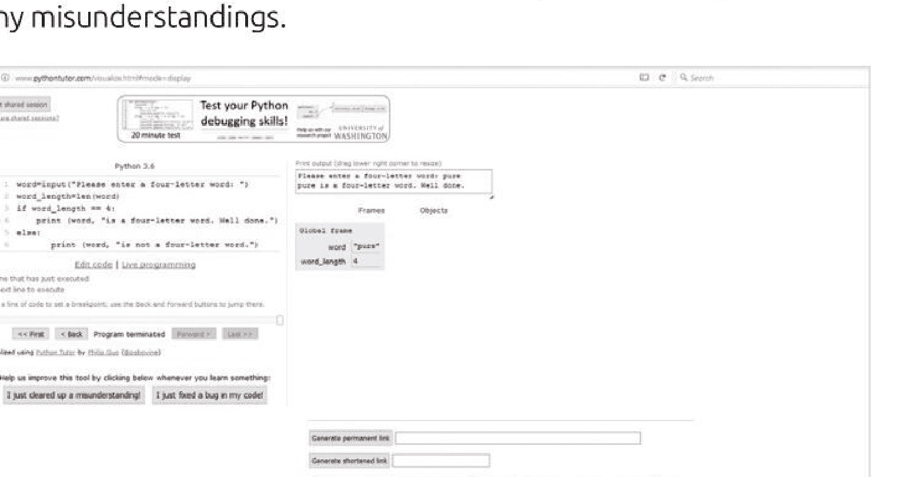

### 步骤 9

计划造就好代码。虽然有点老派，但在坐下来打字之前计划好代码要做什么是一个好习惯。列出将要使用的变量和模块；然后为任何用户交互或输出编写脚本。

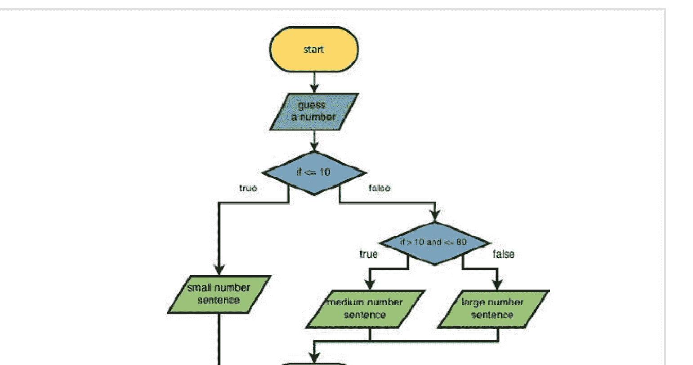

### 步骤 10

纯粹出于兴趣，计算术语中的“调试”（debugging）一词源自海军上将 Grace Hopper，她在 20 世纪 40 年代从事于一台大型哈佛 Mark II 机电计算机的工作。根据传说，Hopper 发现一只飞蛾卡在了一个继电器中，从而阻止了系统运行。因此，移除这只飞蛾被称为调试（debugging，字面意思是“移除虫子”）。

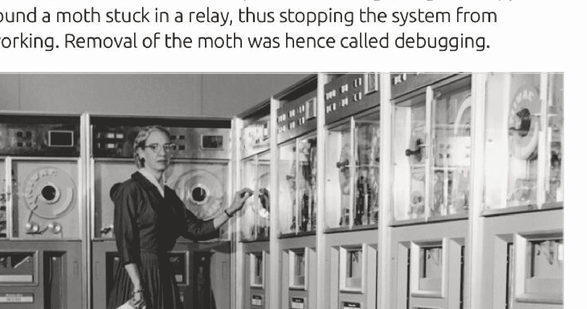

## 综合运用你迄今所学的知识

我们已经到达本节的最后，因此让我们花点时间将我们迄今为止所看到的所有内容结合起来，并将其应用于编写一段代码。然后这段代码可以在将来使用并插入到你自己的程序中；无论是部分使用还是整体使用。

## 玩转圆周率

在这个示例中，我们将创建一个程序，该程序将根据用户设定的精度计算圆周率 Pi 的值。它结合了我们所学的许多知识，以及一点更多内容。

### 步骤 1

首先打开 Python 并在编辑器中创建一个新文件。我们需要找到一个能在几分钟内完成而不使计算机 CPU 彻底无用的准确计算 Pi 的方程。在这种情况下推荐的计算是丘德诺夫斯基算法，你可以在 en.wikipedia.org/wiki/Chudnovsky_algorithm 上找到更多信息。

### 步骤 2

你可以利用丘德诺夫斯基算法基于该计算创建你自己的 Python 脚本。首先导入一些重要的模块和模块内的函数：

```
python
from decimal import Decimal, getcontext
import math
```

这使用了 Decimal 模块中的 `decimal` 和 `getcontext` 函数，它们都处理多位小数的数字，当然还有 Math 模块。

### 步骤 3

现在你可以插入计算 Pi 的代码部分。这是丘德诺夫斯基算法的一个版本：

```
python
def calc(n):
    t = Decimal(0)
    pi = Decimal(0)
    deno = Decimal(0)
    k = 0
    for k in range(n):
        t = (Decimal(-1)**k)*(math.factorial(Decimal(6)*k))*(13591409+545140134*k)
        deno = math.factorial(3*k)*(math.factorial(k)**Decimal(3))*(640320**(3*k))
        pi += Decimal(t)/Decimal(deno)
    pi = pi * Decimal(12)/Decimal(640320**Decimal(1.5))
    pi = 1/pi
    return str(pi)
```

### 步骤 4

上一步定义了构成算法的规则，并根据丘德诺夫斯基兄弟的算法创建了最终将显示 Pi 值的字符串。你可能已经推测出，实际上将 Pi 的值输出到屏幕会很方便。为了纠正这一点，你可以添加：

```
python
print(calc(1))
```

### 步骤 5

如果你愿意，此时可以保存并执行代码。输出将打印 Pi 的值到 27 位小数：**3.141592653589734207668453591**。虽然本身已经相当令人印象深刻，但你想要一些用户交互，询问用户应该将 Pi 计算到多少位小数。

### 步骤 6

你可以在 Pi 计算的定义命令之前插入一行输入。它需要是一个整数，否则默认会是字符串。我们可以称它为 `numberofdigits` 并使用 `getcontext` 函数：

```
python
numberofdigits = int(input("please enter the number of decimal places to calculate Pi to: "))
getcontext().prec = numberofdigits
```

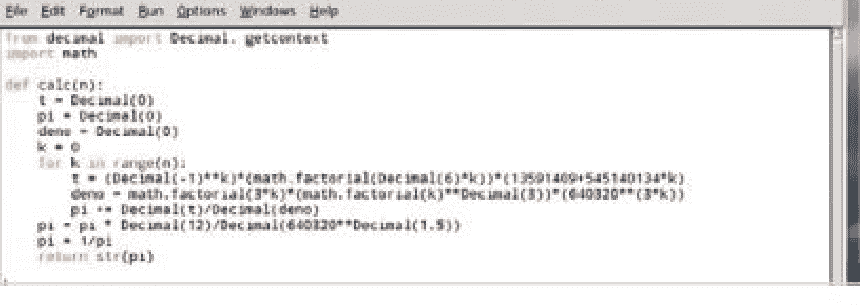

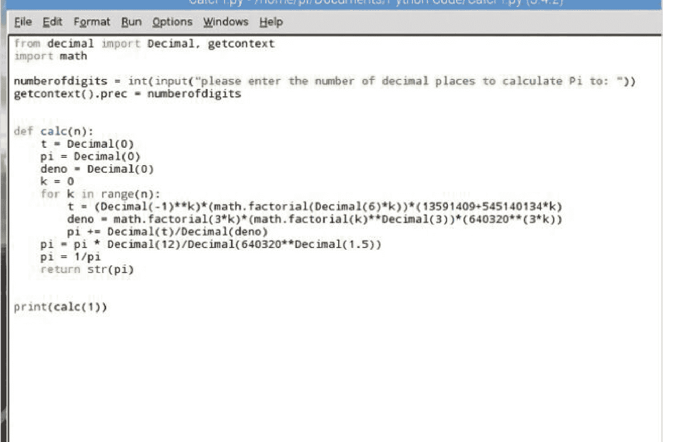

## 整合目前所学内容

步骤7 现在你可以执行代码了，程序会询问用户想要将圆周率计算到多少位小数，并在 IDLE Shell 中输出结果。尝试设置为1000位，但不要设得太高，否则计算机在计算圆周率时可能会卡住。

步骤8 编程的一部分是能够修改代码，使其更具表现力。让我们加入一个元素，用于计时计算机计算圆周率小数位所需的时间，并以不同颜色显示信息。为此，请打开命令行并导入 Colorama 模块（RPi 用户已经安装了该模块）：

```
pip install colorama
```

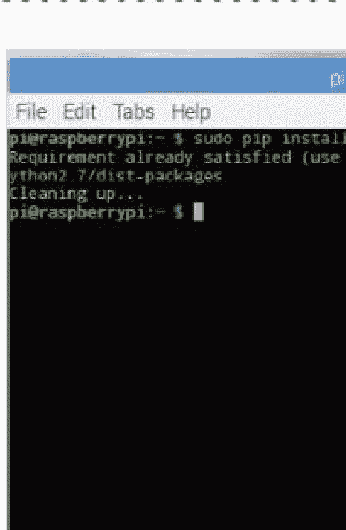

步骤9 现在我们需要导入 Colorama 模块（它将以不同颜色输出文本）、Fore 函数（用于指定前景色、墨水颜色）以及 Time 模块来启动一个虚拟秒表，以查看我们的计算耗时多久：

```
import time
import colorama
from colorama import Fore
```

步骤10 为了完成我们的代码，我们需要在计算开始时初始化 Colorama 模块并启动时间函数，并在计算结束时记录时间。最终结果是一行彩色文字，显示处理过程耗时多久（在终端或命令行中）：

```
from decimal import Decimal, getcontext
import math
import time
import colorama
from colorama import Fore
colorama.init()

numberofdigits = int(input("please enter the number of decimal places to calculate Pi to: "))
getcontext().prec = numberofdigits

start_time = time.time()
def calc(n):
    t = Decimal(0)
    pi = Decimal(0)
    deno = Decimal(0)
    k = 0
    for k in range(n):
        t = (Decimal(-1)**k)*(math.factorial(Decimal(6)*k))*(13591409+545140134*k)
        deno = math.factorial(3*k)*(math.factorial(k)**Decimal(3))*(640320**(3*k))
        pi += Decimal(t)/Decimal(deno)
    pi = pi * Decimal(12)/Decimal(640320**Decimal(1.5))
    pi = 1/pi
    return str(pi)

print(calc(1))
print(Fore.RED + "\nTime taken:", time.time() - start_time)
```

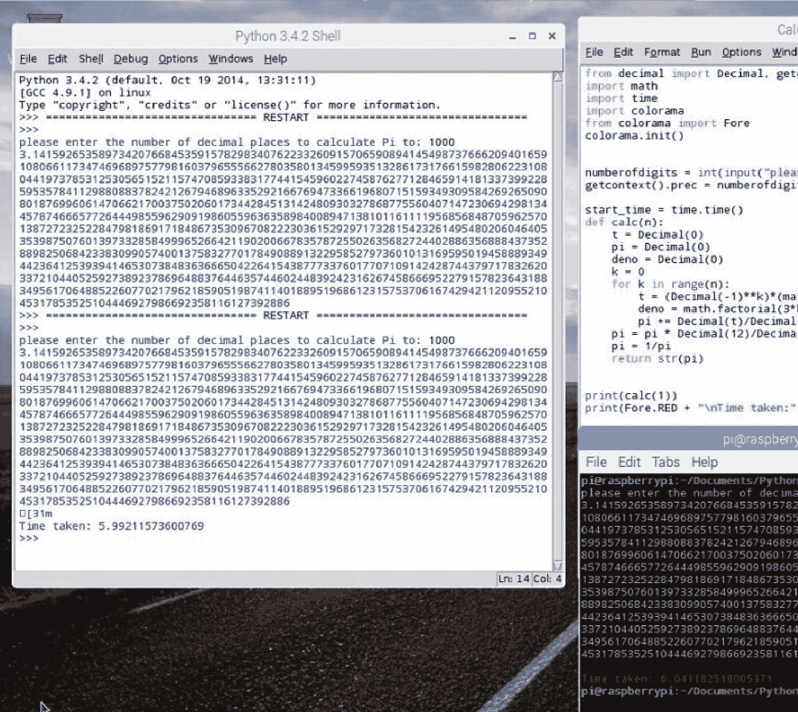

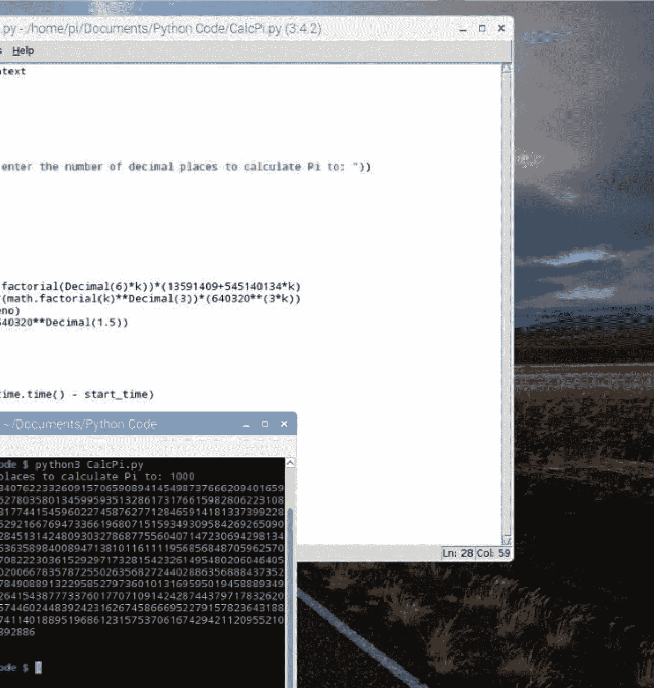

## Python聚焦：缝合黑洞

2019年，一项规模最大的科学、工程和太空项目达到高潮，首次向人类展示了宇宙中最难以捉摸的天体：黑洞。但这跟Python有什么关系呢？

给黑洞成像相当困难。黑洞的本质意味着任何东西，甚至是光本身，都无法逃脱其巨大的引力场。引用维基百科上关于黑洞的条目：

> > “黑洞是时空的一个区域，其引力加速度如此之强，以至于任何东西——任何粒子甚至像光一样的电磁辐射——都无法从中逃脱。广义相对论预测，足够致密的质量可以使时空变形从而形成黑洞。无法逃脱的区域边界被称为事件视界。尽管事件视界对穿过它的物体的命运和状况有巨大影响，但似乎没有观测到任何局部可探测的特征。在许多方面，黑洞的作用就像一个理想的黑体，因为它不反射任何光。此外，弯曲时空中的量子场论预测，事件视界会发出霍金辐射，其光谱与温度与其质量成反比的黑体相同。对于恒星质量的黑洞，这个温度在十亿分之一开尔文量级，使得观测基本上不可能。”

不久之前，黑洞还只是写在纸上的理论和数学集合，仅由我们时代最聪明的头脑进行推测。然而，与大多数科学事物一样，我们对宇宙的理解以及解读它的能力已大大提高，并且随着众多天文台、科学家和工程师多年共同努力的最终成果，我们得到了第一张黑洞图像。

### 事件视界望远镜

给这样一个物体成像的问题之一是角分辨率。在天文学中，夜空中物体的大小是用它们在天空中占据的量来表示的——单位是弧。一个弧或弧秒是一种测量（1度的1/3600），用于描述以度为单位的角度大小，符号为°。一个完整的圆被分成360°，一个直角是90°。一度可以分成60角分（缩写为60 arcmin 或 60’）。一个角分也可以分成60角秒（缩写为60 arcsec 或 60”）。

例如，看着大约31角分大小的月亮，想象从你这里画一条线到月亮的一侧，再画一条线到月亮的另一侧，这两条线之间的角度就是其角大小或角分辨率。

位于M87星系中心的那个被拍摄到的黑洞，距离地球5500万光年，其角大小为40微角秒，即百万分之一角秒。因此，为了看到它，我们需要一台直径约为8公里的望远镜，而作为一个单独的设备这显然是不可能的。

这就是事件视界望远镜项目发挥作用的地方。通过使用一个由八台射电望远镜组成的网络，科学家们能够在大约六个月的时间内拍摄黑洞的图像。利用原子钟进行关键计时，望远镜拍摄了包含黑洞的天空区域并收集数据，随着地球的旋转，数据从一组望远镜阵列切换到另一组。


## 大数据与Python

## 结果

然后，所有望远镜阵列的数据被汇总，涉及超过一千个硬盘，总共达到了惊人的5PB原始数据。现在的问题是将所有数据整理成可用的形式，并以图像的形式呈现。

最终结果当然是M87星系中心黑洞的图像，其周围环绕着一圈燃烧的气体。该团队后来承认，分辨率不是很高，但他们也表示，再过几年，他们就能显著提高图像分辨率。

麻省理工学院电气工程与计算机科学博士凯蒂·布曼（Katie Bouman）在创建能够将所有数据拼接在一起并形成最终具有历史意义的黑洞图像的Python代码方面发挥了关键作用。


这一切都归功于一些巧妙的Python代码以及一些非常杰出的科学家和工程师。

布曼使用了多个Python库来实现这一结果，包括Numpy、Scipy、Pandas、Jupyter、Matplotlib和Astropy，以及一些独特的自定义Python代码——可在Github上找到：https://github.com/achael/eht-imaging。

```python
from os import path, makedirs

# set as true if you want to use a model image, false will load the specified image
makeModel = True
# path to a sample image
sampleimage = '../models/rowan_m87.txt'

# path to array file for loading STROs and site locations
array = '../arrays/EHT2017_m87.txt'

# parameters for model image
npix = 120
fov = 200*eh.RADPERUAS
source = 'M87'
ra = 19.414182210498385
dec = -29.041700372736311
tbl = 0.0
rf = 230000000000.0
mjd = 57850

ring_radius = 22*eh.RADPERUAS # the radius of the ring
ring_width = 10*eh.RADPERUAS # the width of the ring
nonun_frac = 0.5 # defines how much brighter the brighter location is on the ring
theta_nonun_rad = 2/0 # defines the angle of the brightest location
fracpol = 0.4 # fractional polarization on model image
corr = 5 * eh.RADPERUAS # the coherence length of the polarization

# parameters for simulated data
add_th_noise = True # if there are no sefds in obs_orig it will use the sigma for each data point
phasecal = False # if False then add random phases to simulate atmosphere
ampcal = False # if False then add random gain errors
stabilize_scan_phase = True # if true then add a single phase error for each scan to act similar to adhoc phasing
stabilize_scan_amp = True # if true then add a single gain error at each scan
jones = True # apply jones matrix for including noise in the measurements (including leakage)
inv_jones = False # do not invert the jones matrix
frcal = True # True if you do not include effects of field rotation
```


## 处理数据


数据就是一切；它可以颠覆政府，改变选举结果，并揭示宇宙的奥秘。在接下来的几页中，我们将探讨如何创建列表、元组、字典和多维列表，以及如何利用它们来构建令人兴奋且实用的程序。

此外，你将学习如何使用日期和时间函数、向系统文件写入数据，甚至创建图形用户界面，这些都将把你的编程技能提升到新的水平，并为新的项目创意打开大门。


-   64 列表
-   66 元组
-   68 字典
-   70 分割与连接字符串
-   72 格式化字符串
-   74 日期与时间
-   76 打开文件
-   78 写入文件
-   80 异常处理
-   82 Python 图形
-   84 综合运用你目前所学
-   86 Python 聚焦：游戏

## 列表

列表是你在 Python 中会遇到的最常见数据结构之一。列表就是一组项目的集合，或者如果你愿意，也可以称为数据，这些项目可以作为一个整体被访问，也可以根据需要单独访问。

### 使用列表

列表在 Python 中极其方便。列表可以包含字符串、整数，也可以包含变量。你甚至可以在列表中包含函数，以及列表的列表。

### 步骤 1

列表是一个由称为“项目”的数据值组成的序列。你创建列表的名称，后跟一个等号，然后是方括号，项目之间用逗号分隔；注意字符串需要使用引号：

```
numbers = [1, 4, 7, 21, 98, 156]
mythical_creatures = ["Unicorn", "Balrog", "Vampire", "Dragon", "Minotaur"]
```

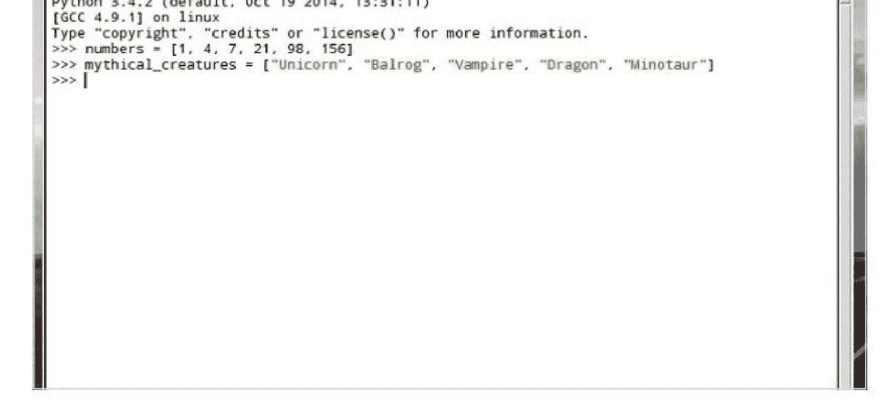

### 步骤 3

你也可以通过在项目编号前使用负号来访问或索引列表中的最后一个项目，例如 `[-1]`，或者用 `[-2]` 访问倒数第二个项目，以此类推。尝试引用列表中不存在的项目，例如 `[10]`，将会返回一个错误：

```
numbers[-1]
mythical_creatures[-4]
```

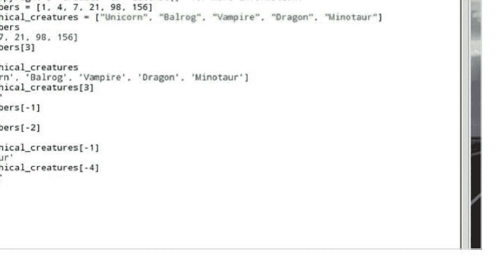

### 步骤 2

一旦定义了列表，你就可以通过引用其名称后跟一个数字来调用每个项目。列表的第一个项目索引为 0，然后是 1、2、3，依此类推。例如：

```
numbers
numbers[3]
```

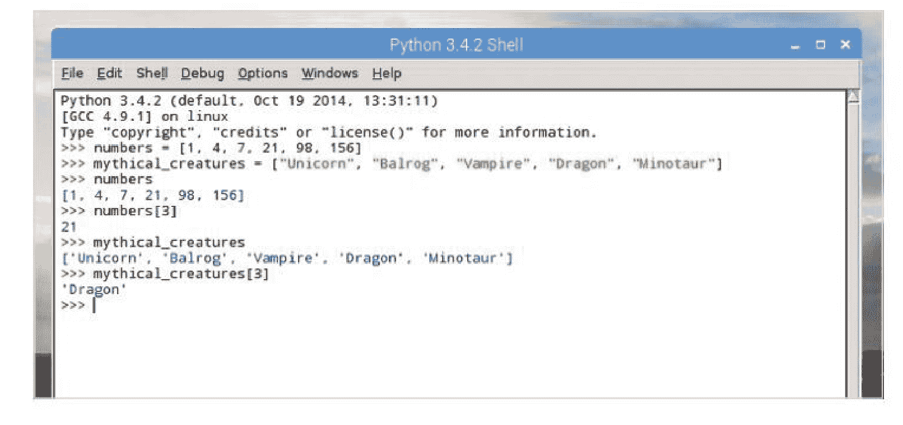

### 步骤 4

切片类似于索引，但你可以通过用冒号分隔项目编号来检索列表中的多个项目。例如：

```
numbers[1:3]
```

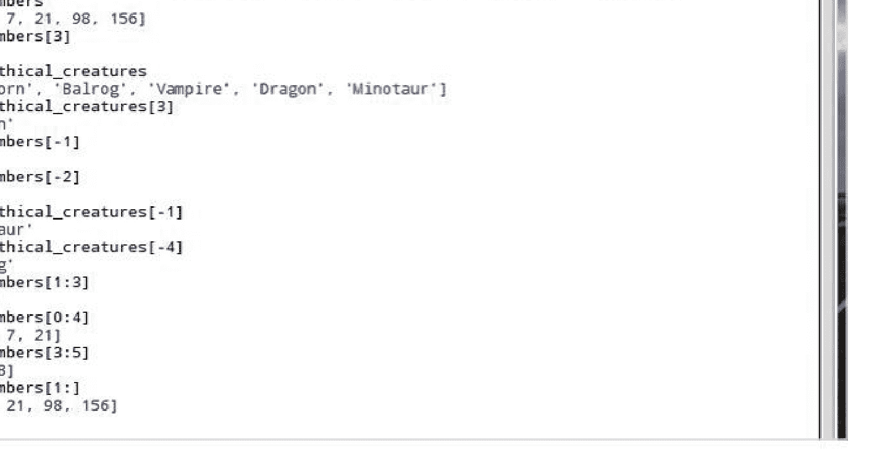

### 步骤 5

你可以更新现有列表中的项目、删除项目，甚至将列表连接在一起。例如，要连接两个列表，你可以使用：
`everything = numbers + mythical_creatures`
然后查看合并后的列表：
`everything`

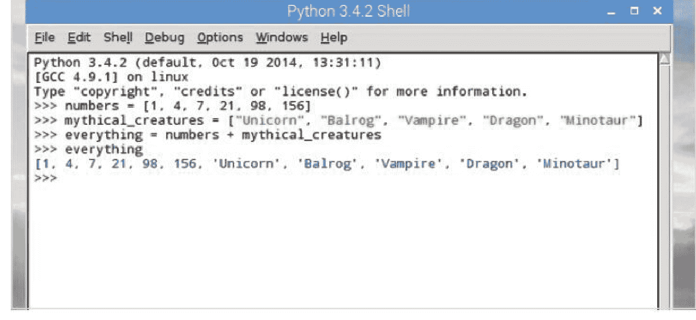

### 步骤 8

你可以通过在 Shell 中输入 `dir(list)` 来查看列表可以执行哪些操作。输出是可用的函数，例如，`insert` 和 `pop` 用于在特定位置添加和删除项目。要在索引 4 处插入数字 62：
`numbers.insert(4, 62)`
要删除它：
`numbers.pop(4)`

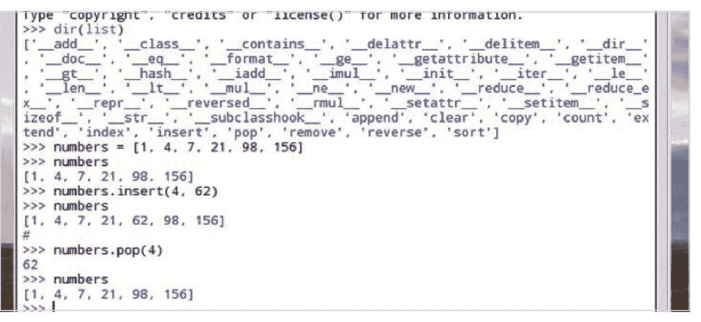

### 步骤 6

可以通过输入以下内容向列表添加项目：
`numbers=numbers+[201]`
或者对于字符串：
`mythical_creatures=mythical_creatures+["Griffin"]`
或者使用 `append` 函数：
`mythical_creatures.append("Nessie")`
`numbers.append(278)`

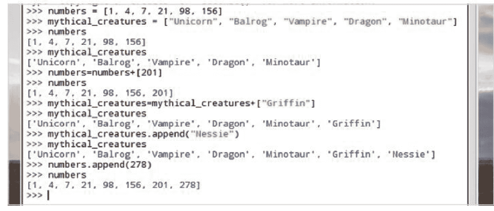

### 步骤 9

你还可以使用 `list` 函数将字符串分解为其组成部分。例如：
`list("David")`
将名字 David 分解为 'D', 'a', 'v', 'i', 'd'。然后可以将其传递给一个新列表：
`name=list("David Hayward")`
`name`
`age=[44]`
`user = name + age`
`user`

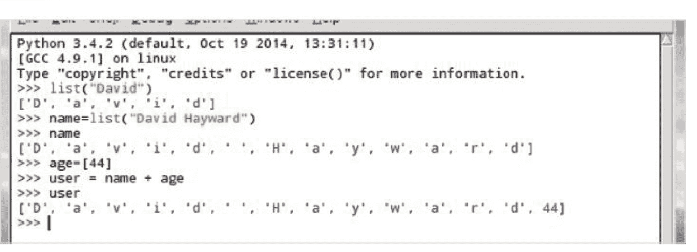

### 步骤 7

删除项目有两种方式。第一种是通过项目编号：
`del numbers[7]`
或者，通过项目名称：
`mythical_creatures.remove("Nessie")`

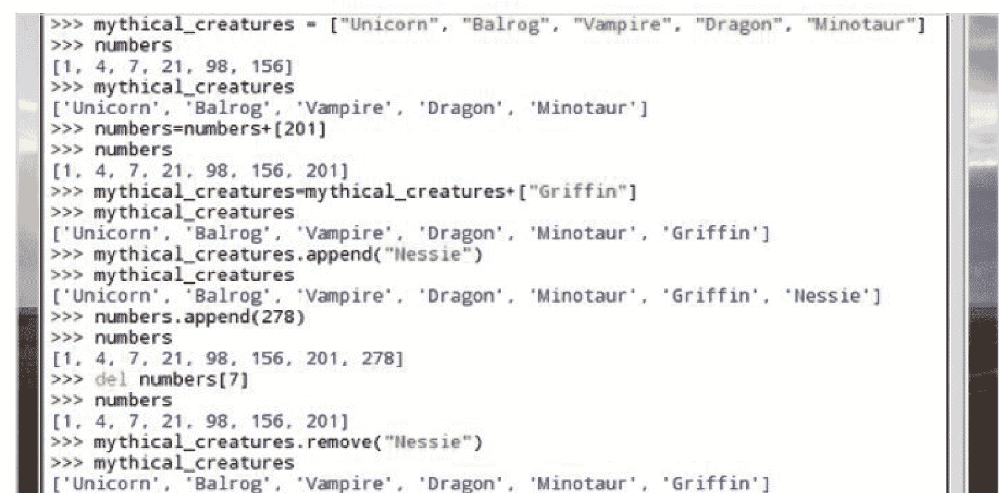

### 步骤 10

基于此，你可以创建一个程序，将某人的姓名和年龄存储为一个列表：
`name=input("What's your name? ")`
`lname=list(name)`
`age=int(input("How old are you: "))`
`lage=[age]`
`user = lname + lage`
合并后的姓名和年龄列表称为 `user`，可以通过在 Shell 中输入 `user` 来调用。尝试一下，看看你能做什么。

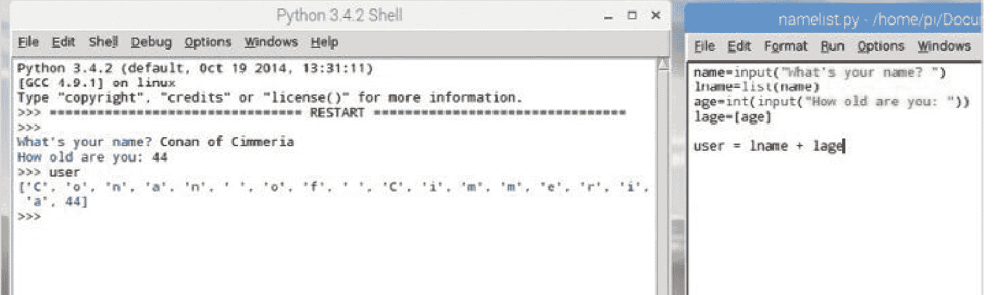

## 元组

元组与列表非常相似。然而，列表可以被更新、删除或以某种方式更改，而元组则保持不变。这被称为不可变，它们非常适合存储固定的数据项。

### 不可变的元组

拥有元组的原因取决于程序的预期用途。通常，元组是为某些特殊用途保留的，但它们也用于例如冒险游戏中存储非玩家角色名称。

### 步骤 1

元组的创建方式与列表相同，但在此情况下你使用圆括号而不是方括号。例如：

```python
months= ("January", "February", "March", "April",
"May", "June")
months
```

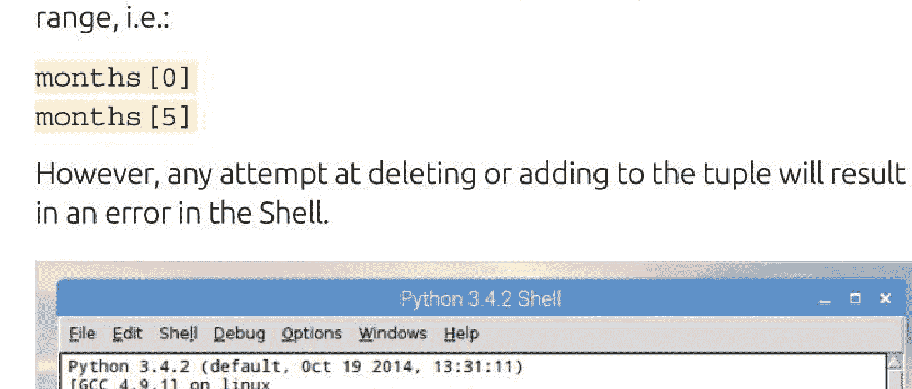

### 步骤 3

你可以将分组的元组创建为包含多组数据的列表。例如，这里有一个名为 `NPC`（非玩家角色）的元组，包含冒险游戏中角色的名称和战斗评级：

```python
NPC= [("Conan", 100), ("Belit", 80), ("Valeria",
95)]
```

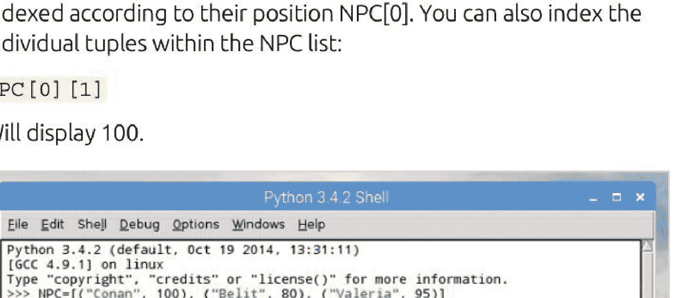

### 步骤 2

就像列表一样，命名元组中的项目可以根据其在数据范围中的位置进行索引，即：

```python
months[0]
months[5]
```

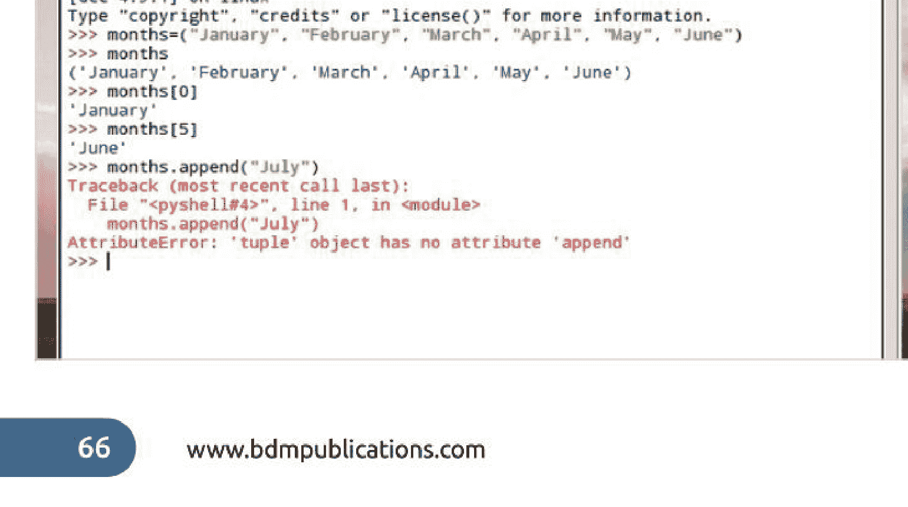

### 步骤 4

可以通过在 Shell 中输入 `NPC` 来整体访问这些数据项；或者可以根据它们的位置 `NPC[0]` 进行索引。你还可以索引 `NPC` 列表中的单个元组：

```python
NPC[0][1]
```

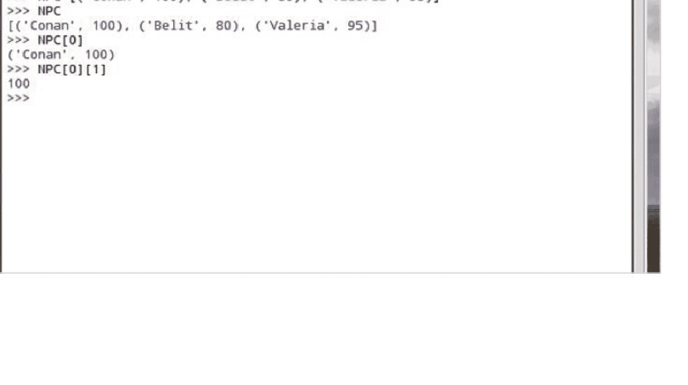

### 步骤 5

值得注意的是，当引用列表中的多个元组时，索引方式与常规略有不同。你可能期望角色 Valeria 的 95 战斗评级是 `NPC[4][5]`，但事实并非如此。实际上是：`NPC[2][1]`

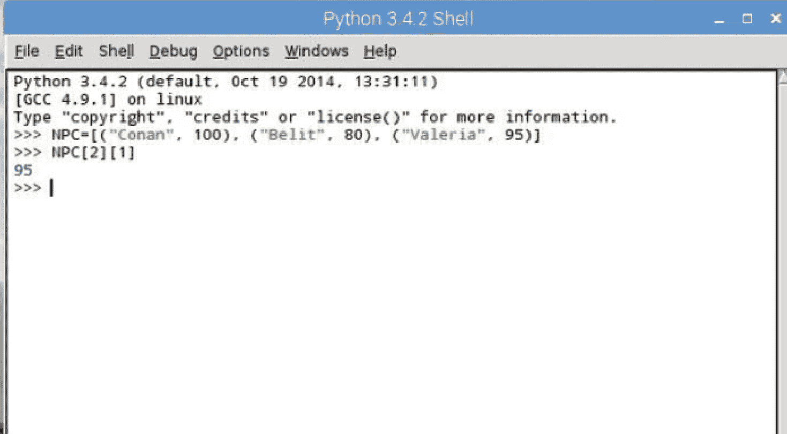

### 步骤 6

当然，这意味着索引遵循以下方式：
- 0, 0
- 0, 1
- 1
- 1, 0
可以想象，当你需要处理大量元组数据时，这会变得有点混乱。

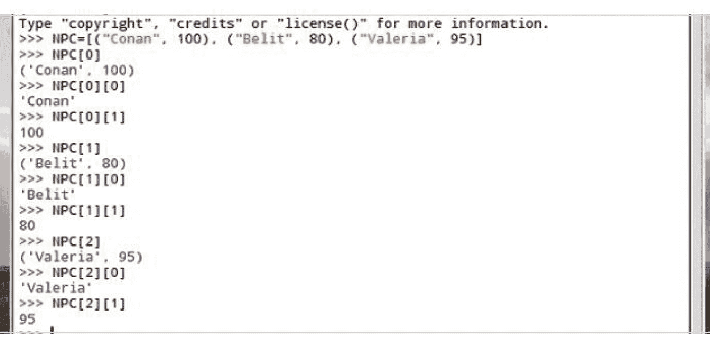

### 步骤 7

然而，元组利用了一个称为“解包”的特性，其中存储在元组中的数据项被分配给变量。首先创建一个包含两个项目（名称和战斗评级）的元组：`NPC=("Conan", 100)`

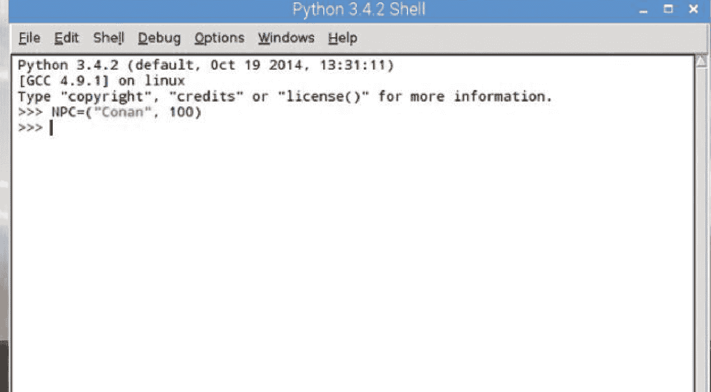

### 步骤 8

现在将元组解包到两个对应的变量中：`(name, combat_rating)=NPC` 你现在可以通过输入 `name` 和 `combat_rating` 来检查值。

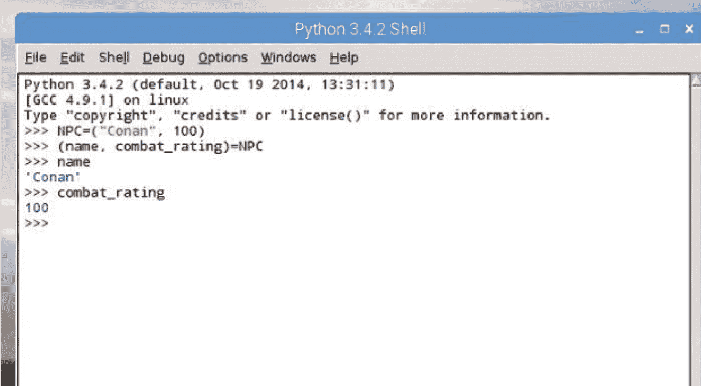

### 步骤 9

记住，与列表一样，你也可以使用负数索引元组，负数从数据列表的末尾开始倒数。对于我们的示例，使用包含多个数据项的元组，你可以通过以下方式引用 Valeria 角色：`NPC[2][-0]`

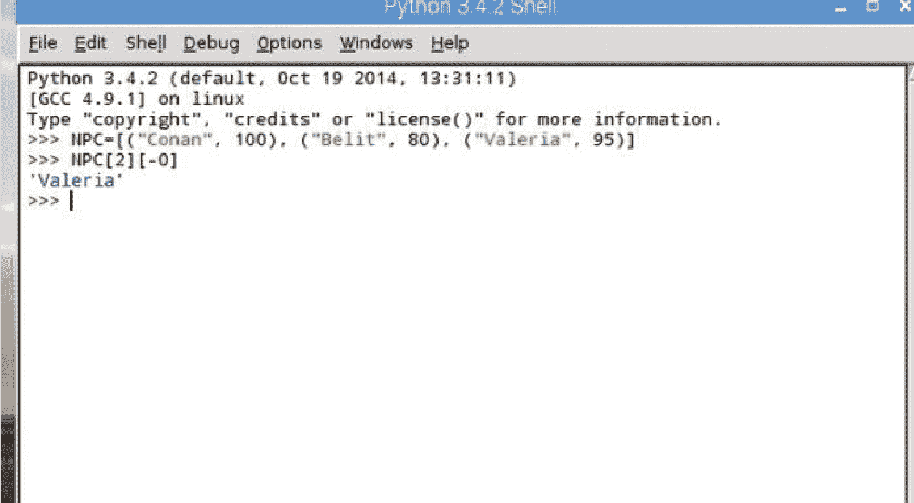

### 步骤 10

你可以使用 `max` 和 `min` 函数来查找由数字组成的元组中的最高值和最低值。例如：`numbers=(10.3, 23, 45.2, 109.3, 6.1, 56.7, 99)` 数字可以是整数和浮点数。要输出最高值和最低值，请使用：`print(max(numbers))` `print(min(numbers))`

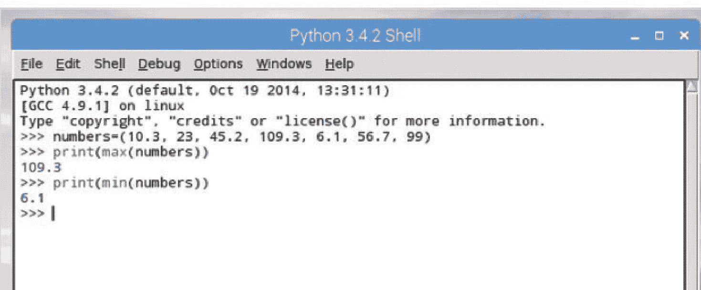

## 字典

列表非常有用，但 Python 中的字典是迄今为止处理数据项更技术性的方式。一开始可能有点难以掌握，但你很快就能将它们应用到自己的代码中。

### 键值对

字典就像一个列表，但每个数据项都成对出现，这些被称为键和值。键部分必须是唯一的，可以是数字或字符串，而值可以是任何你喜欢的数据项。

### 步骤 1

假设你想在 Python 中创建一个电话簿。你会创建字典名称，并在花括号中输入数据，用冒号分隔键和值 `Key:Value`。例如：

```
phonebook={"Emma": 1234, "Daniel": 3456, "Hannah": 6789}
```

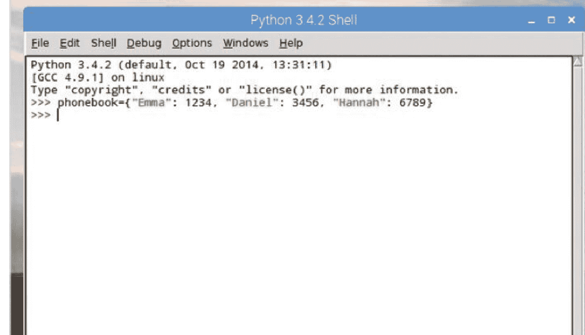

### 步骤 2

就像大多数列表、元组等一样，字符串需要用引号（单引号或双引号）括起来，而整数则可以不加引号。记住，值可以是字符串或整数，你只需要将相关的值用引号括起来：

```
phonebook2={"David": "0987 654 321"}
```

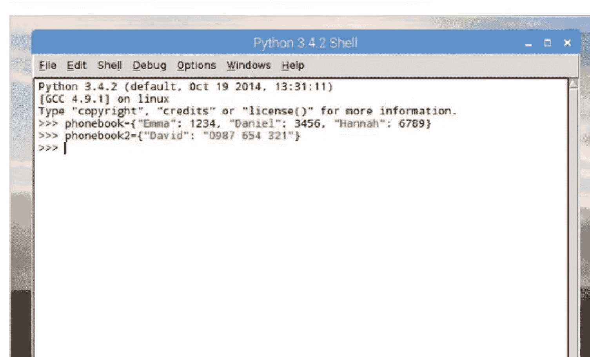

### 步骤 3

与列表和元组一样，你可以通过给字典一个名称来检查其内容：在本例中是 `phonebook`。这将显示你输入的数据项，其方式类似于列表，你现在无疑已经熟悉了。

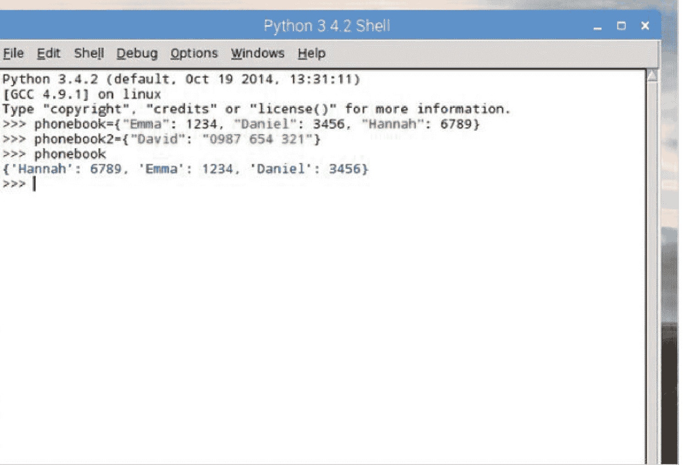

### 步骤 4

使用字典的好处在于，你可以输入键来索引值。使用前面步骤中的电话簿示例，你可以输入：
`phonebook["Emma"]`
`phonebook["Hannah"]`

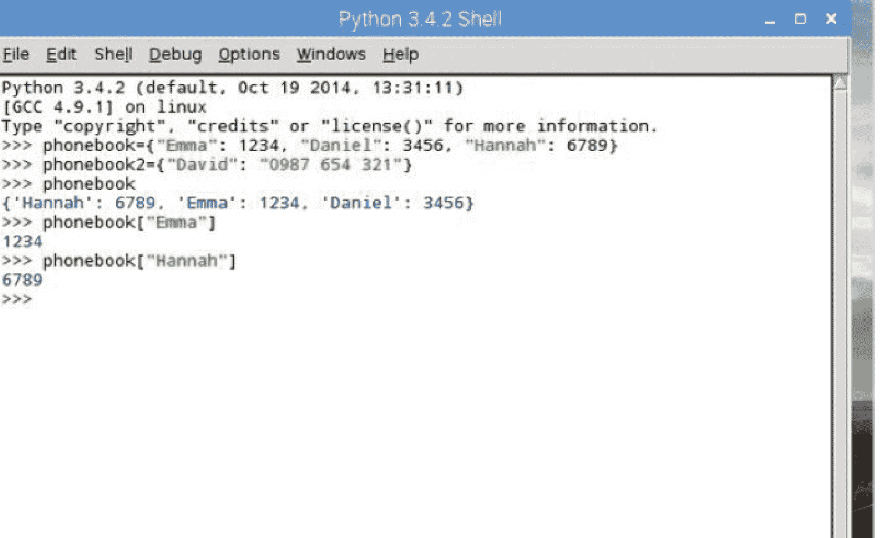

### 步骤 5

向字典中添加内容也很简单。你可以通过添加新的键值对来包含一个新的数据项条目，例如：

```python
phonebook["David"] = "0987 654 321"
phonebook
```

### 步骤 8

接下来，你需要定义用户输入和变量：一个用于人名，另一个用于电话号码（让我们保持简单，以避免冗长的 Python 代码）：

```python
name=input("Enter name: ")
number=int(input("Enter phone number: "))
```

### 步骤 6

你也可以通过使用 `del` 命令后跟条目的键来从字典中移除条目；对应的值也会被移除，因为它们作为一对数据项共同工作：

```python
del phonebook["David"]
```

### 步骤 9

请注意，我们将号码保持为整数而不是字符串，尽管该值可以是整数或字符串。现在你需要将用户输入的变量添加到新创建的空白字典中。使用与步骤 5 相同的过程，你可以输入：

```python
phonebook[name] = number
```

### 步骤 7

更进一步，如何创建一段代码来询问用户字典的键和值呢？创建一个新的编辑器实例，并从编码一个新的、空白的字典开始：

```python
phonebook={}
```

### 步骤 10

现在，当你保存并执行代码时，Python 会询问一个名字和一个号码。然后它会将这些条目插入到电话簿字典中，你可以通过在 Shell 中输入以下内容来测试：

```python
phonebook
phonebook["David"]
```

如果号码需要包含空格，你需要将其设为字符串，因此请移除输入中的 `int` 部分。

## 分割与连接字符串

在处理 Python 中的数据时，尤其是来自用户输入的数据，你无疑会遇到长串的字符串。学习 Python 编程中一个有用的技能是能够分割这些长字符串以提高可读性。

## 字符串理论

你已经看过一些列表函数，使用了 `.insert`、`.remove` 和 `.pop`，但也有一些函数可以应用于字符串。

**步骤 1** 字符串函数库中的主要工具是 `.split()`。通过它，你可以根据括号内的参数来分割一个数据字符串。例如，这里有一个包含三个项目的字符串，每个项目由空格分隔：

```python
text="Daniel Hannah Emma"
```

**步骤 3** 注意 `text.split` 部分有括号、引号，然后是一个空格，接着是闭合引号和括号。这个空格是分隔符，表示每个列表项条目由空格分隔。同样，CSV（逗号分隔值）内容使用逗号，所以你会使用：

```python
text="January,February,March,April,May,June"
months=text.split(",")
months
```

```
>>> text="Daniel Hannah Emma"
>>> names=text.split(" ")
>>> names
['Daniel', 'Hannah', 'Emma']
>>>
```

```
>>> text="January,February,March,April,May,June"
>>> months=text.split(",")
>>> months
['January', 'February', 'March', 'April', 'May', 'June']
>>>
```

**步骤 2** 现在让我们将字符串转换为列表并相应地分割内容：

```python
names=text.split(" ")
```

然后输入新列表的名称 `names` 来查看这三个项目。

**步骤 4** 你之前已经看过如何使用一个名称将字符串分割成单个字母的列表：

```python
name=list("David")
name
```

返回的值是 'D'、'a'、'v'、'i'、'd'。虽然在普通情况下这看起来可能有点没用，但它可能在创建拼写游戏等场景中派上用场。

```
>>> text="Daniel Hannah Emma"
>>> names=text.split(" ")
>>> names
['Daniel', 'Hannah', 'Emma']
>>>
```

```
>>> name=list("David")
>>> name
['D', 'a', 'v', 'i', 'd']
>>>
```

## 分割与连接字符串

**步骤 5** `.split` 函数的反向操作是 `.join`，你将拥有字符串中的独立项目，并可以将它们全部连接在一起形成一个单词或仅仅是项目的组合，具体取决于你编写的程序。例如：

```python
alphabet="".join(["a","b","c","d","e"])
alphabet
```

这将在 Shell 中显示 'abcde'。

**步骤 6** 因此，你可以将 `.join` 应用于你在步骤 4 中创建的已分割的名称，再次组合字母以形成名称：

```python
name="".join(name)
name
```

我们将字符串重新连接起来，并保留了名为 `name` 的列表，将其传递给 `.join` 函数。

**步骤 7** 使用 `.join` 函数的一个好例子是当你有一个想要组合成句子的单词列表时：

```python
list=["Conan", "raised", "his", "mighty", "sword", "and", "struck", "the", "demon"]
text=" ".join(list)
text
```

注意 `.join` 函数前引号之间的空格（在步骤 6 的 `.join` 中没有引号）。

**步骤 8** 与 `.split` 函数一样，分隔符不一定是空格，也可以是逗号、句号、连字符或任何你喜欢的：

```python
colours=["Red", "Green", "Blue"]
col=",".join(colours)
col
```

**步骤 9** 你可以对字符串应用一些有趣的函数，例如 `.capitalize` 和 `.title`。例如：

```python
title="conan the cimmerian"
title.capitalize()
title.title()
```

**步骤 10** 你也可以在字符串上使用逻辑运算符，使用 `'in'` 和 `'not in'` 函数。这些函数使你能够检查字符串是否包含（或不包含）一系列字符：

```python
message="Have a nice day"
"nice" in message
"bad" not in message
"day" not in message
"night" in message
```

## 格式化字符串

当你处理数据、创建列表、字典和对象时，你可能经常想要打印出结果。将字符串与数据合并很容易，尤其是在 Python 3 中，因为早期版本的 Python 往往会使事情复杂化。

## 字符串格式化

自 Python 3 以来，字符串格式化变得更加简洁，使用 `.format` 函数结合花括号。这是一种比以前版本更合乎逻辑、更完善的方法。

### 步骤 1

Python 中的基本格式化是使用花括号将每个变量调用到字符串中：

```python
name="Conan"
print("The barbarian hero of the Hyborian Age is: {}".format(name))
```

### 步骤 2

记住要用两组括号关闭 `print` 函数，因为你将变量封装在一组括号中，而 `print` 函数封装在另一组括号中。你可以在单个 `print` 函数中包含多个字符串格式化实例：

```python
name="Conan"
place="Cimmeria"
print("{} hailed from the North, in a cold land known as {}".format(name, place))
```

### 步骤 3

当然，你也可以将整数包含在内：

```python
number=10000
print("{} of {} was a skilled mercenary, and thief too. He once stole {} gold from a merchant.".format(name, place, number))
```

### 步骤 4

应用字符串格式化的方法有很多，有些非常简单，正如我们在这里向你展示的；有些则可能明显更复杂。这完全取决于你希望从程序中获得什么。关于字符串格式化经常参考的一个好地方是 Python 文档网页，网址为 www.docs.python.org/3.1/library/string.html。在这里，你会找到大量的帮助。

## 格式化字符串

### 步骤 5

有趣的是，你可以使用字符串格式化函数来引用列表。你需要在列表名称前放置一个星号：

```python
numbers=1, 3, 45, 567546, 3425346345
print("Some numbers: {}, {}, {}, {}, {}".format(*numbers))
```

### 步骤 6

与列表中的索引一样，使用字符串格式化调用列表也适用。你可以根据每个项目的位置（从 0 到存在的数量）对其进行索引：

```python
numbers=1, 4, 7, 9
print("More numbers: {3}, {0}, {2}, {1}.".format(*numbers))
```

### 步骤 7

正如你可能怀疑的那样，你可以在单个列表中混合字符串和整数，并在 `.format` 函数中调用它们：

```python
characters=["Conan", "Belit", "Valeria", 19, 27, 20]
print ("{0} is {3} years old. Whereas {1} is {4} years old.".format(*characters))
```

### 步骤 8

你也可以以同样的方式打印出用户输入的内容：

```python
name=input("What's your name? ")
print("Hello {}".format(name))
```

### 步骤 9

你可以扩展这个简单的代码示例来显示用户输入名称的首字母：

```python
name=input("What's your name? ")
print("Hello {}".format(name))
lname=list(name)
print("The first letter of your name is a {}".format(*lname))
```

### 步骤 10

你也可以调用一对列表，并在同一个 `print` 函数中单独引用它们。回顾步骤 7 的代码，你可以用以下方式修改它：

```python
names=["Conan", "Belit", "Valeria"]
ages=[25, 21, 22]
```

创建两个列表。现在你可以调用每个列表和单个项目：

```python
print("{0[0]} is {1[0]} years old. Whereas {0[1]} is {1[1]} years old.".format(names, ages))
```## 日期与时间

处理数据时，能够获取时间通常非常方便。例如，你可能想为条目添加时间戳，或者查看用户在何时登录了系统以及持续了多长时间。幸运的是，得益于 Time 模块，获取日期和时间是件很容易的事。

## 时间大师

Time 模块包含一些函数，可以帮助你检索当前系统时间、从字符串中读取日期、格式化时间与日期等等。

### 第一步
首先你需要导入 Time 模块。它是 Python 3 的内置模块，所以你不需要进入命令行提示符使用 `pip install` 来安装它。一旦导入，你只需一个简单的命令就能调用当前的时间和日期：

```python
import time
time.asctime()
```

### 第二步
时间函数被分为九个元组，这些元组被划分为带索引的项，与其他任何元组一样，如下图所示。

| 索引 | 字段          | 值                                  |
|-------|----------------|-----------------------------------------|
| 0     | 四位数年份   | 2016                                    |
| 1     | 月份          | 1 到 12                                 |
| 2     | 日期            | 1 到 31                                 |
| 3     | 小时           | 0 到 23                                 |
| 4     | 分钟         | 0 到 59                                 |
| 5     | 秒         | 0 到 61（60 或 61 是闰秒）    |
| 6     | 星期几    | 0 到 6（0 代表星期一）                   |
| 7     | 一年中的第几天    | 1 到 366（儒略日）                  |
| 8     | 夏令时标志 | -1, 0, 1, -1 表示由库来确定夏令时 |

### 第三步
你可以通过输入 `time.localtime()` 来查看时间的呈现结构。
输出结果如下所示：`time.struct_time(tm_year=2017, tm_mon=9, tm_mday=7, tm_hour=9, tm_min=6, tm_sec=13, tm_wday=3, tm_yday=250, tm_isdst=0)` 显然，这取决于你当前的时间，而不是本书编写的时间。

### 第四步
Time 模块内置了许多函数。其中一个最常见的是 `.strftime()`。借助它，你能够传入各种各样的参数，因为它会将时间元组转换为字符串。例如，要显示当前是星期几，你可以使用：`time.strftime('%A')`

```python
time.strftime('%A')
```

### 第五步
这自然意味着你可以将各种函数融入到你自己的代码中，例如：

```python
time.strftime("%a")
time.strftime("%B")
time.strftime("%b")
time.strftime("%H")
time.strftime("%H%M")
```

### 第八步
你在上一节结尾看到过，在计算圆周率到用户指定的小数位数的代码中，你可以为 Python 中的特定事件计时。取出上面的代码并稍作修改，加入：`start_time=time.time()`
然后是：`endtime=time.time()-start_time`

### 第六步
注意最后两个条目，即 `%H` 和 `%H%M`，如你所见，它们分别代表小时和分钟。如最后一个条目所示，将它们输入为 `%H%M` 并不能在 Shell 中正确显示时间。你可以用以下命令轻松修正：`time.strftime("%H:%M")`

### 第九步
输出结果将类似于下面的截图。计时器函数需要放置在输入语句的两侧，因为那时变量名正在被创建，时间长短取决于用户登录花了多久。然后，持续时间会作为 `endtime` 变量显示在代码的最后一行。

### 第七步
这意味着你将能够显示当前时间或事件发生的时间，比如用户输入其姓名的时候。在编辑器中尝试此代码：

```python
import time
name=input("Enter login name: ")
print("Welcome", name, "\n")
print("User:", name, "logged in at", time.strftime("%H:%M"))
```

尝试进一步扩展它，加入日期、月份、年份等等。

### 第十步
Time 模块能做的事情很多；其中一些也相当复杂，例如显示自 1970 年 1 月 1 日以来的秒数。如果你想更深入地了解 Time 模块，那么在 Shell 中输入：`help(time)` 以显示当前 Python 版本中 Time 模块的帮助文件。

## 打开文件

在 Python 中，你可以在程序中读取文本文件和二进制文件。你也可以写入文件，这是我们接下来要探讨的内容。读写文件使你能够输出和存储程序中的数据。

## 打开、读取与写入

首先，在你系统的文本编辑器中输入一些文本。文本编辑器是最佳选择，而不是文字处理器，因为文字处理器包含背景格式和其他元素。在我们的示例中，我们有一首罗伯特·E·霍华德的诗《西米里安人》。你需要将文件保存为 `poem.txt`。

你使用 `open()` 函数将文件作为对象传递给一个变量。你可以任意命名文件对象，但你需要告诉 Python 你打开的文本文件的名称和位置：

```python
poem=open("/home/pi/Documents/Poem.txt")
```

如果你现在在 Shell 中输入 `poem`，你会得到关于你刚刚请求打开的文本文件的一些信息。现在，你可以使用 `poem` 变量来读取文件内容：`poem.read()`

如果你第二次输入 `poem.read()`，你会注意到文本已从文件中移除。你需要再次输入 `poem=open("/home/pi/Documents/Poem.txt")` 来重新创建文件对象。然而这次，输入：`print(poem.read())`
这次，`\n` 条目被移除，取而代之的是换行符和可读文本。

```python
poem=open("/home/pi/Documents/Poem.txt")
print(poem.read())
```

### 第五步
就像列表、元组、字典等等一样，你可以索引文本的单个字符。例如：

```python
poem.read(5)
# 显示前五个字符，而再次输入：
poem.read(5)
# 将显示接下来的五个。输入 (1) 则会一次显示一个字符。
```

### 第六步
类似地，你可以使用 `readline()` 函数一次显示一行文本。例如：

```python
poem=open("/home/pi/Documents/Poem.txt")
poem.readline()
# 将显示文本的第一行，再次使用：
poem.readline()
# 将再次显示文本的下一行。
```

### 第七步
你可能已经猜到，你可以将 `readline()` 函数传递给一个变量，从而允许你在需要时再次调用它：

```python
poem=open("/home/pi/Documents/Poem.txt")
line=poem.readline()
line
```

### 第八步
进一步扩展，你可以使用 `readlines()` 来获取文本的所有行，并将它们存储为多个列表。这些列表随后可以存储为一个变量：

```python
poem=open("/home/pi/Documents/Poem.txt")
lines=poem.readlines()
lines[0]
lines[1]
lines[2]
```

### 第九步
你也可以使用 `for` 语句将文本行读取出来：

```python
for lines in lines:
    print(lines)
# 由于这是 Python，还有其他方法可以产生相同的输出：
poem=open("/home/pi/Documents/Poem.txt")
for lines in poem:
    print(lines)
```

### 第十步
让我们假设你想像旧式点阵打印机那样，一次打印一个字符。你可以将 Time 模块与你在这里学习的内容结合使用。试试这个：

```python
import time
poem=open("/home/pi/Documents/Poem.txt")
lines=poem.read()
for lines in lines:
    print(lines, end="")
    time.sleep(.15)
```

这种输出效果很有趣，也易于融入你自己的代码中。

## 处理数据

## 写入文件

在 Python 中读取外部文件的功能固然便捷，但写入文件则更进一步。通过使用 `write()` 函数，你可以将程序的输出结果保存到文件中，之后再用 `read()` 函数将内容读回 Python。

### 写入与关闭

`write()` 函数比 `read()` 稍微复杂一些。除了文件名，你还需要指定一个访问模式，它决定了文件是以读取还是写入模式打开。

步骤 1 启动 IDLE 并输入以下内容：
`t=open ("/home/pi/Documents/text.txt", "w")`
将目标路径 `/home/pi/Documents` 改为你自己系统中的路径。这段代码将创建一个名为 text.txt 的文本文件，并以写入模式使用变量 't'。如果该位置没有同名文件，它会创建一个；如果已经存在同名文件，它会将其覆盖，所以请小心。

```
>>> t=open("/home/pi/Documents/text.txt","w")
>>>
```

步骤 2 你现在可以使用 `write()` 函数向文本文件写入内容。它与 `read()` 的工作方式相反，是写入行而非读取行。试试这个：
`t.write("You awake in a small, square room. A single table stands to one side, there is a locked door in front of you.")`
注意数字 109，它表示你输入的字符数。

```
>>> t.write("You awake in a small, square room. A single table stands to one side, there is a locked door in front of you.")
109
>>>
```

步骤 3 然而，实际的文本文件此时仍然是空白的（你可以打开它检查一下）。这是因为你将这行文本写入了文件对象，但尚未将其提交到文件本身。`write()` 函数的一部分要求是你需要将更改提交到文件；你可以通过输入以下命令来完成：
`t.close()`

```
>>> t.close()
>>> |
```

步骤 4 如果你现在用文本编辑器打开该文本文件，你会看到你创建的那一行已经写入了文件。这为我们提供了一些有趣可能性的基础：也许是创建你自己的日志文件，甚至是一款冒险游戏的开端。

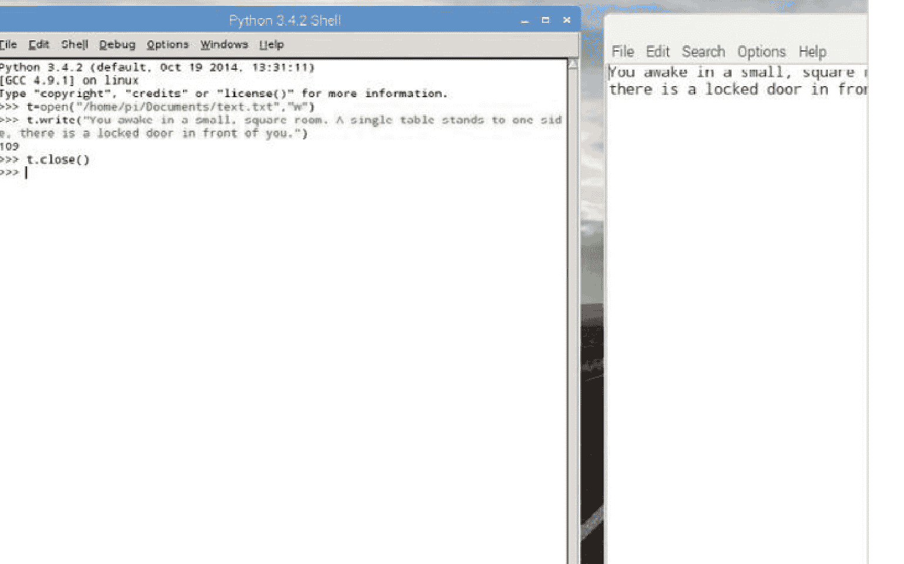

步骤 5 要扩展这段代码，你可以使用 'a'，即访问或追加模式重新打开文件。这将在原始文本的末尾添加任何新文本，而不是清空文件并创建新文件。例如：

```
t=open("/home/pi/Documents/text.txt","a")
t.write("\n")
t.write(" You stand and survey your surroundings. On top of the table is some meat, and a cup of water.\n")
```

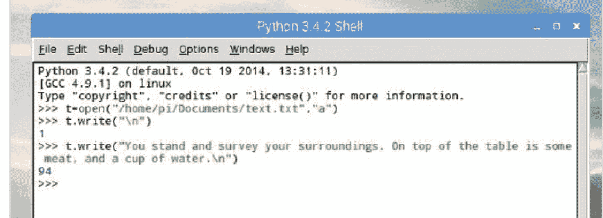

步骤 6 你可以逐行扩展文本，每行以换行符（`\n`）结束。完成后，以 `t.close()` 结束代码，并在文本编辑器中打开文件查看结果：

```
t.write("The door is made of solid oak with iron strips. It's bolted from the outside, locking you in. You are a prisoner!.\n")
t.close()
```

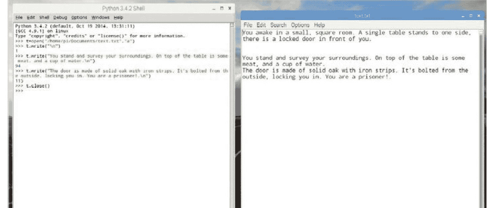

步骤 7 使用 `open()` 函数时，需要考虑多种文件访问类型。每种类型取决于文件的访问方式，甚至取决于光标的位置。例如，`r+` 以读写模式打开文件，并将光标置于文件开头。

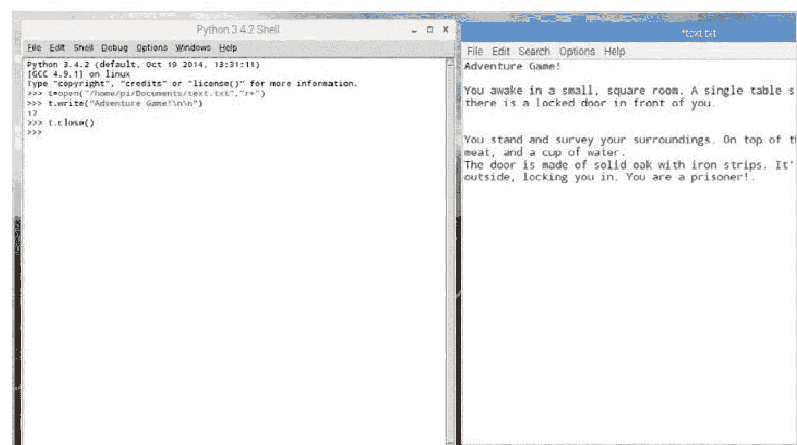

步骤 8 你可以将在 Python 中创建的变量传递给文件。也许你想将圆周率 Pi 的值写入文件。你可以从 math 模块调用 Pi，创建一个新文件，然后将 Pi 的输出传递到新文件中：

```
import math
print("Value of Pi is: ",math.pi)
print("\nWriting to a file now...")
```

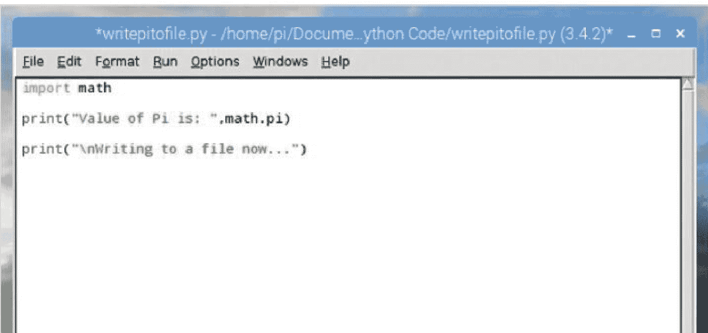

步骤 9 现在让我们创建一个名为 pi 的变量并将其赋值为 Pi 的值：
pi=math.pi
你还需要创建一个新文件以便写入 Pi：
t=open("/home/pi/Documents/pi.txt","w")
记得将文件路径改为你自己系统的具体设置。

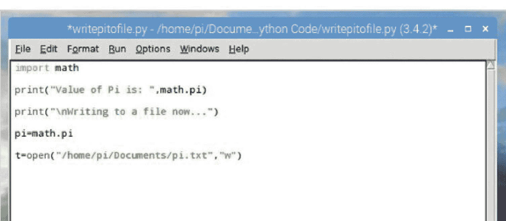

步骤 10 最后，你可以使用字符串格式化来调用变量并将其写入文件，然后提交更改并关闭文件：
t.write("Value of Pi is: {}".format(pi))
t.close()
从结果中你可以看到，能够将任何变量传递到文件中。

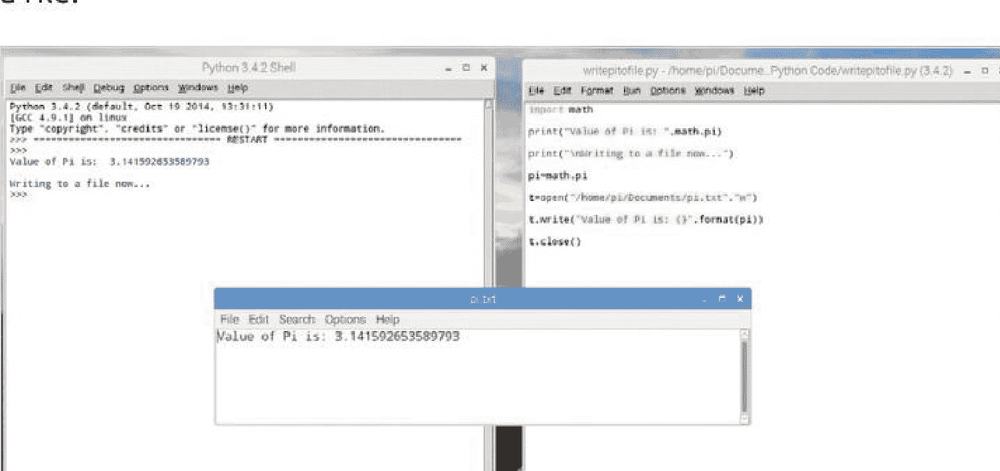

## 异常

编写代码时，你自然会遇到一些无法控制的问题。假设你要求用户输入两个数字进行除法运算，而他们试图除以零。这将导致错误并中断你的代码。

### 异常对象

Python 并不会让代码流程因错误而停止，而是包含了异常对象来处理代码中的意外错误。你可以通过创建可能发生异常的条件来应对错误。

步骤 1 你可以通过简单地尝试将一个数字除以零来创建一个异常错误。如屏幕截图所示，系统会报告 "ZeroDivisionError: Division by zero" 消息。ZeroDivisionError 部分是异常类，这样的类有很多。

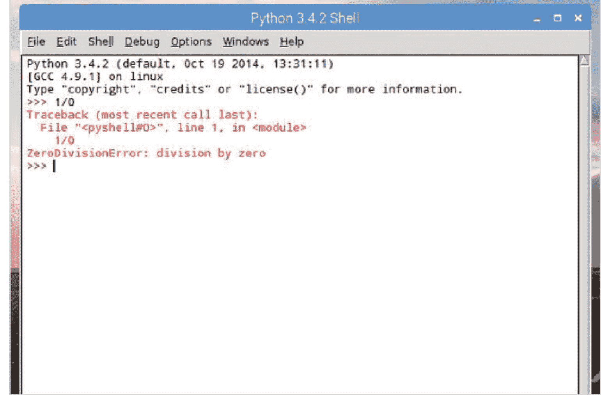

步骤 2 大多数异常是在 Python 遇到代码中固有的错误时自动抛出的。然而，你可以创建自己的异常，旨在包含潜在错误并做出反应，而不是让代码直接失败。

步骤 3 你可以使用 `raise exception` 函数在 Python 内部创建我们自己的错误处理代码。假设你的代码让你在宇宙中跃迁，然而过度跃迁会导致曲速核心破裂。为了防止游戏因曲速核心发生超新星爆发而退出，你可以创建一个自定义异常：

```
raise Exception("warp core breach")
```

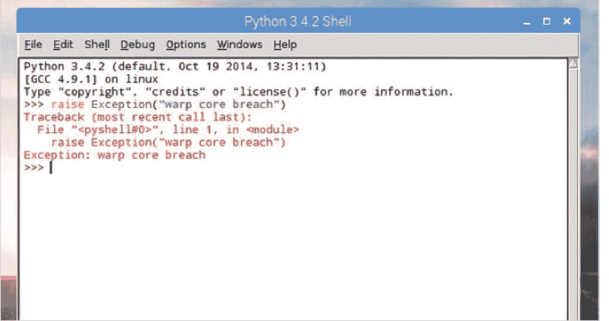

步骤 4 为了捕获代码中的任何错误，你可以将潜在的错误包裹在一个 `try:` 代码块中。这个代码块由 `try`、`except`、`else` 组成，代码放在 `try:` 内，然后如果有异常则执行某些操作，否则执行其他操作。

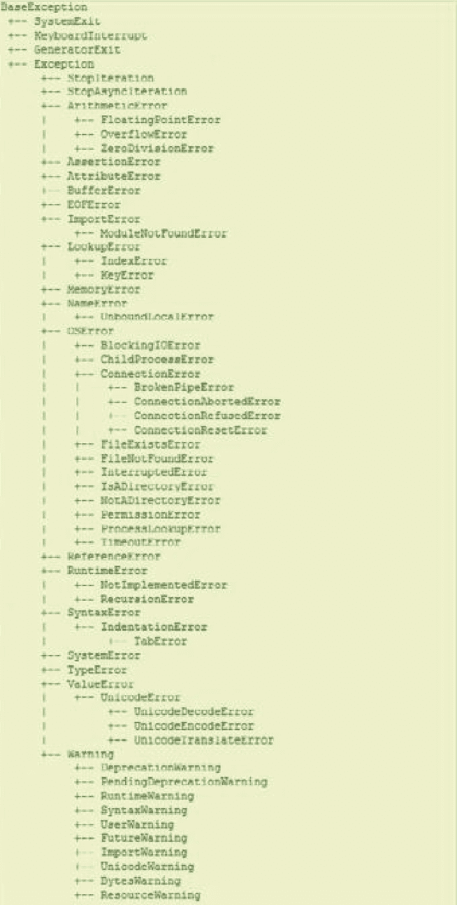

```
try:
    在此处插入你的操作 ---->
except Exception 1:
    如果出现异常，则执行此操作 ---->
except Exception 2:
    如果出现另一个异常，则执行此操作 ---->
else:
    如果没有异常，则执行此操作 ---->
```

步骤 5 例如，使用除以零的错误。你可以创建一个异常，让代码能够处理错误，而不会导致 Python 因问题退出：

```
try:
    a=int(input("Enter the first number: "))
    b=int(input("Enter the second number: "))
    print(a/b)
except ZeroDivisionError:
    print("You have tried to divide by zero!")
else:
    print("You didn't divide by zero. Well done!")
```

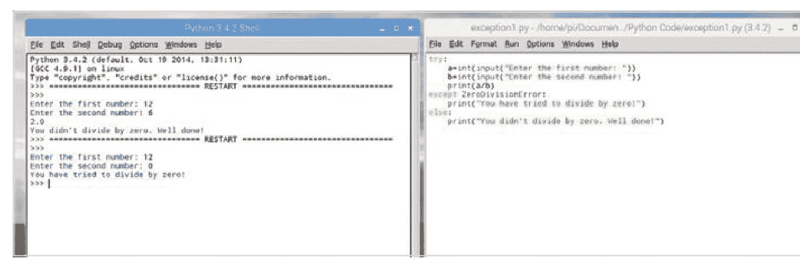

步骤 6 你可以使用异常来处理各种有用的任务。以我们之前教程中的一个例子为例，假设你想打开一个文件并写入内容：

```
try:
    txt = open("/home/pi/Documents/textfile.txt", "r")
    txt.write("This is a test. Normal service will shortly resume!")
except IOError:
    print ("Error: unable to write the file. Check permissions")
else:
    print ("Content written to file successfully. Have a nice day.")
    txt.close()
```

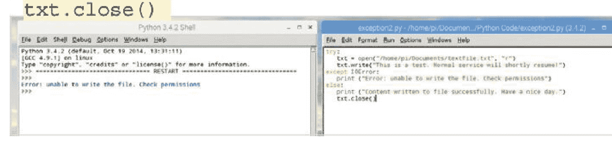

步骤 7 显然这不会起作用，因为文件 textfile.txt 是以只读模式（"r" 部分）打开的。所以，在这种情况下，不是 Python 告诉你做错了什么，而是你使用 IOError 类创建了一个异常，通知用户权限不正确。

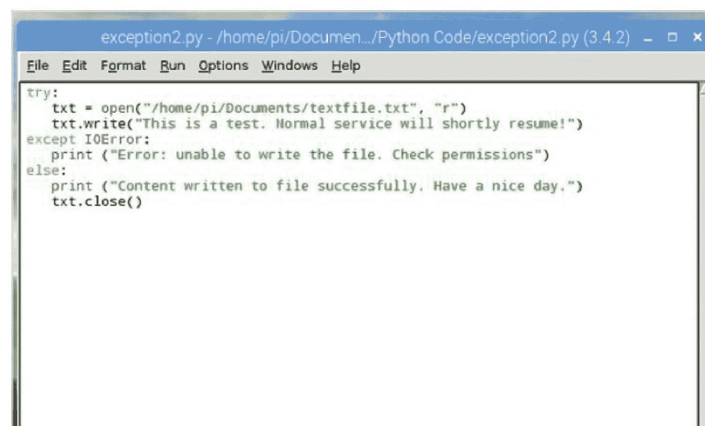

步骤 8 自然地，你可以通过将 "r" 只读实例更改为 "w" 来快速修复问题。正如你已经知道的，这将创建文件、写入内容，然后将更改提交到文件。最终结果将报告一组不同的情况，在本例中，是代码的成功执行。

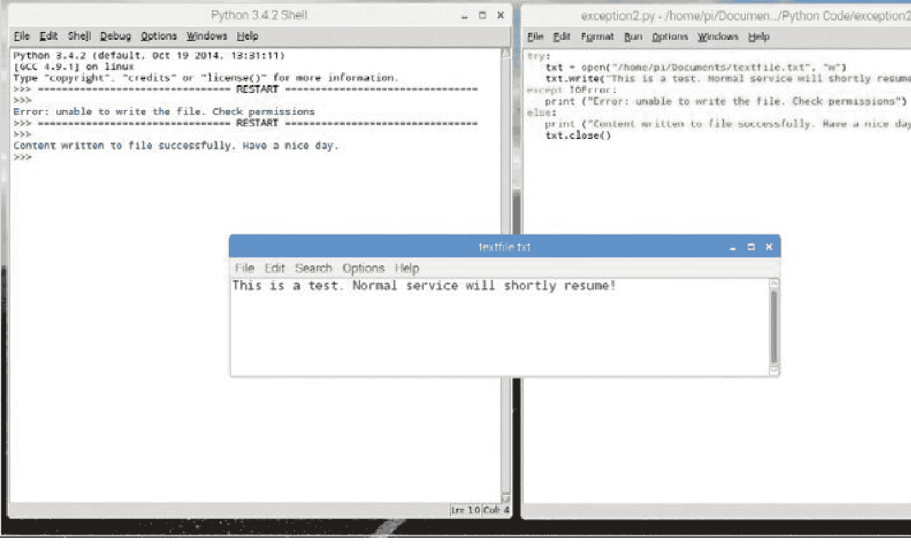

步骤 9 你也可以使用 `finally:` 代码块，它的工作方式类似，但不能与 `else` 一起使用。以我们步骤 6 中的示例为例：

```
try:
    txt = open("/home/pi/Documents/textfile.txt", "r")
    try:
        txt.write("This is a test. Normal service will shortly resume!")
    finally:
        print ("Content written to file successfully. Have a nice day.")
        txt.close()
except IOError:
    print ("Error: unable to write the file. Check permissions")
```

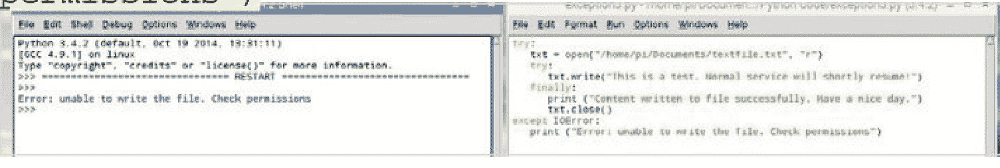

步骤 10 如前所述，由于你使用了 "r" 只读权限，错误仍然会发生。如果你将其改为 "w"，那么代码将执行，而不会在 IDLE Shell 中显示错误。不用说，第一次正确编写异常代码可能有些棘手。但通过练习，你会掌握它的。

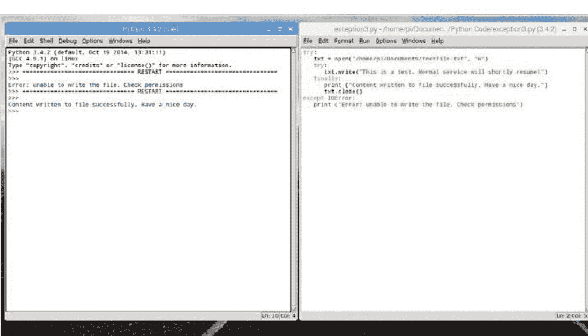## Python 图形

虽然在屏幕上处理文本——无论是用于游戏还是程序——很棒，但有时加点图形表示也不会错。Python 3 包含了多种引入图形的方式，而且它们功能强大得惊人。

## 走向图形化

你可以绘制简单的图形，如线条、正方形等，或者你可以使用众多可用的 Python 模块之一，来呈现一些惊人的效果。

**步骤 1** 开始学习 Python 图形的最佳模块之一是 Turtle。顾名思义，Turtle 模块基于许多学校使用的海龟机器人，这些机器人可以在地面上的大张纸上编程绘制图形。可以通过 `import turtle` 导入 Turtle 模块。

**步骤 2** 让我们从绘制一个简单的圆开始。新建一个文件，然后输入以下代码：

```python
import turtle

turtle.circle(50)
turtle.getscreen()._root.mainloop()
```

像往常一样，按 F5 保存并执行代码。现在将打开一个新窗口，'海龟' 会画出一个圆。

**步骤 3** 命令 `turtle.circle(50)` 用于在屏幕上绘制圆形，其中 50 是尺寸。如果你愿意，可以尝试不同的大小，比如 100、150 甚至更大；你可以通过输入 `turtle.circle(50, 180)` 来绘制一段弧线，这里尺寸是 50，但你告诉 Python 只绘制圆的 180 度。

**步骤 4** 圆形代码的最后部分告诉 Python 保持绘制所在的窗口打开，以便用户可以点击关闭它。现在，让我们来画一个正方形：

```python
import turtle

print("Drawing a square...")

for t in range(4):
    turtle.forward(100)
    turtle.left(90)
turtle.getscreen()._root.mainloop()
```

你可以看到我们插入了一个循环来绘制正方形的边。

**步骤 5** 你可以在正方形代码中添加新行以添加颜色：
`turtle.color("Red")`
然后，你甚至可以通过输入以下命令将角色更改为真正的海龟：
`turtle.shape("turtle")`
你还可以使用命令 `turtle.begin_fill()` 和 `turtle.end_fill()` 用选定的颜色填充正方形；本例中为红色轮廓，黄色填充。

**步骤 6** 你可以看到，Turtle 模块可以绘制出一些相当不错的形状，并且随着你开始掌握其工作方式，它会变得稍微复杂一些。输入这个例子：
这是一种不同的方法，但非常有效。

```python
from turtle import *
color('red', 'yellow')
begin_fill()
while True:
    forward(200)
    left(170)
    if abs(pos()) < 1:
        break
end_fill()
done()
```

**步骤 7** 另一种显示图形的方法是使用 Pygame 模块。Pygame 有多种方式可以帮助你将图形输出到屏幕上，但现在让我们看看如何显示一个预定义的图像。首先，打开浏览器并找到一张图片，然后将其保存到你保存 Python 代码的文件夹中。

**步骤 8** 现在，我们通过导入 Pygame 模块来获取代码：

```python
import pygame
pygame.init()

img = pygame.image.load("RPi.png")

white = (255, 255, 255)
w = 900
h = 450
screen = pygame.display.set_mode((w, h))
screen.fill((white))

screen.fill((white))
screen.blit(img, (0,0))
pygame.display.flip()

while True:
    for event in pygame.event.get():
        if event.type == pygame.QUIT:
            pygame.quit()
```

**步骤 9** 在上一步中，你导入了 pygame，初始化了 pygame 引擎，并让它导入我们保存的树莓派 Logo 图片（保存为 RPi.png）。接下来，你定义了显示图像的窗口背景色，以及根据实际图像尺寸定义的窗口大小。最后，你有一个循环来关闭窗口。

```python
w = 900
h = 450
screen = pygame.display.set_mode((w, h))
screen.fill((white))

screen.fill((white))
screen.blit(img, (0,0))
pygame.display.flip()

while True:
    for event in pygame.event.get():
        if event.type == pygame.QUIT:
            pygame.quit()
```

**步骤 10** 按 F5 保存并执行代码，你的图像将显示在一个新窗口中。玩玩颜色、大小等等，也花点时间查阅 Pygame 模块中的众多函数。

## 综合运用

基于本节所学内容，让我们将它们结合起来，编写一段可以轻松应用于现实世界的代码；或者至少，一段你可以整合到自己程序中的代码。

## 用户登录

在这个示例中，让我们看一段创建用户登录，然后允许他们登录系统并记录登录时间的代码。你甚至可以包含一个通过按 'q' 退出程序的选项。

**步骤 1** 首先导入 Time 模块，创建一个新字典来处理用户名和密码，并创建一个变量来评估程序的当前状态：

```python
import time
users = {}
status = ""
```

**步骤 2** 接下来，你需要定义一些函数。你可以从创建主菜单开始，所有用户选择可用选项后都会返回此处：

```python
def mainMenu():
    global status
    status = input("Do you have a login account? y/n? Or press q to quit.")
    if status == "y":
        oldUser()
    elif status == "n":
        newUser()
    elif status == "q":
        quit()
```

**步骤 3** `global status` 语句将局部变量与可在整个代码中调用的变量分开，这样你就可以使用 q=quit 元素，而它不会在函数内部被更改。我们还引用了一些新定义的函数：oldUser 和 newUser，接下来我们会讲到它们。

```python
def mainMenu():
    global status
    status = input("Do you have a login account? y/n? Or press q to quit.")
    if status == "y":
        oldUser()
    elif status == "n":
        newUser()
    elif status == "q":
        quit()
```

**步骤 4** 接下来是 newUser 函数：

```python
def newUser():
    createLogin = input("Create a login name: ")
    if createLogin in users:
        print ("\nLogin name already exists!\n")
    else:
        createPassw = input("Create password: ")
        users[createLogin] = createPassw
        print("\nUser created!\n")
        logins=open("/home/pi/Documents/logins.txt", "a")
        logins.write("\n" + createLogin + " " + createPassw)
        logins.close()
```

这将创建一个新用户和密码，并将条目写入名为 logins.txt 的文件。

**步骤 5** 由于我们使用的是树莓派，你需要指定 logins.txt 文件的自己的路径。本质上，这会将用户输入的用户名和密码添加到现有的 users{} 字典中，因此键值结构保持不变：每个用户是键，密码是值。

```python
def newUser():
    createLogin = input("Create a login name: ")
    if createLogin in users:
        print ("\nLogin name already exists!\n")
    else:
        createPassw = input("Create password: ")
        users[createLogin] = createPassw
        print("\nUser created!\n")
        logins=open("/home/pi/Documents/logins.txt", "a")
        logins.write("\n" + createLogin + " " + createPassw)
        logins.close()
```

**步骤 6** 现在创建 oldUser 函数：

```python
def oldUser():
    login = input("Enter login name: ")
    passw = input("Enter password: ")
    # check if user exists and login matches password
    if login in users and users[login] == passw:
        print ("\nLogin successful!\n")
        print ("User:", login, "accessed the system on:", time.asctime())
    else:
        print ("\nUser doesn't exist or wrong password!\n")
```

**步骤 7** 这里发生了相当多的事情。有 login 和 passw 变量，然后它们与 users 字典进行匹配。如果匹配成功，那么你就成功登录了，并且会输出登录的日期和时间。如果不匹配，那么会打印一个错误信息，然后过程重新开始。

```python
def oldUser():
    login = input("Enter login name: ")
    passw = input("Enter password: ")
    # check if user exists and login matches password
    if login in users and users[login] == passw:
        print ("\nLogin successful!\n")
        print ("User:", login, "accessed the system on:", time.asctime())
    else:
        print ("\nUser doesn't exist or wrong password!\n")
```

**步骤 8** 最后，你需要持续检查 'q' 键是否被按下以退出程序。我们可以这样实现：

```python
while status != "q":
    status = displayMenu()
```

**步骤 9** 虽然看起来只有两行，但 while 循环是让程序保持运行的关键。在每个函数结束时，它都会与 status 的当前值进行检查。如果这个全局值不是 'q'，程序就继续运行。如果等于 'q'，程序就可以退出。

```python
while status != "q":
    status = displayMenu()
```

**步骤 10** 你现在可以创建用户，然后使用他们的名字和密码登录，logins.txt 文件将被创建来存储登录数据，成功的登录会被记录时间戳。现在就由你来进一步改进代码了。也许你可以从之前的会话中导入已创建用户的列表，并在登录成功时显示一个图形？

## 处理数据

## Python聚焦：游戏

尽管Python并非总是被视为开发游戏的理想编程语言，但近年来它已取得长足进步，如今已成为众多游戏作品的重要贡献元素之一。

电子游戏产业每年创造约1400亿美元的产值，且这一数字正在快速增长。这与Commodore 64和ZX Spectrum的8位机时代相去甚远——那些曾吞噬我们零花钱的街机游戏，以及雅达利精心打造的木纹家庭游戏机。如今，这一切都由程序员、图形设计师、音乐家、公关团队、项目管理和开发平台共同协作完成。


## 游戏编程

从零开始，使用原始代码编写游戏已成为过去式。如今大多数游戏都借助一系列开发工具创建。这些工具包括现成引擎，如虚幻引擎，也有些是围绕原创产品定制构建的，例如Bethesda为《上古卷轴》和《辐射》系列游戏开发的世界生成引擎。虽然也有从头编写的范例，但这类案例已较为罕见。那么Python在其中扮演什么角色呢？

Python的局限性在于性能。虽然大多数游戏对运行平台的性能要求极高，Python的代码虽优秀，但其设计初衷并非为了应对《战地》或《使命召唤》系列这类快节奏游戏的要求。这类游戏通常使用C++或其他底层编程语言开发。但这并不意味着Python在游戏开发领域受到冷落，事实上恰恰相反。

## 构建工具

在游戏产业中，Python主要用于开发供游戏开发者使用的内建工具，或帮助连接不同代码模块间的空隙。例如，用Python编写的游戏内工具可供设计师创建游戏关卡、角色物品栏的特定元素，甚至能生成玩家与游戏非玩家角色之间的对话。

你还会发现Python可用于控制游戏AI（人工智能），这赋予了游戏中的角色某种生命感。以热门游戏《模拟人生》为例，其中包含玩家角色之外的其他角色。这些模拟市民会根据玩家的选择决定其行为模式，这涉及使用Python编码的高级人工智能。

其他案例还包括许多开放世界游戏——玩家的出现将改变村庄、城镇甚至城市居民的行为模式。在中世纪村庄的市场摊位上随意炸毁几辆汽车会影响其他司机的行为；在市集摊位上上下跳跃会引发周围居民的反应。这一切都源于游戏主代码中与游戏开发引擎并行编写的Python代码。

```
MONITOR FOR 6802 1.4   9-14-80  TSC ASSEMBLER  PAGE   2

C000                   ORG      ROM+$0000 BEGIN MONITOR
C000 8E 00 70  START   LDS      #STACK
                       ****************************
                       * FUNCTION: INITA - Initialize ACIA
                       * INPUT: none
                       * OUTPUT: none
                       * CALLS: none
                       * DESTROYS: acc A

0013           RESETA  EQU      %00010011
0011           CTLREG  EQU      %00010001

C003 86 13     INITA   LDA A    #RESETA      RESET ACIA
C005 B7 80 04          STA A    ACIA
C008 86 11             LDA A    #CTLREG      SET 8 BITS AND 2 STOP
C00A B7 80 04          STA A    ACIA

C00D 7E C0 F1          JMP      SIGNON       GO TO START OF MONITOR
                       ****************************
                       * FUNCTION: INCH - Input character
                       * INPUT: none
                       * OUTPUT: char in acc A
                       * DESTROYS: acc A
                       * CALLS: none
                       * DESCRIPTION: Gets 1 character from terminal
```

## Python驱动的游戏

以下是应用Python的典型游戏案例：

- **《战地2》** – Python用于游戏附加组件和玩家元素功能。
- **《模拟人生》** – 人工智能及游戏中的众多交互功能。
- **《文明》系列** – Python贯穿整个《文明》游戏系列，控制单位移动与非玩家角色AI。
- **《星战前夜》** – 利用Python进行浮点数计算及其他任务。
- **《坦克世界》** – Python用于控制AI对象并处理大量图形数据。

特别值得注意的是，Python在游戏中的应用源于其快速自动化重复任务的能力。虽然其他编程语言在屏幕图形渲染方面可能更快，但Python能批量快速调整数百个纹理尺寸。此外，Python拥有优秀且庞大的库体系，可针对特定任务（尤其是游戏任务）进行优化，释放其他组件以提供现代游戏所需的性能表现。


## 持续探索游戏开发

总而言之，虽然Python并非完全创建现代游戏的理想语言，但它常作为幕后工具应用于其他编程语言难以胜任的领域。Python可作为连接游戏技术元素的黏合剂，用于构建复杂人工智能或设计对话框界面。


# 使用模块


Python模块是包含类、函数和全局变量必要代码的源文件。你可以通过绑定和引用模块扩展功能，创建更出色的Python程序。

你是否好奇如何优化模块使用，为代码增添亮点？请继续阅读，了解如何运用这些模块打造包含图形、动画和操作系统专用命令的精彩程序。

- 90 日历模块
- 92 操作系统模块
- 94 使用数学模块
- 96 随机数模块
- 98 图形界面模块
- 100 Pygame模块
- 104 基础动画
- 106 创建自定义模块
- 108 Python聚焦：人工智能

## 日历模块

除时间模块外，日历模块在代码中运行时能生成有趣的结果。它不仅能以类似时间模块的格式显示日期，还可以调用日历墙式的显示界面。

### 处理日期

日历模块已内置于Python 3中。若因特殊原因未安装，可通过Windows管理员权限执行`pip install calendar`，或在Linux/macOS系统中使用`sudo pip install calendar`安装。

**步骤1** 启动Python 3并输入：`import calendar`以调用该模块及其内置函数。加载完成后输入：

`sep=calendar.TextCalendar(calendar.SUNDAY)`
`sep.prmonth(2019, 9)`

**步骤3** 日历模块包含多个可用于编写代码的实用函数。例如，可以计算两个特定年份之间的闰年数量：

`leaps=calendar.leapdays(1900, 2019)`
`print(leaps)`

结果为29，从1904年开始计算。

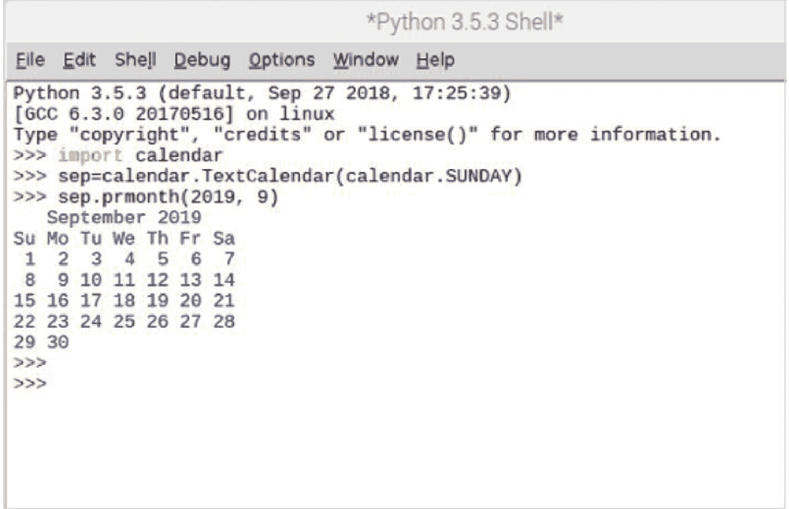

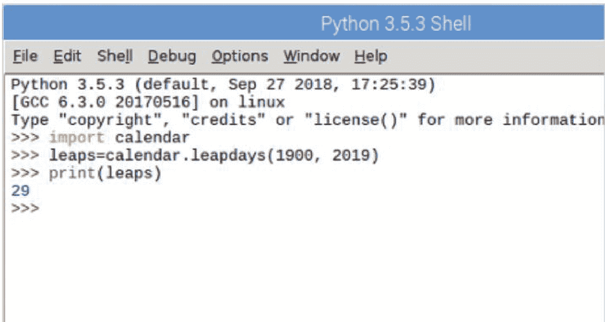

**步骤2** 可以看到2019年9月的日期以日历墙形式显示。当然你可以将第二行的`2019, 9`修改为任意年份月份，例如生日（1973, 6）。第一行将TextCalendar配置为从周日开始计算；也可选择从周一开始。

**步骤4** 甚至可将该示例改造为可交互的实用Python代码：

`import calendar`
`print(">>>>>>>>>>闰年计算器<<<<<<<<<<\n")`
`y1=int(input("请输入起始年份："))`
`y2=int(input("请输入结束年份："))`
`leaps=calendar.leapdays(y1, y2)`
`print("在", y1, "年至", y2, "年之间共有", leaps, "个闰年")`

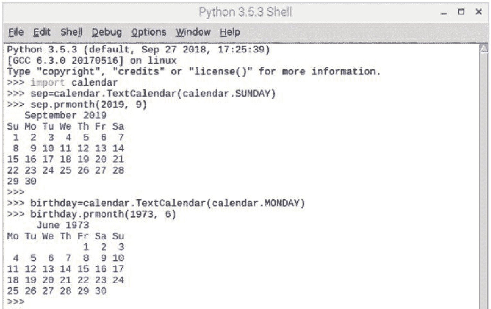

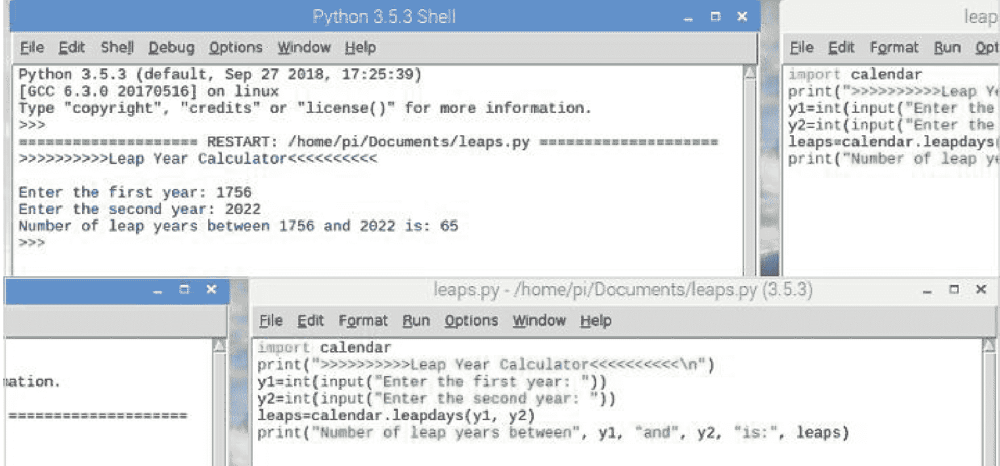## 日历模块

步骤 5 你还可以创建一个程序，显示给定年份中的所有日期、星期和月份：

```python
import calendar
year=int(input("Enter the year to display: "))
print(calendar.prcal(year))
```

我们相信你会同意，这是一段非常方便、值得掌握的代码。

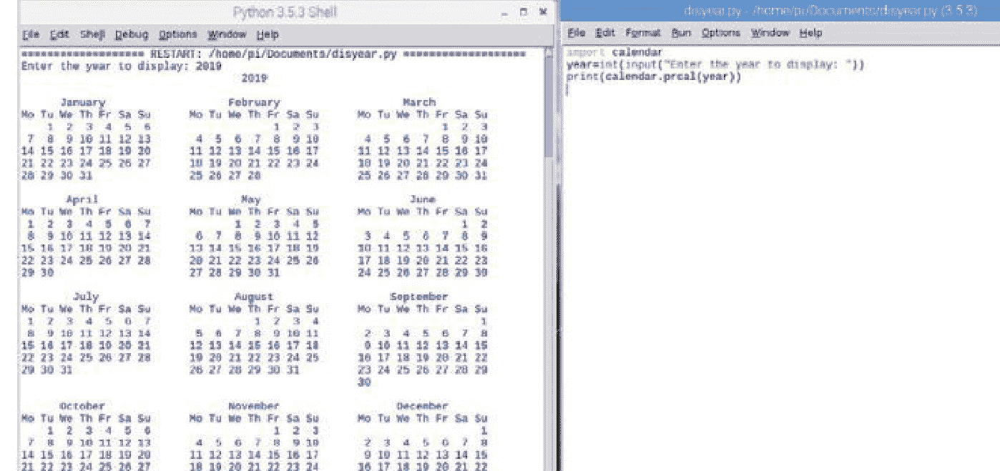

步骤 6 有趣的是，我们也可以通过一个简单的 for 循环来列出某个月的天数：

```python
import calendar
cal=calendar.TextCalendar(calendar.SUNDAY)
for i in cal.itermonthdays(2019, 6):
    print(i)
```

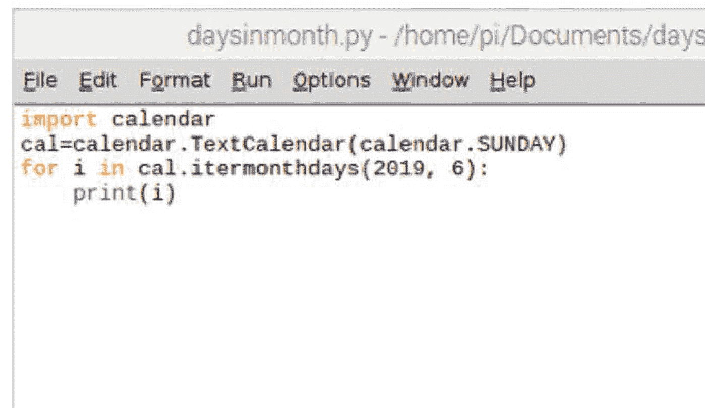

步骤 7 你可以看到，代码最初产生了一些零。这是由于起始星期日（本例中是星期日），加上与上个月重叠的日期。这意味着日期的计数将从2019年6月1日星期六开始，总共30天，正如输出正确显示的那样。

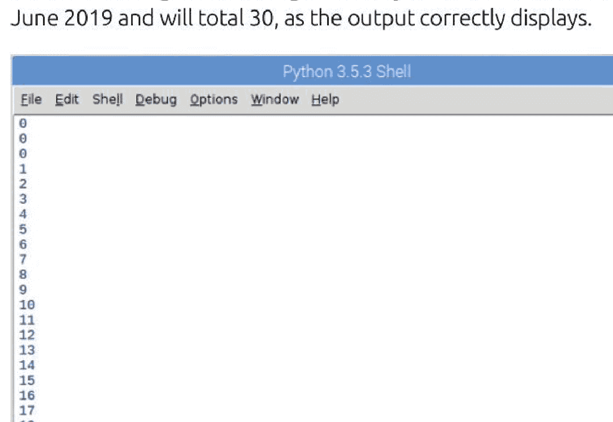

步骤 8 你还可以打印出单独的月份或星期几的名称：

```python
import calendar
for name in calendar.month_name:
    print(name)
import calendar
for name in calendar.day_name:
    print(name)
```

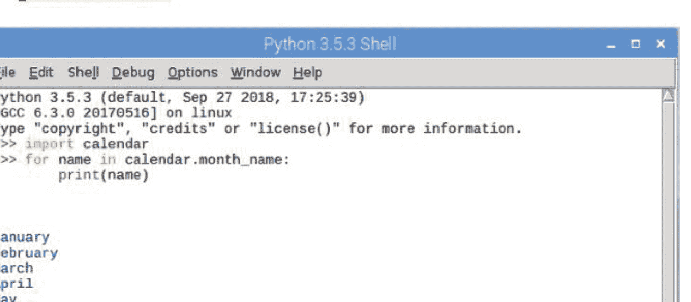

步骤 9 日历模块还允许我们将函数输出为HTML格式，以便在网站上显示。让我们从创建一个新文件开始：

```python
import calendar
cal=open("/home/pi/Documents/cal.html", "w")
c=calendar.HTMLCalendar(calendar.SUNDAY)
cal.write(c.formatmonth(2019, 1))
cal.close()
```

这段代码将创建一个名为cal的HTML文件，用浏览器打开它，就会显示2019年1月的日历。

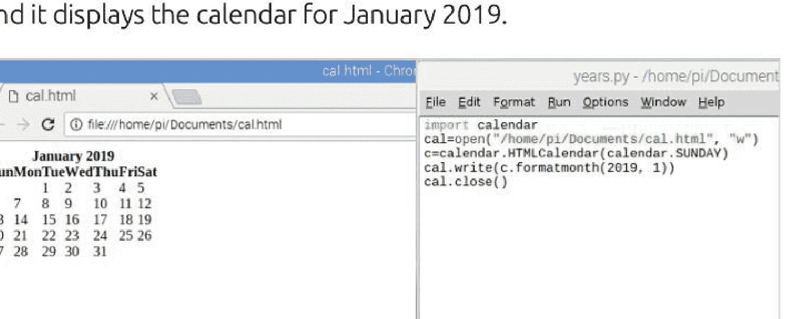

步骤 10 当然，你可以修改它，将给定年份显示为网页日历：

```python
import calendar
year=int(input("Enter the year to display as a webpage: "))
cal=open("/home/pi/Documents/cal.html", "w")
cal.write(calendar.HTMLCalendar(calendar.MONDAY).formatyear(year))
cal.close()
```

这段代码会询问用户一个年份，然后创建所需的网页。记得更改你的文件保存路径。

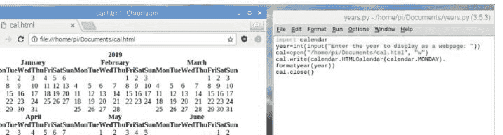

## OS模块

OS模块允许你直接与操作系统中的内置命令进行交互。命令因你运行的操作系统而异，因为有些命令适用于Windows，而另一些则适用于Linux和macOS。

### 进入系统

OS模块的主要功能之一是能够列出、移动、创建、删除以及以其他方式与系统上存储的文件进行交互，这使其成为编写备份代码的完美模块。

步骤 1 你可以从一些简单的函数开始使用OS模块，看看它如何与Python运行的操作系统环境交互。如果你使用的是Linux或树莓派，试试这个：

```python
import os
home=os.getcwd()
print(home)
```

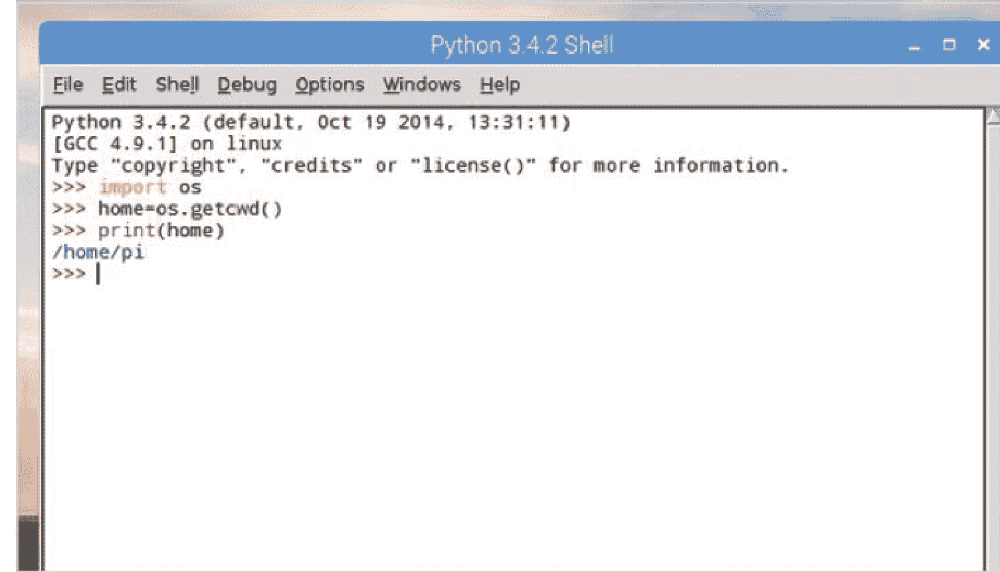

步骤 2 打印变量home返回的结果是系统中当前用户的主文件夹。在我们的例子中是/home/pi；它会因你登录的用户名和使用的操作系统而异。例如，Windows 10将输出：C:\Program Files (x86)\Python36-32。

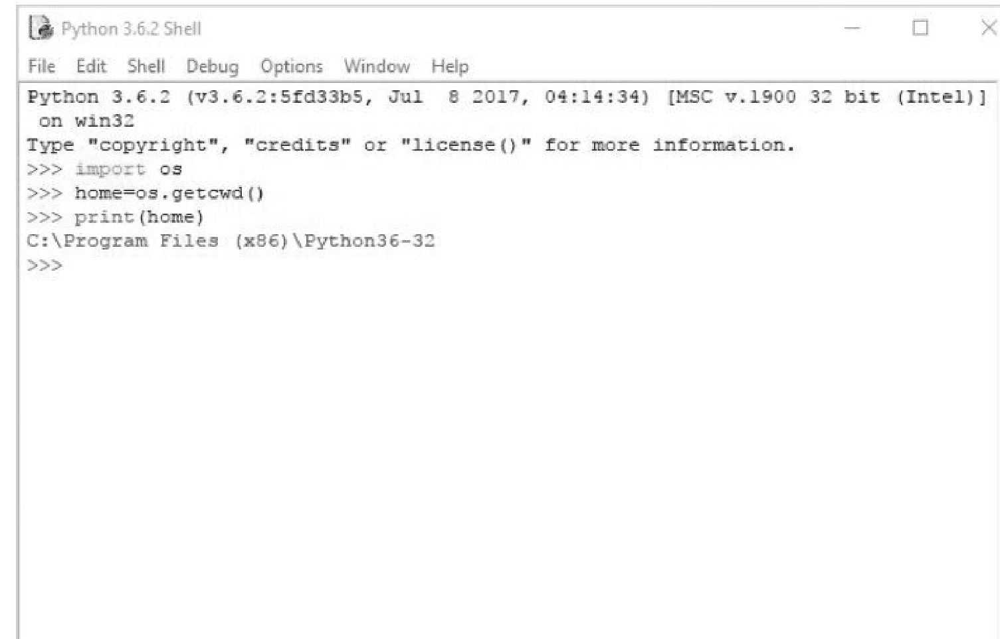

步骤 3 Windows的输出不同，因为那是由系统确定的Python当前工作目录；正如你可能猜测的那样，os.getcwd()函数是让Python获取当前工作目录。Linux用户会看到与树莓派类似的内容，macOS用户也是如此。

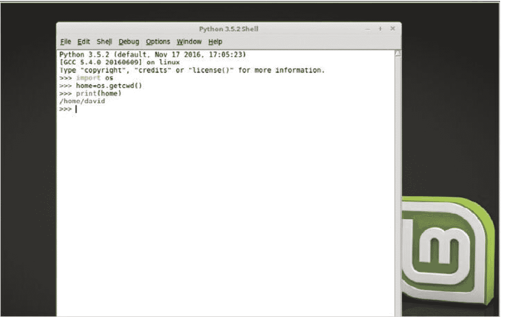

步骤 4 OS模块的另一个有趣之处在于它能够启动主机系统中安装的程序。例如，如果你想从Python程序中启动Chromium浏览器，可以使用以下命令：

```python
import os
browser=os.system("/usr/bin/chromium-browser")
```

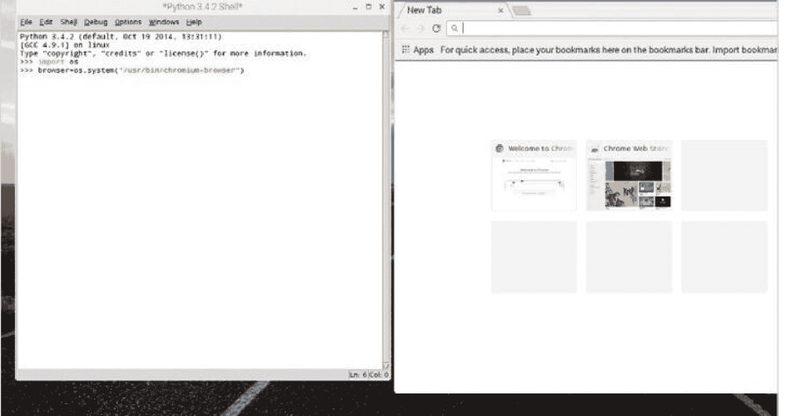

步骤 5 os.system()函数允许与外部程序交互；你甚至可以使用此方法调用之前的Python程序。显然，你需要知道完整的路径和程序文件名才能成功运行。不过，你可以使用以下代码：

```python
import os
os.system('start chrome "https://www.youtube.com/feed/music"')
```

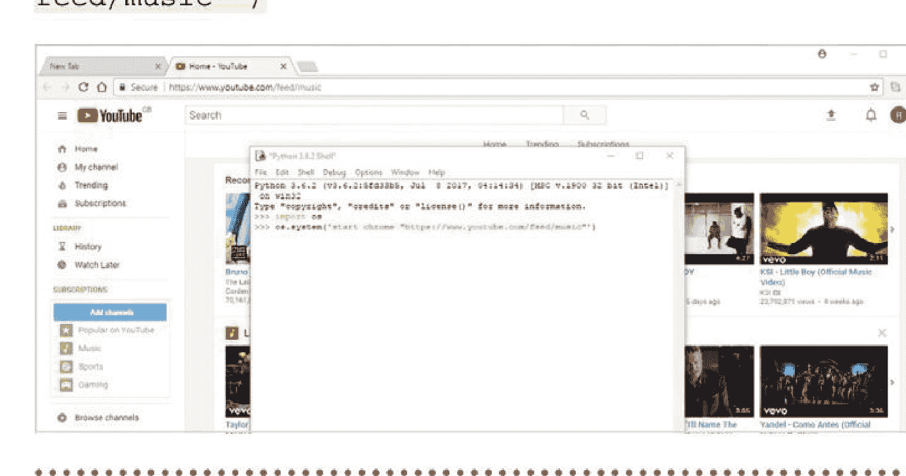

步骤 6 在步骤5的例子中，我们使用了Windows，以展示OS模块在所有平台上大致相同的工作方式。在那个例子中，我们打开了YouTube的音乐订阅页面，因此打开特定页面是可行的：

```python
import os
os.system('chromium-browser "http://bdmpublications.com/"')
```

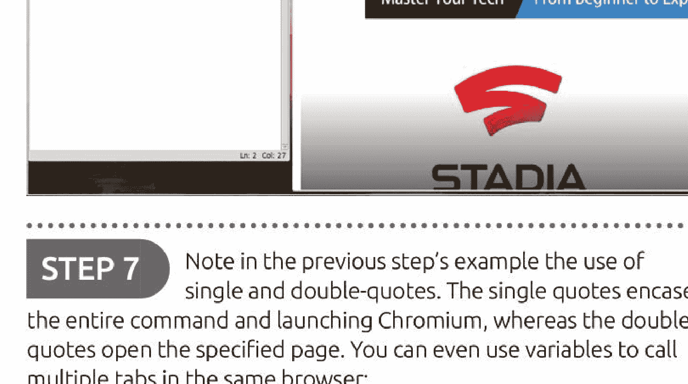

步骤 7 注意上一步示例中单引号和双引号的使用。单引号包裹整个命令并启动Chromium，而双引号用于打开指定的页面。你甚至可以使用变量在同一浏览器中调用多个标签页：

```python
import os
a=('chromium-browser "http://bdmpublications.com/"')
b=('chromium-browser "http://www.google.co.uk"')
os.system(a + b)
```


步骤 8 操作目录（或者你喜欢称之为文件夹）的能力是OS模块的最佳特性之一。例如，要创建一个新目录，你可以使用：

```python
import os
os.mkdir("NEW")
```

这将在当前工作目录中创建一个新目录，其名称由mkdir函数中的对象指定。

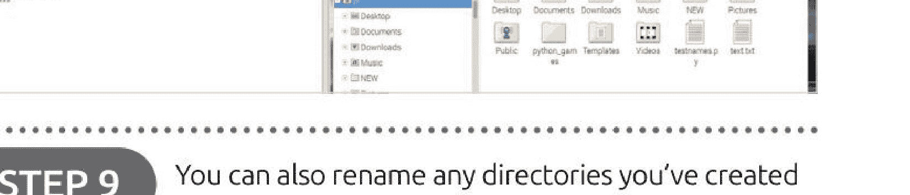

步骤 9 你也可以通过输入以下命令来重命名你创建的任何目录：

```python
import os
os.rename("NEW", "OLD")
```

要删除它们：

```python
import os
os.rmdir("OLD")
```

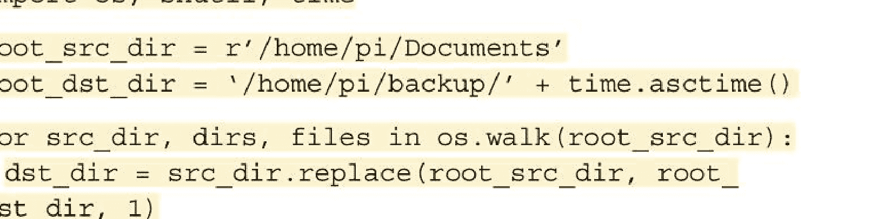

步骤 10 另一个与OS配合使用的模块是shutil。你可以将Shutil模块与OS和time模块一起使用，创建一个带时间戳的备份目录，并将文件复制到其中：

```python
import os, shutil, time

root_src_dir = r'/home/pi/Documents'
root_dst_dir = '/home/pi/backup/' + time.asctime()

for src_dir, dirs, files in os.walk(root_src_dir):
    dst_dir = src_dir.replace(root_src_dir, root_dst_dir, 1)
    if not os.path.exists(dst_dir):
        os.makedirs(dst_dir)
    for file_ in files:
        src_file = os.path.join(src_dir, file_)
        dst_file = os.path.join(dst_dir, file_)
        if os.path.exists(dst_file):
            os.remove(dst_file)
        shutil.copy(src_file, dst_dir)

print(">>>>>>>>>Backup complete<<<<<<<")
```


### 使用数学模块

你会遇到的最常用模块之一是数学模块。正如我们之前在本书中提到的，数学是编程的支柱，数学模块在你的代码中可以有难以置信的多种用途。

### E = MC^2

数学模块提供了大量数学函数的访问权限，从简单地显示圆周率的值，到帮助你创建复杂的3D形状。

步骤 1 数学模块是Python 3内置的；因此无需通过PIP安装。与其他现有模块一样，你可以通过在Shell中输入import math，或在编辑器中作为代码的一部分来导入模块的函数。

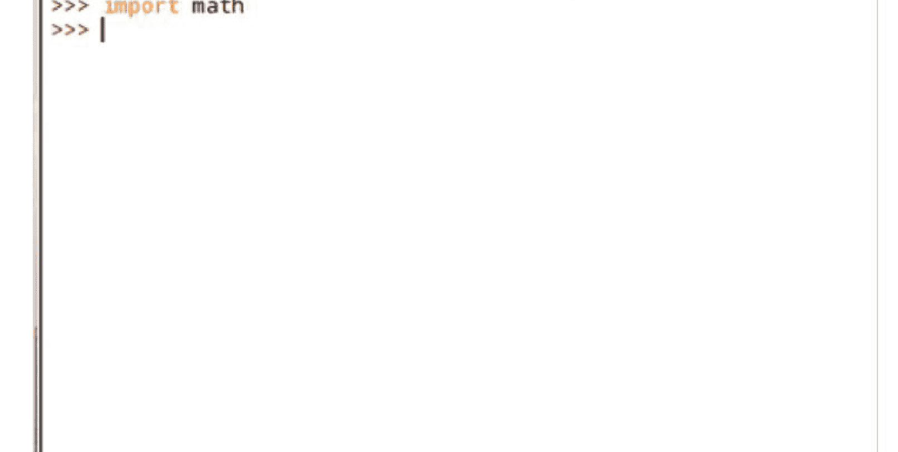

步骤 2 导入数学模块将使你能够访问模块的代码。从那里，你可以通过使用math后跟相关函数的名称来调用Math中任何可用的函数。例如，输入：math.sin(2) 这将显示2的正弦值。

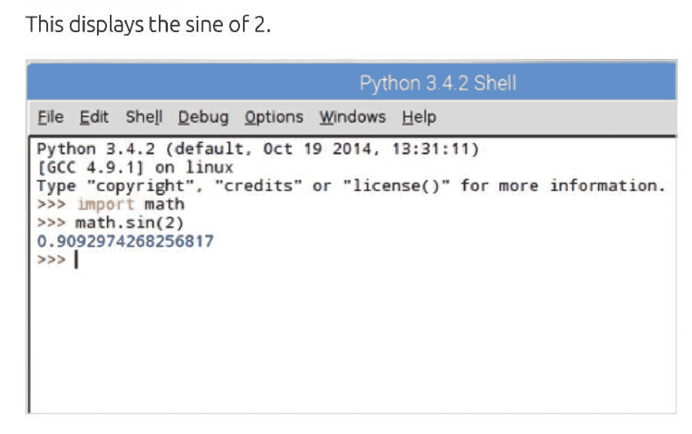

步骤 3 正如你现在无疑已经知道的，如果你知道模块中各个函数的名称，你可以专门导入它们。例如，Floor和Ceil函数分别对浮点数进行向下和向上取整：from math import floor, ceil floor(1.2) # 返回 1 ceil(1.2) # 返回 2

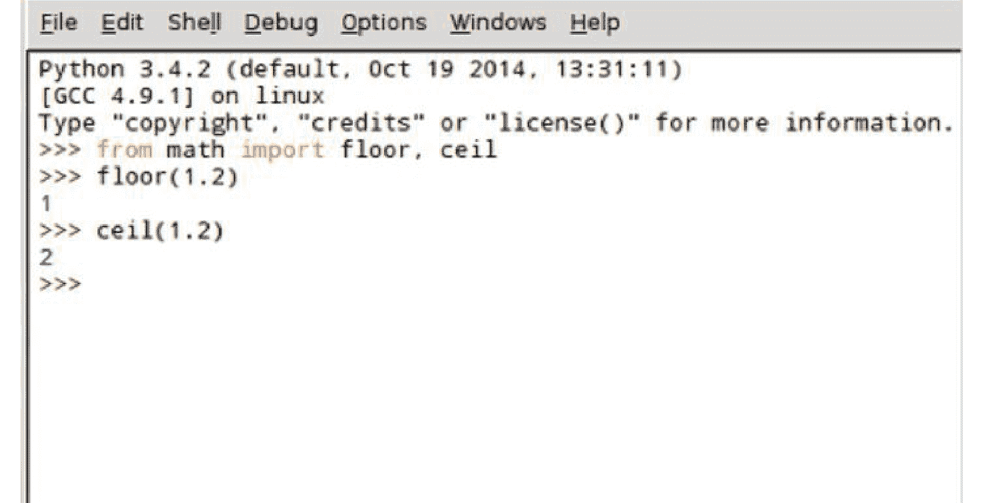

步骤 4 与Python中提供的其他模块一样，数学模块在导入时也可以重命名。这通常可以节省时间，但别忘了添加注释，以向查看你代码的其他人说明你做了什么：import math as m m.trunc(123.45) # Truncate 移除小数部分

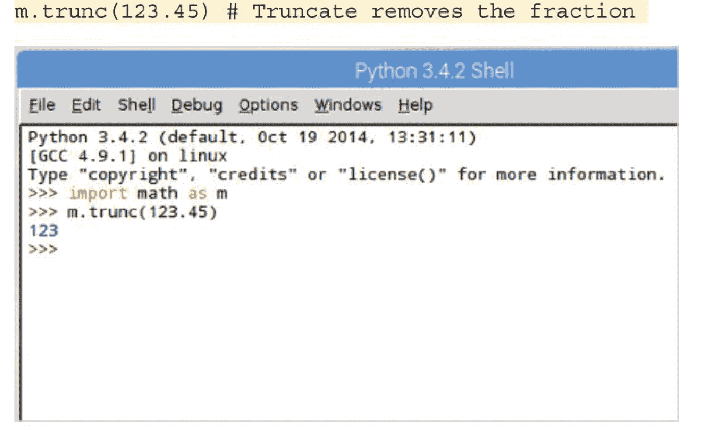

### 使用数学模块

步骤 5：虽然不常见，但可以从模块中导入函数并重命名。在此示例中，我们从 math 模块导入 floor 函数并将其重命名为 f。虽然在使用冗长代码时，此过程可能很快变得混乱：

```python
from math import floor as f
f(1.2)
```

步骤 8：为了进一步提高精度，当涉及数字时，可以使用 exp 和 expm1 函数来计算精确值：

```python
from math import exp, expm1
exp(1e-5) - 1 # 值精确到 11 位
expm1(1e-5) # 结果精确到完整精度
```

步骤 6：可以通过输入以下命令导入数学模块的所有函数：
虽然这很方便，但开发社区通常不赞成这样做，因为它会占用不必要的资源，并且不是一种高效的编码方式。然而，如果它对你有用，那就继续吧。

```python
from math import *
```

步骤 9：这种精度水平确实令人印象深刻，但在大多数情况下相当小众。可能最常用的两个函数是 e 和 Pi，其中 e 是等于 2.71828 的数值常数（即圆的周长除以其直径）：

```python
import math
print(math.e)
print(math.pi)
```

步骤 7：有趣的是，数学模块中的某些函数比其他函数更准确，或者更准确地说，设计为返回更准确的值。例如：
将返回值 0.999999999。而：
返回值 1.0。

```python
sum([.1, .1, .1, .1, .1, .1, .1, .1, .1, .1])
fsum([.1, .1, .1, .1, .1, .1, .1, .1, .1, .1])
```

步骤 10：数学模块提供的丰富数学函数涵盖了从因数到无穷大、幂到三角函数、角度转换到常数的所有内容。请查看 https://docs.python.org/3/library/math.html# 获取可用数学模块函数的列表。

## 随机模块

随机模块是你在 Python 编程生涯中可能会多次遇到的模块；顾名思义，它旨在创建随机数或字母。然而，它并非完全随机，但对于大多数需求来说已经足够了。

### 随机数

随机模块中有许多函数，应用时可以创建一些有趣且非常有用的 Python 程序。

步骤 1

与其他模块一样，你需要先导入 random 模块，然后才能使用本教程中我们将要介绍的任何函数。让我们从简单地打印一个 1 到 5 之间的随机数开始：

```python
import random
print(random.randint(0,5))
```

步骤 2

在我们的示例中，返回了数字四。然而，再输入几次 print 函数，它将显示从给定数字集合（零到五）中得出的不同整数值。总体效果虽然是伪随机的，但对于普通程序员在代码中使用来说已经足够了。

步骤 3

对于更大的数字集合，包括浮点值，你可以使用乘法符号来扩展范围：

```python
import random
print(random.random() *100)
```

将显示一个介于 0 和 100 之间的浮点数，大约有十五位小数。

步骤 4

然而，随机模块并非仅用于数字。你可以使用它从列表中随机选择一个条目，列表可以包含任何内容：

```python
import random
random.choice(["Conan", "Valeria", "Belit"])
```

这将随机显示我们冒险家中的一个名字，这对于文字冒险游戏来说是一个很棒的补充。

步骤 5

你可以通过让 random.choice() 从混合变量列表中选择来扩展前面的示例。例如：

```python
import random
lst=["David", 44, "BDM Publications", 3245.23, "Pi", True, 3.14, "Python"]
rnd=random.choice(lst)
print(rnd)
```

步骤 6

有趣的是，你还可以使用随机模块中的一个函数来打乱列表中的项目，从而在方程式中添加更多的随机性：

```python
random.shuffle(lst)
print(lst)
```

这样，你可以在显示随机项目之前不断打乱列表。

步骤 9

让我们使用一段示例代码，该代码模拟抛硬币一万次，并计算正面或反面朝上的次数：

```python
import random
output={"Heads":0, "Tails":0}
coin=list(output.keys())
for i in range(10000):
    output[random.choice(coin)]+=1

print("Heads:", output["Heads"])
print("Tails:", output["Tails"])
```

步骤 7

使用 shuffle，你可以创建一个完全随机的数字列表。例如，在给定范围内：

```python
import random
lst=[[i] for i in range(20)]
random.shuffle(lst)
print(lst)
```

不断打乱列表，每次都可以从 0 到 20 中获得不同的项目选择。

步骤 10

这是一段有趣的代码。使用一个包含 46.6 万个单词的文本文件，你可以从文件中随机提取用户指定数量的单词（文本文件位于：www.github.com/dwyl/english-words）：

```python
import random

print(">>>>随机单词查找器<<<<<")
print("\n使用一个 466K 的英文单词文本文件，我可以随机挑选任何单词。\n")

wds=int(input("\n我应该选择多少个单词？ "))

with open("/home/pi/Downloads/words.txt", "rt") as f:
    words = f.readlines()
    words = [w.rstrip() for w in words]

print("---------------------")
for w in random.sample(words, wds):
    print(w)
print("---------------------")
```

步骤 8

你还可以使用 start、stop、step 循环从给定范围中按步长选择随机数：

```python
import random
for i in range(10):
    print(random.randrange(0, 200, 7))
```

结果会有所不同，但你可以大致了解它的工作原理。

### Tkinter 模块

虽然从命令行甚至 Shell 运行代码完全没问题，但 Python 的能力远不止于此。Tkinter 模块使程序员能够设置图形用户界面与用户交互，而且它功能强大得令人惊讶。

### 获取 GUI

Tkinter 易于使用，但你可以用它做更多的事情。让我们从了解它的工作原理并编写一些代码开始。不久你就会发现这个模块的强大之处。

步骤 1

Tkinter 通常内置于 Python 3 中。但是，如果输入 `import tkinter` 时不可用，则需要从命令提示符使用 pip install tkinter 进行安装。我们可以开始以不同于以前的方式导入模块，以节省输入时间，并通过导入其所有内容：

```python
import tkinter as tk
from tkinter import *
```

步骤 2

不建议使用星号从模块导入所有内容，但通常不会造成任何危害。让我们从创建一个基本的 GUI 窗口开始，输入：

```python
wind=Tk()
```

这将创建一个小型、基本的窗口。此时没有太多其他事情可做，只需单击角落的 X 即可关闭窗口。

步骤 3

理想的方法是在代码中添加 mainloop() 来控制 Tkinter 事件循环，但我们很快就会讲到这一点。你刚刚创建了一个 Tkinter 小部件，我们还可以尝试更多：

```python
btn=Button()
btn.pack()
btn['text']='Hello everyone!'
```

第一行专注于新创建的窗口。单击回 Shell 并继续其他行。

步骤 4

你可以将上述内容组合到一个新文件中：

```python
import tkinter as tk
from tkinter import *
btn=Button()
btn.pack()
btn['text']='Hello everyone!'
```

然后添加一些按钮交互：

```python
def click():
    print('You just clicked me!')
btn['command']=click
```

### Tkinter 模块

步骤 5 保存并执行步骤 5 中的代码，随后一个包含“大家好！”的窗口将会出现。如果你点击“大家好！”按钮，Shell 将会输出文本“你刚刚点击了我！”。虽然简单，但这展示了仅用几行代码能实现什么。

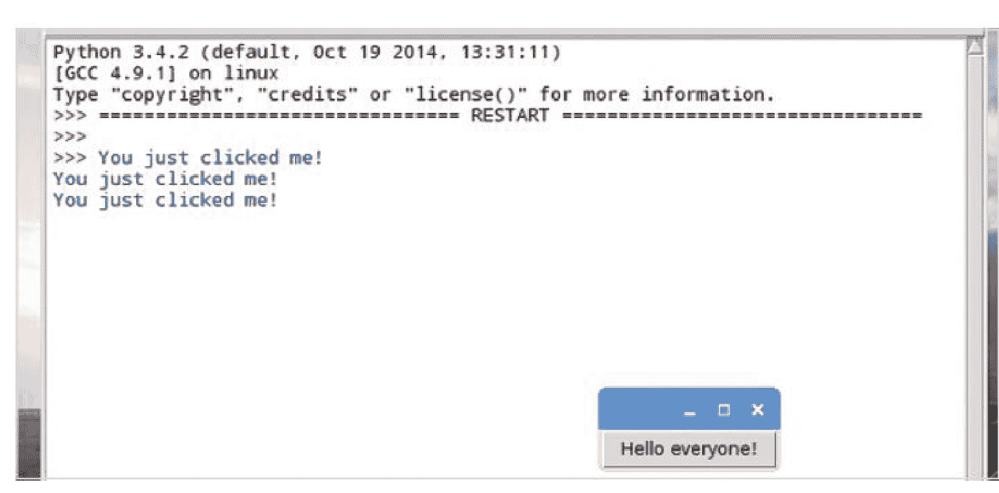

步骤 6 你也可以在 Tkinter 窗口中同时显示文本和图像。不过，仅支持 GIF、PGM 或 PPM 格式。因此，使用代码前请先找到一张图像并进行格式转换。这里有一个使用 BDM Publishing 标志的示例：

```
from tkinter import *

root = Tk()
logo = PhotoImage(file="/home/pi/Downloads/BDM_logo.gif")
w1 = Label(root, root.title("BDM Publications"), image=logo).pack(side="right")
content = """ From its humble beginnings in 2004, the BDM brand quickly grew from a single publication produced by a team of just two to one of the biggest names in global bookazine publishing, for two simple reasons. Our passion and commitment to deliver the very best product each and every volume. While the company has grown with a portfolio of over 250 publications delivered by our international staff, the foundation that it has been built upon remains the same, which is why we believe BDM isn't just the first choice it's the only choice for the smart consumer. """
w2 = Label(root,
    justify=LEFT,
    padx = 10,
    text=content).pack(side="left")
root.mainloop()
```

步骤 7 之前的代码相当冗长，主要是因为 `content` 变量包含了来自公司网站的 BDM 关于页面的部分内容。显然，你可以根据需要修改 `content`、`root.title` 以及图像。

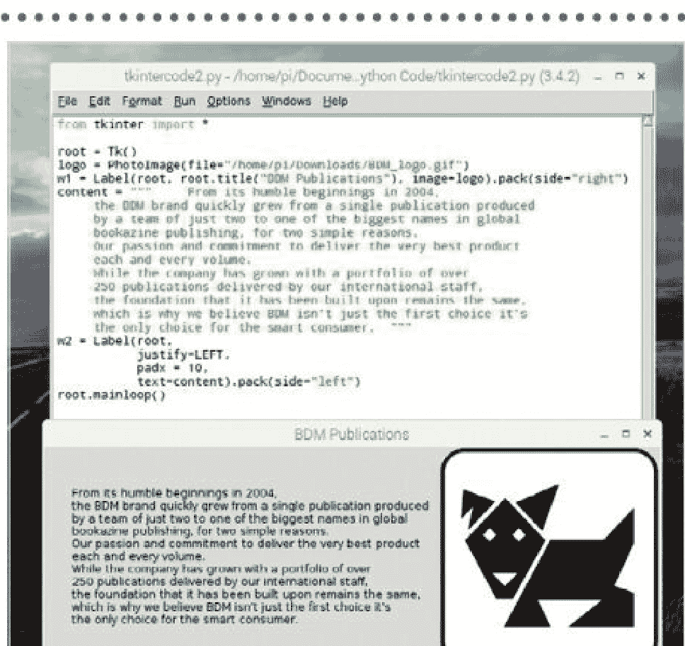

步骤 8 你也可以创建单选按钮。试试看：

```
from tkinter import *

root = Tk()
v = IntVar()

Label(root, root.title("Options"), text="""Choose a preferred language:""",
    justify = LEFT, padx = 20).pack()
Radiobutton(root,
    text="Python",
    padx = 20,
    variable=v,
    value=1).pack(anchor=W)
Radiobutton(root,
    text="C++",
    padx = 20,
    variable=v,
    value=2).pack(anchor=W)

mainloop()
```

步骤 9 你还可以创建复选框，带有按钮并能输出到 Shell：

```
from tkinter import *
root = Tk()

def var_states():
    print("Warrior: %d,\nMage: %d" % (var1.get(), var2.get()))

Label(root, root.title("Adventure Game"), text=">>>>>>>>>Your adventure role<<<<<<<<<<").grid(row=0, sticky=N)
var1 = IntVar()
Checkbutton(root, text="Warrior", variable=var1).grid(row=1, sticky=W)
var2 = IntVar()
Checkbutton(root, text="Mage", variable=var2).grid(row=2, sticky=W)
Button(root, text='Quit', command=root.destroy).grid(row=3, sticky=W, pady=4)
Button(root, text='Show', command=var_states).grid(row=3, sticky=E, pady=4)

mainloop()
```

步骤 10 步骤 9 中的代码为 Tkinter 引入了一些新的布局元素。注意 `sticky=N`、`E` 和 `W` 参数。这些参数描述了复选框和按钮的位置（北、东、南和西）。`row` 参数将它们放置在不同的行上。动手试试看你能得到什么结果。

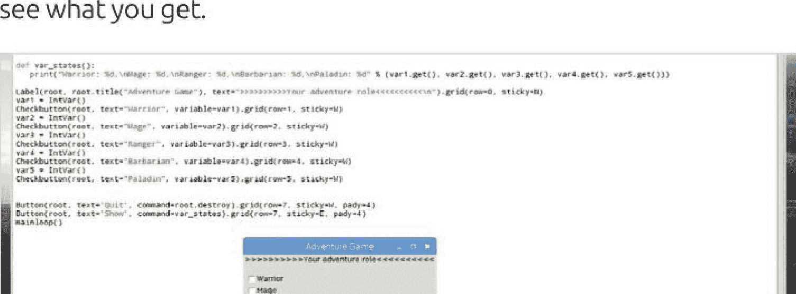

### Pygame 模块

我们已经简要了解过 Pygame 模块，但它还有很多需要探索的内容。Pygame 的开发旨在帮助 Python 程序员创建图形化或基于文本的游戏。

### Pygame

Pygame 并非 Python 的固有模块，但使用树莓派的用户会发现它已预先安装。其他用户则需要使用：`pip install pygame`（从命令提示符执行）。

### 步骤 1
自然，在能够使用 Pygame 模块之前，你需要先将它们加载到内存中。完成后，在使用任何函数之前，用户需要先对其进行初始化：

```
import pygame
pygame.init()
```

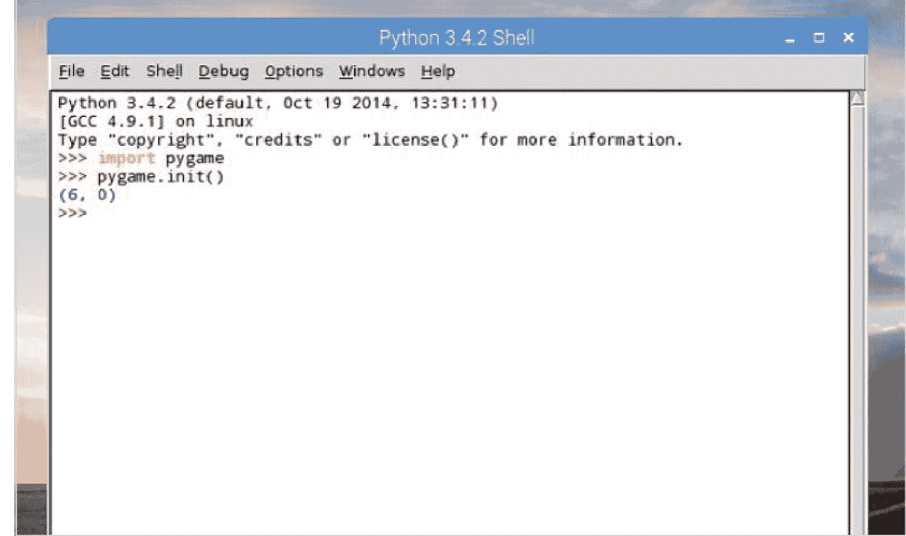

### 步骤 2
让我们创建一个简单的游戏窗口，并为其添加标题：

```
gamewindow=pygame.display.set_mode((800,600))
pygame.display.set_caption("Adventure Game")
```

你可以看到，输入第一行后，你需要点击回到 IDLE Shell 以继续输入代码；同时，你可以将窗口标题更改为任何你喜欢的名称。

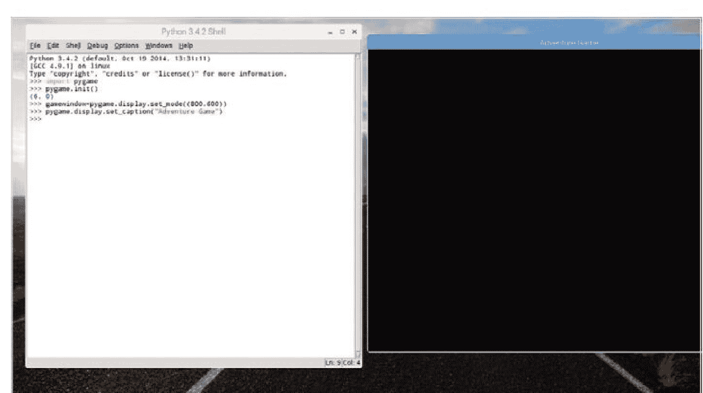

### 步骤 3
遗憾的是，如果不关闭 Python IDLE Shell，就无法关闭新创建的 Pygame 窗口，这不太实用。因此，你需要在编辑器中工作（新建 > 文件），并创建一个 `True/False` 的 `while` 循环：

```
import pygame
from pygame.locals import *
pygame.init()

gamewindow=pygame.display.set_mode((800,600))
pygame.display.set_caption("Adventure Game")

running=True

while running:
    for event in pygame.event.get():
        if event.type==QUIT:
            running=False
            pygame.quit()
```

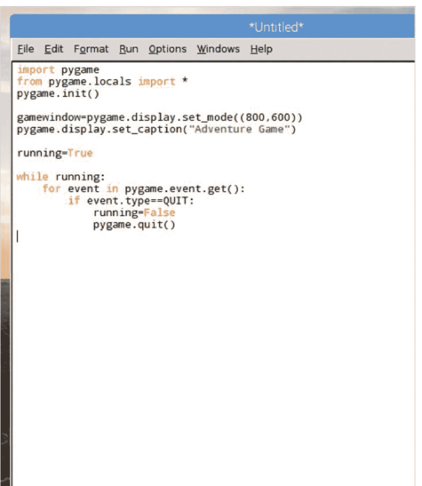

### 步骤 4
如果 Pygame 窗口仍然无法关闭，请不要担心，这仅仅是 IDLE（基于 Tkinter 编写）与 Pygame 模块之间的差异造成的。如果你通过命令行运行代码，它会完美关闭。

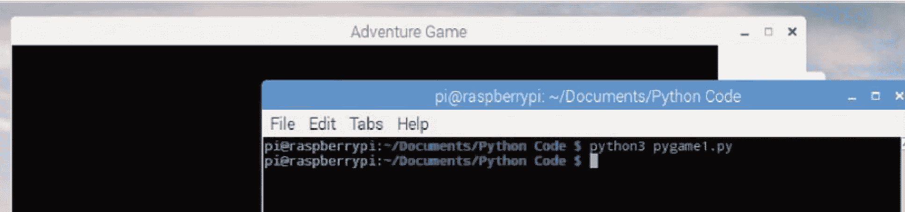

### 步骤 5
现在我们要稍微调整一下代码结构，在 `while` 循环内运行主要的 Pygame 代码；这样可以使代码更整洁且易于理解。我们已经下载了一个图形，并需要为 pygame 设置一些参数：

```
import pygame
pygame.init()

running=True

while running:
    gamewindow=pygame.display.set_mode((800,600))
    pygame.display.set_caption("Adventure Game")
    black=(0,0,0)
    white=(255,255,255)
    img=pygame.image.load("/home/pi/Downloads/sprite1.png")

    def sprite(x,y):
        gamewindow.blit(img, (x,y))

    x=(800*0.45)
    y=(600*0.8)

    gamewindow.fill(white)
    sprite(x,y)
    pygame.display.update()

    for event in pygame.event.get():
        if event.type==pygame.QUIT:
            running=False
```

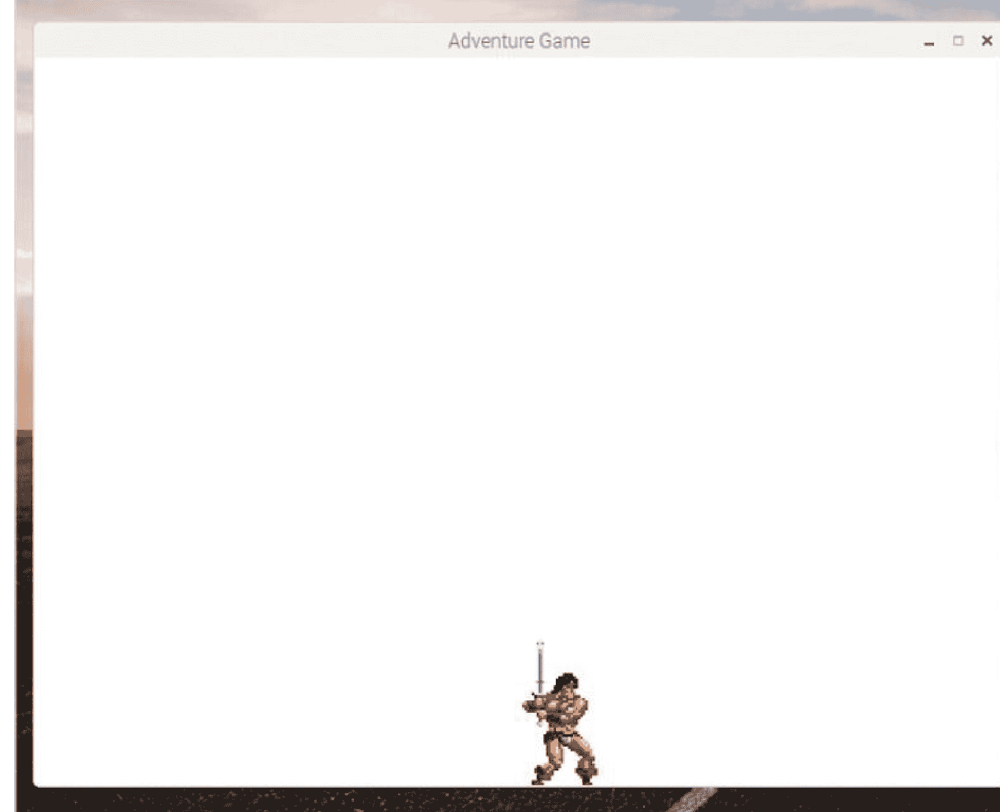

### 步骤 6
我们快速过一下代码的变化。我们定义了两种颜色 `black` 和 `white`，以及它们各自的 RGB 颜色值。接下来，我们加载了下载的图像 `sprite1.png` 并将其赋值给变量 `img`；同时定义了一个 `sprite` 函数，`Blit` 函数将允许我们最终移动图像。

```
import pygame
from pygame.locals import *
pygame.init()

running=True

while running:
    gamewindow=pygame.display.set_mode((800,600))
    pygame.display.set_caption("Adventure Game")
    black=(0,0,0)
    white=(255,255,255)
    img=pygame.image.load("/home/pi/Downloads/sprite1.png")

    def sprite(x,y):
        gamewindow.blit(img, (x,y))

    x=(800*0.45)
    y=(600*0.8)

    gamewindow.fill(white)
    sprite(x,y)
    pygame.display.update()

    for event in pygame.event.get():
        if event.type==QUIT:
            running=False
            pygame.quit()
```

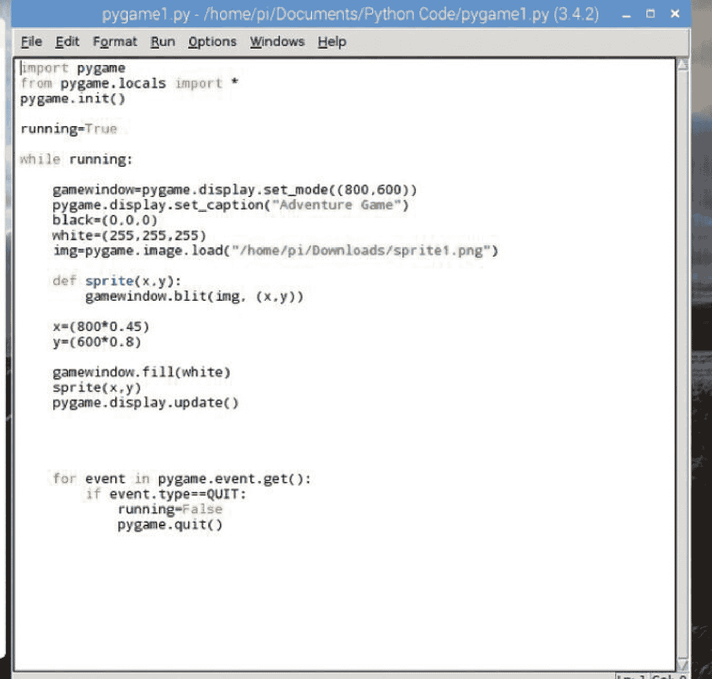

## 使用模块

### 步骤 7
现在我们可以再次调整代码，这次在 `while` 循环内包含一个移动选项，并添加在屏幕上移动精灵所需的变量：

```
import pygame
from pygame.locals import *
pygame.init()

running=True

gamewindow=pygame.display.set_mode((800,600))
pygame.display.set_caption("Adventure Game")
black=(0,0,0)
white=(255,255,255)
img=pygame.image.load("/home/pi/Downloads/sprite1.png")

def sprite(x,y):
    gamewindow.blit(img, (x,y))

x=(800*0.45)
y=(600*0.8)
xchange=0
imgspeed=0

while running:
    for event in pygame.event.get():
        if event.type==QUIT:
            running=False

        if event.type == pygame.KEYDOWN:
            if event.key==pygame.K_LEFT:
                xchange=-5
            elif event.key==pygame.K_RIGHT:
                xchange=5
        if event.type==pygame.KEYUP:
            if event.key==pygame.K_LEFT or event.key==pygame.K_RIGHT:
                xchange=0

    x += xchange

    gamewindow.fill(white)
    sprite(x,y)
    pygame.display.update()

pygame.quit()
```

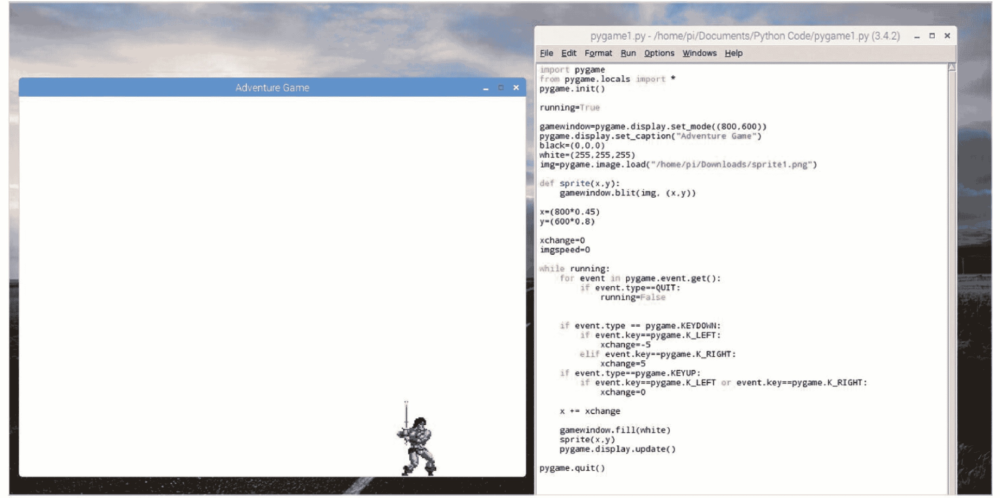

### 步骤 8
将代码复制下来，使用键盘上的左右箭头键，你就可以在屏幕底部移动你的精灵了。现在，看起来你已经掌握了制作经典街机 2D 横版卷轴游戏的基础。

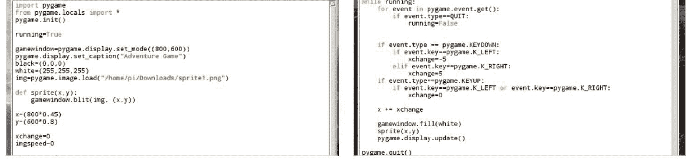

### Pygame 模块

**步骤 9** 现在你可以实现一些新增功能，并利用之前教程中的代码。新元素是 Subprocess 模块，其中一个函数允许我们从一个 Python 脚本内部启动另一个；我们将创建一个名为 `pygametxt.py` 的新文件：

```
import pygame
import time
import subprocess
pygame.init()
screen = pygame.display.set_mode((800, 250))
clock = pygame.time.Clock()

font = pygame.font.Font (None, 25)

pygame.time.set_timer(pygame.USEREVENT, 200)

def text_generator(text):
    tmp = ''
    for letter in text:
        tmp += letter
        if letter != ' ':
            yield tmp

class DynamicText(object):
    def __init__(self, font, text, pos, autoreset=False):
        self.done = False
        self.font = font
        self.text = text
        self._gen = text_generator(self.text)
        self.pos = pos
        self.autoreset = autoreset
        self.update()

    def reset(self):
        self._gen = text_generator(self.text)
        self.done = False
        self.update()

    def update(self):
        if not self.done:
            try: self.rendered = self.font.render(next(self._gen), True, (0, 128, 0))
            except StopIteration:
                self.done = True
                time.sleep(10)
                subprocess.Popen("python3 /home/pi/Documents/Python\ Code/pygame1.py 1", shell=True)

    def draw(self, screen):
        screen.blit(self.rendered, self.pos)

text=("A long time ago, a barbarian strode from the frozen north. Sword in hand...")
message = DynamicText(font, text, (65, 120), autoreset=True)

while True:
    for event in pygame.event.get():
        if event.type == pygame.QUIT: break
        if event.type == pygame.USEREVENT: message.update()
    else:
        screen.fill(pygame.color.Color('black'))
        message.draw(screen)
        pygame.display.flip()
        clock.tick(60)
        continue
    break
pygame.quit()
```

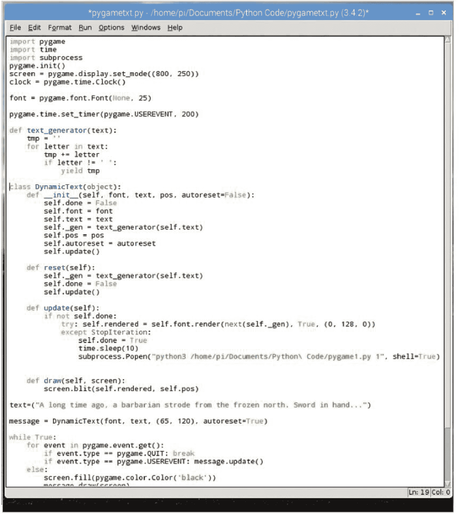

**步骤 10** 运行此代码时，它将显示一个狭长的 Pygame 窗口，介绍文字向右滚动。暂停十秒后，它会启动主游戏 Python 脚本，你可以在其中移动战士精灵。总体效果相当不错，但总有改进的空间。

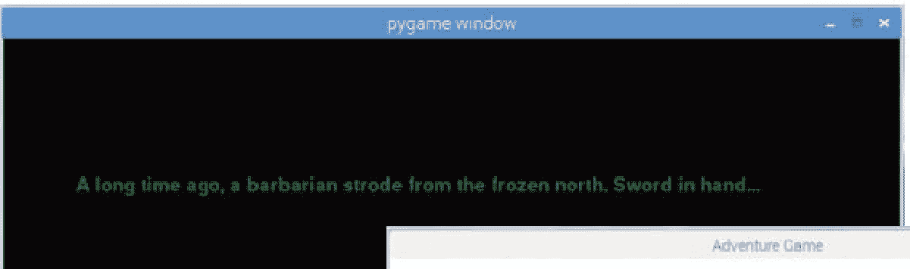

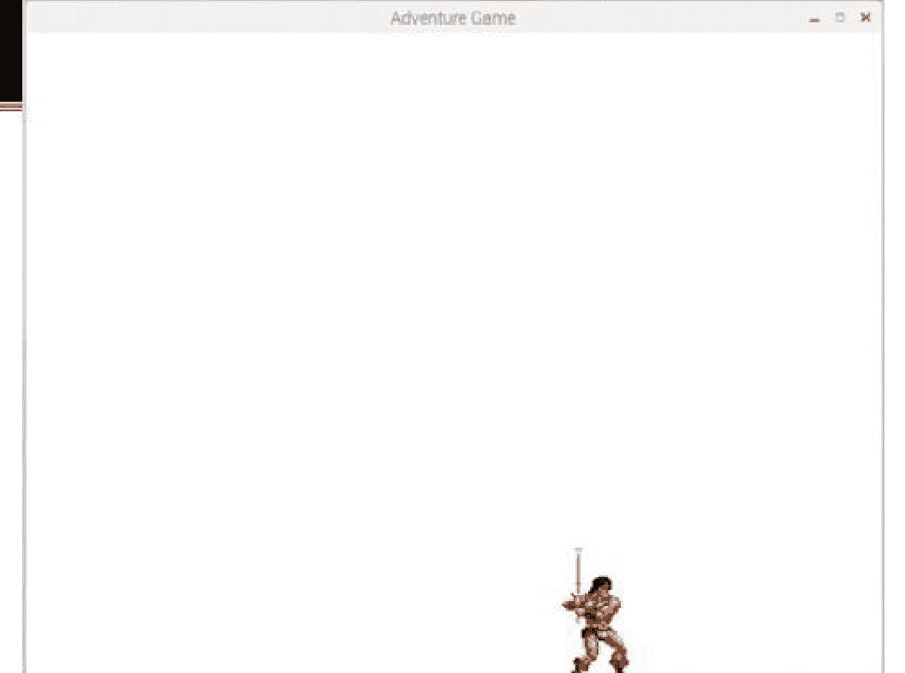

## 基础动画

Python 的模块使得创建形状、显示图形并相应地制作动画变得相对容易。然而，动画在代码中可能是一个棘手的元素。实现相同最终结果的方法有很多种，我们将在此向你展示其中一种。

## 灯光、摄像机、开拍

Tkinter 模块是学习 Python 动画的理想起点。当然，市面上有更好的自定义模块，但 Tkinter 足以胜任，让你掌握所需知识。

**步骤 1** 让我们制作一个弹跳球动画。首先，我们需要创建一个画布（窗口）和要制作动画的球：

```
from tkinter import *
import time

gui = Tk()
gui.geometry("800x600")
gui.title("Pi Animation")
canvas = Canvas(gui,
width=800,height=600,bg='white')
canvas.pack()

ball1 = canvas.create_oval(5,5,60,60, fill='red')

gui.mainloop()
```

**步骤 2** 保存并运行代码。你将看到一个空白窗口出现，一个红球位于窗口的左上角。虽然这很棒，但动画效果不强。让我们添加以下代码：

```
a = 5
b = 5

for x in range(0,100):
    canvas.move(ball1,a,b)
    gui.update()
    time.sleep(.01)
```

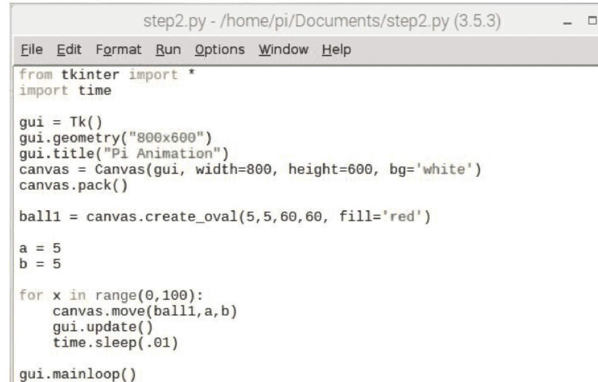

**步骤 3** 将新代码插入 `ball1 = canvas.create_oval(5,5,60,60, fill='red')` 行和 `gui.mainloop()` 行之间。保存并运行。现在你将看到球从动画窗口的左上角移动到右下角。你可以通过修改 `time.sleep(.01)` 行来改变球穿越窗口的速度。试试 (.05)。

**步骤 4** `canvas.move(ball1,a,b)` 行是使球从一个角移动到另一个角的部分；显然 a 和 b 都等于 5。我们已经可以稍微改变一些东西，比如球的大小和颜色，使用行：`ball1 = canvas.create_oval(5,5,60,60, fill='red')`，我们还可以将 a 和 b 的值改为其他值。

```
ball1 = canvas.create_oval(7,7,60,60, fill='red')

a = 8
b = 3

for x in range(0,100):
    canvas.move(ball1,a,b)
    gui.update()
    time.sleep(.05)
```

**步骤 5** 让我们看看是否能让球动画化，使其在窗口中弹跳，直到你关闭程序。

```
xa = 5
ya = 10
while True:
    canvas.move(ball1,xa,ya)
    pos=canvas.coords(ball1)
    if pos[3] >= 600 or pos[1] <= 0:
        ya = -ya
    if pos[2] >= 800 or pos[0] <= 0:
        xa = -xa
    gui.update()
    time.sleep(.025)
```

**步骤 6** 删除你在步骤 2 中输入的代码，并将步骤 5 中的代码插入其位置；同样，在 `ball1 = canvas.create_oval(5,5,60,60, fill='red')` 和 `gui.mainloop()` 行之间。保存代码并正常运行。如果你正确输入了代码，那么你将看到红球在窗口边缘弹跳，直到你关闭程序。

**步骤 7** 弹跳动画发生在 While True 循环中。首先，我们在循环前有 xa 和 ya 的值，分别为 5 和 10。`pos=canvas.coords(ball1)` 行获取球在窗口中位置的值。当它达到窗口的极限，800 或 600 时，它将使值变为负数；使球在屏幕上移动。

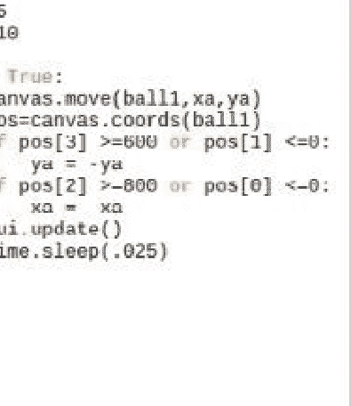

**步骤 8** 然而，Pygame 是一个更好的模块，用于制作更高级的动画。首先创建一个新文件并输入：

```
import pygame
from random import randrange

MAX_STARS = 250
STAR_SPEED = 2

def init_stars(screen):
    """ Create the starfield """
    global stars
    stars = []
    for i in range(MAX_STARS):
        # A star is represented as a list with this
        # format: [X,Y]
        star = [randrange(0,screen.get_width() - 1),
                randrange(0,screen.get_height() - 1)]
        stars.append(star)

def move_and_draw_stars(screen):
    """ Move and draw the stars """
    global stars
    for star in stars:
        star[1] += STAR_SPEED
        if star[1] >= screen.get_height():
            star[1] = 0
            star[0] = randrange(0,639)
        screen.set_at(star, (255,255,255))
```

**步骤 9** 现在添加以下内容：

```
def main():
    pygame.init()
    screen = pygame.display.set_mode((640,480))
    pygame.display.set_caption("Starfield Simulation")
    clock = pygame.time.Clock()
    init_stars(screen)
    while True:
        # Lock the framerate at 50 FPS
        clock.tick(50)
        # Handle events
        for event in pygame.event.get():
            if event.type == pygame.QUIT:
                return
        screen.fill((0,0,0))
        move_and_draw_stars(screen)
        pygame.display.flip()

if __name__ == "__main__":
    main()
```

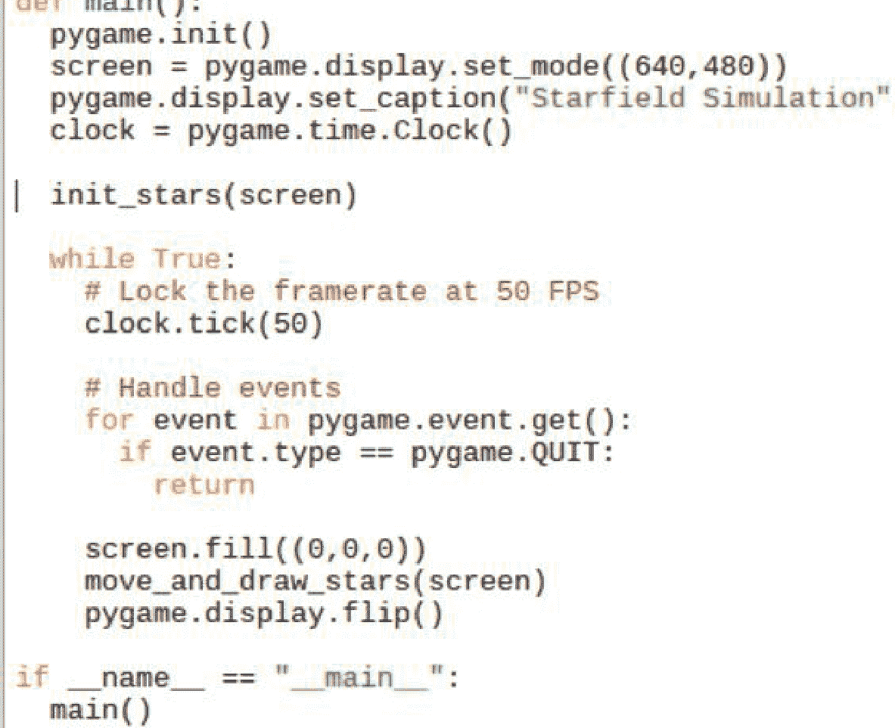

**步骤 10** 保存并运行代码。你会同意模拟星空代码看起来相当令人印象深刻。想象一下，这是某个游戏代码的开始，甚至是演示文稿的开始？结合使用 Pygame 和 Tkinter，你的 Python 动画将看起来非常棒。

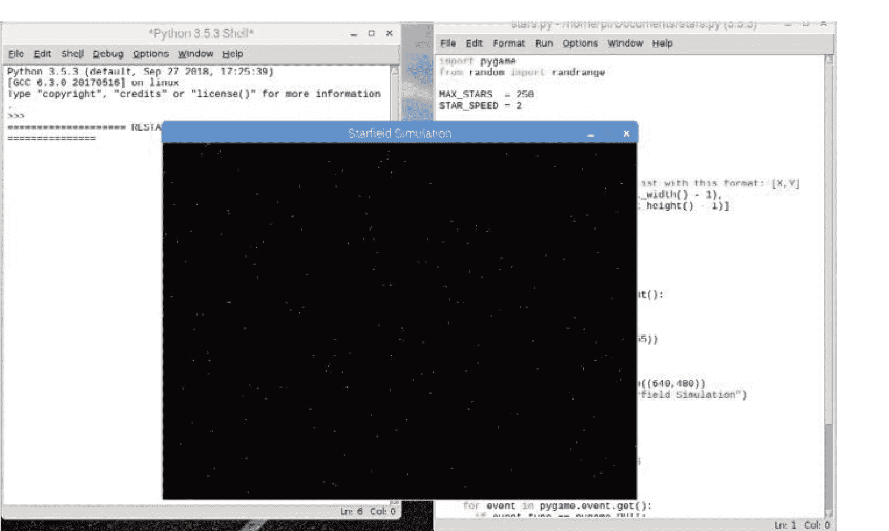

## 创建你自己的模块

如果你将大型程序分解成更小的部分，并将需要的部分作为模块导入，那么管理起来会容易得多。学习构建自己的模块也更容易理解它们的工作原理。

## 构建模块

模块是包含代码的 Python 文件，使用 .py 扩展名保存。然后使用现在熟悉的 import 命令将它们导入 Python。

**步骤 1** 让我们从创建一组基本的数学函数开始。将一个数字乘以二、三，平方或将数字提升到指数（幂）。在 IDLE 中创建一个新文件并输入：

```
def timestwo(x):
    return x * 2

def timesthree(x):
    return x * 3

def square(x):
    return x * x

def power(x,y):
    return x ** y
```

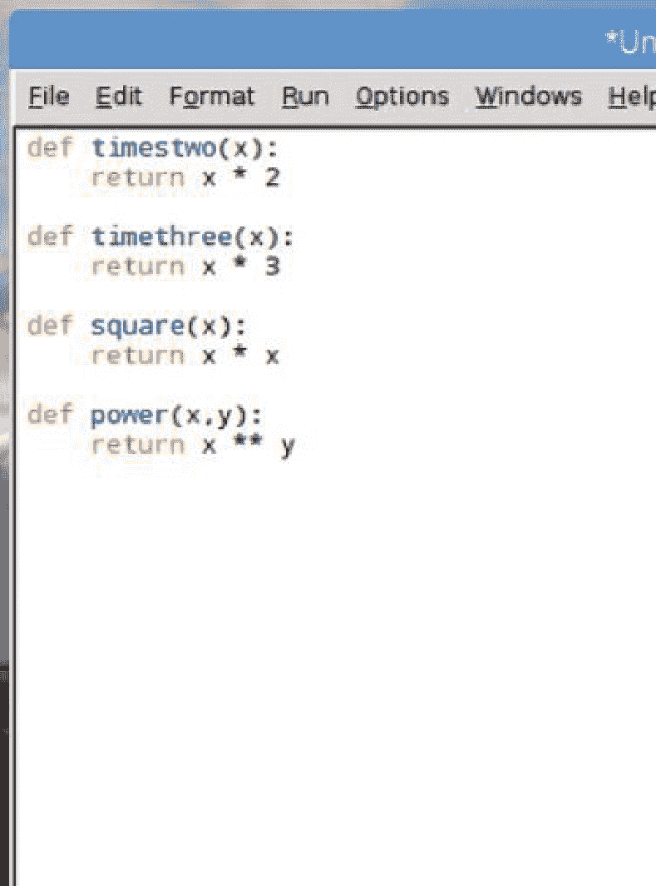

**步骤 2** 在上述代码下方，输入调用代码的函数：

```
print (timestwo(2))
print (timesthree(3))
print (square(4))
print (power(5,3))
```

将程序保存为 `basic_math.py` 并执行以获取结果。

**步骤 3** 现在你将把函数定义从程序中取出，放入一个单独的文件中。突出显示函数定义并选择 Edit > Cut。选择 File > New File 并在新窗口中使用 Edit > Paste。你现在有两个单独的文件，一个包含函数定义，另一个包含函数调用。

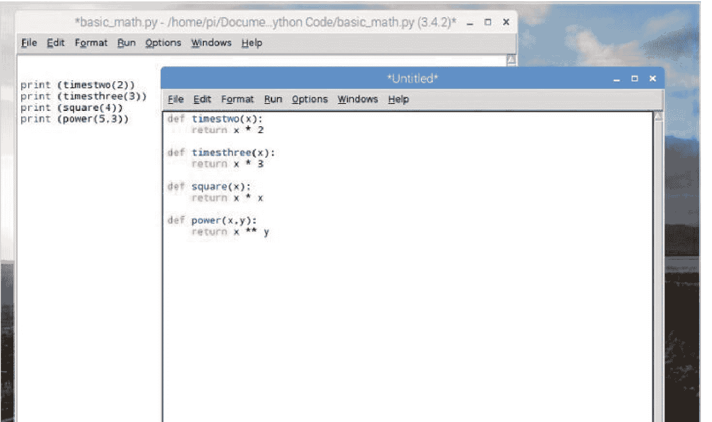

**步骤 4** 如果你现在尝试再次执行 `basic_math.py` 代码，将显示错误 'NameError: name 'timestwo' is not defined'。这是由于代码不再有权访问函数定义。

```
Traceback (most recent call last):
  File "/home/pi/Documents/Python Code/basic_math.py", line 3, in <module>
    print (timestwo(2))
NameError: name 'timestwo' is not defined
>>> |
```

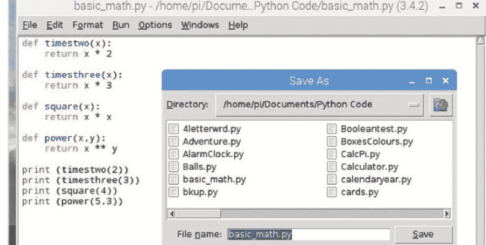

**步骤 5** 返回包含函数定义的新创建窗口，然后单击 File > Save As。将其命名为 **minimath.py** 并将其保存在与原始 **basic_math.py** 程序相同的位置。现在关闭 minimath.py 窗口，这样 basic_math.py 窗口就保持打开状态。

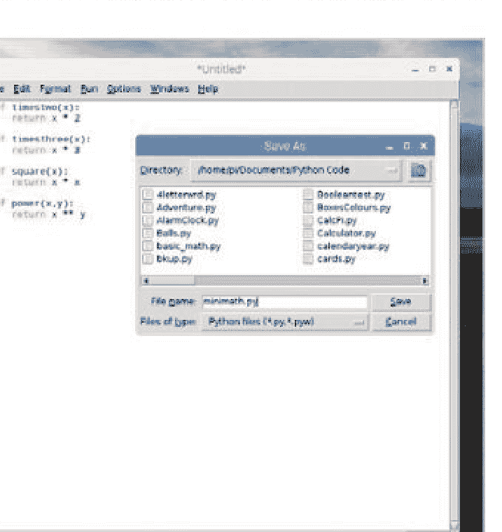

## 创建你自己的模块

### 第6步

回到 basic_math.py 窗口：在代码顶部输入：

```
from minimath import *
```

这将把函数定义作为一个模块导入。按 F5 保存并执行程序以查看其运行效果。

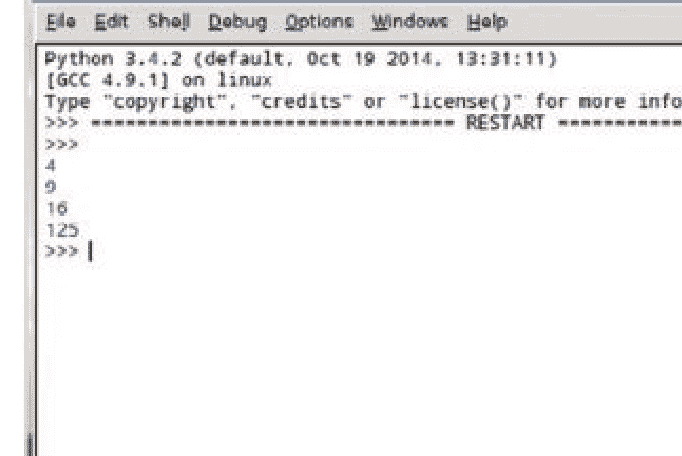

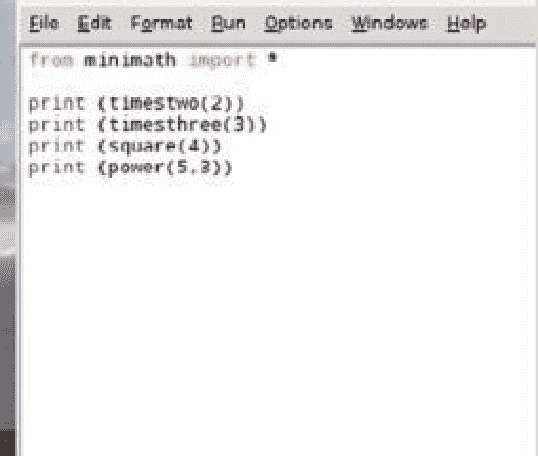

### 第7步

现在你可以进一步使用代码，让程序变得更高级一些，充分利用新创建的模块。添加一些用户交互。首先创建一个用户可以从中选择的基本菜单：

```
print("Select operation.\n")
print("1.Times by two")
print("2.Times by Three")
print("3.Square")
print("4.Power of")
choice = input("\nEnter choice (1/2/3/4):")
```

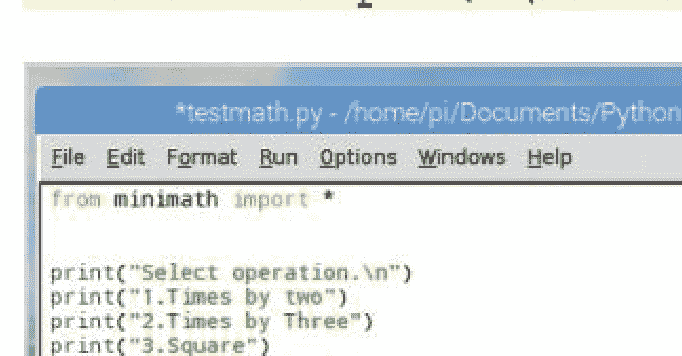

### 第8步

现在我们可以添加用户输入，以获取代码将处理的数字：

```
num1 = int(input("\nEnter number: "))
```

这将把用户输入的数字保存为变量 num1。

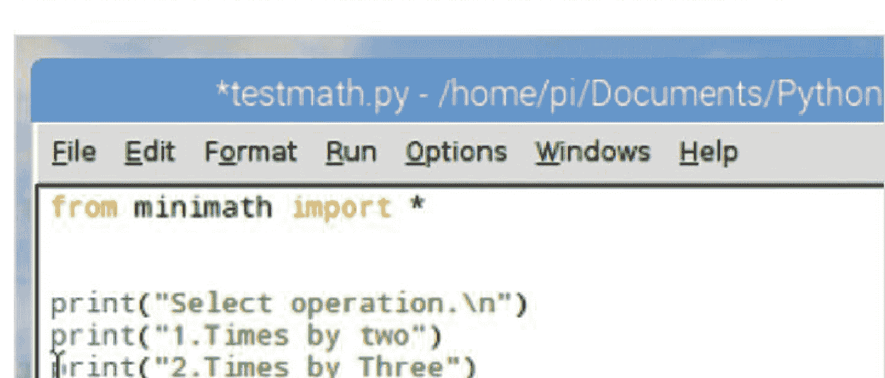

### 第9步

最后，你现在可以创建一系列 if 语句来确定如何处理该数字，并利用新创建的函数定义：

```
if choice == '1':
    print(timestwo(num1))
elif choice == '2':
    print(timesthree(num1))
elif choice == '3':
    print(square(num1))
elif choice == '4':
    num2 = int(input("Enter second number: "))
    print(power(num1, num2))
else:
    print("Invalid input")
```

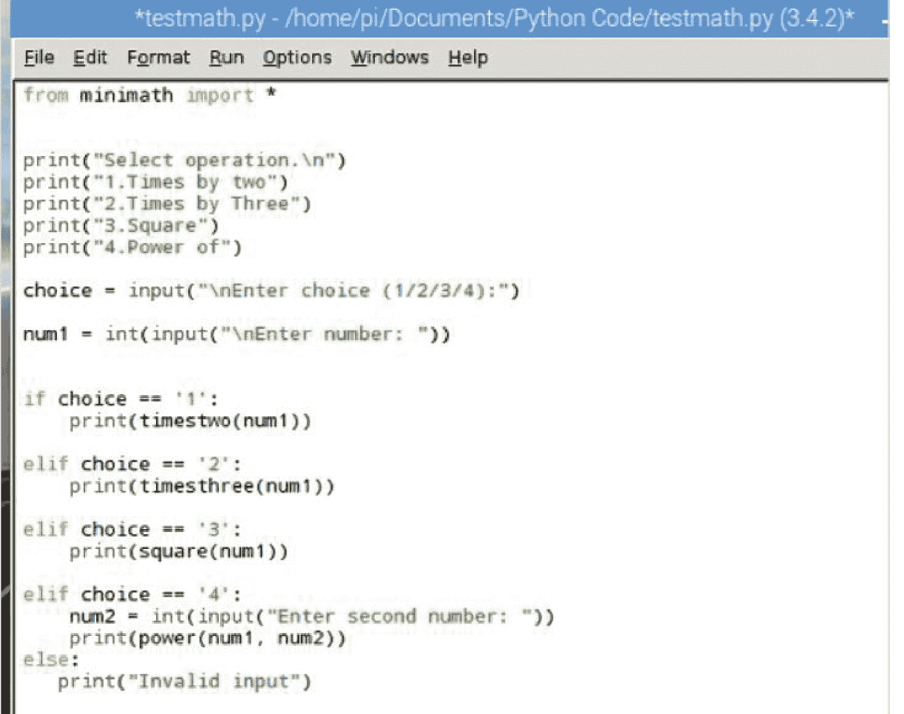

### 第10步

请注意，对于最后一个可用选项“求幂”，我们添加了第二个变量 num2。它将第二个数字传递给名为 power 的函数定义。保存并执行程序以查看其运行效果。

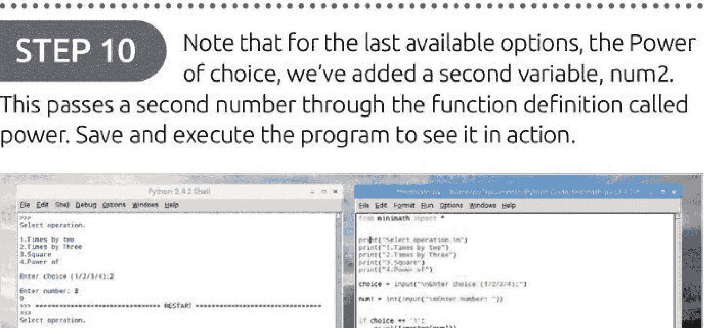

# 聚焦Python：人工智能

人工智能（AI）和机器学习（ML）是IT行业的新兴热门话题。人工智能正迅速成为过去所描绘的那种正在运作的科幻，而其背后正是Python。

尽管人工智能和机器学习如此接近，但这两种技术之间存在明显区别。人工智能指的是研究如何训练计算机去完成那些人类能做得更好、更快的工作。而机器学习则是计算机从其经验中学习的能力，因此其结果和性能最终将变得更加准确和卓越。

虽然它们不同，但本质上都在讨论同一个要素：训练一个系统去学习和独立做事。据说人工智能导向智慧，而机器学习导向知识，得益于Python，这两者之间的差距每天都在缩小。

```python
import keras
from keras.datasets import mnist
from keras.models import Sequential
from keras.layers import Dense, Dropout, Flatten
from keras.layers import Conv2D, MaxPooling2D

batch_size = 128
num_classes = 10
epochs = 12

# input image dimensions
img_rows, img_cols = 28, 28

(x_train, y_train), (x_test, y_test) = mnist.load_data()
```

## 应用

人工智能和机器学习在当今科技领域广泛存在。就在几年前，我们大多数人还将人工智能与一群超级智能杀手机器人的崛起联系在一起，而现在你会惊讶于家中乃至随身携带的物品中，人工智能的众多应用实例。

让我们从人工智能和机器学习最显而易见的应用开始：智能手机。这些设备已渗透到我们现代世界的大部分角落，2019年全球覆盖率已达55亿，并预计在2020年底超过60亿，人工智能和机器学习正取得突飞猛进的进步就不足为奇了。

随着几乎全球人口都在智能手机的覆盖范围内，这些设备背后的代码已被开发得能考虑到个体差异。这些设备被设计成能够学习用户需要或使用设备的目的。常用号码被推到列表顶部，应用内和游戏内广告根据我们的浏览和搜索偏好以及其他已安装应用进行定制。甚至我们的声音、指纹和面容都由人工智能和机器学习存储和分析，以便识别我们是谁。

## 数字助手

数字助手的兴起是人工智能和机器学习编程的推动力之一。Siri、Cortana、Alexa和Google助手都是用Python编写的，旨在倾听、学习并回应我们对它们的请求。得益于Python众多的库和高度可定制性，实现这种程度的人工智能出人意料地简单。这些框架使得智能程序员能够轻松创建人工智能和机器学习，减少了在其他语言中的开发时间，并且得益于Python易读的代码和复杂的算法，这些开发者可以投入大量时间来提高人工智能的性能和准确性。

每当我们向这些数字助手下达指令时，由Python驱动的人工智能代码正在读取我们的声音，通过提取关键词来判断我们所求，并据此行动。如果我们要求一个30秒倒计时，它会启动设备的秒表功能；如果我们请求晚餐建议，它会打开一系列特定的网页；如果我们让它播放音乐，它会查询可用的音乐应用来选择我们想听的内容。与此同时，人工智能代码被训练得听得更专注，而机器学习则从人工智能的结果中学习，以便提高未来回答问题和请求的准确性。


## 超越智能手机

想想谷歌、社交媒体和你查阅的内容。你有多少次在谷歌输入一串搜索内容，比如“Mk1 Ford Escort的汽车零件”，然后打开Facebook时，突然发现一个“福特Escort车主群”的推荐？这就是人工智能和机器学习注入你的日常计算任务中的例子。

人工智能和机器学习协同工作的另一个例子是Gmail最近新增的句子自动补全功能。如果你经常用“See you soon”（再见）或“All the best”（祝一切顺利）来结束邮件，那么输入“See”或“All”就会提示机器学习部分自动为你填充剩余的词语。与此同时，机器学习在不断学习，而人工智能则告诉它哪些地方需要改进。

人脸识别是人工智能和机器学习的另一个元素，一段时间以来一直备受大众媒体的关注。在整个2019年，智能手机和监控录像中的人脸识别系统都取得了显著进步。控制这种级别人工智能的机构现在能够从拥挤的街道上辨认出个体，虽然这对治安来说很好，但也对我们的隐私构成了潜在威胁。毕竟，谁在监视监视者呢？

特斯拉在自动驾驶汽车方面的工作意味着它们正日益成为常态，而正是Python及其背后的人工智能和机器学习工作——请原谅这个双关语——在推动着这一进程。在这种情况下，Python承担了大量繁重的工作，提供了旨在实现人工智能和机器学习的连接组件和库。在后台，你通常会发现C++或其他语言，在支持人工智能和机器学习运行的整体程序和性能。

虽然描绘一个黯淡的人工智能未来很容易，但我们不要忘记我们目前享受的许多优秀人工智能实例：光学字符识别、手写识别、图像处理、帮助视觉和听障人士、太空探索的进步、工程改进、环境保护、制药和药物改进，以及为行动受限者带来更大的出行自由。这一切并不全是关于两个人工智能机器人争论消灭人类。

## 人工智能的未来

我们最终是否会创造出真正的人工智能、杀手机器人和具有自我意识的仿生人，尚存争议。关于人工智能的发展存在大量支持和反对的论点，许多人认为人工智能将是人类可能创造的最糟糕的未来——甚至比核战争更糟。然而，目前我们仍处于人工智能发展的早期阶段，但随着Python的持续进步和库的完善，我们拥有一个每小时都在变得更聪明的人工智能系统可能为时不远。


# 代码仓库

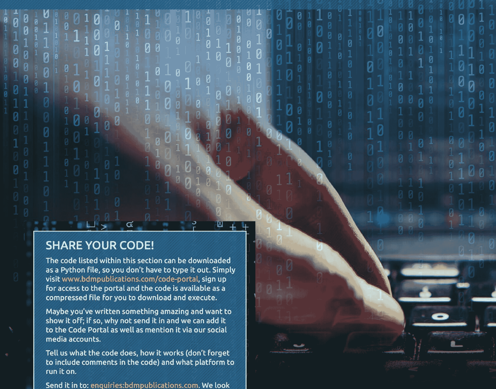

## 分享你的代码！

本节列出的代码可以下载为 Python 文件，因此你无需手动输入。只需访问 www.bdmpublications.com/code-portal，注册获取门户访问权限，代码即可作为压缩文件供你下载和执行。

也许你写了一些很棒的代码并想展示出来；如果是这样，为什么不发送给我们呢？我们可以将其添加到代码门户中，并通过我们的社交媒体账号进行宣传。

请告诉我们代码的功能、工作原理（别忘了在代码中添加注释）以及运行它的平台。

请发送至：enquiries@bdmpublications.com。我们期待看到你的成果。

我们为你提供了一个庞大的 Python 代码库，供你在自己的程序中自由使用。这里有大量资源可以帮助你创建出色的程序，或扩展你的项目创意。

我们提供了用于备份文件和文件夹、猜数字游戏、随机数生成器、Google 搜索代码、游戏代码、动画代码、图形代码、文本冒险代码，甚至播放计算机中存储的音乐的代码。我们分解了一些较新的、扩展的代码概念，以帮助你更好地理解其工作原理。这样你就可以轻松地将其调整为自己的用途。

这是一个你在任何其他 Python 书籍中都找不到的绝佳资源。所以请使用它、拆解它、将其调整为自己的程序，并看看你能创造出什么。

- 112 Python 文件管理器
- 114 猜数字游戏
- 116 随机数生成器
- 117 随机密码生成器
- 118 文本转二进制转换器
- 120 基础 GUI 文件浏览器
- 122 鼠标控制的海龟
- 123 Python 闹钟
- 124 垂直滚动文本
- 126 Python 数字时钟
- 128 使用 Winsound 模块播放音乐
- 130 文本冒险脚本
- 132 Python 滚动字幕脚本
- 133 简易 Python 计算器
- 134 猜词游戏脚本

## Python 文件管理器

这个文件管理器程序显示一系列选项，允许你读取文件、写入文件、追加到文件、删除文件、列出目录内容等等。它非常容易编辑并插入到你自己的代码中，或进行扩展。

### FILEMAN.PY

将下面的代码复制到“新建 > 文件”中，并将其保存为 FileMan.py。执行后，它将显示程序标题、当前时间和日期以及可用选项。

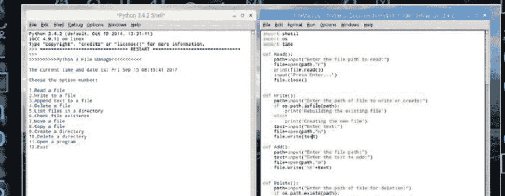

```python
import shutil
import os
import time
import subprocess

def Read():
    path=input("Enter the file path to read:")
    file=open(path,"r")
    print(file.read())
    input('Press Enter...')
    file.close()

def Write():
    path=input("Enter the path of file to write or create:")
    if os.path.isfile(path):
        print('Rebuilding the existing file')
    else:
        print('Creating the new file')
    text=input("Enter text:")
    file=open(path,"w")
    file.write(text)

def Add():
    path=input("Enter the file path:")
    text=input("Enter the text to add:")
    file=open(path,"a")
    file.write('\n'+text)

def Delete():
    path=input("Enter the path of file for deletion:")
    if os.path.exists(path):
        print('File Found')
        os.remove(path)
        print('File has been deleted')
    else:
        print('File Does not exist')

def Dirlist():
    path=input("Enter the Directory path to display:")
    sortlist=sorted(os.listdir(path))
    i=0
    while(i<len(sortlist)):
        print(sortlist[i]+'\n')
        i+=1

def Check():
    fp=int(input('Check existence of \n1.File \n2.Directory\n'))
    if fp==1:
        path=input("Enter the file path:")
        os.path.isfile(path)
        if os.path.isfile(path)==True:
            print('File Found')
        else:
            print('File not found')
    if fp==2:
        path=input("Enter the directory path:")
        os.path.isdir(path)
        if os.path.isdir(path)==False:
            print('Directory Found')
        else:
            print('Directory Not Found')

def Move():
    path1=input('Enter the source path of file to move:')
    mr=int(input('1.Rename \n2.Move \n'))
    if mr==1:
        path2=input('Enter the destination path and file name:')
        shutil.move(path1,path2)
        print('File renamed')
    if mr==2:
        path2=input('Enter the path to move:')
        shutil.move(path1,path2)
        print('File moved')

def Copy():
    path1=input('Enter the path of the file to copy or rename:')
    path2=input('Enter the path to copy to:')
    shutil.copy(path1,path2)
    print('File copied')

def Makedir():
    path=input("Enter the directory name with path to make \neg. C:\Hello\Newdir \nWhere Newdir is new directory:")
    os.makedirs(path)
    print('Directory Created')

def Removedir():
    path=input('Enter the path of Directory:')
    treedir=int(input('1.Deleted Directory \n2.Delete Directory Tree \n3.Exit \n'))
    if treedir==1:
        os.rmdir(path)
    if treedir==2:
        shutil.rmtree(path)
        print('Directory Deleted')
    if treedir==3:
        exit()

def Openfile():
    path=input('Enter the path of program:')
    try:
        os.startfile(path)
    except:
        print('File not found')

run=1
while(run==1):
    try:
        os.system('clear')
    except OSError:
        os.system('cls')
    print('\n>>>>>>>>>>Python 3 File Manager<<<<<<<<<<\n')
    print('The current time and date is:',time.asctime())
    print('\nChoose the option number: \n')
    dec=int(input('''1.Read a file
2.Write to a file
3.Append text to a file
4.Delete a file
5.List files in a directory
6.Check file existence
7.Move a file
8.Copy a file
9.Create a directory
10.Delete a directory
11.Open a program
12.Exit
'''))
    if dec==1:
        Read()
    if dec==2:
        Write()
    if dec==3:
        Add()
    if dec==4:
        Delete()
    if dec==5:
        Dirlist()
    if dec==6:
        Check()
    if dec==7:
        Move()
    if dec==8:
        Copy()
    if dec==9:
        Makedir()
    if dec==10:
        Removedir()
    if dec==11:
        Openfile()
    if dec==12:
        exit()
    run=int(input("1.Return to menu\n2.Exit \n"))
    if run==2:
        exit()
```

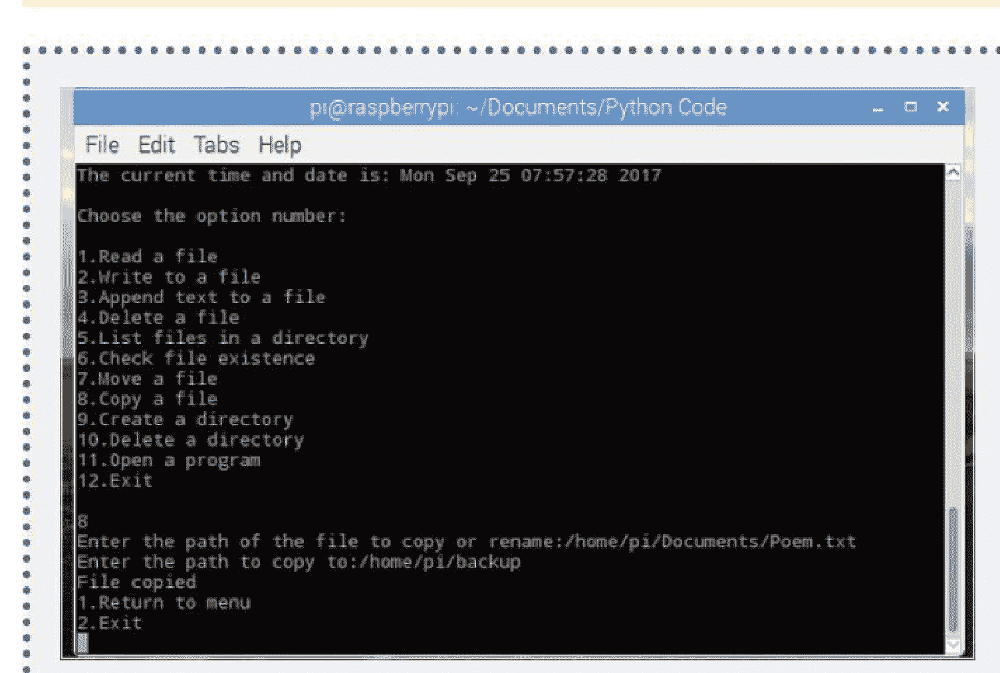

### 导入

这里需要导入三个模块：Shutil、OS 和 Time。前两个模块处理操作系统和文件管理与操作；而 Time 模块则简单地显示当前时间和日期。

注意我们如何包含了一个 try 和 except 块来检查用户是在 Linux 系统还是 Windows 系统上运行代码。Windows 使用 CLS 清屏，而 Linux 使用 clear。try 块应该能很好地工作，但根据你自己的系统，这是一个可能改进的地方。

## 猜数字游戏

这是一段简单的小代码，但它很好地利用了 Random 模块、print 和 input，以及一个 while 循环。猜测次数可以从 5 次增加，随机数范围也可以轻松更改。

### NUMBERGUESS.PY

复制代码，看看你能否在五次猜测内击败计算机。这是一段有趣的代码，当你将 Random 模块与 while 循环结合使用时，它会非常方便。

```python
import random

guessesUsed = 0
Name=input('Hello! What is your name? ')
number = random.randint(1, 30)
print('Greetings, ' + Name + ', I\'m thinking of a number between 1 and 30.')
while guessesUsed < 5:
    guess=int(input('Guess the number within 5 guesses...'))
    guessesUsed = guessesUsed + 1
    if guess < number:
        print('Too low, try again.')
    if guess > number:
        print('Too high, try again.')
    if guess == number:
        break
if guess == number:
    guessesUsed = str(guessesUsed)
    print('Well done, ' + Name + '! You guessed correctly in ' + guessesUsed + ' guesses.')

if guess != number:
    number = str(number)
    print('Sorry, out of guesses. The number I was thinking of is ' + number)
```

虽然这是一个相当容易理解的程序，但代码中有一些值得指出的元素。首先，你需要导入 Random 模块，因为你在代码中使用了随机数。

这部分代码创建了用于记录猜测次数的变量、玩家的名称，并设置了 1 到 30 之间的随机数。如果你想扩大随机数选择范围，可以增加 `number=random.randint(1, 30)` 中的结束值 30；但不要设置得太高，否则玩家将永远无法猜中。如果玩家猜得太低或太高，他们会得到相应的输出并被要求重试，同时猜测次数少于五次。你也可以通过更改 `while guessesUsed < 5:` 的值来将猜测次数从 5 次增加。

如果玩家猜中了正确的数字，他们会得到“干得好”的输出，以及他们用了多少次猜测。如果玩家用完了所有猜测次数，则会显示游戏结束的输出，并揭示计算机所想的数字。记住，如果你更改了计算机选择的随机数值或玩家可以进行的猜测次数，那么除了变量值之外，你还需要修改代码开头 print 语句中给出的说明。

## 猜数字游戏

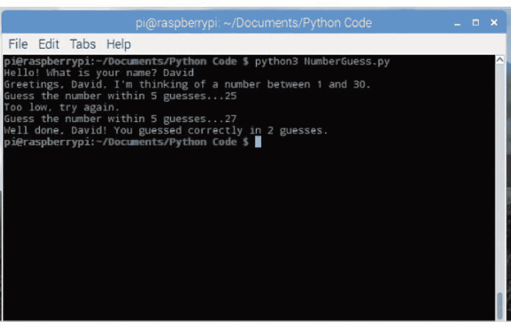

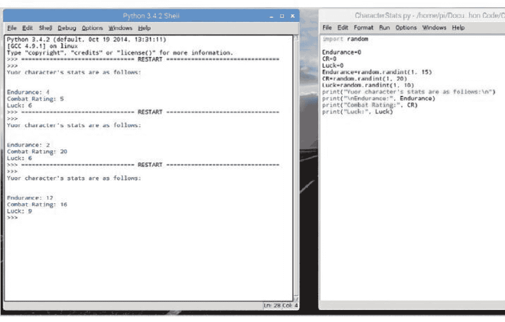

# 代码改进

由于这是一个非常简单的脚本，可以应用于各种场景，因此有很大的空间可以对其进行修改，使其更有趣。也许你可以加入一个计分选项，比如三局两胜制。或者设计一种精巧的方式来祝贺玩家在第一次尝试时就“一杆进洞”猜对了数字。

例如，根据提供的截图，你可以使用类似以下的代码：

```
python
Endurance=0
CR=0
Luck=0
Endurance = random.randint(1, 15)
CR = random.randint(1, 20)
Luck = random.randint(1, 10)
print("Your character's stats are as follows:\n")
print("Endurance:", Endurance)
print("Combat Rating:", CR)
print("Luck:", Luck)

```

此外，猜数字游戏的代码确实提供了一些空间，可以以不同的方式整合到你的代码中。我们的意思是，该代码可用于检索一个范围内的随机数，这反过来可以为你提供一个冒险游戏中角色创建定义函数的起点。

想象一下用Python编写的文字冒险游戏的开头，玩家为他们的角色命名。下一步是掷虚拟的随机骰子来决定该角色的战斗评级、力量、耐力和运气值。然后，这些值可以作为一组变量带入游戏中，根据玩家角色所处的情况进行增减。

然后，玩家可以决定是保留他们的掷骰结果，还是为了获得更好的数值而重新尝试。有多种方法可以将此代码实现到基本的冒险游戏中。

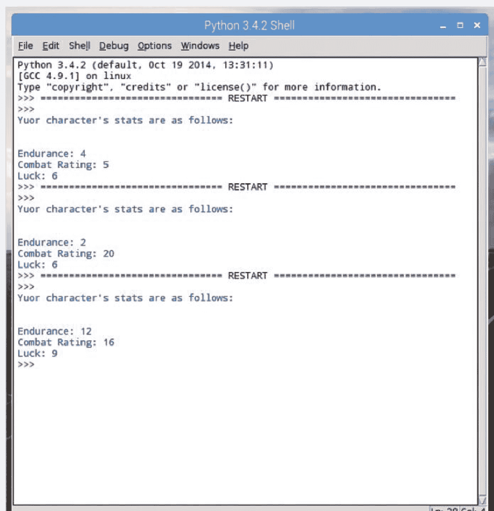

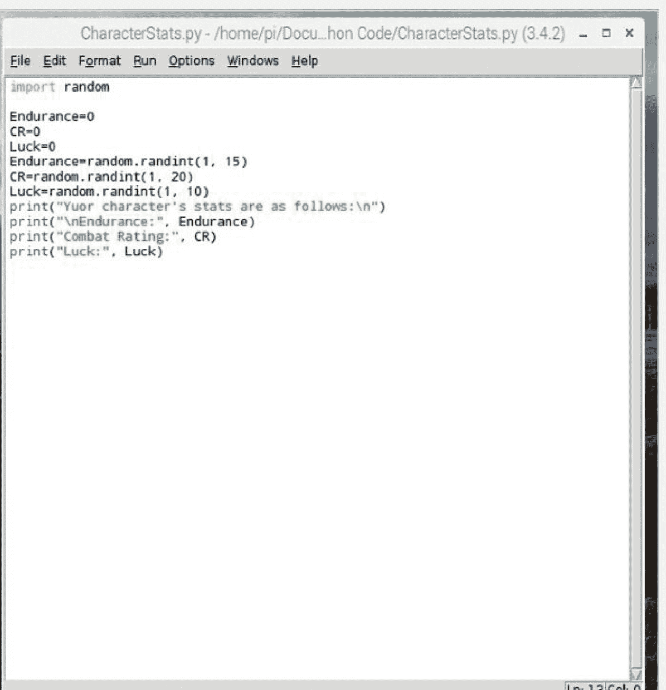

# 随机数生成器

用户输入和操作该输入的能力是任何编程语言的重要元素。它将一个好程序与一个伟大的程序区分开来，后者允许用户交互并看到交互的结果。

### RNDNUMGEN.PY

它可能很简单，但这段小代码会要求用户输入两组数字，一个起始值和一个结束值。然后，代码将从这两组数字之间随机抽取一个数字并显示出来。

```
from random import *

print("\n>>>>>>>>>>Random Number Generator<<<<<<<<<<\n")
nmb1=int(input("Enter the start number: "))
nmb2=int(input("Enter the last number: "))

x = randint(nmb1, nmb2)
print("\nThe random number between",nmb1,"and",nmb2,"is:\n")
print(x)
```

# 更多输入

虽然代码易于理解，但如果你提示用户提供更多输入，它可能会更有趣。也许你可以为他们的数字提供加法、减法、乘法元素。如果你觉得有挑战性，可以尝试将代码通过Tkinter窗口，甚至是第128页可用的Ticker窗口来实现。

例如，代码可以编辑成这样：

此外，代码的核心可以用于文字冒险游戏，其中角色与某物战斗，他们的生命值以及敌人的生命值会减少一个随机数。这可以与第90页猜数字游戏中的先前代码混合使用，我们在那里定义了冒险游戏角色的属性。

```
from random import *
import turtle

print("\n>>>>>>>>>>Random Turtle Image<<<<<<<<<<\n")
nmb1=int(input("Enter the start number: "))
nmb2=int(input("Enter the second number: "))
nmb3=int(input("Enter the third number: "))
nmb4=int(input("Enter the fourth number: "))

turtle.forward(nmb1)
turtle.left(90)
turtle.forward(nmb2)
turtle.left(90)
turtle.forward(nmb3)
turtle.left(90)
turtle.forward(nmb4)
turtle.left(90)
```

你还可以将Turtle模块引入代码中，并可能为绘制形状、对象或其他东西设置一些定义规则，这些规则基于用户输入的随机值。这需要一点计算，但效果肯定非常有趣。

虽然它还有些粗糙，但你可以轻松地使其更合适。

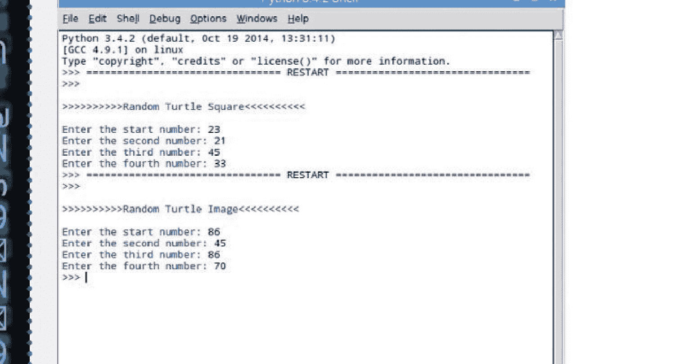

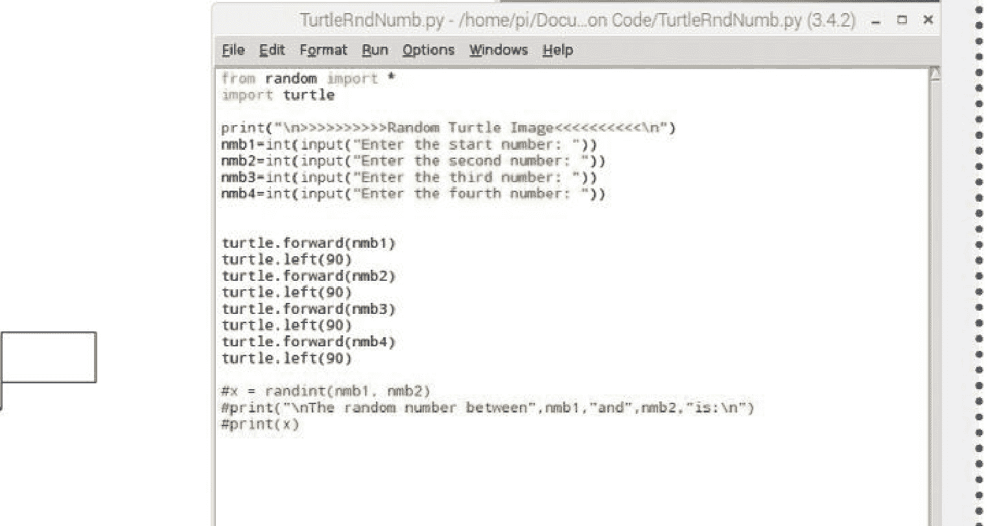

# # 随机密码生成器

我们总是被告知我们的密码不够安全；那么，这里有一个解决方案，你可以将其应用到你未来的程序中。下面的随机密码生成器代码每次执行时都会创建一个由12个字母（大小写）和数字组成的字符串。

```
python
import string
import random

def randompassword():
    chars=string.ascii_uppercase + string.ascii_lowercase + string.digits
    size= 8
    return ''.join(random.choice(chars) for x in range(size,20))

print(randompassword())

```

# ## 安全密码

你可以做很多事情来修改此代码并进一步改进它。首先，你可以增加生成密码显示的字符数，也许还可以包含特殊字符，如符号和标志。然后，你可以将选定的密码输出到一个文件，然后使用之前的随机数生成器作为文件密码安全地压缩它，并将其发送给用户作为他们的新密码。

此代码的一个有趣方面是能够引入循环并打印任意数量的随机密码。假设你有一个包含50名用户的公司列表，你负责每月为他们生成一个随机密码。

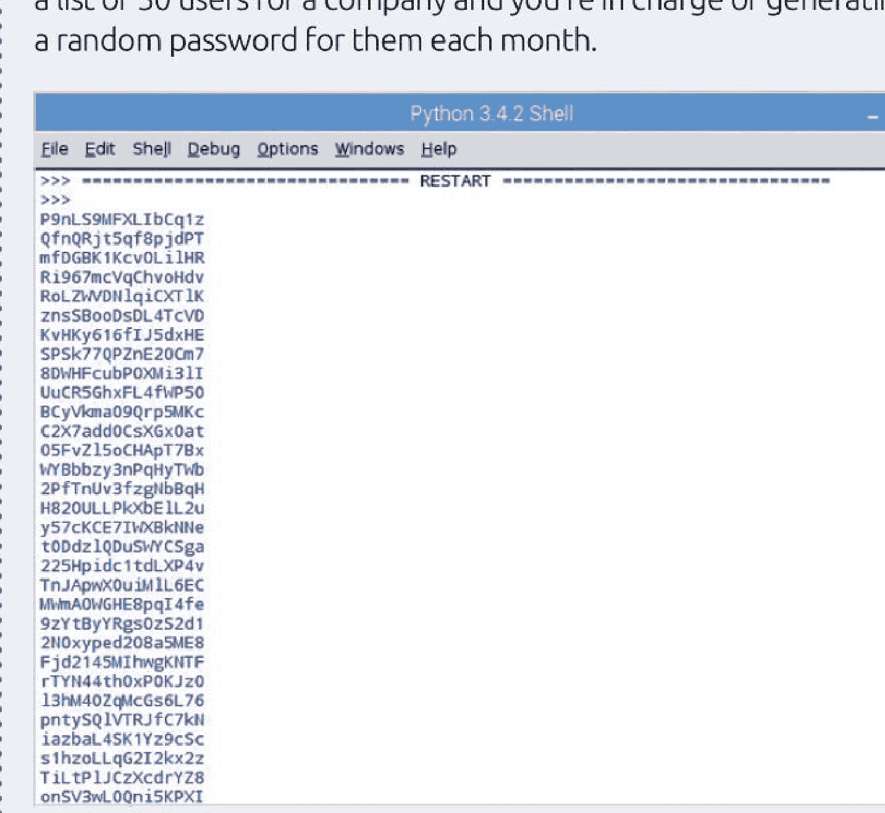

添加一个循环来打印五十次密码非常容易，例如：

```
python
import string
import random

def randompassword():
    chars=string.ascii_uppercase + string.ascii_lowercase + string.digits
    size= 4
    return ''.join(random.choice(chars) for x in range(size,20))

n=0
while n<50:
    print(randompassword())
    n=n+1

```

这将基于之前随机选择的字符输出五十个随机密码。

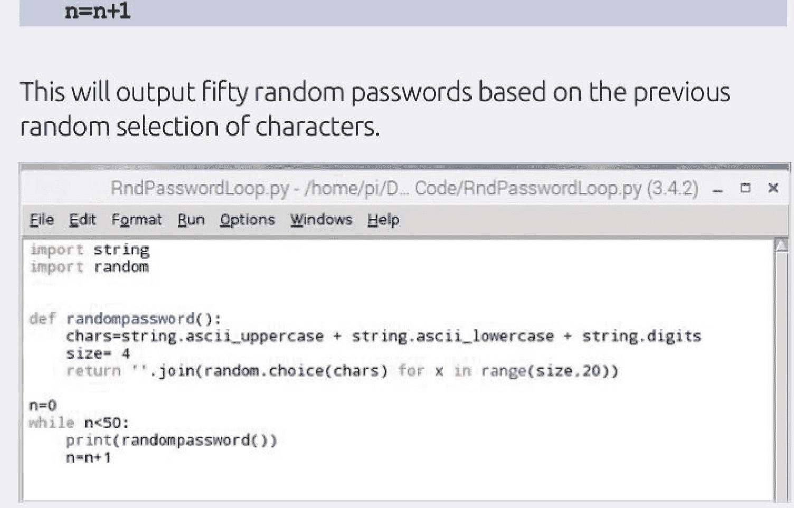

# # 文本转二进制转换器

虽然它可能看起来不太令人兴奋，但这个文本转二进制转换器实际上相当有趣。它只使用两行代码，因此非常容易插入到你自己的脚本中。

# ## TXT2BIN.PY

我们自然使用format函数将用户输入的文本字符串转换为其二进制等效值。如果你想检查其准确性，可以将二进制数插入在线转换器中。

```
python
text=input("Enter text to convert to Binary: ")
print(' '.join(format(ord(x), 'b') for x in text))

```

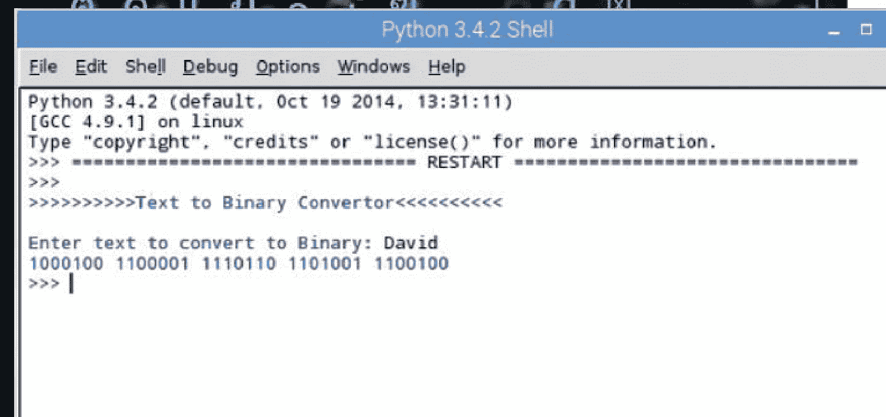

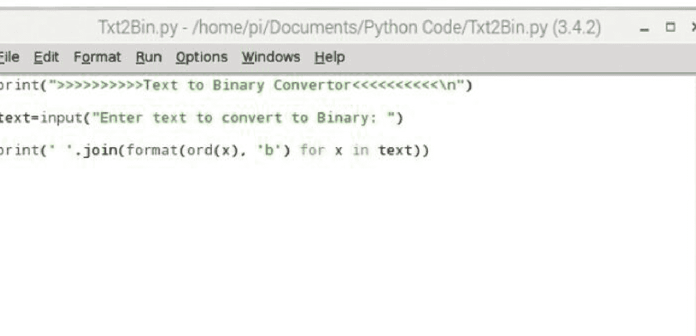

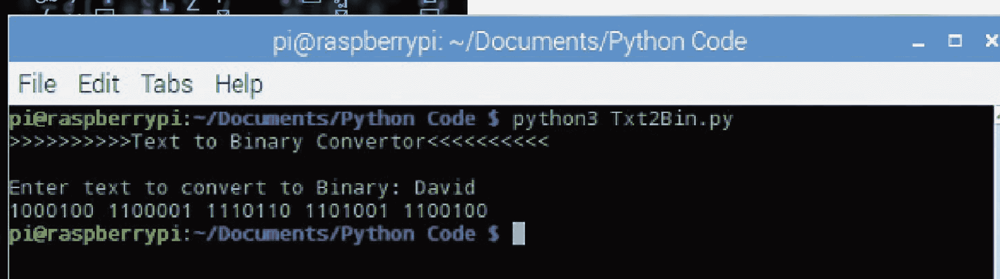

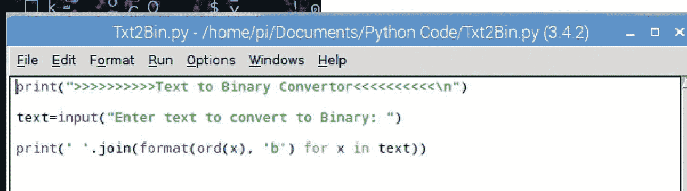

# 1000010 1101001 1101110 1100001 1110010 1111001

文本转二进制转换器确实提供了一些改进和增强的空间。它有许多用途：可以用于密码或秘密词脚本，作为冒险游戏的一部分，或者仅仅是一种展示某人名字的新颖方式。

关于改进，你可以使用第100页的动画文本选项，在Pygame窗口中显示二进制转换。你还可以询问用户是否想再试一次，甚至询问他们是否想将二进制输出保存到文件中。

关于将输出的二进制转换渲染到带有旋转文本的Pygame窗口，你可以使用：

```
python
import pygame
pygame.init()
BLACK = (0, 0, 0)
WHITE = (255, 255, 255)
BLUE = (0, 0, 255)
GREEN = (0, 255, 0)
RED = (255, 0, 0)
print(">>>>>>>>>>>>Text to Binary Convertor<<<<<<<<<<<<\n")
conversion=input("Enter text to convert to Binary: ")
size = (600, 400)
screen = pygame.display.set_mode(size)

```

```
python
pygame.display.set_caption("Binary Conversion")
done = False
clock = pygame.time.Clock()
text_rotate_degrees = 0
Binary=(' '.join(format(ord(x), 'b') for x in conversion))
while not done:
    for event in pygame.event.get():
        if event.type == pygame.QUIT:
            done = True
    screen.fill(WHITE)
    font = pygame.font.SysFont('Calibri', 25, True, False)
    text = font.render(Binary, True, BLACK)
    text = pygame.transform.rotate(text, text_rotate_degrees)
    text_rotate_degrees += 1
    screen.blit(text, [100, 50])
    pygame.display.flip()
    clock.tick(60)
pygame.quit()
print(' '.join(format(ord(x), 'b') for x in conversion))

```

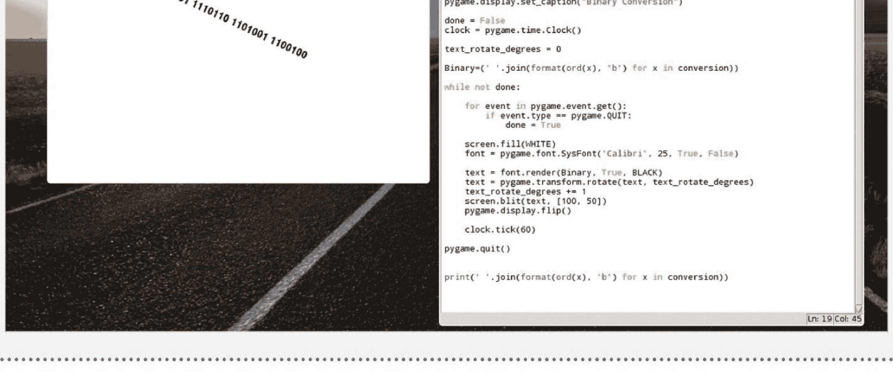

## 基础图形界面文件浏览器

这是一段实用且有趣的代码。它是一个极其基础的文件浏览器，使用 Tkinter 模块以图形用户界面呈现。你可以从这段代码中学到很多东西，并将其应用到自己的程序中。

### FILEBROWSER.PY

这里主要使用的模块是 Tkinter，但我们也用到了 idlelib，因此如果执行代码时依赖项失败，你可能需要通过 pip 安装额外的库。

```python
from tkinter import Tk
from idlelib.TreeWidget import ScrolledCanvas, FileTreeItem, TreeNode
import os

root = Tk()
root.title("File Browser")

sc = ScrolledCanvas(root, bg="white",
                    highlightthickness=0, takefocus=1)
sc.frame.pack(expand=1, fill="both", side="left")

item = FileTreeItem(os.getcwd())
node = TreeNode(sc.canvas, None, item)
node.expand()

root.mainloop()
```

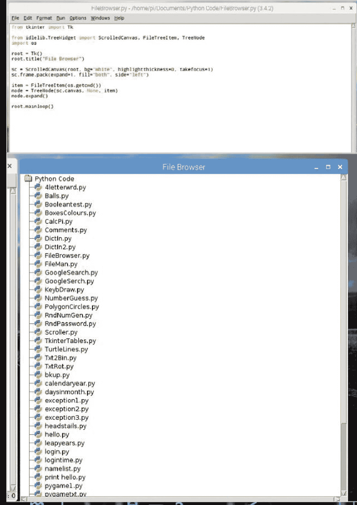

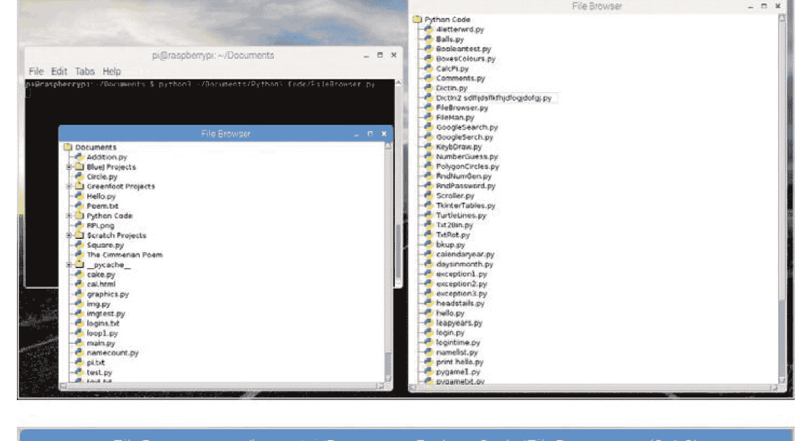

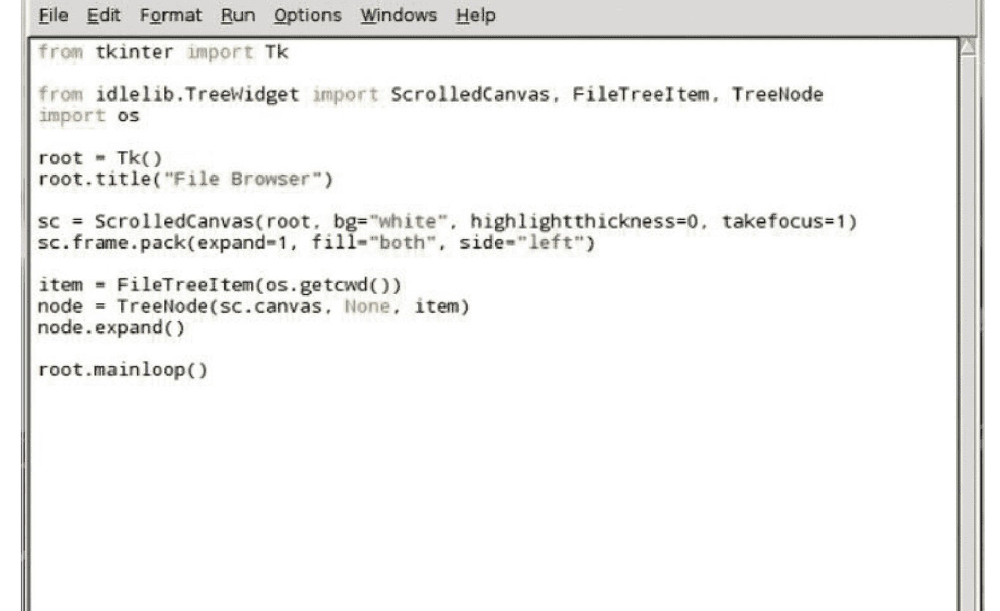

## 进阶文件操作

执行代码后，它将显示当前目录的内容。如果你想查看另一个目录的内容，可以在所选目录内通过命令行运行代码；只需记住，要从代码在系统中的位置调用它，如第二张截图所示。你还可以双击目录树中显示的任何文件名来重命名它们。

这是一段有趣的代码，你可以将其插入到自己的程序中。你可以扩展代码，使其包含用户指定的浏览目录，或许还可以添加你独特的文件图标。如果你使用 Linux，可以创建一个别名来执行代码，这样你就可以在系统中的任何位置运行它。

Windows 用户在使用上述代码时可能会遇到一些问题，可以使用以下替代方案：

```python
from tkinter import *
from tkinter import ttk
from tkinter.filedialog import askopenfilename

root = Tk()

def OpenFile():
    name = askopenfilename(initialdir="C:/",
                           filetypes =(("Text File", "*.txt"),("All Files","*.*")),
                           title = "Choose a file."
                           )
    print (name)
    try:
        with open(name,'r') as UseFile:
            print(UseFile.read())
    except:
        print("No files opened")

Title = root.title( "File Opener")
label = ttk.Label(root, text ="File Open",foreground="red",font=("Helvetica", 16))
label.pack()

menu = Menu(root)
root.config(menu=menu)

file = Menu(menu)

file.add_command(label = 'Open', command = OpenFile)
file.add_command(label = 'Exit', command = lambda:exit())

menu.add_cascade(label = 'File', menu = file)

root.mainloop()
```

虽然不完全相同，但这段代码允许你通过熟悉的 Windows 资源管理器打开系统中的文件。值得尝试一下，看看你能用它做些什么。

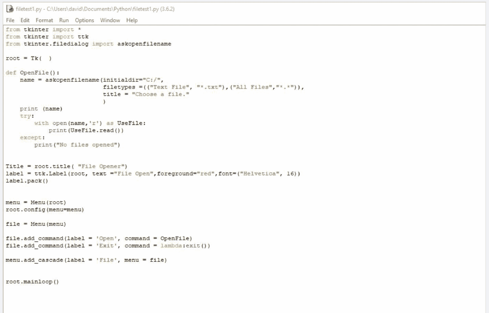

## 鼠标控制的海龟

### MOUSETURTLE.PY

我们已经见过用户通过键盘控制海龟模块，但现在我们想看看用户如何在 Python 中使用鼠标作为绘图工具。这里有两个可能的代码示例，选择最适合你的那个。

第一个代码示例展示了标准的海龟窗口。按下空格键，然后在屏幕任意位置点击，海龟就会画向鼠标指针。第二个示例允许你点击海龟并将其拖动到屏幕上的任意位置；但要小心，它可能会导致 Python 崩溃。

第一个代码示例：

```python
from turtle import Screen, Turtle

screen = Screen()
yertle = Turtle()

def k101():
    screen.onscreenclick(click_handler)

def click_handler(x, y):
    screen.onscreenclick(None)  # disable event inside event handler
    yertle.setheading(yertle.towards(x, y))
    yertle.goto(x, y)
    screen.onscreenclick(click_handler)  # reenable event on event handler exit

screen.onkey(k101, " ")  # space turns on mouse drawing

screen.listen()

screen.mainloop()
```

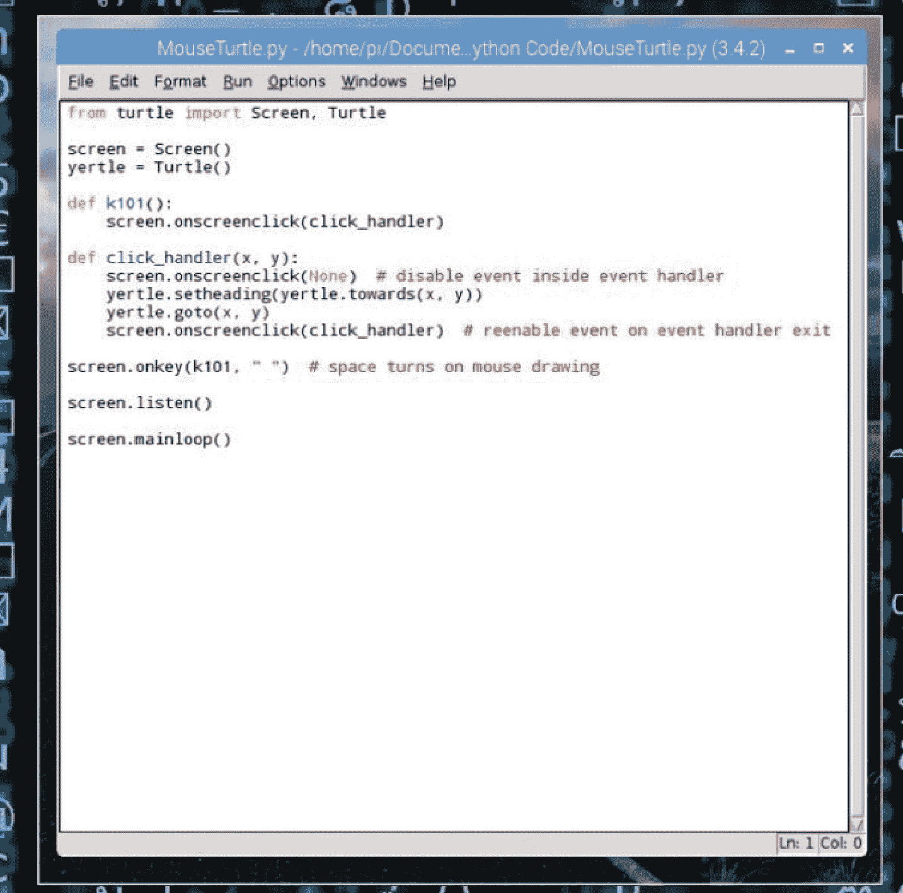

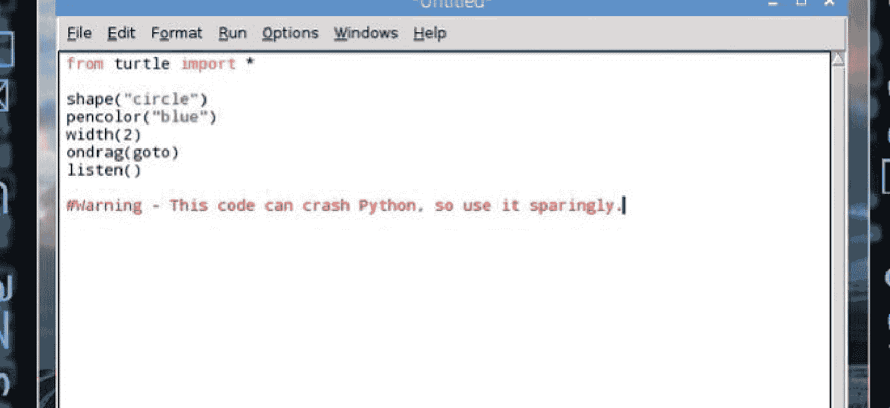

第二个代码示例：

```python
from turtle import *
shape("circle")
pencolor("blue")
width(2)
ondrag(goto)
listen()
```

> ### 忍者海龟鼠标

这段代码运用了一些有趣的技巧。显然，要提出任何改进方案，它会拓展你的 Python 海龟技能，这很棒，但它也可以成为一段不错的代码，插入到幼儿将使用的程序中。因此，它可以成为一个让年轻人深入钻研的绝佳项目；或者甚至作为游戏的一部分，其中主角被要求绘制骷髅头和交叉骨或类似的东西。

## Python 闹钟

有没有过从电脑前短暂休息一下，然后突然意识到已经过去了很多分钟，而你一直都在 Facebook 上？介绍 Python 闹钟代码，你可以进入命令提示符，告诉代码多少分钟后闹钟响起。

### ALARMCLOCK.PY

这段代码设计用于命令提示符，无论是 Windows、Linux 还是 macOS。在主要的打印部分有一些使用说明，但本质上是：python3 AlarmClock.py 10（十分钟后响起）。

```python
import sys
import string
from time import sleep

sa = sys.argv
lsa = len(sys.argv)
if lsa != 2:
    print ("Usage: [ python3 ] AlarmClock.py duration_in_minutes")
    print ("Example: [ python3 ] AlarmClock.py 10")
    print ("Use a value of 0 minutes for testing the alarm immediately.")
    print ("Beeps a few times after the duration is over.")
    print ("Press Ctrl-C to terminate the alarm clock early.")
    sys.exit(1)

try:
    minutes = int(sa[1])
except ValueError:
    print ("Invalid numeric value (%s) for minutes" % sa[1])
    print ("Should be an integer >= 0")
    sys.exit(1)

if minutes < 0:
    print ("Invalid value for minutes, should be >= 0")
    sys.exit(1)

seconds = minutes * 60

if minutes == 1:
    unit_word = " minute"
else:
    unit_word = " minutes"
```

```python
try:
    if minutes > 0:
        print ("Sleeping for " + str(minutes) + unit_word)
        sleep(seconds)
    print ("Wake up")
    for i in range(5):
        print (chr(7)),
        sleep(1)
except KeyboardInterrupt:
    print ("Interrupted by user")
    sys.exit(1)
```

## 醒醒吧

这里很好地使用了 try 和 except 块，以及其他一些有用的循环，可以帮助你更牢固地理解它们在 Python 中的工作原理。代码本身可以用于多种方式：在游戏设定时间后发生某事，或者简单地作为茶歇时的便捷桌面闹钟。

Linux 用户，尝试将闹钟代码设为别名，这样你就可以运行一个简单的命令来执行它。然后，为什么不集成一个用户输入，在开始时询问用户他们想要闹钟响起的时间长度，而不是必须在命令行中包含它。

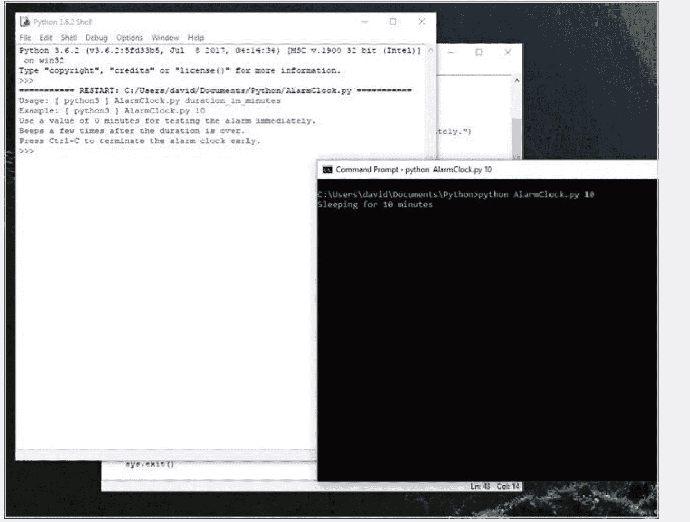

Windows 用户，如果 Python 3 是你系统上安装的唯一版本，那么你需要在不添加 3 的情况下执行代码。例如：

python AlarmClock.py 10

同样，你可以轻松地将其整合到 Windows 批处理文件中，甚至可以设置计划任务在一天中的特定时间激活闹钟。

www.bdmpublications.com
123

## 垂直滚动文本

垂直滚动文本有什么不好呢？它的用途很多：游戏的开始或史诗般事物的介绍，就像每部《星球大战》电影的开头；某些内容结束时的演职员表，例如 Python 演示文稿。这样的例子不胜枚举。

### EPICSCROLL.PY

我们使用了罗伯特·E·霍华德的诗《西梅里亚》作为代码的滚动文本，配上戏剧性的黑色背景和红色文字。我们认为你会同意，这相当史诗。

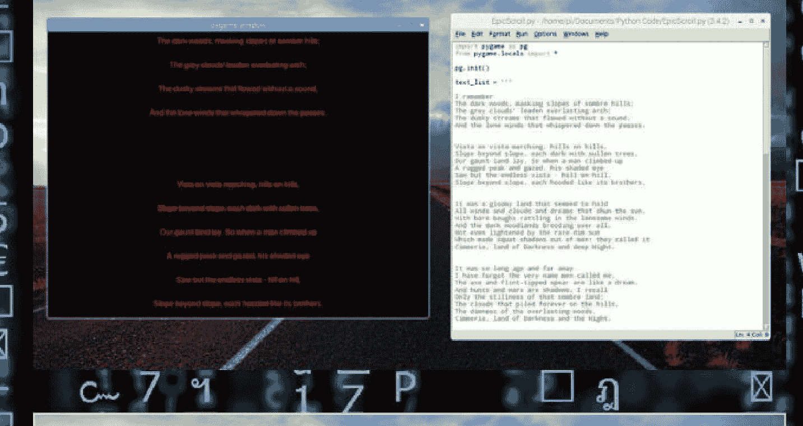

```python
import pygame as pg
from pygame.locals import *

pg.init()

text_list = '''
I remember
The dark woods, masking slopes of sombre hills;
The grey clouds' leaden everlasting arch;
The dusky streams that flowed without a sound,
And the lone winds that whispered down the passes.

Vista on vista marching, hills on hills,
Slope beyond slope, each dark with sullen trees,
Our gaunt land lay. So when a man climbed up
A rugged peak and gazed, his shaded eye
Saw but the endless vista - hill on hill,
Slope beyond slope, each hooded like its brothers.

It was a gloomy land that seemed to hold
All winds and clouds and dreams that shun the sun,
With bare boughs rattling in the lonesome winds,
And the dark woodlands brooding over all,
Not even lightened by the rare dim sun
Which made squat shadows out of men; they called it
Cimmeria, land of Darkness and deep Night.

It was so long ago and far away
I have forgot the very name men called me.
The axe and flint-tipped spear are like a dream,
And hunts and wars are shadows. I recall
Only the stillness of that sombre land;
The clouds that piled forever on the hills,
The dimness of the everlasting woods.
Cimmeria, land of Darkness and the Night.

Oh, soul of mine, born out of shadowed hills,
To clouds and winds and ghosts that shun the sun,
How many deaths shall serve to break at last
This heritage which wraps me in the grey
Apparel of ghosts? I search my heart and find
Cimmeria, land of Darkness and the Night!
'''.split('\n')
```

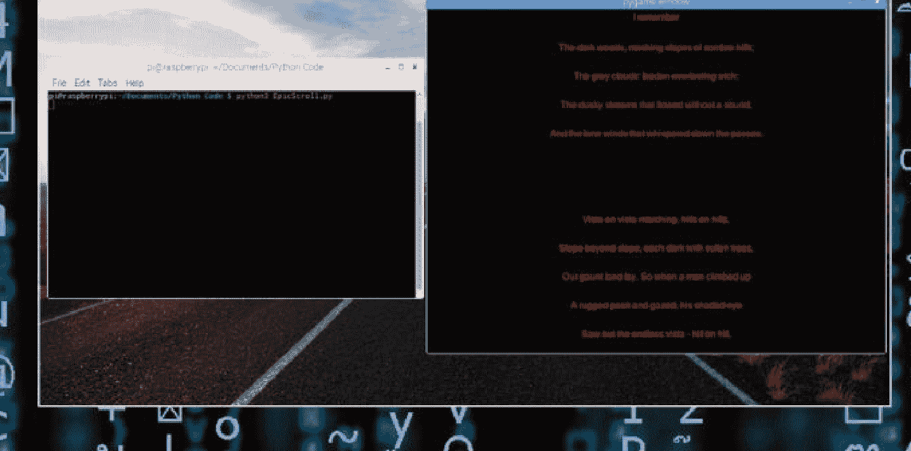## 垂直滚动文字

```python
class Credits:
    def __init__(self, screen_rect, lst):
        self.srect = screen_rect
        self.lst = lst
        self.size = 16
        self.color = (255,0,0)
        self.buff_centery = self.srect.height/2 + 5
        self.buff_lines = 50
        self.timer = 0.0
        self.delay = 0
        self.make_surfaces()

def make_text(self,message):
    font = pg.font.SysFont('Arial', self.size)
    text = font.render(message,True,self.color)
    rect = text.get_rect(center = (self.srect.centerx, self.srect.centery + self.buff_centery) )
    return text,rect

def make_surfaces(self):
    self.text = []
    for i, line in enumerate(self.lst):
        l = self.make_text(line)
        l[1].y += i*self.buff_lines
        self.text.append(l)

def update(self):
    if pg.time.get_ticks()-self.timer > self.delay:
        self.timer = pg.time.get_ticks()
        for text, rect in self.text:
            rect.y -= 1

def render(self, surf):
    for text, rect in self.text:
        surf.blit(text, rect)

screen = pg.display.set_mode((800,600))
screen_rect = screen.get_rect()
clock = pg.time.Clock()
running=True
cred = Credits(screen_rect, text_list)

while running:
    for event in pg.event.get():
        if event.type == QUIT:
            running = False
    screen.fill((0,0,0))
    cred.update()
    cred.render(screen)
    pg.display.update()
    clock.tick(60)
```

## 许久以前……

最明显的主要改进点在于实际的文字本身。将其替换为演职员表，或为你的 Python 游戏准备一段同样史诗般的开场故事情节，它肯定能引起玩家的共鸣。别忘了根据需要更改屏幕分辨率；我们当前使用的是 800 x 600。

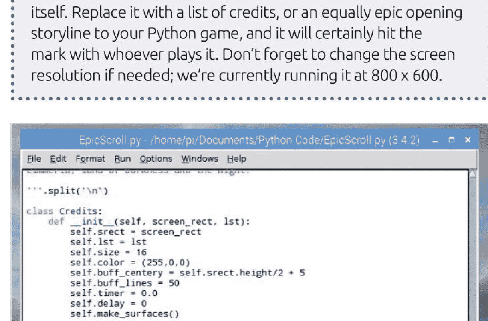

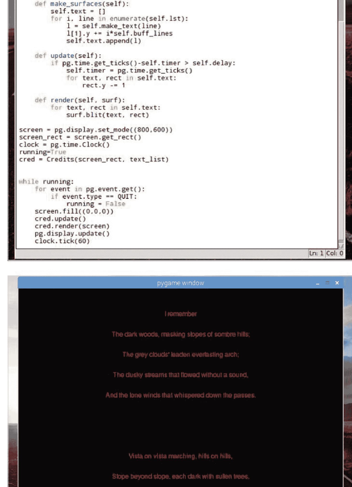

## Python 数字时钟

大多数操作系统的桌面上已经有一个时钟显示，但有一个时钟悬浮在当前打开的窗口顶部总是很方便。为此，为何不创建一个 Python 数字时钟，让它成为你的桌面伴侣小部件呢。

这是一个非常方便的小脚本，我们过去经常用它来代替看手表，甚至是操作系统托盘中的时钟。

```python
import time
import tkinter as tk

def tick(time1=''):
    # 从PC获取当前时间
    time2 = time.strftime('%H:%M:%S')
    if time2 != time1:
        time1 = time2
        clock.config(text=time2)
    clock.after(200, tick)

root = tk.Tk()
clock = tk.Label(root, font=('arial', 20, 'bold'), bg='green')
clock.pack(fill='both', expand=1)
tick()
root.mainloop()
```

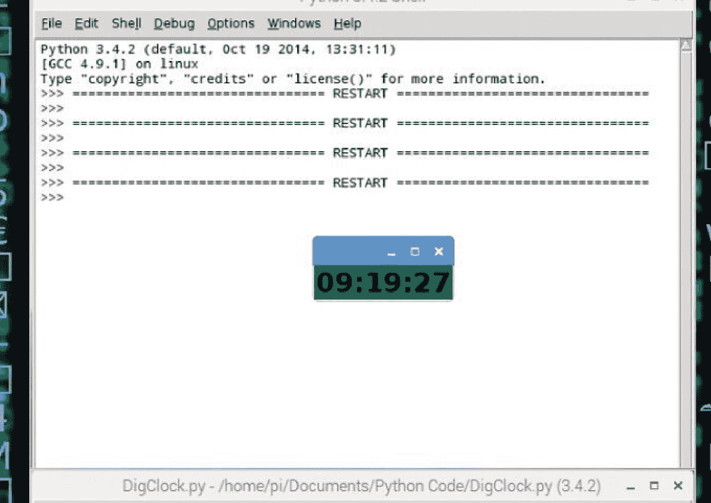

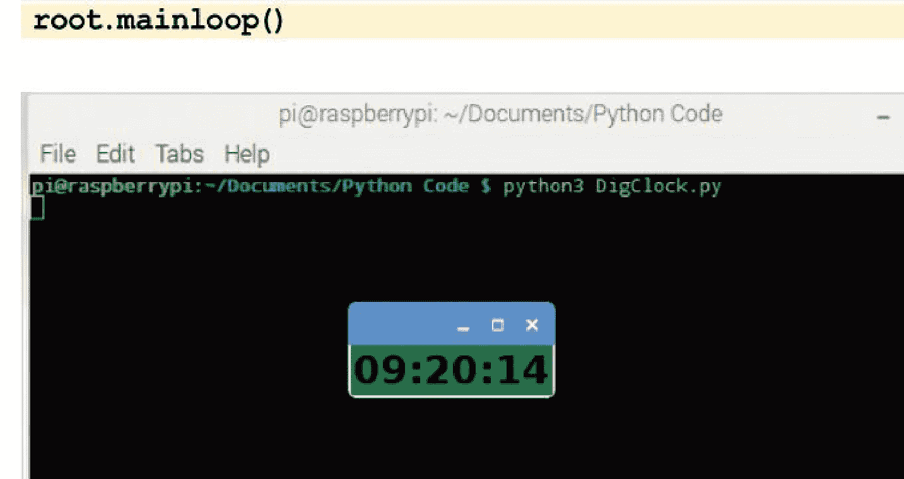

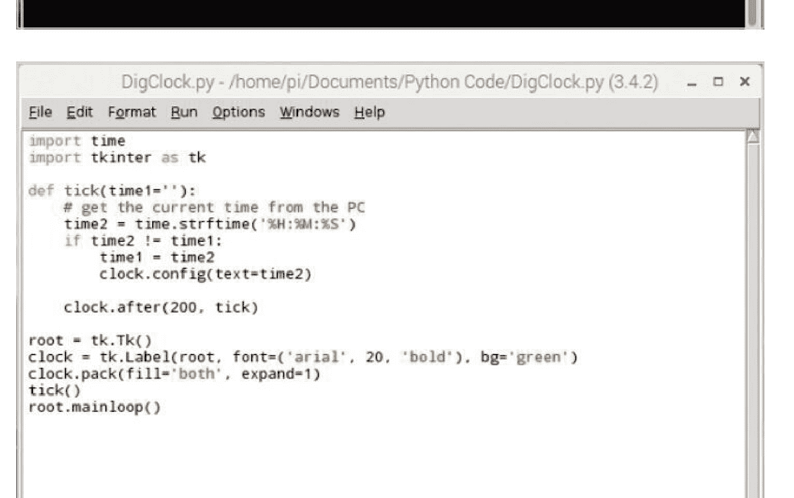

## 滴答滴答

这是我们过去多次使用的代码，用于在多个显示器上工作时跟踪时间，只需瞥一眼屏幕上放置的位置即可。

这个 Tkinter 窗口可以随意移动而不影响时间显示，用户也可以随意最大化或关闭它。我们没有给这个 Tkinter 时钟窗口设置标题，所以你可以轻松地通过从本书其他示例中截取代码来添加。

另一个可以改进的领域是将此代码包含在 Windows 或 Linux 启动时，使其自动弹出在桌面上。此外，看看你能否通过包含不同时区来增强其功能：罗马、巴黎、伦敦、纽约、莫斯科等等。

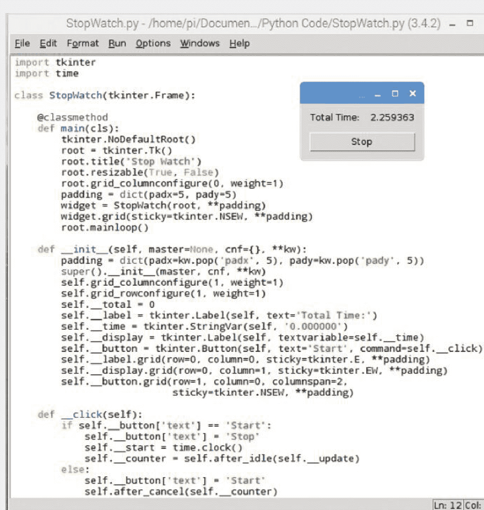

另一个扩展示例，可以是数字秒表。为此，你可以使用以下代码：

```python
import tkinter
import time

class StopWatch(tkinter.Frame):
    @classmethod
    def main(cls):
        tkinter.NoDefaultRoot()
        root = tkinter.Tk()
```

```python
    root.title('Stop Watch')
    root.resizable(True, False)
    root.grid_columnconfigure(0, weight=1)
    padding = dict(padx=5, pady=5)
    widget = StopWatch(root, **padding)
    widget.grid(sticky=tkinter.NSEW, **padding)
    root.mainloop()

def __init__(self, master=None, cnf={}, **kw):
    padding = dict(padx=kw.pop('padx', 5), pady=kw.pop('pady', 5))
    super().__init__(master, cnf, **kw)
    self.grid_columnconfigure(1, weight=1)
    self.grid_rowconfigure(1, weight=1)
    self.__total = 0
    self.__label = tkinter.Label(self, text='Total Time:')
    self.__time = tkinter.StringVar(self, '0.000000')
    self.__display = tkinter.Label(self, textvariable=self.__time)
    self.__button = tkinter.Button(self, text='Start', command=self.__click)
    self.__label.grid(row=0, column=0, sticky=tkinter.E, **padding)
    self.__display.grid(row=0, column=1, sticky=tkinter.EW, **padding)
    self.__button.grid(row=1, column=0, columnspan=2, sticky=tkinter.NSEW, **padding)

def __click(self):
    if self.__button['text'] == 'Start':
        self.__button['text'] = 'Stop'
        self.__start = time.clock()
        self.__counter = self.after_idle(self.__update)
    else:
        self.__button['text'] = 'Start'
        self.after_cancel(self.__counter)

def __update(self):
    now = time.clock()
    diff = now - self.__start
    self.__start = now
    self.__total += diff
    self.__time.set('{:.6f}'.format(self.__total))
    self.__counter = self.after_idle(self.__update)

if __name__ == '__main__':
    StopWatch.main()
```

## 使用 Winsound 模块播放音乐

当然，除了播放现有的 MP3 文件，你完全可以制作自己的音乐。下面的代码将播放帕海贝尔的《D大调卡农》，毫无逊色。

### MUSIC.PY

该代码同时利用了 Time 和 Winsound 模块，定义音调和音高，并插入 0.5 秒的短暂停顿。

```python
import winsound
import time

t = 250
p = .50

l1C = 65

lC = 131
lDb = 139
lD = 147
lEb = 156
lE = 165
lF = 175
lGb = 185
lG = 196
lAb = 208
lA = 220
lBb = 233
lB = 247

C = 262
Db = 277
D = 294
Eb = 311
E = 330
F = 349
Gb = 370
G = 392
Ab = 415
A = 440
Bb = 466
B = 494

hC = 523
hDb = 554
hD = 587
hEb = 622
hE = 659
hF = 698
hGb = 740
hG = 784
hAb = 831
hA = 880
hBb = 932
hB = 988

time.sleep(0.001)
```

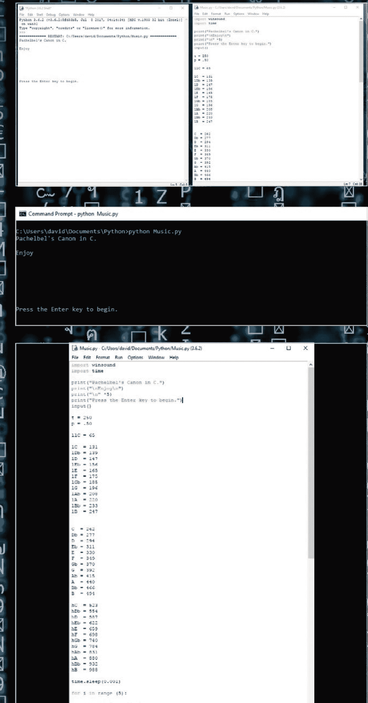

```python
for i in range (5):
    winsound.Beep( lC, 2*t)
    winsound.Beep( hC, t)
    winsound.Beep( hE, t)
    winsound.Beep( hG, t)
    time.sleep(p)

    winsound.Beep( lG, 2*t)
    winsound.Beep( G, t)
    winsound.Beep( B, t)
    winsound.Beep( hD, t)
    time.sleep(p)

    winsound.Beep( lA, 2*t)
    winsound.Beep( A, t)
    winsound.Beep( hC, t)
    winsound.Beep( hE, t)
    time.sleep(p)

    winsound.Beep( lE, 2*t)
    winsound.Beep( E, t)
    winsound.Beep( G, t)
    winsound.Beep( B, t)
    time.sleep(p)

    winsound.Beep( lF, 2*t)
    winsound.Beep( F, t)
    winsound.Beep( A, t)
    winsound.Beep( hC, t)
    time.sleep(p)

    winsound.Beep( lC, 2*t)
    winsound.Beep( C, t)
    winsound.Beep( E, t)
    winsound.Beep( G, t)
    time.sleep(p)

    winsound.Beep( lF, 2*t)
    winsound.Beep( F, t)
    winsound.Beep( A, t)
    winsound.Beep( hC, t)
    time.sleep(p)

    winsound.Beep( lG, 2*t)
    winsound.Beep( G, t)
    winsound.Beep( B, t)
    winsound.Beep( hD, t)
    time.sleep(p)
```

## 甜美音乐

显然，Winsound 模块是 Python 仅限 Windows 的函数集。在 Windows 中打开你的 IDLE 并复制代码。按 F5 保存并执行，然后按代码指示按 Enter 键开始播放音乐。

当然，你可以调整 `winsound.Beep` 的频率和持续时间，以适应你自己特定的音乐；或者你也可以保持原样享受其中。或许可以尝试不同的方法来制作其他音乐。

例如，任天堂经典游戏《塞尔达传说：时之笛》的玩家，可以通过输入以下代码来享受游戏标题中的音乐前奏：

```python
import winsound
beep = winsound.Beep

c = [
    (880, 700),
    (587, 1000),
    (698, 500),
    (880, 500),
    (587, 1000),
    (698, 500),
    (880, 250),
    (1046, 250),
    (988, 500),
    (784, 500),
    (699, 230),
    (784, 250),
    (880, 500),
    (587, 500),
    (523, 250),
    (659, 250),
    (587, 750)
]

s = c + c

for f, d in s:
    beep(f, d)
```

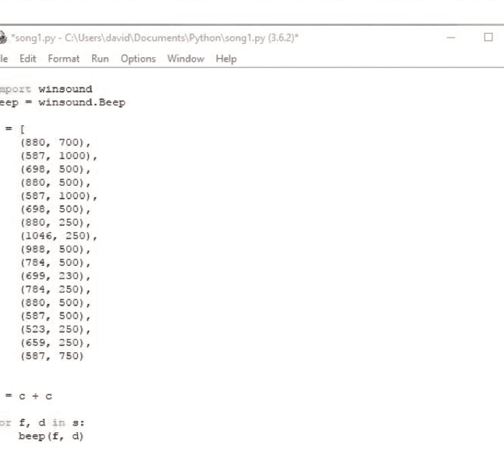

- 1. 代码开头导入了 Winsound 和 Time 模块；请记住，这是一个仅限 Windows 的 Python 脚本。变量 `t` 设置持续时间，而 `p` 等于 `.5`，可用于 `time.sleep` 函数。
- 2. 这些变量设置了频率，对应的数字可以在代码的下一部分中使用。
- 3. `Winsound.beep` 需要括号内指定一个频率和持续时间。频率来自代码第二部分调用的大量变量，持续时间则通过代码开头设置的 `t` 变量提供。使用变量 `p` 在 `winsound.beep` 语句块之间设置了半秒钟的停顿。

## 文本冒险脚本

文本冒险是提升Python编程技能并同时获得乐趣的绝佳方式。我们创建的这个示例将引导你踏上制作经典文本冒险游戏的旅程；最终的结局则由你决定。

## ADVENTURE.PY

冒险游戏首先只使用了Time模块，在打印函数之间创建停顿。其中有一个帮助系统可供扩展，故事本身也可以扩展。

```python
import time

print("\n" * 200)
print(">>>>>>>>>>>>>Awesome Adventure<<<<<<<<<<<<")
print("\n" * 3)
time.sleep(3)
print("\nA long time ago, a warrior strode forth from the frozen north.")
time.sleep(1)
print("Does this warrior have a name?")
name=input("> ")
print(name, "the barbarian, sword in hand and looking for adventure!")
time.sleep(1)
print("However, evil is lurking nearby....")
time.sleep(1)
print("A pair of bulbous eyes regards the hero...")
time.sleep(1)
print("Will", name, "prevail, and win great fortune...")
time.sleep(1)
print("Or die by the hands of great evil...?")
time.sleep(1)
print("\n" *3)
print("Only time will tell....")
time.sleep(1)
print('...')
time.sleep(1)
print('...')
time.sleep(1)
print('...')
time.sleep(1)
print('...')
time.sleep(5)
print("\n" *200)

print('''        You find yourself at a small inn. There’s little gold in your purse but your sword is sharp, and you’re ready for adventure.
            With you are three other customers.
            A ragged looking man, and a pair of dangerous looking guards.''')
```

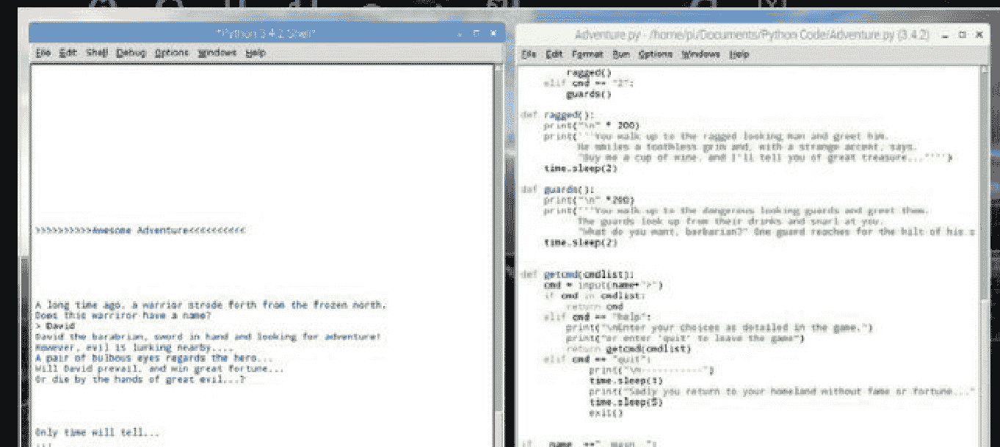

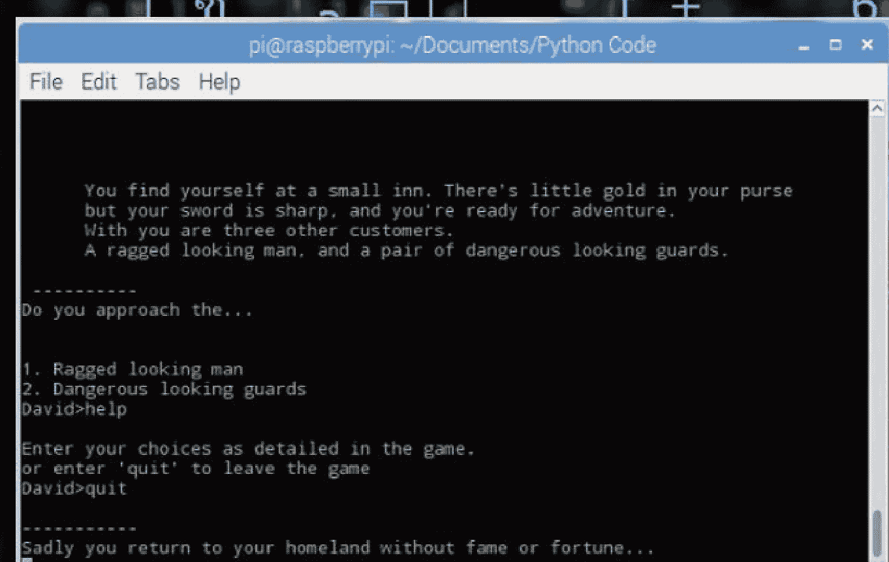

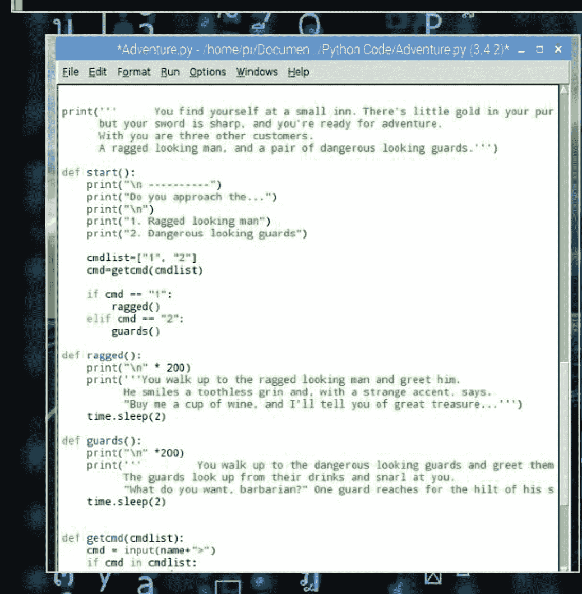

```python
def start():
    print("\n -----------")
    print("Do you approach the...")
    print("\n")
    print("1. Ragged looking man")
    print("2. Dangerous looking guards")

    cmdlist=["1", "2"]
    cmd=getcmd(cmdlist)

    if cmd == "1":
        ragged()
    elif cmd == "2":
        guards()

def ragged():
    print("\n" * 200)
    print('''        You walk up to the ragged looking man and greet him.
            He smiles a toothless grin and with a strange accent, says.
            "Buy me a cup of wine, and I’ll tell you of great treasure...."''')
    time.sleep(2)

def guards():
    print("\n" *200)
    print('''            You walk up to the dangerous looking guards and greet them.
            The guards look up from their drinks and snarl at you.
            "What do you want, barbarian?" One guard reaches for the hilt of his sword.''')
    time.sleep(2)

def getcmd(cmdlist):
    cmd = input(name+">")
    if cmd in cmdlist:
        return cmd
    else:
        print("Bad command, try again.")
        return getcmd(cmdlist)
```

```python
if cmd == "1":
    ragged()
elif cmd == "2":
    guards()

def ragged():
    print("\n" * 200)
    print('''You walk up to the ragged looking man and
    greet him.
    He smiles a toothless grin and, with a strange
    accent, says.
    "Buy me a cup of wine, and I'll tell you of
    great treasure...''')
    time.sleep(2)

def guards():
    print("\n" * 200)
    print('''You walk up to the dangerous looking guards
    and greet them.
    The guards look up from their drinks and
    snarl at you.
    "What do you want, barbarian?" One guard reaches
    for the hilt of his sword...''')
    time.sleep(2)
```

```python
def getcmd(cmdlist):
    cmd = input(name+">")
    if cmd in cmdlist:
        return cmd
    elif cmd == "help":
        print("\nEnter your choices as detailed in
        the game.")
        print("or enter 'quit' to leave the game")
        return getcmd(cmdlist)
    elif cmd == "quit":
        print("\n-----------")
        time.sleep(1)
        print("Sadly you return to your homeland without
        fame or fortune...")
        time.sleep(5)
        exit()

if __name__ == "__main__":
    start()
```

## 冒险时光

如你所见，这只是冒险的开始，已经占用了相当多的代码行。当你扩展它，并编织故事时，你会发现你可以重复某些场景，比如与敌人的偶遇等。

我们将两次遭遇都定义为一组函数，同时在`cmdlist`列表和`cmd`变量下提供了一系列可能的选择，`cmd`本身也是一个定义好的函数。扩展这个结构非常简单，只需规划好每次遭遇和选择，并围绕它创建一个定义好的函数。只要用户不在冒险中输入`quit`，他们就可以一直玩下去。

冒险中还有空间设置一组变量，用于战斗、运气、生命值、耐力，甚至是一个物品栏或获得的金币数量。每次成功的战斗情况都可以减少主角的生命值，但增加他们的战斗技能或耐力。此外，他们可以搜刮尸体获得金币，或通过任务赚取金币。

最后，考虑引入Random模块如何？这将使你能够在游戏中加入随机元素。例如，在战斗中，当你攻击敌人时，你会造成随机伤害，敌人也是如此。你甚至可以根据你或对手的战斗技能、当前生命值、力量和耐力，计算出提高更好命中率的数学公式。你可以在旅馆里创建一个骰子游戏，看看你是赢还是输金币（同样，通过将你的运气因素纳入计算来提高获胜几率）。

不用说，你的文本冒险游戏可以呈指数级增长，并证明是一件奇妙的作品。祝你好运，享受你的冒险吧。

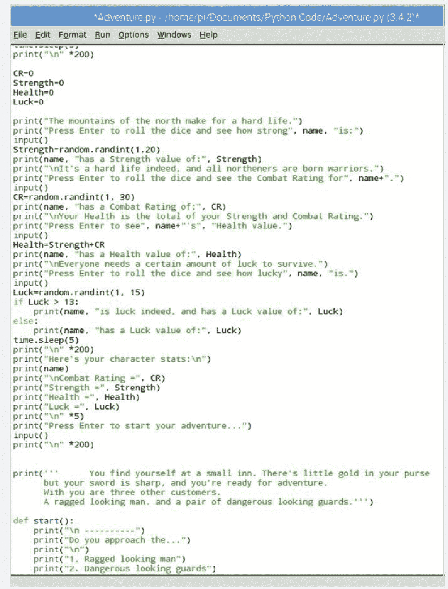

## Python滚动字幕脚本

你可能会惊讶地发现，我们经常被要求提供的代码片段之一就是某种形式的滚动字幕。虽然我们之前已经介绍过各种形式的滚动文本，但字幕似乎一直不断出现。所以，这就是了。

## 字幕时光

对字幕代码的明显改进在于文本的速度和文本将显示的内容。否则，你可以更改字幕窗口的背景颜色、字体和字体颜色，以及Tkinter窗口的几何形状（如果你愿意的话）。

另一个可以引入的有趣元素是Python 3可用的众多文本转语音模块之一。你可以通过`pip install`安装一个，导入它，然后当字幕显示文本时，文本转语音函数会同时读出变量，因为整个文本都存储在标记为`s`的变量中。

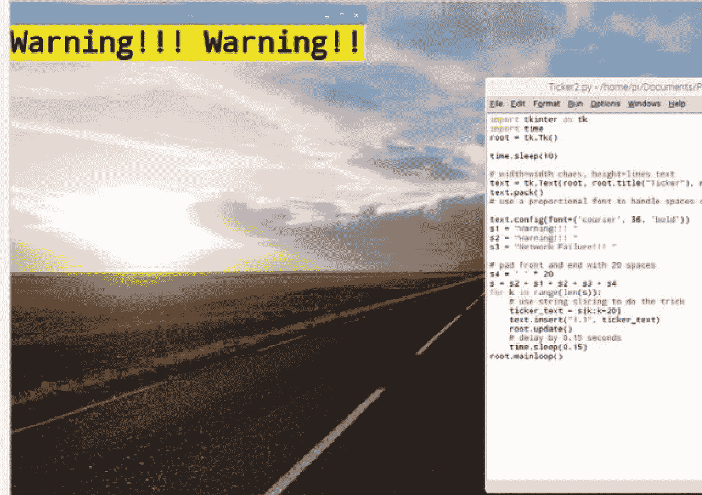

字幕示例可用于系统警告，例如显示在你的工作或家庭网络上，详细说明周末为维护而关闭服务器；或者只是告知每个人正在发生的事情。我们相信你会想出一些好的用途。

### TICKER.PY

我们在这里使用Tkinter和Time模块来确定文本在窗口中显示的速度。

```python
import time
import tkinter as tk

root = tk.Tk()
canvas = tk.Canvas(root, root.title("Ticker Code"),
    height=80, width=600, bg="yellow")
canvas.pack()
font = ('courier', 48, 'bold')
text_width = 15

#Text blocks insert here....

s1 = "This is a scrolling ticker example. As you
    can see, it's quite long but can be a lot longer if
    necessary... "
s2 = "We can even extend the length of the ticker
    message by including more variables... "
s3 = "The variables are within the s-values in
    the code. "
s4 = "Don't forget to concatenate them all before the
    For loop, and rename the 'spacer' s-variable too."

# pad front and end of text with spaces
s5 = ' ' * text_width
# concatenate it all
s = s5 + s1 + s2 + s3 + s4 + s5
x = 1
y = 2
text = canvas.create_text(x, y, anchor='nw', text=s,
    font=font)
dx = 1
dy = 0  # use horizontal movement only

# the pixel value depends on dx, font and length of text
pixels = 9000

for p in range(pixels):
    # move text object by increments dx, dy
    # -dx --> right to left
    canvas.move(text, -dx, dy)
    canvas.update()
    # shorter delay --> faster movement
    time.sleep(0.005)
    #print(k)  # test, helps with pixel value

root.mainloop()
```## 简易 Python 计算器

有时最简单的代码反而最有效。以这个简易 Python 计算器脚本为例。它基于之前介绍的“创建自定义模块”部分，但并未使用任何外部模块。

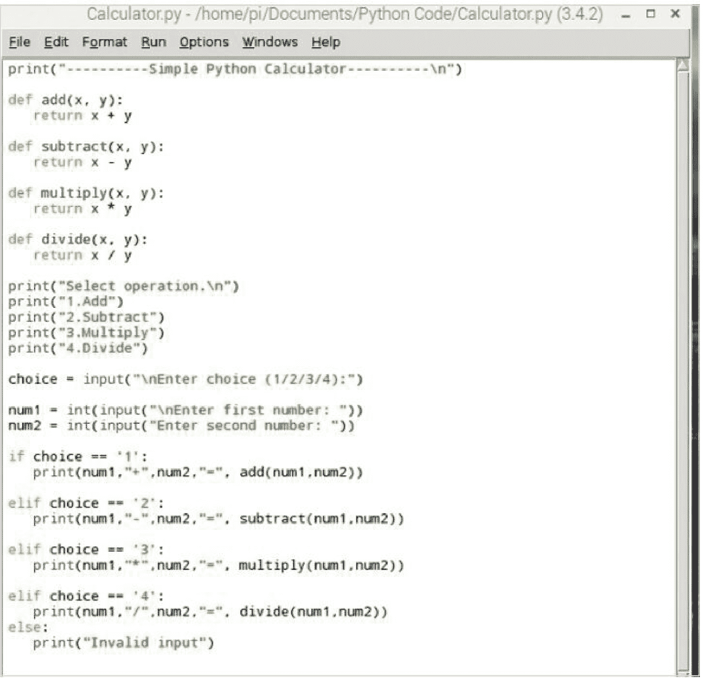

### CALCULATOR.PY

我们首先定义了一些函数，然后引导至用户菜单和输入部分。这段代码易于理解，因此也便于扩展。

```python
print("----------Simple Python Calculator----------\n")

def add(x, y):
    return x + y

def subtract(x, y):
    return x - y

def multiply(x, y):
    return x * y

def divide(x, y):
    return x / y

print("Select operation.\n")
print("1.Add")
print("2.Subtract")
print("3.Multiply")
print("4.Divide")

choice = input("\nEnter choice (1/2/3/4):")

num1 = int(input("\nEnter first number: "))
num2 = int(input("Enter second number: "))

if choice == '1':
    print(num1,"+",num2,"=", add(num1,num2))

elif choice == '2':
    print(num1,"-",num2,"=", subtract(num1,num2))

elif choice == '3':
    print(num1,"*",num2,"=", multiply(num1,num2))

elif choice == '4':
    print(num1,"/",num2,"=", divide(num1,num2))
else:
    print("Invalid input")
```

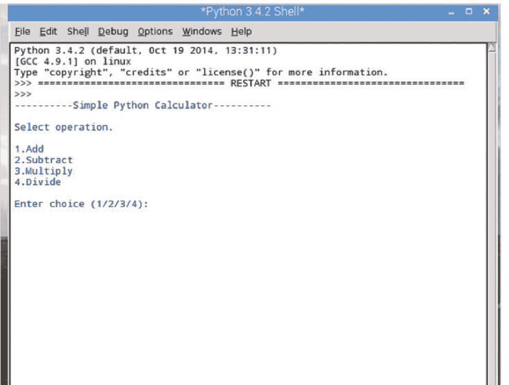

### 改进计算

这里显而易见的改进方向是使用“创建自定义模块”的方法，将函数定义提取为一个模块。然后你可以调用该模块，并专注于代码主体。

另一个改进领域是代码本身。目前计算只执行一次，你可以将其封装在一个 `while` 循环中，这样一旦给出结果，用户就会被送回主菜单。也许，改进“无效输入”部分也值得考虑。

## 猜词游戏脚本

猜词游戏非常适合用 Python 编程实现。它可以极其复杂，显示图形、剩余猜测次数、庞大的随机词库以及无数其他元素。它也可以相当简单。这里我们结合了两者。

### HANGMAN.PY

我们用可以在 IDLE Shell 中显示的字符制作了一个猜词游戏板（绞刑架），并配有一个庞大的词库供随机选择。

```python
import random

board = ['''
>>>>>>>>>>Hangman<<<<<<<<<<

+---+
|   |
|
|
|
========''', '''

+---+
|   |
O   |
|
|
========''', '''

+---+
|   |
O   |
|   |
|
========''', '''

+---+
|   |
O   |
|   |
|   
========''', '''

+---+
|   |
O   |
|\ |
|   
========''', '''

+---+
|   |
O   |
|\| |
|   
========''', '''

+---+
|   |
O   |
|\|/|
|   
========''', '''

+---+
|   |
O   |
|\|/|
|/  
========''', '''

+---+
|   |
O   |
|\|/|
|/ \
========''']

class Hangman:
    def __init__(self,word):
        self.word = word
        self.missed_letters = []
        self.guessed_letters = []

    def guess(self,letter):
        if letter in self.word and letter not in self.guessed_letters:
            self.guessed_letters.append(letter)
        elif letter not in self.word and letter not in self.missed_letters:
            self.missed_letters.append(letter)
        else:
            return False
        return True

    def hangman_over(self):
        return self.hangman_won() or (len(self.missed_letters) == 6)

    def hangman_won(self):
        if '_' not in self.hide_word():
            return True
        return False

    def hide_word(self):
        rtn = ''
        for letter in self.word:
            if letter not in self.guessed_letters:
                rtn += '_'
            else:
                rtn += letter
        return rtn

    def print_game_status(self):
        print(board[len(self.missed_letters)])
        print('Word: ' + self.hide_word())
        print('Letters Missed: ',)
        for letter in self.missed_letters:
            print(letter,)
        print()
        print('Letters Guessed: ',)
        for letter in self.guessed_letters:
            print(letter,)
        print()

def rand_word():
    bank = 'ability about above absolute accessible accommodation accounting beautiful bookstore calculator clever engaged engineer enough handsome refrigerator opposite socks interested strawberry backgammon anniversary confused dangerous entertainment exhausted impossible overweight temperature vacation scissors appointment decrease development earthquake environment necessary luggage responsible ambassador circumstance congratulate frequent'.split()
    return bank[random.randint(0,len(bank)-1)]

def main():
    game = Hangman(rand_word())
    while not game.hangman_over():
        game.print_game_status()
        user_input = input('\nEnter a letter: ')
        game.guess(user_input)

    game.print_game_status()
    if game.hangman_won():
        print('\nCongratulations! You have won!!')
    else:
        print('\nSorry, you have lost.')
        print('The word was ' + game.word)

    print('\nGoodbye!\n')

if __name__ == '__main__':
    main()
```

### QUIT()

由于这是我们 Python 代码库中的最后一个示例，我们决定以精彩的方式收尾，展示猜词游戏中的绞刑架会随着每次错误的猜测而逐步绘制出来。如果这里的文本看起来有些错位，请不要担心，这仅仅是因为使用 Python IDLE 编辑器与将代码粘贴到文字处理器（其格式化方式不同）之间的差异造成的。

你可以做很多事情来改进、增强和扩展我们在此展示的内容。你可以添加一个程序，如果用户输入数字或字符则返回错误。你可以为一次性猜出整个单词（而不是逐个字母猜测）的人增加额外分数，也许还可以在游戏失败时添加肖邦的《葬礼进行曲》；或者在获胜时添加一些庆祝性的内容。

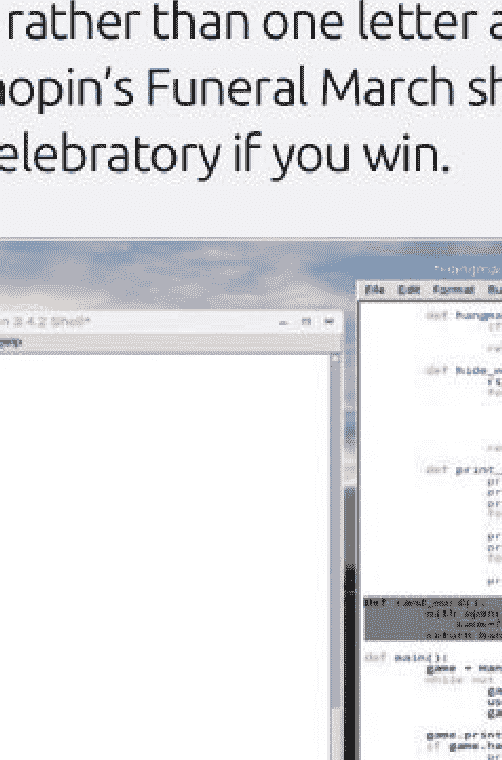

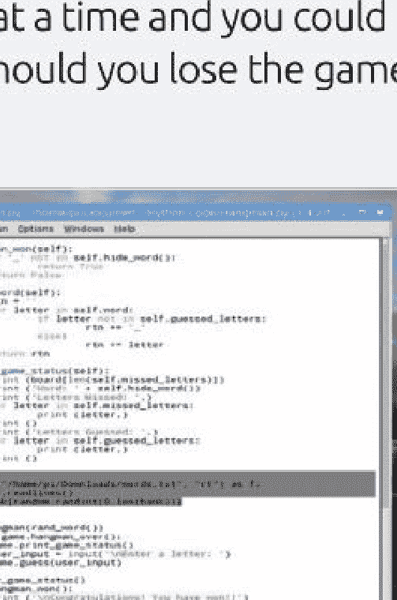

考虑替换词库。它们位于 `bank` 列表下，可以轻松替换为更难的词汇。如果你下载 www.github.com/dwyl/english-words，可以找到一个包含超过 466,000 个单词的文本文档。也许你可以将词库中的单词替换为读取该文本文件的内容：

```python
def rand_word():
    with open("/home/pi/Downloads/words.txt", "rt") as f:
        bank=f.readlines()
    return bank[random.randint(0,len(bank)-1)]
```

## 理解 Linux


Linux 是一个功能极其强大且用途广泛的操作系统。它被广泛应用于编程和工程领域、科学、太空探索、教育、游戏以及其他所有领域。它是高性能服务器的首选操作系统，是互联网的骨干，并驱动着世界上最快的超级计算机。

了解如何使用 Linux 及其结构，是能够创建更好 Python 内容的关键。例如，树莓派使用基于 Linux 的操作系统，因此是一个极佳的编程平台。无论你是像我们一样使用树莓派，还是使用 Linux Mint 或 Ubuntu，这些页面都将对你的 Python 学习证明是无价的。掌握 Linux，掌握 Python，开始规划你的编程未来。

## 什么是Linux？

树莓派的操作系统是Raspbian，这是一种Linux操作系统；但Linux到底是什么？它从何而来，又有什么作用？在Windows和macOS主导桌面的世界里，人们很容易忽视它，但Linux远比你想象的更加强大。

Linux是一个功能惊人强大、快速、安全且能力全面的操作系统。它不仅作为树莓派的首选操作系统（以Raspbian OS的形式），也被用于一些意想不到的地方。

尽管根据netmarketshare.com的数据，Linux在桌面操作系统市场中仅占1.96%的份额，但它却拥有忠实的爱好者、用户和贡献者群体。它于1991年由赫尔辛基大学学生Linus Torvalds创建，当时他对流行的教育系统Minix（一个当时使用的Unix操作系统微缩版本）的局限性和许可证问题感到不满。

Torvalds需要一个能够镜像Unix性能和功能的系统，且无需支付许可证费用。于是Linux应运而生，这是一个类Unix操作系统，它使用了GNU项目中自由可用的代码。这使得世界各地的用户能够完全免费地使用类Unix系统的强大功能，这一理念至今仍然成立：Linux可免费下载、安装和使用。

Unix本身在70年代早期发布，最初是为程序员开发的多任务、模块化操作系统，它为程序员提供了一个稳定的编程平台。然而，其性能、强大功能和可移植性意味着它很快成为公司和大学进行高端计算任务时的首选系统。

Linux与其他任何操作系统（如Windows或macOS）非常相似，因为它管理计算机硬件，为用户提供访问这些硬件的接口，并附带用于生产力、通信、游戏、科学、教育等方面的程序。Linux可以分为几个重要的组成部分：

### 引导加载程序
引导加载程序是初始化并启动计算机的软件。它加载操作系统用来开始访问系统硬件的各种模块。你可以修改引导加载程序以加载安装在系统上的多个操作系统。

### 图形服务器
这是Linux中的一个模块，负责向显示器提供图形输出。它被称为X服务器或简称X。X是一个管理一个或多个图形显示以及连接到计算机的一个或多个输入设备（键盘、鼠标等）的应用程序。

### 守护进程
守护进程是在操作系统启动时启动的后台服务。它们可以启用打印、声音、网络等功能。它们通常在后台静默运行，而不是在用户的直接控制下，常常等待由某个事件或条件激活。

### 内核
内核是系统的核心，也是唯一真正被称为Linux的组件。Linux内核管理计算机处理器、内存、存储以及连接到计算机的所有外围设备。它为操作系统的所有其他部分提供基本服务。

### 桌面环境
桌面环境（DE）是用户与之交互的主要图形用户界面（GUI）。它就是桌面，包含了互联网浏览器、生产力软件、游戏以及你正在使用的任何程序或应用。有无数的桌面环境可供选择。Raspbian使用的是PIXEL。

### 程序/应用程序
Linux是一个开源的、免费的操作系统，它也利用了成千上万的自由可用的应用程序。像LibreOffice、GIMP和Python这样的软件只是冰山一角。

## Shell

Linux shell是一个命令行界面环境，Linux用户可以使用它向操作系统输入直接影响它的命令。在shell中，你可以添加新用户、重启系统、创建和删除文件及文件夹等等。BASH（Bourne Again Shell）是Linux中最流行的shell，尽管还有更多其他shell可选。shell也被称为终端，你将通过本书的这一部分在此进行工作。

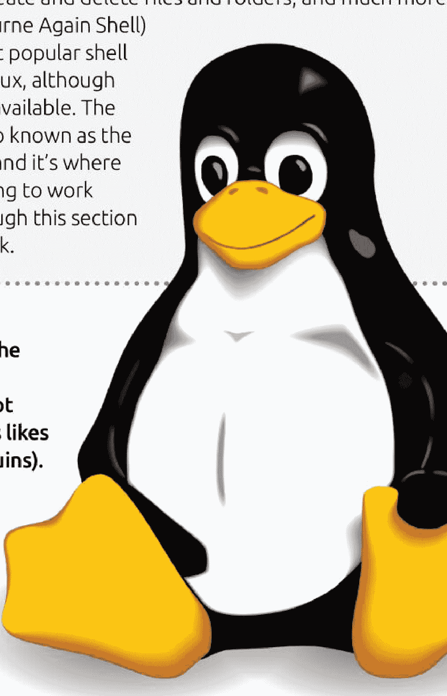


Linux在全球范围内被用于许多基础且相当独特的用途。虽然不同环境下的Linux看起来可能大相径庭，但实际的Linux内核可以在现代智能电视、车载娱乐系统和GPS、超级计算机、物联网设备以及树莓派中找到。NASA在控制中心和国际空间站（ISS）上都使用Linux。Linux服务器驱动着互联网的骨干网，以及你日常访问的大多数网站。Android利用了Linux内核的组件，机顶盒、游戏机甚至你的冰箱、冰柜、烤箱和洗衣机也是如此。

Linux不仅仅是一个免费使用的操作系统。它稳定、强大、快速，易于定制，并且几乎不需要维护。然而，它不仅仅关乎性能数据；Linux意味着从其他操作系统的围墙花园方法中解放出来。它是一个充满活力的社区，由志同道合的人组成，他们希望摆脱价格或一致性的束缚，从计算机中获得更多。Linux意味着选择。

树莓派上的Raspbian是首选的Linux发行版。


桌面环境可以根据用户的意愿变得复杂或简单。

## 使用文件系统

要精通Linux，理解文件系统的工作原理非常重要。此外，熟悉终端（或shell）也很重要。这个命令行环境起初可能看起来令人生畏，但经过练习后，很快就会变得容易使用。

### 浏览目录

要进入终端，请点击树莓派桌面顶部从左数第四个图标，那个带有向右箭头和下划线的图标。这就是shell或终端。

**步骤 1** 首先，你将了解目录和目录路径。目录与文件夹是同一回事，但在Linux中它总是被称为目录。这些目录使用“/”字符相互嵌套。所以当你看到/home/pi时，意味着pi目录在home目录内部。输入：clear 并按回车以清屏。现在输入：pwd。这代表打印当前工作目录，会显示/home/pi。

**步骤 3** 输入：ls 以查看当前目录的内容。你应该会看到Desktop、Documents、Downloads和Scratch（显示为蓝色）。根据你的树莓派使用情况，你可能还会看到其他项目。颜色编码值得了解：目录是蓝色的，而大多数文件是白色的。随着学习的深入，你会看到其他颜色：可执行文件（程序）是亮绿色的，归档文件是红色的等等。蓝色和白色是入门时需要知道的两种颜色。

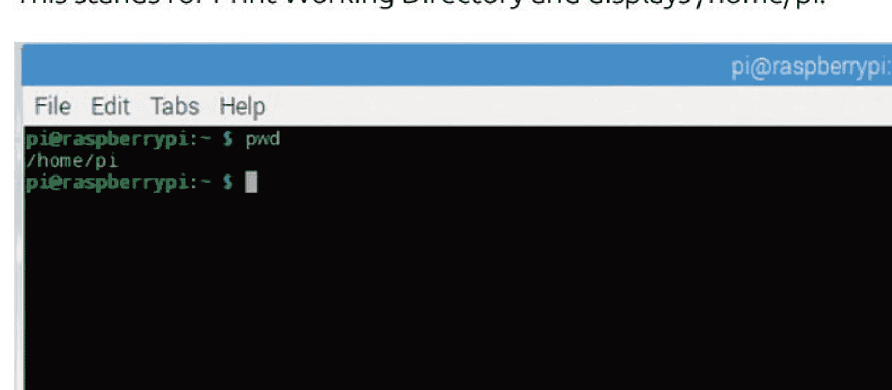

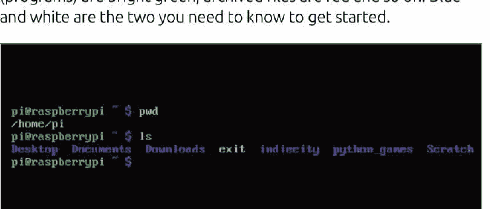

**步骤 2** 当你登录到树莓派时，你并不是从硬盘驱动器的基部（称为“根”，也称为顶级目录）开始的。相反，你开始于你的用户目录内，该目录默认名为“pi”，而它本身又在一个名为“home”的目录中。目录由“/”符号指示。所以，“/home/pi”告诉你，在根目录中有一个名为home的目录，而下一个“/”表示在“home”内部有一个名为“pi”的目录。这就是你的起始位置。

**步骤 4** 现在你将从pi目录移动到Documents目录。输入：cd Documents。注意大写的“D”。Linux区分大小写，这意味着你必须输入完全正确的名称，包括正确的大小写。cd命令代表更改目录。现在再次输入：pwd 以查看目录路径。它将显示/home/pi/Documents。输入：ls 以查看Documents目录内的文件。

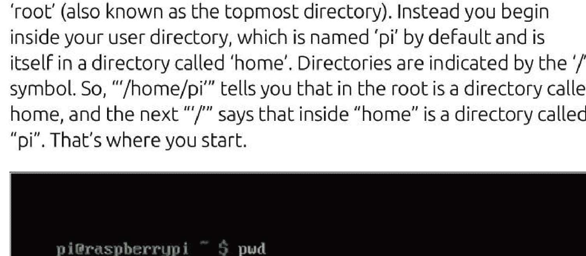

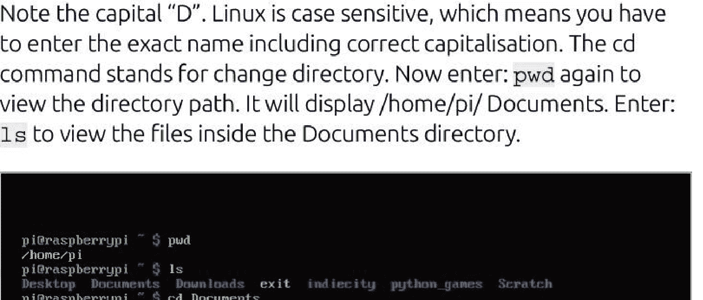

## 绝对路径与相对路径

了解工作目录、根目录和主目录之间的区别非常重要。路径有两种类型：绝对路径和相对路径。这些概念比听起来更容易理解。让我们来看看……

**步骤 1**
默认情况下，像"ls"这样的命令会使用工作目录。这是你当前正在查看的目录，默认设置为主目录（/users/pi）。使用"pwd"（打印工作目录）命令可以让你知道当前的工作目录是什么，而使用"cd"命令可以更改工作目录。

```
pi@raspberrypi ~ $ pwd
/home/pi
pi@raspberrypi ~ $
```

**步骤 2**
根目录始终是'/'。输入：`ls /`会列出根目录的内容，输入：`cd /`会切换到根目录。这很重要，因为"ls Documents/Pictures"和"ls /Documents/Pictures"之间有区别。第一个命令列出工作目录内的 Documents 目录中的 Pictures 目录的内容（如果你在主目录中，这将会有效）。

```
pi@raspberrypi:~ $ pwd
/home/pi
pi@raspberrypi:~ $ ls Documents/Pictures
BDM-Web-logo-dark1.jpg  David Hayward.jpg  RPi.png
pi@raspberrypi:~ $
```

**步骤 3**
第二个命令（"ls /Documents/Pictures"）尝试列出根目录中名为 Documents 的目录内的 Pictures 的内容（因为路径以'/'开头，表示根目录）。通常根目录下没有 Documents 目录，所以你会得到"没有那个文件或目录"的错误。以'/'开头的路径被称为"绝对路径"，而不以'/'开头的路径被称为"相对路径"，因为它是相对于你的工作目录的。

```
pi@raspberrypi ~ $ ls /
bin  boot  dev  etc  home  lib  lost+found  media  mnt  opt  proc
pi@raspberrypi ~ $ ls /Documents/Pictures
ls: cannot access /Documents/Pictures: No such file or directory
pi@raspberrypi ~ $
```

**步骤 4**
还有一个指向你的用户目录的绝对路径快捷方式，那就是波浪号"~"字符。输入：`ls ~`总是列出你的主目录的内容，而"cd ~"会直接移动到你的主目录，无论你的工作目录是什么。你也可以在任何地方使用这个快捷方式：输入：`ls ~/Documents/Pictures`来显示 Pictures 的内容。

```
pi@raspberrypi:~ $ cd ~
pi@raspberrypi:~ $ pwd
/home/pi
pi@raspberrypi:~ $ ls ~/Documents/Pictures
BDM-Web-logo-dark1.jpg  David Hayward.jpg  RPi.png
pi@raspberrypi:~ $
```

**步骤 5**
如何返回到 pi 目录？通过使用命令 `cd ..`。在 Linux 中，两个点表示上级目录，也称为父目录。顺便说一下，单个点"."用于表示当前目录。你从不会使用 `cd .` 切换到同一目录，但了解一下是值得的，因为有些命令需要你指定当前目录。

```
pi@raspberrypi ~/Documents $ pwd
/home/pi/Documents
pi@raspberrypi ~/Documents $ cd ..
pi@raspberrypi ~ $ pwd
/home/pi
pi@raspberrypi ~ $
```

**步骤 6**
"ls"和"cd"命令也可以与更复杂的路径一起使用。输入：`ls Documents/Pictures`可以查看 Documents 目录内的 Pictures 目录的内容。你可以使用 `cd Documents/Pictures` 切换到此目录；使用 `cd ../..` 向上移动两个父目录。

```
pi@raspberrypi ~ $ ls Documents/Pictures
LEGO  LucyHattersley.jpg  raspberry_pi_2_photographs
pi@raspberrypi ~ $ cd Documents/Pictures
pi@raspberrypi ~/Documents/Pictures $ pwd
/home/pi/Documents/Pictures
pi@raspberrypi ~/Documents/Pictures $ cd ../..
pi@raspberrypi ~ $ pwd
/home/pi
pi@raspberrypi ~ $
```

## 列出和移动文件

诚然，使用桌面图形界面列出和移动文件比使用终端和键盘要容易得多。然而，这是一项重要的技能，随着你在树莓派和 Linux 方面的进步，你会欣赏到它的价值。

## 查看文件

操作系统建立在文件和文件夹（或者你更喜欢称之为目录）之上。虽然你习惯于查看自己的文件，但大多数操作系统会将其他文件隐藏起来。在 Raspbian 中，你可以访问系统中的每一个文件。

**步骤 1**
我们已经看过了"ls"，它列出工作目录中的文件，但你更可能使用像 `ls -l` 这样的命令。命令之后的部分（例如 '-lah'）被称为参数。这是一个修改命令行为的选项。

**步骤 2**
"-l"参数以长格式列出文件和目录。每个文件和目录现在各占一行，并且在每个文件前面有很多文本。首先你会看到很多字母和破折号，比如'drwxr-xr-x'。现在不用担心这些；它们被称为"权限"，我们稍后会讲到。

```
pi@raspberrypi ~ $ ls -l
total 24
-rw-r--r-- 1 pi pi    0 May 11 20:56 articles.txt
drwxr-xr-x 2 pi pi 4096 Apr 21 17:55 Desktop
drwxr-xr-x 5 pi pi 4096 Apr 21 14:50 Documents
drwx------ 2 pi pi 4096 Apr 21 15:23 Downloads
drwxr-xr-x 3 pi pi 4096 Apr 17 18:48 indiecity
-rw-r--r-- 1 pi pi    0 May 11 20:56 names.txt
drwxrwxr-x 2 pi pi 4096 Jan  1  1970 python_games
drwxr-xr-x 2 pi pi 4096 Apr 17 12:53 Scratch
pi@raspberrypi ~ $
```

**步骤 3**
权限字母之后是一个单独的数字。这是该项中的文件数量。如果它是一个文件，那么数字将是 1，但如果它是一个目录，数字至少是 2。这是因为每个目录包含两个隐藏文件；一个带有单点（.），一个带有两个点（..）。包含文件或其他目录的目录会有更高的数字。

**步骤 4**
接下来你会看到每行中列出两次"pi"这个词。这指的是用户，而不是你的计算机名称（你的默认用户名是"pi"）。第一个是文件的所有者，第二个是所属的组。通常这两个是相同的，你会看到'pi'或'root'。你可以输入：`ls -l /`来查看属于根账户的根目录中的文件和目录。

```
pi@raspberrypi ~ $ ls -l
total 28
-rw-r--r-- 1 pi pi    0 May 11 20:56 articles.txt
drwxr-xr-x 2 pi pi 4096 Apr 21 17:55 Desktop
drwxr-xr-x 5 pi pi 4096 Apr 21 14:50 Documents
drwx------ 2 pi pi 4096 Apr 21 15:23 Downloads
drwxr-xr-x 3 pi pi 4096 Apr 17 18:48 indiecity
-rw-r--r-- 1 pi pi    0 May 11 20:56 names.txt
drwxrwxr-x 2 pi pi 4096 Jan  1  1970 python_games
drwxr-xr-x 2 pi pi 4096 Apr 17 12:53 Scratch
drwxr-xr-x 3 pi pi 4096 May 11 21:15 test
pi@raspberrypi ~ $ ls -l /
total 74
drwxr-xr-x  2 root root  4096 Jan  1  1970 bin
drwxr-xr-x  3 root root  2048 Jan  1  1970 boot
drwxr-xr-x 12 root root  3280 May 11 09:03 dev
drwxr-xr-x 109 root root  4096 May 11 09:03 etc
drwxr-xr-x  3 root root  4096 Jan  1  1970 home
drwxr-xr-x 12 root root  4096 Jan  1  1970 lib
drwx------  2 root root 16384 Feb 15 11:21 lost+found
drwxr-xr-x  3 root root  4096 May 11 07:42 media
drwxr-xr-x  2 root root  4096 Jan 11 00:02 mnt
drwxr-xr-x  6 root root  4096 Jan  1  1970 opt
```

**步骤 5**
下一个数字与文件的大小（以字节为单位）相关。在 Linux 中，每个文本文件由字母组成，每个字母占据一个字节，所以我们的 names.txt 文件有 37 个字节，文档中有 37 个字符。文件和目录可能非常大且难以确定，所以使用 `ls -lh`。"h"参数使数字更人性化，更易于阅读。

```
pi@raspberrypi ~ $ ls -lh
total 32K
-rw-r--r-- 1 pi pi 0 May 11 20:56 articles.txt
drwxr-xr-x 2 pi pi 4.0K Apr 21 17:55 Desktop
drwxr-xr-x 5 pi pi 4.0K Apr 21 14:50 Documents
drwx------ 2 pi pi 4.0K Apr 21 15:23 Downloads
drwxr-xr-x 3 pi pi 4.0K Apr 17 18:48 indiecity
```

**步骤 6**
最后，你应该知道 Linux 中有很多隐藏文件。这些文件使用"-a"参数列出。隐藏文件和目录以点（.）开头，所以你不应该以点开头命名文件或目录，除非你想隐藏它。通常，你可以将所有三个参数组合到命令 `ls -lah` 中。

```
pi@raspberrypi ~ $ ls -lah
total 520K
drwxr-xr-x 33 pi pi 4.0K May 11 21:14 .
drwxr-xr-x  3 root root 4.0K Jan  1 1970 ..
drwx------ 2 pi pi 4.0K Apr 20 14:31 .aptitude
-rw-r--r-- 1 pi pi 0 May 11 20:56 articles.txt
-rw------- 1 pi pi 8.7K May 11 09:03 .bash_history
-rw-r--r-- 1 pi pi 220 Feb 15 14:05 .bash_logout
-rw-r--r-- 1 pi pi 3.2K Feb 15 14:05 .bashrc
drwxr-xr-x 10 pi pi 4.0K Apr 21 17:08 .cache
drwxr-xr-x 20 pi pi 4.0K Apr 21 13:33 .config
drwx------ 3 pi pi 4.0K Feb 16 14:16 .dbus
drwxr-xr-x 2 pi pi 4.0K Apr 21 17:55 Desktop
-rw-r--r-- 1 pi pi 35 Apr 17 12:17 .dmrc
drwxr-xr-x 5 pi pi 4.0K Apr 21 14:50 Documents
drwx------ 2 pi pi 4.0K Apr 21 15:23 Downloads
drwxr-xr-x 2 pi pi 4.0K Apr 20 13:45 .dreamchess
drwxr-xr-x 2 pi pi 4.0K Apr 21 18:15 .fontconfig
```

## 一些常见的目录

既然你知道了如何查看硬盘驱动器的内容，你就会开始注意到很多名为 bin、sbin、var 和 dev 的目录。这些是 Mac 上你看不到，在 Windows PC 上也不会遇到的文件和目录。

**步骤 1**
输入：`ls -lah /` 以查看硬盘驱动器根目录中的所有文件和目录，包括隐藏的项目。在这里，你将看到组成你的 Raspbian 操作系统（一个 Linux 版本）的所有项目。花点时间了解其中一些是值得的。

```
pi@raspberrypi ~ $ ls -lah /
total 82K
drwxr-xr-x 22 root root 4.0K May 11 21:23 .
drwxr-xr-x 22 root root 4.0K May 11 21:23 ..
drwxr-xr-x  2 root root root 4.0K Jan  1  1970 bin
drwxr-xr-x  3 root root root 2.0K Jan  1  1970 boot
drwxr-xr-x 12 root root root 3.3K May 11 09:03 dev
drwxr-xr-x 109 root root root 4.0K May 11 09:03 etc
drwxr-xr-x  3 root root root 4.0K Jan  1  1970 home
drwxr-xr-x 12 root root root 4.0K Jan  1  1970 lib
drwx------  2 root root root 16K Feb 15 11:21 lost+found
drwxr-xr-x  3 root root root 4.0K May 11 07:42 media
drwxr-xr-x  2 root root root 4.0K Jan 11 00:02 mnt
drwxr-xr-x  6 root root root 4.0K Jan  1  1970 opt
dr-xr-xr-x 85 root root root    0 Jan  1  1970 proc
drwx------  9 root root root 4.0K May 11 07:36 root
drwxr-xr-x 10 root root root  460 May 11 09:03 run
drwxr-xr-x  2 root root root 4.0K Jan  1  1970 sbin
drwxr-xr-x  2 root root root 4.0K Jun 20 2012 selinux
```

**步骤 2**
Bin 是一个存储二进制文件的目录。这是 Linux 对程序或应用程序的说法。Sbin 用于系统二进制文件，这些是构成你系统的程序。Dev 包含对你的设备的引用：硬盘驱动器、键盘、鼠标等。Etc 包含你的系统配置文件。

```
pi@raspberrypi ~ $ ls /bin
bash bzip2 chgrp dash domainname fgconsole gz
d bunzip2 bzgrep chmod date dumpkeys fgrep gzi
bzcat bzip2 chown dd echo findmnt hos
bzcmp bzip2recover chvt df ed fuser ip
bzdiff bzless con2fbmap dir egrep fusermount kbd
bzegrep bzmore cp dmesg false grep kil
bzexe cat cpio dnsdomainname fbset gunzip kmo
pi@raspberrypi ~ $
```

**步骤 3**
输入：`ls /home` 会显示你的主目录的内容，其中包含 pi；这是你开始时的目录。因此，输入：`ls /home/pi` 等同于仅从默认主目录运行"ls"。这是期望你放置大部分创建文档的地方。不要将 home 与"usr"混淆；/usr 目录是你找到程序工具和库的地方。

```
pi@raspberrypi ~ $ ls
articles.txt Desktop Downloads indiecity names.txt python_games
pi@raspberrypi ~ $ ls /home/pi
articles.txt Desktop Downloads indiecity names.txt python_games
pi@raspberrypi ~ $
```

**步骤 4**
Lib 是一个包含其他程序引用的代码库的目录（不同的程序共享 Lib 中的文件）。"Var"是 various 的缩写，主要是系统使用的文件，但你可能需要处理这里的项目。最后，有一个名为"tmp"的目录，用于临时文件；放在这里的文件在你的系统上是短期的，可以从系统中删除。

```
pi@raspberrypi ~ $ ls /var
backups cache lib local lock log mail opt run spool swap tmp ww
pi@raspberrypi ~ $
```

## 创建和删除文件

能够创建和删除文件是一项日常的计算技能。但是，使用 Linux 终端时需要格外小心，主要是因为任何已删除的文件都不会放入系统回收站。

## 创建文件

一旦你学会识别组成 Raspbian 操作系统的文件和目录，就该探索如何创建自己的了。知道如何创建、编辑和删除文件和目录，对于创建自己的项目至关重要。

### 第1步
我们将使用名为 `Touch` 的命令来创建一个文件。`Touch` 是一个有趣的命令，它会接触一个文件或目录并更新它（这会改变系统时间，就像你刚刚打开了该文件一样）。你可以通过使用 `ls -l` 命令并检查目录（例如 Scratch）旁的时间来查看 Touch 的访问时间。

### 第3步
如果你尝试对一个不存在的文件执行 touch 操作，你将创建一个具有该名称的空白文件。现在试试看。输入 `touch testfile` 和 `ls -l` 来查看文件。现在你的主目录中会有一个名为 "testfile" 的新文件。注意文件大小为 0，因为它里面什么都没有。

```
pi@raspberrypi ~ $ ls -l
total 24
drwxr-xr-x 2 pi pi 4096 Apr 21 17:55 Desktop
drwxr-xr-x 5 pi pi 4096 May 13 10:57 Documents
drwx------ 2 pi pi 4096 May 13 11:01 Downloads
drwxr-xr-x 3 pi pi 4096 Apr 17 18:48 indiecity
drwxrwxr-x 2 pi pi 4096 Jan  1  1970 python_games
drwxr-xr-x 2 pi pi 4096 Apr 17 12:53 Scratch
pi@raspberrypi ~ $ _
```

```
pi@raspberrypi ~ $ touch testfile
pi@raspberrypi ~ $ ls -l
total 24
drwxr-xr-x 2 pi pi 4096 Apr 21 17:55 Desktop
drwxr-xr-x 5 pi pi 4096 May 13 10:57 Documents
drwx------ 2 pi pi 4096 May 13 11:01 Downloads
drwxr-xr-x 3 pi pi 4096 Apr 17 18:48 indiecity
drwxrwxr-x 2 pi pi 4096 Jan  1  1970 python_games
drwxr-xr-x 2 pi pi 4096 May 13 11:05 Scratch
-rw-r--r-- 1 pi pi     0 May 13 11:10 testfile
pi@raspberrypi ~ $ _
```

### 第2步
现在输入：`touch Scratch` 然后再次输入 `ls -l`，注意时间已经改变了。它现在匹配当前时间。你可能想知道这与创建文件或目录有什么关系。Touch 有第二个更常见的用途，就是创建文件。

### 第4步
简要说明一下文件名：记住 Linux 区分大小写，所以如果你现在输入：`touch Testfile`（首字母大写的 T），它不会更新 "testfile"；而是会创建第二个名为 "Testfile" 的文件。输入：`ls -l` 可以查看两个文件。这很容易混淆，所以大多数人坚持始终使用小写字母。

```
pi@raspberrypi ~ $ ls -l
total 24
drwxr-xr-x 2 pi pi 4096 Apr 21 17:55 Desktop
drwxr-xr-x 5 pi pi 4096 May 13 10:57 Documents
drwx------ 2 pi pi 4096 May 13 11:01 Downloads
drwxr-xr-x 3 pi pi 4096 Apr 17 18:48 indiecity
drwxrwxr-x 2 pi pi 4096 Jan  1  1970 python_games
drwxr-xr-x 2 pi pi 4096 Apr 17 12:53 Scratch
pi@raspberrypi ~ $ touch Scratch
pi@raspberrypi ~ $ ls -l
total 24
drwxr-xr-x 2 pi pi 4096 Apr 21 17:55 Desktop
drwxr-xr-x 5 pi pi 4096 May 13 10:57 Documents
drwx------ 2 pi pi 4096 May 13 11:01 Downloads
drwxr-xr-x 3 pi pi 4096 Apr 17 18:48 indiecity
drwxrwxr-x 2 pi pi 4096 Jan  1  1970 python_games
drwxr-xr-x 2 pi pi 4096 May 13 11:05 Scratch
pi@raspberrypi ~ $ _
```

```
pi@raspberrypi ~ $ touch testfile
pi@raspberrypi ~ $ ls -l
total 24
drwxr-xr-x 2 pi pi 4096 Apr 21 17:55 Desktop
drwxr-xr-x 5 pi pi 4096 May 13 10:57 Documents
drwx------ 2 pi pi 4096 May 13 11:01 Downloads
drwxr-xr-x 3 pi pi 4096 Apr 17 18:48 indiecity
drwxrwxr-x 2 pi pi 4096 Jan  1  1970 python_games
drwxr-xr-x 2 pi pi 4096 May 13 11:05 Scratch
-rw-r--r-- 1 pi pi     0 May 13 11:08 testfile
pi@raspberrypi ~ $ touch Testfile
pi@raspberrypi ~ $ ls -l
total 24
drwxr-xr-x 2 pi pi 4096 Apr 21 17:55 Desktop
drwxr-xr-x 5 pi pi 4096 May 13 10:57 Documents
drwx------ 2 pi pi 4096 May 13 11:01 Downloads
drwxr-xr-x 3 pi pi 4096 Apr 17 18:48 indiecity
drwxrwxr-x 2 pi pi 4096 Jan  1  1970 python_games
drwxr-xr-x 2 pi pi 4096 May 13 11:05 Scratch
-rw-r--r-- 1 pi pi     0 May 13 11:08 testfile
-rw-r--r-- 1 pi pi     0 May 13 11:10 Testfile
pi@raspberrypi ~ $ _
```

### 第5步
另一个需要知道的重要事项是：文件名中永远不要使用空格。如果你尝试输入：`touch test file`，你会创建一个名为 "test" 的文档和另一个名为 "file" 的文档。从技术上讲，有办法创建包含空格的文件，但你应该始终使用下划线字符（"_"）代替空格，例如 "touch test_file"。

```
pi@raspberrypi ~ $ touch test file
pi@raspberrypi ~ $ ls -l
total 24
drwxr-xr-x 2 pi pi 4096 Apr 21 17:55 Desktop
drwxr-xr-x 5 pi pi 4096 May 13 10:57 Documents
drwx------ 2 pi pi 4096 May 13 11:01 Downloads
-rw-r--r-- 1 pi pi    0 May 13 11:15 file
drwxr-xr-x 3 pi pi 4096 Apr 17 18:48 indiecity
drwxrwxr-x 2 pi pi 4096 Jan  1  1970 python_games
drwxr-xr-x 2 pi pi 4096 May 13 11:05 Scratch
-rw-r--r-- 1 pi pi    0 May 13 11:15 test
-rw-r--r-- 1 pi pi    0 May 13 11:10 testfile
-rw-r--r-- 1 pi pi    0 May 13 11:12 Testfile
pi@raspberrypi ~ $ _
```

### 第6步
以下是一些需要避免的其他文件名：#%&{}[]<>*?/$!"':@+|=。句点（.）用于创建文件扩展名；通常用于指示文件类型，例如 textfile.txt 或 compressedfile.zip，并且以句点开头的文件会变成隐藏文件。但不要用句点代替空格；坚持使用下划线。

```
pi@raspberrypi ~ $ touch don't.use{odd}symbols&in<filenames>or=you'll^confu
```

## 删除文件

我们已经创建了一些不需要的文件，那么我们该如何删除它们呢？事实证明，在你的树莓派上删除文件非常容易，这可能是个问题，所以要小心。

### 第1步
输入：`ls -l` 以查看主目录中的文件。如果你之前按照步骤操作，那么你应该有三个文件："test"、"testfile" 和 "Testfile"。我们将删除这些项目，因为它们是作为示例创建的。

```
pi@raspberrypi ~ $ ls -l
total 24
drwxr-xr-x 2 pi pi 4096 Apr 21 17:55 Desktop
drwxr-xr-x 5 pi pi 4096 May 13 10:57 Documents
drwx------ 2 pi pi 4096 May 13 11:01 Downloads
-rw-r--r-- 1 pi pi    0 May 13 11:15 file
drwxr-xr-x 3 pi pi 4096 Apr 17 18:48 indiecity
drwxrwxr-x 2 pi pi 4096 Jan  1  1970 python_games
drwxr-xr-x 2 pi pi 4096 May 13 11:05 Scratch
-rw-r--r-- 1 pi pi    0 May 13 11:15 test
-rw-r--r-- 1 pi pi    0 May 13 11:10 testfile
-rw-r--r-- 1 pi pi    0 May 13 11:46 Testfile
pi@raspberrypi ~ $ _
```

### 第2步
要删除文件，你需要使用 `rm` 命令。输入：`rm Testfile` 以删除名为 "Testfile"（首字母大写的 "T"）的文件。输入：`ls -l` 你会发现它不见了。它去哪了？它不像 Mac 或 Windows 电脑那样在回收站或垃圾桶里。它被完全删除并且无法恢复。记住这一点，删除文件前一定要三思。

```
pi@raspberrypi ~ $ rm Testfile
pi@raspberrypi ~ $ ls -l
total 24
drwxr-xr-x 2 pi pi 4096 Apr 21 17:55 Desktop
drwxr-xr-x 5 pi pi 4096 May 13 10:57 Documents
drwx------ 2 pi pi 4096 May 13 11:01 Downloads
-rw-r--r-- 1 pi pi    0 May 13 11:15 file
drwxr-xr-x 3 pi pi 4096 Apr 17 18:48 indiecity
drwxrwxr-x 2 pi pi 4096 Jan  1  1970 python_games
drwxr-xr-x 2 pi pi 4096 May 13 11:05 Scratch
-rw-r--r-- 1 pi pi    0 May 13 11:15 test
-rw-r--r-- 1 pi pi    0 May 13 11:10 testfile
pi@raspberrypi ~ $ _
```

### 第3步
我们将使用通配符（*）来删除接下来的两个文件，但这同样需要非常小心。首先使用 `ls` 列出文件，确保你要删除的是正确的文件。输入：`ls test*` 以查看匹配 "test" 及任何其他字符的文件。`*` 字符被称为 "通配符"，它表示此处匹配任意字符。

```
pi@raspberrypi ~ $ ls -l
total 24
drwxr-xr-x 2 pi pi 4096 Jul  9 08:36 Desktop
drwxr-xr-x 2 pi pi 4096 Jul  9 08:36 Documents
drwxr-xr-x 2 pi pi 4096 Jul  9 08:36 Downloads
-rw-r--r-- 1 pi pi    0 Jul  9 08:37 file
drwxr-xr-x 2 pi pi 4096 Jul  9 08:36 indiecity
drwxrwxr-x 2 pi pi 4096 Jan  1  1970 python_games
drwxr-xr-x 2 pi pi 4096 Jul  9 08:36 Scratch
-rw-r--r-- 1 pi pi    0 Jul  9 08:37 test
-rw-r--r-- 1 pi pi    0 Jul  9 08:37 testfile
pi@raspberrypi ~ $ ls test*
test  testfile
pi@raspberrypi ~ $ _
```

### 第4步
我们看到 `ls test*` 匹配了两个文件："test" 和 "testfile"，但不匹配名为 "file" 的文件。这是因为它不匹配 "test*" 中的 "test" 部分。仔细检查要删除的文件组（记住你无法恢复它们），然后将 `ls` 替换为 `rm`。输入：`rm test*` 以删除这两个文件。最后输入：`rm file` 以删除那个令人困惑的文件。

```
pi@raspberrypi ~ $ rm test*
pi@raspberrypi ~ $ ls -l
total 24
drwxr-xr-x 2 pi pi 4096 Jul  9 08:36 Desktop
drwxr-xr-x 2 pi pi 4096 Jul  9 08:36 Documents
drwxr-xr-x 2 pi pi 4096 Jul  9 08:36 Downloads
-rw-r--r-- 1 pi pi    0 Jul  9 08:37 file
drwxr-xr-x 2 pi pi 4096 Jul  9 08:36 indiecity
drwxrwxr-x 2 pi pi 4096 Jan  1  1970 python_games
drwxr-xr-x 2 pi pi 4096 Jul  9 08:36 Scratch
pi@raspberrypi ~ $ rm file
pi@raspberrypi ~ $ _
```## 创建与删除目录

在终端中创建、移动和删除目录，不如在桌面界面中那样直观。你需要告诉Linux将目录移动到其他目录内部，这个过程被称为递归。听起来复杂，但你应该很快就能掌握。

## 管理文件和目录

既然你知道了如何创建文件，接下来你会想学习如何创建目录（也就是文件夹），以及如何移动项目。如果你更习惯使用桌面界面，这可能需要一点时间来适应。

**步骤 1** 输入：`ls` 以快速查看当前主目录中的所有目录。目录使用“mkdir”命令（创建目录）来创建。输入：`mkdir testdir` 在你的主目录中创建一个新目录。再次输入：`ls` 查看它。

**步骤 2** “mkdir”命令与touch不同，因为如果你对一个已存在的目录使用它，它不会更新时间戳。再次输入：`mkdir testdir`，你会得到错误信息“mkdir: cannot create directory ‘testdir’: File exists”。

**步骤 3** 与touch类似，你可以使用mkdir命令一次创建多个目录。输入：`mkdir testdir2 testdir3` 并输入：`ls`。你现在会发现几个名为testdir的目录。另外，和文件一样，你应该知道这意味着你不能（也确实不应该）创建带空格的目录。和文件一样，使用下划线（“_”）字符代替空格。

```
pi@raspberrypi ~ $ ls
Desktop Documents Downloads indiecity python_games Scra
pi@raspberrypi ~ $ mkdir testdir
pi@raspberrypi ~ $ ls
Desktop Documents Downloads indiecity python_games Scra
pi@raspberrypi ~ $ _
```

```
pi@raspberrypi ~ $ mkdir testdir2 testdir3
pi@raspberrypi ~ $ ls
Desktop Documents Downloads indiecity python_games Scra
pi@raspberrypi ~ $ _
```

```
pi@raspberrypi ~ $ mkdir testdir
mkdir: cannot create directory ‘testdir’: File exists
pi@raspberrypi ~ $ _
```

**步骤 4** 你可以使用目录路径在彼此内部创建目录。输入：`mkdir Documents/photos` 在你的文档目录内创建一个名为“photos”的新目录。不过，该目录必须已经存在，尝试输入：`mkdir articles/reports`，你会得到一个错误，因为没有articles目录。

```
pi@raspberrypi ~ $ ls
Desktop Documents Downloads indiecity python_games Scra
pi@raspberrypi ~ $ mkdir Documents/photos
pi@raspberrypi ~ $ mkdir articles/reports
mkdir: cannot create directory ‘articles/reports’: No such f
pi@raspberrypi ~ $
```

**步骤 5** 要创建目录路径，你需要向mkdir传递“p”选项（代表“parents”）。选项，如果你还记得的话，跟在命令后面并以‘-’开头。所以输入：`mkdir -p articles/reports`。输入：`ls` 查看articles目录，或“ls articles”查看其内部的reports目录。

```
pi@raspberrypi ~ $ mkdir -p articles/reports
```

```
pi@raspberrypi ~ $ ls -l articles
total 4
drwxr-xr-x 2 pi pi 4096 May 13 12:36 reports
pi@raspberrypi ~ $ _
```

**步骤 6** 现在你开始变得更高级了，我们要重申一点。在Linux中，命令结构始终是：命令、选项和参数，按此顺序。命令是功能，接下来是选项（通常是单个字母，以“-”开头），最后是参数（通常是文件或目录结构）。始终是命令、选项，然后是参数。

## 删除目录

在Linux中删除目录相当容易，连同文件一起，这可能是个问题。删除包含文件的整个目录太容易了，而且这些文件会立即被删除，不会被发送到回收站。请谨慎操作。

**步骤 1** 我们将使用“rmdir”命令删除我们之前创建的一个目录。输入：`ls` 查看当前目录中的文件和目录。我们将从删除一个测试目录开始。输入：`rmdir testdir3` 并再次输入：`ls` 确认目录已被删除。

```
pi@raspberrypi ~ $ ls
articles Desktop Documents Downloads indiecity python_ga
pi@raspberrypi ~ $ rmdir testdir3_
```

**步骤 2** 现在我们尝试删除articles目录（包含reports目录）。输入：`rmdir articles` 并按回车。你会得到一个错误，说“rmdir: failed to remove ‘articles’: Directory not empty”。这很令人困惑；rmdir命令只删除空目录（没有文件或其他目录）。

```
pi@raspberrypi ~ $ rmdir articles
rmdir: failed to remove ‘articles’: Directory not empty
pi@raspberrypi ~ $ _
```

**步骤 3** 要删除包含文件或其他目录的目录，你需要回到用于删除文件的“rm”命令，只是现在我们需要使用“-R”选项（代表“recursive”）。使用“rm -R”会删除你指向的所有文件和目录。输入：`rm -R articles` 删除articles目录。

```
pi@raspberrypi ~ $ ls
articles Desktop Documents Downloads indiecity python_ga
pi@raspberrypi ~ $ rm -R articles
pi@raspberrypi ~ $ ls
Desktop Documents Downloads indiecity python_games Scrat
pi@raspberrypi ~ $
```

**步骤 4** 与多个文件一样，你可以使用带有通配符（*）的“rm”命令删除同一目录中的多个目录。不过，这应该谨慎操作，因此使用`-I`选项（代表“interactive”）。这会在每次删除前提示你。输入：`rm -Ri test*` 并对每个提示按`Y`和`return`。在使用rm命令时，使用`-i`选项是个好主意。

```
pi@raspberrypi ~ $ rm -Ri test*
rm: remove directory ‘testdir’? y
rm: remove directory ‘testdir2’? y
rm: remove directory ‘testdir3’? y_
```

## 复制、移动和重命名文件

掌握终端对于学习树莓派操作系统的工作原理至关重要。文件的复制、移动和重命名同样重要，因为你在整个树莓派项目中会经常进行这些操作。

## 使用移动命令

在Linux中，重命名文件只是将其从一个名称移动到另一个名称，而复制文件则是移动它而不删除原始文件。别担心，这很容易掌握。

**步骤 1** 在我们移动任何东西之前，我们需要在主目录中有一些测试项目。输入：`touch testfile` 和 `mkdir testdir` 在你的主目录中创建一个测试文件和测试目录。输入：`ls` 检查它们是否都存在。

```
pi@raspberrypi ~ $ touch testfile
pi@raspberrypi ~ $ mkdir testdir
pi@raspberrypi ~ $ ls
Desktop  Documents  Downloads  indiecity  python_games  Scra
pi@raspberrypi ~ $
```

**步骤 2** 文件和目录使用`mv`命令移动。这与我们之前看过的命令不同，因为它有两个参数（记住Linux命令行是命令、选项、参数）。第一个参数是源（要移动的文件或目录），第二个是目标。

**步骤 3** 输入：`mv testfile testdir` 并按回车，将testfile文档移动到testdir目录中。输入：`ls` 查看它不再在主目录中，`ls testdir` 查看testfile现在位于testdir目录中。现在输入：`mkdir newparent` 创建一个新目录。

```
pi@raspberrypi ~ $ ls
Desktop  Documents  Downloads  indiecity  python_games  Scra
pi@raspberrypi ~ $ mv testfile testdir
pi@raspberrypi ~ $ ls
Desktop  Documents  Downloads  indiecity  python_games  Scra
pi@raspberrypi ~ $ ls testdir
testfile
pi@raspberrypi ~ $
```

**步骤 4** 包含文件的目录以相同方式移动。输入：`mv testdir newparent` 将testdir目录移动到newparent目录内。让我们进入目录查找文件。输入：`cd /newparent/testdir` 并输入：`ls` 查看位于目录内的testfile。

```
pi@raspberrypi ~ $ ls
Desktop  Documents  Downloads  indiecity  python_games  Scra
pi@raspberrypi ~ $ mv testfile testdir
```

```
pi@raspberrypi ~ $ ls
Desktop  Documents  Downloads  indiecity  python_games  Scra
pi@raspberrypi ~ $ mkdir newparent
pi@raspberrypi ~ $ mv testdir newparent
pi@raspberrypi ~ $ cd newparent/testdir
pi@raspberrypi ~/newparent/testdir $ ls
testfile
pi@raspberrypi ~/newparent/testdir $
```## 复制、移动和重命名文件

**步骤 5** 可以使用双点（“..”）作为参数来向上移动文件和目录。输入：`ls -la` 以查看您的 testfile 以及单点和双点文件。单点表示当前目录，双点表示父目录。输入：`mv testfile ..` 将 testfile 向上移动到新的父目录（newparent）中。输入：`cd ..` 移动到父目录。

```bash
pi@raspberrypi ~/newparent $ cd ~
pi@raspberrypi ~ $ ls
Desktop Documents Downloads indiecity newparent python_
pi@raspberrypi ~ $ mv newparent/testfile newparent/testdir/
pi@raspberrypi ~ $ ls newparent/testdir
testfile
pi@raspberrypi ~ $
```

**步骤 6** 您也可以使用更长的路径来移动文件。输入：`cd ~` 返回主目录，并输入 `mv newparent/testfile newparent/testdir/testfile` 将 testfile 从其当前位置移回 testdir 目录内。输入：`ls newparent/testdir` 查看文件是否已回到其当前目录。

```bash
pi@raspberrypi ~/newparent $ cd ~
pi@raspberrypi ~ $ ls
Desktop Documents Downloads indiecity newparent python_
pi@raspberrypi ~ $ mv newparent/testfile newparent/testdir/
pi@raspberrypi ~ $ ls newparent/testdir
testfile
pi@raspberrypi ~ $
```

## 重命名文件和目录

mv 命令不仅用于移动文件；它也用于重命名文件（实际上是将文件从其旧名称移动到一个新名称）。让我们看看如何使用 mv 来重命名项目。

**步骤 1** 让我们首先创建一个名为“names”的新测试文件。输入：`touch testfile`，然后输入 `ls` 以确保 testfile 存在。我们将把它变成一个包含一些人名的文件。所以让我们给它一个更合适的名称，比如“names”。

```bash
pi@raspberrypi ~ $ ls
Desktop Documents Downloads indiecity newparent python_
pi@raspberrypi ~ $ touch testfile
pi@raspberrypi ~ $ ls
Desktop Documents Downloads indiecity newparent python_
pi@raspberrypi ~ $ mv testfile names
pi@raspberrypi ~ $ ls
Desktop Documents Downloads indiecity names python_
pi@raspberrypi ~ $
```

**步骤 2** 输入：`mv testfile names` 和 `ls`。现在我们可以在目录中看到新的“names”文件。mv 命令也可以用来重命名目录。我们的主目录中应该仍然有 newparent 目录。输入：`mv newparent people` 将 newparent 目录重命名。输入：`ls` 查看它。

```bash
pi@raspberrypi ~ $ touch testfile
pi@raspberrypi ~ $ ls
Desktop Documents Downloads indiecity newparent python_
pi@raspberrypi ~ $ mv newparent people
pi@raspberrypi ~ $ ls
Desktop Documents Downloads indiecity people python_
pi@raspberrypi ~ $
```

**步骤 3** 您可以使用路径重命名其他目录内的目录。让我们重命名 testdir 目录，它现在在 people 目录内。输入：`mv names/testdir names/friends`。然后输入：`mv names people/friends` 将 names 文件移动到 friends 目录内。

```bash
pi@raspberrypi ~ $ ls
Desktop Documents Downloads indiecity names people python_
pi@raspberrypi ~ $ mv people/testdir people/friends
pi@raspberrypi ~ $
```

**步骤 4** 使用 mv 命令很容易覆盖文件，因此如果您有同名文件，请使用“-n”选项，它代表“不覆盖”。输入：`touch testfile` 创建一个新文件，并输入 `mv -n testfile people/friends`。虽然没有错误报告，但输入：`ls` 会发现 testfile 仍然存在。

```bash
pi@raspberrypi ~ $ touch testfile
pi@raspberrypi ~ $ mv -n testfile people/friends
pi@raspberrypi ~ $ ls
Desktop Documents Downloads indiecity people python_
pi@raspberrypi ~ $ ls people/friends
names testfile
pi@raspberrypi ~ $
```

## 实用的系统和磁盘命令

理解这些核心 Linux 命令将使您不仅能掌握树莓派的内部工作原理，还能将这些技能转移到其他 Linux 发行版，例如 Ubuntu 或 Linux Mint。

## 大量的 Linux 命令

Linux 是一种庞大而多功能的命令行语言，有数百个命令可供您学习和使用。以下是一些能帮助您更好地利用树莓派的命令。

**步骤 1** 树莓派是一台很棒的小电脑，让我们首先获取一些信息。输入：`cat /proc/cpuinfo` 查看您的树莓派处理器的一些详细信息。如果您使用的是树莓派 3，您将看到四个处理器，以及型号名称和其他信息。

```
pi@raspberrypi ~ $ cat /proc/cpuinfo
processor	: 0
model name	: ARMv7 Processor rev 5 (v7l)
BogoMIPS	: 38.40
Features	: half thumb fastmult vfp edsp neon vfpv3 tls vfpv4 idiva idivt vfpd32 lpae evtstrm
CPU implementer	: 0x41
CPU architecture: 7
CPU variant	: 0x0
CPU part	: 0xc07
CPU revision	: 5

processor	: 1
model name	: ARMv7 Processor rev 5 (v7l)
BogoMIPS	: 38.40
Features	: half thumb fastmult vfp edsp neon vfpv3 tls vfpv4 idiva idivt vfpd32 lpae evtstrm
CPU implementer	: 0x41
CPU architecture: 7
CPU variant	: 0x0
CPU part	: 0xc07
CPU revision	: 5

processor	: 2
model name	: ARMv7 Processor rev 5 (v7l)
BogoMIPS	: 38.40
Features	: half thumb fastmult vfp edsp neon vfpv3 tls vfpv4 idiva idivt vfpd32 lpae evtstrm
CPU implementer	: 0x41
CPU architecture: 7
CPU variant	: 0x0
CPU part	: 0xc07
CPU revision	: 5
```

**步骤 2** 请记住，`cat` 用于列出文本文件的内容，而 cpuinfo 就是这样一个文件。还有其他包含系统信息的文本文件可用。尝试 `cat /proc/meminfo` 获取有关内存的信息，`cat /proc/partitions` 获取有关 SD 卡的信息，`cat /proc/version` 显示您正在使用的树莓派版本。

```
pi@raspberrypi ~ $ cat /proc/meminfo
MemTotal:       884304 kB
MemFree:        704576 kB
MemAvailable:   834088 kB
Buffers:         11660 kB
Cached:          56340 kB
SwapCached:          0 kB
Active:          49148 kB
Inactive:        30072 kB
Active(anon):    11256 kB
Inactive(anon):    220 kB
Active(file):    37892 kB
Inactive(file):  29844 kB
Unevictable:         0 kB
Mlocked:             0 kB
SwapTotal:      102396 kB
SwapFree:       102396 kB
Dirty:              36 kB
Writeback:           0 kB
AnonPages:       11132 kB
Mapped:           7464 kB
Shmem:             260 kB
Slab:            10304 kB
SReclaimable:     4512 kB
SUnreclaim:       5872 kB
KernelStack:       672 kB
PageTables:        564 kB
NFS_Unstable:        0 kB
Bounce:              0 kB
WritebackTmp:        0 kB
CommitLimit:    544548 kB
Committed_AS:    43712 kB
VmallocTotal:   1171456 kB
VmallocUsed:      3880 kB
VmallocChunk:    922360 kB
pi@raspberrypi ~ $ cat /proc/partitions
major minor  #blocks  name

 179        0    7761920 mmcblk0
 179        1     835890 mmcblk0p1
 179        2          1 mmcblk0p2
```

**步骤 3** 输入：`uname` 查看操作系统内核的名称，这是位于接口和硬件之间的元素。正如您所预料的，该命令的响应是 Linux，因为 Raspbian 是一个 Linux 发行版，而它本身又基于另一个名为 Debian 的 Linux 发行版。虽然这听起来可能很复杂，但它实际上展示了 Linux 的多功能性。

```
pi@raspberrypi ~ $ uname
Linux
pi@raspberrypi ~ $
```

**步骤 4** 输入：`uname -a` 查看更详细的信息。在这里您将看到内核名称、主机名和内核版本（我们的版本是 3.18.7-v7）。如果您使用的是树莓派 2，您会看到 SMP（对称多处理），然后是系统日期、CPU 架构和操作系统（GNU/Linux）。

```
pi@raspberrypi ~ $ uname
Linux
pi@raspberrypi ~ $ uname -a
Linux raspberrypi 3.18.7-v7+ #755 SMP PREEMPT Thu Feb 12 17:14:31 GMT 2015 armv7l GNU/Linux
pi@raspberrypi ~ $
```

**步骤 5** 输入：`vcgencmd measure_temp` 查看树莓派当前的操作系统温度。输入：`vcgencmd get_mem arm` 查看可用的 RAM，并输入 `vcgencmd get_mem gpu` 查看图形芯片可用的内存。最后尝试 `lsusb` 查看连接的 USB 设备列表。

**步骤 6** 您可能想知道如何从命令行关闭或重启树莓派。不要只是直接关闭电源开关。输入：`sudo shutdown -h now` 关闭树莓派（“-h”选项代表“halt”，即停机），或者输入：`sudo shutdown -r now` 重启树莓派。

```
pi@raspberrypi ~ $ vcgencmd measure_temp
temp=36.9'C
pi@raspberrypi ~ $ vcgencmd get_mem arm
arm=880M
pi@raspberrypi ~ $ vcgencmd get_mem gpu
gpu=128M
pi@raspberrypi ~ $ lsusb
Bus 001 Device 002: ID 0424:9514 Standard Microsystems Corp.
Bus 001 Device 001: ID 1d6b:0002 Linux Foundation 2.0 root hub
Bus 001 Device 003: ID 0424:ec00 Standard Microsystems Corp.
Bus 001 Device 004: ID 04d9:1503 Holtek Semiconductor, Inc. Shortboard Lefty
Bus 001 Device 005: ID 1a40:0101 Terminus Technology Inc. 4-Port HUB
Bus 001 Device 006: ID 276d:1105
pi@raspberrypi ~ $
```

```
pi@raspberrypi ~ $ sudo shutdown -r now

Broadcast message from root@raspberrypi (tty1) (Thu May 14 12:20:29 2015):

The system is going down for reboot NOW!
-
```

## 磁盘命令

学习两个命令，使您可以查看磁盘空间及其上的文件：`df`（磁盘空闲空间）和 `du`（磁盘使用情况）。使用这两个命令，您可以查看 SD 卡上的文件使用情况。

**步骤 1** 首先在命令行中输入：`df`。它返回 SD 卡上包含的卷列表。您可能想知道什么是卷。最好将您的 SD 卡视为驱动器。它包含分区，即您将一个驱动器划分成像两个或更多驱动器一样工作的部分。每个分区可以包含卷，也就是存储空间。

**步骤 2** 输入：`df -h` 以人类可读的形式获取列表。前两行应该显示为“rootfs”和“/dev/root”，并且大小、已用、可用和使用率%列表相匹配。这是主驱动器，它表示您的 Raspbian 操作系统上已使用和空闲的空间量。其他卷用于启动和初始化设备（您现在可以忽略这些）。

```
pi@raspberrypi ~ $ df
Filesystem     1K-blocks   Used Available Use% Mounted on
rootfs          6581636 3484164   2740096  56% /
/dev/root       6581636 3484164   2740096  56% /
devtmpfs         437856       0    437856   0% /dev
tmpfs             88432     260     88172   1% /run
tmpfs              5120       0      5120   0% /run/lock
tmpfs            176860       0    176860   0% /run/shm
/dev/mmcblk0p5    60479   14536     45943  25% /boot
pi@raspberrypi ~ $
```

```
pi@raspberrypi ~ $ df -h
Filesystem      Size  Used Avail Use% Mounted on
rootfs          6.3G  3.4G  2.7G  56% /
/dev/root       6.3G  3.4G  2.7G  56% /
devtmpfs        428M     0  428M   0% /dev
tmpfs            87M  260K   87M   1% /run
tmpfs           5.0M     0  5.0M   0% /run/lock
tmpfs           173M     0  173M   0% /run/shm
/dev/mmcblk0p5   60M   15M   45M  25% /boot
pi@raspberrypi ~ $
```

**步骤 3** 现在输入：`du`。您应该会看到大量的文本在屏幕上滚动。这是您主目录及其子目录中包含的文件的磁盘使用情况。与 `df` 类似，最好将 `du` 与“-h”选项一起使用，以使输出更人性化。如果您想减慢输出速度，还需要将其通过 `less` 管道传输。输入：`du -h | less` 逐页查看文件及其相应的使用情况。

```
pi@raspberrypi ~ $ du -h | less
22M    ./.minecraft/games/com.mojang/minecraftWorlds/world
22M    ./.minecraft/games/com.mojang/minecraftWorlds
22M    ./.minecraft/games/com.mojang
22M    ./.minecraft/games
4.0K   ./.pulse
16K    ./.config/gedit
8.0K   ./.config/libfm
1.4M   ./.config/epiphany/adblock
1.5M   ./.config/epiphany
8.0K   ./.config/lxsession/LXDE-pi
12K    ./.config/lxsession
8.0K   ./.config/dconf
8.0K   ./.config/rncbc.org
8.0K   ./.config/lxterminal
8.0K   ./.config/uk.ac.cam.cl
8.0K   ./.config/IndieCity
```

**步骤 4** 您通常不会单独输入 `du`；大多数时候您想查看特定目录的磁盘使用情况。输入：`du -h python_games` 查看 python_games 目录（与 Raspbian 一起安装的）占用多少空间。它应该是 1.8M。如果您想要更全面的包含文件细分，请使用“-a”选项（全部）。输入：`du -ha python_games` 查看所有包含的文件及其磁盘使用情况。

```
pi@raspberrypi ~ $ ls
Desktop  Documents  Downloads  indiecity  people  python_games  Scratch  testfile
pi@raspberrypi ~ $ du -h python_games
1.8M    python_games
pi@raspberrypi ~ $ du -ha python_games
12K     python_games/RedSelector.png
12K     python_games/4row_board.png
12K     python_games/Star.png
28K     python_games/4row_humanwinner.png
12K     python_games/Wall_Block_Tall.png
8.0K    python_games/princess.png
12K     python_games/Selector.png
8.0K    python_games/4row_black.png
4.0K    python_games/catanimation.py
20K     python_games/flippy.py
36K     python_games/match3.wav
24K     python_games/starpusher.py
```

## 使用手册页

Linux 自带手册页（man pages），用于解释每个命令并展示所有可用的选项。一旦你掌握了阅读手册页的技巧，就能在 Linux 中找到并执行几乎任何操作。

## 嘿，手册！

手册页是 Linux 最棒的功能之一，作为内置工具，它对初学者和资深 Linux 管理员都极具价值。让我们看看它是如何工作的。

### 第 1 步

Linux 有一个内置手册，简称 man。使用 man 命令，你可以获取我们讨论过的所有 Linux 命令的信息。只需输入：man 加上你想了解的命令名称。首先在命令行中输入：man ls。

### 第 3 步

大多数命令都很容易弄清楚如何使用，因此你在手册页中花费的大部分时间是在“描述”部分下查找。在这里，你会看到所有选项以及用于激活它们的字母。大多数手册页都超过一页，因此请按任意键（如空格键）移动到下一页内容。

```
pi@raspberrypi ~ $ man ls
```

```
-g like -l, but do not list owner
--group-directories-first
    group directories before files.
    augment with a --sort option, but any use of --sort=none (-U) disables grouping
-G, --no-group
    in a long listing, don't print group names
-h, --human-readable
    with -l, print sizes in human readable format (e.g., 1K 234M 2G)
--si likewise, but use powers of 1000 not 1024
-H, --dereference-command-line
    follow symbolic links listed on the command line
--dereference-command-line-symlink-to-dir
    follow each command line symbolic link that points to a directory
--hide=PATTERN
    do not list implied entries matching shell PATTERN (overridden by -a or -A)
--indicator-style=WORD
    append indicator with style WORD to entry names: none (default), slash (-p), file-type (--file-type)
-i, --inode
    print the index number of each file
-I, --ignore=PATTERN
    do not list implied entries matching shell PATTERN
```

### 第 2 步

手册页比你可能习惯的要详细一些。首先有一个名称，告诉你这个命令叫什么；在本例中是“列出目录内容”，然后是概要，向你展示它如何工作。在本例中：“ls [选项]... [文件...]”。因此你输入：ls，后跟选项（如 -la）以及要列出的文件或目录。

```
LS(1)                     User Commands                     LS(1)

NAME
       ls - list directory contents

SYNOPSIS
       ls [OPTION]... [FILE]...

DESCRIPTION
       List information about the FILEs (the current directory by default).  Sort entries alphabetically.

       Mandatory arguments to long options are mandatory for short options too.

       -a, --all
              do not ignore entries starting with .

       -A, --almost-all
              do not list implied . and ..

       --author
              with -l, print the author of each file

       -b, --escape
              print C-style escapes for nongraphic characters

       --block-size=SIZE
              scale sizes by SIZE before printing them.  E.g., `--block-size=M' prints sizes in units of
              1,048,576 bytes.  See SIZE format below.

       -B, --ignore-backups
              do not list implied entries ending with ~

       -c     with -lt: sort by, and show, ctime (time of last modification of file status information)
              with -l: show ctime and sort by name otherwise: sort by ctime, newest first

       -C     list entries by columns

       --color[=WHEN]
              colorize the output.  WHEN defaults to `always' or can be `never' or `auto'.  More info
              below.

       -d, --directory
              list directory entries instead of contents, and do not dereference symbolic links

       -D, --dired
              generate output designed for Emacs' dired mode

       -f     do not sort, enable -aU, disable -ls --color

       -F, --classify
              append indicator (one of */=>@|) to entries

       --file-type
              likewise, except do not append `*'

       --format=WORD
              across -x, commas -m, horizontal -x, long -l, single-column -1, verbose -l, vertical -C

       --full-time
              like -l --time-style=full-iso

Manual page ls(1) line 1 (press h for help or q to quit)
```

### 第 4 步

在查看手册页时按 H 键，可以查看用于控制视图的命令。这称为 Less 命令摘要（less 命令是我们稍后在查看文本编辑时会遇到的）。现在要知道，你可以用 Z 和 W 前后移动。按 Q 退出此帮助屏幕并返回手册页。

```
SUMMARY OF LESS COMMANDS

Commands marked with * may be preceded by a number, N.
Notes in parentheses indicate the behavior if N is given.

h H                 Display this help.
q :q Q :Q ZZ       Exit.

                           MOVING

e ^E j ^N CR *     Forward one line  (or N lines).
y ^Y k ^K ^P *     Backward one line  (or N lines).
f ^F ^V SPACE *    Forward one window (or N lines).
b ^B ESC-v *       Backward one window (or N lines).
z                  * Forward one window (and set window to N).
w                  * Backward one window (and set window to N).
ESC-SPACE *        Forward one window, but don't stop at end-of-file.
d ^D *             Forward one half-window (and set half-window to N).
u ^U *             Backward one half-window (and set half-window to N).
ESC-) RightArrow * Left one half screen width (or N positions).
ESC-( LeftArrow *  Right one half screen width (or N positions).
F                  Forward forever; like "tail -f".
r ^R ^L            Repaint screen.
R                  Repaint screen, discarding buffered input.

    Default "window" is the screen height.
    Default "half-window" is half of the screen height.

                           SEARCHING

/pattern          * Search forward for (N-th) matching line.
?pattern          * Search backward for (N-th) matching line.
```

### 第 5 步

滚动到手册页底部以发现更多信息。通常你会找到作者姓名和报告错误的信息，包括可用于获取更多信息的网页链接。按 Q 退出手册页并返回命令行。

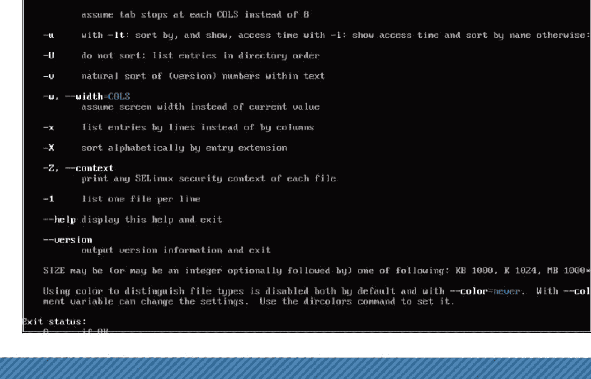

### 第 6 步

man 命令可用于你在 Linux 中使用的几乎所有命令。你甚至可以输入：man man 来获取有关使用 man 工具的信息。从现在起，每当你在本书中遇到新命令，如“nano”或“chmod”，请花时间输入：`man nano` 或 `man chmod` 并阅读说明。

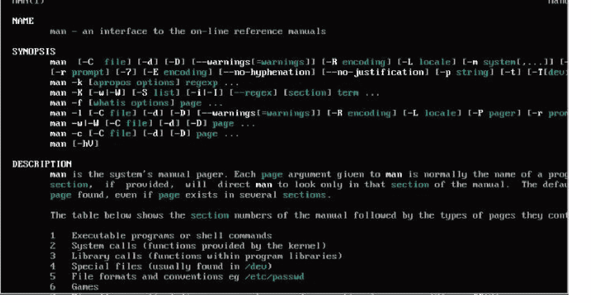

## 使用手册选项

因为 man 不会改变任何东西，比如 mv 或 mkdir，所以很容易不把它看作一个命令。但它确实是，而且像所有其他命令一样，它也有选项。这些选项非常方便学习。

### 第 1 步

输入：`man man` 使你可以查看一些选项，但有时你只想要一个快速概览。幸运的是，man 有一个内置帮助选项，可以快速列出选项。如果你在手册页中，按 Q 退出，然后在命令行输入：`man -h`。

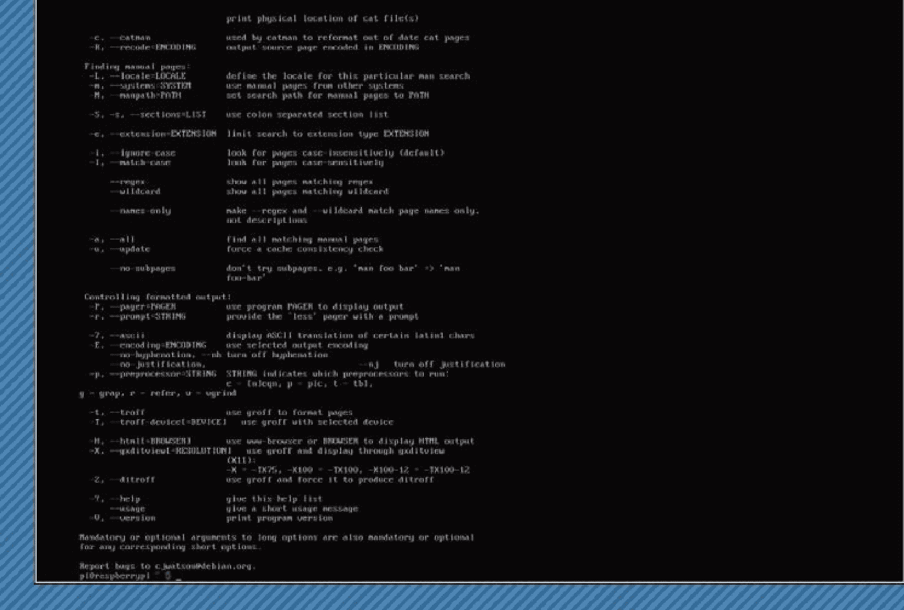

### 第 2 步

如果你够快，你可能注意到文本的开头飞快地翻页了。这是因为“man -h”选项默认不使用 less 命令（less 是让你一次向下移动一屏文本的命令）。我们稍后会介绍管道（“|”），但现在只需使用“man -h | less”来一次阅读一页长文本。

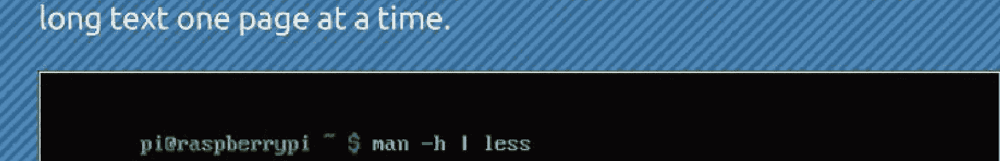

### 第 3 步

最强大的 man 选项之一是 -k 选项，用于“apropos”。这使你可以搜索比精确命令更广泛的手册页范围。输入：`man -k directory` 查看所有与目录相关的手册页（“man -k directory | less”一次查看一页）。在这里，你会找到像“ls”、“mkdir”和“cd”这样的命令及其描述。

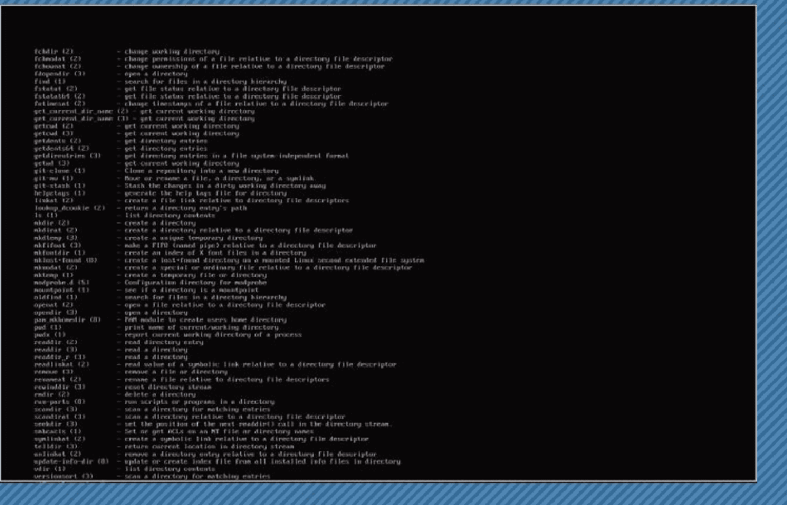

### 第 4 步

为你遇到的每个命令输入手册页可能有点冗长，尽管最终很有成效。如果你只想知道一个命令的作用，可以使用“whatis”命令只阅读描述。输入：`whatis pwd` 来阅读“pwd”命令的描述（“打印当前/工作目录的名称”）。

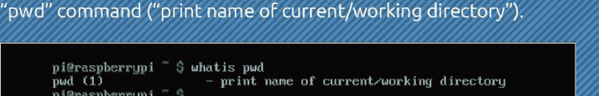

## 编辑文本文件

在Linux中，文本文件可以是任何东西，从简单的应用使用说明到复杂的Python、C++或其他编程语言代码。文本文件可用于脚本、自动化可执行文件以及配置文件等。

## 纯文本的乐趣

要编辑或创建文本文件，你需要一个好的文本编辑器。Linux上有许多选择，以下是在树莓派上的一些实例。

步骤 1 树莓派的第一个文本编辑器是默认桌面环境的应用程序：Leafpad。要使用它，你可以双击现有的文本文件，或者点击树莓派菜单图标（位于桌面左上角），然后从“附件”菜单中选择“文本编辑器”。

步骤 2 在终端中甚至有更多的选择，尽管使用正确的命令，你可以通过终端启动任何桌面应用程序。其中最简单、也是从Unix时代传承下来的一个经典文本编辑器是vi。在终端中，输入：vi。

步骤 3 Vi是原始的Unix命令，但在本例中它启动的是VIM，Vi的Linux新版。尽管看起来简单，但即使在今天，Vi仍被认为是使用最广泛的文本编辑器之一。你可以用它做很多事情，因此请查阅手册页以获取更多Vi信息。

步骤 4 Nano是Linux上另一款受欢迎且简单的文本编辑器。在终端中输入：nano来启动它。你可以使用Nano编辑代码、创建脚本或编写自己的帮助文件。要退出Nano，请按Ctrl + X，然后按Y保存文件，或按N不保存退出。

步骤 5 Emacs，或称GNU Emacs，是一款可扩展、可定制、自文档化的实时显示编辑器。它是一个出色的文本编辑器，值得尽早适应使用。遗憾的是，树莓派上默认没有安装它，所以你需要安装。在终端中，输入：`sudo apt-get install emacs`

步骤 6 前一个命令会连接Debian（Raspbian基于Debian Linux发行版）软件源，并拉取安装Emacs所需的信息。当树莓派询问是否继续安装时，按Y。这将安装最新版本，完成后你将返回到命令提示符。

步骤 7 一旦安装完成，在终端中输入：`emacs`。Emacs启动画面会在一个新窗口中打开，提供教程（我们建议你过一遍）和引导导览等信息。

步骤 8 Emacs可以提供文本文件的简洁视图，或者包含关于所讨论文件结构的大量信息；你可以根据自己的喜好来决定。Emacs中还有一个隐藏的文字冒险游戏，我们将在本书后面介绍，不妨看看你是否能在没有我们帮助的情况下找到它。

步骤 9 Gedit是Linux上另一款优秀的文本编辑器。同样，树莓派上默认未安装；但是，通过输入：`sudo apt-get install gedit`并接受安装，该程序可以在几秒钟内安装到树莓派上。安装后，在终端中使用`gedit`来启动它。Gedit是一款非常适合编码的文本编辑器。

步骤 10 最后，Jed是一款类似Emacs的跨平台文本编辑器，它轻量级且功能丰富。要安装它，输入：`sudo apt-get install jed`。接受安装，完成后，使用：`jed`来启动。

## Linux 提示和技巧

Linux终端，你无疑会同意，是一个卓越的环境，再加上安装一些额外的应用程序以及一点点命令知识，就可以完成令人难以置信且常常相当奇特的事情。

## 指令掌控

Linux的提示、秘密、技巧和窍门数不胜数。有些非常古老，源自Linux的Unix传承，而另一些则是Linux知识体系中的新成员。以下是我们最喜欢的十条提示和技巧。

## 复活节彩蛋

Emacs文本编辑器是一款优秀的软件，但你知道它也包含一个隐藏的复活节彩蛋吗？安装好Emacs（`sudo apt-get install emacs24`）后，进入终端会话并输入：

```
emacs -batch -l dunnet
```

Dunnet是Ron Schnell于1982年编写的一款文字冒险游戏，自1994年起隐藏在Emacs中。

## 终端浏览

是否曾幻想过能从终端上网冲浪？虽然不是特别实用，但这确实是一件令人着迷的事情。要这样做，输入：

```
sudo apt-get install elinks
```

然后：

```
elinks
```

输入你想访问的网站。

## 月球车

基于1982年的经典街机游戏《月球巡逻队》，《月球车》于1985年在家庭电脑上推出，并广受好评。这是一款出色的Atari游戏，可以通过在Linux终端中输入以下命令来获得：

```
sudo apt-get install moon-buggy
```

然后：

```
moon-buggy
```

享受吧。

## 下雪了

终端控制台下雪并不是你每天都能遇到的事情。但是，如果你感兴趣，请输入：

```
wget https://gist.githubusercontent.com/sontek/1505483/raw/7d024716ea57e69fb52632fee09f42753361c4a2/snowjob.sh
```

```
chmod +x snowjob.sh
```

```
./snowjob.sh
```

## 内存占用大户

内存占用大户——如果你需要查看哪些应用在树莓派上占用内存最多，只需输入：

```
ps aux | sort -rnk 4
```

这将按系统内存使用情况排序输出。

## 文件粉碎机

当你删除一个文件时，拥有合适软件的人仍然有机会恢复它。但是，可以使用Shred安全且永久地删除文件：

```
shred -zvu NAMEOFFILE.txt
```

将NAMEOFFILE替换为要删除的文件名。

## ASCII 艺术

ASCII艺术应用于某些图像时可能相当引人注目。然而，它通常很难恰到好处。你可以使用img2txt从树莓派上已有的图像创建一些很棒的ASCII艺术：

```
img2txt NAMEOFIMAGEFILE.png
```

将NAMEOFIMAGEFILE替换为系统上图像文件的实际名称。

## 电子布告栏系统

在拨号连接的时代，在线世界由电子布告栏系统（BBS）组成。这些远程服务器为用户提供了聊天、交换代码、玩游戏等的聚集地。使用Linux中的Telnet，你仍然可以连接到一些活跃的BBS：

```
telnet battlestarbbs.dyndns.org
```

有无数可用的BBS；查看更多请访问 www.telnetbbsguide.com/bbs/list/detail/。

## 目录树

如果你想用一个命令创建整个目录（或文件夹）树，可以使用：

```
mkdir -p New-Dir/{subfolder1,subfolder2,subfolder3,subfolder4}
```

这将创建一个包含四个子文件夹的New-Dir。

## 遗忘的命令

试图记住所有可用的Linux命令并不容易。值得庆幸的是，你可以使用apropos来帮忙。只需使用命令描述即可：

```
apropos "copy files"
apropos "rename files"
```

## A-Z Linux 命令

Linux命令实际上有成千上万条，所以虽然这不是一个完整的A-Z列表，但它确实包含了许多你最有可能需要的命令。你可能会发现你最终反复使用的是一个较小的命令集合，但拥有整体的知识仍然非常有用。

### A
- **adduser**：添加新用户
- **arch**：打印机器架构
- **awk**：在文件中查找并替换文本

### B
- **bc**：任意精度计算器语言

### C
- **cat**：连接文件并打印到标准输出
- **chdir**：更改当前工作目录
- **chgrp**：更改文件的组所有权
- **chroot**：更改根目录
- **cksum**：打印CRC校验和及字节数
- **cmp**：比较两个文件
- **comm**：逐行比较两个已排序的文件
- **cp**：将一个或多个文件复制到另一个位置
- **crontab**：安排命令在以后运行
- **csplit**：按上下文将文件分割成多块
- **cut**：将文件分成若干部分

### D
- **date**：显示或更改日期和时间
- **dc**：台式计算机（任意精度计算器）
- **dd**：数据转储，转换并复制文件
- **diff**：显示两个文件之间的差异
- **dirname**：将完整路径名转换为路径
- **du**：估算文件空间使用情况

### E
- **echo**：在屏幕上显示消息
- **ed**：面向行的文本编辑器（edlin）
- **egrep**：在文件中搜索匹配扩展表达式的行
- **env**：显示、设置或移除环境变量
- **expand**：将制表符转换为空格
- **expr**：求表达式的值

### F
- **factor**：打印质因数
- **fdisk**：Linux分区表操作工具
- **fgrep**：在文件中搜索匹配固定字符串的行
- **find**：搜索满足所需条件的文件
- **fmt**：重新格式化段落文本
- **fold**：换行以适应指定宽度
- **format**：格式化磁盘或磁带
- **fsck**：文件系统一致性检查和修复

### G
- **gawk**：在文件中查找并替换文本
- **grep**：在文件中搜索匹配给定模式的行
- **groups**：打印用户所属的组名
- **gzip**：压缩或解压缩指定文件

### H
- **head**：输出文件的前部分内容
- **hostname**：打印或设置系统名称

### I
- **id**：打印用户和组ID
- **info**：帮助信息
- **install**：复制文件并设置属性

### J
- **join**：在公共字段上连接行

### K
- **kill**：停止进程运行

### L
- **less**：分屏显示输出
- **ln**：在文件间创建链接
- **locate**：查找文件

### Linux 命令从 A 到 Z

- **logname**
  - 打印当前登录名

- **lpc**
  - 行式打印机控制程序

- **lpr**
  - 脱机打印

- **lprm**
  - 从打印队列中移除任务

- **rm**
  - 删除文件

- **rmdir**
  - 删除文件夹

- **rpm**
  - 远程包管理器

- **rsync**
  - 远程文件复制（同步文件树）

### M

- **man**
  - 查看帮助手册

- **mkdir**
  - 创建新文件夹

- **mkfifo**
  - 创建 FIFO（命名管道）

- **mknod**
  - 创建块设备或字符特殊文件

- **more**
  - 逐屏显示输出

- **mount**
  - 挂载文件系统

### S

- **screen**
  - 终端窗口管理器

- **sdiff**
  - 交互式合并两个文件

- **select**
  - 接受键盘输入

- **seq**
  - 打印数字序列

- **shutdown**
  - 关机或重启 Linux

- **sleep**
  - 延迟指定时间

- **sort**
  - 排序文本文件

- **split**
  - 将文件分割成固定大小的片段

- **SSH**
  - 使用安全加密协议，以指定用户身份连接到远程主机。

- **su**
  - 替换用户身份

- **sudo**
  - 以另一个用户身份执行命令，主要是 Root 级别的管理员用户。

- **sum**
  - 打印文件的校验和

- **symlink**
  - 为文件创建新名称（符号链接）

- **sync**
  - 将磁盘上的数据与内存同步

### U

- **umount**
  - 卸载设备

- **unexpand**
  - 将空格转换为制表符

- **uniq**
  - 文件去重

- **units**
  - 在单位刻度之间进行转换

- **unshar**
  - 解包 shell 归档脚本

- **useradd**
  - 创建新用户账户

- **usermod**
  - 修改用户账户

- **users**
  - 列出当前登录的用户

### N

- **nice**
  - 设置命令或任务的优先级

- **nl**
  - 为文件行编号

- **nohup**
  - 运行不受挂断影响的命令

### V

- **vdir**
  - 详细列出目录内容（`ls -l -b`）

### P

- **passwd**
  - 修改用户密码

- **paste**
  - 合并文件行

- **pathchk**
  - 检查文件名可移植性

- **pr**
  - 转换文本文件以便打印

- **printcap**
  - 打印机能力数据库

- **printenv**
  - 打印环境变量

- **printf**
  - 格式化并打印数据

### W

- **watch**
  - 定期执行或显示程序

- **wc**
  - 打印字节、单词和行数

- **whereis**
  - 报告命令的所有已知实例位置

- **which**
  - 在用户路径中定位程序文件

- **who**
  - 打印所有当前登录的用户名

- **whoami**
  - 打印当前用户 id 和名称

### T

- **tac**
  - 逆序连接并写入文件

- **tail**
  - 输出文件末尾部分

- **tar**
  - 磁带归档器

- **tee**
  - 将输出重定向到多个文件

- **test**
  - 评估条件表达式

- **time**
  - 测量程序资源使用

- **touch**
  - 更改文件时间戳

- **top**
  - 列出系统上运行的进程

- **traceroute**
  - 跟踪到主机的路由

- **tr**
  - 转换、压缩和/或删除字符

- **tsort**
  - 拓扑排序

### Q

- **quota**
  - 显示磁盘使用量和限制

- **quotacheck**
  - 扫描文件系统磁盘使用情况

- **quotactl**
  - 设置磁盘配额

### X

- **xargs**
  - 执行实用程序，传递构建的参数列表

### R

- **ram**
  - Ram 磁盘设备

- **rcp**
  - 在两台机器之间复制文件

### Y

- **yes**
  - 打印一个字符串直到被中断

## Python 术语表

就像大多数技术一样，Python 包含许多令人困惑的词语和缩写。因此，为了您的理智，这里提供一个方便的术语表，帮助您在对话转向 Python 编程时掌握其含义。

**参数 (Argument)**
Python 用于执行更详细命令的详细额外信息。也可在命令提示符中用于指定特定的运行时事件。

**表达式 (Expression)**
本质上，是产生某个值的 Python 代码。

**代码块 (Block)**
用于描述分组在一起的一个或多个代码段。

**浮点数 (Float)**
Python 中使用的一种不可变的浮点数。

**中断 (Break)**
可用于退出 `for` 或 `while` 循环的命令。例如，如果按下某个键退出程序，`Break` 将退出循环。

**函数 (Function)**
Python 中用于定义一系列语句的结构，程序员可以随时调用或引用它们。

**类 (Class)**
类提供了一种将数据和功能捆绑在一起的方式。它们用于将变量和函数封装成一个单一实体。

**GitHub**
一个基于 Web 的版本控制和协作门户，专为软件开发人员设计，以便更好地管理源代码。

**注释 (Comments)**
注释是程序员插入的真实世界文字部分，用于帮助记录代码中发生的事情。它们可以是单行或多行，由 `#` 或 `"""` 定义。

**全局变量 (Global Variable)**
在程序中任何地方都可使用的变量。

**Debian**
一种基于 Linux 的发行版，构成了 Debian 项目。该环境为用户提供了一个友好的图形用户界面 (GUI) 进行交互，同时也支持终端命令和其他形式的系统级管理。

**图形界面 (Graphics)**
指与程序、游戏或操作系统进行视觉交互的使用方式。旨在让用户更容易地管理相关程序。

**Def**
用于在 Python 中定义函数或方法。

**GUI (Graphical User Interface)**
图形用户界面。大多数现代操作系统使用的界面，使用户能够与系统的核心程序进行交互。一个友好、易于使用的图形桌面环境。

**字典 (Dictionaries)**
Python 中的字典是一种由键和值对组成的数据结构。

**高级语言 (High-Level Language)**
一种设计为易于人类阅读的编程语言。

**发行版 (Distro)**
也称 Distribution，是一种使用 Linux 内核作为其核心的操作系统，但在呈现给终端用户方面有所不同。

**IDLE**
代表 Integrated Development Environment（集成开发环境）或 Integrated Development and Learning Environment（集成开发与学习环境）。

**编辑器 (Editor)**
一个独立的程序，或 Python 图形版本的一部分，允许用户输入准备执行的代码。

**不可变 (Immutable)**
指在创建后无法更改的事物。

**异常 (Exceptions)**
用作从代码块的正常流程中中断的一种方式，以处理程序中任何潜在的错误或异常情况。

**导入 (Import)**
在 Python 中用于包含模块及其附带的所有代码、函数和变量。

**缩进 (Indentation)**
Python 使用缩进来分隔代码块。缩进相隔四个空格，并且通常在代码中使用冒号后自动创建。

**整数 (Integer)**
一种数字数据类型，必须是整数而非小数。

**Python**
一种易于学习和使用的出色编程语言，同时功能足够强大以供享受。

**交互式 Shell (Interactive Shell)**
Python Shell，在启动 Python 图形版本时显示。

**随机数 (Random)**
一个 Python 模块，它使用梅森旋转算法 (Mersenne Twister) PRNG 实现伪随机字符生成器。

**内核 (Kernel)**
操作系统的核心，负责处理数据处理、内存分配、输入和输出，并在硬件和程序之间处理信息。

**范围 (Range)**
一个函数，用于返回由传入参数定义的整数列表。

**Linux**
一种以 UNIX 为模型的开源操作系统。由芬兰学生 Linus Torvalds 于 1991 年开发。

**根用户 (Root)**
系统本身使用的最低级用户账户。Root 是总体系统管理员，可以在系统中做任何事情，去任何地方。

**列表 (Lists)**
一种 Python 数据类型，包含值的集合，可以是任何类型，并且可以轻松修改。

**集合 (Sets)**
集合是无序但唯一的数据类型的集合。

**局部变量 (Local Variable)**
在函数内部定义的变量，仅在该函数内部可用。

**字符串 (Strings)**
字符串可以存储可修改的字符。字符串的内容是字母数字，可以用单引号或双引号括起来。

**循环 (Loop)**
一段重复自身直到满足特定条件的代码。循环可以包含整个代码，也可以只包含部分代码。

**终端 (Terminal)**
也称控制台 (Console) 或 Shell。操作系统的命令行接口，即 Linux，但在 macOS 中也可用。从那里可以执行代码和浏览文件系统。

**模块 (Module)**
一个包含各种函数的 Python 文件，可在另一个程序中使用，以进一步扩展代码的功能。

**Tkinter**
一个旨在与图形环境交互的 Python 模块，特别是 tk-GUI（工具包图形用户界面）。

**操作系统 (Operating System)**
也称 OS。在初始启动序列完成后加载到计算机中的程序。OS 管理所有其他程序、图形用户界面 (GUI)、输入和输出以及与用户的物理硬件交互。

**Try**
一个 `try` 坵允许抛出异常，因此任何错误都可以根据程序员的指令被捕获和处理。

**输出 (Output)**
从程序发送到屏幕、打印机或其他外部外围设备的数据。

**元组 (Tuples)**
一种不可变的 Python 数据类型，包含字母或数字的有序集合。

**PIP**
Pip Installs Packages。一个包管理系统，用于安装和管理用 Python 编写的模块和其他软件。

**UNIX**
一种在 70 年代贝尔实验室研究中心设计的多任务、多用户操作系统。使用 C 语言和汇编语言编写。

**Print**
用于将某些内容的输出显示到屏幕的函数。

**变量 (Variables)**
已分配计算机内存中存储位置的数据项。

**提示符 (Prompt)**
Python 或命令行中用户输入命令的元素。在 Python 的交互式 shell 中，它表示为 `>>>`。

**X**
也称 X11 或 X-windows。用于基于 Linux 系统的图形桌面，结合视觉增强工具来管理核心操作系统。

**Pygame**
一个为编写游戏而设计的 Python 模块。它包括图形和声音库，最早于 2000 年 10 月开发。

**Python 之禅 (Zen of Python)**
当您在 IDLE 中输入：`import this` 时，Python 之禅会显示。

# 阅读更多

# 完整手册系列


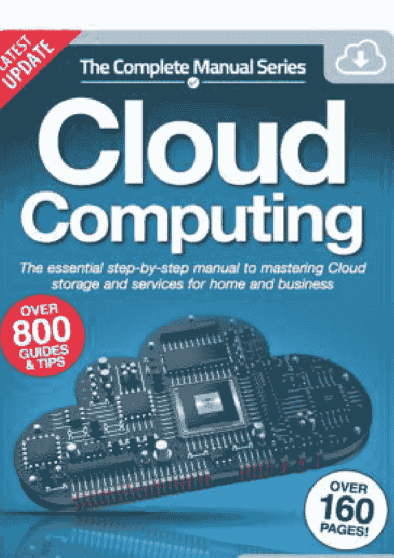


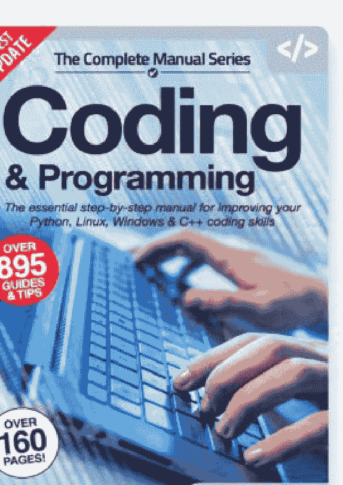

# 在Readly上可用


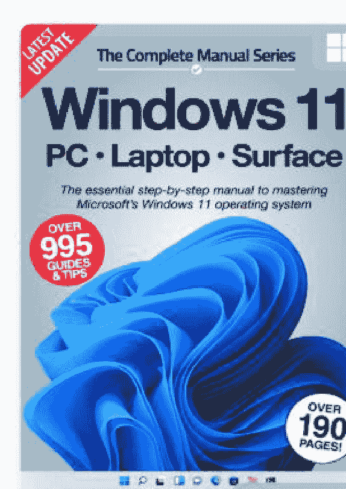

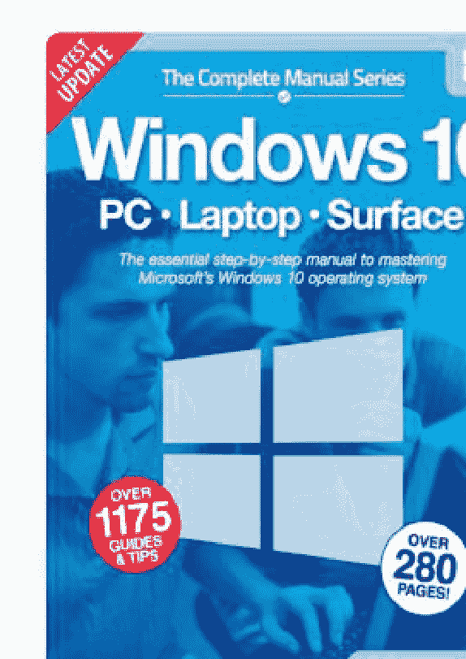

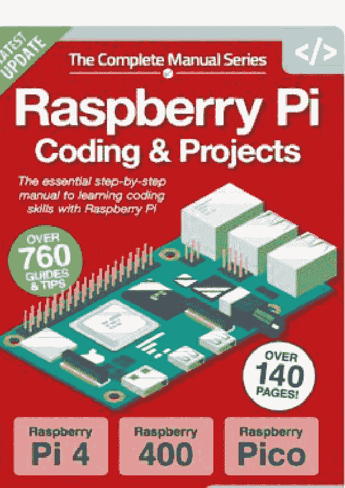

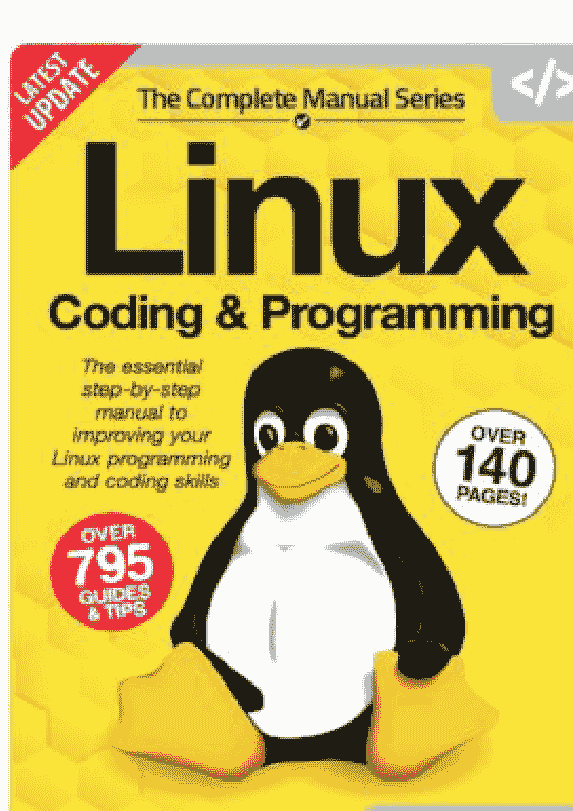


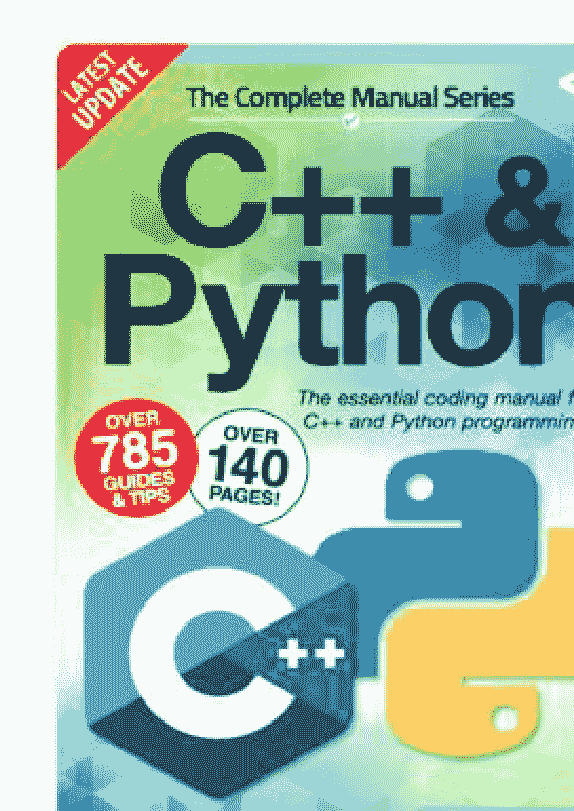

www.pclpublications.com

# 想掌握您的电脑？

# 那么不要错过我们在Readly上的新Windows电脑与笔记本杂志！


# Windows用户

# 您的社交媒体安全吗？

保护您的数据和自身安全！

# Windows 11 深度解析

探索新功能与特性

包含超过311个顶级技巧与指南

点击我们的便捷链接立即阅读：https://bit.ly/3y7gwFG