# 标题

作者

# Python 入门速成课程！

一天学会Python！

> “如果我能学会Python，任何人都能！我真希望多年前就找到了这本书。”
- 雷蒙德·约翰逊


## 目录

- [安装](INSTALLING)
- [向Python问好](SAYING_HELLO_TO_PYTHON)
- [打印函数](PRINT_FUNCTION)
- [变量](VARIABLES)
- [熟悉环境](GETTING_FAMILIAR)
- [格式化字符串字面值](FORMATTED_STRING_LITERALS)
- [多行字符串](MULTI-LINE_STRINGS)
- [练习活动](PRACTICE_ACTIVITIES)
- [数值类型](NUMERIC_TYPES)
- [运算符](OPERATORS)
- [练习活动（运算符）](PRACTICE_ACTIVITIES (Operators))
- [连接字符串](CONCATENATING_STRINGS)
- [列表](LISTS)
- [元组](TUPLES)
- [If语句](IF_STATEMENTS)
- [练习活动（列表、Else 和 Elif 语句）](PRACTICE_ACTIVITIES (Lists, Else & Elif Statements))
- [循环](LOOPS)
- [练习活动](PRACTICE_ACTIVITIES)
- [海龟模块 - 绘图](TURTLE_MODULE_-_DRAWING)
- [十六进制系统](THE_HEXADECIMAL_SYSTEM)
- [创建形状](CREATING_A_SHAPE)
- [练习活动](PRACTICE_ACTIVITIES)
- [创建你自己的可重用函数](CREATING_YOUR_OWN_REUSABLE_FUNCTIONS)
- [参数](PARAMETERS)
- [返回值](RETURN_VALUES)
- [调用函数](CALLING_FUNCTIONS)
- [其他文件中的函数](FUNCTIONS_IN_OTHER_FILES)
- [练习活动（函数）](PRACTICE_ACTIVITIES_(Functions))

你想学习Python吗？本书将从最基础的内容开始，一步步引导你成为一名能力完备的Python程序员。所以，让我们跳过所有花哨的介绍，开始学习一些Python知识吧！

我们将从安装一个名为Spyder的集成开发环境（IDE）开始，在这里我们可以用Python语言编程并运行我们的程序。

关于Spyder：“Spyder是一个用Python编写、为Python打造的免费开源科学环境，由科学家、工程师和数据分析师设计并服务于他们。它独特地结合了全面开发工具的高级编辑、分析、调试和分析功能，以及科学软件包的数据探索、交互执行、深度检查和精美可视化能力。”

## 数值类型

在Python中，我们将使用两种主要的数值类型：整数和浮点数。第一种你已经很熟悉，并且会经常使用。它们是整数，也就是我们习惯使用的正整数或负整数。尽管我们不会经常使用另一种数值类型，但了解一下它仍然是个好主意。另一种类型是浮点数：

浮点数：浮点数，或简称为浮点数，是可以包含整数部分和小数部分的数，同样使用小数点书写。

```
myGpa=3.27
```

尽管它们看起来像十进制数，但并不完全相同。当我们需要精确计算时，就会使用这种数值类型，这在数学和科学领域最为常见。Python实际上有一个内置模块叫做`decimal`模块，它就是基于浮点数类型的。

## 运算符

在前面学习变量时，你已经接触过整数了。现在让我们看看整数与运算符结合使用的不同方式。

**算术运算**
也称为数学运算符，算术运算符用于执行基本的数学功能。正如你将在下图中看到的，大多数算术运算符的工作方式与常规数学中相同，但有一些例外。

**运算顺序**
算术运算符遵循一套特殊的规则。这套规则称为运算顺序。它是算术运算应被计算的正确顺序。假设你有一个变量需要进行多个计算。例如，我们在餐厅用餐时如何计算总价：

```
total=20 + (20 * .0825) - 1.5 + 3
```

这里，我们的餐费（第一个加法计算，$20）上加了销售税（乘以.0825），减去了优惠券金额（减去$1.5），并加上了给服务员的小费（第二个加法计算，$3）。我们可以通过使用运算顺序来得出正确的总额。

### 1. 括号

在这样的计算中，计算机总是首先计算括号内的任何表达式。在我们的例子中，我们会首先计算销售税（.0825代表8.25%的销售税）。在这个计算中，`20 * 0.0825`等于1.65。

### 2. 指数运算

接下来执行的计算是指数运算。当计算机看到 `**` 运算符时，它会将一个数提升到另一个数的幂。这意味着，如果你在shell中输入 `2 ** 4`，你会得到16，因为2的4次方（也就是 2 x 2 x 2 x 2）等于16。因为我们的晚餐计算中没有任何指数计算，所以我们转向下一个重要的运算。

### 3. 乘法和除法

在运算顺序中，接下来是乘法和除法。它们彼此具有相同的重要性级别，因此如果同一行中同时出现乘法和除法计算，我们从左边的计算开始，向右进行。例如，在这个计算中：

```
4 * 3/ 2
```

我们首先计算 `4 * 3`（结果为12），因为它是最左边的计算。然后，我们计算得到的 `12 / 2`，由于我们是从左向右进行，最终答案将是6。因为我们的晚餐计算中没有任何其他乘法或除法计算（除了我们已经在括号步骤中计算过的那一个），所以我们可以转向下一个重要的规则。

### 4. 加法和减法

重要性最低的计算是加法和减法。这意味着它们是最后执行的。到目前为止，我们的晚餐总账现在看起来是这样的，销售税最先计算因为它在括号内。

```
total = 20 + 1.65 - 1.5 + 3
```

现在，我们还剩下几个加法和减法计算。由于加法和减法具有相同的重要性级别，我们像处理乘法和除法一样，使用从左到右的顺序来计算它们。让我们看看剩余的步骤：

1.  首先将20加上1.65，等于21.65。
2.  接着，从21.65中减去1.5，等于20.15。
3.  最后，将最后一个计算结果3加到20.15上，总计为23.15。

请记住，以上所有步骤实际上不会在你的shell中显示。我们只是经历了计算机采取的相同步骤，来看看它实际上是如何计算东西的。

让我们尝试在shell中打印出来：

```
total=20+(20*.0825)-1.5+3
print(total)
```

你的打印输出应该如下所示：

```
23.15
```

### 比较

我们在编程中使用的下一组运算符称为比较运算符。顾名思义，比较运算符帮助我们将一个值与另一个值进行比较。当我们使用比较运算符时，它们会返回一个`True`（真）或`False`（假）的答案，这称为布尔类型。比较运算符和布尔值非常重要，因为它们帮助我们在代码中做出决策。

有6个主要的比较运算符：

#### 大于

```
>
```

当你使用它时，计算机决定>`符号左边的值是否大于符号右边的值。

```
isItGreater = 37 > 12
```

这个变量将保存这个问题的答案：37大于12吗？它返回`True`，因为37确实大于12。现在如果你要打印这个变量，它会输出`True`这个词。

#### 小于

```
<
```

当你使用它时，计算机决定`<`符号左边的值是否小于符号右边的值。

```
IsItLess = 37 < 12
```

这个变量将保存这个问题的答案：37小于12吗？它返回`False`，因为37不小于12。现在如果你要打印这个变量，它会输出`False`这个词。


#### 大于或等于

```
>=
```我们正试图判断 `>=` 运算符左侧的值是否大于右侧的值，或者左侧的值是否与右侧的值相同。只要其中一种情况为真，计算机就会判断整个表达式为 `True`。那么，代码如下：

```
isItGreaterOrEqual = 4 >= 3
```

你认为这会返回什么？`True` 还是 `False`？你说了 `True`？答对了，因为 4 大于 3，我们知道大于运算符是正确的。所以，即使第二个运算符，即等于运算符，是不正确的（因为 4 显然不等于 3），计算机仍然返回 `True`，因为至少有一个运算符是正确的（大于操作）。

下一个例子：

```
isItGreaterOrEqual = 3 >= 3
```

这个也是 `True`！这次，等于运算符是正确的，而不是大于运算符。

再看一个：

```
isItGreaterOrEqual = 1 >= 3
```

你认为呢？`False`？没错，因为**两个**运算符都不正确。数字 1 不大于 3，所以大于运算符不正确；1 也不等于 3，这也使得等于运算符不正确。

#### 小于等于

<=

希望你开始看到这里的规律了！这是小于等于运算符。就像大于等于运算符一样，我们确保至少有一个运算符是正确的。对于小于等于运算符，我们查看值，看 `<=` 运算符左侧的值是否小于或等于右侧的值。

当你在命令行中写下这段代码时，你认为它会返回什么？

```
isItLessOrEqual = 1 <= 3
```

没错！这返回 `True`，因为 1 小于 3。这使得小于运算符正确，即使等于运算符不正确。由于其中一个运算符正确，整个表达式就返回 `True`。

这个呢？

```
isItLessOrEqual = 7 <= 7
```

同样的道理。这也返回 `True`，因为等于运算符是正确的。

#### 等于

==

这个比前两个运算符简单得多。顾名思义，它让计算机判断 `==` 符号左侧的值是否与 `==` 符号右侧的值**完全相同**。很简单！

这个会返回什么？

```
23 == 22
```

`False`，因为 23 不等于 22。

这个呢？

```
10 == 10
```

`True`，因为它们完全相同。

这里有个陷阱：

```
10 == "10"
```

`False`，因为右侧的 10 是字符串类型，而左侧的 10 是整数/数字类型。数字永远不会等于或等同于文本字符串。

#### 不等于

```
!=
```

同样如其名，不等于运算符让计算机判断 `!=` 符号左侧的值是否**不等于**右侧的值。来试试猜猜下面几个例子的结果。

5 != "five"

`True`，因为整数 5 **不等于**字符串文本 "five"。

10 != "10"

`True`，因为整数 10 **不等于**字符串文本 "10"。

4 != 3

`True`，因为整数 4 **不等于**整数 3。

9 != 9

`False`，因为整数 9 **等于**整数 9。

**逻辑**运算符用于帮助我们比较布尔值操作数（`True` 或 `False`）。它们非常有用，因为可以使我们的决策规则更复杂，这意味着更智能的代码！有三个主要的逻辑运算符：与（and）、或（or）和非（not）。让我们看看每个能做什么。

### 与运算符

与运算符检查其右侧和左侧的值是否都为 `True`。它写作 `and`。如果代码中某处只应在两个条件都满足时运行，我们应该使用与运算符。假设我们正在寻找一款同时有意大利辣香肠和蘑菇的特定披萨。

```
pizzaHasPepperoni = True
```

```
pizzaHasMushrooms = False
```

要检查你评估的披萨是否同时有意大利辣香肠和蘑菇，你可以像这样使用与运算符 `pizzaHasPepperoni and pizzaHasMushrooms`。

与运算符允许你检查两个条件：披萨片是否含有意大利辣香肠，以及是否含有蘑菇。只有在你的两个条件都满足时，你才会拿起那片披萨！在这个例子中没有蘑菇……所以你的条件返回了 `false`，你没有拿到有意大利辣香肠和蘑菇的那片。

### 或运算符

或运算符用于确保**至少**有一个被比较的值为 `True`。它写作 `or`。在我们的披萨例子中，我们找不到任何同时有意大利辣香肠和蘑菇的披萨片。仍然想吃披萨，你决定如果披萨上有意大利辣香肠**或**蘑菇，你仍然会选择并吃掉它。这就是或运算符发挥作用的地方。要检查意大利辣香肠**或**蘑菇，你可以这样写代码：

```
pizzaHasPepperoni or pizzaHasMushrooms
```

这样，如果你正在检查的披萨上有意大利辣香肠或蘑菇，你就会拿起它。

### 非运算符

非运算符用于确保被比较的值为 `False`。它写作 `not`。就像你会拿任何有意大利辣香肠或蘑菇的披萨一样，你肯定不会拿任何有洋葱的披萨。假设我们有一个名为 `pizzaHasOnions` 的变量，其值为 `True`。为了确保你不会拿到任何有洋葱的披萨，你可以使用非运算符：

```
not pizzaHasOnions
```

如果你大声读出来可能有点奇怪，但它完全正确！你基本上是在说：嘿，计算机，确保披萨有洋葱这件事不是真的。

在本节中，我们学习了：

我们最常使用的主要数字类型有两种：整数和浮点数。运算符是使我们能够执行操作的特殊关键字或字符。我们学到的第一组是算术运算符。算术运算符与我们在数学中使用的类似，记住运算顺序对于正确计算非常重要。

运算顺序，从最重要到最不重要，是：括号、指数、乘法、除法、加法和减法（PEMDAS）。如果有多个同等重要的计算需要评估，我们从左到右进行。

我们学过的另一组运算符是比较运算符。这些帮助我们比较两个值。我们有运算符来比较一个值是否大于（>）、小于（<）、大于或等于（>=）、小于或等于（<=）、等于（==）和不等于（!=）另一个值。

最后，我们学习了逻辑运算符，它们帮助我们做出更智能的比较。与运算符帮助我们确定两个表达式是否都为 `True`。或运算符检查传递给它的表达式中是否至少有一个为 `True`。非运算符确定传递给它的表达式是否为 `False`。

### 练习活动

### 活动 #1 - 自我介绍与年龄

编写并打印一行代码，包含你的姓名和年龄，内容如下：

> 我的名字是——姓名——，今年——年龄——岁！

计算你的年龄变量，使用当前年份减去你出生的年份。

**在完成活动之前请不要看下一页！**

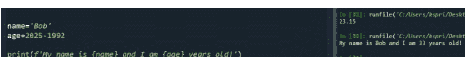

### 活动 #2 - 找出谁的蘑菇更多或更少

比较两片不同披萨上蘑菇的数量。詹姆斯的披萨片上有5个蘑菇，莎拉的有8个。打印出以下两行输出：

詹姆斯比莎拉的蘑菇多——真或假——。

莎拉比詹姆斯的蘑菇多——真或假——。

**在完成活动之前请不要看下一页！**

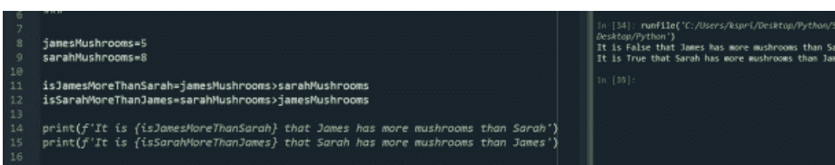

代码：

```
jamesMushrooms = 5
sarahMushrooms = 8
isJamesMoreThanSarah = jamesMushrooms > sarahMushrooms
isSarahMoreThanJames = sarahMushrooms > jamesMushrooms
print(f'It is {isJamesMoreThanSarah} that James has more mushrooms than Sarah')
print(f'It is {isSarahMoreThanJames} that Sarah has more mushrooms than James')
```

### 活动 #3 - 比较着装

我们要检查简和莎拉的着装。让我们回答以下问题：至少一个人穿着白色连衣裙吗？她们的鞋子颜色一样吗？她们都戴耳环吗？她们的连衣裙是相同颜色的吗？

使用以下变量作为起点：

```
janeDressColor = 'white'
janeShoeColor = 'blue'
```## 连接字符串

我们刚刚学习了运算符以及如何将它们用于数字类型。你知道我们也可以将其中一些运算符用于字符串吗？“连接”是一个花哨的词，意思是把东西放在一起。这是通过使用加法（+）运算符来完成的，因此我们实际上可以将两个文本相加。你认为将两个字符或单词加在一起会发生什么？试试看：

```
print("volley" "ball")
```

有趣！我们通过将两个独立的字符串“volley”和“ball”相加，创建了一个新字符串“volleyball”。这里发生的情况是：当计算机看到加法（+）运算符时，它会说：“好的，人类想让我在这里将一些值相加。”计算机明白，你不能像加两个整数那样真正地将两个字符串相加。因此，它将这两个字符串放在一起，并将它们作为一个字符串返回。多么合乎逻辑！这正是“相加”两个字符串的工作方式。

有趣的是，你可能以前遇到过连接，甚至没有意识到！你是否填写过带有“名字”部分和单独的“姓氏”部分的表格？嗯，创建该表格的程序员可能使用了连接，在你提交表格后显示你的全名。它非常有用，而且一点也不难做到。让我们试试看！

首先，我们需要一个地方来存储我们的名字和姓氏。你想到了变量吗？因为这是正确的开始方式！

```
firstName='Shawn'
lastName='Jones'
```

现在我们已经存储了名字和姓氏，我们如何将它们打印为全名？正如我们在编码中将越来越多地看到的，做一件事总有不止一种方法。我们可以在 `print()` 函数中直接使用加法运算符：

```
print(firstName+lastName)
```

```
firstName='Shawn'
lastName='Jones'

print(firstName+lastName)
```

或者，我们可以创建另一个变量来保存全名，然后打印该变量：

```
firstName='Shawn'
lastName='Jones'
fullName = firstName + lastName
```

```
print(fullName)
```

```
firstName='Shawn'
lastName='Jones'

fullName = firstName + lastName
print(fullName)
```

```
In [39]: runfile(...)
ShawnJones

In [40]:
```

但是，执行此代码时你注意到什么有趣的地方了吗？你的名字可能打印得有点太紧凑，没有空格。

记住，计算机会完全按照你想要的方式去做，在这种情况下，它将我们的名字和姓氏变量相加，完全正确！如果我们想以通常看到全名的方式打印我们的名字，我们需要精确地在名字之间添加空格。我们可以通过几种方式做到这一点：

```
fullName = firstName+' '+lastName
print(fullName)
```

或者，我们可以在名字后面添加空格：

```
firstName = "Shawn "
```

或者在姓氏前面：

```
lastName =" Jones"
```

这样，当我们打印连接后的名字时，它将包含空格。如你所见，有许多不同的方法可以实现这一点。使用哪种方法取决于你。

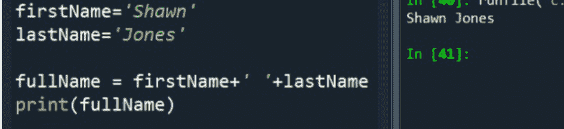

## 整数与字符串

我们刚刚添加了字符串——但是当我们添加整数和字符串时会发生什么？我们甚至可以这样做吗？尝试以下代码：

```
print(3+ "Cookies")
```

你能打印出这个连接的字符串吗？可能不行，但这是预料之中的。就像之前一样，计算机看到你的加法运算符，知道你想将一些值相加。但是当它看到一个值是整数，另一个是字符串时，它会说：“嗯，整数和字符串并不能真正‘相加’，所以我不确定这个人想让我做什么。最好让他们知道我不理解他们的代码！”在这里，你得到了你的第一个类型错误（TypeError），这是计算机告诉你它无法执行你要求的操作，因为数据类型问题。在错误中，它准确地告诉你程序为什么没有运行。它说不支持整数和字符串的 + 号：

```

This is a temporary script file.
"""
print(3+ "Cookies")

In [41]: runfile('C:/Users/kspri/Desktop/Python/Say Hello.py', wdir='C:/Users/kspri/Desktop/Python')
Traceback (most recent call last):
  File "C:\Users\kspri\Desktop\Python\Say Hello.py", line 8, in <module>
    print(3+ "Cookies")
TypeError: unsupported operand type(s) for +: 'int' and 'str'

```

### 字符串乘法——你说什么？！

你没看错，在 Python 中，我们也可以将乘法（“*”）运算符用于字符串！这会是什么样子？试试这个：

```
print(5*'balloon ')
```

你是否兴奋地给了你的 shell 五个气球（即文本“balloon”打印了五次）？正如我们所看到的，乘法（*）运算符对字符串的工作方式与对整数类似。它不是将整数乘以特定次数，而是将你给它的确切字符串乘以该次数。

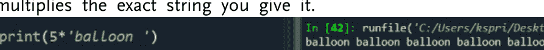

## 列表

Python 中最有用的数据类型之一是列表。列表正如其名：一个对象的列表或集合。列表非常有用，因为它们允许我们同时处理大量数据，这在编程中我们经常做。在代码中，我们可以通过给它一个名称并将其分配给我们希望它保存的对象集合来创建一个列表。这个对象集合存储在方括号之间，如下所示：[ ]，对象之间用逗号分隔。记住，使用字符串对象时，必须在文本周围放置单引号或双引号（不要混合使用）。这是一个保存甜点集合的列表：

```
favoriteDesserts = ['Cookies', 'Cake', 'Ice Cream', 'Donuts']
```

列表可以保存各种东西。我们可以创建一个字符串列表，像这样：

```
citrusFruits = ['Orange', 'Lemon', 'Grapefruit', 'Pomelo', 'Lime']
```

或者一个整数列表：

```
bunnies_spotted = [3, 5, 2, 8, 4, 5, 4, 3, 3]
```

甚至一个布尔值列表：

```
robotAnswers = [True, False, False, True, True]
```

更酷的是，列表并不总是必须是相同的数据类型。你也可以有一个混合对象的列表：

```
facts_about_adrienne = ['Adrienne', 'Tacke', 27, True]
```

拥有这种灵活性是列表如此有用的原因之一。但是等等，还有更多！列表还有其他几个有趣的特性，使它们非常有用。让我们逐一讨论！

### 列表是有序的

当我们创建一个列表时，我们不仅存储了一个对象的集合，还存储了它们的顺序。这很重要，因为它影响我们如何更改列表、如何访问列表的对象以及如何将其与其他列表进行比较。要查看列表顺序的重要性，请尝试以下代码：

```
citrusFruits=['orange','lemon','grapefruit','pomelo','lime']
moreCitrusFruits=['orange','grapefruit','lemon','pomelo','lime']
print(citrusFruits==moreCitrusFruits)
```

### 发生了什么？它们是相等的列表吗？

```python
citrusFruits=['orange','Lemon','grapefruit','pomelo','lime']
moreCitrusFruits=['orange','grapefruit','lemon','pomelo','lime']

print(citrusFruits==moreCitrusFruits)
```

不，它们不相等！事情是这样的：正如我们之前所学，当我们使用 `==` 运算符时，计算机知道我们想要比较两个值。当它查看第一个值时，它会说：“好的，这里我们有一个 `citrusFruits` 列表。它存储了 Orange、Lemon、Grapefruit、Pomelo 和 Lime。”然后它检查我们正在比较的另一个值，并说：“现在，第二个值是一个 `moreCitrusFruits` 列表。它包含一个 orange、Grapefruit、Lemon、Pomelo 和 Lime。”到目前为止，一切正常——两个列表包含相同的对象，但让我们检查一下顺序。

哦！`citrusFruits` 在索引 1 处是 Lemon，但 `moreCitrusFruits` 在那里却是 Grapefruit。由于这两个列表的顺序不同，在计算机看来它们并不真正相等，因此它返回一个 False 语句。

现在你知道了，列表必须具有相同的对象和相同的顺序才能真正相等，你能创建另一个列表，使得我们比较它们时返回 True 吗？

### 可以通过索引访问列表

当我们在代码中处理列表时，我们通常一次处理列表中的一个对象。这意味着我们需要一种简单的方法从列表中选择一个对象，无论它处于什么位置。幸运的是，有一种简单的方法！索引（index 的复数形式）赋予了我们这种能力。索引是一个数字，表示对象在列表中的位置。基本上，它告诉我们对象在列表中的位置。

索引**总是**从 0 开始。这是一个需要记住的重要事项，并且会经常用到！要使用索引，我们编写代码来告诉计算机我们想要访问哪个列表，以及列表中的哪个位置存放着我们想要的对象。

对于我们 `citrusFruits` 列表，一个例子看起来像这样：
`citrusFruits[2]`
这段代码告诉计算机抓取存储在 `citrusFruits` 列表中第二个索引处的对象。

```python
citrusFruits=['orange','lemon','grapefruit','pomelo','lime']
moreCitrusFruits=['orange','grapefruit','lemon','pomelo','lime']
print(citrusFruits[2])
```

现在尝试逐个打印出 `citrusFruits` 列表中的每个对象：

```python
citrusFruits=['orange','lemon','grapefruit','pomelo','lime']
moreCitrusFruits=['orange','grapefruit','lemon','pomelo','lime']
print(citrusFruits[0])
print(citrusFruits[1])
print(citrusFruits[2])
print(citrusFruits[3])
print(citrusFruits[4])
print(citrusFruits[5])
```

如上所示，当我们尝试调用列表中的第 5 个对象时，我们得到了一个错误，因为它不存在。计算机通过声明“列表索引超出范围”来告诉我们这一点。这是因为在编程世界中，一切都从零开始，而不是从一开始。

### 列表切片

这可能听起来很奇怪，但别担心，因为这对列表来说是正常的事情。就像我们切下想要的那块派一样，切片是在列表中选择特定范围项目的方法。它类似于我们如何通过索引访问列表中的项目，只是我们可以选择多个项目。

我们不是在列表的方括号内放置单个索引，而是给它一个切片范围，其中包括一个起始索引、中间的冒号（:）字符和一个结束索引。它看起来像这样：

```python
print(citrusFruits[2:4])
```

这告诉计算机：“嘿，我需要从 `citrusFruits` 列表中获取一些项目。我需要从第二个索引开始的所有项目，一直到第四个索引，但不包括第四个索引处的项目。”

事情是这样的：我们在 `citrusFruits` 列表中给出的第一个索引是 2。这是我们的起始索引，即我们在切片范围中选择的第一个项目的位置。我们只从这个索引开始选择项目。冒号（:）字符告诉计算机我们正在切片列表。一旦它知道这一点，它就会寻找一个结束索引，即切片范围中最后一个项目的位置。这让计算机知道何时停止选择项目。在这种情况下，我们的结束索引是 4。计算机将继续选择项目直到结束索引，但不会包括结束索引本身的项目。这就是为什么 Lime 不是我们切片范围的一部分。

假设我们想要 `citrusFruits` 数组中的前三个项目。我们可以这样切片：
`print(citrusFruits[0:4])`
这将给我们以下输出：

```python
citrusFruits=['orange','Lemon','grapefruit','pomelo','Lime']
moreCitrusFruits=['orange','grapefruit','lemon','pomelo','lime']
print(citrusFruits[0:4])
```

另外，你可以省略起始索引数字 0。这是因为如果你不给计算机一个起始索引，它会假设你想从列表的开头开始。因此，如果我们知道需要从列表开头获取项目，我们可以编写一个没有起始索引的切片范围。

这也适用于结束索引。所以如果我们只想获取最后三个项目，我们会写：
`print(citrusFruits[2:])`
这将返回以下输出：

```python
citrusFruits=['orange','Lemon','grapefruit','pomelo','Lime']
moreCitrusFruits=['orange','grapefruit','lemon','pomelo','lime']
print(citrusFruits[2:])
```

类似于起始索引，当你不给计算机一个结束索引时，它会假设你想选择项目直到列表的末尾。

### 列表是可变的

一旦我们创建了一个列表，我们还可以添加新对象、删除现有对象以及移动对象。能够以这种方式更改列表意味着它是可变的。我们到目前为止学到的其他数据类型，如字符串、整数和布尔值——一旦创建就不能以这种方式更改。这些不能更改的数据类型被描述为不可变的。

由于列表是可变的，让我们更改 `citrusFruits` 列表以存储你最喜欢的甜点。作为我们的第一次更改，让我们通过将其赋值给一个空列表来清空列表：

```python
citrusFruits = [ ]
```

通过这样做，我们对列表进行了突变或更改。你的列表应该是空的，因为你给它赋了一个空索引。

现在，让我们向空列表中添加项目。为此，我们可以使用称为加法赋值运算符（`+=`）的东西来给我们的列表添加一些新项目。看看它是如何工作的：

```python
citrusFruits+=['Oranges','Tangerines','Lemons','Limes']
```

现在让我们从列表中调用一些项目，看看它是否被正确添加。例如，索引 2 应该包含 Lemons 项目。

让我们调用索引项目 0-2：

```python
citrusFruits=['orange','lemon','grapefruit','pomelo','Lime']
moreCitrusFruits=['orange','grapefruit','lemon','pomelo','Lime']

citrusFruits=[]
citrusFruits+=['Oranges','Tangerines','Lemons','Limes']
print(citrusFruits[:2])
```

让我们使用冒号字符查看列表中的所有索引项目。记住，计算机假设使用冒号意味着你想要从开头到结尾的整个列表。

```python
citrusFruits=['orange','lemon','grapefruit','pomelo','Lime']
moreCitrusFruits=['orange','grapefruit','lemon','pomelo','Lime']

citrusFruits=[]
citrusFruits+=['Oranges','Tangerines','Lemons','Limes']
print(citrusFruits[:])
```

### 成员运算符

我们对列表做的一件常见事情是检查某物是否在其中或不在其中。有一组特殊的运算符可以为我们做这件事，称为成员运算符。这些运算符会遍历我们提供给它们的一些输入，并告诉我们正在寻找的东西是否在列表中。确实非常有用！

**运算符：in**

如果我们想检查一个特定项目是否在列表中，我们会使用 `in` 运算符。这会寻找某物存在的确认。所以，如果我们想确保 Lime 在我们的 `citrusFruits` 列表中，我们会写：
`'lime' in citrusFruits`
这应该返回 True 的值：

```python
citrusFruits=[]
citrusFruits+=['Oranges','Tangerines','Lemons','Limes']

print('Lime' in citrusFruits)
```

等等！为什么它返回了 false？！如果你忘记放引号或拼错了字符串，你会得到一个错误。在这种情况下，我写了 lime 而不是 limes！让我们再试一次：```markdown
### 运算符：not in

或者，如果我们想确保某个项目不在我们的列表中，那么我们使用 `not in` 运算符。这用于确认某物不存在。假设我们想确保 `citrusFruits` 列表中没有任何甜点。我们可以这样使用 `not in` 运算符：`'Cakes' not in citrusFruits`。这里，我们同样得到 `True`，这是正确的，因为我们的列表中没有蛋糕：

```python
citrusFruits=[]
citrusFruits+=["Oranges","Tangerines","Lemons","Limes"]
print("cakes" not in citrusFruits)
```

相反地，让我们检查一下橙子是否不在列表中。

```python
citrusFruits=[]
citrusFruits+=["Oranges","Tangerines","Lemons","Limes"]
print("Oranges" not in citrusFruits)
```

这是正确的，因为橙子不在列表中这一说法是假的。

### 列表的更多修改方法

你刚刚只使用了一种向列表添加项目的方法，即加法赋值运算符（+=）。还有相当多的其他方法，包括 Python 已经内置的用于修改列表的方法。

#### 方法：append()

向列表添加项目的另一种方法是使用内置的 `append()` 函数。这会将一个项目添加到列表的末尾。首先让我们创建一个披萨列表，然后我们将向列表中添加项目。

```python
myFavoritePizzas=['supreme','mushroom','green pepper']
```

现在让我们向其中添加（追加）更多的披萨。有一个快捷方法可以做到这一点。你写下列表的名称，后跟一个（.）运算符。这表示你即将使用某个方法（）并对列表执行某些操作。你可以使用大量的方法，我们将使用 `append()` 方法向我们的列表添加项目。

```python
myFavoritePizzas.append('sausage')
```

请注意，方法后面总是跟着括号。这就像一个行李舱，你可以随方法一起发送数据，该方法将对其内容执行某些操作。在这个例子中，我们随 `append` 方法发送了香肠，而 `append` 知道如何处理它，因为 `append` 被编程为添加东西！

现在让我们检查内容，看看我们是否正确地追加了数组列表。

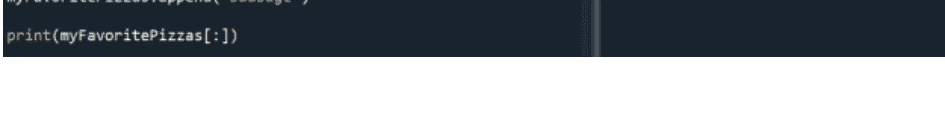

#### 方法：remove()

如果我们需要从列表中删除一个项目，我们可以使用的一种方法是内置的 `remove()` 函数。当我们查看我们的 `myFavoritePizzas` 列表数组时，我们意识到也许青椒披萨并不像我们最初想象的那么棒，我们应该真正地将它们从列表中删除。我们可以使用 `remove()` 函数来做到这一点。

```python
myFavoritePizzas.remove('green pepper')
```

就像之前的 `append()` 方法一样，`remove()` 方法知道它需要删除某些东西。在你删除青椒之后，继续检查你的列表数组，看看一切是否按预期工作。

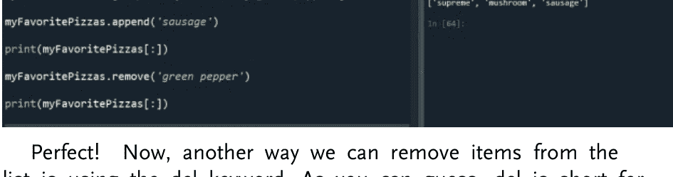

完美！现在，我们从列表中删除项目的另一种方法是使用 `del` 关键字。正如你所猜测的，`del` 是 `delete` 的缩写。我们使用这种删除项目的方法与列表索引一起使用。

记住，我们的索引（index 的复数）在编程世界中总是从 0 开始。所以我们当前的列表数组索引是这样的：

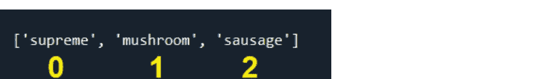

所以，如果我们需要删除蘑菇，那么我们将删除第一个索引处的项目，我们将写：`del myFavoritePizzas[1]`

```python
myFavoritePizzas=['supreme','mushroom','green pepper']
myFavoritePizzas.append('sausage')
print(myFavoritePizzas[:])
myFavoritePizzas.remove('green pepper')
print(myFavoritePizzas[:])
del myFavoritePizzas[1]
print(myFavoritePizzas[:])
```

输出：
```
['supreme', 'mushroom', 'green pepper', 'sausage']
['supreme', 'mushroom', 'sausage']
['supreme', 'sausage']
```

正如你所看到的，我们使用这个 `del` 关键字删除了正确的披萨，然后检查了我们的列表数组，看看当前里面实际有什么。

#### 直接修改索引

如果你想在列表中的确切位置/索引处添加某些东西怎么办？也许你不希望计算机将其添加到列表的最后一个位置。嗯，有一种方法！假设我们想将洋葱放在确切的索引 1 处：`myFavoritePizzas[1:1] = ['onion']`

```python
myFavoritePizzas=['supreme','mushroom','green pepper']
myFavoritePizzas.append('sausage')
print(myFavoritePizzas[:])
myFavoritePizzas.remove('green pepper')
print(myFavoritePizzas[:])
del myFavoritePizzas[1]
print(myFavoritePizzas[:])
myFavoritePizzas[1:1] = ['onion']
print(myFavoritePizzas[:])
```

输出：
```
['supreme', 'mushroom', 'green pepper', 'sausage']
['supreme', 'mushroom', 'sausage']
['supreme', 'sausage']
['supreme', 'onion', 'sausage']
```

正如你所看到的，方括号 `[1:1]` 中的数字告诉计算机我们希望洋葱的确切位置。在 `=` 的右边，我们有我们想要放置在该确切位置的东西（在这个例子中是一个放置在索引 #1 的字符串）。

## 元组

元组是 Python 中的另一种类型，用于保存项目或对象的集合。它们与列表非常相似，你所知道的关于列表的一切很可能对元组也适用！这意味着它们是有序的，可以通过索引访问，可以使用切片范围，并且可以由相同或不同类型的项目组成。然而，元组和列表之间有两个主要区别：

### 元组使用圆括号

元组使用圆括号 `()` 来保存它们的项目，而不是列表使用的方括号 `[]`。这意味着它们是这样创建的：

```python
rgbColors = ('red','green','blue')
```

但所有区别中最重要的一个是元组是不可变的。

### 元组是不可变的

记住，不可变意味着无法改变。这是元组与列表的一个非常重要的区别。添加、删除或更改元组的内容是不可能的，因为这是元组的一个特殊特性。这意味着像 `append()` 和 `remove()` 函数以及 `del` 这样的方法对元组不起作用。

为了记住不可变与可变的含义，我喜欢把它想象成电视和遥控器。一个可变的电视意味着我可以点击遥控器上的静音按钮并将其静音，所以我刚刚改变了它。另一方面，如果我无论按多少次静音按钮都无法将电视静音，什么都不会发生，那么它就是不可变的。

### 何时使用元组而非列表

在大多数情况下，处理项目集合时，列表可能是要选择的类型。一个应该告诉你使用元组的重要标志是，你将要存储的项目集合不应该被改变。我们之前的元组就是一个很好的例子，因为 RGB 颜色不能改变。

## IF 语句

决策使我们的 Python 程序更灵活、更有趣、更智能。就像我们在生活中做出决策一样，我们可以通过使用 `if` 语句在代码中做出决策。`if` 语句是一个代码块，允许你控制计算机在执行代码时将采取的路径。这很重要，因为当我们编写更复杂和更长的程序时，我们并不真的希望计算机运行我们所有的代码。我们只希望在有意义或我们决定是正确的时间时运行代码的某些部分。`if` 语句给了我们这种决策能力。这是如何做到的呢？`if` 语句允许我们设置一个条件，在执行任何其他代码之前必须满足该条件。这个条件通常是一个布尔表达式，这是一个计算机评估并决定是真还是假的条件。将布尔表达式视为“是或否”的问题，其中“是”为真，“否”为假。

以下是如何编写 `if` 语句

```python
mood='hungry'
if mood == 'hungry':
```

python
print('Sarah饿了，所以她吃了一片披萨')

非常符合逻辑，代码总是从上到下运行，所以让我们来分析一下这里到底发生了什么。if语句首先分析一个布尔表达式，通过检查mood是否等于（==）字符串'hungry'来确定我们的情绪。

如果mood等于hungry为真，那么计算机将执行下一行代码。如果mood等于hungry为假，那么它将跳过if语句操作中缩进的下几行代码，并找到下一个代码块。

让我们来练习一下。创建一个名为mood的变量，并为其赋值字符串'happy'。然后输入if语句并运行你的程序：

```python
mood='happy'
if mood == 'hungry':
    print('Sarah饿了，所以她吃了一片披萨')
```

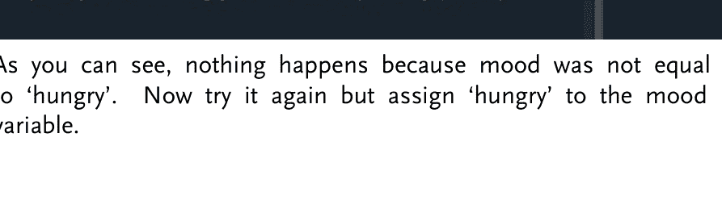

如你所见，什么也没发生，因为mood不等于'hungry'。现在再试一次，但将'hungry'赋值给mood变量。

```python
mood='hungry'
if mood == 'hungry':
    print('Sarah饿了，所以她吃了一片披萨')
```

**输出：**
```
In [70]: runfile('C:/Users/kspri/Desktop/Pytho
Sarah饿了，所以她吃了一片披萨
In [71]:
```

做得好！现在if语句为真，代码就在if语句内运行了！在这个代码块中，我们有print()方法来打印关于Sarah吃了一片披萨的字符串。根据你的需求，你可以在一个if语句中包含任意数量的代码块、方法等！

如果我们不饿呢？如果我们超级饿呢？我们也可以使用else if语句（在Python语言中缩写为elif）将这个决定添加到我们的代码中。

代码看起来会是这样：

```python
mood='hungry'
if mood == 'hungry':
    print('Sarah饿了，所以她吃了一片披萨')
elif mood == 'SUPER hungry':
    print('Sarah超级饿，所以她吃了4片披萨')
```

**输出：**
```
In [71]: runfile('C:/Users/kspri/Desktop/Pytho
Sarah饿了，所以她吃了一片披萨
In [72]:
```

这里，我们在代码中添加了一个elif语句。elif语句总是用在常规if语句之后，它允许你在满足不同条件时做出不同的决定！你可以根据需要使用任意数量的elif语句。

如你所见，mood为hungry对于if语句为真，所以if的代码被执行了。它从未触及elif语句，因为一旦一个语句为真，它就会停止遍历你的if和elif语句。这就像如果你问的第一个问题得到了“No”的回答，就会问一个不同的问题。它会一直问，直到得到“Yes”！如果它从未得到“Yes”，那么它将移动到if/elif语句之后/下方的下一行代码。

同样重要的是要记住，我们if语句之后的代码是缩进的。缩进在Python中非常重要，因为计算机使用这些空格来确定哪些代码块属于一起。

让我们再练习一次。将你的mood变量设置为'super hungry'，然后运行你的程序。

```python
mood='SUPER hungry'
if mood == 'hungry':
    print('Sarah饿了，所以她吃了一片披萨')
elif mood == 'SUPER hungry':
    print('Sarah超级饿，所以她吃了4片披萨')
```

```
In [73]: runfile('C:/Users/kspri/Desktop/Python/Say H...')
Sarah超级饿，所以她吃了4片披萨
In [74]:
```

如你所见，if语句为假，所以它进入了第一个elif语句。这个elif语句为真，因为SUPER hungry与我们的mood变量完全匹配。如果我们把mood变量设置为super hungry，它就会是假的，因为它必须完全匹配才为真。

现在让我们再添加2个elif语句，然后更改你的mood变量并运行你的程序两次，看看你的elif语句是否执行。

```python
mood='not hungry'
if mood == 'hungry':
    print('Sarah饿了，所以她吃了一片披萨')
elif mood == 'SUPER hungry':
    print('Sarah超级饿，所以她吃了4片披萨')
elif mood == 'not hungry':
    print('Sarah一点也不饿，所以她没吃披萨')
elif mood == 'extremely hungry':
    print('Sarah极度饥饿，所以她吃了一整个披萨！')
```

```
In [74]: runfile('C:/Users/kspri/Desktop/Python/S...')
Sarah一点也不饿，所以她没吃披萨
In [75]:
```

再来一个：

```python
mood='extremely hungry'
if mood == 'hungry':
    print('Sarah饿了，所以她吃了一片披萨')
elif mood == 'SUPER hungry':
    print('Sarah超级饿，所以她吃了4片披萨')
elif mood == 'not hungry':
    print('Sarah一点也不饿，所以她没吃披萨')
elif mood == 'extremely hungry':
    print('Sarah极度饥饿，所以她吃了一整个披萨！')
```

```
In [75]: runfile('C:/Users/kspri/Desktop/Python/Say H...')
Sarah极度饥饿，所以她吃了一整个披萨！
In [76]:
```

现在你应该完全理解if和elif语句如何运作的基础知识了，这很重要，你将在编程之旅中经常使用它！
由于你将来可能需要参考if elif语句的结构，让我们把这个文件保存在我们的python文件夹中，以便随时参考！点击“文件”，“另存为”并为你的文件命名。

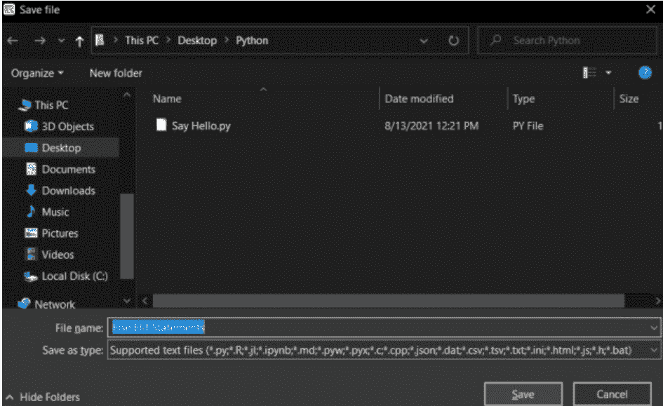

到目前为止，我们有一个Say Hello文件，现在我们还将有一个Else Elif Statements文件。
接下来，让我们通过一起创建一个“选择你自己的冒险”游戏来深入使用更多的if和elif语句。在开始之前，我们将介绍input函数，它允许用户与你的程序交互。在这个例子中，我们将把用户的输入存储在一个变量中，以便我们可以使用它！这个游戏将包括使用用户的名字和他们的选择。首先，我们将询问用户的名字并将其存储在一个变量中。你可以用以下代码完成此操作：

```python
name=input('What is your name?')
```

运行结果：
```
In [90]: runfile('C...')
What is your name?
```

那么这里刚刚发生了什么？把input()函数想象成print()函数，因为它在控制台上显示一些东西。不同之处在于input()期望用户输入一些内容并按回车键。一旦我们的用户输入了他们的名字，我们就将其赋值给变量name。
现在让我们使用用户名字，并给予他们个性化的游戏欢迎！

```python
name=input('What is your name?')
print(f'Welcome, {name} to the Choose Your Own Adventure Game! You will be presented with choices that decide your fate... so choose wisely!')
```

运行结果：
```
What is your name? Jennifer
Welcome, Jennifer to the Choose Your Own Adventure Game! You will be presented with choices that decide your fate... so choose wisely!
```

这是代码：

```python
name=input('What is your name?')
print(f'Welcome, {name} to the Choose Your Own Adventure Game!  You will be presented with choices that decide your fate... so choose wisely!')
```

接下来，让我们设计这个小游戏，并像程序员一样思考。我们希望用户在两个不同颜色的门之间做出选择。每扇门内将有两个选择。一个选择是游戏结束，另一个选择是游戏胜利。在设计程序时，创建一个显示逻辑的流程图会很有帮助。一旦你有了一个逻辑流程图，实际编程就容易多了！让我们创建一个：

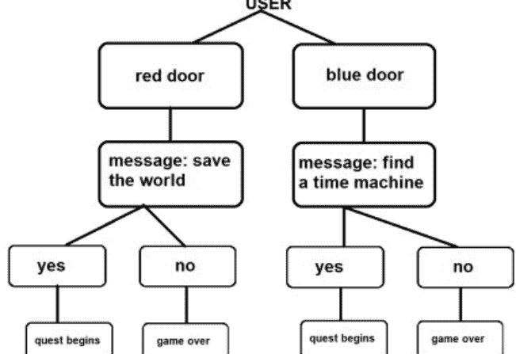

你的流程图可以很简单，也可以很复杂，但它永远不需要完美漂亮——任何对你作为逻辑指南有用的东西都可以。
我们必须做的第一件事是让用户在红色或蓝色的门之间做出选择。

```python
name=input('What is your name?')

print(f'Welcome, {name} to the Choose Your Own Adventure Game! You will be presented with choices that decide your fate... so choose wisely!')

doorChoice=input(f'{name}, you walk into an abandoned house and see a dark room with only 2 doors in it, a red door and a blue door. Which door do you open? Type red or blue to decide')
```

```
In [99]: runfile('C:/Users/kupri/Desktop/Python/Practice.py', wdir='C:/Users/kupri/Desktop/Python')
What is your name? Sam
Welcome, Sam to the Choose Your Own Adventure Game! You will be presented with choices that decide your fate... so choose wisely!

Sam, you walk into an abandoned house and see a dark room with only 2 doors in it, a red door and a blue door. Which door do you open? Type red or blue to decide
```

接下来，我们需要设置 if 和 elif 语句来处理用户的选择。你需要将 if 或 elif 语句放在彼此内部，这称为嵌套 if 或嵌套 elif。这个练习将帮助你强制理解这一点。请持续尝试，直到你完全理解为止！

以下是一些帮助你入门的代码。

```
name=input('What is your name?')
print(f'Welcome, {name} to the Choose Your Own Adventure Game! You will be presented with choices that decide your fate... so choose wisely!')
doorChoice=input(f'{name}, you walk into an abandoned house and see a dark room with only 2 doors in it, a red door and a blue door. Which door do you open? Type red or blue to decide')
if doorChoice == 'red':
    print('You walk through the red door and a princess asks you to help her save the world. Press 1 to accept or 2 to decline')
elif doorChoice=='blue':
    print('You walk through the blue door and a time machine is sitting there. Do you get in the time machine? Press 1 for yes or 2 for no ')
```

发挥创意，自己试试看，然后查看下面的输出和代码！

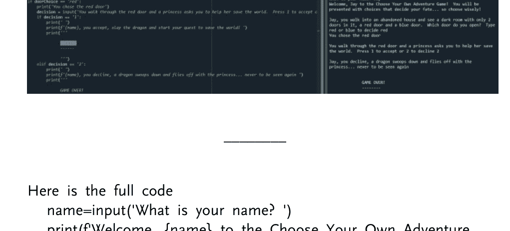

以下是完整代码

```
python
name=input('What is your name? ')
print(f'Welcome, {name} to the Choose Your Own Adventure Game!  You will be presented with choices that decide your fate... so choose wisely!')
doorChoice=input(f'{name}, you walk into an abandoned house and see a dark room with only 2 doors in it, a red door and a blue door.  Which door you open?  Type red or blue to decide ')
if doorChoice == 'red':
    print('You chose the red door')
    decision = input('You walk through the red door and a princess asks you to help her save the world.  Press 1 to accept or 2 to decline ')
    if decision == '1':
        print(' ')
        print(f'{name}, you accept, slay the dragon and start your quest to save the world! ')
        print('''
SUCCESS

______

''')
    elif decision == '2':
        print(' ')
        print(f'{name}, you decline, a dragon swoops down and flies off with the princess... never to be seen again ')
        print('''
    GAME OVER!
    ''')
    elif doorChoice=='blue':
        decision = input('You walk through the blue door and a time machine is sitting there.  Do you get in the time machine? Press 1 for yes or 2 for no ')
        if decision=='1':
            print(' ')
            print(f'{name}, you hop in the time machine and explore the world for 100s of years, no one notices you were gone, to them it was only 5 minutes! ')
            print('''
            SUCCESS
            ''')
        elif decision=='2':
            print(' ')
            print(f'{name}, you decline but somehow the time machine glitches out and sends you 800 years in the past, you are stuck there! ')
            print('''
GAME OVER!
''')
```

呼！我们在上一部分学到了很多东西，比如：
字符串可以相加来创建新的字符串。
字符串不能与数字数据类型相加
然而，字符串可以相乘。
我们还接触到了第一个可变（可更改的）数据类型，即列表。
列表是相同数据类型或混合数据类型的项目的集合。
列表使用方括号 [] 来包含其项目。
列表是有序的，并从 0 开始。
你可以使用索引获取列表中的特定对象。
你可以通过添加、重新排序和删除列表中的对象来更改列表。

我们学习了元组，这是一种不可变（不可更改的）数据类型，类似于列表。
元组可以在许多方面与列表以相同的方式使用。
元组使用圆括号 () 而非方括号 [] 来包含其项目。
元组不可更改，这是最重要的区别。
当列表中包含的项目不应更改时，应该使用元组。

最后，我们还学习了如何通过 if 语句控制代码的执行路径。
If 语句使我们能够在代码中做出决策。
缩进很重要，它帮助我们将属于一起的代码行分组。
If 语句让我们告诉计算机运行代码的哪一部分以及如何运行。
If 语句使用布尔表达式来确定代码应采取哪条路径。

### 练习活动
（列表、Else 与 Elif 语句）

### 活动 #1 - 我最爱的食物
创建一个包含 5 种你最爱食物的列表，然后打印一条消息：--你的名字--最爱的食物是--在这里放置你最爱的东西，用逗号分隔，直接从你的列表中调用每一项--
**在完成活动之前，请勿查看下一页！**

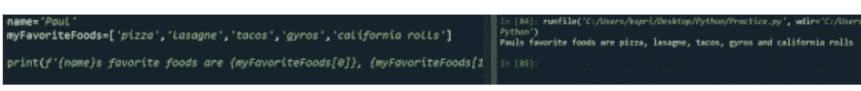

代码：
```
name='Paul'
myFavoriteFoods=['pizza','lasagne','tacos','gyros','california rolls']
print(f'{name}s favorite foods are {myFavoriteFoods[0]}, {myFavoriteFoods[1]}, {myFavoriteFoods[2]}, {myFavoriteFoods[3]} and {myFavoriteFoods[4]}')
```

### 活动 #2 - 比较你的列表
你和你的朋友在不同时间去自助餐，你们各自按进食顺序列出了你吃的 5 个项目的清单。我们要比较你和朋友的清单，看看你们是否在相同的时间吃了相同的东西。如果你们确实吃了相同的东西，那么打印一条陈述，说明你在那个时候吃了什么。以下是两个列表，可以帮助你开始：

```
myList=['mashed potatoes','tacos','mac & cheese','cherry pie','ice cream']
friendsList=['tacos','cheesecake','mac & cheese','chicken','ice cream']
```

**在完成活动之前，请勿查看下一页！**

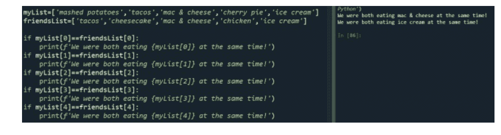

____________

代码：

```
myList=['mashed potatoes','tacos','mac & cheese','cherry pie','ice cream']
friendsList=['tacos','cheesecake','mac & cheese','chicken','ice cream']
if myList[0]==friendsList[0]:
    print(f'We were both eating {myList[0]} at the same time!')
if myList[1]==friendsList[1]:
    print(f'We were both eating {myList[1]} at the same time!')
if myList[2]==friendsList[2]:
    print(f'We were both eating {myList[2]} at the same time!')
if myList[3]==friendsList[3]:
    print(f'We were both eating {myList[3]} at the same time!')
if myList[4]==friendsList[4]:
    print(f'We were both eating {myList[4]} at the same time!')
```

### 活动 #3 - 重新排列游行队伍
你有一个显示花车顺序的游行队伍。以下是队伍顺序：
```
paradeOrder=['fire department','animal shelter','grand band','high school band','pizza palace']
```
根据以下情况更改并显示你的列表变化：

- 我们不希望两个乐队连续出现，所以让我们把高中乐队移到第一个位置
- 让我们把盛大乐队移到最后一个位置作为压轴节目
- 比萨宫殿无法准备好他们的花车，所以我们需要从队伍中删除他们

你的最终列表应该如下所示：
`['high school band', 'fire department', 'animal shelter', 'grand band']`

**在完成活动之前，请勿查看下一页！**

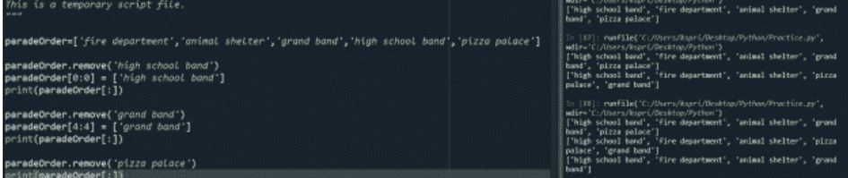

代码：
```
paradeOrder=['fire department','animal shelter','grand band','high school band','pizza palace']
paradeOrder.remove('high school band')
paradeOrder[0:0] = ['high school band']
print(paradeOrder[:])
paradeOrder.remove('grand band')
paradeOrder[4:4] = ['grand band']
print(paradeOrder[:])
paradeOrder.remove('pizza palace')
print(paradeOrder[:])
```

# 安装

打开浏览器，访问 https://www.spyder-ide.org/
点击下载按钮

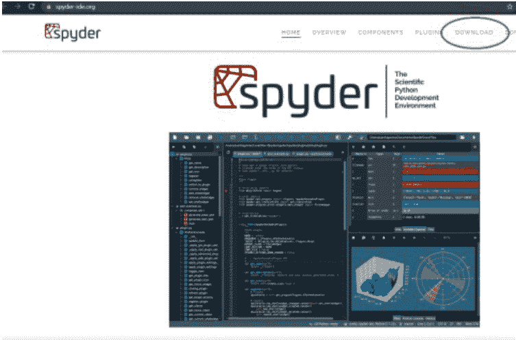

你的下载通常会显示在浏览器的左下角。右键单击并点击“打开”选项。

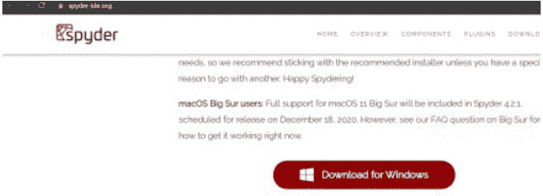

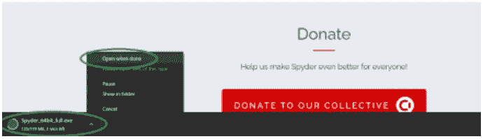

按照提示完成安装过程。如果 Windows 防火墙试图阻止你安装，只需点击“更多信息”并选择“仍要运行”。

恭喜，你现在已经安装了 Spyder！现在我们需要找到并打开 Spyder。为此，请右键单击左下角的 Windows 图标并点击搜索选项。

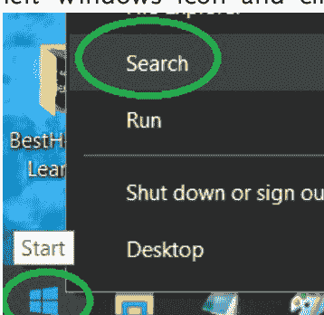

接下来，输入 spyder 并选择打开选项。

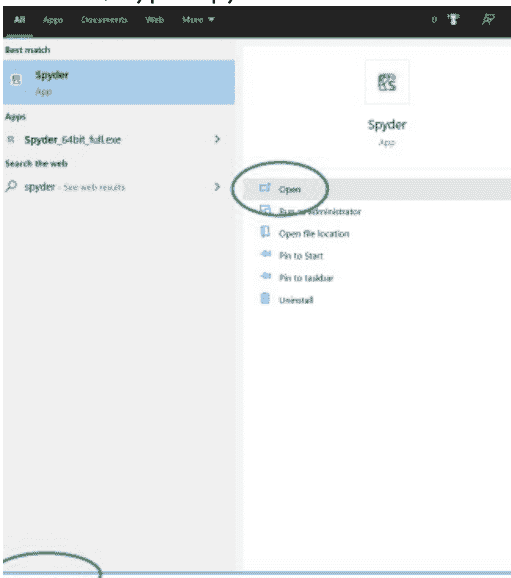

既然你已经打开了你的 IDE，你需要将其固定到任务栏，这样你就不必每次都去搜索它了。

你需要它。右键点击Spyder图标，然后点击‘固定到任务栏’：

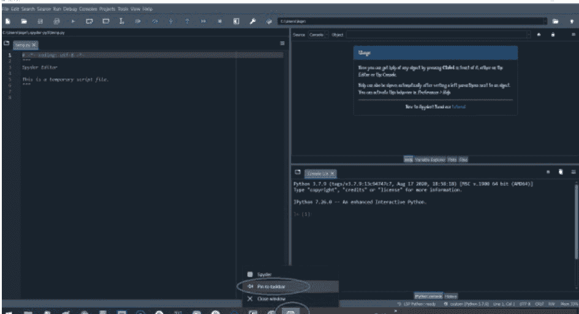

## 循环

你可能会问，什么是循环？还记得我们创建的《选择你自己的冒险》游戏吗？如果在游戏结束时，我们可以让用户决定是想重新开始游戏，还是退出呢？他们可以玩无数次游戏，或者在他们选择退出/停止游戏时随时停止。这是一个说明循环如何工作的非常简单的例子。理解循环将使你能够创建功能强大的程序。

计算机之所以如此强大，很大程度上在于它们能非常快速地重复许多动作或计算。我们告诉计算机这样做的方式之一就是通过循环。循环是一种特殊的编程语句，它允许你重复一段代码块。

像所有编程语言一样，Python 有两种主要的循环：for 循环和 while 循环。

### FOR 循环

第一种循环称为 for 循环。这种循环会将一段代码重复执行特定的次数。许多程序员在配合列表使用 for 循环时，或者在我们知道需要重复代码块多少次的情况下使用它。

可以将 for 循环想象成这样一个句子：“执行这个次数，遍历这个东西并执行我放在此循环中的任何代码，然后停止、退出循环并继续前进！”

假设我们创建一个数字列表，我们想给列表中的每个数字加 2，然后打印出新的数字。

让我们创建一个数字列表，因为循环总是需要一组要遍历的项目。这个遍历一组项目的过程也称为循环迭代。迭代意味着逐个地遍历一组事物。

```
numbers=[1,2,3,4,5,6,7,8,9]
```

很好！现在，让我们使用 `for` 关键字开始编写一个 for 循环。这个关键字向计算机表明我们要进行一个 for 循环：

```
numbers=[1,2,3,4,5,6,7,8,9]
```

接下来，让我们启动 for 循环，并告诉计算机要遍历哪一组项目。在我们的例子中，我们想遍历 `numbers` 列表中的每个数字，所以我们这样编写循环：

```
numbers=[1,2,3,4,5,6,7,8,9]
for number in numbers:
```
‘for’ 开始你的 for 循环。
‘number’ 是一个变量，可以命名为任何你想要的名字。
‘numbers’ 是你希望循环遍历的列表或项目。

我们刚刚编写的代码等同于告诉计算机，对于 `numbers` 列表中的每个数字，都执行某些操作。现在计算机知道了要遍历哪一组项目。

让我们尝试运行这个循环：

```
numbers=[1,2,3,4,5,6,7,8,9]
for number in numbers:
    print(number)
```

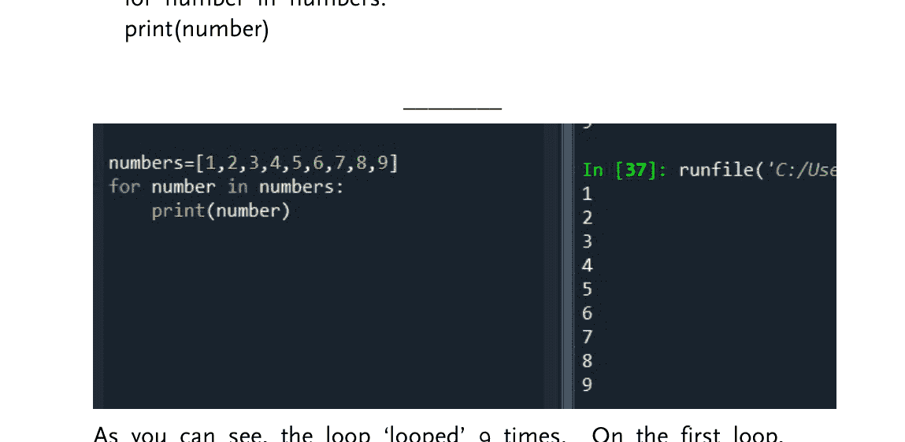

如你所见，循环“循环”了 9 次。在第一次循环中，迭代变量 (`number`) 是 1，所以循环按照我们的指示执行并打印了 1。然后循环移动到 `numbers` 列表的下一个索引，并将 2 赋值给 `number`，如此循环下去。这个过程持续进行，直到循环遍历完列表中的所有元素！

接下来，让计算机遍历我们列表中的每个数字，给它加 2，然后将这个新数字打印到控制台。

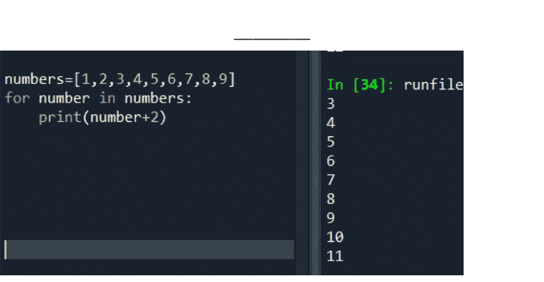

现在，我们不再使用列表，而是将使用一个名为 `range()` 的 Python 方法在 `for` 循环中操作。`range()` 函数最多可以包含 3 个参数。这与前面的示例工作原理相同，只是我们将在 `for` 循环语句内定义一个数字范围，而不是引用之前创建的列表。

```
for i in range(9):
    print(i)
```

你认为这个循环会发生什么？我们创建了一个变量 (`i`)，是“iteration”（迭代）的缩写。然后我们定义了一个范围。这个范围表示该范围内有 9 个位置/索引。当我们运行代码时，会发生以下情况：

```
for i in range(9):
    print(i)
```

```
In [39]: runfil
0
1
2
3
4
5
6
7
8
```

这是你预期的输出吗？记住，如果有 9 个索引，它总是从零开始，所以它结束于 8。我们刚刚运行的代码展示了 `range()` 函数只接受一个参数，即停止点。

现在让我们再添加一个参数，它是一个起点。这允许我们通过遍历特定范围内的数字来做类似于列表和元组切片的操作。所以，如果我们想直接跳到数字 10，然后遍历从 10 到 20 的数字，我们可以像这样使用 `range()` 函数，使用两个参数：

```
for i in range(10,21):
    print(i)
```

10 是起点，循环将在看到 21 时停止。尝试运行这段代码：

```
for i in range(10,21):
    print(i)
```

做得好！我希望你开始对 for 循环感到得心应手了！好的，使用 `range()` 函数还有另一个很酷的功能。当我们给 `range()` 函数所有三个参数时，第三个参数用作步长，即在迭代时跳过的项目数量。所以，如果我们只想打印 0 到 100 之间 10 的倍数，我们可以像这样使用 `range()` 函数：

```
for i in range(0,100,10):
    print(i)
```

```
python
for i in range(0, 100, 10):
    print(i)


**Out[41]:**

0
10
20
30
40
50
60
70
80
90
```

很好！这些循环看起来可能很简单，但当我们创建更复杂的程序时，它们可以非常强大，并且经常被使用！

### WHILE 循环

啊哦，又一种循环类型？！第二种循环类型是 while 循环。这种循环也会一遍又一遍地重复一段代码块，但只要布尔表达式对计算机来说一直为 True，它就会持续重复。

我们同样会像使用 for 循环一样，将这种循环用于一组项目。然而，while 循环与 for 循环非常不同，因为我们通常在不知道需要重复代码块多少次时使用 while 循环。记住，在 for 循环中，我们确切地知道一段代码需要重复多少次。

例如，假设你的应用有一个登录功能，用户输入了错误的密码。循环会看到密码是 False，并需要重复循环直到密码为 True。在你的布尔表达式达到你想要的结果之前，它会永远停留在 while 循环中。

假设我们有一个包含很多数字的数字列表：Numbers = [1,2,3,4,5,6,7,8,9,10,11,12,13,14,15,16,17,18,19,20]。如果我们只想打印那些加上 2 后结果小于 20 的数字，该怎么办呢？我们应该使用 for 循环吗？可能不会，因为我们事先不知道加 2 这段代码会重复多少次。所以对于这类问题，我们将使用 while 循环！

首先声明我们的迭代器，即用于跟踪我们运行循环次数的变量。在编程中，我们有时称它为“计数器”变量，因为它计算我们进行的迭代次数。它通常被命名为 `i`。以下是我们的列表和计数器的声明：

```
Numbers = [1,2,3,4,5,6,7,8,9,10,11,12,13,14,15,16,17,18,19,20]
i=0
```

这个变量很重要，其重要性如下：如果你还记得 for 循环与 while 循环的区别，那就是我们告诉 for 循环要重复多少次。对于 while 循环，我们需要给它们一点帮助。这就是为什么我们创建了这个迭代器计数器变量。当与我们的布尔表达式一起使用时，它充当信号告诉 while 循环继续，因为我们没有确切说明要重复代码多少次。理解了吗？现在，让我们开始我们的 while 循环：

```
Numbers = [1,2,3,4,5,6,7,8,9,10,11,12,13,14,15,16,17,18,19,20]
i=0
while
```

太好了，现在让我们给我们的 while 循环一个要检查的布尔表达式。这条规则帮助计算机决定是继续重复代码还是停止。

在这个场景中，我们仍然想遍历列表中的所有数字。由于我们正在跟踪我们执行的循环次数，我们需要使用更多一点逻辑来告诉计算机我们是否已经遍历了 `numbers` 列表中的每个对象，但我们该怎么做呢？

```
Numbers = [1,2,3,4,5,6,7,8,9,10,11,12,13,14,15,16,17,18,19,20]
i=0
while(i < len(numbers)):
```

我们创建一个布尔表达式，就是这样！这个布尔表达式字面意思是“只要迭代计数器小于列表的长度，我就会继续这个循环”。我们知道我们的 `numbers` 列表中有一定数量的对象。如果我们迭代列表的次数等于对象总数，那么我们就知道已经遍历完了所有对象。

这意味着我们的布尔表达式在询问我们的迭代器变量是否小于 `numbers` 列表中的对象总数。只要迭代计数器变量小于列表长度，循环就会继续。一旦计数器变得等于或大于长度，它就会停止并退出循环。

`len()` 函数是一个可重用的代码块，它返回一个值。`len()` 函数字面上告诉你事物的长度。一个列表中可能有 10,000 个项目、100 万个、5 个等等，而 `len()` 函数会告诉你这个数量。

这仅仅意味着我们从所使用的函数接收到某种形式的输出。通常，我们接收到的值是整数，但它们也可以是字符串、布尔值、列表或任何其他我们可能觉得有用的数据类型。

然而，`len()` 函数不仅仅是一个普通的函数。它是 Python 众多内置函数之一，而这正是我们特定布尔表达式所需要的！我们将在后面学习更多关于其他内置函数以及如何创建自己的函数。

那么，既然我们已经设置好了布尔表达式，就可以开始编写循环中重复执行的代码了。本节课的目标是判断我们加2后得到的新数字是否小于20。这里我们需要一个if语句。

```
numbers = [1,2,3,4,5,6,7,8,9,10,11,12,13,14,15,16,17,18,19,20]
i=0
while(i < len(numbers)):
    if ((numbers[i] + 2) < 20):
        print(numbers[i]+2)
```

目前，我们将计数器设置为0，并设置循环在计数器小于数字列表长度时持续运行。if语句获取计数器的值（即它当前所在的索引），并将其加2。然后，if语句检查这个数字是否小于20。如果该数字小于20，它将执行if语句内的代码并打印出该数字。如果该数字小于20的条件为假，则不会打印任何内容。

这里需要理解的一个重要点是，计数器变量（i）每次循环都会变化，但它怎么知道要这样做呢？请运行上面的代码，看看会发生什么。

你是不是遇到了一个无限循环？！如果是，请点击“停止调试”按钮：

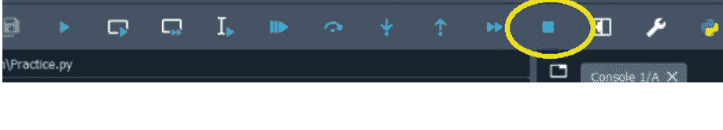

那么，为什么我们会陷入一个由0组成的无限循环呢？仔细看看这段代码以及我们的计数器（i）的值：

```
numbers = [1,2,3,4,5,6,7,8,9,10,11,12,13,14,15,16,17,18,19,20]
i=0
while(i < len(numbers)):
    if ((numbers[i] + 2) < 20):
        print(numbers[i]+2)
```

在这个循环结束时，i计数器仍然等于0，所以当它再次循环时，计数器仍然等于0，它从未改变。由于它从未改变，所以i小于列表长度的while条件永远不会为真。无限循环对你正在创建的任何软件或应用程序都是有害的……你绝对不想要无限循环！为了修复这个问题，我们必须在循环结束时将计数器增加一：

```
i = i + 1
```

现在i的值比之前大了一。然而，有一种更简单的写法：

```
i += 1
```

这样写更简单，意思就是i等于i + 1。你可以使用任何数学运算符。现在，我们的代码完成了，并且计数器会增加，让我们运行它吧！

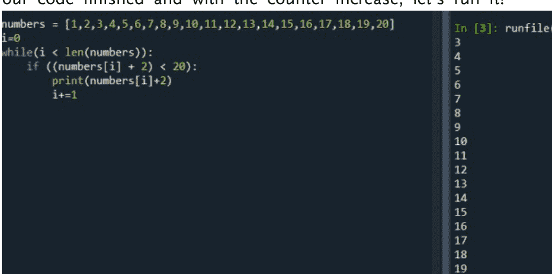

请注意，我们的计数器增加语句需要缩进。如果这一行与if或while对齐，它将不会执行，你将再次陷入无限循环。

这是一节内容密集的课程！
我们学习了for循环和while循环。
我们看到了它们在重复代码块时是多么有用，
并且我们现在知道了
何时使用其中一种而不是另一种。
for循环通常在我们知道需要重复代码块多少次时使用。
while循环通常在不知道需要重复代码块多少次时使用。
我们需要小心，不要写出任何无限循环。
你甚至可以通过在循环内放置if语句来创建更复杂的循环。

### 练习活动

### 循环与While

#### 活动 #1 - 我最喜欢的食物

制作一个至少包含5种食物的列表。打印出这样的语句：“嗨，我的名字是——你的名字——，我最喜欢的食物是——列表中的一项——”

你的输出应该看起来像这样：

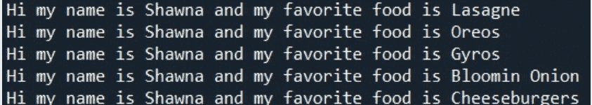

**在完成活动之前，请不要看下一页！**

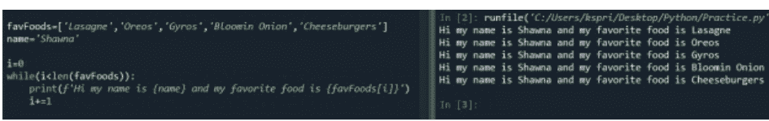

代码：

```
favFoods=['Lasagne','Oreos','Gyros','Bloomin Onion','Cheeseburgers']
name='Shawna'
i=0
while(i<len(favFoods)):
    print(f"Hi my name is {name} and my favorite food is {favFoods[i]}")
    i+=1
```

#### 活动 #2 - 我的朋友和他们最喜欢的食物

与上一个活动类似，但这次制作两个列表。一个列表包含5个你朋友的名字，另一个列表包含5种最喜欢的食物。列表的顺序将反映那个人最喜欢的食物。打印出这样的语句：“嗨，我的名字是——你的名字——，我最喜欢的食物是——列表中的一项——”

你的输出应该看起来像这样：

```
Hi my name is Steven and my favorite food is Lasagne
Hi my name is Sarah and my favorite food is Oreos
Hi my name is Joleen and my favorite food is Gyros
Hi my name is Teran and my favorite food is Bloomin Onion
Hi my name is Samantha and my favorite food is Cheeseburgers
```

在完成活动之前，请不要看下一页！

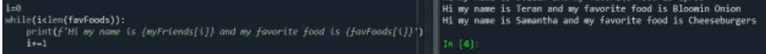

代码：

```
favFoods=['Lasagne','Oreos','Gyros','Bloomin Onion','Cheeseburgers']
myFriends=['Steven','Sarah','Joleen','Teran','Samantha']
i=0
while(i<len(myFriends)):
    print(f"Hi my name is {myFriends[i]} and my favorite food is {favFoods[i]}")
    i+=1
```

#### 活动 #3 - 数字计数

我们有一个包含1-10随机数字的列表，想知道每个数字有多少个。使用循环和if/elif语句打印出列表中每个数字的总数。你需要创建变量，然后在if/elif语句中更新这些变量，以便打印出变量的值。这是供你开始的列表和你的输出应该看起来像的照片：

```
randomNums=[5,7,9,10,4,6,3,9,2,5,4,9,8,7,3,2,10,8,7,1,2,3,6,4,9,5,1,2,7,6,4,8,3]
```

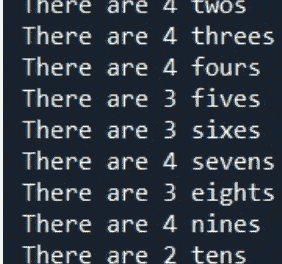

在完成活动之前，请不要看下一页！

代码：

```
randomNums=[5,7,9,10,4,6,3,9,2,5,4,9,8,7,3,2,10,8,7,1,2,3,6,4,9,5,1,2,7,6,4,8,3]
ones=0
twos=0
threes=0
fours=0
fives=0
sixes=0
sevens=0
eights=0
nines=0
tens=0
i=0
while(i<len(randomNums)):
    if(randomNums[i]==1):
        ones+=1
    elif (randomNums[i]==2):
        twos+=1
    elif (randomNums[i]==3):
        threes+=1
    elif (randomNums[i]==4):
        fours+=1
    elif (randomNums[i]==5):
        fives+=1
    elif (randomNums[i]==6):
        sixes+=1
    elif (randomNums[i]==7):
        sevens+=1
    elif (randomNums[i]==8):
        eights+=1
    elif (randomNums[i]==9):
        nines+=1
    elif (randomNums[i]==10):
        tens+=1
    i+=1
print(f'''
    There are {ones} ones
    There are {twos} twos
    There are {threes} threes
    There are {fours} fours
    There are {fives} fives
    There are {sixes} sixes
    There are {sevens} sevens
    There are {eights} eights
    There are {nines} nines
    There are {tens} tens''')
```

#### 活动 #4 - 密码登录

编写一个程序，要求用户输入密码。如果他们输入了错误的密码，就再次询问。如果他们猜对了密码，就显示一条秘密信息。在完成活动之前，请不要看下一页！

```
secretPassword = 'cookies'
passwordGuess = ''
secretMessage = ('Tomorrow I will bring you some cookies!')

while(passwordGuess != secretPassword):
    passwordGuess = input('Enter Your Password: ')
    if(passwordGuess == secretPassword):
        print(secretMessage)
```

示例输出：

```
Enter Your Password: something
Enter Your Password: i don't know!
Enter Your Password: calzones
Enter Your Password: cupcakes
Enter Your Password: cookies
Tomorrow I will bring you some cookies!
```

代码：

secretPassword='cookies'
passwordGuess=''
secretMessage=('Tomorrow I will bring you some cookies!')

while(passwordGuess != secretPassword):
    passwordGuess =input('Enter Your Password: ')
    if(passwordGuess == secretPassword):

## 内置方法与导入方法

在Python中，有很多方法是“内置”于你的IDE（集成开发环境）的。到目前为止，我们已经使用了一些，包括 `print()`、`range()`、`input()` 等！有成千上万的方法，它们都列在Python网站的文档部分。我们尚未使用的是那些需要导入的方法，因为它们不是“内置”的。让我们通过 `random()` 方法来全面理解为何以及如何需要掌握导入方法。

Python有一个 `random` 模块，其中包含了各种你可以使用的随机方法。其中一些是 `random.randrange()` 和 `random.randint()`。在方法 `()` 内部，你可以指定想要随机选取数字的范围。让我们看看这些示例：

```
number = random.randrange(1,10)
print(number)

anotherNum = random.randint(1,89)
```

代码分析
未定义名称 'random' (pyflakes E)

如你所见，这将无法工作或运行，因为我们的IDE无法识别这个 `random` 模块。现在让我们导入 `random` 模块，以便我们可以使用它的任何方法！在你的代码顶部输入：`import random`。就这么简单！

```
import random

number = random.randrange(1,10)
print(number)

anotherNum = random.randint(1,89)
print(anotherNum)
```

`randrange` 方法将输出一个介于1和10之间的随机数。`randint` 方法将输出一个介于1和89之间的随机数。

```
In [7]: runfile(.../Python')
7
57
```

在 `random` 模块内部有很多你可以使用的方法 `()`。要查看它们，你可以访问文档。当你查看具体方法时，它会告诉你在 `()` 内可以接受哪些参数。

如果你理解了这是如何工作的，那么请理解所有其他模块和方法也是完全这样工作的！

## TURTLE模块 - 绘图

要开始使用 `turtle` 模块，我们需要导入它 `import turtle`

```
import turtle
```

一旦你导入了 `turtle` 模块，你的屏幕上不会出现任何东西。然而，在幕后，我们可以访问 `turtle` 模块的所有方法。让我们使用 `turtle` 模块的 `shape()` 函数来告诉计算机要绘制什么形状，然后告诉海龟绘图完成。

```
import turtle
turtle.shape('turtle')
turtle.done()
```

运行这段代码时，你会得到一个弹出窗口，看起来像这样：

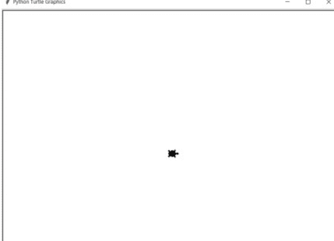

这是你的海龟！这是 `turtle` 模块中已经为我们编写好的代码的一部分。每当你使用 `turtle` 模块时，它允许你操作两样东西：

一个 Screen（屏幕）对象，即用来容纳你的海龟的窗口；以及，
一个 turtle（海龟）对象，即你创建的小海龟。

由于 `turtle` 模块创建了这两个对象，并且它是一个现成的模块，其中包含了所有为我们编写好的、用于与这些对象交互的代码，我们可以发挥极大的创造力。
最后一件事——写下这段代码：

```
turtle.setup(500,500)
```

这将使我们的窗口尺寸稍小一些，便于操作。现在，让我们来玩一下海龟的“家”（也就是屏幕）。首先，让我们改变它家的颜色。
我们可以通过使用 Screen 对象的 `bgcolor()` 函数来实现这一点。
`bgcolor()` 函数是一个预先编写好的代码块，它可以将海龟屏幕的背景颜色更改为指定的颜色！我们这样使用它：

```
turtle.Screen().bgcolor('blue')
```

```
import turtle
turtle.setup(500, 500)
turtle.Screen().bgcolor('blue')
turtle.shape('turtle')
turtle.done()
```

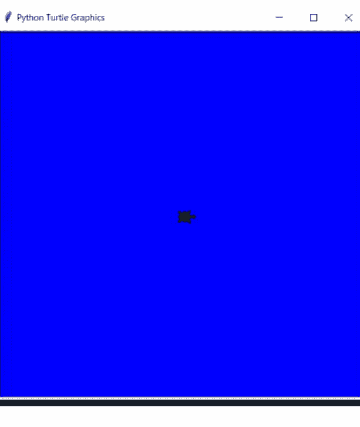

*在再次运行代码之前，请确保关闭 Python turtle 图形弹出窗口。这是因为我们代码的最后一行是 `turtle.done()`。

这里发生了什么。首先，我们需要告诉计算机我们想与哪个对象交互。在这个例子中，是 Screen。

因为 Screen 对象属于 `turtle` 模块，我们使用点号表示法（dot notation）来建立这种联系。在现代编程风格中，点号表示法是一种表示某些代码块相互关联的方式。因此，要告诉计算机我们特别想使用属于 `turtle` 模块的 Screen 对象，我们在它们之间使用一个点（.）。这就是我们得到第一部分的原因：`turtle.Screen()`

我们仍然需要告诉计算机使用属于 Screen 对象的一个特定函数来改变颜色。在我们的例子中，是 `bgcolor()` 函数。就像之前一样，我们在 Screen 对象和我们想要使用的函数名之间放一个点：`turtle.Screen().bgcolor()`

最后，我们给 `bgcolor()` 函数传递一个颜色：`turtle.Screen().bgcolor('blue')`

所以，总的来说，计算机理解我们的代码意思是：“请找到 `turtle` 模块的 Screen 对象。当你找到后，找到属于它的 `bgcolor()` 函数。最后，执行 `bgcolor()` 函数所说的操作，使用我们提供的颜色。”

记住，这些代码不是我们写的；它已经在 `turtle` 模块中为我们写好了。这就是为什么我们需要在使用它之前先导入 `turtle` 模块。现在，计算机可以遍历 `turtle` 模块的代码，找到我们要求它使用的对象和函数，并运行已经为我们写好的代码。

### 关于括号？

为什么 Screen 有括号，但 turtle 没有？如果你回顾我们写的代码，你会看到

```
turtle.Screen().bgcolor('blue')
```

这是现代编程风格的一部分，称为面向对象编程（object-oriented programming）。在面向对象编程中，程序员专注于编写组织成相关组的、可复用的、可以像积木一样相互协作的代码。

这样，代码可以写成我们直接使用的模块，比如 `turtle` 模块；或者以一种我们需要创建其副本的方式编写，比如 Screen 对象。在 Python 的 `turtle` 模块中，Screen 对象是我们必须创建副本或实例的对象，因为我们可能想要对其进行修改。当你在其他模块和面向对象语言中工作时，你会越来越多地注意到这一点。

所以我们的海龟之家现在真的是蓝色了，也许太蓝了！让我们试着把它变成海洋蓝。我们可以将其更改为任何我们想要的颜色。让我们稍微谈谈颜色是如何工作的。

### 颜色只是 R, G 和 B

在计算机上，所有颜色实际上只是三种原色光的特定组合，即红、绿、蓝。计算机使用加色法（additive color），这意味着颜色是通过叠加不同强度的红、绿、蓝光来创建的。这很合理，因为计算机屏幕发光，只能通过组合不同强度的光来产生颜色。

当在计算机上选择颜色时，我们需要明确告诉它使用每种原色光的多少来得到我们想要的最终颜色。这被称为RGB颜色模型。RGB颜色模型代表红绿蓝颜色模型，它使用三个数字书写，每个数字代表应使用的红、绿、蓝光的强度：

```
(R,G,B)
```

每个数字代表你想要的特定颜色中包含的红、绿、蓝光的量。第一个数字是你想要红色光有多强。如果你想要最强烈的红色且绝对没有其他颜色，你会给RGB模型最大的红色值，绿色为零，蓝色为零。

```
(255, 0, 0)
```

同样，对于最强烈的绿色，你会给最大的绿色值，没有红色或蓝色：

```
(0, 255, 0)
```

最后，要创建纯蓝色，就没有红色和绿色：

```
(0, 0, 255)
```

为什么最大值是255？我们使用这个数字是因为计算机存储信息的方式。计算机使用数字0和1来处理信息。一个比特（bit，二进制位的缩写）是计算机可以处理的最小数据单位。

可以容纳。一个比特代表0或1，字面意思就是“关或开”。字节是计算机用来表示字母或数字等信息的另一个计量单位。一个字节等于八个比特。它也恰好等于一个RGB值！

因此，在8位二进制中，数字0等于00000000，数字255等于11111111。如你所见，我们能存储的最大数据量与用完单个字节中的所有八个比特相同。由于一个RGB值正好是一个字节的数据，这转化为RGB值的最大数字为255。

### 十六进制系统

我为我们小海龟的家选择的颜色是#1DA2D8。现在，你可能想知道#1DA2D8是什么颜色。它实际上是以十六进制形式表示的非常特定的蓝色色调。十六进制系统是一种使用16个符号来表示数字的数制。要查找任何颜色的十六进制代码，你可以访问 https://www.w3schools.com/colors/colors_hexadecimal.asp 。在这里，你可以滑动滑块直到获得你想要的精确颜色，或者你可以将代码复制粘贴到此页面以查看其颜色。让我们粘贴#1DA2D8来看看显示什么颜色：

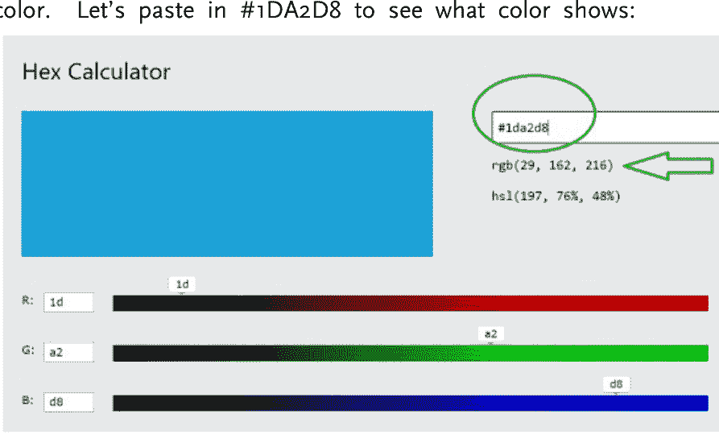

这会给你十六进制代码和RGB代码！让我们玩一下，获取一个深绿色的代码：

#### 十六进制计算器

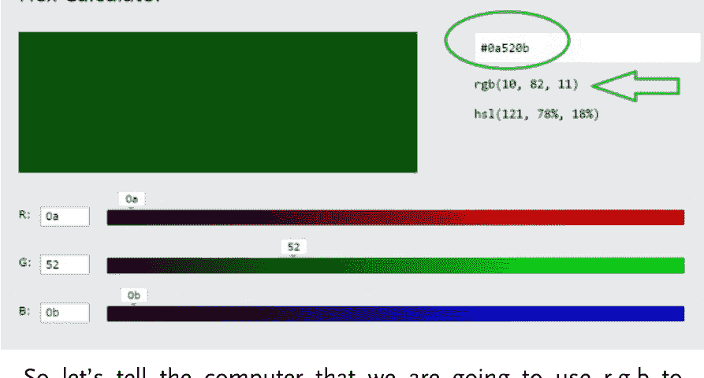

那么，让我们告诉计算机我们将使用r、g、b来设置颜色，而不是通常的预定义颜色。添加这段代码：

```python
turtle.Screen().colormode(255)
```

现在，让我们将之前的代码从‘blue’更改为更漂亮蓝色的RGB代码：

turtle.Screen().bgcolor(29,162,216)

你的代码和输出应该如下所示：

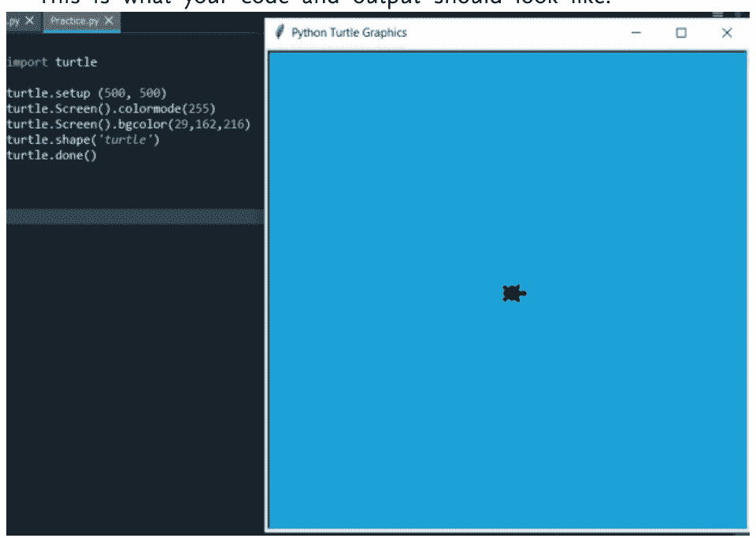

既然我们更改了Screen对象的颜色，让我们将小海龟对象的颜色更改为绿色：
turtle.color(10,124,11)

```python
import turtle

turtle.setup(500, 500)
turtle.Screen().colormode(255)
turtle.color(10,124,11)
turtle.Screen().bgcolor(29,162,216)
turtle.shape('turtle')
turtle.done()
```

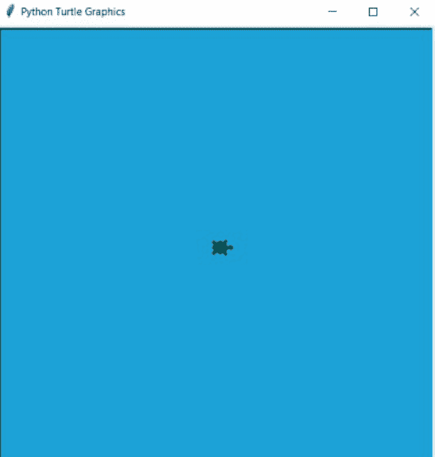

为了更好地看到我们的小海龟，让我们使用turtle pencolor()方法给它一个黑色轮廓，并将我们的RGB值放在方法的括号内：
    turtle.pencolor(0,0,0)

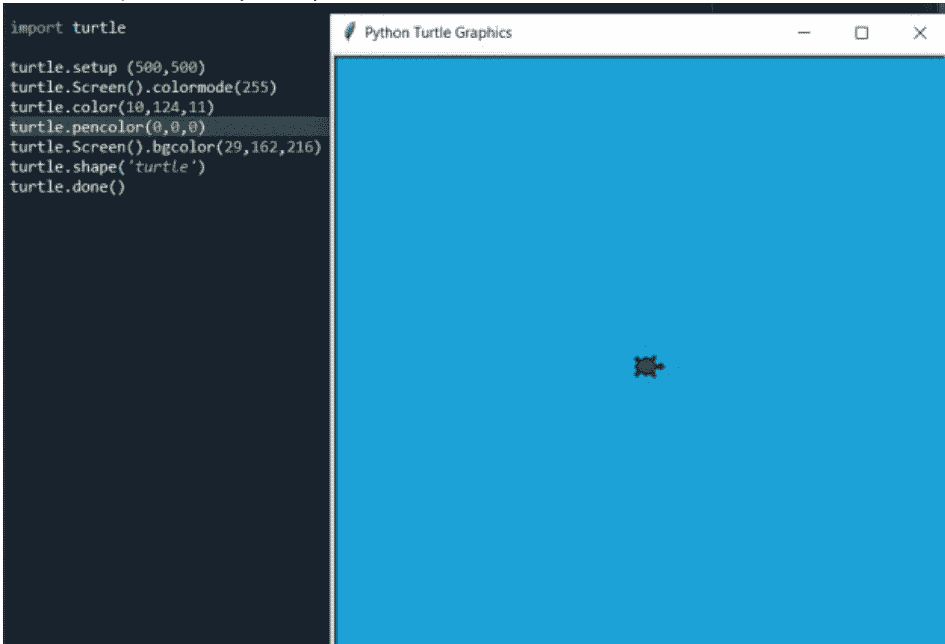

我们的小海龟非常小，让我们把它变大一点，这样更容易找到它！我们可以通过使用turtlesize()函数来实现这一点
    turtle.turtlesize(3,3,2)

turtlesize()函数使用三个数字作为其输入：

第一个和第二个数字用于将小海龟在纵向（上下）和横向（左右）拉伸一定量。第三个数字设置小海龟轮廓的大小，这是我们用pencolor()方法设置的黑色部分。

```python
import turtle

turtle.setup(500,500)
turtle.Screen().colormode(255)
turtle.color(10,124,11)
turtle.pencolor(0,0,0)
turtle.turtlesize(3,3,2)
turtle.Screen().bgcolor(29,162,216)
turtle.shape('turtle')
turtle.done()
```

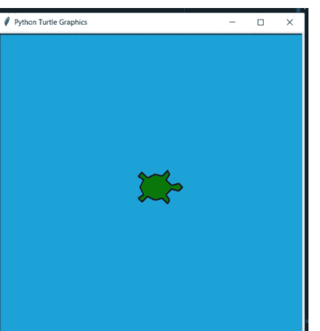

你可能对turtlesize()函数中的第三个参数感到疑惑——关于轮廓？是的，这个数字决定了我们小海龟轮廓的粗细。所以，如果你给turtlesize()函数第三个输入，它也可以作为调整轮廓大小的快捷方式。当然，你总是可以直接更改轮廓粗细，而无需更改小海龟的大小

```python
turtle.turtlesize(outline=10)
```

当你这样做时，小海龟对象的轮廓会变粗一些。

现在让我们移动我们的小海龟，使用forward()和back()函数让它前进。这两个函数都接受一个数字作为输入，这个数字将是小海龟在屏幕上移动的像素数。

像素是picture element的缩写，是构成我们在计算机屏幕上所见内容的小点。它们是我们在处理图片和绘图时最常用的计量单位！所以，要让它向前移动200像素，你会写：

```python
turtle.forward(200)
```

要让它向后移动350像素，我们会写：

```python
turtle.back(350)
```

当你运行程序时，你可能会注意到它留下了一条轨迹。由于我们实际上并不想画一幅画，如果我们不想看到小海龟的绘制轨迹，我们可以使用penup()方法。

你的小海龟在前进和后退后应该最终处于这个位置：

```python
import turtle
turtle.setup(500,500)
turtle.penup()
turtle.Screen().colormode(255)
turtle.color(10,124,11)
turtle.pencolor(0,0,0)
turtle.turtlesize(3,3,2)
turtle.forward(200)
turtle.back(350)
turtle.Screen().bgcolor(29,162,216)
turtle.shape('turtle')
turtle.done()
```

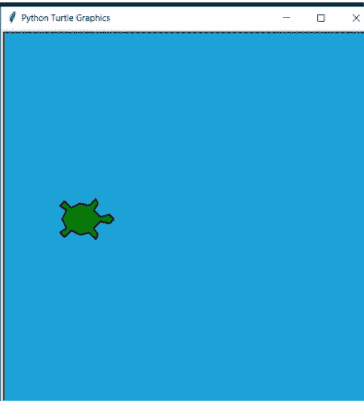

它移动到了屏幕的右边和左边。现在它想探索顶部和底部！我们该怎么做呢？嗯，你会如何朝你想去的地方移动？你可能会将身体转向目标方向，然后开始朝它走去，对吧？假设我们想让它朝屏幕顶部移动。为了面向顶部，它首先需要转向哪个方向？向左转90度。所以让我们使用left()方法并在方法括号中输入90。`turtle.left(90)`

很好，它现在应该面向屏幕顶部。这正是我们想要的，因为那是我们要去的方向！你传入left()以及即将使用的right()函数的数字单位是度数，这些方法知道这一点。你可以非常精确地控制对象的移动方式。现在我们可以让它朝顶部移动，让它转身，对角线转向，然后移动到屏幕底部。试试看。这是代码以及你的小海龟应该大致到达的位置：

```python
import turtle
turtle.setup(500,500)
turtle.penup()
turtle.Screen().colormode(255)
turtle.color(10,124,11)
turtle.pencolor(0,0,0)
turtle.turtlesize(3,3,2)
turtle.forward(200)
turtle.back(350)
turtle.left(90)
turtle.forward(200)
turtle.right(145)
turtle.forward(440)
turtle.Screen().bgcolor(29,162,216)
turtle.shape('turtle')
turtle.done()
```

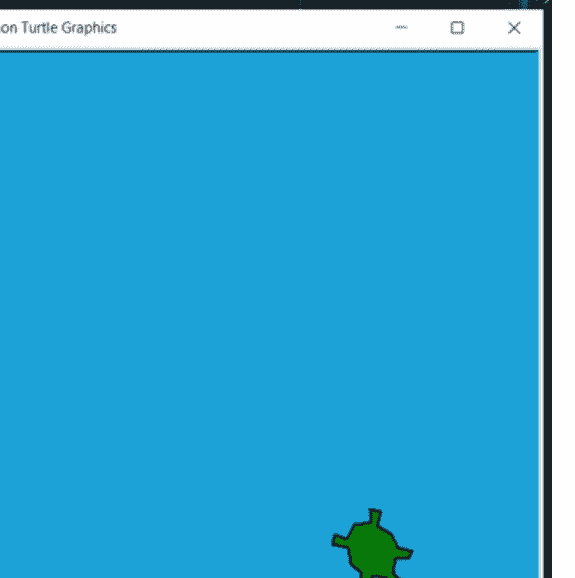

如果我们去掉penup()方法，我们会看到小海龟留下的绘制轨迹线：

```python
import turtle

turtle.setup(500,500)

turtle.Screen().colormode(255)
turtle.color(10,124,11)
turtle.pencolor(0,0,0)
turtle.turtlesize(3,3,2)
turtle.forward(200)
turtle.back(350)
turtle.left(90)
turtle.forward(200)
turtle.right(145)
turtle.forward(440)
turtle.Screen().bgcolor(29,162,216)
turtle.shape('turtle')
turtle.done()
```

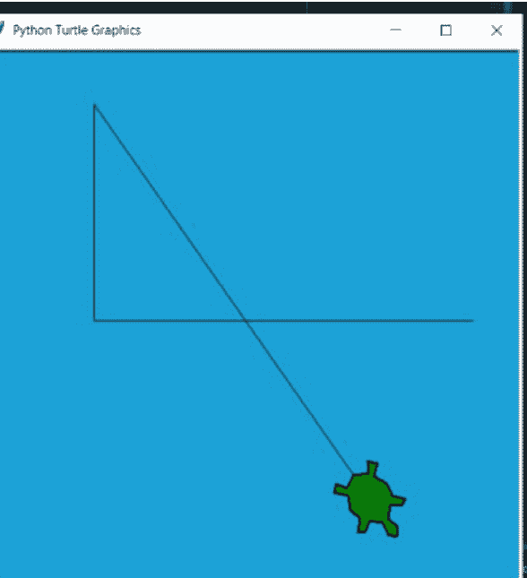

### 涂鸦和形状

尽管它被称为海龟模块，我们实际上也可以用它来绘图和创建形状。小海龟对象为我们提供了许多函数，这些函数可以重用于在Screen对象上绘图。让我们看看如何做到这一点！

#### 创建一支画笔

要开始绘图，我们需要一个绘图工具！为此，我们可以创建一个turtle对象的副本，并将其称为pen。

```python
pen = turtle.Turtle()
```

记住，由于实例是对象的副本，我们获得了原始Turtle对象附带的所有预构建函数！所以，这意味着我们的pen变量可以使用我们之前用过的相同函数。

这就是我们可以这样写代码的原因：

```python
pen.color("blue")
pen.pensize(5)
```

```python
pen.forward(100)
```

这些函数看起来熟悉吗？那是因为它们确实熟悉！我们刚刚在我们的小海龟上使用了它们。现在，既然我们想使用turtle对象来绘图，我们重用这些相同的函数来帮助我们绘图，而不是移动一个对象。

#### 创建一个形状

你会如何画一个橙色的正方形？想想你在现实生活中用手会如何画一个，然后在我们的代码中做同样的事情。让我们设置窗口，定义我们的画笔，选择一种颜色并画一个正方形：

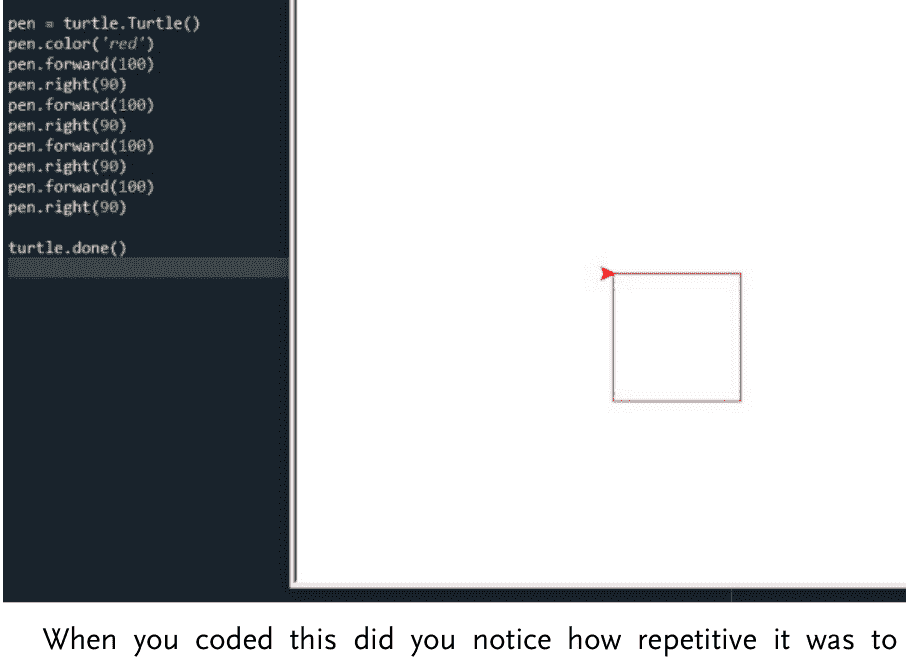

当你编写这段代码时，你是否注意到不断重写right和forward语句是多么重复？这被称为冗余代码，它所做的只是占用空间，因为你可以用更好的编码实践做同样的事情。我们可以使用循环让这个正方形绘图代码变得更短！
试试看，并检查你的输出结果。

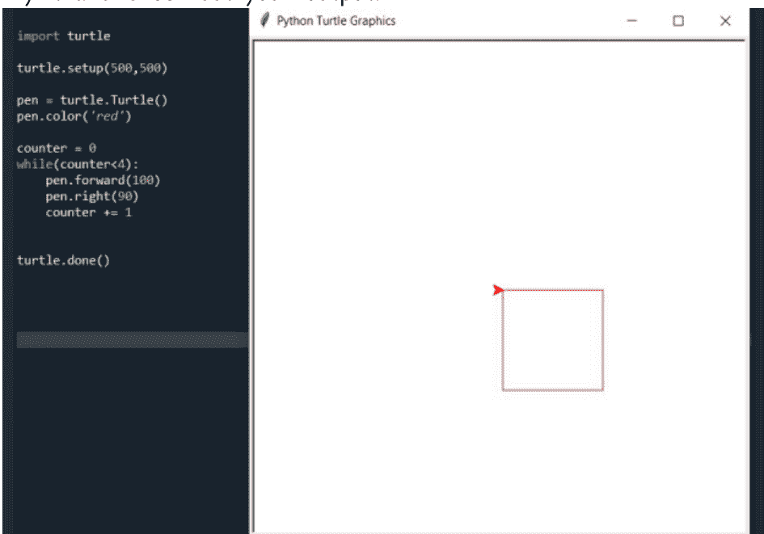

简单多了！这不仅让你的代码更简短，而且养成这个习惯也是一次很好的练习。想象一下创建大型程序时，要去编辑成千上万行冗余的代码。现在就养成这个习惯，将来你会感谢自己的……我保证！这里你也可以使用for循环，写法是 `for i in range(1,5):`。
接下来，让我们隐藏箭头以便看清图形：
`pen.hideturtle()`

```python
import turtle

turtle.setup(500,500)

pen = turtle.Turtle()
pen.color('red')
pen.hideturtle()

counter = 0
while(counter<4):
    pen.forward(100)
    pen.right(90)
    counter += 1

turtle.done()
```

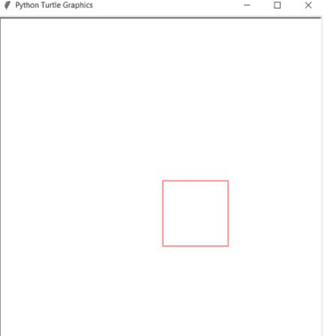

到目前为止，我们绘制的图形都只有轮廓。不过，我们也可以用颜色来填充它们。首先，我们必须告诉计算机我们想要用什么颜色来填充图形：

```python
pen.fillcolor('black')
```

现在，你可以开始绘制任何你想要的形状。然后，你需要发出信号，表明你想填充形状、绘制什么以及何时结束填充。

```python
pen.begin_fill()
pen.circle(50)
pen.end_fill()
```

请务必将开始和结束填充的语句放在实际绘制图形的前后，否则它将无法工作。快来试试吧！

```python
import turtle
turtle.setup(500,500)

pen = turtle.Turtle()
pen.color('red')
pen.hideturtle()
pen.fillcolor('black')

pen.begin_fill()
pen.circle(50)
pen.end_fill()

turtle.done()
```

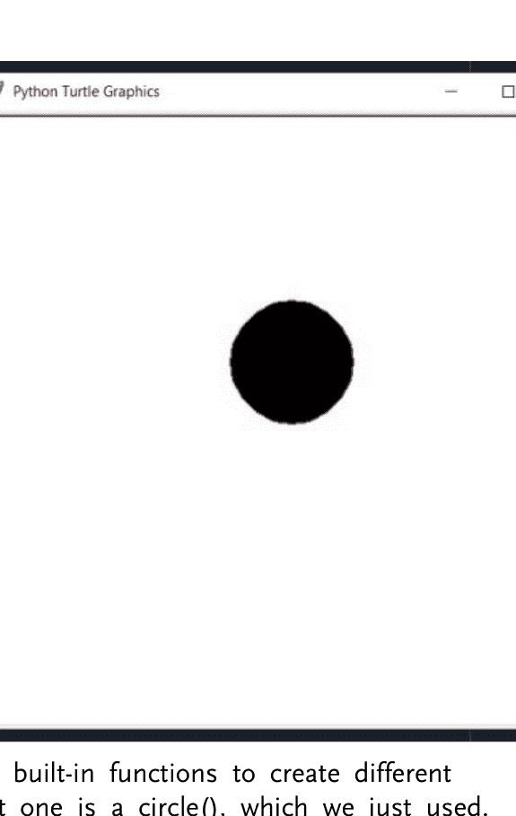

Turtle 模块有一些内置函数可以创建不同的绘图。第一个是 `circle()`，我们刚刚用过。然而，`circle` 方法不仅仅可以接受半径数字。实际上它可以接受3个整数参数！
`circle(radius, extent, steps)`
我们已经绘制了一个大小/半径为50的圆，但如果给 `circle()` 函数两个参数会怎样？这些值会填充半径（Size）和范围（extent）参数。所以如果我们写这段代码

```python
pen.circle(100, 180)
```

我们就是在告诉计算机绘制一个半径为100（第一个参数）的圆，但只绘制180度的范围（第二个参数）。这将绘制出一个精确的半圆，因为整个圆等于360度。所以你的输出会像这样：

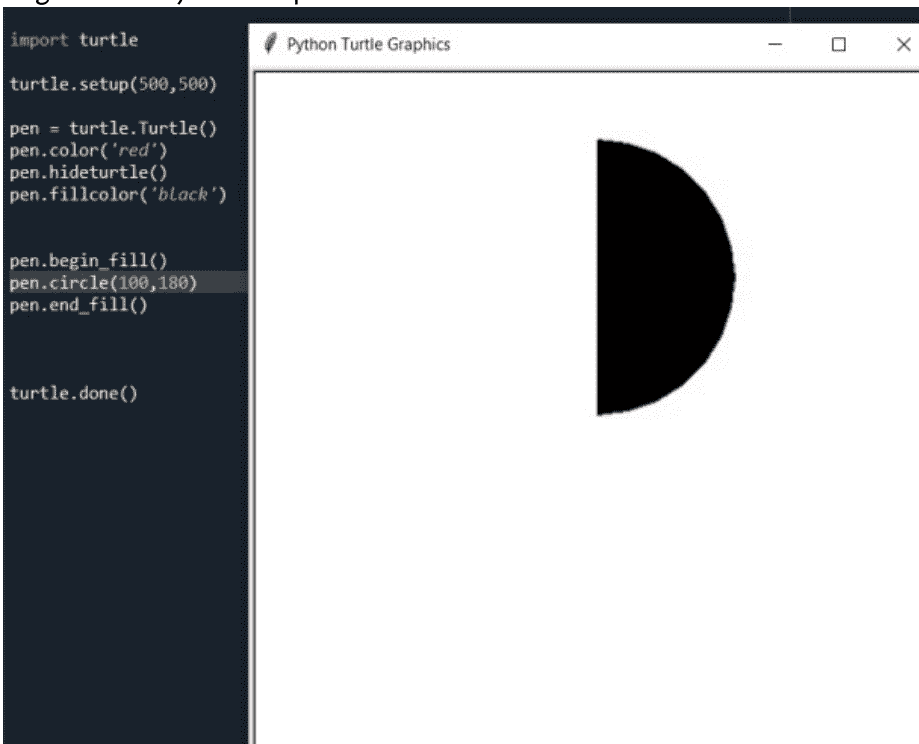

让我们看看第二个参数为250时会是什么样子：

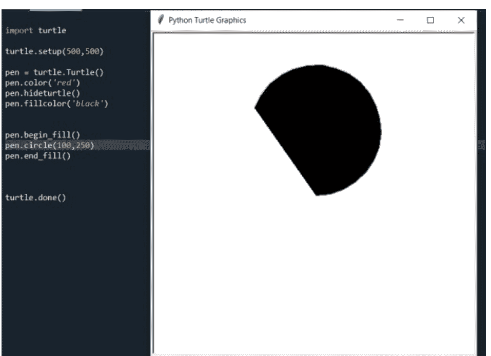

```python
import turtle

turtle.setup(500,500)

pen = turtle.Turtle()
pen.color('red')
pen.hideturtle()
pen.fillcolor('black')

pen.begin_fill()
pen.circle(100, 250)
pen.end_fill()

turtle.done()
```

第三个参数 `steps`（方向）会根据传入的值改变绘制方向。所以，代码 `pen.circle(200, 270, 30)` 是在告诉计算机：嘿，你能给我画一个半径为200，但只画270度范围的圆，并且在绘制过程中每30度转一下笔吗？

__________

### stamp()

Turtle对象提供的另一个非常酷的内置函数是 `stamp()` 函数。就像听起来的那样，`stamp()` 函数每次使用时会盖印一个你所选形状的副本。为了看到实际效果，让我们首先创建一个新的海龟形状，我们希望颜色是绿色，并且使用 `penup()` 方法以便我们能真正看到海龟。

```python
import turtle

turtle.setup(500,500)

example = turtle.Turtle()
example.shape('turtle')
example.color('green')
example.penup()

turtle.done()
```

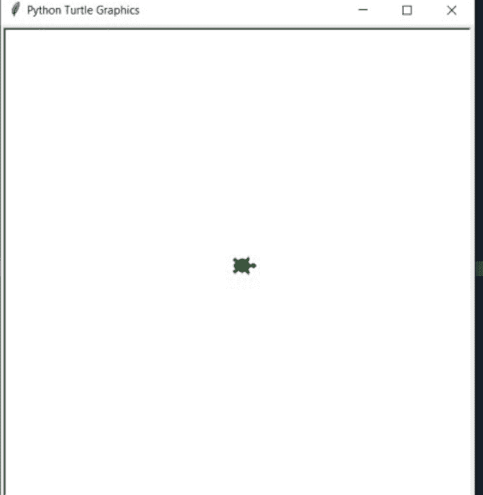

现在我们要使用 `forward()` 方法和 `stamp()` 方法来移动这个海龟并盖印它。我们还可以在每次向前移动之前旋转海龟。

```python
import turtle

turtle.setup(500,500)

example = turtle.Turtle()
example.shape('turtle')
example.color('green')
example.penup()

example.forward(100)
example.stamp()

example.left(90)
example.forward(100)
example.stamp()

example.left(90)
example.forward(100)
example.stamp()

example.left(90)
example.forward(100)
example.stamp()

turtle.done()
```

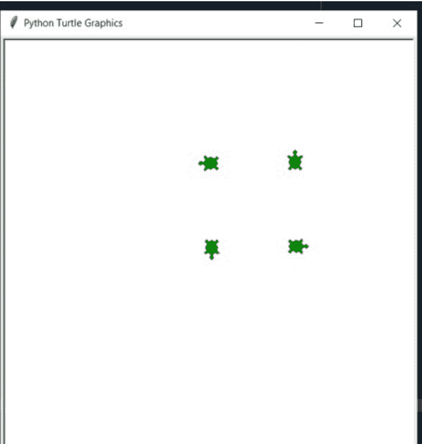

你试过了吗？现在让我们通过使用循环让代码更短、更易读。

```python
import turtle
turtle.setup(500,500)

example = turtle.Turtle()
example.shape('turtle')
example.color('green')
example.penup()

for i in range(1,5):
    example.forward(100)
    example.stamp()
    example.left(90)

turtle.done()
```

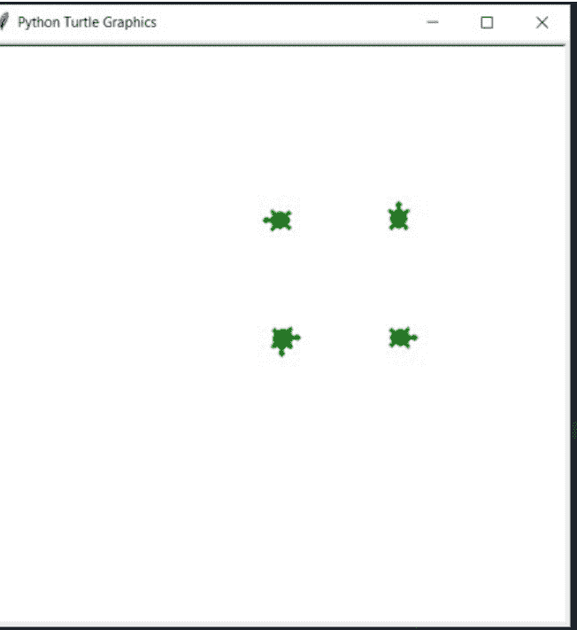

### write()

Turtle对象提供的另一个有趣的内置函数是 `write()` 函数。如果你需要在屏幕上写文本，这个函数就派上用场了。它类似于 `print()` 函数。让我们创建一个笔（或任何你想命名的）海龟的副本，然后写点东西。

```python
pen=turtle.Turtle()
pen.write('Python is fun!')
```

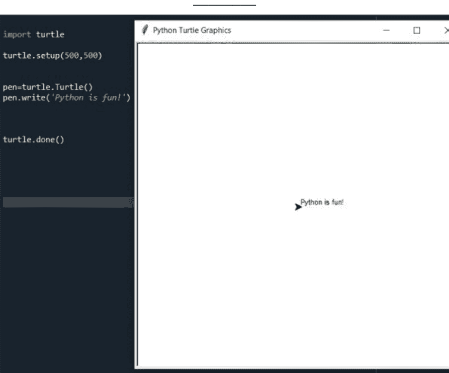

这将使用当前的笔的大小和颜色来写文本。如果我们想改变字体（字型）、文本大小，我们可以给 `write()` 函数第二个参数！你可以在实际的 `write` 方法中更改所有这些：

`pen.write('Python is fun!', font=('impact', 20, 'bold'))`

看到我们怎么做的了吗？第一个参数是我们要输出的文本，第二个参数是一个元组，其中包含字体的详细信息（字体、大小、类型）！执行这段代码，我们得到：

```python
pen=turtle.Turtle()
pen.write('Python is fun!' , font=('impact', 20, 'bold'))

turtle.done()
```

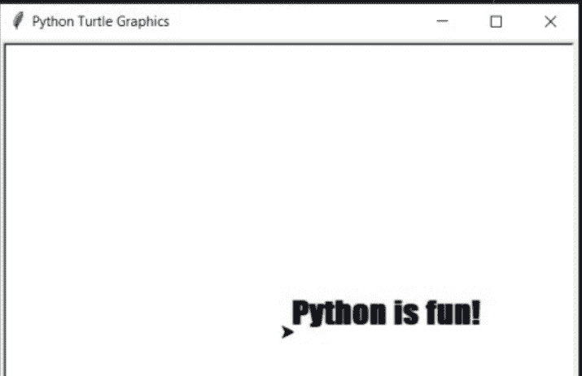

在这些章节中，我们学习了：

-   如何使用 turtle 模块来绘制和创建形状。
-   我们创建了一些画笔。
-   我们学习了如何改变颜色和画笔大小。
-   我们学习了如何绘制形状并用颜色填充它们。
-   我们学习了如何盖章。

### 练习活动

#### 活动 #1 - 画一颗星星！

绘制一颗蓝色的星星，使用 `pensize(5)`。你需要让画笔向前移动100像素，然后向右转144度——这个操作需要执行5次，所以一定要使用循环。

**完成此活动之前请不要看下一页！**

```python
import turtle

turtle.setup(500,500)

pen=turtle.Turtle()
pen.color('blue')
pen.hideturtle()
pen.pensize(5)

for i in range(1,6):
    pen.forward(100)
    pen.right(144)

turtle.done()
```

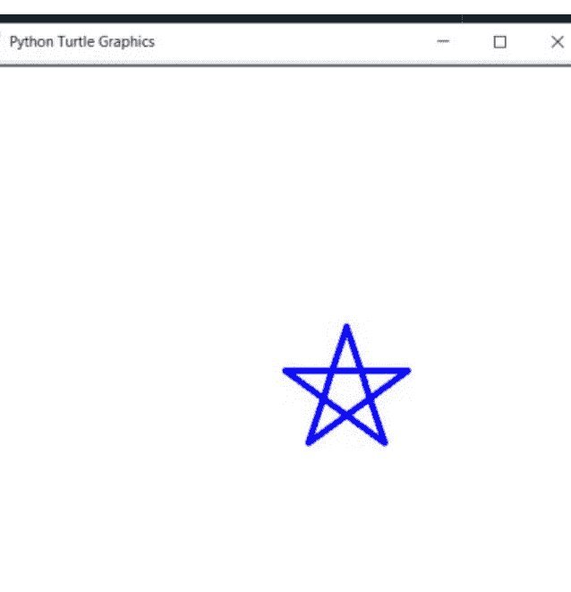

代码：

```python
import turtle
turtle.setup(500,500)
pen=turtle.Turtle()
pen.color('blue')
pen.hideturtle()
pen.pensize(5)
for i in range(1,6):
    pen.forward(100)
    pen.right(144)

turtle.done()
```

#### 活动 #2 - 通过迷宫

我为你创建了一个简单的迷宫。现在你的挑战是让海龟通过迷宫，同时不能碰到边！使用下面的代码作为迷宫，然后编写你的海龟程序让它通过迷宫。

```python
import turtle
turtle.setup(500,500)

pen.color('black')
pen.pensize(4)
pen.forward(200)
pen.right(90)
pen.forward(100)
pen.right(90)
pen.forward(300)
pen.right(90)
pen.forward(300)
pen.right(90)

pen.forward(200)
pen.right(90)
pen.penup()
pen.forward(100)
pen.pendown()
pen.right(90)
pen.forward(100)
pen.left(90)
pen.forward(100)

pen.right(180)
pen.penup()
pen.forward(150)
pen.right(90)
pen.forward(100)
pen.right(180)
pen.shape('turtle')
pen.color('green')

turtle.done()
```

完成此活动之前请不要看下一页！

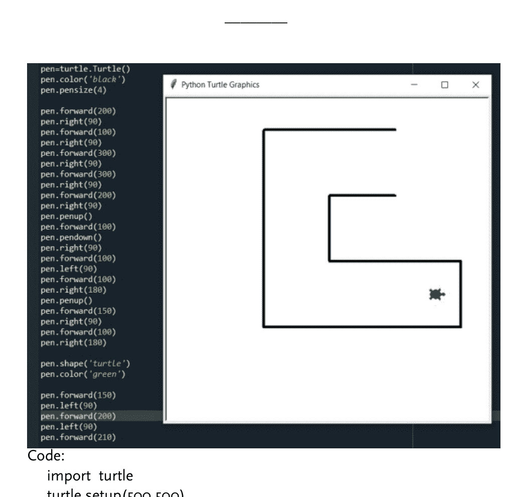

代码：

```python
import turtle
turtle.setup(500,500)

pen.color('black')
pen.pensize(4)
pen.forward(200)
pen.right(90)
pen.forward(100)
pen.right(90)
```## 创建你自己的可复用函数

编程的核心是可复用性，或者说一件事被重复使用的容易程度。我们编写代码来为我们处理那些重复的、复杂的或耗时的事情。如果我们每次使用都得重新编写，编程就不会那么有用了。

函数和模块为我们提供了一种编写可复用代码的方式。仔细想想，我们在这本书里已经用过很多了！从一开始我们就使用了 `print()` 函数，而且我们刚刚了解了多功能 `turtle` 模块多么有趣和交互性强。大多数程序由一个或多个模块组成，而每个模块通常又由几个函数/方法构成。让我们看看以这种方式编写代码如何帮助我们构建更智能的程序。

### 函数

正如我们所学，函数是可复用的代码块，可以执行特定任务或返回一个值。通常，我们为那些经常重复执行的任务编写函数。例如，假设我们每次都需要在某人使用我们的程序时问候他们。我们每次都需要写一个 `print()` 函数来问候：

```python
print("Hello, person! ")
print("Hello, person! ")
print("Hello, person! ")
```

或者，我们可以将问候某人的动作定义成一个函数：

```python
def greet():
    print('Hello, person!')
```

现在，任何时候你需要调用这个动作，只需这样编写代码即可：

```python
greet()
```

这就是正在发生的事情！要创建一个函数，我们首先需要描述它叫什么名字以及它将做什么。我们从使用 `def` 关键字开始，它向计算机发出信号，表明我们正在编写一个函数。它是 “define（定义）” 的缩写。就像字典定义了一个词的含义一样，当我们使用 `def` 关键字时，我们定义了我们的函数将做什么。

接下来，我们给函数命名。因为我们将在这个函数中问候人们，所以 “greet” 这个名字是个不错的选择，它清晰地描述了我们函数的功能。然后，我们在函数名后添加一些括号 `()`。我们稍后可能会在括号中添加参数，但现在不需要。最后，一个冒号 `:` 表示后面缩进的代码行将成为我们函数的一部分。就这样！

关于函数有一个重要的知识：它们不会自行运行。这意味着每当计算机遇到一个函数定义时，它会自动跳过其内部的代码。为了实际使用一个函数，必须调用它，这意味着我们必须明确告诉计算机开始执行被调用函数的代码。如果我们不调用函数，它们内部的代码将永远不会运行！

#### 参数

我们的 `greet()` 函数很普通。每次调用时，我们都说 “Hello, person!”。但如果我们想用他们的名字来问候这个人，而不是用 “person” 这个词呢？那样问候会更好，不是吗？参数正是我们需要添加到函数中以实现此目的的东西！参数是我们提供给函数的一段输入数据，以便它执行操作。一个函数可以没有参数，就像我们最初的 `greet()` 函数一样，也可以有一个或多个参数。当我们创建使用参数的函数时，我们称这些函数“接受参数”，这让我们知道该函数可以接收输入数据。

为了让我们的 `greet()` 函数更友好一点，让我们让它接受一个名为 `name` 的参数，并在问候语中使用它！我们通过将参数放在函数名后的括号中来为函数添加参数，像这样：

```python
def greet(name):
    print('Hello, person! ')
```

通过向函数添加这个参数，我们现在可以在函数内部使用它。这意味着我们可以这样做：

```python
def greet(name):
    print(f"Hello, {name}! ")
```

现在，当我们调用 `greet()` 函数时，它将使用你传入的参数，意味着这段代码：

```python
greet('Robert')
```

将产生此输出：

```
'Hello, Robert!'
```

很酷吧！不过你知道吗？我们可以让我们的 `greet()` 函数更酷一些。我们决定不仅想通过名字问候某人，还想根据对方的不同来改变问候语。如果我们非常熟悉的人，我们可能会说：“最近怎么样，罗伯特？很高兴再次见到你！”如果是新人，我们可能会说：“你好，公爵！很高兴认识你！”

记住，代码的核心是可复用性，所以我们将问候语放入函数中已经领先一步了。我们只需稍作修改即可完成我们提到的这些其他事情！首先，让我们为 `greet()` 函数添加另一个参数。我们将添加一个名为 `isNew` 的参数，它可以告诉我们所问候的人是否是我们认识的：

```python
def greet(name, isNew):
    print(f'Hello, {name}! ')
```

很好！现在，我们只需要给函数添加一些逻辑。记住，我们希望为认识的人打印不同于陌生人的问候语。在这种情况下，我们可以使用我们新添加的 `isNew` 参数来帮助我们做出决定！所以，如果我们不认识这个人，我们可以使用特定的问候语：

```python
def greet(name, isNew):
    if(isNew):
        print(f'Hello, {name}! Nice to meet you!')
    else:
        print(f'Hello, {name}! Nice to see you again!')
```

就这样！现在，当我们使用 `greet()` 函数时，只需要传入几个参数值，它就能帮我们完成剩下的工作！计算机可以根据我们传入的参数来决定使用哪种问候语。我们也可以根据需要调用任意多次 `greet()` 函数，每次都会打印一句问候语。把函数的参数想象成一个行李传送口，你可以把物品放进函数的行李里，函数会带着这些行李运行。

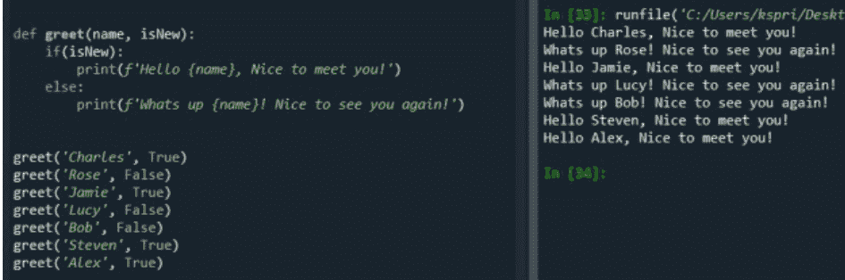

你能想象每次需要进行这种问候时都要写一个 if 语句并打印不同的 f 字符串吗？函数使得在代码中执行此类操作变得更加简单和智能！

#### 返回值

正如我们所见，函数非常适合我们需要重复执行的操作。我们可以用它们为我们执行一次或一百次操作，取决于我们需要多少次。

函数还擅长帮助我们执行计算或在我们继续在代码中使用数据之前对其进行一些修改。这类函数通常具有返回值，即调用函数后它给我们的结果输出。在这本书中，我们已经使用了很多返回数据的函数。

还记得我们讲循环时用到的 `range()` 函数吗？我们使用它来遍历特定范围或数字。该函数接受一个起始和结束索引（我们的输入参数）。然后，`range()` 函数会获取这些参数，并创建一个包含起始和结束索引之间所有数字的列表。这个新创建的数字列表随后被返回给我们（我们的返回值），以便我们在最初调用它的循环中遍历它。

#### 调用函数

调用函数很简单！只要在代码中需要使用函数的地方，只需写出函数名，后跟括号 `()` 即可：

```python
greet()
```

就这样！这是我们调用同一文件中函数的方式。

#### 向 Python 打招呼

既然你已经在计算机上安装了 Spyder IDE，让我们向它打个招呼吧！打开程序并按照以下步骤操作：

在你的 Spyder 编辑器（屏幕左侧），输入以下代码：

```python
print("Hello!")
```## **保存你的代码**

你应该养成保存工作的习惯。即使你编写的程序非常简短，我们仍然要保存它。

在菜单栏上点击“文件”，然后选择“另存为”。

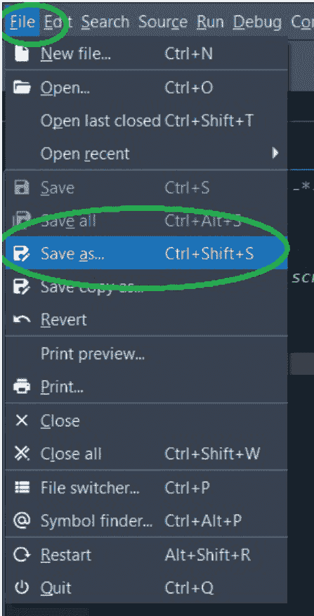

让我们把这个程序命名为“Say Hello”，因为这很好地解释了我们程序的功能。确保将你的 Python 程序保存在一个你不会忘记的地方！我在桌面上创建了一个名为“Python”的文件夹，并将把所有程序保存在这里。

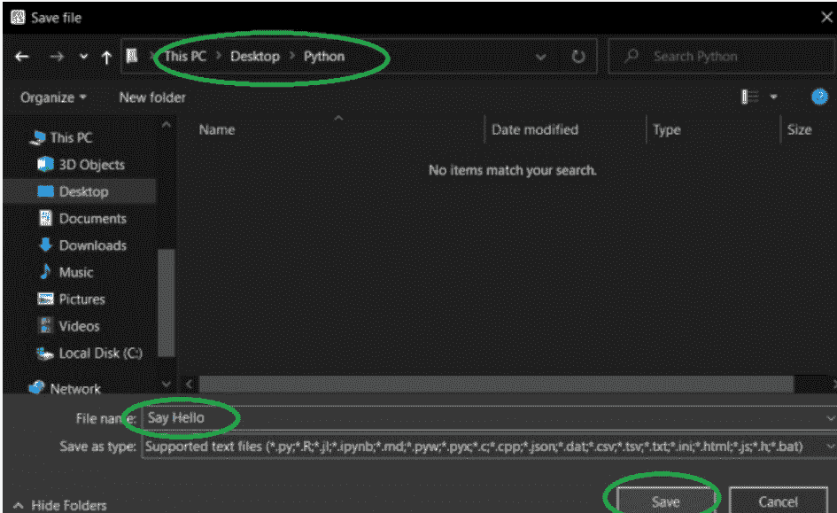

保存文件和代码是编程的重要组成部分。我们程序员经常这样做，以至于有快捷键可以让生活更轻松。以下是在编码时非常有用的键盘快捷键列表。

- CTRL 键+S 键：这是标准的保存快捷键。你可以同时按下这两个键来保存编码进度或保存新文件！
- CTRL 键 +N 键：这个快捷键会为你创建一个新文件。
- CTRL 键 +C 键：这个快捷键会复制你选中的任何文本。
- CTRL 键+ V 键：复制一些文本后，使用这个快捷键粘贴它。这会将你高亮并复制的文本放置到你选择的任何位置。
- CTRL 键 +Z 键：最棒的命令，这个快捷键执行撤销操作。如果你需要回退一步，或者恢复一些你意外删除的代码，这个快捷键可以救急！使用这个快捷键一次，同时按下 CTRL 键和 Z 键，观察你的上一个更改被撤销。你可以多次按下这个快捷键，以继续回退并撤销更多你刚刚执行的操作。

### 其他文件中的函数

你会注意到，我们在这本书中已经调用了许多我们自己没有定义的函数。这些包括像 `print()` 这样的函数，以及许多由内置 Python 模块提供的函数。所有这些函数都位于不同的文件中，但我们仍然可以使用它们。怎么做到的呢？

当我们想调用其他文件中的函数时，我们必须确保它们在我们的代码中可供计算机使用。

有趣的事实：我们已经知道如何做到这一点，我们之前在 turtle 模块中就做过……你能猜到是怎么做的吗？如果你说是“导入”，那么你就答对了！

就像我们之前在文件中导入整个 turtle 模块一样，我们可以使用模块的所有部分，或者只导入我们想要使用的特定函数。假设我们有一个名为 `colors.py` 的文件，在其中我们定义了以下函数：

```python
def rgb_red():
    return (255, 0, 0)
def rgb_green():
    return (0, 255, 0)
def rgb_blue():
    return (0, 0, 255)
def purple():
    return "red+blue"
def yellow():
    return "blue + green"
def orange():
    return "red + yellow"
```

后来，我们决定创建一个处理颜色的游戏。我们创建另一个文件来存放我们的游戏，并将其命名为 `color-game.py`。

知道我们可以从 `colors.py` 文件中重用一些函数，我们决定将它们导入到我们的颜色游戏中。出于我们的目的，我们只需要这个文件中的 `rgb_red()`、`purple()` 和 `yellow()` 函数。我们不必导入整个 colors 文件，而可以只导入我们需要的函数，像这样：

`from colors import rgb_red, purple, yellow`

很简单，对吧？这段代码即使大声读出来也很合理。我们基本上是在告诉计算机，嘿，我需要 colors 文件中的一些函数，但只需要 `rgb_red()`、`purple()` 和 `yellow()` 函数。你能把它们带到我的文件中，这样我就可以使用它们吗？谢谢。现在，当你在颜色游戏文件中编写更多代码时，你将能够调用 `rgb_red()`、`purple()` 和 `yellow()` 函数。

当我们从模块或文件中导入特定函数时，你会注意到我们写它们的名字时不带括号 `from colors import rgb_red, purple, yellow`。这是正确的！记住，如果我们在函数名后面加上括号，就相当于调用该函数，这意味着执行函数的代码。我们现在还不想那样做——我们只是想让它们在我们导入它们的文件中可用。在将函数导入文件时，请记住这一点。

在本节中，我们学习了很多关于编写自己的代码以及如何在 Python 语言中与其他共享代码一起使用的内容！

我们学习了：
- 什么是函数，以及它们如何构成大多数模块和程序。
- 我们学习了如何创建自己的函数。
- 我们学习了带参数和不带参数的函数。
- 我们讨论了什么是返回值。
- 我们学习了如何在代码的其他部分调用我们的函数。

### 练习活动（函数）

#### 活动 #1 - 超能力

创建一个名为 `superpower()` 的函数。让你的 `superpower()` 函数接受两个参数：一个叫 `name`，另一个叫 `power`。使用这些参数，让你的函数打印出一个 f-string，说明你是谁以及你的超能力是什么。

**在完成活动之前，请不要看下一页！**

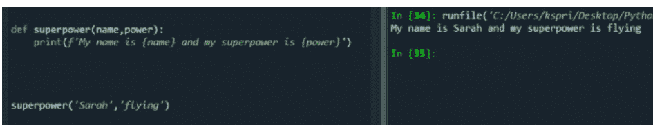

代码：

```python
def superpower(name,power):
    print(f'My name is {name} and my superpower is {power}')
```

#### 活动 #2 - 来自用户输入的最喜欢的食物

询问用户他们的名字和最喜欢的食物。将这些参数传递给一个函数，该函数打印出“嘿——名字——！——最喜欢的食物——听起来真美味！”

**在完成活动之前，请不要看下一页！**

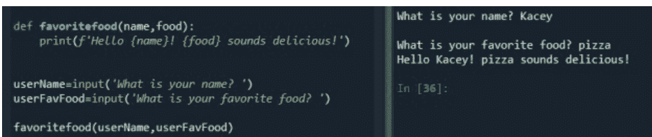

代码：

```python
def favoritefood(name,food):
    print(f'Hello {name}! {food} sounds delicious!')

userName=input('What is your name? ')
userFavFood=input('What is your favorite food? ')
favoritefood(userName,userFavFood)
```

#### 活动 #3 - 石头、剪刀、布游戏

创建 2 个玩家，询问他们的名字，并让他们输入选择石头、剪刀或布。创建一个函数来传递他们的名字和选择……比较它们，然后打印出获胜者。石头赢剪刀，剪刀赢布，布赢石头。

**在完成活动之前，请不要看下一页！**

```python
def compare(p1Name,p1Choice,p2Name,p2Choice):
    if(p1Choice == 'rock' and p2Choice == 'scissors'):
        print(f'{p1Name} won with {p1Choice}!  {p2Name} had {p2Choice}')
    elif(p1Choice == 'paper' and p2Choice == 'rock'):
        print(f'{p1Name} won with {p1Choice}!  {p2Name} had {p2Choice}')
    elif(p1Choice == 'scissors' and p2Choice == 'paper'):
        print(f'{p1Name} won with {p1Choice}!  {p2Name} had {p2Choice}')
    elif(p2Choice == 'rock' and p1Choice == 'scissors'):
        print(f'{p2Name} won with {p2Choice}!  {p1Name} had {p1Choice}')
    elif(p2Choice == 'paper' and p1Choice == 'rock'):
        print(f'{p2Name} won with {p2Choice}!  {p1Name} had {p1Choice}')
    elif(p2Choice == 'scissors' and p1Choice == 'paper'):
        print(f'{p2Name} won with {p2Choice}!  {p1Name} had {p1Choice}')
    else:
        print('TIED! Please try again!')

player1Name=input('Player 1, what is your name? ')
player1Choice=input('Choose One: Rock, Paper, Scissors: ')
player2Name=input('Player 2, what is your name? ')
player2Choice=input('Choose One: Rock, Paper, Scissors: ')

compare(player1Name,player1Choice,player2Name,player2Choice)
```

In [36]: runfile('C:/Users/ksprl/Desktop/...')
Player 1, what is your name? kristin
Choose One: Rock, Paper, Scissors: paper
Player 2, what is your name? rob
Choose One: Rock, Paper, Scissors: paper
TIED! Please try again!
In [37]: runfile('C:/Users/ksprl/Desktop/...')
Player 1, what is your name? shawn
Choose One: Rock, Paper, Scissors: rock
Player 2, what is your name? james
Choose One: Rock, Paper, Scissors: paper
james won with paper.  shawn had rock
In [38]:if(p1Choice =='rock' and p2Choice =='scissors'):
    print(f'{p1Name} 用 {p1Choice} 赢了！. {p2Name} 出的是 {p2Choice}')
elif(p1Choice =='paper' and p2Choice =='rock'):
    print(f'{p1Name} 用 {p1Choice} 赢了！. {p2Name} 出的是 {p2Choice}')
elif(p1Choice =='scissors' and p2Choice =='paper'):
    print(f'{p1Name} 用 {p1Choice} 赢了！. {p2Name} 出的是 {p2Choice}')
elif(p2Choice =='rock' and p1Choice =='scissors'):
    print(f'{p2Name} 用 {p2Choice} 赢了！. {p1Name} 出的是 {p1Choice}')
elif(p2Choice =='paper' and p1Choice =='rock'):
    print(f'{p2Name} 用 {p2Choice} 赢了！. {p1Name} 出的是 {p1Choice}')
elif(p2Choice =='scissors' and p1Choice =='paper'):
    print(f'{p2Name} 用 {p2Choice} 赢了！. {p1Name} 出的是 {p1Choice}')
else:
    print('平局！请再试一次！')

player1Name=input('玩家1，你叫什么名字？ ')
player1Choice=input('选择一项：石头，剪刀，布： ')
player2Name=input('玩家2，你叫什么名字？ ')
player2Choice=input('选择一项：石头，剪刀，布： ')
compare(player1Name,player1Choice,player2Name,player2Choice)

恭喜！你值得这份喜悦！你已正式学会了 Python 编程的基础知识！既然你已打下坚实的理解基础，现在有许多道路可供你选择。Python 编程领域有众多细分方向，包括创建游戏、数据科学、软件应用、人工智能机器学习、数据分析、API、网络开发、金融…… 你可以看到，选择非常多！如果你想深入学习 Python，我目前正在编写关于这些主题的书籍，敬请期待。我由衷地享受创作这些材料的过程，并真诚地希望它对你有所帮助。请记住，可能性是无限的……你只需去想象——然后去实现它！

### PRINT 函数

Python 中最常用的代码行之一是 `print()` 函数。我们到处使用它，而你也刚刚用过它。

```
print("Hello! ")
```

其核心是，当我们想要输出一个字符串时，就会使用 `print()` 函数。字符串是字符的集合，也就是我们所说的文本。字符串是一种类型——顾名思义，类型是计算机理解我们给它输入的是何种信息的一种方式。还有其他类型，例如：

- 整数（数字）
- 布尔值（真或假）

以及更多类型，但现在不用担心！我们稍后会学习它们。

`print()` 函数接受几个参数，这些参数是你提供给函数以执行某些操作的信息片段。目前，我们只会使用一个参数，就是我们放在双引号里的那部分。例如在 `print("Hello!")` 中，`Hello!` 就是参数。

`print()` 函数会获取这个片段并将其打印到控制台窗口。

在控制台窗口中查看信息非常有用。如果我们编写一些代码来显示问候语，可以使用 `print()` 函数来查看代码生成的问候语。同样，如果我们执行一些基本数学运算，`print()` 函数可以向我们展示结果答案。

## 变量

现在是讨论变量的好时机。变量是编程的另一个重要部分，因为我们不断地使用它们！在进入下一节之前，熟悉它们也会很有好处。变量只是标签或跟踪信息方式的一个花哨名称。它就像我们生活中看到的许多标签：

如果有人戴着姓名标签，你就能知道他们的名字。他们的名字就是他们的变量。

然后你可以有多个变量。想想营养标签。营养标签上的变量会是卡路里、糖的克数、蛋白质、碳水化合物、胆固醇、成分等等。

在现实生活中看到像这样的编程概念很有趣。我们身边不断有变量的例子。你可能不知道你已经熟悉变量了，对吧？！让我们在编程中好好利用这些知识吧！

当我们编程时，使用变量来为我们保存信息片段。就像服装标签和食品标签一样，编程变量可以保存多种信息，比如字符串、数字、列表等等。

那么，我们如何创建一个变量呢？让我们创建一个变量来跟踪本书作者（也就是我！）的名字。我们会这样创建一个变量：

```
author = "Kay Springer"
```

就这么简单！变量 `author` 现在保存了文本字符串 "Kay Springer"。

接下来解释发生了什么。

当我们创建变量时，我们给它一个描述性的名称：`author`。这有助于我们记住变量保存的是什么信息。接下来，我们输入一个等号（`=`）。这告诉计算机我们要给 `author` 变量一些信息让它保存。在编程中，这被称为赋值或给变量赋值。最后，我们输入我们的变量应该保存的信息。在这个例子中，变量 `author` 保存了 "Kay Springer"。

现在让你的名字参与进来！我们将创建另一个名为 `reader` 的变量。请将你的名字赋值给这个变量。在这个示例中，我们将使用名字 "Bob"。

```
reader = "Bob"
```

在下一行，使用 `print()` 函数将你的变量写入控制台。你的最终代码应该看起来像这样：

```
reader = "Bob"
print(reader)
```

现在按回车键。发生了什么？你在控制台窗口中看到你的名字了吗？

现在，这是变量更酷的部分：假设你把这本书分享给你的朋友 Alex。显然，我们的 `reader` 变量现在就不对了，因为它应该是你朋友的名字！所以，让我们改变 `reader` 变量，将其赋值为你朋友的名字，但其他什么也不改。改动后，你的代码应该看起来像这样：

```
reader = "Shawn"
print(reader)
```

现在当你按下回车键，你朋友的名字应该会打印出来。这发生是因为你告诉计算机将 "Shawn" 赋值给 `reader` 变量，从而覆盖了之前的字符串 "Bob"。

当你写这段代码时会发生什么？：

```
print(reader)
reader = "Shawn"
```

你是否惊讶于你的程序打印了 "Bob"？一个程序总是从上到下运行和读取代码，所以在这个例子中，我们在程序打印之后才将 "Shawn" 赋值给 `reader` 变量。

我们刚才使用的变量保存的是字符串（文本），但如前所述，变量也可以保存其他类型的数据。如果我们想创建一个变量来保存我们最喜欢的数字，该怎么做？

```
myFavoriteNumber = 7
```

我们以与之前相同的方式创建它，只是不使用引号。只有文本字符串才有引号围绕。这是因为计算机理解，当我们用引号括起数据时，它就是一个文本字符串类型。

在 Python 中，整数被称为整数。每当我们处理整数时，只需将它们作为普通数字输入。永远不要用引号括起它们，因为这会迷惑计算机，让它以为你正在使用一个字符串！为了说明我的意思，让我们使用一段 Python 中名为 `type()` 的代码。这段代码会告诉我们输入的数据类型。尝试在编辑器中输入以下代码并点击运行：

```
myFavoriteNumber = 7
type(myFavoriteNumber)
```

你得到任何输出了吗？你让计算机找到变量的类型，它做到了！然而，我们没有告诉它打印什么出来。让我们添加 `print()` 方法，并将我们要打印的内容放在该方法中，在这个例子中，我们想要打印变量 `myFavoriteNumber` 的类型：

```
myFavoriteNumber = 7
type(myFavoriteNumber)
print(type(myFavoriteNumber))
```

计算机告诉你最喜欢的数字是什么类型了吗？它说 'int' 了吗？如果是，那就太好了！Int 是 integer（整数）的缩写，即一个整数。

现在，让我们看看如果你用引号存储你最喜欢的数字会发生什么：

```
myFavoriteNumber = '7'
type(myFavoriteNumber)
print(type(myFavoriteNumber))
```

现在它是什么类型了？一个 str？我们欺骗了计算机，让它以为我们保存的是一个字符串变量！这就是为什么我们在处理整数（或我们即将学习的其他数字类型）时不用引号。所以请记住：整数周围不需要引号。

变量将在我们的编程活动中被大量使用。以下是在创建变量时要记住的一些良好实践。

### 变量不能以数字开头

在给变量命名时，你希望尽可能具有描述性，但也要遵循 Python 的规则。其中一条规则是变量名不能以数字开头。尝试创建一个，看看会发生什么：

```
100_days_of_health = 100
```

你得到语法错误了吗？Python 不喜欢变量名中有数字！当它发现还有更多内容，而你实际上是在创建一个变量时，它会非常困惑！

### 变量应遵循相同的命名风格

编写变量的方式多种多样。最重要的是要记住选择一种方式并坚持下去。你可以使用全小写字母来编写变量，然而，在编程世界中普遍接受的做法通常是使用`camelCase`。即第一个单词始终小写，之后任何单词的首字母大写。例如：`numberOfHouses`

> 故障排除提示：为什么我们要连接单词或在单词之间使用下划线？这是因为Python无法识别变量名中的空格。我们必须连接单词（nospaceatall或NoSpaceAtAll）或使用下划线连接它们（underscores_between_words）。如果使用空格，你将会收到错误信息。

### 变量应具有意义

最后，变量名应尽可能具有描述性。这意味着当你阅读代码时，应该能立即知道你的变量是什么以及它存储了什么类型的数据。你应该能够理解它。

以下是一些好的变量名示例列表：

```
mood = "happy"
age = 31
favoriteColor = "blue"
numberOfBooks = 2
```

以下是一些不太好的变量名列表：

```
A = 9
num pens = 13
```

```
CurDay = "Thursday"
FvorltE_DrInk = "coffee"
```

看出区别了吗？清晰、有意义且风格一致的名称是创建优秀变量名的最佳选择。

## 熟悉环境

既然你已经熟悉了IDE界面，让我们使其看起来更舒适。你可以根据自己的喜好更改布局，但我将向你展示如何增大编辑器窗口的字体并将输出控制台移动到编辑器正右方。要增大编辑器中的文本字体大小，我右键单击，然后选择放大选项3次。

```python
# -*- coding: utf-8 -*-
"""
Spyder Editor

This is a temporary script file.
"""

myFavoriteNumber = '7'
type(myFavoriteNumber)
print(type(myFavoriteNumber))
```

接下来，我想移动输出控制台，因此我会转到“视图”菜单并选择解锁窗格和工具栏

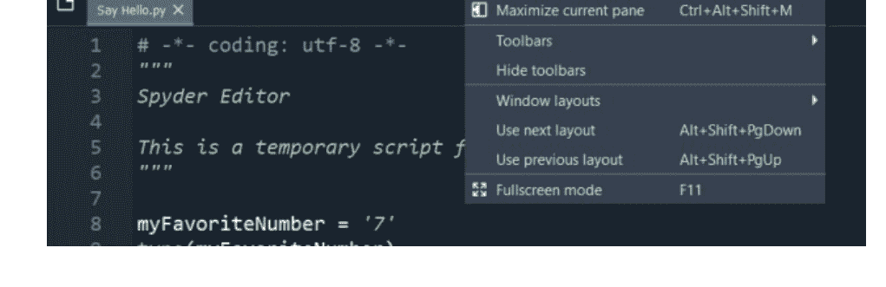

现在我可以将输出窗口拖动到编辑器右下方，并拖动其他窗口直到我喜欢这个布局。一旦你对布局满意，返回“视图”菜单并锁定窗格/工具栏：

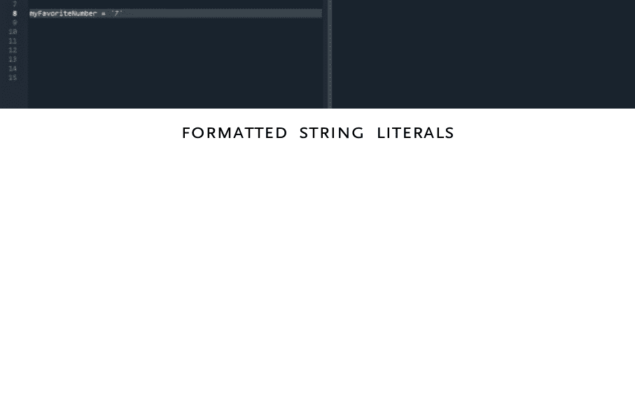

## 格式化字符串字面量

不要让“格式化字符串字面量”这个术语吓到你。当我们能够更改或操作字符串的某些部分时，字符串会变得更有用。

```python
print("I am so happy to learn Python coding!")
```

想象一下，你对学习Python编程有另一种情绪。你会如何更改此代码来反映你的心情？

当然是使用格式化字符串字面量！

使用字符串字面量为我们提供了一种简单的方法来替换字符串的部分内容或更改其顺序。为此，我们创建一个变量，然后可以通过用花括号（如下所示：{}）将其括起来的方式将该变量放入字符串中。

我们通过以f”开头来告诉字符串我们正在其中放置一个格式化字符串字面量。让我们试试看：

在你的编辑器中，创建一个food变量和打印命令，如下所示：

```
food='cake'
print(f'I like {food}')
```

现在点击运行

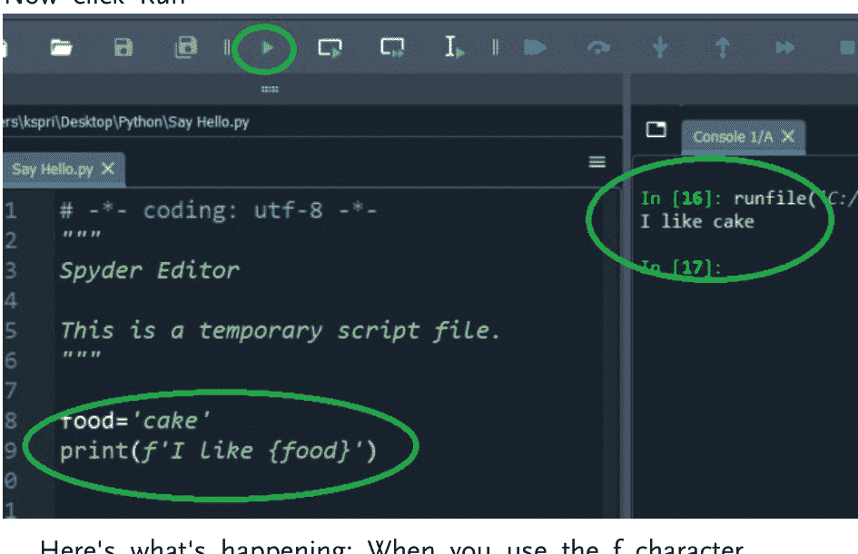

以下是发生的情况：当你在字符串前使用f字符时，计算机知道你即将创建一个f-string。一旦它知道这一点，它就会像平常一样开始查找字符串的开始和结束引号，但当它遇到花括号{something}时，它会说：“哦，这是这个人类想要我替换的字符串的一部分。它说什么？food？哦！我知道那个变量，也知道我把它存放在哪里了，让我马上取出来...现在，让我把单词cake放进去，并移除这个f-string占位符。很好！”

一旦它完成替换我们字符串的所有部分，它就会将最终版本输出到我们的控制台。

所以让我们回到之前的示例，将print()函数中的字符串从“happy”更改为“SUPER Happy”。

既然我们知道“happy”是唯一会改变的部分，并且每次更改时可能都不同，那么将其存储在变量中是个好主意。让我们这样做：

```
feeling='happy'
```

让我们将print()函数中的参数更改为f-string：

```
print(f'I am so to learn Python coding!')
```

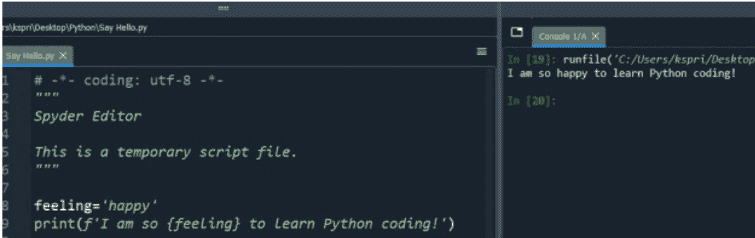

太好了！现在我们的print()函数将始终打印出我们当前的感受。让我们通过更改变量数据来改变这种感受，编写你的print()函数，然后运行你的程序：

```
feeling='SUPER Happy'
print(f'I am so {feeling} to learn Python coding!')
```

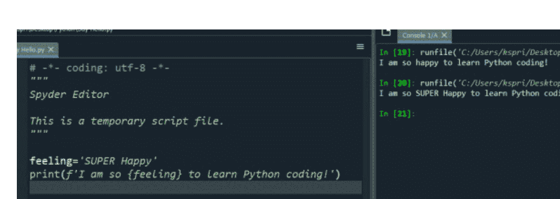

### 多行字符串

使用f-string，我们可以使代码更整洁、更易读。让我们像这样编写一个多行句子：

```
mLines="""
Jack & Jill
went up
the hill
to fetch a
pail of water'''
```

```
print(f'{mLines}')
```

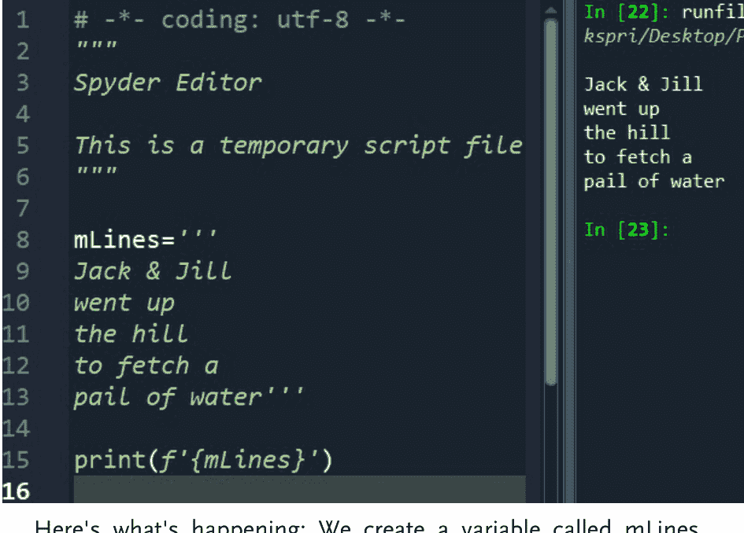

以下是发生的情况：我们创建了一个名为mLines的变量。然后我们将该变量赋值为我们实际的多行句子，该句子按照我们希望它在不同行上显示的样子精确地输入出来。你会注意到，我们没有使用普通的引号，而是使用了一种特殊类型的字符来表示多行字符串。我们使用三引号。你可以使用一对3个双引号或一对3个单引号，但不要混合使用。这告诉计算机将我们放在这些三引号之间的内容完全按照我们输入的方式打印出来。之后，我们使用f-string来打印或显示它。

到目前为止你学到了什么？

print()函数用于从我们的代码中写出文本输出，这可以在我们的输出控制台中看到。

我们可以打印单行或多行文本。

我们涵盖的另一个重要主题是变量。我们了解到：
- 变量不能以数字开头。
- 变量应具有一致的风格，这意味着它们应一致地使用大写、下划线或无空格。
- 变量应具有描述性和意义，以便我们能够理解它们。

最后，我们学习了更高级的打印文本方法，特别是使用f-string。我们了解到：
- f-string允许我们在输出文本中使用变量。
- f-string让我们可以完全按照输入的方式打印内容，即使是多行文本。
- f-string使我们的代码更整洁、更易读。

让我们进行一些练习活动，将我们所学付诸实践！

### 练习活动

#### 活动 #1 - 自我介绍

编写并打印一行使用你名字的代码，内容如下：
嗨！我的名字是Scott，我非常高兴，我喜欢编程！

在完成活动之前不要查看下一页！

```python
# -*- coding: utf-8 -*-
"""
Spyder Editor

This is a temporary script file.
"""

name='Scott'
print(f'My name is {name}, I am very happy and I love to program')
```

```
runfile('C:/Users/kcpri/Desktop/Python/Say Hello.py')
My name is Scott, I am very happy and I love to program
```

#### 活动 #2 - 改变你的心情

使用你在活动 #1中的代码，将你的心情从高兴改为不同的心情。

**在完成活动之前不要查看下一页！**

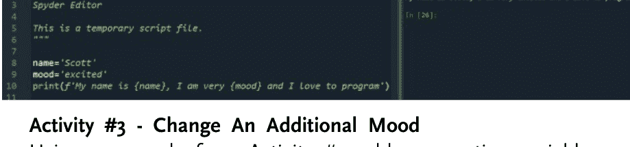

#### 活动 #3 - 添加另一种情绪

使用你在活动 #2中的代码，添加一个情绪变量，然后使用该变量替换打印语句中的单词“love”。

**在完成活动之前不要查看下一页！**

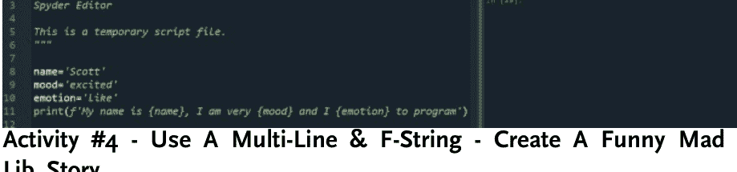

#### 活动 #4 - 使用多行和F-String - 创建一个有趣的Mad Lib故事

为你的名字、一个形容词、最喜欢的食物、一个数字和一个餐厅名称创建变量。

创建一个包含以下故事的多行f-string变量：

我的名字是—name—
我真的很喜欢—adjective— —favorite food—！
我非常喜欢它，我尝试每天至少吃—number—次。
当你在—name of restaurant—吃它时，味道甚至更好！

打印出你的故事。

**在完成活动之前不要查看下一页！**

```python
This is a temporary script file.

name = 'Sam'
adjective = 'stupid'
favoriteFood = 'pizza'
someNumber = '47'
nameOfRest = 'Red Lobster'

mLines = f'''My name is {name}
And I really like {adjective} {favoriteFood}!
I love it so much, I try and eat it at least {someNumber} times a day
It tastes even better when you eat it at {nameOfRest}!
'''

print(mLines)
```

我叫山姆
我真的超爱愚蠢的披萨！
我太喜欢它了，我尝试每天至少吃47次
在红龙虾餐厅吃，味道更棒！