# 面向实验心理学家的Python

一种学习如何为你的实验和分析编写代码的趣味方式

第二版

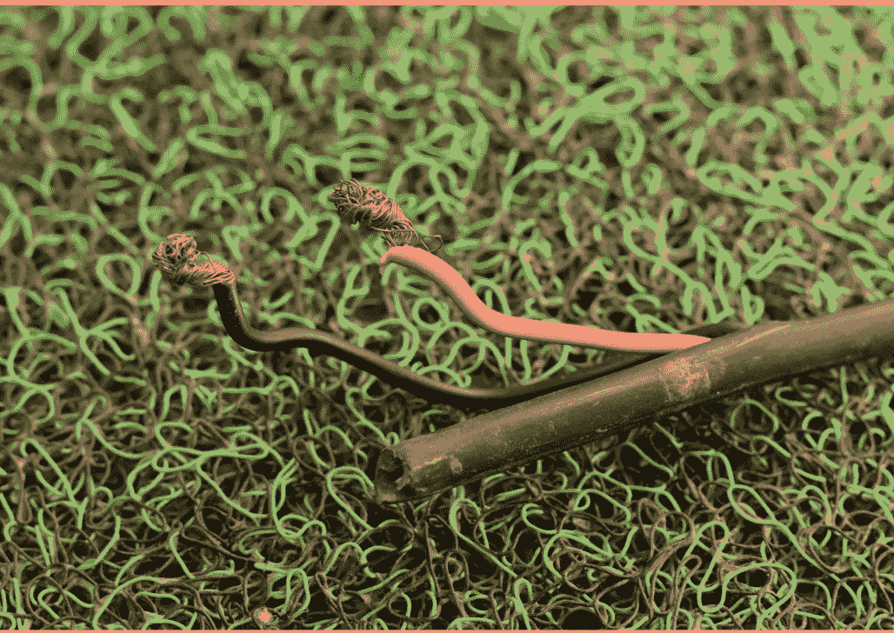

埃德温·S·达尔迈杰

> “对于心理学研究者而言，无论是进行实验还是分析所得数据，使用Python编程都是一项宝贵的技能”。

**克里斯托弗·R·马丹**，*《重要的记忆：我们如何记住重要事物》、《学术界与博士后职业生涯》系列丛书，以及《面向行为研究者的MATLAB入门》的作者*

*对前一版的赞誉*

> “一本易于阅读的入门书。它以幽默的风格向读者介绍Python编程，并从实验心理学家的现有水平出发进行引导。确实非常有用！”

**乌尔里希·冯·赫克**，*英国卡迪夫大学高级讲师*

> “埃德温·达尔迈杰利用他本人参与开发的Python库，对心理学实验编程进行了直观的介绍。本书结构清晰、易于阅读，将很快让你能够使用开放、现代的工具来编程、运行和分析自己的实验。”

**托马斯·克纳彭**，*荷兰阿姆斯特丹自由大学认知神经科学助理教授*

> “Python正迅速成为科学研究的*通用语言*，而这本优秀且高度易读的书填补了实验心理学家急需的空白。它对开发真正有用的实验代码的强烈关注，以及包含的全面示例，使其成为不仅对学生，而且对经验丰富的研究者都极为有用的资源。无疑是我所见过的最好（也最有趣！）的Python入门书。”

**马特·沃尔**，*英国伦敦帝国理工学院成像科学家*


# 泰勒弗朗西斯集团

泰勒弗朗西斯集团

http://taylorandfrancis.com

# 面向实验心理学家的Python

*《面向实验心理学家的Python》*为没有编程经验的研究者提供了必要的知识，使其能够独立使用Python语言编写实验和分析脚本。无论你是本科生、博士候选人还是资深研究者，本书都提供了一个极佳的入门。

这个更新版本基于Python 3（最新版本）。它首先教授Python编程的基础知识，然后用几章内容介绍如何使用流行的PsychoPy包编写实验脚本（显示刺激、获取和记录用户输入、精确计时等）。本书的其余部分专注于数据分析，包括读写文本文件、时间序列、眼动追踪、数据可视化和统计等章节。

配套网站提供了彩色图表、示例刺激、数据集、脚本和一个便携式Windows版Python安装包，丰富了学习体验。本书假定读者没有先验知识，其非正式且易于理解的语调有助于具有实验心理学和认知神经科学背景的读者快速理解Python。它不仅是这些领域研究者的有用资源，也是教授方法学和数据分析的讲师的宝贵参考。

*《面向实验心理学家的Python》*揭开了编程复杂性的神秘面纱，使研究者能够熟练地进行实验并分析其结果。

**埃德温·S·达尔迈杰博士**是布里斯托尔大学的讲师（助理教授）。他拥有牛津大学的哲学博士学位，曾在剑桥大学从事博士后研究，并编写了Python库、独立软件包、教学材料和研究论文。


# 泰勒弗朗西斯集团

泰勒弗朗西斯集团

http://taylorandfrancis.com

# 面向实验心理学家的Python

一种学习如何为你的实验和分析编写代码的趣味方式

第二版

埃德温·S·达尔迈杰

丽贝卡·J·赫斯特和乔纳森·W·皮尔斯参与贡献


劳特利奇
泰勒弗朗西斯集团
伦敦与纽约

封面图片：Getty Images © Prateek Chaurasia

第二版于2025年由劳特利奇出版
地址：4 Park Square, Milton Park, Abingdon, Oxon OX14 4RN
以及
地址：605 Third Avenue, New York, NY 10158

*劳特利奇是泰勒弗朗西斯集团旗下品牌，隶属于Informa公司*

© 2025 埃德温·S·达尔迈杰

丽贝卡·J·赫斯特和乔纳森·W·皮尔斯参与贡献

埃德温·S·达尔迈杰作为本书作者的权利已根据1988年《版权、设计和专利法》第77条和第78条予以确认。

保留所有权利。未经出版商书面许可，不得以任何形式或任何电子、机械或其他方式（无论是目前已知的还是未来发明的，包括影印和录制）或任何信息存储或检索系统，对本书的任何部分进行转载、复制或利用。

*商标声明*：产品或公司名称可能是商标或注册商标，仅用于识别和解释，无意侵权。

第一版于2017年由劳特利奇出版

*英国图书馆编目出版数据*
本书的编目记录可从英国图书馆获取

*美国国会图书馆编目出版数据*
名称：Dalmaijer, Edwin S., 1990- 作者。
题名：面向实验心理学家的Python：一种学习如何为你的实验和分析编写代码的趣味方式 / 埃德温·S·达尔迈杰。
版本说明：第2版。| Abingdon, Oxon ; New York, NY : 劳特利奇, 2025. |
包含参考文献和索引。
标识符：LCCN 2024027209 | ISBN 9781032004808 (精装) | ISBN 9781032000459 (平装) | ISBN 9781003174332 (电子书)
主题：LCSH: 心理学, 实验—数据处理。| 心理学, 实验—研究—计算机程序。| Python (计算机程序语言)
分类：LCC BF39.5 .D35 2025 | DDC 150.285/5133—dc23/eng/20240703
LC记录可在 https://lccn.loc.gov/2024027209 获取

ISBN: 9781032004808 (精装)
ISBN: 9781032000459 (平装)
ISBN: 9781003174332 (电子书)

DOI: 10.4324/9781003174332

由codeMantra使用Galliard字体排版

访问教师和学生资源：www.routledge.com/cw/dalmaijer

# 目录

- 关于本书 ... ix
- 关于Python ... xi
- 关于作者 ... xiii

1. Python ... 1
2. 变量类型 ... 8
   - 制造一些噪音 ... 32
3. 创建和呈现刺激 ... 35
4. 处理反应 ... 60
   - 制造一些噪音 ... 74
5. 编写实验脚本 ... 80
   - 制造一些噪音 ... 102
6. 分析行为数据 ... 110
7. 分析追踪数据 ... 130
8. 眼动追踪 ... 142
9. 常用统计检验 ... 163
10. 获取帮助 ... 178
11. 致谢 ... 179
12. 参考文献 ... 181
13. 索引 ... 183

# 关于本书

本书适用于实验心理学和认知神经科学领域的研究者，他们此前没有使用Python或编程的经验。它适合学生和教职员工，旨在提供Python的基本工作能力。在通读本书后，你将掌握编写实验和分析代码所需的知识和技能。

心理学教育中的一个主要问题是学生很少接触编程，尽管大多数学术和行业工作都涉及编写实验和数据分析脚本。因此，人们花费大量时间进行手动数据处理：从一个电子表格中选择、排序和移动数据到另一个电子表格。这是对时间的不幸浪费！如果你想在心理科学及相关领域工作，但（还）不知道如何编程，这本书或许能为你节省几年的时间。

本书将教你安装Python、变量和函数、显示刺激、制作声音、反应收集、眼动追踪、试次结构、随机化、加载文件、合并数据、进行统计、计算建模、数据可视化、创建可发表的图表等等！

# Taylor & Francis

Taylor & Francis Group

http://taylorandfrancis.com

# 关于 Python

Python 是一门令人惊叹的编程语言，最初由 Guido van Rossum 开发，后经一个庞大的全球社区改进和维护。它拥有易于阅读的语法、庞大的用户基础和广泛的功能。它几乎可以用于任何事情，包括基础计算、探测和可视化黑洞、将你的仓鼠直播到互联网上，以及更多、*更多*的事情。Python 在易用性和功能性之间达到了最佳平衡，这意味着你可以相对较快地学会如何做一些真正有用的事情。

# Taylor & Francis

Taylor & Francis Group

http://taylorandfrancis.com

# 关于作者

**Edwin S. Dalmaijer** 在荷兰乌得勒支大学获得了*心理学*本科学位，并在那里开始了（但从未正式完成）*神经科学与认知*的硕士学位。他在牛津大学攻读*实验心理学*的哲学博士学位，随后在剑桥大学担任了四年的博士后研究助理，目前在布里斯托大学担任讲师（助理教授）。Edwin 编写软件，教授 Python 工作坊，并正拼命地试图教他的猫编程。

**Rebecca J. Hirst** 在诺丁汉大学完成了*心理学与认知神经科学*本科学位和*心理学研究方法*硕士学位，并在那里获得了*心理学*博士学位。她目前在 Open Science Tools 担任科学官员，并在都柏林三一学院担任博士后研究员。

**Jonathan W. Peirce** 是一位神经科学家、程序员和父亲。他拥有圣安德鲁斯大学的*心理学*本科学位和剑桥大学的*神经科学*博士学位。在纽约大学完成博士后职位后，Jon 在诺丁汉大学先后担任助理教授、副教授，现为正教授。他因编写 PsychoPy 而闻名，这是一款免费且易于使用的心理学实验软件，在世界各地的实验室和课堂中广泛使用。他也是 Open Science Tools 的创始人兼首席执行官。

# Taylor & Francis

Taylor & Francis Group

http://taylorandfrancis.com

# 1 Python

Python 是一门编程语言。不仅仅是任何一门编程语言，它目前是世界上最受欢迎的编程语言之一。它在科学和工业领域被广泛使用，因为它易于使用、用途广泛，并且名字很酷。你可能正在翻阅这本书，心想“为什么我应该投入时间学习 Python？”（或者你可能在网上盗版了这本书，现在在想“为什么我应该继续读下去？”）。以下是一些关于这个问题的答案：

Python 可能对你的职业生涯有益。在心理学领域，有许多工具，如 E-Prime 和 Presentation，它们自带晦涩的编程语言。这些工具完全能够完成你研究中大部分想要做的事情。然而，你可能会发现很难找到对你这种晦涩技能感兴趣的雇主。如果你在意你的简历，学习一门更多实验室和公司熟悉的语言可能会更好。Python 在学术界被广泛采用，在学术界之外更是如此，例如在数据科学领域。精通 Python 因此很可能会提高你的就业能力！

Python 如此受欢迎的原因之一是它非常通用。你可以用它来制作电脑游戏、进行机器学习和运行网站。作为一名研究人员，这种通用性意味着你将能够使用 Python 来编写你的实验和数据的自动化分析代码。此外，你还可以用它通过网络摄像头监视同事（*别再偷我的午餐了，Karen！*）或者做令人兴奋的计算机视觉项目。

Python 受欢迎的另一个原因是它的易用性。Python 脚本是可读的。非常可读。事实上，可读性如此之高，以至于有人说阅读它们就像阅读英语。虽然这绝对是一种夸张，但脚本的可读性是 Python 的优势之一。它帮助新用户相对较快地掌握这门语言。

Python 的流行本身就是一个优势，因为它庞大的用户群使其更有可能继续得到支持，并且你可以在网上找到帮助。如果你遇到问题，很可能其他人也有同样的问题，并且他们可能已经为你解决了。互联网的一件很棒的事情是它充满了编程资源。只需搜索你的问题（通常是将错误消息复制到搜索引擎中），你很可能在 Stack Overflow 或编程论坛等网站上找到解决方案。

# 2 Python

显然，使用 Python 也有缺点。经验丰富的程序员会指出它是一门相对较慢的语言，他们说得有道理：与 C 和 C++ 等“正经”编程语言相比，Python 比较迟钝。幸运的是，这通常不是问题，因为在大多数情况下，Python 仍然比你需要的速度快。即使在速度成为问题时，例如处理大量数据时，某个聪明人也会找到解决方法。你稍后将了解到的 NumPy 库就是一个例子：它是用 C 编写的，但它使 Python 中的计算变得超级快。

尽管有其吸引力，一些人在学习 Python 后会转向其他语言。然而，即使对他们来说，Python 也是一个学习编程核心概念的好入门语言。

**总而言之，Python 非常适合初学者以及那些喜欢通用且用户友好的编程语言的人。**

哦，我们提到了吗？Python 是免费的。它是开源的，这意味着它的源代码是公开的。每个人都可以阅读它、改进它，并且无需支付任何费用即可下载该软件。

## 1.1 安装

Python 可以安装在许多不同的操作系统上。这些包括 Windows、macOS 和几乎每个版本的 Linux。你可以在 python.org 上找到安装程序，大多数 Linux 系统可能已经预装了它。在你开始下载东西之前，请继续阅读以了解要安装什么。

### 1.1.1 版本

Python 有几个不同的版本。虽然它们相似，但安装哪个版本确实很重要。在撰写本文时，Python 3 是当前的主要版本。有几个次要版本在使用，如 Python 3.10、3.9 和 3.8，每个版本都有一些额外的功能。最后，在次要版本下还有不同的补丁（如 3.10.5 或 3.8.10），每个补丁都修复了错误或提高了安全性。从大局来看，这些版本之间的差异相对微妙，不应该破坏任何代码。你应该能够在任何 Python 3.7 及更高版本上运行本书中的脚本，但它们在 Python 4 下可能会崩溃（但距离其发布可能还有一段时间）。

在实际使用中，你可能会遇到用 Python 2 编写或为 Python 2 编写的软件，其官方支持已于 2020 年 1 月 1 日结束。这种情况越来越少见，但这是 Python 生态系统运作方式的结果：它不仅仅局限于基本编程语言，还以外部包或*库*的形式存在。这些是能够执行特定任务的代码集合，例如帮助创建认知实验。为 Python 2 开发的库并不总是能与 Python 3 良好配合。其中一些库没有更新，因为它们是由爱好者编写的，这些人已经停止维护它们，或者太忙而无法进行耗时的升级。请记住，这些人是志愿者，他们有工作、伴侣、孩子、朋友和生活。这些通常被认为比升级一个 Python 库更重要。

总之，你应该目标下载一个 Python 3 版本。具体的次要版本（例如 3.9 或 3.12）不那么重要，所以只需选择你平台上可用的最新版本。如果你已经知道你可能会使用外部包，请确保你使用的包与特定的Python版本兼容，并利用这些信息来指导你的选择。然而，如果一个旧版本的包会强制你下载Python 2.7，你可能需要考虑寻找替代方案，因为世界其他地方现在都已经升级了。

### 1.1.2 依赖项

有一些外部包可以扩展Python的功能。其中一些外部包无需额外操作即可运行。你安装它们，它们就可以直接使用。其他包则需要安装额外的外部依赖。（这个兔子洞可能相当深，但我们会尽量保持简单！）

当一个包需要另一个包时，这就是该包的一个**依赖**。在本书中，你将使用以下外部包：

| 名称 | 网站 | 描述 |
| :--- | :--- | :--- |
| SciPy | scipy.org | 一个科学计算库的集合。对统计和分布很有用 |
| NumPy | numpy.org | 对多维数组进行快速计算 |
| Matplotlib | matplotlib.org | 高级且多功能的数据可视化 |
| PyGaze | pygaze.org | 用于眼动追踪实验的工具箱，语法简单。依赖于PyGame和/或PsychoPy |
| PyGame | pygame.org | 用于游戏开发的绝佳包。非常适合实验者，他们基本上制作的是无聊的游戏 |
| PsychoPy | psychopy.org | 专为心理物理学实验设计；具有无可挑剔的计时和强大的功能。依赖于pyglet和/或PyGame，以及Python Imaging Library (PIL)和NumPy等 |
| PIL，现称Pillow | python-pillow.org | PIL（以Pillow的名义继续存在）可用于计算机视觉和图像处理 |
| pyglet | pyglet.org | 用于OpenGL多媒体的包。PsychoPy需要它，而PsychoPy又被PyGaze所需要 |

如果你是从python.org网站安装Python，你还需要安装列出的这些包。你可以使用一个叫做“pip”的工具来完成。或者，“Anaconda”是一个预装了许多包的Python发行版。这两种选择将在接下来的章节中详细介绍。

### 1.1.3 Anaconda

与其单独安装Python，然后再安装所有必需的外部包，你可以选择安装Anaconda。这是由一家名为Anaconda（以前称为Continuum Analytics）的公司开发的产品，对学生、学者和爱好者免费；但商业用户可能需要付费订阅。在下载免费版本之前，你应该阅读Anaconda服务条款，以确保你符合资格。

本书将介绍的几个包，如PsychoPy和PyGame，并不是Anaconda的一部分。这些包需要单独安装。

4 Python

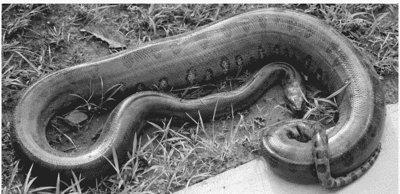

图 1.1 这是一个你不应该下载的Anaconda示例

### 1.1.4 WinPython

WinPython (winpython.github.io) 是一个仅限Windows的解决方案，可以让你免于为本书安装依赖项的麻烦。这个优秀的作品包含了本书所需的许多包，并且还有一个额外的优势：它是可移植的。这意味着你可以将其复制到USB或外部硬盘驱动器上，并从那里运行。如果你是一名学生，受到严格的IT部门限制，或者不想在你使用的所有计算机上都安装Python，这是一个很棒的功能。你可以“随时随地”使用它（Kerner等人，1984）。

WinPython的另一个惊人特性是，有一个修改版本包含了**本书所需的所有依赖项**。你可以从配套网站下载它。

### 1.1.5 PsychoPy

另一个选择是从www.psychopy.org安装PsychoPy独立包。除了是一个实验构建器之外，它也是一个Python发行版，预装了本书所需的大部分包。

### 1.1.6 使用Pip安装包

上面列出的几个选项需要你安装额外的包才能完全使用本书。Python包的最大平台是Python Package Index，简称PyPI。其他包可能由其开发者自行托管或托管在GitHub上。一个从这些地方下载和安装包的简单工具是**pip**。这是一个命令行工具，这意味着你可以通过Windows上的命令提示符或Linux和macOS上的终端来使用它。

安装Python后，打开命令提示符或终端。如果你安装了Anaconda，请使用其启动器专门启动Anaconda命令提示符！要安装NumPy包，只需输入以下内容：

```
python -m pip install numpy
```

或者，如果你在Linux上，使用：

```
python3 -m pip install numpy
```

这应该会检查NumPy是否已经安装。如果没有，它应该会下载NumPy包并为你的Python安装进行安装。

如果你在一台安装了多个并行Python版本的计算机上工作，上述命令可能不够具体。为了将包安装到正确的Python安装中，你可能需要指定其版本号。在Linux和macOS上，如果你想专门为你的Python 3.12安装安装NumPy包，可以这样做：

```
python3.12 -m pip install numpy
```

在Windows上，你应该使用：

```
py -3.12 -m pip install numpy
```

请注意，所有上述命令都应在（Anaconda）命令提示符或终端中执行。如果那里出了问题，你无法排除故障，还有另一个选择可以尝试。那就是找到你想要安装包的Python安装，并运行其python程序（例如Windows上的“python.exe”）。这将打开一个Python解释器，你可以在其中输入Python代码。要在解释器中安装包，请使用以下Python代码：

```
import subprocess, sys
subprocess.call([sys.executable, "-m", "pip", \
    "install", "numpy"])
```

这是一种稍微迂回的方式，你使用你选择的Python安装来调用自身，然后使用其自身的pip来安装一个新包（在本例中是NumPy）。这是作为最后的手段，如果上述列出的选项对你都不起作用。

## 1.2 终端和解释器

即使现在你已经安装并运行了Python，你可能仍然不知道从哪里开始。是时候动手实践了！

首先，你应该找到“终端”。在Windows上，这被称为“命令提示符”，但为了简单起见，我们也将其称为“终端”。无论你使用什么操作系统，你都可以在已安装软件的列表中找到终端（或命令提示符）。在Windows上，点击“开始”按钮，然后转到“所有程序”。在Apple的macOS上，打开Finder并点击“应用程序”。在Linux上，不同发行版之间有所不同，但通常你可以通过点击停靠栏中的图标（例如，在Ubuntu上是带有9个方格网格的图标）来访问已安装应用程序的概览。

或者，你可以通过搜索来找到终端。在Windows上，使用开始菜单/栏中的搜索字段（记得输入“command prompt”）。在macOS上，使用Spotlight。在Linux上，使用你的发行版提供的任何搜索选项（例如，在Ubuntu上，你可以在“活动”下或在应用程序概览中找到一个）。

终端看起来像一个只有少量文本的窗口。背景颜色在Windows和Linux上是黑色的，在macOS上是白色的（除非你的默认设置被更改了）。第一行可能指示你的用户名和/或位置（例如，“C:\”，这是你计算机上的一个文件夹）。

现在你已经打开了一个终端，你可以输入python（或在某些Linux发行版上输入python3），然后按回车键。这应该会进入一个Python解释器。你可以通过阅读现在出现的文本来检查是否成功。它应该会提到“Python”、你的版本号以及当前日期和时间。你应该确保版本号以“3”开头。

如果你安装了PsychoPy独立版、Anaconda或WinPython，访问Python解释器的方式略有不同。在PsychoPy独立版上，从你的操作系统运行该应用程序，然后启动一个新的代码编辑器窗口（运行代码应该在解释器中进行）。如果你使用WinPython，只需打开WinPython文件夹并打开WinPython Interpreter.exe。对于Anaconda，从Anaconda启动器启动Anaconda命令提示符。

在本书的前几章中，你将主要使用解释器。它是了解基本概念的好工具。一旦你到了编写实际脚本的阶段，本书将切换到使用脚本编辑器。

## 1.3 编辑器

脚本编辑器有点像Open/LibreOffice Writer或Microsoft Word：它允许你编写文本，并且通常具有使编写更容易的功能（例如语法高亮）。

代码编辑器可以非常复杂，也可以非常简单。事实上，你可以使用 Windows 上的记事本（或其他平台上的等效简单文本编辑器）来编写脚本。

如果你安装了基础版 Python，它会自动附带 **IDLE**，即**集成开发环境**。这是一个简单的编辑器，但功能足够。还有一些更通用的编辑器，比如 Notepad++，一个出色、简单易用的开源编辑器；微软的 Visual Studio，一个更复杂但功能齐全的平台（只需确保免费的社区版许可证符合你的用途）；以及 JetBrains 的 PyCharm，另一个更高级的编辑器（社区版是开源的，几乎可用于所有用途）。一个相当出色的 Python 代码编辑器是 **Spyder**。它适用于所有平台，并且实际上已包含在 Anaconda 和 WinPython 中。所以，如果你安装了其中任何一个，你就已经拥有它了。

Spyder 有一些非常有用的选项。首先，它为有 Matlab、R Studio、NetBeans IDE（用于 Java、PHP、C 和 C++）或 Java Editor 经验的人提供了一个熟悉的界面。这对于新手程序员来说也是一个优势，他们以后可以更轻松地切换到其他编辑器。另一个优势是 Spyder 有自己的内置解释器（称为**控制台**）。这意味着你可以在 Spyder 中编写和运行脚本，这是一个你可能会发现有用的功能。最后，Spyder 高度可定制。我通常将编辑器的背景色设置为黑色，以增加极客的可信度。而在星期三，我会将文本颜色设置为粉色。

使用更高级代码编辑器的最重要原因之一是它们的代码自省功能。当你输入时，你的编辑器会检查你的代码是否有错误。它还会自动为你正在输入的函数提供文档。Spyder 能做到所有这些事情，并且是免费和开源的！

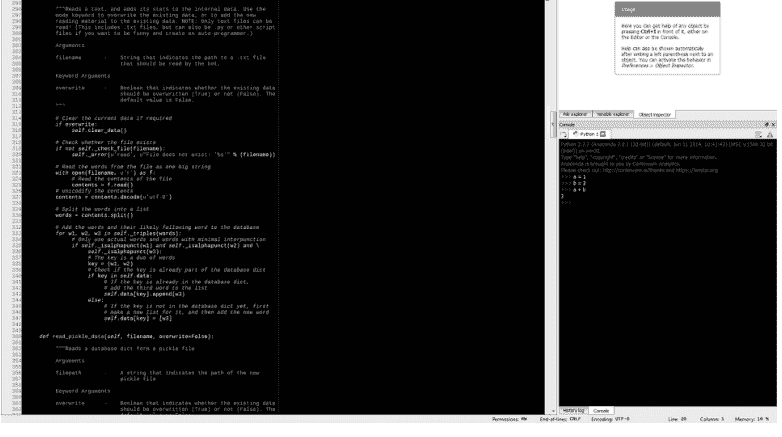

**图 1.3** 这是 Spyder 代码编辑器。它本应是酷炫的配色方案，但你只能看到灰度版本。

# 2 变量类型

变量在编程中非常重要。在学习它们是什么以及如何使用它们之前，也许最好先对它们有一些直观的感受。在接下来的章节中，你将尝试各种变量类型，以掌握要领。

## 2.1 数字

数字可以用不同的方式表示。最显著的区别是整数和浮点数。**整数**是没有小数部分的数字，例如 10、0 或 -5。**浮点数**，或**浮点**，是有小数部分的数字，例如 1.23、-99.9 或 1.0。

让我们先说好消息：你通常不必担心 1.0 和 1 之间的区别。此外，与其他一些语言不同，Python 对数值数据类型并不特别挑剔。这意味着当你将两个整数相除，比如 3/2 时，它会理解你期望的结果是分数 1.5。从这个角度来看，你似乎不必关心整数或浮点数！

现在说坏消息：整数和浮点数之间的区别实际上很重要，Python 并不总是按你预期的方式运行。这有很多原因，包括整数除法并不总是自动产生浮点数，以及浮点数实际上比它们看起来更复杂（对计算机来说不仅仅是 1.5！）。此外，有时浮点数根本不合适。例如，在创建图像或在计算机屏幕上显示时，不存在半个像素这样的东西。这种不可分割的单位通常不应该用浮点数表示。

以上内容可能有点令人困惑，为了避免进一步混淆，我们不会深入细节。目前的重点是意识到你正在使用什么类型的数值。

### 2.1.1 整数

让我们开始实际使用这些概念。启动 Python 解释器并开始输入：

```
1 + 3
```

预期的结果，对吧？1 + 3 = 4。现在让我们试试减法：

```
5 - 3
3 - 5
```

这也应该是你预期的结果。五减三确实等于二。三减五等于负二。让我们继续：

```
3 * 2
```

太棒了，Python 可以做乘法。它能做幂运算吗？让我们试试 3²（三的平方，或三的二次方）：

```
3 ** 2
```

语法可能看起来有点奇怪，用双星号。你可能习惯于用插入符号 `^` 进行幂运算，例如在电子表格编辑器（LibreOffice Calc 或 Microsoft Excel）或 Matlab 中。在 Python 中，插入符号用作不同的运算符（你稍后会学到它），所以不要用它来进行幂运算！

好了，现在让我们看看除法：

```
5 / 3
```

从版本 3 开始，如果除法的结果是分数，Python 会自动切换到浮点数。这就是为什么你会得到 1.6666666666666667。在许多情况下，这正是你想要的。

在某些情况下，你可能希望更精确。具体来说，五除以三等于一，余数为二。要得到这个结果，你可以使用 Python 的*整数除法*：

```
5 // 3
```

当你使用双除法运算符时，Python 会丢弃余数。在这种情况下，这给你留下了 1。要报告余数，请使用 `%` 运算符：

```
5 % 3
```

所以 5 // 3 = 1，5 % 3 = 2。但 5 / 3 = 1.6666666666666667，这是一个浮点数。让我们接下来了解浮点数！

### 2.1.2 浮点数

我们想计算 5 / 3 的值，但我们希望答案是一个近似值，而不是精确答案。为此，我们可以使用浮点数：

```
5.0 / 3.0
```

砰！5.0 / 3.0 = 1.6666666666666667。浮点数的一个酷炫之处在于它们具有传染性。如果你在计算中只使用一个浮点数，答案将自动成为浮点数。例如：

```
5 / 3.0
```

关于浮点数需要注意的一点是它们是不精确的。例如，考虑求和 (5/3)*2。思考一下结果应该是什么，然后运行代码：

```
(5.0 / 3.0) * 2.0
```

注意答案是 3.3333333333333335（注意末尾的 5）。也许这并没有引起你的怀疑，因为可能是中间进行了四舍五入：5.0 / 3.0 是 1.6666666666666667，然后 1.6666666666666667 * 2 = 3.3333333333333335。现在考虑上述等同于 10/3。所以一个等价的是

```
10.0 / 3.0
```

这仍然得到 3.3333333333333335！如果你不是计算机，你可能期望结果是 3.3333333333333333。这种差异源于浮点数只是数字的*近似值*。以高精度存储数字对计算机内存要求很高。因此，人们开发了巧妙的折衷方案，以存储具有合理（但不是精确！）精度的数字，而不需要太多内存。因此，浮点数并不总是你认为它们应该具有的精确数字。

既然你理解了什么是浮点数，你就可以在幂运算中使用它们。为什么这很有用？考虑以下：

```
3.0 ** 2
9 ** 0.5
```

这让你大吃一惊吗？一个数的平方根可以用指数表示法写出来！这太令人兴奋了！

还记得勾股定理吗？在直角三角形中，斜边（直角的对边）的平方等于另外两边的平方和。你可以写成 $a^2 + b^2 = c^2$。$c^2$ 的平方根将给出斜边的长度，所以你可以写成 $c = \sqrt{(a^2 + b^2)}$。假设 $a = 3.0$ 且 $b = 4.0$，并在 Python 中尝试：

```
(3.0**2 + 4.0**2) ** 0.5
```

变量名可以包含字母（大写和小写）、一些字符（如下划线）和数字；但它们必须始终以字母开头。例如，你可以创建一个名为 **test** 的变量来引用数字 5，如下所示

```
test = 5
```

你现在可以使用这个变量来做各种奇怪的事情。例如，你可以在计算中使用它：

```
test - 3
test + 5
test + test
```

如你所见，在计算中使用它实际上并不会改变变量。如果你想重新分配它一个不同的值，只需覆盖它：

```
test = 4
```

如果你想知道变量的当前值，只需在解释器中键入其名称并按 Enter。

```
test
```

你也可以通过引用自身来更改变量：

```
a = 2
a = a + 1
```

你甚至可以根据其他变量的值创建新变量！

```
a = 2
b = 3
c = a + b
```

你可以让它更令人困惑，通过使用另一个变量来定义一个变量：

```
a = 2
b = a
```

要小心，两个变量（a 和 b）现在可能指向完全相同的数据（2）。这现在看起来可能是一个不重要的旁注，但当你学习列表时，它将被证明是重要的。

## 2.3 布尔值

布尔值以逻辑学家乔治·布尔的名字命名，他将逻辑视为一种代数。他形式化了我们现在所知的与、或、非逻辑运算。逻辑运算可以产生两种结果之一：True 或 False，也可以表示为 1 和 0。

## 12 变量类型

这些操作几乎内置于所有电子电路中，是编程不可或缺的一部分。你必须学会如何实现它们，并且要向乔治·布尔献祭一只山羊以纪念他的遗产。（*注：别真去献祭山羊。山羊是了不起的动物，应该让它们活着。如果你真想献祭点什么，那就请给山羊献上一些生菜吧。当然是为了纪念布尔。*）

在你开始组建自己的布尔生菜献祭爱好者俱乐部之前，你可能应该先了解一下布尔值的工作原理。在解释器中输入以下内容：

```
a = 1
b = 1
a == b
```

结果应该是 True，表明这两个变量指向相等的值。注意，虽然 "=" 表示“将此值赋给此变量名”，但 "==" 表示“等于”。这与你习惯的用法不同，因为通常 "=" 表示“等于”，而 "==" 没有任何意义。记住这个区别很重要，因为你总有一天会写 "a = b"，而你本意是写 "a == b"，这个错误很可能会导致你的脚本崩溃。（这不是在贬低你；经验丰富的程序员也*一直*会犯这种错。）让我们继续：

```
a = 1
b = 2
a == b
```

现在结果是 False。我们也可以问 Python a 是否“不等于” b：

```
a != b
```

这是 True，因为 a 和 b 指向不相等的值。你也可以在代码中直接使用 True 或 False：

```
a = True
b = False
c = True
```

这允许你使用逻辑运算符，例如 AND (&) 和 OR (|)：

```
a & b
a | b
```

第一个测试两个变量是否都为 True，如果都是则返回 True。第二个测试任一变量是否为 True，如果其中一个或两个都是则返回 True。还有另一个运算符，异或（XOR, ^），它测试两个布尔值是否相同，仅当它们不同时才返回 True：

```
a = True
b = False
c = True
```

```
a ^ b
a ^ c
```

异或操作在第一次测试（a ^ b）中为 True，但在第二次（a ^ c）中不是。与之对比，或运算在两种情况下都为 True：

```
a | b
a | c
```

注意，布尔值可以与普通的数学运算符一起使用，但此时 True 和 False 的值将被解释为 1 和 0。

```
True + True
True - True
True + False
3 * True
```

在大多数情况下，这些操作没有太大意义：将 True 乘以三并不会让它变得更 True。

Python 的另一个酷炫之处在于，你可以使用英文单词来完成与符号运算符相同的事情。你可以检查变量是否相等：

```
a = 1
b = 2

a is b
a is not b
```

你也可以使用文字逻辑运算符：

```
a = True
b = False

a and b
a or b
not a
```

## 2.4 字母

有些情况需要使用文本，例如当你想向参与者展示说明时。在 Python 中，文本被称为**字符串**。它们通过使用单引号或双引号来定义。Python 还提供了许多内置函数来轻松操作字符串，你很快就会看到！

### 2.4.1 字符串

是时候定义你的第一个字符串了。在解释器中输入以下内容：

```
a = "Hello World!"
b = 'Hello World!'
```

尽管你使用了两种不同类型的引号，但生成的字符串是相同的：

```
a == b
```

能够使用多种类型引号的优点是，你可以在字符串内部使用另一种引号：

```
a = "Programming is 'fun'..."
```

还有更多字符可以在字符串中使用。其中一些对格式化很有用：

```
a = "I love newlines.\nI wish I could marry one.\n\nSwoon..."
b = "TABS\tARE\tAWESOME\t!"
```

渲染时，\n 会产生一个回车（或“换行”），\t 产生一个制表符（一些空白）。你可以使用数学运算符来组合字符串：

```
a = "spo"
b = "on"
a + b
```

或者将它们相乘：

```
a = "lala"
10 * a
```

但不能相减或相除，因为那没有任何意义。

### 2.4.2 字符串函数

函数还没有解释，但你稍后会非常熟悉它们。函数是一段代码集合，它会让你的计算机执行特定的操作。有些函数是独立的；你可以在任何时候*调用*它们，除了输入它们的名字外不需要做任何其他事情。这样一个函数是 `print`，它会简单地在解释器中显示一个值：

```
print("Hello world!")
```

这现在对你来说可能看起来没什么用，但你会学会欣赏它。有些函数不是独立的，比如 `print`，而是与某种特定类型的变量相关联。例如，字符串就有几个这样的内置函数。程序员有时将这些内置函数称为*方法*。几个例子：

```
a = "I love farts!"
b = "get away from me, stinky person."
```

```
a.lower()
a.upper()
b.capitalize()
```

lower 方法会将字符串中的所有字母转换为小写，而 upper 方法会将它们全部转换为大写。如果你想强调某些内容，或者你试图与一个不说同一种语言的人交谈，这非常有用。capitalize 方法只会将第一个字符大写。

其他一些有趣的字符串操作：

```
a = "test"
a.center(10)
a.count("t")
a.replace("s", "x")
```

正如你所看到的，center 方法在字符串的前后添加空格以使原始字符串居中，数字（10）表示结果字符串的预期长度。count 方法计算 "t" 的出现次数，或者你想计算的任何其他内容。replace 方法可用于将字符串的一部分替换为另一部分。如果你想转换文件并需要更改文件名，这非常有用：

```
a = "example.jpg"
b = a.replace(".jpg", ".png")
print(b)
```

### 2.4.3 字符串格式化

你可能尝试过的一件事是将字符串与数字组合：

```
a = "I'm number "
b = 1
a + b
```

你会遇到 TypeError，因为你不能以这种方式组合字符串和整数。不过，有其他方法可以实现这一点。你可以使用 str 函数，将你的数字转换为字符串：

```
a + str(b)
```

这可行，但一旦事情变得复杂，就会变成一件麻烦事：

```
a = "Every "
b = " days, I brush my "
c = ". I like this."

a + str(30) + b + "finger nails" + c
```

一个更好的替代方法是使用字符串格式化。这允许你在字符串中放置占位符，这些占位符稍后可以用值填充。为了替换前面的例子：

```
a = "Every {} days, I brush my {}. I like this."
print(a)
```

你可以通过花括号 {} 来识别占位符。让我们尝试填充它们：

```
a.format(30, "finger nails")
```

字符串后面的 `format` 函数允许你将字符串的花括号替换为实际的值。值在圆括号之间提供。

使用花括号允许你将任何类型的变量传递给 `format` 函数，它将以默认方式添加到字符串中。你可以通过指定你想要合并到字符串中的变量类型来对此施加更多控制。例如，你可以使用 {:d} 表示法强制只允许整数：

```
"The number is {:d}".format(2)
```

注意，这不适用于其他变量类型，甚至不适用于浮点数：

```
"The number is {:d}".format("two")
"The number is {:d}".format(2.0)
```

你可以使用类似的技巧在字符串中格式化分数。例如，你可能想显示一个带有一位或两位小数的百分比。你可以分别使用 {:.1f} 或 {:.2f} 来实现：

```
"The percentage is {:.1f}%".format(10.126)
"The percentage is {:.2f}%".format(10.126)
```

一个典型的用例是在分析运行时使用 print 向自己发送消息。例如，你可能想报告何时加载了新的数据文件，或者该文件中的行数是多少。

## 2.5 集合

到目前为止，你只看到了单个值（尽管字符串可以看作是单个字符的集合）。有时将值组合成一个集合会很有用。

考虑一个反应时间实验：研究人员在每次试验中收集一个反应时间。如果你想计算中位数反应时间，将所有单独的反应时间收集在一个变量中会很有用，而不是为每个单独的反应时间设置一个单独的变量。这使得访问和计算更容易。

现在想象一下研究人员还在使用眼动仪。这种设备可以测量瞳孔大小。它会产生大量数据；有时每秒超过 1000 个数据点！如果你想

### 2.5.1 列表

虽然编程中的一些术语可能看起来有点奇怪，但列表变量的名字却相当不言自明。列表就是其他值的列表。还记得变量是如何引用值的吗？列表就是对一组值的引用。这些值可以是整数、浮点数、字符串或任何其他变量类型。让我们在实践中看看：

```
a = ['one', 'two', 'three']
```

变量 `a` 现在是一个列表（你可以通过方括号识别它），其中包含值 "one"、"two" 和 "three"。如果你想使用其中一个值，就必须使用它的**索引**。值的索引是它在列表中的位置。这听起来很简单，但 Python 有一个小怪癖，一开始可能会让你困惑：它从 0 开始计数。这意味着第一个值的索引号是 0。第二个值的索引是 1，第三个值的索引是 2，依此类推。要引用特定的索引，请使用变量名和方括号中的索引：

```
print(a)
print(a[0])
print(a[1])
print(a[2])
```

很简单，对吧？那么为什么 Python 要从 0 开始计数呢？嗯，这在多个层面上都说得通。原因之一是它允许你通过倒数来索引。让我们看看如果使用 -1 作为索引号会发生什么：

```
print(a[-1])
```

它访问的是最后一个值！从 0 开始倒数允许你从列表的末尾而不是开头进行索引。在某些情况下，这非常有用！（当然，从 0 开始计数有时也会让人困惑。归根结底，这只是一个设计决策，并非所有编程语言都遵循从零开始的索引。但这并不妨碍程序员们对此持有*强烈*的看法。如果你无聊了，想挑起点什么，就去你最喜欢的社交媒体平台，公开表达你对从零开始或从一开始的索引的强烈喜好或厌恶吧。）

除了一次访问一个索引，你还可以索引整个**切片**。你可以通过使用要访问的第一个值的索引、一个冒号以及要访问的最后一个值*之后*的值的索引来实现。例如，`a[0:3]` 表示“变量 `a` 中从索引 0 到索引 3（不包括 3！）的值”：

```
a = [4, 5, 6, 7, 8, 9]
print(a[0:3])
```

你以后会经常看到的一个概念是**嵌套**列表。嵌套列表是被另一个列表包含的列表：

```
a = [ [10, 20, 30] ]
```

这个列表的第一个索引包含嵌套列表的值：`[10, 20, 30]`。这个嵌套列表也可以被索引：

```
print(a[0])
print(a[0][0])
print(a[0][1])
print(a[0][2])
```

嵌套可以无限进行下去，但你不太可能想这么做。嵌套列表有用的一个例子是图像的数字表示。你可以用一个包含三个值的列表来表示每个像素的颜色：一个代表红色，一个代表绿色，一个代表蓝色。你可以将图像中的每一行表示为一个嵌套的 [R, G, B] 列表（每个像素一个）。你可以将所有这些行列表放入一个列表中，这将很好地表示整个图像。

以下是一个 3 × 3 像素图像的示例，显示了一个白色（255, 255, 255）的加号（‘+’）在灰色（128, 128, 128）背景上：

```
[[ [128,128,128], [255,255,255], [128,128,128] ],
 [ [255,255,255], [255,255,255], [255,255,255] ],
 [ [128,128,128], [255,255,255], [128,128,128] ]]
```

你可以将这样的结构视为一个**矩阵**。（不过要小心这个术语，因为它可能有特定的技术含义。这里用的是更一般的意义。）你稍后会学习如何创建和使用它们。

列表和字符串一样，有一些内置函数可以用来操作它们。例如，`index` 方法可以找到列表中某个值的索引：

```
a = ['a', 'b', 'c']
a.index('b')
```

还有一个方法可以反转列表的顺序：

```
a.reverse()
print(a)
```

如果你想从列表中删除值，有两种方法可以选择。`remove` 方法允许你选择一个值，删除其第一次出现的位置。`pop` 方法允许你选择一个索引，删除该索引处的值。

```
a = [10, 20, 30, 40]
a.remove(20)
print(a)
```

```
a.pop(0)
print(a)
```

当然，也有向列表添加值的方法。第一种是 `append` 方法，它允许你向列表添加值：

```
a = [10, 20, 30]
a.append(40)
print(a)
```

另一种扩展列表的方法是 `extend` 方法。这用于将两个列表连接在一起：

```
a = [10, 20, 30]
b = [40, 50, 60]
a.extend(b)
print(a)
```

如果你认为 `append` 和 `extend` 似乎做同样的事情，并且可以互换，那你就错了。看看下面的例子：

```
a = [10, 20, 30]
b = [10, 20, 30]
c = [40, 50, 60]
a.append(c)
b.extend(c)
print(a)
print(b)
```

如你所见，`append` 方法将第二个列表（`c`）嵌套在第一个列表（`a`）中，而 `extend` 方法将两个列表（`b` 和 `c`）合并成一个。

此时，最好记住关于 Python 变量本质的解释（参见*变量赋值*章节）：它们*不是*值，它们只是*引用*值。让我们看看下面的例子：

```
a = [1, 2, 3]
b = a

print(a)
print(b)
```

两个变量指向完全相同的值。它们都不包含 [1, 2, 3] 的唯一副本。现在看看如果你改变一个会发生什么：

```
a.append(4)
a.extend([5,6])

print(a)
print(b)
```

`a` 和 `b` 都改变了！啊！这可能不是你期望的行为，也不是你通常想看到的。所以再说一遍，给后排的人听：变量是对值的引用，因此改变底层值可能会影响多个变量！

在编程中，我们说列表是可变的。这意味着你可以根据需要更改它们。这也意味着它们可能被意外更改，就像上面的例子一样，所以要小心！

有办法解决这个问题。例如，你可以使用数学运算符来扩展列表：

```
a = [1, 2, 3]
b = a
a = a + [4, 5, 6]

print(a)
print(b)
```

另一种选择是使用 `copy` 函数，我们需要从 `copy` 模块导入它（关于导入的内容稍后会介绍，现在先接受它）。这将强制 Python 复制底层值，而不是让两个变量指向同一个底层值：

```
from copy import copy
a = [1, 2, 3]
b = copy(a)
a.append(4)

print(a)
print(b)
```

### 2.5.2 元组

列表很棒，但你在上一页已经看到了使用它们的一些风险：它们容易发生意外的修改。虽然你现在知道了避免意外更改的方法，但它们确实需要你注意。要是有一种不能更改的列表，以防止你意外地完全更改它就好了……

嗯，今天一定是你的幸运日！不用再找了，因为这里有一个不可变的、类似列表的变量：**元组**。你可以通过在圆括号中写入值来创建它们：

```
a = ('one', 'two', 'three')
print(a)
```

虽然它看起来像列表，走起来像列表，闻起来也像列表，但它绝对*不是*像列表一样！试着添加点东西：

```
a.append('four')
```

哦不，出错了！也许你可以更改其中一个值？

```
a[0] = 'zero'
```

哈！渺小的凡人！你无法触碰它！你唯一能做的就是完全覆盖它：

```
a = ('zero', 'two', 'three')
```

这里的关键信息是，列表可以更改，但元组不能。然而，所有变量都可以通过简单地重新定义来覆盖。元组和列表之间还有进一步的相似之处，即 `count` 和 `index` 方法：

```
a = [1, 1, 2, 3]
b = (1, 1, 2, 3)

a.count(1)
b.count(1)

a.index(2)
b.index(2)
```

那么，什么时候应该使用元组，什么时候使用列表？这主要取决于个人偏好。一般来说，当人们知道列表包含的值应该保持*恒定*时，就会使用元组。例如，计算机显示器的分辨率在整个实验过程中可能应该保持不变，特定刺激的大小也可能如此。

### 2.5.3 数组

好了，现在你可以创建一个值列表了，让我们用它们做一些计算吧！试着给一个数字列表加一：

```
a = [5, 6, 7]
a + 1
```

哦，这有点尴尬……你遇到了一个错误，因为列表不能这样操作！如果你想给列表中的每个值都加一，你必须逐个值地进行：

```
a[0] = a[0] + 1
a[1] = a[1] + 1
a[2] += 1

print(a)
```

这里有两点需要注意。第一点是“a[0] = a[0] + 1”和“a[0] += 1”是等价的。（第二种写法只是更快捷。）另一点是，手动给每个值加一很麻烦。如果你的列表里只有三个值，这看起来工作量不大，但想象一下，如果要对整个脑电图数据集都这样做呢！编程本应让你的生活更轻松，而不是让你能以更酷的方式进行体力劳动。

涉及一整行数字的计算有时被称为*数组计算*，它们可以让你的生活变得非常轻松。要在Python中进行这些计算，你需要熟悉**NumPy**（Harris等人，2020；Oliphant，2007）。

NumPy是人们所说的**外部包**或**库**。它不包含在Python的基本安装中，而是由志愿者创建和维护的。任何人都可以创建外部包，而且有很多有用的包可用。可以把它们想象成你手机上的应用程序：你刚拿到手机时它们并不在上面，但你可以下载它们来增加功能。这既是Python的优点，也是它的阿喀琉斯之踵：外部包可能非常有用，但也可能很难找到，而且有些安装起来绝对令人头疼。

幸运的是，有一些Python发行版包含了所有主要的科学库。它们被称为Anaconda、PsychoPy和WinPython。本书第一章的说明应该已经帮助你下载了其中一个。如果你正在使用这些发行版，请继续阅读。如果没有，请确保在进入下一章之前安装NumPy！

### 2.5.4 NumPy 数组

好了，是时候创建你的第一个**数组**了。NumPy数组可以包含你想要的任何类型的值。在这一点上，它们与列表非常相似。然而，与列表不同，每个数组只能包含相同类型的值：例如，不能混合整数和字符串。

你可以对包含数字的NumPy数组或包含嵌套NumPy数组（其中包含数字）的数组进行计算。你可以轻松地从列表创建一个NumPy数组：

```
import numpy

a = [1, 2, 3]
b = numpy.array(a)
print(b)
```

现在你可以使用这个数组进行计算，比如一次性给所有元素加一个值：

```
b += 1
print(b)
```

你可以像索引列表一样索引NumPy数组：

```
b[0] += 1
b[1:3] += 10

print(b)
```

很好！现在看看当你尝试其他数学运算时会发生什么：

```
a = numpy.array([1, 2, 3, 4])
a - 2
a * 3
a / 2.0
```

你甚至可以使用两个（或更多）数组进行这些操作：

```
a = numpy.array([1, 2, 3])
b = numpy.array([2, 4, 6])

a + b
b - a
a * b
b / a
```

这里需要注意的一个非常重要的事情是，这些计算的执行方式是*逐点*进行的：a*b 等同于 a[0]*b[0]; a[1]*b[1]; a[2]*b[2]。这是逐元素运算而非矩阵乘法，这一点可能会让一些人感到困惑。例如，如果你之前使用过Matlab（一种在很多方面与NumPy相似的编程语言），你可能期望 a*b 的默认行为是矩阵乘法。这里不一定有更好的默认选项；只是不同而已。

NumPy还有很多其他很酷的功能。这些现在不会讨论，但你将在后面的章节中有机会使用NumPy。

### 2.5.5 字典

你应该学习的最后一组数据结构叫做**字典**，在Python内部通常简称为**dict**。你可以把字典想象成一本真正的词典，它有**键**，可以用来查找**值**，就像词典中的单词可以用来查找它们的含义一样。例如，在一本英荷词典中，键“monkey”指向值“aapje”，键“banana”指向值“banaan”。（如果你将来去阿姆斯特丹，你会感谢我这个非常实用的例子。）

在Python中，字典中的这些例子看起来像这样：

```
english_dutch = {'monkey':'aapje', 'banana':'banaan'}
```

你可以通过它的花括号以及键和关联值之间的冒号来识别字典。与列表和类型一样，你使用逗号来分隔条目。

## 2.6 变量类型

字典在某种程度上类似于列表，因为它是一个可以同时容纳多个值的变量。然而，你索引这些值的方式非常不同！看看这个：

```
a = {0:1, 1:2, 2:3}
b = [1, 2, 3]

print(a[0], b[0])
print(a[1], b[1])
print(a[2], b[2])
```

目前，变量 a（一个字典，通过花括号识别）看起来像是变量 b（一个列表）的更精细版本。然而，有一个很大的区别：在列表中，你可以通过索引号访问值，而在字典中，这个索引被称为键。而且键可以是任何你想要的数字或字符串！下一个例子：

```
a = {'banana':1, 'horse':2, 19:1, 3:'cookie'}

print(a['banana'])
print(a['horse'])
print(a[3])
print(a[19])
```

很酷，对吧？你也可以在创建字典后添加新的条目：

```
a['answer'] = 42
print(a)
```

使用字典可能非常有用，例如，如果你想将一个参与者的所有数据存储在同一个变量中。你可以创建一个字典，键为“RT”表示反应时间，“accuracy”表示反应是否正确。或者你可以为所有数据创建一个字典，键为每个参与者。每个键可以指向上述单个参与者的字典，这些字典的键对应你所有的测量指标：

```
data = {}
data['subject-1'] = {'RT':[300, 256, 115], 'acc':[1, 1, 0]}
data['subject-2'] = {'RT':[400, 512, 268], 'acc':[1, 0, 1]}
```

如你所见，字典可以包含任何类型的值，包括其他（嵌套的）字典。

## 2.7 类

在我们进入有趣的内容之前，还有一种变量类型你需要了解。这是一个非常重要的类型，也是Python语言的基础部分。

暂时从编程中抽身出来。如果有一扇窗户，看看外面。如果没有，试着找个更好的住处，因为没有窗户工作太糟糕了。你能看到一辆车吗？也许还有一辆？如果看不到，就想象两辆不同的车。（但别让它们太不同！）这两辆车显然很相似：它们都有四个轮子、一个方向盘、一个发动机、车窗等等。然而，它们也显然不同：它们可能有不同的颜色、不同类型的轮子、不同的发动机等等。

你可以把这两辆车看作同一个**类**的两个**实例**。它们是根据一个通用蓝图建造的，这个蓝图规定轮子在底部，灯在前面和后面，方向盘应该在里面（最好在前面）。然而，这些车是用不同类型的轮子、不同形状的灯和不同类型的方向盘（一个可能包着皮革，另一个包着粉色绒毛）建造的。蓝图是汽车的定义，而汽车是蓝图的具体实现。

如果你理解了这个例子，你就理解了**面向对象编程**的基本原理。在这种编程风格中，我们将蓝图称为**类**，将特定的汽车称为**实例**。实例也可以称为对象，因此得名“面向对象”。

在编程中，对象可以有**属性**和**方法**。属性是定义单个实例设置的内部变量（想想汽车的颜色）。方法是决定类的每个实例能做什么的内部函数（想想汽车的驾驶能力）。

在Python中，所有变量类型本质上都是对象。这是一个你编程时可能用不到的小知识，但当你想在晚宴上给人留下深刻印象时会派上用场：

> 极客1：“我*真是*个程序员，我*精通*Java。”
> 极客2：“去他的Java，我在学Go——你知道*谷歌*开发了它吗？”
> 极客3：“我只用了*21天*就学会了C++！”
> 你：“切，C++只是让C面向对象的一种愚蠢方式。你知道Python是*设计*成面向对象的吗？所有变量类型实际上都是对象。”

（注意不要在更有经验的程序员面前这样做。指着某个地方，问“那是R2D2吗？”，然后赶紧跑掉。）

Python和大多数外部包提供了非常有用的类，几乎可以做任何事情。在屏幕上显示东西？有一个类可以做到。注册键盘输入？有一个类可以做到。与眼动仪通信？有一个类可以做到。在接下来的章节中，我们将探索所有这些。

## 2.8 函数

还记得你被承诺过，在学习了类之后，你会做有趣的事情吗？那是个谎言。你需要先学习函数。函数实际上不是一种变量类型，但在某种程度上是。你不必担心它们具体是什么，但你应该知道函数是任何编程语言中非常重要的一部分。

**函数**不过是一段执行特定任务或几个特定任务的代码集合。如果你觉得这个定义相当模糊，那完全正确。你可以把函数想象成任务的描述，比如建造一个鸟屋。这样的任务需要输入，比如材料（木头、钉子和胶水）和规格（鸟屋的尺寸）。它也有输出：一个鸟屋。函数本身将是关于如何建造鸟屋的描述。

## 2.6 变量类型

现实生活中一个常见的函数例子是烹饪食谱。食谱告诉你如何制作一道特定的菜肴。它的输入是食材，输出是你的晚餐。让我们看看土豆泥的食谱是如何定义的：

```
制作土豆泥
输入：
5个土豆，1瓣大蒜，6茶匙牛至
输出：
土豆泥
步骤：

1 切碎大蒜
2 清洗土豆
3 削土豆皮
4 将土豆煮20分钟
5 捣碎土豆
6 将大蒜和牛至加入土豆泥
7 搅拌土豆泥
```

你可能已经注意到，其中一些单独的步骤也可以被定义为函数。例如，函数“煮土豆”的输入（削皮的土豆、水和锅）、输出（煮熟的土豆和热水）以及步骤（“往锅里加水，把锅放在炉子上，加热炉子，等待20分钟”）。在编程中也会发生这种情况：一些函数会调用其他函数来工作。

作为练习，让我们看看如何在Python中定义制作土豆泥的函数：

```
def make_mash(n_potatoes, n_garlic=1, n_oregano=6):
    potatoes = get_potatoes(n_potatoes)
    garlic = get_garlic(n_garlic)
    oregano = get_oregano(n_oregano)

    garlic = chop(garlic)
    potatoes = wash(potatoes)
    potatoes = peel(potatoes)
    potatoes = boil(potatoes, duration=20)
    mash = smash(potatoes)

    ingredients = [mash, garlic, oregano]
    mash = stir(ingredients)

    return mash
```

这对你来说可能有点奇怪，确实如此。但有几点你应该注意。首先是一个重要的普遍观察：函数`make_mash`调用了几个其他函数（例如`get_potatoes`和`stir`），这些函数尚未定义，也不是Python基础语言的一部分。目前，只需假设它们在其他地方已定义。

另一个需要注意的重要事项是Python中函数的定义方式。函数定义总是以`def`开头。后面是函数名，在本例中是`make_mash`。函数名*总是*跟着一对圆括号。在这些括号内，定义了输入。这些输入被称为**参数**，我们稍后会再讨论它们。函数定义的最后一部分是冒号`:`。

属于函数的所有代码都是**缩进**的。你将在*If语句*部分学到更多关于缩进的知识。目前，你只需要知道Python通过代码相对于函数定义的偏移量来识别属于函数的所有代码。偏移量是函数内每行代码前的四个空格。

在代码的末尾，函数**返回**一个变量：`mash`。这是函数的输出，它可以是单个变量或变量列表。输出变量可以是数字、字符串、列表、元组、类，甚至是其他函数。

使用函数被称为**调用**函数。一般语法如下：

```
output = function(input)
```

例如，调用`make_mash`函数的语法是：

```
mash = make_mash(5, n_garlic=1, n_oregano=6)
```

这将调用`make_mash`函数，输入为五个土豆、一瓣大蒜和六茶匙牛至。输出将存储在名为`mash`的变量中。

### 2.7.1 参数

参数是使用函数的重要组成部分，尽管它们不是必需的。理论上，你可以定义一个没有输入参数的函数。参数是在函数定义内定义的变量名。在`make_mash`函数中，有一个参数：`n_potatoes`。（我们稍后会再讨论`n_garlic`和`n_oregano`。）

`n_potatoes`是在以下行中创建的：

```
def make_mash(n_potatoes, n_garlic=1, n_oregano=6):
```

你可能想知道为什么`n_potatoes`没有像`n_garlic`和`n_oregano`那样关联一个值。这是因为值只在调用`make_mash`时才被赋值。如果你想让`n_potatoes`为五，你可以这样调用`make_mash`函数：

```
mash = make_mash(5, n_garlic=1, n_oregano=6)
```

如果你真的很饿，想用10个土豆做土豆泥，你可以这样调用`make_mash`函数：

```
mash = make_mash(10, n_garlic=1, n_oregano=6)
```

其理念是自动化任务，同时允许参数的灵活性。你可以使用同一个函数来制作很少或大量的土豆泥，只需更改参数的值即可。

在编程中，为参数提供值通常被称为**传递**参数。重要的是，**如果你不传递所有参数，调用函数将导致错误。**

### 2.7.2 关键字参数

关键字参数基本上与参数相同，但有一个重要例外：它们有一个默认值。你可以在函数定义中分配这个默认值，就像在`make_mash`函数中对`n_garlic`和`n_oregano`所做的那样：

```
def make_mash(n_potatoes, n_garlic=1, n_oregano=6):
```

使用关键字参数的实际好处是，你不必在调用函数时分配它们的值。例如，以下两次对`make_mash`函数的调用是等效的：

```
mash = make_mash(5, n_garlic=1, n_oregano=6)
mash = make_mash(5)
```

由于有默认值，如果你不传递任何关键字参数，它不会导致错误。这与参数形成对比：如果你在调用函数时未指定参数，你确实会得到一个错误。

在编写函数定义时，定义合理的关键字参数很有用。这允许你调用函数而不必费心指定每一个小细节，但它确实保留了处理细节的选项。在`make_mash`示例中，这意味着你可以依赖默认的大蒜量（1瓣），但如果你真的喜欢它（并且不介意身上有味道），你也可以加入6瓣：

```
mash = make_mash(5, n_garlic=6)
```

当然，土豆泥是一个愚蠢的例子，但你将在本书后面遇到更多关键字参数的实际示例。当你遇到时，想想你会使用哪种类型的参数。此外，你可能想考虑是否*只能*使用关键字参数。使用参数有什么好处？

### 2.7.3 局部变量和全局变量

变量（包括参数和关键字参数）对于创建它们的函数是**局部**的。这意味着变量`potatoes`可以在整个`make_mash`函数中使用，但不能在函数外部使用。这听起来可能微不足道，但事实并非如此。

如果你想让在函数内部创建的变量可以从函数外部（即在脚本的其余部分）访问，你必须返回它。这就是为什么`make_mash`函数的定义以`return mash`结尾。如果没有最后一行，函数将没有输出。因此，你将无法使用`mash`。

变量是函数局部的原因是，否则它们会挤占你的工作空间。想象一个复杂的函数，它在内部使用100个变量。如果你有一个脚本调用这个复杂的函数，你必须确保*没有*你自己的变量与在复杂函数内创建的变量同名。如果有，它将被覆盖，你的脚本可能会开始表现异常。

在脚本和函数内部之间共享变量的另一个选项是将变量声明为**全局**。这意味着变量将在你的脚本中以及函数内部被识别。除非你有充分的理由，否则不建议这样做。要声明一个全局变量，请在脚本中包含以下行：

```
global mash
```

并在函数定义中包含以下行（不要忘记四个空格的缩进）：

```
    global mash
```

一般来说，建议非常谨慎地声明全局变量。更清晰、更明确的选项是从函数内部显式返回你需要的变量。

### 2.7.4 创建你的第一个函数

在学习了函数之后，是时候自己定义一个了！这是你个人编程历史上的一个重要时刻，所以好好品味它。在解释器中，输入以下行：

```
def hello_world():
```

输入该行后，按回车键并输入以下行（不要忘记下一行以四个空格开头！）：

```
    print('Hello World!')
```

按两次回车键，也许再多按几次以确保。现在通过输入以下内容来调用你自己的函数：

```
hello_world()
```

如果你做的一切都正确，“Hello World!”应该已经出现在解释器中。这就是你的第一个函数的结果！恭喜！

你刚才做的是定义一个名为`hello_world`的函数，它不接受任何输入，也不产生任何输出。它只是向解释器打印“Hello World!”。

### 2.7.5 创建你的第二个函数

让我们让事情更令人兴奋。让我们创建一个确实接受输入的函数！你可以创建一个函数，打印“Hello World!”指定的次数。一个参数

## 30 变量类型

在函数定义中，可以使用变量来指定函数应打印多少次“Hello World!”，如下所示：

```python
def hello_world(N):
```

其中 *N* 是“Hello World!”的重复次数。正如你在*字符串*章节中可能记得的，你可以将一个字符串乘以一个整数来重复它。你可以在新函数中利用这一点：

```python
    print(N * 'Hello World! ')
```

现在按两次回车并调用该函数！

```python
hello_world(5)
```

你也可以尝试测试计算机的极限：

```python
hello_world(10)
hello_world(100)
hello_world(100000)
```

### 2.7.6 创建你的第三个函数

作为函数定义的最后一个练习，让我们创建一个不仅接受输入而且还能产生输出的函数！这个函数将超越之前的“Hello World!”示例，并实际做一些有用的事情：检查一个值是否等于42。

该函数将命名为 `is_this_the_answer`，输入参数将命名为 `number`。在解释器中输入以下内容并按回车：

```python
def is_this_the_answer(number):
```

现在，函数的关键部分是检查输入是否等于42。正如你在*布尔值*部分可能记得的，你可以使用双等号来比较两个变量。如果变量相等，结果将是 `True`，如果不相等，则是 `False`。

```python
    result = number == 42
```

`result` 是一个布尔值，表示 `number` 是否等于42。剩下的唯一事情就是返回 `result`。

```python
    return result
```

按两次回车并测试你的函数：

```python
is_this_the_answer(7)
is_this_the_answer(3.50)
is_this_the_answer(42)
is_this_the_answer('kittens')
```

你也可以将返回值赋给一个新变量：

```python
result = is_this_the_answer(42)
print(result)
```

请注意，你不必使用函数内部使用的相同变量名。你可以使用任何你想要的变量名！因此，以下代码同样有效：

```python
a = is_this_the_answer(42)
print(a)
```

很巧妙，对吧？

## 制造一些噪音

在学习了所有这些变量类型之后，是时候做些更酷的事情了！在这个随机的插曲中，你将学习如何制造视觉噪音。

### 随机数

在前面的章节中，你学习了如何使用 NumPy 数组。但 NumPy 的功能远不止数组计算！它有一个漂亮的随机模块，允许你生成随机数：

```python
import numpy
numpy.random.rand()
numpy.random.rand()
numpy.random.rand()
```

只需尝试几次，以确保这些数字确实是随机的。如果你确实识别出某种模式，你可能是对的。计算机的随机数是由一个依赖于固定数字（即**种子**）的算法产生的。你可以提供自己的种子，看看会发生什么：

```python
numpy.random.seed(seed=14)
numpy.random.rand()
numpy.random.rand()
numpy.random.rand()
```

看起来做的是同样的事情，对吧？现在提供完全相同的种子并再次执行：

```python
numpy.random.seed(seed=14)
numpy.random.rand()
numpy.random.rand()
numpy.random.rand()
```

*完全*相同的“随机”数字出现了！为什么这很重要？因为重要的是要认识到计算机中不存在真正的随机数。它们是**伪随机**的。这是否是一个问题取决于具体情况。如果你想运营一个赌博网站，可预测的“随机”数字可能并不明智……但如果你只是用它们来创建一些视觉静态效果（如下所示），它们的伪随机性就完全没问题了。

### 噪音

视觉**噪音**是当老式电视机没有调到合适频道时你看到的灰色雪花。它是你手臂睡着后那种感觉的视觉类比。单个雪花从完全白色到完全黑色不等。如果我们为这些颜色分配数值，可以说白色对应1，黑色对应0。0到1之间的所有数字对应某种灰度。

使用 NumPy 的 `rand` 函数，我们实际上可以创建一个随机数场。为此，我们只需要提供这个场的宽度和高度。让我们用一个5x5位置的场来试试：

```python
noise = numpy.random.rand(5, 5)
print(noise)
```

你可以通过查看 NumPy 数组的 `shape` 属性来检查其维度：

```python
noise.shape
```

当然，灰色噪音有点无聊。为什么不把它变成彩色的呢？你可能知道计算机用三个值来编码颜色：红色分量、绿色分量和蓝色分量。如果我们想创建彩色噪音的数值表示，我们需要为每个像素创建三个随机数。（像素是你屏幕上的一个彩色单元：红色、绿色和蓝色的组合。）

虽然这听起来可能是一个难题，但编码起来却出奇地简单。你只需在 NumPy 的 `rand` 函数中添加另一个维度：

```python
rgb_noise = numpy.random.rand(5, 5, 3)
print(rgb_noise)
```

你的5x5随机像素场现在深度为3。这个深度代表每个像素的红色、绿色和蓝色值。

### Matplotlib

现在你知道如何创建视觉噪音的数值表示了，让我们把它变成一张图片！为此，我们将使用 Matplotlib (Hunter, 2007)。这是一个可以进行非常高级绘图的库。目前，我们只使用它的 `pyplot` 模块。它包含一个 `imshow` 函数，可以将数字场转换为图像。

要创建视觉噪音，你可以使用与之前相同的方法，但现在使用更大的场。500x500像素怎么样？

```python
import numpy
from matplotlib import pyplot

noise = numpy.random.rand(500, 500, 3)
pyplot.imshow(noise)

pyplot.show()
```

最后一个函数在一个交互式窗口中显示你制作的图形。如果愿意，你可以将其保存到磁盘。也许可以展示给你的祖母看。

> “看，奶奶，我会编程了！”
- “真不错，亲爱的。”

# 3 创建和呈现刺激物

在本章中，你将学习如何创建一些基本的刺激物（文本、形状、图像）以及如何在计算机显示器上呈现它们。你还将学习如何使用一些外部库来操作图像，以及如何使刺激物“动态化”（即移动和交互）。为此，你将编写脚本，其中使用一个名为 PsychoPy (Peirce, 2007, 2009) 的包中的类。

PsychoPy 几乎可以完成你在心理学实验中可能需要的任何事情。这包括在显示器上呈现刺激物；产生声音；从键盘、计算机鼠标、操纵杆和控制器收集响应；与眼动仪通信；记录数据；以及精确计时事件。值得注意的是，确实存在其他用于类似目的的包，例如 PyGaze (Dalmaijer et al., 2014)。选择哪个包完全取决于你（或者你的老师，如果你在课程模块中使用本书）。在本章中，我们将重点介绍 PsychoPy，但你在这里学到的技能将帮助你扩展知识，从而也能尝试其他包！

在不深入探讨软件架构的情况下，值得注意的是 PsychoPy 是建立在其他几个外部包（依赖项）之上的。这意味着它需要其他包来完成其工作。因此，我们建议安装独立的 PsychoPy 来创建你的第一个实验。可以从 https://www.psychopy.org/download.html 下载（安装说明见第1章）。

这并不是说你不能在本书前面介绍的其他环境中使用 PsychoPy。出于许多原因，许多程序员更喜欢那些环境，而不是 PsychoPy 内置的“编码器视图”（稍后介绍）。替代环境提供了比 PsychoPy 编码器更多的特性和功能，但它们通常也需要你安装许多依赖项并配置你的环境。独立的 PsycoPy 预装了大多数心理学实验所需的包（包括 PyGaze！）。这就是为什么我们喜欢使用 PsycoPy 编码器进行教学：它在课堂设置中节省了*大量*时间。

## 3.1 脚本

与前几章你在解释器中输入几行代码不同，本章你将创建脚本来执行你的指令。脚本不过是一系列代码行，它们将被逐行执行。

逐行运行脚本的编程语言被称为**解释型语言**。它们与**编译型语言**不同，后者在实际运行前会预先翻译整个脚本。一般来说，编译型语言运行更快，但解释型语言有其他优势。例如，用解释型语言编写的脚本可以在运行时重写自身。在阅读斯蒂芬·霍金关于人工智能的警告时，请思考这一点（太长不看版：可怕的、能自我重新设计的人工智能将使人类过时）。

如今，大多数编程语言既可以作为解释型语言实现，也可以作为编译型语言实现，因此这不再是一个特定于语言的特性。此外，你可能也能想到编译型语言重写自身以消灭人类的方法。这里真正的教训是，你不应该过于担心解释型语言和编译型语言之间的区别！

## 3.2 PsychoPy 代码视图

当你第一次打开 PsychoPy 时，你会看到三个打开的窗口：构建器视图、运行器视图和代码视图。在本书中，我们将重点关注代码视图。（关于在构建器中制作实验，请参阅 Peirce 等人，2022）。代码视图如图 3.1 所示，它由三个部分组成：工具架、源代码辅助和编辑器。

编辑器窗口是这些部分中最重要的；我们将在这里编写 Python 脚本。要开始一个新脚本，你可以选择新建文档图标（如果将鼠标悬停在上面，它会显示“创建新实验文件”）。这将在编辑器窗口中创建一个名为“untitled.py”的新脚本。“.py”扩展名表明这是一个 Python 文件。通常，在开始之前，最好用一个新的、唯一的名称保存它。让我们将其保存为“stimuli.py”。

编辑器窗口下方是工具架。该工具架由两个选项卡组成：Shell 和输出选项卡。Shell 是一个你可以输入 Python 代码进行测试的地方。但是，在 Shell 中创建的变量不会保存到“全局”工作区。也就是说，与其他开发环境不同，你无法从 Shell 访问在编辑器脚本中创建的变量，反之亦然。输出选项卡是运行脚本时生成任何输出（包括重要的错误消息！）的地方。

最后，源代码辅助窗口也由两个选项卡组成。结构选项卡旨在帮助我们浏览大型脚本，通过在一个简洁的位置显示我们创建的函数和类。文件浏览器选项卡旨在帮助我们了解当前目录的位置。在本章中，我们将较少关注源代码辅助窗口——但知道它的存在是好的。

## 3.3 窗口

大多数实验都涉及在屏幕上呈现某些内容。为了在屏幕上呈现视觉刺激，我们需要一个绘制它们的地方，这被称为“窗口”。请注意，窗口不必具有与屏幕相同的属性。例如，窗口可以比你的屏幕小。要在 PsychoPy 中设置你的窗口，你需要首先从 PsychoPy 库中导入相关的“模块”：

```
from psychopy import visual
```

psychopy.visual 是一个包含广泛视觉刺激的模块，从形状到随机点运动图。最重要的是，visual 模块包含了我们创建用于绘图的窗口所需的内容，即命名相当贴切的“Window”类。好了，让我们创建一个窗口：

```
win = visual.Window(size=[1024, 768], fullscr=False,
    units='pix', color=(0,0,0),
    colorSpace='rgb', screen=0)
```

这里我们为窗口添加了几个参数（在本书中，我们可能会互换使用“参数”和“参数”，它们本质上指的是我们正在创建的对象的选项/设置）：

- **size**：我们窗口的宽度和高度。
- **fullscr**：窗口是否为全屏。强烈建议你在开发实验时将其设置为 False。如果你将其设置为 True，并且你还没有启用退出实验的方法，那么很容易被困在你的研究中（一个任何研究者都不愿忍受的无限地狱）。
- **units**：窗口使用的单位。这里我们使用像素；然而，值得注意的是，我们可以使用任何数量的单位，我们选择的单位将被继承到我们绘制到此窗口的所有视觉刺激（除非我们在该刺激的“unit”参数中另行说明）。
- **color** 和 **colorSpace**：窗口使用的颜色和颜色空间。（关于颜色空间的说明稍后会跟进。）
- **screen**：在哪个屏幕上呈现窗口，编号从 0 开始（并递增到你拥有的屏幕数量）。这意味着你可以轻松地进行多屏幕实验：你只需要创建几个具有不同屏幕编号的窗口，然后在那些不同的屏幕上呈现视觉刺激！

同样值得注意的是，我们可以让创建窗口的代码行跨越多行。只要后续行有一定程度的**缩进**，这就可以正常工作。（与之前一样，一级缩进等于四个空格。本章后面会有关于缩进的更多内容！）按下你的 stimuli.py 文件上的运行按钮。你应该会非常短暂地看到一个灰色窗口出现然后消失——很神奇。

我们在这里引入了一些术语：“包”、“模块”和“类”。你可以认为 Python 包具有层次结构。例如，“psychopy”是包；它位于层次结构的顶部。PsychoPy 包含用于执行不同任务的模块，例如用于绘制视觉内容的“visual”模块，用于任何与声音相关的内容的“sound”模块。可以使用点运算符访问这些模块，例如 psychopy.visual 或 psychopy.sound。或者，你可以直接导入这些模块，使用 `from psychopy import visual, sound`。每个模块都有许多“类”。例如，`visual` 包含 Window、ShapeStim 和 Image 等内容。每个类都有自己的属性和方法。例如，一个 Image 对象具有属性 `pos`、`size` 和 `image`（用于该对象的位置、大小、图像文件）。它还将具有方法 `.setPos()`、`.setSize()` 和 `.setImage()`。每个方法都允许你重置对象的属性。其中一些方法在我们想要动态更新对象属性时会派上用场。

### 3.3.1 PsychoPy 窗口中的单位和颜色

你可能已经注意到，Window 类要求你指定单位。在本例中，我们将其设置为 'pix'，代表“像素”。这是一个直接的映射，因为像素是你的计算机和显示器熟悉的单位。然而，使用像素有一个警告，它可能导致不同显示器上的刺激具有不同的物理大小（像素的大小因显示器而异，取决于屏幕的分辨率）。

在选择刺激使用的单位时，问问自己这个问题：我需要我的刺激在不同显示器上具有相同的*物理大小*，还是相同的*相对大小*？通常，相同的相对大小就可以了（即，相同的图片可以呈现在宽屏游戏显示器或小型平板电脑上，并且会根据屏幕大小进行缩放）。然而，在一些心理物理学研究中，我们需要相同的物理大小。这通常是因为我们需要知道某个东西落在视网膜上的大小。

如果你需要在不同显示器上具有相同物理大小的刺激，可以使用的单位包括厘米和视角度数。然而，这些单位要求 PsychoPy 精确知道你的显示器上一厘米可以容纳多少像素，以及参与者距离显示器有多远。如果你使用的是 PsychoPy 代码视图，你可以使用监视器中心提供此信息。如果你使用的是其他开发环境（例如 Spyder），你可以通过导入 PsychoPy 的 monitors 模块来设置自己的监视器，然后在窗口中指定该监视器，以便它可以使用厘米和视角度数等单位：

```
from psychopy import visual, monitors

# set up the monitor
mon = monitors.Monitor('labMonitor', width=1280,
    distance=57, gamma=None)

# make a window to draw things in
win = visual.Window(size=[1024, 768], fullscr=False,
    units='pix', color=(0,0,0), colorSpace='rgb',
    screen=0, monitor=mon)
```

如果你的实验满足于在不同显示器上具有相同的刺激相对大小，PsychoPy 提供了高度或归一化单位：

- **高度单位**对应于你窗口的高度：1 个高度单位是从窗口底部到顶部的总距离，-0.5 是窗口的底边，0.5 是窗口的顶边。如果你想象一个与高度等宽的完美正方形，-0.5 将是该正方形的左边缘，0.5 是该正方形的右边缘。
- **归一化单位**范围在 -1 和 1 之间，表示相对距离。在分辨率为 1920 × 1080 像素的显示器上，从 -1（显示器左边缘）到 0（显示器中心）的水平距离将对应 960 像素。在分辨率为 1024 × 768 的显示器上，相同的水平距离将对应 512 像素。

在本书中，你将始终使用像素。优点是这是计算机显示器上最传统和直接的距离单位。缺点是像素特定于你的显示器：一个大小为 200 像素的刺激在两个不同的显示器上将具有不同的厘米大小，因为像素大小在不同显示器之间不同。幸运的是，你可以测量显示器的宽度并计算每厘米的像素数。由此，你可以计算刺激的厘米大小，并最终计算其视角大小（使用参与者与显示器之间的距离）。

PsychoPy 的另一个重要方面是它使用不同的颜色空间，这决定了颜色的定义方式。通常，显示器使用红、绿、蓝的值来产生颜色，范围从 0 到 255。

在 PsychoPy 中，颜色也可以定义为红、绿、蓝的值。然而，这些值范围在 -1 和 1 之间。其背后的逻辑是，颜色可以表示为与灰色的偏差，灰色定义为 (0,0,0)。一些额外的例子：(-1, -1, -1) 是黑色，(1, 1, 1) 是白色，(1, -1, -1) 是红色。

PsychoPy 还提供了其他色彩空间：颜色可以定义为色调、饱和度和明度的组合；或者使用一个更符合人类色彩感知特性的色彩空间。如果你想了解更多，可以阅读 PsychoPy 的色彩文档页面（www.psychopy.org/general/colours.html）。

在本书中，你将使用默认的色彩空间：RGB，其值在 –1 到 1 之间。不过有时我们也会提及命名颜色（例如“红色”）。

一如既往，如果你对这些内容感到困惑，就先跟着做吧。虽然色彩空间是一个值得深入探讨的迷人话题，但它们超出了本书的范围。

## 3.4 注释

如果你想编写可重用的代码，注释是必不可少的。你可能已经注意到，我们在这里添加了一些以 # 符号开头的行。这是单行注释。注释为你的脚本添加了人类可读的信息，但在代码运行时会被计算机忽略。

请将注释视为写给未来的你以及其他可能需要弄清楚你的代码意图的研究者的“情书”。你可能拥有世界上最精妙的脚本，实现了现代奇迹，但如果没有注释，很可能没有人会使用它。因为他们根本不知道过去的你在每一行代码上思考和做了什么。你可以为代码添加两种类型的注释：

```
# 单行注释：一个快速的笔记！
```

你可以编写连续多行的注释，只要每一行都以 # 开头。如果你愿意，也可以使用三个引号开始注释，再用三个引号结束，将多行内容写成一个多行注释：

```
'''
多行注释。

在代码开头用于总结你的脚本很有用。例如：

实验：我的第一个 Python 脚本
作者：Codey McCodeFace
日期：2022年6月25日
'''
```

单行注释通常用于快速记录脚本某部分的功能，例如“创建一个窗口”。多行注释则提供关于代码某部分的更多细节，例如脚本开头的总结或作为“文档字符串”（描述特定函数或对象功能的内容）。

## 3.5 创建一些文本

学习一门新语言时，初学程序员通常做的第一件事就是学习在输出中打印“Hello World”。因此，我们学习呈现的第一个视觉刺激是文本刺激，这似乎再合适不过了！为了创建和绘制我们的文本刺激，让我们编写：

```
# 创建一个文本框
textbox = visual.TextBox2(
    win,
    text='Hello world',
    pos=(0, 0),
    letterHeight=20,
    alignment='center'
)

# 绘制文本框
textbox.draw()

# 翻转窗口（使刺激可见）
win.flip()
```

这里我们使用 TextBox2 类来创建一个文本框对象。PsychoPy 中的替代方案包括 TextStim（一种简单但功能较少的文本创建方式，例如你无法使用 TextStim 指定文本对齐方式）和 TextBox（新版改进的 TextBox2 的前身）。TextBox2 的妙处在于，它不仅可以用于呈现文本，还可以用于收集键入的响应（我们将在第 4 章介绍！）。

现在运行你的脚本！你可能看到了一些文本，尽管非常非常短暂。我们需要一种方法让窗口暂停固定的时间。为此，我们使用 core 模块。将其添加到你的导入列表中，然后使用 core.wait(2) 来指定我们希望窗口暂停的时间（以秒为单位）。你的脚本应该如下所示：

```
from psychopy import visual, core

# 创建一个用于绘制内容的窗口
win = visual.Window(size=[1024, 768], fullscr=False,
    units='pix', color=(0,0,0), colorSpace='rgb',
    screen=0)

# 创建一个文本框
textbox = visual.TextBox2(
    win,
    text='Hello world',
    pos=(0, 0),
    letterHeight=20,
    alignment='center'
)

# 绘制文本框
textbox.draw()

# 翻转窗口（使刺激可见）
win.flip()
```

42 创建和呈现刺激

```
# 暂停窗口
core.wait(2)
```

### 3.4.1 理解 win.flip()

win.flip() 是你的刺激呈现脚本中最重要的命令。关键在于：视觉刺激呈现的时序*总是*会受到我们显示器限制的约束。大多数显示器都有固定的 60 Hz 刷新率，这意味着屏幕大约每 16.66 毫秒“刷新”一次。win.flip() 函数是绘制视觉刺激最重要的命令，因为它设置了将在下一次显示器刷新时呈现的内容。

你的计算机基于缓冲系统运行。当你调用 .draw() 时，它会将一个视觉刺激排列在后缓冲区中，准备绘制。然后当你调用 win.flip() 时，它会将刺激带到前台，使其在显示器上可见。

绘制的刺激在调用 win.flip() 时不会立即出现。相反，该命令会等待直到屏幕的下一次刷新才启动。这影响了我们呈现视觉刺激的方式。首先，我们只能呈现时间间隔落在刷新率限制内的视觉刺激。在 60 Hz 的显示器上，你可以呈现 16.67 毫秒或 33.33 毫秒的东西，但无法呈现 20 毫秒的东西；这根本不可能。另一个需要考虑的因素是，如果你的计算机处理需求过高，或者我们在帧之间排列了太多要执行的代码，可能会导致计算机“丢帧”。这意味着屏幕刷新之间的间隔可能比预期的要长，这可能导致你的刺激呈现时间比预期的长，或者呈现时间发生偏移。

在运行实验之前，检查系统帧率的可靠性非常重要。PsychoPy 会尝试通过测量帧开始之间的时间间隔来为你完成此操作。如果此时间超过了预期（基于你计算机的刷新率），PsychoPy 将在输出窗口中警告你。如果你想快速测试屏幕帧率的可靠性，可以查看 PsychoPy Coder 中的 Demos 下拉菜单，选择 timing > timebyframes.py。（如果是你第一次打开此部分，可能需要先“解压”demos。）这将为你创建一个如图 3.2 所示的图表。在理想情况下，你不希望丢帧（左图），并且数值在预期间隔（即 60 Hz 显示器的 16.67 毫秒左右）附近呈窄分布（右图）。

PsychoPy 窗口的一个便捷特性是它有一个 checkTiming 属性，默认为 True。这意味着你的窗口正在记录每次帧刷新之间的间隔，并根据显示器的预期刷新率（通过在实验开始时测量一系列空白帧之间的间隔来估算）进行检查。如果某个间隔明显长于预期，则表明可能发生了丢帧，你将在输出窗口中看到相关警告：

```
8.4776	 WARNING	 Couldn't measure a consistent frame rate!
   - Is your graphics card set to sync to vertical blank?
   - Are you running other processes on your computer?

9.7576	 WARNING	 t of last frame was 1280.40ms (=1/0)
9.8314	 WARNING	 t of last frame was 20.15ms (=1/49)
9.9332	 WARNING	 t of last frame was 21.09ms (=1/47)
10.1900	 WARNING	 t of last frame was 27.58ms (=1/36)
```

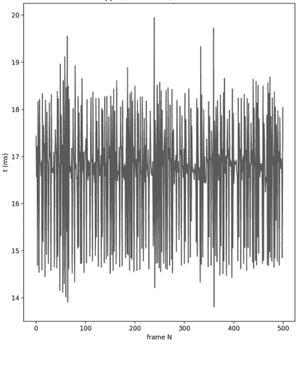

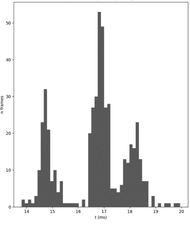

图 3.2 在左侧窗口中，帧持续时间（以毫秒为单位）对帧编号作图，我们看到每帧都接近 17 毫秒。在右侧窗口中，我们可以看到左图中数值的直方图

一般来说，警告信息并不意味着你的实验无法运行，但它们确实提供了可能影响脚本性能的有用信息。在这种情况下，丢帧可能意味着刺激呈现的时序不如预期的准确。如果时序在你的实验中很重要，请务必检查！

## 3.5 绘制形状

抱歉，这一节不是关于舞蹈动作的。而是关于制作另一种有用的刺激：基本形状。在 PsychoPy 中，简单形状（如圆形和矩形）在 visual 模块中实际上有自己的类。更复杂的形状可以通过给定一组顶点来创建，这意味着只要你了解顶点，实际上可以制作无限多种形状。试试这个：

```
from psychopy import visual, core

# 创建一个用于绘制内容的窗口
win = visual.Window(size=[1024, 768], fullscr=False,
    units='pix', color=(0,0,0), colorSpace='rgb',
    screen=0)

# 创建一个文本框
textbox = visual.TextBox2(
    win,
    text='Hello world',
    pos=(0, 0),
    letterHeight=20,
```

## 44 创建和呈现刺激物

```python
alignment='center'
)
```

```python
# 创建一些形状
circle = visual.Circle(win, size=20, pos=[-300, 0],
    lineColor='white', fillColor='lightGrey')
```

```python
square = visual.Rect(win, size=[20, 20], pos=[0, 0],
    lineColor='white', fillColor='hotpink')
```

```python
arrowVert = [(-40,5), (-40,-5), (-20,-5),
    (-20,-10), (0,0), (-20,10), (-20,5)]
```

```python
arrow = visual.ShapeStim(win, vertices=arrowVert,
    fillColor='darkred', lineColor='red',
    size=2, pos=[300, 0])
```

```python
# 绘制你的形状
circle.draw()
square.draw()
arrow.draw()
```

```python
# 绘制文本框
textbox.draw()
```

```python
# 翻转窗口（使刺激物可见）
win.flip()
```

```python
# 暂停窗口
core.wait(2)
```

很好！请注意，即使我们的窗口处于RGB色彩空间，我们仍然可以使用命名颜色（例如“hotpink”和“red”），因为无论窗口的colorSpace如何，这些颜色都会被识别。

现在，如果你按照我们上面的顺序绘制了形状和文本框，你可能已经注意到粉色方块覆盖了“Hello world”文本。这一点很重要：你对每个对象调用`.draw()`方法的顺序将决定它们的绘制顺序。后绘制的刺激物会覆盖在先绘制的刺激物之上。如果你希望重叠的刺激物仍然半可见，你可以使用`opacity`参数来操作每个图像的透明度，该参数接受一个介于0（完全透明）和1（完全不透明）之间的值。尝试将方块的透明度设置为0.5，再次运行脚本，看看会发生什么！

## 3.6 呈现图像

只要拥有适当格式的图像，就可以像绘制任何其他刺激物一样绘制图像。PsychoPy支持所有常见的图像格式（tiff、png、jpeg、bmp等）。找一张图像，在我们的示例中，我们将使用beach.jpg。图像使用`visual`模块中的`ImageStim`类创建，如下所示：

```python
# 创建图像刺激物
beach = visual.ImageStim(win, image='beach.jpg',
                        flipHoriz=True, pos=(0, 200), size=(200, 140))
```

将上述代码添加到你的脚本中（在创建形状之后，但在绘制它们之前）。选择图像大小时，通常需要保持原始图像的宽高比，这样在呈现时才不会被压扁或拉伸。如果我们不提供`size`参数，将使用原始图像大小。

接下来，在你的脚本中添加对`ImageStim`的`draw`方法的调用。你可以将其放在形状的绘制调用之后：

```python
# 绘制图像刺激物
beach.draw()
```

如果你运行脚本，图像应该会显示在你的屏幕上！

### 3.6.1 使用NumPy数组为图像添加蒙版

有时你想在呈现图像之前对其进行操作。操作图像最简单的方法可能是应用蒙版。使用`ImageStim`创建的图像可以应用各种类型的蒙版。默认情况下，`mask`属性设置为`None`。然而，我们可以考虑以下蒙版之一：

- 命名蒙版：'circle'、'gauss'或'raisedCos'。
- 图像名称。蒙版图像应与原始图像大小相同。蒙版图像的黑色部分将完全遮盖原始图像，白色部分将使图像可见，而灰色阴影将产生介于两者之间的效果。这对于以不同的alpha级别（alpha有效地逐像素确定图像的透明度）对图像的特定区域应用蒙版非常有用。
- 一个NumPy数组，范围从-1（图像像素完全透明/不可见）到1（图像像素完全不透明/可见）。

NumPy和视觉噪声已经在第一个“制造一些噪声”章节中介绍过。现在是一个绝佳的机会，通过为我们的图像创建蒙版来应用这些技能！

确保在脚本开头导入了numpy。然后你需要创建一个包含-1到1之间随机值的NumPy数组。该数组应与你的图像具有相同的形状（宽度和高度），然后可以用作`ImageStim`的`mask`参数。

在脚本顶部导入NumPy：

```python
# 导入numpy库
# 在本例中，它被称为np
import numpy as np
```

然后，将你之前创建`ImageStim`的行替换为以下内容：

```python
# 创建一个伪随机数数组，
# 其大小与ImageStim匹配。
myMask = np.random.rand(200,140)
# 将数字从范围[0到1]
# 转换为范围[0到2]。
myMask = myMask * 2
# 将数字从范围[0到2]
# 转换为范围[-1到1]。
myMask = myMask - 1
```

```python
# 创建图像刺激物 - 应用蒙版
beach = visual.ImageStim(win, image='beach.jpg',
    flipHoriz=True, pos=(0, 200), size=(200, 140),
    mask=myMask)
```

现在，当你运行脚本时，你应该会看到应用了噪声蒙版的图像。通过创建一个值范围从-1到1的蒙版，你已经操作了每个像素的alpha值。alpha为-1的像素完全透明，alpha为1的像素完全不透明。

### 3.6.2 使用Python Imaging Library模糊图像

呈现图像时，你可能希望以各种方式操作图像。例如，我们可能希望模糊图像质量，并观察这如何影响视觉搜索或图像识别。在Python中，我们可以使用名为Python Imaging Library或**PIL**的外部包来操作图像。（PIL由Fredrik Lundh及其贡献者维护，直到2011年；自2010年以来，一个名为**Pillow**的分支由Alex Clark及其贡献者维护。）PIL是独立版PsychoPy的一部分，但如果你使用的是其他开发环境，则需要在继续本节之前安装它。（请参阅https://python-pillow.org，然后按照链接到文档页面获取安装说明。）

首先，你需要从PIL导入几个类，因此将其与导入一起添加到脚本顶部：

```python
from PIL import Image, ImageFilter
```

接下来，我们想要打开图像并应用高斯滤镜。

```python
# 打开原始图像
oriImage = Image.open('beach.jpg')
```

```python
# 应用高斯模糊滤镜
gaussImage = oriImage.filter(
    ImageFilter.GaussianBlur(50))
```

这里，50对应于模糊级别，具体来说是应用的模糊半径。然后你可以直接将`gaussImage`输入到`ImageStim`中：

```python
# 创建图像刺激物 - 使用模糊图像
blurry_beach = visual.ImageStim(win, image=gaussImage,
    flipHoriz=True, pos=(0, -200), size=(200, 140),
    mask=None)
```

一如既往，将`blurry_beach.draw()`添加到你的绘制命令集中，以便看到模糊的海滩。

Python对实验心理学家的一个常见用途是生成实验刺激物。如果你想创建一组具有不同模糊级别的图像，可以使用上述代码的变体。要保存每个模糊图像，可以使用其`save`函数：

```python
# 保存此图像
gaussImage.save('blurry_beach.jpg')
```

你甚至可以使用循环来生成大量图像，我们稍后将学习这一点。

## 3.6 创建多个刺激物

在某些情况下，我们希望同时在屏幕上呈现多个刺激物。例如，视觉搜索任务可以在屏幕上呈现大量字母，其中一个目标字母（“L”）嵌入在许多干扰项（“T”）中。

现在，我们知道如何使用`TextBox2`创建一个字母（如果忘记了，请参见第3.4节）。理论上，我们可以多次复制粘贴这个字母，并手动编辑每个`TextBox2`实例的位置使其不同。然而，这实际上效率不高，需要大量手动工作，并且会导致代码丑陋且难以维护（编辑50行刺激物位置并不快！）。为了更高效地实现这一点，我们需要知道两件事：如何将刺激物设置为随机位置以及如何使用循环。

### 3.6.1 在随机位置创建刺激物

将刺激物设置为随机位置是练习使用NumPy库的另一个机会。NumPy有许多可用于随机化的函数，包含在其`random`模块中。这些包括`shuffle`（打乱列表中元素的顺序）、`choice`（从列表或数组中随机选择一个元素）和`randint`（生成指定值之间的随机整数）。使用`randint`，我们将能够为水平（x）和垂直（y）坐标创建一个随机值，但在已知的范围内。要将刺激物的位置设置为随机位置，我们可以使用：

```python
# 从模块中导入命名方法
from numpy.random import randint

# 最小和最大坐标
min_xy = -200
max_xy = 200

# 生成伪随机位置
rand_pos = (randint(min_xy, max_xy),
            randint(min_xy, max_xy))
```

### 3.6.2 For 循环

在 Python 中，有多种方式可以将某件事重复特定次数。最简单的方法是使用 `range()` 函数。在我们练习不同的循环方法时，让我们从 `stimuli.py` 文件中创建一个单独的 `.py` 脚本。创建一个新文件并将其命名为 `loops.py`。尝试在脚本中输入以下内容并运行，看看会发生什么：

```python
for i in range(0, 5):
    print(i)
```

希望你在输出窗口中看到数字 0、1、2、3、4 按顺序打印出来。请注意，这不包括数字 5，因为 `range` 从起点（0）计数到不包含的终点（5）。这在索引数字的上下文中是有意义的：一个包含五个项目的列表的索引是 0、1、2、3 和 4：这正是 `range` 生成的数字！

你可以稍微简化上面的代码，依靠 `range` 的默认起点。由于默认起点是 0，你只需输入：

```python
for i in range(5):
    print(i)
```

`range` 函数创建一个 range 实例。虽然它与列表不完全相同，但就我们当前的目的而言，你可以将其视为类似于列表。在 Python 中，我们可以遍历任何“可迭代”的对象，例如 range、列表和包含多个元素的对象。尝试以下代码：

```python
for letter in 'abc':
    print(letter)
```

希望你在输出窗口中看到打印出的 “a”、 “b” 和 “c”。字符串包含多个字符，因此它是可迭代的，循环的每次迭代对应一个字符。现在尝试这个：

```python
for animal in ['cat', 'dog', 'mouse']:
    print(animal)
```

希望你在输出窗口中看到打印出的 “cat”、 “dog” 和 “mouse”。列表也包含多个元素，因此它是可迭代的，循环的每次迭代对应列表中的一个元素。

在目前的示例中，你遍历的是值。也可以同时获取每个值的索引号。你可以通过使用 `enumerate` 函数来实现：

```python
for i, animal in enumerate(['cat', 'dog', 'mouse']):
    print(i, animal)
```

希望你看到：

```
0 cat
1 dog
2 mouse
```

使用 `enumerate`，你可以在 `for` 循环的每次迭代中同时获取当前元素的索引和值。在我们当前的示例中，我们实际上不需要 `enumerate()` 函数，但了解它通常非常有用！

你可能有一个疑问，在这些循环情况中 “i 是什么？” 答案是，`i` 通常用作表示 `for` 循环中索引号的变量。然而，这只是一个约定。你为变量选择的名称完全是任意的，你可以将其设为你想要的任何名称：

```python
for henk, animal in enumerate(['cat', 'dog', 'mouse']):
    print(henk, animal)
```

它的行为方式相同，但现在 `i` 被称为 `henk`。这里的关键是使用一个对你、未来的你以及未来与你分享代码的人来说有意义的值。考虑到这一点，你可以考虑采用典型的约定，即使用 `i`，然后在嵌套的 `for` 循环中使用 `j`：

```python
for i in range(3):
    for j in range(5):
        print(i, j)
```

### 3.6.3 缩进

在 Python 中，缩进是代码不可或缺的一部分。没有它，`for` 循环和其他功能将无法工作。例如，尝试以下代码：

```python
for i in range(5):
print(i)
```

如果一切顺利，那么一切都不顺利，你看到了以下错误消息：

```
IndentationError: expected an indented block
```

这表明我们缺少所需的缩进，从而产生了错误消息。现在尝试以下代码：

```python
for i in range(5):
    print(i)
    print('loop complete')
```

这没有产生错误消息，但你看到短语 “loop complete” 在每次循环中都被打印出来。这可能不是代码的本意，相反，程序员一定是忘记了取消缩进那一行。他们可能想写的是这个：

```python
for i in range(5):
    print(i)

print('loop complete')
```

一个“缩进”可以用制表符或空格表示（通常人们每个缩进使用四个空格）。使用哪种取决于你的偏好和/或你的代码编辑器的设置。虽然缩进通常被认为是个人偏好的问题，但有些事情你应该考虑。

首先要知道的是，你**永远不应该混合使用缩进类型**。使用制表符或空格，但绝不要在同一个代码中同时使用两者。这会导致错误（“TabError: inconsistent use of tabs and spaces in indentation”）。此外，Python 增强提案 666（www.python.org/dev/peps/pep-0666/）建议，那些混淆缩进的人应该被电击棒电击。

Python 增强提案（PEP 8，www.python.org/dev/peps/pep-0008/#tabs-or-spaces）提供了一个更温和的准则，建议优先使用空格。这是由 Python 的原始创建者 Guido van Rossum 撰写的。虽然这可能是你想遵循的权威，但你也可以把整个风格指南扔进垃圾桶，只做你喜欢的事。简而言之，风格指南和约定提高了代码的可读性，但它们不是强制性的。（关于未遵循风格指南的例子，看看这本书就行了。我们不一致地使用 `under_score` 和 `camelCase` 变量名，就像野蛮人一样！）

Python 将处于不同缩进级别的代码读取为单独的块。在每一行之前包含的每个缩进，你实际上将其嵌套在前面的行中。尝试预测以下代码将打印什么：

```python
for i in range(5):
    for letter in 'abc':
        print(i, letter)
```

在当前状态下，它将打印：

```
0 a
0 b
0 c
1 a
1 b
1 c
2 a
2 b
2 c
3 a
3 b
3 c
4 a
4 b
4 c
```

这是因为数字对应于外层循环的值 `i`，字母对应于内层循环的值 `letter`。你可以看到我们这里有两个嵌套块，一个对应于第一个（外层）循环，另一个对应于第二个（内层）循环。

### 3.6.4 While 循环

另一种循环方法是持续进行，直到达到某个“条件”。例如，想象我们想不断向列表添加内容，然后一旦列表达到我们想要的长度就停止：

```python
# 创建一个空列表
myList = []

# 使用 while 循环持续进行，直到满足条件
while len(myList) < 10:
    myList.append('na')

print(myList)
print('BATMAN!')
```

好的，我们本可以只使用一个迭代十次的 `for` 循环。`while` 循环在这里没有提供任何好处，但这只是一个介绍。当你不知道需要多少次迭代，但知道退出条件时，`while` 循环很方便。例如，想象你想持续一段固定的时间，而不是特定的迭代次数：

```python
from psychopy import core

# 创建一个时钟
clock = core.Clock()
# 创建一个整数用作计数器
a = 0

# 让循环持续 3 秒
while clock.getTime() < 3:
    # 递增计数器
    a += 1

print(a)
```

小心使用 `while` 循环。首先，在上面的例子中，你会注意到计数器（`a`）的打印值非常高！（Rebecca 的计算机运行了 947097 次迭代，而 Edwin 的计算机更是达到了 4341881 次。你的计算机表现更好吗？）如果我们尝试在 `while` 循环的每次迭代中打印一些内容，你的 PsychoPy 可能会因为要打印的数据量过大而变得无响应。

另一个（也是更重要的！）需要小心使用 `while` 循环的原因是，很容易意外地陷入无限循环。当退出条件永远无法满足时，就会发生这种情况。例如，让我们想象我们正在抛硬币，我们想持续循环直到得到“正面”：

```python
from numpy.random import choice

# 一个包含两个值的列表
coin = ['heads', 'tails']

# 开始时没有结果
result = None

# 创建一个整数来计算抛硬币的次数
nTries = 0

# 持续进行，直到得到“正面”结果
while result != 'heads':
    # 抛硬币
    result = choice(coin)

    # 递增尝试次数
    nTries += 1

# 打印计数器
print(nTries)
```

多次运行示例，看看每次运行多少次迭代。在我们运行代码之前，我们实际上不知道需要多少次迭代才能得到“正面”结果。

现在想象和你那个狡猾的朋友 Dave 一起玩。在别人不知情的情况下，他有一枚加重的硬币；而且他总是热衷于打赌它会连续至少十次落在反面。Dave 最近学会了如何编码，并希望继续他的骗局用 Python 实现。他写了以下代码：

```python
from numpy.random import choice

# 一个包含两个值的列表
```

### 3.6.5 使用循环生成多个刺激

回到手头的任务，你现在可以返回到你的 `stimuli.py` 文件，将 `loops.py` 文件暂时放在一边。我们需要两个循环来实现制作多个刺激并同时绘制它们的目标。首先，我们需要一个循环来创建我们的刺激列表：

```python
# specify the minimum and maximum xy coordinates
min_xy = -200
max_xy = 200

# how many letters we want
nLetters = 5

# an empty list (our letters will be added to this)
myLetters = []
```

```python
# a loop that repeats nLetters times
for i in range(nLetters):
    # generate a pseudo-random location
    rand_pos = (randint(min_xy, max_xy),
                randint(min_xy, max_xy))
    # make a textbox for the random location
    randloc_textbox = visual.TextBox2(
        win,
        text='T',
        pos=rand_pos,
        letterHeight=20,
        alignment='center'
    )
    # add the textbox to the list
    myLetters.append(randloc_textbox)
```

然后，我们不需要只调用一次 `.draw()`，而是需要遍历刺激列表来绘制每个元素：

```python
# loop through the list of letters to draw them
for letter in myLetters:
    letter.draw()
```

就这样，大量刺激被一次性绘制出来。尝试使用更大的数字，希望你现在能看到循环在减少制作多个刺激所需时间方面的巨大价值。

### 3.6.5 元素数组刺激

如果你尝试了前面的例子，并使用了非常大的刺激数量，你可能已经注意到这给你的计算机带来了一些压力。也许你甚至在输出中收到了关于丢帧的警告！这第一种方法当然是循环的一个很好的入门，它通常适用于数量较少且多样的刺激。然而，有一种更有效的方式来显示一组刺激。

这种方法是使用 `ElementArrayStim`，它允许你指定多个刺激同时绘制，而不会丢帧。其工作原理是通过指定大量形状相同（例如，一个正方形）但在某些参数（如方向、大小或位置）上有所变化的对象。你可以指定一个特定的形状或图像作为纹理。例如：

```python
# specify the number of stimuli to use
nStim = 100
# generate a list of random coordinates
xys = []
for i in range(nStim):
    xys.append([randint(-200, 200),
                randint(-200, 200)])
```

```python
# make an element array stim
multiStim = visual.ElementArrayStim(win,
    elementTex='beach.jpg',
    elementMask=None,
    nElements=nStim,
    sizes=[20, 20],
    xys=xys)
```

这将创建一个包含100张海滩图片的刺激数组，每张图片都在随机位置。你可以通过一次调用 `multiStim.draw()` 来绘制所有100张图片。更酷的是，你可以一次性更改 `ElementArrayStim` 中所有元素的属性！例如，尝试：

```python
# repeat 5 times
for i in range(5):
    # list of random values ranging from 1
    # to and 360, with length nStim
    oris = randint(1,360,nStim)

    # use the list to set the orientations
    # of elements in multiStim
    multiStim.setOris(oris)

    # draw the stimulus
    multiStim.draw()
    win.flip()
    core.wait(1.0)
```

如果一切顺利，你看到了许多海滩，并且每个海滩连续改变了五次方向。如果你想要更混乱的显示，可以将重复次数改为50，等待时间改为0.1。

如果你是一位对随机点运动图感兴趣的视觉科学家，`ElementArrayStim` 可能对你来说是一个很有吸引力的类。你会很高兴地知道，`DotStim` 类就是为此目的而设计的，它允许你控制点运动的更多方面。

## 3.7 通过帧来计时视觉刺激

我们提到过，我们呈现刺激的持续时间本质上受到显示器帧率的限制；呈现半帧是不可能的！因此，`core.wait()` 方法并非万无一失。我们可能会写 `core.wait(0.02)`，但在60赫兹的显示器上，这实际上会呈现33毫秒，而不是20毫秒。哎呀！

要通过帧来呈现刺激，我们可以运用我们新学的 `for` 循环知识。只是这一次，我们不是遍历试验，而是遍历帧。想象一下，你有一种不成熟的幽默感，想呈现一组字母T，持续420毫秒。在60赫兹的显示器上，这相当于60帧/秒 * 0.42秒 = 25.2帧。正如我们讨论过的，呈现部分帧是不可能的，所以我们需要将呈现时间四舍五入到最接近的整数。（你也可以根据自己的偏好一致地向上或向下取整。）

要计算呈现刺激所需的帧数，并计算我们会偏差多少，我们可以使用：

```python
# the intended stimulus duration in seconds
desired_time = 0.420

# monitor frame rate
framerate = 60
# compute the time per frame in seconds
frametime = 1.0 / framerate

# total frames required to get close to desired times
nFrames = round(desired_time*framerate)

# print how far off we will be
print('Stimulus will be presented for {} frames'.format(
    nFrames))

print('Actual time will be {:.3f} seconds'.format(
    nFrames*frametime))
```

然后，我们可以在一个循环中使用这个帧数来呈现我们的刺激。所以，代替：

```python
for letter in myLetters:
    letter.draw()

win.flip()
core.wait(0.420)
```

我们可以使用：

```python
# run through the desired number of frames
for frameN in range(nFrames):
    # draw all letters
    for letter in myLetters:
        letter.draw()
    # show the letters
    win.flip()
```

注意这里，我们用一个遍历一定帧数的 `for` 循环替换了 `core.wait(0.420)`。通过这种方式，我们知道刺激呈现的确切时间，从而能更好地控制计时。

我们还使用了一个 `for` 循环在每一帧绘制所有刺激。另一种方法是使用 `.setAutoDraw()` 函数。这允许我们自动绘制刺激：`.setAutoDraw(True)` 实际上意味着“在每次 `win.flip()` 时持续绘制，直到我另行指示”。你可以通过调用 `.setAutoDraw(False)` 来停止自动绘制。使用这种方法，我们实际上不必一直调用 `.draw()` 方法。在我们的脚本中，我们会使用：

```python
# set all the letters to automatically draw
# on every screen refresh
for letter in myLetters:
    letter.setAutoDraw(True)

# flip the window for the desired number of frames
for frameN in range(nFrames):
    win.flip()

# stop auto-drawing the letters
for letter in myLetters:
    letter.setAutoDraw(False)
```

## 3.8 制作动态刺激

既然你知道如何将刺激呈现特定的帧数，接下来我们可以做的一件很酷的事情就是逐帧改变它们的属性。通过这种方式，我们可以让事物在时间上动态地移动、增长和旋转。让我们回到一个单一的刺激，而不是大量的刺激。制作一个基本的圆形：

```python
# make a circle
circle = visual.Circle(win, size=20,
    pos = [-500, 0], lineColor='white',
    fillColor='lightGrey')
```

你可以在创建Python实例后通过专门命名该属性来更改它们。例如，`circle.size=80` 会将大小属性更新为80。一些对象有内置在类本身中的方法。PsychoPy中的一些例子包括：

- `circle.setPos()` 用于设置圆的位置
- `circle.setSize()` 用于设置圆的大小
- `circle.setFillColor()` 用于设置圆的填充颜色

在PsychoPy的类中，更改刺激属性也会改变它们在屏幕上的外观。如果你想让新创建的圆在屏幕上移动，你可以通过每帧更新其位置来实现：

```python
# specify the total frames we want to present
nFrames = 100

# how many pixels to move per frame
pixels_per_frame = 10
```

## 3.9 注释（再说一次）

你的脚本正逐渐变得更长、更复杂，因此现在是强调**注释**重要性的好时机。正如你所见，注释是被 Python 忽略的一行或多行文本。你可以将它们作为给自己或其他人（可能在某个时候使用你的脚本的人）的小笔记添加进去。

**在编写代码时，你可能自信能记住自己做了什么以及为什么这样做。但你不会记住。** 即使代码就在眼前，你也会发现自己盯着屏幕，疑惑自己到底做了什么。

这将是一段非常令人沮丧的经历，原因有三：

1.  你有一段能工作的代码，想稍微修改一下。这应该很容易，不会花太多时间：这是你写的！然而，没有注释的话，你实际上完全不知道代码在做什么。现在你需要花大量时间重新理解它。
2.  因为你无法完全弄清楚自己*究竟*做了什么，你会对编写代码时可能做了什么/为什么这样做做出假设。这使你更容易犯错，并导致脚本出错和/或需要大量调试工作。
3.  你意识到自己过去以一种非常聪明的方式实现了某些功能，而你现在却难以理解。这让你意识到自己的认知能力在不断下降。而且，由于你未加注释的代码才几周前写的，你意识到这种下降非常迅速。你正在快速变老。

**不给代码添加注释，你将面临挫败感、可能出错的脚本，以及对自己生命有限的不愉快认识。**

注释会使脚本变得更长，尽管它们没有任何额外的功能。然而，注释能确保你在几周、几个月或几年后仍然能理解自己的代码。这将*大大*节省时间！（完全值得花时间输入注释！）

# 4 处理反应

心理学和认知神经科学中几乎每一个基于计算机的实验都要求参与者以某种方式做出反应。收集这些反应最常见的工具是计算机键盘。在接下来的章节中，你将学习如何收集和处理按键反应。

## 4.1 外设足够精确吗？

一些研究者声称键盘对于他们的目的来说太慢了，因为他们需要“毫秒级的精度”。因为了解你的工具很重要，本章将探讨这一说法。

在大多数操作系统中，**外设**（键盘、鼠标、操纵杆、游戏控制器等）以特定的速率被**轮询**。轮询设备意味着检查其状态：是否有任何键或按钮被按下，或者是否有沿任何轴的移动？轮询速率决定了操作系统检查新输入的频率。如果轮询速率是 60 Hz，键盘大约每 17 毫秒被检查一次。如果一个键在最后一次“轮询”后 2 毫秒被按下，它需要再等 15 毫秒才能被检测到。

传统上，键盘和鼠标的轮询速率是 60 Hz，与标准的显示器刷新率相匹配。这是有道理的：如果显示器每 17 毫秒才更新一次，为什么要更频繁地检查输入呢？输入是用来更新显示器的，因此在每次显示器刷新时轮询设备两次会导致一次冗余的轮询。

举个例子：想象一下，在时间 0 毫秒（这与最新的屏幕刷新重合）时，你的鼠标位于屏幕坐标 (10,10)。现在你移动鼠标，它以 120 Hz 的速率被轮询。鼠标在时间 8 毫秒时被记录在点 (15,15)，在时间 17 毫秒时被记录在点 (20,20)。显示器在时间 17 毫秒时更新，显示鼠标光标位于坐标 (20,20)。时间 8 毫秒的数据在更新显示器时被忽略，因为它是旧数据。这意味着以高于显示器刷新率的速率轮询鼠标实际上是无效的。

显然，想出这个方案的工程师们很有效率，但不是研究心理学家。如果你对人类工效学感兴趣，并希望看到高分辨率的鼠标轨迹，你还能使用标准的计算机外设吗？

大多数现代外设通过 USB 连接。大多数操作系统以 125 Hz（每 8 毫秒）的速率轮询 USB 端口。这意味着你将有平均 4 毫秒的计时误差。一些额外的误差来自于进一步的延迟，例如，来自输入设备的信号必须传输到计算机，以及计算机内部确保输入到达你的实验软件的处理过程。

这种不精确性可以通过使用更频繁轮询 USB 端口的软件（**驱动程序**）以及能够处理此操作的专用硬件来减少。一些消费级硬件和软件可以将轮询速率提升到（超过）1,000 Hz。这意味着每毫秒一个数据点！这类设备在游戏玩家中很受欢迎，他们认为如果键盘能快一两毫秒记录下他们的按键操作，他们或许就能避免在虚拟世界中被爆头。

有研究者认为，对于持续时间短暂的心理过程，根本无法在几毫秒的计时误差下进行研究。因此，他们购买昂贵的设备（通常以比 USB 更复杂的方式连接），这些设备具有极高的轮询速率，以实现毫秒或亚毫秒级的精度。

那么，他们是对的吗？原则上“是”，但实践中很可能“否”。就像计算机一样，参与者也并非没有计时误差。事实上，人们是如此不一致，以至于我们需要许多试次才能准确测量他们反应时间的分布。这种人类的计时误差远高于计算机外设的计时误差！这意味着**在大多数实验设计中使用键盘是完全没问题的**（Damian, 2010）。（更深入的讨论，请阅读引用的论文。）

## 4.2 键盘输入

既然你知道可以在实验中使用键盘，现在是时候探索如何实际操作了。从一个新的、空的实验开始：创建一个新文件夹并创建一个新脚本，我们称这个脚本为 "responses.py"。

在这个例子中，我们将在屏幕上向参与者呈现字母，并要求他们按下键盘上相应的键。首先，让我们在屏幕上呈现一个随机字母。我们知道如何呈现一个字母（第 3.4 节），我们甚至学会了如何使用 `randint`（你可能记得它是 NumPy 随机模块的一部分）将该字母的位置设置为随机位置。这次，我们将再次使用随机模块，但现在我们想从一个字母列表中随机选择一个字母，然后将其用于文本框的文本字段中。代码如下所示：

```python
# import modules
from psychopy import visual, core, event
from numpy.random import choice

# make a window
win = visual.Window([1024, 768], fullscr=False,
                    units='pix')

# make a list of vowels
vowels = ['a', 'e', 'i', 'o', 'u']

# randomly choose a letter from that list
this_letter = choice(vowels)

# make a textbox and use the selected letter in the text field
textbox = visual.TextBox2(
    win,
    text=this_letter,
    pos=(0, 0),
    letterHeight=20,
    alignment='center'
)

# draw the textbox
textbox.draw()
win.flip()
core.wait(2)
```

希望你看到了列表中的一个随机字母出现在屏幕上！好的，现在我们可以显示我们想要收集键盘反应的字母了。这意味着我们不想仅仅使用 `core.wait(2)` 将文本框显示两秒钟，而是希望将刺激保留在屏幕上，直到按键发生。

### 4.2.1 等待键盘输入

在 PsychoPy 中，有两种收集键盘反应的方法。第一种方法简单，但对于反应时间测量来说不是最精确的。这种方法使用 PsychoPy 的 event 模块，因此请将 event 添加到你从 PsychoPy 导入的模块中。然后，我们将不再使用 `core.wait(2)`，而是用一个等待按键事件的命令来替换它：

```python
# wait for a keypress event
keys = event.waitKeys(keyList=['a', 'e', 'i', 'o', 'u'])
print(keys)
```

使用 `event.waitKeys(keyList=['a', 'e', 'i', 'o', 'u'])`，参数 keyList 指示要监视的按键列表。如果我们不提供这个参数，PsychoPy 将响应任何被按下的键。如果你查看输出窗口，你应该能看到你刚刚按下的键的名称。

event 模块是监视按键事件的一种简单方法，但它不是收集反应时间的最佳选择。原因在于 event 模块中键盘的轮询与主线程是同步的，这意味着轮询发生在每次帧刷新时。另一件事是 event 模块只检测按键按下事件（当一个键被按下时）；有时监视按键释放事件（当一个键停止被按下时）也很有用。这使我们能够访问其他属性，例如按键持续时间或某个键是否当前正被按下（即，当按键按下事件发生，但按键释放事件尚未发生时）。监视按键反应的第二种方法是使用 hardware 模块。为此，我们首先在脚本开头添加另一个导入：

```python
from psychopy.hardware import keyboard
```

接着，我们创建一个Keyboard对象的实例：

```python
# 创建一个键盘实例
kb = keyboard.Keyboard()
```

最后，我们将之前的`event.waitKeys`替换为`kb.waitKeys`：

```python
keys = kb.waitKeys(keyList = ['a', 'e', 'i', 'o', 'u'])
print(keys)
```

其行为可能与之前的方法感觉相同。然而，这次输出到你输出窗口的信息，与上次方法中看到的按键名称相比，可能显得不那么直观。返回的输出会是：

> [<psychopy.hardware.keyboard.KeyPress object at 0x000002C8BC074100>]

这是一个列表（我们可以通过外层的方括号判断）；然而，这是一个包含PsychoPy对象的列表。这个对象是一个KeyPress对象。为了进一步探究，我们可以尝试以下操作：

```python
print(dir(keys[0]))
```

注意，我们需要使用`keys[0]`来索引列表中的第一个KeyPress对象。`dir()`方法允许我们检查特定Python对象可用的属性和方法。在这种情况下，输出会如下所示：

```
['__class__', '__delattr__', '__dict__', '__dir__', '__doc__',
'__eq__', '__format__', '__ge__', '__getattribute__', '__gt__',
'__hash__', '__init__', '__init_subclass__', '__le__', '__lt__',
'__module__', '__ne__', '__new__', '__reduce__', '__reduce_ex__',
'__repr__', '__setattr__', '__sizeof__', '__slotnames__', '__str__',
'__subclasshook__', '__weakref__', 'code', 'duration', 'name', 'rt',
'tDown']
```

这里有许多以单下划线开头的方法；这通常被开发者用来表示该方法是供内部使用的，而不是供用户使用的。值得注意的是，我们看到了几个与我们相关的属性：

-   Name：被按下的键的名称。
-   rt：按键响应时间，相对于Keyboard实例内时钟上次重置的时间。
-   duration：按键事件的持续时间（即从按下键事件到释放键事件的时间）。
-   tDown：按下键事件相对于全局时钟的时间。

根据这些信息，我们知道可以使用以下方式返回被按下的键的名称和该按键的响应时间：

```python
print(keys[0].name, keys[0].rt)
```

### 4.2.3 理解键盘响应时间的“零点”

在心理学实验中，我们通常向参与者呈现一系列事件，而不仅仅是一个字母。例如，我们可能先呈现一个注视点，然后呈现一个字母。考虑你希望在实验中将响应时间的零点设置在哪里非常重要。在我们的例子中，我们先呈现一个注视点，然后呈现一个字母。我们是希望反应时间相对于字母的出现时间？还是希望允许参与者在字母出现之前就做出响应？如果是后者，那么零点将是注视点的出现时间。为了说明这一点，让我们通过创建第二个文本刺激，在我们的实验中添加一个简单的注视十字。

```python
# 创建一个注视十字
fixation = visual.TextBox2(
    win,
    text='+',
    pos=(0, 0),
    letterHeight=20,
    alignment='center'
)
```

并在我们的字母出现之前提前绘制它1秒钟：

```python
# 绘制注视点1秒钟
fixation.draw()
win.flip()
core.wait(1)
```

```python
# 绘制文本
textbox.draw()
win.flip()
```

```python
# 等待响应
keys = kb.waitKeys(keyList = ['a', 'e', 'i', 'o', 'u'])
```

我们需要思考我们希望响应时间从何时开始。此时，我们希望使用`kb.clock.reset()`重置时钟，并使用`kb.clearEvents()`清除键盘事件缓冲区中的任何先前事件。假设我们希望零点是注视点的出现时间。我们可以使用：

```python
# 绘制注视点
fixation.draw()
```

```python
# 重置键盘时钟
kb.clock.reset()
```

```python
# 清除事件缓冲区
kb.clearEvents()
win.flip()
```

但请记住，我们的视觉刺激实际上直到窗口真正翻转后才会物理可见。因此，为了更精确地重置时钟，我们可以使用：

```python
# 绘制注视点
fixation.draw()

# 重置键盘时钟（当窗口翻转时）
win.callOnFlip(kb.clock.reset)

# 清除事件缓冲区（当窗口翻转时）
win.callOnFlip(kb.clearEvents)
win.flip()
```

第二个例子使用了`win.callOnFlip()`函数。`win.callOnFlip()`会安排一个函数在窗口翻转时执行，而不是立即执行。这里，我们给它要安排的函数名称`kb.clock.reset`，后面没有`()`（这通常会立即执行该函数）。

除了设置零点，我们还想为`waitKeys()`方法添加一个额外的参数：

```python
keys = kb.waitKeys(keyList=['a', 'e', 'i', 'o', 'u'],
                  clear=False)
```

`clear`是一个参数，默认情况下设置为`True`，表示此时清除所有先前的事件。如果我们想捕获在开始等待之前发生的按键事件，这并不理想，因此我们设置`clear=False`。这意味着我们将捕获从使用`kb.clearEvents()`显式清除事件缓冲区的那一刻到脚本当前时刻的所有事件。

### 4.2.2 无需等待获取键盘输入

有时，我们可能有一个实验，希望在设定的时间内呈现刺激并捕获该时间内发生的键盘响应，但我们不想在每次试验结束时都暂停，直到按键发生。在这个例子中，我们使用一个我们已经学过内容的轻微变体：

```python
keys = kb.getKeys(keyList=['a', 'e', 'i', 'o', 'u'],
                  clear=False)
```

使用`getKeys()`而不是`waitKeys()`将捕获自事件缓冲区被清除以来发生的按键响应，但它不会在按键发生前暂停实验。现在，如果你只是尝试在现有脚本中将`waitKeys()`方法替换为`getKeys()`，你可能会收到一条错误消息（如果你按键不够快）：

```
print(keys[0].name, keys[0].rt)
IndexError: list index out of range
```

错误消息`list index out of range`意味着我们尝试索引一个列表（在本例中是`keys`）；然而，该列表不包含足够的元素供我们检索该索引处的内容，即`keys[0]`。如果你按键不够快，`keys`列表将是空的`[]`，这意味着它没有第零个元素，`keys[0]`将无法工作。因此，我们需要构建某种条件语句，仅在按键被按下时才打印。我们可以使用：

```python
if len(keys)>0:
    print(keys[0].name, keys[0].rt)
```

在Python中，`len()`方法返回列表的长度。在这种情况下，我们检查“我的`keys`长度是否大于0？如果是，打印按键名称和`rt`”。在这种情况下，我们可以使用的另一种稍微更简洁的方法是：

```python
if keys:
    print(keys[0].name, keys[0].rt)
```

当应用于列表时，这测试的是同一件事，即`keys`只有在列表包含元素时才会返回`True`。这些是If语句在实际应用中相当具体的初步示例；让我们在一个更简单的上下文-响应-反馈中练习使用If语句。

## 4.3 If语句

If语句是几乎所有软件的重要构建块。人们使用If语句来运行特定于特定场合的代码，例如在温度较低时（例如低于15摄氏度）打开房间的暖气，或在温度舒适时（例如高于20度）关闭暖气。你甚至可以加入第三个选项：当温度过高时（例如高于25度）打开空调。

在实验心理学中，当你希望实验在参与者响应正确时做一件事，而在响应不正确时做另一件事时，可以使用If语句。要亲眼看到这一点，请使用以下代码在呈现字母后收集你的按键响应：

```python
if keys and keys[0].name == this_letter:
    print('Correct!')
else:
    print('Incorrect')
```

你应该从布尔值章节中认出双“等于”符号（`==`）。它构成了程序员所说的条件语句，其结果总是一个布尔值。换句话说，结果只能是`True`或`False`，没有其他可能。因此，`keys[0].name == this_letter:`的意思是“如果变量`keys[0].name`的值与变量`this_letter`的值相同，则执行以下几行中的代码”。

以下几行中的代码由缩进决定：每行代码前的空格量（回想一下我们在

## 4.4 键入式响应

TextBox2 的一个实用之处在于，它不仅可以用来呈现文本，还可以用来收集键入的响应。要求参与者键入开放式回答会很有用。例如，想象我们向他们展示一张图片，然后要求他们回忆关于那张图片的所有记忆。我们知道如何展示图片（来自第3章），但如何收集键入的响应呢？TextBox2 有一个 `editable` 属性，它指示对象中的文本是否应由参与者编辑。如果设置为 True，参与者将看到一个可以编辑的文本框：

```
# 为反馈制作一些文本
textinput = visual.TextBox2(
    win,
    text='',
    pos=(0, 0),
    letterHeight=20,
    alignment='center',
    editable = True
)
```

现在，唯一的问题是，为了让参与者看到他们键入的文本动态变化，你不能只使用 `core.wait(2)` 来暂停屏幕；因为这实际上会暂停屏幕，我们将看不到动态变化的文本。这是另一个基于帧来呈现和更新刺激很重要的例子。所以，首先创建一个可编辑的文本刺激：

```
# 创建一个可编辑的文本框
textinput = visual.TextBox2(
    win,
    text='',
    pos=(0, 0),
    letterHeight=20,
    alignment='center',
    editable = True
)

# 设置文本框在每次 win.flip 时自动绘制
textinput.setAutoDraw(True)

# 我们呈现多少帧
nFrames = 300

# 绘制文本输入框
for frameN in range(nFrames):
    win.flip()
```

这样做的好处在于，因为你可以动态检查键入到文本框中的文本（在这种情况下通过检查 `textinput.text`），你可以持续检查键入字符串的特征。例如，你可能想显示字符计数或检查是否键入了关键词。让我们想象我们正在寻找关键词 "banana"，并且你希望在键入关键词时将文本颜色更改为绿色。稍微更新你的代码以监视关键词：

```
# 我们呈现多少帧
nFrames = 300
keyword = 'banana'

# 绘制文本输入框
for frameN in range(nFrames):
    # 检查键入的输入是否包含关键词
    if keyword in textinput.text:
        textinput.setColor('green')
    else:
        textinput.setColor('white')
    win.flip()
```

希望你看到一旦你键入单词 "banana"，你的文本就变成了绿色！

## 4.5 鼠标响应

虽然大多数心理学实验使用键盘作为响应方式，但鼠标响应有许多巧妙之处，可用于创建一些非常酷的实验。首先，鼠标响应（在 PsychoPy 中）也转换为触摸屏设备上的触摸响应。其次，鼠标响应不仅有点击行为，还有轨迹。这意味着你可以让事物跟踪鼠标，或存储鼠标的移动路径。第三，你可以使用鼠标创建酷炫的交互效果，例如悬停效果。要创建一个鼠标对象实例，我们可以使用 `event` 模块：

```
# 创建一个鼠标（它将默认使用 win）
mouse = event.Mouse()
```

然后让我们创建一个形状刺激：

```
# 创建一个形状来跟踪鼠标
square = visual.ShapeStim(win,
    vertices=[[20, 20], [-20, 20],
              [-20, -20], [20, -20]],
    fillColor='darkred',
    size=2,
    pos=[300,0],
    lineColor='red')
```

好的，让我们考虑如何让这个简单的正方形与我们的鼠标交互。

### 4.5.1 获取当前鼠标位置

获取当前鼠标位置很容易。你可以使用 `mouse.getPos()`，它将返回一个 (x,y) 对，表示窗口单位空间中的当前位置。尝试添加：

```
nFrames = 100
square.setAutoDraw(True)

for frame in range(nFrames):
    print(mouse.getPos())
    win.flip()
```

希望你在输出窗口中看到一对 (x,y) 坐标被反复返回；这表示当前的鼠标位置。现在我们知道可以获取鼠标位置，我们可以让正方形跟踪鼠标。例如：

```
# 设置正方形位于鼠标的位置
for frame in range(nFrames):
    square.setPos(mouse.getPos())
    win.flip()
```

或者，我们可以检查鼠标是否悬停在某个东西上。试试这个：

```
for frame in range(nFrames):
    if square.contains(mouse.getPos()):
        square.setColor('green')
    else:
        square.setColor('darkred')
    win.flip()
```

`contains()` 方法存在于 `visual` 类中的大多数刺激中；如果给定的 (x,y) 坐标落在该刺激的边界内，它将返回 True。在这种情况下，我们检查了正方形中的当前鼠标位置。如果是，我们将正方形的颜色设置为绿色。否则，我们将正方形的颜色设置为红色。

### 4.5.2 检查鼠标按钮的状态

我们可能想要检查鼠标状态有几个不同的原因。首先，你的鼠标通常有三个按钮：左键、右键和中央滚轮（也可以用作按钮）。我们可以随时使用以下方法检查这些按钮的状态：

- `mouse.getPressed()`：这将返回一个包含三个元素的列表，指示鼠标当前是否被按下（1 表示按下，0 表示未按下）。
- `mouse.isPressedIn(x)`：这将返回一个二进制值，指示鼠标当前是否在对象 (x) 内被按下。

结合使用这些方法会非常强大。在简单层面上，我们可以在鼠标点击时结束一个试次/循环：

```
for frame in range(nFrames):
    if square.contains(mouse.getPos()):
        square.setColor('green')
    else:
        square.setColor('darkred')
    win.flip()

    # 如果鼠标被点击，则提前结束循环
    if sum(mouse.getPressed())>0:
        break
```

请注意，除非我们在循环结束时重置正方形的颜色，否则它将保持绿色（因为试次/循环在鼠标位于正方形内时结束）。接下来，我们可以让一个刺激在被点击时改变位置，这将是拖放任务的基础。例如，试试这个：

```
for frame in range(nFrames):
    # 如果鼠标在正方形内被按下
    if mouse.isPressedIn(square):
        # 设置正方形位于鼠标的位置
        square.setPos(mouse.getPos())
    win.flip()
```

这有效！但它有点笨拙，如果你移动鼠标太快，有时鼠标光标可能会“逃脱”形状，这使得拖动行为变得粘滞。相反，让我们试试这个：

```
# 一个布尔值，指示拖动是否当前正在进行
dragging = False

for frame in range(nFrames):
    # 如果鼠标在可拖动对象内被按下，拖动开始
    if mouse.isPressedIn(square):
        dragging = True

    # 如果拖动正在进行，将可拖动对象设置为鼠标位置
    if dragging:
        square.setPos(mouse.getPos())

    # 如果没有鼠标按钮被按下，拖动结束
    if sum(mouse.getPressed())==0:
        dragging = False

    win.flip()
```

在这个例子中，我们添加了更多代码，但它确实使行为更流畅。具体来说，我们结合使用 `isPressedIn()` 和 `getPressed()` 来确定 (a) 拖动何时开始（即鼠标在正方形内被按下时）和 (b) 拖动何时结束（即没有任何鼠标按钮被按下时）。记住 `getPressed()` 返回一个包含三个值的列表，当没有按钮被按下时，它将是 `[0, 0, 0]`（总和为 0，如果按钮被按下，总和最高可达 3）。

### 4.5.4 检查鼠标滚轮行为

有时我们可能希望参与者能够滚动一个刺激。为此，我们需要两样东西：我们的刺激（将被滚动）和我们的鼠标（将进行滚动）。我们可以获取自上次调用以来鼠标滚轮的移动量使用 `getWheelRel()`；这将返回一个 (x,y) 值，表示变化的方向（然而对于大多数标准鼠标，只有 y 坐标会变化）。正值表示向上移动，负值表示向下移动，零值表示没有移动。利用这一点，我们可以改变刺激物的位置：

```
# 正方形的起始 y 位置
squarey = 0
for frame in range(nFrames):
    # 获取当前鼠标方向并
    # 移动 10 像素 * 鼠标方向
    squarey += 10 * mouse.getWheelRel()[1]

    # 设置正方形位置
    square.setPos([300, squarey])
    win.flip()
```

在这个例子中，我们首先设置刺激物（正方形）的起始 y 坐标（`squarey`）；然后，我们获取鼠标滚轮沿 y 轴的方向 `mouse.getWheelRel()[1]`。我们将其乘以 10（这最终将是 10 像素乘以一个负值或正值）。然后，我们将这个值加到当前的 `squarey` 上，并使用这个更新的 y 值设置正方形的位置 `square.setPos([300, squarey])`。

## 4.6 将 While 循环与鼠标结合使用

我们在上一章介绍了 while 循环，并警告了它们潜在的危险（即陷入循环的风险）。然而，鼠标响应可能是一个适合使用 while 循环的好例子。让我们想象一下，我们希望持续呈现刺激物，直到鼠标进入正方形内部。在这种情况下，我们希望持续进行并持续检查，直到满足某个条件。为此，我们使用 while 循环。

```
while not square.contains(mouse.getPos()):
    win.flip()
```

在这个例子中，我们持续检查鼠标是否在正方形内。如果不在，我们继续。让我们把事情复杂化，在 for 循环中嵌套一个 while 循环。（你可以这样做。没人会阻止你。）例如，我们可能希望当正方形被触碰时，它会弹跳到一个随机位置，并且我们可能希望这样做十次：

```
from numpy.random import randint

# 重复 10 次
for i in range(10):
    # 当鼠标不在正方形内时
    while not square.contains(mouse.getPos()):
        # 翻转窗口（什么都不做）
        win.flip()
```

```
# 将正方形位置更改为随机
# 位置
square.setPos([randint(-200, 200), randint(-200, 200)])
```

在这个例子中，我们有一个 while 循环嵌套在 for 循环内。重要的是缩进级别。因为 `win.flip()` 相对于 while 循环缩进了一级，我们知道这个语句属于该循环。然后，因为 `square.setPos([randint(-200, 200), randint(-200, 200)])` 相对于 for 循环缩进了一级（与 "while" 同级），我们知道这将在 for 循环中执行。如果你在这里的缩进搞错了，例如在 while 循环中设置正方形位置，你很快就会知道，因为你会有一个跳跃非常快的正方形，在每一帧都改变位置！

太棒了！你现在应该了解了收集键盘响应、键入响应以及以各种方式使用鼠标的基础知识（以及一些更高级的技巧！）。你现在还有两个由各种技术组成的 Frankenstein 脚本，用于呈现刺激物（`stimuli.py`）和收集响应（`responses.py`）。此时，我们可能已经准备好将所有这些整合到一个实验中了！

## 制造一些噪音

欢迎来到另一个随机的插曲！在本章中，你将学习如何构建自己的声音，如何通过 PyGame 播放它们，以及如何将它们保存到文件中。这样做有两个好处。首先，你可以将你创建的文件展示给你的亲人，他们会为你感到骄傲！其次，你可以在创建文件时制造很多噪音。希望你是一名学生，在计算机实验室里工作，并且可以使用功能正常的扬声器。

### 什么是声音？

好问题！声音是由振动的空气（或水，或任何其他可以移动你耳膜的介质）引起的，这导致你耳朵中的 *鼓膜* 移动，最终在耳蜗中转化为神经活动。当某物每秒振动 20 到 20,000 次时，它会产生人类能听到的声音（尽管许多人无法同样好地听到整个频谱）。每秒的振动次数称为 **频率**。膜被拉伸的程度称为 **振幅**。

为了用你的电脑制造声音，你需要能够产生一个信号，该信号以一定的振幅上下波动，频率在每秒 20 到 20,000 次之间。

### 正弦波和噪声

你可能在中学数学中记得这样的信号。如果你不记得，这里有个剧透：它是一个 **正弦波**。你可以使用 NumPy 创建一个。为此，你需要一个介于 0 和 2π 之间的数字范围（即圆周率的两倍，大约 6.3）。你使用 2π，因为它是单个正弦波的宽度。NumPy 的 `sin` 函数可以将这个数字范围转换成实际的波形。在解释器中输入以下代码：

```
import numpy
```

```
# 创建一个介于 0 和 2 pi 之间的数字范围
x = numpy.arange(0, 2*numpy.pi, 0.01)
# 创建一个正弦波
sine = numpy.sin(x)
```

现在你已经创建了一个正弦波，你可以使用 Matplotlib 来可视化它：

```
from matplotlib import pyplot
```

```
# 绘制正弦波
pyplot.plot(x, sine)
pyplot.show()
```

看起来很酷，对吧？但还不够酷... 让我们制造一些真正的噪音！

```
# 创建一堆随机数
# （与正弦波长度相同）
noise = numpy.random.rand(len(sine))
```

```
# 比较正弦波和噪声
pyplot.plot(sine)
pyplot.plot(noise)
pyplot.show()
```

对于下一部分，让我们专注于正弦波来学习数字声音的基础知识。如果你看 y 轴，你可以看到正弦波的最大值是 1，最小值是 -1。这意味着它的振幅是 1。对于声音来说这有点低，所以你需要调整它。只需将正弦波乘以 16383，这应该足够高了：

```
sine = sine * 16383
pyplot.plot(x, sine)
pyplot.show()
```

波形看起来仍然一样，但 y 轴已经改变了：波形的振幅现在高多了！现在把你的注意力转向声音的频率。

当你创建 `x` 变量时，你使用了 NumPy 的 `arange` 函数。这创建了一个介于起点（0）和终点（2*pi）之间的数字范围，具有一定的步长。步长越大，波形中的点就越少。我们称这个点的数量为 **采样数**。让我们看看采样对波形形状的影响：

```
high = numpy.arange(0, 2*numpy.pi, 0.01)
mid = numpy.arange(0, 2*numpy.pi, 0.5)
low = numpy.arange(0, 2*numpy.pi, 2)
```

```
pyplot.plot(high, numpy.sin(high))
pyplot.plot(mid, numpy.sin(mid))
pyplot.plot(low, numpy.sin(low))
pyplot.show()
```

正如你所看到的，步长越大（因此采样数越少），正弦波的表示就越差。幸运的是，你的计算机有足够的计算能力来处理大量的采样，所以这应该不是问题。我们称每秒的采样数为 **采样率**，在高级系统上可以达到数百万！对于这个例子，我们将坚持使用 48,000，这几乎足以覆盖人类实际能听到的所有声音。

在脚本编辑器中打开一个新文件，并将其命名为 **make_sound.py**。为了使其工作，你需要导入一些库。NumPy 是其中之一，用于创建波形。要实际将它们转换成声音，你还需要另外两个：PyGame 和 wave。PyGame 主要用于游戏开发，但我们可以使用它的 mixer 模块。这允许你用 NumPy 创建的声波来制作声音。wave 是一个 Python 模块，允许你创建 .wav 文件。我们稍后会回到这一点。现在，只需将此放在脚本的开头：

```
import wave
import numpy
import pygame
```

首先，你应该定义你刚刚学到的常量：

```
# 最大声音振幅和采样率
MAXAMP = 16383
SAMPLERATE = 48000
```

你还需要设置声道数。让我们现在选择单声道，即一个声道。这将使所有扬声器发出相同的声音。

```
# 单声道
NCHANNELS = 1
```

现在你需要决定你的声音的长度和频率。让我们选择一个三秒钟、每秒 1,000 次振动（= 1,000 赫兹）的声音：

```
# 声音长度（秒）和频率（赫兹）
SOUNDLEN = 3.0
SOUNDFREQ = 1000
```

是时候进行一些快速计算了：如果你的声音长度为三秒，频率为 1,000 赫兹，这意味着你的声音将包含 3 * 1000 = 3,000 个周期：

```
# 计算总周期数
ncycles = SOUNDLEN * SOUNDFREQ
```

声音将以每秒 48,000 个采样进行采样，因此你的整个声音将由三秒 * 48,000 个采样 = 144,000 个采样组成。因此，在每个周期中，将有 144,000 个采样 / 3,000 个周期 = 每个周期 48 个采样（spc）。

```
# 计算总采样数
nsamples = SOUNDLEN * SAMPLERATE
# 计算每个周期的采样数
spc = nsamples / ncycles
```

既然你已经知道了每秒的样本数量，就可以计算每个周期的步长了。请记住，单个振动是由0到2*pi之间的数字构成的，而步长决定了波的表示方式。让我们来创建这个范围和对应的正弦波：

```python
# 步长是周期内样本之间的距离
# （将范围除以每个周期的样本数）
stepsize = (2*numpy.pi) / spc
# 创建一个0到2*pi之间的数字范围
x = numpy.arange(0, 2*numpy.pi, stepsize)
# 根据这个范围创建正弦波
sine = numpy.sin(x)
```

下一步是增大正弦波的振幅：

```python
# 增大正弦波的振幅
sine = sine * MAXAMP
```

既然你已经创建了一个周期（即一次振动），你可以简单地重复它来创建更长的声音。毕竟，声音不过是一系列振动的组合！要重复声音，你可以使用NumPy的tile函数。它允许你提供一个数组（你的正弦波）和你希望重复的次数（一个整数）：

```python
# 重复正弦波！
allsines = numpy.tile(sine, int(ncycles))
```

如果你想看看这是否有效，只需绘制它：

```python
from matplotlib import pyplot
pyplot.plot(numpy.tile(sine, 4))
pyplot.plot(numpy.tile(sine, 2))
pyplot.plot(sine)
pyplot.show()
```

### 数字转声音

你现在拥有一个包含3,000个周期的波形数组。整个数组包含144,000个数字，代表一个频率为每秒1,000个周期、持续三秒的声音。这很了不起。是时候将这个表示转换成实际的声音了！

要制作声音，你可以使用PyGame的mixer模块。它能方便地将NumPy数组（比如你刚刚创建的allsines向量）转换成一个mixer.Sound实例。你需要先初始化mixer模块：

```python
# 初始化mixer模块
# （它需要采样率和通道数）
pygame.mixer.init(frequency=SAMPLERATE, channels=NCHANNELS)

# 现在用allsines向量创建一个声音
tone = pygame.mixer.Sound(allsines.astype('int16'))
```

你可能对`allsines.astype('int16')`这部分感到困惑。它将`allsines`中的所有数字转换为16位整数，这是PyGame所需的格式。

要播放声音，使用它的play方法：

```python
# 播放正弦波声音
tone.play()
```

运行脚本（如果你还没运行的话），享受你亲手制作的美妙纯音吧！

正如承诺的那样，让我们简要回到噪声。噪声实际上更容易制作。首先，只需创建一个长度等于声音样本数量的随机数数组（使用相同的声音长度和采样率）：

```python
# 创建一系列随机数
noise = numpy.random.rand(int(SOUNDLEN * SAMPLERATE))
```

正弦波的值在-1到1之间，而噪声的值现在在0到1之间。为了修正这一点，将所有噪声乘以2（使值在0到2之间），然后减去1（使值在-1到1之间）：

```python
# 修正值范围（-1到1）
noise = (noise * 2) - 1
```

现在你可以像处理正弦波一样设置正确的振幅：

```python
# 增大噪声的振幅
noise = noise * MAXAMP
```

现在剩下的就是把它变成实际的声音了！

```python
# 将噪声向量转换为声音
whitenoise = pygame.mixer.Sound(noise.astype('int16'))

# 播放噪声声音
whitenoise.play()
```

很酷，对吧？也许你应该调高电脑的音量，这样你周围的人都能欣赏到你刚刚创造的声音。

当然，你想与亲人分享你的作品。遗憾的是，PyGame的声音是在临时内存中构建的，因此你无法直接将它们保存到文件。因为让你的家人和朋友错过听到你美妙噪声的机会实在太可惜了，让我们学习如何将你的声音保存到可以分享的文件中。

首先，你需要打开一个新文件。在这种情况下，你需要打开两个：一个用于正弦波（纯音），一个用于噪声。为此，你可以使用`wave`模块的`open`函数。这个函数需要一个文件名（一个以`.wav`结尾的字符串）和一个表示打开文件模式的字母（使用`'w'`表示`'write'`）。

```python
# 打开新的wave文件对象
tonefile = wave.open('pure_tone.wav', 'w')
noisefile = wave.open('noise.wav', 'w')
```

现在你需要设置一些参数。这些是帧率（即采样率，你之前已经定义了）、通道数（也已定义）和样本宽度（将其设置为2，不用多想）：

```python
# 为纯音设置参数
tonefile.setframerate(SAMPLERATE)
tonefile.setnchannels(NCHANNELS)
tonefile.setsampwidth(2)

# 为噪声设置相同的参数
noisefile.setframerate(SAMPLERATE)
noisefile.setnchannels(NCHANNELS)
noisefile.setsampwidth(2)
```

既然wave文件知道它们将接收什么样的声音，你就可以将声音写入它们了。然而，它们要求声音采用特定的格式。这种格式是原始缓冲区，基本上是一串字节（这对人类来说没有意义，但计算机可以读取）。你可以通过使用`mixer.Sound`对象的`get_buffer`方法来获取缓冲区。这个缓冲区在其raw属性中包含自身的字节表示。你应该精确地将那个写入文件：

```python
# 获取缓冲区
tonebuffer = tone.get_raw()
noisebuffer = whitenoise.get_raw()
# 将原始缓冲区写入wave文件
tonefile.writeframesraw(tonebuffer)
noisefile.writeframesraw(noisebuffer)
```

现在唯一剩下的就是使用它们的`close`方法整洁地关闭两个wave文件对象。

```python
# 整洁地关闭wave文件对象
tonefile.close()
noisefile.close()
```

如果你运行脚本，现在应该在包含脚本文件（`make_sound.py`）的同一文件夹中看到两个新文件。它们应该被命名为‘pure_tone.wav’和‘noise.wav’，你应该能够用媒体播放器播放它们。

这仍然是一个相对简单的脚本，但它可以成为你创造更多有趣声音的良好开端。只需更改`SOUNDFREQ`，你就可以改变纯音的频率。试着想想更多方法来折腾它吧！（开个玩笑，把`numpy.sin`改成`numpy.tan`，然后享受吧。）

# 5 脚本化实验

在本章中，你将创建你自己的实验。与之前的例子不同，这将是一个完整的实验，包括从呈现刺激到记录数据的所有内容。我们已经学习了创建实验所需的基本模块。我们知道如何生成和呈现刺激，我们讨论了显示器的注意事项以及如何控制刺激呈现的时间，我们知道如何收集键盘和鼠标响应，以及如何将刺激和响应结合起来创造动态效果（例如悬停效果）。这些技能在制作实验中都很有用。然而，实验在设计上更为复杂：我们不仅需要知道如何呈现刺激和收集响应，还必须理解如何让刺激参数在试次间变化、如何控制随机化、如何存储实验数据，以及如何运行区块和进行区块平衡。这些技能我们将在本章中学习。

你学习之旅的载体将是一个Posner类型的外源性线索任务。这是一个非常有影响力的范式，最初由注意力研究领域的权威人物Michael I. Posner于1980年提出（Posner, 1980）。尽管年代久远，但Posner线索范式的变体在当代研究中仍在使用（例如，参见Mathôt等人，2014）。

外源性线索的概念相对简单：一个非信息性的空间线索吸引你的内隐注意力。当一个目标出现在你注意力被吸引到的位置（线索侧）时，你的反应会更快、更准确（相对于目标出现在非线索侧时）。这种现象被称为注意促进。奇怪的是，这种益处非常短暂：线索出现和目标出现之间的时间应低于约500毫秒。如果线索和目标之间的间隔更长，一些人在对线索侧的目标做出反应时会表现出反应时间增加和准确性降低。这被称为返回抑制。

与Posner范式相关的其他术语涉及线索和目标出现之间的时间。两者之间的差异称为刺激呈现异步性（SOA）。另一个重要术语涉及

DOI: 10.4324/9781003174332-7

## 5.1 进行单次试验

首先，我们创建一个新的 `.py` 文件，并将其命名为 `experiment.py`。在开始创建实验时，最好从一个新文件夹开始，该文件夹将只包含运行此实验所需的文件。现在，让我们思考一下这个实验的时间安排。每次试验将包含五个不同的屏幕：

| 屏幕 | 时间 | 描述 |
|---|---|---|
| 注视点 | 1,500 毫秒 | 给参与者时间准备下一次试验 |
| 提示 | 50 毫秒 | 将注意力吸引到左侧或右侧 |
| 注视点 | 取决于 SOA | 提示和目标之间的中性屏幕 |
| 目标 | 直到反应 | 显示一个目标供参与者反应 |
| 反馈 | 1,000 毫秒 | 激励参与者的反馈 |

提示和目标的位置。如果两者出现在同一位置，则提示是有效的：它正确地预测了目标。如果目标出现在与提示不同的位置，则提示是无效的。提示有效的比率被称为有效性。50% 的有效性意味着一半的提示准确地预测了目标位置，而另一半则没有。

在实验心理学中，人们会预测结果如下：如果 SOA 较短（100 毫秒），那么对有效提示目标的反应将比对无效提示目标的反应具有更低的反应时间和更高的精确度。然而，如果 SOA 较长（900 毫秒），那么对有效提示目标的反应将比对无效提示目标的反应具有更高的反应时间和更低的精确度。换句话说，我们预期 SOA 和试验有效性之间存在交互作用：有效的提示会导致对提示位置的注意力在短时间内得到促进，随后出现注意力返回抑制的时期。

### 5.1.1 在我们的实验中呈现刺激

现在我们知道了一次试验的构成，我们可以从导入我们认为试验所需的模块开始。我们知道我们呈现视觉内容，我们可能希望暂停屏幕，并且我们将使用键盘来收集响应：

```python
from psychopy import visual, core, event
from psychopy.hardware import keyboard
```

接下来，我们可以将我们的窗口设为一个键盘实例，这样我们既有一个呈现内容的窗口，又有一种监视按键事件的方式：

```python
# 创建一个窗口
win = visual.Window(size=[1024, 768],
    fullscr=False, units='pix', color=(0,0,0),
    colorSpace='rgb', screen=0)

# 创建一个键盘实例
kb = keyboard.Keyboard()
```

最后，我们可以创建我们打算呈现的刺激：

```python
# 一个注视点
fixation = visual.TextBox2(
    win,
    text='+',
    pos=(0, 0),
    letterHeight=20,
    alignment='center'
)

# 一个箭头作为我们的提示
arrowVert = [[-20, 5], [-20, -5], [0, -5],
    [0, -10], [20, 0], [0, 10], [0, 5]]

cue = visual.ShapeStim(win, vertices=arrowVert,
    fillColor='darkred', size=2, pos=[0, 0],
    lineColor='red')

# 一个圆圈作为我们的目标
target = visual.Circle(win, size=20, pos=[-300, 0],
    lineColor='white', fillColor='lightGrey')
```

我们现在可以应用我们在第 3 章和第 4 章学到的知识来呈现我们的刺激并等待响应。记住，最简单的方法如下：

```python
# 绘制注视点
fixation.draw()
win.flip()
core.wait(1.5)

# 绘制提示
cue.draw()
win.flip()
core.wait(0.05)

# 绘制目标
target.draw()
win.flip()

# 等待响应
keys = kb.waitKeys(keyList=['left', 'right', 'escape'])
```

但更精确的方法是按帧呈现刺激。现在，当我们制作实验时，我们希望有一天能分享我们的代码给其他进行类似实验的研究人员。因此，我们需要提前考虑什么对未来的你和使用你代码的未来研究人员来说是最直观的。所以，即使我们想按帧呈现刺激，允许研究人员指定以秒为单位的期望时间也会很有用。那么，让我们重新利用我们在第 3 章创建的转换代码：

```python
# 我们想要的时间，以秒为单位
desired_time = 1.5

# 显示器帧率
framerate = 60

# 接近期望时间所需的总帧数
totalframes = int((framerate/1.0)*desired_time)

# 打印我们将偏离多少
print('Stimulus will be presented for ',
      totalframes, ' frames')
print('Actual time will be ', totalframes/framerate)
```

然后我们可以在循环中使用这个帧数来呈现我们的刺激。所以，使用：

```python
for frameN in range(totalframes):
    fixation.draw()
    win.flip()
```

### 5.1.2 在实验中使用函数

我们有几个刺激需要按帧呈现，因此秒和帧之间的这种转换可能是我们希望反复使用的东西。这正是我们实验中函数的完美场景（我们在第 2.7 节中介绍过）。让我们创建一个将秒转换为帧的函数，该函数可以在我们的实验中多次使用：

```python
def secs2frames(desired_time, framerate=60):
    '''
    一个将期望时间（秒）转换为帧的函数

    输入：
        desired_time (float) - 期望时间，以秒为单位
        framerate (int) - 屏幕刷新率

    输出：
        nFrames (int) - 所需的帧数，
                        以尽可能接近期望时间。
    '''
    # 接近期望时间所需的总帧数
    nFrames = int((framerate/1.0)*desired_time)
    return nFrames
```

在这里，我们使用 `def` 创建了一个函数，并给该函数命名为 `secs2frames`。然后我们指定该函数将接受两个输入：`desired_time` 和 `framerate`，并为 `framerate` 提供了默认值 60（这是一个相当常见的帧率）。现在，我们添加到函数中的第一件事是多行注释（我们通过用 ''' 将文本括起来创建）。在创建函数时，添加这样的注释是非常常见（也是最佳实践）的，它说明了函数的功能、它接受什么输入以及它将返回什么输出。在 Python 中，我们通常称之为“文档字符串”。文档字符串的好处在于，其他用户可以尝试使用以下方式更好地理解函数：

```python
print(secs2frames.__doc__)
```

如果你曾经想更好地理解一个你没有创建的 Python 函数（或者你自己过去创建但后来忘记如何使用的函数！），这是一个方便的技巧。现在我们已经创建了这个函数，我们可以允许用户以秒为单位指定每个刺激的期望持续时间，但我们可以使用我们的函数按帧呈现：

```python
# 获取期望的帧数
fixTime = secs2frames(1.5)
cueTime = secs2frames(0.05)
totalframes = fixTime + cueTime

# 循环试验的帧（不包括目标时间）
for frameN in range(totalframes):
    if frameN < fixTime:
        # 如果 frameN 在 0 和 fixTime 之间
        # - 绘制注视点
        fixation.setAutoDraw(True)

    elif fixTime <= frameN < totalframes:
        # 取消绘制注视点
        fixation.setAutoDraw(False)
        # 如果 frameN 在 fixTime 和
        # totalframes 之间 - 绘制提示
        cue.setAutoDraw(True)

    win.flip()

# 取消绘制提示，绘制目标
cue.setAutoDraw(False)
target.setAutoDraw(True)
win.flip()

# 等待响应
keys = kb.waitKeys(keyList=['left', 'right',
    'escape'])
target.setAutoDraw(False)
```

### 5.1.3 在我们的实验中收集响应

我们几乎设置好了一次试验，但请记住，反应时间实验中的一个重要考虑是“我们的零点是什么？”。让我们想象一下，在这种情况下，我们希望允许从提示开始时就进行响应。为此，我们更新我们的刺激呈现循环：

```python
for frameN in range(totalframes):

    if frameN < fixTime:
        # 如果 frameN 在 0 和 fixTime 之间
        # - 绘制注视点
        fixation.setAutoDraw(True)

    elif frameN == fixTime:
        # 在注视点偏移时重置时钟并清除过去的键盘事件
        win.callOnFlip(kb.clock.reset)
        win.callOnFlip(kb.clearEvents)

    elif fixTime <= frameN < totalframes:
        # 取消绘制注视点
        fixation.setAutoDraw(False)
        # 如果 frameN 在 fixTime 和
        # totalframes 之间 - 绘制提示
        cue.setAutoDraw(True)
```

## 5.2 呈现多个试次

我们现在已完成单个试次的基础设置，接下来可以考虑如何呈现多个试次。这是循环的经典应用场景，而我们对此已相当熟悉！假设我们需要五个试次。在Python中，最简单的方法是使用 `for trial in range(5):`，然后将现有代码缩进一级，使其位于新的for循环内。这样可以轻松呈现五个试次，但无法让我们逐试次地改变刺激参数。更便捷的方式可能是准备一个包含所有不同试次类型的列表。在我们的任务中，有三个参数会逐试次变化：线索的方向、目标的位置以及按键的正确答案。我们可以将单个试次所需的信息格式化为一个Python字典：

```python
trial_info = {'cue_ori':90, 'target_x': -300,
    'corr_ans':'left'}
```

当然，由于我们有多个试次，实际上需要一个包含这些字典的列表。

```python
# 一个包含2个试次的列表——我们可能需要更多！
trials = [
    {'cue_ori':  0, 'target_x':-300,
        'corr_ans':'left'},
    {'cue_ori':180, 'target_x': 300,
        'corr_ans':'right'},
    ]
```

回想一下，在Python中，我们可以遍历任何“可迭代”的对象，即任何包含多个元素的对象。方便的是，我们创建了一个列表对象，其中包含多个元素（每个元素都是一个字典），因此我们现在可以遍历这个列表。此外，我们可以使用当前试次来设置每次试验的刺激。

```python
# 遍历我们的试次列表
for trial in trials:
    # 更新本次试验的刺激
    cue.setOri(trial['cue_ori'])
    target.setPos([trial['target_x'], 0])
```

```python
# 呈现我们的刺激
for frameN in range(totalframes):

    if frameN < fixTime:
        fixation.setAutoDraw(True)

    elif frameN == fixTime:
        # 重置时钟并清除过去的
        # 键盘事件
        win.callOnFlip(kb.clock.reset)
        win.callOnFlip(kb.clearEvents)

    elif fixTime <= frameN < totalframes:
        # 取消绘制注视点
        fixation.setAutoDraw(False)
        # 绘制线索
        cue.setAutoDraw(True)

    win.flip()

# 取消绘制线索，绘制目标
cue.setAutoDraw(False)
target.setAutoDraw(True)
win.flip()

# 等待响应
keys = kb.waitKeys(keyList=['left', 'right',
                       'escape'], clear=False)

# 取消绘制目标
target.setAutoDraw(False)

# 如果按下退出键则结束
if keys and keys[0].name == 'escape':
    core.quit()
```

### 5.2.1 逐试次使用可变时间

回想一下，我们最初的假设涉及SOA（线索和目标之间的时间间隔）和线索有效性（线索是否指向目标方向）之间的交互。为此，我们需要实现变量“soa”，它也会逐试次变化。因此，在我们的试次列表中，还应包含类似的内容：

```python
# 一个包含2个试次的列表——我们可能需要更多！
trials = [
    {'cue_ori': 0, 'target_x':-300,
     'corr_ans':'left', 'soa':0.5},
    {'cue_ori':180, 'target_x': 300,
     'corr_ans':'right', 'soa':1},
]
```

在我们的试次循环中，我们还需要使用本次试验的SOA来计算线索和目标之间间隔的呈现时长：

```python
# 设置soa
soa = secs2frames(trial['soa'])
totalframes = fixTime + cueTime + soa
```

我们首先将所需的SOA（以秒为单位）转换为帧数，然后使用此值更新totalframes的值。最后，我们更新刺激呈现代码，以便在线索和目标之间呈现一个注视点：

```python
# 呈现我们的刺激
for frameN in range(totalframes):
    if frameN < fixTime:
        fixation.setAutoDraw(True)
    elif frameN == fixTime:
        # 重置时钟并清除过去的
        # 键盘事件
        win.callOnFlip(kb.clock.reset)
        win.callOnFlip(kb.clearEvents)
    elif fixTime <= frameN < fixTime + cueTime:
        # 取消绘制注视点
        fixation.setAutoDraw(False)
        # 绘制线索
        cue.setAutoDraw(True)
    elif fixTime + cueTime <= frameN < totalframes:
        # 绘制注视点
        fixation.setAutoDraw(True)
        # 取消绘制线索
        cue.setAutoDraw(False)
    win.flip()
# 取消绘制线索，绘制目标
target.setAutoDraw(True)
win.flip()
# 等待响应
keys = kb.waitKeys(keyList=['left', 'right',
    'escape'], clear=False)
target.setAutoDraw(False)
fixation.setAutoDraw(False)
```

现在，我们的实验设置也包含了SOA的操控；然而，如果我们想呈现一系列SOA值，手动指定字典列表将变得相当繁琐，因此了解如何从其他来源（如电子表格）导入信息可能会很有用。

## 5.3 导入电子表格和保存数据

能够呈现刺激和收集响应是创建实验的重要第一步。然而，实际上我们想做的远不止于此。至少我们想保存数据！在本节中，我们将介绍PsychoPy的数据模块，它提供了一种有用的方法来导入试次列表、控制其随机化以及保存我们的数据。

### 5.3.1 导入试次电子表格

虽然制作字典列表有助于理解这些变量如何在实验背景下使用，但要整理一个包含大量试次的字典列表将非常耗时（而且更难避免拼写错误！）。此外，我们可能希望有不同的选项来随机化试次序列。为此，我们将利用PsychoPy数据模块中提供的一些便捷函数。首先，将此模块添加到你的导入列表中

```python
from psychopy import visual, core, event, data
```

你需要设置你的试次电子表格，使每一列对应我们字典字段的名称（在Python中也称为“键”），每一行对应该试次中该键的值。回想一下，我们的主要假设还涉及线索和目标之间的SOA因素。让我们考虑五个SOA水平，范围从200毫秒到一秒。这看起来会像下面这样：

| cue_ori | target_x | validity | corr_ans | soa |
|---|---|---|---|---|
| 0 | 300 | valid | right | 0.2 |
| 180 | -300 | valid | left | 0.2 |
| 180 | 300 | invalid | right | 0.2 |
| 0 | -300 | invalid | left | 0.2 |
| 0 | 300 | valid | right | 0.3 |
| 180 | -300 | valid | left | 0.3 |
| 180 | 300 | invalid | right | 0.3 |
| 0 | -300 | invalid | left | 0.3 |
| 0 | 300 | valid | right | 0.5 |
| 180 | -300 | valid | left | 0.5 |
| 180 | 300 | invalid | right | 0.5 |
| 0 | -300 | invalid | left | 0.5 |
| 0 | 300 | valid | right | 0.7 |
| 180 | -300 | valid | left | 0.7 |
| 180 | 300 | invalid | right | 0.7 |
| 0 | -300 | invalid | left | 0.7 |
| 0 | 300 | valid | right | 1 |
| 180 | -300 | valid | left | 1 |
| 180 | 300 | invalid | right | 1 |
| 0 | -300 | invalid | left | 1 |

一个用于说明试次集合的表格。每个列标题对应一个变量名，每个行值对应于该试次中该变量的值。

对于使用非英语语言设置的人员的重要提示：在某些语言（如法语、意大利语、德语和荷兰语）中，数学符号与英语惯例不同。在英语中，小数用句点表示：4.5。然而，在其他一些语言中，小数用逗号表示：4,5。这个特定的符号被称为小数分隔符。Python遵循英语惯例，因此小数分隔符将是句点（或点、或点、或句点，或你愿意怎么称呼它）。确保你的电子表格编辑器使用句点（"."）作为小数分隔符！

使用电子表格可能很方便，因为它使你的实验对于那些习惯于编辑它但可能对编辑Python脚本没有信心的人来说更具可重用性。好的，让我们导入那个电子表格：

```python
conditions = data.importConditions('conditions.xlsx')
print(conditions)
```

运行你的脚本并查看输出窗口。你在这里看到的是一个字典列表。这就是 `importConditions` 函数的作用——它导入你的电子表格并将其转换为字典列表，然后可以在此用例中用作试次列表。

### 5.3.2 试次处理器

导入电子表格克服了手动创建繁琐字典列表的局限性，但它并没有解决我们另一个愿望，即更好地控制试次随机化。这就是 `TrialHandler` 的用武之地，它是数据模块中的一个类。要创建一个 `TrialHandler`，我们使用：

```python
# 导入试次电子表格
conditions = data.importConditions('conditions.xlsx')

# 创建一个试次处理器
trials = data.TrialHandler(trialList = conditions,
    nReps = 5, method = 'random')
```

这不仅允许我们拥有电子表格，还允许我们重复它多次并使用几种随机化方法，例如“sequential”（顺序）、“random”（在区块重复内随机化试次）或“fullRandom”（跨区块重复随机化试次）。现在我们使用变量 `trials` 来引用我们的 `TrialHandler` 对象，我们可以删除之前示例中使用的旧字典列表。

### 5.3.3 实验处理器

试次处理器非常适合考虑单个区块的试次，但我们这里缺少一个重要的环节——保存数据！这就是“实验处理器”的用武之地。

实验处理器不仅处理数据的保存，还可以拥有多个属于它的试次处理器（例如，一个用于练习试次，一个用于主要试次）。实验处理器可能还包含关于任务的附加信息，例如实验名称、参与者信息等。

## 5.4 收集参与者信息

### 5.4.1 常量

我们现在基本上有了一个完整的实验。然而，目前我们既没有善待未来的自己，也没有善待我们将要分享实验的任何人。原因在于，我们的实验中有几个保持不变的参数，但我们可能希望在未来的实验中进行调整，例如注视点和提示的持续时间。任何我们分享实验的研究人员（以及未来想要进行调整的我们自己）都必须在代码中搜索需要编辑的行。我们可以通过将可编辑信息放在实验脚本的顶部来让生活变得轻松得多。为此，我们将创建一个字典：

```
# 一个用于处理全局信息的字典
expInfo = {
    'fixTime': 1,
    'cueTime': 0.5
}
```

然后，我们可以更新使用这些值来确定时间的代码：

```
# 获取所需的帧数
fixTime = secs2frames(expInfo['fixTime'])
cueTime = secs2frames(expInfo['cueTime'])
```

我们甚至可以将这些额外信息提供给我们的实验处理器，以便它与逐次试验数据一起保存到数据文件中：

```
thisExp = data.ExperimentHandler(
    name = 'Best_Posner_Ever',
    extraInfo=expInfo,
    dataFileName = 'output')
```

### 5.4.2 显示对话框

设置参数的另一个选项是在实验开始时显示一个弹出框，人们可以在其中调整设置，甚至无需接触我们的代码。让我们导入最后一个模块来实现这一点，即 gui 模块：

```
from psychopy import visual, core, event, data, gui
```

然后，我们可以添加我们可能希望在实验开始时收集的任何参数：

```
# 一个用于处理全局信息的字典
expInfo = {
    'fixTime': 1,
    'cueTime':0.5,
    'participant':'',
    'session':'',
    'group':['A', 'B'],
    'corrected vision':False
}
```

并将这些参数作为可编辑项呈现在对话框中：

```
# 将字典呈现为弹出对话框
dlg = gui.DlgFromDict(expInfo)

# 检查用户是否按下了确定
if not dlg.OK:
    core.quit()
```

这里需要注意几点。首先，你会注意到 expInfo 字典中不同类型的值在对话框中呈现为不同类型的选项。字符串允许自由输入，列表呈现一组下拉选项，布尔值呈现一个复选框（我们目前将其留为未选中状态）。其次，你会注意到所有这些字段都显示在对话框中。如果我们只想让特定字段可编辑怎么办？答案是，你总可以在对话框显示后向字典添加字段和相应的值。例如，假设我们想向实验信息添加一个日期字符串：

```
# 向 expInfo 添加日期字符串
# （在对话框中不可编辑）
expInfo['datestr'] = data.getDateStr()
```

最后，我们检查参与者/研究人员是否按下了此对话框上的确定按钮。如果我们未检测到确定按钮被按下，我们将使用 `core.quit()` 终止整个研究。

建议你使用从 `expInfo` 字典收集的唯一信息为每次运行设置唯一的文件名。这可以防止意外覆盖之前的文件。目前，我们只是在实验处理器的 `dataFileName` 中使用了 "output"。让我们更新一下：

```
thisExp = data.ExperimentHandler(
    name = 'Best_Posner_Ever',
    extraInfo=expInfo,
    dataFileName=
    'data/{participant}_{datestr}'.format(**expInfo),
    )
```

这里，我们使用了 Python 3 及更高版本中一种称为 fstring 的巧妙字符串格式化方法。这使我们能够方便地用字典中包含的信息填充字符串。

## 5.5 存储键盘准确性

我们现在有了实验的基础，但还有一些其他理想的功能。首先，我们目前存储的是按下的键名和按键的反应时间。如果我们想要准确性呢？这实际上是一个小的附加功能，鉴于我们已经学过的 if 语句，这很容易实现。

```
# 评分准确性
if keys[0].name == trial['corr_ans']:
    correct = 1
else:
    correct = 0
```

然后我们可以使用以下代码将正确性逐次试验地添加到数据文件中：

```
thisExp.addData('correct', correct)
```

我们甚至可以使用这个来提供逐次试验的准确性反馈。在实验脚本的开头添加另一个文本刺激：

```
# 一些反馈文本
feedback = visual.TextBox2(
    win,
    text='',
    pos=(0, 0),
    letterHeight=20,
    alignment='center',
    color = 'white'
)
```

然后在你的按键响应之后添加：

```
# 评分准确性
if keys[0].name == trial['corr_ans']:
    correct = 1
    feedback.setText('Correct!')
    feedback.setColor('green')
else:
    correct = 0
    feedback.setText('Incorrect')
    feedback.setColor('red')

# 显示反馈
for frameN in range(feedbackFrames):
    feedback.setAutoDraw(True)
    win.flip()
feedback.setAutoDraw(False)
```

请注意，你还需要确保将 feedbackTime 添加到你的 expInfo 字典中，并应用你的 secs2frames() 函数来设置 feedbackFrames。

## 5.6 区组设计与平衡

在许多实验中，我们可能希望呈现多个试验区组。例如，想象在我们的任务中，我们想测量参与者在未呈现提示时的基线反应。我们称之为中性区组。我们将为中性区组创建一个单独的电子表格；它看起来与我们的“条件”电子表格完全相同，只是“有效性”列在所有试验中都显示为“neutral”。创建这个新的电子表格并将其保存为“neutral.xlsx”。

现在我们将再创建一个电子表格——这个表的目的是控制我们实验中的区组。创建一个包含如下单元格的电子表格，并将其命名为“blocks.xlsx”。

| blockname | blockfile | cueopacity |
| --- | --- | --- |
| experimental | conditions.xlsx | 1 |
| neutral | neutral.xlsx | 0 |

### 5.6.1 随机化区组设计

在考虑实验中的区组设计时，我们可以考虑随机化区组设计（我们向所有参与者呈现一个中性区组和一个实验区组——以完全随机的顺序）或平衡设计（我们向一半参与者先呈现实验区组，然后是中性区组，另一半则相反）。让我们从随机化区组设计开始，因为这是两者中较简单的一种。

第一步是像导入普通电子表格一样导入区组电子表格：

```
# 导入试验电子表格
blocksheet = data.importConditions('blocks.xlsx')
```

```
# 为区组创建一个试验处理器
blocks = data.TrialHandler(trialList=blocksheet,
    nReps=1, method='random')
```

```
# 将此区组的试验交给实验处理器
thisExp.addLoop(blocks)
```

接下来，我们希望将目前用于处理一组试验的所有内容嵌套在另一个循环区组的循环中。因此，我们第一个循环的开头将如下所示：

```
for block in blocks:
    # 导入试验电子表格
    conditions = data.importConditions(block['blockfile'])

    # 创建一个试验处理器
    trials = data.TrialHandler(trialList=conditions,
        nReps=5, method='random')

    # 将此区组的试验交给实验处理器
    thisExp.addLoop(trials)

    # 设置此区组提示的不透明度
    cue.setOpacity(block['cueopacity'])
```

请注意，在此框架中，我们在区组循环的每次迭代中都创建一个新的试验处理器。这将创建与此区组对应的试验集，我们使用 blocks['blockfile'] 来指定用于创建此特定区组试验的电子表格。此外，我们还在区组开始时设置提示的不透明度 cue.setOpacity(blocks['cueopacity'])，以便它在我们的实验区组中可见，而在中性区组中不可见。其他所有内容也可以进一步缩进一级，以便我们的试验循环嵌套在区组循环中。

请注意，这里的关键是当我们创建区组 trialHandler 时，我们设置了 method='random'。这意味着我们将以随机顺序呈现 conditions.xlsx 和 neutral.xlsx，从而产生随机化区组设计。

### 5.6.2 平衡区组设计

为了呈现平衡区组设计，我们需要知道区组呈现的具体顺序。在我们现有的例子中，我们可以确保

## 5.7 理解数据

在你完成一次任务运行后，你会注意到在保存 `experiment.py` 的目录中有一个名为“data”的文件夹。这个文件夹就是你的数据将被保存的地方。你会注意到保存了三种文件类型：

- .csv：你的实验数据——每一行代表一次试验，每一列代表一个变量。
- .psydat：一种非常适合使用 Python 脚本进行批量数据处理的文件类型，甚至可以用来重建 csv 和 excel 文件！
- .log：一个按时间顺序记录的、带有时间戳的日志，记录了实验中发生的所有事情。

我们将打开 .csv 文件。这个文件将包含每一行对应一次试验，每一列对应一个变量。你会注意到有几个变量是默认从试验处理器中存储的：

- .thisN – 当前在 blocks 循环中的试验编号。
- .thisRepN – 当前 blocks 循环的重复次数。
- .thisTrialN – 当前在 trials 循环中的试验编号。
- .thisIndex – 我们的试验在电子表格中的原始行索引。

我们特别感兴趣的是“correct”、“key_rt”和“condition”列。这些将提供我们需要用来回答研究问题的数据。理论上，我们可以在 Excel 中直接查看数据；然而，Python 的另一个广泛用途是数据分析——所以让我们继续学习如何在 Python 中分析数据！

---

通过将 blocks 试验处理器中的 method 设置为“sequential”，我们可以让实验块在中性块之前呈现，如下所示：

```python
# make a trial handler for the blocks
blocks = data.TrialHandler(trialList=blocksheet,
    nReps=1, method='sequential')
```

这对于一组来说没问题，但我们还希望另一组以相反的顺序呈现这些块。为此，将你现有的 blocks 电子表格重命名为“blocksA.xlsx”。然后，我们将再创建一个电子表格“blocksB.xlsx”，其中行的顺序是中性块在前，实验块在后。

| blockname | blockfile | cueopacity |
| --- | --- | --- |
| neutral | neutral.xlsx | 0 |
| experimental | conditions.xlsx | 1 |

好的，现在我们将使用之前悄悄放入 expInfo 字典和启动对话框中的“group”变量。我们可以使用“group”的值来选择使用哪个 blocks 文件：

```python
# import spreadsheet of trials
blocksheet = data.importConditions(
    'blocks{group}.xlsx'.format(**expInfo))
```

现在，当我们运行实验时，我们将首先通过启动对话框中的“group”下拉菜单为 expInfo[ 'group' ] 获取一个值。然后，这将用于导入对应于该组的 blocks 电子表格。接着，由于我们试验处理器中使用的方法设置为“sequential”，该特定顺序将用于此组。我们可能想锦上添花的一件事是添加一条消息，在参与者进入下一个块时提醒他们。为此，你可以再创建一个文本框刺激：

```python
# a message to present between blocks
blockintro = visual.TextBox2(
    win,
    text='You will now start the next block\n '
         + 'use the arrow keys to respond to the '
         + 'location of the target\n press space '
         + 'to start',
    pos=(0, 0),
    letterHeight=20,
    alignment='center',
    color = 'white',
    )
```

请注意，在这个文本刺激中，我们使用了 `\n` 来在文本刺激中标记换行。然后，我们可以在每个块开始时呈现这个块消息。你最终的代码，包括本章的所有功能，将如下所示。

```python
from psychopy import visual, core, event, data, gui
from psychopy.hardware import keyboard

def secs2frames(desired_time, framerate=60):
    '''
    A function to convert desired time in seconds
    to frames

    Input:
        desired_time (float) - desired time in seconds
        framerate (int) - screen refresh rate

    Output:
        nFrames (int) - the number of frames required
        to present as close as possible to desired
        time in seconds.
    '''
    # total frames required to get close to desired
    # times
    nFrames = int((framerate/1.0)*desired_time)
    return nFrames

# a dictionary to handle global info
expInfo = {
    'fixTime': 1,
    'cueTime':0.5,
    'feedbackTime': 0.5,
    'participant':'',
    'session':'',
    'group':['A', 'B'],
    'corrected vision':False
}

# present the dictionary as a pop up dialogue box
dlg = gui.DlgFromDict(expInfo)

# check if the user pressed OK
if not dlg.OK:
    core.quit()

# make a window
win = visual.Window(size=[1024, 768],
    fullscr=False, units='pix', color=(0,0,0),
    colorSpace='rgb', screen=0)

# make a keyboard instance
kb = keyboard.Keyboard()
# a fixation point

fixation = visual.TextBox2(
    win,
    text='+',
    pos=(0, 0),
    letterHeight=20,
    alignment='center'
    )

# an arrow for our cue
arrowVert = [[-20, 5], [-20, -5], [0, -5],
    [0, -10], [20, 0], [0, 10], [0, 5]]

cue = visual.ShapeStim(win, vertices=arrowVert,
    fillColor='darkred', size=2, pos=[0, 0],
    lineColor='red')

# a circle for our target
target = visual.Circle(win, size=20, pos=[-300, 0],
    lineColor='white', fillColor='lightGrey')

# some feedback text
feedback = visual.TextBox2(
    win,
    text='',
    pos=(0, 0),
    letterHeight=20,
    alignment='center',
    color = 'white'
    )

# a message to present between blocks
blockintro = visual.TextBox2(
    win,
    text='You will now start the next block\n '
        + 'use the arrow keys to respond to the '
        + 'location of the target\n press space '
        + 'to start',
    pos=(0, 0),
    letterHeight=20,
    alignment='center',
    color = 'white',
    )

# add date string to expInfo
# (not editable in dlg box)
expInfo['datestr'] = data.getDateStr()

# make an experiment handler
thisExp = data.ExperimentHandler(
    name = 'Best_Posner_Ever',
    extraInfo=expInfo,
    dataFileName=
    'data/{participant}_{datestr}'.format(**expInfo),
    )

# import spreadsheet of trials
blocksheet = data.importConditions(
    'blocks{group}.xlsx'.format(**expInfo))

# make a trial handler for the blocks
blocks = data.TrialHandler(trialList=blocksheet,
    nReps=1, method='sequential')

# give this block of trials to the experiment handler
thisExp.addLoop(blocks)

# add trials to the experiment handler for each block
for block in blocks:

    # show the block start message
    blockintro.draw()
    win.flip()
    # wait for the participant to press space to start
    keys = kb.waitKeys(keyList=['space'], clear=True)

    # import spreadsheet of trials
    conditions = data.importConditions(block['blockfile'])

    # make a trial handler
    trials = data.TrialHandler(trialList=conditions,
        nReps=5, method='random')

    # give this block of trials to the experiment handler
    thisExp.addLoop(trials)

    # set the opacity of the cue for this block
    cue.setOpacity(block['cueopacity'])

    # loop through our list of trials
    for trial in trials:

        # get the desired number of frames
        fixTime = secs2frames(expInfo['fixTime'])
        cueTime = secs2frames(expInfo['cueTime'])
        feedbackFrames = secs2frames(expInfo['feedbackTime'])
        # set the soa
        soa = secs2frames(trial['soa'])
        totalframes = fixTime + cueTime + soa + feedbackFrames

        # update stimuli for this trial
        cue.setOri(trial['cue_ori'])
        target.setPos([trial['target_x'], 0])

        # present our stimuli
        for frameN in range(totalframes):
            if frameN < fixTime:
                fixation.setAutoDraw(True)
            elif frameN == fixTime:
                # reset the clock and clear past
                # keyboard events
                win.callOnFlip(kb.clock.reset)
                win.callOnFlip(kb.clearEvents)
            elif fixTime <= frameN < fixTime + cueTime:
                # undraw the fixation
                fixation.setAutoDraw(False)
                # draw the cue
                cue.setAutoDraw(True)
            elif fixTime + cueTime <= frameN < totalframes:
                # draw the fixation
                fixation.setAutoDraw(True)
                # undraw the cue
                cue.setAutoDraw(False)
            win.flip()
            # undraw the cue, draw the target
            target.setAutoDraw(True)
            win.flip()
            # wait for a response
            keys = kb.waitKeys(keyList=['left', 'right',
                                   'escape'], clear=False)
            target.setAutoDraw(False)
            fixation.setAutoDraw(False)
            # end if escape key pressed
            if keys and keys[0].name == 'escape':
                core.quit()
            # score accuracy
            if keys[0].name == trial['corr_ans']:
                correct = 1
            else:
                correct = 0
            # save the data
            thisExp.addData('key_pressed', keys[0].name)
            thisExp.addData('key_rt', keys[0].rt)
            thisExp.addData('correct', correct)
            thisExp.nextEntry()

        # score accuracy
        if keys[0].name == trial['corr_ans']:
            correct = 1
            feedback.setText('Correct!')
            feedback.setColor('green')
        else:
            correct = 0
            feedback.setText('Incorrect')
            feedback.setColor('red')

        # show the feedback
        for frameN in range(feedbackFrames):
            feedback.setAutoDraw(True)
            win.flip()
        feedback.setAutoDraw(False)
```

## 制造一些噪音

在本章中，你将学习如何用摇杆或游戏控制器制作乐器。如果没有这些设备，也可以使用键盘。虽然这似乎是个制造噪音的蹩脚借口，但实际上这将是一个非常好的编程练习。如果你还能用恼人的声音惹恼周围的人，那就算额外收获了！

将摇杆或键盘变成乐器，并不需要你成为现代版的马盖先。相反，你可以编写一个脚本，在按下按钮时发出声音。这并不是说这很容易：编写一个响应事件的脚本需要一些抽象思维。

在开始有趣的部分之前，先创建一个新文件夹。在该文件夹中，创建一个新的Python脚本并命名为“constants.py”。在编辑器中打开它，定义一些默认值：

```
# Set the display type to 'pygame'
DISPTYPE = 'pygame'
# Make sure that the DISPSIZE matches your monitor resolution!
DISPSIZE = (1920, 1080)
```

## 你有摇杆吗？

首先，让我们澄清一下术语。严格意义上的“摇杆”一词适用于那些带有可枢转操纵杆的设备，允许用户驾驶飞机或直升机。在更广泛的意义上，“摇杆”一词也常适用于任何游戏控制器。在本章中，“摇杆”一词将指代这一更广泛的输入设备类别。摇杆不仅对玩电脑游戏有用，也可用于心理学研究。

许多摇杆有两个**控制杆**（迷你摇杆），每个覆盖两个**轴**（移动方向），几个**按钮**，以及一个**帽键**。这不是指花哨的高顶帽、棒球帽，或者你祖母编织的东西。对于摇杆来说，帽键是一个可以向四个方向按下的特殊按钮。如果你曾经拥有过GameBoy，你可能会记得那个控制移动的四向按钮。那个按钮就是一个“帽键”。

有些摇杆还会带有“球”。（在之前的版本中，这个括号暗示了有些人可能会觉得“带球的摇杆”有幽默感，但后来有人在一家大型网络零售商的网站上留下评论，指出这本书及其作者“不成熟”。所以现在我对开这种幼稚和不专业的玩笑感到不自在。）其背后的概念与旧式电脑鼠标非常相似：你可以滚动一个球，摇杆会将滚动转换为二维平面上的移动。

摇杆的另一个酷炫之处在于，有些提供了“震动”功能。它允许程序员让控制器振动，以提供振动触觉反馈。你可以在游戏中找到这个功能，例如，当你撞车或开枪时；但你也可以用它来为你的心理学实验参与者提供反馈。

在本章中，重点是摇杆的按钮。如果你没有摇杆，可以用数字键来代替按钮。

### 使用摇杆

为摇杆编程比你想象的要容易，它与通过PyGaze或PsychoPy使用鼠标或键盘非常相似。有几个库为摇杆提供了出色的功能，包括PyGame、PyGaze和PsychoPy。在本章中，使用PyGaze并没有特别的原因。它是一个不错的库，提供了这个项目所需的一切。如果你还没有安装，请确保在终端或命令提示符中运行以下命令来安装它：

```
python -m pip install python-pygaze
```

在Python中，你可以从PyGaze的joystick模块导入Joystick类：

```
from pygaze.joystick import Joystick
```

然后你可以初始化一个名为js的摇杆对象：

```
js = Joystick()
```

PyGaze将自动检测并连接到你计算机上连接的第一个摇杆。显然，这只有在实际插入摇杆时才有效。初始化摇杆后，你可以用一个函数来轮询按钮：

```
js.get_joybuttons()
```

你可以指定一个允许的按钮列表和以毫秒为单位的响应超时时间：

```
button, presstime = js.get_joybuttons(joybuttonlist=[0,4,6], timeout=3000)
```

get_joybuttons方法将返回按下了哪个按钮以及按下时间。在上面的例子中，button是一个整数，表示按下了哪个按钮，如果没有按下任何按钮，则为None。presstime将是一个浮点数，包含一个相对于PyGaze导入时间的时间戳。

如果你手头有摇杆，现在就是开始编码的时候了。在你之前创建的constants.py所在的同一文件夹中，创建一个新的Python脚本。你可以将其命名为“noisemaker_joystick.py”。首先导入Joystick和Sound类：

```
from pygaze.joystick import Joystick
from pygaze.sound import Sound
from pygaze.display import Display
```

现在你想初始化一个Joystick实例，以便将其用作输入设备。你还应该初始化一个Display。这不是严格必要的，但为了与键盘实现保持一致（键盘实现确实需要一个活动的Display）。

```
# initialise a Display instance
disp = Display()

# create a Joystick instance
# ('dev' is short for 'device')
dev = Joystick()
```

下一步是创建一个函数来检查是否按下了任何按钮。函数的输入应该是你希望它使用的设备，即摇杆。函数的输出应该是按下的按钮编号（如果没有按下任何按钮，则为None）。你可能想知道为什么要为此创建一个自定义函数，而Joystick类的get_joybutton几乎做同样的事情。没有编程相关的原因这样做，但这是一个很好的练习！

正如你可能从*函数*章节中记得的那样，函数定义总是以def开头，后跟函数名称，然后是圆括号中的输入，最后以冒号结束。像这样：

```
# definition of a function to get user input
def get_input(device):
```

构成函数的代码应该缩进，最好每行四个空格。它应该检查是否按下了按钮，但使用较低的超时时间：

```
    # wait for a button press for about 10 ms
    button, presstime = device.get_joybutton(timeout=10)
```

结果应作为输出返回：

```
    # return the button number (or None)
    return button
```

目前就这些。跳过下一章关于使用键盘的内容，继续阅读*按键播放声音*章节。

### 使用键盘

如果你手头没有摇杆，可以使用键盘代替。这里，使用PyGaze的Keyboard类与键盘交互。你可以从PyGaze的keyboard模块导入Keyboard类：

```
from pygaze.keyboard import Keyboard
```

要初始化该类的一个实例，你可以使用以下代码：

```
kb = Keyboard()
```

与Joystick类一样，你可以指定默认的按键列表和超时时间。你可以使用range函数生成一个0到10之间的数字列表（不包括端点！），这些是数字键的名称。因为Keyboard类要求传递一个字符串列表作为键名，你应该将生成的数字转换为字符串。你可以使用map函数来完成此操作，该函数可以一次将你选择的函数应用于整个列表。你还需要str函数，它可以将数值转换为字符串。结合两者，你可以这样做：

```
numbers = range(0, 10)
stringnumbers = map(str, numbers)
kb = Keyboard(keylist=stringnumbers)
```

这将生成一个Keyboard实例，只允许你按数字键。（注意：这些*不是*小键盘键，而是键盘顶部的数字键！）

让我们开始编程来实现上面的例子。在你之前创建的constants.py脚本所在的同一文件夹中，创建一个新的Python脚本。你可以将其命名为“noisemaker_keyboard.py”。首先，导入Keyboard和Sound类：

```
from pygaze.keyboard import Keyboard
from pygaze.sound import Sound
```

你还应该导入Display类，因为Keyboard只有在有活动的Display时才有效（顺便说一句，Joystick和Sound类并非如此）。

```
from pygaze.display import Display
```

是时候初始化一个Display和一个Keyboard实例了。记住，Keyboard实例应该只响应数字键！

```
# initialise a Display instance
# (required for the Keyboard to work)
disp = Display()

# create a range of numbers
numbers = range(0,10)
```

## 制造一些噪音

```python
# 将数字从整数值转换为字符串
numbers = list(map(str, numbers))
# 创建一个 Keyboard 实例
dev = Keyboard(keylist=numbers)
```

下一步是创建一个函数来检查是否有按键被按下。该函数的输入应该是你希望它使用的设备，即键盘。函数的输出应该是被按下的键的编号（如果没有键被按下，则为 None）。你可能会想，为什么需要为此创建一个自定义函数，而 Keyboard 类的 `get_key` 方法几乎做着完全相同的事情。这并没有编程上的理由，但这是一个很好的练习！

正如你可能从函数章节中记得的那样，函数定义总是以 `def` 开头，后跟函数名，然后是圆括号中的输入参数，最后以冒号结束。像这样：

```python
# 定义一个获取用户输入的函数
def get_input(device):
```

构成函数的代码应该缩进，最好每行四个空格。它应该检查是否有按钮被按下，但使用一个较短的超时时间：

```python
    # 等待按钮按下约 10 毫秒
    key, presstime = device.get_key(timeout=10)
```

结果将是一个键名，或者 None。键名将是一个字符串，并且是数字键之一。在这个函数中，你希望输出是一个整数值。因此，你应该将键名（一个字符串）转换为数字。你可以通过使用 `int` 函数来实现这一点，该函数将数值（包括仅包含数字的字符串）转换为整数。不幸的是，当你要求 `int` 函数转换一个 `None` 时，它会产生错误，因为 `None` 不是数值。这意味着你应该在将键变量的值转换为整数之前，检查它是否不是 `None`：

```python
    # 检查是否有键被按下
    # （这会产生一个非 None 的值）
    if key is not None:
        # 将键名（字符串）转换为整数
        key = int(key)
    # 返回键名（或 None）
    return key
```

这为下一步奠定了基础：当按键被按下时发出声音！

## 在按钮按下时播放声音

乐器发出的声音由一个主音及其泛音组成，它们的相对贡献决定了声音的音色（也称为音质）。本书有点“俗气”，将完全忽略音色的概念。相反，我们将使用纯音。这些是只有主音，没有谐波或其他泛音的声音。

如你所知，声音是空气（或其他介质）的振动。声音可以用它们的频率来表征：每秒发生的振动次数。下面列出了几个音符的频率（四舍五入到最接近的整数）。你可以使用它们来创建可以播放特定音符的 Sound 实例。

| 主音 | 频率 (Hz) |
|---|---|
| A4 | 440 |
| B4 | 494 |
| C5 | 523 |
| D5 | 587 |
| E5 | 659 |
| F5 | 698 |
| G5 | 784 |
| A5 | 880 |
| B5 | 988 |

让我们从一个单音开始：A4 或 440 赫兹。你可以通过使用 Sound 类的 `freq` 关键字参数来指定这个频率。纯音是正弦波，因此在创建 Sound 实例时，你应该使用正弦波振荡器（由 `osc` 关键字参数指定）。你可以使用 `length` 关键字参数以毫秒为单位指定声音的持续时间。此外，你可以使用 `attack` 和 `decay` 关键字以毫秒为单位指定淡入和淡出时间。10 毫秒的 attack 意味着声音将需要 10 毫秒达到其峰值音量，而 10 毫秒的 decay 意味着声音将需要 10 毫秒从峰值音量降至无音量。

举个例子，想象一个长度为 100 毫秒、attack 为 10 毫秒、decay 为 10 毫秒的声音。声音将需要 10 毫秒达到全音量，然后以全音量播放 80 毫秒，最后在 10 毫秒内降至无音量。

现在在你的脚本中初始化一个 Sound 实例，以创建持续时间为 250 毫秒的 A4 音符：

```python
a4 = Sound(osc='sine', freq=440, length=250,
           attack=10, decay=10)
```

下一步是监控按钮按下事件，然后在发生时播放声音。`while` 循环非常适合这个目的！正如你可能记得的，`while` 循环可以无限运行。你可以通过将其关联的布尔变量从 `True` 翻转为 `False` 来使其停止。你可以在脚本中使用以下 `while` 循环：

```python
# 运行一个 while 循环直到停止
stop = False
while not stop:
```

在循环内部，你应该检查是否有按钮被按下。然后，你应该根据是否有按钮被按下，决定是否播放声音。你可以通过使用之前定义的 `get_input` 函数来实现这一点：

```python
    # 检查是否有按钮被按下
    number = get_input(dev)
    # 如果有按钮被按下，number 将不是 None
    if number is not None:
        # 如果有按钮被按下，播放声音
        a4.play()
```

这个循环可能会永远运行下去，因为你从未指定它应该何时停止！为了修复这个问题，你可以让循环在按下 0 号按钮时停止。将 `while` 循环的内容更改为以下内容：

```python
    # 检查是否有按钮被按下
    number = get_input(dev)
    # 如果有按钮被按下，number 将不是 None
    if number is not None:
        # 检查 number 是否为 0
        if number == 0:
            # 如果 number 为 0，则使 while 循环停止
            stop = True
        # 如果 number 不是 0，则播放声音
        else:
            a4.play()
```

这应该就可以了！你的 `while` 循环将不断循环执行缩进的代码。这段代码将首先使用 `get_input` 函数检查是否有按钮被按下。如果没有键被按下，它会将 `number` 变量设置为 `None`，否则设置为被按下的按钮编号。第一个 `if` 语句将首先检查 `number` 变量是否不是 `None`。如果是 `None`，代码将直接进入 `while` 循环的下一次迭代。如果 `number` 不是 `None`，下一个 `if` 语句将检查 number 是否为 0。如果是，那么 `stop` 变量将被设置为 `True`，这将使 `while` 循环在下一次迭代开始时停止。如果 `number` 不是 0，则播放声音。

在尝试运行此代码之前，还有一件最后的事情要做。关闭 Display 至关重要，否则当你的脚本停止运行时，它可能会保持开启状态：

```python
# 关闭 Display
disp.close()
```

现在运行脚本，按下按钮制造一些噪音吧！（按下编号为 0 的按钮以停止。）

## 意想不到的乐器

你在上一章创建的脚本可能很快就会让你感到厌倦，因为它只能产生一个音符。为了使其更有趣，你可以修改脚本，使其为每个按钮播放不同的音符。

为此，你应该首先创建一堆不同的 Sound。最快的方法是创建一个包含所有你想要使用的声音频率的集合。你可以在一个字典中定义这些频率，使用按钮编号作为字典的键。用以下代码替换你在上一章定义 `a4` 变量的行：

```python
# 创建一个包含每个按钮频率的字典
freqs = {1:440, 2:494, 3:523, 4:587, 5:659,
         6:698, 7:784, 8:880, 9:988}
```

现在你已经指定了所有频率，是时候为每个频率创建一个 Sound 实例了。为此，你可以使用一个 `for` 循环来遍历 `freqs` 字典的键。你可以使用字典的 `keys` 方法生成所有键名的列表。存储 Sound 实例的最佳方式是使用一个与 `freqs` 字典具有相同键的字典。将以下代码添加到你的脚本中，直接放在定义 `freqs` 变量的行之后：

```python
# 创建一个用于存放声音的空字典
sounds = {}
# 遍历 freqs 字典的键
for button in freqs.keys():
    # 使用正确的频率创建一个新的 Sound 实例
    sounds[button] = Sound(osc='sine', freq=freqs[button],
                          length=250, attack=10, decay=10)
```

现在只需要更改一处就能让你的脚本工作。当前脚本仍然引用 `a4` 变量，尽管你已经用 `sounds` 变量替换了它。要修复此问题，请将 `a4.play()` 行替换为以下内容：

```python
    sounds[number].play()
```

这使用被按下的按钮编号从 `sounds` 字典中选择正确的 Sound 并播放它。运行你的脚本来测试一下吧！

# 6 分析行为数据

既然你已经从第5章获得了良好的数据集，现在是时候学习如何分析它了。几乎所有分析都遵循相同的步骤：读取原始数据，将其转换为更可用的格式，计算统计量（计算均值、标准差，可能还要拟合一些模型），以及制作漂亮的图表。

在本章中，你将首先分析自己实验的行为数据。在下一章中，你将转向轨迹分析（例如，用于瞳孔测量、脑电图、握力、运动速度）。

## 6.1 分析计划

你可以通过从配套网站下载示例数据文件来获取数据集。你的重点应该放在有效条件（线索和目标在同一位置）和无效条件（线索和目标在不同位置）之间的差异上。你有两个感兴趣的变量：反应时间和正确率。

在开始编写代码之前，你应该总是退一步，把事情想清楚。在这个分析中，你需要从文本文件中提取数据。你可以逐行读取这些数据，每一行代表一个单独的试次。这并不理想：按变量而不是按试次来组织数据会更容易，这样你就可以计算整个变量的均值等。因此，你需要将数据转换为按变量组织的数组。例如，所有的反应时间将放在一个长列表中。

一旦你为每个变量获得了一个数组，你就可以开始选择试次了。在你的线索任务中，每个试次都有一个“有效性”变量。这个变量是1（有效）或0（无效），因此可以用来选择所有有效的试次。你还有一个“正确率”变量，它是1（正确）或0（错误），因此可以用来选择所有正确的试次。你可以将这些结合起来，计算有效且正确试次的平均反应时间，并将其与无效且正确试次的平均值进行比较。

选择正确的试次后，你可以计算描述性统计量：均值、标准差和均值的标准误。你也可以选择计算中位数而不是均值（稍后会详细介绍）。

DOI: 10.4324/9781003174332-9

一旦你计算出每个条件（有效和无效）的均值（反应时间和正确率），你就可以在整个样本（即你的参与者组）中对这些值进行平均。此外，你可以进行统计检验，看看条件之间是否存在差异。

计算出组均值和均值的标准误后，你可以使用这些值来绘制漂亮的图表。此外，你可以添加统计结果，以显示是否存在统计学上的显著差异。

## 6.2 提取数据

在代码组织方面，最好将你的分析与实验完全分开。首先创建一个新文件夹，以及一个新脚本，你可以将其命名为**analysis.py**。在你的新文件夹中，创建一个名为**data**的文件夹，并将你的数据文件复制到新的data文件夹中。

现在在编辑器中打开analysis.py并编写以下内容：

```python
import os
import numpy
from matplotlib import pyplot
from scipy.stats import ttest_rel
```

到现在，你应该已经熟悉NumPy了。如果你阅读了*制造一些噪音*章节，你也会看到Matplotlib。你可以使用NumPy来读取和处理你的数据，使用Matplotlib来绘制它们，并使用SciPy的`stats`模块中的`ttest_rel`来进行相关样本*t*检验。

另一个模块`os`对于执行与操作系统相关的操作非常有用。这包括文件夹和文件管理，当你处理数据文件时非常有用。让我们从让你的脚本识别当前文件夹开始：

```python
# 获取当前文件夹的路径
DIR = os.path.dirname(os.path.abspath(__file__))
```

这看起来很令人困惑，所以让我们分解一下。`__file__`是一个特殊变量。你不需要创建它，Python会为你创建它。它包含指向Python脚本文件的**路径**。例如，这可能是‘C:\example\analysis.py’。你对`__file__`使用的第一个（因此也是最内层的！）函数是`abspath`，它将路径转换为绝对路径。路径可以用两种方式定义：相对路径和绝对路径。相对路径是“包含此脚本所在文件夹的文件夹”（“.\this_script.py”），而绝对路径是“C:\top_level\second_level\this_script.py”。你不能假设`__file__`指的是绝对路径，所以你使用`abspath`来确保你处理的不是相对路径。

第二个函数是`dirname`。它接受一个文件路径，并从中去除文件名。你剩下的是包含脚本文件的文件夹的路径。如果文件路径是‘C:\example\analysis.py’，`dirname`会将其转换为‘C:\example’。

为什么这样做？嗯，你需要数据文件夹的路径！你可以通过组合脚本文件夹的名称和‘data’来构建它：

```python
DATADIR = os.path.join(DIR, 'data')
```

join函数接受你传递的所有单独字符串，并将它们转换为对你的操作系统有意义的路径。如果你的目录是‘C:\example’，上面的行会将其转换为‘C:\example\data’。

要构建数据文件的名称，你可以使用相同的函数：

```python
# 构建数据文件的名称
datafile = os.path.join(DATADIR, 'example.txt')
```

将‘example.txt’更改为你自己数据文件的名称（你之前已将其放入data文件夹中）。现在你有了数据文件的路径，终于可以加载其内容了：

```python
# 加载数据文件的原始内容
raw = numpy.loadtxt(datafile, dtype=str, unpack=True)
```

loadtxt函数接受文件的内容（一个大字符串）并对其进行解析。解析意味着分析字符串，在这种情况下是提取相关信息（行和列中的数据）。loadtxt需要你想要读取的文件的名称，这是显而易见的。你传递的第一个关键字参数是dtype，它指定数据类型。你将其设置为str（代表‘string’），因为你文件中的一些数据被格式化为字符串（例如，标题）。选择数字数据类型会导致此字符串内容出错。这也意味着你数据文件中的所有数字都将作为字符串加载，但你可以稍后修复这个问题。

你传递的第二个关键字是unpack，它告诉loadtxt转置文件中的数据。这意味着你的数据旋转了90度。结果是你的数据的列变成行，行变成列。这意味着你的数据不再按试次排序（如数据文件中的行），而是按变量排序。因此，所有的反应时间在一个数组中，所有的正确率在另一个数组中，依此类推。

在你的编辑器中运行脚本，进入解释器。在Spyder中，打开一个新的解释器：点击菜单中的‘Consoles’，然后点击‘New console’。现在点击菜单中的‘Run’，然后点击‘Run’在当前Python解释器中执行。在IDLE中，选择菜单中的‘Run’，然后点击‘Run Module’。

现在，在解释器（=控制台）中，输入raw并按回车键。你应该看到一个NumPy数组。现在输入raw[0]并按回车键。这应该也会打印一个NumPy数组（变量raw中的第一个数组），其中包含字符串‘fixonset’和一整串数字。这些是每个试次中注视屏开始的时间戳。最后，输入raw[11]并按回车键。这会打印一个单独的NumPy数组，其中包含字符串‘RT’和所有试次的反应时间。

当前的格式有点笨重：一个单独的NumPy数组包含12个其他的NumPy数组（每个对应你在实验中记录的一个变量）。最烦人的是，每个变量的名称嵌入在每个NumPy数组的值中。

所以让我们想一个更好的格式：一个字典怎么样，每个你记录的变量都有一个信息丰富的键？类似这样：

```python
data = {'fixonset':array(['5485', '9575', ..., '1188518', '1191807'],
    ...,
    'RT':array(['690', '748', ..., '689', '689'])}
```

这样理解对吧？你只需输入 `data['RT']` 就能获取所有反应时。第一步是创建一个空字典：

```
# 创建新的空字典
data = {}
```

现在，你可以手动将 NumPy 数组 `raw` 转换为字典 `data`。这需要你写不少行代码，并且大量复制粘贴。或者，你可以使用 for 循环遍历 `raw` 中的所有 NumPy 数组：

```
# 遍历 raw 中的所有数组
for i in range(len(raw)):
```

在这个 for 循环的每次迭代中，`i` 将是 `raw` 中某个 NumPy 数组的索引号。`raw` 中每个 NumPy 数组的第一个值都是一个变量名，因此 `raw[i][0]` 在每次迭代中都会是一个不同的名称。你可以加入 `print(raw[i][0])` 来亲自查看：

```
# 遍历 raw 中的所有数组
for i in range(len(raw)):
    print(raw[i][0])
```

你可以将 `raw[i][0]` 用作 `data` 字典的键。`raw` 中每个数组的其余部分包含数据。在代码中，`raw[i][1:]` 表示“`raw[i]` 中从第二个索引开始到末尾的所有值”。要创建你的 `data` 字典，请使用以下 for 循环：

```
for i in range(len(raw)):
    # 每个数组的第一个索引是变量名
    varname = raw[i][0]
    # 数组的其余部分是数据
    values = raw[i][1:]
    # 在 data 字典中创建一个新条目
    # 并让它保存这些值
    data[varname] = values
```

在你的编辑器中运行脚本，并使用控制台。然后，在控制台中输入 `data` 并按回车键。你应该会看到大量的数字。这意味着你可能做对了！在控制台中，输入 `data['RT']` 并按回车键。你应该会看到一个包含所有反应时的 NumPy 数组。然而，它们目前仍然是字符串值。如果你想对它们进行计算，就必须将它们转换为数字。

除了包含数字字符串的 NumPy 数组外，还有包含有意义字符串数据的数组（例如，线索的位置）。这些不应该被转换为浮点数。事实上，尝试这样做会导致错误。最简单的解决方案是遍历所有数组，并简单地尝试是否可以将其值转换为数字。如果可以，那很好。如果不行，那就不要转换它们。

为了尝试某件事，并在失败时做另一件事，你可以使用 Python 的 **try-except** 语句。这些语句可用于尝试一件事，并在你首先尝试的事情引发 **Exception**（= 错误）时做不同的事情。你可以在你的 for 循环中实现这一点。

```
for i in range(len(raw)):
    # 每个数组的第一个索引是变量名
    varname = raw[i][0]
    # 尝试将值转换为数字
    try:
        values = raw[i][1:].astype(float)
    # 如果转换为数字失败，则不进行转换
    except:
        values = raw[i][1:]
    # 在 data 字典中创建一个新条目
    # 并让它保存这些值
    data[varname] = values
```

NumPy 数组有一个 astype 方法，可以改变数组中所有值的数据类型。如果你有一个数字格式为字符串的数组，你可以使用 astype(float) 将它们转换为浮点数。然而，对字符串数组（不是数字的）使用相同的方法会引发 Exception。

在上面的代码中，你首先尝试将数组中的所有值转换为浮点数。如果数组中存在非数字字符串，这将引发 Exception。在这种情况下，try 语句下的代码将失败，而 except 语句下的代码将被运行。

如果你将 for 循环复制到 analysis.py 中（而不是上一页的 for 循环！）并运行脚本，你应该能够在控制台中输入 data['RT']。与之前不同，它现在应该包含数值而不是字符串。得分！

## 6.3 选择数据

现在你已经将所有数据整理成可管理的格式，是时候开始根据你的实验条件来组织它了。你有两个重要因素：刺激呈现异步性（SOA），要么是 100 毫秒，要么是 900 毫秒；以及有效性，要么是 1（有效），要么是 0（无效）。

你希望能够选择四组数据：100 毫秒，有效；100 毫秒，无效；900 毫秒，有效；以及 900 毫秒，无效。如你所见，这取决于两个不同的变量：data['soa'] 可以是 100 或 900，而 data['valid'] 可以是 1 或 0。

要根据变量的内容进行选择，你可以使用在布尔值章节中学到的运算符。要选择所有有效试次，你可以使用以下代码：

```
valid = data['valid'] == 1
```

这将创建一个变量 valid，它将是一个布尔数组。这是对 True 和 False 值集合的一个花哨术语。在这里，你将数组 data['valid'] 与整数 1 进行比较。结果将是一个与 data['valid'] 形状相同的布尔数组。对于 data['valid'] 中等于 1 的每个值，它将是 True，而对于 data['valid'] 不等于 1 的值，它将是 False。例如，如果 data['valid'] 是 [1, 0, 1, 0]，那么上面创建的布尔数组将是 [True, False, True, False]。

你可以使用布尔数组从 NumPy 数组中选择值：

```
data['RT'][valid]
```

这将仅选择数组中那些在布尔数组中对应值（在同一索引处）为 True 的值。在这种情况下，这意味着你只选择来自有效试次的反应时。例如，如果 valid 是 [True, False, True, False]，而 data['RT'] 是 [512, 535, 505, 570]，那么 data['RT'][valid] 将是 [512, 505]。

现在，通过将以下代码添加到你的 analysis.py 脚本中，为你的数据创建一些布尔数组：

```
# 为有效和无效试次创建布尔数组
sel = {}
sel['valid'] = data['valid'] == 1
sel['invalid'] = data['valid'] == 0
# 为 100 和 900 毫秒 SOA 创建布尔数组
sel[100] = data['soa'] == 100
sel[900] = data['soa'] == 900
```

再次运行 analysis.py 后，你就可以计算每个条件的平均正确率（正确反应的比例）了！在解释器中输入：

```
numpy.mean(data['correct'][sel['valid']])
numpy.mean(data['correct'][sel['invalid']])
```

这些是所有有效和所有无效试次的平均值。你也可以组合多个布尔数组，例如，只选择 SOA 为 100 毫秒的有效试次：

```
numpy.mean(data['correct'][sel[100] & sel['valid']])
numpy.mean(data['correct'][sel[100] & sel['invalid']])
```

在下一节中，你将了解如何计算均值、中位数、标准差和标准误。

## 6.4 数据平均

在上一节中，你创建了可以选择四组数据的布尔数组：100 毫秒，有效；100 毫秒，无效；900 毫秒，有效；以及 900 毫秒，无效。这对于计算这些组的均值很有用，你也可以使用相同的方法来计算其他描述性统计量，如标准差和均值标准误。（学究式备注：最后一个实际上不是描述性统计量，因为它告诉你的是关于抽样过程的信息，而不仅仅是关于你的数据分布！）

请注意，其中一些描述性统计量对于正态分布的数据效果最好，而你的数据可能并非如此！事实上，准确率和反应时在个体水平上通常都不是正态分布的。因此，在计算描述性统计量之前，让我们稍微深入探讨一下：

每个试次的准确率有两个可能的值：1（正确）和 0（不正确）。这类数据被称为二分或二元数据。你可以计算所有这些 1 和 0 的平均值，这将给你**正确反应的比例**。然而，以你习惯的方式计算标准差或均值标准误是不合适的。虽然我们可以计算二项比例置信区间，但我们实际上选择简单地不计算每个参与者错误率的标准差或误差（你稍后可以为整个群体计算）。

反应时则是另一回事，分析它们的正确方法可能存在争议。原因是反应时通常不是正态分布的。这很合理：反应时不可能低于 0，但它总是可以更长（直到无穷大，甚至可能更远？）。在大多数数据集中，反应时的分布具有正偏态，即右侧有一个较长的尾巴。

为什么这很重要？嗯，如果你计算均值，它确定的是非偏态分布的中心。因此，当你计算偏态分布的均值时，它可能无法正确表示其中心。相反，均值会被拉向尾部。

一个替代选项是计算**中位数**。这是当你将所有反应时按顺序排列时位于中心的值，它可以更好地反映偏态分布的中心。

一个更花哨的替代方案是将 ExGaussian 分布拟合到你的反应时数据。这是正态分布和指数衰减函数的组合，因此它符合反应时分布的典型特征。ExGaussian 为你提供了一个中心参数（等同于均值）和一个偏差参数（等同于标准差）。使用 ExGaussian 拟合的缺点是，你需要大量数据才能获得良好的参数估计。

为简单起见，这里你可以计算中位数，然后使用常规方法计算标准差和标准误。这些在大多数数据集上都能做得不错，而在这些示例数据集中，它们确实效果非常好。这是因为这些示例完全是通过从正态分布中采样随机数而虚构的。请注意，这样做只是为了教学目的！为其他目的虚构数据被广泛认为是不好的。

让我们回到实际的编程。你将所有的布尔数组都放在一个字典中，这样你可以更容易地遍历它们。你可以通过创建两个 for 循环来实现：一个遍历 SOA 条件，另一个嵌套循环遍历有效性条件：

```
# 遍历所有 SOA
for soa in [100, 900]:
    # 遍历所有有效性
    for val in ['valid', 'invalid']:
```

在这些 for 循环内，你可以计算所需的所有描述性统计量：

```
# 计算统计量
rt_m = numpy.median(data['RT'][sel[soa] & sel[val]])
rt_sd = numpy.std(data['RT'][sel[soa] & sel[val]])
rt_sem = rt_sd / numpy.sqrt(len(data['RT'][sel[soa] & sel[val]]))
acc_m = numpy.mean(data['correct'][sel[soa] & sel[val]])
# 报告统计量
print('condition %d ms SOA, %s:' % (soa, val))
print('median RT=%.2f, SD=%.2f, SEM=%.2f' % (rt_m, rt_sd, rt_sem))
print('proportion correct=%.2f\n' % (acc_m))
```

计算中位数、标准差和均值很简单：一个 NumPy 函数就能搞定。不过，平均值的标准误可能就没那么明确了。平均值的标准误可以通过将标准差除以观测次数（在本例中是试验次数）的平方根来计算。你可以使用 `len` 函数来计算样本数量，它会返回 NumPy 数组中的值的数量。平方根可以用 NumPy 的 `sqrt` 函数计算。

目前，你只是将结果打印到解释器中。这对你来说很有用，因为你可以在那里阅读它们，但对你的计算机来说用处不大。因为你不断覆盖相同的变量名，所以计算结果不会保留。这很烦人，因为你以后会需要它们（例如用于绘图）。

一个不错的解决方案是将你计算的描述性统计量存储在一个字典中。在外部（SOA）for 循环*之前*添加以下代码：

```
# 创建一个空字典来保存描述性统计量
descr = {}
```

这会创建一个空字典。按 SOA 然后按有效性（validity）来组织数据是合理的（因为我们主要关注每个 SOA 条件内有效和无效条件之间的差异）。这意味着 `descr` 字典应该有两个键，每个键对应两个新的字典：100 和 900。实现这一点的更简单方法是在 `for soa in [100, 900]:` 行之后直接添加以下内容：

```
    # 在 descr 字典中创建一个新的空字典
    descr[soa] = {}
```

现在，在第二个 for 循环内，在 `for val in ['valid', 'invalid']:` 之后，添加代码以向 `descr` 添加另一个字典（这次是每个有效性条件的键）：

```
        # 在 descr 中嵌套另一个空字典
        descr[soa][val] = {}
```

最后，在计算完值之后，你现在可以存储它们了。在 `acc_m = numpy.mean(data['correct'][sel[soa] & sel[val]]);` 行之后，添加：

```
            # 将计算出的值存储在 descr 中
            descr[soa][val]['rt_m'] = rt_m
            descr[soa][val]['rt_sd'] = rt_sd
            descr[soa][val]['rt_sem'] = rt_sem
            descr[soa][val]['acc_m'] = acc_m
```

在编辑器中运行你当前的脚本。在解释器中，你现在可以输入，例如 `descr[100]['valid']`（然后按回车）来获取 100 ms SOA 和有效条件的所有测量值。

在字典中嵌套字典可能并不总是灵活数据分析的最佳选择。其他方法包括将数据存储在多维 NumPy 数组中，每个因素（SOA 和有效性）一个维度。你将在后面的章节中了解这种方法，届时你可以处理来自多个参与者的数据。

## 6.5 绘制数据

既然你已经计算了单个参与者的平均值和平均值的标准误，你就可以绘制它们了。Matplotlib 的 `pyplot` 库提供了一系列函数来创建高质量的图形。定制选项的数量一开始可能有点让人不知所措，但你会习惯的。

绘制图形的步骤相当直接：你首先创建一个新的（空的）图形，然后绘制每个条件的平均值和标准误，最后添加坐标轴标签和图例。

让我们从创建一个新图形开始。Matplotlib 有一个非常有用的函数来创建包含一个或多个子图的图形。你可以为 100 ms SOA 创建一个子图，为 900 ms 创建一个子图。你可以将以下几行添加到 `analysis.py`。确保将它们添加到最末尾，并且不要缩进！

```
# 创建一个包含两个子图的新图形
fig, (ax100, ax900) = pyplot.subplots(nrows=1, ncols=2,
    sharey=True, figsize=(12.0, 6.8), dpi=200.0)
```

`subplots` 函数创建一个包含多个 **axes** 的单个 **figure**。在 Matplotlib 中，figure 是包含一个或多个子图的背景。每个子图称为一个 **axis**。这些 axes 可以用来绘制数据。

当你调用 `subplots` 函数时，可以传递一些关键字参数。其中两个关键字决定了 axes（子图）的数量：`nrows` 是水平行的数量，`ncols` 是垂直列的数量。你要求一行两列，结果就是两个并排的图形。其他关键字与布局有关。`sharey` 和 `sharex` 是布尔值，指示所有子图是否应共享相同的 $y$ 轴和 $x$ 轴。`figsize` 以英寸为单位确定图形（包含所有子图的背景）的大小，而 `dpi` 确定**每英寸**的点数（像素）。一个宽 12.0 英寸、高 6.8 英寸、DPI 为 200 的图形，其像素尺寸为 12.0 * 200 = 2,400 像素宽，6.8 * 200 = 1,360 像素高。

你可以创建一个条形图。在开始之前，了解你的条形将有多宽以及你希望它们之间有多少距离是很重要的。Matplotlib 认为条形图中的 $x$ 轴与散点图中的 $x$ 轴没有区别，这意味着你可以用数字定义每个条形的起始位置和宽度。例如，你的条形可以宽 0.4，它们之间的距离可以是 0.1。

```
# 定义条形图参数
width = 0.4
intdist = 0.1
```

在绘制条形时，你需要更新下一个条形的起始位置。例如，如果你在 0.1 处绘制第一个条形，你会希望在 0.6 处绘制第二个。那是第一个条形的位置，加上它的宽度，再加上条形之间的距离。

```
# 定义第一个条形的起始位置（左边缘）
barpos = 0.1
```

最后要决定的是你想为哪个条件使用哪种颜色。你可以将它们存储在一个字典中。Matplotlib 识别各种颜色格式：内置颜色缩写（例如 'b' 表示蓝色，或 'g' 表示绿色）、值在 0 到 1 之间的 RGB 分量（例如 (1,0,0) 表示红色）、HTML 颜色名称（例如 'red'、'burlywood' 或 'chartreuse'）以及十六进制值（例如 '#ff69b4' 表示粉红色）。

```
# 定义条形颜色
cols = {'valid':'#4e9a06', 'invalid':'#ce5c00'}
```

是时候绘制你的结果了。创建一个新的 for 循环，遍历有效性条件：

```
for val in ['valid', 'invalid']:
```

在 for 循环内，使用 axes 的 `bar` 方法绘制一个条形。这需要条形的起始点、高度和宽度。宽度和位置已经确定了。高度由数据决定（这里是中位数 RT）。你还可以通过 `yerr` 关键字传递一个值来创建误差线。通常，你希望这是标准误。最后，你还可以定义一个标签，它可以是任何字符串。标签会出现在图例中。

```
# 绘制 100 ms SOA 的中位数反应时
ax100.bar(barpos, descr[100][val]['rt_m'],
          width=width, yerr=descr[100][val]['rt_sem'],
          color=cols[val], ecolor='black', label=val,
          align="edge")
```

你也应该为 900 ms SOA 做同样的操作：

```
# 绘制 900 ms SOA 的中位数反应时
ax900.bar(barpos, descr[900][val]['rt_m'],
          width=width, yerr=descr[900][val]['rt_sem'],
          color=cols[val], ecolor='black', label=val,
          align="edge")
```

绘制完条形后，你应该更新下一个条形的位置。如果你忽略了这一点，所有的条形都会重叠绘制！

```
# 更新条形位置
barpos += width + intdist
```

在 for 循环内绘制完数据后，你应该让图形更清晰。首先添加一个 y 轴标签（只添加到第一个子图，因为两个图形共享相同的 y 轴）。添加以下行，但不要缩进！

```
# 为左侧图形添加 y 轴标签
ax100.set_ylabel('median reaction time (ms)')
```

你可以通过调用每个 axes 的 `legend` 方法来添加图例。这会向图形添加一个图例，只列出你明确标记的数据。你可以自己选择位置，或者让它自动设置到最佳位置。位置标签是 'upper'、'center' 或 'lower'（表示垂直位置）与 'left'、'center' 或 'right'（表示水平位置）的组合。也可以是 'best' 来自动选择最佳位置（Matplotlib 会尝试避免将图例绘制在其他任何东西上面）。

```
# 为右侧 axes 添加图例
ax900.legend(loc='upper right')
```

因为你添加了图例，x 轴就变得不必要了（它们都标注了 SOA）。你可以使用以下代码隐藏它：

```
# 隐藏 x 轴
ax100.get_xaxis().set_visible(False)
ax900.get_xaxis().set_visible(False)
```

最后，你可以设置显示图形的比例尺。你可以将 x 轴设置为从 0 到下一个条形位置（左右留出相等的空间）。y 轴可以从 100 到 1,000，这是反应时通常所在的范围。

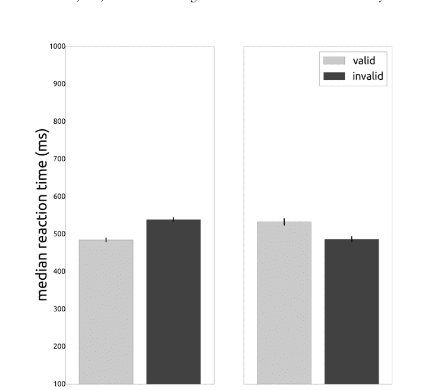

图 6.1 这是有效（浅色）和无效（深色）条件的反应时条形图的样子。左侧面板是 SOA 为 100 毫秒的情况，右侧面板是 SOA 为 900 毫秒的情况。

# 设置x轴范围
ax100.set_xlim([0, barpos])
ax900.set_xlim([0, barpos])
# 设置y轴范围
ax100.set_ylim([100, 1000])
ax900.set_ylim([100, 1000])

现在唯一要做的就是保存你的图表。你可以通过调用图表的`savefig`方法来完成。这将在与脚本相同的文件夹中创建一个图像：

```python
# 保存图表
fig.savefig('reaction_times.png')
```

**酷，酷，酷。** 运行当前的`analysis.py`并欣赏图表。如果遇到错误，请回溯检查哪里出错了。

## 6.6 合并数据集

既然你已经有了读取、处理和绘制单个参与者数据的代码，你可以开始考虑为一组参与者做同样的事情。你可以从配套网站下载一个包含十名参与者的示例数据集。本质上，你可以简单地将当前分析单个参与者数据的代码放入一个`for`循环中，以连续分析多个参与者。

通过`for`循环，你可以遍历所有参与者。对于每个参与者，你需要计算所需的值：每个条件下的中位数反应时间和准确率。你应该将这些值存储在一个变量中，以便稍后用于计算群体统计量。

在遍历所有参与者时，你将为每个参与者创建一个条形图。最后，你还将为整个群体创建一个图表。这很快就会产生大量的图表，因此值得将它们整齐地存储在一个单独的文件夹中，以防止杂乱。让我们从创建一个新文件夹开始，使用代码。

打开`analysis.py`（你在前面的章节中创建的）。在`DATADIR = os.path.join(DIR, ‘data’)`行之后直接添加以下代码：

```python
# 构建输出目录的路径
OUTDIR = os.path.join(DIR, 'output')
```

这将构建你的输出目录的路径，例如`'C:\example\output'`。第一次运行脚本时，此文件夹将不存在，因此你需要创建它。你可以通过使用`os`模块的`mkdir`函数来完成。但是，如果你稍微向前思考一下，你会意识到在运行一次脚本后输出目录将存在。调用`mkdir`创建一个已存在的文件夹会导致错误。因此，你应该包含一行代码来检查输出目录是否尚不存在。你可以使用`os`模块的`isdir`函数来完成：

```python
# 检查输出文件夹是否不存在
if not os.path.isdir(OUTDIR):
    # 仅在输出目录不存在时创建它
    os.mkdir(OUTDIR)
```

因为你要为单个参与者创建很多图表，所以最好将它们与群体平均图表分开。你可以为所有单个参与者的输出创建一个新文件夹：

```python
# 构建单个输出目录的路径
IOUTDIR = os.path.join(OUTDIR, 'individual')
# 检查单个输出文件夹是否存在
if not os.path.isdir(IOUTDIR):
    # 创建单个输出目录
    os.mkdir(IOUTDIR)
```

现在你已经处理好了文件夹结构，让我们继续进行实际的分析。首先，你需要创建一个可以容纳所有十名参与者数据的单个变量。对于每个参与者，将有两个条件，每个条件有两个水平：SOA为100毫秒和900毫秒，以及有效性为有效和无效。对于这些条件中的每一个，以及对于每个参与者，你将有两个值：中位数反应时间和正确反应的比例。

你可以将所有这些值放入字典中（每个参与者一个），嵌套在其他字典中（每个SOA条件一个），再嵌套在更多字典中（每个有效性条件一个），甚至再嵌套在更多字典中（一个用于RT，一个用于准确率）。但这似乎是一个相当复杂的混乱，并且由于缺乏灵活性，对于进一步的计算来说并不是最优的。

相反，你更愿意将所有数据放在数组中，你可以在其中指定要纳入计算的值。例如，有时你可能只想访问所有参与者在有效条件下的中位数反应时间，但包括两个SOA条件。或者你可能只想查看前五名参与者的反应时间。

为了实现这一点，你可以创建两个空的多维NumPy数组。这听起来很复杂，但归结为以下内容：对于每个因子，你需要在NumPy数组中有一个维度；再加上一个额外的维度用于参与者编号。

对于单个受试者，你可以将其可视化为一个包含四个值的二维“表格”：

| | 有效 | 无效 |
|---|---|---|
| 100毫秒 SOA | 500 | 560 |
| 900毫秒 SOA | 550 | 500 |

你可以将参与者数据的集合想象成一叠表格，每个表格包含与上面示例类似的数字。在这叠表格中，第一个维度是有效性，第二个是SOA，第三个是参与者编号。前两个维度的深度为二（100毫秒和900毫秒，或有效和无效），而第三个维度的深度为十（10名参与者）。

在Python中，你可以通过创建一个多维NumPy数组来创建这样的堆栈。最初，这将全部是零，但你将在遍历所有参与者时用数据填充它。创建两个这样的数组，一个用于反应时间，一个用于准确率：

```python
# 定义参与者数量
N = 10
# 创建一个空的多维数组来存储数据
all_rt = numpy.zeros((2, 2, N))
all_acc = numpy.zeros((2, 2, N))
```

将上述代码直接添加在`os.mkdir(IOUTDIR)`行之后。NumPy的`zeros`函数可用于创建填充零的多维数组。

现在你有了存储数据的变量，是时候遍历所有参与者了。在上述代码之后直接添加一个新的`for`循环：

```python
# 遍历所有参与者编号
for pnr in range(0, N):
```

`range(0, N)`将创建一个从0到9的所有数字的集合。这些都是参与者编号，`for`循环将遍历所有这些编号，使用`pnr`作为指向参与者编号的变量。

下一步非常重要。为了使`for`循环工作，**将`for`循环下方所有代码的缩进增加一级**（一个制表符或四个空格，取决于你的偏好）。在Spyder中，选择代码块并按Tab键。在IDLE中，选择代码块并同时按Ctrl和]键。

如果你做的一切都正确，**从读取数据文件到保存条形图的所有分析代码现在都已缩进**。这意味着`for`循环将运行所有这些代码。这很好，因为你希望它连续读取、处理和绘制每个参与者的数据。不过，当前代码中还需要进行一些调整。

第一个是在构建数据文件名时。当前行是：

```python
    datafile = os.path.join(DATADIR, 'example.txt')
```

但它应该引用当前的参与者编号。因此，将其更改为：

```python
    datafile = os.path.join(DATADIR, 'pp{}.txt'.format(pnr))
```

你应该认出符号`'pp{}.txt'`，这是一个带有占位符的字符串。它被`pnr`替换，`pnr`是`for`循环每次迭代中的参与者编号。因此，使用此符号将确保你在`for`循环的每次迭代中读取一个新的数据文件。

你应该做的另一个更改是在保存图表的行中。它目前是：

```python
    fig.savefig('reaction_times.png')
```

如果你保持这样，你将在`for`循环的每次迭代中简单地覆盖同一个图表。相反，你应该在文件名中包含参与者编号。此外，你可以将单个图表保存在单个图表文件夹（`IOUTDIR`）中。将上述行更改为以下行：

```python
    savefilename = os.path.join(IOUTDIR,
        'reaction_times_{}.png'.format(pnr))
    fig.savefig(savefilename)
```

`pyplot.close(fig)`

最后一行代码 `pyplot.close(fig)` 确保绘图库（Matplotlib）关闭该图形。这是必要的，因为打开的图形会占用计算机临时内存的空间。如果打开的图形过多，Matplotlib 将耗尽可用内存，导致脚本崩溃。

当前代码还需要添加一项内容。你需要将每个参与者的中位数反应时间和正确率存储到之前创建的多维 NumPy 数组中。在上述代码（用于保存和关闭图形）之后，立即添加以下内容：

```python
# store all median reaction times
all_rt[0, 0, pnr] = descr[100]['valid']['rt_m']
all_rt[1, 0, pnr] = descr[100]['invalid']['rt_m']
all_rt[0, 1, pnr] = descr[900]['valid']['rt_m']
all_rt[1, 1, pnr] = descr[900]['invalid']['rt_m']
# store all proportion corrects
all_acc[0, 0, pnr] = descr[100]['valid']['acc_m']
all_acc[1, 0, pnr] = descr[100]['invalid']['acc_m']
all_acc[0, 1, pnr] = descr[900]['valid']['acc_m']
all_acc[1, 1, pnr] = descr[900]['invalid']['acc_m']
```

为了了解多维 NumPy 数组如何帮助你，你可以在编辑器中运行当前脚本（连接到当前的解释器/控制台）。运行后，在解释器中输入 `descr[100]['valid']['rt_m']; descr[100]['invalid']['rt_m']` 并按回车键。这将打印出最后一位参与者在 100 ms SOA 下，有效和无效条件的中位数反应时间。现在输入 `all_rt[:,0,9]`。翻译成英文，这意味着“从 `all_rt` 变量中，取出第一维的所有值（冒号 `:` 表示‘所有’），第二维的第一个位置（索引 0），以及第三维的第十个位置（索引 9）”。第一维表示有效性（0=有效，1=无效）。第二维表示 SOA（0=100 ms，1=900 ms），第三维表示参与者编号。因此 `all_rt[0,0,9]` 包含的值与 `descr[100]['valid']['rt_m']` 相同。

由于 NumPy 数组在访问值方面具有灵活性，它们非常适合计算平均值。要计算 100 ms SOA 和有效线索条件下所有反应时间的平均值，只需在解释器中输入以下内容：

```python
numpy.mean(all_rt[0,0,:])
```

你也可以计算 100 ms SOA 条件下，有效和无效条件的平均反应时间：

```python
numpy.mean(all_rt[:,0,:])
```

或者在 900 ms 条件下：

```python
numpy.mean(all_rt[:,1,:])
```

或者仅计算前五位参与者的相同值：

```python
numpy.mean(all_rt[:,1,0:5])
```

你还可以通过使用 mean 函数的 `axis` 关键字，同时计算有效 100 ms 和有效 900 ms 条件的平均值。方法是指定你想要计算平均值的轴的编号。在以下选择中，这是第二个轴（索引号为 1）：

```python
numpy.mean(all_rt[0, :, :], axis=1)
```

现在你已经对数据进行了一些操作，是时候返回你的 `analysis.py` 脚本了。你可以计算四个平均值和四个平均值的标准误，并以清晰的方式将它们可视化。一种可视化平均值的方法是绘制两条线：一条代表有效条件，一条代表无效条件。每条线将有两个点：一个在 100 ms，一个在 900 ms。这样，SOA 和有效性之间的交互效应（对反应时间和正确率的影响）将得到最清晰的呈现。如果你不太理解，希望你最终生成的图表能澄清一切。

在 `analysis.py` 的最末尾，**不缩进**，包含以下代码：

```python
# create a new figure with a two subplots
fig, (rt_ax, acc_ax) = pyplot.subplots(nrows=2,
    sharex=True, figsize=(12.0, 6.8), dpi=200.0)
```

其中一个子图将呈现反应时间，另一个将呈现正确率。这些图表将有一些共同点：x 轴和颜色。x 轴将代表 SOA，因此会有两个值：100 ms 和 900 ms。你可以通过替换下面代码中的十六进制值（例如，绿色用 `'#4e9a06'`）来选择有效和无效条件的颜色：

```python
# the x-axis will be the SOAs
x = [100, 900]
# the colours the valid and invalid conditions
cols = {'valid':'#4e9a06', 'invalid':'#ce5c00'}
```

现在是时候将实际值绘制为线条了。有两个图表：一个用于反应时间，一个用于正确率。每个图表将显示两条线：一条用于有效条件，一条用于无效条件。每条线将在两个值之间绘制：一个用于 100 ms，一个用于 900 ms。这些值将通过 NumPy 的 mean 函数使用 `axis` 关键字（如前所述）计算得出。你还需要平均值的标准误来创建误差条。（因为这是样本标准误，所以使用参与者数量减一的平方根。）添加以下代码：

```python
# the y-axes will be the valid and invalid means
rt_valid = numpy.mean(all_rt[0, :, :], axis=1)
rt_invalid = numpy.mean(all_rt[1, :, :], axis=1)
# calculate the SEM (=SD/sqrt(N-1))
rt_valid_sem = numpy.std(all_rt[0,:,:], axis=1) / numpy.sqrt(N - 1)
rt_invalid_sem = numpy.std(all_rt[1,:,:], axis=1) / numpy.sqrt(N - 1)
```

你可以使用每个轴的 `errorbar` 方法绘制带有误差条的线条。这需要几个参数，其中最重要的是 `x` 值和 `y` 值（用于指示在哪里绘制线条以及误差条应该在哪里）。此外，`errorbar` 方法需要指示误差条大小的值（`yerr`）、线条的颜色（`color`）和误差条的颜色（`ecolor`）。当然，你也可以提供一个 `label` 来指示该线条描述的内容：

```python
# plot the means for valid and invalid as lines,
# including error bars for the standard error of the mean
rt_ax.errorbar(x, rt_valid, yerr=rt_valid_sem,
    color=cols['valid'], ecolor='black', label='valid')
rt_ax.errorbar(x, rt_invalid, yerr=rt_invalid_sem,
    color=cols['invalid'], ecolor='black', label='invalid')
```

最后，你需要澄清图表：为 y 轴添加标签并添加图例：

```python
# add y-axis label
rt_ax.set_ylabel('reaction time (ms)')
# add legend
rt_ax.legend(loc='upper right')
```

在平均和绘制反应时间之后，你可以对正确率进行相同的操作。首先，计算平均值和平均值的标准误：

```python
# calculate the accuracy means
acc_valid = numpy.mean(all_acc[0, :, :], axis=1)
acc_invalid = numpy.mean(all_acc[1, :, :], axis=1)
# calculate the SEM (=SD/sqrt(N-1))
acc_valid_sem = numpy.std(all_acc[0,:,:], axis=1) / numpy.sqrt(N - 1)
acc_invalid_sem = numpy.std(all_acc[1,:,:], axis=1) / numpy.sqrt(N - 1)
```

然后绘制带有误差条的线条：

```python
# plot the means for valid and invalid as lines,
# including error bars for the standard error of the mean
acc_ax.errorbar(x, acc_valid, yerr=acc_valid_sem,
    color=cols['valid'], ecolor='black', label='valid')
acc_ax.errorbar(x, acc_invalid, yerr=acc_invalid_sem,
    color=cols['invalid'], ecolor='black', label='invalid')
```

并为两个轴添加标签：

```python
# add axis labels
acc_ax.set_xlabel('stimulus onset asynchrony (ms)')
acc_ax.set_ylabel('proportion correct')
```

最后，设置 *x* 轴的范围。你希望该轴包含 100 和 900 ms，因此下限为 0，上限为 1000 似乎是合适的。两个子图的 *x* 轴是关联的，因此你只需更改一个即可更改两个：

```python
# set x limits
acc_ax.set_xlim([0, 1000])
```

现在添加保存图形的代码：

```python
# save the figure as a PNG image
savefilename = os.path.join(OUTDIR, 'averages.png')
fig.savefig(savefilename)
```

现在运行脚本，然后砰！你创建了十个单独的条形图和一个用于组平均值的折线图。

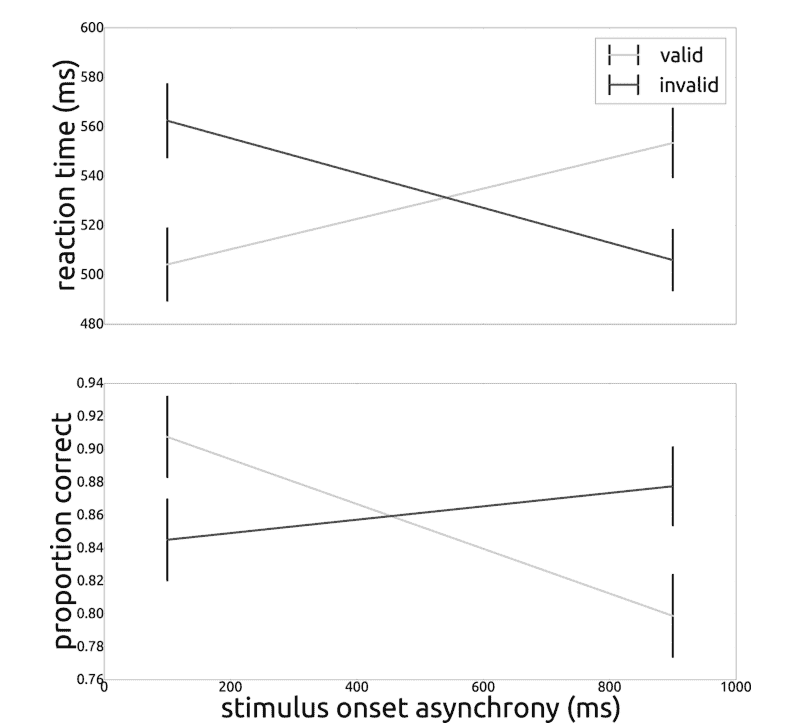

**图 6.2** 如果你按照说明操作，你的数据图表应该看起来像这样。

未来需要注意的一点是：由于计算更简便，你计算了被试间平均数的标准误。然而，你在下一章将要进行的比较是检验被试内各条件间的差异。因此，计算并绘制被试内平均数的标准误会更为合适。

## 6.7 统计检验

你希望进行的比较是在每个SOA（刺激呈现异步性）条件下，有效条件与无效条件之间的比较。

正式来说，对于这样的设计，你应该进行重复测量方差分析（ANOVA），将SOA和效度作为因子（每个因子有两个水平）。该检验可以证明效度和/或SOA存在显著的主效应，并且可以显示两者之间存在显著的交互效应。如果你发现这样的显著效应，你还可以比较单个单元格（由因子和水平组合而成的组对）。例如，你可以检验在100毫秒SOA条件下，有效条件和无效条件之间的反应时是否存在显著差异。重要的是，如果重复测量方差分析没有显示任何显著效应，那么进行这样的后续检验可能是不合适的（除非你有充分的理由，例如一个非常强的假设）。

此外，在进行重复测量方差分析之前，你应该检查其所有基本假设是否得到满足。例如，所有单元格的方差应该相等，你可以使用Mauchly球形检验来测试这一点。

> （请注意，一些统计学爱好者可能会提出不同的分析方法，例如线性混合效应模型或其他完全不同的方法。如有疑问，请查阅搜索引擎。如果仍有疑问，请咨询统计学家。）

目前，你可以叛逆一点，完全忽略这些规则。相反，你可以进行两个相关样本t检验。一个用于检验在100毫秒SOA条件下，对有效线索和无效线索的反应时是否存在差异；另一个用于检验在900毫秒SOA条件下，对有效线索和无效线索的反应时是否存在差异。

你不应该将此视为不做适当统计检验的建议！不进行更合适检验的原因是，本章并非关于统计学。你阅读本书是为了开始使用Python编程，而不是为了熟悉被试内统计检验的方方面面。（话虽如此：第9章是关于统计学的，所以如果你好奇，可以继续读下去！）

现在回到你正在做的事情：在Python中进行相关样本t检验。打开前几章的analysis.py脚本。要执行相关样本t检验，你可以使用SciPy的stats模块中的ttest_rel函数。该函数需要两个参数：一个条件下的数据NumPy数组和另一个条件下的数据NumPy数组。例如，这可以是有效条件下的反应时和无效条件下的反应时。

ttest_rel将计算并返回一个t统计量和一个p值。对于不了解的人来说：t统计量表示两个分布之间的差异程度，p值表示找到比你观察到的更极端的t统计量的可能性（假设分布之间没有差异）。

在你的情况下，一个数组将包含有效反应时，另一个数组将包含无效反应时，根据SOA进行划分。将以下几行添加到analysis.py的末尾：

```python
# perform two related-samples t-test
t100, p100 = ttest_rel(all_rt[0,0,:], all_rt[1,0,:])
t900, p900 = ttest_rel(all_rt[0,1,:], all_rt[1,1,:])
```

此外，添加代码来报告这些值：

```python
print('\nstats report:')
print('SOA 100ms, valid vs invalid: ' +
      't={:.2f}, p={:.3f}'.format(t100, p100))
print('SOA 900ms, valid vs invalid: ' +
      't={:.2f}, p={:.3f}'.format(t900, p900))
```

当然，你可以对准确率做同样的处理：

```python
t100, p100 = ttest_rel(all_acc[0,0,:], all_acc[1,0,:])
t900, p900 = ttest_rel(all_acc[0,1,:], all_acc[1,1,:])
print('SOA 100ms, valid vs invalid: ' +
      't={:.2f}, p={:.3f}'.format(t100, p100))
print('SOA 900ms, valid vs invalid: ' +
      't={:.2f}, p={:.3f}'.format(t900, p900))
```

如果这是真实数据，你将证明外源性注意的促进效应：在目标呈现前100毫秒呈现有效线索后，反应时更低，准确率更高。如果刺激呈现异步性为900毫秒，结果则相反：反应时更长，准确率更低。这就是返回抑制。（请记住，这些数据完全是为教育目的而虚构的；不要期望在实际实验中看到如此强的效应！）

如果你想多加练习，一个不错的练习是将你在本章学到的内容应用到你在上一章生成的数据上。

# 7 分析轨迹

现在你知道了如何分析反应时和准确率数据，是时候转向更复杂一点的内容了：轨迹分析。轨迹可以是你连续收集的任何类型的数据：瞳孔大小、脑电图（EEG）、功能性磁共振成像（fMRI）、力输出、运动速度等等。轨迹来自哪里并不重要，分析的基本步骤总是相同的：你收集单个试次的轨迹，按条件进行平均，然后检验轨迹在不同条件之间何时存在差异。

## 7.1 瞳孔大小

在本章中，你将使用一个瞳孔测量数据的示例数据集。你可以从配套网站下载它。将此文件放入一个新的空文件夹中。

数据是在一个非常直接的实验设计中收集的：参与者注视着一个带有灰色注视点的计算机显示器。每隔几秒钟，显示内容从黑色变为白色，或从白色变为黑色。

光照对瞳孔大小的影响相当强烈：当眼睛暴露在强光下时，瞳孔会收缩；当光线较弱时，瞳孔会扩张。不过，瞳孔的反应有点慢。通常，瞳孔大小的变化在大约半秒（或稍短）后变得明显。

示例文件中的数据是使用EyeLink 1000（SR Research Ltd）收集的。这是一个眼动仪：一种能够识别和跟踪眼睛并测量瞳孔直径（和表面积）的精密相机。EyeLink 1000以1,000 Hz的频率运行，这意味着它每毫秒提供一次瞳孔直径的快照。

## 7.2 PyGaze Analyser

要读取EyeLink的数据文件，你可以使用PyGaze Analyser。你可以从配套网站下载该软件包。下载压缩包后，解压并将名为“pygazeanalyser”的文件夹复制到你的新分析文件夹（示例数据文件也在此文件夹中）。

DOI: 10.4324/9781003174332-10

PyGaze Analyser目前是一个相对简单的库，可以从多家制造商生产的眼动仪文件中提取数据。此外，它还提供了用于高级注视点数据绘图的函数，可以生成精美的图片。你将在后面的章节中遇到这些内容。

## 7.3 读取眼动仪数据

你目前在新分析文件夹中有两样东西：示例数据文件（**ED_pupil.asc**）和**pygazeanalyser**文件夹。现在添加另一个文件：一个空的Python脚本，你可以命名为**analysis.py**。在脚本编辑器中打开analysis.py。首先导入相关的库和函数：

```python
import numpy
from matplotlib import pyplot
from scipy.stats import ttest_rel
from pygazeanalyser.edfreader import read_edf
```

你应该从前几章认出前三个。第四个是新的，它专门设计用于读取EyeLink文件中的数据。这些文件具有**.edf**扩展名，这就是为什么该函数名为**read_edf**。你拥有的数据文件具有**.asc**扩展名。这是一个转换后的EDF文件；它包含相同的数据，但格式更易读。（因此，令人困惑的是，名为“read_edf”的函数实际上读取的是asc文件。）

轨迹数据文件通常至少包含两种类型的数据。第一种是**样本**。在本例中，它们包含注视位置、瞳孔直径和时间戳。第二种数据是**事件**。这些是出现在样本之间的数字或字符串信息。通常，它们表示实验中发生了某些事情（例如，刺激出现），并在数据文件中提供锚点。没有这些，你将不知道样本是在实验的哪个时间点收集的。

在当前数据文件中，有四个感兴趣的事件。第一个表示试次的开始：**PUPIL_TRIALSTART**，color='black'。它也可以以'white'结尾。颜色表示该试次期间显示器上的颜色。第二种事件在显示器改变颜色前约200毫秒被记录：**baseline_start**。第三个事件是**pupdata_start**。它在显示器改变颜色时被记录。最后，事件**pupdata_stop**在显示器改变颜色后2.5秒被记录。

**read_edf**函数至少需要两个参数：数据文件的名称（或路径）和表示试次开始的事件。这不需要是完整的事件。在你的情况下，你可以传递**PUPIL_TRIALSTART**并忽略第二部分（表示颜色且并非每个试次都相同）。你也可以传递表示试次结束的事件。如果你不提供这个，**read_edf**将继续读取，直到遇到下一个试次开始。如果不传递结束事件，你可能会读取无关数据。将以下代码添加到你的analysis.py中：

```python
# read data file
data = read_edf('ED_pupil.asc', 'PUPIL_TRIALSTART',
               stop='pupdata_stop')
```

这段代码读取文件并将其内容存储在一个新变量（`data`）中。这个变量相当大且复杂，因此有必要进行解释。`data` 是一个列表，其中包含单次试验的值（每个索引对应一次试验）。在本例中，共有50次试验，因此 `len(data)==50`。你可以通过 `data[i]` 来引用单次试验，其中 `i` 是试验编号。

每次试验都由一个字典表示。这些字典始终具有相同的六个键。前两个是 `trackertime` 和 `time`。这两个都是 NumPy 数组，包含所有数据样本的时间戳。`trackertime` 中的时间戳是眼动仪报告的时间。`time` 中的时间戳在每次试验中都从0开始。

接下来的三个键是 `x`、`y` 和 `size`。它们都是 NumPy 数组。`x` 包含水平注视位置的样本，`y` 包含垂直注视位置的样本（这些以显示器的像素为单位测量）。`size` 包含瞳孔大小的样本。这些可以代表瞳孔表面积或瞳孔直径（这取决于测试期间 EyeLink 的设置）。瞳孔大小以任意单位测量，这些单位相对于特定的设置和参与者。请注意，这些单位是相对的；它们不能直接映射到现实世界中的任何东西，通常也不能在参与者之间进行比较。

最后是 `events` 键。它指向另一个字典，该字典包含以下键：`Sfix`（表示注视开始）、`Efix`（表示注视结束）、`Sblk`（表示眨眼开始）、`Eblk`（表示眨眼结束）、`Ssac`（表示扫视开始）和 `Esac`（表示扫视结束）。所有这些事件都是列表，包含一个时间戳和特定于该事件的数据（例如，扫视的起始和结束位置，以及持续时间）。`events` 字典中的最后一个键是 `msg` 键。它包含一个已记录消息及其时间戳的列表。

让我们更仔细地看一下 `msg` 键。在编辑器中运行当前的 analysis.py（仅包含导入和 `read_edf` 调用），并将输出发送到解释器。现在在解释器中输入以下内容：

```
print(data[0]['events']['msg'])
```

如果一切操作正确，你应该会看到以下内容：

```
[[476461, 'PUPIL_TRIALSTART, colour=black\n'], [476461, 'baseline_start\n'], [476661, 'pupdata_start\n']]
```

如你所见，这是一个包含所有已记录事件的列表。每个事件本身也是一个列表，包含一个时间戳（以 trackertime 为单位！）和实际的消息。

## 7.4 绘制你的第一条轨迹

现在你已经了解了数据的格式，是时候绘制你的第一条轨迹了！在解释器中输入以下内容：

```
pyplot.plot(data[0]['size'], 'o')
pyplot.show()
```

这将绘制第一次试验中的瞳孔大小，并用圆形标记（`'o'`）标记每个样本。在图表中，你会看到*很多*样本（准确地说是2701个）。它们显示了瞳孔大小的增加，这与你在前一章中的预期一致（你在前一章看到第一次试验是黑色屏幕）。

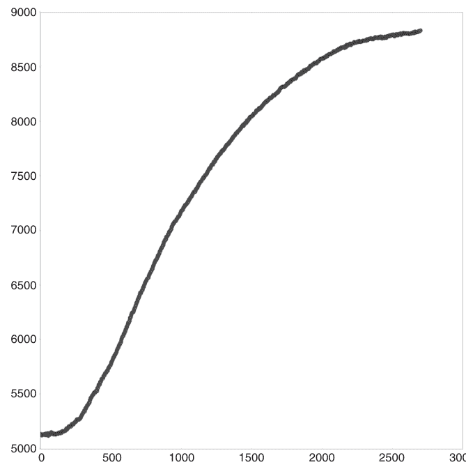

你可以通过在解释器中输入以下内容来检查试验中发生了什么：

```
data[0]['events']['msg'][0]
```

这显示了表示试验开始和屏幕颜色（“黑色”）的已记录事件。该试验中的另外两个事件表示基线期的开始（在此期间显示器仍然是白色）以及显示器颜色改变的确切时间。你可以通过在解释器中输入以下内容来查看它们：

```
data[0]['events']['msg'][1]
data[0]['events']['msg'][2]
```

你也可以通过在解释器中输入以下内容来保存它们的时间戳：

```
t1, msg = data[0]['events']['msg'][1]
t2, msg = data[0]['events']['msg'][2]
```

变量 t1 和 t2 各自包含以跟踪器时间为单位的时间戳。所以现在你知道事件何时发生，但你还不知道哪些瞳孔大小样本对应于这些时间戳。为此，你需要知道如何索引 data[0]['size'] 数组。要找出你需要哪些样本，你可以使用 data[0]['trackertime'] 来检查你的时间戳出现在哪些索引号上。然后，这些索引号可用于从 data[0]['size'] 中选择样本。使用 NumPy 的 where 函数，你可以找到某个逻辑语句为 True 的索引号。在解释器中输入以下内容：

```
numpy.where(data[0]['trackertime'] == t1)
```

输出格式有点奇怪：它是一个包含 NumPy 数组的元组，而该数组又包含所有 data[0]['trackertime']==t1 的索引。要存储这个值，请在解释器中使用以下内容：

```
t1i = numpy.where(data[0]['trackertime'] == t1)[0][0]
t2i = numpy.where(data[0]['trackertime'] == t2)[0][0]
```

变量 t1i 和 t2i 现在指向样本数组（'time'、'trackertime'、'x'、'y' 和 'size'）中对应于 t1（基线开始）和 t2（显示器改变）的索引号。你可以使用这些索引来选择基线和瞳孔对显示器改变的反应。在解释器中输入以下内容：

```
baseline = data[0]['size'][t1i:t2i]
trace = data[0]['size'][t2i:]
```

前面提到过，瞳孔大小是以任意单位表示的。这没什么用，因为你不知道它们意味着什么。理论上，你可以将任意单位重新计算为毫米，但前提是你能将你的数据与在同一设置下从人工瞳孔记录的数据进行比较。那样的话，你就会知道人工瞳孔以毫米为单位的确切大小。因为你将以任意单位测量其大小，所以你会知道毫米和任意单位之间的映射关系。

然而，你不必使用人工眼睛。已知瞳孔大小会随时间波动，并且在大多数（无聊的）实验过程中通常会显著减小。因此，研究人员通常计算每次试验内瞳孔大小的比例变化。这是瞳孔大小除以基线期间的平均（或中位数）瞳孔大小。它反映了与基线相比瞳孔大小的相对增加或减少。你可以通过在解释器中输入以下行并按回车键来计算这个值。

```
prop_trace = trace / numpy.median(baseline)
```

现在通过在解释器中输入以下行来绘制这条轨迹。第一行中的 '-' 表示数据应绘制为线条。

```
pyplot.plot(prop_trace, '-')
pyplot.show()
```

这就是你的第一条瞳孔轨迹；去社交媒体上炫耀一下吧！

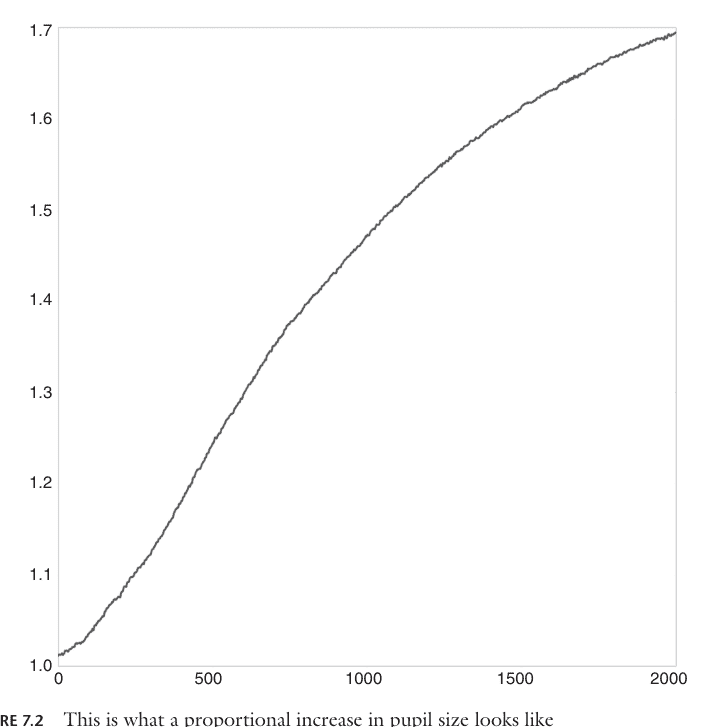

## 7.5 平均轨迹

下一步是遍历所有轨迹并收集所有瞳孔对显示器亮度变化的反应。这些变化在黑色屏幕试验中是从亮到暗，在白色屏幕试验中是从暗到亮。在编辑器中打开你上一章的 analysis.py。添加以下行：

```
# 创建一个新字典来包含轨迹
traces = {'black':[], 'white':[]}
```

这将创建一个具有两个键的新字典。每个键包含一个空列表。你可以使用 for 循环来遍历所有试验。对于每次试验，你可以计算瞳孔的比例变化并将其添加到相应的列表中。从遍历所有试验的 for 循环开始：

```
# 遍历所有试验
n_trials = len(data)
for i in range(n_trials):
```

对于每次试验，首先检查第一个事件。从这个事件中，你可以确定试验类型：如果事件消息中包含 'black'，则试验是亮到暗的显示器变化。如果事件消息中包含 'white'，则试验是暗到亮的变化。

```
# 检查试验类型
t0, msg = data[i]['events']['msg'][0]
if 'black' in msg:
    trialtype = 'black'
elif 'white' in msg:
    trialtype = 'white'
```

现在，就像你在上一章中所做的那样，你需要检查基线开始和实际显示器变化的时间。你还需要对应于这些时间戳的索引号（这与 *绘制你的第一条轨迹* 部分相同）。

```
# 获取基线和显示器变化的时间戳
t1, msg = data[i]['events']['msg'][1]
t2, msg = data[i]['events']['msg'][2]
# 将时间戳转换为索引号
t1i = numpy.where(data[i]['trackertime'] == t1)[0][0]
t2i = numpy.where(data[i]['trackertime'] == t2)[0][0]
```

下一步，与上一节一样，是将基线和瞳孔轨迹的其余部分分开。不过有一个小额外步骤：你应该将轨迹稍微截短一些。每条瞳孔大小轨迹将包含大约2,500个样本（不包括基线）。由于采样和时间变化，有时会多一点，有时会少一点。稍后，当你进行轨迹平均时，所有轨迹具有相同的长度将非常重要。
为了确保这一点，你可以将每条轨迹的长度截短到2,000。这对应于两秒钟，这对于观察瞳孔光反射来说绰绰有余。将以下代码添加到你的 analysis.py 中：

```
# 获取基线轨迹
baseline = data[i]['size'][t1i:t2i]
# 获取瞳孔变化轨迹（2000个样本）
trace = data[i]['size'][t2i:t2i+2000]
```

基线是从 t1i 到 t2i，与之前相同。实际轨迹从 t2i 开始，就像之前一样。然而，这次它在 t2i+2000 结束。这正好是开始后的2,000个样本，以确保所有轨迹都具有相同的长度。
现在你有了基线和实际轨迹，将轨迹除以基线的中位数。这将产生一条反映瞳孔大小比例变化的轨迹。

```
# 将瞳孔轨迹除以基线中位数
trace = trace / numpy.median(baseline)
```

for 循环中唯一剩下的事情就是将这次试验的轨迹添加到相应的列表中：

```
# 将轨迹添加到此试验类型的列表中
traces[trialtype].append(trace)
```

当 for 循环完成后，你会得到两个列表，分别包含所有黑到白和白到黑显示器变化的试验数据。由于 NumPy 数组更易于处理，最好将这些列表转换为 NumPy 数组。你可以使用 NumPy 的 array 函数来完成此操作。在 `analysis.py` 的末尾添加以下代码，**不要有任何缩进**：

```
# 将列表转换为 NumPy 数组
traces['black'] = numpy.array(traces['black'])
traces['white'] = numpy.array(traces['white'])
```

现在，将轨迹列表转换为数组后，你可以做几件很酷的事情。首先是计算平均轨迹。为此，理解轨迹的存储方式非常重要。它们存储在一个多维 NumPy 数组中，第一个轴是所有试验编号，第二个轴是所有采样点编号。要计算平均轨迹，你应该对所有试验求平均，而不是对所有时间点求平均。也就是说，你需要对每个试验的时间点 1、每个试验的时间点 2，一直到每个试验的时间点 2,000 分别求平均。包含所有这 2,000 个平均值的数组就是**平均轨迹**。

使用 NumPy，你不必单独计算 2,000 个平均值。相反，你可以简单地使用 mean 函数的 axis 关键字来指示你想要计算轨迹数组第一个维度中所有点的平均值。例如：

```
numpy.mean(traces['black'], axis=0)
```

这会产生一个与上面讨论的平均轨迹相同的轨迹。该轨迹有 2,000 个值，每个值是某个索引处所有样本的平均值。例如，索引 5 处的值（那是第六个值！）是所有黑试验第六个样本的平均值。这个平均轨迹表征了瞳孔对计算机显示器从亮到暗变化的平均光反应。

你可以以同样的方式使用 NumPy 的 std 函数：

```
numpy.std(traces['black'], axis=0)
```

这不会给出平均值，而是给出所有轨迹的标准差。如果你将这个轨迹除以试验次数的平方根，你就会得到每个时间点的平均值标准误差。这大致告诉你你的平均值估计在时间上的可靠性。这应该是相对恒定的，因此在某些点看到大的偏差可能需要仔细检查你的数据！

len 函数可以告诉你每个数组中有多少试验。如前所述，通过将标准差除以试验次数的平方根，你可以计算平均值标准误差。将以下代码添加到你的 `analysis.py` 中，以计算黑和白条件的平均轨迹及其标准误差。通常，你可以将这些存储在一个字典中以便于访问：

```
# 创建一个空字典来包含均值和标准误差
avgs = {'black':{}, 'white':{}}
# 循环遍历两个条件
for con in ['black', 'white']:
    # 计算此条件下的试验次数
    n_trials = len(traces[con])
    # 计算此条件下的平均轨迹
    avgs[con]['M'] = numpy.mean(traces[con], axis=0)
    # 计算此条件下的标准差
    sd = numpy.std(traces[con], axis=0)
    # 计算此条件下的标准误差
    avgs[con]['SEM'] = sd / numpy.sqrt(n_trials)
```

与 mean 和 std 函数一样，你也可以在 ttest_rel 函数中使用 axis 关键字来一次执行多个检验。使用此方法检查在哪些时间点瞳孔对亮到暗变化的反应与瞳孔对暗到亮变化的反应有显著差异：

```
# 在每个时间点进行 t 检验
t, p = ttest_rel(traces['black'], traces['white'], axis=0)
```

因为你刚刚进行了 2,000 次 t 检验，所以不能简单地使用 0.05 的 p 值显著性阈值（alpha）。alpha 为 0.05 的背后思想是，你接受在零效应的情况下，仍有 5% 的概率你的 p 值会“统计显著”。进行 2,000 次检验，每次 alpha 为 5%，即使在零效应下，你也会预期至少出现 100 个显著差异。
相反，你可以使用 Bonferroni 校正。这要求你将 alpha 除以你执行的检验次数，这样偶然错误的总体机会仍然只有 5%。

```
# Bonferroni 校正后的 alpha
alpha = 0.05 / len(t)
```

只有当 t 检验的 p 值低于新的 alpha 水平时，你才认为差异是显著的。也就是说，在 p<alpha 的地方，'black' 和 'white' 轨迹实际上彼此不同。
下一步是创建一个漂亮的图表。首先，定义每个条件的颜色，并创建一个带有单个轴的新图形（在 Matplotlib 中这就是子图的名称）：

```
# 定义绘图颜色
cols = {'black':'#204a87', 'white':'#c4a000'}
# 创建一个带有单个轴的新图形
fig, ax = pyplot.subplots(figsize=(9.6,5.4), dpi=200.0)
```

接下来，用 for 循环遍历条件：

```
# 循环遍历条件
for con in ['black', 'white']:
```

对于每个条件，绘制平均轨迹。你也可以通过使用轴的 fill_between 方法来绘制阴影区域。此方法要求你输入 x 值（在这种情况下是数字 0–1999：自显示器变化以来经过的时间，以毫秒为单位）以及两个 y 值。第一个 y 值数组将是平均轨迹加上平均轨迹的标准误差。第二个将是平均轨迹减去平均轨迹的标准误差。通过指定 alpha 关键字，你可以设置透明度：值为 1 表示完全不透明，而值为 0 表示不可见。（注意，这个 alpha 与前面讨论的显著性阈值完全不同！）在 for 循环中添加以下代码：

```
# 创建 x 值
x = numpy.arange(len(avgs[con]['M']))
# 绘制平均轨迹
ax.plot(x, avgs[con]['M'], '-', color=cols[con], label=con)
# 绘制平均值标准误差的阴影
y1 = avgs[con]['M'] + avgs[con]['SEM']
y2 = avgs[con]['M'] - avgs[con]['SEM']
ax.fill_between(x, y1, y2, color=cols[con], alpha=0.3)
```

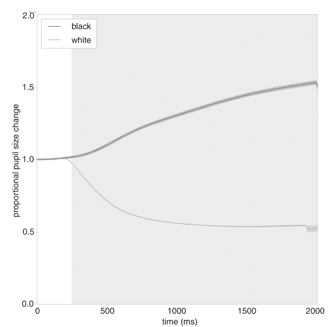

**图 7.3** 这就是平均轨迹应有的样子。蓝线表示对亮到暗亮度变化的平均瞳孔反应，黄线表示对暗到亮亮度变化的平均瞳孔反应。线条周围的阴影表示平均值的标准误差，灰色阴影表示线条之间存在显著差异的地方（逐点相关样本 t 检验，Bonferroni 校正）

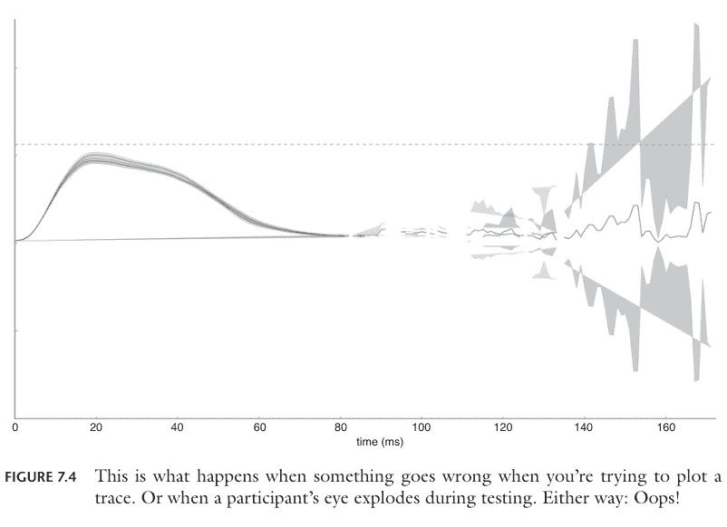

**图 7.4** 当你尝试绘制轨迹时出错，或者测试过程中参与者的眼睛爆炸时会发生这种情况。无论哪种方式：哎呀！

最后要绘制的是一个阴影区域，表示两条轨迹之间存在显著差异的地方。你可以使用与指示平均值标准误差相同的 `fill_between` 方法来完成此操作。该函数有一个 `where` 关键字，它将确保仅在条件语句为 True 的位置绘制阴影，例如当 p < 0.05 时。

为此，你需要知道 y 轴的限制。让我们将它们设置为 0 和 2（瞳孔大小的比例变化可能介于这些数字之间）。你可以使用这些来创建顶部和底部的 y 轨迹。底部轨迹将只是一个全零数组。顶部轨迹将是一个全 2 的数组。

```
# 创建 y 数组
y1 = numpy.zeros(len(x))
y2 = numpy.ones(len(x)) * 2
# 阴影表示轨迹之间的显著差异
ax.fill_between(x, y1, y2, where=p<alpha, color='#babdb6', alpha=0.2)
```

现在通过设置轴的标签和限制并添加图例来完成图表：

```
# 设置轴限制
ax.set_xlim([0, 2000])
ax.set_ylim([0, 2])
# 设置轴标签
ax.set_xlabel('time (ms)')
ax.set_ylabel('proportional pupil size change')
# 添加图例
ax.legend(loc='upper left')
```

最后保存图形：

```
fig.savefig('pupil_traces.png')
```

# 8 眼动追踪

眼动追踪是实验心理学和认知神经科学中的一项热门技术。它不仅应用于人类和其他灵长类动物，甚至也用于一些非灵长类动物。（这可不是开玩笑，例如可以参考华莱士及其同事（2013年）在大鼠身上进行的一项研究——补充材料中的视频非常精彩！）眼动追踪通常涉及将摄像头对准某人的面部，并利用它来估算其注视点。

眼动追踪提供了许多可测量的指标：人们注视的位置（注视点）、眼球如何移动（扫视轨迹）、移动速度（扫视反应时间和速度）以及瞳孔大小（瞳孔测量）。这些指标能让我们深入了解许多方面，包括人们关注什么、动机水平以及在任务中的专注程度。一些眼动特征会受到各种疾病和障碍的独特影响，并能提供早期诊断信息或对患者状况的更深入见解。这一点体现在一些论文和演讲中对一句古老陈词滥调的半诙谐改编上：

> 窗户不是眼睛，而是*眼动*。

眼动不仅在科学和医学领域备受关注，在可用性测试和市场营销领域也同样如此。可用性专家喜欢记录人们在使用网站和图形用户界面时的眼动。眼动模式可以告诉专家界面的直观程度。市场营销专业人士采用同样的方法，但他们更关心人们是否看到了他们的广告、产品和品牌名称。

眼动追踪的另一个应用领域是软件工程。眼动特征相对独特，可以组合形成特定于用户的“指纹”（眼纹？）。已经开发出通过眼动识别人员的技术，一些专家认为这项技术未来可以取代密码。此外，眼动可用于操控计算机操作系统，这对有需要的人以及玩电子游戏的人来说可以成为一项辅助技术。眼动追踪也是虚拟现实头显的一个有前景的附加功能，因为它可以实现更逼真的虚拟环境渲染。

DOI: 10.4324/9781003174332-11

## 8.1 基础知识

当你观察一幅图像时，你会表现出（主要是）三种类型的眼动：注视、扫视和眨眼。**眨眼**发生在你闭上眼睛、什么也看不见的时候。**扫视**发生在你快速移动眼球的时候。当你这样做时，你的视觉在很大程度上会被抑制（如果不是这样，你就会在扫视过程中看到模糊的影像）。**注视**是眼睛保持相对静止的时期，此时你才能真正看清你所注视的东西。

因为大部分有意识的视觉活动都发生在注视期间，所以大量研究都集中于此。大多数研究者假设，当你注视某物时，该物也是你关注的对象。这意味着，绘制你正在（或曾经）注视的位置图，可以提供关于什么吸引了你注意力的关键信息。

你能做的最简单的实验是向参与者展示一幅图像，同时记录他们的注视行为。之后，你可以绘制参与者注视的位置图，这有望告诉你图像的哪些部分对人类观察者来说是有趣的。

要记录参与者的注视行为，你需要一个眼动仪。这不过是一个带有滤光片的摄像头、一些红外灯以及能够通过算法魔法进行快速图像处理的软件。概念很简单：红外灯照亮你的脸，而摄像头拍摄你眼睛的快照。图像处理软件随后尝试找到你的瞳孔以及红外光在角膜（眼睛的前部）上的反射。当你环顾四周时，角膜反射相对恒定，但瞳孔会随你的视线移动。利用瞳孔与角膜反射之间的差异，以及从校准中得出的设置，算法可以将瞳孔在眼睛内的位置转换为你在计算机显示器上的注视点。换句话说，眼动仪能够估算出你正在看哪里。

## 8.2 创建眼动追踪实验

在本章中，你将编写一个简单的眼动追踪实验脚本。它将展示图像，每张展示几秒钟，并在图像展示期间记录眼动。目的是让你熟悉记录和分析注视行为的基础知识。

### 8.2.1 材料

要在实践中看到这种眼动追踪，你需要两样东西：一个眼动仪和一些图像。示例图像可以从配套网站下载，但你也可以使用自己的度假照片。眼动仪可能更难获得，但如果你没有也不用担心：PyGaze 提供了一个模拟模式，允许你使用鼠标光标来模拟眼动。

你的实验将产生一个数据文件，但如果你没有眼动仪，也可以使用一个示例。示例数据和分析软件可以从配套网站下载。稍后会详细介绍。


**图 8.1** 这是示例图像之一。这是我在荷兰北部岛屿之一的特塞尔岛度假时拍摄的照片。你预计大多数注视点会出现在哪里？

### 8.2.2 Constants.py

任何实验的第一步都是创建一个包含实验设置的文件。创建一个新文件夹，并在其中创建一个新的 Python 脚本。将脚本命名为 'constants.py' 并添加以下代码：

```python
# The DISPTYPE can be either 'pygame' or 'psychopy'
DISPTYPE = 'pygame'
# The DISPSIZE should match your monitor's resolution!
DISPSIZE = (1024, 768)
```

现在来设置一个新的常量：TRACKERTYPE，它确定你将使用的眼动仪类型。这可以是特定品牌的支持的眼动仪，或者是两种模拟替代品之一。在撰写本文时，PyGaze 支持 Alea Technologies 的 Inteligaze 系统（'alea'）、SR Research 的 EyeLink 系统（'eyelink'）、EyeLogic 追踪器（'eyelogic'）、EyeTribe 追踪器（'eyetribe'）、GazePoint 追踪器及其 OpenGaze API（'opengaze'）、SensoMotoric Instruments 的系统（'smi'）和 Tobii 的系统（'tobii'）。还有一个模拟模式，允许你用鼠标模拟眼动（'dummy'），以及一个非常简单的模拟模式（'dumbdummy'），它提供虚假值。在本例中，TRACKERTYPE 将设置为 'eyelink'。请根据你实际希望使用的追踪器类型进行更改。

```python
# Set the TRACKERTYPE to the brand you use
TRACKERTYPE = 'eyelink'
```

你应该添加的另一个常量是 DUMMYMODE。这是一个布尔值，允许你在不连接眼动仪的情况下轻松测试脚本。将 DUMMYMODE 设置为 True 与将 TRACKERTYPE 设置为 'dummy' 效果相同。

```python
# DUMMYMODE should be True if no tracker is attached
DUMMYMODE = False
```

让我们设置实验的默认前景色和背景色：

```python
# Foreground colour set to white
FGC = (255, 255, 255)
# Background colour set to black
BGC = (0, 0, 0)
```

你还应该考虑时间设置。在你即将创建的实验中，将先呈现一个注视点，然后呈现一幅图像。两秒钟的注视加上十秒钟的观察似乎比较合适：

```python
# Fixation mark time (milliseconds)
FIXTIME = 2000
# Image time (milliseconds)
IMGTIME = 10000
```

最后，让我们处理图像。从配套网站下载它们（如果你还没有的话）或者使用你自己的图像。无论从哪里获取，请确保将它们复制到名为 'images' 的文件夹中。该文件夹应位于与 'constants.py' 相同的文件夹内。确保文件夹路径正确，因为这至关重要！

以下部分将是关于文件和文件夹管理，与你之前见过的类似。为此，你需要 os 模块。所以首先导入它：

```python
import os
```

让我们获取包含脚本的文件夹路径。你可以通过获取当前脚本的绝对路径（使用 abspath 函数）来实现（这存储在 __file__ 变量中，Python 在运行脚本时会自动创建）。你可以使用 dirname 函数获取文件夹名称（文件夹也称为目录）：

```python
# Get the path to the current folder
DIR = os.path.dirname(os.path.abspath(__file__))
```

现在让我们构建图像文件夹的名称。你可以通过组合当前文件夹的路径（与 DIR 变量关联）和字符串 'images' 来创建它。你可以使用 join 函数来完成此操作，它会自动使用正确的目录分隔符（在 Windows 中是反斜杠，但在不同操作系统中可能不同）：

```python
# Get the path to the image folder
IMGDIR = os.path.join(DIR, 'images')
```

你应该做的最后一件事是获取图像文件名的列表。你不必自己构建这个列表。相反，你可以使用 listdir 函数获取目录中所有文件的列表：

请注意，此函数会创建一个包含*所有*文件的列表，其中也包括非图像文件。请确保你的‘images’文件夹中*仅*包含实际的图像文件，以避免任何不希望的崩溃！（如果你尝试呈现非图像文件，就可能发生这种情况。）

作为最后一个技巧，你可以使用列表的 sort 方法将图像名称按字母顺序排序：

```
# Sort IMGNAMES in alphabetical order
IMGNAMES.sort()
```

### 8.2.3 屏幕

是时候开始编写实验代码了。你需要 `Display` 类来与显示器交互，`Screen` 类来创建刺激，`Keyboard` 类来监控按键，`EyeTracker` 类来与眼动仪交互，以及 `libtime` 模块来计时。你还需要 `os` 模块来处理图像文件，以及你定义的一些常量。在与你的 `constants.py` 脚本相同的文件夹中，创建一个新的 Python 脚本并将其命名为 ‘experiment.py’。首先导入你需要的类：

```
import os
from constants import *
from pygaze.display import Display
from pygaze.screen import Screen
from pygaze.keyboard import Keyboard
from pygaze.eyetracker import EyeTracker
import pygaze.libtime as timer
```

现在，为了启动，你可以初始化一个 `Display` 和一个 `Keyboard` 实例：

```
# Initialise a Display to interact with the monitor
disp = Display()

# Initialise a Keyboard to collect key presses
kb = Keyboard(keylist=None, timeout=None)
```

在实验中，你只需要几个不同的 `Screen`：一个用于任务说明，一个用于中央注视点，还有一个用于绘制图像。
让我们从说明开始：

```
# Create a Screen for the image task instructions
inscr = Screen()
inscr.draw_text(text='Please look at the images. \n\n(Press any key to begin)', fontsize=24)
```

接下来是注视屏幕。你可以在图像之间显示这个屏幕，让人们稍作休息。它也标准化了起始注视位置。当图像前有一个中央注视标记时，人们通常会从中央注视开始。

```
# Create a Screen with a central fixation cross
fixscr = Screen()
fixscr.draw_fixation(fixtype='cross', diameter=8)
```

最后一个屏幕是你可以用来绘制图像的。之前你了解到，在实验的关键计时阶段进行绘制是个坏主意。一个解决方案是在实验开始前绘制所有可能的屏幕。另一个选择是在每个试验开始时的准备阶段绘制屏幕。在这种情况下，你可以在每个试验开始时将图像绘制到屏幕上。此时计时还不关键，因为参与者仍然在看注视标记（多几毫秒或少几毫秒不会影响他们的行为）。

目前，只需创建一个空屏幕。你可以稍后绘制图像：

```
# Create a Screen to draw images on later
imgscr = Screen()
```

### 8.2.4 EyeTracker 类

PyGaze 提供了一个统一的类来与不同制造商的眼动仪通信，所有功能都相同。这很有用，因为这意味着你不必每次想使用不同的眼动仪时都重新编程你的实验。

这个类的名字相当缺乏想象力，叫做 `EyeTracker` 类。它属于同样缺乏创意的 `eyetracker` 模块。该类提供了一种相对简单的方式来与眼动仪通信。它允许你开始记录和暂停记录，并且可以向日志文件发送消息（例如，标记图像呈现的开始）。

此外，`EyeTracker` 类允许你在其记录时访问样本。这意味着你可以知道参与者正在看哪里（使用 `sample` 方法）或他们的瞳孔有多大（使用 `pupil_size` 方法）。还有方法可以等待扫视、注视和眨眼的开始和结束。例如，`wait_for_fixation_start` 将等待注视开始并返回开始时间和位置。这些方法允许你使实验依赖于参与者的眼动。

最后，`EyeTracker` 类提供了允许你校准眼动仪并检查校准是否仍然准确的方法。眼动仪对某人注视位置的估计基于因人而异、因实验设置而异的参数。因此，设备需要对每个参与者进行校准。要启动校准程序，你只需调用 `EyeTracker` 实例的 `calibrate` 方法。

在整个实验过程中，你可以使用 `drift_correct` 方法检查校准是否仍然准确。它提供一个关键字参数 `pos`，用于确定注视目标的位置。`drift_correct` 方法将显示一个注视目标，等待参与者看向它（由参与者按下空格键指示），然后该方法将检查跟踪器的注视位置估计是否接近注视目标。如果它在某个范围内，则跟踪器的校准仍然正常。

校准可能会随时间发生漂移，导致其变得不准确。因此，在整个实验过程中检查校准是否仍然准确非常重要。频率取决于个人偏好、参与者配合度和你的设置质量。当准确性至关重要时，你可以在每次试验中调用 `drift_correct`。如果你对你的设置更有信心，也可以每 20 次左右调用一次。

初始化一个新的 `EyeTracker` 实例需要你将活动的 `Display` 作为参数传递。这是因为 `EyeTracker` 需要知道它可以在哪里显示其校准程序。将以下内容添加到你的 `experiment.py` 脚本中：

```
# Initialise a new EyeTracker
tracker = EyeTracker(disp)

# Calibrate the eye tracker
tracker.calibrate()
```

这将初始化与你的眼动仪的连接，然后在实验开始时对其进行校准。
校准后，你可以向参与者展示说明。你也可以在系统校准之前这样做。这取决于你的个人偏好，也许还取决于你对参与者记忆力的信心。

```
# Feed the instructions to the Display
disp.fill(inscr)
# Show the instructions
disp.show()
# Wait until the participant presses any key
# (Allowing them to read the instructions at their own pace)
kb.get_key()
```

### 8.2.5 单个试验

本实验中的单个试验应显示一个注视点，然后是一张图像，并且应全程记录眼动。在显示图像之前，你需要确保眼动仪正在记录数据。你还需要在数据文件中发出信号，表明图像何时可见以及是哪张图像（这有助于你事后理解数据）。
在显示图像之前，你需要从文件中加载它并将其绘制到屏幕上。例如，只需从 `IMGNAMES`（你之前创建的所有图像列表）中取第一张图像。你可以使用 `imgscr` 实例的 `draw_image` 方法加载和绘制它。这需要图像的完整路径，你可以使用 `os.path` 模块的 `join` 方法构建：

```
# Choose the first image for now
imgname = IMGNAMES[0]

# Construct the path to the image
imgpath = os.path.join(IMDDIR, imgname)

# Draw the image on imgscr
# (clear imgscr first, to be sure it's clean)
imgscr.clear()
imgscr.draw_image(imgpath)
```

准备工作就绪。现在让我们开始这个试验！首先要求跟踪器开始记录注视数据：

```
# Start recording gaze data
tracker.start_recording()
```

如果你使用的是 EyeLink，你可以使用 `EyeTracker` 类的 `status_msg` 方法在 EyeLink 计算机上显示此试验图像的名称。这是一台与呈现实验不同的计算机，它允许研究人员实时监控参与者的眼动。在右下角，它还显示一个“状态消息”，可以由实验脚本设置：

```
# Display a status message on the EyeLink computer
# (EyeLink only; doesn't do anything for other brands)
tracker.status_msg('Trial with {} image'.format(imgname))
```

接下来，向跟踪器记录一条消息以表明试验已开始：

```
# Log trial start
tracker.log('TRIALSTART')
```

现在，是时候实际呈现一些东西了。应该首先显示注视屏幕。将每个新屏幕的开始时间记录到日志文件中非常重要，这样你才能在事后理解你的注视数据。如果你不记录任何内容，实验结束时你只有一大堆数据，没有任何线索表明收集数据时屏幕上显示的是什么！

```
# Feed the fixation Screen to the Display
disp.fill(fixscr)
# Update the monitor to show the fixation mark
disp.show()
# Log the fixation onset to the gaze data file
tracker.log('fixation_onset')
# Wait for the right duration
timer.pause(FIXTIME)
```

完全相同的原理适用于图像屏幕：

```
# Feed the image Screen to the Display
disp.fill(imgscr)
# Update the monitor to show the image
disp.show()
# Log the image onset to the gaze data file
# Include the image name in the message!
tracker.log('image_onset, imgname{}'.format(imgname))
# Wait for the right duration
timer.pause(IMGTIME)
```

显示图像后，你应该清除显示屏。你可以通过调用其`fill`方法，用当前背景色填充显示屏来实现这一点。然后调用其`show`方法更新显示器，并确保在日志文件中记录图像的偏移量：

```
# 清除显示屏
disp.fill()
# 更新显示器以显示空白屏幕
disp.show()
# 记录图像偏移量
tracker.log('image_offset')
```

试验到此结束。你可以通过调用追踪器实例的`stop_recording`方法来暂停注视数据的记录。

```
# 记录试验结束
tracker.log('TRIALEND')
# 暂停记录
tracker.stop_recording()
```

在实验脚本的最后，你可能想通知参与者实验已完成。你可以重用指令屏幕来实现这一点：

```
# 清除指令屏幕
inscr.clear()
# 写入新消息
inscr.draw_text(text='All done!', fontsize=24)
# 将新消息输入显示屏
disp.fill(inscr)
# 显示消息
disp.show()
# 等待参与者按下任意键
# （允许他们按自己的节奏阅读）
kb.get_key()
```

显示消息后，确保通过调用眼动追踪器实例的`close`方法关闭与眼动追踪器的连接：

```
# 关闭与眼动追踪器的连接
# （这也会关闭日志文件！）
tracker.close()
```

最后要做的是关闭显示屏：

```
# 关闭显示屏
disp.close()
```

如果你想运行当前脚本来显示单张图像并记录自己的注视数据，可以这样做。在下一节中，你将学习如何修改当前脚本，以在一个长幻灯片中显示所有图像。

### 8.2.6 完整实验

你希望实验能遍历‘images’文件夹（IMGDIR）中的所有图像。你有一个包含所有图像名称的列表IMGNAMES，还有一个用于对单张图像进行眼动追踪的脚本。现在你需要做的就是遍历图像列表，并让代码为每张图像运行。

你可能还记得*For循环*章节部分，你曾使用for循环遍历一系列试验。在当前实验中，你可以使用相同的方法。首先要做的是替换脚本中的以下部分：

```
# 目前选择第一张图像
imgname = IMGNAMES[0]
```

这只会选择第一张图像，但你希望它在for循环中遍历所有图像。用以下代码替换上面两行：

```
# 遍历所有图像名称
for imgname in IMGNAMES:
```

你可能还记得，使用for循环时缩进非常重要。循环内需要运行的每一行代码都需要比for循环多缩进一个单位。你可能也记得首选的缩进单位是四个空格。

在你的脚本中，**将从**

```
    imgpath = os.path.join(IMGDIR, imgname)
```

**到（并包括！）**

```
    tracker.stop_recording()
```

**的每一行的缩进增加一级。**

从`inscr.clear()`开始的行不应缩进，for循环之前也不应有任何行。

通过这个相对较小的改动，你就让你的实验能够处理所有图像了。请注意，实验每张图像大约需要12秒，所以确保不要包含太多图像。或者，如果你有一个下午可以消磨，可以包含你整个假期相册。

## 8.3 处理注视数据

在本章中，你将学习如何可视化注视点数据。如果你有眼动追踪器，你可以使用上一章实验中的数据。如果没有眼动追踪器，你可以从配套网站下载一个示例数据集。

与*分析轨迹*章节一样，你可以使用PyGaze Analyser库从数据文件中提取数据。在轨迹分析章节中，你专注于瞳孔大小，并使用记录的事件来分离不同条件下的数据。在本章中，你将了解另一种类型的记录事件：**注视点**。

# 152 眼动追踪

当人们将眼睛保持相对稳定时，就会发生注视点。大多数有意识的视觉发生在注视点期间，许多动物（包括人类）倾向于将注视点固定在引起他们兴趣的事物上。

在这个例子中，参与者被允许查看几张图像。参与者的注视点可以告诉你每张图像的哪些部分引起了他们的兴趣。由于这是高度探索性的研究，你不需要在这里进行统计分析。相反，你的任务是以多种方式可视化参与者的注视行为。（请注意，这不是通用建议。始终要求查看可视化背后的统计数据！）

注视数据可视化提供的是定性而非定量证据，不应过度解读。然而，可视化对于指导进一步的定量研究非常有用，并且在市场营销和可用性研究中很受欢迎。因此，学习如何创建它们是很好的！

在本节中，假设你已经完成了前面的章节，其中你创建了一个向参与者展示图像的实验。要求你使用相同的图像和相同的constants.py脚本。

如果你使用的是示例数据文件，请确保从配套网站下载本章的示例图像。将这些图像放在名为“images”的文件夹中。此外，创建一个新的Python脚本并将其命名为constants.py。添加以下代码：

```
import os

# DISPTYPE可以是'pygame'或'psychopy'
DISPTYPE = 'pygame'
# DISPSIZE应与你的显示器分辨率匹配！
DISPSIZE = (1024, 768)

# 将TRACKERTYPE设置为你使用的品牌
TRACKERTYPE = 'eyelink'
# 如果没有连接追踪器，DUMMYMODE应为True
DUMMYMODE = False

# 前景色设置为白色
FGC = (255, 255, 255)
# 背景色设置为黑色
BGC = (0, 0, 0)
# 注视点标记时间（毫秒）
FIXTIME = 2000
# 图像显示时间（毫秒）
IMGTIME = 10000
# 获取当前文件夹的路径
DIR = os.path.dirname(os.path.abspath(__file__))

# 获取图像文件夹的路径
IMGDIR = os.path.join(DIR, 'images')
# 获取所有图像名称的列表
IMGNAMES = os.listdir(IMGDIR)
# 按字母顺序排序IMGNAMES
IMGNAMES.sort()
```

请注意，这与上一章中的constants.py完全相同。

### 8.3.1 提取注视数据

注视数据文件非常庞大，通常每秒数据采集有60到1,000个样本。手动处理这些文件完全是噩梦。千万不要这样做！相反，使用编程库来为你完成工作。

你可以使用的库之一是PyGaze Analyser。这是一个相对简单的库，可以从多种类型的眼动追踪器读取数据。你可以从配套网站下载PyGaze Analyser。

下载pygazeanalyser.zip后，解压其内容，并将其复制到与constants.py相同的文件夹中。这很关键！

如果你还没有这样做，现在也是下载示例数据文件的时候了。确保将其复制到与constants.py相同的文件夹中。

下一步是开始编程。在与constants.py相同的文件夹中，打开一个新脚本。你可以将其命名为'analysis.py'。

你文件夹的内容现在应该是：

- **images**（包含实验中使用的所有图像的文件夹）
- **pygazeanalyser**（包含PyGaze Analyser的文件夹）
- **default.asc**（注视数据文件）
- **constants.py**（包含所有常量的脚本）
- **experiment.py**（仅在你完成了上一章的情况下）
- **analysis.py**（目前为空）

在编辑器中打开analysis.py，首先导入相关库。你需要os模块来处理文件和文件夹。你还需要导入常量。从PyGaze Analyser中，你需要gazeplotter模块和正确的读取器。在这个例子中，将使用edfreader模块中的read_edf函数，它用于EyeLink文件。如果你使用不同的（支持的）追踪器，请使用其读取器。最后，无论你使用什么，你还需要Matplotlib的pyplot模块中的close函数。

```
import os

from constants import *

from pygazeanalyser.edfreader import read_edf
from pygazeanalyser import gazeplotter

from matplotlib.pyplot import close
```

你的脚本将创建并保存大量的数据可视化，这些可视化将存储在单独的图像文件中。将它们全部放在一个单独的文件夹中以保持条理是一个好主意。你可以将该文件夹命名为'output'，并使用DIR常量和os.path模块的join函数构建路径：

```
# 构建输出目录的名称
OUTPUTDIR = os.path.join(DIR, 'output')
```

### 8.3.2 处理注视数据

在运行所有试次之前，你需要知道总共有多少个试次。要检查数据变量中有多少个试次，可以使用 `len` 函数：

```
# 获取此数据集中的试次数量
ntrials = len(data)
```

现在你可以使用 `for` 循环来遍历所有试次：

```
# 遍历所有试次
for trialnr in range(ntrials):
```

**请注意，`for` 循环之后的所有代码都需要缩进！**

你需要的第一项信息是某个试次中呈现的图像名称。在实验中，你只需遍历在常量中生成的图像列表。你已按字母顺序对该列表进行了排序，这意味着该列表的顺序在实验和分析中将保持一致。你可以利用这一点，只需使用试次编号来索引图像名称列表：

```
# 获取图像名称
imgname = IMGNAMES[trialnr]
```

你还需要图像文件的路径，因为某些绘图函数可以在其可视化中使用实际图像。你可以通过使用 `IMGDIR` 常量和图像名称来构建每个图像文件的路径：

```
# 获取图像路径
imgpath = os.path.join(IMGDIR, imgname)
```

现在处理实际数据，你需要注视点。如前所述，这些数据存储在每个试次的 `'events'` 字典中，具体是与 `'Efix'` 键关联的列表。你可以像访问其他任何字典一样访问它：

```
# 获取此试次中的注视点
fixations = data[trialnr]['events']['Efix']
```

请记住，在实验中，你在每张图像呈现之前使用了一个中央注视标记。这意味着每张图像上的初始注视将位于中心，即注视标记所在的位置。因此，第一个注视点并不反映参与者对图像的反应，也许你应该将其移除。你可以通过从注视点列表中弹出它来移除它。为此，请使用列表的 `pop` 方法移除索引 0 处的注视点：

```
# 删除第一个注视点
fixations.pop(0)
```

除了注视点，你还可以获取每个样本的 x 和 y 坐标。这些坐标与每个试次字典的 `'x'` 和 `'y'` 键相关联。访问它们非常简单：

```
# 获取原始的 x 和 y 注视坐标
x = data[trialnr]['x']
y = data[trialnr]['y']
```

### 8.3.3 分析注视点

是时候绘制一些东西了！让我们从将所有收集到的（原始）样本绘制在呈现的图像上开始。查看原始数据总是一个好主意。它应该能让你对数据质量有一个大致的了解，特别是关于漂移的程度。在示例图中，你已经可以大致看到注视点和扫视（以及眨眼，如果样本突然跳到图像底部的话）。

如果你想保存图像，你需要首先创建一个指向目标保存文件位置的路径。为此，你可以为原始数据图构建一个新名称，例如使用刺激图像的名称：

```
savename = 'raw_{}'.format(imgname)
```

然后你需要将原始数据图的名称与输出目录组合起来：

```
savepath = os.path.join(OUTPUTDIR, savename)
```

最后，你可以调用 `gazeplotter` 模块中的 `draw_raw` 函数。此函数需要三个参数：原始样本的 x 坐标（来自你的 `x` 变量）、原始样本的 y 坐标（来自你的 `y` 变量）以及原始显示的大小（来自你的 `DISPSIZE` 常量）。

此外，你可以指定两个关键字参数。第一个是 `imagefile`，它允许你指定收集原始样本的图像。此图像将作为绘图的背景。第二个是 `savefilename`，它允许你指定绘图将保存到的文件路径。如果你不指定此参数，绘图将显示在屏幕上。

```
# 在图像上绘制原始数据
draw_raw(x, y, DISPSIZE, imagefile=imgpath, savefilename=savepath)
```

你不必费力手动创建一个新文件夹。相反，你可以使用 `os` 模块中的 `mkdir` 函数创建一个新文件夹。

使用 `mkdir` 的一个缺点是，如果你尝试创建一个已存在的文件夹，它会导致错误。为了防止任何意外，最好先检查你打算创建的文件夹是否已存在。你可以使用 `os.path` 模块的 `isdir` 函数来完成此操作。在你的脚本中使用以下代码来组合这些函数：

```
# 检查输出目录是否已存在
if not os.path.isdir(OUTPUTDIR):
    # 如果输出目录尚不存在，则创建它
    os.mkdir(OUTPUTDIR)
```

如果输出文件夹已存在，`os.path.isdir` 将返回 `True`。然而，由于使用了 `not`，这里使用的 `if` 语句仅在返回 `False` 时运行。因此，如果不存在输出目录，`mkdir` 将创建一个。

是时候实际读取数据了。你可以使用 `read_edf` 函数来完成此操作；或者根据你拥有的数据文件，使用其他任何支持的跟踪器读取函数。它们都返回相同的数据结构，因此如果需要，你可以在以下示例中简单地替换 `read_edf`：

```
# 读取数据
data = read_edf('default.asc', 'image_onset',
                stop='image_offset')
```

`read_edf` 函数需要两个输入参数：数据文件的名称和一个字符串，该字符串指示哪个事件标志着试次的开始。这不必是试次的实际开始；它也可以是你想要提取的试次内的开始时间。此外，你还可以传递关键字参数 `stop`。这允许你指定哪个事件标志着试次结束的字符串。

在你的数据文件中（如果你没有指定文件名，则名为 `default`），表示图像开始的事件是 `'image_onset'`。该字符串还有更多内容（它还包括呈现的图像名称），但 `read_edf` 要工作，你不必指定完整的事件字符串。最后，表示图像结束的事件是 `'image_offset'`。

`read_edf` 函数返回了一个你命名为 `data` 的变量。此变量是从数据文件中提取的所有试次的列表。每个试次由一个字典表示。在每个试次字典中，有六个不同的键：`'x'` 和 `'y'` 表示水平和垂直注视位置，`'size'` 表示瞳孔大小，`'trackertime'` 和 `'time'` 表示绝对和相对时间，以及 `'events'` 表示所有检测到并记录的事件。

除了 `'events'` 之外，所有键都指向包含数据样本的 NumPy 数组。如何处理这些是 *分析轨迹* 章节的主题。`'events'` 键指向另一个字典，该字典有七个键。这些键是 `'Sfix'` 和 `'Efix'` 表示注视开始和结束，`'Ssac'` 和 `'Esac'` 表示扫视开始和结束，`'Sblk'` 和 `'Eblk'` 表示眨眼开始和结束，以及 `'msg'` 表示记录的消息。

`'events'` 的每个键都指向一个列表。这些列表中的每一个都包含更多的列表！这些列表包含的内容取决于你查看的是哪个事件。例如，`'msg'` 键指向一个列表，该列表包含每个记录事件的列表。每个单独的事件列表由一个时间戳和实际消息组成。`'msg'` 列表中的一个单独列表可能如下所示：`[399495, 'image_onset\n']`。

这里重要的是 `'Efix'` 键。它指向一个列表的列表，其中每个单独的列表代表一个注视结束。每个注视结束是一个列表，包含注视的开始时间、结束时间、持续时间、结束 x 位置和结束 y 位置。这样一个单独的列表可能如下所示：`[399928, 400063, 136, 327.5, 371.1]`。

快速了解数据内容的最快方法是在代码编辑器的控制台中运行你当前的脚本（例如在 Spyder 中）。通过运行脚本加载数据后，你可以打印几个事件列表。例如，你可以打印第一个试次（索引 0）的所有消息：

```
print(data[0]['events']['msg'])
```

你也可以打印第二个试次（索引 1）的所有注视结束事件：

```
print(data[1]['events']['Efix'])
```

目前，你不必过于熟悉“事件”列表。相反，你可以依赖几个可视化函数来为你完成工作。更多内容将在下一章中介绍！

## 8.2 绘制原始样本、注视点和热图

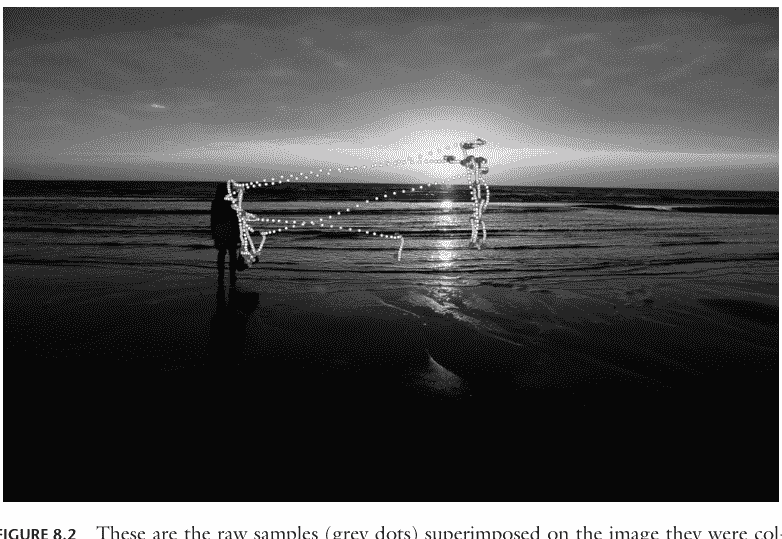

**图 8.2** 这些是叠加在采集图像上的原始样本（灰色点）

绘制原始样本的背景。如果不指定图像，将使用黑色背景。第二个关键字参数是 `savefilename`，它允许你指定保存生成图表的位置。如果不指定名称（或为 None），则不会保存图表。

要创建原始样本的图表并将其保存到输出目录，请使用以下代码：

```
fig = gazeplotter.draw_raw(x, y, DISPSIZE, \n    imagefile=imgpath, savefilename=savepath)
```

`draw_raw`（以及本章中所有其他绘图函数）返回一个 Matplotlib 图形实例。你可以使用它来进一步操作你的图表，并且可以通过使用 Matplotlib 的 `pyplot` 模块中的 `close` 函数来关闭它：

```
close(fig)
```

定期关闭图形是一个好习惯。保持太多图形打开会耗尽内存，导致你的脚本崩溃！

现在，让我们转向更花哨的东西：是时候在图像上绘制注视点了！注视点可以表示为原始图像上的（透明）点。你可以使用 `gazeplotter` 模块的 `draw_fixations` 函数创建这样的图表。它需要两个参数：注视点（一个 'Efix' 事件列表）和显示尺寸。

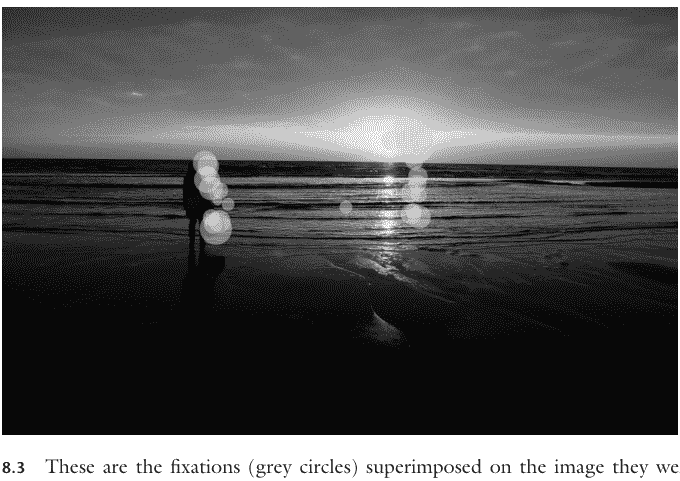

**图 8.3** 这些是叠加在采集图像上的注视点（灰色圆圈）

你还可以指定一些关键字参数。这些包括 `imagefile` 和 `savefilename`，它们的工作方式与 `draw_raw` 函数中的相同。此外，你可以使用 `durationsize` 关键字来指定一个布尔值。如果设置为 True，点的大小将根据注视持续时间来确定：注视时间越长，点就越大。如果 `durationsize` 设置为 False，所有点的大小将相同。一个类似的关键字参数是 `durationcolour`，它也需要一个布尔值。如果你将其设置为 True，较长的注视将具有“更热”的颜色。如果 `durationcolour` 设置为 False，所有点都将是绿色的。示例请参见图表。

对于此图表，你还应该为预期的保存文件创建一个名称和路径。完成后，你可以使用前面提到的 `draw_fixations` 函数创建图表。与之前一样，在创建并保存后关闭图形：

```
# 绘制注视点
savename = 'fixations_{}'.format(imgname)
savepath = os.path.join(OUTPUTDIR, savename)
fig = gazeplotter.draw_fixations(fixations, DISPSIZE, \n                                durationsize=True, durationcolour=False, \n                                imagefile=imgpath, savefilename=savepath)
close(fig)
```

最后的图表是最花哨的：热图。这种可视化在眼动追踪研究中相当流行，主要是因为它看起来真的很漂亮。其思想是用更热的颜色表示注视点更密集的区域。你还可以考虑注视持续时间，使长注视比短注视权重更高。结果是一种可视化，可以立即告诉你注视点最常出现在哪里（参见示例图）。

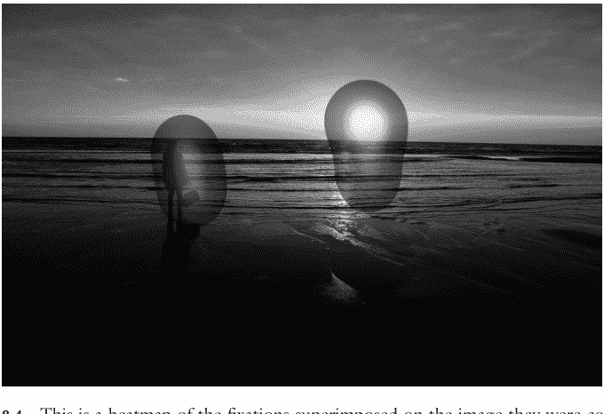

**图 8.4** 这是叠加在采集图像上的注视点热图

要绘制热图，你可以使用 `gazeplotter` 模块中的 `draw_heatmap` 函数。它需要与 `draw_fixations` 函数相同的两个参数：一个 'Efix' 事件列表和显示尺寸。

`draw_heatmap` 函数可以接受四个关键字，其中两个与 `draw_raw` 和 `draw_fixation` 函数相同：`imagefile` 用于指定原始图像，`savefilename` 用于存储生成的热图。另一个关键字是 `alpha`，它允许你设置将叠加在图像上的热图的透明度。如果设置为 0，热图将完全透明；如果设置为 1，热图将完全不透明。默认值为 0.5。最后一个关键字是 `durationweight`，它需要一个布尔值。如果你将其设置为 `True`，注视持续时间将被加权到热图构建中，较长的注视被赋予更高的权重。如果设置为 `False`，所有注视将被视为同等重要。默认值为 `True`。

要绘制并保存热图，然后再次关闭它，请使用以下代码：

```
# 绘制热图
savename = 'heatmap_{}'.format(imgname)
savepath = os.path.join(OUTPUTDIR, savename)
fig = gazeplotter.draw_heatmap(fixations, DISPSIZE, \n                               imagefile=imgpath, savefilename=savepath)
close(fig)
```

至此，你的脚本应该完成了。运行它以遍历所有试验，每次试验创建三个数据可视化。当脚本完成时，你可以在输出文件夹中欣赏所有这些图表。

示例图像包括一个文档网站的截图。该网页上的文本显然正在被参与者扫描。你可以在原始数据图中看到这一点

160 眼动追踪

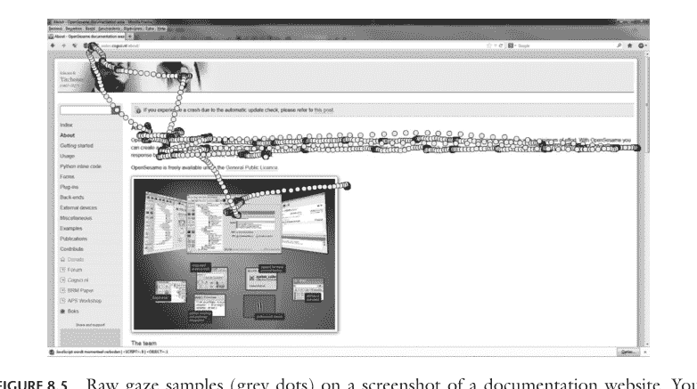

**图 8.5** 文档网站截图上的原始注视样本（灰色点）。你可以看到参与者用眼睛跟随文本。注意重叠并非一一对应，尤其是在图像的中右部分。这表明发生了一些漂移，降低了数据质量。这非常常见

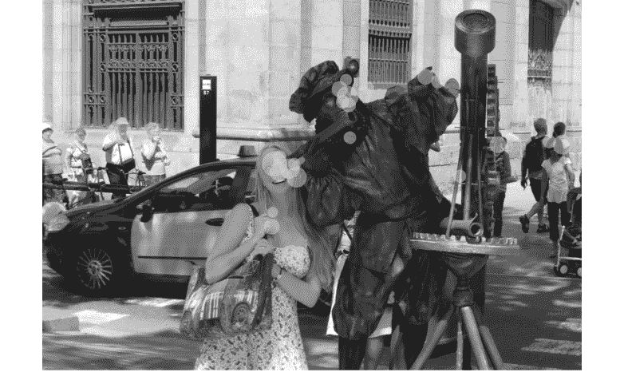

**图 8.6** 假日照片上的注视点（灰色圆圈）。这张照片是我在巴塞罗那拍的，当时一位女士正在与街头艺人合影。你可以看到大多数注视点落在脸上，少数落在图片中主要人物的手上

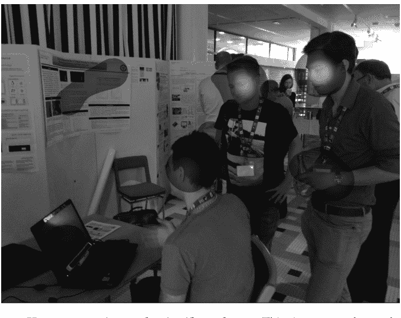

**图 8.7** 科学会议照片上的热图。这张照片拍摄于2013年的欧洲眼动会议，当时一群书呆子正在讨论某个软件。奇怪的是，注视点主要集中在右边的混蛋身上，而不是中间最帅的那个混蛋

以及在注视点图中，注视点落在文本的连续部分。有趣的是，人们很少注视句子中的所有单词，而是跳过那些他们可以用眼角余光阅读的常见单词。

示例中有不少包含人脸的图片。这些图片的注视点图和热图清楚地讲述了一个故事：我们的参与者喜欢看脸。这是一个常见的模式，你可以在大多数被允许自由观看图片的人身上看到这一点。不过，对脸的偏好并非一成不变。如果你要求参与者在图片中寻找你的钥匙，他们很可能会对图片中的脸关注少得多。

这里强调的最后一个例子是一栋夜晚的建筑。它是乌得勒支大学校园内的 Van Unnik 大楼。它的大部分在2014年退役，但在拍摄这张照片时，它是我工作的地方。右上角的窗户曾经是我的办公室。

可视化有趣的地方在于，注视点集中在图像较亮的部分。这反映了人类注视行为中一个非常普遍的倾向：对比度的差异在吸引我们的注意力方面非常有效。在这张图片中，办公室的灯光、大学标志和街道与普遍黑暗的背景形成对比。我们的眼睛被吸引到这些部分。不过，不要以为我们的眼睛像飞蛾一样！如果对比度反转，参与者将会注视在普遍明亮背景下的黑暗部分。

162 眼动追踪

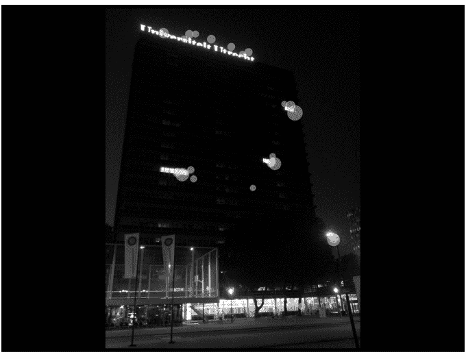

**图 8.8** 夜晚丑陋建筑照片上的注视点（绿色点）。注视点集中在图片的高对比度区域

最后需要注意的一点是，从单个参与者的观看数据创建热图有些不寻常。这对于教学目的很有用，但通常会从更大的参与者群体中收集注视点。在测试参与者时，通常是*人越多越好*。

# 9 种常见的统计检验

## 9.1 唉，真无聊

是的，统计学可能很枯燥。但它也至关重要：统计学可以为研究发现提供背景信息，并为政策制定提供依据。最重要的是，找到“显著”的统计结果会让你对自己和选择成为研究者的决定感觉良好。

本章并非旨在提供一门全面的高级统计学课程。它只提供一些基础知识，然后告诉你如何在 Python 中实现最常见的差异和关系检验。更复杂的选项是存在的，但超出了本书的范围。如果你对进行高级统计感兴趣，可以查看 `statsmodels` 和 `scikit-learn` 包。

### 9.1.1 方差与误差

在我们开始讨论统计检验之前，让我们快速回顾一些你可能已经忘记或从未学过的基础知识。这些包括方差、误差和 p 值。以下是一个快速概述。如果你愿意，可以跳过它（下一个重要的标题是“9.2 T 检验”）。然而，这可能并不明智。我无法告诉你，在剑桥大学自然科学荣誉学位考试中，有多少学生因为“以前学过”而懒得来上我的统计课，结果在我那极其简单的考试中得分相当低。而他们的同学，几乎没有数学或统计学背景，最终却表现得相当好。事实证明，傲慢会导致失败。

警告完毕，让我们开始吧。在自然界中，个体之间存在着令人烦恼的差异。当你测量人们的身高、血液中各种物质的浓度，甚至同一物种内的脚趾、触手或睾丸数量时，这一点就很明显了。最后一个话题是在我有幸参加的一次药理学会议上一个时机难以理解的笑话的主题，笑点在于平均每个人有一个睾丸。虽然这对某些人来说是准确的（嗨， fellow 睾丸癌幸存者！），但对大多数人来说是不准确的。大多数平均值都是如此：它们表示分布的中心（假设分布是对称的），但许多或大多数个体并不遵循这个平均值。相反，他们在平均值周围变化，有些得分明显或略微较低，而另一些得分略微或明显较高。

在正态分布（钟形曲线）中，平均值位于分布的中间。例如，当荷兰中央统计局（CBS）研究 2021 年荷兰人的平均身高时，他们发现 1970 年后出生的男性平均身高为 184 厘米（如果你不使用公制单位，大约是 6 英尺），女性为 171 厘米（大约 5 英尺 7 英寸）（Reep, 2021）。每个人都偏离这个平均值：一半的男性低于 184 厘米，另一半高于 184 厘米；女性也是如此。

正如我们可以计算平均值一样，我们也可以计算个体预期偏离平均值的程度。我们称之为分布的**方差**。它定义为每个个体与所有个体平均值之间的平均平方距离。例如，如果三个朋友的身高分别是 156、171 和 186 厘米，他们的平均身高是 171 厘米。他们与这个平均值的距离分别是 -15、0 和 15。这平均为 0，这很烦人；但他们与平均值的平方距离是 225、0 和 225。方差是这些平方距离的平均值，即 150。

一个高度相关的概念是**标准差**，它只是方差的平方根。对于我们三个朋友的例子，标准差将略高于 12 厘米。方差和标准差是分布的属性：如果你测量荷兰所有的女性，你就能计算出她们的平均身高及其方差。

因为我们懒惰（或者说注重成本效益），我们很少测量总体中的每个人。相反，我们从更大的总体中抽取个体样本。即使我们抽取了一个完全有代表性的样本，它也不会总是准确地反映总体。例如，如果我从之前的三个朋友中抽取样本，他们的平均身高恰好准确地反映了荷兰女性的平均身高。然而，对于从该总体中随机抽取的任何三个女性的样本，情况并非如此。想象一下，抽取数千个三人女性样本，并计算每个样本的平均身高。这些平均值将形成它们自己的分布：中心将在总体平均值上，但也会有相当大的方差。

现在想象抽取一个 3000 名女性的样本。这比之前的三个女性样本大得多，所以你可能已经直觉地认为这个样本的平均身高更接近整个总体的平均身高。如果你再次抽取数千个 3000 名女性的样本，并再次计算每个样本的平均身高，它们将再次形成一个分布。与之前一样，这个平均值分布的中心将在总体平均值上。然而，这一次样本平均值分布的方差会更小。

事实证明，这些样本平均值的方差与总体的方差直接相关，可以通过将总体方差除以样本中的个体数量来计算。哇！我们可以用这个来估计**平均值的标准误**，我们将其计算为样本的标准差除以样本大小的平方根。

总之，我们可以测量总体中个体的特征，如身高。会有一个平均身高，它反映了正态分布的中心。在这个平均值周围也会有方差，它反映了个体之间的差异程度。高标准差意味着方差大，而低标准差意味着个体相对相似。平均值和标准差是总体的属性。

我们可以不测量整个总体，而是从总体中抽取个体样本。这些样本是不完美的，但它们的平均值应该收敛于总体平均值。样本越大，它们可能越接近总体平均值。这通过平均值的标准误来量化，它是通过将样本的标准差除以样本大小的平方根（即该样本中的个体数量）来计算的。平均值的标准误是抽样过程的属性。

### 9.1.2 什么时候事情会令人惊讶？

既然我们知道了术语，我们应该退一步思考一些大问题。例如，如果泰勒·斯威夫特搬到荷兰，她会在同龄人中脱颖而出吗？根据网上的快速搜索，斯威夫特身高 180 厘米。（根据个人在演唱会上的观察，她看起来大约 3 厘米高，但这可能受到了观看距离的影响。无论如何，那些演唱会都很棒！）根据 CBS 的数据，1989 年在荷兰出生的女性平均身高为 169.8 厘米。这意味着斯威夫特比荷兰女性平均身高高出 10.2 厘米。这是否意味着她会脱颖而出？

直觉上，你可能会回答“嗯，这取决于……”，因为你可能觉得虽然斯威夫特高于平均水平，但我们并不完全知道这个平均值周围的分布情况。让我们假设标准差是 13 厘米（因为我们谈论的是泰勒·斯威夫特，但也因为这是实际数字）。这意味着斯威夫特处于距离平均值一个标准差的范围内。更准确地说，假设正态分布，1989 年出生的荷兰女性中有 22% 会比她高。这意味着斯威夫特很高，但每四五个荷兰女性中就有一个会比她高，因此她在人群中不会特别突出。

现在忘记可能的搬迁，将斯威夫特与她的原籍国进行比较。根据美国国家健康统计中心的一份出版物，2015-2018 年间 20-29 岁女性的平均身高为 162.6 厘米，标准差约为 10 厘米（Fryar et al., 2021）。再次假设正态分布，这意味着斯威夫特在她这个年龄段的女性中属于最高的 4%！因此，她很可能在同龄人中脱颖而出。

我们可以将上述内容重新表述得更统计化：“假设美国女性的平均身高为 162.6 厘米，标准差为 10 厘米，观察到身高 180 厘米或更高的人的概率为 4%。”这与即将介绍的 **p 值**相去不远。

发现像泰勒·斯威夫特这样高的人是否令人惊讶，取决于你对 4% 的解释。也许你不会觉得这在实际意义上显著：当你在繁忙的街道上行走时，你可能会看到数百人，因此其中会有很多高个子女性。（同样，人们会进行数百项研究，其中一些必然会显示出更大的效应。）更一般地说，4% 的中奖概率会感觉很多，而手术后 4% 的改善概率可能会感觉令人失望。（同样，如果重要的政策将基于研究证据来制定，那么证据水平应该很高。）

## 9.2 t检验

科学中一些最基本的问题都与差异有关：“我能憋气几分钟；这比别人强吗？”，“猫的大脑比狗的小吗？”，或者“我最近开始服用一种新药；我的排泄物现在变大了吗？”。这些问题通常归结为更一般性的问题：“我的测量结果与预期不同吗？”以及“A组与B组有差异吗？”

解决上述问题的一种方法是使用t检验。t检验将“差异”形式化，并定义了我们何时认为这种差异具有“统计学意义”。t检验有不同类型，各有其特定用途。它们的共同点是计算一个t值，并将该t值与t分布进行比较。如果t值非常极端，我们就可以认为它是“显著的”。

t分布看起来很像正态分布，但它有一个令人兴奋的附加特性：**自由度**。在自由度无限大时，t分布趋近于标准正态分布（均值为0，标准差为1）。然而，随着自由度减小，t分布的尾部会抬高。这意味着在自由度较少时，出现更极端值的概率更大。

我听到你在想：自由度是什么？假设你像我们之前那样估计一个样本的方差。你使用了一些独立的观测值来完成这个任务，例如样本中个体的身高。你还使用了另一个参数来计算方差，即平均身高。方差的自由度等于观测值数量减去你用来计算方差的那个参数。换句话说，参数估计的自由度是 n – k，即样本量减去用于计算该参数的参数数量。对于t检验，这将是 n – 1。

### 9.2.1 什么是p值？

使用t分布和计算出的t值，你可以计算一个**p值**。这个值反映了在*假设原假设为真*的情况下，观察到你所得到的t值或更极端t值的概率。（这里的原假设是没有差异，这意味着t值预期会分布在0附近。）

p值**不是**你的假设为真的概率。它也**不是**你的数据是偶然发现的概率。单个研究的p值也**不等同于**效应量或证据水平（即，p值越低并不意味着“差异越大”或“证据越多”）。

让我再重复一遍，给后排的人听（以及那些逃课、考试表现不佳却过度自信的学生）：“p值是在原假设为真的假设下，观察到一个与观测到的t值一样高或更极端的t值的概率”。

当原假设为真时，p值是均匀分布的：它们是0.01的可能性与是0.50或0.99的可能性一样大。当备择假设为真时，p值是偏态的：它们现在更可能接近0，而不是接近1。偏态的程度取决于差异的大小。

如果有人说一个结果是“统计学显著的”，他们真正的意思是他们的p值低于某个任意的阈值。通常，这个阈值设定为0.05。如果原假设为真，p值在0到1之间均匀分布，因此有5%的概率p值等于或低于0.05。然而，如果原假设不为真，p值是偏态的，因此p值低于0.05的概率大于5%。大多少取决于效应量，非常小的差异只会使概率增加一点点。

另一个重要因素是样本量。增加样本量会减小均值的标准误，这反过来会增加t值（你将在下一节看到原因），同时也会增加自由度。这两个因素都会进一步使p值的分布偏斜。

### 9.2.2 单样本t检验

假设你有一个个体样本的测量值，并且你对这些测量值应该是什么有一个非常具体的假设。例如，你可能是一家公司的CEO，该公司系统性地向工厂周围的湖泊倾倒化学废物，结果当地社区的人们指控你毒害了他们的饮用水。哎呀！由于自来水质量问题，当地居民转向了瓶装水。你看到了这个商机，并扩展业务，将公共水资源抽入你自己的瓶装水生产中。不幸的是，居民现在抱怨你的瓶子向水中渗出微塑料，这对他们和他们的后代有害。又来了！

幸运的是，你非常确定自来水中的化学物质和瓶装水中的微塑料是完全安全的！你只需要进行一项快速研究来证实这一点。人们抱怨说，自从你开始毒害他们的水源，然后开始向他们出售可能有问题的水以来，他们婴儿的出生体重显著下降。另一方面，你认为毒害——丰富当地湖泊和商业瓶装水并没有错。因此，你要求当地医院提供过去一年出生体重的匿名记录。你还知道，在更广泛的人群中，40周妊娠期的平均出生体重为3499克（Duryea等人，2014）。因此，你的问题是：出生体重的分布是否与全国平均水平不同？

你模糊地记得在MBA课程中那个你大部分时间都在混日子的统计单元里学过的单样本t检验。这是一种允许你将一组观测值（婴儿体重）与一个预期均值（3499克）进行比较的检验。该检验首先通过从观测均值中减去预期均值来计算t值。你可以将此视为你的**信号**：你观察到的数据与预期之间的实际差异。然后，这个信号除以均值的标准误（样本标准差除以样本中观测值数量的平方根）。你可以将此视为你的**噪声**：样本中预期的不确定性。在某些方面，t值因此有点像信噪比。换句话说，它量化了你观察到的差异是否大于你可能预期的差异幅度。

你让IT部门的极客用Python编写这个程序。他们使用NumPy和SciPy的stats模块，给你提供了以下代码：

```python
from scipy.stats import ttest_1samp

# These are the weights for 10 babies born at
# 40 weeks in the local hospital.
baby_weights = [2530, 3095, 3323, 3404, 3297,
                2986, 2442, 3288, 3219, 2822]
# Test if the collection of weights could be
# different from the population mean.
t, p = ttest_1samp(baby_weights, 3499)

print(t, p)
```

哎呀...那个-4.26的t值表明婴儿出生时确实比全国平均水平小，而0.002的p值是“统计学显著的”。在假设当地婴儿体重与普通人群相同的前提下，这表明观察到像你刚刚观察到的t值或更极端的t值是相当不可能的。

看来你可能终究需要做些解释了！用你的钱擦干眼泪，声称样本太小，也许邀请一位有权势的法官去度假，以防镇民们真的把你告上法庭。

### 9.2.3 相关样本t检验

新例子！假设你是一名编辑，你开发了一种干预措施，使学者更有可能按时提交他们的手稿。你跟踪了许多作者之前的书籍延迟情况，并且你很好奇他们是否从你对下一本书延迟的干预中受益。因此，你对每位作者有两个测量值：干预前的延迟天数和干预后的延迟天数：

```python
import numpy

# Collected data from 10 writers before and
# after the intervention.
pre = numpy.array([366, 298, 654, 712, 378,
                   453, 11, 343, 777, 827])
post = numpy.array([452, 559, 435, 380, 278,
                    296, -2, 414, 636, 692])
```

现在你可以检验干预后的延迟是否与干预前的延迟不同！你可以使用相关样本t检验来完成：

```python
from scipy.stats import ttest_rel

t, p = ttest_rel(pre, post)

print(t, p)
```

令人失望的是，你的干预似乎没有奏效：t值是1.25，p值是0.243....也许你的样本太小，或者也许学者们只是无可救药的乐观主义者，承担了太多工作，然后未能在他们过于乐观估计的时间内完成所有工作。

> （坦率地说，这个例子中唯一不现实的地方是其中一位作者在截止日期前两天才提交手稿。与此高度相关的是：抱歉，亚当！）

### 9.2.4 独立样本 t 检验

之前，我们只需要将单个样本与预期均值进行比较，或者巧妙地利用数据中的关系，从样本内的两次测量中得出一组差异。现在，让我们转向一个稍微复杂一点的问题：两个不同组之间的差异！

**被试间**设计适用于你测试两个完全不同的群体的情况，比如冶金学家和海豚。独立样本 t 检验可以让你查看你测量的特征在这些组之间是否存在差异。其基本原理与其他 t 检验相同：你首先计算组间均值的差异，然后将其除以一个衡量变异性的指标。就像之前一样，这有点像信噪比，你试图确定你发现的差异是在预期范围内还是超出了预期。

由于我们处理的是两个样本，现在有两个方差需要考虑：每个组一个。如果样本的大小和方差相等，将它们合并在一起并不是特别麻烦。然而，当样本大小不等时，问题就会出现；如果方差不等，麻烦就更大了。这些问题背后的原因有点超出本章的范围，但如果你想了解个大概，可以查阅一下韦尔奇-萨特思韦特方程。

幸运的是，SciPy 的 `stats` 模块提供了一个简洁明了的解决方案：`ttest_ind` 函数！这个函数有一个关键字参数 `equal_var`，你可以将其设置为 `False`。如果你的样本确实方差不等，这会应用适当的校正。然而，将其用于方差相等的样本也没有坏处：如果样本大小和方差更相似，校正会趋向于基本的独立样本 t 检验。

```python
from scipy.stats import ttest_ind

# Define a feature that is different between
# metallurgists and dolphins.
# (Identifying this feature is left as an
# exercise to the reader.)
metal = [89, 137, 56, 104, 78, 29, 65, 67, 73, 84]
dolphin = [530, 642, 591, 593, 627, 595]
t, p = ttest_ind(metal, dolphin, equal_var=False)
print(t, p)
```

总而言之，独立样本 t 检验比相关样本 t 检验稍微复杂一些，但只要将 `ttest_ind` 的 `equal_var` 设置为 `False`，你基本上应该是安全的。

## 9.3 相关性

到目前为止，我们讨论的都是差异。但有时我们感兴趣的是事物是否相似。为此，我们可以使用相关性：不同测量值以相似方式变化的趋势。例如，像人们的工资、他们每天听泰勒·斯威夫特的分钟数，以及他们的配偶谈论机械键盘的频率等，都与生活满意度相关[需要引用]。

相关性是统计检验中的“坏小子”，因为每个人总是警告你。他们会说“相关性不等于因果关系！尼古拉斯·凯奇的电影数量与美国游泳池溺水事件的数量相关！”说到那位出色的演员：相关性就像是统计学中的尼古·凯奇：使用得当时值得奥斯卡奖，但使用不当时，结果可能会无意中变得滑稽。

### 9.3.1 协方差

我们之前研究了 t 检验，并注意到它们通过（某种程度上的）信噪比来量化样本差异。它们通过将均值之间的差异除以从样本方差导出的指标来实现这一点。相关性非常相似，但它们量化的不是差异，而是两个样本之间的关联。这种关联的大小然后与，你猜对了，一个从样本方差导出的指标进行比较。

两个变量之间的关联可以用它们的协方差来量化。计算协方差归结为观察个体在两个变量上距离组均值的距离。例如，我可能比一般人花更多时间阅读关于鸽子飞行的文章，我的生活质量分数也可能高于平均水平。另一方面，我的一些同事出于某种原因（？！）不喜欢鸽子，我只能假设他们的生活质量低于平均水平。这就是协方差：当你在鸽子兴趣上得分高时，你在生活质量上得分也高；但当你在鸽子兴趣上得分低时，你在生活质量上得分也低。因此，如果你将这两个距离组均值的距离相乘，最终会得到一个高值。所有这些乘积差异的平均值（跨样本中的所有人）就是协方差。

当两个变量在每个参与者身上同时高或同时低时，协方差有效：两个正值相乘得到正值，两个负值相乘也得到正值！然而，当一个变量高而另一个变量低（反之亦然）时，它也有效。在这种情况下，乘积是一个正数和一个负数，或者一个负数和一个正数；两者最终都得到一个负值。

如果人们的得分不一致，协方差会很低。有些人在两个变量上的得分都高于平均值，但有些人在一个变量上得分高于平均值，在另一个变量上得分低于平均值，还有一些人在第一个变量上得分低于平均值，在第二个变量上得分高于平均值。如果是这种情况，结果就是正值和负值的混合，平均值大约为 0：没有协方差！

### 9.3.2 皮尔逊 R 系数

你可以认为皮尔逊相关系数 R 是协方差与方差的比率。它通过将两个变量之间的协方差除以这些变量标准差的乘积来计算。R 的范围从 -1（完全负相关）到 0（无相关），再到 1（完全正相关）。这种完全相关意味着，对于一个变量的每一个差异，另一个变量的差异完全相同。所以，如果我在阅读关于鸽子的文章上得分高于平均值 1 个标准差，那么我在生活质量问卷上的得分也会高于平均值 1 个标准差。

在 Python 中，你可以简单地使用 SciPy 的 `stats` 模块，通过 `pearsonr` 函数来计算 R 和相关的 p 值：

```python
from scipy.stats import pearsonr

x = [1.4, -0.7, -0.9, 0.4, 0.3,
     -0.1, 1.0, -0.3, -0.2, 1.1]
y = [0.9, -0.6, -0.7, -0.3, 0.5,
     0.1, -0.2, -0.5, 0.3, 0.8]
r, p = pearsonr(x, y)
print(r, p)
```

相关性的 p 值量化了在假设两个变量之间不存在相关性的情况下，找到像观测到的 R 值或更极端的 R 值的概率。

### 9.3.3 斯皮尔曼 ρ 系数

皮尔逊相关系数 R 受极端值影响。当这些值出现在任一变量中时，会影响协方差的计算，并且它们可能不成比例地拉动 R 值。在这些情况下，你可以选择使用非参数相关性检验。其中一个指标是斯皮尔曼等级相关系数 ρ。

ρ 的美妙之处在于它的工作原理与 R 完全相同：它是标准化的协方差，即两个变量之间的协方差除以它们标准差的乘积。然而，我们首先使用一个小技巧来摆脱那些讨厌的极端值！我们不使用实际数据，而是使用它们的等级顺序。对于上面的例子，等级顺序如下：

```python
x_rank = [10, 2, 1, 7, 6, 5, 8, 3, 4, 9]
y_rank = [10, 2, 1, 4, 8, 6, 5, 3, 7, 9]
```

### 9.3.4 附注：这些检验以谁命名？

与许多统计检验和概念一样，上述检验也是以人名命名的：卡尔·皮尔逊和查尔斯·斯皮尔曼。他们是活跃于约1860年至1940年间的统计学家，显然两人彼此憎恶（学术八卦不予引用）。不过，或许更值得注意的是，他们的工作极大地助长了优生学运动。遗憾的是，当时许多统计学家和心理学家都是积极而狂热的优生主义者，尽管有理由认为他们本应更明事理。关于这个话题已有大量著述，其文笔远比我所能写出的更为优美和全面。我只是想为这些检验的名称提供背景信息，因为隐瞒这些信息似乎不妥。

## 9.4 线性回归

有时，我们认为有多个变量与我们感兴趣的结果相关。例如，我们可能想探究讲师的教学评价与他们穿粗花呢夹克以及他们的h指数有何关系。我们可以分别计算这两组值的相关性，但这只能揭示个体的成对关系。然而，实际情况可能是，h指数较高的人更有可能穿粗花呢夹克，这使得这些变量在与教学评价的关系上存在重叠。线性回归允许我们同时检验这两个变量，从而避免对任何重叠部分进行重复计算。

回归分析常被笼罩在预测的语言中。这是因为我们明确使用变量来预测结果。然而，你真的应该只从实用的数学角度来考虑这种“预测”，而不是从更哲学的因果关系角度。如果我们对结果y回归变量x1和x2，这并不一定意味着x1和x2导致了y。在我们上面的例子中，讲师获得高教学评价可能是因为学生更信任穿粗花呢夹克的讲师，并且他们拥有丰富的论文发表经验（这也提高了他们的h指数）。然而，也可能是如果讲师因教学评价和h指数而增强了对其学术能力的信心，他们就更有可能开始穿粗花呢夹克。线性回归无法捕捉因果关系的方向，它们只告诉你关联性。你需要通过巧妙地设计实验和模型、使用操纵手段以及简单地等待时间的推移来解决因果关系问题。也许，将所有这些结合起来，你的理论才能谨慎地趋近于因果关系。

在说明了这一点之后，让我们开始动手实践吧。我们的例子需要两个预测变量，所以让我们编造一些数据！首先，是穿粗花呢夹克的情况。我们保持简单，将其设为二元变量：有些人穿粗花呢夹克，他们将被赋值为1；而其他人不穿，他们将被赋值为0：

```
tweed = [0, 0, 1, 0, 1, 1, 1, 1, 0, 0]
```

接下来，是h指数。这些几乎是完全无意义的数值，用于量化一位学者的发表量以及每篇论文被引用的次数。h指数越高，我们认为某人的“影响力”越大。（这个指标大多没有意义，因为它在不同领域差异很大，很容易通过大量相互引用的小论文来操纵，以及其他一系列原因。）在所有科学家中，h指数偏向于0。（这与真实效应的p值并无不同，所以我猜我们应该开始称h指数低的人为“显著”了！）然而，在一个系的教职员工中，它可能更接近正态分布，因为所有人都已在学术界工作了数年，因此发表和被引用的次数都相当可观。

```
h_index = [14, 12, 29, 11, 2, 30, 33, 31, 10, 17]
```

> （如果你对其中的2感到疑惑：那是一位刚毕业的博士生，他恰好与那位h指数为33的同事合作过，模仿了对方的一切（包括粗花呢夹克），并且非常有前途，以至于系里在完全公平的招聘程序后不得不为他提供了一个终身教职。）

我们回归分析的最后一个要素是结果变量：教学评价。这些评价由部分学生在课程模块结束时完成，旨在反映教学能力。（实际上，它们也反映了模块主题、随机的不满情绪以及各种刻板印象。）在许多地方，这些分数在1到5之间。因为这类似于许多网络评论的工作方式，我们称这些评价分数为“星级”。

```
evaluation = [2.44, 1.66, 4.40, 1.71, 1.00,
              4.67, 5.00, 4.98, 1.66, 2.62]
```

### 9.4.1 单变量线性回归

首先，让我们分别查看每个预测变量与结果之间的关系。我们可以使用SciPy的stats模块中的linregress函数来完成：

```
from scipy.stats import linregress

result = linregress(tweed, evaluation)
print(result.rvalue, result.pvalue)
```

到目前为止，我们只是将其视为简单的相关性，只查看R系数和p值。这些表明穿粗花呢夹克与学生评价之间存在关系，但回归分析的妙处在于它可以更精确地量化这种关系。

你可以通过查看斜率参数来做到这一点，它告诉你预测变量每增加一个单位，结果会增加多少：

```
print(result.slope)
```

这个斜率告诉你，穿粗花呢夹克会使你的评价提高整整2个星级！让我们看看h指数是否也有类似的情况：

```
result = linregress(h_index, evaluation)
print(result.slope, result.rvalue, result.pvalue)
```

这个结果向我们展示，h指数每增加一个点，教学评价大约提高0.14分。这种关系也非常紧密，因为R值接近1！现在需要强调的是，这些值完全是编造的，h指数实际上与教学表现的相关性并没有这么强（Figlio & Schapiro, 2017）。

进行线性回归的另一个巧妙之处在于我们可以轻松地绘制结果：

```
from matplotlib import pyplot

# 首先，创建数据的散点图。
pyplot.plot(h_index, evaluation, "o",
            color="#FF69B4")

# 接下来，绘制拟合线。
x = numpy.linspace(0, 35, 10)
y = result.intercept + result.slope * x
pyplot.plot(x, y, "-", color="#FF69B4")

# 设置坐标轴标签
pyplot.xlabel("h-index", fontsize=16)
pyplot.ylabel("Teaching evaluation (stars)",
              fontsize=16)
```

### 9.4.2 多变量线性回归

下一步是将两个预测变量合并到一个模型中。为此，我们需要将它们放入一个数组中。为此，让我们使用NumPy的ones函数，它可以创建一个填充了值1的数组。在这种情况下，我们将给它形状10 × 3：一行对应一个观察值（即讲师），一列对应一个特征（即为每位讲师测量的变量）。

```
X = numpy.ones((10,3))
```

现在让我们将变量添加到数组中：

```
X[:,1] = tweed
X[:,2] = h_index
```

你会注意到我们保留了第一列（索引0）不变。它保持为1，因为模型将其用作截距。对于`linregress`函数，这个截距是自动包含的，但在多变量回归中，我们实际上需要为结果做一些工作！

接下来，我们需要运行回归。我们将使用一种称为**普通最小二乘法**的技术来完成，该技术旨在自动找到一个使趋势线与数据之间距离最小化的解决方案。这个距离被称为**残差**，残差越小，拟合效果越好。这是一个复杂的问题，因为你需要找到最佳拟合的截距和斜率参数，但你不能尝试所有可能的参数组合。相反，大多数最小化技术会在参数空间周围进行巧妙的搜索。在这些搜索中，他们首先随机尝试一个猜测，然后计算残差。然后他们稍微移动一点，再次计算残差。如果残差变小了，那么我们一定是在朝正确的方向移动！过了一段时间，我们朝任何方向移动都会导致残差变大。这意味着我们处于一个**局部最小值**。在尝试了几个不同的随机起始猜测并最终陷入几个局部最小值后，我们选择最小值中最低的那个，并使用相关的参数值作为我们的最佳拟合。

参数空间可以被想象成一个景观。经度和纬度由截距和斜率参数决定，海拔可以被视为每个截距和斜率组合的残差。最小化算法在这个景观上撒下一袋弹珠，并选择落在最低处的弹珠的（截距，斜率）坐标。

幸运的是，你不必自己实现上述搜索。SciPy有一个内置函数可以做到这一点！它是`linalg`模块的一部分，名为`lstsq`，可以这样使用：

```
from scipy.linalg import lstsq

betas, ss_res, rank, s = lstsq(X, evaluation)
```

最小二乘算法产生相当多的输出，但目前最重要的是系数`betas`和残差平方和`ss_res`。这里的beta是**未标准化系数**，其顺序与我们预测变量数组X中的列相同。这意味着beta₀（读作“beta naught”）是截距，beta₁是与穿粗花呢夹克相关的系数，beta₂是与h指数相关的系数。

这些系数是“未标准化”的，因为我们保留了它们在h指数和评价分数“星级”中的原始空间。如果你需要知道实际效果，即穿粗花呢夹克时评价提高了多少，这很有用。然而，如果你想比较粗花呢夹克和h指数的相对影响，这些未标准化系数不能直接比较。相反，你需要**标准化**所有（连续）预测变量和结果。标准化意味着你将一组分数除以其标准差，然后减去其均值，使得结果值的均值为0，标准差为1。当在同一个回归中使用这些标准化值时，beta反映的是**标准化系数**，它们的大小可以直接相互比较。

请注意，标准化不应应用于`tweed`变量，因为该变量是二元的：0表示不穿粗花呢，1表示穿粗花呢。从数学角度看这很方便：一个beta系数乘以0结果为0，但乘以1时，结果就是beta值本身。因此，它们可以直接解释为“穿粗花呢与教学评估中beta值的差异相关”。

让我们看看未标准化的系数是多少：

```
print("tweed: {}".format(betas[1]))
print("h-index: {}".format(betas[2]))
```

这向我们显示，穿粗花呢夹克与讲师评估分数提高约0.38星相关，而他们的h指数每提高一步与评估分数提高0.13星相关。请注意，这些结果与之前不同：之前粗花呢与提高2星相关，h指数与提高0.14星相关。这是因为这两个变量在结果中共享**解释方差**：由穿粗花呢解释的部分评估分数，也被h指数解释了！

另一个计算出的重要值是残差平方和。这是预测结果（即我们之前用趋势线可视化的内容）与真实结果之间所有距离的总和。这些距离被平方以确保它们都是正数（否则负值和正值相加会抵消为0），同时也使得较大的差异比小的差异权重更大。残差平方和越小，模型拟合越好！然而，没有上下文，我们并不真正知道残差的“小”值是多少……我们该如何判断呢？

你可能已经猜到了，我们需要将残差平方和与结果方差的某种度量进行比较，以再次计算某种信噪比。在这种情况下，我们可以计算结果的总平方和：

```
# 将结果转换为NumPy数组，以便于计算。
evaluation = numpy.array(evaluation)
ss_tot = numpy.sum((evaluation - numpy.mean(evaluation))**2)
```

我们现在可以将残差平方和与总平方和进行比较。结果就是残差方差的比例，即未被回归模型解释的部分。要计算被解释的方差，我们只需用1减去未解释的方差：

```
r_sq = 1 - (ss_res / ss_tot)
print(r_sq)
```

这里的结果是“决定系数”，也称为R²（读作“R平方”），它量化了被解释方差的比例。在我们的例子中，它几乎是全部！（这是因为这是一个使用虚构数据的例子！）在现实情况中，它会低得多，但这不应让你气馁。现实是复杂的，生物系统尤其如此。在任何给定时间，都有无数的过程在活跃和相互作用，而少数变量之间的线性关联在大多数结果中只能解释总方差的一小部分。

总之，R²会告诉你模型解释了多少方差，而beta系数会告诉你每个预测变量与其结果之间的关系。这些是得出任何结论最重要的依据，因为它们告诉你（1）结果中有多少与你的预测变量相关，以及（2）每个预测变量与结果之间的实际关联。

此时，你可能会想“我怎么知道这是否显著？”如果你是出于习惯性需要，在对一个数值感到满意之前给它打上一到三颗星，那么你可能问错了问题类型。然而，在开始解释一个关联之前，想知道它是否具有统计显著性，这绝对不是不合理的。你可以从解释方差和未解释方差中推导出一个F值及其相关的p值，这将告诉你整个模型是否“显著”。你也可以从beta系数及其标准误中推导出t值及其相关的p值。这需要一些统计知识，但不需要额外的编程技能（此时你已经掌握了所有必要的要素）。不过，你也可以求助于专门的包，如scikit-learn（侧重于预测，较少涉及统计）和statsmodels（会给你所有的p值）。这些内容略微超出了本书的范围，但它们将建立在你本章学到的编程技能和底层拟合过程知识之上。

## 获取帮助

在通读本书之后，你应该能够使用Python进行相当多的研究。然而，不可避免地会有你被某些问题卡住的时刻。这时你就需要求助于互联网了！

### Stack Overflow

Stack Overflow是一个编程论坛。它由各种有趣的人组成：会问最愚蠢问题的完全新手、能修复任何bug的高素质且经验丰富的极客，以及介于两者之间的各类程序员。如果你有一个问题，很可能你已经发现别人问过，并且另一个人已经提供了答案。你可以在网上找到这个奇妙的网站：stackoverflow.com。

### 文档网站

本书中使用的每个Python包都在其网站上提供了至少一些文档。你可以在www.pygaze.org上了解更多关于PyGaze的信息，在www.psychopy.org上了解更多关于PsychoPy的信息，在www.pygame.org上了解更多关于PyGame的信息。NumPy和Matplotlib都是SciPy项目的一部分，可以通过项目网站scipy.org找到文档。

### PyGaze论坛

如果你有一个特定于PyGaze的问题，你随时可以求助于PyGaze论坛。该论坛可通过forum.cogsci.nl访问，是一个心理学家可以互相帮助的平台。此外，该包的开发者会定期查看论坛，并在力所能及的范围内提供帮助。

DOI: 10.4324/9781003174332-13

## 致谢

如果没有同事、朋友和家人的支持，这本书永远不会问世。（由于篇幅原因，我不会在这里明确列出每个人的名字，但我感谢你们所有人。）Becca Hirst和Jon Peirce尤其如此，他们慷慨地贡献了关于使用PsychoPy编码实验的章节。与你们合作非常愉快，我热爱你们在PsychoPy和开放科学工具方面所做的一切！

我永远感谢Ignace Hooge，是他将我引入了编程（使用Matlab）的大门；也感谢Sebastiaan Mathôt，他的代码和帮助让我得以在Python中找到自己的道路。还要感谢乌得勒支大学所有有勇气雇佣我——一个过度自信且技能不足的本科生——来满足他们编程需求的人。特别提及Chris Paffen和Stefan van der Stigchel，他们是第一个在那里雇佣我的人。

至于实际撰写本书第一版，我欠我的博士导师Masud Husain一个人情。当他听说我正在写这本书时，他摇了摇头，并提醒我真的应该开始专注于我的实际研究项目。他完全正确，任何其他导师都会合理地阻止我，和/或对我最终能完成论文不抱任何希望。感谢你理解我永无止境的分心需求。我也要感谢已故的Glyn Humphreys，他允许我在他的系里为研究生组织了一个Python课程，该课程的材料构成了本书的基础。我也感谢那门课程的参与者，感谢他们的热情，以及他们的建议和修正。

非常感谢我在牛津大学的前同事们，我在Masud Husain和已故的Mark Stokes实验室的伙伴们，以及我的朋友们。你们设法忍受了我对这本书的持续唠叨和痴迷，并为我提供了坚持下去所需的支持。特别加分给Laura Grima和Sean Fallon，他们在截止日期前的最后几周几乎每天都询问（或被动地被打扰）我的进展。

第二版的写作因我儿子的出生而变得异常困难，以至于这本书被推迟了这么久，以至于他们现在几乎已经大到可以帮忙了。

## 180 致谢

感谢我的妻子，她是一位了不起的共同育儿伙伴，也感谢托儿所及其优秀的员工们，让我们得以在白天工作（和休息）。

当然，Routledge出版社的优秀同仁们也值得在此一提。感谢Michael Strang、Julie Toich、Elizabeth Rankin以及所有负责第一版的编辑，也感谢Lucy McClune、Akshita Pattiyani、Adam Woods以及所有负责第二版的编辑。非常感谢你们的支持和持续的耐心！（尤其是Adam，感谢你在我一再错过截止日期时仍保持耐心！）

最后，我想感谢我的父母。他们不知怎地，在预算紧张的情况下，成功地完成了养育我的过程，而我那时还试图以青少年的方式诠释“审稿人2号”。我为曾经的顽劣迟来地道歉，也感谢你们的坚持。

## 参考文献

Dalmaijer, E. S., Mathôt, S., & Van der Stigchel, S. (2014). PyGaze: An open-source, cross-platform toolbox for minimal-effort programming of eyetracking experiments. *Behavior Research Methods*, *46*(4), 913–921. https://doi.org/10.3758/s13428-013-0422-2.

Damian, M. F. (2010). Does variability in human performance outweigh imprecision in response devices such as computer keyboards? *Behavior Research Methods*, *42*(1), 205–211. https://doi.org/10.3758/BRM.42.1.205.

Duryea, E. L., Hawkins, J. S., McIntire, D. D., Casey, B. M., & Leveno, K. J. (2014). A revised birth weight reference for the United States. *Obstetrics & Gynecology*, *124*(1), 16. https://doi.org/10.1097/AOG.0000000000000345.

Figlio, D. N., & Schapiro, M. (2017). *Are great teachers poor scholars?* 2(6); Brookings Institution Evidence Speaks Reports, pp. 1–7.

Fryar, C. D., Carroll, M. D., Gu, Q., Afful, J., & Ogden, C. L. (2021). *Anthropometric reference data for children and adults: United States, 2015–2018* (Vital and Health Statistics). National Centre for Health Studies. https://www.cdc.gov/nchs/data/series/sr_03/sr03-046-508.pdf.

Harris, C. R., Millman, K. J., van der Walt, S. J., Gommers, R., Virtanen, P., Cournapeau, D., Wieser, E., Taylor, J., Berg, S., Smith, N. J., Kern, R., Picus, M., Hoyer, S., van Kerkwijk, M. H., Brett, M., Haldane, A., del Río, J. F., Wiebe, M., Peterson, P., ... Oliphant, T. E. (2020). Array programming with NumPy. *Nature*, *585*(7825), 357–362. https://doi.org/10.1038/s41586-020-2649-2.

Hunter, J. D. (2007). Matplotlib: A 2D graphics environment. *Computing in Science & Engineering*, *9*(3), 90–95. https://doi.org/10.1109/MCSE.2007.55.

Kerner, G. S., Fahrenkrog-Petersen, J.-U., Karges, C., Dehmel, J., & Brendel, R. (1984, October 5). *Irgendwie, irgendwo, irgendwann*. Columbia Broadcast System.

Mathôt, S., Dalmaijer, E. S., Grainger, J., & Van der Stigchel, S. (2014). The pupillary light response reflects exogenous attention and inhibition of return. *Journal of Vision*, *14*(14), 7–7. https://doi.org/10.1167/14.14.7.

Oliphant, T. E. (2007). Python for scientific computing. *Computing in Science & Engineering*, *9*(3), 10–20. https://doi.org/10.1109/MCSE.2007.58.

Peirce, J. W. (2007). PsychoPy—Psychophysics software in Python. *Journal of Neuroscience Methods*, *162*(1–2), 8–13. https://doi.org/10.1016/j.jneumeth.2006.11.017.

Peirce, J. W. (2009). Generating stimuli for neuroscience using PsychoPy. *Frontiers in Neuroinformatics*, *2*. https://doi.org/10.3389/neuro.11.010.2008.

Peirce, J. W., Hirst, R. J., & MacAskill, M. (2022). *Building experiments in psychopy* (2nd ed.). SAGE Publishing.

Posner, M. I. (1980). Orienting of attention. *Quarterly Journal of Experimental Psychology, 32*(1), 3–25. https://doi.org/10.1080/00335558008248231.

Reep, C. (2021). *Een studie naar de lengteontwikkeling van Nederlanders*. Centraal Bureau voor de statistiek. https://www.cbs.nl/nl-nl/longread/statistische-trends/2021/een-studie-naar-de-lengteontwikkeling-van-nederlanders.

Wallace, D. J., Greenberg, D. S., Sawinski, J., Rulla, S., Notaro, G., & Kerr, J. N. D. (2013). Rats maintain an overhead binocular field at the expense of constant fusion. *Nature, 498*(7452), 65–69. https://doi.org/10.1038/nature12153.

## 索引

注：*斜体*页码指图表。

- 准确度：周边 60–61；作为分析行为数据的变量 110, 111, 114, 117–121, 132, 134
- 分析：analysis.py 111, 114, 115, 118, 121, 125, 128, 131, 132, 135–137, 153；行为数据分析 *见* 行为数据分析；重复测量方差分析 (ANOVA) 128；轨迹分析 *见* 轨迹分析
- arange 函数 75, 77, 139
- 参数 27–28；关键字参数 28, 107, 112, 147, 154, 156–158, 169
- 数组 21–22；布尔数组 114–116；NumPy 数组 22–23, 32, 33, 45–46, 77, 112–114, 117, 122, 124, 128, 132, 134, 137, 154, 168, 176
- 注意促进 80
- 平均：数据 115–117；轨迹 135–141, *139, 140*；*另见* 中位数反应时

- 行为数据分析 110–129；分析计划 110–111；数据平均 115–117；合并数据集 121–128, *127*；提取数据 111–114；绘制数据 118–121, *120*；选择数据 114–115；统计检验 128–129
- Bonferroni 校正 138, *139*
- Boole, George 11
- 布尔值 11–13, 30, 66, 71, 92, 107, 118, 144, 158, 159；布尔数组 114–116；DUMMYMODE 144, 145

- 类 24–25
- 颜色 6, 7, 7, 18, 33, 44, 68, 70, 71, 119, 125, 126, 131, 133, 145, 150, 158；在 PsychoPy 中 38–40；音调 106
- 命令行 4
- 注释 40
- 编译型语言 36
- 常量 91–92
- constants.py 102, 104, 105；眼动追踪实验 144–146；注视数据提取 152, 153
- copy 函数 20
- core.wait 函数 41, 42, 44, 55, 56, 62, 64, 67, 68, 83
- 相关性：协方差 170–171；皮尔逊相关系数 (R) 171；斯皮尔曼 ρ 系数 171–172
- 区组平衡设计 95–101
- 协方差 170–171
- 线索：持续时间 91；位置 81, 110, 113；有效性 81, 87, 110
- 线索化，Posner *见* Posner 线索化

- 数据分析，行为 *见* 行为数据分析
- 小数分隔符 90
- 自由度 166
- 依赖项 3
- 对话框，呈现 92–93
- 字典 23–24；键 23
- 文档网站 178
- draw_fixation 146, 157–159
- draw_image 148
- draw_text 146, 150
- DUMMYMODE 144–145, 152

- 编辑器 6–7, 7, 9, 36, 50, 76, 90, 102；行为数据分析 111–113, 117, 124；注视数据提取 153, 155；*另见* Spyder
- 误差线 119, 125, 126
- 异常（错误） 113, 114, 163–165
- 外源性线索化 *见* Posner 线索化
- 实验处理器 90–91
- experiment.py 81, 101；眼动追踪实验 146, 148；注视数据提取 153
- 实验脚本编写 80–101；常量 91–92；区组平衡设计 95–101；数据，理解 101；对话框，呈现 92–93；实验处理器 90–91；键盘准确度，存储 93–94；随机区组设计 94–95；多个试次 86–88；单个试次 81–86；试次电子表格，导入 89–90；TrialHandler 90
- 解释方差 176
- EyeLink 1000 眼动仪 130–132, 144, 149, 152, 153
- 眼动追踪 142–162；分析注视点 156–162, 157–162；类 147–148；constants.py 144–146；实验 143–151；提取注视数据 153–155；材料 143；处理注视数据 155–156；屏幕 146–147；单个试次 148–150；整个实验 151

- 反馈 66–68, 93, 94, 97–99, 101, 103
- 注视分析/可视化，眼动追踪 156–162, 156–162
- 注视标记 145–147, 149, 152, 156
- 注视屏幕 112, 146, 149
- 浮点数 8–10, 16, 17, 104, 113, 114
- for 循环 48–49, 51, 55, 56, 67, 72, 73, 86, 109；行为数据分析 113, 114, 116, 117, 119, 121, 123；与眼动追踪 151, 155；与轨迹分析 135–139
- 函数 25–31；与参数 27–28；创建你的第一个函数 29；创建你的第二个函数 29–30；创建你的第三个函数 30–31；与局部和全局变量 28–29；食谱示例 26–27；字符串 14–15；*另见按名称列出的特定函数*

- 注视数据：提取 153–155；处理 155–156
- 表头 89, 112, 163
- 热图 158–159, 159, 161, 161, 162
- if 语句 27, 53, 66–67, 93, 108, 154；缩进 63–64
- 图像绘制 148
- IMGNAMES 145, 146, 148, 149, 151, 152, 155, 156, 158, 159
- 导入 20, 37, 39, 82, 104, 131, 145, 146, 153；试次电子表格 89–90
- 缩进：与函数 27；与 if 语句 63–64；与循环 123, 151
- 独立样本 t 检验 169–170
- 无限循环 52, 53
- 返回抑制 80, 81, 129
- 安装：Anaconda 3；依赖项 3；使用 pip 安装包 4–5；PsychoPy 4；版本 2–3；WinPython 4
- 指导屏幕 150
- 整数 8–9
- 解释型语言 36
- 解释器 5–8, 6, 11–14, 29, 30, 36, 74；行为数据分析 112, 115, 117, 124；与轨迹分析 132–134
- join 方法 148
- 操纵杆 102–105
- 键盘准确度，存储 93–94
- 键盘输入 61–66；替代操纵杆 105–106；反应时，“零点” 64–65；等待 62–63；while 循环 51–53；不等待，获取 65–66
- 键，字典 23
- 关键字参数 28, 107, 112, 169；与眼动追踪 147, 154, 156–158
- len 函数 51, 66, 75, 113, 114, 116, 117, 132, 135, 137, 138–140, 155
- 字母 13–16；字符串 *见* 字符串
- 线性回归 172–177；多元 174–177；单元 173–174
- 列表 17–20；扩展方法 19；嵌套 18, 19；移除值 19；反转顺序 18–19
- 局部最小值 175
- 循环：与缩进 123, 151；无限 52, 53；for *见* for 循环；与声音 107–108；while 51–53
- map 函数 105
- Matplotlib 33–34, 75, 77, 111, 118, 119, 124, 131, 138, 153, 157, 174, 178；pyplot 库 33, 34, 75, 77, 111, 118, 124, 125, 131, 132, 134, 138, 153, 157, 174
- mean 函数 125, 137
- 中位数反应时 119, 121, 122, 124
- 方法（在类中） 25
- 鼠标：当前位置，获取 69–70；响应 69–72；滚动行为，检查 71–72；速度和准确度 60–61；按钮状态，检查 70–71；与 while 循环一起使用 72–73
- 多元线性回归 174–177
- 嵌套列表 18, 19
- 嵌套 17, 18
- 噪声：代码清单 33, 45；正弦波和 74–77；声音 *见* 声音；视觉 32, 33, 45
- 数字：浮点数 9–10；整数 8–9；随机数 32–33, 78, 116；转换为声音 77–79

## 索引 185

NumPy 2, 5; 数组 22–23, 32, 33, 45–46, 77, 112–114, 117, 122, 124, 128, 132, 134, 137, 154, 168, 176; 用于行为数据分析 111–117, 122–128; rand 函数 33; range 函数 74–76; std 函数 137, 138; 用于轨迹分析 131, 132, 134, 136–140; where 函数 134

面向对象编程 25
单样本 t 检验 167–168
普通最小二乘法 175

解析 112
补丁 2
pause 函数 149
皮尔逊相关系数 (R) 171
外设 52–53; *另见* 键盘输入
PIL *见* Python 图像库 (PIL)
Posner, M. I. 80
Posner 提示 80
处理反应 60–73; 反馈 *见* 反馈; if 语句 *见* 语句; 键盘输入 *见* 键盘输入; 鼠标 *见* 鼠标; 外设准确性 52–53; 声音 *见* 声音; 键入反应 67–69
属性（在类中） 25
正确反应比例 115, 122
PsychoPy 6, 22, 37, 144, 142; Coder 视图 36, 37; 区组平衡设计 97; 对话框 92; DISPSIZE 102, 144, 152, 156–159; 动态刺激 57; 反馈 97, 103; get_key 方法 106, 148, 150; 图像 44, 46; ImageStim 44–46; 导入试次电子表格 89; 安装 4; 操纵杆 103; 键盘输入 61–63; 鼠标反应 69; 呈现刺激 82; 编写实验脚本 82, 89, 92, 97; 形状 43; TextStim 41; 单位和颜色 3, 38–40; waitKeys 62–63; while 循环 51, 52
瞳孔测量 142; 眼动追踪 *见* 眼动追踪; 瞳孔大小 130; 轨迹分析 *见* 轨迹分析

*p* 值 166–167
PyGame 3, 74, 102, 178; 眼动追踪 144, 152; 操纵杆 102; mixer 模块 77–78; 正弦波和噪声 76
PyGaze 35, 178; Analyser 130–131, 151, 153; DISPSIZE 143; 眼动追踪 143, 146, 147; 论坛 178; 操纵杆 103–104; keyboard 模块 105
pyglet 3
pyplot 库 33, 34, 75, 77, 111, 118, 124, 125, 131, 132, 134, 138, 153, 157, 174
Python: 依赖项 3; 编辑器 *见* 编辑器; 安装 2–5; 解释器 *见* 解释器; 流行度 1; 处理反应 *见* 处理反应; 脚本 *见* 脚本; 速度问题 2; 与刺激 *见* 刺激; 变量 *见* 变量; 多功能性 1; 版本 2–3

Python 图像库 (PIL): 使用其模糊图像 46–47

rand 函数 33
随机化 47, 80, 89, 90
random 模块 32, 47, 61
随机数 32–33, 78, 116
range 函数 74–76
反应时 64, 80, 81, 85, 110–113, 115, 116, 120, 120, 123, 125, 126, 128–130; 中位数 119, 121, 122, 124
相关样本 t 检验 168–169
重复测量方差分析 (ANOVA) 128
残差 175

SciPy 3, 175, 178; state 模块 111, 128, 131, 167–169, 171–173
屏幕: 眼动追踪 146–147; 注视点 112, 146, 149; 注视标记 145–147, 149, 152, 156; 图像绘制 148; 指导语 150; 编写实验脚本 81, 82, 84, 97
脚本: 注释 50–51; 创建 36; 编辑器 *见* 编辑器; 实验 *见* experiment.py; 实验脚本编写
SEM *见* 均值标准误 (SEM)
集合 16–24; 数组 *见* 数组; 字典 23–24; 列表 *见* 列表; 元组 20–21
正弦波 74–78, 107
SOA *见* 刺激 onset 异步性 (SOA)
声音 74; 按钮按下时播放 106–108; 操纵杆 102–104; 键盘 105–106; 循环与 107–108; 噪声 *见* 噪声; 数字转声音 77–79; 采样 75–76
斯皮尔曼 ρ 系数 171–172
速度问题 2
试次电子表格，导入 89–90
Spyder 7, 7, 39, 112, 123, 155
Stack Overflow 178
均值标准误 (SEM) 110, 111, 115, 117, 118, 125, 126, 128, 137, 139, 140, 164, 165, 167
标准化 175–176
标准化系数 175
统计检验 128–129, 163–177; 误差 163–165; 线性回归 *见* 线性回归; t 检验 *见* t 检验; 方差 163–165
std 函数 137, 138
刺激，创建与呈现 35–59; 注释 40, 58–59; 动态刺激 57–58; ElementArrayStim 54–55; 缩进 49–51; for 循环 48–49; 呈现图像 44–47; PsychoPy Coder 视图 36; 随机位置 47–48; 脚本 36; 文本 40–43; 抛出空格 43–44; 按帧计时视觉刺激 55–57; 使用循环生成多个刺激 53–54; while 循环 51–53; 窗口 36–40
刺激 onset 异步性 (SOA): 行为数据分析 114–120, 122, 124–126; 编写实验脚本 80–81, 87–88, 89; 统计检验 128–129
字符串 13–14; 格式化 15–16; 函数 14–15
终端 5–6, 103
TextStim 41
抛出空格 43–44
超时 103–106, 146
时间戳 101, 104, 112; 与眼动追踪 154; 与轨迹分析 132–134, 136
计时: 按帧计时视觉刺激 55–57
轨迹分析: 平均 135–141, 139, 141; 眼动仪数据，读取 131–132; 第一条轨迹，绘制 132–135, 133, 135; 瞳孔大小 130; PyGaze Analyser 130–131
TRACKERTYPE 144, 152
TrialHandler 90
try-except 语句 113–114
ttest_rel 函数 111, 128, 129, 131, 138, 168

t 检验: 相关 *见* 相关; 独立样本 169–170; 单样本 167–168; *p* 值 166–167; 相关样本 168–169
元组 20–21
键入反应 67–69
单变量线性回归 173–174
非标准化系数 175
乌得勒支大学 Van Unnik 大楼 161, *161*
变量 8–31; 赋值 10–11; 布尔值 *见* 布尔值; 类 24–25; 函数 25–31; 字母 13–16; 列表 17–20; 数字 *见* 数字; 集合 *见* 集合; 字符串 *见* 字符串
方差 163–165
向量 77; 布尔值 *见* 布尔值
视觉噪声 32, 33, 45
波 76
where 函数 134
while 循环 51–53; 与鼠标一起使用 72–73
win.flip() 42–43
WinPython 4