# 用于几何建模的Python

CAD应用快速入门与分步指南

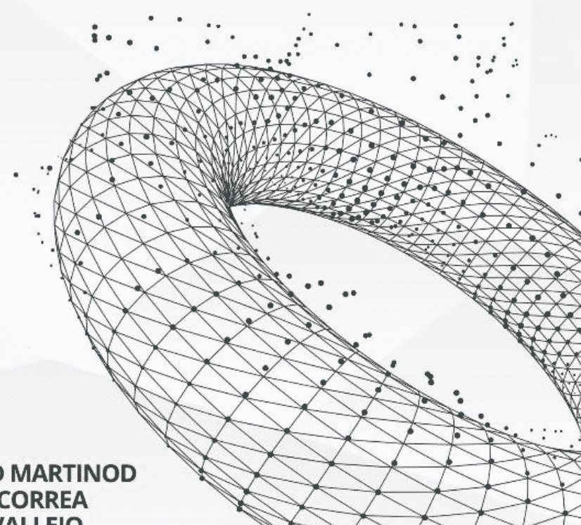

罗纳德·马丁诺德
丹尼尔·科雷亚
保拉·巴列霍

# 用于几何建模的Python：CAD应用快速入门与分步指南

罗纳德·马丁诺德
丹尼尔·科雷亚
保拉·巴列霍

实用书籍系列

版权所有 © 2024 罗纳德·马丁诺德、丹尼尔·科雷亚和保拉·巴列霍
保留所有权利。

# 用于几何建模的Python：CAD应用快速入门与分步指南

作者：罗纳德·马丁诺德、丹尼尔·科雷亚和保拉·巴列霍

版权所有 © 2024 罗纳德·马丁诺德、丹尼尔·科雷亚和保拉·巴列霍。

保留所有权利。未经作者事先授权，不得以任何形式或任何方式复制、存储于任何系统或传播本书的任何部分，除非用于文章或评论的简短引用。

我们已为本书的编写和确保信息的准确性付出了巨大努力。然而，本书所含信息按“原样”出售，不附带任何明示或暗示的保证。作者或其分销商均不对本书造成的或据称直接或间接造成的任何损害负责。

**技术编辑：** 卡米洛·埃雷拉·阿西拉。

**第一版：** 2024年3月。

> 衷心感谢劳拉和安赫利卡，她们坚定不移的支持和耐心一直是我力量的支柱。
- 罗纳德·马丁诺德

> 献给我出色的妹妹，朱莉安娜。
- 丹尼尔·科雷亚

> 献给我的家人，感谢他们无条件的支持。
- 保拉·巴列霍

# 贡献者

## 关于作者

**罗纳德·M·马丁诺德** 自2015年起担任EAFIT大学副教授。他完成了机械工程教育，后来在法国洛林大学计算机与数学工程学院获得博士学位。他积累了参与研究项目的经验，这些项目支持组织优化维护政策和城市交通网络的运营。

**丹尼尔·科雷亚** 是一位教授、研究员、软件开发者和多本编程书籍的作者。他拥有计算机科学博士学位，是哥伦比亚麦德林EAFIT大学的教授。他从教超过十年，并负责协调编程课程。他对软件架构、框架（如Laravel、Nest、Django、Express、Vue、React和Angular）、Web开发和整洁代码感兴趣。在Twitter上关注丹尼尔：**@danielgarax**。

**保拉·巴列霍** 是一位教师和研究员。她拥有计算机科学博士学位。她目前在哥伦比亚麦德林EAFIT大学工作，教授基础编程和软件工程课程。她从教超过七年。她对与软件架构、软件设计和整洁代码相关的主题感兴趣。

## 关于技术编辑

**卡米洛·埃雷拉** 是一位拥有工程学硕士学位的音响工程师，其研究重点在于数据科学和软件开发。他的研究在工业维护领域进行，致力于创建强大的数值工具和数字解决方案以支持决策。目前，他担任Python编程基础课程的兼职教授。

# 目录

- [前言](Preface)
- [第01章 – 引言](Chapter%2001%20–%20Introduction)
- [第02章 – 几何建模](Chapter%2002%20–%20Geometric%20Modeling)
- [第03章 – 设置Colab](Chapter%2003%20–%20Setting%20Colab)
- [第04章 – NumPy简介](Chapter%2004%20–%20Introduction%20to%20NumPy)
- [第05章 – Matplotlib简介](Chapter%2005%20–%20Introduction%20to%20Matplotlib)
- [第06章 – Plotly简介](Chapter%2006%20–%20Introduction%20to%20Plotly)
- [第07章 – 二维参数曲线](Chapter%2007%20–%20Parametric%20curves%20in%202D)
- [第08章 – 三维参数曲线](Chapter%2008%20–%20Parametric%20curves%20in%203D)
- [第09章 – 二维参数曲面](Chapter%2009%20–%20Parametric%20surfaces%20in%202D)
- [第10章 – 三维参数曲面](Chapter%2010%20–%20Parametric%20surfaces%20in%203D)
- [第11章 – 特殊情况：拉伸曲面](Chapter%2011%20–%20Special%20case:%20Extruded%20surfaces)
- [第12章 – 特殊情况：旋转曲面](Chapter%2012%20–%20Special%20case:%20Surfaces%20of%20revolution)
- [第13章 – 特殊情况：极坐标曲面](Chapter%2013%20–%20Special%20case:%20Polar-coordinate%20surfaces)
- [第14章 – 特殊情况：复杂曲面](Chapter%2014%20–%20Special%20case:%20Complex%20surfaces)
- [第15章 – 将模型部署到云端](Chapter%2015%20–%20Deploying%20Models%20to%20the%20Cloud)
- [第16章 – 练习解答](Chapter%2016%20–%20Exercise%20solutions)

# 前言

什么是几何建模？它是应用计算几何的一个领域，研究描述形状的方法和算法，其中计算机辅助设计（CAD）是对象几何的计算表示。它包括图形和非图形信息。这些信息以几何模型（即图形）的形式生成和显示；因此，可以以不同方式编辑和分析这些模型。

在本书中，我们将通过Python语言实践性地探索一些基本的几何模型。这将是一本关于CAD应用的快速入门与分步指南。

本书与其他类似书籍的最大区别在于，我们将采用由三个基本要素主导的策略：(i) 我们将以**理论/实践**相结合的方式阐述概念，(ii) 我们将**逐步**解释每个元素，以及 (iii) 我们将使用大量**图像**来解释基本元素。

**理论/实践：** 我们将平静而简洁地解释我们阐述的每个概念，使用任何读者都能理解的语言（不绕圈子或使用复杂表达）。此外，我们将开发多段代码、示例和练习，供读者实践并理解如何应用所学的每个元素。

**逐步：** 我们将从简短而简单的代码片段开始。此外，我们将充分解释每条开发的指令。我们不会假设读者能神奇地理解一切。

**图像：** 我们将使用辅助图像来促进对多个概念和代码片段（无论简单还是复杂）的理解。我们将使用图表和屏幕输出，供读者验证他们的进度。

# 本书适合谁？

本书面向任何Python编程经验水平的Python开发者，他们希望学习几何计算机建模，无论他们是年轻人、成年人、专业人士还是教师。此外，它也是一本为数学概念初学者或新手设计的书籍。

为了流畅阅读本书并充分发挥其潜力，我们建议读者具备Python的基础编程元素知识，如变量、循环、函数、数组以及库的基本概念。

如果您需要学习Python语言编程，我们鼓励您阅读《Python入门：Python编程实用分步指南》一书。您可以在 [https://www.amazon.com/dp/B0C3FQJ45T/](https://www.amazon.com/dp/B0C3FQJ45T/) 获取。有时，该书的数字版本可免费下载。如果不能，请通过电子邮件 [practicalbooksco@gmail.com](mailto:practicalbooksco@gmail.com) 向我们发送您在亚马逊购买本书的截图，我们将免费为您提供《Python入门》一书的PDF版本。

# 本书涵盖什么内容？

正如标题所示，本书是使用Python进行几何建模的快速入门与分步指南，包括参数曲线和曲面建模。这是一本简短的书，旨在不让读者感到负担。虽然它本可以涵盖更多主题，但为了清晰详细地解释，只处理了上述主题。

在本书结束时，读者将掌握几何建模基本元素的知识，然后可以将其应用于更高级的项目，从而更容易地获得新知识。

# 作者有哪些先前经验？

罗纳德拥有机械工程背景，并在计算机科学领域获得了博士学位。他一位致力于计算机工程的敬业教师和研究者；此外，他还曾讲授并协调*CAD/CAM系统导论*课程。另一方面，Daniel和Paola在编程教学方面拥有超过18年的综合经验。他们也是其他网络编程书籍的作者。这些年来，他们向数千名大学生教授了编程。

在本书中，他们汇编并介绍了用于向不同学生群体教授编程、机械工程、设计工程、交互设计和计算机建模的许多策略。

## 总体评价

如果您对本书的任何方面有任何疑问，请通过[practicalbooksco@gmail.com](mailto:practicalbooksco@gmail.com)发送电子邮件给我们，并在邮件主题中注明书名。

## 书中的错误（勘误）

尽管已有多人审阅本书，并且我们已采取一切预防措施确保其质量，但错误仍可能发生。因此，如果您在本书中发现任何错误，我们请求并感谢您通过[practicalbooksco@gmail.com](mailto:practicalbooksco@gmail.com)写信告知我们需要更正的错误。

## 盗版

如果您在互联网或任何其他地方发现本书的非法链接或副本，我们恳请并感谢您通过[practicalbooksco@gmail.com](mailto:practicalbooksco@gmail.com)向我们提供该链接或信息。

## 获取包含彩色图片的PDF格式

如果您从亚马逊购买了本书的Kindle或印刷版，请通过[practicalbooksco@gmail.com](mailto:practicalbooksco@gmail.com)向我们发送您的亚马逊购买截图，我们将作为礼物为您提供包含所有彩色图片的PDF版本。

## 获取书籍更新

如果您希望接收本书的更新，请通过[practicalbooksco@gmail.com](mailto:practicalbooksco@gmail.com)发送电子邮件给我们，我们将把您添加到我们的邮件列表中。

# 第01章 – 引言

虽然现有的关于CAD应用几何建模的文献经常深入探讨线性代数、向量空间和拓扑学等抽象数学概念，但可能忽略了这些理论在实际问题解决中的直接应用。本书采取了一种独特的方法，优先考虑解决现实世界的挑战和开发几何建模应用，采用结构化和系统化的方法。它强调利用基础且易于理解的数学概念，确保您能够快速掌握所呈现的思想并轻松应用它们。主要目标是为寻求CAD几何建模实践见解的个人提供直接高效的学习体验。

本章将解释本书的设计以及如何有效使用它。

接下来，我们将涵盖以下部分：

1.  书籍章节。
2.  如何阅读本书。
3.  书籍仓库。

## 1.1. 书籍章节

本书分为16章。以下是您可以在每章中学习内容的简要概述：

-   **第01章 – 引言。** 提供本书及其内容的概述。
-   **第02章 – 几何建模。** 提供计算几何建模的背景、其重要性以及在不同领域的应用。
-   **第03章 – 设置Colab。** 描述如何使用Colab，一个流行的Python编码工具。
-   **第04章 – *NumPy*简介。** 介绍*NumPy*库并演示如何操作数学表达式。
-   **第05章 – *Matplotlib*简介。** 演示如何使用*Matplotlib*在Python中创建光栅图像。
-   **第06章 – *Plotly Express*简介。** 介绍*Plotly Express*模块并演示如何在Python中创建矢量图形。
-   **第07章 – 二维参数曲线。** 介绍参数曲线的基本概念。它还解释了三维曲线的要素。
-   **第08章 – 三维参数曲线。** 将参数曲线的概念扩展到三维。
-   **第09章 – 二维参数曲面。** 介绍参数曲面的基本概念。它还解释了二维曲面的要素。
-   **第10章 – 三维参数曲面。** 将参数曲面的概念扩展到三维。
-   **第11章 – 特殊情况：拉伸曲面。** 开发三维参数拉伸曲面的概念。
-   **第12章 – 特殊情况：旋转曲面。** 开发三维参数旋转曲面的概念。
-   **第13章 – 特殊情况：极坐标曲面。** 开发基于极坐标系的三维参数曲面概念。
-   **第14章 – 特殊情况：复杂曲面。** 将曲面建模的概念提升到更高层次。
-   **第15章 – 将模型部署到云端。** 开发将模型部署到云端的概念。
-   **第16章 – 练习解答。** 包含全书所提练习的答案。

## 1.2. 如何阅读本书

为了充分利用本书并加深对所呈现概念的理解，我们建议遵循以下建议：

### 按顺序阅读

如果这是您第一次接触计算几何建模，我们建议按顺序阅读本书。本书旨在按顺序教授不同的概念和要素。这些概念和要素将在后面的章节中重复使用，这意味着，例如，要理解和欣赏“第12章 – 特殊情况：旋转曲面”，您需要理解几乎所有前面的章节。例如，在本章中，我们使用了前面章节介绍的各种要素，如*参数曲面描述*。

### 从实践中学习

本书的关键要素之一是“从实践中学习”，灵感来源于Daniel和Paola最喜爱的书籍作者之一Greg Lim。**在本书中，您将通过建模来学习建模。** 我们为您提供了超过100个独立的代码片段供您开发，我们强烈建议您手动编写它们。通过这样做，您将获得建模技能并更好地理解所使用的每个要素。花时间阅读每个代码片段，详细分析并执行它。这种方法将帮助您掌握本书涵盖的概念。

> **提示：** 从实践中学习：“人类是永不满足的知识寻求者；然而，他们并不学习他们所听到、阅读、记忆或研究的东西……他们学习他们所实践的东西。”（摘自：2019 - Samsó, R. - *《自律的力量：改变你人生的习惯》*）。

### 练习实践

在大多数章节的末尾，您会发现一组简单的练习，旨在帮助您巩固在该章中学到的概念和技能。我们鼓励您在进入下一章之前完成这些练习。这样做将使您能够测试自己的理解，并确保您已掌握预期的技能。此外，您可以在本书的最后一章找到所有练习的解答。

## 1.3. 书籍仓库

在大多数章节中，我们将编写Python代码片段。本书中开发的所有代码片段都可以在以下链接的书籍仓库中找到：[https://github.com/PracticalBooks/Python-For-Geometric-Modeling](https://github.com/PracticalBooks/Python-For-Geometric-Modeling)。如果我们稍后修改代码，这些修改将反映在仓库中。

### 问题

如果您有任何问题或想讨论本书的任何方面，我们建议使用书籍仓库的讨论区，位于[https://github.com/PracticalBooks/Python-For-Geometric-Modeling/discussions](https://github.com/PracticalBooks/Python-For-Geometric-Modeling/discussions)（见图1-1）。该平台允许您从其他读者发布的问题和讨论中学习①，同时也使您能够寻求帮助并与本书的作者和社区互动。通过各位成员的输入和贡献，讨论区可以提供协作和丰富的学习体验。请注意，您需要一个GitHub账户才能访问“新讨论”按钮②。

除了使用书籍仓库的讨论区，您还可以将问题或建议通过电子邮件发送至 [practicalbooksco@gmail.com](mailto:practicalbooksco@gmail.com)。请在发送邮件的主题中提及书名。

## 总结

本章介绍了本书，包括其结构和为便于阅读和学习将要教授的要素而设计的核心特性。

现在，让我们开始探索计算机几何建模的世界吧！

# 第02章 – 几何建模

本章旨在提供对计算几何建模的总体理解，其重要性以及在不同领域的应用。我们将介绍实际应用以及几何建模对技术进步和创新的影响。

接下来，我们将涵盖以下部分：

1.  什么是计算几何建模？
2.  为什么需要几何建模？
3.  几何计算机建模的用途是什么？

## 2.1. 什么是计算几何建模？

**计算几何建模**是计算机*科学*和*数学*的一个分支，它使用计算技术来表示、操作和分析几何形状与结构。计算几何建模在*计算机辅助设计*（CAD）、计算机图形学、虚拟现实以及许多其他需要物理对象或空间数字表示的领域中扮演着至关重要的角色。

计算几何建模的关键方面包括：*(i) 表示*：它涉及为几何对象选择合适的数学表示。常见的表示包括点、线、曲线、曲面和实体；以及 *(ii) 参数化建模*：这涉及使用可调整以修改形状的参数来表示对象，广泛应用于CAD系统中。因此，计算几何建模为创建和操作几何对象的数字表示提供了基础，使得计算机科学和工程领域的各种应用成为可能。

## 2.2. 为什么需要几何建模？

计算几何建模提高了不同行业的效率、准确性和创新能力。它促进了整个产品开发生命周期，从概念化和设计到原型制作、测试和最终生产。创建和操作物理对象数字表示的能力已成为现代工程、设计和仿真的基石。因此，计算几何建模之所以重要，原因如下：

-   **降低成本：** 设计和测试阶段可以得到优化，从而节省成本。在设计过程的早期识别并纠正问题有助于防止在后续生产阶段出现代价高昂的错误。
-   **高效沟通：** 几何模型是设计师、工程师、建筑师和其他利益相关者之间沟通的通用语言。它们提供了一种明确的方式来传达设计概念和规格。此外，几何建模允许设计师和工程师创建对象、结构和环境的详细且准确的数字表示。它有助于可视化，使专业人士能够在构建物理原型之前评估和完善设计。
-   **原型制作与测试：** 几何模型在原型制作过程中至关重要，允许通过3D打印等技术创建物理原型。它有助于在大规模生产之前对设计进行测试和验证。
-   **仿真与训练：** 几何建模用于仿真中，以分析和理解系统的行为，并用于训练目的。它适用于包括物理学、工程学、医学等多个领域。例如，飞行模拟器使用飞机和景观的详细几何模型，为飞行员提供逼真的训练场景。

## 2.3. 几何计算机建模的用途是什么？

计算几何建模在各个行业和学科中都非常有用，有助于改进设计流程、实现高效制造、进行逼真仿真以及增强对复杂系统的理解。它在不同领域服务于多种目的，例如：

-   **计算机辅助设计（CAD）：** 几何建模广泛应用于CAD系统中，以创建物理对象的数字表示。工程师和产品设计师：产品设计领域的专业人士使用几何建模来创建数字表示，并为消费品、结构、设备、系统和工业设备可视化概念。它有助于完善设计并确保功能性，例如：
    -   创建对象和虚拟环境。
    -   3D数据的建模与可视化。
    -   化学和生物学中分子结构的图形表示。
    -   地理空间数据的可视化。
-   **制造与原型制作：** 计算几何模型用于创建原型和模拟制造过程。它有助于在构建物理原型之前识别潜在问题并优化生产过程，例如：
    -   在制造前开发产品的3D模型。
    -   虚拟原型制作以评估产品形态和功能。
    -   工程和建筑领域的计算机辅助设计（CAD）。
-   **计算机图形艺术家/动画师：** 几何建模对于创建虚拟环境、角色和对象的3D模型至关重要。它包括电子游戏、电影、动画和仿真。艺术家和动画师使用几何模型来定义这些数字媒体中3D对象的形状和外观，例如：
    -   为角色、场景和对象创建3D模型。
    -   角色和对象动画。
    -   虚拟世界和交互式环境的设计。
-   **建筑/土木工程师：** 建筑师使用几何建模在数字环境中设计和可视化建筑物、结构、道路、桥梁和水系统，然后才开始施工。它有助于创建建筑项目的详细计划和虚拟模型，并允许探索设计替代方案和识别潜在问题，例如：
    -   建筑和城市景观的建模。
    -   用于演示和分析的建筑可视化。
    -   建筑项目的设计与规划。
-   **虚拟现实（VR）和增强现实（AR）：** 几何模型是创建沉浸式虚拟和增强现实体验的基础。这些模型允许用户与代表现实世界场景的模拟环境进行交互和导航，例如：
    -   在现实环境中集成虚拟对象。
    -   用于工程分析的物理现象仿真。
    -   航空和军事专业人员在虚拟环境中的训练等。
-   **医学成像：** 几何建模应用于医学成像中，以表示和分析解剖结构。它包括从*CT扫描*和*MRI*等医学成像数据创建3D模型。这些模型可用于手术规划、教育和研究，例如：
    -   用于医学仿真和手术规划的解剖结构建模。
    -   定制假肢的设计与制造。
    -   3D环境中的医学数据可视化。
    -   用于医学训练的虚拟现实仿真。
-   **机械/机电工程师/机器人学：** 机械工程师应用几何建模来设计和分析机械部件和系统。它在开发机械、工具和其他机械设备方面至关重要。几何模型在机器人学的路径规划和控制中扮演着关键角色。机器人依赖于其环境的精确几何表示来导航和与对象交互，例如：
    -   用于制造零件和组件的机器数控。
    -   机器人学和工业自动化。
    -   3D打印和增材制造。
-   **航空航天工程师：** 航空航天工程师使用几何建模来设计和分析飞机和航天器。它对于空气动力学、结构分析和系统集成至关重要。

图2-1到图2-6展示了一些我们将在本书中开发的几何模型。此外，很容易看出图2-1和图2-2对航空航天工程有用，图2-3对电子游戏开发很有趣，图2-4可以作为产品设计的框架，图2-5将作为餐厅、现代住宅或建筑的屋顶，用于建筑和土木工程目的，而图2-6将代表用于虚拟现实的材料。

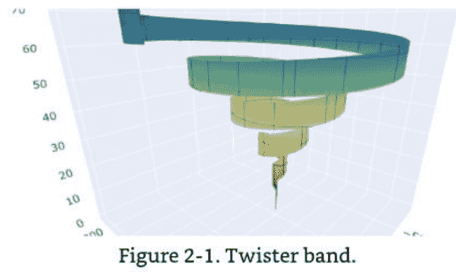

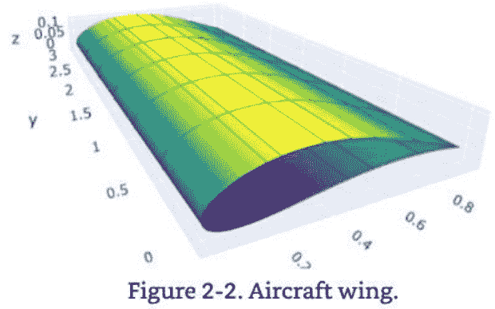

随着技术的发展，计算几何建模持续扩展到新的领域和职业中。创建、操作和分析物理对象的数字表示的能力在各行各业和职业中都具有重要价值。

## 总结

本章探讨了关于计算几何建模的潜力、应用领域、实际应用及其在技术发展中的重要性的一些普遍问题。

在下一章中，我们将介绍一个简单而敏捷的Python编程平台，用于开发我们的模型。

# 第03章 – 设置Colab

目前有许多可用于Python编程的工具。在本书中，我们将使用Colab，这是Google推出的一款产品，允许我们通过浏览器进行Python代码编程。本章将指导我们设置Colab并创建我们的第一条曲线。

接下来，我们将涵盖以下部分：

- 1. 简介。
- 2. Colab激活。
- 3. 在Colab中建模一条直线。
- 4. Colab自定义。

本章开发的代码位于 [https://github.com/PracticalBooks/Python-For-Geometric-Modeling/tree/main/Chapter-03](https://github.com/PracticalBooks/Python-For-Geometric-Modeling/tree/main/Chapter-03)。我们建议您通过独立开发代码来提升编程技能。如果遇到任何问题，可以参考仓库中的代码进行对比。

## 3.1. 简介

目前有多种开发Python代码的选项。例如，可以从其官方网站 ([https://www.python.org/downloads/](https://www.python.org/downloads/)) 下载并安装Python，或者使用 *Replit* 网站进行在线编程 ([https://replit.com/languages/python3](https://replit.com/languages/python3))，以及其他选项。每种选择都有其优缺点。

在本书中，我们将使用Google Colab，或简称 **Colab**，这是Google创建的一款工具，允许用户在浏览器中编写和执行Python代码，无需安装。要使用Colab，需要一个Google账户，然后可以在Google Drive上创建Colab文档进行Python编程。

与其他工具相比，Colab提供了几个优势，例如：

- **无需安装程序：** 使用Colab进行编程，无需进行任何安装。只需要互联网连接和一个Google账户。
- **在线数据存储：** 由于Colab连接到Google Drive，我们创建的所有程序都会自动存储在互联网上（在Google Drive上）。
- **轻松共享代码：** Colab文档可以像任何其他Google文档或电子表格文件一样共享，便于轻松协作。
- **预装库：** Colab已经预装了许多库，例如 *Matplotlib*、*NumPy* 和 *Plotly*，这些库用于建模、数据分析和绘图。因此，您无需安装任何组件即可跟随本书学习。

接下来，我们将指导您如何激活Colab。但请注意，在继续之前，如果您还没有Google账户，必须先创建一个。要创建Google账户，请按照以下步骤操作：访问 [https://www.google.com/account/about/](https://www.google.com/account/about/) ①，点击“创建账户” ②，并完成所有必要的步骤和信息（见图3-1）。

图3-1. 创建Google账户的网站。

## 3.2. Colab激活

**重要提示：** 由于Google或Colab网站的更新，以下步骤和截图可能会有轻微差异。如果您在激活Colab时遇到任何问题，请在Google上搜索解决方案，或在本书仓库的“讨论区”留言。

接下来，请按照以下步骤使用您的Google账户激活Colab。

**步骤1)** 访问Google Drive ([https://drive.google.com/drive/my-drive](https://drive.google.com/drive/my-drive))。使用您的Google账户登录（见图3-2）。

图3-2. 访问Google Drive。

**步骤2)** 点击左上角的“+ 新建” ①。从下拉菜单中点击“更多” ②。点击“+ 连接更多应用” ③（见图3-3）。

图3-3. 将更多应用连接到Google Drive。

**步骤3)** 应用商店（“Google Workspace Marketplace”）的弹出窗口打开后，在顶部的搜索栏中输入“Colab” ①并按“Enter”。接下来，点击“Colaboratory” ②（见图3-4）。

图3-4. 搜索Google Colaboratory。

**步骤4)** 接下来，点击“安装” ①（见图3-5）。

图3-5. 安装Google Colaboratory。

**步骤5)** 点击“继续” ①，然后选择您想要安装和激活Colab的账户 ②（见图3-6）。

图3-6. 授予权限并将账户与Colab关联。

**步骤6)** 点击“确定” ①，然后点击“完成” ②（见图3-7）。**注意：** 有时，Google会要求您验证您的账户。

图3-7. 接受并完成与Colab的连接。

**步骤7)** 最后，点击弹出窗口右上角的“X”关闭Google应用商店。

完成上述步骤后，您现在可以在您的Google Drive账户中创建Colab文档了。接下来，我们将创建第一个Colab文档。

## 3.3. 在Colab中建模一条直线

要在Colab中开始Python编码，您必须按照以下步骤创建一个Colab文档。

**步骤1)** 右键点击“我的云端硬盘” ①，然后点击“新建文件夹” ②。接下来，创建一个名为“Colab Files”的新文件夹 ③，并点击“创建” ④（见图3-8）。

图3-8. 在Google Drive中创建文件夹。

“Colab files”文件夹将存储本书中开发的所有代码。

**步骤2)** 双击您刚创建的文件夹将其打开。然后，在“Colab files”文件夹中 ①，点击“新建” ②。接下来，点击“更多” ③，然后点击“Google Colaboratory” ④（见图3-9）。

图3-9. 创建一个Colab文档。

通过此过程，您已创建了您的第一个Colab文档。

**步骤3)** 执行上一步后，将打开一个包含Colab文档的新标签页。此Colab文档默认命名为“Untitled0.ipynb”。现在，双击“Untitled0.ipynb”并将其重命名为“Ch03-Setting-Colab.ipynb”（见图3-10）。

图3-10. 重命名Colab文档。

建议您为本书的每一章创建一个新的Colab文档，用于编写本章介绍的代码和练习。

**步骤4)** 现在，创建您的第一个文本单元格。首先，点击“+ 文本” ①。然后，输入“我们的第一个模型 - 一条直线” ②。最后，点击向上箭头“↑” ③将文本单元格移动到代码单元格上方（见图3-11）。稍后，我们将向您展示如何添加代码单元格。

图3-11. 在Colab中创建文本单元格。

在代码前添加注释有助于快速记住我们正在编程的内容。这是Colab相对于其他类似工具的另一个优势。

**步骤5)** 现在点击我们文本单元格下方的灰色区域（代码单元格），并输入以下代码（见图3-12）。

```
import matplotlib.pyplot as plt
x = [1,5]
y = [3,2]
plt.plot(x,y)
```

图3-12. 在Colab中编写“直线建模”代码。

此时，您不必深入理解每一行代码，因为本章我们专注于学习如何使用Colab。在接下来的章节中，您将理解这里展示的每一行代码。

**步骤6)** 最后，点击带有黑色背景的白色箭头“▶” ①来执行上一个代码单元格（见图3-13）。您应该会在代码区域下方看到执行的图形结果 ②。此过程可能需要几秒钟。

import matplotlib.pyplot as plt
x = [1,5]
y = [3,2]
plt.plot(x,y)

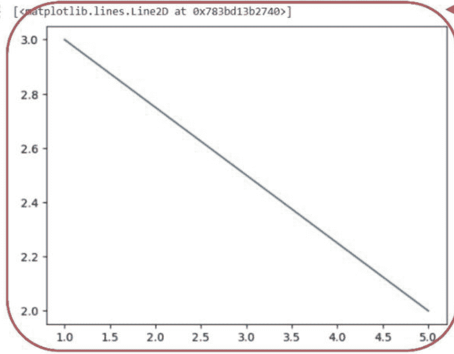

图 3-13. 在 Colab 中执行一个代码单元格。

恭喜，你刚刚用 Python 代码编程并建模了你的第一行代码。

## 3.4. Colab 自定义

在进行一些自定义之前，让我们先在当前文档上练习使用 Colab（图 3-12）。多行代码的问题在于，它变得越来越难以识别哪一行号对应哪条指令。所以，让我们在 Colab 中进行一些小的自定义。

点击“Tools”（工具）①；然后，点击“Settings”（设置）②；接着，点击“Editor”（编辑器）③并选择选项④：(i) “Show line numbers”（显示行号）和 (ii) “Show indentation guides”（显示缩进指南）。最后，⑤点击“Save”（保存）（见图 3-14）。

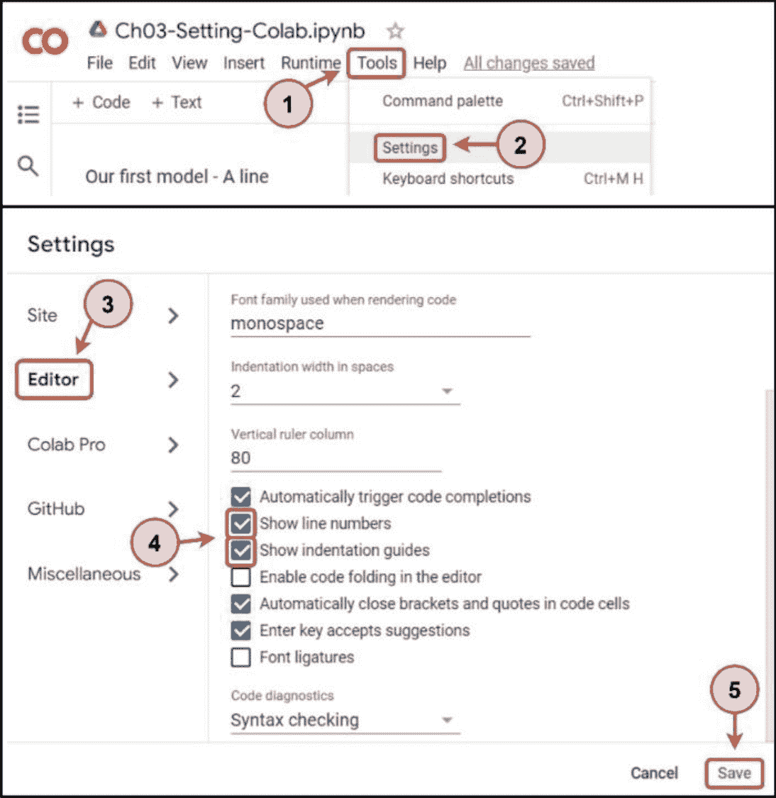

图 3-14. Colab 自定义。

启用上述选项将使阅读开发的代码变得更容易。

## Python 版本

编程语言在不断演进，引入具有新选项和功能的新版本。同样，Colab 也会定期更新其 Python 版本。在撰写本文时，Colab 使用的是 Python 3.10.12 版本。要检查当前的 Python 版本，你可以执行图 3-15 所示的代码。

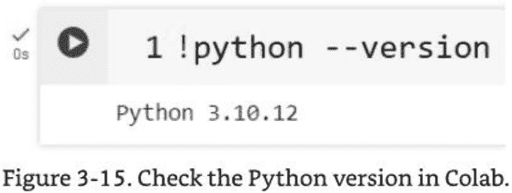

图 3-15. 在 Colab 中检查 Python 版本。

## Colab 中的严重错误

在结束本章之前，让我们讨论最后一个关于 Colab 的建议。**请密切关注这个提示，因为如果你的开发代码神秘地停止工作，它将至关重要。**

每次在 Colab 中执行代码单元格时，代码数据都会存储在名为“runtime”（运行时）的内存中。运行时是 Colab 分配给你的一个虚拟机。有时，由于编程逻辑错误，存储在运行时内存中的数据可能会导致问题。例如，在图 3-16 中，你可以看到我们尝试执行 `print("Hello World")` 代码并收到了一个错误。尽管代码看起来没问题，但我们故意在另一个代码单元格中引入了一个 bug，这改变了我们当前运行时内存中 `print` 的含义。

```
1 print("Hello World")
```

```
---------------------------------------------------------------------------
TypeError                                 Traceback (most recent call last)
<ipython-input-2-fb1c7aebe012> in <cell line: 1>()
----> 1 print("Hello World")

TypeError: 'int' object is not callable
```

图 3-16. Colab 中的代码单元格错误。

如果这发生在你身上，并且你看到理论上应该可以工作但实际不行的代码，解决方案很简单。首先，点击“Runtime”（运行时）①；然后，点击“Restart session”（重启会话）②（见图 3-17）。最后，点击“Yes”（是）以分配一个新的、全新的运行时。

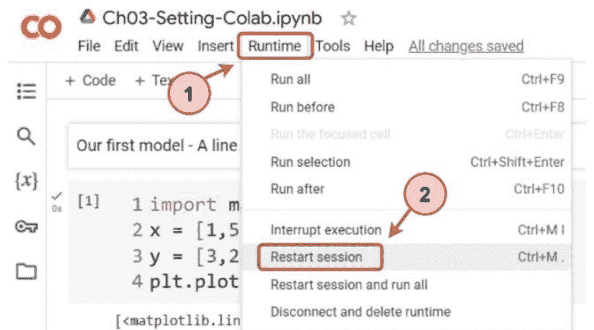

> **提示：** 阅读和解释 Python 代码错误信息很重要。它们提供了错误类型及其在代码中位置的描述，从而可以快速识别错误并进行修复。

## 总结

在本章中，我们学习了如何使用 Colab，将我们的 Google Drive 账户与 Colab 关联，创建 Colab 文档，在 Colab 中创建和定义文本与代码单元格，在 Colab 中编程和执行代码，以及自定义 Colab 文档的外观。

下一章将展示 *NumPy* 库如何处理数值数据并获取几何模型。

# 第 04 章 – NumPy 简介

在上一章中，我们学习了如何使用和设置 Colab 来编写本书的示例。然而，Python 还提供了包含多个模块和绘制几何模型所需额外组件的库。

在本章中，我们将简要介绍 Python 中的 *NumPy* 库。我们将解释如何使用 *NumPy* 的几个元素，这些元素将在本书的后续章节中使用。

接下来，我们将涵盖以下部分：

1. 什么是 *NumPy* 库？
2. 为什么我们使用 *NumPy*？
3. 使用 *NumPy* 函数
4. 使用 *NumPy* 定义标量值。
5. 使用 *NumPy* 定义数组。
6. 使用 *NumPy* 的数学函数。

本章开发的代码位于 [https://github.com/PracticalBooks/Python-For-Geometric-Modeling/tree/main/Chapter-04](https://github.com/PracticalBooks/Python-For-Geometric-Modeling/tree/main/Chapter-04)。我们建议你通过独立开发代码来提升你的编码技能。如果有任何问题，你可以参考仓库中的代码进行比较。

请记住，我们建议你为本书的每一章创建一个新的 Colab 文档。这将使你能够保持代码的组织性。

## 4.1. 什么是 *NumPy* 库？

*NumPy*（源自 *Numerical Python* 的缩写）是一个 Python 库，它提供了不同的数学元素（如数组和矩阵）以及一系列用于快速执行数学、逻辑、基础线性代数等操作的例程（[https://numpy.org/](https://numpy.org/)）。

## 4.2. 为什么我们使用 *NumPy*？

*NumPy* 可用于执行几何建模所需的广泛数学运算。*NumPy* 在几何建模中被广泛使用，原因如下：

- **效率：** *NumPy* 针对数值运算进行了高度优化。几何建模涉及大量数学计算，例如标量和数组运算。
- **数组处理：** 几何模型通常表示为点、顶点或边的数组。*NumPy* 提供了一种简单高效的方式来处理这些数组，使得操作几何数据更加简单。
- **与其他库的兼容性：** *NumPy* 与几何建模中常用的其他库（如 *Matplotlib* 或 *Plotly*（用于可视化））集成良好。
- **数学函数：** *NumPy* 提供了几何计算所需的各种数学函数，包括代数函数、三角函数和线性代数。

总的来说，*NumPy* 的效率、数组处理能力以及与其他库的兼容性使其成为 Python 中几何建模的强大工具。

## 4.3. 使用 *NumPy* 函数

*NumPy* 有一组有趣的函数，可以方便编码并**快速**、**轻松**地获得结果。现在，我们将解释如何使用其中的几个，因为它们将用于定义和操作数组：

### *abs* 函数

**abs** 函数用于计算变量的绝对值。其语法很简单：使用关键字 *abs* 后跟括号“( )”。在这些括号内，指定要评估的变量，在此实例中表示为 *a*。公式如下：

```
abs(a)
```

### *sin* 函数

**sin** 函数用于计算变量的正弦值。语法很简单：使用关键字 *sin* 后跟括号“( )”。在这些括号内，指定要评估的变量，在此实例中表示为 *u*。公式如下：

```
sin(u)
```

### *cos* 函数

**cos** 函数用于计算变量的余弦值。语法很简单：使用关键字 *cos* 后跟括号“( )”。在这些括号内，指定要评估的变量，在此实例中表示为 *v*。公式如下：

```
cos(v)
```

### log10 函数

*log10* 函数计算变量的以 10 为底的对数值。语法很简单：使用关键字 *log10* 后跟括号“( )”。在这些括号内，指定要评估的变量，在此实例中表示为 *w*。公式如下：

```
log10(w)
```

### linspace 函数

*linspace* 函数在指定区间内创建一个均匀间隔的数字序列。语法很简单：使用关键字 *linspace* 后跟括号“( )”。在这些括号内，指定三个用逗号分隔的数字（*start*、*stop*、*num*）。*start* 是数组的起始元素，*stop* 是数组的结束元素，*num* 是元素的数量。公式如下：

```
linspace(start, stop, num)
```

### ones 函数

*ones* 函数创建一个元素值设置为 1 的数组。语法很简单：使用关键字 *ones* 后跟括号“( )”。在这些括号内，指定两个用逗号分隔的数字（*rows*、*cols*）。*rows* 是数组的行数，*cols* 是列数。公式如下：

```
ones(rows, cols)
```

ones(rows, columns)

**快速讨论：** 如果你还不熟悉使用*NumPy*函数，请不要担心。在本书中，我们将随着讲解逐步引入并整合这些基础函数。

## 4.4. 使用*NumPy*定义标量值

我们将详细讲解使用*NumPy*定义标量变量的过程。在下面的代码中，我们看到了两种标量的创建方式（一种是直接赋值定义的标量，另一种是基于变量值定义的标量）。请注意，代码左侧的数字仅用于帮助我们快速识别代码行，**不应包含在你的代码中**（执行结果见图4-1）。

- 在第1行，我们导入*NumPy*库并为其设置别名*np*，以便在代码中快速访问其函数；在后续代码中，我们使用“*np.*”作为前缀来调用*NumPy*函数。
- 在第2行，我们创建了一个名为*a*的**标量**，它通过直接赋值定义（*a = 4*）。
- 在第3行，我们创建了一个名为*b*的**标量**，其值取自***np.pi***（*b = π*）。*np.pi*从*NumPy*库中获取*π*（圆周率）的值。
- 在第4行和第5行，我们**打印**变量*a*和*b*的值。

代码与执行

```
1. import numpy as np
2. a = 4
3. b = np.pi
4. print('a: ', a)
5. print('b: ', b)
```

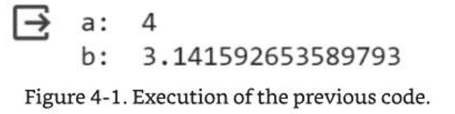

## 4.5. 使用NumPy定义数组

**数组**是几何建模中用于存储相同类型元素集合的基本数据结构。它本质上是一个容器，可以容纳固定数量的元素，每个元素都可以通过索引或键来访问。因此，数组非常有用，因为它们允许你减少变量数量并减少代码行数，因为你只需使用一个变量就能处理大量数据。我们可以将数组分为两种类型（**一维数组**和**多维数组**）。

### 一维数组

**一维数组**允许以线性序列存储数据，排列成**单行或单列**。它是一个简单的元素列表，通过单个索引访问。例如，Python中的一个例子如下：

```
Analyze
array1 = [3, 4, 5]
```

- 在第1行，我们导入**NumPy**库并为其设置别名*np*。
- 在第2行，我们**逐元素定义一个一维数组**，包含三个元素（3, 4, 5）。语法很简单：我们使用前缀“**np.**”，后跟括在圆括号“( )”中的数组函数。在圆括号内，我们使用方括号“[ ]”来括起数组的每个元素，元素之间用逗号“,”分隔。
- 在第3行，我们**自动定义一个一维数组**，包含从1到3的五个元素。我们使用前缀“**np.**”，然后是函数*linspace*，其中1作为*起始*数字，3作为*结束*数字，5作为*数量*数字。这一行将生成数组：1, 1.5, 2, 2.5, 3。
- 在第4行和第5行，我们**打印**变量*u*和*v*的值。

在下面的代码中，我们看到了单行数组的创建（执行结果见图4-2）。

```
1. import numpy as np
2. u = np.array([3,4,5])
3. v = np.linspace(1,3,5)
4. print('u: ', u)
5. print('v: ', v)
```

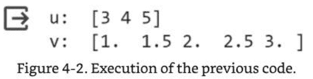

图4-2. 上述代码的执行结果。

> **快速讨论：** 当你编写*array1* = [3, 4, 5]时，你定义的是一个Python列表。Python列表是基本数据结构，可用于数学表达式。然而，对于需要数学操作的运算，Python列表可能无法提供优化的性能。

另一方面，当你编写*array1* = *np.array*([3, 4, 5])时，你使用*NumPy*库创建了一个*NumPy数组*。*NumPy数组*是为数值运算优化的专用数据结构。它们提供了广泛的数学函数和操作，并且在处理大型数据集时，与Python列表相比，内存效率更高。

### 多维数组

**多维数组**允许以**多行多列**的形式存储有组织的数据。例如，Python中的一个例子如下：

```
Analyze
array2 = [[3, 4, 5],
          [9, 7, 2]]
```

在这种情况下，*array2*是一个包含六个元素（组织成两行三列）的**多维数组**。

在下面的代码中，我们看到了多行数组的创建（执行结果见图4-3）。

- 在第1行，我们导入***NumPy***库并为其设置别名*np*。
- 在第2行，我们**逐元素定义一个多维数组**，包含2行3列。语法很简单：我们使用前缀“***np.***”，后跟括在圆括号“( )”中的数组函数。在圆括号内，我们使用方括号“[ ]”来括起数组的每个元素，元素之间用逗号“,”分隔。
- 在第3行，我们定义了一个包含八个元素、2行4列的**多维数组**（所有元素值均为1）。我们使用前缀“***np.***”，然后是函数*ones*，其中2作为*行*数，4作为*列*数。
- 在第4行和第5行，我们**打印**变量*u*和*v*的值。

### 代码与执行

```
1. import numpy as np
2. u = np.array([[3,4,5],[9,7,2]])
3. v = np.ones([2,4])
4. print('u:', u)
5. print('v:', v)
```

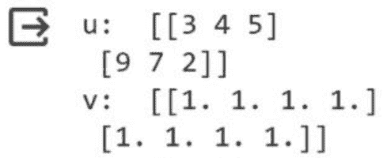

图4-3. 上述代码的执行结果。

## 4.6. 使用*NumPy*的数学函数

*NumPy*提供了多种可以应用于标量和数组的数学函数。让我们探索*NumPy*中不同类型的数学函数。下面的代码展示了如何使用该库的一些数学函数（执行结果见图4-4）。

- 在第1行，我们导入*NumPy*库并为其设置别名*np*。
- 在第2行，我们使用*NumPy*库中的*np.pi*常量除以3来定义一个名为*u*的标量值（*u* = π/3）。
- 在第3行，我们使用*np.linspace*函数定义一个名为*v*的一维数组，该函数生成从1到π的四个元素。数组的元素将始终是线性间隔的。
- 在第4行，我们定义一个名为$a$的变量，它对标量$u$应用绝对值函数。
- 在第5行，我们定义一个名为$b$的变量，它对数组$v$应用余弦函数。
- 在第6行，我们定义一个名为$c$的变量，它对一个表达式应用以10为底的对数函数。我们使用函数$log10$。
- 在第7行和第8行，我们使用一些$NumPy$函数，如正弦函数（使用$np.sin$）、余弦函数（使用$np.cos$）和以10为底的对数函数（使用$np.log10$），应用于标量和数组值（$u$和$v$）。然后，我们用数学表达式（加法和乘法）对它们进行运算。请注意，无论数据类型（标量或数组）如何，方法和语法都是相同的。
- 第9行到第13行打印变量$x$和$y$的值。

### 代码与执行

```
1. import numpy as np
2. u = np.pi/3
3. v = np.linspace(1,np.pi,4)
4. a = np.abs(u)
5. b = np.cos(v)
6. c = np.log10(u*v)
7. x = np.sin(u) + np.cos(v)
8. y = np.log10(2*u) * np.sin(v**2) + 1
9. print('a: ', a)
10. print('b: ', b)
11. print('c', c)
12. print('x: ', x)
13. print('y: ', y)
```

```
a:  1.0471975511965976
b:  [ 0.54030231 -0.14258033 -0.75583739 -1.          ]
c:  [0.02002862 0.25400503 0.40522872 0.51717849]
x:  [ 1.40632771  0.72344508  0.11018801 -0.1339746 ]
y:  [1.27016151 1.06512502 0.8781392  0.86184809]
```

图4-4. 上述代码的执行结果。

> **提示：** *NumPy*库提供了各种数学函数（三角函数、双曲函数、指数函数、对数函数等）。如果你想探索更多这些函数，我们建议查看此链接：
[https://numpy.org/doc/stable/reference/routines.math.html](https://numpy.org/doc/stable/reference/routines.math.html)。
你可以找到大量示例来提升你的潜力。

## 总结

在本章中，我们学习了如何定义标量值、定义数组，以及使用*NumPy*的数学函数和函数来获得作为几何建模工具的数学运算。

在下一章，我们将学习如何使用*Matplotlib*库创建可视化，这是几何建模的基本工具之一。

# 第五章 – Matplotlib 简介

在前面的章节中，我们学习了如何使用 *NumPy* 库。然而，Python 还提供了其他用于开发几何模型的标准库。

在本章中，我们将简要介绍 Python 中的 *Matplotlib* 库。我们将解释如何使用 *Matplotlib* 的几个元素进行数据可视化，这将在本书的后续章节中使用。

数据可视化是几何建模的一个重要方面。可视化数据使我们能够看到原始数据中不明显的模式、关系和趋势。在本章中，我们将简要介绍 Python 中用于绘制图表的 *Matplotlib*，并探索 *Matplotlib* 最流行的模块之一，称为 *PyPlot*；此外，我们将学习如何使用其中的一些功能。

接下来，我们将涵盖以下部分：

- 1. 什么是 Matplotlib？
- 2. *Pyplot* 模块。

本章开发的代码位于 [https://github.com/PracticalBooks/Python-For-Geometric-Modeling/tree/main/Chapter-05](https://github.com/PracticalBooks/Python-For-Geometric-Modeling/tree/main/Chapter-05)。我们建议您通过独立开发代码来增强您的编码技能。如果有任何问题，您可以参考仓库中的代码进行比较。

请记住，我们建议您为本书的每一章创建一个新的 Colab 文档。这将使您能够保持代码的组织性。

## 5.1. 什么是 Matplotlib？

**Matplotlib** 是一个用于在 Python 中创建静态可视化的流行库。它提供了广泛的工具，用于创建各种图形、图表、绘图和其他数据的视觉表示（[https://matplotlib.org/](https://matplotlib.org/)）。这个库展示了 Python 社区通过其协作开发工作所能产生的影响。

*Matplotlib* 用于创建由单个颜色像素组成的**光栅图像**（也称为位图）。每个颜色像素都有助于整体图像。光栅图像可以与点彩派绘画相比较，其中每个彩色油漆点在光栅图像的上下文中对应一个像素。当作为一个单独的点来看时，它只是一种颜色，但当作为一个整体来看时，彩色点构成了一幅生动而详细的画作。

## 5.2. PyPlot 模块

**PyPlot** 是一组使 *matplotlib* 工作的函数集合，并提供了多个用于创建不同类型绘图的函数，例如线图、散点图、条形图、直方图等等。在本节中，我们将重点介绍 *plot* 和 *fill* 函数。

### Plot 函数

*plot* 函数绘制一条由 *x* 轴和 *y* 轴坐标给出的顶点的线。以下代码展示了如何使用 *plot* 函数（执行结果见图 5-1）：

- 在第 1 行，我们从 *matplotlib.pyplot* 导入 *PyPlot* 模块，并使用 *as* 关键字为其分配别名 *plt*。别名是一个简短的名称，允许我们直接使用名称 *plt* 而不是原始的扩展版本 *matplotlib.pyplot*。
- 在第 2 行，我们导入 *NumPy* 库并赋予别名 *np*。
- 在第 3 行和第 4 行，我们使用 *np.array* 创建两个数组，每个数组包含五个元素。
- 在第 5 行，我们使用 *plot* 函数从由变量 *x* 定义的 *x* 轴和由变量 *y* 定义的 *y* 轴创建一个**线图**。线条颜色由 *color* 属性决定，可以通过调整与 *color* 属性相关的文本来修改。尝试不同的文本值以探索不同的线条颜色，例如 'blue'、'red'、'yellow' 等。最后，线宽使用 *linewidth* 属性设置。您可以通过改变与 *linewidth* 属性相关的值来更改线宽。尝试不同的值，如 *1, 2, 3, 4* 等，以探索不同的线宽。
- 在第 6 行，我们使用 *plot* 函数从由变量 *x* 定义的 *x* 轴和由变量 *y* 定义的 *y* 轴创建一个**点图**。然后，使用 *color* 属性设置点的颜色。通过调整与 *color* 属性相关的文本来更改线条颜色。探索各种线条颜色，包括 'blue'、'black'、'yellow' 等选项。最后，点的大小使用 *markersize* 属性设置，可以通过改变与 *markersize* 属性相关的数字来更改线宽。尝试不同的线宽（*1, 2, 3, 4* 等）。
- 在第 7 行，我们使用 *grid* 函数为图表添加网格。
- 在第 8 行和第 9 行，我们分别使用 *xlabel* 和 *ylabel* 函数为 *x* 轴和 *y* 轴添加标签。
- 在第 10 行，我们使用 *title* 函数为图表添加标题。
- 最后，在第 11 行，我们使用 *show* 函数显示图表。

### 代码与执行

```
1. import matplotlib.pyplot as plt
2. import numpy as np
3. x = np.array([0,6,10,-5,-4])
4. y = np.array([0,1, 5, 7, 3])
5. plt.plot(x,y,color='black',linewidth=3)
6. plt.plot(x,y,'o',color='red',markersize=7)
7. plt.grid()
8. plt.xlabel('x')
9. plt.ylabel('f(x)')
10. plt.title('Raster Graph using plot function')
11. plt.show()
```

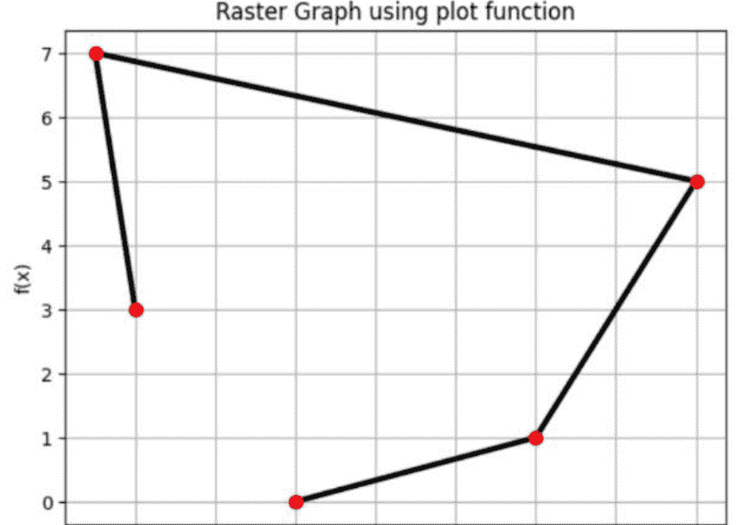

图 5-1. 使用 plot 函数的光栅图。

### Fill 函数

*fill* 函数绘制一个由 *x* 轴和 *y* 轴坐标给出的顶点的区域。以下代码展示了如何使用 *fill* 函数（执行结果见图 5-2）：

- 在第 1 行和第 2 行，我们分别导入 *PyPlot* 和 *NumPy*。
- 在第 3 行和第 4 行，我们使用 *np.array* 创建两个数组，每个数组包含五个元素。
- 在第 5 行，我们使用 *fill* 函数从由变量 *x* 定义的 x 轴和由变量 *y* 定义的 y 轴创建一个区域图。区域颜色使用 *color* 属性设置。然后，通过 *alpha* 属性设置透明度级别。您可以通过改变与 *alpha* 属性相关的数字（从 0 到 1）来更改透明度级别，其中 1 是实心区域，0 是完全透明。最后，线宽使用 *linewidth* 属性设置。
- 在第 6 行，我们使用 *grid* 函数为图表添加网格。
- 在第 7 行和第 8 行，我们分别使用 *xlabel* 和 *ylabel* 函数为 x 轴和 y 轴添加标签。
- 在第 9 行，我们使用 *title* 函数为图表添加标题。
- 最后，在第 10 行，我们使用 *show* 函数显示图表。

### 代码与执行

```
1. import matplotlib.pyplot as plt
2. import numpy as np
3. x = np.array([0,6,10,-5,-4])
4. y = np.array([0,1,5,7,3])
5. plt.fill(x,y,color='red',alpha=0.4,linewidth=3)
6. plt.grid()
7. plt.xlabel('x')
8. plt.ylabel('f(x)')
9. plt.title('Raster Graph using fill function')
10. plt.show()
```

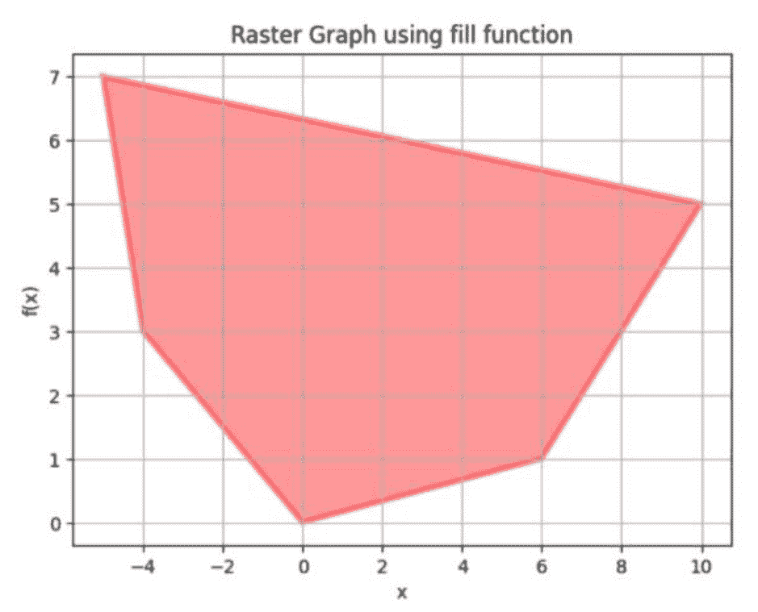

图 5-2. 使用 fill 函数的光栅图。

> **提示：** *NumPy* 库提供了各种数学函数（三角函数、双曲函数、指数函数、对数函数等）。如果您想探索更多这些函数，我们建议查看此链接：[https://numpy.org/doc/stable/reference/routines.math.html](https://numpy.org/doc/stable/reference/routines.math.html)。您可以找到许多增加您潜力的方法示例。

## 总结

在本章中，我们学习了如何使用带有 *PyPlot* 模块的 *Matplotlib* 来创建和设置光栅图像，作为几何建模的工具。

在下一章中，我们将学习如何使用 *Plotly* 库创建交互式可视化，这是几何 2D 和 3D 建模的一个有趣工具。

# 第六章 – Plotly 简介

在前面的章节中，我们学习了如何使用带有 *PyPlot* 模块的 *Matplotlib* 来跟随后续的示例和练习。

在本章中，我们将简要介绍 Python 中的 *Plotly* 库。我们将解释如何使用 *Plotly* 的几个元素进行数据可视化，这将在本书的后续章节中使用。

接下来，我们将涵盖以下部分：

- 1. 什么是 *Plotly* 库？
- 2. 为什么我们使用 *Plotly* Express？
- 3. 在 Colab 中建模一条线。
- 4. 光栅图像与矢量图形。
- 5. 如何使用 *Plotly* Express

本章开发的代码位于 [https://github.com/PracticalBooks/Python-For-Geometric-Modeling/tree/main/Chapter-06](https://github.com/PracticalBooks/Python-For-Geometric-Modeling/tree/main/Chapter-06)。我们建议您通过独立开发代码来增强您的编码技能。如果有任何问题，您可以参考仓库中的代码进行比较。

请记住，我们建议您为本书的每一章创建一个新的 Colab 文档。这将使您能够保持代码的组织性。

## 6.1. 什么是 *Plotly* 库？

**Plotly** 是一个图形库，它制作**交互式**和**高质量的图表**，内置超过 30 种图表类型，包括科学图表、3D图形、统计图表、SVG地图、金融图表等。

## 6.2. Plotly Express 模块

*Plotly Express* 是 Python 中一个强大的数据可视化包，允许用户创建交互式且视觉吸引力强的图表和仪表板。此外，*Plotly Express* 是一个易于使用的高级接口，可处理各种数据类型。

## 6.3. 为什么使用 Plotly Express？

*Plotly Express* 相较于 Python 中的其他库具有一些优势：(i) 语法简单（读起来几乎像英语）；(ii) 提供广泛的可视化类型（或用于创建自定义可视化的工具）；(iii) 自动调整坐标轴和颜色比例；(iv) 提供超过 30 种函数来可视化各种类型的数据；(v) 允许我们对图表进行无尽的自定义，使我们的绘图对他人更有意义且更易理解。

*Plotly Express* 提供**矢量图形**，允许用户使用光标点击元素以获取更多信息，放大和缩小以获取更多细节，以及平移和悬停在数据点上以显示附加信息。

## 6.4. 光栅图像与矢量图形

与**光栅图像**（由像素网格组成，调整大小时可能会损失质量）不同，**矢量图形**是指一种由形状、线条和曲线的数学描述而非单个像素组成的数字图形。与光栅图像不同，矢量图形无论大小如何都能保持其外观。它们保持其质量和可扩展性，因此可以无限缩放、旋转和平移。

由于光栅图像是由排列成图像的彩色像素组成的，因此在不牺牲质量的情况下无法缩放。如果放大光栅图像，它会像素化或变得模糊。其分辨率（每英寸像素数）越低，为保持质量所需的图像尺寸就越小。相反，构成矢量基础的数学方程可以在调整图像大小时重新计算；因此，您可以无限缩放矢量图形并保持清晰、锐利的边缘。矢量图形是最常见的电子图表类型。它们提供了图表的计算机生成表示，并包含建模所需的所有几何信息。

矢量图形通常用于各种应用，例如平面测量（机械工程、设计工程、土木工程、建筑）、标志、插图、字体、技术图纸以及用于印刷和网络的可扩展设计。它们用途广泛，通常使用 *Solid Works*、*CREO*、*AutoCAD*、*Adobe Illustrator*、*CorelDraw* 等软件创建和编辑。

## 6.5. 如何使用 Plotly Express

*Plotly Express* 很简单。以下代码展示了如何使用此模块获取绘图（执行结果见图 6-1）。

- 在第 1 行，我们导入 *Plotly Express* 包并赋予别名 *px*，以便在代码中快速访问其函数。在代码的其余部分，我们使用 "*px.*" 作为前缀来调用 *Plotly Express* 函数。
- 在第 2 行，我们导入 *NumPy* 库并赋予别名 *np*。
- 在第 3 行和第 4 行，我们使用 *np.array* 创建两个数组，每个数组包含五个元素。
- 在第 5 行，使用 *px.line* 函数创建一个二维**折线图**（fig），其中 x 轴由变量 *x* 定义，y 轴由变量 *y* 定义。通过将 *markers* 属性设置为 *true* 来显示标记点。
- 在第 6 行，我们设置线条的颜色和宽度属性。
- 在第 7 行，我们使用 *update_yaxes* 函数设置图表的坐标轴等比例。
- 在第 8 行，我们使用 *update_layout* 函数为图表添加标题和尺寸，您可以通过更改 *autosize* 属性的值来定义图表大小。
- 在第 9 行，我们在屏幕上显示图形（见图 6-1 ①）。

### 代码与执行

```python
1. import plotly.express as px
2. import numpy as np
3. x = np.array([0,6,10,-3,-2])
4. y = np.array([0,1,5,7,4])
5. fig = px.line(x=x,y=y,markers=True)
6. fig.update_traces(line_color='purple',line_width=2)
7. fig.update_yaxes(scaleanchor="x",scaleratio=1)
8. fig.update_layout(title='plotly express',autosize=False)
9. fig.show()
```

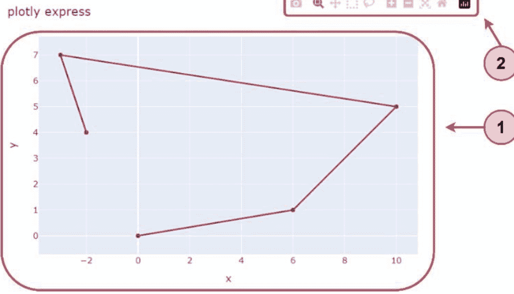

图 6-1. 上述代码的执行结果。

现在，我们可以使用交互式工具（见图 6-1 ②，右上角），这些工具允许放大和缩小、平移、下载以及悬停在数据点上以显示附加信息。例如，图 6-2 展示了交互式工具的实际使用，① 我们点击“放大”按钮，② 我们点击“平移”按钮在图中导航，③ 我们点击“下载”以获取当前可视化的 .png 文件。

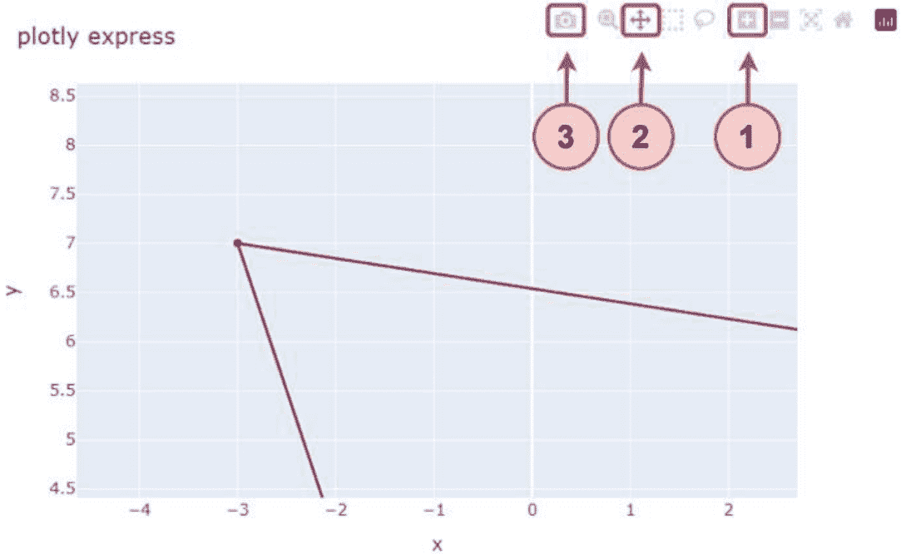

图 6-2. 在图形上使用交互式工具。

**简要讨论：** 请注意，一方面，*Matplotlib* 有助于创建光栅图像（静态位图），但另一方面，*Plotly* 有助于创建矢量图形（交互式图表）。在本书的其余部分，我们将更密集地使用 *Plotly*。

**提示：** *Plotly Express* 模块提供了广泛的方法和函数，用于创建各种类型的图表。如果您想探索更多这些选项，我们建议查看此链接：[https://plotly.com/python/plotly-express/](https://plotly.com/python/plotly-express/)。您可以找到许多使用此库可以创建的图表示例。

## 总结

在本章中，我们学习了如何使用 *Plotly Express* 模块来创建和设置矢量图形，作为几何建模的工具。

在下一章中，我们将学习如何在二维中建模显式和隐式参数曲线，这是几何建模的基本概念之一。

# 第 07 章 – 二维参数曲线

使用显式和隐式表示法建模参数曲线是基本的建模概念之一。本章将解释如何在二维中表示和编码参数曲线。

接下来，我们将涵盖以下部分：

1. 二维参数曲线的定义。
2. 二维曲线的显式表示。
3. 二维曲线的隐式表示。
4. 快速项目。
5. 练习。

本章开发的代码位于 [https://github.com/PracticalBooks/Python-For-Geometric-Modeling/tree/main/Chapter-07](https://github.com/PracticalBooks/Python-For-Geometric-Modeling/tree/main/Chapter-07)。我们建议您通过独立开发代码来提升编码技能。如果有任何问题，您可以参考仓库中的代码进行比较。

请记住，我们建议您为本书的每一章创建一个新的 Colab 文档。这将使您能够保持代码的组织性。

## 7.1. 二维参数曲线的定义

### 基本曲线

在二维坐标系中，一个点 $p$ 由两个元素 $(x, y)$ 组成，其中 $x$ 表示输入（自变量），$y$ 表示输出（因变量）。一条曲线 $c$ 由一组点 $(p_0, p_1, ...)$, $p_i$, …, $p_n$) 构成，用于图形表示（见图 7-1）；因此，曲线描述了点之间的关系，这可以表示为一个简单的函数（见公式 7-1）。

> **公式 7-1**
> $c: y = f(x)$

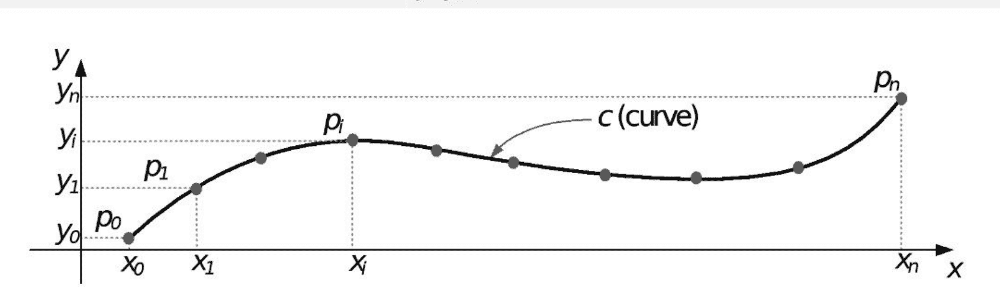

图 7-1. 二维曲线的概念化。

### 参数曲线

如果一条曲线表示为*参数方程*，则称为**参数曲线**。然而，什么是*参数方程*？它是一种使用称为**参数**的自变量（这里我们将用 $u$ 表示）的方程类型，其中因变量（$x(u)$, $y(u)$）被定义为参数的函数，而不依赖于另一个变量。

**参数曲线**是曲线的数学表示，其中每个点都用参数 *u* 来描述。换句话说，不是用*笛卡尔坐标*（*x*, *y*）来表示点的位置，而是用一个依赖于参数 *u* 的参数函数来描述。

**二维参数曲线 *c*** 使用一组点（*p*₀, *p*₁, ..., *p*ᵢ, ..., *p*ₙ）定义；因此，点 *p*ᵢ 由两个元素（*x*(*u*), *y*(*u*)）组成。参数 *u* 是一个自变量（输入），*x* 和 *y* 都依赖于它（输出），并且随着参数的增加，*x*(*u*) 和 *y*(*u*) 的值沿着平面曲线描绘出一条路径（见图 7-2）。二维参数曲线 *c* 描述了一组点之间的关系，这可以使用两个函数来表示，一个函数 *f*₁(*u*) 获取 *x* 值，另一个函数 *f*₂(*u*) 获取 *y* 值（见公式 7-2）。

> **公式 7-2**
> $c :$
> $x = f_1(u)$
> $y = f_2(u)$

## 7.2. 二维曲线的显式表示法

**显式表示法**是表达简单参数曲线的一种基本方式。参数曲线被定义为一个函数，其中因变量 $y$ 可以显式地表示为自变量 $x$ 的函数。我们可以将曲线写成标准形式，如公式 7-3 所示，其中 $y$ 是完全用输入变量 $x$ 表示的输出变量，即 $x = u$ 且 $y = f(x)$（见图 7-3）。在显式表示法中，由于因变量是用输入变量清晰表达的，因此很容易找到每个值对应的函数值。

**公式 7-3**
$$
c: \begin{cases} x = u \\ y = f(x) \end{cases}
$$

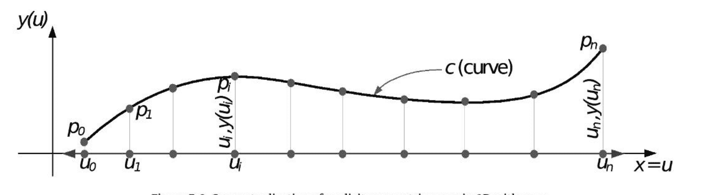

### 示例：使用显式表示法的三角曲线

接下来，我们使用显式表示法来描述一个二维参数曲线 $c$，其表达式如公式 7-4 所示。

**公式 7-4**
$$
c: x = u \\
y = \log_{10}(x) \sin(x^2) + 1
$$

以下代码对二维参数曲线 $c$ 进行建模。

-   第 1 行和第 2 行分别导入数学库和绘图库。
-   第 3 行创建参数 $u$，它是一个包含 $200$ 个元素的数组，范围从 $1$ 到 $5$。
-   第 4 行定义 $x$ 轴，等同于参数 $u$。
-   第 5 行构建 $y$ 轴为 $f(x)$，使用对数项和三角函数项来获得二维参数曲线。
-   第 6 行绘制曲线 $c$。
-   在第 7 行，我们使用 `update_traces` 函数来设置线条的颜色和宽度属性。你可以通过改变与 `line_color` 属性关联的文本来改变线条颜色。你也可以通过改变与 `line_width` 属性关联的数字来改变线条宽度。
-   最后，第 8 行显示图形（执行结果见图 7-4）。

**代码与执行**

```
1. import numpy as np
2. import plotly.express as px
3. u = np.linspace(1,5,200)
4. x = u
5. y = np.log10(x) * np.sin(x**2) + 1
6. fig = px.line(x=x,y=y)
7. fig.update_traces(line_color='black',line_width=4)
8. fig.show()
```

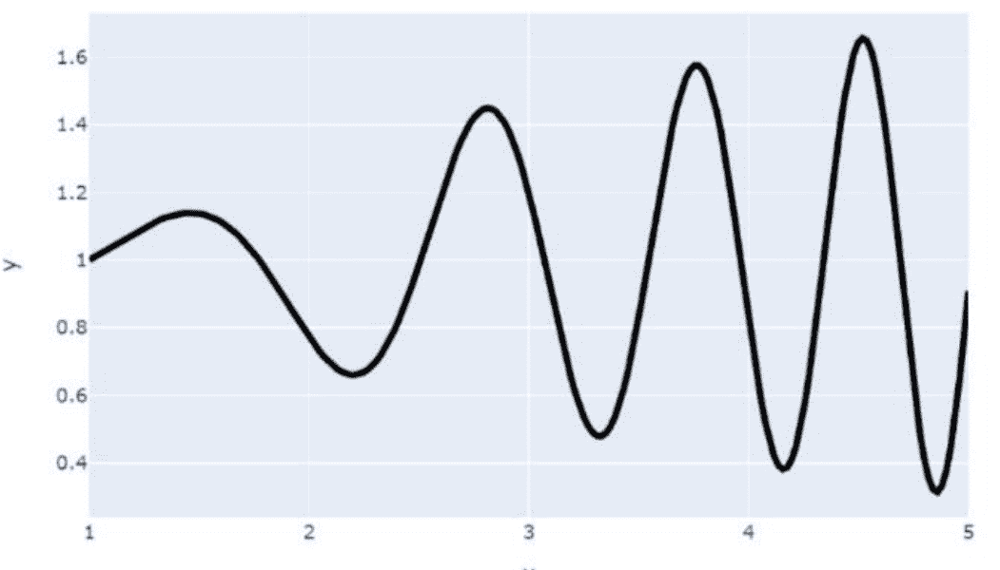

图 7-4. 三角曲线。

### 示例：多项式曲线建模

参数 $u$ 可以采用任何值范围来绘制给定的参数曲线。接下来，我们使用显式表示法来描述一个二维参数曲线 $c$，其表达式如公式 7-5 所示。

**公式 7-5**
$$
c: x = u \\
y = -\pi/5 + \sqrt{(1 - x^2)} \\
\text{; 其中 } u = -\pi/4...\pi/4
$$

以下代码对二维参数曲线 $c$ 进行建模。

-   第 1 行和第 2 行分别导入数学库和绘图库。
-   第 3 行创建参数 $u$，它是一个包含 $50$ 个元素的数组，范围从 $-\pi/4$ 到 $\pi/4$。
-   第 4 行定义 $x$ 轴，等同于参数 $u$。
-   第 5 行构建 $y$ 轴为 $f(x)$，使用三角函数项来获得二维参数曲线。
-   最后，第 6 至 8 行设置并显示曲线 $c$（执行结果见图 7-5）。

**代码与执行**

```
1. import numpy as np
2. import plotly.express as px
3. u = np.linspace(-np.pi/4,np.pi/4,50)
4. x = u
5. y = -np.pi/5 + np.sqrt(1-x**2)
6. fig = px.line(x=x,y=y)
7. fig.update_traces(line_color='blue',line_width=4)
8. fig.show()
```

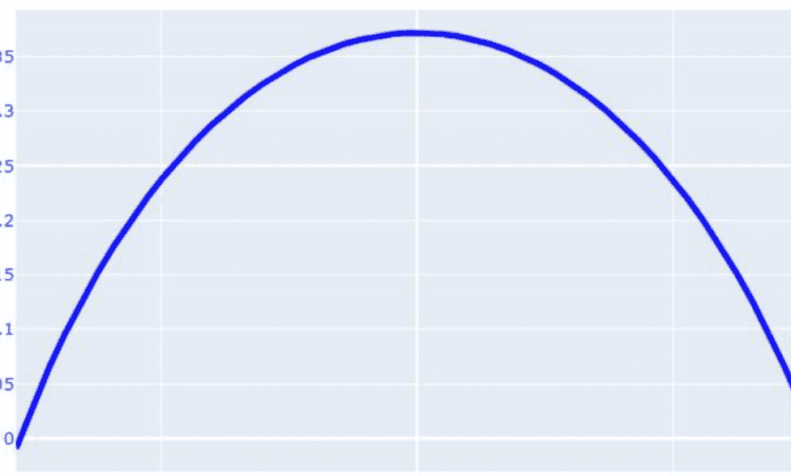

显式参数曲线非常通用且适应性强。因此，可以通过翻转 x 轴和 y 轴来轻松定义，即 x 是完全用输入变量 y 表示的输出变量（见公式 7-6）。

**公式 7-6**
$$
c: \begin{cases} x = f(y) \\ y = u \end{cases}
$$

此外，参数曲线比基本曲线有用得多，因为基本曲线的应用有限，无法建模广泛的曲线，而参数曲线允许你建模任意多的曲线（见图 7-6）。这是参数曲线表示法在几何建模中被使用的原因之一。

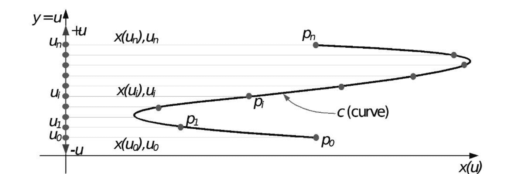

图 7-6. 二维显式参数曲线的概念化，其中 y = u。

### 示例：使用显式表示法的三角曲线

接下来，我们使用 y = u 的显式表示法来描述一个二维参数曲线 c，其表达式如公式 7-7 所示。

**公式 7-7**
$$
c: x = y + 3 \sin^3(y) \\
y = u \\
\text{; 其中 } u = -\pi...5\pi
$$

以下代码对二维参数曲线 c 进行建模。

-   第 1 行和第 2 行分别导入数学库和绘图库。
-   第 3 行创建参数 u，它是一个包含 100 个元素的数组，范围从 $-\pi$ 到 $5\pi$。
-   第 4 行定义 y 轴，等同于参数 u。
-   第 5 行构建 x 轴为 $f(y)$，使用三角函数项来获得二维参数曲线。
-   最后，第 6 至 8 行设置并显示曲线 $c$（执行结果见图 7-7）。

**代码与执行**

```
1. import numpy as np
2. import plotly.express as px
3. u = np.linspace(-np.pi,5*np.pi,100)
4. y = u
5. x = y + 3*np.sin(y)**3
6. fig = px.line(x=x,y=y)
7. fig.update_traces(line_color='red',line_width=4)
8. fig.show()
```

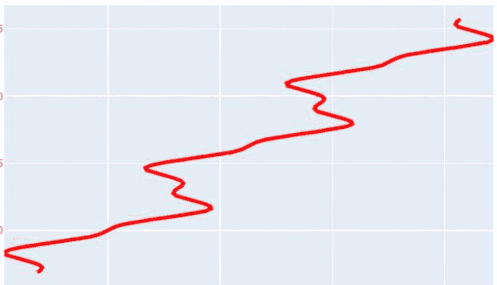

图 7-7. 三角曲线。

## 7.3. 二维曲线的隐式表示法

**二维隐式曲线**是由一个*隐式方程*定义的平面曲线，该方程关联两个坐标变量 $(x(u), y(u))$。什么是*隐式方程*？隐式意味着该方程没有表示为 $x$ 关于 $y$ 的解，反之亦然。我们可以将曲线写成标准形式，如公式 7-8 所示，其中 $x$ 和 $y$ 是完全用输入参数 $u$ 表示的输出变量，即 $x = f_1(u)$ 且 $y = f_2(u)$（见图 7-8）。

**公式 7-8**

| $c:$ | $x = f_1(u)$<br>$y = f_2(u)$ | ; 其中 $u = u_0...u_n$ |

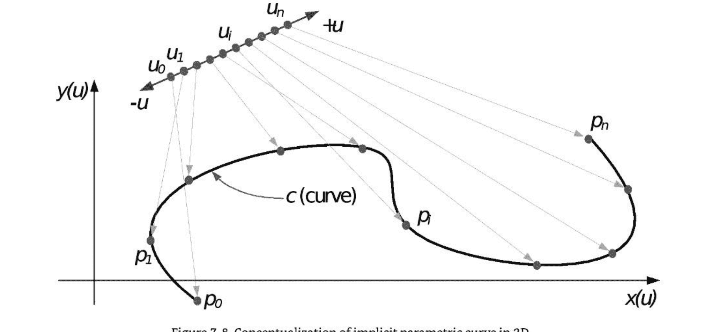

图 7-8. 二维隐式参数曲线的概念化。

### 示例：单位半径的圆

我们使用隐式表示法来描述一个单位半径（r = 1）的圆，见公式 7-9。

**公式 7-9**
$$
r = 1 \\
c: x = r \cos(u) \quad \text{; 其中 } u = 0...2\pi \\
y = r \sin(u)
$$

为了详细解释模型的过程，我们将首先仅使用三个元素来定义参数 $u$：$u = [-0.6, -0.2, 0.5]$（见图 7-9）；然后，参数模型将有三个点 $(p_0, p_1, p_2)$，其中点 $p_0$ 定义为 $x = r \cos(-0.6) = 0.825$ 且 $y = r \sin(-0.6) = -0.565$，点 $p_1$ 定义为 $x = r \cos(-0.2) = 0.980$ 且 $y = r \sin(-0.2) = -0.199$，点 $p_2$ 定义为 $x = r \cos(0.5) = 0.877$ 且 $y = r \sin(0.5) = 0.479$。

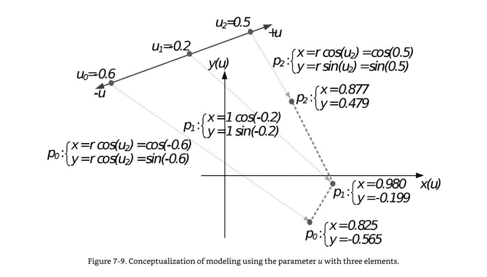

以下代码使用包含 $100$ 个元素的参数 $u$ 对单位半径（$r = 1$）的圆进行建模。

-   第 1 行和第 2 行分别导入数学库和绘图库。
-   第 3 行创建参数 $u$，它是一个包含 $100$ 个元素的数组，范围从 $0$ 到 $2\pi$。
-   第 4 行定义圆的单位半径。
-   第 5 行和第 6 行根据参数 $u$ 定义 $x$ 轴和 $y$ 轴。
-   最后，第 7 至 10 行设置并显示圆 $c$（执行结果见图 7-10）。

```
1. import numpy as np
2. import plotly.express as px
3. u = np.linspace(0,2*np.pi,100)
4. r = 1
5. x = r * np.cos(u)
6. y = r * np.sin(u)
7. fig = px.line(x=x,y=y)
8. fig.update_traces(line_color='purple',line_width=5)
9. fig.update_yaxes(scaleanchor="x",scaleratio=1)
10. fig.show()
```

### 示例：螺旋曲线

半径 $r$ 也可以是一个定义为参数 $u$ 函数的变量。我们使用隐式表示法来描述螺旋曲线 $c$，其中 $r = u^2$ 表示为方程 7-10。

方程 7-10

$$
c: \begin{cases} r = u^2 \\ x = r \cos(u) \\ y = r \sin(u) \end{cases} \quad ; \text{其中 } u = 0...16\pi
$$

以下代码对 $r = u^2$ 的螺旋进行建模。

- 第 1 行和第 2 行分别导入数学库和绘图库。
- 第 3 行创建参数 $u$ 为一个包含 $1000$ 个元素的数组，范围从 $0$ 到 $16\pi$。
- 第 4 行定义一个变量半径。
- 第 5 行和第 6 行根据参数 u 定义 x 轴和 y 轴。
- 第 7 到 10 行设置并显示螺旋 c（执行结果见图 7-11）。

### 代码与执行

```
1. import numpy as np
2. import plotly.express as px
3. u = np.linspace(0,16*np.pi,1000)
4. r = u**2
5. x = r * np.cos(u)
6. y = r * np.sin(u)
7. fig = px.line(x=x,y=y)
8. fig.update_traces(line_color='black',line_width=4)
9. fig.update_yaxes(scaleanchor="x",scaleratio=1)
10. fig.show()
```

**快速讨论：** 使用 *linspace* 函数，你可以为参数 *u* 创建不同数量的元素。如果你将参数 *u* 创建为一个包含少量元素的数组，你将得到一条有棱角的曲线；但如果你将参数 *u* 创建为一个包含大量元素的数组，你将得到一条平滑的曲线。

### 示例：派大星（*海绵宝宝*的朋友）

以下代码展示了另一个使用显式表示法和可变半径 *r* 在二维中建模参数化星形曲线 *c* 的示例（见方程 7-11）。

| 方程 7-11 |
| :--- |
| $c: \begin{cases} r = 2 + \sin(5u) \\ x = r \cos(u) \\ y = r \sin(u) \end{cases} \quad ; \text{其中 } u = 0...2\pi$ |

以下代码对参数化星形曲线进行建模。

- 第 1 行和第 2 行分别导入数学库和绘图库。
- 第 3 行创建参数 $u$ 为一个包含 $100$ 个元素的数组，范围从 $0$ 到 $2\pi$。
- 第 4 行定义一个变量半径。第 5 行和第 6 行将 $x$ 轴和 $y$ 轴定义为参数 $u$ 的函数。
- 第 5 行和第 6 行根据参数 $u$ 定义 $x$ 轴和 $y$ 轴。
- 最后，第 7 到 10 行设置并显示圆 $c$（执行结果见图 7-12，它类似于*海绵宝宝*的无条件朋友*派大星*的轮廓）。

### 代码与执行

```
1. import numpy as np
2. import plotly.express as px
3. u = np.linspace(0,2*np.pi,100)
4. r = 2 + np.sin(5*u)
5. x = r * np.cos(u)
6. y = r * np.sin(u)
7. fig = px.line(x=x,y=y)
8. fig.update_traces(line_color='fuchsia',line_width=5)
9. fig.update_yaxes(scaleanchor="x",scaleratio=1)
10. fig.show()
```

图 7-12. 花形曲线（*派大星*的轮廓）。

## 7.4. 快速项目

你知道*利萨如*曲线吗？*利萨如*曲线在物理学和天文学等科学领域有应用；此外，它们还被用于光学、成像、天线扫描、机械加工和移动机器人等各种工程应用中。*利萨如*曲线用于实验测试，以确定一个设备是否可以被恰当地归类为忆阻器（一种关联电荷和磁通链的非线性两端电气元件）。它也用于比较两个不同的电信号：一个已知的参考信号和一个待测信号。

*利萨如*曲线属于由以下形式描述的曲线族（见方程 7-12）。

方程 7-12

$$
c : \begin{cases} x = A \sin(a u + \delta) \\ y = B \sin(b u) \end{cases} \quad ; \text{其中 } u = 0...2\pi
$$

如果我们使用不同的参数值，我们会得到有趣的几何结果：

- 使用参数 $a = 1$ 和 $\delta = 0$ 来建模直线。
- 使用参数 $A = B, a = 1$ 和 $\delta = \pi/2$ 来建模圆。
- 使用参数 $A \neq B, a = 1$ 和 $\delta = \pi/2$ 来建模椭圆。
- 使用参数 $a = 12$ 和 $\delta = \pi/2$ 来建模抛物线的一段。

在流行文化中，*利萨如*曲线有时被用于科幻系列和电影中模拟高科技设备；它们有时在平面设计中用作标志。*WhatsApp* 重新品牌为 *Meta Platforms* 也是一个*利萨如*曲线，呼应了大写字母 *M* 的形状（使用参数：$A = 1, a = 1, B = 0.6, b = -2, \delta = \pi/20$）；该公司拥有并运营 *Facebook*、*Instagram*、*Threads* 和 *WhatsApp* 等产品和服务。*Meta* 是全球最有价值的公司之一，也是十大上市公司之一。它被认为是五大信息技术公司之一，与 *Google* 的母公司 *Alphabet*、*Amazon*、*Apple* 和 *Microsoft* 并列。

### 让我们建模 *Meta* 公司标志

我们现在将展示如何根据本章获得的概念来建模 *Meta* 平台标志。以下代码展示了如何建模 *Meta* 公司标志（执行结果见图 7-13）。

- 在第 1 行和第 2 行，我们分别导入数学库和绘图库。
- 在第 3 行，我们自动创建一个包含 $5000$ 个元素的单行数组，范围从 $0$ 到 $2\pi$。
- 第 4 到 8 行，我们定义 *Meta Platforms* 公司标志的参数。
- 在第 9 行和第 10 行，我们使用参数 $u$ 将 $x$ 轴和 $y$ 轴定义为利萨如曲线。
- 最后，第 11 到 14 行，我们创建、设置并显示绘制参数曲线的图表。

### 代码与执行

```
1. import numpy as np
2. import plotly.express as px
3. u = np.linspace(0,2*np.pi,5000)
4. A = 1
5. a = 1
6. B = 0.6
7. b = -2
8. delta = np.pi/20
9. x = A * np.sin(a*u + delta)
10. y = B * np.sin(b*u)
11. fig = px.line(x=x,y=y)
12. fig.update_traces(line_color='blue',line_width=30)
13. fig.update_yaxes(scaleanchor="x",scaleratio=1)
14. fig.show()
```

图 7-13. 利萨如曲线（*Meta* Platforms 标志）。

> **提示：** 如果你想进一步探索*利萨如*曲线，我们建议你查看这些链接：[https://www.math.unipd.it/~erb/Lissajous.html](https://www.math.unipd.it/~erb/Lissajous.html) 和 [https://www.wikiwand.com/en/Lissajous_curve](https://www.wikiwand.com/en/Lissajous_curve)。你将了解它们的属性，并找到示例和应用来提升你的潜力。

## 7.5. 练习

**E7.1.** 绘制并匹配以下二维参数曲线（使用显式表示法）与对应的图形。

| | 方程 E7-1 | |
|---|---|---|
| $c:$ | $x = u$<br>$y = 2x \sin(x) + \cos(5x)$ | ; 其中 $u = -2\pi \dots 2\pi$ |

### 方程 E7-2

$c: \begin{cases} y = u \\ x = (y^2 + 1) / (2y) \end{cases} ; \text{ 其中 } u = 0.2...5$

**E7.2.** 绘制并匹配以下二维参数曲线（使用隐式表示法）与对应的图形。

### 方程 E7-5

$c: \begin{cases} r = 1 \\ x = r \sin(2u) \\ y = r \cos(3u) \end{cases} ; \text{ 其中 } u = 0...2\pi$

### 方程 E7-6

$c: \begin{cases} r = 1 + 2 \sin(3u) \\ x = r \cos(u) \\ y = r \sin(u) \end{cases} ; \text{ 其中 } u = 0...2\pi$

### 方程 E7-7

$c:$
$A = 8$
$B = 3$
$x = (A-B) \cos(u) + B \cos((A-B) u/B)$
$y = (A-B) \sin(u) - B \sin((A-B) u/B)$
$; \text{其中 } u = 0...6\pi$

### 方程 E7-8

$c:$
$x = 16 \sin^3(u)$
$y = 13 \cos(u) - 5 \cos(2u) - 2 \cos(3u) - \cos(4u)$
$; \text{其中 } u = 0...2\pi$

图 E7-5. 花形曲线。

图 E7-6. *利萨如*曲线。

**E7.3.** 在互联网和谷歌上搜索，找到并建模描述以下基本二维曲线的方程：

E7.3.1. 参数化椭圆。

**注意：** 在本书中，我们使用字母‘*u*’来命名参数。然而，其他作者使用不同的字母或符号来命名参数，例如‘*t*’、‘*θ*’或‘*φ*’。你可以使用任何你想要的字母；只需记住在整个建模曲线的代码中使用相同的字母。

E7.3.2. 参数化摆线。

**注意：** 如果你使用半径来构建曲线，你可以选择一个大于 *0* 的数字来定义半径。为了建模更长的曲线，你可以将参数范围从 *0* 扩展到 *4π* 或从 *0* 扩展到 *6π* 甚至更多。

**E7.4.** 你知道一些有趣的曲线是以首次研究它们的人命名的吗？在互联网和谷歌上搜索，找到并建模以下著名曲线：

E7.4.1. *狄奥克莱斯蔓叶线*曲线。

**注意：** 你可以定义参数范围，从 *–π/3* 到 *π/3* 来建模更长的螺旋。

E7.4.2. *阿涅西箕舌线*曲线。

**注意：** 如果你在网上找不到简单的参数方程，请使用链接：[https://mathshistory.st-andrews.ac.uk/Curves/Witch/](https://mathshistory.st-andrews.ac.uk/Curves/Witch/)。在那里，作者使用字母‘*t*’来命名参数，并使用一个名为‘*a*’的常数来定义曲线的高度；你可以选择一个大于 *0* 的数字来定义它。你可以将参数范围定义为从 $-\pi$ 到 $\pi$，以获得良好的曲线可视化效果。

## 总结

在本章中，我们学习了二维中的基本曲线以及什么是二维参数曲线。我们学习了使用显式表示法和隐式表示法来建模参数曲线。此外，我们还学习了建模代表性的二维曲线：

- 对于**圆**（见图 7-10），你可以定义不同的半径 $r$ 值来获得不同大小的圆。
- 对于**三角函数**曲线（见图 7-4、图 7-7 和图 E7-2），你可以定义不同的三角函数表达式来获得其他曲线。
- 对于**多项式**曲线（见图 7-5 和图 E7-1），你可以定义不同的多项式表达式来获得其他曲线。
- 对于**螺旋**曲线（见图 7-11），你可以定义不同的半径 $r$ 表达式来获得其他螺旋曲线。
- 对于**利萨如**曲线（见图 7-13 和图 E7-6），你可以定义不同的 $A$、$a$、$B$、$b$ 和 $delta$ 值来获得其他*利萨如*曲线。
- 对于**心形线**曲线（见图 E7-3）。
- 对于**内摆线**（见图 E7-4），只需定义不同的 $A$ 和 $B$ 值即可获得另一条内摆线曲线。
- 对于**花形**曲线（见图 7-12 和图 E7-5），你可以定义不同的半径 $r$ 表达式来获得其他花形曲线。

在下一章中，我们将学习三维中的参数曲线。

# 第 08 章 – 三维参数曲线

在上一章中，我们学习了二维参数曲线。在本章中，我们将介绍三维参数曲线。

接下来，我们将涵盖以下部分：

1.  三维参数曲线的定义。
2.  三维参数曲线是如何建模的？
3.  快速项目。
4.  练习。

本章开发的代码位于 [https://github.com/PracticalBooks/Python-For-Geometric-Modeling/tree/main/Chapter-08](https://github.com/PracticalBooks/Python-For-Geometric-Modeling/tree/main/Chapter-08)。我们建议你通过独立开发代码来提升编码技能。如果遇到任何问题，可以参考仓库中的代码进行对比。

请记住，我们建议你为本书的每一章创建一个新的 Colab 文档。这将有助于你保持代码的条理性。

## 8.1. 三维参数曲线的定义

**三维参数曲线 *c*** 由一组点 $(p_0, p_1, ..., p_i, ..., p_n)$ 定义。该集合中的每个点 $p_i$ 由三个元素 $(x(u), y(u), z(u))$ 组成。这组点由三个关于参数 $u$ 的函数确定（见图 8-1）。参数 $u$ 是一个独立变量（输入），而 $x$、$y$ 和 $z$ 是因变量（输出）。随着参数 $u$ 的增加，$x(u)$、$y(u)$ 和 $z(u)$ 的值会沿着平面曲线描绘出一条路径。三维参数曲线 $c$ 描述了一组点之间的关系。这种关系通过三个函数来表达：$f_1(u)$ 用于获取 $x$ 值，$f_2(u)$ 用于获取 $y$ 值，$f_3(u)$ 用于获取 $z$ 值（见公式 8-1）。

```
公式 8-1
$$
c: \begin{cases} x = f_1(u) \\ y = f_2(u) \\ z = f_3(u) \end{cases} \quad ; \text{其中 } u = u_0 \dots u_n$$
```

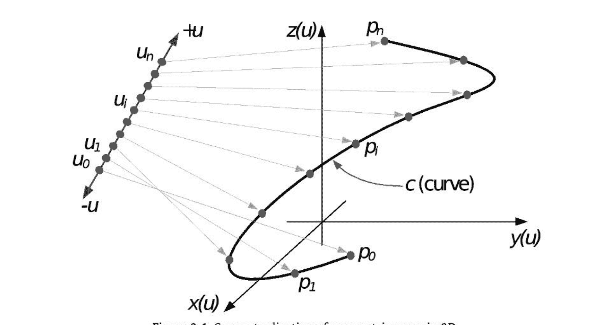

理解三维参数曲线建模很简单。我们可以基于在二维参数曲线中学到的概念化方法，只需添加 z 轴，将其定义为关于 u 参数的第三个表达式，即 z = f₃(u)。

> **快速讨论：** 请注意，三维参数曲线 c 有三个坐标：x、y 和 z。然而，参数 u 只有一个维度。这就是为什么我们可以说三维参数曲线将一个一维参数映射到一个三轴系统。

## 8.2. 三维参数曲线是如何建模的？

我们将通过以下两个示例直接解释三维曲线的建模过程。

### 示例：螺旋曲线

我们使用参数表达式来描述螺旋曲线，如公式 8-2 所述。

```
公式 8-2

c: r = 1
   x = r cos(u)
   y = r sin(u)
   z = 2 u
   ; 其中 u = 0...10π
```

请注意，描述螺旋曲线的方程（公式 8-2）类似于圆的方程（公式 7-9），但我们必须添加 z 轴并扩展参数 u 的取值范围。

为了详细解释建模过程，我们将首先仅使用三个元素来定义参数 u：u = [1, 1.5, 2]（见图 8-2）；然后，参数模型将有三个点 (p₀, p₁, p₂)，其中点 p₀ 定义为 $x = r \cos(1) = 0.540$，$y = r \sin(1) = 0.841$，$z = 2$；点 $p_1$ 定义为 $x = r \cos(1.5) = 0.71, y = r \sin(1.5) = 0.997$，$z = 2(1.5) = 3$；点 $p_2$ 定义为 $x = r \cos(2) = -0.416, y = r \sin(2) = 0.909$，$z = 2(2) = 4$。

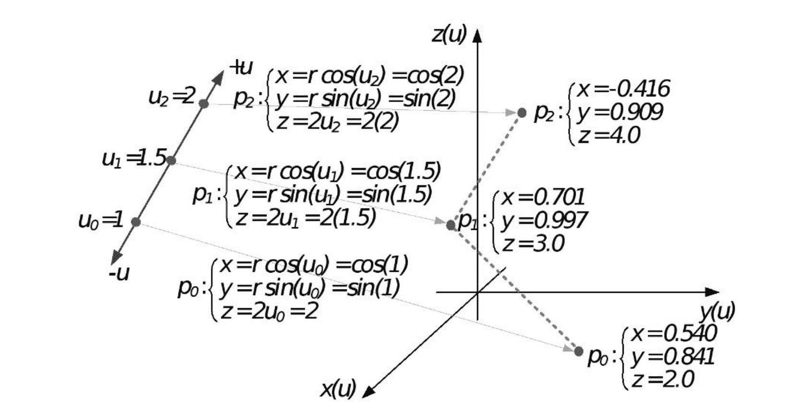

以下代码使用包含 $500$ 个元素的参数 $u$ 来建模螺旋曲线。

- 第 1 行和第 2 行导入库。
- 第 3 行将参数 $u$ 定义为一个包含 $500$ 个元素的数组，范围从 $0$ 到 $10\pi$。
- 第 4 行定义圆的单位半径。
- 第 5 至 7 行根据参数 $u$ 定义 $x$ 轴、$y$ 轴和 $z$ 轴。
- 在第 8 行，使用 `px.line_3d` 函数创建一个三维**线图** (fig)，其中 $x$ 轴由变量 $x$ 定义，$y$ 轴由变量 $y$ 定义，$z$ 轴由变量 $z$ 定义。
- 最后，第 9 行和第 10 行设置并显示螺旋曲线 $c$（执行结果见图 8-3）。

### 代码与执行

```
1. import numpy as np
2. import plotly.express as px
3. u = np.linspace(0,10*np.pi,500)
4. r = 1
5. x = r * np.cos(u)
6. y = r * np.sin(u)
7. z = 2 * u
8. fig = px.line_3d(x=x,y=y,z=z)
9. fig.update_traces(line_color='darkgreen',line_width=5)
10. fig.show()
```

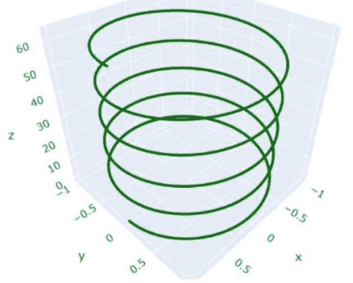

图 8-3. 螺旋曲线。

### 示例：花形曲线

*z* 轴可以是一个定义为 *x* 轴或 *y* 轴函数的变量。接下来，我们使用参数表达式来描述一条三维曲线 *c*，其 *z* 轴变量如公式 8-3 所示。

| 公式 8-3 |
| :--- |
| $c : \begin{cases} r = 2 + \sin(5u) \\ x = r \cos(u) \\ y = r \sin(u) \end{cases} \quad ; \text{ 其中 } u = 0...2\pi$ |

请注意，建模此曲线的方程（公式 8-3）类似于之前在 7.3 节中建模的曲线（公式 7-11），但我们只需添加 z 轴，将其定义为 x 轴或 y 轴的函数。你可以看到两个模型：(i) 图 7-12：二维星形曲线，以及 (ii) 图 8-4：由二维星形曲线得到的三维花形曲线。

以下代码展示了我们如何对其进行建模。

- 第 1 行和第 2 行导入库。
- 第 3 行创建参数 u，作为一个包含 500 个元素的数组，范围从 0 到 2π。
- 第 4 行定义一个可变半径。
- 第 5 至 7 行定义 x 轴、y 轴和 z 轴。
- 最后，第 8 至 10 行设置并显示曲线。

如果你仔细观察这条曲线，你会注意到它勾勒出了一朵*卡特兰*兰花的轮廓，但什么是*卡特兰*兰花？它是一种热带美洲兰花，花朵色彩鲜艳、引人注目，叶子厚实。你可以使用*轨道旋转*选项旋转图表，以获得与图 8-4 相同的视角。

```
1. import numpy as np
2. import plotly.express as px
3. u = np.linspace(0,2*np.pi,500)
4. r = 2 + np.sin(5*u)
5. x = r * np.cos(u)
6. y = r * np.sin(u)
7. z = np.abs(x) * np.abs(y)
8. fig = px.line_3d(x=x,y=y,z=z)
9. fig.update_traces(line_color='darksalmon',line_width=6)
10. fig.show()
```

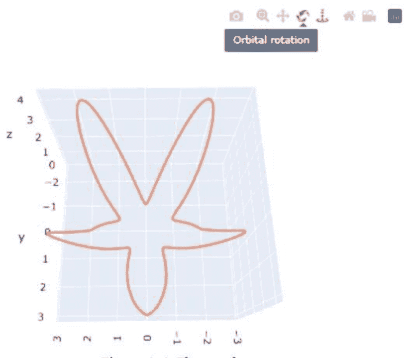

图 8-4. 花形曲线。

## 8.3. 快速项目

你曾经靠近过龙卷风吗？是的，这种与强雷暴相关的、在陆地上空剧烈旋转的空气柱可以卷起汽车和树木等重物，并造成巨大破坏。现在，我们建议你来建模你自己的龙卷风！

> **提示：** 龙卷风的几何形状很简单；只需将螺旋曲线（见公式 7-10）与螺旋曲线（见图 8-3）结合起来。一方面，螺旋曲线方程（公式 7-10）是二维的曲线，该曲线沿路径增加半径（$r = u^2$）；因此，半径是建模龙卷风曲线的一个有用元素。另一方面，螺旋曲线方程（方程 8-2）是一条三维曲线，它在沿路径向上描绘曲线的同时描述环路，从而得到方程 8-4。

### 方程 8-4

$$c: \begin{cases} r = u^2 \\ x = r \cos(u) \\ y = r \sin(u) \\ z = 2u \end{cases} ; \text{ 其中 } u = 0...10\pi$$

### 让我们建模龙卷风曲线

我们将展示如何根据本章获得的概念来建模龙卷风曲线。第 1 行和第 2 行导入库。第 3 行创建参数 u。第 4 行定义一个变量半径。第 5 到 7 行定义 x 轴、y 轴和 z 轴。最后，第 8 到 10 行设置并显示曲线（执行结果见图 8-5）。

### 代码与执行

```
1. import numpy as np
2. import plotly.express as px
3. u = np.linspace(0,10*np.pi,500)
4. r = u**2
5. x = r * np.cos(u)
6. y = r * np.sin(u)
7. z = 2 * u
8. fig = px.line_3d(x=x,y=y,z=z)
9. fig.update_traces(line_color='blueviolet',line_width=10)
10. fig.show()
```

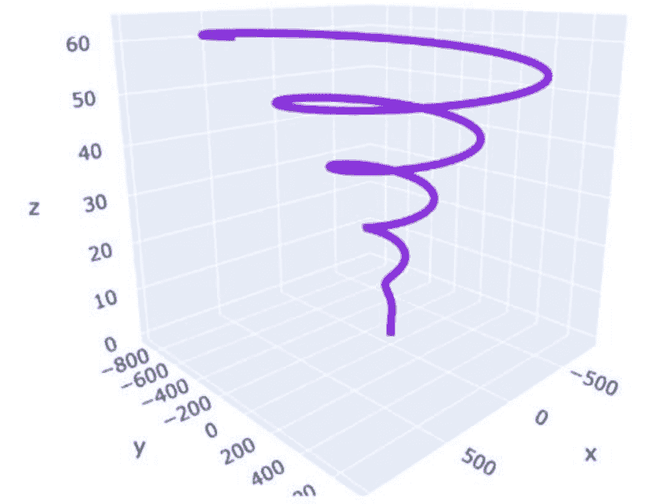

## 8.4. 练习

E8.1. 绘制并匹配以下三维参数曲线与图形。

### 方程 E8-1

$$c : \begin{cases} r = 2 \\ x = r \sin(u) \cos(16u) \\ y = r \sin(u) \sin(16u) \\ z = r \cos(u) \end{cases} ; \text{ 其中 } u = 0...\pi$$

### 方程 E8-2

$$c : \begin{cases} x = (4 + \sin(20u)) \cos(u) \\ y = (4 + \sin(20u)) \sin(u) \\ z = \cos(20u) \end{cases} ; \text{ 其中 } u = 0...2\pi$$

### 方程 E8-3

$$c : \begin{cases} x = \cos^3(u) \\ y = \sin^3(u) \\ z = \sin(2u) \end{cases} ; \text{ 其中 } u = 0...4\pi$$

### 方程 E8-4

$$c : \begin{cases} a = 2 \\ b = 2 \\ n = 6 \\ x = a \cos(n u) \cos(u) \\ y = a \cos(n u) \sin(u) \\ z = b \cos(n u) \end{cases} ; \text{ 其中 } u = 0...2\pi$$

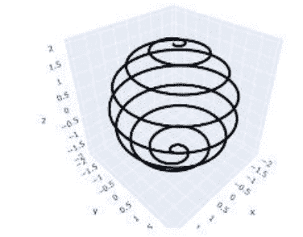

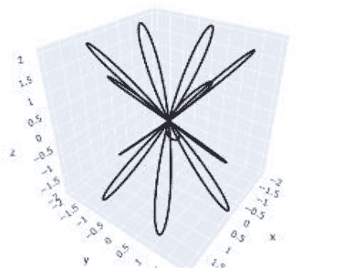

图 E8-1. 球形螺旋。

图 E8-2. 锥形花。

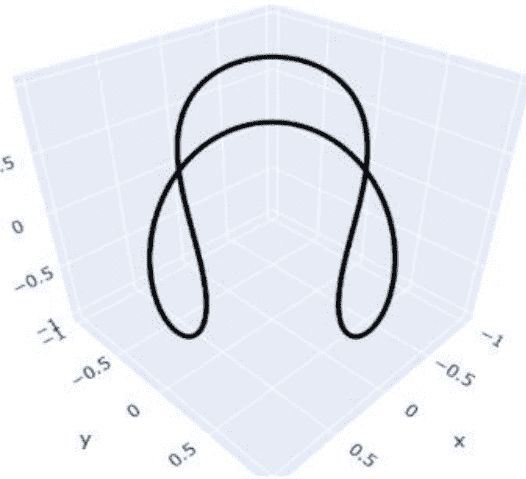

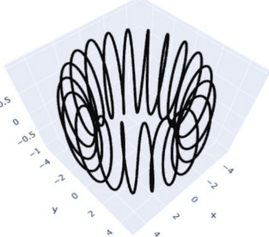

图 E8-3. 扭曲的四峰次摆线。

图 E8-4. 螺旋圆环面。

### E8.2. 在互联网和谷歌上搜索并建模描述以下基本三维曲线的方程：

E8.2.1. *扭曲三次*曲线。

> **注意：** 如果您在网上找不到简单的参数方程，可以使用以下链接：[https://www3.nd.edu/~nancy/Math20550/Demos/twisted_cubic/twisted_cubic.html](https://www3.nd.edu/~nancy/Math20550/Demos/twisted_cubic/twisted_cubic.html)。这里，他们使用字母‘*t*’来命名参数。
您可以将参数范围定义为从 *–10* 到 *10*，以获得良好的曲线可视化效果。

E8.2.2. *维维亚尼*曲线。

> **注意：** 您可以将参数范围定义为从 *0* 到 *2π*，以获得良好的曲线可视化效果。

E8.2.3. *海螺螺线*曲线。

**注意：** 您可以将参数范围定义为从 $0$ 到 $12\pi$，以获得良好的曲线可视化效果。

## 总结

在本章中，我们学习了如何建模三维参数曲线。此外，我们还学习了如何建模代表性的三维曲线：

- 对于**螺旋**曲线，例如直线弹簧（见图 8-3）、球形螺旋（见图 E8-1）和螺旋圆环面（称为正弦环），见图 E8-4。
- 对于**花朵轮廓**，例如*卡特兰*（见图 8-4）和锥形花（见图 E8-2）。
- 对于**扭曲**曲线，例如扭曲三角曲线（图 8-5）和**扭曲的四峰次摆线**（这是网球缝线），见图 E8-3。

在下一章中，我们将学习如何建模二维参数曲面。

# 第 09 章 – 二维参数曲面

在前面的章节中，我们学习了二维和三维参数曲线。本章将解释如何表示和编码二维参数曲面。

接下来，我们将涵盖以下部分：

1. 二维参数曲面的定义。
2. *meshgrid* 是如何工作的？
3. 如何建模二维参数曲面？
4. 快速项目。
5. 练习。

本章开发的代码位于 [https://github.com/PracticalBooks/Python-For-Geometric-Modeling/tree/main/Chapter-09](https://github.com/PracticalBooks/Python-For-Geometric-Modeling/tree/main/Chapter-09)。我们建议您通过独立开发代码来增强编码技能。如果有任何问题，您可以参考仓库中的代码进行比较。

请记住，我们建议您为本书的每一章创建一个新的 Colab 文档。这将使您能够保持代码的组织性。

## 9.1. 二维参数曲面的定义

**二维参数曲面 *s*** 使用一组点 $(p_{0,0}, p_{0,1}, \dots, p_{i,j}, \dots, p_{n,m})$ 来定义；因此，点 $p_{i,j}$ 由两个元素 $(x(u,v), y(u,v))$ 组成。这组点由两个具有两个参数（$u$ 和 $v$）的函数定义（见图 9-1）。参数（$u, v$）是自变量（输入），$x$ 和 $y$ 都依赖于它们（输出），并且随着参数的增加，$x(u,v)$ 和 $y(u,v)$ 的值会沿着平面表面描绘出一条路径。二维参数曲面 $s$ 描述了一组点之间的关系，这可以通过两个函数来表达，一个函数 $f_1(u,v)$ 用于获取 $x$ 值，另一个函数 $f_2(u,v)$ 用于获取 $y$ 值（见方程 9-1）。

### 方程 9-1

$$s: \begin{cases} x = f_1(u,v) \\ y = f_2(u,v) \end{cases} ; \text{ 其中 } u = u_0...u_n, v = v_0...v_m$$

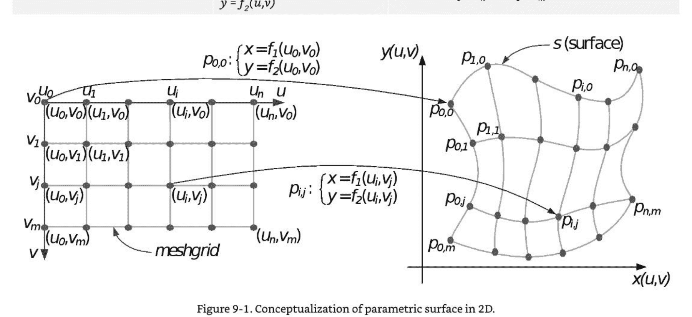

图 9-1. 二维参数曲面的概念化。

## 9.2. *meshgrid* 是如何工作的？

参数 $u$ 只能沿数轴取值（从 $-u$ 到 $+u$）。类似地，参数 $v$ 只能沿数轴取值（从 $-v$ 到 $+v$）。这两个参数值的组合标记了一个有序对 $(u_i, v_i)$。这组有序对定义了一个 *meshgrid*，曲面将在此网格上建模。

### 建模一个四元素网格曲面

接下来，我们使用参数表达式来描述一个二维曲面 $s$，其表述如下（见方程 9-2）

$$s: \begin{cases} x = 2u + v \\ y = u + v^2 \end{cases} ; \text{其中 } u = [1, 2], v = [3, 4]$$

在这种情况下，参数 $u$ 由两个元素定义：$u = [1,2]$，参数 $v$ 也由两个元素定义：$v = [3,4]$；那么，由于网格由属于参数的元素组合定义，该网格由四个有序对 $((1,3), (2,3), (1,4), \text{和 } (2,4))$ 设定，即四个点（见图 9-2）如下：

$$meshgrid = \begin{bmatrix} (u_0, v_0) & (u_1, v_0) \\ (u_0, v_1) & (u_1, v_1) \end{bmatrix} = \begin{bmatrix} (1,3) & (2,3) \\ (1,4) & (2,4) \end{bmatrix}$$

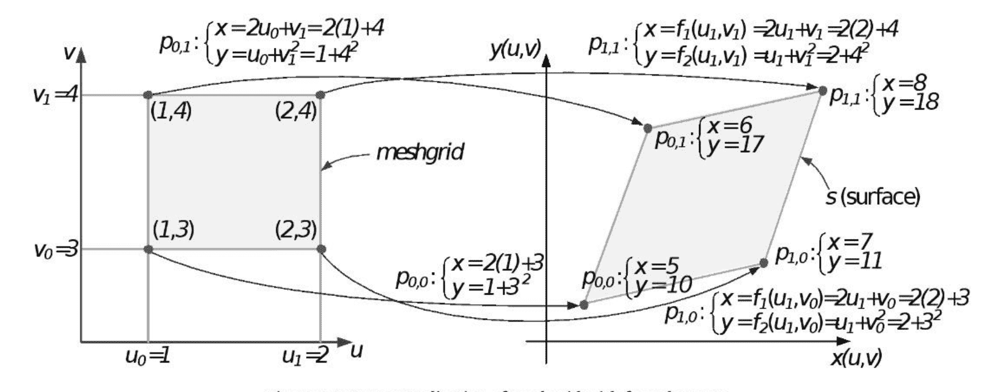

为了简化网格的表示法，我们将其有序对分组：一组用于 $u$ 项，另一组用于 $v$ 项。因此，我们得到两个数组（$U$ 和 $V$），每个数组由两行两列组成，如下所示：

$$U = \begin{bmatrix} u_0 & u_1 \\ u_0 & u_1 \end{bmatrix} = \begin{bmatrix} 1 & 2 \\ 1 & 2 \end{bmatrix} ; \quad V = \begin{bmatrix} v_0 & v_0 \\ v_1 & v_1 \end{bmatrix} = \begin{bmatrix} 3 & 3 \\ 4 & 4 \end{bmatrix}$$

**快速讨论：** 请注意，为了清晰起见，上述分析和图 9-2 中元素（$u_0$、$u_1$、$v_0$ 和 $v_1$）的分布是相同的。

$U$ 和 $V$ 在多维数组中包含参数（$u$ 和 $v$）；因此，它们可以轻松地在定义于曲面上的参数函数（$f_1$ 和 $f_1$）上进行求值。

以下代码建模了二维参数曲面 $s$（方程 9-2）。

- 第 1 行和第 2 行导入库。
- 第 3 行和第 4 行将参数 $u$ 和 $v$ 定义为一维数组，每个数组包含两个元素。
- 第 5 行定义多维参数数组 $U$，由属于网格的参数 $u$ 的元素组成。
- 第 6 行打印存储在参数数组 $U$ 中的元素。
- 第 7 行定义多维参数数组 $V$，由属于网格的参数 $v$ 的元素组成。
- 第 8 行打印存储在参数数组 $V$ 中的元素。
- 第 9 行和第 10 行根据参数数组 $U$ 和 $V$ 定义 x 轴和 y 轴。
- 第 11 行使用 $plt.fill$ 函数绘制曲面 $s$，其中 x 轴由 $X$ 元素定义，y 轴由 $Y$ 元素定义（执行结果见图 9-3）。
- 最后，第 12 行显示图形。

### 代码与执行

```
1. import numpy as np
2. import matplotlib.pyplot as plt
```

### 建模一个八元素网格曲面

在先前建模的曲面（公式 9-2）中，我们仅为每个参数使用了两个元素（$u = [1,2]$，$v = [3,4]$）。接下来，我们使用一个参数表达式，其中参数 $u$ 有四个元素，参数 $v$ 有两个元素（见公式 9-3）。然后，网格由八个有序对定义。

**公式 9-3**

$s: \begin{cases} x = u^2 + v \\ y = 3u + v^2 \end{cases}$ ; 其中 $u = [1, 2, 3, 4]$，$v = [3, 4]$

在这种情况下，参数 $u$ 定义为 $u = [1,2,3,4]$，参数 $v$ 定义为 $v = [3,4]$（见图 9-4）；然后，该网格由八个有序对 $((1,3), (2,3), (3,3), (4,3), (1,4), (2,4), (3,4), \text{和 } (4,4))$ 设置如下：

**分析**

$$meshgrid = \begin{bmatrix} (u_0,v_0) & (u_1,v_0) & (u_2,v_0) & (u_3,v_0) \\ (u_0,v_1) & (u_1,v_1) & (u_2,v_1) & (u_3,v_1) \end{bmatrix} = \begin{bmatrix} (1,3) & (2,3) & (3,3) & (4,3) \\ (1,4) & (2,4) & (3,4) & (4,4) \end{bmatrix}$$

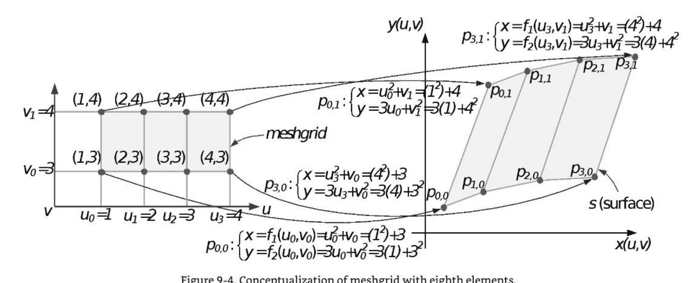

该网格的表示法通过两个数组（$U$ 和 $V$）构建。$U$ 和 $V$ 以多维数组的形式包含参数（$u$ 和 $v$），其中每个数组由两行四列组成，如下所示：

**分析**

$$U = \begin{bmatrix} u_0 & u_1 & u_2 & u_3 \\ u_0 & u_1 & u_2 & u_3 \end{bmatrix} = \begin{bmatrix} 1 & 2 & 3 & 4 \\ 1 & 2 & 3 & 4 \end{bmatrix} ; \quad V = \begin{bmatrix} v_0 & v_0 & v_0 & v_0 \\ v_1 & v_1 & v_1 & v_1 \end{bmatrix} = \begin{bmatrix} 3 & 3 & 3 & 3 \\ 4 & 4 & 4 & 4 \end{bmatrix}$$

以下代码在二维中建模参数曲面 $s$（公式 9-3）。

- 第 1 和第 2 行导入库。
- 第 3 和第 4 行将参数 $u$ 和 $v$ 定义为分别具有四个和两个元素的一维数组。
- 第 5 行定义多维数组 $U$，由属于网格的参数 $u$ 的元素构成。
- 第 6 行打印存储在参数数组 $U$ 中的元素。
- 第 7 行定义多维参数数组 $V$，由属于网格的参数 $v$ 的元素构成。
- 第 8 行打印存储在参数数组 $V$ 中的元素。
- 第 9 和第 10 行根据参数数组 $U$ 和 $V$ 定义 $x$ 轴和 $y$ 轴。
- 在第 11 行，开始一个循环以遍历参数数组 $U$ 和 $V$ 的列。总共进行三次循环，获得曲面的三个连续部分；由于参数 $u$ 有四个元素，参数数组 $U$ 和 $V$ 有四列（$u$ 方向上的四个点），因此，曲面在 $u$ 方向上由三个部分建模（见图 9-5 中的执行结果）。
- 第 12 和第 13 行绘制每个部分的区域。在第 13 行，我们设置了区域绘制的颜色和透明度属性。你可以通过更改与 *color* 属性关联的文本来更改线条颜色。此外，你可以通过将与 *alpha* 属性关联的数字从 0 更改为 1 来更改透明度级别，其中 1 是实心区域，0 是完全透明（见图 9-5 中的执行结果）。
- 最后，第 14 行显示图形。

### 代码与执行

```python
1. import numpy as np
2. import matplotlib.pyplot as plt
3. u = np.linspace(1,4,4)
4. v = np.linspace(3,4,2)
5. U = np.array([[u[0],u[1],u[2],u[3]],[u[0],u[1],u[2],u[3]]])
6. print('U:', U)
7. V = np.array([[v[0],v[0],v[0],v[0]],[v[1],v[1],v[1],v[1]]])
8. print('V:', V)
9. X = U**2 + V
10. Y = 3*U + V**2
11. for col in range(len(u)-1):
12.     plt.fill([X[0,col],X[1,col],X[1,col+1],X[0,col+1]], [Y[0,col], Y[1,col], Y[1,col+1], Y[0,col+1]],
13.              color='blue',alpha=.5)
14. plt.show()
```

```
U: [[1. 2. 3. 4.]
 [1. 2. 3. 4.]]
V: [[3. 3. 3. 3.]
 [4. 4. 4. 4.]]
```

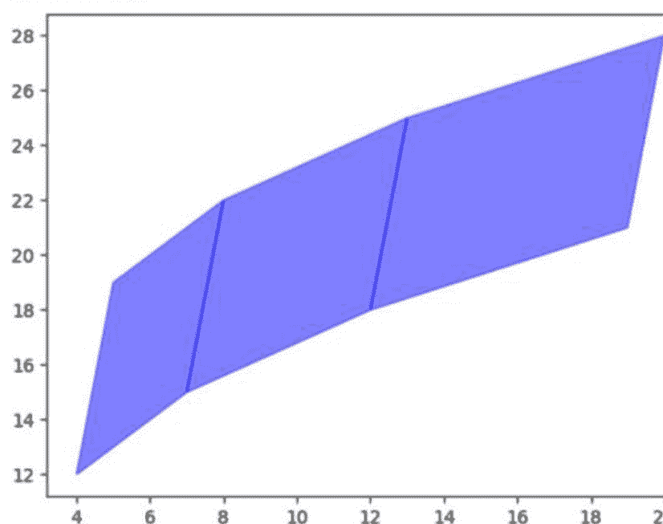

图 9-5. 先前代码的执行结果。

### 手动定义大尺寸网格

在先前建模的曲面（公式 9-3）中，我们为参数 $u$ 使用了四个元素（$u = [1,2,3,4]$），为参数 $v$ 使用了两个元素（$v = [3,4]$）。接下来，我们使用一个参数表达式，其中参数 $u$ 有四个元素，参数 $v$ 有五个元素（见公式 9-4）。然后，网格由二十个有序对定义。

**公式 9-4**

$s: x = u^2 v$ ; 其中 $u = [1, 2, 3, 4]$，$v = [3, 4, 5, 6, 7]$

$y = u v^3$

在这种情况下，参数 $u$ 定义为 $u = [1,2,3,4]$，参数 $v$ 定义为 $v = [3,4,5,6,7]$；然后，该网格由二十个有序对设置（见图 9-6）如下：

**分析**

$$meshgrid = \begin{bmatrix} (u_0,v_0) & (u_1,v_0) & (u_2,v_0) & (u_3,v_0) \\ (u_0,v_1) & (u_1,v_1) & (u_2,v_1) & (u_3,v_1) \\ (u_0,v_2) & (u_1,v_2) & (u_2,v_2) & (u_3,v_2) \\ (u_0,v_3) & (u_1,v_3) & (u_2,v_3) & (u_3,v_3) \\ (u_0,v_4) & (u_1,v_4) & (u_2,v_4) & (u_3,v_4) \end{bmatrix} = \begin{bmatrix} (1,3) & (2,3) & (3,3) & (4,3) \\ (1,4) & (2,4) & (3,4) & (4,4) \\ (1,5) & (2,5) & (3,5) & (4,5) \\ (1,6) & (2,6) & (3,6) & (4,6) \\ (1,7) & (2,7) & (3,7) & (4,7) \end{bmatrix}$$

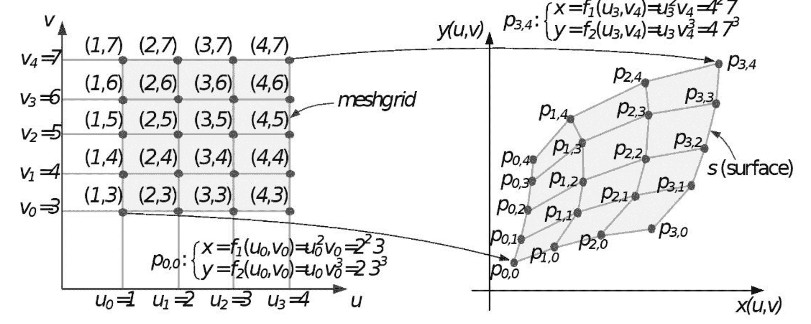

图 9-6. 具有二十个元素的网格概念图。

该网格的表示法（U 和 V）以两个多维数组的形式包含参数（u 和 v），其中每个数组由五行四列组成，如下所示：

**分析**

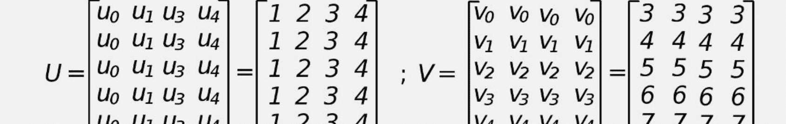

**简要讨论：** 参数数组（$U$ 和 $V$）的大小会显著增长，具体取决于参数（$u$ 和 $v$）的元素数量。例如，给定一个每个参数（$u$ 和 $v$）都有二十个元素定义的曲面，$U$ 和 $V$ 数组将有 400 个元素！定义一个包含 400 个元素的数组并直接分配每个元素是不切实际的（这很浪费且需要很多行代码）。

以下代码通过直接分配元素来定义参数数组（$U$ 和 $V$），其中 $u = [1,2,3,4]$，$v = [3,4,5,6,7]$。

- 第 1 和第 2 行导入库。
- 第 3 和第 4 行将参数 $u$ 和 $v$ 定义为分别具有四个和五个元素的一维数组。
- 第 5 行定义多维参数数组 $U$，由属于网格的参数 $u$ 的元素构成。
- 第 6 行打印存储在参数数组 $U$ 中的元素。
- 第 7 行定义多维参数数组 $V$，由属于网格的参数 $v$ 的元素构成。
- 最后，第 8 行打印存储在参数数组 $V$ 中的元素（见图 9-7 中的执行结果）。

### 代码与执行

```python
1. import numpy as np
2. import matplotlib.pyplot as plt
3. u = np.linspace(1,4,4)
4. v = np.linspace(3,7,5)
5. U = np.array([[u[0],u[1],u[2],u[3]], [u[0],u[1],u[2],u[3]], [u[0],u[1],u[2],u[3]], [u[0],u[1],u[2],u[3]], [u[0],u[1],u[2],u[3]]])
6. print('U: ', U)
7. V = np.array([[v[0],v[0],v[0],v[0]], [v[1],v[1],v[1],v[1]], [v[2],v[2],v[2],v[2]], [v[3],v[3],v[3],v[3]], [v[4],v[4],v[4],v[4]]])
8. print('V: ', V)
```

```
U:  [[1. 2. 3. 4.]
 [1. 2. 3. 4.]
 [1. 2. 3. 4.]
 [1. 2. 3. 4.]
 [1. 2. 3. 4.]]
V:  [[3. 3. 3. 3.]
 [4. 4. 4. 4.]
 [5. 5. 5. 5.]
 [6. 6. 6. 6.]
 [7. 7. 7. 7.]]
```

图 9-7. 先前代码的执行结果。

### 使用函数定义大尺寸网格

在先前的代码中，第 5 行和第 7 行非常长，因为每个数组都有二十个直接定义的元素。然而，*Numpy* 提供了一个名为 *meshgrid* 的函数，通过它可以在一行代码中自动获得数组（*U* 和 *V*），从而节省精力、时间和代码行数。以下代码使用 *meshgrid* 函数复制了相同的过程和结果。

- 第 1 和第 2 行导入库。
- 第 3 和第 4 行将参数 *u* 和 *v* 定义为分别具有四个和五个元素的一维数组。
- 第 5 行使用 *Numpy* 库中的 *meshgrid* 函数定义多维数组参数 *U* 和 *V*。
- 最后，第 6 和第 7 行打印存储在参数数组 *U* 和 *V* 中的元素（见图 9-8 中的执行结果）。

### 代码与执行

```python
1. import numpy as np
2. import matplotlib.pyplot as plt
3. u = np.linspace(1,4,4)
4. v = np.linspace(3,7,5)
5. U,V = np.meshgrid(u,v)
6. print('U: ', U)
7. print('V: ', V)
```

U: [[1. 2. 3. 4.]
    [1. 2. 3. 4.]
    [1. 2. 3. 4.]
    [1. 2. 3. 4.]
    [1. 2. 3. 4.]]
V: [[3. 3. 3. 3.]
    [4. 4. 4. 4.]
    [5. 5. 5. 5.]
    [6. 6. 6. 6.]
    [7. 7. 7. 7.]]

图 9-8. 上述代码的执行结果。

> **提示：** 如果你想进一步探索 *meshgrid* 函数，我们建议查看此链接：[https://numpy.org/doc/stable/reference/generated/numpy.meshgrid.html](https://numpy.org/doc/stable/reference/generated/numpy.meshgrid.html)。你可以找到一些提升你潜力的示例。

### 建模大尺寸网格曲面

以下代码使用网格函数对二维参数曲面 *s*（公式 9-4）进行建模。

- 第 1 和第 2 行导入库。
- 第 3 和第 4 行将参数 *u* 和 *v* 定义为分别包含四个和两个元素的一维数组。
- 第 5 行使用 *Numpy* 中的 *meshgrid* 函数定义多维数组 *U* 和 *V*。
- 第 6 和第 7 行打印存储在参数数组 *U* 和 *V* 中的元素。
- 第 8 和第 9 行根据参数数组 *U* 和 *V* 定义 *x* 轴和 *y* 轴（参见公式 9-4）。
- 在第 10 行，开始一个循环遍历数组 $U$ 和 $V$ 的每一行，获得曲面的四个连续补片；由于参数 $v$ 有五个元素，数组 $U$ 和 $V$ 有五行（$v$ 方向上的五个点）。
- 在第 11 行，开始一个循环遍历参数数组 $U$ 和 $V$ 的每一列，获得曲面的三个连续补片；由于参数 $u$ 有四个元素，参数数组 $U$ 和 $V$ 有四列（$u$ 方向上的四个点）。
- 最后，第 12 至 14 行绘制并显示曲面的每个补片（执行结果见图 9-9）。

### 代码与执行

```
1. import numpy as np
2. import matplotlib.pyplot as plt
3. u = np.linspace(1,4,4)
4. v = np.linspace(3,7,5)
5. U,V = np.meshgrid(u,v)
6. print('U:', U)
7. print('V:', V)
8. X = U**2 * V
9. Y = U * V**3
10. for row in range(len(v)-1):
11.     for col in range(len(u)-1):
12.         plt.fill([X[row,col], X[row+1,col], X[row+1,col+1], X[row,col+1]],
13.                 [Y[row,col],Y[row+1,col],Y[row+1,col+1],Y[row,col+1]], color='green', alpha=.4)
14. plt.show()
```

U: [[1. 2. 3. 4.]
 [1. 2. 3. 4.]
 [1. 2. 3. 4.]
 [1. 2. 3. 4.]
 [1. 2. 3. 4.]]
V: [[3. 3. 3. 3.]
 [4. 4. 4. 4.]
 [5. 5. 5. 5.]
 [6. 6. 6. 6.]
 [7. 7. 7. 7.]]

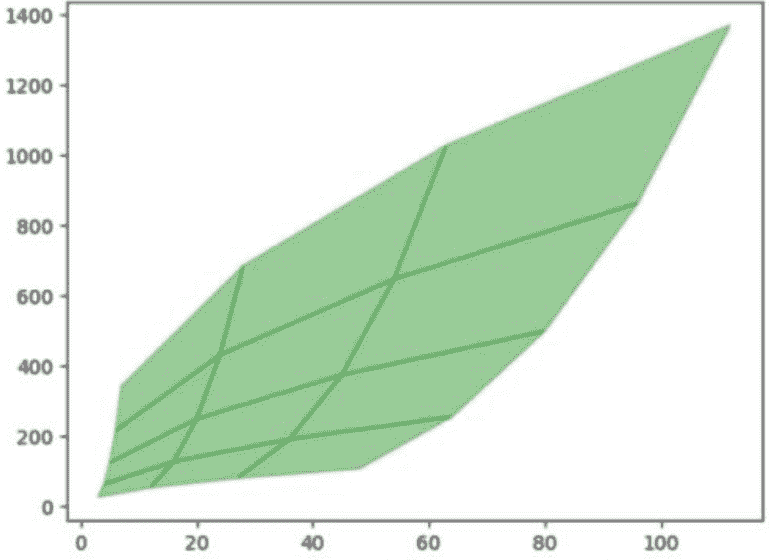

图 9-9. 上述代码的执行结果。

## 9.3. 二维参数曲面是如何建模的？

一旦理解了 *meshgrid* 的概念，二维参数曲面的建模就很简单了：(i) 定义参数 u 和 v；(ii) 构建参数数组 U 和 V；(iii) 计算 x 轴方向的参数方程 $f_1$；(iv) 计算 y 轴方向的参数方程 $f_2$；以及 (v) 以图形表示显示结果。

### 示例：带孔的圆盘

我们使用参数表达式来描述一个带孔的圆盘（见公式 9-5）。

公式 9-5

| $s:$ | $r = 2v$<br>$x = r \sin(u)$<br>$y = r \cos(u)$ | ; 其中 $u = 0...2\pi$, $v = 1...5$ |

请注意，描述带孔圆盘的方程（公式 9-5）类似于圆的方程（公式 7-9）。然而，我们必须将半径（$r$）改为依赖于参数 $v$ 的函数，其中孔的半径将是参数 $v$ 的最小值，而圆盘的外半径将是参数 $v$ 的最大值。

以下代码对带孔的圆盘进行建模。

- 第 1 和第 2 行导入库。
- 第 3 和第 4 行将参数 $u$ 和 $v$ 定义为一维数组。
- 第 5 行定义多维参数数组 $U$ 和 $V$。
- 第 6 行定义半径函数 $r$。
- 第 7 和第 8 行根据参数数组 $U$ 和 $V$ 定义 $x$ 轴和 $y$ 轴。
- 在第 9 行，开始一个循环遍历参数数组 $U$ 和 $V$ 的每一行。
- 在第 10 行，开始一个循环遍历参数数组 $U$ 和 $V$ 的每一列。
- 最后，第 11 至 13 行绘制并显示曲面的每个补片（执行结果见图 9-10）。

代码与执行

```
1. import numpy as np
2. import matplotlib.pyplot as plt
3. u = np.linspace(0,2*np.pi,50)
4. v = np.linspace(1,5,10)
5. U,V = np.meshgrid(u,v)
6. r = 2 * V
7. X = r * np.sin(U)
8. Y = r * np.cos(U)
9. for row in range(len(v)-1):
10.     for col in range(len(u)-1):
11.         plt.fill([X[row,col], X[row+1,col], X[row+1,col+1], X[row,col+1]],
12.                  [Y[row,col],Y[row+1,col],Y[row+1,col+1],Y[row,col+1]], color='chocolate', alpha=.5)
13. plt.show()
```

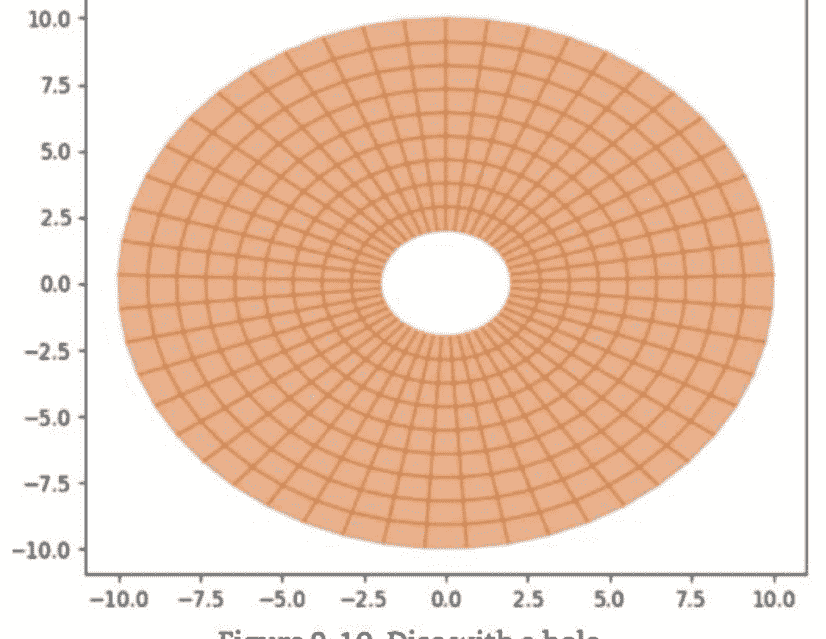

图 9-10. 带孔的圆盘。

### 示例：七角星

我们使用之前二维参数曲线（公式 7-11）来获得二维曲面（公式 9-6）。该曲面实际上与我们之前在 7.3 节（见图 7-12）中建模的 *海绵宝宝* 的无条件朋友 *派大星* 轮廓的曲线方程相同。然而，我们改变了 *r* 的表达式，添加了参数 *v* 并将数字 5 改为 7，以获得一个七角星。

**公式 9-6**

```
$$s: \begin{cases} r = v + 2 \sin(7u) + 5 \ x = r \cos(u) \ y = r \sin(u) \end{cases} \quad ; \text{其中 } u = 0...2\pi, v = 1...10$$
```

以下代码对七角星曲面进行建模。

- 第 1 和第 2 行导入库。
- 第 3 和第 4 行定义参数 $u$ 和 $v$。
- 第 5 行定义参数数组 $U$ 和 $V$。
- 第 6 行定义半径函数 $r$。
- 第 7 和第 8 行根据参数数组 $U$ 和 $V$ 定义 $x$ 轴和 $y$ 轴。
- 在第 9 和第 10 行，开始两个循环分别遍历参数数组 $U$ 和 $V$ 的每一行和每一列。
- 最后，第 11 至 13 行绘制并显示曲面的每个补片（执行结果见图 9-11）。

**代码与执行**

```
1. import numpy as np
2. import matplotlib.pyplot as plt
3. u = np.linspace(0,2*np.pi,80)
4. v = np.linspace(1,10,10)
5. U,V = np.meshgrid(u,v)
6. r = V + 2*np.sin(7*U) + 5
7. X = r * np.cos(U)
8. Y = r * np.sin(U)
9. for row in range(len(v)-1):
10.     for col in range(len(u)-1):
11.         plt.fill([X[row,col], X[row+1,col], X[row+1,col+1], X[row,col+1]],
12.                  [Y[row,col],Y[row+1,col],Y[row+1,col+1],Y[row,col+1]], color = 'firebrick', alpha=.7)
plt.show()
```

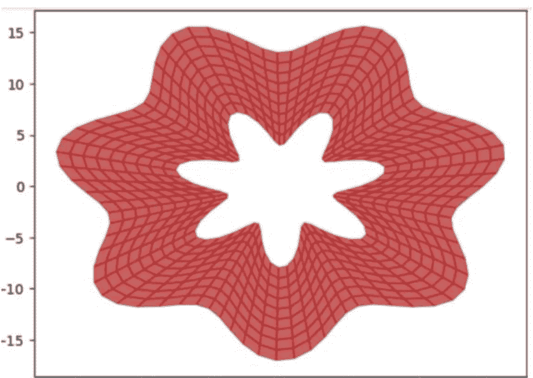

图 9-11. 七角星。

**简要讨论：** 请注意，二维参数曲面 $s$ 有两个坐标：$x$ 和 $y$。然而，参数（$u$ 和 $v$）各自都是一维的。因此，由参数（$u$, $v$）组合定义的网格具有两个维度。这就是为什么我们可以说二维参数曲面将二维参数（$u$, $v$）映射到两个坐标（$x$, $y$）的系统。

最小的面积，其角点处具有最尖锐（最小）的角度（120°）(iii) 通过多种数值度量，它是最不中心对称的。

由于其宽度恒定，*勒洛* 三角形是一种被用作井盖或消防栓螺母的形状，因为它不会掉入孔中；铅笔；用于钻削圆角方孔的钻头；以及一些标志和公司徽标的设计图形。

### 让我们建模 *勒洛* 三角形

基于在二维参数曲面建模中获得的概念，对 *勒洛* 三角形形状进行建模。

以下代码展示了如何对 *勒洛* 三角形形状进行建模（执行结果见图 9-12）。

- 第 1 和第 2 行导入库。
- 第 3 和第 4 行定义参数 *u* 和 *v*。
- 第 5 行定义参数数组 *U* 和 *V*。
- 第 6 行定义半径函数 *r*。
- 第 7 和第 8 行根据参数数组 *U* 和 *V* 定义 *x* 轴和 *y* 轴。
- 在第 9 和第 10 行，开始两个循环分别遍历数组 *U* 和 *V* 的每一行和每一列。
- 最后，第 11 至 13 行绘制并显示曲面的每个补片（执行结果见图 9-12）。

### 代码与执行

```
1. import numpy as np
2. import matplotlib.pyplot as plt
3. u = np.linspace(0,2*np.pi,60)
```

4.  v = np.linspace(0,1,10)
5.  U,V = np.meshgrid(u,v)
6.  r = V
7.  X = r * (-8*(np.sin(U)**3-1)*np.cos(U))
8.  Y = r * (-2*np.cos(2*U)-np.cos(4*U)+8*np.sin(U))
9.  for row in range(len(v)-1):
10.     for col in range(len(u)-1):
11.         plt.fill([X[row,col],X[row+1,col],X[row+1,col+1],X[row,col+1]],
12.             [Y[row,col],Y[row+1,col],Y[row+1,col+1],Y[row,col+1]], color = 'seagreen', alpha=.7)
13. plt.show()

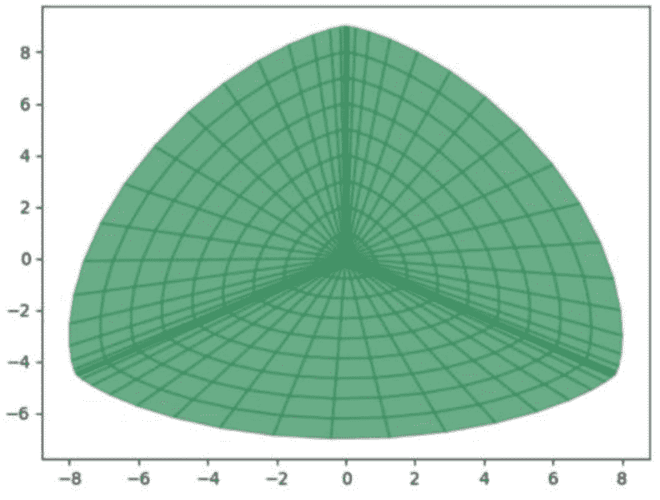

图 9-12. 勒洛三角形曲面。

**提示：** 如果你想进一步探索*勒洛三角形*的形状，我们建议你查看此链接：[https://mathworld.wolfram.com/ReuleauxTriangle.html](https://mathworld.wolfram.com/ReuleauxTriangle.html)。你将了解其属性和信息，以提升你的潜力。

## 9.5. 练习

**E9.1.** 绘制并匹配以下二维参数曲线与图形。

### 方程 E9-1

| | |
|---|---|
| $r = v$<br>$s : \begin{cases} x = r \cos^3(u) \\ y = r \sin^3(u) \end{cases}$ | ; 其中 $u = 0...2\pi$, $v = 0...1$ |

### 方程 E9-2

| | |
|---|---|
| $r = v$<br>$s : \begin{cases} x = r (2 \cos(u) + \cos(2u)) \\ y = r (2 \sin(u) - \sin(2u)) \end{cases}$ | ; 其中 $u = 0...2\pi$, $v = 0.2...1$ |

### 方程 E9-3

| | |
|---|---|
| $r = v$<br>$s : \begin{cases} x = u \\ y = r \sin(u) \end{cases}$ | ; 其中 $u = 0...2\pi$, $v = 2...6$ |

### 方程 E9-4

| | |
|---|---|
| $s : r = v$ | ; 其中 $u = 0...2\pi$, $v = 0...2$ |

$$x = u$$
$$y = r + \sin(u)$$

### 方程 E9-5

$$r = v$$
$$s: \begin{cases} x = r (2 \cos(u) - \cos(2u)) \\ y = r (2 \sin(u) - \sin(2u)) \end{cases}$$
; 其中 $u = 0...2\pi$, $v = 0...1$

### 方程 E9-6

$$r = v + \cos(4 \sin(3u))$$
$$s: \begin{cases} x = r \sin(u) \\ y = r \cos(u) \end{cases}$$
; 其中 $u = 0...2\pi$, $v = 1.5...6$

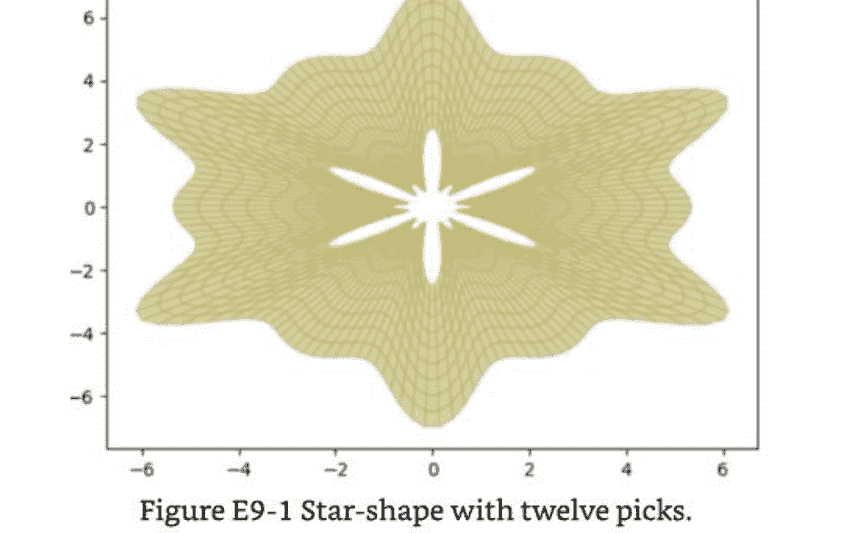

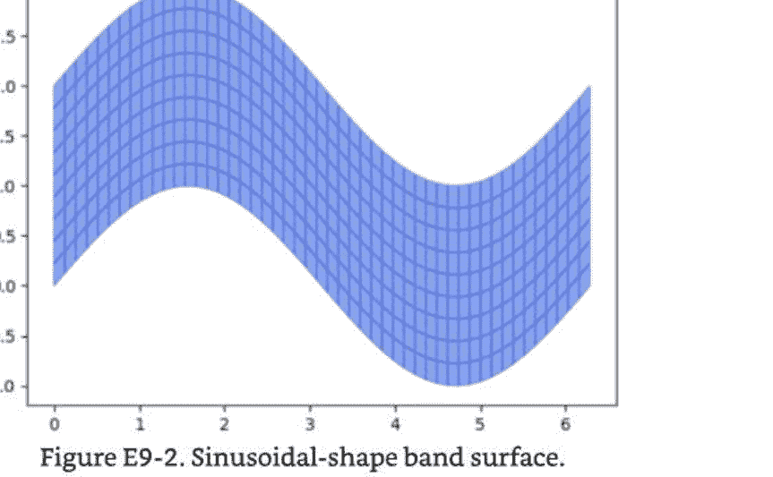

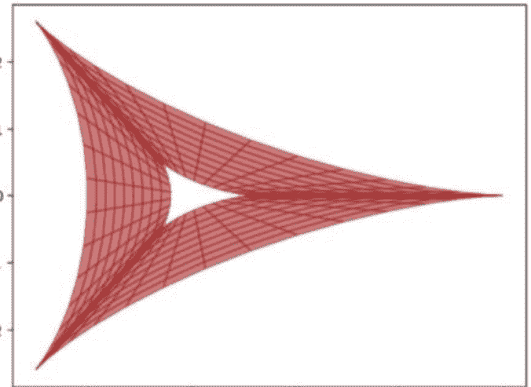

图 E9-3. *三角星形*曲面。

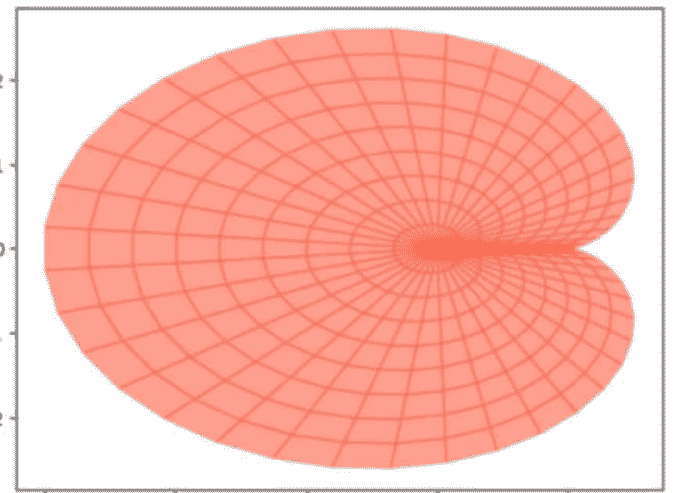

图 E9-4. *心形线*曲面。

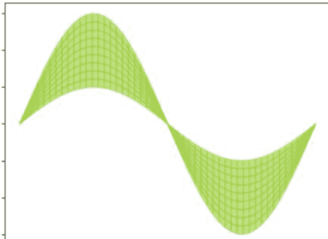

图 E9-5. 正弦波带曲面。

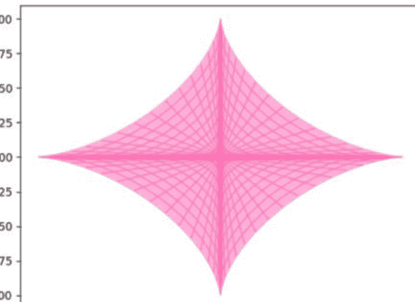

图 E9-6. *星形线*曲面。

## 总结

在本章中，我们学习了如何在二维中建模参数曲面。此外，我们学习了如何建模代表性的二维曲面：

- 用于带孔的**圆盘**（见图 9-10）。
- 用于**星形**曲面，例如七角星（见图 9-11）和十二角星（图 E9-1）。
- 用于***勒洛三角形***形状的曲面（见图 9-12）。
- 用于**正弦波带**曲面（见图 E9-2 和图 E9-5）。
- 用于**三角星形**曲面（见图 E9-3）。
- 用于**心形线**曲面（见图 E9-4）。
- 用于***星形线***形状的曲面（见图 E9-6）。

在下一章中，我们将学习如何在三维中建模参数曲面。

# 第10章 – 三维参数曲面

在前面的章节中，我们学习了二维参数曲面。本章将解释如何在三维中表示和编写参数曲面的代码。

接下来，我们将涵盖以下部分：

1. 三维参数曲面的定义。
2. 三维参数曲面的显式表示。
3. 三维参数曲面的隐式表示。
4. 快速项目。
5. 练习。

本章开发的代码位于 [https://github.com/PracticalBooks/Python-For-Geometric-Modeling/tree/main/Chapter-10](https://github.com/PracticalBooks/Python-For-Geometric-Modeling/tree/main/Chapter-10)。我们建议你通过独立编写代码来提升你的编码技能。如果有任何问题，你可以参考仓库中的代码进行比较。

请记住，我们建议你为本书的每一章创建一个新的 Colab 文档。这将使你能够保持代码的组织性。

## 10.1. 三维参数曲面的定义

三维中的**参数曲面** *s* 使用一组点 $(p_{0,0}, p_{0,1}, \dots, p_{i,j}, \dots, p_{n,m})$ 来定义；因此，点 $p_{i,j}$ 由三个元素 $(x(u,v), y(u,v), z(u,v))$ 组成。这组点由三个具有两个参数（*u* 和 *v*）的函数定义（见图 10-1）。参数（*u* 和 *v*）是独立变量（输入），三个 *x*、*y* 和 *z* 依赖于它们（输出），并且随着参数的增加，$x(u,v)$、$y(u,v)$ 和 $z(u,v)$ 的值会沿着平面曲面描绘出一条路径。三维中的参数曲面 $s$ 描述了一组点之间的关系，这可以通过三个函数来表达：一个函数 $f_1(u,v)$ 用于获取 $x$ 值；另一个函数 $f_2(u,v)$ 用于获取 $y$ 值；最后一个函数 $f_3(u,v)$ 用于获取 $z$ 值（见方程 10-1）。

**方程 10-1**

$$
s: \begin{cases} 
x = f_1(u,v) \\
y = f_2(u,v) \\
z = f_3(u,v)
\end{cases}
$$

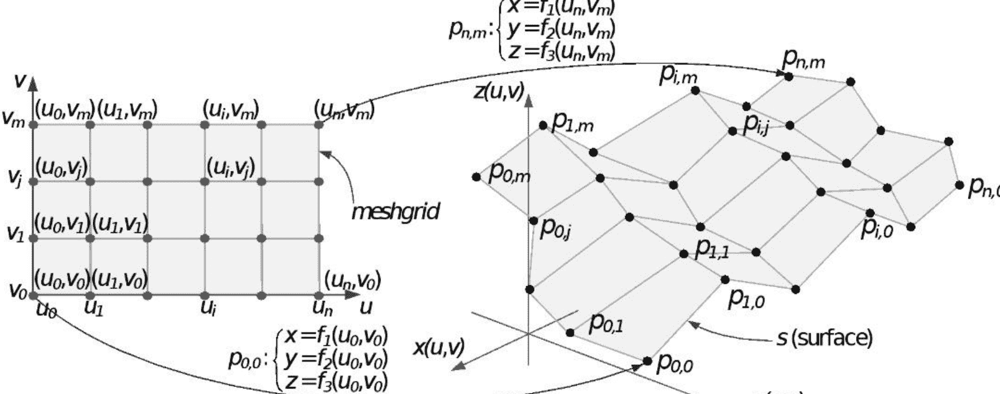

图 10-1. 三维参数曲面的概念化。

理解三维参数曲面建模很简单。我们可以基于在二维参数曲面中学到的概念，只需添加 z 轴，它被定义为 u 参数的第三个表达式，即 z = f₃(u,v)。

> **快速讨论：** 注意，三维中的参数曲面 s 有三个坐标：x、y 和 z。然而，参数数组（U 和 V）由参数（u, v）的组合定义；因此，U 和 V 有两个维度。这就是为什么我们可以说三维参数曲面将二维参数（u, v）映射到三坐标系（x, y, z）。

三维参数曲面可以用显式和隐式表示法来表达。接下来，我们将概念化几何建模中的表示法和应用。

## 10.2. 三维参数曲面的显式表示

**三维参数曲面的显式表示**被定义为一个函数，其中因变量（$z$）可以明确地用自变量（$x$ 和 $y$）来表示。我们可以将曲线写成标准形式，如方程 10-2。其中 $z$ 是完全用输入变量 $x$ 和 $y$ 表示的输出变量，即 $x = u$，$y = v$，且 $z = f(x,y)$（见图 10-2）。

**方程 10-2**

$s: \begin{cases} x = u \\ y = v \\ z = f(x,y) \end{cases} ; \text{ 其中 } u = u_0...u_n, v = v_0...v_m$

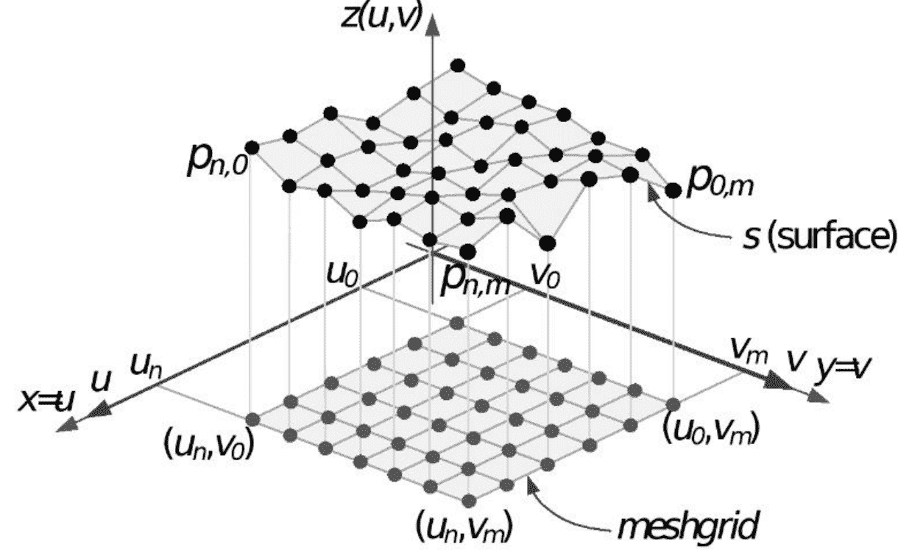

图 10-2. 三维显式参数曲面的概念化，其中 x = U 且 y = V。

### 示例：水面

我们使用显式表示法来描述水面 s 上的波浪，表示为方程 10-3。

**方程 10-3**

$$s: \begin{cases} x = u \\ y = v \\ z = \sin(\sqrt{x^2 + y^2}) \end{cases} \quad ; \text{其中 } u = -7\pi...7\pi, v = -7\pi...7\pi$$

以下代码模拟了水面上的波浪。

- 第 1 行和第 2 行导入库。在第 2 行，我们从 *plotly* 导入 *graph_objects* 模块并为其分配别名 *go*。*graph_object* 模块用于快速设置图形曲面属性，如 *opacity*、*colorscale* 和 *contours*。
- 第 3 行和第 4 行定义参数 *u* 和 *v*。
- 第 5 行定义参数数组 *U* 和 *V*。
- 第 6 行和第 7 行分别从参数数组 *U* 和 *V* 定义 *x* 轴和 *y* 轴。
- 第 8 行将 *z* 轴定义为 *z = f(x,y)*。
- 第 9 行到第 10 行设置并显示曲面。
- 在第 11 行，使用 *fig.update_layout* 函数来设置坐标轴图形的*纵横比*。因此，我们调整图形的边距或坐标轴的范围，以便更好地可视化模型。与 *x*、*y* 和 *z* 轴相关的每个值都是其轴的缩放数字。然后，如果值小于 1，则轴的大小减小；如果值大于 1，则轴的大小增大；但如果值等于 1，则轴保持其原始大小。
- 第 12 行显示图形（执行结果见图 10-3）。

### 代码与执行

```
1. import numpy as np
2. import plotly.graph_objects as go
3. u = np.linspace(-7*np.pi,7*np.pi,50)
4. v = np.linspace(-7*np.pi,7*np.pi,50)
5. U,V = np.meshgrid(u,v)
6. X = U
```

### 示例：双曲屋顶

我们使用显式表示法来描述双曲屋顶 $s$，如公式 10-4 所示。

**公式 10-4**

| $s:$ | $x = u$<br>$y = v$<br>$z = -(1 - x^2)(1 - y^2)$ | ; 其中 $u = -3...3$, $v = -3...3$ |

以下代码对双曲屋顶进行建模。

- 第 1 和第 2 行导入库。
- 第 3 和第 4 行定义参数 $u$ 和 $v$。
- 第 5 行定义参数数组 $U$ 和 $V$。
- 第 6 和第 7 行分别将 $x$ 轴和 $y$ 轴定义为参数数组 $U$ 和 $V$。
- 第 8 行将 $z$ 轴定义为 $x$ 轴和 $y$ 轴的函数。
- 第 9 至 12 行设置并显示曲面（执行结果见图 10-4）。

```
1. import numpy as np
2. import plotly.graph_objects as go
3. u = np.linspace(-3,3,50)
4. v = np.linspace(-3,3,50)
5. U,V = np.meshgrid(u,v)
6. X = U
7. Y = V
8. Z = -(1-X**2) * (1-Y**2)
9. fig=go.Figure(go.Surface(x=X, y=Y, z=Z,opacity=1,colorscale = 'oxy', showscale=False,
10.     contours=dict(x=dict(show=True), y=dict(show=True), z=dict(show=False))))
11. fig.update_layout(title='Hyperbolic roof',autosize=False)
12. fig.show()
```

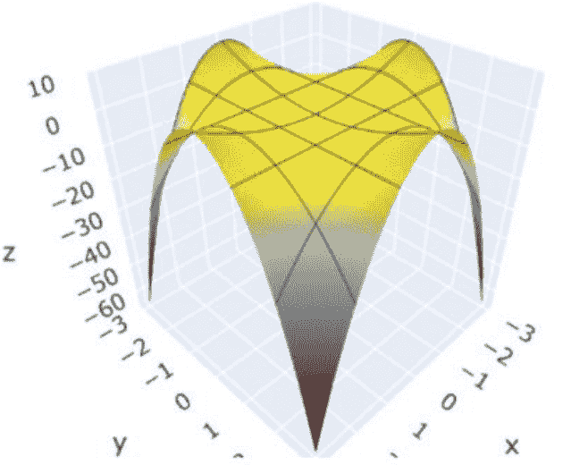

图 10-4. 双曲屋顶。

## 10.3. 三维参数曲面的隐式表示法

**隐式表示法**是三维参数曲面的通用表达式。它意味着方程不是表示为 $x$ 关于 $y$ 或 $z$ 的解。我们可以将曲面写成标准形式，如公式 10-5 所示。其中 $x$、$y$ 和 $z$ 是完全用输入参数 $u$ 表示的输出变量，即 $x = f_1(u,v)$、$y = f_2(u,v)$ 和 $z = f_3(u,v)$，见图 10-5。

**公式 10-5**

$s: \begin{cases} x = f_1(u,v) \\ y = f_2(u,v) \\ z = f_3(u,v) \end{cases} ; \text{ 其中 } u = u_0...u_n, v = v_0...v_m$

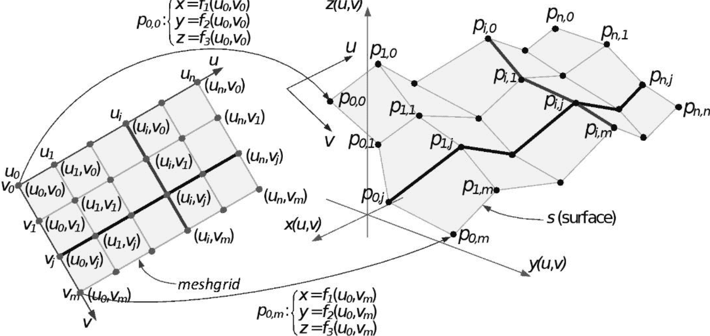

### 示例：单位半径球体

我们使用隐式表示法来描述单位半径（r = 1）的球体，如公式 10-6 所示。

**公式 10-6**

$s: \begin{cases} x = r \sin(v) \cos(u) \\ y = r \sin(v) \sin(u) \\ z = r \cos(v) \end{cases} ; \text{ 其中 } u = 0...2\pi, v = 0...\pi$

请注意，描述球体的方程（公式 10-6）是基于第 7.3 节（公式 7-9）中建模的圆的方程。圆的方程用一对正弦项（cos(u) 和 sin(u)）表示，以在 x 轴和 y 轴上仅获得一个曲率。然而，球体的方程用三对正弦项表示，以描述曲面的三个曲率：第一对项（x 轴方程中的 cos(u) 项和 y 轴方程中的 sin(u) 项）描述 x 轴和 y 轴的曲率；第二对项（z 轴方程中的 cos(v) 项和 x 轴方程中的 sin(v) 项）描述 z 轴和 x 轴的曲率；第三对项（z 轴方程中的 cos(v) 项和 y 轴方程中的 sin(v) 项）描述 z 轴和 y 轴的曲率。

为了详细解释模型的过程，我们将首先仅用四个元素定义参数 u：u = [0, 0.1, 0.2, 0.3]，而参数 v 仅由三个元素定义：v = [0.5, 0.6, 0.7]（见图 10-6）；然后，参数模型将有十二个点（p_{0,0}, p_{0,1}, p_{0,2}, p_{1,0}, p_{1,1}, p_{1,2}, p_{2,0}, p_{2,1}, p_{2,2}, p_{3,0}, p_{3,1}, p_{3,2}）。

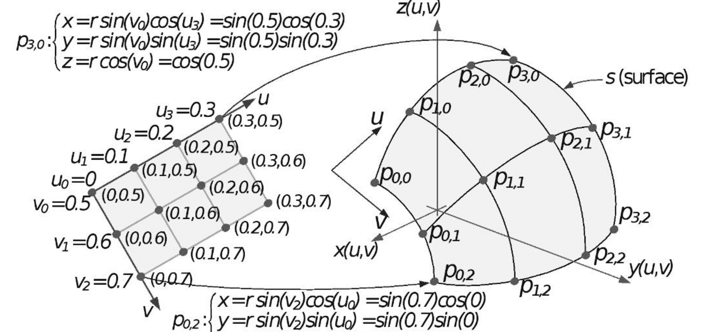

图 10-6. 使用分别具有四个和三个元素的参数 u 和 v 进行建模的概念化。

以下代码使用参数 $u$ 和 $v$（每个有 50 个元素）对单位半径球体进行建模。

- 第 1 和第 2 行导入库。
- 第 3 和第 4 行定义参数 $u$ 和 $v$。
- 第 5 行定义参数数组 $U$ 和 $V$。
- 第 6 行定义球体半径。
- 第 7 至 9 行根据参数数组 U 和 V 定义 x 轴、y 轴和 z 轴。
- 第 10 至 13 行设置并显示曲面（执行结果见图 10-7）。

### 代码与执行

```
1. import numpy as np
2. import plotly.graph_objects as go
3. u = np.linspace(0,2*np.pi,50)
4. v = np.linspace(0,np.pi,50)
5. U, V = np.meshgrid(u,v)
6. r = 1
7. X = r * np.sin(V) * np.cos(U)
8. Y = r * np.sin(V) * np.sin(U)
9. Z = r * np.cos(V)
10. fig=go.Figure(go.Surface(x=X,y=Y,z=Z,opacity=1,colorscale = 'portland', showscale=False,
11.     contours=dict(x=dict(show=True), y=dict(show=True), z=dict(show=True))))
12. fig.update_layout(title='Sphere',autosize=False)
13. fig.show()
```

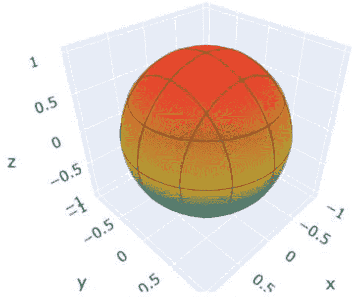

图 10-7. 单位半径球体。

### 示例：海螺

半径 $r$ 可以是一个定义为参数 $U$ 或 $V$ 的函数的变量。以下代码展示了我们如何使用隐式表示法，通过变量半径 $r$（如公式 10-7 所示）对海螺进行建模。

### 公式 10-7

| $s:$ | $r = 1 - u$<br>$x = r \sin(v) + 5u$<br>$y = r \cos(v) \cos(4\pi u)$<br>$z = r \cos(v) \sin(4\pi u)$ | ; 其中 $u = \pi/3...11\pi/15$, $v = 0...2\pi$ |

以下代码对海螺进行建模。

- 第 1 和第 2 行导入库。
- 第 3 和第 4 行定义参数 $u$ 和 $v$。
- 第 5 行定义参数数组 $U$ 和 $V$。
- 第 6 行定义一个变量半径。
- 第 7 至 9 行根据参数数组 $U$ 和 $V$ 定义 $x$ 轴、$y$ 轴和 $z$ 轴。
- 第 10 至 13 行设置并显示曲面（执行结果见图 10-8）。

### 代码与执行

```
1. import numpy as np
2. import plotly.graph_objects as go
3. u = np.linspace(np.pi/3,11*np.pi/15,50)
4. v = np.linspace(0,2*np.pi,50)
5. U, V = np.meshgrid(u,v)
6. r = 1 - U
7. X = r * np.sin(V) + 5*U
8. Y = r * np.cos(V) * np.cos(4*np.pi*U)
9. Z = r * np.cos(V) * np.sin(4*np.pi*U)
10. fig=go.Figure(go.Surface(x=X,y=Y,z=Z,opacity=1,colorscale = 'icefire', showscale=False,
11.     contours=dict(x=dict(show=True), y=dict(show=True), z=dict(show=True))))
12. fig.update_layout(title='Shell',autosize=False)
13. fig.show()
```

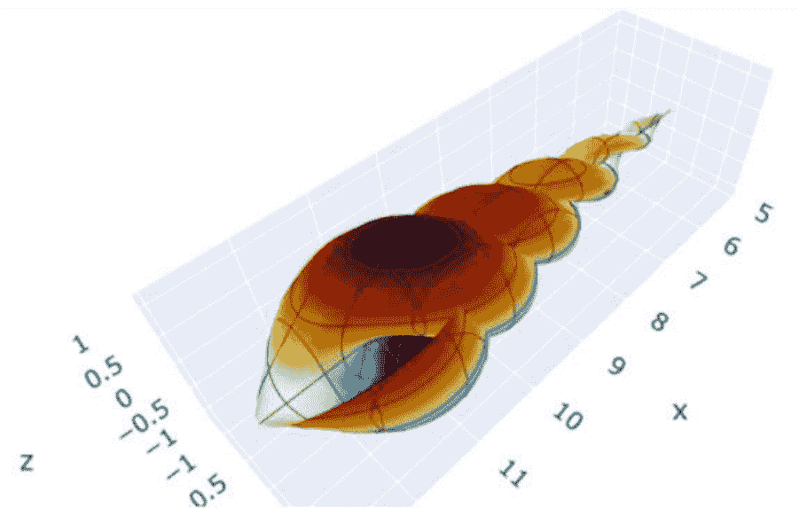

图 10-8. 海螺。

## 10.4. 快速项目

每年都会庆祝*情人节*，它起源于一个基督教节日，以纪念一位名叫瓦伦丁的殉道者，并通过后来的民间传统，也成为世界许多地区一个重要的文化、宗教和商业庆典，庆祝浪漫与爱情。

有几个与 2 月 14 日相关的各种瓦伦丁有关的殉道故事，包括一个关于圣瓦伦丁被监禁的记载，传说他在被处决前给狱卒的女儿写了一封信，署名“你的瓦伦丁”作为告别。

*情人节*即将来临，向你所爱的人表达感情的最佳礼物是送给他/她一份你亲手制作的礼物。因此，你可以运用你的几何建模技巧来表达你的感情，将你来自数字世界的心送给他/她。现在，我们建议你建模你的数字心形，我们知道它由以下形式描述（见公式 10-8）。

> **公式 10-8**

$s: \begin{cases} x = 6 \cos(v) \\ y = \sin(v) (15 \sin(u) - 4 \sin(3u)) \\ z = \sin(v) (13 \cos(u) - 5 \cos(2u) - 2\cos(3u) - \cos(4u)) \end{cases}$ ; 其中 $u = 0...2\pi$, $v = 0...\pi$

### 让我们建模你的数字心形

以下代码对你的数字心形进行建模。

- 第 1 和第 2 行导入库。
- 第 3 和第 4 行定义参数 $u$ 和 $v$。
- 第 5 行定义参数数组 $U$ 和 $V$。
- 第 6 至 8 行根据参数数组 $U$ 和 $V$ 定义 $x$ 轴、$y$ 轴和 $z$ 轴。
- 第 9 至 12 行设置并显示曲面（执行结果见图 10-9）。

### 代码与执行

```
1. import numpy as np
2. import plotly.graph_objects as go
3. u = np.linspace(0,2*np.pi,50)
4. v = np.linspace(0,np.pi,50)
5. U, V = np.meshgrid(u,v)
6. X = 6 * np.cos(V)
7. Y = np.sin(V) * (15*np.sin(U) - 4*np.sin(3*U))
```

8. Z = np.sin(V) * (13*np.cos(U) - 5*np.cos(2*U) - 2*np.cos(3*U) - np.cos(4*U))
9. fig=go.Figure(go.Surface(x=X, y=Y, z=Z,opacity=1,colorscale = 'redor', showscale=False,
10.     contours=dict(x=dict(show=True), y=dict(show=True), z=dict(show=False))))
11. fig.update_layout(title='My heart',autosize=False)
12. fig.show()

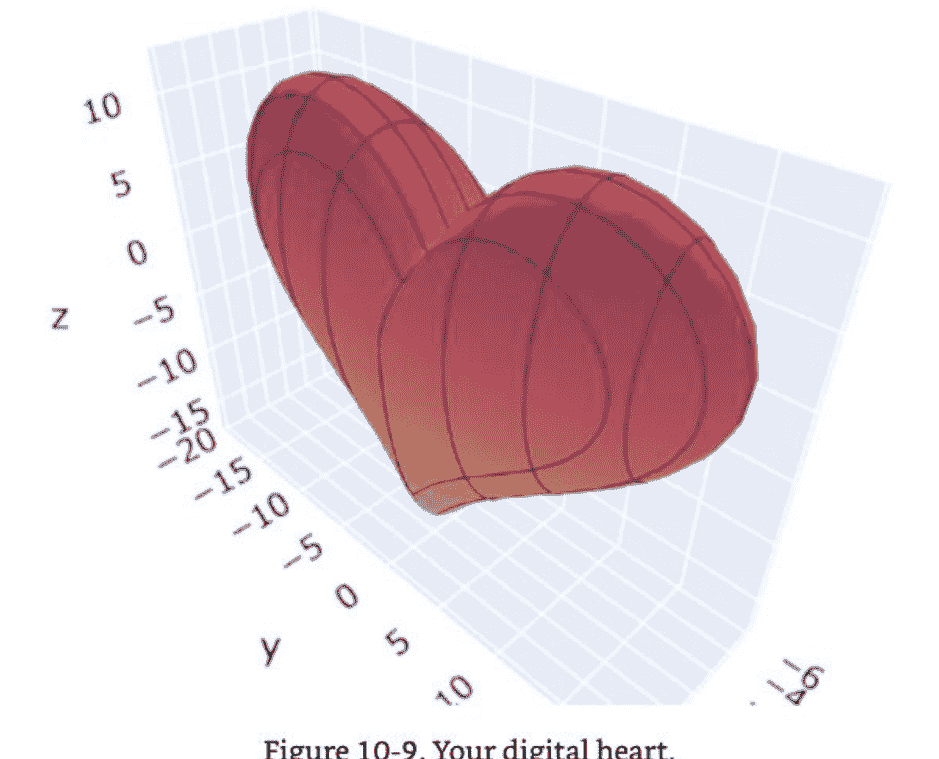

图 10-9. 你的数字之心。

## 10.5. 练习

**E10.1.** 在三维空间中绘制并匹配以下参数曲面（使用显式表示法）与对应的图形。

### 方程 E10-1

$s: \begin{cases} x = u \\ y = v \\ z = x^2 - y^2 \end{cases}$ ; 其中 $u = -5...5, v = -5...5$

### 方程 E10-2

$s: \begin{cases} x = u \\ y = v \\ z = -(x^2 - y^2)^2 \end{cases}$ ; 其中 $u = -5...5, v = -5...5$

### 方程 E10-3

$s: \begin{cases} x = u \\ y = v \\ z = \sin(xy) \end{cases}$ ; 其中 $u = -3...3, v = -3...3$

### 方程 E10-4

$s: \begin{cases} x = u \\ y = v \\ z = x \sin(2x) \sin(y) \end{cases}$ ; 其中 $u = 0...6\pi, v = 0...6\pi$

**注意：** 为了更好地可视化模型，请将坐标轴图形的*宽高比*设置为 $x = 1, y = 1$, 和 $z = 0.3$。

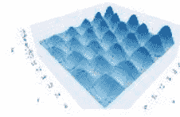

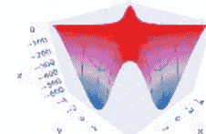

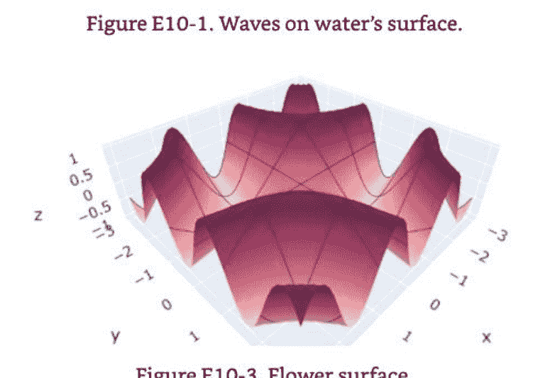

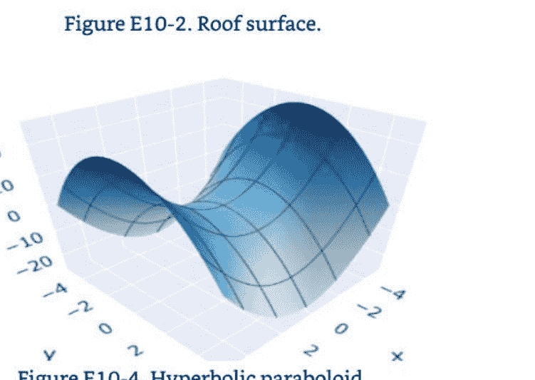


### E10.2. 在三维空间中绘制并匹配以下参数曲面（使用隐式表示法）与对应的图形。

#### 方程 E10-5

$$s: \begin{cases} x = \cos(u) \\ y = \sin(v) \\ z = \sin(|u| + |v|) \end{cases}$$

; 其中 $u = 0...2\pi$, $v = -2\pi...2\pi$

#### 方程 E10-6

$$s: \begin{cases} r = 1 + (1/5) \sin(5u) \sin(4v) \\ x = r \sin(v) \cos(u) \\ y = r \sin(v) \sin(u) \\ z = r \cos(v) \end{cases}$$

; 其中 $u = 0...2\pi$, $v = 0...\pi$

### 方程 E10-7

```
s : 
\begin{aligned}
x &= (2 + \sin(v)) \cos(u) \\
y &= (2 + \sin(v)) \sin(u) \\
z &= u + \cos(v)
\end{aligned}
; 其中 $u = 0...4\pi$, $v = 0...2\pi$
```

### 方程 E10-8

```
s : 
\begin{aligned}
x &= (1-u)^2 (2 + \cos(v)) \cos(8\pi u) \\
y &= (1-u)^2 (2 + \cos(v)) \sin(8\pi u) \\
z &= 2u^2 + (1-u) \sin(V)
\end{aligned}
; 其中 $u = \pi/3...11\pi/15$, $v = 0...2\pi$
```

### 方程 E10-9

```
s : 
\begin{aligned}
r &= 2 + \sin(5u) \\
x &= r \cos(u) \sin(v) \\
y &= v \\
z &= r \sin(u) \sin(v)
\end{aligned}
; 其中 $u = 0...2\pi$, $v = 0...\pi$
```

### 方程 E10-10

```
s : 
\begin{aligned}
R_o &= 4 \\
R_1 &= 1 \\
amp &= 0.2 \\
Freq &= 6 \\
Turns &= 1 \\
theta &= u 2\pi \\
phi &= u 2\pi \\
r &= R_1 + amp \sin(Freq*phi) \\
ang &= phi + 2\pi \sin(Turns + theta)
\end{aligned}
; 其中 $u = 0...0.3183\pi$, $v = 0...0.3183\pi$
```

```
tx = r np.cos(ang) + R_o
x = tx cos(theta)
y = tx sin(theta)
z = r sin(ang)
```

**注意：** 为了更好地可视化模型，请将坐标轴图形的*宽高比*设置为 $x = 1, y = 1$, 和 $z = 0.3$。

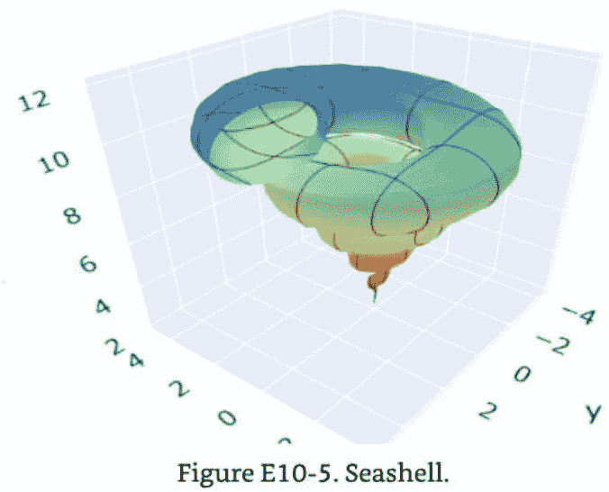

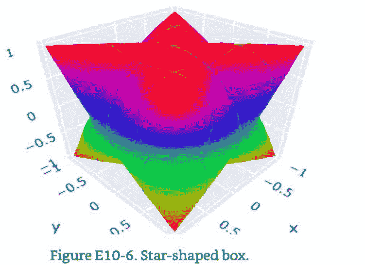

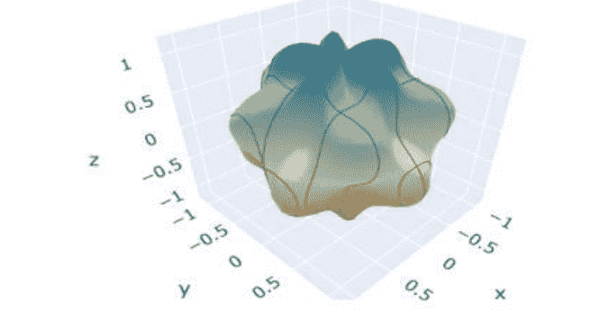

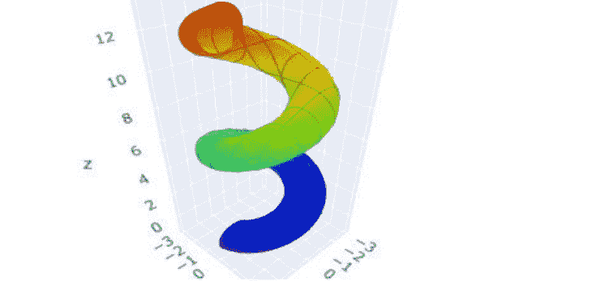

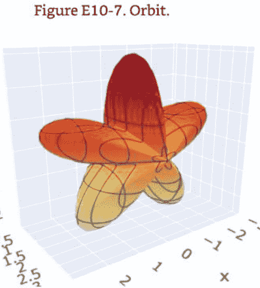

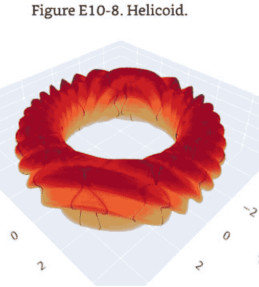


## 总结

在本章中，我们学习了如何在三维空间中建模参数曲面。此外，我们还学习了如何建模以下代表性的三维曲面：

- 用于**水面波纹**（见图 10-3 和图 E10-1）。
- 用于**屋顶**曲面（见图 10-4 和图 E10-2）。
- 用于**花朵**曲面（见图 E10-3）。
- 用于**双曲抛物面**（见图 E10-4）。
- 用于**球体**（见图 10-7）。
- 用于**海螺**（见图 10-8 和图 E10-5）。
- 用于你的数字**之心**（见图 10-9）。
- 用于**星形**曲面（见图 E10-6，图 E10-9）。
- 用于**螺旋面**（见图 E10-8）。
- 用于**轨道**（见图 E10-7）。

在下一章中，我们将学习如何建模三维参数曲面的一个特例：拉伸曲面。

# 第 11 章 – 特例：拉伸曲面

在前面的章节中，我们学习了三维参数曲面。本章将解释三维参数曲面的一个特例，称为拉伸曲面。

接下来，我们将涵盖以下部分：

1. 什么是拉伸曲面？
2. 基于二维参数曲线的拉伸曲面
3. 基于三维参数曲线的拉伸曲面
4. 快速项目。
5. 练习。

本章开发的代码位于 [https://github.com/PracticalBooks/Python-For-Geometric-Modeling/tree/main/Chapter-11](https://github.com/PracticalBooks/Python-For-Geometric-Modeling/tree/main/Chapter-11)。我们建议你通过独立开发代码来提升编码技能。如果遇到任何问题，可以参考仓库中的代码进行对比。

请记住，我们建议你为本书的每一章创建一个新的 Colab 文档。这将有助于你保持代码的组织性。

## 11.1. 什么是拉伸曲面？

**拉伸曲面**是一种几何形状，它通过将一条二维曲线（称为*轮廓*）沿指定方向延伸而形成三维曲面。在 CAD 和计算机图形学的背景下，拉伸曲面通常用于通过沿线性方向延伸二维形状来建模三维曲面。因此，它提供了一种从二维曲线创建三维曲面的简单方法。

拉伸曲面结合了参数曲线和曲面的概念。拉伸曲面的建模分两个阶段进行：(i) 使用参数 $u$ 建模参数曲线，以及 (ii) 使用参数 $v$ 对曲线进行垂直扩展。

拉伸曲面既可以基于二维参数曲线建模，也可以基于三维参数曲线建模。下面，我们将解释这两种建模方法。

## 11.2. 基于二维参数曲线的拉伸曲面

### 恒定拉伸高度

我们知道，二维参数曲线由一组点 $(p_0, p_1, ..., p_i, ..., p_n)$ 定义，这可以通过两个函数来表示：一个函数 $f_1(u)$ 用于获取 $x$ 值，另一个函数 $f_2(u)$ 用于获取 $y$ 值（见图 11-1）；然后，表达式 $z = v$ 用于获取 $z$ 值作为拉伸曲面的高度（见方程 11-1）。

**方程 11-1**

$s: \begin{cases} x = f_1(u) \\ y = f_2(u) \\ z = v \end{cases} ; \text{ 其中 } u = u_0...u_n, v = v_0...v_m$

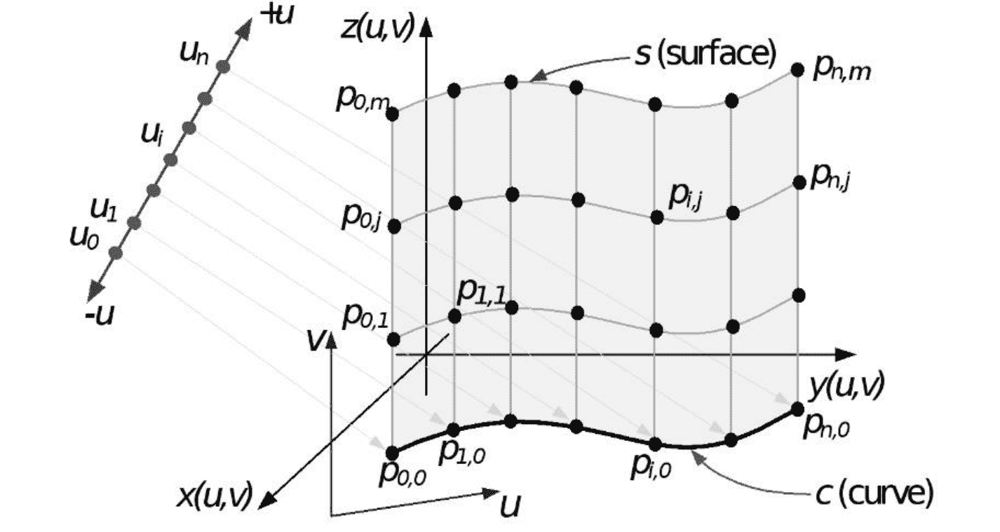

图 11-1. 基于二维参数曲线的拉伸曲面概念图。

### 示例：显式曲线的恒定拉伸高度

我们使用隐式表示法在 x-y 平面上建模一条曲线，该曲线由参数 u 定义，z 轴定义拉伸曲面的高度，由参数 v 控制（见方程 11-2）。

**方程 11-2**

```
s : 
\begin{cases} 
x = u \\
y = \log_{10}(u) \sin(u^2) + 1 
\end{cases} \quad ; \text{其中 } u = 1...5, v = 0...6
```

$z = v$

请注意，描述 x-y 平面上曲线的方程（方程 11-2）类似于之前在 7.2 节中建模的曲线（见方程 7-4）。为了拉伸该曲线，我们只需通过参数 v 扩展 z 轴。我们将两个模型放在一起展示：(i) 图 11-3，二维三角函数曲线，以及 (ii) 图 11-4，由二维三角函数曲线拉伸而成的曲面。你可以看到两个模型中的曲线是相同的。

为了详细解释建模过程，我们将首先仅使用三个元素定义参数 u：u = [0, 1, 2]，参数 v 仅由四个元素定义：v = [1, 2, 3, 4]（见图 11-2）；然后，参数模型将包含十二个点（$p_{0,0}, p_{1,0}, p_{2,0}, p_{0,1}, p_{1,1}, p_{2,1}, p_{0,2}, p_{1,2}, p_{2,2}, p_{0,3}, p_{1,3}, p_{2,3}$）。

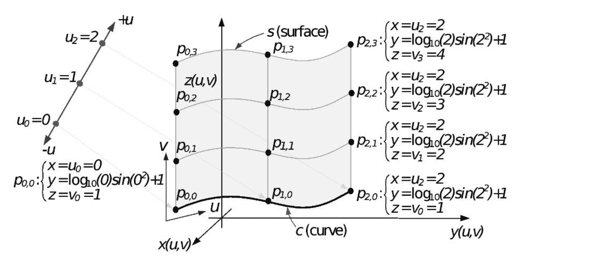

### 图 11-2. 使用参数 u 和 v 分别具有三个和四个元素的建模概念化。

以下代码使用参数 $u$ 和 $v$ 分别具有 $100$ 和 $10$ 个元素来建模拉伸曲面。

- 第 1 和 2 行导入库。
- 第 3 和 4 行定义参数 $u$ 和 $v$。
- 第 5 行定义参数数组 $U$ 和 $V$。
- 第 6 和 7 行将 $x$-$y$ 平面中的曲线定义为参数数组 $U$ 的函数（参见图 11-3）。
- 第 8 行将 $z$ 轴定义为拉伸曲面的高度，作为参数数组 $V$ 的函数。
- 第 9 至 12 行设置并显示曲面（执行结果见图 11-4）。

代码与执行

```
1. import numpy as np
2. import plotly.graph_objects as go
3. u = np.linspace(1,5,100)
4. v = np.linspace(0,1,10)
5. U, V = np.meshgrid(u,v)
6. X = U
7. Y = np.log10(U) * np.sin(U**2) + 1
8. Z = V
9. fig=go.Figure(go.Surface(x=X,y=Y,z=Z,opacity=.7,colorscale ='brwnyl', showscale=False,
10.     contours=dict(x=dict(show=True), y=dict(show=True), z=dict(show=True))))
11. fig.update_layout(title='Shell',autosize=False)
12. fig.show()
```

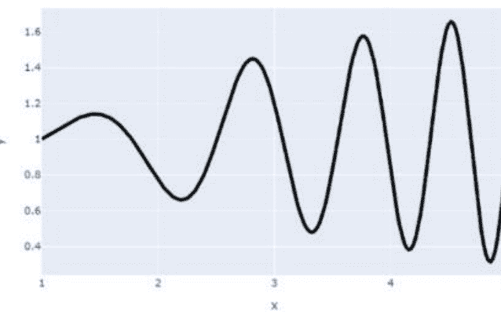

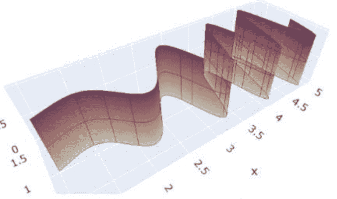

**提示：** 如果你建模的拉伸曲面表示为 $x = u, y = u$ 和 $z = v$，则得到的曲面是一个垂直平面。但如果你建模的拉伸曲面表示为 $r$ 等于一个标量数，$x = r \cos(u), y = r \sin(u)$ 和 $z = v$，则得到的曲面是一个半径为 $r$ 的垂直圆柱体。

### 示例：隐式曲线的恒定拉伸高度

接下来，我们使用隐式表示法来描述 $y$-$z$ 平面上的一条心形曲线，以描述一个二维参数曲线，该曲线由参数 $u$ 定义，而 $x$ 轴定义了拉伸心形曲面的高度，该高度由参数 $v$ 定义（参见公式 11-3）。

**公式 11-3**

$$s: \begin{cases} x = v \\ y = 16 \sin^3(u) \\ z = 13 \cos(u) - 5\cos(2u) - 2\cos(3u) - \cos(4u) \end{cases}$$ ; 其中 $u = 0...2\pi, v = 0...2$

请注意，描述 $y$-$z$ 平面中心形曲线的公式（公式 11-3）类似于之前在 7.5 节中建模的曲线（参见公式 E7-10）。为了拉伸该曲线，我们只需通过参数 $v$ 扩展 $x$ 轴即可。我们将两个模型一起展示：(i) 图 11-5，二维心形线曲线；(ii) 图 11-6，由二维心形线曲线拉伸而成的曲面。你可以看到两个模型中的曲线是相同的。

以下代码建模了拉伸的心形曲面。

- 第 1 和 2 行导入库。
- 第 3 和 4 行定义参数 u 和 v。
- 第 5 行定义参数数组 U 和 V。
- 第 6 行将 x 轴定义为拉伸曲面的高度，作为参数数组 V 的函数。
- 第 7 和 8 行将 $y$-$z$ 平面上的心形曲线定义为参数数组 U 的函数（参见图 11-5）。
- 第 9 至 12 行设置并显示曲面（执行结果见图 11-6）。

```
1. import numpy as np
2. import plotly.graph_objects as go
3. u = np.linspace(0,2*np.pi,50)
4. v = np.linspace(0,2,50)
5. U,V = np.meshgrid(u,v)
6. X = V
7. Y = 16*np.sin(U)**3
8. Z = 13*np.cos(U)-5*np.cos(2*U)-2*np.cos(3*U)-np.cos(4*U)
9. fig=go.Figure(go.Surface(x=X,y=Y,z=Z,opacity=1,colorscale = 'solar', showscale=False,
10. contours=dict(x=dict(show=True), y=dict(show=True), z=dict(show=True)))
11. fig.update_layout(title='Extruded heart-shaped surface', autosize =False)
12. fig.show()
```

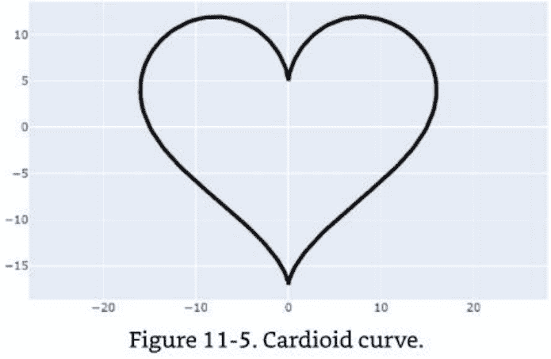

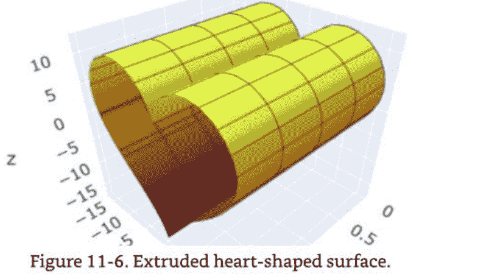

### 示例：极坐标曲线的恒定拉伸高度

接下来，我们使用隐式表示法来描述 $x$-$z$ 平面上的一条极坐标曲线，该曲线由参数 $u$ 定义，而 $y$ 轴定义了拉伸曲面的高度，该高度由参数 $v$ 定义（参见公式 11-4）。

**公式 11-4**

| s : | r = sin(8u/5) <br> x = r sin(u) <br> y = v <br> z = r cos(u) | ; 其中 u = 0...10π v = 0...1 |

以下代码建模了极坐标曲线的拉伸曲面。

- 第 1 和 2 行导入库。
- 第 3 和 4 行定义参数 $u$ 和 $v$。
- 第 5 行定义参数数组 $U$ 和 $V$。
- 第 6 行描述极坐标表达式的半径。
- 第 7 和 9 行将 $x$-$z$ 平面中的曲线定义为参数数组 $U$ 的函数。
- 第 8 行将 $y$ 轴定义为拉伸曲面的高度，作为参数数组 $V$ 的函数。
- 第 10 至 13 行设置并显示曲面（执行结果见图 11-7）。

代码与执行

```
1. import numpy as np
2. import plotly.graph_objects as go
3. u = np.linspace(0,10*np.pi,500)
4. v = np.linspace(0,1,10)
5. U,V = np.meshgrid(u,v)
6. r = np.sin(8*U/5)
7. X = r * np.cos(U)
8. Y = V
9. Z = r * np.sin(U)
10. fig=go.Figure(go.Surface(x=X,y=Y,z=Z,opacity=1,colorscale = 'jet', showscale=False,
11.     contours=dict(x=dict(show=True), y=dict(show=True), z=dict(show=True))))
12. fig.update_layout(title='Polar-shape curve extruded surface', autosize = False)
13. fig.show()
```

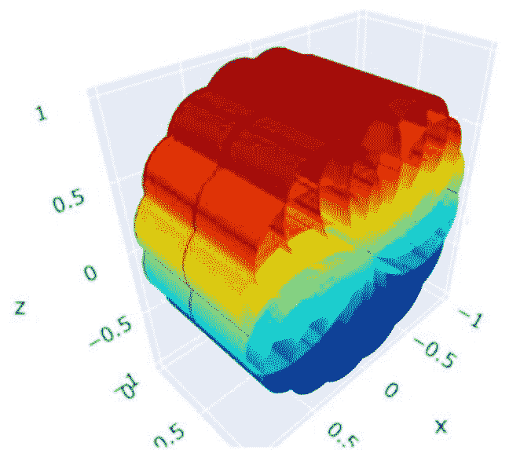

图 11-7. 拉伸的极坐标曲面。

### 可变拉伸高度

之前的拉伸曲面是用恒定高度建模的，但也可以使用可变高度来建模拉伸曲面（参见图 11-8），使用以下表示法（参见公式 11-5）。

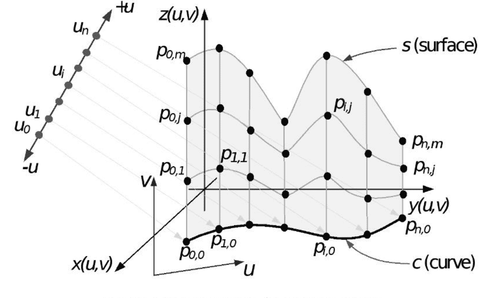

图 11-8. 可变拉伸高度的概念化。

### 公式 11-5

$$s : \begin{cases} x = f_1(u) \\ y = f_2(u) \\ z = f_2(u,v) \end{cases} ; \text{ 其中 } u = 0...u_n, v = 0...v_m$$

### 示例：螺旋曲线的可变拉伸高度

我们展示一个使用可变高度拉伸曲面的例子，使用隐式表示法来描述一个螺旋形拉伸曲面（参见公式 11-6）。

**公式 11-6**

$s: \begin{cases} r = \sqrt{u} \\ x = r \cos(u) \\ y = r \sin(u) \\ z = u v \end{cases}$ ; 其中 $u = 0...2\pi$, $v = 0...1$

以下代码建模了一个具有可变高度的拉伸曲面。

- 第 1 和 2 行导入库。
- 第 3 和 4 行定义参数 $u$ 和 $v$。
- 第 5 行定义参数数组 $U$ 和 $V$。
- 第 6 行描述极坐标表达式的半径。
- 第 7 和 8 行将 $x$-$y$ 平面中的螺旋曲线定义为参数数组 $U$ 的函数。
- 第 9 行将 $z$ 轴定义为拉伸曲面的高度，作为参数数组（$U$ 和 $V$）的函数。
- 第 10 至 13 行设置并显示曲面（执行结果见图 11-9）。

代码与执行

```
1. import numpy as np
2. import plotly.graph_objects as go
3. u = np.linspace(0,2*np.pi,500)
4. v = np.linspace(0,1,10)
5. U,V = np.meshgrid(u,v)
6. r = np.sqrt(U)
7. X = r * np.cos(U)
8. Y = r * np.sin(U)
9. Z = U * V
10. fig=go.Figure(go.Surface(x=X,y=Y,z=Z,opacity=1,colorscale = 'hot', showscale=False,
11.     contours=dict(x=dict(show=True), y=dict(show=True), z=dict(show=True))))
12. fig.update_layout(title='Spiral-shape extruded surface', autosize = False)
13. fig.show()
```

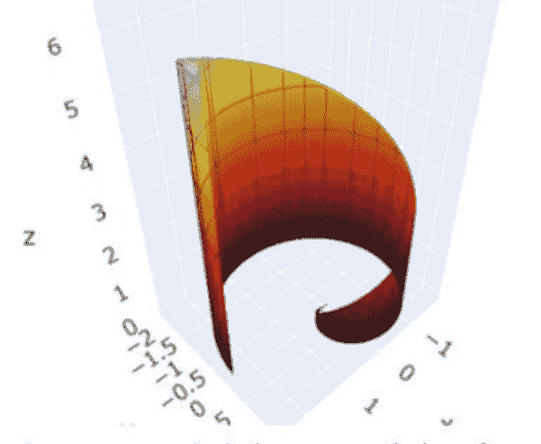

图 11-9. 螺旋形拉伸曲面。

## 11.3. 基于三维参数曲线的拉伸曲面

我们知道，三维参数曲线是通过一组点 $(p_0, p_1, ..., p_i, ..., p_n)$ 来定义的，这些点可以通过三个函数来表达：一个函数 $f_1(u)$ 获取 $x$ 值，第二个函数 $f_2(u)$ 获取 $y$ 值，第三个函数 $f_3(u)$ 获取 $z$ 值（参见图 11-10）；然后，$z$ 值受到表达式 $z = f_3(u)+v$ 的影响，以建模曲线的拉伸扩展（参见公式 11-7）。

### 公式 11-7

$$s: \begin{cases} x = f_1(u) \\ y = f_2(u) \\ z = f_3(u) + v \end{cases} \quad ; \text{其中 } u = u_0...u_n, v = v_0...v_m$$

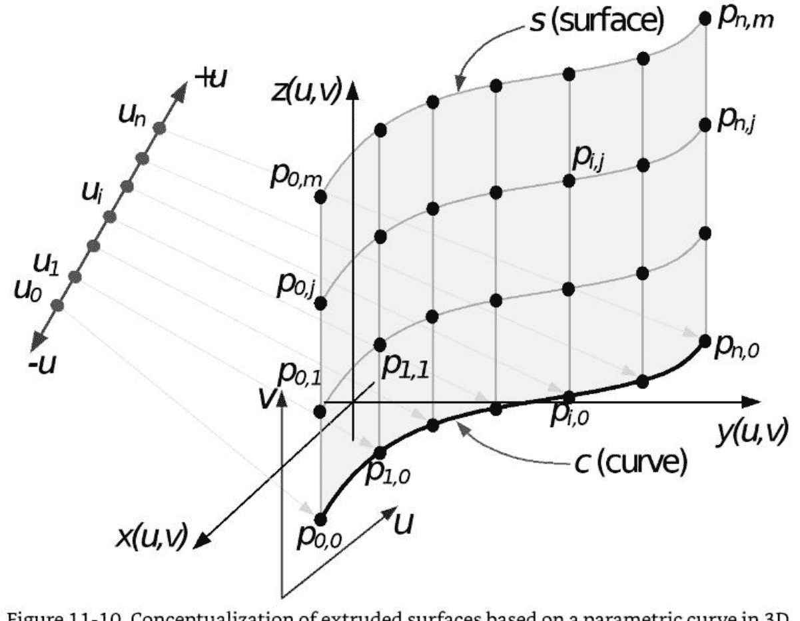

图 11-10. 基于三维参数曲线的拉伸曲面的概念化。

### 示例：龙卷风带

你还记得我们建模龙卷风的项目吗？我们将使用龙卷风曲线来建模一个龙卷风带。因此，描述龙卷风带的公式（公式 11-8）类似于之前在 8.3 节中建模的曲线（参见公式 8-4）。但我们只是在 $z$ 轴上添加了参数 $v$ 作为一个项。我们将两个模型一起展示：(i) 图 11-11，三维中的扭转曲线，以及（ii）图11-12，由三维扭转曲线生成的扭转带。你可以在两个模型中看到相同的曲线。

### 方程 11-8

$$s: \begin{cases} r = u^2 \\ x = r \cos(u) \\ y = r \sin(u) \\ z = 2u + v \end{cases} ; \text{其中 } u = 0...10\pi, v = 0...6$$

以下代码对扭转带进行建模。

- 第1和第2行导入库。
- 第3和第4行定义参数 $u$ 和 $v$。
- 第5行定义参数数组 $U$ 和 $V$。
- 第6行描述一个可变半径。
- 第7和第8行根据参数数组 $U$ 定义 $x$ 轴和 $y$ 轴。
- 第9行将 $z$ 轴定义为拉伸曲面的高度，它是参数数组（$U$ 和 $V$）的函数。
- 第10到13行设置并显示曲面（执行结果见图11-12）。

### 代码与执行

```
1. import numpy as np
2. import plotly.graph_objects as go
3. u = np.linspace(0,10*np.pi,500)
4. v = np.linspace(0,8,5)
5. U, V = np.meshgrid(u,v)
6. r = u**2
7. X = r * np.cos(U)
8. Y = r * np.sin(U)
9. Z = 2*U + V
10. fig=go.Figure(go.Surface(x=X,y=Y,z=Z,opacity=1,colorscale = 'spectral', showscale=False,
11.     contours=dict(x=dict(show=True), y=dict(show=True), z=dict(show=True))))
12. fig.update_layout(title='Twirter band',autosize=False)
13. fig.show()
```

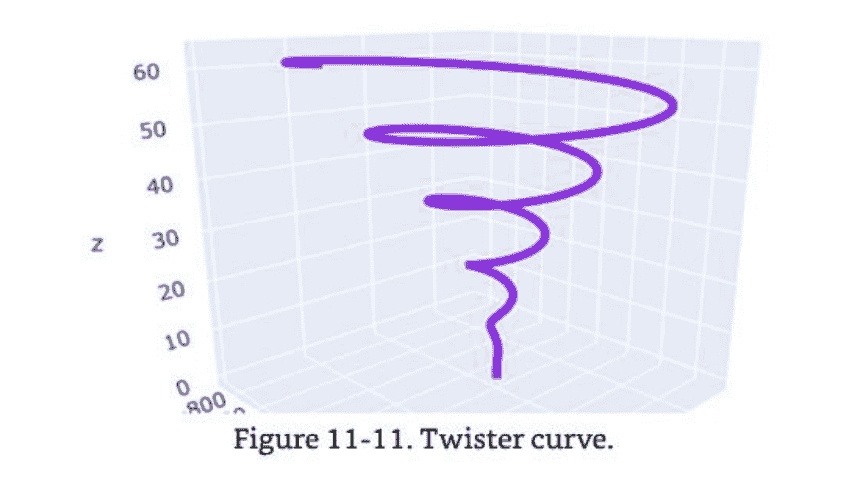

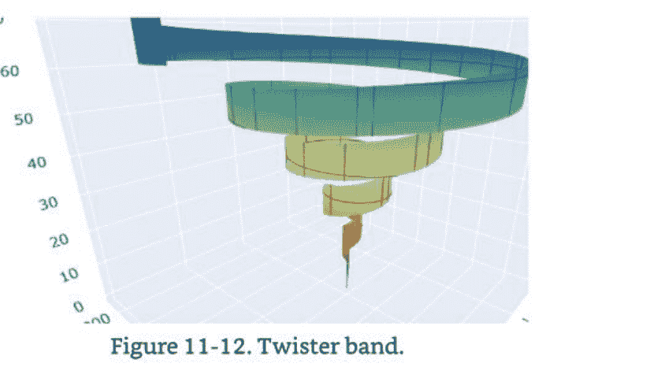

## 11.4. 快速项目

在航空学中，机翼是一种具有非常坚固且结构抗性的气动体，由翼型构成。飞机机翼是航空工程最伟大的成就之一。它将高效的结构和惊人的轻量化结合在一个部件中。

机翼是飞机的主要部件，其主要功能是确保升力，以补偿重量，即允许飞机保持稳定飞行。机翼的横截面几何形状（称为翼型）备受关注，因为它们具有不同的功能，例如维持飞行、提供飞机控制、提供起降能力、支撑发动机并传递其推力、储存燃料以及容纳灯光和信号装置。

飞机机翼的几何翼型（见图11-13）可以由以下二维参数曲线定义（见方程11-9）。

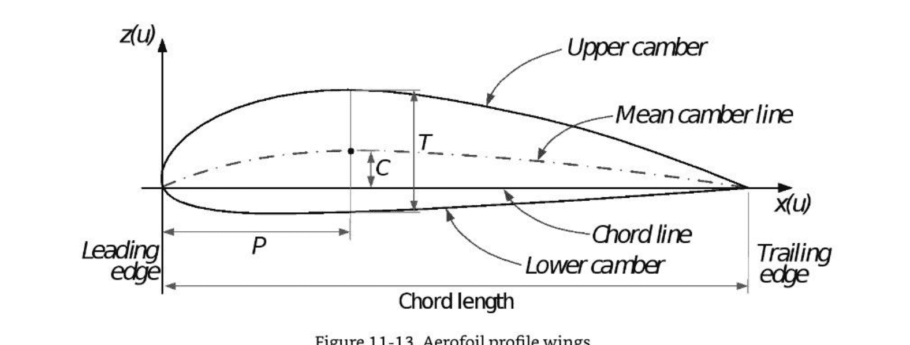

```
方程 11-9

c: x = 0.5 (1 + |cos(u)|^B/cos(u))
   z = (T/2) (sin^B(u) /sin(u)) (1-x^P) + C sin(π x^E) + R sin(2π x)    ; 其中 u = 0.001...2π
```

其中：

- $B$ 是机翼的基础形状系数，影响其前缘。如果 $B = 2$，翼型基础形状是椭圆形，但如果 $B$ 接近 $1$，形状则变为矩形。
- $T$ 是机翼厚度与弦长的比值。
- $P$ 是机翼锥度指数。如果 $P = 1$，机翼厚度在接近*后缘*时线性趋近于 $0$。如果 $P$ 值更大，机翼在*后缘*附近锥度变化更剧烈。
- $C$ 是机翼弯度，与弦长的比值。
- $E$ 是弯度指数，定义最大弯度点的位置。如果 $E = 1$，弯度点位于宽度的 $50\%$ 处，但较小的值会将其向*前缘*移动。
- $R$ 是反弯参数。正值产生反弯后缘，而负值则模拟襟翼。

> **提示：** 如果你想了解更多关于翼型（翼剖面）的知识以增加你的知识储备，我们建议查看以下链接：
> https://arxiv.org/pdf/1701.00817.pdf
> https://calculate.org.au/wp-content/uploads/sites/15/2018/10/wing-design.pdf
> https://eaglepubs.erau.edu/introductiontoaerospaceflightvehicles/chapter/airfoil-geometries/

### 让我们来建模飞机机翼

基于在拉伸曲面建模中获得的概念，我们为高空商用客机建模了一架固定翼飞机，其机翼具有以下几何值：$B = 2, T = 0.2, P = 1, C = 0.05, E = 1, R = 0$。

以下代码对飞机机翼进行建模。

- 第1和第2行导入库。
- 第3和第4行定义参数 $u$ 和 $v$。
- 第5行定义参数数组 $U$ 和 $V$。
- 第6到11行定义机翼几何值。
- 第12和14行根据参数数组 $U$ 在 $x$-$z$ 平面内定义翼型曲线。
- 第13行将 $y$ 轴定义为拉伸曲面的高度，它是参数数组 $V$ 的函数。
- 第15到18行设置并显示曲面（执行结果见图11-14）。

### 代码与执行

```
1. import numpy as np
2. import plotly.graph_objects as go
3. u = np.linspace(0.001,2*np.pi,100)
4. v = np.linspace(0,3,10)
5. U,V = np.meshgrid(u,v)
6. B = 2
7. T = 0.2
8. P = 1
9. C = 0.05
10. E = 1
11. R = 0
12. X = 0.5 * (1 + np.abs(np.cos(U))**B/np.cos(U))
13. Y = V
14. Z = (T/2)*(np.sin(U)**B/np.sin(U))*(1-X**P)+C*np.sin(np.pi*X**E)+R*np.sin(2*np.pi*X)
15. fig=go.Figure(go.Surface(x=X,y=Y,z=Z,opacity=1,colorscale = 'viridis', showscale=False,
16.     contours=dict(x=dict(show=True), y=dict(show=True), z=dict(show=True))))
17. fig.update_layout(scene = dict(aspectratio = dict(x=1, y=2, z=.2)))
18. fig.show()
```

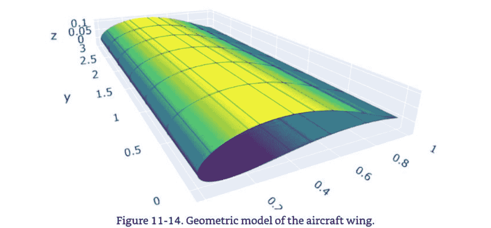

**快速讨论：** 为了开发这个项目，我们任意定义了常数（B, T, P, C, E 和 R）的值。你可以改变并组合这些值，以获得许多不同的翼型模型。

## 11.5. 练习

**E11.1.** 绘制并匹配以下二维线拉伸曲面与图形。

| 方程 E11-1 |
| :--- |
| $s: x = u + \sin(u)$ ; 其中 $u = 0...8\pi, v = 0...1$ |
| $y = 1 - \cos(u)$ |
| $z = v$ |

### 方程 E11-2

$r = 1$
$b = 2$
$s : \quad x = r u + b \sin(u)$
$\quad \quad y = v + \cos(u)$
$\quad \quad z = r - b \cos(u)$
$; \text{ 其中 } u = 0...8\pi, v = 0...1$

### 方程 E11-3

$r = 1$
$s : \quad x = v$
$\quad \quad y = r \cos^3(u)$
$\quad \quad z = r \sin^3(u)$
$; \text{ 其中 } u = 0...2\pi, v = 0...1$

### 方程 E11-4

$r = 1$
$b = 5$
$s : \quad x = b \sin(4u) + 4r \sin(u)$
$\quad \quad y = v$
$\quad \quad z = b \cos(4u) + 4r \cos(u)$
$; \text{ 其中 } u = 0...2\pi, v = 0...1$

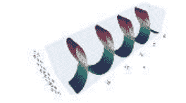


图 E11-1. 摆线曲面。

图 E11-2. 花形曲面。

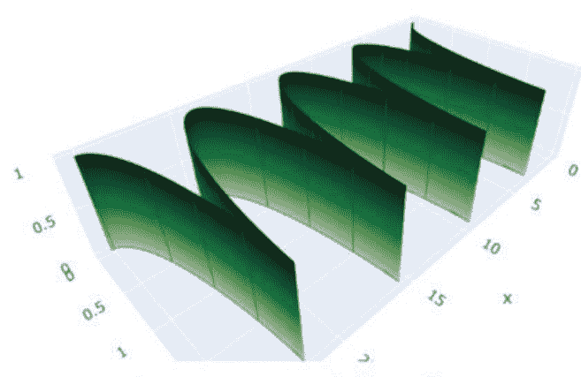

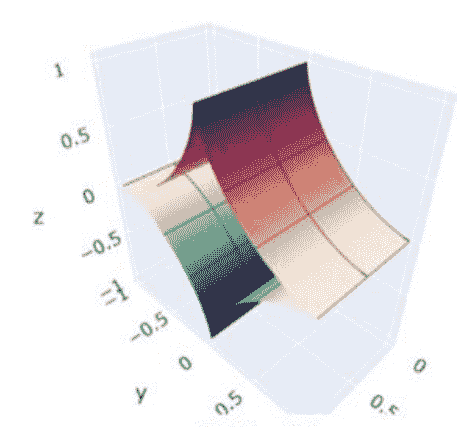

图 E11-3. 摆线曲面。

图 E11-4. 四尖点内摆线或星形线。

### E11.2. 绘制并匹配以下三维线拉伸曲面与图形。

方程 E11-5

$s:$
$r = \cos(2u)$
$x = r \cos(u)$
$y = r \sin(u)$
$z = v^2 + \sin(u)$
$; \text{ 其中 } u = 0...2\pi, v = 0...1$

方程 E11-6

$s:$
$r = \sin^2(3.5u) + \cos^4(3.5u)$
$x = r \cos(u)$
$y = v^2 + \sin(u)$
$z = r \sin(u)$
$; \text{ 其中 } u = 0...4\pi, v = 0...1$

### 方程 E11-7

$s:$
$r = \cos(2u)$
$x = v + \cos(u) \sin(u)$
$y = r \cos(u)$
$z = r \sin(u)$
$; \text{ 其中 } u = 0...2\pi, v = 0...1$

### 方程 E11-8

$s:$
$r = 2$
$x = r \sin(u) \cos(16u) + v$
$y = r \sin(u) \sin(16u) + v$
$z = r \cos(u)$
$; \text{ 其中 } u = 0...\pi, v = -0.25...0.25$

### 方程 E11-9

$s:$
$a = 2$
$b = 2$
$n = 6$
$x = a \cos(n u) \cos(u)$
$y = b \cos(n u) + v$
$z = a \cos(n u) \sin(u)$
$; \text{ 其中 } u = 0...2\pi, v = -0.5...0.5$

### 方程 E11-10

$s:$
$r = 1$
$b = 5$
$x = b \sin(u) - r \sin(u)$
$y = v \cos^2(u)$
$z = b \cos(u) - r \cos(5u)$
$; \text{ 其中 } u = 0...2\pi, v = 0...1$

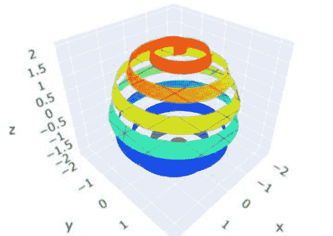

图 E11-5. 球形线圈带。

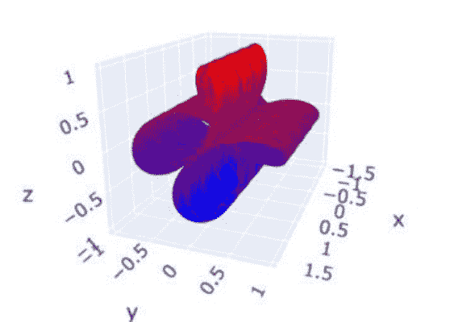

图 E11-6. 极坐标形状带。

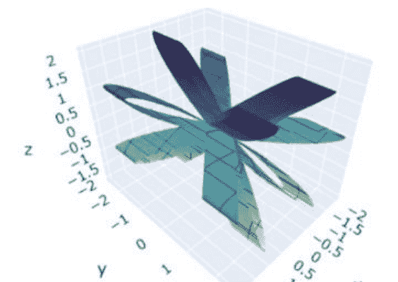

图 E11-7. 圆锥花形带。

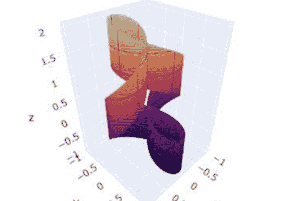

图 E11-8. 极坐标形状带。

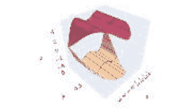

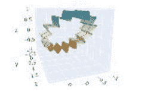

## 总结

在本章中，我们学习了如何建模拉伸曲面。此外，我们还学习了如何建模以下代表性曲面：

-   拉伸**波浪**曲面（见图 11-4）。
-   拉伸**心形**曲面（见图 11-6）。
-   拉伸**极坐标形**曲面（见图 11-7、图 E11-2、图 E11-6、图 E11-8 和图 E11-10）。
-   **螺旋形**拉伸曲面（见图 11-9）。
-   **扭转带**曲面（见图 11-11）。
-   **飞机机翼**的几何模型（见图 11-4）。
-   **摆线**、**外摆线**和**内摆线**带（见图 E11-1、图 E11-3、图 E11-4 和图 E11-9）。
-   **球形螺旋**带（见图 E11-5）。
-   **圆锥花形**带（见图 E11-7）。

在下一章中，我们将学习建模三维参数曲面的另一种特殊情况：旋转曲面。

# 第 12 章 – 特殊情况：旋转曲面

在前面的章节中，我们学习了三维参数曲面以及作为特殊情况的拉伸曲面。本章将解释第二种特殊情况，称为旋转曲面。

接下来，我们将涵盖以下部分：

1.  什么是旋转曲面？
2.  基于参数半径的旋转曲面。
3.  基于三维参数曲线的旋转曲面。
4.  基于封闭参数曲线的旋转曲面。
5.  快速项目。
6.  练习。

本章开发的代码位于 [https://github.com/PracticalBooks/Python-For-Geometric-Modeling/tree/main/Chapter-12](https://github.com/PracticalBooks/Python-For-Geometric-Modeling/tree/main/Chapter-12)。我们建议您通过独立开发代码来提升编码技能。如有任何问题，可以参考仓库中的代码进行对比。

请记住，我们建议您为本书的每一章创建一个新的 Colab 文档。这将有助于您保持代码的条理性。

## 12.1. 什么是旋转曲面？

**旋转曲面**是可以建模为轴对称曲面的曲面，它们是通过将一条曲线 *c*（称为*曲面轮廓线*）绕一个*旋转轴*旋转而获得的。旋转曲面是通过将曲线 *c* 绕旋转轴（称为**对称轴**）旋转给定角度（称为**旋转角**）而生成的。例如，给定一个绕 z 轴旋转的轴对称模型，其参数表示由位于 x-z 或 y-z 平面上的连续*曲面轮廓线*表达，这些平面垂直于其*旋转轴*（见图 12-1）。

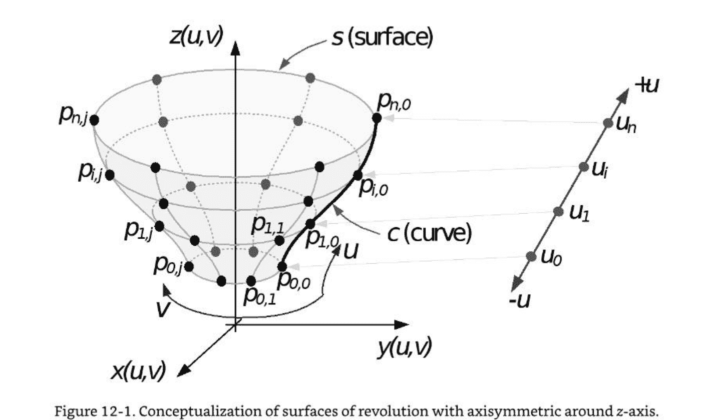

我们可以考虑另一个例子，其中*曲面轮廓线*绕 y 轴旋转。其参数表示由位于 x-y 或 y-z 平面上的连续*曲面轮廓线*表达（见图 12-2）。

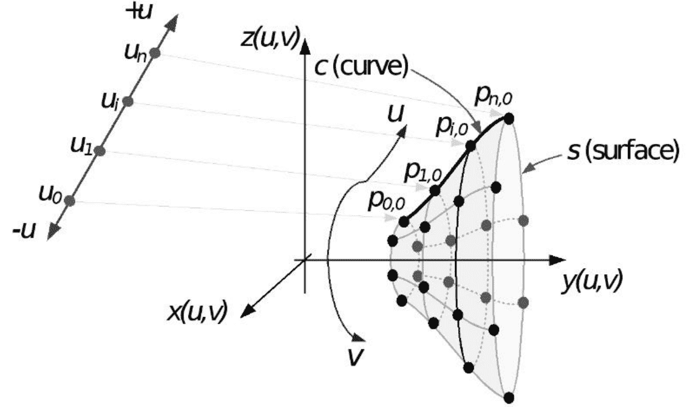

图 12-2. 绕 y 轴轴对称的旋转曲面概念图。

旋转曲面由*曲面轮廓线*建模而成，该轮廓线可以由参数半径、三维参数曲线或参数封闭曲线表示。下面我们将解释这些建模方法。

## 12.2. 基于参数半径的旋转曲面

当*曲面轮廓线*表示为半径函数 $r = f(u)$（见公式 12-1），定义在平面（$x-y$、$x-z$ 或 $y-z$）上，并使用三角函数（$cos(v)$ 和 $sin(v)$）绕轴旋转时，即可获得基于参数半径的旋转曲面（见图 12-3）。

公式 12-1

$$s: \begin{cases} r = f(u) \\ x = r \cos(v) \\ y = r \sin(v) \\ z = u \end{cases} ; \text{ 其中 } u = u_0 \dots u_n, v = v_0 \dots v_m$$

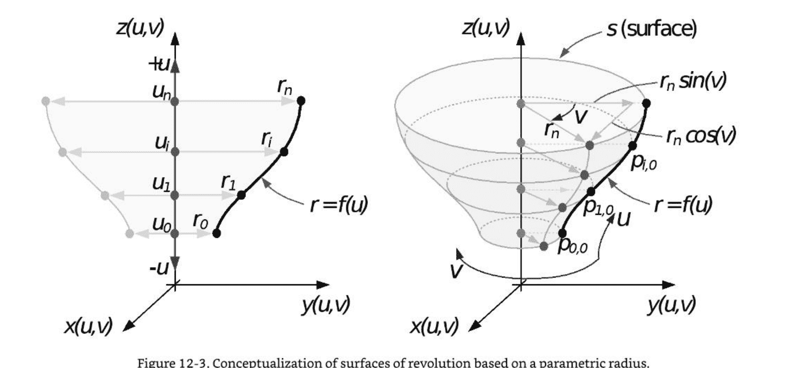

### 示例：基于旋转曲面的杯子模型

接下来，我们定义一个半径函数来描述*曲面轮廓线*，以获得绕 z 轴旋转的旋转曲面，该函数由公式 12-2 给出。

### 公式 12-2

$$s: \begin{cases} r = u + 3 \sin^3(u) \\ x = r \cos(v) \\ y = r \sin(v) \\ z = u \end{cases} ; \text{ 其中 } u = -\pi...5\pi, v = -3\pi/2...0$$

请注意，描述旋转曲面的方程（公式 12-2）类似于之前在 6.2 节（公式 6-7）中建模的曲线。实际上，公式 6-7 中的曲线就是公式 12-2 的*曲面轮廓线*（见图 6-7）。为了获得旋转曲面，我们只需定义半径函数，修改 x 轴和 y 轴（分别乘以三角函数 cos(v) 和 sin(v)），并通过参数 u 扩展 z 轴。

以下代码对旋转曲面进行建模。

-   第 1 行和第 2 行导入库。
-   第 3 行和第 4 行定义参数 u 和 v。
-   第 5 行定义参数数组 U 和 V。
-   第 6 行定义基于参数数组 U 的半径函数，即曲面轮廓线。
-   第 7 行和第 8 行定义基于参数数组 V 的 x 轴和 y 轴。
-   第 9 行定义基于参数数组 U 的 z 轴。
-   第 10 行到第 13 行设置并显示曲面（执行结果见图 12-4）。

### 代码与执行

```python
1. import numpy as np
2. import plotly.graph_objects as go
3. u = np.linspace(-np.pi,5*np.pi,100)
4. v = np.linspace(-3*np.pi/2,0,50)
5. U, V = np.meshgrid(u,v)
6. r = U + 3*np.sin(U)**3
7. X = r * np.cos(V)
8. Y = r * np.sin(V)
9. Z = U
10. fig=go.Figure(go.Surface(x=X,y=Y,z=Z,opacity=1,colorscale = 'rdylbu', showscale=False,
11.     contours=dict(x=dict(show=True), y=dict(show=True), z=dict(show=True))))
12. fig.update_layout(title='Cup',autosize=False)
13. fig.show()
```

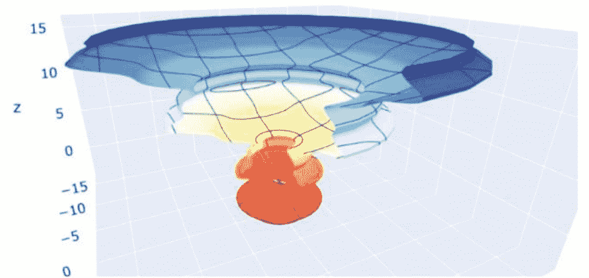

图 12-4. 基于旋转曲面的杯子模型。

> **提示：** 请注意，前面的旋转曲面是通过定义参数 $v = -3\pi/2...0$ 建模的，这得到了旋转曲面的一部分。如果您想建模完整的旋转曲面，必须定义参数 $v = 0...2\pi$，以获得完整的旋转。

### 示例：美式橄榄球

接下来，我们通过旋转曲面来建模一个美式橄榄球，该曲面绕 $y$ 轴旋转（见公式 12-3）。

公式 12-3

$$s: \begin{cases} r = (\sqrt{(1 - u^2)}) - 2\pi/10 \\ x = r \cos(v) \\ y = u \\ z = r \sin(v) \end{cases} ; \text{ 其中 } u = -\pi/4...\pi/4, v = 0...2\pi$$

请注意，描述旋转曲面的方程（公式 12-3）类似于之前在 7.2 节（公式 7-5）中建模的曲线。实际上，公式 7-5 中的曲线就是公式 12-3 的*曲面轮廓线*（见图 7-5）。为了获得旋转曲面，我们只需定义半径函数，修改 *x* 轴和 *z* 轴（分别乘以三角函数 *cos(v)* 和 *sin(v)*），并通过参数 *u* 扩展 *y* 轴。

以下代码对美式橄榄球进行建模。第 1 行和第 2 行导入库。第 3 行和第 4 行定义参数 *u* 和 *v*。第 5 行定义参数数组 *U* 和 *V*。第 6 行定义基于参数数组 *U* 的半径函数，即曲面轮廓线。第 7 行和第 9 行定义基于参数数组 *V* 的 *x* 轴和 *z* 轴。第 8 行定义基于参数数组 *U* 的 *y* 轴。第 10 行到第 13 行设置并显示曲面（执行结果见图 12-5）。

### 代码与执行

```python
1. import numpy as np
2. import plotly.graph_objects as go
3. u = np.linspace(-np.pi/4,np.pi/4,50)
4. v = np.linspace(0,2*np.pi,20)
5. U, V = np.meshgrid(u,v)
6. r = np.sqrt(1-U**2)-2*np.pi/10
7. X = r * np.cos(V)
8. Y = U
9. Z = r * np.sin(V)
10. fig=go.Figure(go.Surface(x=X,y=Y,z=Z, opacity=1,colorscale = 'red', showscale=False,
11.     contours=dict(x=dict(show=True), y=dict(show=True), z=dict(show=True))))
12. fig.update_layout(title='Ball of American football',autosize=False)
13. fig.show()
```

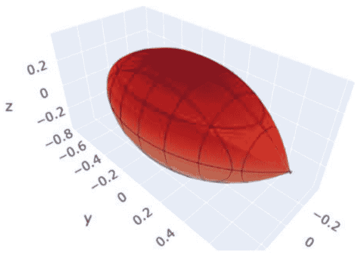

图 12-5. 美式橄榄球。

> **提示：** 如果你对一个由标量数 $r$ 描述的旋转曲面进行建模，其中 $x = r \cos(v)$，$y = r \sin(v)$，$z = u$，你会得到一个半径为 $r$ 的垂直圆柱体。如果你对一个由 $r = u$ 描述的旋转曲面进行建模，其中 $x = r \cos(u)$，$y = r \sin(u)$，$z = u$，你会得到一个圆锥体。但是，如果你对一个由 $r = u$ 描述的旋转曲面进行建模，其中 $x = r \cos(u)$，$y = r \sin(u)$，$z = u^2$，你会得到一个抛物面。

## 12.3. 基于三维参数曲线的旋转曲面

基于三维参数曲线的旋转曲面，是通过将*曲面轮廓*表示为由参数 $u$ 定义的三维曲线（如我们在第7章所学），然后使用三角函数（$\cos(v)$ 和 $\sin(v)$）将其绕*对称轴*旋转而获得的。例如，公式 12-4 展示了一个由参数曲线定义的旋转曲面，该曲线绕 z 轴旋转（见图 12-6）。

公式 12-4

$$s: \begin{cases} x = f_1(u) \cos(v) \\ y = f_2(u) \sin(v) \\ z = f_3(u) \end{cases} ; \text{ 其中 } u = u_0 \dots u_n, v = v_0 \dots v_m$$

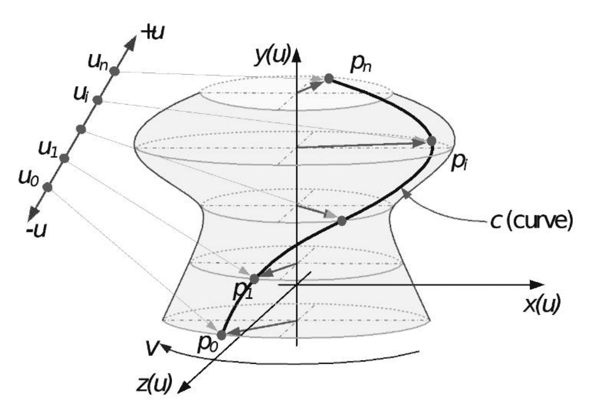

图 12-6. 基于三维参数曲线的旋转曲面概念图。

### 示例：使用三维参数曲线的旋转曲面

接下来，我们对一个由三维空间中的扭曲三次曲线定义的旋转曲面进行建模。扭曲三次曲线表示为 $x = u, y = u^2$, 和 $z = u^3$。该曲面绕 z 轴旋转；因此，三角函数（$\cos(v)$ 和 $\sin(v)$）定义在 x-y 平面上（见公式 12-5）。

### 公式 12-5

$$s: \begin{cases} x = u \cos(v) \\ y = u^2 \sin(v) \\ z = u^3 \end{cases} ; \text{ 其中 } u = -10...10, v = -3\pi/2...0$$

以下代码对由扭曲三次曲线定义的旋转曲面进行建模。第1行和第2行导入库。第3行和第4行定义参数 $u$ 和 $v$。第5行定义参数数组 $U$ 和 $V$。第6、7、8行的第一项是定义为参数矩阵 $U$ 函数的扭曲三次曲线。第6行和第7行的最后一项是参数矩阵 $V$ 的函数，定义了曲面的旋转。第9行到第12行设置并显示曲面（执行结果见图 12-7）。

### 代码与执行

```
1. import numpy as np
2. import plotly.graph_objects as go
3. u = np.linspace(-10,10,100)
4. v = np.linspace(-3*np.pi/2,0,50)
5. U, V = np.meshgrid(u,v)
6. X = U * np.cos(V)
7. Y = U**2 * np.sin(V)
8. Z = U**3
9. fig=go.Figure(go.Surface(x=X,y=Y,z=Z,opacity=1,colorscale = 'tropic', showscale=False,
10.     contours=dict(x=dict(show=True), y=dict(show=True), z=dict(show=True))))
11. fig.update_layout(scene = dict(aspectratio = dict(x=1, y=1, z=.3)))
12. fig.show()
```

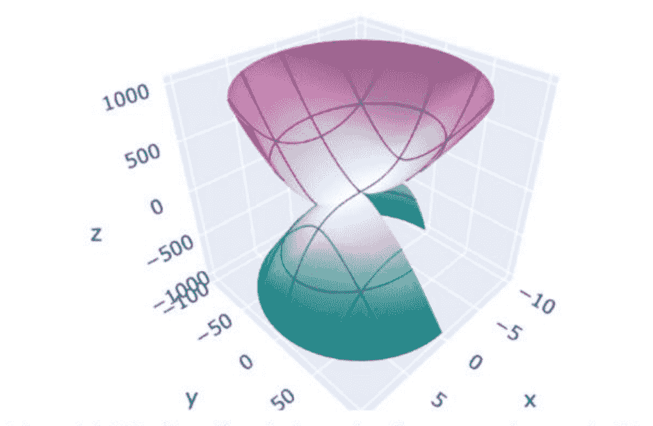

图 12-7. 使用三维参数曲线的旋转曲面。

## 12.4. 基于闭合参数曲线的旋转曲面

我们可以从一个闭合参数曲线 *c* 建模一个旋转曲面，该曲线将作为*曲面轮廓*，从而获得一个环面（称为*环形体*或*圆环面*），其横截面形状取决于曲线 *c* 的形状（见图 12-8）。当闭合参数曲线 *c* 相对于*对称轴*平移距离 *R*，并使用三角函数（*cos(v)* 和 *sin(v)*）进行旋转时，就得到了这个*圆环面*。例如，公式 12-6 展示了一个绕 *z* 轴旋转的*圆环面*。首先，定义一个距离 *R*。然后，*曲面轮廓*的半径表示为参数 *u* 的函数，*r = f(u)*。接着，*x* 和 *y* 轴通过三角表达式（*r cos(u)*）定义，项 *R* 用于将*曲面轮廓*相对于*对称轴*进行平移。最后，*y* 轴由表达式（*r sin(u)*）定义。

### 公式 12-6

$$s: \begin{cases} R = k \\ r = f(u) \\ x = (R + r \cos(u)) \cos(v) \\ y = (R + r \cos(u)) \sin(v) \\ z = r \sin(u) \end{cases} ; \text{ 其中 } u = u_0...u_n, v = v_0...v_m$$

其中 $k$ 表示相对于*对称轴*的平移距离，它是一个标量数。

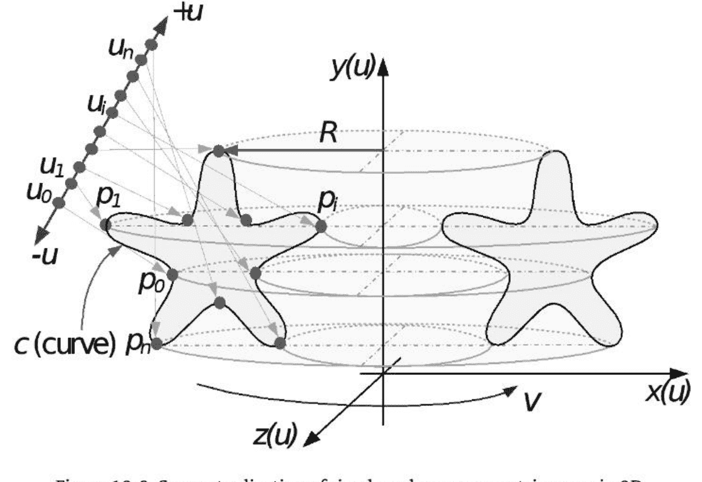

图 12-8. 基于三维参数曲线的环面概念图。

### 示例：具有星形横截面的环面

接下来，我们对一个具有星形横截面的*圆环面*进行建模，该曲面绕 z 轴旋转；因此，三角函数（*cos(v)* 和 *sin(v)*）定义在 x-y 平面上（见公式 12-7）。

**公式 12-7**

$$s : \begin{cases} R = 5 \\ r = 2 + \sin(5u) \\ x = (R + r \cos(u)) \cos(v) \\ y = (R + r \cos(u)) \sin(v) \\ z = r \sin(u) \end{cases} ; \text{ 其中 } u = 0...2\pi, v = -3\pi/2...0$$

请注意，公式 12-7 中使用的半径 r 与公式 7-11 中使用的相同；因此，圆环面的横截面将与图 7-11 所示的相同（即，派大星的轮廓）。x、y 和 z 轴中的三角项（cos(u) 和 sin(u)）定义了圆环面的曲面轮廓。x、y 和 z 轴中的三角项（cos(v) 和 sin(v)）定义了圆环面的旋转。

以下代码展示了具有星形横截面的圆环面。第1行和第2行导入库。第3行和第4行定义参数 u 和 v。第5行定义参数数组 U 和 V。第6行定义 R 值，即横截面的平移距离。第7行定义 r，即曲面轮廓。第8行到第10行分别定义 x、y 和 z 轴。第11行到第14行设置并显示曲面（执行结果见图 12-8）。

### 代码与执行

```
1. import numpy as np
2. import plotly.graph_objects as go
3. u = np.linspace(0,2*np.pi,100)
4. v = np.linspace(0,-np.pi,20)
5. U, V = np.meshgrid(u,v)
6. R = 6
7. r = 2 + np.sin(5*U)
8. X = (R + (r * np.cos(U))) * np.cos(V)
9. Y = (R + (r * np.cos(U))) * np.sin(V)
10. Z = r * np.sin(U)
11. fig=go.Figure(go.Surface(x=X,y=Y,z=Z,opacity=1,colorscale = 'rdylgn', showscale=False,
12.     contours=dict(x=dict(show=True), y=dict(show=True), z=dict(show=True))))
13. fig.update_layout(title='Ring with star-shape cross section',autosize=False)
14. fig.show()
```

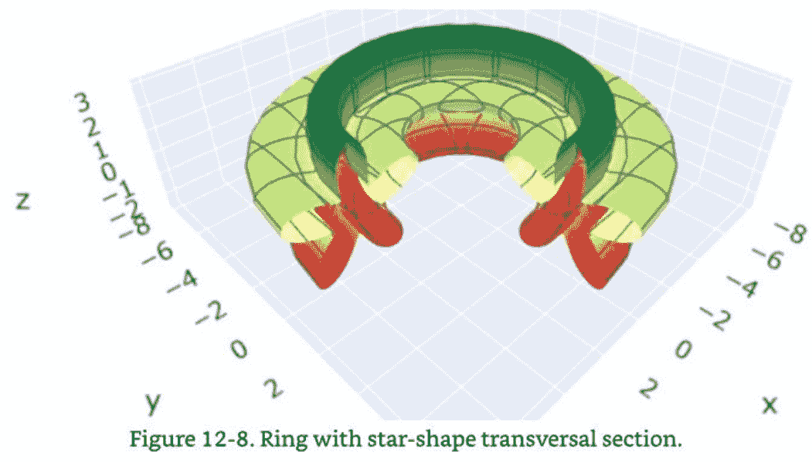

> **提示：** 如果你对一个表示为 *r* 等于标量数、*R* > 2*r*、*x* = (*R* + *r* cos(*u*)) cos(*v*)、*y* = (*R* + *r* cos(*u*)) sin(*v*) 和 *z* = *r* sin(*u*) 的旋转曲面进行建模，得到的曲面是一个具有圆形横截面的圆环面。

## 12.5. 快速项目

*SpaceX* 设计、制造和发射可重复使用的火箭和航天器。它是第一家：(*i*) 开发出达到轨道的液体推进剂火箭；(*ii*) 发射、入轨并回收航天器；以及 (*iii*) 将航天器和宇航员送往国际空间站的私营公司。它也是第一个实现轨道火箭助推器垂直动力着陆的任何类型的组织，并且是第一个重复使用此类助推器的组织。

随着 *SpaceX* 在火箭组件方面的创新，以及我们在几何建模方面的知识，该公司联系我们来改进一个特殊且关键部件的几何设计：火箭喷嘴。火箭喷嘴获取可燃液体或气体并将其燃烧，以产生稳定的废气流（见图 12-9），这些废气被转化为推进力，用于提供持续的速度和方向。


图 12-9. *SpaceX* 在 [https://www.spacex.com/mission/](https://www.spacex.com/mission/) 进行的火箭喷嘴测试。

> **提示：** 如果你想了解更多关于推进喷嘴的知识以增加你的知识储备，我们建议查看以下链接：
> [http://www.rocket-propulsion.info/resources/articles/NozzleDesign.pdf](http://www.rocket-propulsion.info/resources/articles/NozzleDesign.pdf)
> [https://www.grc.nasa.gov/www/BGH/rocket.html](https://www.grc.nasa.gov/www/BGH/rocket.html)
> [https://digitalcommons.usf.edu/cgi/viewcontent.cgi?article=4895&context=ujmm](https://digitalcommons.usf.edu/cgi/viewcontent.cgi?article=4895&context=ujmm)

为了提升火箭喷管的性能，我们提出了一种特殊的火箭喷管横截面几何形状，该形状由参数曲线 $c$ 定义，如下所示（参见公式 12-8）。

### 公式 12-8

```
$c:$
$A = 0.5$
$B = 6$
$C = 3$
$D = 4$
$E = -30$
$r = A (B + C u \sin(D u))$
$x = r \cos(u)$
$z = E \sin(u)$
; 其中 $u = 0...2\pi$
```

正如我们在第 7.3 节（二维曲线的隐式表示）中所学，半径 $r$ 也可以是一个定义为参数 $u$ 函数的变量。我们使用隐式表示法将火箭喷管的横截面几何形状描述为二维曲线。

### 让我们为火箭喷管建模

以下代码为我们的火箭喷管横截面几何形状建模。第 1 行和第 2 行导入库。第 3 行创建参数 $u$。第 4 行到第 8 行定义曲线形状的常量。第 9 行定义一个变量半径。第 10 行和第 11 行根据参数 $u$ 定义 $x$ 轴和 $z$ 轴。最后，第 12 行到第 16 行设置并显示横截面几何形状 $c$（执行结果见图 12-10）。

### 代码与执行

```
1. import numpy as np
2. import plotly.express as px
3. u = np.linspace(0,2*np.pi,100)
4. A = 0.5
5. B = 6
6. C = 3
7. D = 4
8. E = -30
9. r = A * (B + C * u * np.sin(D*u))
10. x = r * np.cos(u)
11. z = E * np.sin(u)
12. fig = px.line(x=x,y=z)
13. fig.update_traces(line_color='black',line_width=3)
14. fig.update_yaxes(scaleanchor="x",scaleratio=1)
15. fig.update_layout(title='Cross section geometry for the rocket nozzle',autosize=False)
16. fig.show()
```

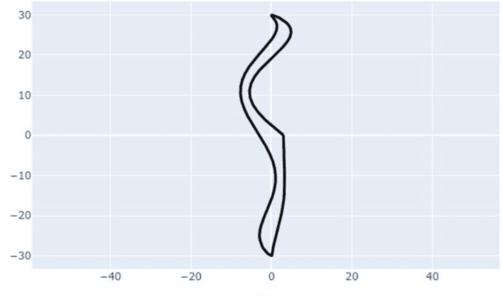

图 12-10. 火箭喷管的横截面几何形状。

现在，我们将运用第 12.4 节（基于封闭参数曲线的旋转曲面）中学到的概念，根据横截面（图 12.10）的几何形状来建模火箭喷管的表面，该横截面是一条封闭的参数曲线 *c*。因此，遵循公式 12-7 的结构，我们只需定义平移曲线 *c* 的距离（*R=10*），并将 *z* 轴定义为*对称轴*，即可得到公式 12-9。

**公式 12-9**

```
s: A = 0.5
   B = 6
   C = 3
   D = 4
   E = -30
   R = 10
   r = A (B + C u sin(D u))
   x = (R + (r cos(u))) sin(v)
   y = (R + (r cos(u))) cos(v)
   z = E sin(u)
; 其中 u = 0...2π, v = -3π/2...0
```

接下来将对火箭喷管表面进行编码建模。第 1 行和第 2 行导入库。第 3 行和第 4 行定义参数 u 和 v。第 5 行定义参数数组 U 和 V。第 6 行到第 10 行定义曲面形状的常量。第 11 行定义 R 值，即横截面的平移距离。第 12 行定义 r，即曲面轮廓。第 13 行到第 15 行分别定义 x、y 和 z 轴。第 16 行到第 19 行设置并显示曲面（执行结果见图 12-11）。

### 代码与执行

```
1. import numpy as np
2. import plotly.graph_objects as go
3. u = np.linspace(0,2*np.pi,50)
4. v = np.linspace(0,3*np.pi/2,50)
5. U,V = np.meshgrid(u,v)
6. A = 0.5
7. B = 6
8. C = 3
9. D = 4
10. E = -30
11. R = 10
12. r = A * (B + C * U * np.sin(D*U))
13. X = (R + (r * np.cos(U))) * np.sin(V)
14. Y = (R + (r * np.cos(U))) * np.cos(V)
15. Z = E * np.sin(U)
16. fig=go.Figure(go.Surface(x=X,y=Y,z=Z,opacity=1,colorscale = 'icefire', showscale=False,
17.     contours=dict(x=dict(show=True), y=dict(show=True), z = dict(show=True))))
18. fig.update_layout(scene = dict(aspectratio = dict(x=1, y=1, z=1.2)))
19. fig.show()
```

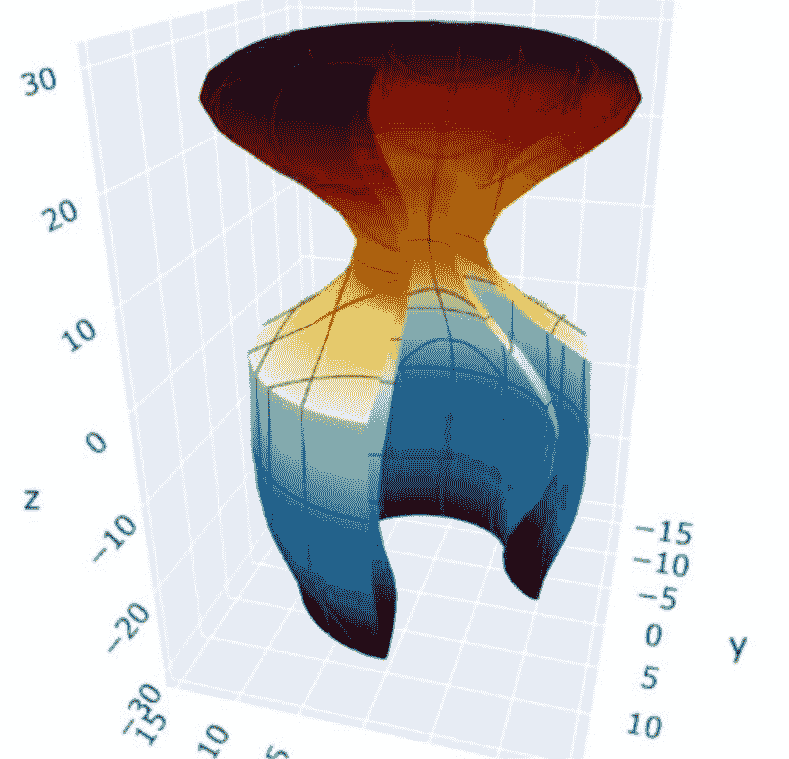

图 12-11. 火箭喷管模型。

**简要讨论：** 为了开发这个项目，我们任意定义了常量（A、B、C、D、E 和 R）的值。你可以改变并组合这些值，以获得许多不同的火箭喷管模型。
此外，我们建模了旋转曲面的一部分，以详细展示横截面轮廓。你可以使用 v = 0... 2π 来封闭旋转曲面，从而获得完整的火箭喷管。

## 12.6. 练习

**E12.1.** 绘制并匹配基于参数半径的旋转曲面与以下图形。

**公式 E12-1**

```
$s:$
$r = 1$
$x = u$
$y = r \cos(v)$
$z = r \sin(v)$
; 其中 $u = 0...1.5$, $v = 0...2\pi$
```

**公式 E12-2**

```
$s:$
$r = u$
$x = u$
$y = r \cos(v)$
$z = r \sin(v)$
; 其中 $u = -1...1$, $v = 0...2\pi$
```

**公式 E12-3**

```
$s:$
$r = (u^2 + 1) / (2u)$
$x = r \cos(v)$
$y = r \sin(v)$
$z = u$
; 其中 $u = 0.2...5$, $v = 0...2\pi$
```

**公式 E12-4**

```
$s:$
$r = \sin(u) e^{-u} + 0.1$
$x = r \cos(v)$
$y = r \sin(v)$
$z = u$
; 其中 $u = 0...4$, $v = -3\pi/2...0$
```

**公式 E12-5**

```
$s:$
$A = 4$
$r = A \sin(u) + (A/2) \sin(2u)$
$x = r \cos(v)$
$y = r \sin(v)$
$z = -\sin(u)$
; 其中 $u = 0...2\pi$, $v = 0...\pi$
```

**公式 E12-6**

```
$s:$
$r = \log_{10}(u) \sin(u^2) + 1$
$x = u$
$y = r \cos(v)$
$z = r \sin(v)$
; 其中 $u = 1...5$, $v = -3\pi/2...0$
```

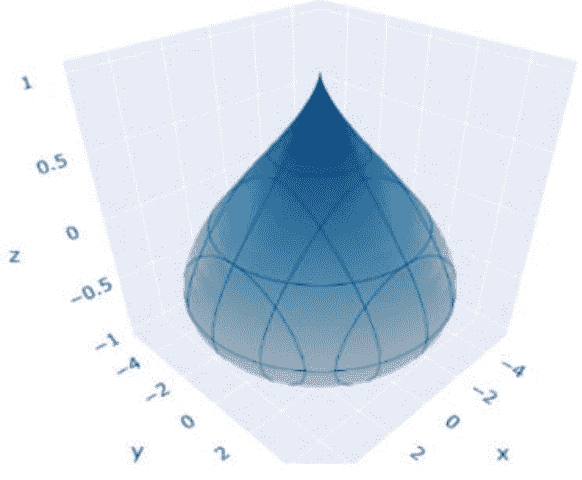

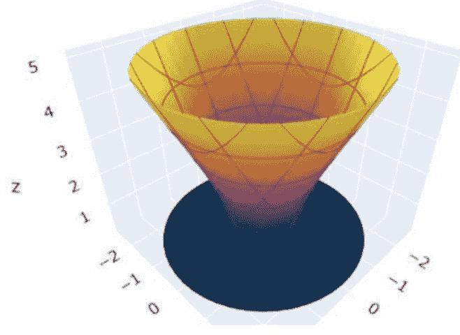

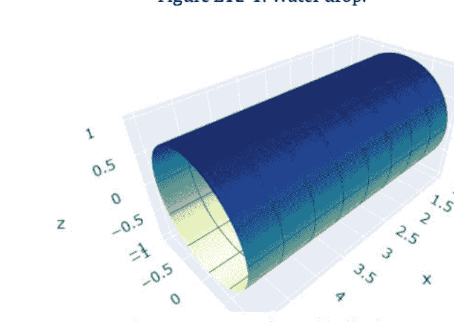

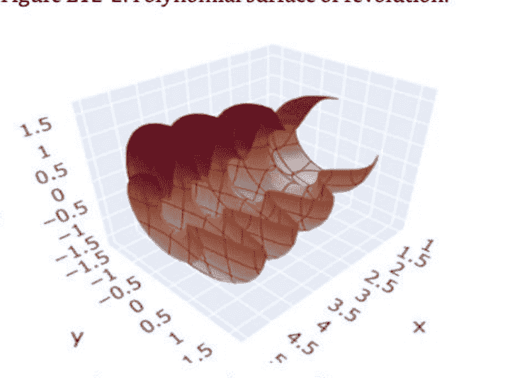

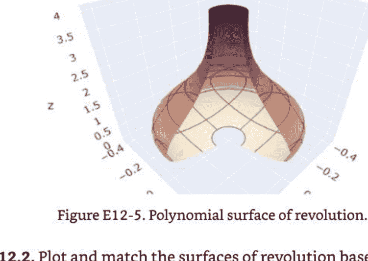

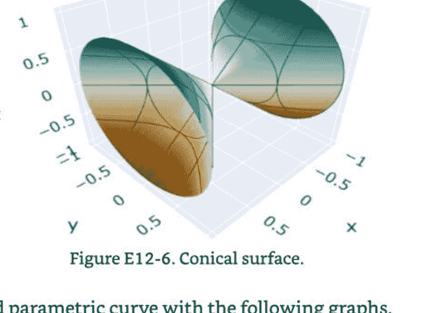

**E12.2.** 绘制并匹配基于封闭参数曲线的旋转曲面与以下图形。

**公式 E12-7**

```
$R = 2$
$r = 1$
$s:$
$x = (R + r \cos(u)) \cos(v)$
$y = (R + r \cos(u)) \sin(v)$
$z = r \sin(u)$
; 其中 $u = 0...2\pi$, $v = 0...2\pi$
```

**公式 E12-8**

```
$R = 1.5$
$r = 1$
$s:$
$x = (R + r \cos^3(u)) \cos(v)$
$y = (R + r \cos^3(u)) \sin(v)$
$z = r \sin^3(u)$
; 其中 $u = 0...2\pi$, $v = -3\pi / 2...0$
```

**公式 E12-9**

```
$R = 1.3$
$r = \sin(3u)$
$s:$
$x = (R + r \cos(u)) \cos(v)$
$y = (R + r \cos(u)) \sin(v)$
$z = r \sin(u)$
; 其中 $u = 0...2\pi$, $v = -3\pi/2...0$
```

**公式 E12-10**

```
$R = 8$
$r = \cos(5u) + 4$
$s:$
$x = (R + r \cos^3(u)) \cos(v)$
$y = (R + r \cos^3(u)) \sin(v)$
$z = r \sin^3(u)$
; 其中 $u = 0...2\pi$, $v = -3\pi/2...0$
```

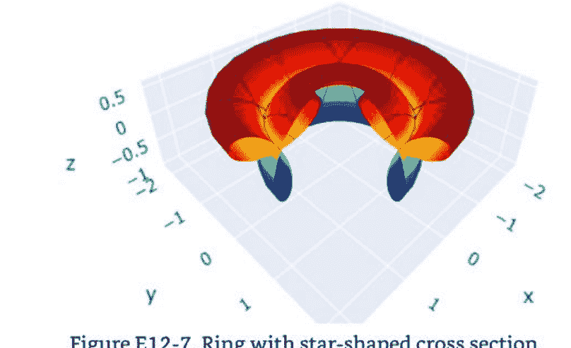

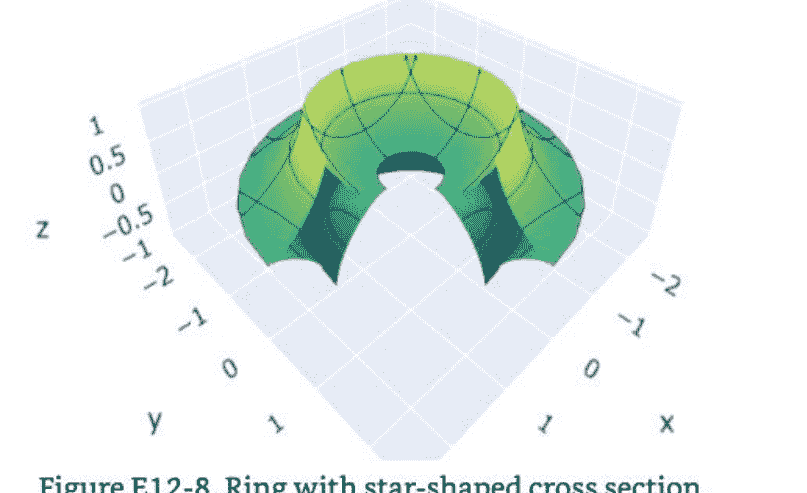

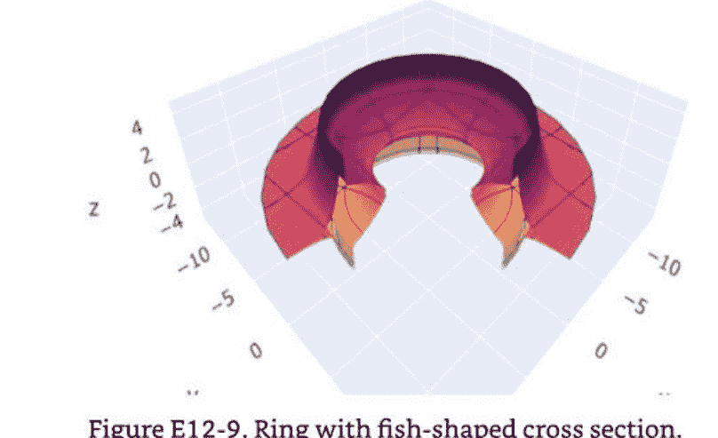

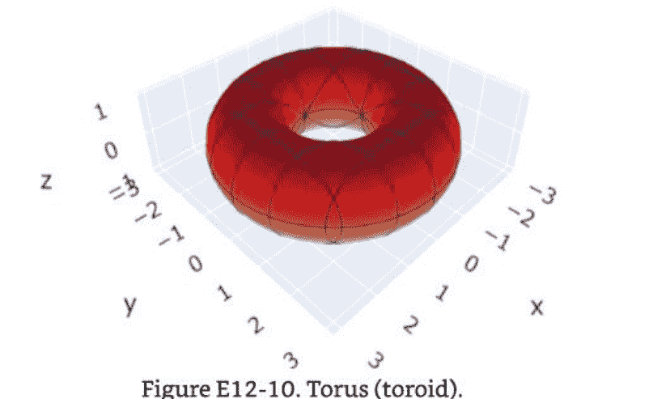

## 总结

在本章中，我们学习了如何建模旋转曲面。此外，我们还学习了建模代表性曲面：

-   对于**基本**旋转曲面，如**圆柱体**（图 E12-3）、**圆锥体**（图 E12-6）和**正弦**曲面轮廓（图 12-4）。
-   对于**杯状**模型（图 12-1、图 E12-2、图 E12-5）。
-   对于**美式橄榄球**曲面（见图 12-2）。
-   对于**扭曲三次曲线旋转**曲面（见图 12-3）。
-   对于标准**环面**（图 E12-10）、**星形横截面环面**（图 12-4、图 E12-7 和图 E12-8）以及**鱼形横截面环面**（图 E12-9）。
-   对于**火箭喷管**曲面（见图 12-6）。
-   对于**水滴**曲面（见图 E12-1）。

在下一章中，我们将学习建模三维参数曲面的第三种特殊情况：极坐标曲面。

# 第 13 章 – 特殊情况：极坐标曲面

在前面的章节中，我们学习了三维参数曲面、拉伸曲面和作为特殊情况的旋转曲面。本章将解释第三种特殊情况，即基于极坐标的曲面。

接下来，我们将涵盖以下部分：

1.  什么是极坐标曲面？
2.  笛卡尔坐标与极坐标。
3.  极坐标曲面的显式表示。
4.  极坐标曲面的隐式表示。
5.  快速项目。
6.  练习。

本章开发的代码位于 [https://github.com/PracticalBooks/Python-For-Geometric-Modeling/tree/main/Chapter-13](https://github.com/PracticalBooks/Python-For-Geometric-Modeling/tree/main/Chapter-13)。我们建议你通过独立开发代码来提升编码技能。如果有任何问题，你可以参考仓库中的代码进行比较。

请记住，我们建议你为本书的每一章创建一个新的 Colab 文档。这将使你能够保持代码的组织性。

## 13.1. 什么是极坐标曲面？

**极坐标曲面**使用参数 $(u)$ 作为*径向距离*，参数 $(v)$ 作为*角度*来描述点 $(p_{0,0}, p_{0,1}, \dots, p_{i,j}, \dots, p_{n,m})$ 的位置；因此，点 $p_{i,j}$ 由两个元素 $(x(u,v), y(u,v), z(u,v))$ 构成。因此，

## 13.2. 极坐标系与笛卡尔坐标系

极坐标曲面可以通过*径向距离*函数和*角度*函数进行参数化描述（见图13-1）。极坐标系中曲面的常见表示形式涉及使用如下形式的参数方程（见公式13-1）。

**公式13-1**

$$
s: \begin{cases}
r = u \\
x = r \cos(v) \\
y = r \sin(v) \\
z = f(u,v)
\end{cases}
$$

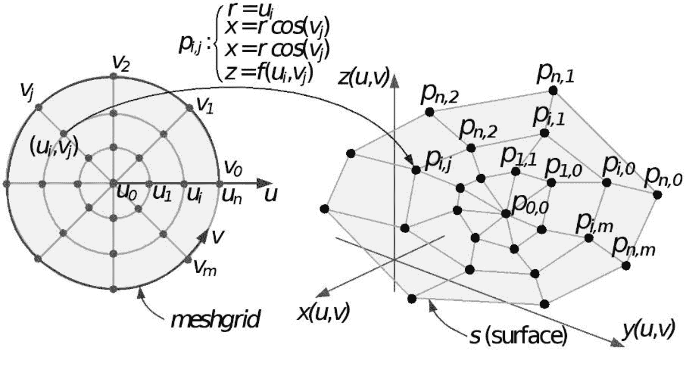

图13-1. 绕z轴轴对称的旋转曲面概念化。

极坐标和笛卡尔坐标对曲面的表示提供了不同的视角和数学表述。选择极坐标还是笛卡尔坐标来描述曲面，取决于模型的本质以及你希望强调的特征。在许多情况下，这两种坐标系的选择将取决于表示曲面的便利性。以下是一些一般性的考虑因素：

### 笛卡尔坐标系：

- 最适合表示具有矩形配置的、依赖于参数$(u, v)$的函数。
- 适用于建模线性关系以及表示由简单笛卡尔方程定义的曲面。
- 对大多数人来说更直观，因为它是最常用的坐标系。

### 极坐标系：

- 当所表示的函数具有径向对称性，或者极坐标是问题几何形状的自然描述时，非常有用。
- 可能更适合表示具有圆形或螺旋特征的函数。
- 可以简化某些曲线的表示，并有助于识别径向对称性。

极坐标曲面可以用显式和隐式两种表示法来表达。接下来，我们将概念化其在几何建模中的表示法和应用。

## 13.3. 极坐标曲面的显式表示法

**极坐标曲面的显式表示法**定义为一个函数，其中输出变量$z$可以完全用输入变量$x$和$y$来描述（见图13-2），其中输入变量由三角函数（$\cos(v)$和$\sin(v)$）表示，即$x = r \cos(v)$和$y = r \sin(v)$。标准形式下，我们可以将曲线写为公式13-2。

**公式13-2**

$$
s: \begin{cases}
r = u \\
x = r \cos(v) \\
y = r \sin(v)
\end{cases} \quad ; \text{其中 } u = u_0...u_n, v = v_0...v_m
$$

$z = f(x,y)$

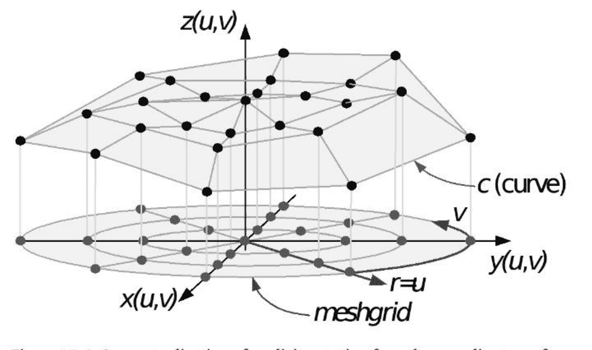

图13-2. 极坐标曲面显式表示法的概念化。

### 示例：水面波纹

我们使用显式表示法来描述水面波纹$s$，如公式13-3所示。

**公式13-3**

$$
s: \begin{cases}
r = u \\
x = r \cos(v) \\
y = r \sin(v) \\
z = \sin(r)
\end{cases} \quad ; \text{其中 } u = 0...9\pi, v = 0...2\pi
$$

请注意，描述水面波纹的方程之前在第10.2节（见公式10-3）中使用笛卡尔坐标系建模图10-3时已经推导过。现在，我们使用极坐标系对同一曲面进行建模（见公式13-3）。我们将两个模型并列展示：(i) 图13-3是笛卡尔坐标系下的模型，(ii) 图13-4是极坐标系下的模型。你可以看到边界上的差异：笛卡尔坐标系下的模型（图13-3）具有矩形边界，因为它是基于矩形网格配置建模的；而极坐标系下的模型（图13-4）具有圆形边界，因为它是基于圆形网格配置建模的。

以下代码对水面波纹进行建模。第1行和第2行导入库。第3行和第4行定义参数$u$和$v$。第5行定义参数数组$U$和$V$。第6行将半径定义为参数数组$U$。第7行和第8行使用三角函数（$\cos(v)$和$\sin(v)$）定义平面$x-y$以获得极坐标系。第9行定义$z$轴。第10行到第13行设置并显示曲面（执行结果见图13-4）。

### 代码与执行

```
1. import numpy as np
2. import plotly.graph_objects as go
3. u = np.linspace(0,9*np.pi,50)
4. v = np.linspace(0,2*np.pi,50)
5. U,V = np.meshgrid(u,v)
6. r = U
7. X = r * np.cos(V)
8. Y = r * np.sin(V)
9. Z = np.sin(r)
10. fig=go.Figure(go.Surface(x=X,y=Y,z=Z,opacity=1,colorscale = 'ylorrd', showscale=False,
11. contours=dict(x=dict(show=True), y=dict(show=True), z=dict(show=False))))
12. fig.update_layout(scene = dict(aspectratio = dict(x=1, y=1, z=.1)))
13. fig.show()
```

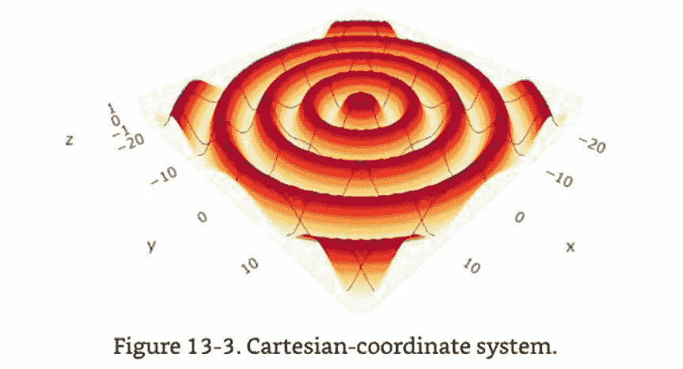

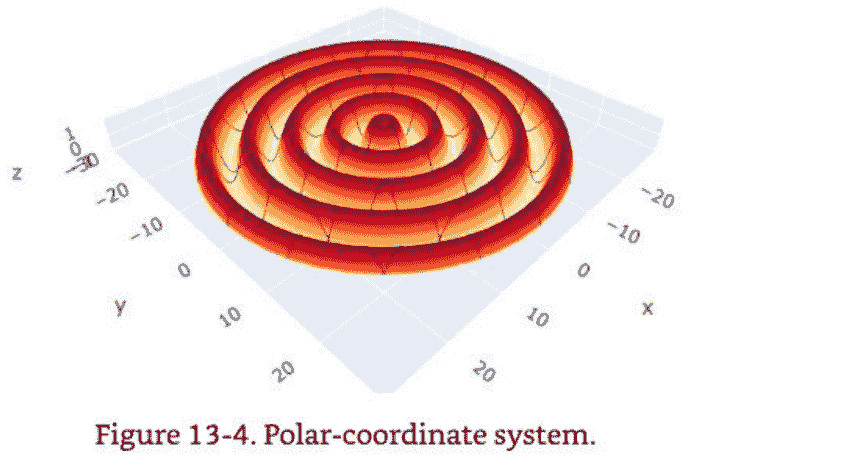

### 示例：牛仔帽

我们使用极坐标曲面的显式表示法来描述一顶牛仔帽$s$，如公式13-4所示。

**公式13-4**

$$
s: \begin{cases}
r = u \\
x = r \cos(v) \\
y = r \sin(v) \\
z = \sin(x^2 + y^2) e^{-x^2} + \cos(x^2 + y^2)
\end{cases} \quad ; \text{其中 } u = 0...9\pi, v = 0...2\pi
$$

以下代码对牛仔帽进行建模。第1行和第2行导入库。第3行和第4行定义参数$u$和$v$。第5行定义参数数组$U$和$V$。第6行将半径定义为参数数组$U$。第7行和第8行使用三角函数（$\cos(v)$和$\sin(v)$）定义平面x-y以获得极坐标系。第9行定义z轴。第10行到第13行设置并显示曲面（执行结果见图13-5）。

### 代码与执行

```
1. import numpy as np
2. import plotly.graph_objects as go
3. u = np.linspace(0,2*np.pi/3,100)
4. v = np.linspace(0,2*np.pi,100)
5. U, V = np.meshgrid(u,v)
6. r = U
7. X = r * np.cos(V)
8. Y = r * np.sin(V)
9. Z = np.sin(X**2+Y**2) * np.exp(-X**2) + np.cos(X**2+Y**2)
10. fig=go.Figure(go.Surface(x=X,y=Y,z=Z,opacity=1,colorscale = 'burg', showscale=False,
11.     contours=dict(x=dict(show=True), y=dict(show=True), z=dict(show=True))))
12. fig.update_layout(scene = dict(aspectratio = dict(x=1, y=1, z=.5)))
13. fig.show()
```

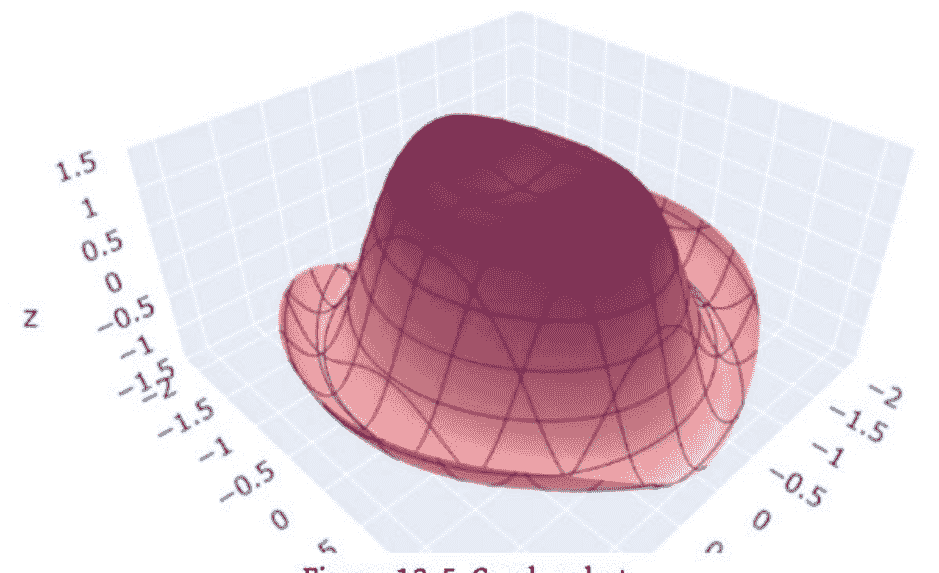

图13-5. 牛仔帽。

> **提示：** 如果你对由$r = u, x = \cos(v)$, $y = \sin(v)$, 和$z = r$描述的极坐标曲面进行显式表示法建模，你会得到一个圆柱体。如果你对由$r = u, x = r \cos(v)$, $y = r \sin(v)$, 和$z = r$描述的曲面进行建模，你会得到一个圆锥体。如果你对圆锥体表达式建模，但将$z$轴改为$z = r^2$，你会得到一个抛物面。如果你对相同的圆锥体表达式建模，但将$z$轴改为$z = \sqrt{(r^2+1)}$，你会得到一个双曲面。如果你对相同的表达式建模，但改为$z = \sqrt{(-r^2+1)}$，你会得到一个球体。

## 13.4. 极坐标曲面的隐式表示法

**隐式表示法**是**极坐标曲面**在三维空间中的一般表达式。这意味着方程不是表示为$x$关于$y$或$z$的解。标准形式下，我们可以将曲面写为公式13-5。

**公式13-5**

$$
s: \begin{cases}
x = f_1(u,v) \cos(u) \cos(v) \\
y = f_2(u,v) \sin(u) \cos(v) \\
z = f_3(u,v)
\end{cases} ; \text{ 其中 } u = u_0...u_n, v = v_0...v_m
$$

其中$x$, $y$, 和$z$是完全用输入参数$u$表示的输出变量，即$x = f_1(u,v) \cos(u) \cos(v)$, $y = f_2(u,v) \sin(u) \cos(v)$, 和$z = f_3(u,v)$。

### 示例：螺旋滑道

我们使用隐式表示法来描述公式13-6中描述的螺旋滑道。

**公式13-6**

$$
s: \begin{cases}
r = u \\
x = r \cos(u) \cos(v) \\
y = r \sin(u) \cos(v) \\
z = -r \sin(v) - \sqrt{x^2 + y^2}
\end{cases} ; \text{ 其中 } u = 0...5\pi, v = 0...\pi
$$

以下代码对螺旋滑道进行建模。第1行和第2行导入库。第3行和第4行定义参数$u$和$v$。第5行定义参数数组$U$和$V$。第6行将半径定义为参数数组$U$。第7行到第9行定义$x$, $y$, 和$z$轴。第10行到第13行设置并显示曲面（执行结果见图13-5）。

### 代码与执行

```
1. import numpy as np
2. import plotly.graph_objects as go
3. u = np.linspace(0,5*np.pi,100)
4. v = np.linspace(0,np.pi,50)
```

## 13.5. 快速项目

船只的形状和尺寸多种多样，船体也不例外。尽管种类繁多，所有船体的设计目的只有两个：要么排开水体，要么在水面上滑行，后者被称为滑行。

一方面，帆船、慢速船和大型船只（如游艇）采用的是排水型船体。它们的重量和动力组合意味着它们在水中位置较低，通过推动或排开水体前进，而不是在水面上滑行。

另一方面，较小、较快的船只（如快艇）或个人水上交通工具，通常采用滑行型船体。滑行型船体的设计使其能够在高速时升起并滑行在水面上。

我们提议对一个仿生快艇船体进行建模。该船体将基于公式（13-8）中所述的贝壳形状。

> 公式 13-8

$$
s : \begin{cases} r = u + \sin(u + v) \\ x = r \cos(u) \sin(v) \\ y = \cos(v) \\ z = r \sin(u) \sin(v) \end{cases} ; \text{其中 } u = 0...7\pi, v = 0...\pi
$$

### 让我们来建模快艇船体

以下代码对贝壳进行建模。第1行和第2行导入库。第3行到第5行定义参数 u、v、U 和 V。第6行到第9行定义 x、y 和 z 轴。从第10行到第13行设置并显示曲面（执行结果见图13-8）。

**代码与执行**

```python
1. import numpy as np
2. import plotly.graph_objects as go
3. u = np.linspace(0,7*np.pi,90)
4. v = np.linspace(0,np.pi,80)
5. U, V = np.meshgrid(u,v)
6. r = U + np.sin(U + V)
7. X = r * np.cos(U) * np.sin(V)
8. Y = r * np.cos(V)
9. Z = r * np.sin(U) * np.sin(V)
10. fig=go.Figure(go.Surface(x=X,y=Y,z=Z,opacity=1,colorscale ='tealgrn', showscale=False,
11.     contours=dict(x=dict(show=True), y=dict(show=True), z=dict(show=True))))
12. fig.update_layout(scene = dict(aspectratio = dict(x=1, y=1, z=1)))
13. fig.show()
```

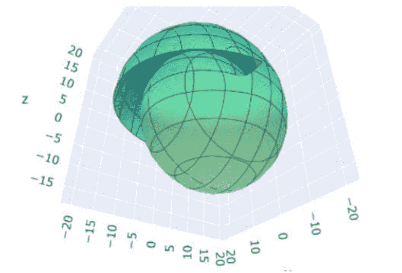

图 13-8. 原始贝壳。

第一步，我们修改公式13-8中的一个元素，以获得一个近似于快艇船体几何形状的整体，即获得一个较低的凹面。为此，我们重新定义参数 $u = \pi/2...2\pi$ 的范围（更改前面代码的第3行），从而只获得贝壳的下半部分（见图13-9）。

第二步，我们修改公式13-8中的另一个元素，以获得更细长的船体几何形状。为此，我们重新定义半径 $r = (2^u + \sin(u + v))/10$（更改前面代码的第6行），从而拉伸x轴的长度（见图13-10）。

第三步，我们通过修改y轴 $y = r \cos(v)/5$ 来调整曲面的比例，使其与快艇船体的比例相匹配，目的是降低曲面的高度以对应快艇船体的高度（见图13-11）。

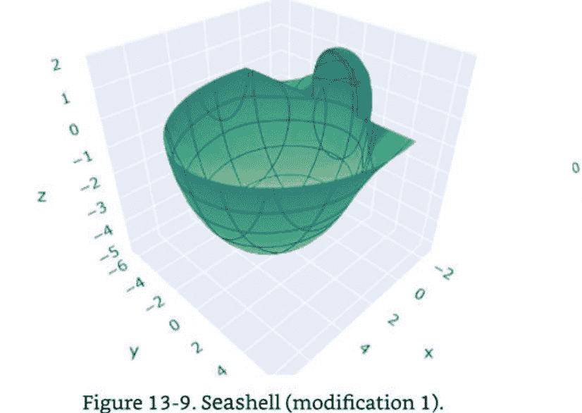

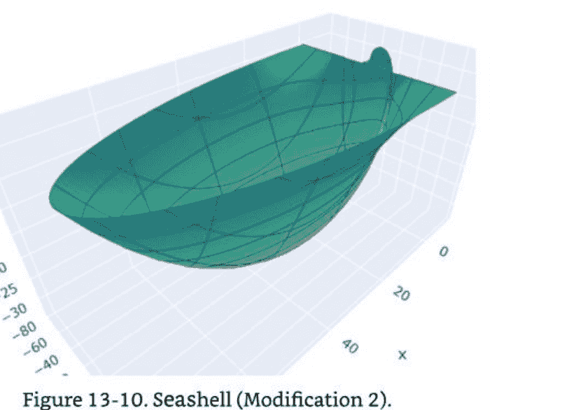

以下代码对仿生快艇船体进行建模。第1行和第2行导入库。第3行包含第一步所做的修改。第4行和第5行定义参数 $v$、$U$ 和 $V$。第6行包含第二步所做的修改。第7行和第9行定义 $x$ 和 $z$ 轴。第8行包含第三步所做的修改。从第10行到第13行设置并显示曲面（执行结果见图13-11）。

### 代码与执行

```python
1. import numpy as np
2. import plotly.graph_objects as go
3. u = np.linspace(np.pi/2,2*np.pi,90)
4. v = np.linspace(0,np.pi,80)
5. U, V = np.meshgrid(u,v)
6. r = (2**u + np.sin(U + V))/10
7. X = r * np.cos(U) * np.sin(V)
8. Y = r * np.cos(V)/5
9. Z = r * np.sin(U) * np.sin(V)
10. fig=go.Figure(go.Surface(x=X,y=Y,z=Z,opacity=1,colorscale ='tealgrn', showscale=False,
11.     contours=dict(x=dict(show=True), y=dict(show=True), z=dict(show=True))))
12. fig.update_layout(scene = dict(aspectratio = dict(x=3, y=1, z=.6)))
13. fig.show()
```

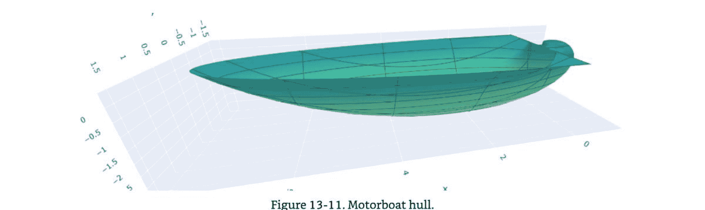

**提示：** 如果你想进一步了解船体设计，我们建议你查看以下链接：[https://safeboatingcourse.ca/boat-hulls-types/](https://safeboatingcourse.ca/boat-hulls-types/) 和 [https://manoa.hawaii.edu/exploringourfluidearth/physical/navigation-and-transportation/transportation-and-ship-design](https://manoa.hawaii.edu/exploringourfluidearth/physical/navigation-and-transportation/transportation-and-ship-design)。你将了解各种类型和设计，以提升你的潜力。

## 13.6. 练习

**E13.1.** 在三维空间中绘制并匹配以下参数曲面与图形。

公式 E13-1

$$
s : \begin{cases} r = u \\ x = r \cos(v) \\ y = r \sin(v) \\ z = \sin(x) \sin(y)/(x y) \end{cases} ; \text{其中 } u = -6\pi...6\pi, v = 0.001...\pi
$$

### 公式 E13-2

$$
s : \begin{cases} r = u \\ x = r \cos(v) \\ y = r \sin(v) \\ z = r^2 \end{cases} ; \text{其中 } u = 0...\pi/2, v = 0...2\pi
$$

### 公式 E13-3

$$
s : \begin{cases} r = u \\ x = r \cos(v) \\ y = r \sin(v) \\ z = r^2 - 2y^2 \end{cases} ; \text{其中 } u = 0...\pi/2, v = 0...2\pi
$$

### 公式 E13-4

$$
s : \begin{cases} r = u \\ x = r \cos(v) \\ y = r \sin(v) \\ z = -u^3/40 + 20\sin(u) + 50\sin(6v) \end{cases} ; \text{其中 } u = 0...8\pi, v = 0...2\pi
$$

### 公式 E13-5

$$
s : \begin{cases} A = 8 \\ B = 5 \\ C = 1 \\ r = u \\ x = r \cos(v) \\ y = r \sin(v) \\ z = 0.05 r^2 + A \cos(B v + C u) \end{cases} ; \text{其中 } u = 0...8\pi, v = 0...2\pi
$$

### 公式 E13-6

$$
s : \begin{cases} r = u^3 \\ x = r \cos(v) \\ y = r \sin(v) \\ z = \cos(u) x y \end{cases} ; \text{其中 } u = 0...60, v = 0...2\pi
$$

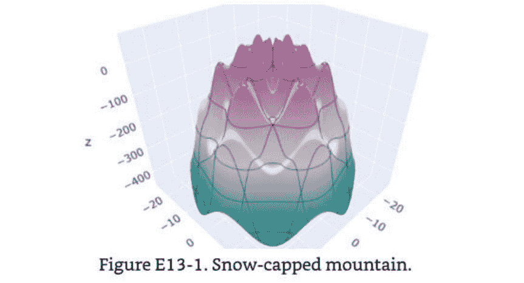

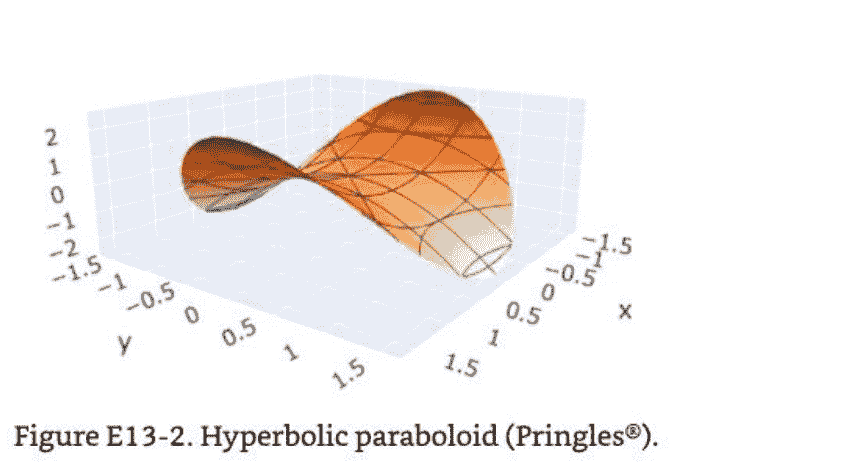

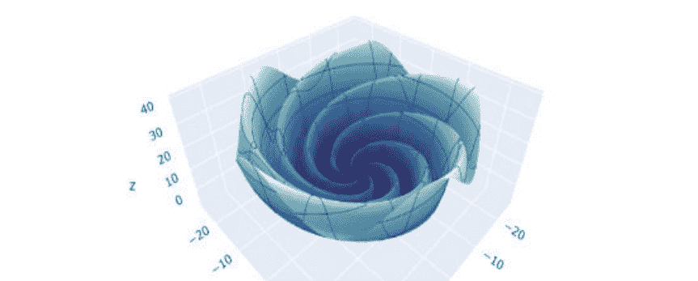

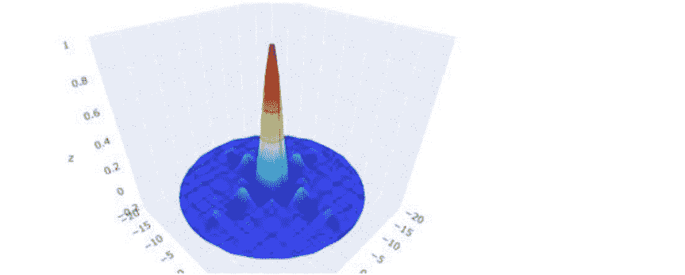

图 E13-3. 海洋漩涡。

图 E13-4. 水面波纹。

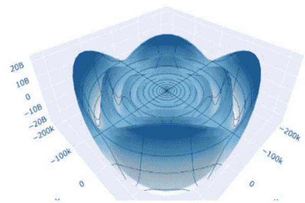

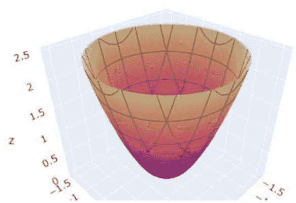

图 E13-5. 水面波纹。

图 E13-6. 抛物面。

### E13.2. 在三维空间中绘制并匹配以下参数曲面（使用隐式表示）与图形。

公式 E13-7

$$
s : \begin{cases} A = 1 \\ B = A/5 \\ r = \sin(3 u) \\ x = \cos(v) \\ y = ((A-B) \sin(u) - b \sin((A-B) u/B)) \sin(v) \\ z = 4 \cos(u)^3 \sin(v) \end{cases} ; \text{其中 } u = 0...2\pi, v = 0...\pi
$$

公式 E13-8

$$
s : \begin{cases} r = 0.9 \cos(3 u - |\cos(4 v)|) \\ x = r \cos(u) \cos(v) \\ y = r \sin(u) \cos(v) \end{cases} ; \text{其中 } u = 0...\pi, v = 0...2\pi
$$

$z = r \sin(v)$

### 方程 E13-9

```
$s:$
$A = 9$
$r = 7 + \sin(A u)$
$x = r \cos(v)$
$y = r \cos(u) \sin(v)$
$z = r \sin(u) \sin(v)$
; 其中 $u = 0...2\pi, v = 0...\pi$
```

### 方程 E13-10

```
$s:$
$A = .8$
$B = 12$
$r = \cos(\pi u + 0.5 A \sin(B v))$
$x = r \cos(v)$
$y = -r \sin(v)$
$z = u$
; 其中 $u = -3\pi/19...3\pi/19, v = 0...2\pi$
```

### 方程 E13-11

```
$s:$
$A = 3$
$B = 25$
$r = 2 + \sin(A u + B v)$
$x = r \cos(u) \sin(v)$
$y = r \sin(u) \sin(v)$
$z = r \cos(v)$
; 其中 $u = 0...2\pi, v = 0...\pi$
```

### 方程 E13-12

$s: \begin{cases} r = u \\ x = r \cos(u) \cos(v) \\ y = r \sin(u) \cos(v) \\ z = -r \sin(2v) - r \end{cases} ; \text{ 其中 } u = 0...8\pi, v = \pi/5...3\pi/4$

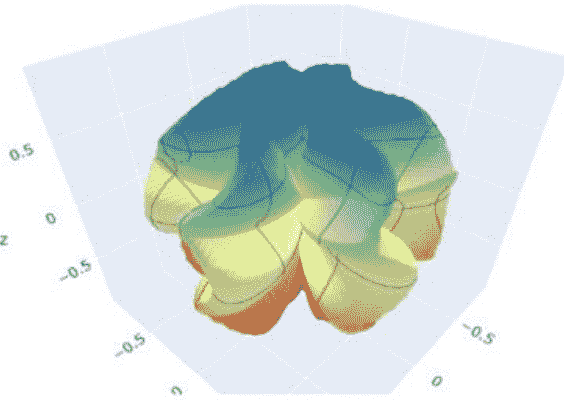

图 E13-7. 沟槽脑珊瑚芽。

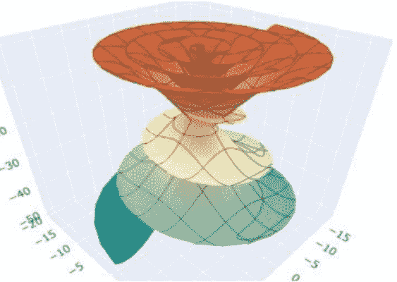

图 E13-8. 花朵。

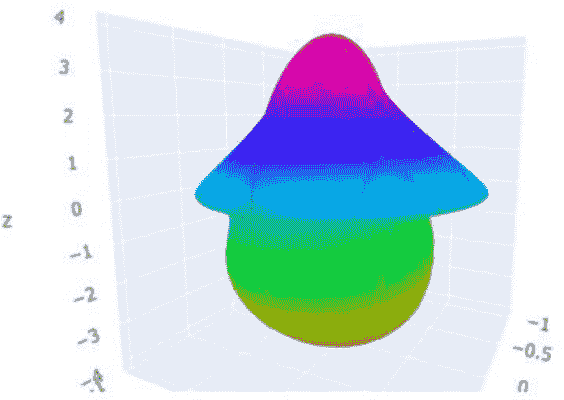

图 E13-9. 蘑菇。

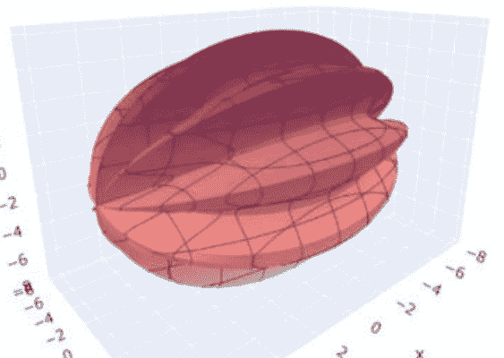

图 E13-10. 可可果。

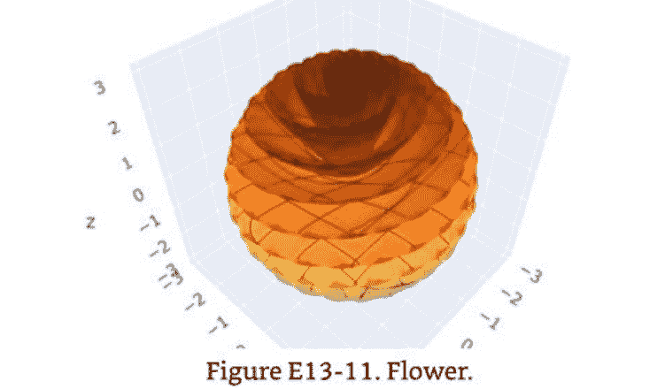

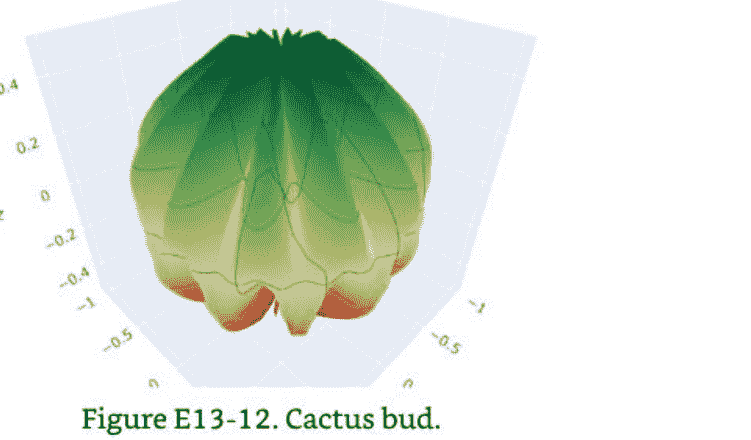

## 总结

在本章中，我们学习了如何建模极坐标曲面。此外，我们还学习了如何建模以下代表性曲面：

- **抛物面**（见图 E13-6）。
- **水面波纹**和**海洋漩涡**（见图 13-4、图 E13-3、图 E13-4 和图 E13-5）。
- **牛仔帽**曲面（见图 13-5）。
- **螺旋滑道**曲面（见图 13-6）。
- **船用螺旋桨**和**摩托艇船体**曲面（见图 13-7 和图 13-8）。
- **雪山**曲面（见图 E13-1）。
- **双曲抛物面（品客薯片®）**（见图 E13-2）。
- **沟槽脑珊瑚芽**（见图 E13-7）。
- **花朵、蘑菇、可可果**和**仙人掌芽**（见图 E13-8、图 E13-11、图 E13-9、图 E13-10 和图 E13-12）。

在下一章中，我们将学习如何建模三维参数曲面的四种特殊情况：复杂曲面。

# 第 14 章 – 特殊情况：复杂曲面

在前面的章节中，我们学习了三维参数曲面，以及拉伸曲面、旋转曲面和极坐标曲面作为特殊情况。本章将解释第四种特殊情况，我们称之为复杂曲面。

接下来，我们将涵盖以下部分：

1. 什么是复杂曲面？
2. 复杂曲面的显式表示
3. 复杂曲面的隐式表示
4. 快速项目。
5. 练习。

本章开发的代码位于 [https://github.com/PracticalBooks/Python-For-Geometric-Modeling/tree/main/Chapter-14](https://github.com/PracticalBooks/Python-For-Geometric-Modeling/tree/main/Chapter-14)。我们建议您通过独立开发代码来提升编码技能。如有任何问题，您可以参考仓库中的代码进行比较。

请记住，我们建议您为本书的每一章创建一个新的 Colab 文档。这将使您的代码保持条理清晰。

## 14.1. 什么是复杂曲面？

我们将**复杂曲面**定义为那些边界由边界线函数定义的三维曲面。它使用一个三阶段的建模过程：

**阶段 1：** 使用一组基本参数（$u_b$ 和 $v_b$）构建*基本网格*（见图 14-1）。因此，*基本网格*由以下有序对组成：

**分析**

```
$$basic\ meshgrid = \begin{bmatrix} (u_{b0},v_{b0}) & (u_{b0},v_{b1}) & \cdots & (u_{b0},v_{bm}) \\ (u_{b1},v_{b0}) & (u_{b1},v_{b1}) & \cdots & (u_{b1},v_{bm}) \\ \vdots & \vdots & \ddots & \vdots \\ (u_{bn},v_{b0}) & (u_{bn},v_{b1}) & \cdots & (u_{bn},v_{bm}) \end{bmatrix}$$
```

**阶段 2：** 基于*基本网格*，构建一个二维参数曲面，以使用一组最终参数（$u_f$ 和 $v_f$）获得*最终网格*，见图 14-1。*最终网格*的点集由两个关于两个参数（$u_b$ 和 $v_b$）的函数定义。*最终网格*作为一个二维参数曲面 $s$，描述了一组点之间的关系，这可以通过两个函数来表达：一个函数 $f_1(u_b, v_b)$ 用于获取 $u_f$ 值，另一个函数 $f_2(u_b, v_b)$ 用于获取 $v_f$ 值。因此，*最终网格*由以下有序对组成：

**分析**

```
$$final\ meshgrid = \begin{bmatrix} (u_{f0},v_{f0}) & (u_{f0},v_{f1}) & \cdots & (u_{f0},v_{fm}) \\ (u_{f1},v_{f0}) & (u_{f1},v_{f1}) & \cdots & (u_{f1},v_{fm}) \\ \vdots & \vdots & \ddots & \vdots \\ (u_{fn},v_{f0}) & (u_{fn},v_{f1}) & \cdots & (u_{fn},v_{fm}) \end{bmatrix}$$
```

**阶段 3：** 基于*最终网格*，构建三维参数曲面，该曲面由一组点 $(p_{0,0}, p_{0,1}, \dots, p_{i,j}, \dots, p_{n,m})$ 定义；因此，点 $p_{i,j}$ 由两个元素 $(x(u_f, v_f), y(u_f, v_f), z(u_f, v_f))$ 构成。点集由三个关于两个参数（$u_f$ 和 $v_f$）的函数定义（见图 14-1）。在阶段 3 中，曲面通过三个函数来表达：一个函数 $f_3(u_f, v_f)$ 用于获取 $x$ 值，另一个函数 $f_4(u_f, v_f)$ 用于获取 $y$ 值，最后一个函数 $f_5(u_f, v_f)$ 用于获取 $z$ 值。

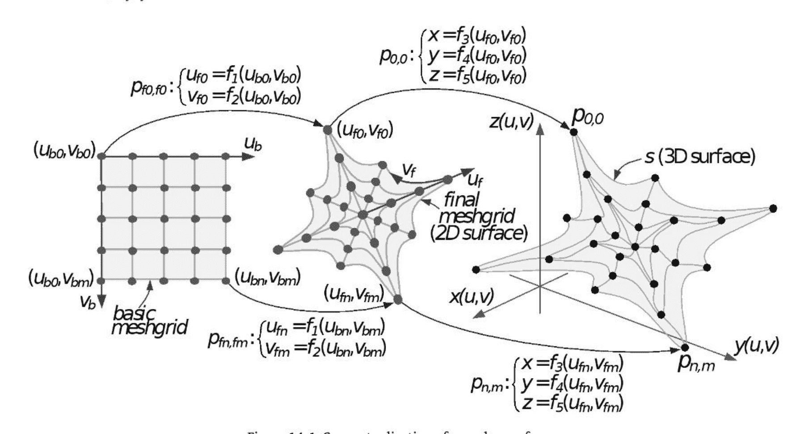

遵循这三个阶段，我们得到了复杂曲面的完整表达式（见方程 14-1）。

```
方程 14-1
$$
\begin{aligned}
s: \quad & u_f = f_1(u_b, v_b) \\
& v_f = f_2(u_b, v_b) \\
& x = f_3(u_f, v_f) \\
& y = f_4(u_f, v_f) \\
& z = f_5(u_f, v_f)
\end{aligned}
$$
```

## 14.2. 复杂曲面的显式表示

**复杂曲面的显式表示**是一个方程组，其中因变量（$z$）可以明确地用自变量（$x$ 和 $y$）来表示，而这些自变量（$x$ 和 $y$）被定义为*最终网格*，即 $x = u_f$ 且 $y = v_f$（见方程 14-2）。

```
方程 14-2
$$
\begin{aligned}
s: \quad & u_f = f_1(u_b, v_b) \\
& v_f = f_2(u_b, v_b) \\
& x = u_f \\
& y = v_f \\
& z = f_5(u_f, v_f)
\end{aligned}
; \text{ 其中 } u_b = u_{b0}\dots u_{bn}, v_b = v_{b0}\dots v_{bm}
$$
```

### 示例：水面上的七角星

我们使用复杂曲面的显式表示来描述水面上的七角星 $s$，其表达式如方程 14-3 所示。

### 方程 14-3

```
$s : \begin{cases} r = v_b + 2 \sin(7u_b) + 5 \\ u_f = r \cos(u_b) \\ v_f = r \sin(u_b) \\ x = u_f \\ y = v_f \\ z = \sin(\sqrt{x^2 + y^2}) \end{cases} \quad ; \text{其中 } u_b = 0...2\pi, v_b = 1...15$
```

请注意：

- 方程 14-3 中描述半径（$r$）和最终参数集（$u_f$ 和 $v_f$）的表达式，类似于之前在 9.3 节（方程 9-6）中建模的二维星形曲面的方程，因为方程 14-3 的*最终网格*将具有星形边界（见图 14-2 中的红色曲面）。
- 方程 14-3 中描述 $x$、$y$ 和 $z$ 轴的表达式，类似于之前在 10.2 节（方程 10-3）中建模的隐式曲面，因为建模的隐式曲面将是水面上的波纹（见图 14-2 中的蓝色曲面）。

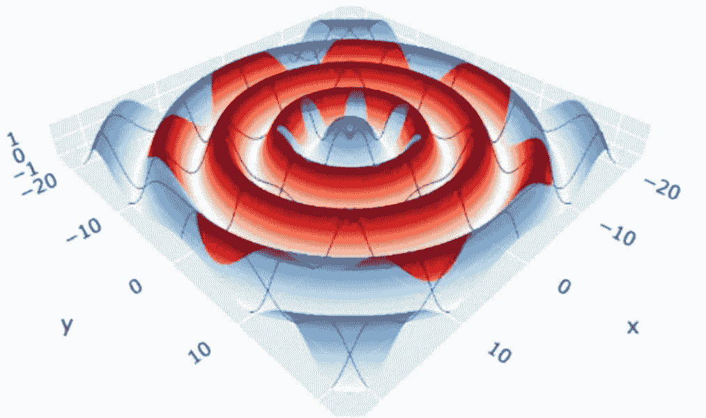

图 14-2. 水面上七角星的概念化。

以下代码对水面上的七角星进行建模：

- 第 1 行和第 2 行导入库。
- 第 3 行和第 4 行定义基本参数 $u_b$ 和 $v_b$。
- 第 5 行根据参数（$u_b$ 和 $v_b$）定义*基本网格*（$U_b$ 和 $V_b$）。
- 第 6 行定义半径函数 $r$。
- 第 7 行和第 8 行根据参数数组（$U_b$ 和 $V_b$）定义*最终网格*（$U_f$ 和 $V_f$）。
- 第 9 行和第 10 行将 $x$ 和 $y$ 轴定义为*最终网格*（$U_f$ 和 $V_f$）。
- 第 11 行将 z 轴定义为 $z = f(x,y)$。
- 第 12 行到第 15 行设置并显示曲面（执行结果见图 14-3）。

### 代码与执行

```python
import numpy as np
import plotly.graph_objects as go
ub = np.linspace(0, 2*np.pi, 200)
vb = np.linspace(1, 15, 200)
Ub, Vb = np.meshgrid(ub, vb)
r = Vb + 2*np.sin(7*Ub) + 5
Uf = r * np.cos(Ub)
Vf = r * np.sin(Ub)
X = Uf
Y = Vf
Z = np.sin(np.sqrt(X**2 + Y**2))
fig = go.Figure(go.Surface(x=X, y=Y, z=Z, opacity=1, colorscale='redscale', showscale=False,
    contours=dict(x=dict(show=True), y=dict(show=True), z=dict(show=True))))
fig.update_layout(scene=dict(aspectratio=dict(x=1, y=1, z=.1)))
fig.show()
```

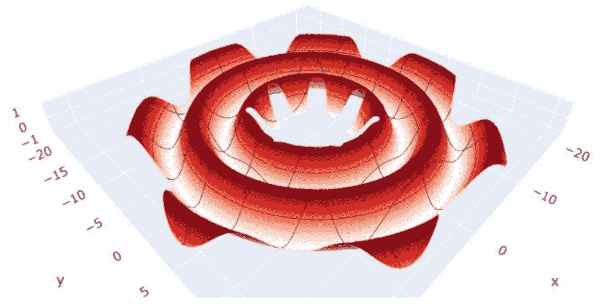

图 14-3. 水面上的七角星。

**简要讨论：** 请注意，图 13-3 使用笛卡尔坐标系显示了水面的波纹；因此，它具有矩形边界。另一方面，图 13-4 使用极坐标系显示了相同的水面波纹。因此，它具有圆形边界。然而，图 14-3 使用复杂曲面模型显示了相同的水面波纹。因此，你可以在模型中定义自己的曲面边界。

### 示例：双曲抛物面（*品客*®）上的五角星

我们使用复曲面的显式表示法来描述双曲抛物面（*品友*®）上的五角星，如公式 14-4 所示。

**公式 14-4**

$s : r = 0.035(v_b + 8 \sin(5u_b) + 10) ; \text{其中 } u_b = 0...2\pi, v_b = 1...7\pi$

$u_f = r \cos(u_b)$
$v_f = r \sin(u_b)$
$x = u_f$
$y = v_f$
$z = r^2 - 2y^2$

请注意：

- 公式 14-4 中描述 $r$、$u_f$ 和 $v_f$ 的表达式与公式 14-3 类似。公式 14-4 得到的*最终网格*（$u_f$，$v_f$）将具有星形边界（见图 14-4 中的红色曲面）。
- 公式 14-4 中描述 $x$、$y$ 和 $z$ 轴的表达式类似于第 13.6 节（公式 13-2）中早期建模的隐式曲面，因为建模的隐式曲面将是双曲抛物面（*品友*®）（见图 14-2 中的蓝色曲面）。

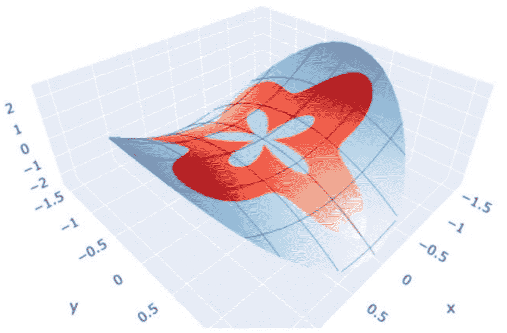

图 14-4. 双曲抛物面（品友®）上五角星的概念化。

以下代码对双曲抛物面（品友®）上的五角星进行建模：

- 第 1 行和第 2 行导入库。
- 第 3 行和第 4 行定义基本参数 $u_b$ 和 $v_b$。
- 第 5 行根据参数（$u_b$ 和 $v_b$）定义*基本网格*（$U_b$ 和 $V_b$）。
- 第 6 行定义半径函数 $r$。
- 第 7 行和第 8 行根据参数数组（$U_b$ 和 $V_b$）定义*最终网格*（$U_f$ 和 $V_f$）。
- 第 9 行和第 10 行将 $x$ 和 $y$ 轴定义为*最终网格*（$U_f$ 和 $V_f$）。
- 第 11 行将 $z$ 轴定义为 $z = r^2 - 2y^2$。
- 第 12 行到第 15 行设置并显示曲面（执行结果见图 14-5）。

### 代码与执行

```python
import numpy as np
import plotly.graph_objects as go
ub = np.linspace(0, 2*np.pi, 100)
vb = np.linspace(1, 7*np.pi, 100)
Ub, Vb = np.meshgrid(ub, vb)
r = 0.035*(Vb + 8*np.sin(5*Ub) + 10)
Uf = r * np.cos(Ub)
Vf = r * np.sin(Ub)
X = Uf
Y = Vf
Z = r**2 - 2*Y**2
fig = go.Figure(go.Surface(x=X, y=Y, z=Z, opacity=1, colorscale='ylorrd', showscale=False,
    contours=dict(x=dict(show=True), y=dict(show=True), z=dict(show=True))))
fig.update_layout(scene=dict(aspectratio=dict(x=1, y=1, z=.4)))
fig.show()
```

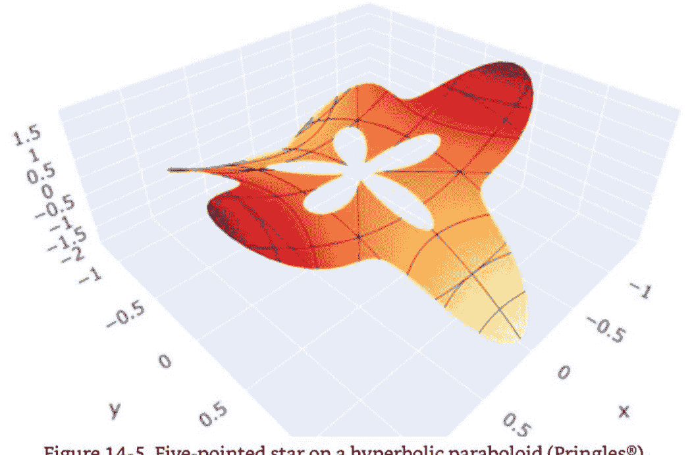

图 14-5. 双曲抛物面（品友®）上的五角星。

## 14.3. 复曲面的隐式表示法

**复曲面的隐式表示法**是一个方程，其中因变量（x、y 和 z）用*最终网格*表示（见公式 14-5）。

**公式 14-5**

| | |
|---|---|
| $s:$ | $u_f = f_1(u_b, v_b)$<br>$v_f = f_2(u_b, v_b)$<br>$x = f_3(u_f, v_f)$<br>$y = f_4(u_f, v_f)$<br>$z = f_5(u_f, v_f)$ | ; 其中 $u_b = u_{b0}...u_{bn}$, $v_b = v_{b0}...v_{bm}$ |

其中 $x$、$y$ 和 $z$ 是输出变量，完全用输入参数 $u_f = f_1(u_b, v_b)$ 和 $v_f = f_2(u_b, v_b)$ 表示，即 $x = f_3(u_f, v_f)$，$y = f_4(u_f, v_f)$，$z = f_5(u_f, v_f)$。

### 示例：球体上的六角星

我们使用复曲面的隐式表示法来描述球体 $s$ 上带孔的六角星，如公式 14-6 所示。

**公式 14-6**

$s: \begin{cases} r_b = v_b + 3 \cos(3 \sin(3 u_b)) \\ u_f = r_b \sin(u_b) / \pi \\ v_f = r_b \cos(u_b) / \pi \\ r_f = 1 \\ x = r_f \cos(u_f) \sin(v_f) \\ y = r_f \sin(u_f) \sin(v_f) \\ z = r_f \cos(v_f) \end{cases} \quad ; \text{其中 } u_b = -\pi...\pi, v_b = 1.5...6$

请注意：

- 公式 14-6 中描述 $r_b$、$u_f$ 和 $v_f$ 的表达式类似于第 9.3 节（公式 9-6）中早期建模的七角星。公式 14-6 得到的*最终网格*（$u_f$，$v_f$）将具有六角星边界（见图 14-6 中的红色曲面）。
- 公式 14-6 中描述 $x$、$y$ 和 $z$ 轴的表达式与第 10.3 节（公式 10-3）中早期建模的球体相同。公式 14-6 得到的 $x$、$y$ 和 $z$ 轴将具有球面（见图 14-6 中的红色曲面）。

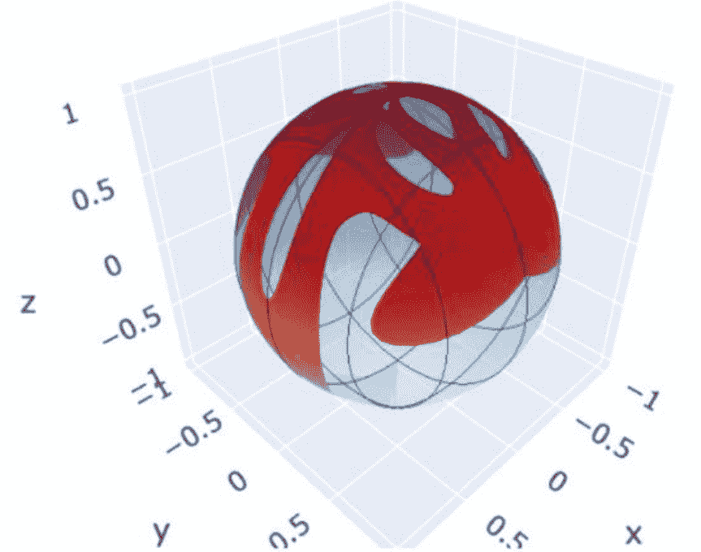

图 14-6. 球体上六角星的概念化。

以下代码对环形曲面上的带孔圆盘进行建模：

- 第 1 行和第 2 行导入库。
- 第 3 行和第 4 行定义基本参数 $u_b$ 和 $v_b$。
- 第 5 行根据参数（$u_b$ 和 $v_b$）定义*基本网格*（$U_b$ 和 $V_b$）。
- 第 6 行定义可变半径 $r_b$。
- 第 7 行和第 8 行根据参数数组（$U_b$ 和 $V_b$）定义*最终网格*（$U_f$ 和 $V_f$）。
- 第 9 行定义球体半径 $r_f$。
- 第 10 行到第 12 行根据*最终网格*（$U_f$ 和 $V_f$）定义 $x$、$y$ 和 $z$ 轴。
- 第 13 行到第 16 行设置并显示曲面（执行结果见图 14-7）。

### 代码与执行

```python
import numpy as np
import plotly.graph_objects as go
ub = np.linspace(-np.pi, np.pi, 300)
vb = np.linspace(1.5, 6, 300)
Ub, Vb = np.meshgrid(ub, vb)
rb = Vb + 3*np.cos(3*np.sin(3*Ub))
Uf = rb * np.sin(Ub)/np.pi
Vf = rb * np.cos(Ub)/np.pi
rf = 1
X = rf * np.cos(Uf) * np.sin(Vf)
Y = rf * np.sin(Uf) * np.sin(Vf)
Z = rf * np.cos(Vf)
fig = go.Figure(go.Surface(x=X, y=Y, z=Z, opacity=1, colorscale='redscale', showscale=False,
    contours=dict(x=dict(show=True), y=dict(show=True), z=dict(show=True))))
fig.update_layout(title='Six-pointed star on a sphere', autosize=False)
fig.show()
```

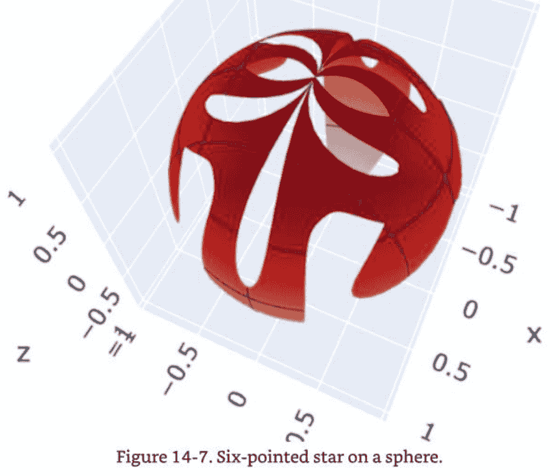

图 14-7. 球体上的六角星。

### 示例：环形曲面上的带孔圆盘

我们使用复曲面的隐式表示法来描述环形曲面 $s$ 上的带孔圆盘，如公式 14-7 所示。

**公式 14-7**

$s: \begin{cases} r_b = 2v_b \\ u_f = r_b \cos(u_b) \\ v_f = r_b \sin(u_b) \\ R_f = 2 \\ r_f = 1 \\ x = (R_f + r_f \cos(u_f)) \cos(v_f) \\ y = (R_f + r_f \cos(u_f)) \sin(v_f) \\ z = r_f \sin(u_f) \end{cases} ; \text{ 其中 } u_b = 0...2\pi, v_b = 1...\pi/2$

请注意：

- 公式 14-7 中描述 $r$、$u_f$ 和 $v_f$ 的表达式类似于第 9.3 节（公式 9-5）中早期建模的带孔圆盘。公式 14-7 得到的*最终网格*（$u_f$，$v_f$）将具有带孔圆盘边界（见图 14-8 中的红色曲面）。
- 公式 14-7 中描述 $x$、$y$ 和 $z$ 轴的表达式与第 12.6 节（公式 E12-7，图 E12-10）中早期建模的环面（圆环）相同。公式 14-7 得到的 $x$、$y$ 和 $z$ 轴将具有环形曲面（见图 14-8 中的红色曲面）。

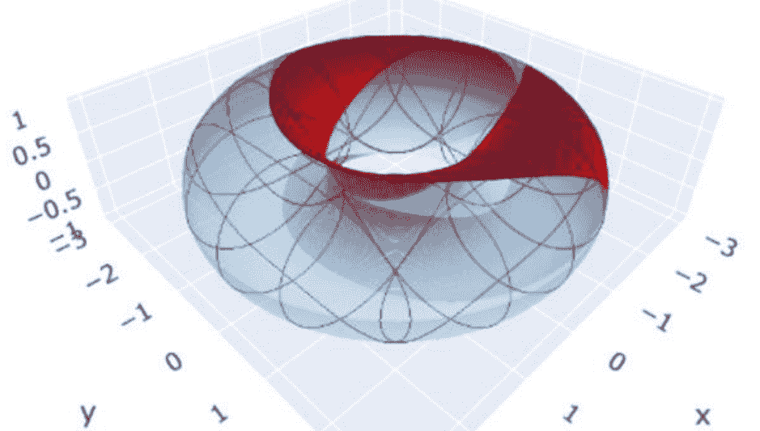

图 14-8. 环面上带孔圆盘的概念化。

以下代码对环形曲面上的带孔圆盘进行建模：

- 第 1 行和第 2 行导入库。
- 第 3 行和第 4 行定义基本参数 $u_b$ 和 $v_b$。
- 第 5 行根据参数（$u_b$ 和 $v_b$）定义*基本网格*（$U_b$ 和 $V_b$）。
- 第 6 行定义圆盘半径 $r_b$。
- 第 7 行和第 8 行根据参数数组（$U_b$ 和 $V_b$）定义*最终网格*（$U_f$ 和 $V_f$）。
- 第 9 行和第 10 行定义环形曲面的尺寸，即旋转环半径（$R_f$）和圆周半径（$r_f$）。
- 第 11 行到第 13 行根据*最终网格*（$U_f$ 和 $V_f$）定义 $x$、$y$ 和 $z$ 轴。
- 第 14 行到第 17 行设置并显示曲面（执行结果见图 14-9）。

### 代码与执行

```python
import numpy as np
import plotly.graph_objects as go
ub = np.linspace(0,2*np.pi,80)
vb = np.linspace(1,np.pi/2,80)
Ub,Vb = np.meshgrid(ub,vb)
rb = 2*Vb
Uf = rb * np.cos(Ub)
Vf = rb * np.sin(Ub)
Rf = 2
rf = 1
X = (Rf + rf*np.cos(Uf)) * np.cos(Vf)
Y = (Rf + rf*np.cos(Uf)) * np.sin(Vf)
Z = rf * np.sin(Uf)
fig=go.Figure(go.Surface(x=X,y=Y,z=Z,opacity=1,colorscale = 'red', showscale=False,
    contours=dict(x=dict(show=True), y=dict(show=True), z = dict(show=True))))
fig.update_layout(title='Disc with a hole on a torus surface',autosize=False)
fig.show()
```

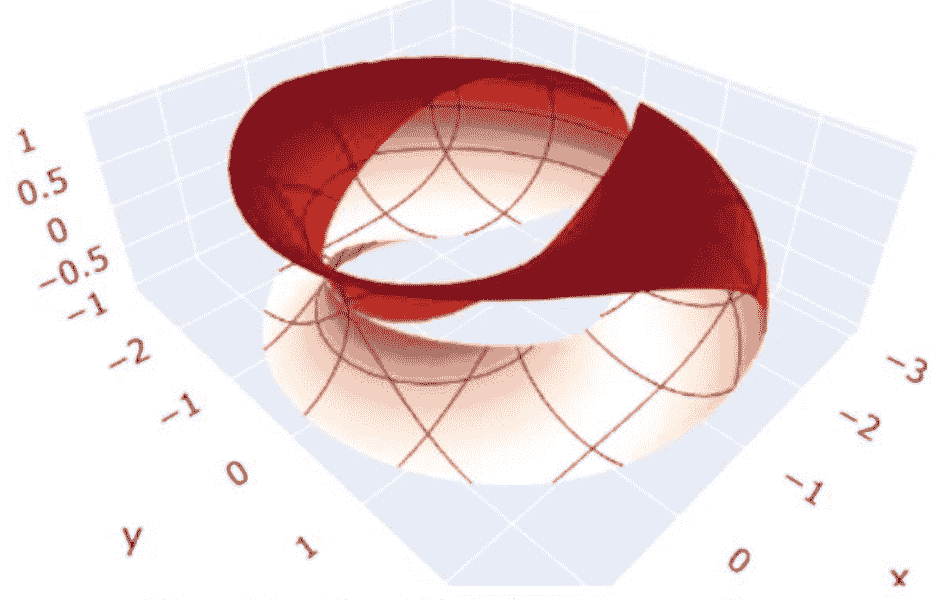

图 14-9. 环面上带孔的圆盘。

## 14.4. 快速项目

轮辋是车辆（如汽车、卡车、自行车和摩托车）的关键部件。它是外部的圆形金属部件，用于固定轮胎并为轮胎提供支撑。轮辋有各种尺寸、设计和材料，具体取决于车辆类型及其预期用途。轮辋的设计也可以有所不同，具有不同的样式和表面处理，以满足美学和功能目的。

内摆线可用于轮辋的几何设计，以创建视觉上有趣且独特的图案。使用内摆线可以使轮辋具有独特而复杂的外观。因此，将内摆线应用于轮辋设计有以下一些好处：

- **辐条设计：** 滚动圆上一点所描绘的路径可用于创建轮辐。内摆线形状可以被复制以形成辐条的图案。这种设计可以为车轮增添动态和艺术元素。
- **镂空和开口：** 内摆线可以融入轮辋的镂空或开口设计中。通过遵循内摆线的路径，设计师可以在轮辋内创造有趣的负空间，用于通风或纯粹出于美学目的。
- **表面图案：** 轮辋的表面可以用受内摆线启发的图案进行装饰。这些图案可以在制造过程中被雕刻、压印或融入材料中，为整体设计增添独特的风格。
- **对称与重复：** 内摆线图案可用于在轮辋上创建对称和重复的设计。这可以带来视觉上连贯且和谐的整体外观。

> **快速讨论：** 请注意，虽然内摆线有助于创造独特且艺术的轮辋设计，但在设计过程中也应考虑结构完整性、重量和制造可行性等实际因素。此外，计算机辅助设计（CAD）对于精确实现内摆线设计并确保其满足美学和功能要求非常有价值。

内摆线是一种在二维空间中的特殊曲线，由一个小圆在一个大圆内滚动时，其上一个固定点的轨迹生成（见图 14-10）。随着大圆半径的增大，内摆线变得越来越像一个圆在直线上滚动所形成的摆线。该曲线的参数方程可由方程 14-8 给出，它由一个半径为 *a* 的圆在半径为 *b* 的圆内滚动时其上一点生成。

```
方程 14-8
$c: x = ((a - b) cos(u) + b cos((a - b) u/b))$
$y = ((a - b) \sin(u) - b \sin((a - b) u / b))$
```

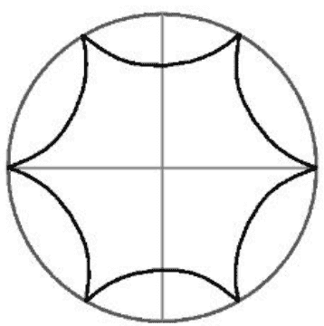

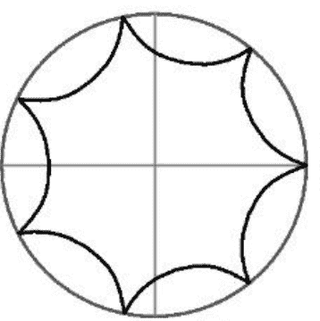

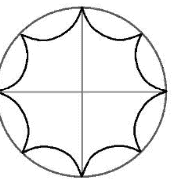

$a/b = 6$

$a/b = 7$

$a/b = 8$

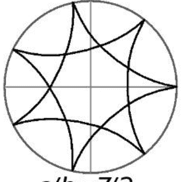

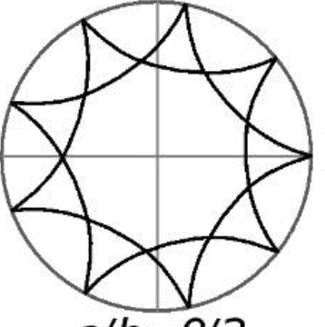

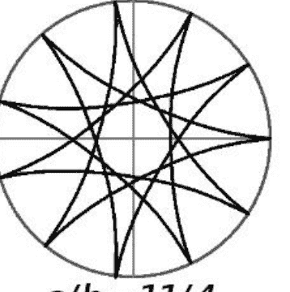

$a/b = 7/2$

$a/b = 9/2$

$a/b = 11/4$

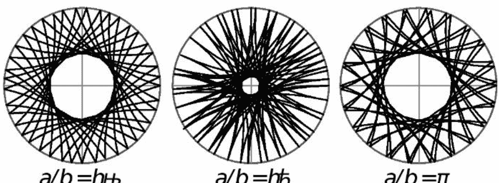

图 14-10. 使用不同 *a* 和 *b* 值配置的内摆线曲线。

为了设计不同的轮辋方案，我们建议使用内摆线曲线，基于所学概念来建模有用且有趣的轮辋。

### 让我们来建模一个轮辋

轮辋将分两步进行建模：

- 第一步，我们将根据方程 14-9 建模*轮辋主体*曲面（$s_1$）。注意：方程 14-9 中描述 $u_f$ 和 $v_f$ 的表达式类似于内摆线曲线的表达式（见方程 14-8）。唯一的区别是方程 14-9 额外包含了参数 $v_b$，它建模的是一个内摆线带而非内摆线曲线；因此，参数 $v_b$ 定义了内摆线带的宽度。方程 14-9 中的*最终网格*（$u_f$，$v_f$）将具有内摆线带边界。方程 14-9 中描述 $x$、$y$ 和 $z$ 轴的表达式类似于第 10.2 节（方程 10-4）中早期建模的双曲屋顶。因此，方程 14-9 中的 $x$、$y$ 和 $z$ 轴将具有双曲形状的曲面。
- 第二步，我们将根据方程 14-9 建模*轮辋环*曲面（$s_2$）。注意：方程 14-9 中描述 $x_r$、$y_r$ 和 $z_r$ 轴的表达式类似于第 12.2 节（方程 12-1）中早期学习的基于参数半径的旋转曲面，其中半径 $r$ 是常数（$r = a$），且*曲面轮廓*是 $x$-$y$ 平面上的圆周（$x_r = r \cos(u_r)$ 和 $y_r = r \sin(u_r)$）。因此，*轮辋环*曲面（$s_2$）将是一个垂直圆柱体。

```
方程 14-9

$a = 3$
$b = 1.25$

$s_1$:
$u_f = v_b ((a - b) \cos(u_b) + b \cos((a - b) u_b / b))$
$v_f = v_b ((a - b) \sin(u_b) - b \sin((a - b) u_b / b))$
$x = u_f$
$y = v_f$
$z = -(1 - x^2)(1 - y^2)/10$

$s_2$:
$r = a$
$x_r = r \cos(u_r)$
$y_r = r \sin(u_r)$
$z_r = v_r$

; 其中 $u_b = 0...10\pi$, $v_b = 0.65...1$
; 其中 $u_r = 0...2\pi$, $v_r = -0.8...0.8$
```

以下代码对轮辋模型进行建模。

- 第 1 和第 2 行导入库。
- 在第 3 行，我们从 *plotly* 模块导入 *make_subplots* 包。导入 *make_subplots* 包的目的是在单个图形中绘制多个曲面。
- 第 4 和第 5 行定义参数 $u_b$ 和 $v_b$。
- 第 6 行根据参数（$u_b$ 和 $v_b$）定义*基础网格*（$U_b$ 和 $V_b$）。
- 第 7 和第 8 行通过 $a$ 和 $b$ 值定义内摆线曲线配置。
- 第 9 和第 10 行根据参数数组（$U_b$ 和 $V_b$）定义*最终网格*（$U_f$ 和 $V_f$）。
- 第 11 和第 12 行将 $x$ 和 $y$ 轴定义为*最终网格*（$U_f$ 和 $V_f$）。
- 第 13 行将 $z$ 轴定义为 $z = f(x,y)$。
- 在第 14 行，我们使用曲面子图创建一个图形。
- 在第 15 和第 16 行，我们在子图中添加*轮辋主体*曲面（$s_1$）。
- 第 17 和第 18 行定义*轮辋环*的参数（$u_r$ 和 $v_r$）。
- 第 19 行根据参数（$u_r$ 和 $v_r$）定义*轮辋环*的网格（$U_r$ 和 $V_r$）。
- 第 20 行定义*轮辋环*的半径（$r$）。
- 第 21 和第 22 行将 $x$-$y$ 平面上的曲线定义为参数数组 $U_r$ 的函数。
- 第 23 行将 $z$ 轴定义为轮辋环拉伸曲面的高度，作为参数数组 $V_r$ 的函数。
- 第 24 至 27 行在子图中添加并设置*轮辋环*曲面（$s_2$）（执行结果见图 14-11）。

### 代码与执行

```python
import numpy as np
import plotly.graph_objects as go
from plotly.subplots import make_subplots
ub = np.linspace(0,10*np.pi,200)
vb = np.linspace(0.65,1,200)
Ub,Vb = np.meshgrid(ub,vb)
a = 3
b = 1.25
Uf = Vb * ((a-b)*np.cos(Ub) + b*np.cos((a-b)*Ub/b))
Vf = Vb * ((a-b)*np.sin(Ub) - b*np.sin((a-b)*Ub/b))
X = Uf
Y = Vf
Z = -(1-X**2)*(1-Y**2)/10
fig = make_subplots(rows=1, cols=1, specs=[[{'type': 'surface'}]])
fig.add_trace(go.Surface(x=X,y=Y,z=Z,opacity=1,colorscale = 'hot', showscale=False,
    contours=dict(x=dict(show=True),y=dict(show=True), z=dict(show=False))),row=1,col=1)
ur = np.linspace(0,2*np.pi,200)
```

## 14.5. 练习

E14.1. 在三维空间中绘制并匹配以下参数曲面（使用显式表示法）与对应的图形。

### 方程 E14-1

```
s:
u_f = u_b
v_f = v_b + v_b |u_b|
x = -v_f
z = u_f
y = x sin(5x) sin(7z)

; 其中 u_b = -π/2...π/2, v_b = 0...2π
```

**注意：** 为更好地可视化模型，请将坐标轴图形的*宽高比*设置为：x = 2, y = 0.3, z = 1。

### 方程 E14-2

```
s:
r = (5 v_b + 3 cos(sin(6 u_b)))/20
u_f = 5 r (2 cos(u_b) + cos(2 u_b))
v_f = 5 r (2 sin(u_b) - sin(2 u_b))
x = u_f
y = v_f
z = -(x^2 + y^2)/10

; 其中 u_b = 0...2π, v_b = 0...1
```

### 方程 E14-3

```
s:
r = v_b + 3 cos(3 sin(3 u_b))
u_f = r sin(u_b)
v_f = r cos(u_b)
x = u_f
y = v_f
z = √(x^2 + y^3)

; 其中 u_b = -π...π, v_b = 0...π/3
```

### 方程 E14-4

```
s:
r = v_b + cos(3 sin(1.5 u_b))
u_f = r sin^3(u_b)
v_f = r cos^3(u_b)
x = u_f
y = -v_f
z = cos(1.5 x) + cos(y)

; 其中 u_b = 0...2π, v_b = π/3...2π
```

**注意：** 为更好地可视化模型，请将坐标轴图形的*宽高比*设置为：x = 1, y = 1, z = 0.1。

E14.2. 在三维空间中绘制并匹配以下参数曲面（使用隐式表示法）与对应的图形。

### 方程 E14-5

```
s:
r = v_b + cos(4 sin(5 u_b))
u_f = r cos(u_b)
v_f = r sin(u_b)
x = u_f cos(v_f)
y = u_f sin(v_f)
z = v_f

; 其中 u_b = -π/4...π/4, v_b = 0...2
```

### 方程 E14-6

```
s:
r_b = v_b + cos(4 sin(3 u_b))
u_f = r_b sin(u_b)
v_f = r_b cos(u_b)
r_f = √(1 - u_f^2) - π/5
x = r_f cos(v_f)
y = u_f
z = r_f sin(v_f)

; 其中 u_b = -π/4...π/4, v_b = 0...2
```

### 方程 E14-7

```
s:
r_b = v_b + 3 cos(3 sin(6 u_b))
u_f = r_b sin(u_b)/π
v_f = r_b cos(u_b)/π
r_f = 1
x = r_f cos(u_f) sin(v_f)
y = r_f sin(u_f) sin(v_f)
z = r_f cos(v_f)

; 其中 u_b = -π/2...π/2, v_b = 1.5...6
```

### 方程 E14-8

```
r_b = (v_b + 3 cos(3 sin(3 u_b)))/2
u_f = r_b sin^3(u_b)
v_f = r_b cos^3(u_b)
r_1 = 2
r_2 = 3
r_3 = 1
x = r_1 sin(v_f) cos(u_f)
y = r_2 sin(v_f) sin(u_f)
z = r_3 cos(v_f)

; 其中 u_b = 0...π, v_b = 0.3...5
```

## 总结

在本章中，我们学习了如何建模复杂曲面。此外，我们还学习了建模一些代表性曲面：

- 对于**星形**曲面，例如水面上的七角星（图 E14-3）、双曲抛物面上的五角星（图 E14-5）、球面上的六角星（图 14-7）、球面上的五角星（图 E14-5）、足球上的五角星（图 E14-7）以及螺旋星形（图 E14-8）。
- 对于环面上带孔的**圆盘**曲面（见图 14-9）。
- 对于**花朵**曲面（见图 E14-1）。
- 对于**旗帜**曲面（见图 E14-2）。
- 对于**蝠鲼**曲面（见图 E14-3）。
- 对于**屋顶**曲面（见图 E14-4）。
- 对于**轨道**曲面（见图 E14-6）。

在下一章中，我们将提供额外的资源，帮助你将模型部署到云端。

# 第15章 – 将模型部署到云端

自本书开始以来，我们已经涵盖了多个主题和模型。我们设计了从非常简单的曲线到复杂曲面的各种模型。有时你希望与朋友或同事分享这些模型。在本章中，我们将提供额外的资源，帮助你将模型部署到云端，并能够使用名为 *PythonAnywhere* 的免费平台与朋友分享。

接下来，我们将涵盖以下部分：

1.  *Dash* 简介。
2.  *PythonAnywhere* 简介。
3.  在云端部署 *Dash* 应用程序。

本章开发的代码位于 [https://github.com/PracticalBooks/Python-For-Geometric-Modeling/tree/main/Chapter-15](https://github.com/PracticalBooks/Python-For-Geometric-Modeling/tree/main/Chapter-15)。我们建议你通过独立开发代码来提升编码技能。如果遇到任何问题，可以参考仓库中的代码进行对比。

请记住，我们建议你为本书的每一章创建一个新的 Colab 文档。这将有助于你保持代码的组织性。

## 15.1. *Dash* 简介

*Dash* 是一个用于构建分析型 Web 应用程序的 Python 框架（[https://dash.plotly.com/](https://dash.plotly.com/)）。它特别适合创建交互式、数据驱动的仪表板。Dash 构建在 *Flask*、*Plotly* 和 *React* 之上，使开发者能够使用 Python 创建具有复杂交互式可视化的 Web 应用程序。

我们将使用 *Dash* 创建一个交互式 Web 应用程序，其中将展示我们的一个模型。

### 在 Colab 中运行 Dash 应用程序

要在 Colab 中运行 *Dash* 应用程序，我们需要安装 *Dash* 模块，然后创建一个 *Dash 应用程序*，最后运行代码。

要在 Colab 中安装 *Dash*，你必须编写并执行以下代码。

```
!pip install dash
```

然后，等待几分钟，你就会在 Colab 文档中安装好 *Dash*。

一旦 *Dash* 安装完成，我们需要创建一个 *Dash 应用程序*。本书并非关于 Web 应用程序，因此我们不会详细解释 *Dash 应用程序* 代码。以下代码展示了一个显示参数曲面的 *Dash 应用程序*。

- 第1行在 Colab 中安装 Dash。
- 第2行导入一些 Dash 库和一个 HTML 库。
- 第3和第4行导入 plotly 和 numpy 库。
- 第5行定义一个新的 Dash 应用程序。
- 第7到18行指定、定义并绘制模型。
- 第20到22行定义应用程序布局，其中包含 HTML 代码和将在 Web 应用程序中显示的信息。
- 第23行运行 Dash 应用程序（执行效果见图 15-1）。

### 代码与执行

```python
1. !pip install dash
2. from dash import Dash, html, dcc
3. import plotly.graph_objects as go
4. import numpy as np
5. app = Dash("Geometric Modeling - Web App")
6. 
7. u = np.linspace(0,2*np.pi,200)
8. v = np.linspace(0,np.pi,200)
9. U, V = np.meshgrid(u,v)
10. a = 5
11. b = 7
12. r = np.sin(a*U+b*V)
13. X = r * np.cos(U) * np.sin(V)
14. Y = r * np.cos(V)
15. Z = r * np.sin(U) * np.sin(V)
16. fig=go.Figure(go.Surface(x=X,y=Y,z=Z,opacity=1,colorscale = 'cividis', showscale=False,
17.     contours=dict(x=dict(show=True), y=dict(show=True), z = dict(show=True))))
18. fig.update_layout(scene = dict(aspectratio = dict(x=1.5, y=1.5, z=1.5)))
19. 
20. app.layout = html.Div([html.H3('Parametric Surface', style={'text-align': 'center'}),
21.     dcc.Graph(figure=fig),html.P(["© Python for Geometric Modeling - 2024"],
22.     style={'text-align': 'center'}),])
23. app.run()
```

### 参数曲面

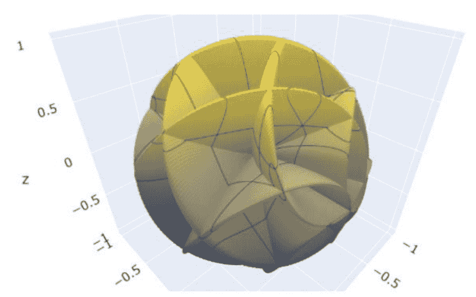

© Python for Geometric Modeling - 2024

图 15-1. 在 Colab 中运行 Dash 应用程序。

前面的代码作为 Web 应用程序在 Colab 中运行，但我们希望更进一步，将该应用程序部署到云端。为此，我们需要创建一个 *PythonAnywhere* 账户，并需要进行一些修改，以便将前面的代码作为云应用程序部署到 *PythonAnywhere*。

## 15.2. *PythonAnywhere* 简介

**PythonAnywhere** 是一个在线平台，提供基于云的环境，用于开发、运行和托管 Python 应用程序（[https://www.pythonanywhere.com/](https://www.pythonanywhere.com/)）。它允许用户直接在 Web 浏览器中编写、测试和部署 Python 代码，无需任何本地安装。*PythonAnywhere* 提供免费和付费计划，具有不同级别的资源和功能。

我们将使用 *PythonAnywhere* 来托管和部署我们在上一节中开发的 Dash 代码。现在，让我们通过以下链接并填写信息来创建一个 PythonAnywhere 免费入门账户：[https://www.pythonanywhere.com/registration/register/beginner/](https://www.pythonanywhere.com/registration/register/beginner/)（见图 15-2）。


### 创建您的账户

用户名：[输入框]

电子邮件：[输入框]

密码：[输入框]

确认密码：[输入框]

☐ 我同意条款和条件以及隐私和 Cookie 政策，并确认我已年满 13 岁。

[注册按钮]

我们承诺不会发送垃圾邮件或将您的详细信息传递给任何其他人。

图 15-2. *PythonAnywhere* “创建您的账户”页面。

完成上述信息后，您将拥有一个 *PythonAnywhere* 账户，接下来我们将使用它在云端托管和部署我们的 Dash 应用程序。

## 15.3. 在云端部署 Dash 应用程序

**重要提示：** 由于 *PythonAnywhere* 网站的更新，以下步骤和截图可能会略有不同。如果您在本节中遇到任何问题，请在 Google 上搜索解决方案或在本书仓库的“讨论区”留言。

接下来，我们将完成以下步骤，将我们的 *Dash* 应用程序部署到云端。

**步骤 1)** 让我们创建一个新的 Web 应用程序（见图 15-3）。转到 *PythonAnywhere* 的“Web”选项卡 ①，然后点击“添加新的 Web 应用程序” ②。


图 15-3. PythonAnywhere – 创建新的 Web 应用程序。

**步骤 2)** 让我们配置 Web 应用程序（见图 15-4）。首先，当被问及“您的 Web 应用程序的域名”时，点击“下一步” ①。其次，当被问及“选择 Python Web 框架”时，选择“Flask” ② 并点击“下一步” ③。第三，当被问及“选择 Python 版本”时，选择“Python 3.10” ④ 并点击“下一步” ⑤。最后，保持新的 Flask 项目路径不变，点击“下一步” ⑥。

### 您的 Web 应用程序的域名

您的账户不支持自定义域名，因此您的 PythonAnywhere Web 应用程序将位于 practicalbooks.pythonanywhere.com。

想要更改吗？立即升级！

否则，只需点击“下一步”继续。

### 选择 Python Web 框架

...或者选择“手动配置”以进行详细控制。

- Django
- web2py
- Flask
- Bottle
- 手动配置（包括 virtualenvs）

我们这里还应该有哪些其他框架？使用页面顶部的链接向我们发送一些反馈！

### 选择 Python 版本

- Python 3.7 (Flask 2.1.2)
- Python 3.8 (Flask 2.1.2)
- Python 3.9 (Flask 2.1.2)
- Python 3.10 (Flask 2.1.2)

注意：如果您想使用与默认版本不同的 Flask 版本，可以为您的 Web 应用程序使用 virtualenv。这里有说明。

### 快速启动新的 Flask 项目

输入您希望用于存放 Flask 应用程序的 Python 文件的路径。如果此文件已存在，其内容将被新应用覆盖。

路径

```
/home/practicalbooks/mysite/flask_app.py
```

图 15-4. *PythonAnywhere* – 配置 Web 应用程序。

**步骤 3)** 导航到“代码”部分，点击“转到目录” ①，指向“mysite”目录（见图 15-5）。

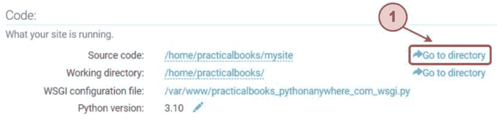

图 15-5. *PythonAnywhere* – 配置 Web 应用程序。

**步骤 4)** 点击“flask_app.py”文件的“编辑”按钮 ①（见图 15-6）。


图 15-6. *PythonAnywhere* – 编辑 flask_app 文件。

**步骤 5)** 用本章 15.1 节中开发的整个 *Dash* 应用程序代码 ① 替换文件内容（见图 15-7）。**请注意，您应该删除第一行“!pip install dash”和最后一行“app.run()”。然后，点击“保存” ②。**

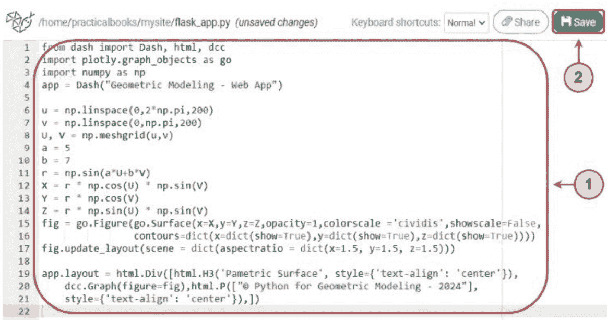

图 15-7. *PythonAnywhere* – 用 Dash 应用程序代码替换文件内容。

**步骤 6)** 返回 *PythonAnywhere* 的“Web”部分，点击 WSGI 文件 ①（见图 15-8）。

代码：

您的网站正在运行的内容。

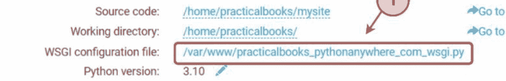

图 15-8. *PythonAnywhere* – 访问 WSGI 配置文件。

**步骤 7)** 修改 WSGI 配置文件。删除最后一行代码“*from flask_app import app as application # noqa*”，并在文件末尾添加以下两行代码 ①。然后，点击“保存” ②（见图 15-9）。

```python
Code
15 ...
16 from flask_app import app
17 application = app.server
```

```python
### This file contains the WSGI configuration required to serve up your
### web application at http://<your-username>.pythonanywhere.com/
### It works by setting the variable 'application' to a WSGI handler of some
### description.
#
### The below has been auto-generated for your Flask project

import sys

### add your project directory to the sys.path
project_home = '/home/practicalbooks/mysite'
if project_home not in sys.path:
    sys.path = [project_home] + sys.path

### import flask app but need to call it "application" for WSGI to work
from flask_app import app
application = app.server
```

图 15-8. *PythonAnywhere* – 编辑 WSGI 配置文件。

**步骤 8)** 返回 *PythonAnywhere* 的“Web”部分，点击“重新加载”按钮 ①，然后点击应用程序的链接 ②（见图 15-9）。

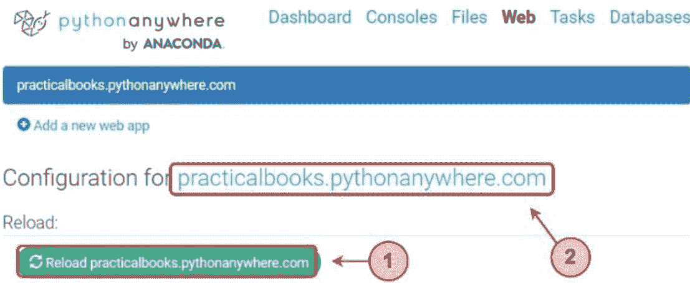

图 15-9. *PythonAnywhere* – 访问我们的 Web 应用程序。

前面的链接将打开一个新标签页，您可以在其中看到在云端运行的 *Dash 应用程序*。然后，您可以将该链接分享给您的朋友或同事（见图 15-10）。

### 参数曲面

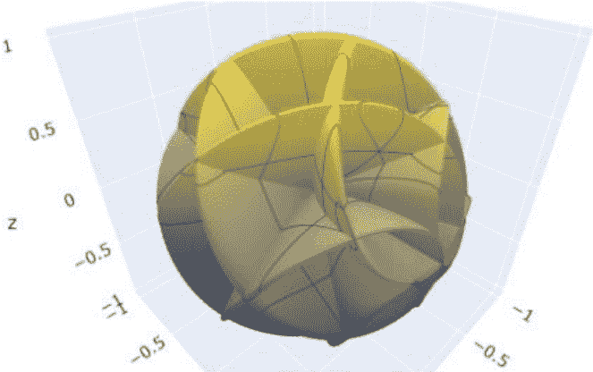

© Python for Geometric Modeling - 2024

图 15-10. 在云端运行的 *Dash 应用程序*。

## 15.4. 最终评论与未来书籍

本书的作者也是其他编程书籍的作者。例如，丹尼尔还写了另外八本关于网络编程的书籍。其中一本是**《Django 4 for the Impatient》**（2022年出版），它教授如何使用Python编写网络应用程序。您可以通过以下链接查看：[https://www.amazon.com/gp/product/B0B25BLDV4/](https://www.amazon.com/gp/product/B0B25BLDV4/)。

此外，本书的作者们一直在致力于开发新书。

### 评论

作为书籍作者，我们非常乐意收到读者的反馈。如果您愿意，可以写信至 [practicalbooksco@gmail.com](mailto:practicalbooksco@gmail.com)，告诉我们您喜欢和不喜欢这本书的哪些方面。我们非常重视读者的意见，并将以此为基础来开发本书的未来版本或其他书籍。

### 书评

最后，在结束本书之前，**我们恳请您在亚马逊上留下诚实的评论**。这对于潜在读者了解已阅读过本书的人的客观意见至关重要，他们可以基于这些信息决定是否购买本书。这个过程只会花费您几分钟时间，但对我们来说非常宝贵。

如果亚马逊不允许您提交评论，我们非常感谢您在社交媒体上提及本书。

“Hecho en Medellín” – “Made with Love”

# 第16章 – 练习解答

本章将介绍本书部分章节中提出的练习的解答。这些解答并不总是与您得出的答案完全一致，因为解决同一个几何模型练习可能有不同的方法。

本章开发的代码位于 [https://github.com/PracticalBooks/Python-For-Geometric-Modeling/tree/main/Chapter-16](https://github.com/PracticalBooks/Python-For-Geometric-Modeling/tree/main/Chapter-16)。

## 16.1. 第07章练习解答

**E.7.1.**
方程 E7-1 对应图 E7-2。

```python
import numpy as np
import plotly.express as px
u = np.linspace(-2*np.pi,2*np.pi,200)
x = u
y = 2*x*np.sin(x) + np.cos(5*x)
fig = px.line(x=x,y=y)
fig.update_traces(line_color='black',line_width=4)
fig.update_layout(title='x = (y^2 + 1) / (2y)',autosize=False)
plt.show()
```

方程 E7-2 对应图 E7-1。

**解答**

```python
import numpy as np
import plotly.express as px
u = np.linspace(0.2,5,50)
y = u
x = (y**2+1) / (2*y)
fig = px.line(x=x,y=y)
fig.update_traces(line_color='black',line_width=4)
fig.update_layout(title='x = (y^2 + 1) / (2y)',autosize=False)
plt.show()
```

**E.7.2.**

方程 E7-3 对应图 E7-6。

**解答**

```python
import numpy as np
import plotly.express as px
u = np.linspace(0,2*np.pi,200)
x = np.sin(2*u)
y = np.cos(3*u)
fig = px.line(x=x,y=y)
fig.update_traces(line_color='black',line_width=4)
fig.update_yaxes(scaleanchor="x",scaleratio=1)
plt.show()
```

方程 E7-4 对应图 E7-5。

**解答**

```python
import numpy as np
import plotly.express as px
u = np.linspace(0,2*np.pi,200)
r = 1 + 2*np.sin(3*u)
x = r * np.cos(u)
y = r * np.sin(u)
fig = px.line(x=x,y=y)
fig.update_traces(line_color='black',line_width=4)
fig.update_yaxes(scaleanchor="x",scaleratio=1)
plt.show()
```

方程 E7-5 对应图 E7-4。

**解答**

```python
import numpy as np
import plotly.express as px
u = np.linspace(0,6*np.pi,200)
A = 8
B = 3
x = (A-B) * np.cos(u) + B * np.cos((A-B)*u/B)
y = (A-B) * np.sin(u) - B * np.sin((A-B)*u/B)
fig = px.line(x=x,y=y)
fig.update_traces(line_color='black',line_width=4)
fig.update_yaxes(scaleanchor="x",scaleratio=1)
plt.show()
```

方程 E7-6 对应图 E7-3。

**解答**

```python
import numpy as np
import plotly.express as px
u = np.linspace(0,2*np.pi,1000)
x = 16*np.sin(u)**3
y = 13*np.cos(u)-5*np.cos(2*u)-2*np.cos(3*u)-np.cos(4*u)
fig = px.line(x=x,y=y)
fig.update_traces(line_color='black',line_width=4)
fig.update_yaxes(scaleanchor="x",scaleratio=1)
plt.show()
```

**E.7.3.**

E7.3.1. 参数化椭圆。

**解答**

```python
import numpy as np
import plotly.express as px
u = np.linspace(0,2*np.pi,200)
r1 = 2
r2 = 1
x = r1 * np.cos(u)
y = r2 * np.sin(u)
fig = px.line(x=x,y=y)
fig.update_traces(line_color='black',line_width=4)
fig.update_layout(title='ellipse',autosize=False)
plt.show()
```

**E7.3.2. 参数化摆线。**

**解答**

```python
import numpy as np
import plotly.express as px
u = np.linspace(0,6*np.pi,200)
r = 1
x = r * (u - np.sin(u))
y = r * (1 - np.cos(u))
fig = px.line(x=x,y=y)
fig.update_traces(line_color='black',line_width=4)
fig.update_yaxes(scaleanchor="x",scaleratio=1)
plt.show()
```

**E7.4.**

**E7.4.1. *狄奥克莱斯蔓叶线*。**

**解答**

```python
import numpy as np
import plotly.express as px
u = np.linspace(-np.pi/10,100*np.pi,10000)
x = 3*u / (1+u**3)
y = 3*u**2 /(1+u**3)
fig = px.line(x=x,y=y)
fig.update_traces(line_color='black',line_width=4)
fig.update_yaxes(scaleanchor="x",scaleratio=1)
plt.show()
```

**E7.4.2. *阿涅西女巫线*。**

**解答**

```python
import numpy as np
import plotly.express as px
u = np.linspace(-np.pi,np.pi,200)
x = u
y = 1 / (u**2 + 1)
fig = px.line(x=x,y=y)
fig.update_traces(line_color='black',line_width=4)
fig.update_yaxes(scaleanchor="x",scaleratio=1)
plt.show()
```

## 16.2. 第08章练习解答

**E.8.1.**

方程 E8-1 对应图 E8-1。

```python
import numpy as np
import plotly.express as px
u = np.linspace(0,np.pi,500)
r = 2
x = r * np.sin(u) * np.cos(16*u)
y = r * np.sin(u) * np.sin(16*u)
z = r * np.cos(u)
fig = px.line_3d(x=x,y=y,z=z)
fig.update_traces(line_color='black',line_width=8)
plt.show()
```

方程 E8-2 对应图 E8-4。

```python
import numpy as np
import plotly.express as px
u = np.linspace(0,2*np.pi,1000)
x = (4 + np.sin(20*u)) * np.cos(u)
y = (4 + np.sin(20*u)) * np.sin(u)
z = np.cos(20*u)
fig = px.line_3d(x=x,y=y,z=z)
fig.update_traces(line_color='black',line_width=7)
plt.show()
```

方程 E8-3 对应图 E8-3。

**解答**

```python
import numpy as np
import plotly.express as px
u = np.linspace(0,2*np.pi,500)
x = np.cos(u)**3
y = np.sin(u)**3
z = np.sin(2*u)
fig = px.line_3d(x=x,y=y,z=z)
fig.update_traces(line_color='black',line_width=7)
plt.show()
```

方程 E8-4 对应图 E8-2。

**解答**

```python
import numpy as np
import plotly.express as px
u = np.linspace(0,2*np.pi,500)
a = 2
b = 2
n = 6
x = a * np.cos(n*u) * np.cos(u)
y = a * np.cos(n*u) * np.sin(u)
z = b * np.cos(n*u)
fig = px.line_3d(x=x,y=y,z=z)
fig.update_traces(line_color='black',line_width=5)
plt.show()
```

**E.8.2.**

E8.2.1. *扭曲三次曲线*。

**解答**

```python
import numpy as np
import plotly.express as px
u = np.linspace(-10,10,100)
x = u
y = u**2
z = u**3
fig = px.line_3d(x=x,y=y,z=z)
fig.update_traces(line_color='black',line_width=9)
plt.show()
```

E8.2.2. *维维亚尼曲线*。

**解答**

```python
import numpy as np
import plotly.express as px
u = np.linspace(0,2*np.pi,100)
r = 1
x = r * np.cos(u)**2
y = r * np.cos(u) * np.sin(u)
z = r * np.sin(u)
fig = px.line_3d(x=x,y=y,z=z)
fig.update_traces(line_color='black',line_width=9)
plt.show()
```

E8.2.3. 螺旋线。

**解答**

```python
import numpy as np
import plotly.express as px
u = np.linspace(0,12*np.pi,500)
r = u
x = r * np.cos(u)
y = r * np.sin(u)
z = u
fig = px.line_3d(x=x,y=y,z=z)
fig.update_traces(line_color='black',line_width=9)
plt.show()
```

## 16.3. 第09章练习解答

**E.9.1.**

方程 E9-1 对应图 E9-6。

```python
import numpy as np
import matplotlib.pyplot as plt
u = np.linspace(0,2*np.pi,80)
v = np.linspace(0,1,10)
U,V = np.meshgrid(u,v)
r = V
X = r * np.cos(U)**3
Y = r * np.sin(U)**3
for row in range(len(v)-1):
    for col in range(len(u)-1):
        plt.fill([X[row,col],X[row+1,col],X[row+1,col+1],X[row,col+1]],
                 [Y[row,col],Y[row+1,col],Y[row+1,col+1],Y[row,col+1]],
                 color='hotpink',alpha=.5)
plt.show()
```

方程 E9-2 对应图 E9-3。

**解答**

## 16.4. 第10章习题解答

### E.10.1.

方程 E10-1 对应图 E10-4。

```python
import numpy as np
import plotly.graph_objects as go
u = np.linspace(-5,5,50)
v = np.linspace(-5,5,50)
U,V = np.meshgrid(u,v)
X = U
Y = V
Z = X**2-Y**2
fig=go.Figure(go.Surface(x=X, y=Y, z=Z,opacity=1,colorscale = 'blues', showscale=False,
        contours=dict(x=dict(show=True), y=dict(show=True), z = dict(show=False))))
fig.update_layout(title='Hyperbolic paraboloid',autosize=False)
plt.show()
```

方程 E10-2 对应图 E10-2。

```python
import numpy as np
import plotly.graph_objects as go
u = np.linspace(-5,5,50)
v = np.linspace(-5,5,50)
U,V = np.meshgrid(u,v)
X = U
Y = V
Z = -(X**2-Y**2)**2
fig=go.Figure(go.Surface(x=X, y=Y, z=Z,opacity=1,colorscale = 'picnic', showscale=False,
        contours=dict(x=dict(show=True), y=dict(show=True), z = dict(show=False))))
fig.update_layout(title='Roof',autosize=False)
plt.show()
```

方程 E10-3 对应图 E10-3。

```python
import numpy as np
import plotly.graph_objects as go
u = np.linspace(-3,3,50)
v = np.linspace(-3,3,50)
U,V = np.meshgrid(u,v)
X = U
Y = V
Z = np.sin(X*Y)
fig=go.Figure(go.Surface(x=X, y=Y, z=Z,opacity=1,colorscale = 'burg', showscale=False,
contours=dict(x=dict(show=True), y=dict(show=True), z =dict(show=False))))
fig.update_layout(title='Flower',autosize=False)
plt.show()
```

方程 E10-4 对应图 E10-1。

```python
import numpy as np
import plotly.graph_objects as go
u = np.linspace(np.pi,6*np.pi,50)
v = np.linspace(np.pi,6*np.pi,50)
U,V = np.meshgrid(u,v)
X = U
Y = V
Z = X * np.sin(2*X) * np.sin(Y)
fig=go.Figure(go.Surface(x=X,y=Y,z=Z,opacity=1,colorscale = 'blues', showscale=False,
    contours=dict(x=dict(show=True), y=dict(show=True), z = dict(show=False))))
fig.update_layout(scene = dict(aspectratio =dict(x=1, y=1, z=.3)))
plt.show()
```

### E.10.2.

方程 E10-5 对应图 E10-6。

```python
import numpy as np
import plotly.graph_objects as go
u = np.linspace(0,2*np.pi,50)
v = np.linspace(-2*np.pi,2*np.pi,50)
U,V = np.meshgrid(u,v)
X = np.cos(U)
Y = np.sin(V)
Z = np.sin(np.abs(U) + np.abs(V))
fig=go.Figure(go.Surface(x=X,y=Y,z=Z,opacity=1,colorscale = 'hsv', showscale=False,
    contours=dict(x=dict(show=True), y=dict(show=True), z = dict(show=False))))
fig.update_layout(title='star-shaped box',autosize=False)
plt.show()
```

方程 E10-6 对应图 E10-7。

```python
import numpy as np
import plotly.graph_objects as go
u = np.linspace(0,2*np.pi,50)
v = np.linspace(0,np.pi,50)
U, V = np.meshgrid(u,v)
r = 1 + (1/5)*np.sin(5*U)*np.sin(4*V)
X = r * np.sin(V) * np.cos(U)
Y = r * np.sin(V) * np.sin(U)
Z = r * np.cos(V)
fig=go.Figure(go.Surface(x=X,y=Y,z=Z,opacity=1,colorscale = 'earth', showscale=False,
    contours=dict(x=dict(show=True), y=dict(show=True), z=dict(show=False))))
fig.update_layout(title='Orbit',autosize=False)
plt.show()
```

方程 E10-7 对应图 E10-8。

```python
import numpy as np
import plotly.graph_objects as go
u = np.linspace(0,4*np.pi,100)
v = np.linspace(0,2*np.pi,50)
U, V = np.meshgrid(u,v)
X = (2 + np.sin(V)) * np.cos(U)
Y = (2 + np.sin(V)) * np.sin(U)
Z = U + np.cos(V)
fig=go.Figure(go.Surface(x=X,y=Y,z=Z,opacity=1,colorscale = 'rainbow', showscale=False,
    contours=dict(x=dict(show=True), y=dict(show=True), z = dict(show=False))))
fig.update_layout(title='helicoid',autosize=False)
plt.show()
```

方程 E10-8 对应图 E10-5。

```python
import numpy as np
import plotly.graph_objects as go
u = np.linspace(np.pi/3,11*np.pi/15,100)
v = np.linspace(0,2*np.pi,50)
U, V = np.meshgrid(u,v)
X = (1-U)**2 * (2+np.cos(V)) * np.cos(8*np.pi*U)
Y = (1-U)**2 * (2+np.cos(V)) * np.sin(8*np.pi*U)
Z = 2*U**2 + (1-U)*np.sin(V)
fig=go.Figure(go.Surface(x=X,y=Y,z=Z,opacity=1,colorscale = 'spectral', showscale=False,
    contours=dict(x=dict(show=True), y=dict(show=True), z = dict(show=False))))
fig.update_layout(title='Seashell',autosize=False)
plt.show()
```

方程 E10-9 对应图 E10-9。

```python
import numpy as np
import plotly.graph_objects as go
u = np.linspace(0,2*np.pi,80)
v = np.linspace(0,np.pi,50)
U, V = np.meshgrid(u,v)
r = 2 + np.sin(5*u)
X = r * np.cos(U) * np.sin(V)
Y = V
Z = r * np.sin(U) * np.sin(V)
fig=go.Figure(go.Surface(x=X,y=Y,z=Z,opacity=1,colorscale = 'ylorrd', showscale=False,
    contours=dict(x=dict(show=True), y=dict(show=True), z = dict(show=True))))
fig.update_layout(title='3d star',autosize=False)
plt.show()
```

方程 E10-10 对应图 E10-10。

```python
import numpy as np
import plotly.graph_objects as go
u = np.linspace(0,.3183*np.pi,150)
v = np.linspace(0,.3183*np.pi,50)
U, V = np.meshgrid(u,v)
Ro = 4
```

## 16.5. 第11章习题解答

### E.11.1.

方程 E11-1 对应图 E11-3。

**解答**

```python
import numpy as np
import plotly.graph_objects as go

u = np.linspace(0, 8 * np.pi, 1000)
v = np.linspace(0, 1, 10)
U, V = np.meshgrid(u, v)
X = U + np.sin(U)
Y = 1 - np.cos(U)
Z = V
fig = go.Figure(go.Surface(x=X, y=Y, z=Z, opacity=1, colorscale='algae', showscale=False,
    contours=dict(x=dict(show=True), y=dict(show=True), z=dict(show=True))))
fig.update_layout(scene=dict(aspectratio=dict(x=2, y=1, z=.5)))
plt.show()
```

方程 E11-2 对应图 E11-1。

**解答**

```python
import numpy as np
import plotly.graph_objects as go

u = np.linspace(0, 8 * np.pi, 1000)
v = np.linspace(0, 1, 10)
U, V = np.meshgrid(u, v)
r = 1
b = 2
X = r * U + b * np.sin(U)
Y = V + np.cos(U)
Z = r - b * np.cos(U)
fig = go.Figure(go.Surface(x=X, y=Y, z=Z, opacity=1, colorscale='curl', showscale=False,
    contours=dict(x=dict(show=True), y=dict(show=True), z=dict(show=True))))
fig.update_layout(scene=dict(aspectratio=dict(x=2, y=.5, z=.5)))
plt.show()
```

方程 E11-3 对应图 E11-4。

**解答**

```python
import numpy as np
import plotly.graph_objects as go

u = np.linspace(0, 2 * np.pi, 1000)
v = np.linspace(0, 1, 10)
U, V = np.meshgrid(u, v)
r = 1
X = V
Y = r * np.cos(U)**3
Z = r * np.sin(U)**3
fig = go.Figure(go.Surface(x=X, y=Y, z=Z, opacity=1, colorscale='curl', showscale=False,
    contours=dict(x=dict(show=True), y=dict(show=True), z=dict(show=True))))
fig.update_layout(title='Hypocycloid of four cusps or astroid', autosize=False)
plt.show()
```

方程 E11-4 对应图 E11-2。

**解答**

```python
import numpy as np
import plotly.graph_objects as go

u = np.linspace(0, 8 * np.pi, 1000)
v = np.linspace(0, 1, 10)
U, V = np.meshgrid(u, v)
r = 1
b = 2
X = r * U + b * np.sin(U)
Y = V
Z = r - b * np.cos(U)
fig = go.Figure(go.Surface(x=X, y=Y, z=Z, opacity=1, colorscale='curl', showscale=False,
    contours=dict(x=dict(show=True), y=dict(show=True), z=dict(show=True))))
fig.update_layout(scene=dict(aspectratio=dict(x=2, y=.5, z=.5)))
plt.show()
```

### E.11.2.

方程 E11-5 对应图 E11-8。

**解答**

```python
import numpy as np
import plotly.graph_objects as go

u = np.linspace(0, 2 * np.pi, 1000)
v = np.linspace(0, 1, 10)
U, V = np.meshgrid(u, v)
r = np.cos(2 * U)
X = r * np.cos(U)
Y = r * np.sin(U)
Z = V**2 + np.sin(U)
fig = go.Figure(go.Surface(x=X, y=Y, z=Z, opacity=1, colorscale='magma', showscale=False,
    contours=dict(x=dict(show=True), y=dict(show=True), z=dict(show=True))))
fig.update_layout(title='Polar-shape band', autosize=False)
plt.show()
```

方程 E11-6 对应图 E11-10。

**解答**

```python
import numpy as np
import plotly.graph_objects as go

u = np.linspace(0, 4 * np.pi, 1000)
v = np.linspace(0, 1, 10)
U, V = np.meshgrid(u, v)
r = np.sin(3.5 * U)**2 + np.cos(3.5 * U)**4
X = r * np.cos(U)
Y = V**2 + np.sin(U)
Z = r * np.sin(U)
fig = go.Figure(go.Surface(x=X, y=Y, z=Z, opacity=1, colorscale='earth', showscale=False,
    contours=dict(x=dict(show=True), y=dict(show=True), z=dict(show=True))))
fig.update_layout(title='Polar-shape band', autosize=False)
plt.show()
```

方程 E11-7 对应图 E11-6。

**解答**

```python
import numpy as np
import plotly.graph_objects as go

u = np.linspace(0, 2 * np.pi, 1000)
v = np.linspace(-1, 1, 10)
U, V = np.meshgrid(u, v)
r = np.cos(2 * U)
X = V + (np.cos(U) * np.sin(U))
Y = r * np.cos(U)
Z = r * np.sin(U)
fig = go.Figure(go.Surface(x=X, y=Y, z=Z, opacity=1, colorscale='bluered', showscale=False,
    contours=dict(x=dict(show=True), y=dict(show=True), z=dict(show=True))))
fig.update_layout(title='Polar-shape band', autosize=False)
plt.show()
```

方程 E11-8 对应图 E11-5。

**解答**

```python
import numpy as np
import plotly.graph_objects as go

u = np.linspace(0, np.pi, 1000)
v = np.linspace(-.25, .25, 10)
U, V = np.meshgrid(u, v)
r = 2
X = r * np.sin(U) * np.cos(16 * U) + V
Y = r * np.sin(U) * np.sin(16 * U) + V
Z = r * np.cos(U)
fig = go.Figure(go.Surface(x=X, y=Y, z=Z, opacity=1, colorscale='rainbow', showscale=False,
    contours=dict(x=dict(show=True), y=dict(show=True), z=dict(show=True))))
fig.update_layout(title='Sphere coil band', autosize=False)
plt.show()
```

方程 E11-9 对应图 E11-7。

**解答**

```python
import numpy as np
import plotly.graph_objects as go

u = np.linspace(0, 2 * np.pi, 1000)
v = np.linspace(-.5, .5, 10)
U, V = np.meshgrid(u, v)
a = 2
b = 2
n = 6
X = a * np.cos(n * U) * np.cos(U)
Y = b * np.cos(n * U) + V
Z = a * np.cos(n * U) * np.sin(U)
fig = go.Figure(go.Surface(x=X, y=Y, z=Z, opacity=1, colorscale='deep', showscale=False,
    contours=dict(x=dict(show=True), y=dict(show=True), z=dict(show=True))))
fig.update_layout(title='Conic flower band', autosize=False)
plt.show()
```

方程 E11-10 对应图 E11-9。

**解答**

```python
import numpy as np
import plotly.graph_objects as go

u = np.linspace(0, 2 * np.pi, 1000)
v = np.linspace(0, 1, 10)
U, V = np.meshgrid(u, v)
r = 1
b = 5
X = b * np.sin(U) - r * np.sin(U)
Y = V * np.cos(U)**2
Z = b * np.cos(U) - r * np.cos(5 * U)
fig = go.Figure(go.Surface(x=X, y=Y, z=Z, opacity=1, colorscale='redor', showscale=False,
    contours=dict(x=dict(show=True), y=dict(show=True), z=dict(show=True))))
fig.update_layout(title='Epicycloid band', autosize=False)
plt.show()
```

## 16.6. 第12章习题解答

### E.12.1.

方程 E12-1 对应图 E12-3。

**解答**

```python
import numpy as np
import plotly.graph_objects as go

u = np.linspace(1, 5, 50)
v = np.linspace(0, 2 * np.pi, 50)
U, V = np.meshgrid(u, v)
r = 1
X = U
Y = r * np.cos(V)
Z = r * np.sin(V)
fig = go.Figure(go.Surface(x=X, y=Y, z=Z, opacity=1, colorscale='ylgnbu', showscale=False,
    contours=dict(x=dict(show=True), y=dict(show=True), z=dict(show=True))))
fig.update_layout(title='Cylinder profile', autosize=False)
plt.show()
```

方程 E12-2 对应图 E12-6。

**解答**

```python
import numpy as np
import plotly.graph_objects as go

u = np.linspace(-1, 1, 50)
v = np.linspace(0, 2 * np.pi, 50)
U, V = np.meshgrid(u, v)
r = U
X = U
Y = r * np.cos(V)
Z = r * np.sin(V)
fig = go.Figure(go.Surface(x=X, y=Y, z=Z, opacity=1, colorscale='brbg', showscale=False,
    contours=dict(x=dict(show=True), y=dict(show=True), z=dict(show=True))))
fig.update_layout(title='Cone profile', autosize=False)
plt.show()
```

方程 E12-3 对应图 E12-2。

**解答**

```python
import numpy as np
import plotly.graph_objects as go

u = np.linspace(0.2, 5, 50)
v = np.linspace(0, 2 * np.pi, 50)
U, V = np.meshgrid(u, v)
r = (U**2 + 1) / (2 * U)
X = r * np.cos(V)
Y = r * np.sin(V)
Z = U
fig = go.Figure(go.Surface(x=X, y=Y, z=Z, opacity=1, colorscale='thermal', showscale=False,
    contours=dict(x=dict(show=True), y=dict(show=True), z=dict(show=True))))
fig.update_layout(title='Polynomial curve profile', autosize=False)
plt.show()
```

方程 E12-4 对应图 E12-5。

**解答**

```python
import numpy as np
import plotly.graph_objects as go

u = np.linspace(0, 4, 50)
v = np.linspace(-3 * np.pi / 2, 0, 50)
U, V = np.meshgrid(u, v)
r = np.sin(U) * np.exp(-U) + 0.1
X = r * np.sin(V)
Y = r * np.cos(V)
Z = U
fig = go.Figure(go.Surface(x=X, y=Y, z=Z, opacity=1, colorscale='brwnyl', showscale=False,
    contours=dict(x=dict(show=True), y=dict(show=True), z=dict(show=True))))
fig.update_layout(title='Polynomial curve profile', autosize=False)
plt.show()
```

方程 E12-5 对应图 E12-1。

**解答**

```python
import numpy as np
import plotly.graph_objects as go

R1 = 1
amp = 0.2
Freq = 6
Turns = 1
theta = U * 2 * np.pi
phi = V * 2 * np.pi
r = R1 + amp * np.sin(Freq * phi)
ang = phi + 2 * np.pi * np.sin(Turns + theta)
tx = r * np.cos(ang) + Ro
X = tx * np.cos(theta)
Y = tx * np.sin(theta)
Z = r * np.sin(ang)
fig = go.Figure(go.Surface(x=X, y=Y, z=Z, opacity=1, colorscale='ylorrd', showscale=False,
    contours=dict(x=dict(show=True), y=dict(show=True), z=dict(show=False))))
fig.update_layout(scene=dict(aspectratio=dict(x=1, y=1, z=.3)))
plt.show()
```

## 16.7. 第13章习题解答

### E.12.1.

方程 E12-6 与图 E12-4 相匹配。

# 解答

```python
import numpy as np
import plotly.graph_objects as go
u = np.linspace(0,2*np.pi,50)
v = np.linspace(0,np.pi,50)
U,V = np.meshgrid(u,v)
a = 4
r = a*np.sin(U) + (a/2) * np.sin(2*U)
X = r * np.cos(V)
Y = r * np.sin(V)
Z = -np.cos(U)
fig=go.Figure(go.Surface(x=X,y=Y,z=Z,opacity=1,colorscale = 'blues', showscale=False,
    contours=dict(x=dict(show=True), y=dict(show=True), z = dict(show=True))))
plt.show()
```

### E.12.2.

方程 E12-7 与图 E12-10 相匹配。

# 解答

```python
import numpy as np
import plotly.graph_objects as go
u = np.linspace(1,5,50)
v = np.linspace(-3*np.pi/2,0,50)
U, V = np.meshgrid(u,v)
r = np.log10(U)*np.sin(U**2)+1
X = U
Y = r * np.cos(V)
Z = r * np.sin(V)
fig=go.Figure(go.Surface(x=X,y=Y,z=Z,opacity=1,colorscale = 'amp', showscale=False,
    contours=dict(x=dict(show=True), y=dict(show=True), z = dict(show=True))))
fig.update_layout(title='Sinusoidal profile',autosize=False)
plt.show()
```

### E.12.3.

方程 E12-8 与图 E12-8 相匹配。

# 解答

```python
import numpy as np
import plotly.graph_objects as go
u = np.linspace(0,2*np.pi,50)
v = np.linspace(0,2*np.pi,50)
U, V = np.meshgrid(u,v)
R = 2
r = 1
X = (R + r*np.cos(U)) * np.cos(V)
Y = (R + r*np.cos(U)) * np.sin(V)
Z = r * np.sin(U)
fig=go.Figure(go.Surface(x=X,y=Y,z=Z,opacity=1,colorscale = 'red', showscale=False,
    contours=dict(x=dict(show=True), y=dict(show=True), z = dict(show=True))))
fig.update_layout(title='Torus',autosize=False)
plt.show()
```

### E.12.4.

方程 E12-9 与图 E12-8 相匹配。

# 解答

```python
import numpy as np
import plotly.graph_objects as go
u = np.linspace(0,2*np.pi,100)
v = np.linspace(-3*np.pi/2,0,20)
U, V = np.meshgrid(u,v)
R = 1.5
r = 1
X = (R+(r * np.cos(U)**3)) * np.cos(V)
Y = (R+(r * np.cos(U)**3)) * np.sin(V)
Z = r * np.sin(U)**3
fig=go.Figure(go.Surface(x=X,y=Y,z=Z,opacity=1,colorscale = 'aggrnyl', showscale=False,
    contours=dict(x=dict(show=True), y=dict(show=True), z = dict(show=True))))
fig.update_layout(title='Ring with star-shape cross section',autosize=False)
plt.show()
```

### E.12.5.

方程 E12-10 与图 E12-7 相匹配。

# 解答

```python
import numpy as np
import plotly.graph_objects as go
u = np.linspace(0,2*np.pi,100)
v = np.linspace(-3*np.pi/2,0,20)
U, V = np.meshgrid(u,v)
R = 1.3
r = np.sin(3*U)
X = (R+(r * np.cos(U))) * np.cos(V)
Y = (R+(r * np.cos(U))) * np.sin(V)
Z = r * np.sin(U)
fig=go.Figure(go.Surface(x=X,y=Y,z=Z,opacity=1,colorscale = 'jet', showscale=False,
    contours=dict(x=dict(show=True), y=dict(show=True), z = dict(show=True))))
fig.update_layout(title='Ring with star-shape cross section',autosize=False)
plt.show()
```

### E.12.6.

方程 E12-11 与图 E12-9 相匹配。

# 解答

```python
import numpy as np
import plotly.graph_objects as go
u = np.linspace(0,2*np.pi,100)
v = np.linspace(-3*np.pi/2,0,20)
U, V = np.meshgrid(u,v)
R = 8
r = np.cos(5*U) + 4
X = (R+(r * np.cos(U)**3)) * np.cos(V)
Y = (R+(r * np.cos(U)**3)) * np.sin(V)
Z = r * np.sin(U)**3
fig=go.Figure(go.Surface(x=X,y=Y,z=Z,opacity=1,colorscale = 'matter', showscale=False,
    contours=dict(x=dict(show=True), y=dict(show=True), z = dict(show=True))))
fig.update_layout(title='Ring with star-shape cross section',autosize=False)
plt.show()
```

### E.13.1.

方程 E13-1 与图 E13-4 相匹配。

# 解答

```python
import numpy as np
import plotly.graph_objects as go
u = np.linspace(-6*np.pi,6*np.pi,50)
v = np.linspace(0.0001,np.pi,50)
U, V = np.meshgrid(u,v)
r = U
X = r * np.cos(V)
Y = r * np.sin(V)
Z = np.sin(X)*np.sin(Y)/(X*Y)
fig=go.Figure(go.Surface(x=X,y=Y,z=Z,opacity=1,colorscale = 'edge', showscale=False,
    contours=dict(x=dict(show=True), y=dict(show=True), z = dict(show=True))))
fig.update_layout(scene = dict(aspectratio = dict(x=1, y=1, z=1)))
plt.show()
```

### E.13.2.

方程 E13-2 与图 E13-6 相匹配。

# 解答

```python
import numpy as np
import plotly.graph_objects as go
u = np.linspace(0,np.pi/2,50)
v = np.linspace(0,2*np.pi,50)
U,V = np.meshgrid(u,v)
r = U
X = r * np.cos(V)
Y = r * np.sin(V)
Z = r**2
fig=go.Figure(go.Surface(x=X,y=Y,z=Z,opacity=1,colorscale = 'agsunset', showscale=False,
    contours=dict(x=dict(show=True), y=dict(show=True), z = dict(show=True))))
fig.update_layout(scene = dict(aspectratio = dict(x=1, y=1, z=1)))
plt.show()
```

### E.13.3.

方程 E13-3 与图 E13-2 相匹配。

# 解答

```python
import numpy as np
import plotly.graph_objects as go
from plotly.subplots import make_subplots
u = np.linspace(0,np.pi/2,50)
v = np.linspace(0,2*np.pi,50)
U,V = np.meshgrid(u,v)
r = U
X = r * np.cos(V)
Y = r * np.sin(V)
Z = r**2 - 2*Y**2
fig=go.Figure(go.Surface(x=X,y=Y,z=Z,opacity=1,colorscale = 'oranges', showscale=False,
    contours=dict(x=dict(show=True), y=dict(show=True), z = dict(show=True))))
fig.update_layout(scene = dict(aspectratio = dict(x=1, y=1, z=.4)))
plt.show()
```

### E.13.4.

方程 E13-4 与图 E13-1 相匹配。

# 解答

```python
import numpy as np
import plotly.graph_objects as go
u = np.linspace(0,8*np.pi,100)
v = np.linspace(0,2*np.pi,100)
U, V = np.meshgrid(u,v)
r = U
X = r * np.cos(V)
Y = r * np.sin(V)
Z = -U**3/40 + 20* np.sin(U) + 50*np.sin(6*V)
fig=go.Figure(go.Surface(x=X,y=Y,z=Z,opacity=1,colorscale = 'tropic', showscale=False,
    contours=dict(x=dict(show=True), y=dict(show=True), z = dict(show=True))))
fig.update_layout(scene = dict(aspectratio = dict(x=1, y=1, z=1)))
plt.show()
```

### E.13.5.

方程 E13-5 与图 E13-3 相匹配。

# 解答

```python
import numpy as np
import plotly.graph_objects as go
u = np.linspace(0,8*np.pi,100)
v = np.linspace(0,2*np.pi,100)
U, V = np.meshgrid(u,v)
A = 8
B = 5
C = 1
r = U
X = r * np.cos(V)
Y = r * np.sin(V)
Z = 0.05*r**2 + A*np.cos(B*V + C*U)
fig=go.Figure(go.Surface(x=X,y=Y,z=Z,opacity=1,colorscale = 'ice', showscale=False,
    contours=dict(x=dict(show=True), y=dict(show=True), z = dict(show=True))))
fig.update_layout(scene = dict(aspectratio = dict(x=1, y=1, z=.5)))
plt.show()
```

### E.13.6.

方程 E13-6 与图 E13-5 相匹配。

# 解答

```python
import numpy as np
import plotly.graph_objects as go
u = np.linspace(0,60,100)
v = np.linspace(0,2*np.pi,50)
U, V = np.meshgrid(u,v)
r = U**3
X = r * np.cos(V)
Y = r * np.sin(V)
Z = np.cos(U) * Y * X
fig=go.Figure(go.Surface(x=X,y=Y,z=Z,opacity=1,colorscale = 'blues', showscale=False,
    contours=dict(x=dict(show=True), y=dict(show=True), z = dict(show=True))))
fig.update_layout(scene = dict(aspectratio = dict(x=1, y=1, z=.4)))
plt.show()
```

### E.13.7.

方程 E13-7 与图 E13-9 相匹配。

# 解答

```python
import numpy as np
import plotly.graph_objects as go
u = np.linspace(0,2*np.pi,100)
v = np.linspace(0,np.pi,50)
U,V = np.meshgrid(u,v)
A = 1
B = A/5
r = np.sin(3*U)
X = np.cos(V)
Y = ((A-B)*np.sin(U) - B*np.sin((A-B)*U/B)) * np.sin(V)
Z = 4*np.cos(U)**3 * np.sin(V)
fig=go.Figure(go.Surface(x=X,y=Y,z=Z,opacity=1,colorscale = 'hsv', showscale=False,
    contours=dict(x=dict(show=True), y=dict(show=True), z = dict(show=True))))
fig.update_layout(title='Mushroom',autosize=False)
plt.show()
```

### E.13.8.

方程 E13-8 与图 E13-7 相匹配。

# 解答

```python
import numpy as np
import plotly.graph_objects as go
u = np.linspace(0,np.pi,90)
v = np.linspace(0,2*np.pi,80)
U, V = np.meshgrid(u,v)
r = 0.9*np.cos(3*U - np.abs(np.cos(4*V)))
X = r * np.cos(U) * np.cos(V)
Y = r * np.sin(U) * np.cos(V)
Z = r * np.sin(V)
```

## 16.8. 第14章习题解答

E.14.1.
方程 E14-1 对应图 E14-2。

```
1. import numpy as np
2. import plotly.graph_objects as go
3. ub = np.linspace(-np.pi/2,np.pi/2,100)
4. vb = np.linspace(0,2*np.pi/3,100)
5. Ub,Vb = np.meshgrid(ub,vb)
6. Uf = Ub
7. Vf = Vb + Vb*np.abs(Ub)
8. X = -Vf
9. Z = Uf
10. Y = X * np.sin(5*X) * np.sin(7*Z)
11. fig=go.Figure(go.Surface(x=X,y=Y,z=Z,opacity=1,colorscale = 'blues', showscale=False,
12. contours=dict(x=dict(show=True), y=dict(show=True), z = dict(show=False))))
13. fig.update_layout(scene = dict(aspectratio =dict(x=2, y=.3, z=1)))
14. plt.show()
```

方程 E14-2 对应图 E14-4。

# 解答

```
1. import numpy as np
2. import plotly.graph_objects as go
3. import matplotlib.pyplot as plt
4. ub = np.linspace(0,2*np.pi,150)
5. vb = np.linspace(0,1,100)
6. Ub,Vb = np.meshgrid(ub,vb)
7. r = (5*Vb + 3*np.cos(np.sin(6*Ub)))/20
8. Uf = 5*r*(2*np.cos(Ub) + np.cos(2*Ub))
9. Vf = 5*r*(2*np.sin(Ub) - np.sin(2*Ub))
10. X = Uf
11. Y = Vf
12. Z = -(X**2+Y**2)/10
13. fig=go.Figure(go.Surface(x=X,y=Y,z=Z,opacity=1,colorscale = 'phase', showscale=False,
14. contours=dict(x=dict(show=True), y=dict(show=True), z = dict(show=False))))
15. fig.update_layout(title='roof',autosize=False)
16. plt.show()
```

方程 E14-3 对应图 E14-1。

# 解答

```
1. import numpy as np
2. import plotly.graph_objects as go
3. import matplotlib.pyplot as plt
4. ub = np.linspace(-np.pi,np.pi,200)
5. vb = np.linspace(0,np.pi/3,200)
6. Ub,Vb = np.meshgrid(ub,vb)
7. r = Vb + 3*np.cos(3*np.sin(3*Ub))
8. Uf = r * np.sin(Ub)
9. Vf = r * np.cos(Ub)
10. X = Uf
11. Y = Vf
12. Z = np.sqrt(X**2 + Y**3)
13. fig=go.Figure(go.Surface(x=X,y=Y,z=Z,opacity=1,colorscale = 'ylorrd', showscale=False,
14.     contours=dict(x=dict(show=True), y=dict(show=True), z = dict(show=True))))
15. fig.update_layout(title='flower',autosize=False)
16. plt.show()
```

方程 E14-4 对应图 E14-3。

# 解答

```
1. import numpy as np
2. import plotly.graph_objects as go
3. ub = np.linspace(0,2*np.pi,150)
4. vb = np.linspace(np.pi/3,2*np.pi,10)
5. Ub,Vb = np.meshgrid(ub,vb)
6. r = Vb + np.cos(3*np.sin(1.5*Ub))
7. Uf = r * np.sin(Ub)**3
8. Vf = r * np.cos(Ub)**3
9. X = Uf
10. Y = -Vf
11. Z = np.cos(1.5*X) + np.cos(Y)
12. fig=go.Figure(go.Surface(x=X,y=Y,z=Z,opacity=1,colorscale = 'haline', showscale=False,
13.     contours=dict(x=dict(show=True), y=dict(show=True), z = dict(show=True))))
14. fig.update_layout(scene = dict(aspectratio = dict(x=1, y=1, z=.1)))
15. plt.show()
```

### E.14.2.

方程 E14-5 对应图 E14-8。

# 解答

```
1. import numpy as np
2. import plotly.graph_objects as go
3. ub  = np.linspace(0,2*np.pi,300)
4. vb  = np.linspace(1,3,300)
5. Ub,Vb = np.meshgrid(ub,vb)
6. r = Vb + np.cos(4*np.sin(5*Ub))
7. Uf = r * np.cos(Ub)
8. Vf = r * np.sin(Ub)
9. X = Uf * np.cos(Vf)
10. Y = Uf * np.sin(Vf)
11. Z = Vf
12. fig=go.Figure(go.Surface(x=X,y=Y,z=Z,opacity=1,colorscale = 'rainbow', showscale=False,
13.     contours=dict(x=dict(show=True), y=dict(show=True), z=dict(show=True))))
14. fig.update_layout(title='Helicoidal star-shaped',autosize=False)
15. plt.show()
```

方程 E14-6 对应图 E14-7。

# 解答

```
1. import numpy as np
2. import plotly.graph_objects as go
3. ub = np.linspace(-np.pi/4,np.pi/4,100)
4. vb = np.linspace(0,2,100)
5. Ub,Vb = np.meshgrid(ub,vb)
6. rb = Vb + np.cos(4*np.sin(3*Ub))
7. Uf = rb * np.sin(Ub)
8. Vf = rb * np.cos(Ub)
9. rf = np.sqrt(1-Uf**2)-np.pi/5
10. X = rf * np.cos(Vf)
11. Y = Uf
12. Z = rf * np.sin(Vf)
13. fig=go.Figure(go.Surface(x=X,y=Y,z=Z,opacity=1,colorscale = 'viridis', showscale=False,
14. contours=dict(x=dict(show=True), y=dict(show=True), z = dict(show=True)))
15. fig.update_layout(title='Five-pointed star on a ball of football',autosize=False)
16. plt.show()
```

方程 E14-7 对应图 E14-1。

# 解答

```
1. import numpy as np
2. import plotly.graph_objects as go
3. import matplotlib.pyplot as plt
4. ub = np.linspace(-np.pi/2,np.pi/2,200)
5. vb = np.linspace(1.5,6,200)
6. Ub,Vb = np.meshgrid(ub,vb)
7. rb = Vb + 3*np.cos(3*np.sin(6*Ub))
8. Uf = rb * np.sin(Ub)/np.pi
9. Vf = rb * np.cos(Ub)/np.pi
10. rf = 1
11. X = rf * np.cos(Uf) * np.sin(Vf)
12. Y = rf * np.sin(Uf) * np.sin(Vf)
13. Z = rf * np.cos(Vf)
14. fig=go.Figure(go.Surface(x=X,y=Y,z=Z,opacity=1,colorscale = 'matter', showscale=False,
15. contours=dict(x=dict(show=True), y=dict(show=True), z = dict(show=True)))
16. fig.update_layout(title='Five-pointed star on a sphere',autosize=False)
17. plt.show()
```

方程 E14-8 对应图 E14-6。

# 解答

```
1. import numpy as np
2. import plotly.graph_objects as go
3. import matplotlib.pyplot as plt
4. ub = np.linspace(0,np.pi,200)
5. vb = np.linspace(.3,5,200)
6. Ub,Vb = np.meshgrid(ub,vb)
7. r = (Vb + 3*np.cos(3*np.sin(3*Ub)))/2
8. Uf = r * np.sin(Ub)**3
9. Vf = r * np.cos(Ub)**3
10. r1 = 2
11. r2 = 3
12. r3 = 1
13. X = r1 * np.sin(Vf) * np.cos(Uf)
14. Y = r2 * np.sin(Vf) * np.sin(Uf)
15. Z = r3 * np.cos(Vf)
16. fig=go.Figure(go.Surface(x=X,y=Y,z=Z,opacity=1,colorscale = 'piyg', showscale=False,
17.     contours=dict(x=dict(show=True), y=dict(show=True), z = dict(show=False))))
18. fig.update_layout(title='Orbit',autosize=False)
19. plt.show()
```