# Python 地理空间数据分析

位置智能的理论、工具与实践

早期发布
原始与未编辑

Bonny P. McClain

# Python 地理空间数据分析

位置智能的理论、工具与实践

> 通过早期发布电子书，您可以在书籍的最早期形式——作者撰写时的原始和未编辑内容——中获取书籍，从而在这些书籍正式发布之前很久就能利用这些技术。

**Bonny P. McClain**

# Python 地理空间数据分析

作者：Bonny P. McClain

版权所有 © 2022 Grapheme Consulting, Inc. 保留所有权利。

印刷于美国。

由 O’Reilly Media, Inc. 出版，地址：1005 Gravenstein Highway North, Sebastopol, CA 95472。

O’Reilly 图书可用于教育、商业或销售推广用途。大多数书籍也提供在线版本（[http://oreilly.com](http://oreilly.com)）。如需更多信息，请联系我们的企业/机构销售部门：800-998-9938 或 corporate@oreilly.com。

编辑：Michelle Smith 和 Sarah Grey

制作编辑：Kate Galloway

内页设计师：David Futato

封面设计师：Karen Montgomery

插画师：Kate Dullea

2022年5月：第一版

## 早期发布修订历史

- 2021-08-25：首次发布

有关发布详情，请参阅 [http://oreilly.com/catalog/errata.csp?isbn=9781098104795](http://oreilly.com/catalog/errata.csp?isbn=9781098104795)。

O’Reilly 标志是 O’Reilly Media, Inc. 的注册商标。*Python 地理空间数据分析*、封面图像及相关商业外观是 O’Reilly Media, Inc. 的商标。

本书中表达的观点为作者个人观点，不代表出版商的观点。虽然出版商和作者已尽最大努力确保本书所含信息和说明的准确性，但出版商和作者对任何错误或遗漏不承担任何责任，包括但不限于因使用或依赖本书而造成的损害责任。使用本书所含信息和说明的风险由您自行承担。如果本书包含或描述的任何代码示例或其他技术受开源许可或他人知识产权的约束，您有责任确保您的使用符合此类许可和/或权利。

978-1-098-10472-6

## 第1章 地理空间分析导论

> ### 给早期发布读者的说明

通过早期发布电子书，您可以在书籍的最早期形式——作者撰写时的原始和未编辑内容——中获取书籍，从而在这些书籍正式发布之前很久就能利用这些技术。

这将是最终书籍的第1章。

如果您对我们如何改进本书的内容和/或示例有意见，或者您注意到本章中有缺失的内容，请通过 bonny@dataanddonuts.org 联系作者。

您是地理学家、地质学家还是计算机科学家？如果您回答“是”，那很了不起，但我是一名空间数据分析师。简而言之，我对探索数据和整合位置信息感兴趣。现在，位置数据和地理空间数据集的获取已相当普遍，无论专业头衔或研究领域如何，我们大多数人都对数据产生了好奇心。在分析中欣赏*位置*维度，为理解更广泛特征对特定观察或结果的影响引入了新的维度。我花费大量专业时间研究公共卫生数据和医疗保健领域的大型开源数据集。一旦您熟悉了地理编码和空间文件，您不仅可以跨多个领域整理洞察，还能识别出存在巨大差距的区域。

这也是公民科学家的时代。开源工具和大规模开放在线课程（MOOCs）的可及性不仅赋能了更广泛的专业人士，也赋能了对数据好奇的人们。也许您对某种鸟类有爱好或兴趣，并希望获取空间数据来了解它们的栖息地。它们在哪里筑巢？它们从哪里迁徙到哪里？哪些栖息地支持最多的物种，这种情况随时间如何变化？您或许能够创建您的观测点或其他感兴趣变量的地图。我们稍后在生成一个数据问题进行探索时，会进一步探讨这个想法。

与此同时，如果您对公民科学家项目感兴趣，不妨看看纽约公共图书馆（NYPL）的 Map Warper 项目。正如您可能想象的那样，NYPL 拥有大量历史地图。挑战在于通过搜索现代匹配的*地面控制点*（GCPs）来纠正过时测量技术中的错误，并相应地对图像进行扭曲。这被称为*地图校正*。

[NYPL Map Warper](https://maps.nypl.org/warper)（如图1-1所示）是一个用于*校正*（数字对齐）NYPL 馆藏中历史地图的工具，使其与当今精确的地图相匹配。访客可以浏览已校正的地图，或通过校准地图来协助 NYPL。欢迎所有人参与！

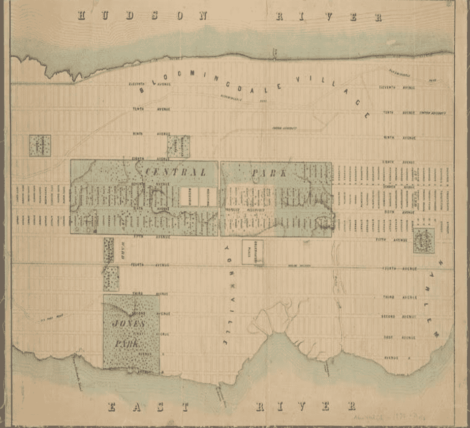

图1-1. 1870年的曼哈顿地图

我曾使用校正后的地图来探索不同城市随时间的发展，或准确地重新构想一个历史地点。例如，基础设施和工业发展的投资如何随时间影响社区？图1-2显示了一张校正后的地图。

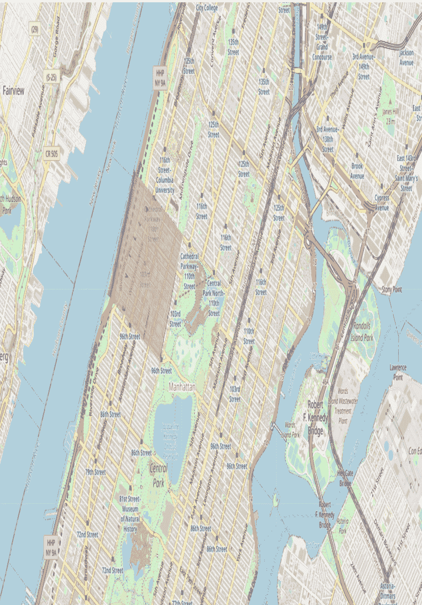

图1-2. 校正后的当代曼哈顿地图

各行各业的专业人士都有许多机会在其分析中纳入位置智能。位置智能描述了在制定数据问题和评估假设时，通过探索地理空间关系得出的可操作信息。开源工具正在欢迎新的终端用户，我们需要的是一个适用于无数不同兴趣、资源和学习背景的词汇表。是的，企业解决方案功能强大，但许多人对基于订阅的应用程序和工具的访问有限。地理信息系统（GIS）软件有多种选择，每种都有其优缺点。我将在提到时提及几种，但尽管我可以使用 ArcGIS（也称为航空侦察覆盖地理信息系统）和 QGIS（量子 GIS），我更喜欢让 QGIS 作为主角。它是真正的开源，意味着您不需要不同级别的许可即可访问所有可用工具。由于本书面向广泛的兴趣群体，我希望您能够探索所有工具。在我的专业工作中，是的，我会在 ArcGIS 和 QGIS 之间切换——主要是为了访问 ArcGIS 在线丰富的 GIS 数据集目录。我在 ArcGIS 中进行地理编码时确实不得不吸取教训。ArcGIS 使用信用系统，我很容易在不知不觉中陷入不利境地。当我上传包含位置数据的 CSV 文件时，我没有意识到付费服务会相当自动地启动。另一方面，QGIS 提供了两种我们稍后将探讨的选项——两者都是免费的。

图1-3中地图上的多边形以不同颜色对应种族类别。如果我们同时考察其他属性，我们可能会对这些集群得出什么结论？让我们先思考一下这些问题。我给您一个提示：魔鬼在细节中，或者我应该说，在*图层*中。多边形根据某个种族是多数人口的区域进行着色。这是引入*默认值不应是终点*这一表达的好地方。对 GIS 更深入的理解将使您能够摆脱默认设置，创建独特而深刻的洞察。

### 图例

美国社区调查种族与西班牙裔变量 - 边界 - 县

主要类别

- 非西班牙裔白人人口
- 西班牙裔或拉丁裔人口
- 黑人或非裔美国人人口
- 美洲印第安人和阿拉斯加原住民人口
- 亚裔人口
- 夏威夷原住民和其他太平洋岛民人口
- 两个或更多种族人口

主导强度

- > 99
- < 15

### 2020年美国多样性指数

县

- 84 - 109
- 58 - 84
- 33 - 58
- 7 - 33
- 0 - 7

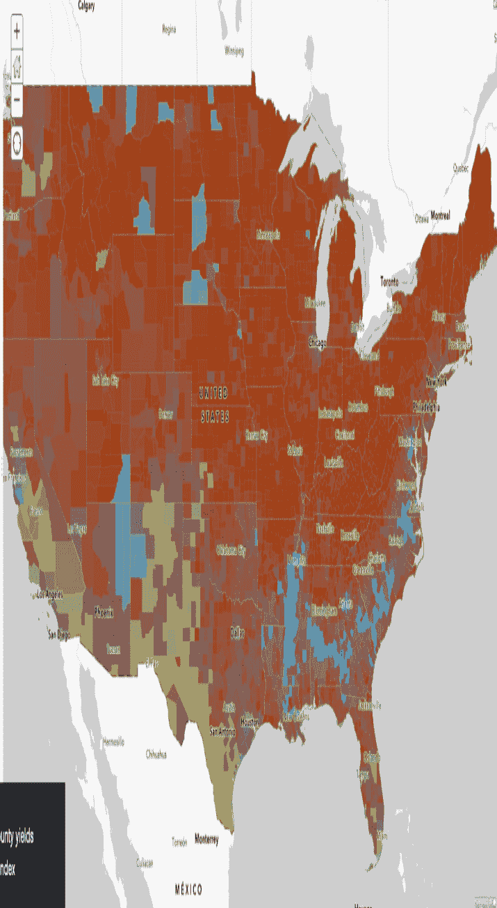

> 选择特定县可获取额外数据——多样性指数

图1-3. 种族与多样性（ArcGIS）

空间数据分析入门告诉我们，任何分析都需要一个明确的问题。一旦你提出了问题，你就能发现是否有数据可以帮助你回答或验证这个假设。我指的不是精心挑选的数据，而是所有对构建假设或产生洞察至关重要的数据。种族应该被视为其他事物的拙劣生物学代理，还是社会或政治建构？我们需要理解我们收集的变量，以便能够培养同理心、揭示政策差距或满足未实现的健康需求。如果面临缺失数据或无法获取的资源，我们可能需要重新表述问题。

当你熟悉人口普查数据时，你开始理解种族被赋予的繁重任务。现在能够检查关于地点的数据（例如住房、就业、交通和教育）阐明了空间数据的作用，并促使我将ArcGIS和QGIS等地理空间应用程序整合到关于贫困、种族不平等、健康结构决定因素以及不断涌现的各种新问题的讨论中。我认为，当你依赖电子表格或数据表格时，如果缺乏空间考量，你可能会错过关键的洞察。静态指标（如道路可能的位置或特定事件的坐标）或动态指标（如传染病的传播）在与位置智能整合时会变得更加强大。

空间分析独特解决的问题是检查地理边界内识别的特征之间的关系。例如，非地理数据描述了值的分布——我们可以依赖描述性统计。但如果我们好奇空间关系可能对这些值产生什么影响呢？

乍一看，我们可以欣赏来自美国社区调查的县级种族变量。我们可以看到分类变量的集群，但我们还知道其他信息吗？这些是每个地区的主要类别，但我们还想了解什么？这就是地理空间数据变得如此有价值的地方。

> **注意**

年度[美国社区调查](https://www.census.gov/programs-surveys/acs/)（ACS）于2005年取代了十年一次的人口普查长表，包含各种问题，用于识别人口结构变化，收集有关当地社区的信息。

如果我们稍微跳出框框思考呢？你在图1-4中看到的地图是作为对人口的探索而创建的，其中意外的紧急情况将超出家庭的经济能力。红色方块现在告诉我们这些是风险最高的家庭，更大的方块反映了更多的家庭数量。为了展示地理空间分析的价值，绿色方块是2020年全球大流行期间夏季供餐点的位置。夏季供餐点是夏季食品服务计划（SFSP）的一部分，在学校停课期间，在批准的地点为低收入儿童提供免费餐食。

### 图例

### 紧急费用风险指数 - 街区组

风险指数

2017年总家庭数（Esri）

风险指数

### 2020年夏季供餐点

地点

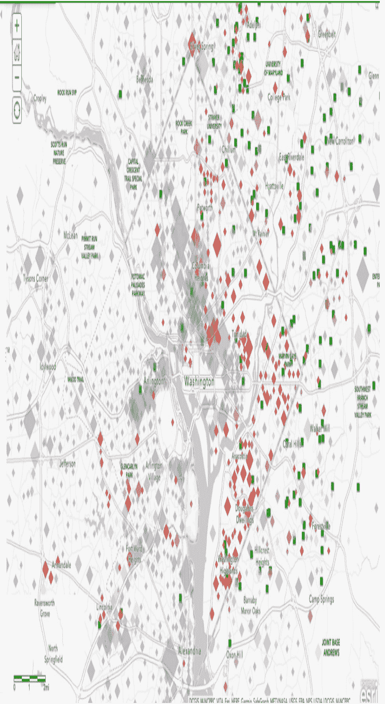

图1-4. 风险指数与夏季供餐（ArcGIS）

像人口普查API这样的开源资源可以生成人口统计数据，只需几行Python代码即可检索。如果你不熟悉API，它代表*应用程序编程接口*，这是一种允许软件产品之间传输数据的计算机接口。其美妙之处在于接口部分。人口普查API是美国人口普查的封装。你现在可以从年度ACS和人口普查中提取特定数据，而无需下载整个庞大的数据文件。地理信息也包含在人口普查数据中，可以从人口普查网站获取或从IPUMS（正式名称为综合公共使用微观数据系列）下载。IPUMS的优点包括个人层面的数据、跨调查变量的协调以及轻松下载原始数据文件的能力。

> ### 注意

来自IPUMS网站：

*IPUMS提供来自世界各地的人口普查和调查数据，这些数据在时间和空间上进行了整合。IPUMS的整合和文档使得研究变化、进行比较研究、合并跨数据类型的信息以及在家庭和社区背景下分析个人变得容易。数据和服务免费提供。*

在我作为数据分析师的发展过程中，我开始意识到我有更大、更复杂的问题需要考虑，我需要更多的资源。考虑到处理人口普查数据，我报名参加了由哥伦比亚工程学院赞助的应用分析在线高管教育课程。我曾使用R编程语言工作，所以当我意识到整个课程将用Python教授时，我有点紧张。我坚持了下来，但记得感觉有点晕头转向。在完成作业和顶石项目几个月后，我不确定如何将这些事实应用到手头的新任务中。在接下来的几个月里，我学到了很多，我希望在学习编码的同时也能学到这些。递归迭代的一些现实世界例子是什么？当处理大型数据集时，哪些函数可以简化我的工作？我独立工作，希望有一个可靠的工作流程来指导我完成任务。我的数据分析公司很小——准确地说，*n*为1。责任从我这里开始，也在我这里结束。

我希望在这里分享的不是Python的完整编码范式。但是，通过学习如何在笔记本或QGIS内的控制台中编写可操作的代码，我们可以通过实践来学习。本书包含简单的例子，我们将在后续章节中更详细地探讨这些概念。早期章节中的图形是为了让你熟悉这些地图或关系可能如何呈现。后面的章节探讨了使Python成为回答地理空间问题资源的代码和平台。

在制定数据问题时，我喜欢参考托布勒地理学第一定律。例如，在社区层面检查公共交通的可达性，理解交通和通勤时间如何影响纽约市以外社区的房屋价值是重要的考虑因素。

> *万物皆相关，但近处的事物比远处的事物更相关。*

—瓦尔多·托布勒的地理学第一定律

曼哈顿一定缓冲区内的房屋与更远的外部区域相比，可能共享更广泛的属性。绘制区域地图并关注一定半径内的房屋价值的能力可能是确认性的。

地理空间数据正在各地被收集。具有时间指标的动态传感器正在生成大量数据，这些数据通常向公众开放。使用针对地理空间项目优化的开源解决方案是我的主要目标。Python是在开源和专有系统中灵活处理数据的缺失环节。它相当容易学习，并且有各种库可以在桌面环境内部或外部转换和重塑表格、合并数据以及生成绘图。

将Python整合到空间分析中，无论是在Jupyter无论是使用笔记本电脑还是依赖像QGIS这样带有托管Python插件的开源工具，都是本书的重点。

随着数据可视化变得越来越重要，想想我们最熟悉的图形：地图。我们对查看地图的熟悉程度，掩盖了其背后信息的多层复杂性、多个数据集的交互性，甚至是我们传达发现的方式。开源数据和平台的可及性，将空间数据科学扩展到了不仅是专业人士，也包括爱好者和个体分析师。但我们也需要保持谨慎。熟悉并不等同于准确或胜任。

像[OpenStreetMap](https://www.openstreetmap.org/)这样的开源平台，允许我们放大到细节层面，揭示景观中的结构，并为我们的分析添加属性。有些Python包，比如OSMnx，允许将OpenStreetMap下载到Jupyter Notebook中，而无需依赖特定的应用程序或工具（更多信息请参见附近的注释）。

[OSMnx](https://github.com/gboeing/osmnx)是一个Python包，它允许你从OpenStreetMap下载空间数据，并对真实的街道网络进行建模、投影、可视化和分析。你可以用一行Python代码下载并建模可步行、可驾驶或可骑行的城市网络，然后轻松地进行分析和可视化。你同样可以轻松地下载和处理其他基础设施类型、便利设施/兴趣点、建筑轮廓、高程数据、街道方位/朝向以及速度/出行时间。

### 空间数据科学的概念框架

地球并非完美的球体。考虑到地球的化学性质，以及在太空中旋转产生的离心力会倾向于将中间部分向外推，导致其呈扁球体形状，这就说得通了。从技术上讲，地球的形状是一个椭球体，绕两极的周长比绕赤道的周长要短，就像这个星球从上到下被挤压过一样。当我们试图绘制地表地图时，我们会采用一个地理坐标系，并将其转换为投影坐标系——用于平面地图。*经纬网*（地图的纬度和经度线框架）的建立，由QGIS和其他GIS应用程序加速完成。坐标系试图以接近单一事实来源的有意义方式呈现位置数据。这些不同的投影被称为*圆锥投影*、*方位投影*和*圆柱投影*。每一种都会留下必须处理的变形。根据所选的坐标系，我们可能会在面积、距离、方向和大小上出现变形。你会很高兴知道，我们不需要独自应对这些妥协——软件处理了大部分复杂的数学计算。图1-5展示了一个地理坐标系。

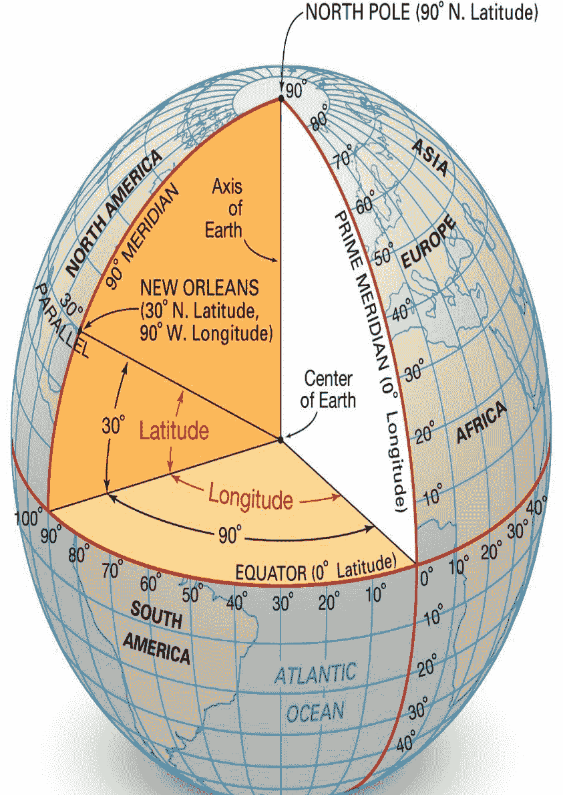

© Encyclopædia Britannica, Inc.

图1-5. 地理坐标系。

如果你使用OpenStreetMap或谷歌地图，你会熟悉Web墨卡托坐标系。熟悉这些地图的变体将使你能够选择最佳投影，因为需要做出妥协。例如，在我从事人口健康领域的工作时，在投影中保持面积至关重要。如果我在地图上绘制百分比或原始数字，并且我希望尽可能公正，不让一个小地方看起来比其他地方大太多，那么其中就存在一种固有的偏见，影响我对该地图的解读。我将尽力审视投影的弱点和优势，并说：“我将选择一个保持面积的投影。”

保持面积的地图被称为*等面积投影*。后面的章节将更详细地讨论这一点。我将回顾QGIS和ArcMap，并展示它们如何转换投影以获得最佳制图效果。因为地球不是一个完美的球体，我们确实必须做出妥协并接受一点点变形。但如果我们确保与可视化最相关的度量标准在所选坐标系中得到体现，我们就已经成功了大半。自然，我们希望我们的值与现实世界中的实际值紧密匹配。一个有趣数据集中的“在哪里”问题的现实，往往是视觉传达的推动力。例如，空间现象通常是迭代的而非线性的。也许你对某个系统地理的范围或尺度感到好奇。你从哪里开始？整个世界无法放在一张纸或一个电脑屏幕上——至少无法以一种可供解读的可见方式呈现。

与地球仪精度（记住我们试图在平面上表示椭球体几何形状）的误差或偏差，通常由Goldberg-Gott误差分数来衡量。最近一次最小化误差的尝试是由J. Richard Gott及其同事研究的。作为参考，流行的墨卡托投影（图1-7）的误差分数为8.296，而温克尔三重投影为4.563。较低的分数反映了在平面地图渲染中更少的误差或妥协。新的J. Richard Gott地图（0.881）与地球仪（0.0）相比，是迄今为止误差分数最低的。

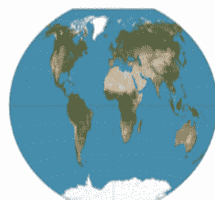

温克尔三重投影

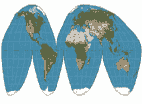

古德同面积投影

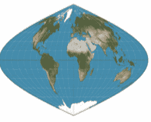

正弦投影

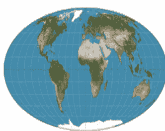

摩尔威德投影

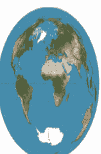

兰伯特方位等面积投影

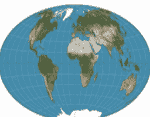

汉默投影

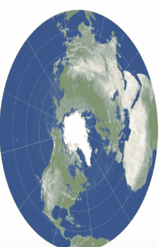

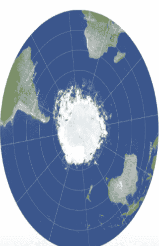

图1-6. 等面积投影

图1-6展示了几种投影，你可以看到它们对我们可视化的影响。如果你在所有这些等面积投影中查看格陵兰岛，你会看到它保持了适当的比例。

另一方面，像图1-7所示的墨卡托投影地图，在靠近两极的区域会产生变形。我们可以根据所选投影的不同，展示我们创建的地图之间的差异。这将在我们后续章节选择坐标系时变得明显。

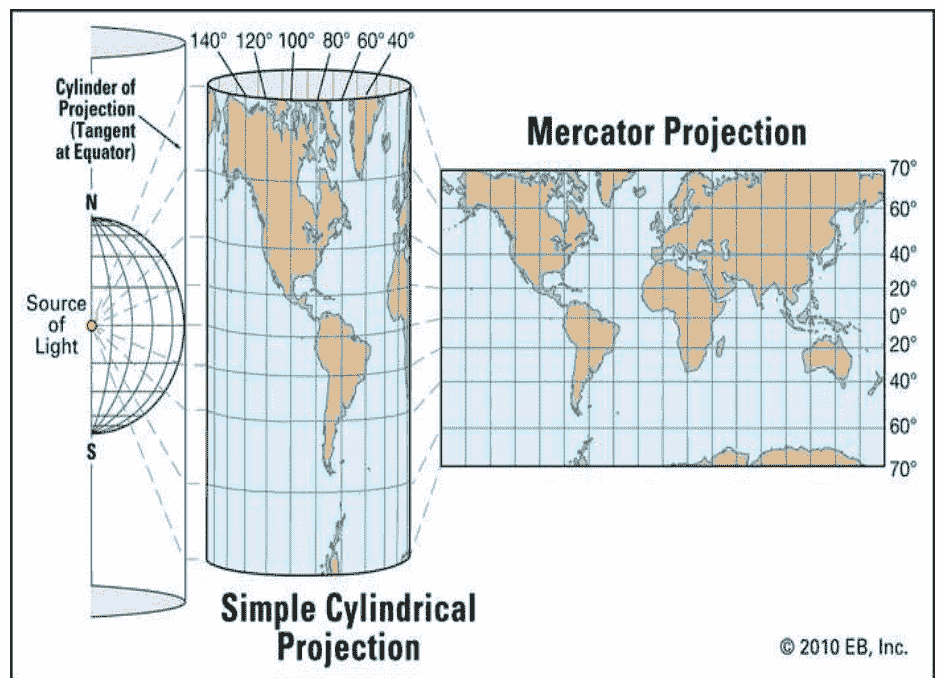

图1-7. 墨卡托投影

既然你已经了解了空间数据分析的广泛目标，那么请思考从地方社区一直到社会和全球层面所面临的挑战。例如，想想环境、医疗保健、生物学、地理学、经济学、历史、工程学、地方政府、城市规划和供应链管理。即使是像医疗保健可及性、环境法规、社区规划和交通这样看似地方性或区域性的问题，也跨越了物理和政治边界、生态区域、市政区和流域，并具有空间组成部分。由于地图是我们对数据可视化最早的欣赏之一，因此在审视我们的数据后，我们可能会对位置产生好奇，这是有道理的。

地理信息系统（GIS）持续分析数据，并在广泛的行业中提供实时洞察。尽管空间分析和非空间分析之间可能存在相似之处，但空间统计是专门为处理地理数据而开发的。两者都与地理要素相关，但空间统计专门研究地理编码的地理空间数据。例如，当想象机场数据时，有非空间统计变量，如区域或用途（军事、民用/公共）或准点到达和起飞，也有用于分析的空间组成部分（高程和地理坐标）。与传统的非空间统计方法不同，它们将空间（邻近性、面积、连通性和/或其他空间关系）直接纳入其数学计算中。此外，对于那些用Python编写的工具，源代码是可用的，以鼓励你学习、修改、扩展和/或与他人分享这些以及其他分析工具。这些复杂的问题是空间性的。这些问题发生在哪里？我们如何规划以在未来取得更好的结果？

> 注意

如前所述，我更喜欢将我所做的描述为*位置智能*。这很有道理，也比说你在GIS领域工作要清晰得多。为什么要用工具来定义一项分析呢？专注于成果要好得多。

*空间思维*的概念，涉及邻近性、重叠包含、邻接性，以及测量地理空间和要素与现象之间相互关系的方式。这就是我们通过空间素养入门可以学到的东西。*空间素养*始于内容知识以及对系统及其如何与人类影响的范围。阿斯彭全球变化研究所（AGCI）确定了地球的六大系统：

1. 大气圈
2. 冰冻圈
3. 水圈
4. 生物圈
5. 岩石圈
6. 人类圈

人类圈指的是人类在地球上的存在。地理空间数据使我们能够理解所有这些系统的相互关联性，并且我们拥有*大数据*——海量数据——可用于构建完善的数据问题。

你不必成为专家就能掌握应对更重大问题的重要技能。如果你从基础层面理解地理空间数据和技术的工作原理，你就已经踏上了通往更复杂概念的道路。你将学会构建数据问题，并准备好确定可操作的步骤，以推进开发你的创新应用或解决方案。

地理空间问题复杂多变，随空间和时间而变化，并日益影响我们的日常生活。只需看看当前的头条新闻，就能找到我们未来几年将面临的挑战实例：种族不平等、气候变化、健康的结构性决定因素、刑事司法、安全饮用水、可持续农业实践、海洋酸化、贫困、物种濒危与灭绝，以及经济困境——仅举几例。个人的位置如何影响其健康、福祉或经济机会？利用GIS，可以通过展示疾病传播率、到最近医院的距离、道路、水道、树木覆盖和城市步行便利性之间的模式来研究这类问题。

### 地点作为对象（点、线和多边形）

我们将深入探讨如何在Python中探索矢量数据，但首先我需要介绍一些在本书后续内容中会用到的概念。*矢量*数据由点、线和多边形表示。我们将使用Python脚本和QGIS集成将数据集加载到地图中，并检查矢量数据的结构。后续章节还将教授如何使用颜色和符号自定义地图，以提高清晰度和准确性。

在ArcGIS对中央公园及周边建筑的渲染中，我们可以看到几何图形以多边形表示。关于这些要素的附加信息可能揭示结构类型、建造年份、建筑尺寸以及其他可在属性表中访问的属性。要素的几何图形决定了它的渲染方式——是作为点、线还是多边形。

Coverage、shapefile和地理数据库是ESRI产品的演进，代表了其文件格式的不同世代。我不会花太多时间讨论不同的格式，但你可能会看到数据文件被指定为shapefile（.shp）或地理数据库（.gdb），因此了解它们的优缺点是很有好处的。将文件格式与文字处理程序（如Microsoft Word）和简单文本文件进行比较。内容（页面上的文字）可能相同，但文本文件的复杂性和精细度肯定较低。不同的GIS文件格式也是如此。尽管内容相同，但功能元素却不同。如果你想分享一段文字，为什么选择文本文件？如果你希望文档能被所有人阅读，无论使用什么软件，或者你希望便于携带或使用更小的存储格式呢？GIS格式文件在功能上各不相同——shapefile没有拓扑或空间图层，而地理数据库可以选择包含此类图层。它们在简单性、冗余性、错误检测和存储大小方面也各不相同。在使用包含位置数据的数据集时，你可能没有选择余地，因此了解可用选项以及你能从地理角度说明什么非常重要。

图1-8显示了纽约市的建筑类型。如果你使用过人口普查地理数据，你可能熟悉TIGER/Line提取文件或shapefile。它们作为一组文件与数字文件（带有.shp扩展名的矢量坐标）、索引（.shx扩展名）和dBASE属性数据（.dbf扩展名）一起分组。虽然一直有传言说它们正在逐渐消失，但由于它们在开源和专有系统中都很普遍，短期内不会消失。

ArcGIS My Map

New Map bonny

Details Add Edit Basemap

Save Share Print Measure Bookmarks

New York, NY, USA

About Content Legend

Legend

OpenStreetMap Buildings for North America

- house
- residential
- detached
- terrace
- garage
- apartments
- shed
- commercial
- retail
- office
- hotel
- industrial
- warehouse
- university
- school
- hospital
- church
- barn
- hut
- Other

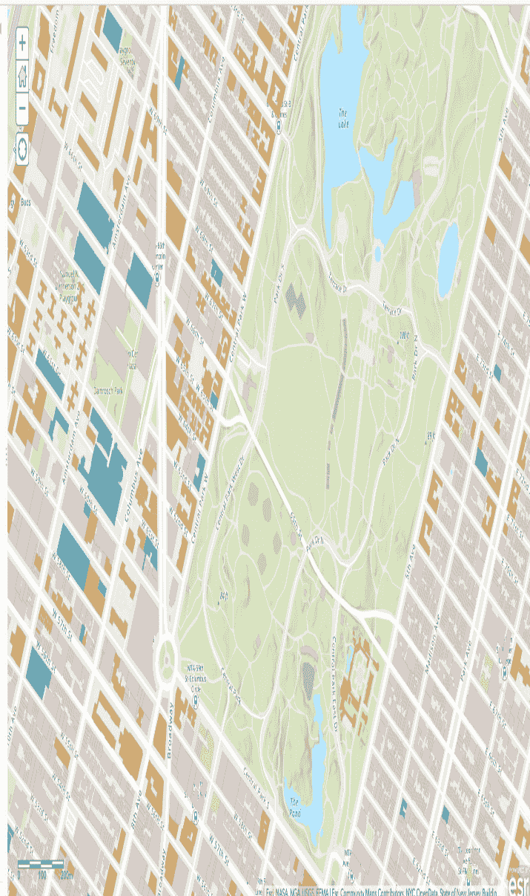

Trust Center Legal Contact Esri Report Abuse

Esri, NASA, NGA, USGS, FEMA | Esri Community Maps Contributors, NYC OpenData, State of New Jersey, Buildin...

图1-8. 纽约市的建筑类型

地理系统可以处理多种类型的数据。当我们想到点、线或多边形（例如shapefile）以及LIDAR（激光雷达）测量时，我们指的是矢量数据。例如，在检查像景观这样的GIS环境时，当你在QGIS等应用程序中渲染时，你视野范围内的所有东西都是一个要素。关于这些要素的详细信息被捕获为属性。

当位置数据出现在电子表格中时，纬度和经度列会创建一个点。图1-9所示的空气质量电子表格包含地理（*纬度*和*经度*）和非地理数据（*值*列中的空气质量测量值），允许GIS应用程序添加与特定地理位置相关的信息。点要素具有X、Y和（可选的）Z值。最熟悉的坐标投影系统是经度和纬度。你可以被放置在世界任何地方，如果你提供你的经度（X）和纬度（Y），你的位置就已知——这正是我们所说的*点*属性。这个坐标精确地描述了地球上某个特定位置。点属性可以是定量或定性的描述。

| locationId | location | city | country | utc | local | parameter | value | unit | latitude | longitude |
|---|---|---|---|---|---|---|---|---|---|---|
| 62724 | Far West Pasadena | | US | 2021-02-02T | 2021-02-01T | pm25 | 27.7 | ~µg/m³ | 34.1324 | -118.1834 |
| 62724 | Far West Pasadena | | US | 2021-02-02T | 2021-02-01T | pm25 | 25.6 | ~µg/m³ | 34.1324 | -118.1834 |
| 62724 | Far West Pasadena | | US | 2021-02-02T | 2021-02-01T | pm25 | 26 | ~µg/m³ | 34.1324 | -118.1834 |
| 62724 | Far West Pasadena | | US | 2021-02-02T | 2021-02-01T | pm25 | 25.4 | ~µg/m³ | 34.1324 | -118.1834 |
| 62724 | Far West Pasadena | | US | 2021-02-02T | 2021-02-01T | pm25 | 22.8 | ~µg/m³ | 34.1324 | -118.1834 |
| 62724 | Far West Pasadena | | US | 2021-02-02T | 2021-02-01T | pm25 | 22.6 | ~µg/m³ | 34.1324 | -118.1834 |
| 62724 | Far West Pasadena | | US | 2021-02-02T | 2021-02-01T | pm25 | 22.2 | ~µg/m³ | 34.1324 | -118.1834 |
| 62724 | Far West Pasadena | | US | 2021-02-02T | 2021-02-01T | pm25 | 21.5 | ~µg/m³ | 34.1324 | -118.1834 |
| 62724 | Far West Pasadena | | US | 2021-02-02T | 2021-02-01T | pm25 | 21.5 | ~µg/m³ | 34.1324 | -118.1834 |
| 62724 | Far West Pasadena | | US | 2021-02-02T | 2021-02-01T | pm25 | 25.4 | ~µg/m³ | 34.1324 | -118.1834 |
| 62724 | Far West Pasadena | | US | 2021-02-02T | 2021-02-01T | pm25 | 23.1 | ~µg/m³ | 34.1324 | -118.1834 |
| 62724 | Far West Pasadena | | US | 2021-02-02T | 2021-02-01T | pm25 | 22.5 | ~µg/m³ | 34.1324 | -118.1834 |
| 62724 | Far West Pasadena | | US | 2021-02-02T | 2021-02-01T | pm25 | 21.2 | ~µg/m³ | 34.1324 | -118.1834 |
| 62724 | Far West Pasadena | | US | 2021-02-02T | 2021-02-01T | pm25 | 21.8 | ~µg/m³ | 34.1324 | -118.1834 |
| 62724 | Far West Pasadena | | US | 2021-02-02T | 2021-02-01T | pm25 | 26.6 | ~µg/m³ | 34.1324 | -118.1834 |
| 62724 | Far West Pasadena | | US | 2021-02-02T | 2021-02-01T | pm25 | 24.4 | ~µg/m³ | 34.1324 | -118.1834 |
| 62724 | Far West Pasadena | | US | 2021-02-02T | 2021-02-01T | pm25 | 25.2 | ~µg/m³ | 34.1324 | -118.1834 |
| 62724 | Far West Pasadena | | US | 2021-02-02T | 2021-02-01T | pm25 | 26.1 | ~µg/m³ | 34.1324 | -118.1834 |
| 62724 | Far West Pasadena | | US | 2021-02-02T | 2021-02-01T | pm25 | 25 | ~µg/m³ | 34.1324 | -118.1834 |
| 62724 | Far West Pasadena | | US | 2021-02-02T | 2021-02-01T | pm25 | 22.9 | ~µg/m³ | 34.1324 | -118.1834 |
| 62724 | Far West Pasadena | | US | 2021-02-02T | 2021-02-01T | pm25 | 23.5 | ~µg/m³ | 34.1324 | -118.1834 |

图1-9.

栅格数据，如图1-10所示，是以像素化图像显示的数字数据，每个像素对应一个特定的地理位置。在矢量数据中，我们拥有的是点和线，而不是像素化数据的矩阵。一旦我们开始处理实际数据，这两种类型的数据都将更容易可视化。

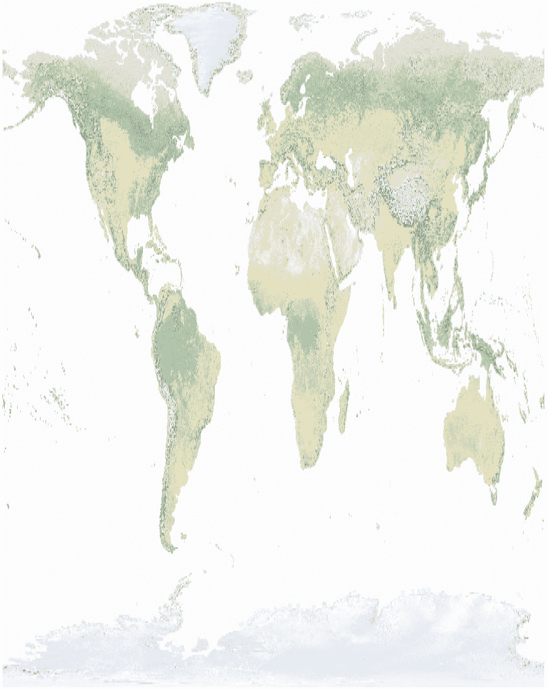

图 1-10. 栅格数据示例 (QGIS)

### 评估与选择数据

在学习新技能、跟进新应用，甚至启动自己的独立地理空间项目时，有许多数据集可供探索用于教程。本书中你将看到的大多数数据集都经过审查，并在各种应用和工作流中被证明是可行的。

在选择数据集之前，你需要评估数据。关于数据集的信息称为*元数据*。通过查阅元数据，你可以了解到很多信息，但关于数据最重要的信息包括地理区域、属性、地图投影、比例尺以及使用是否收费。你可以把元数据想象成汤罐头上的标签。你想知道里面可能有什么成分，更重要的是，这汤对你是否有益。图 1-11 展示了一个元数据示例。

通常还有一个补充数据文件，描述诸如字段标题之类的属性。这通常被称为*数据字典*。

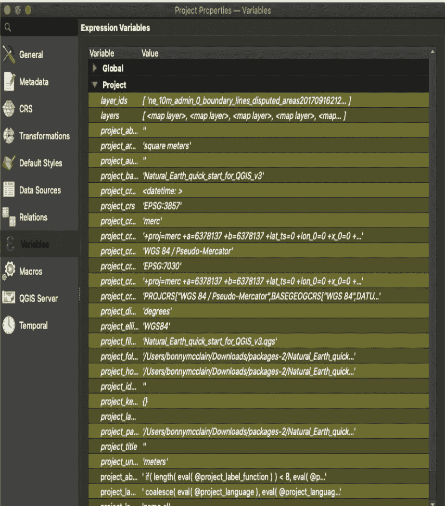

图 1-11. 元数据示例

尽管探索你自己的兴趣和数据可能很诱人，但我建议首先尝试按照以下建议的数据资源进行操作。一旦你感到有信心，再去探索并看看你能发现什么：

- [国家地理空间计划](https://www.nationalmap.gov/)
- 地理资源分析支持系统 (GRASS)
- OpenGeoportal
- ServirGlobal
- DIVA-GIS
- Natural Earth
- OpenStreetMap
- 国家地理空间数字档案馆
- 国家历史地理信息系统 (NHGIS)
- 地理与美国社区调查 (美国人口普查局)
- 地理空间信息科学卓越中心 (CEGIS)

## 第 2 章. 空间分析的基本设施

> **致早期版本读者的说明**

通过早期版本电子书，你可以在书籍的最早期形式——作者撰写时未经编辑的原始内容——中获取书籍，从而在这些书籍正式发布之前很久就能利用这些技术。

这将是最终书籍的第 2 章。

如果你对我们如何改进本书内容和/或示例有意见，或者你注意到本章中有缺失的内容，请通过 bonny@dataanddonuts.org 联系作者。

第 1 章涵盖了将三维 (3D) 地球映射到二维 (2D) 坐标系统的复杂性。这通常需要理解如何根据你感兴趣查看或分析的区域选择合适的地图投影。具体来说，你学习了如何将地球表面的 3D 坐标转换为 2D 坐标。为此，引入了*大地水准面*和*椭球体*的概念。

低于或高于地球表面的地形特征会发生什么？地理空间工具除了能够分析时间序列数据（通常被描述为第四维）之外，还能在空间上分析这些特征。你在第 1 章中也看到了各种地图投影，我讨论了如何为给定区域选择合适的投影——例如，选择一个在你查看的区域上最小化变形的投影。

你可能注意到 *GIS* 这个术语在学习空间素养时承担了大量工作，但实际上有多个集成概念在系统层面发挥作用。我已经讨论了*空间数据*框架，其中空间位置在地球表面被识别。这对于构建用于地理编码和制图数据的全面（且可靠的）参考系统至关重要。

### 理解空间关系

空间参考数据被定义为离散对象或连续（标量场）。客观视图关注特定位置可见的内容。地图上有特定的边界或区域，数据或对象要么存在，要么不存在。你不会期望在特定边界内的每个位置都存在一个建筑物，甚至是一个代表城市的多边形对象。

场视图代表缺乏特定边界但存在于整个地图视图中的连续数据。也许更直观一点，考虑地表高程、降水或地表温度。无论你的研究视图如何，你都可以在研究位置包含的每个位置记录这些测量值。

到目前为止，我只是在描述我们研究位置内点、多边形或线的分布。栅格，你可能还记得，将图像、地表温度和数字高程表示为一个值数组，该数组被划分为单元格网格。单元格或像素描述空间分辨率。这两个术语经常互换使用，描述代表所覆盖区域的单元格或像素的维度。空间数据模型将这些现实世界客观和/或场视图的抽象表示进行探索，以数学关系建模或预测关系。

照片和栅格图像之间的主要区别在于后者扩展的波长波段。这种超越简单的红、绿、蓝波长的增强数据，使得机器学习模型能够区分各种各样的物体。反射红外光的能力是物体特有的，并在多光谱图像中产生额外信息。太空中有数百颗地球观测卫星持续捕捉地球图像。世界各地的许多航天机构免费提供这些数据。这些数据集对科学家、研究人员、政府和企业具有巨大的价值。

如图 2-1 所示的山体阴影栅格使用光影来创建所视区域的 3D 效果。

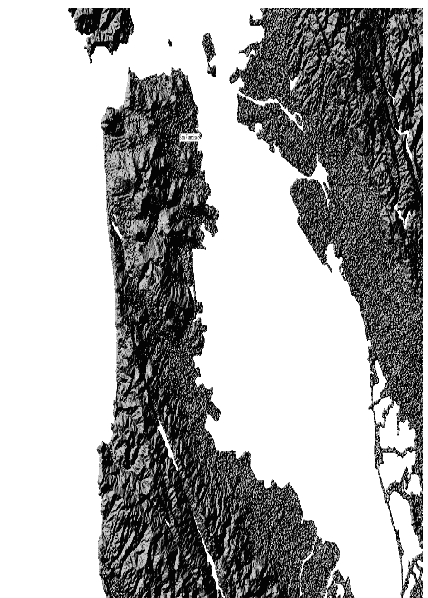

图 2-1. 以栅格形式描绘的旧金山 (QGIS)

在审视 GIS 的系统级方法时，有必要同时考虑多个概念。在更大系统中工作的小型组件通过动态交互强化了更好的参与，从而揭示系统中的模式。几何可视化就是一个例子，包括计算要素之间的距离、计算缓冲区区域（例如，一个要素距离另一个要素有多远）以及识别区域或周长。如果我们把这些主题视为整体的部分，将简化我们的讨论。随着我们旅程的继续，我将更深入地探讨这些主题。

理解这些入门概念将简化你在后续章节中的学习。从空间素养的基线开始很重要。

> 如果不明确关注[空间素养]，我们就无法履行为下一代学生装备 21 世纪生活和工作技能的责任。

—*学会空间思考*，美国国家研究委员会

### 空间素养

空间素养需要理解空间关系所必需的概念相互作用。你将在此基础上构建关于地理空间如何表示的知识，以便对空间概念进行推理和做出关键决策。流行的 Python 编程语言是实现超越简单地图投影、地理处理和地理可视化的更高级分析工具的强大工具。QGIS 拥有强大的编程接口，允许你扩展软件的核心功能以及编写脚本来自动化你的任务，并且 QGIS 支持 Python 脚本语言。即使你是编程和/或 QGIS 的新手，学习一点 Python 并熟悉 QGIS 编程接口，也能让你在工作中更加高效。

> **提示**

第 6 章提供了关于使用 QGIS 的详细信息，但你可能想下载它并开始自己探索。我建议查看那里的步骤或访问 [QGIS 网站](http://www.qgis.org) 并为你的操作系统下载长期支持版 (LTR)。

空间或关系数据库管理系统旨在存储和查询空间数据。这对我来说一直很困惑——PostGIS 和 PostgreSQL，到底有什么区别？以下是我的理解。如果你处理的是大型数据集，将数据存储在数据库中是合理的。关系数据库有模式，数据存储在列和行中。当你想要访问数据时，你查询关系数据库。结构化查询语言 (SQL) 执行查询，作为关系数据库的原生语言，允许无缝集成。

PostgreSQL 数据库管理系统 (DBMS) 是一个数据库，PostGIS 作为扩展器与其打包在一起，为 PostgreSQL 添加空间功能。例如，空间数据库通常会有一列来标识由空间参考标识符 (SRID) 定义的坐标系。SQL Server Spatial 和 ESRI ArcSDE 是其他空间数据库的例子。

对于本书，我主要使用我在培训或项目中首次使用的数据资源，并更新到最新报告的数据。我想确保无论你的操作系统如何，你都可以访问不同的数据集。QGIS 有各种各样的工具，这将使操作变得简单直接。我也在专业上使用 ArcGIS，但由于 ArcGIS Pro 只能在 Microsoft Windows 上运行，这会太受限。如果你是高级用户，并希望用本地数据或更能反映你个人或专业兴趣的数据替换数据，这里有一些建议：

1.  你需要一个健康混合的城市和农村地点，具有不同类型的道路、边界、水体特征和地形。
2.  当有选择时，我更喜欢最近的数据，但对于教学目的目的，但我将参考具有最广泛属性的来源。

3.  不要忘记将数据保存为GeoPackage文件格式，以便能够继续探索。
4.  如果你正在创建区域的栅格文件，请定位最大图层的范围坐标。

你可以在图2-2中看到地理数据在QGIS中的呈现方式。Natural Earth是一个公共领域数据集，通过志愿者和北美制图信息协会（NACIS）的合作与支持提供。

在左侧面板中，你可以看到浏览器窗口。一旦下载了数据集，就可以从浏览器窗口上传并直接拖拽到画布（右侧面板）上。将形状文件（.shp）拖入视图，点状符号代表了世界上的居民点。

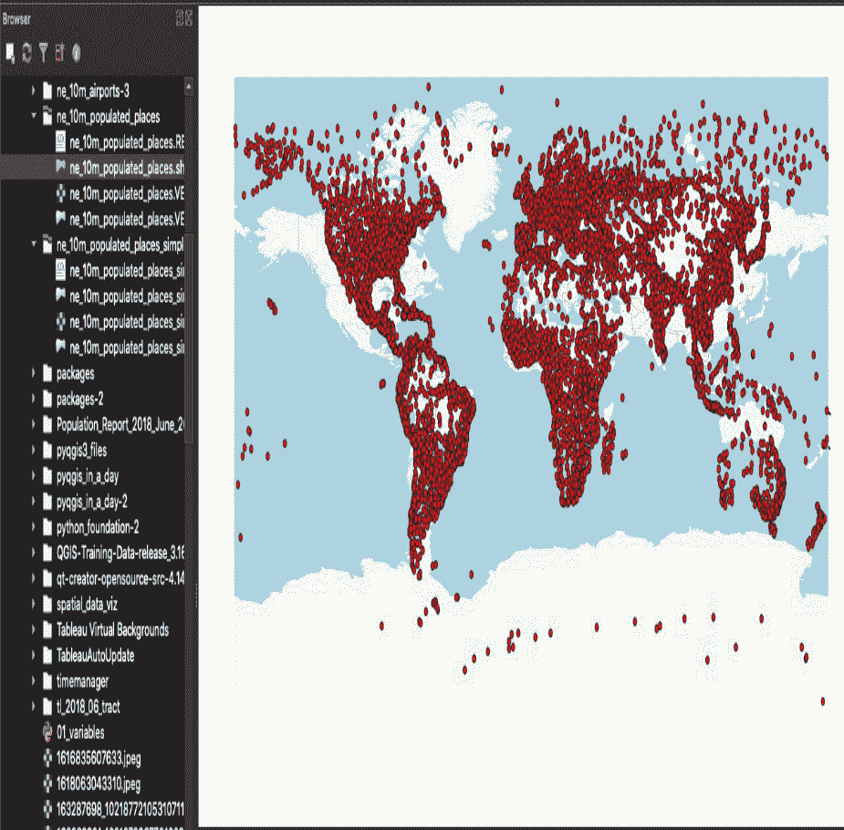

图2-2. 人口数据（QGIS）

如果你在选择“识别要素”图标（蓝色圆圈内的小“i”）后点击地图，并选择地图上的一个点，就会显示一个要素列表（图2-3）。在图2-3的右侧面板中，你正在查看属性。

稍后，当我们开始在Python控制台中工作时，你将探索许多这些地理空间和非地理空间要素。

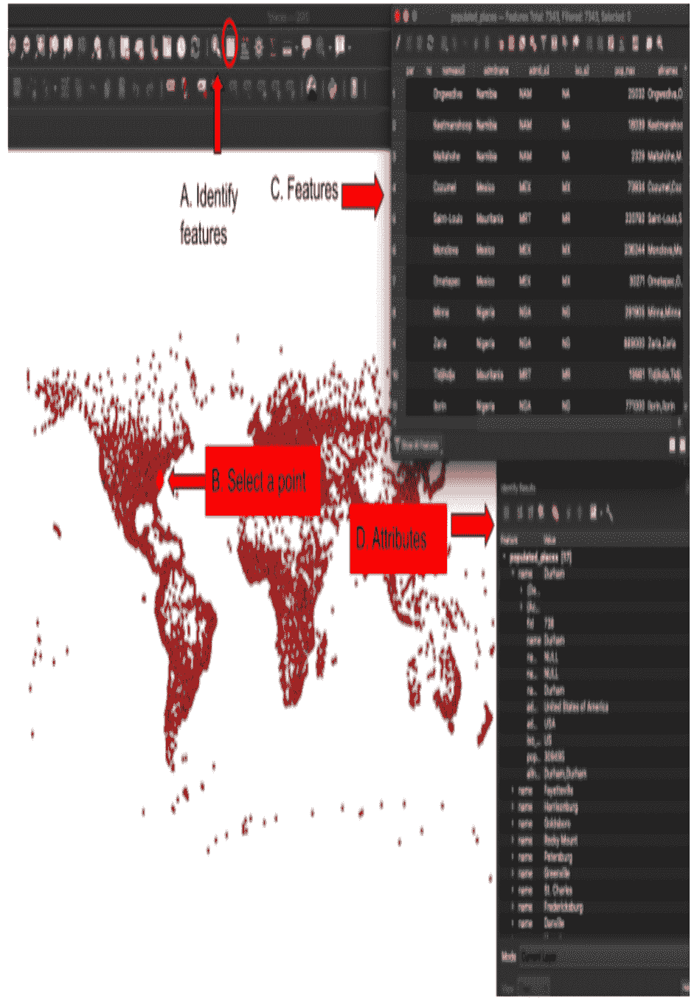

A. 识别要素

C. 要素

B. 选择一个点

D. 属性

图2-3. 按人口表达式窗口显示的人口数据（QGIS）

在探索属性表时，描述不同类型的属性可能会有所帮助。我们将在第5章一起构建地图时详细讨论这一点。我们希望制图的度量是否取决于单位的大小？作为参考，我选择了`pop_max`作为属性，这是一个*空间广延属性*的例子。人口计数与一个区域相关联，但如果我们将人口划分为更小的区域，计数不一定成比例，因为人口很少均匀分布。因为我们是在汇总一个特定区域，所以人口计数只有在代表整个区域时才是准确的。这些属性适用于长度、面积或体积等。如果你改变长度，或增加或减少面积或体积，你就是在改变单位的大小，因此度量值会改变。

像人口密度这样的*空间密集属性*不依赖于区域的大小。如果假设单位是均匀的，那么这些值可以描述其任何部分，而空间*广延*变量，如人口计数，则是空间依赖的。

图2-4显示了表达式窗口，你可以在其中选择人口大于1,000,000的记录。选择`pop_max`并编写一个简单的SQL表达式，包含属性表中的“adm0cap”字段，可以选出人口大于1,000,000且是首都的城市。如果你对检查人口的特定部分感兴趣，可以过滤值以表示特定属性。

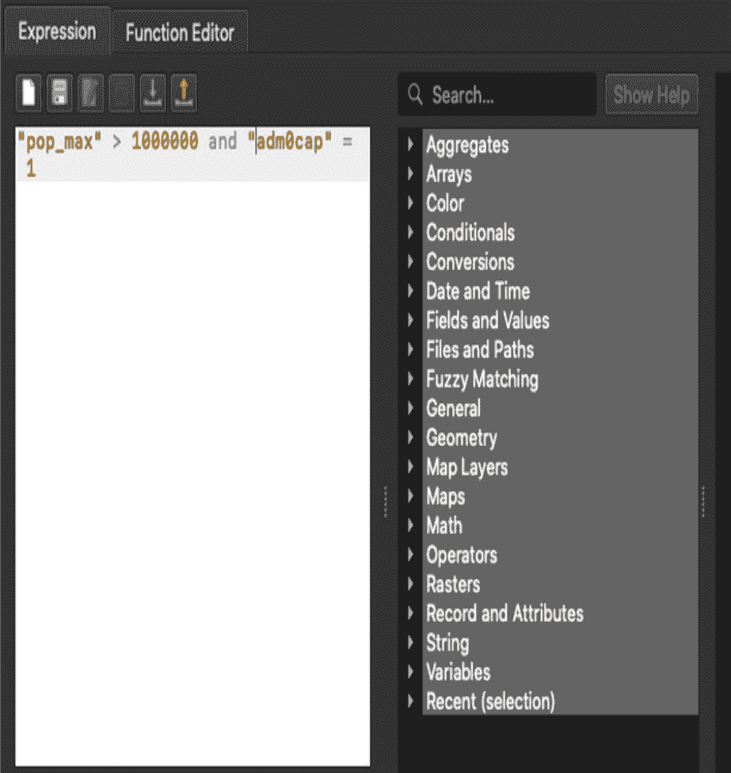

图2-4. 按表达式选择窗口（QGIS）

在图2-5中，你可以看到满足图2-4所示标准的黄色值子集，即人口超过100万且是首都城市（黄色）。

### 未命名项目 — QGIS

#### ne_10m_populated_places_simple — 要素总数：7243，已筛选：7243，已选...

ne_10m_populated_places_simple

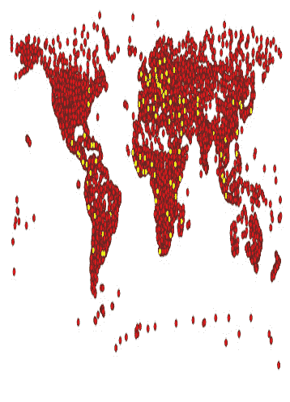

| fid | pop_max | pop_min | pop_other | rank_max | rank_alt |
|---|---|---|---|---|---|
| 1 | 35676000 | 8336598 | 12845252 | 14 | |
| 2 | 19644000 | 8008278 | 9292603 | 14 | |
| 3 | 16286000 | 10811002 | 10019444 | 14 | |
| 4 | 16078000 | 12691638 | 12420605 | 14 | |
| 5 | 15845000 | 10021295 | 11522944 | 14 | |
| 6 | 15692000 | 7653213 | 6747384 | 14 | |
| 7 | 14867000 | 14601692 | 16863572 | 14 | |
| 8 | 14787000 | 4651392 | 7785716 | 14 | |
| 9 | 12797394 | 7000940 | 14986538 | 14 | |
| 10 | 12795000 | 10929146 | 10271457 | 14 | |
| 11 | 12500000 | 5894820 | 142295 | 14 | |
| 12 | 12130000 | 11624219 | 11570278 | 14 | |
| 13 | 11888000 | 7734614 | 13720557 | 14 | |
| 14 | 11748000 | 2010775 | 1821489 | 14 | |
| 15 | 11234000 | 2592413 | 9830783 | 14 | |
| 16 | 11108000 | 7480601 | 9038231 | 14 | |
| 17 | 11100000 | 3077575 | 2381280 | 14 | |
| 18 | 10945000 | 10452000 | 10588365 | 14 | |
| 19 | 10061000 | 9945610 | 9651488 | 14 | |
| 20 | 9864000 | 11177 | 742744 | 13 | |
| 21 | 9766000 | 9766000 | 12019156 | 13 | |
| 22 | 9466000 | 1536 | 6557892 | 13 | |
| 23 | 9155000 | 8542211 | 9129613 | 13 | |
| 24 | 8988000 | 2841952 | 9655101 | 13 | |
| 25 | 8828000 | 3152635 | 11546371 | 13 | |
| 26 | 8557000 | 7421209 | 3289870 | 13 | |
| 27 | 8312000 | 6758234 | 6968380 | 13 | |
| 28 | 7873000 | 7155699 | 8208012 | 13 | |
| 29 | 7643000 | 5565703 | 4738154 | 13 | |
| 30 | 7772000 | 6353861 | 5754084 | 13 | |
| 31 | 7581000 | 1002592 | 10018994 | 13 | |

ne_10m_populated_places_simple

- ne_spm_08_grass7
- NE1_HR_LC
- ne_10m_airports
- ne_10m_populated_places
- ne_10m_populated_places_simple
  - ne_50m_populated_places_simple.README
  - ne_50m_populated_places_simple.shp
  - ne_50m_populated_places_simple.VERSION
  - ne_50m_populated_places_simple.VERSION
- packages-2
- Population_Report_2018_June_2020
- pypgis3_files
- pypops_in_a_day
- python_foundation
- QGIS-Training-Data-release-3_16
- qd-creator-opensource-src-4.14.1
- social_data_viz
- Tableau Virtual Backgrounds
- TableauAutoUpdate
- tmanager
- u_2018_06_tract
- 1616636507833.jpeg
- 163067898_1021877216531071_8206588982
- 1638803901_1021879667810025_4368657307
- 2007_2008_geography.xls
- 3-e2.0-9078032346204500192-main.pdf
- 3-e2.0-9078032346204500192-main.pdf
- 300px-Goodie_homolosine_projection_SVG.jpg

选择要素

坐标：302,8156.7 比例尺：1:19430984

图2-5. 按人口表达式窗口显示的人口数据（QGIS）

图2-6是空间大数据的一个例子。一种将空间分析与Uber城市移动数据相结合的可视化方法，展示了现有基础设施的效率和差距，从而允许在城市层面进行有针对性的投资。Uber Movement数据集捕捉了城市内区域到区域的出行时间。根据你选择的城市（我探索了纽约市、旧金山和巴黎），可能会有额外的度量，如移动密度或特定区域内的车辆数量（热力图）或车辆行驶速度（速度）。图例表明地图上的紫色区域交通密度最高。

### Movement

城市

旧金山

产品类型

新移动热力图

星期

- 工作日
- 周末

显示自行车道

可视化不透明度

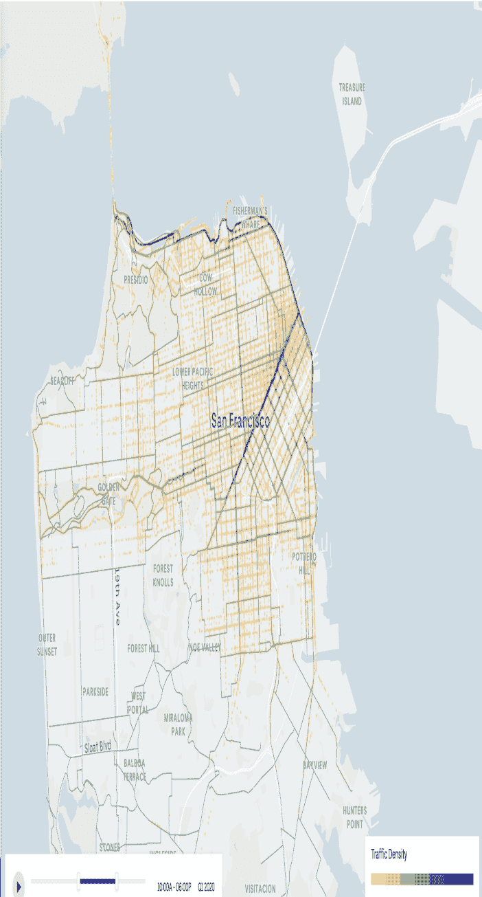

下载数据

2020年第一季度 上午10:00-下午6:00

交通密度

低

高

图2-6. Uber出行时间数据

在Uber数据网站上，你可以在网站界面中查看多种数据查看选项，例如将自行车道添加到可视化中，通过查看移动热力图来检查交通密度，如果你点击“产品类型”下拉菜单，你可以选择查看出行时间或速度。

所有这些都可在界面内使用。你也可以下载数据并导入QGIS，开始自行探索。我将在后面的章节中向你介绍QGIS并提供交互指导，但如果你和我一样——你可能想练习下载数据并在QGIS中访问。请务必下载所有文件，包括GEO边界，图2-7红色轮廓。

这是当你选择下载数据以进行更详细的Uber数据分析时会看到的界面。

### Movement

城市

巴黎

产品类型

出行时间

区域类型

轮廓...Iris

日期时间范围

2020年3月1日 - 2020年3月31日（每天，每日平均）

+ 添加第二个日期范围进行比较

起点和终点区域

巴黎凯旋门

选择目的地

下载数据

### 下载数据

筛选数据

所有数据

GEO边界

下载地理空间（GeoJSON）格式的边界，包括其他导出选项中使用的区域ID。

我同意遵守该城市的许可和归属条款

PARIS_IRIS.JSON

© 2021 版权所有 Uber Technologies, Inc. 数据归属

数据在[知识共享，署名-非商业性] (https://creativecommons.org/licenses/by-nc/3.0/us/) 许可下提供

关闭

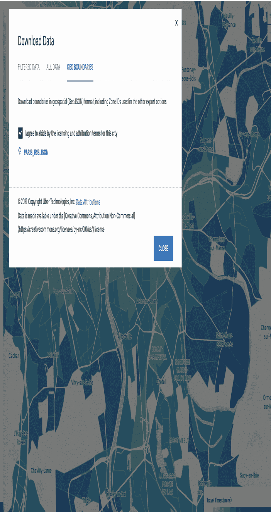

出行时间（分钟）

### 图 2-7. 从 Uber Movement 下载数据

以图 2-8 为例，让我们观察旧金山市民中心 30 分钟内的距离。这类地图被称为*等时线地图*。等时线地图描绘了在特定时间阈值内可到达的区域，是做出关于空间概念关键决策的资源示例。

仅通过编写 Python 代码，就可以可视化旧金山某地点 30 分钟车程内的地理区域。在 Uber Movement 网站下载数据后，可以在 QGIS 平台中提出更宏大的问题。

30min_isochrone_sf — QGIS

浏览器 (2)

在此输入以筛选可见项目...

- Music
- my-tabpy-env
- opt
- Pictures
- Public
- oga-sphinx-doc
- References
- Sites
- Unknown Album
- venv
  - bin
  - include
  - lib
- Untitled-0
- exercise_data.html
- paris.png
- san_francisco-censustracts-2020-1-OnlyWeekdays-HourlyAggregate.csv
- san_francisco_censustracts.json
- uber_travel_times.gpkg
- Quest
- Shared

图层

- 30min_isochrone
- uber_travel_times
- san_francisco-censustracts-2020-1-OnlyWeekdays-HourlyAggregate [21]
- San_francisco_fixed
- Calculated
- san_francisco_censustracts
- OSM Standard

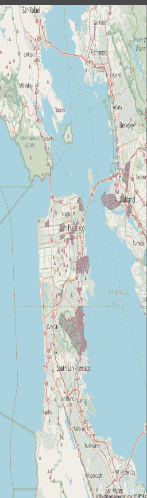

处理工具箱

dissolve

- 最近使用
- 矢量几何
  - 聚合
  - 溶解
- GDAL
  - 矢量地理处理
    - 溶解
- GRASS
  - 矢量 (v*)
    - v.dissolve
- SAGA
  - 矢量线工具
    - 线溶解
  - 矢量面工具
    - 面溶解 (所有多边形)
    - 面溶解 (按属性)

图层样式 | 处理工具箱

识别结果

| 要素 | 值 |
|---|---|
| san_francisco_censustracts | |
| DISPLAY_NAME | 0 The Embarcadero, North Beach, San Fr... |
| (Derived) | |

模式：当前图层

视图：树

帮助

输入以定位 (WK)

坐标：-136462305, 4546108 | 比例尺：1:207166 | 放大倍率：100% | 旋转：0.0° | 渲染 | EPSG:3857

### 图 2-8. 旧金山 Uber 出行时间

在简要介绍 Python 之后，我们将更深入地探讨创建可视化和地图的“如何做”。你不需要任何先验知识就能跟上进度，我的目标是为你提供一个良好的起点，让你开始在 QGIS 的 Python 控制台之外编写代码。到目前为止，无需编写任何 Python 代码，所呈现的地图无需集成任何额外框架即可轻松生成。

### 映射不平等

在我们开始将 Python 与 QGIS 及其他平台集成之前，我想以一个强大的可视化来结束本章，该可视化展示了在考虑数据问题时，地点和位置的价值。

“新政时期的美国映射红线”网站展示了房主贷款公司（HOLC）的数据。该网站是这样介绍这个项目的：

在 1935 年至 1940 年间，联邦政府房主贷款公司的代理人创建了数千份区域描述，其中为现在称为佐治亚州萨凡纳市卡弗高地社区所写的描述尤为突出。HOLC 工作人员使用每个城市当地房地产专业人士（贷款人、开发商和房地产评估师）组织的数据和评估，为住宅社区分配了反映其“抵押贷款安全性”的等级，然后这些等级会在彩色编码的地图上可视化。获得最高等级“A”（在地图上显示为绿色）的社区，在银行和其他抵押贷款机构决定谁应该获得贷款以及城市中哪些地区是安全投资时，被视为风险最小。获得最低等级“D”（显示为红色）的社区则被视为“危险”。

该交互式网站允许选择感兴趣的具体城市。我选择了纽约市，以查看我经常光顾的历史区域。多年来，我一直在纽约市的社区中漫步，目睹了经济投资涌入那些曾经危险到不敢涉足的社区。1930 年代的红线政策将靠近公园的社区标记为“仍然理想”和“最佳”，只要与哈莱姆区和主要的黑人社区保持距离即可。

“地点”的力量一直延续到现代，抵押贷款安全红线不再是“正式”做法，但许多这些地区已经锁定了土地利用系统。

### 新政时期的美国映射红线

介绍 下载与数据 关于 联系我们 美国全景

地图选项

搜索城市

#### 纽约州曼哈顿

#### 按等级划分的区域

| 区域等级 | |
|---|---|
| 10% | A "最佳" |
| 25% | B "仍然理想" |
| 11% | C "肯定衰落" |
| 54% | D "危险" |

#### 人口统计

- 1,889,924 总人口 (1940)
- 54.9% 本土出生白人
- 28.6% 外国出生白人
- 15.8% 非裔美国人
- 1.8% 外国出生非裔美国人
- 0.7% 亚裔美国人

#### 区域描述

点击选择

搜索

区域描述摘选

C5

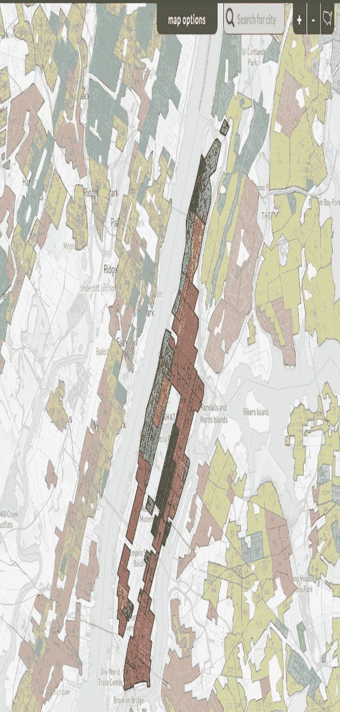

### 图 2-9. 1930 年代纽约市红线地图中的 HOLC 等级

*红线政策*锁定了土地利用系统，使得最佳等级（绿色或蓝色）之外的某些区域可能遭受更多洪水（更多沥青）、更少公园、有限的树线、更靠近废物处理设施以及更靠近州际高速公路（污染），并且可能经历过更高的地表温度，增加了不利气候影响的额外风险。

城市热岛是温度较高的人造或自然地点。拥有更多绿化、更少不透水表面或更少工业或建筑的社区显示为黄色，较温暖的区域则用橙色到红色表示。自红线政策将某些社区标记为危险以来，纽约市令人难以置信的演变，使其目前整体较低的城市热岛效应，似乎是这些土地利用趋势的例外。如果你探索城市热岛集群（用箭头标记）并重新审视图 2-9，这些可能是需要深入调查的区域。

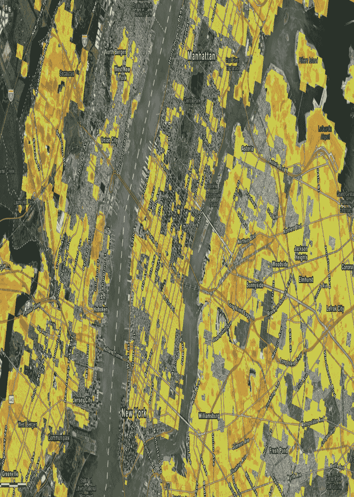

### 图 2-10. 城市热岛，ArcGIS

图 2-11 所示的历史地图是使用从“映射不平等”网站下载的数据在 QGIS 中生成的。我们可以用现代地图校正该地图，并添加人口统计数据和气候信息来讲述一个完整的故事，一个不从空间角度思考就无法讲述的故事。

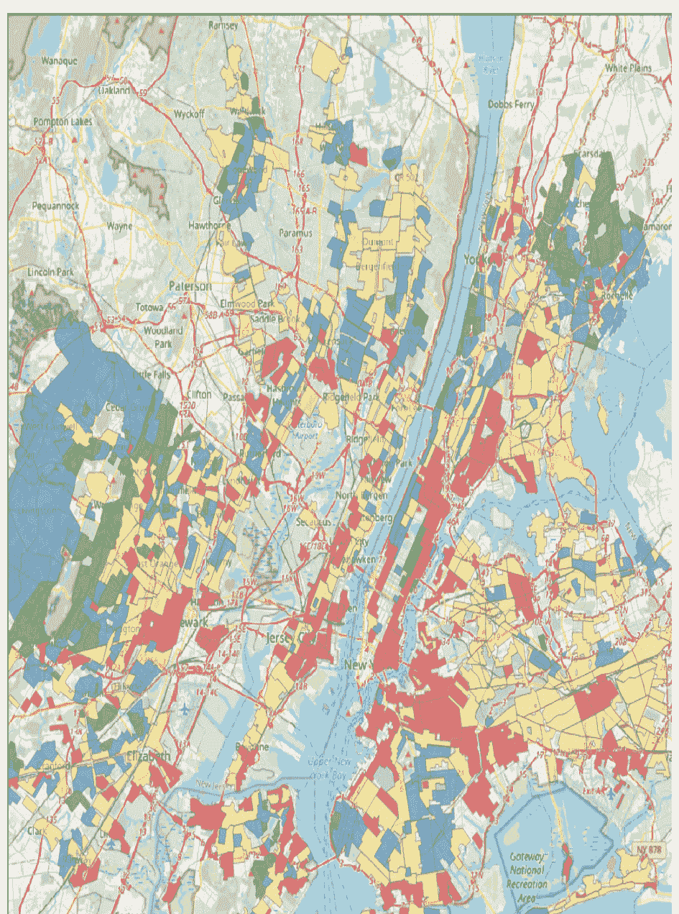

### 图 2-11. 1930 年代纽约市红线地图中的 HOLC 等级 QGIS

我很好奇历史地图在 QGIS 中能被多么干净地重现。我手动更新了图例，但除此之外，空间元素相当无缝地被拉入地图中。

图 2-12 包括属性“state”、“city”、“holc_grade”、社区和区域描述，这些信息可作为创建叙述的附加信息。属性表是地理和非地理数据的资源。

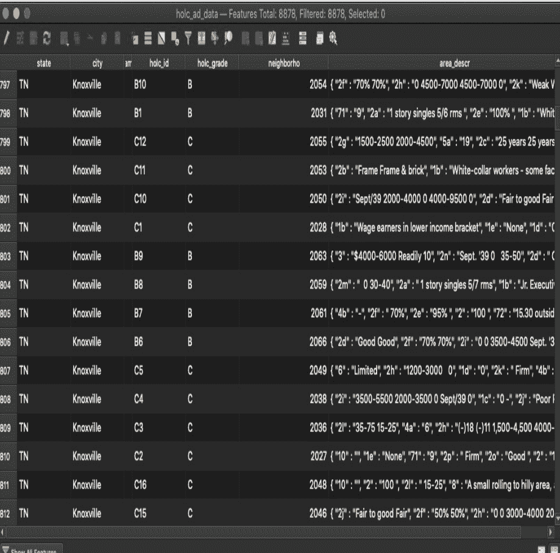

在第 3 章中，你将开始与实际数据交互，并扩展你将地理空间思维和位置智能集成到数据工作流中的能力。

### 数据资源

以下是本章讨论的相关资源链接：

- Natural Earth：有人居住的地方
- Uber Movement
- HOLC “红线”地图：隔离与经济不平等的持久结构

### 关于作者

**邦妮·P·麦克莱恩博士**是国家新闻俱乐部、500 名女性科学家以及调查记者与编辑组织的成员，这使她能够参与广泛的卫生政策和卫生经济讨论。

邦妮将先进的数据分析（包括数据工程和地理丰富）应用于关于贫困、种族和性别的讨论。她的研究针对社会决定因素、种族公平和交叉性要素的判断，以阐明导致贫困的指标交汇点。超越邮政编码，探索基于基础人口数据的分配社会经济数据，有助于发现基于位置的新变量，从而为复杂的数据问题构建更多背景。

为了影响改变或缓解导致“贫困”的因素的途径，我们需要评估影响社会背景的措施。种族主义、阶级剥削、性别歧视、民族主义和异性恋主义等核心主题都导致了社会不平等。在专业和个人层面，她重新定义了我们如何衡量这些属性，以及我们如何更准确地识别适合干预的因素。空间数据承载着各种物理和文化特征，以揭示分布模式，帮助分析师和数据专业人员理解这些模式的根本原因。查询这些关系的能力可以为政策提供信息并识别解决方案。

邦妮是 Tableau 用户组负责人、Tableau 演讲局成员和数据分析专业人士。她的专业目标包括通过教育、Tableau 技能集成以及 R、Python 和 Tableau Prep 工具来提高数据素养，探索大型数据集，并为更大的问题策划富有同理心的答案——让广阔的世界显得更小。

## 1. 地理空间分析导论
- 空间数据科学的概念框架
- 作为对象的地点（点、线和多边形）
- 评估与选择数据

## 2. 空间分析的基本设施
- 理解空间关系
- 空间素养
- 绘制不平等地图
- 数据资源